# Multi-tenant SaaS Starter — Technical Architecture

## 1. Overview

A reusable SaaS starter platform supporting multi-tenant B2B products with schema-per-tenant isolation. The reference implementation is **DocTeams** — a team-based document hub where organizations manage projects and upload documents.

### 1.1 Technology Stack

| Layer | Technology | Version |
|-------|------------|---------|
| Frontend | Next.js (App Router), TypeScript, Tailwind CSS, Shadcn UI | Next.js 15+ |
| Authentication | Clerk (auth, organizations, invitations, RBAC) | Latest |
| Backend | Spring Boot, Java, REST API | Spring Boot 4, Java 25 |
| ORM / Multitenancy | Hibernate ORM with schema-per-tenant strategy | Hibernate 7 |
| Database | Neon Postgres (single DB, schema-per-tenant) | Postgres 16 |
| Migrations | Flyway (global + per-tenant migrations) | Latest |
| File Storage | AWS S3 (prefix-based partitioning per org) | — |
| Container Runtime | AWS ECS / Fargate | — |
| Networking | Application Load Balancer (public + internal) | — |
| IaC | Terraform | 1.x |
| CI/CD | GitHub Actions | — |
| Observability | CloudWatch Logs + Container Insights | — |

### 1.2 Repository Structure

Monorepo with `frontend/` and `backend/` directories. Rationale: simpler CI/CD, atomic cross-stack commits, single PR reviews.

```
b2b-strawman/
├── frontend/               # Next.js application
│   ├── app/
│   ├── components/
│   ├── lib/
│   ├── Dockerfile
│   └── package.json
├── backend/                # Spring Boot application
│   ├── src/
│   ├── Dockerfile
│   └── build.gradle
├── infra/                  # Terraform modules
│   ├── modules/
│   └── environments/
├── .github/workflows/      # CI/CD pipelines
├── docker-compose.yml      # Local development stack
└── ARCHITECTURE.md
```

---

## 2. Architecture Decision Records

### ADR-001: Webhook Handler Location

**Status**: Accepted

**Context**: Clerk emits webhook events (organization created, membership changes, invitations) that must be received, verified, and acted upon. The system has two services — Next.js and Spring Boot — and the handler must live in one or span both.

**Options Considered**:

1. **Next.js only** — Receive, verify, and process all events in Next.js API routes.
   - Pros: Single handler, Clerk SDK (`verifyWebhook()`) is built for Next.js route handlers.
   - Cons: Provisioning logic (schema creation, Flyway migration) doesn't belong in the frontend; requires the frontend to call the database directly or duplicate ORM logic.

2. **Spring Boot only** — Expose a public endpoint in Spring Boot for Clerk webhooks.
   - Pros: All domain logic stays in one service.
   - Cons: Clerk's verification SDK is JavaScript-first; must use raw Svix library in Java. Requires exposing Spring Boot publicly for webhook delivery.

3. **Hybrid** — Next.js receives and verifies the webhook, persists org metadata, then forwards the payload to Spring Boot for provisioning.
   - Pros: Uses Clerk's native `verifyWebhook()` in Next.js; keeps provisioning logic in Spring Boot near the database and Flyway; clean separation of concerns.
   - Cons: Extra network hop; must secure the internal call.

**Decision**: Hybrid approach.

**Rationale**: Clerk's `verifyWebhook()` from `@clerk/nextjs/webhooks` is the recommended verification method and is purpose-built for Next.js route handlers. Provisioning logic (schema creation, Flyway migration, org-schema mapping) belongs in Spring Boot where the ORM, connection pooling, and migration tooling live. The internal call from Next.js to Spring Boot's `/internal/orgs/provision` is secured at the network level (VPC + security groups) and application level (API key). The extra hop adds minimal latency compared to the provisioning work itself.

**Consequences**:
- Webhook route handler lives at `app/api/webhooks/clerk/route.ts` in the frontend.
- Internal provisioning endpoint at `/internal/orgs/provision` in Spring Boot.
- Internal communication must be secured (see ADR-002).
- Webhook route must be excluded from Clerk middleware auth (`publicRoutes`).

---

### ADR-002: Internal API Security

**Status**: Accepted

**Context**: Next.js must call Spring Boot's `/internal/*` endpoints for tenant provisioning. These endpoints must not be publicly accessible and must prevent unauthorized schema creation.

**Options Considered**:

1. **API key only** — Shared secret in `X-API-KEY` header.
   - Pros: Simple to implement.
   - Cons: Key rotation requires coordinated deployment; key can leak.

2. **VPC-only access** — Network-level isolation; no public route to `/internal/*`.
   - Pros: Zero application-layer overhead.
   - Cons: Defense-in-depth requires an application-layer check too.

3. **Mutual TLS (mTLS)** — Certificate-based authentication between services.
   - Pros: Strong identity verification.
   - Cons: Significant operational overhead for certificate management; overkill for two services in the same VPC.

4. **VPC network isolation + API key** — Both services in private subnets, security groups restrict traffic, plus shared API key.
   - Pros: Defense-in-depth; network prevents external access; API key prevents internal misuse.
   - Cons: Two layers to manage (marginal complexity).

**Decision**: VPC network isolation + shared API key.

**Rationale**: Network-level isolation (private subnets + security groups) is the first line of defense: `/internal/*` endpoints are never reachable from the internet. The API key in `X-API-KEY` header provides a second layer in case of misconfigured security groups or lateral movement within the VPC. The key is stored in AWS Secrets Manager and injected as an environment variable into both services. mTLS is reserved for scenarios with more services or cross-VPC communication.

**Consequences**:
- Security groups allow ingress on port 8080 only from the frontend service's security group and the internal ALB.
- Shared API key stored in Secrets Manager, rotated periodically.
- Spring Boot `ApiKeyAuthFilter` validates `X-API-KEY` header on `/internal/**` routes.
- ALB path rules do not route `/internal/*` from the public listener.

---

### ADR-003: Frontend Routing Strategy

**Status**: Accepted

**Context**: The frontend must represent the active organization in the user's context. This affects URL structure, deep linking, bookmarkability, and how server components resolve the active org.

**Options Considered**:

1. **Session-only** — Org stored in Clerk session; URLs have no org indicator (e.g., `/dashboard`).
   - Pros: Simpler URLs.
   - Cons: Links are not shareable across orgs; server components need session lookup for org context; org switching has no URL feedback.

2. **Subdomain-based** — `acme.app.com/dashboard`.
   - Pros: Clean separation; conventional for SaaS.
   - Cons: Requires wildcard DNS, SSL, and ALB host-based routing; Clerk org sync is more complex; local development friction.

3. **Org-based URL path** — `/org/[slug]/dashboard`.
   - Pros: Shareable, bookmarkable URLs with org context; server components get org from route params; Clerk's `organizationSyncOptions` natively supports this pattern.
   - Cons: Slightly longer URLs.

**Decision**: Org-based URL paths (`/org/[slug]/...`).

**Rationale**: Clerk's middleware `organizationSyncOptions` automatically activates the correct organization based on the URL slug pattern. Server components read the org from route params without session lookups. Links are shareable and bookmarkable. This is the pattern recommended by Clerk's documentation for Next.js App Router.

**Consequences**:
- All authenticated routes nested under `app/(app)/org/[slug]/`.
- Clerk middleware configured with `organizationPatterns: ['/org/:slug', '/org/:slug/(.*)']`.
- Org-scoped layout validates the slug against the active org.
- Org switcher navigates to `/org/[new-slug]/dashboard` on switch.

---

### ADR-004: Clerk Webhook Event Handling Strategy

**Status**: Accepted

**Context**: Clerk uses Svix for webhook delivery, providing at-least-once delivery. Events can arrive out of order, and duplicates are possible. The system must handle organization, membership, and invitation events reliably.

**Options Considered**:

1. **Simple handlers** — Process each event directly, no deduplication.
   - Pros: Minimal code.
   - Cons: Duplicate events cause duplicate side effects; out-of-order events overwrite newer data with stale data.

2. **Event sourcing** — Store all raw events, derive state from event log.
   - Pros: Complete audit trail; replayable.
   - Cons: Significant complexity for MVP; overkill for syncing Clerk state.

3. **Idempotent upserts with deduplication** — Use `svix-id` for deduplication, `updated_at` timestamp for ordering, database upserts for natural idempotency.
   - Pros: Handles duplicates and out-of-order events; simple to implement with `INSERT ... ON CONFLICT DO UPDATE`; no extra infrastructure.
   - Cons: Requires timestamp comparison logic in handlers.

**Decision**: Idempotent upserts with `svix-id` deduplication and `updated_at` ordering.

**Rationale**: Clerk sends full current state (not diffs) in each event, so the latest-timestamped payload always gives the correct state. Database upserts provide natural idempotency. The `svix-id` header enables optional deduplication for heavy operations (like provisioning). Comparing `updated_at` from the payload against the stored value prevents out-of-order overwrites. This approach handles all edge cases without event sourcing infrastructure.

**Events Handled**:

| Event | Action |
|-------|--------|
| `organization.created` | Insert org metadata in `public.organizations`; trigger tenant provisioning |
| `organization.updated` | Upsert org metadata (if `updated_at` is newer) |
| `organization.deleted` | Mark org as deleted (future: tenant cleanup) |
| `organizationMembership.created` | No-op for MVP (Clerk is source of truth for membership) |
| `organizationMembership.updated` | No-op for MVP |
| `organizationMembership.deleted` | No-op for MVP |
| `organizationInvitation.created` | No-op for MVP (Clerk manages invitations) |
| `organizationInvitation.accepted` | No-op for MVP |
| `organizationInvitation.revoked` | No-op for MVP |

**Consequences**:
- Webhook handler returns `200` promptly; heavy operations (provisioning) are offloaded.
- `svix-id` stored in a `processed_webhooks` table for deduplication.
- `organization.created` is the critical event — triggers provisioning flow.
- Membership/invitation events wired but no-op for MVP (Clerk is the source of truth); handler stubs exist for future expansion.

---

### ADR-005: Schema Naming Convention

**Status**: Accepted

**Context**: Each tenant requires a unique PostgreSQL schema name. The naming convention must balance uniqueness, readability (for debugging), and security (avoid information leakage).

**Options Considered**:

1. **Slug-based** — `tenant_acme_corp`.
   - Pros: Human-readable, easy debugging.
   - Cons: Predictable; leaks org names; slug changes require schema rename.

2. **Full UUID** — `tenant_a3b1c9d2_e4f5_6789_abcd_ef0123456789`.
   - Pros: Globally unique, opaque.
   - Cons: Exceeds PostgreSQL's 63-character identifier limit when prefixed; hard to work with.

3. **Short hash** — `tenant_<first 12 chars of UUID derived from Clerk org ID>`.
   - Pros: Opaque; deterministic (reproducible from org ID); short enough for readability; collision-resistant at 12 hex chars (2^48 space).
   - Cons: Theoretical collision risk (negligible at expected tenant count).

4. **Sequential** — `tenant_00001`.
   - Pros: Simple, compact.
   - Cons: Reveals tenant count; predictable; no correlation to org.

**Decision**: `tenant_<short_hash>` using the first 12 characters of a UUID v5 (or equivalent deterministic hash) derived from the Clerk org ID.

**Rationale**: The `tenant_` prefix distinguishes tenant schemas from system schemas (`public`, `pg_*`). 12 hex characters provide 2^48 possible values — collision probability is negligible for any realistic tenant count. Deterministic derivation from the Clerk org ID means the schema name is reproducible without a lookup (though the authoritative mapping is always `public.org_schema_mapping`). The name is short enough to read in logs and `psql` output.

**Consequences**:
- Schema names: `tenant_a1b2c3d4e5f6`.
- Mapping stored in `public.org_schema_mapping(clerk_org_id, schema_name)`.
- Provisioning service generates the name from the Clerk org ID.
- All tenant resolution goes through the mapping table (deterministic name is a fallback, not primary).

---

### ADR-006: Database Connection Pooling Strategy

**Status**: Accepted

**Context**: Neon Postgres provides a built-in PgBouncer in transaction pooling mode. The application uses Hibernate's schema-per-tenant multitenancy, which sets `search_path` on each connection checkout. Flyway migrations use session-level operations incompatible with transaction-mode pooling.

**Options Considered**:

1. **Direct connections only** — Bypass Neon's PgBouncer entirely.
   - Pros: Full session semantics.
   - Cons: Limited to Neon's `max_connections` (typically 100-200); no connection multiplexing.

2. **PgBouncer for everything** — Use pooled connections for all operations.
   - Pros: Maximum connection efficiency.
   - Cons: Flyway migrations fail under transaction-mode pooling (session-level DDL).

3. **Dual connections** — HikariCP → Neon PgBouncer for app traffic; direct Neon connection for Flyway migrations.
   - Pros: Best of both worlds; PgBouncer handles connection multiplexing for app queries; Flyway gets full session semantics for DDL.
   - Cons: Two connection strings to manage.

**Decision**: Dual connection strategy — pooled for application traffic, direct for Flyway.

**Rationale**: Hibernate's `MultiTenantConnectionProvider.getConnection()` sets `search_path` on every connection checkout. In PgBouncer transaction mode, `search_path` does not persist across transactions — but this is acceptable because Hibernate wraps all operations in transactions, so the `search_path` set at checkout is active for the entire unit of work. Flyway migrations use `CREATE SCHEMA`, `ALTER TABLE`, and other DDL statements that require session-level semantics, so they must use the direct (unpooled) Neon connection string.

**HikariCP Configuration**:

| Parameter | Value | Rationale |
|-----------|-------|-----------|
| `maximum-pool-size` | 10 | Sufficient for MVP; Neon PgBouncer multiplexes upstream |
| `minimum-idle` | 5 | Warm connections for low-latency requests |
| `max-lifetime` | 1,680,000ms (28 min) | Under Neon's 30-minute connection timeout |
| `connection-timeout` | 10,000ms (10s) | Accommodates Neon cold starts |
| `idle-timeout` | 300,000ms (5 min) | Release idle connections |
| `keepalive-time` | 300,000ms (5 min) | Prevent Neon from closing idle connections |
| `connection-init-sql` | `SET search_path TO public` | Safe default on checkout |

**Consequences**:
- Two data source beans: `appDataSource` (pooled) and `migrationDataSource` (direct).
- Neon connection strings differ by `-pooler` suffix in hostname.
- HikariCP pool size kept conservative; Neon PgBouncer handles multiplexing upstream.
- `max-lifetime` set below Neon's 30-minute timeout to avoid broken connections.

---

### ADR-007: Error Handling and Resilience Patterns

**Status**: Accepted

**Context**: Tenant provisioning involves multiple steps (schema creation, Flyway migration, mapping persistence). Webhook delivery is at-least-once. Operations must be safe to retry without causing inconsistency.

**Options Considered**:

1. **Fire-and-forget** — Execute provisioning synchronously; no tracking.
   - Pros: Simple.
   - Cons: No visibility into failures; stuck tenants with no recovery path.

2. **Full saga pattern** — Use a saga orchestrator (Step Functions, Temporal) for provisioning workflow.
   - Pros: Formal compensation for each step; built-in retry and timeout handling.
   - Cons: Significant infrastructure overhead for 2-3 provisioning steps; overkill for MVP.

3. **Status-tracked provisioning with idempotent steps** — Track provisioning status in DB (`PENDING` → `IN_PROGRESS` → `COMPLETED` / `FAILED`); each step is idempotent; use Resilience4j for retry with exponential backoff.
   - Pros: Observable; retryable; no extra infrastructure; each step uses `IF NOT EXISTS` semantics.
   - Cons: Manual state management (acceptable for 2-3 steps).

**Decision**: Status-tracked provisioning with idempotent steps and Resilience4j retries.

**Rationale**: Provisioning has only 2-3 steps (create schema, run migrations, persist mapping). Each step is naturally idempotent: `CREATE SCHEMA IF NOT EXISTS`, Flyway skips already-applied migrations, and the mapping insert uses `ON CONFLICT DO NOTHING`. A full saga orchestrator adds infrastructure complexity without proportional benefit at this scale. Resilience4j's `@Retry` with exponential backoff handles transient failures (network blips, Neon cold starts). Provisioning status in the database provides observability and enables manual retrigger via admin tooling.

**Resilience4j Configuration**:

| Parameter | Value |
|-----------|-------|
| `maxAttempts` | 3 |
| `waitDuration` | 1s |
| `multiplier` | 2 (exponential) |
| `retryExceptions` | `SQLException`, `TransientDataAccessException` |
| `ignoreExceptions` | `IllegalArgumentException`, `ValidationException` |

**Consequences**:
- `public.organizations.provisioning_status` column tracks state.
- Each provisioning step is idempotent — safe to retry the entire flow.
- Resilience4j dependency added to backend.
- Failed provisioning visible in logs and queryable from the database.
- Future: if provisioning grows beyond 5 steps, revisit saga pattern.

---

### ADR-008: Logging and Observability Strategy

**Status**: Accepted

**Context**: A multi-tenant system requires per-tenant log correlation. Logs must include tenant context for debugging and auditing. The system runs on AWS Fargate.

**Options Considered**:

1. **ELK Stack (Elasticsearch, Logstash, Kibana)** — Self-managed log aggregation.
   - Pros: Powerful search and visualization.
   - Cons: Significant operational overhead; cost of running Elasticsearch; overkill for MVP.

2. **Datadog / New Relic** — Third-party APM and logging.
   - Pros: Excellent UX; distributed tracing; anomaly detection.
   - Cons: Per-host pricing adds cost; vendor lock-in; not needed for MVP.

3. **CloudWatch (AWS-native)** — Structured JSON logs via Fargate's `awslogs` driver; Container Insights for metrics; Logs Insights for querying.
   - Pros: Zero infrastructure; built into Fargate; pay-per-use; sufficient for MVP.
   - Cons: Less powerful querying than ELK; limited visualization compared to Datadog.

**Decision**: Structured JSON logging with MDC tenant context, CloudWatch for aggregation.

**Rationale**: Fargate's `awslogs` driver sends container logs to CloudWatch Logs with zero configuration. Spring Boot 3.4+ supports structured logging natively (ECS format), outputting JSON with all MDC fields automatically included. An MDC filter injects `tenantId`, `userId`, and `requestId` into every log line. CloudWatch Logs Insights enables querying by tenant or request. Container Insights provides CPU/memory/network metrics per service. This stack requires no additional infrastructure and scales with usage.

**MDC Fields**:

| Field | Source | Purpose |
|-------|--------|---------|
| `tenantId` | JWT `organization_id` → schema name | Tenant-scoped log filtering |
| `userId` | JWT `sub` claim | User-scoped log filtering |
| `requestId` | Generated UUID per request | Request correlation |
| `traceId` | (Future) Distributed tracing | Cross-service correlation |

**Consequences**:
- `TenantLoggingFilter` sets MDC fields on every request, clears on completion.
- Spring Boot configured with `logging.structured.format.console=ecs`.
- Fargate task definitions include `awslogs` log driver configuration.
- CloudWatch Log Groups: `/ecs/docteams-frontend`, `/ecs/docteams-backend`.
- CloudWatch Logs Insights queries can filter by `tenantId` for tenant-specific debugging.

---

### ADR-009: ScopedValue for Request Context (Replacing ThreadLocal)

**Status**: Accepted

**Context**: The backend uses request-scoped context holders — `TenantContext` (tenant schema name) and `MemberContext` (member ID, org role) — to propagate identity from servlet filters through to controllers, services, and Hibernate's `CurrentTenantIdentifierResolver`. These were implemented as `ThreadLocal` wrappers with manual `set()` / `clear()` in try-finally blocks.

Java 25 finalised `ScopedValue` (JEP 506), a purpose-built replacement for `ThreadLocal` in request-scoped, one-way data flow scenarios. The project plans to enable virtual threads (`spring.threads.virtual.enabled=true`), which makes `ThreadLocal` problematic: each virtual thread copies the parent's `ThreadLocalMap`, causing O(n) memory overhead per thread and risking stale data leaks if `remove()` is missed.

**Options Considered**:

1. **Keep ThreadLocal** — Continue with the current pattern; add `InheritableThreadLocal` if context propagation to child threads is needed.
   - Pros: No migration effort; well-understood pattern.
   - Cons: Memory amplification with virtual threads (millions of map copies); manual cleanup is fragile (one missed `clear()` = cross-request data bleed); mutable — any code can call `set()` mid-request; prevents safe adoption of virtual threads.

2. **Micrometer Context Propagation** — Use `io.micrometer.context.ContextRegistry` to bridge ThreadLocal values across async boundaries.
   - Pros: Works with existing ThreadLocal; integrates with Reactor and Spring WebFlux.
   - Cons: Adds a dependency for a problem we can solve at the language level; still relies on ThreadLocal underneath; does not solve the memory amplification issue with virtual threads.

3. **ScopedValue (JEP 506)** — Replace ThreadLocal with `java.lang.ScopedValue`. Bind values via `ScopedValue.where(key, value).run(() -> ...)` in filters; read via `key.get()` in downstream code.
   - Pros: Automatic cleanup (binding removed when lambda exits — no try-finally needed); immutable within scope (no accidental mid-request mutation); O(1) memory with virtual threads (shared bindings, zero copying); designed for structured concurrency (`StructuredTaskScope` inherits bindings automatically); JIT-optimisable (`get()` can be inlined/hoisted since value is immutable).
   - Cons: Lambda-based API requires checked exception bridging in servlet filters (`doFilter()` throws `IOException`/`ServletException`); no `set()` method — value can only change via nested rebinding; Spring Framework has no native ScopedValue integration (our filters manage bindings manually).

**Decision**: Replace `ThreadLocal` with `ScopedValue` for all request-scoped context.

**Rationale**: Our filter chain already wraps `filterChain.doFilter()` in try-finally, which maps directly to `ScopedValue.where().run()`. The codebase has no async or cross-thread context propagation, making this the simplest possible migration path. OSIV is disabled, so Hibernate's `TenantIdentifierResolver` is always called within the filter's scoped binding. The checked-exception bridging is centralised in a single `ScopedFilterChain` helper. With ScopedValue in place, enabling virtual threads becomes safe — the primary blocker (ThreadLocal memory amplification and data leaks) is eliminated.

**Implementation**:

| Component | Role |
|-----------|------|
| `RequestScopes` | Central holder: `TENANT_ID`, `MEMBER_ID`, `ORG_ROLE` as `static final ScopedValue<>` fields |
| `ScopedFilterChain` | Helper that bridges `ScopedValue.Carrier.run(Runnable)` with servlet filter checked exceptions |
| `TenantFilter` | Binds `RequestScopes.TENANT_ID` via `ScopedFilterChain.runScoped()` |
| `MemberFilter` | Binds `RequestScopes.MEMBER_ID` and `ORG_ROLE` via `ScopedFilterChain.runScoped()` |
| `TenantIdentifierResolver` | Reads `RequestScopes.TENANT_ID.isBound()` with `"public"` fallback |
| `MemberSyncService` | Uses `ScopedValue.where().call()` for internal endpoints that bypass filters |

**Consequences**:
- `TenantContext.java` and `MemberContext.java` deleted — zero `ThreadLocal` in application code.
- All request-scoped context accessed via `RequestScopes.TENANT_ID.get()`, `RequestScopes.MEMBER_ID.get()`, `RequestScopes.ORG_ROLE.get()`.
- Callers must check `isBound()` before `get()`, or accept `NoSuchElementException` — no more silent nulls.
- Enabling `spring.threads.virtual.enabled=true` is now safe from the application's side (Spring's own internal ThreadLocals remain, managed by the framework).
- Future adoption of `StructuredTaskScope` for parallel operations (e.g., batch member sync) will automatically inherit all `RequestScopes` bindings in forked subtasks.

---

## 3. Component Architecture

### 3.1 Next.js Frontend

**Responsibilities**:
- User authentication (sign-in, sign-up, session management) via Clerk
- Organization management UI (creation, switching, team management)
- Dashboard, project, and document views
- Webhook reception and signature verification (Clerk → Next.js route handler)
- Server-side data fetching from Spring Boot API
- Client-side S3 uploads via presigned URLs

**Dependencies**:
- Clerk (authentication, organization management)
- Spring Boot Backend (data API)
- AWS S3 (direct upload via presigned URLs)

**Key Interfaces**:

| Interface | Direction | Protocol |
|-----------|-----------|----------|
| Clerk SDK | Outbound | HTTPS (Clerk API) |
| Spring Boot API | Outbound | HTTP (internal ALB) |
| Clerk Webhooks | Inbound | HTTPS POST (from Clerk/Svix) |
| S3 Presigned Upload | Outbound (client-side) | HTTPS PUT |

**Configuration**:

| Variable | Description |
|----------|-------------|
| `NEXT_PUBLIC_CLERK_PUBLISHABLE_KEY` | Clerk frontend key |
| `CLERK_SECRET_KEY` | Clerk backend key (server-side only) |
| `CLERK_WEBHOOK_SIGNING_SECRET` | Svix webhook verification secret |
| `BACKEND_URL` | Internal ALB URL for Spring Boot |
| `INTERNAL_API_KEY` | API key for `/internal/*` calls to Spring Boot |

**Directory Structure**:
```
frontend/
├── app/
│   ├── (marketing)/              # Public pages (landing, pricing)
│   │   └── page.tsx
│   ├── (auth)/                   # Auth pages
│   │   ├── sign-in/[[...sign-in]]/page.tsx
│   │   └── sign-up/[[...sign-up]]/page.tsx
│   ├── (app)/                    # Authenticated app shell
│   │   └── org/[slug]/
│   │       ├── layout.tsx        # Org-scoped layout
│   │       ├── dashboard/page.tsx
│   │       ├── projects/
│   │       │   ├── page.tsx      # Project list
│   │       │   └── [id]/page.tsx # Project detail + documents
│   │       ├── team/page.tsx     # Team management
│   │       └── settings/page.tsx
│   ├── api/
│   │   └── webhooks/
│   │       └── clerk/route.ts    # Webhook handler
│   └── layout.tsx                # Root layout with ClerkProvider
├── components/
│   ├── ui/                       # Shadcn UI components
│   ├── projects/                 # Project-specific components
│   ├── documents/                # Document-specific components
│   └── team/                     # Team management components
├── lib/
│   ├── api.ts                    # Spring Boot API client
│   └── utils.ts
├── middleware.ts                  # Clerk middleware with org sync
└── Dockerfile
```

---

### 3.2 Spring Boot Backend

**Responsibilities**:
- REST API for projects and documents
- Tenant resolution from JWT claims
- Hibernate schema-per-tenant multitenancy
- S3 presigned URL generation
- JWT validation (Clerk tokens)
- RBAC enforcement (Clerk roles → Spring Security authorities)

**Dependencies**:
- Neon Postgres (data persistence)
- AWS S3 (presigned URL generation)
- AWS Secrets Manager (secrets retrieval)
- Clerk (JWT validation via JWKS endpoint)

**Key Interfaces**:

| Interface | Direction | Protocol |
|-----------|-----------|----------|
| REST API (`/api/*`) | Inbound | HTTP (from Next.js via internal ALB) |
| Internal API (`/internal/*`) | Inbound | HTTP (from Next.js, API-key secured) |
| Neon Postgres | Outbound | TCP/SSL (port 5432) |
| AWS S3 | Outbound | HTTPS (AWS SDK) |
| Clerk JWKS | Outbound | HTTPS (JWT key retrieval) |

**Package Structure**:
```
backend/src/main/java/com/docteams/
├── config/
│   ├── SecurityConfig.java
│   ├── HibernateConfig.java
│   ├── S3Config.java
│   └── ResilienceConfig.java
├── multitenancy/
│   ├── RequestScopes.java
│   ├── ScopedFilterChain.java
│   ├── TenantIdentifierResolver.java
│   ├── SchemaMultiTenantConnectionProvider.java
│   ├── TenantFilter.java
│   └── TenantLoggingFilter.java
├── security/
│   ├── ClerkJwtAuthFilter.java
│   ├── ApiKeyAuthFilter.java
│   └── ClerkRoleConverter.java
├── provisioning/
│   ├── ProvisioningController.java
│   ├── ProvisioningService.java
│   └── SchemaNameGenerator.java
├── project/
│   ├── ProjectController.java
│   ├── ProjectService.java
│   ├── ProjectRepository.java
│   └── Project.java
├── document/
│   ├── DocumentController.java
│   ├── DocumentService.java
│   ├── DocumentRepository.java
│   └── Document.java
├── s3/
│   └── S3PresignedUrlService.java
└── DocteamsApplication.java
```

**Configuration**:

| Variable | Description |
|----------|-------------|
| `DATABASE_URL` | Neon pooled connection string (PgBouncer) |
| `DATABASE_MIGRATION_URL` | Neon direct connection string (for Flyway) |
| `CLERK_ISSUER` | Clerk JWT issuer URL |
| `CLERK_JWKS_URI` | Clerk JWKS endpoint |
| `AWS_S3_BUCKET` | S3 bucket name |
| `AWS_REGION` | AWS region |
| `INTERNAL_API_KEY` | Shared API key for `/internal/*` |

---

### 3.3 Tenant Provisioning Service

**Responsibilities**:
- Receive provisioning requests from webhook handler
- Generate deterministic schema names from Clerk org IDs
- Create PostgreSQL schemas
- Run Flyway tenant migrations against new schemas
- Persist org-schema mappings
- Track provisioning status
- Run pending migrations for all existing tenants on application startup

**Dependencies**:
- Neon Postgres (direct connection for DDL)
- Flyway (migration execution)

**API Contract**:

```
POST /internal/orgs/provision
Headers:
  X-API-KEY: <shared-secret>
  Content-Type: application/json

Request Body:
{
  "clerkOrgId": "org_2abc123def456",
  "orgName": "Acme Corp"
}

Response (201 Created):
{
  "clerkOrgId": "org_2abc123def456",
  "schemaName": "tenant_a1b2c3d4e5f6",
  "status": "COMPLETED"
}

Response (409 Conflict — already provisioned):
{
  "clerkOrgId": "org_2abc123def456",
  "schemaName": "tenant_a1b2c3d4e5f6",
  "status": "COMPLETED"
}
```

**Provisioning Steps** (each idempotent):
1. Generate schema name from Clerk org ID (deterministic)
2. Insert into `public.org_schema_mapping` (`ON CONFLICT DO NOTHING`)
3. `CREATE SCHEMA IF NOT EXISTS <schema_name>`
4. Run Flyway migrations for `db/migration/tenant` against the schema
5. Update `public.organizations.provisioning_status = 'COMPLETED'`

---

### 3.4 Webhook Handler

**Responsibilities**:
- Receive Clerk webhook events at `POST /api/webhooks/clerk`
- Verify Svix signature using `verifyWebhook()`
- Route events to appropriate handlers
- Persist organization metadata on `organization.created`
- Forward provisioning requests to Spring Boot
- Deduplicate events using `svix-id`

**Dependencies**:
- Clerk SDK (`@clerk/nextjs/webhooks`)
- Spring Boot Backend (internal API for provisioning)
- Neon Postgres (org metadata persistence — via Spring Boot API or direct)

**Event Processing Flow**:

```
Clerk (Svix) → POST /api/webhooks/clerk
  → verifyWebhook(req)
  → Extract event type + payload
  → Switch on event type:
      organization.created → persist org + call /internal/orgs/provision
      organization.updated → upsert org metadata (if newer)
      organization.deleted → mark org deleted
      * (other events)     → acknowledge (no-op for MVP)
  → Return 200
```

---

### 3.5 S3 Integration Layer

**Responsibilities**:
- Generate presigned upload URLs scoped to org/project/file path
- Generate presigned download URLs with expiration
- Enforce key structure: `org/{orgId}/project/{projectId}/{fileId}`
- Configure LocalStack for local development

**Dependencies**:
- AWS S3 (production)
- LocalStack (local development)

**API Contracts**:

```
POST /api/projects/{projectId}/documents/upload-init
Headers: Authorization: Bearer <clerk-jwt>
Request Body:
{
  "fileName": "report.pdf",
  "contentType": "application/pdf",
  "size": 1048576
}
Response:
{
  "documentId": "uuid",
  "presignedUrl": "https://s3.amazonaws.com/...",
  "expiresIn": 3600
}

POST /api/documents/{documentId}/confirm
Headers: Authorization: Bearer <clerk-jwt>
Response:
{
  "documentId": "uuid",
  "status": "UPLOADED"
}

GET /api/documents/{documentId}/presign-download
Headers: Authorization: Bearer <clerk-jwt>
Response:
{
  "presignedUrl": "https://s3.amazonaws.com/...",
  "expiresIn": 3600
}
```

**S3 Key Structure**:
```
{bucket}/
└── org/
    └── {clerkOrgId}/
        └── project/
            └── {projectId}/
                └── {documentId}
```

**Bucket Naming**: `docteams-{environment}` (e.g., `docteams-prod`, `docteams-staging`, `docteams-dev`).

---

## 4. Sequence Diagrams

### 4.1 Complete User Onboarding

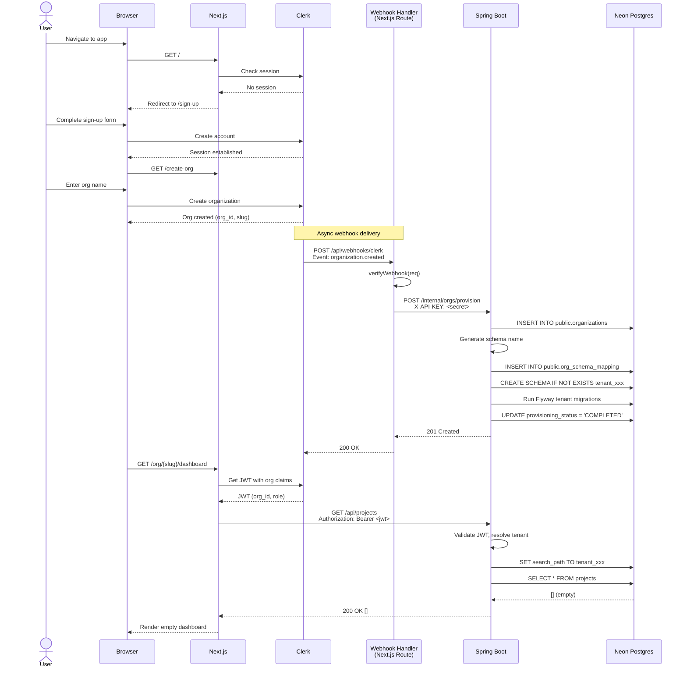

### 4.2 Document Upload Flow

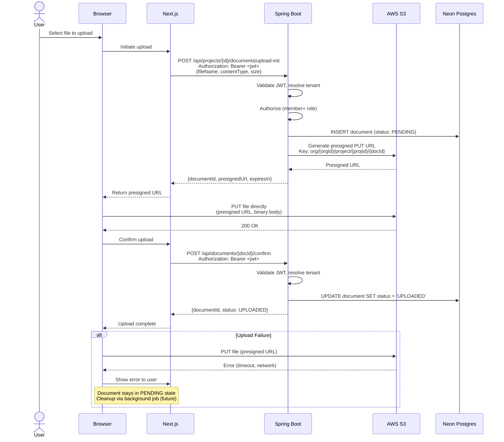

### 4.3 Organization Switching

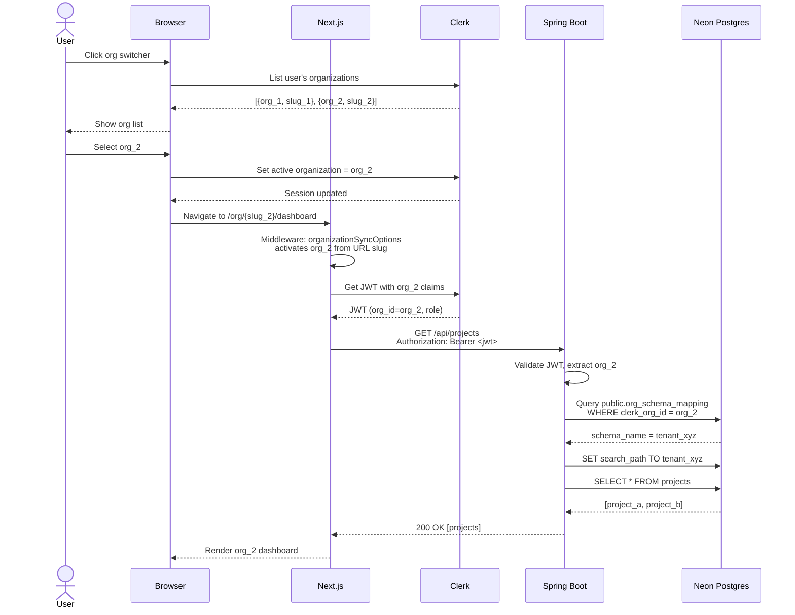

### 4.4 Invitation Acceptance

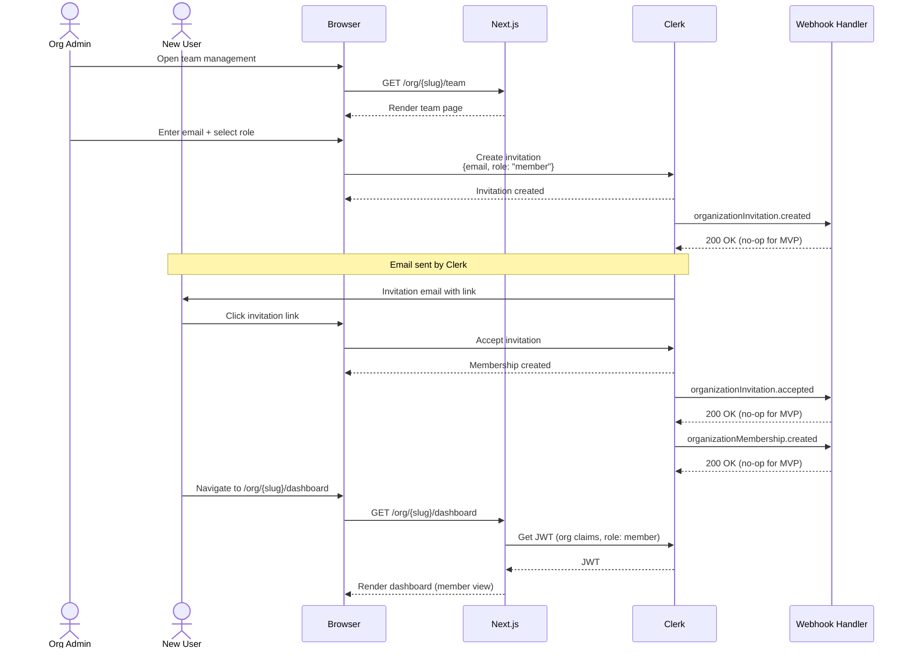

---

## 5. Data Flow Diagrams

### 5.1 Authentication Token Flow

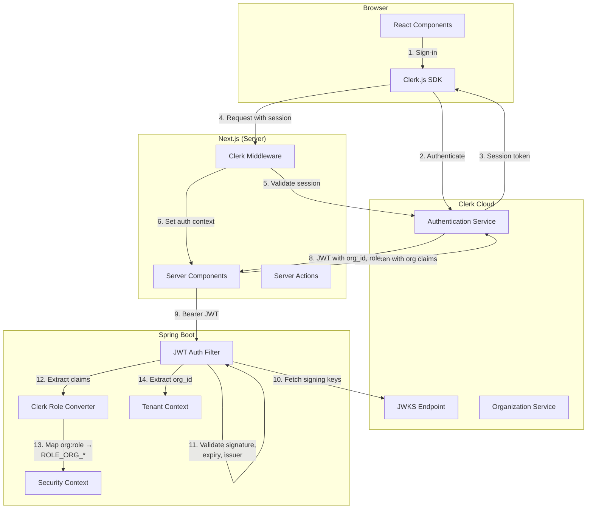

### 5.2 Tenant Resolution Flow

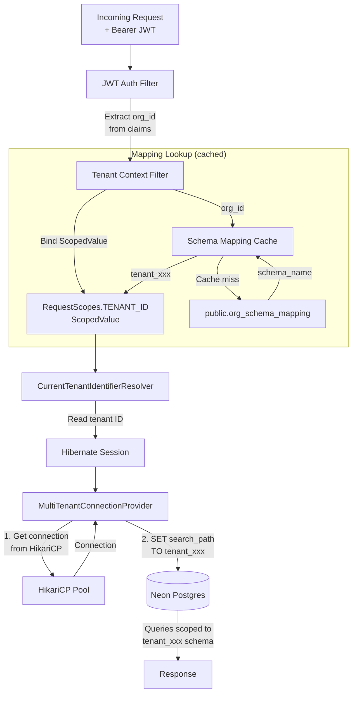

### 5.3 File Upload / Download Flow

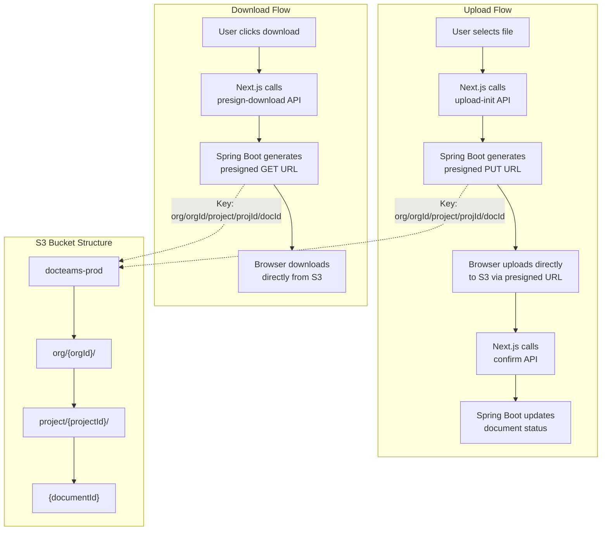

---

## 6. Security Architecture

### 6.1 Authentication Flow

All authentication is managed by Clerk. The system never handles passwords or credentials directly.

1. **User → Clerk**: Sign-up/sign-in via Clerk's hosted components or embedded forms.
2. **Clerk → Browser**: Session token stored in httpOnly cookie.
3. **Browser → Next.js**: Requests include Clerk session cookie; Clerk middleware validates and sets auth context.
4. **Next.js → Spring Boot**: Server components obtain a JWT from Clerk (with org claims) and pass it as `Authorization: Bearer <jwt>`.
5. **Spring Boot**: Validates JWT signature against Clerk's JWKS endpoint, checks expiry and issuer, extracts `sub` (user ID), `org_id`, and `org_role`.

### 6.2 Authorization Enforcement Points

| Layer | Mechanism | What It Protects |
|-------|-----------|------------------|
| Next.js Middleware | `clerkMiddleware()` | Unauthenticated access to `/(app)/**` routes |
| Next.js Layout | Org slug validation | Access to wrong org's URL |
| Spring Security Filter | JWT validation | Unauthenticated API access |
| Spring Security Authorities | `@PreAuthorize` / `SecurityFilterChain` | Role-based endpoint access |
| Hibernate Tenant Resolution | Schema isolation | Cross-tenant data access |
| S3 Presigned URLs | Scoped key + expiration | Unauthorized file access |

**Role-to-Authority Mapping**:

| Clerk Role | Spring Authority | Endpoint Access |
|------------|------------------|-----------------|
| `org:owner` | `ROLE_ORG_OWNER` | All operations including org deletion, member management |
| `org:admin` | `ROLE_ORG_ADMIN` | Project CRUD, settings management |
| `org:member` | `ROLE_ORG_MEMBER` | Read projects, upload/view documents |

**Endpoint Authorization Matrix**:

| Endpoint | Owner | Admin | Member |
|----------|-------|-------|--------|
| `GET /api/projects` | Yes | Yes | Yes |
| `POST /api/projects` | Yes | Yes | No |
| `PUT /api/projects/{id}` | Yes | Yes | No |
| `DELETE /api/projects/{id}` | Yes | No | No |
| `GET /api/projects/{id}/documents` | Yes | Yes | Yes |
| `POST /api/projects/{id}/documents/upload-init` | Yes | Yes | Yes |
| `GET /api/documents/{id}/presign-download` | Yes | Yes | Yes |
| `POST /internal/orgs/provision` | API key only (no user role) | — | — |

### 6.3 Tenant Isolation

- Tenant identity is derived **exclusively** from the validated JWT's `organization_id` claim.
- Client-supplied headers (e.g., `X-Org-Id`) are never trusted for tenant resolution.
- `MultiTenantConnectionProvider` sets `search_path` to the tenant's schema on every connection checkout.
- `releaseConnection()` resets `search_path` to `public` before returning to pool.
- No cross-schema joins are permitted between tenant schemas.
- S3 keys are prefixed with `org/{orgId}/`, and presigned URLs are scoped to exact keys.
- Every log line includes `tenantId` for audit correlation.

### 6.4 Secrets Management

All secrets stored in AWS Secrets Manager:

| Secret | Used By | Rotation |
|--------|---------|----------|
| Neon connection string (pooled) | Spring Boot | Manual (DB credential rotation) |
| Neon connection string (direct) | Spring Boot (Flyway) | Manual |
| Clerk secret key | Next.js, Spring Boot | Via Clerk dashboard |
| Clerk webhook signing secret | Next.js webhook handler | Via Clerk dashboard |
| Internal API key | Next.js, Spring Boot | Manual (coordinated deploy) |
| AWS access credentials | Spring Boot (S3) | IAM role (no static keys in prod) |

**Production**: ECS tasks use IAM task roles for S3 access — no static AWS credentials. Secrets Manager values injected as environment variables via ECS task definition `secrets` blocks.

### 6.5 Internal API Security Implementation

```
                    ┌─────────────────────────────────┐
                    │         Public Internet          │
                    └─────────────┬───────────────────┘
                                  │
                    ┌─────────────▼───────────────────┐
                    │   Public ALB (HTTPS/443)         │
                    │   Routes: /api/*, /*             │
                    │   Does NOT route /internal/*     │
                    └─────────────┬───────────────────┘
                                  │
                    ┌─────────────▼───────────────────┐
                    │      Private Subnets (VPC)       │
                    │                                  │
                    │  ┌───────────┐  ┌─────────────┐ │
                    │  │  Next.js  │  │ Spring Boot │ │
                    │  │  :3000    │──│  :8080      │ │
                    │  │           │  │             │ │
                    │  └───────────┘  └─────────────┘ │
                    │       │ Internal ALB or direct   │
                    │       │ X-API-KEY header          │
                    │       │ SG: allow from Next.js SG │
                    └─────────────────────────────────┘
```

- `/internal/*` endpoints are not exposed through the public ALB.
- Next.js reaches Spring Boot via the internal ALB (or direct service discovery).
- Security group on Spring Boot allows port 8080 from the Next.js security group only (plus internal ALB).
- `ApiKeyAuthFilter` on Spring Boot validates `X-API-KEY` header for `/internal/**` paths.

---

## 7. Infrastructure Architecture

### 7.1 AWS Resource Topology

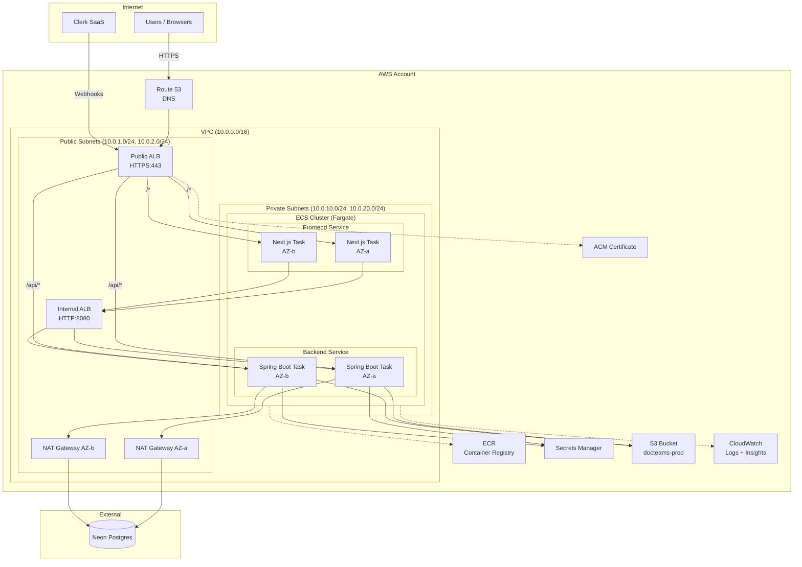

### 7.2 Network Security

**Security Groups**:

| Security Group | Inbound Rules | Purpose |
|----------------|---------------|---------|
| `sg-public-alb` | 443/tcp from 0.0.0.0/0 | Public HTTPS access |
| `sg-internal-alb` | 8080/tcp from `sg-frontend` | Internal service communication |
| `sg-frontend` | 3000/tcp from `sg-public-alb` | Next.js access from public ALB |
| `sg-backend` | 8080/tcp from `sg-public-alb`, `sg-internal-alb` | Spring Boot from both ALBs |
| `sg-nat` | All outbound | NAT Gateway egress |

**Network ACLs**: Default VPC NACLs (allow all within VPC). Security groups are the primary enforcement layer.

**Egress**: All outbound traffic from private subnets routes through NAT Gateways to reach Neon Postgres and external APIs (Clerk JWKS).

### 7.3 CI/CD Pipeline

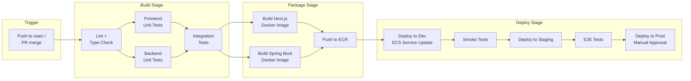

**GitHub Actions Workflows**:

| Workflow | Trigger | Purpose |
|----------|---------|---------|
| `ci.yml` | PR, push to main | Lint, test, build |
| `deploy-dev.yml` | Push to main | Auto-deploy to dev |
| `deploy-staging.yml` | Manual / after dev smoke | Deploy to staging |
| `deploy-prod.yml` | Manual approval | Deploy to production |

### 7.4 Environment Strategy

| Environment | Purpose | Infrastructure | Database |
|-------------|---------|----------------|----------|
| Local | Developer machine | Docker Compose (Postgres, LocalStack) | Local Postgres |
| Dev | Integration testing | ECS Fargate (min resources) | Neon dev branch |
| Staging | Pre-production validation | ECS Fargate (prod-like) | Neon staging branch |
| Production | Live traffic | ECS Fargate (auto-scaling) | Neon main |

---

## 8. Database Architecture

### 8.1 Schema Design

The database uses a **schema-per-tenant** strategy within a single Neon Postgres database.

**Global Schema (`public`)**:

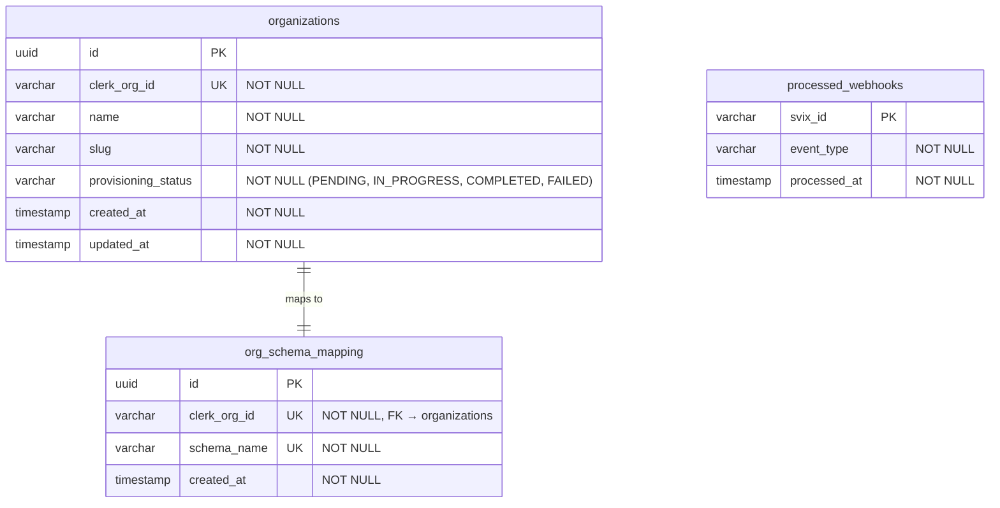

**Tenant Schema (`tenant_<hash>`)** — replicated per tenant:

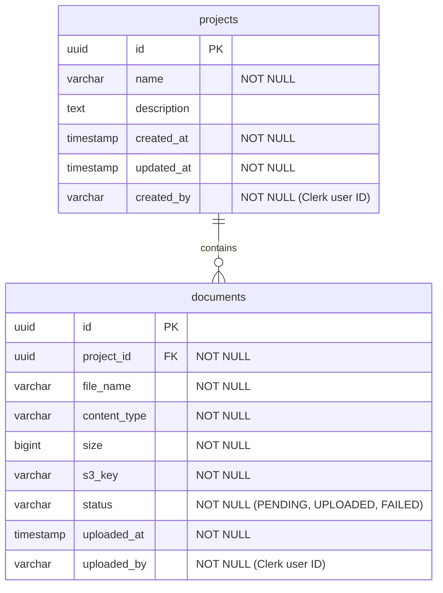

### 8.2 Migration Strategy

| Migration Set | Location | Applied When | Target Schema |
|---------------|----------|--------------|---------------|
| Global | `db/migration/global/` | Application startup | `public` |
| Tenant | `db/migration/tenant/` | New tenant provisioning + Application startup (all existing tenants) | `tenant_<hash>` |

**Startup Migration Flow**:
1. Application starts
2. Flyway runs `db/migration/global/` against `public` schema
3. Query `public.org_schema_mapping` for all tenant schemas
4. For each tenant schema, run `db/migration/tenant/` (Flyway skips already-applied migrations)
5. Application ready to serve traffic

**New Tenant Migration**:
1. `CREATE SCHEMA IF NOT EXISTS tenant_xxx`
2. Flyway configured with `defaultSchema=tenant_xxx`, `locations=classpath:db/migration/tenant`
3. `flyway.migrate()` — applies all tenant migrations to the new schema
4. Schema is immediately usable

### 8.3 Connection Architecture

```
                    ┌──────────────────┐
                    │   Spring Boot    │
                    │                  │
                    │  ┌────────────┐  │
                    │  │ HikariCP   │  │───── Pooled Neon Connection ──── Neon PgBouncer ──── Postgres
                    │  │ Pool (10)  │  │      (app traffic)              (transaction mode)
                    │  └────────────┘  │
                    │                  │
                    │  ┌────────────┐  │
                    │  │ Migration  │  │───── Direct Neon Connection ──────────────────────── Postgres
                    │  │ DataSource │  │      (Flyway DDL)
                    │  └────────────┘  │
                    └──────────────────┘
```

- **App traffic**: HikariCP (10 connections) → Neon PgBouncer (transaction mode) → Postgres. `search_path` set per checkout.
- **Migrations**: Direct connection (no PgBouncer) → Postgres. Required for `CREATE SCHEMA`, `ALTER TABLE`, and other DDL.
- **Connection strings** differ by `-pooler` suffix in the Neon hostname.

---

## Appendix A: Clerk JWT Claims

The JWT issued by Clerk for API calls contains these claims (relevant subset):

| Claim | Type | Description |
|-------|------|-------------|
| `sub` | string | Clerk user ID (`user_2abc...`) |
| `org_id` | string | Active organization ID (`org_2abc...`) |
| `org_role` | string | User's role in the org (`org:owner`, `org:admin`, `org:member`) |
| `org_slug` | string | Organization slug |
| `iss` | string | Clerk issuer URL |
| `exp` | number | Token expiration timestamp |
| `iat` | number | Token issued-at timestamp |

## Appendix B: Environment Variables Reference

| Variable | Service | Source | Description |
|----------|---------|--------|-------------|
| `NEXT_PUBLIC_CLERK_PUBLISHABLE_KEY` | Frontend | Clerk Dashboard | Public Clerk key |
| `CLERK_SECRET_KEY` | Frontend | Secrets Manager | Clerk backend key |
| `CLERK_WEBHOOK_SIGNING_SECRET` | Frontend | Secrets Manager | Svix webhook signing secret |
| `BACKEND_URL` | Frontend | ECS Task Def | Internal ALB URL for Spring Boot |
| `INTERNAL_API_KEY` | Both | Secrets Manager | Shared API key for `/internal/*` |
| `DATABASE_URL` | Backend | Secrets Manager | Neon pooled connection string |
| `DATABASE_MIGRATION_URL` | Backend | Secrets Manager | Neon direct connection string |
| `CLERK_ISSUER` | Backend | ECS Task Def | Clerk JWT issuer URL |
| `CLERK_JWKS_URI` | Backend | ECS Task Def | Clerk JWKS endpoint |
| `AWS_S3_BUCKET` | Backend | ECS Task Def | S3 bucket name |
| `AWS_REGION` | Both | ECS Task Def | AWS region |
