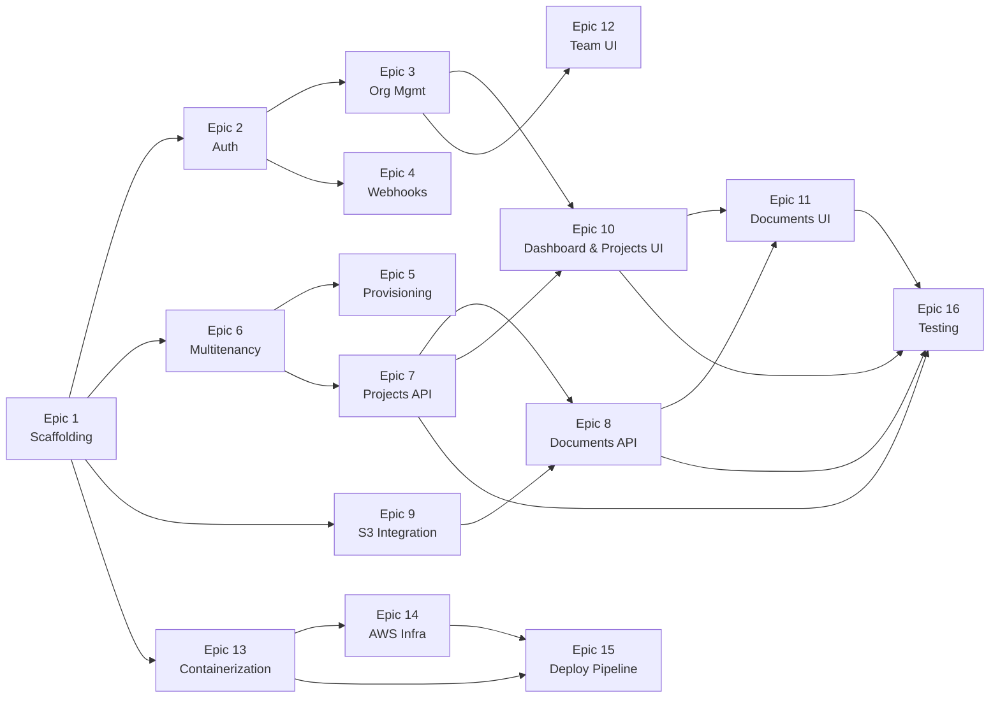

# Multi-tenant SaaS Starter — Technical Task Breakdown

## Epic Overview

| Epic | Name | Scope | Deps | Effort | Slices | Status |
|------|------|-------|------|--------|--------|--------|
| 1 | Scaffolding & Local Dev | Both | — | M | — | **Done** |
| 2 | Auth & Clerk Integration | Frontend | 1 | M | — | **Done** |
| 3 | Organization Management | Frontend | 2 | S | — | **Done** |
| 4 | Webhook Infrastructure | Frontend | 1, 2 | M | 4A, 4B | **Done** |
| 5 | Tenant Provisioning | Backend | 1, 6 | L | 5A, 5B, 5C | **Done** |
| 6 | Multitenancy Backend | Backend | 1 | L | — | **Done** |
| 7 | Core API — Projects | Backend | 6 | M | 7A, 7B | **Done** |
| 8 | Core API — Documents | Backend | 7, 9 | M | 8A, 8B | **Done** |
| 9 | S3 Integration | Backend | 1 | S | — | **Done** |
| 10 | Dashboard & Projects UI | Frontend | 3, 7 | M | 10A, 10B, 10C | |
| 11 | Documents UI | Frontend | 10, 8 | M | 11A, 11B | |
| 12 | Team Management UI | Frontend | 3 | S | — | **Done** |
| 13 | Containerization | Both | 1 | S | — | **Done** |
| 14 | AWS Infrastructure | Infra | 13 | XL | 14A–14D | **Done** |
| 15 | Deployment Pipeline | Infra | 13, 14 | L | 15A, 15B | |
| 16 | Testing & Quality | Both | 7, 8, 10, 11 | L | 16A–16C | |

---

## Epic 1: Project Scaffolding & Local Development

**Goal**: Establish monorepo structure, initialize both projects with correct tooling, and set up Docker Compose for local development.

**Dependencies**: None

**Estimated Effort**: M

**Status**: **Complete**

### Tasks

| ID | Task | Status | Notes |
|----|------|--------|-------|
| 1.1 | Initialize monorepo structure | **Done** | Root `.gitignore`, `.editorconfig`, `README.md`. Directories: `frontend/`, `backend/`, `compose/`, `infra/`, `.github/`. |
| 1.2 | Initialize Next.js project | **Done** | Next.js 16.1.6, TypeScript 5, Tailwind CSS v4, App Router. Path alias `@/*`. Package manager: pnpm. |
| 1.3 | Install and configure Shadcn UI | **Done** | new-york style, 8 components: Button, Card, Input, Dialog, Table, DropdownMenu, Separator, Badge. |
| 1.4 | Initialize Spring Boot project | **Done** | Spring Boot 4.0.2, Java 25, Maven (not Gradle). Profiles: `application.yml` + `-local.yml`, `-dev.yml`, `-prod.yml`. `LocalSecurityConfig.java` permits all requests in local profile (replaced in Epic 6). |
| 1.5 | Create Docker Compose for local services | **Done** | `compose/docker-compose.yml` with Postgres 16 + LocalStack. Healthchecks configured. |
| 1.6 | Configure environment files | **Done** | `frontend/.env.local.example` (Clerk keys, backend URL, API key). Backend config in `application-local.yml` (Postgres at `b2mash.local:5432`, LocalStack S3). |
| 1.7 | Set up frontend linting and formatting | **Done** | ESLint (flat config), Prettier + `prettier-plugin-tailwindcss`. Scripts: `pnpm run lint`, `pnpm run format`, `pnpm run format:check`. |
| 1.8 | Set up backend linting and formatting | **Done** | Spotless 3.2.1 + Google Java Format 1.28.0 (Java 25 compatible). `./mvnw spotless:check` and `./mvnw spotless:apply`. |
| 1.9 | Create basic CI workflow | **Done** | `.github/workflows/ci.yml` — parallel frontend (pnpm lint, format:check, build) and backend (spotless:check, test, package) jobs. Triggers on PR and push to main. |
| 1.10 | Add LocalStack S3 init script | **Done** | `compose/data/s3/init-s3.sh` creates `docteams-dev` bucket on startup. |

### Deviations from Original Plan
- **Maven instead of Gradle** — Spring Boot project was generated with Maven, not Gradle. Commands use `./mvnw` instead of `./gradlew`.
- **pnpm instead of npm** — Standardized on pnpm for faster installs and strict dependency resolution.
- **Docker Compose in `compose/`** — Lives in a subdirectory rather than repo root, with its own `.env`.
- **Spotless 3.2.1** — Required for Java 25 compatibility (2.x has `NoSuchMethodError` on `DeferredDiagnosticHandler`).
- **google-java-format 1.28.0** — Required for Java 25 (1.19.x incompatible).

---

## Epic 2: Authentication & Clerk Integration

**Goal**: Integrate Clerk for authentication in Next.js — sign-up, sign-in, session management, and JWT extraction for API calls.

**Dependencies**: Epic 1

**Estimated Effort**: M

**Status**: **Complete**

### Tasks

| ID | Task | Status | Notes |
|----|------|--------|-------|
| 2.1 | Create Clerk development instance | **Done** | Clerk dev instance created with Organizations enabled. Keys in `.env.local`. |
| 2.2 | Install Clerk Next.js SDK | **Done** | `@clerk/nextjs` ^6.37.2 already installed. `<ClerkProvider>` wraps root layout with `cssLayerName: "clerk"` for Tailwind v4 compatibility. |
| 2.3 | Configure Clerk middleware | **Done** | `middleware.ts` with `clerkMiddleware()`. Public routes: `/`, `/sign-in(.*)`, `/sign-up(.*)`, `/api/webhooks(.*)`. `organizationSyncOptions` pre-configured for Epic 3. |
| 2.4 | Create sign-up page | **Done** | `app/(auth)/sign-up/[[...sign-up]]/page.tsx` with Clerk `<SignUp />`. Centered auth layout. |
| 2.5 | Create sign-in page | **Done** | `app/(auth)/sign-in/[[...sign-in]]/page.tsx` with Clerk `<SignIn />`. |
| 2.6 | Implement JWT extraction utility | **Done** | `lib/api.ts` with typed `apiClient<T>()` — attaches Bearer JWT via `auth().getToken()`. Custom `ApiError` class. |
| 2.7 | Create authenticated layout shell | **Done** | `app/(app)/layout.tsx` with sidebar (Dashboard, Projects, Team nav links), header with `<UserButton />`. Placeholder dashboard at `/dashboard`. |

### Additional Items
- **Webhook handler stub**: `app/api/webhooks/clerk/route.ts` using `verifyWebhook` from `@clerk/nextjs/webhooks`. Stubs for `organization.created` and `organization.updated` events (full implementation in Epic 4).
- **Landing page fix**: Replaced `<a>` tags with Next.js `<Link>` to fix ESLint `no-html-link-for-pages` errors.
- **Env vars**: Added `NEXT_PUBLIC_CLERK_SIGN_IN_URL`, `NEXT_PUBLIC_CLERK_SIGN_UP_URL`, and fallback redirect URLs to `.env.local` and `.env.local.example`.

### Deviations from Original Plan
- **Temporary `/dashboard` route**: Post-auth redirect goes to `/dashboard` (not org-scoped) since Epic 3 hasn't been implemented yet. Will be replaced with `/org/[slug]/dashboard` in Epic 3.
- **Next.js 16 middleware deprecation**: Next.js 16 shows a warning that `middleware.ts` is deprecated in favor of `proxy.ts`. The middleware still works correctly but may need migration in a future update.

---

## Epic 3: Organization Management

**Goal**: Enable org creation, switching, and URL-based org context with Clerk's organization features.

**Dependencies**: Epic 2

**Estimated Effort**: S

**Status**: **Complete**

### Tasks

| ID | Task | Status | Notes |
|----|------|--------|-------|
| 3.1 | Create org creation page | **Done** | `app/(app)/create-org/page.tsx` with `<CreateOrganization />`. `afterCreateOrganizationUrl="/org/:slug/dashboard"`. |
| 3.2 | Configure org-based URL routing | **Done** | `organizationSyncOptions` already configured in middleware (from Epic 2). Created `app/(app)/org/[slug]/layout.tsx` with sidebar, validates slug against active org, redirects on mismatch. |
| 3.3 | Implement org switcher | **Done** | `<OrganizationSwitcher />` in org layout header with `afterSelectOrganizationUrl="/org/:slug/dashboard"` and `hidePersonal`. |
| 3.4 | Create org-scoped dashboard page | **Done** | `app/(app)/org/[slug]/dashboard/page.tsx` showing org name. Placeholder pages added for `/projects` and `/team`. |
| 3.5 | Handle no-org state | **Done** | `/dashboard` page acts as redirect: active org → `/org/[slug]/dashboard`, no active org but has memberships → first org's dashboard, no orgs → `/create-org`. |

### Architecture Decisions
- **Sidebar moved to org layout**: `(app)/layout.tsx` simplified to pass-through. Sidebar with org-scoped nav links lives in `org/[slug]/layout.tsx`. This means create-org and redirect pages render without the sidebar.
- **Org switcher placement**: Header bar with `OrganizationSwitcher` (left) and `UserButton` (right).
- **Redirect flow**: Post-auth fallback URL remains `/dashboard` which handles all redirect logic server-side using `clerkClient().users.getOrganizationMembershipList()`.

---

## Epic 4: Webhook Infrastructure

**Goal**: Receive, verify, and process Clerk webhook events with idempotency and error handling.

**Dependencies**: Epic 1, Epic 2

**Scope**: Frontend

**Estimated Effort**: M

**Status**: **Complete**

### Tasks

| ID | Task | Status | Notes |
|----|------|--------|-------|
| 4.1 | Create webhook route handler | **Done** | `app/api/webhooks/clerk/route.ts` — full implementation with `verifyWebhook()`, svix-id extraction, event routing. |
| 4.2 | Configure Clerk webhook endpoint | **Done** | Documented in `frontend/docs/webhook-setup.md`. Manual Clerk Dashboard step. |
| 4.3 | Implement event router | **Done** | `lib/webhook-handlers.ts` — `routeWebhookEvent()` dispatches 9 event types (org CRUD, membership CRUD, invitation events). |
| 4.4 | Implement organization.created handler | **Done** | Calls `POST /internal/orgs/provision` via `lib/internal-api.ts` with X-API-KEY. Treats 409 as success (idempotent). Fire-and-forget error handling. |
| 4.5 | Implement organization.updated handler | **Done** | Calls `PUT /internal/orgs/update` with `updatedAt` for out-of-order event detection. |
| 4.6 | Implement idempotency layer | **Done** | Frontend extracts `svix-id` from headers and passes through. Backend-side dedup via `processed_webhooks` table deferred to Epic 5. Frontend handles 409 Conflict as implicit idempotency. |
| 4.7 | Exclude webhook route from Clerk auth | **Done** | Already configured in `middleware.ts` (Epic 2) — `/api/webhooks(.*)` is a public route. |
| 4.8 | Add webhook handler tests | **Done** | 13 tests across 2 files using vitest. Covers: signature verification, event routing, provisioning calls, 409 handling, error resilience, unknown events. |

### Architecture

```
Clerk → POST /api/webhooks/clerk (Next.js)
         ↓ verifyWebhook() signature check (400 on failure)
         ↓ Extract svix-id from headers
         ↓ routeWebhookEvent() dispatches by event type
         ↓ organization.created →
    POST /internal/orgs/provision (Spring Boot, Epic 5)
         ↓ X-API-KEY header authentication
         ↓ Return 201 Created / 409 Conflict
```

### Key Files
- `frontend/lib/internal-api.ts` — Server-only API client with `X-API-KEY` auth and `server-only` guard
- `frontend/lib/webhook-handlers.ts` — Event router and per-event handler functions
- `frontend/app/api/webhooks/clerk/route.ts` — Webhook route handler
- `frontend/vitest.config.ts` — Test configuration with `@/*` path alias
- `frontend/docs/webhook-setup.md` — Clerk Dashboard configuration guide

### Deviations from Original Plan
- **Frontend-only scope**: Previous PR (#4) was closed because it incorrectly included backend changes (entities, migrations, controllers). Re-implemented as frontend-only.
- **Idempotency scoped to frontend role**: The `processed_webhooks` table is a backend concern (Epic 5). Frontend's idempotency is: extract `svix-id`, pass to backend, handle 409 Conflict as success.
- **Local type interfaces**: Used local `OrgEventData`/`OrgDeletedEventData` interfaces instead of Clerk's `Extract<WebhookEvent, ...>` because TypeScript's `Extract` utility resolves to `never` when the discriminated union has combined string literal types (e.g., `'organization.created' | 'organization.updated'`).
- **vitest added**: Test infrastructure set up as part of this epic (originally planned for Epic 16).

---

## Epic 5: Tenant Provisioning

**Goal**: Implement the internal provisioning API that creates tenant schemas, runs Flyway migrations, and maintains org-schema mappings. Include startup migration runner for existing tenants.

**Dependencies**: Epic 1, Epic 6

**Scope**: Backend

**Estimated Effort**: L

**Status**: **Complete**

### Tasks

| ID | Task | Status | Notes |
|----|------|--------|-------|
| 5.1 | Create global schema migrations | **Done** | `V2__create_organizations.sql` (with provisioning_status tracking), `V3__create_processed_webhooks.sql` (webhook idempotency). `V1__create_org_schema_mapping.sql` already existed from Epic 6. |
| 5.2 | Create tenant schema migrations | **Done** | `V1__create_projects.sql` and `V2__create_documents.sql` in `db/migration/tenant/`. Documents has FK to projects, status tracking, S3 key. |
| 5.3 | Implement schema name generator | **Done** | `SchemaNameGenerator` uses UUID v3 (`nameUUIDFromBytes`) with DNS namespace salt. Deterministic `tenant_<12hex>` from Clerk org ID. Unit tests cover determinism, format, uniqueness. |
| 5.4 | Implement provisioning service | **Done** | `TenantProvisioningService` with idempotent steps: check existing → create org → mark IN_PROGRESS → generate schema → CREATE SCHEMA → insert mapping → Flyway tenant migrate → mark COMPLETED. No `@Transactional` (mixed datasource operations). |
| 5.5 | Configure dual data sources | **Done** | `DataSourceConfig` with two `HikariDataSource` beans via `@ConfigurationProperties` (Spring Boot 4 removed `DataSourceProperties`). `appDataSource` (primary, pooled) + `migrationDataSource` (for Flyway DDL). Uses `jdbc-url` (HikariCP native property). |
| 5.6 | Implement provisioning controller | **Done** | `POST /internal/orgs/provision` — 201 Created / 409 Conflict. Request validation with `@Valid` + `@NotBlank`. |
| 5.7 | Implement API key auth filter | **Done** | Already implemented in Epic 6 (`ApiKeyAuthFilter`). No changes needed. |
| 5.8 | Implement startup migration runner | **Done** | `TenantMigrationRunner` (`ApplicationRunner`) iterates all `OrgSchemaMapping` entries, runs tenant Flyway per schema. Continues on individual failure (doesn't block startup). |
| 5.9 | Add retry to provisioning | **Done** | Spring Retry (`@Retryable`) instead of Resilience4j (no Spring Boot 4 support). `maxAttempts=3, backoff=@Backoff(delay=1000, multiplier=2)`, retries on `ProvisioningException`. |
| 5.10 | Add provisioning integration tests | **Done** | Integration tests: full provisioning flow, idempotency (second provision returns same schema), different orgs get different schemas. Controller tests: 201, 409, 401, 400. All 29 tests pass (8 new + 21 existing). |

### Architecture Decisions
- **Dual DataSource**: `appDataSource` for Hibernate/JPA (pooled), `migrationDataSource` for Flyway DDL. Spring Boot 4 removed `DataSourceProperties` from `boot.autoconfigure.jdbc` — used `@ConfigurationProperties` directly on `HikariDataSource` beans with `jdbc-url` (not `url`).
- **Manual Flyway management**: Disabled Spring auto-Flyway (`spring.flyway.enabled: false`). `FlywayConfig` runs global migrations at startup via `@Bean(initMethod = "migrate")`. `TenantMigrationRunner` runs tenant migrations per schema.
- **Spring Retry over Resilience4j**: Resilience4j has no Spring Boot 4 support. Used `spring-retry` 2.0.12 with `@Retryable`.
- **No @Transactional on provisioning**: Service mixes two datasources (migrationDataSource for DDL, entityManager for JPA). Transaction management is per-step instead.
- **Identifier quoting for schema DDL**: Schema creation uses `"CREATE SCHEMA IF NOT EXISTS \"" + schemaName + "\""` to prevent SQL injection.
- **Testcontainers DynamicPropertyRegistrar**: `@ServiceConnection` only auto-configures default `spring.datasource.*`. Custom datasource beans need `DynamicPropertyRegistrar` to bridge container properties.

### Key Files
- `backend/src/main/java/.../config/DataSourceConfig.java` — Dual HikariDataSource beans
- `backend/src/main/java/.../config/FlywayConfig.java` — Manual global Flyway on startup
- `backend/src/main/java/.../provisioning/TenantProvisioningService.java` — Core provisioning logic
- `backend/src/main/java/.../provisioning/ProvisioningController.java` — Internal API endpoint
- `backend/src/main/java/.../provisioning/TenantMigrationRunner.java` — Startup migration runner
- `backend/src/main/java/.../provisioning/SchemaNameGenerator.java` — Deterministic schema naming

### Deviations from Original Plan
- **Spring Retry instead of Resilience4j** (task 5.9): Resilience4j lacks Spring Boot 4 support. Used `spring-retry` 2.0.12 with `@Retryable` annotation.
- **`@ConfigurationProperties` on HikariDataSource** (task 5.5): Spring Boot 4 removed `DataSourceProperties` from `boot.autoconfigure.jdbc`. Bound directly to `HikariDataSource` using HikariCP native property names (`jdbc-url`).
- **No separate `organizations` table migration**: Merged into existing global migrations as `V2__create_organizations.sql` (V1 was already taken by `org_schema_mapping` from Epic 6).
- **DynamicPropertyRegistrar for tests**: Testcontainers `@ServiceConnection` doesn't auto-configure custom datasource beans — added `DynamicPropertyRegistrar` in `TestcontainersConfiguration`.

---

## Epic 6: Multitenancy Backend

**Goal**: Configure Hibernate schema-per-tenant multitenancy, tenant context resolution from JWT, Spring Security with Clerk JWT validation, and RBAC role mapping.

**Dependencies**: Epic 1

**Estimated Effort**: L

**Status**: **Complete**

### Tasks

| ID | Task | Description | Acceptance Criteria | Estimate | Dependencies |
|----|------|-------------|---------------------|----------|--------------|
| 6.1 | Implement TenantContext | Create `TenantContext` class using `ThreadLocal<String>` to store/retrieve current tenant schema name. Include `clear()` method. | `TenantContext.setTenantId("tenant_xxx")` → `TenantContext.getTenantId()` returns `"tenant_xxx"` on the same thread; `clear()` removes it. | 1h | 1.4 |
| 6.2 | Implement CurrentTenantIdentifierResolver | Create `TenantIdentifierResolver` implementing `CurrentTenantIdentifierResolver<String>` and `HibernatePropertiesCustomizer`. Returns tenant ID from `TenantContext` or `"public"` as default. | Hibernate calls `resolveCurrentTenantIdentifier()` and gets the schema name from `TenantContext`. | 2h | 6.1 |
| 6.3 | Implement MultiTenantConnectionProvider | Create `SchemaMultiTenantConnectionProvider` implementing `MultiTenantConnectionProvider<String>` and `HibernatePropertiesCustomizer`. `getConnection()` sets `search_path`; `releaseConnection()` resets to `public`. | Connection checkout sets `search_path` to tenant schema; connection release resets to `public`; verified with integration test. | 3h | 6.1 |
| 6.4 | Configure Hibernate for multitenancy | Register both resolver and connection provider via `HibernatePropertiesCustomizer`. Ensure Hibernate auto-detects schema multitenancy mode. Disable `ddl-auto`. | Hibernate initializes in multi-tenant mode; queries execute against the correct tenant schema. | 2h | 6.2, 6.3 |
| 6.5 | Implement Clerk JWT validation filter | Create `ClerkJwtAuthFilter` (Spring Security filter) that: extracts `Authorization: Bearer <jwt>`, validates signature against Clerk JWKS endpoint, checks expiry and issuer, extracts `sub`, `org_id`, `org_role`. Use Spring Security's `JwtDecoder` with Clerk's JWKS URI. | Valid Clerk JWT → authentication set in SecurityContext; expired/invalid JWT → 401; missing JWT → 401. | 4h | 1.4 |
| 6.6 | Implement Clerk role converter | Create `ClerkRoleConverter` that maps Clerk org roles to Spring authorities: `org:owner` → `ROLE_ORG_OWNER`, `org:admin` → `ROLE_ORG_ADMIN`, `org:member` → `ROLE_ORG_MEMBER`. Wire into JWT auth filter. | JWT with `org_role: "org:admin"` → SecurityContext contains `ROLE_ORG_ADMIN` authority. | 2h | 6.5 |
| 6.7 | Implement tenant context filter | Create `TenantFilter` (servlet filter, ordered after JWT filter) that extracts `org_id` from the authenticated principal, looks up schema name from `org_schema_mapping` (with caching), and sets `TenantContext`. | After filter chain: `TenantContext.getTenantId()` returns the correct `tenant_xxx` schema name for the authenticated org. | 3h | 6.1, 6.5 |
| 6.8 | Configure Spring Security filter chain | Wire filter order: `ClerkJwtAuthFilter` → `TenantFilter` → `TenantLoggingFilter` → controller. Configure `SecurityFilterChain` with endpoint authorization rules. Exclude `/internal/**` from JWT auth (uses API key instead). | `/api/**` requires valid JWT; `/internal/**` requires valid API key; role-based access enforced per endpoint. | 3h | 6.5, 6.6, 6.7 |
| 6.9 | Implement tenant logging filter | Create `TenantLoggingFilter` (ordered after tenant filter) that sets MDC fields: `tenantId`, `userId`, `requestId`. Clear MDC on response. | Every log line within a request includes tenantId, userId, and requestId. MDC cleared after request completes. | 2h | 6.7 |
| 6.10 | Configure structured JSON logging | Set `logging.structured.format.console=ecs` in `application.yml`. Verify JSON output includes MDC fields. | Log output is structured JSON (ECS format); MDC fields (`tenantId`, `userId`, `requestId`) appear in every log entry. | 1h | 6.9 |
| 6.11 | Add multitenancy integration tests | Test: set TenantContext to schema A, query → get schema A data; set to schema B, query → get schema B data; verify no cross-schema leakage. | Tests prove tenant isolation: data written in schema A is not visible in schema B and vice versa. | 3h | 6.4, 6.7 |

---

## Epic 7: Core API — Projects

**Goal**: Implement project CRUD endpoints with tenant-scoped data access and role-based authorization.

**Dependencies**: Epic 6

**Scope**: Backend

**Estimated Effort**: M

**Status**: **Complete**

### Tasks

| ID | Task | Status | Notes |
|----|------|--------|-------|
| 7.1 | Create Project entity | **Done** | `Project.java` — JPA entity mapping to tenant `projects` table. UUID id, name, description, createdBy, createdAt/updatedAt (Instant). No `@Table(schema=...)` — Hibernate resolves tenant schema dynamically. |
| 7.2 | Create ProjectRepository | **Done** | `ProjectRepository.java` — extends `JpaRepository<Project, UUID>`. No custom queries needed. |
| 7.3 | Implement ProjectService | **Done** | `ProjectService.java` — thin service layer with `@Transactional` (readOnly for reads). CRUD methods delegate to repository. `createdBy` passed from controller (extracted from JWT `sub`). |
| 7.4 | Implement ProjectController | **Done** | `ProjectController.java` — 5 REST endpoints. Nested record DTOs (`CreateProjectRequest`, `UpdateProjectRequest`, `ProjectResponse`). Returns `ResponseEntity` with explicit status codes. `ProblemDetail` (RFC 9457) for 404 errors. |
| 7.5 | Add input validation | **Done** | `@NotBlank` + `@Size(max=255)` on name, `@Size(max=2000)` on description. `@Valid @RequestBody` triggers Bean Validation. Returns 400 with field-level errors. |
| 7.6 | Add role-based authorization | **Done** | `@PreAuthorize` annotations: MEMBER+ for GET, ADMIN+ for POST/PUT, OWNER for DELETE. No changes to `SecurityConfig` — `@EnableMethodSecurity` already configured. |
| 7.7 | Add project endpoint tests | **Done** | 19 integration tests (MockMvc + Testcontainers, `@ActiveProfiles("test")`). Covers: CRUD happy path, validation errors, 404 not found, RBAC (member/admin/owner), tenant isolation (cross-tenant invisible), unauthenticated access. 48 total tests pass. |

### Key Files
- `backend/src/main/java/.../project/Project.java` — JPA entity
- `backend/src/main/java/.../project/ProjectRepository.java` — Spring Data JPA repository
- `backend/src/main/java/.../project/ProjectService.java` — Service layer
- `backend/src/main/java/.../project/ProjectController.java` — REST controller with DTOs
- `backend/src/test/java/.../project/ProjectIntegrationTest.java` — Integration tests

### Deviations from Original Plan
- **Integration tests only (no unit tests)**: Used MockMvc + Testcontainers integration tests instead of separate unit tests for controller and service. Integration tests exercise the full stack (security filters → tenant resolution → CRUD → DB) providing higher confidence than isolated unit tests.
- **`@ActiveProfiles("test")` for RBAC testing**: Required to activate `SecurityConfig` (which is `@Profile("!local")`). Mock JWT `jwt()` post-processor bypasses `JwtAuthenticationConverter`, so authorities must be set explicitly via `.authorities()`.
- **`Location` header for ID extraction in tests**: `ObjectMapper` bean unavailable in test context. Used `Location` header from 201 responses and `jsonPath()` assertions instead.

---

## Epic 8: Core API — Documents

**Goal**: Implement document metadata endpoints, presigned URL generation for uploads/downloads, and upload confirmation flow.

**Dependencies**: Epic 7, Epic 9

**Scope**: Backend

**Estimated Effort**: M

**Status**: **Complete**

### Tasks

| ID | Task | Status | Notes |
|----|------|--------|-------|
| 8.1 | Create Document entity | **Done** | JPA entity with UUID id, projectId (FK), fileName, contentType, size, s3Key, status enum (PENDING/UPLOADED/FAILED), uploadedBy, uploadedAt, createdAt. `assignS3Key()` method for post-save S3 key assignment. |
| 8.2 | Create DocumentRepository | **Done** | `JpaRepository<Document, UUID>` with `findByProjectId(UUID projectId)`. |
| 8.3 | Implement DocumentService | **Done** | `listDocuments`, `initiateUpload`, `confirmUpload`, `getPresignedDownloadUrl`. Validates project exists in current tenant schema. Uses `S3PresignedUrlService` for presigned URL generation. |
| 8.4 | Implement upload-init endpoint | **Done** | `POST /api/projects/{projectId}/documents/upload-init` — returns 201 with `{documentId, presignedUrl, expiresInSeconds}`. S3 key format: `org/{orgId}/project/{projId}/{docId}`. |
| 8.5 | Implement upload-confirm endpoint | **Done** | `POST /api/documents/{documentId}/confirm` — transitions PENDING → UPLOADED. Idempotent (re-confirm on UPLOADED returns 200). 404 on non-existent. |
| 8.6 | Implement document listing endpoint | **Done** | `GET /api/projects/{projectId}/documents` — returns array of document metadata. 404 if project not found in tenant. |
| 8.7 | Implement presigned download endpoint | **Done** | `GET /api/documents/{documentId}/presign-download` — returns presigned GET URL with 1hr expiry. 400 if not UPLOADED, 404 if not found. |
| 8.8 | Add authorization to document endpoints | **Done** | All endpoints require `ROLE_ORG_MEMBER+` via `@PreAuthorize`. Cross-tenant project IDs return 404 (Hibernate schema isolation). |
| 8.9 | Add document endpoint tests | **Done** | 17 integration tests: upload flow (init → confirm), idempotent confirm, listing, presigned download, 400 for pending, RBAC, validation (fileName, contentType, size), cross-tenant isolation. 70 total tests pass. |

### Key Files
- `backend/src/main/java/.../document/Document.java` — JPA entity with status enum
- `backend/src/main/java/.../document/DocumentRepository.java` — Spring Data JPA repository
- `backend/src/main/java/.../document/DocumentService.java` — Business logic + S3 presigned URL coordination
- `backend/src/main/java/.../document/DocumentController.java` — REST endpoints with RBAC
- `backend/src/test/java/.../document/DocumentIntegrationTest.java` — 17 integration tests

---

## Epic 9: S3 Integration

**Goal**: Configure AWS SDK for S3 presigned URL generation, with LocalStack support for local development.

**Dependencies**: Epic 1

**Scope**: Backend

**Estimated Effort**: S (single slice — 4 tasks)

**Status**: **Complete**

### Tasks

| ID | Task | Status | Notes |
|----|------|--------|-------|
| 9.1 | Add AWS SDK dependencies | **Done** | AWS SDK v2 BOM 2.31.23, `software.amazon.awssdk:s3` (compile), `testcontainers-localstack` (test). Maven, not Gradle. No `sts` or `s3-transfer-manager` needed for presigned URLs. |
| 9.2 | Create S3 configuration | **Done** | `S3Config.java` with `@ConfigurationProperties` records (`S3Properties`, `AwsCredentialsProperties`). `S3Client` + `S3Presigner` beans with `destroyMethod="close"`. Conditional LocalStack endpoint override when `aws.s3.endpoint` is set. |
| 9.3 | Implement S3PresignedUrlService | **Done** | `generateUploadUrl(orgId, projectId, documentId, contentType)` → presigned PUT with 1hr expiry and content-type constraint. `generateDownloadUrl(s3Key)` → presigned GET with 1hr expiry and key format validation. Key format: `org/{orgId}/project/{projectId}/{documentId}`. |
| 9.4 | Add S3 integration tests | **Done** | 5 integration tests with Testcontainers LocalStack. End-to-end upload/download via presigned URLs, key format verification, org isolation, key validation rejection. 53 total tests pass (48 existing + 5 new). |

### Key Files
- `backend/src/main/java/.../config/S3Config.java` — S3Client + S3Presigner beans with `@ConfigurationProperties` records
- `backend/src/main/java/.../s3/S3PresignedUrlService.java` — Presigned URL generation service
- `backend/src/test/java/.../s3/S3PresignedUrlServiceTest.java` — Integration tests with LocalStack

### Deviations from Original Plan
- **Maven instead of Gradle**: Task 9.1 description referenced Gradle, but project uses Maven. Added AWS SDK v2 BOM in `<dependencyManagement>`.
- **No `sts` or `s3-transfer-manager`**: Not needed for presigned URL generation. `s3` module includes the presigner.
- **S3 key format validation**: Added regex validation (`^org/[^/]+/project/[^/]+/[^/]+$`) on `generateDownloadUrl` to prevent path traversal — not in original spec but added during code review.

---

## Epic 10: Frontend — Dashboard & Projects

**Goal**: Build the dashboard layout and project management UI with org-scoped data fetching from Spring Boot.

**Dependencies**: Epic 3, Epic 7

**Scope**: Frontend

**Estimated Effort**: M

### Slices

| Slice | Tasks | Summary | Status |
|-------|-------|---------|--------|
| **10A** | 10.1, 10.2 | App shell layout (sidebar, header, responsive), typed API client | **Done** |
| **10B** | 10.3, 10.4, 10.8 | Projects list page, create dialog, dashboard page | **Done** |
| **10C** | 10.5, 10.6, 10.7 | Project detail page, edit functionality, delete with confirmation | |

### Tasks

| ID | Task | Status | Notes |
|----|------|--------|-------|
| 10.1 | Build app shell layout | **Done** | Extracted sidebar into `DesktopSidebar` (desktop) and `MobileSidebar` (Sheet drawer) client components. Active route highlighting via `usePathname()`. 4 nav items (Dashboard, Projects, Team, Settings). Shadcn sidebar CSS variables. Settings placeholder page. |
| 10.2 | Implement API client | **Done** | Enhanced `lib/api.ts` with `server-only` guard, RFC 9457 ProblemDetail parsing, `handleApiError()` utility (401→redirect, 404→notFound), `api.*` convenience methods. Created `lib/types.ts` with Project, Document, ProblemDetail DTO interfaces. |
| 10.3 | Build projects list page | **Done** | Server component fetching `GET /api/projects`. Responsive card grid (`1/2/3` columns). Empty state with CTA. Role-based "New Project" button (admin/owner). `handleApiError()` for 401/404. |
| 10.4 | Build project create dialog | **Done** | Shadcn Dialog with name (Input) + description (Textarea) fields. Server Action calling `POST /api/projects`. Inline validation errors. `revalidatePath` refreshes projects list and dashboard. Form/error state reset on reopen. |
| 10.5 | Build project detail page | | `projects/[id]/page.tsx`. Fetch `GET /api/projects/{id}`. Show name, description, created date. Document section placeholder. Deps: 10.3. |
| 10.6 | Build project edit functionality | | Edit dialog for name/description. `PUT /api/projects/{id}`. Admin+ only. Deps: 10.5. |
| 10.7 | Build project delete functionality | | Delete button (owner only). Confirmation dialog. `DELETE /api/projects/{id}`. Redirect to list. Deps: 10.5. |
| 10.8 | Implement dashboard page | **Done** | Org name, project count stat card, recent projects list (top 5 sorted by `createdAt` desc), quick-action buttons (New Project, View Projects, Manage Team). Role-based "New Project" visibility. |

### Key Files (10A)
- `frontend/components/desktop-sidebar.tsx` — Desktop sidebar with active route highlighting
- `frontend/components/mobile-sidebar.tsx` — Mobile Sheet-based sidebar with hamburger trigger
- `frontend/lib/nav-items.ts` — Shared navigation item config (4 items)
- `frontend/components/ui/sheet.tsx` — Shadcn Sheet component (Radix Dialog drawer)
- `frontend/app/(app)/org/[slug]/settings/page.tsx` — Settings placeholder page
- `frontend/lib/types.ts` — TypeScript interfaces for Project, Document, ProblemDetail DTOs
- `frontend/lib/api.ts` — Enhanced server-side API client with ProblemDetail parsing and error utilities

### Key Files (10B)
- `frontend/app/(app)/org/[slug]/projects/page.tsx` — Projects list page (server component, card grid)
- `frontend/app/(app)/org/[slug]/projects/actions.ts` — Server Action for `POST /api/projects`
- `frontend/components/projects/create-project-dialog.tsx` — Client dialog with form, validation, state reset
- `frontend/app/(app)/org/[slug]/dashboard/page.tsx` — Dashboard with stats, recent projects, quick actions
- `frontend/components/ui/label.tsx` — Shadcn Label component
- `frontend/components/ui/textarea.tsx` — Shadcn Textarea component

### Architecture Decisions (10B)
- **Server Actions for mutations**: `api.ts` is `server-only`, so client components call server actions which internally call `api.post()`. `revalidatePath` invalidates both `/projects` and `/dashboard` after creation.
- **Card grid over table**: Projects use responsive card grid (`grid-cols-1 sm:2 lg:3`) — more visual and mobile-friendly than table layout used for team members.
- **Role-based UI gating**: "New Project" button visible only to admin/owner. Backend still enforces RBAC (403 for members) — defense in depth.
- **Form state management**: `useRef` for native form reset + `handleOpenChange` clears error state on dialog reopen — prevents stale form values and error messages.

### Architecture Decisions (10A)
- **Server/client split**: Layout stays a server component (calls `await auth()` and `await params`). Sidebar extracted into two client components (`DesktopSidebar`, `MobileSidebar`) that use `usePathname()` for active route detection and `useState()` for mobile toggle.
- **Shadcn Sheet for mobile**: Uses Radix Dialog-based Sheet component instead of custom drawer — provides accessibility (focus trapping, keyboard dismiss), animations, and overlay behavior for free.
- **Sidebar CSS variables**: Replaced hard-coded `bg-neutral-50 dark:bg-neutral-950` with Shadcn sidebar tokens (`bg-sidebar`, `bg-sidebar-accent`, etc.) already defined in `globals.css`.
- **No client-side API wrapper**: Client components use Server Actions that call the server-side `api` internally. Standard Next.js 16 pattern.
- **Backward-compatible API alias**: `apiClient` kept as alias for `apiRequest` so existing webhook handler code is not broken.

---

## Epic 11: Frontend — Documents

**Goal**: Build document list, file upload with progress tracking, and download functionality.

**Dependencies**: Epic 10, Epic 8

**Scope**: Frontend

**Estimated Effort**: M

### Slices

| Slice | Tasks | Summary |
|-------|-------|---------|
| **11A** | 11.1, 11.2 | Document list component, drag-and-drop upload with presigned URL flow |
| **11B** | 11.3, 11.4, 11.5, 11.6 | Upload progress tracking, download functionality, error handling, file validation |

### Tasks

| ID | Task | Description | Acceptance Criteria | Estimate | Dependencies |
|----|------|-------------|---------------------|----------|--------------|
| 11.1 | Build document list component | Create a component that fetches and displays documents for a project (`GET /api/projects/{id}/documents`). Show file name, size, upload date, uploader, status. | Document list renders within project detail page; shows all document metadata; empty state when no documents. | 3h | 10.5 |
| 11.2 | Build file upload component | Create a drag-and-drop (and click-to-browse) file upload component. On file selection: call upload-init API, upload to S3 via presigned URL (using `fetch` with PUT), call confirm API on success. | User can drag-and-drop or browse for files; file uploads to S3 via presigned URL; document appears in list after confirmation. | 4h | 11.1 |
| 11.3 | Add upload progress tracking | Track upload progress using `XMLHttpRequest` or `fetch` with `ReadableStream`. Show progress bar during upload. Handle states: selecting → uploading → confirming → complete / error. | Progress bar shows real-time upload percentage; state transitions are visible to user; completion triggers list refresh. | 3h | 11.2 |
| 11.4 | Implement download functionality | Add download button to each document in the list. On click: call presign-download API, open presigned URL in new tab or trigger browser download. | Clicking download fetches presigned URL and initiates browser download; works for all file types. | 2h | 11.1 |
| 11.5 | Handle upload errors | Show error messages for: file too large, network failure during upload, S3 errors, confirmation failures. Allow retry. | Error states shown with clear messages; retry button re-initiates the upload; failed uploads show PENDING status in list. | 2h | 11.2, 11.3 |
| 11.6 | Add file type and size validation | Client-side validation before upload: max file size (e.g., 100MB), allowed file types (configurable). Show error if validation fails. | Files exceeding max size show error before upload; disallowed file types show error; valid files proceed to upload. | 1h | 11.2 |

---

## Epic 12: Frontend — Team Management

**Goal**: Build team management UI using Clerk's organization components — member list, invitations, and role display.

**Dependencies**: Epic 3

**Scope**: Frontend

**Estimated Effort**: S (single slice — 5 tasks, mostly Clerk components)

**Status**: **Complete**

### Tasks

| ID | Task | Status | Notes |
|----|------|--------|-------|
| 12.1 | Build team management page | **Done** | `app/(app)/org/[slug]/team/page.tsx` — server component with Shadcn Tabs (Members, Invitations). Reads `orgRole` via `auth()` for role-based visibility. |
| 12.2 | Build member list | **Done** | `components/team/member-list.tsx` — client component using `useOrganization({ memberships: { infinite: true } })`. Shadcn Table with role badges (Owner/Admin/Member). Load-more pagination. |
| 12.3 | Build invitation form | **Done** | `components/team/invite-member-form.tsx` — client component with email input + role selector (Member/Admin). Uses `organization.inviteMember()`. Only rendered for admin+. Success/error feedback. |
| 12.4 | Build pending invitations list | **Done** | `components/team/pending-invitations.tsx` — client component using `useOrganization({ invitations })`. Revoke via `invitation.revoke()` with revalidation. Pagination (Previous/Next). |
| 12.5 | Add role-based visibility | **Done** | Server component passes `isAdmin` prop. Invite form hidden for `org:member`. Revoke buttons hidden for `org:member`. Member list always visible (read-only for members). |

### Architecture Decisions
- **Custom components over Clerk pre-built**: Used Clerk's `useOrganization()` hook with custom Shadcn-styled components instead of `<OrganizationMembershipList />`. Gives full styling control while Clerk remains source of truth for data.
- **Server/client split**: Team page is a server component (reads `orgRole` via `auth()`). Interactive children (member list, invite form, invitations) are client components using `useOrganization()` hook.
- **No backend integration**: Clerk handles all membership/invitation CRUD directly — no Spring Boot API calls needed.

### Key Files
- `frontend/app/(app)/org/[slug]/team/page.tsx` — Team page with tabs and role-based rendering
- `frontend/components/team/member-list.tsx` — Organization member table
- `frontend/components/team/invite-member-form.tsx` — Invitation form (admin+ only)
- `frontend/components/team/pending-invitations.tsx` — Pending invitation list with revoke

---

## Epic 13: Containerization

**Goal**: Create production-ready Docker images for both services and a full Docker Compose stack for local development.

**Dependencies**: Epic 1

**Estimated Effort**: S

**Status**: **Complete**

### Tasks

| ID | Task | Status | Notes |
|----|------|--------|-------|
| 13.1 | Create Next.js Dockerfile | **Done** | Multi-stage build: `node:20-alpine`, pnpm, standalone output. Non-root `nextjs` user. `NEXT_PUBLIC_CLERK_PUBLISHABLE_KEY` passed as build arg. Image ~208MB. |
| 13.2 | Create Spring Boot Dockerfile | **Done** | Multi-stage build: `eclipse-temurin:25-jdk` for build, `eclipse-temurin:25-jre-alpine` for runtime. Spring Boot 4 layered JAR extraction (`java -Djarmode=tools extract --layers`). Non-root `spring` user. Image ~289MB. |
| 13.3 | Create full Docker Compose stack | **Done** | Extended `compose/docker-compose.yml` with `backend` and `frontend` services. Backend depends on postgres + localstack (healthchecks), frontend depends on backend (healthcheck). Environment variables configured for inter-service communication. |
| 13.4 | Optimize Docker images | **Done** | `.dockerignore` files for both `frontend/` and `backend/`. Dependency install cached separately from code changes. |
| 13.5 | Document local Docker setup | **Done** | README.md updated with "Quick Start (Full Docker Stack)" section including setup, build, verify, and troubleshooting steps. |

### Architecture Decisions
- **Standalone output for Next.js**: `output: "standalone"` in `next.config.ts` produces a minimal server (`server.js`) without requiring full `node_modules` at runtime.
- **Clerk build arg**: `NEXT_PUBLIC_CLERK_PUBLISHABLE_KEY` must be passed as `--build-arg` because Next.js inlines `NEXT_PUBLIC_*` variables at build time. Clerk validates key format during static page generation.
- **Spring Boot layered JAR**: Spring Boot 4 uses `java -Djarmode=tools -jar app.jar extract --layers` (changed from `layertools` in Spring Boot 3). Layers: `dependencies/`, `spring-boot-loader/`, `snapshot-dependencies/`, `application/`. Entry point: `org.springframework.boot.loader.launch.JarLauncher`.
- **Docker Compose env**: `.env.example` updated with Clerk keys and `INTERNAL_API_KEY`. Users copy to `.env` and fill in their Clerk keys before running `docker compose up`.

---

## Epic 14: AWS Infrastructure

**Goal**: Define all AWS infrastructure in Terraform — VPC, ECS, ALB, ECR, Secrets Manager, S3, IAM.

**Dependencies**: Epic 13

**Scope**: Infra

**Estimated Effort**: XL

**Status**: **Complete**

### Slices

| Slice | Tasks | Summary |
|-------|-------|---------|
| **14A** | 14.1, 14.2, 14.3 | Terraform project structure, VPC (2 public + 2 private subnets), security groups |
| **14B** | 14.4, 14.5, 14.6 | ALB (public + internal), ECR repositories, ECS cluster + Fargate services |
| **14C** | 14.7, 14.8, 14.9 | S3 bucket, Secrets Manager, IAM roles (task execution + task) |
| **14D** | 14.10, 14.11, 14.12 | Route 53 + ACM certificate, auto-scaling policies, deploy dev environment |

### Tasks

| ID | Task | Status | Notes |
|----|------|--------|-------|
| 14.1 | Set up Terraform project structure | **Done** | 11 module dirs (`vpc`, `security-groups`, `ecs`, `alb`, `ecr`, `s3`, `secrets`, `iam`, `monitoring`, `dns`, `autoscaling`), 3 environment configs (`dev/`, `staging/`, `prod/`). S3 backend with DynamoDB locking. |
| 14.2 | Create VPC module | **Done** | VPC with non-overlapping CIDRs per env (dev=`10.0.0.0/16`, staging=`10.1.0.0/16`, prod=`10.2.0.0/16`). 2 public + 2 private subnets across 2 AZs, IGW, 2 NAT gateways, route tables. All resources tagged. |
| 14.3 | Create security groups | **Done** | `sg-public-alb` (80+443 from internet), `sg-internal-alb` (8080 from frontend SG), `sg-frontend` (3000 from public ALB), `sg-backend` (8080 from both ALBs). Uses standalone `aws_vpc_security_group_ingress_rule` resources. |
| 14.4 | Create ALB module | **Done** | Public ALB with conditional HTTPS:443 (when ACM cert provided) + HTTP:80 (redirect or forward). Internal ALB on HTTP:8080. Path-based routing: `/api/*` → backend, `/*` → frontend, `/internal/*` → backend (internal). 3 target groups (IP type for Fargate). Health checks on `/` and `/actuator/health`. |
| 14.5 | Create ECR module | **Done** | `docteams-{env}-frontend` and `docteams-{env}-backend` repos. Immutable tags, scan on push, AES256 encryption. Lifecycle: keep last 10 images, expire untagged after 1 day. |
| 14.6 | Create ECS module | **Done** | Fargate cluster with Container Insights. Frontend task def (512/1024, port 3000), backend task def (1024/2048, port 8080). Services: desired=2, circuit breaker with rollback, rolling deploy (min 100%, max 200%). Backend registers with both public and internal target groups. CloudWatch log groups in separate monitoring module (configurable retention: dev=7d, staging=14d, prod=30d). |
| 14.7 | Create S3 module | **Done** | Bucket `docteams-{env}` with versioning, all public access blocked, AES256 SSE, CORS for presigned PUT/GET, lifecycle to abort incomplete multipart uploads after 7 days. |
| 14.8 | Create Secrets Manager module | **Done** | 6 secrets via `for_each`: database-url, database-migration-url, clerk-secret-key, clerk-webhook-secret, clerk-publishable-key, internal-api-key. Named `docteams/{env}/{key}`. Placeholder values with `ignore_changes = [secret_string]` lifecycle. Recovery window: dev=0, staging=7, prod=30 days. |
| 14.9 | Create IAM module | **Done** | Execution role: ECR pull, CloudWatch logs, Secrets Manager read — all scoped to specific ARNs (except `ecr:GetAuthorizationToken` which requires `*`). Backend task role: S3 GetObject/PutObject/DeleteObject + ListBucket/GetBucketLocation. Frontend task role: minimal (ECS requires one). |
| 14.10 | Create Route 53 and ACM resources | **Done** | Fully conditional via `create_dns` boolean (default: false). ACM cert with DNS validation, Route 53 alias record → public ALB. Usable without a domain. |
| 14.11 | Configure auto-scaling | **Done** | `for_each` over frontend + backend services. CPU target tracking (70%), memory target tracking (80%). Min 2, max configurable per env (dev=4, staging=6, prod=10). Cooldowns: scale-in 300s, scale-out 60s. |
| 14.12 | Wire dev environment | **Done** | All modules wired in dev/staging/prod `main.tf`. Variables with env-specific defaults. `terraform validate` passes for all 3 environments. `terraform.tfvars.example` updated. Actual `terraform apply` is manual (requires AWS credentials). |

### Architecture Decisions
- **Non-overlapping VPC CIDRs**: Each environment gets a distinct `/16` block (dev=`10.0`, staging=`10.1`, prod=`10.2`) to enable future VPC peering without CIDR conflicts.
- **Standalone SG ingress rules**: Uses `aws_vpc_security_group_ingress_rule` resources instead of inline `ingress {}` blocks — the AWS provider v5.x recommended pattern to avoid perpetual diffs.
- **HTTP:80 on public ALB**: SG permits both 80 and 443 inbound so the ALB listener can redirect HTTP→HTTPS.
- **Provider default_tags**: Tags (`Project`, `Environment`, `ManagedBy`) applied at the provider level via `default_tags` block, so every resource inherits them automatically.
- **Conditional HTTPS**: ALB supports both HTTPS (with ACM cert from DNS module) and HTTP-only (without cert) for dev flexibility.
- **Secrets `ignore_changes`**: Terraform creates secrets with placeholders; operators update values manually. Terraform never overwrites real values.
- **Separate auto-scaling module**: Keeps ECS module focused on compute; scaling policies are a distinct concern.
- **DNS module fully conditional**: `create_dns = false` by default — infrastructure is usable without a registered domain.
- **Backend dual target groups**: ECS backend service registers with both public ALB (for `/api/*`) and internal ALB (for `/internal/*`).

### Key Files
- `infra/modules/vpc/main.tf` — VPC, subnets, IGW, NAT gateways, route tables
- `infra/modules/security-groups/main.tf` — 4 security groups with least-privilege rules
- `infra/modules/alb/main.tf` — Public + internal ALBs, conditional HTTPS, path-based routing
- `infra/modules/ecr/main.tf` — Frontend + backend repos with lifecycle policies
- `infra/modules/ecs/main.tf` — Fargate cluster, task definitions, services
- `infra/modules/s3/main.tf` — Document bucket with versioning, CORS, lifecycle
- `infra/modules/secrets/main.tf` — 6 Secrets Manager entries with `for_each`
- `infra/modules/iam/main.tf` — Execution role + task roles with least-privilege
- `infra/modules/monitoring/main.tf` — CloudWatch log groups
- `infra/modules/dns/main.tf` — Conditional ACM + Route 53
- `infra/modules/autoscaling/main.tf` — CPU/memory target tracking policies
- `infra/environments/{dev,staging,prod}/main.tf` — Environment root configs wiring all modules

### Deviations from Original Plan
- **Added `security-groups`, `monitoring`, `dns`, `autoscaling` as separate modules**: Original spec embedded some in VPC/ECS. Separate modules give better separation of concerns.
- **Non-overlapping CIDRs**: Original spec used `10.0.0.0/16` for all environments. Changed to unique CIDRs per env after code review.
- **Per-environment ECR repos**: Named `docteams-{env}-frontend` instead of shared repos, consistent with per-environment Terraform state pattern.
- **Added `clerk-publishable-key` secret**: Not in original spec but needed by frontend ECS task definition.
- **Task 14.12 scoped to validation**: Actual `terraform apply` requires AWS credentials and manual review — not run as part of the PR.

---

## Epic 15: Deployment Pipeline

**Goal**: Automate build, test, image push, and ECS deployment via GitHub Actions with environment promotion.

**Dependencies**: Epic 13, Epic 14

**Scope**: Infra

**Estimated Effort**: L

### Slices

| Slice | Tasks | Summary |
|-------|-------|---------|
| **15A** | 15.1, 15.2, 15.6 | Docker build/push workflow, ECS deploy action, GitHub secrets + environments |
| **15B** | 15.3, 15.4, 15.5, 15.7 | Dev/staging/prod deployment workflows, rollback procedure |

### Tasks

| ID | Task | Description | Acceptance Criteria | Estimate | Dependencies |
|----|------|-------------|---------------------|----------|--------------|
| 15.1 | Create Docker build and push workflow | GitHub Actions workflow that builds frontend and backend Docker images, tags with git SHA, pushes to ECR. Trigger on push to main. | Push to main triggers build; images tagged with SHA appear in ECR; build uses layer caching for speed. | 3h | 14.5 |
| 15.2 | Create ECS deploy action | Reusable GitHub Actions workflow that updates ECS service with new task definition (new image tag). Wait for deployment stability. | ECS service updated with new image; deployment waits for healthy tasks; rollback on failure (circuit breaker). | 3h | 14.6 |
| 15.3 | Create dev deployment workflow | Workflow that triggers after successful build: deploys to dev ECS services, runs smoke tests (health check endpoints). | Push to main → build → deploy to dev → smoke tests pass. | 2h | 15.1, 15.2 |
| 15.4 | Create staging deployment workflow | Manual or auto-trigger workflow: deploys to staging ECS services, runs E2E tests against staging. | Staging deployment works; E2E tests run against staging environment. | 2h | 15.2 |
| 15.5 | Create production deployment workflow | Manual trigger with approval: deploys to prod ECS services. Requires GitHub environment protection rule (approval). | Prod deploy requires manual approval; deployment succeeds; services healthy after deploy. | 2h | 15.2 |
| 15.6 | Configure GitHub secrets and environments | Set up GitHub repository secrets for AWS credentials. Create GitHub environments (dev, staging, prod) with appropriate protection rules. | Secrets configured; environment protection rules active; prod requires approval. | 1h | — |
| 15.7 | Add rollback procedure | Document and test rollback: update ECS service to previous task definition revision. Add manual rollback workflow. | Rollback workflow exists; executing it reverts to previous image; documented in README. | 2h | 15.2 |

---

## Epic 16: Testing & Quality

**Goal**: Establish testing infrastructure across both services — unit tests, integration tests, tenant isolation tests, and E2E framework.

**Dependencies**: Epic 7, Epic 8, Epic 10, Epic 11

**Scope**: Both (frontend + backend)

**Estimated Effort**: L

### Slices

| Slice | Tasks | Summary |
|-------|-------|---------|
| **16A** | 16.1, 16.2 | Frontend unit test setup (Vitest), backend unit test setup (JUnit 5 + Mockito) |
| **16B** | 16.3, 16.4, 16.5 | Testcontainers integration infra, tenant isolation tests, provisioning tests |
| **16C** | 16.6, 16.7, 16.8, 16.9 | API endpoint tests, Playwright E2E framework, E2E user journeys, CI integration |

### Tasks

| ID | Task | Description | Acceptance Criteria | Estimate | Dependencies |
|----|------|-------------|---------------------|----------|--------------|
| 16.1 | Set up frontend unit testing | Configure Vitest (or Jest) with React Testing Library for the frontend. Add test scripts to `package.json`. Write example test for a component. | `npm run test` runs tests; example component test passes; coverage report generated. | 2h | 1.2 |
| 16.2 | Set up backend unit testing | Configure JUnit 5 + Mockito for the backend. Add test source sets. Write example test for a service class. | `./gradlew test` runs tests; example service test passes with mocked dependencies; coverage report generated. | 2h | 1.4 |
| 16.3 | Set up backend integration testing | Configure Testcontainers with PostgreSQL for integration tests. Create base test class that starts Postgres container, runs migrations, and provides data source. | Integration tests run against real Postgres (Testcontainers); schema created; migrations applied; tests pass. | 3h | 5.1, 5.2 |
| 16.4 | Write tenant isolation tests | Integration tests that: create 2 tenant schemas, insert data in each, verify queries in tenant A don't return tenant B data, verify cross-tenant access is impossible via API. | Tests prove complete tenant isolation; data in schema A invisible from schema B; API enforces tenant boundary from JWT. | 4h | 6.4, 16.3 |
| 16.5 | Write provisioning tests | Integration tests for full provisioning flow: receive org ID → create schema → run migrations → verify tables → verify mapping. Test idempotency and error recovery. | Provisioning flow works end-to-end; re-provisioning same org is idempotent; partial failure leaves state recoverable. | 3h | 5.4, 16.3 |
| 16.6 | Write API endpoint tests | Integration tests for all project and document endpoints: CRUD operations, authorization rules, input validation, error cases. | All API endpoints tested; authorization rules verified (member vs admin vs owner); validation errors tested; 404 and 403 cases covered. | 4h | 7.4, 8.4, 16.3 |
| 16.7 | Set up E2E test framework | Configure Playwright for E2E tests against the running application. Create test helpers for authentication (Clerk test tokens). Write one smoke test (sign in → create org → create project). | Playwright configured; smoke test passes against local stack; auth helper creates authenticated sessions. | 4h | 13.3 |
| 16.8 | Write key user journey E2E tests | E2E tests for: onboarding (sign up → create org → dashboard), project CRUD, document upload/download, org switching, team invitation. | E2E tests cover 5 key user journeys; all pass against local Docker Compose stack. | 6h | 16.7 |
| 16.9 | Add CI test integration | Update CI workflow to run: frontend unit tests, backend unit tests, backend integration tests (Testcontainers). E2E tests run in staging deploy workflow. | CI runs all test suites; PR blocked if tests fail; integration tests run with Testcontainers in CI. | 2h | 16.1, 16.2, 16.3, 1.9 |

---

## Epic Dependency Graph



---

## Implementation Order

### Phase 1: Foundation

| Order | Epic | Rationale |
|-------|------|-----------|
| 1 | Epic 1: Scaffolding | Everything depends on this. Establishes build tooling, local dev stack, CI. |

### Phase 2: Auth & Backend Core (Parallel Tracks)

| Order | Epic | Rationale |
|-------|------|-----------|
| 2a | Epic 2: Auth + Clerk | Frontend auth is the prerequisite for all user-facing features. |
| 2b | Epic 6: Multitenancy Backend | Backend multitenancy is the prerequisite for all data APIs. Highest technical risk — tackle early. |
| 2c | Epic 9: S3 Integration | Independent, low-risk. Can run in parallel with auth and multitenancy. |

**Rationale**: Epics 2, 6, and 9 are independent of each other and can be developed in parallel. Epic 6 (multitenancy) carries the highest technical risk (Hibernate 7 schema-per-tenant, tenant context, connection pooling), so starting it early maximizes time for course correction.

### Phase 3: Tenant Provisioning & Org Management

| Order | Epic | Rationale |
|-------|------|-----------|
| 3a | Epic 5: Tenant Provisioning | Depends on Epic 6 (multitenancy). Must work before any tenant data can be created. |
| 3b | Epic 3: Org Management | Depends on Epic 2 (auth). Can run in parallel with provisioning. |
| 3c | Epic 4: Webhooks | Depends on Epic 2. Wires org creation to provisioning. |

**Rationale**: Provisioning and org management form the bridge between auth and data. Webhooks connect Clerk org creation to backend provisioning. These three epics complete the onboarding flow.

### Phase 4: Core Features

| Order | Epic | Rationale |
|-------|------|-----------|
| 4a | Epic 7: Projects API | First domain API; validates multitenancy end-to-end. |
| 4b | Epic 8: Documents API | Depends on Projects API and S3. Completes the backend API surface. |

**Rationale**: Projects are the simpler domain entity — validating the full multitenancy stack (JWT → tenant resolution → schema isolation → CRUD) before adding S3 complexity in documents.

### Phase 5: Frontend Features

| Order | Epic | Rationale |
|-------|------|-----------|
| 5a | Epic 10: Dashboard & Projects UI | Primary user interface; depends on Org Management and Projects API. |
| 5b | Epic 11: Documents UI | Depends on Dashboard and Documents API. |
| 5c | Epic 12: Team Management UI | Depends on Org Management. Independent of documents, can run in parallel with 5a/5b. |

**Rationale**: Frontend development starts after backend APIs are available. Team management uses Clerk components directly and can be developed in parallel with dashboard/document UI.

### Phase 6: Infrastructure & Deployment

| Order | Epic | Rationale |
|-------|------|-----------|
| 6a | Epic 13: Containerization | Docker images needed before infrastructure and deployment. |
| 6b | Epic 14: AWS Infrastructure | Terraform modules for all AWS resources. |
| 6c | Epic 15: Deployment Pipeline | GitHub Actions CI/CD depends on ECR and ECS being provisioned. |

**Rationale**: Infrastructure work can begin in parallel with Phase 4–5 once container images are ready. It is intentionally later because local development is sufficient for feature work, and infrastructure changes iterate more slowly.

### Phase 7: Quality & Hardening

| Order | Epic | Rationale |
|-------|------|-----------|
| 7 | Epic 16: Testing & Quality | Integration tests, tenant isolation tests, and E2E tests run after features are built. |

**Rationale**: While unit tests are written alongside each epic, the dedicated testing epic sets up integration test infrastructure (Testcontainers), writes cross-cutting tests (tenant isolation), and establishes E2E coverage. This runs last because it tests the full assembled system.

### Summary Timeline

```
Phase 1:  [E1]
Phase 2:  [E2] [E6] [E9]      <- parallel
Phase 3:  [E5] [E3] [E4]      <- parallel
Phase 4:  [E7] -> [E8]         <- sequential
Phase 5:  [E10] -> [E11] [E12] <- 11 after 10; 12 parallel
Phase 6:  [E13] -> [E14] [E15] <- 14/15 after 13
Phase 7:  [E16]
```

---

## Risk Register

| # | Risk | Impact | Likelihood | Mitigation |
|---|------|--------|------------|------------|
| R1 | Hibernate 7 schema-per-tenant multitenancy has undocumented breaking changes from Hibernate 6 | H | M | Start Epic 6 early (Phase 2). Build a minimal proof-of-concept with `CurrentTenantIdentifierResolver` + `MultiTenantConnectionProvider` before building features. Hibernate 7 removes `multiTenancy` property but auto-detects — verify this works with Spring Boot 4. |
| R2 | Neon PgBouncer (transaction mode) interferes with `SET search_path` | H | L | Research confirms `search_path` set per connection checkout works in transaction mode because Hibernate wraps ops in transactions. Validate with integration test against Neon early. Fallback: use direct connection for all traffic (reduced concurrency). |
| R3 | Clerk webhook delivery unreliability causes missed org provisioning | H | L | Idempotent provisioning allows manual retrigger. Monitor `provisioning_status = PENDING` for stale entries. Add admin endpoint to retrigger provisioning. Svix retries 8 times over 32 hours. |
| R4 | Spring Boot 4 / Java 25 compatibility issues with dependencies (Resilience4j, AWS SDK, etc.) | M | M | Pin dependency versions that are verified compatible. Check release notes for Spring Boot 4 + Hibernate 7 breaking changes. Have a downgrade path to Spring Boot 3.4 + Java 21 if blockers emerge. |
| R5 | Flyway tenant migration at startup becomes slow with many tenants | M | L | Sequential migration is acceptable for MVP (<100 tenants). For scale: parallelize migrations with thread pool, add startup readiness probe delay, consider running migrations as a separate job before deployment. |
| R6 | Clerk JWT claims structure changes between SDK versions | M | L | Pin `@clerk/nextjs` version. Use Clerk's documented JWT template. Validate claim names (`org_id`, `org_role`) against Clerk docs when upgrading. Add integration test that verifies JWT claim parsing. |
| R7 | Presigned URL expiry causes poor UX for large file uploads | M | M | Set generous expiry (1 hour for uploads). Client-side: check URL expiry before starting upload; if expired, re-request. Show clear error if upload fails due to expiry. Consider multipart upload for files > 100MB (future). |
| R8 | Terraform state management conflicts in team development | M | M | Use S3 backend with DynamoDB state locking from day one. One environment per developer is overkill for MVP — use shared dev environment with coordinated applies. Document Terraform workflow. |
| R9 | LocalStack S3 behavior diverges from real AWS S3 | L | M | LocalStack S3 is mature and reliable for presigned URLs. Run integration tests against real S3 in CI staging environment. Document known LocalStack limitations. |
| R10 | Clerk rate limits hit during bulk webhook processing | L | L | Clerk webhook rate limits are generous. Our system doesn't call Clerk API during webhook processing (we only receive events). Risk is theoretical — monitor if org creation volume is unusually high. |
