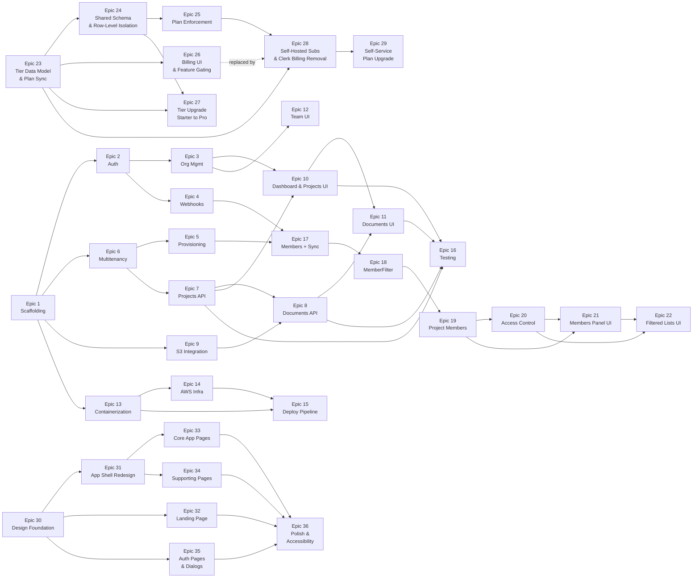

# Multi-tenant SaaS Starter — Technical Task Breakdown

## Epic Overview

| Epic | Name | Scope | Deps | Effort | Slices   | Status   |
|------|------|-------|------|--------|----------|----------|
| 1 | Scaffolding & Local Dev | Both | — | M | —        | **Done** |
| 2 | Auth & Clerk Integration | Frontend | 1 | M | —        | **Done** |
| 3 | Organization Management | Frontend | 2 | S | —        | **Done** |
| 4 | Webhook Infrastructure | Frontend | 1, 2 | M | 4A, 4B   | **Done** |
| 5 | Tenant Provisioning | Backend | 1, 6 | L | 5A, 5B, 5C | **Done** |
| 6 | Multitenancy Backend | Backend | 1 | L | —        | **Done** |
| 7 | Core API — Projects | Backend | 6 | M | 7A, 7B   | **Done** |
| 8 | Core API — Documents | Backend | 7, 9 | M | 8A, 8B   | **Done** |
| 9 | S3 Integration | Backend | 1 | S | —        | **Done** |
| 10 | Dashboard & Projects UI | Frontend | 3, 7 | M | 10A, 10B, 10C | **Done** |
| 11 | Documents UI | Frontend | 10, 8 | M | 11A, 11B | **Done** |
| 12 | Team Management UI | Frontend | 3 | S | —        | **Done** |
| 13 | Containerization | Both | 1 | S | —        | **Done** |
| 14 | AWS Infrastructure | Infra | 13 | XL | 14A–14D  | **Done** |
| 15 | Deployment Pipeline | Infra | 13, 14 | L | 15A, 15B | **Done** |
| 16 | Testing & Quality | Both | 7, 8, 10, 11 | L | 16A–16C  |          |
| 17 | Members Table + Webhook Sync | Both | 4, 5 | M | 17A, 17B | **Done** |
| 18 | MemberFilter + MemberContext | Backend | 17 | M | 18A, 18B | **Done** |
| 19 | Project Members Table + API | Backend | 18 | M | 19A, 19B | **Done** |
| 20 | Project Access Control | Backend | 19 | L | 20A, 20B | **Done** |
| 21 | Frontend — Project Members Panel | Frontend | 19, 20 | M | 21A, 21B | **Done** |
| 22 | Frontend — Filtered Project List | Frontend | 20, 21 | S | —        | **Done** |
| **Phase 2 — Billing & Tiered Tenancy** | | | | | |          |
| 23 | Tier Data Model & Plan Sync | Both | — | M | 23A, 23B | **Done** |
| 24 | Shared Schema & Row-Level Isolation | Backend | 23 | L | 24A, 24B, 24C | **Done** |
| 25 | Plan Enforcement | Both | 24 | S | — | **Done** |
| 26 | Billing UI & Feature Gating | Frontend | 23 | M | 26A, 26B | **Done** |
| 27 | Tier Upgrade — Starter to Pro | Backend | 23, 24 | M | — | Done (PR #53) |
| **Change Request — Self-Managed Subscriptions** | | | | | |          |
| 28 | Self-Hosted Subscriptions & Clerk Billing Removal | Both | 23, 25 | M | 28A, 28B, 28C | **Done** |
| 29 | Self-Service Plan Upgrade (Simulated) | Both | 28 | S | 29A, 29B | **Done** |
| **Phase 3 — Frontend Design Overhaul** | | | | | |          |
| 30 | Design Foundation | Frontend | — | M | 30A, 30B | **Done** |
| 31 | App Shell Redesign | Frontend | 30 | M | — | **Done** |
| 32 | Landing Page | Frontend | 30 | L | 32A, 32B | **Done** |
| 33 | Core App Pages Redesign | Frontend | 30, 31 | L | 33A, 33B | **Done** |
| 34 | Supporting Pages Redesign | Frontend | 30, 31 | M | 34A, 34B | **Done** |
| 35 | Auth Pages & Dialog Restyling | Frontend | 30 | M | 35A, 35B | **Done** |
| 36 | Polish & Accessibility | Frontend | 30–35 | M | — | **Done** |
| **Phase 4 — Customers, Document Scopes & Tasks** | | | | | | See [tasks/phase4-customers-tasks-portal.md](tasks/phase4-customers-tasks-portal.md) |
| 37 | Customer Backend — Entity, CRUD & Linking | Backend | — | M | 37A, 37B | **Done** (PR #73, #74) |
| 38 | Customer Frontend — List, Detail & Dialogs | Frontend | 37 | M | 38A, 38B | **Done** (PR #75, #76) |
| 39 | Task Backend — Entity, CRUD, Claim & Release | Backend | — | M | 39A, 39B | **Done** (PR #77, #78) |
| 40 | Task Frontend — List, Creation & Claim UI | Frontend | 39 | M | 40A, 40B | **Done** (PR #79, #80) |
| 41 | Document Scope Extension — Backend | Backend | 37 | M | 41A, 41B | **Done** (PR #81, #82) |
| 42 | Document Scope Extension — Frontend | Frontend | 38, 41 | M | 42A, 42B | **Done** (PR #83, #84) |
| 43 | Customer Portal Groundwork | Both | 37, 41 | L | 43A, 43B, 43C | **Done** (PR #85, #86, #87) |
| **Phase 5 — Task & Time Lifecycle** | | | | | | See [tasks/phase5-task-time-lifecycle.md](tasks/phase5-task-time-lifecycle.md) |
| 44 | TimeEntry Backend — Entity, CRUD & Validation | Backend | — | M | 44A, 44B | **Done** (PR #88, #89) |
| 45 | TimeEntry Frontend — Log Time Dialog & Task Time List | Frontend | 44 | M | 45A, 45B | **Done** (PR #90, #91) |
| 46 | Project Time Summary — Backend | Backend | 44 | M | 46A | |
| 47 | Project Time Summary — Frontend | Frontend | 46 | S | 47A | |
| 48 | My Work — Backend | Backend | 44 | M | 48A | |
| 49 | My Work — Frontend | Frontend | 48 | M | 49A, 49B | |

---

## Epic 1: Project Scaffolding & Local Development

**Goal**: Establish monorepo structure, initialize both projects with correct tooling, and set up Docker Compose for local development.

**Dependencies**: None

**Estimated Effort**: M

**Status**: **Complete**

### Tasks

| ID | Task | Status | Notes |
|----|------|--------|-------|
| 1.1 | Initialize monorepo structure | **Done** | Root `.gitignore`, `.editorconfig`, `README.md`. Directories: `frontend/`, `backend/`, `compose/`, `infra/`, `.github/`. |
| 1.2 | Initialize Next.js project | **Done** | Next.js 16.1.6, TypeScript 5, Tailwind CSS v4, App Router. Path alias `@/*`. Package manager: pnpm. |
| 1.3 | Install and configure Shadcn UI | **Done** | new-york style, 8 components: Button, Card, Input, Dialog, Table, DropdownMenu, Separator, Badge. |
| 1.4 | Initialize Spring Boot project | **Done** | Spring Boot 4.0.2, Java 25, Maven (not Gradle). Profiles: `application.yml` + `-local.yml`, `-dev.yml`, `-prod.yml`. `LocalSecurityConfig.java` permits all requests in local profile (replaced in Epic 6). |
| 1.5 | Create Docker Compose for local services | **Done** | `compose/docker-compose.yml` with Postgres 16 + LocalStack. Healthchecks configured. |
| 1.6 | Configure environment files | **Done** | `frontend/.env.local.example` (Clerk keys, backend URL, API key). Backend config in `application-local.yml` (Postgres at `b2mash.local:5432`, LocalStack S3). |
| 1.7 | Set up frontend linting and formatting | **Done** | ESLint (flat config), Prettier + `prettier-plugin-tailwindcss`. Scripts: `pnpm run lint`, `pnpm run format`, `pnpm run format:check`. |
| 1.8 | Set up backend linting and formatting | **Done** | Spotless 3.2.1 + Google Java Format 1.28.0 (Java 25 compatible). `./mvnw spotless:check` and `./mvnw spotless:apply`. |
| 1.9 | Create basic CI workflow | **Done** | `.github/workflows/ci.yml` — parallel frontend (pnpm lint, format:check, build) and backend (spotless:check, test, package) jobs. Triggers on PR and push to main. |
| 1.10 | Add LocalStack S3 init script | **Done** | `compose/data/s3/init-s3.sh` creates `docteams-dev` bucket on startup. |

### Deviations from Original Plan
- **Maven instead of Gradle** — Spring Boot project was generated with Maven, not Gradle. Commands use `./mvnw` instead of `./gradlew`.
- **pnpm instead of npm** — Standardized on pnpm for faster installs and strict dependency resolution.
- **Docker Compose in `compose/`** — Lives in a subdirectory rather than repo root, with its own `.env`.
- **Spotless 3.2.1** — Required for Java 25 compatibility (2.x has `NoSuchMethodError` on `DeferredDiagnosticHandler`).
- **google-java-format 1.28.0** — Required for Java 25 (1.19.x incompatible).

---

## Epic 2: Authentication & Clerk Integration

**Goal**: Integrate Clerk for authentication in Next.js — sign-up, sign-in, session management, and JWT extraction for API calls.

**Dependencies**: Epic 1

**Estimated Effort**: M

**Status**: **Complete**

### Tasks

| ID | Task | Status | Notes |
|----|------|--------|-------|
| 2.1 | Create Clerk development instance | **Done** | Clerk dev instance created with Organizations enabled. Keys in `.env.local`. |
| 2.2 | Install Clerk Next.js SDK | **Done** | `@clerk/nextjs` ^6.37.2 already installed. `<ClerkProvider>` wraps root layout with `cssLayerName: "clerk"` for Tailwind v4 compatibility. |
| 2.3 | Configure Clerk middleware | **Done** | `middleware.ts` with `clerkMiddleware()`. Public routes: `/`, `/sign-in(.*)`, `/sign-up(.*)`, `/api/webhooks(.*)`. `organizationSyncOptions` pre-configured for Epic 3. |
| 2.4 | Create sign-up page | **Done** | `app/(auth)/sign-up/[[...sign-up]]/page.tsx` with Clerk `<SignUp />`. Centered auth layout. |
| 2.5 | Create sign-in page | **Done** | `app/(auth)/sign-in/[[...sign-in]]/page.tsx` with Clerk `<SignIn />`. |
| 2.6 | Implement JWT extraction utility | **Done** | `lib/api.ts` with typed `apiClient<T>()` — attaches Bearer JWT via `auth().getToken()`. Custom `ApiError` class. |
| 2.7 | Create authenticated layout shell | **Done** | `app/(app)/layout.tsx` with sidebar (Dashboard, Projects, Team nav links), header with `<UserButton />`. Placeholder dashboard at `/dashboard`. |

### Additional Items
- **Webhook handler stub**: `app/api/webhooks/clerk/route.ts` using `verifyWebhook` from `@clerk/nextjs/webhooks`. Stubs for `organization.created` and `organization.updated` events (full implementation in Epic 4).
- **Landing page fix**: Replaced `<a>` tags with Next.js `<Link>` to fix ESLint `no-html-link-for-pages` errors.
- **Env vars**: Added `NEXT_PUBLIC_CLERK_SIGN_IN_URL`, `NEXT_PUBLIC_CLERK_SIGN_UP_URL`, and fallback redirect URLs to `.env.local` and `.env.local.example`.

### Deviations from Original Plan
- **Temporary `/dashboard` route**: Post-auth redirect goes to `/dashboard` (not org-scoped) since Epic 3 hasn't been implemented yet. Will be replaced with `/org/[slug]/dashboard` in Epic 3.
- **Next.js 16 middleware deprecation**: Next.js 16 shows a warning that `middleware.ts` is deprecated in favor of `proxy.ts`. The middleware still works correctly but may need migration in a future update.

---

## Epic 3: Organization Management

**Goal**: Enable org creation, switching, and URL-based org context with Clerk's organization features.

**Dependencies**: Epic 2

**Estimated Effort**: S

**Status**: **Complete**

### Tasks

| ID | Task | Status | Notes |
|----|------|--------|-------|
| 3.1 | Create org creation page | **Done** | `app/(app)/create-org/page.tsx` with `<CreateOrganization />`. `afterCreateOrganizationUrl="/org/:slug/dashboard"`. |
| 3.2 | Configure org-based URL routing | **Done** | `organizationSyncOptions` already configured in middleware (from Epic 2). Created `app/(app)/org/[slug]/layout.tsx` with sidebar, validates slug against active org, redirects on mismatch. |
| 3.3 | Implement org switcher | **Done** | `<OrganizationSwitcher />` in org layout header with `afterSelectOrganizationUrl="/org/:slug/dashboard"` and `hidePersonal`. |
| 3.4 | Create org-scoped dashboard page | **Done** | `app/(app)/org/[slug]/dashboard/page.tsx` showing org name. Placeholder pages added for `/projects` and `/team`. |
| 3.5 | Handle no-org state | **Done** | `/dashboard` page acts as redirect: active org → `/org/[slug]/dashboard`, no active org but has memberships → first org's dashboard, no orgs → `/create-org`. |

### Architecture Decisions
- **Sidebar moved to org layout**: `(app)/layout.tsx` simplified to pass-through. Sidebar with org-scoped nav links lives in `org/[slug]/layout.tsx`. This means create-org and redirect pages render without the sidebar.
- **Org switcher placement**: Header bar with `OrganizationSwitcher` (left) and `UserButton` (right).
- **Redirect flow**: Post-auth fallback URL remains `/dashboard` which handles all redirect logic server-side using `clerkClient().users.getOrganizationMembershipList()`.

---

## Epic 4: Webhook Infrastructure

**Goal**: Receive, verify, and process Clerk webhook events with idempotency and error handling.

**Dependencies**: Epic 1, Epic 2

**Scope**: Frontend

**Estimated Effort**: M

**Status**: **Complete**

### Tasks

| ID | Task | Status | Notes |
|----|------|--------|-------|
| 4.1 | Create webhook route handler | **Done** | `app/api/webhooks/clerk/route.ts` — full implementation with `verifyWebhook()`, svix-id extraction, event routing. |
| 4.2 | Configure Clerk webhook endpoint | **Done** | Documented in `frontend/docs/webhook-setup.md`. Manual Clerk Dashboard step. |
| 4.3 | Implement event router | **Done** | `lib/webhook-handlers.ts` — `routeWebhookEvent()` dispatches 9 event types (org CRUD, membership CRUD, invitation events). |
| 4.4 | Implement organization.created handler | **Done** | Calls `POST /internal/orgs/provision` via `lib/internal-api.ts` with X-API-KEY. Treats 409 as success (idempotent). Fire-and-forget error handling. |
| 4.5 | Implement organization.updated handler | **Done** | Calls `PUT /internal/orgs/update` with `updatedAt` for out-of-order event detection. |
| 4.6 | Implement idempotency layer | **Done** | Frontend extracts `svix-id` from headers and passes through. Backend-side dedup via `processed_webhooks` table deferred to Epic 5. Frontend handles 409 Conflict as implicit idempotency. |
| 4.7 | Exclude webhook route from Clerk auth | **Done** | Already configured in `middleware.ts` (Epic 2) — `/api/webhooks(.*)` is a public route. |
| 4.8 | Add webhook handler tests | **Done** | 13 tests across 2 files using vitest. Covers: signature verification, event routing, provisioning calls, 409 handling, error resilience, unknown events. |

### Architecture

```
Clerk → POST /api/webhooks/clerk (Next.js)
         ↓ verifyWebhook() signature check (400 on failure)
         ↓ Extract svix-id from headers
         ↓ routeWebhookEvent() dispatches by event type
         ↓ organization.created →
    POST /internal/orgs/provision (Spring Boot, Epic 5)
         ↓ X-API-KEY header authentication
         ↓ Return 201 Created / 409 Conflict
```

### Key Files
- `frontend/lib/internal-api.ts` — Server-only API client with `X-API-KEY` auth and `server-only` guard
- `frontend/lib/webhook-handlers.ts` — Event router and per-event handler functions
- `frontend/app/api/webhooks/clerk/route.ts` — Webhook route handler
- `frontend/vitest.config.ts` — Test configuration with `@/*` path alias
- `frontend/docs/webhook-setup.md` — Clerk Dashboard configuration guide

### Deviations from Original Plan
- **Frontend-only scope**: Previous PR (#4) was closed because it incorrectly included backend changes (entities, migrations, controllers). Re-implemented as frontend-only.
- **Idempotency scoped to frontend role**: The `processed_webhooks` table is a backend concern (Epic 5). Frontend's idempotency is: extract `svix-id`, pass to backend, handle 409 Conflict as success.
- **Local type interfaces**: Used local `OrgEventData`/`OrgDeletedEventData` interfaces instead of Clerk's `Extract<WebhookEvent, ...>` because TypeScript's `Extract` utility resolves to `never` when the discriminated union has combined string literal types (e.g., `'organization.created' | 'organization.updated'`).
- **vitest added**: Test infrastructure set up as part of this epic (originally planned for Epic 16).

---

## Epic 5: Tenant Provisioning

**Goal**: Implement the internal provisioning API that creates tenant schemas, runs Flyway migrations, and maintains org-schema mappings. Include startup migration runner for existing tenants.

**Dependencies**: Epic 1, Epic 6

**Scope**: Backend

**Estimated Effort**: L

**Status**: **Complete**

### Tasks

| ID | Task | Status | Notes |
|----|------|--------|-------|
| 5.1 | Create global schema migrations | **Done** | `V2__create_organizations.sql` (with provisioning_status tracking), `V3__create_processed_webhooks.sql` (webhook idempotency). `V1__create_org_schema_mapping.sql` already existed from Epic 6. |
| 5.2 | Create tenant schema migrations | **Done** | `V1__create_projects.sql` and `V2__create_documents.sql` in `db/migration/tenant/`. Documents has FK to projects, status tracking, S3 key. |
| 5.3 | Implement schema name generator | **Done** | `SchemaNameGenerator` uses UUID v3 (`nameUUIDFromBytes`) with DNS namespace salt. Deterministic `tenant_<12hex>` from Clerk org ID. Unit tests cover determinism, format, uniqueness. |
| 5.4 | Implement provisioning service | **Done** | `TenantProvisioningService` with idempotent steps: check existing → create org → mark IN_PROGRESS → generate schema → CREATE SCHEMA → insert mapping → Flyway tenant migrate → mark COMPLETED. No `@Transactional` (mixed datasource operations). |
| 5.5 | Configure dual data sources | **Done** | `DataSourceConfig` with two `HikariDataSource` beans via `@ConfigurationProperties` (Spring Boot 4 removed `DataSourceProperties`). `appDataSource` (primary, pooled) + `migrationDataSource` (for Flyway DDL). Uses `jdbc-url` (HikariCP native property). |
| 5.6 | Implement provisioning controller | **Done** | `POST /internal/orgs/provision` — 201 Created / 409 Conflict. Request validation with `@Valid` + `@NotBlank`. |
| 5.7 | Implement API key auth filter | **Done** | Already implemented in Epic 6 (`ApiKeyAuthFilter`). No changes needed. |
| 5.8 | Implement startup migration runner | **Done** | `TenantMigrationRunner` (`ApplicationRunner`) iterates all `OrgSchemaMapping` entries, runs tenant Flyway per schema. Continues on individual failure (doesn't block startup). |
| 5.9 | Add retry to provisioning | **Done** | Spring Retry (`@Retryable`) instead of Resilience4j (no Spring Boot 4 support). `maxAttempts=3, backoff=@Backoff(delay=1000, multiplier=2)`, retries on `ProvisioningException`. |
| 5.10 | Add provisioning integration tests | **Done** | Integration tests: full provisioning flow, idempotency (second provision returns same schema), different orgs get different schemas. Controller tests: 201, 409, 401, 400. All 29 tests pass (8 new + 21 existing). |

### Architecture Decisions
- **Dual DataSource**: `appDataSource` for Hibernate/JPA (pooled), `migrationDataSource` for Flyway DDL. Spring Boot 4 removed `DataSourceProperties` from `boot.autoconfigure.jdbc` — used `@ConfigurationProperties` directly on `HikariDataSource` beans with `jdbc-url` (not `url`).
- **Manual Flyway management**: Disabled Spring auto-Flyway (`spring.flyway.enabled: false`). `FlywayConfig` runs global migrations at startup via `@Bean(initMethod = "migrate")`. `TenantMigrationRunner` runs tenant migrations per schema.
- **Spring Retry over Resilience4j**: Resilience4j has no Spring Boot 4 support. Used `spring-retry` 2.0.12 with `@Retryable`.
- **No @Transactional on provisioning**: Service mixes two datasources (migrationDataSource for DDL, entityManager for JPA). Transaction management is per-step instead.
- **Identifier quoting for schema DDL**: Schema creation uses `"CREATE SCHEMA IF NOT EXISTS \"" + schemaName + "\""` to prevent SQL injection.
- **Testcontainers DynamicPropertyRegistrar**: `@ServiceConnection` only auto-configures default `spring.datasource.*`. Custom datasource beans need `DynamicPropertyRegistrar` to bridge container properties.

### Key Files
- `backend/src/main/java/.../config/DataSourceConfig.java` — Dual HikariDataSource beans
- `backend/src/main/java/.../config/FlywayConfig.java` — Manual global Flyway on startup
- `backend/src/main/java/.../provisioning/TenantProvisioningService.java` — Core provisioning logic
- `backend/src/main/java/.../provisioning/ProvisioningController.java` — Internal API endpoint
- `backend/src/main/java/.../provisioning/TenantMigrationRunner.java` — Startup migration runner
- `backend/src/main/java/.../provisioning/SchemaNameGenerator.java` — Deterministic schema naming

### Deviations from Original Plan
- **Spring Retry instead of Resilience4j** (task 5.9): Resilience4j lacks Spring Boot 4 support. Used `spring-retry` 2.0.12 with `@Retryable` annotation.
- **`@ConfigurationProperties` on HikariDataSource** (task 5.5): Spring Boot 4 removed `DataSourceProperties` from `boot.autoconfigure.jdbc`. Bound directly to `HikariDataSource` using HikariCP native property names (`jdbc-url`).
- **No separate `organizations` table migration**: Merged into existing global migrations as `V2__create_organizations.sql` (V1 was already taken by `org_schema_mapping` from Epic 6).
- **DynamicPropertyRegistrar for tests**: Testcontainers `@ServiceConnection` doesn't auto-configure custom datasource beans — added `DynamicPropertyRegistrar` in `TestcontainersConfiguration`.

---

## Epic 6: Multitenancy Backend

**Goal**: Configure Hibernate schema-per-tenant multitenancy, tenant context resolution from JWT, Spring Security with Clerk JWT validation, and RBAC role mapping.

**Dependencies**: Epic 1

**Estimated Effort**: L

**Status**: **Complete**

### Tasks

| ID | Task | Description | Acceptance Criteria | Estimate | Dependencies |
|----|------|-------------|---------------------|----------|--------------|
| 6.1 | Implement TenantContext | Create `TenantContext` class using `ThreadLocal<String>` to store/retrieve current tenant schema name. Include `clear()` method. | `TenantContext.setTenantId("tenant_xxx")` → `TenantContext.getTenantId()` returns `"tenant_xxx"` on the same thread; `clear()` removes it. | 1h | 1.4 |
| 6.2 | Implement CurrentTenantIdentifierResolver | Create `TenantIdentifierResolver` implementing `CurrentTenantIdentifierResolver<String>` and `HibernatePropertiesCustomizer`. Returns tenant ID from `TenantContext` or `"public"` as default. | Hibernate calls `resolveCurrentTenantIdentifier()` and gets the schema name from `TenantContext`. | 2h | 6.1 |
| 6.3 | Implement MultiTenantConnectionProvider | Create `SchemaMultiTenantConnectionProvider` implementing `MultiTenantConnectionProvider<String>` and `HibernatePropertiesCustomizer`. `getConnection()` sets `search_path`; `releaseConnection()` resets to `public`. | Connection checkout sets `search_path` to tenant schema; connection release resets to `public`; verified with integration test. | 3h | 6.1 |
| 6.4 | Configure Hibernate for multitenancy | Register both resolver and connection provider via `HibernatePropertiesCustomizer`. Ensure Hibernate auto-detects schema multitenancy mode. Disable `ddl-auto`. | Hibernate initializes in multi-tenant mode; queries execute against the correct tenant schema. | 2h | 6.2, 6.3 |
| 6.5 | Implement Clerk JWT validation filter | Create `ClerkJwtAuthFilter` (Spring Security filter) that: extracts `Authorization: Bearer <jwt>`, validates signature against Clerk JWKS endpoint, checks expiry and issuer, extracts `sub`, `org_id`, `org_role`. Use Spring Security's `JwtDecoder` with Clerk's JWKS URI. | Valid Clerk JWT → authentication set in SecurityContext; expired/invalid JWT → 401; missing JWT → 401. | 4h | 1.4 |
| 6.6 | Implement Clerk role converter | Create `ClerkRoleConverter` that maps Clerk org roles to Spring authorities: `org:owner` → `ROLE_ORG_OWNER`, `org:admin` → `ROLE_ORG_ADMIN`, `org:member` → `ROLE_ORG_MEMBER`. Wire into JWT auth filter. | JWT with `org_role: "org:admin"` → SecurityContext contains `ROLE_ORG_ADMIN` authority. | 2h | 6.5 |
| 6.7 | Implement tenant context filter | Create `TenantFilter` (servlet filter, ordered after JWT filter) that extracts `org_id` from the authenticated principal, looks up schema name from `org_schema_mapping` (with caching), and sets `TenantContext`. | After filter chain: `TenantContext.getTenantId()` returns the correct `tenant_xxx` schema name for the authenticated org. | 3h | 6.1, 6.5 |
| 6.8 | Configure Spring Security filter chain | Wire filter order: `ClerkJwtAuthFilter` → `TenantFilter` → `TenantLoggingFilter` → controller. Configure `SecurityFilterChain` with endpoint authorization rules. Exclude `/internal/**` from JWT auth (uses API key instead). | `/api/**` requires valid JWT; `/internal/**` requires valid API key; role-based access enforced per endpoint. | 3h | 6.5, 6.6, 6.7 |
| 6.9 | Implement tenant logging filter | Create `TenantLoggingFilter` (ordered after tenant filter) that sets MDC fields: `tenantId`, `userId`, `requestId`. Clear MDC on response. | Every log line within a request includes tenantId, userId, and requestId. MDC cleared after request completes. | 2h | 6.7 |
| 6.10 | Configure structured JSON logging | Set `logging.structured.format.console=ecs` in `application.yml`. Verify JSON output includes MDC fields. | Log output is structured JSON (ECS format); MDC fields (`tenantId`, `userId`, `requestId`) appear in every log entry. | 1h | 6.9 |
| 6.11 | Add multitenancy integration tests | Test: set TenantContext to schema A, query → get schema A data; set to schema B, query → get schema B data; verify no cross-schema leakage. | Tests prove tenant isolation: data written in schema A is not visible in schema B and vice versa. | 3h | 6.4, 6.7 |

---

## Epic 7: Core API — Projects

**Goal**: Implement project CRUD endpoints with tenant-scoped data access and role-based authorization.

**Dependencies**: Epic 6

**Scope**: Backend

**Estimated Effort**: M

**Status**: **Complete**

### Tasks

| ID | Task | Status | Notes |
|----|------|--------|-------|
| 7.1 | Create Project entity | **Done** | `Project.java` — JPA entity mapping to tenant `projects` table. UUID id, name, description, createdBy, createdAt/updatedAt (Instant). No `@Table(schema=...)` — Hibernate resolves tenant schema dynamically. |
| 7.2 | Create ProjectRepository | **Done** | `ProjectRepository.java` — extends `JpaRepository<Project, UUID>`. No custom queries needed. |
| 7.3 | Implement ProjectService | **Done** | `ProjectService.java` — thin service layer with `@Transactional` (readOnly for reads). CRUD methods delegate to repository. `createdBy` passed from controller (extracted from JWT `sub`). |
| 7.4 | Implement ProjectController | **Done** | `ProjectController.java` — 5 REST endpoints. Nested record DTOs (`CreateProjectRequest`, `UpdateProjectRequest`, `ProjectResponse`). Returns `ResponseEntity` with explicit status codes. `ProblemDetail` (RFC 9457) for 404 errors. |
| 7.5 | Add input validation | **Done** | `@NotBlank` + `@Size(max=255)` on name, `@Size(max=2000)` on description. `@Valid @RequestBody` triggers Bean Validation. Returns 400 with field-level errors. |
| 7.6 | Add role-based authorization | **Done** | `@PreAuthorize` annotations: MEMBER+ for GET, ADMIN+ for POST/PUT, OWNER for DELETE. No changes to `SecurityConfig` — `@EnableMethodSecurity` already configured. |
| 7.7 | Add project endpoint tests | **Done** | 19 integration tests (MockMvc + Testcontainers, `@ActiveProfiles("test")`). Covers: CRUD happy path, validation errors, 404 not found, RBAC (member/admin/owner), tenant isolation (cross-tenant invisible), unauthenticated access. 48 total tests pass. |

### Key Files
- `backend/src/main/java/.../project/Project.java` — JPA entity
- `backend/src/main/java/.../project/ProjectRepository.java` — Spring Data JPA repository
- `backend/src/main/java/.../project/ProjectService.java` — Service layer
- `backend/src/main/java/.../project/ProjectController.java` — REST controller with DTOs
- `backend/src/test/java/.../project/ProjectIntegrationTest.java` — Integration tests

### Deviations from Original Plan
- **Integration tests only (no unit tests)**: Used MockMvc + Testcontainers integration tests instead of separate unit tests for controller and service. Integration tests exercise the full stack (security filters → tenant resolution → CRUD → DB) providing higher confidence than isolated unit tests.
- **`@ActiveProfiles("test")` for RBAC testing**: Required to activate `SecurityConfig` (which is `@Profile("!local")`). Mock JWT `jwt()` post-processor bypasses `JwtAuthenticationConverter`, so authorities must be set explicitly via `.authorities()`.
- **`Location` header for ID extraction in tests**: `ObjectMapper` bean unavailable in test context. Used `Location` header from 201 responses and `jsonPath()` assertions instead.

---

## Epic 8: Core API — Documents

**Goal**: Implement document metadata endpoints, presigned URL generation for uploads/downloads, and upload confirmation flow.

**Dependencies**: Epic 7, Epic 9

**Scope**: Backend

**Estimated Effort**: M

**Status**: **Complete**

### Tasks

| ID | Task | Status | Notes |
|----|------|--------|-------|
| 8.1 | Create Document entity | **Done** | JPA entity with UUID id, projectId (FK), fileName, contentType, size, s3Key, status enum (PENDING/UPLOADED/FAILED), uploadedBy, uploadedAt, createdAt. `assignS3Key()` method for post-save S3 key assignment. |
| 8.2 | Create DocumentRepository | **Done** | `JpaRepository<Document, UUID>` with `findByProjectId(UUID projectId)`. |
| 8.3 | Implement DocumentService | **Done** | `listDocuments`, `initiateUpload`, `confirmUpload`, `getPresignedDownloadUrl`. Validates project exists in current tenant schema. Uses `S3PresignedUrlService` for presigned URL generation. |
| 8.4 | Implement upload-init endpoint | **Done** | `POST /api/projects/{projectId}/documents/upload-init` — returns 201 with `{documentId, presignedUrl, expiresInSeconds}`. S3 key format: `org/{orgId}/project/{projId}/{docId}`. |
| 8.5 | Implement upload-confirm endpoint | **Done** | `POST /api/documents/{documentId}/confirm` — transitions PENDING → UPLOADED. Idempotent (re-confirm on UPLOADED returns 200). 404 on non-existent. |
| 8.6 | Implement document listing endpoint | **Done** | `GET /api/projects/{projectId}/documents` — returns array of document metadata. 404 if project not found in tenant. |
| 8.7 | Implement presigned download endpoint | **Done** | `GET /api/documents/{documentId}/presign-download` — returns presigned GET URL with 1hr expiry. 400 if not UPLOADED, 404 if not found. |
| 8.8 | Add authorization to document endpoints | **Done** | All endpoints require `ROLE_ORG_MEMBER+` via `@PreAuthorize`. Cross-tenant project IDs return 404 (Hibernate schema isolation). |
| 8.9 | Add document endpoint tests | **Done** | 17 integration tests: upload flow (init → confirm), idempotent confirm, listing, presigned download, 400 for pending, RBAC, validation (fileName, contentType, size), cross-tenant isolation. 70 total tests pass. |

### Key Files
- `backend/src/main/java/.../document/Document.java` — JPA entity with status enum
- `backend/src/main/java/.../document/DocumentRepository.java` — Spring Data JPA repository
- `backend/src/main/java/.../document/DocumentService.java` — Business logic + S3 presigned URL coordination
- `backend/src/main/java/.../document/DocumentController.java` — REST endpoints with RBAC
- `backend/src/test/java/.../document/DocumentIntegrationTest.java` — 17 integration tests

---

## Epic 9: S3 Integration

**Goal**: Configure AWS SDK for S3 presigned URL generation, with LocalStack support for local development.

**Dependencies**: Epic 1

**Scope**: Backend

**Estimated Effort**: S (single slice — 4 tasks)

**Status**: **Complete**

### Tasks

| ID | Task | Status | Notes |
|----|------|--------|-------|
| 9.1 | Add AWS SDK dependencies | **Done** | AWS SDK v2 BOM 2.31.23, `software.amazon.awssdk:s3` (compile), `testcontainers-localstack` (test). Maven, not Gradle. No `sts` or `s3-transfer-manager` needed for presigned URLs. |
| 9.2 | Create S3 configuration | **Done** | `S3Config.java` with `@ConfigurationProperties` records (`S3Properties`, `AwsCredentialsProperties`). `S3Client` + `S3Presigner` beans with `destroyMethod="close"`. Conditional LocalStack endpoint override when `aws.s3.endpoint` is set. |
| 9.3 | Implement S3PresignedUrlService | **Done** | `generateUploadUrl(orgId, projectId, documentId, contentType)` → presigned PUT with 1hr expiry and content-type constraint. `generateDownloadUrl(s3Key)` → presigned GET with 1hr expiry and key format validation. Key format: `org/{orgId}/project/{projectId}/{documentId}`. |
| 9.4 | Add S3 integration tests | **Done** | 5 integration tests with Testcontainers LocalStack. End-to-end upload/download via presigned URLs, key format verification, org isolation, key validation rejection. 53 total tests pass (48 existing + 5 new). |

### Key Files
- `backend/src/main/java/.../config/S3Config.java` — S3Client + S3Presigner beans with `@ConfigurationProperties` records
- `backend/src/main/java/.../s3/S3PresignedUrlService.java` — Presigned URL generation service
- `backend/src/test/java/.../s3/S3PresignedUrlServiceTest.java` — Integration tests with LocalStack

### Deviations from Original Plan
- **Maven instead of Gradle**: Task 9.1 description referenced Gradle, but project uses Maven. Added AWS SDK v2 BOM in `<dependencyManagement>`.
- **No `sts` or `s3-transfer-manager`**: Not needed for presigned URL generation. `s3` module includes the presigner.
- **S3 key format validation**: Added regex validation (`^org/[^/]+/project/[^/]+/[^/]+$`) on `generateDownloadUrl` to prevent path traversal — not in original spec but added during code review.

---

## Epic 10: Frontend — Dashboard & Projects

**Goal**: Build the dashboard layout and project management UI with org-scoped data fetching from Spring Boot.

**Dependencies**: Epic 3, Epic 7

**Scope**: Frontend

**Estimated Effort**: M

**Status**: **Complete**

### Slices

| Slice | Tasks | Summary | Status |
|-------|-------|---------|--------|
| **10A** | 10.1, 10.2 | App shell layout (sidebar, header, responsive), typed API client | **Done** |
| **10B** | 10.3, 10.4, 10.8 | Projects list page, create dialog, dashboard page | **Done** |
| **10C** | 10.5, 10.6, 10.7 | Project detail page, edit functionality, delete with confirmation | **Done** |

### Tasks

| ID | Task | Status | Notes |
|----|------|--------|-------|
| 10.1 | Build app shell layout | **Done** | Extracted sidebar into `DesktopSidebar` (desktop) and `MobileSidebar` (Sheet drawer) client components. Active route highlighting via `usePathname()`. 4 nav items (Dashboard, Projects, Team, Settings). Shadcn sidebar CSS variables. Settings placeholder page. |
| 10.2 | Implement API client | **Done** | Enhanced `lib/api.ts` with `server-only` guard, RFC 9457 ProblemDetail parsing, `handleApiError()` utility (401→redirect, 404→notFound), `api.*` convenience methods. Created `lib/types.ts` with Project, Document, ProblemDetail DTO interfaces. |
| 10.3 | Build projects list page | **Done** | Server component fetching `GET /api/projects`. Responsive card grid (`1/2/3` columns). Empty state with CTA. Role-based "New Project" button (admin/owner). `handleApiError()` for 401/404. |
| 10.4 | Build project create dialog | **Done** | Shadcn Dialog with name (Input) + description (Textarea) fields. Server Action calling `POST /api/projects`. Inline validation errors. `revalidatePath` refreshes projects list and dashboard. Form/error state reset on reopen. |
| 10.5 | Build project detail page | **Done** | Server component at `projects/[id]/page.tsx`. Fetches `GET /api/projects/{id}`. Shows name, description, created date. Back link to projects list. Role-based Edit/Delete buttons. Documents placeholder for Epic 11. |
| 10.6 | Build project edit functionality | **Done** | `EditProjectDialog` client component with form pre-population. `updateProject` server action with `auth()` role check (admin+). Revalidates projects list, detail, and dashboard. |
| 10.7 | Build project delete functionality | **Done** | `DeleteProjectDialog` using Shadcn AlertDialog for destructive confirmation. `deleteProject` server action with `auth()` role check (owner only). Redirects to projects list after deletion. |
| 10.8 | Implement dashboard page | **Done** | Org name, project count stat card, recent projects list (top 5 sorted by `createdAt` desc), quick-action buttons (New Project, View Projects, Manage Team). Role-based "New Project" visibility. |

### Key Files (10A)
- `frontend/components/desktop-sidebar.tsx` — Desktop sidebar with active route highlighting
- `frontend/components/mobile-sidebar.tsx` — Mobile Sheet-based sidebar with hamburger trigger
- `frontend/lib/nav-items.ts` — Shared navigation item config (4 items)
- `frontend/components/ui/sheet.tsx` — Shadcn Sheet component (Radix Dialog drawer)
- `frontend/app/(app)/org/[slug]/settings/page.tsx` — Settings placeholder page
- `frontend/lib/types.ts` — TypeScript interfaces for Project, Document, ProblemDetail DTOs
- `frontend/lib/api.ts` — Enhanced server-side API client with ProblemDetail parsing and error utilities

### Key Files (10B)
- `frontend/app/(app)/org/[slug]/projects/page.tsx` — Projects list page (server component, card grid)
- `frontend/app/(app)/org/[slug]/projects/actions.ts` — Server Action for `POST /api/projects`
- `frontend/components/projects/create-project-dialog.tsx` — Client dialog with form, validation, state reset
- `frontend/app/(app)/org/[slug]/dashboard/page.tsx` — Dashboard with stats, recent projects, quick actions
- `frontend/components/ui/label.tsx` — Shadcn Label component
- `frontend/components/ui/textarea.tsx` — Shadcn Textarea component

### Key Files (10C)
- `frontend/app/(app)/org/[slug]/projects/[id]/page.tsx` — Project detail page (server component, role-based actions)
- `frontend/components/projects/edit-project-dialog.tsx` — Edit dialog with form pre-population
- `frontend/components/projects/delete-project-dialog.tsx` — AlertDialog destructive confirmation
- `frontend/components/ui/alert-dialog.tsx` — Shadcn AlertDialog component

### Architecture Decisions (10C)
- **AlertDialog for destructive actions**: Used Shadcn AlertDialog (not Dialog) for delete confirmation — prevents accidental dismissal via outside click or Escape key.
- **Server Action auth checks**: `updateProject` and `deleteProject` call `auth()` to verify role before API call — defense-in-depth since Server Actions are HTTP POST endpoints that can be invoked directly.
- **Trigger-as-children pattern**: Edit/Delete dialogs accept `children` as trigger buttons via `asChild`, keeping layout control in the server component while client components handle interactivity.
- **Redirect after delete**: `deleteProject` calls `revalidatePath` then `redirect` — cache is invalidated before navigation so the projects list shows fresh data.

### Architecture Decisions (10B)
- **Server Actions for mutations**: `api.ts` is `server-only`, so client components call server actions which internally call `api.post()`. `revalidatePath` invalidates both `/projects` and `/dashboard` after creation.
- **Card grid over table**: Projects use responsive card grid (`grid-cols-1 sm:2 lg:3`) — more visual and mobile-friendly than table layout used for team members.
- **Role-based UI gating**: "New Project" button visible only to admin/owner. Backend still enforces RBAC (403 for members) — defense in depth.
- **Form state management**: `useRef` for native form reset + `handleOpenChange` clears error state on dialog reopen — prevents stale form values and error messages.

### Architecture Decisions (10A)
- **Server/client split**: Layout stays a server component (calls `await auth()` and `await params`). Sidebar extracted into two client components (`DesktopSidebar`, `MobileSidebar`) that use `usePathname()` for active route detection and `useState()` for mobile toggle.
- **Shadcn Sheet for mobile**: Uses Radix Dialog-based Sheet component instead of custom drawer — provides accessibility (focus trapping, keyboard dismiss), animations, and overlay behavior for free.
- **Sidebar CSS variables**: Replaced hard-coded `bg-neutral-50 dark:bg-neutral-950` with Shadcn sidebar tokens (`bg-sidebar`, `bg-sidebar-accent`, etc.) already defined in `globals.css`.
- **No client-side API wrapper**: Client components use Server Actions that call the server-side `api` internally. Standard Next.js 16 pattern.
- **Backward-compatible API alias**: `apiClient` kept as alias for `apiRequest` so existing webhook handler code is not broken.

---

## Epic 11: Frontend — Documents

**Goal**: Build document list, file upload with progress tracking, and download functionality.

**Dependencies**: Epic 10, Epic 8

**Scope**: Frontend

**Estimated Effort**: M

**Status**: **Complete**

### Slices

| Slice | Tasks | Summary | Status |
|-------|-------|---------|--------|
| **11A** | 11.1, 11.2 | Document list component, drag-and-drop upload with presigned URL flow | **Done** |
| **11B** | 11.3, 11.4, 11.5, 11.6 | Upload progress tracking, download functionality, error handling, file validation | **Done** |

### Tasks

| ID | Task | Status | Notes |
|----|------|--------|-------|
| 11.1 | Build document list component | **Done** | `DocumentsPanel` client component with Shadcn Table. File-type icons (lucide), size formatting, status badges (UPLOADED/PENDING/FAILED), upload date. Empty state with upload CTA. Server component fetches `GET /api/projects/{id}/documents`. |
| 11.2 | Build file upload component | **Done** | `FileUploadZone` drag-and-drop + click-to-browse. 3-phase upload: server action `initiateUpload` → XHR PUT to presigned S3 URL → server action `confirmUpload`. Upload state managed via `useReducer`. Multiple concurrent uploads supported. |
| 11.3 | Add upload progress tracking | **Done** | `XMLHttpRequest.upload.onprogress` for real-time percentage. Shadcn `<Progress>` bar. `UploadProgressItem` component with state machine: validating → initiating → uploading → confirming → complete / error. Indeterminate progress for server-side phases. |
| 11.4 | Implement download functionality | **Done** | `DownloadButton` per document (UPLOADED only). Server action `getDownloadUrl` calls presign-download API. Anchor element triggers browser download. Loading spinner during fetch, auto-clearing error on failure. |
| 11.5 | Handle upload errors | **Done** | Error display per upload item with `text-destructive`. Retry button re-initiates from scratch (new presigned URL). Validation errors (wrong type, too large) show dismiss only. XHR abort handler prevents memory leak. `useEffect` cleanup aborts in-flight uploads on unmount. |
| 11.6 | Add file type and size validation | **Done** | `validateFile()` in `lib/upload-validation.ts`. Max 100MB, 17 allowed MIME types (PDF, Office, images, text, CSV, archives). Extension-to-MIME fallback when `file.type` is empty. Synchronous validation before any server call. |

### Key Files
- `frontend/components/documents/documents-panel.tsx` — Main documents client component with upload state management (`useReducer`), document table, and upload orchestration
- `frontend/components/documents/file-upload-zone.tsx` — Drag-and-drop zone with visual feedback and accessibility
- `frontend/components/documents/upload-progress-item.tsx` — Per-file progress bar, status indicators, retry/remove
- `frontend/app/(app)/org/[slug]/projects/[id]/actions.ts` — Server actions: `initiateUpload`, `confirmUpload`, `getDownloadUrl`
- `frontend/lib/upload-validation.ts` — File validation with MIME type and extension checking
- `frontend/lib/format.ts` — `formatFileSize()` utility

### Architecture Decisions
- **Single client component for documents panel**: Upload zone and document list are tightly coupled — uploading adds items to the list, in-progress uploads display alongside completed ones. A single `useReducer` manages the upload queue.
- **XMLHttpRequest for S3 upload**: `fetch()` does not expose upload progress. `XMLHttpRequest.upload.onprogress` is the only browser API for upload progress tracking. XHR is used only for the S3 PUT; all other calls go through server actions.
- **Server Actions as API gateway**: `initiateUpload` returns the presigned URL to the client. The Next.js server never touches file bytes — browser uploads directly to S3.
- **Retry re-initiates from scratch**: On retry, a new `documentId` and presigned URL are obtained. Old PENDING records are harmless orphans. Avoids complex bookkeeping about expired URLs.
- **Non-fatal document fetch**: If project loads but document listing fails, the page shows an empty documents section rather than erroring out.
- **fileMapRef for stale-closure-free retry**: File objects stored in a `useRef` map so `handleRetry` doesn't depend on `uploads` reducer state, avoiding stale closures and unnecessary re-renders.

### Deviations from Original Plan
- **No separate `DocumentDownloadButton` file**: Download button implemented as an inline function component within `documents-panel.tsx` since it's small and tightly coupled to the panel's server action imports.
- **`mimeType` stored in UploadItem**: Added `mimeType` field to carry the resolved MIME type from validation through the upload flow, since `file.type` can be empty for some file extensions.
- **`useEffect` cleanup for XHR abort**: Added after code review — aborts all in-flight XMLHttpRequest objects when the component unmounts to prevent React state updates on unmounted components.

---

## Epic 12: Frontend — Team Management

**Goal**: Build team management UI using Clerk's organization components — member list, invitations, and role display.

**Dependencies**: Epic 3

**Scope**: Frontend

**Estimated Effort**: S (single slice — 5 tasks, mostly Clerk components)

**Status**: **Complete**

### Tasks

| ID | Task | Status | Notes |
|----|------|--------|-------|
| 12.1 | Build team management page | **Done** | `app/(app)/org/[slug]/team/page.tsx` — server component with Shadcn Tabs (Members, Invitations). Reads `orgRole` via `auth()` for role-based visibility. |
| 12.2 | Build member list | **Done** | `components/team/member-list.tsx` — client component using `useOrganization({ memberships: { infinite: true } })`. Shadcn Table with role badges (Owner/Admin/Member). Load-more pagination. |
| 12.3 | Build invitation form | **Done** | `components/team/invite-member-form.tsx` — client component with email input + role selector (Member/Admin). Uses `organization.inviteMember()`. Only rendered for admin+. Success/error feedback. |
| 12.4 | Build pending invitations list | **Done** | `components/team/pending-invitations.tsx` — client component using `useOrganization({ invitations })`. Revoke via `invitation.revoke()` with revalidation. Pagination (Previous/Next). |
| 12.5 | Add role-based visibility | **Done** | Server component passes `isAdmin` prop. Invite form hidden for `org:member`. Revoke buttons hidden for `org:member`. Member list always visible (read-only for members). |

### Architecture Decisions
- **Custom components over Clerk pre-built**: Used Clerk's `useOrganization()` hook with custom Shadcn-styled components instead of `<OrganizationMembershipList />`. Gives full styling control while Clerk remains source of truth for data.
- **Server/client split**: Team page is a server component (reads `orgRole` via `auth()`). Interactive children (member list, invite form, invitations) are client components using `useOrganization()` hook.
- **No backend integration**: Clerk handles all membership/invitation CRUD directly — no Spring Boot API calls needed.

### Key Files
- `frontend/app/(app)/org/[slug]/team/page.tsx` — Team page with tabs and role-based rendering
- `frontend/components/team/member-list.tsx` — Organization member table
- `frontend/components/team/invite-member-form.tsx` — Invitation form (admin+ only)
- `frontend/components/team/pending-invitations.tsx` — Pending invitation list with revoke

---

## Epic 13: Containerization

**Goal**: Create production-ready Docker images for both services and a full Docker Compose stack for local development.

**Dependencies**: Epic 1

**Estimated Effort**: S

**Status**: **Complete**

### Tasks

| ID | Task | Status | Notes |
|----|------|--------|-------|
| 13.1 | Create Next.js Dockerfile | **Done** | Multi-stage build: `node:20-alpine`, pnpm, standalone output. Non-root `nextjs` user. `NEXT_PUBLIC_CLERK_PUBLISHABLE_KEY` passed as build arg. Image ~208MB. |
| 13.2 | Create Spring Boot Dockerfile | **Done** | Multi-stage build: `eclipse-temurin:25-jdk` for build, `eclipse-temurin:25-jre-alpine` for runtime. Spring Boot 4 layered JAR extraction (`java -Djarmode=tools extract --layers`). Non-root `spring` user. Image ~289MB. |
| 13.3 | Create full Docker Compose stack | **Done** | Extended `compose/docker-compose.yml` with `backend` and `frontend` services. Backend depends on postgres + localstack (healthchecks), frontend depends on backend (healthcheck). Environment variables configured for inter-service communication. |
| 13.4 | Optimize Docker images | **Done** | `.dockerignore` files for both `frontend/` and `backend/`. Dependency install cached separately from code changes. |
| 13.5 | Document local Docker setup | **Done** | README.md updated with "Quick Start (Full Docker Stack)" section including setup, build, verify, and troubleshooting steps. |

### Architecture Decisions
- **Standalone output for Next.js**: `output: "standalone"` in `next.config.ts` produces a minimal server (`server.js`) without requiring full `node_modules` at runtime.
- **Clerk build arg**: `NEXT_PUBLIC_CLERK_PUBLISHABLE_KEY` must be passed as `--build-arg` because Next.js inlines `NEXT_PUBLIC_*` variables at build time. Clerk validates key format during static page generation.
- **Spring Boot layered JAR**: Spring Boot 4 uses `java -Djarmode=tools -jar app.jar extract --layers` (changed from `layertools` in Spring Boot 3). Layers: `dependencies/`, `spring-boot-loader/`, `snapshot-dependencies/`, `application/`. Entry point: `org.springframework.boot.loader.launch.JarLauncher`.
- **Docker Compose env**: `.env.example` updated with Clerk keys and `INTERNAL_API_KEY`. Users copy to `.env` and fill in their Clerk keys before running `docker compose up`.

---

## Epic 14: AWS Infrastructure

**Goal**: Define all AWS infrastructure in Terraform — VPC, ECS, ALB, ECR, Secrets Manager, S3, IAM.

**Dependencies**: Epic 13

**Scope**: Infra

**Estimated Effort**: XL

**Status**: **Complete**

### Slices

| Slice | Tasks | Summary |
|-------|-------|---------|
| **14A** | 14.1, 14.2, 14.3 | Terraform project structure, VPC (2 public + 2 private subnets), security groups |
| **14B** | 14.4, 14.5, 14.6 | ALB (public + internal), ECR repositories, ECS cluster + Fargate services |
| **14C** | 14.7, 14.8, 14.9 | S3 bucket, Secrets Manager, IAM roles (task execution + task) |
| **14D** | 14.10, 14.11, 14.12 | Route 53 + ACM certificate, auto-scaling policies, deploy dev environment |

### Tasks

| ID | Task | Status | Notes |
|----|------|--------|-------|
| 14.1 | Set up Terraform project structure | **Done** | 11 module dirs (`vpc`, `security-groups`, `ecs`, `alb`, `ecr`, `s3`, `secrets`, `iam`, `monitoring`, `dns`, `autoscaling`), 3 environment configs (`dev/`, `staging/`, `prod/`). S3 backend with DynamoDB locking. |
| 14.2 | Create VPC module | **Done** | VPC with non-overlapping CIDRs per env (dev=`10.0.0.0/16`, staging=`10.1.0.0/16`, prod=`10.2.0.0/16`). 2 public + 2 private subnets across 2 AZs, IGW, 2 NAT gateways, route tables. All resources tagged. |
| 14.3 | Create security groups | **Done** | `sg-public-alb` (80+443 from internet), `sg-internal-alb` (8080 from frontend SG), `sg-frontend` (3000 from public ALB), `sg-backend` (8080 from both ALBs). Uses standalone `aws_vpc_security_group_ingress_rule` resources. |
| 14.4 | Create ALB module | **Done** | Public ALB with conditional HTTPS:443 (when ACM cert provided) + HTTP:80 (redirect or forward). Internal ALB on HTTP:8080. Path-based routing: `/api/*` → backend, `/*` → frontend, `/internal/*` → backend (internal). 3 target groups (IP type for Fargate). Health checks on `/` and `/actuator/health`. |
| 14.5 | Create ECR module | **Done** | `docteams-{env}-frontend` and `docteams-{env}-backend` repos. Immutable tags, scan on push, AES256 encryption. Lifecycle: keep last 10 images, expire untagged after 1 day. |
| 14.6 | Create ECS module | **Done** | Fargate cluster with Container Insights. Frontend task def (512/1024, port 3000), backend task def (1024/2048, port 8080). Services: desired=2, circuit breaker with rollback, rolling deploy (min 100%, max 200%). Backend registers with both public and internal target groups. CloudWatch log groups in separate monitoring module (configurable retention: dev=7d, staging=14d, prod=30d). |
| 14.7 | Create S3 module | **Done** | Bucket `docteams-{env}` with versioning, all public access blocked, AES256 SSE, CORS for presigned PUT/GET, lifecycle to abort incomplete multipart uploads after 7 days. |
| 14.8 | Create Secrets Manager module | **Done** | 6 secrets via `for_each`: database-url, database-migration-url, clerk-secret-key, clerk-webhook-secret, clerk-publishable-key, internal-api-key. Named `docteams/{env}/{key}`. Placeholder values with `ignore_changes = [secret_string]` lifecycle. Recovery window: dev=0, staging=7, prod=30 days. |
| 14.9 | Create IAM module | **Done** | Execution role: ECR pull, CloudWatch logs, Secrets Manager read — all scoped to specific ARNs (except `ecr:GetAuthorizationToken` which requires `*`). Backend task role: S3 GetObject/PutObject/DeleteObject + ListBucket/GetBucketLocation. Frontend task role: minimal (ECS requires one). |
| 14.10 | Create Route 53 and ACM resources | **Done** | Fully conditional via `create_dns` boolean (default: false). ACM cert with DNS validation, Route 53 alias record → public ALB. Usable without a domain. |
| 14.11 | Configure auto-scaling | **Done** | `for_each` over frontend + backend services. CPU target tracking (70%), memory target tracking (80%). Min 2, max configurable per env (dev=4, staging=6, prod=10). Cooldowns: scale-in 300s, scale-out 60s. |
| 14.12 | Wire dev environment | **Done** | All modules wired in dev/staging/prod `main.tf`. Variables with env-specific defaults. `terraform validate` passes for all 3 environments. `terraform.tfvars.example` updated. Actual `terraform apply` is manual (requires AWS credentials). |

### Architecture Decisions
- **Non-overlapping VPC CIDRs**: Each environment gets a distinct `/16` block (dev=`10.0`, staging=`10.1`, prod=`10.2`) to enable future VPC peering without CIDR conflicts.
- **Standalone SG ingress rules**: Uses `aws_vpc_security_group_ingress_rule` resources instead of inline `ingress {}` blocks — the AWS provider v5.x recommended pattern to avoid perpetual diffs.
- **HTTP:80 on public ALB**: SG permits both 80 and 443 inbound so the ALB listener can redirect HTTP→HTTPS.
- **Provider default_tags**: Tags (`Project`, `Environment`, `ManagedBy`) applied at the provider level via `default_tags` block, so every resource inherits them automatically.
- **Conditional HTTPS**: ALB supports both HTTPS (with ACM cert from DNS module) and HTTP-only (without cert) for dev flexibility.
- **Secrets `ignore_changes`**: Terraform creates secrets with placeholders; operators update values manually. Terraform never overwrites real values.
- **Separate auto-scaling module**: Keeps ECS module focused on compute; scaling policies are a distinct concern.
- **DNS module fully conditional**: `create_dns = false` by default — infrastructure is usable without a registered domain.
- **Backend dual target groups**: ECS backend service registers with both public ALB (for `/api/*`) and internal ALB (for `/internal/*`).

### Key Files
- `infra/modules/vpc/main.tf` — VPC, subnets, IGW, NAT gateways, route tables
- `infra/modules/security-groups/main.tf` — 4 security groups with least-privilege rules
- `infra/modules/alb/main.tf` — Public + internal ALBs, conditional HTTPS, path-based routing
- `infra/modules/ecr/main.tf` — Frontend + backend repos with lifecycle policies
- `infra/modules/ecs/main.tf` — Fargate cluster, task definitions, services
- `infra/modules/s3/main.tf` — Document bucket with versioning, CORS, lifecycle
- `infra/modules/secrets/main.tf` — 6 Secrets Manager entries with `for_each`
- `infra/modules/iam/main.tf` — Execution role + task roles with least-privilege
- `infra/modules/monitoring/main.tf` — CloudWatch log groups
- `infra/modules/dns/main.tf` — Conditional ACM + Route 53
- `infra/modules/autoscaling/main.tf` — CPU/memory target tracking policies
- `infra/environments/{dev,staging,prod}/main.tf` — Environment root configs wiring all modules

### Deviations from Original Plan
- **Added `security-groups`, `monitoring`, `dns`, `autoscaling` as separate modules**: Original spec embedded some in VPC/ECS. Separate modules give better separation of concerns.
- **Non-overlapping CIDRs**: Original spec used `10.0.0.0/16` for all environments. Changed to unique CIDRs per env after code review.
- **Per-environment ECR repos**: Named `docteams-{env}-frontend` instead of shared repos, consistent with per-environment Terraform state pattern.
- **Added `clerk-publishable-key` secret**: Not in original spec but needed by frontend ECS task definition.
- **Task 14.12 scoped to validation**: Actual `terraform apply` requires AWS credentials and manual review — not run as part of the PR.

---

## Epic 15: Deployment Pipeline

**Goal**: Automate build, test, image push, and ECS deployment via GitHub Actions with environment promotion.

**Dependencies**: Epic 13, Epic 14

**Scope**: Infra

**Estimated Effort**: L

**Status**: **Complete**

### Slices

| Slice | Tasks | Summary | Status |
|-------|-------|---------|--------|
| **15A** | 15.1, 15.2, 15.3, 15.6 | Docker build/push workflow, ECS deploy action, dev deploy, GitHub secrets + environments | **Done** |
| **15B** | 15.4, 15.5, 15.7 | Staging/prod deployment workflows, rollback procedure | **Done** |

### Tasks

| ID | Task | Status | Notes |
|----|------|--------|-------|
| 15.1 | Create Docker build and push workflow | **Done** | `build-and-push.yml` — path-filtered builds (`dorny/paths-filter`), Docker Buildx with GHA layer caching, SHA + latest tags, parallel frontend/backend builds. Triggers on push to main. |
| 15.2 | Create ECS deploy action | **Done** | `.github/actions/ecs-deploy/action.yml` — composite action: describe task def → update image via `jq` → strip metadata → register new revision → update service → wait for stability with error diagnostics. |
| 15.3 | Create dev deployment workflow | **Done** | `deploy-dev.yml` — triggered by `workflow_run` on Build & Push success. Uses `head_sha` for image tag consistency. Parallel frontend/backend deploy, then ALB health check smoke tests (graceful skip if ALB not found). |
| 15.4 | Create staging deployment workflow | **Done** | `deploy-staging.yml` — manual `workflow_dispatch` with git ref input. Builds images for staging ECR, deploys to `docteams-staging` ECS via reusable composite action. GitHub environment `staging` (1 approval). Smoke tests on ALB. |
| 15.5 | Create production deployment workflow | **Done** | `deploy-prod.yml` — manual `workflow_dispatch` with git ref + `deploy-prod` confirmation. Builds images for prod ECR, deploys to `docteams-prod` ECS. GitHub environment `prod` (2 approvals + 5-min wait). Smoke tests on ALB. |
| 15.6 | Configure GitHub secrets and environments | **Done** | `docs/github-environments-setup.md` — documents required secrets (AWS creds, Clerk key), GitHub environments (dev/staging/prod) with protection rules, IAM permissions, OIDC migration guide. Updated with staging/prod workflow details. |
| 15.7 | Add rollback procedure | **Done** | `rollback.yml` — manual `workflow_dispatch` with environment/service/confirmation inputs. Reverts ECS service to previous task definition revision. `docs/rollback-procedure.md` — operational runbook with CLI fallback and post-rollback checklist. |

### Key Files (15A)
- `.github/workflows/build-and-push.yml` — Docker build & push to ECR on merge to main
- `.github/actions/ecs-deploy/action.yml` — Reusable ECS deploy composite action
- `.github/workflows/deploy-dev.yml` — Auto-deploy to dev with smoke tests
- `docs/github-environments-setup.md` — GitHub environments and secrets setup guide

### Architecture (15A)
```
Push to main
  ├─→ CI (ci.yml) — lint, test, build
  └─→ Build & Push (build-and-push.yml)
        ├─ Detect changes (dorny/paths-filter)
        ├─ Build frontend → ECR (SHA + latest tags, Buildx cache)
        └─ Build backend  → ECR (SHA + latest tags, Buildx cache)
              └─→ Deploy Dev (deploy-dev.yml, workflow_run trigger)
                    ├─ Deploy frontend → ECS update + wait
                    ├─ Deploy backend  → ECS update + wait
                    └─ Smoke test → ALB health checks
```

### Deviations from Original Plan
- **Task 15.3 pulled into 15A**: Dev deployment workflow is the natural consumer of 15.1 + 15.2. Including it completes the end-to-end pipeline. 15B now only covers staging/prod/rollback.
- **Composite action over reusable workflow**: Used a composite action (`.github/actions/ecs-deploy/`) instead of a reusable workflow (`workflow_call`). Composite actions run as steps within a job — more flexible and lower overhead.
- **AWS CLI over `aws-actions/amazon-ecs-deploy-task-definition`**: Direct `aws ecs` CLI gives full transparency over task definition manipulation. The action strips metadata fields (`taskDefinitionArn`, `revision`, `status`, etc.) with `jq` before re-registering.
- **`id-token: write` permission**: Added proactively for future OIDC authentication migration (documented in setup guide).

### Key Files (15B)
- `.github/workflows/deploy-staging.yml` — Manual staging deploy (build → deploy → smoke test)
- `.github/workflows/deploy-prod.yml` — Manual prod deploy with confirmation + approval gate
- `.github/workflows/rollback.yml` — Manual rollback to previous ECS task definition revision
- `docs/rollback-procedure.md` — Operational runbook for rollbacks (workflow + CLI fallback)

### Architecture (15B)
```
Manual trigger (workflow_dispatch)
  ├─→ Deploy Staging (deploy-staging.yml)
  │     ├─ Resolve git ref → SHA
  │     ├─ Build frontend + backend → staging ECR
  │     ├─ [1 reviewer approval — GitHub environment]
  │     ├─ Deploy to docteams-staging ECS
  │     └─ Smoke tests (ALB health checks)
  │
  └─→ Deploy Production (deploy-prod.yml)
        ├─ Require "deploy-prod" confirmation input
        ├─ Resolve git ref → SHA
        ├─ Build frontend + backend → prod ECR
        ├─ [2 reviewer approvals + 5-min wait — GitHub environment]
        ├─ Deploy to docteams-prod ECS
        └─ Smoke tests (ALB health checks)

Manual trigger (workflow_dispatch)
  └─→ Rollback (rollback.yml)
        ├─ Select environment (dev/staging/prod) + service (frontend/backend/both)
        ├─ Require "rollback" confirmation input
        ├─ Find previous task definition revision (N-1)
        ├─ Update ECS service to previous revision
        └─ Wait for stability
```

### Deviations from Original Plan (15B)
- **Self-contained workflows over reusable build**: Staging and prod workflows each include their own build jobs rather than calling `build-and-push.yml` via `workflow_call`. This keeps each environment's pipeline independent and avoids risk of breaking the existing dev pipeline. The frontend Docker image bakes in `NEXT_PUBLIC_CLERK_PUBLISHABLE_KEY` at build time — different Clerk instances per env require separate builds.
- **Confirmation input for prod**: Added `confirm: "deploy-prod"` text input as an additional safety layer beyond GitHub environment protection rules.
- **Rollback uses task definition history**: Instead of rebuilding old images, rollback simply points the ECS service at the previous task definition revision (N-1). This is fast (~2-3 min) and doesn't require Docker builds.
- **Per-environment GHA cache scopes**: Each environment uses its own Buildx cache scope (e.g., `frontend-staging`, `backend-prod`) to avoid cache pollution across environments.

---

## Epic 16: Testing & Quality

**Goal**: Establish testing infrastructure across both services — unit tests, integration tests, tenant isolation tests, and E2E framework.

**Dependencies**: Epic 7, Epic 8, Epic 10, Epic 11

**Scope**: Both (frontend + backend)

**Estimated Effort**: L

### Slices

| Slice | Tasks | Summary |
|-------|-------|---------|
| **16A** | 16.1, 16.2 | Frontend unit test setup (Vitest), backend unit test setup (JUnit 5 + Mockito) |
| **16B** | 16.3, 16.4, 16.5 | Testcontainers integration infra, tenant isolation tests, provisioning tests |
| **16C** | 16.6, 16.7, 16.8, 16.9 | API endpoint tests, Playwright E2E framework, E2E user journeys, CI integration |

### Tasks

| ID | Task | Status | Notes |
|----|------|--------|-------|
| 16.1 | Set up frontend unit testing | **Done** | Vitest + React Testing Library configured. `pnpm run test` runs tests. Coverage via `vitest --coverage`. |
| 16.2 | Set up backend unit testing | **Done** | JUnit 5 + Mockito configured. `./mvnw test` runs tests. Unit tests for ProjectService, DocumentService, TenantProvisioningService, SchemaNameGenerator. |
| 16.3 | Set up backend integration testing | **Done** | Completed in Epic 5. `TestcontainersConfiguration` with `@ServiceConnection` + `DynamicPropertyRegistrar` for dual datasources. `application-test.yml` for test profile. All integration tests use `@Import(TestcontainersConfiguration.class)`. |
| 16.4 | Write tenant isolation tests | **Done** | Completed in Epics 6–8. `MultitenancyIntegrationTest` (schema isolation, connection provider), `ProjectIntegrationTest` (cross-tenant project invisibility via API), `DocumentIntegrationTest` (cross-tenant document isolation via API). |
| 16.5 | Write provisioning tests | **Done** | Completed in Epic 5. `ProvisioningIntegrationTest` (end-to-end flow, idempotency, schema verification), `ProvisioningControllerTest` (REST API 201/409/401/400), `TenantProvisioningServiceTest` (failure handling, error recovery). |
| 16.6 | Write API endpoint tests | | Integration tests for all project and document endpoints: CRUD, authorization, validation, error cases. |
| 16.7 | Set up E2E test framework | | Configure Playwright for E2E tests. Create auth helpers. Write smoke test. |
| 16.8 | Write key user journey E2E tests | | E2E tests for onboarding, project CRUD, document upload/download, org switching, team invitation. |
| 16.9 | Add CI test integration | | Update CI workflow to run all test suites. E2E in staging deploy workflow. |

---

## Epic 17: Members Table + Webhook Sync

**Goal**: Create the `members` table in each tenant schema, implement internal API endpoints for member sync, and wire up the `organizationMembership.*` webhook handlers (currently no-ops).

**Dependencies**: Epic 4 (Webhooks), Epic 5 (Provisioning)

**Scope**: Both (Backend + Frontend)

**Estimated Effort**: M

### Slices

| Slice | Tasks | Summary | Status |
|-------|-------|---------|--------|
| **17A** | 17.1–17.5 | Backend: migration, entity, repository, service, controller | **Done** |
| **17B** | 17.6–17.9 | Frontend: webhook handlers, types, tests | **Done** |

### Tasks

| ID | Task | Status | Notes |
|----|------|--------|-------|
| 17.1 | Create V3 tenant migration for members table | **Done** | `V3__create_members.sql` in `db/migration/tenant/`. Columns: `id` (UUID PK DEFAULT gen_random_uuid()), `clerk_user_id` (VARCHAR(255) UNIQUE NOT NULL), `email` (VARCHAR(255) NOT NULL), `name` (VARCHAR(255)), `avatar_url` (VARCHAR(1000)), `org_role` (VARCHAR(50) NOT NULL), `created_at` (TIMESTAMPTZ NOT NULL DEFAULT now()), `updated_at` (TIMESTAMPTZ NOT NULL DEFAULT now()). Index on `clerk_user_id`. |
| 17.2 | Create Member entity | **Done** | `member/Member.java` — JPA entity mapped to `members` table. UUID id, clerkUserId, email, name, avatarUrl, orgRole, createdAt, updatedAt. No `@Table(schema=...)` (Hibernate resolves tenant schema). `updateFrom(email, name, avatarUrl, orgRole)` method for upsert. |
| 17.3 | Create MemberRepository | **Done** | `member/MemberRepository.java` — `JpaRepository<Member, UUID>`. Methods: `Optional<Member> findByClerkUserId(String)`, `void deleteByClerkUserId(String)`, `boolean existsByClerkUserId(String)`. |
| 17.4 | Create MemberSyncService | **Done** | `member/MemberSyncService.java` — `syncMember(clerkOrgId, clerkUserId, email, name, avatarUrl, orgRole)`: resolves tenant via `OrgSchemaMappingRepository.findByClerkOrgId()`, manually sets/clears `TenantContext` in try/finally (internal endpoints skip TenantFilter), upserts member. `deleteMember(clerkOrgId, clerkUserId)`: resolves tenant, deletes by clerkUserId. `@Transactional` per operation. |
| 17.5 | Create MemberSyncController | **Done** | `member/MemberSyncController.java` — `POST /internal/members/sync` with `SyncMemberRequest(clerkOrgId, clerkUserId, email, name, avatarUrl, orgRole)`, returns 201/200. `DELETE /internal/members/{clerkUserId}?clerkOrgId={orgId}`, returns 204/404. All `@Valid` with `@NotBlank` on required fields. |
| 17.6 | Implement organizationMembership.created handler | **Done** | Replace no-op in `webhook-handlers.ts`. Extract `organization.id` and `public_user_data.user_id` from event. Call `clerkClient.users.getUser(userId)` for name/email/avatar. Map role (`org:admin` → `admin`). Call `POST /internal/members/sync` via `internalApiClient`. |
| 17.7 | Implement organizationMembership.updated handler | **Done** | Same extraction pattern. Call `POST /internal/members/sync` (upsert) with updated role. |
| 17.8 | Implement organizationMembership.deleted handler | **Done** | Call `DELETE /internal/members/{clerkUserId}?clerkOrgId={orgId}`. Handle 404 gracefully (member may already be deleted). |
| 17.9 | Add tests | **Done** | Backend: integration tests for MemberSyncController (sync creates member, re-sync updates, delete removes, tenant isolation). Frontend: update webhook handler tests for membership events. Add `SyncMemberRequest` type to `lib/internal-api.ts`. |

### Key Files

**Backend (create):**
- `backend/src/main/resources/db/migration/tenant/V3__create_members.sql`
- `backend/src/main/java/.../member/Member.java`
- `backend/src/main/java/.../member/MemberRepository.java`
- `backend/src/main/java/.../member/MemberSyncService.java`
- `backend/src/main/java/.../member/MemberSyncController.java`
- `backend/src/test/java/.../member/MemberSyncIntegrationTest.java`

**Frontend (modify):**
- `frontend/lib/webhook-handlers.ts` — Replace no-op stubs (lines 106-109)
- `frontend/lib/internal-api.ts` — Add SyncMemberRequest type

### Architecture Decisions

- **Upsert via single POST endpoint**: A single `POST /internal/members/sync` handles both create and update. The service does `findByClerkUserId` — if found, updates; if not, creates. Simpler than separate POST/PUT and naturally idempotent.
- **clerkOrgId in request body**: Internal endpoints use API key auth (not JWT), so TenantFilter skips them. `clerkOrgId` is passed in the request body, consistent with `ProvisioningController` pattern. Service manually resolves tenant.
- **Clerk user details via clerkClient**: Membership events provide `public_user_data` with limited info. Handler calls `clerkClient.users.getUser()` for full details. Single API call per event — acceptable since membership events are infrequent.

---

## Epic 18: MemberFilter + MemberContext

**Goal**: Add request-level member resolution so every authenticated API request knows the current member's UUID. Migrate `projects.created_by` and `documents.uploaded_by` to UUID FKs referencing `members(id)`.

**Dependencies**: Epic 17

**Scope**: Backend

**Estimated Effort**: M

### Slices

| Slice | Tasks | Summary | Status |
|-------|-------|---------|--------|
| **18A** | 18.1–18.3, 18.8, 18.9a | MemberContext, MemberFilter, SecurityConfig wiring, MDC, filter tests | Done |
| **18B** | 18.4–18.7, 18.9b | V4 FK migration, entity type changes, DTO updates, existing test updates | Done |

### Tasks

| ID | Task | Slice | Status | Notes |
|----|------|-------|--------|-------|
| 18.1 | Create MemberContext | 18A | Done | `member/MemberContext.java` — Static ThreadLocal with `setCurrentMemberId(UUID)`, `getCurrentMemberId()`, `setOrgRole(String)`, `getOrgRole()`, `clear()`. Same pattern as `TenantContext`. |
| 18.2 | Create MemberFilter | 18A | Done | `member/MemberFilter.java` — `OncePerRequestFilter`, after TenantFilter. Extracts JWT `sub` (Clerk user ID), queries `MemberRepository.findByClerkUserId()` in current tenant. If found: sets `MemberContext`. If NOT found: **lazy-creates** a minimal member (clerkUserId from `sub`, orgRole from `o.rol`, placeholder name/email — webhook will upsert full data later). Cache: `ConcurrentHashMap<String, UUID>` keyed by `tenantId:clerkUserId`. `shouldNotFilter` for `/internal/*` and `/actuator/*`. |
| 18.3 | Wire MemberFilter into SecurityConfig | 18A | Done | Add to filter chain: `.addFilterAfter(memberFilter, TenantFilter.class)` and move `.addFilterAfter(tenantLoggingFilter, MemberFilter.class)`. New order: ApiKeyAuthFilter → BearerTokenAuth → TenantFilter → MemberFilter → TenantLoggingFilter. |
| 18.4 | Create V4 tenant migration for FK changes | 18B | Done | `V4__migrate_ownership_to_members.sql`: (1) Backfill: INSERT INTO members from DISTINCT created_by/uploaded_by with placeholder email/name, ON CONFLICT DO NOTHING. (2) Add temp columns `created_by_member_id UUID` / `uploaded_by_member_id UUID`. (3) Populate via JOIN on members.clerk_user_id. (4) Drop old VARCHAR columns, rename temp columns, add FK constraints → `members(id)`. |
| 18.5 | Update Project entity | 18B | Done | Change `createdBy` from `String` to `UUID`. Update `ProjectController` to use `MemberContext.getCurrentMemberId()` instead of `auth.getName()`. |
| 18.6 | Update Document entity | 18B | Done | Change `uploadedBy` from `String` to `UUID`. Update `DocumentController` to use `MemberContext.getCurrentMemberId()`. |
| 18.7 | Update response DTOs | 18B | Done | `ProjectResponse.createdBy` and document DTOs change from String to UUID (serialized as string in JSON — backward compatible). |
| 18.8 | Update TenantLoggingFilter | 18A | Done | Add `MDC.put("memberId", MemberContext.getCurrentMemberId())` alongside existing userId entry. Null-guard for `/internal/*` requests where MemberContext is unset. |
| 18.9a | Add MemberFilter integration tests | 18A | Done | `MemberFilterIntegrationTest.java`: valid member → context set, unknown user → lazy-created, `/internal/*` skipped, cache hit on second request. Existing tests should pass unchanged (lazy-create handles missing members). |
| 18.9b | Update existing integration tests | 18B | Done | **Breaking change**: `ProjectIntegrationTest` and `DocumentIntegrationTest` must seed member records in `@BeforeAll`. Assertions change: `$.createdBy` returns UUID string (not Clerk user ID). |

### Key Files

**Slice 18A — Create:**
- `backend/src/main/java/.../member/MemberContext.java`
- `backend/src/main/java/.../member/MemberFilter.java`
- `backend/src/test/java/.../member/MemberFilterIntegrationTest.java`

**Slice 18A — Modify:**
- `backend/src/main/java/.../security/SecurityConfig.java` — Add MemberFilter to chain
- `backend/src/main/java/.../multitenancy/TenantLoggingFilter.java` — Add memberId MDC

**Slice 18B — Create:**
- `backend/src/main/resources/db/migration/tenant/V4__migrate_ownership_to_members.sql`

**Slice 18B — Modify:**
- `backend/src/main/java/.../project/Project.java` — createdBy type change
- `backend/src/main/java/.../project/ProjectController.java` — Use MemberContext
- `backend/src/main/java/.../project/ProjectService.java` — Parameter type change
- `backend/src/main/java/.../document/Document.java` — uploadedBy type change
- `backend/src/main/java/.../document/DocumentController.java` — Use MemberContext
- `backend/src/main/java/.../document/DocumentService.java` — Parameter type change
- `backend/src/test/java/.../project/ProjectIntegrationTest.java` — Seed members, UUID assertions
- `backend/src/test/java/.../document/DocumentIntegrationTest.java` — Seed members, UUID assertions

### Architecture Decisions

- **Lazy-create in MemberFilter**: When JWT user not found in members table, creates a minimal record (clerkUserId, orgRole from JWT). Webhook handler upserts full data later. Solves the deployment window where users hit the API before their membership webhook is processed.
- **ConcurrentHashMap cache**: Keyed by `tenantId:clerkUserId`, consistent with TenantFilter's cache pattern. No TTL needed — member IDs are immutable. `MemberSyncService.deleteMember()` clears the entry.
- **Multi-step migration**: V4 uses temp columns → populate → drop → rename pattern rather than in-place ALTER. Safer for data preservation and works with empty tables too.
- **Slice boundary**: 18A is purely additive (no existing behavior changes). 18B is a breaking data model change. This boundary allows 18A to be merged and validated independently before the riskier migration in 18B.

---

## Epic 19: Project Members Table + API

**Goal**: Create the `project_members` junction table, implement CRUD endpoints for project membership, add an org member list endpoint, and backfill existing projects (creator becomes lead).

**Dependencies**: Epic 18

**Scope**: Backend

**Estimated Effort**: M

### Slices

| Slice | Tasks | Summary | Status |
|-------|-------|---------|--------|
| **19A** | 19.1–19.4 | Migration, entity, repository, service | **Done** |
| **19B** | 19.5–19.8 | Controllers, backfill, tests | **Done** |

### Tasks

| ID | Task | Status | Notes |
|----|------|--------|-------|
| 19.1 | Create V5 tenant migration for project_members | **Done** | `V5__create_project_members.sql`: Table with `id` (UUID PK), `project_id` (UUID FK → projects ON DELETE CASCADE), `member_id` (UUID FK → members ON DELETE CASCADE), `project_role` (VARCHAR(50) NOT NULL — `lead` or `member`), `added_by` (UUID FK → members, nullable), `created_at` (TIMESTAMPTZ NOT NULL DEFAULT now()). UNIQUE(project_id, member_id). Backfill: INSERT from projects — creator becomes lead. |
| 19.2 | Create ProjectMember entity | **Done** | `member/ProjectMember.java` — UUID id, projectId (UUID), memberId (UUID), projectRole (String), addedBy (UUID nullable), createdAt. No bidirectional JPA relationships — use explicit queries. |
| 19.3 | Create ProjectMemberRepository | **Done** | `member/ProjectMemberRepository.java` — Methods: `findByProjectId`, `findByProjectIdAndMemberId`, `existsByProjectIdAndMemberId`, `findByProjectIdAndProjectRole`, `findByMemberId`, `deleteByProjectIdAndMemberId`. |
| 19.4 | Create ProjectMemberService | **Done** | Methods: `listProjectMembers(projectId)` — joins with members for display data. `addMember(projectId, memberId, addedBy)` — validates member exists, not already on project (409). `removeMember(projectId, memberId, requestedBy, orgRole)` — cannot remove lead. `transferLead(projectId, currentLeadId, newLeadId)` — atomic `@Transactional`: demote old lead, promote new. `isProjectMember(projectId, memberId)` — boolean. |
| 19.5 | Create ProjectMemberController | **Done** | `@RequestMapping("/api/projects/{projectId}/members")`. GET (list, MEMBER+), POST `{memberId}` (add, MEMBER+ with service permission check), DELETE `/{memberId}` (remove), PUT `/{memberId}/role` `{role: "lead"}` (transfer). DTOs: `ProjectMemberResponse(id, memberId, name, email, avatarUrl, projectRole, createdAt)`. |
| 19.6 | Create OrgMemberController | **Done** | `GET /api/members` — returns all org members (from tenant's members table). Response: `OrgMemberResponse(id, name, email, avatarUrl, orgRole)`. Purpose: populate "add member to project" picker. |
| 19.7 | Auto-create lead on project creation | **Done** | Modify `ProjectService.createProject()`: after saving project, insert `ProjectMember(projectRole="lead", memberId=MemberContext.getCurrentMemberId())`. Inject `ProjectMemberRepository`. |
| 19.8 | Add integration tests | **Done** | Creator becomes lead, add/remove member, duplicate 409, cannot remove lead, lead transfer atomicity, admin/owner bypass, GET /api/members, org member deletion cascades to project_members. |

### Key Files

**Create:**
- `backend/src/main/resources/db/migration/tenant/V5__create_project_members.sql`
- `backend/src/main/java/.../member/ProjectMember.java`
- `backend/src/main/java/.../member/ProjectMemberRepository.java`
- `backend/src/main/java/.../member/ProjectMemberService.java`
- `backend/src/main/java/.../member/ProjectMemberController.java`
- `backend/src/main/java/.../member/OrgMemberController.java`
- `backend/src/test/java/.../member/ProjectMemberIntegrationTest.java`

**Modify:**
- `backend/src/main/java/.../project/ProjectService.java` — Auto-create project lead

### Architecture Decisions

- **All member classes in `member/` package**: Groups the bounded context (Member, ProjectMember, services, controllers). `project/` package stays focused on core CRUD.
- **No bidirectional JPA relationships**: ProjectMember uses plain UUID references. Joins done via JPQL when display data needed. Avoids lazy-loading pitfalls and N+1.
- **Permission checks in service layer**: `@PreAuthorize` does org-level checks only. Project-level checks (is user the lead?) happen in `ProjectMemberService` — testable, consolidated.
- **Lead transfer as atomic transaction**: Single `@Transactional` ensures a project never has zero or two leads.

---

## Epic 20: Project Access Control

**Goal**: Modify existing project and document endpoints to enforce project membership. Members see only their projects; admins/owners see all. Allow all members to create projects.

**Dependencies**: Epic 19

**Scope**: Backend

**Estimated Effort**: L

### Slices

| Slice | Tasks | Summary | Status |
|-------|-------|---------|--------|
| **20A** | 20.1–20.5, 20.7, 20.8a | ProjectAccessService + project endpoint access control + tests | **Done** |
| **20B** | 20.6, 20.8b | Document endpoint access control + tests | **Done** |

### Tasks

| ID | Task | Slice | Status | Notes |
|----|------|-------|--------|-------|
| 20.1 | Create ProjectAccessService | 20A | **Done** | `member/ProjectAccessService.java` — `checkAccess(projectId, memberId, orgRole)` returns `ProjectAccess(canView, canEdit, canManageMembers, canDelete, projectRole)`. Owner/Admin → all true (canDelete owner-only). Member+lead → view, edit, manageMembers. Member+member → view only. Member+not-on-project → all false. |
| 20.2 | Modify GET /api/projects (filtered listing) | 20A | **Done** | Admin/owner: return all projects (unchanged). Member: query only projects where user has a `project_members` row. New `ProjectRepository` method with JPQL join. Response includes `projectRole` field. |
| 20.3 | Modify GET /api/projects/{id} | 20A | **Done** | Call `ProjectAccessService.checkAccess()`. If `!canView`, return 404 (not 403 — prevents info leakage). Add `projectRole` to response. |
| 20.4 | Modify POST /api/projects | 20A | **Done** | Change `@PreAuthorize` from `ADMIN+` to `MEMBER+`. All org members can create projects. Creator auto-becomes lead (Epic 19). |
| 20.5 | Modify PUT /api/projects/{id} | 20A | **Done** | Change `@PreAuthorize` to `MEMBER+`. Service checks `canEdit` via ProjectAccessService — allows project leads to edit (previously admin+ only). |
| 20.6 | Modify document endpoints | 20B | **Done** | All document endpoints check project membership via ProjectAccessService. Upload-init/list (take projectId): check `canView`. Confirm/presign-download (take documentId): look up projectId first, then check. Non-member → 404. |
| 20.7 | Update ProjectResponse DTO | 20A | **Done** | Add `projectRole` field (String, nullable). Non-null when user is a project member. Null for admin/owner viewing non-member projects. |
| 20.8a | Project access control tests | 20A | **Done** | Member without project membership → 404 on GET single. Member creates project → lead → can GET/PUT. Regular member → view only (403 on PUT). Admin/owner → full access regardless. GET /api/projects filtered for members. Update existing ProjectIntegrationTest for new RBAC rules. |
| 20.8b | Document access control tests | 20B | **Done** | Document upload-init/list check project membership. Confirm/presign-download/cancel look up projectId first, then check. Non-member → 404. Update existing DocumentIntegrationTest for new RBAC rules. |

### Slice 20A: ProjectAccessService + Project Endpoint Access Control

**Goal**: Introduce the central access control service and apply it to all project CRUD endpoints. After this slice, project listing is filtered by membership for regular members, single-project access is gated, and create/update permissions are widened to all org members (with project-level role checks for edit).

**Key Files:**

*Create:*
- `backend/src/main/java/.../member/ProjectAccessService.java`
- `backend/src/main/java/.../member/ProjectAccess.java` (record)
- `backend/src/main/java/.../project/ProjectWithRole.java` (record)
- `backend/src/test/java/.../project/ProjectAccessIntegrationTest.java`

*Modify:*
- `backend/src/main/java/.../project/ProjectController.java` — Inject ProjectAccessService, change @PreAuthorize, add projectRole to response
- `backend/src/main/java/.../project/ProjectService.java` — Add filtered listing method for members
- `backend/src/main/java/.../project/ProjectRepository.java` — JPQL join query for member-visible projects
- `backend/src/test/java/.../project/ProjectIntegrationTest.java` — Major test updates for new RBAC
- `backend/src/test/java/.../project/ProjectServiceTest.java` — Updated unit tests

### Slice 20B: Document Endpoint Access Control

**Goal**: Extend project access control to all document endpoints. After this slice, uploading, listing, confirming, downloading, and cancelling documents all require project membership (or admin/owner org role).

**Key Files:**

*Modify:*
- `backend/src/main/java/.../document/DocumentController.java` — Inject ProjectAccessService, gate all endpoints
- `backend/src/main/java/.../document/DocumentService.java` — Add projectId lookup for document-level endpoints
- `backend/src/test/java/.../document/DocumentIntegrationTest.java` — Major test updates for new RBAC

### Architecture Decisions

- **ProjectAccessService as central authority**: Single service encapsulates all access logic. Controllers/services call `checkAccess()` — makes authorization explicit, testable, auditable.
- **404 over 403 for non-members**: Prevents information leakage. A member who isn't on a project shouldn't know it exists.
- **Service-layer checks over @PreAuthorize for project-level**: Project-level checks require DB lookups too complex for SpEL. `@PreAuthorize` remains for org-level only.
- **JPQL join for filtered listing**: Efficient single query joining `projects` + `project_members` for member visibility. Avoids N+1.
- **Two-slice decomposition**: Slice A (projects) is independently deployable — documents temporarily keep org-level auth until Slice B lands. This minimizes blast radius per PR.

---

## Epic 21: Frontend — Project Members Panel

**Goal**: Add a members panel on the project detail page with add/remove member, lead transfer, and role badges.

**Dependencies**: Epic 19, Epic 20

**Scope**: Frontend

**Estimated Effort**: M

**Status**: **Complete**

### Slices

| Slice | Tasks | Summary | Status |
|-------|-------|---------|--------|
| **21A** | 21.1–21.3, 21.6–21.7 | Types, server actions, read-only panel, page integration, role badges | **Done** |
| **21B** | 21.4–21.5, 21.3 (wiring), 21.8 | AddMemberDialog, TransferLeadDialog, action buttons, tests | **Done** |

### Tasks

| ID | Task | Slice | Status | Notes |
|----|------|-------|--------|-------|
| 21.1 | Add TypeScript types | A | **Done** | In `lib/types.ts`: `Member { id, name, email, avatarUrl, orgRole }`, `ProjectMember { id, memberId, name, email, avatarUrl, projectRole, createdAt }`, `ProjectRole = "lead" \| "member"`. Update `Project` to include `projectRole: string \| null`. |
| 21.2 | Create project members server actions | A | **Done** | `projects/[id]/member-actions.ts` — `fetchProjectMembers(projectId)`, `fetchOrgMembers()`, `addProjectMember(slug, projectId, memberId)`, `removeProjectMember(slug, projectId, memberId)`, `transferLead(slug, projectId, memberId)`. Standard ActionResult pattern with revalidatePath. |
| 21.3 | Build ProjectMembersPanel | A+B | **Done** | **Slice A**: Read-only client component — member table with avatar, name, email, role badge (Lead/Member via Shadcn Badge). No action buttons yet. **Slice B**: Wire up "Add Member" button (lead/admin/owner), "Remove" button per row (not on lead's row), "Transfer Lead" per row (current lead only). `useTransition()` for loading states. |
| 21.4 | Build AddMemberDialog | B | **Done** | `components/projects/add-member-dialog.tsx` — Shadcn Dialog with searchable org member list via Shadcn Command (cmdk). Fetches `GET /api/members`, filters out existing project members. Shows name + email + avatar. Install `command` Shadcn component. |
| 21.5 | Build TransferLeadDialog | B | **Done** | `components/projects/transfer-lead-dialog.tsx` — Shadcn AlertDialog (destructive action). "Transfer lead role to {name}? You will become a regular member." |
| 21.6 | Update project detail page | A | **Done** | Add `ProjectMembersPanel` below DocumentsPanel. Pass `projectRole` from updated project response. Fetch project members on server side. Update edit button: visible for lead + admin/owner (was admin+ only). |
| 21.7 | Add role badge to project detail header | A | **Done** | Badge next to project name showing user's project role (Lead/Member). Nothing for admin/owner viewing non-member projects. |
| 21.8 | Add frontend tests | B | **Done** | Member list renders with roles. AddMemberDialog filters existing members. Action button visibility by role. Remove and transfer actions. |

### Key Files

**Create:**
- `frontend/app/(app)/org/[slug]/projects/[id]/member-actions.ts`
- `frontend/components/projects/project-members-panel.tsx`
- `frontend/components/projects/add-member-dialog.tsx` *(Slice B)*
- `frontend/components/projects/transfer-lead-dialog.tsx` *(Slice B)*

**Modify:**
- `frontend/lib/types.ts` — New interfaces
- `frontend/app/(app)/org/[slug]/projects/[id]/page.tsx` — Add members panel, role badges, edit visibility

### Architecture Decisions

- **Two-slice decomposition**: Slice A (display) is independently deployable — members panel renders as a read-only table showing who's on the project and their roles. Slice B adds all interactive CRUD (add/remove/transfer) via dialogs. This minimizes blast radius per PR and allows early visual verification.
- **Client component for members panel**: Interactive state (add/remove, loading, transitions) requires client component. Server component fetches initial data and passes props — same pattern as DocumentsPanel.
- **Shadcn Command for member picker**: Keyboard-navigable, searchable list. Standard Shadcn pattern for combobox/search UIs.
- **AlertDialog for lead transfer**: Destructive/irreversible action — prevents accidental clicks. Consistent with DeleteProjectDialog pattern.

---

## Epic 22: Frontend — Filtered Project List

**Goal**: Update projects list and dashboard to show only user's projects (members) or all (admin/owner). Make "New Project" visible to all org members.

**Dependencies**: Epic 20, Epic 21

**Scope**: Frontend

**Estimated Effort**: S

**Status**: **Done**

### Tasks

| ID | Task | Status | Notes |
|----|------|--------|-------|
| 22.1 | Update projects list page | **Done** | Backend already filters by membership. Show "New Project" for ALL org roles (was admin+ only). Show `projectRole` badge on project cards. Update empty state for members: "You're not on any projects yet." |
| 22.2 | Update dashboard page | **Done** | Backend returns filtered projects so stats are correct. Show "New Project" quick action for all roles. Label: "Your Projects" for members, "All Projects" for admin/owner. |
| 22.3 | Update createProject server action | **Done** | Already removed by Epic 21 — `updateProject` no longer has admin-only check. Backend enforces auth. |
| 22.4 | Update project detail edit/delete visibility | **Done** | Already done by Epic 21 — `canEdit = isAdmin \|\| project.projectRole === "lead"`. Delete: owner only (unchanged). |
| 22.5 | Add frontend tests | **Done** | 9 tests: "New Project" renders for all roles, project cards show role badges, empty state messaging. |

### Key Files

**Modify:**
- `frontend/app/(app)/org/[slug]/projects/page.tsx` — New Project for all, role badges
- `frontend/app/(app)/org/[slug]/dashboard/page.tsx` — New Project for all, label change
- `frontend/app/(app)/org/[slug]/projects/actions.ts` — Remove admin-only check
- `frontend/app/(app)/org/[slug]/projects/[id]/page.tsx` — Edit visibility for leads

---

## Phase 2 — Billing & Tiered Tenancy

Phase 2 introduces a tiered tenancy model powered by Clerk Billing. Organizations on the free **Starter** plan share a single `tenant_shared` schema with row-level isolation. Organizations on the paid **Pro** plan retain the existing schema-per-tenant model. See ARCHITECTURE.md §9 for the full design and [ADR-010](adr/ADR-010-billing-integration.md)–[ADR-016](adr/ADR-016-tier-upgrade-migration.md) for decision records.

---

### Epic 23: Tier Data Model & Plan Sync

**Goal**: Extend the `Organization` entity with tier awareness, add supporting value types, and wire Clerk Billing subscription webhooks to propagate plan state to the backend. This is the foundation all other Phase 2 epics build on.

**References**: [ADR-010](adr/ADR-010-billing-integration.md), [ADR-013](adr/ADR-013-plan-state-propagation.md), ARCHITECTURE.md §9.1, §9.3, §9.4

**Dependencies**: None (builds on existing Phase 1 infrastructure)

**Scope**: Both (Backend + Frontend)

**Estimated Effort**: M

#### Slices

| Slice | Tasks     | Summary                                                                                                                         | Status |
|-------|-----------|---------------------------------------------------------------------------------------------------------------------------------|--------|
| **23A** | 23.1–23.5 | Backend data model: Tier enum, Organization changes, V4 global migration, supporting types, internal endpoint, cache eviction   | Done (PR #44) |
| **23B** | 23.6–23.7 | Plan sync pipeline: webhook handlers, tests                                                                                     | Done (PR #45) |

#### Tasks

| ID | Task | Slice | Status | Notes |
|----|------|-------|--------|-------|
| 23.1 | Create tier-related value types | 23A   | Done | `provisioning/Tier.java` — enum (`STARTER`, `PRO`). `multitenancy/TenantInfo.java` — record (`String schemaName`, `Tier tier`); replaces plain `String` in TenantFilter cache. `provisioning/PlanLimits.java` — utility class with tier limit constants (`STARTER_MAX_MEMBERS = 2`, `PRO_MAX_MEMBERS = 10`). `exception/PlanLimitExceededException.java` — extends `ResponseStatusException` with HTTP 403, includes upgrade prompt message in body. Per ADR-014 §Enforcement. |
| 23.2 | Add tier + planSlug to Organization entity and V4 global migration | 23A   | Done | `Organization.java`: add `tier` (`Tier` enum, NOT NULL DEFAULT STARTER, `@Enumerated(EnumType.STRING)`) and `planSlug` (`String`, nullable). Create `db/migration/global/V4__add_org_tier.sql`: `ALTER TABLE organizations ADD COLUMN tier VARCHAR(20) NOT NULL DEFAULT 'STARTER'; ALTER TABLE organizations ADD COLUMN plan_slug VARCHAR(100);`. Per ARCHITECTURE.md §9.3 global schema additions. |
| 23.3 | Add ORG_ID ScopedValue to RequestScopes | 23A   | Done | Add `public static final ScopedValue<String> ORG_ID = ScopedValue.newInstance();` to `multitenancy/RequestScopes.java`. Carries the Clerk org ID for row-level filtering in the shared schema. Consumed by SharedTenantFilterAspect (Epic 24), TenantAwareEntityListener (Epic 24), and SchemaMultiTenantConnectionProvider (Epic 24). Per ADR-012 and ARCHITECTURE.md §9.5.3. |
| 23.4 | Create PlanSyncController | 23A   | Done | `provisioning/PlanSyncController.java` — `POST /internal/orgs/plan-sync` with `PlanSyncRequest(String clerkOrgId, String planSlug)`. Looks up `Organization` by `clerkOrgId`. Derives tier from planSlug (`"pro"` → `PRO`, anything else → `STARTER`). Updates `tier` and `planSlug`, persists. Evicts TenantFilter cache (task 23.5). Returns 200 OK. If org not found, 404. Secured by `ApiKeyAuthFilter` (existing). Per ARCHITECTURE.md §9.4 flow diagram. |
| 23.5 | Add TenantFilter cache eviction support | 23A   | Done | Add `evictSchema(String clerkOrgId)` method to `TenantFilter`. Removes the cached entry for the given org so the next request fetches fresh `TenantInfo` from the database. Called by `PlanSyncController` after updating tier. Also called by `TenantUpgradeService` (Epic 27) after schema mapping changes. Per ADR-016 §Cache Invalidation. |
| 23.6 | Add subscription webhook handlers in frontend | 23B   | Done | In `lib/webhook-handlers.ts`: add handlers for `subscription.created` and `subscription.updated` events. Extract `org_id` and plan slug from the Clerk subscription event payload. Call `POST /internal/orgs/plan-sync` via `internalApiClient` with `{clerkOrgId, planSlug}`. Follow existing event handler patterns (fire-and-forget error handling, 200 OK). Add event types to `routeWebhookEvent()` dispatch. Per ARCHITECTURE.md §9.4 and §9.8.1. |
| 23.7 | Add plan sync tests | 23B   | Done | **Backend**: `PlanSyncIntegrationTest.java` — plan update persists tier + planSlug, unknown org returns 404, cache eviction occurs on update, API key required (401 without key). **Frontend**: Update `webhook-handlers.test.ts` — `subscription.created` routes to plan-sync handler, `subscription.updated` routes to plan-sync handler, payload extraction verified. |

#### Key Files

**Create:**
- `backend/src/main/java/.../provisioning/Tier.java`
- `backend/src/main/java/.../multitenancy/TenantInfo.java`
- `backend/src/main/java/.../provisioning/PlanLimits.java`
- `backend/src/main/java/.../exception/PlanLimitExceededException.java`
- `backend/src/main/java/.../provisioning/PlanSyncController.java`
- `backend/src/main/resources/db/migration/global/V4__add_org_tier.sql`
- `backend/src/test/java/.../provisioning/PlanSyncIntegrationTest.java`

**Modify:**
- `backend/src/main/java/.../provisioning/Organization.java` — Add `tier` + `planSlug` fields
- `backend/src/main/java/.../multitenancy/RequestScopes.java` — Add `ORG_ID`
- `backend/src/main/java/.../multitenancy/TenantFilter.java` — Add `evictSchema()` method
- `frontend/lib/webhook-handlers.ts` — Add subscription event handlers
- `frontend/__tests__/webhook-handlers.test.ts` — Add subscription event tests

---

### Epic 24: Shared Schema & Row-Level Isolation

**Goal**: Implement the shared-schema tenant model for Starter-tier orgs with dual-layer isolation: Hibernate `@Filter` for application-level row filtering and Postgres RLS as defense-in-depth. Update the filter chain and provisioning flow for tier-aware resolution.

**References**: [ADR-011](adr/ADR-011-tiered-tenancy.md), [ADR-012](adr/ADR-012-row-level-isolation.md), [ADR-015](adr/ADR-015-provisioning-per-tier.md), ARCHITECTURE.md §9.2, §9.3, §9.5.1, §9.5.3

**Dependencies**: Epic 23

**Scope**: Backend

**Estimated Effort**: L

#### Slices

| Slice | Tasks | Summary | Status |
|-------|-------|---------|--------|
| **24A** | 24.1–24.4 | Database migrations, entity annotations, entity listener, `tenant_shared` bootstrap | Done |
| **24B** | 24.5–24.8 | Filter chain: TenantFilterTransactionManager, connection provider, TenantFilter tier resolution, provisioning simplification | Done |
| **24C** | 24.9–24.11 | Integration tests: Starter row isolation, mixed Starter+Pro coexistence, existing test compatibility | Done |

#### Tasks

| ID | Task | Slice | Status | Notes |
|----|------|-------|--------|-------|
| 24.1 | Create V7 tenant migration | 24A | Done | `db/migration/tenant/V7__add_tenant_id_for_shared.sql`: Add nullable `tenant_id VARCHAR(255)` column to `projects`, `documents`, `members`, `project_members` (using `IF NOT EXISTS`). Create indexes (`idx_projects_tenant_id`, `idx_documents_tenant_id`, `idx_members_tenant_id`, `idx_project_members_tenant_id`). Enable RLS on all four tables. Create RLS policies using `current_setting('app.current_tenant', true)` with `OR tenant_id IS NULL` guard (allows Pro schemas where `tenant_id` is NULL). Per ARCHITECTURE.md §9.3 SQL listing. |
| 24.2 | Add tenantId + @FilterDef/@Filter to all tenant entities | 24A | Done | Annotate `Project`, `Document`, `Member`, `ProjectMember` with `@FilterDef(name = "tenantFilter", parameters = @ParamDef(name = "tenantId", type = String.class))` and `@Filter(name = "tenantFilter", condition = "tenant_id = :tenantId")`. Add `@Column(name = "tenant_id") private String tenantId` field to each. Register `TenantAwareEntityListener` via `@EntityListeners`. Per ADR-012 §Hibernate Layer and ARCHITECTURE.md §9.8.2 entity annotation pattern. |
| 24.3 | Create TenantAwareEntityListener | 24A | Done | `multitenancy/TenantAwareEntityListener.java` — JPA `@EntityListener` with `@PrePersist` callback. If `RequestScopes.TENANT_ID.isBound()` and value equals `"tenant_shared"`, sets `entity.tenantId = RequestScopes.ORG_ID.get()`. No-op for dedicated schemas (tenantId stays null). Requires entities to have a `setTenantId()` method or use a shared interface. Per ARCHITECTURE.md §9.8.2. |
| 24.4 | Bootstrap `tenant_shared` in TenantMigrationRunner | 24A | Done | Enhance `TenantMigrationRunner`: before iterating per-tenant schemas, (1) `CREATE SCHEMA IF NOT EXISTS tenant_shared`, (2) Run Flyway V1–V7 against `tenant_shared`. Subsequent startups are no-ops (Flyway tracks applied versions). Add to `@Bean(initMethod)` or `ApplicationRunner` ordering so `tenant_shared` exists before any request is served. Per ADR-015 §Shared Schema Bootstrap and ARCHITECTURE.md §9.8.3. |
| 24.5 | Create TenantFilterTransactionManager | 24B | Done | Custom `JpaTransactionManager` subclass (not AOP — AOP approach failed due to Session mismatch). Overrides `doBegin()` to enable Hibernate `@Filter("tenantFilter")` on the same Session that executes queries. Uses `TransactionSynchronizationManager.getResource()` → `EntityManager.unwrap(Session.class)` to avoid field shadowing with parent's `sessionFactory`. Registered as `@Bean @Primary` in `HibernateMultiTenancyConfig`. |
| 24.6 | Update SchemaMultiTenantConnectionProvider | 24B | Done | Uses parameterized `SELECT set_config('app.current_tenant', ?, false)` for RLS defense-in-depth (not `SET` which doesn't support placeholders). Accepts `tenant_shared` in `sanitizeSchema()`. Connection leak protection via try-catch in `getConnection()`. |
| 24.7 | Update TenantFilter for tier-aware resolution | 24B | Done | Cache type changed from `String` to `TenantInfo(schemaName, tier)`. Added `findTenantInfoByClerkOrgId` JPQL query (JOIN org_schema_mapping + organizations). Binds both `TENANT_ID` and `ORG_ID` ScopedValues. Fixed Caffeine NPE with `getIfPresent()` + manual `put()`. V5 global migration drops UNIQUE on `schema_name`. |
| 24.8 | Simplify TenantProvisioningService for Starter-first flow | 24B | Done | Starter: maps to `tenant_shared` (no schema creation/migration). Pro: retains dedicated schema flow. V8 tenant migration widens members unique constraint to `UNIQUE(clerk_user_id, tenant_id)`. MemberSyncService binds `ORG_ID` alongside `TENANT_ID`. |
| 24.9 | Write StarterTenantIntegrationTest | 24C | Done | 7 tests: CRUD isolation for two Starter orgs in `tenant_shared`, document isolation, `tenant_id` verification. Also fixed `findById()` bypassing Hibernate `@Filter` — added JPQL `findOneById()` to ProjectRepository/DocumentRepository. Fixed ProjectAccessService admin/owner access check for shared schema. |
| 24.10 | Write MixedTenantIntegrationTest | 24C | Done | 5 tests: cross-tier isolation (Starter vs Pro), Pro entities have null `tenantId`, Starter entities have org ID as `tenantId`. |
| 24.11 | Update existing integration tests | 24C | Done | All 183 existing tests pass unchanged. Unit test mocks updated for `findOneById()`. 195 total tests, 0 failures. |

#### Architecture Decisions

- **Dual-layer isolation**: Hibernate `@Filter` is the primary isolation mechanism (application-controlled, testable, predictable). Postgres RLS is defense-in-depth — catches native SQL queries, direct DB access, and any @Filter activation failures. Neither layer alone is sufficient; together they eliminate single points of failure. Per ADR-012.
- **`tenant_id` nullable on all schemas**: V7 migration adds the column to ALL tenant schemas (shared + dedicated). In dedicated schemas it stays NULL and is never read. This allows the same entity classes to work in both tiers without conditional annotations. Small storage overhead per row is acceptable. Per ADR-011.
- **AOP for filter activation**: SharedTenantFilterAspect uses AOP rather than explicit `session.enableFilter()` calls in every repository method. This keeps the isolation concern centralized and out of business logic. Per ADR-012.
- **Three-slice decomposition**: 24A is purely additive (migrations + annotations, no behavioral change to existing code). 24B modifies runtime behavior (filter chain, provisioning). 24C validates everything. Each slice is independently deployable.

#### Key Files

**Create:**
- `backend/src/main/resources/db/migration/tenant/V7__add_tenant_id_for_shared.sql`
- `backend/src/main/java/.../multitenancy/TenantAwareEntityListener.java`
- `backend/src/main/java/.../multitenancy/SharedTenantFilterAspect.java`
- `backend/src/test/java/.../multitenancy/StarterTenantIntegrationTest.java`
- `backend/src/test/java/.../multitenancy/MixedTenantIntegrationTest.java`

**Modify:**
- `backend/src/main/java/.../project/Project.java` — Add `tenantId` + filter annotations + entity listener
- `backend/src/main/java/.../document/Document.java` — Add `tenantId` + filter annotations + entity listener
- `backend/src/main/java/.../member/Member.java` — Add `tenantId` + filter annotations + entity listener
- `backend/src/main/java/.../member/ProjectMember.java` — Add `tenantId` + filter annotations + entity listener
- `backend/src/main/java/.../multitenancy/SchemaMultiTenantConnectionProvider.java` — `app.current_tenant` for shared schema
- `backend/src/main/java/.../multitenancy/TenantFilter.java` — `TenantInfo` cache, tier resolution, `ORG_ID` binding
- `backend/src/main/java/.../provisioning/TenantProvisioningService.java` — Simplify for Starter-first
- `backend/src/main/java/.../provisioning/TenantMigrationRunner.java` — Bootstrap `tenant_shared`

---

### Epic 25: Plan Enforcement

**Goal**: Enforce member limits per tier at all three layers: Clerk Dashboard configuration, backend service validation, and frontend UX gating. This prevents organizations from exceeding their plan's member allocation.

**References**: [ADR-014](adr/ADR-014-plan-enforcement.md), ARCHITECTURE.md §9.7

**Dependencies**: Epic 24

**Scope**: Both (Backend + Frontend)

**Estimated Effort**: S

#### Slices

| Slice | Tasks | Summary | Status |
|-------|-------|---------|--------|
| **25A** | 25.1, 25.2, 25.4 | Backend enforcement: MemberSyncService limit check, PlanEnforcementIntegrationTest, Clerk setup docs | Done |
| **25B** | 25.3 | Frontend enforcement: gate invite form behind member limit, UpgradePrompt | Done |

#### Tasks

| ID | Task | Slice | Status | Notes |
|----|------|-------|--------|-------|
| 25.1 | Add member count validation to MemberSyncService | 25A | Done | Added `PlanLimits.maxMembers(Tier)` switch method. Injected `OrganizationRepository` into `MemberSyncService`. Added `enforceMemberLimit()` — looks up org tier, counts members via `JpaRepository.count()` (Hibernate `@Filter` scopes to tenant), throws `PlanLimitExceededException` if at limit. Only enforced on creation, not updates. Fixed `GlobalExceptionHandler` to extend `ResponseEntityExceptionHandler` for proper ProblemDetail JSON rendering. Updated 6 existing integration tests to upgrade test orgs to PRO tier via `planSyncService.syncPlan()`. |
| 25.2 | Configure Clerk Dashboard member limits | 25A | Done | Created `frontend/docs/clerk-billing-setup.md` documenting Clerk Dashboard configuration: Starter limit 2, Pro limit 10, feature keys `max_members_2`/`max_members_10`/`dedicated_schema`. |
| 25.3 | Gate invite form behind member limit on team page | 25B | Done | In `components/team/invite-member-form.tsx`: check `organization.membersCount + pendingInvitationsCount` against `maxAllowedMemberships` from Clerk. When at limit: replace invite form with inline upgrade prompt (Sparkles icon + link to billing page). Uses Clerk `OrganizationResource` properties directly — no hardcoded constants. 7 tests added. PR #54. |
| 25.4 | Write PlanEnforcementTest | 25A | Done | `PlanEnforcementIntegrationTest.java` with 6 ordered tests: Starter 2 members succeed, 3rd rejected (403), update at limit succeeds, error includes upgradeUrl, Pro 10 members succeed, 11th rejected. All 201 backend tests pass. |

#### Key Files

**Create:**
- `frontend/docs/clerk-billing-setup.md` ✓
- `backend/src/test/java/.../member/PlanEnforcementIntegrationTest.java` ✓

**Modify:**
- `backend/src/main/java/.../member/MemberSyncService.java` — Added member count check before creation ✓
- `backend/src/main/java/.../provisioning/PlanLimits.java` — Added `maxMembers(Tier)` method ✓
- `backend/src/main/java/.../exception/GlobalExceptionHandler.java` — Extended `ResponseEntityExceptionHandler` ✓
- `frontend/components/team/invite-member-form.tsx` — Member limit UX gating (25B)

---

### Epic 26: Billing UI & Feature Gating

**Goal**: Add a billing/subscription management page using Clerk's `<PricingTable>` component and implement plan-aware feature gating across the frontend using `has()` and `<Protect>`.

**References**: [ADR-010](adr/ADR-010-billing-integration.md), ARCHITECTURE.md §9.8.1

**Dependencies**: Epic 23

**Scope**: Frontend

**Estimated Effort**: M

#### Slices

| Slice | Tasks | Summary | Status |
|-------|-------|---------|--------|
| **26A** | 26.1–26.4 | Billing page, settings link, PlanBadge component, UpgradePrompt component | Done (PR #47) |
| **26B** | 26.5–26.7 | Feature gating on existing pages, plan badge in layout, tests | Done (PR #49) |

#### Tasks

| ID | Task | Slice | Status | Notes |
|----|------|-------|--------|-------|
| 26.1 | Create billing settings page | 26A | Done | `app/(app)/org/[slug]/settings/billing/page.tsx` — Server component rendering `<PricingTable for="organization" />` from Clerk's billing SDK (currently under `@clerk/nextjs/experimental`). Shows current plan and allows subscription management via Clerk's hosted checkout. Per ARCHITECTURE.md §9.8.1 file listing. |
| 26.2 | Add billing link to settings page and navigation | 26A | Done | Update `app/(app)/org/[slug]/settings/page.tsx` to include a card/link navigating to the billing sub-page. Add "Billing" entry to `lib/nav-items.ts` (as sub-item under Settings or separate nav entry, consistent with existing nav structure). |
| 26.3 | Create PlanBadge component | 26A | Done | `components/billing/plan-badge.tsx` — Reusable Shadcn Badge showing "Starter" (default/gray variant) or "Pro" (blue/accent variant). Server component usage: `const { has } = await auth(); const isPro = has({ plan: 'pro' });`. Client component usage: `useAuth()` hook. Per ARCHITECTURE.md §9.8.1. |
| 26.4 | Create UpgradePrompt component | 26A | Done | `components/billing/upgrade-prompt.tsx` — Reusable CTA card with plan benefits summary and link to billing page (`/org/{slug}/settings/billing`). Accepts `slug` prop for link construction. Used as `fallback` prop in `<Protect>` wrappers. Per ARCHITECTURE.md §9.8.1. |
| 26.5 | Add plan badge to org layout header | 26B | Done | Update `app/(app)/org/[slug]/layout.tsx` to render `<PlanBadge />` next to the `<OrganizationSwitcher />` in the header bar. Per ARCHITECTURE.md §9.8.1. |
| 26.6 | Add plan-aware feature gating to existing pages | 26B | Done | Wrap Pro-only features (if any exist in current pages) with `<Protect plan="pro" fallback={<UpgradePrompt />}>`. In server components, use `const isPro = has({ plan: 'pro' })` for conditional rendering. Initially this may apply to: advanced settings, or serve as reference examples for future Pro features. Per ARCHITECTURE.md §9.8.1 code examples. |
| 26.7 | Add frontend tests | 26B | Done | Test `PlanBadge` renders correct tier label. Test `UpgradePrompt` renders with correct billing link. Test billing page mounts `PricingTable`. Test `<Protect>` gate shows `UpgradePrompt` fallback for Starter orgs. |

#### Key Files

**Create:**
- `frontend/app/(app)/org/[slug]/settings/billing/page.tsx`
- `frontend/components/billing/plan-badge.tsx`
- `frontend/components/billing/upgrade-prompt.tsx`
- `frontend/__tests__/components/billing/` — Test files

**Modify:**
- `frontend/app/(app)/org/[slug]/settings/page.tsx` — Add billing link
- `frontend/app/(app)/org/[slug]/layout.tsx` — Add plan badge in header
- `frontend/lib/nav-items.ts` — Add billing nav entry

---

### Epic 27: Tier Upgrade — Starter to Pro

**Goal**: Implement the synchronous data migration that promotes a Starter organization from the shared `tenant_shared` schema to a dedicated `tenant_<hash>` schema when they subscribe to the Pro plan.

**References**: [ADR-016](adr/ADR-016-tier-upgrade-migration.md), ARCHITECTURE.md §9.5.2, §9.9

**Dependencies**: Epic 23, Epic 24

**Scope**: Backend

**Estimated Effort**: M

#### Tasks

| ID | Task | Status | Notes |
|----|------|--------|-------|
| 27.1 | Create TenantUpgradeService — schema creation | Done | `provisioning/TenantUpgradeService.java` — Orchestrates the Starter → Pro upgrade. Phase 1: (1) Set `Organization.provisioningStatus = IN_PROGRESS`. (2) Generate `tenant_<hash>` via `SchemaNameGenerator`. (3) `CREATE SCHEMA IF NOT EXISTS tenant_<hash>`. (4) Run Flyway V1–V7 against new schema (V7 adds nullable `tenant_id` columns for Hibernate consistency). Uses `migrationDataSource` (direct connection) for DDL. Per ADR-016 steps 1–4. |
| 27.2 | Implement data copy from shared to dedicated schema | Done | Within `TenantUpgradeService`: Use `JdbcTemplate` with raw SQL `INSERT INTO tenant_<hash>.{table} SELECT {cols minus tenant_id} FROM tenant_shared.{table} WHERE tenant_id = ?` for all 4 tables. Copy order respects FK constraints: `members` → `projects` → `documents` + `project_members`. Excludes `tenant_id` from INSERT (defaults to NULL in dedicated schemas). Per ADR-016 step 5. |
| 27.3 | Implement atomic cutover | Done | Within `TenantUpgradeService`, in a single `TransactionTemplate` (`PROPAGATION_REQUIRES_NEW`) block: (1) `UPDATE org_schema_mapping SET schema_name = 'tenant_<hash>' WHERE clerk_org_id = ?`. (2) `DELETE FROM tenant_shared.project_members WHERE tenant_id = ?`. (3) `DELETE FROM tenant_shared.documents WHERE tenant_id = ?`. (4) `DELETE FROM tenant_shared.projects WHERE tenant_id = ?`. (5) `DELETE FROM tenant_shared.members WHERE tenant_id = ?`. Delete order respects FK constraints (reverse of copy). Per ADR-016 step 6. |
| 27.4 | Wire upgrade into PlanSyncController | Done | Modify `PlanSyncController`: after updating `Organization.tier`, if previous tier was `STARTER` and new tier is `PRO`, call `TenantUpgradeService.upgrade(clerkOrgId)`. After upgrade completes, call `TenantFilter.evictSchema(clerkOrgId)` (task 23.5) and set `Organization.provisioningStatus = COMPLETED`. Per ARCHITECTURE.md §9.5.2 sequence diagram. |
| 27.5 | Write TierUpgradeIntegrationTest | Done | Provision a Starter org with test data: 2 members, several projects, documents, project_members. Trigger upgrade to Pro. Verify: (1) New `tenant_<hash>` schema exists with all migrated data. (2) `org_schema_mapping` points to `tenant_<hash>`. (3) All shared schema rows for this org are deleted. (4) `Organization.tier = PRO, provisioningStatus = COMPLETED`. (5) Subsequent requests resolve to the dedicated schema. Per ARCHITECTURE.md §9.8.4. |
| 27.6 | Verify rollback and idempotency | Done | Test that a failed upgrade (e.g., simulate Flyway failure mid-migration) leaves the org on Starter with data intact in `tenant_shared`. Verify `provisioningStatus` reflects the failure state. Verify an idempotent retry succeeds (schema `IF NOT EXISTS`, Flyway `baselineOnMigrate`). Per ADR-016 §Rollback Scenarios. |

#### Architecture Decisions

- **Synchronous migration**: Starter orgs are bounded (2 members, limited data). Migration completes in < 1s via direct SQL `INSERT INTO ... SELECT`. No background job infrastructure needed. Revisit for async if data volumes grow beyond 5s threshold. Per ADR-016.
- **Raw SQL over ORM for data copy**: `JdbcTemplate` avoids ORM overhead, Hibernate filter interference, and entity lifecycle callbacks during the bulk copy. Direct SQL is also more explicit about exactly which columns are copied.
- **Atomic cutover in single transaction**: The mapping update + shared data deletion must be atomic. If either fails, the transaction rolls back and the org remains on Starter with data intact. No partial state possible.
- **Brief data-less window**: Between cutover (mapping update + delete) and cache eviction, cached requests may resolve to `tenant_shared` but find no rows — returning empty results rather than leaking data. Acceptable for Starter traffic volumes. Per ADR-016 §Availability.

#### Key Files

**Create:**
- `backend/src/main/java/.../provisioning/TenantUpgradeService.java`
- `backend/src/test/java/.../provisioning/TierUpgradeIntegrationTest.java`

**Modify:**
- `backend/src/main/java/.../provisioning/PlanSyncController.java` — Wire upgrade trigger for STARTER → PRO transitions

---

---

## Change Request — Self-Managed Subscriptions

Stripe is not available for South African entities. Clerk Billing hard-depends on Stripe, making it non-viable for production. This change request removes all Clerk Billing integration and replaces it with a self-hosted `subscriptions` table. The plan/tier/tenancy model (Starter shared-schema, Pro schema-per-tenant, member limits, upgrade pipeline) is **unchanged**. PSP choice is deferred — the system operates with admin-managed plans until a payment provider is selected.

**Analysis**: See [`tasks/billing-psp-analysis.md`](tasks/billing-psp-analysis.md) for the full dependency audit, design rationale, and future PSP integration surface.

---

### Epic 28: Self-Hosted Subscriptions & Clerk Billing Removal

**Goal**: Own subscription state in our database via a `subscriptions` table. Expose a billing API for the frontend and an admin API for plan management. Remove all Clerk Billing integration (PricingTable, subscription webhooks, maxAllowedMemberships). No PSP dependency — plans are managed via internal API.

**Dependencies**: Epic 23 (tier data model), Epic 25 (plan enforcement)

**Scope**: Both (Backend + Frontend)

**Estimated Effort**: M

#### Slices

| Slice | Tasks | Summary | Deps | Status |
|-------|-------|---------|------|--------|
| **28A** | 28.1–28.7 | Backend: subscriptions table, entity, service, billing + admin endpoints, provisioning hook, integration tests | E23, E25 | Done (PR #56) |
| **28B** | 28.8–28.10 | Frontend removal: strip Clerk Billing webhook handlers, types, and docs | None (pure deletion) | Done (PR #55) |
| **28C** | 28.11–28.14 | Frontend replacement: custom billing page, invite form limit source change, new API types, tests | 28A | Done (PR #57) |

**Parallelism**: 28A and 28B can be developed and merged in parallel (separate PRs). 28C ships after 28A merges since it consumes the new `GET /api/billing/subscription` endpoint.

#### Tasks

| ID | Task | Slice | Status | Notes |
|----|------|-------|--------|-------|
| 28.1 | Create V5 global migration for subscriptions table | 28A | Done | `db/migration/global/V5__add_subscriptions.sql` — `subscriptions` table with columns: `id` (UUID PK), `organization_id` (FK → organizations, UNIQUE), `plan_slug` (VARCHAR NOT NULL), `status` (VARCHAR NOT NULL DEFAULT 'ACTIVE'), `current_period_start` (TIMESTAMPTZ), `current_period_end` (TIMESTAMPTZ), `cancelled_at` (TIMESTAMPTZ), `created_at`, `updated_at`. Seed existing organizations with a STARTER subscription: `INSERT INTO subscriptions (organization_id, plan_slug, status) SELECT id, COALESCE(plan_slug, 'starter'), 'ACTIVE' FROM organizations ON CONFLICT DO NOTHING`. Status values: `ACTIVE`, `CANCELLED` only — more statuses added when a PSP defines what they mean. No `psp_*` columns — added when a PSP is chosen. |
| 28.2 | Create Subscription entity and SubscriptionRepository | 28A | Done | `billing/Subscription.java` — JPA entity mapped to `subscriptions` table in `public` schema. Fields: `id`, `organizationId` (UUID), `planSlug` (String), `status` (enum: ACTIVE, CANCELLED), `currentPeriodStart`, `currentPeriodEnd`, `cancelledAt`, `createdAt`, `updatedAt`. `billing/SubscriptionRepository.java` — `findByOrganizationId(UUID)` returning `Optional<Subscription>`. |
| 28.3 | Create SubscriptionService | 28A | Done | `billing/SubscriptionService.java` — (1) `createStarterSubscription(UUID organizationId)` — creates an ACTIVE subscription with `plan_slug = "starter"`. Called during provisioning. (2) `changePlan(String clerkOrgId, String planSlug)` — updates subscription row, then delegates to existing `PlanSyncService.syncPlan()` for tier resolution + upgrade trigger. (3) `getSubscription(String clerkOrgId)` — returns subscription + computed limits (via `PlanLimits.maxMembers()`) + current member count for the billing API response. |
| 28.4 | Create BillingController — public billing endpoint | 28A | Done | `billing/BillingController.java` — `GET /api/billing/subscription` (JWT-authenticated). Resolves org from JWT `o.id` claim, returns `BillingResponse` record: `{ planSlug, tier, status, limits: { maxMembers, currentMembers } }`. Uses `SubscriptionService.getSubscription()`. If no subscription found, returns a synthetic STARTER response (defensive). |
| 28.5 | Create AdminBillingController — internal plan management | 28A | Done | `billing/AdminBillingController.java` — `POST /internal/billing/set-plan` (API key-authenticated). Request body: `SetPlanRequest(String clerkOrgId, String planSlug)`. Updates subscription via `SubscriptionService.changePlan()` which calls `PlanSyncService.syncPlan()` + `TenantUpgradeService.upgrade()` if needed. Returns 200 OK. This is the admin entry point for plan changes — replaces the Clerk subscription webhook path. |
| 28.6 | Hook subscription creation into TenantProvisioningService | 28A | Done | Modify `TenantProvisioningService.provision()` — after creating the Organization and schema mapping, call `SubscriptionService.createStarterSubscription(org.getId())`. Every new org gets a subscription row from day one. |
| 28.7 | Write SubscriptionIntegrationTest | 28A | Done | `billing/SubscriptionIntegrationTest.java` — (1) Subscription created on org provisioning (verify row exists with STARTER). (2) `GET /api/billing/subscription` returns correct plan + limits for Starter org. (3) `POST /internal/billing/set-plan` with "pro" updates subscription + org tier. (4) `GET /api/billing/subscription` reflects PRO after plan change. (5) Admin set-plan triggers Starter→Pro upgrade (verify schema migration). (6) Set-plan for unknown org returns 404. (7) API key required for internal endpoint (401 without). |
| 28.8 | Remove Clerk subscription webhook handlers | 28B | Done | Modify `lib/webhook-handlers.ts` — remove `SubscriptionEventData` interface, `syncPlan()` function, `handleSubscriptionCreated()`, `handleSubscriptionUpdated()`, and the `subscription.created`/`subscription.updated` cases from `routeWebhookEvent()`. All other Clerk webhook handlers (org CRUD, membership CRUD) are unrelated to billing and stay unchanged. |
| 28.9 | Remove PlanSyncRequest from internal-api.ts | 28B | Done | Check if `PlanSyncRequest` type in `lib/internal-api.ts` is used by anything other than the removed subscription handlers. If not, remove it. No new types added here — those belong in 28C. |
| 28.10 | Delete clerk-billing-setup.md | 28B | Done | Delete `frontend/docs/clerk-billing-setup.md` — Clerk Dashboard billing configuration is no longer relevant. Member limits are now enforced entirely by our backend. |
| 28.11 | Replace billing page with custom plan display | 28C | Done | Replace `app/(app)/org/[slug]/settings/billing/page.tsx` — remove `<PricingTable>` import and rendering. New server component: fetch `GET /api/billing/subscription` via `apiClient`, display current plan name (with existing `PlanBadge` component), member usage (e.g., "1 of 2 members"), and plan features summary. Show a "Contact us to upgrade" CTA for Starter orgs (placeholder until PSP is selected). Pro orgs see "You're on the Pro plan" confirmation. Reuse existing `UpgradePrompt` component where appropriate. |
| 28.12 | Replace maxAllowedMemberships in InviteMemberForm | 28C | Done | Modify `components/team/invite-member-form.tsx` — remove dependency on `organization.maxAllowedMemberships` (populated by Clerk Billing). Instead, accept `maxMembers` and `currentMembers` as props from the team page server component. The team page fetches limits from `GET /api/billing/subscription` and passes them down. The limit check logic (`currentMembers + pendingInvitations >= maxMembers`) stays the same, just sourced from our API instead of Clerk. |
| 28.13 | Add BillingResponse and SetPlanRequest types to internal-api.ts | 28C | Done | Add `BillingResponse` and `SetPlanRequest` TypeScript types to `lib/internal-api.ts` for the new backend endpoints. `BillingResponse`: `{ planSlug: string, tier: string, status: string, limits: { maxMembers: number, currentMembers: number } }`. `SetPlanRequest`: `{ clerkOrgId: string, planSlug: string }`. |
| 28.14 | Write frontend tests | 28C | Done | (1) Billing page renders plan name and member usage from API response. (2) Billing page shows upgrade CTA for Starter orgs. (3) Billing page shows Pro confirmation for Pro orgs. (4) `InviteMemberForm` hides form when `currentMembers >= maxMembers` (props-based). (5) `InviteMemberForm` shows form when under limit. (6) Webhook handler no longer dispatches `subscription.created`/`subscription.updated` events (regression guard from 28B). |

#### Architecture Decisions

- **No premature PSP abstraction**: No `BillingProvider` interface, no checkout URLs, no webhook parsers. When a PSP is chosen, the actual API shape will inform the integration design. The future PSP surface is ~100 lines: one webhook endpoint, one checkout redirect, one migration adding `psp_*` columns to `subscriptions`.
- **Subscriptions table is minimal**: Only `plan_slug`, `status`, and period timestamps. No PSP-specific columns. More fields added when they have concrete meaning from a chosen PSP.
- **Admin API replaces webhook-driven plan sync**: Instead of `Clerk Billing → webhook → plan sync`, plans are set via `POST /internal/billing/set-plan`. This works for manual/sales-led B2B billing and becomes the internal target for any future PSP webhook handler.
- **Existing PlanSyncService untouched**: `SubscriptionService.changePlan()` delegates to `PlanSyncService.syncPlan()` which handles tier derivation, org update, cache eviction, and upgrade triggering. No changes to the existing pipeline.
- **Frontend member limits from backend**: Replacing `maxAllowedMemberships` (Clerk Billing property) with our `GET /api/billing/subscription` response makes the frontend fully independent of any billing provider.
- **Three-slice decomposition by dependency profile**: 28A (backend foundation) and 28B (frontend removal) are independent — parallel PRs. 28C (frontend replacement) depends on 28A's API. This maximizes throughput while keeping each PR small and reviewable.

#### Key Files

**Slice 28A — Create:**
- `backend/src/main/resources/db/migration/global/V5__add_subscriptions.sql`
- `backend/src/main/java/.../billing/Subscription.java`
- `backend/src/main/java/.../billing/SubscriptionRepository.java`
- `backend/src/main/java/.../billing/SubscriptionService.java`
- `backend/src/main/java/.../billing/BillingController.java`
- `backend/src/main/java/.../billing/AdminBillingController.java`
- `backend/src/test/java/.../billing/SubscriptionIntegrationTest.java`

**Slice 28A — Modify:**
- `backend/src/main/java/.../provisioning/TenantProvisioningService.java` — Hook subscription creation

**Slice 28B — Modify:**
- `frontend/lib/webhook-handlers.ts` — Remove subscription event handlers
- `frontend/lib/internal-api.ts` — Remove PlanSyncRequest type

**Slice 28B — Delete:**
- `frontend/docs/clerk-billing-setup.md`

**Slice 28C — Modify:**
- `frontend/app/(app)/org/[slug]/settings/billing/page.tsx` — Replace PricingTable with custom display
- `frontend/components/team/invite-member-form.tsx` — Props-based limits instead of Clerk property
- `frontend/lib/internal-api.ts` — Add BillingResponse + SetPlanRequest types
- `frontend/app/(app)/org/[slug]/team/page.tsx` — Fetch and pass billing limits to InviteMemberForm

---

### Epic 29: Self-Service Plan Upgrade (Simulated)

**Goal**: Allow org admins to upgrade from Starter to Pro directly from the billing page. Since no PSP is integrated yet, the upgrade executes immediately (simulated checkout). When a PSP is added later, the upgrade endpoint becomes the redirect-to-checkout entry point — the frontend flow stays the same.

**Dependencies**: Epic 28 (subscriptions table, billing API)

**Scope**: Both (Backend thin, Frontend heavy)

**Estimated Effort**: S

#### Slices

| Slice | Tasks | Summary | Deps | Status |
|-------|-------|---------|------|--------|
| **29A** | 29.1–29.2 | Backend: public upgrade endpoint on BillingController + integration tests | E28 | Done (PR #58) |
| **29B** | 29.3–29.7 | Frontend: upgrade dialog, server action, pricing comparison, billing page wiring, tests | 29A | Done (PR #59) |

#### Tasks

| ID | Task | Slice | Status | Notes |
|----|------|-------|--------|-------|
| 29.1 | Add `POST /api/billing/upgrade` to BillingController | 29A | Done | Add to existing `billing/BillingController.java` — no new file. `@PostMapping("/upgrade")` with `@PreAuthorize("hasAnyRole('ORG_ADMIN', 'ORG_OWNER')")`. Request body: `UpgradeRequest(String planSlug)`. Resolves org via `RequestScopes.requireOrgId()`. Calls `subscriptionService.changePlan(clerkOrgId, planSlug)`. If `result.upgradeNeeded()`, calls `tenantUpgradeService.upgrade(clerkOrgId)`. Returns updated `BillingResponse` so the frontend can immediately render the new state. Guard: if org is already on the requested tier, return 200 with current state (idempotent, no error). This is intentionally a direct upgrade with no payment gate — when a PSP is added, this endpoint will instead create a checkout session and return a redirect URL. |
| 29.2 | Write upgrade integration tests | 29A | Done | Add to existing `SubscriptionIntegrationTest.java` or new `BillingUpgradeIntegrationTest.java`. Tests: (1) Starter admin calls upgrade with "pro" → 200, tier is PRO, schema migrated. (2) Starter member calls upgrade → 403 Forbidden. (3) Pro admin calls upgrade with "pro" → 200 idempotent, no error. (4) Upgrade returns updated BillingResponse with correct limits (maxMembers=10). (5) Unauthenticated request → 401. |
| 29.3 | Create UpgradeConfirmDialog component | 29B | Done | `components/billing/upgrade-confirm-dialog.tsx` — Client component. AlertDialog (Shadcn) with: title "Upgrade to Pro", description listing key Pro benefits (dedicated infrastructure, 10 members, priority support), confirm button "Upgrade Now", cancel button. Accepts `onConfirm` callback (async) and `slug` prop for revalidation. Shows loading state on confirm button while upgrade is in progress. On success: close dialog and trigger page revalidation via `router.refresh()`. On error: show inline error message in dialog. |
| 29.4 | Create upgrade server action | 29B | Done | `app/(app)/org/[slug]/settings/billing/actions.ts` — Server action `upgradeToPro()`. Calls `api.post<BillingResponse>("/api/billing/upgrade", { planSlug: "pro" })`. Revalidates `/org/[slug]/settings/billing` path. Returns `{ success: true, billing: BillingResponse }` or `{ success: false, error: string }`. Follows existing server action patterns (see `team/actions.ts`). |
| 29.5 | Add pricing comparison to billing page | 29B | Done | Add a feature comparison section to the billing page (below the current plan card, above the upgrade CTA). Simple two-column layout: Starter vs Pro. Features to compare: member limit (2 vs 10), infrastructure (shared vs dedicated), data isolation (row-level vs schema-level). Use a clean table or side-by-side cards. Only shown for Starter orgs (Pro orgs already know what they have). |
| 29.6 | Wire upgrade button and dialog into billing page | 29B | Done | Replace the "Contact us" mailto CTA in the billing page's upgrade card with the `UpgradeConfirmDialog`. The billing page is a server component, so: extract the upgrade card into a client component (`UpgradeCard`) that wraps the dialog trigger button + `UpgradeConfirmDialog`. Pass `slug` as prop. The upgrade button text: "Upgrade to Pro". After successful upgrade, the page revalidates and shows the Pro state (plan badge changes, upgrade card disappears, limits update). |
| 29.7 | Write frontend tests | 29B | Done | (1) `UpgradeConfirmDialog` renders with Pro benefits description. (2) Confirm button calls `onConfirm` callback. (3) Dialog shows loading state during upgrade. (4) Billing page shows upgrade button for Starter orgs. (5) Billing page hides upgrade section for Pro orgs. (6) Server action calls correct API endpoint with "pro" planSlug. |

#### Architecture Decisions

- **Public endpoint, not internal**: The upgrade is user-initiated, so it goes through JWT auth + `@PreAuthorize` role check via `POST /api/billing/upgrade`. This is more secure than having a server action call the internal API with the API key — Spring Security handles authorization properly.
- **Endpoint returns BillingResponse**: After upgrade completes, the endpoint returns the new billing state. This avoids a separate fetch and lets the frontend optimistically update the UI.
- **Idempotent upgrade**: Calling upgrade when already on Pro returns 200 with current state, not an error. This handles double-clicks, retries, and race conditions gracefully.
- **Future PSP integration point**: When a PSP is chosen, `POST /api/billing/upgrade` changes from direct-upgrade to create-checkout-session + return redirect URL. The frontend flow changes minimally: instead of showing a confirmation dialog, it redirects to the PSP checkout page. The confirmation dialog becomes the PSP's checkout UI.
- **Server action wraps API call**: The upgrade action is a Next.js server action (not a direct client-side fetch) so it can attach the JWT, revalidate server-cached data, and handle errors consistently with other actions in the app.

#### Key Files

**Slice 29A — Modify:**
- `backend/src/main/java/.../billing/BillingController.java` — Add `POST /upgrade` endpoint

**Slice 29A — Create or Modify:**
- `backend/src/test/java/.../billing/SubscriptionIntegrationTest.java` or new `BillingUpgradeIntegrationTest.java` — Upgrade tests

**Slice 29B — Create:**
- `frontend/components/billing/upgrade-confirm-dialog.tsx`
- `frontend/app/(app)/org/[slug]/settings/billing/actions.ts`

**Slice 29B — Modify:**
- `frontend/app/(app)/org/[slug]/settings/billing/page.tsx` — Pricing comparison + wire upgrade dialog
- `frontend/lib/internal-api.ts` — Add `UpgradeRequest` type

---

## Phase 3 — Frontend Design Overhaul

Phase 3 replaces the default Shadcn/neutral styling with a distinctive design language inspired by two complementary templates: **Oatmeal** (warm editorial personality for public-facing surfaces) and **Catalyst** (clean data-focused precision for the app shell). See `DESIGN.md` for the full specification including color tokens, typography, component specs, and page-by-page mockup descriptions.

**Key design changes:**
- **Typography**: Instrument Serif for display headings, Inter for body/UI (replacing Geist Sans)
- **Color system**: Custom olive OKLCH scale replacing neutral grays, indigo accent for interactive elements
- **Component styling**: Pill-shaped primary buttons, minimal shadows (border-driven), olive-950 dark sidebar
- **Motion**: Framer Motion for sidebar indicators, tab underlines, dialog animations, page transitions

---

### Epic 30: Design Foundation

**Goal**: Establish the new design token system, replace fonts, install Motion, and restyle all base Shadcn components. This is the foundation that all subsequent design epics build on — no page-level changes, only primitives.

**References**: DESIGN.md §1 (Global Design Tokens), §12 (Component Specification)

**Dependencies**: None (builds on existing frontend)

**Scope**: Frontend

**Estimated Effort**: M

#### Slices

| Slice | Tasks | Summary | Status |
|-------|-------|---------|--------|
| **30A** | 30.1–30.4 | Design tokens: olive color scale, semantic token remapping, fonts, Motion install | Done (PR #60) |
| **30B** | 30.5–30.7 | Component restyling: Button, Badge, Card, Input, Dialog base updates | Done (PR #61) |

#### Tasks

| ID | Task | Slice | Status | Notes |
|----|------|-------|--------|-------|
| 30.1 | Replace color system in globals.css with olive OKLCH scale | 30A | Done | **Light mode `:root`**: Replace all neutral `oklch(x 0 0)` values with olive-tinted equivalents from DESIGN.md §1. Key mappings: `--background` → olive-50 `oklch(98.8% 0.003 106.5)`, `--foreground` → olive-900 `oklch(22.8% 0.013 107.4)`, `--primary` → olive-950 `oklch(15.3% 0.006 107.1)`, `--muted` → olive-100 `oklch(96.6% 0.005 106.5)`, `--muted-foreground` → olive-600 `oklch(46.6% 0.025 107.3)`, `--border` → olive-200 `oklch(93% 0.007 106.5)`, `--accent` → indigo-600 `oklch(51.1% 0.262 276.9)`. Add full olive scale as custom properties (`--olive-50` through `--olive-950`) for direct use. Add `--indigo-500` and `--indigo-600`. **Dark mode `.dark`**: Invert appropriately — `--background` → olive-950, `--foreground` → white, `--card` → olive-900, `--border` → olive-800, `--muted` → olive-900, `--muted-foreground` → olive-400. **Sidebar vars**: `--sidebar` → olive-950, `--sidebar-foreground` → white for both light and dark. Add olive color utilities in `@theme inline` block for Tailwind classes (`--color-olive-50` through `--color-olive-950`, `--color-indigo-500`, `--color-indigo-600`). Update `--radius` to `0.5rem` (rounded-lg base). |
| 30.2 | Replace Geist Sans/Mono with Instrument Serif + Inter + Geist Mono | 30A | Done | In `app/layout.tsx`: import `Instrument_Serif` and `Inter` from `next/font/google` (replacing `Geist`). Configure: `Instrument_Serif` — weight `400`, italic `true`, variable `--font-display`, subsets `["latin"]`. `Inter` — variable `--font-sans`, subsets `["latin"]`. Keep `Geist_Mono` as `--font-mono`. Update `<body>` className to include all three variables. In `globals.css` `@theme inline`: update `--font-sans` to `var(--font-sans)` (Inter), add `--font-display: var(--font-display)` (Instrument Serif). Add utility class `.font-display` targeting Instrument Serif for headings. |
| 30.3 | Install Motion (Framer Motion) package | 30A | Done | Run `pnpm add motion`. This provides the `motion` import used for sidebar indicators (Epic 31), tab underlines (Epic 33), dialog animations (Epic 35), and page transitions (Epic 36). No code changes — just dependency installation. Verify package resolves correctly with `pnpm ls motion`. |
| 30.4 | Add Tailwind v4 theme extensions for new design tokens | 30A | Done | In `globals.css` `@theme inline` block: add `--color-olive-*` entries mapping to the olive custom properties from 30.1. Add `--color-indigo-500` and `--color-indigo-600`. Add `--color-accent-foreground: var(--accent-foreground)`. This enables Tailwind classes like `bg-olive-950`, `text-olive-600`, `border-olive-200`, `bg-indigo-600` etc. throughout the codebase. |
| 30.5 | Restyle Button component with new variants | 30B | Done | Update `components/ui/button.tsx` CVA variants per DESIGN.md §12.1. **Changes**: (1) `default` variant: `bg-primary text-primary-foreground` + `rounded-full` (pill shape). (2) Add `soft` variant: `bg-olive-950/10 text-olive-950 hover:bg-olive-950/15 rounded-full`. (3) `outline` variant: keep `rounded-md`, update border to `border-olive-200`. (4) `ghost` variant: `text-olive-700 hover:bg-olive-100 rounded-md`. (5) Add `plain` variant: `text-olive-700 hover:text-olive-950 p-0 h-auto` (no background, no padding). (6) `destructive` variant: `bg-red-600 text-white rounded-full`. (7) Add `accent` variant: `bg-indigo-600 text-white hover:bg-indigo-700 rounded-full`. (8) Size `lg`: `px-5 py-2.5 text-base h-10`. Keep `sm` and `md` sizes. |
| 30.6 | Restyle Badge component with semantic variants | 30B | Done | Update `components/ui/badge.tsx` CVA variants per DESIGN.md §12.2. Replace existing variants with: `lead` → `bg-indigo-100 text-indigo-700`, `member` → `bg-olive-100 text-olive-700`, `owner` → `bg-amber-100 text-amber-700`, `admin` → `bg-slate-100 text-slate-700`, `starter` → `bg-olive-100 text-olive-700`, `pro` → `bg-indigo-100 text-indigo-700`, `success` → `bg-green-100 text-green-700`, `warning` → `bg-amber-100 text-amber-700`, `destructive` → `bg-red-100 text-red-700`, `neutral` → `bg-olive-100 text-olive-600`. All badges: `rounded-full text-xs px-2.5 py-0.5 font-medium`. Keep `default` as alias for `neutral`. Keep `secondary` and `outline` as backward-compatible aliases. |
| 30.7 | Restyle Card, Input, and Dialog base components | 30B | Done | **Card** (`components/ui/card.tsx`): Update border to `border-olive-200 dark:border-olive-800`. Remove default shadow (`shadow-sm` → none). Add hover utility class: `group-hover:shadow-sm group-hover:border-olive-300 transition-all duration-150` on CardContent or via a new `interactive` variant. Radius: `rounded-lg`. **Input** (`components/ui/input.tsx`): Border `border-olive-200`, focus ring `focus-visible:ring-olive-500` (replacing default blue), placeholder `placeholder:text-olive-400`. **Dialog** (`components/ui/dialog.tsx`): Overlay backdrop → `bg-olive-950/25` (replacing `bg-black/50`). Content → `rounded-xl shadow-lg`. **Textarea**: Same border/focus treatment as Input. |

#### Key Files

**Modify:**
- `frontend/app/globals.css` — Olive color scale, semantic tokens, font variables, radius
- `frontend/app/layout.tsx` — Replace Geist with Instrument Serif + Inter fonts
- `frontend/components/ui/button.tsx` — Pill shape, new variants (soft, plain, accent)
- `frontend/components/ui/badge.tsx` — Semantic role/plan variants
- `frontend/components/ui/card.tsx` — Olive borders, no shadow, hover states
- `frontend/components/ui/input.tsx` — Olive border, olive focus ring
- `frontend/components/ui/dialog.tsx` — Warm backdrop, rounded-xl
- `frontend/components/ui/textarea.tsx` — Matching Input styling

**Install:**
- `motion` — Framer Motion (via `pnpm add motion`)

---

### Epic 31: App Shell Redesign

**Goal**: Transform the authenticated app shell (sidebar, header, content area) from the default Shadcn layout into a Catalyst-inspired dark sidebar with Motion-animated indicators and a cleaner header with breadcrumbs.

**References**: DESIGN.md §4 (App Shell)

**Dependencies**: Epic 30

**Scope**: Frontend

**Estimated Effort**: M

#### Tasks

| ID | Task | Status | Notes |
|----|------|------|-------|
| 31.1 | Redesign DesktopSidebar with dark olive-950 styling and Motion indicator | Done | Rewrite `components/desktop-sidebar.tsx`. **Background**: `bg-olive-950` (always dark, both light and dark mode). **Width**: `w-60` (240px, unchanged). **Structure**: (1) **Header**: DocTeams logo text in white + org name (truncated, `text-white/60`). (2) **Nav body**: items with `text-white/60` default, `text-white` on hover with `bg-olive-800` background, active state: `text-white bg-white/5`. (3) **Active indicator**: 2px-wide left bar using Motion `layoutId` animation (`bg-indigo-500`, spring transition, animates position on route change). (4) **Dividers**: `border-white/10` separators between header/nav/footer. (5) **Footer**: User avatar (round, 32px, initials) + user name + email (truncated, `text-white/60`). Use Clerk `useUser()` hook for user data. Import `motion` from `motion/react` for the animated indicator (`<motion.div layoutId="sidebar-indicator" />`). Icon size: `h-4 w-4`. |
| 31.2 | Redesign MobileSidebar with matching dark styling | Done | Update `components/mobile-sidebar.tsx`. Sheet content should match desktop sidebar: `bg-olive-950` background, white text, same nav item styling and active indicator. Sheet backdrop: update to `bg-olive-950/25`. Trigger button: hamburger icon, `md:hidden`. Sheet slides from left. Same footer section as desktop. Close sheet on nav link click (existing behavior). |
| 31.3 | Redesign header bar | Done | Update `app/(app)/org/[slug]/layout.tsx` header section. **Height**: `h-14` (unchanged). **Background**: `bg-white dark:bg-olive-950`. **Border**: `border-b border-olive-200 dark:border-olive-800`. **Left side**: Mobile hamburger (`md:hidden`) + breadcrumbs component (org name > current page name). Create a simple `Breadcrumbs` component that reads the pathname and renders org name + current section (Dashboard/Projects/Team/Settings). Use olive-400 separator and olive-600 text for non-active crumbs. **Right side**: `OrganizationSwitcher` + `PlanBadge` + `UserButton` (existing Clerk components). |
| 31.4 | Update content area styling | Done | In `app/(app)/org/[slug]/layout.tsx`: update `<main>` to `bg-olive-50 dark:bg-olive-950`. Add `max-w-7xl mx-auto` container. Increase padding: `px-6 lg:px-10 py-6`. This gives the content area a warm tinted background distinct from the white cards rendered inside it. |
| 31.5 | Create Breadcrumbs component | Done | Create `components/breadcrumbs.tsx` — client component that reads `usePathname()` and renders: org slug (as link to dashboard) + separator (ChevronRight icon, olive-400) + current page name. Map path segments to display names: `dashboard` → "Dashboard", `projects` → "Projects", `team` → "Team", `settings` → "Settings". For nested routes like `/projects/[id]`, show "Projects" as link + project name (or "Project" as fallback). Text styling: links in `text-olive-600 hover:text-olive-900`, current page in `text-olive-900 font-medium`. |

#### Key Files

**Modify:**
- `frontend/components/desktop-sidebar.tsx` — Full rewrite with dark olive-950 + Motion indicator
- `frontend/components/mobile-sidebar.tsx` — Dark styling matching desktop
- `frontend/app/(app)/org/[slug]/layout.tsx` — Header redesign + content area styling

**Create:**
- `frontend/components/breadcrumbs.tsx` — Breadcrumb navigation component

---

### Epic 32: Landing Page

**Goal**: Replace the minimal placeholder landing page with a full editorial marketing page featuring hero, logo bar, features, stats, pricing preview, testimonials, CTA, and footer sections. Oatmeal-inspired aesthetic with Instrument Serif typography and olive color palette.

**References**: DESIGN.md §2 (Landing Page)

**Dependencies**: Epic 30

**Scope**: Frontend

**Estimated Effort**: L

#### Slices

| Slice | Tasks | Summary | Status |
|-------|-------|---------|--------|
| **32A** | 32.1–32.3, 32.8 | Page structure: Hero + Logo bar + CTA + Footer | Done (PR #63) |
| **32B** | 32.4–32.7 | Feature sections: Features + Stats + Pricing + Testimonials | Done (PR #64) |

#### Tasks

| ID | Task | Slice | Status | Notes |
|----|------|-------|--------|-------|
| 32.1 | Create Hero section | 32A | Done | Replace entire `app/page.tsx`. **Layout**: Left-aligned text (60%) + app screenshot placeholder (40%) on desktop, stacked on mobile. **Eyebrow**: `AnnouncementBadge` component — small pill with "New: Pro plan with dedicated infrastructure" + arrow-right icon, link to `/sign-up`. Background `bg-indigo-50 text-indigo-700`. **Headline**: Instrument Serif (`font-display`), `text-5xl sm:text-[5rem] leading-tight`, olive-950, `text-balance`. Copy: "Document collaboration for modern teams". **Subtitle**: Inter, `text-lg leading-8`, olive-700. 2–3 sentence value prop. **CTAs**: Two pill buttons — "Get Started" (`<Link href="/sign-up">`, solid olive-950/white), "Sign In" (`<Link href="/sign-in">`, soft variant `bg-olive-950/10`). **Screenshot area**: Placeholder div with `bg-olive-200 rounded-lg aspect-video` or actual app screenshot image. **Background**: `bg-olive-50`. |
| 32.2 | Create Logo bar section | 32A | Done | **Layout**: Centered, responsive grid (`grid-cols-3 md:grid-cols-6`). **Label**: "Trusted by teams at" — `text-olive-400 text-sm uppercase tracking-widest` centered. **Logos**: 6 placeholder company SVGs or text logos in `text-olive-400` monochrome treatment. Use generic placeholder names (e.g., "Acme", "Globex", "Initech", etc.) rendered as styled text if no SVGs. **Separators**: `border-t border-olive-200` above and below the section. **Spacing**: `py-16`. |
| 32.3 | Create CTA section | 32A | Done | **Layout**: Centered, `py-24` generous vertical padding. **Heading**: Instrument Serif, `text-3xl sm:text-4xl`, olive-950: "Ready to get started?". **Subtitle**: Inter, `text-lg`, olive-700: "Create your workspace in seconds. No credit card required." **Button**: "Create your workspace" — solid pill button (olive-950), links to `/sign-up`. **Background**: `bg-white` (subtle contrast from olive-50 sections). |
| 32.4 | Create Features section | 32B | Done | **Layout**: Two-column alternating (text left/screenshot right for odd, swap for even). Stacked on mobile. Three features, each with: **Icon** (Lucide icon in `text-olive-600`, 24px), **Heading** (Instrument Serif, `text-2xl`), **Description** (Inter, `text-base leading-7`, olive-700, 2–3 sentences), **Screenshot placeholder** (`bg-olive-100 rounded-lg aspect-video`). **Features**: (1) FileText icon — "Document Management" / "Upload, organize, and share documents across your team." (2) FolderKanban icon — "Project Collaboration" / "Assign roles, manage members, track project progress." (3) Shield icon — "Enterprise Isolation" / "Dedicated database schemas for Pro teams, shared infrastructure for starters." **Spacing**: `py-24`, `gap-16` between features. |
| 32.5 | Create Stats section | 32B | Done | **Layout**: 3-column centered grid (`grid-cols-1 sm:grid-cols-3`). **Numbers**: Instrument Serif, `text-4xl sm:text-5xl font-normal`, olive-950. **Labels**: Inter, `text-sm`, olive-600, below each number. **Stats**: "10,000+" / "Documents managed" — "500+" / "Active teams" — "99.9%" / "Uptime". **Background**: `bg-olive-100` strip with `py-16`. |
| 32.6 | Create Pricing Preview section | 32B | Done | **Layout**: 2-column card grid (`grid-cols-1 md:grid-cols-2`, `gap-8`), centered `max-w-4xl`. **Starter card**: `bg-olive-950/[0.025]` background, rounded-lg. "Starter" label (Inter semibold), "Free" price (Instrument Serif, `text-3xl`). Feature list with Check icons (`text-olive-500`): "2 team members", "Shared infrastructure", "Row-level data isolation", "Community support". "Get Started" outline button → `/sign-up`. **Pro card**: Same background + `border-2 border-indigo-200` highlight. "Most popular" badge (indigo pill, positioned top-right). "Pro" label, "$29/month" price (Instrument Serif, `text-3xl`). Feature list with Check icons (`text-indigo-500`): "10 team members", "Dedicated infrastructure", "Schema-level data isolation", "Priority support". "Get Started" solid accent button (indigo) → `/sign-up`. **Section heading**: Instrument Serif `text-3xl` centered "Simple, transparent pricing". |
| 32.7 | Create Testimonials section | 32B | Done | **Layout**: 3-column grid (`grid-cols-1 md:grid-cols-3`, `gap-6`), stacked on mobile. Three testimonial cards, each: `bg-olive-950/[0.025]` background, `rounded-lg`, `p-6`. **Auto opening quote**: `"` character in `text-olive-300 text-4xl font-serif` positioned top. **Quote text**: Inter, `text-olive-800`, 2–3 sentences. **Divider**: `border-t border-olive-200 mt-4 pt-4`. **Author**: Avatar circle (48px, `bg-olive-200 text-olive-600` with initials) + Name (`font-semibold`) + Title/Company (`text-olive-600 text-sm`). Use placeholder testimonials with realistic B2B SaaS quotes. |
| 32.8 | Create Footer | 32A | Done | **Background**: `bg-olive-950`, full-width. **Layout**: `max-w-7xl mx-auto`, `py-12 px-6`. **Top row**: DocTeams logo (white text, `font-display text-xl`) on left. **Link groups** in grid (`grid-cols-2 md:grid-cols-3`, `gap-8`): "Product" (Features, Pricing, Documentation), "Company" (About, Blog, Careers), "Legal" (Privacy, Terms, Security). Link text: `text-white/60 hover:text-white text-sm`. Group headings: `text-white font-medium text-sm mb-3`. **Bottom row**: `border-t border-white/10 mt-8 pt-8`. Copyright: "© 2026 DocTeams. All rights reserved." in `text-white/40 text-sm`. |

#### Key Files

**Modify:**
- `frontend/app/page.tsx` — Full rewrite with all marketing sections

**Create:**
- `frontend/components/marketing/hero-section.tsx` — Hero with headline, CTAs, screenshot
- `frontend/components/marketing/logo-bar.tsx` — Trusted-by logos
- `frontend/components/marketing/features-section.tsx` — Alternating feature blocks
- `frontend/components/marketing/stats-section.tsx` — Stats strip
- `frontend/components/marketing/pricing-preview.tsx` — Starter/Pro cards
- `frontend/components/marketing/testimonials-section.tsx` — Quote cards
- `frontend/components/marketing/cta-section.tsx` — Bottom CTA
- `frontend/components/marketing/footer.tsx` — Dark footer with links

---

### Epic 33: Core App Pages Redesign

**Goal**: Redesign the three most-used authenticated pages — Dashboard, Projects list, and Project detail — with Instrument Serif headings, olive-toned styling, Catalyst-inspired tables, and Motion-animated tabs.

**References**: DESIGN.md §5 (Dashboard), §6 (Projects List), §7 (Project Detail)

**Dependencies**: Epic 30, Epic 31

**Scope**: Frontend

**Estimated Effort**: L

#### Slices

| Slice | Tasks | Summary | Status |
|-------|-------|---------|--------|
| **33A** | 33.1–33.3 | Dashboard: stat cards, quick actions, recent projects table, activity feed | **Done** (PR #65) |
| **33B** | 33.4–33.8 | Projects: upgraded cards, project detail tabs, Catalyst tables | **Done** (PR #66) |

#### Tasks

| ID | Task | Slice | Status | Notes |
|----|------|-------|--------|-------|
| 33.1 | Redesign Dashboard page header and stat cards | 33A | **Done** | Update `app/(app)/org/[slug]/dashboard/page.tsx`. **Page header**: Instrument Serif h1 `font-display text-3xl`: "Dashboard". Subtitle: org name in `text-olive-600`. **Stat cards**: 4-column responsive grid (`grid-cols-2 lg:grid-cols-4`, `gap-6`). Each card: white background, `border border-olive-200 rounded-lg p-6`. Number in Instrument Serif `font-display text-3xl text-olive-950`. Label in Inter `text-sm text-olive-600`. Stats: Projects count, Documents count, Team Members count, Storage Used (placeholder). Use existing API data where available. |
| 33.2 | Redesign Dashboard quick actions and recent projects | 33A | **Done** | **Quick actions**: Horizontal row of pill buttons below stats. "New Project" — solid primary (olive-950, links to create project). "Invite Member" — soft variant (`bg-olive-950/10`). "Upload Document" — soft variant. Use `<Link>` components to relevant pages. **Recent projects**: Replace card grid with Catalyst-style table. Columns: Name (link, `font-medium`), Lead (member name), Documents (count), Last Updated (relative date). Row hover: `hover:bg-olive-50`. Table header: `text-olive-600 text-xs uppercase tracking-wide border-b border-olive-200`. Limit to 5 most recent. "View all projects →" link below in `text-olive-600 hover:text-olive-900 text-sm`. |
| 33.3 | Add Dashboard activity feed section | 33A | **Done** | Below recent projects (or right column on `xl` screens, using `xl:grid-cols-[1fr_320px]` layout). **Activity feed**: Simple vertical timeline with left border (`border-l-2 border-olive-200`). Each entry: relative timestamp in `text-olive-400 text-xs` + description text + actor name in `font-medium`. Use placeholder data initially: "Alice uploaded document.pdf", "Bob joined Project X", "Carol created Project Y". Style as `pl-4 py-2` entries along the border. Heading: "Recent Activity" in Inter `font-semibold text-olive-900`. Wrap in a card with `border border-olive-200 rounded-lg p-6`. |
| 33.4 | Redesign Projects list page with upgraded cards | 33B | **Done** | Update `app/(app)/org/[slug]/projects/page.tsx`. **Page header**: Instrument Serif h1 `font-display text-3xl`: "Projects". Subtitle: project count in `text-olive-600`. Right-aligned: "New Project" pill button (solid olive-950). **Upgrade prompt** (Starter only): Full-width card above grid with `bg-olive-100 border-l-4 border-indigo-500 rounded-lg p-4`. Text: "Upgrade to Pro for dedicated infrastructure and schema isolation". "Learn more" link → billing page. Dismiss button (X icon). **Card grid**: `grid-cols-1 md:grid-cols-2 lg:grid-cols-3 gap-6`. Each card per DESIGN.md §6.3: white background, `border border-olive-200 rounded-lg`. Top: project name (`font-semibold text-olive-950`) + role badge (Lead: indigo, Member: olive). Middle: description `text-olive-600 line-clamp-2`. Bottom: `text-olive-400 text-sm` — document count icon + member count icon + creation date. Hover: `hover:border-olive-300 hover:shadow-sm transition-all duration-150`. |
| 33.5 | Add empty state for Projects list | 33B | **Done** | When project list is empty, show: Large Lucide `FolderOpen` icon (`text-olive-300`, 64px/`w-16 h-16`). Instrument Serif heading `font-display text-xl`: "No projects yet". Subtitle: "Create your first project to get started" in `text-olive-600`. "New Project" pill button (solid). Center all content vertically and horizontally with `py-24`. |
| 33.6 | Redesign Project detail header | 33B | **Done** | Update `app/(app)/org/[slug]/projects/[id]/page.tsx`. **Header section**: Project name in Instrument Serif `font-display text-2xl`. Role badge (pill) next to name. Description in Inter `text-olive-600` below. **Meta line**: `text-olive-400 text-sm` — "Created {date} · {n} documents · {n} members" separated by middle dots. **Actions** (right-aligned): "Edit" outline button (visible to admin/lead) + "Delete" ghost destructive button (visible to owner). |
| 33.7 | Add Motion-animated tabs to Project detail | 33B | **Done** | Replace the existing stacked Documents/Members panels with a tabbed layout. Create `components/projects/project-tabs.tsx` — client component with two tabs: "Documents" and "Members". Use Shadcn Tabs as the base but add a Motion-animated underline indicator: `<motion.div layoutId="project-tab-indicator" className="absolute bottom-0 h-0.5 bg-indigo-500" />` that slides between tabs. Tab text: `text-olive-600` default, `text-olive-950 font-medium` active. Tab bar has `border-b border-olive-200`. Content renders below. |
| 33.8 | Apply Catalyst table patterns to Documents and Members tabs | 33B | **Done** | **Documents table**: Restyle existing documents panel as a Catalyst table per DESIGN.md §7.3. Columns: Name (flex, file icon + filename truncated), Size (100px, formatted), Status (100px, badge — success/warning/destructive), Uploaded (140px, relative date), Actions (60px, download icon button). Header: `text-olive-600 text-xs uppercase tracking-wide`. Row hover: `hover:bg-olive-50`. Empty state: "No documents yet. Upload your first file above." **Members table**: Restyle per DESIGN.md §7.4. Columns: Member (flex, avatar circle with initials 32px + name + email below), Role (100px, badge), Added (140px, date), Actions (60px, kebab dropdown — only for project leads). Row hover: `hover:bg-olive-50`. Header row: "Members" label + count badge + "Add Member" outline button (right-aligned). |

#### Key Files

**Modify:**
- `frontend/app/(app)/org/[slug]/dashboard/page.tsx` — Stat cards, quick actions, recent table, activity feed
- `frontend/app/(app)/org/[slug]/projects/page.tsx` — Card grid redesign, empty state, upgrade prompt
- `frontend/app/(app)/org/[slug]/projects/[id]/page.tsx` — Header, tabbed layout, Catalyst tables
- `frontend/components/documents/documents-panel.tsx` — Catalyst table styling
- `frontend/components/projects/project-members-panel.tsx` — Catalyst table styling

**Create:**
- `frontend/components/projects/project-tabs.tsx` — Motion-animated tab component

---

### Epic 34: Supporting Pages Redesign

**Goal**: Redesign the Team, Settings, and Billing pages with olive-toned styling, Catalyst table patterns, and improved visual hierarchy.

**References**: DESIGN.md §8 (Team), §9 (Settings), §10 (Billing)

**Dependencies**: Epic 30, Epic 31

**Scope**: Frontend

**Estimated Effort**: M

#### Slices

| Slice | Tasks | Summary | Status |
|-------|-------|---------|--------|
| **34A** | 34.1–34.3 | Team page: header, invite section, member and invitation tables | Done (PR #67) |
| **34B** | 34.4–34.5 | Settings hub and Billing page redesign | Done (PR #68) |

#### Tasks

| ID | Task | Slice | Status | Notes |
|----|------|-------|--------|-------|
| 34.1 | Redesign Team page header and invite section | 34A | Done | Update `app/(app)/org/[slug]/team/page.tsx`. **Page header**: Instrument Serif h1 `font-display text-3xl`: "Team". Member count badge (`bg-olive-200 text-olive-700 rounded-full text-sm px-2.5 py-0.5`). **Invite section** (admin only): Card at top, `bg-olive-50 border border-olive-200 rounded-lg p-6`. Heading: "Invite a team member" (Inter `font-semibold`). Form: email input + role select + "Send Invite" pill button (solid), inline on desktop, stacked on mobile. **Plan limit indicator**: Progress bar below form. Label: "3 of 10 members" (`text-sm text-olive-600`). Bar fill: `bg-olive-500` for Starter, `bg-indigo-500` for Pro. At limit: input disabled, message "Member limit reached" + "Upgrade" link in indigo. |
| 34.2 | Redesign Team member and invitation tables | 34A | Done | **Tabs**: "Members" / "Pending Invitations" with Motion-animated underline (same pattern as project tabs — `motion.div layoutId="team-tab-indicator"`, `h-0.5 bg-indigo-500`). **Members table** per DESIGN.md §8.4: Columns — Member (avatar circle 32px with initials + full name), Email (200px, `text-olive-600`), Role (100px, badge: Owner amber, Admin slate, Member olive), Joined (140px, formatted date). Row hover: `hover:bg-olive-50`. "Load more" text button at bottom. **Pending invitations table** per DESIGN.md §8.5: Columns — Email (flex), Role (100px, badge), Invited (140px, date), Actions (80px, "Revoke" ghost destructive button). Previous/Next pagination at bottom. |
| 34.3 | Add avatar circle utility component | 34A | Done | Create `components/ui/avatar-circle.tsx` — simple component that renders a colored circle (32px default) with user initials. Props: `name` (string), `size` (number, default 32), `className` (optional). Background: derive from name hash to pick from a set of olive/muted colors (`bg-olive-200 text-olive-700`, `bg-indigo-100 text-indigo-700`, `bg-amber-100 text-amber-700`). Used by Team tables, Members tab, sidebar footer. |
| 34.4 | Redesign Settings hub page | 34B | Done | Update `app/(app)/org/[slug]/settings/page.tsx`. **Page header**: Instrument Serif h1 `font-display text-3xl`: "Settings". **Category cards**: 2-column grid (`grid-cols-1 md:grid-cols-2`, `gap-6`). Each card: white background, `border border-olive-200 rounded-lg p-6`. Left: icon in `bg-olive-100 rounded-full p-3` circle (48px). Center: title (`font-semibold`) + description (`text-olive-600 text-sm`). Right: `ChevronRight` icon (`text-olive-400`). Hover: `hover:border-olive-300 hover:shadow-sm transition-all`. Click: navigate. **Cards**: (1) CreditCard icon — "Billing" / "Manage your subscription and view usage" → `/settings/billing` (active). (2) Building2 icon — "Organization" / "Update org name, logo, and details" (coming soon). (3) Shield icon — "Security" / "Configure authentication and access policies" (coming soon). (4) Puzzle icon — "Integrations" / "Connect third-party tools and services" (coming soon). Coming soon cards: `opacity-50 cursor-not-allowed` with "Coming soon" badge (`bg-olive-200 text-olive-600 text-xs rounded-full px-2 py-0.5`). |
| 34.5 | Redesign Billing page | 34B | Done | Update `app/(app)/org/[slug]/settings/billing/page.tsx`. **Page header**: Instrument Serif h1 `font-display text-3xl`: "Billing". Back link: `ChevronLeft` + "Settings" in `text-olive-600 hover:text-olive-900 text-sm`. **Current plan card**: Full-width, `border border-olive-200 rounded-lg p-6`. Plan name in Instrument Serif `font-display text-xl` + plan badge (Starter: olive, Pro: indigo). Description line in `text-olive-600`. Usage section: "Members" label + "3 of 10" count. Progress bar with fill color matching plan. **Plan comparison** (Starter only): Same styling as landing page pricing cards (reuse `pricing-preview.tsx` or extract shared `PlanCard` component). Starter card with "Current plan" badge. Pro card with "Upgrade to Pro" accent button → triggers existing `UpgradeConfirmDialog`. **Upgrade CTA** (Starter only): `bg-olive-100 rounded-lg p-8`. Sparkles icon (indigo). Instrument Serif heading: "Ready for dedicated infrastructure?". Subtitle. "Upgrade to Pro" accent button. |

#### Key Files

**Modify:**
- `frontend/app/(app)/org/[slug]/team/page.tsx` — Header, invite section, table styling
- `frontend/components/team/invite-member-form.tsx` — Plan limit progress bar
- `frontend/components/team/member-list.tsx` — Catalyst table with avatars
- `frontend/components/team/pending-invitations.tsx` — Catalyst table styling
- `frontend/app/(app)/org/[slug]/settings/page.tsx` — Category cards grid
- `frontend/app/(app)/org/[slug]/settings/billing/page.tsx` — Pricing cards, usage indicators

**Create:**
- `frontend/components/ui/avatar-circle.tsx` — Initials avatar component

---

### Epic 35: Auth Pages & Dialog Restyling

**Goal**: Create a distinctive split-screen auth layout and restyle all dialog components with warm olive-toned backdrops, Motion animations, and consistent styling per DESIGN.md.

**References**: DESIGN.md §3 (Auth Pages), §11 (Dialogs & Overlays)

**Dependencies**: Epic 30

**Scope**: Frontend

**Estimated Effort**: M

#### Slices

| Slice | Tasks | Summary | Status |
|-------|-------|---------|--------|
| **35A** | 35.1–35.3 | Auth pages: split-screen layout for sign-in and sign-up | **Done** (PR #69) |
| **35B** | 35.4–35.8 | Dialog restyling: Motion animations, warm backdrops, all dialog updates, empty states | **Done** (PR #70) |

#### Tasks

| ID | Task | Slice | Status | Notes |
|----|------|-------|--------|-------|
| 35.1 | Create split-screen auth layout | 35A | **Done** | Rewrite `app/(auth)/layout.tsx`. **Desktop** (`md+`): Two-panel layout — left 55% + right 45%. **Left panel** (`hidden md:flex flex-col`): `bg-olive-100` background. DocTeams logo (top-left, `p-8`). Centered content: heading slot (varies per page) + subtitle + optional faded app screenshot or abstract pattern. **Right panel**: `bg-white` background. Content centered vertically and horizontally (`flex items-center justify-center`). **Mobile**: Full-width, just the right panel content. Left panel hidden. |
| 35.2 | Style sign-in page | 35A | **Done** | Update `app/(auth)/sign-in/[[...sign-in]]/page.tsx`. Pass heading metadata to the auth layout (or render left panel content inline). Left panel heading: Instrument Serif `font-display text-3xl`: "Welcome back". Subtitle: "Sign in to your workspace" in `text-olive-700`. Right panel: `<SignIn />` Clerk component centered. No other changes needed — Clerk component renders its own form. |
| 35.3 | Style sign-up page | 35A | **Done** | Update `app/(auth)/sign-up/[[...sign-up]]/page.tsx`. Left panel heading: Instrument Serif `font-display text-3xl`: "Create your workspace". Subtitle: "Get started with DocTeams in seconds" in `text-olive-700`. Right panel: `<SignUp />` Clerk component centered. |
| 35.4 | Add Motion enter/exit animations to Dialog and AlertDialog | 35B | **Done** | Update `components/ui/dialog.tsx`: wrap `DialogContent` with Motion. Enter: `opacity: 0 → 1`, `scale: 0.95 → 1` (spring animation, `type: "spring", stiffness: 300, damping: 25`). Exit: reverse. Similarly update `components/ui/alert-dialog.tsx` `AlertDialogContent`. Import `motion` from `motion/react`. Use `AnimatePresence` for exit animations. Overlay already updated to `bg-olive-950/25` in Epic 30. |
| 35.5 | Restyle Create and Edit Project dialogs | 35B | **Done** | Update `components/projects/create-project-dialog.tsx` and `edit-project-dialog.tsx`. **Title**: Inter `font-semibold text-lg`. **Fields**: Name input (required) with olive focus ring, Description textarea (optional). **Actions**: "Create" / "Save Changes" — solid pill button (primary). "Cancel" — plain text button. Consistent spacing: `space-y-4` between fields, `flex justify-end gap-3` for action buttons. |
| 35.6 | Restyle Delete Project confirmation dialog | 35B | **Done** | Update `components/projects/delete-project-dialog.tsx`. AlertDialog with: **Red top border** (`border-t-4 border-red-500` on content). **Icon**: `AlertTriangle` from Lucide in `text-red-600` centered above title. **Title**: "Delete Project" in `font-semibold`. **Description**: "This action cannot be undone. This will permanently delete **{project name}** and all associated documents." (bold project name). **Actions**: "Delete" — destructive pill button (`bg-red-600 text-white rounded-full`). "Cancel" — plain text button. |
| 35.7 | Restyle Add Member and Transfer Lead dialogs | 35B | **Done** | **Add Member** (`components/projects/add-member-dialog.tsx`): Ensure cmdk search input has olive focus ring. Member items: avatar circle (initials) + name (`font-semibold`) + email (`text-olive-600`). Hover: `bg-olive-100`. "Already a member" label for existing members (`text-olive-400`, disabled). **Transfer Lead** (`components/projects/transfer-lead-dialog.tsx`): Title: "Transfer Lead Role". Description with bold member name. Actions: "Transfer" — accent pill button (indigo). "Cancel" — plain text button. |
| 35.8 | Add consistent empty states across all list pages | 35B | **Done** | Create `components/empty-state.tsx` — reusable component accepting `icon` (Lucide component), `title` (string), `description` (string), and optional `action` (ReactNode for CTA button). Renders: large icon (`text-olive-300 w-16 h-16`), Instrument Serif title (`font-display text-xl text-olive-900`), description (`text-olive-600`), and action button. Center with `py-24 flex flex-col items-center text-center gap-4`. Use in: Projects list (Epic 33 already covers this), Documents tab ("No documents yet. Upload your first file above.", FileText icon), Members tab ("No members yet. Add your first team member.", Users icon), Team page members (if empty). |

#### Key Files

**Modify:**
- `frontend/app/(auth)/layout.tsx` — Split-screen layout
- `frontend/app/(auth)/sign-in/[[...sign-in]]/page.tsx` — Left panel heading
- `frontend/app/(auth)/sign-up/[[...sign-up]]/page.tsx` — Left panel heading
- `frontend/components/ui/dialog.tsx` — Motion enter/exit animation
- `frontend/components/ui/alert-dialog.tsx` — Motion enter/exit animation
- `frontend/components/projects/create-project-dialog.tsx` — Pill buttons, spacing
- `frontend/components/projects/edit-project-dialog.tsx` — Pill buttons, spacing
- `frontend/components/projects/delete-project-dialog.tsx` — Red border, AlertTriangle, destructive pill
- `frontend/components/projects/add-member-dialog.tsx` — Olive focus ring, avatar styling
- `frontend/components/projects/transfer-lead-dialog.tsx` — Accent pill, plain cancel

**Create:**
- `frontend/components/empty-state.tsx` — Reusable empty state component

---

### Epic 36: Polish & Accessibility

**Goal**: Final pass adding page transition animations, loading skeletons, dark mode verification, accessibility audit, and performance optimization. This epic should be done last as it touches all pages and requires the design to be stable.

**References**: DESIGN.md §14 (Dark Mode), §13 (Responsive Breakpoints), §1.6 (Animations)

**Dependencies**: Epics 30–35

**Scope**: Frontend

**Estimated Effort**: M

#### Tasks

| ID | Task | Status | Notes |
|----|------|--------|-------|
| 36.1 | Add page transition animations | Done | Create `components/page-transition.tsx` — wrapper component using Motion `AnimatePresence` + `motion.div`. Enter: `opacity: 0 → 1` with slight `y: 8 → 0` slide-up, duration 200ms. Wrap the `{children}` in the org layout's `<main>` with this component. Use `key={pathname}` to trigger animation on route change. Keep subtle — this is polish, not flashy. |
| 36.2 | Add loading states and skeleton screens | Done | Create skeleton components for each major data view: `components/ui/skeleton.tsx` (base — animated pulse with `bg-olive-200/50 rounded-md`). Create page-specific loading files: `app/(app)/org/[slug]/dashboard/loading.tsx` (4 stat card skeletons + table skeleton), `app/(app)/org/[slug]/projects/loading.tsx` (6 card skeletons in grid), `app/(app)/org/[slug]/projects/[id]/loading.tsx` (header skeleton + tab bar + table skeleton). Use Shadcn Skeleton pattern if already available, otherwise create from scratch. |
| 36.3 | Dark mode verification pass | Done | Verify all olive tokens render correctly in dark mode. Check: (1) Page backgrounds: `bg-olive-50` → `dark:bg-olive-950`. (2) Cards: `bg-white` → `dark:bg-olive-900`. (3) Text: `text-olive-950` → `dark:text-white`, `text-olive-600` → `dark:text-olive-400`. (4) Borders: `border-olive-200` → `dark:border-olive-800`. (5) Sidebar: `bg-olive-950` in both modes (same). (6) Landing page: all sections readable in dark mode. (7) Tables: hover `bg-olive-50` → `dark:bg-olive-800`. Fix any missing dark mode classes. Note: dark mode toggle is not required for MVP, but tokens should work if `.dark` class is applied. |
| 36.4 | Accessibility audit | Done | Check all interactive elements for: (1) **Focus states**: All focusable elements should have `focus-visible:ring-2 focus-visible:ring-olive-500 focus-visible:ring-offset-2` (verify Input, Button, Link, Tab, Dialog triggers all have visible focus indicators). (2) **ARIA labels**: Sidebar navigation has `aria-label="Main navigation"`. Tables have `role="table"` or use semantic `<table>` elements. Dialog titles connected via `aria-labelledby`. (3) **Color contrast**: Run key text/background combinations through WCAG AA checker — `olive-600 on white` (body text), `olive-400 on white` (muted text), `white on olive-950` (sidebar). Fix any failing pairs by adjusting to darker/lighter olive step. (4) **Keyboard navigation**: Tab order through sidebar, header, main content. Escape closes dialogs. Enter/Space activates buttons. |
| 36.5 | Performance audit — font loading and CSS | Done | (1) **Font loading**: Verify `next/font/google` applies `font-display: swap` for Instrument Serif and Inter. Check that fonts don't cause layout shift (CLS) — use `size-adjust` if needed. (2) **CSS size**: Check that the olive color scale additions don't bloat the CSS bundle. Tailwind v4 tree-shakes unused utilities, but verify no duplicate custom properties. (3) **Image optimization**: Ensure any screenshots/images added to the landing page use `next/image` with proper `width`/`height` or `fill` + `sizes` attributes. (4) **Motion bundle**: Verify `motion` is only imported in client components that use it (tree-shaking). Check bundle size with `pnpm build` output. |

#### Key Files

**Create:**
- `frontend/components/page-transition.tsx` — Motion page transition wrapper
- `frontend/components/ui/skeleton.tsx` — Base skeleton component (if not already from Shadcn)
- `frontend/app/(app)/org/[slug]/dashboard/loading.tsx` — Dashboard skeleton
- `frontend/app/(app)/org/[slug]/projects/loading.tsx` — Projects list skeleton
- `frontend/app/(app)/org/[slug]/projects/[id]/loading.tsx` — Project detail skeleton

**Modify:**
- `frontend/app/(app)/org/[slug]/layout.tsx` — Add page transition wrapper
- Various component files — Dark mode classes, focus states, ARIA attributes

---

### Phase 3 Implementation Order

#### Stage 1: Foundation

| Order | Epic | Rationale |
|-------|------|-----------|
| 1 | Epic 30: Design Foundation | All design epics depend on the new tokens, fonts, and base component styles. Must land first. |

#### Stage 2: Shell + Marketing (Parallel Tracks)

| Order | Epic | Rationale |
|-------|------|-----------|
| 2a | Epic 31: App Shell Redesign | Must complete before app page redesigns (Epics 33–34) since they render inside the shell. |
| 2b | Epic 32: Landing Page | Independent of app shell — uses the same tokens from Epic 30 but has no structural dependency on the sidebar/header. |
| 2c | Epic 35: Auth Pages & Dialogs | Auth pages are independent of the app shell. Dialog restyling can happen in parallel. |

**Rationale**: After the foundation lands, three independent tracks can run in parallel: the app shell, the marketing page, and auth/dialogs. Each only depends on Epic 30's design tokens.

#### Stage 3: App Pages (After Shell)

| Order | Epic | Rationale |
|-------|------|-----------|
| 3a | Epic 33: Core App Pages Redesign | Depends on the shell (Epic 31) being complete since dashboard/projects render inside it. |
| 3b | Epic 34: Supporting Pages Redesign | Same dependency on shell. Can run in parallel with Epic 33. |

#### Stage 4: Polish

| Order | Epic | Rationale |
|-------|------|-----------|
| 4 | Epic 36: Polish & Accessibility | Must run last — touches all pages, requires stable design across the entire frontend. |

#### Phase 3 Summary Timeline

```
Stage 1:  [E30]
Stage 2:  [E31] [E32] [E35]     <- parallel (all depend only on E30)
Stage 3:  [E33] [E34]           <- parallel (after E31)
Stage 4:  [E36]                  <- after all others
```

---

### Phase 2 Implementation Order

#### Stage 1: Billing Foundation

| Order | Epic | Rationale |
|-------|------|-----------|
| 1 | Epic 23: Tier Data Model & Plan Sync | Foundation — all Phase 2 epics depend on the tier model and plan sync pipeline. |

#### Stage 2: Infrastructure (Parallel Tracks)

| Order | Epic | Rationale |
|-------|------|-----------|
| 2a | Epic 24: Shared Schema & Row-Level Isolation | Core infrastructure — must complete before enforcement and upgrade. Highest technical risk (dual-layer isolation). |
| 2b | Epic 26: Billing UI & Feature Gating | Independent of shared schema — only needs plan state from Epic 23. Can develop in parallel with Epic 24. |

**Rationale**: Epic 24 (shared schema + RLS) and Epic 26 (billing UI) are independent of each other. Developing them in parallel maximizes throughput. Epic 24 carries the highest technical risk in Phase 2 (Hibernate @Filter + AOP + Postgres RLS), so starting it early maximizes time for course correction.

#### Stage 3: Enforcement & Upgrade (Parallel Tracks)

| Order | Epic | Rationale |
|-------|------|-----------|
| 3a | Epic 25: Plan Enforcement | Depends on shared schema (member count per-tenant). Validates limits work correctly. |
| 3b | Epic 27: Tier Upgrade | Depends on shared schema + plan sync. Completes the Starter → Pro lifecycle. |

**Rationale**: Both epics depend on Epic 24 and can be developed in parallel. Epic 25 is a small epic (S effort) that validates the constraint model. Epic 27 is the capstone — after it lands, the full billing lifecycle is operational.

#### Phase 2 Summary Timeline

```
Stage 1:  [E23]
Stage 2:  [E24] [E26]           <- parallel
Stage 3:  [E25] [E27]           <- parallel (after E24)
```

## Epic Dependency Graph



---

## Implementation Order

### Phase 1: Foundation

| Order | Epic | Rationale |
|-------|------|-----------|
| 1 | Epic 1: Scaffolding | Everything depends on this. Establishes build tooling, local dev stack, CI. |

### Phase 2: Auth & Backend Core (Parallel Tracks)

| Order | Epic | Rationale |
|-------|------|-----------|
| 2a | Epic 2: Auth + Clerk | Frontend auth is the prerequisite for all user-facing features. |
| 2b | Epic 6: Multitenancy Backend | Backend multitenancy is the prerequisite for all data APIs. Highest technical risk — tackle early. |
| 2c | Epic 9: S3 Integration | Independent, low-risk. Can run in parallel with auth and multitenancy. |

**Rationale**: Epics 2, 6, and 9 are independent of each other and can be developed in parallel. Epic 6 (multitenancy) carries the highest technical risk (Hibernate 7 schema-per-tenant, tenant context, connection pooling), so starting it early maximizes time for course correction.

### Phase 3: Tenant Provisioning & Org Management

| Order | Epic | Rationale |
|-------|------|-----------|
| 3a | Epic 5: Tenant Provisioning | Depends on Epic 6 (multitenancy). Must work before any tenant data can be created. |
| 3b | Epic 3: Org Management | Depends on Epic 2 (auth). Can run in parallel with provisioning. |
| 3c | Epic 4: Webhooks | Depends on Epic 2. Wires org creation to provisioning. |

**Rationale**: Provisioning and org management form the bridge between auth and data. Webhooks connect Clerk org creation to backend provisioning. These three epics complete the onboarding flow.

### Phase 4: Core Features

| Order | Epic | Rationale |
|-------|------|-----------|
| 4a | Epic 7: Projects API | First domain API; validates multitenancy end-to-end. |
| 4b | Epic 8: Documents API | Depends on Projects API and S3. Completes the backend API surface. |

**Rationale**: Projects are the simpler domain entity — validating the full multitenancy stack (JWT → tenant resolution → schema isolation → CRUD) before adding S3 complexity in documents.

### Phase 5: Frontend Features

| Order | Epic | Rationale |
|-------|------|-----------|
| 5a | Epic 10: Dashboard & Projects UI | Primary user interface; depends on Org Management and Projects API. |
| 5b | Epic 11: Documents UI | Depends on Dashboard and Documents API. |
| 5c | Epic 12: Team Management UI | Depends on Org Management. Independent of documents, can run in parallel with 5a/5b. |

**Rationale**: Frontend development starts after backend APIs are available. Team management uses Clerk components directly and can be developed in parallel with dashboard/document UI.

### Phase 6: Infrastructure & Deployment

| Order | Epic | Rationale |
|-------|------|-----------|
| 6a | Epic 13: Containerization | Docker images needed before infrastructure and deployment. |
| 6b | Epic 14: AWS Infrastructure | Terraform modules for all AWS resources. |
| 6c | Epic 15: Deployment Pipeline | GitHub Actions CI/CD depends on ECR and ECS being provisioned. |

**Rationale**: Infrastructure work can begin in parallel with Phase 4–5 once container images are ready. It is intentionally later because local development is sufficient for feature work, and infrastructure changes iterate more slowly.

### Phase 7: Quality & Hardening

| Order | Epic | Rationale |
|-------|------|-----------|
| 7 | Epic 16: Testing & Quality | Integration tests, tenant isolation tests, and E2E tests run after features are built. |

**Rationale**: While unit tests are written alongside each epic, the dedicated testing epic sets up integration test infrastructure (Testcontainers), writes cross-cutting tests (tenant isolation), and establishes E2E coverage. This runs last because it tests the full assembled system.

### Phase 8: Members & Project Ownership

| Order | Epic | Rationale |
|-------|------|-----------|
| 8a | Epic 17: Members + Webhook Sync | Foundation — creates the members table and sync infrastructure. Must exist before MemberFilter can resolve users. |
| 8b | Epic 18: MemberFilter + MemberContext | Request-level member resolution. Modifies existing entities (breaking change to created_by/uploaded_by types). Lazy-create handles the gap between deployment and webhook sync. |
| 8c | Epic 19: Project Members + API | Creates project_members table and CRUD endpoints. Must come after MemberFilter since it uses MemberContext. |
| 8d | Epic 20: Project Access Control | Modifies existing endpoints to enforce project membership. Highest behavioral risk — changes what data users see. |
| 8e | Epic 21: Project Members Panel UI | New UI components for project membership management. Requires backend APIs from Epics 19 and 20. |
| 8f | Epic 22: Filtered Project List | Updates existing pages to reflect the new access model. Depends on both backend access control and new types from Epic 21. |

**Rationale**: All epics are sequential — each depends on its predecessor. Backend foundation (17-18) must land before features (19-20), and backend APIs must exist before frontend (21-22). Each epic is independently deployable and testable.

### Summary Timeline

```
Phase 1:  [E1]
Phase 2:  [E2] [E6] [E9]      <- parallel
Phase 3:  [E5] [E3] [E4]      <- parallel
Phase 4:  [E7] -> [E8]         <- sequential
Phase 5:  [E10] -> [E11] [E12] <- 11 after 10; 12 parallel
Phase 6:  [E13] -> [E14] [E15] <- 14/15 after 13
Phase 7:  [E16]
Phase 8:  [E17] -> [E18] -> [E19] -> [E20] -> [E21] -> [E22]  <- sequential
```

---

## Risk Register

| # | Risk | Impact | Likelihood | Mitigation |
|---|------|--------|------------|------------|
| R1 | Hibernate 7 schema-per-tenant multitenancy has undocumented breaking changes from Hibernate 6 | H | M | Start Epic 6 early (Phase 2). Build a minimal proof-of-concept with `CurrentTenantIdentifierResolver` + `MultiTenantConnectionProvider` before building features. Hibernate 7 removes `multiTenancy` property but auto-detects — verify this works with Spring Boot 4. |
| R2 | Neon PgBouncer (transaction mode) interferes with `SET search_path` | H | L | Research confirms `search_path` set per connection checkout works in transaction mode because Hibernate wraps ops in transactions. Validate with integration test against Neon early. Fallback: use direct connection for all traffic (reduced concurrency). |
| R3 | Clerk webhook delivery unreliability causes missed org provisioning | H | L | Idempotent provisioning allows manual retrigger. Monitor `provisioning_status = PENDING` for stale entries. Add admin endpoint to retrigger provisioning. Svix retries 8 times over 32 hours. |
| R4 | Spring Boot 4 / Java 25 compatibility issues with dependencies (Resilience4j, AWS SDK, etc.) | M | M | Pin dependency versions that are verified compatible. Check release notes for Spring Boot 4 + Hibernate 7 breaking changes. Have a downgrade path to Spring Boot 3.4 + Java 21 if blockers emerge. |
| R5 | Flyway tenant migration at startup becomes slow with many tenants | M | L | Sequential migration is acceptable for MVP (<100 tenants). For scale: parallelize migrations with thread pool, add startup readiness probe delay, consider running migrations as a separate job before deployment. |
| R6 | Clerk JWT claims structure changes between SDK versions | M | L | Pin `@clerk/nextjs` version. Use Clerk's documented JWT template. Validate claim names (`org_id`, `org_role`) against Clerk docs when upgrading. Add integration test that verifies JWT claim parsing. |
| R7 | Presigned URL expiry causes poor UX for large file uploads | M | M | Set generous expiry (1 hour for uploads). Client-side: check URL expiry before starting upload; if expired, re-request. Show clear error if upload fails due to expiry. Consider multipart upload for files > 100MB (future). |
| R8 | Terraform state management conflicts in team development | M | M | Use S3 backend with DynamoDB state locking from day one. One environment per developer is overkill for MVP — use shared dev environment with coordinated applies. Document Terraform workflow. |
| R9 | LocalStack S3 behavior diverges from real AWS S3 | L | M | LocalStack S3 is mature and reliable for presigned URLs. Run integration tests against real S3 in CI staging environment. Document known LocalStack limitations. |
| R10 | Clerk rate limits hit during bulk webhook processing | L | L | Clerk webhook rate limits are generous. Our system doesn't call Clerk API during webhook processing (we only receive events). Risk is theoretical — monitor if org creation volume is unusually high. |
| R11 | Lazy-create in MemberFilter produces incomplete member records (no name/email) | L | M | Webhook handler upserts full data shortly after. Frontend displays placeholder for incomplete records. Add admin endpoint to re-sync if needed. |
| R12 | V4 migration (created_by/uploaded_by type change) fails on existing data | H | L | Multi-step migration with temp columns and backfill. Test with production-like data before deploying. `ON CONFLICT DO NOTHING` makes backfill idempotent. Add rollback migration. |
| R13 | Existing integration tests break after MemberFilter introduction (Epic 18) | M | H | Expected and planned for — task 18.9 explicitly addresses updating all existing tests to provision member records in `@BeforeAll`. Run full test suite before merging. |
| R14 | Membership webhook arrives before tenant is provisioned (org.created not processed yet) | M | L | `MemberSyncService` returns 404 if tenant not found. Svix retries 8 times over 32 hours — will succeed once provisioning completes. Log the failure for monitoring. |
| R15 | ProjectAccessService database lookups add latency to every project request | M | L | Single indexed query on `project_members(project_id, member_id)` covered by UNIQUE constraint index. For listing, JPQL join is a single query. No N+1 risk. Monitor query performance. |
| **Phase 2 Risks** | | | | |
| R16 | ~~Clerk Billing SDK is in beta~~ | — | — | **Resolved by Epic 28**: Clerk Billing removed entirely. Self-hosted subscriptions table replaces all Clerk Billing integration. |
| R17 | Hibernate `@Filter` not activated for native SQL queries in shared schema | H | L | Postgres RLS provides defense-in-depth for all queries including native SQL. All repository methods use JPQL (Hibernate-managed). Add integration test covering native query scenarios. Avoid native queries against tenant tables. Per ADR-012. |
| R18 | Concurrent requests during tier upgrade see empty data briefly | M | L | Migration < 1s for Starter data volumes (2 members, bounded data). Brief window returns empty results, not data leak. Acceptable for low-traffic Starter orgs. Per ADR-016 §Availability. |
| R19 | Shared schema (`tenant_shared`) row count grows unboundedly as Starter orgs scale | M | L | Single schema regardless of org count. Indexes on `tenant_id` keep query performance stable. Monitor row count and index sizes. Promote high-traffic Starter orgs to Pro. Partition tables by `tenant_id` if needed (future). |
| R20 | Postgres RLS session variable (`app.current_tenant`) not reset between pooled connections | H | L | `SchemaMultiTenantConnectionProvider` explicitly RESETs on connection release. HikariCP connection leak detection is enabled. Add integration test verifying cleanup across consecutive requests with different orgs. |
| R21 | Subscription webhook arrives before org provisioning completes (race condition) | M | L | `PlanSyncController` returns 404 if org not found — webhook retries via Svix. Brief period (< 5s) where org operates on Starter is acceptable (Hibernate filter ensures data isolation). Per ADR-015. |
| R22 | `SharedTenantFilterAspect` AOP pointcut matches too broadly or too narrowly | M | M | Define precise pointcut targeting `@Transactional` service methods or repository calls. Verify with integration tests that filter activates for all shared-schema CRUD paths. Use `@Order` to control aspect precedence. |
