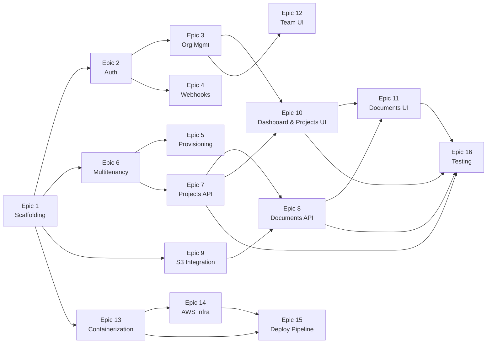

# Multi-tenant SaaS Starter — Technical Task Breakdown

## Epic Overview

| Epic | Name | Scope | Deps | Effort | Slices | Status |
|------|------|-------|------|--------|--------|--------|
| 1 | Scaffolding & Local Dev | Both | — | M | — | **Done** |
| 2 | Auth & Clerk Integration | Frontend | 1 | M | — | **Done** |
| 3 | Organization Management | Frontend | 2 | S | — | **Done** |
| 4 | Webhook Infrastructure | Frontend | 1, 2 | M | 4A, 4B | |
| 5 | Tenant Provisioning | Backend | 1, 6 | L | 5A, 5B, 5C | |
| 6 | Multitenancy Backend | Backend | 1 | L | — | **Done** |
| 7 | Core API — Projects | Backend | 6 | M | 7A, 7B | |
| 8 | Core API — Documents | Backend | 7, 9 | M | 8A, 8B | |
| 9 | S3 Integration | Backend | 1 | S | — | |
| 10 | Dashboard & Projects UI | Frontend | 3, 7 | M | 10A, 10B, 10C | |
| 11 | Documents UI | Frontend | 10, 8 | M | 11A, 11B | |
| 12 | Team Management UI | Frontend | 3 | S | — | |
| 13 | Containerization | Both | 1 | S | — | **Done** |
| 14 | AWS Infrastructure | Infra | 13 | XL | 14A–14D | |
| 15 | Deployment Pipeline | Infra | 13, 14 | L | 15A, 15B | |
| 16 | Testing & Quality | Both | 7, 8, 10, 11 | L | 16A–16C | |

---

## Epic 1: Project Scaffolding & Local Development

**Goal**: Establish monorepo structure, initialize both projects with correct tooling, and set up Docker Compose for local development.

**Dependencies**: None

**Estimated Effort**: M

**Status**: **Complete**

### Tasks

| ID | Task | Status | Notes |
|----|------|--------|-------|
| 1.1 | Initialize monorepo structure | **Done** | Root `.gitignore`, `.editorconfig`, `README.md`. Directories: `frontend/`, `backend/`, `compose/`, `infra/`, `.github/`. |
| 1.2 | Initialize Next.js project | **Done** | Next.js 16.1.6, TypeScript 5, Tailwind CSS v4, App Router. Path alias `@/*`. Package manager: pnpm. |
| 1.3 | Install and configure Shadcn UI | **Done** | new-york style, 8 components: Button, Card, Input, Dialog, Table, DropdownMenu, Separator, Badge. |
| 1.4 | Initialize Spring Boot project | **Done** | Spring Boot 4.0.2, Java 25, Maven (not Gradle). Profiles: `application.yml` + `-local.yml`, `-dev.yml`, `-prod.yml`. `LocalSecurityConfig.java` permits all requests in local profile (replaced in Epic 6). |
| 1.5 | Create Docker Compose for local services | **Done** | `compose/docker-compose.yml` with Postgres 16 + LocalStack. Healthchecks configured. |
| 1.6 | Configure environment files | **Done** | `frontend/.env.local.example` (Clerk keys, backend URL, API key). Backend config in `application-local.yml` (Postgres at `b2mash.local:5432`, LocalStack S3). |
| 1.7 | Set up frontend linting and formatting | **Done** | ESLint (flat config), Prettier + `prettier-plugin-tailwindcss`. Scripts: `pnpm run lint`, `pnpm run format`, `pnpm run format:check`. |
| 1.8 | Set up backend linting and formatting | **Done** | Spotless 3.2.1 + Google Java Format 1.28.0 (Java 25 compatible). `./mvnw spotless:check` and `./mvnw spotless:apply`. |
| 1.9 | Create basic CI workflow | **Done** | `.github/workflows/ci.yml` — parallel frontend (pnpm lint, format:check, build) and backend (spotless:check, test, package) jobs. Triggers on PR and push to main. |
| 1.10 | Add LocalStack S3 init script | **Done** | `compose/data/s3/init-s3.sh` creates `docteams-dev` bucket on startup. |

### Deviations from Original Plan
- **Maven instead of Gradle** — Spring Boot project was generated with Maven, not Gradle. Commands use `./mvnw` instead of `./gradlew`.
- **pnpm instead of npm** — Standardized on pnpm for faster installs and strict dependency resolution.
- **Docker Compose in `compose/`** — Lives in a subdirectory rather than repo root, with its own `.env`.
- **Spotless 3.2.1** — Required for Java 25 compatibility (2.x has `NoSuchMethodError` on `DeferredDiagnosticHandler`).
- **google-java-format 1.28.0** — Required for Java 25 (1.19.x incompatible).

---

## Epic 2: Authentication & Clerk Integration

**Goal**: Integrate Clerk for authentication in Next.js — sign-up, sign-in, session management, and JWT extraction for API calls.

**Dependencies**: Epic 1

**Estimated Effort**: M

**Status**: **Complete**

### Tasks

| ID | Task | Status | Notes |
|----|------|--------|-------|
| 2.1 | Create Clerk development instance | **Done** | Clerk dev instance created with Organizations enabled. Keys in `.env.local`. |
| 2.2 | Install Clerk Next.js SDK | **Done** | `@clerk/nextjs` ^6.37.2 already installed. `<ClerkProvider>` wraps root layout with `cssLayerName: "clerk"` for Tailwind v4 compatibility. |
| 2.3 | Configure Clerk middleware | **Done** | `middleware.ts` with `clerkMiddleware()`. Public routes: `/`, `/sign-in(.*)`, `/sign-up(.*)`, `/api/webhooks(.*)`. `organizationSyncOptions` pre-configured for Epic 3. |
| 2.4 | Create sign-up page | **Done** | `app/(auth)/sign-up/[[...sign-up]]/page.tsx` with Clerk `<SignUp />`. Centered auth layout. |
| 2.5 | Create sign-in page | **Done** | `app/(auth)/sign-in/[[...sign-in]]/page.tsx` with Clerk `<SignIn />`. |
| 2.6 | Implement JWT extraction utility | **Done** | `lib/api.ts` with typed `apiClient<T>()` — attaches Bearer JWT via `auth().getToken()`. Custom `ApiError` class. |
| 2.7 | Create authenticated layout shell | **Done** | `app/(app)/layout.tsx` with sidebar (Dashboard, Projects, Team nav links), header with `<UserButton />`. Placeholder dashboard at `/dashboard`. |

### Additional Items
- **Webhook handler stub**: `app/api/webhooks/clerk/route.ts` using `verifyWebhook` from `@clerk/nextjs/webhooks`. Stubs for `organization.created` and `organization.updated` events (full implementation in Epic 4).
- **Landing page fix**: Replaced `<a>` tags with Next.js `<Link>` to fix ESLint `no-html-link-for-pages` errors.
- **Env vars**: Added `NEXT_PUBLIC_CLERK_SIGN_IN_URL`, `NEXT_PUBLIC_CLERK_SIGN_UP_URL`, and fallback redirect URLs to `.env.local` and `.env.local.example`.

### Deviations from Original Plan
- **Temporary `/dashboard` route**: Post-auth redirect goes to `/dashboard` (not org-scoped) since Epic 3 hasn't been implemented yet. Will be replaced with `/org/[slug]/dashboard` in Epic 3.
- **Next.js 16 middleware deprecation**: Next.js 16 shows a warning that `middleware.ts` is deprecated in favor of `proxy.ts`. The middleware still works correctly but may need migration in a future update.

---

## Epic 3: Organization Management

**Goal**: Enable org creation, switching, and URL-based org context with Clerk's organization features.

**Dependencies**: Epic 2

**Estimated Effort**: S

**Status**: **Complete**

### Tasks

| ID | Task | Status | Notes |
|----|------|--------|-------|
| 3.1 | Create org creation page | **Done** | `app/(app)/create-org/page.tsx` with `<CreateOrganization />`. `afterCreateOrganizationUrl="/org/:slug/dashboard"`. |
| 3.2 | Configure org-based URL routing | **Done** | `organizationSyncOptions` already configured in middleware (from Epic 2). Created `app/(app)/org/[slug]/layout.tsx` with sidebar, validates slug against active org, redirects on mismatch. |
| 3.3 | Implement org switcher | **Done** | `<OrganizationSwitcher />` in org layout header with `afterSelectOrganizationUrl="/org/:slug/dashboard"` and `hidePersonal`. |
| 3.4 | Create org-scoped dashboard page | **Done** | `app/(app)/org/[slug]/dashboard/page.tsx` showing org name. Placeholder pages added for `/projects` and `/team`. |
| 3.5 | Handle no-org state | **Done** | `/dashboard` page acts as redirect: active org → `/org/[slug]/dashboard`, no active org but has memberships → first org's dashboard, no orgs → `/create-org`. |

### Architecture Decisions
- **Sidebar moved to org layout**: `(app)/layout.tsx` simplified to pass-through. Sidebar with org-scoped nav links lives in `org/[slug]/layout.tsx`. This means create-org and redirect pages render without the sidebar.
- **Org switcher placement**: Header bar with `OrganizationSwitcher` (left) and `UserButton` (right).
- **Redirect flow**: Post-auth fallback URL remains `/dashboard` which handles all redirect logic server-side using `clerkClient().users.getOrganizationMembershipList()`.

---

## Epic 4: Webhook Infrastructure

**Goal**: Receive, verify, and process Clerk webhook events with idempotency and error handling.

**Dependencies**: Epic 1, Epic 2

**Scope**: Frontend

**Estimated Effort**: M

### Slices

| Slice | Tasks | Summary |
|-------|-------|---------|
| **4A** | 4.1, 4.3, 4.4, 4.7 | Core webhook flow — route handler, event router, org.created handler, auth exclusion |
| **4B** | 4.2, 4.5, 4.6, 4.8 | Clerk config, org.updated handler, idempotency layer, tests |

### Tasks

| ID | Task | Description | Acceptance Criteria | Estimate | Dependencies |
|----|------|-------------|---------------------|----------|--------------|
| 4.1 | Create webhook route handler | Create `app/api/webhooks/clerk/route.ts` as a POST handler. Use `verifyWebhook(req)` from `@clerk/nextjs/webhooks` for signature verification. Parse event type and payload. | Route accepts POST requests; invalid signatures return 400; valid signatures return 200. | 2h | 2.2 |
| 4.2 | Configure Clerk webhook endpoint | In Clerk Dashboard, add webhook endpoint pointing to the app's `/api/webhooks/clerk` URL. Subscribe to org, membership, and invitation events. Note the signing secret. | Clerk Dashboard shows endpoint configured with all 9 event types subscribed. | 1h | 4.1 |
| 4.3 | Implement event router | Build a switch/map that routes verified events to handler functions by event type (`organization.created`, `organization.updated`, etc.). Log unhandled event types. | Each event type dispatches to its handler function; unknown events are logged and acknowledged with 200. | 2h | 4.1 |
| 4.4 | Implement organization.created handler | On `organization.created`: call Spring Boot `POST /internal/orgs/provision` with `clerkOrgId` and `orgName`. Include `X-API-KEY` header. Handle success/failure. | Org creation in Clerk triggers provisioning call to Spring Boot; errors are logged; webhook returns 200 regardless (fire-and-forget for MVP). | 3h | 4.3 |
| 4.5 | Implement organization.updated handler | On `organization.updated`: call Spring Boot to upsert org metadata. Compare `updated_at` to handle out-of-order events. | Org name changes in Clerk are reflected in backend; stale events are discarded. | 2h | 4.3 |
| 4.6 | Implement idempotency layer | Extract `svix-id` from headers. Before processing, check if ID exists in `processed_webhooks` table (via backend API or direct DB call). Skip if already processed. Store after successful processing. | Duplicate webhook deliveries are detected and skipped; `processed_webhooks` table populated. | 3h | 4.3 |
| 4.7 | Exclude webhook route from Clerk auth | Ensure `middleware.ts` marks `/api/webhooks/clerk` as a public route so Clerk middleware does not reject the Svix-signed requests. | Webhook requests from Clerk (no Clerk session cookie) are not blocked by middleware. | 1h | 2.3, 4.1 |
| 4.8 | Add webhook handler tests | Write tests for signature verification (mock valid/invalid signatures), event routing, and idempotency (duplicate detection). | Tests cover: valid signature → 200, invalid signature → 400, duplicate svix-id → skipped, unknown event → 200. | 3h | 4.1, 4.6 |

---

## Epic 5: Tenant Provisioning

**Goal**: Implement the internal provisioning API that creates tenant schemas, runs Flyway migrations, and maintains org-schema mappings. Include startup migration runner for existing tenants.

**Dependencies**: Epic 1, Epic 6

**Scope**: Backend

**Estimated Effort**: L

### Slices

| Slice | Tasks | Summary |
|-------|-------|---------|
| **5A** | 5.1, 5.2, 5.3 | Global + tenant Flyway migrations, schema name generator |
| **5B** | 5.4, 5.6, 5.7 | Provisioning service, provisioning controller, API key auth filter |
| **5C** | 5.5, 5.8, 5.9, 5.10 | Dual data sources, startup migration runner, Resilience4j retry, integration tests |

### Tasks

| ID | Task | Description | Acceptance Criteria | Estimate | Dependencies |
|----|------|-------------|---------------------|----------|--------------|
| 5.1 | Create global schema migrations | Write Flyway migrations in `db/migration/global/` for `public` schema tables: `organizations`, `org_schema_mapping`, `processed_webhooks`. | `flyway migrate` creates all three tables in `public` schema with correct columns, constraints, and indexes. | 2h | 1.4 |
| 5.2 | Create tenant schema migrations | Write Flyway migrations in `db/migration/tenant/` for tenant tables: `projects`, `documents`. | Flyway migrations create `projects` and `documents` tables with correct columns, FKs, and indexes when run against any schema. | 2h | 1.4 |
| 5.3 | Implement schema name generator | Create `SchemaNameGenerator` that derives a deterministic schema name (`tenant_<12-char-hex>`) from a Clerk org ID using UUID v5 or equivalent hash. | Same org ID always produces the same schema name; name matches pattern `tenant_[a-f0-9]{12}`; different org IDs produce different names. | 2h | 1.4 |
| 5.4 | Implement provisioning service | Create `ProvisioningService` with method `provisionTenant(clerkOrgId, orgName)`: insert org, generate schema name, insert mapping, create schema, run Flyway tenant migrations, update status to COMPLETED. Each step idempotent. | New org ID → schema created and migrated, status COMPLETED. Existing org ID → returns existing mapping (idempotent). Failed step → status FAILED, safe to retry. | 4h | 5.1, 5.2, 5.3 |
| 5.5 | Configure dual data sources | Set up two Spring data sources: `appDataSource` (pooled Neon connection for app traffic) and `migrationDataSource` (direct Neon connection for Flyway). Configure HikariCP pool settings per ADR-006. | App queries use pooled connection; Flyway migrations use direct connection; HikariCP pool size 10, max-lifetime 28 min. | 3h | 1.4 |
| 5.6 | Implement provisioning controller | Create `POST /internal/orgs/provision` endpoint. Validate request body (clerkOrgId required). Secure with `ApiKeyAuthFilter`. Return 201 on success, 409 if already provisioned. | Authenticated requests provision tenants; unauthenticated requests get 401; duplicate requests get 409 with existing mapping. | 2h | 5.4 |
| 5.7 | Implement API key auth filter | Create `ApiKeyAuthFilter` that validates `X-API-KEY` header against expected value (from Secrets Manager / env var) for `/internal/**` paths. Skip filter for other paths. | Requests to `/internal/**` without valid API key receive 401; requests with valid key pass through; `/api/**` routes unaffected. | 2h | 1.4 |
| 5.8 | Implement startup migration runner | Create `TenantMigrationRunner` (`@PostConstruct` or `ApplicationRunner`) that on startup: runs global migrations, queries all tenant schemas, runs tenant migrations for each. | Application startup applies pending global migrations then applies pending tenant migrations to all existing tenants. New migration file → all tenants updated on next deploy. | 3h | 5.1, 5.2, 5.5 |
| 5.9 | Add Resilience4j retry to provisioning | Add `@Retry` annotation to provisioning service method with config: maxAttempts=3, waitDuration=1s, multiplier=2. Retry on `SQLException` and `TransientDataAccessException`. | Transient DB failures retry up to 3 times with exponential backoff; permanent failures (e.g., invalid input) fail immediately. | 2h | 5.4 |
| 5.10 | Add provisioning integration tests | Test full provisioning flow against local Postgres: create schema, run migrations, verify tables exist, verify idempotency (re-provisioning same org ID). | Tests pass against Docker Postgres; schema created; tables exist; re-provision returns existing mapping. | 3h | 5.4, 5.8 |

---

## Epic 6: Multitenancy Backend

**Goal**: Configure Hibernate schema-per-tenant multitenancy, tenant context resolution from JWT, Spring Security with Clerk JWT validation, and RBAC role mapping.

**Dependencies**: Epic 1

**Estimated Effort**: L

**Status**: **Complete**

### Tasks

| ID | Task | Description | Acceptance Criteria | Estimate | Dependencies |
|----|------|-------------|---------------------|----------|--------------|
| 6.1 | Implement TenantContext | Create `TenantContext` class using `ThreadLocal<String>` to store/retrieve current tenant schema name. Include `clear()` method. | `TenantContext.setTenantId("tenant_xxx")` → `TenantContext.getTenantId()` returns `"tenant_xxx"` on the same thread; `clear()` removes it. | 1h | 1.4 |
| 6.2 | Implement CurrentTenantIdentifierResolver | Create `TenantIdentifierResolver` implementing `CurrentTenantIdentifierResolver<String>` and `HibernatePropertiesCustomizer`. Returns tenant ID from `TenantContext` or `"public"` as default. | Hibernate calls `resolveCurrentTenantIdentifier()` and gets the schema name from `TenantContext`. | 2h | 6.1 |
| 6.3 | Implement MultiTenantConnectionProvider | Create `SchemaMultiTenantConnectionProvider` implementing `MultiTenantConnectionProvider<String>` and `HibernatePropertiesCustomizer`. `getConnection()` sets `search_path`; `releaseConnection()` resets to `public`. | Connection checkout sets `search_path` to tenant schema; connection release resets to `public`; verified with integration test. | 3h | 6.1 |
| 6.4 | Configure Hibernate for multitenancy | Register both resolver and connection provider via `HibernatePropertiesCustomizer`. Ensure Hibernate auto-detects schema multitenancy mode. Disable `ddl-auto`. | Hibernate initializes in multi-tenant mode; queries execute against the correct tenant schema. | 2h | 6.2, 6.3 |
| 6.5 | Implement Clerk JWT validation filter | Create `ClerkJwtAuthFilter` (Spring Security filter) that: extracts `Authorization: Bearer <jwt>`, validates signature against Clerk JWKS endpoint, checks expiry and issuer, extracts `sub`, `org_id`, `org_role`. Use Spring Security's `JwtDecoder` with Clerk's JWKS URI. | Valid Clerk JWT → authentication set in SecurityContext; expired/invalid JWT → 401; missing JWT → 401. | 4h | 1.4 |
| 6.6 | Implement Clerk role converter | Create `ClerkRoleConverter` that maps Clerk org roles to Spring authorities: `org:owner` → `ROLE_ORG_OWNER`, `org:admin` → `ROLE_ORG_ADMIN`, `org:member` → `ROLE_ORG_MEMBER`. Wire into JWT auth filter. | JWT with `org_role: "org:admin"` → SecurityContext contains `ROLE_ORG_ADMIN` authority. | 2h | 6.5 |
| 6.7 | Implement tenant context filter | Create `TenantFilter` (servlet filter, ordered after JWT filter) that extracts `org_id` from the authenticated principal, looks up schema name from `org_schema_mapping` (with caching), and sets `TenantContext`. | After filter chain: `TenantContext.getTenantId()` returns the correct `tenant_xxx` schema name for the authenticated org. | 3h | 6.1, 6.5 |
| 6.8 | Configure Spring Security filter chain | Wire filter order: `ClerkJwtAuthFilter` → `TenantFilter` → `TenantLoggingFilter` → controller. Configure `SecurityFilterChain` with endpoint authorization rules. Exclude `/internal/**` from JWT auth (uses API key instead). | `/api/**` requires valid JWT; `/internal/**` requires valid API key; role-based access enforced per endpoint. | 3h | 6.5, 6.6, 6.7 |
| 6.9 | Implement tenant logging filter | Create `TenantLoggingFilter` (ordered after tenant filter) that sets MDC fields: `tenantId`, `userId`, `requestId`. Clear MDC on response. | Every log line within a request includes tenantId, userId, and requestId. MDC cleared after request completes. | 2h | 6.7 |
| 6.10 | Configure structured JSON logging | Set `logging.structured.format.console=ecs` in `application.yml`. Verify JSON output includes MDC fields. | Log output is structured JSON (ECS format); MDC fields (`tenantId`, `userId`, `requestId`) appear in every log entry. | 1h | 6.9 |
| 6.11 | Add multitenancy integration tests | Test: set TenantContext to schema A, query → get schema A data; set to schema B, query → get schema B data; verify no cross-schema leakage. | Tests prove tenant isolation: data written in schema A is not visible in schema B and vice versa. | 3h | 6.4, 6.7 |

---

## Epic 7: Core API — Projects

**Goal**: Implement project CRUD endpoints with tenant-scoped data access and role-based authorization.

**Dependencies**: Epic 6

**Scope**: Backend

**Estimated Effort**: M

### Slices

| Slice | Tasks | Summary |
|-------|-------|---------|
| **7A** | 7.1, 7.2, 7.3 | Project entity, repository, service layer |
| **7B** | 7.4, 7.5, 7.6, 7.7 | REST controller, input validation, RBAC authorization, tests |

### Tasks

| ID | Task | Description | Acceptance Criteria | Estimate | Dependencies |
|----|------|-------------|---------------------|----------|--------------|
| 7.1 | Create Project entity | Define `Project` JPA entity with fields: `id` (UUID), `name`, `description`, `createdAt`, `updatedAt`, `createdBy`. Map to `projects` table (tenant schema). | Entity compiles; Hibernate maps it to `projects` table in current tenant schema. | 1h | 6.4 |
| 7.2 | Create ProjectRepository | Define Spring Data JPA repository for Project entity. | Repository interface extends `JpaRepository<Project, UUID>`; standard CRUD methods available. | 1h | 7.1 |
| 7.3 | Implement ProjectService | Create service layer with methods: `listProjects()`, `getProject(id)`, `createProject(name, desc)`, `updateProject(id, name, desc)`, `deleteProject(id)`. Set `createdBy` from SecurityContext. | Service methods correctly delegate to repository; `createdBy` set from authenticated user ID. | 2h | 7.2 |
| 7.4 | Implement ProjectController | Create REST controller with endpoints: `GET /api/projects`, `POST /api/projects`, `GET /api/projects/{id}`, `PUT /api/projects/{id}`, `DELETE /api/projects/{id}`. Add request/response DTOs. | All 5 endpoints reachable; correct HTTP status codes (200, 201, 204, 404); JSON request/response bodies. | 3h | 7.3 |
| 7.5 | Add input validation | Add `@Valid` and Bean Validation annotations to project DTOs: `name` required (max 255 chars), `description` optional (max 2000 chars). Return 400 with field-level errors on invalid input. | Missing name → 400 with error details; name > 255 chars → 400; valid input → success. | 1h | 7.4 |
| 7.6 | Add role-based authorization | Configure endpoint authorization: `POST /api/projects` requires `ROLE_ORG_ADMIN+`; `DELETE /api/projects/{id}` requires `ROLE_ORG_OWNER`; `GET` endpoints allow `ROLE_ORG_MEMBER+`. Use `@PreAuthorize` or SecurityFilterChain. | Member can list/view projects but not create/delete; admin can create but not delete; owner can do all. Forbidden → 403. | 2h | 7.4, 6.8 |
| 7.7 | Add project endpoint tests | Unit tests for controller (mock service) and integration tests with test tenant schema. Cover: CRUD operations, validation errors, authorization (member vs admin vs owner). | All tests pass; coverage for happy path, validation errors, and authorization rules. | 3h | 7.4, 7.5, 7.6 |

---

## Epic 8: Core API — Documents

**Goal**: Implement document metadata endpoints, presigned URL generation for uploads/downloads, and upload confirmation flow.

**Dependencies**: Epic 7, Epic 9

**Scope**: Backend

**Estimated Effort**: M

### Slices

| Slice | Tasks | Summary |
|-------|-------|---------|
| **8A** | 8.1, 8.2, 8.3, 8.4, 8.5 | Document entity, repo, service, upload-init + upload-confirm endpoints |
| **8B** | 8.6, 8.7, 8.8, 8.9 | Document listing, presigned download, authorization, tests |

### Tasks

| ID | Task | Description | Acceptance Criteria | Estimate | Dependencies |
|----|------|-------------|---------------------|----------|--------------|
| 8.1 | Create Document entity | Define `Document` JPA entity with fields: `id` (UUID), `projectId` (FK), `fileName`, `contentType`, `size`, `s3Key`, `status` (PENDING/UPLOADED/FAILED), `uploadedAt`, `uploadedBy`. | Entity compiles; Hibernate maps to `documents` table with FK to `projects`. | 1h | 7.1 |
| 8.2 | Create DocumentRepository | Define Spring Data JPA repository for Document. Add query method: `findByProjectId(UUID projectId)`. | Repository methods work; `findByProjectId` returns documents for a given project. | 1h | 8.1 |
| 8.3 | Implement DocumentService | Service methods: `listDocuments(projectId)`, `initiateUpload(projectId, fileName, contentType, size)`, `confirmUpload(documentId)`, `getPresignedDownloadUrl(documentId)`. Validate project exists in same tenant. | Upload init creates PENDING document and returns presigned URL; confirm sets status to UPLOADED; download returns presigned GET URL. | 3h | 8.2, 9.3 |
| 8.4 | Implement upload-init endpoint | `POST /api/projects/{projectId}/documents/upload-init` — accepts `{fileName, contentType, size}`, returns `{documentId, presignedUrl, expiresIn}`. | Endpoint returns 201 with presigned URL; document created in DB with status PENDING; S3 key follows `org/{orgId}/project/{projId}/{docId}` format. | 2h | 8.3 |
| 8.5 | Implement upload-confirm endpoint | `POST /api/documents/{documentId}/confirm` — validates document exists and belongs to current tenant, updates status to UPLOADED. | Confirm on PENDING document → status UPLOADED, 200; confirm on already-UPLOADED → 200 (idempotent); confirm on non-existent → 404. | 2h | 8.3 |
| 8.6 | Implement document listing endpoint | `GET /api/projects/{projectId}/documents` — returns list of documents for a project. Include all metadata fields. | Returns array of document objects for the given project; only returns documents in the current tenant schema. | 1h | 8.3 |
| 8.7 | Implement presigned download endpoint | `GET /api/documents/{documentId}/presign-download` — validates document exists, status is UPLOADED, generates presigned GET URL. | Returns presigned URL with 1-hour expiry; 404 if document not found; 400 if document status is not UPLOADED. | 2h | 8.3 |
| 8.8 | Add authorization to document endpoints | Upload init requires `ROLE_ORG_MEMBER+`; download requires `ROLE_ORG_MEMBER+`; validate project belongs to current tenant. | Members can upload and download; non-members get 403; cross-tenant project IDs return 404. | 2h | 8.4, 8.5, 8.6, 8.7, 6.8 |
| 8.9 | Add document endpoint tests | Unit and integration tests: upload flow (init → confirm), listing, download URL generation, authorization, cross-tenant isolation. | All tests pass; upload flow works end-to-end against test S3 (LocalStack); tenant isolation verified. | 3h | 8.4, 8.5, 8.6, 8.7, 8.8 |

---

## Epic 9: S3 Integration

**Goal**: Configure AWS SDK for S3 presigned URL generation, with LocalStack support for local development.

**Dependencies**: Epic 1

**Scope**: Backend

**Estimated Effort**: S (single slice — 4 tasks)

### Tasks

| ID | Task | Description | Acceptance Criteria | Estimate | Dependencies |
|----|------|-------------|---------------------|----------|--------------|
| 9.1 | Add AWS SDK dependencies | Add AWS SDK v2 dependencies to Gradle: `s3`, `s3-transfer-manager`, `sts` (for role assumption). | Dependencies resolve; project compiles. | 1h | 1.4 |
| 9.2 | Create S3 configuration | Create `S3Config` that builds `S3Client` and `S3Presigner` beans. For local profile, configure endpoint override to LocalStack (`http://localhost:4566`). For prod, use default AWS credentials chain. | `S3Client` bean available; local profile points to LocalStack; prod profile uses IAM credentials. | 2h | 9.1 |
| 9.3 | Implement S3PresignedUrlService | Create service with methods: `generateUploadUrl(orgId, projectId, documentId, contentType)` — returns presigned PUT URL with 1h expiry; `generateDownloadUrl(s3Key)` — returns presigned GET URL with 1h expiry. Key format: `org/{orgId}/project/{projectId}/{documentId}`. | Upload URL allows PUT with correct content type; download URL allows GET; both expire after 1 hour; keys follow correct format. | 3h | 9.2 |
| 9.4 | Add S3 integration tests | Test presigned URL generation against LocalStack: generate upload URL, PUT a file, generate download URL, GET the file, verify content matches. | End-to-end test passes: file uploaded via presigned URL is downloadable via separate presigned URL with matching content. | 2h | 9.3, 1.10 |

---

## Epic 10: Frontend — Dashboard & Projects

**Goal**: Build the dashboard layout and project management UI with org-scoped data fetching from Spring Boot.

**Dependencies**: Epic 3, Epic 7

**Scope**: Frontend

**Estimated Effort**: M

### Slices

| Slice | Tasks | Summary |
|-------|-------|---------|
| **10A** | 10.1, 10.2 | App shell layout (sidebar, header, responsive), typed API client |
| **10B** | 10.3, 10.4, 10.8 | Projects list page, create dialog, dashboard page |
| **10C** | 10.5, 10.6, 10.7 | Project detail page, edit functionality, delete with confirmation |

### Tasks

| ID | Task | Description | Acceptance Criteria | Estimate | Dependencies |
|----|------|-------------|---------------------|----------|--------------|
| 10.1 | Build app shell layout | Create `app/(app)/org/[slug]/layout.tsx` with responsive sidebar navigation (Dashboard, Projects, Team, Settings), header with org switcher and user button, main content area. Use Shadcn UI components. | Layout renders on all org-scoped pages; sidebar highlights active route; org switcher and user button visible in header; responsive on mobile. | 4h | 3.2, 1.3 |
| 10.2 | Implement API client | Create `lib/api.ts` with typed fetch wrapper: attaches Bearer JWT, sets `Content-Type`, handles error responses (401 → redirect to sign-in, 403 → forbidden page, 404 → not found). Base URL from `BACKEND_URL` env var. | API client sends authenticated requests to backend; error handling works for all status codes; TypeScript types for request/response. | 3h | 2.6 |
| 10.3 | Build projects list page | Create `app/(app)/org/[slug]/projects/page.tsx` as a server component. Fetch projects from `GET /api/projects`. Display as card grid or table. Show empty state with CTA to create first project. | Projects page lists all org projects; empty state shown when no projects; each card links to project detail. | 3h | 10.1, 10.2 |
| 10.4 | Build project create dialog | Create a dialog/modal component for creating a new project (name + description fields). Call `POST /api/projects` on submit. Show validation errors. Refresh project list on success. | Dialog opens from "New Project" button; form validates name required; success creates project and refreshes list; errors shown inline. | 3h | 10.3 |
| 10.5 | Build project detail page | Create `app/(app)/org/[slug]/projects/[id]/page.tsx`. Fetch project details from `GET /api/projects/{id}`. Show project name, description, created date. Include document section (placeholder for Epic 11). Tab or section for documents. | Project detail page shows correct project; 404 page for invalid project IDs; document section placeholder visible. | 3h | 10.3 |
| 10.6 | Build project edit functionality | Add edit capability to project detail page: inline edit or edit dialog for name/description. Call `PUT /api/projects/{id}`. Show only for admin+ roles. | Edit button visible for admin/owner; form pre-filled with current values; save updates project; changes reflected immediately. | 2h | 10.5 |
| 10.7 | Build project delete functionality | Add delete button to project detail page (owner only). Confirmation dialog before deletion. Call `DELETE /api/projects/{id}`. Redirect to projects list on success. | Delete button visible only for owner role; confirmation dialog prevents accidental deletion; successful delete redirects to list. | 2h | 10.5 |
| 10.8 | Implement dashboard page | Build `app/(app)/org/[slug]/dashboard/page.tsx` showing: org name, project count, recent projects (top 5), quick-action buttons (create project, invite member). | Dashboard shows accurate project count; recent projects link to detail pages; quick actions work. | 3h | 10.1, 10.2 |

---

## Epic 11: Frontend — Documents

**Goal**: Build document list, file upload with progress tracking, and download functionality.

**Dependencies**: Epic 10, Epic 8

**Scope**: Frontend

**Estimated Effort**: M

### Slices

| Slice | Tasks | Summary |
|-------|-------|---------|
| **11A** | 11.1, 11.2 | Document list component, drag-and-drop upload with presigned URL flow |
| **11B** | 11.3, 11.4, 11.5, 11.6 | Upload progress tracking, download functionality, error handling, file validation |

### Tasks

| ID | Task | Description | Acceptance Criteria | Estimate | Dependencies |
|----|------|-------------|---------------------|----------|--------------|
| 11.1 | Build document list component | Create a component that fetches and displays documents for a project (`GET /api/projects/{id}/documents`). Show file name, size, upload date, uploader, status. | Document list renders within project detail page; shows all document metadata; empty state when no documents. | 3h | 10.5 |
| 11.2 | Build file upload component | Create a drag-and-drop (and click-to-browse) file upload component. On file selection: call upload-init API, upload to S3 via presigned URL (using `fetch` with PUT), call confirm API on success. | User can drag-and-drop or browse for files; file uploads to S3 via presigned URL; document appears in list after confirmation. | 4h | 11.1 |
| 11.3 | Add upload progress tracking | Track upload progress using `XMLHttpRequest` or `fetch` with `ReadableStream`. Show progress bar during upload. Handle states: selecting → uploading → confirming → complete / error. | Progress bar shows real-time upload percentage; state transitions are visible to user; completion triggers list refresh. | 3h | 11.2 |
| 11.4 | Implement download functionality | Add download button to each document in the list. On click: call presign-download API, open presigned URL in new tab or trigger browser download. | Clicking download fetches presigned URL and initiates browser download; works for all file types. | 2h | 11.1 |
| 11.5 | Handle upload errors | Show error messages for: file too large, network failure during upload, S3 errors, confirmation failures. Allow retry. | Error states shown with clear messages; retry button re-initiates the upload; failed uploads show PENDING status in list. | 2h | 11.2, 11.3 |
| 11.6 | Add file type and size validation | Client-side validation before upload: max file size (e.g., 100MB), allowed file types (configurable). Show error if validation fails. | Files exceeding max size show error before upload; disallowed file types show error; valid files proceed to upload. | 1h | 11.2 |

---

## Epic 12: Frontend — Team Management

**Goal**: Build team management UI using Clerk's organization components — member list, invitations, and role display.

**Dependencies**: Epic 3

**Scope**: Frontend

**Estimated Effort**: S (single slice — 5 tasks, mostly Clerk components)

### Tasks

| ID | Task | Description | Acceptance Criteria | Estimate | Dependencies |
|----|------|-------------|---------------------|----------|--------------|
| 12.1 | Build team management page | Create `app/(app)/org/[slug]/team/page.tsx` with tabs or sections: Members, Invitations. | Team page renders with navigation between members and invitations sections. | 2h | 10.1 |
| 12.2 | Build member list | Use Clerk's `<OrganizationMembershipList />` or custom component fetching members via Clerk SDK. Show name, email, role, joined date. | All org members listed with correct roles; list updates when members are added/removed. | 2h | 12.1 |
| 12.3 | Build invitation form | Create form for inviting users: email input, role selector (member/admin). Use Clerk's `<OrganizationInvitationList />` or `organization.invitations.create()` API. Only visible to admin+. | Admin/owner can send invitations; role selector shows available roles; success shows confirmation; form validates email format. | 3h | 12.1 |
| 12.4 | Build pending invitations list | Display pending invitations with email, role, invited date. Allow admin+ to revoke invitations. Use Clerk SDK to fetch and manage invitations. | Pending invitations listed; revoke button works; list updates after revocation. | 2h | 12.1 |
| 12.5 | Add role-based visibility | Hide invitation form and revoke buttons for members. Show role management options only for owners. | Members see read-only member list; admins can invite; owners can invite and manage roles. | 1h | 12.2, 12.3, 12.4 |

---

## Epic 13: Containerization

**Goal**: Create production-ready Docker images for both services and a full Docker Compose stack for local development.

**Dependencies**: Epic 1

**Estimated Effort**: S

**Status**: **Complete**

### Tasks

| ID | Task | Status | Notes |
|----|------|--------|-------|
| 13.1 | Create Next.js Dockerfile | **Done** | Multi-stage build: `node:20-alpine`, pnpm, standalone output. Non-root `nextjs` user. `NEXT_PUBLIC_CLERK_PUBLISHABLE_KEY` passed as build arg. Image ~208MB. |
| 13.2 | Create Spring Boot Dockerfile | **Done** | Multi-stage build: `eclipse-temurin:25-jdk` for build, `eclipse-temurin:25-jre-alpine` for runtime. Spring Boot 4 layered JAR extraction (`java -Djarmode=tools extract --layers`). Non-root `spring` user. Image ~289MB. |
| 13.3 | Create full Docker Compose stack | **Done** | Extended `compose/docker-compose.yml` with `backend` and `frontend` services. Backend depends on postgres + localstack (healthchecks), frontend depends on backend (healthcheck). Environment variables configured for inter-service communication. |
| 13.4 | Optimize Docker images | **Done** | `.dockerignore` files for both `frontend/` and `backend/`. Dependency install cached separately from code changes. |
| 13.5 | Document local Docker setup | **Done** | README.md updated with "Quick Start (Full Docker Stack)" section including setup, build, verify, and troubleshooting steps. |

### Architecture Decisions
- **Standalone output for Next.js**: `output: "standalone"` in `next.config.ts` produces a minimal server (`server.js`) without requiring full `node_modules` at runtime.
- **Clerk build arg**: `NEXT_PUBLIC_CLERK_PUBLISHABLE_KEY` must be passed as `--build-arg` because Next.js inlines `NEXT_PUBLIC_*` variables at build time. Clerk validates key format during static page generation.
- **Spring Boot layered JAR**: Spring Boot 4 uses `java -Djarmode=tools -jar app.jar extract --layers` (changed from `layertools` in Spring Boot 3). Layers: `dependencies/`, `spring-boot-loader/`, `snapshot-dependencies/`, `application/`. Entry point: `org.springframework.boot.loader.launch.JarLauncher`.
- **Docker Compose env**: `.env.example` updated with Clerk keys and `INTERNAL_API_KEY`. Users copy to `.env` and fill in their Clerk keys before running `docker compose up`.

---

## Epic 14: AWS Infrastructure

**Goal**: Define all AWS infrastructure in Terraform — VPC, ECS, ALB, ECR, Secrets Manager, S3, IAM.

**Dependencies**: Epic 13

**Scope**: Infra

**Estimated Effort**: XL

### Slices

| Slice | Tasks | Summary |
|-------|-------|---------|
| **14A** | 14.1, 14.2, 14.3 | Terraform project structure, VPC (2 public + 2 private subnets), security groups |
| **14B** | 14.4, 14.5, 14.6 | ALB (public + internal), ECR repositories, ECS cluster + Fargate services |
| **14C** | 14.7, 14.8, 14.9 | S3 bucket, Secrets Manager, IAM roles (task execution + task) |
| **14D** | 14.10, 14.11, 14.12 | Route 53 + ACM certificate, auto-scaling policies, deploy dev environment |

### Tasks

| ID | Task | Description | Acceptance Criteria | Estimate | Dependencies |
|----|------|-------------|---------------------|----------|--------------|
| 14.1 | Set up Terraform project structure | Create `infra/` directory with modules: `vpc`, `ecs`, `alb`, `ecr`, `secrets`, `s3`, `iam`. Create environment configs: `environments/dev/`, `environments/staging/`, `environments/prod/`. Configure S3 backend for state. | Terraform project structure exists; `terraform init` succeeds; remote state configured. | 3h | — |
| 14.2 | Create VPC module | Define VPC with 2 public subnets and 2 private subnets across 2 AZs. Internet gateway, NAT gateways (one per AZ), route tables. CIDR: `10.0.0.0/16`. | `terraform plan` shows VPC with 4 subnets, IGW, 2 NAT gateways, correct route tables. Resources tagged with environment. | 4h | 14.1 |
| 14.3 | Create security groups | Define security groups per the security architecture: `sg-public-alb`, `sg-internal-alb`, `sg-frontend`, `sg-backend`. Least-privilege ingress rules. | Security groups created with correct ingress rules; backend only reachable from ALB and frontend SGs; no overly permissive rules. | 2h | 14.2 |
| 14.4 | Create ALB module | Define public ALB (HTTPS:443 with ACM cert) and internal ALB (HTTP:8080). Target groups for frontend (port 3000) and backend (port 8080). Path-based routing: `/api/*` → backend, `/*` → frontend. Health checks. | Public ALB routes traffic correctly; internal ALB reachable from private subnets only; health checks configured for both targets. | 4h | 14.2, 14.3 |
| 14.5 | Create ECR module | Define ECR repositories: `docteams-frontend`, `docteams-backend`. Configure lifecycle policy to keep last 10 images. | ECR repos created; lifecycle policy attached; image push succeeds. | 1h | 14.1 |
| 14.6 | Create ECS module | Define ECS cluster (Fargate). Task definitions for frontend and backend (CPU, memory, container definitions, log configuration, secrets references). ECS services with desired count = 2, deployment circuit breaker. | ECS cluster, task definitions, and services created; tasks run on Fargate; logs stream to CloudWatch; secrets injected from Secrets Manager. | 6h | 14.2, 14.3, 14.4, 14.5 |
| 14.7 | Create S3 module | Define S3 bucket per environment (`docteams-{env}`). Block public access. Enable versioning. Configure CORS for presigned uploads from browser. | S3 bucket created; public access blocked; CORS configured; versioning enabled. | 2h | 14.1 |
| 14.8 | Create Secrets Manager module | Define secrets: `docteams/database-url`, `docteams/database-migration-url`, `docteams/clerk-secret-key`, `docteams/clerk-webhook-secret`, `docteams/internal-api-key`. Create placeholder values. | Secrets created in Secrets Manager; ECS task definitions reference them; placeholder values populated. | 2h | 14.1 |
| 14.9 | Create IAM module | Define ECS task execution role (ECR pull, CloudWatch logs, Secrets Manager read). Define ECS task role (S3 read/write scoped to app bucket). Follow least-privilege. | Task execution role can pull images and read secrets; task role can read/write S3 bucket; no wildcard permissions. | 3h | 14.5, 14.7, 14.8 |
| 14.10 | Create Route 53 and ACM resources | Define ACM certificate for the domain. Create Route 53 alias record pointing to public ALB. DNS validation for ACM. | Certificate provisioned and validated; domain resolves to ALB; HTTPS works end-to-end. | 2h | 14.4 |
| 14.11 | Configure auto-scaling | Define ECS Service Auto Scaling for both services. Target tracking policies for CPU (70%) and memory (80%). Min capacity 2, max capacity 10. | Auto-scaling policies attached; scale-out triggers at 70% CPU; minimum 2 tasks running at all times. | 2h | 14.6 |
| 14.12 | Deploy dev environment | Run `terraform apply` for dev environment. Verify all resources created. Manually push images and verify services start. | Dev environment fully deployed; ALB accessible; ECS tasks running; logs flowing to CloudWatch. | 3h | 14.2–14.11 |

---

## Epic 15: Deployment Pipeline

**Goal**: Automate build, test, image push, and ECS deployment via GitHub Actions with environment promotion.

**Dependencies**: Epic 13, Epic 14

**Scope**: Infra

**Estimated Effort**: L

### Slices

| Slice | Tasks | Summary |
|-------|-------|---------|
| **15A** | 15.1, 15.2, 15.6 | Docker build/push workflow, ECS deploy action, GitHub secrets + environments |
| **15B** | 15.3, 15.4, 15.5, 15.7 | Dev/staging/prod deployment workflows, rollback procedure |

### Tasks

| ID | Task | Description | Acceptance Criteria | Estimate | Dependencies |
|----|------|-------------|---------------------|----------|--------------|
| 15.1 | Create Docker build and push workflow | GitHub Actions workflow that builds frontend and backend Docker images, tags with git SHA, pushes to ECR. Trigger on push to main. | Push to main triggers build; images tagged with SHA appear in ECR; build uses layer caching for speed. | 3h | 14.5 |
| 15.2 | Create ECS deploy action | Reusable GitHub Actions workflow that updates ECS service with new task definition (new image tag). Wait for deployment stability. | ECS service updated with new image; deployment waits for healthy tasks; rollback on failure (circuit breaker). | 3h | 14.6 |
| 15.3 | Create dev deployment workflow | Workflow that triggers after successful build: deploys to dev ECS services, runs smoke tests (health check endpoints). | Push to main → build → deploy to dev → smoke tests pass. | 2h | 15.1, 15.2 |
| 15.4 | Create staging deployment workflow | Manual or auto-trigger workflow: deploys to staging ECS services, runs E2E tests against staging. | Staging deployment works; E2E tests run against staging environment. | 2h | 15.2 |
| 15.5 | Create production deployment workflow | Manual trigger with approval: deploys to prod ECS services. Requires GitHub environment protection rule (approval). | Prod deploy requires manual approval; deployment succeeds; services healthy after deploy. | 2h | 15.2 |
| 15.6 | Configure GitHub secrets and environments | Set up GitHub repository secrets for AWS credentials. Create GitHub environments (dev, staging, prod) with appropriate protection rules. | Secrets configured; environment protection rules active; prod requires approval. | 1h | — |
| 15.7 | Add rollback procedure | Document and test rollback: update ECS service to previous task definition revision. Add manual rollback workflow. | Rollback workflow exists; executing it reverts to previous image; documented in README. | 2h | 15.2 |

---

## Epic 16: Testing & Quality

**Goal**: Establish testing infrastructure across both services — unit tests, integration tests, tenant isolation tests, and E2E framework.

**Dependencies**: Epic 7, Epic 8, Epic 10, Epic 11

**Scope**: Both (frontend + backend)

**Estimated Effort**: L

### Slices

| Slice | Tasks | Summary |
|-------|-------|---------|
| **16A** | 16.1, 16.2 | Frontend unit test setup (Vitest), backend unit test setup (JUnit 5 + Mockito) |
| **16B** | 16.3, 16.4, 16.5 | Testcontainers integration infra, tenant isolation tests, provisioning tests |
| **16C** | 16.6, 16.7, 16.8, 16.9 | API endpoint tests, Playwright E2E framework, E2E user journeys, CI integration |

### Tasks

| ID | Task | Description | Acceptance Criteria | Estimate | Dependencies |
|----|------|-------------|---------------------|----------|--------------|
| 16.1 | Set up frontend unit testing | Configure Vitest (or Jest) with React Testing Library for the frontend. Add test scripts to `package.json`. Write example test for a component. | `npm run test` runs tests; example component test passes; coverage report generated. | 2h | 1.2 |
| 16.2 | Set up backend unit testing | Configure JUnit 5 + Mockito for the backend. Add test source sets. Write example test for a service class. | `./gradlew test` runs tests; example service test passes with mocked dependencies; coverage report generated. | 2h | 1.4 |
| 16.3 | Set up backend integration testing | Configure Testcontainers with PostgreSQL for integration tests. Create base test class that starts Postgres container, runs migrations, and provides data source. | Integration tests run against real Postgres (Testcontainers); schema created; migrations applied; tests pass. | 3h | 5.1, 5.2 |
| 16.4 | Write tenant isolation tests | Integration tests that: create 2 tenant schemas, insert data in each, verify queries in tenant A don't return tenant B data, verify cross-tenant access is impossible via API. | Tests prove complete tenant isolation; data in schema A invisible from schema B; API enforces tenant boundary from JWT. | 4h | 6.4, 16.3 |
| 16.5 | Write provisioning tests | Integration tests for full provisioning flow: receive org ID → create schema → run migrations → verify tables → verify mapping. Test idempotency and error recovery. | Provisioning flow works end-to-end; re-provisioning same org is idempotent; partial failure leaves state recoverable. | 3h | 5.4, 16.3 |
| 16.6 | Write API endpoint tests | Integration tests for all project and document endpoints: CRUD operations, authorization rules, input validation, error cases. | All API endpoints tested; authorization rules verified (member vs admin vs owner); validation errors tested; 404 and 403 cases covered. | 4h | 7.4, 8.4, 16.3 |
| 16.7 | Set up E2E test framework | Configure Playwright for E2E tests against the running application. Create test helpers for authentication (Clerk test tokens). Write one smoke test (sign in → create org → create project). | Playwright configured; smoke test passes against local stack; auth helper creates authenticated sessions. | 4h | 13.3 |
| 16.8 | Write key user journey E2E tests | E2E tests for: onboarding (sign up → create org → dashboard), project CRUD, document upload/download, org switching, team invitation. | E2E tests cover 5 key user journeys; all pass against local Docker Compose stack. | 6h | 16.7 |
| 16.9 | Add CI test integration | Update CI workflow to run: frontend unit tests, backend unit tests, backend integration tests (Testcontainers). E2E tests run in staging deploy workflow. | CI runs all test suites; PR blocked if tests fail; integration tests run with Testcontainers in CI. | 2h | 16.1, 16.2, 16.3, 1.9 |

---

## Epic Dependency Graph



---

## Implementation Order

### Phase 1: Foundation

| Order | Epic | Rationale |
|-------|------|-----------|
| 1 | Epic 1: Scaffolding | Everything depends on this. Establishes build tooling, local dev stack, CI. |

### Phase 2: Auth & Backend Core (Parallel Tracks)

| Order | Epic | Rationale |
|-------|------|-----------|
| 2a | Epic 2: Auth + Clerk | Frontend auth is the prerequisite for all user-facing features. |
| 2b | Epic 6: Multitenancy Backend | Backend multitenancy is the prerequisite for all data APIs. Highest technical risk — tackle early. |
| 2c | Epic 9: S3 Integration | Independent, low-risk. Can run in parallel with auth and multitenancy. |

**Rationale**: Epics 2, 6, and 9 are independent of each other and can be developed in parallel. Epic 6 (multitenancy) carries the highest technical risk (Hibernate 7 schema-per-tenant, tenant context, connection pooling), so starting it early maximizes time for course correction.

### Phase 3: Tenant Provisioning & Org Management

| Order | Epic | Rationale |
|-------|------|-----------|
| 3a | Epic 5: Tenant Provisioning | Depends on Epic 6 (multitenancy). Must work before any tenant data can be created. |
| 3b | Epic 3: Org Management | Depends on Epic 2 (auth). Can run in parallel with provisioning. |
| 3c | Epic 4: Webhooks | Depends on Epic 2. Wires org creation to provisioning. |

**Rationale**: Provisioning and org management form the bridge between auth and data. Webhooks connect Clerk org creation to backend provisioning. These three epics complete the onboarding flow.

### Phase 4: Core Features

| Order | Epic | Rationale |
|-------|------|-----------|
| 4a | Epic 7: Projects API | First domain API; validates multitenancy end-to-end. |
| 4b | Epic 8: Documents API | Depends on Projects API and S3. Completes the backend API surface. |

**Rationale**: Projects are the simpler domain entity — validating the full multitenancy stack (JWT → tenant resolution → schema isolation → CRUD) before adding S3 complexity in documents.

### Phase 5: Frontend Features

| Order | Epic | Rationale |
|-------|------|-----------|
| 5a | Epic 10: Dashboard & Projects UI | Primary user interface; depends on Org Management and Projects API. |
| 5b | Epic 11: Documents UI | Depends on Dashboard and Documents API. |
| 5c | Epic 12: Team Management UI | Depends on Org Management. Independent of documents, can run in parallel with 5a/5b. |

**Rationale**: Frontend development starts after backend APIs are available. Team management uses Clerk components directly and can be developed in parallel with dashboard/document UI.

### Phase 6: Infrastructure & Deployment

| Order | Epic | Rationale |
|-------|------|-----------|
| 6a | Epic 13: Containerization | Docker images needed before infrastructure and deployment. |
| 6b | Epic 14: AWS Infrastructure | Terraform modules for all AWS resources. |
| 6c | Epic 15: Deployment Pipeline | GitHub Actions CI/CD depends on ECR and ECS being provisioned. |

**Rationale**: Infrastructure work can begin in parallel with Phase 4–5 once container images are ready. It is intentionally later because local development is sufficient for feature work, and infrastructure changes iterate more slowly.

### Phase 7: Quality & Hardening

| Order | Epic | Rationale |
|-------|------|-----------|
| 7 | Epic 16: Testing & Quality | Integration tests, tenant isolation tests, and E2E tests run after features are built. |

**Rationale**: While unit tests are written alongside each epic, the dedicated testing epic sets up integration test infrastructure (Testcontainers), writes cross-cutting tests (tenant isolation), and establishes E2E coverage. This runs last because it tests the full assembled system.

### Summary Timeline

```
Phase 1:  [E1]
Phase 2:  [E2] [E6] [E9]      <- parallel
Phase 3:  [E5] [E3] [E4]      <- parallel
Phase 4:  [E7] -> [E8]         <- sequential
Phase 5:  [E10] -> [E11] [E12] <- 11 after 10; 12 parallel
Phase 6:  [E13] -> [E14] [E15] <- 14/15 after 13
Phase 7:  [E16]
```

---

## Risk Register

| # | Risk | Impact | Likelihood | Mitigation |
|---|------|--------|------------|------------|
| R1 | Hibernate 7 schema-per-tenant multitenancy has undocumented breaking changes from Hibernate 6 | H | M | Start Epic 6 early (Phase 2). Build a minimal proof-of-concept with `CurrentTenantIdentifierResolver` + `MultiTenantConnectionProvider` before building features. Hibernate 7 removes `multiTenancy` property but auto-detects — verify this works with Spring Boot 4. |
| R2 | Neon PgBouncer (transaction mode) interferes with `SET search_path` | H | L | Research confirms `search_path` set per connection checkout works in transaction mode because Hibernate wraps ops in transactions. Validate with integration test against Neon early. Fallback: use direct connection for all traffic (reduced concurrency). |
| R3 | Clerk webhook delivery unreliability causes missed org provisioning | H | L | Idempotent provisioning allows manual retrigger. Monitor `provisioning_status = PENDING` for stale entries. Add admin endpoint to retrigger provisioning. Svix retries 8 times over 32 hours. |
| R4 | Spring Boot 4 / Java 25 compatibility issues with dependencies (Resilience4j, AWS SDK, etc.) | M | M | Pin dependency versions that are verified compatible. Check release notes for Spring Boot 4 + Hibernate 7 breaking changes. Have a downgrade path to Spring Boot 3.4 + Java 21 if blockers emerge. |
| R5 | Flyway tenant migration at startup becomes slow with many tenants | M | L | Sequential migration is acceptable for MVP (<100 tenants). For scale: parallelize migrations with thread pool, add startup readiness probe delay, consider running migrations as a separate job before deployment. |
| R6 | Clerk JWT claims structure changes between SDK versions | M | L | Pin `@clerk/nextjs` version. Use Clerk's documented JWT template. Validate claim names (`org_id`, `org_role`) against Clerk docs when upgrading. Add integration test that verifies JWT claim parsing. |
| R7 | Presigned URL expiry causes poor UX for large file uploads | M | M | Set generous expiry (1 hour for uploads). Client-side: check URL expiry before starting upload; if expired, re-request. Show clear error if upload fails due to expiry. Consider multipart upload for files > 100MB (future). |
| R8 | Terraform state management conflicts in team development | M | M | Use S3 backend with DynamoDB state locking from day one. One environment per developer is overkill for MVP — use shared dev environment with coordinated applies. Document Terraform workflow. |
| R9 | LocalStack S3 behavior diverges from real AWS S3 | L | M | LocalStack S3 is mature and reliable for presigned URLs. Run integration tests against real S3 in CI staging environment. Document known LocalStack limitations. |
| R10 | Clerk rate limits hit during bulk webhook processing | L | L | Clerk webhook rate limits are generous. Our system doesn't call Clerk API during webhook processing (we only receive events). Risk is theoretical — monitor if org creation volume is unusually high. |
