# Multi-tenant SaaS Starter — Technical Architecture

## 1. Overview

A reusable SaaS starter platform supporting multi-tenant B2B products with schema-per-tenant isolation. The reference implementation is **DocTeams** — a team-based document hub where organizations manage projects and upload documents.

### 1.1 Technology Stack

| Layer | Technology | Version |
|-------|------------|---------|
| Frontend | Next.js (App Router), TypeScript, Tailwind CSS, Shadcn UI | Next.js 15+ |
| Authentication | Clerk (auth, organizations, invitations, RBAC) | Latest |
| Backend | Spring Boot, Java, REST API | Spring Boot 4, Java 25 |
| ORM / Multitenancy | Hibernate ORM with schema-per-tenant strategy | Hibernate 7 |
| Database | Neon Postgres (single DB, schema-per-tenant) | Postgres 16 |
| Migrations | Flyway (global + per-tenant migrations) | Latest |
| File Storage | AWS S3 (prefix-based partitioning per org) | — |
| Container Runtime | AWS ECS / Fargate | — |
| Networking | Application Load Balancer (public + internal) | — |
| IaC | Terraform | 1.x |
| CI/CD | GitHub Actions | — |
| Observability | CloudWatch Logs + Container Insights | — |

### 1.2 Repository Structure

Monorepo with `frontend/` and `backend/` directories. Rationale: simpler CI/CD, atomic cross-stack commits, single PR reviews.

```
b2b-strawman/
├── frontend/               # Next.js application
│   ├── app/
│   ├── components/
│   ├── lib/
│   ├── Dockerfile
│   └── package.json
├── backend/                # Spring Boot application
│   ├── src/
│   ├── Dockerfile
│   └── build.gradle
├── infra/                  # Terraform modules
│   ├── modules/
│   └── environments/
├── .github/workflows/      # CI/CD pipelines
├── docker-compose.yml      # Local development stack
└── ARCHITECTURE.md
```

---

## 2. Architecture Decision Records

### ADR-001: Webhook Handler Location

**Status**: Accepted

**Context**: Clerk emits webhook events (organization created, membership changes, invitations) that must be received, verified, and acted upon. The system has two services — Next.js and Spring Boot — and the handler must live in one or span both.

**Options Considered**:

1. **Next.js only** — Receive, verify, and process all events in Next.js API routes.
   - Pros: Single handler, Clerk SDK (`verifyWebhook()`) is built for Next.js route handlers.
   - Cons: Provisioning logic (schema creation, Flyway migration) doesn't belong in the frontend; requires the frontend to call the database directly or duplicate ORM logic.

2. **Spring Boot only** — Expose a public endpoint in Spring Boot for Clerk webhooks.
   - Pros: All domain logic stays in one service.
   - Cons: Clerk's verification SDK is JavaScript-first; must use raw Svix library in Java. Requires exposing Spring Boot publicly for webhook delivery.

3. **Hybrid** — Next.js receives and verifies the webhook, persists org metadata, then forwards the payload to Spring Boot for provisioning.
   - Pros: Uses Clerk's native `verifyWebhook()` in Next.js; keeps provisioning logic in Spring Boot near the database and Flyway; clean separation of concerns.
   - Cons: Extra network hop; must secure the internal call.

**Decision**: Hybrid approach.

**Rationale**: Clerk's `verifyWebhook()` from `@clerk/nextjs/webhooks` is the recommended verification method and is purpose-built for Next.js route handlers. Provisioning logic (schema creation, Flyway migration, org-schema mapping) belongs in Spring Boot where the ORM, connection pooling, and migration tooling live. The internal call from Next.js to Spring Boot's `/internal/orgs/provision` is secured at the network level (VPC + security groups) and application level (API key). The extra hop adds minimal latency compared to the provisioning work itself.

**Consequences**:
- Webhook route handler lives at `app/api/webhooks/clerk/route.ts` in the frontend.
- Internal provisioning endpoint at `/internal/orgs/provision` in Spring Boot.
- Internal communication must be secured (see ADR-002).
- Webhook route must be excluded from Clerk middleware auth (`publicRoutes`).

---

### ADR-002: Internal API Security

**Status**: Accepted

**Context**: Next.js must call Spring Boot's `/internal/*` endpoints for tenant provisioning. These endpoints must not be publicly accessible and must prevent unauthorized schema creation.

**Options Considered**:

1. **API key only** — Shared secret in `X-API-KEY` header.
   - Pros: Simple to implement.
   - Cons: Key rotation requires coordinated deployment; key can leak.

2. **VPC-only access** — Network-level isolation; no public route to `/internal/*`.
   - Pros: Zero application-layer overhead.
   - Cons: Defense-in-depth requires an application-layer check too.

3. **Mutual TLS (mTLS)** — Certificate-based authentication between services.
   - Pros: Strong identity verification.
   - Cons: Significant operational overhead for certificate management; overkill for two services in the same VPC.

4. **VPC network isolation + API key** — Both services in private subnets, security groups restrict traffic, plus shared API key.
   - Pros: Defense-in-depth; network prevents external access; API key prevents internal misuse.
   - Cons: Two layers to manage (marginal complexity).

**Decision**: VPC network isolation + shared API key.

**Rationale**: Network-level isolation (private subnets + security groups) is the first line of defense: `/internal/*` endpoints are never reachable from the internet. The API key in `X-API-KEY` header provides a second layer in case of misconfigured security groups or lateral movement within the VPC. The key is stored in AWS Secrets Manager and injected as an environment variable into both services. mTLS is reserved for scenarios with more services or cross-VPC communication.

**Consequences**:
- Security groups allow ingress on port 8080 only from the frontend service's security group and the internal ALB.
- Shared API key stored in Secrets Manager, rotated periodically.
- Spring Boot `ApiKeyAuthFilter` validates `X-API-KEY` header on `/internal/**` routes.
- ALB path rules do not route `/internal/*` from the public listener.

---

### ADR-003: Frontend Routing Strategy

**Status**: Accepted

**Context**: The frontend must represent the active organization in the user's context. This affects URL structure, deep linking, bookmarkability, and how server components resolve the active org.

**Options Considered**:

1. **Session-only** — Org stored in Clerk session; URLs have no org indicator (e.g., `/dashboard`).
   - Pros: Simpler URLs.
   - Cons: Links are not shareable across orgs; server components need session lookup for org context; org switching has no URL feedback.

2. **Subdomain-based** — `acme.app.com/dashboard`.
   - Pros: Clean separation; conventional for SaaS.
   - Cons: Requires wildcard DNS, SSL, and ALB host-based routing; Clerk org sync is more complex; local development friction.

3. **Org-based URL path** — `/org/[slug]/dashboard`.
   - Pros: Shareable, bookmarkable URLs with org context; server components get org from route params; Clerk's `organizationSyncOptions` natively supports this pattern.
   - Cons: Slightly longer URLs.

**Decision**: Org-based URL paths (`/org/[slug]/...`).

**Rationale**: Clerk's middleware `organizationSyncOptions` automatically activates the correct organization based on the URL slug pattern. Server components read the org from route params without session lookups. Links are shareable and bookmarkable. This is the pattern recommended by Clerk's documentation for Next.js App Router.

**Consequences**:
- All authenticated routes nested under `app/(app)/org/[slug]/`.
- Clerk middleware configured with `organizationPatterns: ['/org/:slug', '/org/:slug/(.*)']`.
- Org-scoped layout validates the slug against the active org.
- Org switcher navigates to `/org/[new-slug]/dashboard` on switch.

---

### ADR-004: Clerk Webhook Event Handling Strategy

**Status**: Accepted

**Context**: Clerk uses Svix for webhook delivery, providing at-least-once delivery. Events can arrive out of order, and duplicates are possible. The system must handle organization, membership, and invitation events reliably.

**Options Considered**:

1. **Simple handlers** — Process each event directly, no deduplication.
   - Pros: Minimal code.
   - Cons: Duplicate events cause duplicate side effects; out-of-order events overwrite newer data with stale data.

2. **Event sourcing** — Store all raw events, derive state from event log.
   - Pros: Complete audit trail; replayable.
   - Cons: Significant complexity for MVP; overkill for syncing Clerk state.

3. **Idempotent upserts with deduplication** — Use `svix-id` for deduplication, `updated_at` timestamp for ordering, database upserts for natural idempotency.
   - Pros: Handles duplicates and out-of-order events; simple to implement with `INSERT ... ON CONFLICT DO UPDATE`; no extra infrastructure.
   - Cons: Requires timestamp comparison logic in handlers.

**Decision**: Idempotent upserts with `svix-id` deduplication and `updated_at` ordering.

**Rationale**: Clerk sends full current state (not diffs) in each event, so the latest-timestamped payload always gives the correct state. Database upserts provide natural idempotency. The `svix-id` header enables optional deduplication for heavy operations (like provisioning). Comparing `updated_at` from the payload against the stored value prevents out-of-order overwrites. This approach handles all edge cases without event sourcing infrastructure.

**Events Handled**:

| Event | Action |
|-------|--------|
| `organization.created` | Insert org metadata in `public.organizations`; trigger tenant provisioning |
| `organization.updated` | Upsert org metadata (if `updated_at` is newer) |
| `organization.deleted` | Mark org as deleted (future: tenant cleanup) |
| `organizationMembership.created` | No-op for MVP (Clerk is source of truth for membership) |
| `organizationMembership.updated` | No-op for MVP |
| `organizationMembership.deleted` | No-op for MVP |
| `organizationInvitation.created` | No-op for MVP (Clerk manages invitations) |
| `organizationInvitation.accepted` | No-op for MVP |
| `organizationInvitation.revoked` | No-op for MVP |

**Consequences**:
- Webhook handler returns `200` promptly; heavy operations (provisioning) are offloaded.
- `svix-id` stored in a `processed_webhooks` table for deduplication.
- `organization.created` is the critical event — triggers provisioning flow.
- Membership/invitation events wired but no-op for MVP (Clerk is the source of truth); handler stubs exist for future expansion.

---

### ADR-005: Schema Naming Convention

**Status**: Accepted

**Context**: Each tenant requires a unique PostgreSQL schema name. The naming convention must balance uniqueness, readability (for debugging), and security (avoid information leakage).

**Options Considered**:

1. **Slug-based** — `tenant_acme_corp`.
   - Pros: Human-readable, easy debugging.
   - Cons: Predictable; leaks org names; slug changes require schema rename.

2. **Full UUID** — `tenant_a3b1c9d2_e4f5_6789_abcd_ef0123456789`.
   - Pros: Globally unique, opaque.
   - Cons: Exceeds PostgreSQL's 63-character identifier limit when prefixed; hard to work with.

3. **Short hash** — `tenant_<first 12 chars of UUID derived from Clerk org ID>`.
   - Pros: Opaque; deterministic (reproducible from org ID); short enough for readability; collision-resistant at 12 hex chars (2^48 space).
   - Cons: Theoretical collision risk (negligible at expected tenant count).

4. **Sequential** — `tenant_00001`.
   - Pros: Simple, compact.
   - Cons: Reveals tenant count; predictable; no correlation to org.

**Decision**: `tenant_<short_hash>` using the first 12 characters of a UUID v5 (or equivalent deterministic hash) derived from the Clerk org ID.

**Rationale**: The `tenant_` prefix distinguishes tenant schemas from system schemas (`public`, `pg_*`). 12 hex characters provide 2^48 possible values — collision probability is negligible for any realistic tenant count. Deterministic derivation from the Clerk org ID means the schema name is reproducible without a lookup (though the authoritative mapping is always `public.org_schema_mapping`). The name is short enough to read in logs and `psql` output.

**Consequences**:
- Schema names: `tenant_a1b2c3d4e5f6`.
- Mapping stored in `public.org_schema_mapping(clerk_org_id, schema_name)`.
- Provisioning service generates the name from the Clerk org ID.
- All tenant resolution goes through the mapping table (deterministic name is a fallback, not primary).

---

### ADR-006: Database Connection Pooling Strategy

**Status**: Accepted

**Context**: Neon Postgres provides a built-in PgBouncer in transaction pooling mode. The application uses Hibernate's schema-per-tenant multitenancy, which sets `search_path` on each connection checkout. Flyway migrations use session-level operations incompatible with transaction-mode pooling.

**Options Considered**:

1. **Direct connections only** — Bypass Neon's PgBouncer entirely.
   - Pros: Full session semantics.
   - Cons: Limited to Neon's `max_connections` (typically 100-200); no connection multiplexing.

2. **PgBouncer for everything** — Use pooled connections for all operations.
   - Pros: Maximum connection efficiency.
   - Cons: Flyway migrations fail under transaction-mode pooling (session-level DDL).

3. **Dual connections** — HikariCP → Neon PgBouncer for app traffic; direct Neon connection for Flyway migrations.
   - Pros: Best of both worlds; PgBouncer handles connection multiplexing for app queries; Flyway gets full session semantics for DDL.
   - Cons: Two connection strings to manage.

**Decision**: Dual connection strategy — pooled for application traffic, direct for Flyway.

**Rationale**: Hibernate's `MultiTenantConnectionProvider.getConnection()` sets `search_path` on every connection checkout. In PgBouncer transaction mode, `search_path` does not persist across transactions — but this is acceptable because Hibernate wraps all operations in transactions, so the `search_path` set at checkout is active for the entire unit of work. Flyway migrations use `CREATE SCHEMA`, `ALTER TABLE`, and other DDL statements that require session-level semantics, so they must use the direct (unpooled) Neon connection string.

**HikariCP Configuration**:

| Parameter | Value | Rationale |
|-----------|-------|-----------|
| `maximum-pool-size` | 10 | Sufficient for MVP; Neon PgBouncer multiplexes upstream |
| `minimum-idle` | 5 | Warm connections for low-latency requests |
| `max-lifetime` | 1,680,000ms (28 min) | Under Neon's 30-minute connection timeout |
| `connection-timeout` | 10,000ms (10s) | Accommodates Neon cold starts |
| `idle-timeout` | 300,000ms (5 min) | Release idle connections |
| `keepalive-time` | 300,000ms (5 min) | Prevent Neon from closing idle connections |
| `connection-init-sql` | `SET search_path TO public` | Safe default on checkout |

**Consequences**:
- Two data source beans: `appDataSource` (pooled) and `migrationDataSource` (direct).
- Neon connection strings differ by `-pooler` suffix in hostname.
- HikariCP pool size kept conservative; Neon PgBouncer handles multiplexing upstream.
- `max-lifetime` set below Neon's 30-minute timeout to avoid broken connections.

---

### ADR-007: Error Handling and Resilience Patterns

**Status**: Accepted

**Context**: Tenant provisioning involves multiple steps (schema creation, Flyway migration, mapping persistence). Webhook delivery is at-least-once. Operations must be safe to retry without causing inconsistency.

**Options Considered**:

1. **Fire-and-forget** — Execute provisioning synchronously; no tracking.
   - Pros: Simple.
   - Cons: No visibility into failures; stuck tenants with no recovery path.

2. **Full saga pattern** — Use a saga orchestrator (Step Functions, Temporal) for provisioning workflow.
   - Pros: Formal compensation for each step; built-in retry and timeout handling.
   - Cons: Significant infrastructure overhead for 2-3 provisioning steps; overkill for MVP.

3. **Status-tracked provisioning with idempotent steps** — Track provisioning status in DB (`PENDING` → `IN_PROGRESS` → `COMPLETED` / `FAILED`); each step is idempotent; use Resilience4j for retry with exponential backoff.
   - Pros: Observable; retryable; no extra infrastructure; each step uses `IF NOT EXISTS` semantics.
   - Cons: Manual state management (acceptable for 2-3 steps).

**Decision**: Status-tracked provisioning with idempotent steps and Resilience4j retries.

**Rationale**: Provisioning has only 2-3 steps (create schema, run migrations, persist mapping). Each step is naturally idempotent: `CREATE SCHEMA IF NOT EXISTS`, Flyway skips already-applied migrations, and the mapping insert uses `ON CONFLICT DO NOTHING`. A full saga orchestrator adds infrastructure complexity without proportional benefit at this scale. Resilience4j's `@Retry` with exponential backoff handles transient failures (network blips, Neon cold starts). Provisioning status in the database provides observability and enables manual retrigger via admin tooling.

**Resilience4j Configuration**:

| Parameter | Value |
|-----------|-------|
| `maxAttempts` | 3 |
| `waitDuration` | 1s |
| `multiplier` | 2 (exponential) |
| `retryExceptions` | `SQLException`, `TransientDataAccessException` |
| `ignoreExceptions` | `IllegalArgumentException`, `ValidationException` |

**Consequences**:
- `public.organizations.provisioning_status` column tracks state.
- Each provisioning step is idempotent — safe to retry the entire flow.
- Resilience4j dependency added to backend.
- Failed provisioning visible in logs and queryable from the database.
- Future: if provisioning grows beyond 5 steps, revisit saga pattern.

---

### ADR-008: Logging and Observability Strategy

**Status**: Accepted

**Context**: A multi-tenant system requires per-tenant log correlation. Logs must include tenant context for debugging and auditing. The system runs on AWS Fargate.

**Options Considered**:

1. **ELK Stack (Elasticsearch, Logstash, Kibana)** — Self-managed log aggregation.
   - Pros: Powerful search and visualization.
   - Cons: Significant operational overhead; cost of running Elasticsearch; overkill for MVP.

2. **Datadog / New Relic** — Third-party APM and logging.
   - Pros: Excellent UX; distributed tracing; anomaly detection.
   - Cons: Per-host pricing adds cost; vendor lock-in; not needed for MVP.

3. **CloudWatch (AWS-native)** — Structured JSON logs via Fargate's `awslogs` driver; Container Insights for metrics; Logs Insights for querying.
   - Pros: Zero infrastructure; built into Fargate; pay-per-use; sufficient for MVP.
   - Cons: Less powerful querying than ELK; limited visualization compared to Datadog.

**Decision**: Structured JSON logging with MDC tenant context, CloudWatch for aggregation.

**Rationale**: Fargate's `awslogs` driver sends container logs to CloudWatch Logs with zero configuration. Spring Boot 3.4+ supports structured logging natively (ECS format), outputting JSON with all MDC fields automatically included. An MDC filter injects `tenantId`, `userId`, and `requestId` into every log line. CloudWatch Logs Insights enables querying by tenant or request. Container Insights provides CPU/memory/network metrics per service. This stack requires no additional infrastructure and scales with usage.

**MDC Fields**:

| Field | Source | Purpose |
|-------|--------|---------|
| `tenantId` | JWT `organization_id` → schema name | Tenant-scoped log filtering |
| `userId` | JWT `sub` claim | User-scoped log filtering |
| `requestId` | Generated UUID per request | Request correlation |
| `traceId` | (Future) Distributed tracing | Cross-service correlation |

**Consequences**:
- `TenantLoggingFilter` sets MDC fields on every request, clears on completion.
- Spring Boot configured with `logging.structured.format.console=ecs`.
- Fargate task definitions include `awslogs` log driver configuration.
- CloudWatch Log Groups: `/ecs/docteams-frontend`, `/ecs/docteams-backend`.
- CloudWatch Logs Insights queries can filter by `tenantId` for tenant-specific debugging.

---

### ADR-009: ScopedValue for Request Context (Replacing ThreadLocal)

**Status**: Accepted

**Context**: The backend uses request-scoped context holders — `TenantContext` (tenant schema name) and `MemberContext` (member ID, org role) — to propagate identity from servlet filters through to controllers, services, and Hibernate's `CurrentTenantIdentifierResolver`. These were implemented as `ThreadLocal` wrappers with manual `set()` / `clear()` in try-finally blocks.

Java 25 finalised `ScopedValue` (JEP 506), a purpose-built replacement for `ThreadLocal` in request-scoped, one-way data flow scenarios. The project plans to enable virtual threads (`spring.threads.virtual.enabled=true`), which makes `ThreadLocal` problematic: each virtual thread copies the parent's `ThreadLocalMap`, causing O(n) memory overhead per thread and risking stale data leaks if `remove()` is missed.

**Options Considered**:

1. **Keep ThreadLocal** — Continue with the current pattern; add `InheritableThreadLocal` if context propagation to child threads is needed.
   - Pros: No migration effort; well-understood pattern.
   - Cons: Memory amplification with virtual threads (millions of map copies); manual cleanup is fragile (one missed `clear()` = cross-request data bleed); mutable — any code can call `set()` mid-request; prevents safe adoption of virtual threads.

2. **Micrometer Context Propagation** — Use `io.micrometer.context.ContextRegistry` to bridge ThreadLocal values across async boundaries.
   - Pros: Works with existing ThreadLocal; integrates with Reactor and Spring WebFlux.
   - Cons: Adds a dependency for a problem we can solve at the language level; still relies on ThreadLocal underneath; does not solve the memory amplification issue with virtual threads.

3. **ScopedValue (JEP 506)** — Replace ThreadLocal with `java.lang.ScopedValue`. Bind values via `ScopedValue.where(key, value).run(() -> ...)` in filters; read via `key.get()` in downstream code.
   - Pros: Automatic cleanup (binding removed when lambda exits — no try-finally needed); immutable within scope (no accidental mid-request mutation); O(1) memory with virtual threads (shared bindings, zero copying); designed for structured concurrency (`StructuredTaskScope` inherits bindings automatically); JIT-optimisable (`get()` can be inlined/hoisted since value is immutable).
   - Cons: Lambda-based API requires checked exception bridging in servlet filters (`doFilter()` throws `IOException`/`ServletException`); no `set()` method — value can only change via nested rebinding; Spring Framework has no native ScopedValue integration (our filters manage bindings manually).

**Decision**: Replace `ThreadLocal` with `ScopedValue` for all request-scoped context.

**Rationale**: Our filter chain already wraps `filterChain.doFilter()` in try-finally, which maps directly to `ScopedValue.where().run()`. The codebase has no async or cross-thread context propagation, making this the simplest possible migration path. OSIV is disabled, so Hibernate's `TenantIdentifierResolver` is always called within the filter's scoped binding. The checked-exception bridging is centralised in a single `ScopedFilterChain` helper. With ScopedValue in place, enabling virtual threads becomes safe — the primary blocker (ThreadLocal memory amplification and data leaks) is eliminated.

**Implementation**:

| Component | Role |
|-----------|------|
| `RequestScopes` | Central holder: `TENANT_ID`, `MEMBER_ID`, `ORG_ROLE` as `static final ScopedValue<>` fields |
| `ScopedFilterChain` | Helper that bridges `ScopedValue.Carrier.run(Runnable)` with servlet filter checked exceptions |
| `TenantFilter` | Binds `RequestScopes.TENANT_ID` via `ScopedFilterChain.runScoped()` |
| `MemberFilter` | Binds `RequestScopes.MEMBER_ID` and `ORG_ROLE` via `ScopedFilterChain.runScoped()` |
| `TenantIdentifierResolver` | Reads `RequestScopes.TENANT_ID.isBound()` with `"public"` fallback |
| `MemberSyncService` | Uses `ScopedValue.where().call()` for internal endpoints that bypass filters |

**Consequences**:
- `TenantContext.java` and `MemberContext.java` deleted — zero `ThreadLocal` in application code.
- All request-scoped context accessed via `RequestScopes.TENANT_ID.get()`, `RequestScopes.MEMBER_ID.get()`, `RequestScopes.ORG_ROLE.get()`.
- Callers must check `isBound()` before `get()`, or accept `NoSuchElementException` — no more silent nulls.
- Enabling `spring.threads.virtual.enabled=true` is now safe from the application's side (Spring's own internal ThreadLocals remain, managed by the framework).
- Future adoption of `StructuredTaskScope` for parallel operations (e.g., batch member sync) will automatically inherit all `RequestScopes` bindings in forked subtasks.

---

## 3. Component Architecture

### 3.1 Next.js Frontend

**Responsibilities**:
- User authentication (sign-in, sign-up, session management) via Clerk
- Organization management UI (creation, switching, team management)
- Dashboard, project, and document views
- Webhook reception and signature verification (Clerk → Next.js route handler)
- Server-side data fetching from Spring Boot API
- Client-side S3 uploads via presigned URLs

**Dependencies**:
- Clerk (authentication, organization management)
- Spring Boot Backend (data API)
- AWS S3 (direct upload via presigned URLs)

**Key Interfaces**:

| Interface | Direction | Protocol |
|-----------|-----------|----------|
| Clerk SDK | Outbound | HTTPS (Clerk API) |
| Spring Boot API | Outbound | HTTP (internal ALB) |
| Clerk Webhooks | Inbound | HTTPS POST (from Clerk/Svix) |
| S3 Presigned Upload | Outbound (client-side) | HTTPS PUT |

**Configuration**:

| Variable | Description |
|----------|-------------|
| `NEXT_PUBLIC_CLERK_PUBLISHABLE_KEY` | Clerk frontend key |
| `CLERK_SECRET_KEY` | Clerk backend key (server-side only) |
| `CLERK_WEBHOOK_SIGNING_SECRET` | Svix webhook verification secret |
| `BACKEND_URL` | Internal ALB URL for Spring Boot |
| `INTERNAL_API_KEY` | API key for `/internal/*` calls to Spring Boot |

**Directory Structure**:
```
frontend/
├── app/
│   ├── (marketing)/              # Public pages (landing, pricing)
│   │   └── page.tsx
│   ├── (auth)/                   # Auth pages
│   │   ├── sign-in/[[...sign-in]]/page.tsx
│   │   └── sign-up/[[...sign-up]]/page.tsx
│   ├── (app)/                    # Authenticated app shell
│   │   └── org/[slug]/
│   │       ├── layout.tsx        # Org-scoped layout
│   │       ├── dashboard/page.tsx
│   │       ├── projects/
│   │       │   ├── page.tsx      # Project list
│   │       │   └── [id]/page.tsx # Project detail + documents
│   │       ├── team/page.tsx     # Team management
│   │       └── settings/page.tsx
│   ├── api/
│   │   └── webhooks/
│   │       └── clerk/route.ts    # Webhook handler
│   └── layout.tsx                # Root layout with ClerkProvider
├── components/
│   ├── ui/                       # Shadcn UI components
│   ├── projects/                 # Project-specific components
│   ├── documents/                # Document-specific components
│   └── team/                     # Team management components
├── lib/
│   ├── api.ts                    # Spring Boot API client
│   └── utils.ts
├── middleware.ts                  # Clerk middleware with org sync
└── Dockerfile
```

---

### 3.2 Spring Boot Backend

**Responsibilities**:
- REST API for projects and documents
- Tenant resolution from JWT claims
- Hibernate schema-per-tenant multitenancy
- S3 presigned URL generation
- JWT validation (Clerk tokens)
- RBAC enforcement (Clerk roles → Spring Security authorities)

**Dependencies**:
- Neon Postgres (data persistence)
- AWS S3 (presigned URL generation)
- AWS Secrets Manager (secrets retrieval)
- Clerk (JWT validation via JWKS endpoint)

**Key Interfaces**:

| Interface | Direction | Protocol |
|-----------|-----------|----------|
| REST API (`/api/*`) | Inbound | HTTP (from Next.js via internal ALB) |
| Internal API (`/internal/*`) | Inbound | HTTP (from Next.js, API-key secured) |
| Neon Postgres | Outbound | TCP/SSL (port 5432) |
| AWS S3 | Outbound | HTTPS (AWS SDK) |
| Clerk JWKS | Outbound | HTTPS (JWT key retrieval) |

**Package Structure**:
```
backend/src/main/java/com/docteams/
├── config/
│   ├── SecurityConfig.java
│   ├── HibernateConfig.java
│   ├── S3Config.java
│   └── ResilienceConfig.java
├── multitenancy/
│   ├── RequestScopes.java
│   ├── ScopedFilterChain.java
│   ├── TenantIdentifierResolver.java
│   ├── SchemaMultiTenantConnectionProvider.java
│   ├── TenantFilter.java
│   └── TenantLoggingFilter.java
├── security/
│   ├── ClerkJwtAuthFilter.java
│   ├── ApiKeyAuthFilter.java
│   └── ClerkRoleConverter.java
├── provisioning/
│   ├── ProvisioningController.java
│   ├── ProvisioningService.java
│   └── SchemaNameGenerator.java
├── project/
│   ├── ProjectController.java
│   ├── ProjectService.java
│   ├── ProjectRepository.java
│   └── Project.java
├── document/
│   ├── DocumentController.java
│   ├── DocumentService.java
│   ├── DocumentRepository.java
│   └── Document.java
├── s3/
│   └── S3PresignedUrlService.java
└── DocteamsApplication.java
```

**Configuration**:

| Variable | Description |
|----------|-------------|
| `DATABASE_URL` | Neon pooled connection string (PgBouncer) |
| `DATABASE_MIGRATION_URL` | Neon direct connection string (for Flyway) |
| `CLERK_ISSUER` | Clerk JWT issuer URL |
| `CLERK_JWKS_URI` | Clerk JWKS endpoint |
| `AWS_S3_BUCKET` | S3 bucket name |
| `AWS_REGION` | AWS region |
| `INTERNAL_API_KEY` | Shared API key for `/internal/*` |

---

### 3.3 Tenant Provisioning Service

**Responsibilities**:
- Receive provisioning requests from webhook handler
- Generate deterministic schema names from Clerk org IDs
- Create PostgreSQL schemas
- Run Flyway tenant migrations against new schemas
- Persist org-schema mappings
- Track provisioning status
- Run pending migrations for all existing tenants on application startup

**Dependencies**:
- Neon Postgres (direct connection for DDL)
- Flyway (migration execution)

**API Contract**:

```
POST /internal/orgs/provision
Headers:
  X-API-KEY: <shared-secret>
  Content-Type: application/json

Request Body:
{
  "clerkOrgId": "org_2abc123def456",
  "orgName": "Acme Corp"
}

Response (201 Created):
{
  "clerkOrgId": "org_2abc123def456",
  "schemaName": "tenant_a1b2c3d4e5f6",
  "status": "COMPLETED"
}

Response (409 Conflict — already provisioned):
{
  "clerkOrgId": "org_2abc123def456",
  "schemaName": "tenant_a1b2c3d4e5f6",
  "status": "COMPLETED"
}
```

**Provisioning Steps** (each idempotent):
1. Generate schema name from Clerk org ID (deterministic)
2. Insert into `public.org_schema_mapping` (`ON CONFLICT DO NOTHING`)
3. `CREATE SCHEMA IF NOT EXISTS <schema_name>`
4. Run Flyway migrations for `db/migration/tenant` against the schema
5. Update `public.organizations.provisioning_status = 'COMPLETED'`

---

### 3.4 Webhook Handler

**Responsibilities**:
- Receive Clerk webhook events at `POST /api/webhooks/clerk`
- Verify Svix signature using `verifyWebhook()`
- Route events to appropriate handlers
- Persist organization metadata on `organization.created`
- Forward provisioning requests to Spring Boot
- Deduplicate events using `svix-id`

**Dependencies**:
- Clerk SDK (`@clerk/nextjs/webhooks`)
- Spring Boot Backend (internal API for provisioning)
- Neon Postgres (org metadata persistence — via Spring Boot API or direct)

**Event Processing Flow**:

```
Clerk (Svix) → POST /api/webhooks/clerk
  → verifyWebhook(req)
  → Extract event type + payload
  → Switch on event type:
      organization.created → persist org + call /internal/orgs/provision
      organization.updated → upsert org metadata (if newer)
      organization.deleted → mark org deleted
      * (other events)     → acknowledge (no-op for MVP)
  → Return 200
```

---

### 3.5 S3 Integration Layer

**Responsibilities**:
- Generate presigned upload URLs scoped to org/project/file path
- Generate presigned download URLs with expiration
- Enforce key structure: `org/{orgId}/project/{projectId}/{fileId}`
- Configure LocalStack for local development

**Dependencies**:
- AWS S3 (production)
- LocalStack (local development)

**API Contracts**:

```
POST /api/projects/{projectId}/documents/upload-init
Headers: Authorization: Bearer <clerk-jwt>
Request Body:
{
  "fileName": "report.pdf",
  "contentType": "application/pdf",
  "size": 1048576
}
Response:
{
  "documentId": "uuid",
  "presignedUrl": "https://s3.amazonaws.com/...",
  "expiresIn": 3600
}

POST /api/documents/{documentId}/confirm
Headers: Authorization: Bearer <clerk-jwt>
Response:
{
  "documentId": "uuid",
  "status": "UPLOADED"
}

GET /api/documents/{documentId}/presign-download
Headers: Authorization: Bearer <clerk-jwt>
Response:
{
  "presignedUrl": "https://s3.amazonaws.com/...",
  "expiresIn": 3600
}
```

**S3 Key Structure**:
```
{bucket}/
└── org/
    └── {clerkOrgId}/
        └── project/
            └── {projectId}/
                └── {documentId}
```

**Bucket Naming**: `docteams-{environment}` (e.g., `docteams-prod`, `docteams-staging`, `docteams-dev`).

---

## 4. Sequence Diagrams

### 4.1 Complete User Onboarding

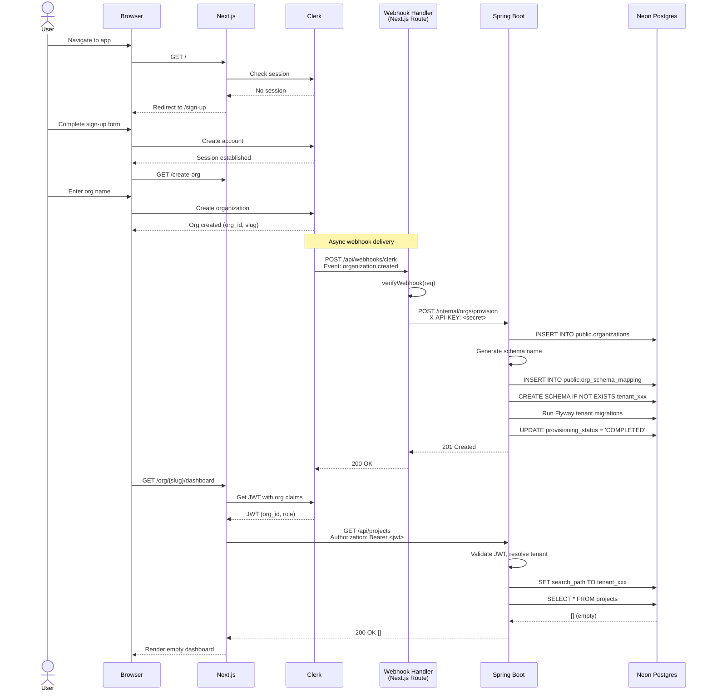
```mermaid
sequenceDiagram
    actor User
    participant Browser
    participant NextJS as Next.js
    participant Clerk
    participant Webhook as Webhook Handler<br/>(Next.js Route)
    participant API as Spring Boot
    participant DB as Neon Postgres

    User->>Browser: Navigate to app
    Browser->>NextJS: GET /
    NextJS->>Clerk: Check session
    Clerk-->>NextJS: No session
    NextJS-->>Browser: Redirect to /sign-up

    User->>Browser: Complete sign-up form
    Browser->>Clerk: Create account
    Clerk-->>Browser: Session established
    Browser->>NextJS: GET /create-org

    User->>Browser: Enter org name
    Browser->>Clerk: Create organization
    Clerk-->>Browser: Org created (org_id, slug)

    Note over Clerk,Webhook: Async webhook delivery
    Clerk->>Webhook: POST /api/webhooks/clerk<br/>Event: organization.created
    Webhook->>Webhook: verifyWebhook(req)
    Webhook->>API: POST /internal/orgs/provision<br/>X-API-KEY: <secret>
    API->>DB: INSERT INTO public.organizations
    API->>API: Generate schema name
    API->>DB: INSERT INTO public.org_schema_mapping
    API->>DB: CREATE SCHEMA IF NOT EXISTS tenant_xxx
    API->>DB: Run Flyway tenant migrations
    API->>DB: UPDATE provisioning_status = 'COMPLETED'
    API-->>Webhook: 201 Created
    Webhook-->>Clerk: 200 OK

    Browser->>NextJS: GET /org/{slug}/dashboard
    NextJS->>Clerk: Get JWT with org claims
    Clerk-->>NextJS: JWT (org_id, role)
    NextJS->>API: GET /api/projects<br/>Authorization: Bearer <jwt>
    API->>API: Validate JWT, resolve tenant
    API->>DB: SET search_path TO tenant_xxx
    API->>DB: SELECT * FROM projects
    DB-->>API: [] (empty)
    API-->>NextJS: 200 OK []
    NextJS-->>Browser: Render empty dashboard
```

### 4.2 Document Upload Flow

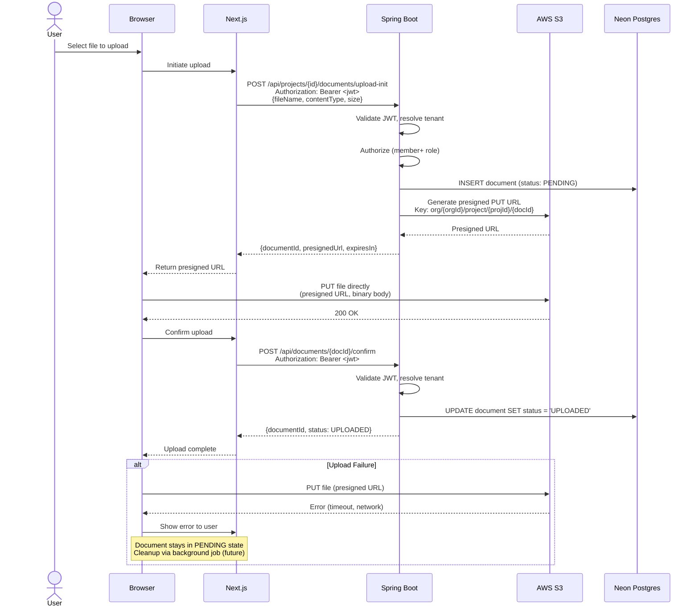
```mermaid
sequenceDiagram
    actor User
    participant Browser
    participant NextJS as Next.js
    participant API as Spring Boot
    participant S3 as AWS S3
    participant DB as Neon Postgres

    User->>Browser: Select file to upload
    Browser->>NextJS: Initiate upload
    NextJS->>API: POST /api/projects/{id}/documents/upload-init<br/>Authorization: Bearer <jwt><br/>{fileName, contentType, size}
    API->>API: Validate JWT, resolve tenant
    API->>API: Authorize (member+ role)
    API->>DB: INSERT document (status: PENDING)
    API->>S3: Generate presigned PUT URL<br/>Key: org/{orgId}/project/{projId}/{docId}
    S3-->>API: Presigned URL
    API-->>NextJS: {documentId, presignedUrl, expiresIn}
    NextJS-->>Browser: Return presigned URL

    Browser->>S3: PUT file directly<br/>(presigned URL, binary body)
    S3-->>Browser: 200 OK

    Browser->>NextJS: Confirm upload
    NextJS->>API: POST /api/documents/{docId}/confirm<br/>Authorization: Bearer <jwt>
    API->>API: Validate JWT, resolve tenant
    API->>DB: UPDATE document SET status = 'UPLOADED'
    API-->>NextJS: {documentId, status: UPLOADED}
    NextJS-->>Browser: Upload complete

    alt Upload Failure
        Browser->>S3: PUT file (presigned URL)
        S3-->>Browser: Error (timeout, network)
        Browser->>NextJS: Show error to user
        Note over Browser,NextJS: Document stays in PENDING state<br/>Cleanup via background job (future)
    end
```

### 4.3 Organization Switching

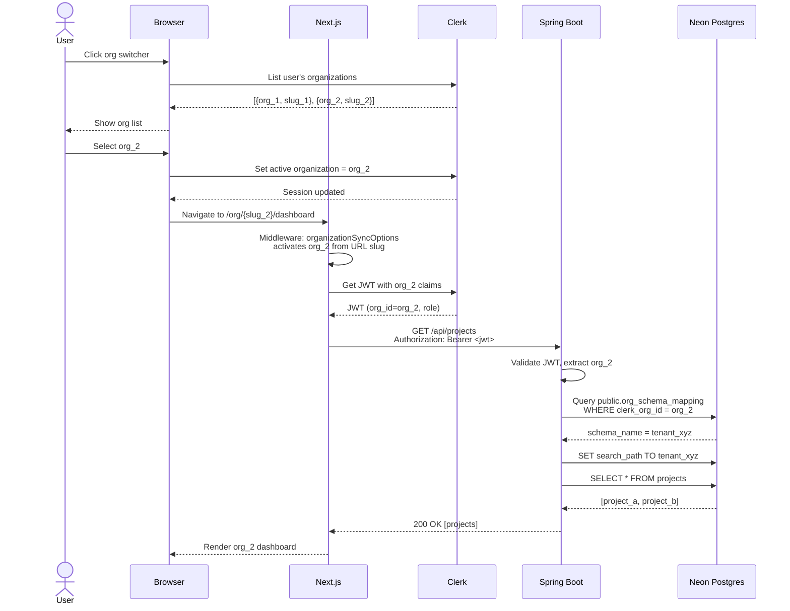
```mermaid
sequenceDiagram
    actor User
    participant Browser
    participant NextJS as Next.js
    participant Clerk
    participant API as Spring Boot
    participant DB as Neon Postgres

    User->>Browser: Click org switcher
    Browser->>Clerk: List user's organizations
    Clerk-->>Browser: [{org_1, slug_1}, {org_2, slug_2}]
    Browser-->>User: Show org list

    User->>Browser: Select org_2
    Browser->>Clerk: Set active organization = org_2
    Clerk-->>Browser: Session updated
    Browser->>NextJS: Navigate to /org/{slug_2}/dashboard

    NextJS->>NextJS: Middleware: organizationSyncOptions<br/>activates org_2 from URL slug
    NextJS->>Clerk: Get JWT with org_2 claims
    Clerk-->>NextJS: JWT (org_id=org_2, role)
    NextJS->>API: GET /api/projects<br/>Authorization: Bearer <jwt>
    API->>API: Validate JWT, extract org_2
    API->>DB: Query public.org_schema_mapping<br/>WHERE clerk_org_id = org_2
    DB-->>API: schema_name = tenant_xyz
    API->>DB: SET search_path TO tenant_xyz
    API->>DB: SELECT * FROM projects
    DB-->>API: [project_a, project_b]
    API-->>NextJS: 200 OK [projects]
    NextJS-->>Browser: Render org_2 dashboard
```

### 4.4 Invitation Acceptance

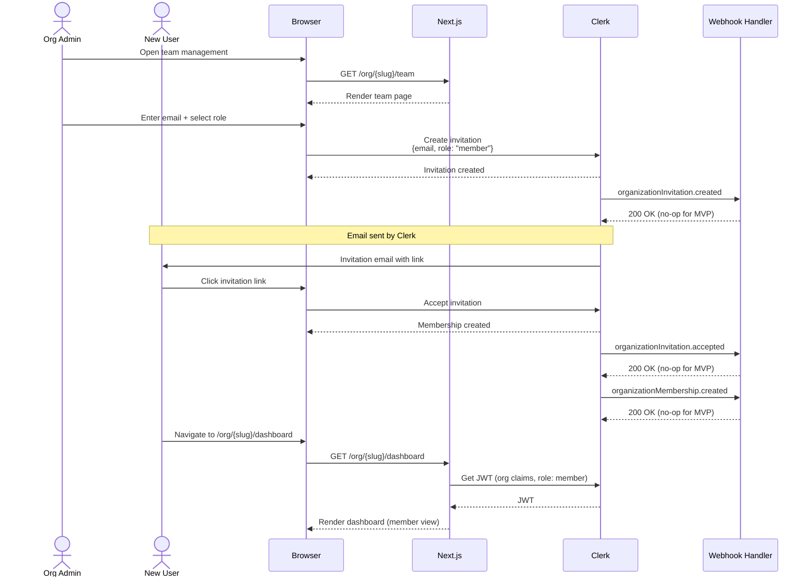
```mermaid
sequenceDiagram
    actor Inviter as Org Admin
    actor Invitee as New User
    participant Browser
    participant NextJS as Next.js
    participant Clerk
    participant Webhook as Webhook Handler

    Inviter->>Browser: Open team management
    Browser->>NextJS: GET /org/{slug}/team
    NextJS-->>Browser: Render team page

    Inviter->>Browser: Enter email + select role
    Browser->>Clerk: Create invitation<br/>{email, role: "member"}
    Clerk-->>Browser: Invitation created
    Clerk->>Webhook: organizationInvitation.created
    Webhook-->>Clerk: 200 OK (no-op for MVP)

    Note over Clerk,Invitee: Email sent by Clerk
    Clerk->>Invitee: Invitation email with link

    Invitee->>Browser: Click invitation link
    Browser->>Clerk: Accept invitation
    Clerk-->>Browser: Membership created
    Clerk->>Webhook: organizationInvitation.accepted
    Webhook-->>Clerk: 200 OK (no-op for MVP)
    Clerk->>Webhook: organizationMembership.created
    Webhook-->>Clerk: 200 OK (no-op for MVP)

    Invitee->>Browser: Navigate to /org/{slug}/dashboard
    Browser->>NextJS: GET /org/{slug}/dashboard
    NextJS->>Clerk: Get JWT (org claims, role: member)
    Clerk-->>NextJS: JWT
    NextJS-->>Browser: Render dashboard (member view)
```

---

## 5. Data Flow Diagrams

### 5.1 Authentication Token Flow

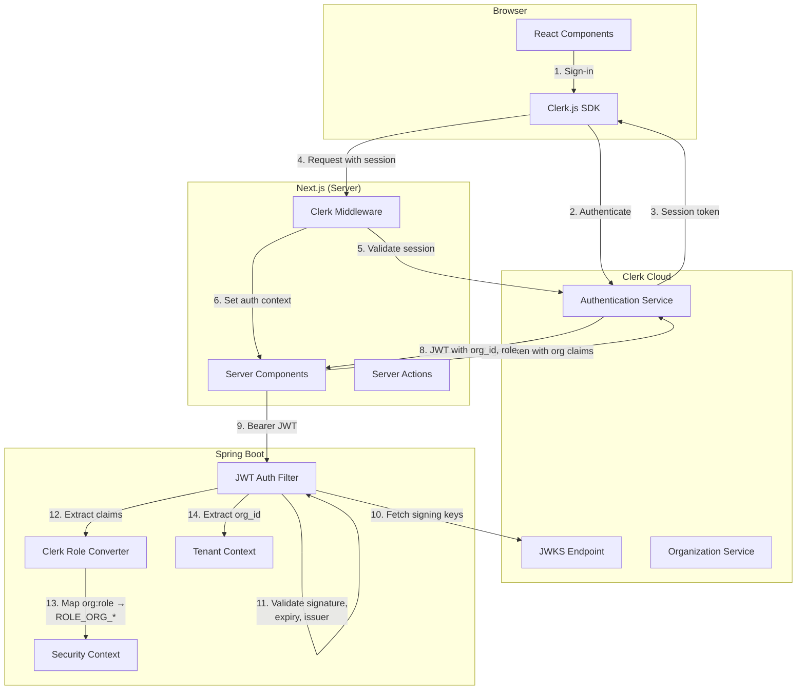
```mermaid
flowchart TB
    subgraph Browser
        UI[React Components]
        ClerkJS[Clerk.js SDK]
    end

    subgraph Clerk Cloud
        ClerkAuth[Authentication Service]
        ClerkJWKS[JWKS Endpoint]
        ClerkOrg[Organization Service]
    end

    subgraph "Next.js (Server)"
        Middleware[Clerk Middleware]
        ServerComp[Server Components]
        ServerAction[Server Actions]
    end

    subgraph "Spring Boot"
        JWTFilter[JWT Auth Filter]
        RoleMapper[Clerk Role Converter]
        SecurityCtx[Security Context]
        TenantCtx[Tenant Context]
    end

    UI -->|1. Sign-in| ClerkJS
    ClerkJS -->|2. Authenticate| ClerkAuth
    ClerkAuth -->|3. Session token| ClerkJS

    ClerkJS -->|4. Request with session| Middleware
    Middleware -->|5. Validate session| ClerkAuth
    Middleware -->|6. Set auth context| ServerComp

    ServerComp -->|7. getToken with org claims| ClerkAuth
    ClerkAuth -->|8. JWT with org_id, role| ServerComp

    ServerComp -->|9. Bearer JWT| JWTFilter
    JWTFilter -->|10. Fetch signing keys| ClerkJWKS
    JWTFilter -->|11. Validate signature,<br/>expiry, issuer| JWTFilter
    JWTFilter -->|12. Extract claims| RoleMapper
    RoleMapper -->|13. Map org:role →<br/>ROLE_ORG_*| SecurityCtx
    JWTFilter -->|14. Extract org_id| TenantCtx
```

### 5.2 Tenant Resolution Flow

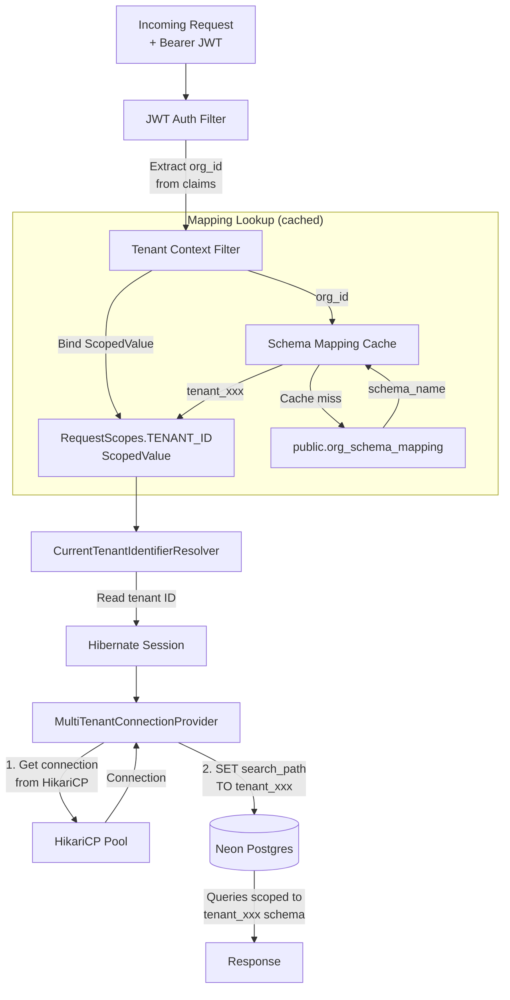
```mermaid
flowchart TB
    Request[Incoming Request<br/>+ Bearer JWT] --> JWTFilter[JWT Auth Filter]
    JWTFilter -->|Extract org_id<br/>from claims| TenantFilter[Tenant Context Filter]
    TenantFilter -->|Bind ScopedValue| TenantCtx[RequestScopes.TENANT_ID<br/>ScopedValue]

    TenantCtx --> Resolver[CurrentTenantIdentifierResolver]
    Resolver -->|Read tenant ID| Hibernate[Hibernate Session]

    Hibernate --> ConnProvider[MultiTenantConnectionProvider]
    ConnProvider -->|1. Get connection<br/>from HikariCP| HikariCP[HikariCP Pool]
    HikariCP -->|Connection| ConnProvider
    ConnProvider -->|2. SET search_path<br/>TO tenant_xxx| DB[(Neon Postgres)]

    subgraph "Mapping Lookup (cached)"
        TenantFilter -->|org_id| MappingCache[Schema Mapping Cache]
        MappingCache -->|Cache miss| MappingTable[public.org_schema_mapping]
        MappingTable -->|schema_name| MappingCache
        MappingCache -->|tenant_xxx| TenantCtx
    end

    DB -->|Queries scoped to<br/>tenant_xxx schema| Response[Response]
```

### 5.3 File Upload / Download Flow

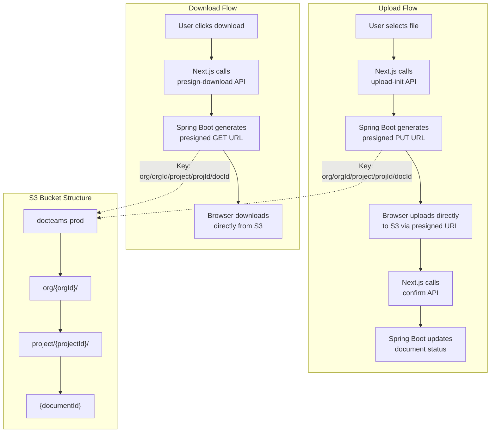
```mermaid
flowchart TB
    subgraph Upload Flow
        U1[User selects file] --> U2[Next.js calls<br/>upload-init API]
        U2 --> U3[Spring Boot generates<br/>presigned PUT URL]
        U3 --> U4[Browser uploads directly<br/>to S3 via presigned URL]
        U4 --> U5[Next.js calls<br/>confirm API]
        U5 --> U6[Spring Boot updates<br/>document status]
    end

    subgraph Download Flow
        D1[User clicks download] --> D2[Next.js calls<br/>presign-download API]
        D2 --> D3[Spring Boot generates<br/>presigned GET URL]
        D3 --> D4[Browser downloads<br/>directly from S3]
    end

    subgraph S3 Bucket Structure
        Bucket[docteams-prod]
        Bucket --> OrgPrefix["org/{orgId}/"]
        OrgPrefix --> ProjPrefix["project/{projectId}/"]
        ProjPrefix --> FileKey["{documentId}"]
    end

    U3 -.->|Key: org/orgId/project/projId/docId| Bucket
    D3 -.->|Key: org/orgId/project/projId/docId| Bucket
```

---

## 6. Security Architecture

### 6.1 Authentication Flow

All authentication is managed by Clerk. The system never handles passwords or credentials directly.

1. **User → Clerk**: Sign-up/sign-in via Clerk's hosted components or embedded forms.
2. **Clerk → Browser**: Session token stored in httpOnly cookie.
3. **Browser → Next.js**: Requests include Clerk session cookie; Clerk middleware validates and sets auth context.
4. **Next.js → Spring Boot**: Server components obtain a JWT from Clerk (with org claims) and pass it as `Authorization: Bearer <jwt>`.
5. **Spring Boot**: Validates JWT signature against Clerk's JWKS endpoint, checks expiry and issuer, extracts `sub` (user ID), `org_id`, and `org_role`.

### 6.2 Authorization Enforcement Points

| Layer | Mechanism | What It Protects |
|-------|-----------|------------------|
| Next.js Middleware | `clerkMiddleware()` | Unauthenticated access to `/(app)/**` routes |
| Next.js Layout | Org slug validation | Access to wrong org's URL |
| Spring Security Filter | JWT validation | Unauthenticated API access |
| Spring Security Authorities | `@PreAuthorize` / `SecurityFilterChain` | Role-based endpoint access |
| Hibernate Tenant Resolution | Schema isolation | Cross-tenant data access |
| S3 Presigned URLs | Scoped key + expiration | Unauthorized file access |

**Role-to-Authority Mapping**:

| Clerk Role | Spring Authority | Endpoint Access |
|------------|------------------|-----------------|
| `org:owner` | `ROLE_ORG_OWNER` | All operations including org deletion, member management |
| `org:admin` | `ROLE_ORG_ADMIN` | Project CRUD, settings management |
| `org:member` | `ROLE_ORG_MEMBER` | Read projects, upload/view documents |

**Endpoint Authorization Matrix**:

| Endpoint | Owner | Admin | Member |
|----------|-------|-------|--------|
| `GET /api/projects` | Yes | Yes | Yes |
| `POST /api/projects` | Yes | Yes | No |
| `PUT /api/projects/{id}` | Yes | Yes | No |
| `DELETE /api/projects/{id}` | Yes | No | No |
| `GET /api/projects/{id}/documents` | Yes | Yes | Yes |
| `POST /api/projects/{id}/documents/upload-init` | Yes | Yes | Yes |
| `GET /api/documents/{id}/presign-download` | Yes | Yes | Yes |
| `POST /internal/orgs/provision` | API key only (no user role) | — | — |

### 6.3 Tenant Isolation

- Tenant identity is derived **exclusively** from the validated JWT's `organization_id` claim.
- Client-supplied headers (e.g., `X-Org-Id`) are never trusted for tenant resolution.
- `MultiTenantConnectionProvider` sets `search_path` to the tenant's schema on every connection checkout.
- `releaseConnection()` resets `search_path` to `public` before returning to pool.
- No cross-schema joins are permitted between tenant schemas.
- S3 keys are prefixed with `org/{orgId}/`, and presigned URLs are scoped to exact keys.
- Every log line includes `tenantId` for audit correlation.

### 6.4 Secrets Management

All secrets stored in AWS Secrets Manager:

| Secret | Used By | Rotation |
|--------|---------|----------|
| Neon connection string (pooled) | Spring Boot | Manual (DB credential rotation) |
| Neon connection string (direct) | Spring Boot (Flyway) | Manual |
| Clerk secret key | Next.js, Spring Boot | Via Clerk dashboard |
| Clerk webhook signing secret | Next.js webhook handler | Via Clerk dashboard |
| Internal API key | Next.js, Spring Boot | Manual (coordinated deploy) |
| AWS access credentials | Spring Boot (S3) | IAM role (no static keys in prod) |

**Production**: ECS tasks use IAM task roles for S3 access — no static AWS credentials. Secrets Manager values injected as environment variables via ECS task definition `secrets` blocks.

### 6.5 Internal API Security Implementation

```
                    ┌─────────────────────────────────┐
                    │         Public Internet          │
                    └─────────────┬───────────────────┘
                                  │
                    ┌─────────────▼───────────────────┐
                    │   Public ALB (HTTPS/443)         │
                    │   Routes: /api/*, /*             │
                    │   Does NOT route /internal/*     │
                    └─────────────┬───────────────────┘
                                  │
                    ┌─────────────▼───────────────────┐
                    │      Private Subnets (VPC)       │
                    │                                  │
                    │  ┌───────────┐  ┌─────────────┐ │
                    │  │  Next.js  │  │ Spring Boot │ │
                    │  │  :3000    │──│  :8080      │ │
                    │  │           │  │             │ │
                    │  └───────────┘  └─────────────┘ │
                    │       │ Internal ALB or direct   │
                    │       │ X-API-KEY header          │
                    │       │ SG: allow from Next.js SG │
                    └─────────────────────────────────┘
```

- `/internal/*` endpoints are not exposed through the public ALB.
- Next.js reaches Spring Boot via the internal ALB (or direct service discovery).
- Security group on Spring Boot allows port 8080 from the Next.js security group only (plus internal ALB).
- `ApiKeyAuthFilter` on Spring Boot validates `X-API-KEY` header for `/internal/**` paths.

---

## 7. Infrastructure Architecture

### 7.1 AWS Resource Topology

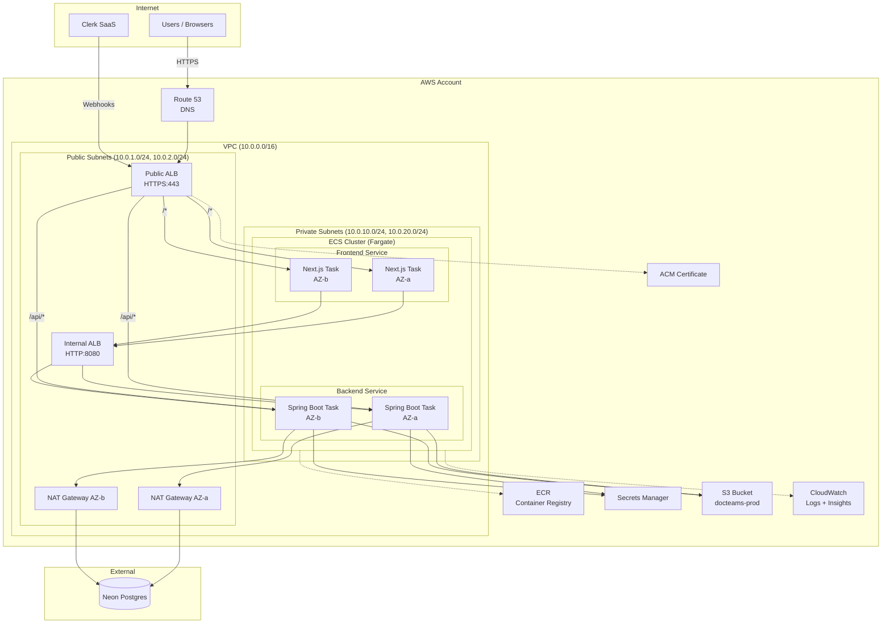
```mermaid
flowchart TB
    subgraph Internet
        Users[Users / Browsers]
        Clerk[Clerk SaaS]
    end

    subgraph AWS["AWS Account"]
        subgraph VPC["VPC (10.0.0.0/16)"]
            subgraph PubSub["Public Subnets (10.0.1.0/24, 10.0.2.0/24)"]
                ALB[Public ALB<br/>HTTPS:443]
                IntALB[Internal ALB<br/>HTTP:8080]
                NAT1[NAT Gateway AZ-a]
                NAT2[NAT Gateway AZ-b]
            end

            subgraph PrivSub["Private Subnets (10.0.10.0/24, 10.0.20.0/24)"]
                subgraph ECS["ECS Cluster (Fargate)"]
                    subgraph FESvc["Frontend Service"]
                        FE1["Next.js Task<br/>AZ-a"]
                        FE2["Next.js Task<br/>AZ-b"]
                    end
                    subgraph BESvc["Backend Service"]
                        BE1["Spring Boot Task<br/>AZ-a"]
                        BE2["Spring Boot Task<br/>AZ-b"]
                    end
                end
            end
        end

        ECR[ECR<br/>Container Registry]
        SM[Secrets Manager]
        S3[S3 Bucket<br/>docteams-prod]
        CW[CloudWatch<br/>Logs + Insights]
        ACM[ACM Certificate]
        R53[Route 53<br/>DNS]
    end

    subgraph External
        Neon[(Neon Postgres)]
    end

    Users -->|HTTPS| R53
    R53 --> ALB
    Clerk -->|Webhooks| ALB

    ALB -->|/* | FE1
    ALB -->|/* | FE2
    ALB -->|/api/*| BE1
    ALB -->|/api/*| BE2

    FE1 --> IntALB
    FE2 --> IntALB
    IntALB --> BE1
    IntALB --> BE2

    BE1 --> NAT1 --> Neon
    BE2 --> NAT2 --> Neon
    BE1 --> S3
    BE2 --> S3
    BE1 --> SM
    BE2 --> SM

    ECS -.-> ECR
    ECS -.-> CW
    ALB -.-> ACM
```

### 7.2 Network Security

**Security Groups**:

| Security Group | Inbound Rules | Purpose |
|----------------|---------------|---------|
| `sg-public-alb` | 443/tcp from 0.0.0.0/0 | Public HTTPS access |
| `sg-internal-alb` | 8080/tcp from `sg-frontend` | Internal service communication |
| `sg-frontend` | 3000/tcp from `sg-public-alb` | Next.js access from public ALB |
| `sg-backend` | 8080/tcp from `sg-public-alb`, `sg-internal-alb` | Spring Boot from both ALBs |
| `sg-nat` | All outbound | NAT Gateway egress |

**Network ACLs**: Default VPC NACLs (allow all within VPC). Security groups are the primary enforcement layer.

**Egress**: All outbound traffic from private subnets routes through NAT Gateways to reach Neon Postgres and external APIs (Clerk JWKS).

### 7.3 CI/CD Pipeline

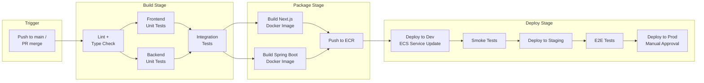
```mermaid
flowchart LR
    subgraph Trigger
        Push[Push to main /<br/>PR merge]
    end

    subgraph Build["Build Stage"]
        Lint[Lint +<br/>Type Check]
        TestFE[Frontend<br/>Unit Tests]
        TestBE[Backend<br/>Unit Tests]
        IntTest[Integration<br/>Tests]
    end

    subgraph Package["Package Stage"]
        BuildFE[Build Next.js<br/>Docker Image]
        BuildBE[Build Spring Boot<br/>Docker Image]
        PushECR[Push to ECR]
    end

    subgraph Deploy["Deploy Stage"]
        DeployDev[Deploy to Dev<br/>ECS Service Update]
        SmokeTest[Smoke Tests]
        DeployStaging[Deploy to Staging]
        E2ETest[E2E Tests]
        DeployProd[Deploy to Prod<br/>Manual Approval]
    end

    Push --> Lint
    Lint --> TestFE
    Lint --> TestBE
    TestFE --> IntTest
    TestBE --> IntTest
    IntTest --> BuildFE
    IntTest --> BuildBE
    BuildFE --> PushECR
    BuildBE --> PushECR
    PushECR --> DeployDev
    DeployDev --> SmokeTest
    SmokeTest --> DeployStaging
    DeployStaging --> E2ETest
    E2ETest --> DeployProd
```

**GitHub Actions Workflows**:

| Workflow | Trigger | Purpose |
|----------|---------|---------|
| `ci.yml` | PR, push to main | Lint, test, build |
| `deploy-dev.yml` | Push to main | Auto-deploy to dev |
| `deploy-staging.yml` | Manual / after dev smoke | Deploy to staging |
| `deploy-prod.yml` | Manual approval | Deploy to production |

### 7.4 Environment Strategy

| Environment | Purpose | Infrastructure | Database |
|-------------|---------|----------------|----------|
| Local | Developer machine | Docker Compose (Postgres, LocalStack) | Local Postgres |
| Dev | Integration testing | ECS Fargate (min resources) | Neon dev branch |
| Staging | Pre-production validation | ECS Fargate (prod-like) | Neon staging branch |
| Production | Live traffic | ECS Fargate (auto-scaling) | Neon main |

---

## 8. Database Architecture

### 8.1 Schema Design

The database uses a **schema-per-tenant** strategy within a single Neon Postgres database.

**Global Schema (`public`)**:

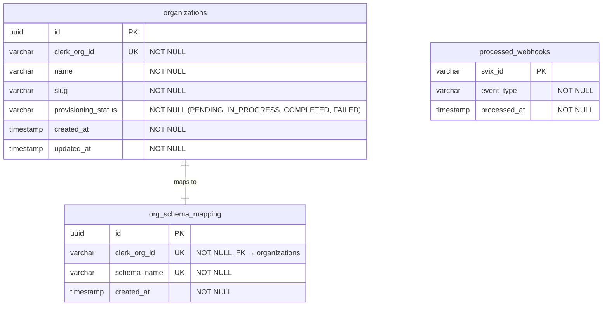
```mermaid
erDiagram
    organizations {
        uuid id PK
        varchar clerk_org_id UK "NOT NULL"
        varchar name "NOT NULL"
        varchar slug "NOT NULL"
        varchar provisioning_status "NOT NULL (PENDING, IN_PROGRESS, COMPLETED, FAILED)"
        timestamp created_at "NOT NULL"
        timestamp updated_at "NOT NULL"
    }

    org_schema_mapping {
        uuid id PK
        varchar clerk_org_id UK "NOT NULL, FK → organizations"
        varchar schema_name UK "NOT NULL"
        timestamp created_at "NOT NULL"
    }

    processed_webhooks {
        varchar svix_id PK
        varchar event_type "NOT NULL"
        timestamp processed_at "NOT NULL"
    }

    organizations ||--|| org_schema_mapping : "maps to"
```

**Tenant Schema (`tenant_<hash>`)** — replicated per tenant:

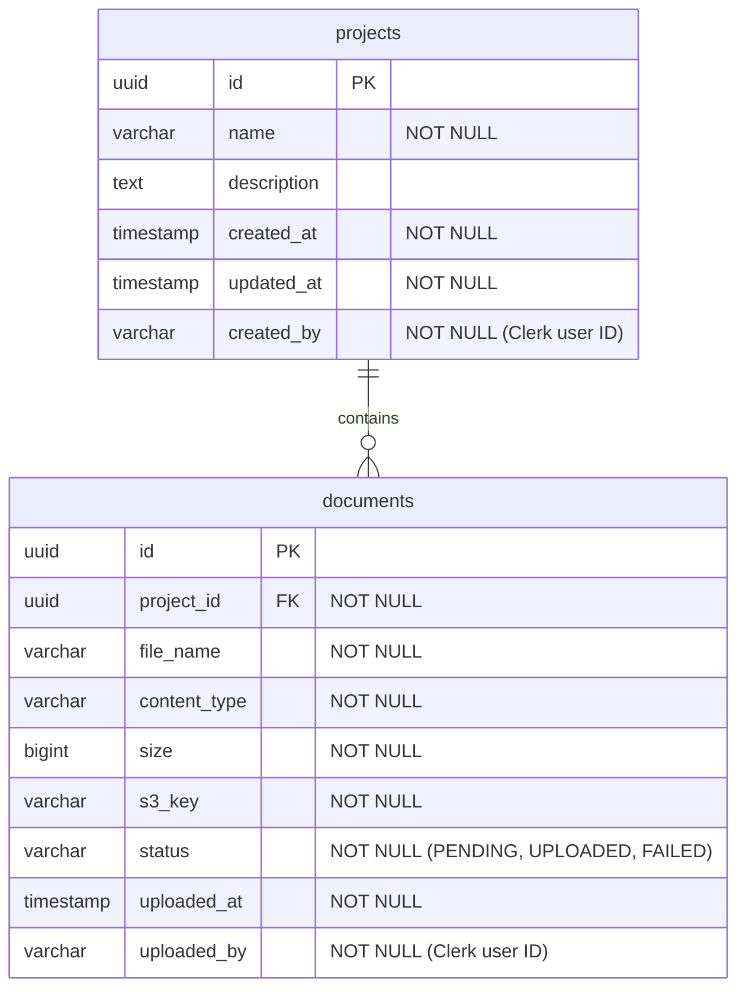
```mermaid
erDiagram
    projects {
        uuid id PK
        varchar name "NOT NULL"
        text description
        timestamp created_at "NOT NULL"
        timestamp updated_at "NOT NULL"
        varchar created_by "NOT NULL (Clerk user ID)"
    }

    documents {
        uuid id PK
        uuid project_id FK "NOT NULL"
        varchar file_name "NOT NULL"
        varchar content_type "NOT NULL"
        bigint size "NOT NULL"
        varchar s3_key "NOT NULL"
        varchar status "NOT NULL (PENDING, UPLOADED, FAILED)"
        timestamp uploaded_at "NOT NULL"
        varchar uploaded_by "NOT NULL (Clerk user ID)"
    }

    projects ||--o{ documents : "contains"
```

### 8.2 Migration Strategy

| Migration Set | Location | Applied When | Target Schema |
|---------------|----------|--------------|---------------|
| Global | `db/migration/global/` | Application startup | `public` |
| Tenant | `db/migration/tenant/` | New tenant provisioning + Application startup (all existing tenants) | `tenant_<hash>` |

**Startup Migration Flow**:
1. Application starts
2. Flyway runs `db/migration/global/` against `public` schema
3. Query `public.org_schema_mapping` for all tenant schemas
4. For each tenant schema, run `db/migration/tenant/` (Flyway skips already-applied migrations)
5. Application ready to serve traffic

**New Tenant Migration**:
1. `CREATE SCHEMA IF NOT EXISTS tenant_xxx`
2. Flyway configured with `defaultSchema=tenant_xxx`, `locations=classpath:db/migration/tenant`
3. `flyway.migrate()` — applies all tenant migrations to the new schema
4. Schema is immediately usable

### 8.3 Connection Architecture

```
                    ┌──────────────────┐
                    │   Spring Boot    │
                    │                  │
                    │  ┌────────────┐  │
                    │  │ HikariCP   │  │───── Pooled Neon Connection ──── Neon PgBouncer ──── Postgres
                    │  │ Pool (10)  │  │      (app traffic)              (transaction mode)
                    │  └────────────┘  │
                    │                  │
                    │  ┌────────────┐  │
                    │  │ Migration  │  │───── Direct Neon Connection ──────────────────────── Postgres
                    │  │ DataSource │  │      (Flyway DDL)
                    │  └────────────┘  │
                    └──────────────────┘
```

- **App traffic**: HikariCP (10 connections) → Neon PgBouncer (transaction mode) → Postgres. `search_path` set per checkout.
- **Migrations**: Direct connection (no PgBouncer) → Postgres. Required for `CREATE SCHEMA`, `ALTER TABLE`, and other DDL.
- **Connection strings** differ by `-pooler` suffix in the Neon hostname.

---

## 9. Phase 2 — Billing & Tiered Tenancy

Phase 2 evolves the platform from uniform schema-per-tenant isolation to a **tiered tenancy model** powered by **Clerk Billing**. Organizations on the free Starter plan share a single `tenant_shared` schema with row-level isolation. Organizations on the paid Pro plan retain the existing schema-per-tenant model with full schema isolation.

### 9.1 Clerk Billing Integration

Clerk Billing is a managed billing product built on Stripe that integrates with Clerk's auth and organization infrastructure. It provides:

- **Plan management** in the Clerk Dashboard (no code deploys for pricing changes).
- **Pre-built React components** (`<PricingTable>`, checkout flows) for subscription management.
- **Session-aware billing** — `has({ plan: 'pro' })` for feature gating in the frontend.
- **Subscription webhooks** — `subscription.created`, `subscription.updated` events for backend sync.
- **Member limit enforcement** — configurable per-plan in the Clerk Dashboard.

**Plans defined in Clerk Dashboard**:

| Plan | Slug | Member Limit | Tenancy Model | Price |
|------|------|-------------|---------------|-------|
| Starter | `starter` | 2 | Shared schema (`tenant_shared`) | Free |
| Pro | `pro` | 10 | Dedicated schema (`tenant_<hash>`) | Paid |

**Features/entitlements defined per plan**:

| Feature Key | Starter | Pro | Purpose |
|-------------|---------|-----|---------|
| `dedicated_schema` | No | Yes | Gates schema-per-tenant isolation |
| `max_members_2` | Yes | No | Member limit marker |
| `max_members_10` | No | Yes | Member limit marker |

See [ADR-010](adr/ADR-010-billing-integration.md) for the full decision record.

### 9.2 Tiered Tenancy Model

The tiered model reuses the existing `org_schema_mapping` table as the pivot point. The `TenantFilter` resolves the schema identically for both tiers — the differentiation happens downstream.

| Tier | Schema | Isolation Mechanism | Max Members |
|------|--------|-------------------|-------------|
| Starter | `tenant_shared` (shared) | Row-level: Hibernate `@Filter` + Postgres RLS | 2 |
| Pro | `tenant_<hash>` (dedicated) | Schema-level: `SET search_path` | 10 |

**How it works**:
- The `Organization` entity gains a `tier` column (enum: `STARTER`, `PRO`) and a `planSlug` column.
- `org_schema_mapping` maps Starter orgs to `"tenant_shared"` and Pro orgs to `"tenant_<hash>"`.
- `TenantFilter` caches `TenantInfo(schemaName, tier)` instead of just the schema name.
- For shared-schema tenants, `RequestScopes.ORG_ID` (new ScopedValue) carries the Clerk org ID for row-level filtering.
- Hibernate `@Filter` is conditionally activated for shared-schema transactions.
- Postgres RLS on `tenant_shared` provides defense-in-depth.

See [ADR-011](adr/ADR-011-tiered-tenancy.md) and [ADR-012](adr/ADR-012-row-level-isolation.md).

### 9.3 Updated Database Schema

**Global Schema (`public`) — Phase 2 additions**:

```sql
-- V4__add_org_tier.sql (global migration)
ALTER TABLE organizations ADD COLUMN tier VARCHAR(20) NOT NULL DEFAULT 'STARTER';
ALTER TABLE organizations ADD COLUMN plan_slug VARCHAR(100);
```

**Tenant Schema — Phase 2 additions** (applied to ALL schemas including dedicated):

```sql
-- V7__add_tenant_id_for_shared.sql (tenant migration)
ALTER TABLE projects ADD COLUMN IF NOT EXISTS tenant_id VARCHAR(255);
ALTER TABLE documents ADD COLUMN IF NOT EXISTS tenant_id VARCHAR(255);
ALTER TABLE members ADD COLUMN IF NOT EXISTS tenant_id VARCHAR(255);
ALTER TABLE project_members ADD COLUMN IF NOT EXISTS tenant_id VARCHAR(255);

-- Indexes for row-level filtering (used by tenant_shared, harmless on dedicated)
CREATE INDEX IF NOT EXISTS idx_projects_tenant_id ON projects (tenant_id);
CREATE INDEX IF NOT EXISTS idx_documents_tenant_id ON documents (tenant_id);
CREATE INDEX IF NOT EXISTS idx_members_tenant_id ON members (tenant_id);
CREATE INDEX IF NOT EXISTS idx_project_members_tenant_id ON project_members (tenant_id);

-- RLS policies (only effective on tenant_shared where tenant_id is populated)
ALTER TABLE projects ENABLE ROW LEVEL SECURITY;
ALTER TABLE documents ENABLE ROW LEVEL SECURITY;
ALTER TABLE members ENABLE ROW LEVEL SECURITY;
ALTER TABLE project_members ENABLE ROW LEVEL SECURITY;

CREATE POLICY tenant_isolation_projects ON projects
  USING (tenant_id = current_setting('app.current_tenant', true) OR tenant_id IS NULL)
  WITH CHECK (tenant_id = current_setting('app.current_tenant', true) OR tenant_id IS NULL);

-- (Similar policies for documents, members, project_members)
```

**Updated ER Diagram — Global Schema**:

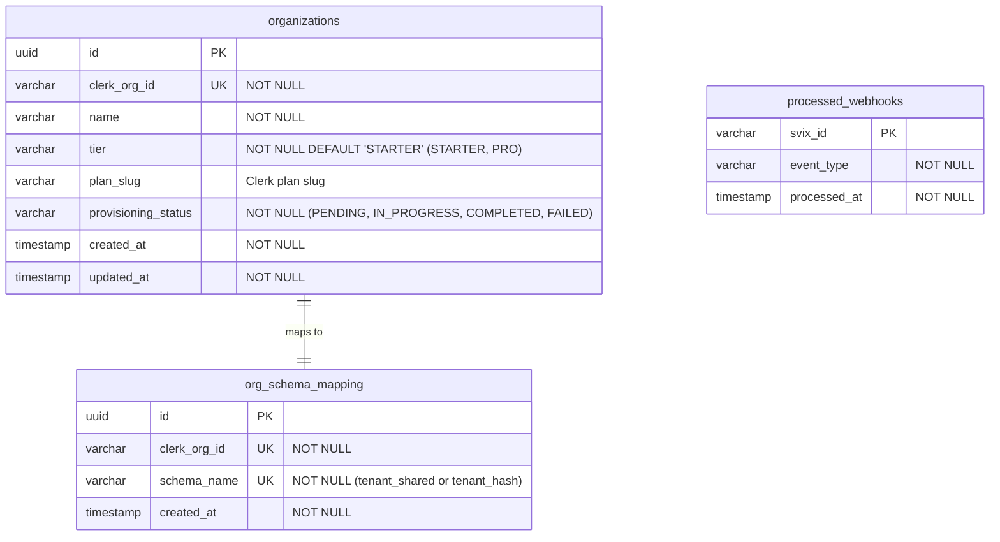
```mermaid
erDiagram
    organizations {
        uuid id PK
        varchar clerk_org_id UK "NOT NULL"
        varchar name "NOT NULL"
        varchar tier "NOT NULL DEFAULT 'STARTER' (STARTER, PRO)"
        varchar plan_slug "Clerk plan slug"
        varchar provisioning_status "NOT NULL (PENDING, IN_PROGRESS, COMPLETED, FAILED)"
        timestamp created_at "NOT NULL"
        timestamp updated_at "NOT NULL"
    }

    org_schema_mapping {
        uuid id PK
        varchar clerk_org_id UK "NOT NULL"
        varchar schema_name UK "NOT NULL (tenant_shared or tenant_hash)"
        timestamp created_at "NOT NULL"
    }

    processed_webhooks {
        varchar svix_id PK
        varchar event_type "NOT NULL"
        timestamp processed_at "NOT NULL"
    }

    organizations ||--|| org_schema_mapping : "maps to"
```

**Updated ER Diagram — Shared Tenant Schema (`tenant_shared`)**:

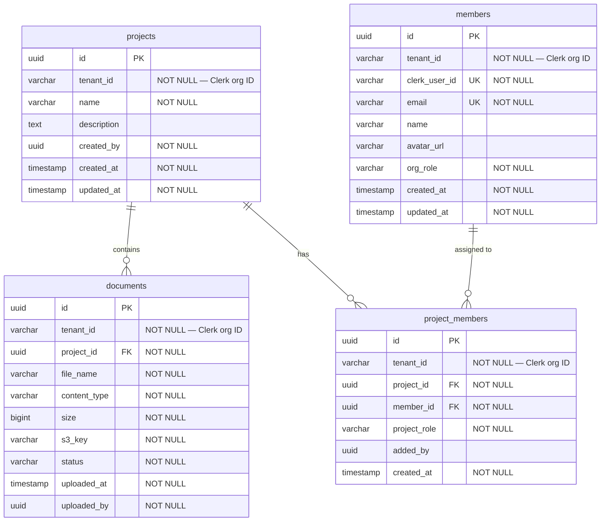
```mermaid
erDiagram
    projects {
        uuid id PK
        varchar tenant_id "NOT NULL — Clerk org ID"
        varchar name "NOT NULL"
        text description
        uuid created_by "NOT NULL"
        timestamp created_at "NOT NULL"
        timestamp updated_at "NOT NULL"
    }

    documents {
        uuid id PK
        varchar tenant_id "NOT NULL — Clerk org ID"
        uuid project_id FK "NOT NULL"
        varchar file_name "NOT NULL"
        varchar content_type "NOT NULL"
        bigint size "NOT NULL"
        varchar s3_key "NOT NULL"
        varchar status "NOT NULL"
        timestamp uploaded_at "NOT NULL"
        uuid uploaded_by "NOT NULL"
    }

    members {
        uuid id PK
        varchar tenant_id "NOT NULL — Clerk org ID"
        varchar clerk_user_id UK "NOT NULL"
        varchar email UK "NOT NULL"
        varchar name
        varchar avatar_url
        varchar org_role "NOT NULL"
        timestamp created_at "NOT NULL"
        timestamp updated_at "NOT NULL"
    }

    project_members {
        uuid id PK
        varchar tenant_id "NOT NULL — Clerk org ID"
        uuid project_id FK "NOT NULL"
        uuid member_id FK "NOT NULL"
        varchar project_role "NOT NULL"
        uuid added_by
        timestamp created_at "NOT NULL"
    }

    projects ||--o{ documents : "contains"
    projects ||--o{ project_members : "has"
    members ||--o{ project_members : "assigned to"
```

### 9.4 Plan State Data Flow

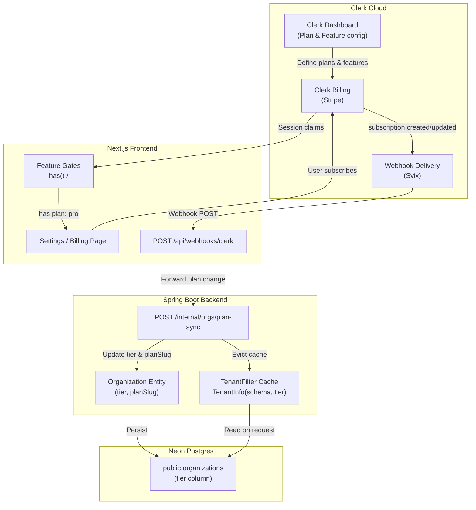
```mermaid
flowchart TB
    subgraph "Clerk Cloud"
        Dashboard["Clerk Dashboard<br/>(Plan & Feature config)"]
        Billing["Clerk Billing<br/>(Stripe)"]
        WebhookSvc["Webhook Delivery<br/>(Svix)"]
    end

    subgraph "Next.js Frontend"
        PricingPage["Settings / Billing Page<br/><PricingTable for='organization' />"]
        ProtectComp["Feature Gates<br/>has() / <Protect>"]
        WebhookRoute["POST /api/webhooks/clerk"]
    end

    subgraph "Spring Boot Backend"
        PlanSync["POST /internal/orgs/plan-sync"]
        OrgEntity["Organization Entity<br/>(tier, planSlug)"]
        SchemaCache["TenantFilter Cache<br/>TenantInfo(schema, tier)"]
    end

    subgraph "Neon Postgres"
        OrgTable["public.organizations<br/>(tier column)"]
    end

    Dashboard -->|Define plans & features| Billing
    PricingPage -->|User subscribes| Billing
    Billing -->|subscription.created/updated| WebhookSvc
    WebhookSvc -->|Webhook POST| WebhookRoute
    WebhookRoute -->|Forward plan change| PlanSync
    PlanSync -->|Update tier & planSlug| OrgEntity
    OrgEntity -->|Persist| OrgTable
    PlanSync -->|Evict cache| SchemaCache
    SchemaCache -->|Read on request| OrgTable

    Billing -->|Session claims| ProtectComp
    ProtectComp -->|has plan: pro| PricingPage
```

### 9.5 Provisioning Flows

All organizations start as Starter. Pro provisioning is triggered by a subscription webhook.

See [ADR-015](adr/ADR-015-provisioning-per-tier.md) and [ADR-016](adr/ADR-016-tier-upgrade-migration.md).

#### 9.5.1 Starter Org Signup

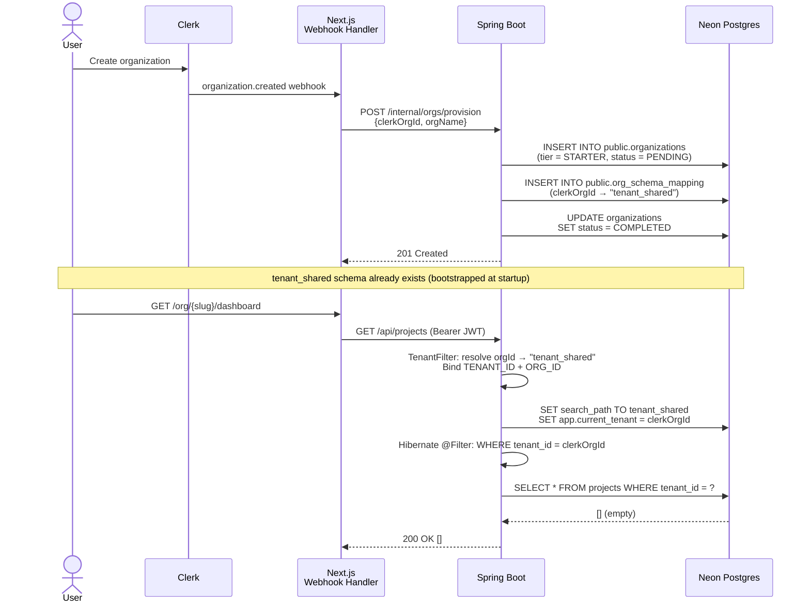
```mermaid
sequenceDiagram
    actor User
    participant Clerk
    participant NextJS as Next.js<br/>Webhook Handler
    participant API as Spring Boot
    participant DB as Neon Postgres

    User->>Clerk: Create organization
    Clerk->>NextJS: organization.created webhook

    NextJS->>API: POST /internal/orgs/provision<br/>{clerkOrgId, orgName}

    API->>DB: INSERT INTO public.organizations<br/>(tier = STARTER, status = PENDING)
    API->>DB: INSERT INTO public.org_schema_mapping<br/>(clerkOrgId → "tenant_shared")
    API->>DB: UPDATE organizations<br/>SET status = COMPLETED
    API-->>NextJS: 201 Created

    Note over User,DB: tenant_shared schema already exists (bootstrapped at startup)

    User->>NextJS: GET /org/{slug}/dashboard
    NextJS->>API: GET /api/projects (Bearer JWT)
    API->>API: TenantFilter: resolve orgId → "tenant_shared"<br/>Bind TENANT_ID + ORG_ID
    API->>DB: SET search_path TO tenant_shared<br/>SET app.current_tenant = clerkOrgId
    API->>API: Hibernate @Filter: WHERE tenant_id = clerkOrgId
    API->>DB: SELECT * FROM projects WHERE tenant_id = ?
    DB-->>API: [] (empty)
    API-->>NextJS: 200 OK []
```

#### 9.5.2 Pro Org Signup (Starter → Pro Upgrade)

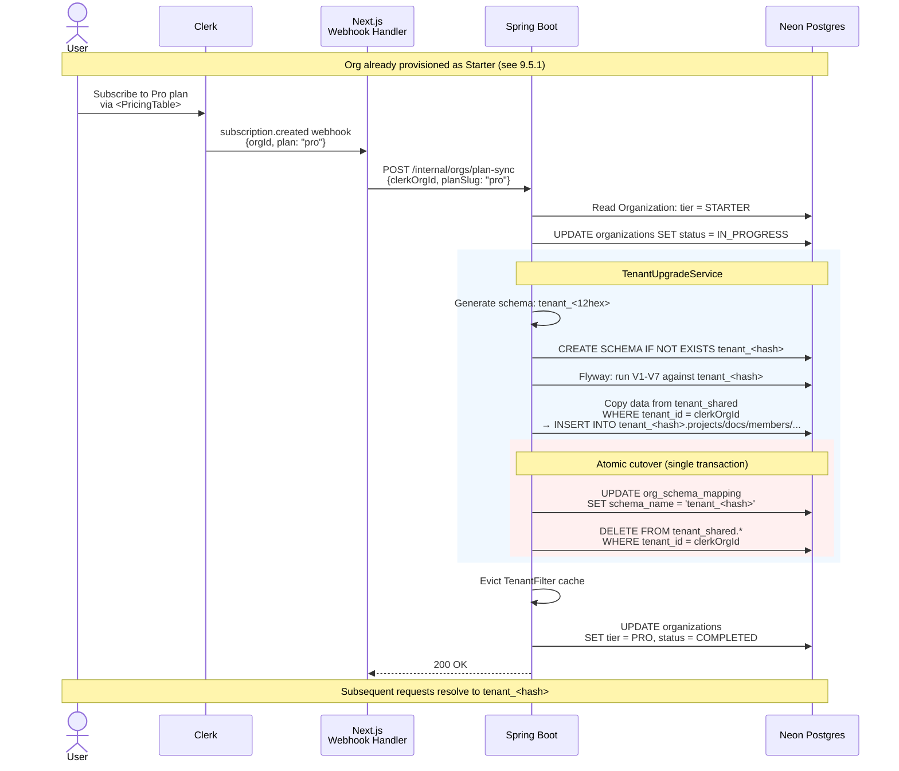
```mermaid
sequenceDiagram
    actor User
    participant Clerk
    participant NextJS as Next.js<br/>Webhook Handler
    participant API as Spring Boot
    participant DB as Neon Postgres

    Note over User,DB: Org already provisioned as Starter (see 9.5.1)

    User->>Clerk: Subscribe to Pro plan<br/>via <PricingTable>
    Clerk->>NextJS: subscription.created webhook<br/>{orgId, plan: "pro"}

    NextJS->>API: POST /internal/orgs/plan-sync<br/>{clerkOrgId, planSlug: "pro"}

    API->>DB: Read Organization: tier = STARTER
    API->>DB: UPDATE organizations SET status = IN_PROGRESS

    rect rgb(240, 248, 255)
        Note over API,DB: TenantUpgradeService
        API->>API: Generate schema: tenant_<12hex>
        API->>DB: CREATE SCHEMA IF NOT EXISTS tenant_<hash>
        API->>DB: Flyway: run V1-V7 against tenant_<hash>

        API->>DB: Copy data from tenant_shared<br/>WHERE tenant_id = clerkOrgId<br/>→ INSERT INTO tenant_<hash>.projects/docs/members/...

        rect rgb(255, 240, 240)
            Note over API,DB: Atomic cutover (single transaction)
            API->>DB: UPDATE org_schema_mapping<br/>SET schema_name = 'tenant_<hash>'
            API->>DB: DELETE FROM tenant_shared.*<br/>WHERE tenant_id = clerkOrgId
        end
    end

    API->>API: Evict TenantFilter cache
    API->>DB: UPDATE organizations<br/>SET tier = PRO, status = COMPLETED
    API-->>NextJS: 200 OK

    Note over User,DB: Subsequent requests resolve to tenant_<hash>
```

#### 9.5.3 Request-Time Tenant Resolution (Phase 2)

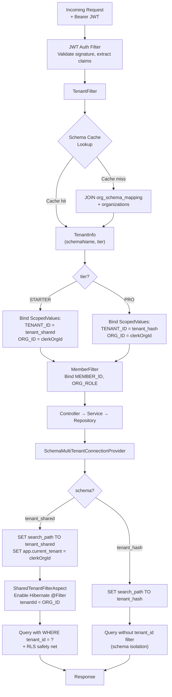
```mermaid
flowchart TB
    Request["Incoming Request<br/>+ Bearer JWT"] --> JWTFilter["JWT Auth Filter<br/>Validate signature, extract claims"]
    JWTFilter --> TenantFilter["TenantFilter"]

    TenantFilter --> CacheLookup{"Schema Cache<br/>Lookup"}
    CacheLookup -->|Cache hit| TenantInfo["TenantInfo<br/>(schemaName, tier)"]
    CacheLookup -->|Cache miss| DBLookup["JOIN org_schema_mapping<br/>+ organizations"]
    DBLookup --> TenantInfo

    TenantInfo --> TierCheck{"tier?"}

    TierCheck -->|STARTER| SharedPath["Bind ScopedValues:<br/>TENANT_ID = tenant_shared<br/>ORG_ID = clerkOrgId"]
    TierCheck -->|PRO| DedicatedPath["Bind ScopedValues:<br/>TENANT_ID = tenant_hash<br/>ORG_ID = clerkOrgId"]

    SharedPath --> MemberFilter["MemberFilter<br/>Bind MEMBER_ID, ORG_ROLE"]
    DedicatedPath --> MemberFilter

    MemberFilter --> Controller["Controller → Service → Repository"]

    Controller --> ConnProvider["SchemaMultiTenantConnectionProvider"]

    ConnProvider --> SchemaCheck{"schema?"}
    SchemaCheck -->|tenant_shared| SharedConn["SET search_path TO tenant_shared<br/>SET app.current_tenant = clerkOrgId"]
    SchemaCheck -->|tenant_hash| DedicatedConn["SET search_path TO tenant_hash"]

    SharedConn --> FilterAspect["SharedTenantFilterAspect<br/>Enable Hibernate @Filter<br/>tenantId = ORG_ID"]
    FilterAspect --> Query["Query with WHERE tenant_id = ?<br/>+ RLS safety net"]

    DedicatedConn --> DirectQuery["Query without tenant_id filter<br/>(schema isolation)"]

    Query --> Response["Response"]
    DirectQuery --> Response
```

### 9.6 High-Level Component Diagram (Phase 2)

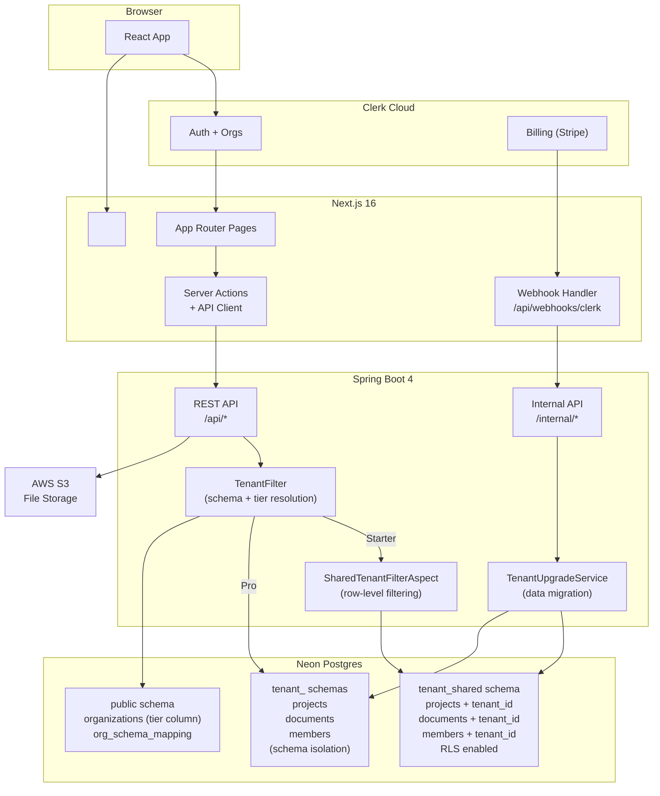
```mermaid
flowchart TB
    subgraph Browser
        UI["React App"]
    end

    subgraph "Clerk Cloud"
        Auth["Auth + Orgs"]
        Billing["Billing (Stripe)"]
    end

    subgraph "Next.js 16"
        Pages["App Router Pages"]
        PricingUI["<PricingTable /><br/><Protect plan=pro>"]
        Webhooks["Webhook Handler<br/>/api/webhooks/clerk"]
        ServerActions["Server Actions<br/>+ API Client"]
    end

    subgraph "Spring Boot 4"
        RestAPI["REST API<br/>/api/*"]
        InternalAPI["Internal API<br/>/internal/*"]
        TenantFilter2["TenantFilter<br/>(schema + tier resolution)"]
        FilterAspect2["SharedTenantFilterAspect<br/>(row-level filtering)"]
        UpgradeService["TenantUpgradeService<br/>(data migration)"]
    end

    subgraph "Neon Postgres"
        PublicSchema["public schema<br/>organizations (tier column)<br/>org_schema_mapping"]
        SharedSchema["tenant_shared schema<br/>projects + tenant_id<br/>documents + tenant_id<br/>members + tenant_id<br/>RLS enabled"]
        DedicatedSchemas["tenant_<hash> schemas<br/>projects<br/>documents<br/>members<br/>(schema isolation)"]
    end

    S3["AWS S3<br/>File Storage"]

    UI --> Auth
    UI --> PricingUI
    Auth --> Pages
    Billing --> Webhooks

    Pages --> ServerActions
    ServerActions --> RestAPI
    Webhooks --> InternalAPI

    RestAPI --> TenantFilter2
    TenantFilter2 -->|Starter| FilterAspect2
    TenantFilter2 -->|Pro| DedicatedSchemas
    FilterAspect2 --> SharedSchema
    InternalAPI --> UpgradeService
    UpgradeService --> SharedSchema
    UpgradeService --> DedicatedSchemas

    TenantFilter2 --> PublicSchema
    RestAPI --> S3
```

### 9.7 Enforcement Model

Plan limits and feature entitlements are enforced at three layers:

| Layer | Mechanism | What It Catches |
|-------|-----------|-----------------|
| **Clerk** | Per-plan member limit in Dashboard | Blocks invitations when at limit |
| **Backend** | `Organization.tier` checks in services | Rejects operations that violate plan limits |
| **Frontend** | `has({ plan: 'pro' })` + `<Protect>` | Hides features; shows upgrade prompts |

See [ADR-013](adr/ADR-013-plan-state-propagation.md) and [ADR-014](adr/ADR-014-plan-enforcement.md).

### 9.8 Implementation Guidance

This section describes where Phase 2 changes land in the codebase. It is not production code — see the epic breakdown in TASKS.md for implementation slices.

#### 9.8.1 Frontend Changes

| File / Area | Change |
|-------------|--------|
| `app/(app)/org/[slug]/settings/billing/page.tsx` (new) | Billing page with `<PricingTable for="organization" />` |
| `app/(app)/org/[slug]/settings/page.tsx` | Add link to billing page |
| `app/(app)/org/[slug]/layout.tsx` | Optionally show plan badge (Starter/Pro) in header |
| `lib/webhook-handlers.ts` | Add handlers for `subscription.created`, `subscription.updated` |
| `components/billing/upgrade-prompt.tsx` (new) | Reusable "Upgrade to Pro" CTA component |
| `components/billing/plan-badge.tsx` (new) | Plan tier badge (Starter/Pro) |
| `components/team/` | Gate "Invite member" button behind member limit check |

**Frontend plan checks**:
```tsx
// Server component (RSC)
const { has } = await auth();
const isPro = has({ plan: 'pro' });

// Client component
<Protect plan="pro" fallback={<UpgradePrompt />}>
  <ProOnlyFeature />
</Protect>
```

#### 9.8.2 Backend Changes

| File / Area | Change |
|-------------|--------|
| `provisioning/Organization.java` | Add `tier` (enum) and `planSlug` fields |
| `provisioning/Tier.java` (new) | Enum: `STARTER`, `PRO` |
| `provisioning/TenantProvisioningService.java` | Simplify: always map to `tenant_shared` |
| `provisioning/PlanSyncController.java` (new) | `POST /internal/orgs/plan-sync` |
| `provisioning/TenantUpgradeService.java` (new) | Starter → Pro data migration |
| `provisioning/PlanLimits.java` (new) | Tier limit constants (member counts) |
| `multitenancy/RequestScopes.java` | Add `ORG_ID` ScopedValue |
| `multitenancy/TenantFilter.java` | Cache `TenantInfo(schema, tier)`, bind `ORG_ID` |
| `multitenancy/SchemaMultiTenantConnectionProvider.java` | Accept `tenant_shared`, set `app.current_tenant` |
| `multitenancy/SharedTenantFilterAspect.java` (new) | Enable Hibernate `@Filter` for shared schema |
| `multitenancy/TenantAwareEntityListener.java` (new) | `@PrePersist` sets `tenant_id` |
| `project/Project.java` | Add `tenantId` + `@FilterDef`/`@Filter` |
| `document/Document.java` | Add `tenantId` + `@FilterDef`/`@Filter` |
| `member/Member.java` | Add `tenantId` + `@FilterDef`/`@Filter` |
| `member/ProjectMember.java` | Add `tenantId` + `@FilterDef`/`@Filter` |
| `member/MemberSyncService.java` | Add member count validation against tier limit |
| `exception/PlanLimitExceededException.java` (new) | HTTP 403 with upgrade prompt |

**Entity annotation pattern** (applied to all 4 tenant entities):
```java
@FilterDef(name = "tenantFilter",
    parameters = @ParamDef(name = "tenantId", type = String.class))
@Filter(name = "tenantFilter", condition = "tenant_id = :tenantId")
@Entity
@Table(name = "projects")
public class Project {
    @Column(name = "tenant_id")
    private String tenantId;
    // ... existing fields
}
```

#### 9.8.3 Database Migrations

| Migration | Type | Description |
|-----------|------|-------------|
| `V4__add_org_tier.sql` | Global | Add `tier`, `plan_slug` to `organizations` |
| `V7__add_tenant_id_for_shared.sql` | Tenant | Add `tenant_id` columns, indexes, RLS policies |

**Shared schema bootstrap** (at application startup):
```
TenantMigrationRunner:
1. CREATE SCHEMA IF NOT EXISTS tenant_shared
2. Flyway: run V1-V7 against tenant_shared
3. (existing) Flyway: run V1-V7 against each tenant_<hash>
```

#### 9.8.4 Testing Strategy

| Test Type | Scope |
|-----------|-------|
| `StarterTenantIntegrationTest` | Provision Starter org, CRUD in shared schema, verify row isolation |
| `ProTenantIntegrationTest` | Existing tests remain valid (Pro path unchanged) |
| `MixedTenantIntegrationTest` | One Starter + one Pro org coexist; verify complete isolation |
| `TierUpgradeIntegrationTest` | Provision Starter with data, trigger upgrade, verify migration |
| `PlanEnforcementTest` | Verify member limit rejection for both tiers |

**Test pattern for shared schema**:
```java
ScopedValue.where(RequestScopes.TENANT_ID, "tenant_shared")
    .where(RequestScopes.ORG_ID, "org_test_starter_1")
    .run(() -> {
        // Operations scoped to this org within tenant_shared
    });
```

### 9.9 Upgrade Path: Starter to Pro (Conceptual)

When a Starter org subscribes to Pro:

1. **Trigger**: `subscription.created` webhook with `plan: "pro"`.
2. **Schema creation**: Generate `tenant_<hash>`, `CREATE SCHEMA`, Flyway V1-V7.
3. **Data copy**: `INSERT INTO tenant_<hash>.* SELECT * FROM tenant_shared.* WHERE tenant_id = clerkOrgId`.
4. **Atomic cutover**: In one transaction — update `org_schema_mapping`, delete shared rows.
5. **Cache invalidation**: Evict `TenantFilter` cache entry.
6. **Completion**: `Organization.tier = PRO`, `provisioningStatus = COMPLETED`.

**Constraints and risks**:
- Starter orgs have bounded data (2 members, limited projects) — migration is fast (< 1s).
- Brief data-less window (< 1s) during cutover — acceptable for Starter traffic volumes.
- Rollback: if migration fails before cutover, org remains on Starter with no data loss.
- Downgrade (Pro → Starter) is not implemented in Phase 2 — deferred to Phase 3.

See [ADR-016](adr/ADR-016-tier-upgrade-migration.md) for the full decision record.

### 9.10 Phase 2 ADR Index

| ADR | Title | Status |
|-----|-------|--------|
| [ADR-010](adr/ADR-010-billing-integration.md) | Billing Integration Approach | Accepted |
| [ADR-011](adr/ADR-011-tiered-tenancy.md) | Tier-Dependent Tenancy Model | Accepted |
| [ADR-012](adr/ADR-012-row-level-isolation.md) | Row-Level Isolation for Starter Tier | Accepted |
| [ADR-013](adr/ADR-013-plan-state-propagation.md) | Plan State Propagation | Accepted |
| [ADR-014](adr/ADR-014-plan-enforcement.md) | Plan Enforcement Strategy | Accepted |
| [ADR-015](adr/ADR-015-provisioning-per-tier.md) | Org Provisioning Per Tier | Accepted |
| [ADR-016](adr/ADR-016-tier-upgrade-migration.md) | Tier Upgrade Data Migration | Accepted |

---

## 10. Phase 4 — Customers, Document Scopes & Tasks

Phase 3 extends the platform from an internal staff-collaboration tool to a client-aware system. It introduces three new domain concepts — **Customers**, **document scopes**, and **Tasks** — and lays the groundwork for a future customer-facing portal. All additions are evolutionary: they reuse the existing tenant isolation model and add new entities alongside the current Project/Document/Member model.

### 10.1 Domain Model

The following diagram shows the complete tenant-schema entity relationships after Phase 3. New entities are marked with `(new)`.

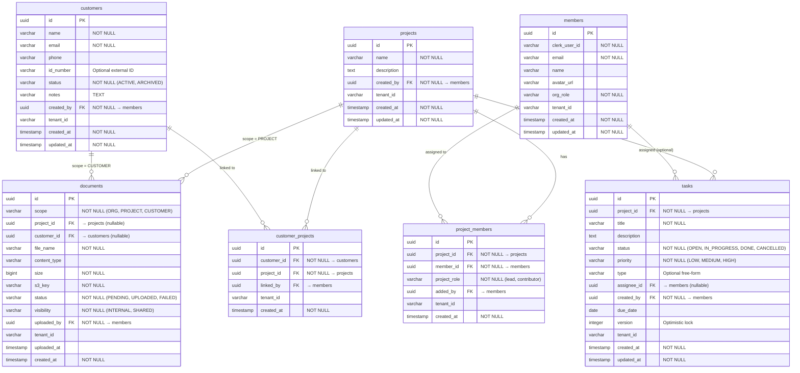
```mermaid
erDiagram
    projects {
        uuid id PK
        varchar name "NOT NULL"
        text description
        uuid created_by FK "NOT NULL → members"
        varchar tenant_id
        timestamp created_at "NOT NULL"
        timestamp updated_at "NOT NULL"
    }

    members {
        uuid id PK
        varchar clerk_user_id "NOT NULL"
        varchar email "NOT NULL"
        varchar name
        varchar avatar_url
        varchar org_role "NOT NULL"
        varchar tenant_id
        timestamp created_at "NOT NULL"
        timestamp updated_at "NOT NULL"
    }

    project_members {
        uuid id PK
        uuid project_id FK "NOT NULL → projects"
        uuid member_id FK "NOT NULL → members"
        varchar project_role "NOT NULL (lead, contributor)"
        uuid added_by FK "→ members"
        varchar tenant_id
        timestamp created_at "NOT NULL"
    }

    customers {
        uuid id PK
        varchar name "NOT NULL"
        varchar email "NOT NULL"
        varchar phone
        varchar id_number "Optional external ID"
        varchar status "NOT NULL (ACTIVE, ARCHIVED)"
        varchar notes "TEXT"
        uuid created_by FK "NOT NULL → members"
        varchar tenant_id
        timestamp created_at "NOT NULL"
        timestamp updated_at "NOT NULL"
    }

    customer_projects {
        uuid id PK
        uuid customer_id FK "NOT NULL → customers"
        uuid project_id FK "NOT NULL → projects"
        uuid linked_by FK "→ members"
        varchar tenant_id
        timestamp created_at "NOT NULL"
    }

    documents {
        uuid id PK
        varchar scope "NOT NULL (ORG, PROJECT, CUSTOMER)"
        uuid project_id FK "→ projects (nullable)"
        uuid customer_id FK "→ customers (nullable)"
        varchar file_name "NOT NULL"
        varchar content_type
        bigint size "NOT NULL"
        varchar s3_key "NOT NULL"
        varchar status "NOT NULL (PENDING, UPLOADED, FAILED)"
        varchar visibility "NOT NULL (INTERNAL, SHARED)"
        uuid uploaded_by FK "NOT NULL → members"
        varchar tenant_id
        timestamp uploaded_at
        timestamp created_at "NOT NULL"
    }

    tasks {
        uuid id PK
        uuid project_id FK "NOT NULL → projects"
        varchar title "NOT NULL"
        text description
        varchar status "NOT NULL (OPEN, IN_PROGRESS, DONE, CANCELLED)"
        varchar priority "NOT NULL (LOW, MEDIUM, HIGH)"
        varchar type "Optional free-form"
        uuid assignee_id FK "→ members (nullable)"
        uuid created_by FK "NOT NULL → members"
        date due_date
        integer version "Optimistic lock"
        varchar tenant_id
        timestamp created_at "NOT NULL"
        timestamp updated_at "NOT NULL"
    }

    projects ||--o{ documents : "scope = PROJECT"
    projects ||--o{ project_members : "has"
    projects ||--o{ customer_projects : "linked to"
    projects ||--o{ tasks : "contains"
    members ||--o{ project_members : "assigned to"
    members ||--o{ tasks : "assigned (optional)"
    customers ||--o{ customer_projects : "linked to"
    customers ||--o{ documents : "scope = CUSTOMER"
```

### 10.2 New Entities

#### 10.2.1 Customer

A Customer represents an external client of the Organization — the person or entity whose projects and documents are being managed. Customers are **data records**, not identity/auth primitives. See [ADR-017](adr/ADR-017-customer-as-org-child.md).

| Field | Type | Constraints | Notes |
|-------|------|-------------|-------|
| `id` | UUID | PK, generated | |
| `name` | VARCHAR(255) | NOT NULL | Full name or entity name |
| `email` | VARCHAR(255) | NOT NULL | Primary contact; future portal identity anchor |
| `phone` | VARCHAR(50) | Nullable | |
| `id_number` | VARCHAR(100) | Nullable | External ID (national ID, company reg, etc.) |
| `status` | VARCHAR(20) | NOT NULL, default ACTIVE | ACTIVE, ARCHIVED |
| `notes` | TEXT | Nullable | Free-form staff notes |
| `created_by` | UUID FK → members | NOT NULL | Staff member who created the record |
| `tenant_id` | VARCHAR(255) | | Shared-schema discriminator |
| `created_at` | TIMESTAMPTZ | NOT NULL | |
| `updated_at` | TIMESTAMPTZ | NOT NULL | |

**Constraints**:
- `UNIQUE(email, tenant_id)` — one Customer per email per org (allows same email across orgs in shared schema).
- Hibernate `@FilterDef` / `@Filter` for shared-schema isolation.
- RLS policy: `tenant_id = current_setting('app.current_tenant', true)`.

#### 10.2.2 CustomerProject (Junction)

Links Customers to Projects in a many-to-many relationship. A Customer can be linked to multiple Projects; a Project can serve multiple Customers.

| Field | Type | Constraints | Notes |
|-------|------|-------------|-------|
| `id` | UUID | PK, generated | |
| `customer_id` | UUID FK → customers | NOT NULL, CASCADE | |
| `project_id` | UUID FK → projects | NOT NULL, CASCADE | |
| `linked_by` | UUID FK → members | Nullable | Staff who created the link |
| `tenant_id` | VARCHAR(255) | | Shared-schema discriminator |
| `created_at` | TIMESTAMPTZ | NOT NULL | |

**Constraints**:
- `UNIQUE(customer_id, project_id)` — one link per customer-project pair.

**Note**: Junction tables (`customer_projects`, `project_members`) use `created_at` only — no `updated_at`. Links are immutable once created; to change a link, delete and recreate.

#### 10.2.3 Task

A Task represents a unit of work within a Project. Tasks support a "claim" workflow where unassigned tasks are visible to all project members and can be claimed by any eligible staff member. See [ADR-019](adr/ADR-019-task-claim-workflow.md).

| Field | Type | Constraints | Notes |
|-------|------|-------------|-------|
| `id` | UUID | PK, generated | |
| `project_id` | UUID FK → projects | NOT NULL, CASCADE | |
| `title` | VARCHAR(500) | NOT NULL | |
| `description` | TEXT | Nullable | |
| `status` | VARCHAR(20) | NOT NULL, default OPEN | OPEN, IN_PROGRESS, DONE, CANCELLED |
| `priority` | VARCHAR(20) | NOT NULL, default MEDIUM | LOW, MEDIUM, HIGH |
| `type` | VARCHAR(100) | Nullable | Free-form task categorization |
| `assignee_id` | UUID FK → members | Nullable, SET NULL | NULL = unclaimed (in pool) |
| `created_by` | UUID FK → members | NOT NULL | |
| `due_date` | DATE | Nullable | |
| `version` | INTEGER | NOT NULL, default 0 | `@Version` for optimistic locking |
| `tenant_id` | VARCHAR(255) | | Shared-schema discriminator |
| `created_at` | TIMESTAMPTZ | NOT NULL | |
| `updated_at` | TIMESTAMPTZ | NOT NULL | |

**Claim semantics**: The `version` column enables optimistic locking. When two members attempt to claim the same task simultaneously, one succeeds and the other receives a 409 Conflict.

#### 10.2.4 Document (Extended)

The existing `documents` table gains three new columns. See [ADR-018](adr/ADR-018-document-scope-model.md).

| New Column | Type | Constraints | Notes |
|------------|------|-------------|-------|
| `scope` | VARCHAR(20) | NOT NULL, default PROJECT | ORG, PROJECT, CUSTOMER |
| `customer_id` | UUID FK → customers | Nullable, SET NULL | Required when scope = CUSTOMER |
| `visibility` | VARCHAR(20) | NOT NULL, default INTERNAL | INTERNAL (staff-only), SHARED (portal-visible) |

**Existing change**: `project_id` becomes nullable (was NOT NULL). Org-scoped documents have no project.

**CHECK constraint**:
```sql
(scope = 'ORG'      AND project_id IS NULL AND customer_id IS NULL) OR
(scope = 'PROJECT'  AND project_id IS NOT NULL) OR
(scope = 'CUSTOMER' AND customer_id IS NOT NULL)
```

**Scope flexibility notes**:
- `PROJECT` scope: `customer_id` is unconstrained — a project document may optionally reference a customer (e.g., a contract drafted for a specific client within a matter).
- `CUSTOMER` scope with `project_id IS NULL`: global customer document (e.g., KYC/ID docs), reusable across all projects the customer is linked to.
- `CUSTOMER` scope with `project_id IS NOT NULL`: project-specific customer document (e.g., signed engagement letter for a particular matter).

### 10.3 API Surface

#### 10.3.1 Customer Endpoints

| Method | Path | Description | Auth |
|--------|------|-------------|------|
| `POST` | `/api/customers` | Create a new customer | Owner, Admin |
| `GET` | `/api/customers` | List all customers in the org | All staff |
| `GET` | `/api/customers/{id}` | Get customer details | All staff |
| `PUT` | `/api/customers/{id}` | Update customer details | Owner, Admin |
| `DELETE` | `/api/customers/{id}` | Archive a customer | Owner, Admin |
| `POST` | `/api/customers/{id}/projects/{projectId}` | Link customer to project | Owner, Admin, Project Lead |
| `DELETE` | `/api/customers/{id}/projects/{projectId}` | Unlink customer from project | Owner, Admin, Project Lead |
| `GET` | `/api/customers/{id}/projects` | List projects for a customer | All staff |
| `GET` | `/api/projects/{id}/customers` | List customers for a project | Project members |

#### 10.3.2 Task Endpoints

| Method | Path | Description | Auth |
|--------|------|-------------|------|
| `POST` | `/api/projects/{id}/tasks` | Create a task | Project members (edit access) |
| `GET` | `/api/projects/{id}/tasks` | List tasks for a project | Project members |
| `GET` | `/api/tasks/{id}` | Get task details | Project members |
| `PUT` | `/api/tasks/{id}` | Update task (title, desc, priority, status, assignee) | Project Lead, or current assignee |
| `DELETE` | `/api/tasks/{id}` | Delete a task | Project Lead |
| `POST` | `/api/tasks/{id}/claim` | Claim an unassigned task | Project members |
| `POST` | `/api/tasks/{id}/release` | Release a claimed task | Current assignee, Project Lead |

**Query parameters for task listing**:
- `status` — filter by status (e.g., `?status=OPEN`)
- `assigneeId` — filter by assignee (e.g., `?assigneeId=<uuid>` or `?assigneeId=unassigned`)
- `priority` — filter by priority
- `sort` — sort by `dueDate`, `priority`, `createdAt` (default)

#### 10.3.3 Scoped Document Endpoints

Existing document endpoints are extended. New upload-init variants support each scope:

| Method | Path | Description | Auth |
|--------|------|-------------|------|
| `POST` | `/api/projects/{id}/documents/upload-init` | Upload project-scoped doc (existing) | Project members |
| `POST` | `/api/documents/upload-init` | Upload org-scoped doc | Owner, Admin |
| `POST` | `/api/customers/{id}/documents/upload-init` | Upload customer-scoped doc | Owner, Admin |
| `GET` | `/api/documents?scope=ORG` | List org-scoped documents | All staff |
| `GET` | `/api/documents?scope=CUSTOMER&customerId={id}` | List customer's documents | All staff |
| `GET` | `/api/projects/{id}/documents` | List project-scoped docs (existing) | Project members |
| `PATCH` | `/api/documents/{id}/visibility` | Toggle INTERNAL/SHARED | Owner, Admin |

### 10.4 Sequence Diagrams

#### 10.4.1 Staff Onboards a Customer and Links to a Project

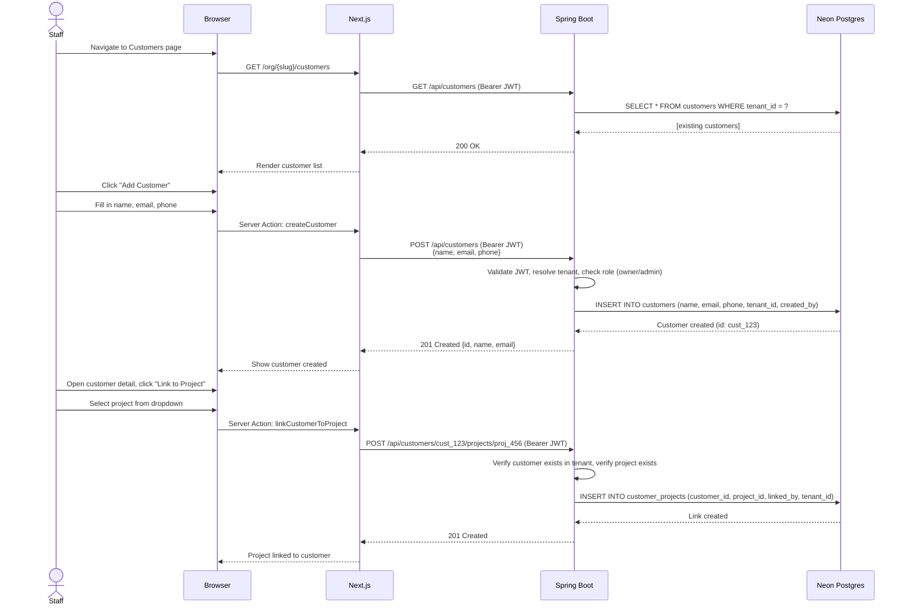
```mermaid
sequenceDiagram
    actor Staff
    participant Browser
    participant NextJS as Next.js
    participant API as Spring Boot
    participant DB as Neon Postgres

    Staff->>Browser: Navigate to Customers page
    Browser->>NextJS: GET /org/{slug}/customers
    NextJS->>API: GET /api/customers (Bearer JWT)
    API->>DB: SELECT * FROM customers WHERE tenant_id = ?
    DB-->>API: [existing customers]
    API-->>NextJS: 200 OK
    NextJS-->>Browser: Render customer list

    Staff->>Browser: Click "Add Customer"
    Staff->>Browser: Fill in name, email, phone
    Browser->>NextJS: Server Action: createCustomer
    NextJS->>API: POST /api/customers (Bearer JWT)<br/>{name, email, phone}
    API->>API: Validate JWT, resolve tenant, check role (owner/admin)
    API->>DB: INSERT INTO customers (name, email, phone, tenant_id, created_by)
    DB-->>API: Customer created (id: cust_123)
    API-->>NextJS: 201 Created {id, name, email}
    NextJS-->>Browser: Show customer created

    Staff->>Browser: Open customer detail, click "Link to Project"
    Staff->>Browser: Select project from dropdown
    Browser->>NextJS: Server Action: linkCustomerToProject
    NextJS->>API: POST /api/customers/cust_123/projects/proj_456 (Bearer JWT)
    API->>API: Verify customer exists in tenant, verify project exists
    API->>DB: INSERT INTO customer_projects (customer_id, project_id, linked_by, tenant_id)
    DB-->>API: Link created
    API-->>NextJS: 201 Created
    NextJS-->>Browser: Project linked to customer
```

#### 10.4.2 Staff Uploads a Customer-Scoped Document

```mermaid
sequenceDiagram
    actor Staff
    participant Browser
    participant NextJS as Next.js
    participant API as Spring Boot
    participant S3 as AWS S3
    participant DB as Neon Postgres

    Staff->>Browser: Navigate to customer detail page
    Staff->>Browser: Click "Upload Document" on customer section
    Staff->>Browser: Select file (e.g., proof_of_id.pdf)

    Browser->>NextJS: Server Action: initCustomerDocUpload
    NextJS->>API: POST /api/customers/cust_123/documents/upload-init<br/>Authorization: Bearer <jwt><br/>{fileName: "proof_of_id.pdf", contentType: "application/pdf", size: 524288}

    API->>API: Validate JWT, resolve tenant, check role (owner/admin)
    API->>API: Verify customer cust_123 exists in tenant
    API->>DB: INSERT INTO documents<br/>(scope='CUSTOMER', customer_id=cust_123,<br/>project_id=NULL, visibility='INTERNAL',<br/>status='PENDING', tenant_id=...)
    API->>S3: Generate presigned PUT URL<br/>Key: org/{orgId}/customer/cust_123/{docId}
    S3-->>API: Presigned URL
    API-->>NextJS: {documentId, presignedUrl, expiresIn}
    NextJS-->>Browser: Return presigned URL

    Browser->>S3: PUT file directly (presigned URL)
    S3-->>Browser: 200 OK

    Browser->>NextJS: Confirm upload
    NextJS->>API: POST /api/documents/{docId}/confirm
    API->>DB: UPDATE documents SET status = 'UPLOADED'
    API-->>NextJS: {documentId, status: UPLOADED}
    NextJS-->>Browser: Upload complete — doc visible on customer profile
```

#### 10.4.3 Staff Creates and Claims a Task

```mermaid
sequenceDiagram
    actor Lead as Project Lead
    actor Member as Team Member
    participant Browser
    participant NextJS as Next.js
    participant API as Spring Boot
    participant DB as Neon Postgres

    Lead->>Browser: Navigate to project tasks
    Lead->>Browser: Click "New Task"
    Lead->>Browser: Fill in title, description, priority=HIGH, due date

    Browser->>NextJS: Server Action: createTask
    NextJS->>API: POST /api/projects/proj_456/tasks<br/>Authorization: Bearer <jwt><br/>{title, description, priority: "HIGH", dueDate: "2026-03-15"}
    API->>API: Validate JWT, check project edit access
    API->>DB: INSERT INTO tasks<br/>(project_id, title, description, priority,<br/>status='OPEN', assignee_id=NULL, created_by=lead_id)
    DB-->>API: Task created (id: task_789)
    API-->>NextJS: 201 Created {id, title, status: OPEN}
    NextJS-->>Browser: Task appears in "Open" column

    Note over Lead,Member: Later, team member sees the task

    Member->>Browser: View project task board
    Browser->>NextJS: GET /org/{slug}/projects/proj_456/tasks
    NextJS->>API: GET /api/projects/proj_456/tasks?status=OPEN
    API->>DB: SELECT * FROM tasks WHERE project_id = ? AND status = 'OPEN'
    DB-->>API: [task_789 (unassigned), ...]
    API-->>NextJS: 200 OK
    NextJS-->>Browser: Show open tasks

    Member->>Browser: Click "Claim" on task_789
    Browser->>NextJS: Server Action: claimTask
    NextJS->>API: POST /api/tasks/task_789/claim<br/>Authorization: Bearer <jwt>
    API->>API: Validate: task.assignee_id IS NULL, member has project access
    API->>DB: UPDATE tasks SET assignee_id = member_id,<br/>status = 'IN_PROGRESS', version = version + 1<br/>WHERE id = task_789 AND version = 0
    DB-->>API: 1 row updated (optimistic lock OK)
    API-->>NextJS: 200 OK {id, status: IN_PROGRESS, assignee: member}
    NextJS-->>Browser: Task moves to "In Progress", assigned to member

    alt Concurrent Claim (Race Condition)
        Note over Member,DB: Another member tries to claim simultaneously
        API->>DB: UPDATE tasks ... WHERE version = 0
        DB-->>API: 0 rows updated (version mismatch)
        API-->>NextJS: 409 Conflict "Task already claimed"
    end
```

### 10.5 Permission Model

#### 10.5.1 Staff Access

Staff access to the new entities integrates with the existing `ProjectAccessService` pattern and org-level role checks.

**Customer access** (org-level — customers are not project-scoped):

| Operation | Owner | Admin | Member |
|-----------|-------|-------|--------|
| Create customer | Yes | Yes | No |
| View customer list | Yes | Yes | Yes |
| View customer detail | Yes | Yes | Yes |
| Update customer | Yes | Yes | No |
| Archive customer | Yes | Yes | No |
| Link/unlink customer ↔ project | Yes | Yes | Project Lead only |

**Task access** (project-scoped — inherits from `ProjectAccessService`):

| Operation | Owner | Admin | Project Lead | Contributor |
|-----------|-------|-------|-------------|-------------|
| View tasks | Yes | Yes | Yes | Yes |
| Create task | Yes | Yes | Yes | Yes |
| Update own task | Yes | Yes | Yes | Yes (if assigned) |
| Assign/reassign | Yes | Yes | Yes | No |
| Claim unassigned | Yes | Yes | Yes | Yes |
| Release (own) | Yes | Yes | Yes | Yes |
| Release (other's) | Yes | Yes | Yes | No |
| Delete task | Yes | Yes | Yes | No |

**Document access by scope**:

| Scope | Who can upload | Who can view | Who can delete |
|-------|---------------|-------------|----------------|
| ORG | Owner, Admin | All staff | Owner, Admin |
| PROJECT | Project members (edit access) | Project members | Owner, Admin, Project Lead |
| CUSTOMER | Owner, Admin | All staff | Owner, Admin |

#### 10.5.2 Future Customer Portal Access (Conceptual)

See [ADR-020](adr/ADR-020-customer-portal-approach.md) for the full auth approach.

When the customer portal is built, Customers will authenticate via email-based magic links and receive a JWT with `customer_id` and `org_id`. The portal filter chain resolves the tenant from `org_id` (same as staff) but restricts access via `customer_id`:

| Data | Visible to Customer | Condition |
|------|-------------------|-----------|
| Projects | Yes | Linked via `customer_projects` |
| Project documents | Yes | `visibility = 'SHARED'` AND project linked to customer |
| Customer documents (own) | Yes | `customer_id = self` AND `visibility = 'SHARED'` |
| Org documents | Yes | `visibility = 'SHARED'` (all org customers, regardless of project links — policies, terms, FAQs) |
| Tasks | No | Staff-only |
| Other customers | No | Never |
| Team members | No | Never |

**API separation**: Portal endpoints live under `/portal/*` with a dedicated Spring Security filter chain. Staff endpoints under `/api/*` are unaffected.

### 10.6 S3 Key Structure (Extended)

The S3 key prefix `org/{clerkOrgId}/` remains the org-level isolation boundary. Sub-paths vary by document scope:

```
{bucket}/
└── org/
    └── {clerkOrgId}/
        ├── project/
        │   └── {projectId}/
        │       └── {documentId}          ← scope = PROJECT (unchanged)
        ├── org-docs/
        │   └── {documentId}              ← scope = ORG (new)
        └── customer/
            └── {customerId}/
                └── {documentId}          ← scope = CUSTOMER (new)
```

The `s3_key` column in `documents` stores the full path. Key generation logic branches on `scope` at upload-init time.

### 10.7 Database Migrations

All new migrations are **tenant-scoped** (applied to both `tenant_shared` and each `tenant_<hash>`). No global migrations needed.

| Migration | Description |
|-----------|-------------|
| `V9__create_customers.sql` | Create `customers` table, UNIQUE(email, tenant_id), indexes on `(tenant_id, status)` and `(tenant_id, email)`, RLS policy |
| `V10__create_customer_projects.sql` | Create `customer_projects` junction table, UNIQUE(customer_id, project_id), indexes on `customer_id` and `project_id`, RLS policy |
| `V11__extend_documents_scope.sql` | Add `scope`, `customer_id`, `visibility` to documents; make `project_id` nullable; backfill scope='PROJECT'; CHECK constraint; indexes on `scope`, `customer_id`, `(scope, visibility)`; updated RLS |
| `V12__create_tasks.sql` | Create `tasks` table, indexes on `project_id`, `assignee_id`, `(project_id, status)`, `(project_id, assignee_id)`, RLS policy, optimistic lock version column |

**Backfill strategy for V11**: All existing documents get `scope = 'PROJECT'` (via DEFAULT), `visibility = 'INTERNAL'` (via DEFAULT), `customer_id = NULL`. The migration is fully backward-compatible — existing queries continue to work because all existing documents have `project_id IS NOT NULL` and `scope = 'PROJECT'`.

### 10.8 Customer Portal Architecture (Conceptual)

This section describes the architectural design for a future customer portal. **Nothing in this section is implemented in Phase 3** — it documents the target state so that current design decisions are portal-ready.

#### 10.8.1 Identity Mapping

```mermaid
flowchart TB
    subgraph "Current (Phase 3)"
        Staff["Staff (Clerk org member)"]
        Customer["Customer (data record)<br/>customers.email"]
        StaffAPI["/api/* endpoints"]
    end

    subgraph "Future (Portal)"
        MagicLink["Magic Link Email"]
        PortalJWT["Portal JWT<br/>{customer_id, org_id, type: customer}"]
        PortalAPI["/portal/* endpoints"]
        PortalUI["Portal UI<br/>/portal/*"]
    end

    Staff -->|Clerk JWT| StaffAPI
    Customer -.->|email match| MagicLink
    MagicLink -->|verify token| PortalJWT
    PortalJWT -->|read-only access| PortalAPI
    PortalAPI -->|scoped queries| PortalUI
```

**Flow**: Customer enters email at `/portal` → backend verifies email exists in `customers` table → sends magic link → customer clicks link → backend issues short-lived JWT with `customer_id` and `org_id` → portal pages use JWT for API calls.

#### 10.8.2 Filter Chain Separation

```
Staff request path:
  Request → JwtAuthFilter → TenantFilter → MemberFilter → /api/* controller

Customer portal request path (future):
  Request → CustomerAuthFilter → TenantFilter → /portal/* controller
                                  (no MemberFilter — customers are not members)
```

The `CustomerAuthFilter` (future) reads the portal JWT, validates it, and binds `RequestScopes.CUSTOMER_ID` (new ScopedValue). `TenantFilter` resolves the schema from `org_id` in the JWT — identical to staff requests. Portal controllers query only data linked to the customer and marked `visibility = 'SHARED'`.

#### 10.8.3 Upgrade Path to Clerk

If customer access patterns outgrow magic links (e.g., customers need MFA, profile management, or write access), the magic link auth can be replaced with a **separate Clerk application instance** for customers. The mapping layer (`customers.email` → Clerk customer user ID) provides the bridge. No schema or data model changes needed — only the auth filter implementation changes.

### 10.9 Phase 3 ADR Index

| ADR | Title | Status |
|-----|-------|--------|
| [ADR-017](adr/ADR-017-customer-as-org-child.md) | Customers as Children of Organization | Accepted |
| [ADR-018](adr/ADR-018-document-scope-model.md) | Document Scope Representation | Accepted |
| [ADR-019](adr/ADR-019-task-claim-workflow.md) | Task Entity and Claim Workflow | Accepted |
| [ADR-020](adr/ADR-020-customer-portal-approach.md) | Customer Portal Authentication Approach | Accepted |

### 10.10 Capability Slices (Backlog Input)

The following capability slices are designed to be turned into Epics by a task planner. Each slice is self-contained and produces a deployable increment.

#### Slice A: Customer Lifecycle and Project Linking
- **Backend**: `Customer` entity, `CustomerProject` entity, repositories, services, controllers.
- **Migrations**: V9 (customers), V10 (customer_projects).
- **Endpoints**: Full CRUD for customers; link/unlink customer ↔ project; list customers by project and projects by customer.
- **Access control**: `CustomerAccessService` — org owner/admin for mutations, all staff for reads, project lead for linking.
- **Tests**: Integration tests for CRUD, linking, tenant isolation (shared + dedicated schemas), access control.

#### Slice B: Customer Frontend
- **Frontend**: Customers list page, customer detail page, create/edit customer dialog, link-to-project dialog.
- **Route**: `/org/[slug]/customers` (list), `/org/[slug]/customers/[id]` (detail).
- **Components**: CustomerCard, CustomerForm, LinkProjectDialog.
- **Server actions**: createCustomer, updateCustomer, archiveCustomer, linkProject, unlinkProject.
- **Tests**: Component tests for dialogs, form validation.

#### Slice C: Scoped Document Handling
- **Backend**: Extend Document entity with `scope`, `customer_id`, `visibility`. Update DocumentService and DocumentController for scope-aware operations.
- **Migration**: V11 (extend_documents_scope).
- **Endpoints**: Org-scoped upload-init, customer-scoped upload-init, scope-filtered listing, visibility toggle.
- **S3**: Extended key generation per scope.
- **Access control**: Scope-aware permission checks in DocumentService.
- **Tests**: Upload and query tests for all three scopes; verify backward compatibility (existing project-scoped docs unchanged).

#### Slice D: Document Scope Frontend
- **Frontend**: Org documents section (settings or dedicated page), customer documents tab on customer detail page, scope indicator badges on document lists.
- **Components**: OrgDocumentUploader, CustomerDocumentUploader, ScopeBadge, VisibilityToggle.
- **Tests**: Component tests for upload flows per scope.

#### Slice E: Project Task Management Backend
- **Backend**: `Task` entity, repository, service, controller. Claim and release endpoints. Optimistic locking for concurrent claims.
- **Migration**: V12 (create_tasks).
- **Endpoints**: CRUD, claim, release, filtered listing (by status, assignee, priority).
- **Access control**: Task mutations follow project access model (leads can manage all tasks, contributors can claim/update assigned tasks).
- **Tests**: Integration tests for CRUD, claim race conditions, tenant isolation, access control.

#### Slice F: Project Task Management Frontend
- **Frontend**: Task board or list view within project detail page. Task creation dialog. Claim/release buttons. Status columns or filters.
- **Route**: `/org/[slug]/projects/[id]/tasks` (or tab within project detail).
- **Components**: TaskBoard/TaskList, TaskCard, CreateTaskDialog, ClaimButton.
- **Server actions**: createTask, updateTask, claimTask, releaseTask, deleteTask.
- **Tests**: Component tests for task interactions, optimistic UI for claim.

#### Slice G: Customer Portal Groundwork
- **Backend**: `CustomerAuthFilter`, portal JWT issuance (magic link), `/portal/*` endpoint skeleton, scoped query services for customer visibility.
- **Frontend**: `/portal` login page, portal layout, project list (read-only), document list (SHARED only), document download.
- **Auth**: Magic link email sending, token verification, short-lived JWT issuance.
- **Tests**: Auth flow tests, scoped visibility tests, cross-customer isolation tests.

---

## Appendix A: Clerk JWT Claims

The JWT issued by Clerk for API calls contains these claims (relevant subset):

| Claim | Type | Description |
|-------|------|-------------|
| `sub` | string | Clerk user ID (`user_2abc...`) |
| `org_id` | string | Active organization ID (`org_2abc...`) |
| `org_role` | string | User's role in the org (`org:owner`, `org:admin`, `org:member`) |
| `org_slug` | string | Organization slug |
| `iss` | string | Clerk issuer URL |
| `exp` | number | Token expiration timestamp |
| `iat` | number | Token issued-at timestamp |

## Appendix B: Environment Variables Reference

| Variable | Service | Source | Description |
|----------|---------|--------|-------------|
| `NEXT_PUBLIC_CLERK_PUBLISHABLE_KEY` | Frontend | Clerk Dashboard | Public Clerk key |
| `CLERK_SECRET_KEY` | Frontend | Secrets Manager | Clerk backend key |
| `CLERK_WEBHOOK_SIGNING_SECRET` | Frontend | Secrets Manager | Svix webhook signing secret |
| `BACKEND_URL` | Frontend | ECS Task Def | Internal ALB URL for Spring Boot |
| `INTERNAL_API_KEY` | Both | Secrets Manager | Shared API key for `/internal/*` |
| `DATABASE_URL` | Backend | Secrets Manager | Neon pooled connection string |
| `DATABASE_MIGRATION_URL` | Backend | Secrets Manager | Neon direct connection string |
| `CLERK_ISSUER` | Backend | ECS Task Def | Clerk JWT issuer URL |
| `CLERK_JWKS_URI` | Backend | ECS Task Def | Clerk JWKS endpoint |
| `AWS_S3_BUCKET` | Backend | ECS Task Def | S3 bucket name |
| `AWS_REGION` | Both | ECS Task Def | AWS region |
