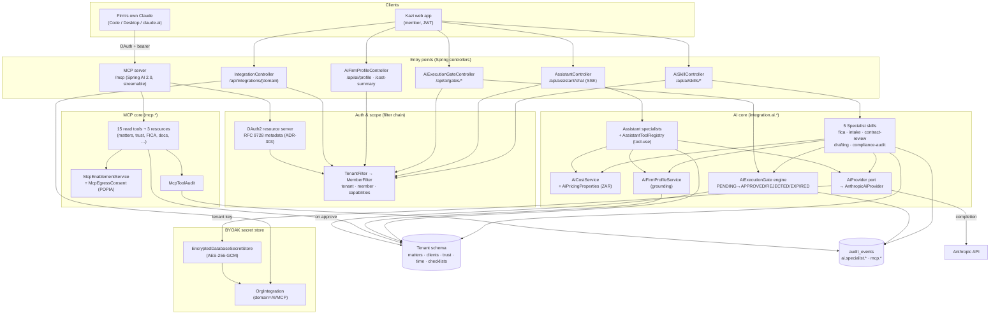
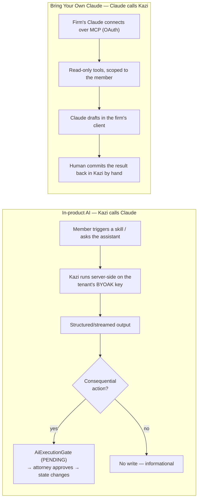
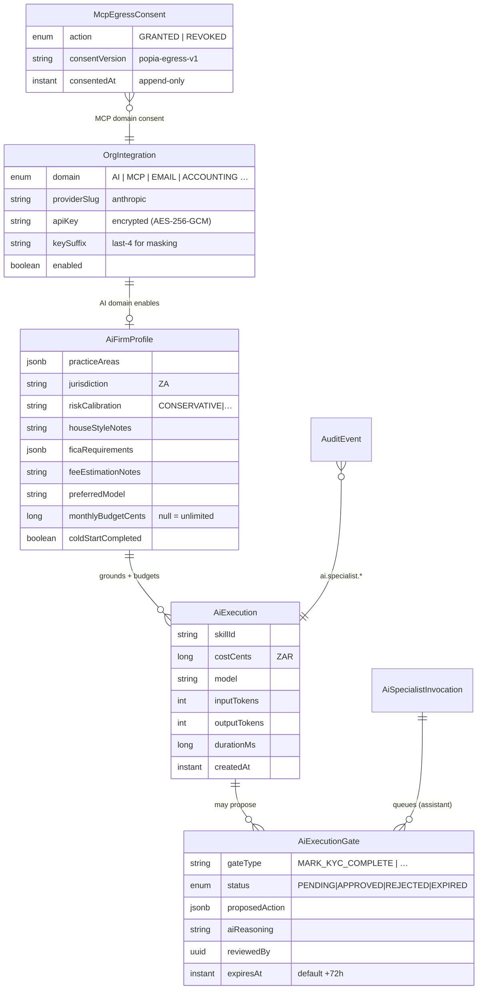
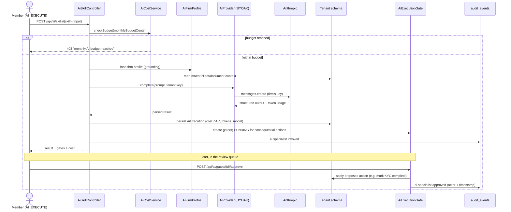
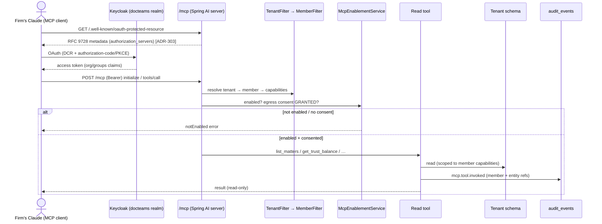

# AI Architecture — Setup & Components

A consolidated, cross-phase view of Kazi's AI subsystem. The AI capability is built across several
phases — this document pulls them together into one architectural picture:

| Phase | Contribution |
|---|---|
| **Phase 21** (ADR-039) | Integration ports + **BYOAK** infrastructure — the `AiProvider` port, `OrgIntegration`, encrypted secret store. |
| **Phase 70** | Conversational **AI Assistant** + specialists (streaming chat, tool-use, invocation queue). |
| **Phase 72** (ADR-280–285) | **AI foundation** — firm profile, the 5 specialist skills, execution gates, cost metering. |
| **Phase 78** (ADR-303) | **MCP server** — read-only "Bring Your Own Claude" exposure of tenant data. |

> **Two heads on one body.** Kazi calls Claude (in-product AI, can write via gates) **and** the firm's
> own Claude calls Kazi (MCP, read-only). Same domain data, same auth/audit, two surfaces.

---

## 1. Design principles

1. **BYOAK (Bring Your Own API Key).** AI runs on the *tenant's* own Anthropic key, stored encrypted per
   tenant. The firm controls cost and data egress. (ADR-039, Phase 21.)
2. **Draft-first, human-approved.** AI proposes; a person decides. Consequential in-product actions are
   held in an `AiExecutionGate` for attorney sign-off before any state change. (ADR-282.)
3. **Tenant- and member-scoped.** Every AI path resolves `tenant → member → capabilities` through the
   same filter chain as the rest of the app — AI never reads beyond the member's permissions.
4. **Grounded.** Output is shaped by the per-tenant `AiFirmProfile` (practice areas, jurisdiction, house
   style, FICA posture) and SA legal knowledge.
5. **Audited & consent-gated.** In-product AI emits `ai.specialist.*`; MCP reads emit `mcp.*`. MCP data
   egress requires explicit POPIA consent (`mcp_egress_consents`). (ADR-303.)

---

## 2. Component map

---

## 3. The two AI paths

**Key difference:** in-product AI can mutate state — but only *after* an attorney approves a gate. The
MCP path is **read-only by construction** (no write tools exist); any change is a manual human step in
Kazi. (Phase 78 §11.3 "Read-only by construction".)

---

## 4. AI data model

The `apiKey` is the only secret; everything else is tenant-scoped domain data in the tenant schema.
Cost is summed per calendar month from `AiExecution` for the budget check.

---

## 5. Flow — in-product specialist execution (BYOAK + gate + cost + audit)

---

## 6. Flow — Bring Your Own Claude (MCP OAuth + read)

`scope binding` through the filter chain uses the approved `RequestScopes.runForTenant*` helpers
(ADR-T008) — never raw `ScopedValue.where`.

---

## 7. Surfaces & capabilities

| Surface | Entry | Capability | Writes? |
|---|---|---|---|
| AI Assistant (chat) | `POST /api/assistant/chat` (SSE) | `AI_ASSISTANT_USE` | only via tool-confirm |
| Specialist skills | `POST /api/ai/skills/*` | `AI_EXECUTE` | only via approved gate |
| Review queue | `GET/POST /api/ai/gates/*` | `AI_REVIEW` | applies on approve |
| Firm profile + cost | `GET/PUT /api/ai/profile`, `/cost-summary` | `AI_MANAGE` | profile only |
| BYOAK key | `/api/integrations/AI/*` | `TEAM_OVERSIGHT` | secret store |
| MCP server | `/mcp` + `/api/integrations/mcp/*` | per-tool RBAC + egress consent | never (read-only) |

---

## 8. Key decisions (referenced ADRs)

- **ADR-039 / Phase 21** — `AiProvider` port + BYOAK: AI is a swappable port; the tenant's encrypted key
  is the only secret; no vendor lock-in in the domain layer.
- **ADR-280–285 / Phase 72** — AI foundation: firm profile as the grounding spine; skills return
  structured output; execution gates as the universal write-back safety mechanism; per-tenant ZAR cost
  metering + monthly budget.
- **ADR-303 / Phase 78** — MCP exposes the *existing* read model over an OAuth-authenticated server;
  reuses the JWT/tenant/capability chain rather than forking auth; POPIA egress consent gates data flow;
  read-only by construction (no write tools).
- **ADR-T008** — tenant/member scope binding only via the approved `RequestScopes` helpers (enforced by
  `TenantScopeBindingTest`), including on the MCP request path.

## 9. Related

- `architecture/phase21-integration-ports-byoak.md` — the `AiProvider` port + BYOAK infrastructure
- `architecture/phase78-mcp-server.md` — the MCP server in depth (tools, consent, gating)
- `docs/content/ai/*` — the product-facing AI documentation
- `../claude-for-legal-sa` — the `kazi-legal-za` plugin that consumes the MCP server
