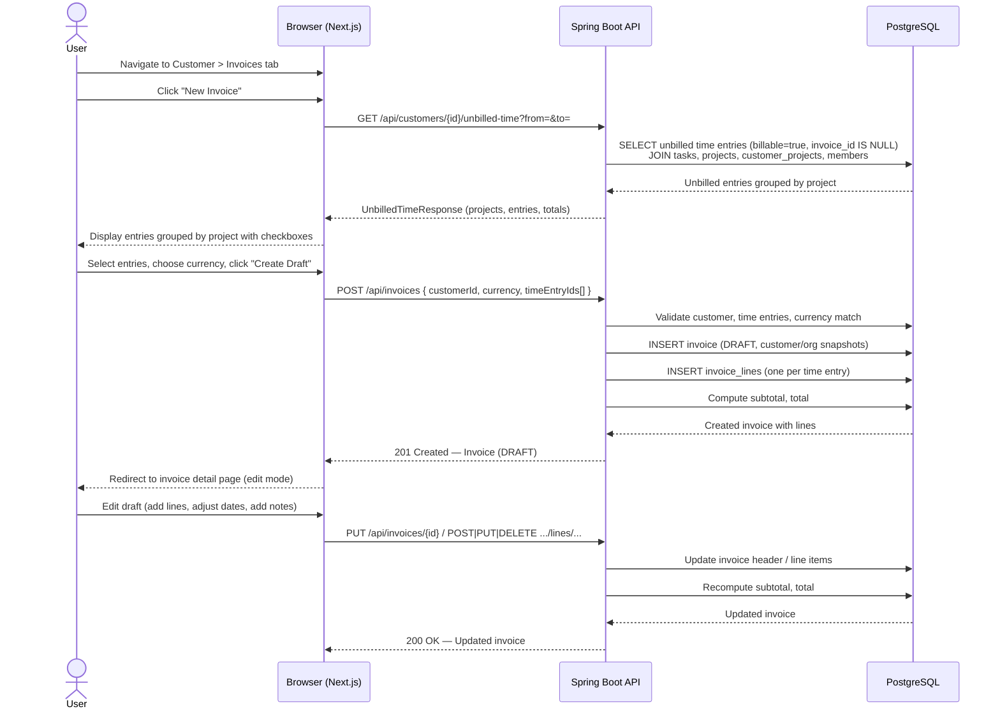
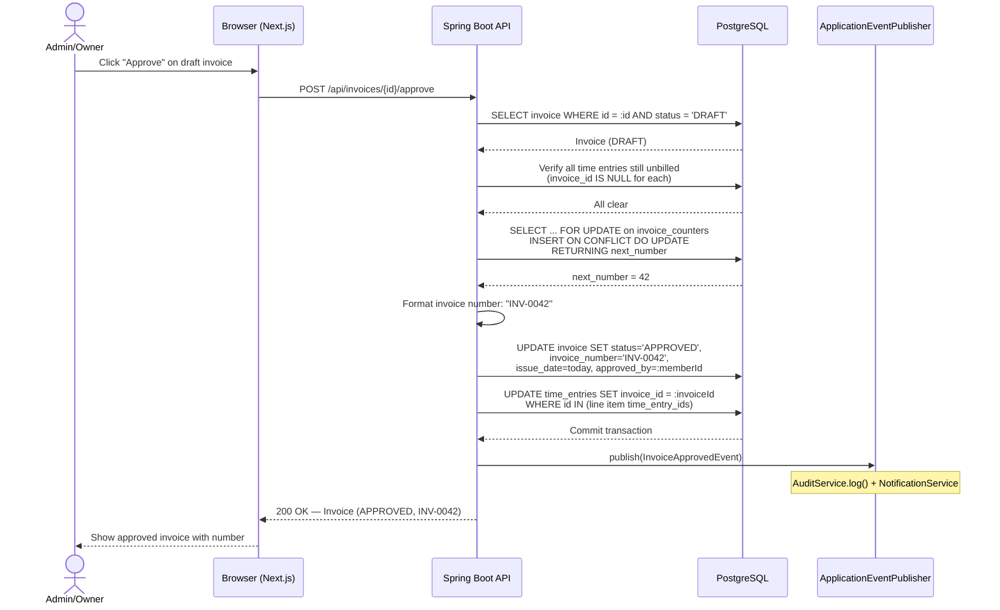
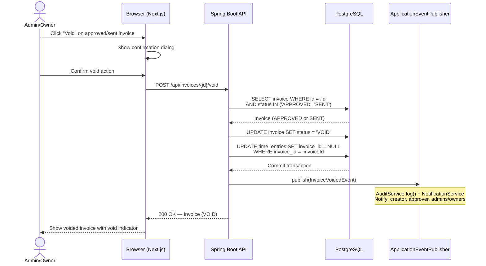

> Merge into ARCHITECTURE.md as **Section 11** or keep as standalone `architecture/phase10-invoicing-billing.md`.

# Phase 10 — Invoicing & Billing from Time

---

## 11. Phase 10 — Invoicing & Billing from Time

Phase 10 adds the **revenue capture layer** to the DocTeams platform — the bridge between tracked billable work and formal invoices that can be sent to clients. Until now, the platform records time (Phase 5), attaches billing rates (Phase 8), and computes profitability metrics, but there is no mechanism to produce an invoice from that data. This phase closes the loop: billable time becomes invoiceable line items, invoices follow a controlled lifecycle (Draft → Approved → Sent → Paid), and a clean payment service provider (PSP) seam is established for future Stripe integration.

The design introduces two new entities (`Invoice`, `InvoiceLine`), extends `TimeEntry` with an `invoice_id` column for double-billing prevention, and adds a tenant-scoped counter table for gap-free invoice numbering. All additions are evolutionary — they reuse the existing tenant isolation model, entity patterns, audit infrastructure (Phase 6), and notification pipeline (Phase 6.5). The invoice preview is rendered server-side as self-contained HTML, explicitly structured for future PDF conversion without template changes.

**Dependencies on prior phases**:
- **Phase 4** (Customers): `Customer` entity. Invoices belong to customers; customer details are snapshotted at invoice creation.
- **Phase 5** (Task & Time Lifecycle): `TimeEntry` entity with duration and date. Time entries are the source data for invoice line items.
- **Phase 6** (Audit & Compliance): `AuditService` and `AuditEventBuilder`. All invoice mutations publish audit events.
- **Phase 6.5** (Notifications, Comments & Activity): `ApplicationEvent` publication pattern, `NotificationEventHandler`, `DomainEvent` sealed interface. Invoice lifecycle events trigger notifications.
- **Phase 8** (Rate Cards, Budgets & Profitability): `BillingRate` (3-level hierarchy), rate snapshots on `TimeEntry` (`billing_rate_snapshot`, `billing_rate_currency`), `OrgSettings` (default currency). Invoice line items consume rate snapshots directly — no re-resolution of rates at invoicing time.

### What's New

| Capability | Before Phase 10 | After Phase 10 |
|---|---|---|
| Invoice generation | -- | Multi-project invoices generated from unbilled billable time entries |
| Invoice lifecycle | -- | Draft → Approved → Sent → Paid → Void state machine with RBAC per transition |
| Time entry billing status | `billable` flag only | `invoice_id` FK tracks billing state; edit/delete locked for billed entries |
| Invoice numbering | -- | Gap-free sequential numbering per tenant, assigned at approval |
| Double-billing prevention | -- | DB-enforced via `invoice_id` on TimeEntry + partial unique index on InvoiceLine |
| Payment recording | -- | Manual payment recording through `PaymentProvider` interface (mocked for v1) |
| Invoice preview | -- | Self-contained HTML, print-friendly, PDF-ready |
| Customer financials | Profitability view only | + Invoice list per customer with totals and status tracking |

**Out of scope**: Recurring/scheduled invoicing, PDF generation, customer-facing portal views, tax calculation engine, credit notes, partial payments, multi-currency invoices, multi-approver workflows, email delivery, expense line items. See the requirements document for the full exclusion list.

---

### 11.1 Overview

Phase 10 establishes the invoicing workflow without introducing payment processing complexity. The design is intentionally generic and industry-agnostic — invoicing from tracked time is universal to all professional services verticals. No legal, accounting, or agency-specific billing concepts are encoded.

The core abstractions:

1. **Invoice** — A financial document addressed to a customer, containing line items that represent billable work. Follows a controlled state machine: DRAFT → APPROVED → SENT → PAID, with VOID as a terminal state reachable from APPROVED or SENT.
2. **InvoiceLine** — An individual line item on an invoice. Can be auto-generated from a time entry (1:1 mapping) or manually created. Each line has quantity, unit price, and computed amount.
3. **Invoice Number** — A human-readable sequential identifier (e.g., "INV-0001") assigned at approval time. Gap-free within a tenant. See [ADR-048](../adr/ADR-048-invoice-numbering-strategy.md).
4. **Unbilled Time** — Time entries where `billable = true AND invoice_id IS NULL`. The system provides a query endpoint and selection UI for generating invoices from unbilled time.
5. **PaymentProvider** — An interface for recording payments. The mock implementation always succeeds. See [ADR-051](../adr/ADR-051-psp-adapter-design.md).

All monetary amounts use `BigDecimal` (Java) / `DECIMAL` (Postgres). Currency is always explicit — stored alongside every monetary value. No implicit currency, no floating-point arithmetic.

---

### 11.2 Domain Model

Phase 10 introduces two new tenant-scoped entities (`Invoice`, `InvoiceLine`), a counter table (`invoice_counters`), and alters the existing `TimeEntry` entity. All new entities follow the established pattern: `TenantAware` interface, `@FilterDef`/`@Filter` for shared-schema tenants, `@EntityListeners(TenantAwareEntityListener.class)`, UUID-based loose references (no JPA `@ManyToOne`).

#### 11.2.1 Invoice Entity (New)

An Invoice represents a financial document addressed to a customer. It snapshots customer and org details at creation time, ensuring the invoice remains accurate even if those details change later.

| Field | Java Type | DB Column | DB Type | Constraints | Notes |
|-------|-----------|-----------|---------|-------------|-------|
| `id` | `UUID` | `id` | `UUID` | PK, default `gen_random_uuid()` | Auto-generated |
| `customerId` | `UUID` | `customer_id` | `UUID` | NOT NULL, FK → customers | The billed customer |
| `invoiceNumber` | `String` | `invoice_number` | `VARCHAR(20)` | Nullable, UNIQUE per tenant | Assigned at approval. NULL for drafts. Format: "INV-0001" |
| `status` | `String` | `status` | `VARCHAR(20)` | NOT NULL, default `'DRAFT'` | DRAFT, APPROVED, SENT, PAID, VOID |
| `currency` | `String` | `currency` | `VARCHAR(3)` | NOT NULL | ISO 4217 code. Immutable after creation |
| `issueDate` | `LocalDate` | `issue_date` | `DATE` | Nullable | Set at approval if not provided. The invoice's official date |
| `dueDate` | `LocalDate` | `due_date` | `DATE` | Nullable | Payment due date |
| `subtotal` | `BigDecimal` | `subtotal` | `DECIMAL(14,2)` | NOT NULL, default 0 | Sum of line item amounts |
| `taxAmount` | `BigDecimal` | `tax_amount` | `DECIMAL(14,2)` | NOT NULL, default 0 | Manually entered tax |
| `total` | `BigDecimal` | `total` | `DECIMAL(14,2)` | NOT NULL, default 0 | subtotal + tax_amount |
| `notes` | `String` | `notes` | `TEXT` | Nullable | Free-text notes displayed on the invoice |
| `paymentTerms` | `String` | `payment_terms` | `VARCHAR(100)` | Nullable | e.g., "Net 30", "Due on receipt" |
| `paymentReference` | `String` | `payment_reference` | `VARCHAR(255)` | Nullable | Reference from PSP or manual entry |
| `paidAt` | `Instant` | `paid_at` | `TIMESTAMPTZ` | Nullable | When payment was recorded |
| `customerName` | `String` | `customer_name` | `VARCHAR(255)` | NOT NULL | Snapshot at creation |
| `customerEmail` | `String` | `customer_email` | `VARCHAR(255)` | Nullable | Snapshot at creation |
| `customerAddress` | `String` | `customer_address` | `TEXT` | Nullable | Snapshot at creation |
| `orgName` | `String` | `org_name` | `VARCHAR(255)` | NOT NULL | Snapshot at creation (the "from" side) |
| `createdBy` | `UUID` | `created_by` | `UUID` | NOT NULL, FK → members | Member who created the draft |
| `approvedBy` | `UUID` | `approved_by` | `UUID` | Nullable, FK → members | Member who approved |
| `tenantId` | `String` | `tenant_id` | `VARCHAR(255)` | | Shared-schema discriminator |
| `createdAt` | `Instant` | `created_at` | `TIMESTAMPTZ` | NOT NULL, default `now()` | |
| `updatedAt` | `Instant` | `updated_at` | `TIMESTAMPTZ` | NOT NULL, default `now()` | |

**Constraints**:
- `UNIQUE (invoice_number)` per schema. For `tenant_shared`, the unique index includes `tenant_id`: `UNIQUE (tenant_id, invoice_number) WHERE invoice_number IS NOT NULL`.
- `CHECK (char_length(currency) = 3)` — ISO 4217 validation.
- `CHECK (status IN ('DRAFT', 'APPROVED', 'SENT', 'PAID', 'VOID'))`.
- `CHECK (total = subtotal + tax_amount)` — enforced on write at the application layer, not as a DB constraint (allows bulk updates without cascading constraint checks).

**Indexes**:
- `idx_invoices_customer_status` — `(customer_id, status)` — list invoices per customer, filtered by status.
- `idx_invoices_status` — `(status)` — dashboard queries (e.g., all unpaid invoices).
- `idx_invoices_created_at` — `(created_at)` — chronological listing.
- `idx_invoices_tenant` — `(tenant_id) WHERE tenant_id IS NOT NULL` — shared-schema isolation.
- `idx_invoices_number_unique` — `UNIQUE (invoice_number) WHERE invoice_number IS NOT NULL` — per-schema for Pro tenants.
- For `tenant_shared`: `UNIQUE (tenant_id, invoice_number) WHERE invoice_number IS NOT NULL`.

**Design decisions**:
- **Customer/org snapshots**: Invoice immutability requires freezing counterparty details. If a customer changes their address after invoicing, existing invoices should not change. Snapshot fields avoid a join to the customer table for invoice rendering. See Phase 4's customer model.
- **`DECIMAL(14,2)` for totals**: Supports invoices up to 999,999,999,999.99 in any currency denomination.
- **`invoice_number` nullable**: Drafts do not have invoice numbers. The number is assigned at the DRAFT → APPROVED transition. See [ADR-048](../adr/ADR-048-invoice-numbering-strategy.md).
- **Currency immutable after creation**: Once an invoice is created with a specific currency, it cannot be changed. All line items must be in the same currency. This avoids mid-invoice currency conflicts.

#### 11.2.2 InvoiceLine Entity (New)

An InvoiceLine represents a single line item on an invoice. Each line can be auto-generated from a time entry (1:1 mapping per [ADR-049](../adr/ADR-049-line-item-granularity.md)) or manually created.

| Field | Java Type | DB Column | DB Type | Constraints | Notes |
|-------|-----------|-----------|---------|-------------|-------|
| `id` | `UUID` | `id` | `UUID` | PK, default `gen_random_uuid()` | Auto-generated |
| `invoiceId` | `UUID` | `invoice_id` | `UUID` | NOT NULL, FK → invoices ON DELETE CASCADE | Parent invoice |
| `projectId` | `UUID` | `project_id` | `UUID` | Nullable, FK → projects | Which project this line relates to |
| `timeEntryId` | `UUID` | `time_entry_id` | `UUID` | Nullable, FK → time_entries | Source time entry (null for manual lines) |
| `description` | `String` | `description` | `TEXT` | NOT NULL | What the line item is for |
| `quantity` | `BigDecimal` | `quantity` | `DECIMAL(10,4)` | NOT NULL | Hours (for time-based) or units (for manual) |
| `unitPrice` | `BigDecimal` | `unit_price` | `DECIMAL(12,2)` | NOT NULL | Rate per unit |
| `amount` | `BigDecimal` | `amount` | `DECIMAL(14,2)` | NOT NULL | quantity x unit_price (computed on write) |
| `sortOrder` | `int` | `sort_order` | `INTEGER` | NOT NULL, default 0 | Display order within the invoice |
| `tenantId` | `String` | `tenant_id` | `VARCHAR(255)` | | Shared-schema discriminator |
| `createdAt` | `Instant` | `created_at` | `TIMESTAMPTZ` | NOT NULL, default `now()` | |
| `updatedAt` | `Instant` | `updated_at` | `TIMESTAMPTZ` | NOT NULL, default `now()` | |

**Constraints**:
- `invoice_id` NOT NULL with CASCADE delete (deleting a draft invoice removes its lines).
- `CHECK (quantity > 0)` — zero-quantity lines are not meaningful.
- `CHECK (unit_price >= 0)` — allows zero for no-charge items, but not negative. Discounts are modeled as negative `amount` with a negative `quantity` or via a separate manual line.
- Partial unique index: `UNIQUE (time_entry_id) WHERE time_entry_id IS NOT NULL` — prevents the same time entry from appearing on two invoices. See [ADR-050](../adr/ADR-050-double-billing-prevention.md).

**Indexes**:
- `idx_invoice_lines_invoice_sort` — `(invoice_id, sort_order)` — ordered retrieval.
- `idx_invoice_lines_time_entry_unique` — `UNIQUE (time_entry_id) WHERE time_entry_id IS NOT NULL` — double-billing prevention.
- `idx_invoice_lines_project` — `(project_id) WHERE project_id IS NOT NULL` — "all lines for this project" queries.
- `idx_invoice_lines_tenant` — `(tenant_id) WHERE tenant_id IS NOT NULL` — shared-schema isolation.

**Line item types**:
- **Time-based**: `time_entry_id` is set. `quantity` = duration in hours (e.g., 2.5 for 150 minutes). `unit_price` = `time_entry.billing_rate_snapshot`. `description` auto-generated: "{task title} -- {date} -- {member name}".
- **Manual**: `time_entry_id` is NULL. All fields user-specified. Used for fixed fees, adjustments, discounts.

**Grouping for display**: Line items are grouped by `project_id` in the invoice preview. Manual items with `project_id = NULL` appear in an "Other Items" section. Within each group, time-based items are sorted by the time entry's date, then manual items by `sort_order`.

#### 11.2.3 TimeEntry Changes

The existing `TimeEntry` entity (Phase 5, V13) gains one new column for billing status tracking. This column is added in the same V23 migration that creates the invoice tables (see section 11.10).

| New Field | Java Type | DB Column | DB Type | Constraints | Notes |
|-----------|-----------|-----------|---------|-------------|-------|
| `invoiceId` | `UUID` | `invoice_id` | `UUID` | Nullable, FK → invoices | Set when approved; cleared when voided |

**Billing status semantics**:
- `billable = true AND invoice_id IS NULL` → **Unbilled** (available for invoicing)
- `invoice_id IS NOT NULL` → **Billed** (locked, part of an active invoice)
- `billable = false` → **Non-billable** (never invoiceable)

The existing `billable` flag (Phase 8) controls whether time *can* be billed. The new `invoice_id` tracks whether it *has been* billed. See [ADR-050](../adr/ADR-050-double-billing-prevention.md).

**Edit/delete locking**: Time entries with `invoice_id IS NOT NULL` cannot be edited or deleted. PUT and DELETE requests return 409 Conflict with a message like `"Time entry is part of invoice INV-0042. Void the invoice to unlock."`.

#### 11.2.4 Invoice Counter Table (New)

A counter table for gap-free invoice numbering per tenant. See [ADR-048](../adr/ADR-048-invoice-numbering-strategy.md).

| Field | DB Column | DB Type | Constraints | Notes |
|-------|-----------|---------|-------------|-------|
| `id` | `id` | `UUID` | PK, default `gen_random_uuid()` | |
| `tenant_id` | `tenant_id` | `VARCHAR(255)` | UNIQUE | One row per tenant. NULL for dedicated schemas |
| `next_number` | `next_number` | `INTEGER` | NOT NULL, default 1 | Next invoice number to assign |

#### 11.2.5 Updated Entity-Relationship Diagram

The diagram below shows the complete tenant-schema entity relationships after Phase 10. New entities are `invoices`, `invoice_lines`, and `invoice_counters`. The `time_entries` table gains an `invoice_id` column.

```mermaid
erDiagram
    projects {
        uuid id PK
        varchar name "NOT NULL"
        text description
        uuid created_by FK "-> members"
        varchar tenant_id
        timestamp created_at
        timestamp updated_at
    }

    members {
        uuid id PK
        varchar clerk_user_id "NOT NULL"
        varchar email "NOT NULL"
        varchar name
        varchar avatar_url
        varchar org_role "NOT NULL"
        varchar tenant_id
        timestamp created_at
        timestamp updated_at
    }

    project_members {
        uuid id PK
        uuid project_id FK "-> projects"
        uuid member_id FK "-> members"
        varchar project_role "lead, contributor"
        uuid added_by FK "-> members"
        varchar tenant_id
        timestamp created_at
    }

    customers {
        uuid id PK
        varchar name "NOT NULL"
        varchar email "NOT NULL"
        varchar status "ACTIVE, ARCHIVED"
        uuid created_by FK "-> members"
        varchar tenant_id
        timestamp created_at
        timestamp updated_at
    }

    customer_projects {
        uuid id PK
        uuid customer_id FK "-> customers"
        uuid project_id FK "-> projects"
        uuid linked_by FK "-> members"
        varchar tenant_id
        timestamp created_at
    }

    documents {
        uuid id PK
        varchar scope "ORG, PROJECT, CUSTOMER"
        uuid project_id FK "-> projects (nullable)"
        uuid customer_id FK "-> customers (nullable)"
        varchar visibility "INTERNAL, SHARED"
        varchar file_name "NOT NULL"
        varchar status "PENDING, UPLOADED, FAILED"
        uuid uploaded_by FK "-> members"
        varchar tenant_id
        timestamp created_at
    }

    tasks {
        uuid id PK
        uuid project_id FK "-> projects"
        varchar title "NOT NULL"
        varchar status "NOT NULL"
        uuid assignee_id FK "-> members (nullable)"
        date due_date
        varchar tenant_id
        timestamp created_at
        timestamp updated_at
    }

    time_entries {
        uuid id PK
        uuid task_id FK "-> tasks"
        uuid member_id FK "-> members"
        date date "NOT NULL"
        integer duration_minutes "NOT NULL"
        boolean billable "NOT NULL"
        decimal billing_rate_snapshot "12,2"
        varchar billing_rate_currency "3"
        decimal cost_rate_snapshot "12,2"
        varchar cost_rate_currency "3"
        uuid invoice_id FK "-> invoices (nullable)"
        varchar tenant_id
        timestamp created_at
        timestamp updated_at
    }

    comments {
        uuid id PK
        uuid entity_id "NOT NULL"
        varchar entity_type "TASK, DOCUMENT"
        uuid author_id FK "-> members"
        text content "NOT NULL"
        varchar visibility "INTERNAL, SHARED"
        varchar tenant_id
        timestamp created_at
        timestamp updated_at
    }

    notifications {
        uuid id PK
        uuid recipient_id FK "-> members"
        varchar type "NOT NULL"
        varchar title "NOT NULL"
        text message
        boolean read "NOT NULL"
        uuid entity_id
        varchar entity_type
        varchar tenant_id
        timestamp created_at
    }

    notification_preferences {
        uuid id PK
        uuid member_id FK "-> members"
        varchar type "NOT NULL"
        boolean enabled "NOT NULL"
        varchar tenant_id
        timestamp created_at
        timestamp updated_at
    }

    audit_events {
        uuid id PK
        varchar event_type "NOT NULL"
        varchar entity_type "NOT NULL"
        uuid entity_id
        uuid actor_id FK "-> members"
        varchar actor_type
        varchar source
        jsonb details
        varchar tenant_id
        timestamp occurred_at
    }

    portal_contacts {
        uuid id PK
        uuid customer_id FK "-> customers"
        varchar email "NOT NULL"
        varchar name
        varchar role "GENERAL, BILLING, TECHNICAL"
        varchar tenant_id
        timestamp created_at
        timestamp updated_at
    }

    magic_link_tokens {
        uuid id PK
        uuid portal_contact_id FK "-> portal_contacts"
        varchar token "NOT NULL"
        timestamp expires_at "NOT NULL"
        boolean used "NOT NULL"
        varchar tenant_id
        timestamp created_at
    }

    billing_rates {
        uuid id PK
        uuid member_id FK "-> members"
        uuid project_id FK "-> projects (nullable)"
        uuid customer_id FK "-> customers (nullable)"
        varchar currency "3"
        decimal hourly_rate "12,2"
        date effective_from "NOT NULL"
        date effective_to
        varchar tenant_id
        timestamp created_at
        timestamp updated_at
    }

    cost_rates {
        uuid id PK
        uuid member_id FK "-> members"
        varchar currency "3"
        decimal hourly_cost "12,2"
        date effective_from "NOT NULL"
        date effective_to
        varchar tenant_id
        timestamp created_at
        timestamp updated_at
    }

    project_budgets {
        uuid id PK
        uuid project_id FK "-> projects"
        decimal budget_hours "10,2"
        decimal budget_amount "14,2"
        varchar budget_currency "3"
        integer alert_threshold_pct
        boolean threshold_notified
        varchar tenant_id
        timestamp created_at
        timestamp updated_at
    }

    org_settings {
        uuid id PK
        varchar default_currency "3"
        varchar tenant_id "UNIQUE"
        timestamp created_at
        timestamp updated_at
    }

    invoices {
        uuid id PK
        uuid customer_id FK "-> customers"
        varchar invoice_number "UNIQUE, nullable"
        varchar status "DRAFT, APPROVED, SENT, PAID, VOID"
        varchar currency "3, NOT NULL"
        date issue_date
        date due_date
        decimal subtotal "14,2"
        decimal tax_amount "14,2"
        decimal total "14,2"
        text notes
        varchar payment_terms
        varchar payment_reference
        timestamp paid_at
        varchar customer_name "snapshot"
        varchar customer_email "snapshot"
        text customer_address "snapshot"
        varchar org_name "snapshot"
        uuid created_by FK "-> members"
        uuid approved_by FK "-> members (nullable)"
        varchar tenant_id
        timestamp created_at
        timestamp updated_at
    }

    invoice_lines {
        uuid id PK
        uuid invoice_id FK "-> invoices"
        uuid project_id FK "-> projects (nullable)"
        uuid time_entry_id FK "-> time_entries (nullable)"
        text description "NOT NULL"
        decimal quantity "10,4"
        decimal unit_price "12,2"
        decimal amount "14,2"
        integer sort_order
        varchar tenant_id
        timestamp created_at
        timestamp updated_at
    }

    invoice_counters {
        uuid id PK
        varchar tenant_id "UNIQUE"
        integer next_number "default 1"
    }

    projects ||--o{ project_members : "has"
    members ||--o{ project_members : "belongs to"
    projects ||--o{ documents : "contains"
    projects ||--o{ tasks : "contains"
    tasks ||--o{ time_entries : "tracked by"
    members ||--o{ time_entries : "logged by"
    customers ||--o{ customer_projects : "linked via"
    projects ||--o{ customer_projects : "linked via"
    customers ||--o{ documents : "scoped to"
    customers ||--o{ portal_contacts : "has"
    portal_contacts ||--o{ magic_link_tokens : "receives"
    members ||--o{ billing_rates : "has"
    members ||--o{ cost_rates : "has"
    projects ||--o| project_budgets : "has"
    customers ||--o{ invoices : "billed via"
    invoices ||--o{ invoice_lines : "contains"
    time_entries ||--o| invoice_lines : "generates"
    invoices ||--o{ time_entries : "marks billed"
```



---

### 11.3 Core Flows & Backend Behaviour

#### 11.3.1 Invoice State Machine

```
     +---------+     approve     +----------+     send     +------+     payment     +------+
     |  DRAFT  | ------------> | APPROVED | ----------> | SENT | ------------> | PAID |
     +---------+                +----------+              +------+               +------+
         |                          |                        |
         | delete                   | void                   | void
         v                          v                        v
     (removed)                  +------+                 +------+
                                | VOID |                 | VOID |
                                +------+                 +------+
```

**Valid transitions**:

| From | To | Action | Who |
|------|------|--------|-----|
| DRAFT | APPROVED | `POST /api/invoices/{id}/approve` | Admin, Owner |
| DRAFT | *(deleted)* | `DELETE /api/invoices/{id}` | Admin, Owner, Project Lead (if they created it) |
| APPROVED | SENT | `POST /api/invoices/{id}/send` | Admin, Owner |
| APPROVED | VOID | `POST /api/invoices/{id}/void` | Admin, Owner |
| SENT | PAID | `POST /api/invoices/{id}/payment` | Admin, Owner |
| SENT | VOID | `POST /api/invoices/{id}/void` | Admin, Owner |

**Invalid transitions** (rejected with 409 Conflict):
- PAID → any (paid invoices are final)
- VOID → any (voided invoices are terminal)
- APPROVED → DRAFT (no "un-approve" — void and recreate instead)
- SENT → APPROVED (no backwards movement)
- Any → DRAFT (drafts are only the initial state)

#### 11.3.2 Invoice Generation Flow

1. **Preview unbilled time**: User navigates to Customer detail → Invoices tab → "New Invoice". Frontend calls `GET /api/customers/{customerId}/unbilled-time?from=&to=`. Backend returns unbilled billable time entries across all of the customer's projects, grouped by project, with totals per currency.

2. **Create draft**: User selects time entries and currency, clicks "Create Draft". Frontend calls `POST /api/invoices` with `{ customerId, currency, timeEntryIds[], dueDate?, notes?, paymentTerms? }`. Backend:
   - Validates the customer exists and is ACTIVE.
   - Validates all time entry IDs belong to the customer's projects, are billable, and are unbilled (`invoice_id IS NULL`).
   - Validates all selected time entries have `billing_rate_currency` matching the invoice currency.
   - Creates an `Invoice` in DRAFT status with customer/org snapshots.
   - Creates one `InvoiceLine` per time entry with auto-generated description, `quantity = durationMinutes / 60.0`, `unit_price = billingRateSnapshot`, `amount = quantity * unitPrice`.
   - Computes `subtotal` (sum of line amounts), `tax_amount = 0`, `total = subtotal`.
   - Returns the created draft with all line items.
   - Note: `invoice_id` on TimeEntry is **not** set at draft creation — only at approval.

3. **Edit draft**: User modifies the draft. Available operations:
   - Update invoice header: `PUT /api/invoices/{id}` (due date, notes, payment terms, tax amount).
   - Add manual line: `POST /api/invoices/{id}/lines`.
   - Edit line: `PUT /api/invoices/{id}/lines/{lineId}`.
   - Remove line: `DELETE /api/invoices/{id}/lines/{lineId}` (if time-based, the time entry remains unbilled).
   - Subtotal and total are recomputed on every change.

4. **Approve**: Admin/Owner clicks "Approve". Backend calls `POST /api/invoices/{id}/approve`:
   - Validates invoice is in DRAFT status.
   - Validates invoice has at least one line item.
   - Re-checks all time-entry-based line items: verifies each referenced time entry still has `invoice_id IS NULL` (guards against concurrent draft + approve race condition).
   - Calls `InvoiceNumberService.assignNumber()` which uses `SELECT ... FOR UPDATE` on the counter row.
   - Sets `status = APPROVED`, `invoice_number`, `issue_date` (today if not set), `approved_by`.
   - Sets `invoice_id = this.id` on all referenced time entries (marks them as billed).
   - Publishes `InvoiceApprovedEvent` (→ audit + notification).

5. **Send**: Admin/Owner clicks "Mark as Sent". Backend calls `POST /api/invoices/{id}/send`:
   - Validates invoice is in APPROVED status.
   - Sets `status = SENT`.
   - Publishes `InvoiceSentEvent` (→ audit + notification).

6. **Record payment**: Admin/Owner clicks "Record Payment". Backend calls `POST /api/invoices/{id}/payment` with optional `{ paymentReference }`:
   - Validates invoice is in SENT status.
   - Calls `PaymentProvider.recordPayment()` (mock returns success + fake reference).
   - Sets `status = PAID`, `paid_at = now()`, `payment_reference` (from provider or request).
   - Publishes `InvoicePaidEvent` (→ audit + notification).

#### 11.3.3 Invoice Voiding Flow

Voiding cancels an invoice and reverts its time entries to unbilled status. Voided invoices retain their invoice number (never reused) and remain in the system for audit purposes.

1. Admin/Owner calls `POST /api/invoices/{id}/void`.
2. Validates invoice is in APPROVED or SENT status.
3. Sets `status = VOID`.
4. Sets `invoice_id = NULL` on all time entries referenced by this invoice's line items (`UPDATE time_entries SET invoice_id = NULL WHERE invoice_id = :invoiceId`).
5. Publishes `InvoiceVoidedEvent` (→ audit + notification).

All operations (status change + time entry revert) happen in a single transaction.

#### 11.3.4 Draft Deletion Flow

Deleting a draft is a hard delete — the invoice and its line items are removed from the database. No audit event is published for never-finalized drafts (they were never official financial documents).

1. User calls `DELETE /api/invoices/{id}`.
2. Validates invoice is in DRAFT status.
3. Deletes all `InvoiceLine` rows (CASCADE from FK).
4. Deletes the `Invoice` row.
5. No time entry changes (drafts don't mark time entries as billed).
6. Publishes `INVOICE_DELETED` audit event for traceability (optional, lightweight).

#### 11.3.5 Unbilled Time Query Logic

The unbilled time endpoint (`GET /api/customers/{customerId}/unbilled-time`) returns time entries that are:
- `billable = true`
- `invoice_id IS NULL`
- Linked to tasks in projects that are linked to the specified customer (via `customer_projects` join)
- Optionally filtered by date range (`from`, `to` query params)

The response groups entries by project and includes per-currency totals, enabling the frontend to show a summary before invoice creation.

```sql
SELECT te.*, t.title AS task_title, p.name AS project_name, m.name AS member_name
FROM time_entries te
JOIN tasks t ON te.task_id = t.id
JOIN projects p ON t.project_id = p.id
JOIN customer_projects cp ON cp.project_id = p.id
JOIN members m ON te.member_id = m.id
WHERE cp.customer_id = :customerId
  AND te.billable = true
  AND te.invoice_id IS NULL
  AND (CAST(:fromDate AS DATE) IS NULL OR te.date >= CAST(:fromDate AS DATE))
  AND (CAST(:toDate AS DATE) IS NULL OR te.date <= CAST(:toDate AS DATE))
ORDER BY p.name, te.date, m.name
```

#### 11.3.6 Double-Billing Prevention

Double-billing is prevented at three levels. See [ADR-050](../adr/ADR-050-double-billing-prevention.md) for full rationale.

1. **Application layer** (draft creation): When creating a draft, the service validates that all selected time entries have `invoice_id IS NULL`.
2. **Application layer** (approval): Before marking time entries as billed, the service re-checks `invoice_id IS NULL` for each entry (guards against concurrent approvals of overlapping drafts).
3. **Database layer**: A partial unique index on `invoice_lines(time_entry_id) WHERE time_entry_id IS NOT NULL` prevents the same time entry from appearing in two InvoiceLine rows.

#### 11.3.7 RBAC Per Operation

| Operation | Owner | Admin | Project Lead | Member |
|-----------|-------|-------|--------------|--------|
| List invoices | All | All | Lines from their projects | -- |
| View invoice detail | Yes | Yes | If has lines from their projects | -- |
| Create draft | Yes | Yes | From their projects' time only | -- |
| Edit draft | Yes | Yes | If they created it | -- |
| Delete draft | Yes | Yes | If they created it | -- |
| Approve | Yes | Yes | -- | -- |
| Send | Yes | Yes | -- | -- |
| Record payment | Yes | Yes | -- | -- |
| Void | Yes | Yes | -- | -- |
| View unbilled time | Yes | Yes | Their projects only | -- |

**Project lead scoping**: Project leads can see invoices that contain at least one line item from a project where they have the `lead` role. They can create drafts from unbilled time in their projects. They cannot approve, send, record payment, or void — these are admin/owner-only actions.

#### 11.3.8 Currency Handling

- Each invoice has a single `currency` field (immutable after creation).
- All line items on an invoice are in the same currency.
- When creating a draft from time entries, the frontend filters entries by `billing_rate_currency` matching the selected invoice currency. Entries in other currencies are shown but disabled.
- Multi-currency customers require separate invoices per currency.
- The default currency for new invoices comes from `OrgSettings.defaultCurrency` (Phase 8).

#### 11.3.9 Tenant Boundary

Both Starter and Pro tenants use identical invoice logic:
- **Pro tenants** (dedicated schema): Invoices are schema-isolated. The `tenant_id` column is NULL. Invoice number uniqueness is per-schema.
- **Starter tenants** (`tenant_shared`): Invoices use `tenant_id` column + Hibernate `@Filter` + RLS policy. Invoice number uniqueness includes `tenant_id`.

---

### 11.4 API Surface

#### 11.4.1 Invoice CRUD

| Method | Path | Description | Auth | Permission |
|--------|------|-------------|------|------------|
| `GET` | `/api/invoices` | List invoices (paginated, filtered) | JWT | Admin/Owner: all; Lead: scoped |
| `GET` | `/api/invoices/{id}` | Get invoice with line items | JWT | Admin/Owner or Lead (if has lines from their projects) |
| `POST` | `/api/invoices` | Create draft from time entries | JWT | Admin/Owner or Lead (their projects) |
| `PUT` | `/api/invoices/{id}` | Update draft header | JWT | Admin/Owner or creator (if Lead) |
| `DELETE` | `/api/invoices/{id}` | Delete draft (hard delete) | JWT | Admin/Owner or creator (if Lead) |

**`GET /api/invoices` query params**:
- `customerId` (UUID) — filter by customer
- `projectId` (UUID) — invoices with lines from this project
- `status` (String) — filter by status
- `from` (date) — issue date from
- `to` (date) — issue date to
- `page`, `size`, `sort` — pagination

**`POST /api/invoices` request body**:
```json
{
  "customerId": "550e8400-e29b-41d4-a716-446655440000",
  "currency": "ZAR",
  "timeEntryIds": [
    "660e8400-e29b-41d4-a716-446655440001",
    "660e8400-e29b-41d4-a716-446655440002"
  ],
  "dueDate": "2025-02-28",
  "notes": "January 2025 services",
  "paymentTerms": "Net 30"
}
```

**`POST /api/invoices` response** (201 Created):
```json
{
  "id": "770e8400-e29b-41d4-a716-446655440000",
  "customerId": "550e8400-e29b-41d4-a716-446655440000",
  "invoiceNumber": null,
  "status": "DRAFT",
  "currency": "ZAR",
  "issueDate": null,
  "dueDate": "2025-02-28",
  "subtotal": 45000.00,
  "taxAmount": 0.00,
  "total": 45000.00,
  "notes": "January 2025 services",
  "paymentTerms": "Net 30",
  "paymentReference": null,
  "paidAt": null,
  "customerName": "Acme Corp",
  "customerEmail": "billing@acme.co.za",
  "customerAddress": "123 Main St, Cape Town",
  "orgName": "DocTeams Agency",
  "createdBy": "880e8400-e29b-41d4-a716-446655440000",
  "approvedBy": null,
  "createdAt": "2025-01-31T10:00:00Z",
  "updatedAt": "2025-01-31T10:00:00Z",
  "lines": [
    {
      "id": "990e8400-e29b-41d4-a716-446655440001",
      "projectId": "110e8400-e29b-41d4-a716-446655440000",
      "projectName": "Website Redesign",
      "timeEntryId": "660e8400-e29b-41d4-a716-446655440001",
      "description": "Backend API development -- 2025-01-15 -- Jane Smith",
      "quantity": 2.5000,
      "unitPrice": 1800.00,
      "amount": 4500.00,
      "sortOrder": 0
    }
  ]
}
```

**`PUT /api/invoices/{id}` request body** (partial update):
```json
{
  "dueDate": "2025-03-15",
  "notes": "Updated payment terms",
  "paymentTerms": "Net 45",
  "taxAmount": 6750.00
}
```

#### 11.4.2 Invoice Lifecycle Transitions

| Method | Path | Description | Auth | Permission |
|--------|------|-------------|------|------------|
| `POST` | `/api/invoices/{id}/approve` | DRAFT -> APPROVED | JWT | Admin/Owner |
| `POST` | `/api/invoices/{id}/send` | APPROVED -> SENT | JWT | Admin/Owner |
| `POST` | `/api/invoices/{id}/payment` | SENT -> PAID | JWT | Admin/Owner |
| `POST` | `/api/invoices/{id}/void` | APPROVED/SENT -> VOID | JWT | Admin/Owner |

**`POST /api/invoices/{id}/approve` response** (200 OK):
```json
{
  "id": "770e8400-e29b-41d4-a716-446655440000",
  "invoiceNumber": "INV-0001",
  "status": "APPROVED",
  "issueDate": "2025-01-31",
  "approvedBy": "880e8400-e29b-41d4-a716-446655440000"
}
```

**`POST /api/invoices/{id}/payment` request body**:
```json
{
  "paymentReference": "EFT-2025-0215"
}
```

**`POST /api/invoices/{id}/payment` response** (200 OK):
```json
{
  "id": "770e8400-e29b-41d4-a716-446655440000",
  "status": "PAID",
  "paidAt": "2025-02-15T14:30:00Z",
  "paymentReference": "MOCK-PAY-a1b2c3d4"
}
```

#### 11.4.3 Invoice Line Items

| Method | Path | Description | Auth | Permission |
|--------|------|-------------|------|------------|
| `POST` | `/api/invoices/{id}/lines` | Add manual line item | JWT | Admin/Owner or creator (Draft only) |
| `PUT` | `/api/invoices/{id}/lines/{lineId}` | Update line item | JWT | Admin/Owner or creator (Draft only) |
| `DELETE` | `/api/invoices/{id}/lines/{lineId}` | Remove line item | JWT | Admin/Owner or creator (Draft only) |

**`POST /api/invoices/{id}/lines` request body**:
```json
{
  "projectId": "110e8400-e29b-41d4-a716-446655440000",
  "description": "Project setup fee",
  "quantity": 1.0000,
  "unitPrice": 5000.00,
  "sortOrder": 100
}
```

#### 11.4.4 Unbilled Time

| Method | Path | Description | Auth | Permission |
|--------|------|-------------|------|------------|
| `GET` | `/api/customers/{customerId}/unbilled-time` | Unbilled billable time grouped by project | JWT | Admin/Owner or Lead (their projects) |

**Query params**: `from` (date), `to` (date).

**Response**:
```json
{
  "customerId": "550e8400-e29b-41d4-a716-446655440000",
  "customerName": "Acme Corp",
  "projects": [
    {
      "projectId": "110e8400-e29b-41d4-a716-446655440000",
      "projectName": "Website Redesign",
      "entries": [
        {
          "id": "660e8400-e29b-41d4-a716-446655440001",
          "taskTitle": "Implement auth module",
          "memberName": "Jane Smith",
          "date": "2025-01-15",
          "durationMinutes": 150,
          "billingRateSnapshot": 1800.00,
          "billingRateCurrency": "ZAR",
          "billableValue": 4500.00,
          "description": "Backend API development"
        }
      ],
      "totals": {
        "ZAR": { "hours": 40.5, "amount": 72900.00 }
      }
    }
  ],
  "grandTotals": {
    "ZAR": { "hours": 65.0, "amount": 117000.00 }
  }
}
```

#### 11.4.5 Invoice Preview

| Method | Path | Description | Auth | Permission |
|--------|------|-------------|------|------------|
| `GET` | `/api/invoices/{id}/preview` | HTML invoice preview | JWT | Admin/Owner or Lead (scoped) |

Returns `Content-Type: text/html`. Self-contained HTML page with inline CSS. See section 11.6.

---

### 11.5 Sequence Diagrams

#### 11.5.1 Invoice Generation Flow



#### 11.5.2 Approve Invoice Flow



#### 11.5.3 Void Invoice Flow



---

### 11.6 HTML Invoice Preview

The invoice preview is a self-contained HTML page rendered server-side (Thymeleaf template). It is designed for print and future PDF conversion.

#### 11.6.1 Template Structure

```
┌──────────────────────────────────────────────────┐
│  HEADER                                          │
│  ┌────────────────────┐  ┌─────────────────────┐ │
│  │ Org Name           │  │ Invoice: INV-0042   │ │
│  │                    │  │ Date: 2025-01-31    │ │
│  │                    │  │ Due: 2025-02-28     │ │
│  │                    │  │ Status: APPROVED    │ │
│  └────────────────────┘  └─────────────────────┘ │
├──────────────────────────────────────────────────┤
│  BILL TO                                         │
│  Acme Corp                                       │
│  billing@acme.co.za                              │
│  123 Main St, Cape Town                          │
├──────────────────────────────────────────────────┤
│  LINE ITEMS                                      │
│                                                  │
│  ── Website Redesign ──────────────────────────  │
│  Description          Qty    Rate     Amount     │
│  Backend API dev...   2.50   1800.00  4,500.00   │
│  Frontend design...   4.00   1500.00  6,000.00   │
│                              Subtotal: 10,500.00 │
│                                                  │
│  ── Mobile App ────────────────────────────────  │
│  Description          Qty    Rate     Amount     │
│  API integration...   3.00   1800.00  5,400.00   │
│                              Subtotal:  5,400.00 │
│                                                  │
│  ── Other Items ───────────────────────────────  │
│  Project setup fee    1.00   5000.00  5,000.00   │
│                              Subtotal:  5,000.00 │
├──────────────────────────────────────────────────┤
│  TOTALS                                          │
│                      Subtotal:       20,900.00   │
│                      Tax:             3,135.00   │
│                      Total (ZAR):    24,035.00   │
├──────────────────────────────────────────────────┤
│  FOOTER                                          │
│  Payment Terms: Net 30                           │
│  Notes: January 2025 services                    │
└──────────────────────────────────────────────────┘
```

#### 11.6.2 Print/PDF-Ready CSS

- All styles are inline (no external stylesheets).
- `@media print` rules: hide status badge, remove background colours, use black text, ensure table borders print.
- Page size: A4-compatible (`max-width: 210mm`, margins for binding).
- Font: system font stack (no external font loading).
- Table: bordered, zebra-striped rows, right-aligned numbers.

#### 11.6.3 Server-Side Rendering

The preview endpoint (`GET /api/invoices/{id}/preview`) renders a Thymeleaf template:

```java
@GetMapping("/api/invoices/{id}/preview")
public ResponseEntity<String> preview(@PathVariable UUID id) {
    Invoice invoice = invoiceService.getInvoice(id);
    List<InvoiceLine> lines = invoiceLineRepository.findByInvoiceIdOrderBySortOrder(id);
    // Group lines by projectId
    Map<UUID, List<InvoiceLine>> grouped = ...;
    // Resolve project names
    Context ctx = new Context();
    ctx.setVariable("invoice", invoice);
    ctx.setVariable("groupedLines", grouped);
    ctx.setVariable("projectNames", projectNames);
    String html = templateEngine.process("invoice-preview", ctx);
    return ResponseEntity.ok()
        .contentType(MediaType.TEXT_HTML)
        .body(html);
}
```

Template location: `src/main/resources/templates/invoice-preview.html`.

#### 11.6.4 Future PDF Conversion Path

Because the template is self-contained HTML with inline styles, future PDF generation is: pass this HTML to a rendering engine (e.g., OpenHTMLtoPDF, Puppeteer, or WeasyPrint). No template changes needed. The endpoint would add a `?format=pdf` query param that routes through the PDF renderer.

---

### 11.7 PSP Integration

See [ADR-051](../adr/ADR-051-psp-adapter-design.md) for full design rationale.

#### 11.7.1 PaymentProvider Interface

```java
public interface PaymentProvider {
    PaymentResult recordPayment(PaymentRequest request);
}

public record PaymentRequest(
    UUID invoiceId,
    BigDecimal amount,
    String currency,
    String description
) {}

public record PaymentResult(
    boolean success,
    String paymentReference,
    String errorMessage
) {}
```

#### 11.7.2 MockPaymentProvider

```java
@Component
@ConditionalOnProperty(name = "payment.provider", havingValue = "mock", matchIfMissing = true)
public class MockPaymentProvider implements PaymentProvider {

    private static final Logger log = LoggerFactory.getLogger(MockPaymentProvider.class);

    @Override
    public PaymentResult recordPayment(PaymentRequest request) {
        String reference = "MOCK-PAY-" + UUID.randomUUID().toString().substring(0, 8);
        log.info("Mock payment recorded: invoice={}, amount={} {}, reference={}",
            request.invoiceId(), request.amount(), request.currency(), reference);
        return new PaymentResult(true, reference, null);
    }
}
```

#### 11.7.3 Configuration

```yaml
# application.yml
payment:
  provider: mock  # Change to "stripe" when integrating
```

#### 11.7.4 Future Stripe Integration Path

When a real PSP is needed:

1. Add `StripePaymentProvider implements PaymentProvider` in a new `payment/stripe/` package.
2. Annotate with `@ConditionalOnProperty(name = "payment.provider", havingValue = "stripe")`.
3. Set `payment.provider=stripe` in environment config.
4. Add a webhook endpoint (`POST /webhooks/stripe`) for async payment confirmation.
5. Optionally extend the interface with `PaymentStatus getPaymentStatus(String reference)` for polling.

No changes to `InvoiceService`, `InvoiceController`, or the frontend.

---

### 11.8 Notification Integration

Invoice lifecycle events integrate with the existing `ApplicationEvent` -> `NotificationEventHandler` pipeline from Phase 6.5.

#### 11.8.1 New NotificationType Values

Add to `NotificationService.NOTIFICATION_TYPES`:

```java
"INVOICE_APPROVED",
"INVOICE_SENT",
"INVOICE_PAID",
"INVOICE_VOIDED"
```

#### 11.8.2 New DomainEvent Subtypes

Add four new records to the `event/` package and update the `DomainEvent` sealed interface `permits` clause:

```java
public record InvoiceApprovedEvent(
    String eventType,
    String entityType,
    UUID entityId,          // invoice ID
    UUID projectId,         // null (invoices are cross-project)
    UUID actorMemberId,
    String actorName,
    String tenantId,
    String orgId,
    Instant occurredAt,
    Map<String, Object> details,
    UUID createdByMemberId,
    String invoiceNumber,
    String customerName
) implements DomainEvent {}

public record InvoiceSentEvent( /* same shape */ ) implements DomainEvent {}
public record InvoicePaidEvent( /* same shape + paymentReference */ ) implements DomainEvent {}
public record InvoiceVoidedEvent( /* same shape + approvedByMemberId */ ) implements DomainEvent {}
```

Note: `projectId` is null for invoice events because invoices can span multiple projects. The `details` map can include project IDs if needed for activity feed filtering.

#### 11.8.3 Notification Recipients

| Event | Recipients |
|-------|-----------|
| `INVOICE_APPROVED` | Invoice creator (if different from approver) |
| `INVOICE_SENT` | Org admins and owners (confirmation) |
| `INVOICE_PAID` | Invoice creator + org admins/owners |
| `INVOICE_VOIDED` | Invoice creator + approver + org admins/owners |

All notifications respect `NotificationPreference` (opt-out model). The actor (person performing the action) is excluded from notifications.

#### 11.8.4 Integration Steps

1. Add the four type strings to `NOTIFICATION_TYPES`.
2. Create the four `DomainEvent` records in `event/`.
3. Add them to the `DomainEvent` sealed `permits` clause.
4. Add handler methods in `NotificationService` (one per event type).
5. Register handlers in `NotificationEventHandler`.
6. Publish events from `InvoiceService` after each lifecycle transition.

---

### 11.9 Audit Integration

All invoice mutations publish audit events via the existing `AuditEventBuilder` + `AuditService` infrastructure from Phase 6.

#### 11.9.1 Audit Event Types

| Event Type | Trigger | Details Map Contents |
|------------|---------|---------------------|
| `invoice.created` | Draft created | `customer_id`, `customer_name`, `currency`, `line_count`, `subtotal` |
| `invoice.updated` | Draft header or lines modified | `changed_fields[]`, `new_subtotal`, `new_total` |
| `invoice.approved` | DRAFT -> APPROVED | `invoice_number`, `issue_date`, `total`, `time_entry_count` |
| `invoice.sent` | APPROVED -> SENT | `invoice_number` |
| `invoice.paid` | SENT -> PAID | `invoice_number`, `payment_reference`, `total`, `paid_at` |
| `invoice.voided` | APPROVED/SENT -> VOID | `invoice_number`, `total`, `reverted_time_entry_count` |
| `invoice.deleted` | Draft deleted (hard delete) | `customer_name`, `line_count` |

All audit events use `entityType = "invoice"` and `entityId = invoice.id`.

#### 11.9.2 Usage Pattern

```java
auditService.log(AuditEventBuilder.builder()
    .eventType("invoice.approved")
    .entityType("invoice")
    .entityId(invoice.getId())
    .details(Map.of(
        "invoice_number", invoice.getInvoiceNumber(),
        "issue_date", invoice.getIssueDate().toString(),
        "total", invoice.getTotal().toString(),
        "time_entry_count", timeEntryIds.size()
    ))
    .build());
```

---

### 11.10 Database Migrations

#### 11.10.1 V23 Migration: Invoice, InvoiceLine, Invoice Counters, TimeEntry ALTER

File: `db/migration/tenant/V23__create_invoices.sql`

```sql
-- V23: Create invoices, invoice_lines, invoice_counters tables
-- Phase 10 — Invoicing & Billing from Time

-- =============================================================================
-- invoices
-- =============================================================================

CREATE TABLE IF NOT EXISTS invoices (
    id                  UUID PRIMARY KEY DEFAULT gen_random_uuid(),
    customer_id         UUID NOT NULL REFERENCES customers(id),
    invoice_number      VARCHAR(20),
    status              VARCHAR(20) NOT NULL DEFAULT 'DRAFT',
    currency            VARCHAR(3) NOT NULL,
    issue_date          DATE,
    due_date            DATE,
    subtotal            DECIMAL(14,2) NOT NULL DEFAULT 0,
    tax_amount          DECIMAL(14,2) NOT NULL DEFAULT 0,
    total               DECIMAL(14,2) NOT NULL DEFAULT 0,
    notes               TEXT,
    payment_terms       VARCHAR(100),
    payment_reference   VARCHAR(255),
    paid_at             TIMESTAMP WITH TIME ZONE,
    customer_name       VARCHAR(255) NOT NULL,
    customer_email      VARCHAR(255),
    customer_address    TEXT,
    org_name            VARCHAR(255) NOT NULL,
    created_by          UUID NOT NULL REFERENCES members(id),
    approved_by         UUID REFERENCES members(id),
    tenant_id           VARCHAR(255),
    created_at          TIMESTAMP WITH TIME ZONE NOT NULL DEFAULT now(),
    updated_at          TIMESTAMP WITH TIME ZONE NOT NULL DEFAULT now(),

    CONSTRAINT chk_invoice_currency_len CHECK (char_length(currency) = 3),
    CONSTRAINT chk_invoice_status CHECK (status IN ('DRAFT', 'APPROVED', 'SENT', 'PAID', 'VOID'))
);

-- Invoice number uniqueness (per-schema for Pro; includes tenant_id for Starter)
-- For dedicated schemas, tenant_id is NULL, so the partial index covers uniqueness.
-- For tenant_shared, the composite index on (tenant_id, invoice_number) handles it.
CREATE UNIQUE INDEX IF NOT EXISTS idx_invoices_number_unique
    ON invoices (invoice_number) WHERE invoice_number IS NOT NULL AND tenant_id IS NULL;

CREATE UNIQUE INDEX IF NOT EXISTS idx_invoices_tenant_number_unique
    ON invoices (tenant_id, invoice_number) WHERE invoice_number IS NOT NULL AND tenant_id IS NOT NULL;

CREATE INDEX IF NOT EXISTS idx_invoices_customer_status
    ON invoices (customer_id, status);

CREATE INDEX IF NOT EXISTS idx_invoices_status
    ON invoices (status);

CREATE INDEX IF NOT EXISTS idx_invoices_created_at
    ON invoices (created_at);

CREATE INDEX IF NOT EXISTS idx_invoices_tenant
    ON invoices (tenant_id) WHERE tenant_id IS NOT NULL;

-- Row-Level Security
ALTER TABLE invoices ENABLE ROW LEVEL SECURITY;

DO $$
BEGIN
  IF NOT EXISTS (SELECT 1 FROM pg_policies WHERE policyname = 'tenant_isolation_invoices') THEN
    EXECUTE 'CREATE POLICY tenant_isolation_invoices ON invoices
      USING (tenant_id = current_setting(''app.current_tenant'', true) OR tenant_id IS NULL)';
  END IF;
END $$;

-- =============================================================================
-- invoice_lines
-- =============================================================================

CREATE TABLE IF NOT EXISTS invoice_lines (
    id              UUID PRIMARY KEY DEFAULT gen_random_uuid(),
    invoice_id      UUID NOT NULL REFERENCES invoices(id) ON DELETE CASCADE,
    project_id      UUID REFERENCES projects(id),
    time_entry_id   UUID REFERENCES time_entries(id),
    description     TEXT NOT NULL,
    quantity        DECIMAL(10,4) NOT NULL,
    unit_price      DECIMAL(12,2) NOT NULL,
    amount          DECIMAL(14,2) NOT NULL,
    sort_order      INTEGER NOT NULL DEFAULT 0,
    tenant_id       VARCHAR(255),
    created_at      TIMESTAMP WITH TIME ZONE NOT NULL DEFAULT now(),
    updated_at      TIMESTAMP WITH TIME ZONE NOT NULL DEFAULT now(),

    CONSTRAINT chk_invoice_line_quantity_positive CHECK (quantity > 0),
    CONSTRAINT chk_invoice_line_unit_price_non_negative CHECK (unit_price >= 0)
);

-- Double-billing prevention: each time entry can appear on at most one invoice
CREATE UNIQUE INDEX IF NOT EXISTS idx_invoice_lines_time_entry_unique
    ON invoice_lines (time_entry_id) WHERE time_entry_id IS NOT NULL;

CREATE INDEX IF NOT EXISTS idx_invoice_lines_invoice_sort
    ON invoice_lines (invoice_id, sort_order);

CREATE INDEX IF NOT EXISTS idx_invoice_lines_project
    ON invoice_lines (project_id) WHERE project_id IS NOT NULL;

CREATE INDEX IF NOT EXISTS idx_invoice_lines_tenant
    ON invoice_lines (tenant_id) WHERE tenant_id IS NOT NULL;

-- Row-Level Security
ALTER TABLE invoice_lines ENABLE ROW LEVEL SECURITY;

DO $$
BEGIN
  IF NOT EXISTS (SELECT 1 FROM pg_policies WHERE policyname = 'tenant_isolation_invoice_lines') THEN
    EXECUTE 'CREATE POLICY tenant_isolation_invoice_lines ON invoice_lines
      USING (tenant_id = current_setting(''app.current_tenant'', true) OR tenant_id IS NULL)';
  END IF;
END $$;

-- =============================================================================
-- invoice_counters
-- =============================================================================

CREATE TABLE IF NOT EXISTS invoice_counters (
    id          UUID PRIMARY KEY DEFAULT gen_random_uuid(),
    tenant_id   VARCHAR(255),
    next_number INTEGER NOT NULL DEFAULT 1,

    CONSTRAINT chk_counter_positive CHECK (next_number > 0)
);

CREATE UNIQUE INDEX IF NOT EXISTS idx_invoice_counters_tenant
    ON invoice_counters (tenant_id);

-- Note: No RLS on invoice_counters — accessed within the same transaction
-- that already has tenant context. The tenant_id column provides logical isolation.
ALTER TABLE invoice_counters ENABLE ROW LEVEL SECURITY;

DO $$
BEGIN
  IF NOT EXISTS (SELECT 1 FROM pg_policies WHERE policyname = 'tenant_isolation_invoice_counters') THEN
    EXECUTE 'CREATE POLICY tenant_isolation_invoice_counters ON invoice_counters
      USING (tenant_id = current_setting(''app.current_tenant'', true) OR tenant_id IS NULL)';
  END IF;
END $$;

-- =============================================================================
-- TimeEntry: add invoice_id column
-- =============================================================================

ALTER TABLE time_entries
    ADD COLUMN IF NOT EXISTS invoice_id UUID REFERENCES invoices(id);

CREATE INDEX IF NOT EXISTS idx_time_entries_invoice_id
    ON time_entries (invoice_id) WHERE invoice_id IS NOT NULL;

-- Composite index for unbilled time queries:
-- "billable = true AND invoice_id IS NULL" is the primary unbilled filter
CREATE INDEX IF NOT EXISTS idx_time_entries_unbilled
    ON time_entries (task_id, date) WHERE billable = true AND invoice_id IS NULL;
```

#### 11.10.2 Index Rationale

| Index | Purpose |
|-------|---------|
| `idx_invoices_number_unique` | Enforce unique invoice numbers per schema (Pro tenants) |
| `idx_invoices_tenant_number_unique` | Enforce unique invoice numbers per tenant (Starter tenants in `tenant_shared`) |
| `idx_invoices_customer_status` | List invoices for a customer filtered by status |
| `idx_invoices_status` | Dashboard queries: all unpaid, all overdue |
| `idx_invoices_created_at` | Chronological listing |
| `idx_invoices_tenant` | Shared-schema tenant isolation |
| `idx_invoice_lines_time_entry_unique` | Double-billing prevention at DB level |
| `idx_invoice_lines_invoice_sort` | Ordered retrieval of line items |
| `idx_invoice_lines_project` | "All invoice lines for this project" queries |
| `idx_invoice_lines_tenant` | Shared-schema tenant isolation |
| `idx_invoice_counters_tenant` | One counter per tenant lookup |
| `idx_time_entries_invoice_id` | Find billed time entries for an invoice (void revert) |
| `idx_time_entries_unbilled` | Fast unbilled time queries |

---

### 11.11 Implementation Guidance

#### 11.11.1 Backend Changes

| File / Package | Change |
|----------------|--------|
| `invoice/Invoice.java` | New entity: `@Entity`, `TenantAware`, `@FilterDef`/`@Filter`, customer/org snapshot fields, domain methods (`approve()`, `send()`, `recordPayment()`, `void()`), status validation |
| `invoice/InvoiceLine.java` | New entity: FK to invoice (CASCADE), optional FK to time entry and project, quantity/unitPrice/amount computation |
| `invoice/InvoiceRepository.java` | `JpaRepository<Invoice, UUID>`, custom `findOneById()` (JPQL, for `@Filter` compatibility), listing queries with filters |
| `invoice/InvoiceLineRepository.java` | `JpaRepository<InvoiceLine, UUID>`, `findByInvoiceIdOrderBySortOrder()`, `findByTimeEntryId()` |
| `invoice/InvoiceService.java` | Business logic: create draft, update, delete, approve (with `InvoiceNumberService`), send, payment (with `PaymentProvider`), void (with time entry revert), unbilled time query |
| `invoice/InvoiceController.java` | REST endpoints: CRUD, lifecycle transitions, preview, line item CRUD |
| `invoice/InvoiceNumberService.java` | Counter-based sequential numbering: `SELECT ... FOR UPDATE` on `invoice_counters`, format `"INV-{04d}"` |
| `invoice/PaymentProvider.java` | Interface: `recordPayment(PaymentRequest): PaymentResult` |
| `invoice/MockPaymentProvider.java` | Default implementation: always succeeds, generates `"MOCK-PAY-{uuid}"` |
| `invoice/PaymentRequest.java` | Record: `invoiceId, amount, currency, description` |
| `invoice/PaymentResult.java` | Record: `success, paymentReference, errorMessage` |
| `event/InvoiceApprovedEvent.java` | New `DomainEvent` record |
| `event/InvoiceSentEvent.java` | New `DomainEvent` record |
| `event/InvoicePaidEvent.java` | New `DomainEvent` record |
| `event/InvoiceVoidedEvent.java` | New `DomainEvent` record |
| `event/DomainEvent.java` | Update `permits` clause to include invoice events |
| `notification/NotificationService.java` | Add `INVOICE_APPROVED`, `INVOICE_SENT`, `INVOICE_PAID`, `INVOICE_VOIDED` to `NOTIFICATION_TYPES`; add handler methods |
| `notification/NotificationEventHandler.java` | Register invoice event handlers |
| `timeentry/TimeEntry.java` | Add `invoiceId` field, `getInvoiceId()`, `setInvoiceId()` |
| `timeentry/TimeEntryService.java` | Block edit/delete when `invoiceId != null`; add billing status filter to list queries |
| `customer/CustomerController.java` | Add `GET /{id}/unbilled-time` endpoint (delegates to `InvoiceService`) |
| `templates/invoice-preview.html` | Thymeleaf template for HTML invoice preview |
| `db/migration/tenant/V23__create_invoices.sql` | Migration: invoices, invoice_lines, invoice_counters, time_entries ALTER |
| `application.yml` | Add `payment.provider: mock` configuration |

#### 11.11.2 Frontend Changes

| File / Route | Change |
|--------------|--------|
| `app/(app)/org/[slug]/invoices/page.tsx` | New page: invoices list with filters, summary cards |
| `app/(app)/org/[slug]/invoices/[id]/page.tsx` | New page: invoice detail (draft edit / read-only modes) |
| `components/invoices/invoice-list.tsx` | Data table with status badges, customer names, amounts |
| `components/invoices/invoice-detail.tsx` | Form for draft editing, read-only view for other statuses |
| `components/invoices/invoice-generation-dialog.tsx` | Multi-step dialog: select date range → review entries → create draft |
| `components/invoices/invoice-line-table.tsx` | Editable line items table with add/remove |
| `components/invoices/invoice-summary-cards.tsx` | Summary stats: outstanding, overdue, paid this month |
| `components/invoices/status-badge.tsx` | Colored status badges for invoice states |
| `components/customers/customer-invoices-tab.tsx` | New tab on customer detail page |
| `components/time-entries/billing-status-badge.tsx` | "Billed" / "Unbilled" badge on time entry rows |
| `components/time-entries/billing-status-filter.tsx` | Filter dropdown: All / Unbilled / Billed / Non-billable |
| `components/layout/sidebar-nav.tsx` | Add "Invoices" nav item |
| `lib/api/invoices.ts` | API client functions for invoice endpoints |

#### 11.11.3 Entity Code Pattern

```java
package io.b2mash.b2b.b2bstrawman.invoice;

import io.b2mash.b2b.b2bstrawman.multitenancy.TenantAware;
import io.b2mash.b2b.b2bstrawman.multitenancy.TenantAwareEntityListener;
import jakarta.persistence.*;
import java.math.BigDecimal;
import java.time.Instant;
import java.time.LocalDate;
import java.util.UUID;
import org.hibernate.annotations.Filter;
import org.hibernate.annotations.FilterDef;
import org.hibernate.annotations.ParamDef;

@Entity
@Table(name = "invoices")
@FilterDef(name = "tenantFilter", parameters = @ParamDef(name = "tenantId", type = String.class))
@Filter(name = "tenantFilter", condition = "tenant_id = :tenantId")
@EntityListeners(TenantAwareEntityListener.class)
public class Invoice implements TenantAware {

  @Id
  @GeneratedValue(strategy = GenerationType.UUID)
  private UUID id;

  @Column(name = "customer_id", nullable = false)
  private UUID customerId;

  @Column(name = "invoice_number", length = 20)
  private String invoiceNumber;

  @Column(name = "status", nullable = false, length = 20)
  private String status;

  @Column(name = "currency", nullable = false, length = 3)
  private String currency;

  @Column(name = "issue_date")
  private LocalDate issueDate;

  @Column(name = "due_date")
  private LocalDate dueDate;

  @Column(name = "subtotal", nullable = false, precision = 14, scale = 2)
  private BigDecimal subtotal;

  @Column(name = "tax_amount", nullable = false, precision = 14, scale = 2)
  private BigDecimal taxAmount;

  @Column(name = "total", nullable = false, precision = 14, scale = 2)
  private BigDecimal total;

  @Column(name = "notes", columnDefinition = "TEXT")
  private String notes;

  @Column(name = "payment_terms", length = 100)
  private String paymentTerms;

  @Column(name = "payment_reference", length = 255)
  private String paymentReference;

  @Column(name = "paid_at")
  private Instant paidAt;

  @Column(name = "customer_name", nullable = false, length = 255)
  private String customerName;

  @Column(name = "customer_email", length = 255)
  private String customerEmail;

  @Column(name = "customer_address", columnDefinition = "TEXT")
  private String customerAddress;

  @Column(name = "org_name", nullable = false, length = 255)
  private String orgName;

  @Column(name = "created_by", nullable = false)
  private UUID createdBy;

  @Column(name = "approved_by")
  private UUID approvedBy;

  @Column(name = "tenant_id")
  private String tenantId;

  @Column(name = "created_at", nullable = false, updatable = false)
  private Instant createdAt;

  @Column(name = "updated_at", nullable = false)
  private Instant updatedAt;

  protected Invoice() {}

  public Invoice(
      UUID customerId,
      String currency,
      String customerName,
      String customerEmail,
      String customerAddress,
      String orgName,
      UUID createdBy) {
    this.customerId = customerId;
    this.currency = currency;
    this.status = "DRAFT";
    this.subtotal = BigDecimal.ZERO;
    this.taxAmount = BigDecimal.ZERO;
    this.total = BigDecimal.ZERO;
    this.customerName = customerName;
    this.customerEmail = customerEmail;
    this.customerAddress = customerAddress;
    this.orgName = orgName;
    this.createdBy = createdBy;
    this.createdAt = Instant.now();
    this.updatedAt = Instant.now();
  }

  public void updateDraft(LocalDate dueDate, String notes, String paymentTerms, BigDecimal taxAmount) {
    if (!"DRAFT".equals(this.status)) {
      throw new IllegalStateException("Only draft invoices can be edited");
    }
    this.dueDate = dueDate;
    this.notes = notes;
    this.paymentTerms = paymentTerms;
    this.taxAmount = taxAmount != null ? taxAmount : BigDecimal.ZERO;
    this.total = this.subtotal.add(this.taxAmount);
    this.updatedAt = Instant.now();
  }

  public void recalculateTotals(BigDecimal subtotal) {
    this.subtotal = subtotal;
    this.total = this.subtotal.add(this.taxAmount);
    this.updatedAt = Instant.now();
  }

  public void approve(String invoiceNumber, UUID approvedBy) {
    if (!"DRAFT".equals(this.status)) {
      throw new IllegalStateException("Only draft invoices can be approved");
    }
    this.status = "APPROVED";
    this.invoiceNumber = invoiceNumber;
    this.approvedBy = approvedBy;
    if (this.issueDate == null) {
      this.issueDate = LocalDate.now();
    }
    this.updatedAt = Instant.now();
  }

  public void markSent() {
    if (!"APPROVED".equals(this.status)) {
      throw new IllegalStateException("Only approved invoices can be sent");
    }
    this.status = "SENT";
    this.updatedAt = Instant.now();
  }

  public void recordPayment(String paymentReference) {
    if (!"SENT".equals(this.status)) {
      throw new IllegalStateException("Only sent invoices can be paid");
    }
    this.status = "PAID";
    this.paidAt = Instant.now();
    this.paymentReference = paymentReference;
    this.updatedAt = Instant.now();
  }

  public void voidInvoice() {
    if (!"APPROVED".equals(this.status) && !"SENT".equals(this.status)) {
      throw new IllegalStateException("Only approved or sent invoices can be voided");
    }
    this.status = "VOID";
    this.updatedAt = Instant.now();
  }

  // Getters
  public UUID getId() { return id; }
  public UUID getCustomerId() { return customerId; }
  public String getInvoiceNumber() { return invoiceNumber; }
  public String getStatus() { return status; }
  public String getCurrency() { return currency; }
  public LocalDate getIssueDate() { return issueDate; }
  public LocalDate getDueDate() { return dueDate; }
  public BigDecimal getSubtotal() { return subtotal; }
  public BigDecimal getTaxAmount() { return taxAmount; }
  public BigDecimal getTotal() { return total; }
  public String getNotes() { return notes; }
  public String getPaymentTerms() { return paymentTerms; }
  public String getPaymentReference() { return paymentReference; }
  public Instant getPaidAt() { return paidAt; }
  public String getCustomerName() { return customerName; }
  public String getCustomerEmail() { return customerEmail; }
  public String getCustomerAddress() { return customerAddress; }
  public String getOrgName() { return orgName; }
  public UUID getCreatedBy() { return createdBy; }
  public UUID getApprovedBy() { return approvedBy; }
  @Override public String getTenantId() { return tenantId; }
  @Override public void setTenantId(String tenantId) { this.tenantId = tenantId; }
  public Instant getCreatedAt() { return createdAt; }
  public Instant getUpdatedAt() { return updatedAt; }
}
```

#### 11.11.4 Repository Pattern

```java
public interface InvoiceRepository extends JpaRepository<Invoice, UUID> {

  /** JPQL-based findById that respects Hibernate @Filter (unlike JpaRepository.findById). */
  @Query("SELECT i FROM Invoice i WHERE i.id = :id")
  Optional<Invoice> findOneById(@Param("id") UUID id);

  @Query("SELECT i FROM Invoice i WHERE i.customerId = :customerId ORDER BY i.createdAt DESC")
  List<Invoice> findByCustomerId(@Param("customerId") UUID customerId);

  @Query("SELECT i FROM Invoice i WHERE i.status = :status ORDER BY i.createdAt DESC")
  List<Invoice> findByStatus(@Param("status") String status);

  @Query("""
      SELECT i FROM Invoice i WHERE i.id IN (
        SELECT DISTINCT il.invoiceId FROM InvoiceLine il WHERE il.projectId = :projectId
      ) ORDER BY i.createdAt DESC
      """)
  List<Invoice> findByProjectId(@Param("projectId") UUID projectId);
}
```

#### 11.11.5 Testing Strategy

| Test Class | Scope | What It Verifies |
|------------|-------|------------------|
| `InvoiceServiceTest` | Unit | Draft creation, totals computation, status transition validation, edit locking |
| `InvoiceControllerIntegrationTest` | Integration | Full CRUD via MockMvc, RBAC enforcement, status transition endpoints |
| `InvoiceApprovalIntegrationTest` | Integration | Number assignment, time entry marking, concurrent approval handling |
| `InvoiceVoidIntegrationTest` | Integration | Status transition, time entry revert, re-billing after void |
| `InvoiceLineServiceTest` | Unit | Line item CRUD, amount computation, sort order |
| `UnbilledTimeIntegrationTest` | Integration | Unbilled time query across projects, currency filtering, date range |
| `TimeEntryBillingLockTest` | Integration | Edit/delete blocked for billed entries, unlocked after void |
| `InvoiceNumberServiceTest` | Integration | Sequential numbering, gap-free, concurrent access |
| `MockPaymentProviderTest` | Unit | Always returns success, generates reference |
| `InvoicePreviewTest` | Integration | HTML rendering, template correctness, data binding |
| `InvoicePermissionTest` | Integration | Admin/owner full access, lead scoping, member no access |
| `DoubleBillingPreventionTest` | Integration | Unique index enforcement, concurrent draft detection |

Expected test count: ~60-80 new tests (backend + frontend combined across all slices).

---

### 11.12 Permission Model Summary

#### 11.12.1 Access Control Table

| Operation | Owner | Admin | Project Lead | Member |
|-----------|:-----:|:-----:|:------------:|:------:|
| List all invoices | Yes | Yes | -- | -- |
| List invoices (scoped to their projects) | -- | -- | Yes | -- |
| View invoice detail | Yes | Yes | Scoped | -- |
| Create draft | Yes | Yes | Their projects | -- |
| Edit draft | Yes | Yes | If creator | -- |
| Delete draft | Yes | Yes | If creator | -- |
| Approve invoice | Yes | Yes | -- | -- |
| Mark as sent | Yes | Yes | -- | -- |
| Record payment | Yes | Yes | -- | -- |
| Void invoice | Yes | Yes | -- | -- |
| View unbilled time | Yes | Yes | Their projects | -- |
| Preview invoice | Yes | Yes | Scoped | -- |

#### 11.12.2 Role Hierarchy

```
Owner > Admin > Project Lead > Member
```

- **Owner/Admin**: Full invoice lifecycle access. Can approve, send, pay, void.
- **Project Lead**: Can create drafts from their projects' time entries. Can view invoices that contain lines from their projects. Cannot approve, send, pay, or void.
- **Member**: No invoice access. Their time entries show "Billed" / "Unbilled" badges, but they cannot view the invoices themselves.

#### 11.12.3 Project Lead Scoping Logic

A project lead can view an invoice if:

```sql
EXISTS (
  SELECT 1 FROM invoice_lines il
  JOIN project_members pm ON pm.project_id = il.project_id
  WHERE il.invoice_id = :invoiceId
    AND pm.member_id = :memberId
    AND pm.project_role = 'lead'
)
```

This ensures leads only see invoices with lines from projects they manage.

---

### 11.13 Frontend Views

#### 11.13.1 Customer Detail -- Invoices Tab

A new tab on the customer detail page (`/customers/{id}`) showing:
- List of invoices for this customer.
- Columns: Invoice Number (or "Draft-{short}"), Status (badge), Issue Date, Due Date, Total, Currency.
- "New Invoice" button opens the invoice generation dialog.
- Click on a row navigates to `/invoices/{id}`.
- Sort by created date, descending (newest first).

#### 11.13.2 Invoice Detail Page (`/invoices/{id}`)

Two modes based on status:

**Draft mode** (status = DRAFT):
- Editable header fields: Due Date, Notes, Payment Terms, Tax Amount.
- Line items table with: Description, Qty, Rate, Amount, Project. Each row has edit/delete icons.
- "Add Line Item" button for manual lines.
- Footer actions: "Preview" (opens HTML in new tab), "Delete Draft", "Approve" (admin/owner only).
- Running totals: Subtotal, Tax, Total.

**Read-only mode** (status = APPROVED, SENT, PAID, VOID):
- All fields displayed but not editable.
- Status-specific action buttons:
  - APPROVED: "Preview", "Mark as Sent", "Void".
  - SENT: "Preview", "Record Payment", "Void".
  - PAID: "Preview" (+ payment details: reference, date).
  - VOID: "Preview" (+ void indicator).

#### 11.13.3 Invoice Generation Dialog (3-Step)

Triggered from Customer detail > Invoices tab > "New Invoice" button.

**Step 1**: Select date range and currency.
- Date range picker (from, to). Default: current month.
- Currency selector. Default: org default currency.
- "Fetch Unbilled Time" button.

**Step 2**: Review and select unbilled entries.
- Entries grouped by project.
- Checkbox per entry. "Select All" per project and globally.
- Entries with currency mismatch are shown but disabled (grayed out).
- Running total at the bottom.

**Step 3**: Click "Create Draft".
- Redirects to invoice detail page in draft edit mode.

#### 11.13.4 Invoices List Page (`/invoices`)

New sidebar nav item: "Invoices" (between "Profitability" and "Team", or as a top-level item).

- **Summary cards** (top of page):
  - Total Outstanding: sum of totals for APPROVED + SENT invoices.
  - Total Overdue: sum of totals for APPROVED + SENT invoices where `due_date < today`.
  - Paid This Month: sum of totals for PAID invoices where `paid_at` is in the current month.

- **Filter bar**: Status dropdown, Customer dropdown, Date range (issue date).

- **Data table**: Invoice Number, Customer, Status (badge), Issue Date, Due Date, Total, Currency.
  - Click navigates to invoice detail.

#### 11.13.5 Time Entry List Enhancements

- **Billing status badge**: Next to each billable time entry, show a small badge:
  - "Billed" (green, with link to invoice) if `invoiceId` is set.
  - "Unbilled" (gray) if billable and `invoiceId` is null.
  - No badge for non-billable entries.

- **Filter dropdown**: Add to the existing time entry list filter bar:
  - All (default)
  - Unbilled
  - Billed
  - Non-billable

---

### 11.14 Capability Slices

The following slices are designed for the `/breakdown` skill to turn into full epics. Each is independently deployable and testable.

#### Slice 81A: V23 Migration & Invoice Entity

**Scope**: Backend only.

**Deliverables**:
- V23 migration (invoices, invoice_lines, invoice_counters tables, time_entries ALTER, RLS policies, indexes).
- `Invoice` entity with `TenantAware`, `@FilterDef`/`@Filter`, status enum, domain mutation methods.
- `InvoiceStatus` enum.
- `InvoiceRepository` with `findOneById` (JPQL).
- Integration tests for Invoice entity persistence and tenant isolation.

**Dependencies**: None (new tables only).

**Test expectations**: ~5-6 tests (entity persistence, status transitions, tenant isolation).

#### Slice 81B: InvoiceLine Entity & Invoice Numbering

**Scope**: Backend only.

**Deliverables**:
- `InvoiceLine` entity with `TenantAware`, `@FilterDef`/`@Filter`.
- `InvoiceLineRepository`.
- `InvoiceNumberService` (counter-based sequential numbering via `SELECT ... FOR UPDATE`).
- Integration tests for line items and numbering.

**Dependencies**: Slice 81A.

**Test expectations**: ~5-6 tests (line item persistence, numbering sequence, counter concurrency).

#### Slice 82: Invoice CRUD & Lifecycle

**Scope**: Backend only.

**Deliverables**:
- `InvoiceService` — create draft, update draft, delete draft, approve, send, record payment, void.
- `InvoiceController` — CRUD endpoints + lifecycle transition endpoints.
- `PaymentProvider` interface + `MockPaymentProvider`.
- State machine validation (invalid transitions return 409).
- Time entry billing lock (edit/delete blocked when `invoiceId` set).
- Integration tests for all transitions and RBAC.

**Dependencies**: Slices 81A + 81B.

**Test expectations**: ~15-20 tests (CRUD, transitions, RBAC, payment mock, edit locking).

#### Slice 83: Unbilled Time & Invoice Generation

**Scope**: Backend + Frontend.

**Deliverables**:
- `GET /api/customers/{customerId}/unbilled-time` endpoint.
- Invoice generation flow: select entries → create draft with line items.
- Frontend: Invoice generation dialog (3-step).
- Frontend: Customer detail > Invoices tab.

**Dependencies**: Slice 82.

**Test expectations**: ~8-10 backend tests + ~5-8 frontend tests.

#### Slice 84: Invoice Detail & List Pages

**Scope**: Frontend.

**Deliverables**:
- Invoice detail page (draft edit mode + read-only mode).
- Invoices list page with summary cards and filters.
- Sidebar nav "Invoices" item.
- Status badges.
- API client functions.

**Dependencies**: Slice 82 (backend endpoints), Slice 83 (generation flow).

**Test expectations**: ~8-12 frontend tests.

#### Slice 85: Audit, Notification & HTML Preview

**Scope**: Backend + Frontend.

**Deliverables**:
- Invoice domain events (4 new records).
- `DomainEvent` sealed interface update.
- Notification handlers for invoice events.
- Audit logging for all invoice mutations.
- Thymeleaf invoice preview template.
- `GET /api/invoices/{id}/preview` endpoint.
- Frontend preview button integration.

**Dependencies**: Slice 82.

**Test expectations**: ~8-10 backend tests + ~3-5 frontend tests.

#### Slice 86: Time Entry Billing UX

**Scope**: Backend + Frontend.

**Deliverables**:
- Time entry billing status filter (`billingStatus` query param).
- Time entry response includes `invoiceId` and `invoiceNumber`.
- Frontend: billing status badges on time entry rows.
- Frontend: billing status filter dropdown.

**Dependencies**: Slice 81A (time_entries ALTER), Slice 82 (invoice lifecycle populates `invoice_id`).

**Test expectations**: ~5-7 backend tests + ~4-6 frontend tests.

#### Suggested Implementation Order

```
Slice 81A (V23 migration + Invoice entity)
    ↓
Slice 81B (InvoiceLine + numbering)
    ↓
Slice 82 (CRUD & lifecycle)  →  Slice 86 (time entry billing UX)
    ↓
Slice 83 (unbilled time & generation)
    ↓
Slice 84 (detail & list pages)
    ↓
Slice 85 (audit, notification, preview)
```

Slice 86 can be parallelized with Slice 83 after Slice 82. Slice 85 can start as soon as Slice 82 is done (it doesn't depend on frontend slices).

---

### 11.15 ADR Index

| ADR | Title | Summary |
|-----|-------|---------|
| [ADR-048](../adr/ADR-048-invoice-numbering-strategy.md) | Invoice Numbering Strategy | Counter table with row-level locking; numbers assigned at approval, not draft creation |
| [ADR-049](../adr/ADR-049-line-item-granularity.md) | Line Item Granularity | One InvoiceLine per TimeEntry for maximum transparency and simple double-billing prevention |
| [ADR-050](../adr/ADR-050-double-billing-prevention.md) | Double-Billing Prevention | `invoice_id` FK on TimeEntry + partial unique index on InvoiceLine; billed entries locked from editing |
| [ADR-051](../adr/ADR-051-psp-adapter-design.md) | PSP Adapter Design | Synchronous `PaymentProvider` interface with `MockPaymentProvider`; `@ConditionalOnProperty` for provider selection |
