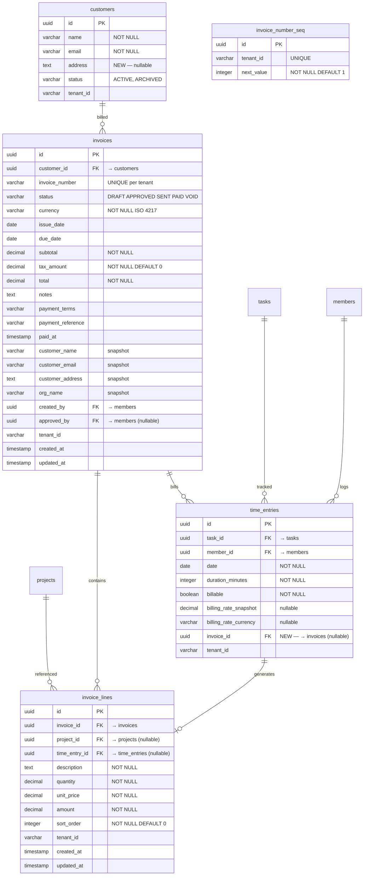
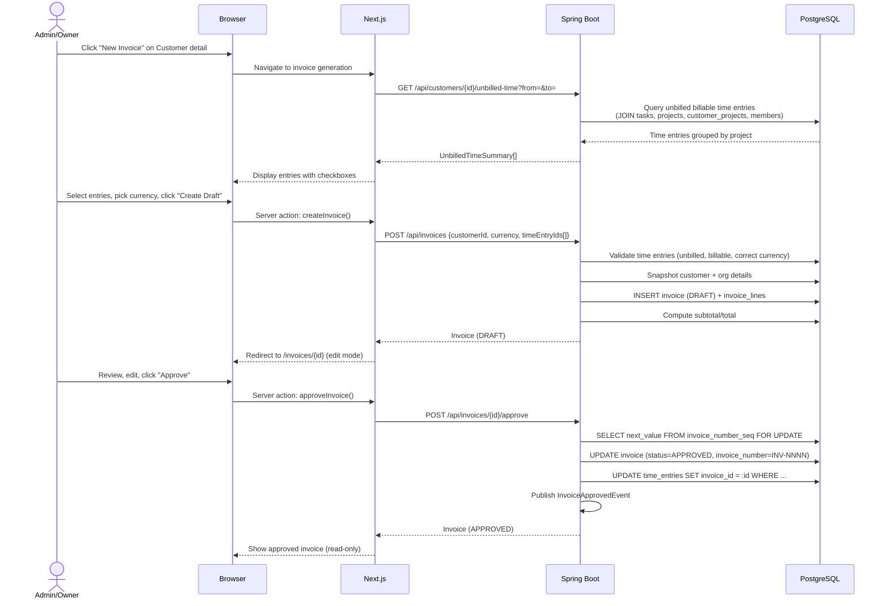
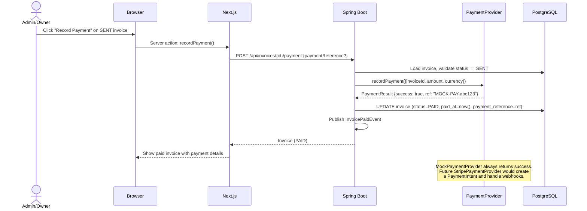
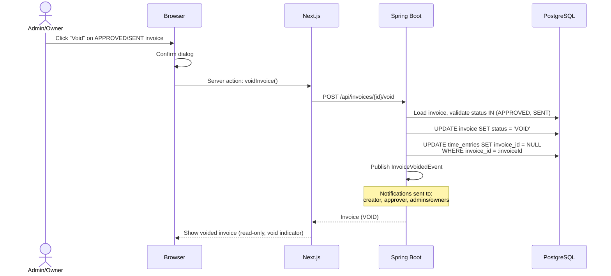

# Phase 10 — Invoicing & Billing from Time

> Merge into `ARCHITECTURE.md` as **Section 12**. ADR files go in `adr/`.

> **Section Numbering Note**: Phase 9 was documented externally and used Section 12 numbering as the next available in ARCHITECTURE.md. This document uses Section 12 numbering, to be reconciled when all phases are merged.

---

## 12. Phase 10 — Invoicing & Billing from Time

Phase 10 bridges the gap between tracked billable work and revenue collection. Until now, the platform records what people do, how long they spend, what that time is worth (Phase 8), and whether the organization is profitable. This phase answers the next question: *how do we turn that billable time into invoices and collect payment?*

The phase introduces two new entities (`Invoice`, `InvoiceLine`), extends `TimeEntry` with an invoice reference for double-billing prevention, adds a complete invoice lifecycle (Draft → Approved → Sent → Paid → Void), and implements a mocked payment service provider (PSP) adapter as a clean integration seam for future Stripe/payment integration.

**Dependencies on prior phases**:
- **Phase 4** (Customers): `Customer` entity — invoices belong to customers. `CustomerProject` — links customers to projects for unbilled time queries.
- **Phase 5** (Task & Time Lifecycle): `TimeEntry` entity — invoice line items are generated from billable time entries.
- **Phase 6** (Audit & Compliance): `AuditService` and `AuditEventBuilder` — all invoice mutations publish audit events.
- **Phase 6.5** (Notifications, Comments & Activity): `ApplicationEvent` pipeline, `NotificationEventHandler` — invoice lifecycle events trigger notifications.
- **Phase 8** (Rate Cards, Budgets & Profitability): `BillingRate` snapshots on `TimeEntry` (`billingRateSnapshot`, `billingRateCurrency`), `OrgSettings` (`defaultCurrency`) — invoice line items consume these snapshots directly.

### What's New

| Capability | Before Phase 10 | After Phase 10 |
|---|---|---|
| Invoicing | — | Multi-project invoices from unbilled time with full lifecycle management |
| Invoice line items | — | One-to-one time entry mapping + manual line items, grouped by project |
| Billing status | `billable` flag on TimeEntry | `billable` flag (can be billed) + `invoice_id` FK (has been billed) |
| Invoice numbering | — | Sequential per-tenant `INV-0001` assigned at approval |
| Payment recording | — | Manual payment recording via mocked PSP adapter |
| Invoice preview | — | Self-contained HTML invoice, print-friendly, PDF-ready |
| Double-billing prevention | — | Partial unique index on `time_entry_id` + `invoice_id` FK on TimeEntry |

**Out of scope**: Recurring/scheduled invoicing, PDF generation, customer portal invoice views, tax calculation engine, credit notes, partial payments, multi-currency invoices (one currency per invoice), multi-approver workflows, email delivery of invoices, expense line items. See the requirements document for the full exclusion list.

---

### 12.1 Overview

Phase 10 establishes the invoicing workflow without introducing external payment services, PDF rendering, or tax computation. The design is intentionally generic and industry-agnostic — invoicing from tracked time is universal to all professional services verticals.

The core abstractions:

1. **Invoice** — A tenant-scoped document linked to a customer, containing line items that span one or more projects. Follows a strict lifecycle: Draft → Approved → Sent → Paid, with Void as a terminal state for cancellation. Customer and org details are snapshotted at creation for immutability.
2. **InvoiceLine** — An individual billable item on an invoice. Either generated from a `TimeEntry` (time-based) or manually created (fixed fees, adjustments, discounts). Grouped by project for display.
3. **Invoice Number Sequence** — Sequential per-tenant numbering (`INV-0001`) assigned at approval, not draft creation. Implemented via a counter table to ensure gap-free sequences. See [ADR-048](../adr/ADR-048-invoice-numbering-strategy.md).
4. **Double-Billing Prevention** — A combination of `invoice_id` FK on `TimeEntry` (set at approval, cleared on void) and a partial unique index on `InvoiceLine.time_entry_id` (excludes voided invoices). See [ADR-050](../adr/ADR-050-double-billing-prevention.md).
5. **PaymentProvider** — A strategy interface with a `MockPaymentProvider` implementation. Clean adapter seam for future Stripe integration. See [ADR-051](../adr/ADR-051-psp-adapter-design.md).
6. **HTML Invoice Template** — Server-side rendered self-contained HTML with inline styles. Print-friendly, PDF-convertible in a future phase.

All monetary amounts use `BigDecimal` (Java) / `DECIMAL` (Postgres). Currency is always explicit — stored alongside every monetary value. No implicit currency, no floating-point arithmetic. One currency per invoice; multi-currency time entries for the same customer require separate invoices.

---

### 12.2 Domain Model

Phase 10 introduces two new tenant-scoped entities (`Invoice`, `InvoiceLine`), one new utility table (`invoice_number_seq`), and alters the existing `TimeEntry` entity. All new entities follow the established pattern: `TenantAware` interface, `@FilterDef`/`@Filter` for shared-schema tenants, `@EntityListeners(TenantAwareEntityListener.class)`, UUID-based loose references (no JPA `@ManyToOne`).

#### 12.2.1 Invoice Entity (New)

An invoice represents a billable document sent to a customer. Customer and org details are snapshotted at creation time so the invoice remains accurate even if the source records change later.

| Field | Java Type | DB Column | DB Type | Constraints | Notes |
|-------|-----------|-----------|---------|-------------|-------|
| `id` | `UUID` | `id` | `UUID` | PK, default `gen_random_uuid()` | Auto-generated |
| `customerId` | `UUID` | `customer_id` | `UUID` | NOT NULL, FK → customers | The billed customer |
| `invoiceNumber` | `String` | `invoice_number` | `VARCHAR(50)` | Nullable, UNIQUE per tenant | Assigned at approval. Drafts show `DRAFT-{uuid-short}` in UI |
| `status` | `InvoiceStatus` | `status` | `VARCHAR(20)` | NOT NULL, default `'DRAFT'` | Enum: DRAFT, APPROVED, SENT, PAID, VOID |
| `currency` | `String` | `currency` | `VARCHAR(3)` | NOT NULL | ISO 4217. Immutable after creation |
| `issueDate` | `LocalDate` | `issue_date` | `DATE` | Nullable | Set at approval if not already set |
| `dueDate` | `LocalDate` | `due_date` | `DATE` | Nullable | Payment due date |
| `subtotal` | `BigDecimal` | `subtotal` | `DECIMAL(14,2)` | NOT NULL, default 0 | Sum of line item amounts |
| `taxAmount` | `BigDecimal` | `tax_amount` | `DECIMAL(14,2)` | NOT NULL, default 0 | Manually entered tax |
| `total` | `BigDecimal` | `total` | `DECIMAL(14,2)` | NOT NULL, default 0 | subtotal + taxAmount |
| `notes` | `String` | `notes` | `TEXT` | Nullable | Free-text notes on the invoice |
| `paymentTerms` | `String` | `payment_terms` | `VARCHAR(100)` | Nullable | e.g., "Net 30", "Due on receipt" |
| `paymentReference` | `String` | `payment_reference` | `VARCHAR(255)` | Nullable | PSP reference or manual entry |
| `paidAt` | `Instant` | `paid_at` | `TIMESTAMPTZ` | Nullable | When payment was recorded |
| `customerName` | `String` | `customer_name` | `VARCHAR(255)` | NOT NULL | Snapshot at creation |
| `customerEmail` | `String` | `customer_email` | `VARCHAR(255)` | Nullable | Snapshot at creation |
| `customerAddress` | `String` | `customer_address` | `TEXT` | Nullable | Snapshot at creation |
| `orgName` | `String` | `org_name` | `VARCHAR(255)` | NOT NULL | Snapshot at creation — "from" side |
| `createdBy` | `UUID` | `created_by` | `UUID` | NOT NULL | Member who created the draft |
| `approvedBy` | `UUID` | `approved_by` | `UUID` | Nullable | Member who approved |
| `tenantId` | `String` | `tenant_id` | `VARCHAR(255)` | | Set by `TenantAwareEntityListener` |
| `createdAt` | `Instant` | `created_at` | `TIMESTAMPTZ` | NOT NULL | |
| `updatedAt` | `Instant` | `updated_at` | `TIMESTAMPTZ` | NOT NULL | |

**Constraints**:
- `UNIQUE (tenant_id, invoice_number)` — invoice numbers are unique within a tenant. For dedicated-schema tenants, `tenant_id` is NULL and uniqueness is enforced by schema isolation.
- `CHECK (char_length(currency) = 3)` — ISO 4217 codes are exactly 3 characters.
- `CHECK (status IN ('DRAFT', 'APPROVED', 'SENT', 'PAID', 'VOID'))` — valid statuses.

**Indexes**:
- `(customer_id, status)` — listing invoices per customer filtered by status.
- `(status)` — dashboard queries (e.g., all unpaid invoices).
- `(created_at)` — chronological listing.

**Design decisions**:
- **Customer snapshot**: The `customer_name`, `customer_email`, and `customer_address` fields freeze customer data at invoice creation. This is a deliberate denormalization — invoices are legal documents and must not change when customer records are updated. The Customer entity does not currently have an `address` field; V22 adds it.
- **Org snapshot**: Only `org_name` is snapshotted. Additional org fields (address, tax ID, logo URL) can be added to `OrgSettings` and snapshotted in a future phase.
- **No `@Version`**: Invoices use explicit status transitions (not optimistic locking on the entity). Each transition endpoint validates the current status before proceeding. Concurrent transitions to the same target are idempotent or rejected with 409.
- **`invoiceNumber` is nullable**: Drafts do not have an invoice number. The number is assigned atomically during the DRAFT → APPROVED transition. This avoids gaps from deleted drafts. See [ADR-048](../adr/ADR-048-invoice-numbering-strategy.md).

**Domain methods**:
- `approve(UUID approvedBy)` — validates status is DRAFT, transitions to APPROVED, sets `approvedBy` and `issueDate`.
- `markSent()` — validates status is APPROVED, transitions to SENT.
- `recordPayment(String paymentReference)` — validates status is SENT, transitions to PAID, sets `paidAt` and `paymentReference`.
- `voidInvoice()` — validates status is APPROVED or SENT, transitions to VOID.
- `recalculateTotals(List<InvoiceLine> lines)` — recomputes `subtotal` and `total` from line items.
- `canEdit()` — returns `true` only if status is DRAFT.

**InvoiceStatus enum**:
```java
public enum InvoiceStatus {
    DRAFT, APPROVED, SENT, PAID, VOID;

    public boolean canTransitionTo(InvoiceStatus target) {
        return switch (this) {
            case DRAFT -> target == APPROVED;
            case APPROVED -> target == SENT || target == VOID;
            case SENT -> target == PAID || target == VOID;
            case PAID, VOID -> false;
        };
    }
}
```

#### 12.2.2 InvoiceLine Entity (New)

An individual line item on an invoice. Either generated from a `TimeEntry` or manually created.

| Field | Java Type | DB Column | DB Type | Constraints | Notes |
|-------|-----------|-----------|---------|-------------|-------|
| `id` | `UUID` | `id` | `UUID` | PK, default `gen_random_uuid()` | Auto-generated |
| `invoiceId` | `UUID` | `invoice_id` | `UUID` | NOT NULL, FK → invoices | Parent invoice |
| `projectId` | `UUID` | `project_id` | `UUID` | Nullable, FK → projects | Which project this line relates to |
| `timeEntryId` | `UUID` | `time_entry_id` | `UUID` | Nullable, FK → time_entries | If generated from a time entry |
| `description` | `String` | `description` | `TEXT` | NOT NULL | Line item description |
| `quantity` | `BigDecimal` | `quantity` | `DECIMAL(10,4)` | NOT NULL | Typically hours |
| `unitPrice` | `BigDecimal` | `unit_price` | `DECIMAL(12,2)` | NOT NULL | Rate per unit |
| `amount` | `BigDecimal` | `amount` | `DECIMAL(14,2)` | NOT NULL | quantity * unitPrice (stored) |
| `sortOrder` | `int` | `sort_order` | `INTEGER` | NOT NULL, default 0 | Display order within invoice |
| `tenantId` | `String` | `tenant_id` | `VARCHAR(255)` | | Set by `TenantAwareEntityListener` |
| `createdAt` | `Instant` | `created_at` | `TIMESTAMPTZ` | NOT NULL | |
| `updatedAt` | `Instant` | `updated_at` | `TIMESTAMPTZ` | NOT NULL | |

**Constraints**:
- `time_entry_id` partial unique index: unique across all invoice lines where the parent invoice status is not VOID. This prevents the same time entry from appearing on two active invoices. See [ADR-050](../adr/ADR-050-double-billing-prevention.md).

**Indexes**:
- `(invoice_id, sort_order)` — ordered retrieval of lines for an invoice.
- `(project_id)` — queries like "all invoice lines for this project."
- `(time_entry_id)` — partial unique index (WHERE invoice status != VOID).

**Design decisions**:
- **One line per time entry**: Each time entry becomes its own line item for maximum transparency and audit traceability. Project grouping and descriptions keep the invoice readable. See [ADR-049](../adr/ADR-049-line-item-granularity.md).
- **`amount` is stored, not computed**: While `amount = quantity * unitPrice` for time-based lines, manual line items may have fixed-fee amounts where quantity and unitPrice are informational. Storing the amount directly supports both patterns.
- **No `ON DELETE CASCADE`**: Deleting an invoice (only allowed for drafts) explicitly deletes its lines in the service layer. This ensures audit events and time entry state cleanup happen correctly.

#### 12.2.3 Invoice Number Sequence Table (New)

A counter table for gap-free per-tenant invoice numbering.

| Field | Java Type | DB Column | DB Type | Constraints | Notes |
|-------|-----------|-----------|---------|-------------|-------|
| `id` | `UUID` | `id` | `UUID` | PK, default `gen_random_uuid()` | Auto-generated |
| `tenantId` | `String` | `tenant_id` | `VARCHAR(255)` | UNIQUE | One row per tenant |
| `nextValue` | `int` | `next_value` | `INTEGER` | NOT NULL, default 1 | Next invoice number to assign |

This table is NOT a JPA entity — it is accessed via native SQL with `SELECT ... FOR UPDATE` to ensure atomicity. See [ADR-048](../adr/ADR-048-invoice-numbering-strategy.md).

#### 12.2.4 TimeEntry Alterations

Add `invoice_id` to the existing `TimeEntry` entity:

| Field | Java Type | DB Column | DB Type | Constraints | Notes |
|-------|-----------|-----------|---------|-------------|-------|
| `invoiceId` | `UUID` | `invoice_id` | `UUID` | Nullable, FK → invoices | Set when included in an approved invoice |

**Billing status semantics**:
- **Unbilled**: `billable = true AND invoice_id IS NULL` — time can be included in an invoice.
- **Billed**: `invoice_id IS NOT NULL` — time is locked to an invoice. Cannot be edited or deleted.
- **Non-billable**: `billable = false` — excluded from invoicing entirely.

**Domain method additions**:
- `markBilled(UUID invoiceId)` — sets `invoiceId`. Validates `billable = true` and `invoiceId == null`.
- `markUnbilled()` — clears `invoiceId`. Used when an invoice is voided.
- `isBilled()` — returns `invoiceId != null`.
- `isLocked()` — alias for `isBilled()`. Billed time entries cannot be edited or deleted.

#### 12.2.5 Customer Alterations

Add `address` field to the existing `Customer` entity:

| Field | Java Type | DB Column | DB Type | Constraints | Notes |
|-------|-----------|-----------|---------|-------------|-------|
| `address` | `String` | `address` | `TEXT` | Nullable | Billing address, snapshotted onto invoices |

This is a non-breaking addition — existing customers will have `address = NULL`.

#### 12.2.6 ER Diagram (New and Changed Entities)

The diagram below shows new entities (Invoice, InvoiceLine, invoice_number_seq), altered entities (Customer — new `address` field; TimeEntry — new `invoice_id` FK), and their relationships to existing entities. Unchanged entities (Project, Member, Task, etc.) are shown with abbreviated schemas — see Phase 8 architecture doc for full field listings.



**Unchanged from prior phases**: `Project`, `Member`, `ProjectMember`, `Task`, `Document`, `Comment`, `Notification`, `NotificationPreference`, `AuditEvent`, `OrgSettings`, `BillingRate`, `CostRate`, `ProjectBudget`, `CustomerProject`. Only `TimeEntry` and `Customer` are altered (new columns).

---

### 12.3 Core Flows & Permissions

#### 12.3.1 Permission Model

| Operation | Owner | Admin | Project Lead | Member |
|-----------|-------|-------|-------------|--------|
| List all invoices | Yes | Yes | Own projects only | No |
| View invoice detail | Yes | Yes | If contains their project's lines | No |
| Create draft invoice | Yes | Yes | From their projects' time only | No |
| Edit draft | Yes | Yes | If they created it | No |
| Delete draft | Yes | Yes | If they created it | No |
| Approve invoice | Yes | Yes | No | No |
| Mark as sent | Yes | Yes | No | No |
| Record payment | Yes | Yes | No | No |
| Void invoice | Yes | Yes | No | No |
| View unbilled time | Yes | Yes | Own projects only | No |

**Project lead scope**: A project lead can generate invoices from time entries on projects where they are the lead. They can view invoices that contain line items from their projects. They cannot approve, send, record payment, or void invoices — these are admin/owner-only operations.

**Member visibility**: Regular members see their own time entries marked as "Billed" with a link to the invoice number, but they cannot view the invoice itself. This is consistent with the time tracking permission model.

#### 12.3.2 Invoice Generation Flow

The primary user flow: select a customer → preview unbilled time → create a draft → edit → approve → send → collect payment.

**Step 1 — Preview unbilled time**

```sql
-- Unbilled billable time entries for a customer, grouped by project
SELECT te.id, te.date, te.duration_minutes, te.billing_rate_snapshot,
       te.billing_rate_currency, te.description AS te_description,
       t.title AS task_title, p.name AS project_name, p.id AS project_id,
       m.name AS member_name
FROM time_entries te
JOIN tasks t ON t.id = te.task_id
JOIN projects p ON p.id = t.project_id
JOIN customer_projects cp ON cp.project_id = p.id
JOIN members m ON m.id = te.member_id
WHERE cp.customer_id = :customerId
  AND te.billable = true
  AND te.invoice_id IS NULL
  AND (CAST(:from AS DATE) IS NULL OR te.date >= CAST(:from AS DATE))
  AND (CAST(:to AS DATE) IS NULL OR te.date <= CAST(:to AS DATE))
ORDER BY p.name, te.date, te.created_at
```

**Service method**:
```java
public record UnbilledTimeSummary(
    UUID projectId, String projectName,
    List<UnbilledTimeEntry> entries,
    Map<String, BigDecimal> totalsByCurrency
) {}

public List<UnbilledTimeSummary> getUnbilledTime(
    UUID customerId, LocalDate from, LocalDate to) { ... }
```

**Step 2 — Create draft**

```java
public Invoice createDraft(CreateInvoiceRequest request) {
    // 1. Validate customer exists and is ACTIVE
    // 2. Validate all timeEntryIds are unbilled and billable
    // 3. Validate all time entries belong to the customer's projects
    // 4. Validate all time entries have billingRateCurrency == request.currency
    // 5. Snapshot customer details (name, email, address)
    // 6. Snapshot org name from Clerk org (via RequestScopes)
    // 7. Create Invoice in DRAFT status
    // 8. Generate InvoiceLines from time entries:
    //    - quantity = durationMinutes / 60.0 (4 decimal places)
    //    - unitPrice = billingRateSnapshot
    //    - amount = quantity * unitPrice (rounded to 2 decimal places)
    //    - description = "{task.title} — {member.name} — {te.date}"
    //    - projectId = task.projectId
    //    - sortOrder = chronological within project group
    // 9. Compute subtotal, total
    // 10. Publish audit event: invoice.created
    return invoice;
}
```

**Step 3 — Approve**

```java
public Invoice approve(UUID invoiceId, UUID approvedByMemberId) {
    // 1. Load invoice, validate status == DRAFT
    // 2. Validate at least one line item exists
    // 3. Assign invoice number (see 12.3.3)
    // 4. invoice.approve(approvedByMemberId)
    // 5. Mark all referenced time entries as billed:
    //    UPDATE time_entries SET invoice_id = :invoiceId
    //    WHERE id IN (SELECT time_entry_id FROM invoice_lines
    //                 WHERE invoice_id = :invoiceId AND time_entry_id IS NOT NULL)
    // 6. Publish audit event: invoice.approved
    // 7. Publish domain event → notification: INVOICE_APPROVED
    return invoice;
}
```

**Step 4 — Void**

```java
public Invoice voidInvoice(UUID invoiceId) {
    // 1. Load invoice, validate status == APPROVED or SENT
    // 2. invoice.voidInvoice()
    // 3. Revert time entries to unbilled:
    //    UPDATE time_entries SET invoice_id = NULL
    //    WHERE invoice_id = :invoiceId
    // 4. Publish audit event: invoice.voided
    // 5. Publish domain event → notification: INVOICE_VOIDED
    return invoice;
}
```

#### 12.3.3 Invoice Number Assignment

Sequential per-tenant numbering using a counter table with pessimistic locking:

```java
public String assignInvoiceNumber() {
    // Native SQL with SELECT FOR UPDATE:
    // SELECT next_value FROM invoice_number_seq
    //   WHERE tenant_id = :tenantId FOR UPDATE
    // If no row: INSERT with next_value = 1, return "INV-0001"
    // Else: UPDATE SET next_value = next_value + 1, return formatted number
    // Format: "INV-" + left-pad(value, 4, '0')
    // Numbers above 9999 get more digits: "INV-10000"
}
```

The `SELECT ... FOR UPDATE` ensures serialized access within a transaction. This is acceptable because invoice approval is a low-frequency operation (not a hot path). See [ADR-048](../adr/ADR-048-invoice-numbering-strategy.md).

#### 12.3.4 Invoice Lifecycle State Machine

```
DRAFT → APPROVED → SENT → PAID
  ↓         ↓        ↓
(delete)   VOID     VOID
```

| Transition | Trigger | Side Effects |
|-----------|---------|-------------|
| DRAFT → APPROVED | `POST /api/invoices/{id}/approve` | Assign number, set issue date, mark time entries as billed, audit + notification |
| APPROVED → SENT | `POST /api/invoices/{id}/send` | Audit + notification |
| SENT → PAID | `POST /api/invoices/{id}/payment` | Call `PaymentProvider.recordPayment()`, set `paidAt` + `paymentReference`, audit + notification |
| APPROVED → VOID | `POST /api/invoices/{id}/void` | Revert time entries to unbilled, audit + notification |
| SENT → VOID | `POST /api/invoices/{id}/void` | Revert time entries to unbilled, audit + notification |
| DRAFT → (delete) | `DELETE /api/invoices/{id}` | Hard delete invoice + lines. No audit (never finalized). Time entries unaffected |

**Invalid transitions** (return 409 Conflict): PAID → anything, VOID → anything, DRAFT → SENT, DRAFT → PAID, APPROVED → DRAFT, etc.

#### 12.3.5 Tenant Boundary

Invoice operations follow the same tenant isolation model as all other entities:

- **Pro orgs** (dedicated schema): `SET search_path = tenant_<hash>`. All queries naturally scoped.
- **Starter orgs** (shared schema): Hibernate `@Filter(name = "tenantFilter", condition = "tenant_id = :tenantId")` on `Invoice` and `InvoiceLine`. `TenantFilterTransactionManager` enables the filter. RLS policies on `invoices` and `invoice_lines` tables as a defense-in-depth layer.

The unbilled time query (Section 12.3.2) is a native SQL query. For shared-schema tenants, RLS policies handle isolation (the query runs within a transaction where `app.current_tenant` is set via `set_config()`). No manual `WHERE tenant_id = :tenantId` clause is needed in native queries.

---

### 12.4 API Surface

#### 12.4.1 Invoice CRUD

| Method | Path | Description | Auth | R/W |
|--------|------|-------------|------|-----|
| `GET` | `/api/invoices` | List invoices (paginated, filtered) | Admin/Owner: all; Lead: own projects | R |
| `GET` | `/api/invoices/{id}` | Get invoice with all line items | Admin/Owner: all; Lead: if contains their project lines | R |
| `POST` | `/api/invoices` | Create draft from time entries | Admin/Owner/Lead | W |
| `PUT` | `/api/invoices/{id}` | Update draft header | Admin/Owner; Lead if creator | W |
| `DELETE` | `/api/invoices/{id}` | Delete draft (hard delete) | Admin/Owner; Lead if creator | W |

**`GET /api/invoices` query parameters**:

| Param | Type | Default | Description |
|-------|------|---------|-------------|
| `customerId` | UUID | — | Filter by customer |
| `projectId` | UUID | — | Filter by any line item referencing this project |
| `status` | String | — | Filter by status (comma-separated for multiple) |
| `from` | LocalDate | — | Issue date from (inclusive) |
| `to` | LocalDate | — | Issue date to (inclusive) |
| `page` | int | 0 | Page number |
| `size` | int | 20 | Page size (max 100) |
| `sort` | String | `createdAt,desc` | Sort field and direction |

**`POST /api/invoices` request**:
```json
{
  "customerId": "uuid",
  "currency": "ZAR",
  "timeEntryIds": ["uuid", "uuid"],
  "dueDate": "2026-03-15",
  "notes": "January consulting work",
  "paymentTerms": "Net 30"
}
```

**`GET /api/invoices/{id}` response**: All Invoice fields (id, invoiceNumber, status, currency, dates, amounts, snapshots, createdBy, approvedBy, timestamps) plus a `lines[]` array with per-line fields (id, projectId, projectName, timeEntryId, description, quantity, unitPrice, amount, sortOrder).

**`PUT /api/invoices/{id}` request** (draft only): `{ dueDate, notes, paymentTerms, taxAmount }`.

#### 12.4.2 Invoice Lifecycle Transitions

| Method | Path | Description | Auth | R/W |
|--------|------|-------------|------|-----|
| `POST` | `/api/invoices/{id}/approve` | DRAFT → APPROVED | Admin/Owner | W |
| `POST` | `/api/invoices/{id}/send` | APPROVED → SENT | Admin/Owner | W |
| `POST` | `/api/invoices/{id}/payment` | SENT → PAID | Admin/Owner | W |
| `POST` | `/api/invoices/{id}/void` | APPROVED/SENT → VOID | Admin/Owner | W |

**`POST /api/invoices/{id}/payment` request**:
```json
{
  "paymentReference": "WIRE-REF-12345"
}
```

All transition endpoints return the updated invoice (same shape as `GET /api/invoices/{id}`). Invalid transitions return `409 Conflict` with a ProblemDetail body.

#### 12.4.3 Invoice Line Items

| Method | Path | Description | Auth | R/W |
|--------|------|-------------|------|-----|
| `POST` | `/api/invoices/{id}/lines` | Add manual line item to draft | Admin/Owner; Lead if creator | W |
| `PUT` | `/api/invoices/{id}/lines/{lineId}` | Update line item on draft | Admin/Owner; Lead if creator | W |
| `DELETE` | `/api/invoices/{id}/lines/{lineId}` | Remove line item from draft | Admin/Owner; Lead if creator | W |

**`POST /api/invoices/{id}/lines` request**:
```json
{
  "projectId": "uuid",
  "description": "Fixed consulting fee",
  "quantity": 1.0000,
  "unitPrice": 5000.00,
  "sortOrder": 99
}
```

Line item mutations automatically recompute the invoice's `subtotal` and `total`.

#### 12.4.4 Unbilled Time

| Method | Path | Description | Auth | R/W |
|--------|------|-------------|------|-----|
| `GET` | `/api/customers/{customerId}/unbilled-time` | Unbilled billable time grouped by project | Admin/Owner; Lead for own projects | R |

**Query parameters**: `from` (LocalDate), `to` (LocalDate).

**Response**: `{ customerId, customerName, projects: [{ projectId, projectName, entries: [{ id, date, durationMinutes, durationHours, billingRateSnapshot, billingRateCurrency, amount, description, taskTitle, memberName }], totalsByCurrency: { "ZAR": 13500.00 } }], grandTotalsByCurrency: { "ZAR": 27000.00 } }`.

#### 12.4.5 Invoice Preview

| Method | Path | Description | Auth | R/W |
|--------|------|-------------|------|-----|
| `GET` | `/api/invoices/{id}/preview` | Self-contained HTML invoice | Admin/Owner; Lead if contains their project lines | R |

Returns `Content-Type: text/html`. The HTML page is self-contained with inline CSS. No external dependencies. Can be opened in a new browser tab or used in an iframe.

#### 12.4.6 Time Entry Extensions

Existing time entry endpoints gain additional capabilities:

**`GET /api/projects/{projectId}/time-entries` — new query parameter**:

| Param | Type | Default | Description |
|-------|------|---------|-------------|
| `billingStatus` | String | `ALL` | `UNBILLED`, `BILLED`, `NON_BILLABLE`, `ALL` |

**Time entry response — new fields**:
```json
{
  "...existing fields...",
  "invoiceId": "uuid",
  "invoiceNumber": "INV-0042",
  "isLocked": true
}
```

**Edit/delete protection**: Time entries with `invoice_id IS NOT NULL` return `409 Conflict` on `PUT` or `DELETE` requests. The response body includes a ProblemDetail with the invoice number for user feedback.

---

### 12.5 Sequence Diagrams

#### 12.5.1 Invoice Generation and Approval



#### 12.5.2 Payment Recording



#### 12.5.3 Invoice Voiding (with Time Entry Revert)



---

### 12.6 PSP Adapter & HTML Invoice Template

#### 12.6.1 PaymentProvider Interface

```java
package io.b2mash.b2b.b2bstrawman.invoice.payment;

public interface PaymentProvider {
    PaymentResult recordPayment(PaymentRequest request);
}

public record PaymentRequest(
    UUID invoiceId,
    BigDecimal amount,
    String currency,
    String description
) {}

public record PaymentResult(
    boolean success,
    String paymentReference,
    String errorMessage
) {
    public static PaymentResult success(String reference) {
        return new PaymentResult(true, reference, null);
    }
    public static PaymentResult failure(String error) {
        return new PaymentResult(false, null, error);
    }
}
```

#### 12.6.2 MockPaymentProvider

```java
@Component
@ConditionalOnProperty(name = "payment.provider", havingValue = "mock", matchIfMissing = true)
public class MockPaymentProvider implements PaymentProvider {

    private static final Logger log = LoggerFactory.getLogger(MockPaymentProvider.class);

    @Override
    public PaymentResult recordPayment(PaymentRequest request) {
        String reference = "MOCK-PAY-" + UUID.randomUUID().toString().substring(0, 8);
        log.info("Mock payment recorded: invoice={}, amount={} {}, ref={}",
            request.invoiceId(), request.amount(), request.currency(), reference);
        return PaymentResult.success(reference);
    }
}
```

**Configuration**: `payment.provider=mock` in `application.yml` (default). A future Stripe implementation would use `payment.provider=stripe` and implement `PaymentProvider` with Stripe SDK calls. See [ADR-051](../adr/ADR-051-psp-adapter-design.md).

#### 12.6.3 HTML Invoice Template

Rendered server-side via Thymeleaf (the Thymeleaf harness from Phase 7 already exists in the backend). The template is a self-contained HTML page with inline CSS, structured for A4/Letter paper printing.

**Template layout sections**: Header (org name, invoice number, issue/due dates, status) → Bill To (customer name, email, address) → Line Items (grouped by project with per-project subtotals; columns: Description, Qty, Rate, Amount) → Other Items (manual lines without project) → Totals (Subtotal, Tax, Total) → Footer (payment terms, notes).

**Key CSS considerations**:
- `@media print` rules: hide status badge, ensure page breaks between project groups if needed.
- Monochrome-friendly: no color-dependent information.
- All styles inline — no `<link>` tags, no external fonts.
- Table layout with `border-collapse: collapse` for clean lines.

**Future PDF path**: The self-contained HTML can be passed directly to OpenHTMLtoPDF, wkhtmltopdf, or Puppeteer for PDF conversion. No template changes needed — the HTML is the single source of truth.

---

### 12.7 Notification & Audit Integration

#### 12.7.1 Notification Types

| Type | Recipients | When |
|------|-----------|------|
| `INVOICE_APPROVED` | Invoice creator (if != approver) | DRAFT → APPROVED |
| `INVOICE_SENT` | Org admins/owners | APPROVED → SENT |
| `INVOICE_PAID` | Invoice creator + org admins/owners | SENT → PAID |
| `INVOICE_VOIDED` | Invoice creator + approver + org admins/owners | APPROVED/SENT → VOID |

These use the existing `ApplicationEvent` → `NotificationEventHandler` pipeline from Phase 6.5. New event classes:

```java
public sealed interface InvoiceEvent extends DomainEvent {
    UUID invoiceId();
    String invoiceNumber();

    record Approved(UUID invoiceId, String invoiceNumber,
                    UUID createdBy, UUID approvedBy) implements InvoiceEvent {}
    record Sent(UUID invoiceId, String invoiceNumber) implements InvoiceEvent {}
    record Paid(UUID invoiceId, String invoiceNumber,
                UUID createdBy, String paymentReference) implements InvoiceEvent {}
    record Voided(UUID invoiceId, String invoiceNumber,
                  UUID createdBy, UUID approvedBy) implements InvoiceEvent {}
}
```

New `NotificationType` enum values: `INVOICE_APPROVED`, `INVOICE_SENT`, `INVOICE_PAID`, `INVOICE_VOIDED`. Added to the existing `NotificationType` enum and `NotificationPreference` defaults.

#### 12.7.2 Audit Event Types

| Event Type | Entity Type | When | Details (JSONB) |
|-----------|------------|------|----------------|
| `invoice.created` | `INVOICE` | Draft created | customerId, currency, lineCount |
| `invoice.updated` | `INVOICE` | Draft header or lines modified | changed fields |
| `invoice.approved` | `INVOICE` | Transitioned to APPROVED | invoiceNumber, approvedBy |
| `invoice.sent` | `INVOICE` | Marked as sent | — |
| `invoice.paid` | `INVOICE` | Payment recorded | paymentReference |
| `invoice.voided` | `INVOICE` | Voided | reason (if provided) |
| `invoice.deleted` | `INVOICE` | Draft deleted | — |

All events use the existing `AuditService.publish()` and `AuditEventBuilder` from Phase 6.

---

### 12.8 Frontend Views

#### 12.8.1 New Routes

| Route | Description |
|-------|-------------|
| `/org/[slug]/invoices` | Invoice list (all customers) — new sidebar nav item |
| `/org/[slug]/invoices/[id]` | Invoice detail (draft edit / read-only view) |

The Customer detail page gains a new "Invoices" tab alongside existing tabs.

#### 12.8.2 Invoice List Page (`/invoices`)

**Summary cards** (top of page):
- **Outstanding**: Total of APPROVED + SENT invoices (not yet paid).
- **Overdue**: Total of APPROVED + SENT invoices past due date.
- **Paid This Month**: Total of invoices paid in the current calendar month.

**Table columns**: Invoice # (or "Draft"), Customer, Status (badge), Issue Date, Due Date, Total, Currency.

**Filters**: Status dropdown (multi-select), Customer dropdown, Date range picker.

**Components**: Reuses existing `DataTable` patterns with `StatusBadge` for invoice status. Badge variants: `draft` (neutral), `approved` (indigo), `sent` (olive), `paid` (success), `void` (destructive).

#### 12.8.3 Invoice Detail Page (`/invoices/[id]`)

**Draft mode** (editable):
- Header fields: Due Date (date picker), Payment Terms (text input), Notes (textarea), Tax Amount (currency input).
- Line items table: Description, Qty, Rate, Amount. Add/edit/remove buttons per row. "Add Manual Item" button.
- Actions: "Preview" (opens HTML in new tab), "Approve" (admin/owner only, confirmation dialog).
- Running totals: Subtotal, Tax, Total — recomputed on every change.

**Approved/Sent mode** (read-only):
- All fields displayed but not editable.
- Actions: "Preview", "Mark as Sent" (if APPROVED), "Record Payment" (admin/owner, dialog with optional reference field), "Void" (admin/owner, confirmation dialog with reason).

**Paid mode**: Read-only with payment reference and date displayed.

**Void mode**: Read-only with "VOID" watermark/indicator.

#### 12.8.4 Invoice Generation Flow

Triggered from Customer detail → "Invoices" tab → "New Invoice" button. Implemented as a multi-step dialog or a dedicated page:

1. **Date range + currency selection**: Date range picker, currency dropdown (defaulting to org's `defaultCurrency`).
2. **Unbilled time review**: Table grouped by project with checkboxes. Entries in a different currency are grayed out. Running total at bottom.
3. **Create Draft**: Button → `POST /api/invoices` → redirect to invoice detail page.

#### 12.8.5 Time Entry Enhancements

- **Billing status badge**: Small badge on each time entry row — "Billed" (with invoice number as link) or "Unbilled" for billable entries.
- **Filter dropdown**: Added to existing time entry list filter bar — All / Unbilled / Billed / Non-billable.
- **Lock indicator**: Billed entries show a lock icon and cannot be edited or deleted.

---

### 12.9 Database Migrations

#### V22 — Invoice Tables and TimeEntry/Customer Alterations

**File**: `backend/src/main/resources/db/migration/tenant/V22__add_invoices.sql`

```sql
-- Invoice number sequence (counter table, not a JPA entity)
CREATE TABLE invoice_number_seq (
    id          UUID PRIMARY KEY DEFAULT gen_random_uuid(),
    tenant_id   VARCHAR(255) UNIQUE,
    next_value  INTEGER NOT NULL DEFAULT 1
);

-- Invoices
CREATE TABLE invoices (
    id                  UUID PRIMARY KEY DEFAULT gen_random_uuid(),
    customer_id         UUID NOT NULL REFERENCES customers(id),
    invoice_number      VARCHAR(50),
    status              VARCHAR(20) NOT NULL DEFAULT 'DRAFT',
    currency            VARCHAR(3) NOT NULL,
    issue_date          DATE,
    due_date            DATE,
    subtotal            DECIMAL(14,2) NOT NULL DEFAULT 0,
    tax_amount          DECIMAL(14,2) NOT NULL DEFAULT 0,
    total               DECIMAL(14,2) NOT NULL DEFAULT 0,
    notes               TEXT,
    payment_terms       VARCHAR(100),
    payment_reference   VARCHAR(255),
    paid_at             TIMESTAMPTZ,
    customer_name       VARCHAR(255) NOT NULL,
    customer_email      VARCHAR(255),
    customer_address    TEXT,
    org_name            VARCHAR(255) NOT NULL,
    created_by          UUID NOT NULL,
    approved_by         UUID,
    tenant_id           VARCHAR(255),
    created_at          TIMESTAMPTZ NOT NULL DEFAULT now(),
    updated_at          TIMESTAMPTZ NOT NULL DEFAULT now(),

    CONSTRAINT chk_invoices_currency_len CHECK (char_length(currency) = 3),
    CONSTRAINT chk_invoices_status CHECK (status IN ('DRAFT','APPROVED','SENT','PAID','VOID'))
);

-- Invoice line items
CREATE TABLE invoice_lines (
    id              UUID PRIMARY KEY DEFAULT gen_random_uuid(),
    invoice_id      UUID NOT NULL REFERENCES invoices(id),
    project_id      UUID REFERENCES projects(id),
    time_entry_id   UUID REFERENCES time_entries(id),
    description     TEXT NOT NULL,
    quantity        DECIMAL(10,4) NOT NULL,
    unit_price      DECIMAL(12,2) NOT NULL,
    amount          DECIMAL(14,2) NOT NULL,
    sort_order      INTEGER NOT NULL DEFAULT 0,
    tenant_id       VARCHAR(255),
    created_at      TIMESTAMPTZ NOT NULL DEFAULT now(),
    updated_at      TIMESTAMPTZ NOT NULL DEFAULT now()
);

-- Add address to customers
ALTER TABLE customers ADD COLUMN address TEXT;

-- Add invoice_id to time_entries
ALTER TABLE time_entries ADD COLUMN invoice_id UUID REFERENCES invoices(id);

-- Indexes: invoices
CREATE INDEX idx_invoices_customer_status ON invoices(customer_id, status);
CREATE INDEX idx_invoices_status ON invoices(status);
CREATE INDEX idx_invoices_created_at ON invoices(created_at);
CREATE UNIQUE INDEX idx_invoices_tenant_number
    ON invoices(tenant_id, invoice_number)
    WHERE invoice_number IS NOT NULL;

-- Indexes: invoice_lines
CREATE INDEX idx_invoice_lines_invoice_sort ON invoice_lines(invoice_id, sort_order);
CREATE INDEX idx_invoice_lines_project ON invoice_lines(project_id);

-- Partial unique index: prevent double-billing
-- A time_entry_id can appear on at most one non-voided invoice
CREATE UNIQUE INDEX idx_invoice_lines_time_entry_unique
    ON invoice_lines(time_entry_id)
    WHERE time_entry_id IS NOT NULL
      AND invoice_id NOT IN (
          SELECT id FROM invoices WHERE status = 'VOID'
      );

-- Index on time_entries.invoice_id for unbilled time queries
CREATE INDEX idx_time_entries_invoice ON time_entries(invoice_id);
```

**Note on partial unique index**: The subquery-based partial unique index (`WHERE invoice_id NOT IN (SELECT ...)`) is not supported by PostgreSQL. The actual implementation uses a different approach — see the RLS/shared-schema section below for the corrected constraint. The double-billing prevention is primarily enforced at the application layer (service validates before insert), with the database constraint as defense-in-depth.

**Corrected partial unique index** (PostgreSQL-compatible):

```sql
-- Option: Use a unique index on (time_entry_id) filtered to non-void invoices
-- This requires a status column on invoice_lines OR a trigger-based approach.
-- Simplest approach: unique index excluding NULLs (already handled by PostgreSQL)
-- combined with application-layer validation.
CREATE UNIQUE INDEX idx_invoice_lines_time_entry_active
    ON invoice_lines(time_entry_id)
    WHERE time_entry_id IS NOT NULL;
```

This simpler index prevents any time entry from appearing on more than one invoice, period. When an invoice is voided, the service must delete the line items (or clear `time_entry_id`) to release the time entries for re-invoicing. The application layer handles the void → revert flow. See [ADR-050](../adr/ADR-050-double-billing-prevention.md) for the full rationale.

#### V22 — Shared Schema (tenant_shared)

**File**: `backend/src/main/resources/db/migration/global/V22__add_invoices_shared.sql`

The shared-schema migration is identical to the tenant migration above, plus RLS policies:

```sql
-- RLS policies for invoices
ALTER TABLE invoices ENABLE ROW LEVEL SECURITY;
CREATE POLICY invoices_tenant_isolation ON invoices
    USING (tenant_id = current_setting('app.current_tenant'))
    WITH CHECK (tenant_id = current_setting('app.current_tenant'));

-- RLS policies for invoice_lines
ALTER TABLE invoice_lines ENABLE ROW LEVEL SECURITY;
CREATE POLICY invoice_lines_tenant_isolation ON invoice_lines
    USING (tenant_id = current_setting('app.current_tenant'))
    WITH CHECK (tenant_id = current_setting('app.current_tenant'));

-- RLS policy for invoice_number_seq
ALTER TABLE invoice_number_seq ENABLE ROW LEVEL SECURITY;
CREATE POLICY invoice_number_seq_tenant_isolation ON invoice_number_seq
    USING (tenant_id = current_setting('app.current_tenant'))
    WITH CHECK (tenant_id = current_setting('app.current_tenant'));
```

**Backfill**: No backfill needed. The new `customers.address` column is nullable with no default. The new `time_entries.invoice_id` column is nullable with no default. Existing data is unaffected.

---

### 12.10 Capability Slices

<!-- BREAKDOWN-CONTRACT
phase: 10
title: Invoicing & Billing from Time
slices: 6
new_entities: [Invoice, InvoiceLine]
new_migrations: [V22__add_invoices]
depends_on_entities: [Customer, TimeEntry, Task, Project, CustomerProject, Member, OrgSettings]
adr_refs: [ADR-048, ADR-049, ADR-050, ADR-051]
-->

Phase 10 is decomposed into 6 independently deployable capability slices. Epic numbering starts at 76, following Phase 9 (Epics 75A–75D). Each slice is a vertical feature slice (backend + frontend where noted) that can be implemented, tested, and merged independently.

#### Slice 76A — Invoice & InvoiceLine Entities, Migration, Customer Address

**Scope**: Backend

**Key deliverables**:
- `Invoice` entity, `InvoiceStatus` enum, repository, with `TenantAware` pattern.
- `InvoiceLine` entity, repository, with `TenantAware` pattern.
- `invoice_number_seq` table (native SQL access, not a JPA entity).
- V22 migration: `invoices`, `invoice_lines`, `invoice_number_seq` tables. Add `address` to `customers`. Add `invoice_id` to `time_entries`. All indexes and RLS policies.
- `Customer` entity: add `address` field.
- `TimeEntry` entity: add `invoiceId` field, `markBilled()`, `markUnbilled()`, `isBilled()`, `isLocked()` methods.
- `InvoiceNumberService`: per-tenant sequential numbering with `SELECT ... FOR UPDATE`.
- Package: `io.b2mash.b2b.b2bstrawman.invoice` (entity, repository, service subpackages).

**Dependencies**: None — this is the foundation slice.

**Test expectations**: ~8 backend integration tests (entity persistence, number sequence, status transitions).

**Patterns to follow**: `ProjectBudget` entity in `budget/` package for entity structure. `BillingRate` repository for JPQL `findOneById()` pattern.

#### Slice 76B — Invoice CRUD + Unbilled Time API

**Scope**: Backend

**Key deliverables**:
- `InvoiceService`: `createDraft()`, `updateDraft()`, `deleteDraft()`, `getInvoice()`, `listInvoices()`.
- `InvoiceController`: `POST /api/invoices`, `PUT /api/invoices/{id}`, `DELETE /api/invoices/{id}`, `GET /api/invoices/{id}`, `GET /api/invoices`.
- `UnbilledTimeService`: `getUnbilledTime(customerId, from, to)` with native SQL query.
- `CustomerController` extension: `GET /api/customers/{customerId}/unbilled-time`.
- Request/response DTOs: `CreateInvoiceRequest`, `UpdateInvoiceRequest`, `InvoiceResponse`, `InvoiceLineResponse`, `UnbilledTimeSummary`.
- Permission checks: admin/owner full access, project leads limited scope.
- Audit events: `invoice.created`, `invoice.updated`, `invoice.deleted`.
- Time entry edit/delete protection (409 Conflict when `invoice_id` is set).

**Dependencies**: Slice 76A (entities and migration).

**Test expectations**: ~20 backend integration tests (CRUD, unbilled time query, permission checks, edit protection).

**Patterns to follow**: `BudgetController` for REST endpoint structure. `ReportService` for native SQL queries with Spring Data projections.

#### Slice 76C — Invoice Lifecycle Transitions + Notifications

**Scope**: Backend

**Key deliverables**:
- `InvoiceLifecycleService`: `approve()`, `markSent()`, `recordPayment()`, `voidInvoice()`.
- `InvoiceController` extensions: `POST .../approve`, `POST .../send`, `POST .../payment`, `POST .../void`.
- Invoice number assignment during approval (via `InvoiceNumberService`).
- Time entry billing status updates (mark billed on approve, revert on void).
- `InvoiceEvent` sealed interface with `Approved`, `Sent`, `Paid`, `Voided` records.
- `InvoiceNotificationHandler` (extends existing notification pipeline).
- New `NotificationType` values: `INVOICE_APPROVED`, `INVOICE_SENT`, `INVOICE_PAID`, `INVOICE_VOIDED`.
- Audit events: `invoice.approved`, `invoice.sent`, `invoice.paid`, `invoice.voided`.

**Dependencies**: Slice 76B (invoice CRUD).

**Test expectations**: ~18 backend integration tests (lifecycle transitions, invalid transitions → 409, time entry billed/unbilled, notifications, audit events).

**Patterns to follow**: `BudgetThresholdEvent` for domain event pattern. `NotificationEventHandler` for notification fanout.

#### Slice 76D — PSP Adapter + HTML Invoice Preview

**Scope**: Backend

**Key deliverables**:
- `PaymentProvider` interface, `PaymentRequest`, `PaymentResult` records.
- `MockPaymentProvider` implementation with `@ConditionalOnProperty`.
- Integration with `InvoiceLifecycleService.recordPayment()`.
- `InvoicePreviewController`: `GET /api/invoices/{id}/preview` → HTML response.
- Thymeleaf template: `invoice-preview.html` — self-contained, inline CSS, print-friendly.
- `application.yml`: `payment.provider: mock`.

**Dependencies**: Slice 76C (lifecycle transitions — payment recording).

**Test expectations**: ~6 backend tests (mock PSP, HTML preview rendering, print CSS validation).

**Patterns to follow**: Existing Thymeleaf harness from Phase 7 for template rendering. `@ConditionalOnProperty` pattern from Spring Boot configuration.

#### Slice 76E — Frontend: Invoice List + Detail + Generation Flow

**Scope**: Frontend

**Key deliverables**:
- `/org/[slug]/invoices/page.tsx` — invoice list page with summary cards, filters, table.
- `/org/[slug]/invoices/[id]/page.tsx` — invoice detail page (draft edit + read-only modes).
- `/org/[slug]/invoices/[id]/actions.ts` — server actions for invoice CRUD and lifecycle.
- `/org/[slug]/invoices/actions.ts` — server actions for invoice list.
- `components/invoices/` — `InvoiceStatusBadge`, `InvoiceLineTable`, `InvoiceForm`, `InvoiceSummaryCards`.
- Customer detail "Invoices" tab: invoice list + "New Invoice" button.
- Invoice generation dialog/flow: date range, currency, unbilled time selection, create draft.
- Sidebar nav: "Invoices" item with receipt icon.
- `lib/nav-items.ts` update.

**Dependencies**: Slices 76B, 76C, 76D (all backend APIs).

**Test expectations**: ~14 frontend tests (invoice list rendering, detail view states, generation flow, status badges, permission-based UI).

**Patterns to follow**: Existing `projects/` page structure. `billing/` components for status badges. `DataTable` pattern for invoice list.

#### Slice 76F — Frontend: Time Entry Billing Status + Enhancements

**Scope**: Frontend

**Key deliverables**:
- Time entry list: billing status badge ("Billed" / "Unbilled" / non-billable), invoice number link.
- Time entry list: billing status filter dropdown (All / Unbilled / Billed / Non-billable).
- Lock indicator on billed entries (prevents edit/delete).
- Error handling for 409 Conflict when attempting to edit/delete billed entries.

**Dependencies**: Slice 76E (invoice detail page for linking). Slice 76B (billing status filter API).

**Test expectations**: ~6 frontend tests (billing badges, filter, lock indicator, error handling).

**Patterns to follow**: Existing time entry list components. `StatusBadge` component patterns.

#### Slice Dependency Graph

```
76A (Entities + Migration)
 └──► 76B (Invoice CRUD + Unbilled Time)
       └──► 76C (Lifecycle + Notifications)
             └──► 76D (PSP + HTML Preview)
                    │
       76B, 76C, 76D ──► 76E (Frontend: Invoices)
                           └──► 76F (Frontend: Time Entry Enhancements)
```

**Parallelism opportunities**:
- 76D can begin in parallel with 76C if the PSP adapter is implemented independently of the lifecycle service (interface-first).
- 76F can begin in parallel with 76E once 76B is complete (the billing status filter API is in 76B).
- The backend slices (76A→76B→76C→76D) are sequential due to entity and service dependencies.

---

### 12.11 ADR Index

| ADR | Title | Key Decision |
|-----|-------|-------------|
| [ADR-048](../adr/ADR-048-invoice-numbering-strategy.md) | Invoice Numbering Strategy | Sequential per-tenant counter table with `SELECT FOR UPDATE`. Numbers assigned at approval, not draft creation |
| [ADR-049](../adr/ADR-049-line-item-granularity.md) | Line Item Granularity | One line per time entry for maximum transparency. Project grouping for readability |
| [ADR-050](../adr/ADR-050-double-billing-prevention.md) | Double-Billing Prevention | `invoice_id` FK on TimeEntry + unique index on InvoiceLine.time_entry_id. Application-layer validation as primary guard |
| [ADR-051](../adr/ADR-051-psp-adapter-design.md) | PSP Adapter Design | Synchronous strategy interface with `@ConditionalOnProperty` selection. MockPaymentProvider for v1 |
