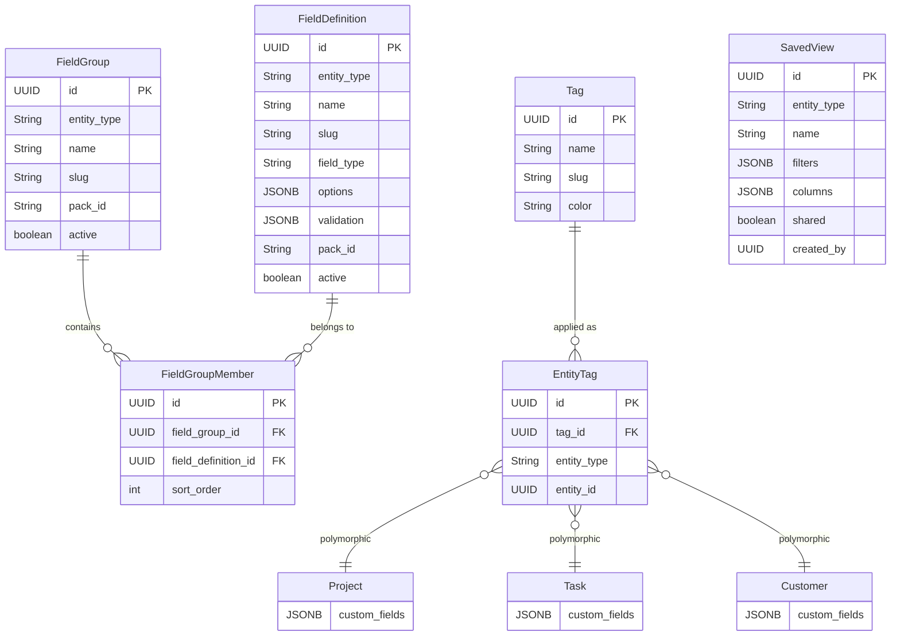
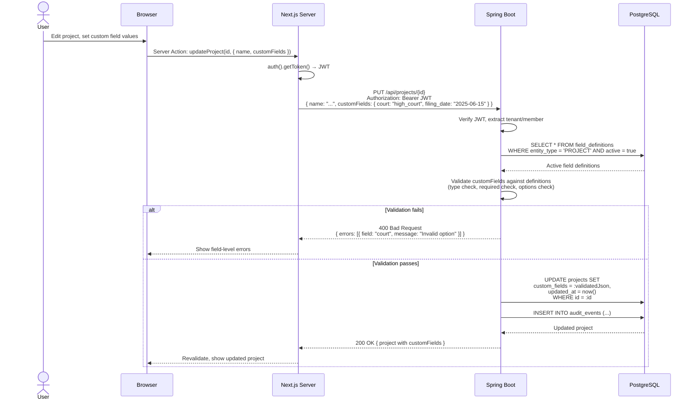
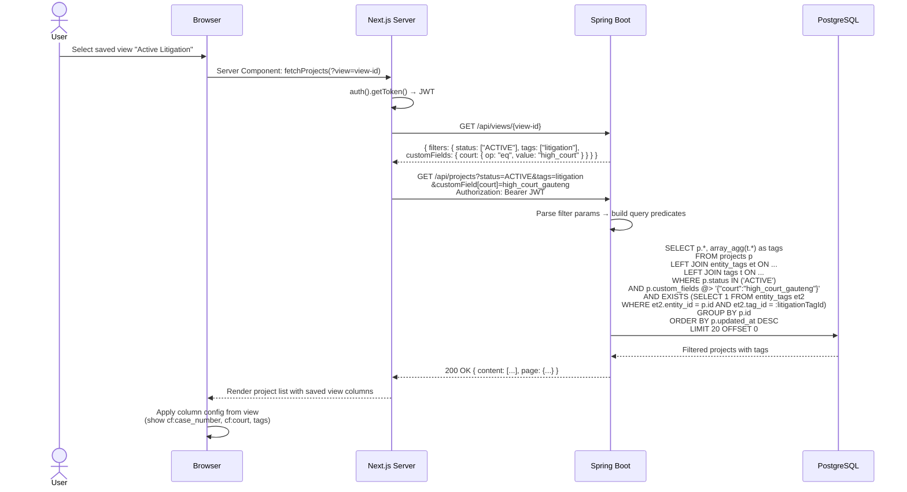
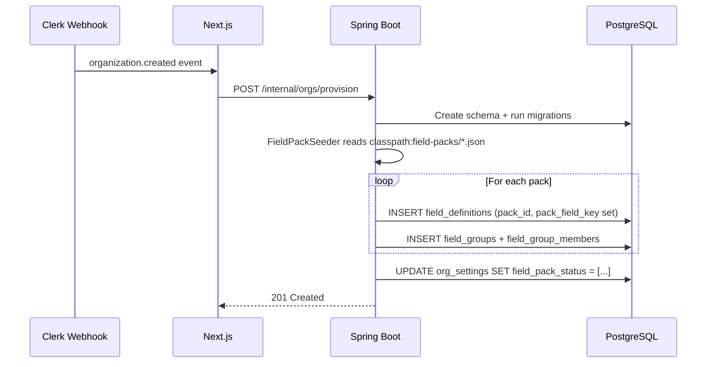

> Merge into architecture/ARCHITECTURE.md as **Section 11** or keep as standalone `architecture/phase11-tags-custom-fields-views.md`.

# Phase 11 — Tags, Custom Fields & Views

---

## 11. Phase 11 — Tags, Custom Fields & Views

Phase 11 adds a **generic extensibility layer** to the DocTeams platform — the ability for organizations to customize their projects, tasks, and customers with structured custom fields, freeform tags, and saved filtered views. Until now, every entity in the system has a fixed set of attributes defined in code. This phase breaks that rigidity by introducing tenant-scoped field definitions that can be created by org admins, or bootstrapped from platform-provided "field packs" — seed data bundles that vertical forks can replace or extend without code changes.

The design introduces six new entities (`FieldDefinition`, `FieldGroup`, `FieldGroupMember`, `Tag`, `EntityTag`, `SavedView`), extends three existing entities (`Project`, `Task`, `Customer`) with JSONB columns, and adds a field pack seeding infrastructure that runs during tenant provisioning. Custom field values are stored as JSONB on the entity tables themselves — not in a separate Entity-Attribute-Value (EAV) table — keeping queries simple and avoiding join explosion ([ADR-052](../adr/ADR-052-jsonb-vs-eav-custom-field-storage.md)). Tags use a join table for referential integrity and efficient filtering ([ADR-054](../adr/ADR-054-tag-storage-join-table-vs-array.md)). Saved views persist filter configurations that the backend executes as SQL predicates ([ADR-055](../adr/ADR-055-saved-view-filter-execution.md)).

**Dependencies on prior phases**:
- **Phase 4** (Customers): `Customer` entity — target for custom fields and tags.
- **Phase 5** (Task & Time Lifecycle): `Task` entity — target for custom fields and tags.
- **Phase 6** (Audit): `AuditService` and `AuditEventBuilder` — field definition and tag changes publish audit events.
- **Phase 8** (Rate Cards): `OrgSettings` entity — extended with field pack tracking.

### What's New

| Capability | Before Phase 11 | After Phase 11 |
|---|---|---|
| Entity attributes | Fixed schema only | Fixed schema + org-defined custom fields (9 types) |
| Field bootstrapping | -- | Field packs seeded per-tenant at provisioning; vertical forks add domain packs as JSON |
| Field grouping | -- | FieldGroups bundle related fields; applied per-entity for organized forms |
| Tagging | -- | Freeform org-scoped tags with optional color on projects, tasks, customers |
| Tag filtering | -- | AND-logic tag filter on all list endpoints |
| Saved views | -- | Named filter+column configurations, personal or shared, per list page |
| Custom field filtering | -- | JSONB containment queries on list endpoints via GIN indexes |
| Custom field columns | -- | Saved views can include custom field columns in list tables |

**Out of scope**: Conditional/dependent fields, computed fields, field-level permissions, relational/lookup fields, multi-select dropdown, bulk editing, custom fields on documents/time entries/invoices, import/export of field definitions, drag-and-drop ordering, template variable substitution from custom fields, reporting by custom fields, tag hierarchy. See requirements for the full exclusion list.

---

### 11.1 Overview

Phase 11 establishes a platform primitive for structured extensibility. The design is intentionally generic and industry-agnostic — the field definition system knows nothing about legal matters, accounting engagements, or agency campaigns. Domain-specific knowledge lives entirely in field packs, which are JSON seed data files on the classpath.

The core abstractions:

1. **FieldDefinition** — An org-scoped definition of a custom field: name, type, validation rules, display order. Attached to one entity type (project, task, or customer). Values for this field are stored as JSONB on the entity table, keyed by the field's slug.
2. **FieldGroup** — A named bundle of related field definitions for convenient selection (e.g., "Contact & Address" groups address fields together). Groups are a UX convenience — they don't constrain which fields can have values.
3. **Field Pack** — A JSON file on the classpath defining a set of field definitions and a group. Seeded per-tenant during provisioning. See [ADR-053](../adr/ADR-053-field-pack-seeding-strategy.md).
4. **Tag** — A freeform label with optional color. Org-scoped, flat namespace. Applied to entities via a polymorphic join table (`EntityTag`). See [ADR-054](../adr/ADR-054-tag-storage-join-table-vs-array.md).
5. **SavedView** — A named, reusable filter configuration for a list page. Can be personal or shared. Filters execute server-side for consistent pagination. See [ADR-055](../adr/ADR-055-saved-view-filter-execution.md).

All new entities follow the established tenant isolation model: `TenantAware` interface, `@FilterDef`/`@Filter` for shared-schema Starter tenants, dedicated schema for Pro tenants. No exceptions.

---

### 11.2 Domain Model

Phase 11 introduces six new tenant-scoped entities and extends three existing entities. All new entities follow the established pattern: `TenantAware` interface, `@FilterDef`/`@Filter`, `@EntityListeners(TenantAwareEntityListener.class)`, UUID primary keys, string columns for type discrimination (not Java enums).

#### 11.2.1 FieldDefinition Entity (New)

An org-scoped definition of a custom field. Each definition specifies the field's type, validation rules, and display order. Values for this field are stored as JSONB on the target entity table.

| Field | Java Type | DB Column | DB Type | Constraints | Notes |
|-------|-----------|-----------|---------|-------------|-------|
| `id` | `UUID` | `id` | `UUID` | PK, default `gen_random_uuid()` | Auto-generated |
| `tenantId` | `String` | `tenant_id` | `VARCHAR(100)` | For shared-schema isolation | Set by `TenantAwareEntityListener` |
| `entityType` | `String` | `entity_type` | `VARCHAR(20)` | NOT NULL | `PROJECT`, `TASK`, `CUSTOMER` |
| `name` | `String` | `name` | `VARCHAR(100)` | NOT NULL | Human-readable label, e.g., "Case Number" |
| `slug` | `String` | `slug` | `VARCHAR(100)` | NOT NULL | Machine-readable key, e.g., `case_number`. Pattern: `[a-z][a-z0-9_]*` |
| `fieldType` | `String` | `field_type` | `VARCHAR(20)` | NOT NULL | `TEXT`, `NUMBER`, `DATE`, `DROPDOWN`, `BOOLEAN`, `CURRENCY`, `URL`, `EMAIL`, `PHONE` |
| `description` | `String` | `description` | `TEXT` | Nullable | Help text shown to users |
| `required` | `boolean` | `required` | `BOOLEAN` | NOT NULL, default `false` | Value required when field is in an applied group |
| `defaultValue` | `Map<String, Object>` | `default_value` | `JSONB` | Nullable | Default value, type-checked against `fieldType` |
| `options` | `List<Map<String, String>>` | `options` | `JSONB` | Nullable | For DROPDOWN: `[{ "value": "...", "label": "..." }]` |
| `validation` | `Map<String, Object>` | `validation` | `JSONB` | Nullable | Rules: `{ min, max, pattern, minLength, maxLength }` |
| `sortOrder` | `int` | `sort_order` | `INTEGER` | NOT NULL, default `0` | Display order within entity type |
| `packId` | `String` | `pack_id` | `VARCHAR(100)` | Nullable | Pack this field originated from |
| `packFieldKey` | `String` | `pack_field_key` | `VARCHAR(100)` | Nullable | Field key within the pack |
| `active` | `boolean` | `active` | `BOOLEAN` | NOT NULL, default `true` | Soft-delete; inactive fields hidden from forms |
| `createdAt` | `Instant` | `created_at` | `TIMESTAMPTZ` | NOT NULL | Auto-set in constructor |
| `updatedAt` | `Instant` | `updated_at` | `TIMESTAMPTZ` | NOT NULL | Updated on mutation |

**Constraints**:
- `UNIQUE (tenant_id, entity_type, slug)` — no duplicate slugs per entity type per tenant.
- `slug` must match `^[a-z][a-z0-9_]*$`.
- `options` must be a non-empty JSON array when `field_type = 'DROPDOWN'`.
- `pack_id` and `pack_field_key` must be both null or both non-null.

**JSONB columns** use `@JdbcTypeCode(SqlTypes.JSON)` + `columnDefinition = "jsonb"` (same pattern as `AuditEvent.details`).

#### 11.2.2 FieldGroup Entity (New)

A named bundle of related field definitions. Groups are per entity type and provide a convenient way to bulk-select fields when configuring an entity.

| Field | Java Type | DB Column | DB Type | Constraints | Notes |
|-------|-----------|-----------|---------|-------------|-------|
| `id` | `UUID` | `id` | `UUID` | PK, default `gen_random_uuid()` | Auto-generated |
| `tenantId` | `String` | `tenant_id` | `VARCHAR(100)` | For shared-schema isolation | |
| `entityType` | `String` | `entity_type` | `VARCHAR(20)` | NOT NULL | `PROJECT`, `TASK`, `CUSTOMER` |
| `name` | `String` | `name` | `VARCHAR(100)` | NOT NULL | Display name |
| `slug` | `String` | `slug` | `VARCHAR(100)` | NOT NULL | Machine-readable key |
| `description` | `String` | `description` | `TEXT` | Nullable | |
| `packId` | `String` | `pack_id` | `VARCHAR(100)` | Nullable | Pack this group originated from |
| `sortOrder` | `int` | `sort_order` | `INTEGER` | NOT NULL, default `0` | Display order |
| `active` | `boolean` | `active` | `BOOLEAN` | NOT NULL, default `true` | Soft-delete |
| `createdAt` | `Instant` | `created_at` | `TIMESTAMPTZ` | NOT NULL | |
| `updatedAt` | `Instant` | `updated_at` | `TIMESTAMPTZ` | NOT NULL | |

**Constraints**: `UNIQUE (tenant_id, entity_type, slug)`.

#### 11.2.3 FieldGroupMember Entity (New)

Join entity linking field definitions to groups. A field can belong to multiple groups.

| Field | Java Type | DB Column | DB Type | Constraints | Notes |
|-------|-----------|-----------|---------|-------------|-------|
| `id` | `UUID` | `id` | `UUID` | PK, default `gen_random_uuid()` | |
| `tenantId` | `String` | `tenant_id` | `VARCHAR(100)` | For shared-schema isolation | |
| `fieldGroupId` | `UUID` | `field_group_id` | `UUID` | NOT NULL, FK → `field_groups` | |
| `fieldDefinitionId` | `UUID` | `field_definition_id` | `UUID` | NOT NULL, FK → `field_definitions` | |
| `sortOrder` | `int` | `sort_order` | `INTEGER` | NOT NULL, default `0` | Display order within group |

**Constraints**: `UNIQUE (field_group_id, field_definition_id)`. Application-level enforcement: `entity_type` of the field definition must match the group's `entity_type`.

#### 11.2.4 Tag Entity (New)

An org-scoped label with optional color.

| Field | Java Type | DB Column | DB Type | Constraints | Notes |
|-------|-----------|-----------|---------|-------------|-------|
| `id` | `UUID` | `id` | `UUID` | PK, default `gen_random_uuid()` | |
| `tenantId` | `String` | `tenant_id` | `VARCHAR(100)` | For shared-schema isolation | |
| `name` | `String` | `name` | `VARCHAR(50)` | NOT NULL | Display name |
| `slug` | `String` | `slug` | `VARCHAR(50)` | NOT NULL | Auto-generated from name |
| `color` | `String` | `color` | `VARCHAR(7)` | Nullable | Hex color, e.g., `#EF4444`. Null = default |
| `createdAt` | `Instant` | `created_at` | `TIMESTAMPTZ` | NOT NULL | |
| `updatedAt` | `Instant` | `updated_at` | `TIMESTAMPTZ` | NOT NULL | |

**Constraints**: `UNIQUE (tenant_id, slug)`.

#### 11.2.5 EntityTag Entity (New)

Polymorphic join table linking tags to entities (projects, tasks, customers).

| Field | Java Type | DB Column | DB Type | Constraints | Notes |
|-------|-----------|-----------|---------|-------------|-------|
| `id` | `UUID` | `id` | `UUID` | PK, default `gen_random_uuid()` | |
| `tenantId` | `String` | `tenant_id` | `VARCHAR(100)` | For shared-schema isolation | |
| `tagId` | `UUID` | `tag_id` | `UUID` | NOT NULL, FK → `tags` | Cascade delete on tag removal |
| `entityType` | `String` | `entity_type` | `VARCHAR(20)` | NOT NULL | `PROJECT`, `TASK`, `CUSTOMER` |
| `entityId` | `UUID` | `entity_id` | `UUID` | NOT NULL | Polymorphic reference — no DB FK |
| `createdAt` | `Instant` | `created_at` | `TIMESTAMPTZ` | NOT NULL | |

**Constraints**: `UNIQUE (tag_id, entity_type, entity_id)`. No DB foreign key to the actual entity — relies on application-level integrity (same pattern as `AuditEvent.entityId`). Cascade delete of EntityTag rows when a Tag is deleted is handled via `ON DELETE CASCADE` on `tag_id` FK.

**Design note**: The polymorphic `entity_type + entity_id` pattern was chosen over three separate join tables (one per entity type) because tags are a cross-cutting concept — the same tag can be applied to projects, tasks, and customers. A single table enables cross-entity-type queries ("find all entities with tag X") without UNION. See [ADR-054](../adr/ADR-054-tag-storage-join-table-vs-array.md).

#### 11.2.6 SavedView Entity (New)

A named, reusable filter configuration for a list page.

| Field | Java Type | DB Column | DB Type | Constraints | Notes |
|-------|-----------|-----------|---------|-------------|-------|
| `id` | `UUID` | `id` | `UUID` | PK, default `gen_random_uuid()` | |
| `tenantId` | `String` | `tenant_id` | `VARCHAR(100)` | For shared-schema isolation | |
| `entityType` | `String` | `entity_type` | `VARCHAR(20)` | NOT NULL | `PROJECT`, `TASK`, `CUSTOMER` |
| `name` | `String` | `name` | `VARCHAR(100)` | NOT NULL | Display name |
| `filters` | `Map<String, Object>` | `filters` | `JSONB` | NOT NULL | Filter configuration (see 12.3.6) |
| `columns` | `List<String>` | `columns` | `JSONB` | Nullable | Column list with `cf:` prefix for custom fields. Null = defaults |
| `shared` | `boolean` | `shared` | `BOOLEAN` | NOT NULL, default `false` | If true, visible to all org members |
| `createdBy` | `UUID` | `created_by` | `UUID` | NOT NULL | Member who created the view |
| `sortOrder` | `int` | `sort_order` | `INTEGER` | NOT NULL, default `0` | Display order in view switcher |
| `createdAt` | `Instant` | `created_at` | `TIMESTAMPTZ` | NOT NULL | |
| `updatedAt` | `Instant` | `updated_at` | `TIMESTAMPTZ` | NOT NULL | |

**Constraints**:
- Personal views: `UNIQUE (tenant_id, entity_type, name, created_by)`.
- Shared views: Partial unique index on `(tenant_id, entity_type, name)` WHERE `shared = true`.

#### 11.2.7 Existing Entity Changes

Three existing entities gain JSONB columns and an `applied_field_groups` column:

| Entity | New Column | DB Type | Notes |
|--------|-----------|---------|-------|
| `Project` | `custom_fields` | `JSONB` | Nullable, default `'{}'::jsonb`. GIN index for filtering |
| `Project` | `applied_field_groups` | `JSONB` | Nullable. Array of group UUIDs |
| `Task` | `custom_fields` | `JSONB` | Same as Project |
| `Task` | `applied_field_groups` | `JSONB` | Same as Project |
| `Customer` | `custom_fields` | `JSONB` | Same as Project |
| `Customer` | `applied_field_groups` | `JSONB` | Same as Project |
| `OrgSettings` | `field_pack_status` | `JSONB` | Nullable. Array of `{ packId, version, appliedAt }` |

JSONB columns on entities use `@JdbcTypeCode(SqlTypes.JSON)` with `Map<String, Object>` for `custom_fields` and `List<Map<String, Object>>` for `field_pack_status`.

#### 11.2.8 ER Diagram



---

### 11.3 Core Flows & Permissions

#### 11.3.1 Field Definition CRUD

Admin/owner users manage field definitions through the settings UI. Field definitions are tenant-scoped and apply to one entity type.

**Permission rules**:

| Operation | Owner | Admin | Member |
|-----------|-------|-------|--------|
| List field definitions | Yes | Yes | Yes (read-only) |
| Create field definition | Yes | Yes | No |
| Update field definition | Yes | Yes | No |
| Delete (soft) field definition | Yes | Yes | No |

**Service method signatures** (conceptual):

```java
public class FieldDefinitionService {
    List<FieldDefinition> listByEntityType(String entityType);
    FieldDefinition create(CreateFieldDefinitionRequest req);  // admin/owner
    FieldDefinition update(UUID id, UpdateFieldDefinitionRequest req);  // admin/owner
    void deactivate(UUID id);  // admin/owner — sets active=false
}
```

**Slug generation**: If `slug` is not provided in the request, auto-generate from `name` by lowercasing, replacing spaces/hyphens with underscores, stripping non-alphanumeric characters, and validating against `^[a-z][a-z0-9_]*$`. If the generated slug conflicts, append a numeric suffix (`_2`, `_3`).

**Audit events**: `FIELD_DEFINITION_CREATED`, `FIELD_DEFINITION_UPDATED`, `FIELD_DEFINITION_DELETED` published via `AuditEventBuilder`.

#### 11.3.2 Field Group CRUD

Groups bundle related fields. Groups are also tenant-scoped and entity-type-scoped.

**Permission rules**: Same as field definitions (admin/owner for mutations, all members for reads).

**Group membership enforcement**: When adding a field definition to a group, the service validates that the field's `entityType` matches the group's `entityType`. Mismatches return 400.

**Audit events**: `FIELD_GROUP_CREATED`, `FIELD_GROUP_UPDATED`, `FIELD_GROUP_DELETED`.

#### 11.3.3 Custom Field Values on Entities

Field values are stored as JSONB on the entity tables. Editing custom field values follows the same permission model as editing the entity itself.

**Permission rules**:

| Operation | Owner | Admin | Project Lead | Contributor |
|-----------|-------|-------|-------------|-------------|
| Edit project custom fields | Yes | Yes | Yes (own projects) | No |
| Edit task custom fields | Yes | Yes | Yes | Yes (assigned tasks) |
| Edit customer custom fields | Yes | Yes | No | No |

**Validation flow** (on entity create/update):

1. Extract `customFields` map from request body.
2. Load active `FieldDefinition` records for the entity type.
3. For each key in `customFields`:
   - If no matching active field definition exists → strip the key (unknown keys silently removed).
   - Validate value against field type (type check, format check, options membership for DROPDOWN).
   - Apply validation rules if defined (min/max, pattern, length).
4. For each required field in the entity's `appliedFieldGroups`:
   - If value is null or missing → add to field-level error list.
5. If errors → return 400 with field-level details: `[{ "field": "slug", "message": "..." }]`.
6. Merge validated `customFields` into entity's JSONB column.

**JSONB containment query for filtering** (example):

```sql
-- Find projects where custom field 'court' equals 'high_court_gauteng'
SELECT p.* FROM projects p
WHERE p.custom_fields @> '{"court": "high_court_gauteng"}'::jsonb;

-- Find tasks where custom field 'is_urgent' is true
SELECT t.* FROM tasks t
WHERE t.custom_fields @> '{"is_urgent": true}'::jsonb;
```

These queries are covered by the GIN index on `custom_fields`.

#### 11.3.4 Tag CRUD & Application

Tags are flat-namespace, org-scoped labels with optional color.

**Permission rules**:

| Operation | Owner | Admin | Member |
|-----------|-------|-------|--------|
| List tags | Yes | Yes | Yes |
| Create tag | Yes | Yes | No |
| Update tag | Yes | Yes | No |
| Delete tag | Yes | Yes | No |
| Apply/remove tags on entities | Yes | Yes | Yes |

**Tag application** uses full-replace semantics: `POST /api/{entityType}/{entityId}/tags` with `{ tagIds: [...] }` deletes all existing EntityTag rows for that entity and inserts new ones. This simplifies the API (no add/remove endpoints) and avoids race conditions.

**Tag filtering on list endpoints**:

```sql
-- Find projects with ALL specified tags (AND logic)
SELECT p.* FROM projects p
WHERE EXISTS (
    SELECT 1 FROM entity_tags et
    WHERE et.entity_type = 'PROJECT' AND et.entity_id = p.id
      AND et.tag_id = :tagId1
)
AND EXISTS (
    SELECT 1 FROM entity_tags et
    WHERE et.entity_type = 'PROJECT' AND et.entity_id = p.id
      AND et.tag_id = :tagId2
);
```

**Tag auto-complete**: `GET /api/tags?search=urg` returns tags matching the search prefix. Members see all org tags. Inline tag creation (typing a new name) is restricted to admin/owner — the frontend checks role before allowing.

**Audit events**: `TAG_CREATED`, `TAG_DELETED`. Tag application changes are captured as part of the entity's existing audit events (e.g., `PROJECT_UPDATED`).

#### 11.3.5 Saved View CRUD

Saved views store filter configurations for list pages.

**Permission rules**:

| Operation | Owner | Admin | Member |
|-----------|-------|-------|--------|
| List views (shared + own personal) | Yes | Yes | Yes |
| Create personal view | Yes | Yes | Yes |
| Create shared view | Yes | Yes | No |
| Edit own personal view | Yes | Yes | Yes |
| Edit shared view | Yes | Yes | No |
| Delete own personal view | Yes | Yes | Yes |
| Delete shared view | Yes | Yes | No |

**View listing**: Returns all shared views for the entity type, plus the requesting user's personal views. Ordered by `sortOrder`.

**No audit events** for saved views — low-value noise per requirements.

#### 11.3.6 Saved View Filter Execution

Filters stored in the `filters` JSONB column are translated to SQL predicates server-side. See [ADR-055](../adr/ADR-055-saved-view-filter-execution.md).

**Filter schema**:

```json
{
    "status": ["ACTIVE", "ON_HOLD"],
    "tags": ["vip-client", "urgent"],
    "assignee": "member-uuid",
    "customFields": {
        "court": { "op": "eq", "value": "high_court_gauteng" },
        "filing_date": { "op": "gte", "value": "2025-01-01" },
        "is_urgent": { "op": "eq", "value": true }
    },
    "dateRange": {
        "field": "created_at",
        "from": "2025-01-01",
        "to": "2025-12-31"
    },
    "search": "keyword"
}
```

**Filter operators** for custom fields:

| Operator | Applies To | SQL Translation |
|----------|-----------|----------------|
| `eq` | All types | `custom_fields ->> 'slug' = :value` |
| `neq` | All types | `custom_fields ->> 'slug' != :value` |
| `gt`, `gte`, `lt`, `lte` | NUMBER, DATE, CURRENCY | `(custom_fields ->> 'slug')::numeric > :value` |
| `contains` | TEXT | `custom_fields ->> 'slug' ILIKE '%' \|\| :value \|\| '%'` |
| `in` | DROPDOWN | `custom_fields ->> 'slug' IN (:values)` |

**Standard field filters**:

| Filter Key | SQL Translation |
|-----------|----------------|
| `status` | `status IN (:values)` |
| `tags` | EXISTS subquery per tag (AND logic) |
| `assignee` | `assignee_id = :value` (tasks only) |
| `dateRange` | `field >= :from AND field <= :to` |
| `search` | `name ILIKE '%' \|\| :value \|\| '%'` |

**Column configuration**: Stored in the `columns` JSONB array. The backend always returns the full entity data including `customFields`. The frontend selects which columns to display based on the saved view's `columns` array. Custom field columns use the `cf:` prefix (e.g., `cf:case_number`).

#### 11.3.7 Field Pack Seeding

Field packs are seeded during tenant provisioning. See [ADR-053](../adr/ADR-053-field-pack-seeding-strategy.md).

**Seeding flow**: During tenant provisioning (`POST /internal/orgs/provision`), after schema creation and Flyway migrations, `FieldPackSeeder` reads all `classpath:field-packs/*.json` files and creates tenant-scoped `FieldDefinition`, `FieldGroup`, and `FieldGroupMember` records. Pack application is recorded in `OrgSettings.fieldPackStatus`.

**Pack update detection** (infrastructure only in v1): `FieldPackSeeder.updatePacksForTenant()` compares `packFieldKey` values against existing records — only new fields are added, existing customized fields are never overwritten.

**Platform-shipped packs** (v1):

| Pack ID | Entity Type | Fields | Group |
|---------|-------------|--------|-------|
| `common-customer` | CUSTOMER | address_line1, address_line2, city, state_province, postal_code, country (dropdown), tax_number, phone | Contact & Address |
| `common-project` | PROJECT | reference_number, priority (dropdown), category | Project Info |

---

### 11.4 API Surface

#### 11.4.1 Field Definitions

| Method | Path | Description | Auth | R/W |
|--------|------|-------------|------|-----|
| `GET` | `/api/field-definitions?entityType={type}` | List active field definitions | JWT + member | R |
| `GET` | `/api/field-definitions/{id}` | Get single field definition | JWT + member | R |
| `POST` | `/api/field-definitions` | Create field definition | JWT + admin/owner | W |
| `PUT` | `/api/field-definitions/{id}` | Update field definition | JWT + admin/owner | W |
| `DELETE` | `/api/field-definitions/{id}` | Soft-delete (active=false) | JWT + admin/owner | W |

**Create request**: `{ "entityType": "CUSTOMER", "name": "Tax Number", "slug": "tax_number", "fieldType": "TEXT", "description": "...", "required": false, "validation": { "maxLength": 50 }, "sortOrder": 7 }`

**Response** includes all create fields plus `id`, `packId`, `packFieldKey`, `active`, `createdAt`, `updatedAt`.

#### 11.4.2 Field Groups

| Method | Path | Description | Auth | R/W |
|--------|------|-------------|------|-----|
| `GET` | `/api/field-groups?entityType={type}` | List active groups with members | JWT + member | R |
| `POST` | `/api/field-groups` | Create group with field members | JWT + admin/owner | W |
| `PUT` | `/api/field-groups/{id}` | Update group and membership | JWT + admin/owner | W |
| `DELETE` | `/api/field-groups/{id}` | Soft-delete group | JWT + admin/owner | W |

**Create request**:

```json
{
    "entityType": "CUSTOMER",
    "name": "Contact & Address",
    "slug": "contact-address",
    "description": "Standard address and contact fields",
    "fieldDefinitionIds": ["uuid1", "uuid2", "uuid3"],
    "sortOrder": 1
}
```

**List response** includes nested field definitions:

```json
[{
    "id": "group-uuid",
    "entityType": "CUSTOMER",
    "name": "Contact & Address",
    "slug": "contact-address",
    "fields": [
        { "id": "fd-uuid", "name": "Address Line 1", "slug": "address_line1", "fieldType": "TEXT", "sortOrder": 1 }
    ],
    "sortOrder": 1,
    "packId": "common-customer"
}]
```

#### 11.4.3 Tags

| Method | Path | Description | Auth | R/W |
|--------|------|-------------|------|-----|
| `GET` | `/api/tags` | List all org tags | JWT + member | R |
| `GET` | `/api/tags?search={prefix}` | Search tags by name prefix | JWT + member | R |
| `POST` | `/api/tags` | Create tag | JWT + admin/owner | W |
| `PUT` | `/api/tags/{id}` | Update tag name/color | JWT + admin/owner | W |
| `DELETE` | `/api/tags/{id}` | Delete tag + all associations | JWT + admin/owner | W |
| `POST` | `/api/{entityType}/{entityId}/tags` | Set tags on entity (full replace) | JWT + member | W |
| `GET` | `/api/{entityType}/{entityId}/tags` | Get tags for entity | JWT + member | R |

**Create tag request**: `{ "name": "VIP Client", "color": "#EF4444" }`

**Set tags request**: `{ "tagIds": ["tag-uuid-1", "tag-uuid-2"] }`

**Tag response**: `{ "id": "uuid", "name": "VIP Client", "slug": "vip-client", "color": "#EF4444" }`

#### 11.4.4 Saved Views

| Method | Path | Description | Auth | R/W |
|--------|------|-------------|------|-----|
| `GET` | `/api/views?entityType={type}` | List shared + personal views | JWT + member | R |
| `POST` | `/api/views` | Create saved view | JWT + member (shared: admin/owner) | W |
| `PUT` | `/api/views/{id}` | Update saved view | JWT + creator or admin/owner | W |
| `DELETE` | `/api/views/{id}` | Delete saved view | JWT + creator or admin/owner | W |

**Create view request**:

```json
{
    "entityType": "PROJECT",
    "name": "Active Litigation Matters",
    "filters": {
        "status": ["ACTIVE"],
        "tags": ["litigation"],
        "customFields": {
            "court": { "op": "eq", "value": "high_court_gauteng" }
        }
    },
    "columns": ["name", "status", "customer", "cf:case_number", "cf:court", "tags"],
    "shared": true,
    "sortOrder": 1
}
```

#### 11.4.5 Custom Field Values (on existing endpoints)

Existing entity CRUD endpoints are extended:

| Endpoint | Change |
|----------|--------|
| `POST /api/projects` | Accepts `customFields` and `appliedFieldGroups` in body |
| `PUT /api/projects/{id}` | Accepts `customFields` and `appliedFieldGroups` in body |
| `GET /api/projects` | Accepts `customField[slug]=value` query params; response includes `customFields` and `tags` |
| `GET /api/projects/{id}` | Response includes `customFields`, `appliedFieldGroups`, and `tags` |
| `PUT /api/{entityType}/{entityId}/field-groups` | Set applied field groups; returns full field definitions for groups |

Same pattern applies to `/api/tasks` and `/api/customers`.

**List endpoint query params** for custom field filtering:

```
GET /api/projects?customField[court]=high_court_gauteng&customField[is_urgent]=true&tags=vip-client,urgent
```

---

### 11.5 Sequence Diagrams

#### 11.5.1 Custom Field Value Update Flow



#### 11.5.2 Saved View Filter Execution Flow



#### 11.5.3 Field Pack Seeding During Tenant Provisioning



---

### 11.6 Field Type Semantics

| Field Type | JSONB Storage | Validation | Frontend Component | Filter Operators |
|-----------|--------------|------------|-------------------|-----------------|
| `TEXT` | JSON string | `minLength`, `maxLength`, `pattern` | `<Input>` | `eq`, `neq`, `contains` |
| `NUMBER` | JSON number | `min`, `max` | `<Input type="number">` | `eq`, `neq`, `gt`, `gte`, `lt`, `lte` |
| `DATE` | ISO 8601 string `"YYYY-MM-DD"` | Valid date format | `<DatePicker>` | `eq`, `gt`, `gte`, `lt`, `lte` |
| `DROPDOWN` | JSON string (option value) | Value must be in `options` list | `<Select>` | `eq`, `in` |
| `BOOLEAN` | JSON boolean | Must be `true` or `false` | `<Checkbox>` | `eq` |
| `CURRENCY` | `{ "amount": number, "currency": "ZAR" }` | `amount` must be numeric; `currency` must be 3-letter ISO | Amount `<Input>` + Currency `<Select>` | `gt`, `gte`, `lt`, `lte` (on amount) |
| `URL` | JSON string | Valid URL format (starts with `http://` or `https://`) | `<Input type="url">` | `eq`, `contains` |
| `EMAIL` | JSON string | Valid email format | `<Input type="email">` | `eq`, `contains` |
| `PHONE` | JSON string | Non-empty string (no strict phone validation) | `<Input type="tel">` | `eq`, `contains` |

**CURRENCY special handling**: The JSONB value is an object `{ amount, currency }`. Filtering operates on the `amount` subfield: `(custom_fields -> 'slug' ->> 'amount')::numeric > :value`. The currency is stored alongside the amount for display purposes.

---

### 11.7 Database Migrations

#### V23 — Field Definitions, Groups, Tags, and Entity Columns

File: `backend/src/main/resources/db/migration/tenant/V23__add_custom_fields_tags_views.sql`

```sql
-- Field definitions
CREATE TABLE field_definitions (
    id                UUID PRIMARY KEY DEFAULT gen_random_uuid(),
    tenant_id         VARCHAR(100),
    entity_type       VARCHAR(20)  NOT NULL,
    name              VARCHAR(100) NOT NULL,
    slug              VARCHAR(100) NOT NULL,
    field_type        VARCHAR(20)  NOT NULL,
    description       TEXT,
    required          BOOLEAN      NOT NULL DEFAULT false,
    default_value     JSONB,
    options           JSONB,
    validation        JSONB,
    sort_order        INTEGER      NOT NULL DEFAULT 0,
    pack_id           VARCHAR(100),
    pack_field_key    VARCHAR(100),
    active            BOOLEAN      NOT NULL DEFAULT true,
    created_at        TIMESTAMP WITH TIME ZONE NOT NULL DEFAULT now(),
    updated_at        TIMESTAMP WITH TIME ZONE NOT NULL DEFAULT now(),
    CONSTRAINT uq_field_def_tenant_type_slug UNIQUE (tenant_id, entity_type, slug)
);

CREATE INDEX idx_field_def_tenant_type_active
    ON field_definitions(tenant_id, entity_type, active);
CREATE INDEX idx_field_def_tenant_pack
    ON field_definitions(tenant_id, pack_id);

-- Field groups
CREATE TABLE field_groups (
    id                UUID PRIMARY KEY DEFAULT gen_random_uuid(),
    tenant_id         VARCHAR(100),
    entity_type       VARCHAR(20)  NOT NULL,
    name              VARCHAR(100) NOT NULL,
    slug              VARCHAR(100) NOT NULL,
    description       TEXT,
    pack_id           VARCHAR(100),
    sort_order        INTEGER      NOT NULL DEFAULT 0,
    active            BOOLEAN      NOT NULL DEFAULT true,
    created_at        TIMESTAMP WITH TIME ZONE NOT NULL DEFAULT now(),
    updated_at        TIMESTAMP WITH TIME ZONE NOT NULL DEFAULT now(),
    CONSTRAINT uq_field_group_tenant_type_slug UNIQUE (tenant_id, entity_type, slug)
);

-- Field group members
CREATE TABLE field_group_members (
    id                    UUID PRIMARY KEY DEFAULT gen_random_uuid(),
    tenant_id             VARCHAR(100),
    field_group_id        UUID         NOT NULL REFERENCES field_groups(id) ON DELETE CASCADE,
    field_definition_id   UUID         NOT NULL REFERENCES field_definitions(id) ON DELETE CASCADE,
    sort_order            INTEGER      NOT NULL DEFAULT 0,
    CONSTRAINT uq_group_member UNIQUE (field_group_id, field_definition_id)
);

-- Tags
CREATE TABLE tags (
    id                UUID PRIMARY KEY DEFAULT gen_random_uuid(),
    tenant_id         VARCHAR(100),
    name              VARCHAR(50)  NOT NULL,
    slug              VARCHAR(50)  NOT NULL,
    color             VARCHAR(7),
    created_at        TIMESTAMP WITH TIME ZONE NOT NULL DEFAULT now(),
    updated_at        TIMESTAMP WITH TIME ZONE NOT NULL DEFAULT now(),
    CONSTRAINT uq_tag_tenant_slug UNIQUE (tenant_id, slug)
);

-- Entity tags (polymorphic join table)
CREATE TABLE entity_tags (
    id                UUID PRIMARY KEY DEFAULT gen_random_uuid(),
    tenant_id         VARCHAR(100),
    tag_id            UUID         NOT NULL REFERENCES tags(id) ON DELETE CASCADE,
    entity_type       VARCHAR(20)  NOT NULL,
    entity_id         UUID         NOT NULL,
    created_at        TIMESTAMP WITH TIME ZONE NOT NULL DEFAULT now(),
    CONSTRAINT uq_entity_tag UNIQUE (tag_id, entity_type, entity_id)
);

CREATE INDEX idx_entity_tag_entity
    ON entity_tags(tenant_id, entity_type, entity_id);
CREATE INDEX idx_entity_tag_tag
    ON entity_tags(tenant_id, tag_id, entity_type);

-- Saved views
CREATE TABLE saved_views (
    id                UUID PRIMARY KEY DEFAULT gen_random_uuid(),
    tenant_id         VARCHAR(100),
    entity_type       VARCHAR(20)  NOT NULL,
    name              VARCHAR(100) NOT NULL,
    filters           JSONB        NOT NULL DEFAULT '{}'::jsonb,
    columns           JSONB,
    shared            BOOLEAN      NOT NULL DEFAULT false,
    created_by        UUID         NOT NULL,
    sort_order        INTEGER      NOT NULL DEFAULT 0,
    created_at        TIMESTAMP WITH TIME ZONE NOT NULL DEFAULT now(),
    updated_at        TIMESTAMP WITH TIME ZONE NOT NULL DEFAULT now()
);

CREATE INDEX idx_saved_view_tenant_type
    ON saved_views(tenant_id, entity_type, shared);
CREATE INDEX idx_saved_view_creator
    ON saved_views(tenant_id, created_by, entity_type);
CREATE UNIQUE INDEX uq_saved_view_shared_name
    ON saved_views(tenant_id, entity_type, name) WHERE shared = true;
CREATE UNIQUE INDEX uq_saved_view_personal_name
    ON saved_views(tenant_id, entity_type, name, created_by) WHERE shared = false;

-- Add custom_fields and applied_field_groups to existing entities
ALTER TABLE projects
    ADD COLUMN custom_fields JSONB DEFAULT '{}'::jsonb,
    ADD COLUMN applied_field_groups JSONB;

ALTER TABLE tasks
    ADD COLUMN custom_fields JSONB DEFAULT '{}'::jsonb,
    ADD COLUMN applied_field_groups JSONB;

ALTER TABLE customers
    ADD COLUMN custom_fields JSONB DEFAULT '{}'::jsonb,
    ADD COLUMN applied_field_groups JSONB;

-- GIN indexes for JSONB containment queries
CREATE INDEX idx_projects_custom_fields ON projects USING GIN (custom_fields);
CREATE INDEX idx_tasks_custom_fields ON tasks USING GIN (custom_fields);
CREATE INDEX idx_customers_custom_fields ON customers USING GIN (custom_fields);

-- Field pack status on org_settings
ALTER TABLE org_settings
    ADD COLUMN field_pack_status JSONB;
```

#### V23 — RLS Policies (shared schema)

For Starter tenants using `tenant_shared` schema, RLS policies are added for each new table:

```sql
-- RLS for field_definitions
ALTER TABLE field_definitions ENABLE ROW LEVEL SECURITY;
CREATE POLICY field_definitions_tenant_isolation ON field_definitions
    USING (tenant_id = current_setting('app.current_tenant'));

-- RLS for field_groups
ALTER TABLE field_groups ENABLE ROW LEVEL SECURITY;
CREATE POLICY field_groups_tenant_isolation ON field_groups
    USING (tenant_id = current_setting('app.current_tenant'));

-- RLS for field_group_members
ALTER TABLE field_group_members ENABLE ROW LEVEL SECURITY;
CREATE POLICY field_group_members_tenant_isolation ON field_group_members
    USING (tenant_id = current_setting('app.current_tenant'));

-- RLS for tags
ALTER TABLE tags ENABLE ROW LEVEL SECURITY;
CREATE POLICY tags_tenant_isolation ON tags
    USING (tenant_id = current_setting('app.current_tenant'));

-- RLS for entity_tags
ALTER TABLE entity_tags ENABLE ROW LEVEL SECURITY;
CREATE POLICY entity_tags_tenant_isolation ON entity_tags
    USING (tenant_id = current_setting('app.current_tenant'));

-- RLS for saved_views
ALTER TABLE saved_views ENABLE ROW LEVEL SECURITY;
CREATE POLICY saved_views_tenant_isolation ON saved_views
    USING (tenant_id = current_setting('app.current_tenant'));
```

**Note**: RLS policies are harmless for dedicated-schema tenants — `SET search_path` already isolates.

---

### 11.8 Capability Slices

<!-- BREAKDOWN-CONTRACT
phase: 11
title: Tags, Custom Fields & Views
slices: 6
new_entities: [FieldDefinition, FieldGroup, FieldGroupMember, Tag, EntityTag, SavedView]
new_migrations: [V23__add_custom_fields_tags_views]
depends_on_entities: [Project, Task, Customer, OrgSettings, AuditEvent]
adr_refs: [ADR-052, ADR-053, ADR-054, ADR-055]
-->

#### Slice 87A — Field Definition & Group CRUD (Backend)

**Scope**: Backend only.

**Deliverables**:
- `FieldDefinition` entity, repository, service, controller in `fielddefinition/` package.
- `FieldGroup` entity, repository, service, controller in `fieldgroup/` package.
- `FieldGroupMember` entity and repository in `fieldgroup/` package.
- V23 migration (field_definitions, field_groups, field_group_members tables only — tags and views in later slices).
- Slug auto-generation utility.
- Audit event integration for field definition and group mutations.
- `CreateFieldDefinitionRequest`, `UpdateFieldDefinitionRequest`, `FieldDefinitionResponse` DTOs.
- `CreateFieldGroupRequest`, `UpdateFieldGroupRequest`, `FieldGroupResponse` DTOs.

**Dependencies**: None (new package, no existing entity changes).

**Test expectations**: ~20 integration tests covering CRUD, slug uniqueness, entity type validation, group membership validation, permission checks (admin/owner vs member), audit events. Follow `InvoiceControllerIntegrationTest` pattern.

**Patterns to follow**: `OrgSettings` entity for simple tenant-scoped pattern. `AuditEventBuilder` for audit events. String columns for type discrimination.

#### Slice 87B — Custom Field Values & Validation (Backend)

**Scope**: Backend only.

**Deliverables**:
- Add `custom_fields` and `applied_field_groups` JSONB columns to Project, Task, Customer entities.
- V23 migration update to include ALTER TABLE statements and GIN indexes.
- `CustomFieldValidator` service — validates field values against definitions.
- Extend `ProjectService`, `TaskService`, `CustomerService` to accept and validate `customFields` on create/update.
- Extend entity response DTOs with `customFields` and `appliedFieldGroups`.
- `PUT /api/{entityType}/{entityId}/field-groups` endpoint.
- JSONB containment query support on list endpoints (`customField[slug]=value` query params).

**Dependencies**: Slice 87A (needs FieldDefinition for validation).

**Test expectations**: ~25 integration tests covering validation (type checking, required fields, dropdown options, unknown key stripping), JSONB filtering, field group application.

**Patterns to follow**: `@JdbcTypeCode(SqlTypes.JSON)` pattern from `AuditEvent.details`. `CAST(:param AS timestamp)` for nullable params.

#### Slice 88A — Tags CRUD & Entity Tagging (Backend)

**Scope**: Backend only.

**Deliverables**:
- `Tag` entity, repository, service, controller in `tag/` package.
- `EntityTag` entity and repository in `tag/` package.
- V23 migration update to include tags and entity_tags tables.
- Tag CRUD endpoints (`GET/POST/PUT/DELETE /api/tags`).
- Entity tag endpoints (`POST/GET /api/{entityType}/{entityId}/tags`).
- Tag search/auto-complete (`GET /api/tags?search=prefix`).
- Tag filtering on list endpoints (`tags=slug1,slug2` query param).
- Extend entity response DTOs with `tags` array.
- Audit events for tag creation and deletion.

**Dependencies**: None (new package, extends list endpoints independently of custom fields).

**Test expectations**: ~20 integration tests covering tag CRUD, entity tagging (full replace), tag filtering (AND logic), auto-complete, permission checks, cascade delete.

**Patterns to follow**: `EntityTag` polymorphic pattern similar to `AuditEvent.entityType + entityId`.

#### Slice 88B — Saved Views CRUD & Filter Execution (Backend)

**Scope**: Backend only.

**Deliverables**:
- `SavedView` entity, repository, service, controller in `view/` package.
- V23 migration update to include saved_views table.
- Saved view CRUD endpoints.
- Filter-to-SQL translation service (`ViewFilterService`).
- Integration with list endpoints: `?view={viewId}` query param loads and applies saved view filters.
- Personal vs shared visibility logic.

**Dependencies**: Slices 87B and 88A (filter execution needs custom field + tag filtering infrastructure).

**Test expectations**: ~15 integration tests covering CRUD, personal/shared visibility, filter execution (status, tags, custom fields, date range, search), permission checks.

**Patterns to follow**: JSONB storage pattern from `AuditEvent`. EXISTS subquery pattern for tag filtering.

#### Slice 89A — Field Pack Seeding & Provisioning (Backend)

**Scope**: Backend only.

**Deliverables**:
- `FieldPackSeeder` service in `fielddefinition/` package.
- JSON pack files in `src/main/resources/field-packs/`: `common-customer.json`, `common-project.json`.
- Pack JSON deserialization DTOs (`FieldPackDefinition`, `FieldPackField`).
- Integration with tenant provisioning flow (`TenantProvisioningService`).
- `OrgSettings.fieldPackStatus` JSONB column (V23 migration update).
- Pack version tracking and idempotency (re-seeding skips already-applied packs).

**Dependencies**: Slice 87A (needs FieldDefinition/FieldGroup entities).

**Test expectations**: ~10 integration tests covering pack seeding, idempotency, pack status tracking, multi-pack seeding.

**Patterns to follow**: Classpath resource loading. `OrgSettings` entity extension pattern.

#### Slice 90A — Frontend: Custom Fields, Tags & Views UI

**Scope**: Frontend only.

**Deliverables**:
- Settings page: Custom Fields (`/org/[slug]/settings/custom-fields`) — tab per entity type, field/group CRUD dialogs.
- Settings page: Tags (`/org/[slug]/settings/tags`) — tag list, add/edit/delete.
- Entity detail views — Custom Fields section (grouped rendering, type-appropriate inputs).
- Entity detail views — Tags section (colored badges, add/remove popover with auto-complete).
- List views — tag badges in rows, custom field columns.
- Saved views UI — view dropdown/tabs above list pages, "Save View" button, create/edit view dialog.
- URL search param serialization for filter state (`?view=id` or `?status=...&tags=...`).
- Custom field input components: dynamic rendering based on `fieldType`.

**Dependencies**: All backend slices (87A, 87B, 88A, 88B, 89A).

**Test expectations**: ~25 frontend tests covering field management forms, tag input, view switching, custom field rendering, filter URL serialization.

**Patterns to follow**: Existing settings pages (billing, team). Shadcn Form components. Server actions pattern. `lib/api.ts` for backend calls.

---

### 11.9 ADR Index

| ADR | Title | Status |
|-----|-------|--------|
| [ADR-052](../adr/ADR-052-jsonb-vs-eav-custom-field-storage.md) | JSONB vs EAV for Custom Field Storage | Accepted |
| [ADR-053](../adr/ADR-053-field-pack-seeding-strategy.md) | Field Pack Seeding Strategy | Accepted |
| [ADR-054](../adr/ADR-054-tag-storage-join-table-vs-array.md) | Tag Storage — Join Table vs Array Column | Accepted |
| [ADR-055](../adr/ADR-055-saved-view-filter-execution.md) | Saved View Filter Execution | Accepted |

**Referenced from prior phases**:
- [ADR-009](../adr/ADR-009-scoped-value-tenant-context.md) — ScopedValue tenant context (all new entities use this)
