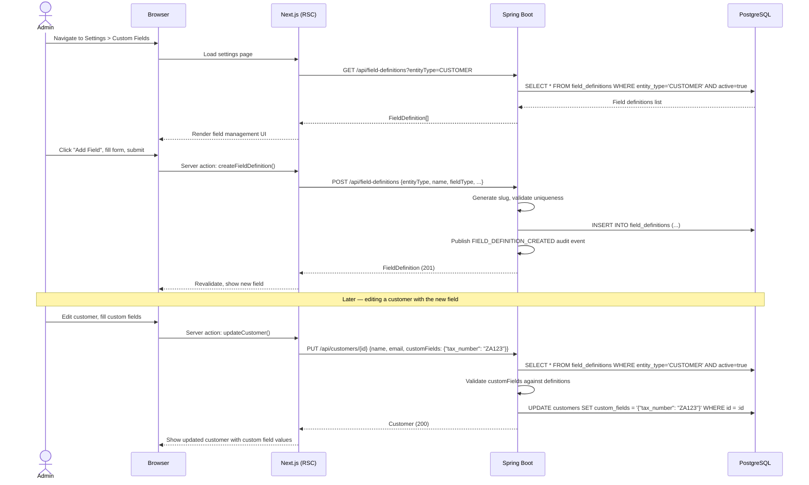
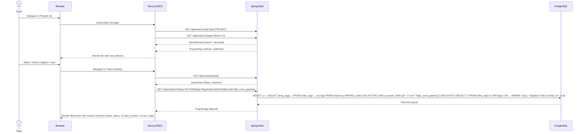
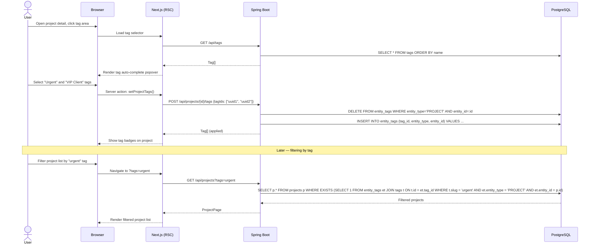

# Phase 11 — Tags, Custom Fields & Views

> Merge into `ARCHITECTURE.md` as **Section 11**. ADR files go in `adr/`.

> **Section Numbering Note**: This document uses the next available section number (11) as a logical identifier. When all phase documents are merged into ARCHITECTURE.md, section numbers will be reconciled.

---

## 11. Phase 11 — Tags, Custom Fields & Views

Phase 11 adds a **generic extensibility layer** to the DocTeams platform — the ability for organizations to customize their data model without code changes. Until now, every field on a project, task, or customer is platform-defined. This phase lets organizations define their own fields, apply freeform tags, and save filtered views of their data.

The phase introduces six new entities (`FieldDefinition`, `FieldGroup`, `FieldGroupMember`, `Tag`, `EntityTag`, `SavedView`), alters three existing entities (`Project`, `Task`, `Customer`) with JSONB custom field storage, and adds a seed-data mechanism for bootstrapping field definitions from platform-provided "field packs." All additions are evolutionary — they reuse the existing tenant isolation model, entity patterns, audit infrastructure (Phase 6), and Shadcn UI component library.

**Dependencies on prior phases**:
- **Phase 4** (Customers, Document Scopes & Tasks): `Project`, `Task`, `Customer` entities. This phase adds JSONB columns and tag associations to all three.
- **Phase 6** (Audit & Compliance): `AuditService` and `AuditEventBuilder`. Field definition and tag mutations publish audit events.
- **Phase 8** (Rate Cards, Budgets & Profitability): `OrgSettings` entity. Extended with field pack adoption tracking.

### What's New

| Capability | Before Phase 11 | After Phase 11 |
|---|---|---|
| Custom data fields | Fixed schema — every field is platform-defined | Org-scoped field definitions with 9 typed values (text, number, date, dropdown, boolean, currency, URL, email, phone) |
| Field organization | — | Field groups bundle related definitions. Platform ships "field packs" as seed data |
| Tags | — | Freeform, color-coded labels on projects, tasks, and customers. Org-scoped namespace with auto-complete |
| List filtering | Status, assignee, basic search | Filter by custom field values, tags, status, assignee, date ranges. Saved views persist filter+column configs |
| Saved views | — | Personal and shared named filter configurations on all list pages |
| Extensibility for verticals | Code changes required | JSON field packs on classpath — vertical forks add domain-specific fields without touching the field system code |

**Out of scope**: Conditional/dependent fields, computed/formula fields, field-level permissions, relational/lookup fields, multi-select dropdown, bulk field editing, custom fields on documents/time entries/invoices, import/export of field definitions via UI, drag-and-drop field ordering, document template variable substitution from custom fields, reporting breakdowns by custom field, tag hierarchy or nested tags.

---

### 11.1 Overview

Phase 11 establishes the platform's customization infrastructure without introducing domain-specific knowledge. The field definition system is a generic primitive — it knows nothing about legal matters, accounting engagements, or agency campaigns. Domain-specific knowledge lives in field packs, which are seed data, not code.

The core abstractions:

1. **FieldDefinition** — A named, typed field that can be applied to projects, tasks, or customers. Org-scoped, with slug-based identification for JSONB storage.
2. **FieldGroup** — A named bundle of related field definitions for organizational convenience. Groups determine which fields appear in entity forms.
3. **Field Pack** — A JSON-defined template of field definitions and groups, loaded from the classpath during tenant provisioning. Each tenant gets independent copies that can be customized freely.
4. **Tag** — A freeform, color-coded label in a flat org-scoped namespace. Applied to entities via a polymorphic join table.
5. **SavedView** — A named, reusable filter+column configuration for list pages. Can be personal (creator-only) or shared (org-wide).
6. **Custom Field Values** — JSONB column on `projects`, `tasks`, and `customers` keyed by field slug, validated against field definitions at write time.

All new entities follow the established tenant isolation model. JSONB is the storage strategy for custom field values — not EAV tables. See [ADR-052](../adr/ADR-052-jsonb-vs-eav-custom-field-storage.md) for the full rationale.

---

### 11.2 Domain Model

Phase 11 introduces six new tenant-scoped entities (`FieldDefinition`, `FieldGroup`, `FieldGroupMember`, `Tag`, `EntityTag`, `SavedView`) and alters three existing entities (`Project`, `Task`, `Customer`). All new entities follow the established pattern: `TenantAware` interface, `@FilterDef`/`@Filter` for shared-schema tenants, `@EntityListeners(TenantAwareEntityListener.class)`, UUID primary keys.

#### 11.2.1 FieldDefinition Entity (New)

An org-scoped field definition that describes a typed custom field applicable to one entity type. Field definitions are the schema for custom field values — they define what fields exist, what types they accept, and how they validate.

| Field | Java Type | DB Column | DB Type | Constraints | Notes |
|-------|-----------|-----------|---------|-------------|-------|
| `id` | `UUID` | `id` | `UUID` | PK, default `gen_random_uuid()` | Auto-generated |
| `entityType` | `EntityType` (enum) | `entity_type` | `VARCHAR(20)` | NOT NULL | `PROJECT`, `TASK`, `CUSTOMER` |
| `name` | `String` | `name` | `VARCHAR(100)` | NOT NULL | Human-readable label (e.g., "Case Number") |
| `slug` | `String` | `slug` | `VARCHAR(100)` | NOT NULL | Machine-readable key for JSONB storage (e.g., `case_number`). Pattern: `[a-z][a-z0-9_]*` |
| `fieldType` | `FieldType` (enum) | `field_type` | `VARCHAR(20)` | NOT NULL | `TEXT`, `NUMBER`, `DATE`, `DROPDOWN`, `BOOLEAN`, `CURRENCY`, `URL`, `EMAIL`, `PHONE` |
| `description` | `String` | `description` | `TEXT` | nullable | Help text shown to users |
| `required` | `boolean` | `required` | `BOOLEAN` | NOT NULL, default `false` | Whether value must be provided when the field's group is applied |
| `defaultValue` | `Map<String,Object>` | `default_value` | `JSONB` | nullable | Default value, type-checked against `fieldType` |
| `options` | `List<Map<String,String>>` | `options` | `JSONB` | nullable | For DROPDOWN: `[{ "value": "...", "label": "..." }]`. Non-empty when `fieldType = DROPDOWN` |
| `validation` | `Map<String,Object>` | `validation` | `JSONB` | nullable | Validation rules: `{ min, max, pattern, minLength, maxLength }` |
| `sortOrder` | `int` | `sort_order` | `INTEGER` | NOT NULL, default `0` | Display order among fields for this entity type |
| `packId` | `String` | `pack_id` | `VARCHAR(100)` | nullable | Field pack identifier this definition originated from. Null for org-created fields |
| `packFieldKey` | `String` | `pack_field_key` | `VARCHAR(100)` | nullable | Field key within pack for update tracking. Null for org-created fields |
| `active` | `boolean` | `active` | `BOOLEAN` | NOT NULL, default `true` | Soft-delete flag. Inactive fields are hidden from forms; values preserved |
| `tenantId` | `String` | `tenant_id` | `VARCHAR(255)` | | Tenant isolation |
| `createdAt` | `Instant` | `created_at` | `TIMESTAMPTZ` | NOT NULL | |
| `updatedAt` | `Instant` | `updated_at` | `TIMESTAMPTZ` | NOT NULL | |

**Constraints**:
- `UNIQUE (tenant_id, entity_type, slug)` — no two fields with the same slug for the same entity type per tenant.
- `CHECK (slug ~ '^[a-z][a-z0-9_]*$')` — lowercase, underscore-separated, starts with letter.
- `CHECK ((pack_id IS NULL) = (pack_field_key IS NULL))` — both null or both non-null.
- Application-level: `options` must be non-empty array when `field_type = 'DROPDOWN'`.

**Indexes**:
- `(tenant_id, entity_type, active)` — listing active fields per entity type.
- `(tenant_id, entity_type, slug)` — unique index (covers the unique constraint).
- `(tenant_id, pack_id)` — finding all fields from a specific pack.

**Design decision — slug-based JSONB keys**: Custom field values are stored in a JSONB column keyed by slug (e.g., `{"case_number": "2025/12345"}`), not by UUID. Slugs are human-readable in API responses and database queries, which simplifies debugging and ad-hoc reporting. The trade-off is that renaming a slug requires migrating JSONB values across all entities — mitigated by making slug editable only before any values exist (enforced at application level).

#### 11.2.2 FieldGroup Entity (New)

A named bundle of related field definitions for organizational convenience. Groups scope to one entity type and provide display structure — they determine how fields are sectioned in entity detail forms.

| Field | Java Type | DB Column | DB Type | Constraints | Notes |
|-------|-----------|-----------|---------|-------------|-------|
| `id` | `UUID` | `id` | `UUID` | PK, default `gen_random_uuid()` | Auto-generated |
| `entityType` | `EntityType` (enum) | `entity_type` | `VARCHAR(20)` | NOT NULL | `PROJECT`, `TASK`, `CUSTOMER` |
| `name` | `String` | `name` | `VARCHAR(100)` | NOT NULL | Display name (e.g., "Contact & Address") |
| `slug` | `String` | `slug` | `VARCHAR(100)` | NOT NULL | Machine-readable key |
| `description` | `String` | `description` | `TEXT` | nullable | |
| `packId` | `String` | `pack_id` | `VARCHAR(100)` | nullable | Field pack this group originated from |
| `sortOrder` | `int` | `sort_order` | `INTEGER` | NOT NULL, default `0` | Display order among groups for this entity type |
| `active` | `boolean` | `active` | `BOOLEAN` | NOT NULL, default `true` | Soft-delete flag |
| `tenantId` | `String` | `tenant_id` | `VARCHAR(255)` | | |
| `createdAt` | `Instant` | `created_at` | `TIMESTAMPTZ` | NOT NULL | |
| `updatedAt` | `Instant` | `updated_at` | `TIMESTAMPTZ` | NOT NULL | |

**Constraints**:
- `UNIQUE (tenant_id, entity_type, slug)` — no duplicate group slugs per entity type per tenant.

#### 11.2.3 FieldGroupMember Join Entity (New)

Associates field definitions with groups. A field can belong to multiple groups. The group and field must share the same `entity_type` (enforced at application level — cross-entity-type membership is nonsensical).

| Field | Java Type | DB Column | DB Type | Constraints | Notes |
|-------|-----------|-----------|---------|-------------|-------|
| `id` | `UUID` | `id` | `UUID` | PK, default `gen_random_uuid()` | Auto-generated |
| `fieldGroupId` | `UUID` | `field_group_id` | `UUID` | NOT NULL, FK → `field_groups` | |
| `fieldDefinitionId` | `UUID` | `field_definition_id` | `UUID` | NOT NULL, FK → `field_definitions` | |
| `sortOrder` | `int` | `sort_order` | `INTEGER` | NOT NULL, default `0` | Display order within the group |
| `tenantId` | `String` | `tenant_id` | `VARCHAR(255)` | | |

**Constraints**:
- `UNIQUE (field_group_id, field_definition_id)` — a field can appear in a group at most once.

**Design decision — join entity vs. JSONB array on FieldGroup**: A join entity (`FieldGroupMember`) provides referential integrity, sort ordering, and queryability. A JSONB array of field IDs on `FieldGroup` would be simpler but loses cascading deletes and makes reordering an array-replace operation. The join entity is the standard relational pattern for M:N relationships with ordering.

#### 11.2.4 Tag Entity (New)

A freeform, org-scoped label with an optional color. Tags exist in a flat namespace — no hierarchy, no types, no metadata beyond name and color.

| Field | Java Type | DB Column | DB Type | Constraints | Notes |
|-------|-----------|-----------|---------|-------------|-------|
| `id` | `UUID` | `id` | `UUID` | PK, default `gen_random_uuid()` | Auto-generated |
| `name` | `String` | `name` | `VARCHAR(50)` | NOT NULL | Display name (e.g., "Urgent", "VIP Client") |
| `slug` | `String` | `slug` | `VARCHAR(50)` | NOT NULL | URL-safe lowercase key, auto-generated from name |
| `color` | `String` | `color` | `VARCHAR(7)` | nullable | Hex color code (e.g., `#EF4444`). Null = default neutral color |
| `tenantId` | `String` | `tenant_id` | `VARCHAR(255)` | | |
| `createdAt` | `Instant` | `created_at` | `TIMESTAMPTZ` | NOT NULL | |
| `updatedAt` | `Instant` | `updated_at` | `TIMESTAMPTZ` | NOT NULL | |

**Constraints**:
- `UNIQUE (tenant_id, slug)` — no duplicate tags within an org.

See [ADR-054](../adr/ADR-054-tag-storage-join-table-vs-array.md) for why tags use a join table rather than array columns.

#### 11.2.5 EntityTag Join Table (New)

Polymorphic join table associating tags with entities. Uses `entity_type` + `entity_id` to reference projects, tasks, or customers without foreign keys to each entity table.

| Field | Java Type | DB Column | DB Type | Constraints | Notes |
|-------|-----------|-----------|---------|-------------|-------|
| `id` | `UUID` | `id` | `UUID` | PK, default `gen_random_uuid()` | Auto-generated |
| `tagId` | `UUID` | `tag_id` | `UUID` | NOT NULL, FK → `tags` ON DELETE CASCADE | Cascade: deleting a tag removes all associations |
| `entityType` | `EntityType` (enum) | `entity_type` | `VARCHAR(20)` | NOT NULL | `PROJECT`, `TASK`, `CUSTOMER` |
| `entityId` | `UUID` | `entity_id` | `UUID` | NOT NULL | Polymorphic reference — no FK constraint |
| `tenantId` | `String` | `tenant_id` | `VARCHAR(255)` | | |
| `createdAt` | `Instant` | `created_at` | `TIMESTAMPTZ` | NOT NULL | |

**Constraints**:
- `UNIQUE (tag_id, entity_type, entity_id)` — a tag can be applied to an entity at most once.

**Indexes**:
- `(tenant_id, entity_type, entity_id)` — "get all tags for this entity."
- `(tenant_id, tag_id, entity_type)` — "find all entities with this tag."

**Polymorphic reference trade-off**: The `entity_id` column has no foreign key constraint — there is no `REFERENCES projects(id)` or similar. This is intentional: a single FK would require three nullable FK columns (one per entity type), which is worse. Application-level integrity ensures `entity_id` references a valid entity. Orphaned EntityTag rows (if an entity is deleted without cleanup) are harmless and can be garbage-collected periodically.

#### 11.2.6 SavedView Entity (New)

A named, reusable filter+column configuration for list pages. Views can be personal (visible only to creator) or shared (visible to all org members).

| Field | Java Type | DB Column | DB Type | Constraints | Notes |
|-------|-----------|-----------|---------|-------------|-------|
| `id` | `UUID` | `id` | `UUID` | PK, default `gen_random_uuid()` | Auto-generated |
| `entityType` | `EntityType` (enum) | `entity_type` | `VARCHAR(20)` | NOT NULL | `PROJECT`, `TASK`, `CUSTOMER` |
| `name` | `String` | `name` | `VARCHAR(100)` | NOT NULL | Display name (e.g., "My Open Tasks") |
| `filters` | `Map<String,Object>` | `filters` | `JSONB` | NOT NULL | Filter configuration (see below) |
| `columns` | `List<String>` | `columns` | `JSONB` | nullable | Column display list. Null = default columns. `cf:slug` prefix for custom fields |
| `shared` | `boolean` | `shared` | `BOOLEAN` | NOT NULL, default `false` | If true, visible to all org members |
| `createdBy` | `UUID` | `created_by` | `UUID` | NOT NULL | Member who created the view |
| `sortOrder` | `int` | `sort_order` | `INTEGER` | NOT NULL, default `0` | Display order in view switcher |
| `tenantId` | `String` | `tenant_id` | `VARCHAR(255)` | | |
| `createdAt` | `Instant` | `created_at` | `TIMESTAMPTZ` | NOT NULL | |
| `updatedAt` | `Instant` | `updated_at` | `TIMESTAMPTZ` | NOT NULL | |

**Constraints**:
- Personal views: `UNIQUE (tenant_id, entity_type, name, created_by)` where `shared = false`.
- Shared views: `UNIQUE (tenant_id, entity_type, name)` where `shared = true`.
- These are enforced via partial unique indexes (see migration section).

**Indexes**:
- `(tenant_id, entity_type, shared)` — listing available views.
- `(tenant_id, created_by, entity_type)` — listing personal views.

**Filter JSONB structure**:
```json
{
    "status": ["ACTIVE", "ON_HOLD"],
    "tags": ["vip-client", "urgent"],
    "assignee": "member-uuid",
    "customFields": {
        "court": { "op": "eq", "value": "high_court_gauteng" },
        "filing_date": { "op": "gte", "value": "2025-01-01" },
        "is_urgent": { "op": "eq", "value": true }
    },
    "dateRange": {
        "field": "created_at",
        "from": "2025-01-01",
        "to": "2025-12-31"
    },
    "search": "keyword"
}
```

**Column JSONB structure**:
```json
["name", "status", "customer", "cf:case_number", "cf:court", "tags", "updated_at"]
```

Custom field columns use the `cf:` prefix followed by the field definition slug.

See [ADR-055](../adr/ADR-055-saved-view-filter-execution.md) for how filters are translated to SQL predicates.

#### 11.2.7 Alterations to Existing Entities

Three existing entities gain new columns:

| Entity | New Column | DB Type | Default | Notes |
|--------|-----------|---------|---------|-------|
| `Project` | `custom_fields` | `JSONB` | `'{}'::jsonb` | Custom field values keyed by slug |
| `Project` | `applied_field_groups` | `JSONB` | `NULL` | Array of group UUIDs for form rendering |
| `Task` | `custom_fields` | `JSONB` | `'{}'::jsonb` | Custom field values keyed by slug |
| `Task` | `applied_field_groups` | `JSONB` | `NULL` | Array of group UUIDs for form rendering |
| `Customer` | `custom_fields` | `JSONB` | `'{}'::jsonb` | Custom field values keyed by slug |
| `Customer` | `applied_field_groups` | `JSONB` | `NULL` | Array of group UUIDs for form rendering |

Each entity's Java class gains:
```java
@JdbcTypeCode(SqlTypes.JSON)
@Column(name = "custom_fields", columnDefinition = "jsonb")
private Map<String, Object> customFields = new HashMap<>();

@JdbcTypeCode(SqlTypes.JSON)
@Column(name = "applied_field_groups", columnDefinition = "jsonb")
private List<UUID> appliedFieldGroups;
```

GIN indexes are added on `custom_fields` for each table to support JSONB containment queries.

**OrgSettings extension**: The existing `OrgSettings` entity (from Phase 8) gains a `field_pack_status` JSONB column to track which field packs have been applied and at which version:
```json
[
    { "packId": "common-customer", "version": 1, "appliedAt": "2026-01-15T10:00:00Z" },
    { "packId": "common-project", "version": 1, "appliedAt": "2026-01-15T10:00:00Z" }
]
```

#### 11.2.8 Field Type Semantics

| Field Type | JSONB Storage | Validation | Frontend Component | Filter Operators |
|-----------|--------------|------------|-------------------|-----------------|
| `TEXT` | JSON string `"value"` | `minLength`, `maxLength`, `pattern` (regex) | `<Input>` | `eq`, `contains` |
| `NUMBER` | JSON number `42.5` | `min`, `max` | `<Input type="number">` | `eq`, `gt`, `gte`, `lt`, `lte`, `range` |
| `DATE` | ISO 8601 string `"2025-06-15"` | Must parse as valid date | `<DatePicker>` | `eq`, `gt`, `gte`, `lt`, `lte`, `range` |
| `DROPDOWN` | JSON string (option value) `"high_court"` | Value must exist in `options` array | `<Select>` | `eq`, `in` |
| `BOOLEAN` | JSON boolean `true` | Must be `true` or `false` | `<Checkbox>` | `eq` |
| `CURRENCY` | Object `{ "amount": 500000, "currency": "ZAR" }` | `amount` must be number, `currency` must be 3-char ISO 4217 | `<Input type="number">` + currency select | `eq`, `gt`, `gte`, `lt`, `lte`, `range` (on amount) |
| `URL` | JSON string `"https://..."` | Must match URL format | `<Input type="url">` | `eq`, `contains` |
| `EMAIL` | JSON string `"user@example.com"` | Must match email format | `<Input type="email">` | `eq`, `contains` |
| `PHONE` | JSON string `"+27 11 123 4567"` | Freeform (no strict validation) | `<Input type="tel">` | `eq`, `contains` |

**CURRENCY type note**: Currency values are stored as objects with explicit `amount` and `currency` keys. This avoids the ambiguity of bare numbers and supports multi-currency scenarios. The frontend renders a number input alongside a currency selector, defaulting to the org's `defaultCurrency` from `OrgSettings`.

#### 11.2.9 Updated Entity-Relationship Diagram

The diagram below shows the complete tenant-schema entity relationships after Phase 11. New entities are `field_definitions`, `field_groups`, `field_group_members`, `tags`, `entity_tags`, and `saved_views`. Existing entities `projects`, `tasks`, and `customers` gain `custom_fields` and `applied_field_groups` JSONB columns.

```mermaid
erDiagram
    projects {
        uuid id PK
        varchar name "NOT NULL"
        text description
        jsonb custom_fields "NEW — default '{}'"
        jsonb applied_field_groups "NEW — nullable"
        uuid created_by FK "→ members"
        varchar tenant_id
        timestamp created_at
        timestamp updated_at
    }

    members {
        uuid id PK
        varchar clerk_user_id "NOT NULL"
        varchar email "NOT NULL"
        varchar name
        varchar avatar_url
        varchar org_role "NOT NULL"
        varchar tenant_id
        timestamp created_at
        timestamp updated_at
    }

    project_members {
        uuid id PK
        uuid project_id FK "→ projects"
        uuid member_id FK "→ members"
        varchar project_role "lead, contributor"
        uuid added_by FK "→ members"
        varchar tenant_id
        timestamp created_at
    }

    customers {
        uuid id PK
        varchar name "NOT NULL"
        varchar email "NOT NULL"
        varchar status "ACTIVE, ARCHIVED"
        jsonb custom_fields "NEW — default '{}'"
        jsonb applied_field_groups "NEW — nullable"
        uuid created_by FK "→ members"
        varchar tenant_id
        timestamp created_at
        timestamp updated_at
    }

    customer_projects {
        uuid id PK
        uuid customer_id FK "→ customers"
        uuid project_id FK "→ projects"
        uuid linked_by FK "→ members"
        varchar tenant_id
        timestamp created_at
    }

    documents {
        uuid id PK
        varchar scope "ORG, PROJECT, CUSTOMER"
        uuid project_id FK "→ projects (nullable)"
        uuid customer_id FK "→ customers (nullable)"
        varchar visibility "INTERNAL, SHARED"
        varchar file_name "NOT NULL"
        varchar status "PENDING, UPLOADED, FAILED"
        uuid uploaded_by FK "→ members"
        varchar tenant_id
        timestamp created_at
    }

    tasks {
        uuid id PK
        uuid project_id FK "→ projects"
        varchar title "NOT NULL"
        text description
        varchar status "OPEN, IN_PROGRESS, DONE, CANCELLED"
        varchar priority "LOW, MEDIUM, HIGH, URGENT"
        jsonb custom_fields "NEW — default '{}'"
        jsonb applied_field_groups "NEW — nullable"
        uuid assignee_id FK "→ members (nullable)"
        uuid created_by FK "→ members"
        date due_date
        integer version "Optimistic lock"
        varchar tenant_id
        timestamp created_at
        timestamp updated_at
    }

    time_entries {
        uuid id PK
        uuid task_id FK "→ tasks"
        uuid member_id FK "→ members"
        date date "NOT NULL"
        integer duration_minutes "NOT NULL"
        boolean billable "NOT NULL DEFAULT true"
        decimal billing_rate_snapshot "nullable"
        varchar billing_rate_currency "nullable"
        decimal cost_rate_snapshot "nullable"
        varchar cost_rate_currency "nullable"
        text description
        varchar tenant_id
        timestamp created_at
        timestamp updated_at
    }

    comments {
        uuid id PK
        varchar entity_type "TASK, DOCUMENT"
        uuid entity_id
        uuid project_id FK "→ projects"
        uuid author_member_id FK "→ members"
        text body "NOT NULL"
        varchar visibility "INTERNAL, SHARED"
        varchar tenant_id
        timestamp created_at
        timestamp updated_at
    }

    notifications {
        uuid id PK
        uuid recipient_member_id FK "→ members"
        varchar type "NOT NULL"
        varchar title "NOT NULL"
        text body
        varchar reference_entity_type
        uuid reference_entity_id
        uuid reference_project_id
        boolean is_read "NOT NULL"
        varchar tenant_id
        timestamp created_at
    }

    notification_preferences {
        uuid id PK
        uuid member_id FK "→ members"
        varchar notification_type "NOT NULL"
        boolean in_app_enabled "NOT NULL"
        boolean email_enabled "NOT NULL"
        varchar tenant_id
    }

    audit_events {
        uuid id PK
        varchar event_type "NOT NULL"
        varchar entity_type "NOT NULL"
        uuid entity_id "NOT NULL"
        uuid actor_id
        varchar actor_type "USER, SYSTEM"
        varchar source "API, INTERNAL"
        varchar ip_address
        varchar user_agent
        jsonb details
        varchar tenant_id
        timestamp occurred_at
    }

    org_settings {
        uuid id PK
        varchar default_currency "NOT NULL DEFAULT USD"
        jsonb field_pack_status "NEW — nullable"
        varchar tenant_id "UNIQUE"
        timestamp created_at
        timestamp updated_at
    }

    billing_rates {
        uuid id PK
        uuid member_id FK "→ members"
        uuid project_id FK "→ projects (nullable)"
        uuid customer_id FK "→ customers (nullable)"
        varchar currency "NOT NULL"
        decimal hourly_rate "NOT NULL"
        date effective_from "NOT NULL"
        date effective_to "nullable"
        varchar tenant_id
        timestamp created_at
        timestamp updated_at
    }

    cost_rates {
        uuid id PK
        uuid member_id FK "→ members"
        varchar currency "NOT NULL"
        decimal hourly_cost "NOT NULL"
        date effective_from "NOT NULL"
        date effective_to "nullable"
        varchar tenant_id
        timestamp created_at
        timestamp updated_at
    }

    project_budgets {
        uuid id PK
        uuid project_id FK "→ projects UNIQUE"
        decimal budget_hours "nullable"
        decimal budget_amount "nullable"
        varchar budget_currency "nullable"
        integer alert_threshold_pct "NOT NULL DEFAULT 80"
        boolean threshold_notified "NOT NULL DEFAULT false"
        text notes
        varchar tenant_id
        timestamp created_at
        timestamp updated_at
    }

    invoices {
        uuid id PK
        uuid customer_id FK "→ customers"
        varchar invoice_number "UNIQUE per tenant"
        varchar status "DRAFT APPROVED SENT PAID VOID"
        varchar currency "NOT NULL"
        date issue_date
        date due_date
        decimal subtotal "NOT NULL"
        decimal total "NOT NULL"
        uuid created_by FK "→ members"
        varchar tenant_id
        timestamp created_at
        timestamp updated_at
    }

    invoice_lines {
        uuid id PK
        uuid invoice_id FK "→ invoices"
        uuid project_id FK "→ projects (nullable)"
        uuid time_entry_id FK "→ time_entries (nullable)"
        text description "NOT NULL"
        decimal quantity "NOT NULL"
        decimal unit_price "NOT NULL"
        decimal amount "NOT NULL"
        varchar tenant_id
        timestamp created_at
        timestamp updated_at
    }

    field_definitions {
        uuid id PK
        varchar entity_type "NOT NULL"
        varchar name "NOT NULL"
        varchar slug "NOT NULL"
        varchar field_type "NOT NULL"
        text description "nullable"
        boolean required "NOT NULL DEFAULT false"
        jsonb default_value "nullable"
        jsonb options "nullable"
        jsonb validation "nullable"
        integer sort_order "NOT NULL DEFAULT 0"
        varchar pack_id "nullable"
        varchar pack_field_key "nullable"
        boolean active "NOT NULL DEFAULT true"
        varchar tenant_id
        timestamp created_at
        timestamp updated_at
    }

    field_groups {
        uuid id PK
        varchar entity_type "NOT NULL"
        varchar name "NOT NULL"
        varchar slug "NOT NULL"
        text description "nullable"
        varchar pack_id "nullable"
        integer sort_order "NOT NULL DEFAULT 0"
        boolean active "NOT NULL DEFAULT true"
        varchar tenant_id
        timestamp created_at
        timestamp updated_at
    }

    field_group_members {
        uuid id PK
        uuid field_group_id FK "→ field_groups"
        uuid field_definition_id FK "→ field_definitions"
        integer sort_order "NOT NULL DEFAULT 0"
        varchar tenant_id
    }

    tags {
        uuid id PK
        varchar name "NOT NULL"
        varchar slug "NOT NULL"
        varchar color "nullable"
        varchar tenant_id
        timestamp created_at
        timestamp updated_at
    }

    entity_tags {
        uuid id PK
        uuid tag_id FK "→ tags ON DELETE CASCADE"
        varchar entity_type "NOT NULL"
        uuid entity_id "NOT NULL"
        varchar tenant_id
        timestamp created_at
    }

    saved_views {
        uuid id PK
        varchar entity_type "NOT NULL"
        varchar name "NOT NULL"
        jsonb filters "NOT NULL"
        jsonb columns "nullable"
        boolean shared "NOT NULL DEFAULT false"
        uuid created_by "NOT NULL"
        integer sort_order "NOT NULL DEFAULT 0"
        varchar tenant_id
        timestamp created_at
        timestamp updated_at
    }

    projects ||--o{ documents : "scope = PROJECT"
    projects ||--o{ project_members : "has"
    projects ||--o{ customer_projects : "linked to"
    projects ||--o{ tasks : "contains"
    projects ||--o| project_budgets : "has budget"
    projects ||--o{ billing_rates : "project overrides"
    projects ||--o{ comments : "has comments"
    projects ||--o{ entity_tags : "tagged (via entity_id)"

    members ||--o{ project_members : "assigned to"
    members ||--o{ tasks : "assigned (optional)"
    members ||--o{ time_entries : "logs"
    members ||--o{ billing_rates : "has rates"
    members ||--o{ cost_rates : "has cost rates"
    members ||--o{ comments : "authored"
    members ||--o{ notifications : "receives"
    members ||--o{ notification_preferences : "configures"
    members ||--o{ saved_views : "creates"

    customers ||--o{ customer_projects : "linked to"
    customers ||--o{ documents : "scope = CUSTOMER"
    customers ||--o{ billing_rates : "customer overrides"
    customers ||--o{ invoices : "billed"
    customers ||--o{ entity_tags : "tagged (via entity_id)"

    tasks ||--o{ time_entries : "tracked against"
    tasks ||--o{ comments : "commented on"
    tasks ||--o{ entity_tags : "tagged (via entity_id)"
    documents ||--o{ comments : "commented on"

    invoices ||--o{ invoice_lines : "contains"

    tags ||--o{ entity_tags : "applied to"
    field_groups ||--o{ field_group_members : "contains"
    field_definitions ||--o{ field_group_members : "belongs to"
```



**Total entities in tenant schema after Phase 11**: 24 (18 existing + 6 new: FieldDefinition, FieldGroup, FieldGroupMember, Tag, EntityTag, SavedView). Plus `AuditEvent` as infrastructure.

---

### 11.3 Core Flows & Permissions

#### 11.3.1 Field Definition Management

**RBAC**:

| Operation | Owner | Admin | Project Lead | Contributor |
|-----------|-------|-------|-------------|-------------|
| Create field definition | Yes | Yes | No | No |
| Update field definition | Yes | Yes | No | No |
| Deactivate field definition | Yes | Yes | No | No |
| Create/update field group | Yes | Yes | No | No |
| View field definitions | Yes | Yes | Yes | Yes |

**Create field definition flow**:
1. Admin submits `POST /api/field-definitions` with `{ entityType, name, fieldType, ... }`.
2. Service auto-generates `slug` from `name` if not provided (lowercase, replace spaces with underscores, strip special chars).
3. Validate uniqueness of `(tenant_id, entity_type, slug)`.
4. For DROPDOWN type, validate `options` is a non-empty array of `{ value, label }` objects.
5. Persist `FieldDefinition` with `active = true`.
6. Publish `FIELD_DEFINITION_CREATED` audit event.

**Slug generation**:
```java
// FieldDefinitionService
public String generateSlug(String name) {
    return name.toLowerCase()
        .replaceAll("[^a-z0-9]+", "_")
        .replaceAll("^_|_$", "")
        .replaceAll("_+", "_");
}
```

**Deactivation** (soft-delete): Setting `active = false` hides the field from forms but preserves all existing JSONB values. This prevents data loss when an admin decides a field is no longer needed. Reactivation restores the field and its values become visible again.

#### 11.3.2 Custom Field Value Management

**RBAC** — same as the parent entity:

| Operation | Owner | Admin | Project Lead | Contributor |
|-----------|-------|-------|-------------|-------------|
| Set custom field values on a project | Yes | Yes | Yes (if project member) | No |
| Set custom field values on a task | Yes | Yes | Yes (if project member) | Yes (if assignee) |
| Set custom field values on a customer | Yes | Yes | No | No |

**Update custom fields on an entity**:
1. Client sends `PUT /api/projects/{id}` with `customFields` in the request body.
2. Service loads active field definitions for the entity type.
3. For each key in `customFields`:
   - Strip unknown keys (not matching any active field definition slug).
   - Validate value against field type (see 11.2.8 for type-specific validation).
   - For DROPDOWN fields, verify value exists in the definition's `options` array.
   - For required fields: if the field belongs to any of the entity's `applied_field_groups`, the value must be non-null.
4. Merge validated `customFields` into the entity's JSONB column.
5. Return 400 with field-level errors if validation fails: `{ "fieldErrors": [{ "field": "slug", "message": "..." }] }`.

**JSONB containment query for filtering**:
```sql
-- Filter projects where custom_fields @> '{"court": "high_court_gauteng"}'
SELECT p.* FROM projects p
WHERE p.custom_fields @> '{"court": "high_court_gauteng"}'::jsonb;

-- Filter with numeric comparison (requires ->> cast)
SELECT p.* FROM projects p
WHERE (p.custom_fields ->> 'estimated_value')::jsonb ->> 'amount')::numeric > 100000;
```

The GIN index on `custom_fields` covers `@>` containment queries. For range queries on numeric/date fields, the backend uses `->>` extraction with type casting, which falls back to sequential scan on the JSONB but is acceptable at the expected data volumes (hundreds to low thousands of entities per tenant).

#### 11.3.3 Tag Management

**RBAC**:

| Operation | Owner | Admin | Project Lead | Contributor |
|-----------|-------|-------|-------------|-------------|
| Create tag | Yes | Yes | No | No |
| Update tag (name/color) | Yes | Yes | No | No |
| Delete tag | Yes | Yes | No | No |
| Apply/remove tags on entity | Yes | Yes | Yes | Yes |
| View tags | Yes | Yes | Yes | Yes |

**Apply tags to an entity** (`POST /api/{entityType}/{entityId}/tags`):
1. Client sends `{ tagIds: ["uuid1", "uuid2"] }` — full replacement, not incremental.
2. Service validates all tag IDs exist within the tenant.
3. Delete all existing `EntityTag` rows for `(entity_type, entity_id)`.
4. Insert new `EntityTag` rows for each tag ID.
5. Return the updated tag list.

**Tag deletion cascade**: When a tag is deleted (`DELETE /api/tags/{id}`), all `EntityTag` rows referencing that tag are cascade-deleted via the FK constraint `ON DELETE CASCADE`. This is atomic within a single transaction.

**Tag auto-complete**: The `GET /api/tags` endpoint returns all org tags. The frontend uses this to populate the auto-complete input. For organizations with very large tag sets (100+), the endpoint supports an optional `search` query parameter for server-side filtering: `GET /api/tags?search=urg` returns tags whose name contains "urg".

#### 11.3.4 Saved View Management

**RBAC**:

| Operation | Owner | Admin | Project Lead | Contributor |
|-----------|-------|-------|-------------|-------------|
| Create personal view | Yes | Yes | Yes | Yes |
| Create shared view | Yes | Yes | No | No |
| Update own personal view | Yes | Yes | Yes | Yes |
| Update shared view | Yes | Yes | No | No |
| Delete own personal view | Yes | Yes | Yes | Yes |
| Delete shared view | Yes | Yes | No | No |
| View personal views | Own only | Own only | Own only | Own only |
| View shared views | Yes | Yes | Yes | Yes |

**Apply saved view** (`GET /api/projects?view={viewId}`):
1. Load the `SavedView` by ID. Verify the requesting member can see it (is creator for personal, or any member for shared).
2. Parse the `filters` JSONB and translate to SQL predicates (see [ADR-055](../adr/ADR-055-saved-view-filter-execution.md)).
3. Execute the query with standard pagination.
4. Return the filtered list. The frontend uses the view's `columns` configuration to render the appropriate columns.

**Ad-hoc filters**: Users can also filter without a saved view using URL search params (`?status=ACTIVE&tags=urgent&customField[court]=high_court`). The backend accepts the same filter parameters whether they come from a saved view or from direct query params. A "Save View" button appears in the frontend when filters are active but don't match a saved view.

#### 11.3.5 Field Pack Seeding

**Trigger**: Pack seeding runs during tenant provisioning (`TenantProvisioningService`), after schema creation and standard migrations.

**Seeding flow**:
1. `FieldPackSeeder` scans classpath for `field-packs/*.json` files.
2. For each pack definition:
   a. Create `FieldDefinition` records with `pack_id` and `pack_field_key` set.
   b. Create `FieldGroup` record with `pack_id` set.
   c. Create `FieldGroupMember` records linking definitions to group.
3. Update `OrgSettings.fieldPackStatus` with `[{ packId, version, appliedAt }]`.

**Pack update flow** (future — infrastructure built now):
1. On application startup or admin action, compare pack JSON version against `OrgSettings.fieldPackStatus`.
2. For packs where JSON version > applied version:
   a. Find pack field definitions by `(tenant_id, pack_id)`.
   b. Compare `pack_field_key` values: identify new fields not yet in the tenant.
   c. Add new field definitions only. Do not overwrite fields that the org has customized (detect customization by comparing field attributes against pack defaults).
   d. Update `fieldPackStatus` version.

See [ADR-053](../adr/ADR-053-field-pack-seeding-strategy.md) for the full rationale on per-tenant seeding.

---

### 11.4 API Surface

#### 11.4.1 Field Definition Endpoints

| Method | Path | Description | Auth | R/W |
|--------|------|-------------|------|-----|
| `GET` | `/api/field-definitions?entityType={type}` | List active field definitions for entity type | JWT (any member) | R |
| `GET` | `/api/field-definitions/{id}` | Get single field definition | JWT (any member) | R |
| `POST` | `/api/field-definitions` | Create field definition | JWT (admin/owner) | W |
| `PUT` | `/api/field-definitions/{id}` | Update field definition | JWT (admin/owner) | W |
| `DELETE` | `/api/field-definitions/{id}` | Soft-delete (set active=false) | JWT (admin/owner) | W |

**Create request** (`POST /api/field-definitions`):
```json
{
    "entityType": "CUSTOMER",
    "name": "Tax Number",
    "slug": "tax_number",
    "fieldType": "TEXT",
    "description": "VAT number or tax identification number",
    "required": false,
    "validation": { "pattern": "^[A-Z0-9-]+$" },
    "sortOrder": 7
}
```

**Response** (all endpoints):
```json
{
    "id": "uuid",
    "entityType": "CUSTOMER",
    "name": "Tax Number",
    "slug": "tax_number",
    "fieldType": "TEXT",
    "description": "VAT number or tax identification number",
    "required": false,
    "defaultValue": null,
    "options": null,
    "validation": { "pattern": "^[A-Z0-9-]+$" },
    "sortOrder": 7,
    "packId": null,
    "packFieldKey": null,
    "active": true,
    "createdAt": "2026-01-15T10:00:00Z",
    "updatedAt": "2026-01-15T10:00:00Z"
}
```

#### 11.4.2 Field Group Endpoints

| Method | Path | Description | Auth | R/W |
|--------|------|-------------|------|-----|
| `GET` | `/api/field-groups?entityType={type}` | List active groups with field members | JWT (any member) | R |
| `POST` | `/api/field-groups` | Create group with field members | JWT (admin/owner) | W |
| `PUT` | `/api/field-groups/{id}` | Update group and field membership | JWT (admin/owner) | W |
| `DELETE` | `/api/field-groups/{id}` | Soft-delete group | JWT (admin/owner) | W |

**Create request** (`POST /api/field-groups`):
```json
{
    "entityType": "CUSTOMER",
    "name": "Contact & Address",
    "slug": "contact-address",
    "description": "Standard contact and address fields",
    "fieldDefinitionIds": ["uuid1", "uuid2", "uuid3"]
}
```

**List response** includes nested field definitions:
```json
{
    "id": "uuid",
    "entityType": "CUSTOMER",
    "name": "Contact & Address",
    "slug": "contact-address",
    "description": "Standard contact and address fields",
    "packId": "common-customer",
    "sortOrder": 1,
    "active": true,
    "fields": [
        {
            "id": "uuid1",
            "name": "Address Line 1",
            "slug": "address_line1",
            "fieldType": "TEXT",
            "sortOrder": 1
        }
    ]
}
```

#### 11.4.3 Tag Endpoints

| Method | Path | Description | Auth | R/W |
|--------|------|-------------|------|-----|
| `GET` | `/api/tags` | List all org tags | JWT (any member) | R |
| `GET` | `/api/tags?search={query}` | Search org tags by name | JWT (any member) | R |
| `POST` | `/api/tags` | Create a tag | JWT (admin/owner) | W |
| `PUT` | `/api/tags/{id}` | Update tag name/color | JWT (admin/owner) | W |
| `DELETE` | `/api/tags/{id}` | Delete tag + all associations | JWT (admin/owner) | W |
| `POST` | `/api/{entityType}/{entityId}/tags` | Set tags on entity (full replace) | JWT (any member) | W |
| `GET` | `/api/{entityType}/{entityId}/tags` | Get tags for entity | JWT (any member) | R |

**Create tag** (`POST /api/tags`):
```json
{ "name": "VIP Client", "color": "#EF4444" }
```

**Set entity tags** (`POST /api/projects/{id}/tags`):
```json
{ "tagIds": ["tag-uuid-1", "tag-uuid-2"] }
```

**Entity list response** (e.g., `GET /api/projects`) now includes tags:
```json
{
    "id": "project-uuid",
    "name": "Litigation Matter",
    "tags": [
        { "id": "tag-uuid-1", "name": "VIP Client", "slug": "vip-client", "color": "#EF4444" },
        { "id": "tag-uuid-2", "name": "Urgent", "slug": "urgent", "color": "#F59E0B" }
    ],
    "customFields": { "case_number": "2025/12345" }
}
```

#### 11.4.4 Saved View Endpoints

| Method | Path | Description | Auth | R/W |
|--------|------|-------------|------|-----|
| `GET` | `/api/views?entityType={type}` | List shared views + personal views of requester | JWT (any member) | R |
| `POST` | `/api/views` | Create saved view | JWT (any member; `shared` requires admin/owner) | W |
| `PUT` | `/api/views/{id}` | Update saved view | JWT (creator or admin/owner for shared) | W |
| `DELETE` | `/api/views/{id}` | Delete saved view | JWT (creator or admin/owner for shared) | W |

**Create saved view** (`POST /api/views`):
```json
{
    "entityType": "PROJECT",
    "name": "Active Litigation",
    "filters": {
        "status": ["ACTIVE"],
        "tags": ["litigation"],
        "customFields": {
            "court": { "op": "eq", "value": "high_court_gauteng" }
        }
    },
    "columns": ["name", "status", "customer", "cf:case_number", "cf:court", "tags"],
    "shared": true
}
```

#### 11.4.5 Custom Field Values on Existing Endpoints

Existing entity CRUD endpoints gain `customFields` support:

| Endpoint | Change |
|----------|--------|
| `POST /api/projects` | Accepts optional `customFields` object in body |
| `PUT /api/projects/{id}` | Accepts optional `customFields` object in body |
| `GET /api/projects/{id}` | Response includes `customFields` and `appliedFieldGroups` |
| `GET /api/projects` | Accepts `customField[slug]=value` query params; response includes `tags` and `customFields` |
| `PUT /api/projects/{id}/field-groups` | New: set applied field groups. Body: `{ "groupIds": ["uuid1", "uuid2"] }` |

Same pattern for `/api/tasks/*` and `/api/customers/*`.

**Filter query params on list endpoints**:
- `tags=slug1,slug2` — entities with ALL specified tags (AND logic).
- `customField[slug]=value` — JSONB containment match.
- `customField[slug][op]=gt&customField[slug][value]=100` — operator-based filter for numeric/date fields.

---

### 11.5 Sequence Diagrams

#### 11.5.1 Create Field Definition and Apply to Entity



#### 11.5.2 Apply Saved View to List Page



#### 11.5.3 Tag Application and Filtering



---

### 11.6 Notification and Audit Integration

#### 11.6.1 Audit Events

| Event Type | Entity Type | Trigger | Details JSONB |
|-----------|------------|---------|--------------|
| `FIELD_DEFINITION_CREATED` | `FIELD_DEFINITION` | New field created | `{ name, fieldType, entityType, slug }` |
| `FIELD_DEFINITION_UPDATED` | `FIELD_DEFINITION` | Field modified | `{ changed: { name: { from, to } } }` |
| `FIELD_DEFINITION_DELETED` | `FIELD_DEFINITION` | Field deactivated | `{ name, slug }` |
| `FIELD_GROUP_CREATED` | `FIELD_GROUP` | New group created | `{ name, entityType, fieldCount }` |
| `FIELD_GROUP_UPDATED` | `FIELD_GROUP` | Group modified | `{ changed: { name: { from, to } } }` |
| `FIELD_GROUP_DELETED` | `FIELD_GROUP` | Group deactivated | `{ name }` |
| `TAG_CREATED` | `TAG` | New tag created | `{ name, color }` |
| `TAG_DELETED` | `TAG` | Tag deleted | `{ name, affectedEntityCount }` |

Custom field value changes on entities are captured as part of existing entity audit events. For example, `PROJECT_UPDATED` already fires when a project is edited — the audit detail JSONB includes the custom fields diff alongside other changed attributes.

Saved view changes are **not audited** (low-value noise — views are personal productivity tools, not compliance-relevant data).

#### 11.6.2 Notifications

No notifications are published for Phase 11 events. Field definition changes and tag operations are admin actions visible immediately in the UI. Future consideration: notify entity assignees when a specific tag is applied (e.g., "urgent"), but this is deferred to avoid notification fatigue in v1.

---

### 11.7 Database Migrations

#### V24 — Tags, Custom Fields & Views

Migration: `V24__add_tags_custom_fields_views.sql`

Applied to both tenant-dedicated and `tenant_shared` schemas.

```sql
-- ============================================================
-- Field Definitions
-- ============================================================
CREATE TABLE field_definitions (
    id          UUID PRIMARY KEY DEFAULT gen_random_uuid(),
    entity_type VARCHAR(20)  NOT NULL,
    name        VARCHAR(100) NOT NULL,
    slug        VARCHAR(100) NOT NULL,
    field_type  VARCHAR(20)  NOT NULL,
    description TEXT,
    required    BOOLEAN      NOT NULL DEFAULT false,
    default_value JSONB,
    options     JSONB,
    validation  JSONB,
    sort_order  INTEGER      NOT NULL DEFAULT 0,
    pack_id     VARCHAR(100),
    pack_field_key VARCHAR(100),
    active      BOOLEAN      NOT NULL DEFAULT true,
    tenant_id   VARCHAR(255),
    created_at  TIMESTAMPTZ  NOT NULL DEFAULT now(),
    updated_at  TIMESTAMPTZ  NOT NULL DEFAULT now(),

    CONSTRAINT chk_slug_format CHECK (slug ~ '^[a-z][a-z0-9_]*$'),
    CONSTRAINT chk_pack_consistency CHECK ((pack_id IS NULL) = (pack_field_key IS NULL))
);

CREATE UNIQUE INDEX idx_fd_tenant_entitytype_slug
    ON field_definitions (tenant_id, entity_type, slug);

CREATE INDEX idx_fd_tenant_entitytype_active
    ON field_definitions (tenant_id, entity_type, active);

CREATE INDEX idx_fd_tenant_packid
    ON field_definitions (tenant_id, pack_id)
    WHERE pack_id IS NOT NULL;

-- ============================================================
-- Field Groups
-- ============================================================
CREATE TABLE field_groups (
    id          UUID PRIMARY KEY DEFAULT gen_random_uuid(),
    entity_type VARCHAR(20)  NOT NULL,
    name        VARCHAR(100) NOT NULL,
    slug        VARCHAR(100) NOT NULL,
    description TEXT,
    pack_id     VARCHAR(100),
    sort_order  INTEGER      NOT NULL DEFAULT 0,
    active      BOOLEAN      NOT NULL DEFAULT true,
    tenant_id   VARCHAR(255),
    created_at  TIMESTAMPTZ  NOT NULL DEFAULT now(),
    updated_at  TIMESTAMPTZ  NOT NULL DEFAULT now()
);

CREATE UNIQUE INDEX idx_fg_tenant_entitytype_slug
    ON field_groups (tenant_id, entity_type, slug);

-- ============================================================
-- Field Group Members
-- ============================================================
CREATE TABLE field_group_members (
    id                   UUID PRIMARY KEY DEFAULT gen_random_uuid(),
    field_group_id       UUID NOT NULL REFERENCES field_groups(id) ON DELETE CASCADE,
    field_definition_id  UUID NOT NULL REFERENCES field_definitions(id) ON DELETE CASCADE,
    sort_order           INTEGER NOT NULL DEFAULT 0,
    tenant_id            VARCHAR(255)
);

CREATE UNIQUE INDEX idx_fgm_group_field
    ON field_group_members (field_group_id, field_definition_id);

-- ============================================================
-- Tags
-- ============================================================
CREATE TABLE tags (
    id         UUID PRIMARY KEY DEFAULT gen_random_uuid(),
    name       VARCHAR(50)  NOT NULL,
    slug       VARCHAR(50)  NOT NULL,
    color      VARCHAR(7),
    tenant_id  VARCHAR(255),
    created_at TIMESTAMPTZ  NOT NULL DEFAULT now(),
    updated_at TIMESTAMPTZ  NOT NULL DEFAULT now()
);

CREATE UNIQUE INDEX idx_tags_tenant_slug
    ON tags (tenant_id, slug);

-- ============================================================
-- Entity Tags (polymorphic join table)
-- ============================================================
CREATE TABLE entity_tags (
    id          UUID PRIMARY KEY DEFAULT gen_random_uuid(),
    tag_id      UUID        NOT NULL REFERENCES tags(id) ON DELETE CASCADE,
    entity_type VARCHAR(20) NOT NULL,
    entity_id   UUID        NOT NULL,
    tenant_id   VARCHAR(255),
    created_at  TIMESTAMPTZ NOT NULL DEFAULT now()
);

CREATE UNIQUE INDEX idx_et_tag_entity
    ON entity_tags (tag_id, entity_type, entity_id);

CREATE INDEX idx_et_tenant_entitytype_entityid
    ON entity_tags (tenant_id, entity_type, entity_id);

CREATE INDEX idx_et_tenant_tag_entitytype
    ON entity_tags (tenant_id, tag_id, entity_type);

-- ============================================================
-- Saved Views
-- ============================================================
CREATE TABLE saved_views (
    id          UUID PRIMARY KEY DEFAULT gen_random_uuid(),
    entity_type VARCHAR(20)  NOT NULL,
    name        VARCHAR(100) NOT NULL,
    filters     JSONB        NOT NULL DEFAULT '{}',
    columns     JSONB,
    shared      BOOLEAN      NOT NULL DEFAULT false,
    created_by  UUID         NOT NULL,
    sort_order  INTEGER      NOT NULL DEFAULT 0,
    tenant_id   VARCHAR(255),
    created_at  TIMESTAMPTZ  NOT NULL DEFAULT now(),
    updated_at  TIMESTAMPTZ  NOT NULL DEFAULT now()
);

-- Partial unique index for personal views
CREATE UNIQUE INDEX idx_sv_personal_unique
    ON saved_views (tenant_id, entity_type, name, created_by)
    WHERE shared = false;

-- Partial unique index for shared views
CREATE UNIQUE INDEX idx_sv_shared_unique
    ON saved_views (tenant_id, entity_type, name)
    WHERE shared = true;

CREATE INDEX idx_sv_tenant_entitytype_shared
    ON saved_views (tenant_id, entity_type, shared);

CREATE INDEX idx_sv_tenant_createdby_entitytype
    ON saved_views (tenant_id, created_by, entity_type);

-- ============================================================
-- Alter existing entities: add custom_fields and applied_field_groups
-- ============================================================
ALTER TABLE projects
    ADD COLUMN custom_fields JSONB NOT NULL DEFAULT '{}'::jsonb,
    ADD COLUMN applied_field_groups JSONB;

ALTER TABLE tasks
    ADD COLUMN custom_fields JSONB NOT NULL DEFAULT '{}'::jsonb,
    ADD COLUMN applied_field_groups JSONB;

ALTER TABLE customers
    ADD COLUMN custom_fields JSONB NOT NULL DEFAULT '{}'::jsonb,
    ADD COLUMN applied_field_groups JSONB;

-- GIN indexes for JSONB containment queries
CREATE INDEX idx_projects_custom_fields ON projects USING GIN (custom_fields);
CREATE INDEX idx_tasks_custom_fields ON tasks USING GIN (custom_fields);
CREATE INDEX idx_customers_custom_fields ON customers USING GIN (custom_fields);

-- ============================================================
-- Alter org_settings: add field_pack_status
-- ============================================================
ALTER TABLE org_settings
    ADD COLUMN field_pack_status JSONB;
```

#### RLS Policies (for `tenant_shared` schema)

Each new table requires RLS policies following the established pattern:

```sql
-- Applied per table: field_definitions, field_groups, field_group_members,
-- tags, entity_tags, saved_views
ALTER TABLE {table} ENABLE ROW LEVEL SECURITY;

CREATE POLICY {table}_tenant_isolation ON {table}
    USING (tenant_id = current_setting('app.current_tenant', true))
    WITH CHECK (tenant_id = current_setting('app.current_tenant', true));
```

The existing `projects`, `tasks`, and `customers` tables already have RLS policies — the new JSONB columns (`custom_fields`, `applied_field_groups`) are covered automatically by the existing row-level policies.

#### Index Rationale

| Index | Purpose | Query Pattern |
|-------|---------|--------------|
| `idx_fd_tenant_entitytype_slug` (unique) | Slug uniqueness + lookup by slug | Field value validation, definition lookup |
| `idx_fd_tenant_entitytype_active` | List active fields for an entity type | Settings UI, form rendering |
| `idx_fd_tenant_packid` | Find pack-origin fields | Pack update logic |
| `idx_fg_tenant_entitytype_slug` (unique) | Group slug uniqueness + lookup | Group management |
| `idx_fgm_group_field` (unique) | Membership uniqueness | Group composition queries |
| `idx_tags_tenant_slug` (unique) | Tag slug uniqueness + lookup | Tag management |
| `idx_et_tag_entity` (unique) | Tag-entity uniqueness | Prevent duplicate tag application |
| `idx_et_tenant_entitytype_entityid` | All tags for an entity | Entity detail view |
| `idx_et_tenant_tag_entitytype` | All entities with a tag | Tag-based filtering |
| `idx_sv_personal_unique` (partial) | Personal view name uniqueness | Prevent duplicate personal view names |
| `idx_sv_shared_unique` (partial) | Shared view name uniqueness | Prevent duplicate shared view names |
| `idx_projects_custom_fields` (GIN) | JSONB containment queries | Custom field filtering on project list |
| `idx_tasks_custom_fields` (GIN) | JSONB containment queries | Custom field filtering on task list |
| `idx_customers_custom_fields` (GIN) | JSONB containment queries | Custom field filtering on customer list |

---

### 11.8 Capability Slices

<!-- BREAKDOWN-CONTRACT
phase: 11
title: Tags, Custom Fields & Views
slices: 6
new_entities: [FieldDefinition, FieldGroup, FieldGroupMember, Tag, EntityTag, SavedView]
new_migrations: [V24__add_tags_custom_fields_views]
depends_on_entities: [Project, Task, Customer, OrgSettings, AuditEvent]
adr_refs: [ADR-052, ADR-053, ADR-054, ADR-055]
-->

#### Slice A — Field Definition & Group Backend

**Scope**: Backend only.

**Deliverables**:
- `FieldDefinition` entity, repository, service, controller in `io.b2mash.b2b.b2bstrawman.fielddefinition` package.
- `FieldGroup` entity, repository, service, controller in `io.b2mash.b2b.b2bstrawman.fieldgroup` package.
- `FieldGroupMember` entity and repository in `io.b2mash.b2b.b2bstrawman.fieldgroup` package.
- `EntityType` enum in `io.b2mash.b2b.b2bstrawman.fielddefinition` (shared by FieldDefinition, FieldGroup, Tag, EntityTag, SavedView).
- `FieldType` enum in `io.b2mash.b2b.b2bstrawman.fielddefinition`.
- Flyway migration `V24__add_tags_custom_fields_views.sql` (full migration — all tables, all ALTER statements).
- RLS policies for `tenant_shared`.
- Audit events: `FIELD_DEFINITION_CREATED`, `FIELD_DEFINITION_UPDATED`, `FIELD_DEFINITION_DELETED`, `FIELD_GROUP_CREATED`, `FIELD_GROUP_UPDATED`, `FIELD_GROUP_DELETED`.
- RBAC: admin/owner for write operations, any member for read.
- Integration tests: CRUD, slug uniqueness, validation, tenant isolation.

**Dependencies**: None (net-new tables).

**Patterns to follow**: `CostRate` entity for tenant-aware pattern, `AuditEvent.details` for JSONB mapping.

**Test expectations**: ~25 integration tests covering CRUD, validation edge cases, tenant isolation, audit event publication.

#### Slice B — Custom Field Values on Entities

**Scope**: Backend only.

**Deliverables**:
- Add `customFields` (`Map<String, Object>`) and `appliedFieldGroups` (`List<UUID>`) to `Project`, `Task`, `Customer` entities.
- `CustomFieldValidator` service — validates JSONB values against active field definitions. Type checking, required field enforcement, option validation for dropdowns.
- Modify existing entity services (`ProjectService`, `TaskService`, `CustomerService`) to accept `customFields` in create/update operations and validate via `CustomFieldValidator`.
- Modify existing entity DTOs to include `customFields` and `appliedFieldGroups`.
- New endpoint: `PUT /api/{entityType}/{entityId}/field-groups` for setting applied groups.
- Custom field filtering on list endpoints: `customField[slug]=value` query params translated to JSONB containment queries.
- Integration tests for validation, filtering, and field type semantics.

**Dependencies**: Slice A (field definitions must exist for validation).

**Patterns to follow**: Existing `Project` service/controller for DTO and validation patterns.

**Test expectations**: ~20 integration tests covering validation per field type, filtering, required field enforcement, unknown key stripping.

#### Slice C — Tag Backend

**Scope**: Backend only.

**Deliverables**:
- `Tag` entity, repository, service, controller in `io.b2mash.b2b.b2bstrawman.tag` package.
- `EntityTag` entity and repository in `io.b2mash.b2b.b2bstrawman.tag` package.
- Tag CRUD endpoints (`GET/POST/PUT/DELETE /api/tags`).
- Entity tag endpoints (`POST /api/{entityType}/{entityId}/tags`, `GET /api/{entityType}/{entityId}/tags`).
- Tag filtering on existing list endpoints: `tags=slug1,slug2` query param with AND logic via `EXISTS` subqueries.
- Modify entity list response DTOs to include `tags` array.
- Audit events: `TAG_CREATED`, `TAG_DELETED`.
- RBAC: admin/owner for tag CRUD, any member for tag application.
- Integration tests: CRUD, cascade delete, filtering, tenant isolation.

**Dependencies**: Slice A (migration includes all tables).

**Patterns to follow**: `EntityTag` polymorphic pattern similar to `Comment` entity's `entity_type + entity_id`.

**Test expectations**: ~20 integration tests covering CRUD, cascade, filtering, auto-complete search, tenant isolation.

#### Slice D — Field Pack Infrastructure

**Scope**: Backend only.

**Deliverables**:
- `FieldPackSeeder` service in `io.b2mash.b2b.b2bstrawman.fielddefinition.pack` package.
- Pack JSON files in `src/main/resources/field-packs/`: `common-customer.json`, `common-project.json`.
- `FieldPackDefinition` record for JSON deserialization.
- Integration with `TenantProvisioningService` — call `FieldPackSeeder.seedPacks(tenantId)` after schema creation.
- `OrgSettings.fieldPackStatus` field for tracking applied packs.
- Unit tests for pack deserialization. Integration tests for seeding during provisioning.

**Dependencies**: Slice A (field definition entities), Slice B (OrgSettings alteration).

**Patterns to follow**: Classpath resource loading via Spring's `ResourcePatternResolver`.

**Test expectations**: ~10 tests covering pack deserialization, seeding correctness, idempotency, version tracking.

#### Slice E — Saved View Backend + Frontend Views/Filters

**Scope**: Backend + Frontend.

**Deliverables**:
- `SavedView` entity, repository, service, controller in `io.b2mash.b2b.b2bstrawman.savedview` package.
- Saved view CRUD endpoints.
- Filter execution: translate `filters` JSONB to SQL predicates (status, tags, customFields, dateRange, search).
- Frontend: View selector component on project/task/customer list pages.
- Frontend: "Save View" button when filters are active.
- Frontend: URL search param serialization/deserialization for filter state.
- Frontend: Custom column rendering for `cf:slug` columns and tag badges in list views.
- RBAC: any member creates personal views, admin/owner creates shared views.
- Tests: backend integration tests for filter execution, frontend tests for view selector and column rendering.

**Dependencies**: Slice B (custom field filtering), Slice C (tag filtering).

**Patterns to follow**: Existing project list page for table rendering, URL-based filter state.

**Test expectations**: ~15 backend integration tests, ~10 frontend tests.

#### Slice F — Frontend Settings & Entity Detail UI

**Scope**: Frontend only.

**Deliverables**:
- Settings page: `/org/[slug]/settings/custom-fields` — tab per entity type, field groups section, ungrouped fields, add/edit field dialog, add/edit group dialog.
- Settings page: `/org/[slug]/settings/tags` — tag list with color, usage count, add/edit/delete.
- Entity detail views: "Custom Fields" section on project, task, customer detail pages — grouped by FieldGroup, type-appropriate input components, "Add value" placeholders.
- Entity detail views: Tag badges below title, popover for tag selection with auto-complete.
- Sidebar nav: add "Custom Fields" and "Tags" links under Settings.
- Tests: component rendering for field types, tag management, settings pages.

**Dependencies**: Slice A (field definition API), Slice C (tag API), Slice B (custom field values on entities).

**Patterns to follow**: Existing settings/billing page for settings layout, existing badge variants for tag badges, `LogTimeDialog` for form dialog pattern.

**Test expectations**: ~15 frontend tests covering field type rendering, tag selection, settings CRUD.

---

### 11.9 ADR Index

| ADR | Title | File |
|-----|-------|------|
| ADR-052 | JSONB vs. EAV for custom field storage | [`adr/ADR-052-jsonb-vs-eav-custom-field-storage.md`](../adr/ADR-052-jsonb-vs-eav-custom-field-storage.md) |
| ADR-053 | Field pack seeding strategy | [`adr/ADR-053-field-pack-seeding-strategy.md`](../adr/ADR-053-field-pack-seeding-strategy.md) |
| ADR-054 | Tag storage — join table vs. array column | [`adr/ADR-054-tag-storage-join-table-vs-array.md`](../adr/ADR-054-tag-storage-join-table-vs-array.md) |
| ADR-055 | Saved view filter execution | [`adr/ADR-055-saved-view-filter-execution.md`](../adr/ADR-055-saved-view-filter-execution.md) |

**Referenced ADRs from prior phases**:

| ADR | Relevance |
|-----|-----------|
| [ADR-039](../adr/ADR-039-rate-resolution-hierarchy.md) | OrgSettings entity pattern (extended with `field_pack_status`) |
| [ADR-025](../adr/ADR-025-audit-storage-location.md) | Audit event storage pattern (reused for field/tag audit events) |
