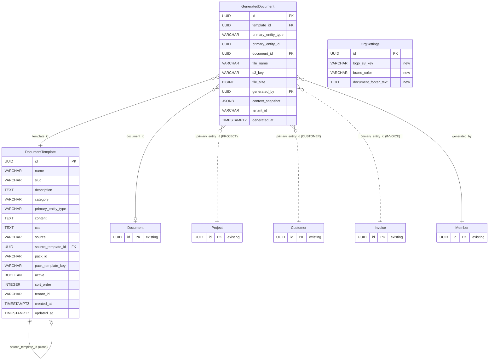
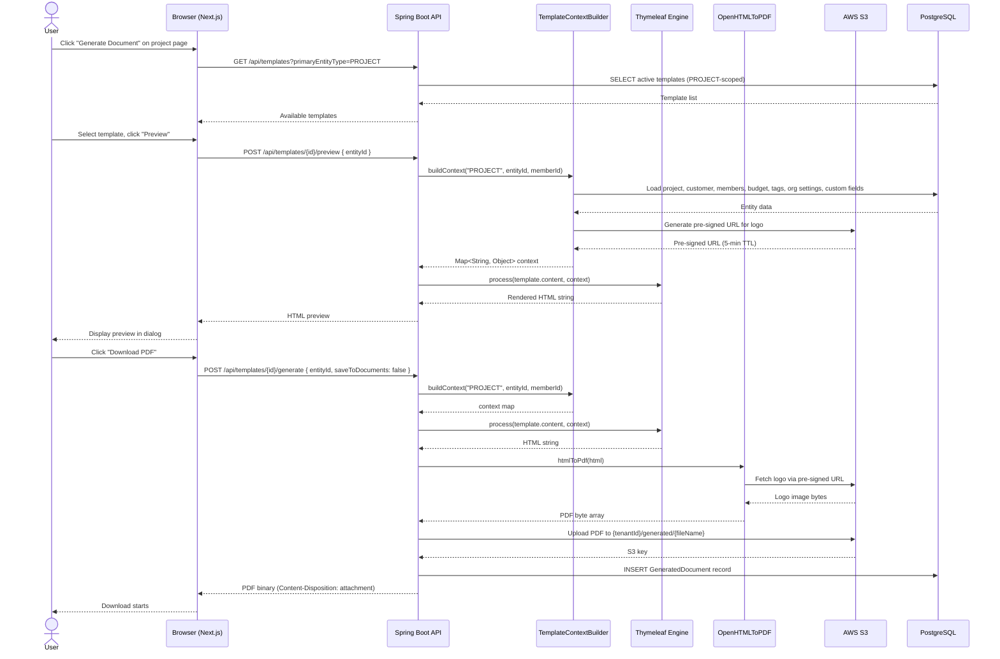
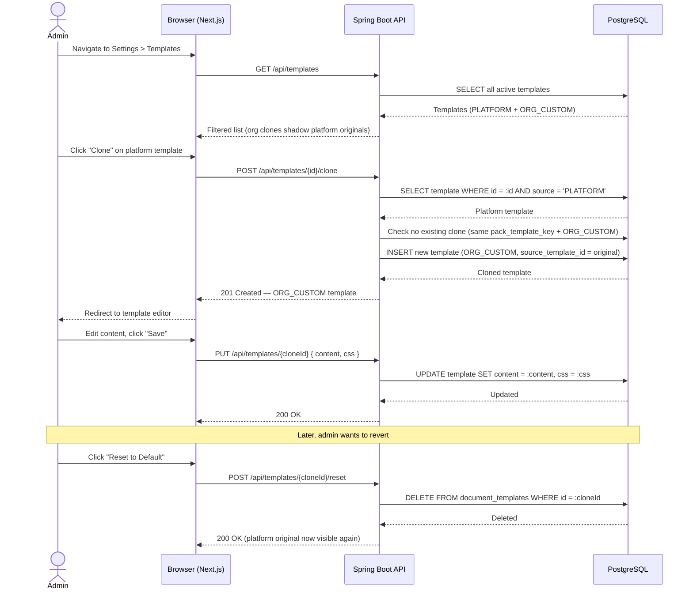

> Merge into architecture/ARCHITECTURE.md as **Section 12** or keep as standalone `architecture/phase12-document-templates.md`.

# Phase 12 — Document Templates & PDF Generation

---

## 12. Phase 12 — Document Templates & PDF Generation

Phase 12 adds a **document generation system** to the DocTeams platform — the ability to produce professional, branded documents (engagement letters, statements of work, project summaries, cover letters) from Thymeleaf templates merged with entity data, custom fields, and org branding, rendered as downloadable PDFs. Until now, the platform captures rich operational data (projects, customers, time entries, invoices, custom fields) but provides no mechanism to turn that data into client-facing documents. This phase closes the gap: templates define the structure, a context builder assembles the data, and OpenHTMLToPDF produces the PDF.

The design introduces two new entities (`DocumentTemplate`, `GeneratedDocument`), extends `OrgSettings` with branding fields (logo, brand color, footer text), and establishes a template pack seeding mechanism that follows the same pattern as field packs from Phase 11. All additions are evolutionary — they reuse the existing Thymeleaf engine (proven in invoice preview, Phase 10), tenant isolation model, audit infrastructure (Phase 6), and notification pipeline (Phase 6.5). The PDF engine (OpenHTMLToPDF) is pure Java with no external process dependencies, making it suitable for containerized deployment on ECS/Fargate.

**Dependencies on prior phases**:
- **Phase 4** (Customers): `Customer` entity. Customer data appears in template rendering context.
- **Phase 5** (Task & Time Lifecycle): `TimeEntry`, `ProjectBudget`. Budget data appears in project template context.
- **Phase 6** (Audit & Compliance): `AuditService` and `AuditEventBuilder`. Template and generation events are audited.
- **Phase 6.5** (Notifications): `ApplicationEvent` publication pattern. Document generation triggers notifications.
- **Phase 8** (Rate Cards, Budgets & Profitability): `OrgSettings` (extended with branding), `ProjectBudget`.
- **Phase 10** (Invoicing): `Invoice`, `InvoiceLine`. Invoice-scoped templates extend the existing HTML preview with branding and PDF output. Existing Thymeleaf engine (`ITemplateEngine`) is reused.
- **Phase 11** (Tags, Custom Fields & Views): `FieldDefinition`, `Tag`, `EntityTag`. Custom field values included in rendering context. Template pack seeding follows field pack pattern.

### What's New

| Capability | Before Phase 12 | After Phase 12 |
|---|---|---|
| Document generation | -- | Professional PDFs generated from Thymeleaf templates merged with entity data |
| Template management | -- | Admin-managed template library with categories, preview, and clone-to-customize |
| Org branding | Default currency only in OrgSettings | Logo upload, brand color, document footer text — injected into every document |
| Template packs | Field packs only (Phase 11) | Template packs seeded per-tenant at provisioning (same mechanism) |
| Invoice PDF | HTML preview only (Phase 10) | Invoice templates produce branded, downloadable PDFs |
| Generated document tracking | -- | Audit trail of every generated document: who, when, which template, which entity |
| Custom fields in documents | Custom field values stored but not surfaced | Templates can reference `${entity.customFields.slug}` for any custom field |

**Out of scope**: WYSIWYG template editor (visual drag-and-drop), AI-assisted template creation, e-signature integration, template versioning history (edit-by-edit changelog), conditional logic UI (Thymeleaf `th:if` is documented as a capability but no UI for building conditions), batch document generation, email delivery, template sharing across orgs, multi-language support, document merge (combining multiple templates into one PDF).

---

### 12.1 Overview

Phase 12 establishes the document generation workflow as a platform primitive. The design is intentionally generic and industry-agnostic — the template system knows nothing about legal engagement letters or agency SOWs. Domain-specific templates live in template packs (seed data), not in platform code. A vertical fork adds its template pack directory to the classpath and the seeder picks it up automatically.

The core abstractions:

1. **DocumentTemplate** — A named template definition containing Thymeleaf HTML content, categorized by purpose (engagement letter, SOW, etc.) and scoped to a primary entity type (project, customer, invoice) that determines where the "Generate" button appears.
2. **TemplateContextBuilder** — A service that assembles a nested context map from the primary entity and all reachable related entities (customer, project, org settings, members, custom fields, tags, budget). This is the key architectural component — it decouples template variables from JPA entity structure and ensures null-safety.
3. **PdfRenderingService** — Orchestrates the pipeline: context assembly → Thymeleaf rendering → CSS merging → OpenHTMLToPDF conversion → optional S3 storage.
4. **GeneratedDocument** — A tracking record capturing generation metadata: who triggered it, which template was used, which entity it was generated for, file size, S3 key.
5. **Template Packs** — Classpath-based seed templates following the field pack pattern from Phase 11. Seeded per-tenant during provisioning. Orgs clone platform templates to customize.

OpenHTMLToPDF (`com.openhtmltopdf:openhtmltopdf-pdfbox`) is a mature, pure-Java library that converts self-contained HTML (with inline CSS) to PDF. It supports CSS 2.1 plus selected CSS3 properties. Templates must use tables or floats for multi-column layouts — flexbox and grid are not supported. See [ADR-056](../adr/ADR-056-pdf-engine-selection.md).

---

### 12.2 Domain Model

Phase 12 introduces two new tenant-scoped entities (`DocumentTemplate`, `GeneratedDocument`) and extends the existing `OrgSettings` entity with branding fields. All new entities follow the established pattern: `TenantAware` interface, `@FilterDef`/`@Filter` for shared-schema tenants, `@EntityListeners(TenantAwareEntityListener.class)`, UUID-based loose references.

#### 12.2.1 DocumentTemplate Entity (New)

A DocumentTemplate defines a reusable document structure. Templates contain Thymeleaf HTML content and are scoped to a primary entity type that determines the rendering context.

| Field | Java Type | DB Column | DB Type | Constraints | Notes |
|-------|-----------|-----------|---------|-------------|-------|
| `id` | `UUID` | `id` | `UUID` | PK, default `gen_random_uuid()` | Auto-generated |
| `name` | `String` | `name` | `VARCHAR(200)` | NOT NULL | Human-readable name, e.g., "Standard Engagement Letter" |
| `slug` | `String` | `slug` | `VARCHAR(200)` | NOT NULL | Machine-readable key, e.g., "standard-engagement-letter" |
| `description` | `String` | `description` | `TEXT` | Nullable | Describes when to use this template |
| `category` | `String` | `category` | `VARCHAR(30)` | NOT NULL | `ENGAGEMENT_LETTER`, `STATEMENT_OF_WORK`, `COVER_LETTER`, `PROJECT_SUMMARY`, `NDA`, `PROPOSAL`, `REPORT`, `OTHER` |
| `primaryEntityType` | `String` | `primary_entity_type` | `VARCHAR(20)` | NOT NULL | `PROJECT`, `CUSTOMER`, `INVOICE` |
| `content` | `String` | `content` | `TEXT` | NOT NULL | Thymeleaf HTML template content |
| `css` | `String` | `css` | `TEXT` | Nullable | Optional custom CSS merged with default styles |
| `source` | `String` | `source` | `VARCHAR(20)` | NOT NULL, default `'ORG_CUSTOM'` | `PLATFORM` or `ORG_CUSTOM` |
| `sourceTemplateId` | `UUID` | `source_template_id` | `UUID` | Nullable, FK → document_templates | References original if this is a clone |
| `packId` | `String` | `pack_id` | `VARCHAR(100)` | Nullable | Template pack origin, e.g., "common" |
| `packTemplateKey` | `String` | `pack_template_key` | `VARCHAR(100)` | Nullable | Template's key within its pack |
| `active` | `boolean` | `active` | `BOOLEAN` | NOT NULL, default `true` | Soft-delete flag |
| `sortOrder` | `int` | `sort_order` | `INTEGER` | NOT NULL, default 0 | Display order within category |
| `tenantId` | `String` | `tenant_id` | `VARCHAR(255)` | Nullable | TenantAware |
| `createdAt` | `Instant` | `created_at` | `TIMESTAMPTZ` | NOT NULL | Immutable |
| `updatedAt` | `Instant` | `updated_at` | `TIMESTAMPTZ` | NOT NULL | Updated on mutation |

**Design decisions**:
- `category` and `primaryEntityType` are stored as strings (not `@Enumerated`) following the project pattern for type discrimination. Java enums are defined for compile-time safety but stored as strings for schema flexibility.
- `slug` is auto-generated from `name` (lowercase, hyphenated) and must match `[a-z][a-z0-9-]*`. Used for pack identity and URL-friendly references.
- `content` is stored as `TEXT` in PostgreSQL (not S3 or filesystem). Templates are typically 5-50KB — well within PostgreSQL's comfortable range. See [ADR-057](../adr/ADR-057-template-storage.md).
- `source_template_id` creates a clone chain: ORG_CUSTOM → PLATFORM. When listing templates, org clones take precedence over platform originals with the same `pack_template_key`. See [ADR-059](../adr/ADR-059-template-customization-model.md).
- `pack_id` and `pack_template_key` are both null (org-created from scratch) or both non-null (pack-originated). Enforced via CHECK constraint.

**Constraints**:
- `(tenant_id, slug)` unique — no duplicate slugs within an org.
- `slug` CHECK: `slug ~ '^[a-z][a-z0-9-]*$'`.
- `pack_id` / `pack_template_key` CHECK: both null or both non-null.

#### 12.2.2 GeneratedDocument Entity (New)

A GeneratedDocument records each document generation event, linking the template used, the source entity, the generated PDF in S3, and the member who triggered generation.

| Field | Java Type | DB Column | DB Type | Constraints | Notes |
|-------|-----------|-----------|---------|-------------|-------|
| `id` | `UUID` | `id` | `UUID` | PK, default `gen_random_uuid()` | Auto-generated |
| `templateId` | `UUID` | `template_id` | `UUID` | NOT NULL, FK → document_templates | Which template was used |
| `primaryEntityType` | `String` | `primary_entity_type` | `VARCHAR(20)` | NOT NULL | `PROJECT`, `CUSTOMER`, `INVOICE` |
| `primaryEntityId` | `UUID` | `primary_entity_id` | `UUID` | NOT NULL | The entity the document was generated for |
| `documentId` | `UUID` | `document_id` | `UUID` | Nullable, FK → documents | If saved to the document system |
| `fileName` | `String` | `file_name` | `VARCHAR(500)` | NOT NULL | Generated PDF filename |
| `s3Key` | `String` | `s3_key` | `VARCHAR(1000)` | NOT NULL | S3 storage key |
| `fileSize` | `long` | `file_size` | `BIGINT` | NOT NULL | PDF size in bytes |
| `generatedBy` | `UUID` | `generated_by` | `UUID` | NOT NULL, FK → members | Member who triggered generation |
| `contextSnapshot` | `Map<String,Object>` | `context_snapshot` | `JSONB` | Nullable | Key identifiers at generation time |
| `tenantId` | `String` | `tenant_id` | `VARCHAR(255)` | Nullable | TenantAware |
| `generatedAt` | `Instant` | `generated_at` | `TIMESTAMPTZ` | NOT NULL | When the document was generated |

**Design decisions**:
- `contextSnapshot` stores human-readable identifiers (customer name, project name, invoice number) — not the full rendering context. This provides an audit trail without storing potentially large data blobs.
- `documentId` links to the existing `Document` entity when the user chooses "Save to Documents." This integrates generated PDFs with the existing document management system (scoped to project/customer, visible in the Documents tab).
- `template_id` is a hard FK — if the template is soft-deleted (`active = false`), the generated document record remains. The template name is recoverable via the FK.
- `s3_key` follows the pattern `org/{tenantId}/generated/{generatedDocumentId}.pdf`. The `org/{tenantId}/` prefix is consistent with existing S3 key patterns (documents, logos). The `generated/` segment separates generated PDFs from uploaded documents and branding assets.

#### 12.2.3 OrgSettings Extension (Modified)

Three new fields added to the existing `OrgSettings` entity for document branding:

| Field | Java Type | DB Column | DB Type | Constraints | Notes |
|-------|-----------|-----------|---------|-------------|-------|
| `logoS3Key` | `String` | `logo_s3_key` | `VARCHAR(500)` | Nullable | S3 object key for uploaded logo |
| `brandColor` | `String` | `brand_color` | `VARCHAR(7)` | Nullable | Hex color code, e.g., "#1a1a2e" |
| `documentFooterText` | `String` | `document_footer_text` | `TEXT` | Nullable | Custom footer for generated documents |

**Design decisions**:
- `logoS3Key` stores the S3 key (not a full URL). The `TemplateContextBuilder` resolves it to a pre-signed S3 URL (5-minute TTL) at render time. OpenHTMLToPDF fetches the image via HTTP during PDF rendering — the 5-minute TTL is sufficient for the render cycle (typically <1 second). This avoids storing pre-signed URLs that expire.
- `brandColor` is validated as a hex color (`#[0-9a-fA-F]{6}`) at the API layer.
- These fields are injected into every template rendering context as `${org.logoUrl}`, `${org.brandColor}`, `${org.documentFooterText}`.

#### 12.2.4 ER Diagram



---

### 12.3 Core Flows & Permissions

#### 12.3.1 Template Management

Template management is restricted to org admins and owners. Templates have two sources: `PLATFORM` (seeded from packs) and `ORG_CUSTOM` (created or cloned by org admins).

**Permission table**:

| Operation | Owner | Admin | Project Lead | Member |
|-----------|:-----:|:-----:|:------------:|:------:|
| List templates | Yes | Yes | Yes (active only) | Yes (active only) |
| View template detail | Yes | Yes | Yes | Yes |
| Create template | Yes | Yes | -- | -- |
| Edit template (ORG_CUSTOM only) | Yes | Yes | -- | -- |
| Delete template (soft-delete) | Yes | Yes | -- | -- |
| Clone platform template | Yes | Yes | -- | -- |
| Reset to default (delete clone) | Yes | Yes | -- | -- |

**Clone flow**: `TemplateService.cloneTemplate(UUID templateId)` — loads the PLATFORM template via `findOneById()`, verifies `source == PLATFORM`, checks no existing ORG_CUSTOM clone for the same `pack_template_key` (throws `ConflictException` if exists), creates a new `ORG_CUSTOM` record copying content/CSS with `sourceTemplateId` pointing to the original. Slug is generated as `{original-slug}-custom`.

**Template listing with clone precedence**: The service fetches all active templates, then filters out PLATFORM templates where an ORG_CUSTOM clone exists with the same `pack_template_key`. This ensures orgs see their customized version and "Reset to Default" simply deletes the clone, restoring the platform original.

#### 12.3.2 Document Generation

Document generation is available to any member with access to the primary entity. The flow is: select template → preview → generate PDF → download or save.

**Permission table**:

| Operation | Owner | Admin | Project Lead | Member |
|-----------|:-----:|:-----:|:------------:|:------:|
| Preview template with entity | Yes | Yes | Entity access | Entity access |
| Generate PDF (download) | Yes | Yes | Entity access | Entity access |
| Generate PDF (save to documents) | Yes | Yes | Entity access | Entity access |
| List generated documents | Yes | Yes | Entity access | Entity access |
| Download generated document | Yes | Yes | Entity access | Entity access |
| Delete generated document | Yes | Yes | -- | -- |

"Entity access" means the member can view the primary entity via `ProjectAccessService` (for projects) or equivalent access check (for customers and invoices).

**Generation service**:

```java
// PdfRenderingService
@Transactional(readOnly = true)
public PdfResult generatePdf(UUID templateId, UUID entityId, UUID memberId) {
    DocumentTemplate template = templateRepository.findOneById(templateId)
        .orElseThrow(() -> new ResourceNotFoundException("template", templateId));

    // 1. Assemble context
    Map<String, Object> context = contextBuilder.buildContext(
        template.getPrimaryEntityType(), entityId, memberId);

    // 2. Render HTML via Thymeleaf
    Context thymeleafCtx = new Context();
    thymeleafCtx.setVariables(context);
    String html = renderTemplate(template, thymeleafCtx);

    // 3. Convert HTML to PDF
    byte[] pdfBytes = htmlToPdf(html);

    // 4. Build result
    String fileName = buildFileName(template.getSlug(), context);
    return new PdfResult(pdfBytes, fileName, html);
}
```

**Tenant boundary**: All entity loads in the `TemplateContextBuilder` go through the existing service layer, which runs within the tenant-scoped transaction (Hibernate `@Filter` for Starter, `search_path` for Pro). No cross-tenant data leakage is possible because the rendering context is assembled entirely within the tenant boundary.

#### 12.3.3 Rendering Context Assembly

The `TemplateContextBuilder` assembles a flat `Map<String, Object>` from the primary entity and all reachable relationships. See [ADR-058](../adr/ADR-058-rendering-context-assembly.md) for why a map is used instead of passing JPA entities directly.

**Context structure by primary entity type**:

**PROJECT-scoped templates**:

| Variable | Type | Source | Notes |
|----------|------|--------|-------|
| `project.id` | UUID | Project | |
| `project.name` | String | Project | |
| `project.status` | String | Project | |
| `project.description` | String | Project | |
| `project.createdAt` | String | Project | Formatted ISO date |
| `project.customFields` | Map | FieldValue JSONB | `${project.customFields.case_number}` |
| `customer.id` | UUID | Customer (via Project) | Null if no customer linked |
| `customer.name` | String | Customer | |
| `customer.email` | String | Customer | |
| `customer.customFields` | Map | FieldValue JSONB | |
| `lead.id` | UUID | ProjectMember (lead) | |
| `lead.name` | String | Member | |
| `lead.email` | String | Member | |
| `members` | List&lt;Map&gt; | ProjectMembers | `[{id, name, email, role}]` |
| `org.name` | String | OrgSettings / Clerk | |
| `org.defaultCurrency` | String | OrgSettings | |
| `org.logoUrl` | String | OrgSettings | Pre-signed S3 URL or null |
| `org.brandColor` | String | OrgSettings | Hex color or default |
| `org.documentFooterText` | String | OrgSettings | |
| `budget.hours` | BigDecimal | ProjectBudget | Null if no budget |
| `budget.amount` | BigDecimal | ProjectBudget | |
| `budget.currency` | String | ProjectBudget | |
| `budget.status` | String | ProjectBudget | |
| `tags` | List&lt;Map&gt; | EntityTag + Tag | `[{name, color}]` |
| `generatedAt` | String | System | ISO timestamp |
| `generatedBy.name` | String | Member | Who triggered generation |
| `generatedBy.email` | String | Member | |

**CUSTOMER-scoped templates**: `customer` (root: id, name, email, `customFields` map), `projects` (list: [{id, name, status}]), `org` (same as above), `tags` ([{name, color}]), `generatedAt`, `generatedBy`.

**INVOICE-scoped templates**: `invoice` (id, invoiceNumber, status, issueDate, dueDate, subtotal, taxAmount, total, currency, notes), `lines` ([{description, quantity, unitPrice, amount}]), `customer` (id, name, email, `customFields`), `project` (id, name, `customFields`), `org` (same as above), `generatedAt`, `generatedBy`.

**Logo URL resolution**: The context builder resolves `OrgSettings.logoS3Key` to a pre-signed S3 URL with 5-minute TTL. OpenHTMLToPDF fetches the image via HTTP during PDF rendering. If the org has no logo, `org.logoUrl` is null and templates use `th:if="${org.logoUrl}"` to conditionally render the logo image.

#### 12.3.4 Org Branding Settings

Branding is managed through the existing OrgSettings page, extended with a new "Branding" section.

**Logo upload flow**:
1. Frontend uploads the file via `POST /api/settings/logo` (multipart, max 2MB, PNG/JPG/SVG).
2. Backend stores in S3 under `org/{tenantId}/branding/logo.{ext}` (consistent with existing `org/{tenantId}/` key prefix pattern).
3. Backend updates `OrgSettings.logoS3Key` with the S3 key.
4. `DELETE /api/settings/logo` removes from S3 and clears the field.

**Permission**: Admin/Owner only (same as existing OrgSettings).

#### 12.3.5 Template Pack Seeding

Template packs follow the field pack pattern from Phase 11 (see [ADR-053](../adr/ADR-053-field-pack-seeding-strategy.md)):

1. Pack definitions live in `src/main/resources/template-packs/{packId}/pack.json` + `*.html` content files.
2. `TemplatePackSeeder.seedPacksForTenant(String tenantId)` is called during tenant provisioning, after Flyway migrations.
3. Idempotency: checks `OrgSettings.templatePackStatus` JSONB array for already-applied packs.
4. Each seeded record has `source = PLATFORM`, `pack_id`, and `pack_template_key` set.
5. Vertical forks add pack directories to `classpath:template-packs/`.

**Platform-shipped pack (v1)**: `common` pack with 3 templates:

| Template Key | Name | Category | Entity Type |
|---|---|---|---|
| `engagement-letter` | Engagement Letter | `ENGAGEMENT_LETTER` | `PROJECT` |
| `project-summary` | Project Summary Report | `PROJECT_SUMMARY` | `PROJECT` |
| `invoice-cover-letter` | Invoice Cover Letter | `COVER_LETTER` | `INVOICE` |

---

### 12.4 API Surface

#### 12.4.1 Document Templates

| Method | Path | Description | Auth | R/W |
|--------|------|-------------|------|-----|
| `GET` | `/api/templates` | List active templates | JWT | Read |
| `GET` | `/api/templates/{id}` | Get template with full content | JWT | Read |
| `POST` | `/api/templates` | Create template (ORG_CUSTOM) | JWT, Admin/Owner | Write |
| `PUT` | `/api/templates/{id}` | Update template (ORG_CUSTOM only) | JWT, Admin/Owner | Write |
| `DELETE` | `/api/templates/{id}` | Soft-delete (set active=false) | JWT, Admin/Owner | Write |
| `POST` | `/api/templates/{id}/clone` | Clone platform template | JWT, Admin/Owner | Write |
| `POST` | `/api/templates/{id}/reset` | Delete org clone, restore platform | JWT, Admin/Owner | Write |

**Query params for `GET /api/templates`**:

| Param | Type | Description |
|-------|------|-------------|
| `category` | String | Filter by category enum value |
| `primaryEntityType` | String | Filter by `PROJECT`, `CUSTOMER`, or `INVOICE` |

**`GET /api/templates` response** (200 OK):
```json
[
  {
    "id": "550e8400-e29b-41d4-a716-446655440000",
    "name": "Standard Engagement Letter",
    "slug": "standard-engagement-letter",
    "description": "Standard client engagement letter",
    "category": "ENGAGEMENT_LETTER",
    "primaryEntityType": "PROJECT",
    "source": "PLATFORM",
    "sourceTemplateId": null,
    "active": true,
    "sortOrder": 1,
    "createdAt": "2026-02-15T10:00:00Z",
    "updatedAt": "2026-02-15T10:00:00Z"
  }
]
```

Note: `content` and `css` fields are excluded from list responses for performance. Use `GET /api/templates/{id}` for full content.

**`POST /api/templates` request body**:
```json
{
  "name": "Custom Proposal",
  "description": "Tailored proposal template for enterprise clients",
  "category": "PROPOSAL",
  "primaryEntityType": "PROJECT",
  "content": "<!DOCTYPE html><html>...</html>",
  "css": ".custom-header { color: var(--brand-color); }"
}
```

`PUT /api/templates/{id}` accepts the same shape as POST, but `category` and `primaryEntityType` are immutable after creation.

#### 12.4.2 Template Preview & Generation

| Method | Path | Description | Auth | R/W |
|--------|------|-------------|------|-----|
| `POST` | `/api/templates/{id}/preview` | Render template with entity data, return HTML | JWT, Entity access | Read |
| `POST` | `/api/templates/{id}/generate` | Render and generate PDF | JWT, Entity access | Write |

**`POST /api/templates/{id}/preview` request body**:
```json
{
  "entityId": "110e8400-e29b-41d4-a716-446655440000"
}
```

**Response**: `Content-Type: text/html`. Rendered HTML string suitable for browser preview.

**`POST /api/templates/{id}/generate` request body**:
```json
{
  "entityId": "110e8400-e29b-41d4-a716-446655440000",
  "saveToDocuments": true
}
```

**Response when `saveToDocuments = false`** (200 OK):
- `Content-Type: application/pdf`
- `Content-Disposition: attachment; filename="engagement-letter-acme-corp-2026-02-15.pdf"`
- Binary PDF body.

**Response when `saveToDocuments = true`** (201 Created):
```json
{
  "id": "660e8400-e29b-41d4-a716-446655440000",
  "templateId": "550e8400-e29b-41d4-a716-446655440000",
  "primaryEntityType": "PROJECT",
  "primaryEntityId": "110e8400-e29b-41d4-a716-446655440000",
  "documentId": "770e8400-e29b-41d4-a716-446655440000",
  "fileName": "engagement-letter-acme-corp-2026-02-15.pdf",
  "fileSize": 45230,
  "generatedBy": "880e8400-e29b-41d4-a716-446655440000",
  "generatedAt": "2026-02-15T14:30:00Z"
}
```

#### 12.4.3 Generated Documents

| Method | Path | Description | Auth | R/W |
|--------|------|-------------|------|-----|
| `GET` | `/api/generated-documents` | List generated documents for an entity | JWT, Entity access | Read |
| `GET` | `/api/generated-documents/{id}/download` | Download generated PDF from S3 | JWT, Entity access | Read |
| `DELETE` | `/api/generated-documents/{id}` | Delete generated document | JWT, Admin/Owner | Write |

**Query params for `GET /api/generated-documents`**:

| Param | Type | Required | Description |
|-------|------|----------|-------------|
| `entityType` | String | Yes | `PROJECT`, `CUSTOMER`, or `INVOICE` |
| `entityId` | UUID | Yes | The primary entity ID |

**Response** (200 OK):
```json
[
  {
    "id": "660e8400-e29b-41d4-a716-446655440000",
    "templateName": "Standard Engagement Letter",
    "primaryEntityType": "PROJECT",
    "primaryEntityId": "110e8400-e29b-41d4-a716-446655440000",
    "fileName": "engagement-letter-acme-corp-2026-02-15.pdf",
    "fileSize": 45230,
    "generatedByName": "Jane Smith",
    "generatedAt": "2026-02-15T14:30:00Z"
  }
]
```

#### 12.4.4 Org Branding

| Method | Path | Description | Auth | R/W |
|--------|------|-------------|------|-----|
| `POST` | `/api/settings/logo` | Upload org logo (multipart) | JWT, Admin/Owner | Write |
| `DELETE` | `/api/settings/logo` | Remove org logo | JWT, Admin/Owner | Write |

Existing `PUT /api/settings` and `GET /api/settings` endpoints are extended with `brandColor` and `documentFooterText` fields.

**`POST /api/settings/logo` request**: `multipart/form-data` with `file` part (PNG, JPG, or SVG, max 2MB).

**Response** (200 OK):
```json
{
  "logoS3Key": "tenant_abc123/branding/logo.png"
}
```

**Extended `GET /api/settings` response** (additional fields):
```json
{
  "defaultCurrency": "USD",
  "logoS3Key": "tenant_abc123/branding/logo.png",
  "logoUrl": "https://s3.amazonaws.com/...",
  "brandColor": "#1a1a2e",
  "documentFooterText": "Acme Corp | 123 Main St | (555) 123-4567 | info@acme.com"
}
```

---

### 12.5 Sequence Diagrams

#### 12.5.1 Document Generation Flow



#### 12.5.2 Template Clone & Customize Flow



The "Save to Documents" variation of 12.5.1 follows the same pipeline, then additionally: uploads PDF to S3, creates a `Document` entity (scope=PROJECT/CUSTOMER), creates a `GeneratedDocument` record, and publishes `DocumentGeneratedEvent` for audit + notification. Returns 201 Created with `GeneratedDocument` metadata.

---

### 12.6 Template Content & CSS Constraints

#### 12.6.1 OpenHTMLToPDF CSS Support

Templates must stay within OpenHTMLToPDF's CSS rendering subset. This is critical for consistent PDF output.

| CSS Feature | Supported | Notes |
|---|---|---|
| CSS 2.1 (full) | Yes | Block layout, floats, tables, positioning |
| `@page` | Yes | `size: A4` / `size: letter`, margins |
| `@media print` | Yes | Respected during PDF rendering |
| `border`, `padding`, `margin` | Yes | Full box model |
| `color`, `background-color` | Yes | Solid colors |
| `font-family` | Yes | System fonts or embedded |
| `font-size`, `font-weight`, etc. | Yes | |
| `text-align`, `vertical-align` | Yes | |
| `float`, `clear` | Yes | Use for multi-column instead of flex/grid |
| `table` layout | Yes | Recommended for aligned data |
| CSS variables (`var()`) | Partial | Supported in newer versions |
| `border-radius` | Yes | |
| `box-shadow` | No | |
| `flexbox` | No | Use tables or floats |
| `grid` | No | Use tables or floats |
| `transform` | No | |
| `transition`, `animation` | No | Not applicable to PDF |
| External stylesheets | No | All CSS must be inline or in `<style>` tags |
| Web fonts (`@font-face` via URL) | Limited | Prefer embedded fonts |

#### 12.6.2 Default Document Styles

A base CSS stylesheet (`classpath:templates/document-default.css`) is merged with every template's custom CSS. Key defaults: `@page { size: A4; margin: 20mm; }`, `body { font-family: 'Helvetica Neue', Arial, sans-serif; font-size: 11pt; line-height: 1.5; color: #333; }`, `.header` with `border-bottom: 3px solid var(--brand-color)`, `.footer` with `font-size: 9pt`, standard `table` styling. Templates can override any default via their custom CSS field.

#### 12.6.3 Template Variable Reference

All available template variables are documented in the context structure tables in section 12.3.3. Common variables available in all templates: `${org.name}`, `${org.logoUrl}`, `${org.brandColor}`, `${org.documentFooterText}`, `${org.defaultCurrency}`, `${generatedAt}`, `${generatedBy.name}`, `${generatedBy.email}`. The template editor includes a collapsible reference panel listing all variables for the selected primary entity type.

---

### 12.7 Notification & Audit Integration

#### 12.7.1 Notification

| Event | Recipients | Trigger |
|---|---|---|
| `DOCUMENT_GENERATED` | Project lead (for project-scoped), org admins/owners | When a document is generated with `saveToDocuments = true` |

Not triggered for download-only generation (no persistent artifact created). No notification for template management actions (low-value admin activity).

New `DomainEvent` record: `DocumentGeneratedEvent implements DomainEvent` — includes standard fields (`entityType`, `entityId`, `actorMemberId`, `tenantId`, `orgId`, `occurredAt`, `details`) plus `templateName`, `primaryEntityType`, `primaryEntityId`. Follows the sealed interface pattern from Phase 6.5.

#### 12.7.2 Audit Events

| Event Type | Trigger | Details Map Contents |
|---|---|---|
| `template.created` | New template created | `name`, `category`, `primary_entity_type`, `source` |
| `template.updated` | Template modified | `name`, `changed_fields[]` |
| `template.deleted` | Template deactivated | `name`, `category` |
| `template.cloned` | Platform template cloned | `original_name`, `clone_name`, `pack_id` |
| `document.generated` | Document generated from template | `template_name`, `primary_entity_type`, `primary_entity_id`, `file_name`, `file_size`, `save_to_documents` |

All audit events use `entityType = "template"` or `"generated_document"` with the corresponding `entityId`.

---

### 12.8 Database Migrations

#### 12.8.1 V24 Migration: DocumentTemplate, GeneratedDocument, OrgSettings ALTER

File: `db/migration/tenant/V24__create_document_templates.sql`

> **Note**: Phase 11 may also use V24 for custom fields. If both phases are implemented in parallel, coordinate the migration number. The migration is idempotent (`IF NOT EXISTS`) to minimize conflicts.

```sql
-- V24: Create document_templates, generated_documents tables, extend org_settings
-- Phase 12 — Document Templates & PDF Generation

-- =============================================================================
-- document_templates
-- =============================================================================

CREATE TABLE IF NOT EXISTS document_templates (
    id                    UUID PRIMARY KEY DEFAULT gen_random_uuid(),
    name                  VARCHAR(200) NOT NULL,
    slug                  VARCHAR(200) NOT NULL,
    description           TEXT,
    category              VARCHAR(30) NOT NULL,
    primary_entity_type   VARCHAR(20) NOT NULL,
    content               TEXT NOT NULL,
    css                   TEXT,
    source                VARCHAR(20) NOT NULL DEFAULT 'ORG_CUSTOM',
    source_template_id    UUID REFERENCES document_templates(id) ON DELETE SET NULL,
    pack_id               VARCHAR(100),
    pack_template_key     VARCHAR(100),
    active                BOOLEAN NOT NULL DEFAULT true,
    sort_order            INTEGER NOT NULL DEFAULT 0,
    tenant_id             VARCHAR(255),
    created_at            TIMESTAMP WITH TIME ZONE NOT NULL DEFAULT now(),
    updated_at            TIMESTAMP WITH TIME ZONE NOT NULL DEFAULT now(),

    CONSTRAINT chk_template_category CHECK (category IN (
        'ENGAGEMENT_LETTER', 'STATEMENT_OF_WORK', 'COVER_LETTER',
        'PROJECT_SUMMARY', 'NDA', 'PROPOSAL', 'REPORT', 'OTHER'
    )),
    CONSTRAINT chk_template_entity_type CHECK (primary_entity_type IN (
        'PROJECT', 'CUSTOMER', 'INVOICE'
    )),
    CONSTRAINT chk_template_source CHECK (source IN ('PLATFORM', 'ORG_CUSTOM')),
    CONSTRAINT chk_template_slug_format CHECK (slug ~ '^[a-z][a-z0-9-]*$'),
    CONSTRAINT chk_template_pack_consistency CHECK (
        (pack_id IS NULL AND pack_template_key IS NULL) OR
        (pack_id IS NOT NULL AND pack_template_key IS NOT NULL)
    )
);

-- Unique slug per tenant
CREATE UNIQUE INDEX IF NOT EXISTS idx_document_templates_tenant_slug
    ON document_templates (tenant_id, slug) WHERE tenant_id IS NOT NULL;

CREATE UNIQUE INDEX IF NOT EXISTS idx_document_templates_slug_unique
    ON document_templates (slug) WHERE tenant_id IS NULL;

-- List by category
CREATE INDEX IF NOT EXISTS idx_document_templates_category
    ON document_templates (tenant_id, category, active);

-- List by primary entity type (for "Generate" button)
CREATE INDEX IF NOT EXISTS idx_document_templates_entity_type
    ON document_templates (tenant_id, primary_entity_type, active);

-- Find all templates from a specific pack
CREATE INDEX IF NOT EXISTS idx_document_templates_pack
    ON document_templates (tenant_id, pack_id) WHERE pack_id IS NOT NULL;

-- Shared-schema tenant isolation
CREATE INDEX IF NOT EXISTS idx_document_templates_tenant
    ON document_templates (tenant_id) WHERE tenant_id IS NOT NULL;

-- Row-Level Security
ALTER TABLE document_templates ENABLE ROW LEVEL SECURITY;

DO $$
BEGIN
  IF NOT EXISTS (SELECT 1 FROM pg_policies WHERE policyname = 'tenant_isolation_document_templates') THEN
    EXECUTE 'CREATE POLICY tenant_isolation_document_templates ON document_templates
      USING (tenant_id = current_setting(''app.current_tenant'', true) OR tenant_id IS NULL)';
  END IF;
END $$;

-- =============================================================================
-- generated_documents
-- =============================================================================

CREATE TABLE IF NOT EXISTS generated_documents (
    id                    UUID PRIMARY KEY DEFAULT gen_random_uuid(),
    template_id           UUID NOT NULL REFERENCES document_templates(id),
    primary_entity_type   VARCHAR(20) NOT NULL,
    primary_entity_id     UUID NOT NULL,
    document_id           UUID REFERENCES documents(id) ON DELETE SET NULL,
    file_name             VARCHAR(500) NOT NULL,
    s3_key                VARCHAR(1000) NOT NULL,
    file_size             BIGINT NOT NULL,
    generated_by          UUID NOT NULL REFERENCES members(id),
    context_snapshot      JSONB,
    tenant_id             VARCHAR(255),
    generated_at          TIMESTAMP WITH TIME ZONE NOT NULL DEFAULT now(),

    CONSTRAINT chk_generated_doc_entity_type CHECK (primary_entity_type IN (
        'PROJECT', 'CUSTOMER', 'INVOICE'
    )),
    CONSTRAINT chk_generated_doc_file_size CHECK (file_size > 0)
);

-- List generated documents for an entity
CREATE INDEX IF NOT EXISTS idx_generated_documents_entity
    ON generated_documents (tenant_id, primary_entity_type, primary_entity_id);

-- Usage tracking per template
CREATE INDEX IF NOT EXISTS idx_generated_documents_template
    ON generated_documents (tenant_id, template_id);

-- "My generated documents"
CREATE INDEX IF NOT EXISTS idx_generated_documents_generated_by
    ON generated_documents (tenant_id, generated_by);

-- Shared-schema tenant isolation
CREATE INDEX IF NOT EXISTS idx_generated_documents_tenant
    ON generated_documents (tenant_id) WHERE tenant_id IS NOT NULL;

-- Row-Level Security
ALTER TABLE generated_documents ENABLE ROW LEVEL SECURITY;

DO $$
BEGIN
  IF NOT EXISTS (SELECT 1 FROM pg_policies WHERE policyname = 'tenant_isolation_generated_documents') THEN
    EXECUTE 'CREATE POLICY tenant_isolation_generated_documents ON generated_documents
      USING (tenant_id = current_setting(''app.current_tenant'', true) OR tenant_id IS NULL)';
  END IF;
END $$;

-- =============================================================================
-- org_settings: add branding fields
-- =============================================================================

ALTER TABLE org_settings
    ADD COLUMN IF NOT EXISTS logo_s3_key VARCHAR(500),
    ADD COLUMN IF NOT EXISTS brand_color VARCHAR(7),
    ADD COLUMN IF NOT EXISTS document_footer_text TEXT,
    ADD COLUMN IF NOT EXISTS template_pack_status JSONB;

-- Validate brand color format if present
ALTER TABLE org_settings
    ADD CONSTRAINT chk_brand_color_format CHECK (
        brand_color IS NULL OR brand_color ~ '^#[0-9a-fA-F]{6}$'
    );
```

Index rationale is documented inline as SQL comments in the migration above.

---

### 12.9 Capability Slices

<!-- BREAKDOWN-CONTRACT
phase: 12
title: Document Templates & PDF Generation
slices: 6
new_entities: [DocumentTemplate, GeneratedDocument]
new_migrations: [V24__create_document_templates]
depends_on_entities: [OrgSettings, Document, Project, Customer, Invoice, InvoiceLine, Member, ProjectBudget, Tag, EntityTag, FieldDefinition]
adr_refs: [ADR-056, ADR-057, ADR-058, ADR-059]
-->

The following slices are designed for the `/breakdown` skill to turn into full epics. Each is independently deployable and testable.

#### Slice 87A: V24 Migration, DocumentTemplate Entity & Template CRUD

**Scope**: Backend only.

**Deliverables**:
- V24 migration (`document_templates`, `generated_documents` tables, `org_settings` ALTER, RLS policies, indexes).
- `DocumentTemplate` entity with `TenantAware`, `@FilterDef`/`@Filter`, domain methods.
- `DocumentTemplateRepository` with `findOneById` (JPQL), listing queries with category/entity type filters.
- `DocumentTemplateService` — CRUD operations (create, update, soft-delete, list with clone precedence filtering).
- `DocumentTemplateController` — REST endpoints for template CRUD.
- Slug auto-generation and validation.
- Integration tests for entity persistence, tenant isolation, RBAC.

**Dependencies**: None (new tables only; `org_settings` ALTER is additive).

**Test expectations**: ~8-10 tests (entity persistence, slug validation, CRUD operations, tenant isolation, RBAC).

**Patterns to follow**:
- Entity pattern: `invoice/Invoice.java` (TenantAware, FilterDef/Filter, EntityListeners).
- Repository: `invoice/InvoiceRepository.java` (JPQL `findOneById`).
- Controller: standard REST controller with `@PreAuthorize` or manual role check via `RequestScopes.ORG_ROLE`.

#### Slice 87B: Template Packs, Cloning & OrgSettings Branding

**Scope**: Backend only.

**Deliverables**:
- `TemplatePackSeeder` service — reads `classpath:template-packs/*/pack.json`, creates tenant-scoped records during provisioning.
- `TemplatePackDefinition` record DTO for pack.json deserialization.
- `common` template pack: 3 HTML templates (`engagement-letter.html`, `project-summary.html`, `invoice-cover-letter.html`) under `src/main/resources/template-packs/common/`.
- Clone endpoint (`POST /api/templates/{id}/clone`) and reset endpoint (`POST /api/templates/{id}/reset`).
- `OrgSettings` entity extended with `logoS3Key`, `brandColor`, `documentFooterText`, `templatePackStatus`.
- Logo upload endpoint (`POST /api/settings/logo`), delete endpoint (`DELETE /api/settings/logo`).
- Extended `PUT /api/settings` and `GET /api/settings` for branding fields.
- Integration tests for pack seeding, cloning, branding CRUD.

**Dependencies**: Slice 87A.

**Test expectations**: ~10-12 tests (pack seeding idempotency, clone/reset, logo upload, branding CRUD, branding validation).

**Patterns to follow**:
- Pack seeder: Phase 11 `FieldPackSeeder` pattern (classpath scanning, `OrgSettings` status tracking).
- S3 upload: existing `Document` upload pattern via `S3Service`.

#### Slice 88A: TemplateContextBuilder & Rendering Pipeline

**Scope**: Backend only.

**Deliverables**:
- `TemplateContextBuilder` service — assembles `Map<String, Object>` context from primary entity and related entities.
- Three context builders: `ProjectContextBuilder`, `CustomerContextBuilder`, `InvoiceContextBuilder` (strategy pattern or switch on entity type).
- Logo URL resolution (S3 pre-signed URL generation).
- Custom field value inclusion (`customFields` map from Phase 11 JSONB).
- Default document CSS (classpath resource).
- CSS merging logic (default + template custom CSS).
- `PdfRenderingService` — orchestrates Thymeleaf render + OpenHTMLToPDF conversion.
- Maven dependency: `com.openhtmltopdf:openhtmltopdf-pdfbox`.
- Preview endpoint (`POST /api/templates/{id}/preview`).
- Unit tests for context assembly (null safety, missing relationships).
- Integration tests for HTML rendering and PDF generation.

**Dependencies**: Slice 87A (template entity), Slice 87B (OrgSettings branding).

**Test expectations**: ~12-15 tests (context assembly per entity type, null cases, Thymeleaf rendering, PDF generation, preview endpoint).

**Patterns to follow**:
- Thymeleaf usage: `invoice/InvoiceService.renderPreview()` (Phase 10).
- Context: `org.thymeleaf.context.Context` with `setVariable()`.

#### Slice 88B: Document Generation & Tracking

**Scope**: Backend only.

**Deliverables**:
- `GeneratedDocument` entity with `TenantAware`, `@FilterDef`/`@Filter`.
- `GeneratedDocumentRepository` with listing queries (by entity, by template, by generator).
- Generate endpoint (`POST /api/templates/{id}/generate`) — PDF download and save-to-documents flows.
- S3 upload for generated PDFs.
- `Document` entity creation when saving to document system (reuse existing `DocumentService`).
- Generated document list endpoint (`GET /api/generated-documents`).
- Download endpoint (`GET /api/generated-documents/{id}/download`).
- Delete endpoint (`DELETE /api/generated-documents/{id}`).
- Filename generation: `{template-slug}-{entity-name}-{date}.pdf`.
- Context snapshot (JSONB) — capture key identifiers at generation time.
- Audit events: `template.created`, `template.updated`, `template.deleted`, `template.cloned`, `document.generated`.
- Notification: `DOCUMENT_GENERATED` event.
- Integration tests for generation flow, S3 upload, audit, notification.

**Dependencies**: Slice 88A (rendering pipeline).

**Test expectations**: ~10-12 tests (generation flow, save-to-documents, download, delete, audit events, notification).

**Patterns to follow**:
- Audit: `AuditEventBuilder` pattern from Phase 6.
- Notification: `DomainEvent` sealed interface + `NotificationEventHandler` from Phase 6.5.
- S3 upload: existing `Document` upload pattern.

#### Slice 89A: Template Management UI

**Scope**: Frontend only.

**Deliverables**:
- Template management page (`/org/[slug]/settings/templates`) — list templates grouped by category, source badges, action buttons.
- Template editor page (`/org/[slug]/settings/templates/[id]/edit`) — form fields, content textarea (monospace), CSS textarea, variable reference panel.
- Template creation page (`/org/[slug]/settings/templates/new`).
- Clone action (calls `POST /api/templates/{id}/clone`, redirects to editor).
- Reset to default action (calls `POST /api/templates/{id}/reset`, with confirmation dialog).
- Deactivate/activate toggle.
- Preview within editor (calls preview endpoint, shows rendered HTML in iframe or dialog).
- Branding settings section in org settings page — logo upload, brand color input, footer text textarea, live preview.
- Nav item in settings sidebar.
- API client functions for template endpoints.
- Frontend tests for template list, editor, branding form.

**Dependencies**: Slice 87A (backend CRUD endpoints), Slice 87B (branding endpoints), Slice 88A (preview endpoint).

**Test expectations**: ~8-10 frontend tests (template list, editor form, clone/reset actions, branding form).

**Patterns to follow**:
- Settings page: existing `settings/page.tsx` pattern.
- Form pattern: existing Shadcn form components.
- API client: `lib/api.ts` pattern.

#### Slice 89B: Document Generation UI

**Scope**: Frontend only.

**Deliverables**:
- "Generate Document" dropdown/button on project detail page — lists available PROJECT-scoped templates.
- "Generate Document" dropdown/button on customer detail page — lists available CUSTOMER-scoped templates.
- "Generate Document" dropdown/button on invoice detail page — lists available INVOICE-scoped templates.
- Generation dialog — template preview (HTML iframe), "Download PDF" button, "Save to Documents" button.
- Generated documents list (tab or section on project/customer detail pages) — table with template name, generated by, date, file size, download/delete actions.
- API client functions for generation and generated-documents endpoints.
- Frontend tests for generation dialog, generated documents list.

**Dependencies**: Slice 88B (generation + tracking endpoints), Slice 89A (template management for template data).

**Test expectations**: ~8-10 frontend tests (generation dialog, preview, download, save-to-documents, generated documents list).

**Patterns to follow**:
- Entity detail page integration: existing tab/section patterns on project and customer pages.
- Dialog pattern: existing Shadcn Dialog with form actions.

#### Suggested Implementation Order

```
Slice 87A (V24 migration + DocumentTemplate entity + CRUD)
    |
Slice 87B (Template packs + cloning + OrgSettings branding)
    |
Slice 88A (TemplateContextBuilder + rendering pipeline)
    |
Slice 88B (Generation + tracking + audit + notification)
    |
    +---> Slice 89A (Template management UI)
    |
    +---> Slice 89B (Document generation UI)
```

Slices 89A and 89B can be parallelized after Slice 88B is complete. Slice 89A depends on preview endpoint (88A) for the editor preview feature, but can start implementation before 88B.

---

### 12.10 ADR Index

| ADR | Title | Summary |
|-----|-------|---------|
| [ADR-056](../adr/ADR-056-pdf-engine-selection.md) | PDF Engine Selection | OpenHTMLToPDF: pure Java, no external process, CSS 2.1+, suitable for on-demand generation |
| [ADR-057](../adr/ADR-057-template-storage.md) | Template Storage | Database (TEXT column): tenant-scoped access, transactional consistency, no filesystem dependency |
| [ADR-058](../adr/ADR-058-rendering-context-assembly.md) | Rendering Context Assembly Pattern | Builder produces `Map<String, Object>`: decouples from JPA entities, prevents lazy-loading, explicit data control |
| [ADR-059](../adr/ADR-059-template-customization-model.md) | Template Customization Model | Clone-and-edit: platform updates don't break customizations, "Reset to Default" is a delete, clear provenance |
