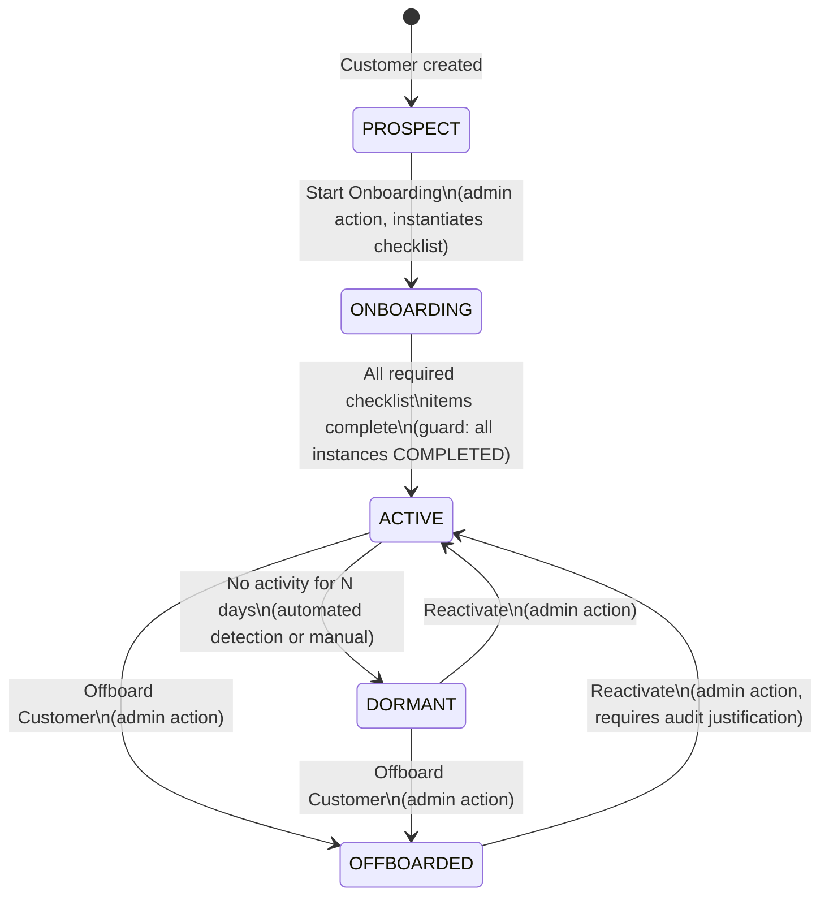
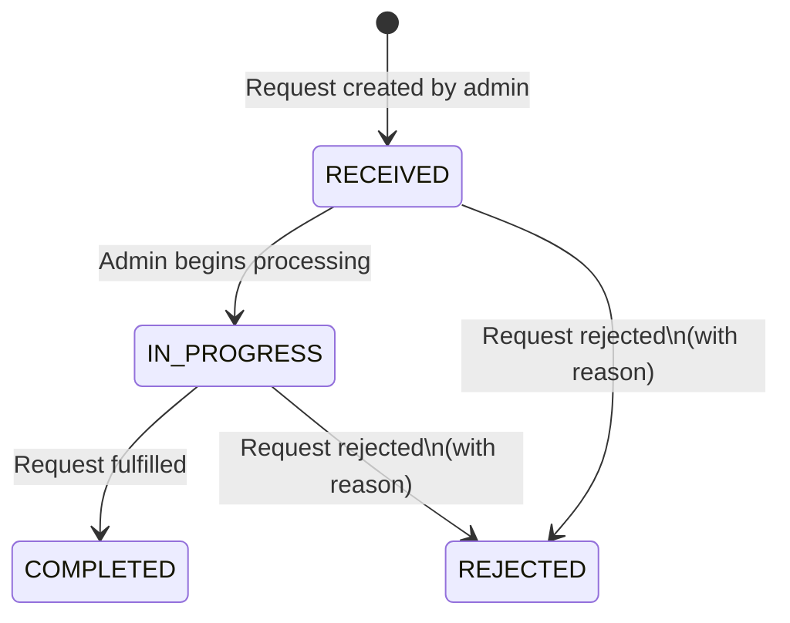
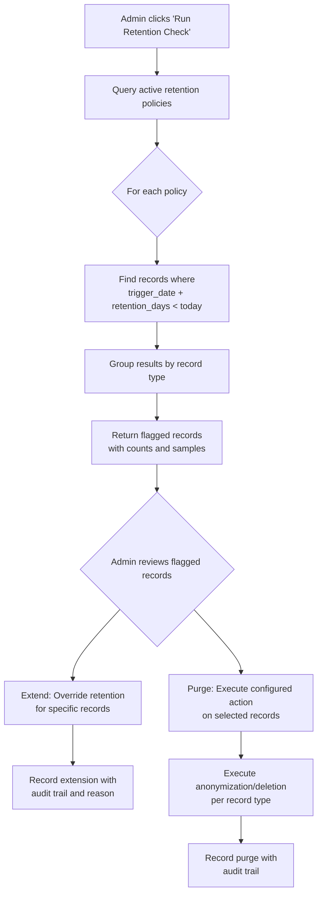
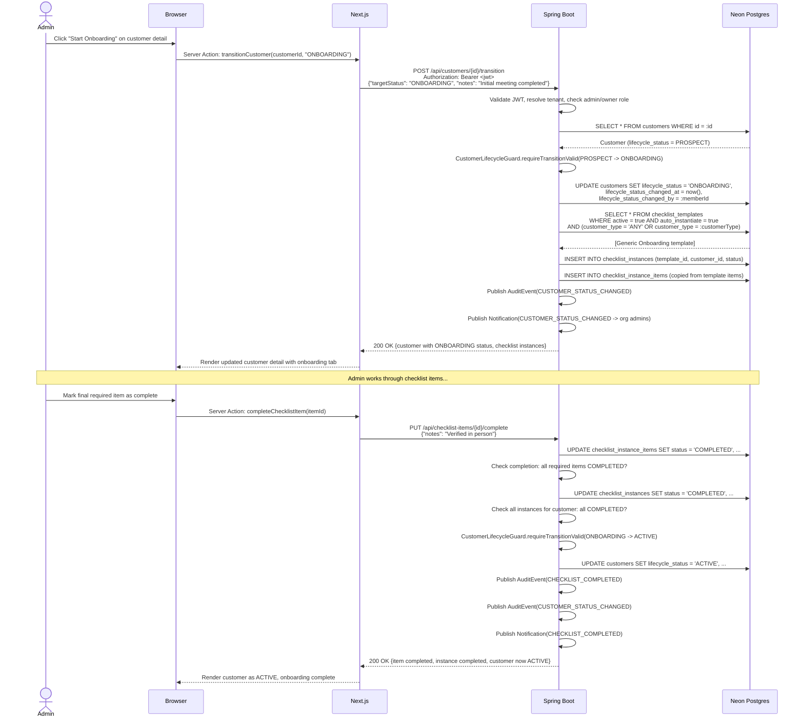
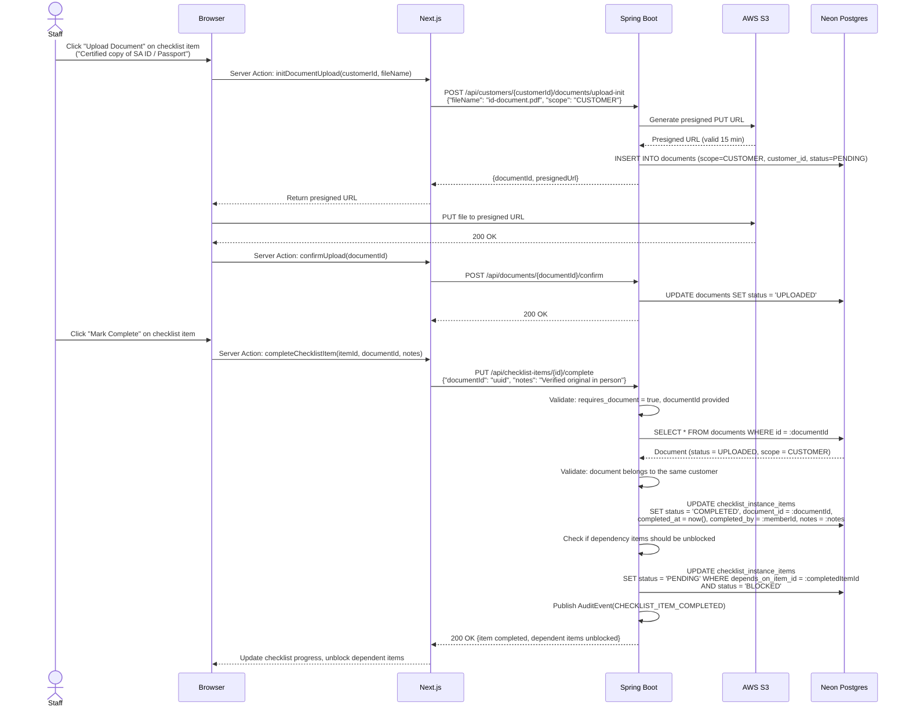
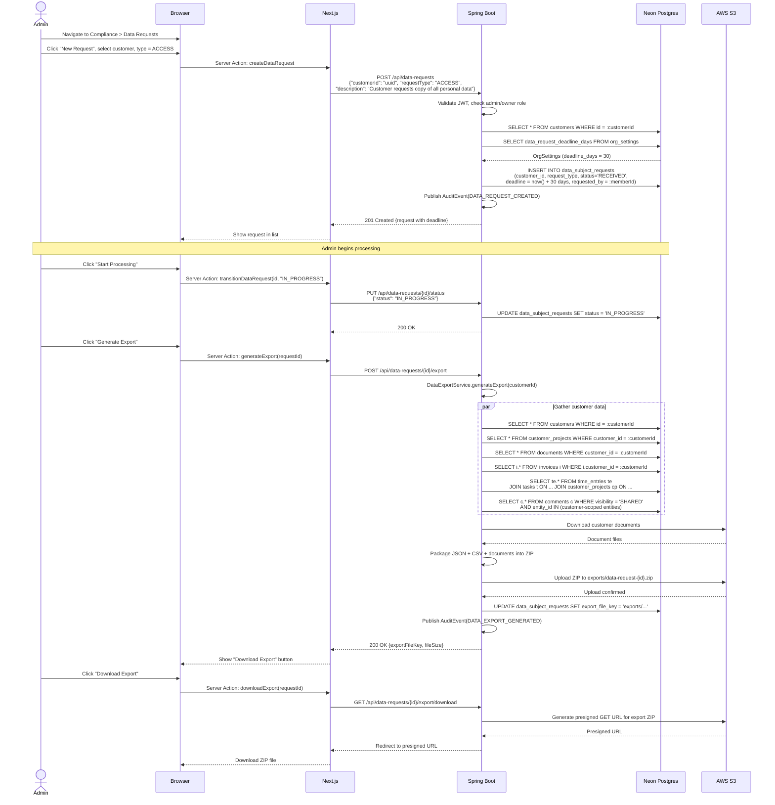
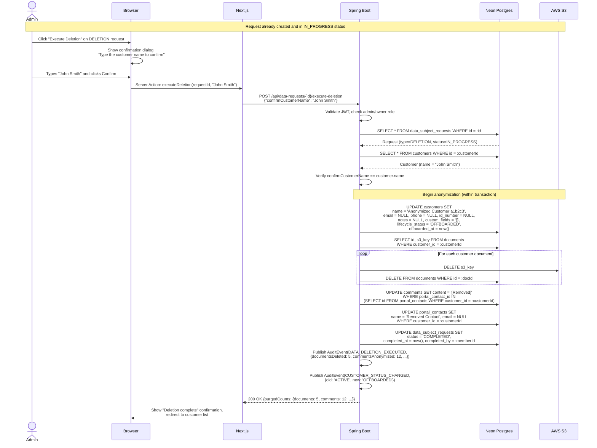

# Phase 13 — Customer Compliance & Lifecycle

> Merge into `ARCHITECTURE.md` as **Section 13**. ADR files go in `adr/`.

---

## 13.1 Overview

Phase 13 adds a jurisdiction-agnostic compliance layer to the platform. It introduces a **customer lifecycle state machine** that controls what actions are permitted at each stage (prospect through offboarding), a **checklist engine** that tracks per-step onboarding verification with document requirements, **compliance packs** that deliver jurisdiction-specific seed data without jurisdiction-specific code, **data subject request handling** for access and deletion requests, and **retention policies** for flagging records past their legal retention period.

The foundational design principle is: **the engine is code, the content is seed data.** The lifecycle state machine, checklist runner, data export pipeline, and retention checker are generic platform capabilities. Which checklist items to verify, which retention periods to apply, and which fields to collect are delivered as compliance packs — classpath-bundled JSON files seeded during tenant provisioning, following the same pattern established by field packs (Phase 11) and document template packs (Phase 12).

This phase extends two existing entities (`Customer` with `lifecycle_status`, `OrgSettings` with compliance configuration) and introduces six new entities across four new packages. All entities follow the existing tenant isolation model with `@FilterDef`/`@Filter` for shared-schema multitenancy and RLS for `tenant_shared`.

**What's new in Phase 13** (relative to existing phases):

| Capability | Existing | Phase 13 (this phase) |
|------------|----------|-----------------------|
| Customer status | `status` field (ACTIVE/ARCHIVED) — soft-delete mechanism | `lifecycle_status` field (PROSPECT/ONBOARDING/ACTIVE/DORMANT/OFFBOARDED) — compliance lifecycle with action gating |
| Onboarding | Manual, ad-hoc process | Structured checklists with per-item tracking, document requirements, dependency ordering |
| Compliance content | — | Compliance packs (classpath seed data) with jurisdiction-specific checklists and field definitions |
| Data subject rights | — | Intake, tracking, and fulfilment of ACCESS/DELETION/CORRECTION/OBJECTION requests |
| Retention management | — | Configurable retention policies per record type, admin-triggered retention checks, flag-then-purge workflow |
| Action gating | — | `CustomerLifecycleGuard` prevents invoicing during onboarding, new records for offboarded customers |

**Out of scope for Phase 13:**
- Identity verification via external APIs (DHA, CIPC, biometric providers)
- Sanctions/PEP screening
- Automated data discovery across external systems
- Consent management (opt-in/opt-out tracking for marketing, cookies)
- Compliance reporting/analytics (average onboarding time, requests by type)
- Multi-step approval workflows for lifecycle transitions
- Automated anonymization scheduling (auto-purge after retention period)
- Customer self-service data requests via the portal

---

## 13.2 Domain Model

### 13.2.1 Customer Entity Changes

The existing `Customer` entity gains four new columns. These are structural fields that drive platform behaviour — not custom fields.

| Field | Type | Constraints | Notes |
|-------|------|-------------|-------|
| `lifecycle_status` | VARCHAR(20) | NOT NULL, DEFAULT 'PROSPECT' | Compliance lifecycle stage. Coexists with existing `status` (ACTIVE/ARCHIVED) which remains the soft-delete mechanism |
| `lifecycle_status_changed_at` | TIMESTAMPTZ | Nullable | When the lifecycle status last changed |
| `lifecycle_status_changed_by` | UUID | Nullable | Member who last changed the lifecycle status |
| `offboarded_at` | TIMESTAMPTZ | Nullable | When the customer was offboarded. Used as the retention period trigger date |

**Relationship between `status` and `lifecycle_status`**: The existing `status` column is a soft-delete flag (`ACTIVE`/`ARCHIVED`). An archived customer is hidden from default list views. The new `lifecycle_status` is the compliance lifecycle — it controls what actions are permitted (invoicing, project creation, etc.) and drives the onboarding workflow. Both fields coexist independently. An `ARCHIVED` customer retains whatever `lifecycle_status` it had; an `OFFBOARDED` customer can still have `status = ACTIVE` (visible in the system, but read-only).

### 13.2.2 OrgSettings Entity Changes

| Field | Type | Constraints | Notes |
|-------|------|-------------|-------|
| `dormancy_threshold_days` | INTEGER | Nullable, DEFAULT 90 | Days since last customer activity before flagging as dormant |
| `data_request_deadline_days` | INTEGER | Nullable, DEFAULT 30 | Days to respond to a data subject request (POPIA/GDPR common practice) |
| `compliance_pack_status` | JSONB | Nullable | Tracks which compliance packs have been seeded, following the same `[{packId, version, appliedAt}]` pattern as `field_pack_status` |

### 13.2.3 ChecklistTemplate (New Entity)

A checklist template defines a reusable set of verification steps for customer onboarding. Templates are created by compliance packs (platform-shipped) or by org admins (custom). Each template targets a customer type (individual, company, or any).

| Field | Type | Constraints | Notes |
|-------|------|-------------|-------|
| `id` | UUID | PK, generated | |
| `tenant_id` | VARCHAR(255) | | Shared-schema discriminator |
| `name` | VARCHAR(200) | NOT NULL | Human-readable name (e.g., "Individual Client Onboarding") |
| `slug` | VARCHAR(200) | NOT NULL | Machine-readable key (e.g., "individual-client-onboarding") |
| `description` | TEXT | Nullable | Describes when this checklist applies |
| `customer_type` | VARCHAR(20) | NOT NULL, DEFAULT 'ANY' | `INDIVIDUAL`, `COMPANY`, or `ANY` |
| `source` | VARCHAR(20) | NOT NULL, DEFAULT 'ORG_CUSTOM' | `PLATFORM` (from compliance pack) or `ORG_CUSTOM` (admin-created) |
| `pack_id` | VARCHAR(100) | Nullable | Compliance pack this template originated from |
| `pack_template_key` | VARCHAR(200) | Nullable | Key within the pack for idempotent seeding |
| `active` | BOOLEAN | NOT NULL, DEFAULT true | Whether this template is available for instantiation |
| `auto_instantiate` | BOOLEAN | NOT NULL, DEFAULT true | If true, automatically instantiated when a customer transitions to ONBOARDING |
| `sort_order` | INTEGER | NOT NULL, DEFAULT 0 | Display ordering |
| `created_at` | TIMESTAMPTZ | NOT NULL, DEFAULT now() | |
| `updated_at` | TIMESTAMPTZ | NOT NULL, DEFAULT now() | |

**Constraints:**
- `(tenant_id, slug)` unique — no duplicate slugs per tenant.
- Only one `auto_instantiate = true` template per `customer_type` per tenant. Enforced at the service layer, not as a DB constraint, because the rule involves multiple rows and is easier to express with a validation query than a partial unique index across two columns.

### 13.2.4 ChecklistTemplateItem (New Entity)

A template item defines a single verification step within a checklist template — the "recipe" for what needs to be verified.

| Field | Type | Constraints | Notes |
|-------|------|-------------|-------|
| `id` | UUID | PK, generated | |
| `tenant_id` | VARCHAR(255) | | Shared-schema discriminator |
| `template_id` | UUID FK -> checklist_templates | NOT NULL, CASCADE | Parent template |
| `name` | VARCHAR(300) | NOT NULL | Step name (e.g., "Verify identity document") |
| `description` | TEXT | Nullable | Detailed instructions for completion |
| `sort_order` | INTEGER | NOT NULL, DEFAULT 0 | Display order within the checklist |
| `required` | BOOLEAN | NOT NULL, DEFAULT true | Must be completed for checklist completion |
| `requires_document` | BOOLEAN | NOT NULL, DEFAULT false | A document must be uploaded and linked before completion |
| `required_document_label` | VARCHAR(200) | Nullable | Upload prompt (e.g., "Certified copy of ID") |
| `depends_on_item_id` | UUID FK -> checklist_template_items | Nullable | Linear dependency — this item cannot start until the dependency is complete |
| `created_at` | TIMESTAMPTZ | NOT NULL, DEFAULT now() | |
| `updated_at` | TIMESTAMPTZ | NOT NULL, DEFAULT now() | |

**Constraints:**
- `depends_on_item_id` must reference an item in the same template. Enforced at the service layer (cross-template references rejected on save).
- No circular dependencies. Enforced at the service layer with a simple graph traversal on save.

### 13.2.5 ChecklistInstance (New Entity)

An instance is a checklist template instantiated for a specific customer. Items are snapshotted from the template at instantiation time, so template changes do not retroactively affect in-progress checklists.

| Field | Type | Constraints | Notes |
|-------|------|-------------|-------|
| `id` | UUID | PK, generated | |
| `tenant_id` | VARCHAR(255) | | Shared-schema discriminator |
| `template_id` | UUID FK -> checklist_templates | NOT NULL | Source template |
| `customer_id` | UUID FK -> customers | NOT NULL | Which customer this is for |
| `status` | VARCHAR(20) | NOT NULL, DEFAULT 'IN_PROGRESS' | `IN_PROGRESS`, `COMPLETED`, `CANCELLED` |
| `started_at` | TIMESTAMPTZ | NOT NULL, DEFAULT now() | When the checklist was instantiated |
| `completed_at` | TIMESTAMPTZ | Nullable | When all required items were completed |
| `completed_by` | UUID | Nullable | Member who triggered completion (completed the last required item) |
| `created_at` | TIMESTAMPTZ | NOT NULL, DEFAULT now() | |
| `updated_at` | TIMESTAMPTZ | NOT NULL, DEFAULT now() | |

**Constraints:**
- `(tenant_id, customer_id, template_id)` unique — a customer can only have one instance of a given checklist template.

### 13.2.6 ChecklistInstanceItem (New Entity)

An instance item is a snapshot of a template item, tracking the completion state for a specific customer's checklist.

| Field | Type | Constraints | Notes |
|-------|------|-------------|-------|
| `id` | UUID | PK, generated | |
| `tenant_id` | VARCHAR(255) | | Shared-schema discriminator |
| `instance_id` | UUID FK -> checklist_instances | NOT NULL, CASCADE | Parent instance |
| `template_item_id` | UUID FK -> checklist_template_items | NOT NULL | Reference to the original template item |
| `name` | VARCHAR(300) | NOT NULL | Copied from template item at instantiation |
| `description` | TEXT | Nullable | Copied from template item |
| `sort_order` | INTEGER | NOT NULL | Copied from template item |
| `required` | BOOLEAN | NOT NULL | Copied from template item |
| `requires_document` | BOOLEAN | NOT NULL | Copied from template item |
| `required_document_label` | VARCHAR(200) | Nullable | Copied from template item |
| `status` | VARCHAR(20) | NOT NULL, DEFAULT 'PENDING' | `PENDING`, `IN_PROGRESS`, `COMPLETED`, `SKIPPED`, `BLOCKED` |
| `completed_at` | TIMESTAMPTZ | Nullable | When this item was completed |
| `completed_by` | UUID | Nullable | Member who marked complete |
| `notes` | TEXT | Nullable | Optional notes added during completion |
| `document_id` | UUID FK -> documents | Nullable | Uploaded document linked to this item |
| `depends_on_item_id` | UUID FK -> checklist_instance_items | Nullable | Dependency, copied from template |
| `created_at` | TIMESTAMPTZ | NOT NULL, DEFAULT now() | |
| `updated_at` | TIMESTAMPTZ | NOT NULL, DEFAULT now() | |

**Constraints:**
- `(instance_id, template_item_id)` unique — one instance item per template item per instance.
- `COMPLETED` status requires `completed_by` and `completed_at` to be non-null. Enforced at service layer.
- If `requires_document = true`, `COMPLETED` status requires `document_id` to be non-null. Enforced at service layer.
- If `depends_on_item_id` references an item not in `COMPLETED` status, this item cannot transition to `IN_PROGRESS` or `COMPLETED`. Enforced at service layer.

### 13.2.7 DataSubjectRequest (New Entity)

Tracks data access, deletion, correction, and objection requests submitted by org admins on behalf of data subjects (customers).

| Field | Type | Constraints | Notes |
|-------|------|-------------|-------|
| `id` | UUID | PK, generated | |
| `tenant_id` | VARCHAR(255) | | Shared-schema discriminator |
| `customer_id` | UUID FK -> customers | NOT NULL | Which customer the request is about |
| `request_type` | VARCHAR(20) | NOT NULL | `ACCESS`, `DELETION`, `CORRECTION`, `OBJECTION` |
| `status` | VARCHAR(20) | NOT NULL, DEFAULT 'RECEIVED' | `RECEIVED`, `IN_PROGRESS`, `COMPLETED`, `REJECTED` |
| `description` | TEXT | NOT NULL | Details of what the data subject is requesting |
| `rejection_reason` | TEXT | Nullable | If rejected, why |
| `deadline` | DATE | NOT NULL | Calculated: `requested_at + data_request_deadline_days` |
| `requested_at` | TIMESTAMPTZ | NOT NULL | When the request was received by the org |
| `requested_by` | UUID | NOT NULL | Admin who logged the request |
| `completed_at` | TIMESTAMPTZ | Nullable | When the request was fulfilled |
| `completed_by` | UUID | Nullable | Admin who completed the request |
| `export_file_key` | VARCHAR(500) | Nullable | S3 key for exported data file (ACCESS requests) |
| `notes` | TEXT | Nullable | Internal notes about request processing |
| `created_at` | TIMESTAMPTZ | NOT NULL, DEFAULT now() | |
| `updated_at` | TIMESTAMPTZ | NOT NULL, DEFAULT now() | |

**Indexes:**
- `(tenant_id, status)` — listing open requests.
- `(tenant_id, customer_id)` — viewing requests for a specific customer.
- `(tenant_id, deadline)` — finding requests approaching their deadline.

### 13.2.8 RetentionPolicy (New Entity)

Configurable retention periods per record type. Admins define how long records should be kept after a trigger event, and what action to take when the period expires.

| Field | Type | Constraints | Notes |
|-------|------|-------------|-------|
| `id` | UUID | PK, generated | |
| `tenant_id` | VARCHAR(255) | | Shared-schema discriminator |
| `record_type` | VARCHAR(30) | NOT NULL | `CUSTOMER`, `PROJECT`, `DOCUMENT`, `TIME_ENTRY`, `INVOICE`, `AUDIT_EVENT`, `COMMENT` |
| `retention_days` | INTEGER | NOT NULL, CHECK > 0 | Days after trigger event to retain |
| `trigger_event` | VARCHAR(30) | NOT NULL | `CUSTOMER_OFFBOARDED`, `PROJECT_COMPLETED`, `RECORD_CREATED` |
| `action` | VARCHAR(20) | NOT NULL, DEFAULT 'FLAG' | `FLAG` (mark for review) or `ANONYMIZE` (mark for anonymization) |
| `active` | BOOLEAN | NOT NULL, DEFAULT true | Whether this policy is enforced |
| `created_at` | TIMESTAMPTZ | NOT NULL, DEFAULT now() | |
| `updated_at` | TIMESTAMPTZ | NOT NULL, DEFAULT now() | |

**Constraints:**
- `(tenant_id, record_type, trigger_event)` unique — one policy per record type per trigger.
- `CHECK (retention_days > 0)` — retention period must be positive.

### 13.2.9 Entity-Relationship Diagram

The diagram below shows the complete tenant-schema entity relationships after Phase 13. New entities are grouped in the lower portion of the diagram.

```mermaid
erDiagram
    projects {
        uuid id PK
        varchar name "NOT NULL"
        text description
        uuid created_by FK "-> members"
        varchar status "ACTIVE, COMPLETED, ARCHIVED"
        varchar tenant_id
        jsonb custom_fields
        timestamp created_at
        timestamp updated_at
    }

    members {
        uuid id PK
        varchar clerk_user_id "NOT NULL"
        varchar email "NOT NULL"
        varchar name
        varchar avatar_url
        varchar org_role "NOT NULL"
        varchar tenant_id
        timestamp created_at
        timestamp updated_at
    }

    project_members {
        uuid id PK
        uuid project_id FK "-> projects"
        uuid member_id FK "-> members"
        varchar project_role "lead, contributor"
        uuid added_by FK "-> members"
        varchar tenant_id
        timestamp created_at
    }

    customers {
        uuid id PK
        varchar name "NOT NULL"
        varchar email "NOT NULL"
        varchar status "ACTIVE, ARCHIVED"
        varchar lifecycle_status "PROSPECT, ONBOARDING, ACTIVE, DORMANT, OFFBOARDED"
        timestamp lifecycle_status_changed_at
        uuid lifecycle_status_changed_by FK "-> members"
        timestamp offboarded_at
        uuid created_by FK "-> members"
        varchar tenant_id
        jsonb custom_fields
        timestamp created_at
        timestamp updated_at
    }

    customer_projects {
        uuid id PK
        uuid customer_id FK "-> customers"
        uuid project_id FK "-> projects"
        uuid linked_by FK "-> members"
        varchar tenant_id
        timestamp created_at
    }

    documents {
        uuid id PK
        varchar scope "ORG, PROJECT, CUSTOMER"
        uuid project_id FK "-> projects (nullable)"
        uuid customer_id FK "-> customers (nullable)"
        varchar visibility "INTERNAL, SHARED"
        varchar file_name "NOT NULL"
        varchar status "PENDING, UPLOADED, FAILED"
        uuid uploaded_by FK "-> members"
        varchar tenant_id
        timestamp created_at
    }

    tasks {
        uuid id PK
        uuid project_id FK "-> projects"
        varchar title "NOT NULL"
        text description
        varchar status "OPEN, IN_PROGRESS, DONE, CANCELLED"
        varchar priority "LOW, MEDIUM, HIGH"
        uuid assignee_id FK "-> members (nullable)"
        uuid created_by FK "-> members"
        date due_date
        integer version
        varchar tenant_id
        jsonb custom_fields
        timestamp created_at
        timestamp updated_at
    }

    time_entries {
        uuid id PK
        uuid task_id FK "-> tasks"
        uuid member_id FK "-> members"
        date date "NOT NULL"
        integer duration_minutes "NOT NULL"
        boolean billable "NOT NULL"
        integer rate_cents
        integer billing_rate_snapshot
        integer cost_rate_snapshot
        text description
        varchar tenant_id
        timestamp created_at
        timestamp updated_at
    }

    comments {
        uuid id PK
        varchar entity_type "TASK, DOCUMENT"
        uuid entity_id "NOT NULL"
        uuid author_id FK "-> members (nullable)"
        uuid portal_contact_id FK "-> portal_contacts (nullable)"
        varchar visibility "INTERNAL, SHARED"
        text content "NOT NULL"
        varchar tenant_id
        timestamp created_at
        timestamp updated_at
    }

    notifications {
        uuid id PK
        uuid member_id FK "-> members"
        varchar type "NOT NULL"
        varchar title "NOT NULL"
        text message
        boolean read "DEFAULT false"
        jsonb metadata
        varchar tenant_id
        timestamp created_at
    }

    notification_preferences {
        uuid id PK
        uuid member_id FK "-> members"
        varchar event_type "NOT NULL"
        boolean in_app "DEFAULT true"
        boolean email "DEFAULT false"
        varchar tenant_id
        timestamp created_at
        timestamp updated_at
    }

    audit_events {
        uuid id PK
        varchar event_type "NOT NULL"
        varchar entity_type
        uuid entity_id
        uuid actor_id FK "-> members"
        jsonb details
        varchar tenant_id
        timestamp occurred_at
    }

    invoices {
        uuid id PK
        uuid customer_id FK "-> customers"
        uuid project_id FK "-> projects (nullable)"
        varchar invoice_number "NOT NULL"
        varchar status "DRAFT, SENT, PAID, OVERDUE, CANCELLED"
        integer subtotal_cents
        integer tax_cents
        integer total_cents
        varchar currency
        date issue_date
        date due_date
        varchar tenant_id
        timestamp created_at
        timestamp updated_at
    }

    invoice_lines {
        uuid id PK
        uuid invoice_id FK "-> invoices"
        varchar description "NOT NULL"
        integer quantity
        integer unit_price_cents
        integer line_total_cents
        uuid time_entry_id FK "-> time_entries (nullable)"
        varchar tenant_id
    }

    invoice_counters {
        uuid id PK
        integer current_value "NOT NULL"
        varchar tenant_id
    }

    billing_rates {
        uuid id PK
        varchar scope "ORG, PROJECT, CUSTOMER"
        uuid project_id FK "-> projects (nullable)"
        uuid customer_id FK "-> customers (nullable)"
        uuid member_id FK "-> members (nullable)"
        integer rate_cents "NOT NULL"
        varchar currency "NOT NULL"
        varchar tenant_id
        timestamp created_at
        timestamp updated_at
    }

    cost_rates {
        uuid id PK
        uuid member_id FK "-> members"
        integer rate_cents "NOT NULL"
        varchar currency "NOT NULL"
        varchar tenant_id
        timestamp created_at
        timestamp updated_at
    }

    project_budgets {
        uuid id PK
        uuid project_id FK "-> projects"
        integer budget_cents
        varchar budget_type "FIXED, TIME_BASED"
        integer budget_hours
        varchar currency
        integer version
        varchar tenant_id
        timestamp created_at
        timestamp updated_at
    }

    org_settings {
        uuid id PK
        varchar default_currency "NOT NULL"
        integer dormancy_threshold_days "DEFAULT 90"
        integer data_request_deadline_days "DEFAULT 30"
        jsonb field_pack_status
        jsonb compliance_pack_status
        varchar tenant_id
        timestamp created_at
        timestamp updated_at
    }

    field_definitions {
        uuid id PK
        varchar slug "NOT NULL"
        varchar name "NOT NULL"
        varchar field_type "TEXT, NUMBER, DATE, etc."
        varchar entity_type "PROJECT, TASK, CUSTOMER"
        varchar tenant_id
        timestamp created_at
        timestamp updated_at
    }

    field_groups {
        uuid id PK
        varchar slug "NOT NULL"
        varchar name "NOT NULL"
        varchar entity_type "NOT NULL"
        varchar tenant_id
        timestamp created_at
    }

    field_group_members {
        uuid id PK
        uuid group_id FK "-> field_groups"
        uuid field_id FK "-> field_definitions"
        integer sort_order
        varchar tenant_id
    }

    tags {
        uuid id PK
        varchar name "NOT NULL"
        varchar color
        varchar tenant_id
        timestamp created_at
    }

    entity_tags {
        uuid id PK
        uuid tag_id FK "-> tags"
        varchar entity_type "NOT NULL"
        uuid entity_id "NOT NULL"
        varchar tenant_id
    }

    saved_views {
        uuid id PK
        varchar entity_type "NOT NULL"
        varchar name "NOT NULL"
        jsonb filters
        jsonb columns
        boolean shared
        uuid created_by FK "-> members"
        integer sort_order
        varchar tenant_id
        timestamp created_at
        timestamp updated_at
    }

    portal_contacts {
        uuid id PK
        uuid customer_id FK "-> customers"
        varchar email "NOT NULL"
        varchar name
        varchar role "PRIMARY, BILLING, GENERAL"
        varchar tenant_id
        timestamp created_at
        timestamp updated_at
    }

    magic_link_tokens {
        uuid id PK
        uuid portal_contact_id FK "-> portal_contacts"
        varchar token "NOT NULL"
        timestamp expires_at
        boolean used
        varchar tenant_id
        timestamp created_at
    }

    checklist_templates {
        uuid id PK
        varchar name "NOT NULL"
        varchar slug "NOT NULL"
        text description
        varchar customer_type "INDIVIDUAL, COMPANY, ANY"
        varchar source "PLATFORM, ORG_CUSTOM"
        varchar pack_id
        varchar pack_template_key
        boolean active "DEFAULT true"
        boolean auto_instantiate "DEFAULT true"
        integer sort_order
        varchar tenant_id
        timestamp created_at
        timestamp updated_at
    }

    checklist_template_items {
        uuid id PK
        uuid template_id FK "-> checklist_templates"
        varchar name "NOT NULL"
        text description
        integer sort_order
        boolean required "DEFAULT true"
        boolean requires_document "DEFAULT false"
        varchar required_document_label
        uuid depends_on_item_id FK "-> checklist_template_items (nullable)"
        varchar tenant_id
        timestamp created_at
        timestamp updated_at
    }

    checklist_instances {
        uuid id PK
        uuid template_id FK "-> checklist_templates"
        uuid customer_id FK "-> customers"
        varchar status "IN_PROGRESS, COMPLETED, CANCELLED"
        timestamp started_at
        timestamp completed_at
        uuid completed_by FK "-> members (nullable)"
        varchar tenant_id
        timestamp created_at
        timestamp updated_at
    }

    checklist_instance_items {
        uuid id PK
        uuid instance_id FK "-> checklist_instances"
        uuid template_item_id FK "-> checklist_template_items"
        varchar name "NOT NULL"
        text description
        integer sort_order
        boolean required
        boolean requires_document
        varchar required_document_label
        varchar status "PENDING, IN_PROGRESS, COMPLETED, SKIPPED, BLOCKED"
        timestamp completed_at
        uuid completed_by FK "-> members (nullable)"
        text notes
        uuid document_id FK "-> documents (nullable)"
        uuid depends_on_item_id FK "-> checklist_instance_items (nullable)"
        varchar tenant_id
        timestamp created_at
        timestamp updated_at
    }

    data_subject_requests {
        uuid id PK
        uuid customer_id FK "-> customers"
        varchar request_type "ACCESS, DELETION, CORRECTION, OBJECTION"
        varchar status "RECEIVED, IN_PROGRESS, COMPLETED, REJECTED"
        text description "NOT NULL"
        text rejection_reason
        date deadline "NOT NULL"
        timestamp requested_at
        uuid requested_by FK "-> members"
        timestamp completed_at
        uuid completed_by FK "-> members (nullable)"
        varchar export_file_key
        text notes
        varchar tenant_id
        timestamp created_at
        timestamp updated_at
    }

    retention_policies {
        uuid id PK
        varchar record_type "CUSTOMER, PROJECT, DOCUMENT, etc."
        integer retention_days "NOT NULL"
        varchar trigger_event "CUSTOMER_OFFBOARDED, PROJECT_COMPLETED, RECORD_CREATED"
        varchar action "FLAG, ANONYMIZE"
        boolean active "DEFAULT true"
        varchar tenant_id
        timestamp created_at
        timestamp updated_at
    }

    %% Existing relationships
    projects ||--o{ project_members : "has"
    projects ||--o{ tasks : "contains"
    projects ||--o{ documents : "scope = PROJECT"
    projects ||--o{ customer_projects : "linked to"
    projects ||--o{ invoices : "billed under"
    projects ||--o{ project_budgets : "budgeted"
    members ||--o{ project_members : "assigned to"
    members ||--o{ tasks : "assigned (optional)"
    members ||--o{ time_entries : "logs"
    members ||--o{ notifications : "receives"
    members ||--o{ notification_preferences : "configures"
    members ||--o{ saved_views : "creates"
    members ||--o{ comments : "authors"
    customers ||--o{ customer_projects : "linked to"
    customers ||--o{ documents : "scope = CUSTOMER"
    customers ||--o{ invoices : "billed to"
    customers ||--o{ portal_contacts : "has contacts"
    tasks ||--o{ time_entries : "tracked against"
    tasks ||--o{ comments : "discussed in"
    documents ||--o{ comments : "discussed in"
    invoices ||--o{ invoice_lines : "contains"
    tags ||--o{ entity_tags : "applied as"
    field_groups ||--o{ field_group_members : "contains"
    field_definitions ||--o{ field_group_members : "grouped in"
    portal_contacts ||--o{ magic_link_tokens : "authenticated via"

    %% New Phase 13 relationships
    checklist_templates ||--o{ checklist_template_items : "defines items"
    checklist_templates ||--o{ checklist_instances : "instantiated as"
    checklist_template_items ||--o{ checklist_template_items : "depends on (self)"
    checklist_instances ||--o{ checklist_instance_items : "contains"
    checklist_template_items ||--o{ checklist_instance_items : "snapshotted from"
    checklist_instance_items ||--o{ checklist_instance_items : "depends on (self)"
    customers ||--o{ checklist_instances : "onboarded via"
    customers ||--o{ data_subject_requests : "subject of"
    documents ||--o{ checklist_instance_items : "linked to"
```



---

## 13.3 Customer Lifecycle State Machine

### 13.3.1 Status Values and Transitions

The lifecycle state machine is a flat enum with validated transitions. No nested states, no parallel states, no history states. Each status has clear semantics:

| Status | Meaning |
|--------|---------|
| `PROSPECT` | Customer record exists, no engagement started. Default status for new customers. |
| `ONBOARDING` | Active engagement begun. Checklist instance created from template. Billing blocked. |
| `ACTIVE` | Onboarding complete, all required checklist items verified. Full platform functionality. |
| `DORMANT` | No activity for a configurable period. Informational — full functionality remains. |
| `OFFBOARDED` | Relationship ended. Customer data is read-only. Retention clock starts. |

### 13.3.2 State Diagram



**Valid transitions:**

| From | To | Trigger | Guard |
|------|----|---------|-------|
| `PROSPECT` | `ONBOARDING` | Admin action: "Start Onboarding" | None. Instantiates active checklist templates matching the customer type. |
| `ONBOARDING` | `ACTIVE` | Automatic after last required checklist item completion | All active `ChecklistInstance` records for this customer must have `status = COMPLETED`. |
| `ACTIVE` | `DORMANT` | Admin action or dormancy detection | None (informational). |
| `DORMANT` | `ACTIVE` | Admin action: "Reactivate" | None. |
| `ACTIVE` | `OFFBOARDED` | Admin action: "Offboard Customer" | None. Sets `offboarded_at`. |
| `DORMANT` | `OFFBOARDED` | Admin action: "Offboard Customer" | None. Sets `offboarded_at`. |
| `OFFBOARDED` | `ACTIVE` | Admin action: "Reactivate" | Requires `notes` (audit justification for reactivation). Clears `offboarded_at`. |

**Invalid transitions** (rejected by the state machine with `409 Conflict`):
- `PROSPECT` -> `ACTIVE` (cannot skip onboarding)
- `PROSPECT` -> `DORMANT` (never active, cannot be dormant)
- `PROSPECT` -> `OFFBOARDED` (never engaged, cannot offboard)
- `ONBOARDING` -> `DORMANT` (still onboarding, not yet active)
- `ONBOARDING` -> `OFFBOARDED` (still onboarding, must complete or cancel first)
- `OFFBOARDED` -> `ONBOARDING` (cannot restart onboarding for an offboarded customer)
- `OFFBOARDED` -> `DORMANT` (must reactivate first)

### 13.3.3 Action Gating Table

The `CustomerLifecycleGuard` service checks the customer's lifecycle status before mutation operations. It throws `409 Conflict` with a descriptive message if the action is not permitted.

| Action | PROSPECT | ONBOARDING | ACTIVE | DORMANT | OFFBOARDED |
|--------|----------|------------|--------|---------|------------|
| Create/edit customer record | Yes | Yes | Yes | Yes | No |
| Upload documents | Yes | Yes | Yes | Yes | No |
| Create projects | No | Yes | Yes | Yes | No |
| Create tasks | No | Yes | Yes | Yes | No |
| Log time entries | No | Yes | Yes | Yes | No |
| Create invoices | No | No | Yes | Yes | No |
| Add comments on existing items | Yes | Yes | Yes | Yes | Yes |
| View all data | Yes | Yes | Yes | Yes | Yes |

**Key gating decisions:**
- **PROSPECT cannot create projects/tasks**: A prospect is a potential customer with no engagement. Work tracking starts at ONBOARDING.
- **ONBOARDING cannot create invoices**: Billing is blocked until the customer is fully verified and Active. This prevents billing customers before compliance checks are complete.
- **OFFBOARDED is read-only** (except comments): No new data can be created for an offboarded customer. Comments are allowed on existing items for notes about offboarding or handover.
- **DORMANT has no restrictions**: Dormancy is informational. The customer can still be worked with if needed — it is a signal for attention, not a block.

### 13.3.4 CustomerLifecycleGuard Service

```java
@Service
public class CustomerLifecycleGuard {

    // Checks whether the given action is permitted for a customer's current lifecycle status.
    // Throws ResourceConflictException (409) if the action is blocked.
    public void requireActionPermitted(Customer customer, LifecycleAction action) {
        String status = customer.getLifecycleStatus();
        if (!isPermitted(status, action)) {
            throw new ResourceConflictException(
                "Action '%s' is not permitted for customers in '%s' status"
                    .formatted(action.name(), status));
        }
    }

    // Validates that a lifecycle transition is valid from the current status.
    // Returns the validated target status.
    // Throws ResourceConflictException (409) for invalid transitions.
    public void requireTransitionValid(Customer customer, String targetStatus, String notes) {
        // 1. Check transition is in the valid transitions map
        // 2. Check guards (e.g., checklist completion for ONBOARDING -> ACTIVE)
        // 3. Check notes required (e.g., OFFBOARDED -> ACTIVE requires justification)
    }
}

public enum LifecycleAction {
    CREATE_PROJECT,
    CREATE_TASK,
    LOG_TIME,
    CREATE_INVOICE,
    UPLOAD_DOCUMENT,
    EDIT_CUSTOMER
}
```

The guard is called by controllers (or services) that perform customer-scoped mutations. It is not an AOP interceptor — it is an explicit service call, making the gating logic visible and testable.

**Integration points**: `ProjectController`, `TaskController`, `TimeEntryController`, `InvoiceController`, and `DocumentController` all call `CustomerLifecycleGuard.requireActionPermitted()` when the operation is scoped to a customer.

---

## 13.4 Checklist Engine

### 13.4.1 Template-to-Instance Flow

The checklist engine follows a template-instance-item hierarchy:

1. **Template definition**: An admin (or compliance pack seeder) creates a `ChecklistTemplate` with one or more `ChecklistTemplateItem` records. The template defines the "recipe" for verification.

2. **Instantiation**: When a customer transitions from `PROSPECT` to `ONBOARDING`, the system finds all active templates matching the customer's type (or `ANY`) with `auto_instantiate = true`. For each, it creates a `ChecklistInstance` and copies every `ChecklistTemplateItem` into a `ChecklistInstanceItem`, preserving name, description, sort order, required flag, document requirement, and dependency references.

3. **Execution**: Staff work through the instance items — marking each as `IN_PROGRESS`, then `COMPLETED` (with optional notes and document upload). Dependencies are enforced: an item whose dependency is not `COMPLETED` cannot progress past `PENDING`.

4. **Completion**: When all `required = true` items in an instance are `COMPLETED`, the instance automatically transitions to `COMPLETED`. If all active instances for the customer are `COMPLETED` and the customer is in `ONBOARDING`, the lifecycle transitions to `ACTIVE`.

### 13.4.2 Snapshot Behaviour

**Items are snapshots, not references.** When a checklist is instantiated:
- The `name`, `description`, `sort_order`, `required`, `requires_document`, `required_document_label`, and `depends_on_item_id` fields are copied from `ChecklistTemplateItem` to `ChecklistInstanceItem`.
- The `template_item_id` FK is preserved for audit trail (which template item was this based on?) but is not used for runtime behaviour.
- If the template is modified after instantiation, existing in-progress checklists are not affected. This prevents the scenario where a compliance officer updates a template and inadvertently invalidates in-progress verifications.

**Why snapshots**: Compliance verification is point-in-time. The requirements that applied when onboarding started are the requirements that must be met. Changing the template should only affect future instantiations. See [ADR-061](../adr/ADR-061-checklist-engine-first-class-entities.md).

### 13.4.3 Completion Logic

```
For each ChecklistInstance:
  1. Count required items: SELECT COUNT(*) FROM checklist_instance_items
       WHERE instance_id = :instanceId AND required = true
  2. Count completed required items: SELECT COUNT(*) FROM checklist_instance_items
       WHERE instance_id = :instanceId AND required = true AND status = 'COMPLETED'
  3. If count(completed required) == count(required):
       - Set instance.status = 'COMPLETED'
       - Set instance.completed_at = now()
       - Set instance.completed_by = currentMemberId
       - Emit CHECKLIST_COMPLETED audit event
       - Emit CHECKLIST_COMPLETED notification
  4. After instance completion, check customer lifecycle:
       - SELECT COUNT(*) FROM checklist_instances
           WHERE customer_id = :customerId AND status != 'CANCELLED' AND status != 'COMPLETED'
       - If count == 0 AND customer.lifecycle_status == 'ONBOARDING':
           - Transition customer to ACTIVE
           - Emit CUSTOMER_STATUS_CHANGED audit event
```

**SKIPPED items**: Treated as not-completed. Only `COMPLETED` counts toward the completion threshold. Optional items (`required = false`) can be `SKIPPED` without blocking completion.

### 13.4.4 Dependency Enforcement

Dependencies are simple linear chains, not a DAG. Each item can depend on at most one other item (`depends_on_item_id`). Circular dependencies are prevented at template save time via a traversal check.

At runtime:
- When a `ChecklistInstanceItem` has `depends_on_item_id` set, it starts with `status = BLOCKED`.
- When the dependency item transitions to `COMPLETED`, the blocked item automatically transitions to `PENDING`.
- If the dependency item is `SKIPPED`, the blocked item remains `BLOCKED` — skipping a dependency does not unblock dependents. The admin must manually handle the situation.

### 13.4.5 Document Requirement Linking

When a template item has `requires_document = true`:
- The instance item displays a document upload area with the `required_document_label` as the prompt.
- The uploaded document is created in the customer's document scope (via the existing Document entity and S3 upload flow).
- The `document_id` on the instance item is set to the uploaded document's ID.
- The item cannot be marked as `COMPLETED` until `document_id` is non-null.
- If the linked document is later deleted, the item's `document_id` is cleared and the item reverts to `IN_PROGRESS` (the verification is no longer valid). This is an edge case handled at the service layer.

---

## 13.5 Compliance Packs

### 13.5.1 Pack Directory Structure

Compliance packs are stored as classpath resources, following the same pattern as field packs:

```
src/main/resources/compliance-packs/
    generic-onboarding/
        pack.json
    sa-fica-individual/
        pack.json
    sa-fica-company/
        pack.json
```

### 13.5.2 pack.json Schema

```json
{
  "packId": "string (unique identifier)",
  "version": 1,
  "name": "string (display name)",
  "description": "string (when to use this pack)",
  "jurisdiction": "string (ISO country code or 'GENERIC')",
  "customerType": "INDIVIDUAL | COMPANY | ANY",
  "checklistTemplate": {
    "key": "string (slug for idempotent seeding)",
    "name": "string (template display name)",
    "description": "string (template description)",
    "autoInstantiate": true,
    "items": [
      {
        "key": "string (unique within pack)",
        "name": "string (item display name)",
        "description": "string (instructions)",
        "sortOrder": 1,
        "required": true,
        "requiresDocument": false,
        "requiredDocumentLabel": "string | null",
        "dependsOnKey": "string | null (key of dependency item within this pack)"
      }
    ]
  },
  "fieldDefinitions": [
    {
      "slug": "string",
      "name": "string",
      "fieldType": "TEXT | NUMBER | DATE | SELECT | etc.",
      "entityType": "CUSTOMER",
      "groupSlug": "string",
      "validation": "string | null",
      "options": ["string"]
    }
  ],
  "retentionOverrides": [
    {
      "recordType": "CUSTOMER",
      "triggerEvent": "CUSTOMER_OFFBOARDED",
      "retentionDays": 1825,
      "action": "FLAG"
    }
  ]
}
```

### 13.5.3 Shipped Packs (v1)

**`generic-onboarding`** — Jurisdiction-agnostic, minimal onboarding checklist. Auto-instantiated for all tenants.

| Item | Required | Document | Description |
|------|----------|----------|-------------|
| Verify contact details | Yes | No | Confirm the customer's name, email, phone number, and address are correct |
| Upload engagement letter | Yes | Yes | Upload a signed engagement letter or service agreement |
| Confirm terms of service | Yes | No | Confirm the customer has read and agreed to the terms of service |
| Set up billing preferences | No | No | Configure invoice delivery method, payment terms, and billing contact |

**`sa-fica-individual`** — SA FICA-compliant checklist for individual clients. Not auto-instantiated (org must explicitly activate).

| Item | Required | Document | Depends On | Description |
|------|----------|----------|------------|-------------|
| Verify identity document | Yes | Yes (Certified copy of SA ID / Passport) | — | Obtain and verify a certified copy of the client's South African ID or passport |
| Verify residential address | Yes | Yes (Proof of address, not older than 3 months) | — | Obtain proof of residential address (utility bill, bank statement, or municipal account) |
| Complete risk assessment | Yes | No | verify-identity | Assess the client's ML/TF risk rating based on FICA Schedule 3 |
| Verify source of funds | No | Yes (Source of funds documentation) | risk-assessment | For high-risk clients or transactions above the prescribed threshold |
| Sanctions and PEP screening | Yes | No | verify-identity | Screen the client against sanctions lists and determine PIP status |

Also ships field definitions: `sa_id_number` (TEXT, identity group), `passport_number` (TEXT, identity group), `risk_rating` (SELECT: Low/Medium/High, compliance group).

**`sa-fica-company`** — SA FICA-compliant checklist for company/trust clients. Not auto-instantiated.

| Item | Required | Document | Depends On | Description |
|------|----------|----------|------------|-------------|
| Verify CIPC registration | Yes | Yes (CIPC registration certificate) | — | Obtain the company's CIPC registration certificate or equivalent |
| Verify registered address | Yes | Yes (Proof of registered address) | — | Obtain proof of the company's registered address |
| Identify directors/trustees | Yes | No | verify-cipc | Identify all directors, trustees, or partners |
| Verify beneficial ownership | Yes | Yes (Beneficial ownership declaration) | identify-directors | Identify and verify all individuals with >= 25% ownership or control |
| Complete risk assessment | Yes | No | verify-cipc | Assess the entity's ML/TF risk rating based on FICA Schedule 3 |
| Verify source of funds | No | Yes (Source of funds documentation) | risk-assessment | For high-risk entities or transactions above the prescribed threshold |

Also ships field definitions: `company_registration_number` (TEXT, registration group), `entity_type` (SELECT: Company/Trust/Partnership/CC, registration group).

### 13.5.4 CompliancePackSeeder Implementation

The seeder follows the same pattern as `FieldPackSeeder`:

```java
@Service
public class CompliancePackSeeder {

    private static final String PACK_LOCATION = "classpath:compliance-packs/*/pack.json";

    private final ResourcePatternResolver resourceResolver;
    private final ObjectMapper objectMapper;
    private final ChecklistTemplateRepository templateRepository;
    private final ChecklistTemplateItemRepository itemRepository;
    private final FieldPackSeeder fieldPackSeeder; // reuse for field definitions
    private final RetentionPolicyRepository retentionPolicyRepository;
    private final OrgSettingsRepository orgSettingsRepository;
    private final TransactionTemplate transactionTemplate;

    /**
     * Seeds all compliance packs for a tenant. Called during tenant provisioning.
     * Uses ScopedValue.where() to bind tenant context.
     */
    public void seedPacksForTenant(String tenantId, String orgId) {
        ScopedValue.where(RequestScopes.TENANT_ID, tenantId)
            .where(RequestScopes.ORG_ID, orgId)
            .run(() -> transactionTemplate.executeWithoutResult(tx -> doSeedPacks(tenantId)));
    }

    private void doSeedPacks(String tenantId) {
        List<CompliancePackDefinition> packs = loadPacks();
        OrgSettings settings = getOrCreateSettings(tenantId);

        for (CompliancePackDefinition pack : packs) {
            if (isPackAlreadyApplied(settings, pack.packId())) {
                continue; // idempotent
            }
            applyPack(pack, tenantId);
            settings.recordCompliancePackApplication(pack.packId(), pack.version());
        }
        orgSettingsRepository.save(settings);
    }

    private void applyPack(CompliancePackDefinition pack, String tenantId) {
        // 1. Create ChecklistTemplate from pack.checklistTemplate
        //    - slug = pack.checklistTemplate.key
        //    - source = PLATFORM
        //    - pack_id = pack.packId
        //    - active = (generic-onboarding: true, others: false)
        //    - auto_instantiate = pack.checklistTemplate.autoInstantiate
        // 2. Create ChecklistTemplateItems from pack.checklistTemplate.items
        //    - Resolve dependsOnKey to depends_on_item_id via key lookup
        // 3. If pack.fieldDefinitions is present, delegate to FieldPackSeeder
        // 4. If pack.retentionOverrides is present, create/update RetentionPolicy records
    }
}
```

**Key design decisions:**
- **Generic pack is active by default**, jurisdiction-specific packs are seeded with `active = false`. Org admins activate the packs they need in settings.
- **Field definitions are delegated to `FieldPackSeeder`**. The compliance pack seeder assembles the pack's field definitions into the format `FieldPackSeeder` expects and delegates. No duplication of field seeding logic.
- **Idempotency via `compliance_pack_status`** on `OrgSettings` (same pattern as `field_pack_status`). Each pack records `{packId, version, appliedAt}`.

### 13.5.5 Pack Activation Model

- All packs are seeded during provisioning. `generic-onboarding` templates are created with `active = true`. Jurisdiction-specific templates are created with `active = false`.
- Org admins can toggle `active` on any checklist template via the settings UI.
- When an admin activates a template, they can also toggle `auto_instantiate`.
- Multiple templates can be active simultaneously for different customer types. The system matches templates to customers by `customer_type` (if the Customer entity later gains a `type` field) or presents them all for manual selection.
- **Clone for customization**: Admins can clone a `PLATFORM` template to create an `ORG_CUSTOM` version, then modify items. The cloned template is independent — changes to the platform template in future pack updates do not affect clones.

---

## 13.6 Data Subject Request Handling

### 13.6.1 Request Types

| Type | Description | Fulfilment Action |
|------|-------------|-------------------|
| `ACCESS` | Data subject wants a copy of their personal information | Generate data export (JSON + CSV ZIP), upload to S3 |
| `DELETION` | Data subject wants their personal information deleted | Anonymize customer PII, delete documents from S3, clear custom fields |
| `CORRECTION` | Data subject wants inaccurate information corrected | Manual correction by admin, tracked via notes |
| `OBJECTION` | Data subject objects to certain processing activities | Manual assessment by admin, tracked via notes |

### 13.6.2 Status Flow



### 13.6.3 Data Export Pipeline (ACCESS Requests)

When an `ACCESS` request is fulfilled, the system generates a data export package containing all platform data associated with the customer:

1. **Customer profile**: Name, email, phone, custom field values.
2. **Projects**: Names, statuses of projects linked via `customer_projects`.
3. **Documents**: Metadata of documents in the customer scope. Document files themselves are included in the ZIP.
4. **Invoices**: Invoice numbers, dates, line items, totals.
5. **Time entries**: Summaries of time billed to the customer (duration, date, billable flag — not internal staff notes).
6. **Comments**: Comments on customer-scoped items with `visibility = SHARED` (not internal-only comments).

**Export format:**
```
export-{customerId}-{timestamp}.zip
├── customer-profile.json
├── customer-profile.csv
├── projects.json
├── invoices.json
├── time-entries.json
├── comments.json
└── documents/
    ├── engagement-letter.pdf
    └── id-document.pdf
```

**Implementation:**

```java
@Service
public class DataExportService {

    // Generates a complete data export for a customer.
    // Returns the S3 key of the uploaded ZIP file.
    public String generateExport(UUID customerId) {
        // 1. Query all customer-scoped data
        // 2. Serialize to JSON + CSV
        // 3. Download documents from S3
        // 4. Package into ZIP (java.util.zip)
        // 5. Upload ZIP to S3 under exports/ prefix
        // 6. Return S3 key
    }
}
```

The export is generated synchronously (v1). For customers with large amounts of data, this could be moved to an async background task in a future enhancement.

### 13.6.4 Anonymization Logic (DELETION Requests)

When a `DELETION` request is executed, the system anonymizes the customer's personal information. This is a destructive, irreversible operation.

**Anonymization rules:**

| Data | Before | After |
|------|--------|-------|
| Customer name | "John Smith" | "Anonymized Customer a1b2c3" (6-char hash of customer ID) |
| Customer email | "john@example.com" | `null` |
| Customer phone | "+27 82 123 4567" | `null` |
| Customer ID number | "8001015009087" | `null` |
| Customer notes | "Important client, referred by..." | `null` |
| Custom fields | `{"sa_id_number": "..."}` | `{}` (empty map) |
| Documents (customer scope) | Files in S3 + Document records | S3 objects deleted, Document records removed |
| Comments (portal contacts) | "Please send the contract..." | Content replaced with "[Removed]" |
| Portal contacts | Email, name | Email set to `null`, name set to "Removed Contact" |
| Invoices | Invoice records | **Retained** — financial records kept for legal/tax obligations |
| Time entries | Time entry records | **Retained** — billing records kept for accounting integrity |
| Projects | Project records | **Retained** — structural records kept. Customer link (`customer_projects`) retained for audit trail |

**Post-anonymization:**
- Customer `lifecycle_status` set to `OFFBOARDED`.
- Customer `offboarded_at` set to current timestamp.
- Audit event `DATA_DELETION_EXECUTED` recorded with counts of affected records by type.

**Confirmation requirement:** The UI requires the admin to type the customer's exact name to confirm. The API endpoint requires `{ confirmCustomerName: "John Smith" }` in the request body, validated against the customer's current name before proceeding.

### 13.6.5 Response Deadline Configuration

- `OrgSettings.data_request_deadline_days` (default: 30 days).
- When a request is created, `deadline = requested_at.toLocalDate().plusDays(data_request_deadline_days)`.
- The compliance dashboard highlights requests within 7 days of their deadline (amber) and past their deadline (red).
- A `DATA_REQUEST_DEADLINE_APPROACHING` notification is sent to org admins when a request enters the 7-day window. This check runs as part of the dormancy detection on-demand action (v1), or could be triggered by a scheduled job in a future enhancement.

---

## 13.7 Retention Policies

### 13.7.1 Policy Model

Each retention policy defines: which type of records it applies to, what event starts the retention clock, how long to retain, and what action to take when the period expires.

| Trigger Event | Description | Applies To |
|---------------|-------------|------------|
| `CUSTOMER_OFFBOARDED` | Retention clock starts from `customer.offboarded_at` | Customer-scoped data (documents, comments, portal contacts) |
| `PROJECT_COMPLETED` | Retention clock starts from project completion date | Project-scoped data (tasks, time entries, documents) |
| `RECORD_CREATED` | Retention clock starts from record's `created_at` | Self-contained records (audit events, notifications) |

| Action | Description |
|--------|-------------|
| `FLAG` | Mark the record as past-retention for admin review. No automatic deletion. The record remains in the system until an admin explicitly purges it. |
| `ANONYMIZE` | Mark for anonymization (same logic as data subject deletion, applied per-record type). Admin must explicitly trigger the purge. |

### 13.7.2 Default Retention Policies

Seeded during provisioning with sensible defaults:

| Record Type | Trigger Event | Retention Days | Action | Rationale |
|-------------|---------------|----------------|--------|-----------|
| `CUSTOMER` | `CUSTOMER_OFFBOARDED` | 1825 (5 years) | `FLAG` | Common legal retention period (FICA Section 22, GDPR data minimisation) |
| `AUDIT_EVENT` | `RECORD_CREATED` | 2555 (7 years) | `FLAG` | Audit trail for regulatory compliance |

All other record types have no default policy (retain indefinitely). Org admins can create additional policies as needed.

Compliance packs can ship `retentionOverrides` (see [ADR-063](../adr/ADR-063-compliance-packs-bundled-seed-data.md)) that create or update policies during seeding. For example, the SA FICA pack sets customer retention to 1825 days (5 years per FICA Section 22).

### 13.7.3 Retention Check Workflow

The retention check is an admin-triggered action (not a scheduled job in v1). This is intentional — automated deletion is a liability. Admins must consciously decide to run the check and act on the results.



**Retention check query pattern:**

```sql
-- Example: find customers past retention after offboarding
SELECT c.id, c.name, c.offboarded_at,
       rp.retention_days,
       c.offboarded_at + (rp.retention_days || ' days')::INTERVAL AS retention_expires
FROM customers c
JOIN retention_policies rp
  ON rp.record_type = 'CUSTOMER'
 AND rp.trigger_event = 'CUSTOMER_OFFBOARDED'
 AND rp.active = true
WHERE c.lifecycle_status = 'OFFBOARDED'
  AND c.offboarded_at IS NOT NULL
  AND c.offboarded_at + (rp.retention_days || ' days')::INTERVAL < now();
```

### 13.7.4 Flag-Then-Purge Principle

**The system never automatically deletes or anonymizes records.** The workflow is always:

1. **Flag**: The retention check identifies records past their retention period and presents them to the admin.
2. **Review**: The admin reviews the flagged records, verifying there are no legal holds or business reasons to retain.
3. **Purge**: The admin selects records to purge and confirms. Each purge action is individually audited.

This design protects against accidental data loss and ensures human oversight of destructive operations. Automated purge scheduling is explicitly out of scope for v1 and can be added as a future enhancement with appropriate safeguards (approval workflows, dry-run mode, undo window).

---

## 13.8 API Surface

### 13.8.1 Customer Lifecycle Endpoints

| Method | Path | Description | Auth | Permission |
|--------|------|-------------|------|------------|
| `POST` | `/api/customers/{id}/transition` | Transition lifecycle status | JWT | Admin/Owner |
| `GET` | `/api/customers/{id}/lifecycle` | Get lifecycle transition history | JWT | Admin/Owner (full), Member (status only) |
| `POST` | `/api/customers/dormancy-check` | Run dormancy detection | JWT | Admin/Owner |

**`POST /api/customers/{id}/transition`**

Request:
```json
{
  "targetStatus": "ONBOARDING",
  "notes": "Initial meeting completed, proceeding with onboarding"
}
```

Response (`200 OK`):
```json
{
  "id": "uuid",
  "name": "Acme Corp",
  "lifecycleStatus": "ONBOARDING",
  "lifecycleStatusChangedAt": "2026-03-01T10:30:00Z",
  "lifecycleStatusChangedBy": "uuid",
  "checklistInstances": [
    {
      "id": "uuid",
      "templateName": "Generic Client Onboarding",
      "status": "IN_PROGRESS",
      "itemCount": 4,
      "completedCount": 0
    }
  ]
}
```

Validation:
- `targetStatus` must be a valid transition from the customer's current `lifecycle_status`.
- Guards are checked (e.g., checklist completion for `ONBOARDING` -> `ACTIVE`).
- `notes` required for `OFFBOARDED` -> `ACTIVE` transition (audit justification).
- On `PROSPECT` -> `ONBOARDING`: auto-instantiates active checklist templates matching the customer type.
- On transition to `OFFBOARDED`: sets `offboarded_at = now()`.

**`POST /api/customers/dormancy-check`**

Response (`200 OK`):
```json
{
  "thresholdDays": 90,
  "candidates": [
    {
      "id": "uuid",
      "name": "Dormant Corp",
      "lastActivityAt": "2025-11-15T14:30:00Z",
      "daysSinceActivity": 106,
      "currentStatus": "ACTIVE"
    }
  ]
}
```

Does not transition customers — returns candidates for admin review.

### 13.8.2 Checklist Template Endpoints

| Method | Path | Description | Auth | Permission |
|--------|------|-------------|------|------------|
| `GET` | `/api/checklist-templates` | List templates | JWT | Member+ (view), Admin/Owner (manage) |
| `GET` | `/api/checklist-templates/{id}` | Get template with items | JWT | Member+ |
| `POST` | `/api/checklist-templates` | Create template (ORG_CUSTOM) | JWT | Admin/Owner |
| `PUT` | `/api/checklist-templates/{id}` | Update template and items | JWT | Admin/Owner |
| `DELETE` | `/api/checklist-templates/{id}` | Soft-delete template | JWT | Admin/Owner |
| `POST` | `/api/checklist-templates/{id}/clone` | Clone platform template | JWT | Admin/Owner |

**`POST /api/checklist-templates`**

Request:
```json
{
  "name": "Custom Onboarding Checklist",
  "slug": "custom-onboarding",
  "description": "Our custom onboarding process",
  "customerType": "ANY",
  "autoInstantiate": false,
  "items": [
    {
      "name": "Initial consultation",
      "description": "Schedule and complete initial consultation call",
      "sortOrder": 1,
      "required": true,
      "requiresDocument": false
    },
    {
      "name": "Upload signed agreement",
      "description": "Upload the signed service agreement",
      "sortOrder": 2,
      "required": true,
      "requiresDocument": true,
      "requiredDocumentLabel": "Signed service agreement"
    }
  ]
}
```

Response (`201 Created`): Full template with generated IDs.

### 13.8.3 Checklist Instance Endpoints

| Method | Path | Description | Auth | Permission |
|--------|------|-------------|------|------------|
| `GET` | `/api/customers/{customerId}/checklists` | List instances for a customer | JWT | Customer access |
| `GET` | `/api/checklist-instances/{id}` | Get instance with items | JWT | Customer access |
| `POST` | `/api/customers/{customerId}/checklists` | Manually instantiate | JWT | Admin/Owner |
| `PUT` | `/api/checklist-items/{id}/complete` | Mark item complete | JWT | Admin/Owner/Lead |
| `PUT` | `/api/checklist-items/{id}/skip` | Skip optional item | JWT | Admin/Owner/Lead |
| `PUT` | `/api/checklist-items/{id}/reopen` | Reopen completed item | JWT | Admin/Owner |

**`PUT /api/checklist-items/{id}/complete`**

Request:
```json
{
  "notes": "Verified original ID document in person on 2026-03-01",
  "documentId": "uuid"
}
```

Response (`200 OK`):
```json
{
  "id": "uuid",
  "name": "Verify identity document",
  "status": "COMPLETED",
  "completedAt": "2026-03-01T14:00:00Z",
  "completedBy": "uuid",
  "notes": "Verified original ID document in person on 2026-03-01",
  "documentId": "uuid",
  "instanceStatus": "IN_PROGRESS",
  "instanceProgress": {
    "total": 5,
    "completed": 2,
    "required": 4,
    "requiredCompleted": 2
  }
}
```

Validation:
- If `requires_document = true`, `documentId` is required.
- If `depends_on_item_id` references an item that is not `COMPLETED`, returns `409 Conflict`.
- After completion, runs the completion check logic (Section 13.4.3).

**`PUT /api/checklist-items/{id}/skip`**

Request:
```json
{
  "reason": "Not applicable — client is low-risk, no source of funds verification needed"
}
```

Validation:
- Only optional items (`required = false`) can be skipped.
- `reason` is required.

### 13.8.4 Data Subject Request Endpoints

| Method | Path | Description | Auth | Permission |
|--------|------|-------------|------|------------|
| `GET` | `/api/data-requests` | List requests | JWT | Admin/Owner |
| `GET` | `/api/data-requests/{id}` | Get request details | JWT | Admin/Owner |
| `POST` | `/api/data-requests` | Create request | JWT | Admin/Owner |
| `PUT` | `/api/data-requests/{id}/status` | Transition status | JWT | Admin/Owner |
| `POST` | `/api/data-requests/{id}/export` | Generate data export | JWT | Admin/Owner |
| `GET` | `/api/data-requests/{id}/export/download` | Download export file | JWT | Admin/Owner |
| `POST` | `/api/data-requests/{id}/execute-deletion` | Execute anonymization | JWT | Admin/Owner |

**`POST /api/data-requests`**

Request:
```json
{
  "customerId": "uuid",
  "requestType": "ACCESS",
  "description": "Customer requests a copy of all personal information held"
}
```

Response (`201 Created`):
```json
{
  "id": "uuid",
  "customerId": "uuid",
  "customerName": "John Smith",
  "requestType": "ACCESS",
  "status": "RECEIVED",
  "description": "Customer requests a copy of all personal information held",
  "deadline": "2026-03-31",
  "requestedAt": "2026-03-01T10:00:00Z",
  "requestedBy": "uuid"
}
```

**`POST /api/data-requests/{id}/execute-deletion`**

Request:
```json
{
  "confirmCustomerName": "John Smith"
}
```

Validation:
- Request must be of type `DELETION`.
- Request must be in `IN_PROGRESS` status.
- `confirmCustomerName` must match `customer.name` exactly (case-sensitive).
- Returns `400 Bad Request` if name does not match.
- On success: executes anonymization, transitions request to `COMPLETED`, transitions customer to `OFFBOARDED`.

### 13.8.5 Retention Policy Endpoints

| Method | Path | Description | Auth | Permission |
|--------|------|-------------|------|------------|
| `GET` | `/api/retention-policies` | List all policies | JWT | Admin/Owner |
| `POST` | `/api/retention-policies` | Create policy | JWT | Admin/Owner |
| `PUT` | `/api/retention-policies/{id}` | Update policy | JWT | Admin/Owner |
| `DELETE` | `/api/retention-policies/{id}` | Delete policy | JWT | Admin/Owner |
| `POST` | `/api/retention-policies/check` | Run retention check | JWT | Admin/Owner |
| `POST` | `/api/retention-policies/purge` | Purge flagged records | JWT | Admin/Owner |

**`POST /api/retention-policies/check`**

Response (`200 OK`):
```json
{
  "checkedAt": "2026-03-01T10:00:00Z",
  "results": [
    {
      "recordType": "CUSTOMER",
      "triggerEvent": "CUSTOMER_OFFBOARDED",
      "retentionDays": 1825,
      "action": "FLAG",
      "flaggedCount": 3,
      "records": [
        {
          "id": "uuid",
          "label": "Jane Doe (offboarded 2021-01-15)",
          "retentionExpiredAt": "2026-01-15"
        }
      ]
    }
  ]
}
```

**`POST /api/retention-policies/purge`**

Request:
```json
{
  "recordType": "CUSTOMER",
  "recordIds": ["uuid1", "uuid2"],
  "reason": "Retention period expired, no legal hold"
}
```

Response (`200 OK`):
```json
{
  "purgedCount": 2,
  "recordType": "CUSTOMER",
  "action": "ANONYMIZE"
}
```

---

## 13.9 Sequence Diagrams

### 13.9.1 Customer Lifecycle Transition: Prospect -> Onboarding -> Active



### 13.9.2 Checklist Item Completion with Document Upload



### 13.9.3 Data Subject ACCESS Request with Export Generation



### 13.9.4 Data DELETION Request with Anonymization



---

## 13.10 Database Migrations

### V29 Tenant Migration

One new tenant migration. No global migration needed — all new entities are tenant-scoped.

```sql
-- V29__customer_compliance_lifecycle.sql
-- Phase 13: Customer Compliance & Lifecycle
-- Adds: lifecycle status on customers, checklist engine tables,
--        data subject requests, retention policies

-- =============================================================================
-- 1. Customer table alterations
-- =============================================================================

ALTER TABLE customers
    ADD COLUMN IF NOT EXISTS lifecycle_status VARCHAR(20) NOT NULL DEFAULT 'PROSPECT',
    ADD COLUMN IF NOT EXISTS lifecycle_status_changed_at TIMESTAMP WITH TIME ZONE,
    ADD COLUMN IF NOT EXISTS lifecycle_status_changed_by UUID,
    ADD COLUMN IF NOT EXISTS offboarded_at TIMESTAMP WITH TIME ZONE;

-- FK constraint for lifecycle_status_changed_by (nullable — member may be deleted)
-- Note: Not all databases may have the members table in tenant schemas; this constraint
-- is present in both dedicated and shared schemas where members exist.

-- Index for filtering customers by lifecycle status (compliance dashboard, saved views)
CREATE INDEX IF NOT EXISTS idx_customers_lifecycle_status
    ON customers(lifecycle_status);

-- Index for tenant + lifecycle status (shared schema queries)
CREATE INDEX IF NOT EXISTS idx_customers_tenant_lifecycle
    ON customers(tenant_id, lifecycle_status);

-- Backfill: set existing customers (created before this migration) to ACTIVE lifecycle status.
-- They already exist and are in use, so they're past the onboarding stage.
UPDATE customers SET lifecycle_status = 'ACTIVE',
    lifecycle_status_changed_at = created_at,
    lifecycle_status_changed_by = created_by
WHERE lifecycle_status = 'PROSPECT';

-- =============================================================================
-- 2. OrgSettings table alterations
-- =============================================================================

ALTER TABLE org_settings
    ADD COLUMN IF NOT EXISTS dormancy_threshold_days INTEGER DEFAULT 90,
    ADD COLUMN IF NOT EXISTS data_request_deadline_days INTEGER DEFAULT 30,
    ADD COLUMN IF NOT EXISTS compliance_pack_status JSONB;

-- =============================================================================
-- 3. Checklist Templates
-- =============================================================================

CREATE TABLE IF NOT EXISTS checklist_templates (
    id                   UUID PRIMARY KEY DEFAULT gen_random_uuid(),
    tenant_id            VARCHAR(255),
    name                 VARCHAR(200)  NOT NULL,
    slug                 VARCHAR(200)  NOT NULL,
    description          TEXT,
    customer_type        VARCHAR(20)   NOT NULL DEFAULT 'ANY',
    source               VARCHAR(20)   NOT NULL DEFAULT 'ORG_CUSTOM',
    pack_id              VARCHAR(100),
    pack_template_key    VARCHAR(200),
    active               BOOLEAN       NOT NULL DEFAULT true,
    auto_instantiate     BOOLEAN       NOT NULL DEFAULT true,
    sort_order           INTEGER       NOT NULL DEFAULT 0,
    created_at           TIMESTAMP WITH TIME ZONE NOT NULL DEFAULT now(),
    updated_at           TIMESTAMP WITH TIME ZONE NOT NULL DEFAULT now()
);

-- Unique slug per tenant
CREATE UNIQUE INDEX IF NOT EXISTS uq_checklist_template_tenant_slug
    ON checklist_templates(tenant_id, slug);

-- List active templates for a customer type
CREATE INDEX IF NOT EXISTS idx_checklist_template_active
    ON checklist_templates(tenant_id, active, customer_type);

-- RLS
ALTER TABLE checklist_templates ENABLE ROW LEVEL SECURITY;

DO $$
BEGIN
  IF NOT EXISTS (SELECT 1 FROM pg_policies WHERE policyname = 'checklist_templates_tenant_isolation') THEN
    EXECUTE 'CREATE POLICY checklist_templates_tenant_isolation ON checklist_templates
      USING (tenant_id = current_setting(''app.current_tenant'', true) OR tenant_id IS NULL)';
  END IF;
END $$;

-- =============================================================================
-- 4. Checklist Template Items
-- =============================================================================

CREATE TABLE IF NOT EXISTS checklist_template_items (
    id                     UUID PRIMARY KEY DEFAULT gen_random_uuid(),
    tenant_id              VARCHAR(255),
    template_id            UUID          NOT NULL REFERENCES checklist_templates(id) ON DELETE CASCADE,
    name                   VARCHAR(300)  NOT NULL,
    description            TEXT,
    sort_order             INTEGER       NOT NULL DEFAULT 0,
    required               BOOLEAN       NOT NULL DEFAULT true,
    requires_document      BOOLEAN       NOT NULL DEFAULT false,
    required_document_label VARCHAR(200),
    depends_on_item_id     UUID          REFERENCES checklist_template_items(id) ON DELETE SET NULL,
    created_at             TIMESTAMP WITH TIME ZONE NOT NULL DEFAULT now(),
    updated_at             TIMESTAMP WITH TIME ZONE NOT NULL DEFAULT now()
);

-- List items for a template, ordered
CREATE INDEX IF NOT EXISTS idx_checklist_template_items_template
    ON checklist_template_items(template_id, sort_order);

-- Shared schema
CREATE INDEX IF NOT EXISTS idx_checklist_template_items_tenant
    ON checklist_template_items(tenant_id);

-- RLS
ALTER TABLE checklist_template_items ENABLE ROW LEVEL SECURITY;

DO $$
BEGIN
  IF NOT EXISTS (SELECT 1 FROM pg_policies WHERE policyname = 'checklist_template_items_tenant_isolation') THEN
    EXECUTE 'CREATE POLICY checklist_template_items_tenant_isolation ON checklist_template_items
      USING (tenant_id = current_setting(''app.current_tenant'', true) OR tenant_id IS NULL)';
  END IF;
END $$;

-- =============================================================================
-- 5. Checklist Instances
-- =============================================================================

CREATE TABLE IF NOT EXISTS checklist_instances (
    id              UUID PRIMARY KEY DEFAULT gen_random_uuid(),
    tenant_id       VARCHAR(255),
    template_id     UUID          NOT NULL REFERENCES checklist_templates(id),
    customer_id     UUID          NOT NULL REFERENCES customers(id),
    status          VARCHAR(20)   NOT NULL DEFAULT 'IN_PROGRESS',
    started_at      TIMESTAMP WITH TIME ZONE NOT NULL DEFAULT now(),
    completed_at    TIMESTAMP WITH TIME ZONE,
    completed_by    UUID,
    created_at      TIMESTAMP WITH TIME ZONE NOT NULL DEFAULT now(),
    updated_at      TIMESTAMP WITH TIME ZONE NOT NULL DEFAULT now()
);

-- One instance per template per customer per tenant
CREATE UNIQUE INDEX IF NOT EXISTS uq_checklist_instance_customer_template
    ON checklist_instances(tenant_id, customer_id, template_id);

-- List instances for a customer
CREATE INDEX IF NOT EXISTS idx_checklist_instance_customer
    ON checklist_instances(tenant_id, customer_id, status);

-- RLS
ALTER TABLE checklist_instances ENABLE ROW LEVEL SECURITY;

DO $$
BEGIN
  IF NOT EXISTS (SELECT 1 FROM pg_policies WHERE policyname = 'checklist_instances_tenant_isolation') THEN
    EXECUTE 'CREATE POLICY checklist_instances_tenant_isolation ON checklist_instances
      USING (tenant_id = current_setting(''app.current_tenant'', true) OR tenant_id IS NULL)';
  END IF;
END $$;

-- =============================================================================
-- 6. Checklist Instance Items
-- =============================================================================

CREATE TABLE IF NOT EXISTS checklist_instance_items (
    id                     UUID PRIMARY KEY DEFAULT gen_random_uuid(),
    tenant_id              VARCHAR(255),
    instance_id            UUID          NOT NULL REFERENCES checklist_instances(id) ON DELETE CASCADE,
    template_item_id       UUID          NOT NULL REFERENCES checklist_template_items(id),
    name                   VARCHAR(300)  NOT NULL,
    description            TEXT,
    sort_order             INTEGER       NOT NULL,
    required               BOOLEAN       NOT NULL,
    requires_document      BOOLEAN       NOT NULL,
    required_document_label VARCHAR(200),
    status                 VARCHAR(20)   NOT NULL DEFAULT 'PENDING',
    completed_at           TIMESTAMP WITH TIME ZONE,
    completed_by           UUID,
    notes                  TEXT,
    document_id            UUID          REFERENCES documents(id) ON DELETE SET NULL,
    depends_on_item_id     UUID          REFERENCES checklist_instance_items(id) ON DELETE SET NULL,
    created_at             TIMESTAMP WITH TIME ZONE NOT NULL DEFAULT now(),
    updated_at             TIMESTAMP WITH TIME ZONE NOT NULL DEFAULT now()
);

-- One instance item per template item per instance
CREATE UNIQUE INDEX IF NOT EXISTS uq_checklist_instance_item
    ON checklist_instance_items(instance_id, template_item_id);

-- List items for an instance, ordered
CREATE INDEX IF NOT EXISTS idx_checklist_instance_items_instance
    ON checklist_instance_items(instance_id, sort_order);

-- Shared schema
CREATE INDEX IF NOT EXISTS idx_checklist_instance_items_tenant
    ON checklist_instance_items(tenant_id);

-- RLS
ALTER TABLE checklist_instance_items ENABLE ROW LEVEL SECURITY;

DO $$
BEGIN
  IF NOT EXISTS (SELECT 1 FROM pg_policies WHERE policyname = 'checklist_instance_items_tenant_isolation') THEN
    EXECUTE 'CREATE POLICY checklist_instance_items_tenant_isolation ON checklist_instance_items
      USING (tenant_id = current_setting(''app.current_tenant'', true) OR tenant_id IS NULL)';
  END IF;
END $$;

-- =============================================================================
-- 7. Data Subject Requests
-- =============================================================================

CREATE TABLE IF NOT EXISTS data_subject_requests (
    id                UUID PRIMARY KEY DEFAULT gen_random_uuid(),
    tenant_id         VARCHAR(255),
    customer_id       UUID          NOT NULL REFERENCES customers(id),
    request_type      VARCHAR(20)   NOT NULL,
    status            VARCHAR(20)   NOT NULL DEFAULT 'RECEIVED',
    description       TEXT          NOT NULL,
    rejection_reason  TEXT,
    deadline          DATE          NOT NULL,
    requested_at      TIMESTAMP WITH TIME ZONE NOT NULL DEFAULT now(),
    requested_by      UUID          NOT NULL,
    completed_at      TIMESTAMP WITH TIME ZONE,
    completed_by      UUID,
    export_file_key   VARCHAR(500),
    notes             TEXT,
    created_at        TIMESTAMP WITH TIME ZONE NOT NULL DEFAULT now(),
    updated_at        TIMESTAMP WITH TIME ZONE NOT NULL DEFAULT now()
);

-- Open requests by status
CREATE INDEX IF NOT EXISTS idx_data_requests_status
    ON data_subject_requests(tenant_id, status);

-- Requests for a customer
CREATE INDEX IF NOT EXISTS idx_data_requests_customer
    ON data_subject_requests(tenant_id, customer_id);

-- Approaching deadlines
CREATE INDEX IF NOT EXISTS idx_data_requests_deadline
    ON data_subject_requests(tenant_id, deadline);

-- Recent requests (compliance dashboard "open requests" list)
CREATE INDEX IF NOT EXISTS idx_data_requests_requested
    ON data_subject_requests(tenant_id, requested_at DESC);

-- RLS
ALTER TABLE data_subject_requests ENABLE ROW LEVEL SECURITY;

DO $$
BEGIN
  IF NOT EXISTS (SELECT 1 FROM pg_policies WHERE policyname = 'data_subject_requests_tenant_isolation') THEN
    EXECUTE 'CREATE POLICY data_subject_requests_tenant_isolation ON data_subject_requests
      USING (tenant_id = current_setting(''app.current_tenant'', true) OR tenant_id IS NULL)';
  END IF;
END $$;

-- =============================================================================
-- 8. Retention Policies
-- =============================================================================

CREATE TABLE IF NOT EXISTS retention_policies (
    id              UUID PRIMARY KEY DEFAULT gen_random_uuid(),
    tenant_id       VARCHAR(255),
    record_type     VARCHAR(30)   NOT NULL,
    retention_days  INTEGER       NOT NULL,
    trigger_event   VARCHAR(30)   NOT NULL,
    action          VARCHAR(20)   NOT NULL DEFAULT 'FLAG',
    active          BOOLEAN       NOT NULL DEFAULT true,
    created_at      TIMESTAMP WITH TIME ZONE NOT NULL DEFAULT now(),
    updated_at      TIMESTAMP WITH TIME ZONE NOT NULL DEFAULT now(),

    CONSTRAINT chk_retention_days_positive CHECK (retention_days > 0)
);

-- One policy per record type per trigger per tenant
CREATE UNIQUE INDEX IF NOT EXISTS uq_retention_policy
    ON retention_policies(tenant_id, record_type, trigger_event);

-- Active policies for a tenant
CREATE INDEX IF NOT EXISTS idx_retention_policies_active
    ON retention_policies(tenant_id, active);

-- RLS
ALTER TABLE retention_policies ENABLE ROW LEVEL SECURITY;

DO $$
BEGIN
  IF NOT EXISTS (SELECT 1 FROM pg_policies WHERE policyname = 'retention_policies_tenant_isolation') THEN
    EXECUTE 'CREATE POLICY retention_policies_tenant_isolation ON retention_policies
      USING (tenant_id = current_setting(''app.current_tenant'', true) OR tenant_id IS NULL)';
  END IF;
END $$;
```

**Index rationale:**

| Index | Purpose |
|-------|---------|
| `idx_customers_lifecycle_status` | Filter customers by lifecycle status (dashboard, saved views) |
| `idx_customers_tenant_lifecycle` | Shared-schema queries filtering by tenant + lifecycle status |
| `uq_checklist_template_tenant_slug` | Prevent duplicate template slugs per tenant |
| `idx_checklist_template_active` | Find active templates for auto-instantiation |
| `idx_checklist_template_items_template` | Order items within a template |
| `uq_checklist_instance_customer_template` | Prevent duplicate instances per customer per template |
| `idx_checklist_instance_customer` | List instances for a customer (onboarding tab) |
| `idx_checklist_instance_items_instance` | List items within an instance |
| `idx_data_requests_status` | List open/pending requests (compliance dashboard) |
| `idx_data_requests_customer` | Requests related to a specific customer |
| `idx_data_requests_deadline` | Find requests approaching/past deadline |
| `idx_data_requests_requested` | Recent requests list (compliance dashboard) |
| `uq_retention_policy` | Prevent duplicate policies per record type per trigger |
| `idx_retention_policies_active` | Find active policies for retention check |

**Backfill note:** Existing customers are backfilled to `lifecycle_status = 'ACTIVE'` since they are already in use and have presumably completed any informal onboarding. New customers created after this migration will default to `PROSPECT`.

---

## 13.11 Notification & Audit Integration

### 13.11.1 Notification Events

| Event Type | Recipients | Content | Urgency |
|------------|-----------|---------|---------|
| `CUSTOMER_STATUS_CHANGED` | Org admins/owners | "Customer {name} status changed from {old} to {new}" | Normal |
| `CHECKLIST_COMPLETED` | Admin who started onboarding + org admins | "Onboarding checklist for {customerName} is complete" | Normal |
| `DATA_REQUEST_DEADLINE_APPROACHING` | Org admins/owners | "Data request for {customerName} due in {days} days ({requestType})" | High |
| `DATA_REQUEST_OVERDUE` | Org admins/owners | "Data request for {customerName} is overdue ({days} days past deadline)" | Critical |
| `RETENTION_RECORDS_FLAGGED` | Org admins/owners | "{count} records past retention period across {types} record types" | Normal |

Notifications are published via Spring `ApplicationEventPublisher`, consumed by the existing `NotificationService` fan-out infrastructure (Phase 6.5). Each event type is added to the `NotificationPreference` system so admins can configure in-app vs email delivery.

### 13.11.2 Audit Events

| Event Type | Entity Type | Details Captured |
|------------|-------------|------------------|
| `CUSTOMER_STATUS_CHANGED` | `CUSTOMER` | `{oldStatus, newStatus, notes}` |
| `CHECKLIST_INSTANTIATED` | `CHECKLIST_INSTANCE` | `{templateName, templateId, customerName, customerId, itemCount}` |
| `CHECKLIST_ITEM_COMPLETED` | `CHECKLIST_INSTANCE_ITEM` | `{itemName, completedBy, notes, documentId}` |
| `CHECKLIST_ITEM_SKIPPED` | `CHECKLIST_INSTANCE_ITEM` | `{itemName, reason}` |
| `CHECKLIST_COMPLETED` | `CHECKLIST_INSTANCE` | `{templateName, customerName, requiredItemCount, totalItemCount}` |
| `DATA_REQUEST_CREATED` | `DATA_SUBJECT_REQUEST` | `{requestType, customerName, customerId, deadline}` |
| `DATA_REQUEST_COMPLETED` | `DATA_SUBJECT_REQUEST` | `{requestType, actionTaken}` |
| `DATA_REQUEST_REJECTED` | `DATA_SUBJECT_REQUEST` | `{requestType, rejectionReason}` |
| `DATA_EXPORT_GENERATED` | `DATA_SUBJECT_REQUEST` | `{fileSize, recordCounts: {documents: N, invoices: N, ...}}` |
| `DATA_DELETION_EXECUTED` | `DATA_SUBJECT_REQUEST` | `{recordsAffected: {documents: N, comments: N, portalContacts: N}}` |
| `RETENTION_CHECK_EXECUTED` | `RETENTION_POLICY` | `{recordsFlagged: {CUSTOMER: N, AUDIT_EVENT: N, ...}}` |
| `RETENTION_PURGE_EXECUTED` | `RETENTION_POLICY` | `{recordType, count, action, reason}` |

All audit events are published via `AuditEventBuilder` (Phase 6 infrastructure), stored in the `audit_events` table, and queryable via the existing audit API.

### 13.11.3 Activity Feed Integration

Lifecycle transitions and checklist completions appear in the customer's activity feed (extending the existing activity system from Phase 6.5). The activity feed query for a customer aggregates:
- `CUSTOMER_STATUS_CHANGED` events for this customer
- `CHECKLIST_INSTANTIATED` events for this customer
- `CHECKLIST_ITEM_COMPLETED` events for this customer's checklists
- `CHECKLIST_COMPLETED` events for this customer's checklists
- Existing activity types (comments, document uploads, project changes)

---

## 13.12 Implementation Guidance

### 13.12.1 Backend Changes

| File / Area | Change |
|-------------|--------|
| **New package: `checklist/`** | |
| `checklist/ChecklistTemplate.java` | Entity with `@FilterDef`/`@Filter`, `TenantAware` |
| `checklist/ChecklistTemplateItem.java` | Entity with tenant awareness |
| `checklist/ChecklistInstance.java` | Entity with tenant awareness |
| `checklist/ChecklistInstanceItem.java` | Entity with tenant awareness |
| `checklist/ChecklistTemplateRepository.java` | JPQL queries: `findOneById`, `findByTenantIdAndActiveTrue`, `findBySlug` |
| `checklist/ChecklistTemplateItemRepository.java` | `findByTemplateId` |
| `checklist/ChecklistInstanceRepository.java` | `findByCustomerId`, `findOneById` |
| `checklist/ChecklistInstanceItemRepository.java` | `findByInstanceId`, `findOneById` |
| `checklist/ChecklistTemplateService.java` | CRUD, clone, validation (circular deps, auto-instantiate uniqueness) |
| `checklist/ChecklistInstanceService.java` | Instantiation, item completion, skip, reopen, completion logic |
| `checklist/ChecklistTemplateController.java` | Template CRUD endpoints |
| `checklist/ChecklistInstanceController.java` | Instance + item endpoints |
| `checklist/CompliancePackSeeder.java` | Classpath pack discovery + seeding |
| `checklist/CompliancePackDefinition.java` | Record DTO for pack.json deserialization |
| **New package: `compliance/`** | |
| `compliance/CustomerLifecycleGuard.java` | Transition validation + action gating |
| `compliance/CustomerLifecycleService.java` | Transition execution, dormancy check |
| `compliance/CustomerLifecycleController.java` | `/api/customers/{id}/transition`, `/api/customers/dormancy-check` |
| **New package: `datarequest/`** | |
| `datarequest/DataSubjectRequest.java` | Entity with tenant awareness |
| `datarequest/DataSubjectRequestRepository.java` | JPQL queries with status, customer, deadline filters |
| `datarequest/DataSubjectRequestService.java` | CRUD, status transitions, deadline calculation |
| `datarequest/DataExportService.java` | Data gathering, ZIP packaging, S3 upload |
| `datarequest/DataAnonymizationService.java` | PII anonymization, document deletion, comment clearing |
| `datarequest/DataSubjectRequestController.java` | All data request endpoints |
| **New package: `retention/`** | |
| `retention/RetentionPolicy.java` | Entity with tenant awareness |
| `retention/RetentionPolicyRepository.java` | JPQL queries |
| `retention/RetentionPolicyService.java` | CRUD, retention check, purge execution |
| `retention/RetentionPolicyController.java` | Policy CRUD + check + purge endpoints |
| **Existing packages modified** | |
| `customer/Customer.java` | Add `lifecycleStatus`, `lifecycleStatusChangedAt`, `lifecycleStatusChangedBy`, `offboardedAt` fields |
| `customer/CustomerService.java` | Add lifecycle guard calls on customer-scoped mutations |
| `settings/OrgSettings.java` | Add `dormancyThresholdDays`, `dataRequestDeadlineDays`, `compliancePackStatus` fields |
| `provisioning/TenantProvisioningService.java` | Call `CompliancePackSeeder.seedPacksForTenant()` during provisioning, seed default retention policies |
| `project/ProjectController.java` | Add `CustomerLifecycleGuard` check when creating projects linked to a customer |
| `invoice/InvoiceController.java` | Add `CustomerLifecycleGuard` check when creating invoices for a customer |
| `timeentry/TimeEntryController.java` | Add `CustomerLifecycleGuard` check when logging time on customer-linked tasks |

**Entity code pattern** (ChecklistTemplate example):

```java
package io.b2mash.b2b.b2bstrawman.checklist;

import io.b2mash.b2b.b2bstrawman.multitenancy.TenantAware;
import io.b2mash.b2b.b2bstrawman.multitenancy.TenantAwareEntityListener;
import jakarta.persistence.*;
import java.time.Instant;
import java.util.UUID;
import org.hibernate.annotations.Filter;
import org.hibernate.annotations.FilterDef;
import org.hibernate.annotations.ParamDef;

@Entity
@Table(name = "checklist_templates")
@FilterDef(name = "tenantFilter",
    parameters = @ParamDef(name = "tenantId", type = String.class))
@Filter(name = "tenantFilter", condition = "tenant_id = :tenantId")
@EntityListeners(TenantAwareEntityListener.class)
public class ChecklistTemplate implements TenantAware {

    @Id
    @GeneratedValue(strategy = GenerationType.UUID)
    private UUID id;

    @Column(name = "tenant_id")
    private String tenantId;

    @Column(nullable = false, length = 200)
    private String name;

    @Column(nullable = false, length = 200)
    private String slug;

    @Column(columnDefinition = "TEXT")
    private String description;

    @Column(name = "customer_type", nullable = false, length = 20)
    private String customerType = "ANY";

    @Column(nullable = false, length = 20)
    private String source = "ORG_CUSTOM";

    @Column(name = "pack_id", length = 100)
    private String packId;

    @Column(name = "pack_template_key", length = 200)
    private String packTemplateKey;

    @Column(nullable = false)
    private boolean active = true;

    @Column(name = "auto_instantiate", nullable = false)
    private boolean autoInstantiate = true;

    @Column(name = "sort_order", nullable = false)
    private int sortOrder = 0;

    @Column(name = "created_at", nullable = false, updatable = false)
    private Instant createdAt;

    @Column(name = "updated_at", nullable = false)
    private Instant updatedAt;

    protected ChecklistTemplate() {}

    public ChecklistTemplate(String name, String slug, String description,
                             String customerType, String source) {
        this.name = name;
        this.slug = slug;
        this.description = description;
        this.customerType = customerType;
        this.source = source;
        this.createdAt = Instant.now();
        this.updatedAt = Instant.now();
    }

    public void activate() {
        this.active = true;
        this.updatedAt = Instant.now();
    }

    public void deactivate() {
        this.active = false;
        this.updatedAt = Instant.now();
    }

    // ... getters, TenantAware implementation
}
```

### 13.12.2 Frontend Changes

| File / Area | Change |
|-------------|--------|
| **New route: `/org/[slug]/compliance/`** | |
| `app/(app)/org/[slug]/compliance/page.tsx` | Compliance dashboard (admin/owner only) |
| `app/(app)/org/[slug]/compliance/requests/page.tsx` | Data subject request list |
| `app/(app)/org/[slug]/compliance/requests/[id]/page.tsx` | Request detail page |
| **New route: `/org/[slug]/settings/checklists/`** | |
| `app/(app)/org/[slug]/settings/checklists/page.tsx` | Checklist template management |
| **New route: `/org/[slug]/settings/compliance/`** | |
| `app/(app)/org/[slug]/settings/compliance/page.tsx` | Retention policy settings |
| **New components** | |
| `components/compliance/ComplianceDashboard.tsx` | Overview: status distribution, onboarding pipeline, open requests, retention flags |
| `components/compliance/OnboardingPipeline.tsx` | Customers in ONBOARDING with progress |
| `components/compliance/DataRequestList.tsx` | Request table with deadline countdown |
| `components/compliance/DataRequestDetail.tsx` | Request detail with action buttons |
| `components/compliance/RetentionFlagList.tsx` | Flagged records grouped by type |
| `components/compliance/DormancyCheckButton.tsx` | "Check for Dormant Customers" with results |
| `components/customers/LifecycleStatusBadge.tsx` | Color-coded lifecycle status badge |
| `components/customers/LifecycleTransitionMenu.tsx` | Action dropdown for lifecycle transitions |
| `components/customers/OnboardingTab.tsx` | Checklist progress on customer detail page |
| `components/customers/ChecklistProgress.tsx` | Progress bar + item list for a checklist instance |
| `components/customers/ChecklistItemRow.tsx` | Individual item with complete/skip/upload actions |
| `components/settings/ChecklistTemplateEditor.tsx` | Template create/edit with item management |
| `components/settings/RetentionPolicyTable.tsx` | Retention policy CRUD table |
| **New server actions** | |
| `lib/actions/compliance.ts` | `transitionCustomer`, `checkDormancy` |
| `lib/actions/checklists.ts` | Template CRUD, instance operations, item completion |
| `lib/actions/data-requests.ts` | Request CRUD, export, execute deletion |
| `lib/actions/retention.ts` | Policy CRUD, check, purge |
| **New types** | |
| `lib/types/compliance.ts` | TypeScript types for all new entities and DTOs |
| **Modified components** | |
| `app/(app)/org/[slug]/customers/[id]/page.tsx` | Add lifecycle status badge, transition menu, onboarding tab |
| `app/(app)/org/[slug]/customers/page.tsx` | Add lifecycle status column, filter by status |
| Sidebar navigation | Add "Compliance" link (admin/owner only) |

### 13.12.3 Testing Strategy

| Test | Scope |
|------|-------|
| `CustomerLifecycleIntegrationTest` | Transition validation, guard enforcement, dormancy detection |
| `CustomerLifecycleGuardTest` | Action gating per lifecycle status (unit test) |
| `ChecklistTemplateIntegrationTest` | Template CRUD, clone, validation (circular deps, auto-instantiate uniqueness) |
| `ChecklistInstanceIntegrationTest` | Instantiation, item completion, dependency enforcement, checklist completion, lifecycle transition |
| `CompliancePackSeederTest` | Pack loading, idempotent seeding, field definition delegation |
| `DataSubjectRequestIntegrationTest` | Request CRUD, status transitions, deadline calculation |
| `DataExportServiceTest` | Export generation, ZIP packaging, S3 upload |
| `DataAnonymizationServiceTest` | PII anonymization, document deletion, comment clearing, confirmation validation |
| `RetentionPolicyIntegrationTest` | Policy CRUD, retention check, purge execution |
| `ComplianceSharedSchemaTest` | Verify row-level isolation in `tenant_shared` for all new entities |
| `CompliancePermissionTest` | Admin/owner-only access for templates, requests, policies |
| Frontend: `LifecycleStatusBadge.test.tsx` | Status badge rendering per status |
| Frontend: `OnboardingTab.test.tsx` | Checklist progress display, item actions |
| Frontend: `ComplianceDashboard.test.tsx` | Dashboard metric rendering |
| Frontend: `DataRequestDetail.test.tsx` | Request detail, action button visibility per status |

---

## 13.13 Permission Model Summary

### 13.13.1 Checklist Templates

| Operation | Owner | Admin | Project Lead | Contributor |
|-----------|-------|-------|-------------|-------------|
| List templates | Yes | Yes | Yes (view) | Yes (view) |
| View template details | Yes | Yes | Yes | Yes |
| Create template (ORG_CUSTOM) | Yes | Yes | No | No |
| Edit template | Yes | Yes | No | No |
| Delete template (soft) | Yes | Yes | No | No |
| Clone platform template | Yes | Yes | No | No |
| Activate/deactivate template | Yes | Yes | No | No |

### 13.13.2 Checklist Instances & Items

| Operation | Owner | Admin | Project Lead | Contributor |
|-----------|-------|-------|-------------|-------------|
| View instances for a customer | Yes | Yes | Yes (if customer access) | Yes (if customer access) |
| Manually instantiate checklist | Yes | Yes | No | No |
| Complete checklist item | Yes | Yes | Yes (if customer linked to their project) | No |
| Skip optional item | Yes | Yes | Yes (if customer linked to their project) | No |
| Reopen completed item | Yes | Yes | No | No |

### 13.13.3 Customer Lifecycle

| Operation | Owner | Admin | Project Lead | Contributor |
|-----------|-------|-------|-------------|-------------|
| View lifecycle status | Yes | Yes | Yes (on accessible customers) | Yes (on accessible customers) |
| Transition lifecycle status | Yes | Yes | No | No |
| Run dormancy check | Yes | Yes | No | No |

### 13.13.4 Data Subject Requests

| Operation | Owner | Admin | Project Lead | Contributor |
|-----------|-------|-------|-------------|-------------|
| List requests | Yes | Yes | No | No |
| View request details | Yes | Yes | No | No |
| Create request | Yes | Yes | No | No |
| Transition request status | Yes | Yes | No | No |
| Generate export | Yes | Yes | No | No |
| Execute deletion | Yes | Yes | No | No |

### 13.13.5 Retention Policies

| Operation | Owner | Admin | Project Lead | Contributor |
|-----------|-------|-------|-------------|-------------|
| List policies | Yes | Yes | No | No |
| Create/edit/delete policies | Yes | Yes | No | No |
| Run retention check | Yes | Yes | No | No |
| Execute purge | Yes | Yes | No | No |

---

## 13.14 Capability Slices

### Slice A: Entity Foundation + Migration

**Scope**: Backend only
**Key deliverables**:
- V29 migration (all 6 new tables + Customer/OrgSettings alterations)
- All 6 new entity classes with `@FilterDef`/`@Filter`/`TenantAware`
- All 6 repository interfaces with `findOneById` JPQL queries
- `CustomerLifecycleGuard` service (transition validation + action gating)
- `Customer` entity extended with lifecycle fields
- `OrgSettings` entity extended with compliance fields
- Backfill logic for existing customers
- **Tests**: Entity persistence, tenant isolation (shared + dedicated), guard unit tests
- **Dependencies**: None (foundational)
- **Estimated tests**: ~25 integration + ~10 unit

### Slice B: Lifecycle State Machine + Guards

**Scope**: Backend + Frontend
**Key deliverables**:
- `CustomerLifecycleService` (transition execution, audit/notification emission)
- `CustomerLifecycleController` (transition endpoint, dormancy check endpoint)
- `LifecycleStatusBadge` component (color-coded per status)
- `LifecycleTransitionMenu` component (action dropdown)
- Customer detail page: lifecycle status display + transition actions
- Customer list page: lifecycle status column + filter
- Dormancy check endpoint + UI button
- **Tests**: Transition validation (valid + invalid), guard enforcement on existing controllers, dormancy detection, frontend badge/menu rendering
- **Dependencies**: Slice A
- **Estimated tests**: ~15 integration + ~5 frontend

### Slice C: Checklist Engine (Template CRUD + Instance Lifecycle)

**Scope**: Backend + Frontend
**Key deliverables**:
- `ChecklistTemplateService` (CRUD, clone, validation)
- `ChecklistInstanceService` (instantiation, item completion, skip, reopen, completion logic, lifecycle transition)
- `ChecklistTemplateController` + `ChecklistInstanceController`
- `OnboardingTab` component on customer detail page
- `ChecklistProgress`, `ChecklistItemRow` components
- `ChecklistTemplateEditor` in settings
- Auto-instantiation during `PROSPECT` -> `ONBOARDING` transition
- Auto-transition to `ACTIVE` when all required items complete
- Dependency enforcement (BLOCKED -> PENDING on dependency completion)
- **Tests**: Template CRUD, clone, circular dependency validation, instantiation, item completion + dependency enforcement, checklist completion + lifecycle auto-transition, permission checks
- **Dependencies**: Slice A, Slice B
- **Estimated tests**: ~30 integration + ~10 frontend

### Slice D: Compliance Packs + Seeder

**Scope**: Backend only
**Key deliverables**:
- `CompliancePackSeeder` service
- `CompliancePackDefinition` record DTO
- Three pack JSON files (`generic-onboarding`, `sa-fica-individual`, `sa-fica-company`)
- Integration with `TenantProvisioningService` (call seeder during provisioning)
- Integration with `FieldPackSeeder` for field definitions shipped in packs
- Default retention policy seeding
- Pack activation UI in settings (activate/deactivate templates)
- **Tests**: Pack loading, idempotent seeding, field definition delegation, provisioning integration, activation toggle
- **Dependencies**: Slice A (entities + repositories). Slice C (template CRUD service) is NOT required — the seeder creates templates directly via repositories
- **Estimated tests**: ~12 integration

### Slice E: Data Subject Requests

**Scope**: Backend + Frontend
**Key deliverables**:
- `DataSubjectRequestService` (CRUD, status transitions, deadline calculation)
- `DataExportService` (data gathering, ZIP packaging, S3 upload)
- `DataAnonymizationService` (PII anonymization, document deletion)
- `DataSubjectRequestController`
- Request list page, create dialog, detail page
- Export generation + download
- Deletion execution with confirmation dialog
- Deadline-approaching notification
- **Tests**: Request CRUD, status transitions, export generation, anonymization correctness, confirmation validation, S3 integration, deadline notification
- **Dependencies**: Slice A
- **Estimated tests**: ~20 integration + ~8 frontend

### Slice F: Retention Policies

**Scope**: Backend + Frontend
**Key deliverables**:
- `RetentionPolicyService` (CRUD, retention check, purge execution)
- `RetentionPolicyController`
- Retention policy settings page
- Run retention check + results view
- Purge execution with confirmation
- **Tests**: Policy CRUD, retention check query accuracy, purge execution + audit, permission checks
- **Dependencies**: Slice A
- **Estimated tests**: ~12 integration + ~5 frontend

### Slice G: Compliance Dashboard + Frontend Polish

**Scope**: Frontend only (backend endpoints from Slices B-F)
**Key deliverables**:
- `ComplianceDashboard` page (`/org/[slug]/compliance/`)
- Overview section: status distribution, onboarding pipeline count, open requests, retention flags
- Onboarding pipeline: customers in ONBOARDING with checklist progress
- Data requests section: open requests with deadline countdown
- Retention flags section: flagged record counts + "Run Check" button
- Dormancy check section: "Check for Dormant Customers" button
- Sidebar navigation: "Compliance" link (admin/owner gated)
- **Tests**: Dashboard rendering, metric display, navigation guard
- **Dependencies**: Slices B, C, E, F (all backend endpoints must exist)
- **Estimated tests**: ~10 frontend

### Parallelization

```
Slice A (foundation)
  ├── Slice B (lifecycle)
  │     └── Slice C (checklists)
  │           └── Slice D (packs)
  ├── Slice E (data requests) ← can run parallel with B/C
  └── Slice F (retention) ← can run parallel with B/C/E

All ──→ Slice G (dashboard, after B+C+E+F)
```

After Slice A is complete, Slices B, E, and F can be developed in parallel. Slice C depends on B (lifecycle transitions). Slice D depends on C (checklist templates). Slice G depends on all backend slices.

---

## 13.15 ADR Index

| ADR | Title | Status | Summary |
|-----|-------|--------|---------|
| [ADR-060](../adr/ADR-060-lifecycle-status-core-field.md) | Lifecycle Status as Core Entity Field | Accepted | Why `lifecycle_status` is a column on Customer (drives platform behaviour, used in guards and queries) rather than a custom field (metadata, not behaviour) |
| [ADR-061](../adr/ADR-061-checklist-engine-first-class-entities.md) | Checklist Engine: First-Class Entities | Accepted | Why dedicated entities (`ChecklistTemplate`, `ChecklistInstance`, `ChecklistItem`) rather than JSONB blob on Customer — queryable, auditable per-step, supports templates and instances independently |
| [ADR-062](../adr/ADR-062-anonymization-over-hard-deletion.md) | Anonymization Over Hard Deletion | Accepted | Why anonymization (replace PII with placeholders) rather than hard deletion — financial records have legal retention obligations, anonymization satisfies data protection while preserving accounting integrity |
| [ADR-063](../adr/ADR-063-compliance-packs-bundled-seed-data.md) | Compliance Packs: Bundled Seed Data | Accepted | Why compliance packs are classpath resources seeded during provisioning (same as field packs) rather than a runtime plugin/marketplace — no need for runtime installation at this stage, pack format is forward-compatible |
