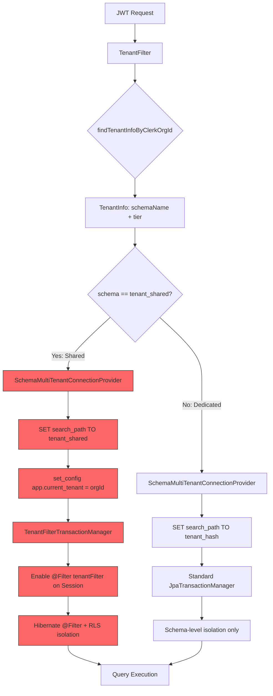
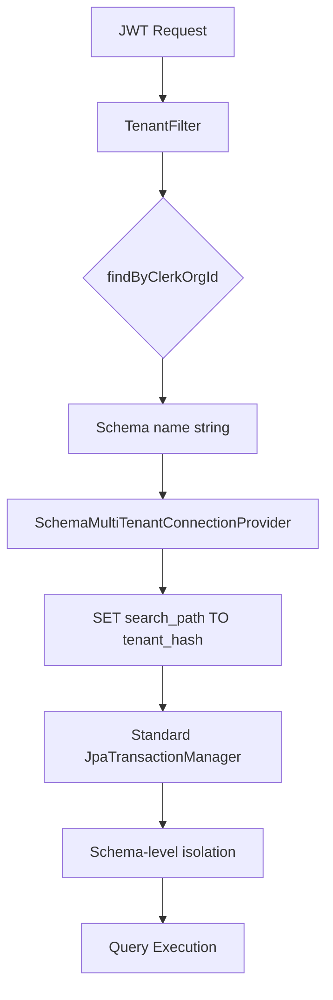
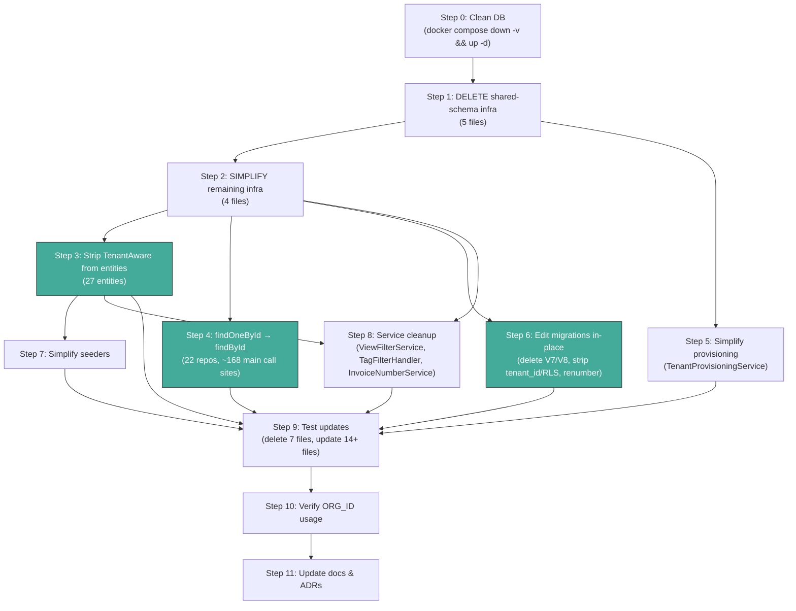
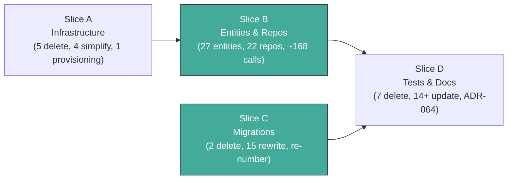

# Dedicated Schema for All Tenants -- Architecture & Migration Guide

> This document supersedes the shared-schema sections of `architecture/ARCHITECTURE.md` Section 8 (Database Architecture) and [ADR-012](../adr/ADR-012-row-level-isolation.md). After implementation, Section 8 should be updated to describe the single-path dedicated-schema model, and ADR-012 should link to [ADR-064](../adr/ADR-064-dedicated-schema-only.md) as its successor.

---

## Overview

The DocTeams backend currently supports two tenant isolation paths: **dedicated schemas** (`tenant_<hash>`) for Pro-tier organizations and a **shared schema** (`tenant_shared`) with row-level isolation for Starter-tier organizations. This dual-path architecture was introduced in Phase 2 ([ADR-011](../adr/ADR-011-tiered-tenancy.md), [ADR-012](../adr/ADR-012-row-level-isolation.md)) to reduce provisioning cost for free-tier tenants.

In practice, the shared-schema path has become a permanent maintenance tax. Every tenant-scoped entity must implement `TenantAware`, carry a `tenant_id` column, and be annotated with Hibernate `@Filter`/`@FilterDef`. Every repository needs a custom `findOneById()` workaround because `JpaRepository.findById()` uses `EntityManager.find()` which bypasses `@Filter`. Every migration includes RLS policy boilerplate. Multiple bugs have originated from this split: `findById` bypassing `@Filter` (shared-schema data leak), OSIV pinning `EntityManager` to the wrong schema, RLS session variable races, and native queries silently skipping `@Filter`.

This refactoring eliminates the shared-schema path entirely. Every tenant -- regardless of plan tier -- gets a dedicated `tenant_<hash>` schema. The `Tier` enum stays for billing and feature gating, but no longer determines schema topology. This is a **clean-slate migration**: no production data exists, so we rewrite Flyway migrations rather than adding new ones. The result is a simpler codebase with one isolation model, fewer annotations per entity, no custom transaction manager, and no RLS policies.

**Impact summary**: 5 files deleted, 4 infrastructure files simplified, 27 entities stripped of shared-schema annotations, 22 repositories lose `findOneById` (+ 3 lose `findAllByIds`), ~168 main-source call sites updated, 17 migrations rewritten, 7 test files deleted.

---

## 1. Current State Analysis

### 1.1 Shared-Schema Infrastructure

The shared-schema path is implemented by five purpose-built classes in the `multitenancy` and `provisioning` packages:

| Class | File | Purpose |
|-------|------|---------|
| `TenantAware` | `multitenancy/TenantAware.java` | Marker interface; entities implement `getTenantId()`/`setTenantId()` |
| `TenantAwareEntityListener` | `multitenancy/TenantAwareEntityListener.java` | `@PrePersist` sets `tenant_id` when operating in `tenant_shared` |
| `TenantFilterTransactionManager` | `multitenancy/TenantFilterTransactionManager.java` | Custom `JpaTransactionManager` enabling Hibernate `@Filter("tenantFilter")` for shared-schema sessions |
| `TenantInfo` | `multitenancy/TenantInfo.java` | Record `(schemaName, tier)` for tier-aware tenant cache in `TenantFilter` |
| `TenantUpgradeService` | `provisioning/TenantUpgradeService.java` | 244-line service migrating data from `tenant_shared` to dedicated schema on tier upgrade |

These are supported by shared-schema artifacts spread across the codebase:

| Artifact | Count | Description |
|----------|-------|-------------|
| `TenantAware` entity implementations | 27 | Each has `@FilterDef`, `@Filter`, `@EntityListeners`, `tenant_id` field, getter/setter |
| `findOneById` JPQL methods | 22 repos | Workaround for `EntityManager.find()` bypassing `@Filter` |
| `findAllByIds` JPQL methods | 3 repos | Same workaround for batch lookups (`ProjectRepository`, `InvoiceRepository`, `TagRepository`) |
| `findOneById` call sites | ~168 main, ~80 test | Across services, controllers (168 in main source, ~80 additional in tests) |
| RLS policies in migrations | 17 files | `tenant_id` column + index + `ENABLE ROW LEVEL SECURITY` + `CREATE POLICY` |
| `tenant_id` columns | ~35 tables | Every table in V7+ migrations |
| Shared-schema test files | 7 | Dedicated integration tests for shared-schema isolation |
| Dual unique indexes | 2 migrations | V23 (invoices), V29 (document_templates) -- separate indexes for `tenant_id IS NULL` vs `IS NOT NULL` |

### 1.2 Current Dual-Path Flow



Red nodes represent the shared-schema-only code path that this refactoring eliminates.

---

## 2. Target State

### 2.1 Simplified Single-Path Flow



### 2.2 Before/After Comparison

| Component | Before | After |
|-----------|--------|-------|
| `TenantAware` interface | 27 entities implement it | **DELETED** |
| `TenantAwareEntityListener` | `@PrePersist` populates `tenant_id` | **DELETED** |
| `TenantFilterTransactionManager` | Custom `JpaTransactionManager` enabling `@Filter` | **DELETED** -- replaced with stock `JpaTransactionManager` |
| `TenantUpgradeService` | 244-line Starter-to-Pro data migration | **DELETED** |
| `TenantInfo` record | `(schemaName, tier)` for cache | **DELETED** -- cache stores `String` schema name |
| `TenantFilter` cache | `Cache<String, TenantInfo>` | `Cache<String, String>` |
| `SchemaMultiTenantConnectionProvider` | `setCurrentTenant()`, `resetCurrentTenant()`, `SHARED_SCHEMA` | Simplified: `setSearchPath()` / `resetSearchPath()` only |
| `TenantMigrationRunner` | `bootstrapSharedSchema()` + skip shared in loop | Iterate all mappings, migrate each |
| `TenantProvisioningService` | `provisionStarter()` vs `provisionPro()` | Single `provisionTenant()` path |
| `OrgSchemaMappingRepository` | `findTenantInfoByClerkOrgId()` with JOIN | `findByClerkOrgId()` returning schema name |
| Entity annotations | `@FilterDef` + `@Filter` + `@EntityListeners` + `tenant_id` field | Plain `@Entity` + `@Table` |
| Repository `findOneById` | Custom JPQL per repo | Standard `findById()` from `JpaRepository` |
| `ViewFilterService` | Adds `e.tenant_id = :tenantOrgId` to native queries | No tenant clause needed (schema isolation handles it) |
| Migrations | `tenant_id` col + index + RLS policy per table | Clean DDL, no RLS |
| Provisioning | Tier-branched: Starter -> shared, Pro -> dedicated | All tiers -> dedicated |
| Tests | 7 shared-schema test files + shared-schema assertions | Deleted or updated |

### 2.3 What Stays Unchanged

- `RequestScopes.TENANT_ID` -- still bound by `TenantFilter`, still used by `TenantIdentifierResolver`
- `RequestScopes.ORG_ID` -- still bound, still used by domain events, audit, notifications, seeders
- `RequestScopes.MEMBER_ID` / `ORG_ROLE` -- no change
- `Tier` enum -- stays for billing/feature gating (member limits, etc.)
- `PlanSyncService` / `PlanLimits` -- feature gating by tier, no schema references
- `ScopedFilterChain` / `ScopedValue` infrastructure -- unchanged
- `TenantIdentifierResolver` -- reads `RequestScopes.TENANT_ID` as before

---

## 3. Detailed Change Inventory

### 3.1 Files to DELETE (5 files)

| File | Lines | Rationale |
|------|-------|-----------|
| `multitenancy/TenantFilterTransactionManager.java` | ~35 | Custom `JpaTransactionManager` that enabled `@Filter("tenantFilter")` for shared-schema sessions. With no `@Filter`, stock `JpaTransactionManager` suffices. |
| `multitenancy/TenantAwareEntityListener.java` | ~20 | `@PrePersist` listener that populated `tenant_id` on INSERT in `tenant_shared`. No `tenant_id` field means no listener. |
| `multitenancy/TenantAware.java` | ~10 | Marker interface for shared-schema row-level isolation. All 27 implementations will be cleaned. |
| `provisioning/TenantUpgradeService.java` | ~244 | Starter-to-Pro data migration service (`copyData`, `atomicCutover`). No upgrade path needed when all tenants start dedicated. |
| `multitenancy/TenantInfo.java` | ~10 | Record `(schemaName, tier)` only existed to carry tier through `TenantFilter` cache for shared-schema branching. |

### 3.2 Infrastructure Files to SIMPLIFY (4 files)

#### 3.2.1 `HibernateMultiTenancyConfig.java`

Replace the custom transaction manager bean with a stock `JpaTransactionManager`:

**Before:**
```java
@Bean
@Primary
PlatformTransactionManager transactionManager(EntityManagerFactory emf) {
    return new TenantFilterTransactionManager(emf);
}
```

**After:**
```java
@Bean
@Primary
PlatformTransactionManager transactionManager(EntityManagerFactory emf) {
    return new JpaTransactionManager(emf);
}
```

Remove the `TenantFilterTransactionManager` import.

#### 3.2.2 `SchemaMultiTenantConnectionProvider.java`

**Remove entirely:**
- `SHARED_SCHEMA` constant (`"tenant_shared"`)
- `ORG_ID_PATTERN` constant
- `setCurrentTenant(Connection, String)` method (lines 576-588 in context) -- set `app.current_tenant` via `set_config()` for RLS
- `resetCurrentTenant(Connection, String)` method (lines 590-596) -- `RESET app.current_tenant`
- `validateOrgId(String)` method (lines 607-610)

**Remove calls** to `setCurrentTenant()` from `getConnection()` and `resetCurrentTenant()` from `releaseConnection()`.

**Simplify `sanitizeSchema()`** -- drop the `SHARED_SCHEMA` branch:

**Before:**
```java
private String sanitizeSchema(String schema) {
    if ("public".equals(schema)
        || SHARED_SCHEMA.equals(schema)
        || SCHEMA_PATTERN.matcher(schema).matches()) {
      return schema;
    }
    throw new IllegalArgumentException("Invalid schema name: " + schema);
}
```

**After:**
```java
private String sanitizeSchema(String schema) {
    if ("public".equals(schema) || SCHEMA_PATTERN.matcher(schema).matches()) {
        return schema;
    }
    throw new IllegalArgumentException("Invalid schema name: " + schema);
}
```

**Simplified `getConnection()` and `releaseConnection()`:**

```java
@Override
public Connection getConnection(String tenantIdentifier) throws SQLException {
    Connection connection = getAnyConnection();
    try {
        setSearchPath(connection, tenantIdentifier);
    } catch (SQLException e) {
        releaseAnyConnection(connection);
        throw e;
    }
    return connection;
}

@Override
public void releaseConnection(String tenantIdentifier, Connection connection) throws SQLException {
    resetSearchPath(connection);
    releaseAnyConnection(connection);
}
```

#### 3.2.3 `TenantFilter.java`

**Change cache type** from `Cache<String, TenantInfo>` to `Cache<String, String>`:

**Before:**
```java
private final Cache<String, TenantInfo> tenantCache =
    Caffeine.newBuilder().maximumSize(10_000).expireAfterWrite(Duration.ofHours(1)).build();
```

**After:**
```java
private final Cache<String, String> tenantCache =
    Caffeine.newBuilder().maximumSize(10_000).expireAfterWrite(Duration.ofHours(1)).build();
```

**Update `resolveTenant()` and `lookupTenant()`** to work with plain `String`:

```java
private String resolveTenant(String clerkOrgId) {
    String cached = tenantCache.getIfPresent(clerkOrgId);
    if (cached != null) {
        return cached;
    }
    String schema = lookupTenant(clerkOrgId);
    if (schema != null) {
        tenantCache.put(clerkOrgId, schema);
    }
    return schema;
}

private String lookupTenant(String clerkOrgId) {
    return mappingRepository.findByClerkOrgId(clerkOrgId)
        .map(OrgSchemaMapping::getSchemaName)
        .orElse(null);
}
```

**Update `doFilterInternal()`** -- use `String schema` instead of `TenantInfo info`:

```java
String schema = resolveTenant(orgId);
if (schema != null) {
    ScopedFilterChain.runScoped(
        ScopedValue.where(RequestScopes.TENANT_ID, schema)
            .where(RequestScopes.ORG_ID, orgId),
        filterChain, request, response);
    return;
}
```

**Remove** the `TenantInfo` import. Remove the `findTenantInfoByClerkOrgId` dependency.

#### 3.2.4 `TenantMigrationRunner.java`

**Remove:**
- `SHARED_SCHEMA` constant
- `bootstrapSharedSchema()` method (lines 889-899 in context) -- creates and migrates `tenant_shared`
- The `if (SHARED_SCHEMA.equals(mapping.getSchemaName())) continue` skip in the migration loop

**Simplified `run()` method:**

```java
@Override
public void run(ApplicationArguments args) {
    var allMappings = mappingRepository.findAll();
    if (allMappings.isEmpty()) {
        log.info("No tenant schemas found -- skipping per-tenant migrations");
        return;
    }

    log.info("Running tenant migrations for {} schemas", allMappings.size());
    for (var mapping : allMappings) {
        try {
            migrateSchema(mapping.getSchemaName());
        } catch (Exception e) {
            log.error("Failed to migrate schema {}", mapping.getSchemaName(), e);
        }
    }
    log.info("Tenant migration runner completed");
}
```

### 3.3 Entity Changes (27 entities)

For each entity implementing `TenantAware`, remove:

1. `implements TenantAware`
2. `@EntityListeners(TenantAwareEntityListener.class)` annotation
3. `@FilterDef(name = "tenantFilter", parameters = @ParamDef(name = "tenantId", type = String.class))` annotation
4. `@Filter(name = "tenantFilter", condition = "tenant_id = :tenantId")` annotation
5. `@Column(name = "tenant_id") private String tenantId;` field
6. `getTenantId()` / `setTenantId()` methods (with `@Override` annotations)
7. Unused imports: `org.hibernate.annotations.Filter`, `org.hibernate.annotations.FilterDef`, `org.hibernate.annotations.ParamDef`, `io.b2mash.b2b.b2bstrawman.multitenancy.TenantAware`, `io.b2mash.b2b.b2bstrawman.multitenancy.TenantAwareEntityListener`, `jakarta.persistence.EntityListeners`

#### Before/After Example: `Project.java`

**Before:**
```java
package io.b2mash.b2b.b2bstrawman.project;

import io.b2mash.b2b.b2bstrawman.multitenancy.TenantAware;
import io.b2mash.b2b.b2bstrawman.multitenancy.TenantAwareEntityListener;
import jakarta.persistence.Column;
import jakarta.persistence.Entity;
import jakarta.persistence.EntityListeners;
import jakarta.persistence.GeneratedValue;
import jakarta.persistence.GenerationType;
import jakarta.persistence.Id;
import jakarta.persistence.Table;
import java.time.Instant;
import java.util.HashMap;
import java.util.List;
import java.util.Map;
import java.util.UUID;
import org.hibernate.annotations.Filter;
import org.hibernate.annotations.FilterDef;
import org.hibernate.annotations.JdbcTypeCode;
import org.hibernate.annotations.ParamDef;
import org.hibernate.type.SqlTypes;

@Entity
@Table(name = "projects")
@FilterDef(name = "tenantFilter", parameters = @ParamDef(name = "tenantId", type = String.class))
@Filter(name = "tenantFilter", condition = "tenant_id = :tenantId")
@EntityListeners(TenantAwareEntityListener.class)
public class Project implements TenantAware {

  @Id
  @GeneratedValue(strategy = GenerationType.UUID)
  private UUID id;

  @Column(name = "name", nullable = false, length = 255)
  private String name;

  // ... other fields ...

  @Column(name = "tenant_id")
  private String tenantId;

  // ... constructors, getters ...

  @Override
  public String getTenantId() {
    return tenantId;
  }

  @Override
  public void setTenantId(String tenantId) {
    this.tenantId = tenantId;
  }

  // ... other methods ...
}
```

**After:**
```java
package io.b2mash.b2b.b2bstrawman.project;

import jakarta.persistence.Column;
import jakarta.persistence.Entity;
import jakarta.persistence.GeneratedValue;
import jakarta.persistence.GenerationType;
import jakarta.persistence.Id;
import jakarta.persistence.Table;
import java.time.Instant;
import java.util.HashMap;
import java.util.List;
import java.util.Map;
import java.util.UUID;
import org.hibernate.annotations.JdbcTypeCode;
import org.hibernate.type.SqlTypes;

@Entity
@Table(name = "projects")
public class Project {

  @Id
  @GeneratedValue(strategy = GenerationType.UUID)
  private UUID id;

  @Column(name = "name", nullable = false, length = 255)
  private String name;

  // ... other fields (tenant_id field REMOVED) ...

  // ... constructors, getters (getTenantId/setTenantId REMOVED) ...
}
```

#### Full Entity List

| # | Package | Entity | File |
|---|---------|--------|------|
| 1 | `project` | `Project` | `project/Project.java` |
| 2 | `document` | `Document` | `document/Document.java` |
| 3 | `member` | `Member` | `member/Member.java` |
| 4 | `member` | `ProjectMember` | `member/ProjectMember.java` |
| 5 | `customer` | `Customer` | `customer/Customer.java` |
| 6 | `customer` | `CustomerProject` | `customer/CustomerProject.java` |
| 7 | `task` | `Task` | `task/Task.java` |
| 8 | `timeentry` | `TimeEntry` | `timeentry/TimeEntry.java` |
| 9 | `invoice` | `Invoice` | `invoice/Invoice.java` |
| 10 | `invoice` | `InvoiceLine` | `invoice/InvoiceLine.java` |
| 11 | `comment` | `Comment` | `comment/Comment.java` |
| 12 | `notification` | `Notification` | `notification/Notification.java` |
| 13 | `notification` | `NotificationPreference` | `notification/NotificationPreference.java` |
| 14 | `audit` | `AuditEvent` | `audit/AuditEvent.java` |
| 15 | `portal` | `PortalContact` | `portal/PortalContact.java` |
| 16 | `billingrate` | `BillingRate` | `billingrate/BillingRate.java` |
| 17 | `costrate` | `CostRate` | `costrate/CostRate.java` |
| 18 | `budget` | `ProjectBudget` | `budget/ProjectBudget.java` |
| 19 | `settings` | `OrgSettings` | `settings/OrgSettings.java` |
| 20 | `tag` | `Tag` | `tag/Tag.java` |
| 21 | `tag` | `EntityTag` | `tag/EntityTag.java` |
| 22 | `view` | `SavedView` | `view/SavedView.java` |
| 23 | `template` | `DocumentTemplate` | `template/DocumentTemplate.java` |
| 24 | `template` | `GeneratedDocument` | `template/GeneratedDocument.java` |
| 25 | `fielddefinition` | `FieldDefinition` | `fielddefinition/FieldDefinition.java` |
| 26 | `fielddefinition` | `FieldGroup` | `fielddefinition/FieldGroup.java` |
| 27 | `fielddefinition` | `FieldGroupMember` | `fielddefinition/FieldGroupMember.java` |

**Note**: `RetentionPolicy`, `DataSubjectRequest`, `ChecklistTemplate`, `ChecklistTemplateItem`, `ChecklistInstance`, and `ChecklistInstanceItem` are listed in the requirements file (32 entities) but do not yet exist in the codebase (Phase 13 planned, not implemented). If Phase 13 is implemented before this refactoring, those 5 additional entities will also need the same treatment. The migration V31 for compliance tables also does not exist yet.

### 3.4 Repository Changes: `findOneById` to `findById` (22 repositories + 3 with `findAllByIds`)

Every tenant-scoped repository defines a custom JPQL `findOneById()` method that exists solely to respect Hibernate `@Filter`. With no `@Filter`, standard `JpaRepository.findById()` works correctly. Similarly, 3 repositories have `findAllByIds()` JPQL workarounds that can be replaced with `JpaRepository.findAllById()`.

**For each repository**, delete:
```java
/**
 * JPQL-based findById that respects Hibernate @Filter (unlike JpaRepository.findById which uses
 * EntityManager.find and bypasses @Filter). Required for shared-schema tenant isolation.
 */
@Query("SELECT p FROM Project p WHERE p.id = :id")
Optional<Project> findOneById(@Param("id") UUID id);
```

**For each call site** (~168 in main source across 58 files, plus ~80 additional in test files), replace `findOneById(id)` with `findById(id)`. The return type (`Optional<Entity>`) is identical, so this is a mechanical find-and-replace.

#### Before/After Example: `ProjectRepository.java`

**Before:**
```java
public interface ProjectRepository extends JpaRepository<Project, UUID> {

  @Query("SELECT p FROM Project p WHERE p.id = :id")
  Optional<Project> findOneById(@Param("id") UUID id);

  // Also remove findAllByIds workaround if present:
  @Query("SELECT p FROM Project p WHERE p.id IN :ids")
  List<Project> findAllByIds(@Param("ids") List<UUID> ids);

  // ... other methods ...
}
```

**After:**
```java
public interface ProjectRepository extends JpaRepository<Project, UUID> {
  // findById() inherited from JpaRepository -- no custom method needed

  // findAllById() inherited from JpaRepository -- no custom method needed

  // ... other methods ...
}
```

**Also remove `findAllByIds()` JPQL workarounds** (same `@Filter` bypass concern). Replace call sites with `findAllById()` from `JpaRepository`:

| Repository | Has `findAllByIds` | Call sites |
|-----------|-------------------|------------|
| `ProjectRepository` | Yes | `InvoiceService`, `CustomerContextBuilder` |
| `InvoiceRepository` | Yes | `TimeEntryController` |
| `TagRepository` | Yes | `EntityTagService` (3 call sites), `TemplateContextHelper` |

#### Full Repository List with `findOneById` (22 repositories)

`ProjectRepository`, `DocumentRepository`, `MemberRepository`, `CustomerRepository`, `TaskRepository`, `TimeEntryRepository`, `InvoiceRepository`, `InvoiceLineRepository`, `CommentRepository`, `NotificationRepository`, `AuditEventRepository`, `PortalContactRepository`, `BillingRateRepository`, `CostRateRepository`, `ProjectBudgetRepository`, `OrgSettingsRepository`, `TagRepository`, `SavedViewRepository`, `DocumentTemplateRepository`, `GeneratedDocumentRepository`, `FieldDefinitionRepository`, `FieldGroupRepository`

**Note**: Phase 13 repositories (`RetentionPolicyRepository`, `DataSubjectRequestRepository`, `ChecklistTemplateRepository`, `ChecklistInstanceRepository`, `ChecklistInstanceItemRepository`, `ChecklistTemplateItemRepository`) are not yet merged. If Phase 13 is implemented before this refactoring, add those 6 repositories to the cleanup list.

### 3.5 Migration Changes (Clean Slate — No Data)

No production data exists. `docker compose down -v` destroys all schemas. Edit SQL files in-place.

#### 3.5.1 Migrations to DELETE

| Migration | Description | Why Delete |
|-----------|-------------|------------|
| `V7__add_tenant_id_for_shared.sql` | Adds `tenant_id` + RLS to V1-V5 tables (projects, documents, members, project_members) | Foundational shared-schema migration. All artifacts are being removed from source tables. |
| `V8__shared_schema_member_unique.sql` | Widens `UNIQUE(clerk_user_id)` to `UNIQUE(clerk_user_id, tenant_id)` | The original `UNIQUE(clerk_user_id)` from V3 is correct for dedicated schemas. |

#### 3.5.2 Edit In-Place + Renumber

Delete V7 and V8, then renumber V9→V7 through V30→V28. For each renamed migration, remove:
- `tenant_id` column definitions
- `tenant_id` indexes (`idx_*_tenant_id`)
- `ENABLE ROW LEVEL SECURITY` + `CREATE POLICY` blocks
- Composite unique constraints containing `tenant_id` (replace with non-tenant equivalents)

V3 already has the correct `UNIQUE(clerk_user_id)` — V8's widening is simply deleted.

#### 3.5.3 Special Cases (unique constraints that change shape)

| Migration | Constraint | Before | After |
|-----------|-----------|--------|-------|
| V9 (customers) | email uniqueness | `UNIQUE(email, tenant_id)` | `UNIQUE(email)` |
| V19 (org_settings) | singleton | `UNIQUE INDEX ON (tenant_id)` | Remove entirely |
| V23 (invoices) | number uniqueness | Dual partial indexes (NULL/NOT NULL tenant_id) | Single `UNIQUE(invoice_number) WHERE invoice_number IS NOT NULL` |
| V23 (invoice_counters) | counter | `UNIQUE INDEX ON (tenant_id)` | Remove entirely (see Section 3.7.3) |
| V24 (field_definitions) | slug uniqueness | `UNIQUE(tenant_id, entity_type, slug)` | `UNIQUE(entity_type, slug)` |
| V24 (field_groups) | slug uniqueness | `UNIQUE(tenant_id, entity_type, slug)` | `UNIQUE(entity_type, slug)` |
| V29 (document_templates) | slug uniqueness | Dual partial indexes (NULL/NOT NULL tenant_id) | Single `UNIQUE(slug)` |

#### 3.5.4 Verification

```bash
grep -r "tenant_id\|ROW LEVEL SECURITY\|CREATE POLICY\|pg_policies" \
  backend/src/main/resources/db/migration/tenant/ --include="*.sql"
# Expected: 0 results
```

### 3.6 Seeder Changes

#### `FieldPackSeeder`, `TemplatePackSeeder`

These seeders accept `(String schema, String orgId)` and bind both `RequestScopes.TENANT_ID` and `RequestScopes.ORG_ID`. The `ORG_ID` binding was needed by `TenantAwareEntityListener` to populate `tenant_id` on persisted entities.

After deleting `TenantAwareEntityListener`, verify each seeder:
- If it calls `setTenantId()` on entities directly: **remove** those calls (the `tenant_id` field no longer exists).
- `ORG_ID` binding can stay -- it is still useful for audit events, logging, and domain events.

Based on the codebase analysis, `setTenantId()` is only called by `TenantAwareEntityListener` at runtime. No seeder calls it directly. The seeders persist entities through JPA repositories, and the listener populated `tenant_id` automatically. With the listener deleted and the field removed, no seeder changes are needed beyond removing any dead `setTenantId()` calls if discovered.

#### `CompliancePackSeeder` (Phase 13 -- if merged)

Same treatment. Verify no direct `setTenantId()` calls.

#### `TenantProvisioningService.seedDefaultRetentionPolicies()` (Phase 13 -- if merged)

The requirements file mentions removing `customerPolicy.setTenantId(orgId)` / `auditPolicy.setTenantId(orgId)` calls. Verify this exists when Phase 13 is merged.

### 3.7 Service Changes

#### 3.7.1 `ViewFilterService` -- Remove Shared-Schema Filter Branching

**File**: `view/ViewFilterService.java`

Currently adds `e.tenant_id = :tenantOrgId` to all native queries for multi-tenant isolation, because native queries bypass Hibernate `@Filter`. With dedicated schemas, `search_path` provides isolation for native queries, making this explicit filter unnecessary.

**Remove:**
```java
// Always add tenant_id filter for multi-tenant isolation. Native queries bypass
// Hibernate @Filter, so this explicit filter provides tenant isolation in shared schemas
// and defense-in-depth for dedicated schemas.
if (!RequestScopes.ORG_ID.isBound()) {
    throw new IllegalStateException("ORG_ID must be bound for view filter execution");
}
var conditions = new ArrayList<String>();
conditions.add("e.tenant_id = :tenantOrgId");
params.put("tenantOrgId", RequestScopes.ORG_ID.get());
```

**Replace with:**
```java
var conditions = new ArrayList<String>();
```

The `ORG_ID.isBound()` check is no longer needed here -- schema isolation handles tenant filtering.

#### 3.7.2 `TagFilterHandler` -- Remove `tenant_id` JOIN Condition

**File**: `view/TagFilterHandler.java`

The EXISTS subquery for tag filtering contains a hardcoded `tenant_id` reference:

```java
// CURRENT (line 41-43):
existsClauses.add(
    "EXISTS (SELECT 1 FROM entity_tags et JOIN tags t ON et.tag_id = t.id"
        + " WHERE et.tenant_id = e.tenant_id"
        + " AND et.entity_type = :entityType AND et.entity_id = e.id AND t.slug = :"
        + paramName
        + ")");
```

**Replace with** (remove `tenant_id` cross-table condition — schema isolation handles it):
```java
existsClauses.add(
    "EXISTS (SELECT 1 FROM entity_tags et JOIN tags t ON et.tag_id = t.id"
        + " WHERE et.entity_type = :entityType AND et.entity_id = e.id AND t.slug = :"
        + paramName
        + ")");
```

> **Critical**: Without this fix, any saved view with tag filters will produce a runtime SQL error (`column e.tenant_id does not exist`) because the `tenant_id` column is removed from all tables.

#### 3.7.3 `InvoiceNumberService` + `InvoiceCounter` -- Remove Tenant Discriminator

**File**: `invoice/InvoiceNumberService.java`

This service uses a native SQL UPSERT that references `tenant_id` in the `invoice_counters` table:

```java
// CURRENT (lines 28, 43-59):
private static final String DEDICATED_SCHEMA_SENTINEL = "__dedicated__";

public String assignNumber(String tenantId) {
    String effectiveTenantId = tenantId != null ? tenantId : DEDICATED_SCHEMA_SENTINEL;
    var result = entityManager
        .createNativeQuery(
            "INSERT INTO invoice_counters (id, tenant_id, next_number)"
                + " VALUES (gen_random_uuid(), :tenantId, 2)"
                + " ON CONFLICT (tenant_id)"
                + " DO UPDATE SET next_number = invoice_counters.next_number + 1"
                + " RETURNING next_number - 1")
        .setParameter("tenantId", effectiveTenantId)
        .getSingleResult();
    // ...
}
```

**Replace with** (no tenant discriminator needed — one counter row per schema):
```java
public String assignNumber() {
    var result = entityManager
        .createNativeQuery(
            "INSERT INTO invoice_counters (id, next_number)"
                + " VALUES (gen_random_uuid(), 2)"
                + " ON CONFLICT ON CONSTRAINT invoice_counters_singleton"
                + " DO UPDATE SET next_number = invoice_counters.next_number + 1"
                + " RETURNING next_number - 1")
        .getSingleResult();
    int number = ((Number) result).intValue();
    return String.format("INV-%04d", number);
}
```

**Migration change** (V23, renumbered to V21): Replace the `tenant_id`-based unique index with a singleton constraint:
```sql
-- Remove:
CREATE UNIQUE INDEX idx_invoice_counters_tenant ON invoice_counters (tenant_id);
-- Replace with:
ALTER TABLE invoice_counters ADD CONSTRAINT invoice_counters_singleton UNIQUE (id);
-- Or simpler: single row per schema via CHECK or unique on a constant column
```

**`InvoiceCounter` entity** (`invoice/InvoiceCounter.java`): Remove the `tenant_id` field, constructor parameter, and getter:
```java
// REMOVE:
@Column(name = "tenant_id")
private String tenantId;

public InvoiceCounter(String tenantId) { ... }  // Replace with no-arg or remove
public String getTenantId() { ... }
private static final String DEDICATED_SCHEMA_SENTINEL = "__dedicated__";
```

**Callers of `assignNumber(tenantId)`**: Update to `assignNumber()` (no parameter). Search: `InvoiceService.java` calls this method.

> **Critical**: Without this fix, `InvoiceNumberService` will throw a runtime SQL error when generating invoice numbers because the `tenant_id` column is removed from `invoice_counters` but the native SQL still references it.

#### 3.7.4 `OrgSchemaMappingRepository` -- Simplify Query

**Remove** the `findTenantInfoByClerkOrgId()` method entirely:

```java
// DELETE this method:
@Query("""
    SELECT new io.b2mash.b2b.b2bstrawman.multitenancy.TenantInfo(m.schemaName, o.tier)
    FROM OrgSchemaMapping m JOIN io.b2mash.b2b.b2bstrawman.provisioning.Organization o
      ON m.clerkOrgId = o.clerkOrgId
    WHERE m.clerkOrgId = :clerkOrgId
    """)
Optional<TenantInfo> findTenantInfoByClerkOrgId(String clerkOrgId);
```

`TenantFilter` now uses the already-existing `findByClerkOrgId()` method which returns `Optional<OrgSchemaMapping>`.

#### 3.7.5 Services That Keep `ORG_ID` (No Changes)

These services read `RequestScopes.ORG_ID` for **business** purposes (domain events, audit, notifications) -- not for schema routing:

`ProjectService`, `TimeEntryService`, `InvoiceService`, `TaskService`, `DocumentService`, `CommentService`, `CustomerService`, `CustomerProjectService`, `ProjectMemberService`, `NotificationEventHandler`, `PortalEventHandler`

**No changes needed** -- `ORG_ID` stays as a business identity.

### 3.8 Provisioning Changes

#### 3.8.1 `TenantProvisioningService` -- Single Path

**Remove:**
- `SHARED_SCHEMA` constant
- `provisionStarter()` method
- The `if (org.getTier() == Tier.STARTER)` branch in `provisionTenant()`

**Simplified `provisionTenant()`:**
```java
@Retryable(
    retryFor = ProvisioningException.class,
    noRetryFor = IllegalArgumentException.class,
    maxAttempts = 3,
    backoff = @Backoff(delay = 1000, multiplier = 2))
public ProvisioningResult provisionTenant(String clerkOrgId, String orgName) {
    var existingMapping = mappingRepository.findByClerkOrgId(clerkOrgId);
    if (existingMapping.isPresent()) {
        log.info("Tenant already provisioned for org {}", clerkOrgId);
        return ProvisioningResult.alreadyProvisioned(existingMapping.get().getSchemaName());
    }

    var org = organizationRepository
        .findByClerkOrgId(clerkOrgId)
        .orElseGet(() -> organizationRepository.save(new Organization(clerkOrgId, orgName)));

    org.markInProgress();
    organizationRepository.save(org);
    organizationRepository.flush();

    try {
        String schemaName = SchemaNameGenerator.generateSchemaName(clerkOrgId);
        log.info("Provisioning tenant schema {} for org {}", schemaName, clerkOrgId);

        createSchema(schemaName);
        runTenantMigrations(schemaName);
        fieldPackSeeder.seedPacksForTenant(schemaName, clerkOrgId);
        templatePackSeeder.seedPacksForTenant(schemaName, clerkOrgId);
        createMapping(clerkOrgId, schemaName);
        String planSlug = org.getPlanSlug() != null ? org.getPlanSlug() : "starter";
        subscriptionService.createSubscription(org.getId(), planSlug);

        org.markCompleted();
        organizationRepository.save(org);

        log.info("Successfully provisioned tenant {} for org {}", schemaName, clerkOrgId);
        return ProvisioningResult.success(schemaName);
    } catch (Exception e) {
        log.error("Failed to provision tenant for org {}", clerkOrgId, e);
        org.markFailed();
        organizationRepository.save(org);
        throw new ProvisioningException("Provisioning failed for org " + clerkOrgId, e);
    }
}
```

The `provisionPro()` method is inlined (it was the only path). `provisionStarter()` is deleted.

### 3.9 Test Changes

#### 3.9.1 Tests to DELETE Entirely (7 files)

| Test File | Reason |
|-----------|--------|
| `multitenancy/StarterTenantIntegrationTest.java` | Tests two Starter orgs in `tenant_shared` with CRUD isolation via `@Filter` |
| `multitenancy/MixedTenantIntegrationTest.java` | Tests cross-tier isolation (Starter in shared + Pro in dedicated) |
| `timeentry/TimeEntrySharedSchemaIntegrationTest.java` | Tests time entry isolation in `tenant_shared` |
| `task/TaskStarterTenantIntegrationTest.java` | Tests task CRUD isolation in `tenant_shared` |
| `billing/BillingUpgradeIntegrationTest.java` | Tests billing tier upgrade with schema migration |
| `provisioning/TierUpgradeIntegrationTest.java` | Tests Starter-to-Pro data migration from `tenant_shared` |
| `compliance/ComplianceSharedSchemaTest.java` | Tests compliance isolation in `tenant_shared` (Phase 13, if merged) |

#### 3.9.2 Tests to UPDATE

| Test File | What to Change |
|-----------|----------------|
| `provisioning/ProvisioningIntegrationTest.java` | Remove Starter-path test cases. All provisioning tests should expect dedicated schema (`tenant_<hash>`), never `tenant_shared`. |
| `provisioning/TenantProvisioningServiceTest.java` | Remove Starter-specific mocking (`provisionStarter()`, `SHARED_SCHEMA`). Update to test single provisioning path. |
| `audit/AuditTenantIsolationTest.java` | May reference shared schema in setup. Update schema references. |
| `audit/InternalAuditControllerTest.java` | May reference shared schema. Update schema references. |
| `member/PlanEnforcementIntegrationTest.java` | Remove Starter-schema-specific setup. Ensure PRO plan sync still occurs. |

#### 3.9.3 Tests Referencing `findOneById` or `tenant_shared`

All 26 test files found by grep need review:

- **`findOneById` references**: Replace with `findById` (mechanical).
- **`"tenant_shared"` references**: Update to expect `tenant_<hash>` dedicated schema names.
- **Tests provisioning Starter tenants**: These will now get dedicated schemas. Assertions about schema names need updating.

#### 3.9.4 Additional Test Files to Review

| Test File | Likely Change |
|-----------|---------------|
| `view/ViewFilterIntegrationTest.java` | Remove `tenantOrgId` parameter assertions |
| `view/SavedViewIntegrationTest.java` | Remove shared-schema references |
| `tag/TagIntegrationTest.java` | Remove shared-schema references |
| `fielddefinition/FieldDefinitionIntegrationTest.java` | Remove `findOneById` calls |
| `fielddefinition/FieldGroupIntegrationTest.java` | Remove `findOneById` calls |
| `fielddefinition/FieldGroupMemberIntegrationTest.java` | Remove `findOneById` calls |
| `invoice/InvoiceIntegrationTest.java` | Remove `findOneById` calls, shared-schema refs |
| `invoice/InvoiceLifecycleIntegrationTest.java` | Remove `findOneById` calls |
| `template/DocumentTemplateIntegrationTest.java` | Remove `findOneById` calls |
| `template/*ContextBuilderTest.java` | Remove `findOneById` calls |
| `comment/CommentServiceIntegrationTest.java` | Remove `findOneById` calls |
| `document/DocumentServiceTest.java` | Remove `findOneById` calls |
| `project/ProjectServiceTest.java` | Remove `findOneById` calls |
| `customerbackend/handler/PortalEventHandlerTest.java` | Remove `findOneById` calls |

---

## 4. Execution Order

### 4.1 Dependency Graph



Green nodes (Steps 3, 4, 6) can execute in parallel after Step 2 completes.

### 4.2 Parallelization Opportunities

| Phase | Steps | Can Parallel? |
|-------|-------|---------------|
| Foundation | 0 -> 1 -> 2 | Sequential |
| Core cleanup | 3, 4, 6 | **Yes** -- independent file sets |
| Dependent cleanup | 5, 7, 8 | Sequential after 1/2/3 respectively |
| Validation | 9 -> 10 -> 11 | Sequential |

---

## 5. Verification Strategy

### 5.1 Automated Verification Commands

After all changes are applied:

```bash
# 1. Clean database (destroy all schemas + flyway history)
docker compose -f compose/docker-compose.yml down -v
docker compose -f compose/docker-compose.yml up -d

# 2. Full build + test (Testcontainers starts clean Postgres)
cd backend && ./mvnw clean verify -q 2>&1 | tail -20

# 3. Verify no shared-schema references remain in main source
grep -r "tenant_shared\|SHARED_SCHEMA" backend/src/main/java/ --include="*.java"
# Expected: 0 results

# 4. Verify no TenantAware references remain
grep -r "TenantAware\|TenantFilterTransactionManager\|TenantAwareEntityListener" \
  backend/src/main/java/ --include="*.java"
# Expected: 0 results

# 5. Verify no findOneById references remain
grep -r "findOneById" backend/src/main/java/ --include="*.java"
# Expected: 0 results

# 6. Verify no tenant_id columns remain in entity classes
grep -r "tenant_id" backend/src/main/java/ --include="*.java"
# Expected: 0 results (or only in comments/javadoc referencing the removal)

# 7. Verify no tenant_id in tenant migrations
grep -r "tenant_id" backend/src/main/resources/db/migration/tenant/ --include="*.sql"
# Expected: 0 results

# 8. Verify no RLS policies in tenant migrations
grep -r "ROW LEVEL SECURITY\|CREATE POLICY\|pg_policies" \
  backend/src/main/resources/db/migration/tenant/ --include="*.sql"
# Expected: 0 results

# 9. Verify no TenantInfo references remain
grep -r "TenantInfo\|findTenantInfoByClerkOrgId" backend/src/main/java/ --include="*.java"
# Expected: 0 results

# 10. Verify no shared-schema references in tests
grep -r "tenant_shared\|SHARED_SCHEMA" backend/src/test/java/ --include="*.java"
# Expected: 0 results
```

### 5.2 Manual Verification

1. Start the app: `./mvnw spring-boot:run`
2. Provision a Starter tenant via webhook or internal API
3. Query the mapping table: `SELECT * FROM public.org_schema_mapping;`
4. Verify: schema column shows `tenant_<hash>`, NOT `tenant_shared`
5. Verify: `SELECT schema_name FROM information_schema.schemata WHERE schema_name = 'tenant_shared';` returns 0 rows

### 5.3 Test Suite Expectations

| Metric | Before | After |
|--------|--------|-------|
| Test files deleted | -- | 7 |
| Test files updated | -- | ~14+ |
| Expected test count change | ~830+ backend tests | ~790+ (shared-schema tests removed, remainder pass) |
| All remaining tests | Must pass | Must pass |

---

## 6. Risk Assessment

| Risk | Likelihood | Impact | Mitigation |
|------|-----------|--------|------------|
| Missing a `findOneById` call site | Medium | Compile error (method not found) -- safe failure | Compiler catches all: `findOneById` doesn't exist on `JpaRepository`. Run `./mvnw compile`. |
| Missing a `setTenantId()` call in a seeder/service | Low | Compile error (method not found on entity) -- safe failure | `grep -r "setTenantId" backend/src/main/java/` after entity cleanup. |
| Native SQL still references `tenant_id` column | Medium | Runtime SQL error (column not found) | `grep -r "tenant_id" backend/src/main/java/ --include="*.java"` to find all references. Key targets: `ViewFilterService`, `TagFilterHandler`, `InvoiceNumberService`, `InvoiceCounter`. |
| Test still expects `tenant_shared` schema name | High | Test assertion failure | `grep -r "tenant_shared" backend/src/test/` -- update every match. |
| Migration re-numbering breaks Flyway | Low | App fails to start | Clean slate: `docker compose down -v` destroys all `flyway_schema_history`. No existing history to conflict. |
| `ORG_ID` removal breaks domain events | None | -- | `ORG_ID` stays (Section 3.7.3). Only 3 consumers used it for shared-schema isolation, all deleted. |
| `InvoiceCounter` entity has `tenant_id` but no `TenantAware` | **Resolved** | Covered in Section 3.7.3 | `InvoiceCounter` entity, `InvoiceNumberService` native SQL, and V23 migration all addressed. |
| Phase 13 entities not yet merged | Low | Listed in requirements but don't exist yet | Guard with file existence checks. The 5 compliance entities + V31 migration only need treatment if merged before this refactoring. |

---

## 7. Capability Slices

### Slice A: Infrastructure Removal & Simplification

**Scope**: Delete shared-schema infrastructure classes, simplify remaining infrastructure, simplify provisioning.

**Covers**: Steps 1, 2, 5 from the requirements.

**Key Deliverables**:
- Delete 5 files: `TenantAware.java`, `TenantAwareEntityListener.java`, `TenantFilterTransactionManager.java`, `TenantInfo.java`, `TenantUpgradeService.java`
- Simplify `HibernateMultiTenancyConfig` (stock `JpaTransactionManager`)
- Simplify `SchemaMultiTenantConnectionProvider` (remove RLS methods, `SHARED_SCHEMA`)
- Simplify `TenantFilter` (cache `String` not `TenantInfo`)
- Simplify `TenantMigrationRunner` (remove shared-schema bootstrap)
- Simplify `TenantProvisioningService` (single provisioning path)
- Simplify `OrgSchemaMappingRepository` (remove `findTenantInfoByClerkOrgId`)

**Dependencies**: None (first slice).

**Test expectations**: Build will fail after this slice until entities/repos are updated (Slice B). This slice should be merged atomically with Slice B. Alternatively, temporarily stub `TenantAware` as an empty interface if incremental merging is preferred.

### Slice B: Entity & Repository Cleanup

**Scope**: Strip `TenantAware` from all entities, replace `findOneById`/`findAllByIds` with standard JPA methods across all repositories and call sites, update seeders and services with native SQL tenant_id references.

**Covers**: Steps 3, 4, 7, 8 from the requirements.

**Key Deliverables**:
- Clean 27 entity classes (remove annotations, field, methods, imports)
- Delete `findOneById` from 22 repositories, `findAllByIds` from 3 repositories
- Update ~168 `findOneById` call sites in main source + ~80 in tests to `findById`
- Update ~11 `findAllByIds` call sites to `findAllById`
- Remove `ViewFilterService` tenant_id filter branching
- Remove `TagFilterHandler` tenant_id JOIN condition
- Refactor `InvoiceNumberService` + `InvoiceCounter` to remove tenant discriminator
- Verify seeders have no `setTenantId()` calls

**Dependencies**: Slice A (deleted interfaces/classes must be gone first).

**Can parallel with**: Slice C (migrations are independent files).

**Test expectations**: Code compiles. Many tests will still fail until Slice D updates them.

### Slice C: Migration Rewrite

**Scope**: Delete V7/V8, edit remaining migrations in-place to strip tenant_id/RLS, renumber.

**Covers**: Step 6 from the requirements.

**Key Deliverables**:
- Delete `V7__add_tenant_id_for_shared.sql` and `V8__shared_schema_member_unique.sql`
- Edit 15 migrations in-place: remove `tenant_id` columns, indexes, RLS policies
- Fix 7 unique constraints that change shape (see Section 3.5.3)
- Renumber V9-V30 to V7-V28

**Dependencies**: None (migration files are independent of Java code). However, should be committed atomically with entity changes (Slice B) to avoid Hibernate schema mismatch.

**Can parallel with**: Slice B (different file sets).

**Test expectations**: Clean Flyway migration. `docker compose down -v && up -d` required before testing.

### Slice D: Tests, Documentation & Verification

**Scope**: Delete shared-schema test files, update remaining tests, update documentation, write ADR-064, run full verification.

**Covers**: Steps 9, 10, 11, verification from the requirements.

**Key Deliverables**:
- Delete 7 shared-schema test files
- Update ~14+ test files (replace `findOneById`, remove `tenant_shared` refs, update schema expectations)
- Write ADR-064 (Dedicated Schema for All Tenants, supersedes ADR-012)
- Update `backend/CLAUDE.md` (remove shared-schema references)
- Update `architecture/ARCHITECTURE.md` Section 8
- Run all verification commands from Section 5
- Full `./mvnw clean verify` passes

**Dependencies**: Slices A, B, C must all be complete.

**Test expectations**: All remaining tests pass. Test count drops by ~40 (shared-schema tests removed).

### Slice Dependency Graph



Slices B and C can execute in parallel. Slice D depends on both completing.

**Recommended execution**: Slices A+B+C as a single atomic commit (they are interdependent at compile/run time). Slice D can follow as a separate commit but should be in the same PR.

---

## 8. ADR Index

### New ADR

- **ADR-064: Dedicated Schema for All Tenants** -- Supersedes ADR-012 (Row-Level Isolation for Shared Schema). Documents the decision to give all tenants dedicated schemas regardless of tier, eliminating the shared-schema path and its associated `TenantAware` interface, `@Filter` annotations, RLS policies, and custom transaction manager.

### Referenced ADRs

| ADR | Title | Relationship |
|-----|-------|-------------|
| [ADR-011](../adr/ADR-011-tiered-tenancy.md) | Tiered Tenancy | Partially superseded: tier still exists for billing, but no longer determines schema topology |
| [ADR-012](../adr/ADR-012-row-level-isolation.md) | Row-Level Isolation for Shared Schema | **Fully superseded** by ADR-064 |
| [ADR-015](../adr/ADR-015-provisioning-per-tier.md) | Provisioning Per Tier | Partially superseded: provisioning is now a single path |
| [ADR-016](../adr/ADR-016-tier-upgrade-migration.md) | Tier Upgrade Migration | **Fully superseded** by ADR-064 (no upgrade migration needed) |
