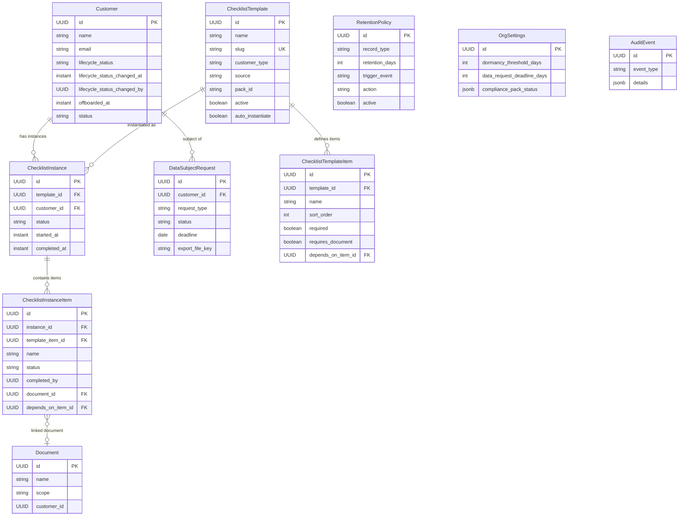
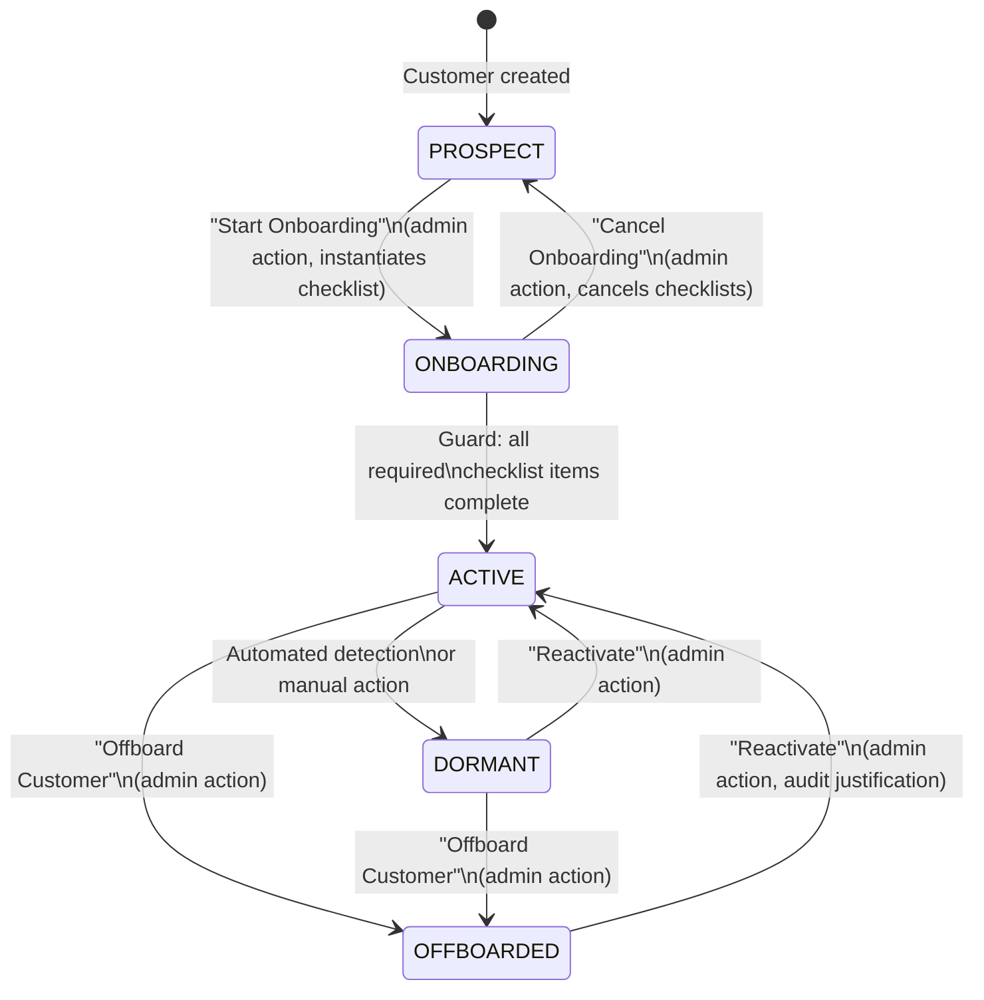
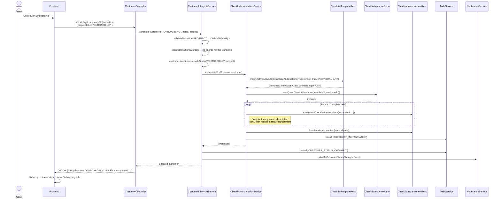
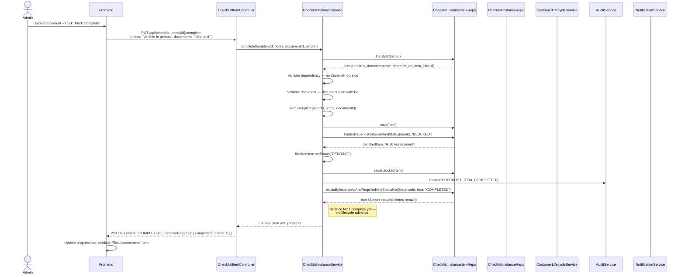
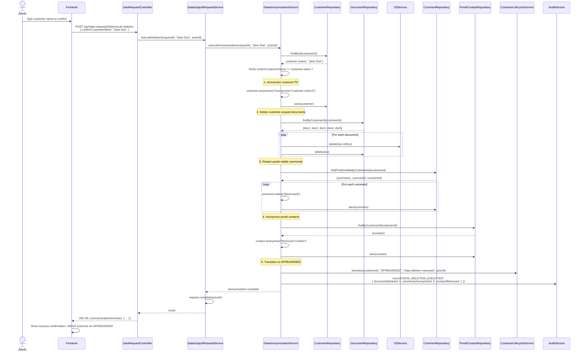

> Merge into architecture/ as **phase14-customer-compliance-lifecycle.md**. References: [ADR-060](../adr/ADR-060-lifecycle-status-core-field.md), [ADR-061](../adr/ADR-061-checklist-first-class-entities.md), [ADR-062](../adr/ADR-062-anonymization-over-hard-deletion.md), [ADR-063](../adr/ADR-063-compliance-packs-bundled-seed-data.md).

---

## 14. Phase 14 — Customer Compliance & Lifecycle

### 14.1 Overview

Phase 14 adds a **jurisdiction-agnostic compliance system** to the DocTeams platform that manages the full customer lifecycle — from first contact as a prospect through onboarding, active engagement, dormancy detection, and eventual offboarding. The system introduces a lifecycle state machine on the Customer entity that gates platform actions (blocking invoice creation during onboarding, making offboarded customers read-only), a first-class checklist engine for tracking per-step verification (who verified identity? when? which document was uploaded?), and a data subject request workflow for handling access/deletion requests under data protection regulations.

The foundational design principle is **engine is code, content is seed data**. The state machine, checklist runner, retention evaluator, and data export generator are generic platform code. Jurisdiction-specific content — which checklist items to verify, which retention periods to enforce, which custom fields to collect — is delivered as compliance packs: classpath-bundled JSON files seeded during tenant provisioning, following the exact pattern established by field packs (Phase 11) and template packs (Phase 12). No jurisdiction-specific logic exists in the core platform. A South African FICA pack and a hypothetical UK AML pack produce identical code paths — they differ only in their `pack.json` content.

Phase 14 introduces six new entities (`ChecklistTemplate`, `ChecklistTemplateItem`, `ChecklistInstance`, `ChecklistInstanceItem`, `DataSubjectRequest`, `RetentionPolicy`), extends the `Customer` entity with lifecycle status columns, and extends `OrgSettings` with compliance configuration fields. All new entities follow the post-Phase 13 pattern: plain `@Entity` + `JpaRepository` with no `tenant_id`, no `@Filter`, no `@FilterDef`. The dedicated-schema boundary ([ADR-064](../adr/ADR-064-dedicated-schema-only.md)) provides tenant isolation automatically.

**Dependencies on prior phases**:
- **Phase 4** (Customers): `Customer` entity — extended with lifecycle status columns.
- **Phase 5** (Task & Time): `TimeEntry`, `Task` — used in dormancy detection queries.
- **Phase 6** (Audit): `AuditService`, `AuditEventBuilder` — all lifecycle transitions, checklist completions, and data operations are audited.
- **Phase 6.5** (Notifications): `ApplicationEvent` publication — lifecycle transitions, deadline warnings, and checklist completions trigger notifications.
- **Phase 10** (Invoicing): `Invoice` — invoice creation gated by lifecycle status; invoice data included in data exports.
- **Phase 11** (Custom Fields): `FieldDefinition`, `FieldGroup` — compliance packs ship field definitions alongside checklist templates.
- **Phase 12** (Document Templates): `Document` — checklist items can require document uploads; documents are included in data exports and deleted during anonymization.
- **Phase 13** (Dedicated Schema): All tenants use dedicated schemas — no shared-schema boilerplate on new entities.

#### What's New

| Capability | Before Phase 14 | After Phase 14 |
|---|---|---|
| Customer lifecycle | `status` column (ACTIVE/ARCHIVED) for soft-delete only | `lifecycle_status` state machine (PROSPECT → ONBOARDING → ACTIVE → DORMANT → OFFBOARDED) gating platform actions |
| Onboarding tracking | -- | First-class checklist engine: templates, instances, per-item completion with document linking and dependency chains |
| Compliance content | Field packs + template packs | Compliance packs bundle checklists + field definitions + retention defaults per jurisdiction |
| Action gating | No restrictions by customer state | `CustomerLifecycleGuard` blocks invoices during onboarding, prevents mutations for offboarded customers |
| Data subject requests | -- | CRUD workflow for ACCESS/DELETION/CORRECTION/OBJECTION requests with deadlines and export generation |
| Data anonymization | -- | PII replacement, S3 document deletion, comment redaction — preserving financial record integrity |
| Retention policies | -- | Configurable retention periods per record type with admin-triggered flagging and purge workflow |
| Dormancy detection | -- | Activity-based dormancy check (time entries, tasks, documents, invoices, comments) with configurable threshold |
| Compliance dashboard | -- | Admin overview: onboarding pipeline, open data requests, retention flags, dormancy candidates |

**Out of scope**:
- Identity verification via external APIs (DHA, CIPC, biometric providers). The platform collects documents and tracks verification steps — actual verification is manual or via future integrations.
- Sanctions/PEP screening. Dedicated KYC provider territory.
- Automated data discovery across external systems. Export/deletion covers platform data only.
- Consent management (opt-in/opt-out tracking for marketing, cookies). Not relevant for B2B practice management.
- Compliance reporting/analytics (average onboarding time, requests by type). A future reporting phase can query the data.
- Multi-step approval workflows for lifecycle transitions. Simple permission checks are sufficient for v1.
- Automated anonymization scheduling (auto-purge after retention period). v1 flags records for admin review.
- Customer self-service data requests via the portal. Requests are submitted by org admins on behalf of the data subject.

---

### 14.2 Domain Model

Phase 14 introduces six new tenant-scoped entities and modifies two existing entities. All new entities follow the post-Phase 13 pattern established by [ADR-064](../adr/ADR-064-dedicated-schema-only.md): plain `@Entity` + `@Table`, UUID primary keys with `GenerationType.UUID`, `Instant` timestamps, status stored as `String` (not `@Enumerated`), no `tenant_id` column, no `@Filter`/`@FilterDef` annotations. The dedicated-schema boundary provides isolation automatically.

#### 14.2.1 Customer Entity Changes (Modified)

The Customer entity gains four new columns to support the lifecycle state machine. The existing `status` column (ACTIVE/ARCHIVED) is preserved for soft-delete visibility — it serves a different purpose than `lifecycle_status`. See [ADR-060](../adr/ADR-060-lifecycle-status-core-field.md) for the rationale.

| Field | Java Type | DB Column | DB Type | Constraints | Notes |
|-------|-----------|-----------|---------|-------------|-------|
| `customerType` | `String` | `customer_type` | `VARCHAR(20)` | NOT NULL, DEFAULT `'INDIVIDUAL'` | ENUM: `INDIVIDUAL`, `COMPANY`. Determines which checklist templates apply. Default `INDIVIDUAL`. |
| `lifecycleStatus` | `String` | `lifecycle_status` | `VARCHAR(20)` | NOT NULL, DEFAULT `'PROSPECT'` | `PROSPECT`, `ONBOARDING`, `ACTIVE`, `DORMANT`, `OFFBOARDED` |
| `lifecycleStatusChangedAt` | `Instant` | `lifecycle_status_changed_at` | `TIMESTAMPTZ` | Nullable | When the lifecycle status last changed |
| `lifecycleStatusChangedBy` | `UUID` | `lifecycle_status_changed_by` | `UUID` | Nullable | Member who last changed the status |
| `offboardedAt` | `Instant` | `offboarded_at` | `TIMESTAMPTZ` | Nullable | When the customer was offboarded; used as retention period trigger |

**Design decisions**:
- `lifecycle_status` is a core column, not a custom field, because it drives platform behaviour (action gating, query filtering, dashboard metrics). Custom fields are informational metadata — lifecycle status is structural. See [ADR-060](../adr/ADR-060-lifecycle-status-core-field.md).
- Existing customers are backfilled to `lifecycle_status = 'ACTIVE'` (they are already in use, presumably past onboarding). New customers created after migration default to `PROSPECT`.
- `lifecycle_status_changed_by` references member UUID without a JPA FK relationship, following the established pattern (`created_by` on Customer).

#### 14.2.2 OrgSettings Entity Changes (Modified)

Three new columns on `OrgSettings` for compliance configuration:

| Field | Java Type | DB Column | DB Type | Constraints | Notes |
|-------|-----------|-----------|---------|-------------|-------|
| `dormancyThresholdDays` | `Integer` | `dormancy_threshold_days` | `INTEGER` | Nullable, DEFAULT 90 | Days since last activity before a customer is flagged as dormant |
| `dataRequestDeadlineDays` | `Integer` | `data_request_deadline_days` | `INTEGER` | Nullable, DEFAULT 30 | Days allowed to fulfil a data subject request |
| `compliancePackStatus` | `List<Map<String, Object>>` | `compliance_pack_status` | `JSONB` | Nullable | Tracks which compliance packs have been applied: `[{packId, version, appliedAt}]` |

**Design decisions**:
- `compliance_pack_status` follows the exact same JSONB list pattern as `field_pack_status` and `template_pack_status` on OrgSettings. The `CompliancePackSeeder` checks this field for idempotency during provisioning.
- Dormancy and deadline thresholds are nullable with application-level defaults (90 and 30 respectively). A null value means "use default." This avoids requiring a migration to set defaults for existing tenants.

#### 14.2.3 ChecklistTemplate Entity (New)

A reusable recipe defining what verification steps are required for a customer type. Templates are created by compliance packs (source = `PLATFORM`) or by org admins (source = `ORG_CUSTOM`). See [ADR-061](../adr/ADR-061-checklist-first-class-entities.md) for the rationale behind first-class entities.

| Field | Java Type | DB Column | DB Type | Constraints | Notes |
|-------|-----------|-----------|---------|-------------|-------|
| `id` | `UUID` | `id` | `UUID` | PK, default `gen_random_uuid()` | Auto-generated |
| `name` | `String` | `name` | `VARCHAR(200)` | NOT NULL | Human-readable, e.g., "Individual Client Onboarding" |
| `slug` | `String` | `slug` | `VARCHAR(200)` | NOT NULL, UNIQUE | Machine-readable key, e.g., "individual-client-onboarding" |
| `description` | `String` | `description` | `TEXT` | Nullable | Describes when this checklist applies |
| `customerType` | `String` | `customer_type` | `VARCHAR(20)` | NOT NULL | `INDIVIDUAL`, `COMPANY`, `ANY` |
| `source` | `String` | `source` | `VARCHAR(20)` | NOT NULL, DEFAULT `'ORG_CUSTOM'` | `PLATFORM` or `ORG_CUSTOM` |
| `packId` | `String` | `pack_id` | `VARCHAR(100)` | Nullable | Compliance pack origin, e.g., "sa-fica-individual" |
| `packTemplateKey` | `String` | `pack_template_key` | `VARCHAR(100)` | Nullable | Key within the pack |
| `active` | `boolean` | `active` | `BOOLEAN` | NOT NULL, DEFAULT `true` | Soft-delete/deactivation flag |
| `autoInstantiate` | `boolean` | `auto_instantiate` | `BOOLEAN` | NOT NULL, DEFAULT `true` | Auto-create instance when customer enters ONBOARDING |
| `sortOrder` | `int` | `sort_order` | `INTEGER` | NOT NULL, DEFAULT 0 | Display order |
| `createdAt` | `Instant` | `created_at` | `TIMESTAMPTZ` | NOT NULL | Immutable |
| `updatedAt` | `Instant` | `updated_at` | `TIMESTAMPTZ` | NOT NULL | Updated on mutation |

**Constraints**:
- `slug` UNIQUE within the tenant schema (single-column unique, schema boundary provides tenant isolation).
- `slug` CHECK: `slug ~ '^[a-z][a-z0-9-]*$'`.
- `pack_id` / `pack_template_key` CHECK: both null or both non-null.
- Only one `auto_instantiate = true` template per `customer_type` per tenant — enforced at the service layer, not as a DB constraint (allows temporary states during pack seeding).

#### 14.2.4 ChecklistTemplateItem Entity (New)

Individual steps within a checklist template — the recipe items. When a template is instantiated, these are copied (snapshotted) into `ChecklistInstanceItem` records so that template changes do not affect in-progress checklists.

| Field | Java Type | DB Column | DB Type | Constraints | Notes |
|-------|-----------|-----------|---------|-------------|-------|
| `id` | `UUID` | `id` | `UUID` | PK, default `gen_random_uuid()` | Auto-generated |
| `templateId` | `UUID` | `template_id` | `UUID` | NOT NULL, FK → `checklist_templates` | Parent template |
| `name` | `String` | `name` | `VARCHAR(300)` | NOT NULL | e.g., "Verify identity document" |
| `description` | `String` | `description` | `TEXT` | Nullable | Detailed instructions for the person completing this item |
| `sortOrder` | `int` | `sort_order` | `INTEGER` | NOT NULL | Display order within the checklist |
| `required` | `boolean` | `required` | `BOOLEAN` | NOT NULL, DEFAULT `true` | Must be completed before checklist is considered complete |
| `requiresDocument` | `boolean` | `requires_document` | `BOOLEAN` | NOT NULL, DEFAULT `false` | Document must be uploaded and linked before completion |
| `requiredDocumentLabel` | `String` | `required_document_label` | `VARCHAR(200)` | Nullable | Upload prompt, e.g., "Certified copy of SA ID" |
| `dependsOnItemId` | `UUID` | `depends_on_item_id` | `UUID` | Nullable, FK → `checklist_template_items` | Linear dependency; blocked until dependency item is complete |
| `createdAt` | `Instant` | `created_at` | `TIMESTAMPTZ` | NOT NULL | Immutable |
| `updatedAt` | `Instant` | `updated_at` | `TIMESTAMPTZ` | NOT NULL | Updated on mutation |

**Constraints**:
- `depends_on_item_id` must reference an item from the same template. Enforced at service layer (FK constraint only ensures the item exists, not that it belongs to the same template).
- No circular dependencies — enforced at service layer during template creation/update.

#### 14.2.5 ChecklistInstance Entity (New)

A checklist instantiated for a specific customer, created when the customer transitions to ONBOARDING (auto) or manually by an admin. The instance is a snapshot of the template at instantiation time.

| Field | Java Type | DB Column | DB Type | Constraints | Notes |
|-------|-----------|-----------|---------|-------------|-------|
| `id` | `UUID` | `id` | `UUID` | PK, default `gen_random_uuid()` | Auto-generated |
| `templateId` | `UUID` | `template_id` | `UUID` | NOT NULL, FK → `checklist_templates` | Which template this was instantiated from |
| `customerId` | `UUID` | `customer_id` | `UUID` | NOT NULL, FK → `customers` | Which customer this checklist is for |
| `status` | `String` | `status` | `VARCHAR(20)` | NOT NULL, DEFAULT `'IN_PROGRESS'` | `IN_PROGRESS`, `COMPLETED`, `CANCELLED` |
| `startedAt` | `Instant` | `started_at` | `TIMESTAMPTZ` | NOT NULL | When the checklist was instantiated |
| `completedAt` | `Instant` | `completed_at` | `TIMESTAMPTZ` | Nullable | When all required items were completed |
| `completedBy` | `UUID` | `completed_by` | `UUID` | Nullable | Member who completed the last required item |
| `createdAt` | `Instant` | `created_at` | `TIMESTAMPTZ` | NOT NULL | Immutable |
| `updatedAt` | `Instant` | `updated_at` | `TIMESTAMPTZ` | NOT NULL | Updated on mutation |

**Constraints**:
- `(customer_id, template_id)` UNIQUE — a customer can only have one instance of a given checklist template.

**Note on `CANCELLED` status**: The `CANCELLED` status is triggered when onboarding is cancelled (ONBOARDING -> PROSPECT transition). This cancels all active (`IN_PROGRESS`) checklist instances for that customer, preventing stale checklists from blocking future onboarding attempts.

#### 14.2.6 ChecklistInstanceItem Entity (New)

Individual items within an instantiated checklist. Fields are snapshotted from the template item at instantiation time so that template changes do not retroactively alter in-progress checklists. Each item tracks completion state, document linking, and audit metadata independently.

| Field | Java Type | DB Column | DB Type | Constraints | Notes |
|-------|-----------|-----------|---------|-------------|-------|
| `id` | `UUID` | `id` | `UUID` | PK, default `gen_random_uuid()` | Auto-generated |
| `instanceId` | `UUID` | `instance_id` | `UUID` | NOT NULL, FK → `checklist_instances` | Parent instance |
| `templateItemId` | `UUID` | `template_item_id` | `UUID` | NOT NULL, FK → `checklist_template_items` | Original template item (audit trail) |
| `name` | `String` | `name` | `VARCHAR(300)` | NOT NULL | Copied from template item |
| `description` | `String` | `description` | `TEXT` | Nullable | Copied from template item |
| `sortOrder` | `int` | `sort_order` | `INTEGER` | NOT NULL | Copied from template item |
| `required` | `boolean` | `required` | `BOOLEAN` | NOT NULL | Copied from template item |
| `requiresDocument` | `boolean` | `requires_document` | `BOOLEAN` | NOT NULL | Copied from template item |
| `requiredDocumentLabel` | `String` | `required_document_label` | `VARCHAR(200)` | Nullable | Copied from template item |
| `status` | `String` | `status` | `VARCHAR(20)` | NOT NULL, DEFAULT `'PENDING'` | `PENDING`, `IN_PROGRESS`, `COMPLETED`, `SKIPPED`, `BLOCKED` |
| `completedAt` | `Instant` | `completed_at` | `TIMESTAMPTZ` | Nullable | When marked complete |
| `completedBy` | `UUID` | `completed_by` | `UUID` | Nullable | Member who marked this complete |
| `notes` | `String` | `notes` | `TEXT` | Nullable | Completion notes, e.g., "Verified against original ID in person" |
| `documentId` | `UUID` | `document_id` | `UUID` | Nullable, FK → `documents` | Uploaded document linked to this item |
| `dependsOnItemId` | `UUID` | `depends_on_item_id` | `UUID` | Nullable, FK → `checklist_instance_items` | Dependency, copied and resolved from template |
| `createdAt` | `Instant` | `created_at` | `TIMESTAMPTZ` | NOT NULL | Immutable |
| `updatedAt` | `Instant` | `updated_at` | `TIMESTAMPTZ` | NOT NULL | Updated on mutation |

**Constraints**:
- `(instance_id, template_item_id)` UNIQUE — one instance item per template item per instance.
- `COMPLETED` status requires `completed_by` and `completed_at` to be non-null (enforced at service layer).
- If `requires_document = true`, `COMPLETED` status requires `document_id` to be non-null (enforced at service layer).
- Dependency check: if `depends_on_item_id` references an item that is not `COMPLETED`, status cannot transition to `IN_PROGRESS` or `COMPLETED` (enforced at service layer).

#### 14.2.7 DataSubjectRequest Entity (New)

Tracks data access/export and deletion/anonymization requests. The workflow is: RECEIVED → IN_PROGRESS → COMPLETED or REJECTED. See [ADR-062](../adr/ADR-062-anonymization-over-hard-deletion.md) for the anonymization approach.

| Field | Java Type | DB Column | DB Type | Constraints | Notes |
|-------|-----------|-----------|---------|-------------|-------|
| `id` | `UUID` | `id` | `UUID` | PK, default `gen_random_uuid()` | Auto-generated |
| `customerId` | `UUID` | `customer_id` | `UUID` | NOT NULL, FK → `customers` | The data subject |
| `requestType` | `String` | `request_type` | `VARCHAR(20)` | NOT NULL | `ACCESS`, `DELETION`, `CORRECTION`, `OBJECTION` |
| `status` | `String` | `status` | `VARCHAR(20)` | NOT NULL, DEFAULT `'RECEIVED'` | `RECEIVED`, `IN_PROGRESS`, `COMPLETED`, `REJECTED` |
| `description` | `String` | `description` | `TEXT` | NOT NULL | Details of what the data subject is requesting |
| `rejectionReason` | `String` | `rejection_reason` | `TEXT` | Nullable | Why the request was rejected |
| `deadline` | `java.time.LocalDate` | `deadline` | `DATE` | NOT NULL | Calculated from `requested_at + data_request_deadline_days` |
| `requestedAt` | `Instant` | `requested_at` | `TIMESTAMPTZ` | NOT NULL | When the request was received |
| `requestedBy` | `UUID` | `requested_by` | `UUID` | NOT NULL | Admin who logged the request |
| `completedAt` | `Instant` | `completed_at` | `TIMESTAMPTZ` | Nullable | When the request was fulfilled |
| `completedBy` | `UUID` | `completed_by` | `UUID` | Nullable | Admin who completed the request |
| `exportFileKey` | `String` | `export_file_key` | `VARCHAR(1000)` | Nullable | S3 key for the exported data ZIP (ACCESS requests) |
| `notes` | `String` | `notes` | `TEXT` | Nullable | Internal processing notes |
| `createdAt` | `Instant` | `created_at` | `TIMESTAMPTZ` | NOT NULL | Immutable |
| `updatedAt` | `Instant` | `updated_at` | `TIMESTAMPTZ` | NOT NULL | Updated on mutation |

**Design decisions**:
- `deadline` is `DATE` (not `TIMESTAMPTZ`) because data protection deadlines are measured in calendar days, not hours. POPIA and GDPR both specify day-level response periods.
- `export_file_key` follows the S3 key pattern `org/{tenantId}/exports/{requestId}.zip`.
- `requested_by` and `completed_by` are UUID references to members without JPA FK relationships, following the established pattern.

#### 14.2.8 RetentionPolicy Entity (New)

Configurable retention periods per record type. The system flags records past retention for admin review — it does not automatically delete anything.

| Field | Java Type | DB Column | DB Type | Constraints | Notes |
|-------|-----------|-----------|---------|-------------|-------|
| `id` | `UUID` | `id` | `UUID` | PK, default `gen_random_uuid()` | Auto-generated |
| `recordType` | `String` | `record_type` | `VARCHAR(20)` | NOT NULL | `CUSTOMER`, `PROJECT`, `DOCUMENT`, `TIME_ENTRY`, `INVOICE`, `AUDIT_EVENT`, `COMMENT` |
| `retentionDays` | `int` | `retention_days` | `INTEGER` | NOT NULL | Days after trigger event to retain the record |
| `triggerEvent` | `String` | `trigger_event` | `VARCHAR(30)` | NOT NULL | `CUSTOMER_OFFBOARDED`, `PROJECT_COMPLETED`, `RECORD_CREATED` |
| `action` | `String` | `action` | `VARCHAR(20)` | NOT NULL, DEFAULT `'FLAG'` | `FLAG` (mark for review) or `ANONYMIZE` (mark for anonymization) |
| `active` | `boolean` | `active` | `BOOLEAN` | NOT NULL, DEFAULT `true` | Whether this policy is active |
| `createdAt` | `Instant` | `created_at` | `TIMESTAMPTZ` | NOT NULL | Immutable |
| `updatedAt` | `Instant` | `updated_at` | `TIMESTAMPTZ` | NOT NULL | Updated on mutation |

**Constraints**:
- `(record_type, trigger_event)` UNIQUE — one policy per record type per trigger.

**Design decisions**:
- `trigger_event` determines when the retention clock starts. `CUSTOMER_OFFBOARDED` uses `customer.offboarded_at`; `PROJECT_COMPLETED` uses the project completion timestamp; `RECORD_CREATED` uses the record's `created_at`.
- The `FLAG` action is the default and recommended approach. `ANONYMIZE` is available for orgs that want a more aggressive retention posture, but all actions require admin confirmation before execution.

#### 14.2.9 Entity Relationship Diagram



#### 14.2.10 Lifecycle Status State Machine

The lifecycle status follows a bounded state machine with explicit valid transitions. Invalid transitions are rejected by the service layer. The state machine is flat — no nested states, no parallel states, no history states.



**Transition rules**:

| From | To | Trigger | Guard | Side Effects |
|------|-----|---------|-------|--------------|
| `PROSPECT` | `ONBOARDING` | Admin action: "Start Onboarding" | None | Instantiate active checklist templates matching customer type |
| `ONBOARDING` | `ACTIVE` | Automatic or admin action | All active checklist instances for this customer must be `COMPLETED` | Audit event, notification |
| `ONBOARDING` | `PROSPECT` | Admin action: "Cancel Onboarding" | None | Cancel all active checklist instances for this customer, audit event |
| `ACTIVE` | `DORMANT` | Dormancy check (auto) or admin action | None (informational transition) | Audit event |
| `DORMANT` | `ACTIVE` | Admin action: "Reactivate" | None | Audit event |
| `ACTIVE` | `OFFBOARDED` | Admin action: "Offboard Customer" | None | Set `offboarded_at`, start retention clock, audit event |
| `DORMANT` | `OFFBOARDED` | Admin action: "Offboard Customer" | None | Set `offboarded_at`, start retention clock, audit event |
| `OFFBOARDED` | `ACTIVE` | Admin action: "Reactivate" | Requires audit justification (notes field) | Clear `offboarded_at`, audit event |

**Invalid transitions** (rejected with `409 Conflict`):
- `PROSPECT` → `ACTIVE` (must go through onboarding)
- `PROSPECT` → `DORMANT` / `OFFBOARDED` (must be onboarded first)
- `ONBOARDING` → `DORMANT` / `OFFBOARDED` (must complete onboarding or revert to PROSPECT first via "Cancel Onboarding")
- `OFFBOARDED` → `ONBOARDING` (create a new customer instead)

---

### 14.3 Core Flows and Backend Behaviour

#### 14.3.1 Customer Lifecycle Transitions

The `CustomerLifecycleService` orchestrates lifecycle transitions. Every transition validates the state machine, checks guards, updates the customer, publishes an audit event, and sends notifications.

**Service method signatures** (conceptual):

```java
public class CustomerLifecycleService {

    /** Transition a customer's lifecycle status. */
    public Customer transition(UUID customerId, String targetStatus, String notes, UUID actorId) {
        Customer customer = customerRepository.findById(customerId)
            .orElseThrow(() -> new ResourceNotFoundException("Customer", customerId));
        validateTransition(customer.getLifecycleStatus(), targetStatus);
        checkTransitionGuards(customer, targetStatus);

        String oldStatus = customer.getLifecycleStatus();
        customer.transitionLifecycleStatus(targetStatus, actorId);
        if ("OFFBOARDED".equals(targetStatus)) {
            customer.setOffboardedAt(Instant.now());
        }
        if ("ACTIVE".equals(targetStatus) && "OFFBOARDED".equals(oldStatus)) {
            customer.setOffboardedAt(null); // clear retention trigger
        }

        customerRepository.save(customer);

        // Side effects
        if ("ONBOARDING".equals(targetStatus)) {
            checklistInstantiationService.instantiateForCustomer(customer);
        }
        if ("PROSPECT".equals(targetStatus) && "ONBOARDING".equals(oldStatus)) {
            checklistInstantiationService.cancelActiveInstances(customer.getId());
        }

        auditService.record(AuditEventBuilder.of("CUSTOMER_STATUS_CHANGED")
            .detail("customerId", customerId)
            .detail("oldStatus", oldStatus)
            .detail("newStatus", targetStatus)
            .detail("notes", notes)
            .build());

        eventPublisher.publishEvent(new CustomerStatusChangedEvent(customerId, oldStatus, targetStatus));
        return customer;
    }
}
```

**Guard checks** — `CustomerLifecycleGuard`:

```java
public class CustomerLifecycleGuard {

    /** Check whether a platform action is permitted for the customer's current lifecycle status. */
    public void requireActionPermitted(Customer customer, LifecycleAction action) {
        String status = customer.getLifecycleStatus();
        switch (action) {
            case CREATE_PROJECT, CREATE_TASK -> {
                if ("PROSPECT".equals(status) || "OFFBOARDED".equals(status))
                    throw new InvalidStateException("Lifecycle action blocked",
                        "Cannot create " + action.label()
                        + " for customer in " + status + " status");
            }
            case CREATE_INVOICE -> {
                if (!"ACTIVE".equals(status) && !"DORMANT".equals(status))
                    throw new InvalidStateException("Lifecycle action blocked",
                        "Cannot create invoices for customer in "
                        + status + " status — billing requires ACTIVE or DORMANT status");
            }
            case CREATE_TIME_ENTRY -> {
                if ("PROSPECT".equals(status) || "OFFBOARDED".equals(status))
                    throw new InvalidStateException("Lifecycle action blocked",
                        "Cannot log time for customer in "
                        + status + " status");
            }
            case CREATE_DOCUMENT -> {
                if ("OFFBOARDED".equals(status))
                    throw new InvalidStateException("Lifecycle action blocked",
                        "Cannot upload documents for offboarded customer");
            }
            case CREATE_COMMENT -> {} // Always allowed (even for offboarded — handover notes)
        }
    }
}
```

**Action gating summary**:

| Lifecycle Status | Create Project | Create Task | Create Invoice | Log Time | Upload Document | Comment |
|---|---|---|---|---|---|---|
| `PROSPECT` | Blocked | Blocked | Blocked | Blocked | Allowed | Allowed |
| `ONBOARDING` | Allowed | Allowed | Blocked | Allowed | Allowed | Allowed |
| `ACTIVE` | Allowed | Allowed | Allowed | Allowed | Allowed | Allowed |
| `DORMANT` | Allowed | Allowed | Allowed | Allowed | Allowed | Allowed |
| `OFFBOARDED` | Blocked | Blocked | Blocked | Blocked | Blocked | Allowed |

**Permission checks**: Only org admins and owners can trigger lifecycle transitions. The guard is applied at the controller layer via `@PreAuthorize("hasAnyRole('ORG_ADMIN', 'ORG_OWNER')")`.

**Audit events published**:
- `CUSTOMER_STATUS_CHANGED` — old status, new status, actor, notes.

**Notifications triggered**:
- `CUSTOMER_STATUS_CHANGED` — notifies org admins with old/new status.

#### 14.3.2 Checklist Instantiation

When a customer transitions to `ONBOARDING`, the `ChecklistInstantiationService` automatically creates checklist instances from all active templates matching the customer's type with `auto_instantiate = true`.

**Instantiation flow**:

```java
public class ChecklistInstantiationService {

    public List<ChecklistInstance> instantiateForCustomer(Customer customer) {
        // Find active templates matching customer type with auto_instantiate = true
        List<ChecklistTemplate> templates = templateRepository
            .findByActiveAndAutoInstantiateAndCustomerTypeIn(
                true, true,
                List.of(customer.getCustomerType(), "ANY"));

        List<ChecklistInstance> instances = new ArrayList<>();
        for (ChecklistTemplate template : templates) {
            // Skip if already instantiated (idempotency)
            if (instanceRepository.existsByCustomerIdAndTemplateId(
                    customer.getId(), template.getId())) {
                continue;
            }
            instances.add(instantiateTemplate(template, customer));
        }
        return instances;
    }

    private ChecklistInstance instantiateTemplate(ChecklistTemplate template, Customer customer) {
        // Create instance
        ChecklistInstance instance = new ChecklistInstance(
            template.getId(), customer.getId(), Instant.now());
        instance = instanceRepository.save(instance);

        // Copy template items → instance items (snapshot)
        List<ChecklistTemplateItem> templateItems =
            templateItemRepository.findByTemplateIdOrderBySortOrder(template.getId());

        // First pass: create instance items (without dependencies)
        Map<UUID, UUID> templateItemToInstanceItem = new HashMap<>();
        for (ChecklistTemplateItem templateItem : templateItems) {
            ChecklistInstanceItem item = new ChecklistInstanceItem(
                instance.getId(), templateItem.getId(),
                templateItem.getName(), templateItem.getDescription(),
                templateItem.getSortOrder(), templateItem.isRequired(),
                templateItem.isRequiresDocument(), templateItem.getRequiredDocumentLabel());
            item = instanceItemRepository.save(item);
            templateItemToInstanceItem.put(templateItem.getId(), item.getId());
        }

        // Second pass: resolve dependencies
        for (ChecklistTemplateItem templateItem : templateItems) {
            if (templateItem.getDependsOnItemId() != null) {
                UUID instanceItemId = templateItemToInstanceItem.get(templateItem.getId());
                UUID dependsOnInstanceItemId = templateItemToInstanceItem
                    .get(templateItem.getDependsOnItemId());
                ChecklistInstanceItem item = instanceItemRepository.findById(instanceItemId).get();
                item.setDependsOnItemId(dependsOnInstanceItemId);
                item.setStatus("BLOCKED"); // blocked until dependency completes
                instanceItemRepository.save(item);
            }
        }

        auditService.record(AuditEventBuilder.of("CHECKLIST_INSTANTIATED")
            .detail("templateName", template.getName())
            .detail("customerId", customer.getId())
            .detail("instanceId", instance.getId())
            .build());

        return instance;
    }
}
```

**Key query**: Find templates eligible for auto-instantiation:

```sql
SELECT * FROM checklist_templates
WHERE active = true
  AND auto_instantiate = true
  AND customer_type IN (:customerType, 'ANY')
ORDER BY sort_order;
```

#### 14.3.3 Checklist Item Completion

The `ChecklistInstanceService` handles item completion with dependency validation, document requirement enforcement, and auto-cascade (all required items done → instance complete → lifecycle advance).

**Completion flow**:

```java
public class ChecklistInstanceService {

    public ChecklistInstanceItem completeItem(UUID itemId, String notes,
                                               UUID documentId, UUID actorId) {
        ChecklistInstanceItem item = instanceItemRepository.findById(itemId)
            .orElseThrow(() -> new ResourceNotFoundException("ChecklistInstanceItem", itemId));

        // Validate dependencies
        if (item.getDependsOnItemId() != null) {
            ChecklistInstanceItem dependency = instanceItemRepository
                .findById(item.getDependsOnItemId()).get();
            if (!"COMPLETED".equals(dependency.getStatus())) {
                throw new InvalidStateException("Checklist item blocked",
                    "Cannot complete item — depends on '"
                    + dependency.getName() + "' which is not yet completed");
            }
        }

        // Validate document requirement
        if (item.isRequiresDocument() && documentId == null) {
            throw new InvalidStateException("Checklist item blocked",
                "This item requires a document upload. "
                + "Please upload: " + item.getRequiredDocumentLabel());
        }

        // Complete the item
        item.complete(actorId, notes, documentId);
        instanceItemRepository.save(item);

        // Unblock dependent items
        List<ChecklistInstanceItem> blocked = instanceItemRepository
            .findByDependsOnItemIdAndStatus(item.getId(), "BLOCKED");
        for (ChecklistInstanceItem blockedItem : blocked) {
            blockedItem.setStatus("PENDING");
            instanceItemRepository.save(blockedItem);
        }

        auditService.record(AuditEventBuilder.of("CHECKLIST_ITEM_COMPLETED")
            .detail("itemName", item.getName())
            .detail("completedBy", actorId)
            .detail("notes", notes)
            .detail("documentId", documentId)
            .build());

        // Check if all required items are complete → cascade
        checkInstanceCompletion(item.getInstanceId(), actorId);

        return item;
    }

    private void checkInstanceCompletion(UUID instanceId, UUID actorId) {
        boolean allRequiredComplete = !instanceItemRepository
            .existsByInstanceIdAndRequiredAndStatusNot(instanceId, true, "COMPLETED");

        if (allRequiredComplete) {
            ChecklistInstance instance = instanceRepository.findById(instanceId).get();
            instance.complete(actorId);
            instanceRepository.save(instance);

            auditService.record(AuditEventBuilder.of("CHECKLIST_COMPLETED")
                .detail("instanceId", instanceId)
                .detail("customerId", instance.getCustomerId())
                .build());

            eventPublisher.publishEvent(
                new ChecklistCompletedEvent(instanceId, instance.getCustomerId()));

            // Auto-advance lifecycle if all instances complete
            checkLifecycleAdvance(instance.getCustomerId());
        }
    }

    private void checkLifecycleAdvance(UUID customerId) {
        Customer customer = customerRepository.findById(customerId).get();
        if (!"ONBOARDING".equals(customer.getLifecycleStatus())) return;

        boolean allInstancesComplete = !instanceRepository
            .existsByCustomerIdAndStatusNot(customerId, "COMPLETED");

        if (allInstancesComplete) {
            customerLifecycleService.transition(
                customerId, "ACTIVE", "All onboarding checklists completed", null);
        }
    }
}
```

**Key queries**:

```sql
-- Check if any required items are not completed
SELECT EXISTS (
    SELECT 1 FROM checklist_instance_items
    WHERE instance_id = :instanceId
      AND required = true
      AND status != 'COMPLETED'
);

-- Find items blocked by a specific item
SELECT * FROM checklist_instance_items
WHERE depends_on_item_id = :itemId
  AND status = 'BLOCKED';
```

**Permission checks**: Org admins, owners, and project leads of the customer's linked project can complete items. Members with customer access can view but not complete items.

#### 14.3.4 Compliance Pack Seeding

The `CompliancePackSeeder` follows the exact pattern established by `FieldPackSeeder` and `TemplatePackSeeder`. See [ADR-063](../adr/ADR-063-compliance-packs-bundled-seed-data.md).

**Seeding flow**:

```java
@Service
public class CompliancePackSeeder {

    private static final String PACK_LOCATION = "classpath:compliance-packs/*/pack.json";

    public void seedPacksForTenant(String tenantId, String orgId) {
        ScopedValue.where(RequestScopes.TENANT_ID, tenantId)
            .where(RequestScopes.ORG_ID, orgId)
            .run(() -> transactionTemplate.executeWithoutResult(tx -> doSeedPacks()));
    }

    private void doSeedPacks() {
        Resource[] packFiles = resourceResolver.getResources(PACK_LOCATION);
        OrgSettings settings = orgSettingsRepository.findFirst()
            .orElseGet(() -> orgSettingsRepository.save(new OrgSettings("ZAR")));

        for (Resource packFile : packFiles) {
            CompliancePackDefinition pack = objectMapper.readValue(
                packFile.getInputStream(), CompliancePackDefinition.class);

            if (isPackAlreadyApplied(settings, pack.packId())) continue;

            seedChecklistTemplate(pack);
            if (pack.fieldDefinitions() != null) {
                fieldPackSeeder.seedFieldsFromPack(pack.fieldDefinitions());
            }
            if (pack.retentionOverrides() != null) {
                seedRetentionPolicies(pack.retentionOverrides());
            }

            settings.recordCompliancePackApplication(pack.packId(), pack.version());
        }
        orgSettingsRepository.save(settings);
    }
}
```

**Pack discovery**: All `pack.json` files under `src/main/resources/compliance-packs/*/` are discovered via `ResourcePatternResolver`. Vertical forks add their own pack directories — the seeder picks them up automatically.

**Idempotency**: Checked via `OrgSettings.compliancePackStatus` JSONB list. A pack with the same `packId` is skipped if already applied.

**Cross-seeding**: Compliance packs can include `fieldDefinitions` (delegated to `FieldPackSeeder.seedFieldsFromPack()`) and `retentionOverrides` (seeded directly into `retention_policies` table). This avoids duplicating field seeding logic and ensures a pack can ship a complete compliance kit (checklists + fields + retention) in a single `pack.json`.

**Pack JSON schema** — example using the `sa-fica-individual` pack:

```json
{
  "packId": "sa-fica-individual",
  "name": "SA FICA — Individual Client",
  "description": "South African FICA compliance checklist for individual clients. Covers identity verification, proof of address, source of funds, and risk assessment.",
  "version": "1.0.0",
  "jurisdiction": "ZA",
  "customerType": "INDIVIDUAL",
  "checklistTemplate": {
    "name": "Individual Client Onboarding (FICA)",
    "slug": "sa-fica-individual-onboarding",
    "autoInstantiate": false,
    "items": [
      {
        "name": "Verify identity document",
        "description": "Verify the client's identity using a certified copy of their SA ID or passport.",
        "sortOrder": 1,
        "required": true,
        "requiresDocument": true,
        "requiredDocumentLabel": "Certified copy of SA ID or passport"
      },
      {
        "name": "Verify proof of address",
        "description": "Obtain a utility bill, bank statement, or municipal account not older than 3 months.",
        "sortOrder": 2,
        "required": true,
        "requiresDocument": true,
        "requiredDocumentLabel": "Proof of residential address (not older than 3 months)"
      },
      {
        "name": "Confirm source of funds",
        "description": "Obtain documentation confirming the client's source of income or funds.",
        "sortOrder": 3,
        "required": true,
        "requiresDocument": true,
        "requiredDocumentLabel": "Source of funds documentation"
      },
      {
        "name": "Perform risk assessment",
        "description": "Classify the client's risk rating based on FICA risk matrix. Depends on identity verification.",
        "sortOrder": 4,
        "required": true,
        "requiresDocument": false,
        "dependsOnItemKey": "verify-identity-document"
      },
      {
        "name": "Confirm FICA compliance sign-off",
        "description": "Senior compliance officer signs off on FICA compliance for this client.",
        "sortOrder": 5,
        "required": true,
        "requiresDocument": false,
        "dependsOnItemKey": "perform-risk-assessment"
      }
    ]
  },
  "fieldDefinitions": [
    {
      "fieldKey": "sa_id_number",
      "label": "SA ID Number",
      "fieldType": "TEXT",
      "required": false,
      "groupName": "FICA Compliance"
    },
    {
      "fieldKey": "passport_number",
      "label": "Passport Number",
      "fieldType": "TEXT",
      "required": false,
      "groupName": "FICA Compliance"
    },
    {
      "fieldKey": "risk_rating",
      "label": "Risk Rating",
      "fieldType": "SELECT",
      "required": false,
      "options": ["LOW", "MEDIUM", "HIGH"],
      "groupName": "FICA Compliance"
    }
  ],
  "retentionOverrides": [
    {
      "recordType": "CUSTOMER",
      "triggerEvent": "CUSTOMER_OFFBOARDED",
      "retentionDays": 1825,
      "action": "FLAG"
    }
  ]
}
```

**Shipped packs (v1)**:

| Pack ID | Name | Customer Type | Auto-Instantiate | Items | Includes Fields |
|---|---|---|---|---|---|
| `generic-onboarding` | Generic Onboarding | ANY | Yes (active by default) | 4 | No |
| `sa-fica-individual` | SA FICA — Individual Client | INDIVIDUAL | No (inactive by default) | 5 | Yes (`sa_id_number`, `passport_number`, `risk_rating`) |
| `sa-fica-company` | SA FICA — Company Client | COMPANY | No (inactive by default) | 6 | Yes (`company_registration_number`, `entity_type`) |

#### 14.3.5 Data Subject Request Lifecycle

The `DataSubjectRequestService` manages the request workflow: create → process → complete/reject. ACCESS requests generate data exports; DELETION requests execute anonymization.

**Request creation**:

```java
public DataSubjectRequest createRequest(UUID customerId, String requestType,
                                         String description, UUID actorId) {
    Customer customer = customerRepository.findById(customerId)
        .orElseThrow(() -> new ResourceNotFoundException("Customer", customerId));

    OrgSettings settings = orgSettingsRepository.findFirst()
        .orElseGet(() -> orgSettingsRepository.save(new OrgSettings("ZAR")));
    int deadlineDays = settings.getDataRequestDeadlineDays() != null
        ? settings.getDataRequestDeadlineDays() : 30;

    DataSubjectRequest request = new DataSubjectRequest(
        customerId, requestType, description, actorId,
        LocalDate.now().plusDays(deadlineDays));
    request = requestRepository.save(request);

    auditService.record(AuditEventBuilder.of("DATA_REQUEST_CREATED")
        .detail("requestId", request.getId())
        .detail("requestType", requestType)
        .detail("customerId", customerId)
        .build());

    return request;
}
```

**Data export (ACCESS requests)**: The `DataExportService` generates a ZIP file containing JSON + CSV:

```java
public String generateExport(UUID requestId, UUID actorId) {
    DataSubjectRequest request = findById(requestId);
    UUID customerId = request.getCustomerId();

    Map<String, Object> exportData = new LinkedHashMap<>();
    exportData.put("customer", customerRepository.findById(customerId).orElse(null));
    exportData.put("projects", customerProjectRepository.findByCustomerId(customerId));
    exportData.put("documents", documentRepository.findByCustomerId(customerId));
    exportData.put("invoices", invoiceRepository.findByCustomerId(customerId));
    exportData.put("timeEntries", timeEntryRepository.findBillableByCustomerId(customerId));
    exportData.put("comments", commentRepository.findPortalVisibleByCustomerId(customerId));

    // Generate ZIP: data.json + summary.csv
    byte[] zipBytes = exportZipGenerator.generate(exportData);

    // Upload to S3
    String s3Key = "org/" + RequestScopes.TENANT_ID.get()
        + "/exports/" + requestId + ".zip";
    s3Service.upload(s3Key, zipBytes, "application/zip");

    request.setExportFileKey(s3Key);
    requestRepository.save(request);

    auditService.record(AuditEventBuilder.of("DATA_EXPORT_GENERATED")
        .detail("requestId", requestId)
        .detail("fileSize", zipBytes.length)
        .build());

    return s3Key;
}
```

**Export contents**:
- Customer profile (name, email, phone, custom fields).
- Projects linked to the customer (names, statuses — not internal team discussions).
- Documents uploaded to the customer scope.
- Invoices issued to the customer.
- Time entries billed to the customer (summary — not internal notes).
- Comments on customer-scoped items (portal-visible only, not internal-only comments).

**Data anonymization (DELETION requests)**: The `DataAnonymizationService` executes anonymization as specified in [ADR-062](../adr/ADR-062-anonymization-over-hard-deletion.md):

```java
public void executeAnonymization(UUID requestId, String confirmCustomerName, UUID actorId) {
    DataSubjectRequest request = findById(requestId);
    Customer customer = customerRepository.findById(request.getCustomerId()).get();

    // Confirmation check — require exact name match
    if (!customer.getName().equals(confirmCustomerName)) {
        throw new InvalidStateException("Confirmation failed",
            "Customer name does not match. "
            + "Type the exact customer name to confirm deletion.");
    }

    String hash = customer.getId().toString().substring(0, 6);
    int documentsDeleted = 0, commentsAnonymized = 0, contactsRemoved = 0;

    // 1. Anonymize customer PII
    customer.anonymize("Anonymized Customer " + hash);
    customerRepository.save(customer);

    // 2. Delete customer-scoped documents from S3 + DB
    List<Document> docs = documentRepository.findByCustomerId(customer.getId());
    for (Document doc : docs) {
        s3Service.delete(doc.getS3Key());
        documentRepository.delete(doc);
        documentsDeleted++;
    }

    // 3. Redact portal-visible comments
    List<Comment> comments = commentRepository
        .findPortalVisibleByCustomerId(customer.getId());
    for (Comment comment : comments) {
        comment.redact("[Removed]");
        commentRepository.save(comment);
        commentsAnonymized++;
    }

    // 4. Anonymize portal contacts
    List<PortalContact> contacts = portalContactRepository
        .findByCustomerId(customer.getId());
    for (PortalContact contact : contacts) {
        contact.anonymize("Removed Contact");
        portalContactRepository.save(contact);
        contactsRemoved++;
    }

    // 5. Transition lifecycle to OFFBOARDED
    customerLifecycleService.transition(
        customer.getId(), "OFFBOARDED", "Data deletion executed", actorId);

    // 6. Complete the request
    request.complete(actorId);
    requestRepository.save(request);

    auditService.record(AuditEventBuilder.of("DATA_DELETION_EXECUTED")
        .detail("customerId", customer.getId())
        .detail("documentsDeleted", documentsDeleted)
        .detail("commentsAnonymized", commentsAnonymized)
        .detail("portalContactsRemoved", contactsRemoved)
        .build());
}
```

**What is preserved**: Invoice records, invoice lines, time entries, billing rates, cost rates, project links (`customer_projects`), internal comments (`visibility = INTERNAL`). These retain their structure and financial values — only the customer's PII is removed.

**Permission checks**: Only org admins and owners can create and process data subject requests.

**Notifications triggered**:
- `DATA_REQUEST_DEADLINE_APPROACHING` — 7 days before deadline.
- `DATA_REQUEST_OVERDUE` — past deadline.

#### 14.3.6 Retention Check Workflow

The `RetentionService` evaluates retention policies against tenant data and returns flagged records. This is an on-demand admin action for v1 — no background scheduler.

**Retention check flow**:

```java
public class RetentionService {

    public RetentionCheckResult runCheck() {
        List<RetentionPolicy> policies = policyRepository.findByActive(true);
        RetentionCheckResult result = new RetentionCheckResult();

        for (RetentionPolicy policy : policies) {
            LocalDate cutoff = LocalDate.now().minusDays(policy.getRetentionDays());
            List<UUID> flaggedIds = switch (policy.getRecordType()) {
                case "CUSTOMER" -> findExpiredCustomers(policy.getTriggerEvent(), cutoff);
                case "AUDIT_EVENT" -> findExpiredAuditEvents(policy.getTriggerEvent(), cutoff);
                case "DOCUMENT" -> findExpiredDocuments(policy.getTriggerEvent(), cutoff);
                default -> List.of();
            };
            if (!flaggedIds.isEmpty()) {
                result.addFlagged(policy.getRecordType(), policy.getAction(), flaggedIds);
            }
        }

        auditService.record(AuditEventBuilder.of("RETENTION_CHECK_EXECUTED")
            .detail("flaggedCounts", result.getFlaggedCounts())
            .build());

        return result;
    }
}
```

**Key retention query** (example for customers with CUSTOMER_OFFBOARDED trigger):

```sql
SELECT c.id FROM customers c
WHERE c.lifecycle_status = 'OFFBOARDED'
  AND c.offboarded_at IS NOT NULL
  AND c.offboarded_at < :cutoffTimestamp;
```

**Key retention query** (example for audit events with RECORD_CREATED trigger):

```sql
SELECT ae.id FROM audit_events ae
WHERE ae.occurred_at < :cutoffTimestamp;
```

**Purge execution**: When an admin selects flagged records for purge, the action depends on the policy's `action` field:
- `FLAG`: Records are presented but no automated action. Admin reviews and decides per-record.
- `ANONYMIZE`: Delegates to `DataAnonymizationService` for customer records, or hard-deletes for record types without financial implications (audit events, comments).

Each purge action is individually audited with `RETENTION_PURGE_EXECUTED`.

**Permission checks**: Only org admins and owners can run retention checks and execute purges.

**Notifications triggered**:
- `RETENTION_RECORDS_FLAGGED` — when a check finds records past retention.

#### 14.3.7 Dormancy Detection

The dormancy check queries for ACTIVE customers with no linked activity in the past N days (configurable via `OrgSettings.dormancyThresholdDays`, default 90).

**Dormancy detection query**:

```sql
SELECT c.id, c.name, c.email
FROM customers c
WHERE c.lifecycle_status = 'ACTIVE'
  AND c.id NOT IN (
    -- Customers with recent time entries
    SELECT DISTINCT cp.customer_id FROM customer_projects cp
    JOIN time_entries te ON te.project_id = cp.project_id
    WHERE te.date > CAST(:cutoffDate AS DATE)

    UNION

    -- Customers with recent task changes
    SELECT DISTINCT cp.customer_id FROM customer_projects cp
    JOIN tasks t ON t.project_id = cp.project_id
    WHERE t.updated_at > :cutoffTimestamp

    UNION

    -- Customers with recent documents
    SELECT DISTINCT d.customer_id FROM documents d
    WHERE d.customer_id IS NOT NULL
      AND d.created_at > :cutoffTimestamp

    UNION

    -- Customers with recent invoices
    SELECT DISTINCT i.customer_id FROM invoices i
    WHERE i.created_at > :cutoffTimestamp

    UNION

    -- Customers with recent comments on customer-scoped items
    SELECT DISTINCT d.customer_id FROM comments cm
    JOIN documents d ON cm.entity_id = d.id AND cm.entity_type = 'DOCUMENT'
    WHERE d.customer_id IS NOT NULL
      AND cm.created_at > :cutoffTimestamp
  );
```

**Activity definition**: Any time entry, task status change, document upload, invoice creation, or comment on customer-linked items within the threshold period.

The check returns candidates for admin review — it does not automatically transition customers. The admin reviews the list and selects which customers to mark as DORMANT.

---

### 14.4 API Surface

All endpoints require a valid Clerk JWT and are tenant-scoped via `TenantFilter`. Roles are enforced via `@PreAuthorize` annotations.

#### 14.4.1 Customer Lifecycle Endpoints

| Method | Path | Description | Auth | Permission |
|--------|------|-------------|------|------------|
| `POST` | `/api/customers/{id}/transition` | Transition lifecycle status | JWT | Admin, Owner |
| `GET` | `/api/customers/{id}/lifecycle` | Get lifecycle transition history | JWT | Admin, Owner, Member (with customer access) |
| `POST` | `/api/customers/dormancy-check` | Run dormancy detection | JWT | Admin, Owner |

**POST `/api/customers/{id}/transition`**

Request:
```json
{
  "targetStatus": "ONBOARDING",
  "notes": "Engagement letter signed, beginning onboarding"
}
```

Response (`200 OK`):
```json
{
  "id": "uuid",
  "name": "Acme Corp",
  "lifecycleStatus": "ONBOARDING",
  "lifecycleStatusChangedAt": "2026-02-18T10:30:00Z",
  "lifecycleStatusChangedBy": "member-uuid",
  "checklistsInstantiated": 1
}
```

Error responses:
- `409 Conflict` — invalid transition (e.g., PROSPECT → ACTIVE).
- `409 Conflict` — guard check failed (e.g., ONBOARDING → ACTIVE with incomplete checklists).
- `404 Not Found` — customer not found.

**GET `/api/customers/{id}/lifecycle`**

Response (`200 OK`):
```json
// Response: GET /api/customers/{id}/lifecycle
[
  {
    "timestamp": "2026-01-15T10:30:00Z",
    "fromStatus": "PROSPECT",
    "toStatus": "ONBOARDING",
    "changedBy": { "id": "uuid", "name": "Jane Admin" },
    "notes": "Starting FICA onboarding"
  }
]
```

> **Note**: This data is sourced from `AuditEvent` records filtered by event type `CUSTOMER_STATUS_CHANGED` for the given customer ID.

**POST `/api/customers/dormancy-check`**

Response (`200 OK`):
```json
{
  "thresholdDays": 90,
  "candidates": [
    {
      "customerId": "uuid",
      "customerName": "Stale Client Ltd",
      "lastActivityDate": "2025-11-01T15:22:00Z",
      "daysSinceActivity": 109
    }
  ]
}
```

#### 14.4.2 Checklist Template Endpoints

| Method | Path | Description | Auth | Permission |
|--------|------|-------------|------|------------|
| `GET` | `/api/checklist-templates` | List active templates | JWT | Admin, Owner |
| `GET` | `/api/checklist-templates/{id}` | Get template with items | JWT | Admin, Owner |
| `POST` | `/api/checklist-templates` | Create ORG_CUSTOM template | JWT | Admin, Owner |
| `PUT` | `/api/checklist-templates/{id}` | Update template and items | JWT | Admin, Owner |
| `DELETE` | `/api/checklist-templates/{id}` | Soft-delete template | JWT | Admin, Owner |
| `POST` | `/api/checklist-templates/{id}/clone` | Clone platform template | JWT | Admin, Owner |

**POST `/api/checklist-templates`**

Request:
```json
{
  "name": "Custom Onboarding Checklist",
  "description": "Our org-specific onboarding steps",
  "customerType": "ANY",
  "autoInstantiate": false,
  "items": [
    {
      "name": "Verify engagement letter signed",
      "description": "Confirm the client has signed the engagement letter",
      "sortOrder": 1,
      "required": true,
      "requiresDocument": true,
      "requiredDocumentLabel": "Signed engagement letter"
    },
    {
      "name": "Confirm contact details",
      "sortOrder": 2,
      "required": true,
      "requiresDocument": false
    }
  ]
}
```

Response (`201 Created`):
```json
{
  "id": "uuid",
  "name": "Custom Onboarding Checklist",
  "slug": "custom-onboarding-checklist",
  "customerType": "ANY",
  "source": "ORG_CUSTOM",
  "active": true,
  "autoInstantiate": false,
  "items": [ ... ]
}
```

#### 14.4.3 Checklist Instance Endpoints

| Method | Path | Description | Auth | Permission |
|--------|------|-------------|------|------------|
| `GET` | `/api/customers/{customerId}/checklists` | List instances for customer | JWT | Admin, Owner, Project Lead, Member (view) |
| `GET` | `/api/checklist-instances/{id}` | Get instance with items | JWT | Admin, Owner, Project Lead, Member (view) |
| `POST` | `/api/customers/{customerId}/checklists` | Manually instantiate checklist | JWT | Admin, Owner |
| `PUT` | `/api/checklist-items/{id}/complete` | Mark item complete | JWT | Admin, Owner, Project Lead |
| `PUT` | `/api/checklist-items/{id}/skip` | Skip optional item | JWT | Admin, Owner, Project Lead |
| `PUT` | `/api/checklist-items/{id}/reopen` | Reopen completed item | JWT | Admin, Owner |

**PUT `/api/checklist-items/{id}/complete`**

Request:
```json
{
  "notes": "Verified against original ID document in person",
  "documentId": "uuid-of-uploaded-document"
}
```

Response (`200 OK`):
```json
{
  "id": "uuid",
  "name": "Verify identity document",
  "status": "COMPLETED",
  "completedAt": "2026-02-18T11:00:00Z",
  "completedBy": "member-uuid",
  "notes": "Verified against original ID document in person",
  "documentId": "uuid-of-uploaded-document",
  "instanceComplete": false,
  "instanceProgress": { "completed": 2, "total": 5, "requiredCompleted": 2, "requiredTotal": 4 }
}
```

Error responses:
- `409 Conflict` — dependency not met (blocked item).
- `400 Bad Request` — document required but not provided.

**PUT `/api/checklist-items/{id}/skip`**

Request:
```json
{
  "reason": "Client is low-risk, source of funds verification not applicable"
}
```

#### 14.4.4 Data Subject Request Endpoints

| Method | Path | Description | Auth | Permission |
|--------|------|-------------|------|------------|
| `GET` | `/api/data-requests` | List all requests | JWT | Admin, Owner |
| `GET` | `/api/data-requests/{id}` | Get request details | JWT | Admin, Owner |
| `POST` | `/api/data-requests` | Create new request | JWT | Admin, Owner |
| `PUT` | `/api/data-requests/{id}/status` | Transition request status | JWT | Admin, Owner |
| `POST` | `/api/data-requests/{id}/export` | Generate data export | JWT | Admin, Owner |
| `GET` | `/api/data-requests/{id}/export/download` | Download export file | JWT | Admin, Owner |
| `POST` | `/api/data-requests/{id}/execute-deletion` | Execute anonymization | JWT | Admin, Owner |

**POST `/api/data-requests`**

Request:
```json
{
  "customerId": "uuid",
  "requestType": "ACCESS",
  "description": "Client requests a copy of all personal data held by our firm"
}
```

Response (`201 Created`):
```json
{
  "id": "uuid",
  "customerId": "uuid",
  "customerName": "Jane Doe",
  "requestType": "ACCESS",
  "status": "RECEIVED",
  "description": "Client requests a copy of all personal data held by our firm",
  "deadline": "2026-03-20",
  "requestedAt": "2026-02-18T12:00:00Z",
  "requestedBy": "member-uuid"
}
```

**POST `/api/data-requests/{id}/execute-deletion`**

Request:
```json
{
  "confirmCustomerName": "Jane Doe"
}
```

Response (`200 OK`):
```json
{
  "status": "COMPLETED",
  "anonymizationSummary": {
    "customerAnonymized": true,
    "documentsDeleted": 5,
    "commentsRedacted": 3,
    "portalContactsAnonymized": 1,
    "financialRecordsPreserved": true
  }
}
```

Error responses:
- `400 Bad Request` — customer name does not match (confirmation failed).
- `409 Conflict` — request type is not DELETION, or request is not in IN_PROGRESS status.

#### 14.4.5 Retention Policy Endpoints

| Method | Path | Description | Auth | Permission |
|--------|------|-------------|------|------------|
| `GET` | `/api/retention-policies` | List all policies | JWT | Admin, Owner |
| `POST` | `/api/retention-policies` | Create policy | JWT | Admin, Owner |
| `PUT` | `/api/retention-policies/{id}` | Update policy | JWT | Admin, Owner |
| `DELETE` | `/api/retention-policies/{id}` | Delete policy | JWT | Admin, Owner |
| `POST` | `/api/retention-policies/check` | Run retention check | JWT | Admin, Owner |
| `POST` | `/api/retention-policies/purge` | Purge flagged records | JWT | Admin, Owner |

**POST `/api/retention-policies/check`**

Response (`200 OK`):
```json
{
  "checkedAt": "2026-02-18T12:30:00Z",
  "flagged": {
    "CUSTOMER": { "count": 3, "action": "FLAG", "recordIds": ["uuid1", "uuid2", "uuid3"] },
    "AUDIT_EVENT": { "count": 42, "action": "FLAG", "recordIds": ["..."] }
  },
  "totalFlagged": 45
}
```

**POST `/api/retention-policies/purge`**

Request:
```json
{
  "recordType": "AUDIT_EVENT",
  "recordIds": ["uuid1", "uuid2", "uuid3"]
}
```

#### 14.4.6 Compliance Settings Endpoints

| Method | Path | Description | Auth | Permission |
|--------|------|-------------|------|------------|
| `PATCH` | `/api/settings/compliance` | Update compliance settings (dormancy threshold, data request deadline) | JWT | Admin, Owner |
| `GET` | `/api/settings/compliance` | Get compliance settings | JWT | Admin, Owner |

---

### 14.5 Sequence Diagrams

#### 14.5.1 Start Onboarding Flow



#### 14.5.2 Complete Checklist Item Flow



#### 14.5.3 Execute Data Deletion Flow



---

### 14.6 Database Migrations

All new tables go in a single tenant migration `V29`. No global migration is needed. No `tenant_id` columns — dedicated-schema boundary provides isolation ([ADR-064](../adr/ADR-064-dedicated-schema-only.md)). No RLS policies.

**V29__customer_compliance_lifecycle.sql** (tenant migration at `db/migration/tenant/`):

```sql
-- V29: Customer compliance & lifecycle
-- Phase 14 — lifecycle state machine, checklist engine, data requests, retention policies

-- ============================================================
-- 1. Customer table changes
-- ============================================================

ALTER TABLE customers
    ADD COLUMN IF NOT EXISTS customer_type VARCHAR(20) NOT NULL DEFAULT 'INDIVIDUAL',
    ADD COLUMN IF NOT EXISTS lifecycle_status VARCHAR(20) NOT NULL DEFAULT 'PROSPECT',
    ADD COLUMN IF NOT EXISTS lifecycle_status_changed_at TIMESTAMP WITH TIME ZONE,
    ADD COLUMN IF NOT EXISTS lifecycle_status_changed_by UUID,
    ADD COLUMN IF NOT EXISTS offboarded_at TIMESTAMP WITH TIME ZONE;

-- Backfill: all existing active customers to ACTIVE lifecycle status
UPDATE customers SET lifecycle_status = 'ACTIVE'
WHERE lifecycle_status = 'PROSPECT' AND status = 'ACTIVE';
-- Backfill: archived customers to OFFBOARDED
UPDATE customers SET lifecycle_status = 'OFFBOARDED', offboarded_at = updated_at
WHERE lifecycle_status = 'PROSPECT' AND status = 'ARCHIVED';

CREATE INDEX IF NOT EXISTS idx_customers_lifecycle_status
    ON customers (lifecycle_status);

-- ============================================================
-- 2. OrgSettings changes
-- ============================================================

ALTER TABLE org_settings
    ADD COLUMN IF NOT EXISTS dormancy_threshold_days INTEGER DEFAULT 90,
    ADD COLUMN IF NOT EXISTS data_request_deadline_days INTEGER DEFAULT 30,
    ADD COLUMN IF NOT EXISTS compliance_pack_status JSONB;

-- ============================================================
-- 3. Checklist templates
-- ============================================================

CREATE TABLE IF NOT EXISTS checklist_templates (
    id                  UUID PRIMARY KEY DEFAULT gen_random_uuid(),
    name                VARCHAR(200) NOT NULL,
    slug                VARCHAR(200) NOT NULL,
    description         TEXT,
    customer_type       VARCHAR(20) NOT NULL,
    source              VARCHAR(20) NOT NULL DEFAULT 'ORG_CUSTOM',
    pack_id             VARCHAR(100),
    pack_template_key   VARCHAR(100),
    active              BOOLEAN NOT NULL DEFAULT true,
    auto_instantiate    BOOLEAN NOT NULL DEFAULT true,
    sort_order          INTEGER NOT NULL DEFAULT 0,
    created_at          TIMESTAMP WITH TIME ZONE NOT NULL DEFAULT now(),
    updated_at          TIMESTAMP WITH TIME ZONE NOT NULL DEFAULT now(),

    CONSTRAINT uq_checklist_templates_slug UNIQUE (slug),
    CONSTRAINT chk_checklist_templates_slug CHECK (slug ~ '^[a-z][a-z0-9-]*$'),
    CONSTRAINT chk_checklist_templates_pack CHECK (
        (pack_id IS NULL AND pack_template_key IS NULL) OR
        (pack_id IS NOT NULL AND pack_template_key IS NOT NULL)
    )
);

-- Index: find active templates by customer type for auto-instantiation
CREATE INDEX IF NOT EXISTS idx_checklist_templates_active_type
    ON checklist_templates (active, auto_instantiate, customer_type)
    WHERE active = true;

-- ============================================================
-- 4. Checklist template items
-- ============================================================

CREATE TABLE IF NOT EXISTS checklist_template_items (
    id                      UUID PRIMARY KEY DEFAULT gen_random_uuid(),
    template_id             UUID NOT NULL REFERENCES checklist_templates(id) ON DELETE CASCADE,
    name                    VARCHAR(300) NOT NULL,
    description             TEXT,
    sort_order              INTEGER NOT NULL,
    required                BOOLEAN NOT NULL DEFAULT true,
    requires_document       BOOLEAN NOT NULL DEFAULT false,
    required_document_label VARCHAR(200),
    depends_on_item_id      UUID REFERENCES checklist_template_items(id),
    created_at              TIMESTAMP WITH TIME ZONE NOT NULL DEFAULT now(),
    updated_at              TIMESTAMP WITH TIME ZONE NOT NULL DEFAULT now()
);

-- Index: fetch items by template in order
CREATE INDEX IF NOT EXISTS idx_checklist_template_items_template_sort
    ON checklist_template_items (template_id, sort_order);

-- ============================================================
-- 5. Checklist instances
-- ============================================================

CREATE TABLE IF NOT EXISTS checklist_instances (
    id              UUID PRIMARY KEY DEFAULT gen_random_uuid(),
    template_id     UUID NOT NULL REFERENCES checklist_templates(id),
    customer_id     UUID NOT NULL REFERENCES customers(id),
    status          VARCHAR(20) NOT NULL DEFAULT 'IN_PROGRESS',
    started_at      TIMESTAMP WITH TIME ZONE NOT NULL DEFAULT now(),
    completed_at    TIMESTAMP WITH TIME ZONE,
    completed_by    UUID,
    created_at      TIMESTAMP WITH TIME ZONE NOT NULL DEFAULT now(),
    updated_at      TIMESTAMP WITH TIME ZONE NOT NULL DEFAULT now(),

    CONSTRAINT uq_checklist_instances_customer_template UNIQUE (customer_id, template_id)
);

-- Index: find instances by customer
CREATE INDEX IF NOT EXISTS idx_checklist_instances_customer
    ON checklist_instances (customer_id);

-- Index: find instances by status (for compliance dashboard)
CREATE INDEX IF NOT EXISTS idx_checklist_instances_status
    ON checklist_instances (status);

-- ============================================================
-- 6. Checklist instance items
-- ============================================================

CREATE TABLE IF NOT EXISTS checklist_instance_items (
    id                      UUID PRIMARY KEY DEFAULT gen_random_uuid(),
    instance_id             UUID NOT NULL REFERENCES checklist_instances(id) ON DELETE CASCADE,
    template_item_id        UUID NOT NULL REFERENCES checklist_template_items(id),
    name                    VARCHAR(300) NOT NULL,
    description             TEXT,
    sort_order              INTEGER NOT NULL,
    required                BOOLEAN NOT NULL,
    requires_document       BOOLEAN NOT NULL,
    required_document_label VARCHAR(200),
    status                  VARCHAR(20) NOT NULL DEFAULT 'PENDING',
    completed_at            TIMESTAMP WITH TIME ZONE,
    completed_by            UUID,
    notes                   TEXT,
    document_id             UUID REFERENCES documents(id),
    depends_on_item_id      UUID REFERENCES checklist_instance_items(id),
    created_at              TIMESTAMP WITH TIME ZONE NOT NULL DEFAULT now(),
    updated_at              TIMESTAMP WITH TIME ZONE NOT NULL DEFAULT now(),

    CONSTRAINT uq_checklist_instance_items_instance_template
        UNIQUE (instance_id, template_item_id)
);

-- Index: fetch items by instance in order
CREATE INDEX IF NOT EXISTS idx_checklist_instance_items_instance_sort
    ON checklist_instance_items (instance_id, sort_order);

-- Index: find items by status within an instance (completion check)
CREATE INDEX IF NOT EXISTS idx_checklist_instance_items_instance_status
    ON checklist_instance_items (instance_id, required, status);

-- Index: find items blocked by a specific item
CREATE INDEX IF NOT EXISTS idx_checklist_instance_items_depends_on
    ON checklist_instance_items (depends_on_item_id)
    WHERE depends_on_item_id IS NOT NULL;

-- ============================================================
-- 7. Data subject requests
-- ============================================================

CREATE TABLE IF NOT EXISTS data_subject_requests (
    id              UUID PRIMARY KEY DEFAULT gen_random_uuid(),
    customer_id     UUID NOT NULL REFERENCES customers(id),
    request_type    VARCHAR(20) NOT NULL,
    status          VARCHAR(20) NOT NULL DEFAULT 'RECEIVED',
    description     TEXT NOT NULL,
    rejection_reason TEXT,
    deadline        DATE NOT NULL,
    requested_at    TIMESTAMP WITH TIME ZONE NOT NULL DEFAULT now(),
    requested_by    UUID NOT NULL,
    completed_at    TIMESTAMP WITH TIME ZONE,
    completed_by    UUID,
    export_file_key VARCHAR(1000),
    notes           TEXT,
    created_at      TIMESTAMP WITH TIME ZONE NOT NULL DEFAULT now(),
    updated_at      TIMESTAMP WITH TIME ZONE NOT NULL DEFAULT now()
);

-- Index: list open requests
CREATE INDEX IF NOT EXISTS idx_data_subject_requests_status
    ON data_subject_requests (status);

-- Index: requests by customer
CREATE INDEX IF NOT EXISTS idx_data_subject_requests_customer
    ON data_subject_requests (customer_id);

-- Index: approaching deadline
CREATE INDEX IF NOT EXISTS idx_data_subject_requests_deadline
    ON data_subject_requests (deadline)
    WHERE status IN ('RECEIVED', 'IN_PROGRESS');

-- ============================================================
-- 8. Retention policies
-- ============================================================

CREATE TABLE IF NOT EXISTS retention_policies (
    id              UUID PRIMARY KEY DEFAULT gen_random_uuid(),
    record_type     VARCHAR(20) NOT NULL,
    retention_days  INTEGER NOT NULL,
    trigger_event   VARCHAR(30) NOT NULL,
    action          VARCHAR(20) NOT NULL DEFAULT 'FLAG',
    active          BOOLEAN NOT NULL DEFAULT true,
    created_at      TIMESTAMP WITH TIME ZONE NOT NULL DEFAULT now(),
    updated_at      TIMESTAMP WITH TIME ZONE NOT NULL DEFAULT now(),

    CONSTRAINT uq_retention_policies_type_trigger UNIQUE (record_type, trigger_event)
);
```

**Index rationale**:

| Index | Purpose |
|-------|---------|
| `idx_customers_lifecycle_status` | Filter customers by lifecycle status on dashboards and list views. B-tree on `VARCHAR(20)` — low cardinality but frequently used in WHERE clauses. |
| `idx_checklist_templates_active_type` | Partial index for auto-instantiation query: find active templates by customer type. Covers the hottest query path (every PROSPECT → ONBOARDING transition). |
| `idx_checklist_template_items_template_sort` | Ordered fetch of template items during instantiation and template detail view. |
| `idx_checklist_instances_customer` | Find all checklist instances for a customer — customer detail page, lifecycle advance check. |
| `idx_checklist_instances_status` | Compliance dashboard: count/list in-progress checklists across all customers. |
| `idx_checklist_instance_items_instance_sort` | Ordered display of checklist items within an instance. |
| `idx_checklist_instance_items_instance_status` | Completion check: "are all required items in this instance completed?" Compound index on `(instance_id, required, status)`. |
| `idx_checklist_instance_items_depends_on` | Partial index for unblocking dependent items after a completion event. Only indexes rows with non-null dependencies. |
| `idx_data_subject_requests_status` | List open requests on compliance dashboard. |
| `idx_data_subject_requests_customer` | View requests related to a specific customer. |
| `idx_data_subject_requests_deadline` | Partial index for deadline warning queries (approaching/overdue). Only indexes non-completed requests. |
| `uq_retention_policies_type_trigger` | Enforces one policy per record type per trigger event. |

---

### 14.7 Implementation Guidance

#### 14.7.1 Backend Changes — By Package

**New packages**:

| Package | Purpose |
|---------|---------|
| `checklist/` | `ChecklistTemplate`, `ChecklistTemplateItem`, `ChecklistInstance`, `ChecklistInstanceItem` entities + repositories + services + controllers |
| `compliance/` | `CompliancePackSeeder`, `CompliancePackDefinition` (record), `CustomerLifecycleService`, `CustomerLifecycleGuard` |
| `datarequest/` | `DataSubjectRequest` entity + repository + service + controller, `DataExportService`, `DataAnonymizationService` |
| `retention/` | `RetentionPolicy` entity + repository + service + controller |

**Modified packages**:

| File | Change |
|------|--------|
| `customer/Customer.java` | Add `lifecycleStatus`, `lifecycleStatusChangedAt`, `lifecycleStatusChangedBy`, `offboardedAt` fields + `transitionLifecycleStatus()` and `anonymize()` domain methods |
| `customer/CustomerService.java` | Inject `CustomerLifecycleGuard`, call guard before customer-scoped mutations |
| `customer/CustomerController.java` | Add `/api/customers/{id}/transition`, `/api/customers/{id}/lifecycle`, `/api/customers/dormancy-check` endpoints |
| `settings/OrgSettings.java` | Add `dormancyThresholdDays`, `dataRequestDeadlineDays`, `compliancePackStatus` fields + `recordCompliancePackApplication()` method |
| `settings/OrgSettingsController.java` | Add compliance settings endpoints |
| `provisioning/TenantProvisioningService.java` | Call `CompliancePackSeeder.seedPacksForTenant()` after schema creation |
| `project/ProjectService.java` | Call `CustomerLifecycleGuard.requireActionPermitted()` when creating projects linked to a customer |
| `task/TaskService.java` | Call `CustomerLifecycleGuard.requireActionPermitted()` when creating tasks for customer-linked projects |
| `invoice/InvoiceService.java` | Call `CustomerLifecycleGuard.requireActionPermitted()` when creating invoices for a customer |
| `timeentry/TimeEntryService.java` | Call `CustomerLifecycleGuard.requireActionPermitted()` when logging time on customer-linked projects |
| `document/DocumentService.java` | Call `CustomerLifecycleGuard.requireActionPermitted()` when uploading documents to customer scope |
| `comment/Comment.java` | Add `redact(String replacement)` domain method |
| `portal/PortalContact.java` | Add `anonymize(String replacementName)` domain method |

**New resource files**:

| File | Purpose |
|------|--------|
| `resources/compliance-packs/generic-onboarding/pack.json` | Generic onboarding pack (4 items) |
| `resources/compliance-packs/sa-fica-individual/pack.json` | SA FICA individual client pack (5 items + field definitions) |
| `resources/compliance-packs/sa-fica-company/pack.json` | SA FICA company client pack (6 items + field definitions) |

#### 14.7.2 Frontend Changes — By Route

**New routes**:

| Route | Component | Description |
|-------|-----------|-------------|
| `/org/[slug]/compliance` | `ComplianceDashboardPage` | Admin compliance overview |
| `/org/[slug]/compliance/requests` | `DataRequestListPage` | Data subject request list |
| `/org/[slug]/compliance/requests/[id]` | `DataRequestDetailPage` | Request detail + actions |
| `/org/[slug]/settings/checklists` | `ChecklistTemplateListPage` | Template management |
| `/org/[slug]/settings/checklists/new` | `ChecklistTemplateFormPage` | Create new template |
| `/org/[slug]/settings/checklists/[id]/edit` | `ChecklistTemplateFormPage` | Edit template |
| `/org/[slug]/settings/compliance` | `ComplianceSettingsPage` | Retention policies + pack activation |

**Modified routes**:

| Route / Component | Change |
|---|---|
| `/org/[slug]/customers` | Add `lifecycleStatus` column with filter support. Color-coded badges: grey=Prospect, blue=Onboarding, green=Active, amber=Dormant, red=Offboarded. |
| `/org/[slug]/customers/[id]` | Add lifecycle status badge, transition action dropdown ("Start Onboarding", "Reactivate", "Mark as Dormant", "Offboard Customer"), Onboarding tab with checklist instances |
| Sidebar navigation | Add "Compliance" section with link to compliance dashboard (admin/owner only) |
| Settings navigation | Add "Checklists" and "Compliance" links |

**New components**:

| Component | Description |
|-----------|-------------|
| `LifecycleStatusBadge` | Color-coded badge for lifecycle status |
| `LifecycleTransitionDropdown` | Action dropdown with valid transitions for current status |
| `ChecklistInstancePanel` | Displays checklist instance with progress bar and item list |
| `ChecklistInstanceItemRow` | Per-item row: name, status badge, document upload, complete/skip actions |
| `ComplianceDashboard` | Overview: status distribution, onboarding pipeline, open requests, retention flags |
| `DataRequestCreateDialog` | Dialog: customer selector, request type, description |
| `DataRequestTimeline` | Status change timeline for a request |
| `DeletionConfirmDialog` | Destructive action confirmation: type customer name to unlock |
| `RetentionPolicyTable` | Editable table of retention policies |
| `ChecklistTemplateForm` | Create/edit template with drag-to-reorder items |
| `DormancyCandidateList` | List of dormancy candidates with "Mark as Dormant" bulk action |

#### 14.7.3 Entity Code Pattern

Following the post-Phase 13 canonical pattern from the context inventory. Example for `ChecklistTemplate`:

```java
package io.b2mash.b2b.b2bstrawman.checklist;

import jakarta.persistence.Column;
import jakarta.persistence.Entity;
import jakarta.persistence.GeneratedValue;
import jakarta.persistence.GenerationType;
import jakarta.persistence.Id;
import jakarta.persistence.Table;
import java.time.Instant;
import java.util.UUID;

@Entity
@Table(name = "checklist_templates")
public class ChecklistTemplate {

  @Id
  @GeneratedValue(strategy = GenerationType.UUID)
  private UUID id;

  @Column(name = "name", nullable = false, length = 200)
  private String name;

  @Column(name = "slug", nullable = false, length = 200)
  private String slug;

  @Column(name = "description", columnDefinition = "TEXT")
  private String description;

  @Column(name = "customer_type", nullable = false, length = 20)
  private String customerType;

  @Column(name = "source", nullable = false, length = 20)
  private String source;

  @Column(name = "pack_id", length = 100)
  private String packId;

  @Column(name = "pack_template_key", length = 100)
  private String packTemplateKey;

  @Column(name = "active", nullable = false)
  private boolean active;

  @Column(name = "auto_instantiate", nullable = false)
  private boolean autoInstantiate;

  @Column(name = "sort_order", nullable = false)
  private int sortOrder;

  @Column(name = "created_at", nullable = false, updatable = false)
  private Instant createdAt;

  @Column(name = "updated_at", nullable = false)
  private Instant updatedAt;

  protected ChecklistTemplate() {}

  public ChecklistTemplate(String name, String slug, String customerType,
                           String source, boolean autoInstantiate) {
    this.name = name;
    this.slug = slug;
    this.customerType = customerType;
    this.source = source;
    this.active = true;
    this.autoInstantiate = autoInstantiate;
    this.sortOrder = 0;
    this.createdAt = Instant.now();
    this.updatedAt = Instant.now();
  }

  public void update(String name, String description, boolean autoInstantiate) {
    this.name = name;
    this.description = description;
    this.autoInstantiate = autoInstantiate;
    this.updatedAt = Instant.now();
  }

  public void deactivate() {
    this.active = false;
    this.updatedAt = Instant.now();
  }

  // Getters...
  public UUID getId() { return id; }
  public String getName() { return name; }
  public String getSlug() { return slug; }
  public String getDescription() { return description; }
  public String getCustomerType() { return customerType; }
  public String getSource() { return source; }
  public String getPackId() { return packId; }
  public String getPackTemplateKey() { return packTemplateKey; }
  public boolean isActive() { return active; }
  public boolean isAutoInstantiate() { return autoInstantiate; }
  public int getSortOrder() { return sortOrder; }
  public Instant getCreatedAt() { return createdAt; }
  public Instant getUpdatedAt() { return updatedAt; }
}
```

**Key patterns to follow**:
- `@Entity` + `@Table(name = "...")` — NO filter annotations, NO `tenant_id`.
- `UUID` primary key with `GenerationType.UUID`.
- `Instant` timestamps — `created_at` has `updatable = false`, `updated_at` is mutable.
- Status as a `String` column, not `@Enumerated` — stored as strings for schema flexibility, Java enums for compile-time safety in service code.
- Mutation via named domain methods (`update()`, `deactivate()`, `complete()`). No public setters for core fields.
- Protected no-arg constructor for JPA; public constructors enforce required fields.
- No Lombok.

#### 14.7.4 Repository Code Pattern

```java
package io.b2mash.b2b.b2bstrawman.checklist;

import java.util.List;
import java.util.UUID;
import org.springframework.data.jpa.repository.JpaRepository;

public interface ChecklistTemplateRepository extends JpaRepository<ChecklistTemplate, UUID> {

    List<ChecklistTemplate> findByActiveAndAutoInstantiateAndCustomerTypeIn(
        boolean active, boolean autoInstantiate, List<String> customerTypes);

    List<ChecklistTemplate> findByActiveOrderBySortOrder(boolean active);

    boolean existsBySlug(String slug);
}
```

Standard `JpaRepository` — no custom `findOneById()` workarounds. Schema boundary ensures all queries are tenant-scoped automatically.

#### 14.7.5 Testing Strategy

| Test Category | Scope | Expected Count |
|---|---|---|
| `CustomerLifecycleServiceTest` | State machine transitions, guard validation, invalid transitions rejected | ~15 tests |
| `ChecklistInstantiationServiceTest` | Template instantiation, item snapshotting, dependency resolution, idempotency | ~10 tests |
| `ChecklistInstanceServiceTest` | Item completion, dependency checks, document requirements, auto-cascade, lifecycle advance | ~15 tests |
| `CompliancePackSeederTest` | Pack loading, idempotency, cross-seeding of fields, template creation | ~8 tests |
| `DataSubjectRequestServiceTest` | Request lifecycle, export generation, anonymization execution, confirmation check | ~12 tests |
| `DataAnonymizationServiceTest` | PII clearing, S3 deletion, comment redaction, portal contact anonymization, financial records preserved | ~8 tests |
| `RetentionServiceTest` | Policy evaluation, flagged record queries, purge execution | ~8 tests |
| `CustomerLifecycleGuardTest` | Action gating for each lifecycle status × action combination | ~12 tests |
| `CustomerController` integration | Lifecycle transition endpoints, dormancy check endpoint | ~8 tests |
| `ChecklistController` integration | Template CRUD, instance CRUD, item completion endpoints | ~12 tests |
| `DataRequestController` integration | Request CRUD, export download, deletion execution endpoints | ~8 tests |
| `RetentionPolicyController` integration | Policy CRUD, retention check, purge endpoints | ~6 tests |
| Frontend component tests | Lifecycle badge, transition dropdown, checklist panel, deletion confirmation | ~20 tests |

**Estimated totals**: ~80 backend tests, ~20 frontend tests.

---

### 14.8 Permission Model Summary

| Entity | Operation | Owner | Admin | Project Lead | Member |
|--------|-----------|-------|-------|--------------|--------|
| **Customer lifecycle** | Transition status | Yes | Yes | No | No |
| **Customer lifecycle** | View lifecycle history | Yes | Yes | Yes (with customer access) | Yes (with customer access) |
| **Checklist template** | Create / Edit / Delete | Yes | Yes | No | No |
| **Checklist template** | View / List | Yes | Yes | No | No |
| **Checklist template** | Clone platform template | Yes | Yes | No | No |
| **Checklist instance** | View / List | Yes | Yes | Yes (with customer access) | Yes (view only, with access) |
| **Checklist instance** | Manually instantiate | Yes | Yes | No | No |
| **Checklist item** | Complete / Skip | Yes | Yes | Yes (customer's project lead) | No |
| **Checklist item** | Reopen | Yes | Yes | No | No |
| **Data subject request** | Create / Process / Complete / Reject | Yes | Yes | No | No |
| **Data subject request** | View | Yes | Yes | No | No |
| **Data export** | Generate / Download | Yes | Yes | No | No |
| **Data deletion** | Execute anonymization | Yes | Yes | No | No |
| **Retention policy** | Create / Edit / Delete | Yes | Yes | No | No |
| **Retention policy** | View | Yes | Yes | No | No |
| **Retention check** | Run check / Execute purge | Yes | Yes | No | No |
| **Compliance dashboard** | View | Yes | Yes | No | No |
| **Dormancy check** | Run | Yes | Yes | No | No |

**Notes**:
- "Owner" refers to org owners, "Admin" to org admins. Both have equivalent access for compliance operations.
- Members see lifecycle status on customer cards they have access to, but cannot trigger transitions or manage compliance settings.
- Project leads can complete checklist items for customers linked to their projects, but cannot manage templates, trigger transitions, or handle data requests.

---

### 14.9 Capability Slices

Seven independently deployable slices, ordered to build from foundation to full feature set. Each slice produces a working increment.

#### Slice 14A — Customer Lifecycle + State Machine (Backend)

**Scope**: Backend only.

**Key deliverables**:
- `Customer` entity extended with lifecycle status columns.
- `CustomerLifecycleService` — state machine validation, transitions, guards.
- `CustomerLifecycleGuard` — action gating by lifecycle status.
- `CustomerController` lifecycle endpoints: `POST /api/customers/{id}/transition`, `GET /api/customers/{id}/lifecycle`, `POST /api/customers/dormancy-check`.
- `OrgSettings` extended with `dormancy_threshold_days`.
- Includes full V29 migration (all new tables + Customer/OrgSettings changes).
- Audit events: `CUSTOMER_STATUS_CHANGED`.
- Guard integration in `ProjectService`, `TaskService`, `InvoiceService`, `TimeEntryService`, `DocumentService`.

**Dependencies**: None (foundation slice).

**Test expectations**: ~25 integration tests (state machine transitions, guard checks, invalid transitions, dormancy query, endpoint tests).

#### Slice 14B — Checklist Engine Entities + CRUD (Backend)

**Scope**: Backend only.

**Key deliverables**:
- `ChecklistTemplate`, `ChecklistTemplateItem`, `ChecklistInstance`, `ChecklistInstanceItem` entities + repositories.
- `ChecklistTemplateService` — template CRUD with slug generation, item ordering, dependency validation.
- `ChecklistInstanceService` — item completion, dependency checks, document requirement validation, auto-cascade (instance completion).
- Template and instance controllers with full CRUD endpoints.
- Checklist tables already exist from V29 (deployed in slice 14A).
- Audit events: `CHECKLIST_ITEM_COMPLETED`, `CHECKLIST_ITEM_SKIPPED`, `CHECKLIST_COMPLETED`.

**Dependencies**: Slice 14A (lifecycle status on Customer).

**Test expectations**: ~25 integration tests (template CRUD, item completion, dependency chain, document requirement enforcement, cascade completion).

#### Slice 14C — Compliance Pack Seeder + Checklist Instantiation (Backend)

**Scope**: Backend only.

**Key deliverables**:
- `CompliancePackSeeder` — classpath pack loading, template creation, field cross-seeding, idempotency.
- `CompliancePackDefinition`, `CompliancePackChecklistTemplate`, `CompliancePackItem` record types.
- `ChecklistInstantiationService` — auto-instantiation during PROSPECT → ONBOARDING transition, snapshot pattern.
- Three shipped packs: `generic-onboarding`, `sa-fica-individual`, `sa-fica-company`.
- `OrgSettings.compliancePackStatus` tracking.
- Integration with `TenantProvisioningService` — call seeder during provisioning.
- Audit events: `CHECKLIST_INSTANTIATED`.

**Dependencies**: Slice 14B (checklist entities).

**Test expectations**: ~15 integration tests (pack seeding, idempotency, template instantiation, snapshot verification, cross-seeding).

#### Slice 14D — Onboarding UI + Lifecycle Transitions (Frontend + Backend)

**Scope**: Both frontend and backend.

**Key deliverables**:
- Customer list: `lifecycleStatus` column with `LifecycleStatusBadge` component, filter support.
- Customer detail: lifecycle status badge, `LifecycleTransitionDropdown` action menu.
- Onboarding tab: `ChecklistInstancePanel` with progress bar, `ChecklistInstanceItemRow` per-item UI (complete, skip, document upload, dependency visualization).
- Lifecycle transition dialogs: "Start Onboarding" (simple), "Offboard Customer" (confirmation with consequences), "Reactivate" (notes required for OFFBOARDED → ACTIVE).
- Notification: `CUSTOMER_STATUS_CHANGED`, `CHECKLIST_COMPLETED`.

**Dependencies**: Slices 14A, 14B, 14C.

**Test expectations**: ~15 frontend component tests + ~5 backend integration tests for notifications.

#### Slice 14E — Data Subject Requests (Backend + Frontend)

**Scope**: Both frontend and backend.

**Key deliverables**:
- `DataSubjectRequest` entity + repository + service + controller.
- `DataExportService` — JSON+CSV ZIP generation, S3 upload.
- `DataAnonymizationService` — PII clearing, S3 document deletion, comment redaction, portal contact anonymization.
- `OrgSettings.dataRequestDeadlineDays`.
- `data_subject_requests` table already exists from V29 (deployed in slice 14A).
- Frontend: `DataRequestListPage`, `DataRequestDetailPage`, `DataRequestCreateDialog`, `DataRequestTimeline`, `DeletionConfirmDialog`.
- Audit events: `DATA_REQUEST_CREATED`, `DATA_REQUEST_COMPLETED`, `DATA_REQUEST_REJECTED`, `DATA_EXPORT_GENERATED`, `DATA_DELETION_EXECUTED`.
- Notifications: `DATA_REQUEST_DEADLINE_APPROACHING`, `DATA_REQUEST_OVERDUE`.

**Dependencies**: Slice 14A (lifecycle status for offboarding after anonymization).

**Test expectations**: ~20 backend integration tests + ~10 frontend component tests.

#### Slice 14F — Retention Policies (Backend + Frontend)

**Scope**: Both frontend and backend.

**Key deliverables**:
- `RetentionPolicy` entity + repository + service + controller.
- `RetentionService` — policy evaluation, flagged record queries, purge execution.
- Default retention policy seeding (customer data: 5 years, audit events: 7 years).
- `retention_policies` table already exists from V29 (deployed in slice 14A).
- Frontend: `ComplianceSettingsPage` with `RetentionPolicyTable`, retention check results view.
- Audit events: `RETENTION_CHECK_EXECUTED`, `RETENTION_PURGE_EXECUTED`.
- Notifications: `RETENTION_RECORDS_FLAGGED`.

**Dependencies**: Slice 14A (customer lifecycle status for retention trigger evaluation).

**Test expectations**: ~15 backend integration tests + ~5 frontend component tests.

#### Slice 14G — Compliance Dashboard (Frontend)

**Scope**: Frontend only (uses APIs from slices 14A-14F).

**Key deliverables**:
- `/org/[slug]/compliance` — `ComplianceDashboardPage`.
- Overview section: customer lifecycle status distribution, onboarding in progress count, pending data requests count, records past retention count.
- Onboarding pipeline: customers in ONBOARDING sorted by duration, with checklist progress.
- Data requests section: open requests with deadline countdown (color-coded: green >7d, amber 3-7d, red <3d/overdue).
- Retention flags section: count by type, "Run Check" button.
- Dormancy section: "Check for Dormant Customers" button with `DormancyCandidateList`.
- Sidebar navigation: "Compliance" link (admin/owner only).

**Dependencies**: All backend slices (14A-14F).

**Test expectations**: ~10 frontend component tests.

#### Slice Dependency Graph

```
14A (Lifecycle + State Machine)
 ├──> 14B (Checklist Entities + CRUD)
 │     └──> 14C (Pack Seeder + Instantiation)
 │           └──> 14D (Onboarding UI + Lifecycle Transitions)
 ├──> 14E (Data Subject Requests)
 ├──> 14F (Retention Policies)
 └──────────────────> 14G (Compliance Dashboard) [depends on all above]
```

**Parallelization opportunities**: After slice 14A completes, slices 14B (→14C), 14E, and 14F can proceed in parallel. Slice 14D requires 14C. Slice 14G requires all others.

---

### 14.10 ADR Index

| ADR # | Title | Status | Summary |
|-------|-------|--------|---------|
| [ADR-060](../adr/ADR-060-lifecycle-status-core-field.md) | Lifecycle Status as Core Entity Field | Accepted | `lifecycle_status` is a column on the Customer table (not a custom field) because it drives platform behaviour — action gating, query filtering, dashboard metrics. Custom fields are informational metadata; lifecycle status is structural. |
| [ADR-061](../adr/ADR-061-checklist-first-class-entities.md) | Checklist Engine — First-Class Entities | Accepted | Four dedicated tables (`ChecklistTemplate`, `ChecklistTemplateItem`, `ChecklistInstance`, `ChecklistInstanceItem`) rather than JSONB, Task reuse, or hybrid. First-class entities provide per-item queryability, audit trails, document FK linking, and template/instance separation with snapshot semantics. |
| [ADR-062](../adr/ADR-062-anonymization-over-hard-deletion.md) | Anonymization Over Hard Deletion | Accepted | Data subject deletion requests execute anonymization (PII replaced with placeholders, documents deleted from S3, comments redacted) rather than hard deletion. Financial records (invoices, time entries) are retained for legal obligations. Anonymization satisfies POPIA/GDPR right to erasure while preserving accounting integrity. |
| [ADR-063](../adr/ADR-063-compliance-packs-bundled-seed-data.md) | Compliance Packs as Bundled Seed Data | Accepted | Compliance packs are classpath resources (`compliance-packs/*/pack.json`) seeded during provisioning, following the established field pack and template pack pattern. Runtime marketplace rejected as over-engineered for 3 packs. The `pack.json` format is forward-compatible with a future marketplace. |
| [ADR-064](../adr/ADR-064-dedicated-schema-only.md) | Dedicated Schema for All Tenants | Accepted | All tenants use dedicated schemas (Phase 13). New entities require no `tenant_id`, `@Filter`, `@FilterDef`, or RLS policies. Migrations go to `db/migration/tenant/` only. This simplifies all Phase 14 entities. |
