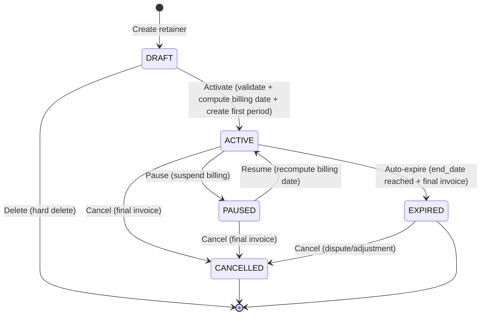
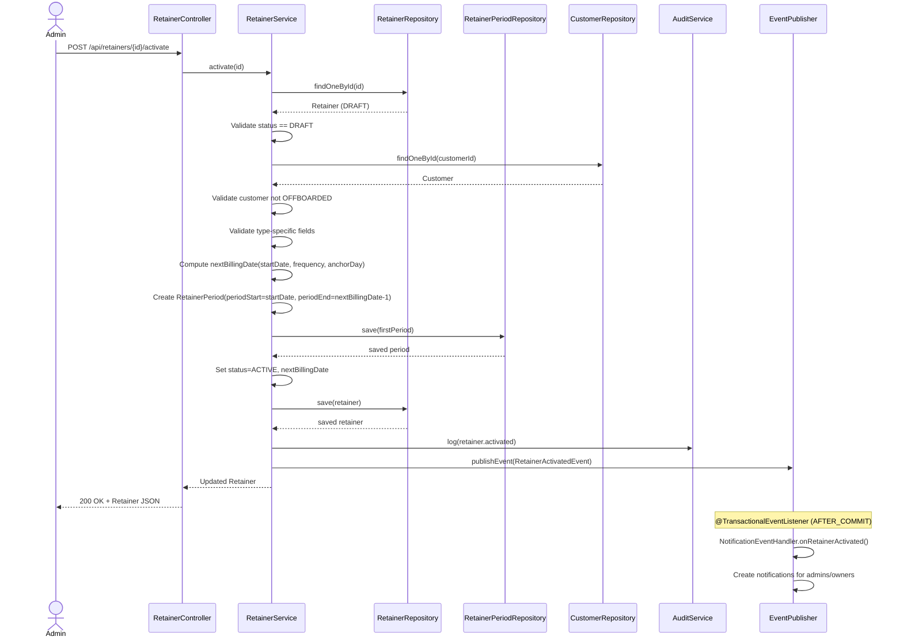
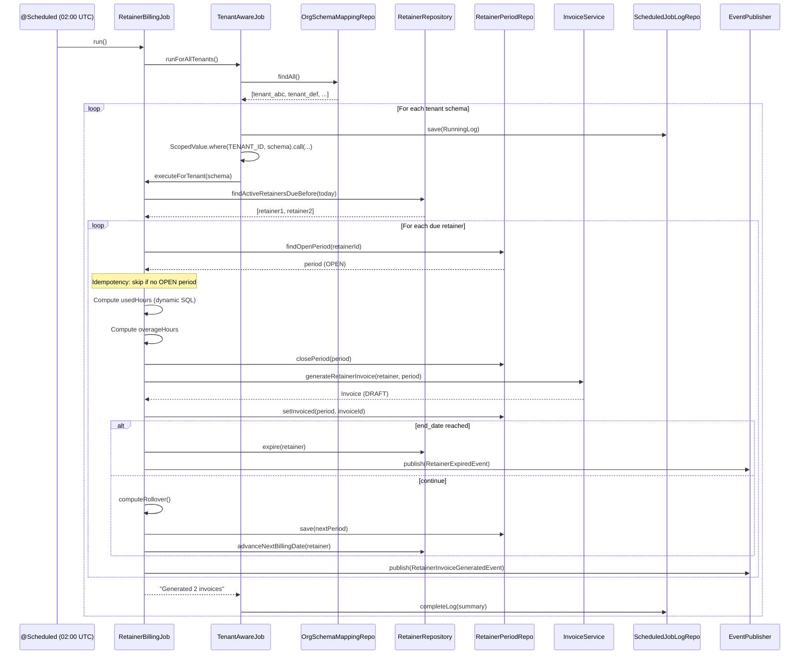
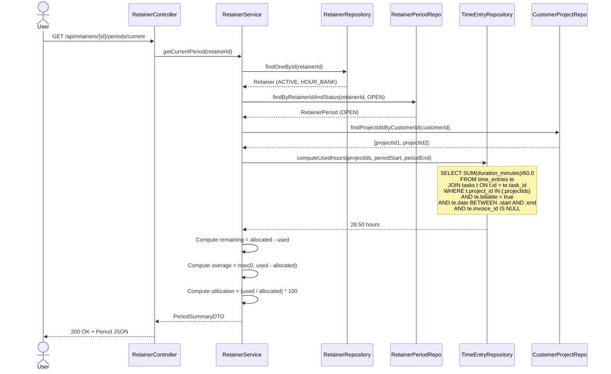

# Phase 14 — Recurring Work & Retainers

> Merge into `ARCHITECTURE.md` as **Section 14** or keep as standalone `architecture/phase14-recurring-work-retainers.md`.
> ADR files: `adr/ADR-064-*` through `adr/ADR-067-*`.

---

## 14. Phase 14 — Recurring Work & Retainers

Phase 14 adds the **recurring revenue layer** to the DocTeams platform. Until now, every invoice is a one-off event: staff select unbilled time entries, generate a draft invoice, and manually approve and send it. This works for ad-hoc projects but fails for the dominant billing model in professional services — **retainer agreements** where a client pays a predictable fee each period for ongoing work.

This phase introduces three tightly coupled capabilities:

1. **Retainer agreements** — a commercial contract between the org and a customer, defining billing terms (fixed-fee or hour bank), billing frequency, and pricing. Supports multiple retainers per customer.
2. **Hour bank mechanics** — period-based allocation tracking: hours allocated, hours consumed (computed from time entries), rollover from previous periods, and overage billing at a configurable rate.
3. **Job scheduling backbone** — a lightweight, tenant-aware scheduling infrastructure using Spring `@Scheduled` with idempotent execution and cross-tenant iteration. Designed for reuse by future periodic jobs (dormancy detection from Phase 13, retention enforcement, subscription renewals).

The retainer billing job is the first consumer of the scheduling backbone: at the end of each billing period, it auto-generates draft invoices from active retainers using the existing Phase 10 `Invoice` / `InvoiceLine` entities. Fixed-fee retainers produce a single line item; hour bank retainers produce a base fee line plus overage lines when usage exceeds allocation.

**Dependencies on prior phases**:
- **Phase 4** (Customers): `Customer` entity, `CustomerProject` join table. Retainers belong to customers; hour bank usage is computed via customer-linked projects.
- **Phase 5** (Task & Time Lifecycle): `TimeEntry` entity with `billable`, `date`, `duration_minutes`, `invoice_id`. Hour bank consumption is derived from billable time entries.
- **Phase 6** (Audit & Compliance): `AuditService` and `AuditEventBuilder`. All retainer mutations and scheduler events publish audit events.
- **Phase 6.5** (Notifications): `ApplicationEvent` publication pattern, `NotificationEventHandler`, `DomainEvent` sealed interface. Retainer lifecycle events trigger notifications.
- **Phase 8** (Rate Cards): `BillingRate` (3-level hierarchy), `OrgSettings` (default currency). Overage billing uses the existing rate card hierarchy for rate lookups.
- **Phase 10** (Invoicing): `Invoice`, `InvoiceLine`, `InvoiceCounter`, `InvoiceNumberService`. The retainer billing job creates invoices using the existing invoice domain model.
- **Phase 13** (Customer Compliance): Customer `lifecycle_status`. Retainers respect lifecycle gating — cannot activate a retainer for an OFFBOARDED customer.

### What's New

| Capability | Before Phase 14 | After Phase 14 |
|---|---|---|
| Recurring billing | Manual only — staff generate invoices from unbilled time | Automated — retainer billing job generates draft invoices on schedule |
| Retainer agreements | Not modelled | First-class Retainer entity with lifecycle (DRAFT / ACTIVE / PAUSED / EXPIRED / CANCELLED) |
| Hour bank tracking | Not modelled | Per-period allocation, dynamic usage computation, rollover, overage billing |
| Fixed-fee billing | Not modelled | Period-based fixed-fee invoicing with configurable frequency |
| Job scheduling | Ad-hoc `@Scheduled` (MagicLinkCleanupService only) | `TenantAwareJob` abstraction with logging, idempotency, per-tenant error isolation |
| Scheduler observability | None | `ScheduledJobLog` entity with run history, status, error tracking |
| Recurring revenue visibility | Not modelled | MRR card on company dashboard, retainer utilization metrics |

**Out of scope for Phase 14**:
- Project templates and auto-spawning recurring projects (Phase 15).
- Proration for mid-cycle starts, pauses, or cancellations — v1 retainers bill full periods only. Mid-cycle changes take effect at the next period boundary.
- Multi-currency retainers — one currency per retainer, matching the org or customer default.
- Retainer-specific rate overrides — retainers use the existing rate card hierarchy (Phase 8). The retainer stores only the fixed base fee.
- Customer portal visibility of retainers — internal-only in this phase.
- Email delivery of auto-generated invoices — drafts are generated; staff review and send manually.
- Credit notes for retainer overpayments or adjustments.
- Retainer approval workflows — creating/activating a retainer is a direct action by an admin/owner.
- Complex rollover policies (partial rollover, rollover expiry) — v1 supports NONE or UNLIMITED. Capped rollover is a future enhancement.

---

## 14.2 Domain Model

Phase 14 introduces three new entities: `Retainer` (tenant-scoped), `RetainerPeriod` (tenant-scoped), and `ScheduledJobLog` (public schema, cross-tenant). `Retainer` and `RetainerPeriod` follow the established tenant isolation pattern: `TenantAware` interface, `@FilterDef`/`@Filter` for shared-schema tenants, `@EntityListeners(TenantAwareEntityListener.class)`, UUID-based loose references.

### 14.2.1 Retainer Entity (New)

A Retainer represents a recurring billing agreement between the org and a customer. It defines the billing terms (type, frequency, pricing) and tracks lifecycle state. A customer can have multiple active retainers (e.g., bookkeeping retainer + advisory retainer).

| Field | Java Type | DB Column | DB Type | Constraints | Notes |
|-------|-----------|-----------|---------|-------------|-------|
| `id` | `UUID` | `id` | `UUID` | PK, default `gen_random_uuid()` | Auto-generated |
| `tenantId` | `String` | `tenant_id` | `VARCHAR(255)` | | Shared-schema discriminator |
| `customerId` | `UUID` | `customer_id` | `UUID` | NOT NULL, FK -> customers | The client under this retainer |
| `name` | `String` | `name` | `VARCHAR(200)` | NOT NULL | Human-readable label (e.g., "Monthly Bookkeeping Retainer") |
| `type` | `String` | `type` | `VARCHAR(20)` | NOT NULL | `FIXED_FEE` or `HOUR_BANK` |
| `status` | `String` | `status` | `VARCHAR(20)` | NOT NULL, default `'DRAFT'` | `DRAFT`, `ACTIVE`, `PAUSED`, `EXPIRED`, `CANCELLED` |
| `currency` | `String` | `currency` | `VARCHAR(3)` | NOT NULL | ISO 4217 code. All financial amounts in this currency |
| `billingFrequency` | `String` | `billing_frequency` | `VARCHAR(20)` | NOT NULL | `MONTHLY`, `QUARTERLY`, `ANNUALLY` |
| `billingAnchorDay` | `int` | `billing_anchor_day` | `INTEGER` | NOT NULL, CHECK 1-28 | Day of month when billing cycles start. Capped at 28 to avoid month-length issues |
| `baseFee` | `BigDecimal` | `base_fee` | `DECIMAL(14,2)` | NOT NULL, CHECK > 0 | Fixed fee per period. For FIXED_FEE: the invoice amount. For HOUR_BANK: base fee covering allocated hours |
| `allocatedHours` | `BigDecimal` | `allocated_hours` | `DECIMAL(10,2)` | Nullable | HOUR_BANK only: hours included per period |
| `overageRate` | `BigDecimal` | `overage_rate` | `DECIMAL(12,2)` | Nullable | HOUR_BANK only: rate per hour for usage beyond allocation |
| `rolloverPolicy` | `String` | `rollover_policy` | `VARCHAR(20)` | NOT NULL, default `'NONE'` | `NONE` (unused hours lost) or `UNLIMITED` (carry forward) |
| `startDate` | `LocalDate` | `start_date` | `DATE` | NOT NULL | When the retainer begins |
| `endDate` | `LocalDate` | `end_date` | `DATE` | Nullable | When the retainer ends. Null = open-ended |
| `nextBillingDate` | `LocalDate` | `next_billing_date` | `DATE` | Nullable | Computed: next date a billing cycle closes. Null for DRAFT |
| `notes` | `String` | `notes` | `TEXT` | Nullable | Internal notes about the agreement |
| `createdBy` | `UUID` | `created_by` | `UUID` | NOT NULL | Member who created the retainer |
| `createdAt` | `Instant` | `created_at` | `TIMESTAMPTZ` | NOT NULL, default `now()` | |
| `updatedAt` | `Instant` | `updated_at` | `TIMESTAMPTZ` | NOT NULL, default `now()` | |

**Constraints**:
- `CHECK (type IN ('FIXED_FEE', 'HOUR_BANK'))` — type discriminator.
- `CHECK (status IN ('DRAFT', 'ACTIVE', 'PAUSED', 'EXPIRED', 'CANCELLED'))` — lifecycle states.
- `CHECK (billing_frequency IN ('MONTHLY', 'QUARTERLY', 'ANNUALLY'))` — supported frequencies.
- `CHECK (rollover_policy IN ('NONE', 'UNLIMITED'))` — v1 rollover options.
- `CHECK (billing_anchor_day >= 1 AND billing_anchor_day <= 28)` — avoids month-length issues.
- `CHECK (base_fee > 0)` — retainers must have a positive fee.
- `CHECK (start_date < end_date OR end_date IS NULL)` — end must be after start, if set.
- Application-level validation: `allocated_hours` and `overage_rate` are required when `type = 'HOUR_BANK'`, null when `type = 'FIXED_FEE'`.
- Business logic warning (not DB constraint): warn if a customer already has an active retainer of the same type.

**Indexes**:
- `idx_retainers_customer_status` on `(customer_id, status)` — list retainers per customer.
- `idx_retainers_status_billing` on `(status, next_billing_date)` — scheduler query: active retainers due for billing.
- `idx_retainers_created_at` on `(created_at)` — chronological listing.
- `idx_retainers_tenant` on `(tenant_id) WHERE tenant_id IS NOT NULL` — shared-schema isolation.

**Design decisions**:
- **Single entity with type discriminator** (not separate FixedFeeRetainer / HourBankRetainer): The two types share 90% of their fields and lifecycle logic. A single entity with nullable hour-bank fields (validated by type) is simpler for queries, UI, and the billing job. See [ADR-064](../adr/ADR-064-retainer-billing-model.md).
- **`DECIMAL(14,2)` for base_fee**: Matches the `Invoice.total` precision, supporting amounts up to 999,999,999,999.99.
- **`billing_anchor_day` capped at 28**: Months have 28-31 days. Capping at 28 avoids "February 30" scenarios. For quarterly/annual billing, the anchor day applies to the first month of the quarter/year.
- **`next_billing_date` nullable**: DRAFT retainers have no billing date. Computed at activation. Advanced by the billing job after each period close.
- **Currency immutable**: Once set, a retainer's currency cannot change. All generated invoices inherit this currency.

### 14.2.2 RetainerPeriod Entity (New)

A RetainerPeriod tracks per-period billing and hour bank usage. Each billing cycle produces one period record. For hour bank retainers, the period tracks allocation, usage, rollover, and overage. For fixed-fee retainers, periods exist primarily for invoice linkage and audit.

| Field | Java Type | DB Column | DB Type | Constraints | Notes |
|-------|-----------|-----------|---------|-------------|-------|
| `id` | `UUID` | `id` | `UUID` | PK, default `gen_random_uuid()` | Auto-generated |
| `tenantId` | `String` | `tenant_id` | `VARCHAR(255)` | | Shared-schema discriminator |
| `retainerId` | `UUID` | `retainer_id` | `UUID` | NOT NULL, FK -> retainers | Parent retainer |
| `periodStart` | `LocalDate` | `period_start` | `DATE` | NOT NULL | Inclusive start of billing period |
| `periodEnd` | `LocalDate` | `period_end` | `DATE` | NOT NULL | Inclusive end of billing period |
| `allocatedHours` | `BigDecimal` | `allocated_hours` | `DECIMAL(10,2)` | NOT NULL, default 0 | Hours allocated (base + rollover). 0 for FIXED_FEE |
| `usedHours` | `BigDecimal` | `used_hours` | `DECIMAL(10,2)` | NOT NULL, default 0 | Billable hours consumed. Dynamic for OPEN, frozen on CLOSED |
| `rolledOverHours` | `BigDecimal` | `rolled_over_hours` | `DECIMAL(10,2)` | NOT NULL, default 0 | Unused hours carried from previous period |
| `overageHours` | `BigDecimal` | `overage_hours` | `DECIMAL(10,2)` | NOT NULL, default 0 | max(0, used_hours - allocated_hours). Computed on close |
| `status` | `String` | `status` | `VARCHAR(20)` | NOT NULL, default `'OPEN'` | `OPEN`, `CLOSED`, `INVOICED` |
| `invoiceId` | `UUID` | `invoice_id` | `UUID` | Nullable, FK -> invoices | Invoice generated for this period |
| `overageNotified` | `boolean` | `overage_notified` | `BOOLEAN` | NOT NULL, default `false` | Flag to prevent duplicate overage notifications per period |
| `createdAt` | `Instant` | `created_at` | `TIMESTAMPTZ` | NOT NULL, default `now()` | |
| `updatedAt` | `Instant` | `updated_at` | `TIMESTAMPTZ` | NOT NULL, default `now()` | |

**Constraints**:
- `CHECK (status IN ('OPEN', 'CLOSED', 'INVOICED'))`.
- `CHECK (period_start < period_end)`.
- `UNIQUE (retainer_id, period_start)` — no overlapping periods for the same retainer.
- Application-level: at most one `OPEN` period per retainer at a time.

**Indexes**:
- `idx_retainer_periods_retainer_status` on `(retainer_id, status)` — find the current open period.
- `idx_retainer_periods_retainer_start` on `(retainer_id, period_start)` — chronological period listing.
- `idx_retainer_periods_tenant` on `(tenant_id) WHERE tenant_id IS NOT NULL` — shared-schema isolation.

**Design decisions**:
- **Explicit period records** (not computed windows from retainer start + frequency): Explicit records enable rollover tracking, period-specific invoice linkage, frozen hour snapshots, and auditability. The trade-off is more storage, but the billing and rollover logic is dramatically simpler. See [ADR-067](../adr/ADR-067-period-based-tracking.md).
- **`used_hours` dual mode**: For OPEN periods, `used_hours` is computed dynamically via SQL query (always accurate). When the period closes, `used_hours` is frozen to its final value (immutable for invoicing). See [ADR-065](../adr/ADR-065-hour-bank-computation.md).
- **`allocated_hours` includes rollover**: A period's `allocated_hours` = retainer's base `allocated_hours` + `rolled_over_hours`. This makes the remaining balance calculation simple: `allocated_hours - used_hours`.

### 14.2.3 ScheduledJobLog Entity (New — Public Schema)

A ScheduledJobLog records the execution of a scheduled job for observability and debugging. It lives in the `public` schema because it logs across all tenants. It does NOT implement `TenantAware` and does NOT use `@FilterDef`/`@Filter`.

| Field | Java Type | DB Column | DB Type | Constraints | Notes |
|-------|-----------|-----------|---------|-------------|-------|
| `id` | `UUID` | `id` | `UUID` | PK, default `gen_random_uuid()` | Auto-generated |
| `tenantId` | `String` | `tenant_id` | `VARCHAR(255)` | NOT NULL | Tenant this run executed for, or `"SYSTEM"` for cross-tenant operations |
| `jobName` | `String` | `job_name` | `VARCHAR(100)` | NOT NULL | e.g., `"retainer-billing"`, `"dormancy-check"`, `"magic-link-cleanup"` |
| `startedAt` | `Instant` | `started_at` | `TIMESTAMPTZ` | NOT NULL | When the job run started |
| `completedAt` | `Instant` | `completed_at` | `TIMESTAMPTZ` | Nullable | When the job run finished (null if still running) |
| `status` | `String` | `status` | `VARCHAR(20)` | NOT NULL, default `'RUNNING'` | `RUNNING`, `COMPLETED`, `FAILED` |
| `resultSummary` | `String` | `result_summary` | `TEXT` | Nullable | e.g., "Generated 3 invoices", "No retainers due" |
| `errorMessage` | `String` | `error_message` | `TEXT` | Nullable | Stack trace or error detail on failure |
| `createdAt` | `Instant` | `created_at` | `TIMESTAMPTZ` | NOT NULL, default `now()` | |

**Constraints**:
- `CHECK (status IN ('RUNNING', 'COMPLETED', 'FAILED'))`.
- No RLS — this entity is cross-tenant in the `public` schema.
- No `@FilterDef` / `@Filter` — not tenant-scoped.

**Indexes**:
- `idx_job_log_name_started` on `(job_name, started_at DESC)` — list recent runs per job.
- `idx_job_log_tenant_started` on `(tenant_id, started_at DESC)` — list runs for a specific tenant.
- `idx_job_log_status` on `(status)` — find running/failed jobs.

**Retention**: Configurable, default 90 days. A housekeeping job (or SQL-based cleanup) deletes logs older than the retention window. This can be the second consumer of the `TenantAwareJob` infrastructure (though the cleanup itself runs against the public schema, not per-tenant).

### 14.2.4 Entity Relationship Diagram

The following Mermaid ER diagram shows all tenant-schema entities (existing + new). `ScheduledJobLog` is noted separately as it lives in the public schema.

```mermaid
erDiagram
    Customer ||--o{ CustomerProject : "has"
    Customer ||--o{ Retainer : "has"
    Customer ||--o{ Invoice : "billed to"
    Customer ||--o{ ChecklistInstance : "has"
    Customer ||--o{ DataSubjectRequest : "subject of"

    Project ||--o{ CustomerProject : "linked to"
    Project ||--o{ Task : "contains"
    Project ||--o{ Document : "has"
    Project ||--o{ ProjectBudget : "has"
    Project ||--o{ BillingRate : "override"
    Project ||--o{ CostRate : "override"

    Task ||--o{ TimeEntry : "logged on"
    Task ||--o{ Comment : "has"

    TimeEntry }o--o| Invoice : "billed in"

    Invoice ||--o{ InvoiceLine : "contains"

    Retainer ||--o{ RetainerPeriod : "tracks"
    RetainerPeriod }o--o| Invoice : "generates"

    Customer ||--o{ BillingRate : "override"

    ChecklistTemplate ||--o{ ChecklistTemplateItem : "defines"
    ChecklistTemplate ||--o{ ChecklistInstance : "instantiated as"
    ChecklistInstance ||--o{ ChecklistInstanceItem : "tracks"

    OrgSettings ||--|| OrgSettings : "singleton"
    DocumentTemplate ||--o{ GeneratedDocument : "produces"

    Customer {
        UUID id PK
        String lifecycle_status
        String name
        String email
    }
    Project {
        UUID id PK
        String name
        String status
    }
    Task {
        UUID id PK
        UUID project_id FK
        String title
        String status
    }
    TimeEntry {
        UUID id PK
        UUID task_id FK
        UUID member_id
        UUID invoice_id FK
        LocalDate date
        int duration_minutes
        boolean billable
    }
    Invoice {
        UUID id PK
        UUID customer_id FK
        String invoice_number
        String status
        String currency
        BigDecimal total
    }
    InvoiceLine {
        UUID id PK
        UUID invoice_id FK
        UUID time_entry_id FK
        BigDecimal quantity
        BigDecimal unit_price
        BigDecimal amount
    }
    Retainer {
        UUID id PK
        UUID customer_id FK
        String name
        String type
        String status
        String currency
        String billing_frequency
        int billing_anchor_day
        BigDecimal base_fee
        BigDecimal allocated_hours
        BigDecimal overage_rate
        String rollover_policy
        LocalDate start_date
        LocalDate end_date
        LocalDate next_billing_date
    }
    RetainerPeriod {
        UUID id PK
        UUID retainer_id FK
        UUID invoice_id FK
        LocalDate period_start
        LocalDate period_end
        BigDecimal allocated_hours
        BigDecimal used_hours
        BigDecimal rolled_over_hours
        BigDecimal overage_hours
        String status
    }
    CustomerProject {
        UUID id PK
        UUID customer_id FK
        UUID project_id FK
    }
    BillingRate {
        UUID id PK
        UUID project_id FK
        UUID customer_id FK
        BigDecimal rate
        String currency
    }
    CostRate {
        UUID id PK
        UUID member_id
        BigDecimal rate
    }
    ProjectBudget {
        UUID id PK
        UUID project_id FK
        BigDecimal amount
    }
    OrgSettings {
        UUID id PK
        String default_currency
        String brand_color
    }
    Document {
        UUID id PK
        UUID project_id FK
        String title
    }
    Comment {
        UUID id PK
        UUID task_id FK
        String content
    }
    Notification {
        UUID id PK
        UUID member_id
        String event_type
    }
    AuditEvent {
        UUID id PK
        String event_type
        String entity_type
    }
    Tag {
        UUID id PK
        String name
        String color
    }
    EntityTag {
        UUID id PK
        UUID tag_id FK
        UUID entity_id
    }
    CustomFieldDefinition {
        UUID id PK
        String name
        String field_type
    }
    CustomFieldValue {
        UUID id PK
        UUID definition_id FK
        UUID entity_id
    }
    SavedView {
        UUID id PK
        String name
        String entity_type
    }
    ChecklistTemplate {
        UUID id PK
        String name
        String slug
    }
    ChecklistTemplateItem {
        UUID id PK
        UUID template_id FK
        String name
    }
    ChecklistInstance {
        UUID id PK
        UUID template_id FK
        UUID customer_id FK
        String status
    }
    ChecklistInstanceItem {
        UUID id PK
        UUID instance_id FK
        String status
    }
    RetentionPolicy {
        UUID id PK
        String record_type
        int retention_days
    }
    DataSubjectRequest {
        UUID id PK
        UUID customer_id FK
        String request_type
        String status
    }
    DocumentTemplate {
        UUID id PK
        String name
        String slug
    }
    GeneratedDocument {
        UUID id PK
        UUID template_id FK
        String s3_key
    }
    InvoiceCounter {
        UUID id PK
        int next_number
    }
```



**Public schema entity** (not in the tenant ER diagram above):

```
ScheduledJobLog (public schema)
- id: UUID PK
- tenant_id: VARCHAR (NOT a tenant filter — just metadata)
- job_name: VARCHAR
- started_at: TIMESTAMPTZ
- completed_at: TIMESTAMPTZ
- status: VARCHAR (RUNNING/COMPLETED/FAILED)
- result_summary: TEXT
- error_message: TEXT
```

### 14.2.5 Retainer Lifecycle State Machine



**State transition rules**:
- **DRAFT**: Fully editable. All fields can be modified. Can be hard-deleted. No periods exist.
- **DRAFT -> ACTIVE**: Validates all required fields (including hour-bank fields if type is HOUR_BANK). Computes `next_billing_date`. Creates the first `RetainerPeriod` (OPEN). Customer must not be OFFBOARDED.
- **ACTIVE -> PAUSED**: Suspends billing. Current period remains OPEN but `next_billing_date` is not advanced. No new time should accrue against it (enforced by documentation/convention, not hard-blocked).
- **PAUSED -> ACTIVE**: Resumes the retainer. Recomputes `next_billing_date` from today based on billing frequency and anchor day.
- **ACTIVE -> EXPIRED**: Triggered automatically when `end_date` is reached and the final billing period closes. The billing job handles this: if the next period would extend beyond `end_date`, the retainer is expired instead.
- **ACTIVE -> CANCELLED** / **PAUSED -> CANCELLED**: Manual cancellation by admin/owner. Closes the current period (if OPEN) and generates a final invoice for any outstanding amount.
- **EXPIRED -> CANCELLED**: Allows cancelling an expired retainer (e.g., if the final invoice was disputed). No additional invoice generated.
- **Invalid transitions** (CANCELLED -> ACTIVE, DRAFT -> PAUSED, etc.): Rejected with HTTP 409 Conflict.

---

## 14.3 Core Flows and Backend Behaviour

### 14.3.1 Retainer CRUD

**Create Draft**

A new retainer is created in DRAFT status. All fields are set from the request DTO except `status` (always DRAFT), `nextBillingDate` (null until activation), and `createdBy` (from `RequestScopes.MEMBER_ID`).

- **Tenant boundary**: Works for both Starter and Pro tenants. Tenant isolation via `TenantAware` + `@Filter`.
- **RBAC**: Admin or Owner only. Project Leads and Members cannot create retainers.
- **Validation**:
  - `customerId` must reference an existing customer in the tenant.
  - Customer must not be OFFBOARDED (lifecycle gating from Phase 13).
  - `type` must be `FIXED_FEE` or `HOUR_BANK`.
  - If `HOUR_BANK`: `allocatedHours` must be > 0, `overageRate` must be >= 0.
  - If `FIXED_FEE`: `allocatedHours` and `overageRate` must be null (rejected if provided).
  - `baseFee` must be > 0.
  - `billingAnchorDay` must be between 1 and 28.
  - `startDate` must be before `endDate` (if `endDate` is set).
  - `currency` must be a valid 3-character ISO 4217 code (or defaults to org's default currency from `OrgSettings`).
- **Audit**: `retainer.created` event.
- **Notification**: None (drafts are internal working state).

**Update Draft**

Only DRAFT retainers can be edited. All fields (except `id`, `tenantId`, `createdBy`, `createdAt`) can be modified.

- **RBAC**: Admin or Owner only.
- **Validation**: Same as create.
- **Error**: HTTP 409 if retainer is not in DRAFT status.
- **Audit**: `retainer.updated` event with changed fields in details.

**Delete Draft**

Only DRAFT retainers can be deleted. This is a hard delete (no soft-delete) because drafts have no financial or audit significance beyond the creation audit event.

- **RBAC**: Admin or Owner only.
- **Error**: HTTP 409 if retainer is not in DRAFT status.
- **Audit**: `retainer.deleted` event.

### 14.3.2 Retainer Lifecycle Transitions

**Activate (DRAFT -> ACTIVE)**

1. Validate the retainer is in DRAFT status.
2. Validate all required fields are populated (including type-specific fields).
3. Validate the customer is not OFFBOARDED.
4. Compute `next_billing_date`:
   - Find the first billing cycle boundary on or after `start_date` using `billing_frequency` and `billing_anchor_day`.
   - For MONTHLY: the `billing_anchor_day` of the current or next month relative to `start_date`.
   - For QUARTERLY: the `billing_anchor_day` of the first month of the current or next quarter.
   - For ANNUALLY: the `billing_anchor_day` of the first month of the current or next year.
5. Create the first `RetainerPeriod`:
   - `period_start` = `start_date`.
   - `period_end` = `next_billing_date - 1 day` (inclusive end).
   - `allocated_hours` = retainer's `allocated_hours` (no rollover for the first period).
   - `rolled_over_hours` = 0.
   - `status` = OPEN.
6. Set retainer `status` = ACTIVE.
7. Publish audit event: `retainer.activated`.
8. Publish domain event: `RetainerActivatedEvent` (triggers notification to admins/owners).

**Pause (ACTIVE -> PAUSED)**

1. Validate the retainer is in ACTIVE status.
2. Set retainer `status` = PAUSED.
3. The current OPEN period remains unchanged (not closed). `next_billing_date` is preserved.
4. Publish audit event: `retainer.paused`.
5. Publish domain event: `RetainerPausedEvent`.

**Resume (PAUSED -> ACTIVE)**

1. Validate the retainer is in PAUSED status.
2. Set retainer `status` = ACTIVE.
3. Recompute `next_billing_date` from today (using the same anchor day logic as activation). This effectively resets the billing cycle from the resume date.
4. Update the current OPEN period's `period_end` to align with the new `next_billing_date - 1 day`.
5. Publish audit event: `retainer.resumed`.
6. Publish domain event: `RetainerResumedEvent`.

**Cancel (ACTIVE|PAUSED -> CANCELLED)**

1. Validate the retainer is in ACTIVE or PAUSED status.
2. If there is an OPEN period:
   a. Close it (finalize `used_hours`, compute `overage_hours`).
   b. Generate a final invoice (see 14.3.5).
   c. Set period `status` = INVOICED, `invoice_id` = generated invoice.
3. Set retainer `status` = CANCELLED.
4. Set `next_billing_date` = null.
5. Publish audit event: `retainer.cancelled`.
6. Publish domain event: `RetainerCancelledEvent` (notifies admins/owners + creator).

**Expire (ACTIVE -> EXPIRED)**

Triggered by the billing job, not by a user action.

1. The billing job detects that the next period would extend beyond `end_date`.
2. Close the final period, generate the final invoice.
3. Set retainer `status` = EXPIRED, `next_billing_date` = null.
4. Publish audit event: `retainer.expired`.
5. Publish domain event: `RetainerExpiredEvent` (notifies admins/owners + creator).

**Cancel Expired (EXPIRED -> CANCELLED)**

1. Validate the retainer is in EXPIRED status.
2. Set retainer `status` = CANCELLED. No invoice generated (the final invoice was generated at expiry).
3. Publish audit event: `retainer.cancelled` (with details noting it was expired -> cancelled).
4. Publish domain event: `RetainerCancelledEvent`.

### 14.3.3 Hour Bank Computation

Hour bank usage for an OPEN period is computed dynamically via SQL. This ensures the value is always accurate without requiring triggers or materialized views. When the period closes, the value is frozen.

**Dynamic usage query** (for OPEN periods):

```sql
SELECT COALESCE(SUM(te.duration_minutes), 0) / 60.0 AS used_hours
FROM time_entries te
JOIN tasks t ON t.id = te.task_id
JOIN customer_projects cp ON cp.project_id = t.project_id
                          AND cp.customer_id = :customerId
WHERE te.billable = true
  AND te.date >= :periodStart
  AND te.date <= :periodEnd
  AND te.invoice_id IS NULL
```

**Key design decisions**:
- **Join path**: `TimeEntry -> Task -> Project -> CustomerProject -> Customer`. Time entries are linked to tasks, tasks to projects, projects to customers via the `customer_projects` join table. This avoids adding a direct FK from TimeEntry to Retainer.
- **`invoice_id IS NULL` filter**: Excludes time entries that have already been billed to a different invoice. This prevents double-counting: if an admin manually invoices some time entries from a retainer period, those entries will not be counted again when the period closes. See [ADR-065](../adr/ADR-065-hour-bank-computation.md).
- **Duration in minutes, result in hours**: `duration_minutes / 60.0` converts to decimal hours for display and overage calculation. The division uses `DECIMAL` arithmetic, not integer.
- **No `tenant_id` filter in the query**: Hibernate's `@Filter` handles tenant isolation automatically for JPQL queries. For native SQL, RLS policies on `tenant_shared` handle isolation via `app.current_tenant` set by `TenantFilterTransactionManager`. When this query runs inside the billing job, it executes within `ScopedValue.where(RequestScopes.TENANT_ID, schema).call()`, which means `TenantFilterTransactionManager` has already set `app.current_tenant` before the transaction opens, ensuring RLS isolation for native queries.

**Frozen computation** (on period close):

When the billing job closes a period, it:
1. Executes the dynamic query above and stores the result in `used_hours`.
2. Computes `overage_hours` = `max(0, used_hours - allocated_hours)`.
3. Sets `status` = CLOSED.
4. These values are now immutable — they serve as the source of truth for the invoice.

### 14.3.4 Retainer Billing Job

The retainer billing job is the first concrete implementation of the `TenantAwareJob` abstraction.

**TenantAwareJob abstraction**:

```java
public abstract class TenantAwareJob {

    private final OrgSchemaMappingRepository orgSchemaMappingRepository;
    private final ScheduledJobLogRepository jobLogRepository;
    private final TransactionTemplate transactionTemplate;

    /** Subclasses implement this to perform tenant-scoped work. */
    protected abstract String getJobName();
    protected abstract String executeForTenant(String schema);

    public void runForAllTenants() {
        var mappings = orgSchemaMappingRepository.findAll();
        for (var mapping : mappings) {
            String schema = mapping.getSchemaName();
            var log = createRunningLog(schema);
            try {
                String summary = ScopedValue.where(RequestScopes.TENANT_ID, schema)
                    .call(() -> transactionTemplate.execute(
                        status -> executeForTenant(schema)));
                completeLog(log, summary);
            } catch (Exception e) {
                failLog(log, e);
                // Continue to next tenant — one failure does not block others
            }
        }
    }
}
```

**Retainer billing job** (concrete implementation):

- **Schedule**: Configurable via `app.scheduler.retainer-billing.cron` in `application.yml`. Default: `0 0 2 * * ?` (daily at 02:00 UTC).
- **Logic per tenant** (`executeForTenant`):
  1. Query active retainers where `next_billing_date <= LocalDate.now()`.
  2. For each due retainer:
     a. Find the current OPEN period. **Idempotency check**: if no OPEN period exists (already closed), skip.
     b. Close the period: finalize `used_hours` (run the dynamic query), compute `overage_hours`.
     c. Set period `status` = CLOSED.
     d. Generate a draft invoice (see 14.3.5).
     e. Set period `status` = INVOICED, `invoice_id` = generated invoice ID.
     f. Determine if the retainer should expire (next period would exceed `end_date`). If yes, set retainer `status` = EXPIRED, `next_billing_date` = null.
     g. Otherwise, create the next period (see 14.3.6) and advance `next_billing_date`.
  3. Return summary: "Processed N retainers: M invoices generated, K expired".

**Idempotency**: The job is safe to re-run because:
- It only processes retainers where `status = ACTIVE AND next_billing_date <= today`.
- It checks for an OPEN period before processing. If the period is already CLOSED or INVOICED, the retainer is skipped.
- After processing, `next_billing_date` is advanced past today, so the retainer will not be picked up again until the next cycle.

**Error isolation**: Each retainer is processed independently within the tenant transaction. If one retainer fails (e.g., invalid data), the others in the same tenant still process. The error is logged to `ScheduledJobLog` with details about which retainer failed.

### 14.3.5 Invoice Generation from Retainer

When a retainer period closes (either via the billing job or manual trigger), a draft invoice is generated using the existing Phase 10 `Invoice` / `InvoiceLine` model.

**Fixed-fee retainer**:
1. Create `Invoice` with:
   - `customerId` = retainer's customer.
   - `currency` = retainer's currency.
   - Customer name/email/address snapshotted from the Customer entity.
   - Org name snapshotted from the organization.
   - `createdBy` = the retainer's `created_by` member ID (for both scheduler-generated and manual triggers). The scheduler acts on behalf of the retainer creator since `RequestScopes.MEMBER_ID` is not bound in scheduler context. For manual triggers, `RequestScopes.MEMBER_ID` is available and used instead.
   - `status` = DRAFT.
2. Create one `InvoiceLine`:
   - `description` = "{retainer.name} - {period_start} to {period_end}".
   - `quantity` = 1.
   - `unit_price` = retainer's `base_fee`.
   - `amount` = `base_fee`.
   - `projectId` = null (retainer-level, not project-specific).
   - `timeEntryId` = null (not linked to specific time entries).
   - `sortOrder` = 0.
3. Recalculate invoice `subtotal` and `total`.

**Hour bank retainer**:
1. Create `Invoice` (same as fixed-fee).
2. Create base fee line item:
   - `description` = "{retainer.name} - Base Fee ({period_start} to {period_end})".
   - `quantity` = 1.
   - `unit_price` = retainer's `base_fee`.
   - `amount` = `base_fee`.
   - `sortOrder` = 0.
3. If `overage_hours > 0`, create overage line item:
   - `description` = "{retainer.name} - Overage ({overage_hours} hrs @ {overage_rate}/hr)".
   - `quantity` = `overage_hours`.
   - `unit_price` = retainer's `overage_rate`.
   - `amount` = `overage_hours * overage_rate`.
   - `sortOrder` = 1.
4. Recalculate invoice `subtotal` and `total`.

**Relationship to existing time entry billing**: Retainer invoices do NOT set `invoice_id` on individual time entries. The retainer invoice represents the retainer agreement fee (base + overage), not individual time entries. Time entries that contributed to the hour bank remain with `invoice_id = NULL` unless they are also manually invoiced via the standard Phase 10 unbilled-time flow. This is by design: the retainer is a commercial agreement separate from time-entry-level billing. The hour bank query uses `invoice_id IS NULL` to exclude double-counted entries, which means if an admin manually invoices specific time entries, those entries will be excluded from the hour bank computation going forward.

### 14.3.6 Period Rollover

When creating the next period after closing the current one:

**NONE rollover**:
- New period's `rolled_over_hours` = 0.
- New period's `allocated_hours` = retainer's `allocated_hours`.
- Unused hours from the closed period are lost.

**UNLIMITED rollover**:
- New period's `rolled_over_hours` = max(0, closed period's `allocated_hours` - closed period's `used_hours`).
- New period's `allocated_hours` = retainer's `allocated_hours` + `rolled_over_hours`.
- Unused hours accumulate indefinitely. Only positive unused hours roll over — if `used_hours > allocated_hours` (overage), the rollover is 0 (overage is billed, never carried as a deficit to the next period).

**Next period date computation**:
- `period_start` = closed period's `period_end` + 1 day.
- `period_end` = computed from `billing_frequency` and `billing_anchor_day`:
  - MONTHLY: next occurrence of `billing_anchor_day` after `period_start`, minus 1 day.
  - QUARTERLY: `billing_anchor_day` of the first month of the next quarter, minus 1 day.
  - ANNUALLY: `billing_anchor_day` of the first month of the next year, minus 1 day.

### 14.3.7 Retainer Expiry

Automatic expiry occurs when the billing job determines that the next period would extend beyond the retainer's `end_date`.

**Logic** (inside the billing job):
1. After closing the current period and generating the invoice, check if the retainer has an `end_date`.
2. If `end_date` is set and the next period's `period_start` would be after `end_date`, the retainer has expired.
3. Set retainer `status` = EXPIRED, `next_billing_date` = null.
4. Do NOT create a next period.
5. Publish `retainer.expired` audit event and `RetainerExpiredEvent` domain event.

Open-ended retainers (`end_date` = null) never auto-expire. They continue indefinitely until manually cancelled or paused.

### 14.3.8 Manual Invoice Trigger

Admins/owners can manually trigger invoice generation for the current period, closing it early.

- **Endpoint**: `POST /api/retainers/{id}/generate-invoice`.
- **Preconditions**: Retainer must be ACTIVE. Must have an OPEN period.
- **Flow**: Same as the billing job's per-retainer logic: close current period, generate invoice, create next period (or expire if at end date).
- **Use cases**: Testing, mid-cycle billing at client request, period adjustment.
- **Audit**: `retainer.invoice_generated` with `source: MANUAL`.

---

## 14.4 API Surface

All endpoints require a valid Clerk JWT. Tenant scoping is automatic via `TenantFilter`. Permission checks use `RequestScopes.getOrgRole()`.

### 14.4.1 Retainer CRUD Endpoints

| Method | Path | Description | Auth | Access |
|--------|------|-------------|------|--------|
| `GET` | `/api/retainers` | List retainers with optional filters | JWT | Admin/Owner: all retainers. Project Lead: retainers for their customers only |
| `GET` | `/api/retainers/{id}` | Get retainer with current period summary | JWT | Admin/Owner: any. Project Lead: if linked to their customer |
| `POST` | `/api/retainers` | Create a draft retainer | JWT | Admin/Owner only |
| `PUT` | `/api/retainers/{id}` | Update a draft retainer | JWT | Admin/Owner only |
| `DELETE` | `/api/retainers/{id}` | Delete a draft retainer (hard delete) | JWT | Admin/Owner only |

**`GET /api/retainers` query parameters**:
- `customerId` (UUID, optional) — filter by customer.
- `status` (String, optional) — filter by status (DRAFT, ACTIVE, PAUSED, EXPIRED, CANCELLED).
- `type` (String, optional) — filter by type (FIXED_FEE, HOUR_BANK).
- `page`, `size`, `sort` — standard Spring Pageable.

**`POST /api/retainers` request body**:
```json
{
  "customerId": "uuid",
  "name": "Monthly Bookkeeping Retainer",
  "type": "HOUR_BANK",
  "currency": "ZAR",
  "billingFrequency": "MONTHLY",
  "billingAnchorDay": 1,
  "baseFee": 15000.00,
  "allocatedHours": 40.00,
  "overageRate": 500.00,
  "rolloverPolicy": "UNLIMITED",
  "startDate": "2026-03-01",
  "endDate": "2027-02-28",
  "notes": "Includes monthly close and VAT submission"
}
```

**`GET /api/retainers/{id}` response** (includes current period summary for hour bank):
```json
{
  "id": "uuid",
  "customerId": "uuid",
  "customerName": "Acme Corp",
  "name": "Monthly Bookkeeping Retainer",
  "type": "HOUR_BANK",
  "status": "ACTIVE",
  "currency": "ZAR",
  "billingFrequency": "MONTHLY",
  "billingAnchorDay": 1,
  "baseFee": 15000.00,
  "allocatedHours": 40.00,
  "overageRate": 500.00,
  "rolloverPolicy": "UNLIMITED",
  "startDate": "2026-03-01",
  "endDate": "2027-02-28",
  "nextBillingDate": "2026-04-01",
  "notes": "Includes monthly close and VAT submission",
  "createdBy": "uuid",
  "createdAt": "2026-02-15T10:00:00Z",
  "updatedAt": "2026-03-01T08:00:00Z",
  "currentPeriod": {
    "id": "uuid",
    "periodStart": "2026-03-01",
    "periodEnd": "2026-03-31",
    "allocatedHours": 40.00,
    "usedHours": 28.50,
    "rolledOverHours": 0.00,
    "remainingHours": 11.50,
    "overageHours": 0.00,
    "utilizationPercent": 71.25,
    "status": "OPEN"
  }
}
```

### 14.4.2 Retainer Lifecycle Endpoints

| Method | Path | Description | Auth | Access |
|--------|------|-------------|------|--------|
| `POST` | `/api/retainers/{id}/activate` | DRAFT -> ACTIVE | JWT | Admin/Owner only |
| `POST` | `/api/retainers/{id}/pause` | ACTIVE -> PAUSED | JWT | Admin/Owner only |
| `POST` | `/api/retainers/{id}/resume` | PAUSED -> ACTIVE | JWT | Admin/Owner only |
| `POST` | `/api/retainers/{id}/cancel` | ACTIVE/PAUSED -> CANCELLED | JWT | Admin/Owner only |

All lifecycle endpoints return the updated retainer (same shape as `GET /api/retainers/{id}`). Invalid transitions return HTTP 409 Conflict with a ProblemDetail body.

### 14.4.3 Retainer Period Endpoints

| Method | Path | Description | Auth | Access |
|--------|------|-------------|------|--------|
| `GET` | `/api/retainers/{id}/periods` | List all periods (newest first) | JWT | Admin/Owner: any. Project Lead: if linked customer |
| `GET` | `/api/retainers/{id}/periods/current` | Get current OPEN period with real-time hour bank | JWT | Admin/Owner: any. Project Lead: if linked customer |

**`GET /api/retainers/{id}/periods/current` response**:
```json
{
  "id": "uuid",
  "retainerId": "uuid",
  "periodStart": "2026-03-01",
  "periodEnd": "2026-03-31",
  "allocatedHours": 40.00,
  "usedHours": 28.50,
  "rolledOverHours": 0.00,
  "remainingHours": 11.50,
  "overageHours": 0.00,
  "utilizationPercent": 71.25,
  "status": "OPEN",
  "invoiceId": null,
  "createdAt": "2026-03-01T02:00:00Z",
  "updatedAt": "2026-03-15T14:00:00Z"
}
```

For OPEN periods, `usedHours` is computed dynamically. For CLOSED/INVOICED periods, it is the frozen value.

### 14.4.4 Manual Billing Trigger

| Method | Path | Description | Auth | Access |
|--------|------|-------------|------|--------|
| `POST` | `/api/retainers/{id}/generate-invoice` | Close current period and generate invoice | JWT | Admin/Owner only |

Returns the generated invoice summary:
```json
{
  "invoiceId": "uuid",
  "retainerId": "uuid",
  "periodId": "uuid",
  "subtotal": 15000.00,
  "overageAmount": 2500.00,
  "total": 17500.00,
  "currency": "ZAR",
  "status": "DRAFT"
}
```

### 14.4.5 Scheduler Admin Endpoints

| Method | Path | Description | Auth | Access |
|--------|------|-------------|------|--------|
| `GET` | `/api/admin/jobs` | List recent job runs | JWT | Admin/Owner only |
| `POST` | `/api/admin/jobs/{jobName}/run` | Manually trigger a job | JWT | Admin/Owner only |

**`GET /api/admin/jobs` query parameters**:
- `jobName` (String, optional) — filter by job name.
- `status` (String, optional) — filter by status.
- `page`, `size` — standard Pageable.

**`POST /api/admin/jobs/{jobName}/run` response**:
```json
{
  "message": "Job 'retainer-billing' triggered. Processing 5 tenants.",
  "logEntries": [
    { "tenantId": "tenant_abc123", "status": "COMPLETED", "resultSummary": "Generated 2 invoices" },
    { "tenantId": "tenant_def456", "status": "COMPLETED", "resultSummary": "No retainers due" }
  ]
}
```

---

## 14.5 Sequence Diagrams

### 14.5.1 Retainer Activation Flow



### 14.5.2 Scheduled Billing Job Flow



### 14.5.3 Hour Bank Status Query



---

## 14.6 Job Scheduling Backbone

### 14.6.1 Design Philosophy

The scheduling backbone is intentionally lightweight. It uses Spring's built-in `@Scheduled` annotation with a custom `TenantAwareJob` base class that handles tenant iteration, ScopedValue binding, error isolation, and logging. See [ADR-066](../adr/ADR-066-scheduling-infrastructure.md) for the full decision rationale.

**Why not Quartz/external scheduler**:
- The job workload is light — iterate tenants, query a few retainers, generate invoices. No need for distributed execution.
- Single deployable: no external infrastructure to manage.
- Idempotent design means missed runs (server restart mid-cycle) are a non-issue — the job simply processes pending work on the next tick.
- If the platform scales to thousands of tenants, the scheduler can be extracted to a dedicated worker without changing job logic.

### 14.6.2 TenantAwareJob Abstraction

```java
package io.b2mash.b2b.b2bstrawman.scheduler;

public abstract class TenantAwareJob {

    private static final Logger log = LoggerFactory.getLogger(TenantAwareJob.class);

    private final OrgSchemaMappingRepository orgSchemaMappingRepository;
    private final ScheduledJobLogRepository jobLogRepository;
    private final TransactionTemplate publicTxTemplate;  // runs against public schema
    private final TransactionTemplate tenantTxTemplate;  // runs inside ScopedValue binding

    /** Job name for logging and ScheduledJobLog entries. */
    protected abstract String getJobName();

    /** Execute job logic for a single tenant. Returns a summary string. */
    protected abstract String executeForTenant(String schema);

    /** Entry point: iterates all tenants, executes job, logs results. */
    public void runForAllTenants() {
        var mappings = orgSchemaMappingRepository.findAll();
        log.info("Starting job '{}' for {} tenants", getJobName(), mappings.size());

        int succeeded = 0, failed = 0;

        for (var mapping : mappings) {
            String schema = mapping.getSchemaName();
            UUID logId = createRunningLog(schema);

            try {
                String summary = ScopedValue
                    .where(RequestScopes.TENANT_ID, schema)
                    .call(() -> tenantTxTemplate.execute(
                        status -> executeForTenant(schema)));

                completeLog(logId, summary);
                succeeded++;
            } catch (Exception e) {
                log.warn("Job '{}' failed for tenant {}: {}",
                    getJobName(), schema, e.getMessage());
                failLog(logId, e);
                failed++;
                // Continue to next tenant
            }
        }

        log.info("Job '{}' completed: {} succeeded, {} failed",
            getJobName(), succeeded, failed);
    }

    // --- Log management (runs in public schema) ---

    private UUID createRunningLog(String schema) {
        return publicTxTemplate.execute(status -> {
            var entry = new ScheduledJobLog(schema, getJobName());
            return jobLogRepository.save(entry).getId();
        });
    }

    private void completeLog(UUID logId, String summary) {
        publicTxTemplate.execute(status -> {
            jobLogRepository.findById(logId).ifPresent(entry -> {
                entry.complete(summary);
                jobLogRepository.save(entry);
            });
            return null;
        });
    }

    private void failLog(UUID logId, Exception e) {
        publicTxTemplate.execute(status -> {
            jobLogRepository.findById(logId).ifPresent(entry -> {
                entry.fail(e.getMessage());
                jobLogRepository.save(entry);
            });
            return null;
        });
    }
}
```

**Key design points**:
- `ScopedValue.where(RequestScopes.TENANT_ID, schema).call()` — uses `call()` (not `run()`) to support checked exceptions and return values. This matches the existing pattern in `MagicLinkCleanupService`.
- **Two TransactionTemplates**: `publicTxTemplate` writes job logs to the `public` schema (no tenant binding needed). `tenantTxTemplate` runs inside the ScopedValue binding so Hibernate resolves the correct tenant schema.
- **Error isolation**: Each tenant runs in its own try-catch. One tenant's failure is logged and the loop continues. This is critical for production reliability.
- **Log entries in public schema**: `ScheduledJobLog` is NOT tenant-scoped. Log writes happen via `publicTxTemplate` outside the tenant binding.

### 14.6.3 Configuration Properties

```yaml
# application.yml
app:
  scheduler:
    retainer-billing:
      cron: "0 0 2 * * ?"        # Daily at 02:00 UTC
      enabled: true
    job-log-retention-days: 90    # Clean up logs older than 90 days
```

The concrete job class uses `@Scheduled`:

```java
@Component
public class RetainerBillingJob extends TenantAwareJob {

    @Override
    protected String getJobName() { return "retainer-billing"; }

    @Scheduled(cron = "${app.scheduler.retainer-billing.cron:0 0 2 * * ?}")
    public void run() {
        runForAllTenants();
    }

    @Override
    protected String executeForTenant(String schema) {
        // ... retainer billing logic ...
    }
}
```

### 14.6.4 Tenant Iteration Pattern

Reuses the existing `OrgSchemaMappingRepository.findAll()` to discover all active tenant schemas. This is the same pattern used by `MagicLinkCleanupService` (the only existing `@Scheduled` job). When the `TenantAwareJob` abstraction is adopted, `MagicLinkCleanupService` should be refactored to extend it — reducing ad-hoc scheduling code.

### 14.6.5 Manual Job Trigger

Admins can trigger a job run manually via `POST /api/admin/jobs/{jobName}/run`. The controller calls the job's `runForAllTenants()` method synchronously and returns the log entries. This is useful for testing and debugging in non-production environments.

### 14.6.6 Reuse Path

The `TenantAwareJob` abstraction is designed for reuse. Future jobs that plug into this infrastructure:

| Job | Phase | Description |
|-----|-------|-------------|
| `retainer-billing` | 14 (this phase) | Close retainer periods, generate invoices |
| `dormancy-check` | 13 (future enhancement) | Flag customers with no activity for N days as DORMANT |
| `retention-enforcement` | 13 (future enhancement) | Flag records past their retention period |
| `magic-link-cleanup` | 7 (refactor) | Clean up expired portal magic link tokens |
| `subscription-renewal` | Future | Check subscription status and sync with Clerk billing |
| `job-log-cleanup` | 14 (this phase) | Delete job logs older than retention window |

---

## 14.7 Notification Integration

Phase 14 introduces seven new notification event types, all following the existing `ApplicationEvent` -> `NotificationEventHandler` pipeline from Phase 6.5.

### 14.7.1 Event Types

| Event Type | Trigger | Recipients | Priority |
|------------|---------|------------|----------|
| `RETAINER_ACTIVATED` | Retainer transitions DRAFT -> ACTIVE | Org admins/owners | Normal |
| `RETAINER_PAUSED` | Retainer transitions ACTIVE -> PAUSED | Org admins/owners | Normal |
| `RETAINER_CANCELLED` | Retainer transitions to CANCELLED | Org admins/owners + retainer creator | High |
| `RETAINER_EXPIRED` | Retainer auto-expires at end_date | Org admins/owners + retainer creator | High |
| `RETAINER_PERIOD_CLOSING` | 3 days before a billing period closes | Org admins/owners | Normal |
| `RETAINER_OVERAGE` | Hour bank usage exceeds allocation mid-period | Org admins/owners | High |
| `RETAINER_INVOICE_GENERATED` | Billing job generates a draft invoice | Org admins/owners | Normal |

### 14.7.2 DomainEvent Records

Each event is a new record implementing the `DomainEvent` sealed interface. These must be added to the `permits` list in `DomainEvent.java`.

```java
// New records to add to the event package
// Note: projectId is always null for retainer events (retainers are customer-level, not project-level)
public record RetainerActivatedEvent(
    String eventType, String entityType, UUID entityId, UUID projectId, // projectId = null
    UUID actorMemberId, String actorName, String tenantId, String orgId,
    Instant occurredAt, Map<String, Object> details,
    UUID retainerId, String retainerName, UUID customerId, String customerName
) implements DomainEvent {}

public record RetainerPausedEvent(/* same standard fields + retainerId, retainerName */) implements DomainEvent {}
public record RetainerCancelledEvent(/* + retainerId, retainerName, customerId, customerName */) implements DomainEvent {}
public record RetainerExpiredEvent(/* + retainerId, retainerName, customerId, customerName */) implements DomainEvent {}
public record RetainerPeriodClosingEvent(/* + retainerId, retainerName, periodEnd, daysUntilClose */) implements DomainEvent {}
public record RetainerOverageEvent(/* + retainerId, retainerName, allocatedHours, usedHours, overageHours */) implements DomainEvent {}
public record RetainerInvoiceGeneratedEvent(/* + retainerId, retainerName, invoiceId, invoiceTotal */) implements DomainEvent {}
```

**Pattern**: All standard `DomainEvent` fields first (matching interface contract), then domain-specific fields appended. `projectId` is null for retainer events (retainers are customer-level, not project-level). `actorMemberId` is the admin who triggered the action, or null for scheduler-driven events (in which case `actorName` = "System").

### 14.7.3 NotificationEventHandler Integration

Add handlers to the existing `NotificationEventHandler`:

```java
@TransactionalEventListener(phase = TransactionPhase.AFTER_COMMIT)
public void onRetainerActivated(RetainerActivatedEvent event) {
    handleInTenantScope(event.tenantId(), event.orgId(), () -> {
        try {
            var notifications = notificationService.handleRetainerActivated(event);
            dispatchAll(notifications);
        } catch (Exception e) {
            log.warn("Failed to process notification for {}: {}", event.eventType(), e.getMessage());
        }
    });
}
// ... similar handlers for each retainer event type
```

### 14.7.4 RETAINER_PERIOD_CLOSING and RETAINER_OVERAGE

These two events are special because they are not triggered by user actions:

- **RETAINER_PERIOD_CLOSING**: Triggered by a lightweight "lookahead" check in the retainer billing job. Before processing due retainers, the job also queries for retainers with `next_billing_date <= today + 3 days AND status = ACTIVE`. For each, it publishes the event. The 3-day warning window is configurable via `app.scheduler.retainer-billing.warning-days`.

- **RETAINER_OVERAGE**: Triggered by the retainer billing job during its daily run when it detects that an OPEN period has `usedHours > allocatedHours`. A boolean `overage_notified` flag on the `RetainerPeriod` entity (default false, set to true on first notification) prevents duplicate notifications. The flag resets when a new period opens. This approach is more reliable than endpoint-triggered notifications since it doesn't depend on someone checking the UI.

---

## 14.8 Audit Integration

All retainer mutations and scheduler events publish audit events using the existing `AuditService` and `AuditEventBuilder` from Phase 6.

### 14.8.1 Audit Event Types

| Event Type | Entity Type | Source | Details |
|------------|-------------|--------|---------|
| `retainer.created` | `retainer` | API | `{customerId, name, type, currency, baseFee}` |
| `retainer.updated` | `retainer` | API | `{changedFields: [...]}` |
| `retainer.deleted` | `retainer` | API | `{name, customerId}` |
| `retainer.activated` | `retainer` | API | `{customerId, nextBillingDate}` |
| `retainer.paused` | `retainer` | API | `{reason: "manual"}` |
| `retainer.resumed` | `retainer` | API | `{nextBillingDate}` |
| `retainer.cancelled` | `retainer` | API | `{hadOpenPeriod, finalInvoiceId}` |
| `retainer.expired` | `retainer` | SCHEDULED | `{endDate, finalInvoiceId}` |
| `retainer_period.closed` | `retainer_period` | SCHEDULED/API | `{retainerId, usedHours, allocatedHours, overageHours}` |
| `retainer.invoice_generated` | `invoice` | SCHEDULED/API | `{retainerId, invoiceId, total, source: "SCHEDULED"/"MANUAL"}` |
| `scheduled_job.completed` | `scheduled_job_log` | SCHEDULED | `{jobName, tenantCount, summary}` |
| `scheduled_job.failed` | `scheduled_job_log` | SCHEDULED | `{jobName, tenantId, error}` |

### 14.8.2 Usage Pattern

```java
auditService.log(
    AuditEventBuilder.builder()
        .eventType("retainer.activated")
        .entityType("retainer")
        .entityId(retainer.getId())
        .details(Map.of(
            "customer_id", retainer.getCustomerId().toString(),
            "next_billing_date", retainer.getNextBillingDate().toString()))
        .build());
```

For scheduler-driven events (where no HTTP request context exists), `AuditEventBuilder` detects that `RequestScopes.MEMBER_ID` is not bound and auto-sets `actorType` = "SYSTEM". The `source` field in the `details` map (e.g., `"SCHEDULED"` vs `"MANUAL"` for `retainer.invoice_generated`) is explicitly provided by the calling code to distinguish how the action was triggered — this is supplementary information beyond the actor context.

---

## 14.9 Database Migrations

### 14.9.1 V8 — Global Migration (ScheduledJobLog)

File: `src/main/resources/db/migration/global/V8__scheduled_job_log.sql`

```sql
-- V8__scheduled_job_log.sql
-- Phase 14: Scheduled job execution log (public schema, cross-tenant)

CREATE TABLE IF NOT EXISTS scheduled_job_logs (
    id               UUID PRIMARY KEY DEFAULT gen_random_uuid(),
    tenant_id        VARCHAR(255) NOT NULL,
    job_name         VARCHAR(100) NOT NULL,
    started_at       TIMESTAMP WITH TIME ZONE NOT NULL DEFAULT now(),
    completed_at     TIMESTAMP WITH TIME ZONE,
    status           VARCHAR(20) NOT NULL DEFAULT 'RUNNING',
    result_summary   TEXT,
    error_message    TEXT,
    created_at       TIMESTAMP WITH TIME ZONE NOT NULL DEFAULT now(),

    CONSTRAINT chk_job_log_status CHECK (status IN ('RUNNING', 'COMPLETED', 'FAILED'))
);

-- Recent runs per job (admin dashboard, debugging)
CREATE INDEX IF NOT EXISTS idx_job_log_name_started
    ON scheduled_job_logs(job_name, started_at DESC);

-- Runs for a specific tenant (debugging)
CREATE INDEX IF NOT EXISTS idx_job_log_tenant_started
    ON scheduled_job_logs(tenant_id, started_at DESC);

-- Find running or failed jobs (monitoring)
CREATE INDEX IF NOT EXISTS idx_job_log_status
    ON scheduled_job_logs(status);

-- NO RLS on this table: it lives in the public schema and is cross-tenant.
-- Access is restricted at the application layer (admin/owner only endpoints).
```

### 14.9.2 V32 — Tenant Migration (Retainer + RetainerPeriod)

File: `src/main/resources/db/migration/tenant/V32__retainer_and_periods.sql`

```sql
-- V32__retainer_and_periods.sql
-- Phase 14: Recurring Work & Retainers
-- Adds: Retainer entity, RetainerPeriod entity

-- =============================================================================
-- 1. Retainers
-- =============================================================================

CREATE TABLE IF NOT EXISTS retainers (
    id                  UUID PRIMARY KEY DEFAULT gen_random_uuid(),
    tenant_id           VARCHAR(255),
    customer_id         UUID          NOT NULL REFERENCES customers(id),
    name                VARCHAR(200)  NOT NULL,
    type                VARCHAR(20)   NOT NULL,
    status              VARCHAR(20)   NOT NULL DEFAULT 'DRAFT',
    currency            VARCHAR(3)    NOT NULL,
    billing_frequency   VARCHAR(20)   NOT NULL,
    billing_anchor_day  INTEGER       NOT NULL,
    base_fee            DECIMAL(14,2) NOT NULL,
    allocated_hours     DECIMAL(10,2),
    overage_rate        DECIMAL(12,2),
    rollover_policy     VARCHAR(20)   NOT NULL DEFAULT 'NONE',
    start_date          DATE          NOT NULL,
    end_date            DATE,
    next_billing_date   DATE,
    notes               TEXT,
    created_by          UUID          NOT NULL,
    created_at          TIMESTAMP WITH TIME ZONE NOT NULL DEFAULT now(),
    updated_at          TIMESTAMP WITH TIME ZONE NOT NULL DEFAULT now(),

    CONSTRAINT chk_retainer_type
        CHECK (type IN ('FIXED_FEE', 'HOUR_BANK')),
    CONSTRAINT chk_retainer_status
        CHECK (status IN ('DRAFT', 'ACTIVE', 'PAUSED', 'EXPIRED', 'CANCELLED')),
    CONSTRAINT chk_retainer_frequency
        CHECK (billing_frequency IN ('MONTHLY', 'QUARTERLY', 'ANNUALLY')),
    CONSTRAINT chk_retainer_rollover
        CHECK (rollover_policy IN ('NONE', 'UNLIMITED')),
    CONSTRAINT chk_retainer_anchor_day
        CHECK (billing_anchor_day >= 1 AND billing_anchor_day <= 28),
    CONSTRAINT chk_retainer_base_fee_positive
        CHECK (base_fee > 0),
    CONSTRAINT chk_retainer_dates
        CHECK (start_date < end_date OR end_date IS NULL),
    CONSTRAINT chk_retainer_currency_length
        CHECK (char_length(currency) = 3)
);

-- List retainers per customer, filtered by status
CREATE INDEX IF NOT EXISTS idx_retainers_customer_status
    ON retainers(customer_id, status);

-- Scheduler query: active retainers due for billing
CREATE INDEX IF NOT EXISTS idx_retainers_status_billing
    ON retainers(status, next_billing_date)
    WHERE status = 'ACTIVE';

-- Chronological listing
CREATE INDEX IF NOT EXISTS idx_retainers_created_at
    ON retainers(created_at);

-- Shared-schema isolation
CREATE INDEX IF NOT EXISTS idx_retainers_tenant
    ON retainers(tenant_id) WHERE tenant_id IS NOT NULL;

-- RLS for tenant_shared schema
ALTER TABLE retainers ENABLE ROW LEVEL SECURITY;

DO $$
BEGIN
  IF NOT EXISTS (SELECT 1 FROM pg_policies WHERE policyname = 'retainers_tenant_isolation') THEN
    EXECUTE 'CREATE POLICY retainers_tenant_isolation ON retainers
      USING (tenant_id = current_setting(''app.current_tenant'', true) OR tenant_id IS NULL)';
  END IF;
END $$;

-- =============================================================================
-- 2. Retainer Periods
-- =============================================================================

CREATE TABLE IF NOT EXISTS retainer_periods (
    id                UUID PRIMARY KEY DEFAULT gen_random_uuid(),
    tenant_id         VARCHAR(255),
    retainer_id       UUID          NOT NULL REFERENCES retainers(id) ON DELETE RESTRICT,
    period_start      DATE          NOT NULL,
    period_end        DATE          NOT NULL,
    allocated_hours   DECIMAL(10,2) NOT NULL DEFAULT 0,
    used_hours        DECIMAL(10,2) NOT NULL DEFAULT 0,
    rolled_over_hours DECIMAL(10,2) NOT NULL DEFAULT 0,
    overage_hours     DECIMAL(10,2) NOT NULL DEFAULT 0,
    status            VARCHAR(20)   NOT NULL DEFAULT 'OPEN',
    invoice_id        UUID          REFERENCES invoices(id),
    overage_notified  BOOLEAN       NOT NULL DEFAULT false,
    created_at        TIMESTAMP WITH TIME ZONE NOT NULL DEFAULT now(),
    updated_at        TIMESTAMP WITH TIME ZONE NOT NULL DEFAULT now(),

    CONSTRAINT chk_period_status
        CHECK (status IN ('OPEN', 'CLOSED', 'INVOICED')),
    CONSTRAINT chk_period_dates
        CHECK (period_start < period_end)
);

-- No overlapping periods for the same retainer
CREATE UNIQUE INDEX IF NOT EXISTS uq_retainer_period_start
    ON retainer_periods(retainer_id, period_start);

-- Find the current open period for a retainer
CREATE INDEX IF NOT EXISTS idx_retainer_periods_retainer_status
    ON retainer_periods(retainer_id, status);

-- Chronological period listing
CREATE INDEX IF NOT EXISTS idx_retainer_periods_retainer_start
    ON retainer_periods(retainer_id, period_start);

-- Shared-schema isolation
CREATE INDEX IF NOT EXISTS idx_retainer_periods_tenant
    ON retainer_periods(tenant_id) WHERE tenant_id IS NOT NULL;

-- RLS for tenant_shared schema
ALTER TABLE retainer_periods ENABLE ROW LEVEL SECURITY;

DO $$
BEGIN
  IF NOT EXISTS (SELECT 1 FROM pg_policies WHERE policyname = 'retainer_periods_tenant_isolation') THEN
    EXECUTE 'CREATE POLICY retainer_periods_tenant_isolation ON retainer_periods
      USING (tenant_id = current_setting(''app.current_tenant'', true) OR tenant_id IS NULL)';
  END IF;
END $$;
```

---

## 14.10 Frontend Views

All frontend additions use the existing Shadcn UI component library, Tailwind CSS v4, and the established server component + server action patterns.

### 14.10.1 New Routes

| Route | Page | Description |
|-------|------|-------------|
| `/org/[slug]/retainers` | Retainer list page | All retainers across customers, with filters and MRR summary |
| `/org/[slug]/retainers/[id]` | Retainer detail page | Full retainer view with period history |

### 14.10.2 Customer Detail -- Retainers Tab (New Tab)

Added to the existing customer detail page (`/org/[slug]/customers/[id]`).

**Components**:
- `RetainersTab` — new tab panel in the customer detail tabs.
- `RetainerList` — table of retainers for this customer.
  - Columns: Name, Type (badge: "Fixed Fee" / "Hour Bank"), Status (badge), Billing Frequency, Base Fee, Current Usage (progress bar for hour bank type), Next Billing Date.
- `NewRetainerButton` — opens the creation dialog. Visible to Admin/Owner only.
- Click row -> navigates to `/org/[slug]/retainers/[id]`.

### 14.10.3 Retainer Detail Page (`/retainers/[id]`)

**Layout**:
- **Header**: Retainer name, customer name (link to customer detail), status badge, type badge.
- **Summary cards row**:
  - Base fee per period + billing frequency.
  - Next billing date (or "Expired" / "Cancelled").
  - For HOUR_BANK: Allocated hours, Used hours (progress bar), Remaining hours, Overage hours.
- **Action bar** (varies by status):
  - DRAFT: "Edit", "Activate", "Delete" buttons.
  - ACTIVE: "Pause", "Cancel", "Generate Invoice" buttons.
  - PAUSED: "Resume", "Cancel" buttons.
  - EXPIRED/CANCELLED: No action buttons.
- **Period History table** (below summary):
  - Columns: Period (start - end), Allocated Hours, Used Hours, Overage Hours, Invoice (link), Status.
  - Ordered newest first.
  - For HOUR_BANK periods, an expandable row shows constituent time entries.

**Components**:
- `RetainerDetailHeader` — name, customer link, badges.
- `RetainerSummaryCards` — financial summary cards.
- `HourBankProgressCard` — progress bar showing allocation vs usage.
- `RetainerActionBar` — conditional action buttons.
- `RetainerEditForm` — inline form for DRAFT retainers.
- `PeriodHistoryTable` — paginated table of past periods.
- `PeriodTimeEntries` — expandable section showing time entries for a period.

### 14.10.4 Retainer Creation Dialog

Multi-step dialog (using Shadcn Dialog + internal step state):

**Step 1 — Basics**:
- Customer selector (combobox, searches existing customers).
- Retainer name (text input).
- Type selector (radio: Fixed Fee / Hour Bank).
- Currency (combobox, defaults to org default).

**Step 2 — Billing Terms**:
- Billing frequency (select: Monthly / Quarterly / Annually).
- Billing anchor day (number input, 1-28).
- Base fee (currency input).
- For HOUR_BANK:
  - Allocated hours per period (number input).
  - Overage rate per hour (currency input).
  - Rollover policy (select: None / Unlimited).

**Step 3 — Schedule**:
- Start date (date picker).
- End date (date picker, optional).
- Notes (textarea, optional).

**"Save as Draft"** button: Creates a DRAFT retainer. User activates separately from the detail page.

### 14.10.5 Retainers List Page (`/retainers`)

New sidebar navigation item: "Retainers" (below "Invoices").

**Layout**:
- **Summary cards row** (top):
  - Active Retainers count.
  - Total Monthly Recurring Revenue (sum of base fees normalized to monthly: quarterly / 3, annually / 12).
  - Retainers Due This Week (count of retainers with next_billing_date within 7 days).
- **Filter bar**: Status filter, Type filter, Customer filter.
- **Table**: Name, Customer, Type (badge), Status (badge), Base Fee, Frequency, Next Billing Date, Current Utilization (% for hour bank).
- Click row -> navigates to retainer detail page.

### 14.10.6 Dashboard Integration

Add to the company dashboard (Phase 9):
- **"Recurring Revenue" card**: Total MRR, active retainer count, retainers due this week.
- This card appears alongside existing dashboard cards (revenue, profitability, etc.).

### 14.10.7 Component Hierarchy

```
RetainersListPage (server component)
  -> fetchRetainers() (server action)
  -> RetainerSummaryCards (client)
  -> RetainerFilterBar (client)
  -> RetainerTable (client)
     -> RetainerRow (client)

RetainerDetailPage (server component)
  -> fetchRetainer() (server action)
  -> RetainerDetailHeader (client)
  -> RetainerSummaryCards (client)
  -> HourBankProgressCard (client, HOUR_BANK only)
  -> RetainerActionBar (client)
     -> activateRetainer() (server action)
     -> pauseRetainer() (server action)
     -> resumeRetainer() (server action)
     -> cancelRetainer() (server action)
     -> generateInvoice() (server action)
  -> PeriodHistoryTable (client)
     -> PeriodTimeEntries (client, expandable)

CustomerDetailPage (existing)
  -> RetainersTab (new tab)
     -> RetainerList (client)
     -> NewRetainerButton (client)
        -> RetainerCreationDialog (client)
           -> createRetainer() (server action)
```

**Data flow**: Server components fetch data via server actions that call the backend API with the auth token. Client components receive data as props. Mutations (create, activate, pause, etc.) are server actions that call the backend API and use `revalidatePath` to refresh the page.

---

## 14.11 Implementation Guidance

### 14.11.1 Backend Changes

| File/Package | Change |
|---|---|
| `retainer/Retainer.java` | New entity: `@Entity`, `@FilterDef`, `@Filter`, `TenantAware`, lifecycle methods (`activate()`, `pause()`, `resume()`, `cancel()`, `expire()`) |
| `retainer/RetainerStatus.java` | New enum: `DRAFT`, `ACTIVE`, `PAUSED`, `EXPIRED`, `CANCELLED` |
| `retainer/RetainerType.java` | New enum: `FIXED_FEE`, `HOUR_BANK` |
| `retainer/BillingFrequency.java` | New enum: `MONTHLY`, `QUARTERLY`, `ANNUALLY` |
| `retainer/RolloverPolicy.java` | New enum: `NONE`, `UNLIMITED` |
| `retainer/RetainerPeriod.java` | New entity: period tracking with close/invoiced transitions |
| `retainer/RetainerPeriodStatus.java` | New enum: `OPEN`, `CLOSED`, `INVOICED` |
| `retainer/RetainerRepository.java` | `JpaRepository<Retainer, UUID>` + custom queries for billing job |
| `retainer/RetainerPeriodRepository.java` | `JpaRepository<RetainerPeriod, UUID>` + used_hours computation query |
| `retainer/RetainerService.java` | CRUD + lifecycle transitions + hour bank computation + invoice generation |
| `retainer/RetainerController.java` | REST endpoints for CRUD, lifecycle, periods |
| `retainer/RetainerBillingService.java` | Invoice generation logic from retainer (creates Invoice + InvoiceLines) |
| `retainer/dto/` | Request/response DTOs: `CreateRetainerDto`, `UpdateRetainerDto`, `RetainerResponse`, `PeriodSummaryResponse`, `InvoiceGenerationResponse` |
| `scheduler/TenantAwareJob.java` | Abstract base class for tenant-iterating scheduled jobs |
| `scheduler/ScheduledJobLog.java` | New entity — **public schema only**. Must NOT implement `TenantAware`, must NOT have `@FilterDef`/`@Filter` annotations. Cross-tenant logging entity. |
| `scheduler/ScheduledJobLogRepository.java` | `JpaRepository<ScheduledJobLog, UUID>` |
| `scheduler/RetainerBillingJob.java` | Concrete job: `extends TenantAwareJob`, `@Scheduled` |
| `scheduler/SchedulerAdminController.java` | `GET /api/admin/jobs`, `POST /api/admin/jobs/{name}/run` |
| `event/DomainEvent.java` | Add 7 new event records to `permits` list |
| `event/RetainerActivatedEvent.java` | New domain event record |
| `event/RetainerPausedEvent.java` | New domain event record |
| `event/RetainerCancelledEvent.java` | New domain event record |
| `event/RetainerExpiredEvent.java` | New domain event record |
| `event/RetainerPeriodClosingEvent.java` | New domain event record |
| `event/RetainerOverageEvent.java` | New domain event record |
| `event/RetainerInvoiceGeneratedEvent.java` | New domain event record |
| `notification/NotificationEventHandler.java` | Add 7 `@TransactionalEventListener` handlers for retainer events |
| `notification/NotificationService.java` | Add `handleRetainer*()` methods for each event type |
| `db/migration/global/V8__scheduled_job_log.sql` | ScheduledJobLog table in public schema |
| `db/migration/tenant/V32__retainer_and_periods.sql` | Retainer + RetainerPeriod tables with RLS |
| `config/SchedulerConfig.java` | `@EnableScheduling` + configuration properties |

### 14.11.2 Frontend Changes

| File/Path | Change |
|---|---|
| `app/(app)/org/[slug]/retainers/page.tsx` | New: Retainer list page with summary cards, filters, table |
| `app/(app)/org/[slug]/retainers/[id]/page.tsx` | New: Retainer detail page |
| `components/retainers/retainer-table.tsx` | New: Retainer table component |
| `components/retainers/retainer-summary-cards.tsx` | New: MRR, active count, due-this-week cards |
| `components/retainers/retainer-detail-header.tsx` | New: Header with name, customer, badges |
| `components/retainers/hour-bank-progress.tsx` | New: Progress bar showing allocation vs usage |
| `components/retainers/retainer-action-bar.tsx` | New: Conditional action buttons |
| `components/retainers/retainer-creation-dialog.tsx` | New: Multi-step creation dialog |
| `components/retainers/period-history-table.tsx` | New: Period history with expandable time entries |
| `components/retainers/retainer-status-badge.tsx` | New: Status badge component |
| `components/retainers/retainer-type-badge.tsx` | New: Type badge component |
| `components/customers/retainers-tab.tsx` | New: Customer detail retainers tab |
| `components/dashboard/recurring-revenue-card.tsx` | New: Dashboard MRR card |
| `lib/api/retainers.ts` | New: API client functions for retainer endpoints |
| `app/(app)/org/[slug]/layout.tsx` | Update: Add "Retainers" to sidebar navigation |

### 14.11.3 Entity Code Pattern (Retainer)

Following the established annotation pattern from `Invoice.java`:

```java
package io.b2mash.b2b.b2bstrawman.retainer;

import io.b2mash.b2b.b2bstrawman.multitenancy.TenantAware;
import io.b2mash.b2b.b2bstrawman.multitenancy.TenantAwareEntityListener;
import jakarta.persistence.*;
import java.math.BigDecimal;
import java.time.Instant;
import java.time.LocalDate;
import java.util.UUID;
import org.hibernate.annotations.Filter;
import org.hibernate.annotations.FilterDef;
import org.hibernate.annotations.ParamDef;

@Entity
@Table(name = "retainers")
@FilterDef(name = "tenantFilter", parameters = @ParamDef(name = "tenantId", type = String.class))
@Filter(name = "tenantFilter", condition = "tenant_id = :tenantId")
@EntityListeners(TenantAwareEntityListener.class)
public class Retainer implements TenantAware {

    @Id
    @GeneratedValue(strategy = GenerationType.UUID)
    private UUID id;

    @Column(name = "tenant_id")
    private String tenantId;

    @Column(name = "customer_id", nullable = false)
    private UUID customerId;

    @Column(name = "name", nullable = false, length = 200)
    private String name;

    @Enumerated(EnumType.STRING)
    @Column(name = "type", nullable = false, length = 20)
    private RetainerType type;

    @Enumerated(EnumType.STRING)
    @Column(name = "status", nullable = false, length = 20)
    private RetainerStatus status;

    @Column(name = "currency", nullable = false, length = 3)
    private String currency;

    @Enumerated(EnumType.STRING)
    @Column(name = "billing_frequency", nullable = false, length = 20)
    private BillingFrequency billingFrequency;

    @Column(name = "billing_anchor_day", nullable = false)
    private int billingAnchorDay;

    @Column(name = "base_fee", nullable = false, precision = 14, scale = 2)
    private BigDecimal baseFee;

    @Column(name = "allocated_hours", precision = 10, scale = 2)
    private BigDecimal allocatedHours;

    @Column(name = "overage_rate", precision = 12, scale = 2)
    private BigDecimal overageRate;

    @Enumerated(EnumType.STRING)
    @Column(name = "rollover_policy", nullable = false, length = 20)
    private RolloverPolicy rolloverPolicy;

    @Column(name = "start_date", nullable = false)
    private LocalDate startDate;

    @Column(name = "end_date")
    private LocalDate endDate;

    @Column(name = "next_billing_date")
    private LocalDate nextBillingDate;

    @Column(name = "notes", columnDefinition = "TEXT")
    private String notes;

    @Column(name = "created_by", nullable = false)
    private UUID createdBy;

    @Column(name = "created_at", nullable = false, updatable = false)
    private Instant createdAt;

    @Column(name = "updated_at", nullable = false)
    private Instant updatedAt;

    protected Retainer() {}

    public Retainer(UUID customerId, String name, RetainerType type, String currency,
                    BillingFrequency billingFrequency, int billingAnchorDay, BigDecimal baseFee,
                    BigDecimal allocatedHours, BigDecimal overageRate,
                    RolloverPolicy rolloverPolicy, LocalDate startDate, LocalDate endDate,
                    String notes, UUID createdBy) {
        this.customerId = customerId;
        this.name = name;
        this.type = type;
        this.status = RetainerStatus.DRAFT;
        this.currency = currency;
        this.billingFrequency = billingFrequency;
        this.billingAnchorDay = billingAnchorDay;
        this.baseFee = baseFee;
        this.allocatedHours = allocatedHours;
        this.overageRate = overageRate;
        this.rolloverPolicy = rolloverPolicy;
        this.startDate = startDate;
        this.endDate = endDate;
        this.notes = notes;
        this.createdBy = createdBy;
        this.createdAt = Instant.now();
        this.updatedAt = Instant.now();
    }

    public void activate(LocalDate nextBillingDate) {
        if (this.status != RetainerStatus.DRAFT) {
            throw new IllegalStateException("Only draft retainers can be activated");
        }
        this.status = RetainerStatus.ACTIVE;
        this.nextBillingDate = nextBillingDate;
        this.updatedAt = Instant.now();
    }

    public void pause() {
        if (this.status != RetainerStatus.ACTIVE) {
            throw new IllegalStateException("Only active retainers can be paused");
        }
        this.status = RetainerStatus.PAUSED;
        this.updatedAt = Instant.now();
    }

    public void resume(LocalDate nextBillingDate) {
        if (this.status != RetainerStatus.PAUSED) {
            throw new IllegalStateException("Only paused retainers can be resumed");
        }
        this.status = RetainerStatus.ACTIVE;
        this.nextBillingDate = nextBillingDate;
        this.updatedAt = Instant.now();
    }

    public void cancel() {
        if (this.status != RetainerStatus.ACTIVE
                && this.status != RetainerStatus.PAUSED
                && this.status != RetainerStatus.EXPIRED) {
            throw new IllegalStateException(
                "Only active, paused, or expired retainers can be cancelled");
        }
        this.status = RetainerStatus.CANCELLED;
        this.nextBillingDate = null;
        this.updatedAt = Instant.now();
    }

    public void expire() {
        if (this.status != RetainerStatus.ACTIVE) {
            throw new IllegalStateException("Only active retainers can expire");
        }
        this.status = RetainerStatus.EXPIRED;
        this.nextBillingDate = null;
        this.updatedAt = Instant.now();
    }

    // Getters...
    @Override public String getTenantId() { return tenantId; }
    @Override public void setTenantId(String tenantId) { this.tenantId = tenantId; }
    public RetainerStatus getStatus() { return status; }
    public RetainerType getType() { return type; }
    public BillingFrequency getBillingFrequency() { return billingFrequency; }
    public RolloverPolicy getRolloverPolicy() { return rolloverPolicy; }
    // ... all other getters
}
```

### 14.11.4 Repository Pattern (JPQL Examples)

```java
public interface RetainerRepository extends JpaRepository<Retainer, UUID> {

    @Query("SELECT r FROM Retainer r WHERE r.id = :id")
    Optional<Retainer> findOneById(@Param("id") UUID id);

    @Query("SELECT r FROM Retainer r WHERE r.customerId = :customerId ORDER BY r.createdAt DESC")
    List<Retainer> findByCustomerId(@Param("customerId") UUID customerId);

    @Query("SELECT r FROM Retainer r WHERE r.status = 'ACTIVE' AND r.nextBillingDate <= :date")
    List<Retainer> findActiveRetainersDueBefore(@Param("date") LocalDate date);

    @Query("SELECT r FROM Retainer r WHERE r.status = 'ACTIVE' "
         + "AND r.nextBillingDate <= :warningDate "
         + "AND r.nextBillingDate > :today")
    List<Retainer> findRetainersApproachingBilling(
        @Param("today") LocalDate today,
        @Param("warningDate") LocalDate warningDate);
}
```

```java
public interface RetainerPeriodRepository extends JpaRepository<RetainerPeriod, UUID> {

    @Query("SELECT rp FROM RetainerPeriod rp "
         + "WHERE rp.retainerId = :retainerId AND rp.status = 'OPEN'")
    Optional<RetainerPeriod> findOpenPeriod(@Param("retainerId") UUID retainerId);

    @Query("SELECT rp FROM RetainerPeriod rp "
         + "WHERE rp.retainerId = :retainerId ORDER BY rp.periodStart DESC")
    List<RetainerPeriod> findByRetainerId(@Param("retainerId") UUID retainerId);
}
```

**Hour bank computation** (native query in `TimeEntryRepository` or `RetainerService`):

```java
@Query(value = """
    SELECT COALESCE(SUM(te.duration_minutes), 0) / 60.0
    FROM time_entries te
    JOIN tasks t ON t.id = te.task_id
    JOIN customer_projects cp ON cp.project_id = t.project_id
                              AND cp.customer_id = :customerId
    WHERE te.billable = true
      AND te.date >= :periodStart
      AND te.date <= :periodEnd
      AND te.invoice_id IS NULL
    """, nativeQuery = true)
BigDecimal computeUsedHoursForPeriod(
    @Param("customerId") UUID customerId,
    @Param("periodStart") LocalDate periodStart,
    @Param("periodEnd") LocalDate periodEnd);
```

### 14.11.5 Testing Strategy

| Test Class | Scope | Verifies |
|---|---|---|
| `RetainerServiceTest` | Unit | CRUD validation, lifecycle transitions, state machine enforcement |
| `RetainerBillingServiceTest` | Unit | Invoice generation logic (fixed-fee + hour bank), overage computation |
| `BillingDateComputationTest` | Unit | Next billing date calculation for monthly/quarterly/annual with various anchor days |
| `RetainerControllerIntegrationTest` | Integration | Full REST API: create, update, delete, permission checks |
| `RetainerLifecycleIntegrationTest` | Integration | Activate, pause, resume, cancel transitions via API |
| `RetainerBillingJobIntegrationTest` | Integration | End-to-end billing job: setup retainer + time entries, run job, verify invoice + period state |
| `HourBankComputationIntegrationTest` | Integration | Dynamic hour usage query correctness with various time entry configurations |
| `TenantAwareJobTest` | Integration | Multi-tenant iteration, error isolation, log creation |
| `ScheduledJobLogIntegrationTest` | Integration | Public schema log CRUD, no tenant filtering |
| `RetainerRolloverTest` | Unit | Period rollover computation (NONE + UNLIMITED policies) |
| `RetainerExpiryTest` | Integration | Auto-expiry when end_date is reached |
| `RetainerPermissionTest` | Integration | RBAC enforcement: admin/owner vs project lead vs member |
| `RetainersTabTest` | Frontend | Customer detail retainers tab rendering, list display |
| `RetainerDetailPageTest` | Frontend | Detail page rendering, action buttons, period history |
| `RetainerCreationDialogTest` | Frontend | Multi-step dialog flow, validation, submission |
| `RetainersListPageTest` | Frontend | List page with summary cards, filters |
| `HourBankProgressTest` | Frontend | Progress bar rendering for various utilization levels |
| `RetainerNotificationIntegrationTest` | Integration | Retainer lifecycle events trigger correct notifications with correct recipients (admins/owners) |
| `RetainerAuditIntegrationTest` | Integration | All retainer mutations and scheduler events publish audit events with correct details |

---

## 14.12 Permission Model Summary

| Operation | Owner | Admin | Project Lead | Member |
|---|---|---|---|---|
| List retainers | All | All | Linked customers only | No access |
| View retainer detail | Yes | Yes | Linked customers only | No access |
| Create retainer | Yes | Yes | No | No |
| Update draft retainer | Yes | Yes | No | No |
| Delete draft retainer | Yes | Yes | No | No |
| Activate retainer | Yes | Yes | No | No |
| Pause retainer | Yes | Yes | No | No |
| Resume retainer | Yes | Yes | No | No |
| Cancel retainer | Yes | Yes | No | No |
| Generate invoice (manual) | Yes | Yes | No | No |
| View period history | Yes | Yes | Linked customers only | No access |
| View job execution logs (API) | Yes | Yes | No | No |
| Trigger job run | Yes | Yes | No | No |

**"Linked customers only"**: A project lead can view retainers for customers that are associated with projects where the lead has project access (via `ProjectMember` + `CustomerProject` join path).

---

## 14.13 Capability Slices

Phase 14 is organized into 6 independently deployable slices. Each slice is designed to be implemented, tested, and merged independently while maintaining a logical dependency order.

### Slice 98A — Retainer Entity + RetainerPeriod Entity + Migrations

**Scope**: Backend only.

**Key deliverables**:
- `Retainer` entity with all fields, annotations, lifecycle methods.
- `RetainerPeriod` entity with all fields, annotations.
- `RetainerStatus`, `RetainerType`, `BillingFrequency`, `RolloverPolicy`, `RetainerPeriodStatus` enums.
- `RetainerRepository` and `RetainerPeriodRepository` with JPQL queries.
- `V32__retainer_and_periods.sql` tenant migration.
- `V8__scheduled_job_log.sql` global migration.
- `ScheduledJobLog` entity (public schema, no TenantAware).
- `ScheduledJobLogRepository`.
- Basic `RetainerService` with CRUD (create draft, update draft, delete draft).
- `RetainerController` with CRUD endpoints only (`GET`, `POST`, `PUT`, `DELETE`).
- Request/response DTOs.
- Audit events for `retainer.created`, `retainer.updated`, `retainer.deleted`.

**Dependencies**: None (foundational slice).

**Tests**: ~15 backend tests (entity validation, CRUD operations, permission checks, migration verification).

**Estimation**: 1-2 hours.

### Slice 98B — Retainer Lifecycle Transitions + Hour Bank Computation

**Scope**: Backend only.

**Key deliverables**:
- Lifecycle transition methods in `RetainerService`: activate, pause, resume, cancel.
- Billing date computation logic (monthly/quarterly/annual with anchor day).
- Period creation on activation.
- Period update on resume (adjust period end).
- Period close on cancel (finalize used_hours, compute overage).
- Hour bank dynamic computation query in `RetainerPeriodRepository` or `RetainerService`.
- Lifecycle endpoints in `RetainerController` (`/activate`, `/pause`, `/resume`, `/cancel`).
- Period query endpoints (`/periods`, `/periods/current`).
- Domain events: `RetainerActivatedEvent`, `RetainerPausedEvent`, `RetainerCancelledEvent`.
- Customer lifecycle gating (cannot activate for OFFBOARDED customer).
- Audit events for all transitions.

**Dependencies**: Slice 98A.

**Tests**: ~20 backend tests (all transitions, invalid transitions, billing date computation, hour bank query accuracy, lifecycle gating).

**Estimation**: 2-3 hours.

### Slice 98C — Job Scheduling Backbone + Retainer Billing Job

**Scope**: Backend only.

**Key deliverables**:
- `TenantAwareJob` abstract base class in `scheduler/` package.
- `RetainerBillingJob` concrete implementation extending `TenantAwareJob`.
- `SchedulerConfig` with `@EnableScheduling` and configuration properties.
- `SchedulerAdminController` (`GET /api/admin/jobs`, `POST /api/admin/jobs/{name}/run`).
- Job idempotency logic (skip already-closed periods).
- Retainer expiry detection within the billing job.
- Period rollover computation (NONE + UNLIMITED).
- `next_billing_date` advancement.
- Domain events: `RetainerExpiredEvent`, `RetainerPeriodClosingEvent` (warning lookahead).

**Dependencies**: Slice 98B (needs lifecycle transitions and period management).

**Tests**: ~15 backend tests (tenant iteration, error isolation, idempotency, rollover, expiry, job logging).

**Estimation**: 2-3 hours.

### Slice 98D — Invoice Generation + Notification + Audit Integration

**Scope**: Backend only.

**Key deliverables**:
- `RetainerBillingService` — creates `Invoice` + `InvoiceLine` entities from retainer terms (fixed-fee and hour bank variants).
- Integration with existing `InvoiceNumberService` (invoice number not assigned at draft creation — assigned later at approval, per existing Phase 10 pattern).
- Manual invoice trigger endpoint (`POST /api/retainers/{id}/generate-invoice`).
- Domain events: `RetainerInvoiceGeneratedEvent`, `RetainerOverageEvent`.
- `NotificationEventHandler` additions for all 7 retainer event types.
- `NotificationService` methods: `handleRetainerActivated()`, `handleRetainerPaused()`, etc.
- All remaining audit event types.
- Add all 7 domain event records to `DomainEvent` sealed interface `permits` list.

**Dependencies**: Slice 98C (needs billing job to trigger invoice generation).

**Tests**: ~15 backend tests (invoice generation correctness, notification dispatch, audit logging, manual trigger).

**Estimation**: 2-3 hours.

### Slice 98E — Retainer Management UI (List + Detail + Creation)

**Scope**: Frontend only.

**Key deliverables**:
- Retainer list page (`/retainers`) with summary cards, filter bar, table.
- Retainer detail page (`/retainers/[id]`) with header, summary cards, action buttons, period history.
- Retainer creation dialog (multi-step).
- Status badge and type badge components.
- Hour bank progress card component.
- Retainer action bar (activate, pause, resume, cancel, generate invoice).
- Server actions for all retainer API calls.
- "Retainers" sidebar navigation item.
- API client library (`lib/api/retainers.ts`).

**Dependencies**: Slice 98B (API endpoints must exist for the frontend to call).

**Tests**: ~12 frontend tests (list page, detail page, creation dialog, action flows).

**Estimation**: 3-4 hours.

### Slice 98F — Customer Retainer Tab + Dashboard Integration

**Scope**: Frontend only.

**Key deliverables**:
- Customer detail -> Retainers tab with retainer list and "New Retainer" button.
- Period history table with expandable time entry rows.
- Recurring Revenue card on company dashboard.
- Integration of retainer status into customer detail summary.

**Dependencies**: Slice 98E (reuses retainer components).

**Tests**: ~8 frontend tests (retainers tab, period history, dashboard card).

**Estimation**: 2-3 hours.

### Slice Dependency Graph

```
98A (Entity + Migration)
 |
 v
98B (Lifecycle + Hour Bank)
 |        \
 v         \
98C (Scheduler + Billing Job)   98E (Frontend: List + Detail + Creation)
 |                                |
 v                                v
98D (Invoice Gen + Notifications) 98F (Customer Tab + Dashboard)
```

**Parallel tracks**: After 98B, slices 98C and 98E can run in parallel. After 98C completes, 98D can start. After 98E completes, 98F can start. Maximum parallelism: 2 concurrent slices.

---

## 14.14 ADR Index

| ADR | Title | Decision |
|-----|-------|----------|
| [ADR-064](../adr/ADR-064-retainer-billing-model.md) | Retainer billing model -- single entity with type discriminator | Single `Retainer` entity with `type` column (FIXED_FEE / HOUR_BANK) and nullable hour-bank fields, rather than separate subclass entities |
| [ADR-065](../adr/ADR-065-hour-bank-computation.md) | Hour bank computation -- query-time vs stored | Dynamic SQL computation for OPEN periods (always accurate), frozen on period close (immutable for invoicing). No materialized views or triggers |
| [ADR-066](../adr/ADR-066-scheduling-infrastructure.md) | Scheduling infrastructure -- Spring @Scheduled vs external scheduler | Spring `@Scheduled` with custom `TenantAwareJob` abstraction. No Quartz, no external cron. Idempotent design makes missed runs a non-issue |
| [ADR-067](../adr/ADR-067-period-based-tracking.md) | Period-based tracking -- explicit RetainerPeriod entity vs computed windows | Explicit `RetainerPeriod` records rather than computed date windows. Enables rollover tracking, invoice linkage, frozen hour snapshots, and full auditability |
