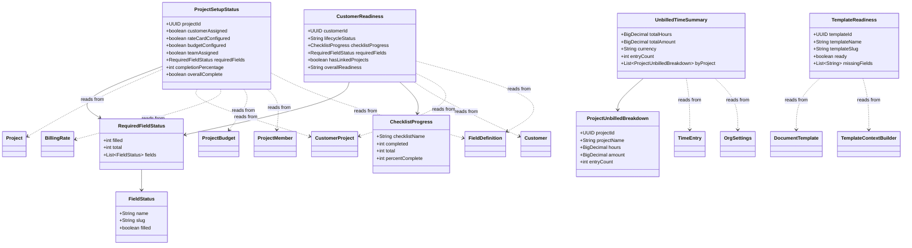
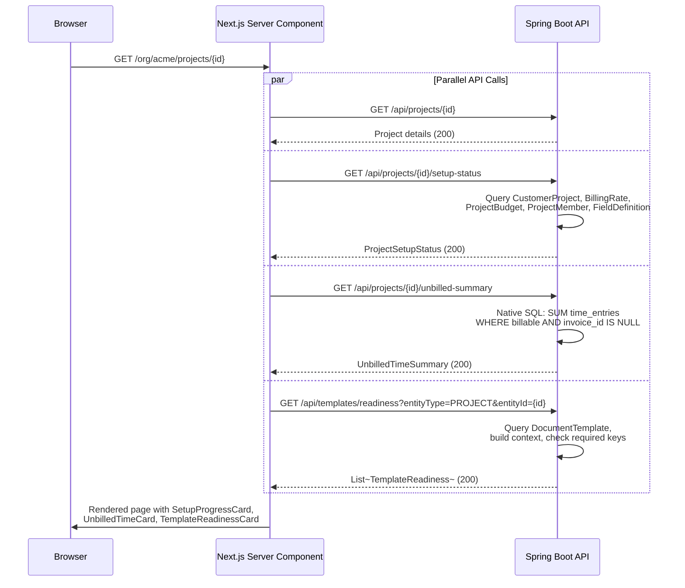
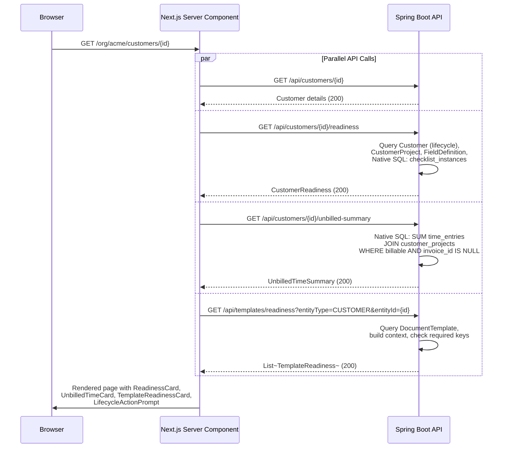

> Phase 15 architecture document. Standalone file -- not merged into ARCHITECTURE.md.

---

## 15. Phase 15 -- Contextual Actions & Setup Guidance

---

### 15.1 Overview

Phase 15 adds a **contextual awareness layer** to entity detail pages -- surfacing what is missing, what is ready, and what to do next. The platform has accumulated powerful features across 14 phases (rate cards, budgets, custom fields, compliance checklists, document templates, invoicing), but these features are siloed across tabs, settings pages, and separate workflows. A user who creates a new project must already know to configure a rate card, set a budget, assign team members, fill custom fields, and link a customer -- all via different navigation paths. Phase 15 eliminates this guesswork by computing setup completeness on-the-fly and rendering actionable guidance cards directly on the entity detail pages where the user is already looking.

The design introduces **no new database tables, no migrations, and no new entities**. It is a pure read/aggregation layer over existing data, combined with new frontend components. Four new backend services compute completeness by querying existing repositories. Five new GET endpoints expose these computations. The frontend adds reusable components (`SetupProgressCard`, `ActionCard`, `FieldValueGrid`, `EmptyState`, `TemplateReadinessCard`) that render on project and customer detail pages.

The guiding principle is **actionable, not informational**. Every status indicator pairs with a link or button that resolves the gap. "No rate card configured" is useless without a "Configure Rates" link. "Missing: customer address" on a disabled template button tells the user exactly what to fix. Setup cards are prominent when there is work to do, and auto-collapse when everything is complete -- guiding new users without annoying experienced ones.

#### What's New

| Capability | Before Phase 15 | After Phase 15 |
|---|---|---|
| Project setup awareness | User must know what to configure | Setup Progress Card shows 5 checks with action links, auto-hides when complete |
| Customer readiness | Lifecycle status exists but no guidance | Readiness Card shows checklist progress, required fields, linked projects, lifecycle prompts |
| Unbilled time visibility | Only visible in invoice creation flow | Action cards on project/customer detail pages with amounts and "Create Invoice" shortcut |
| Document generation readiness | User must try generating to discover missing fields | Template readiness indicators show ready/not-ready with missing field details |
| Custom field visibility | Values only visible in edit flow or custom fields tab | Read-only `FieldValueGrid` on detail page overview, unfilled required fields highlighted |
| Empty states | "No items yet" text | Contextual empty states with icon, explanation, and primary action button |

**Dependencies on prior phases**:
- **Phase 4** (Customers): `Customer`, `CustomerProject` entities -- customer assignment check, customer detail page.
- **Phase 5** (Task & Time): `TimeEntry` -- unbilled time aggregation.
- **Phase 8** (Rate Cards, Budgets): `BillingRate`, `ProjectBudget`, `OrgSettings` -- rate card and budget setup checks, currency for unbilled amounts.
- **Phase 10** (Invoicing): `Invoice`, `InvoiceService.getUnbilledTime()` -- existing unbilled time query.
- **Phase 11** (Custom Fields): `FieldDefinition`, `FieldGroup` -- required field checks, field value display.
- **Phase 12** (Document Templates): `DocumentTemplate`, `TemplateContextBuilder` -- template readiness checks.
- **Phase 14** (Customer Compliance & Lifecycle): `lifecycleStatus` on Customer, checklist tables (V29). **Important**: the V29 migration created checklist tables (`checklist_instances`, `checklist_instance_items`, etc.) but the Java `@Entity` classes are stubs -- `CustomerLifecycleService.checkOnboardingGuard()` is a no-op. Phase 15 customer readiness must handle the case where checklist entities do not yet exist in the JPA layer by using native SQL queries against the V29 tables or by returning null for checklist progress until the Phase 14 entities are fully implemented.

**Out of scope**: Dashboard modifications, admin-configurable setup steps, custom field inline editing, workflow automation, setup status persistence/history, form rework.

---

### 15.2 Domain Model (Read Model)

Phase 15 introduces no new database entities. The "domain model" is a set of **read-only DTOs** (Java records) returned by aggregation services. These records are computed on-the-fly from existing entities -- never persisted.

#### 15.2.1 DTO Definitions

**`ProjectSetupStatus`** -- computed completeness for a project.

| Field | Type | Description |
|---|---|---|
| `projectId` | `UUID` | The project being evaluated |
| `customerAssigned` | `boolean` | `true` if at least one `CustomerProject` link exists |
| `rateCardConfigured` | `boolean` | `true` if at least one `BillingRate` exists at any scope level (project override, customer override, or org default) |
| `budgetConfigured` | `boolean` | `true` if a `ProjectBudget` record exists for this project |
| `teamAssigned` | `boolean` | `true` if the project has at least 2 `ProjectMember` records (creator + at least one other) |
| `requiredFields` | `RequiredFieldStatus` | Custom field completion summary |
| `completionPercentage` | `int` | 0-100, equal weight per check (5 checks = 20% each; custom fields count as one check collectively) |
| `overallComplete` | `boolean` | `true` when all 5 checks pass |

**`CustomerReadiness`** -- computed readiness for a customer.

| Field | Type | Description |
|---|---|---|
| `customerId` | `UUID` | The customer being evaluated |
| `lifecycleStatus` | `String` | Current lifecycle status from Customer entity (PROSPECT, ONBOARDING, ACTIVE, etc.) |
| `checklistProgress` | `ChecklistProgress` (nullable) | Checklist completion if a `checklist_instances` row exists; `null` if no checklist or if Phase 14 entities are not yet implemented |
| `requiredFields` | `RequiredFieldStatus` | Custom field completion summary |
| `hasLinkedProjects` | `boolean` | `true` if at least one `CustomerProject` link exists |
| `overallReadiness` | `String` | Computed: `"Complete"`, `"In Progress"`, or `"Needs Attention"` |

**`ChecklistProgress`** -- subset of checklist instance data.

| Field | Type | Description |
|---|---|---|
| `checklistName` | `String` | Template name (e.g., "SA FICA Onboarding") |
| `completed` | `int` | Number of completed required items |
| `total` | `int` | Total number of required items |
| `percentComplete` | `int` | 0-100 |

**`UnbilledTimeSummary`** -- unbilled time aggregation.

| Field | Type | Description |
|---|---|---|
| `totalHours` | `BigDecimal` | Sum of `durationMinutes / 60` for unbilled billable entries |
| `totalAmount` | `BigDecimal` | Sum of `(durationMinutes / 60) * billingRateSnapshot` |
| `currency` | `String` | Currency code (from `OrgSettings.defaultCurrency` or entry-level `billingRateCurrency`) |
| `entryCount` | `int` | Number of unbilled billable time entries |
| `byProject` | `List<ProjectUnbilledBreakdown>` (nullable) | Per-project breakdown -- only populated for customer-scoped queries |

**`ProjectUnbilledBreakdown`** -- per-project detail within a customer unbilled summary.

| Field | Type | Description |
|---|---|---|
| `projectId` | `UUID` | Project ID |
| `projectName` | `String` | Project name |
| `hours` | `BigDecimal` | Unbilled hours for this project |
| `amount` | `BigDecimal` | Unbilled amount for this project |
| `entryCount` | `int` | Number of entries |

**`TemplateReadiness`** -- readiness of a single document template for a given entity.

| Field | Type | Description |
|---|---|---|
| `templateId` | `UUID` | Template ID |
| `templateName` | `String` | Human-readable template name |
| `templateSlug` | `String` | URL-safe template slug |
| `ready` | `boolean` | `true` if all required context fields would be populated |
| `missingFields` | `List<String>` | Human-readable field names that are missing (empty list if ready) |

**`RequiredFieldStatus`** -- custom field completion for an entity.

| Field | Type | Description |
|---|---|---|
| `filled` | `int` | Number of required fields that have non-null, non-empty values |
| `total` | `int` | Total number of active required `FieldDefinition` records for this entity type |
| `fields` | `List<FieldStatus>` | Per-field detail |

**`FieldStatus`** -- individual field completion status.

| Field | Type | Description |
|---|---|---|
| `name` | `String` | Field display name (from `FieldDefinition.name`) |
| `slug` | `String` | Field slug (from `FieldDefinition.slug`) |
| `filled` | `boolean` | Whether the entity's `customFields` map contains a non-null, non-empty value for this slug |

#### 15.2.2 DTO Relationship Diagram



---

### 15.3 Service Layer Design

All services follow the established pattern: `@Service`, `@Transactional(readOnly = true)`, constructor injection, no `@Autowired`. They live in a new `setupstatus` package under the base package.

#### 15.3.1 ProjectSetupStatusService

Computes project setup completeness by querying five existing repositories.

**Method signature**:

```java
public ProjectSetupStatus getSetupStatus(UUID projectId)
```

**Repository dependencies** (all existing):

| Repository | Query Used | Check |
|---|---|---|
| `ProjectRepository` | `findById(projectId)` | Validates project exists |
| `CustomerProjectRepository` | `findByProjectId(projectId)` | `customerAssigned = !list.isEmpty()` |
| `BillingRateRepository` | `findByFilters(null, projectId, null)` | `rateCardConfigured = !list.isEmpty()` -- checks for project-level rate overrides. A project with no project-level rates but with org defaults is still considered "configured" — see note below |
| `ProjectBudgetRepository` | `findByProjectId(projectId)` | `budgetConfigured = optional.isPresent()` |
| `ProjectMemberRepository` | `findByProjectId(projectId)` | `teamAssigned = list.size() >= 2` |
| `FieldDefinitionRepository` | `findByEntityTypeAndActiveTrueOrderBySortOrder(PROJECT)` | Filters to `required = true`, checks entity's `customFields` map |

**Aggregation logic** (conceptual Java):

```java
@Service
public class ProjectSetupStatusService {

  private final ProjectRepository projectRepository;
  private final CustomerProjectRepository customerProjectRepository;
  private final BillingRateRepository billingRateRepository;
  private final ProjectBudgetRepository projectBudgetRepository;
  private final ProjectMemberRepository projectMemberRepository;
  private final FieldDefinitionRepository fieldDefinitionRepository;

  public ProjectSetupStatusService(
      ProjectRepository projectRepository,
      CustomerProjectRepository customerProjectRepository,
      BillingRateRepository billingRateRepository,
      ProjectBudgetRepository projectBudgetRepository,
      ProjectMemberRepository projectMemberRepository,
      FieldDefinitionRepository fieldDefinitionRepository) {
    this.projectRepository = projectRepository;
    this.customerProjectRepository = customerProjectRepository;
    this.billingRateRepository = billingRateRepository;
    this.projectBudgetRepository = projectBudgetRepository;
    this.projectMemberRepository = projectMemberRepository;
    this.fieldDefinitionRepository = fieldDefinitionRepository;
  }

  @Transactional(readOnly = true)
  public ProjectSetupStatus getSetupStatus(UUID projectId) {
    var project = projectRepository.findById(projectId)
        .orElseThrow(() -> new ResourceNotFoundException("Project", projectId));

    boolean customerAssigned = !customerProjectRepository.findByProjectId(projectId).isEmpty();

    // Rate card: project-level overrides exist, OR any org-level member defaults exist
    // Note: findByFilters(null, null, null) returns ALL rates in the tenant — too broad.
    // Use a dedicated existsByProjectIdIsNull() check for org-level defaults.
    boolean rateCardConfigured = !billingRateRepository
        .findByFilters(null, projectId, null).isEmpty()
        || billingRateRepository.existsByProjectIdIsNullAndCustomerIdIsNull();

    boolean budgetConfigured = projectBudgetRepository.findByProjectId(projectId).isPresent();

    boolean teamAssigned = projectMemberRepository.findByProjectId(projectId).size() >= 2;

    var requiredFields = computeRequiredFields(
        EntityType.PROJECT, project.getCustomFields());

    // 5 checks, equal weight
    int passCount = Stream.of(
        customerAssigned, rateCardConfigured, budgetConfigured,
        teamAssigned, requiredFields.filled() == requiredFields.total()
    ).mapToInt(b -> b ? 1 : 0).sum();

    int completionPercentage = (passCount * 100) / 5;
    boolean overallComplete = passCount == 5;

    return new ProjectSetupStatus(
        projectId, customerAssigned, rateCardConfigured, budgetConfigured,
        teamAssigned, requiredFields, completionPercentage, overallComplete);
  }

  private RequiredFieldStatus computeRequiredFields(
      EntityType entityType, Map<String, Object> customFields) {
    var requiredDefs = fieldDefinitionRepository
        .findByEntityTypeAndActiveTrueOrderBySortOrder(entityType)
        .stream()
        .filter(FieldDefinition::isRequired)
        .toList();

    var fieldStatuses = requiredDefs.stream()
        .map(fd -> new FieldStatus(
            fd.getName(), fd.getSlug(),
            customFields != null && customFields.get(fd.getSlug()) != null
                && !customFields.get(fd.getSlug()).toString().isBlank()))
        .toList();

    int filled = (int) fieldStatuses.stream().filter(FieldStatus::filled).count();
    return new RequiredFieldStatus(filled, fieldStatuses.size(), fieldStatuses);
  }
}
```

**Why the two-step rate card check**: The rate card hierarchy ([ADR-039](../adr/ADR-039-rate-resolution-hierarchy.md)) resolves per-member: org-default → project-override → customer-override. A project is "configured" if either (a) it has project-level rate overrides, or (b) org-level member defaults exist (meaning any member assigned to this project will inherit a rate). The check `findByFilters(null, projectId, null)` catches case (a). For case (b), a new `existsByProjectIdIsNullAndCustomerIdIsNull()` method on `BillingRateRepository` checks whether any org-level defaults exist without returning the full rate list. Note: `findByFilters(null, null, null)` was considered but returns **all** rates across all scopes — too broad for a boolean check.

#### 15.3.2 CustomerReadinessService

Computes customer readiness by querying existing repositories plus the checklist tables via native SQL (since Phase 14 Java entities are stubs).

**Method signature**:

```java
public CustomerReadiness getReadiness(UUID customerId)
```

**Repository dependencies**:

| Repository / Source | Query Used | Check |
|---|---|---|
| `CustomerRepository` | `findById(customerId)` | Validates customer exists, reads `lifecycleStatus` |
| `CustomerProjectRepository` | `findByCustomerId(customerId)` | `hasLinkedProjects = !list.isEmpty()` |
| `FieldDefinitionRepository` | `findByEntityTypeAndActiveTrueOrderBySortOrder(CUSTOMER)` | Required field check against customer's `customFields` |
| `EntityManager` (native SQL) | Query against `checklist_instances` + `checklist_instance_items` | Checklist progress -- returns null if no instance exists |

**Checklist progress query** (native SQL against V29 tables -- no Java entity needed):

```sql
SELECT ci.id, ct.name AS checklist_name,
  COUNT(*) FILTER (WHERE cii.required = true) AS total_required,
  COUNT(*) FILTER (WHERE cii.required = true AND cii.status = 'COMPLETED') AS completed_required
FROM checklist_instances ci
JOIN checklist_templates ct ON ct.id = ci.template_id
JOIN checklist_instance_items cii ON cii.instance_id = ci.id
WHERE ci.customer_id = :customerId
  AND ci.status = 'IN_PROGRESS'
GROUP BY ci.id, ct.name
ORDER BY ci.started_at ASC
LIMIT 1
```

This query runs directly against the V29 migration tables. It works regardless of whether the Java `@Entity` classes exist, because it uses `EntityManager.createNativeQuery()`. When Phase 14 entities are fully implemented, this can optionally be migrated to a JPA query, but the native SQL is more resilient to the stub dependency.

**Overall readiness computation**:

| Condition | `overallReadiness` |
|---|---|
| All checks pass: required fields filled, checklist complete (or no checklist), has linked projects, lifecycle is ACTIVE | `"Complete"` |
| At least one check partially done (some fields filled, checklist in progress, lifecycle is ONBOARDING) | `"In Progress"` |
| Critical gaps: lifecycle is PROSPECT, no linked projects, 0 required fields filled | `"Needs Attention"` |

#### 15.3.3 UnbilledTimeSummaryService

Computes unbilled time summaries. Rather than duplicating the existing `InvoiceService.getUnbilledTime()` query, this service provides a **lightweight summary** that skips per-entry detail.

**Method signatures**:

```java
public UnbilledTimeSummary getProjectUnbilledSummary(UUID projectId)
public UnbilledTimeSummary getCustomerUnbilledSummary(UUID customerId)
```

**Project unbilled query** (native SQL for aggregation efficiency):

```sql
SELECT
  COALESCE(SUM(te.duration_minutes), 0) AS total_minutes,
  COALESCE(SUM(
    (te.duration_minutes / 60.0) * te.billing_rate_snapshot
  ), 0) AS total_amount,
  COUNT(*) AS entry_count
FROM time_entries te
JOIN tasks t ON t.id = te.task_id
WHERE t.project_id = :projectId
  AND te.billable = true
  AND te.invoice_id IS NULL
  AND te.billing_rate_snapshot IS NOT NULL
```

**Customer unbilled query** (aggregated across projects):

```sql
SELECT
  p.id AS project_id,
  p.name AS project_name,
  COALESCE(SUM(te.duration_minutes), 0) AS total_minutes,
  COALESCE(SUM(
    (te.duration_minutes / 60.0) * te.billing_rate_snapshot
  ), 0) AS total_amount,
  COUNT(*) AS entry_count
FROM time_entries te
JOIN tasks t ON t.id = te.task_id
JOIN projects p ON p.id = t.project_id
JOIN customer_projects cp ON cp.project_id = p.id
WHERE cp.customer_id = :customerId
  AND te.billable = true
  AND te.invoice_id IS NULL
  AND te.billing_rate_snapshot IS NOT NULL
GROUP BY p.id, p.name
ORDER BY total_amount DESC
```

**Why a separate service instead of reusing `InvoiceService.getUnbilledTime()`**: The existing method returns per-entry detail (`UnbilledTimeEntry` records) -- far more data than a summary card needs. It also requires a `customerId` parameter (not scoped to a single project). The new service returns only aggregates, making the response smaller and the queries faster. Additionally, the existing method lacks a project-scoped variant. See [ADR-066](../adr/ADR-066-computed-status-over-persisted.md) for the rationale on computing rather than caching these values.

**Currency resolution**: The service reads `OrgSettings.defaultCurrency` for the response `currency` field. Individual time entries may have `billingRateCurrency` set per-entry, but for the summary card, the org default is sufficient -- amounts are already stored in the org's currency via the rate snapshotting mechanism ([ADR-040](../adr/ADR-040-point-in-time-rate-snapshotting.md)).

#### 15.3.4 DocumentGenerationReadinessService

Checks whether document templates can be successfully rendered for a given entity by testing the context builder output for completeness.

**Method signature**:

```java
public List<TemplateReadiness> checkReadiness(TemplateEntityType entityType, UUID entityId)
```

**Logic**:

1. Query `DocumentTemplateRepository.findByPrimaryEntityTypeAndActiveTrueOrderBySortOrder(entityType)` to get applicable templates.
2. Find the `TemplateContextBuilder` that `supports()` the entity type (existing Spring-managed beans: `ProjectContextBuilder`, `CustomerContextBuilder`, `InvoiceContextBuilder`).
3. Call `builder.buildContext(entityId, null)` to assemble the context map. The `memberId` parameter is null because readiness checks do not need the "generated by" metadata. **Implementation note**: Verify that all existing context builders handle `null` `memberId` without NPE — specifically `contextHelper.buildGeneratedByMap(null)` must return an empty map or be guarded with a null check. Add a null guard if needed.
4. For each template, inspect the context map for null or empty values in key positions. The "missing fields" are determined by a **known-key check** per entity type:

| Entity Type | Required Context Keys | Description |
|---|---|---|
| PROJECT | `project.name`, `customer` (non-null), `org.name` | A project template needs the project name, a linked customer, and org details |
| CUSTOMER | `customer.name`, `customer.email`, `org.name` | A customer template needs customer basics and org details |
| INVOICE | `invoice.number`, `customer.name`, `lines` (non-empty) | An invoice template needs an invoice with lines |

Additionally, if a template's Thymeleaf content references `${customer.customFields.tax_number}` or similar custom field variables, the readiness check inspects the `customFields` sub-map for those keys. This is done by scanning the template content for `${...customFields...}` patterns and cross-referencing with the context map.

**Why hardcoded key checks instead of Thymeleaf dry-run**: Running the Thymeleaf engine to detect missing variables would require instantiating the full rendering pipeline and catching template exceptions -- expensive and fragile. Hardcoded key checks are explicit, fast, and testable. The required keys per entity type change infrequently and are maintained alongside the context builders. See [ADR-065](../adr/ADR-065-hardcoded-setup-checks.md).

---

### 15.4 API Surface

All endpoints are **read-only GET requests** that return JSON. No mutations, no side effects. Authentication and authorization follow the parent entity's access rules.

#### 15.4.1 Endpoint Table

| Method | Path | Description | Auth | Notes |
|---|---|---|---|---|
| `GET` | `/api/projects/{id}/setup-status` | Project setup completeness | JWT + project access | Same auth as `GET /api/projects/{id}` |
| `GET` | `/api/customers/{id}/readiness` | Customer readiness status | JWT + customer access | Same auth as `GET /api/customers/{id}` |
| `GET` | `/api/projects/{id}/unbilled-summary` | Project unbilled time summary | JWT + project access | Returns zeros if no unbilled time |
| `GET` | `/api/customers/{id}/unbilled-summary` | Customer unbilled time (cross-project) | JWT + customer access | Includes per-project breakdown |
| `GET` | `/api/templates/readiness` | Template readiness for an entity | JWT + entity access | Query params: `entityType`, `entityId` |

#### 15.4.2 Response Schemas

**`GET /api/projects/{id}/setup-status`**

```json
{
  "projectId": "f47ac10b-58cc-4372-a567-0e02b2c3d479",
  "customerAssigned": true,
  "rateCardConfigured": true,
  "budgetConfigured": false,
  "teamAssigned": true,
  "requiredFields": {
    "filled": 2,
    "total": 4,
    "fields": [
      { "name": "Engagement Type", "slug": "engagement_type", "filled": true },
      { "name": "Risk Rating", "slug": "risk_rating", "filled": true },
      { "name": "SARS Tax Number", "slug": "sars_tax_number", "filled": false },
      { "name": "Responsible Partner", "slug": "responsible_partner", "filled": false }
    ]
  },
  "completionPercentage": 60,
  "overallComplete": false
}
```

**`GET /api/customers/{id}/readiness`**

```json
{
  "customerId": "a1b2c3d4-e5f6-7890-abcd-ef1234567890",
  "lifecycleStatus": "ONBOARDING",
  "checklistProgress": {
    "checklistName": "SA FICA Onboarding",
    "completed": 3,
    "total": 5,
    "percentComplete": 60
  },
  "requiredFields": {
    "filled": 4,
    "total": 6,
    "fields": [
      { "name": "ID Number", "slug": "id_number", "filled": true },
      { "name": "Tax Number", "slug": "tax_number", "filled": true },
      { "name": "Registered Address", "slug": "registered_address", "filled": true },
      { "name": "Risk Rating", "slug": "risk_rating", "filled": true },
      { "name": "Source of Funds", "slug": "source_of_funds", "filled": false },
      { "name": "Beneficial Owner", "slug": "beneficial_owner", "filled": false }
    ]
  },
  "hasLinkedProjects": true,
  "overallReadiness": "In Progress"
}
```

**`GET /api/projects/{id}/unbilled-summary`**

```json
{
  "totalHours": 23.5,
  "totalAmount": 12400.00,
  "currency": "ZAR",
  "entryCount": 14,
  "byProject": null
}
```

**`GET /api/customers/{id}/unbilled-summary`**

```json
{
  "totalHours": 47.25,
  "totalAmount": 28500.00,
  "currency": "ZAR",
  "entryCount": 31,
  "byProject": [
    {
      "projectId": "f47ac10b-58cc-4372-a567-0e02b2c3d479",
      "projectName": "Nkosi Holdings Annual Audit",
      "hours": 23.5,
      "amount": 12400.00,
      "entryCount": 14
    },
    {
      "projectId": "b8d9e0f1-2345-6789-abcd-ef0123456789",
      "projectName": "Nkosi Holdings Tax Return 2026",
      "hours": 15.75,
      "amount": 10500.00,
      "entryCount": 11
    },
    {
      "projectId": "c1d2e3f4-5678-9012-abcd-ef3456789012",
      "projectName": "Nkosi Holdings B-BBEE Certificate",
      "hours": 8.0,
      "amount": 5600.00,
      "entryCount": 6
    }
  ]
}
```

**`GET /api/templates/readiness?entityType=PROJECT&entityId={uuid}`**

```json
[
  {
    "templateId": "d4e5f678-9012-3456-abcd-ef7890123456",
    "templateName": "Engagement Letter",
    "templateSlug": "engagement-letter",
    "ready": true,
    "missingFields": []
  },
  {
    "templateId": "e5f67890-1234-5678-abcd-ef9012345678",
    "templateName": "Project Proposal",
    "templateSlug": "project-proposal",
    "ready": false,
    "missingFields": ["Customer Address", "Tax Number"]
  }
]
```

#### 15.4.3 Controller Location

The setup status and unbilled summary endpoints extend the existing controllers:
- `/api/projects/{id}/setup-status` and `/api/projects/{id}/unbilled-summary` -- add to `ProjectController` (or a new `ProjectSetupController` if the existing controller is already large).
- `/api/customers/{id}/readiness` and `/api/customers/{id}/unbilled-summary` -- add to `CustomerController`.
- `/api/templates/readiness` -- add to `DocumentTemplateController`.

Each new endpoint is a single-line delegation to the corresponding service:

```java
@GetMapping("/{id}/setup-status")
@PreAuthorize("hasAnyRole('ORG_ADMIN', 'ORG_OWNER', 'ORG_MEMBER')")
public ResponseEntity<ProjectSetupStatus> getSetupStatus(@PathVariable UUID id) {
  return ResponseEntity.ok(projectSetupStatusService.getSetupStatus(id));
}
```

---

### 15.5 Sequence Diagrams

#### 15.5.1 Project Detail Page Load

When a user navigates to a project detail page, the Next.js server component fetches the project data and the three new status endpoints in parallel. The setup status card, unbilled time card, and template readiness card render from these responses.



#### 15.5.2 Customer Detail Page Load

Same pattern, but the readiness endpoint also queries checklist tables and lifecycle status.



---

### 15.6 Frontend Component Design

All new components use the existing Shadcn UI library and Tailwind CSS v4. Components are built as server components where possible (data fetching), with client components only for interactive behavior (collapse/expand, tooltips).

#### 15.6.1 Reusable Components

**`SetupProgressCard`** -- displays setup completeness with actionable step list.

```typescript
interface SetupProgressCardProps {
  title: string;                     // e.g., "Project Setup" or "Customer Readiness"
  completionPercentage: number;       // 0-100
  overallComplete: boolean;
  steps: SetupStep[];
  defaultCollapsed?: boolean;         // collapse when complete
}

interface SetupStep {
  label: string;                      // e.g., "Customer assigned"
  complete: boolean;
  detail?: string;                    // e.g., "2 of 4 filled" for custom fields
  actionLabel?: string;               // e.g., "Assign Customer"
  actionHref?: string;                // Navigation target
  permissionRequired?: boolean;       // If true, only shown to admin/owner
}
```

Rendering behavior:
- When `overallComplete = true` and `defaultCollapsed` is not set: renders a compact "Setup complete" badge with an expand button to review steps.
- When `overallComplete = false`: renders full card with progress bar (Shadcn `Progress`), step list with check/warning icons, and action links.
- Action links only render if `actionHref` is provided and `permissionRequired` is satisfied by the current user's role.

**`ActionCard`** -- a card prompting a specific action with context.

```typescript
interface ActionCardProps {
  icon: LucideIcon;                  // e.g., Clock, FileText, Receipt
  title: string;                     // e.g., "Unbilled Time"
  description: string;               // e.g., "R12,400 across 23.5 hours"
  primaryAction?: {
    label: string;                   // e.g., "Create Invoice"
    href: string;
  };
  secondaryAction?: {
    label: string;                   // e.g., "View Entries"
    href: string;
  };
  variant?: "default" | "accent";    // accent = subtle highlight background
}
```

**`FieldValueGrid`** -- compact display of custom field values.

```typescript
interface FieldValueGridProps {
  fields: FieldValue[];
  groups?: FieldGroupInfo[];           // Optional grouping
  editHref?: string;                  // "Edit Fields" link target
  showUnfilledWarning?: boolean;      // Highlight unfilled required fields
}

interface FieldValue {
  name: string;
  slug: string;
  value: string | null;
  fieldType: string;                  // TEXT, NUMBER, DATE, SELECT, etc.
  required: boolean;
  groupId?: string;
}

interface FieldGroupInfo {
  id: string;
  name: string;
}
```

Rendering behavior:
- Fields displayed in a responsive grid (2 columns on desktop, 1 on mobile).
- Grouped fields render under group heading if `groups` is provided.
- Required fields without values render with muted "Not set" text and a subtle amber left border.
- "Edit Fields" link renders at top-right if `editHref` is provided.

**`EmptyState`** -- contextual empty state for lists and panels.

```typescript
interface EmptyStateProps {
  icon: LucideIcon;                  // Lucide icon component
  title: string;                     // 1 line -- what this section is for
  description: string;               // 1-2 lines -- what to do first
  actionLabel?: string;              // Button text
  actionHref?: string;               // Navigation target
  onAction?: () => void;             // Callback for dialog-based actions
}
```

Rendering: inline card (not full-page), centered content, muted color scheme. Uses Shadcn `Card` with no border, just subtle background.

**`TemplateReadinessCard`** -- list of document templates with readiness indicators.

```typescript
interface TemplateReadinessCardProps {
  templates: TemplateReadinessItem[];
  entityType: "PROJECT" | "CUSTOMER";
  entityId: string;
  generateHref: (templateId: string) => string;
}

interface TemplateReadinessItem {
  templateId: string;
  templateName: string;
  templateSlug: string;
  ready: boolean;
  missingFields: string[];
}
```

Rendering:
- Ready templates: green check icon, template name, "Generate" button linking to existing generation dialog.
- Not-ready templates: amber warning icon, template name, disabled "Generate" button. Hover tooltip: "Fill these fields first: {missingFields.join(', ')}".

#### 15.6.2 Page Integration

**Project Detail Page (`projects/[id]/page.tsx`)** -- Overview tab modifications:

The Overview tab currently renders project description and basic info. Phase 15 adds three cards above the existing content:

1. `SetupProgressCard` -- project setup completeness. Only renders if `overallComplete = false` or user explicitly expands. Positioned first.
2. `ActionCard` (unbilled time) -- only renders if `entryCount > 0`. Shows amount in org currency with "Create Invoice" and "View Entries" actions.
3. `TemplateReadinessCard` -- only renders if applicable templates exist. Shows readiness per template.
4. `FieldValueGrid` -- always renders if custom fields are defined for PROJECT entity type. Shows values with unfilled required fields highlighted.

The `SetupProgressCard` maps the `ProjectSetupStatus` response to steps:

```typescript
const steps: SetupStep[] = [
  {
    label: "Customer assigned",
    complete: setupStatus.customerAssigned,
    actionLabel: "Assign Customer",
    actionHref: `?tab=customers`,
  },
  {
    label: "Rate card configured",
    complete: setupStatus.rateCardConfigured,
    actionLabel: "Configure Rates",
    actionHref: `?tab=rates`,
    permissionRequired: true,  // canManage only
  },
  {
    label: "Budget set",
    complete: setupStatus.budgetConfigured,
    actionLabel: "Set Budget",
    actionHref: `?tab=budget`,
  },
  {
    label: "Team members added",
    complete: setupStatus.teamAssigned,
    actionLabel: "Add Members",
    actionHref: `?tab=members`,
  },
  {
    label: `Required fields filled (${setupStatus.requiredFields.filled}/${setupStatus.requiredFields.total})`,
    complete: setupStatus.requiredFields.filled === setupStatus.requiredFields.total,
    detail: setupStatus.requiredFields.total === 0 ? "No required fields defined" : undefined,
    actionLabel: "Fill Fields",
    actionHref: "#custom-fields",
  },
];
```

**Customer Detail Page (`customers/[id]/page.tsx`)** -- above-tabs area modifications:

1. `SetupProgressCard` (adapted for customer readiness) -- lifecycle status badge, checklist progress, required fields, linked projects.
2. `ActionCard` (unbilled time) -- aggregated across projects, with per-project breakdown in description.
3. `TemplateReadinessCard` -- applicable customer templates with readiness.
4. `FieldValueGrid` -- customer custom field values.
5. **Lifecycle action prompt** -- contextual call-to-action based on lifecycle status:
   - PROSPECT: "Ready to start onboarding? Start Onboarding" button.
   - ONBOARDING with complete checklist: "All items verified -- Activate Customer" button.
   - ACTIVE with no recent activity: no prompt (dormancy is handled separately by Phase 14).

**Data fetching pattern**: The server component (`page.tsx`) fetches all four API responses in parallel using `Promise.all()`:

```typescript
const [project, setupStatus, unbilledSummary, templateReadiness] = await Promise.all([
  fetchProject(params.id),
  fetchProjectSetupStatus(params.id),
  fetchProjectUnbilledSummary(params.id),
  fetchTemplateReadiness("PROJECT", params.id),
]);
```

---

### 15.7 Empty State Catalog

#### 15.7.1 Empty State Locations

| Location | Icon (Lucide) | Heading | Description | Action Label | Action Target |
|---|---|---|---|---|---|
| Project tasks tab | `CheckSquare` | Track work on this project | Create tasks to organise and assign work items for your team. | Add Task | Open AddTaskDialog |
| Project time entries | `Clock` | No time logged yet | Track time spent on this project to enable billing and profitability reporting. | Log Time | Open LogTimeDialog |
| Project documents | `FileUp` | No documents uploaded | Upload proposals, contracts, and deliverables for this project. | Upload Document | Open upload flow |
| Project team (1 member) | `Users` | Add your team | Invite team members to collaborate on this project. | Add Member | Open AddMemberDialog |
| Customer projects | `Folder` | No projects yet | Create a project for this customer to start tracking work and billing time. | Create Project | Navigate to new project form (pre-filled customer) |
| Customer documents | `FileUp` | No documents uploaded | Upload contracts, ID documents, and correspondence for this customer. | Upload Document | Open upload flow |
| Invoice list | `Receipt` | No invoices yet | Generate invoices from tracked time to bill your customers. | Create Invoice | Navigate to invoice creation |
| Custom fields (no values) | `ListChecks` | No custom fields configured | Custom fields let you track additional information specific to your workflow. | Configure Fields | Navigate to settings/custom-fields |

#### 15.7.2 EmptyState Component

```typescript
import { type LucideIcon } from "lucide-react";
import { Card, CardContent } from "@/components/ui/card";
import { Button } from "@/components/ui/button";
import Link from "next/link";

interface EmptyStateProps {
  icon: LucideIcon;
  title: string;
  description: string;
  actionLabel?: string;
  actionHref?: string;
  onAction?: () => void;
}

export function EmptyState({
  icon: Icon,
  title,
  description,
  actionLabel,
  actionHref,
  onAction,
}: EmptyStateProps) {
  return (
    <Card className="border-none bg-muted/30">
      <CardContent className="flex flex-col items-center py-8 text-center">
        <Icon className="mb-3 h-10 w-10 text-muted-foreground/60" />
        <h3 className="mb-1 text-sm font-medium">{title}</h3>
        <p className="mb-4 max-w-sm text-sm text-muted-foreground">
          {description}
        </p>
        {actionLabel && actionHref && (
          <Button asChild size="sm" variant="outline">
            <Link href={actionHref}>{actionLabel}</Link>
          </Button>
        )}
        {actionLabel && onAction && !actionHref && (
          <Button size="sm" variant="outline" onClick={onAction}>
            {actionLabel}
          </Button>
        )}
      </CardContent>
    </Card>
  );
}
```

#### 15.7.3 Implementation Approach

Each empty state replaces existing "No items" or bare-text placeholders in the corresponding panel component. The replacement is mechanical:

```typescript
// Before
if (tasks.length === 0) return <p className="text-muted-foreground">No tasks yet.</p>;

// After
if (tasks.length === 0) return (
  <EmptyState
    icon={CheckSquare}
    title="Track work on this project"
    description="Create tasks to organise and assign work items for your team."
    actionLabel="Add Task"
    onAction={() => setShowAddTask(true)}
  />
);
```

---

### 15.8 Permission Model

Phase 15 introduces no new permission types. All access checks inherit from the parent entity.

#### 15.8.1 Endpoint Permissions

| Endpoint | Required Permission | Enforcement |
|---|---|---|
| `GET /api/projects/{id}/setup-status` | View project | `@PreAuthorize("hasAnyRole('ORG_ADMIN', 'ORG_OWNER', 'ORG_MEMBER')")` -- same as `GET /api/projects/{id}` |
| `GET /api/customers/{id}/readiness` | View customer | Same as `GET /api/customers/{id}` |
| `GET /api/projects/{id}/unbilled-summary` | View project | Same as project detail |
| `GET /api/customers/{id}/unbilled-summary` | View customer | Same as customer detail |
| `GET /api/templates/readiness` | View entity (project or customer) | Validates `entityId` access based on `entityType` |

#### 15.8.2 Frontend Action Visibility

| Action | Required Role | UI Behavior |
|---|---|---|
| "Configure Rates" link | `canManage` (admin/owner or project lead) | Link hidden for non-admin members |
| "Set Budget" link | `canManage` | Link hidden for non-admin members |
| "Create Invoice" button | Admin/Owner | Button hidden for members |
| "Generate [Template]" button | `canManage` | Button hidden for members |
| "Start Onboarding" lifecycle action | Admin/Owner | Button hidden for members |
| "Activate Customer" lifecycle action | Admin/Owner | Button hidden for members |
| "Add Member" link | Admin/Owner | Link hidden for members |
| "Fill Fields" / "Edit Fields" link | Admin/Owner (or edit permission) | Link hidden for read-only members |

All permission checks use the existing `canManage`, `isAdmin`, and `isOwner` flags that are already computed in the project and customer detail page server components.

---

### 15.9 Implementation Guidance

#### 15.9.1 Backend Changes

**New files** (all in `setupstatus/` package):

| File | Type | Description |
|---|---|---|
| `setupstatus/ProjectSetupStatus.java` | Record | DTO for project setup status |
| `setupstatus/CustomerReadiness.java` | Record | DTO for customer readiness |
| `setupstatus/UnbilledTimeSummary.java` | Record | DTO for unbilled time summary |
| `setupstatus/ProjectUnbilledBreakdown.java` | Record | Per-project unbilled breakdown |
| `setupstatus/TemplateReadiness.java` | Record | Template readiness DTO |
| `setupstatus/RequiredFieldStatus.java` | Record | Custom field completion DTO |
| `setupstatus/FieldStatus.java` | Record | Individual field status |
| `setupstatus/ChecklistProgress.java` | Record | Checklist progress DTO |
| `setupstatus/ProjectSetupStatusService.java` | Service | Project setup computation |
| `setupstatus/CustomerReadinessService.java` | Service | Customer readiness computation |
| `setupstatus/UnbilledTimeSummaryService.java` | Service | Unbilled time aggregation |
| `setupstatus/DocumentGenerationReadinessService.java` | Service | Template readiness checks |

**Modified files** (endpoint additions only):

| File | Change |
|---|---|
| `project/ProjectController.java` | Add `getSetupStatus()` and `getUnbilledSummary()` endpoints |
| `customer/CustomerController.java` | Add `getReadiness()` and `getUnbilledSummary()` endpoints |
| `template/DocumentTemplateController.java` | Add `getReadiness()` endpoint |

No repository changes, no entity changes, no migration files.

#### 15.9.2 Frontend Changes

**New component files**:

| File | Type | Description |
|---|---|---|
| `components/setup/setup-progress-card.tsx` | Server/Client | Setup completeness card with progress bar and steps |
| `components/setup/action-card.tsx` | Server | Action prompt card with icon and buttons |
| `components/setup/field-value-grid.tsx` | Server | Custom field value display grid |
| `components/setup/empty-state.tsx` | Server/Client | Reusable empty state component |
| `components/setup/template-readiness-card.tsx` | Client | Template readiness with tooltips |
| `lib/api/setup-status.ts` | Utility | API client functions for the 5 new endpoints |

**Modified page files**:

| File | Change |
|---|---|
| `app/(app)/org/[slug]/projects/[id]/page.tsx` | Fetch setup status, unbilled summary, template readiness; pass to Overview tab |
| `components/projects/overview-tab.tsx` (or equivalent) | Render SetupProgressCard, ActionCard, TemplateReadinessCard, FieldValueGrid |
| `app/(app)/org/[slug]/customers/[id]/page.tsx` | Fetch readiness, unbilled summary, template readiness; render above tabs |
| `components/projects/task-list-panel.tsx` | Replace empty text with EmptyState |
| `components/projects/time-summary-panel.tsx` | Replace empty text with EmptyState |
| `components/projects/documents-panel.tsx` | Replace empty text with EmptyState |
| `components/projects/project-members-panel.tsx` | Replace empty text with EmptyState |
| `components/customers/customer-projects-panel.tsx` | Replace empty text with EmptyState |
| `components/customers/customer-documents-panel.tsx` | Replace empty text with EmptyState |
| Invoice list page | Replace empty text with EmptyState |

#### 15.9.3 Testing Strategy

**Backend tests**:

| Test Type | Scope | Count (est.) |
|---|---|---|
| Unit tests | `ProjectSetupStatusService` -- mock all repos, verify each check combination | ~10 |
| Unit tests | `CustomerReadinessService` -- mock repos + EntityManager, verify readiness computation | ~8 |
| Unit tests | `UnbilledTimeSummaryService` -- mock EntityManager native queries | ~6 |
| Unit tests | `DocumentGenerationReadinessService` -- mock template repo + context builders | ~6 |
| Integration tests | `GET /api/projects/{id}/setup-status` -- full Spring context with Testcontainers | ~5 |
| Integration tests | `GET /api/customers/{id}/readiness` -- full Spring context | ~5 |
| Integration tests | `GET /api/projects/{id}/unbilled-summary` -- verify aggregation against real DB | ~4 |
| Integration tests | `GET /api/customers/{id}/unbilled-summary` -- cross-project aggregation | ~4 |
| Integration tests | `GET /api/templates/readiness` -- template + context integration | ~4 |

**Frontend tests**:

| Test Type | Scope | Count (est.) |
|---|---|---|
| Component tests | `SetupProgressCard` -- complete/incomplete states, collapse behavior | ~5 |
| Component tests | `ActionCard` -- render variants, action links | ~3 |
| Component tests | `FieldValueGrid` -- grouped fields, unfilled warnings | ~4 |
| Component tests | `EmptyState` -- render with/without action, href vs callback | ~3 |
| Component tests | `TemplateReadinessCard` -- ready/not-ready indicators, tooltip | ~4 |

**No migration tests needed** -- this phase has no database schema changes.

---

### 15.10 Capability Slices

Phase 15 is divided into 5 independently deployable slices. Each slice produces a working increment.

#### Slice 101A -- Backend Services & API Endpoints

**Scope**: All 4 backend services, all 8 DTOs (Java records), all 5 API endpoints.

**Key deliverables**:
- `setupstatus/` package with all records and services.
- Endpoint additions to `ProjectController`, `CustomerController`, `DocumentTemplateController`.
- Unit tests for all 4 services (~30 tests).
- Integration tests for all 5 endpoints (~22 tests).

**Dependencies**: None (first slice). Requires existing Phase 8 (rates, budgets), Phase 11 (custom fields), Phase 12 (templates), Phase 14 (lifecycle, V29 tables) to be present in the database.

**Test expectations**: ~52 new backend tests. All existing tests continue to pass (no entity or repo changes).

---

#### Slice 101B -- Reusable Frontend Components

**Scope**: Create the 5 reusable UI components and the API client utility.

**Key deliverables**:
- `components/setup/setup-progress-card.tsx`
- `components/setup/action-card.tsx`
- `components/setup/field-value-grid.tsx`
- `components/setup/empty-state.tsx`
- `components/setup/template-readiness-card.tsx`
- `lib/api/setup-status.ts` (API client functions)
- Component tests for all 5 components (~19 tests).

**Dependencies**: None for component creation (components are self-contained). API client functions depend on Slice 101A endpoints being deployed, but components can be developed and tested with mocked data.

**Test expectations**: ~19 new frontend component tests.

---

#### Slice 101C -- Project Detail Page Integration

**Scope**: Wire the reusable components into the project detail page Overview tab.

**Key deliverables**:
- Modify `projects/[id]/page.tsx` to fetch setup status, unbilled summary, and template readiness.
- Modify Overview tab to render `SetupProgressCard`, `ActionCard` (unbilled time), `TemplateReadinessCard`, and `FieldValueGrid`.
- Permission-aware action link rendering (canManage checks).
- `SetupProgressCard` auto-collapse when `overallComplete = true`.

**Dependencies**: Slice 101A (backend endpoints), Slice 101B (frontend components).

**Test expectations**: ~5 frontend integration/component tests verifying the wiring.

---

#### Slice 101D -- Customer Detail Page Integration

**Scope**: Wire the reusable components into the customer detail page.

**Key deliverables**:
- Modify `customers/[id]/page.tsx` to fetch readiness, unbilled summary, and template readiness.
- Render `SetupProgressCard` (adapted for customer readiness steps), `ActionCard` (unbilled time with per-project breakdown), `TemplateReadinessCard`, and `FieldValueGrid`.
- Lifecycle action prompt: contextual "Start Onboarding" / "Activate Customer" buttons based on `lifecycleStatus` and checklist completion.
- Permission-aware action rendering (isAdmin checks).

**Dependencies**: Slice 101A (backend endpoints), Slice 101B (frontend components).

**Test expectations**: ~5 frontend integration/component tests.

---

#### Slice 101E -- Empty State Rollout

**Scope**: Replace all 8 empty state locations across the app with the `EmptyState` component.

**Key deliverables**:
- Replace empty states in: project tasks tab, project time entries, project documents, project team, customer projects, customer documents, invoice list, custom fields section.
- Each replacement is a mechanical substitution of existing "No items" text with the `EmptyState` component using the icon/heading/description/action from the catalog (Section 15.7).

**Dependencies**: Slice 101B (`EmptyState` component must exist).

**Test expectations**: ~8 frontend snapshot or rendering tests (one per empty state location).

---

### 15.11 ADR Index

| ADR | Title | Status | Summary |
|---|---|---|---|
| [ADR-065](../adr/ADR-065-hardcoded-setup-checks.md) | Hardcoded Setup Checks vs. Configurable Setup Engine | Accepted | Setup completeness checks are service methods with hardcoded knowledge, not an admin-configurable "setup step" system. The platform already has 3 configurable engines (custom fields, checklists, templates); a fourth adds admin cognitive load with diminishing returns. |
| [ADR-066](../adr/ADR-066-computed-status-over-persisted.md) | Computed Status vs. Persisted Status | Accepted | Setup status and readiness are computed on-the-fly from existing data, not persisted in new tables. Always consistent, no sync bugs, no event handlers. Queries are lightweight indexed lookups. |
| [ADR-067](../adr/ADR-067-entity-detail-page-action-surface.md) | Entity Detail Pages as Action Surface | Accepted | Contextual actions live on entity detail pages (not dashboards) because that is where the user has immediate context. Shorter cognitive loop: see problem, fix problem, stay on page. Complements existing dashboards (Phase 9) which serve cross-entity overview. |
