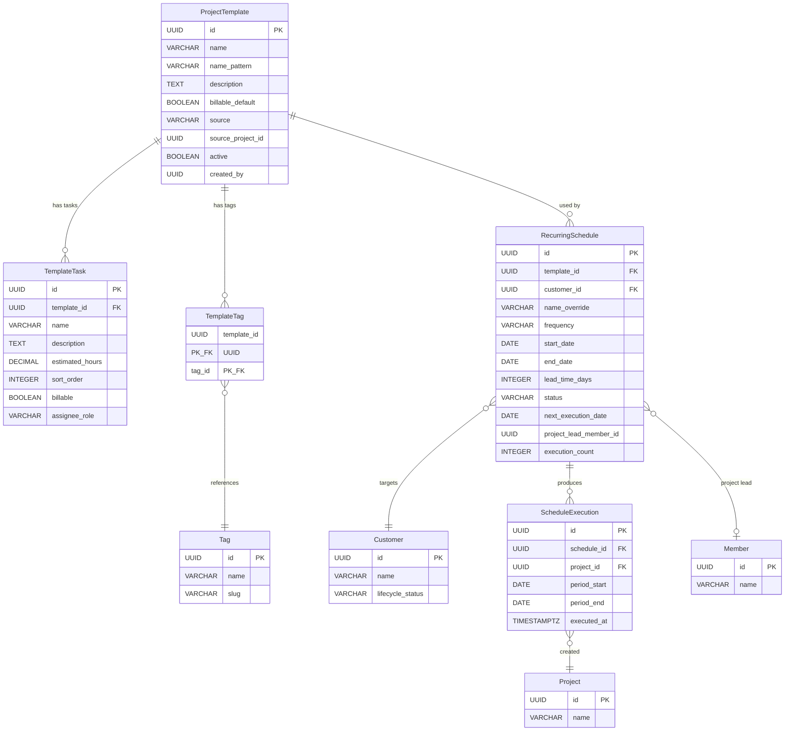
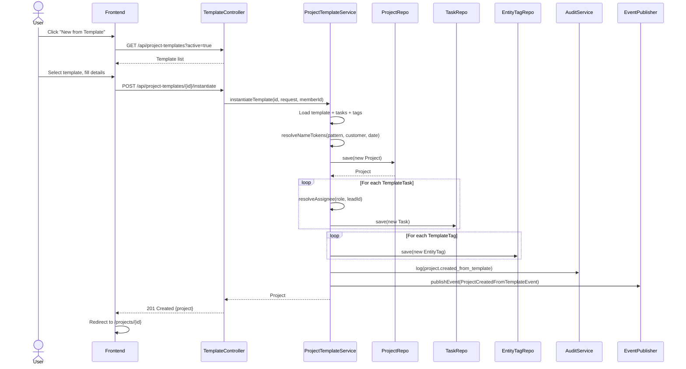
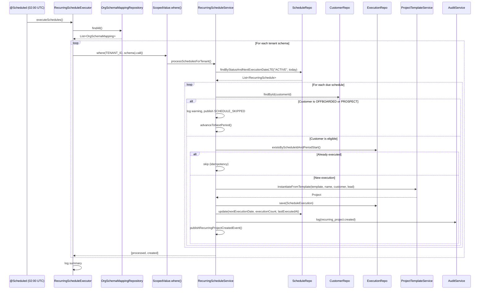
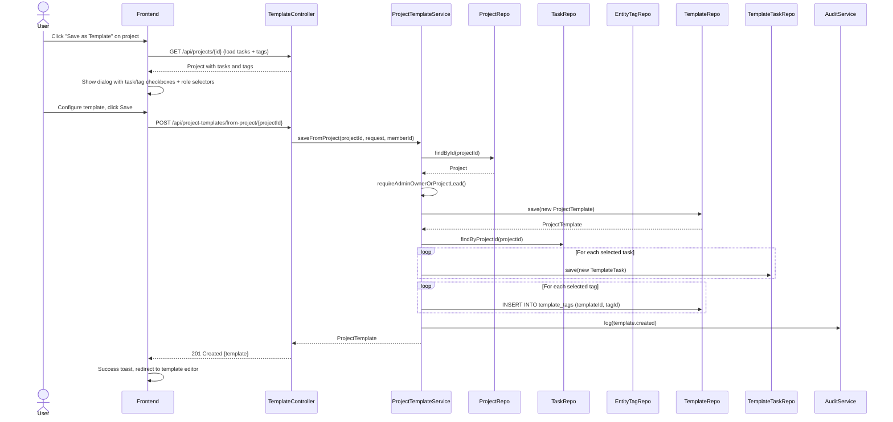

# Phase 16 — Project Templates & Recurring Schedules

---

## 1. Overview

Phase 16 adds a **reusable project blueprint system** with optional automated scheduling to the DocTeams platform. Professional services firms perform the same types of engagements repeatedly — monthly bookkeeping, quarterly tax reviews, annual audits — each following a predictable structure of tasks, assignments, and deliverables. Until now, creating each engagement required manual project setup: naming, task creation, assignment, tagging. This phase eliminates that repetitive work by introducing project templates (blueprints that capture project structure) and recurring schedules (automated project creation on a cadence).

The design introduces four new entities (`ProjectTemplate`, `TemplateTask`, `RecurringSchedule`, `ScheduleExecution`), one join table (`template_tags`), a daily scheduled job for automated execution, and frontend pages for template management, schedule configuration, and execution monitoring. All additions are evolutionary — they build on the existing Project/Task entity model (Phase 4), tag system (Phase 11), customer lifecycle (Phase 14), audit infrastructure (Phase 6), notification pipeline (Phase 6.5), and dedicated-schema-per-tenant isolation (Phase 13). Templates follow the snapshot pattern established by checklist templates (Phase 14) and document templates (Phase 12): data is copied at instantiation time, not referenced.

**Dependencies on prior phases**:
- **Phase 4** (Customers, Tasks): `Project`, `Task`, `Customer`, `CustomerProject` entities. Templates capture project/task structure; schedules link to customers.
- **Phase 6** (Audit): `AuditService` and `AuditEventBuilder`. Template and schedule operations are audited.
- **Phase 6.5** (Notifications): `ApplicationEvent` publication pattern. Schedule executions trigger notifications.
- **Phase 7** (Customer Portal): Customer lifecycle status check before schedule execution.
- **Phase 11** (Tags): `Tag`, `EntityTag`. Templates store tag associations.
- **Phase 13** (Dedicated Schema): All entities use schema-per-tenant isolation. No `tenant_id` columns.
- **Phase 14** (Customer Compliance): `LifecycleStatus` enum. Scheduler skips offboarded/prospect customers.

### What's New

| Capability | Before Phase 16 | After Phase 16 |
|---|---|---|
| Project creation | Manual — name, describe, create tasks one by one | One-click from template — pre-configured tasks, tags, assignments |
| Recurring engagements | Manually re-create projects each period | Automated — scheduler creates projects on cadence (weekly to annually) |
| Task assignment at creation | Manual assignment after project exists | Role-based hints — project lead tasks auto-assigned |
| Project naming | Manual, inconsistent across team | Token-based patterns — `{customer}`, `{month}`, `{year}` for consistent naming |
| Template library | -- | Org-wide template catalog with save-from-project and manual creation |
| Schedule monitoring | -- | Execution history, next run dates, pause/resume controls |

**Out of scope**: Retainer agreements / hour banks (Phase 17). Template marketplace / cross-org sharing. Template versioning history. Resource capacity checks. Complex CRON expressions or timezone-aware scheduling. Recurring tasks within a project. Budget auto-configuration from templates.

---

## 2. Domain Model

Phase 16 introduces four new tenant-scoped entities and one join table. All entities follow the dedicated-schema-per-tenant model ([ADR-064](../adr/ADR-064-dedicated-schema-only.md)) — no `tenant_id` columns, no `@Filter`/`@FilterDef` annotations, no `TenantAware` interface. Schema boundary provides isolation.

### 2.1 ProjectTemplate Entity

A reusable project blueprint capturing the structure, naming pattern, and default settings for project creation.

| Field | Java Type | DB Column | DB Type | Constraints | Notes |
|-------|-----------|-----------|---------|-------------|-------|
| `id` | `UUID` | `id` | `UUID` | PK, default `gen_random_uuid()` | Auto-generated |
| `name` | `String` | `name` | `VARCHAR(300)` | NOT NULL | Display name, e.g., "Monthly Bookkeeping" |
| `namePattern` | `String` | `name_pattern` | `VARCHAR(300)` | NOT NULL | Token pattern for project names, e.g., "Monthly Bookkeeping - {customer} - {month} {year}" |
| `description` | `String` | `description` | `TEXT` | Nullable | Template description, used as default project description |
| `billableDefault` | `boolean` | `billable_default` | `BOOLEAN` | NOT NULL, default `true` | Default billable flag for tasks |
| `source` | `String` | `source` | `VARCHAR(20)` | NOT NULL | `MANUAL` or `FROM_PROJECT` |
| `sourceProjectId` | `UUID` | `source_project_id` | `UUID` | Nullable | Informational — source project if saved from existing project. Not a FK (source may be deleted) |
| `active` | `boolean` | `active` | `BOOLEAN` | NOT NULL, default `true` | Inactive templates hidden from "New from Template" picker |
| `createdBy` | `UUID` | `created_by` | `UUID` | NOT NULL | Member who created the template |
| `createdAt` | `Instant` | `created_at` | `TIMESTAMPTZ` | NOT NULL | Immutable |
| `updatedAt` | `Instant` | `updated_at` | `TIMESTAMPTZ` | NOT NULL | Updated on mutation |

### 2.2 TemplateTask Entity

A task definition within a template. Copied (snapshot) to real `Task` records at instantiation time ([ADR-068](../adr/ADR-068-snapshot-based-templates.md)).

| Field | Java Type | DB Column | DB Type | Constraints | Notes |
|-------|-----------|-----------|---------|-------------|-------|
| `id` | `UUID` | `id` | `UUID` | PK, default `gen_random_uuid()` | Auto-generated |
| `templateId` | `UUID` | `template_id` | `UUID` | NOT NULL, FK -> `project_templates` ON DELETE CASCADE | Parent template |
| `name` | `String` | `name` | `VARCHAR(300)` | NOT NULL | Task name |
| `description` | `String` | `description` | `TEXT` | Nullable | Task description |
| `estimatedHours` | `BigDecimal` | `estimated_hours` | `DECIMAL(10,2)` | Nullable | Estimated hours |
| `sortOrder` | `int` | `sort_order` | `INTEGER` | NOT NULL | Display and creation order |
| `billable` | `boolean` | `billable` | `BOOLEAN` | NOT NULL, default `true` | Billable flag |
| `assigneeRole` | `String` | `assignee_role` | `VARCHAR(20)` | NOT NULL, default `'UNASSIGNED'` | One of: `PROJECT_LEAD`, `ANY_MEMBER`, `UNASSIGNED` ([ADR-069](../adr/ADR-069-role-based-assignment-hints.md)) |
| `createdAt` | `Instant` | `created_at` | `TIMESTAMPTZ` | NOT NULL | Immutable |
| `updatedAt` | `Instant` | `updated_at` | `TIMESTAMPTZ` | NOT NULL | Updated on mutation |

**Constraint**: `UNIQUE (template_id, sort_order)` — prevents duplicate ordering within a template.

**Field mapping note**: `TemplateTask.name` maps to `Task.title` during instantiation. The template uses `name` for its own domain model, but when creating a real `Task` entity, the code must call `task.setTitle(tt.getName())` since the `Task` entity's field is `title`, not `name`.

### 2.3 TemplateTag Join Table

Associates tags with templates. Not a JPA entity — managed via native SQL or lightweight repository queries. Follows the join-table pattern (simpler than `EntityTag` since it is template-specific rather than polymorphic).

| Column | DB Type | Constraints | Notes |
|--------|---------|-------------|-------|
| `template_id` | `UUID` | NOT NULL, FK -> `project_templates` ON DELETE CASCADE | Parent template |
| `tag_id` | `UUID` | NOT NULL, FK -> `tags` ON DELETE CASCADE | Referenced tag |

**Primary key**: `(template_id, tag_id)` — composite.

**Implementation**: `TemplateTagRepository` uses a Spring `@Repository` with `JdbcClient` (Spring Boot 4) for lightweight join-table operations:

```java
@Repository
public class TemplateTagRepository {
    private final JdbcClient jdbc;

    public TemplateTagRepository(JdbcClient jdbc) {
        this.jdbc = jdbc;
    }

    public void save(UUID templateId, UUID tagId) {
        jdbc.sql("INSERT INTO template_tags (template_id, tag_id) VALUES (?, ?) ON CONFLICT DO NOTHING")
            .param(templateId).param(tagId).update();
    }

    public List<UUID> findTagIdsByTemplateId(UUID templateId) {
        return jdbc.sql("SELECT tag_id FROM template_tags WHERE template_id = ?")
            .param(templateId).query(UUID.class).list();
    }

    public void deleteByTemplateId(UUID templateId) {
        jdbc.sql("DELETE FROM template_tags WHERE template_id = ?")
            .param(templateId).update();
    }

    public void deleteByTemplateIdAndTagId(UUID templateId, UUID tagId) {
        jdbc.sql("DELETE FROM template_tags WHERE template_id = ? AND tag_id = ?")
            .param(templateId).param(tagId).update();
    }
}
```

### 2.4 RecurringSchedule Entity

Links a template to a customer with a frequency cadence for automated project creation.

| Field | Java Type | DB Column | DB Type | Constraints | Notes |
|-------|-----------|-----------|---------|-------------|-------|
| `id` | `UUID` | `id` | `UUID` | PK, default `gen_random_uuid()` | Auto-generated |
| `templateId` | `UUID` | `template_id` | `UUID` | NOT NULL, FK -> `project_templates` | Template to instantiate |
| `customerId` | `UUID` | `customer_id` | `UUID` | NOT NULL, FK -> `customers` | Target customer for created projects |
| `nameOverride` | `String` | `name_override` | `VARCHAR(300)` | Nullable | Overrides template's `name_pattern` for this schedule |
| `frequency` | `String` | `frequency` | `VARCHAR(20)` | NOT NULL | `WEEKLY`, `FORTNIGHTLY`, `MONTHLY`, `QUARTERLY`, `SEMI_ANNUALLY`, `ANNUALLY` |
| `startDate` | `LocalDate` | `start_date` | `DATE` | NOT NULL | First period start date (anchor for period calculation) |
| `endDate` | `LocalDate` | `end_date` | `DATE` | Nullable | Schedule stops creating projects after this date |
| `leadTimeDays` | `int` | `lead_time_days` | `INTEGER` | NOT NULL, default `0` | Create project N days before period start |
| `status` | `String` | `status` | `VARCHAR(20)` | NOT NULL, default `'ACTIVE'` | `ACTIVE`, `PAUSED`, `COMPLETED` |
| `nextExecutionDate` | `LocalDate` | `next_execution_date` | `DATE` | Nullable | Pre-calculated next fire date ([ADR-070](../adr/ADR-070-pre-calculated-next-execution-date.md)) |
| `lastExecutedAt` | `Instant` | `last_executed_at` | `TIMESTAMPTZ` | Nullable | When scheduler last created a project |
| `executionCount` | `int` | `execution_count` | `INTEGER` | NOT NULL, default `0` | Total projects created |
| `projectLeadMemberId` | `UUID` | `project_lead_member_id` | `UUID` | Nullable | Member to assign as project lead on created projects |
| `createdBy` | `UUID` | `created_by` | `UUID` | NOT NULL | Member who created the schedule |
| `createdAt` | `Instant` | `created_at` | `TIMESTAMPTZ` | NOT NULL | Immutable |
| `updatedAt` | `Instant` | `updated_at` | `TIMESTAMPTZ` | NOT NULL | Updated on mutation |

**Constraints**:
- `UNIQUE (template_id, customer_id, frequency)` — prevents duplicate schedules for the same template/customer/frequency combination.
- `CHECK (lead_time_days >= 0)`
- `CHECK (end_date IS NULL OR end_date >= start_date)`

### 2.5 ScheduleExecution Entity

Execution history log. Each row represents one project created by the scheduler. The `(schedule_id, period_start)` unique constraint is the **idempotency key**.

| Field | Java Type | DB Column | DB Type | Constraints | Notes |
|-------|-----------|-----------|---------|-------------|-------|
| `id` | `UUID` | `id` | `UUID` | PK, default `gen_random_uuid()` | Auto-generated |
| `scheduleId` | `UUID` | `schedule_id` | `UUID` | NOT NULL, FK -> `recurring_schedules` | Parent schedule |
| `projectId` | `UUID` | `project_id` | `UUID` | NOT NULL, FK -> `projects` | Created project |
| `periodStart` | `LocalDate` | `period_start` | `DATE` | NOT NULL | Period start date this execution covers |
| `periodEnd` | `LocalDate` | `period_end` | `DATE` | NOT NULL | Period end date this execution covers |
| `executedAt` | `Instant` | `executed_at` | `TIMESTAMPTZ` | NOT NULL | When the project was created |
| `createdAt` | `Instant` | `created_at` | `TIMESTAMPTZ` | NOT NULL | Immutable |

**Constraint**: `UNIQUE (schedule_id, period_start)` — idempotency guard. Prevents duplicate projects for the same period.

### 2.6 Entity Relationship Diagram



---

## 3. Core Flows and Backend Behaviour

### 3.1 Save Project as Template

Reads an existing project's tasks and tags, creates a `ProjectTemplate` snapshot.

**Service method** (conceptual):

```java
// ProjectTemplateService.java
@Transactional
public ProjectTemplate saveFromProject(UUID projectId, SaveFromProjectRequest request, UUID memberId, String orgRole) {
    // 1. Permission check
    Project project = projectRepository.findById(projectId)
        .orElseThrow(() -> new NotFoundException("Project", projectId));
    requireAdminOwnerOrProjectLead(orgRole, project, memberId);

    // 2. Create template
    var template = new ProjectTemplate(
        request.name(), request.namePattern(), request.description(),
        true, "FROM_PROJECT", projectId, memberId);
    template = projectTemplateRepository.save(template);

    // 3. Copy selected tasks (use taskIds list for ordering — Task doesn't have sort_order)
    List<Task> tasks = taskRepository.findByProjectId(projectId);
    int sortOrder = 0;
    for (UUID taskId : request.taskIds()) {
        Task task = tasks.stream().filter(t -> t.getId().equals(taskId)).findFirst().orElse(null);
        if (task == null) continue;
        String role = request.taskRoles().getOrDefault(taskId, "UNASSIGNED");
        // Task doesn't have estimatedHours or billable — use defaults from template settings.
        // Users can edit these on the template after saving.
        var templateTask = new TemplateTask(
            template.getId(), task.getTitle(), task.getDescription(),
            null, sortOrder++, template.isBillableDefault(), role);
        templateTaskRepository.save(templateTask);
    }

    // 4. Copy selected tags
    for (UUID tagId : request.tagIds()) {
        templateTagRepository.save(template.getId(), tagId);
    }

    // 5. Audit + notification
    auditService.log(AuditEventBuilder.builder()
        .eventType("template.created")
        .entityType("project_template").entityId(template.getId())
        .details(Map.of("name", template.getName(), "source", "FROM_PROJECT",
            "source_project_id", projectId.toString(), "task_count", String.valueOf(sortOrder)))
        .build());

    publishTemplateCreatedEvent(template, memberId);
    return template;
}
```

**Permissions**: Org admin, owner, or project lead of the source project.

**Error handling**: 404 if project not found. 403 if insufficient permissions. Entire operation is one transaction — if any step fails, nothing is saved.

### 3.2 Create Project from Template (Manual)

Resolves name tokens, creates a `Project` with `Task` records and `EntityTag` records from the template.

**Service method** (conceptual):

```java
// ProjectTemplateService.java
@Transactional
public Project instantiateTemplate(UUID templateId, InstantiateTemplateRequest request, UUID memberId) {
    ProjectTemplate template = projectTemplateRepository.findById(templateId)
        .orElseThrow(() -> new NotFoundException("ProjectTemplate", templateId));
    if (!template.isActive()) throw new InvalidStateException("Template inactive", "Cannot create from inactive template");

    // 1. Resolve name tokens
    String namePattern = template.getNamePattern();
    Customer customer = null;
    if (request.customerId() != null) {
        customer = customerRepository.findById(request.customerId())
            .orElseThrow(() -> new NotFoundException("Customer", request.customerId()));
    }
    String resolvedName = request.name() != null ? request.name()
        : resolveNameTokens(namePattern, customer, LocalDate.now(), null, null);

    // 2. Create project
    String description = request.description() != null ? request.description() : template.getDescription();
    var project = new Project(resolvedName, description, memberId);
    project = projectRepository.save(project);

    // 3. Link to customer
    if (customer != null) {
        customerProjectRepository.save(new CustomerProject(customer.getId(), project.getId(), memberId));
    }

    // 4. Set project lead
    if (request.projectLeadMemberId() != null) {
        projectMemberRepository.save(new ProjectMember(
            project.getId(), request.projectLeadMemberId(), "LEAD", memberId));
    }

    // 5. Create tasks from template
    // Note: TemplateTask.estimatedHours and TemplateTask.billable are template-level metadata
    // used for planning and display (e.g., budget estimation). They are NOT copied onto Task
    // entities during instantiation — Task doesn't have those columns. Tasks inherit billable
    // from TimeEntry, and estimated hours live on the template for reference only.
    List<TemplateTask> templateTasks = templateTaskRepository
        .findByTemplateIdOrderBySortOrder(templateId);
    for (TemplateTask tt : templateTasks) {
        UUID assigneeId = resolveAssignee(tt.getAssigneeRole(), request.projectLeadMemberId());
        var task = new Task(project.getId(), tt.getName(), tt.getDescription(),
            "MEDIUM", null, null, memberId);
        // TemplateTask.name maps to Task.title: task.setTitle(tt.getName())
        if (assigneeId != null) task.setAssigneeId(assigneeId);  // stays OPEN, not IN_PROGRESS
        taskRepository.save(task);
    }

    // 6. Apply tags
    List<UUID> tagIds = templateTagRepository.findTagIdsByTemplateId(templateId);
    for (UUID tagId : tagIds) {
        entityTagRepository.save(new EntityTag(tagId, "PROJECT", project.getId()));
    }

    // 7. Audit + notification
    auditService.log(AuditEventBuilder.builder()
        .eventType("project.created_from_template")
        .entityType("project").entityId(project.getId())
        .details(Map.of("template_name", template.getName(),
            "project_name", resolvedName,
            "customer_name", customer != null ? customer.getName() : "none"))
        .build());

    return project;
}

private UUID resolveAssignee(String assigneeRole, UUID projectLeadMemberId) {
    return switch (assigneeRole) {
        case "PROJECT_LEAD" -> projectLeadMemberId; // may be null
        case "ANY_MEMBER", "UNASSIGNED" -> null;
        default -> null;
    };
}
```

**Permissions**: Same as regular project creation — org admin, owner, or any member with project creation permission.

**Transaction boundary**: Single transaction for the entire operation (project + tasks + tags + customer link). Rollback if any step fails.

### 3.3 Scheduler Execution (Daily Cron)

The scheduler runs at 02:00 UTC daily ([ADR-071](../adr/ADR-071-daily-batch-scheduler.md)), iterates all tenant schemas, finds due schedules, and creates projects.

**Service method** (conceptual):

```java
// RecurringScheduleExecutor.java
@Component
public class RecurringScheduleExecutor {

    private final OrgSchemaMappingRepository mappingRepository;
    private final RecurringScheduleService scheduleService;
    private static final Logger log = LoggerFactory.getLogger(RecurringScheduleExecutor.class);

    @Scheduled(cron = "0 0 2 * * *")
    public void executeSchedules() {
        log.info("Recurring schedule executor started");
        var mappings = mappingRepository.findAll();
        int totalProcessed = 0;
        int totalCreated = 0;

        for (var mapping : mappings) {
            try {
                // Bind both TENANT_ID (for schema routing) and ORG_ID (for notifications).
                // The scheduler has no request context, so ORG_ID must be resolved from OrgSchemaMapping.
                String orgId = mapping.getOrgId();
                int[] result = ScopedValue.where(RequestScopes.TENANT_ID, mapping.getSchemaName())
                    .where(RequestScopes.ORG_ID, orgId)
                    .call(() -> scheduleService.processSchedulesForTenant());
                totalProcessed += result[0];
                totalCreated += result[1];
            } catch (Exception e) {
                log.error("Failed to process schedules for schema {}", mapping.getSchemaName(), e);
            }
        }
        log.info("Recurring schedule executor completed: {} schedules processed, {} projects created",
            totalProcessed, totalCreated);
    }
}
```

```java
// RecurringScheduleService.processSchedulesForTenant()
@Transactional
public int[] processSchedulesForTenant() {
    LocalDate today = LocalDate.now();
    List<RecurringSchedule> dueSchedules = scheduleRepository
        .findByStatusAndNextExecutionDateLessThanEqual("ACTIVE", today);

    int processed = 0, created = 0;
    for (RecurringSchedule schedule : dueSchedules) {
        try {
            boolean result = executeSingleSchedule(schedule, today);
            if (result) created++;
            processed++;
        } catch (Exception e) {
            log.error("Failed to execute schedule {}", schedule.getId(), e);
        }
    }
    return new int[]{processed, created};
}
```

```java
// RecurringScheduleService.executeSingleSchedule()
@Transactional(propagation = Propagation.REQUIRES_NEW)
public boolean executeSingleSchedule(RecurringSchedule schedule, LocalDate today) {
    // 1. Check customer lifecycle
    Customer customer = customerRepository.findById(schedule.getCustomerId())
        .orElseThrow(() -> new NotFoundException("Customer", schedule.getCustomerId()));
    if (isInactiveLifecycle(customer)) {
        log.warn("Skipping schedule {} — customer {} is {}", schedule.getId(),
            customer.getName(), customer.getLifecycleStatus());
        publishScheduleSkippedEvent(schedule, customer, "Customer lifecycle: " + customer.getLifecycleStatus());
        advanceToNextPeriod(schedule);
        return false;
    }

    // 2. Calculate period
    var period = calculatePeriod(schedule);

    // 3. Idempotency check
    if (executionRepository.existsByScheduleIdAndPeriodStart(schedule.getId(), period.start())) {
        log.info("Skipping schedule {} — execution already exists for period {}", schedule.getId(), period.start());
        advanceToNextPeriod(schedule);
        return false;
    }

    // 4. Resolve name
    ProjectTemplate template = projectTemplateRepository.findById(schedule.getTemplateId())
        .orElseThrow(() -> new NotFoundException("ProjectTemplate", schedule.getTemplateId()));
    String pattern = schedule.getNameOverride() != null ? schedule.getNameOverride() : template.getNamePattern();
    String projectName = resolveNameTokens(pattern, customer, period.start(), period.start(), period.end());

    // 5. Create project from template (reuse instantiation logic)
    // In scheduler context, use projectLeadMemberId as the acting user for CustomerProject/ProjectMember
    UUID actingMemberId = schedule.getProjectLeadMemberId(); // may be null for system-created projects
    Project project = instantiateFromTemplate(template, projectName, customer,
        schedule.getProjectLeadMemberId(), actingMemberId);

    // 6. Record execution
    var execution = new ScheduleExecution(schedule.getId(), project.getId(),
        period.start(), period.end(), Instant.now());
    executionRepository.save(execution);

    // 7. Advance schedule
    schedule.recordExecution(Instant.now());
    advanceToNextPeriod(schedule);

    // 7b. Auto-complete if past end date
    if (schedule.getNextExecutionDate() != null && schedule.getEndDate() != null
            && schedule.getNextExecutionDate().isAfter(schedule.getEndDate())) {
        schedule.setStatus(ScheduleStatus.COMPLETED);
        publishScheduleCompletedEvent(schedule, template, customer);
    }

    // 8. Audit + notification
    auditService.log(AuditEventBuilder.builder()
        .eventType("recurring_project.created")
        .entityType("recurring_schedule").entityId(schedule.getId())
        .details(Map.of("template_name", template.getName(),
            "project_name", projectName,
            "customer_name", customer.getName(),
            "period_start", period.start().toString(),
            "period_end", period.end().toString()))
        .build());

    publishRecurringProjectCreatedEvent(schedule, project, customer);
    return true;
}
```

**Error isolation**: Each schedule executes in `REQUIRES_NEW` transaction. If one fails, others continue. Each tenant is wrapped in try/catch in the executor.

### 3.4 Schedule Lifecycle

| Transition | From | To | Action |
|---|---|---|---|
| Create | -- | `ACTIVE` | Set `next_execution_date` from `start_date` and `lead_time_days` |
| Pause | `ACTIVE` | `PAUSED` | Scheduler skips. `next_execution_date` preserved |
| Resume | `PAUSED` | `ACTIVE` | Recalculate `next_execution_date` from current date forward (skip past periods) |
| Complete (auto) | `ACTIVE` | `COMPLETED` | When `next_execution_date > end_date`. Terminal state |
| Complete (manual) | `ACTIVE` or `PAUSED` | `COMPLETED` | Admin marks schedule as done. Terminal state |
| Delete | `PAUSED` or `COMPLETED` | -- | Hard delete. Only allowed when not `ACTIVE` |

### 3.5 Period Calculation

Given a `start_date` (anchor) and `frequency`, the system computes period boundaries:

```java
// PeriodCalculator.java
public record Period(LocalDate start, LocalDate end) {}

public Period calculateNextPeriod(LocalDate anchor, String frequency, int executionCount) {
    LocalDate periodStart = switch (frequency) {
        case "WEEKLY" -> anchor.plusWeeks(executionCount);
        case "FORTNIGHTLY" -> anchor.plusWeeks(executionCount * 2L);
        case "MONTHLY" -> anchor.plusMonths(executionCount);
        case "QUARTERLY" -> anchor.plusMonths(executionCount * 3L);
        case "SEMI_ANNUALLY" -> anchor.plusMonths(executionCount * 6L);
        case "ANNUALLY" -> anchor.plusYears(executionCount);
        default -> throw new IllegalArgumentException("Unknown frequency: " + frequency);
    };
    LocalDate periodEnd = switch (frequency) {
        case "WEEKLY" -> periodStart.plusWeeks(1).minusDays(1);
        case "FORTNIGHTLY" -> periodStart.plusWeeks(2).minusDays(1);
        case "MONTHLY" -> periodStart.plusMonths(1).minusDays(1);
        case "QUARTERLY" -> periodStart.plusMonths(3).minusDays(1);
        case "SEMI_ANNUALLY" -> periodStart.plusMonths(6).minusDays(1);
        case "ANNUALLY" -> periodStart.plusYears(1).minusDays(1);
        default -> throw new IllegalArgumentException("Unknown frequency: " + frequency);
    };
    return new Period(periodStart, periodEnd);
}

public LocalDate calculateNextExecutionDate(LocalDate periodStart, int leadTimeDays) {
    return periodStart.minusDays(leadTimeDays);
}
```

**Examples**:

| Anchor | Frequency | Execution # | Period Start | Period End | Lead Time | Execution Date |
|--------|-----------|-------------|--------------|------------|-----------|----------------|
| 2026-01-01 | MONTHLY | 0 | 2026-01-01 | 2026-01-31 | 5 | 2025-12-27 |
| 2026-01-01 | MONTHLY | 1 | 2026-02-01 | 2026-02-28 | 5 | 2026-01-27 |
| 2026-01-01 | MONTHLY | 2 | 2026-03-01 | 2026-03-31 | 0 | 2026-03-01 |
| 2026-01-01 | QUARTERLY | 0 | 2026-01-01 | 2026-03-31 | 7 | 2025-12-25 |
| 2026-01-01 | QUARTERLY | 1 | 2026-04-01 | 2026-06-30 | 7 | 2026-03-25 |
| 2026-03-15 | WEEKLY | 0 | 2026-03-15 | 2026-03-21 | 0 | 2026-03-15 |
| 2026-03-15 | WEEKLY | 1 | 2026-03-22 | 2026-03-28 | 0 | 2026-03-22 |

**Month-end handling**: `LocalDate.plusMonths()` handles varying month lengths. Anchor of Jan 31 + 1 month = Feb 28 (non-leap) / Feb 29 (leap). This is Java's `java.time` built-in behavior.

### 3.6 Token Resolution

Simple `String.replace()` substitution. No template engine ([per requirements](../requirements/claude-code-prompt-phase16.md)).

```java
// NameTokenResolver.java
public String resolveNameTokens(String pattern, Customer customer,
        LocalDate referenceDate, LocalDate periodStart, LocalDate periodEnd) {
    String result = pattern;
    if (customer != null) {
        result = result.replace("{customer}", customer.getName());
    }
    if (referenceDate != null) {
        result = result.replace("{month}", referenceDate.getMonth().getDisplayName(TextStyle.FULL, Locale.ENGLISH));
        result = result.replace("{month_short}", referenceDate.getMonth().getDisplayName(TextStyle.SHORT, Locale.ENGLISH));
        result = result.replace("{year}", String.valueOf(referenceDate.getYear()));
    }
    if (periodStart != null) {
        result = result.replace("{period_start}", periodStart.format(DateTimeFormatter.ISO_LOCAL_DATE));
    }
    if (periodEnd != null) {
        result = result.replace("{period_end}", periodEnd.format(DateTimeFormatter.ISO_LOCAL_DATE));
    }
    return result;
}
```

**Supported tokens**:

| Token | Resolved To | Example |
|-------|-------------|---------|
| `{customer}` | Customer name | "Acme Corp" |
| `{month}` | Full month name from period start | "March" |
| `{month_short}` | 3-letter month abbreviation | "Mar" |
| `{year}` | 4-digit year from period start | "2026" |
| `{period_start}` | ISO date of period start | "2026-03-01" |
| `{period_end}` | ISO date of period end | "2026-03-31" |

---

## 4. API Surface

### 4.1 Project Template Endpoints

| Method | Path | Description | Auth | Permission |
|--------|------|-------------|------|------------|
| `GET` | `/api/project-templates` | List all project templates | JWT | All members |
| `GET` | `/api/project-templates/{id}` | Get template with tasks and tags | JWT | All members |
| `POST` | `/api/project-templates` | Create new template | JWT | Admin/Owner |
| `PUT` | `/api/project-templates/{id}` | Update template, tasks, and tags | JWT | Admin/Owner |
| `DELETE` | `/api/project-templates/{id}` | Delete template. If active schedules reference this template, returns 409 Conflict. Otherwise, hard-deletes the template and its tasks/tags (CASCADE). To deactivate without deleting, use PUT to set `active=false`. | JWT | Admin/Owner |
| `POST` | `/api/project-templates/{id}/duplicate` | Duplicate template | JWT | Admin/Owner |
| `POST` | `/api/project-templates/from-project/{projectId}` | Save project as template | JWT | Admin/Owner/Lead |
| `POST` | `/api/project-templates/{id}/instantiate` | Create project from template | JWT | Admin/Owner/Member |

#### Key Request/Response Shapes

**POST `/api/project-templates`** (Create template):
```json
{
  "name": "Monthly Bookkeeping",
  "namePattern": "Monthly Bookkeeping - {customer} - {month} {year}",
  "description": "Standard monthly bookkeeping engagement",
  "billableDefault": true,
  "tasks": [
    {
      "name": "Collect source documents",
      "description": "Request and collect bank statements, receipts, invoices",
      "estimatedHours": 2.0,
      "sortOrder": 0,
      "billable": true,
      "assigneeRole": "ANY_MEMBER"
    },
    {
      "name": "Process transactions",
      "description": "Categorize and capture all transactions",
      "estimatedHours": 4.0,
      "sortOrder": 1,
      "billable": true,
      "assigneeRole": "ANY_MEMBER"
    },
    {
      "name": "Review and sign-off",
      "description": "Project lead reviews work and signs off",
      "estimatedHours": 1.0,
      "sortOrder": 2,
      "billable": true,
      "assigneeRole": "PROJECT_LEAD"
    }
  ],
  "tagIds": ["uuid-of-bookkeeping-tag", "uuid-of-monthly-tag"]
}
```

**POST `/api/project-templates/from-project/{projectId}`** (Save from project):
```json
{
  "name": "Monthly Bookkeeping Template",
  "namePattern": "Monthly Bookkeeping - {customer} - {month} {year}",
  "description": "Based on Acme Corp February 2026 engagement",
  "taskIds": ["task-uuid-1", "task-uuid-2", "task-uuid-3"],
  "tagIds": ["tag-uuid-1"],
  "taskRoles": {
    "task-uuid-1": "ANY_MEMBER",
    "task-uuid-2": "ANY_MEMBER",
    "task-uuid-3": "PROJECT_LEAD"
  }
}
```

**POST `/api/project-templates/{id}/instantiate`** (Create from template):
```json
{
  "name": "Monthly Bookkeeping - Acme Corp - March 2026",
  "customerId": "customer-uuid",
  "projectLeadMemberId": "member-uuid",
  "description": "March 2026 monthly bookkeeping for Acme Corp"
}
```

**Response** (Template detail):
```json
{
  "id": "uuid",
  "name": "Monthly Bookkeeping",
  "namePattern": "Monthly Bookkeeping - {customer} - {month} {year}",
  "description": "Standard monthly bookkeeping engagement",
  "billableDefault": true,
  "source": "MANUAL",
  "sourceProjectId": null,
  "active": true,
  "taskCount": 3,
  "tagCount": 2,
  "tasks": [
    {
      "id": "uuid",
      "name": "Collect source documents",
      "description": "...",
      "estimatedHours": 2.0,
      "sortOrder": 0,
      "billable": true,
      "assigneeRole": "ANY_MEMBER"
    }
  ],
  "tags": [
    { "id": "uuid", "name": "Bookkeeping", "color": "#3B82F6" }
  ],
  "createdAt": "2026-02-19T10:00:00Z",
  "updatedAt": "2026-02-19T10:00:00Z"
}
```

### 4.2 Recurring Schedule Endpoints

| Method | Path | Description | Auth | Permission |
|--------|------|-------------|------|------------|
| `GET` | `/api/schedules` | List all schedules | JWT | All members |
| `GET` | `/api/schedules/{id}` | Get schedule with recent executions | JWT | All members |
| `POST` | `/api/schedules` | Create new schedule | JWT | Admin/Owner |
| `PUT` | `/api/schedules/{id}` | Update schedule | JWT | Admin/Owner |
| `DELETE` | `/api/schedules/{id}` | Delete schedule (PAUSED/COMPLETED only) | JWT | Admin/Owner |
| `POST` | `/api/schedules/{id}/pause` | Pause active schedule | JWT | Admin/Owner |
| `POST` | `/api/schedules/{id}/resume` | Resume paused schedule | JWT | Admin/Owner |
| `GET` | `/api/schedules/{id}/executions` | Execution history (paginated) | JWT | All members |

#### Key Request/Response Shapes

**POST `/api/schedules`** (Create schedule):
```json
{
  "templateId": "template-uuid",
  "customerId": "customer-uuid",
  "frequency": "MONTHLY",
  "startDate": "2026-03-01",
  "endDate": "2026-12-31",
  "leadTimeDays": 5,
  "projectLeadMemberId": "member-uuid",
  "nameOverride": null
}
```

**Response** (Schedule detail):
```json
{
  "id": "uuid",
  "templateId": "template-uuid",
  "templateName": "Monthly Bookkeeping",
  "customerId": "customer-uuid",
  "customerName": "Acme Corp",
  "frequency": "MONTHLY",
  "startDate": "2026-03-01",
  "endDate": "2026-12-31",
  "leadTimeDays": 5,
  "status": "ACTIVE",
  "nextExecutionDate": "2026-02-24",
  "lastExecutedAt": null,
  "executionCount": 0,
  "projectLeadMemberId": "member-uuid",
  "projectLeadName": "Jane Smith",
  "createdAt": "2026-02-19T10:00:00Z"
}
```

**GET `/api/schedules/{id}/executions`** (Execution history):
```json
{
  "content": [
    {
      "id": "uuid",
      "projectId": "project-uuid",
      "projectName": "Monthly Bookkeeping - Acme Corp - March 2026",
      "periodStart": "2026-03-01",
      "periodEnd": "2026-03-31",
      "executedAt": "2026-02-24T02:00:15Z"
    }
  ],
  "page": 0,
  "size": 20,
  "totalElements": 1
}
```

**Query parameters** for `GET /api/schedules`:
- `status` — filter by `ACTIVE`, `PAUSED`, `COMPLETED`
- `customerId` — filter by customer
- `templateId` — filter by template

---

## 5. Sequence Diagrams

### 5.1 Manual Project Creation from Template



### 5.2 Scheduler Daily Execution (Across Tenants)



### 5.3 Save Project as Template



---

## 6. Scheduler Design

### 6.1 Cron Expression and Timing

```java
@Scheduled(cron = "0 0 2 * * *")  // Daily at 02:00 UTC
```

02:00 UTC is chosen to avoid business hours in most timezones where professional services firms operate (UTC+2 to UTC-8). The scheduler creates projects that are "due" — the exact execution time is not user-visible; what matters is that the project exists by the time business hours start.

### 6.2 Tenant Iteration

Uses the same discovery pattern as `TenantMigrationRunner`:

```java
var mappings = mappingRepository.findAll();  // OrgSchemaMappingRepository
for (var mapping : mappings) {
    String orgId = mapping.getOrgId();
    ScopedValue.where(RequestScopes.TENANT_ID, mapping.getSchemaName())
        .where(RequestScopes.ORG_ID, orgId)
        .call(() -> scheduleService.processSchedulesForTenant());
}
```

Each tenant is processed in isolation. A failure in one tenant (exception, unreachable schema) is caught, logged, and skipped — it does not affect other tenants.

### 6.3 Idempotency

The `(schedule_id, period_start)` unique constraint on `schedule_executions` is the idempotency guard. Before creating a project, the scheduler checks:

```java
if (executionRepository.existsByScheduleIdAndPeriodStart(schedule.getId(), periodStart)) {
    // Already executed for this period — skip
    return false;
}
```

This prevents duplicate projects even if:
- The scheduler runs twice in one day (deployment, restart)
- Multiple application instances execute concurrently (no leader election)
- A schedule's `next_execution_date` is not updated due to a crash between project creation and schedule update

### 6.4 Error Isolation

Three levels of error isolation:

1. **Tenant level**: Each tenant is wrapped in try/catch. A failing tenant does not block others.
2. **Schedule level**: Each schedule executes in `REQUIRES_NEW` transaction propagation. A failing schedule does not roll back other schedules within the same tenant.
3. **Logging**: All execution attempts log at INFO with schedule ID, customer ID, and outcome. Failures log at ERROR with full stack trace.

### 6.5 Period Calculation Logic

The period calculation uses `execution_count` as the period index multiplier:

```
period_start = anchor + (execution_count * frequency_interval)
period_end = period_start + frequency_interval - 1 day
next_execution_date = next_period_start - lead_time_days
```

When a paused schedule is resumed, past periods are skipped:

```java
public void recalculateNextExecutionOnResume(RecurringSchedule schedule) {
    LocalDate today = LocalDate.now();
    int count = schedule.getExecutionCount();
    while (true) {
        Period period = calculateNextPeriod(schedule.getStartDate(), schedule.getFrequency(), count);
        LocalDate executionDate = period.start().minusDays(schedule.getLeadTimeDays());
        if (executionDate.isAfter(today) || executionDate.isEqual(today)) {
            schedule.setNextExecutionDate(executionDate);
            break;
        }
        count++;
        // Safety valve: don't loop forever
        if (count > schedule.getExecutionCount() + 1000) break;
    }
}
```

### 6.6 Customer Lifecycle Check

Before creating a project, the scheduler checks the customer's lifecycle status:

```java
private boolean isInactiveLifecycle(Customer customer) {
    var status = customer.getLifecycleStatus();
    return status == LifecycleStatus.OFFBOARDED || status == LifecycleStatus.PROSPECT;
}
```

- `OFFBOARDED`: Customer has left. No new projects should be created.
- `PROSPECT`: Customer is not yet onboarded. Premature to create projects.
- `ACTIVE`, `ONBOARDING`, `DORMANT`: Proceed with project creation.

When skipped, a `SCHEDULE_SKIPPED` notification is sent to org admins. This prevents silent failures that could be missed in a compliance context.

### 6.7 Multi-Instance Consideration

If the application runs on multiple ECS instances, the `@Scheduled` method fires on each instance. Options:

1. **Accept redundant execution** — The idempotency constraint prevents duplicate projects. Multiple instances doing the same work is wasteful but safe.
2. **Advisory lock** — Acquire a PostgreSQL advisory lock before processing. If the lock is held, skip. This is a simple one-line addition if needed.

For Phase 16, option 1 is acceptable. The advisory lock can be added later if instance count grows.

---

## 7. Database Migration

### V30 — Project Templates & Recurring Schedules

```sql
-- V30__project_templates_recurring_schedules.sql

-- ============================================================
-- ProjectTemplate
-- ============================================================
CREATE TABLE project_templates (
    id              UUID PRIMARY KEY DEFAULT gen_random_uuid(),
    name            VARCHAR(300) NOT NULL,
    name_pattern    VARCHAR(300) NOT NULL,
    description     TEXT,
    billable_default BOOLEAN NOT NULL DEFAULT true,
    source          VARCHAR(20) NOT NULL,
    source_project_id UUID,
    active          BOOLEAN NOT NULL DEFAULT true,
    created_by      UUID NOT NULL,
    created_at      TIMESTAMPTZ NOT NULL DEFAULT now(),
    updated_at      TIMESTAMPTZ NOT NULL DEFAULT now()
);

CREATE INDEX idx_project_templates_active ON project_templates (active);
CREATE INDEX idx_project_templates_created_by ON project_templates (created_by);

-- ============================================================
-- TemplateTask
-- ============================================================
CREATE TABLE template_tasks (
    id              UUID PRIMARY KEY DEFAULT gen_random_uuid(),
    template_id     UUID NOT NULL REFERENCES project_templates(id) ON DELETE CASCADE,
    name            VARCHAR(300) NOT NULL,
    description     TEXT,
    estimated_hours DECIMAL(10,2),
    sort_order      INTEGER NOT NULL,
    billable        BOOLEAN NOT NULL DEFAULT true,
    assignee_role   VARCHAR(20) NOT NULL DEFAULT 'UNASSIGNED',
    created_at      TIMESTAMPTZ NOT NULL DEFAULT now(),
    updated_at      TIMESTAMPTZ NOT NULL DEFAULT now(),

    CONSTRAINT uq_template_task_sort UNIQUE (template_id, sort_order)
);

CREATE INDEX idx_template_tasks_template_id ON template_tasks (template_id);

-- ============================================================
-- TemplateTag (join table, not a JPA entity)
-- ============================================================
CREATE TABLE template_tags (
    template_id     UUID NOT NULL REFERENCES project_templates(id) ON DELETE CASCADE,
    tag_id          UUID NOT NULL REFERENCES tags(id) ON DELETE CASCADE,

    PRIMARY KEY (template_id, tag_id)
);

-- ============================================================
-- RecurringSchedule
-- ============================================================
CREATE TABLE recurring_schedules (
    id                      UUID PRIMARY KEY DEFAULT gen_random_uuid(),
    template_id             UUID NOT NULL REFERENCES project_templates(id),
    customer_id             UUID NOT NULL REFERENCES customers(id),
    name_override           VARCHAR(300),
    frequency               VARCHAR(20) NOT NULL,
    start_date              DATE NOT NULL,
    end_date                DATE,
    lead_time_days          INTEGER NOT NULL DEFAULT 0,
    status                  VARCHAR(20) NOT NULL DEFAULT 'ACTIVE',
    next_execution_date     DATE,
    last_executed_at        TIMESTAMPTZ,
    execution_count         INTEGER NOT NULL DEFAULT 0,
    project_lead_member_id  UUID,
    created_by              UUID NOT NULL,
    created_at              TIMESTAMPTZ NOT NULL DEFAULT now(),
    updated_at              TIMESTAMPTZ NOT NULL DEFAULT now(),

    CONSTRAINT uq_schedule_template_customer_freq UNIQUE (template_id, customer_id, frequency),
    CONSTRAINT chk_lead_time_non_negative CHECK (lead_time_days >= 0),
    CONSTRAINT chk_end_after_start CHECK (end_date IS NULL OR end_date >= start_date)
);

CREATE INDEX idx_recurring_schedules_status ON recurring_schedules (status);
CREATE INDEX idx_recurring_schedules_next_exec ON recurring_schedules (next_execution_date)
    WHERE status = 'ACTIVE';
CREATE INDEX idx_recurring_schedules_customer ON recurring_schedules (customer_id);
CREATE INDEX idx_recurring_schedules_template ON recurring_schedules (template_id);

-- ============================================================
-- ScheduleExecution
-- ============================================================
CREATE TABLE schedule_executions (
    id              UUID PRIMARY KEY DEFAULT gen_random_uuid(),
    schedule_id     UUID NOT NULL REFERENCES recurring_schedules(id),
    project_id      UUID NOT NULL REFERENCES projects(id),
    period_start    DATE NOT NULL,
    period_end      DATE NOT NULL,
    executed_at     TIMESTAMPTZ NOT NULL,
    created_at      TIMESTAMPTZ NOT NULL DEFAULT now(),

    CONSTRAINT uq_execution_schedule_period UNIQUE (schedule_id, period_start)
);

CREATE INDEX idx_schedule_executions_schedule ON schedule_executions (schedule_id);
CREATE INDEX idx_schedule_executions_project ON schedule_executions (project_id);
```

### Index Rationale

| Index | Purpose |
|-------|---------|
| `idx_project_templates_active` | Filter active templates for "New from Template" picker |
| `idx_project_templates_created_by` | "My templates" queries |
| `idx_template_tasks_template_id` | Load tasks for a template (CASCADE delete performance) |
| `idx_recurring_schedules_status` | General status filtering |
| `idx_recurring_schedules_next_exec` | **Scheduler hot path** — partial index on ACTIVE schedules. The daily cron query: `WHERE status = 'ACTIVE' AND next_execution_date <= :today` |
| `idx_recurring_schedules_customer` | Schedules-by-customer lookups |
| `idx_recurring_schedules_template` | Check if template has associated schedules (delete guard) |
| `idx_schedule_executions_schedule` | Execution history for a schedule |
| `idx_schedule_executions_project` | Reverse lookup — find which schedule created a project |

No RLS policies needed — all entities are in dedicated tenant schemas ([ADR-064](../adr/ADR-064-dedicated-schema-only.md)).

---

## 8. Implementation Guidance

### 8.1 Backend Package Structure

**IMPORTANT**: The existing `template/` package contains `DocumentTemplate` and `GeneratedDocument` (Phase 12). Project templates must use a separate package: `projecttemplate/`.

```
io.b2mash.b2b.b2bstrawman/
├── projecttemplate/
│   ├── ProjectTemplate.java              # Entity
│   ├── TemplateTask.java                 # Entity
│   ├── ProjectTemplateRepository.java    # JpaRepository
│   ├── TemplateTaskRepository.java       # JpaRepository
│   ├── TemplateTagRepository.java        # Spring JDBC or native query helper
│   ├── ProjectTemplateService.java       # CRUD, save-from-project, instantiate
│   ├── NameTokenResolver.java            # Token substitution
│   ├── PeriodCalculator.java             # Period computation
│   ├── ProjectTemplateController.java    # REST endpoints
│   ├── dto/
│   │   ├── CreateTemplateRequest.java
│   │   ├── UpdateTemplateRequest.java
│   │   ├── SaveFromProjectRequest.java
│   │   ├── InstantiateTemplateRequest.java
│   │   ├── ProjectTemplateResponse.java
│   │   └── TemplateTaskResponse.java
│   └── event/
│       └── TemplateCreatedEvent.java
├── schedule/
│   ├── RecurringSchedule.java            # Entity
│   ├── ScheduleExecution.java            # Entity
│   ├── RecurringScheduleRepository.java  # JpaRepository
│   ├── ScheduleExecutionRepository.java  # JpaRepository
│   ├── RecurringScheduleService.java     # CRUD, pause, resume, process
│   ├── RecurringScheduleExecutor.java    # @Scheduled cron, tenant iteration
│   ├── RecurringScheduleController.java  # REST endpoints
│   ├── dto/
│   │   ├── CreateScheduleRequest.java
│   │   ├── UpdateScheduleRequest.java
│   │   ├── ScheduleResponse.java
│   │   └── ScheduleExecutionResponse.java
│   └── event/
│       ├── RecurringProjectCreatedEvent.java
│       ├── ScheduleSkippedEvent.java
│       └── SchedulePausedEvent.java
```

### 8.2 Entity Code Pattern

Following the `Project` entity pattern from the context inventory:

```java
package io.b2mash.b2b.b2bstrawman.projecttemplate;

import jakarta.persistence.Column;
import jakarta.persistence.Entity;
import jakarta.persistence.GeneratedValue;
import jakarta.persistence.GenerationType;
import jakarta.persistence.Id;
import jakarta.persistence.Table;
import java.time.Instant;
import java.util.UUID;

@Entity
@Table(name = "project_templates")
public class ProjectTemplate {

    @Id
    @GeneratedValue(strategy = GenerationType.UUID)
    private UUID id;

    @Column(name = "name", nullable = false, length = 300)
    private String name;

    @Column(name = "name_pattern", nullable = false, length = 300)
    private String namePattern;

    @Column(name = "description", columnDefinition = "TEXT")
    private String description;

    @Column(name = "billable_default", nullable = false)
    private boolean billableDefault;

    @Column(name = "source", nullable = false, length = 20)
    private String source;

    @Column(name = "source_project_id")
    private UUID sourceProjectId;

    @Column(name = "active", nullable = false)
    private boolean active;

    @Column(name = "created_by", nullable = false)
    private UUID createdBy;

    @Column(name = "created_at", nullable = false, updatable = false)
    private Instant createdAt;

    @Column(name = "updated_at", nullable = false)
    private Instant updatedAt;

    protected ProjectTemplate() {}

    public ProjectTemplate(String name, String namePattern, String description,
            boolean billableDefault, String source, UUID sourceProjectId, UUID createdBy) {
        this.name = name;
        this.namePattern = namePattern;
        this.description = description;
        this.billableDefault = billableDefault;
        this.source = source;
        this.sourceProjectId = sourceProjectId;
        this.active = true;
        this.createdBy = createdBy;
        this.createdAt = Instant.now();
        this.updatedAt = Instant.now();
    }

    public void update(String name, String namePattern, String description, boolean billableDefault) {
        this.name = name;
        this.namePattern = namePattern;
        this.description = description;
        this.billableDefault = billableDefault;
        this.updatedAt = Instant.now();
    }

    public void deactivate() {
        this.active = false;
        this.updatedAt = Instant.now();
    }

    public void activate() {
        this.active = true;
        this.updatedAt = Instant.now();
    }

    // getters ...
}
```

### 8.3 Repository Pattern

```java
public interface ProjectTemplateRepository extends JpaRepository<ProjectTemplate, UUID> {
    List<ProjectTemplate> findByActiveOrderByNameAsc(boolean active);
    List<ProjectTemplate> findAllByOrderByNameAsc();
}

public interface TemplateTaskRepository extends JpaRepository<TemplateTask, UUID> {
    List<TemplateTask> findByTemplateIdOrderBySortOrder(UUID templateId);
    void deleteByTemplateId(UUID templateId);
}

public interface RecurringScheduleRepository extends JpaRepository<RecurringSchedule, UUID> {
    List<RecurringSchedule> findByStatusAndNextExecutionDateLessThanEqual(String status, LocalDate date);
    List<RecurringSchedule> findByTemplateId(UUID templateId);
    List<RecurringSchedule> findByCustomerId(UUID customerId);
    boolean existsByTemplateId(UUID templateId);
}

public interface ScheduleExecutionRepository extends JpaRepository<ScheduleExecution, UUID> {
    boolean existsByScheduleIdAndPeriodStart(UUID scheduleId, LocalDate periodStart);
    Page<ScheduleExecution> findByScheduleIdOrderByPeriodStartDesc(UUID scheduleId, Pageable pageable);
}
```

### 8.4 Backend Changes Table

| File | Change |
|------|--------|
| `projecttemplate/ProjectTemplate.java` | New entity |
| `projecttemplate/TemplateTask.java` | New entity |
| `projecttemplate/ProjectTemplateRepository.java` | New repository |
| `projecttemplate/TemplateTaskRepository.java` | New repository |
| `projecttemplate/TemplateTagRepository.java` | New — native query helper for join table |
| `projecttemplate/ProjectTemplateService.java` | New — CRUD, save-from-project, instantiate |
| `projecttemplate/NameTokenResolver.java` | New — token substitution utility |
| `projecttemplate/PeriodCalculator.java` | New — period computation utility |
| `projecttemplate/ProjectTemplateController.java` | New — 8 REST endpoints |
| `projecttemplate/dto/*.java` | New — request/response DTOs |
| `schedule/RecurringSchedule.java` | New entity |
| `schedule/ScheduleExecution.java` | New entity |
| `schedule/RecurringScheduleRepository.java` | New repository |
| `schedule/ScheduleExecutionRepository.java` | New repository |
| `schedule/RecurringScheduleService.java` | New — schedule CRUD + execution logic |
| `schedule/RecurringScheduleExecutor.java` | New — `@Scheduled` cron job |
| `schedule/RecurringScheduleController.java` | New — 8 REST endpoints |
| `schedule/dto/*.java` | New — request/response DTOs |
| `schedule/event/*.java` | New — domain events |
| `notification/NotificationEventHandler.java` | Add handlers for template and schedule events |
| `config/SecurityConfig.java` | Add `/api/project-templates/**` and `/api/schedules/**` to permitted paths with role checks |
| `db/migration/tenant/V30__project_templates_recurring_schedules.sql` | New migration |

### 8.5 Frontend Changes Table

| File | Change |
|------|--------|
| `app/(app)/org/[slug]/settings/project-templates/page.tsx` | New — template management list page |
| `app/(app)/org/[slug]/settings/project-templates/[id]/page.tsx` | New — template editor page |
| `app/(app)/org/[slug]/schedules/page.tsx` | New — schedule management page |
| `components/templates/TemplateList.tsx` | New — template table with actions |
| `components/templates/TemplateEditor.tsx` | New — template form with task list editor |
| `components/templates/SaveAsTemplateDialog.tsx` | New — dialog for saving project as template |
| `components/templates/NewFromTemplateDialog.tsx` | New — multi-step dialog for creating project from template |
| `components/schedules/ScheduleList.tsx` | New — schedule table with status tabs |
| `components/schedules/ScheduleCreateDialog.tsx` | New — schedule creation form |
| `components/schedules/ScheduleEditDialog.tsx` | New — schedule edit form |
| `components/schedules/ExecutionHistory.tsx` | New — execution history table |
| `lib/api/templates.ts` | New — API client functions for template endpoints |
| `lib/api/schedules.ts` | New — API client functions for schedule endpoints |
| `components/sidebar.tsx` | Add "Schedules" nav item |
| `app/(app)/org/[slug]/settings/layout.tsx` | Add "Project Templates" to settings nav |
| `app/(app)/org/[slug]/projects/page.tsx` | Add "New from Template" button |
| `app/(app)/org/[slug]/projects/[id]/page.tsx` | Add "Save as Template" to project actions menu |

### 8.6 Testing Strategy

**Backend** (target: ~60-80 new tests):
- **Unit tests**: `PeriodCalculator` (all 6 frequencies, month-end edge cases, leap year), `NameTokenResolver` (all tokens, missing customer, null dates)
- **Integration tests** (`@SpringBootTest` + Testcontainers):
  - `ProjectTemplateService`: create, update, delete, duplicate, save-from-project, instantiate
  - `RecurringScheduleService`: create, pause, resume, delete, process schedules
  - `RecurringScheduleExecutor`: multi-tenant iteration, idempotency, customer lifecycle skip, error isolation
  - Controller tests: permission checks (admin vs. member), validation errors, 404/403 responses
- **Migration test**: Verify V30 applies cleanly on a fresh tenant schema

**Frontend** (target: ~20-30 new tests):
- Template list page (render, actions)
- Template editor (add/remove tasks, reorder, save)
- Save as Template dialog (task/tag selection, role mapping)
- New from Template dialog (step navigation, token preview)
- Schedule list page (status tabs, actions)
- Schedule create dialog (validation, preview)
- Execution history (render, pagination)

---

## 9. Notification Integration

Follows the existing `ApplicationEventPublisher` + `@TransactionalEventListener` pattern from `CommentService` (Phase 6.5).

### Event Types

| Event | Recipients | Content |
|-------|-----------|---------|
| `TEMPLATE_CREATED` | Org admins | "A new project template '{name}' was created by {actor}" |
| `RECURRING_PROJECT_CREATED` | Project lead (if assigned) + org admins | "A recurring project '{projectName}' was auto-created for {customerName} (period: {periodStart} - {periodEnd})" |
| `SCHEDULE_PAUSED` | Org admins | "Recurring schedule for '{customerName}' ({templateName}) was paused by {actor}" |
| `SCHEDULE_COMPLETED` | Org admins | "Recurring schedule for '{customerName}' ({templateName}) has completed (end date reached)" |
| `SCHEDULE_SKIPPED` | Org admins | "Recurring schedule for '{customerName}' ({templateName}) was skipped — customer status is {lifecycleStatus}" |

### Implementation Pattern

```java
// In RecurringScheduleService
private void publishRecurringProjectCreatedEvent(RecurringSchedule schedule, Project project, Customer customer) {
    String actorName = "Scheduler";  // System actor, not a member
    // TENANT_ID and ORG_ID are both bound by RecurringScheduleExecutor before calling
    // processSchedulesForTenant(). ORG_ID is resolved from OrgSchemaMapping.getOrgId().
    String tenantId = RequestScopes.TENANT_ID.get();
    String orgId = RequestScopes.ORG_ID.get();
    eventPublisher.publishEvent(new RecurringProjectCreatedEvent(
        "recurring_project.created", "recurring_schedule", schedule.getId(),
        project.getId(), null, actorName, tenantId, orgId, Instant.now(),
        Map.of("project_name", project.getName(),
               "customer_name", customer.getName(),
               "template_id", schedule.getTemplateId().toString()),
        schedule.getProjectLeadMemberId()));
}
```

**Note**: Scheduler-generated events use `actorName = "Scheduler"` since there is no request-context member. The `NotificationEventHandler` must handle null `actorId` gracefully — the notification still targets the project lead and org admins. The `RecurringScheduleExecutor` binds both `TENANT_ID` and `ORG_ID` (resolved from `OrgSchemaMapping.getOrgId()`) before processing each tenant, so both are available in the service layer.

### Activity Feed Integration

Auto-created projects from recurring schedules get an activity entry with `source = RECURRING_SCHEDULE` indicator. The activity feed query (Phase 6.5) picks this up automatically via the existing `project.created` audit event. The `details` map on the audit event includes `template_name` and `period_start`/`period_end`, which the activity feed can render as "Auto-created from template 'Monthly Bookkeeping' for period Mar 2026".

---

## 10. Audit Integration

Follows the existing `AuditService.log()` + `AuditEventBuilder` pattern from `CommentService` (Phase 6).

### Audit Event Types

| Event Type | Entity Type | Details Map |
|------------|-------------|-------------|
| `template.created` | `project_template` | `name`, `source`, `source_project_id` (if FROM_PROJECT), `task_count` |
| `template.updated` | `project_template` | `name`, `changes` (summary of what changed) |
| `template.deleted` | `project_template` | `name` |
| `template.duplicated` | `project_template` | `source_template_name`, `new_template_name` |
| `project.created_from_template` | `project` | `template_name`, `project_name`, `customer_name` |
| `schedule.created` | `recurring_schedule` | `template_name`, `customer_name`, `frequency` |
| `schedule.updated` | `recurring_schedule` | `changes` (summary) |
| `schedule.paused` | `recurring_schedule` | `template_name`, `customer_name` |
| `schedule.resumed` | `recurring_schedule` | `template_name`, `customer_name` |
| `schedule.completed` | `recurring_schedule` | `template_name`, `customer_name`, `execution_count` |
| `schedule.deleted` | `recurring_schedule` | `template_name`, `customer_name` |
| `recurring_project.created` | `recurring_schedule` | `template_name`, `project_name`, `customer_name`, `period_start`, `period_end` |
| `schedule_execution.skipped` | `recurring_schedule` | `reason`, `customer_name`, `customer_lifecycle_status` |

### Implementation Pattern

```java
auditService.log(AuditEventBuilder.builder()
    .eventType("recurring_project.created")
    .entityType("recurring_schedule")
    .entityId(schedule.getId())
    .details(Map.of(
        "template_name", template.getName(),
        "project_name", projectName,
        "customer_name", customer.getName(),
        "period_start", period.start().toString(),
        "period_end", period.end().toString()))
    .build());
```

**Note**: For scheduler-executed audit events, the `AuditEventBuilder` auto-populates `actorId` from request context. Since the scheduler runs outside a request context, the builder should default to a system actor (null member, `actorType = "SYSTEM"`, `source = "scheduler"`). Verify that `AuditEventBuilder` handles absent request context gracefully.

---

## 11. Permission Model Summary

### Access Control Table

| Operation | Admin | Owner | Member (Project Lead) | Member (Regular) |
|-----------|-------|-------|-----------------------|------------------|
| **Templates** | | | | |
| List templates | Yes | Yes | Yes (read-only) | Yes (read-only) |
| View template detail | Yes | Yes | Yes (read-only) | Yes (read-only) |
| Create template | Yes | Yes | No | No |
| Update template | Yes | Yes | No | No |
| Delete template | Yes | Yes | No | No |
| Duplicate template | Yes | Yes | No | No |
| Save project as template | Yes | Yes | Yes (own project) | No |
| Create project from template | Yes | Yes | Yes | Yes |
| **Schedules** | | | | |
| List schedules | Yes | Yes | Yes (read-only) | Yes (read-only) |
| View schedule detail | Yes | Yes | Yes (read-only) | Yes (read-only) |
| Create schedule | Yes | Yes | No | No |
| Update schedule | Yes | Yes | No | No |
| Delete schedule | Yes | Yes | No | No |
| Pause schedule | Yes | Yes | No | No |
| Resume schedule | Yes | Yes | No | No |
| View execution history | Yes | Yes | Yes | Yes |

### Role Hierarchy

- **Admin/Owner**: Full control over templates and schedules (configuration concern)
- **Project Lead**: Can save their own project as a template (shares their project structure as a reusable blueprint)
- **All Members**: Can view templates/schedules (transparency) and create projects from templates (same permission as regular project creation)

---

## 12. Capability Slices

### Slice 1: Entity Foundation

**Scope**: Database migration V30 + JPA entities + repositories.

**Deliverables**:
- `V30__project_templates_recurring_schedules.sql` migration
- `ProjectTemplate` entity
- `TemplateTask` entity
- `RecurringSchedule` entity
- `ScheduleExecution` entity
- `TemplateTagRepository` (native query helper for join table)
- All JPA repositories
- `PeriodCalculator` utility with unit tests
- `NameTokenResolver` utility with unit tests

**Dependencies**: None (foundation slice).

**Tests**: ~20 tests — entity construction, period calculation (all frequencies + edge cases), token resolution, migration verification.

### Slice 2: Template CRUD + Save from Project (Backend)

**Scope**: Template management API and save-from-project flow.

**Deliverables**:
- `ProjectTemplateService` — create, update, delete, duplicate, list, get
- `saveFromProject()` — reads project tasks/tags, creates template snapshot
- `ProjectTemplateController` — REST endpoints: `GET /api/project-templates`, `GET /api/project-templates/{id}`, `POST /api/project-templates`, `PUT /api/project-templates/{id}`, `DELETE /api/project-templates/{id}`, `POST /api/project-templates/{id}/duplicate`, `POST /api/project-templates/from-project/{projectId}`
- Request/response DTOs
- Permission checks (admin/owner for mutations, lead for save-from-project)
- Audit events: `template.created`, `template.updated`, `template.deleted`, `template.duplicated`

**Dependencies**: Slice 1.

**Tests**: ~15 tests — CRUD operations, save-from-project with task/tag selection, permission checks, duplicate logic, audit verification.

### Slice 3: Template Instantiation (Backend)

**Scope**: Create project from template API.

**Deliverables**:
- `instantiateTemplate()` in `ProjectTemplateService` — creates Project + Tasks + EntityTags + CustomerProject
- `POST /api/project-templates/{id}/instantiate` endpoint
- Assignee role resolution (`PROJECT_LEAD` -> lead member, `ANY_MEMBER`/`UNASSIGNED` -> null)
- Name token resolution for manual instantiation
- Audit event: `project.created_from_template`
- Notification event: optional (informational)

**Dependencies**: Slice 2.

**Tests**: ~12 tests — instantiation with/without customer, with/without lead, role resolution, tag application, inactive template rejection, name token resolution.

### Slice 4: Schedule CRUD (Backend)

**Scope**: Recurring schedule management API (create, update, delete, pause, resume).

**Deliverables**:
- `RecurringScheduleService` — create, update, delete, pause, resume, list, get
- Schedule lifecycle transitions with validation
- `next_execution_date` calculation on create and resume
- `RecurringScheduleController` — REST endpoints: `GET /api/schedules`, `GET /api/schedules/{id}`, `POST /api/schedules`, `PUT /api/schedules/{id}`, `DELETE /api/schedules/{id}`, `POST /api/schedules/{id}/pause`, `POST /api/schedules/{id}/resume`, `GET /api/schedules/{id}/executions`
- Request/response DTOs
- Audit events: `schedule.created`, `schedule.updated`, `schedule.paused`, `schedule.resumed`, `schedule.deleted`
- Notifications: `SCHEDULE_PAUSED`

**Dependencies**: Slice 1.

**Tests**: ~15 tests — CRUD, lifecycle transitions (pause/resume/complete), `next_execution_date` calculation, delete guards (only PAUSED/COMPLETED), permission checks, unique constraint on (template, customer, frequency).

### Slice 5: Scheduler Execution Engine (Backend)

**Scope**: Daily cron job, tenant iteration, project creation from due schedules.

**Deliverables**:
- `RecurringScheduleExecutor` — `@Scheduled(cron = "0 0 2 * * *")`, tenant iteration
- `processSchedulesForTenant()` — find due schedules, execute each
- `executeSingleSchedule()` — customer lifecycle check, idempotency check, project creation, execution recording
- Schedule completion auto-transition
- Audit events: `recurring_project.created`, `schedule_execution.skipped`, `schedule.completed`
- Notifications: `RECURRING_PROJECT_CREATED`, `SCHEDULE_SKIPPED`, `SCHEDULE_COMPLETED`

**Dependencies**: Slice 3 (instantiation logic), Slice 4 (schedule entities).

**Tests**: ~18 tests — scheduler execution (happy path), idempotency (double-run), customer lifecycle skip (OFFBOARDED, PROSPECT), error isolation (one schedule fails, others proceed), multi-tenant iteration, schedule auto-completion, notification dispatch verification.

### Slice 6: Template Management UI + "New from Template" (Frontend)

**Scope**: Frontend pages for template management and project creation from templates.

**Deliverables**:
- `/settings/project-templates` page — template list with actions (edit, duplicate, delete, use)
- `/settings/project-templates/[id]` page — template editor with task list (add, remove, reorder, role selector)
- "Save as Template" dialog on project detail page
- "New from Template" dialog on project list page (multi-step: select template -> configure -> review -> create)
- API client functions (`lib/api/templates.ts`)
- Settings nav update (add "Project Templates")
- Project list page update (add "New from Template" button)
- Project detail page update (add "Save as Template" action)

**Dependencies**: Slices 2, 3 (backend APIs must exist).

**Tests**: ~15 tests — template list rendering, template editor form, save-as-template dialog (task selection, role mapping), new-from-template dialog (step navigation, token preview), permission-based UI (admin vs. member).

### Slice 7: Schedule Management UI + Execution History (Frontend)

**Scope**: Frontend pages for schedule management and monitoring.

**Deliverables**:
- `/schedules` page — schedule list with status tabs (Active, Paused, Completed, All), actions (pause, resume, delete)
- Schedule create dialog (template picker, customer picker, frequency, dates, lead time, project lead)
- Schedule edit dialog (update mutable fields)
- Execution history section (expandable or linked sub-view — period, project link, date)
- Name preview in create/edit dialog (shows resolved pattern)
- API client functions (`lib/api/schedules.ts`)
- Sidebar nav update (add "Schedules")

**Dependencies**: Slices 4, 5 (backend APIs must exist), Slice 6 (shared template picker component).

**Tests**: ~12 tests — schedule list rendering, status tabs, create dialog (validation, preview), execution history rendering, pause/resume actions.

---

## 13. ADR Index

### New ADRs (Phase 16)

| ADR | Title | Key Decision |
|-----|-------|-------------|
| [ADR-068](../adr/ADR-068-snapshot-based-templates.md) | Snapshot-Based Templates | Template tasks are copied at instantiation — no live references |
| [ADR-069](../adr/ADR-069-role-based-assignment-hints.md) | Role-Based Assignment Hints | Templates store role hints (PROJECT_LEAD/ANY_MEMBER/UNASSIGNED), not member UUIDs |
| [ADR-070](../adr/ADR-070-pre-calculated-next-execution-date.md) | Pre-Calculated next_execution_date | Store the next fire date as a column, updated on execution/resume |
| [ADR-071](../adr/ADR-071-daily-batch-scheduler.md) | Daily Batch Scheduler | Daily `@Scheduled` cron at 02:00 UTC, idempotent execution |

### Referenced ADRs from Previous Phases

| ADR | Title | Relevance |
|-----|-------|-----------|
| [ADR-064](../adr/ADR-064-dedicated-schema-only.md) | Dedicated Schema for All Tenants | All Phase 16 entities use schema-per-tenant. No tenant_id columns |
| [ADR-054](../adr/ADR-054-tags-polymorphic-join-table.md) | Tags Polymorphic Join Table | TemplateTag follows the tag join table pattern |
| [ADR-060](../adr/ADR-060-lifecycle-status-core-field.md) | Lifecycle Status as Core Field | Scheduler checks customer lifecycle before creating projects |
