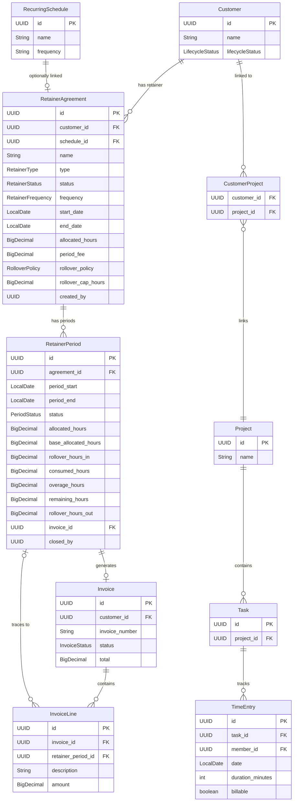
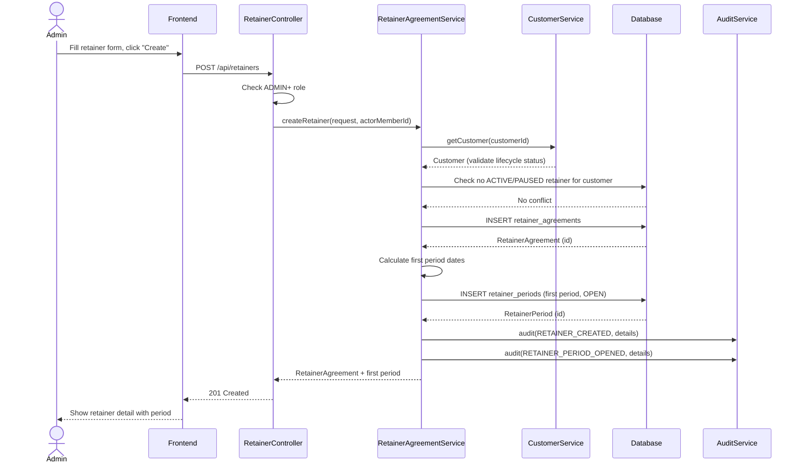
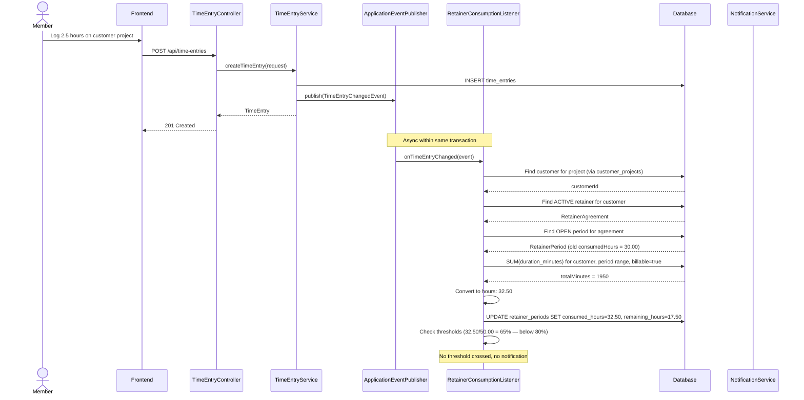
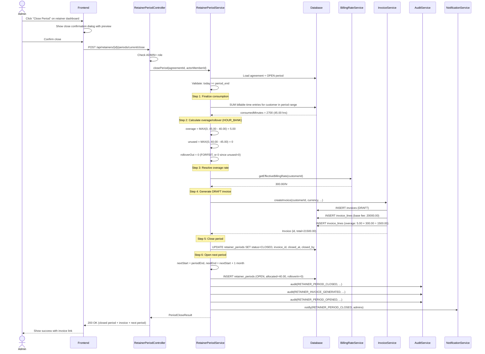

> Standalone architecture document for Phase 17. Referenced from TASKS.md.

# Phase 17 — Retainer Agreements & Billing

---

## 17. Phase 17 — Retainer Agreements & Billing

Phase 17 adds a **retainer management layer** to the DocTeams platform — the ability to establish per-customer retainer agreements with hour bank tracking, period-based billing cycles, rollover policies, and automated draft invoice generation at period close. Retainers are a commercial coordination layer that ties together existing infrastructure: time entries (Phase 5) provide consumption data, the billing rate hierarchy (Phase 8) determines overage pricing, and the invoice system (Phase 10) handles the financial output. No new billing engine is introduced; retainers orchestrate what already exists.

The design introduces two new entities (`RetainerAgreement`, `RetainerPeriod`), extends `InvoiceLine` with a `retainer_period_id` reference for traceability, and integrates with the existing audit (Phase 6), notification (Phase 6.5), and event infrastructure. All additions follow the dedicated-schema-per-tenant model established in Phase 13 — no `tenant_id` columns, no `@Filter`, no multitenancy boilerplate.

**Dependencies on prior phases**:
- **Phase 4** (Customers): `Customer` entity and `CustomerProject` join table. Retainers are scoped to a single customer; consumption is tracked via customer-linked projects.
- **Phase 5** (Task & Time Lifecycle): `TimeEntry` entity. Billable time entries are the source of all consumption data.
- **Phase 6** (Audit & Compliance): `AuditService` and `AuditEventBuilder`. All retainer lifecycle operations are audited.
- **Phase 6.5** (Notifications): `ApplicationEvent` publication and `NotificationService`. Threshold alerts, period-ready, and period-closed notifications use the existing fan-out pipeline.
- **Phase 8** (Rate Cards, Budgets & Profitability): `BillingRate` three-level hierarchy and `OrgSettings` (default currency). Overage is billed at the customer's effective rate from the existing hierarchy.
- **Phase 10** (Invoicing & Billing): `Invoice`, `InvoiceLine`, `InvoiceNumberService`. Period close generates a DRAFT invoice using the existing invoice entity and lifecycle.
- **Phase 16** (Project Templates & Recurring Schedules): `RecurringSchedule` entity. Optional FK from RetainerAgreement for associating auto-created projects with the retainer.

**Phase 16 integration**: RetainerAgreement includes an optional `schedule_id` FK to `RecurringSchedule` (Phase 16). When linked, projects created by the schedule are associated with the retainer for display purposes. For v1, consumption still counts **all** billable time entries across all of the customer's projects — schedule-scoped consumption filtering is a future refinement documented in `requirements/future-retainer-schedule-integration.md`.

### What's New

| Capability | Before Phase 17 | After Phase 17 |
|---|---|---|
| Retainer agreements | -- | Per-customer retainer agreements with hour bank or fixed fee terms |
| Period tracking | -- | Automatic period lifecycle with consumption tracking and rollover |
| Hour bank management | -- | Allocated hours per period, consumed hours from time entries, remaining hours display |
| Rollover policies | -- | FORFEIT, CARRY_FORWARD, CARRY_CAPPED — configurable per agreement |
| Retainer invoicing | Ad-hoc invoices from unbilled time (Phase 10) | Automated DRAFT invoice generation at period close with base fee + overage lines |
| Overage billing | -- | Automatic overage calculation using existing billing rate hierarchy |
| Consumption visibility | -- | Real-time "hours remaining" on retainer, visible during time entry |
| Retainer dashboard | -- | Cross-customer retainer overview with periods-ready-to-close queue |

**Out of scope**: Automated period closing (always admin-triggered, [ADR-072](../adr/ADR-072-admin-triggered-period-close.md)). Multi-currency retainers (uses org default currency). Configurable overage rates ([ADR-073](../adr/ADR-073-standard-billing-rate-for-overage.md)). Mid-period term changes with proration. Retainer-specific profitability reports. Retainer proposals/quotes. Customer portal visibility. Credit notes for unused hours. Retainer renewals with term renegotiation. Schedule-linked consumption (deferred to post-Phase 16).

---

### 17.1 Overview

Phase 17 establishes retainer agreements as a first-class commercial concept in the platform. A retainer is a standing arrangement between the firm and a customer: either an **hour bank** (X hours per period at a base fee, with overage billed separately) or a **fixed fee** ($Z per period regardless of hours). The retainer tracks consumption through billing periods, each of which maps to a configurable frequency (weekly, monthly, quarterly, etc.).

The core workflow:

1. **Admin creates a retainer** for a customer — specifying type, frequency, hours/fee, rollover policy, and start date. The system auto-creates the first period.
2. **Members log time** on the customer's projects as usual. The system automatically recalculates consumed hours on the open period whenever billable time entries change.
3. **Period end date passes** — the dashboard shows the period as "ready to close." Notifications alert admins.
4. **Admin closes the period** — the system finalizes consumption, calculates overage/rollover, generates a DRAFT invoice, and opens the next period.
5. **Admin reviews and approves the invoice** using the standard invoice lifecycle (Phase 10).

The design follows three principles:

- **Admin is always in control.** Period close, invoice generation, and termination require explicit human action. The system informs and recommends but never acts on financial matters autonomously.
- **Consumption is transparent.** Members always know where they stand — how many hours remain, whether they are in overage territory. No surprises at period end.
- **Build on existing infrastructure, do not parallel it.** Invoice generation reuses Phase 10. Rate resolution reuses Phase 8. Time entries come from Phase 5. Retainers are a coordination layer.

---

### 17.2 Domain Model

Phase 17 introduces two new tenant-scoped entities (`RetainerAgreement`, `RetainerPeriod`) and extends the existing `InvoiceLine` entity with a nullable `retainer_period_id` column. All new entities follow the established Phase 13 pattern: plain `@Entity` with UUID primary key, no `@Filter`, no `@FilterDef`, no `tenant_id` column. Schema boundary provides tenant isolation.

#### 17.2.1 RetainerAgreement Entity (New)

A RetainerAgreement represents a commercial arrangement between the firm and a customer — either an hour bank with a per-period allocation and base fee, or a fixed fee per period. A customer can have at most one ACTIVE or PAUSED retainer at a time (enforced at the service layer; see [ADR-075](../adr/ADR-075-one-active-retainer-per-customer.md)).

| Field | Java Type | DB Column | DB Type | Constraints | Notes |
|-------|-----------|-----------|---------|-------------|-------|
| `id` | `UUID` | `id` | `UUID` | PK, default `gen_random_uuid()` | Auto-generated |
| `customerId` | `UUID` | `customer_id` | `UUID` | NOT NULL, FK -> customers | The customer this retainer serves |
| `scheduleId` | `UUID` | `schedule_id` | `UUID` | Nullable, FK -> recurring_schedules | Optional link to a recurring schedule (Phase 16). When linked, projects auto-created by the schedule are associated with the retainer |
| `name` | `String` | `name` | `VARCHAR(300)` | NOT NULL | Display name, e.g., "Monthly Retainer — Acme Corp" |
| `type` | `RetainerType` | `type` | `VARCHAR(20)` | NOT NULL | `HOUR_BANK` or `FIXED_FEE` |
| `status` | `RetainerStatus` | `status` | `VARCHAR(20)` | NOT NULL, default `'ACTIVE'` | `ACTIVE`, `PAUSED`, `TERMINATED` |
| `frequency` | `RetainerFrequency` | `frequency` | `VARCHAR(20)` | NOT NULL | `WEEKLY`, `FORTNIGHTLY`, `MONTHLY`, `QUARTERLY`, `SEMI_ANNUALLY`, `ANNUALLY` |
| `startDate` | `LocalDate` | `start_date` | `DATE` | NOT NULL | First period start date |
| `endDate` | `LocalDate` | `end_date` | `DATE` | Nullable | If set, retainer terminates after this date |
| `allocatedHours` | `BigDecimal` | `allocated_hours` | `DECIMAL(10,2)` | Nullable | Hours per period (HOUR_BANK only) |
| `periodFee` | `BigDecimal` | `period_fee` | `DECIMAL(12,2)` | Nullable | Base fee per period (required for both types) |
| `rolloverPolicy` | `RolloverPolicy` | `rollover_policy` | `VARCHAR(20)` | NOT NULL, default `'FORFEIT'` | `FORFEIT`, `CARRY_FORWARD`, `CARRY_CAPPED` |
| `rolloverCapHours` | `BigDecimal` | `rollover_cap_hours` | `DECIMAL(10,2)` | Nullable | Max carry-forward hours (CARRY_CAPPED only) |
| `notes` | `String` | `notes` | `TEXT` | Nullable | Internal notes about the agreement |
| `createdBy` | `UUID` | `created_by` | `UUID` | NOT NULL | Member who created the agreement |
| `createdAt` | `Instant` | `created_at` | `TIMESTAMPTZ` | NOT NULL | Immutable |
| `updatedAt` | `Instant` | `updated_at` | `TIMESTAMPTZ` | NOT NULL | Updated on mutation |

**Enums**:
- `RetainerType`: `HOUR_BANK`, `FIXED_FEE`
- `RetainerStatus`: `ACTIVE`, `PAUSED`, `TERMINATED`
- `RetainerFrequency`: `WEEKLY`, `FORTNIGHTLY`, `MONTHLY`, `QUARTERLY`, `SEMI_ANNUALLY`, `ANNUALLY`
- `RolloverPolicy`: `FORFEIT`, `CARRY_FORWARD`, `CARRY_CAPPED`

**Validation rules** (service layer):
- If `type = HOUR_BANK`, then `allocatedHours` and `periodFee` are required.
- If `type = FIXED_FEE`, then `periodFee` is required.
- If `rolloverPolicy = CARRY_CAPPED`, then `rolloverCapHours` is required.
- A customer can have at most one retainer with status `ACTIVE` or `PAUSED`. Creating a new retainer for such a customer is rejected.
- Retainers cannot be created for customers with `lifecycleStatus` of `OFFBOARDED` or `PROSPECT`.

**Design decisions**:
- **FK references stored as UUID columns** (not `@ManyToOne` JPA relationships), consistent with the entire codebase. This avoids lazy-loading pitfalls and keeps entities independent.
- **Rollover fields on the agreement** (not a separate config entity) because rollover policy is intrinsic to the retainer terms. A separate entity would add a join for no benefit — there is exactly one rollover config per agreement.
- **Optional `schedule_id` link.** When a retainer is linked to a `RecurringSchedule` (Phase 16), projects auto-created by that schedule are associated with the retainer. However, for v1 **consumption still counts all customer projects** — the schedule link is for display/association purposes and future scope-restricted consumption. This keeps the consumption query simple while establishing the relationship.

#### 17.2.2 RetainerPeriod Entity (New)

A RetainerPeriod tracks a single billing cycle within a retainer agreement — the allocated hours (including rollover), consumed hours, overage, and a reference to the generated invoice. Only one period per agreement can be OPEN at a time (enforced at the service layer).

| Field | Java Type | DB Column | DB Type | Constraints | Notes |
|-------|-----------|-----------|---------|-------------|-------|
| `id` | `UUID` | `id` | `UUID` | PK, default `gen_random_uuid()` | Auto-generated |
| `agreementId` | `UUID` | `agreement_id` | `UUID` | NOT NULL, FK -> retainer_agreements | Parent agreement |
| `periodStart` | `LocalDate` | `period_start` | `DATE` | NOT NULL | Start of the billing period (inclusive) |
| `periodEnd` | `LocalDate` | `period_end` | `DATE` | NOT NULL | End of the billing period (exclusive) |
| `status` | `PeriodStatus` | `status` | `VARCHAR(20)` | NOT NULL, default `'OPEN'` | `OPEN` or `CLOSED` |
| `allocatedHours` | `BigDecimal` | `allocated_hours` | `DECIMAL(10,2)` | Nullable | Total hours for this period INCLUDING rollover (HOUR_BANK only) |
| `baseAllocatedHours` | `BigDecimal` | `base_allocated_hours` | `DECIMAL(10,2)` | Nullable | Agreement's per-period allocation WITHOUT rollover (HOUR_BANK only) |
| `rolloverHoursIn` | `BigDecimal` | `rollover_hours_in` | `DECIMAL(10,2)` | NOT NULL, default `0` | Hours carried forward from previous period |
| `consumedHours` | `BigDecimal` | `consumed_hours` | `DECIMAL(10,2)` | NOT NULL, default `0` | Total billable hours logged against this period |
| `overageHours` | `BigDecimal` | `overage_hours` | `DECIMAL(10,2)` | NOT NULL, default `0` | MAX(0, consumed - allocated). Calculated at close time |
| `remainingHours` | `BigDecimal` | `remaining_hours` | `DECIMAL(10,2)` | NOT NULL, default `0` | MAX(0, allocated - consumed). Recalculated on consumption updates |
| `rolloverHoursOut` | `BigDecimal` | `rollover_hours_out` | `DECIMAL(10,2)` | NOT NULL, default `0` | Hours to carry forward to next period. Calculated at close time |
| `invoiceId` | `UUID` | `invoice_id` | `UUID` | Nullable, FK -> invoices | Invoice generated at period close |
| `closedAt` | `Instant` | `closed_at` | `TIMESTAMPTZ` | Nullable | When the period was closed |
| `closedBy` | `UUID` | `closed_by` | `UUID` | Nullable | Member who closed the period |
| `createdAt` | `Instant` | `created_at` | `TIMESTAMPTZ` | NOT NULL | Immutable |
| `updatedAt` | `Instant` | `updated_at` | `TIMESTAMPTZ` | NOT NULL | Updated on mutation |

**Enums**:
- `PeriodStatus`: `OPEN`, `CLOSED`

**Constraints**:
- `UNIQUE (agreement_id, period_start)` — one period per start date per agreement.
- Only one OPEN period per agreement at a time (service-layer enforcement).

**Design decisions**:
- **Both `allocatedHours` and `baseAllocatedHours` stored** because the total allocation for a period is `base + rollover`, but both numbers are needed for display and audit. Without `baseAllocatedHours`, you would have to subtract `rolloverHoursIn` from `allocatedHours` to show the base — fragile and error-prone.
- **`remainingHours` stored (not purely computed)** because it is updated whenever `consumedHours` changes and read frequently by the time entry form indicator. Storing it avoids recomputation on every read. It is always consistent with `MAX(0, allocatedHours - consumedHours)` because the recalculation method updates both fields atomically.
- **`overageHours` and `rolloverHoursOut` default to 0 and are only populated at close time.** While a period is OPEN, these fields are always 0. This makes the OPEN vs CLOSED semantics clear: OPEN periods have provisional `consumedHours`/`remainingHours`; CLOSED periods have finalized `overageHours`/`rolloverHoursOut`.

#### 17.2.3 InvoiceLine Extension

The existing `InvoiceLine` entity (Phase 10) gains one nullable column for retainer traceability:

| Field | Java Type | DB Column | DB Type | Constraints | Notes |
|-------|-----------|-----------|---------|-------------|-------|
| `retainerPeriodId` | `UUID` | `retainer_period_id` | `UUID` | Nullable, FK -> retainer_periods | Links invoice line to retainer period |

This allows the invoice detail page to show "Generated from retainer: [agreement name], period [start] - [end]" and enables queries like "show all invoice lines generated from retainer periods."

#### 17.2.4 Entity Relationship Diagram



**Consumption data flow**: `TimeEntry` -> `Task` (via `taskId`) -> `Project` (via `projectId`) -> `CustomerProject` (via `projectId`) -> `Customer` (via `customerId`) -> `RetainerAgreement` (via `customerId`) -> `RetainerPeriod` (via `agreementId` + date range). This join path is executed as a single SQL query (see Section 17.3.2).

---

### 17.3 Core Flows and Backend Behaviour

#### 17.3.1 Retainer Creation

When an admin creates a retainer agreement, the system validates the request, persists the agreement, and automatically creates the first period.

**Preconditions**:
- Caller has `ROLE_ORG_ADMIN` or `ROLE_ORG_OWNER`.
- Customer exists and has `lifecycleStatus` in (`ONBOARDING`, `ACTIVE`, `DORMANT`). `OFFBOARDED` and `PROSPECT` customers are rejected.
- Customer does not already have a retainer with status `ACTIVE` or `PAUSED`.
- If `type = HOUR_BANK`, `allocatedHours > 0` and `periodFee > 0`.
- If `type = FIXED_FEE`, `periodFee > 0`.
- If `rolloverPolicy = CARRY_CAPPED`, `rolloverCapHours > 0`.
- `startDate` is not null.

**Flow**:
1. Validate request fields and business rules.
2. Create `RetainerAgreement` entity with status `ACTIVE`.
3. Calculate first period end date from `startDate` and `frequency` (see period date calculation below).
4. Create first `RetainerPeriod`:
   - `periodStart = agreement.startDate`
   - `periodEnd = calculated end date`
   - `status = OPEN`
   - `allocatedHours = agreement.allocatedHours` (for HOUR_BANK)
   - `baseAllocatedHours = agreement.allocatedHours` (for HOUR_BANK)
   - `rolloverHoursIn = 0` (first period has no rollover)
   - `consumedHours = 0`
   - `remainingHours = agreement.allocatedHours` (for HOUR_BANK)
5. Publish `RETAINER_CREATED` audit event.
6. Publish `RETAINER_PERIOD_OPENED` audit event.
7. Return the created agreement with the first period.

**Period date calculation** by frequency:

| Frequency | Period End Calculation |
|---|---|
| `WEEKLY` | `periodStart.plusWeeks(1)` |
| `FORTNIGHTLY` | `periodStart.plusWeeks(2)` |
| `MONTHLY` | `periodStart.plusMonths(1)` |
| `QUARTERLY` | `periodStart.plusMonths(3)` |
| `SEMI_ANNUALLY` | `periodStart.plusMonths(6)` |
| `ANNUALLY` | `periodStart.plusYears(1)` |

Note: `period_end` is exclusive — a monthly period starting 2026-03-01 has `period_end = 2026-04-01`. Time entries on 2026-03-31 count; time entries on 2026-04-01 do not.

**Service signature** (conceptual):

```java
public class RetainerAgreementService {

    public RetainerAgreement createRetainer(CreateRetainerRequest request, UUID actorMemberId) {
        // 1. Validate customer eligibility
        // 2. Check no existing ACTIVE/PAUSED retainer for customer
        // 3. Persist agreement
        // 4. Create first period
        // 5. Publish audit events
        // 6. Return agreement
    }
}
```

#### 17.3.2 Period Consumption Tracking

Consumption is recalculated whenever a billable time entry is created, updated, or deleted for a customer with an active retainer and an OPEN period. The recalculation is **query-based** (not incremental) to ensure consistency regardless of backdating, edits, or deletions. See [ADR-074](../adr/ADR-074-query-based-consumption.md).

**Trigger**: An `ApplicationEvent` is published by `TimeEntryService` when a time entry is created, updated, or deleted. A new `RetainerConsumptionListener` (annotated with `@EventListener`) handles the event.

**Which time entries count**: A time entry counts toward a retainer period if ALL of:
1. The time entry's task belongs to a project linked to the retainer's customer (via `task.projectId` -> `customer_projects.project_id` where `customer_projects.customer_id = retainer.customerId`).
2. The time entry is billable (`billable = true`).
3. The time entry's date falls within the period range (`period_start <= date < period_end`).

**Consumption query** (native SQL for performance):

```sql
SELECT COALESCE(SUM(te.duration_minutes), 0)
FROM time_entries te
  JOIN tasks t ON t.id = te.task_id
  JOIN customer_projects cp ON cp.project_id = t.project_id
WHERE cp.customer_id = :customerId
  AND te.billable = true
  AND te.date >= :periodStart
  AND te.date < :periodEnd
```

The result (in minutes) is converted to hours (`minutes / 60.0`, scale 2, HALF_UP rounding) and written to `consumed_hours`. The `remaining_hours` field is recalculated as `MAX(0, allocated_hours - consumed_hours)`.

**Threshold notifications**: After recalculation, the listener checks consumption percentage for HOUR_BANK retainers:
- If consumed >= 80% of allocated and previously < 80%: publish `RETAINER_APPROACHING_CAPACITY` notification.
- If consumed >= 100% of allocated and previously < 100%: publish `RETAINER_FULLY_CONSUMED` notification.

The "previously" check prevents duplicate notifications — the listener compares the new consumed hours against the old value (passed in the event or read before update).

**Event listener signature** (conceptual):

```java
@Component
public class RetainerConsumptionListener {

    @EventListener
    @Transactional
    public void onTimeEntryChanged(TimeEntryChangedEvent event) {
        // 1. Find customer for the time entry's project
        // 2. Find active retainer for the customer
        // 3. Find open period for the retainer
        // 4. Re-query total consumed minutes
        // 5. Update consumed_hours and remaining_hours
        // 6. Check thresholds, publish notifications if crossed
    }
}
```

**Performance**: The consumption query is scoped to one customer and one date range. With indexes on `customer_projects(customer_id)`, `tasks(project_id)`, and `time_entries(task_id, billable, date)`, this is a sub-millisecond indexed query even with thousands of time entries per period.

#### 17.3.3 Period Close Flow

Period close is the critical financial operation — it finalizes consumption, calculates overage/rollover, generates a DRAFT invoice, and opens the next period. It is always admin-triggered ([ADR-072](../adr/ADR-072-admin-triggered-period-close.md)).

**Preconditions**:
- Caller has `ROLE_ORG_ADMIN` or `ROLE_ORG_OWNER`.
- Period status is `OPEN`.
- Today's date >= `period_end` (period end date has passed). Closing a period before its end date is not permitted — this prevents partial-period invoicing accidents.

**Flow** (executed in a single transaction):

1. **Finalize consumption**: Re-query all billable time entries for the customer within the period date range. Write final `consumed_hours`.
2. **For HOUR_BANK retainers**:
   a. Calculate `overage_hours = MAX(0, consumed_hours - allocated_hours)`.
   b. Calculate `unused_hours = MAX(0, allocated_hours - consumed_hours)`.
   c. Apply rollover policy:
      - `FORFEIT`: `rollover_hours_out = 0`
      - `CARRY_FORWARD`: `rollover_hours_out = unused_hours`
      - `CARRY_CAPPED`: `rollover_hours_out = MIN(unused_hours, agreement.rolloverCapHours)`
   d. Set `remaining_hours = MAX(0, allocated_hours - consumed_hours)` (final value).
   e. Generate DRAFT invoice:
      - **Line 1**: Description = "Retainer — {period_start} to {period_end}", quantity = 1, unit_price = `agreement.periodFee`, amount = `agreement.periodFee`. Set `retainer_period_id` on the invoice line.
      - **Line 2** (only if `overage_hours > 0`): Resolve the customer's effective billing rate from the rate hierarchy (Phase 8). Description = "Overage ({overage_hours} hrs @ {rate}/hr)", quantity = `overage_hours`, unit_price = effective billing rate, amount = `overage_hours * rate`. Set `retainer_period_id` on the invoice line.
3. **For FIXED_FEE retainers**:
   a. Generate DRAFT invoice:
      - **Line 1**: Description = "Retainer — {period_start} to {period_end}", quantity = 1, unit_price = `agreement.periodFee`, amount = `agreement.periodFee`. Set `retainer_period_id` on the invoice line.
4. **Close the period**: Set `status = CLOSED`, `closed_at = Instant.now()`, `closed_by = actorMemberId`, `invoice_id = generated invoice ID`.
5. **Open next period** (if applicable):
   - If agreement status is `ACTIVE` AND (agreement `endDate` is null OR next period start < `endDate`):
     - Calculate `nextPeriodStart = this period's periodEnd`.
     - Calculate `nextPeriodEnd` from frequency.
     - Create new `RetainerPeriod`:
       - `allocated_hours = agreement.allocatedHours + rollover_hours_out` (from closed period)
       - `base_allocated_hours = agreement.allocatedHours`
       - `rollover_hours_in = rollover_hours_out` (from closed period)
       - `remaining_hours = allocated_hours`
       - `status = OPEN`
   - If agreement `endDate` has passed (next period start >= `endDate`):
     - Set agreement `status = TERMINATED`.
     - Publish `RETAINER_TERMINATED` notification.
6. **Publish events**:
   - `RETAINER_PERIOD_CLOSED` audit event (period dates, consumed, overage, rollover, invoice ID).
   - `RETAINER_INVOICE_GENERATED` audit event (invoice ID, line items, total).
   - `RETAINER_PERIOD_OPENED` audit event (if next period was created).
   - `RETAINER_PERIOD_CLOSED` notification to org admins.

**Service signature** (conceptual):

```java
public class RetainerPeriodService {

    @Transactional
    public PeriodCloseResult closePeriod(UUID agreementId, UUID actorMemberId) {
        // 1. Load agreement and open period
        // 2. Validate preconditions (status, date)
        // 3. Finalize consumption
        // 4. Calculate overage/rollover (HOUR_BANK)
        // 5. Generate DRAFT invoice
        // 6. Close period
        // 7. Open next period (if applicable)
        // 8. Publish audit events and notifications
        // 9. Return close result with invoice reference
    }
}
```

**Invoice creation details**:
- `customerId` = agreement's customer ID.
- `currency` = org's default currency from `OrgSettings`.
- `status` = `DRAFT` (always — admin must review and approve separately).
- `customerName`, `customerEmail`, `customerAddress` = snapshot from Customer entity at close time.
- `orgName` = from org context.
- `createdBy` = the member who triggered the close.
- The invoice follows the standard lifecycle: DRAFT -> APPROVED -> SENT -> PAID. No special handling beyond creation.

#### 17.3.4 Rollover Logic

Rollover determines how unused hours from a closed period carry forward to the next period. Three policies are supported:

| Policy | Behaviour | Use Case |
|---|---|---|
| `FORFEIT` | `rollover_hours_out = 0`. Unused hours are lost. | Default. Simple billing — each period stands alone. |
| `CARRY_FORWARD` | `rollover_hours_out = unused_hours`. All unused hours carry forward indefinitely. | Client-friendly agreements where unused hours accumulate. |
| `CARRY_CAPPED` | `rollover_hours_out = MIN(unused_hours, agreement.rolloverCapHours)`. Carry forward up to a configurable maximum. | Balanced approach — limits liability while rewarding consistent customers. |

**Edge cases**:
- **First period**: `rollover_hours_in = 0` always. There is no prior period to roll from.
- **Final period** (agreement terminates): `rollover_hours_out` is calculated but there is no next period to receive it. The hours are effectively forfeited. The close result includes the rollover amount for informational purposes.
- **Paused retainer**: When a retainer is paused, the open period remains. If the period end date passes while paused, it still shows as "ready to close." The admin can close it. Rollover from a closed period during pause is held — when the retainer is resumed and the next period is opened (at the next close), the rollover is applied.
- **Zero consumption**: If no billable time was logged, `consumed_hours = 0`, `unused_hours = allocated_hours`, and the full allocation (up to cap) rolls forward.
- **Over-consumption with rollover**: If `consumed_hours > allocated_hours`, there is overage AND zero rollover. `unused_hours = 0`, so `rollover_hours_out = 0` regardless of policy.

#### 17.3.5 Retainer Lifecycle State Transitions

```
         create
           │
           v
       ┌─────────┐    pause()     ┌─────────┐
       │  ACTIVE  │──────────────>│  PAUSED  │
       │         │<──────────────│         │
       └─────────┘   resume()     └─────────┘
           │                          │
           │ terminate()              │ terminate()
           v                          v
       ┌──────────────┐
       │  TERMINATED  │  (terminal — no transitions out)
       └──────────────┘
```

**State behaviours**:

| State | New Periods | Consumption Tracking | Period Close | Can Edit Terms |
|---|---|---|---|---|
| `ACTIVE` | Yes (auto-created at close) | Yes | Yes | Yes (next period) |
| `PAUSED` | No (hold) | Yes (open period still accumulates) | Yes (can close overdue period) | Yes (next period) |
| `TERMINATED` | No | Yes (final open period still accumulates) | Yes (final close) | No |

**Transition rules**:
- `pause()`: Only from `ACTIVE`. Sets status to `PAUSED`. Does not close the current period or create a new one. The open period continues to accumulate time. Publish `RETAINER_PAUSED` audit event.
- `resume()`: Only from `PAUSED`. Sets status to `ACTIVE`. If no OPEN period exists (it was closed while paused), no new period is opened until the next close triggers it. Publish `RETAINER_RESUMED` audit event.
- `terminate()`: From `ACTIVE` or `PAUSED`. Sets status to `TERMINATED`. The current OPEN period (if any) can still be closed as a final period, but no next period is created. Publish `RETAINER_TERMINATED` audit event and notification.

**Service signatures** (conceptual):

```java
public class RetainerAgreementService {

    public RetainerAgreement pauseRetainer(UUID id, UUID actorMemberId) { ... }
    public RetainerAgreement resumeRetainer(UUID id, UUID actorMemberId) { ... }
    public RetainerAgreement terminateRetainer(UUID id, UUID actorMemberId) { ... }
    public RetainerAgreement updateRetainer(UUID id, UpdateRetainerRequest request, UUID actorMemberId) { ... }
}
```

#### 17.3.6 Overage Rate Resolution

Overage hours (HOUR_BANK retainers only) are billed at the customer's effective billing rate from the existing rate card hierarchy ([ADR-073](../adr/ADR-073-standard-billing-rate-for-overage.md), [ADR-039](../adr/ADR-039-rate-resolution-hierarchy.md)).

The existing `BillingRateService.resolveRate(memberId, projectId, date)` resolves rates in three levels: PROJECT_OVERRIDE → CUSTOMER_OVERRIDE → MEMBER_DEFAULT. For retainer overage, there is no single project or member — the overage covers all customer work across the period. The resolution for overage therefore uses a **simplified two-level lookup**:

1. **Customer-level billing rate** (`CUSTOMER_OVERRIDE`) — a `BillingRate` with `customerId = retainer.customerId` and no `projectId`. This is the rate the firm charges this specific customer.
2. **Org default billing rate** (`MEMBER_DEFAULT` with no member/project/customer scope) — the org-wide fallback rate from `OrgSettings.defaultBillingRate`.

> **Why skip project-level rates?** Overage is a customer-level concept — the customer has consumed more hours than their retainer allocates across *all* projects. Picking a single project's rate would be arbitrary and inconsistent. The customer-level rate (if configured) is the appropriate billing rate for a customer-scoped line item. This may require a new method on `BillingRateService` (e.g., `resolveCustomerRate(customerId, date)`) or direct repository queries.

The rate is resolved **at period close time**, not at time entry creation. This means rate changes during a period affect the overage calculation for the entire period. This is intentional — professional services firms bill at current published rates.

If no billing rate can be resolved (no customer rate, no org default), the period close is rejected with a clear error: "Cannot calculate overage — no billing rate configured for customer [name] or org default." The admin must configure a rate before closing.

The resolved rate is stored on the overage invoice line (`unit_price`) for permanent auditability, independent of future rate changes.

#### 17.3.7 Consumption Threshold Notifications

For HOUR_BANK retainers, the system sends notifications when consumption crosses predefined thresholds:

| Threshold | Notification Type | Recipients | Message |
|---|---|---|---|
| 80% consumed | `RETAINER_APPROACHING_CAPACITY` | Org admins/owners | "Retainer for [Customer] is at [N]% capacity — [X] hours remaining" |
| 100% consumed | `RETAINER_FULLY_CONSUMED` | Org admins/owners | "Retainer for [Customer] is fully consumed — further time will be billed as overage" |

**Implementation**: The `RetainerConsumptionListener` checks thresholds after every recalculation. To prevent duplicate notifications, a simple approach is used: the listener compares the old `consumedHours` value (before update) against the new value. If the old value was below the threshold and the new value is at or above it, the notification fires. If the old value was already at or above the threshold, no notification is sent.

Thresholds are hardcoded at 80% and 100% for v1. Configurable thresholds per retainer are a future enhancement.

FIXED_FEE retainers do not have consumption thresholds — there is no allocation to compare against.

#### 17.3.8 Period Ready to Close Detection

A period is "ready to close" when:
- `period.status = OPEN`
- `LocalDate.now() >= period.periodEnd`

This is a simple date comparison, not a scheduled job. The dashboard queries for all periods matching these criteria. The query is:

```sql
SELECT rp.*, ra.name as agreement_name, ra.customer_id, c.name as customer_name
FROM retainer_periods rp
  JOIN retainer_agreements ra ON ra.id = rp.agreement_id
  JOIN customers c ON c.id = ra.customer_id
WHERE rp.status = 'OPEN'
  AND rp.period_end <= CURRENT_DATE
ORDER BY rp.period_end ASC
```

The result is sorted by `period_end` ascending — the most overdue periods appear first.

A `RETAINER_PERIOD_READY_TO_CLOSE` notification is sent to org admins when a period first becomes ready to close. This is detected by a lightweight check that can run on any API request to the retainer dashboard, or as an optional daily check (reusing the existing daily scheduler pattern from ADR-071 if available). For v1, the notification is triggered when an admin loads the retainer dashboard and the system detects unclosed overdue periods that have not yet been notified.

#### 17.3.9 Permission Model

| Operation | Owner | Admin | Member |
|---|---|---|---|
| Create retainer agreement | Yes | Yes | No |
| Update retainer terms | Yes | Yes | No |
| Pause / Resume / Terminate retainer | Yes | Yes | No |
| Close period (generate invoice) | Yes | Yes | No |
| View retainer dashboard | Yes | Yes | No |
| View retainer status on customer detail | Yes | Yes | Yes |
| View retainer summary (time entry indicator) | Yes | Yes | Yes |
| View period history | Yes | Yes | Yes |

Members can view retainer status so they can see "hours remaining" before logging time. All write operations are admin/owner only because retainers are commercial arrangements with direct financial impact.

---

### 17.4 API Surface

All endpoints require a valid Clerk JWT with org context. Tenant scoping is automatic via the dedicated schema (TenantFilter).

#### 17.4.1 Retainer Agreements

| Method | Path | Description | Auth | R/W |
|---|---|---|---|---|
| `GET` | `/api/retainers` | List retainer agreements | ADMIN+ | Read |
| `GET` | `/api/retainers/{id}` | Get agreement with current period | MEMBER+ | Read |
| `POST` | `/api/retainers` | Create retainer agreement | ADMIN+ | Write |
| `PUT` | `/api/retainers/{id}` | Update agreement terms | ADMIN+ | Write |
| `POST` | `/api/retainers/{id}/pause` | Pause an active retainer | ADMIN+ | Write |
| `POST` | `/api/retainers/{id}/resume` | Resume a paused retainer | ADMIN+ | Write |
| `POST` | `/api/retainers/{id}/terminate` | Terminate a retainer | ADMIN+ | Write |

**`GET /api/retainers`**

Query parameters:
- `status` (optional): Filter by `ACTIVE`, `PAUSED`, `TERMINATED`.
- `customerId` (optional): Filter by customer UUID.

Response:
```json
{
  "content": [
    {
      "id": "uuid",
      "customerId": "uuid",
      "scheduleId": null,
      "customerName": "Acme Corp",
      "name": "Monthly Retainer — Acme Corp",
      "type": "HOUR_BANK",
      "status": "ACTIVE",
      "frequency": "MONTHLY",
      "startDate": "2026-01-01",
      "endDate": null,
      "allocatedHours": 40.00,
      "periodFee": 20000.00,
      "rolloverPolicy": "CARRY_CAPPED",
      "rolloverCapHours": 20.00,
      "currentPeriod": {
        "id": "uuid",
        "periodStart": "2026-03-01",
        "periodEnd": "2026-04-01",
        "status": "OPEN",
        "allocatedHours": 50.00,
        "consumedHours": 32.50,
        "remainingHours": 17.50,
        "rolloverHoursIn": 10.00,
        "readyToClose": false
      },
      "createdAt": "2026-01-01T00:00:00Z"
    }
  ]
}
```

**`GET /api/retainers/{id}`**

Response: Same as list item, plus full agreement fields (`notes`, `createdBy`) and recent period history (last 6 periods).

```json
{
  "id": "uuid",
  "customerId": "uuid",
  "scheduleId": null,
  "customerName": "Acme Corp",
  "name": "Monthly Retainer — Acme Corp",
  "type": "HOUR_BANK",
  "status": "ACTIVE",
  "frequency": "MONTHLY",
  "startDate": "2026-01-01",
  "endDate": null,
  "allocatedHours": 40.00,
  "periodFee": 20000.00,
  "rolloverPolicy": "CARRY_CAPPED",
  "rolloverCapHours": 20.00,
  "notes": "Standard monthly retainer. Reviewed quarterly.",
  "createdBy": "uuid",
  "currentPeriod": { ... },
  "recentPeriods": [
    {
      "id": "uuid",
      "periodStart": "2026-02-01",
      "periodEnd": "2026-03-01",
      "status": "CLOSED",
      "allocatedHours": 40.00,
      "baseAllocatedHours": 40.00,
      "rolloverHoursIn": 0,
      "consumedHours": 30.00,
      "overageHours": 0,
      "remainingHours": 10.00,
      "rolloverHoursOut": 10.00,
      "invoiceId": "uuid",
      "closedAt": "2026-03-02T10:00:00Z",
      "closedBy": "uuid"
    }
  ],
  "createdAt": "2026-01-01T00:00:00Z",
  "updatedAt": "2026-01-01T00:00:00Z"
}
```

**`POST /api/retainers`**

Request:
```json
{
  "customerId": "uuid",
  "scheduleId": null,
  "name": "Monthly Retainer — Acme Corp",
  "type": "HOUR_BANK",
  "frequency": "MONTHLY",
  "startDate": "2026-03-01",
  "endDate": null,
  "allocatedHours": 40.00,
  "periodFee": 20000.00,
  "rolloverPolicy": "CARRY_CAPPED",
  "rolloverCapHours": 20.00,
  "notes": "Standard monthly retainer"
}
```

Response: 201 Created with the full agreement object (same as GET detail), including the auto-created first period.

Validation errors return 400 with ProblemDetail (RFC 9457) including field-level errors.

**`PUT /api/retainers/{id}`**

Request:
```json
{
  "name": "Updated Retainer Name",
  "allocatedHours": 50.00,
  "periodFee": 25000.00,
  "rolloverPolicy": "CARRY_FORWARD",
  "rolloverCapHours": null,
  "endDate": "2026-12-31",
  "notes": "Increased allocation per Q2 review"
}
```

Fields that can be updated: `name`, `allocatedHours`, `periodFee`, `rolloverPolicy`, `rolloverCapHours`, `endDate`, `notes`. Changes take effect on the **next** period — the current open period is not retroactively adjusted. `type`, `frequency`, `startDate`, and `customerId` are immutable after creation.

Response: 200 OK with updated agreement.

**`POST /api/retainers/{id}/pause`**

Request: Empty body (or optional `{ "reason": "..." }` for audit notes).

Response: 200 OK with updated agreement (status = PAUSED).

**`POST /api/retainers/{id}/resume`**

Request: Empty body.

Response: 200 OK with updated agreement (status = ACTIVE).

**`POST /api/retainers/{id}/terminate`**

Request: Empty body (or optional `{ "reason": "..." }` for audit notes).

Response: 200 OK with updated agreement (status = TERMINATED).

#### 17.4.2 Retainer Periods

| Method | Path | Description | Auth | R/W |
|---|---|---|---|---|
| `GET` | `/api/retainers/{id}/periods` | List all periods for an agreement | MEMBER+ | Read |
| `GET` | `/api/retainers/{id}/periods/current` | Get current open period with live consumption | MEMBER+ | Read |
| `POST` | `/api/retainers/{id}/periods/current/close` | Close current period | ADMIN+ | Write |

**`GET /api/retainers/{id}/periods`**

Query parameters:
- `page` (default 0), `size` (default 20): Pagination.

Response: Paginated list of periods, most recent first.

```json
{
  "content": [
    {
      "id": "uuid",
      "periodStart": "2026-03-01",
      "periodEnd": "2026-04-01",
      "status": "OPEN",
      "allocatedHours": 50.00,
      "baseAllocatedHours": 40.00,
      "rolloverHoursIn": 10.00,
      "consumedHours": 32.50,
      "overageHours": 0,
      "remainingHours": 17.50,
      "rolloverHoursOut": 0,
      "invoiceId": null,
      "closedAt": null,
      "closedBy": null
    }
  ],
  "page": { "number": 0, "size": 20, "totalElements": 3, "totalPages": 1 }
}
```

**`GET /api/retainers/{id}/periods/current`**

Response: The single OPEN period with live `consumedHours` and `remainingHours`. Returns 404 if no OPEN period exists.

**`POST /api/retainers/{id}/periods/current/close`**

Request: Empty body.

Response:
```json
{
  "closedPeriod": {
    "id": "uuid",
    "periodStart": "2026-02-01",
    "periodEnd": "2026-03-01",
    "status": "CLOSED",
    "allocatedHours": 40.00,
    "consumedHours": 45.00,
    "overageHours": 5.00,
    "rolloverHoursOut": 0,
    "invoiceId": "uuid",
    "closedAt": "2026-03-02T10:30:00Z",
    "closedBy": "uuid"
  },
  "generatedInvoice": {
    "id": "uuid",
    "invoiceNumber": null,
    "status": "DRAFT",
    "total": 21500.00,
    "lines": [
      {
        "description": "Retainer — 2026-02-01 to 2026-03-01",
        "quantity": 1,
        "unitPrice": 20000.00,
        "amount": 20000.00
      },
      {
        "description": "Overage (5.00 hrs @ 300.00/hr)",
        "quantity": 5.00,
        "unitPrice": 300.00,
        "amount": 1500.00
      }
    ]
  },
  "nextPeriod": {
    "id": "uuid",
    "periodStart": "2026-03-01",
    "periodEnd": "2026-04-01",
    "status": "OPEN",
    "allocatedHours": 40.00,
    "rolloverHoursIn": 0
  }
}
```

Error cases:
- 400: Period not ready to close (end date not reached).
- 400: No billing rate configured for overage calculation (HOUR_BANK with overage).
- 404: No open period found.
- 403: Caller is not admin/owner.

#### 17.4.3 Customer Retainer Summary

| Method | Path | Description | Auth | R/W |
|---|---|---|---|---|
| `GET` | `/api/customers/{customerId}/retainer-summary` | Lightweight retainer status for UI indicators | MEMBER+ | Read |

**`GET /api/customers/{customerId}/retainer-summary`**

A lightweight endpoint for the time entry form and project list indicators. Returns minimal data to avoid over-fetching.

Response (when customer has an active retainer with an open HOUR_BANK period):
```json
{
  "hasActiveRetainer": true,
  "agreementId": "uuid",
  "agreementName": "Monthly Retainer — Acme Corp",
  "type": "HOUR_BANK",
  "allocatedHours": 50.00,
  "consumedHours": 42.50,
  "remainingHours": 7.50,
  "percentConsumed": 85.0,
  "isOverage": false
}
```

Response (when customer has an active FIXED_FEE retainer):
```json
{
  "hasActiveRetainer": true,
  "agreementId": "uuid",
  "agreementName": "Monthly Fixed Fee — Beta Inc",
  "type": "FIXED_FEE",
  "consumedHours": 28.00,
  "percentConsumed": null,
  "isOverage": false
}
```

Response (when customer has no active retainer):
```json
{
  "hasActiveRetainer": false
}
```

---

### 17.5 Sequence Diagrams

#### 17.5.1 Create Retainer Agreement



#### 17.5.2 Time Entry Created — Consumption Recalculation



#### 17.5.3 Admin Closes Period (Invoice Generation + Next Period)



---

### 17.6 Notification & Audit Integration

#### 17.6.1 Notification Types

| Notification Type | Trigger | Recipients | Payload |
|---|---|---|---|
| `RETAINER_PERIOD_READY_TO_CLOSE` | Period end date passes while period is OPEN | Org admins/owners | agreementName, customerName, periodStart, periodEnd, consumedHours, allocatedHours |
| `RETAINER_PERIOD_CLOSED` | Admin closes a period | Org admins/owners | agreementName, customerName, periodStart, periodEnd, consumedHours, overageHours, invoiceId |
| `RETAINER_APPROACHING_CAPACITY` | HOUR_BANK consumption crosses 80% threshold | Org admins/owners | agreementName, customerName, consumedHours, allocatedHours, remainingHours, percentConsumed |
| `RETAINER_FULLY_CONSUMED` | HOUR_BANK consumption crosses 100% threshold | Org admins/owners | agreementName, customerName, consumedHours, allocatedHours |
| `RETAINER_TERMINATED` | Admin terminates a retainer (or auto-terminated at end date) | Org admins/owners | agreementName, customerName, terminatedBy, reason |

All notifications use the existing `NotificationService.notify()` pattern from Phase 6.5. Recipients are determined by org role (admins and owners), not by project membership. Retainer notifications are always org-scoped because retainers are commercial arrangements.

#### 17.6.2 Audit Event Types

| Event Type | When | JSONB Details |
|---|---|---|
| `RETAINER_CREATED` | New retainer agreement created | `{ agreementId, customerId, customerName, name, type, frequency, allocatedHours, periodFee, rolloverPolicy }` |
| `RETAINER_UPDATED` | Agreement terms modified | `{ agreementId, changes: { field: { old, new } } }` |
| `RETAINER_PAUSED` | Retainer paused | `{ agreementId, customerId, customerName, reason }` |
| `RETAINER_RESUMED` | Retainer resumed | `{ agreementId, customerId, customerName }` |
| `RETAINER_TERMINATED` | Retainer terminated | `{ agreementId, customerId, customerName, finalPeriodStatus, reason }` |
| `RETAINER_PERIOD_CLOSED` | Period finalized | `{ periodId, agreementId, periodStart, periodEnd, consumedHours, allocatedHours, overageHours, rolloverHoursOut, invoiceId, invoiceTotal }` |
| `RETAINER_PERIOD_OPENED` | New period created | `{ periodId, agreementId, periodStart, periodEnd, allocatedHours, baseAllocatedHours, rolloverHoursIn }` |
| `RETAINER_INVOICE_GENERATED` | Invoice generated from period close | `{ invoiceId, agreementId, periodId, lineItems: [{ description, quantity, unitPrice, amount }], total }` |

All audit events use the existing `AuditEventBuilder` pattern from Phase 6. The `entityType` for retainer events is `"RETAINER_AGREEMENT"` or `"RETAINER_PERIOD"` depending on the primary entity affected. The `entityId` is the agreement or period UUID.

---

### 17.7 Database Migrations

**Migration V31** — `V31__create_retainer_tables.sql`

This migration creates the `retainer_agreements` and `retainer_periods` tables and adds the `retainer_period_id` column to `invoice_lines`. All tables are created in the tenant schema only.

```sql
-- V31__create_retainer_tables.sql
-- Phase 17: Retainer Agreements & Billing

-- 1. RetainerAgreement
CREATE TABLE IF NOT EXISTS retainer_agreements (
    id              UUID PRIMARY KEY DEFAULT gen_random_uuid(),
    customer_id     UUID NOT NULL REFERENCES customers(id),
    schedule_id     UUID REFERENCES recurring_schedules(id),
    name            VARCHAR(300) NOT NULL,
    type            VARCHAR(20) NOT NULL,
    status          VARCHAR(20) NOT NULL DEFAULT 'ACTIVE',
    frequency       VARCHAR(20) NOT NULL,
    start_date      DATE NOT NULL,
    end_date        DATE,
    allocated_hours DECIMAL(10,2),
    period_fee      DECIMAL(12,2),
    rollover_policy VARCHAR(20) NOT NULL DEFAULT 'FORFEIT',
    rollover_cap_hours DECIMAL(10,2),
    notes           TEXT,
    created_by      UUID NOT NULL,
    created_at      TIMESTAMPTZ NOT NULL DEFAULT now(),
    updated_at      TIMESTAMPTZ NOT NULL DEFAULT now(),

    CONSTRAINT chk_retainer_type CHECK (type IN ('HOUR_BANK', 'FIXED_FEE')),
    CONSTRAINT chk_retainer_status CHECK (status IN ('ACTIVE', 'PAUSED', 'TERMINATED')),
    CONSTRAINT chk_retainer_frequency CHECK (frequency IN (
        'WEEKLY', 'FORTNIGHTLY', 'MONTHLY', 'QUARTERLY', 'SEMI_ANNUALLY', 'ANNUALLY'
    )),
    CONSTRAINT chk_rollover_policy CHECK (rollover_policy IN ('FORFEIT', 'CARRY_FORWARD', 'CARRY_CAPPED'))
);

CREATE INDEX IF NOT EXISTS idx_retainer_agreements_customer_id ON retainer_agreements(customer_id);
CREATE INDEX IF NOT EXISTS idx_retainer_agreements_status ON retainer_agreements(status);

-- 2. RetainerPeriod
CREATE TABLE IF NOT EXISTS retainer_periods (
    id                   UUID PRIMARY KEY DEFAULT gen_random_uuid(),
    agreement_id         UUID NOT NULL REFERENCES retainer_agreements(id),
    period_start         DATE NOT NULL,
    period_end           DATE NOT NULL,
    status               VARCHAR(20) NOT NULL DEFAULT 'OPEN',
    allocated_hours      DECIMAL(10,2),
    base_allocated_hours DECIMAL(10,2),
    rollover_hours_in    DECIMAL(10,2) NOT NULL DEFAULT 0,
    consumed_hours       DECIMAL(10,2) NOT NULL DEFAULT 0,
    overage_hours        DECIMAL(10,2) NOT NULL DEFAULT 0,
    remaining_hours      DECIMAL(10,2) NOT NULL DEFAULT 0,
    rollover_hours_out   DECIMAL(10,2) NOT NULL DEFAULT 0,
    invoice_id           UUID REFERENCES invoices(id),
    closed_at            TIMESTAMPTZ,
    closed_by            UUID,
    created_at           TIMESTAMPTZ NOT NULL DEFAULT now(),
    updated_at           TIMESTAMPTZ NOT NULL DEFAULT now(),

    CONSTRAINT chk_period_status CHECK (status IN ('OPEN', 'CLOSED')),
    CONSTRAINT uq_retainer_period_start UNIQUE (agreement_id, period_start)
);

CREATE INDEX IF NOT EXISTS idx_retainer_periods_agreement_id ON retainer_periods(agreement_id);
CREATE INDEX IF NOT EXISTS idx_retainer_periods_status ON retainer_periods(status);
CREATE INDEX IF NOT EXISTS idx_retainer_periods_invoice_id ON retainer_periods(invoice_id);

-- 3. Add retainer_period_id to invoice_lines for traceability
ALTER TABLE invoice_lines
    ADD COLUMN IF NOT EXISTS retainer_period_id UUID REFERENCES retainer_periods(id);

CREATE INDEX IF NOT EXISTS idx_invoice_lines_retainer_period_id
    ON invoice_lines(retainer_period_id) WHERE retainer_period_id IS NOT NULL;
```

**Key index decisions**:
- `idx_retainer_agreements_customer_id`: Supports lookup of retainer by customer (the most common query path — from time entry to retainer via customer).
- `idx_retainer_agreements_status`: Supports dashboard filter by status.
- `idx_retainer_periods_agreement_id`: Supports period list for an agreement.
- `idx_retainer_periods_status`: Supports "ready to close" dashboard query (all OPEN periods).
- `idx_retainer_periods_invoice_id`: Supports reverse lookup from invoice to period.
- `idx_invoice_lines_retainer_period_id`: Partial index (WHERE NOT NULL) — supports traceability queries without penalizing the majority of invoice lines that have no retainer link.

---

### 17.8 Implementation Guidance

#### 17.8.1 Backend Changes

| File | Package | Description |
|---|---|---|
| `RetainerAgreement.java` | `retainer/` | Entity — retainer agreement with lifecycle methods |
| `RetainerPeriod.java` | `retainer/` | Entity — period with consumption update methods |
| `RetainerType.java` | `retainer/` | Enum: `HOUR_BANK`, `FIXED_FEE` |
| `RetainerStatus.java` | `retainer/` | Enum: `ACTIVE`, `PAUSED`, `TERMINATED` |
| `RetainerFrequency.java` | `retainer/` | Enum with `calculateNextEnd(LocalDate start)` method |
| `RolloverPolicy.java` | `retainer/` | Enum: `FORFEIT`, `CARRY_FORWARD`, `CARRY_CAPPED` |
| `PeriodStatus.java` | `retainer/` | Enum: `OPEN`, `CLOSED` |
| `RetainerAgreementRepository.java` | `retainer/` | `JpaRepository<RetainerAgreement, UUID>` + custom queries |
| `RetainerPeriodRepository.java` | `retainer/` | `JpaRepository<RetainerPeriod, UUID>` + custom queries |
| `RetainerAgreementService.java` | `retainer/` | CRUD, lifecycle transitions, validation |
| `RetainerPeriodService.java` | `retainer/` | Period close flow, consumption recalculation, invoice generation |
| `RetainerConsumptionListener.java` | `retainer/` | `@EventListener` for time entry changes |
| `RetainerAgreementController.java` | `retainer/` | REST endpoints for agreements |
| `RetainerPeriodController.java` | `retainer/` | REST endpoints for periods |
| `RetainerSummaryController.java` | `retainer/` | Customer retainer summary endpoint |
| `CreateRetainerRequest.java` | `retainer/` | DTO record for POST /api/retainers |
| `UpdateRetainerRequest.java` | `retainer/` | DTO record for PUT /api/retainers/{id} |
| `RetainerResponse.java` | `retainer/` | DTO record for agreement responses |
| `PeriodResponse.java` | `retainer/` | DTO record for period responses |
| `PeriodCloseResult.java` | `retainer/` | DTO record for close response |
| `RetainerSummaryResponse.java` | `retainer/` | DTO record for customer summary |
| `TimeEntryChangedEvent.java` | `event/` | New domain event (or extend existing) |
| `InvoiceLine.java` (modify) | `invoice/` | Add `retainerPeriodId` field |
| `V31__create_retainer_tables.sql` | `db/migration/tenant/` | Migration |

**Existing files modified**:
- `DomainEvent.java` — add `TimeEntryChangedEvent` to the sealed interface `permits` list (if not already present for another purpose).
- `TimeEntryService.java` — publish `TimeEntryChangedEvent` on create/update/delete.
- `InvoiceLine.java` — add `retainerPeriodId` field (nullable UUID).

#### 17.8.2 Frontend Changes

| File / Route | Description |
|---|---|
| `app/(app)/org/[slug]/retainers/page.tsx` | Retainer dashboard page |
| `app/(app)/org/[slug]/retainers/[id]/page.tsx` | Retainer detail page |
| `components/retainers/retainer-list.tsx` | Retainer table with status filters |
| `components/retainers/retainer-summary-cards.tsx` | Dashboard summary cards (active count, ready to close, overage total) |
| `components/retainers/create-retainer-dialog.tsx` | Create retainer form dialog |
| `components/retainers/edit-retainer-dialog.tsx` | Edit retainer terms dialog |
| `components/retainers/close-period-dialog.tsx` | Close period confirmation with invoice preview |
| `components/retainers/period-history-table.tsx` | Period history with rollover/overage data |
| `components/retainers/retainer-progress.tsx` | Hour bank progress bar/indicator |
| `components/retainers/retainer-status-badge.tsx` | Status badge (Active/Paused/Terminated) |
| `components/customers/customer-retainer-tab.tsx` | Retainer tab on customer detail page |
| `components/time-entries/retainer-indicator.tsx` | "X hrs remaining" indicator near time entry form |
| `lib/api/retainers.ts` | API client functions for retainer endpoints |
| Sidebar navigation | Add "Retainers" nav item |

#### 17.8.3 Entity Code Pattern

Following the established codebase pattern (Phase 13 — no multitenancy boilerplate):

```java
package io.b2mash.b2b.b2bstrawman.retainer;

import jakarta.persistence.Column;
import jakarta.persistence.Entity;
import jakarta.persistence.EnumType;
import jakarta.persistence.Enumerated;
import jakarta.persistence.GeneratedValue;
import jakarta.persistence.GenerationType;
import jakarta.persistence.Id;
import jakarta.persistence.Table;
import java.math.BigDecimal;
import java.time.Instant;
import java.time.LocalDate;
import java.util.UUID;

@Entity
@Table(name = "retainer_agreements")
public class RetainerAgreement {

  @Id
  @GeneratedValue(strategy = GenerationType.UUID)
  private UUID id;

  @Column(name = "customer_id", nullable = false)
  private UUID customerId;

  @Column(name = "schedule_id")
  private UUID scheduleId;

  @Column(name = "name", nullable = false, length = 300)
  private String name;

  @Enumerated(EnumType.STRING)
  @Column(name = "type", nullable = false, length = 20)
  private RetainerType type;

  @Enumerated(EnumType.STRING)
  @Column(name = "status", nullable = false, length = 20)
  private RetainerStatus status;

  @Enumerated(EnumType.STRING)
  @Column(name = "frequency", nullable = false, length = 20)
  private RetainerFrequency frequency;

  @Column(name = "start_date", nullable = false)
  private LocalDate startDate;

  @Column(name = "end_date")
  private LocalDate endDate;

  @Column(name = "allocated_hours", precision = 10, scale = 2)
  private BigDecimal allocatedHours;

  @Column(name = "period_fee", precision = 12, scale = 2)
  private BigDecimal periodFee;

  @Enumerated(EnumType.STRING)
  @Column(name = "rollover_policy", nullable = false, length = 20)
  private RolloverPolicy rolloverPolicy;

  @Column(name = "rollover_cap_hours", precision = 10, scale = 2)
  private BigDecimal rolloverCapHours;

  @Column(name = "notes", columnDefinition = "TEXT")
  private String notes;

  @Column(name = "created_by", nullable = false)
  private UUID createdBy;

  @Column(name = "created_at", nullable = false, updatable = false)
  private Instant createdAt;

  @Column(name = "updated_at", nullable = false)
  private Instant updatedAt;

  protected RetainerAgreement() {}

  public RetainerAgreement(
      UUID customerId,
      String name,
      RetainerType type,
      RetainerFrequency frequency,
      LocalDate startDate,
      LocalDate endDate,
      BigDecimal allocatedHours,
      BigDecimal periodFee,
      RolloverPolicy rolloverPolicy,
      BigDecimal rolloverCapHours,
      String notes,
      UUID createdBy) {
    this.customerId = customerId;
    this.name = name;
    this.type = type;
    this.status = RetainerStatus.ACTIVE;
    this.frequency = frequency;
    this.startDate = startDate;
    this.endDate = endDate;
    this.allocatedHours = allocatedHours;
    this.periodFee = periodFee;
    this.rolloverPolicy = rolloverPolicy != null ? rolloverPolicy : RolloverPolicy.FORFEIT;
    this.rolloverCapHours = rolloverCapHours;
    this.notes = notes;
    this.createdBy = createdBy;
    this.createdAt = Instant.now();
    this.updatedAt = Instant.now();
  }

  public void pause() {
    if (this.status != RetainerStatus.ACTIVE) {
      throw new IllegalStateException("Only active retainers can be paused");
    }
    this.status = RetainerStatus.PAUSED;
    this.updatedAt = Instant.now();
  }

  public void resume() {
    if (this.status != RetainerStatus.PAUSED) {
      throw new IllegalStateException("Only paused retainers can be resumed");
    }
    this.status = RetainerStatus.ACTIVE;
    this.updatedAt = Instant.now();
  }

  public void terminate() {
    if (this.status == RetainerStatus.TERMINATED) {
      throw new IllegalStateException("Retainer is already terminated");
    }
    this.status = RetainerStatus.TERMINATED;
    this.updatedAt = Instant.now();
  }

  public void updateTerms(
      String name,
      BigDecimal allocatedHours,
      BigDecimal periodFee,
      RolloverPolicy rolloverPolicy,
      BigDecimal rolloverCapHours,
      LocalDate endDate,
      String notes) {
    this.name = name;
    this.allocatedHours = allocatedHours;
    this.periodFee = periodFee;
    this.rolloverPolicy = rolloverPolicy;
    this.rolloverCapHours = rolloverCapHours;
    this.endDate = endDate;
    this.notes = notes;
    this.updatedAt = Instant.now();
  }

  // Getters: getId(), getCustomerId(), getName(), getType(), getStatus(),
  //   getFrequency(), getStartDate(), getEndDate(), getAllocatedHours(),
  //   getPeriodFee(), getRolloverPolicy(), getRolloverCapHours(),
  //   getNotes(), getCreatedBy(), getCreatedAt(), getUpdatedAt()
}
```

#### 17.8.4 Repository Pattern

```java
package io.b2mash.b2b.b2bstrawman.retainer;

import java.util.List;
import java.util.Optional;
import java.util.UUID;
import org.springframework.data.jpa.repository.JpaRepository;
import org.springframework.data.jpa.repository.Query;

public interface RetainerAgreementRepository extends JpaRepository<RetainerAgreement, UUID> {

  List<RetainerAgreement> findByStatus(RetainerStatus status);

  List<RetainerAgreement> findByCustomerId(UUID customerId);

  @Query("SELECT ra FROM RetainerAgreement ra WHERE ra.customerId = :customerId AND ra.status IN ('ACTIVE', 'PAUSED')")
  Optional<RetainerAgreement> findActiveOrPausedByCustomerId(UUID customerId);

  List<RetainerAgreement> findByCustomerIdAndStatus(UUID customerId, RetainerStatus status);
}
```

```java
package io.b2mash.b2b.b2bstrawman.retainer;

import java.util.List;
import java.util.Optional;
import java.util.UUID;
import org.springframework.data.domain.Page;
import org.springframework.data.domain.Pageable;
import org.springframework.data.jpa.repository.JpaRepository;
import org.springframework.data.jpa.repository.Query;

public interface RetainerPeriodRepository extends JpaRepository<RetainerPeriod, UUID> {

  Optional<RetainerPeriod> findByAgreementIdAndStatus(UUID agreementId, PeriodStatus status);

  Page<RetainerPeriod> findByAgreementIdOrderByPeriodStartDesc(UUID agreementId, Pageable pageable);

  @Query("SELECT rp FROM RetainerPeriod rp WHERE rp.status = 'OPEN' AND rp.periodEnd <= CURRENT_DATE")
  List<RetainerPeriod> findPeriodsReadyToClose();
}
```

#### 17.8.5 Testing Strategy

| Test Category | Scope | Expected Count | Key Scenarios |
|---|---|---|---|
| `RetainerAgreementServiceTest` | Service integration | 12-15 | Create (HOUR_BANK, FIXED_FEE), validation (duplicate, bad customer status), update terms, lifecycle transitions (pause, resume, terminate), invalid transitions |
| `RetainerPeriodServiceTest` | Service integration | 15-20 | Close period (HOUR_BANK with overage, without overage, FIXED_FEE), rollover (FORFEIT, CARRY_FORWARD, CARRY_CAPPED), next period creation, auto-terminate at end date, close with no billing rate (error), consumption recalculation |
| `RetainerConsumptionListenerTest` | Event listener integration | 8-10 | Time entry create/update/delete triggers recalculation, threshold notifications (80%, 100%), no-op for non-billable entries, no-op for customer without retainer |
| `RetainerAgreementControllerTest` | REST integration | 10-12 | CRUD endpoints, permission checks (member rejected, admin allowed), validation errors, status filters |
| `RetainerPeriodControllerTest` | REST integration | 6-8 | List periods, get current, close period, close before end date (rejected), close without admin role (rejected) |
| `RetainerSummaryControllerTest` | REST integration | 4-5 | Summary with active HOUR_BANK, active FIXED_FEE, no retainer, member access allowed |
| Frontend component tests | Unit | 10-15 | Retainer list rendering, progress bar calculation, close dialog confirmation, form validation, status badges |

**Total estimated**: 65-85 new tests (backend 55-70, frontend 10-15).

---

### 17.9 Permission Model Summary

| Operation | OWNER | ADMIN | MEMBER | Notes |
|---|---|---|---|---|
| Create retainer | Yes | Yes | No | Commercial arrangement — admin-level |
| Update retainer terms | Yes | Yes | No | Changes take effect next period |
| Pause retainer | Yes | Yes | No | |
| Resume retainer | Yes | Yes | No | |
| Terminate retainer | Yes | Yes | No | Terminal state |
| Close period | Yes | Yes | No | Generates invoice — financial operation |
| View retainer dashboard | Yes | Yes | No | Cross-customer overview |
| View retainer detail | Yes | Yes | Yes | Members need hours-remaining visibility |
| View retainer summary (customer) | Yes | Yes | Yes | Powers time entry indicator |
| View period list/history | Yes | Yes | Yes | Informational |
| View current period | Yes | Yes | Yes | Informational |

Implementation: Use `@PreAuthorize("hasAnyRole('ORG_ADMIN', 'ORG_OWNER')")` on write endpoints. Read endpoints use `@PreAuthorize("hasAnyRole('ORG_MEMBER', 'ORG_ADMIN', 'ORG_OWNER')")` where member access is allowed. The dashboard list endpoint is admin-only because it shows cross-customer data.

---

### 17.10 Capability Slices

Seven independently deployable slices, designed for sequential execution with minimal inter-slice dependencies.

#### Slice A: Entity Foundation

**Scope**: Backend only
**Epic**: 117 (Entity Foundation)

**Key deliverables**:
- `RetainerAgreement` entity, enums (`RetainerType`, `RetainerStatus`, `RetainerFrequency`, `RolloverPolicy`)
- `RetainerPeriod` entity, `PeriodStatus` enum
- `RetainerAgreementRepository` and `RetainerPeriodRepository`
- `InvoiceLine` — add `retainerPeriodId` field
- V31 migration: `retainer_agreements`, `retainer_periods` tables, `invoice_lines` ALTER
- Basic entity-level unit tests (constructor, business methods)

**Dependencies**: None (foundational slice).

**Test expectations**: 8-10 tests. Entity construction, lifecycle method validation (pause/resume/terminate on wrong state throws), repository basic CRUD.

---

#### Slice B: Retainer CRUD + Lifecycle

**Scope**: Backend only
**Epic**: 118 (Retainer CRUD & Lifecycle)

**Key deliverables**:
- `RetainerAgreementService` — create (with first period), update terms, pause, resume, terminate
- `RetainerAgreementController` — all agreement REST endpoints
- `CreateRetainerRequest`, `UpdateRetainerRequest`, `RetainerResponse` DTOs
- Validation: customer lifecycle check, duplicate retainer check, type-specific field validation
- First period auto-creation on retainer create
- Audit events: `RETAINER_CREATED`, `RETAINER_UPDATED`, `RETAINER_PAUSED`, `RETAINER_RESUMED`, `RETAINER_TERMINATED`, `RETAINER_PERIOD_OPENED`

**Dependencies**: Slice A (entities and migration).

**Test expectations**: 18-22 tests. Service-level tests for all creation validations, lifecycle transitions, update semantics. Controller tests for permissions, request validation, response shapes.

---

#### Slice C: Consumption Tracking

**Scope**: Backend only
**Epic**: 119 (Consumption Tracking)

**Key deliverables**:
- `TimeEntryChangedEvent` domain event (or extend existing event infrastructure)
- `TimeEntryService` modification — publish event on create/update/delete
- `RetainerConsumptionListener` — event listener that recalculates consumed hours
- Consumption query (native SQL: sum billable time entries for customer in period range)
- `RetainerPeriod` consumption update method (consumed_hours, remaining_hours)
- Threshold notification logic (80%, 100%)
- `RetainerSummaryController` + `RetainerSummaryResponse` — customer retainer summary endpoint

**Dependencies**: Slice A (entities), Slice B (retainer must exist to track consumption).

**Test expectations**: 12-15 tests. Event-driven recalculation, threshold crossings, no-op cases, summary endpoint responses.

---

#### Slice D: Period Close + Invoice Generation

**Scope**: Backend only
**Epic**: 120 (Period Close & Invoice Generation)

**Key deliverables**:
- `RetainerPeriodService.closePeriod()` — full close flow
- Overage calculation (HOUR_BANK)
- Rollover calculation (all three policies)
- Invoice generation via existing `InvoiceService` (base fee line + optional overage line)
- Overage rate resolution from billing rate hierarchy (`BillingRateService`)
- Next period auto-creation (with rollover)
- Auto-termination when agreement end date passes
- `RetainerPeriodController` — period list, current period, close endpoint
- `PeriodResponse`, `PeriodCloseResult` DTOs
- Audit events: `RETAINER_PERIOD_CLOSED`, `RETAINER_INVOICE_GENERATED`, `RETAINER_PERIOD_OPENED`
- `RETAINER_PERIOD_CLOSED` notification

**Dependencies**: Slice A (entities), Slice B (agreement lifecycle), Slice C (consumption data). Also depends on existing `InvoiceService` (Phase 10) and `BillingRateService` (Phase 8).

**Test expectations**: 18-22 tests. Close with overage, close without overage, all three rollover policies, FIXED_FEE close, close before end date (rejected), missing billing rate (error), auto-termination, next period rollover values, invoice line verification, permission checks.

---

#### Slice E: Retainer Dashboard Page

**Scope**: Frontend only
**Epic**: 121 (Retainer Dashboard)

**Key deliverables**:
- `/org/[slug]/retainers/page.tsx` — retainer dashboard page
- `retainer-list.tsx` — retainer table with sorting and status filters
- `retainer-summary-cards.tsx` — active count, ready-to-close count, overage total
- `retainer-status-badge.tsx` — ACTIVE/PAUSED/TERMINATED badges
- `retainer-progress.tsx` — hour bank progress bar (consumed/allocated)
- `create-retainer-dialog.tsx` — create form with customer selector, optional recurring schedule selector (Phase 16), type-conditional fields
- Sidebar navigation: "Retainers" item
- `lib/api/retainers.ts` — API client functions
- "Periods ready to close" section with prominence

**Dependencies**: Slices A-D (backend must be in place). No frontend-to-frontend dependencies.

**Test expectations**: 8-10 frontend tests. List rendering, summary card calculations, create dialog validation, status filter behavior.

---

#### Slice F: Customer Retainer Tab + Close Dialog

**Scope**: Frontend only
**Epic**: 122 (Customer Retainer Tab & Period Close)

**Key deliverables**:
- `customer-retainer-tab.tsx` — retainer tab on customer detail page
- Active retainer card with progress indicator
- `period-history-table.tsx` — period history with rollover/overage columns, invoice links
- `close-period-dialog.tsx` — close confirmation with invoice preview (line items, totals)
- `edit-retainer-dialog.tsx` — edit terms dialog
- Pause/Resume/Terminate actions on retainer card
- `/org/[slug]/retainers/[id]/page.tsx` — retainer detail page (full view)

**Dependencies**: Slice E (shared components like progress bar, status badge). Slices A-D (backend).

**Test expectations**: 6-8 frontend tests. Close dialog confirmation flow, period history rendering, lifecycle action buttons.

---

#### Slice G: Notifications + Audit + Time Entry Indicators

**Scope**: Full-stack
**Epic**: 123 (Notifications, Audit & Time Entry Context)

**Key deliverables**:
- Backend: Wire remaining notification types that weren't covered by Slices B-D. Specifically: `RETAINER_APPROACHING_CAPACITY` and `RETAINER_FULLY_CONSUMED` (threshold notifications from Slice C may only update consumed_hours without wiring NotificationService), `RETAINER_TERMINATED` notification. Note: Slices B and D include their own audit events inline (they're part of the service methods). Slice G handles the **notification dispatch** and any audit events not already wired.
- Backend: `RETAINER_PERIOD_READY_TO_CLOSE` notification trigger (on dashboard load or periodic check)
- Frontend: `retainer-indicator.tsx` — "X hrs remaining" near time entry form
- Frontend: Overage warning on time entry form when retainer fully consumed
- Frontend: Retainer badge on project list for projects linked to retainer customers
- Frontend: Notification templates for retainer notification types

**Dependencies**: Slices A-D (backend), Slice E/F (frontend pages exist).

**Test expectations**: 6-8 tests. Notification dispatch for each type, indicator rendering, overage warning display.

---

#### Slice Dependency Graph

```
Slice A (Entity Foundation)
   │
   v
Slice B (CRUD + Lifecycle)
   │
   v
Slice C (Consumption Tracking)
   │
   v
Slice D (Period Close + Invoicing)
   │
   ├──────────────┬──────────────┐
   v              v              v
Slice E        Slice F        Slice G
(Dashboard)    (Customer Tab)  (Notifications)
               depends on E
```

Slices E, F, and G can run in parallel after D is complete (with F depending on shared components from E).

---

### 17.11 ADR Index

| ADR | Title | Decision Summary |
|---|---|---|
| [ADR-072](../adr/ADR-072-admin-triggered-period-close.md) | Admin-Triggered Period Close | Period close requires explicit admin action — no automated closing. Financial operations need human oversight. |
| [ADR-073](../adr/ADR-073-standard-billing-rate-for-overage.md) | Standard Billing Rate for Overage | Overage uses existing billing rate hierarchy (Phase 8) — no separate overage rate configuration. |
| [ADR-074](../adr/ADR-074-query-based-consumption.md) | Query-Based Consumption | Consumed hours recalculated by querying time entries — not incremental counters. Self-healing, consistent, and performant for the expected data volume. |
| [ADR-075](../adr/ADR-075-one-active-retainer-per-customer.md) | One Active Retainer Per Customer | A customer can have at most one ACTIVE or PAUSED retainer. Avoids ambiguous time entry allocation across multiple concurrent retainers. |

**Note**: ADR-074 and ADR-075 are referenced here for completeness. If they have not yet been written as files in `adr/`, they should be created following the format established in `adr/ADR-072-admin-triggered-period-close.md`.
