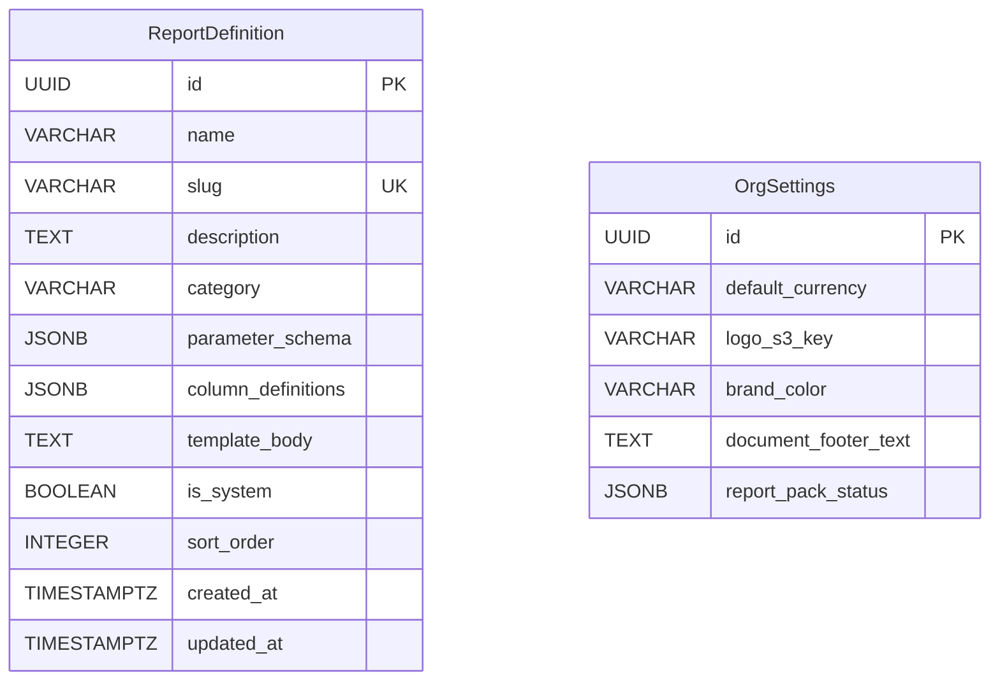

# Phase 19 — Reporting & Data Export

---

## 19. Phase 19 — Reporting & Data Export

Phase 19 adds a **reporting and data export framework** to the DocTeams platform. The platform already captures rich operational data — time entries, invoices, projects, budgets, billing rates, cost rates — and Phase 8 introduced profitability calculations consumed by the Profitability page and project/customer financial tabs. But these are fixed-format, in-page views. There is no way to run a parameterized report (e.g., "timesheet for January grouped by member"), preview it with org branding, and export it as a PDF or CSV for distribution to clients, accountants, or management.

Phase 19 closes this gap by introducing a `ReportDefinition` entity that describes a report type (parameters, columns, Thymeleaf template), a strategy-based execution framework that dispatches to report-specific query implementations, and a rendering pipeline that reuses the existing `PdfRenderingService` from Phase 12. Three standard reports exercise the framework end-to-end: **Timesheet Report**, **Invoice Aging Report**, and **Project Profitability Report**. A seed pack provisions these definitions per-tenant at provisioning time, following the established pack pattern from Phases 11, 12, and 14.

This phase **extends** the existing `report/` package — it does not replace it. The Phase 8 profitability endpoints (`/api/reports/profitability`, `/api/reports/utilization`, `/api/projects/{id}/profitability`, `/api/customers/{id}/profitability`) remain unchanged on `ReportController`. The new report framework lives in a new `reporting/` package with its own controller, using non-conflicting URL paths.

**Dependencies on prior phases**:
- **Phase 5** (Task & Time Lifecycle): `TimeEntry` entity. Timesheet report queries time entries.
- **Phase 6** (Audit & Compliance): `AuditService` and `AuditEventBuilder`. Report execution and export events are audited.
- **Phase 8** (Rate Cards, Budgets & Profitability): `OrgSettings` (branding), `BillingRate`, `CostRate`. Profitability report uses rate data. Existing `ReportService` contains margin computation logic that the new `ProjectProfitabilityReportQuery` delegates to.
- **Phase 10** (Invoicing): `Invoice`, `InvoiceLine`. Invoice aging report queries invoice data.
- **Phase 12** (Document Templates): `PdfRenderingService` with `renderThymeleaf()`, `wrapHtml()`, and `htmlToPdf()`. The report rendering pipeline reuses these methods directly.

### What's New

| Capability | Before Phase 19 | After Phase 19 |
|---|---|---|
| Parameterized reports | Fixed profitability views only | Configurable reports with date range, grouping, and entity filters |
| Report rendering | JSON API responses | Branded HTML preview via Thymeleaf + org branding |
| PDF export | Document-scoped PDFs only (Phase 12) | On-demand PDF reports with full data, branding, and pagination |
| CSV export | None | Streaming CSV downloads for spreadsheet import |
| Report framework | Ad-hoc service methods per view | Extensible strategy pattern — add a `ReportQuery` bean and a seed definition |
| Reports page | None | Top-level navigation with category grouping, dynamic parameter forms |
| Report audit trail | None | Every report execution and export logged with parameters and row count |

**Out of scope**: Scheduled/emailed reports, custom report builder (user-created definitions), report template editor UI, dashboard widget integration, cross-tenant reporting, drill-down/interactive navigation from report rows, role-based report access restrictions, report caching, chart/visualization rendering within reports.

---

### 19.1 Overview

Phase 19 establishes the report execution pipeline as a platform primitive. The architecture is designed for extensibility — adding a new report type requires seeding a `ReportDefinition` and implementing a `ReportQuery` strategy bean. No controller, service, or template engine changes are needed.

The core abstractions:

1. **ReportDefinition** — A tenant-scoped entity describing a report type: its parameters (as a JSON schema), its output columns, and its Thymeleaf rendering template. Seeded from a standard report pack, following the `TemplatePackSeeder` pattern.
2. **ReportQuery** — A strategy interface that each report type implements. Registered as Spring `@Component` beans with slug-based dispatch via auto-collected `List<ReportQuery>`. See [ADR-081](../adr/ADR-081-report-query-strategy-pattern.md).
3. **ReportExecutionService** — Orchestrates report execution: looks up the `ReportDefinition` by slug, dispatches to the matching `ReportQuery`, and returns a `ReportResult` with rows, summary, and metadata.
4. **Report rendering** — Reuses `PdfRenderingService.renderThymeleaf()` for HTML preview and `htmlToPdf()` for PDF export. CSV export is generated directly from `ReportResult` via streaming `ServletOutputStream`. See [ADR-083](../adr/ADR-083-csv-generation-approach.md).
5. **StandardReportPackSeeder** — Seeds the three standard report definitions per-tenant, tracking application in `OrgSettings.reportPackStatus`. Idempotent by slug.

The report definition includes an inline `template_body` field rather than referencing a `DocumentTemplate`. This separation is intentional: document templates are scoped to a primary entity (project, customer, invoice) and use entity-specific context builders, while report templates are driven by aggregation queries with a fundamentally different context shape (rows, summary, parameters). See [ADR-082](../adr/ADR-082-report-template-storage.md).

---

### 19.2 Domain Model

Phase 19 introduces one new tenant-scoped entity (`ReportDefinition`) and extends the existing `OrgSettings` entity with a `report_pack_status` JSONB column for tracking seed pack application. No new global entities are needed.

#### 19.2.1 ReportDefinition Entity (New)

A ReportDefinition describes a report type — what parameters it accepts, what columns it produces, and how it renders.

| Field | Java Type | DB Column | DB Type | Constraints | Notes |
|-------|-----------|-----------|---------|-------------|-------|
| `id` | `UUID` | `id` | `UUID` | PK, default `gen_random_uuid()` | Auto-generated |
| `name` | `String` | `name` | `VARCHAR(200)` | NOT NULL | Display name, e.g., "Timesheet Report" |
| `slug` | `String` | `slug` | `VARCHAR(100)` | NOT NULL, UNIQUE | URL-safe key, e.g., "timesheet" |
| `description` | `String` | `description` | `TEXT` | Nullable | Brief description for report list |
| `category` | `String` | `category` | `VARCHAR(50)` | NOT NULL | Grouping key: `TIME_ATTENDANCE`, `FINANCIAL`, `PROJECT`. See response example in 19.5.1 for mapping. |
| `parameterSchema` | `Map` (JSONB) | `parameter_schema` | `JSONB` | NOT NULL | Describes accepted parameters (see 19.2.2) |
| `columnDefinitions` | `Map` (JSONB) | `column_definitions` | `JSONB` | NOT NULL | Describes output columns (see 19.2.3) |
| `templateBody` | `String` | `template_body` | `TEXT` | NOT NULL | Thymeleaf HTML template for rendering |
| `isSystem` | `boolean` | `is_system` | `BOOLEAN` | NOT NULL, default `true` | System-seeded reports can be reset but not deleted |
| `sortOrder` | `int` | `sort_order` | `INTEGER` | NOT NULL, default 0 | Display order within category |
| `createdAt` | `Instant` | `created_at` | `TIMESTAMPTZ` | NOT NULL | Immutable |
| `updatedAt` | `Instant` | `updated_at` | `TIMESTAMPTZ` | NOT NULL | Updated on mutation |

**Entity annotation pattern** (follows `DocumentTemplate`):

```java
@Entity
@Table(name = "report_definitions")
public class ReportDefinition {

  @Id
  @GeneratedValue(strategy = GenerationType.UUID)
  private UUID id;

  @Column(name = "name", nullable = false, length = 200)
  private String name;

  @Column(name = "slug", nullable = false, length = 100)
  private String slug;

  @Column(name = "description", columnDefinition = "TEXT")
  private String description;

  @Column(name = "category", nullable = false, length = 50)
  private String category;

  @JdbcTypeCode(SqlTypes.JSON)
  @Column(name = "parameter_schema", nullable = false, columnDefinition = "jsonb")
  private Map<String, Object> parameterSchema;

  @JdbcTypeCode(SqlTypes.JSON)
  @Column(name = "column_definitions", nullable = false, columnDefinition = "jsonb")
  private Map<String, Object> columnDefinitions;

  @Column(name = "template_body", nullable = false, columnDefinition = "TEXT")
  private String templateBody;

  @Column(name = "is_system", nullable = false)
  private boolean isSystem = true;

  @Column(name = "sort_order", nullable = false)
  private int sortOrder;

  @Column(name = "created_at", nullable = false, updatable = false)
  private Instant createdAt;

  @Column(name = "updated_at", nullable = false)
  private Instant updatedAt;

  protected ReportDefinition() {}

  public ReportDefinition(String name, String slug, String category,
      Map<String, Object> parameterSchema, Map<String, Object> columnDefinitions,
      String templateBody) {
    this.name = name;
    this.slug = slug;
    this.category = category;
    this.parameterSchema = parameterSchema;
    this.columnDefinitions = columnDefinitions;
    this.templateBody = templateBody;
    this.isSystem = true;
    this.sortOrder = 0;
    this.createdAt = Instant.now();
    this.updatedAt = Instant.now();
  }

  /** Update template body (used by seed pack upsert). */
  public void updateTemplate(String templateBody) {
    this.templateBody = templateBody;
    this.updatedAt = Instant.now();
  }
}
```

#### 19.2.2 Parameter Schema Structure

See [ADR-084](../adr/ADR-084-parameter-schema-design.md) for why a custom JSON schema was chosen over JSON Schema draft-07.

```json
{
  "parameters": [
    {
      "name": "dateFrom",
      "type": "date",
      "label": "From Date",
      "required": true
    },
    {
      "name": "dateTo",
      "type": "date",
      "label": "To Date",
      "required": true
    },
    {
      "name": "groupBy",
      "type": "enum",
      "label": "Group By",
      "options": ["member", "project", "date"],
      "default": "member"
    },
    {
      "name": "projectId",
      "type": "uuid",
      "label": "Project",
      "required": false,
      "entityType": "project"
    }
  ]
}
```

Supported parameter types:
- `date` — renders as a date picker, parsed to `LocalDate`
- `enum` — renders as a select/dropdown, validated against `options` list
- `uuid` — renders as a combobox with entity search (type determined by `entityType`)

#### 19.2.3 Column Definitions Structure

```json
{
  "columns": [
    { "key": "memberName", "label": "Team Member", "type": "string" },
    { "key": "totalHours", "label": "Total Hours", "type": "decimal", "format": "0.00" },
    { "key": "billableHours", "label": "Billable Hours", "type": "decimal", "format": "0.00" }
  ]
}
```

Supported column types: `string`, `decimal`, `integer`, `date`, `currency`. The `format` field is used by CSV export for number formatting and by the frontend for display.

The `getColumns()` helper in `ReportRenderingService` parses this JSON into a list of `ColumnDefinition` records:

```java
/** Parsed representation of a column from column_definitions JSON. */
public record ColumnDefinition(String key, String label, String type, String format) {
    public ColumnDefinition(String key, String label, String type) {
        this(key, label, type, null);
    }
}
```

Parsing is done via:

```java
@SuppressWarnings("unchecked")
private List<ColumnDefinition> getColumns(ReportDefinition definition) {
    var colDefs = definition.getColumnDefinitions();
    var columns = (List<Map<String, String>>) colDefs.get("columns");
    return columns.stream()
        .map(c -> new ColumnDefinition(c.get("key"), c.get("label"),
            c.get("type"), c.getOrDefault("format", null)))
        .toList();
}
```

#### 19.2.4 ER Diagram



`ReportDefinition` has no FK relationships — it is a self-contained definition. The relationship to `OrgSettings` is at rendering time only: the report context builder reads branding fields from `OrgSettings` and injects them into the Thymeleaf context. There is no database-level relationship between these entities.

---

### 19.3 Report Execution Framework

#### 19.3.1 ReportQuery Strategy Interface

Each report type implements the `ReportQuery` interface. Strategy beans are registered via Spring `@Component` and auto-collected by the execution service. See [ADR-081](../adr/ADR-081-report-query-strategy-pattern.md).

```java
public interface ReportQuery {

    /** The slug that links this query to a ReportDefinition. */
    String getSlug();

    /** Execute the report with pagination (for HTML preview). */
    ReportResult execute(Map<String, Object> parameters, Pageable pageable);

    /** Execute the report without pagination (for PDF/CSV export). */
    ReportResult executeAll(Map<String, Object> parameters);
}
```

#### 19.3.2 ReportResult Data Structure

```java
public record ReportResult(
    List<Map<String, Object>> rows,
    Map<String, Object> summary,
    long totalElements,
    int totalPages
) {
    /** Convenience constructor for unpaginated results. */
    public ReportResult(List<Map<String, Object>> rows, Map<String, Object> summary) {
        this(rows, summary, rows.size(), 1);
    }
}
```

Rows are `Map<String, Object>` keyed by the column `key` from `column_definitions`. This keeps the framework generic — the execution service does not need to know the shape of any specific report's output.

#### 19.3.3 Dispatch Mechanism

`ReportExecutionService` collects all `ReportQuery` beans via constructor injection and builds a slug-keyed lookup map at startup:

```java
@Service
public class ReportExecutionService {

    private final Map<String, ReportQuery> queryMap;
    private final ReportDefinitionRepository reportDefinitionRepository;
    private final AuditService auditService;

    public ReportExecutionService(
            List<ReportQuery> queries,
            ReportDefinitionRepository reportDefinitionRepository,
            AuditService auditService) {
        this.queryMap = queries.stream()
            .collect(Collectors.toMap(ReportQuery::getSlug, Function.identity()));
        this.reportDefinitionRepository = reportDefinitionRepository;
        this.auditService = auditService;
    }

    @Transactional(readOnly = true)
    public ReportExecutionResponse execute(String slug, Map<String, Object> parameters,
            Pageable pageable) {
        var definition = reportDefinitionRepository.findBySlug(slug)
            .orElseThrow(() -> new ResourceNotFoundException("ReportDefinition", "slug", slug));

        var query = queryMap.get(slug);
        if (query == null) {
            // 400: slug from user input; definition exists but no query implementation registered
            throw new InvalidStateException("Report not executable",
                "No query implementation registered for report slug: " + slug);
        }

        var result = query.execute(parameters, pageable);

        auditService.log(AuditEventBuilder.builder()
            .eventType("REPORT_GENERATED")
            .entityType("REPORT")
            .entityId(definition.getId())
            .detail("slug", slug)
            .detail("parameters", parameters)
            .detail("format", "preview")
            .detail("rowCount", result.totalElements())
            .build());

        return toResponse(definition, parameters, result, pageable);
    }

    /**
     * Execute report for export (PDF/CSV). No pagination.
     * Audit logging (REPORT_EXPORTED) is handled by the controller after
     * rendering completes, because the controller knows the export format.
     */
    @Transactional(readOnly = true)
    public ReportResult executeForExport(String slug, Map<String, Object> parameters) {
        var definition = reportDefinitionRepository.findBySlug(slug)
            .orElseThrow(() -> new ResourceNotFoundException("ReportDefinition", "slug", slug));

        var query = queryMap.get(slug);
        if (query == null) {
            // InvalidStateException → 400: appropriate because slug comes from user input
            // (URL path variable). A missing query implementation means the definition
            // exists but has no backing code — a configuration error surfaced as a client error.
            throw new InvalidStateException("Report not executable",
                "No query implementation registered for report slug: " + slug);
        }
        return query.executeAll(parameters);
    }
}
```

This pattern is identical to how `PdfRenderingService` finds `TemplateContextBuilder` beans — Spring auto-collects all implementations and the service selects by type/slug.

#### 19.3.4 Integration with Existing report/ Package

The existing `ReportController`, `ReportService`, and `ReportRepository` in the `report/` package remain **untouched**. They serve the Profitability page and project/customer financial tabs with fixed-format JSON responses.

The new `ProjectProfitabilityReportQuery` (in the `reporting/` package) **delegates** to the existing `ReportRepository` for its SQL queries rather than duplicating them. Specifically, it calls `reportRepository.getOrgProjectRevenue()` and `reportRepository.getOrgProjectCost()` to obtain the raw profitability data, then reshapes the results into the generic `ReportResult` format with `Map<String, Object>` rows.

```
report/                  (Phase 8 — unchanged)
├── ReportController.java   → /api/projects/{id}/profitability, /api/reports/utilization, etc.
├── ReportService.java      → profitability calculation logic, margin computation
├── ReportRepository.java   → native SQL aggregation queries (EntityManager-based)
└── *Projection.java        → typed projection interfaces

reporting/               (Phase 19 — new)
├── ReportDefinition.java           → entity
├── ReportDefinitionRepository.java → JpaRepository
├── ReportQuery.java                → strategy interface
├── ReportResult.java               → result record
├── ReportExecutionService.java     → dispatch + audit
├── ReportRenderingService.java     → HTML/PDF/CSV rendering
├── ReportingController.java        → /api/report-definitions/*, /api/report-definitions/{slug}/execute, etc.
├── StandardReportPackSeeder.java   → seed 3 standard reports
├── TimesheetReportQuery.java       → @Component, slug="timesheet"
├── InvoiceAgingReportQuery.java    → @Component, slug="invoice-aging"
└── ProjectProfitabilityReportQuery.java → @Component, slug="project-profitability"
```

#### 19.3.5 Timesheet Report Query

SQL example (grouped by member):

```sql
SELECT
    m.id AS member_id,
    m.name AS member_name,
    SUM(te.duration_minutes) / 60.0 AS total_hours,
    SUM(CASE WHEN te.billable THEN te.duration_minutes ELSE 0 END) / 60.0 AS billable_hours,
    SUM(CASE WHEN NOT te.billable THEN te.duration_minutes ELSE 0 END) / 60.0 AS non_billable_hours,
    COUNT(te.id) AS entry_count
FROM time_entries te
JOIN tasks t ON te.task_id = t.id
JOIN members m ON te.member_id = m.id
WHERE te.date >= CAST(:dateFrom AS DATE)
  AND te.date <= CAST(:dateTo AS DATE)
  AND (CAST(:projectId AS UUID) IS NULL OR t.project_id = CAST(:projectId AS UUID))
  AND (CAST(:memberId AS UUID) IS NULL OR te.member_id = CAST(:memberId AS UUID))
GROUP BY m.id, m.name
ORDER BY total_hours DESC
```

The `groupBy` parameter switches the GROUP BY clause: `member` groups by `m.id, m.name`; `project` groups by `t.project_id, p.name`; `date` groups by `te.date`.

#### 19.3.6 Invoice Aging Report Query

```sql
SELECT
    i.id AS invoice_id,
    i.invoice_number,
    i.customer_name,
    i.issue_date,
    i.due_date,
    i.total AS amount,
    i.currency,
    i.status,
    CAST(:asOfDate AS DATE) - i.due_date AS days_overdue,
    CASE
        WHEN i.due_date >= CAST(:asOfDate AS DATE) THEN 'CURRENT'
        WHEN CAST(:asOfDate AS DATE) - i.due_date BETWEEN 1 AND 30 THEN '1_30'
        WHEN CAST(:asOfDate AS DATE) - i.due_date BETWEEN 31 AND 60 THEN '31_60'
        WHEN CAST(:asOfDate AS DATE) - i.due_date BETWEEN 61 AND 90 THEN '61_90'
        ELSE '90_PLUS'
    END AS age_bucket
FROM invoices i
WHERE i.status IN ('SENT', 'OVERDUE')
  AND (CAST(:customerId AS UUID) IS NULL OR i.customer_id = CAST(:customerId AS UUID))
ORDER BY days_overdue DESC
```

The `InvoiceAgingReportQuery` Java code maps raw `age_bucket` values to display labels when building row maps: `CURRENT` → "Current", `1_30` → "1-30 Days", `31_60` → "31-60 Days", `61_90` → "61-90 Days", `90_PLUS` → "90+ Days". The mapped value is stored as `ageBucketLabel` in the row map for template consumption.

The summary aggregates by bucket: count and total per bucket, plus overall total outstanding.

#### 19.3.7 Project Profitability Report Query

This query delegates to the existing `ReportRepository` methods:

```java
@Component
public class ProjectProfitabilityReportQuery implements ReportQuery {

    private final ReportRepository reportRepository;
    private final ProjectRepository projectRepository;

    @Override
    public String getSlug() { return "project-profitability"; }

    @Override
    public ReportResult execute(Map<String, Object> parameters, Pageable pageable) {
        LocalDate from = parseDate(parameters, "dateFrom");
        LocalDate to = parseDate(parameters, "dateTo");
        UUID projectId = parseUuid(parameters, "projectId");
        UUID customerId = parseUuid(parameters, "customerId");

        // Delegate to existing ReportRepository for raw aggregation
        var revenueList = reportRepository.getOrgProjectRevenue(from, to, customerId);
        var costList = reportRepository.getOrgProjectCost(from, to, customerId);

        // Reshape into generic rows with margin computation
        List<Map<String, Object>> rows = mergeToRows(revenueList, costList, projectId);
        Map<String, Object> summary = computeSummary(rows);

        // Apply pagination
        return paginate(rows, summary, pageable);
    }
}
```

This avoids duplicating the complex revenue/cost SQL that already exists in `ReportRepository`. The `mergeToRows()` method mirrors the margin computation logic from `ReportService.mergeToCurrencyBreakdowns()`.

#### 19.3.8 Tenant Scoping

All report queries execute within the tenant's dedicated schema. The `search_path` is set by the connection provider based on `RequestScopes.TENANT_ID` — no additional tenant filtering is needed in the SQL. This is consistent with every other tenant-scoped query in the system.

---

### 19.4 Rendering & Export Pipeline

#### 19.4.1 ReportRenderingService

A thin orchestrator that coordinates rendering and export. It does NOT duplicate `PdfRenderingService` — it calls into it.

```java
@Service
public class ReportRenderingService {

    private final PdfRenderingService pdfRenderingService;
    private final OrgSettingsRepository orgSettingsRepository;
    private final ReportDefinitionRepository reportDefinitionRepository;

    /**
     * Render HTML preview from report definition + execution result.
     * Report templates are self-contained (full HTML documents with inline styles),
     * so no wrapHtml() or external CSS is needed — unlike document templates which
     * are body fragments wrapped by PdfRenderingService.
     */
    public String renderHtml(ReportDefinition definition, ReportResult result,
            Map<String, Object> parameters) {
        Map<String, Object> context = buildContext(definition, result, parameters);
        return pdfRenderingService.renderThymeleaf(
            definition.getTemplateBody(), context);
    }

    /** Render PDF from report definition + full execution result. */
    public byte[] renderPdf(ReportDefinition definition, ReportResult result,
            Map<String, Object> parameters) {
        String html = renderHtml(definition, result, parameters);
        return pdfRenderingService.htmlToPdf(html);
    }

    /** Write CSV to output stream from execution result + column definitions. */
    public void writeCsv(ReportDefinition definition, ReportResult result,
            Map<String, Object> parameters, OutputStream outputStream) throws IOException {
        var writer = new BufferedWriter(new OutputStreamWriter(outputStream, StandardCharsets.UTF_8));

        // Metadata header
        writer.write("# " + definition.getName());
        writer.newLine();
        writer.write("# Generated: " + Instant.now().toString());
        writer.newLine();
        writer.write("# Parameters: " + formatParametersForCsv(parameters));
        writer.newLine();

        // Column headers
        var columns = getColumns(definition);
        writer.write(columns.stream()
            .map(c -> escapeCsv(c.label()))
            .collect(Collectors.joining(",")));
        writer.newLine();

        // Data rows
        for (var row : result.rows()) {
            writer.write(columns.stream()
                .map(c -> escapeCsv(formatValue(row.get(c.key()), c.type(), c.format())))
                .collect(Collectors.joining(",")));
            writer.newLine();
        }

        writer.flush();
    }

    private Map<String, Object> buildContext(ReportDefinition definition,
            ReportResult result, Map<String, Object> parameters) {
        var settings = orgSettingsRepository.findForCurrentTenant().orElse(null);
        var context = new HashMap<String, Object>();
        context.put("report", Map.of(
            "name", definition.getName(),
            "description", definition.getDescription() != null ? definition.getDescription() : ""
        ));
        context.put("parameters", parameters);
        context.put("rows", result.rows());
        context.put("summary", result.summary());
        // Pre-format as String — Thymeleaf #temporals requires a Temporal object,
        // but we pass a pre-formatted String for simplicity (consistent with invoice templates).
        context.put("generatedAt",
            DateTimeFormatter.ofPattern("dd MMM yyyy HH:mm")
                .withZone(ZoneOffset.UTC).format(Instant.now()));
        context.put("columns", getColumns(definition));
        if (settings != null) {
            context.put("branding", Map.of(
                "logoS3Key", settings.getLogoS3Key() != null ? settings.getLogoS3Key() : "",
                "brandColor", settings.getBrandColor() != null ? settings.getBrandColor() : "#1a1a2e",
                "footerText", settings.getDocumentFooterText() != null
                    ? settings.getDocumentFooterText() : ""
            ));
        }
        return context;
    }
}
```

#### 19.4.2 HTML Preview

The HTML preview endpoint returns the rendered HTML string. The frontend displays it in a sandboxed `<iframe>` using `srcdoc`, consistent with the invoice preview approach from Phase 10.

The preview uses paginated data (default 50 rows) to keep response sizes reasonable. The full dataset is only materialized for PDF/CSV export.

#### 19.4.3 PDF Export

PDF export calls `renderPdf()` which internally calls `renderHtml()` (full dataset, no pagination) then `pdfRenderingService.htmlToPdf()`. The PDF is streamed directly to the HTTP response — no S3 upload is needed because reports are ephemeral (unlike generated documents from Phase 12 which are tracked in `GeneratedDocument`).

Response headers:
```
Content-Type: application/pdf
Content-Disposition: attachment; filename="timesheet-2026-01-01-to-2026-01-31.pdf"
```

Filename pattern: `{slug}-{param1}-to-{param2}.pdf` for date-ranged reports, `{slug}-{asOfDate}.pdf` for point-in-time reports.

#### 19.4.4 CSV Export

CSV export writes directly from `ReportResult` rows to a `ServletOutputStream` via `BufferedWriter`. No Thymeleaf rendering, no in-memory string building. See [ADR-083](../adr/ADR-083-csv-generation-approach.md).

Response headers:
```
Content-Type: text/csv; charset=UTF-8
Content-Disposition: attachment; filename="timesheet-2026-01-01-to-2026-01-31.csv"
```

CSV escaping rules: values containing commas, double quotes, or newlines are wrapped in double quotes. Double quotes within values are escaped as `""`. This follows RFC 4180.

#### 19.4.5 Branding Integration

Report rendering injects org branding from `OrgSettings`:
- `branding.logoS3Key` — resolved to a presigned S3 URL for the HTML `` tag
- `branding.brandColor` — used for header background, table header background
- `branding.footerText` — rendered in the report footer

This is the same branding data used by document templates (Phase 12), ensuring visual consistency across all generated output.

---

### 19.5 API Surface

#### 19.5.1 Report Definition Endpoints

| Method | Path | Description | Auth | Read/Write |
|--------|------|-------------|------|------------|
| `GET` | `/api/report-definitions` | List all report definitions | MEMBER+ | Read |
| `GET` | `/api/report-definitions/{slug}` | Get single report definition | MEMBER+ | Read |

The list endpoint returns definitions grouped by category. The detail endpoint includes `parameterSchema` and `columnDefinitions` but excludes `templateBody` (which is only needed server-side for rendering).

**GET /api/report-definitions response:**
```json
{
  "categories": [
    {
      "category": "TIME_ATTENDANCE",
      "label": "Time & Attendance",
      "reports": [
        {
          "slug": "timesheet",
          "name": "Timesheet Report",
          "description": "Time entries grouped by member, project, or date for a given period."
        }
      ]
    },
    {
      "category": "FINANCIAL",
      "label": "Financial",
      "reports": [
        {
          "slug": "invoice-aging",
          "name": "Invoice Aging Report",
          "description": "Outstanding invoices grouped by age bucket."
        }
      ]
    },
    {
      "category": "PROJECT",
      "label": "Project",
      "reports": [
        {
          "slug": "project-profitability",
          "name": "Project Profitability Report",
          "description": "Revenue vs. cost per project for a date range."
        }
      ]
    }
  ]
}
```

**GET /api/report-definitions/{slug} response:**
```json
{
  "slug": "timesheet",
  "name": "Timesheet Report",
  "description": "Time entries grouped by member, project, or date for a given period.",
  "category": "TIME_ATTENDANCE",
  "parameterSchema": {
    "parameters": [
      { "name": "dateFrom", "type": "date", "label": "From Date", "required": true },
      { "name": "dateTo", "type": "date", "label": "To Date", "required": true },
      { "name": "groupBy", "type": "enum", "label": "Group By", "options": ["member", "project", "date"], "default": "member" },
      { "name": "projectId", "type": "uuid", "label": "Project", "required": false, "entityType": "project" },
      { "name": "memberId", "type": "uuid", "label": "Member", "required": false, "entityType": "member" }
    ]
  },
  "columnDefinitions": {
    "columns": [
      { "key": "groupLabel", "label": "Group", "type": "string" },
      { "key": "totalHours", "label": "Total Hours", "type": "decimal", "format": "0.00" },
      { "key": "billableHours", "label": "Billable Hours", "type": "decimal", "format": "0.00" },
      { "key": "nonBillableHours", "label": "Non-Billable", "type": "decimal", "format": "0.00" },
      { "key": "entryCount", "label": "Entries", "type": "integer" }
    ]
  },
  "isSystem": true
}
```

**Invoice Aging `columnDefinitions`:**
```json
{
  "columns": [
    { "key": "invoiceNumber", "label": "Invoice #", "type": "string" },
    { "key": "customerName", "label": "Customer", "type": "string" },
    { "key": "issueDate", "label": "Issue Date", "type": "date" },
    { "key": "dueDate", "label": "Due Date", "type": "date" },
    { "key": "amount", "label": "Amount", "type": "currency", "format": "0.00" },
    { "key": "currency", "label": "Currency", "type": "string" },
    { "key": "daysOverdue", "label": "Days Overdue", "type": "integer" },
    { "key": "ageBucketLabel", "label": "Bucket", "type": "string" }
  ]
}
```

**Project Profitability `columnDefinitions`:**
```json
{
  "columns": [
    { "key": "projectName", "label": "Project", "type": "string" },
    { "key": "customerName", "label": "Customer", "type": "string" },
    { "key": "currency", "label": "Currency", "type": "string" },
    { "key": "billableHours", "label": "Billable Hrs", "type": "decimal", "format": "0.00" },
    { "key": "revenue", "label": "Revenue", "type": "currency", "format": "0.00" },
    { "key": "cost", "label": "Cost", "type": "currency", "format": "0.00" },
    { "key": "margin", "label": "Margin", "type": "currency", "format": "0.00" },
    { "key": "marginPercent", "label": "Margin %", "type": "decimal", "format": "0.0" }
  ]
}
```

#### 19.5.2 Report Execution & Export Endpoints

| Method | Path | Description | Auth | Read/Write |
|--------|------|-------------|------|------------|
| `POST` | `/api/report-definitions/{slug}/execute` | Execute report, return JSON data | MEMBER+ | Read |
| `GET` | `/api/report-definitions/{slug}/preview` | Render HTML preview | MEMBER+ | Read |
| `GET` | `/api/report-definitions/{slug}/export/csv` | Stream CSV download | MEMBER+ | Read |
| `GET` | `/api/report-definitions/{slug}/export/pdf` | Stream PDF download | MEMBER+ | Read |

**POST /api/report-definitions/{slug}/execute request:**
```json
{
  "parameters": {
    "dateFrom": "2026-01-01",
    "dateTo": "2026-01-31",
    "groupBy": "member",
    "projectId": null,
    "memberId": null
  },
  "page": 0,
  "size": 50
}
```

**POST /api/report-definitions/{slug}/execute response:**
```json
{
  "reportName": "Timesheet Report",
  "parameters": {
    "dateFrom": "2026-01-01",
    "dateTo": "2026-01-31",
    "groupBy": "member"
  },
  "generatedAt": "2026-02-21T10:30:00Z",
  "columns": [
    { "key": "groupLabel", "label": "Group", "type": "string" },
    { "key": "totalHours", "label": "Total Hours", "type": "decimal", "format": "0.00" }
  ],
  "rows": [
    { "groupLabel": "John Doe", "totalHours": 160.5, "billableHours": 140.0, "nonBillableHours": 20.5, "entryCount": 42 }
  ],
  "summary": {
    "totalHours": 480.0,
    "billableHours": 410.0,
    "nonBillableHours": 70.0,
    "entryCount": 126
  },
  "pagination": { "page": 0, "size": 50, "totalElements": 12, "totalPages": 1 }
}
```

**GET /api/report-definitions/{slug}/preview and export endpoints** accept the same parameters as query parameters instead of a request body:
```
GET /api/report-definitions/timesheet/preview?dateFrom=2026-01-01&dateTo=2026-01-31&groupBy=member
GET /api/report-definitions/timesheet/export/csv?dateFrom=2026-01-01&dateTo=2026-01-31&groupBy=member
GET /api/report-definitions/timesheet/export/pdf?dateFrom=2026-01-01&dateTo=2026-01-31&groupBy=member
```

#### 19.5.3 Path Conflict Analysis

The existing `ReportController` (Phase 8) serves:
- `GET /api/reports/utilization`
- `GET /api/reports/profitability`
- `GET /api/projects/{id}/profitability`
- `GET /api/customers/{id}/profitability`

The new `ReportingController` (Phase 19) uses `/api/report-definitions/**`:
- `GET /api/report-definitions`
- `GET /api/report-definitions/{slug}`
- `POST /api/report-definitions/{slug}/execute`
- `GET /api/report-definitions/{slug}/preview`
- `GET /api/report-definitions/{slug}/export/csv`
- `GET /api/report-definitions/{slug}/export/pdf`

No path conflicts exist. The different base path (`/api/reports` vs `/api/report-definitions`) clearly separates the two controllers and allows both to evolve independently.

**Deliberate deviation from requirements**: The requirements spec uses `/api/reports/{slug}` for the new report endpoints. This was changed to `/api/report-definitions/**` to avoid path conflicts with the existing Phase 8 `ReportController` which already owns `/api/reports/**`. Using `/api/report-definitions` makes it clear that these endpoints operate on report *definitions* (metadata + execution), not ad-hoc report data. The alternative would have been to rename the Phase 8 endpoints (breaking change) or use a prefix like `/api/reports/v2/` (confusing versioning semantics).

---

### 19.6 Sequence Diagrams

#### 19.6.1 Report Execution + HTML Preview Flow


#### 19.6.2 PDF/CSV Export Flow


---

### 19.7 Frontend Design

#### 19.7.1 Navigation

Add "Reports" to the sidebar in `frontend/lib/nav-items.ts`, positioned after "Profitability":

```typescript
{ label: "Reports", href: (slug) => `/org/${slug}/reports`, icon: BarChart3 }
```

The `BarChart3` icon (from lucide-react) is used to differentiate from the existing "Profitability" (`TrendingUp`) entry.

#### 19.7.2 Reports List Page (`/reports`)

**Route**: `frontend/app/(app)/org/[slug]/reports/page.tsx` (server component)

Layout:
- Page header: "Reports" title
- Reports grouped by category in card sections
- Each category is a section with a heading (e.g., "Time & Attendance", "Financial")
- Each report is a card with: name, description, "Run Report" link
- Clean grid layout (2 or 3 columns depending on viewport)

Data fetching: server component calls `GET /api/report-definitions` and renders the categorized list.

#### 19.7.3 Report Detail Page (`/reports/{slug}`)

**Route**: `frontend/app/(app)/org/[slug]/reports/[reportSlug]/page.tsx`

This page has two parts:
1. **Server component** wrapper that fetches the `ReportDefinition` (including `parameterSchema` and `columnDefinitions`)
2. **Client component** (`ReportRunner`) that handles the interactive parameter form, execution, and results display

Layout (top to bottom):
1. **Page header**: report name + description
2. **Parameter form**: dynamically rendered from `parameterSchema`
   - `date` type → `<DatePicker>` from Shadcn
   - `enum` type → `<Select>` from Shadcn with options from the schema
   - `uuid` with `entityType` → existing entity combobox components (ProjectPicker, MemberPicker)
   - "Run Report" button
3. **Summary cards**: key metrics from the `summary` object displayed as stat cards (e.g., "Total Hours: 480", "Billable Hours: 410")
4. **Data table**: sortable columns rendered from `columnDefinitions`, with client-side sorting on the current page. Uses the Shadcn `DataTable` component.
5. **Pagination**: standard pagination controls below the table
6. **Export buttons**: "Export CSV" and "Export PDF" buttons in the header area, enabled only after the report has been run. These trigger full (unpaginated) exports via direct browser navigation to the export URLs.

#### 19.7.4 Parameter Form Renderer Component

A reusable `ReportParameterForm` component that accepts a `parameterSchema` JSON and renders the appropriate form fields:

```typescript
interface ReportParameterFormProps {
  schema: ParameterSchema;
  onSubmit: (parameters: Record<string, unknown>) => void;
  isLoading: boolean;
}

function ReportParameterForm({ schema, onSubmit, isLoading }: ReportParameterFormProps) {
  // Dynamic rendering based on schema.parameters[].type
  // Validation: required fields, type checking
  // Default values from schema
}
```

This component is designed for reuse — as new report types are added with different parameters, the same component renders the appropriate form.

#### 19.7.5 Loading States

- Initial page load: skeleton UI for the parameter form
- Report execution: loading spinner in the results area, "Run Report" button disabled
- Export: brief loading indicator on the export button

---

### 19.8 Database Migration

#### 19.8.1 V35: Create Report Definitions Table

**File**: `backend/src/main/resources/db/migration/tenant/V35__create_report_definitions.sql`

```sql
-- Report definitions for the reporting framework (Phase 19)
CREATE TABLE report_definitions (
    id              UUID PRIMARY KEY DEFAULT gen_random_uuid(),
    name            VARCHAR(200)  NOT NULL,
    slug            VARCHAR(100)  NOT NULL,
    description     TEXT,
    category        VARCHAR(50)   NOT NULL,
    parameter_schema JSONB         NOT NULL DEFAULT '{"parameters":[]}',
    column_definitions JSONB       NOT NULL DEFAULT '{"columns":[]}',
    template_body   TEXT          NOT NULL,
    is_system       BOOLEAN       NOT NULL DEFAULT true,
    sort_order      INTEGER       NOT NULL DEFAULT 0,
    created_at      TIMESTAMPTZ   NOT NULL DEFAULT now(),
    updated_at      TIMESTAMPTZ   NOT NULL DEFAULT now(),

    CONSTRAINT uq_report_definitions_slug UNIQUE (slug)
);

-- Index on category for grouped listing
CREATE INDEX idx_report_definitions_category ON report_definitions (category);

-- Index on is_system for filtering system vs custom reports
CREATE INDEX idx_report_definitions_system ON report_definitions (is_system);
```

#### 19.8.2 OrgSettings Extension

The `report_pack_status` column is added to `org_settings` in the same migration:

```sql
-- Add report pack status tracking to org_settings
ALTER TABLE org_settings ADD COLUMN IF NOT EXISTS report_pack_status JSONB;
```

#### 19.8.3 Index Rationale

| Index | Rationale |
|-------|-----------|
| `uq_report_definitions_slug` | Unique constraint for slug-based lookup (used by every API call) |
| `idx_report_definitions_category` | Supports grouped listing on the reports page |
| `idx_report_definitions_system` | Supports future filtering of system vs custom reports |

No additional indexes are needed on existing tables — the report queries use `time_entries.date` (already indexed via V20), `invoices.status` + `invoices.due_date` (already indexed via V21), and `tasks.project_id` (already indexed via V9).

---

### 19.9 Seed Pack

#### 19.9.1 StandardReportPackSeeder

Follows the `TemplatePackSeeder` pattern — called during tenant provisioning, idempotent by slug.

```java
@Service
public class StandardReportPackSeeder {

    private static final String PACK_ID = "standard-reports";
    private static final int PACK_VERSION = 1;

    private final ReportDefinitionRepository reportDefinitionRepository;
    private final OrgSettingsRepository orgSettingsRepository;
    private final TransactionTemplate transactionTemplate;

    public void seedForTenant(String tenantId, String orgId) {
        ScopedValue.where(RequestScopes.TENANT_ID, tenantId)
            .where(RequestScopes.ORG_ID, orgId)
            .run(() -> transactionTemplate.executeWithoutResult(tx -> doSeed()));
    }

    private void doSeed() {
        var settings = orgSettingsRepository.findForCurrentTenant()
            .orElseGet(() -> orgSettingsRepository.save(new OrgSettings("USD")));

        if (isPackAlreadyApplied(settings)) return;

        upsertReport(timesheetDefinition());
        upsertReport(invoiceAgingDefinition());
        upsertReport(projectProfitabilityDefinition());

        settings.recordReportPackApplication(PACK_ID, PACK_VERSION);
        orgSettingsRepository.save(settings);
    }

    private void upsertReport(ReportDefinition definition) {
        reportDefinitionRepository.findBySlug(definition.getSlug())
            .ifPresentOrElse(
                existing -> {
                    existing.updateTemplate(definition.getTemplateBody());
                    reportDefinitionRepository.save(existing);
                },
                () -> reportDefinitionRepository.save(definition)
            );
    }
}
```

#### 19.9.2 Timesheet Report Template

```html
<!DOCTYPE html>
<html xmlns:th="http://www.thymeleaf.org">
<head>
    <meta charset="UTF-8"/>
    <title th:text="${report.name}">Timesheet Report</title>
    <style>
        body { font-family: 'Helvetica Neue', Arial, sans-serif; font-size: 11px; color: #1a1a2e; margin: 0; padding: 20px; }
        .header { display: table; width: 100%; margin-bottom: 20px; border-bottom: 3px solid; padding-bottom: 15px; }
        .header-left { display: table-cell; vertical-align: middle; }
        .header-right { display: table-cell; text-align: right; vertical-align: middle; }
        .header img.logo { max-height: 50px; max-width: 200px; }
        h1 { font-size: 20px; margin: 0 0 5px 0; }
        .param-summary { font-size: 10px; color: #666; margin-bottom: 20px; padding: 8px 12px; background: #f8f9fa; border-radius: 4px; }
        .summary-cards { display: table; width: 100%; margin-bottom: 20px; }
        .summary-card { display: table-cell; padding: 10px 15px; text-align: center; border: 1px solid #e2e8f0; }
        .summary-card .value { font-size: 18px; font-weight: 700; }
        .summary-card .label { font-size: 9px; color: #666; text-transform: uppercase; letter-spacing: 0.5px; }
        table.data { width: 100%; border-collapse: collapse; margin-bottom: 20px; }
        table.data th { padding: 8px 10px; text-align: left; font-size: 10px; font-weight: 600; text-transform: uppercase; letter-spacing: 0.5px; color: #fff; }
        table.data td { padding: 8px 10px; border-bottom: 1px solid #e2e8f0; font-size: 11px; }
        table.data tr:nth-child(even) td { background: #f8f9fa; }
        table.data tfoot td { font-weight: 700; border-top: 2px solid #1a1a2e; padding-top: 10px; }
        .footer { margin-top: 30px; padding-top: 10px; border-top: 1px solid #e2e8f0; font-size: 9px; color: #999; display: table; width: 100%; }
        .footer-left { display: table-cell; }
        .footer-right { display: table-cell; text-align: right; }
        .text-right { text-align: right; }
    </style>
    <style th:if="${branding != null and branding.brandColor != ''}"
           th:inline="text">
        .header { border-bottom-color: [[${branding.brandColor}]]; }
        table.data th { background-color: [[${branding.brandColor}]]; }
    </style>
</head>
<body>
    <div class="header">
        <div class="header-left">
            
            <h1 th:text="${report.name}">Timesheet Report</h1>
        </div>
        <div class="header-right">
            <div th:text="'Generated: ' + ${generatedAt}"
                 style="font-size: 10px; color: #666;">Generated: 21 Feb 2026 10:30</div>
        </div>
    </div>

    <div class="param-summary">
        <strong>Period:</strong> <span th:text="${parameters.dateFrom}">2026-01-01</span>
        to <span th:text="${parameters.dateTo}">2026-01-31</span>
        <span th:if="${parameters.groupBy != null}">
            | <strong>Grouped by:</strong> <span th:text="${parameters.groupBy}">member</span>
        </span>
    </div>

    <div class="summary-cards" th:if="${summary != null}">
        <div class="summary-card">
            <div class="value" th:text="${#numbers.formatDecimal(summary.totalHours, 1, 2)}">480.00</div>
            <div class="label">Total Hours</div>
        </div>
        <div class="summary-card">
            <div class="value" th:text="${#numbers.formatDecimal(summary.billableHours, 1, 2)}">410.00</div>
            <div class="label">Billable Hours</div>
        </div>
        <div class="summary-card">
            <div class="value" th:text="${#numbers.formatDecimal(summary.nonBillableHours, 1, 2)}">70.00</div>
            <div class="label">Non-Billable Hours</div>
        </div>
        <div class="summary-card" th:if="${summary.entryCount != null}">
            <div class="value" th:text="${summary.entryCount}">126</div>
            <div class="label">Entries</div>
        </div>
    </div>

    <table class="data">
        <thead>
            <tr>
                <th th:each="col : ${columns}" th:text="${col.label}"
                    th:classappend="${col.type == 'decimal' or col.type == 'integer'} ? 'text-right' : ''">Column</th>
            </tr>
        </thead>
        <tbody>
            <tr th:each="row : ${rows}">
                <td th:each="col : ${columns}"
                    th:classappend="${col.type == 'decimal' or col.type == 'integer'} ? 'text-right' : ''">
                    <span th:if="${col.type == 'decimal'}"
                          th:text="${row[col.key] != null} ? ${#numbers.formatDecimal(row[col.key], 1, 2)} : '-'">0.00</span>
                    <span th:if="${col.type == 'integer'}"
                          th:text="${row[col.key] != null} ? ${row[col.key]} : '-'">0</span>
                    <span th:if="${col.type == 'string' or col.type == 'date'}"
                          th:text="${row[col.key] != null} ? ${row[col.key]} : '-'">Value</span>
                </td>
            </tr>
        </tbody>
        <tfoot th:if="${summary != null}">
            <tr>
                <td><strong>Total</strong></td>
                <td class="text-right" th:text="${#numbers.formatDecimal(summary.totalHours, 1, 2)}">480.00</td>
                <td class="text-right" th:text="${#numbers.formatDecimal(summary.billableHours, 1, 2)}">410.00</td>
                <td class="text-right" th:text="${#numbers.formatDecimal(summary.nonBillableHours, 1, 2)}">70.00</td>
                <td class="text-right" th:if="${summary.entryCount != null}" th:text="${summary.entryCount}">126</td>
            </tr>
        </tfoot>
    </table>

    <div class="footer">
        <div class="footer-left" th:if="${branding != null and branding.footerText != ''}"
             th:text="${branding.footerText}">Company Footer</div>
        <div class="footer-right"
             th:text="'Generated ' + ${generatedAt}">
            Generated 21 Feb 2026 10:30
        </div>
    </div>
</body>
</html>
```

#### 19.9.3 Invoice Aging Report Template

```html
<!DOCTYPE html>
<html xmlns:th="http://www.thymeleaf.org">
<head>
    <meta charset="UTF-8"/>
    <title th:text="${report.name}">Invoice Aging Report</title>
    <style>
        body { font-family: 'Helvetica Neue', Arial, sans-serif; font-size: 11px; color: #1a1a2e; margin: 0; padding: 20px; }
        .header { display: table; width: 100%; margin-bottom: 20px; border-bottom: 3px solid; padding-bottom: 15px; }
        .header-left { display: table-cell; vertical-align: middle; }
        .header-right { display: table-cell; text-align: right; vertical-align: middle; }
        .header img.logo { max-height: 50px; max-width: 200px; }
        h1 { font-size: 20px; margin: 0 0 5px 0; }
        .param-summary { font-size: 10px; color: #666; margin-bottom: 20px; padding: 8px 12px; background: #f8f9fa; border-radius: 4px; }
        .bucket-summary { display: table; width: 100%; margin-bottom: 20px; }
        .bucket { display: table-cell; padding: 10px 15px; text-align: center; border: 1px solid #e2e8f0; }
        .bucket .amount { font-size: 16px; font-weight: 700; }
        .bucket .label { font-size: 9px; color: #666; text-transform: uppercase; letter-spacing: 0.5px; }
        .bucket .count { font-size: 10px; color: #999; }
        .bucket.overdue .amount { color: #dc2626; }
        table.data { width: 100%; border-collapse: collapse; margin-bottom: 20px; }
        table.data th { padding: 8px 10px; text-align: left; font-size: 10px; font-weight: 600; text-transform: uppercase; letter-spacing: 0.5px; color: #fff; }
        table.data td { padding: 8px 10px; border-bottom: 1px solid #e2e8f0; font-size: 11px; }
        table.data tr:nth-child(even) td { background: #f8f9fa; }
        table.data tfoot td { font-weight: 700; border-top: 2px solid #1a1a2e; padding-top: 10px; }
        .text-right { text-align: right; }
        .status-overdue { color: #dc2626; font-weight: 600; }
        .status-current { color: #16a34a; }
        .footer { margin-top: 30px; padding-top: 10px; border-top: 1px solid #e2e8f0; font-size: 9px; color: #999; display: table; width: 100%; }
        .footer-left { display: table-cell; }
        .footer-right { display: table-cell; text-align: right; }
    </style>
    <style th:if="${branding != null and branding.brandColor != ''}"
           th:inline="text">
        .header { border-bottom-color: [[${branding.brandColor}]]; }
        table.data th { background-color: [[${branding.brandColor}]]; }
    </style>
</head>
<body>
    <div class="header">
        <div class="header-left">
            
            <h1 th:text="${report.name}">Invoice Aging Report</h1>
        </div>
        <div class="header-right">
            <div th:text="'Generated: ' + ${generatedAt}"
                 style="font-size: 10px; color: #666;">Generated: 21 Feb 2026 10:30</div>
        </div>
    </div>

    <div class="param-summary">
        <strong>As of:</strong> <span th:text="${parameters.asOfDate}">2026-02-21</span>
        <span th:if="${parameters.customerId != null}">
            | <strong>Customer:</strong> <span th:text="${parameters.customerName}">Acme Corp</span>
        </span>
    </div>

    <div class="bucket-summary" th:if="${summary != null}">
        <div class="bucket">
            <div class="amount" th:text="${#numbers.formatDecimal(summary['currentAmount'], 1, 2)}">0.00</div>
            <div class="label">Current</div>
            <div class="count" th:text="${summary['currentCount']} + ' invoices'">0 invoices</div>
        </div>
        <div class="bucket overdue">
            <div class="amount" th:text="${#numbers.formatDecimal(summary['bucket1_30Amount'], 1, 2)}">0.00</div>
            <div class="label">1-30 Days</div>
            <div class="count" th:text="${summary['bucket1_30Count']} + ' invoices'">0 invoices</div>
        </div>
        <div class="bucket overdue">
            <div class="amount" th:text="${#numbers.formatDecimal(summary['bucket31_60Amount'], 1, 2)}">0.00</div>
            <div class="label">31-60 Days</div>
            <div class="count" th:text="${summary['bucket31_60Count']} + ' invoices'">0 invoices</div>
        </div>
        <div class="bucket overdue">
            <div class="amount" th:text="${#numbers.formatDecimal(summary['bucket61_90Amount'], 1, 2)}">0.00</div>
            <div class="label">61-90 Days</div>
            <div class="count" th:text="${summary['bucket61_90Count']} + ' invoices'">0 invoices</div>
        </div>
        <div class="bucket overdue">
            <div class="amount" th:text="${#numbers.formatDecimal(summary['bucket90PlusAmount'], 1, 2)}">0.00</div>
            <div class="label">90+ Days</div>
            <div class="count" th:text="${summary['bucket90PlusCount']} + ' invoices'">0 invoices</div>
        </div>
    </div>

    <table class="data">
        <thead>
            <tr>
                <th>Invoice #</th>
                <th>Customer</th>
                <th>Issue Date</th>
                <th>Due Date</th>
                <th class="text-right">Amount</th>
                <th>Currency</th>
                <th class="text-right">Days Overdue</th>
                <th>Bucket</th>
            </tr>
        </thead>
        <tbody>
            <tr th:each="row : ${rows}">
                <td th:text="${row['invoiceNumber']}">INV-001</td>
                <td th:text="${row['customerName']}">Acme Corp</td>
                <td th:text="${row['issueDate']}">2026-01-01</td>
                <td th:text="${row['dueDate']}">2026-01-31</td>
                <td class="text-right" th:text="${#numbers.formatDecimal(row['amount'], 1, 2)}">1000.00</td>
                <td th:text="${row['currency']}">USD</td>
                <td class="text-right"
                    th:classappend="${row['daysOverdue'] > 0} ? 'status-overdue' : 'status-current'"
                    th:text="${row['daysOverdue']}">0</td>
                <td th:text="${row['ageBucketLabel']}">Current</td>
            </tr>
        </tbody>
        <tfoot th:if="${summary != null}">
            <tr>
                <td colspan="4"><strong>Total Outstanding</strong></td>
                <td class="text-right" th:text="${#numbers.formatDecimal(summary['totalAmount'], 1, 2)}">0.00</td>
                <td colspan="3"></td>
            </tr>
        </tfoot>
    </table>

    <div class="footer">
        <div class="footer-left" th:if="${branding != null and branding.footerText != ''}"
             th:text="${branding.footerText}">Company Footer</div>
        <div class="footer-right"
             th:text="'Generated ' + ${generatedAt}">
            Generated 21 Feb 2026 10:30
        </div>
    </div>
</body>
</html>
```

#### 19.9.4 Project Profitability Report Template

```html
<!DOCTYPE html>
<html xmlns:th="http://www.thymeleaf.org">
<head>
    <meta charset="UTF-8"/>
    <title th:text="${report.name}">Project Profitability Report</title>
    <style>
        body { font-family: 'Helvetica Neue', Arial, sans-serif; font-size: 11px; color: #1a1a2e; margin: 0; padding: 20px; }
        .header { display: table; width: 100%; margin-bottom: 20px; border-bottom: 3px solid; padding-bottom: 15px; }
        .header-left { display: table-cell; vertical-align: middle; }
        .header-right { display: table-cell; text-align: right; vertical-align: middle; }
        .header img.logo { max-height: 50px; max-width: 200px; }
        h1 { font-size: 20px; margin: 0 0 5px 0; }
        .param-summary { font-size: 10px; color: #666; margin-bottom: 20px; padding: 8px 12px; background: #f8f9fa; border-radius: 4px; }
        .summary-cards { display: table; width: 100%; margin-bottom: 20px; }
        .summary-card { display: table-cell; padding: 10px 15px; text-align: center; border: 1px solid #e2e8f0; }
        .summary-card .value { font-size: 16px; font-weight: 700; }
        .summary-card .label { font-size: 9px; color: #666; text-transform: uppercase; letter-spacing: 0.5px; }
        .margin-positive { color: #16a34a; }
        .margin-negative { color: #dc2626; }
        table.data { width: 100%; border-collapse: collapse; margin-bottom: 20px; }
        table.data th { padding: 8px 10px; text-align: left; font-size: 10px; font-weight: 600; text-transform: uppercase; letter-spacing: 0.5px; color: #fff; }
        table.data td { padding: 8px 10px; border-bottom: 1px solid #e2e8f0; font-size: 11px; }
        table.data tr:nth-child(even) td { background: #f8f9fa; }
        table.data tfoot td { font-weight: 700; border-top: 2px solid #1a1a2e; padding-top: 10px; }
        .text-right { text-align: right; }
        .footer { margin-top: 30px; padding-top: 10px; border-top: 1px solid #e2e8f0; font-size: 9px; color: #999; display: table; width: 100%; }
        .footer-left { display: table-cell; }
        .footer-right { display: table-cell; text-align: right; }
    </style>
    <style th:if="${branding != null and branding.brandColor != ''}"
           th:inline="text">
        .header { border-bottom-color: [[${branding.brandColor}]]; }
        table.data th { background-color: [[${branding.brandColor}]]; }
    </style>
</head>
<body>
    <div class="header">
        <div class="header-left">
            
            <h1 th:text="${report.name}">Project Profitability Report</h1>
        </div>
        <div class="header-right">
            <div th:text="'Generated: ' + ${generatedAt}"
                 style="font-size: 10px; color: #666;">Generated: 21 Feb 2026 10:30</div>
        </div>
    </div>

    <div class="param-summary">
        <strong>Period:</strong> <span th:text="${parameters.dateFrom}">2026-01-01</span>
        to <span th:text="${parameters.dateTo}">2026-01-31</span>
        <span th:if="${parameters.customerId != null}">
            | <strong>Customer:</strong> <span th:text="${parameters.customerName}">Acme Corp</span>
        </span>
    </div>

    <div class="summary-cards" th:if="${summary != null}">
        <div class="summary-card">
            <div class="value" th:text="${#numbers.formatDecimal(summary.totalRevenue, 1, 2)}">0.00</div>
            <div class="label">Total Revenue</div>
        </div>
        <div class="summary-card">
            <div class="value" th:text="${#numbers.formatDecimal(summary.totalCost, 1, 2)}">0.00</div>
            <div class="label">Total Cost</div>
        </div>
        <div class="summary-card">
            <div class="value"
                 th:classappend="${summary.totalMargin >= 0} ? 'margin-positive' : 'margin-negative'"
                 th:text="${#numbers.formatDecimal(summary.totalMargin, 1, 2)}">0.00</div>
            <div class="label">Total Margin</div>
        </div>
        <div class="summary-card">
            <div class="value"
                 th:classappend="${summary.avgMarginPercent >= 0} ? 'margin-positive' : 'margin-negative'"
                 th:text="${#numbers.formatDecimal(summary.avgMarginPercent, 1, 1)} + '%'">0.0%</div>
            <div class="label">Avg Margin %</div>
        </div>
    </div>

    <table class="data">
        <thead>
            <tr>
                <th>Project</th>
                <th>Customer</th>
                <th>Currency</th>
                <th class="text-right">Billable Hrs</th>
                <th class="text-right">Revenue</th>
                <th class="text-right">Cost</th>
                <th class="text-right">Margin</th>
                <th class="text-right">Margin %</th>
            </tr>
        </thead>
        <tbody>
            <tr th:each="row : ${rows}">
                <td th:text="${row.projectName}">Project Alpha</td>
                <td th:text="${row.customerName != null} ? ${row.customerName} : '-'">Acme Corp</td>
                <td th:text="${row.currency}">USD</td>
                <td class="text-right" th:text="${row.billableHours != null} ? ${#numbers.formatDecimal(row.billableHours, 1, 2)} : '-'">0.00</td>
                <td class="text-right" th:text="${row.revenue != null} ? ${#numbers.formatDecimal(row.revenue, 1, 2)} : '-'">0.00</td>
                <td class="text-right" th:text="${row.cost != null} ? ${#numbers.formatDecimal(row.cost, 1, 2)} : '-'">0.00</td>
                <td class="text-right"
                    th:classappend="${row.margin != null and row.margin >= 0} ? 'margin-positive' : 'margin-negative'"
                    th:text="${row.margin != null} ? ${#numbers.formatDecimal(row.margin, 1, 2)} : '-'">0.00</td>
                <td class="text-right"
                    th:classappend="${row.marginPercent != null and row.marginPercent >= 0} ? 'margin-positive' : 'margin-negative'"
                    th:text="${row.marginPercent != null} ? ${#numbers.formatDecimal(row.marginPercent, 1, 1)} + '%' : '-'">0.0%</td>
            </tr>
        </tbody>
        <tfoot th:if="${summary != null}">
            <tr>
                <td colspan="3"><strong>Total</strong></td>
                <td class="text-right" th:text="${#numbers.formatDecimal(summary.totalBillableHours, 1, 2)}">0.00</td>
                <td class="text-right" th:text="${#numbers.formatDecimal(summary.totalRevenue, 1, 2)}">0.00</td>
                <td class="text-right" th:text="${#numbers.formatDecimal(summary.totalCost, 1, 2)}">0.00</td>
                <td class="text-right"
                    th:classappend="${summary.totalMargin >= 0} ? 'margin-positive' : 'margin-negative'"
                    th:text="${#numbers.formatDecimal(summary.totalMargin, 1, 2)}">0.00</td>
                <td class="text-right"
                    th:classappend="${summary.avgMarginPercent >= 0} ? 'margin-positive' : 'margin-negative'"
                    th:text="${#numbers.formatDecimal(summary.avgMarginPercent, 1, 1)} + '%'">0.0%</td>
            </tr>
        </tfoot>
    </table>

    <div class="footer">
        <div class="footer-left" th:if="${branding != null and branding.footerText != ''}"
             th:text="${branding.footerText}">Company Footer</div>
        <div class="footer-right"
             th:text="'Generated ' + ${generatedAt}">
            Generated 21 Feb 2026 10:30
        </div>
    </div>
</body>
</html>
```

---

### 19.10 Audit Integration

#### 19.10.1 Audit Event Types

| Event Type | Trigger | Entity Type |
|------------|---------|-------------|
| `REPORT_GENERATED` | Report executed (preview or JSON) | `REPORT` |
| `REPORT_EXPORTED` | Report exported as PDF or CSV | `REPORT` |

#### 19.10.2 Event Details Structure

```json
{
  "slug": "timesheet",
  "parameters": {
    "dateFrom": "2026-01-01",
    "dateTo": "2026-01-31",
    "groupBy": "member"
  },
  "format": "pdf",
  "rowCount": 12
}
```

The `format` field values: `preview` (HTML preview or JSON execute), `pdf`, `csv`.

#### 19.10.3 Usage Pattern

```java
auditService.log(AuditEventBuilder.builder()
    .eventType("REPORT_EXPORTED")
    .entityType("REPORT")
    .entityId(definition.getId())
    .detail("slug", slug)
    .detail("parameters", parameters)
    .detail("format", "pdf")
    .detail("rowCount", result.totalElements())
    .build());
```

This follows the existing `AuditEventBuilder` pattern used throughout the codebase (Phase 6).

---

### 19.11 Implementation Guidance

#### 19.11.1 Backend Changes

| File | Package | Change |
|------|---------|--------|
| `ReportDefinition.java` | `reporting` | New entity |
| `ReportDefinitionRepository.java` | `reporting` | New JPA repository with `findBySlug()` |
| `ReportQuery.java` | `reporting` | New strategy interface |
| `ReportResult.java` | `reporting` | New result record |
| `ReportExecutionService.java` | `reporting` | New dispatch + audit service |
| `ReportRenderingService.java` | `reporting` | New rendering orchestrator (delegates to PdfRenderingService) |
| `ReportingController.java` | `reporting` | New REST controller for `/api/report-definitions/**` |
| `StandardReportPackSeeder.java` | `reporting` | New seeder, called from provisioning |
| `TimesheetReportQuery.java` | `reporting` | New `@Component` implementing `ReportQuery` |
| `InvoiceAgingReportQuery.java` | `reporting` | New `@Component` implementing `ReportQuery` |
| `ProjectProfitabilityReportQuery.java` | `reporting` | New `@Component` (delegates to existing `ReportRepository`) |
| `OrgSettings.java` | `settings` | Add `reportPackStatus` JSONB field (`Map<String, Object>`) mapped to `report_pack_status` column, plus `recordReportPackApplication(String packId, int version)` method that stores `{"packId": packId, "version": version, "appliedAt": Instant.now().toString()}` into the map. Follow the same pattern as `templatePackStatus`. |
| `TenantProvisioningService.java` | `provisioning` | Call `StandardReportPackSeeder.seedForTenant()` after migration |
| `V35__create_report_definitions.sql` | `db/migration/tenant` | New migration |

#### 19.11.2 Frontend Changes

| File | Change |
|------|--------|
| `frontend/lib/nav-items.ts` | Add "Reports" nav item with `BarChart3` icon |
| `frontend/app/(app)/org/[slug]/reports/page.tsx` | New reports list page (server component) |
| `frontend/app/(app)/org/[slug]/reports/[reportSlug]/page.tsx` | New report detail page |
| `frontend/components/reports/report-parameter-form.tsx` | New reusable parameter form renderer (client component) |
| `frontend/components/reports/report-results.tsx` | New results display (summary cards + data table) |
| `frontend/components/reports/report-runner.tsx` | New client component orchestrating form + results + export |
| `frontend/lib/api/reports.ts` | New API client functions |

#### 19.11.3 Testing Strategy

| Test | Scope | Description |
|------|-------|-------------|
| `TimesheetReportQueryTest` | Integration | Verify grouping by member/project/date, date filtering, billable split |
| `InvoiceAgingReportQueryTest` | Integration | Verify bucket classification, overdue calculation, customer filter |
| `ProjectProfitabilityReportQueryTest` | Integration | Verify margin computation, delegation to ReportRepository |
| `ReportExecutionServiceTest` | Integration | Verify dispatch, unknown slug handling, audit event creation |
| `ReportRenderingServiceTest` | Integration | Verify HTML rendering, PDF generation, CSV output format |
| `ReportingControllerTest` | MockMvc | Verify all endpoints, parameter validation, content types, Content-Disposition headers |
| `StandardReportPackSeederTest` | Integration | Verify idempotent seeding, OrgSettings tracking |
| `ReportParameterForm.test.tsx` | Frontend | Verify dynamic rendering from schema, validation |
| `ReportsPage.test.tsx` | Frontend | Verify category grouping, navigation links |
| `ReportResults.test.tsx` | Frontend | Verify summary cards, data table rendering, pagination |
| `ReportRunner.test.tsx` | Frontend | Verify form submission, loading states, export button enablement |

Edge cases to test:
- Empty result sets (no time entries, no invoices)
- Single row results
- Date boundary conditions (entries exactly on from/to dates)
- Null parameter handling (optional filters)
- CSV escaping (commas, quotes, newlines in values)
- Large datasets for export (verify streaming, no OOM)

---

### 19.12 Permission Model Summary

All report endpoints require `ROLE_ORG_MEMBER` or higher (`hasAnyRole('ORG_MEMBER', 'ORG_ADMIN', 'ORG_OWNER')`). There are no report-specific permissions in this phase.

| Action | Required Role | Notes |
|--------|---------------|-------|
| List report definitions | MEMBER+ | All org members see all reports |
| View report definition | MEMBER+ | Includes parameter schema and column definitions |
| Execute report | MEMBER+ | Report queries see all tenant data (no member-scoping) |
| Preview HTML | MEMBER+ | Same as execute |
| Export CSV | MEMBER+ | Full dataset, no pagination |
| Export PDF | MEMBER+ | Full dataset, branded |

This is a deliberate simplification. Report data is already visible through other views (time entries, invoices, profitability) that have their own access controls. Adding report-level permissions is deferred to a future phase where custom reports or role-restricted reports may be needed.

---

### 19.13 Capability Slices

#### Slice A: ReportDefinition Entity + Migration + Seed Pack + List Endpoint

**Scope**: Backend only

**Deliverables**:
- `ReportDefinition` entity, `ReportDefinitionRepository`
- `V35__create_report_definitions.sql` migration
- `OrgSettings` extension (`reportPackStatus`)
- `StandardReportPackSeeder` with all 3 report definitions and templates
- `ReportingController` with `GET /api/report-definitions` and `GET /api/report-definitions/{slug}`
- Integration into `TenantProvisioningService`

**Dependencies**: None

**Tests**:
- `StandardReportPackSeederTest`: idempotent seeding, OrgSettings tracking
- `ReportingControllerTest`: list and detail endpoints, slug not found (404)

---

#### Slice B: Report Execution Framework + Timesheet Report Query

**Scope**: Backend only

**Deliverables**:
- `ReportQuery` interface, `ReportResult` record
- `ReportExecutionService` with slug-based dispatch
- `TimesheetReportQuery` with grouping by member/project/date
- `POST /api/report-definitions/{slug}/execute` endpoint
- Audit event logging (`REPORT_GENERATED`)

**Dependencies**: Slice A

**Tests**:
- `TimesheetReportQueryTest`: all grouping modes, date filters, optional member/project filters, empty results
- `ReportExecutionServiceTest`: dispatch, unknown slug error, audit events
- `ReportingControllerTest`: execute endpoint, parameter validation

---

#### Slice C: Invoice Aging + Project Profitability Queries

**Scope**: Backend only

**Deliverables**:
- `InvoiceAgingReportQuery` with bucket classification
- `ProjectProfitabilityReportQuery` with delegation to existing `ReportRepository`

**Dependencies**: Slice B

**Tests**:
- `InvoiceAgingReportQueryTest`: bucket classification, customer filter, asOfDate handling
- `ProjectProfitabilityReportQueryTest`: margin computation, revenue/cost merge, project/customer filters

---

#### Slice D: HTML Preview + PDF Export

**Scope**: Backend only

**Deliverables**:
- `ReportRenderingService` (delegates to `PdfRenderingService`)
- `GET /api/report-definitions/{slug}/preview` endpoint (HTML)
- `GET /api/report-definitions/{slug}/export/pdf` endpoint (PDF download)
- Audit event logging (`REPORT_EXPORTED`)
- Content-Disposition header and filename generation

**Dependencies**: Slice B

**Tests**:
- `ReportRenderingServiceTest`: HTML rendering with branding, PDF generation
- `ReportingControllerTest`: preview returns HTML, PDF returns bytes with correct headers

---

#### Slice E: CSV Export

**Scope**: Backend only

**Deliverables**:
- CSV writing logic in `ReportRenderingService.writeCsv()`
- `GET /api/report-definitions/{slug}/export/csv` endpoint
- RFC 4180 compliant escaping
- Metadata header row

**Dependencies**: Slice B

**Tests**:
- `ReportRenderingServiceTest`: CSV format, escaping, metadata headers
- `ReportingControllerTest`: CSV returns correct content type, Content-Disposition header

---

#### Slice F: Frontend Reports Pages

**Scope**: Frontend only

**Deliverables**:
- Sidebar navigation entry ("Reports")
- Reports list page (`/reports`) with category grouping
- Report detail page (`/reports/{slug}`) with `ReportRunner` client component
- `ReportParameterForm` component (dynamic rendering from schema)
- `ReportResults` component (summary cards + data table + pagination)
- Export buttons (CSV, PDF) triggering browser downloads
- API client functions in `frontend/lib/api/reports.ts`

**Dependencies**: Slices A, B (backend endpoints must exist)

**Tests**:
- `ReportParameterForm.test.tsx`: renders date, enum, uuid fields; validates required fields
- `ReportsPage.test.tsx`: renders categories and report cards
- `ReportResults.test.tsx`: renders summary cards and data table
- `ReportRunner.test.tsx`: form submission, loading states, export button state

---

### 19.14 ADR Index

| ADR | Title | Key Decision |
|-----|-------|-------------|
| [ADR-081](../adr/ADR-081-report-query-strategy-pattern.md) | Report query strategy pattern | Spring `@Component` auto-collection with slug-based dispatch |
| [ADR-082](../adr/ADR-082-report-template-storage.md) | Report template storage | Separate `ReportDefinition` entity with inline `template_body` |
| [ADR-083](../adr/ADR-083-csv-generation-approach.md) | CSV generation approach | Streaming via `BufferedWriter` to `ServletOutputStream` |
| [ADR-084](../adr/ADR-084-parameter-schema-design.md) | Parameter schema design | Custom JSON schema with typed parameter definitions |
