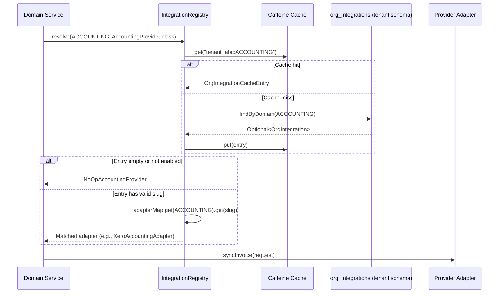
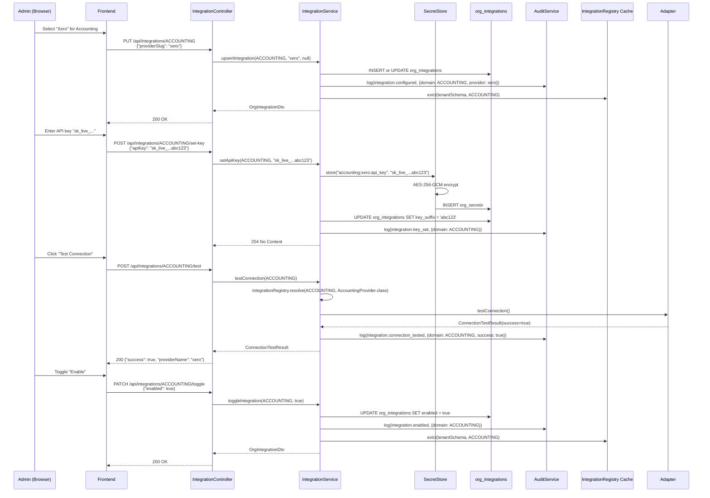
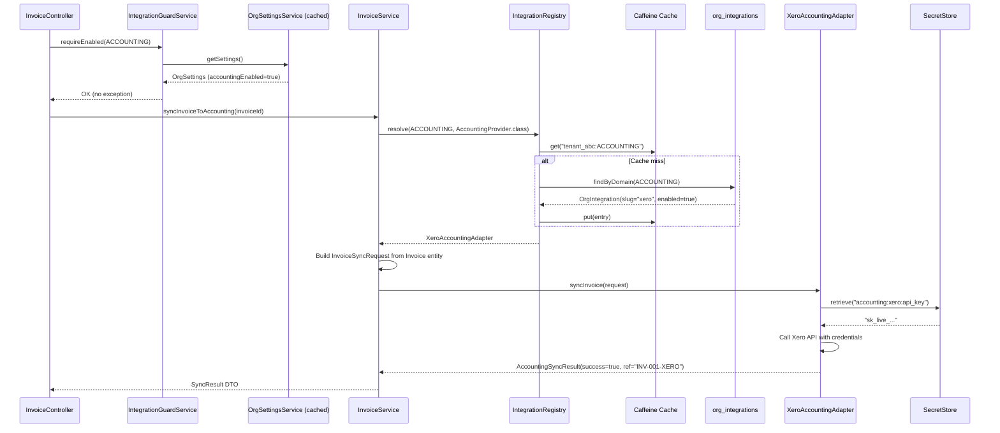
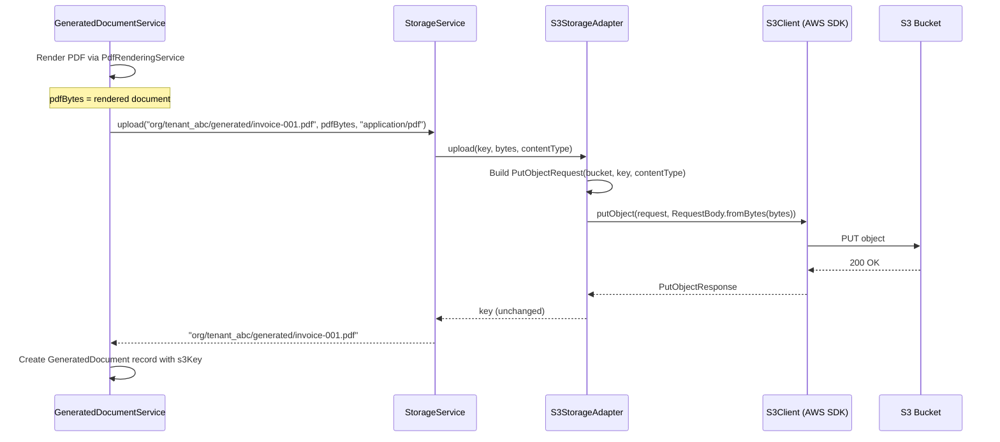
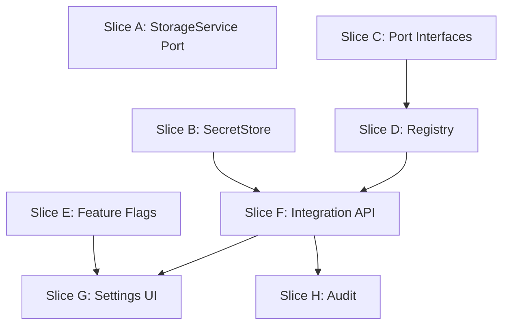

# Phase 21 -- Integration Ports, BYOAK Infrastructure & Feature Flags

> Standalone architecture document. Phases 5+ use separate files rather than sections in ARCHITECTURE.md.

**ADRs**: [ADR-088](../adr/ADR-088-integration-port-package-structure.md), [ADR-089](../adr/ADR-089-tenant-scoped-adapter-resolution.md), [ADR-090](../adr/ADR-090-secret-storage-strategy.md), [ADR-091](../adr/ADR-091-feature-flag-scope.md)

**Migration**: V36 (org_integrations + org_secrets tables, OrgSettings feature flag columns)

---

## 21.1 Overview

Phase 21 is a **structural/architectural phase** that creates clean integration boundaries for all external vendor dependencies. It introduces no new business features -- instead, it defines the **ports** (interfaces), **adapters** (implementations), and **infrastructure** (BYOAK registry, secret storage, feature flags) that future vendor integrations will plug into.

### What's New

| Capability | Before Phase 21 | After Phase 21 |
|---|---|---|
| **Storage** | 5 domain services inject `S3Client` directly; AWS SDK types leak into domain code | All services inject `StorageService` port; S3 details confined to `S3StorageAdapter` |
| **Accounting sync** | Not available | `AccountingProvider` port defined; `NoOpAccountingProvider` stub registered |
| **AI assistance** | Not available | `AiProvider` port defined; `NoOpAiProvider` stub registered |
| **Document signing** | Not available | `DocumentSigningProvider` port defined; `NoOpSigningProvider` stub registered |
| **Secret storage** | Not applicable | `SecretStore` port with `EncryptedDatabaseSecretStore` (AES-256-GCM) |
| **PaymentProvider** | Direct injection, single impl (`MockPaymentProvider`) | Registered with `@IntegrationAdapter`, discoverable via `IntegrationRegistry` |
| **Provider selection** | `PaymentProvider` uses `@ConditionalOnProperty` (system-wide) | Tenant-scoped `IntegrationRegistry` resolves per-org provider + credentials |
| **Integration config** | N/A | `OrgIntegration` entity stores per-tenant provider choice |
| **Feature flags** | N/A | 3 boolean flags on `OrgSettings` gate accounting, AI, and document signing |
| **Integration settings UI** | N/A | New settings page for configuring providers, API keys, and toggles |

### Key Principle

This phase creates the **structure** for integrations without implementing real adapters. Every port ships with a NoOp stub that logs calls and returns success. Real vendor adapters (Xero, OpenAI, DocuSign, etc.) are single-epic efforts in future phases. The value of this phase is that adding any vendor adapter becomes a self-contained implementation task that requires zero changes to domain services, controllers, or the frontend.

---

## 21.2 Domain Model

### New Entities

#### OrgIntegration

Stores per-tenant integration configuration. One row per integration domain per tenant.

| Column | Type | Constraints | Description |
|---|---|---|---|
| `id` | `UUID` | PK, generated | Entity ID |
| `domain` | `VARCHAR(30)` | NOT NULL, UNIQUE | Integration domain (enum stored as STRING) |
| `provider_slug` | `VARCHAR(50)` | NOT NULL | Registered adapter slug (e.g., `"noop"`, `"xero"`) |
| `enabled` | `BOOLEAN` | NOT NULL, DEFAULT FALSE | Whether this integration is active |
| `config_json` | `JSONB` | nullable | Non-sensitive config (base URL overrides, region, etc.) |
| `key_suffix` | `VARCHAR(6)` | nullable | Last 6 chars of API key for masked display |
| `created_at` | `TIMESTAMP` | NOT NULL | Row creation time |
| `updated_at` | `TIMESTAMP` | NOT NULL | Last modification time |

**Unique constraint**: `domain` (one provider per domain per tenant -- enforced by dedicated schema isolation + unique constraint).

#### OrgSecret

Stores encrypted credentials in the tenant's schema.

| Column | Type | Constraints | Description |
|---|---|---|---|
| `id` | `UUID` | PK, generated | Entity ID |
| `secret_key` | `VARCHAR(200)` | NOT NULL, UNIQUE | Logical key (e.g., `"accounting:xero:api_key"`) |
| `encrypted_value` | `TEXT` | NOT NULL | AES-256-GCM ciphertext + auth tag, Base64-encoded |
| `iv` | `VARCHAR(24)` | NOT NULL | 96-bit random IV, Base64-encoded |
| `key_version` | `INT` | NOT NULL, DEFAULT 1 | Encryption key version (for future rotation) |
| `created_at` | `TIMESTAMP` | NOT NULL | Row creation time |
| `updated_at` | `TIMESTAMP` | NOT NULL | Last modification time |

### Extensions to Existing Entities

#### OrgSettings (3 new boolean columns)

| Column | Type | Default | Description |
|---|---|---|---|
| `accounting_enabled` | `BOOLEAN NOT NULL` | `FALSE` | Gate for accounting integration domain |
| `ai_enabled` | `BOOLEAN NOT NULL` | `FALSE` | Gate for AI integration domain |
| `document_signing_enabled` | `BOOLEAN NOT NULL` | `FALSE` | Gate for document signing integration domain |

**Rationale**: Simple booleans on `OrgSettings` (see [ADR-091](../adr/ADR-091-feature-flag-scope.md)). Payment and notification domains are always available -- they are existing core functionality.

### New Enums

```java
public enum IntegrationDomain {
    ACCOUNTING,
    AI,
    DOCUMENT_SIGNING,
    PAYMENT
}
```

`PAYMENT` is included so the existing `PaymentProvider` can participate in the `IntegrationRegistry` discovery mechanism, even though it's not feature-flagged.

### New Records

```java
// Shared across ports
public record PresignedUrl(String url, Instant expiresAt) {}
public record ConnectionTestResult(boolean success, String providerName, String errorMessage) {}

// AccountingProvider records
public record InvoiceSyncRequest(
    String invoiceNumber, String customerName,
    List<LineItem> lineItems, String currency,
    LocalDate issueDate, LocalDate dueDate) {}
public record CustomerSyncRequest(
    String customerName, String email,
    String addressLine1, String addressLine2,
    String city, String postalCode, String country) {}
public record AccountingSyncResult(
    boolean success, String externalReferenceId, String errorMessage) {}
public record LineItem(
    String description, BigDecimal quantity,
    BigDecimal unitPrice, BigDecimal taxAmount) {}

// AiProvider records
public record AiTextRequest(String prompt, int maxTokens, Double temperature) {}
public record AiTextResult(
    boolean success, String content, String errorMessage, Integer tokensUsed) {}

// DocumentSigningProvider records
public record SigningRequest(
    byte[] documentBytes, String contentType,
    String signerName, String signerEmail, String callbackUrl) {}
public record SigningResult(
    boolean success, String signingReference, String errorMessage) {}
public record SigningStatus(
    SigningState state, String signingReference, Instant updatedAt) {}
```

```java
public enum SigningState {
    PENDING, SIGNED, DECLINED, EXPIRED
}
```

### ER Diagram

```mermaid
erDiagram
    OrgSettings ||--o{ OrgIntegration : "flags gate"
    %% OrgIntegration and OrgSecret are related by secret_key naming convention
    %% (e.g., "accounting:xero:api_key"), not by a foreign key.
    OrgIntegration .. OrgSecret : "credentials via naming convention"

    OrgSettings {
        uuid id PK
        varchar default_currency
        boolean accounting_enabled
        boolean ai_enabled
        boolean document_signing_enabled
    }

    OrgIntegration {
        uuid id PK
        varchar domain UK
        varchar provider_slug
        boolean enabled
        jsonb config_json
        varchar key_suffix
        timestamp created_at
        timestamp updated_at
    }

    OrgSecret {
        uuid id PK
        varchar secret_key UK
        text encrypted_value
        varchar iv
        int key_version
        timestamp created_at
        timestamp updated_at
    }

    Invoice ||--o| OrgIntegration : "synced via ACCOUNTING"
    Customer ||--o| OrgIntegration : "synced via ACCOUNTING"
    GeneratedDocument ||--o| OrgIntegration : "signed via DOCUMENT_SIGNING"
```

---

## 21.3 Port Interfaces & Adapter Architecture

All port interfaces live under `io.b2mash.b2b.b2bstrawman.integration.*` per [ADR-088](../adr/ADR-088-integration-port-package-structure.md).

### Package Structure

```
integration/
    IntegrationDomain.java              # Enum
    IntegrationAdapter.java             # Annotation
    IntegrationRegistry.java            # Registry component
    ConnectionTestResult.java           # Shared record
    OrgIntegration.java                 # Entity
    OrgIntegrationRepository.java       # JPA repository
    storage/
        StorageService.java             # Port interface
        PresignedUrl.java               # Domain record
        s3/
            S3StorageAdapter.java       # S3 implementation
    accounting/
        AccountingProvider.java         # Port interface
        InvoiceSyncRequest.java         # Domain record
        CustomerSyncRequest.java        # Domain record
        AccountingSyncResult.java       # Domain record
        LineItem.java                   # Domain record
        NoOpAccountingProvider.java     # NoOp stub
    ai/
        AiProvider.java                 # Port interface
        AiTextRequest.java             # Domain record
        AiTextResult.java              # Domain record
        NoOpAiProvider.java            # NoOp stub
    signing/
        DocumentSigningProvider.java    # Port interface
        SigningRequest.java            # Domain record
        SigningResult.java             # Domain record
        SigningStatus.java             # Domain record
        SigningState.java              # Enum
        NoOpSigningProvider.java       # NoOp stub
    secret/
        SecretStore.java               # Port interface
        EncryptedDatabaseSecretStore.java  # AES-256-GCM implementation
        OrgSecret.java                 # Entity
        OrgSecretRepository.java       # JPA repository
```

### StorageService Port

System-wide infrastructure port. Selected via `@ConditionalOnProperty`, NOT the BYOAK registry.

```java
package io.b2mash.b2b.b2bstrawman.integration.storage;

import java.io.InputStream;
import java.time.Duration;

/**
 * Abstraction for object storage operations. Domain services inject this
 * interface instead of vendor-specific clients (e.g., S3Client).
 *
 * System-wide: selected via @ConditionalOnProperty, not per-tenant.
 */
public interface StorageService {

    /** Upload a file from bytes and return the storage key. */
    String upload(String key, byte[] content, String contentType);

    /** Upload a file from an InputStream (for large files). */
    String upload(String key, InputStream content, long contentLength, String contentType);

    /** Download a file's content as bytes. */
    byte[] download(String key);

    /** Delete a file. Best-effort -- logs warning on failure. */
    void delete(String key);

    /** Generate a presigned upload URL (time-limited). */
    PresignedUrl generateUploadUrl(String key, String contentType, Duration expiry);

    /** Generate a presigned download URL (time-limited). */
    PresignedUrl generateDownloadUrl(String key, Duration expiry);
}
```

#### S3StorageAdapter

```java
package io.b2mash.b2b.b2bstrawman.integration.storage.s3;

import io.b2mash.b2b.b2bstrawman.config.S3Config.S3Properties;
import io.b2mash.b2b.b2bstrawman.integration.storage.PresignedUrl;
import io.b2mash.b2b.b2bstrawman.integration.storage.StorageService;
import org.springframework.boot.autoconfigure.condition.ConditionalOnProperty;
import org.springframework.stereotype.Component;
import software.amazon.awssdk.services.s3.S3Client;
import software.amazon.awssdk.services.s3.presigner.S3Presigner;
// ... all S3-specific imports confined to this class

@Component
@ConditionalOnProperty(name = "storage.provider", havingValue = "s3", matchIfMissing = true)
public class S3StorageAdapter implements StorageService {

    private final S3Client s3Client;
    private final S3Presigner s3Presigner;
    private final String bucketName;

    public S3StorageAdapter(S3Client s3Client, S3Presigner s3Presigner, S3Properties s3Properties) {
        this.s3Client = s3Client;
        this.s3Presigner = s3Presigner;
        this.bucketName = s3Properties.bucketName();
    }

    // Implements all StorageService methods using S3Client and S3Presigner.
    // Absorbs logic from S3PresignedUrlService (presign methods)
    // and from domain services (upload/download/delete methods).
}
```

**Why `@ConditionalOnProperty` and not the registry**: Storage is infrastructure-level. Every tenant uses the same S3 bucket (with tenant-scoped key prefixes like `org/{tenantId}/...`). There's no use case for "Tenant A uses S3, Tenant B uses Azure Blob Storage." The conditional property pattern matches `PaymentProvider` ([ADR-051](../adr/ADR-051-psp-adapter-design.md)) and is the right fit for system-wide, deployment-time selection.

### AccountingProvider Port

Tenant-scoped. Resolved via `IntegrationRegistry` at request time.

```java
package io.b2mash.b2b.b2bstrawman.integration.accounting;

import io.b2mash.b2b.b2bstrawman.integration.ConnectionTestResult;

/**
 * Port for syncing financial data to external accounting software.
 * Tenant-scoped: each org can configure their own provider (Xero, QuickBooks, etc.).
 */
public interface AccountingProvider {

    /** Provider identifier (e.g., "xero", "quickbooks", "noop"). */
    String providerId();

    /** Sync an invoice to the external accounting system. */
    AccountingSyncResult syncInvoice(InvoiceSyncRequest request);

    /** Sync a customer record to the external accounting system. */
    AccountingSyncResult syncCustomer(CustomerSyncRequest request);

    /** Test connectivity with the configured credentials. */
    ConnectionTestResult testConnection();
}
```

#### NoOpAccountingProvider

```java
package io.b2mash.b2b.b2bstrawman.integration.accounting;

import io.b2mash.b2b.b2bstrawman.integration.ConnectionTestResult;
import io.b2mash.b2b.b2bstrawman.integration.IntegrationAdapter;
import io.b2mash.b2b.b2bstrawman.integration.IntegrationDomain;
import java.util.UUID;
import org.slf4j.Logger;
import org.slf4j.LoggerFactory;
import org.springframework.stereotype.Component;

@Component
@IntegrationAdapter(domain = IntegrationDomain.ACCOUNTING, slug = "noop")
public class NoOpAccountingProvider implements AccountingProvider {

    private static final Logger log = LoggerFactory.getLogger(NoOpAccountingProvider.class);

    @Override
    public String providerId() { return "noop"; }

    @Override
    public AccountingSyncResult syncInvoice(InvoiceSyncRequest request) {
        log.info("NoOp accounting: would sync invoice {} for customer {}",
                request.invoiceNumber(), request.customerName());
        return new AccountingSyncResult(true, "NOOP-" + UUID.randomUUID().toString().substring(0, 8), null);
    }

    @Override
    public AccountingSyncResult syncCustomer(CustomerSyncRequest request) {
        log.info("NoOp accounting: would sync customer {}", request.customerName());
        return new AccountingSyncResult(true, "NOOP-" + UUID.randomUUID().toString().substring(0, 8), null);
    }

    @Override
    public ConnectionTestResult testConnection() {
        return new ConnectionTestResult(true, "noop", null);
    }
}
```

### AiProvider Port

Tenant-scoped. Resolved via `IntegrationRegistry`.

```java
package io.b2mash.b2b.b2bstrawman.integration.ai;

import io.b2mash.b2b.b2bstrawman.integration.ConnectionTestResult;
import java.util.List;

/**
 * Port for AI text operations (generation, summarization, categorization).
 * Tenant-scoped: each org can configure their own AI provider.
 */
public interface AiProvider {

    String providerId();

    /** Generate text from a prompt. */
    AiTextResult generateText(AiTextRequest request);

    /** Summarize content to a target length. */
    AiTextResult summarize(String content, int maxLength);

    /** Suggest categories for content based on existing category list. */
    List<String> suggestCategories(String content, List<String> existingCategories);

    /** Test connectivity with the configured credentials. */
    ConnectionTestResult testConnection();
}
```

#### NoOpAiProvider

Returns empty/no-op results. Logs what it would do.

```java
@Component
@IntegrationAdapter(domain = IntegrationDomain.AI, slug = "noop")
public class NoOpAiProvider implements AiProvider {

    @Override
    public String providerId() { return "noop"; }

    @Override
    public AiTextResult generateText(AiTextRequest request) {
        log.info("NoOp AI: would generate text for prompt ({} chars, maxTokens={})",
                request.prompt().length(), request.maxTokens());
        return new AiTextResult(true, "", null, 0);
    }

    @Override
    public AiTextResult summarize(String content, int maxLength) {
        log.info("NoOp AI: would summarize {} chars to max {}", content.length(), maxLength);
        return new AiTextResult(true, "", null, 0);
    }

    @Override
    public List<String> suggestCategories(String content, List<String> existingCategories) {
        log.info("NoOp AI: would suggest categories from {} existing", existingCategories.size());
        return List.of();
    }

    @Override
    public ConnectionTestResult testConnection() {
        return new ConnectionTestResult(true, "noop", null);
    }
}
```

### DocumentSigningProvider Port

Tenant-scoped. Resolved via `IntegrationRegistry`.

```java
package io.b2mash.b2b.b2bstrawman.integration.signing;

import io.b2mash.b2b.b2bstrawman.integration.ConnectionTestResult;

/**
 * Port for sending documents for e-signature and tracking signing status.
 * Tenant-scoped: each org can configure their own signing provider.
 */
public interface DocumentSigningProvider {

    String providerId();

    /** Send a document for e-signature. */
    SigningResult sendForSignature(SigningRequest request);

    /** Check the current signing status. */
    SigningStatus checkStatus(String signingReference);

    /** Download the signed copy of a document. */
    byte[] downloadSigned(String signingReference);

    /** Test connectivity with the configured credentials. */
    ConnectionTestResult testConnection();
}
```

#### NoOpSigningProvider

Returns auto-signed status immediately.

```java
@Component
@IntegrationAdapter(domain = IntegrationDomain.DOCUMENT_SIGNING, slug = "noop")
public class NoOpSigningProvider implements DocumentSigningProvider {

    @Override
    public String providerId() { return "noop"; }

    @Override
    public SigningResult sendForSignature(SigningRequest request) {
        log.info("NoOp signing: would send {} bytes ({}) to {} <{}>",
                request.documentBytes().length, request.contentType(),
                request.signerName(), request.signerEmail());
        var ref = "NOOP-SIGN-" + UUID.randomUUID().toString().substring(0, 8);
        return new SigningResult(true, ref, null);
    }

    @Override
    public SigningStatus checkStatus(String signingReference) {
        return new SigningStatus(SigningState.SIGNED, signingReference, Instant.now());
    }

    @Override
    public byte[] downloadSigned(String signingReference) {
        log.info("NoOp signing: would download signed document for ref {}", signingReference);
        return new byte[0];
    }

    @Override
    public ConnectionTestResult testConnection() {
        return new ConnectionTestResult(true, "noop", null);
    }
}
```

### SecretStore Port

System-wide infrastructure. NOT tenant-configurable (the same encryption implementation is used for all tenants). Secrets are tenant-isolated because the `org_secrets` table lives in each tenant's dedicated schema.

```java
package io.b2mash.b2b.b2bstrawman.integration.secret;

/**
 * Abstraction for storing and retrieving sensitive credentials.
 * Queries execute within the current tenant's schema.
 */
public interface SecretStore {

    /** Store a secret (encrypts before persistence). Overwrites if key exists. */
    void store(String secretKey, String plaintext);

    /** Retrieve a secret (decrypts after read). Throws if not found. */
    String retrieve(String secretKey);

    /** Delete a secret. No-op if not found. */
    void delete(String secretKey);

    /** Check whether a secret exists for the given key. */
    boolean exists(String secretKey);
}
```

### @IntegrationAdapter Annotation

```java
package io.b2mash.b2b.b2bstrawman.integration;

import java.lang.annotation.ElementType;
import java.lang.annotation.Retention;
import java.lang.annotation.RetentionPolicy;
import java.lang.annotation.Target;

/**
 * Marks a Spring bean as an integration adapter. The IntegrationRegistry
 * discovers beans annotated with this at startup and builds the
 * domain -> slug -> adapter mapping.
 */
@Target(ElementType.TYPE)
@Retention(RetentionPolicy.RUNTIME)
public @interface IntegrationAdapter {
    /** The integration domain this adapter serves. */
    IntegrationDomain domain();

    /** Unique slug for this adapter within its domain (e.g., "xero", "noop"). */
    String slug();
}
```

### How Existing Interfaces Fit

`PaymentProvider` and `NotificationChannel` remain in their current packages (`invoice/` and `notification/channel/`). To participate in the `IntegrationRegistry`:

1. Add `@IntegrationAdapter(domain = IntegrationDomain.PAYMENT, slug = "mock")` to `MockPaymentProvider`.
2. The registry discovers it alongside all other annotated beans.
3. `PaymentProvider` does NOT need to move packages or change its interface.
4. `NotificationChannel` is NOT registered -- it uses its own `NotificationDispatcher` routing mechanism based on user preferences, which is a fundamentally different pattern (fan-out to multiple channels vs. single provider resolution).

---

## 21.4 BYOAK Registry & Adapter Resolution

### IntegrationRegistry Component

```java
package io.b2mash.b2b.b2bstrawman.integration;

import com.github.benmanes.caffeine.cache.Cache;
import com.github.benmanes.caffeine.cache.Caffeine;
import io.b2mash.b2b.b2bstrawman.multitenancy.RequestScopes;
import java.time.Duration;
import java.util.List;
import java.util.Map;
import java.util.concurrent.ConcurrentHashMap;
import org.springframework.context.ApplicationContext;
import org.springframework.stereotype.Component;

@Component
public class IntegrationRegistry {

    // Built at startup: domain -> slug -> adapter bean
    private final Map<IntegrationDomain, Map<String, Object>> adapterMap = new ConcurrentHashMap<>();

    // Caffeine cache: "tenantSchema:DOMAIN" -> OrgIntegration (nullable)
    private final Cache<String, OrgIntegrationCacheEntry> configCache;

    private final OrgIntegrationRepository orgIntegrationRepository;
    // NOTE: SecretStore is NOT injected here. Adapters inject SecretStore directly
    // and retrieve their own credentials at method invocation time (see Section 21.4 Credential Injection).

    public IntegrationRegistry(
            ApplicationContext applicationContext,
            OrgIntegrationRepository orgIntegrationRepository) {
        this.orgIntegrationRepository = orgIntegrationRepository;
        this.configCache = Caffeine.newBuilder()
                .expireAfterWrite(Duration.ofSeconds(60))
                .maximumSize(1000)
                .build();

        // Scan for all beans with @IntegrationAdapter.
        // Fail fast if two adapters register with the same domain+slug combination.
        applicationContext.getBeansWithAnnotation(IntegrationAdapter.class)
                .forEach((name, bean) -> {
                    var annotation = bean.getClass().getAnnotation(IntegrationAdapter.class);
                    var slugMap = adapterMap
                        .computeIfAbsent(annotation.domain(), k -> new ConcurrentHashMap<>());
                    var existing = slugMap.putIfAbsent(annotation.slug(), bean);
                    if (existing != null) {
                        throw new IllegalStateException(
                            "Duplicate @IntegrationAdapter: domain=" + annotation.domain()
                            + ", slug=" + annotation.slug()
                            + " registered by both " + existing.getClass().getName()
                            + " and " + bean.getClass().getName());
                    }
                });
    }

    /**
     * Resolve the active adapter for the current tenant and domain.
     * Returns the NoOp adapter if no integration is configured or enabled.
     */
    @SuppressWarnings("unchecked")
    public <T> T resolve(IntegrationDomain domain, Class<T> portInterface) {
        var tenantSchema = RequestScopes.TENANT_ID.get();
        var cacheKey = tenantSchema + ":" + domain.name();

        // IMPORTANT: Caffeine cache.get(key, loader) throws NPE if loader returns null.
        // Always use .orElse(EMPTY) — never return null from this lambda.
        var entry = configCache.get(cacheKey, k ->
                orgIntegrationRepository.findByDomain(domain)
                    .map(OrgIntegrationCacheEntry::of)
                    .orElse(OrgIntegrationCacheEntry.EMPTY));

        var slugMap = adapterMap.getOrDefault(domain, Map.of());

        if (entry == OrgIntegrationCacheEntry.EMPTY || !entry.enabled()) {
            // Return NoOp adapter (slug = "noop")
            return (T) slugMap.get("noop");
        }

        var adapter = slugMap.get(entry.providerSlug());
        if (adapter == null) {
            // Configured slug has no registered adapter -- fall back to NoOp
            return (T) slugMap.get("noop");
        }

        if (!portInterface.isInstance(adapter)) {
            throw new IllegalStateException("Adapter " + adapter.getClass().getName() +
                " does not implement " + portInterface.getName() + " for domain " + domain);
        }

        return (T) adapter;
    }

    /** Lists available provider slugs for a given domain. */
    public List<String> availableProviders(IntegrationDomain domain) {
        return List.copyOf(adapterMap.getOrDefault(domain, Map.of()).keySet());
    }

    /** Evict cached config for a tenant + domain (called on config change). */
    public void evict(String tenantSchema, IntegrationDomain domain) {
        configCache.invalidate(tenantSchema + ":" + domain.name());
    }

    private record OrgIntegrationCacheEntry(
            String providerSlug, boolean enabled, String configJson) {
        static final OrgIntegrationCacheEntry EMPTY =
                new OrgIntegrationCacheEntry(null, false, null);

        static OrgIntegrationCacheEntry of(OrgIntegration integration) {
            return new OrgIntegrationCacheEntry(
                    integration.getProviderSlug(),
                    integration.isEnabled(),
                    integration.getConfigJson());
        }
    }
}
```

### Resolution Flow



### Credential Injection

When a real adapter needs API keys (future phase), the adapter itself calls `SecretStore.retrieve()` at method invocation time. The adapter knows its own secret key naming convention (e.g., `"accounting:xero:api_key"`). This keeps credential management inside the adapter, not in the registry.

```java
// Future Xero adapter example (NOT built in Phase 21):
@IntegrationAdapter(domain = IntegrationDomain.ACCOUNTING, slug = "xero")
@Component
public class XeroAccountingAdapter implements AccountingProvider {
    private final SecretStore secretStore;

    @Override
    public AccountingSyncResult syncInvoice(InvoiceSyncRequest request) {
        String apiKey = secretStore.retrieve("accounting:xero:api_key");
        // Use apiKey to call Xero API...
    }
}
```

---

## 21.5 SecretStore & Encryption

### AES-256-GCM Design

Per [ADR-090](../adr/ADR-090-secret-storage-strategy.md), secrets are encrypted at the application layer using AES-256-GCM before being stored in the database.

#### Encryption Parameters

| Parameter | Value | Rationale |
|---|---|---|
| Algorithm | AES/GCM/NoPadding | Authenticated encryption -- provides confidentiality + integrity |
| Key size | 256 bits | AES-256 is the standard for sensitive data |
| IV size | 96 bits (12 bytes) | GCM specification recommends 96-bit IVs |
| Auth tag | 128 bits | Appended to ciphertext by Java's `Cipher` (GCM default) |
| Key source | `INTEGRATION_ENCRYPTION_KEY` env var | Base64-encoded 256-bit key |
| IV generation | `SecureRandom` per encrypt | Each secret gets a unique random IV |

#### Encryption Flow

1. Generate 96-bit random IV via `SecureRandom`
2. Initialize `Cipher` with `AES/GCM/NoPadding`, `SecretKeySpec`, and `GCMParameterSpec(128, iv)`
3. Encrypt plaintext bytes -> ciphertext + auth tag (Java GCM appends tag to ciphertext)
4. Base64-encode ciphertext and IV for database storage
5. Store in `org_secrets` with `key_version = 1`

#### Decryption Flow

1. Read `encrypted_value`, `iv`, and `key_version` from `org_secrets`
2. Base64-decode both values
3. Initialize `Cipher` for `DECRYPT_MODE` with the key for the stored `key_version`
4. Decrypt and verify auth tag -- `AEADBadTagException` if tampered
5. Return plaintext string

### EncryptedDatabaseSecretStore

```java
package io.b2mash.b2b.b2bstrawman.integration.secret;

import jakarta.annotation.PostConstruct;
import javax.crypto.Cipher;
import javax.crypto.spec.GCMParameterSpec;
import javax.crypto.spec.SecretKeySpec;
import java.security.SecureRandom;
import java.time.Instant;
import java.util.Base64;
import java.util.UUID;
import org.springframework.beans.factory.annotation.Value;
import org.springframework.stereotype.Component;
import org.springframework.transaction.annotation.Transactional;

@Component
public class EncryptedDatabaseSecretStore implements SecretStore {
    // NOTE: @Transactional is applied at the method level, not class level.
    // store() and delete() use @Transactional (read-write).
    // retrieve() and exists() use @Transactional(readOnly = true).

    private static final String ALGORITHM = "AES/GCM/NoPadding";
    private static final int GCM_TAG_LENGTH = 128; // bits
    private static final int IV_LENGTH = 12; // bytes (96 bits)

    private final OrgSecretRepository repository;
    private final SecretKeySpec secretKey;
    private final SecureRandom secureRandom = new SecureRandom();

    public EncryptedDatabaseSecretStore(
            OrgSecretRepository repository,
            @Value("${integration.encryption-key:}") String encodedKey) {
        this.repository = repository;
        if (encodedKey.isBlank()) {
            this.secretKey = null; // Will fail at @PostConstruct
        } else {
            byte[] keyBytes = Base64.getDecoder().decode(encodedKey);
            this.secretKey = new SecretKeySpec(keyBytes, "AES");
        }
    }

    @PostConstruct
    void validateKey() {
        if (secretKey == null) {
            throw new IllegalStateException(
                "INTEGRATION_ENCRYPTION_KEY environment variable is not set. "
                + "Cannot start without encryption key for secret storage.");
        }
        if (secretKey.getEncoded().length != 32) {
            throw new IllegalStateException(
                "INTEGRATION_ENCRYPTION_KEY must be a Base64-encoded 256-bit (32-byte) key. "
                + "Got " + secretKey.getEncoded().length + " bytes.");
        }
    }

    @Transactional
    // store() — encrypts and persists (upsert by secret_key)

    @Transactional(readOnly = true)
    // retrieve() — reads and decrypts

    @Transactional
    // delete() — removes secret by key

    @Transactional(readOnly = true)
    // exists() — checks if secret exists

    // All methods use Cipher for encrypt/decrypt and OrgSecretRepository for persistence.
}
```

### Startup Validation

The `@PostConstruct validateKey()` method ensures **fail-fast** behavior:
- Missing `INTEGRATION_ENCRYPTION_KEY` --> application fails to start with a clear error message
- Wrong key length --> application fails to start
- This prevents the system from running with no encryption (silently storing plaintext) or with a weak key

### Threat Model

| Threat | Protected? | Notes |
|---|---|---|
| Database backup theft | Yes | Ciphertext is useless without the master key |
| Unauthorized DB read access | Yes | Same as above |
| SQL injection reading `org_secrets` | Yes | Attacker gets ciphertext, not plaintext |
| Compromised application server | **No** | Attacker has access to the master key in memory |
| Insider with ECS task definition access | **No** | Can read the env var containing the master key |
| Key brute-force | Yes | AES-256 is computationally infeasible to brute-force |

### org_secrets Table Schema

```sql
CREATE TABLE org_secrets (
    id              UUID PRIMARY KEY DEFAULT gen_random_uuid(),
    secret_key      VARCHAR(200) NOT NULL,
    encrypted_value TEXT NOT NULL,
    iv              VARCHAR(24) NOT NULL,
    key_version     INT NOT NULL DEFAULT 1,
    created_at      TIMESTAMP NOT NULL DEFAULT now(),
    updated_at      TIMESTAMP NOT NULL DEFAULT now(),
    CONSTRAINT uq_org_secrets_key UNIQUE (secret_key)
);
```

---

## 21.6 Feature Flags

Per [ADR-091](../adr/ADR-091-feature-flag-scope.md), feature flags are boolean columns on the existing `OrgSettings` entity.

### OrgSettings Extension

Three new fields added to the `OrgSettings` entity:

```java
// In OrgSettings.java
@Column(name = "accounting_enabled", nullable = false)
private boolean accountingEnabled;

@Column(name = "ai_enabled", nullable = false)
private boolean aiEnabled;

@Column(name = "document_signing_enabled", nullable = false)
private boolean documentSigningEnabled;

// Constructor sets all to false (opt-in)
public OrgSettings(String defaultCurrency) {
    // ... existing fields ...
    this.accountingEnabled = false;
    this.aiEnabled = false;
    this.documentSigningEnabled = false;
}

// Domain getters
public boolean isAccountingEnabled() { return accountingEnabled; }
public boolean isAiEnabled() { return aiEnabled; }
public boolean isDocumentSigningEnabled() { return documentSigningEnabled; }

// Domain mutation (sets all three + updates timestamp)
public void updateIntegrationFlags(boolean accounting, boolean ai, boolean documentSigning) {
    this.accountingEnabled = accounting;
    this.aiEnabled = ai;
    this.documentSigningEnabled = documentSigning;
    this.updatedAt = Instant.now();
}
```

### IntegrationGuardService

A single-purpose service that checks whether an integration domain is enabled for the current tenant.

```java
package io.b2mash.b2b.b2bstrawman.integration;

import io.b2mash.b2b.b2bstrawman.settings.OrgSettingsService;
import org.springframework.http.HttpStatus;
import org.springframework.stereotype.Service;
import org.springframework.web.ErrorResponseException;

@Service
public class IntegrationGuardService {

    private final OrgSettingsService orgSettingsService;

    public IntegrationGuardService(OrgSettingsService orgSettingsService) {
        this.orgSettingsService = orgSettingsService;
    }

    /**
     * Throws 403 if the given integration domain is not enabled for the current tenant.
     * Uses cached OrgSettings -- no additional DB query.
     */
    public void requireEnabled(IntegrationDomain domain) {
        var settings = orgSettingsService.getSettings();
        boolean enabled = switch (domain) {
            case ACCOUNTING -> settings.isAccountingEnabled();
            case AI -> settings.isAiEnabled();
            case DOCUMENT_SIGNING -> settings.isDocumentSigningEnabled();
            case PAYMENT -> true; // Always available
        };
        if (!enabled) {
            throw new IntegrationDisabledException(domain);
        }
    }
}
```

`IntegrationDisabledException` extends `ErrorResponseException` and produces a 403 ProblemDetail:

```json
{
  "type": "about:blank",
  "title": "Integration Disabled",
  "status": 403,
  "detail": "The ACCOUNTING integration domain is not enabled for this organization.",
  "instance": "/api/integrations/accounting/test"
}
```

### Backend Gating Pattern

Domain services or controllers call the guard before performing integration operations:

```java
// In a service method:
integrationGuard.requireEnabled(IntegrationDomain.ACCOUNTING);
var provider = integrationRegistry.resolve(IntegrationDomain.ACCOUNTING, AccountingProvider.class);
provider.syncInvoice(request);
```

### Frontend Gating

The existing `/api/org-settings` response includes the three boolean flags. The frontend checks these flags to:

1. **Integrations settings page**: Show all domains. Disabled domains display an "Enable" toggle.
2. **Domain-specific UI elsewhere** (e.g., "Sync to Xero" button on an invoice page): Check the flag and render as disabled or hidden when the domain is off.

```typescript
// In a server component:
const settings = await getOrgSettings();

// Pass to client component:
<SyncToAccountingButton disabled={!settings.accountingEnabled} />
```

### Flag + Registry Interaction

The feature flag and the BYOAK registry are **independent checks**:

1. **Feature flag** (`OrgSettings.accountingEnabled`): Controls whether the domain is available at all. Checked by `IntegrationGuardService`.
2. **Registry resolution** (`IntegrationRegistry.resolve()`): Returns the configured adapter (or NoOp if none configured). Does NOT check the feature flag.

The flag is checked first (by the guard in the controller/service layer). If the flag is enabled, the registry resolves the adapter. This separation means the registry doesn't need to know about flags, and the guard doesn't need to know about adapters.

---

## 21.7 API Surface

### Integration Management Endpoints

All endpoints under `/api/integrations`. Require `ROLE_ORG_ADMIN` or `ROLE_ORG_OWNER`.

#### GET /api/integrations

List all integration configurations for the current tenant.

**Response** (200):
```json
[
  {
    "domain": "ACCOUNTING",
    "providerSlug": "noop",
    "enabled": true,
    "keySuffix": "abc123",
    "configJson": null,
    "updatedAt": "2026-02-22T10:30:00Z"
  },
  {
    "domain": "AI",
    "providerSlug": null,
    "enabled": false,
    "keySuffix": null,
    "configJson": null,
    "updatedAt": null
  }
]
```

Returns all 4 domains. Domains without an `OrgIntegration` row return a synthesised entry with nulls.

#### GET /api/integrations/providers

List available provider slugs per domain (from the registry's startup scan).

**Response** (200):
```json
{
  "ACCOUNTING": ["noop"],
  "AI": ["noop"],
  "DOCUMENT_SIGNING": ["noop"],
  "PAYMENT": ["mock"]
}
```

#### PUT /api/integrations/{domain}

Upsert integration configuration for a domain.

**Request**:
```json
{
  "providerSlug": "xero",
  "configJson": {"region": "au"}
}
```

**Response** (200): Updated `OrgIntegration` DTO.

Creates the row if it doesn't exist, updates if it does. Does NOT enable the integration -- that's a separate toggle.

#### POST /api/integrations/{domain}/set-key

Set the API key for an integration domain. Write-only -- the key is encrypted and stored via `SecretStore`. The last 6 characters are stored as `key_suffix` on `OrgIntegration`.

> **Rate-limited** (same policy as connection test). Admin/owner role required.

**Request**:
```json
{
  "apiKey": "sk_live_abc123def456..."
}
```

**Response** (204): No body.

#### POST /api/integrations/{domain}/test

Test the connection using the configured provider and stored credentials.

**Response** (200):
```json
{
  "success": true,
  "providerName": "noop",
  "errorMessage": null
}
```

#### DELETE /api/integrations/{domain}/key

Remove the API key for an integration domain. Deletes the secret from `SecretStore` and clears `key_suffix`.

**Response** (204): No body.

#### PATCH /api/integrations/{domain}/toggle

Enable or disable an integration domain.

**Request**:
```json
{
  "enabled": true
}
```

**Response** (200): Updated `OrgIntegration` DTO.

Enabling requires that a provider is configured and an API key is set (for non-noop providers). Returns 400 if preconditions are not met.

### Feature Flag Endpoints

The three integration feature flags are exposed via the **existing** `/api/org-settings` endpoints:

- `GET /api/org-settings` response includes `accountingEnabled`, `aiEnabled`, `documentSigningEnabled`
- `PUT /api/org-settings` request accepts these fields to update flags (admin/owner only)

No new endpoints needed for feature flags.

---

## 21.8 S3 Refactoring Plan

### Current State

5 domain services inject `S3Client` directly. AWS SDK types (`PutObjectRequest`, `DeleteObjectRequest`, `GetObjectRequest`, `RequestBody`) leak into domain code.

### Target State

All 5 services inject `StorageService`. Zero AWS SDK imports outside of `integration/storage/s3/`.

### Refactoring Per Service

| Service | Current S3 Usage | StorageService Replacement | Notes |
|---|---|---|---|
| `GeneratedDocumentService` | `s3Client.putObject(PutObjectRequest, RequestBody.fromBytes())` for PDF upload | `storageService.upload(key, pdfBytes, "application/pdf")` | Remove `S3Client` and `S3Properties` constructor params |
| `OrgSettingsService` | `s3Client.putObject()` for logo upload, `s3Client.deleteObject()` for logo delete, `s3PresignedUrlService.generateDownloadUrl()` for logo URL | `storageService.upload(key, bytes, contentType)`, `storageService.delete(key)`, `storageService.generateDownloadUrl(key, Duration.ofHours(1))` | Remove `S3Client`, `S3PresignedUrlService`, and `S3Properties` constructor params |
| `DataExportService` | `s3Client.putObject()` for ZIP upload | `storageService.upload(key, zipBytes, "application/zip")` | Remove `S3Client` and `S3Properties` constructor params |
| `DataAnonymizationService` | `s3Client.deleteObject()` for customer doc deletion (best-effort) | `storageService.delete(key)` (best-effort delete is handled by `StorageService.delete()` contract) | Remove `S3Client` and `S3Properties` constructor params |
| `RetentionService` | `s3Client.deleteObject()` for expired doc deletion (best-effort) | `storageService.delete(key)` | Remove `S3Client` and `S3Properties` constructor params |

### S3PresignedUrlService Disposition

`S3PresignedUrlService` currently serves two roles:

1. **Presigned URL generation** (its primary purpose) -- this logic moves into `S3StorageAdapter`
2. **S3 key path builders** (`buildKey()`, `buildOrgKey()`, `buildCustomerKey()`) -- these are domain-level path conventions, not S3-specific

**Decision**: Keep `S3PresignedUrlService` temporarily as a thin delegate that calls `StorageService` for the presigned URL methods. The key builder methods stay because they encode domain-specific path conventions (`org/{tenantId}/project/{projectId}/{docId}`). In a future cleanup, the key builders can move to a `StorageKeyBuilder` utility or into the `DocumentController` that currently calls them. The presigned URL methods will delegate to `StorageService.generateUploadUrl()` / `generateDownloadUrl()`.

Alternatively, `S3PresignedUrlService` can be deleted entirely if the `DocumentController` (its primary caller) is updated to use `StorageService` directly with inline key building. This is a judgment call during implementation.

---

## 21.9 Sequence Diagrams

### 21.9.1 Admin Configures an Integration



### 21.9.2 Runtime Adapter Resolution (Domain Service)



### 21.9.3 StorageService Upload Flow



---

## 21.10 Audit Integration

### New Audit Event Types

| Event Type | Trigger | Details (Map keys) |
|---|---|---|
| `integration.configured` | Provider selected/changed for a domain | `domain`, `providerSlug`, `previousProvider` (nullable) |
| `integration.key_set` | API key set for a domain | `domain` (NEVER log the key value) |
| `integration.key_removed` | API key deleted for a domain | `domain` |
| `integration.enabled` | Integration domain enabled | `domain`, `providerSlug` |
| `integration.disabled` | Integration domain disabled | `domain`, `providerSlug` |
| `integration.connection_tested` | Connection test executed | `domain`, `providerSlug`, `success`, `errorMessage` (nullable) |

### Usage Pattern

Following the existing `AuditEventBuilder` convention:

```java
auditService.log(
    AuditEventBuilder.builder()
        .eventType("integration.configured")
        .entityType("org_integration")
        .entityId(orgIntegration.getId())
        .details(Map.of(
            "domain", domain.name(),
            "providerSlug", providerSlug,
            "previousProvider", previousSlug != null ? previousSlug : "none"))
        .build());
```

### Security: What NOT to Log

The API key value must NEVER appear in audit events, log statements, or error messages. The `integration.key_set` event logs only the domain and the fact that a key was set. The `key_suffix` (last 6 chars) may be logged for traceability but not the full key.

---

## 21.11 Database Migrations

### V36: Integration Tables & Feature Flags

This migration runs in each **tenant schema** (not the global schema). Managed by the existing `TenantMigrationRunner` via Flyway.

```sql
-- V36__create_integration_tables.sql

-- Integration configuration per domain
CREATE TABLE org_integrations (
    id              UUID PRIMARY KEY DEFAULT gen_random_uuid(),
    domain          VARCHAR(30) NOT NULL,
    provider_slug   VARCHAR(50) NOT NULL,
    enabled         BOOLEAN NOT NULL DEFAULT FALSE,
    config_json     JSONB,
    key_suffix      VARCHAR(6),
    created_at      TIMESTAMP NOT NULL DEFAULT now(),
    updated_at      TIMESTAMP NOT NULL DEFAULT now(),
    CONSTRAINT uq_org_integrations_domain UNIQUE (domain)
);

-- Index on domain for lookup (covered by unique constraint, but explicit for clarity)
-- The unique constraint already creates an index, so no additional index needed.

-- Encrypted secrets storage
CREATE TABLE org_secrets (
    id              UUID PRIMARY KEY DEFAULT gen_random_uuid(),
    secret_key      VARCHAR(200) NOT NULL,
    encrypted_value TEXT NOT NULL,
    iv              VARCHAR(24) NOT NULL,
    key_version     INT NOT NULL DEFAULT 1,
    created_at      TIMESTAMP NOT NULL DEFAULT now(),
    updated_at      TIMESTAMP NOT NULL DEFAULT now(),
    CONSTRAINT uq_org_secrets_key UNIQUE (secret_key)
);

-- Feature flags on OrgSettings
ALTER TABLE org_settings ADD COLUMN accounting_enabled BOOLEAN NOT NULL DEFAULT FALSE;
ALTER TABLE org_settings ADD COLUMN ai_enabled BOOLEAN NOT NULL DEFAULT FALSE;
ALTER TABLE org_settings ADD COLUMN document_signing_enabled BOOLEAN NOT NULL DEFAULT FALSE;
```

### Index Rationale

- `org_integrations.domain` UNIQUE constraint: Enforces one provider per domain. The unique index also serves as the lookup index for `findByDomain()`.
- `org_secrets.secret_key` UNIQUE constraint: Enforces one secret per logical key. Used for `findBySecretKey()` lookups.
- No additional indexes needed: both tables are tiny (max 4 rows for integrations, max ~8 rows for secrets per tenant) and queried by their unique columns.

### Note on Global Schema

No global migration needed. `org_integrations` and `org_secrets` are tenant-scoped tables that live in dedicated schemas, consistent with all other tenant entities (Phase 13, [ADR-064](../adr/ADR-064-dedicated-schema-only.md)).

---

## 21.12 Implementation Guidance

### Backend Changes

| File / Package | Change Description |
|---|---|
| `integration/` (new) | New top-level package with sub-packages per [ADR-088](../adr/ADR-088-integration-port-package-structure.md) |
| `integration/IntegrationDomain.java` | New enum: `ACCOUNTING`, `AI`, `DOCUMENT_SIGNING`, `PAYMENT` |
| `integration/IntegrationAdapter.java` | New annotation: `@IntegrationAdapter(domain, slug)` |
| `integration/IntegrationRegistry.java` | New component: startup adapter discovery, runtime resolution, Caffeine cache |
| `integration/IntegrationGuardService.java` | New service: feature flag checking, throws 403 |
| `integration/IntegrationDisabledException.java` | New exception: extends `ErrorResponseException`, 403 status |
| `integration/ConnectionTestResult.java` | New shared record |
| `integration/storage/StorageService.java` | New port interface |
| `integration/storage/PresignedUrl.java` | New domain record |
| `integration/storage/s3/S3StorageAdapter.java` | New adapter: wraps `S3Client` + `S3Presigner` |
| `integration/accounting/*` | New port + records + NoOp stub |
| `integration/ai/*` | New port + records + NoOp stub |
| `integration/signing/*` | New port + records + NoOp stub |
| `integration/secret/SecretStore.java` | New port interface |
| `integration/secret/EncryptedDatabaseSecretStore.java` | New implementation with AES-256-GCM |
| `integration/secret/OrgSecret.java` | New entity |
| `integration/secret/OrgSecretRepository.java` | New JPA repository |
| `integration/OrgIntegration.java` | New entity |
| `integration/OrgIntegrationRepository.java` | New JPA repository |
| `integration/IntegrationController.java` | New REST controller: CRUD + set-key + test + toggle |
| `integration/IntegrationService.java` | New service: orchestrates config, secrets, audit, cache eviction |
| `settings/OrgSettings.java` | Add 3 boolean fields + getter + mutation method |
| `settings/OrgSettingsService.java` | Replace `S3Client`/`S3PresignedUrlService` with `StorageService` |
| `template/GeneratedDocumentService.java` | Replace `S3Client` with `StorageService` |
| `datarequest/DataExportService.java` | Replace `S3Client` with `StorageService` |
| `datarequest/DataAnonymizationService.java` | Replace `S3Client` with `StorageService` |
| `retention/RetentionService.java` | Replace `S3Client` with `StorageService` |
| `invoice/MockPaymentProvider.java` | Add `@IntegrationAdapter(domain = PAYMENT, slug = "mock")` |
| `db/migration/tenant/V36__create_integration_tables.sql` | New migration file |

### Frontend Changes

| File / Path | Change Description |
|---|---|
| `app/(app)/org/[slug]/settings/integrations/` | New settings page: integration domain cards |
| `components/integrations/IntegrationCard.tsx` | Card component: provider dropdown, key input, toggle, test button |
| `components/integrations/SetApiKeyDialog.tsx` | Dialog: password input for API key entry |
| `components/integrations/ConnectionTestButton.tsx` | Button + toast for test results |
| `lib/api/integrations.ts` | API client functions for all integration endpoints |
| `app/(app)/org/[slug]/settings/layout.tsx` | Add "Integrations" to settings sidebar nav |
| `lib/types/org-settings.ts` | Add `accountingEnabled`, `aiEnabled`, `documentSigningEnabled` to OrgSettings type |

### Entity Code Pattern

Following `DocumentTemplate` (Phase 12 reference):

```java
@Entity
@Table(name = "org_integrations")
public class OrgIntegration {

    // No @Filter, no tenant_id -- schema boundary handles isolation
    @Id
    @GeneratedValue(strategy = GenerationType.UUID)
    private UUID id;

    @Enumerated(EnumType.STRING)
    @Column(name = "domain", nullable = false, length = 30)
    private IntegrationDomain domain;

    @Column(name = "provider_slug", nullable = false, length = 50)
    private String providerSlug;

    @Column(name = "enabled", nullable = false)
    private boolean enabled;

    @JdbcTypeCode(SqlTypes.JSON)
    @Column(name = "config_json", columnDefinition = "jsonb")
    private String configJson;

    @Column(name = "key_suffix", length = 6)
    private String keySuffix;

    @Column(name = "created_at", nullable = false, updatable = false)
    private Instant createdAt;

    @Column(name = "updated_at", nullable = false)
    private Instant updatedAt;

    protected OrgIntegration() {}

    public OrgIntegration(IntegrationDomain domain, String providerSlug) {
        this.domain = domain;
        this.providerSlug = providerSlug;
        this.enabled = false;
        this.createdAt = Instant.now();
        this.updatedAt = Instant.now();
    }

    public void updateProvider(String providerSlug, String configJson) {
        this.providerSlug = providerSlug;
        this.configJson = configJson;
        this.updatedAt = Instant.now();
    }

    public void setKeySuffix(String keySuffix) {
        this.keySuffix = keySuffix;
        this.updatedAt = Instant.now();
    }

    public void clearKeySuffix() {
        this.keySuffix = null;
        this.updatedAt = Instant.now();
    }

    public void enable() {
        this.enabled = true;
        this.updatedAt = Instant.now();
    }

    public void disable() {
        this.enabled = false;
        this.updatedAt = Instant.now();
    }

    // Getters for all fields
    // No bare setters for id, domain, createdAt
}
```

#### OrgSecret Entity

```java
@Entity
@Table(name = "org_secrets")
public class OrgSecret {

    // No @Filter, no tenant_id -- schema boundary handles isolation
    @Id
    @GeneratedValue(strategy = GenerationType.UUID)
    private UUID id;

    @Column(name = "secret_key", nullable = false, length = 200)
    private String secretKey;

    @Column(name = "encrypted_value", nullable = false, columnDefinition = "TEXT")
    private String encryptedValue;

    @Column(name = "iv", nullable = false, length = 24)
    private String iv;

    @Column(name = "key_version", nullable = false)
    private int keyVersion;

    @Column(name = "created_at", nullable = false, updatable = false)
    private Instant createdAt;

    @Column(name = "updated_at", nullable = false)
    private Instant updatedAt;

    protected OrgSecret() {}

    public OrgSecret(String secretKey, String encryptedValue, String iv, int keyVersion) {
        this.secretKey = secretKey;
        this.encryptedValue = encryptedValue;
        this.iv = iv;
        this.keyVersion = keyVersion;
        this.createdAt = Instant.now();
        this.updatedAt = Instant.now();
    }

    public void updateEncryptedValue(String encryptedValue, String iv, int keyVersion) {
        this.encryptedValue = encryptedValue;
        this.iv = iv;
        this.keyVersion = keyVersion;
        this.updatedAt = Instant.now();
    }

    // Getters for all fields
    // No bare setters for id, secretKey, createdAt
}
```

### Testing Strategy

| Test Category | What to Test | Approach |
|---|---|---|
| **StorageService refactoring** | All 5 services work with `StorageService` mock | Existing tests pass with `StorageService` injected instead of `S3Client`. Use `@MockitoBean` for `StorageService` in unit/integration tests. |
| **EncryptedDatabaseSecretStore** | Encrypt/decrypt round-trip, cross-tenant isolation, missing key fail-fast | Integration tests with real DB. Verify ciphertext differs for same plaintext (unique IV). Verify fail-fast with blank `INTEGRATION_ENCRYPTION_KEY`. |
| **IntegrationRegistry** | Adapter discovery, cache behaviour, NoOp fallback | Unit test with mock `ApplicationContext`. Verify `resolve()` returns NoOp when no config, correct adapter when configured. |
| **IntegrationGuardService** | Feature flag gating | Unit test: mock `OrgSettingsService`, verify 403 thrown when disabled, no exception when enabled. |
| **Integration API endpoints** | CRUD, set-key, test, toggle | MockMvc integration tests. Verify admin role required, key never returned, audit events logged. |
| **OrgSettings extension** | New boolean fields persist and cache correctly | Extend existing `OrgSettingsService` tests with flag assertions. |
| **NoOp stubs** | Stubs log and return expected results | Unit tests: verify return values match spec (success=true, NOOP- prefix refs). |

---

## 21.13 Permission Model

| Action | Required Role | Notes |
|---|---|---|
| View integration configurations | `ROLE_ORG_ADMIN`, `ROLE_ORG_OWNER` | Regular members cannot see API key suffixes or provider config |
| Configure integration (select provider) | `ROLE_ORG_ADMIN`, `ROLE_ORG_OWNER` | |
| Set / remove API key | `ROLE_ORG_ADMIN`, `ROLE_ORG_OWNER` | Key is write-only, encrypted |
| Enable / disable integration | `ROLE_ORG_ADMIN`, `ROLE_ORG_OWNER` | |
| Test connection | `ROLE_ORG_ADMIN`, `ROLE_ORG_OWNER` | Rate-sensitive: exercises external API |
| **Use** integrations (e.g., sync invoice) | `ROLE_ORG_MEMBER` (and above) | Regular members can trigger sync actions. The integration must be configured and enabled by an admin. |
| Toggle feature flags | `ROLE_ORG_ADMIN`, `ROLE_ORG_OWNER` | Via OrgSettings update API |

The integration management endpoints (`/api/integrations/**`) use `@PreAuthorize("hasAnyRole('ROLE_ORG_ADMIN', 'ROLE_ORG_OWNER')")` at the controller level.

Domain endpoints that USE integrations (e.g., a future "Sync to Accounting" button on the invoice page) follow the existing role model for that domain (e.g., invoice management requires project lead or above).

---

## 21.14 Capability Slices

### Slice A: StorageService Port + S3 Refactoring

**Scope**: Backend only (pure refactoring)

**Deliverables**:
- `StorageService` interface + `PresignedUrl` record
- `S3StorageAdapter` implementation (absorbs `S3PresignedUrlService` presign logic)
- Refactor `GeneratedDocumentService`, `OrgSettingsService`, `DataExportService`, `DataAnonymizationService`, `RetentionService` to inject `StorageService`
- Remove all AWS SDK imports from the 5 domain services
- Delete or subsume `S3PresignedUrlService` into `S3StorageAdapter` (its functionality is absorbed by the `StorageService` port)
- `S3PresignedUrlService`: either deleted (with key builders moved) or kept as thin delegate

**Dependencies**: None (can start immediately)

**Tests**: All existing tests for the 5 refactored services must pass. New unit tests for `S3StorageAdapter`. Verify no AWS SDK imports outside `integration/storage/s3/`.

**Estimated scope**: ~15 files modified, ~3 new files

---

### Slice B: SecretStore Port + Encrypted Database Implementation

**Scope**: Backend only

**Deliverables**:
- `SecretStore` interface
- `OrgSecret` entity + `OrgSecretRepository`
- `EncryptedDatabaseSecretStore` (AES-256-GCM, `@PostConstruct` validation)
- V36 migration: `org_secrets` table portion

**Dependencies**: None (can start immediately, parallel with Slice A)

**Tests**: Integration tests for encrypt/decrypt round-trip, unique IV per encrypt, missing key fail-fast, cross-tenant isolation (different schemas get different secrets).

**Estimated scope**: ~5 new files

---

### Slice C: Integration Port Interfaces + NoOp Stubs

**Scope**: Backend only

**Deliverables**:
- `AccountingProvider` interface + domain records (`InvoiceSyncRequest`, `CustomerSyncRequest`, `AccountingSyncResult`, `LineItem`) + `NoOpAccountingProvider`
- `AiProvider` interface + domain records (`AiTextRequest`, `AiTextResult`) + `NoOpAiProvider`
- `DocumentSigningProvider` interface + domain records (`SigningRequest`, `SigningResult`, `SigningStatus`, `SigningState`) + `NoOpSigningProvider`
- `ConnectionTestResult` shared record
- `IntegrationDomain` enum

**Dependencies**: None (can start immediately, parallel with A and B)

**Tests**: Unit tests for each NoOp stub (verify return values, logging).

**Estimated scope**: ~15 new files

---

### Slice D: OrgIntegration Entity + IntegrationRegistry + Annotation

**Scope**: Backend only

**Deliverables**:
- `OrgIntegration` entity + `OrgIntegrationRepository`
- `@IntegrationAdapter` annotation
- `IntegrationRegistry` component (startup discovery, Caffeine cache, `resolve()`, `evict()`)
- V36 migration: `org_integrations` table portion
- Add `@IntegrationAdapter` to `NoOpAccountingProvider`, `NoOpAiProvider`, `NoOpSigningProvider`, `MockPaymentProvider`

**Dependencies**: Slice C (port interfaces and NoOp stubs must exist for registry to discover them)

**Tests**: Unit tests for registry discovery and resolution. Integration test for cache behavior and NoOp fallback.

**Estimated scope**: ~6 new files, ~4 modified

---

### Slice E: Feature Flags

**Scope**: Backend + frontend

**Deliverables**:
- `OrgSettings` entity extension (3 boolean fields)
- `IntegrationGuardService` + `IntegrationDisabledException`
- V36 migration: `ALTER TABLE org_settings` portion
- Update `OrgSettings` DTO and response to include flags
- Frontend: add flags to OrgSettings TypeScript type

**Dependencies**: None (can start immediately)

**Tests**: Unit tests for `IntegrationGuardService`. Update existing `OrgSettings` tests for new fields. Frontend: update OrgSettings type tests.

**Estimated scope**: ~4 modified backend files, ~2 modified frontend files, ~2 new backend files

---

### Slice F: Integration Management API

**Scope**: Backend only

**Deliverables**:
- `IntegrationController` (all 6 endpoints)
- `IntegrationService` (orchestrates config, secrets, audit, cache eviction)
- Request/response DTOs
- Role-based security (`@PreAuthorize`)

**Dependencies**: Slice B (SecretStore for set-key), Slice D (IntegrationRegistry for test endpoint and provider listing)

**Tests**: MockMvc integration tests for all endpoints. Verify admin role enforcement, key never returned, proper validation.

**Estimated scope**: ~5 new files

---

### Slice G: Integrations Settings UI

**Scope**: Frontend only

**Deliverables**:
- New settings page: `/org/[slug]/settings/integrations`
- `IntegrationCard` component (per domain)
- `SetApiKeyDialog` component
- `ConnectionTestButton` component
- API client functions for integration endpoints
- Settings sidebar navigation update

**Dependencies**: Slice F (backend API must be available)

**Tests**: Component tests for IntegrationCard, SetApiKeyDialog, ConnectionTestButton. Page-level tests for the settings page.

**Estimated scope**: ~8 new files, ~2 modified

---

### Slice H: Audit Integration

**Scope**: Backend only

**Deliverables**:
- 6 audit event types wired into `IntegrationService`
- Audit events logged for: configured, key_set, key_removed, enabled, disabled, connection_tested

**Dependencies**: Slice F (IntegrationService must exist for audit hooks)

**Tests**: Integration tests verifying audit events are logged with correct types and detail maps. Verify API key value never appears in audit details.

**Estimated scope**: ~2 modified files

---

### Dependency Graph



**Recommended execution order** (considering parallelism):

| Phase | Slices | Rationale |
|---|---|---|
| 1 (parallel) | A, B, C, E | Four independent slices |
| 2 | D | Depends on C |
| 3 | F | Depends on B, D |
| 4 (parallel) | G, H | G depends on E+F; H depends on F |

---

## 21.15 ADR Index

| ADR | Title | Status | Phase |
|---|---|---|---|
| [ADR-051](../adr/ADR-051-psp-adapter-design.md) | PSP Adapter Design | Accepted | Phase 10 |
| [ADR-064](../adr/ADR-064-dedicated-schema-only.md) | Dedicated Schema for All Tenants | Accepted | Phase 13 |
| [ADR-088](../adr/ADR-088-integration-port-package-structure.md) | Integration Port Package Structure | Accepted | Phase 21 |
| [ADR-089](../adr/ADR-089-tenant-scoped-adapter-resolution.md) | Tenant-Scoped Adapter Resolution | Accepted | Phase 21 |
| [ADR-090](../adr/ADR-090-secret-storage-strategy.md) | Secret Storage Strategy | Accepted | Phase 21 |
| [ADR-091](../adr/ADR-091-feature-flag-scope.md) | Feature Flag Scope | Accepted | Phase 21 |
