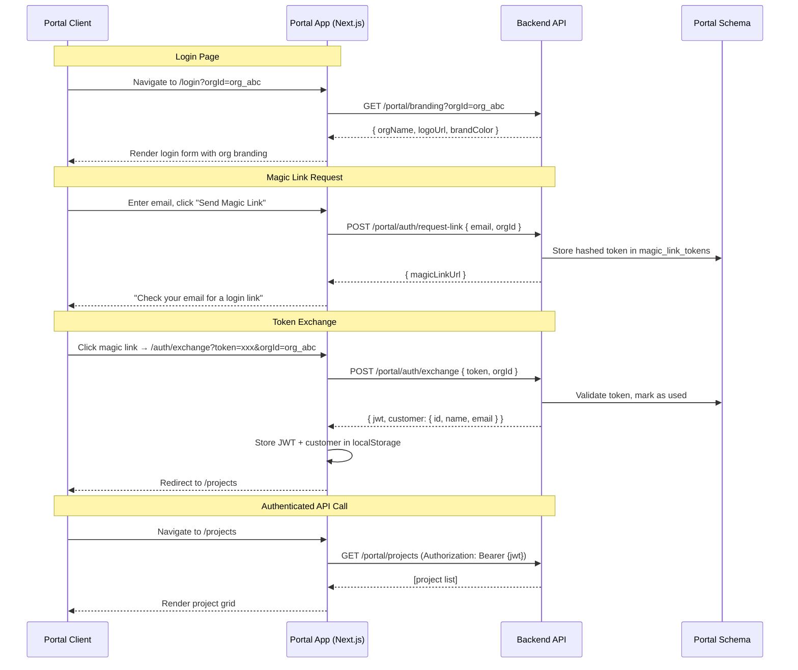
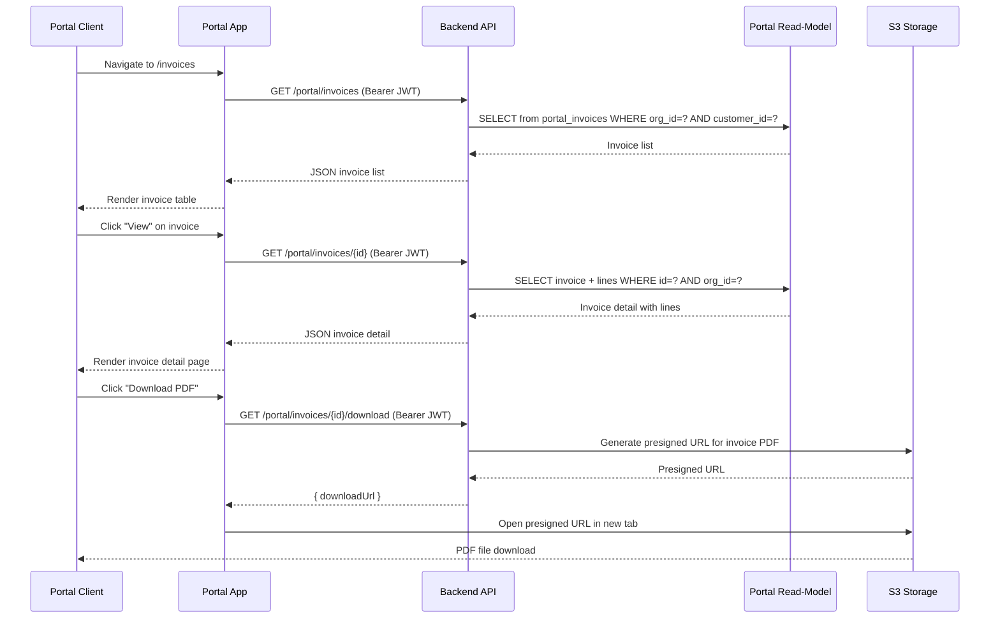
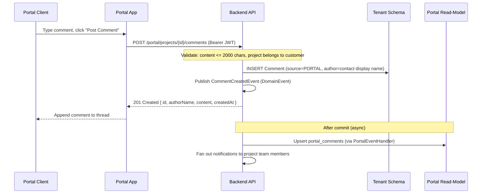
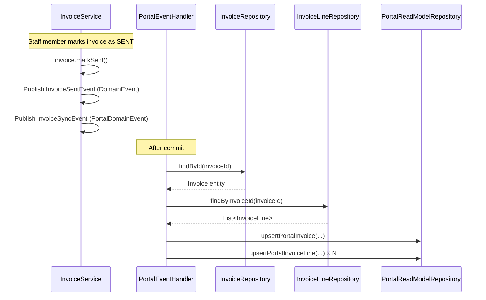

# Phase 18 — Customer Portal Frontend

> This is a standalone architecture document for Phase 18. It supplements ARCHITECTURE.md.

---

## 18.1 Overview

Phase 18 builds the **customer-facing portal frontend** — a separate Next.js 16 application that gives clients a branded, self-service window into their projects, documents, invoices, and comment threads. The portal backend APIs were established in Phase 7; this phase builds the client experience on top of them and fills the remaining backend gaps (invoice and task data in the portal read-model).

### What's New

| Existing (Phase 7 Backend) | New (Phase 18 Frontend + Backend Additions) |
|---|---|
| Magic link authentication endpoints (`/portal/auth/*`) | Full login UI with magic link request form, token exchange page, session management |
| Portal read-model with projects, documents, comments, summaries | Read-model extended with `portal_invoices`, `portal_invoice_lines`, `portal_tasks` |
| REST API for projects, documents, comments, profile | New endpoints: invoice list/detail/download, task list, public branding, comment POST |
| Thymeleaf dev harness (local/dev only) | Production Next.js portal app with org branding, responsive layout |
| `OrgSettings` with logo, brand_color, footer text | Public branding endpoint; BrandingProvider context in portal UI |
| `CustomerAuthFilter` with ScopedValue bindings | Client-side JWT storage, `useAuth()` hook, authenticated layout guard |

### Relationship to Phase 7

Phase 7 established the portal's **backend prototype**: `PortalContact`, `MagicLinkToken`, the portal read-model schema, domain event handlers (`PortalEventHandler`), and the `CustomerAuthFilter`. Phase 18 consumes that foundation and adds:

1. A production-grade Next.js portal application (separate from the admin `frontend/`).
2. Backend extensions to sync invoice and task data to the read-model.
3. New portal API endpoints for invoices, tasks, branding, and comment posting.

### What's Out of Scope

- Document approval workflows (client approves/rejects deliverables)
- Client file uploads
- Online invoice payment (payment gateway integration)
- Retainer visibility (retainer agreements, hour banks, period status)
- Real-time updates (WebSockets, SSE) — polling or manual refresh is sufficient for v1
- Email delivery (email stubs exist from Phase 6.5 but actual sending is not implemented)
- Native mobile application
- Notification inbox in the portal

---

## 18.2 Portal Application Architecture

### Monorepo Integration

The portal is a **separate Next.js 16 application** at `portal/` in the monorepo root, alongside `frontend/` and `backend/`. See [ADR-076](../adr/ADR-076-separate-portal-app.md) for the rationale.

Key principles:
- **Own `package.json`** with Next.js 16, React 19, Tailwind CSS v4, Shadcn UI dependencies.
- **Shared design tokens** — the portal reuses the same Tailwind CSS v4 color palette, fonts, and spacing scale defined in the admin frontend. The Tailwind config is duplicated (not symlinked) to avoid cross-project build coupling.
- **Duplicated Shadcn components** — `portal/components/ui/` contains the same Shadcn UI components as `frontend/components/ui/`. Components are small, stable files — duplication is cheaper than a shared package at this stage.
- **Own build and deployment** — separate `Dockerfile`, `next.config.ts`, `tsconfig.json`. The portal can be built, tested, and deployed independently of the admin frontend.

### Directory Structure

```
portal/
├── app/
│   ├── layout.tsx              # Root layout (HTML shell, font loading)
│   ├── page.tsx                # Redirect to /login or /projects based on auth state
│   ├── login/
│   │   └── page.tsx            # Magic link request form
│   ├── auth/
│   │   └── exchange/
│   │       └── page.tsx        # Token exchange (from magic link URL)
│   ├── (authenticated)/        # Route group — all pages requiring portal JWT
│   │   ├── layout.tsx          # Portal shell: header, nav, branding, footer
│   │   ├── projects/
│   │   │   ├── page.tsx        # Project list (home/dashboard)
│   │   │   └── [id]/
│   │   │       └── page.tsx    # Project detail
│   │   ├── invoices/
│   │   │   ├── page.tsx        # Invoice list
│   │   │   └── [id]/
│   │   │       └── page.tsx    # Invoice detail
│   │   └── profile/
│   │       └── page.tsx        # Contact profile
│   └── not-found.tsx
├── components/
│   ├── ui/                     # Shadcn UI components (duplicated from frontend)
│   ├── portal-header.tsx       # Header with logo, nav, contact name
│   ├── portal-footer.tsx       # Footer with "Powered by DocTeams" + org footer text
│   ├── project-card.tsx        # Project summary card for grid layout
│   ├── document-list.tsx       # Document table with download links
│   ├── comment-section.tsx     # Comment thread with reply form
│   ├── invoice-status-badge.tsx # Invoice status indicator with color coding
│   ├── invoice-line-table.tsx  # Invoice line items table
│   ├── task-list.tsx           # Read-only task list with status indicators
│   ├── status-badge.tsx        # Reusable status indicator (project, task)
│   └── branding-provider.tsx   # Context provider for org branding
├── lib/
│   ├── api-client.ts           # Portal API client (fetch wrapper with JWT injection)
│   ├── auth.ts                 # Auth utilities (store/retrieve JWT, check expiry, parse claims)
│   ├── format.ts               # Date, currency, duration formatting
│   └── types.ts                # TypeScript types matching portal API responses
├── hooks/
│   ├── use-auth.ts             # Auth state hook (JWT, customer info, logout)
│   └── use-branding.ts         # Org branding hook (reads BrandingProvider context)
├── public/
├── Dockerfile
├── package.json
├── tailwind.config.ts
├── tsconfig.json
├── vitest.config.ts
└── next.config.ts
```

### Build and Deployment Configuration

**`next.config.ts`**:
```typescript
import type { NextConfig } from "next";

const nextConfig: NextConfig = {
  output: "standalone",
  // No rewrites or redirects — portal is self-contained
  // No Clerk integration — auth handled client-side via portal JWT
};

export default nextConfig;
```

**`package.json`** key dependencies:
- `next` 16.x, `react` 19.x, `react-dom` 19.x
- `tailwindcss` v4, `@tailwindcss/postcss`
- Shadcn UI component dependencies (same as `frontend/`)
- `jose` — for JWT decoding (parse claims without verification; verification is backend-side)

### Docker Configuration

Port **3001** (distinct from the admin frontend's 3000).

```dockerfile
# Stage 1: Install dependencies
FROM node:20-alpine AS deps
WORKDIR /app
RUN corepack enable && corepack prepare pnpm@latest --activate
COPY package.json pnpm-lock.yaml ./
RUN pnpm install --frozen-lockfile

# Stage 2: Build
FROM node:20-alpine AS builder
WORKDIR /app
RUN corepack enable && corepack prepare pnpm@latest --activate
COPY --from=deps /app/node_modules ./node_modules
COPY . .
ARG NEXT_PUBLIC_PORTAL_API_URL
ENV NEXT_PUBLIC_PORTAL_API_URL=$NEXT_PUBLIC_PORTAL_API_URL
ENV NEXT_TELEMETRY_DISABLED=1
RUN pnpm build

# Stage 3: Production runner
FROM node:20-alpine AS runner
WORKDIR /app
ENV NODE_ENV=production
ENV NEXT_TELEMETRY_DISABLED=1
ENV HOSTNAME=0.0.0.0
ENV PORT=3001
RUN addgroup --system --gid 1001 nodejs && \
    adduser --system --uid 1001 nextjs
COPY --from=builder /app/public ./public
COPY --from=builder --chown=nextjs:nodejs /app/.next/standalone ./
COPY --from=builder --chown=nextjs:nodejs /app/.next/static ./.next/static
USER nextjs
EXPOSE 3001
CMD ["node", "server.js"]
```

### Environment Variables

| Variable | Required | Description |
|----------|----------|-------------|
| `NEXT_PUBLIC_PORTAL_API_URL` | Yes | Backend base URL for portal APIs (e.g., `http://localhost:8080` locally, `https://api.docteams.com` in production) |
| `PORT` | No | Server port (default: 3001) |

The portal has no Clerk keys — authentication is handled entirely via the portal JWT system.

### Docker Compose Addition

Add to `compose/docker-compose.yml` as a new service alongside the existing (commented-out) frontend service:

```yaml
# portal:
#   build:
#     context: ../portal
#     args:
#       NEXT_PUBLIC_PORTAL_API_URL: http://backend:8080
#   ports:
#     - "3001:3001"
#   depends_on:
#     - backend
```

---

## 18.3 Authentication Flow

The portal uses **magic link authentication** built on the Phase 7 backend (`/portal/auth/*` endpoints). See [ADR-077](../adr/ADR-077-portal-jwt-storage.md) for the JWT storage decision.

### Magic Link Request Flow

1. Client navigates to `/login?orgId={clerkOrgId}` (from a bookmarked URL or a magic link email).
2. Login page calls `GET /portal/branding?orgId={orgId}` to display org logo and name.
3. Client enters their email address and clicks "Send Magic Link."
4. Frontend calls `POST /portal/auth/request-link` with `{ email, orgId }`.
5. Backend generates a magic link token (SHA-256 hashed, stored in `magic_link_tokens`, 15-minute TTL), and returns the magic link URL.
6. Success state: "Check your email for a login link" message.
7. Error handling: rate limit exceeded (429), unknown email (still shows success message to prevent email enumeration), network errors.

### Token Exchange Flow

1. Client clicks the magic link from their email, navigating to `/auth/exchange?token={token}&orgId={orgId}`.
2. Exchange page automatically calls `POST /portal/auth/exchange` with `{ token, orgId }` on mount.
3. Backend validates the token (exists, not used, not expired), marks it as used, and returns a portal JWT + customer info.
4. On success: `auth.ts` stores the JWT and customer info in `localStorage`, then redirects to `/projects`.
5. On failure: shows "Link expired or invalid" with a button to navigate back to the login page.

### Session Management

- **Storage**: Portal JWT stored in `localStorage` under key `portal_jwt`. Customer info (name, customerId, orgId) stored under `portal_customer`. See [ADR-077](../adr/ADR-077-portal-jwt-storage.md).
- **TTL**: Portal JWTs expire after 1 hour (set by backend). No refresh token mechanism.
- **Expiry check**: `auth.ts` decodes the JWT's `exp` claim (using `jose`) and compares to `Date.now()`. Expired tokens are cleared.
- **Logout**: Clears `localStorage` entries, redirects to `/login`.
- **No refresh flow**: When the JWT expires, the client must request a new magic link. This matches portal usage patterns — short, infrequent sessions (check a document, review an invoice, leave a comment, done).

### Route Protection

The `(authenticated)/layout.tsx` acts as the auth guard:

1. On mount, reads JWT from `localStorage` via `useAuth()`.
2. If no JWT or JWT is expired: redirect to `/login`.
3. If valid JWT: render the portal shell (header, nav, content, footer).

No middleware-based route protection — the JWT is a client-side concern, and Next.js middleware runs on the server where `localStorage` is not available.

### 401 Handling

The `api-client.ts` fetch wrapper intercepts all API responses. On a 401 status:
1. Clear JWT and customer info from `localStorage`.
2. Redirect to `/login`.
3. This handles mid-session expiry gracefully.

### Sequence Diagram — Authentication



---

## 18.4 Portal Shell and Branding

### Header Layout

The portal header is a fixed-top bar with three sections:

| Left | Center | Right |
|------|--------|-------|
| Org logo (from branding) + org name | Navigation: **Projects** \| **Invoices** | Contact display name + **Profile** link + **Logout** button |

- **Mobile**: Navigation links collapse into a hamburger menu. Logo and contact name remain visible.
- **Active link indicator**: Current section highlighted with the brand color underline.

### BrandingProvider Context

`BrandingProvider` is a React context wrapping the `(authenticated)/layout.tsx`. It provides org branding to all portal components.

```typescript
interface BrandingContext {
  orgName: string;
  logoUrl: string | null;
  brandColor: string;   // hex, e.g., "#4A7C59"
  footerText: string | null;
  isLoading: boolean;
}
```

Data source: The branding can be fetched from `GET /portal/branding?orgId={orgId}` (using the orgId from the stored customer info). Alternatively, if the exchange endpoint is extended to return branding, it can be cached at login time.

Fallbacks:
- No logo: Display org name as text in the header.
- No brand color: Use default `#3B82F6` (blue-500).
- No footer text: Show only "Powered by DocTeams."

### CSS Custom Properties

Brand color is applied as a CSS custom property on the `(authenticated)/layout.tsx` root element:

```css
:root {
  --portal-brand-color: #3B82F6;  /* default, overridden by branding */
}
```

Used for: primary button backgrounds, link hover colors, active nav indicator, card accent borders.

### Footer

Fixed at the page bottom. Contains:
- Org's custom footer text (from `OrgSettings.documentFooterText`), if set.
- "Powered by DocTeams" — always shown, small and unobtrusive.

### Layout Principles

- **No sidebar.** Clients have 3 sections (projects, invoices, profile). Header navigation is sufficient.
- **Content-centered layout.** `max-w-6xl mx-auto` container, responsive padding.
- **Clean, professional aesthetic.** Clients may be from any industry — the portal should feel modern and trustworthy without being flashy.
- **Mobile-friendly, not mobile-first.** Responsive layout, touch-friendly buttons, readable text. Primary use case is desktop/laptop.

---

## 18.5 Portal Pages

### 18.5.1 Project List (Home/Dashboard)

**URL**: `/(authenticated)/projects`

This is the default landing page after authentication. Projects are displayed as a responsive card grid.

**Data source**: `GET /portal/projects`

**Layout**:
- Page title: "Your Projects"
- Responsive grid: 1 column (mobile), 2 columns (tablet), 3 columns (desktop)
- Each project card shows:
  - Project name (bold)
  - Status badge (color-coded: ACTIVE green, COMPLETED blue, ON_HOLD yellow, CANCELLED gray)
  - Description excerpt (2 lines, truncated with ellipsis)
  - Document count icon + count
  - Last activity date (from `updated_at`, formatted as relative time or date)
- Click card → navigate to `/projects/{id}`
- **Empty state**: "No projects yet. Your {orgName} team will share projects with you here."

**No filtering or search in v1.** Clients typically have 5-20 projects — a simple grid is sufficient.

### 18.5.2 Project Detail

**URL**: `/(authenticated)/projects/[id]`

Single page with multiple sections, rendered in order.

**Data sources** (fetched in parallel):
- `GET /portal/projects/{id}` — project detail
- `GET /portal/projects/{id}/tasks` — task list (NEW endpoint)
- `GET /portal/projects/{id}/documents` — document list
- `GET /portal/projects/{id}/comments` — comment thread
- `GET /portal/projects/{id}/summary` — time/billing summary

**Sections**:

**a. Project Header**
- Project name (h1), status badge, full description.

**b. Summary Card**
- Stat row: Total Hours | Billable Hours | Last Activity.
- Only shown if `totalHours > 0`. Hidden for projects with no time tracked.
- Clean, compact horizontal layout using Shadcn `Card`.

**c. Tasks Section**
- Header: "Tasks" with count badge.
- Read-only table/list: task name, status badge, assignee name (or "Unassigned").
- Task statuses: OPEN (gray), IN_PROGRESS (blue), REVIEW (yellow), DONE (green).
- Empty state: "No tasks yet."
- No task creation, editing, or status changes from the portal.

**d. Documents Section**
- Header: "Documents" with count badge.
- Table: File name, type icon (based on content type), file size (formatted), uploaded date.
- Download button per row: calls `GET /portal/documents/{id}/presign-download`, then opens the presigned S3 URL in a new tab.
- Empty state: "No documents shared yet."

**e. Comments Section**
- Header: "Comments" with count badge.
- Chronological list: author name, date (relative), content.
- Comments from portal contacts show the contact's display name. Comments from internal team members show the member's name.
- "Add a comment" text area + "Post Comment" button at the bottom.
- Posts via `POST /portal/projects/{projectId}/comments` (NEW endpoint).
- Max 2000 characters. Character count indicator shown when > 1800 characters.

### 18.5.3 Invoice List

**URL**: `/(authenticated)/invoices`

**Data source**: `GET /portal/invoices` (NEW endpoint)

**Layout**:
- Page title: "Invoices"
- Table columns: Invoice # | Status | Issue Date | Due Date | Total | Actions
- Status badge colors: SENT (blue), PAID (green), VOID (gray)
- Total formatted with currency symbol (e.g., "R 1,250.00" for ZAR)
- Actions: "View" link → `/invoices/{id}`, "Download PDF" button
- Sorted by issue date descending (newest first), applied on the backend
- **Empty state**: "No invoices yet."

### 18.5.4 Invoice Detail

**URL**: `/(authenticated)/invoices/[id]`

**Data source**: `GET /portal/invoices/{id}` (NEW endpoint)

**Layout**:
- **Invoice header**: Invoice number (h1), status badge, issue date, due date.
- **"Download PDF" button** (prominent, top-right). Calls `GET /portal/invoices/{id}/download`, opens the presigned URL.
- **Line items table**: Description | Quantity | Rate | Amount. Each row formatted with currency.
- **Totals section**: Subtotal, Tax, **Total** (bold). Formatted with currency.
- **Notes section**: Displayed below totals if `notes` is not null. Read-only text block.
- No payment action in v1 — the portal shows invoice status but clients cannot pay online.

### 18.5.5 Profile Page

**URL**: `/(authenticated)/profile`

**Data source**: `GET /portal/me`

**Layout**:
- Display name, email, role (PRIMARY, BILLING, GENERAL).
- Customer name (the company/client they represent).
- Read-only display — no editing in v1.

---

## 18.6 Backend Additions

### 18.6.1 Portal Read-Model Extensions (V8 Global Migration)

Three new tables in the `portal` schema, added via global migration `V8__extend_portal_read_model.sql`. See [ADR-078](../adr/ADR-078-portal-read-model-extension.md) for why the read-model approach is used rather than direct tenant schema queries.

#### portal_invoices

```sql
CREATE TABLE IF NOT EXISTS portal.portal_invoices (
    id              UUID PRIMARY KEY,
    org_id          VARCHAR(255) NOT NULL,
    customer_id     UUID NOT NULL,
    invoice_number  VARCHAR(20) NOT NULL,
    status          VARCHAR(20) NOT NULL,
    issue_date      DATE,
    due_date        DATE,
    subtotal        DECIMAL(14,2) NOT NULL DEFAULT 0,
    tax_amount      DECIMAL(14,2) NOT NULL DEFAULT 0,
    total           DECIMAL(14,2) NOT NULL DEFAULT 0,
    currency        VARCHAR(3) NOT NULL,
    notes           TEXT,
    synced_at       TIMESTAMP NOT NULL DEFAULT now()
);
```

Indexes:
```sql
CREATE INDEX IF NOT EXISTS idx_portal_invoices_org_customer
    ON portal.portal_invoices(org_id, customer_id);
CREATE INDEX IF NOT EXISTS idx_portal_invoices_customer_issue_date
    ON portal.portal_invoices(customer_id, issue_date DESC);
```

Rationale: The composite `(org_id, customer_id)` index supports the list endpoint query. The `(customer_id, issue_date DESC)` index supports the default sort order.

#### portal_invoice_lines

```sql
CREATE TABLE IF NOT EXISTS portal.portal_invoice_lines (
    id                  UUID PRIMARY KEY,
    portal_invoice_id   UUID NOT NULL REFERENCES portal.portal_invoices(id) ON DELETE CASCADE,
    description         TEXT NOT NULL,
    quantity            DECIMAL(10,4) NOT NULL,
    unit_price          DECIMAL(12,2) NOT NULL,
    amount              DECIMAL(14,2) NOT NULL,
    sort_order          INTEGER NOT NULL DEFAULT 0,
    synced_at           TIMESTAMP NOT NULL DEFAULT now()
);
```

Indexes:
```sql
CREATE INDEX IF NOT EXISTS idx_portal_invoice_lines_invoice
    ON portal.portal_invoice_lines(portal_invoice_id);
```

Rationale: `ON DELETE CASCADE` ensures line items are cleaned up when an invoice is removed from the read-model (e.g., voided invoice). The `portal_invoice_id` index supports the detail endpoint join.

#### portal_tasks

```sql
CREATE TABLE IF NOT EXISTS portal.portal_tasks (
    id                  UUID PRIMARY KEY,
    org_id              VARCHAR(255) NOT NULL,
    portal_project_id   UUID NOT NULL REFERENCES portal.portal_projects(id) ON DELETE CASCADE,
    name                VARCHAR(500) NOT NULL,
    status              VARCHAR(20) NOT NULL,
    assignee_name       VARCHAR(255),
    sort_order          INTEGER NOT NULL DEFAULT 0,
    synced_at           TIMESTAMP NOT NULL DEFAULT now()
);
```

Indexes:
```sql
CREATE INDEX IF NOT EXISTS idx_portal_tasks_project
    ON portal.portal_tasks(portal_project_id);
CREATE INDEX IF NOT EXISTS idx_portal_tasks_org
    ON portal.portal_tasks(org_id);
```

Rationale: Tasks are queried by project (detail page) and cleaned up by org (on org deletion). Only minimal data is synced — name, status, assignee display name. No description, estimated hours, or billable flag. Internal details stay internal.

### 18.6.2 Invoice Sync via Domain Events

The existing `PortalEventHandler` is extended with invoice event handlers. The sync follows the same pattern as project and document sync — listen for `@TransactionalEventListener(phase = AFTER_COMMIT)` events, then upsert or delete in the portal read-model.

**New portal domain events** (added to `portal/event/`):

| Event | Trigger | Action |
|-------|---------|--------|
| `InvoiceSyncEvent` | Invoice status changes to SENT, PAID, or VOID | Upsert or delete invoice + lines in read-model |

The `InvoiceSyncEvent` is a new `PortalDomainEvent` subclass, published by the `InvoiceService` alongside the existing `DomainEvent` records. The `InvoiceSyncEvent` is published in addition to (not replacing) the existing `InvoiceSentEvent`/`InvoicePaidEvent`/`InvoiceVoidedEvent` in the `DomainEvent` hierarchy. Both event types are published on the same mutation — `DomainEvent` for audit/notifications, `PortalDomainEvent` for read-model sync.

**Sync logic**:

- **Status gate**: Only invoices with status `SENT` or `PAID` are visible in the portal read-model. `DRAFT` and `APPROVED` invoices are internal. `VOID` invoices are removed from the read-model.
- **On SENT**: Upsert `portal_invoices` row with full invoice data. Upsert all `portal_invoice_lines` rows. This is the first time the invoice becomes visible to the client.
- **On PAID**: Update the `status` column in `portal_invoices` to `PAID`.
- **On VOID**: Delete the `portal_invoices` row (cascades to `portal_invoice_lines`).
- **On APPROVED**: No sync — invoice is not yet client-visible. The approval is an internal step before sending.

The sync handler reads the full invoice + line items from the tenant schema (within the `AFTER_COMMIT` listener, using the `handleInTenantScope` pattern from existing handlers), then writes to the portal read-model via `PortalReadModelRepository`.

**PortalReadModelRepository additions**:
- `upsertPortalInvoice(UUID id, String orgId, UUID customerId, String invoiceNumber, String status, LocalDate issueDate, LocalDate dueDate, BigDecimal subtotal, BigDecimal taxAmount, BigDecimal total, String currency, String notes)`
- `upsertPortalInvoiceLine(UUID id, UUID portalInvoiceId, String description, BigDecimal quantity, BigDecimal unitPrice, BigDecimal amount, int sortOrder)`
- `updatePortalInvoiceStatus(UUID id, String status)`
- `deletePortalInvoice(UUID id)` — cascades to lines via FK
- `deletePortalInvoicesByOrg(String orgId)`
- `findInvoicesByCustomer(String orgId, UUID customerId)` — returns `List<PortalInvoiceView>`
- `findInvoiceById(UUID id, String orgId)` — returns `Optional<PortalInvoiceView>`
- `findInvoiceLinesByInvoice(UUID portalInvoiceId)` — returns `List<PortalInvoiceLineView>`

### 18.6.3 Task Sync via Domain Events

**New portal domain events** (added to `portal/event/`):

The existing codebase has `TaskStatusChangedEvent`, `TaskAssignedEvent`, and `TaskClaimedEvent` in the `DomainEvent` hierarchy (for audit/notifications). The portal read-model uses a separate `PortalDomainEvent` hierarchy. Both event types are published on the same mutation — `DomainEvent` for audit/notifications, `PortalDomainEvent` for read-model sync.

Add new `PortalDomainEvent` subclasses:

| Event | Fields | Trigger | Action |
|-------|--------|---------|--------|
| `PortalTaskCreatedEvent` | `UUID taskId, UUID projectId, String orgId, String name, String status, String assigneeName, int sortOrder` | Task created in a customer-linked project | Upsert task in read-model |
| `PortalTaskUpdatedEvent` | `UUID taskId, UUID projectId, String orgId, String name, String status, String assigneeName, int sortOrder` | Task updated, status changed, assigned, or claimed | Upsert task in read-model |
| `PortalTaskDeletedEvent` | `UUID taskId, String orgId` | Task deleted | Remove from read-model |

These are published by `TaskService` alongside existing `DomainEvent` records. The `PortalEventHandler` listens for these and syncs to `portal_tasks`.

**Sync logic**:

- When a task is created or updated in a project linked to a customer, sync the task to `portal_tasks`.
- **Minimal data**: Only `name` (title), `status`, and `assignee_name` are synced. The assignee name is resolved from the `Member` entity at sync time (not stored as an ID reference).
- **Project linkage**: The `portal_project_id` is the task's `project_id` — but only if that project exists in `portal_projects` (i.e., it's linked to a customer). Tasks in projects not linked to any customer are not synced.
- **On task delete**: Remove from `portal_tasks`.
- **On project delete**: When a `PortalProjectDeletedEvent` is handled, the `PortalEventHandler` must also delete all `portal_tasks` rows where `portal_project_id` matches the deleted project ID. Add a `deleteTasksByPortalProjectId(UUID projectId, String orgId)` method to `PortalReadModelRepository`.

**PortalReadModelRepository additions**:
- `upsertPortalTask(UUID id, String orgId, UUID portalProjectId, String name, String status, String assigneeName, int sortOrder)`
- `deletePortalTask(UUID id)`
- `deleteTasksByPortalProjectId(UUID projectId, String orgId)` — deletes all tasks for a project (used on `PortalProjectDeletedEvent`)
- `deletePortalTasksByOrg(String orgId)`
- `findTasksByProject(UUID portalProjectId, String orgId)` — returns `List<PortalTaskView>`

### 18.6.4 Portal Invoice Endpoints

Three new endpoints in a `PortalInvoiceController`:

**`GET /portal/invoices`** — List invoices for the authenticated customer.

- Auth: Portal JWT required (via `CustomerAuthFilter`).
- Reads `orgId` and `customerId` from `RequestScopes`.
- Queries `PortalReadModelRepository.findInvoicesByCustomer(orgId, customerId)`.
- Returns: `List<PortalInvoiceResponse>`.

**`GET /portal/invoices/{id}`** — Invoice detail with line items.

- Auth: Portal JWT required.
- Queries invoice by ID, verifies `org_id` matches `RequestScopes.ORG_ID`.
- Queries line items by invoice ID.
- Returns: `PortalInvoiceDetailResponse` (invoice + lines).
- 404 if invoice not found or belongs to a different org/customer.

**`GET /portal/invoices/{id}/download`** — Presigned URL for invoice PDF.

- Auth: Portal JWT required.
- Validates invoice belongs to the authenticated customer's org.
- Looks up the generated document (PDF) for this invoice via the `GeneratedDocument` entity or the S3 key pattern.
- Returns a presigned S3 download URL (same pattern as `PortalDocumentController.presignDownload()`).
- If no PDF exists, returns 404 with a message indicating the PDF is not yet available.

### 18.6.5 Portal Task Endpoint

**`GET /portal/projects/{projectId}/tasks`** — List tasks for a project.

- Auth: Portal JWT required.
- The endpoint first verifies the project belongs to the authenticated customer by checking `portal_projects` with `id = projectId AND customer_id = customerId AND org_id = orgId` where `customerId` comes from `RequestScopes.CUSTOMER_ID` and `orgId` from `RequestScopes.ORG_ID`. Only then does it query `portal_tasks`.
- Queries `PortalReadModelRepository.findTasksByProject(projectId, orgId)`.
- Returns: `List<PortalTaskResponse>`.

This endpoint is added to the existing `PortalProjectController` or a new `PortalTaskController`.

### 18.6.6 Public Branding Endpoint

**`GET /portal/branding?orgId={orgId}`** — Fetch org branding without authentication.

- **No authentication required.** This endpoint is shown on the login page before the client authenticates. The `CustomerAuthFilter.shouldNotFilter()` method must be updated to exclude this path.
- Resolves the org's schema from `OrgSchemaMappingRepository.findByClerkOrgId(orgId)`.
- Within the tenant scope, reads `OrgSettings` for `logoS3Key`, `brandColor`, `documentFooterText`.
- If `logoS3Key` is set, generates a presigned S3 URL for the logo.
- Resolves `orgName` from the `Organization` entity or the `OrgSchemaMapping`.
- Returns: `{ orgName: string, logoUrl: string | null, brandColor: string | null, footerText: string | null }`. The `footerText` maps from `OrgSettings.documentFooterText`.
- **Cache-Control**: `Cache-Control: public, max-age=3600`. Branding changes infrequently.
- If org has no branding configured, returns defaults (no logo, null brand color, org name from schema mapping).
- If `orgId` is invalid or not provisioned, returns 404 (not 401 — this is a public endpoint, so we reveal whether an org exists; this is acceptable because org IDs are not secret and the endpoint returns only branding data).

### 18.6.7 Comment POST Endpoint

The existing `PortalCommentController` at `/portal/projects/{projectId}/comments` only supports `GET` (list comments). A `POST` endpoint is needed for clients to submit comments.

**`POST /portal/projects/{projectId}/comments`** — Post a comment from a portal contact.

- Auth: Portal JWT required.
- Request body: `{ "content": "string" }`.
- Validation: content must be non-empty and max 2000 characters.
- Verifies the project belongs to the authenticated customer.
- Creates a `Comment` entity in the tenant schema with `source = PORTAL` and the contact's display name as the author.
- The comment triggers the existing notification system (notify project team members via `CommentCreatedEvent`).
- Syncs to the portal read-model via the existing `PortalEventHandler.onCommentCreated()` (if it exists) or a new handler.
- Returns: 201 Created with the comment ID.

---

## 18.7 API Surface

### Complete Portal Endpoint Table

| Method | Path | Description | Auth |
|--------|------|-------------|------|
| `POST` | `/portal/auth/request-link` | Request magic link email | None |
| `POST` | `/portal/auth/exchange` | Exchange token for portal JWT | None |
| `GET` | `/portal/branding` | Fetch org branding (logo, color, name) | **None** (public) |
| `GET` | `/portal/projects` | List projects for authenticated customer | Portal JWT |
| `GET` | `/portal/projects/{id}` | Project detail | Portal JWT |
| `GET` | `/portal/projects/{id}/documents` | Documents for a project | Portal JWT |
| `GET` | `/portal/projects/{id}/comments` | Comments for a project | Portal JWT |
| `POST` | `/portal/projects/{id}/comments` | **Post a comment** | Portal JWT |
| `GET` | `/portal/projects/{id}/tasks` | **Tasks for a project** | Portal JWT |
| `GET` | `/portal/projects/{id}/summary` | Time/billing summary | Portal JWT |
| `GET` | `/portal/documents` | All documents for customer | Portal JWT |
| `GET` | `/portal/documents/{id}/presign-download` | Presigned download URL | Portal JWT |
| `GET` | `/portal/invoices` | **List invoices for customer** | Portal JWT |
| `GET` | `/portal/invoices/{id}` | **Invoice detail with line items** | Portal JWT |
| `GET` | `/portal/invoices/{id}/download` | **Presigned PDF download URL** | Portal JWT |
| `GET` | `/portal/me` | Contact profile info | Portal JWT |

Existing endpoints shown in plain text. **New endpoints** (Phase 18) shown in bold.

### Request/Response Shapes (New Endpoints)

#### GET /portal/branding

**Query params**: `orgId` (required, Clerk org ID)

**Response** (200):
```json
{
  "orgName": "Smith & Associates",
  "logoUrl": "https://s3.amazonaws.com/bucket/logo.png?X-Amz-...",
  "brandColor": "#4A7C59",
  "footerText": "Smith & Associates | Registered Auditors"
}
```

#### GET /portal/projects/{projectId}/tasks

**Response** (200):
```json
[
  {
    "id": "uuid",
    "name": "Prepare annual tax return",
    "status": "IN_PROGRESS",
    "assigneeName": "John Smith",
    "sortOrder": 1
  },
  {
    "id": "uuid",
    "name": "Gather supporting documents",
    "status": "DONE",
    "assigneeName": null,
    "sortOrder": 2
  }
]
```

#### POST /portal/projects/{projectId}/comments

**Request**:
```json
{
  "content": "Thanks for the update. Please send the revised document when ready."
}
```

**Response** (201):
```json
{
  "id": "uuid",
  "authorName": "Jane Doe",
  "content": "Thanks for the update. Please send the revised document when ready.",
  "createdAt": "2026-02-20T10:30:00Z"
}
```

#### GET /portal/invoices

**Response** (200):
```json
[
  {
    "id": "uuid",
    "invoiceNumber": "INV-2026-0001",
    "status": "SENT",
    "issueDate": "2026-02-15",
    "dueDate": "2026-03-15",
    "total": 1250.00,
    "currency": "ZAR"
  }
]
```

#### GET /portal/invoices/{id}

**Response** (200):
```json
{
  "id": "uuid",
  "invoiceNumber": "INV-2026-0001",
  "status": "SENT",
  "issueDate": "2026-02-15",
  "dueDate": "2026-03-15",
  "subtotal": 1125.00,
  "taxAmount": 125.00,
  "total": 1250.00,
  "currency": "ZAR",
  "notes": "Payment due within 30 days.",
  "lines": [
    {
      "id": "uuid",
      "description": "Tax advisory — February 2026 (8.5 hours)",
      "quantity": 8.50,
      "unitPrice": 132.35,
      "amount": 1125.00,
      "sortOrder": 1
    }
  ]
}
```

#### GET /portal/invoices/{id}/download

**Response** (200):
```json
{
  "downloadUrl": "https://s3.amazonaws.com/bucket/invoices/inv-uuid.pdf?X-Amz-..."
}
```

**Response** (404 — no PDF available):
```json
{
  "type": "about:blank",
  "title": "Not Found",
  "status": 404,
  "detail": "Invoice PDF is not yet available."
}
```

---

## 18.8 Sequence Diagrams

### 18.8.1 Invoice Viewing Flow



### 18.8.2 Comment Posting Flow



### 18.8.3 Invoice Sync Flow (Backend-Only)



---

## 18.9 Database Migration

### V8 — Extend Portal Read-Model

**File**: `backend/src/main/resources/db/migration/global/V8__extend_portal_read_model.sql`

```sql
-- Portal invoices (synced from tenant schema when status >= SENT)
CREATE TABLE IF NOT EXISTS portal.portal_invoices (
    id              UUID PRIMARY KEY,
    org_id          VARCHAR(255) NOT NULL,
    customer_id     UUID NOT NULL,
    invoice_number  VARCHAR(20) NOT NULL,
    status          VARCHAR(20) NOT NULL,
    issue_date      DATE,
    due_date        DATE,
    subtotal        DECIMAL(14,2) NOT NULL DEFAULT 0,
    tax_amount      DECIMAL(14,2) NOT NULL DEFAULT 0,
    total           DECIMAL(14,2) NOT NULL DEFAULT 0,
    currency        VARCHAR(3) NOT NULL,
    notes           TEXT,
    synced_at       TIMESTAMP NOT NULL DEFAULT now()
);

CREATE INDEX IF NOT EXISTS idx_portal_invoices_org_customer
    ON portal.portal_invoices(org_id, customer_id);
CREATE INDEX IF NOT EXISTS idx_portal_invoices_customer_issue_date
    ON portal.portal_invoices(customer_id, issue_date DESC);

-- Portal invoice line items
CREATE TABLE IF NOT EXISTS portal.portal_invoice_lines (
    id                  UUID PRIMARY KEY,
    portal_invoice_id   UUID NOT NULL REFERENCES portal.portal_invoices(id) ON DELETE CASCADE,
    description         TEXT NOT NULL,
    quantity            DECIMAL(10,4) NOT NULL,
    unit_price          DECIMAL(12,2) NOT NULL,
    amount              DECIMAL(14,2) NOT NULL,
    sort_order          INTEGER NOT NULL DEFAULT 0,
    synced_at           TIMESTAMP NOT NULL DEFAULT now()
);

CREATE INDEX IF NOT EXISTS idx_portal_invoice_lines_invoice
    ON portal.portal_invoice_lines(portal_invoice_id);

-- Portal tasks (synced from tenant schema, minimal data)
CREATE TABLE IF NOT EXISTS portal.portal_tasks (
    id                  UUID PRIMARY KEY,
    org_id              VARCHAR(255) NOT NULL,
    portal_project_id   UUID NOT NULL REFERENCES portal.portal_projects(id) ON DELETE CASCADE,
    name                VARCHAR(500) NOT NULL,
    status              VARCHAR(20) NOT NULL,
    assignee_name       VARCHAR(255),
    sort_order          INTEGER NOT NULL DEFAULT 0,
    synced_at           TIMESTAMP NOT NULL DEFAULT now()
);

CREATE INDEX IF NOT EXISTS idx_portal_tasks_project
    ON portal.portal_tasks(portal_project_id);
CREATE INDEX IF NOT EXISTS idx_portal_tasks_org
    ON portal.portal_tasks(org_id);
```

`ON DELETE CASCADE` on `portal_tasks.portal_project_id` ensures that when a `portal_projects` row is deleted (via `PortalProjectDeletedEvent`), all associated tasks are automatically removed. The `PortalEventHandler` cleanup method (`deleteTasksByPortalProjectId`) serves as an explicit backup but the cascade handles it at the database level.

**Index rationale**:
- `idx_portal_invoices_org_customer`: Supports the `GET /portal/invoices` list query filtered by org and customer.
- `idx_portal_invoices_customer_issue_date`: Supports default sort order (newest first) on the invoice list.
- `idx_portal_invoice_lines_invoice`: Supports the join from invoice detail to its line items.
- `idx_portal_tasks_project`: Supports the task list query on the project detail page.
- `idx_portal_tasks_org`: Supports bulk deletion on org teardown.

---

## 18.10 Implementation Guidance

### Backend Changes

| File | Change |
|------|--------|
| `db/migration/global/V8__extend_portal_read_model.sql` | New migration — `portal_invoices`, `portal_invoice_lines`, `portal_tasks` tables |
| `portal/event/InvoiceSyncEvent.java` | New portal domain event for invoice sync |
| `portal/event/PortalTaskCreatedEvent.java` | New portal domain event for task creation sync |
| `portal/event/PortalTaskUpdatedEvent.java` | New portal domain event for task update sync |
| `portal/event/PortalTaskDeletedEvent.java` | New portal domain event for task deletion sync |
| `portal/event/PortalDomainEvent.java` | Add `InvoiceSyncEvent`, `PortalTaskCreatedEvent`, `PortalTaskUpdatedEvent`, `PortalTaskDeletedEvent` to permits |
| `portal/handler/PortalEventHandler.java` | Add `onInvoiceSynced()`, `onTaskCreated()`, `onTaskUpdated()`, `onTaskDeleted()` handlers |
| `portal/repository/PortalReadModelRepository.java` | Add invoice and task upsert/delete/query methods (including `deleteTasksByPortalProjectId`) |
| `portal/model/PortalInvoiceView.java` | New record for invoice query results |
| `portal/model/PortalInvoiceLineView.java` | New record for invoice line query results |
| `portal/model/PortalTaskView.java` | New record for task query results |
| `portal/PortalInvoiceController.java` | New controller — invoice list, detail, download |
| `portal/PortalBrandingController.java` | New controller — public branding endpoint |
| `portal/PortalCommentController.java` | Add `POST` method for comment creation |
| `portal/CustomerAuthFilter.java` | Update `shouldNotFilter()` to exclude `/portal/branding` |
| `invoice/InvoiceService.java` | Publish `InvoiceSyncEvent` on status transitions (SENT, PAID, VOID) |
| `task/TaskService.java` | Publish `TaskSyncEvent` on create, update, delete, assign |

### Portal Frontend Files

All files listed in the directory structure (Section 18.2). Key implementation order:

1. **Scaffolding**: `package.json`, `next.config.ts`, `tsconfig.json`, `tailwind.config.ts`, `Dockerfile`
2. **Auth layer**: `lib/auth.ts`, `lib/api-client.ts`, `hooks/use-auth.ts`
3. **Branding**: `components/branding-provider.tsx`, `hooks/use-branding.ts`
4. **Login/exchange**: `app/login/page.tsx`, `app/auth/exchange/page.tsx`
5. **Shell**: `app/(authenticated)/layout.tsx`, `components/portal-header.tsx`, `components/portal-footer.tsx`
6. **Pages**: Projects, invoices, profile — each with their data-fetching hooks and display components
7. **Components**: `project-card.tsx`, `document-list.tsx`, `comment-section.tsx`, `task-list.tsx`, `invoice-line-table.tsx`, `invoice-status-badge.tsx`, `status-badge.tsx`

### Entity Patterns to Follow

- **Portal domain events**: Follow the `PortalDomainEvent` sealed abstract class pattern. Each event extends `PortalDomainEvent` and carries `tenantId`, `orgId`, and entity-specific fields.
- **Read-model repository**: Follow the `JdbcClient`-based pattern in `PortalReadModelRepository` — parameterized SQL with `ON CONFLICT` upserts.
- **Event handlers**: Follow the `@TransactionalEventListener(phase = AFTER_COMMIT)` pattern in `PortalEventHandler` with `handleInTenantScope()`.
- **Portal controllers**: Follow the existing `PortalProjectController` pattern — read `orgId` and `customerId` from `RequestScopes`, delegate to repository queries.

### Testing Strategy

**Backend**:
- Integration tests for each new endpoint (mock JWT via `jwt()` test helper, but adapted for portal JWT — the `CustomerAuthFilter` resolves portal claims, not Clerk claims).
- Event handler tests: publish domain events, verify read-model state.
- Invoice sync tests: create invoice in tenant, transition to SENT, verify portal read-model, transition to VOID, verify cleanup.
- Task sync tests: create task in linked project, verify portal read-model, delete task, verify cleanup.
- Branding endpoint test: verify cache headers, verify fallback values.

**Portal frontend**:
- Vitest + happy-dom for component tests.
- Auth flow tests: mock `localStorage`, verify token storage/retrieval/expiry.
- API client tests: mock fetch, verify JWT injection, verify 401 redirect.
- Component tests for key components: project-card, invoice-line-table, comment-section.

---

## 18.11 Permission Model Summary

### Portal Contact Access Boundaries

All portal data access is scoped by two claims in the portal JWT:
- **`org_id`** — the Clerk org ID, identifying which organization's data the contact can see.
- **`customer_id`** — the customer ID, further scoping data to projects, invoices, and documents linked to that customer.

The backend enforces this at the query level — every read-model query filters by `org_id` AND (where applicable) `customer_id`. The portal frontend trusts the backend for authorization and displays whatever the API returns.

### Public vs Authenticated Endpoints

| Category | Endpoints | Auth |
|----------|-----------|------|
| Public (no auth) | `/portal/auth/request-link`, `/portal/auth/exchange`, `/portal/branding` | None |
| Authenticated | All other `/portal/*` endpoints | Portal JWT (`Authorization: Bearer`) |

The `CustomerAuthFilter.shouldNotFilter()` method is the single source of truth for which paths skip authentication. It currently skips `/portal/auth/*` and `/portal/dev/*`. Phase 18 adds `/portal/branding` to the skip list.

### Customer-Scoped Data Isolation

Data isolation in the portal read-model is row-level, partitioned by `org_id`:

| Table | Scoping Columns |
|-------|-----------------|
| `portal_projects` | `org_id`, `customer_id` |
| `portal_documents` | `org_id`, `customer_id` |
| `portal_comments` | `org_id` (scoped to project, which is scoped to customer) |
| `portal_project_summaries` | `org_id`, `customer_id` |
| `portal_invoices` | `org_id`, `customer_id` |
| `portal_invoice_lines` | Via FK to `portal_invoices` |
| `portal_tasks` | `org_id` (scoped to project, which is scoped to customer) |

The read-model is a **security boundary** — portal queries never touch tenant schemas directly. See [ADR-031](../adr/ADR-031-separate-portal-read-model-schema.md).

---

## 18.12 Capability Slices

### Slice 126A — Backend: Invoice Sync + Portal Invoice Endpoints

**Scope**: Backend only

**Key Deliverables**:
- V8 global migration (portal_invoices, portal_invoice_lines tables and indexes)
- `InvoiceSyncEvent` portal domain event
- `PortalEventHandler` invoice sync handlers (SENT → upsert, PAID → status update, VOID → delete)
- `PortalReadModelRepository` invoice upsert/delete/query methods
- `PortalInvoiceView` and `PortalInvoiceLineView` records
- `PortalInvoiceController` with GET /portal/invoices, GET /portal/invoices/{id}, GET /portal/invoices/{id}/download
- `InvoiceService` publishes `InvoiceSyncEvent` on status transitions

**Dependencies**: None (standalone backend slice)

**Test expectations**: ~12-15 integration tests (invoice sync lifecycle, endpoint authorization, PDF download, empty state)

### Slice 126B — Backend: Task Sync + Portal Task Endpoint

**Scope**: Backend only

**Key Deliverables**:
- V8 migration already includes portal_tasks (delivered in 126A)
- `PortalTaskCreatedEvent`, `PortalTaskUpdatedEvent`, `PortalTaskDeletedEvent` portal domain events
- `PortalEventHandler` task sync handlers (`onTaskCreated` → upsert, `onTaskUpdated` → upsert, `onTaskDeleted` → remove, project delete → cascade cleanup)
- `PortalReadModelRepository` task upsert/delete/query methods (including `deleteTasksByPortalProjectId`)
- `PortalTaskView` record
- `GET /portal/projects/{projectId}/tasks` endpoint
- `TaskService` publishes `PortalTaskCreatedEvent`/`PortalTaskUpdatedEvent`/`PortalTaskDeletedEvent` on create, update, delete, assign

**Dependencies**: 126A (V8 migration includes portal_tasks table)

**Test expectations**: ~8-10 integration tests (task sync lifecycle, endpoint authorization, project linkage validation)

### Slice 126C — Backend: Branding Endpoint + Comment POST

**Scope**: Backend only

**Key Deliverables**:
- `PortalBrandingController` with `GET /portal/branding?orgId={orgId}`
- `CustomerAuthFilter.shouldNotFilter()` updated to skip `/portal/branding`
- Cache-Control header on branding response
- `PortalCommentController` POST method for comment creation
- Content validation (max 2000 chars)
- Comment created with `source = PORTAL`

**Dependencies**: None (can run in parallel with 126A/126B)

**Test expectations**: ~8-10 integration tests (branding with/without logo, branding for unknown org, comment creation, comment validation, comment notification)

### Slice 127A — Portal: App Scaffolding + Auth Flow

**Scope**: Portal frontend only

**Key Deliverables**:
- `portal/` directory structure: `package.json`, `next.config.ts`, `tsconfig.json`, `tailwind.config.ts`, `vitest.config.ts`
- Shadcn UI components initialized (Button, Card, Input, Label at minimum)
- `lib/auth.ts` — JWT storage, retrieval, expiry check, claims parsing
- `lib/api-client.ts` — fetch wrapper with JWT injection, 401 redirect
- `hooks/use-auth.ts` — auth state hook
- `lib/types.ts` — TypeScript types for all portal API responses
- `app/login/page.tsx` — magic link request form (calls branding + request-link endpoints)
- `app/auth/exchange/page.tsx` — token exchange, JWT storage, redirect to /projects
- `app/page.tsx` — root redirect (to /login or /projects)
- `app/not-found.tsx`

**Dependencies**: 126C (branding endpoint for login page)

**Test expectations**: ~10-12 tests (auth utilities, API client 401 handling, login form rendering, exchange success/failure)

### Slice 127B — Portal: Shell, Branding, Project List Page

**Scope**: Portal frontend only

**Key Deliverables**:
- `components/branding-provider.tsx` — BrandingProvider context
- `hooks/use-branding.ts` — branding context hook
- `app/(authenticated)/layout.tsx` — auth guard + portal shell
- `components/portal-header.tsx` — header with logo, nav, profile, mobile hamburger
- `components/portal-footer.tsx` — footer with "Powered by DocTeams"
- CSS custom properties for brand color
- `components/project-card.tsx` — project summary card
- `components/status-badge.tsx` — reusable status indicator
- `app/(authenticated)/projects/page.tsx` — project list (grid layout, empty state)

**Dependencies**: 127A (auth layer, API client, types)

**Test expectations**: ~8-10 tests (branding provider, header rendering, project card, project list empty state)

### Slice 127C — Portal: Project Detail Page

**Scope**: Portal frontend only

**Key Deliverables**:
- `app/(authenticated)/projects/[id]/page.tsx` — project detail with all sections
- `components/task-list.tsx` — read-only task list with status indicators
- `components/document-list.tsx` — document table with download buttons
- `components/comment-section.tsx` — comment thread with reply form
- Summary card (conditional rendering based on hours > 0)

**Dependencies**: 127B (shell, status badge), 126B (task endpoint), 126C (comment POST endpoint)

**Test expectations**: ~10-12 tests (task list rendering, document download, comment posting, summary card conditional display)

### Slice 127D — Portal: Invoice List + Detail Pages

**Scope**: Portal frontend only

**Key Deliverables**:
- `components/invoice-status-badge.tsx` — color-coded status badge for invoices
- `components/invoice-line-table.tsx` — line items table with totals
- `app/(authenticated)/invoices/page.tsx` — invoice list table
- `app/(authenticated)/invoices/[id]/page.tsx` — invoice detail with line items, totals, PDF download
- `lib/format.ts` — currency formatting utility

**Dependencies**: 127B (shell), 126A (invoice endpoints)

**Test expectations**: ~8-10 tests (invoice list rendering, status badge colors, line table totals, PDF download button, empty state)

### Slice 127E — Portal: Profile Page, Responsive Polish, Docker Config

**Scope**: Portal frontend + infrastructure

**Key Deliverables**:
- `app/(authenticated)/profile/page.tsx` — contact info display
- Responsive polish: mobile hamburger menu, touch-friendly buttons, responsive table layouts
- `Dockerfile` — multi-stage build, port 3001
- Docker Compose service definition (commented out, matching existing pattern)
- Cross-browser testing notes
- Final integration test: full auth → browse → comment flow

**Dependencies**: 127A-127D (all portal pages)

**Test expectations**: ~6-8 tests (profile page, responsive layout, Docker build verification)

### Slice Dependency Graph

```
126A (Invoice sync)  ──────────────────────────────────── 127D (Invoice pages)
  │                                                         │
  └── 126B (Task sync) ──────────────────── 127C (Detail) ─┘
                                               │
126C (Branding + Comment) ── 127A (Scaffold) ─ 127B (Shell) ── 127E (Polish)
```

**Parallel tracks after 126C**:
- Track 1: 126A → 126B (backend invoice → task)
- Track 2: 127A → 127B → 127C (portal scaffold → shell → detail)
- Track 3: 127D depends on both 127B and 126A
- Track 4: 127E depends on all other portal slices

**Recommended execution order**: 126A, 126B, 126C (backend first), then 127A, 127B, 127C, 127D, 127E (portal in order).

---

## 18.13 ADR Index

| ADR | Title | File |
|-----|-------|------|
| [ADR-076](../adr/ADR-076-separate-portal-app.md) | Separate Next.js App for Customer Portal | `adr/ADR-076-separate-portal-app.md` |
| [ADR-077](../adr/ADR-077-portal-jwt-storage.md) | Client-Side JWT Storage for Portal | `adr/ADR-077-portal-jwt-storage.md` |
| [ADR-078](../adr/ADR-078-portal-read-model-extension.md) | Portal Read-Model Extension for Invoices and Tasks | `adr/ADR-078-portal-read-model-extension.md` |
| [ADR-079](../adr/ADR-079-portal-org-identification.md) | Org Identification Strategy for Portal | `adr/ADR-079-portal-org-identification.md` |
