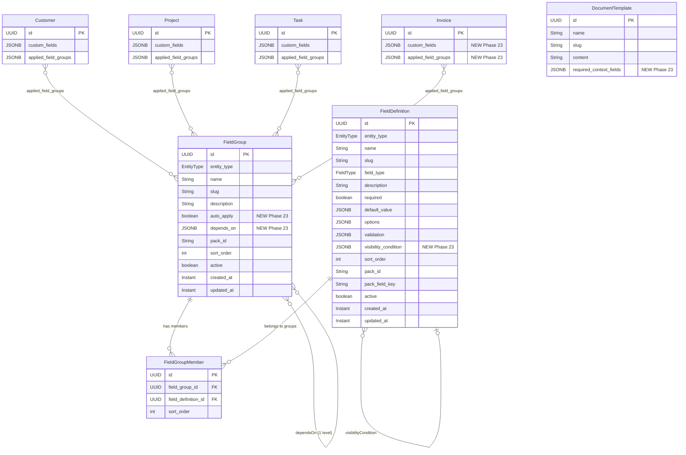
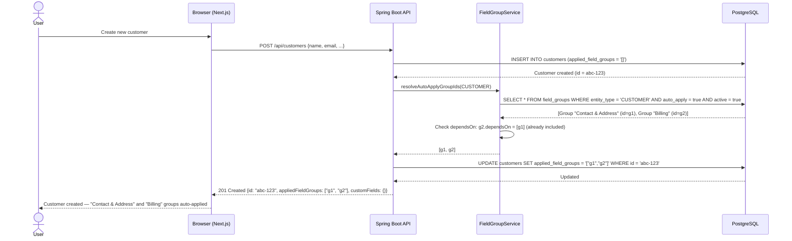
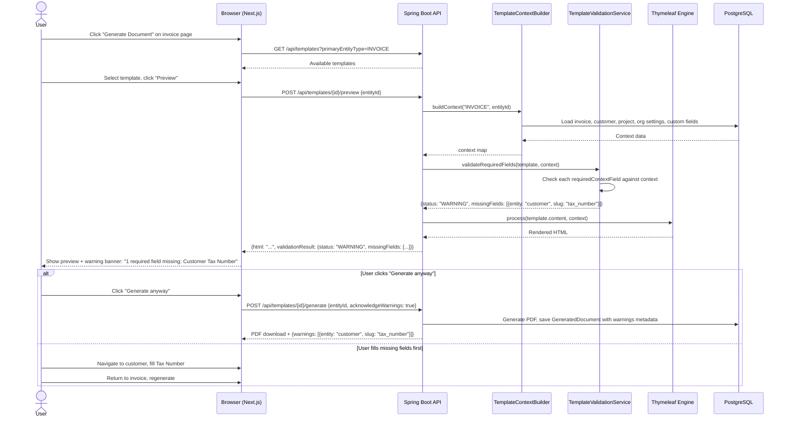
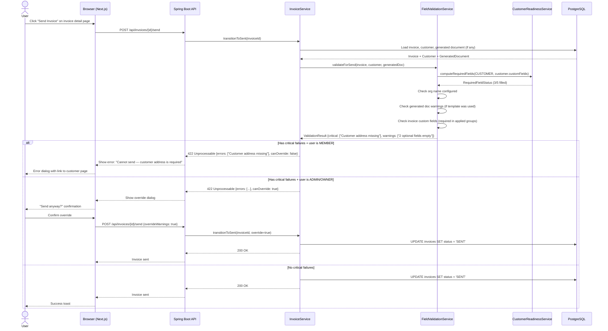
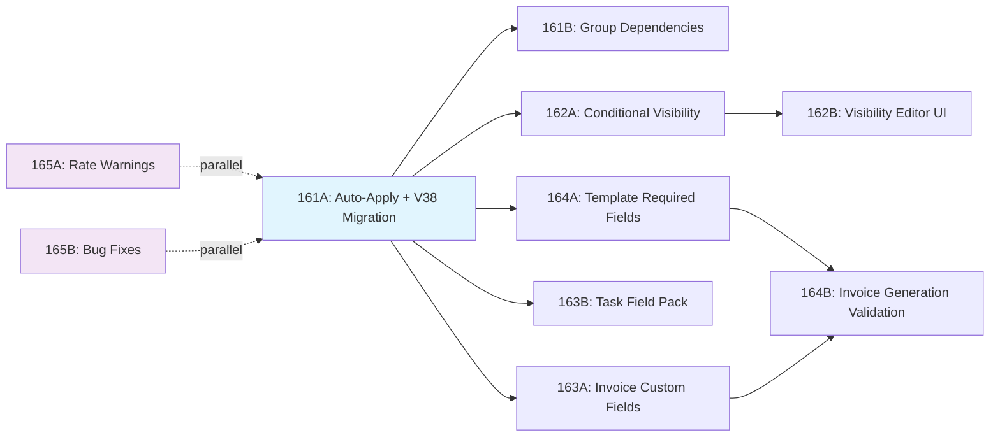

> Standalone architecture document for Phase 23. Reference from ARCHITECTURE.md table of contents.

# Phase 23 — Custom Field Maturity & Data Integrity

---

## 23. Phase 23 — Custom Field Maturity & Data Integrity

Phase 23 hardens the custom fields system into a reliable data integrity layer. The custom fields infrastructure (Phase 11) and readiness checks (Phase 15) established the foundation — field definitions, groups, validation, and setup guidance. But the current system is too permissive: field groups are opt-in per entity instance, document generation ignores missing data, billable time can be logged without rate cards, and invoices have no custom fields at all. This phase addresses every gap.

The design extends five existing entities (`FieldGroup`, `FieldDefinition`, `DocumentTemplate`, `Invoice`, `Customer/Project/Task` readiness services`), adds one new enum value (`EntityType.INVOICE`), introduces one new field pack (`common-task.json`), and fixes three validation bugs. All changes are tenant-scoped — no global schema migrations needed. The single tenant migration (V38) handles all DDL changes.

**Dependencies on prior phases**:
- **Phase 8** (Rate Cards): `BillingRate`, rate hierarchy resolution. Rate warnings on billable time entry creation.
- **Phase 10** (Invoicing): `Invoice`, `InvoiceLine`, `InvoiceStatus`, `InvoiceContextBuilder`. Invoice custom fields + generation validation.
- **Phase 11** (Tags, Custom Fields & Views): `FieldDefinition`, `FieldGroup`, `FieldGroupMember`, `CustomFieldValidator`, `FieldPackSeeder`, `CustomFieldSection`. Core extension target.
- **Phase 12** (Document Templates): `DocumentTemplate`, `GeneratedDocument`, `PdfRenderingService`, context builders. Template required fields declaration.
- **Phase 15** (Setup Guidance): `CustomerReadinessService`, `ProjectSetupStatusService`, `DocumentGenerationReadiness`. Extended with new checks.

### What's New

| Capability | Before Phase 23 | After Phase 23 |
|---|---|---|
| Field group application | Manual per entity instance — new entities start bare | Auto-apply flag on groups; new entities get groups automatically; retroactive apply to existing entities |
| Field group relationships | Independent groups, no linkage | One-level `dependsOn` — applying a group auto-applies its dependencies |
| Field visibility | All fields in applied groups always visible | Conditional visibility based on another field's value (`eq`, `neq`, `in` operators) |
| Document generation validation | Generates regardless of missing data | Template declares required fields; generation dialog shows pass/warn/fail checklist |
| Invoice custom fields | Not supported (`EntityType` has no `INVOICE`) | Full custom field support on invoices (same pattern as customer/project/task) |
| Task field packs | No defaults seeded | `common-task.json` pack with Priority, Category, Estimated Hours |
| Billable time rate warnings | Silent — null rates produce zero-amount line items | Non-blocking warning in LogTimeDialog when no rate card exists |
| Invoice send validation | No field validation on status transition | Required field + template field checks before SENT transition; admin override |
| DATE client validation | Backend enforces min/max; frontend skips | Frontend wires min/max date rules |
| CURRENCY blankness check | `toString().isBlank()` — misses empty currency objects | Checks `amount` non-null AND `currency` non-blank |
| Field type immutability | Type can be changed after values exist | Blocked when any entity has stored values for the field |

**Out of scope**: Visual form builder / drag-and-drop designer, multi-level conditional logic (nested if/then), cascading group dependencies (only one level), custom field reporting/analytics, bulk editing of custom field values, custom field external API, field ordering UI (drag-and-drop reorder within groups).

---

### 23.1 Overview

Phase 23 is a hardening phase. It does not introduce a new domain — it deepens the existing custom fields subsystem from "data entry convenience" to "data integrity enforcement". The key architectural insight is that custom fields are only valuable if the platform ensures they are populated. Auto-apply guarantees coverage, conditional visibility reduces noise, template required fields close the generation gap, and invoice custom fields complete entity type coverage.

The core abstractions introduced or extended:

1. **Auto-apply groups** — A `FieldGroup` with `autoApply = true` is automatically added to every new entity of its `entityType`. Toggling `autoApply` on retroactively applies the group to existing entities via a single JSONB array append query. See [ADR-092](../adr/ADR-092-auto-apply-strategy.md).
2. **Field group dependencies** — A `FieldGroup` can declare `dependsOn` — a list of other group IDs. When the group is applied to an entity, missing dependency groups are also applied. One level only: no cascading.
3. **Conditional field visibility** — A `FieldDefinition` can declare a `visibilityCondition` referencing another field's value. Frontend hides the field; backend skips validation. Values are preserved, not cleared. See [ADR-094](../adr/ADR-094-conditional-field-visibility.md).
4. **Template required fields** — A `DocumentTemplate` can declare `requiredContextFields` — a list of `{entity, slug}` references. At generation time, missing fields produce warnings (draft) or blocks (final send). See [ADR-093](../adr/ADR-093-template-required-fields.md).
5. **Invoice custom fields** — `EntityType.INVOICE` added. `Invoice` entity gains `custom_fields` and `applied_field_groups` JSONB columns. Same CRUD/validation/rendering pattern as other entity types.

---

### 23.2 Domain Model

#### 23.2.1 Modified Entity: FieldGroup

Two new fields added to `FieldGroup`:

| Field | Java Type | DB Column | DB Type | Constraints | Notes |
|-------|-----------|-----------|---------|-------------|-------|
| `autoApply` | `boolean` | `auto_apply` | `BOOLEAN` | NOT NULL, DEFAULT `false` | When true, group is auto-applied to new entities of this `entityType` |
| `dependsOn` | `List<UUID>` | `depends_on` | `JSONB` | Nullable, DEFAULT `NULL` | List of field group IDs that are co-applied when this group is applied. One level only. |

**Updated entity pattern** (showing new fields in context):

```java
@Entity
@Table(name = "field_groups")
public class FieldGroup {
    // ... existing fields (id, entityType, name, slug, description, packId, sortOrder, active, createdAt, updatedAt)

    @Column(name = "auto_apply", nullable = false)
    private boolean autoApply;

    @JdbcTypeCode(SqlTypes.JSON)
    @Column(name = "depends_on", columnDefinition = "jsonb")
    private List<UUID> dependsOn;

    // Constructor updated: autoApply defaults to false, dependsOn defaults to null
    public FieldGroup(EntityType entityType, String name, String slug) {
        // ... existing initialization
        this.autoApply = false;
        this.dependsOn = null;
    }

    public void setAutoApply(boolean autoApply) {
        this.autoApply = autoApply;
        this.updatedAt = Instant.now();
    }

    public void setDependsOn(List<UUID> dependsOn) {
        this.dependsOn = dependsOn;
        this.updatedAt = Instant.now();
    }

    public boolean isAutoApply() { return autoApply; }
    public List<UUID> getDependsOn() { return dependsOn; }
}
```

#### 23.2.2 Modified Entity: FieldDefinition

One new field added:

| Field | Java Type | DB Column | DB Type | Constraints | Notes |
|-------|-----------|-----------|---------|-------------|-------|
| `visibilityCondition` | `Map<String, Object>` | `visibility_condition` | `JSONB` | Nullable, DEFAULT `NULL` | Condition object: `{"dependsOnSlug": "...", "operator": "eq|neq|in", "value": "..."}` |

The condition object structure:

```json
{
  "dependsOnSlug": "matter_type",
  "operator": "eq",
  "value": "litigation"
}
```

For the `in` operator, `value` is a JSON array:

```json
{
  "dependsOnSlug": "service_type",
  "operator": "in",
  "value": ["consulting", "advisory"]
}
```

**Constraints**:
- `dependsOnSlug` must reference an active `FieldDefinition` of the same `entityType`. Validated at save time, not via FK.
- A field cannot depend on itself (self-referencing condition rejected at validation).
- If the referenced field is deactivated, the condition becomes permanently true (field always visible). The condition is not deleted — it becomes a no-op.

#### 23.2.3 Modified Entity: DocumentTemplate

One new field added:

| Field | Java Type | DB Column | DB Type | Constraints | Notes |
|-------|-----------|-----------|---------|-------------|-------|
| `requiredContextFields` | `List<Map<String, String>>` | `required_context_fields` | `JSONB` | Nullable, DEFAULT `NULL` | List of `{"entity": "customer", "slug": "tax_number"}` references |

Each entry in the list is a field reference:

```json
[
  {"entity": "customer", "slug": "tax_number"},
  {"entity": "customer", "slug": "address_line1"},
  {"entity": "project", "slug": "reference_number"},
  {"entity": "invoice", "slug": "po_number"}
]
```

**Validation at save time**:
- `entity` must be one of `customer`, `project`, `task`, `invoice` (lowercase, matching `EntityType` values).
- `slug` is not validated against existing field definitions — it is a soft reference. If a referenced field is deleted, the template check reports it as "missing" at generation time but does not block template saving. See [ADR-093](../adr/ADR-093-template-required-fields.md).

#### 23.2.4 Modified Entity: Invoice

Two new JSONB columns added (matching the existing pattern on `Customer`, `Project`, `Task`):

| Field | Java Type | DB Column | DB Type | Constraints | Notes |
|-------|-----------|-----------|---------|-------------|-------|
| `customFields` | `Map<String, Object>` | `custom_fields` | `JSONB` | NOT NULL, DEFAULT `'{}'::jsonb` | Custom field values keyed by slug |
| `appliedFieldGroups` | `List<UUID>` | `applied_field_groups` | `JSONB` | NOT NULL, DEFAULT `'[]'::jsonb` | List of applied field group IDs |

**GIN index**: `CREATE INDEX idx_invoices_custom_fields ON invoices USING GIN (custom_fields)` — enables JSONB containment queries for saved view filtering.

#### 23.2.5 Modified Enum: EntityType

```java
public enum EntityType {
    PROJECT,
    TASK,
    CUSTOMER,
    INVOICE  // NEW — Phase 23
}
```

Adding `INVOICE` enables:
- `FieldDefinition` and `FieldGroup` creation with `entityType = INVOICE`
- `CustomFieldValidator.validate(EntityType.INVOICE, ...)` calls
- `CustomFieldSection` rendering on the invoice detail page
- `FieldGroupSelector` on the invoice detail page
- Saved view filtering on invoice custom fields (if invoice list supports saved views)

#### 23.2.6 New Field Pack: `common-task.json`

File: `src/main/resources/field-packs/common-task.json`

```json
{
  "packId": "common-task",
  "entityType": "TASK",
  "groups": [
    {
      "key": "task_info",
      "name": "Task Info",
      "description": "Standard task metadata fields",
      "autoApply": true,
      "sortOrder": 0,
      "fields": [
        {
          "key": "priority",
          "name": "Priority",
          "fieldType": "DROPDOWN",
          "required": false,
          "sortOrder": 0,
          "options": [
            {"label": "Low", "value": "low"},
            {"label": "Medium", "value": "medium"},
            {"label": "High", "value": "high"},
            {"label": "Urgent", "value": "urgent"}
          ]
        },
        {
          "key": "category",
          "name": "Category",
          "fieldType": "TEXT",
          "required": false,
          "sortOrder": 1
        },
        {
          "key": "estimated_hours",
          "name": "Estimated Hours",
          "fieldType": "NUMBER",
          "required": false,
          "sortOrder": 2,
          "validation": {"min": 0}
        }
      ]
    }
  ]
}
```

**Seeding**: `FieldPackSeeder` is extended to read the `autoApply` field from pack JSON and set it on the created `FieldGroup`. Existing packs (`common-customer.json`, `common-project.json`) are updated to include `"autoApply": true` on their groups.

#### 23.2.7 ER Diagram — Custom Fields Subsystem



---

### 23.3 Core Flows and Backend Behaviour

#### 23.3.1 Auto-Apply on Entity Creation

When a new entity is created (customer, project, task, invoice), the creation service checks for auto-apply groups and applies them before returning the entity.

**Flow**:
1. Entity creation service (e.g., `CustomerService.create()`) creates the entity with empty `appliedFieldGroups = []`.
2. After entity save, call `FieldGroupService.getAutoApplyGroups(entityType)` — returns all active groups with `autoApply = true`.
3. For each auto-apply group, add the group ID to the entity's `applied_field_groups` JSONB array.
4. Resolve dependencies: for each auto-apply group, check `dependsOn` and add any missing dependency group IDs.
5. Save the entity with the updated `applied_field_groups`.
6. Return the entity (now has auto-applied groups, ready for custom field rendering).

**Service method**:

```java
// In FieldGroupService
@Transactional(readOnly = true)
public List<FieldGroup> findAutoApplyGroups(EntityType entityType) {
    return fieldGroupRepository.findByEntityTypeAndAutoApplyTrueAndActiveTrue(entityType);
}

// Helper used by entity creation services
public List<UUID> resolveAutoApplyGroupIds(EntityType entityType) {
    var autoGroups = findAutoApplyGroups(entityType);
    var groupIds = new ArrayList<>(autoGroups.stream().map(FieldGroup::getId).toList());
    // Resolve one-level dependencies
    for (var group : autoGroups) {
        if (group.getDependsOn() != null) {
            for (UUID depId : group.getDependsOn()) {
                if (!groupIds.contains(depId)) {
                    groupIds.add(depId);
                }
            }
        }
    }
    return groupIds;
}
```

**Integration points**: `CustomerService.create()`, `ProjectService.create()`, `TaskService.create()`, `InvoiceService.create()`.

**RBAC**: No special permission needed — auto-apply is triggered by the system during entity creation, not by user action. The `autoApply` configuration itself is restricted to OWNER/ADMIN (see 23.3.1 toggle).

#### 23.3.2 Retroactive Auto-Apply

When `autoApply` is toggled from `false` to `true` on an existing field group, the system retroactively applies the group to all existing entities of that type that do not already have it.

**Recommendation**: Execute synchronously via a single JSONB array append UPDATE query. See [ADR-092](../adr/ADR-092-auto-apply-strategy.md).

**SQL** (executed via native query in `FieldGroupService`):

```sql
-- Example for CUSTOMER entityType
UPDATE customers
SET applied_field_groups = applied_field_groups || '["<group-id>"]'::jsonb
WHERE NOT applied_field_groups @> '["<group-id>"]'::jsonb;
```

This is safe for schema-per-tenant because:
- Each tenant schema has at most thousands of entities (customers, projects, tasks, invoices).
- The query runs within the tenant's schema (Hibernate sets `search_path` via `TenantIdentifierResolver`).
- The GIN index on `applied_field_groups` (if present) or a sequential scan on thousands of rows is fast (< 100ms).
- No background job infrastructure needed. No eventual consistency. The toggle endpoint returns when all entities are updated.

**Service method**:

```java
// In FieldGroupService
@Transactional
public FieldGroup toggleAutoApply(UUID groupId, boolean autoApply) {
    var group = fieldGroupRepository.findById(groupId)
        .orElseThrow(() -> new NotFoundException("Field group not found"));

    boolean wasAutoApply = group.isAutoApply();
    group.setAutoApply(autoApply);
    fieldGroupRepository.save(group);

    // Retroactive apply: only when toggling from false to true
    if (!wasAutoApply && autoApply) {
        retroactiveApply(group);
    }

    return group;
}

private void retroactiveApply(FieldGroup group) {
    String tableName = entityTableName(group.getEntityType());
    String groupIdJson = "\"" + group.getId().toString() + "\"";

    // Native query: append group ID to applied_field_groups where not already present
    entityManager.createNativeQuery(
        "UPDATE " + tableName +
        " SET applied_field_groups = applied_field_groups || :groupJson::jsonb" +
        " WHERE NOT applied_field_groups @> :groupJson::jsonb"
    )
    .setParameter("groupJson", "[" + groupIdJson + "]")
    .executeUpdate();

    // Also retroactively apply dependency groups
    if (group.getDependsOn() != null) {
        for (UUID depId : group.getDependsOn()) {
            String depIdJson = "\"" + depId.toString() + "\"";
            entityManager.createNativeQuery(
                "UPDATE " + tableName +
                " SET applied_field_groups = applied_field_groups || :depJson::jsonb" +
                " WHERE applied_field_groups @> :groupJson::jsonb" +
                " AND NOT applied_field_groups @> :depJson::jsonb"
            )
            .setParameter("groupJson", "[" + groupIdJson + "]")
            .setParameter("depJson", "[" + depIdJson + "]")
            .executeUpdate();
        }
    }
}

private String entityTableName(EntityType entityType) {
    return switch (entityType) {
        case CUSTOMER -> "customers";
        case PROJECT -> "projects";
        case TASK -> "tasks";
        case INVOICE -> "invoices";
    };
}
```

**RBAC**: OWNER and ADMIN only. The toggle endpoint checks `RequestScopes.ORG_ROLE` for `org:admin` or `org:owner`.

#### 23.3.3 Field Group Dependency Resolution

When a group is applied to an entity (manually via `FieldGroupSelector` or automatically via auto-apply), the system checks the group's `dependsOn` list and applies any missing dependency groups.

**Flow**:
1. User applies group G to entity E.
2. Service loads group G, reads `dependsOn` list.
3. For each dependency group ID in `dependsOn`:
   a. Check if the dependency group ID is already in E's `applied_field_groups`.
   b. If not, add it.
4. Save entity with updated `applied_field_groups`.

**One level only**: If group A depends on B, and B depends on C, applying A to an entity applies A and B — but NOT C. This is intentional: cascading dependencies add complexity without proportional value. One level covers the practical case (e.g., "Billing Details" depends on "Contact & Address").

**Removing a dependency group**: Allowed. The dependency is a convenience at application time, not an ongoing constraint. If a user manually removes a co-applied dependency group, the system does not block it or re-apply it.

**API contract**: The existing `PUT /api/{entityType}/{id}/field-groups` endpoints handle dependency resolution server-side. When the request includes a group with `dependsOn`, the service resolves dependencies before saving. The response returns the full updated `appliedFieldGroups` list (including auto-applied deps). The frontend `FieldGroupSelector` re-renders from the response — no client-side dependency resolution is needed.

**Validation at group save time**: The `dependsOn` list is validated:
- All IDs must reference active field groups of the same `entityType`.
- No self-references (group cannot depend on itself).
- No cycles at one level (A depends on B and B depends on A is rejected).

**RBAC**: OWNER and ADMIN can configure dependencies via the field group edit dialog.

#### 23.3.4 Conditional Visibility Evaluation

Fields with a `visibilityCondition` are conditionally shown or hidden based on another field's value.

**Backend behaviour** (`CustomFieldValidator`):

When validating custom fields, the validator must evaluate visibility conditions before applying required checks:

```java
// In CustomFieldValidator.validate() — after type validation, before required check
private boolean isFieldVisible(FieldDefinition definition, Map<String, Object> allValues,
                                Map<String, FieldDefinition> slugToDefinition) {
    var condition = definition.getVisibilityCondition();
    if (condition == null) return true;

    String depSlug = (String) condition.get("dependsOnSlug");
    String operator = (String) condition.get("operator");
    Object conditionValue = condition.get("value");

    // If the controlling field doesn't exist (deactivated), treat as visible
    if (!slugToDefinition.containsKey(depSlug)) return true;

    Object actualValue = allValues.get(depSlug);
    if (actualValue == null) return false; // No value = condition not met = hidden

    return switch (operator) {
        case "eq" -> actualValue.toString().equals(conditionValue.toString());
        case "neq" -> !actualValue.toString().equals(conditionValue.toString());
        case "in" -> {
            if (conditionValue instanceof List<?> list) {
                yield list.stream().anyMatch(v -> actualValue.toString().equals(v.toString()));
            }
            yield false;
        }
        default -> true; // Unknown operator = visible (safe default)
    };
}
```

**Key rules**:
- Hidden fields are **not validated** (including required checks) — `CustomFieldValidator` skips them.
- Hidden field **values are preserved** — they are not cleared from the JSONB. If the controlling field changes and the dependent field becomes visible again, its previous value is still there.
- The controlling field (`dependsOnSlug`) must be of the same `entityType`. Cross-entity conditions are not supported.
- If the controlling field is in a different group that is not applied, the dependent field is treated as **visible** (safe default — the condition cannot be evaluated).

**Frontend behaviour** (`CustomFieldSection`):

The `CustomFieldSection` component evaluates visibility conditions reactively:

```typescript
function isFieldVisible(
  field: FieldDefinitionResponse,
  currentValues: Record<string, unknown>
): boolean {
  const condition = field.visibilityCondition;
  if (!condition) return true;

  const actualValue = currentValues[condition.dependsOnSlug];
  if (actualValue === null || actualValue === undefined) return false;

  switch (condition.operator) {
    case "eq":
      return String(actualValue) === String(condition.value);
    case "neq":
      return String(actualValue) !== String(condition.value);
    case "in":
      return Array.isArray(condition.value) &&
        condition.value.some(v => String(actualValue) === String(v));
    default:
      return true;
  }
}
```

When the controlling field changes (e.g., a dropdown selection), dependent fields show/hide instantly. The `validateField` function checks visibility before applying required validation.

**Template rendering**: Hidden field values are still available in the Thymeleaf context (`${entity.customFields.slug}`). The template author decides whether to reference them. See [ADR-094](../adr/ADR-094-conditional-field-visibility.md).

#### 23.3.5 Template Required Field Validation at Generation Time

When generating a document, the system checks the template's `requiredContextFields` against the assembled rendering context.

**Flow**:
1. User clicks "Generate Document" on an entity detail page.
2. Frontend calls `POST /api/templates/{id}/preview` with the entity ID.
3. Backend assembles the rendering context via the appropriate `TemplateContextBuilder`.
4. Backend checks `template.requiredContextFields` against the context.
5. For each required field reference `{entity, slug}`:
   a. Look up the value in the context map: `context.get(entity).get("customFields").get(slug)`.
   b. If the value is null, empty, or blank: add to missing fields list.
6. Return the preview HTML along with a `validationResult` object:

```json
{
  "html": "...",
  "validationResult": {
    "status": "WARNING",
    "missingFields": [
      {"entity": "customer", "slug": "tax_number", "fieldName": "Tax Number"},
      {"entity": "project", "slug": "reference_number", "fieldName": "Reference Number"}
    ],
    "unknownFields": [
      {"entity": "customer", "slug": "deleted_field"}
    ]
  }
}
```

**Draft behaviour**: Generation is allowed with warnings. The `GeneratedDocument` record is created with a `warnings` JSONB field capturing the missing fields list. The generation dialog shows the checklist with pass/warn indicators and a "Generate anyway" button.

**Final/SENT behaviour**: When an invoice transitions to SENT status, the system checks whether the associated generated document (if any) has unresolved warnings. If yes:
- MEMBER role: blocked. Error message: "Cannot send invoice — generated document has unresolved field warnings."
- ADMIN/OWNER role: allowed with confirmation dialog. The transition proceeds but the warnings remain recorded.

**Unknown fields**: If a `requiredContextFields` entry references a slug that no longer exists as a `FieldDefinition`, it is reported as an "unknown field" warning. This is a soft reference design — templates are not broken by field deletion. See [ADR-093](../adr/ADR-093-template-required-fields.md).

#### 23.3.6 Invoice Generation Validation Checklist

The invoice generation flow (creating an invoice from unbilled time entries) is extended with a validation checklist shown in the generation dialog.

**Checks**:

| Check | Severity | Condition | Pass Message | Fail Message |
|-------|----------|-----------|--------------|--------------|
| Customer required fields | WARN | All required fields in applied groups are filled | "Customer fields complete" | "Customer has N unfilled required fields" |
| Org branding | WARN | `OrgSettings.orgName` is non-blank | "Organisation name configured" | "Organisation name not set — configure in Settings" |
| Time entry rates | WARN | All candidate time entries have non-null `snapshotRate` | "All time entries have rates" | "N time entries have no rate card" |
| Template required fields | WARN | If an invoice template is selected, all `requiredContextFields` are populated | "Template fields complete" | "N template fields missing" |

**Behaviour**:
- All checks are WARNING level for draft invoice generation (allow with acknowledgement).
- For SENT transition: customer address (`address_line1` or equivalent) and org name are CRITICAL — block unless ADMIN/OWNER overrides.

**Service method**:

```java
public record ValidationCheck(String name, Severity severity, boolean passed, String message) {}
public enum Severity { INFO, WARNING, CRITICAL }

// In InvoiceGenerationService or new InvoiceValidationService
public List<ValidationCheck> validateInvoiceGeneration(UUID customerId, List<UUID> timeEntryIds, UUID templateId) {
    var checks = new ArrayList<ValidationCheck>();

    // 1. Customer required fields
    var customer = customerRepository.findById(customerId).orElseThrow();
    var readiness = customerReadinessService.computeReadiness(customerId);
    // ... build check from readiness result

    // 2. Org branding
    var orgSettings = orgSettingsService.getSettings();
    boolean hasOrgName = orgSettings.getOrgName() != null && !orgSettings.getOrgName().isBlank();
    checks.add(new ValidationCheck("Org branding", hasOrgName ? Severity.INFO : Severity.WARNING,
        hasOrgName, hasOrgName ? "Organisation name configured" : "Organisation name not set"));

    // 3. Time entry rates
    var entries = timeEntryRepository.findAllById(timeEntryIds);
    long nullRateCount = entries.stream().filter(te -> te.getSnapshotRate() == null).count();
    checks.add(new ValidationCheck("Time entry rates",
        nullRateCount > 0 ? Severity.WARNING : Severity.INFO,
        nullRateCount == 0,
        nullRateCount == 0 ? "All time entries have rates" : nullRateCount + " time entries have no rate card"));

    // 4. Template required fields (if template specified)
    if (templateId != null) {
        var template = documentTemplateRepository.findById(templateId).orElse(null);
        if (template != null && template.getRequiredContextFields() != null) {
            // Evaluate required fields against current entity data
            // ... build check
        }
    }

    return checks;
}
```

#### 23.3.7 Billable Time Rate Warning

When creating a billable time entry, the backend checks whether a rate card exists for the member/project/customer combination.

**Flow**:
1. User opens LogTimeDialog, toggles billable = true.
2. Frontend already calls `resolveRate()` server action to show the rate preview panel.
3. If `resolveRate()` returns null (no matching rate in the hierarchy), the frontend shows a warning banner: "No rate card found for this combination. This time entry will have no billable rate. Set up rates in Project Settings > Rates."
4. The warning is non-blocking — the user can still submit.
5. The time entry is created with `snapshotRate = null`, `snapshotRateSource = null`.

**Backend response enhancement**: The `POST /api/time-entries` response includes a `rateWarning` field when the entry is billable and has no snapshot rate:

```json
{
  "id": "...",
  "billable": true,
  "snapshotRate": null,
  "rateWarning": "No rate card found. This time entry will generate a zero-amount invoice line item."
}
```

**Invoice generation dialog enhancement**: When generating an invoice from unbilled time, the dialog lists time entries with null rates in a warning section:

```
⚠ 3 time entries have no rate card:
  - Alice Smith, 2h on 2026-02-20 (Project Alpha / Task 12)
  - Bob Jones, 4h on 2026-02-21 (Project Alpha / Task 15)
  - Alice Smith, 1h on 2026-02-22 (Project Beta / Task 3)
```

**RBAC**: No special permission. All members can see rate warnings. Rate card configuration is OWNER/ADMIN (existing Phase 8 behaviour).

#### 23.3.8 Field Type Immutability Check

Prevent changing `fieldType` on a `FieldDefinition` that has existing values stored on any entity.

**Flow** (in `FieldDefinitionService.update()`):

1. If the update request changes `fieldType`:
   a. Determine the field's `entityType` and `slug`.
   b. Query the appropriate entity table for any row where `custom_fields ->> '<slug>'` IS NOT NULL.
   c. If any row exists: reject with `InvalidStateException("Field type cannot be changed after values exist. Create a new field instead.")`.
   d. If no values exist: allow the type change.

**Native query**:

```sql
-- Check if any entity has a value for this field slug
SELECT EXISTS (
    SELECT 1 FROM customers
    WHERE custom_fields ->> :slug IS NOT NULL
) AS has_values;
```

The table name is determined by `entityType` (same `entityTableName()` helper as retroactive apply).

**RBAC**: OWNER and ADMIN (existing permission for field definition management).

#### 23.3.9 Bug Fixes

**DATE client validation** (frontend `validateField`):

Currently, the frontend `validateField` function handles `DATE` by doing nothing (falls through to `return null`). The backend `validateDate()` only checks format (`YYYY-MM-DD` parse). The validation rules `min` and `max` on DATE fields are defined in the `validation` JSONB but not enforced on either side.

Fix:
- Frontend: Add `case "DATE"` to `validateField` that checks `validation.min` and `validation.max` as date string comparisons (`YYYY-MM-DD` strings sort lexicographically).
- Backend: Add min/max check to `validateDate()`.

```typescript
// Frontend fix
case "DATE": {
  if (strVal) {
    if (validation.min && strVal < String(validation.min)) {
      return `${field.name} must be on or after ${validation.min}`;
    }
    if (validation.max && strVal > String(validation.max)) {
      return `${field.name} must be on or before ${validation.max}`;
    }
  }
  break;
}
```

```java
// Backend fix — in CustomFieldValidator.validateDate()
private String validateDate(FieldDefinition definition, Object value) {
    String dateStr = value.toString();
    try {
        LocalDate.parse(dateStr);
    } catch (DateTimeParseException e) {
        return "Invalid date format (expected YYYY-MM-DD)";
    }
    var validation = definition.getValidation();
    if (validation != null) {
        var min = validation.get("min");
        if (min != null && dateStr.compareTo(min.toString()) < 0) {
            return "Date must be on or after " + min;
        }
        var max = validation.get("max");
        if (max != null && dateStr.compareTo(max.toString()) > 0) {
            return "Date must be on or before " + max;
        }
    }
    return null;
}
```

**CURRENCY blankness check** (backend `CustomerReadinessService.computeRequiredFields`):

Current code: `!customFields.get(fd.getSlug()).toString().isBlank()` — for a CURRENCY value `{amount: 0, currency: ""}`, `toString()` returns something like `{amount=0, currency=}` which is non-blank.

Fix: Add type-aware blankness checking:

```java
private boolean isFieldValueFilled(FieldDefinition fd, Object value) {
    if (value == null) return false;
    if (fd.getFieldType() == FieldType.CURRENCY) {
        if (value instanceof Map<?, ?> map) {
            Object amount = map.get("amount");
            Object currency = map.get("currency");
            return amount != null && currency != null && !currency.toString().isBlank();
        }
        return false;
    }
    return !value.toString().isBlank();
}
```

This fix applies to both `CustomerReadinessService.computeRequiredFields()` and `ProjectSetupStatusService.computeRequiredFields()`.

**Field type immutability**: See section 23.3.8 above.

---

### 23.4 API Surface

#### 23.4.1 Modified Endpoints — Field Group CRUD

| Method | Path | Change | Auth | R/W |
|--------|------|--------|------|-----|
| `POST` | `/api/field-groups` | Request body adds optional `autoApply` (boolean, default false) and `dependsOn` (UUID list) | OWNER, ADMIN | W |
| `PUT` | `/api/field-groups/{id}` | Request body adds optional `autoApply` and `dependsOn` | OWNER, ADMIN | W |
| `PATCH` | `/api/field-groups/{id}/auto-apply` | **NEW** — Toggle autoApply. Body: `{"autoApply": true}`. Triggers retroactive apply if toggling to true. | OWNER, ADMIN | W |
| `GET` | `/api/field-groups` | Response includes `autoApply` and `dependsOn` fields | All authenticated | R |
| `GET` | `/api/field-groups/{id}` | Response includes `autoApply` and `dependsOn` fields | All authenticated | R |

#### 23.4.2 Modified Endpoints — Field Definition CRUD

| Method | Path | Change | Auth | R/W |
|--------|------|--------|------|-----|
| `POST` | `/api/field-definitions` | Request body adds optional `visibilityCondition` (JSON object) | OWNER, ADMIN | W |
| `PUT` | `/api/field-definitions/{id}` | Request body adds optional `visibilityCondition`. Field type change blocked if values exist. | OWNER, ADMIN | W |
| `GET` | `/api/field-definitions` | Response includes `visibilityCondition` field | All authenticated | R |

#### 23.4.3 Modified Endpoints — Document Template

| Method | Path | Change | Auth | R/W |
|--------|------|--------|------|-----|
| `POST` | `/api/templates` | Request body adds optional `requiredContextFields` (JSON array) | OWNER, ADMIN | W |
| `PUT` | `/api/templates/{id}` | Request body adds optional `requiredContextFields` | OWNER, ADMIN | W |
| `POST` | `/api/templates/{id}/preview` | Response adds `validationResult` object alongside `html` | All authenticated | R |
| `POST` | `/api/templates/{id}/generate` | Response adds `warnings` field. Request body adds optional `acknowledgeWarnings: true` | All authenticated | W |
| `GET` | `/api/templates/{id}` | Response includes `requiredContextFields` field | All authenticated | R |

#### 23.4.4 New Endpoints — Invoice Custom Fields

These follow the exact pattern of existing custom field endpoints for customers/projects/tasks:

| Method | Path | Description | Auth | R/W |
|--------|------|-------------|------|-----|
| `PUT` | `/api/invoices/{id}/custom-fields` | Update invoice custom fields (validates via `CustomFieldValidator`) | OWNER, ADMIN | W |
| `PUT` | `/api/invoices/{id}/field-groups` | Update invoice applied field groups | OWNER, ADMIN | W |

The invoice detail `GET /api/invoices/{id}` response is extended to include `customFields` and `appliedFieldGroups`.

#### 23.4.5 Modified Endpoints — Time Entry

| Method | Path | Change | Auth | R/W |
|--------|------|--------|------|-----|
| `POST` | `/api/time-entries` | Response adds optional `rateWarning` string when billable and no rate found | All authenticated | W |

#### 23.4.6 Modified Endpoints — Invoice Lifecycle

| Method | Path | Change | Auth | R/W |
|--------|------|--------|------|-----|
| `POST` | `/api/invoices/{id}/send` | Validates required fields + template fields before SENT transition. Returns validation errors if blocked. Request body adds optional `overrideWarnings: true` (ADMIN/OWNER only). | OWNER, ADMIN, MEMBER | W |
| `POST` | `/api/invoices/generate` | Response adds `validationChecks` list. Request body adds optional `acknowledgeWarnings: true`. | OWNER, ADMIN | W |

#### 23.4.7 New Endpoint — Invoice Generation Validation

| Method | Path | Description | Auth | R/W |
|--------|------|-------------|------|-----|
| `POST` | `/api/invoices/validate-generation` | Returns validation checklist without generating. Body: `{customerId, timeEntryIds, templateId}` | OWNER, ADMIN | R |

---

### 23.5 Sequence Diagrams

#### 23.5.1 Auto-Apply Flow — Entity Creation



#### 23.5.2 Document Generation with Validation



#### 23.5.3 Invoice Send with Field Validation



---

### 23.6 Conditional Visibility Deep Dive

#### 23.6.1 Condition Object Structure

A `visibilityCondition` is a JSON object stored on `FieldDefinition`:

```json
{
  "dependsOnSlug": "string",  // slug of the controlling field
  "operator": "eq | neq | in",
  "value": "string | string[]" // single value for eq/neq, array for in
}
```

**Examples**:

```json
// Show "Trust Account Number" only when "Matter Type" = "litigation"
{"dependsOnSlug": "matter_type", "operator": "eq", "value": "litigation"}

// Show "VAT Number" only when "Tax Exempt" is not true
{"dependsOnSlug": "tax_exempt", "operator": "neq", "value": "true"}

// Show "Specialization" when "Service Type" is one of consulting/advisory
{"dependsOnSlug": "service_type", "operator": "in", "value": ["consulting", "advisory"]}
```

#### 23.6.2 Frontend Evaluation Logic

In `CustomFieldSection`, visibility is evaluated reactively. When a field value changes, all dependent fields re-evaluate their visibility:

1. `buildFieldsByGroup()` iterates over fields in applied groups.
2. For each field, call `isFieldVisible(field, currentValues)`.
3. Hidden fields are not rendered (not just `display:none` — they are excluded from the DOM).
4. When a controlling field changes, React re-renders the section and dependent fields appear/disappear.
5. `validateField()` is updated to skip validation for hidden fields:
   ```typescript
   // Before validation
   if (!isFieldVisible(field, currentValues)) return null; // Skip validation for hidden fields
   ```

**UX consideration**: When a controlling field changes and a dependent field is hidden, no toast or alert is shown. The field simply disappears. If the user changes the controlling field back, the dependent field reappears with its previous value intact.

#### 23.6.3 Backend Evaluation Logic

In `CustomFieldValidator.validate()`:

1. After loading all active `FieldDefinition` entities, build a visibility evaluation pass.
2. For each field in the input, evaluate `isFieldVisible()` against the full input map.
3. Hidden fields: skip type validation AND required checks.
4. Hidden fields: values are still stored in the JSONB (not stripped).

This means the validated output may contain values for fields that are currently hidden. This is intentional — if the controlling field changes later, the hidden field's value is preserved.

#### 23.6.4 Template Rendering

Hidden field values ARE included in the template rendering context. The `customFields` map in the context contains all stored values regardless of visibility conditions. The template author decides whether to reference a conditionally visible field. If the field has no value (because it was hidden and never filled), it renders as blank in the template.

This is correct because:
- Templates are authored by admins who understand the field model.
- A template might intentionally reference a field that is hidden in the UI but has a default value.
- Stripping hidden values from the context would break templates that reference them.

#### 23.6.5 Edge Cases

| Edge Case | Behaviour | Rationale |
|-----------|-----------|-----------|
| Controlling field is in a different group not applied to the entity | Dependent field is **visible** (condition cannot be evaluated) | Safe default — do not hide fields when the condition cannot be checked |
| Controlling field is deactivated (soft-deleted) | Dependent field is **visible** (condition becomes no-op) | Deactivated fields are excluded from `slugToDefinition` map |
| Controlling field is deleted from a group but still active | Dependent field is **visible** (controlling field is active, its value may or may not exist) | If the value exists in JSONB, the condition evaluates normally. If not, the field is visible. |
| Circular dependency (A visible when B = X, B visible when A = Y) | Both fields are **visible** | The evaluator does not chase dependencies — each field's condition is evaluated independently against raw values |
| Self-referencing condition (A visible when A = X) | Rejected at save time | Validation: `dependsOnSlug` must not equal the field's own slug |
| Controlling field value is a complex type (CURRENCY, BOOLEAN) | String comparison (`toString()`) | BOOLEAN: `"true"` / `"false"`. CURRENCY: not recommended — visibility conditions should reference simple types (TEXT, DROPDOWN) |

---

### 23.7 Database Migration (V38)

Single tenant migration: `V38__custom_field_maturity.sql`

```sql
-- =============================================================================
-- V38: Custom Field Maturity & Data Integrity
-- Phase 23 — adds auto-apply, dependencies, conditional visibility,
--            invoice custom fields, and template required fields
-- =============================================================================

-- 1. FieldGroup: add auto_apply flag
ALTER TABLE field_groups
    ADD COLUMN auto_apply BOOLEAN NOT NULL DEFAULT false;

-- 2. FieldGroup: add depends_on (list of group UUIDs)
ALTER TABLE field_groups
    ADD COLUMN depends_on JSONB;

-- 3. FieldDefinition: add visibility_condition
ALTER TABLE field_definitions
    ADD COLUMN visibility_condition JSONB;

-- 4. DocumentTemplate: add required_context_fields
ALTER TABLE document_templates
    ADD COLUMN required_context_fields JSONB;

-- 5. Invoice: add custom_fields JSONB
ALTER TABLE invoices
    ADD COLUMN custom_fields JSONB NOT NULL DEFAULT '{}'::jsonb;

-- 6. Invoice: add applied_field_groups JSONB
ALTER TABLE invoices
    ADD COLUMN applied_field_groups JSONB NOT NULL DEFAULT '[]'::jsonb;

-- 7. GIN index on invoices.custom_fields for JSONB containment queries
CREATE INDEX idx_invoices_custom_fields ON invoices USING GIN (custom_fields);

-- 8. Index on field_groups.auto_apply for efficient lookup during entity creation
CREATE INDEX idx_field_groups_auto_apply ON field_groups (entity_type, auto_apply) WHERE auto_apply = true AND active = true;
```

**Notes**:
- All `ALTER TABLE ... ADD COLUMN` statements use defaults, so they are safe for existing rows (no backfill needed).
- The `invoices.custom_fields` default `'{}'::jsonb` matches the pattern on `customers`, `projects`, and `tasks`.
- The `invoices.applied_field_groups` default `'[]'::jsonb` matches the pattern on `customers`, `projects`, and `tasks`.
- The partial index on `field_groups(entity_type, auto_apply)` only indexes rows where `auto_apply = true AND active = true`, keeping it small and targeted for the auto-apply lookup during entity creation.

---

### 23.8 Implementation Guidance

#### 23.8.1 Backend Changes

| File | Change Description |
|------|-------------------|
| `fielddefinition/EntityType.java` | Add `INVOICE` enum value |
| `fielddefinition/FieldGroup.java` | Add `autoApply` (boolean) and `dependsOn` (List<UUID> JSONB) fields with getters/setters |
| `fielddefinition/FieldDefinition.java` | Add `visibilityCondition` (Map<String, Object> JSONB) field with getter/setter |
| `fielddefinition/FieldGroupRepository.java` | Add `findByEntityTypeAndAutoApplyTrueAndActiveTrue(EntityType)` query method |
| `fielddefinition/FieldGroupService.java` | Add `resolveAutoApplyGroupIds()`, `toggleAutoApply()`, `retroactiveApply()`, dependency validation |
| `fielddefinition/FieldGroupController.java` | Add `PATCH /{id}/auto-apply` endpoint, update create/update DTOs |
| `fielddefinition/FieldDefinitionService.java` | Add field type immutability check in `update()`, visibility condition validation |
| `fielddefinition/CustomFieldValidator.java` | Add visibility condition evaluation before required check. Fix `validateDate()` for min/max — **note**: method signature changes from `validateDate(Object value)` to `validateDate(FieldDefinition definition, Object value)`, update the call site in `validateFieldValue()` switch statement. |
| `fielddefinition/FieldPackSeeder.java` | Read `autoApply` from pack JSON, set on created `FieldGroup`. Add `common-task.json` pack. |
| `invoice/Invoice.java` | Add `customFields` (Map JSONB) and `appliedFieldGroups` (List<UUID> JSONB) columns |
| `invoice/InvoiceController.java` | Add `PUT /{id}/custom-fields` and `PUT /{id}/field-groups` endpoints |
| `invoice/InvoiceService.java` | Call `resolveAutoApplyGroupIds(INVOICE)` during creation. Add custom field validation. |
| `template/DocumentTemplate.java` | Add `requiredContextFields` (List<Map<String, String>> JSONB) field |
| `template/DocumentTemplateController.java` | Update create/update DTOs for `requiredContextFields` |
| `template/InvoiceContextBuilder.java` | Add `invoice.customFields` to template context |
| `template/TemplateValidationService.java` | **NEW** — Validates required context fields against assembled context |
| `template/PdfRenderingService.java` | Return `validationResult` alongside generated HTML/PDF |
| `setupstatus/CustomerReadinessService.java` | Fix CURRENCY blankness check |
| `setupstatus/ProjectSetupStatusService.java` | Fix CURRENCY blankness check |
| `timeentry/TimeEntryService.java` | Add rate warning to creation response |
| `timeentry/TimeEntryController.java` | Include `rateWarning` in response DTO |
| `customer/CustomerService.java` | Call `resolveAutoApplyGroupIds(CUSTOMER)` during creation |
| `project/ProjectService.java` | Call `resolveAutoApplyGroupIds(PROJECT)` during creation |
| `task/TaskService.java` | Call `resolveAutoApplyGroupIds(TASK)` during creation |
| `db/migration/tenant/V38__custom_field_maturity.sql` | All DDL changes (see section 23.7) |
| `resources/field-packs/common-task.json` | **NEW** — Task Info field pack |
| `resources/field-packs/common-customer.json` | Add `"autoApply": true` to group definition |
| `resources/field-packs/common-project.json` | Add `"autoApply": true` to group definition |

#### 23.8.2 Frontend Changes

| File | Change Description |
|------|-------------------|
| `components/field-definitions/CustomFieldSection.tsx` | Add visibility condition evaluation (`isFieldVisible`), skip validation for hidden fields, integrate with invoice entity type |
| `components/field-definitions/CustomFieldSection.tsx` (`validateField`) | Add DATE min/max validation, fix CURRENCY required check for currency code |
| `components/field-definitions/FieldGroupSelector.tsx` | Handle dependency resolution on group application (apply dependsOn groups). **API contract**: The backend `PUT /{entityType}/{id}/field-groups` endpoint resolves dependencies server-side — when a group with `dependsOn` is included, the response returns the full updated `appliedFieldGroups` list including resolved deps. The frontend re-renders based on the response. No client-side dependency resolution needed. |
| `app/(app)/org/[slug]/invoices/[id]/page.tsx` | Add `CustomFieldSection` and `FieldGroupSelector` components |
| `app/(app)/org/[slug]/settings/custom-fields/page.tsx` | Add auto-apply toggle to field group create/edit dialog, add dependsOn selector, add visibility condition editor to field definition dialog |
| `components/tasks/log-time-dialog.tsx` | Show rate warning banner when `resolveRate()` returns null and billable is true |
| `components/invoices/generate-invoice-dialog.tsx` | Add validation checklist display (pass/warn/fail indicators), null-rate time entry warnings |
| `components/templates/template-editor.tsx` | Add required context fields selector (entity type + field slug picker) |
| `components/invoices/send-invoice-dialog.tsx` | **NEW if not exists** — Add field validation check before send, show override option for ADMIN/OWNER. If invoice send is currently handled inline in the invoice detail page, extract into a dialog component. |
| `lib/api/field-definitions.ts` | Update types for `visibilityCondition`, `autoApply`, `dependsOn`, `requiredContextFields` |
| `lib/api/invoices.ts` | Add `customFields` and `appliedFieldGroups` to invoice types, add custom field update functions |

#### 23.8.3 Entity Code Pattern — FieldGroup with New Fields

```java
@Entity
@Table(name = "field_groups")
public class FieldGroup {

    @Id
    @GeneratedValue(strategy = GenerationType.UUID)
    private UUID id;

    @Enumerated(EnumType.STRING)
    @Column(name = "entity_type", nullable = false, length = 20)
    private EntityType entityType;

    @Column(name = "name", nullable = false, length = 100)
    private String name;

    @Column(name = "slug", nullable = false, length = 100)
    private String slug;

    @Column(name = "description")
    private String description;

    @Column(name = "auto_apply", nullable = false)
    private boolean autoApply;

    @JdbcTypeCode(SqlTypes.JSON)
    @Column(name = "depends_on", columnDefinition = "jsonb")
    private List<UUID> dependsOn;

    @Column(name = "pack_id", length = 100)
    private String packId;

    @Column(name = "sort_order", nullable = false)
    private int sortOrder;

    @Column(name = "active", nullable = false)
    private boolean active;

    @Column(name = "created_at", nullable = false, updatable = false)
    private Instant createdAt;

    @Column(name = "updated_at", nullable = false)
    private Instant updatedAt;

    protected FieldGroup() {}

    public FieldGroup(EntityType entityType, String name, String slug) {
        this.entityType = entityType;
        this.name = name;
        this.slug = slug;
        this.autoApply = false;
        this.dependsOn = null;
        this.sortOrder = 0;
        this.active = true;
        this.createdAt = Instant.now();
        this.updatedAt = Instant.now();
    }

    // Getters and setters...
}
```

#### 23.8.4 Testing Strategy

| Area | Test Type | Expected Count | Notes |
|------|-----------|----------------|-------|
| Auto-apply on creation | Integration | 4 | One per entity type (customer, project, task, invoice) |
| Retroactive apply | Integration | 3 | Toggle on, verify existing entities updated; toggle off, verify no change; with dependencies |
| Field group dependencies | Integration | 4 | Apply with deps, one-level only, circular rejection, remove dep group allowed |
| Conditional visibility — backend | Integration | 5 | eq/neq/in operators, hidden field skips required, deactivated controlling field |
| Conditional visibility — frontend | Unit (vitest) | 5 | `isFieldVisible` function, reactive show/hide, validateField skips hidden |
| Invoice custom fields | Integration | 5 | CRUD, validation, auto-apply, field group application, context builder |
| Template required fields | Integration | 4 | Save with refs, validate at generation, unknown field handling, draft vs final |
| Invoice generation validation | Integration | 3 | Full checklist, null rates warning, admin override |
| Rate warning on time entry | Integration | 2 | With rate (no warning), without rate (warning in response) |
| Field type immutability | Integration | 2 | Block type change with values, allow type change without values |
| DATE validation fix | Unit + Integration | 2 | Frontend unit test, backend integration test |
| CURRENCY blankness fix | Integration | 2 | Empty currency object, valid currency object |
| Task field pack seeding | Integration | 1 | Verify pack creates group with autoApply=true |
| **Total** | | **~42** | |

---

### 23.9 Permission Model Summary

| Action | OWNER | ADMIN | MEMBER | Notes |
|--------|-------|-------|--------|-------|
| Toggle `autoApply` on field group | Yes | Yes | No | Triggers retroactive apply |
| Configure field group `dependsOn` | Yes | Yes | No | Part of group edit |
| Set `visibilityCondition` on field definition | Yes | Yes | No | Part of field definition edit |
| Declare template `requiredContextFields` | Yes | Yes | No | Part of template edit |
| Override document generation warnings | Yes | Yes | No | "Generate anyway" button |
| Override invoice send blocks (critical) | Yes | Yes | No | Confirmation dialog on SENT transition |
| View rate warnings on time entry | Yes | Yes | Yes | Non-blocking, informational |
| Edit invoice custom fields | Yes | Yes | No | Same as invoice edit permission |
| View invoice custom fields | Yes | Yes | Yes | Same as invoice view permission |

---

### 23.10 Capability Slices

<!-- BREAKDOWN-CONTRACT
phase: 23
title: Custom Field Maturity & Data Integrity
slices: 10
modified_entities: [FieldGroup, FieldDefinition, DocumentTemplate, Invoice]
new_migrations: [V38__custom_field_maturity]
depends_on_entities: [FieldGroup, FieldDefinition, FieldGroupMember, Customer, Project, Task, Invoice, DocumentTemplate, GeneratedDocument, OrgSettings, TimeEntry, BillingRate]
adr_refs: [ADR-092, ADR-093, ADR-094]
-->

The following slices are designed for the `/breakdown` skill to turn into full epics. Each is independently deployable and testable. Epic numbering starts at 161 (Phase 22 ends at Epic 160).

#### Slice 161A: V38 Migration, Auto-Apply Flag & Retroactive Apply

**Epic**: 161 — Auto-Apply Field Groups

**Scope**: Backend + Settings UI.

**Deliverables**:
- V38 migration (`V38__custom_field_maturity.sql`) with ALL DDL changes for the entire phase (all ALTER TABLE and CREATE INDEX statements). This single migration is shared across all slices — only 161A creates it.
- `FieldGroup` entity updated with `autoApply` (boolean) and `dependsOn` (List<UUID> JSONB) fields.
- `FieldGroupRepository.findByEntityTypeAndAutoApplyTrueAndActiveTrue()` query method.
- `FieldGroupService.toggleAutoApply()` with retroactive apply via native JSONB query.
- `FieldGroupService.resolveAutoApplyGroupIds()` used by entity creation services.
- `PATCH /api/field-groups/{id}/auto-apply` endpoint.
- Updated `POST`/`PUT` field group endpoints to accept `autoApply` in request body.
- Integration into `CustomerService.create()`, `ProjectService.create()`, `TaskService.create()` to call `resolveAutoApplyGroupIds()`.
- Settings UI: auto-apply toggle on field group create/edit dialog.
- Update `common-customer.json` and `common-project.json` packs to include `"autoApply": true`.
- `FieldPackSeeder` updated to read `autoApply` from pack JSON.
- Integration tests: auto-apply on creation (3 entity types), retroactive apply toggle, existing packs set autoApply.

**Dependencies**: None — this is the foundation slice. Creates V38 migration used by all other slices.

**Test expectations**: ~8-10 tests.

**Patterns to follow**:
- Entity: existing `FieldGroup.java` pattern.
- Native query: `EntityManager.createNativeQuery()` for retroactive JSONB update.
- Pack seeder: existing `FieldPackSeeder.java` pattern.

---

#### Slice 161B: Field Group Dependencies

**Epic**: 161 — Auto-Apply Field Groups

**Scope**: Backend + Settings UI.

**Deliverables**:
- `FieldGroupService` dependency validation (same entityType, no self-reference, no mutual dependency).
- Dependency resolution in `resolveAutoApplyGroupIds()` and in the field group application endpoint.
- Updated `FieldGroupSelector` component to resolve dependencies when applying a group.
- Dependency selector in field group edit dialog (multi-select from same entity type groups).
- Integration tests: apply with deps, one-level only (no cascade), circular dependency rejection, remove dependency group allowed.

**Dependencies**: Slice 161A (dependsOn column exists in V38, auto-apply infrastructure).

**Test expectations**: ~5-6 tests.

**Patterns to follow**:
- Frontend: multi-select component pattern from existing settings pages.
- Backend: validation in service layer before save.

---

#### Slice 162A: Conditional Field Visibility — Backend Validation & Frontend Rendering

**Epic**: 162 — Conditional Visibility & Field Integrity

**Scope**: Backend + Frontend.

**Deliverables**:
- `FieldDefinition` entity updated with `visibilityCondition` (Map<String, Object> JSONB).
- `CustomFieldValidator` updated: `isFieldVisible()` method, skip validation for hidden fields.
- Visibility condition validation at field definition save time (dependsOnSlug exists, same entityType, no self-reference).
- Updated `POST`/`PUT` field definition endpoints to accept `visibilityCondition`.
- `CustomFieldSection` updated: `isFieldVisible()` function, reactive show/hide, `validateField()` skips hidden fields.
- Integration tests: eq/neq/in operators, hidden field skips required, deactivated controlling field visible.
- Frontend unit tests: `isFieldVisible` function, validateField skips hidden.

**Dependencies**: Slice 161A (V38 migration creates the column).

**Test expectations**: ~8-10 tests (5 backend integration + 5 frontend unit).

**Patterns to follow**:
- Backend: existing `CustomFieldValidator.validate()` flow — add visibility check before required check.
- Frontend: existing `CustomFieldSection` `validateField()` pattern.

---

#### Slice 162B: Visibility Condition Editor in Field Definition Dialog

**Epic**: 162 — Conditional Visibility & Field Integrity

**Scope**: Frontend only.

**Deliverables**:
- Visibility condition editor UI in the field definition create/edit dialog on the custom fields settings page.
- Controlling field selector (dropdown of other active fields of the same entity type).
- Operator selector (eq, neq, in).
- Value input: text input for eq/neq, multi-select/tag input for `in` operator. For DROPDOWN controlling fields, show options as selectable values.
- Preview section showing condition in human-readable form ("Show this field when Matter Type equals Litigation").
- Clear/remove condition button.
- Frontend tests for condition editor rendering and form submission.

**Dependencies**: Slice 162A (backend accepts visibilityCondition, frontend evaluates it).

**Test expectations**: ~3-4 frontend tests.

**Patterns to follow**:
- Existing field definition dialog in `settings/custom-fields/page.tsx`.
- Shadcn Select, MultiSelect components.

---

#### Slice 163A: Invoice Custom Fields

**Epic**: 163 — Invoice Custom Fields & Task Pack

**Scope**: Backend + Frontend.

**Deliverables**:
- `EntityType.INVOICE` added to the enum.
- `Invoice` entity updated with `customFields` (Map JSONB) and `appliedFieldGroups` (List<UUID> JSONB).
- `PUT /api/invoices/{id}/custom-fields` and `PUT /api/invoices/{id}/field-groups` endpoints.
- `InvoiceService.create()` calls `resolveAutoApplyGroupIds(INVOICE)`.
- Invoice detail `GET` response extended with `customFields` and `appliedFieldGroups`.
- `InvoiceContextBuilder` extended to include `invoice.customFields` in template context.
- Invoice detail page updated with `CustomFieldSection` and `FieldGroupSelector`.
- Custom fields settings page updated to show INVOICE tab.
- Integration tests: invoice custom field CRUD, validation, auto-apply, context builder.

**Dependencies**: Slice 161A (V38 migration adds invoice columns, auto-apply infrastructure).

**Test expectations**: ~6-8 tests.

**Patterns to follow**:
- Entity columns: existing `Customer.java` custom field pattern.
- Controller endpoints: existing `CustomerController` custom field endpoints.
- Context builder: existing `InvoiceContextBuilder.java`.

---

#### Slice 163B: Task Field Pack & Pack Seeder Update

**Epic**: 163 — Invoice Custom Fields & Task Pack

**Scope**: Backend only.

**Deliverables**:
- `common-task.json` field pack file (Task Info group with priority, category, estimated_hours).
- `FieldPackSeeder` updated to process `autoApply` field from pack JSON.
- Pack sets `autoApply: true` on the Task Info group.
- Integration test: verify pack seeding creates group with correct fields and autoApply flag.

**Dependencies**: Slice 161A (autoApply field on FieldGroup, pack seeder reads it).

**Test expectations**: ~2-3 tests.

**Patterns to follow**:
- Pack format: existing `common-customer.json`, `common-project.json`.
- Seeder: existing `FieldPackSeeder.java`.

---

#### Slice 164A: Template Required Fields Declaration & Generation Validation

**Epic**: 164 — Template & Generation Validation

**Scope**: Backend + Frontend.

**Deliverables**:
- `DocumentTemplate` entity updated with `requiredContextFields` (List<Map<String, String>> JSONB).
- Updated `POST`/`PUT` template endpoints to accept `requiredContextFields`.
- `TemplateValidationService` — **NEW** service that validates required context fields against assembled context map.
- `POST /api/templates/{id}/preview` response extended with `validationResult`.
- `POST /api/templates/{id}/generate` response extended with `warnings`. Accepts `acknowledgeWarnings`.
- Template editor UI: required context fields selector (entity type dropdown + field slug picker from existing definitions).
- Generation dialog: validation result display (pass/warn indicators), "Generate anyway" button.
- `DocumentGenerationReadiness` extended to include template required field checks. **Note**: If `DocumentGenerationReadiness` is a readiness check method inside `ProjectSetupStatusService` or a similar service (not a standalone entity), the builder should locate the existing readiness check logic in the `setupstatus/` package and extend it there.
- Integration tests: save template with required fields, validate at generation, unknown field handling.

**Dependencies**: Slice 161A (V38 migration creates the column).

**Test expectations**: ~6-8 tests.

**Patterns to follow**:
- Template entity: existing `DocumentTemplate.java`.
- Context builders: existing `ProjectContextBuilder`, `CustomerContextBuilder`, `InvoiceContextBuilder`.
- Generation dialog: existing `components/templates/` components.

---

#### Slice 164B: Invoice Generation Validation Checklist (Extended)

**Epic**: 164 — Template & Generation Validation

**Scope**: Backend + Frontend.

**Deliverables**:
- `InvoiceValidationService` — **NEW** (or extend existing invoice generation logic) — runs validation checklist (customer fields, org branding, time entry rates, template fields).
- `POST /api/invoices/validate-generation` endpoint.
- Invoice generation dialog updated with validation checklist display (pass/warn/fail indicators per check).
- Invoice send validation: `POST /api/invoices/{id}/send` checks required fields + template fields, blocks MEMBER on critical failures, allows ADMIN/OWNER override.
- Send invoice dialog updated with validation errors and override option.
- Integration tests: full checklist, null rates warning, admin override on send.

**Dependencies**: Slice 164A (template validation service), Slice 163A (invoice custom fields for field checks).

**Test expectations**: ~5-7 tests.

**Patterns to follow**:
- Invoice lifecycle: existing `InvoiceService` status transition methods.
- Validation response: similar to `ValidationCheck` record pattern.

---

#### Slice 165A: Billable Time Rate Warnings

**Epic**: 165 — Rate Warnings & Bug Fixes

**Scope**: Backend + Frontend.

**Deliverables**:
- `TimeEntryService.create()` enhanced: when billable and no rate resolved, add `rateWarning` to response DTO.
- `TimeEntryController` response DTO extended with optional `rateWarning` string.
- `LogTimeDialog` updated: show warning banner below billable checkbox when `resolveRate()` returns null.
- Warning text: "No rate card found for this combination. This time entry will have no billable rate. Set up rates in Project Settings > Rates."
- Invoice generation dialog: list time entries with null rates in a warning section.
- Integration test: create billable time entry without rate, verify warning in response.
- Frontend test: LogTimeDialog shows warning when rate is null.

**Dependencies**: None (touches time entry and log time dialog independently of other slices). Can run in parallel with 161B, 162A, 163A.

**Test expectations**: ~3-4 tests.

**Patterns to follow**:
- Rate resolution: existing `BillingRateService.resolveRate()`.
- LogTimeDialog: existing rate preview panel logic.

---

#### Slice 165B: Bug Fixes — DATE Validation, CURRENCY Blankness, Field Type Immutability

**Epic**: 165 — Rate Warnings & Bug Fixes

**Scope**: Backend + Frontend.

**Deliverables**:
- **DATE validation fix**: Backend `CustomFieldValidator.validateDate()` updated to check `validation.min` and `validation.max`. Frontend `validateField` updated with `case "DATE"` min/max check.
- **CURRENCY blankness fix**: `CustomerReadinessService.computeRequiredFields()` and `ProjectSetupStatusService.computeRequiredFields()` updated with `isFieldValueFilled()` that correctly handles CURRENCY objects.
- **Field type immutability**: `FieldDefinitionService.update()` checks for existing values via native query before allowing field type change. Returns `InvalidStateException` if values exist.
- Integration tests: DATE min/max enforcement, CURRENCY blankness detection, field type change blocked/allowed.
- Frontend unit test: DATE validation in `validateField`.

**Dependencies**: None — pure bug fixes. Can run in parallel with any other slice.

**Test expectations**: ~5-6 tests.

**Patterns to follow**:
- Validator: existing `CustomFieldValidator` structure.
- Readiness: existing `CustomerReadinessService.computeRequiredFields()` pattern.
- Native query: `EntityManager.createNativeQuery()` for existence check.

---

### 23.10.1 Slice Dependency Graph



**Critical path**: 161A → 164A → 164B (auto-apply infrastructure → template validation → invoice generation validation).

**Parallel tracks after 161A**:
- Track 1: 161B (group dependencies)
- Track 2: 162A → 162B (conditional visibility)
- Track 3: 163A + 163B (invoice custom fields + task pack)
- Track 4: 164A → 164B (template + generation validation)
- Track 5: 165A + 165B (rate warnings + bug fixes) — fully independent, can start immediately

---

### 23.11 ADR Index

| ADR | Title | Phase | Summary |
|-----|-------|-------|---------|
| [ADR-052](../adr/ADR-052-custom-fields-jsonb-storage.md) | Custom Fields JSONB Storage | 11 | JSONB columns on entity tables for custom field values (vs EAV). Foundation for Phase 23 invoice custom fields. |
| [ADR-053](../adr/ADR-053-field-packs.md) | Field Packs | 11 | Classpath-based pack seeding pattern. Extended in Phase 23 with `autoApply` flag and `common-task.json`. |
| [ADR-056](../adr/ADR-056-pdf-engine-selection.md) | PDF Engine Selection | 12 | OpenHTMLToPDF chosen for PDF rendering. Unchanged in Phase 23. |
| [ADR-058](../adr/ADR-058-rendering-context-assembly.md) | Rendering Context Assembly | 12 | Builder pattern for template context. Extended in Phase 23 with invoice custom fields and validation result. |
| [ADR-092](../adr/ADR-092-auto-apply-strategy.md) | Auto-Apply Retroactive Strategy | **23** | Synchronous JSONB array append UPDATE query for retroactive apply. No background job needed — schema-per-tenant limits data volume. |
| [ADR-093](../adr/ADR-093-template-required-fields.md) | Template Required Field References | **23** | Soft references (slug-based, not FK) for template required fields. Deleted fields render as "unknown" warnings, not hard errors. Templates survive field deletion. |
| [ADR-094](../adr/ADR-094-conditional-field-visibility.md) | Conditional Visibility Evaluation | **23** | Frontend + backend evaluation. Hidden field values preserved (not cleared). Backend skips validation for hidden fields. Template rendering includes all values regardless of visibility. |
