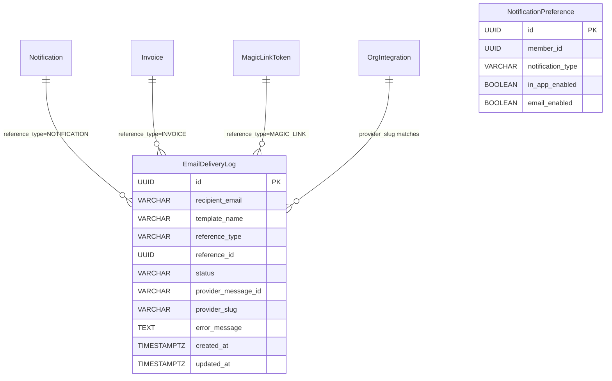
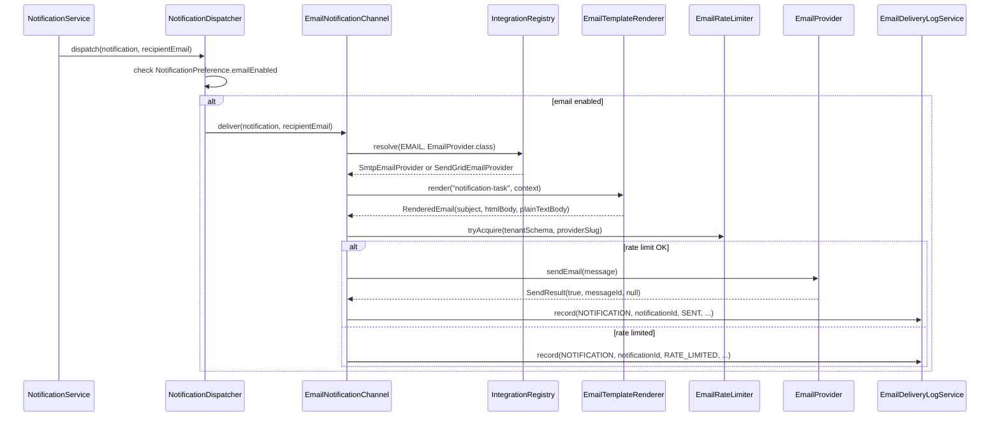
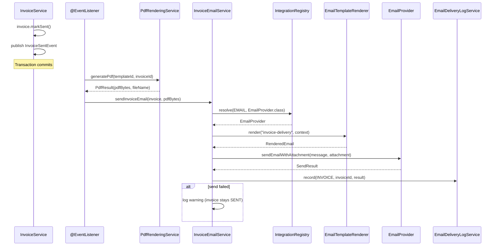
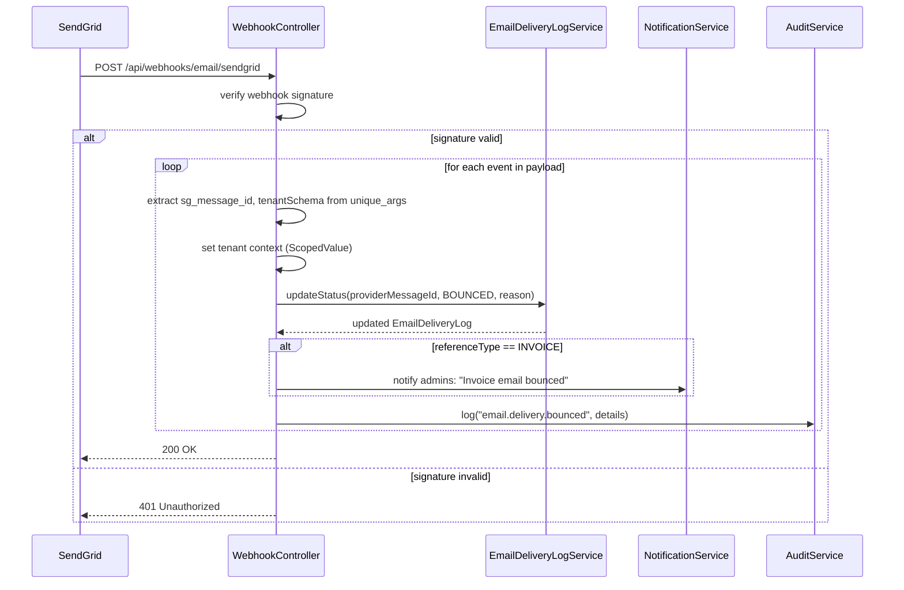

> Phase 24 architecture document. See [ARCHITECTURE.md](ARCHITECTURE.md) for the main architecture.

# Phase 24 — Outbound Email Delivery

---

## 24.1 Overview

Phase 24 wires up real email delivery across the entire DocTeams platform. Until now, the notification system (Phase 6.5) includes a channel abstraction with an `EmailNotificationChannel` stub that logs to console instead of sending, invoice "Send" transitions status without emailing the customer, and portal magic links require manual copy-paste of the token URL. This phase closes all three gaps and adds delivery tracking, bounce handling, rate limiting, and unsubscribe support.

The design introduces a **two-tier email architecture**: every org gets working email out of the box via platform-managed SMTP (Spring's `JavaMailSender`), and orgs that want higher volume or custom deliverability can bring their own SendGrid API key (BYOAK). The `EmailProvider` port interface follows the same `IntegrationPort` / `@IntegrationAdapter` / `IntegrationRegistry` pattern established in Phase 21, with `EMAIL` added to `IntegrationDomain`. Resolution falls back to platform SMTP when no org-level integration is configured — not to `NoOpEmailProvider`, which is retained only for local/dev profiles.

Email templates use Thymeleaf (reusing the `StringTemplateResolver` engine and `TemplateSecurityValidator` from Phase 12) but are classpath resources, not database-stored. They are part of the application, not user-customizable. A base layout template provides branded HTML with org logo, colors, and footer; per-type templates extend it for each of the 20 notification types plus invoice delivery and portal magic links.

**Dependencies on prior phases**:
- **Phase 6** (Audit & Compliance): `AuditService` and `AuditEventBuilder`. Email delivery events are audited.
- **Phase 6.5** (Notifications): `NotificationChannel`, `NotificationDispatcher`, `EmailNotificationChannel` (stub replaced), `EmailTemplate` enum, `NotificationPreference`.
- **Phase 7** (Customer Portal Backend): `MagicLinkService`, `PortalContact`, `MagicLinkToken`.
- **Phase 10** (Invoicing): `InvoiceService.send()`, `InvoiceSentEvent`, PDF generation.
- **Phase 12** (Document Templates): `PdfRenderingService` (Thymeleaf engine pattern), `TemplateSecurityValidator`, `OrgSettings` branding fields.
- **Phase 21** (Integration Ports): `IntegrationDomain`, `IntegrationRegistry`, `@IntegrationAdapter`, `OrgIntegration`, `SecretStore`.

### What's New

| Capability | Before Phase 24 | After Phase 24 |
|---|---|---|
| Notification emails | Console stub (`@Profile("local")`) | Branded HTML emails sent via platform SMTP or BYOAK SendGrid |
| Invoice delivery | Status transitions to SENT, no email | PDF attachment emailed to customer's primary contact |
| Portal magic links | Token returned to API caller only | Email sent to portal contact with branded magic link |
| Email provider config | No EMAIL domain in integrations | Two-tier: platform SMTP default + optional BYOAK SendGrid |
| Email templates | `String.format()` plain text | Thymeleaf HTML with org branding, responsive layout |
| Delivery tracking | None | `EmailDeliveryLog` entity with status per send |
| Bounce handling | None | SendGrid webhook updates delivery status, admin notifications |
| Rate limiting | None | Per-tenant + platform-aggregate limits, tier-aware |
| Unsubscribe | None | HMAC-signed links, one-click `List-Unsubscribe` headers |
| Email preferences UI | Toggle disabled ("Coming soon") | Fully functional email toggle for all 20 notification types |

**Out of scope**: Custom sender domains / DNS verification (DKIM, SPF, DMARC), open/click tracking, inbound email capture, additional provider adapters (Mailgun, SES, Postmark), visual email template editor, email scheduling / send-later, email threading (In-Reply-To / References headers), bulk email / marketing campaigns, customer-facing email preferences (portal contacts cannot manage their email settings in v1).

---

## 24.2 Domain Model

Phase 24 introduces one new tenant-scoped entity (`EmailDeliveryLog`), several value objects, one new enum, and extends `IntegrationDomain` with the `EMAIL` value. All new entities follow the established pattern: plain `@Entity` in tenant schema (no multitenancy boilerplate — schema boundary handles isolation per Phase 13).

### 24.2.1 EmailDeliveryLog Entity (New)

Tracks every outbound email send attempt with delivery status and provider correlation ID for webhook updates.

| Field | Java Type | DB Column | DB Type | Constraints | Notes |
|-------|-----------|-----------|---------|-------------|-------|
| `id` | `UUID` | `id` | `UUID` | PK, default `gen_random_uuid()` | Auto-generated |
| `recipientEmail` | `String` | `recipient_email` | `VARCHAR(320)` | NOT NULL | RFC 5321 max email length |
| `templateName` | `String` | `template_name` | `VARCHAR(100)` | NOT NULL | Which email template was used (e.g., `notification-task`, `invoice-delivery`) |
| `referenceType` | `String` | `reference_type` | `VARCHAR(30)` | NOT NULL | `NOTIFICATION`, `INVOICE`, `MAGIC_LINK`, `TEST` |
| `referenceId` | `UUID` | `reference_id` | `UUID` | Nullable | ID of the notification, invoice, or magic link token. Null for test emails |
| `status` | `EmailDeliveryStatus` | `status` | `VARCHAR(20)` | NOT NULL | `SENT`, `DELIVERED`, `BOUNCED`, `FAILED`, `RATE_LIMITED` |
| `providerMessageId` | `String` | `provider_message_id` | `VARCHAR(200)` | Nullable | SMTP Message-ID or SendGrid message ID for webhook correlation |
| `providerSlug` | `String` | `provider_slug` | `VARCHAR(50)` | NOT NULL | `smtp`, `sendgrid`, `noop` — which adapter sent the email |
| `errorMessage` | `String` | `error_message` | `TEXT` | Nullable | Failure/bounce reason |
| `createdAt` | `Instant` | `created_at` | `TIMESTAMPTZ` | NOT NULL | When the send was attempted |
| `updatedAt` | `Instant` | `updated_at` | `TIMESTAMPTZ` | NOT NULL | Last status change (e.g., webhook updates SENT → DELIVERED) |

**Design decisions**:
- `referenceType` and `status` are stored as strings (not `@Enumerated`) following the project convention for extensibility. Java enums are defined for compile-time safety.
- `providerMessageId` is the correlation key for webhook-based delivery updates. For SMTP, this is the `Message-ID` header value. For SendGrid, this is the `sg_message_id` from the API response.
- `providerSlug` records which adapter sent the email, enabling per-provider delivery analytics.
- `referenceId` is nullable because test emails (sent from settings UI) have no associated business entity.

**Indexes**:
- `idx_email_delivery_log_provider_message_id` on `provider_message_id` — webhook lookup.
- `idx_email_delivery_log_reference` on `(reference_type, reference_id)` — find deliveries for a specific notification/invoice/magic link.
- `idx_email_delivery_log_status_created` on `(status, created_at)` — admin dashboard queries, filtering by status and date range.
- `idx_email_delivery_log_created_at` on `created_at` — time-range queries for rate limiting and stats.

### 24.2.2 Value Objects (New)

These are Java records in the `integration/email/` package:

**`EmailMessage`** — Provider-agnostic email payload:
```java
public record EmailMessage(
    String to,
    String subject,
    String htmlBody,
    String plainTextBody,
    String replyTo,
    Map<String, String> metadata
) {}
```
- `metadata` carries tracking IDs that SendGrid stores as `unique_args` for webhook correlation. SMTP ignores metadata (correlation uses `Message-ID` header).
- **Required metadata keys** (callers MUST populate these): `referenceType` (e.g., `NOTIFICATION`, `INVOICE`, `MAGIC_LINK`, `TEST`), `referenceId` (UUID of the source entity, nullable for test emails), `tenantSchema` (for webhook tenant identification per [ADR-096](../adr/ADR-096-webhook-tenant-identification.md)). A factory method `EmailMessage.withTracking(to, subject, htmlBody, plainTextBody, replyTo, referenceType, referenceId, tenantSchema)` should enforce these keys at creation time.

**`EmailAttachment`** — File attachment for invoice PDFs:
```java
public record EmailAttachment(
    String filename,
    String contentType,
    byte[] content
) {}
```

**`SendResult`** — Outcome of a send attempt:
```java
public record SendResult(
    boolean success,
    String providerMessageId,
    String errorMessage
) {}
```

**`RenderedEmail`** — Output of template rendering:
```java
public record RenderedEmail(
    String subject,
    String htmlBody,
    String plainTextBody
) {}
```

### 24.2.3 EmailDeliveryStatus Enum (New)

```java
public enum EmailDeliveryStatus {
    SENT,          // Email accepted by provider (SMTP or SendGrid API returned success)
    DELIVERED,     // Provider confirmed delivery to recipient's mail server (webhook)
    BOUNCED,       // Recipient's mail server rejected the email (webhook)
    FAILED,        // Send attempt failed (exception, auth error, provider error)
    RATE_LIMITED   // Skipped due to rate limit exceeded
}
```

### 24.2.4 IntegrationDomain Extension (Modified)

Add `EMAIL` to the existing enum:

```java
public enum IntegrationDomain {
    ACCOUNTING,
    AI,
    DOCUMENT_SIGNING,
    EMAIL,        // NEW — Phase 24
    PAYMENT
}
```

### 24.2.5 ER Diagram



Relationships are logical (UUID-based loose references, not foreign keys) — consistent with the project pattern for cross-entity references where cascading deletes are not desired. `reference_id` points to the relevant entity based on `reference_type`.

---

## 24.3 Core Flows & Backend Behaviour

### 24.3.1 EmailProvider Port & Two-Tier Resolution

The `EmailProvider` port interface lives in `integration/email/` alongside its adapters, following the same package structure as `integration/accounting/`, `integration/ai/`, etc.

```java
package io.b2mash.b2b.b2bstrawman.integration.email;

import io.b2mash.b2b.b2bstrawman.integration.ConnectionTestResult;

/**
 * Port for sending outbound email. Tenant-scoped: each org either uses
 * platform SMTP (default) or their own SendGrid account (BYOAK).
 */
public interface EmailProvider {

    /** Provider identifier (e.g., "smtp", "sendgrid", "noop"). */
    String providerId();

    /** Send a single email. */
    SendResult sendEmail(EmailMessage message);

    /** Send an email with a file attachment (e.g., invoice PDF). */
    SendResult sendEmailWithAttachment(EmailMessage message, EmailAttachment attachment);

    /** Test connectivity with the configured credentials. */
    ConnectionTestResult testConnection();
}
```

#### Tier 1 — SmtpEmailProvider (platform default, zero config)

```java
@Component
@IntegrationAdapter(domain = IntegrationDomain.EMAIL, slug = "smtp")
public class SmtpEmailProvider implements EmailProvider { ... }
```

- Injects Spring's `JavaMailSender` (auto-configured via `spring.mail.*` properties).
- Sender address from `docteams.email.sender-address` property (e.g., `noreply@docteams.app`).
- Sender name: org display name from `OrgSettings` (falls back to `"DocTeams"` if null).
- Extracts `Message-ID` header from the sent `MimeMessage` and returns it as `providerMessageId` in `SendResult`.
- Wraps all `MailException` subclasses, returning `SendResult(false, null, e.getMessage())`.

#### Tier 2 — SendGridEmailProvider (BYOAK)

```java
@Component
@IntegrationAdapter(domain = IntegrationDomain.EMAIL, slug = "sendgrid")
public class SendGridEmailProvider implements EmailProvider { ... }
```

- Uses the SendGrid Java SDK (`com.sendgrid:sendgrid-java`).
- Retrieves API key from `SecretStore` using the org's `keySuffix` (pattern: `email-sendgrid-{keySuffix}`).
- Configurable sender email and name from `OrgIntegration.configJson` fields `senderEmail` and `senderName`.
- Injects `tenantSchema` into SendGrid `unique_args` custom metadata for webhook tenant identification (see [ADR-096](../adr/ADR-096-webhook-tenant-identification.md)).
- Returns `sg_message_id` from the SendGrid API response as `providerMessageId`.

#### NoOpEmailProvider (local/dev only)

```java
@Component
@IntegrationAdapter(domain = IntegrationDomain.EMAIL, slug = "noop")
@Profile({"local", "dev"})
public class NoOpEmailProvider implements EmailProvider { ... }
```

- Logs email details at INFO level, returns `SendResult(true, "NOOP-{uuid}", null)`.
- Only registered in local/dev profiles. In production, the "noop" slug is never resolved because `SmtpEmailProvider` is the default (see resolution logic below).

#### Resolution Logic (ADR-095)

The `IntegrationRegistry.resolve()` method currently falls back to the `"noop"` slug when no `OrgIntegration` row exists for a domain. For `EMAIL`, this must change: the fallback should be `"smtp"` (platform SMTP), not `"noop"`.

Rather than adding EMAIL-specific logic to `IntegrationRegistry`, we introduce a **per-domain default slug** concept. Each `IntegrationDomain` enum value declares its default adapter slug:

```java
public enum IntegrationDomain {
    ACCOUNTING("noop"),
    AI("noop"),
    DOCUMENT_SIGNING("noop"),
    EMAIL("smtp"),
    PAYMENT("noop");

    private final String defaultSlug;

    IntegrationDomain(String defaultSlug) {
        this.defaultSlug = defaultSlug;
    }

    public String getDefaultSlug() { return defaultSlug; }
}
```

`IntegrationRegistry.resolve()` then uses `domain.getDefaultSlug()` instead of hardcoded `"noop"`. This is a generic, backward-compatible enhancement — existing domains retain `"noop"` as their default. See [ADR-095](../adr/ADR-095-two-tier-email-resolution.md) for the full decision.

`SmtpEmailProvider` is annotated with `@ConditionalOnProperty(name = "spring.mail.host")` — it only registers when SMTP configuration is present. `NoOpEmailProvider` is annotated with `@ConditionalOnMissingBean(SmtpEmailProvider.class)` and uses `slug = "smtp"` — it acts as the fallback when no real SMTP server is configured (local/dev). Both adapters register under the same slug `"smtp"`, but only one is active at a time via Spring's conditional logic. A separate `"noop"` slug is unnecessary for the EMAIL domain. This keeps the adapter map simple: `EMAIL → { "smtp": SmtpOrNoOp, "sendgrid": SendGrid }`.

### 24.3.2 Email Template Rendering

The existing `TemplateRenderer` component (currently an empty stub in `notification/template/`) is replaced with a full `EmailTemplateRenderer` service.

```java
package io.b2mash.b2b.b2bstrawman.notification.template;

/**
 * Renders branded HTML emails from Thymeleaf classpath templates.
 * Reuses the StringTemplateResolver approach from PdfRenderingService
 * but uses a ClassLoaderTemplateResolver for file-based templates.
 */
@Service
public class EmailTemplateRenderer {

    private final TemplateEngine emailTemplateEngine;

    public RenderedEmail render(String templateName, Map<String, Object> context) { ... }

    /** Strip HTML tags for plain-text fallback. */
    String toPlainText(String html) { ... }
}
```

**Key difference from `PdfRenderingService`**: Email templates are classpath files (not database strings), so `EmailTemplateRenderer` uses a `ClassLoaderTemplateResolver` pointing to `templates/email/` rather than a `StringTemplateResolver`. The `TemplateSecurityValidator` is not needed here because templates are developer-authored classpath resources, not user-provided content. However, the `LenientStandardDialect` from Phase 12 is reused to avoid Thymeleaf exceptions on missing context variables (graceful null handling).

#### Template Hierarchy

All templates are Thymeleaf HTML files at `src/main/resources/templates/email/`:

```
templates/email/
├── base.html                       # Base layout: responsive HTML, header, footer, branding
├── notification-task.html          # TASK_ASSIGNED, TASK_CLAIMED, TASK_UPDATED
├── notification-comment.html       # COMMENT_ADDED
├── notification-document.html      # DOCUMENT_SHARED, DOCUMENT_GENERATED
├── notification-member.html        # MEMBER_INVITED
├── notification-budget.html        # BUDGET_ALERT
├── notification-invoice.html       # INVOICE_APPROVED, INVOICE_SENT, INVOICE_PAID, INVOICE_VOIDED
├── notification-schedule.html      # RECURRING_PROJECT_CREATED, SCHEDULE_SKIPPED, SCHEDULE_COMPLETED
├── notification-retainer.html      # All 5 retainer notification types
├── portal-magic-link.html          # Magic link for portal contacts
├── invoice-delivery.html           # Customer-facing invoice email with PDF attachment
└── test-email.html                 # Test email from settings UI
```

**Base layout** (`base.html`):
- Responsive HTML email structure using table-based layout (email client compatibility).
- Header: org logo (`orgLogoUrl` from `OrgSettings.logoS3Key` resolved to a presigned URL) and org name.
- Content area: `th:replace` fragment yielded to child templates.
- Footer: org name, `footerText` from `OrgSettings.documentFooterText`, unsubscribe link (for notification emails only).
- Brand color accent from `OrgSettings.brandColor` applied to header and button backgrounds.
- Inline CSS (email clients strip `<style>` tags).

#### Template Context Variables

All templates receive a common base context:

| Variable | Type | Source | Notes |
|----------|------|--------|-------|
| `orgName` | `String` | `Organization.name` | From global `organizations` table |
| `orgLogoUrl` | `String` | Presigned S3 URL from `OrgSettings.logoS3Key` | Nullable — template hides logo if absent |
| `brandColor` | `String` | `OrgSettings.brandColor` | Defaults to `#2563EB` (blue) if null |
| `footerText` | `String` | `OrgSettings.documentFooterText` | Nullable |
| `recipientName` | `String` | Member's display name or portal contact name | |
| `unsubscribeUrl` | `String` | HMAC-signed unsubscribe link | Only for notification emails; null for portal/invoice |
| `appUrl` | `String` | Platform base URL | From `docteams.app.base-url` property |

Type-specific context variables:

| Template | Additional Variables |
|----------|---------------------|
| `notification-task.html` | `actorName`, `taskName`, `projectName`, `action` (assigned/claimed/updated), `taskUrl` |
| `notification-comment.html` | `actorName`, `commentPreview` (first 200 chars), `entityName`, `entityUrl` |
| `notification-document.html` | `actorName`, `documentName`, `projectName`, `documentUrl` |
| `notification-member.html` | `inviterName`, `orgName`, `joinUrl` |
| `notification-budget.html` | `projectName`, `budgetPercentage`, `threshold`, `projectUrl` |
| `notification-invoice.html` | `invoiceNumber`, `customerName`, `amount`, `currency`, `status`, `invoiceUrl` |
| `notification-schedule.html` | `scheduleName`, `projectName`, `action` (created/skipped/completed), `scheduleUrl` |
| `notification-retainer.html` | `retainerName`, `customerName`, `periodLabel`, `utilization`, `retainerUrl` |
| `portal-magic-link.html` | `magicLinkUrl`, `expiryMinutes` (15), `contactName` |
| `invoice-delivery.html` | `invoiceNumber`, `amount`, `currency`, `dueDate`, `customerName`, `portalUrl` |

### 24.3.3 Notification Email Flow

The existing `EmailNotificationChannel` stub is replaced with a production-ready implementation that resolves `EmailProvider` via `IntegrationRegistry` and sends real branded emails.

**Changes to `EmailNotificationChannel`**:
1. Remove `@Profile({"local", "dev"})` — always active.
2. Inject `IntegrationRegistry`, `EmailTemplateRenderer`, `EmailDeliveryLogService`, `OrgSettingsService`.
3. In `deliver(Notification notification, String recipientEmail)`:
   - Resolve `EmailProvider` via `IntegrationRegistry.resolve(EMAIL, EmailProvider.class)`.
   - Build the template context from `Notification` fields (type, title, body, reference entity info) and `OrgSettings` branding.
   - Map `notification.getType()` to the appropriate template name (e.g., `TASK_ASSIGNED` → `notification-task`).
   - Render via `EmailTemplateRenderer.render(templateName, context)`.
   - Construct `EmailMessage` with rendered HTML, plain-text fallback, and `List-Unsubscribe` header metadata.
   - Call `emailProvider.sendEmail(message)`.
   - Record result in `EmailDeliveryLog` via `EmailDeliveryLogService.record(...)`.
4. All exceptions are caught, logged, and recorded as `FAILED` in the delivery log. No exceptions propagate to `NotificationDispatcher`.

**Flow**:
```
NotificationDispatcher.dispatch()
  → checks NotificationPreference.emailEnabled
  → EmailNotificationChannel.deliver()
    → IntegrationRegistry.resolve(EMAIL, EmailProvider.class)
    → EmailTemplateRenderer.render(templateName, context)
    → EmailProvider.sendEmail(message)
    → EmailDeliveryLogService.record(NOTIFICATION, notificationId, result)
```

### 24.3.4 Invoice Delivery Email Flow

A new `InvoiceEmailService` in the `invoice/` package handles invoice delivery emails with PDF attachment.

```java
@Service
public class InvoiceEmailService {

    public void sendInvoiceEmail(Invoice invoice, byte[] pdfBytes) { ... }
}
```

**Flow**:
1. `InvoiceService.send()` transitions invoice to SENT status (existing behavior).
2. After successful transition, generates PDF via `PdfRenderingService` (if not already generated).
3. Calls `InvoiceEmailService.sendInvoiceEmail(invoice, pdfBytes)`.
4. `InvoiceEmailService`:
   - Resolves `EmailProvider` via `IntegrationRegistry`.
   - Resolves recipient: customer's primary contact email from `Customer.email` field.
   - Builds context: `invoiceNumber`, `amount`, `currency`, `dueDate`, `customerName`, org branding.
   - Renders `invoice-delivery.html` template.
   - Constructs `EmailMessage` + `EmailAttachment` (PDF bytes, `application/pdf`, filename like `INV-2024-0001.pdf`).
   - Calls `emailProvider.sendEmailWithAttachment(message, attachment)`.
   - Records delivery in `EmailDeliveryLog` with `referenceType=INVOICE`, `referenceId=invoice.id`.
5. If email delivery fails, the invoice remains SENT — failure is tracked in the delivery log but does not block the status transition. This is critical: `InvoiceService.send()` must not fail because of email issues.

**Integration point**: The email send is triggered by listening to the existing `InvoiceSentEvent` via an `@EventListener` method, keeping the `InvoiceService.send()` method clean. The PDF generation + email send happen in the same transaction or in a `@TransactionalEventListener(phase = AFTER_COMMIT)` to ensure the invoice is committed before emailing.

### 24.3.5 Portal Magic Link Email Flow

A new `PortalEmailService` in the `portal/` package sends magic link emails to portal contacts.

```java
@Service
public class PortalEmailService {

    public void sendMagicLinkEmail(PortalContact contact, String magicLinkUrl) { ... }
}
```

**Integration with `MagicLinkService`**:
- After `generateToken()` produces a raw token, `MagicLinkService` calls `PortalEmailService.sendMagicLinkEmail()`.
- The raw token is still returned to the API caller (existing behavior preserved) AND the email is sent.
- If email delivery fails, the token is still returned — the caller can provide the link manually as a fallback.

**Flow**:
1. `MagicLinkService.generateToken()` generates token (existing).
2. Calls `PortalEmailService.sendMagicLinkEmail(contact, magicLinkUrl)`.
3. `PortalEmailService`:
   - Resolves `EmailProvider` via `IntegrationRegistry`.
   - Builds context: `contactName`, `magicLinkUrl`, `expiryMinutes` (15), org branding.
   - Renders `portal-magic-link.html` template.
   - Calls `emailProvider.sendEmail(message)`.
   - Records delivery in `EmailDeliveryLog` with `referenceType=MAGIC_LINK`, `referenceId=magicLinkToken.id`.
4. No unsubscribe link — magic link emails are transactional, not marketing.

### 24.3.6 Delivery Tracking & Bounce Handling

Every email send (notification, invoice, magic link, test) creates an `EmailDeliveryLog` entry via `EmailDeliveryLogService`:

```java
@Service
public class EmailDeliveryLogService {

    public EmailDeliveryLog record(
        String referenceType, UUID referenceId,
        String templateName, String recipientEmail,
        String providerSlug, SendResult result) { ... }

    public void updateStatus(
        String providerMessageId, EmailDeliveryStatus newStatus,
        String errorMessage) { ... }

    public Page<EmailDeliveryLog> findByFilters(
        EmailDeliveryStatus status, Instant from, Instant to,
        Pageable pageable) { ... }

    public EmailDeliveryStats getStats() { ... }
}
```

#### SendGrid Webhook Endpoint

```
POST /api/webhooks/email/{provider}
```

This endpoint is **not tenant-scoped** — SendGrid sends a single webhook payload that may contain events from multiple tenants. The endpoint:

1. Validates the webhook signature using the SendGrid Event Webhook Verification library. The verification key is stored as a platform-level configuration property (`docteams.email.sendgrid.webhook-verification-key`), not per-tenant.
2. Parses the event payload (array of event objects).
3. For each event with a relevant type (`bounce`, `dropped`, `deferred`, `delivered`):
   - Extracts `sg_message_id` from the event.
   - Looks up the `EmailDeliveryLog` entry by `providerMessageId`. Since `providerMessageId` is globally unique (SendGrid message IDs are unique across accounts), the lookup uses a cross-schema query approach: the delivery log's `providerMessageId` was stored with the tenant schema encoded in SendGrid's `unique_args` metadata. The webhook handler extracts the `tenantSchema` from `unique_args`, sets the tenant context via `ScopedValue`, and queries within that schema. See [ADR-096](../adr/ADR-096-webhook-tenant-identification.md).
   - Updates the delivery log status (`DELIVERED`, `BOUNCED`, or `FAILED`).
4. For bounced invoice emails: creates an in-app notification for org admins — "Invoice {number} email to {customer} bounced: {reason}".
5. For bounced magic link emails: logs a warning (portal contact may have a bad email address).
6. Publishes an audit event for delivery failures (`email.delivery.bounced` or `email.delivery.failed`).

**Webhook security**: SendGrid signs webhooks using the Event Webhook Verification library. The verification key is configured per SendGrid account. For platform SMTP (which doesn't use SendGrid), there are no webhooks — delivery status stays at `SENT` (no confirmation of delivery or bounce). For BYOAK SendGrid, the org must configure their webhook verification key in `OrgIntegration.configJson` field `webhookVerificationKey`. The webhook endpoint verifies using the key from the matching org's integration config. See section 24.6 for security details.

### 24.3.7 Rate Limiting

Per-tenant email rate limiting prevents abuse and protects the platform SMTP quota. See [ADR-097](../adr/ADR-097-rate-limiting-implementation.md) for the implementation decision.

**Limits**:

| Tier | Per-Tenant Limit | Notes |
|------|-----------------|-------|
| Platform SMTP (Tier 1) | 50 emails/hour | Platform bears the cost; tighter limit |
| BYOAK SendGrid (Tier 2) | 200 emails/hour | Org pays for their own quota |
| Platform aggregate (Tier 1 only) | 2,000 emails/hour | All tenants using platform SMTP, combined |

Limits are configurable via application properties:
```yaml
docteams:
  email:
    rate-limit:
      smtp: 50
      byoak: 200
      platform-aggregate: 2000
```

**Implementation**: Caffeine cache with sliding-window counters (one counter per tenant, one aggregate counter for platform SMTP). Chosen because:
- Single-instance deployment — no distributed coordination needed.
- Accuracy within a few percent is sufficient (this is abuse prevention, not billing).
- Fast: O(1) check per email send, no database queries.
- Restart resets counters, which is acceptable — a restart mid-hour briefly grants extra quota.

**`EmailRateLimiter` service**:
```java
@Service
public class EmailRateLimiter {

    public boolean tryAcquire(String tenantSchema, String providerSlug) { ... }

    public RateLimitStatus getStatus(String tenantSchema, String providerSlug) { ... }
}
```

**Behavior when rate-limited**:
- `tryAcquire()` returns `false`.
- The calling service (e.g., `EmailNotificationChannel`) records `RATE_LIMITED` status in `EmailDeliveryLog`.
- Logs a warning: `"Rate limit exceeded for tenant={}, provider={}, skipping email to={}"`.
- The triggering operation is NOT affected: notifications still show in-app, invoices still transition to SENT.
- No retry — the email is simply dropped. Users can view rate-limited deliveries in the delivery log.

### 24.3.8 Unsubscribe Handling

Email regulations (CAN-SPAM, POPIA) require an unsubscribe mechanism. The existing `NotificationPreference` system supports per-type email opt-out, but there is no way to trigger it from an email link.

**Token structure**: The unsubscribe token is an HMAC-SHA256 signed string encoding `memberId`, `notificationType`, and `tenantSchema`:
```
base64url(memberId:notificationType:tenantSchema):base64url(hmac-sha256(payload, secret))
```

The HMAC secret is derived from the existing `integration.encryption-key` property (or a separate `docteams.email.unsubscribe-secret` property).

**Endpoint**:
```
GET /api/email/unsubscribe?token={signed-token}
```

1. Decodes and verifies the HMAC signature.
2. Extracts `memberId`, `notificationType`, `tenantSchema`.
3. Sets the tenant context via `ScopedValue`.
4. Sets `emailEnabled = false` on the member's `NotificationPreference` for that type.
5. Returns a simple HTML page: "You've been unsubscribed from {type} emails. You can re-enable email notifications in your DocTeams settings."

**Scope**: Unsubscribe links appear only in internal team member notification emails. Portal/invoice emails to customers do not include unsubscribe links (they are transactional).

**List-Unsubscribe headers**: Notification emails include:
- `List-Unsubscribe: <{unsubscribeUrl}>` — URL-based unsubscribe.
- `List-Unsubscribe-Post: List-Unsubscribe=One-Click` — RFC 8058 one-click unsubscribe support.

These headers enable one-click unsubscribe in Gmail, Apple Mail, and other supporting clients.

### 24.3.9 Audit Events

All email audit events are recorded via the existing `AuditService` from Phase 6. The following event types are introduced:

| Event Type | Trigger | Details Payload |
|------------|---------|-----------------|
| `email.integration.configured` | Org configures an EMAIL integration (e.g., adds SendGrid API key) | `{ providerSlug, senderEmail }` |
| `email.integration.updated` | Org updates email provider settings | `{ providerSlug, changedFields[] }` |
| `email.integration.removed` | Org removes their email integration (reverts to platform SMTP) | `{ providerSlug }` |
| `email.delivery.failed` | Email send returns a failure from the provider | `{ recipientEmail, templateName, referenceType, errorMessage }` |
| `email.delivery.bounced` | Bounce event received via webhook | `{ recipientEmail, bounceReason, providerMessageId }` |
| `email.test.sent` | Admin sends a test email from settings UI | `{ recipientEmail, providerSlug }` |

Integration lifecycle events (`configured`, `updated`, `removed`) are triggered by the existing integration settings flow when `domain = EMAIL`. Delivery failure and bounce events are triggered by `EmailDeliveryLogService` when updating delivery status. Test email events are triggered by `EmailAdminController`.

---

## 24.4 API Surface

### New Endpoints

| Method | Path | Description | Auth | R/W |
|--------|------|-------------|------|-----|
| `POST` | `/api/webhooks/email/{provider}` | Receive delivery status webhooks from email providers | None (signature-verified) | Write |
| `GET` | `/api/email/unsubscribe` | One-click email unsubscribe via HMAC-signed token | Token-based (no session) | Write |
| `GET` | `/api/email/delivery-log` | List delivery log entries with filtering | ADMIN, OWNER | Read |
| `GET` | `/api/email/stats` | Delivery statistics (sent/bounced/failed counts) | ADMIN, OWNER | Read |
| `POST` | `/api/email/test` | Send a test email to the current user | ADMIN, OWNER | Write |

### Modified Endpoints

| Method | Path | Change | Notes |
|--------|------|--------|-------|
| `POST` | `/api/portal/magic-link` | Now triggers email to portal contact | Token still returned in response body |
| `POST` | `/api/invoices/{id}/send` | Now triggers email with PDF to customer | Email failure does not block status transition |

### Endpoint Details

**`GET /api/email/delivery-log`**

Query parameters:
- `status` (optional): `SENT`, `DELIVERED`, `BOUNCED`, `FAILED`, `RATE_LIMITED`
- `from` (optional): ISO-8601 datetime
- `to` (optional): ISO-8601 datetime
- `page`, `size`, `sort` (standard pagination)

Response: `Page<EmailDeliveryLogResponse>` with fields: `id`, `recipientEmail`, `templateName`, `referenceType`, `referenceId`, `status`, `providerMessageId`, `providerSlug`, `errorMessage`, `createdAt`, `updatedAt`.

**`GET /api/email/stats`**

Response:
```json
{
  "sent24h": 42,
  "bounced7d": 1,
  "failed7d": 3,
  "rateLimited7d": 0,
  "currentHourUsage": 12,
  "hourlyLimit": 50,
  "providerSlug": "smtp"
}
```

**`POST /api/email/test`**

Request: empty body. Sends a test email using the `test-email.html` template to the current user's email. Records delivery in the log with `referenceType=TEST`.

**`POST /api/webhooks/email/{provider}`**

Path variable `{provider}`: currently only `sendgrid`. The endpoint validates the webhook signature and processes bounce/delivery events. No authentication — secured by signature verification (see 24.6).

---

## 24.5 Sequence Diagrams

### 24.5.1 Notification Email Flow



### 24.5.2 Invoice Delivery Email Flow



### 24.5.3 Bounce Webhook Flow



---

## 24.6 Security Considerations

### Webhook Signature Validation

SendGrid signs webhook payloads using ECDSA with the Event Webhook Verification public key. The verification process:
1. The platform stores the SendGrid Event Webhook verification key as `docteams.email.sendgrid.webhook-verification-key` (platform-level, not per-tenant).
2. For BYOAK orgs, the verification key is stored in `OrgIntegration.configJson.webhookVerificationKey`.
3. The webhook handler extracts the tenant schema from `unique_args` in the event payload, then loads the appropriate verification key (platform default or org-specific).
4. If signature verification fails, return `401 Unauthorized` immediately.

### HMAC-Signed Unsubscribe Tokens

Unsubscribe tokens use HMAC-SHA256 to prevent tampering:
- Token payload: `memberId:notificationType:tenantSchema`
- Signed with `docteams.email.unsubscribe-secret` (server-side secret)
- Tokens have no expiry — unsubscribe should always work, even for old emails.
- No session required — the token itself authorizes the unsubscribe action.

### Rate Limiting as Abuse Prevention

Rate limiting prevents:
- A misconfigured automation flooding the platform SMTP quota.
- A malicious tenant exhausting shared platform resources.
- Accidental loops (e.g., notification → email → notification → email).

### SecretStore for API Keys

SendGrid API keys are stored via `SecretStore` (AES-256-GCM encrypted in the tenant schema's `org_secrets` table). Keys are never logged, never returned in API responses, and never stored in `OrgIntegration.configJson`.

### No Tenant Data Leakage via Webhooks

The webhook endpoint processes events in the context of the correct tenant schema (identified via `unique_args`). If the tenant schema cannot be determined, the event is logged and discarded. Cross-tenant data access is impossible because the tenant context is set via `ScopedValue` before any database queries.

---

## 24.7 Database Migration

### V41: create_email_delivery_log.sql

```sql
-- V41__create_email_delivery_log.sql

CREATE TABLE email_delivery_log (
    id              UUID            DEFAULT gen_random_uuid() PRIMARY KEY,
    recipient_email VARCHAR(320)    NOT NULL,
    template_name   VARCHAR(100)    NOT NULL,
    reference_type  VARCHAR(30)     NOT NULL,
    reference_id    UUID,
    status          VARCHAR(20)     NOT NULL,
    provider_message_id VARCHAR(200),
    provider_slug   VARCHAR(50)     NOT NULL,
    error_message   TEXT,
    created_at      TIMESTAMPTZ     NOT NULL DEFAULT now(),
    updated_at      TIMESTAMPTZ     NOT NULL DEFAULT now()
);

-- Webhook lookup by provider message ID
CREATE INDEX idx_email_delivery_log_provider_message_id
    ON email_delivery_log (provider_message_id)
    WHERE provider_message_id IS NOT NULL;

-- Find deliveries for a specific business entity
CREATE INDEX idx_email_delivery_log_reference
    ON email_delivery_log (reference_type, reference_id);

-- Admin dashboard: filter by status and date range
CREATE INDEX idx_email_delivery_log_status_created
    ON email_delivery_log (status, created_at);

-- Time-range queries for rate limit stats
CREATE INDEX idx_email_delivery_log_created_at
    ON email_delivery_log (created_at);

-- CHECK: valid status values
ALTER TABLE email_delivery_log
    ADD CONSTRAINT chk_email_delivery_status
    CHECK (status IN ('SENT', 'DELIVERED', 'BOUNCED', 'FAILED', 'RATE_LIMITED'));

-- CHECK: valid reference types
ALTER TABLE email_delivery_log
    ADD CONSTRAINT chk_email_delivery_reference_type
    CHECK (reference_type IN ('NOTIFICATION', 'INVOICE', 'MAGIC_LINK', 'TEST'));
```

No changes to existing tables. The `IntegrationDomain` enum change (`EMAIL` added) is Java-only — the `org_integrations.domain` column is `VARCHAR(30)`, so no migration is needed.

---

## 24.8 Implementation Guidance

### Backend Changes

| File / Package | Change |
|----------------|--------|
| `integration/IntegrationDomain.java` | Add `EMAIL("smtp")` value, add `defaultSlug` field |
| `integration/IntegrationRegistry.java` | Use `domain.getDefaultSlug()` instead of hardcoded `"noop"` in fallback |
| `integration/email/` (new package) | `EmailProvider`, `EmailMessage`, `EmailAttachment`, `SendResult`, `RenderedEmail`, `EmailDeliveryStatus` |
| `integration/email/SmtpEmailProvider.java` (new) | Platform SMTP adapter using `JavaMailSender` |
| `integration/email/SendGridEmailProvider.java` (new) | BYOAK SendGrid adapter using SendGrid SDK |
| `notification/template/EmailTemplateRenderer.java` (replace stub) | Thymeleaf rendering from classpath templates |
| `notification/template/EmailTemplate.java` | Kept for backward compatibility; `EmailTemplateRenderer` takes over rendering |
| `notification/channel/EmailNotificationChannel.java` | Remove `@Profile`, inject `IntegrationRegistry` + `EmailTemplateRenderer`, send real emails |
| `integration/email/EmailDeliveryLog.java` (new) | Entity — delivery tracking for all email sends |
| `integration/email/EmailDeliveryLogRepository.java` (new) | JPA repository for delivery log |
| `integration/email/EmailDeliveryLogService.java` (new) | CRUD for `EmailDeliveryLog`, stats queries |
| `integration/email/EmailRateLimiter.java` (new) | Caffeine-based rate limiting |
| `integration/email/UnsubscribeService.java` (new) | HMAC token generation and verification |
| `integration/email/UnsubscribeController.java` (new) | `GET /api/email/unsubscribe` |
| `integration/email/EmailWebhookController.java` (new) | `POST /api/webhooks/email/{provider}` |
| `integration/email/EmailAdminController.java` (new) | `GET /api/email/delivery-log`, `GET /api/email/stats`, `POST /api/email/test` |
| `invoice/InvoiceEmailService.java` (new) | Invoice delivery email with PDF attachment |
| `invoice/InvoiceService.java` | Add `@TransactionalEventListener` for email send after SENT transition |
| `portal/PortalEmailService.java` (new) | Portal magic link email |
| `portal/MagicLinkService.java` | Call `PortalEmailService.sendMagicLinkEmail()` after token generation |
| `src/main/resources/templates/email/` (new directory) | All 12 Thymeleaf email templates |
| `db/migration/tenant/V41__create_email_delivery_log.sql` (new) | Migration |

### Frontend Changes

| File / Component | Change |
|------------------|--------|
| `components/notifications/notification-preferences-form.tsx` | Remove "Coming soon" disabled state from email toggle, add missing notification types |
| `app/(app)/org/[slug]/settings/integrations/page.tsx` | Add `EMAIL` to `DOMAIN_CONFIG` array |
| `components/integrations/EmailIntegrationCard.tsx` (new) | Email-specific integration card with two-tier UX |
| `components/email/DeliveryLogTable.tsx` (new) | Delivery log data table with status filters |
| `app/(app)/org/[slug]/settings/email/page.tsx` (new) | Email settings page with delivery log tab |
| `lib/actions/email.ts` (new) | Server actions for email endpoints |
| `lib/api/email.ts` (new) | API functions for delivery log, stats |

### New Packages and Classes

```
integration/email/
├── EmailProvider.java          (port interface)
├── EmailMessage.java           (value object)
├── EmailAttachment.java        (value object)
├── SendResult.java             (value object)
├── RenderedEmail.java          (value object)
├── EmailDeliveryStatus.java    (enum)
├── SmtpEmailProvider.java      (Tier 1 adapter)
└── SendGridEmailProvider.java  (Tier 2 adapter)
```

### Dependencies to Add

**`pom.xml`**:
```xml
<!-- Platform SMTP -->
<dependency>
    <groupId>org.springframework.boot</groupId>
    <artifactId>spring-boot-starter-mail</artifactId>
</dependency>

<!-- BYOAK SendGrid (optional at runtime) -->
<dependency>
    <groupId>com.sendgrid</groupId>
    <artifactId>sendgrid-java</artifactId>
    <version>4.10.3</version>
    <optional>true</optional>
</dependency>
```

`spring-boot-starter-mail` provides `JavaMailSender` and `MimeMessageHelper`. It is a standard Spring Boot starter with no additional configuration needed beyond `spring.mail.*` properties.

`sendgrid-java` is marked `<optional>true</optional>` — the application starts without it. `SendGridEmailProvider` uses `@ConditionalOnClass(name = "com.sendgrid.SendGrid")` so it is only registered when the SDK is on the classpath.

### Entity Pattern

```java
package io.b2mash.b2b.b2bstrawman.integration.email;

import jakarta.persistence.*;
import java.time.Instant;
import java.util.UUID;

@Entity
@Table(name = "email_delivery_log")
public class EmailDeliveryLog {

    @Id
    @GeneratedValue(strategy = GenerationType.UUID)
    private UUID id;

    @Column(name = "recipient_email", nullable = false, length = 320)
    private String recipientEmail;

    @Column(name = "template_name", nullable = false, length = 100)
    private String templateName;

    @Column(name = "reference_type", nullable = false, length = 30)
    private String referenceType;

    @Column(name = "reference_id")
    private UUID referenceId;

    @Column(name = "status", nullable = false, length = 20)
    private String status;

    @Column(name = "provider_message_id", length = 200)
    private String providerMessageId;

    @Column(name = "provider_slug", nullable = false, length = 50)
    private String providerSlug;

    @Column(name = "error_message", columnDefinition = "TEXT")
    private String errorMessage;

    @Column(name = "created_at", nullable = false, updatable = false)
    private Instant createdAt;

    @Column(name = "updated_at", nullable = false)
    private Instant updatedAt;

    protected EmailDeliveryLog() {}

    public EmailDeliveryLog(String recipientEmail, String templateName,
            String referenceType, UUID referenceId,
            String status, String providerSlug) {
        this.recipientEmail = recipientEmail;
        this.templateName = templateName;
        this.referenceType = referenceType;
        this.referenceId = referenceId;
        this.status = status;
        this.providerSlug = providerSlug;
    }

    @PrePersist
    void onPrePersist() {
        this.createdAt = Instant.now();
        this.updatedAt = Instant.now();
    }

    @PreUpdate
    void onPreUpdate() {
        this.updatedAt = Instant.now();
    }

    public void updateDeliveryStatus(EmailDeliveryStatus newStatus, String errorMessage) {
        this.status = newStatus.name();
        this.errorMessage = errorMessage;
    }

    // getters...
}
```

### Testing Strategy

- **Unit tests**: `EmailTemplateRenderer` (renders each template with known context, asserts HTML contains expected content), `EmailRateLimiter` (counter increments, limit enforcement, reset after window), `UnsubscribeService` (token generation, verification, tamper detection).
- **Integration tests**: `SmtpEmailProvider` with GreenMail (in-memory SMTP server for testing), `EmailNotificationChannel` end-to-end (create notification → dispatch → verify email sent via GreenMail), `InvoiceEmailService` (send invoice → verify PDF attachment), `EmailWebhookController` (POST bounce event → verify delivery log updated), `EmailAdminController` (delivery log pagination, stats).
- **Frontend tests**: Notification preferences form (email toggle enabled, save triggers action), email integration card (two-tier UX, API key input, test connection), delivery log table (status filtering, pagination).

### Application Properties

```yaml
# Platform SMTP configuration
spring:
  mail:
    host: ${SMTP_HOST:smtp.sendgrid.net}
    port: ${SMTP_PORT:587}
    username: ${SMTP_USERNAME:apikey}
    password: ${SMTP_PASSWORD:}
    properties:
      mail.smtp.auth: true
      mail.smtp.starttls.enable: true

# Email configuration
docteams:
  email:
    sender-address: ${EMAIL_SENDER_ADDRESS:noreply@docteams.app}
    unsubscribe-secret: ${EMAIL_UNSUBSCRIBE_SECRET:}
    rate-limit:
      smtp: 50
      byoak: 200
      platform-aggregate: 2000
    sendgrid:
      webhook-verification-key: ${SENDGRID_WEBHOOK_VERIFICATION_KEY:}
  app:
    base-url: ${APP_BASE_URL:http://localhost:3000}
```

---

## 24.9 Permission Model

| Resource | Action | Roles | Notes |
|----------|--------|-------|-------|
| Delivery log | View | ADMIN, OWNER | Via `GET /api/email/delivery-log` |
| Delivery stats | View | ADMIN, OWNER | Via `GET /api/email/stats` |
| Email settings | Configure | ADMIN, OWNER | Via integration settings UI |
| Test email | Send | ADMIN, OWNER | Via `POST /api/email/test` |
| Unsubscribe | Execute | Any member (via token) | Token encodes member ID, no session needed |
| Webhook | Receive | No auth | Signature-verified by provider |
| Email preferences | Toggle | Any member (self) | Existing preference update endpoint |

---

## 24.10 Capability Slices

### Slice 24A — EmailProvider Port + SmtpEmailProvider + NoOpEmailProvider

**Scope**: Backend only. Establish the email provider abstraction and platform SMTP adapter.

**Key deliverables**:
- Add `EMAIL` to `IntegrationDomain` with `defaultSlug = "smtp"`.
- Refactor `IntegrationRegistry.resolve()` to use `domain.getDefaultSlug()` instead of hardcoded `"noop"`.
- Create `integration/email/` package with `EmailProvider`, `EmailMessage`, `EmailAttachment`, `SendResult`, `RenderedEmail`, `EmailDeliveryStatus`.
- Implement `SmtpEmailProvider` with `@ConditionalOnProperty(name = "spring.mail.host")`.
- Implement `NoOpEmailProvider` with `@ConditionalOnMissingBean(SmtpEmailProvider.class)` and `slug = "smtp"`.
- Add `spring-boot-starter-mail` dependency.
- Add `docteams.email.*` application properties.

**Dependencies**: None (first slice).

**Test expectations**: ~10-15 tests. `SmtpEmailProvider` integration test with GreenMail. `NoOpEmailProvider` logs correctly. `IntegrationRegistry` resolves `SmtpEmailProvider` for `EMAIL` domain when no `OrgIntegration` exists. `IntegrationRegistry` still resolves `"noop"` for `ACCOUNTING` domain (backward compatibility).

### Slice 24B — Email Template Rendering + All Templates

**Scope**: Backend only. Build the Thymeleaf email rendering pipeline and all template files.

**Key deliverables**:
- Implement `EmailTemplateRenderer` (replace `TemplateRenderer` stub) with `ClassLoaderTemplateResolver`.
- Create `templates/email/base.html` (responsive, branded layout).
- Create all 12 email templates (8 notification groups + portal-magic-link + invoice-delivery + test-email).
- Plain-text fallback generation (`toPlainText()` utility).

**Dependencies**: None (can parallel with 24A — no runtime dependency on `EmailProvider`).

**Test expectations**: ~15-20 tests. Render each template with test context, assert HTML structure. Verify org branding variables are injected. Verify plain-text fallback strips HTML. Verify missing context variables don't throw (lenient dialect).

### Slice 24C — EmailNotificationChannel + Delivery Log + Migration

**Scope**: Backend. The enabling slice — after this, all notification emails work.

**Key deliverables**:
- `EmailDeliveryLog` entity + `EmailDeliveryLogRepository`.
- `V41__create_email_delivery_log.sql` migration.
- `EmailDeliveryLogService` (record, query, stats).
- Replace `EmailNotificationChannel` stub with production implementation.
- `EmailRateLimiter` service (Caffeine-based).
- Wire into `NotificationDispatcher` flow.
- All 20 notification types become email-capable, including `DOCUMENT_SHARED` (satisfies requirement 4c — document share email goes through the standard notification channel).

**Dependencies**: 24A (EmailProvider port), 24B (EmailTemplateRenderer).

**Test expectations**: ~20-25 tests. End-to-end notification email (create notification → dispatch → verify delivery log entry + email sent via GreenMail). Rate limiter: counter increments, limit enforcement, tier-aware limits. Delivery log CRUD and pagination.

### Slice 24D — Invoice Delivery + Portal Magic Link Email

**Scope**: Backend. Non-notification email flows.

**Key deliverables**:
- `InvoiceEmailService` with PDF attachment support.
- `@TransactionalEventListener` on `InvoiceSentEvent` for email trigger.
- `PortalEmailService` for magic link emails.
- Integration into `MagicLinkService.generateToken()`.
- Delivery log entries for both flows.

**Dependencies**: 24A (EmailProvider), 24B (templates), 24C (delivery log entity).

**Test expectations**: ~15-20 tests. Invoice email with PDF attachment (verify via GreenMail). Magic link email triggers on token generation. Email failure does not block invoice SENT transition. Delivery log entries created for both flows.

### Slice 24E — Bounce Webhook + SendGridEmailProvider + BYOAK

**Scope**: Backend. SendGrid integration and webhook processing.

**Key deliverables**:
- `SendGridEmailProvider` adapter with `@ConditionalOnClass`.
- `sendgrid-java` Maven dependency (optional).
- `EmailWebhookController` (`POST /api/webhooks/email/{provider}`).
- Webhook signature verification.
- Tenant identification via `unique_args` metadata.
- Delivery log status updates (DELIVERED, BOUNCED).
- Admin notification for bounced invoice emails.
- Audit events for delivery failures.

**Dependencies**: 24C (delivery log entity and service).

**Test expectations**: ~15-20 tests. Webhook signature verification (valid, invalid, missing). Delivery log update on bounce event. Admin notification created for invoice bounce. Tenant identification from `unique_args`. `SendGridEmailProvider` sends email via mock (MockWebServer or Mockito).

### Slice 24F — Rate Limiting + Unsubscribe Handling

**Scope**: Backend. Abuse prevention and regulatory compliance.

**Key deliverables**:
- `UnsubscribeService` (HMAC token generation and verification).
- `UnsubscribeController` (`GET /api/email/unsubscribe`).
- Simple HTML unsubscribe confirmation page.
- `List-Unsubscribe` and `List-Unsubscribe-Post` headers in notification emails.
- `EmailAdminController` (`GET /api/email/delivery-log`, `GET /api/email/stats`, `POST /api/email/test`).

**Dependencies**: 24C (delivery log, rate limiter already built in 24C).

**Test expectations**: ~15-20 tests. Unsubscribe token generation and verification. Tampered token rejected. Unsubscribe sets `emailEnabled = false`. `List-Unsubscribe` header present in notification emails. Admin endpoints: delivery log pagination, stats, test email.

### Slice 24G — Frontend: Email Toggle + Integration Card + Delivery Log

**Scope**: Frontend only.

**Key deliverables**:
- Notification preferences form: remove "Coming soon" disabled state, enable email toggle for all 20 notification types, add missing types (BUDGET_ALERT, INVOICE_*, DOCUMENT_GENERATED, SCHEDULE_*, RETAINER_*).
- Email integration card on integrations settings page with two-tier UX (platform default badge, BYOAK expansion).
- Delivery log viewer page (`/settings/email`) with status filters and date range.
- Delivery statistics summary.
- Rate limit tier display.
- Server actions and API functions for email endpoints.

**Dependencies**: 24C (delivery log backend), 24F (admin endpoints).

**Test expectations**: ~15-20 tests. Email toggle enables/disables. Integration card shows platform default state. Delivery log table renders with status badges. Stats display correct counts.

---

## 24.11 ADR Index

### New ADRs (Phase 24)

| ADR | Title | Summary |
|-----|-------|---------|
| [ADR-095](../adr/ADR-095-two-tier-email-resolution.md) | Two-Tier Email Resolution | Per-domain default slug in `IntegrationDomain` — `EMAIL` defaults to `"smtp"`, other domains default to `"noop"` |
| [ADR-096](../adr/ADR-096-webhook-tenant-identification.md) | Webhook Tenant Identification | Encode tenant schema in SendGrid `unique_args` metadata for webhook correlation |
| [ADR-097](../adr/ADR-097-rate-limiting-implementation.md) | Rate Limiting Implementation | Caffeine cache with sliding-window counters — simple, fast, sufficient for single-instance |

### Referenced Existing ADRs

| ADR | Title | Relevance |
|-----|-------|-----------|
| [ADR-056](../adr/ADR-056-pdf-engine-selection.md) | PDF Engine Selection | Thymeleaf rendering pattern reused for email templates |
| [ADR-034](../adr/ADR-034-flat-comments.md) | Flat Comments | COMMENT_ADDED notification email template |
| [ADR-036](../adr/ADR-036-sync-fanout.md) | Sync Fanout | Notification dispatch pattern extended with email channel |
| [ADR-048](../adr/ADR-048-invoice-numbering.md) | Invoice Numbering | Invoice number format in email templates |
