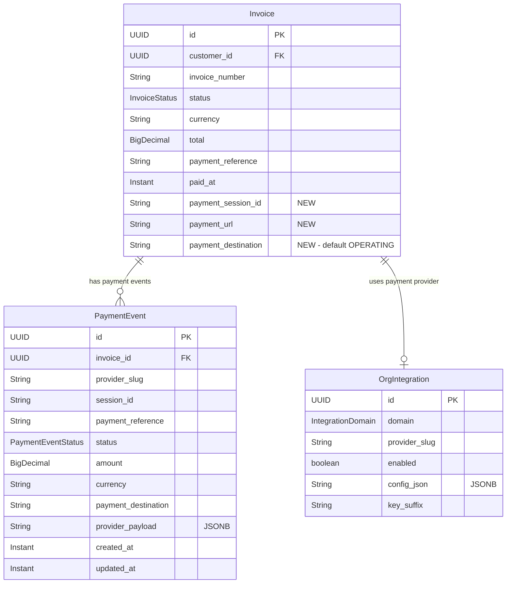
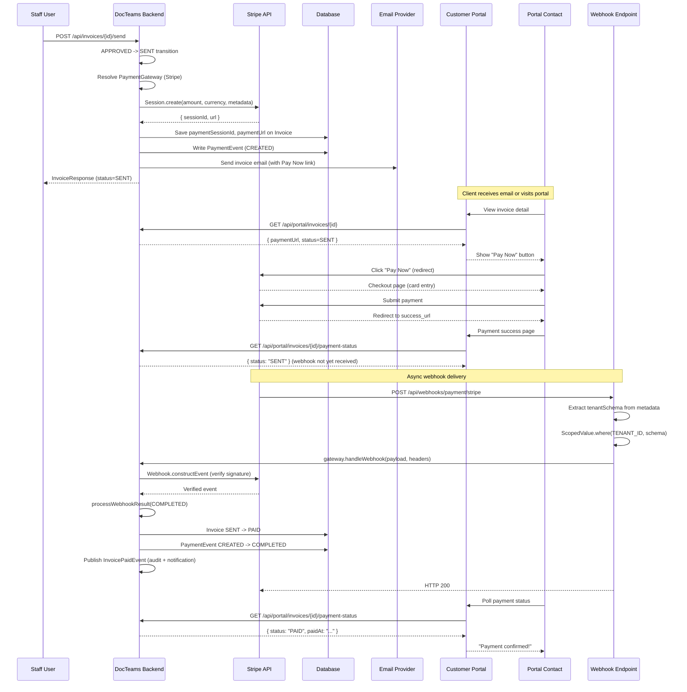
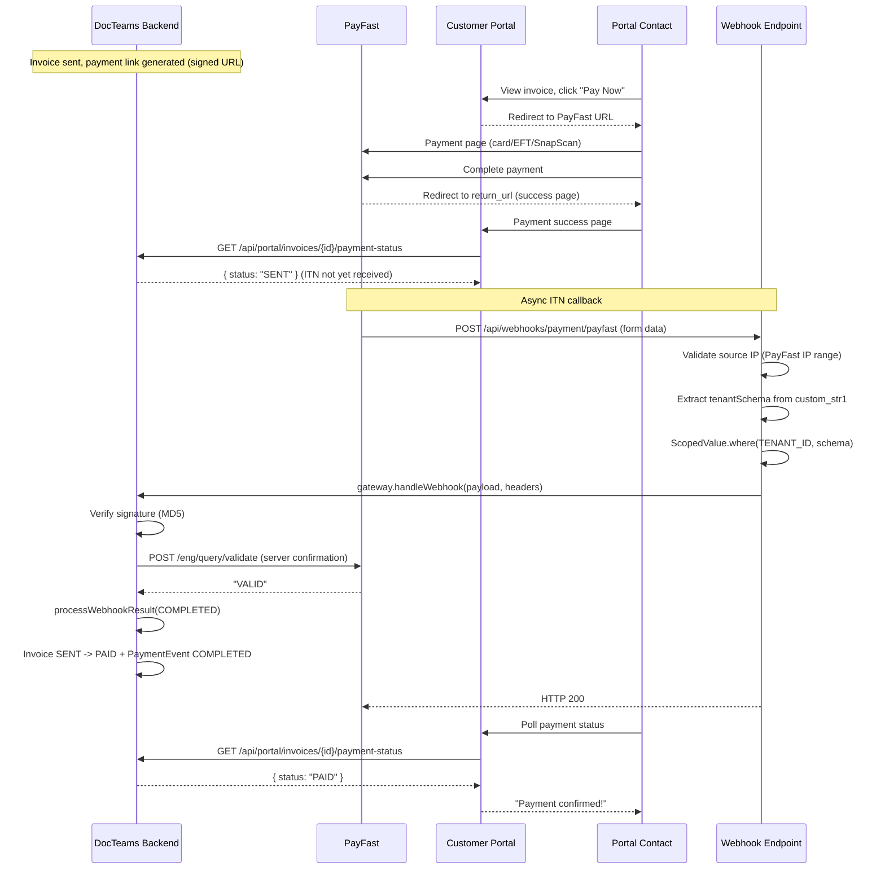
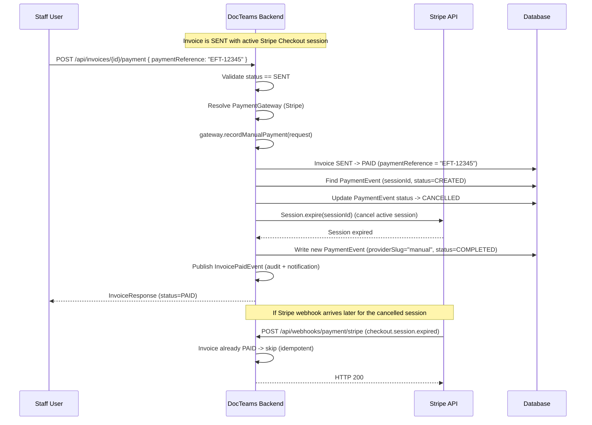

> Phase 25 architecture document. See [ARCHITECTURE.md](ARCHITECTURE.md) for the main architecture.

# Phase 25 — Online Payment Collection

---

## 25.1 Overview

Phase 25 wires up real online payment collection across the DocTeams platform. Until now, the invoicing system (Phase 10) supports a complete DRAFT -> APPROVED -> SENT -> PAID lifecycle, but payment recording is entirely manual: a staff member clicks "Record Payment" to mark an invoice as PAID with an optional reference string. Behind the scenes, a `MockPaymentProvider` always returns success. There is no way for clients to pay invoices online, no payment links in invoice emails, and no payment capability on the customer portal.

This phase closes the gap by integrating Stripe and PayFast as the first two payment service providers (PSPs). Tenants connect their own Stripe or PayFast account via the Integration Settings UI (BYOAK model -- no platform-managed PSP account). When an invoice is sent, a payment link is generated and included in the invoice email and on the portal invoice page. Clients click "Pay Now" and are redirected to a Stripe Checkout or PayFast hosted payment page. After successful payment, a webhook callback automatically marks the invoice as PAID. Payment events are tracked in a dedicated `PaymentEvent` entity for audit and reconciliation.

The design also consolidates the legacy `PaymentProvider` interface (Phase 10) into a new `PaymentGateway` port interface aligned with the integration port pattern established in Phase 21. This brings the PAYMENT domain to parity with EMAIL, ACCOUNTING, AI, and DOCUMENT_SIGNING: port interface in `integration/payment/`, adapter registration via `@IntegrationAdapter`, resolution via `IntegrationRegistry`, and a `NoOpPaymentGateway` as the default for orgs without a configured PSP.

**Dependencies on prior phases**:
- **Phase 6** (Audit & Compliance): `AuditService` and `AuditEventBuilder`. Payment events are audited.
- **Phase 6.5** (Notifications): `NotificationService` and notification templates. Payment events trigger notifications.
- **Phase 7** (Customer Portal Backend): `PortalContact`, `MagicLinkToken`, portal authentication. Payment happens on the portal.
- **Phase 10** (Invoicing): `Invoice`, `InvoiceService`, `InvoiceStatus`, `PaymentProvider` (to be replaced). The entire payment flow extends the invoice lifecycle.
- **Phase 12** (Document Templates): `OrgSettings` branding fields used in email templates.
- **Phase 21** (Integration Ports): `IntegrationDomain`, `IntegrationRegistry`, `@IntegrationAdapter`, `OrgIntegration`, `SecretStore`. The PAYMENT domain is already declared.
- **Phase 22** (Customer Portal Frontend): Portal invoice pages. Payment UI extends these.
- **Phase 24** (Outbound Email Delivery): Invoice email delivery. Payment link is included in the email.

### What's New

| Capability | Before Phase 25 | After Phase 25 |
|---|---|---|
| Payment recording | Manual "Record Payment" button only | Online via Stripe/PayFast + manual recording |
| Payment providers | `MockPaymentProvider` (always succeeds) | Stripe, PayFast, NoOp (manual-only) |
| Invoice email | No payment link | "Pay Now" button with checkout URL |
| Portal invoice page | View-only | "Pay Now" button redirects to hosted payment page |
| Payment link generation | None | Auto-generated on SENT transition when PSP is configured |
| Webhook reconciliation | None | Automatic SENT -> PAID via Stripe/PayFast webhooks |
| Payment event tracking | `paymentReference` string on invoice | Full `PaymentEvent` entity with status history |
| Integration settings | PAYMENT card with no real providers | Stripe and PayFast configuration cards |
| Payment destination | None | `paymentDestination` field (default `OPERATING`) for future trust accounting |

**Out of scope**: Partial payments, deposits, split payments, recurring payments / auto-charge / card-on-file, payment plans, trust accounting ledger (only the `paymentDestination` seam), refunds or credit notes, multi-currency conversion, additional PSP adapters (Peach, Ozow), platform-managed PSP accounts, standalone payment pages outside the portal, PCI compliance beyond SAQ-A, payment receipts from the platform (PSPs send their own).

---

## 25.2 Domain Model

Phase 25 introduces one new tenant-scoped entity (`PaymentEvent`), several value objects, two new enums, and extends the `Invoice` entity with three new columns. All entities follow the established pattern: plain `@Entity` in tenant schema, no multitenancy boilerplate (Phase 13).

### 25.2.1 PaymentEvent Entity (New)

Tracks every payment attempt, webhook callback, and manual recording for an invoice. Provides a complete audit trail of payment activity.

| Field | Java Type | DB Column | DB Type | Constraints | Notes |
|-------|-----------|-----------|---------|-------------|-------|
| `id` | `UUID` | `id` | `UUID` | PK, default `gen_random_uuid()` | Auto-generated |
| `invoiceId` | `UUID` | `invoice_id` | `UUID` | NOT NULL, FK to `invoices(id)` | Which invoice this event belongs to |
| `providerSlug` | `String` | `provider_slug` | `VARCHAR(50)` | NOT NULL | `"stripe"`, `"payfast"`, `"manual"`, `"noop"` |
| `sessionId` | `String` | `session_id` | `VARCHAR(255)` | Nullable | PSP session identifier. Null for manual payments |
| `paymentReference` | `String` | `payment_reference` | `VARCHAR(255)` | Nullable | PSP transaction ID (e.g., Stripe `pi_xxx`, PayFast `pf_payment_id`). Set on completion |
| `status` | `PaymentEventStatus` | `status` | `VARCHAR(20)` | NOT NULL | `CREATED`, `PENDING`, `COMPLETED`, `FAILED`, `EXPIRED`, `CANCELLED` |
| `amount` | `BigDecimal` | `amount` | `NUMERIC(14,2)` | NOT NULL | Payment amount |
| `currency` | `String` | `currency` | `VARCHAR(3)` | NOT NULL | ISO 4217 currency code |
| `paymentDestination` | `String` | `payment_destination` | `VARCHAR(50)` | NOT NULL, default `'OPERATING'` | Future trust accounting seam |
| `providerPayload` | `String` | `provider_payload` | `JSONB` | Nullable | Raw webhook payload for debugging/audit |
| `createdAt` | `Instant` | `created_at` | `TIMESTAMPTZ` | NOT NULL | Event creation time |
| `updatedAt` | `Instant` | `updated_at` | `TIMESTAMPTZ` | NOT NULL | Last status update |

**Indexes**:
- `idx_payment_events_invoice_id` on `invoice_id` -- find all events for an invoice.
- `idx_payment_events_session_id` on `session_id` -- webhook lookup by session ID.
- `idx_payment_events_status` on `(status, created_at)` -- filter by status and time range.

### 25.2.2 Invoice Entity Extension

Three new columns added to the existing `invoices` table:

| Field | Java Type | DB Column | DB Type | Constraints | Notes |
|-------|-----------|-----------|---------|-------------|-------|
| `paymentSessionId` | `String` | `payment_session_id` | `VARCHAR(255)` | Nullable | Current active PSP session identifier |
| `paymentUrl` | `String` | `payment_url` | `VARCHAR(1024)` | Nullable | Hosted payment page URL |
| `paymentDestination` | `String` | `payment_destination` | `VARCHAR(50)` | NOT NULL, default `'OPERATING'` | Payment destination for trust accounting seam |

### 25.2.3 PaymentEventStatus Enum

```java
public enum PaymentEventStatus {
    CREATED,    // Checkout session created, awaiting client action
    PENDING,    // Client initiated payment, awaiting PSP confirmation
    COMPLETED,  // Payment confirmed by PSP webhook or manual recording
    FAILED,     // Payment failed (card declined, insufficient funds, etc.)
    EXPIRED,    // Checkout session expired without payment (Stripe 24h)
    CANCELLED   // Session cancelled (e.g., manual payment recorded while session active)
}
```

### 25.2.4 PaymentStatus Enum

Used by the `PaymentGateway` port interface for status queries:

```java
public enum PaymentStatus {
    PENDING,    // Payment not yet completed
    COMPLETED,  // Payment successful
    FAILED,     // Payment failed
    EXPIRED,    // Session expired
    CANCELLED   // Session cancelled
}
```

### 25.2.5 ER Diagram



---

## 25.3 Port Interface Design

### 25.3.1 Background — Legacy State

The existing `PaymentProvider` interface in `invoice/` is a Phase 10 legacy that predates the integration port framework (Phase 21). Key issues:

1. **Interface location**: `invoice/PaymentProvider.java` instead of `integration/payment/`.
2. **Missing port methods**: No `providerId()`, no `testConnection()`.
3. **Direct injection**: `InvoiceService` injects `PaymentProvider` via constructor, bypassing `IntegrationRegistry.resolve()`.
4. **Slug mismatch**: `MockPaymentProvider` registers with `slug = "mock"` but `IntegrationDomain.PAYMENT` has `defaultSlug = "noop"`. No `"noop"` adapter exists.
5. **Sync-only**: `recordPayment(PaymentRequest): PaymentResult` cannot express async checkout flows.

### 25.3.2 New PaymentGateway Interface

Per [ADR-098](../adr/ADR-098-payment-gateway-interface-design.md), the `PaymentProvider` interface is replaced by a `PaymentGateway` port interface in `integration/payment/`. This consolidates manual recording and online payment into a single interface aligned with the port pattern.

**File**: `backend/src/main/java/io/b2mash/b2b/b2bstrawman/integration/payment/PaymentGateway.java`

```java
package io.b2mash.b2b.b2bstrawman.integration.payment;

public interface PaymentGateway {

    /** Unique provider identifier (e.g., "stripe", "payfast", "noop"). */
    String providerId();

    /**
     * Creates a checkout session with the PSP and returns a redirect URL.
     * For providers that don't support online payments (NoOp), returns
     * CreateSessionResult.notSupported().
     */
    CreateSessionResult createCheckoutSession(CheckoutRequest request);

    /**
     * Validates and processes an incoming webhook payload from the PSP.
     * Returns parsed event data including payment status and references.
     */
    WebhookResult handleWebhook(String payload, Map<String, String> headers);

    /**
     * Queries the PSP for the current status of a payment session.
     * Fallback for missed webhooks.
     */
    PaymentStatus queryPaymentStatus(String sessionId);

    /**
     * Records a manual payment (bank transfer, cheque, cash, etc.).
     * Returns a payment reference.
     */
    PaymentResult recordManualPayment(PaymentRequest request);

    /**
     * Expires/cancels a checkout session on the PSP.
     * Called when manual payment is recorded while a session is active.
     * No-op for providers that don't support session expiry (PayFast, NoOp).
     */
    default void expireSession(String sessionId) { /* no-op by default */ }

    /** Tests the PSP connection (e.g., Stripe Balance.retrieve()). */
    ConnectionTestResult testConnection();
}
```

### 25.3.3 Value Objects

All in `integration/payment/` package:

**`CheckoutRequest`**:
```java
public record CheckoutRequest(
    UUID invoiceId,
    String invoiceNumber,
    BigDecimal amount,
    String currency,
    String customerEmail,
    String customerName,
    String successUrl,
    String cancelUrl,
    Map<String, String> metadata  // Must include "tenantSchema"
) {}
```

**`CreateSessionResult`**:
```java
public record CreateSessionResult(
    boolean success,
    boolean supported,
    String sessionId,
    String redirectUrl,
    String errorMessage
) {
    public static CreateSessionResult notSupported(String reason) {
        return new CreateSessionResult(false, false, null, null, reason);
    }

    public static CreateSessionResult success(String sessionId, String redirectUrl) {
        return new CreateSessionResult(true, true, sessionId, redirectUrl, null);
    }

    public static CreateSessionResult failure(String errorMessage) {
        return new CreateSessionResult(false, true, null, null, errorMessage);
    }
}
```

**`WebhookResult`**:
```java
public record WebhookResult(
    boolean verified,
    String eventType,
    String sessionId,
    String paymentReference,
    PaymentStatus status,
    Map<String, String> metadata
) {}
```

**`PaymentRequest`** (relocated from `invoice/`):
```java
public record PaymentRequest(
    UUID invoiceId,
    BigDecimal amount,
    String currency,
    String description
) {}
```

**`PaymentResult`** (relocated from `invoice/`):
```java
public record PaymentResult(
    boolean success,
    String paymentReference,
    String errorMessage
) {}
```

### 25.3.4 NoOpPaymentGateway

Default adapter for orgs without a configured PSP. Handles manual payment recording. Returns `notSupported()` for online payment operations.

**File**: `backend/src/main/java/io/b2mash/b2b/b2bstrawman/integration/payment/NoOpPaymentGateway.java`

```java
@Component
@IntegrationAdapter(domain = IntegrationDomain.PAYMENT, slug = "noop")
public class NoOpPaymentGateway implements PaymentGateway {

    @Override
    public String providerId() { return "noop"; }

    @Override
    public CreateSessionResult createCheckoutSession(CheckoutRequest request) {
        return CreateSessionResult.notSupported("No payment provider configured");
    }

    @Override
    public WebhookResult handleWebhook(String payload, Map<String, String> headers) {
        return new WebhookResult(false, null, null, null, null, Map.of());
    }

    @Override
    public PaymentStatus queryPaymentStatus(String sessionId) {
        return PaymentStatus.PENDING;
    }

    @Override
    public PaymentResult recordManualPayment(PaymentRequest request) {
        String reference = "MANUAL-" + UUID.randomUUID().toString().substring(0, 8);
        log.info("Manual payment recorded: invoice={}, amount={} {}, reference={}",
            request.invoiceId(), request.amount(), request.currency(), reference);
        return new PaymentResult(true, reference, null);
    }

    @Override
    public ConnectionTestResult testConnection() {
        return new ConnectionTestResult(true, "noop", null);
    }
}
```

### 25.3.5 InvoiceService Migration

`InvoiceService` is updated to resolve `PaymentGateway` via `IntegrationRegistry` instead of direct `PaymentProvider` injection:

```java
// Before (direct injection):
private final PaymentProvider paymentProvider;

// After (registry resolution):
private final IntegrationRegistry integrationRegistry;

private PaymentGateway resolvePaymentGateway() {
    return integrationRegistry.resolve(IntegrationDomain.PAYMENT, PaymentGateway.class);
}

// Manual payment (from UI) — calls gateway.recordManualPayment()
public InvoiceResponse recordPayment(UUID invoiceId, String paymentReference) {
    // ... existing validation ...
    var gateway = resolvePaymentGateway();
    var paymentRequest = new PaymentRequest(invoiceId, invoice.getTotal(),
        invoice.getCurrency(), "Payment for invoice " + invoice.getInvoiceNumber());
    var paymentResult = gateway.recordManualPayment(paymentRequest);
    // ... rest of existing flow (SENT -> PAID, InvoicePaidEvent, audit, notification) ...
}

// Webhook payment (from PSP callback) — skips gateway call, payment already confirmed
public InvoiceResponse recordPayment(UUID invoiceId, String paymentReference, boolean fromWebhook) {
    if (!fromWebhook) return recordPayment(invoiceId, paymentReference);
    // Skip gateway.recordManualPayment() — PSP has already confirmed payment.
    // Directly transition SENT -> PAID, store reference, publish InvoicePaidEvent.
    var invoice = invoiceRepository.findById(invoiceId)
        .orElseThrow(() -> new ResourceNotFoundException("Invoice", invoiceId));
    if (invoice.getStatus() == InvoiceStatus.PAID) return toResponse(invoice); // idempotent
    if (invoice.getStatus() != InvoiceStatus.SENT) {
        throw new ResourceConflictException("Invalid status", "Only sent invoices can be paid");
    }
    invoice.recordPayment(paymentReference);
    invoice = invoiceRepository.save(invoice);
    // ... publish InvoicePaidEvent, audit, notification ...
    return toResponse(invoice);
}
```

### 25.3.6 IntegrationService Update

The `testConnection()` switch case for PAYMENT changes from `throw` to `resolve + test`:

```java
case PAYMENT -> integrationRegistry.resolve(domain, PaymentGateway.class).testConnection();
```

---

## 25.4 Stripe Adapter

**File**: `backend/src/main/java/io/b2mash/b2b/b2bstrawman/integration/payment/StripePaymentGateway.java`

```java
@Component
@IntegrationAdapter(domain = IntegrationDomain.PAYMENT, slug = "stripe")
public class StripePaymentGateway implements PaymentGateway { ... }
```

### 25.4.1 Dependencies

Maven dependency added to `backend/pom.xml`:

```xml
<dependency>
    <groupId>com.stripe</groupId>
    <artifactId>stripe-java</artifactId>
    <version>28.2.0</version>
</dependency>
```

### 25.4.2 Session Creation

`createCheckoutSession(CheckoutRequest request)`:

1. Retrieve the Stripe API key from `SecretStore` using the org's `OrgIntegration.keySuffix` for the PAYMENT domain.
2. Build `RequestOptions` with per-request API key (multi-tenant safe -- no global `Stripe.apiKey`).
3. Create a `SessionCreateParams`:
   - Mode: `PAYMENT` (one-time, not subscription).
   - Line item: invoice number as description, invoice total as `unit_amount` (in smallest currency unit), quantity 1.
   - `client_reference_id`: invoice UUID string.
   - `metadata`: `tenantSchema` (for webhook identification per [ADR-099](../adr/ADR-099-webhook-tenant-identification-payments.md)), `invoiceId`.
   - `customer_email`: pre-fill the Checkout form.
   - `success_url`: portal success page with `{CHECKOUT_SESSION_ID}` placeholder.
   - `cancel_url`: portal cancel page.
4. Call `Session.create(params, requestOptions)`.
5. Return `CreateSessionResult.success(session.getId(), session.getUrl())`.

```java
@Override
public CreateSessionResult createCheckoutSession(CheckoutRequest request) {
    try {
        var apiKey = resolveApiKey();
        var requestOptions = RequestOptions.builder().setApiKey(apiKey).build();

        var params = SessionCreateParams.builder()
            .setMode(SessionCreateParams.Mode.PAYMENT)
            .setClientReferenceId(request.invoiceId().toString())
            .setCustomerEmail(request.customerEmail())
            .setSuccessUrl(request.successUrl() + "?session_id={CHECKOUT_SESSION_ID}")
            .setCancelUrl(request.cancelUrl())
            .putMetadata("tenantSchema", request.metadata().get("tenantSchema"))
            .putMetadata("invoiceId", request.invoiceId().toString())
            .addLineItem(SessionCreateParams.LineItem.builder()
                .setQuantity(1L)
                .setPriceData(SessionCreateParams.LineItem.PriceData.builder()
                    .setCurrency(request.currency().toLowerCase())
                    .setUnitAmount(toSmallestUnit(request.amount(), request.currency()))
                    .setProductData(SessionCreateParams.LineItem.PriceData.ProductData.builder()
                        .setName("Invoice " + request.invoiceNumber())
                        .build())
                    .build())
                .build())
            .build();

        var session = Session.create(params, requestOptions);
        return CreateSessionResult.success(session.getId(), session.getUrl());
    } catch (StripeException e) {
        log.error("Stripe session creation failed: {}", e.getMessage(), e);
        return CreateSessionResult.failure(e.getMessage());
    }
}
```

### 25.4.3 Webhook Handling

`handleWebhook(String payload, Map<String, String> headers)`:

1. Extract the `Stripe-Signature` header.
2. Retrieve the webhook signing secret from `OrgIntegration.configJson` (stored encrypted via `SecretStore`).
3. Call `Webhook.constructEvent(payload, signature, webhookSecret)` to validate.
4. Handle event types:
   - `checkout.session.completed`: extract `client_reference_id` (invoice ID), `payment_intent` (payment reference), metadata. Return `WebhookResult` with `COMPLETED` status.
   - `checkout.session.expired`: extract session ID and metadata. Return `WebhookResult` with `EXPIRED` status.
5. Return `WebhookResult` with `verified = true` and parsed data.

**Note on webhook signing secret resolution**: The webhook endpoint is global (not tenant-scoped), and the tenant is identified from the Stripe event metadata. However, the webhook signing secret must be known *before* parsing the event (signature verification happens first). This creates a chicken-and-egg problem: we need the tenant to get the secret, but we need the secret to verify the payload. Two approaches:

- **Option A**: Use a single platform-wide webhook endpoint with a single signing secret configured per Stripe Connect account.
- **Option B (recommended)**: The webhook URL includes the provider slug but not the tenant. The signing secret is extracted from the raw payload's session metadata (Stripe includes unverified metadata in the event object). First do a preliminary parse to extract tenantSchema, resolve the signing secret, then re-verify the signature. Alternatively, Stripe recommends using a single webhook endpoint per account -- since this is BYOAK, each tenant configures their own Stripe webhook pointing to the same platform URL, but each has their own signing secret.

**Resolution**: Since this is BYOAK (each tenant has their own Stripe account), each tenant's Stripe webhook configuration has a unique signing secret. The webhook controller must try all known signing secrets, or use a more targeted approach:
1. Parse the raw JSON to extract `data.object.metadata.tenantSchema` (unsigned).
2. Use the tenant schema to resolve the `OrgIntegration` and retrieve the webhook signing secret.
3. Verify the signature with the resolved secret.
4. If verification fails, reject the webhook.

This is safe because: (a) if an attacker forges a tenantSchema, the signature verification with the real tenant's secret will fail, and (b) the unsigned metadata is only used for secret lookup, not for business logic. All business data comes from the verified event.

**Security guarantees for the webhook flow**:
1. The `ScopedValue` tenant context set before `handleWebhook()` is only used for `SecretStore` resolution (reading the webhook signing secret). No database writes occur before verification succeeds.
2. `PaymentReconciliationService.processWebhookResult()` is only called after `result.verified() == true`. All mutations (invoice state change, payment event write, audit, notification) happen only on verified webhooks.
3. If verification fails, the controller logs a warning and returns HTTP 200 (to prevent PSP retries). No state changes occur.
4. The same pattern applies to PayFast: the `custom_str1` field is parsed before ITN signature verification, used only for passphrase lookup, and all mutations happen after full validation (IP + signature + server confirmation).

### 25.4.4 Status Query

`queryPaymentStatus(String sessionId)`:

1. Retrieve the Stripe API key.
2. Call `Session.retrieve(sessionId, requestOptions)`.
3. Map session status: `"complete"` -> `COMPLETED`, `"expired"` -> `EXPIRED`, `"open"` -> `PENDING`.

### 25.4.5 Manual Payment Recording

`recordManualPayment(PaymentRequest request)`:

Delegates to the same logic as `NoOpPaymentGateway` -- generates a reference and returns success. The Stripe adapter does not need to interact with Stripe for manual payments.

### 25.4.6 Connection Test

`testConnection()`:

Calls `Balance.retrieve(requestOptions)` using the org's API key. If the call succeeds, the key is valid.

```java
@Override
public ConnectionTestResult testConnection() {
    try {
        var apiKey = resolveApiKey();
        var requestOptions = RequestOptions.builder().setApiKey(apiKey).build();
        Balance.retrieve(requestOptions);
        return new ConnectionTestResult(true, "stripe", null);
    } catch (StripeException e) {
        return new ConnectionTestResult(false, "stripe", e.getMessage());
    }
}
```

---

## 25.5 PayFast Adapter

**File**: `backend/src/main/java/io/b2mash/b2b/b2bstrawman/integration/payment/PayFastPaymentGateway.java`

```java
@Component
@IntegrationAdapter(domain = IntegrationDomain.PAYMENT, slug = "payfast")
public class PayFastPaymentGateway implements PaymentGateway { ... }
```

### 25.5.1 Dependencies

No external SDK. PayFast integration uses Spring's `RestClient` for HTTP calls and standard Java for MD5 signature generation.

### 25.5.2 Session Creation

PayFast uses a form POST model. There is no "create session" API call -- the redirect URL *is* the session.

`createCheckoutSession(CheckoutRequest request)`:

1. Retrieve merchant credentials from `OrgIntegration.configJson`: `merchantId`, `merchantKey`.
2. Retrieve `passphrase` from `SecretStore`.
3. Build the payment data map:
   - `merchant_id`, `merchant_key`
   - `return_url` (success URL), `cancel_url`, `notify_url` (ITN webhook URL: `{appUrl}/api/webhooks/payment/payfast`)
   - `amount` (formatted as `"0.00"`), `item_name` (invoice number), `item_description`
   - `email_address` (customer email)
   - `custom_str1` (tenant schema -- per [ADR-099](../adr/ADR-099-webhook-tenant-identification-payments.md))
   - `custom_str2` (invoice ID)
4. Generate a PayFast signature: URL-encode all parameters in alphabetical order, append passphrase, MD5 hash the string.
5. Build the redirect URL: `https://www.payfast.co.za/eng/process?{encoded_params}&signature={signature}` (or sandbox URL).
6. Generate a local session ID (UUID) for tracking.
7. Return `CreateSessionResult.success(localSessionId, redirectUrl)`.

```java
@Override
public CreateSessionResult createCheckoutSession(CheckoutRequest request) {
    var config = resolveConfig();
    var data = new LinkedHashMap<String, String>();
    data.put("merchant_id", config.merchantId());
    data.put("merchant_key", config.merchantKey());
    data.put("return_url", request.successUrl());
    data.put("cancel_url", request.cancelUrl());
    data.put("notify_url", buildItnUrl());
    data.put("amount", request.amount().setScale(2, RoundingMode.HALF_UP).toPlainString());
    data.put("item_name", "Invoice " + request.invoiceNumber());
    data.put("email_address", request.customerEmail());
    data.put("custom_str1", request.metadata().get("tenantSchema"));
    data.put("custom_str2", request.invoiceId().toString());

    var signature = generateSignature(data, config.passphrase());
    data.put("signature", signature);

    var queryString = data.entrySet().stream()
        .map(e -> URLEncoder.encode(e.getKey(), UTF_8) + "=" + URLEncoder.encode(e.getValue(), UTF_8))
        .collect(Collectors.joining("&"));

    var baseUrl = sandbox ? SANDBOX_URL : PRODUCTION_URL;
    var redirectUrl = baseUrl + "?" + queryString;
    var localSessionId = UUID.randomUUID().toString();

    return CreateSessionResult.success(localSessionId, redirectUrl);
}
```

### 25.5.3 Webhook Handling (ITN)

`handleWebhook(String payload, Map<String, String> headers)`:

PayFast's Instant Transaction Notification (ITN) has a 4-step validation process:

1. **IP validation**: Verify the request originates from PayFast's IP range. Production IPs: `197.97.145.144/28`. Sandbox IPs: `197.97.145.144/28` (same range).
2. **Signature verification**: Recalculate the MD5 signature from the ITN parameters (excluding `signature`) and compare with the received `signature` parameter.
3. **Data verification**: Confirm `amount_gross` matches the invoice total and `item_name` matches the invoice number.
4. **Server confirmation**: POST the ITN data to PayFast's validation endpoint (`https://www.payfast.co.za/eng/query/validate` or sandbox equivalent) and verify the response is `VALID`.

Extract from ITN parameters:
- `pf_payment_id` -> payment reference
- `payment_status` -> map to `PaymentStatus`: `COMPLETE` -> `COMPLETED`, `FAILED` -> `FAILED`, `PENDING` -> `PENDING`
- `custom_str1` -> tenant schema
- `custom_str2` -> invoice ID

```java
@Override
public WebhookResult handleWebhook(String payload, Map<String, String> headers) {
    var params = parseFormData(payload);

    // 1. Verify source IP
    var sourceIp = headers.get("X-Forwarded-For");
    if (!isPayFastIp(sourceIp)) {
        return new WebhookResult(false, null, null, null, null, Map.of());
    }

    // 2. Verify signature
    var expectedSignature = generateSignature(
        withoutKey(params, "signature"), resolvePassphrase());
    if (!expectedSignature.equals(params.get("signature"))) {
        return new WebhookResult(false, null, null, null, null, Map.of());
    }

    // 3. Server confirmation
    if (!confirmWithPayFast(payload)) {
        return new WebhookResult(false, null, null, null, null, Map.of());
    }

    var status = mapPayFastStatus(params.get("payment_status"));
    return new WebhookResult(
        true,
        "payment." + status.name().toLowerCase(),
        params.get("custom_str2"),  // invoice ID as session ref
        params.get("pf_payment_id"),
        status,
        Map.of("tenantSchema", params.get("custom_str1"),
               "invoiceId", params.get("custom_str2"))
    );
}
```

### 25.5.4 Status Query

PayFast has no session status API. Returns the last known status from the `PaymentEvent` log, or `PENDING` if no events exist.

```java
@Override
public PaymentStatus queryPaymentStatus(String sessionId) {
    // PayFast has no status query API.
    // Return PENDING -- caller should check PaymentEvent table for latest status.
    return PaymentStatus.PENDING;
}
```

### 25.5.5 Connection Test

PayFast has no test API. Returns a note instead:

```java
@Override
public ConnectionTestResult testConnection() {
    // PayFast has no API for connection testing.
    // Return success with advisory message.
    return new ConnectionTestResult(true, "payfast",
        "Configuration saved. Send a test payment to verify.");
}
```

### 25.5.6 Configuration

Application properties:

```yaml
docteams:
  payfast:
    sandbox: true  # default true for local/dev
```

Sandbox URL: `https://sandbox.payfast.co.za/eng/process`
Production URL: `https://www.payfast.co.za/eng/process`

---

## 25.6 Payment Link Generation

### 25.6.1 PaymentLinkService

**File**: `backend/src/main/java/io/b2mash/b2b/b2bstrawman/invoice/PaymentLinkService.java`

A service in the `invoice/` package that orchestrates payment link generation and refresh.

```java
@Service
public class PaymentLinkService {

    private final IntegrationRegistry integrationRegistry;
    private final InvoiceRepository invoiceRepository;
    private final PaymentEventRepository paymentEventRepository;
    private final AuditService auditService;

    /**
     * Generates a payment link for the invoice. If no PSP is configured (NoOp),
     * the payment fields remain null -- manual recording is the only option.
     */
    @Transactional
    public void generatePaymentLink(Invoice invoice) {
        var gateway = integrationRegistry.resolve(
            IntegrationDomain.PAYMENT, PaymentGateway.class);

        var request = new CheckoutRequest(
            invoice.getId(),
            invoice.getInvoiceNumber(),
            invoice.getTotal(),
            invoice.getCurrency(),
            invoice.getCustomerEmail(),
            invoice.getCustomerName(),
            buildSuccessUrl(invoice.getId()),
            buildCancelUrl(invoice.getId()),
            Map.of("tenantSchema", RequestScopes.TENANT_ID.get())
        );

        var result = gateway.createCheckoutSession(request);

        if (result.success() && result.supported()) {
            invoice.setPaymentSessionId(result.sessionId());
            invoice.setPaymentUrl(result.redirectUrl());
            invoiceRepository.save(invoice);

            // Write CREATED payment event
            var event = new PaymentEvent(invoice.getId(), gateway.providerId(),
                result.sessionId(), null, PaymentEventStatus.CREATED,
                invoice.getTotal(), invoice.getCurrency(), "OPERATING", null);
            paymentEventRepository.save(event);

            auditService.log("payment.session.created", Map.of(
                "invoiceId", invoice.getId().toString(),
                "provider", gateway.providerId(),
                "amount", invoice.getTotal().toPlainString(),
                "currency", invoice.getCurrency()));
        }
        // If not supported (NoOp), fields remain null -- no-op
    }

    /**
     * Regenerates an expired payment link. Cancels the old session if the
     * provider supports it, then generates a new one.
     */
    @Transactional
    public void refreshPaymentLink(Invoice invoice) {
        // Cancel old session event
        if (invoice.getPaymentSessionId() != null) {
            paymentEventRepository
                .findBySessionIdAndStatus(invoice.getPaymentSessionId(),
                    PaymentEventStatus.CREATED)
                .ifPresent(event -> {
                    event.updateStatus(PaymentEventStatus.CANCELLED);
                    paymentEventRepository.save(event);
                });
        }
        // Generate new link
        generatePaymentLink(invoice);
    }

    /**
     * Cancels the active checkout session when a manual payment is recorded.
     * Marks the PaymentEvent as CANCELLED and expires the session on the PSP if supported.
     */
    @Transactional
    public void cancelActiveSession(Invoice invoice) {
        if (invoice.getPaymentSessionId() == null) return;

        paymentEventRepository
            .findBySessionIdAndStatus(invoice.getPaymentSessionId(),
                PaymentEventStatus.CREATED)
            .ifPresent(event -> {
                event.updateStatus(PaymentEventStatus.CANCELLED);
                paymentEventRepository.save(event);
            });

        // Try to expire the session on the PSP (Stripe supports Session.expire())
        var gateway = integrationRegistry.resolve(
            IntegrationDomain.PAYMENT, PaymentGateway.class);
        gateway.expireSession(invoice.getPaymentSessionId()); // no-op if unsupported

        invoice.setPaymentSessionId(null);
        invoice.setPaymentUrl(null);

        auditService.log("payment.session.cancelled", Map.of(
            "invoiceId", invoice.getId().toString()));
    }
}
```

### 25.6.2 Trigger — Invoice SENT Transition

In `InvoiceService.send()`, after marking the invoice as SENT:

```java
public InvoiceResponse send(UUID invoiceId) {
    var invoice = findById(invoiceId);
    // ... existing APPROVED -> SENT validation ...
    invoice.markSent();
    invoice = invoiceRepository.save(invoice);

    // Generate payment link if PSP is configured
    paymentLinkService.generatePaymentLink(invoice);

    // Send email (Phase 24) -- includes paymentUrl if non-null
    // The email template checks: if paymentUrl is non-null, include "Pay Now" button
    emailDeliveryService.sendInvoiceEmail(invoice);

    // Sync to portal read-model
    publishInvoiceSyncEvent(invoice);

    return InvoiceResponse.from(invoice);
}
```

### 25.6.3 Payment Link in Email

If Phase 24 is complete, extend the `invoice-delivery.html` Thymeleaf template:

```html
<!-- Pay Now button (only shown if paymentUrl is non-null) -->
<div th:if="${paymentUrl}" style="text-align: center; margin: 24px 0;">
    <a th:href="${paymentUrl}"
       style="background-color: #2563eb; color: #ffffff; padding: 12px 32px;
              text-decoration: none; border-radius: 6px; font-weight: 600;">
        Pay Now
    </a>
</div>
```

### 25.6.4 Portal Read-Model Sync

Extend `PortalInvoiceProjection` (or `PortalInvoiceView`) with `paymentUrl` (String, nullable). The `InvoiceSyncEvent` handler syncs this field when the invoice is sent or when the payment link is refreshed.

---

## 25.7 Webhook Reconciliation

### 25.7.1 Webhook Controller

**File**: `backend/src/main/java/io/b2mash/b2b/b2bstrawman/integration/payment/PaymentWebhookController.java`

```java
@RestController
@RequestMapping("/api/webhooks/payment")
public class PaymentWebhookController {

    private final IntegrationRegistry integrationRegistry;
    private final PaymentReconciliationService reconciliationService;
    private final OrgIntegrationRepository orgIntegrationRepository;
    private final OrgSchemaMappingRepository schemaMappingRepository;

    /**
     * Global webhook endpoint. NOT tenant-scoped.
     * PSP webhooks arrive without auth context -- tenant identified from payload metadata.
     */
    @PostMapping("/{provider}")
    public ResponseEntity<Void> handleWebhook(
            @PathVariable String provider,
            @RequestBody String payload,
            @RequestHeader Map<String, String> headers) {

        // 1. Extract tenant schema from payload (provider-specific, unsigned)
        var tenantSchema = extractTenantSchema(provider, payload);
        if (tenantSchema == null) {
            log.warn("Webhook missing tenant identification: provider={}", provider);
            return ResponseEntity.ok().build(); // Return 200 to prevent PSP retries
        }

        // 2. Process within tenant context (use call() to propagate checked exceptions)
        ScopedValue.where(RequestScopes.TENANT_ID, tenantSchema).call(() -> {
            var gateway = integrationRegistry.resolveBySlug(
                IntegrationDomain.PAYMENT, provider, PaymentGateway.class);
            var result = gateway.handleWebhook(payload, headers);

            if (result.verified()) {
                reconciliationService.processWebhookResult(result, provider);
            } else {
                log.warn("Webhook signature verification failed: provider={}, tenant={}",
                    provider, tenantSchema);
            }
            return null;
        });

        return ResponseEntity.ok().build();
    }
}
```

**New `IntegrationRegistry.resolveBySlug()` method**: The webhook controller needs to resolve a specific adapter by slug (e.g., `"stripe"`) rather than by the tenant's configured provider. This is different from `resolve()` which resolves based on the tenant's `OrgIntegration` configuration. Add:

```java
// IntegrationRegistry.java — new method
@SuppressWarnings("unchecked")
public <T> T resolveBySlug(IntegrationDomain domain, String slug, Class<T> portInterface) {
    var slugMap = adapterMap.getOrDefault(domain, Map.of());
    var adapter = slugMap.get(slug);
    if (adapter == null) {
        throw new IllegalArgumentException("No adapter registered: domain=" + domain + ", slug=" + slug);
    }
    if (!portInterface.isInstance(adapter)) {
        throw new IllegalStateException(
            "Adapter " + adapter.getClass().getName() + " does not implement " + portInterface.getName());
    }
    return (T) adapter;
}
```

**Security config**: The webhook path `/api/webhooks/payment/**` must be added to `SecurityConfig`'s `permitAll()` list, following the same pattern as Clerk webhook endpoints. Webhook authentication is via signature verification (Stripe HMAC, PayFast IP + signature + server confirmation), not JWT.

**Important**: The endpoint returns HTTP 200 immediately to the PSP. Webhook processing happens synchronously within the request for simplicity. If processing fails, the webhook is logged and the PSP will retry. For high-volume scenarios, async processing (via `@Async` or a message queue) can be added later without changing the endpoint contract.

### 25.7.2 PaymentReconciliationService

**File**: `backend/src/main/java/io/b2mash/b2b/b2bstrawman/invoice/PaymentReconciliationService.java`

```java
@Service
public class PaymentReconciliationService {

    private final InvoiceService invoiceService;
    private final PaymentEventRepository paymentEventRepository;
    private final AuditService auditService;
    private final NotificationService notificationService;

    @Transactional
    public void processWebhookResult(WebhookResult result, String providerSlug) {
        var invoiceId = UUID.fromString(result.metadata().get("invoiceId"));
        var invoice = invoiceService.findById(invoiceId).orElse(null);
        if (invoice == null) {
            log.warn("Webhook references unknown invoice: {}", invoiceId);
            return;
        }

        switch (result.status()) {
            case COMPLETED -> handlePaymentCompleted(invoice, result, providerSlug);
            case FAILED -> handlePaymentFailed(invoice, result, providerSlug);
            case EXPIRED -> handlePaymentExpired(invoice, result, providerSlug);
            default -> log.info("Unhandled payment status: {}", result.status());
        }
    }

    private void handlePaymentCompleted(Invoice invoice, WebhookResult result,
                                         String providerSlug) {
        // Idempotency: skip if already PAID
        if (invoice.getStatus() == InvoiceStatus.PAID) {
            log.info("Invoice {} already paid, skipping webhook", invoice.getId());
            return;
        }

        // Record payment — bypass the PaymentGateway adapter call (payment already confirmed by PSP).
        // Uses a new overload that skips the gateway and directly transitions SENT -> PAID.
        // This triggers InvoicePaidEvent, existing audit event (invoice.paid), and INVOICE_PAID notification.
        invoiceService.recordPayment(invoice.getId(), result.paymentReference(), /* fromWebhook */ true);

        // Write COMPLETED payment event
        updateOrCreatePaymentEvent(invoice, result, providerSlug,
            PaymentEventStatus.COMPLETED, result.paymentReference());

        // Additional payment-specific audit
        auditService.log("payment.completed", Map.of(
            "invoiceId", invoice.getId().toString(),
            "provider", providerSlug,
            "paymentReference", result.paymentReference(),
            "amount", invoice.getTotal().toPlainString()));
    }

    private void handlePaymentFailed(Invoice invoice, WebhookResult result,
                                      String providerSlug) {
        updateOrCreatePaymentEvent(invoice, result, providerSlug,
            PaymentEventStatus.FAILED, null);

        auditService.log("payment.failed", Map.of(
            "invoiceId", invoice.getId().toString(),
            "provider", providerSlug));

        notificationService.notifyAdminsAndOwners("PAYMENT_FAILED",
            "Online payment for Invoice " + invoice.getInvoiceNumber() + " failed.",
            Map.of("invoiceId", invoice.getId().toString()));
    }

    private void handlePaymentExpired(Invoice invoice, WebhookResult result,
                                       String providerSlug) {
        updateOrCreatePaymentEvent(invoice, result, providerSlug,
            PaymentEventStatus.EXPIRED, null);

        auditService.log("payment.session.expired", Map.of(
            "invoiceId", invoice.getId().toString(),
            "provider", providerSlug));

        // Notify invoice creator via NotificationService.notify() targeting createdBy member
        notificationService.notify(invoice.getCreatedBy(), "PAYMENT_LINK_EXPIRED",
            "Payment link for Invoice " + invoice.getInvoiceNumber() + " has expired.",
            Map.of("invoiceId", invoice.getId().toString()));
    }
}
```

### 25.7.3 Idempotency

Webhooks may be delivered multiple times by both Stripe and PayFast. The reconciliation service ensures idempotency:

1. **Invoice already PAID**: If `invoice.getStatus() == PAID`, skip processing and return. The existing `InvoicePaidEvent` and notification have already fired.
2. **PaymentEvent already COMPLETED**: If a `PaymentEvent` with the same `sessionId` and `COMPLETED` status exists, skip duplicate processing.
3. **Return HTTP 200 regardless**: Both PSPs interpret non-200 responses as delivery failure and will retry. Always return 200, even for unrecognized events or processing failures (log the issue for investigation).

---

## 25.8 Portal Payment Flow

### 25.8.1 Portal Invoice Detail Page

**File**: `portal/app/(authenticated)/invoices/[id]/page.tsx`

Extend the existing invoice detail page with payment capability:

| Invoice State | UI Element |
|---|---|
| `SENT` + `paymentUrl` is non-null | "Pay Now" button (primary, prominent). Redirects to PSP hosted page |
| `SENT` + `paymentUrl` is null | "Contact {org name} to arrange payment" message |
| `PAID` | "Paid" badge with payment date. No payment button |
| `DRAFT` or `APPROVED` | No payment-related UI |

The "Pay Now" button is a simple external redirect:

```tsx
{invoice.paymentUrl && invoice.status === 'SENT' && (
    <a href={invoice.paymentUrl}
       className="inline-flex items-center justify-center rounded-md bg-primary px-6 py-3
                  text-lg font-semibold text-primary-foreground shadow-sm hover:bg-primary/90">
        Pay Now
    </a>
)}
```

### 25.8.2 Payment Success Page

**File**: `portal/app/(authenticated)/invoices/[id]/payment-success/page.tsx`

After successful payment, Stripe/PayFast redirects to this page.

- Shows: "Payment received -- thank you!"
- Displays: invoice number, amount paid.
- For Stripe: extracts `session_id` from URL query params, polls `GET /api/portal/invoices/{id}/payment-status` to confirm.
- Shows "Payment is being processed" if the webhook hasn't been received yet (async). Polls every 3 seconds for up to 30 seconds.
- Once confirmed: shows final "Payment confirmed" with payment reference.

### 25.8.3 Payment Cancel Page

**File**: `portal/app/(authenticated)/invoices/[id]/payment-cancelled/page.tsx`

If the client cancels payment on the PSP page:

- Shows: "Payment was cancelled. You can try again."
- Displays the "Pay Now" button again (same payment URL -- the session is still active unless expired).

### 25.8.4 Portal Backend Extension

**Endpoint**: `GET /api/portal/invoices/{id}/payment-status`

**File**: `backend/src/main/java/io/b2mash/b2b/b2bstrawman/customerbackend/controller/PortalInvoiceController.java`

Returns the current payment status for an invoice. Used by the success page to poll for webhook confirmation.

```java
@GetMapping("/{id}/payment-status")
public ResponseEntity<PaymentStatusResponse> getPaymentStatus(@PathVariable UUID id) {
    var invoice = portalInvoiceRepository.findById(id).orElseThrow();
    // Check if invoice is PAID in the read model
    return ResponseEntity.ok(new PaymentStatusResponse(
        invoice.getStatus().name(),
        invoice.getPaidAt() != null ? invoice.getPaidAt().toString() : null
    ));
}
```

**Portal read-model update**: Extend `PortalInvoiceView` with:
- `paymentUrl` (String, nullable)
- `paymentSessionId` (String, nullable)

The `InvoiceSyncEvent` handler syncs these fields when the invoice transitions to SENT (with payment link) or PAID.

---

## 25.9 Manual Payment Coexistence

### 25.9.1 Existing Flow Preserved

The `POST /api/invoices/{id}/payment` endpoint with optional `{ paymentReference }` body remains unchanged in its contract. Internally, it now resolves `PaymentGateway` via registry instead of injecting `PaymentProvider` directly.

### 25.9.2 Session Cancellation on Manual Payment

When a manual payment is recorded on an invoice with an active checkout session:

1. Mark invoice as PAID (existing flow).
2. Find the `CREATED` `PaymentEvent` for the active session.
3. Update its status to `CANCELLED`.
4. If the PSP supports session cancellation (Stripe: `Session.expire(sessionId)`), cancel the session to prevent double payment. If the PSP doesn't support it (PayFast), the session expires naturally or the ITN is idempotently ignored.
5. Write a new `COMPLETED` `PaymentEvent` with `providerSlug = "manual"`.

```java
// In InvoiceService.recordPayment():
public InvoiceResponse recordPayment(UUID invoiceId, String paymentReference) {
    // ... existing validation and payment recording ...

    // Cancel active checkout session if exists
    if (invoice.getPaymentSessionId() != null) {
        paymentLinkService.cancelActiveSession(invoice);
    }

    // Write manual payment event
    var manualEvent = new PaymentEvent(invoiceId, "manual", null,
        effectiveReference, PaymentEventStatus.COMPLETED,
        invoice.getTotal(), invoice.getCurrency(), "OPERATING", null);
    paymentEventRepository.save(manualEvent);

    auditService.log("payment.manual", Map.of(
        "invoiceId", invoiceId.toString(),
        "paymentReference", effectiveReference));

    // ... rest of existing flow ...
}
```

### 25.9.3 Invoice Detail Page (Main App)

**File**: `frontend/app/(app)/org/[slug]/invoices/[id]/page.tsx`

When a PSP is configured and the invoice is in SENT status with a payment link:

- **"Payment Link" section**: Shows the payment URL (copyable) with a "Copy Link" button. Useful for sharing the link via other channels.
- **"Record Manual Payment" button**: The existing button for recording offline payments.
- **"Regenerate Link" button**: Visible when the payment link has expired (detected by querying status or by time-based heuristic).
- **Payment Event History**: Table showing `PaymentEvent` records (status, provider, reference, timestamp).

---

## 25.10 Integration Settings UI

### 25.10.1 PAYMENT Card Update

**File**: `frontend/app/(app)/org/[slug]/settings/integrations/page.tsx`

Update the PAYMENT integration card:

**Default state** (no provider configured):
- Status badge: "Manual Payments Only"
- Description: "Connect a payment provider to enable online invoice payments for your clients."

**Provider selector**: Dropdown with:
- "Stripe" (`slug: "stripe"`)
- "PayFast" (`slug: "payfast"`)

### 25.10.2 Stripe Configuration Fields

| Field | Type | Storage | Label |
|-------|------|---------|-------|
| API Secret Key | password input | `SecretStore` | "Secret Key (sk_live_... or sk_test_...)" |
| Webhook Signing Secret | password input | `SecretStore` (stored in `configJson.webhookSigningSecret` encrypted) | "Webhook Signing Secret (whsec_...)" |
| Webhook URL | read-only text | Computed | `{appUrl}/api/webhooks/payment/stripe` |

**Test Connection**: Calls `POST /api/integrations/PAYMENT/test` which triggers `StripePaymentGateway.testConnection()` (calls `Balance.retrieve()`).

### 25.10.3 PayFast Configuration Fields

| Field | Type | Storage | Label |
|-------|------|---------|-------|
| Merchant ID | text input | `configJson.merchantId` | "Merchant ID" |
| Merchant Key | text input | `configJson.merchantKey` | "Merchant Key" |
| Passphrase | password input | `SecretStore` | "Passphrase" |
| Sandbox Mode | toggle | `configJson.sandbox` | "Use PayFast Sandbox for testing" |
| ITN Callback URL | read-only text | Computed | `{appUrl}/api/webhooks/payment/payfast` |

**Test Connection**: Shows advisory note: "Configuration saved. Send a test payment to verify."

### 25.10.4 Invoice List Payment Indicator

**File**: `frontend/app/(app)/org/[slug]/invoices/page.tsx`

Add a small icon next to invoices with online payment enabled (`paymentUrl` is non-null). A credit card icon or "Online payment" badge distinguishes them from invoices requiring manual payment.

---

## 25.11 API Surface

### 25.11.1 Webhook Endpoints (No Auth -- Signature Verified)

| Method | Path | Description | Notes |
|--------|------|-------------|-------|
| `POST` | `/api/webhooks/payment/{provider}` | PSP webhook callback | `provider` = `"stripe"` or `"payfast"`. Tenant from payload metadata. Returns 200 always. |

### 25.11.2 Portal Endpoints (Portal Auth -- Magic Link)

| Method | Path | Description | Notes |
|--------|------|-------------|-------|
| `GET` | `/api/portal/invoices/{id}` | Invoice detail (extended) | Now includes `paymentUrl`, `paymentSessionId` |
| `GET` | `/api/portal/invoices/{id}/payment-status` | Payment status poll | Returns `{ status, paidAt }` |

### 25.11.3 Invoice Extensions (Tenant Auth -- JWT)

| Method | Path | Description | Auth | Notes |
|--------|------|-------------|------|-------|
| `POST` | `/api/invoices/{id}/refresh-payment-link` | Regenerate expired link | ADMIN/OWNER/MEMBER | Calls `PaymentLinkService.refreshPaymentLink()` |
| `GET` | `/api/invoices/{id}/payment-events` | Payment event history | ADMIN/OWNER/MEMBER | Returns list of `PaymentEvent` for the invoice |

### 25.11.4 Integration Settings (Tenant Auth -- ADMIN/OWNER)

Existing endpoints unchanged. The PAYMENT domain now works with `testConnection()`.

### 25.11.5 Key Request/Response Shapes

**`POST /api/invoices/{id}/refresh-payment-link`** (no body):

Response:
```json
{
    "id": "uuid",
    "paymentSessionId": "cs_xxx",
    "paymentUrl": "https://checkout.stripe.com/...",
    "status": "SENT"
}
```

**`GET /api/invoices/{id}/payment-events`**:

Response:
```json
[
    {
        "id": "uuid",
        "providerSlug": "stripe",
        "sessionId": "cs_xxx",
        "paymentReference": "pi_xxx",
        "status": "COMPLETED",
        "amount": 1500.00,
        "currency": "ZAR",
        "paymentDestination": "OPERATING",
        "createdAt": "2026-02-25T10:00:00Z",
        "updatedAt": "2026-02-25T10:05:00Z"
    }
]
```

**`GET /api/portal/invoices/{id}/payment-status`**:

Response:
```json
{
    "status": "PAID",
    "paidAt": "2026-02-25T10:05:00Z"
}
```

---

## 25.12 Sequence Diagrams

### 25.12.1 Online Payment Flow (Stripe)



### 25.12.2 PayFast Payment Flow (ITN)



### 25.12.3 Manual Payment with Active Session Cancellation



---

## 25.13 Audit Events & Notifications

### 25.13.1 Audit Event Types

| Event Type | Trigger | Details (JSONB) |
|---|---|---|
| `payment.session.created` | Checkout session created | `invoiceId`, `provider`, `sessionId`, `amount`, `currency` |
| `payment.completed` | Webhook confirms payment | `invoiceId`, `provider`, `paymentReference`, `amount` |
| `payment.failed` | Webhook reports failure | `invoiceId`, `provider`, `reason` |
| `payment.manual` | Manual payment recorded | `invoiceId`, `paymentReference` |
| `payment.session.expired` | Checkout session expired | `invoiceId`, `provider`, `sessionId` |
| `payment.session.cancelled` | Session cancelled (manual payment recorded) | `invoiceId`, `provider`, `sessionId` |
| `payment.link.refreshed` | Payment link regenerated | `invoiceId`, `provider`, `newSessionId` |
| `payment.integration.configured` | PSP configured in settings | `provider`, `domain` |
| `payment.integration.updated` | PSP settings changed | `provider`, `domain` |
| `payment.integration.removed` | PSP removed from settings | `provider`, `domain` |

### 25.13.2 Deduplication with InvoicePaidEvent

The existing `InvoicePaidEvent` fires on every SENT -> PAID transition (triggered by `Invoice.recordPayment()`). This already creates an audit event (`invoice.paid`) and an `INVOICE_PAID` notification. The new `payment.completed` audit event is *additional* -- it records the payment method and provider details that the generic `invoice.paid` event does not capture.

Decision: **keep both events**. `invoice.paid` is the domain event (invoice lifecycle). `payment.completed` is the integration event (payment provider details). They serve different audiences: `invoice.paid` is for business users, `payment.completed` is for ops/debugging.

### 25.13.3 Notification Templates

| Notification Type | Trigger | Recipients | Message |
|---|---|---|---|
| `PAYMENT_COMPLETED_ONLINE` | `payment.completed` (webhook) | Invoice creator, org admins | "Invoice {number} for {customer} was paid online via {provider}." |
| `PAYMENT_FAILED` | `payment.failed` (webhook) | Org admins | "Online payment for Invoice {number} failed: {reason}." |
| `PAYMENT_LINK_EXPIRED` | `payment.session.expired` (webhook) | Invoice creator | "Payment link for Invoice {number} has expired. You can regenerate it." |

The existing `INVOICE_PAID` notification continues to fire on all SENT -> PAID transitions. The `PAYMENT_COMPLETED_ONLINE` notification adds the payment method detail. Recipients can configure preferences for each type independently.

---

## 25.14 Database Migration

**File**: `backend/src/main/resources/db/migration/tenant/V41__online_payment_collection.sql`

```sql
-- V41: Online Payment Collection
-- Extends Invoice entity with payment link fields
-- Creates PaymentEvent entity for payment tracking

-- 1. Add payment columns to invoices table
ALTER TABLE invoices
    ADD COLUMN payment_session_id VARCHAR(255),
    ADD COLUMN payment_url VARCHAR(1024),
    ADD COLUMN payment_destination VARCHAR(50) NOT NULL DEFAULT 'OPERATING';

-- 2. Create payment_events table
CREATE TABLE payment_events (
    id UUID PRIMARY KEY DEFAULT gen_random_uuid(),
    invoice_id UUID NOT NULL REFERENCES invoices(id),
    provider_slug VARCHAR(50) NOT NULL,
    session_id VARCHAR(255),
    payment_reference VARCHAR(255),
    status VARCHAR(20) NOT NULL,
    amount NUMERIC(14, 2) NOT NULL,
    currency VARCHAR(3) NOT NULL,
    payment_destination VARCHAR(50) NOT NULL DEFAULT 'OPERATING',
    provider_payload JSONB,
    created_at TIMESTAMPTZ NOT NULL DEFAULT now(),
    updated_at TIMESTAMPTZ NOT NULL DEFAULT now()
);

-- 3. Indexes
CREATE INDEX idx_payment_events_invoice_id ON payment_events (invoice_id);
CREATE INDEX idx_payment_events_session_id ON payment_events (session_id);
CREATE INDEX idx_payment_events_status ON payment_events (status, created_at);

-- 4. Index on invoice payment_session_id for lookup
CREATE INDEX idx_invoices_payment_session_id ON invoices (payment_session_id)
    WHERE payment_session_id IS NOT NULL;
```

**Global migration** — `backend/src/main/resources/db/migration/global/V9__portal_payment_fields.sql`:

The portal read-model lives in the `portal_read` schema (global, not tenant). It needs the payment URL and session ID to render the "Pay Now" button.

```sql
-- V9: Add payment fields to portal read-model invoice table
ALTER TABLE portal_read.portal_invoices
    ADD COLUMN payment_url VARCHAR(1024),
    ADD COLUMN payment_session_id VARCHAR(255);
```

---

## 25.15 Implementation Guidance

### 25.15.1 Backend Changes

| File / Package | Change |
|---|---|
| `integration/payment/PaymentGateway.java` | **New** port interface |
| `integration/payment/NoOpPaymentGateway.java` | **New** default adapter (slug `"noop"`) |
| `integration/payment/StripePaymentGateway.java` | **New** Stripe adapter (slug `"stripe"`) |
| `integration/payment/PayFastPaymentGateway.java` | **New** PayFast adapter (slug `"payfast"`) |
| `integration/payment/CheckoutRequest.java` | **New** value object |
| `integration/payment/CreateSessionResult.java` | **New** value object |
| `integration/payment/WebhookResult.java` | **New** value object |
| `integration/payment/PaymentStatus.java` | **New** enum |
| `integration/payment/PaymentRequest.java` | **Moved** from `invoice/` |
| `integration/payment/PaymentResult.java` | **Moved** from `invoice/` |
| `integration/payment/PaymentWebhookController.java` | **New** global webhook endpoint |
| `invoice/PaymentProvider.java` | **Deleted** (replaced by `PaymentGateway`) |
| `invoice/MockPaymentProvider.java` | **Deleted** (replaced by `NoOpPaymentGateway`) |
| `invoice/PaymentEvent.java` | **New** entity |
| `invoice/PaymentEventRepository.java` | **New** repository |
| `invoice/PaymentEventStatus.java` | **New** enum |
| `invoice/PaymentLinkService.java` | **New** service (link generation, refresh) |
| `invoice/PaymentReconciliationService.java` | **New** service (webhook processing) |
| `invoice/InvoiceService.java` | **Modified** -- resolve via registry, cancel session on manual payment, call PaymentLinkService on send |
| `invoice/Invoice.java` | **Modified** -- add `paymentSessionId`, `paymentUrl`, `paymentDestination` fields |
| `integration/IntegrationRegistry.java` | **Modified** -- add `resolveBySlug()` method for webhook adapter lookup |
| `integration/IntegrationService.java` | **Modified** -- `testConnection()` handles PAYMENT domain |
| `security/SecurityConfig.java` | **Modified** -- add `/api/webhooks/payment/**` to `permitAll()` list |
| `customerbackend/controller/PortalInvoiceController.java` | **Modified** -- add `payment-status` endpoint |
| `customerbackend/models/PortalInvoiceView.java` | **Modified** -- add `paymentUrl`, `paymentSessionId` |
| `customerbackend/handlers/InvoiceEventHandler.java` | **Modified** -- sync payment fields to read-model |
| `backend/pom.xml` | **Modified** -- add `com.stripe:stripe-java` dependency |
| `db/migration/tenant/V41__online_payment_collection.sql` | **New** tenant migration |
| `db/migration/global/V9__portal_payment_fields.sql` | **New** global migration (portal read-model) |

### 25.15.2 Frontend Changes

| File | Change |
|---|---|
| `settings/integrations/page.tsx` | **Modified** -- Stripe and PayFast configuration fields for PAYMENT card |
| `invoices/[id]/page.tsx` | **Modified** -- payment link section, copy link, regenerate button, payment event history |
| `invoices/page.tsx` | **Modified** -- payment status indicator icon on invoice list |
| `lib/api/invoices.ts` | **Modified** -- add `refreshPaymentLink()`, `getPaymentEvents()` |
| `lib/types.ts` | **Modified** -- add `PaymentEvent` type, extend `Invoice` type |

### 25.15.3 Portal Changes

| File | Change |
|---|---|
| `portal/app/(authenticated)/invoices/[id]/page.tsx` | **Modified** -- "Pay Now" button, contact message |
| `portal/app/(authenticated)/invoices/[id]/payment-success/page.tsx` | **New** -- payment success page |
| `portal/app/(authenticated)/invoices/[id]/payment-cancelled/page.tsx` | **New** -- payment cancelled page |
| `portal/lib/api/invoices.ts` | **Modified** -- add `getPaymentStatus()` |

### 25.15.4 Testing Strategy

- **Unit tests**: `PaymentGateway` implementations (mock Stripe SDK responses, mock HTTP for PayFast), signature generation/verification, status mapping.
- **Integration tests**: `PaymentLinkService` (end-to-end with `NoOpPaymentGateway`), `PaymentReconciliationService` (mock webhook payloads), `InvoiceService` migration (verify registry resolution), `PaymentWebhookController` (test tenant identification flow).
- **Repository tests**: `PaymentEventRepository` CRUD, queries by session ID and status.
- **Frontend tests**: Integration card rendering, invoice detail payment section, portal "Pay Now" button visibility.
- **E2E tests** (optional, mock stack): Invoice send -> payment link visible on portal -> mock webhook -> invoice shows PAID.

---

## 25.16 Permission Model

| Operation | Auth Type | Required Role | Notes |
|---|---|---|---|
| Configure payment provider | Tenant JWT | `ORG_ADMIN` or `ORG_OWNER` | Via Integration Settings UI |
| Send invoice (triggers link generation) | Tenant JWT | `ORG_ADMIN`, `ORG_OWNER`, or `ORG_MEMBER` | Existing permission |
| Refresh payment link | Tenant JWT | `ORG_ADMIN`, `ORG_OWNER`, or `ORG_MEMBER` | New endpoint |
| Record manual payment | Tenant JWT | `ORG_ADMIN`, `ORG_OWNER`, or `ORG_MEMBER` | Existing endpoint |
| View payment events | Tenant JWT | `ORG_ADMIN`, `ORG_OWNER`, or `ORG_MEMBER` | New endpoint |
| Pay invoice (portal) | Portal JWT (magic link) | Portal contact | External redirect to PSP |
| View payment status (portal) | Portal JWT (magic link) | Portal contact | New endpoint |
| Webhook callback | **None** | N/A | Signature verification replaces auth. IP allowlist for PayFast |

---

## 25.17 Capability Slices

### Slice 170A — PaymentGateway Port & NoOp Adapter

**Scope**: Create the `PaymentGateway` port interface, value objects, `NoOpPaymentGateway`, delete `PaymentProvider` and `MockPaymentProvider`, migrate `InvoiceService` to use `IntegrationRegistry`, update `IntegrationService.testConnection()`.

**Key deliverables**:
- `integration/payment/` package with interface, value objects, NoOp adapter
- `InvoiceService` resolves `PaymentGateway` via registry
- `PaymentProvider`, `MockPaymentProvider`, `PaymentRequest`, `PaymentResult` deleted from `invoice/` (records relocated)
- Remove `payment.provider=mock` property from `application.properties` and test configs (`MockPaymentProvider` uses `@ConditionalOnProperty(name = "payment.provider", havingValue = "mock", matchIfMissing = true)` — this property is no longer needed)
- All existing tests pass with `NoOpPaymentGateway` as default

**Dependencies**: None (first slice)
**Test expectations**: ~15 new/modified backend tests. All existing invoice tests pass.

### Slice 170B — PaymentEvent Entity & Migration

**Scope**: Create `PaymentEvent` entity, repository, status enum. Add three columns to Invoice entity. Write V41 migration. Write manual `PaymentEvent` on manual payment recording.

**Key deliverables**:
- `PaymentEvent` entity, `PaymentEventRepository`, `PaymentEventStatus` enum
- Invoice entity extended with `paymentSessionId`, `paymentUrl`, `paymentDestination`
- V41 migration SQL
- `InvoiceService.recordPayment()` writes `COMPLETED` payment event with `providerSlug = "manual"`
- `GET /api/invoices/{id}/payment-events` endpoint

**Dependencies**: 170A (uses `PaymentGateway` types)
**Test expectations**: ~15 new backend tests (entity, repository, migration, endpoint).

### Slice 171A — Stripe Adapter

**Scope**: `StripePaymentGateway` implementing all `PaymentGateway` methods. Maven dependency. Stripe session creation, webhook handling, status query, connection test.

**Key deliverables**:
- `StripePaymentGateway` with `@IntegrationAdapter(domain = PAYMENT, slug = "stripe")`
- `com.stripe:stripe-java` dependency
- Per-request API key via `RequestOptions`
- Signature verification for webhooks
- Unit tests with mocked Stripe SDK

**Dependencies**: 170A (implements `PaymentGateway`)
**Test expectations**: ~12 new backend tests (session creation, webhook handling, status mapping, connection test).

### Slice 171B — PayFast Adapter

**Scope**: `PayFastPaymentGateway` implementing all `PaymentGateway` methods. Signature generation (MD5). ITN validation (IP, signature, server confirmation). Sandbox/production URL switching.

**Key deliverables**:
- `PayFastPaymentGateway` with `@IntegrationAdapter(domain = PAYMENT, slug = "payfast")`
- Signature generation and verification
- IP allowlist validation
- ITN server confirmation via `RestClient`
- Unit tests with mocked HTTP responses

**Dependencies**: 170A (implements `PaymentGateway`)
**Test expectations**: ~12 new backend tests (signature gen, ITN validation, URL construction, sandbox toggle).

### Slice 172A — Payment Link Generation & Webhook Reconciliation

**Scope**: `PaymentLinkService`, `PaymentReconciliationService`, `PaymentWebhookController`. Invoice SENT trigger. Tenant identification from webhooks. Idempotency. Session cancellation on manual payment. Audit events and notifications.

**Key deliverables**:
- `PaymentLinkService` (generate, refresh)
- `PaymentReconciliationService` (process webhook results)
- `PaymentWebhookController` (`POST /api/webhooks/payment/{provider}`)
- `POST /api/invoices/{id}/refresh-payment-link` endpoint
- InvoiceService SENT transition calls `PaymentLinkService.generatePaymentLink()`
- Session cancellation on manual payment
- Audit events: `payment.session.created`, `payment.completed`, `payment.failed`, `payment.manual`, `payment.session.expired`, `payment.session.cancelled`, `payment.link.refreshed`
- Notifications: `PAYMENT_COMPLETED_ONLINE`, `PAYMENT_FAILED`, `PAYMENT_LINK_EXPIRED`

**Dependencies**: 170A, 170B, 171A or 171B (at least one real adapter for integration testing)
**Test expectations**: ~20 new backend tests (link generation, webhook processing, idempotency, manual cancellation, audit, notifications).

### Slice 173A — Portal Payment Flow

**Scope**: Portal invoice detail "Pay Now" button, payment success page, payment cancelled page, portal backend payment-status endpoint. Portal read-model extension.

**Key deliverables**:
- Portal invoice detail: "Pay Now" button when `paymentUrl` is non-null and status is SENT
- `portal/app/(authenticated)/invoices/[id]/payment-success/page.tsx`
- `portal/app/(authenticated)/invoices/[id]/payment-cancelled/page.tsx`
- `GET /api/portal/invoices/{id}/payment-status` endpoint
- `PortalInvoiceView` extended with `paymentUrl`
- Portal read-model sync for payment fields

**Dependencies**: 172A (payment links must be generated)
**Test expectations**: ~8 new portal frontend tests, ~5 new backend tests.

### Slice 174A — Integration Settings UI & Invoice UX

**Scope**: Stripe and PayFast configuration fields on PAYMENT integration card. Invoice detail payment section (copy link, regenerate, event history). Invoice list payment indicator. Email template "Pay Now" button.

**Key deliverables**:
- PAYMENT card: Stripe fields (API key, webhook secret, webhook URL), PayFast fields (merchant ID/key, passphrase, sandbox, ITN URL)
- Test connection for Stripe
- Invoice detail: payment link section, copy button, regenerate button
- Invoice detail: payment event history table
- Invoice list: payment status indicator
- Invoice email template: conditional "Pay Now" button

**Dependencies**: 172A (backend endpoints must exist)
**Test expectations**: ~10 new frontend tests.

### Parallelization

```
170A ─── 170B ─── 172A ─── 173A
  │                         174A
  ├── 171A ─────────┘
  └── 171B ─────────┘
```

- **170A** must be first (port interface and NoOp adapter).
- **170B** depends on 170A (uses value objects).
- **171A** and **171B** can be built in parallel after 170A.
- **172A** depends on 170A + 170B + at least one adapter (171A or 171B).
- **173A** and **174A** can be built in parallel after 172A.

---

## 25.18 ADR Index

| ADR | Title | File |
|-----|-------|------|
| ADR-098 | PaymentGateway Interface Design | [ADR-098](../adr/ADR-098-payment-gateway-interface-design.md) |
| ADR-099 | Webhook Tenant Identification for Payments | [ADR-099](../adr/ADR-099-webhook-tenant-identification-payments.md) |
| ADR-100 | Payment Link Lifecycle | [ADR-100](../adr/ADR-100-payment-link-lifecycle.md) |
