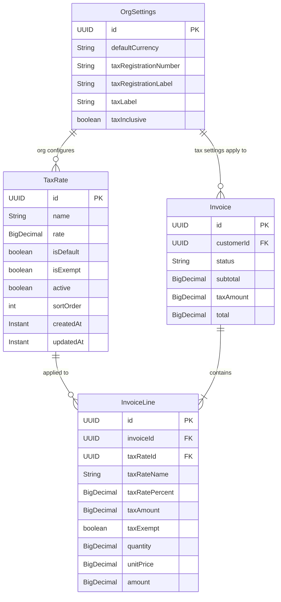
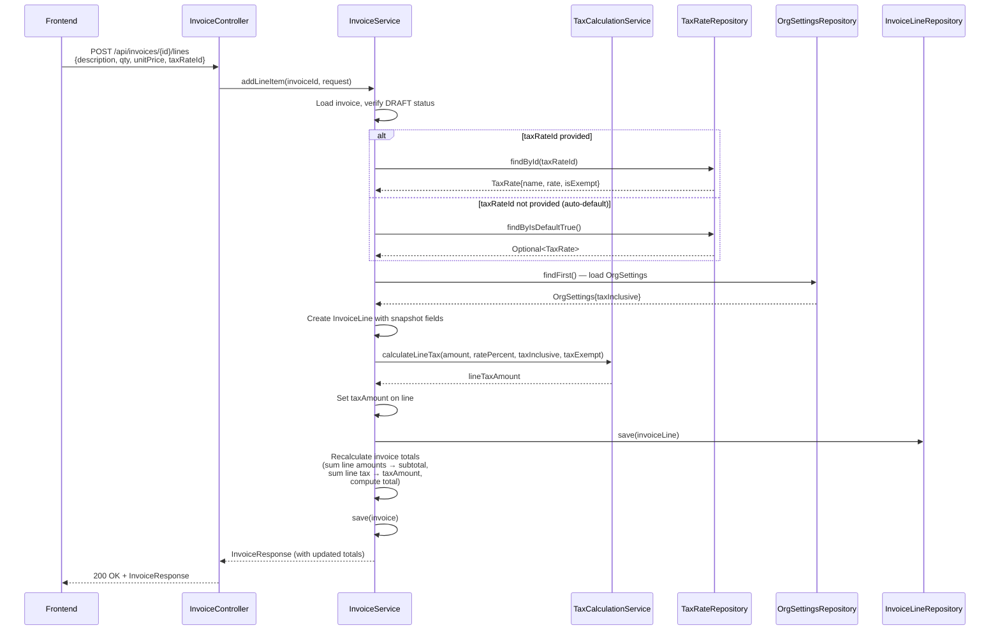
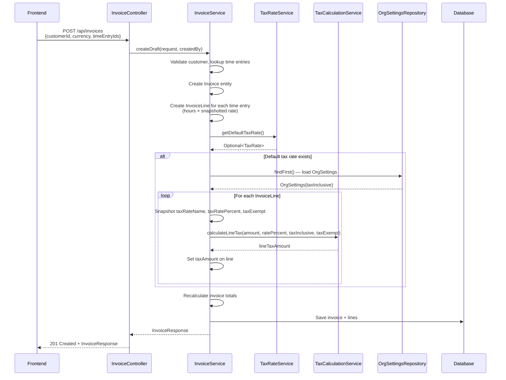

> Merge into ARCHITECTURE.md as **Section 11** or keep as standalone `architecture/phase26-invoice-tax-handling.md`.

# Phase 26 — Invoice Tax Handling

---

## 26.1 — Overview

Phase 26 adds structured tax handling to the DocTeams invoicing system. The existing invoice model treats tax as a flat `taxAmount` field on the `Invoice` entity — a manually entered number with no connection to tax rates, no per-line-item calculation, and no VAT/GST registration support. This phase replaces that minimal approach with a proper tax infrastructure: org-configurable tax rates, per-line-item tax calculation, automatic tax application on generated invoices, tax-inclusive/exclusive pricing support, and a tax breakdown display on invoices, previews, PDFs, and the customer portal.

The design is intentionally scoped to single-jurisdiction, single-rate-per-line tax scenarios. It covers VAT (South Africa, UK, EU), GST (Australia, NZ, India), and simple sales tax (US states with uniform rates). Multi-jurisdiction tax engines, compound tax, withholding tax, and reverse-charge mechanisms are explicitly out of scope — they represent fundamentally different architectures that would be premature to build before validating the core tax workflow with customers.

**Dependencies on prior phases**:
- **Phase 10** (Invoicing): `Invoice`, `InvoiceLine`, `InvoiceService`, `InvoicePreviewService` — all modified.
- **Phase 8** (Rate Cards): `OrgSettings` entity — extended with tax configuration fields. `BillingRate` pattern informs `TaxRate` entity design.
- **Phase 12** (Document Templates): Invoice preview template, `PdfRenderingService` — template updated for tax breakdown.
- **Phase 7 + 22** (Portal): `PortalInvoiceView`, `InvoiceSyncEvent` — extended with tax breakdown data.
- **Phase 6** (Audit): `AuditService` — tax rate lifecycle events.
- **Phase 21** (Retainers): `RetainerPeriodService` — applies default tax rate on retainer invoice generation.

### What's New

| Capability | Before Phase 26 | After Phase 26 |
|---|---|---|
| Tax on invoices | Flat `taxAmount` manually entered on invoice | Per-line tax rates with automatic calculation |
| Tax rates | None | Org-level `TaxRate` entity with CRUD, default rate, zero-rated and exempt support |
| Tax identity | Not captured | `taxRegistrationNumber`, `taxRegistrationLabel` on `OrgSettings`, displayed on invoices |
| Tax-inclusive pricing | Not supported | Org-level toggle; tax extracted from inclusive amounts and displayed separately |
| Tax breakdown | Single "Tax" row | Grouped by rate name: "VAT (15%): R1,500.00", "Zero-rated: R0.00" |
| Generated invoice tax | Always `taxAmount = 0` | Default tax rate auto-applied to all generated lines |
| Invoice preview/PDF tax | Single "Tax" line | Tax column on line items, tax breakdown section, registration number |
| Portal invoice view | Shows flat `taxAmount` | Shows tax breakdown, tax registration number |

**Out of scope**: Multi-jurisdiction tax, compound tax (tax-on-tax), withholding tax, reverse-charge VAT, tax filing integration (SARS eFiling, MTD, BAS), tax reports beyond existing reporting pipeline, customer-level tax exemption certificates, automated tax rate updates, tax rounding rules beyond HALF_UP.

---

## 26.2 — Domain Model

### 26.2.1 TaxRate Entity (New)

A `TaxRate` defines a named, reusable tax percentage at the org level. Each org has its own set of tax rates (tenant-scoped via schema isolation). One rate can be marked as the default, which is automatically applied to new invoice lines and generated invoices. Rates support zero-rated (0% but still taxable) and exempt (excluded from tax reporting) semantics.

| Field | Java Type | DB Column | DB Type | Constraints | Notes |
|-------|-----------|-----------|---------|-------------|-------|
| `id` | `UUID` | `id` | `UUID` | PK, default `gen_random_uuid()` | Auto-generated |
| `name` | `String` | `name` | `VARCHAR(100)` | NOT NULL | Display name, e.g., "Standard VAT", "Zero-rated" |
| `rate` | `BigDecimal` | `rate` | `DECIMAL(5,2)` | NOT NULL | Percentage, e.g., 15.00 for 15%. Range: 0.00–99.99 |
| `isDefault` | `boolean` | `is_default` | `BOOLEAN` | NOT NULL, default `false` | Only one per org; enforced in service layer |
| `isExempt` | `boolean` | `is_exempt` | `BOOLEAN` | NOT NULL, default `false` | Exempt lines excluded from tax totals in reports |
| `active` | `boolean` | `active` | `BOOLEAN` | NOT NULL, default `true` | Soft-active flag; inactive rates hidden from selection |
| `sortOrder` | `int` | `sort_order` | `INTEGER` | NOT NULL, default 0 | Display ordering |
| `createdAt` | `Instant` | `created_at` | `TIMESTAMPTZ` | NOT NULL, default `now()` | Immutable |
| `updatedAt` | `Instant` | `updated_at` | `TIMESTAMPTZ` | NOT NULL, default `now()` | Updated on mutation |

**Design decisions**:
- **Org-level only (no hierarchy)**: Unlike `BillingRate` which has org/project/customer overrides, `TaxRate` is flat at the org level. Tax rates are jurisdiction-specific, not client-specific. Per-customer tax exemptions are handled by setting a line's rate to the "Exempt" rate, not by a rate hierarchy. This avoids the complexity of rate resolution that `BillingRateService` manages.
- **Soft-active, not soft-delete**: Tax rates are deactivated (`active = false`), not deleted. This preserves referential integrity for the `taxRateId` FK on `InvoiceLine`. Deactivated rates remain in the database but are excluded from selection dropdowns.
- **Single-default constraint**: Enforced in `TaxRateService`, not via a database unique partial index. Creating or updating a rate with `isDefault = true` unsets the previous default in the same transaction. This matches the `BillingRate` pattern where business rules live in the service layer.

### 26.2.2 InvoiceLine — New Tax Fields

| Field | Java Type | DB Column | DB Type | Constraints | Notes |
|-------|-----------|-----------|---------|-------------|-------|
| `taxRateId` | `UUID` | `tax_rate_id` | `UUID` | Nullable, FK → `tax_rates` | Reference to the applied tax rate; nullable for legacy lines |
| `taxRateName` | `String` | `tax_rate_name` | `VARCHAR(100)` | Nullable | Denormalized snapshot of `TaxRate.name` at creation/edit time |
| `taxRatePercent` | `BigDecimal` | `tax_rate_percent` | `DECIMAL(5,2)` | Nullable | Denormalized snapshot of `TaxRate.rate` |
| `taxAmount` | `BigDecimal` | `tax_amount` | `DECIMAL(14,2)` | Nullable, default `NULL` | Calculated tax for this line |
| `taxExempt` | `boolean` | `tax_exempt` | `BOOLEAN` | NOT NULL, default `false` | Denormalized from `TaxRate.isExempt` |

**Why denormalized snapshots?** An invoice is a legal document. Once finalized (APPROVED or beyond), the tax rate name, percentage, and exempt flag on each line must be immutable — even if the org later renames, changes, or deactivates the rate. Storing a FK alone would create a mutable reference: if the rate's percentage changes, historical invoices would silently show different tax amounts. The denormalized fields (`taxRateName`, `taxRatePercent`, `taxExempt`) are the invoice's record of truth. The FK (`taxRateId`) is retained for grouping and reporting queries. See [ADR-103](../adr/ADR-103-tax-rate-immutability.md).

**Snapshot refresh on DRAFT**: While an invoice is in DRAFT status, editing a line or triggering a recalculation re-snapshots the current values from the `TaxRate` entity. This ensures drafts reflect the latest rate definitions. Once approved, snapshots are locked. See [ADR-103](../adr/ADR-103-tax-rate-immutability.md).

### 26.2.3 OrgSettings — New Tax Fields

| Field | Java Type | DB Column | DB Type | Constraints | Notes |
|-------|-----------|-----------|---------|-------------|-------|
| `taxRegistrationNumber` | `String` | `tax_registration_number` | `VARCHAR(50)` | Nullable | VAT/GST/Tax ID displayed on invoices |
| `taxRegistrationLabel` | `String` | `tax_registration_label` | `VARCHAR(30)` | Nullable, default `'Tax Number'` | Label for the registration number field |
| `taxLabel` | `String` | `tax_label` | `VARCHAR(20)` | Nullable, default `'Tax'` | Label used on invoices (e.g., "VAT", "GST", "Tax") |
| `taxInclusive` | `boolean` | `tax_inclusive` | `BOOLEAN` | NOT NULL, default `false` | Whether line prices include tax |

### 26.2.4 Invoice — Behavioral Changes

No new columns are added to the `Invoice` entity. The existing `subtotal`, `taxAmount`, and `total` fields are reinterpreted based on whether per-line tax is active:

| Scenario | `subtotal` | `taxAmount` | `total` |
|----------|-----------|-------------|---------|
| Legacy (no per-line tax) | Sum of line amounts | Manually entered flat value | `subtotal + taxAmount` |
| Per-line tax, tax-exclusive | Sum of line amounts (pre-tax) | Sum of line `taxAmount` values | `subtotal + taxAmount` |
| Per-line tax, tax-inclusive | Sum of line amounts (inc-tax) | Sum of line `taxAmount` values (extracted) | `subtotal` (amounts already include tax) |

The key change is in `recalculateTotals()`: when any line has a non-null `taxRateId`, the invoice-level `taxAmount` is computed as the sum of line-level tax amounts. This overrides any manually set value. See [ADR-102](../adr/ADR-102-tax-inclusive-total-display.md) for the tax-inclusive total display decision.

### 26.2.5 Entity Relationship Diagram



---

## 26.3 — Core Flows and Backend Behaviour

### 26.3.1 Tax Rate CRUD

**Create** (`TaxRateService.createTaxRate`):
1. Validate name uniqueness within the org (tenant schema provides isolation; check `taxRateRepository.existsByName(name)`).
2. Validate rate range: 0.00 to 99.99.
3. If `isDefault = true`: find the current default rate and set its `isDefault = false` (single-default enforcement).
4. If `isExempt = true`: rate must be 0.00 (exempt rates cannot have a non-zero percentage).
5. Save the new `TaxRate`.
6. Publish audit event: `tax_rate.created`.
7. If default changed, publish: `tax_rate.default_changed` with previous and new default names.

**Update** (`TaxRateService.updateTaxRate`):
1. Load the existing rate.
2. Apply same validations as create.
3. If `isDefault` changed to `true`: unset previous default.
4. If rate percentage changed: trigger batch recalculation of DRAFT invoice lines that reference this rate (see 26.3.6).
5. Save.
6. Publish audit event: `tax_rate.updated` with changed fields.

**Deactivate** (`TaxRateService.deleteTaxRate` — soft-delete):
1. Load the rate.
2. Check if the rate is used on any DRAFT invoice lines: `invoiceLineRepository.countByTaxRateIdAndInvoiceStatus(rateId, DRAFT)`.
3. If count > 0: return 409 Conflict with message "Cannot deactivate: used on {count} draft invoice(s). Remove the tax rate from those lines first."
4. If count == 0: set `active = false`.
5. If the deactivated rate was the default: clear default (no auto-promotion of another rate).
6. Publish audit event: `tax_rate.deactivated`.

**List** (`TaxRateService.listTaxRates`):
- `includeInactive = false` (default): `taxRateRepository.findByActiveOrderBySortOrder(true)`.
- `includeInactive = true`: `taxRateRepository.findAllByOrderBySortOrder()`.

**Get Default** (`TaxRateService.getDefaultTaxRate`):
- `taxRateRepository.findByIsDefaultTrue()` → returns `Optional<TaxRate>`.

### 26.3.2 Manual Invoice Line Creation with Tax

When a user adds a line item to a DRAFT invoice via `POST /api/invoices/{id}/lines`:

1. Accept `AddLineItemRequest` with new optional `taxRateId` field.
2. **If `taxRateId` is provided**: look up `TaxRate` by ID, verify it is active.
3. **If `taxRateId` is not provided and not explicitly null**: look up the org's default tax rate. If one exists, use it.
4. **If `taxRateId` is explicitly null**: no tax on this line (override/exempt).
5. If a tax rate is determined:
   - Snapshot `taxRateName = taxRate.getName()`, `taxRatePercent = taxRate.getRate()`, `taxExempt = taxRate.isExempt()`.
   - Calculate `taxAmount` using `TaxCalculationService.calculateLineTax(amount, taxRatePercent, taxInclusive)`.
6. Create the `InvoiceLine` with all fields (existing + tax fields).
7. Recalculate invoice totals (see 26.3.6).

The same flow applies to `PUT /api/invoices/{id}/lines/{lineId}` (update).

### 26.3.3 Invoice Generation from Unbilled Time

`InvoiceService.generateFromUnbilledTime()` currently creates lines with no tax. The modified flow:

1. Create invoice and line items from time entries (existing logic unchanged).
2. After all lines are created, look up the org's default tax rate via `TaxRateService.getDefaultTaxRate()`.
3. If a default rate exists:
   - For each line: snapshot rate fields, calculate `taxAmount`.
4. Recalculate invoice totals with per-line tax.
5. The generated invoice reflects the org's tax configuration from the moment of generation.

### 26.3.4 Invoice Generation from Retainer Period

`RetainerPeriodService.closePeriod()` creates invoices directly (bypasses `InvoiceService`). The modified flow:

1. Create invoice and line items (existing logic).
2. Load the org's default tax rate via `TaxRateService.getDefaultTaxRate()`.
3. If a default rate exists: apply to all generated lines (base fee line + overage line).
4. Load `OrgSettings` to determine `taxInclusive` flag.
5. Calculate per-line `taxAmount` and recalculate invoice totals.

**Important**: `RetainerPeriodService` uses repositories directly, not `InvoiceService`. The `TaxCalculationService` must be injected into `RetainerPeriodService` to apply the same calculation logic. Any new fields added to `Invoice` or `InvoiceLine` must be explicitly set in this code path.

**Step-by-step retainer invoice tax flow** (annotated for implementers):

```
1. RetainerPeriodService.closePeriod(periodId)
2.   → existing: create Invoice entity, set subtotal/total from period amounts
3.   → existing: create InvoiceLine(s) — base fee line, optional overage line
4.   → NEW: TaxRateService.getDefaultTaxRate()
5.     → if empty: skip tax (lines have null taxRateId, invoice uses flat taxAmount = 0)
6.     → if present:
7.       → OrgSettingsRepository.findByOrgId() → get taxInclusive flag
8.       → for each line:
9.           line.setTaxRateId(defaultRate.getId())
10.          line.setTaxRateName(defaultRate.getName())
11.          line.setTaxRatePercent(defaultRate.getRate())
12.          line.setTaxExempt(defaultRate.isExempt())
13.          line.setTaxAmount(TaxCalculationService.calculateLineTax(
14.              line.getAmount(), defaultRate.getRate(), taxInclusive, defaultRate.isExempt()))
15.      → invoice.setTaxAmount(sum of line taxAmounts)
16.      → if taxInclusive: invoice.setTotal(invoice.getSubtotal())
17.      → else: invoice.setTotal(invoice.getSubtotal() + invoice.getTaxAmount())
18.  → invoiceRepository.save(invoice)
19.  → invoiceLineRepository.saveAll(lines)
```

### 26.3.5 Tax Calculation Formulas

All calculations live in `TaxCalculationService` and use `BigDecimal` with `RoundingMode.HALF_UP`, scale 2.

**Tax-exclusive** (default, `taxInclusive = false`):
```
lineTaxAmount = amount * taxRatePercent / 100
```
The line `amount` is the pre-tax value. Tax is added on top.

**Tax-inclusive** (`taxInclusive = true`):
```
lineTaxAmount = amount - (amount / (1 + taxRatePercent / 100))
```
The line `amount` includes tax. The formula extracts the tax portion. For a 15% rate on R115.00: `115 - (115 / 1.15) = 115 - 100 = R15.00`.

**Exempt lines**: `taxAmount = 0` regardless of formula. The `taxExempt` flag short-circuits the calculation.

**Zero-rated lines**: `taxAmount = 0` because `rate = 0`. But unlike exempt lines, zero-rated lines are reported as taxable (they appear in the tax breakdown with R0.00).

```java
public class TaxCalculationService {

    public BigDecimal calculateLineTax(BigDecimal amount, BigDecimal ratePercent,
                                       boolean taxInclusive, boolean taxExempt) {
        if (taxExempt) {
            return BigDecimal.ZERO;  // Exempt: no tax, excluded from tax breakdown
        }
        // Zero-rated (rate = 0%) falls through: returns BigDecimal.ZERO naturally
        // but is NOT short-circuited — zero-rated lines appear in the tax breakdown
        if (taxInclusive) {
            // Extract tax from inclusive amount
            BigDecimal divisor = BigDecimal.ONE.add(
                ratePercent.divide(new BigDecimal("100"), 10, RoundingMode.HALF_UP));
            BigDecimal exTaxAmount = amount.divide(divisor, 2, RoundingMode.HALF_UP);
            return amount.subtract(exTaxAmount);
        } else {
            // Calculate tax on top of ex-tax amount
            return amount.multiply(ratePercent)
                .divide(new BigDecimal("100"), 2, RoundingMode.HALF_UP);
        }
    }
}
```

### 26.3.6 Tax Recalculation on Invoice

`Invoice.recalculateTotals()` is updated to handle per-line tax:

```java
public void recalculateTotals(BigDecimal computedSubtotal, List<InvoiceLine> lines,
                               boolean taxInclusive) {
    this.subtotal = computedSubtotal;

    boolean hasPerLineTax = lines.stream()
        .anyMatch(line -> line.getTaxRateId() != null);

    if (hasPerLineTax) {
        // Sum line-level tax amounts (overrides any manual taxAmount)
        this.taxAmount = lines.stream()
            .map(line -> line.getTaxAmount() != null ? line.getTaxAmount() : BigDecimal.ZERO)
            .reduce(BigDecimal.ZERO, BigDecimal::add);
    }
    // else: taxAmount stays as manually set value (backward compatibility)

    if (taxInclusive && hasPerLineTax) {
        // In inclusive mode, subtotal already contains tax. Total = subtotal.
        this.total = this.subtotal;
    } else {
        // Exclusive mode or legacy: total = subtotal + taxAmount
        this.total = this.subtotal.add(this.taxAmount);
    }
}
```

**When recalculation triggers**:
- Line added, edited, or deleted.
- Tax rate percentage updated (batch recalculation of all DRAFT lines referencing the rate).
- `TaxRateService.updateTaxRate()` triggers: find all DRAFT invoice lines with the updated `taxRateId`, re-snapshot rate fields, recalculate `taxAmount`, recalculate parent invoice totals.

### 26.3.7 Manual Tax Amount Override Rules

- **Legacy invoices** (no per-line tax): `UpdateInvoiceRequest.taxAmount` works as before. The value is stored directly on `Invoice.taxAmount`.
- **Per-line tax invoices** (any line has `taxRateId`): `Invoice.taxAmount` is computed. The API rejects `UpdateInvoiceRequest.taxAmount` with HTTP 422 and message: "Tax amount cannot be manually set when invoice lines have tax rates applied. Edit individual line tax rates instead."
- **Detection**: `invoiceLineRepository.existsByInvoiceIdAndTaxRateIdIsNotNull(invoiceId)`.

### 26.3.8 RBAC

| Action | Required Role |
|--------|--------------|
| Create/update/deactivate tax rate | ADMIN or OWNER |
| List/read tax rates | Any authenticated member |
| Edit invoice lines (including tax rate) | Existing invoice ADMIN+ permissions |
| Configure tax settings in OrgSettings | ADMIN or OWNER |

---

## 26.4 — API Surface

### 26.4.1 TaxRate Endpoints

| Method | Path | Description | Auth | Type |
|--------|------|-------------|------|------|
| `GET` | `/api/tax-rates` | List tax rates | Authenticated | Read |
| `POST` | `/api/tax-rates` | Create tax rate | ADMIN/OWNER | Write |
| `PUT` | `/api/tax-rates/{id}` | Update tax rate | ADMIN/OWNER | Write |
| `DELETE` | `/api/tax-rates/{id}` | Deactivate tax rate | ADMIN/OWNER | Write |

**Query parameters** (GET):
- `includeInactive` (boolean, default `false`)

**Create/Update request**:
```json
{
  "name": "Standard VAT",
  "rate": 15.00,
  "isDefault": true,
  "isExempt": false,
  "sortOrder": 0
}
```

**Response** (single rate):
```json
{
  "id": "uuid",
  "name": "Standard VAT",
  "rate": 15.00,
  "isDefault": true,
  "isExempt": false,
  "active": true,
  "sortOrder": 0,
  "createdAt": "2026-02-26T10:00:00Z",
  "updatedAt": "2026-02-26T10:00:00Z"
}
```

### 26.4.2 Modified Invoice Line Endpoints

**AddLineItemRequest** — new field:
```json
{
  "description": "Consulting services — February 2026",
  "quantity": 10.00,
  "unitPrice": 1500.00,
  "sortOrder": 1,
  "projectId": "uuid-optional",
  "taxRateId": "uuid-optional"
}
```

**UpdateLineItemRequest** — new field:
```json
{
  "description": "Consulting services — February 2026",
  "quantity": 10.00,
  "unitPrice": 1500.00,
  "sortOrder": 1,
  "taxRateId": "uuid-or-null"
}
```

**InvoiceLineResponse** — new fields:
```json
{
  "id": "uuid",
  "description": "Consulting services — February 2026",
  "quantity": 10.00,
  "unitPrice": 1500.00,
  "amount": 15000.00,
  "sortOrder": 1,
  "projectId": "uuid",
  "projectName": "Project Alpha",
  "taxRateId": "uuid",
  "taxRateName": "Standard VAT",
  "taxRatePercent": 15.00,
  "taxAmount": 2250.00,
  "taxExempt": false
}
```

### 26.4.3 Modified Invoice Response

**InvoiceResponse** — new fields:
```json
{
  "...existing fields...",
  "taxBreakdown": [
    { "rateName": "VAT (15%)", "ratePercent": 15.00, "taxableAmount": 15000.00, "taxAmount": 2250.00 },
    { "rateName": "Zero-rated", "ratePercent": 0.00, "taxableAmount": 5000.00, "taxAmount": 0.00 }
  ],
  "taxInclusive": false,
  "taxRegistrationNumber": "4012345678",
  "taxRegistrationLabel": "VAT Number",
  "taxLabel": "VAT",
  "hasPerLineTax": true
}
```

The `taxBreakdown` is computed by grouping lines by `taxRateName` + `taxRatePercent`, summing `amount` (taxable) and `taxAmount` per group. Exempt lines are excluded from the breakdown. Legacy invoices (no per-line tax) return `taxBreakdown: null` and `hasPerLineTax: false`.

### 26.4.4 Modified OrgSettings Endpoints

The existing `PUT /api/settings` endpoint is extended with:
```json
{
  "...existing fields...",
  "taxRegistrationNumber": "4012345678",
  "taxRegistrationLabel": "VAT Number",
  "taxLabel": "VAT",
  "taxInclusive": false
}
```

The `GET /api/settings` response includes these new fields.

---

## 26.5 — Sequence Diagrams

### 26.5.1 Creating an Invoice Line with Tax Rate



### 26.5.2 Generating Invoice from Unbilled Time with Default Tax



---

## 26.6 — Invoice Preview & Portal Updates

### 26.6.1 Preview Template Changes

The Thymeleaf template (`invoice-preview.html`) is updated with three additions:

**1. Tax registration number in header**:
```html
<div th:if="${taxRegistrationNumber != null}">
    <span th:text="${taxRegistrationLabel}">Tax Number</span>:
    <span th:text="${taxRegistrationNumber}">4012345678</span>
</div>
```
Placed alongside org details (org name, address).

**2. Tax column on line items** (conditional):
```html
<!-- Column header, only shown when hasPerLineTax is true -->
<th th:if="${hasPerLineTax}" class="tax-col">
    <span th:text="${taxLabel}">Tax</span>
</th>

<!-- Cell in each line row -->
<td th:if="${hasPerLineTax}" class="tax-col">
    <span th:if="${line.taxExempt}">Exempt</span>
    <span th:unless="${line.taxExempt}"
          th:text="${line.taxRateName + ' ' + line.taxRatePercent + '%'}">VAT 15%</span>
</td>
```

**3. Tax breakdown section** (replaces single "Tax" row):
```html
<!-- Legacy: single tax row -->
<tr th:if="${!hasPerLineTax}">
    <td>Tax</td>
    <td th:text="${#numbers.formatDecimal(invoice.taxAmount, 1, 2)}">0.00</td>
</tr>

<!-- Per-line tax: breakdown by rate -->
<tr th:each="entry : ${taxBreakdown}">
    <td th:text="${entry.rateName + ' (' + entry.ratePercent + '%)'}">VAT (15%)</td>
    <td th:text="${#numbers.formatDecimal(entry.taxAmount, 1, 2)}">2250.00</td>
</tr>

<!-- Tax-inclusive note -->
<tr th:if="${taxInclusive && hasPerLineTax}">
    <td colspan="2" class="tax-note">
        All amounts include <span th:text="${taxLabel}">Tax</span>
    </td>
</tr>
```

### 26.6.2 Preview Context Assembly

`InvoicePreviewService` (or the relevant method in `InvoiceService.renderPreview()`) adds these variables to the Thymeleaf context:

| Variable | Type | Source |
|----------|------|--------|
| `hasPerLineTax` | `boolean` | `true` if any line has non-null `taxRateId` |
| `taxBreakdown` | `List<TaxBreakdownEntry>` | Grouped by rate: `{rateName, ratePercent, taxableAmount, taxAmount}` |
| `taxRegistrationNumber` | `String` | From `OrgSettings` |
| `taxRegistrationLabel` | `String` | From `OrgSettings` |
| `taxLabel` | `String` | From `OrgSettings` |
| `taxInclusive` | `boolean` | From `OrgSettings` |

`TaxBreakdownEntry` is a simple record:
```java
public record TaxBreakdownEntry(
    String rateName,
    BigDecimal ratePercent,
    BigDecimal taxableAmount,
    BigDecimal taxAmount
) {}
```

Lines are grouped by `taxRateName + taxRatePercent` (using snapshot values, not current rate values). Exempt lines are excluded from the breakdown list.

### 26.6.3 Portal Read-Model Updates

**PortalInvoiceView** — new fields:
```java
public record PortalInvoiceView(
    UUID id, String orgId, UUID customerId, String invoiceNumber,
    String status, LocalDate issueDate, LocalDate dueDate,
    BigDecimal subtotal, BigDecimal taxAmount, BigDecimal total,
    String currency, String notes, Instant syncedAt,
    // New fields:
    List<TaxBreakdownEntry> taxBreakdown,
    String taxRegistrationNumber,
    String taxRegistrationLabel,
    String taxLabel,
    boolean taxInclusive,
    boolean hasPerLineTax
) {}
```

**InvoiceSyncEvent** — extended with:
- `List<TaxBreakdownEntry> taxBreakdown` — computed at sync time from invoice lines
- `String taxRegistrationNumber`, `String taxRegistrationLabel`, `String taxLabel` — from `OrgSettings`
- `boolean taxInclusive` — from `OrgSettings`

The `InvoiceEventHandler` reads the new fields from `InvoiceSyncEvent` and stores them in the portal read-model. The portal invoice detail page renders the breakdown identically to the invoice preview.

**Sync event timing**: `InvoiceSyncEvent` is currently published on SENT, PAID, and VOID transitions. Portal contacts typically see invoices only after they are SENT. APPROVED invoices are not portal-visible by default, so the sync gap for APPROVED invoices is intentional and acceptable. If a future phase exposes APPROVED invoices to the portal, `InvoiceSyncEvent` must also fire on the APPROVE transition.

---

## 26.7 — Database Migration (V42)

```sql
-- V42__invoice_tax_handling.sql
-- Phase 26: Add tax rate entity, per-line tax fields, org tax settings

-- 1. OrgSettings tax configuration fields
ALTER TABLE org_settings ADD COLUMN tax_registration_number VARCHAR(50);
ALTER TABLE org_settings ADD COLUMN tax_registration_label VARCHAR(30) DEFAULT 'Tax Number';
ALTER TABLE org_settings ADD COLUMN tax_label VARCHAR(20) DEFAULT 'Tax';
ALTER TABLE org_settings ADD COLUMN tax_inclusive BOOLEAN NOT NULL DEFAULT false;

-- 2. TaxRate entity
CREATE TABLE tax_rates (
    id              UUID PRIMARY KEY DEFAULT gen_random_uuid(),
    name            VARCHAR(100) NOT NULL,
    rate            DECIMAL(5,2) NOT NULL,
    is_default      BOOLEAN NOT NULL DEFAULT false,
    is_exempt       BOOLEAN NOT NULL DEFAULT false,
    active          BOOLEAN NOT NULL DEFAULT true,
    sort_order      INTEGER NOT NULL DEFAULT 0,
    created_at      TIMESTAMP WITH TIME ZONE NOT NULL DEFAULT now(),
    updated_at      TIMESTAMP WITH TIME ZONE NOT NULL DEFAULT now(),
    CONSTRAINT chk_tax_rate_range CHECK (rate >= 0 AND rate <= 99.99),
    CONSTRAINT chk_exempt_zero CHECK (NOT is_exempt OR rate = 0)
);

CREATE INDEX idx_tax_rates_active_sort ON tax_rates (active, sort_order);

-- 3. InvoiceLine tax fields
ALTER TABLE invoice_lines ADD COLUMN tax_rate_id UUID REFERENCES tax_rates(id);
ALTER TABLE invoice_lines ADD COLUMN tax_rate_name VARCHAR(100);
ALTER TABLE invoice_lines ADD COLUMN tax_rate_percent DECIMAL(5,2);
ALTER TABLE invoice_lines ADD COLUMN tax_amount DECIMAL(14,2);
ALTER TABLE invoice_lines ADD COLUMN tax_exempt BOOLEAN NOT NULL DEFAULT false;

CREATE INDEX idx_invoice_lines_tax_rate ON invoice_lines (tax_rate_id);

-- 4. Seed default tax rates
INSERT INTO tax_rates (name, rate, is_default, is_exempt, active, sort_order)
VALUES
    ('Standard', 15.00, true, false, true, 0),
    ('Zero-rated', 0.00, false, false, true, 1),
    ('Exempt', 0.00, false, true, true, 2);
```

**Notes**:
- The migration runs per-tenant (tenant schema). Each existing tenant gets the default tax rates.
- New tenants get seed data automatically because Flyway runs all tenant migrations (including V42) when a new schema is provisioned. No additional provisioning code change is needed.
- **Note**: The requirements file references "V40" — this is stale. V40 and V41 already exist in the codebase. **V42 is the correct migration number**.
- The `chk_exempt_zero` constraint ensures exempt rates always have `rate = 0`.
- Existing invoice lines retain `tax_rate_id = NULL`, `tax_amount = NULL` — backward compatible.
- Existing invoices' `tax_amount` field is untouched. Legacy invoices display the flat manual value.

---

## 26.8 — Implementation Guidance

### 26.8.1 New Files

| File | Description |
|------|-------------|
| `tax/TaxRate.java` | JPA entity: fields per 26.2.1 |
| `tax/TaxRateRepository.java` | Standard `JpaRepository<TaxRate, UUID>` with custom queries |
| `tax/TaxRateService.java` | CRUD with single-default enforcement, deactivation guard |
| `tax/TaxRateController.java` | REST controller at `/api/tax-rates` |
| `tax/TaxCalculationService.java` | `calculateLineTax()`, tax breakdown assembly |
| `tax/dto/CreateTaxRateRequest.java` | Validated request record |
| `tax/dto/UpdateTaxRateRequest.java` | Validated request record |
| `tax/dto/TaxRateResponse.java` | Response record |
| `tax/dto/TaxBreakdownEntry.java` | Record for tax breakdown grouping |
| `db/migration/tenant/V42__invoice_tax_handling.sql` | Migration |

**Entity pattern** (matching existing codebase style):
```java
@Entity
@Table(name = "tax_rates")
public class TaxRate {

    @Id
    @GeneratedValue(strategy = GenerationType.UUID)
    private UUID id;

    @Column(nullable = false, length = 100)
    private String name;

    @Column(nullable = false, precision = 5, scale = 2)
    private BigDecimal rate;

    @Column(name = "is_default", nullable = false)
    private boolean isDefault;

    @Column(name = "is_exempt", nullable = false)
    private boolean isExempt;

    @Column(nullable = false)
    private boolean active = true;

    @Column(name = "sort_order", nullable = false)
    private int sortOrder;

    @Column(name = "created_at", nullable = false, updatable = false)
    private Instant createdAt;

    @Column(name = "updated_at", nullable = false)
    private Instant updatedAt;

    protected TaxRate() {} // JPA

    public TaxRate(String name, BigDecimal rate, boolean isDefault,
                   boolean isExempt, int sortOrder) {
        this.name = name;
        this.rate = rate;
        this.isDefault = isDefault;
        this.isExempt = isExempt;
        this.sortOrder = sortOrder;
        this.createdAt = Instant.now();
        this.updatedAt = Instant.now();
    }

    // Getters + update methods (setters where appropriate)
    // ...

    @PreUpdate
    void onUpdate() {
        this.updatedAt = Instant.now();
    }
}
```

### 26.8.2 Modified Backend Files

| File | Change |
|------|--------|
| `invoice/InvoiceLine.java` | Add 5 tax fields (taxRateId, taxRateName, taxRatePercent, taxAmount, taxExempt); add `applyTaxRate(TaxRate, BigDecimal taxAmount)` method |
| `invoice/Invoice.java` | Update `recalculateTotals()` to accept line list + taxInclusive flag; add per-line tax sum logic |
| `invoice/InvoiceService.java` | Inject `TaxCalculationService` + `TaxRateService` + `OrgSettingsRepository`; modify `addLineItem()`, `updateLineItem()`, `generateFromUnbilledTime()`, `updateDraft()` (reject manual tax when per-line active), `buildResponse()` (include tax breakdown) |
| `invoice/InvoiceService.java` (`renderPreview`) | Add taxBreakdown, taxRegistrationNumber, taxLabel, taxInclusive to template context |
| `invoice/dto/AddLineItemRequest.java` | Add optional `UUID taxRateId` field |
| `invoice/dto/UpdateLineItemRequest.java` | Add optional `UUID taxRateId` field |
| `invoice/dto/InvoiceLineResponse.java` | Add taxRateId, taxRateName, taxRatePercent, taxAmount, taxExempt fields |
| `invoice/dto/InvoiceResponse.java` | Add taxBreakdown list, taxInclusive, taxRegistrationNumber, taxRegistrationLabel, taxLabel, hasPerLineTax |
| `retainer/RetainerPeriodService.java` | Inject `TaxRateService`, `TaxCalculationService`, `OrgSettingsRepository`; apply default tax rate to generated lines in `closePeriod()` |
| `settings/OrgSettings.java` | Add 4 tax fields; add `updateTaxSettings()` method |
| `settings/OrgSettingsController.java` (or wherever settings are updated) | Accept and validate new tax fields |
| `customerbackend/PortalInvoiceProjection.java` | Add taxBreakdown, taxRegistrationNumber, taxRegistrationLabel, taxLabel, taxInclusive, hasPerLineTax |
| `customerbackend/InvoiceSyncEvent.java` | Add tax breakdown fields |
| `customerbackend/InvoiceEventHandler.java` | Map new fields from event to projection |
| `templates/invoice-preview.html` | Tax column, breakdown section, registration number, inclusive note |

### 26.8.3 Frontend Changes

| File | Change |
|------|--------|
| `settings/page.tsx` | Add "Tax" card linking to tax settings section |
| `settings/tax/page.tsx` (new) | Tax rate management table + CRUD dialogs; Tax settings form (registration number, label, inclusive toggle). Created as a separate page (not merged into `settings/rates/page.tsx`) because tax rates are conceptually distinct from billing/cost rates — billing rates are per-member/project/customer, tax rates are org-wide. The settings hub (`settings/page.tsx`) gets a new "Tax" card linking here. |
| `components/invoices/invoice-detail-client.tsx` | Replace manual taxAmount input with tax breakdown display; hide manual input when per-line tax active |
| `components/invoices/invoice-line-table.tsx` | Add tax rate column; show rate name + percentage per line |
| `components/invoices/invoice-detail-client.tsx` (line form section) | Add tax rate dropdown selector on line add/edit (inline in the existing detail client, matching existing pattern — no separate `invoice-line-form.tsx` exists) |
| `invoices/actions.ts` | Pass `taxRateId` in addLineItem/updateLineItem calls |
| `invoices/[id]/page.tsx` | Fetch tax rates for dropdown population |
| `lib/api-types.ts` (or equivalent) | Add `TaxRateResponse`, `TaxBreakdownEntry` types; extend `InvoiceLineResponse`, `InvoiceResponse` |
| Portal components | Display tax breakdown, registration number on portal invoice detail |

**Field name disambiguation**: Both `Invoice` and `InvoiceLine` have a `taxAmount` field. In API responses: `InvoiceResponse.taxAmount` = **invoice-level total tax** (sum of all line taxes, or flat manual value for legacy invoices); `InvoiceLineResponse.taxAmount` = **per-line calculated tax**. In TypeScript types, consider aliasing the line-level field to `lineTaxAmount` if ambiguity causes issues, though the nesting (`response.lines[].taxAmount` vs `response.taxAmount`) provides sufficient disambiguation.

### 26.8.4 Testing Strategy

| Area | Test Type | Key Scenarios |
|------|-----------|---------------|
| `TaxRate` CRUD | Integration (MockMvc) | Create, update, deactivate; single-default enforcement; name uniqueness; deactivation guard (409 on draft usage) |
| `TaxCalculationService` | Unit | Tax-exclusive calculation; tax-inclusive extraction; exempt short-circuit; zero-rated; edge cases (0.01, 99.99, large amounts) |
| Invoice line with tax | Integration | Add line with taxRateId; auto-default; explicit null (no tax); recalculate totals |
| Invoice generation with tax | Integration | Generate from unbilled time with default rate; generate with no default; retainer period invoice |
| Manual tax override rejection | Integration | 422 when per-line tax active; allowed when no per-line tax |
| Tax rate update → draft recalculation | Integration | Change rate percentage; verify DRAFT lines recalculated; APPROVED lines untouched |
| Invoice preview with tax | Integration | Tax breakdown in HTML; registration number; tax column; inclusive note |
| Backward compatibility | Integration | Legacy invoice (no per-line tax) displays flat taxAmount; totals unchanged |
| Frontend: Tax rate management | Vitest + RTL | CRUD dialogs; default badge; deactivation error |
| Frontend: Invoice editor tax | Vitest + RTL | Tax rate dropdown; breakdown display; manual input hidden when per-line active |
| Frontend: Tax settings | Vitest + RTL | Settings form; save; validation |

---

## 26.9 — Permission Model Summary

| Resource | Action | Required Role |
|----------|--------|--------------|
| TaxRate | Create | ADMIN, OWNER |
| TaxRate | Update | ADMIN, OWNER |
| TaxRate | Deactivate | ADMIN, OWNER |
| TaxRate | List / Read | Any authenticated member |
| Invoice line tax | Add / edit tax rate on line | Existing invoice permissions (ADMIN+) |
| OrgSettings tax config | Update tax registration, label, inclusive | ADMIN, OWNER |
| OrgSettings tax config | Read | Any authenticated member |

---

## 26.10 — Capability Slices

### Slice A — TaxRate Entity + CRUD + Migration

**Scope**: Foundation slice. Creates the `TaxRate` entity, repository, service, controller, and database migration V42.

**Key deliverables**:
- `TaxRate` entity with all fields per 26.2.1.
- `TaxRateRepository` with custom queries: `findByActiveOrderBySortOrder`, `findAllByOrderBySortOrder`, `findByIsDefaultTrue`, `existsByName`.
- `TaxRateService` with full CRUD: create (single-default enforcement), update, deactivate (with draft invoice guard), list, getDefault.
- `TaxRateController` at `/api/tax-rates` with RBAC (ADMIN/OWNER for writes, authenticated for reads).
- V42 migration: `tax_rates` table + seed data + indexes. Also adds `org_settings` columns and `invoice_lines` columns (all nullable, safe to add without breaking existing code).
- Audit events for tax rate lifecycle.
- Integration tests: CRUD operations, default enforcement, deactivation guard, RBAC.

**Dependencies**: None (foundation slice).

**Test expectations**: ~12-15 backend integration tests.

### Slice B — OrgSettings Tax Fields + Tax Settings UI

**Scope**: Extends `OrgSettings` with tax configuration and builds the frontend settings UI.

**Key deliverables**:
- `OrgSettings.java`: add 4 tax fields, `updateTaxSettings()` method.
- Settings API: accept and return new tax fields (extend existing endpoint).
- Frontend: "Tax" settings card on settings page with registration number, label, inclusive toggle.
- Frontend: Tax rate management table on settings page (or dedicated sub-page) with CRUD dialogs.
- Audit event: `org_settings.tax_configured`.
- Tests: backend settings update, frontend settings form + tax rate table.

**Dependencies**: Slice A (TaxRate entity must exist for rate management UI).

**Test expectations**: ~5 backend tests, ~8-10 frontend tests.

### Slice C — Per-Line Tax Calculation Engine

**Scope**: Core backend calculation logic. Adds tax fields to `InvoiceLine`, creates `TaxCalculationService`, updates `Invoice.recalculateTotals()`.

**Key deliverables**:
- `InvoiceLine.java`: add 5 tax fields, `applyTaxRate()` method.
- `TaxCalculationService`: `calculateLineTax()` with tax-exclusive and tax-inclusive formulas.
- `Invoice.recalculateTotals()`: updated to sum line-level tax, handle tax-inclusive total.
- `TaxBreakdownEntry` record for grouping.
- Tax breakdown computation utility method.
- Unit tests for `TaxCalculationService` (edge cases, rounding).
- Integration tests: invoice total recalculation with per-line tax.

**Dependencies**: Slice A (TaxRate entity for FK and lookups).

**Test expectations**: ~10 unit tests, ~8 integration tests.

### Slice D — Tax Application in Invoice Flows

**Scope**: Wires the tax calculation engine into all invoice creation and generation flows.

**Key deliverables**:
- `InvoiceService.addLineItem()`: accept `taxRateId`, snapshot, calculate tax.
- `InvoiceService.updateLineItem()`: same for updates.
- `InvoiceService.generateFromUnbilledTime()`: apply default tax rate to generated lines.
- `RetainerPeriodService.closePeriod()`: apply default tax rate to retainer invoice lines.
- `InvoiceService.updateDraft()`: reject manual `taxAmount` when per-line tax active (422).
- Tax rate update → batch recalculation of DRAFT lines.
- Modified DTOs: `AddLineItemRequest`, `UpdateLineItemRequest` (add `taxRateId`); `InvoiceLineResponse`, `InvoiceResponse` (add tax fields + breakdown).
- Integration tests: all generation paths, manual override rejection, backward compatibility.

**Dependencies**: Slice C (calculation engine must exist).

**Test expectations**: ~15-18 integration tests.

### Slice E — Invoice Preview, PDF & Portal Tax Display

**Scope**: Display layer. Updates the invoice preview template, portal read-model, and sync events.

**Key deliverables**:
- `invoice-preview.html`: tax column on line items, tax breakdown section, registration number, inclusive note.
- `InvoiceService.renderPreview()`: add tax context variables.
- `InvoiceSyncEvent`: add tax breakdown fields.
- `PortalInvoiceProjection`: add tax breakdown, registration, label fields.
- `InvoiceEventHandler`: map new fields from event to projection.
- Portal invoice detail: render tax breakdown (mirrors preview layout).
- Integration tests: preview HTML contains correct breakdown, portal sync includes tax data.

**Dependencies**: Slice D (invoice flows must populate tax data for display to work).

**Important**: `PortalInvoiceView` is a Java `record` — adding fields changes the canonical constructor. All construction sites (`InvoiceEventHandler`, test fixtures, any projections) must be updated. Consider whether converting to a class with a builder would ease future field additions.

**Test expectations**: ~8-10 backend tests, ~3-5 frontend portal tests.

### Slice F — Frontend Invoice Editor Tax UI

**Scope**: Frontend user-facing controls for tax on the invoice editor.

**Key deliverables**:
- Tax rate dropdown selector on invoice line add/edit forms.
- Per-line tax amount display (read-only, calculated).
- Tax breakdown in totals section (replaces manual tax input when per-line tax active).
- Manual tax input visibility logic: shown only when no lines have tax rates.
- Tax-inclusive indicator: note + label updates when org has `taxInclusive = true`.
- Fetch tax rates on invoice detail page for dropdown population.
- Types: `TaxRateResponse`, `TaxBreakdownEntry`, extended `InvoiceLineResponse`/`InvoiceResponse`.
- Frontend tests: dropdown, breakdown display, manual input toggle.

**Dependencies**: Slice D (API must return tax data), Slice B (tax rates must be fetchable).

**Test expectations**: ~10-12 frontend tests.

### Slice Dependency Graph

```
Slice A (TaxRate entity + CRUD + migration)
  ├── Slice B (OrgSettings + tax settings UI)
  └── Slice C (per-line tax calculation engine)
        └── Slice D (tax in invoice flows)
              ├── Slice E (preview/PDF/portal display)
              └── Slice F (frontend invoice editor tax UI)
```

Slices B and C can run in parallel after A. Slices E and F can run in parallel after D.

---

## 26.11 — ADR Index

| ADR | Title | Relevance |
|-----|-------|-----------|
| [ADR-101](../adr/ADR-101-tax-calculation-strategy.md) | Tax Calculation Strategy | How tax is calculated and stored on invoice lines |
| [ADR-102](../adr/ADR-102-tax-inclusive-total-display.md) | Tax-Inclusive Total Display | How invoice totals are presented in tax-inclusive mode |
| [ADR-103](../adr/ADR-103-tax-rate-immutability.md) | Tax Rate Immutability on Finalized Invoices | Snapshot timing for denormalized tax data |
| [ADR-048](../adr/ADR-048-invoice-numbering.md) | Invoice Numbering | Existing: invoice number assignment strategy |
| [ADR-049](../adr/ADR-049-line-item-granularity.md) | Line Item Granularity | Existing: one line per time entry vs. grouped |
| [ADR-050](../adr/ADR-050-double-billing-prevention.md) | Double-Billing Prevention | Existing: unique constraint on time_entry_id per invoice line |
