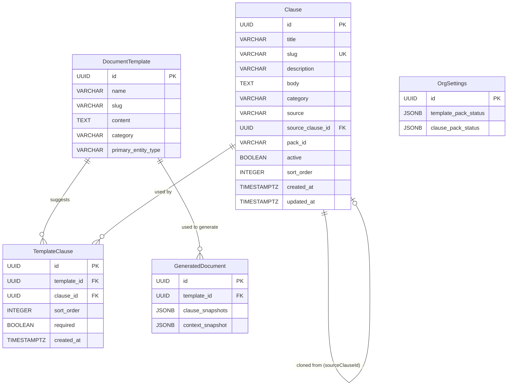
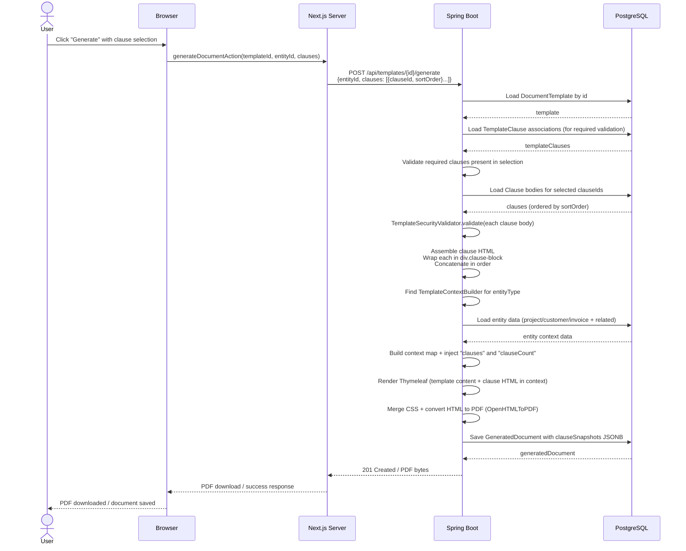
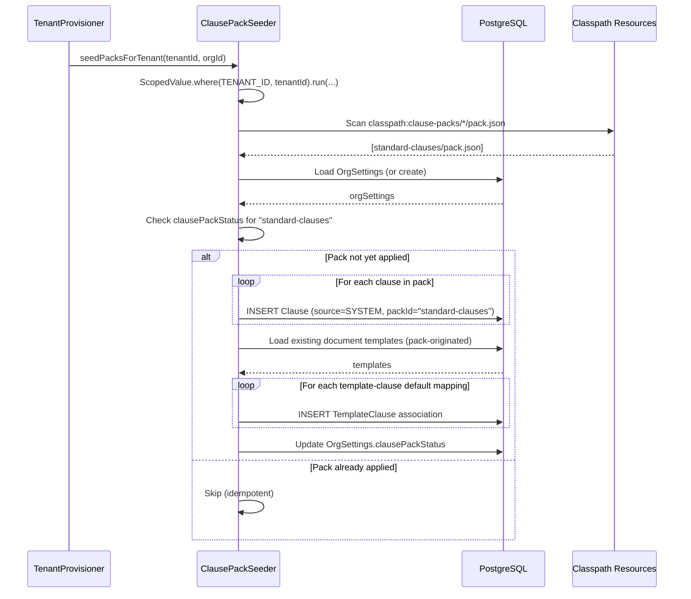

# Phase 27 — Document Clauses

---

## 1. Overview

Phase 27 adds a **clause library** to the DocTeams document generation system (Phase 12). Today, document templates are monolithic: if an engagement letter needs different terms for different clients, the only option is to clone the entire template and edit it. This phase introduces reusable, variable-aware text blocks (clauses) that can be composed into documents at generation time. Clauses are tenant-scoped, support the same Thymeleaf syntax as templates, and are rendered inline — the generated PDF contains the final composed content with no live references.

The design introduces two new entities (`Clause`, `TemplateClause`), extends `GeneratedDocument` with clause snapshot metadata, and extends `OrgSettings` with clause pack tracking. A **Standard Clauses** pack seeds ~12 professional-services clauses (payment terms, confidentiality, limitation of liability, etc.) on tenant provisioning, following the exact pattern established by `TemplatePackSeeder` in Phase 12. Template authors configure which clauses a template suggests, with ordering and required/optional flags. At generation time, users see a clause picker pre-populated with the template's defaults, and can toggle, reorder, or add clauses from the full library before previewing and generating.

The clause rendering pipeline is deliberately simple: clause bodies are concatenated into a single HTML string, injected into the template context as `${clauses}`, and rendered as one Thymeleaf unit alongside the template content. This avoids multi-pass rendering complexity while giving clauses full access to template context variables (customer name, project data, org branding, custom fields). See [ADR-104](../adr/ADR-104-clause-rendering-strategy.md).

**Dependencies on prior phases**:
- **Phase 12** (Document Templates): `DocumentTemplate`, `GeneratedDocument`, `PdfRenderingService`, `TemplateContextBuilder`, `TemplatePackSeeder`, `TemplateSecurityValidator`, `OrgSettings` branding.
- **Phase 13** (Dedicated Schema): Schema-per-tenant isolation. New entities need no multitenancy boilerplate.
- **Phase 23** (Template Validation): `requiredContextFields`, validation warnings. Clause preview reuses the same validation path.

### What's New

| Capability | Before Phase 27 | After Phase 27 |
|---|---|---|
| Reusable content blocks | -- | Clause library with categorized, variable-aware text blocks |
| Document composition | Monolithic templates only | Templates composed with selectable, reorderable clauses at generation time |
| Template-clause configuration | -- | Template authors declare suggested clauses with ordering and required/optional flags |
| Clause picker at generation time | -- | Users can toggle, reorder, and browse the clause library before generating |
| Starter clause content | -- | Standard Clauses pack with ~12 professional-services clauses seeded per-tenant |
| Clause preview | -- | Render a clause body with real entity context in the clause editor |
| Clause snapshot traceability | -- | Generated documents record which clauses were included (IDs, slugs, titles, ordering) |
| System vs. custom clauses | -- | System clauses (from packs) are read-only; clone-to-customize for modifications |

**Out of scope**: Rich-text/WYSIWYG clause editor, clause version history/diff tracking, clause approval workflows, clause nesting (clauses referencing other clauses), clause-level access control, clause analytics, per-customer clause overrides, clause groups/bundles, conditional clause inclusion based on template variables, portal-side clause visibility.

---

## 2. Domain Model

Phase 27 introduces two new tenant-scoped entities (`Clause`, `TemplateClause`) and extends two existing entities (`GeneratedDocument`, `OrgSettings`). All new entities follow the established pattern: no multitenancy boilerplate (schema boundary handles isolation), UUID primary keys, `Instant` timestamps, `@JdbcTypeCode(SqlTypes.JSON)` for JSONB columns, protected no-arg constructor.

### 2.1 Clause Entity (New)

A Clause is a reusable text block containing HTML/Thymeleaf content. Clauses are categorized, support variable interpolation using the same context as parent templates, and can be sourced from system packs or created by org admins.

| Field | Java Type | DB Column | DB Type | Constraints | Notes |
|-------|-----------|-----------|---------|-------------|-------|
| `id` | `UUID` | `id` | `UUID` | PK, default `gen_random_uuid()` | Auto-generated |
| `title` | `String` | `title` | `VARCHAR(200)` | NOT NULL | Display name, e.g., "Standard Payment Terms" |
| `slug` | `String` | `slug` | `VARCHAR(200)` | NOT NULL, UNIQUE | URL-safe identifier, auto-generated from title |
| `description` | `String` | `description` | `VARCHAR(500)` | Nullable | Summary of what the clause covers |
| `body` | `String` | `body` | `TEXT` | NOT NULL | HTML/Thymeleaf content — the clause text |
| `category` | `String` | `category` | `VARCHAR(100)` | NOT NULL | Free-text grouping: "Payment", "Liability", etc. |
| `source` | `ClauseSource` | `source` | `VARCHAR(20)` | NOT NULL | `SYSTEM`, `CLONED`, or `CUSTOM` |
| `sourceClauseId` | `UUID` | `source_clause_id` | `UUID` | Nullable | If CLONED, references the original system clause |
| `packId` | `String` | `pack_id` | `VARCHAR(100)` | Nullable | Pack identifier, e.g., "standard-clauses" |
| `active` | `boolean` | `active` | `BOOLEAN` | NOT NULL, default `true` | Soft-active flag. Inactive clauses hidden from picker |
| `sortOrder` | `int` | `sort_order` | `INTEGER` | NOT NULL, default 0 | Display order within category |
| `createdAt` | `Instant` | `created_at` | `TIMESTAMPTZ` | NOT NULL | Immutable |
| `updatedAt` | `Instant` | `updated_at` | `TIMESTAMPTZ` | NOT NULL | Updated on mutation |

**Design decisions**:
- `category` is free-text (not an enum) because clause categories are domain-specific and user-extensible. An accounting firm needs different categories than a law firm. The pack seeder provides initial categories; orgs can create their own.
- `source` uses a dedicated `ClauseSource` enum (`SYSTEM`, `CLONED`, `CUSTOM`) rather than reusing `TemplateSource` (which has only `PLATFORM`, `ORG_CUSTOM` — no clone concept). The semantics differ: `SYSTEM` clauses are read-only (cannot be edited), and the `CLONED` state explicitly represents "cloned from a system clause for customization" — a concept templates handle differently via `sourceTemplateId` on `ORG_CUSTOM` templates.
- `body` is stored as `TEXT` in PostgreSQL. Clause content is typically 0.5-5KB — well within comfortable limits. Content is not externalized to S3 because clauses must be assembled at render time without S3 round-trips.
- `slug` reuses the `DocumentTemplate.generateSlug()` pattern (lowercase, hyphenated, `^[a-z][a-z0-9-]*$`). The slug generation logic should be extracted to a shared utility if not already.
- `sourceClauseId` creates a clone chain: `CLONED` → `SYSTEM`. This allows "reset to original" functionality in future phases.

**Constraints**:
- `slug` UNIQUE — no duplicate slugs within a tenant schema.
- `slug` CHECK: `slug ~ '^[a-z][a-z0-9-]*$'`.

### 2.2 TemplateClause Entity (New)

A TemplateClause is a join entity that associates a clause with a template, defining the default clause selection when generating documents from that template.

| Field | Java Type | DB Column | DB Type | Constraints | Notes |
|-------|-----------|-----------|---------|-------------|-------|
| `id` | `UUID` | `id` | `UUID` | PK, default `gen_random_uuid()` | Auto-generated |
| `templateId` | `UUID` | `template_id` | `UUID` | NOT NULL, FK → document_templates | The template this association belongs to |
| `clauseId` | `UUID` | `clause_id` | `UUID` | NOT NULL, FK → clauses | The clause being associated |
| `sortOrder` | `int` | `sort_order` | `INTEGER` | NOT NULL, default 0 | Position in the template's clause list (0-based) |
| `required` | `boolean` | `required` | `BOOLEAN` | NOT NULL, default `false` | If true, clause cannot be unchecked at generation time |
| `createdAt` | `Instant` | `created_at` | `TIMESTAMPTZ` | NOT NULL | Immutable |

**Design decisions**:
- The `required` flag is per-association, not per-clause. The same clause can be required on one template and optional on another. This gives template authors fine-grained control.
- `sortOrder` determines the rendering order of clauses in the generated document. The template author sets the default; users can override at generation time.
- No `updatedAt` — association records are replaced atomically via the "save all" operation (`setTemplateClauses`), not updated in place.
- Cascading deletes: if a template is deleted, its `TemplateClause` associations are deleted. If a clause is deleted (soft-delete via `active = false`), associations remain — the clause is hidden from the picker but preserved on existing configurations.

**Constraints**:
- `(template_id, clause_id)` UNIQUE — a clause can only appear once per template.

### 2.3 GeneratedDocument Extension (Modified)

| Field | Java Type | DB Column | DB Type | Constraints | Notes |
|-------|-----------|-----------|---------|-------------|-------|
| `clauseSnapshots` | `List<Map<String,Object>>` | `clause_snapshots` | `JSONB` | Nullable | Array of `{clauseId, slug, title, sortOrder}` |

Per [ADR-105](../adr/ADR-105-clause-snapshot-depth.md), clause snapshots store IDs and metadata only — the rendered HTML/PDF is the content snapshot. Full clause body text is not stored because: (a) the platform is not in production, (b) no version tracking in v1, (c) the PDF itself preserves the rendered output.

### 2.4 OrgSettings Extension (Modified)

| Field | Java Type | DB Column | DB Type | Constraints | Notes |
|-------|-----------|-----------|---------|-------------|-------|
| `clausePackStatus` | `List<Map<String,Object>>` | `clause_pack_status` | `JSONB` | Nullable | Array of `{packId, version, appliedAt}` — same pattern as `templatePackStatus` |

### 2.5 ER Diagram



---

## 3. Core Flows and Backend Behaviour

### 3.1 Clause CRUD

#### Create Clause

```java
// ClauseService
public Clause createClause(CreateClauseRequest request)
```

1. Validate `title` non-blank (max 200 chars).
2. Validate `category` non-blank (max 100 chars).
3. Validate `body` non-blank.
4. Run `TemplateSecurityValidator.validate(request.body())` — rejects dangerous Thymeleaf constructs.
5. Generate slug from title using shared slug utility.
6. Check slug uniqueness; if collision, append numeric suffix (e.g., `payment-terms-2`).
7. Set `source = CUSTOM`, `active = true`, timestamps.
8. Persist and publish `clause.created` audit event.

**RBAC**: ADMIN/OWNER only.

#### Update Clause

```java
// ClauseService
public Clause updateClause(UUID id, UpdateClauseRequest request)
```

1. Load clause by ID; throw 404 if not found.
2. If `source == SYSTEM`, throw 400: "System clauses cannot be edited. Clone this clause to customize it."
3. Validate same rules as create.
4. If title changed, regenerate slug (check uniqueness).
5. Update fields, set `updatedAt`.
6. Run `TemplateSecurityValidator.validate(request.body())`.
7. Persist and publish `clause.updated` audit event.

**RBAC**: ADMIN/OWNER only.

#### Delete Clause (with Reference Guard)

```java
// ClauseService
public void deleteClause(UUID id)
```

1. Load clause by ID; throw 404 if not found.
2. Query `TemplateClauseRepository.findByClauseId(id)`.
3. If any associations exist, throw 409: "This clause is used by {N} template(s). Remove it from those templates first, or deactivate it instead."
4. Hard-delete the clause record.
5. Publish `clause.deleted` audit event.

**RBAC**: ADMIN/OWNER only.

**Decision**: Hard delete (not soft delete) is the deletion operation. This intentionally overrides the requirements doc (which describes delete as soft-delete). Rationale: the requirements already define a separate `deactivateClause` operation for soft-delete behavior. Having both DELETE and deactivate do the same thing (set `active = false`) creates API confusion. Instead: delete = permanent removal (only when unreferenced), deactivate = hide while preserving associations. Two distinct operations, two distinct semantics.

#### Deactivate Clause

```java
// ClauseService
public Clause deactivateClause(UUID id)
```

1. Load clause; set `active = false`, `updatedAt = now()`.
2. Always succeeds — no reference guard. Deactivated clauses remain on existing `TemplateClause` associations but are hidden from the clause picker's "browse library" view.
3. Publish `clause.deactivated` audit event.

**RBAC**: ADMIN/OWNER only.

#### Clone Clause

```java
// ClauseService
public Clause cloneClause(UUID id)
```

1. Load original clause; throw 404 if not found.
2. Create new clause: `title = "Copy of {original.title}"`, copy body/category/description.
3. Set `source = CLONED`, `sourceClauseId = original.id`.
4. Generate unique slug from new title.
5. Set `active = true`, timestamps.
6. Persist and publish `clause.cloned` audit event (details: source clause title, new clause title).

**RBAC**: ADMIN/OWNER only.

#### List Clauses

```java
// ClauseService
public List<Clause> listClauses(boolean includeInactive, String category)
```

1. If `category` provided: `findByCategoryAndActiveTrueOrderBySortOrderAsc(category)`.
2. If `includeInactive`: include inactive clauses in results.
3. Otherwise: `findByActiveTrueOrderByCategoryAscSortOrderAsc()`.

**RBAC**: MEMBER+ (all authenticated users can view clauses).

#### Preview Clause

```java
// ClauseService
public String previewClause(UUID clauseId, UUID entityId, TemplateEntityType entityType)
```

1. Load clause; throw 404 if not found.
2. Find the `TemplateContextBuilder` that `supports()` the given `entityType`.
3. Build context map from the entity.
4. Render clause body as a Thymeleaf fragment using a **new** public method `PdfRenderingService.renderFragment(String templateContent, Map<String, Object> context)`. This method wraps the existing private `renderThymeleaf()` logic, exposing it for standalone fragment rendering (clause preview, future uses). The clause body is wrapped in a minimal HTML shell for Thymeleaf processing.
5. Return rendered HTML.

**RBAC**: ADMIN/OWNER only.

### 3.2 Template-Clause Association Management

#### Get Template Clauses

```java
// TemplateClauseService
public List<TemplateClauseDetail> getTemplateClauses(UUID templateId)
```

1. Load associations via `findByTemplateIdOrderBySortOrderAsc(templateId)`.
2. Enrich with full clause details (title, category, body preview snippet — first 200 chars, required flag, sort order).
3. Return ordered list.

**RBAC**: MEMBER+ (needed for the generation dialog clause picker).

#### Set Template Clauses (Replace All)

```java
// TemplateClauseService
public void setTemplateClauses(UUID templateId, List<TemplateClauseRequest> clauses)
```

1. Validate template exists; throw 404 if not.
2. Validate all clause IDs exist and are active; throw 400 listing invalid IDs.
3. In a single transaction: delete all existing `TemplateClause` for this template, insert new associations with provided `sortOrder` and `required` flags.
4. Publish `template_clause.configured` audit event (details: template name, clause count).

**RBAC**: ADMIN/OWNER only.

#### Add Clause to Template

```java
// TemplateClauseService
public TemplateClause addClauseToTemplate(UUID templateId, UUID clauseId, boolean required)
```

1. Check for existing association; throw 409 if already associated.
2. Determine next `sortOrder` (max existing + 1, or 0 if none).
3. Create and persist `TemplateClause`.

**RBAC**: ADMIN/OWNER only.

#### Remove Clause from Template

```java
// TemplateClauseService
public void removeClauseFromTemplate(UUID templateId, UUID clauseId)
```

1. Delete via `deleteByTemplateIdAndClauseId(templateId, clauseId)`.
2. No error if association doesn't exist (idempotent).

**RBAC**: ADMIN/OWNER only.

### 3.3 Document Generation with Clauses (Key Flow)

This is the core extension to the existing generation pipeline. The flow modifies `GeneratedDocumentService.generateDocument()` and `PdfRenderingService`.

#### Extended Generation Request

The existing `GenerateDocumentRequest` is extended with an optional `clauses` field:

```java
record GenerateDocumentRequest(
    @NotNull UUID entityId,
    boolean saveToDocuments,
    boolean acknowledgeWarnings,
    List<ClauseSelection> clauses  // NEW — nullable
) {
    record ClauseSelection(UUID clauseId, int sortOrder) {}
}
```

#### Resolution Logic

1. **No `clauses` parameter**: Fall back to the template's default clause list from `TemplateClause` associations. All associated clauses (both required and optional) are included by default.
2. **`clauses` parameter provided**: Use exactly the specified clauses in the specified order.
   - Validate that all required clauses (from `TemplateClause` where `required = true`) are present. Return 422 if a required clause is missing.
   - Validate that all clause IDs exist. Return 400 if any are invalid.
3. **Template has no `TemplateClause` associations AND no `clauses` parameter**: Generate without clauses (backward compatible — existing behavior unchanged).

#### Content Assembly (see Section 6 for detailed pipeline)

1. Load clause bodies in the resolved order.
2. Run `TemplateSecurityValidator.validate()` on each clause body (defense in depth).
3. Wrap each clause in `<div class="clause-block" data-clause-slug="{slug}">...</div>`.
4. Concatenate into a single HTML string.
5. Inject into the template context as `clauses` variable.
6. Also inject `clauseCount` (integer) for conditional display.
7. Render the template with Thymeleaf as one unit (single pass).

#### Audit Events During Generation

When clauses are included in a generated document, emit the existing `document.generated` audit event (unchanged) **plus** a supplementary `document.generated_with_clauses` event (details: template name, clause slugs included, clause count). Both events are emitted — the new event augments, not replaces, the existing one. When no clauses are selected, only the existing `document.generated` event fires.

#### Snapshot Recording

After successful generation, store clause metadata in `GeneratedDocument.clauseSnapshots`:

```json
[
  { "clauseId": "uuid-1", "slug": "payment-terms", "title": "Standard Payment Terms", "sortOrder": 0 },
  { "clauseId": "uuid-2", "slug": "confidentiality", "title": "Confidentiality", "sortOrder": 1 }
]
```

### 3.4 Clause Preview (Single Clause)

Described in 3.1 (Preview Clause). This is the clause editor's preview — renders one clause body with entity context. Distinct from document preview (which renders the full template + all selected clauses).

### 3.5 Pack Seeding (ClausePackSeeder)

```java
// ClausePackSeeder
public void seedPacksForTenant(String tenantId, String orgId)
```

1. Bind `ScopedValue.where(RequestScopes.TENANT_ID, tenantId).where(RequestScopes.ORG_ID, orgId)`.
2. Load `OrgSettings` (create if absent).
3. Scan `classpath:clause-packs/*/pack.json`.
4. For each pack: check `clausePackStatus` for prior application. If already applied, skip.
5. For each clause definition in the pack: create `Clause` with `source = SYSTEM`, `packId` set.
6. After seeding clauses: create default `TemplateClause` associations between seeded templates and relevant clauses (see Section 7).
7. Record pack application in `OrgSettings.clausePackStatus`.

---

## 4. API Surface

### 4.1 Clause CRUD

| Method | Path | Description | Auth | Notes |
|--------|------|-------------|------|-------|
| `GET` | `/api/clauses` | List clauses | MEMBER+ | Query params: `includeInactive` (default false), `category` (optional) |
| `GET` | `/api/clauses/categories` | List distinct categories | MEMBER+ | Returns `string[]` |
| `GET` | `/api/clauses/{id}` | Get clause detail | MEMBER+ | |
| `POST` | `/api/clauses` | Create clause | ADMIN/OWNER | |
| `PUT` | `/api/clauses/{id}` | Update clause | ADMIN/OWNER | 400 if SYSTEM source |
| `DELETE` | `/api/clauses/{id}` | Delete clause | ADMIN/OWNER | 409 if referenced by templates |
| `POST` | `/api/clauses/{id}/deactivate` | Deactivate clause | ADMIN/OWNER | Always succeeds |
| `POST` | `/api/clauses/{id}/clone` | Clone clause | ADMIN/OWNER | Returns new clause |
| `POST` | `/api/clauses/{id}/preview` | Preview with entity context | ADMIN/OWNER | Returns rendered HTML |

#### Request/Response Shapes

**POST /api/clauses** (Create)
```json
// Request
{
  "title": "Standard Payment Terms",
  "description": "Net 30 payment terms with late payment provisions.",
  "body": "<p>Payment is due within 30 days...</p>",
  "category": "Payment"
}

// Response (201 Created)
{
  "id": "uuid",
  "title": "Standard Payment Terms",
  "slug": "standard-payment-terms",
  "description": "Net 30 payment terms with late payment provisions.",
  "body": "<p>Payment is due within 30 days...</p>",
  "category": "Payment",
  "source": "CUSTOM",
  "sourceClauseId": null,
  "packId": null,
  "active": true,
  "sortOrder": 0,
  "createdAt": "2026-02-26T10:00:00Z",
  "updatedAt": "2026-02-26T10:00:00Z"
}
```

**PUT /api/clauses/{id}** (Update)
```json
// Request
{
  "title": "Standard Payment Terms",
  "description": "Updated description.",
  "body": "<p>Updated payment terms...</p>",
  "category": "Payment"
}
```

**POST /api/clauses/{id}/preview**
```json
// Request
{
  "entityId": "uuid",
  "entityType": "PROJECT"
}

// Response (200)
{
  "html": "<p>Payment is due within 30 days of the invoice date for Acme Corp...</p>"
}
```

**GET /api/clauses** (List)
```json
// Response
[
  {
    "id": "uuid",
    "title": "Standard Payment Terms",
    "slug": "standard-payment-terms",
    "description": "Net 30 payment terms with late payment provisions.",
    "category": "Payment",
    "source": "SYSTEM",
    "active": true,
    "sortOrder": 0,
    "createdAt": "2026-02-26T10:00:00Z",
    "updatedAt": "2026-02-26T10:00:00Z"
  }
]
```

### 4.2 Template-Clause Configuration

| Method | Path | Description | Auth | Notes |
|--------|------|-------------|------|-------|
| `GET` | `/api/templates/{templateId}/clauses` | List template's clause config | MEMBER+ | Returns enriched clause details |
| `PUT` | `/api/templates/{templateId}/clauses` | Replace template's clause list | ADMIN/OWNER | Full replacement (save-all) |
| `POST` | `/api/templates/{templateId}/clauses` | Add clause to template | ADMIN/OWNER | 409 if already associated |
| `DELETE` | `/api/templates/{templateId}/clauses/{clauseId}` | Remove clause from template | ADMIN/OWNER | Idempotent |

#### Request/Response Shapes

**GET /api/templates/{templateId}/clauses**
```json
// Response
[
  {
    "id": "template-clause-uuid",
    "clauseId": "clause-uuid",
    "title": "Standard Payment Terms",
    "slug": "standard-payment-terms",
    "category": "Payment",
    "description": "Net 30 payment terms...",
    "bodyPreview": "<p>Payment is due within 30 days of the inv...",
    "required": true,
    "sortOrder": 0,
    "active": true
  }
]
```

**PUT /api/templates/{templateId}/clauses** (Replace All)
```json
// Request
{
  "clauses": [
    { "clauseId": "uuid-1", "sortOrder": 0, "required": true },
    { "clauseId": "uuid-2", "sortOrder": 1, "required": false }
  ]
}
```

**POST /api/templates/{templateId}/clauses** (Add Single)
```json
// Request
{
  "clauseId": "uuid",
  "required": false
}
```

### 4.3 Generation Extensions

The existing generation and preview endpoints are extended with optional clause parameters.

| Method | Path | Description | Change |
|--------|------|-------------|--------|
| `POST` | `/api/templates/{id}/generate` | Generate document | New optional `clauses` field in request body |
| `POST` | `/api/templates/{id}/preview` | Preview document | New optional `clauses` field in request body |

**Extended POST /api/templates/{id}/generate**
```json
// Request (extended)
{
  "entityId": "uuid",
  "saveToDocuments": true,
  "acknowledgeWarnings": false,
  "clauses": [
    { "clauseId": "uuid-1", "sortOrder": 0 },
    { "clauseId": "uuid-2", "sortOrder": 1 }
  ]
}
```

**Extended POST /api/templates/{id}/preview**
```json
// Request (extended)
{
  "entityId": "uuid",
  "clauses": [
    { "clauseId": "uuid-1", "sortOrder": 0 },
    { "clauseId": "uuid-2", "sortOrder": 1 }
  ]
}
```

When `clauses` is omitted, behavior is backward compatible: the template's default clause list is used (if any), or no clauses are included.

---

## 5. Sequence Diagrams

### 5.1 Document Generation with Clauses



### 5.2 Clause Pack Seeding on Tenant Provisioning



---

## 6. Clause Rendering Pipeline

This section describes the technical details of how clause content is assembled and rendered into documents. This is the key architectural mechanism of Phase 27 and the subject of [ADR-104](../adr/ADR-104-clause-rendering-strategy.md) and [ADR-106](../adr/ADR-106-template-clause-placeholder-strategy.md).

### 6.1 Assembly: Clause Bodies to HTML Block

The clause assembly step occurs **before** Thymeleaf rendering. The pipeline receives a list of selected clauses (in order) and produces a single HTML string:

```java
// ClauseAssembler (new utility class in clause/ package)
public String assembleClauseBlock(List<Clause> clauses) {
    if (clauses.isEmpty()) return "";

    var sb = new StringBuilder();
    for (var clause : clauses) {
        sb.append("<div class=\"clause-block\" data-clause-slug=\"")
          .append(escapeHtml(clause.getSlug()))
          .append("\">\n")
          .append(clause.getBody())
          .append("\n</div>\n");
    }
    return sb.toString();
}
```

Key points:
- Each clause body is wrapped in a `<div class="clause-block" data-clause-slug="...">` for CSS targeting. Template authors can style `.clause-block` in their CSS.
- Clause bodies are **not** rendered individually before assembly. They are concatenated as raw Thymeleaf source and rendered together with the template in a single Thymeleaf pass.
- The `data-clause-slug` attribute provides a CSS hook for per-clause styling (e.g., `[data-clause-slug="payment-terms"] { border-bottom: 1px solid #ccc; }`).

### 6.2 Injection: Clause Block into Template Context

The assembled clause HTML string is injected into the template context map as a variable:

```java
// In PdfRenderingService (extended)
Map<String, Object> context = contextBuilder.buildContext(entityId, memberId);

// Assemble and inject clauses
String clauseHtml = clauseAssembler.assembleClauseBlock(resolvedClauses);
context.put("clauses", clauseHtml);
context.put("clauseCount", resolvedClauses.size());

// Render template with clause content in context
String renderedHtml = renderThymeleaf(template.getContent(), context);
```

Template authors place clause content using:

```html
<!-- In template content -->
<div th:if="${clauseCount > 0}" th:utext="${clauses}"></div>
```

**Critical**: `th:utext` (unescaped text) is required because `${clauses}` contains raw HTML. `th:text` would escape the HTML tags. This is safe because:
1. Clause bodies go through `TemplateSecurityValidator` at both save time and render time.
2. The security validator blocks dangerous Thymeleaf constructs (SSTI patterns).
3. Only ADMIN/OWNER roles can create/edit clause content.

### 6.3 Fallback: Templates Without `${clauses}` Placeholder

Per [ADR-106](../adr/ADR-106-template-clause-placeholder-strategy.md), if a template's content does not contain the string `${clauses}`, the assembled clause block is **appended after the main template content** before Thymeleaf rendering:

```java
String templateContent = template.getContent();
if (!clauseHtml.isEmpty() && !templateContent.contains("${clauses}")) {
    // Append clause block after main content using th:utext (NOT [[${clauses}]] which escapes HTML)
    templateContent = templateContent + "\n<div class=\"clauses-section\">\n"
        + "<hr/>\n<h2>Terms and Conditions</h2>\n"
        + "<div th:utext=\"${clauses}\"></div>\n</div>";
}
```

This ensures backward compatibility: existing templates that predate clauses still render clause content if clauses are selected at generation time.

### 6.4 Security Validation (Defense in Depth)

Clause content is validated at **two** points:

1. **Save time** (`ClauseService.createClause()` / `updateClause()`): `TemplateSecurityValidator.validate(body)` — rejects content with dangerous Thymeleaf constructs before it reaches the database.
2. **Render time** (`PdfRenderingService`, during clause assembly): `TemplateSecurityValidator.validate(clause.getBody())` for each clause — defense in depth against database tampering or race conditions between save and render.

Both validations use the same `TemplateSecurityValidator` (the existing utility from Phase 12). No new validation logic is needed.

### 6.5 Error Handling: Thymeleaf Syntax Errors in Clauses

Because clause bodies are rendered as part of a single Thymeleaf template (not individually), a Thymeleaf syntax error in any clause fails the entire render. This is the **correct** behavior per [ADR-104](../adr/ADR-104-clause-rendering-strategy.md):

- **Why fail-fast is correct**: A partially rendered document (some clauses missing due to errors) is worse than no document. The user would not notice the missing clause and might send an incomplete engagement letter to a client.
- **Error message**: The Thymeleaf error message includes the line/column of the syntax error. Since clause content is concatenated before rendering, the error position maps to a location within the clause block. The error response should identify which clause caused the error (by matching the error line position against clause block boundaries) and include the clause title in the error message.
- **Preview catches errors**: The preview step (Step 2 of the generation dialog) renders with clauses included. If a clause has a syntax error, the preview fails with an error message — the user can fix the clause before generating.

```java
// Error handling in PdfRenderingService
try {
    String rendered = thymeleafEngine.process(templateContent, thymeleafContext);
} catch (TemplateProcessingException e) {
    // Attempt to identify the offending clause by line number
    String clauseHint = identifyOffendingClause(e, clauses, clauseHtml);
    throw new PdfGenerationException(
        "Template rendering failed" + (clauseHint != null ? " in clause: " + clauseHint : ""),
        e);
}
```

### 6.6 Snapshot Model

When a document is generated with clauses, the `GeneratedDocument.clauseSnapshots` JSONB column stores metadata about the clause selection:

```json
[
  {
    "clauseId": "550e8400-e29b-41d4-a716-446655440001",
    "slug": "payment-terms",
    "title": "Standard Payment Terms",
    "sortOrder": 0
  },
  {
    "clauseId": "550e8400-e29b-41d4-a716-446655440002",
    "slug": "confidentiality",
    "title": "Confidentiality",
    "sortOrder": 1
  }
]
```

Per [ADR-105](../adr/ADR-105-clause-snapshot-depth.md), this is **metadata only** — the full clause body text is not stored. Rationale:
- The rendered PDF **is** the content snapshot. If you need to know what the clause said, open the PDF.
- The platform is pre-production; there is no regulatory requirement for clause-level audit trails.
- Full body storage would roughly double the JSONB size for no v1 use case.
- If clause versioning is added later, a `clause_versions` table is the right approach (not JSONB blobs).

---

## 7. Standard Clauses Pack

### 7.1 Pack Structure

Located at `classpath:clause-packs/standard-clauses/pack.json`:

```json
{
  "id": "standard-clauses",
  "version": 1,
  "name": "Standard Professional Services Clauses",
  "description": "Common clauses for engagement letters, proposals, and service agreements.",
  "clauses": [
    {
      "title": "Standard Payment Terms",
      "slug": "payment-terms",
      "category": "Payment",
      "description": "Net 30 payment terms with late payment provisions.",
      "body": "<clause body HTML>",
      "sortOrder": 0
    }
  ],
  "templateAssociations": [
    {
      "templatePackId": "common",
      "templateKey": "engagement-letter",
      "clauseSlugs": ["payment-terms", "fee-schedule", "engagement-acceptance", "scope-of-work", "client-responsibilities", "limitation-of-liability", "confidentiality", "termination", "dispute-resolution"],
      "requiredSlugs": ["payment-terms", "engagement-acceptance"]
    },
    {
      "templatePackId": "common",
      "templateKey": "statement-of-work",
      "clauseSlugs": ["payment-terms", "fee-schedule", "scope-of-work", "client-responsibilities", "limitation-of-liability", "confidentiality", "termination"],
      "requiredSlugs": ["scope-of-work"]
    }
  ]
}
```

### 7.2 Clause Inventory (~12 Clauses)

| # | Title | Slug | Category | Description | Key Variables |
|---|-------|------|----------|-------------|---------------|
| 1 | Standard Payment Terms | `payment-terms` | Payment | Net 30 with late payment interest provision | `${org.name}`, `${customer.name}` |
| 2 | Fee Schedule | `fee-schedule` | Payment | How fees are calculated (hourly rates, fixed fees) | `${org.name}` |
| 3 | Engagement Acceptance | `engagement-acceptance` | Engagement | Terms of engagement acceptance and commencement | `${org.name}`, `${customer.name}` |
| 4 | Scope of Work | `scope-of-work` | Engagement | Scope boundaries and change request process | `${org.name}`, `${customer.name}` |
| 5 | Client Responsibilities | `client-responsibilities` | Engagement | Client's obligations (timely info, access, decisions) | `${customer.name}` |
| 6 | Limitation of Liability | `limitation-of-liability` | Liability | Caps liability, excludes consequential damages | `${org.name}` |
| 7 | Professional Indemnity | `professional-indemnity` | Liability | References professional indemnity insurance | `${org.name}` |
| 8 | Confidentiality | `confidentiality` | Confidentiality | Mutual confidentiality obligations | `${org.name}`, `${customer.name}` |
| 9 | Termination | `termination` | Termination | Termination notice, work-in-progress settlement | `${org.name}`, `${customer.name}` |
| 10 | Force Majeure | `force-majeure` | Termination | Force majeure events and obligations | — |
| 11 | Dispute Resolution | `dispute-resolution` | General | Mediation-first, then arbitration | — |
| 12 | Document Retention | `document-retention` | General | Record retention period and client access rights | `${org.name}` |

### 7.3 Seeder Flow and Idempotency

`ClausePackSeeder` follows the exact pattern of `TemplatePackSeeder`:

1. **Resource scanning**: `classpath:clause-packs/*/pack.json` via `ResourcePatternResolver`.
2. **Pack definition record**: `ClausePackDefinition` — `id`, `version`, `name`, `description`, `clauses[]`, `templateAssociations[]`.
3. **Idempotency**: Check `OrgSettings.clausePackStatus` (JSONB array of `{packId, version, appliedAt}`) before applying. Same pattern as `templatePackStatus`.
4. **Transaction scope**: `ScopedValue.where(TENANT_ID, tenantId).run(...)` + `TransactionTemplate`.
5. **Clause creation**: Each clause definition becomes a `Clause` entity with `source = SYSTEM`, `packId = pack.id`.
6. **Slug handling**: Use slug from pack definition (not generated). If slug collision occurs (because an org created a custom clause with the same slug), append `-system` suffix.

### 7.4 Default Template-Clause Associations

After seeding clauses, the seeder creates `TemplateClause` associations based on the `templateAssociations` configuration in the pack:

1. For each association entry: find the template by `packId` and `packTemplateKey` in the `document_templates` table.
2. If the template exists: for each clause slug in `clauseSlugs`, find the seeded clause by `packId + slug`.
3. Create `TemplateClause` with `required = true` if slug is in `requiredSlugs`, `sortOrder` matching the position in `clauseSlugs`.
4. If the template doesn't exist (e.g., template pack not yet applied), skip silently. The associations will be created when the template pack is applied (the template seeder should trigger clause association for new templates).

**Ordering**: `ClausePackSeeder` must run **after** `TemplatePackSeeder` to ensure template records exist for association creation. This is enforced via `@DependsOn` or explicit call ordering in the provisioning flow.

---

## 8. Database Migration

### V43 — Create Clause Tables and Extend Generated Documents

```sql
-- V43__create_clause_tables.sql

-- Clause library table
CREATE TABLE clauses (
    id              UUID        DEFAULT gen_random_uuid() PRIMARY KEY,
    title           VARCHAR(200) NOT NULL,
    slug            VARCHAR(200) NOT NULL,
    description     VARCHAR(500),
    body            TEXT         NOT NULL,
    category        VARCHAR(100) NOT NULL,
    source          VARCHAR(20)  NOT NULL DEFAULT 'CUSTOM',
    source_clause_id UUID,
    pack_id         VARCHAR(100),
    active          BOOLEAN      NOT NULL DEFAULT true,
    sort_order      INTEGER      NOT NULL DEFAULT 0,
    created_at      TIMESTAMPTZ  NOT NULL DEFAULT now(),
    updated_at      TIMESTAMPTZ  NOT NULL DEFAULT now(),

    CONSTRAINT clauses_slug_unique UNIQUE (slug),
    CONSTRAINT clauses_slug_format CHECK (slug ~ '^[a-z][a-z0-9-]*$'),
    CONSTRAINT clauses_source_check CHECK (source IN ('SYSTEM', 'CLONED', 'CUSTOM'))
);

-- Index for clause library listing (grouped by category, ordered)
CREATE INDEX idx_clauses_active_category ON clauses (active, category, sort_order)
    WHERE active = true;

-- Index for pack management queries
CREATE INDEX idx_clauses_pack_id ON clauses (pack_id)
    WHERE pack_id IS NOT NULL;

-- Template-clause join table
CREATE TABLE template_clauses (
    id              UUID        DEFAULT gen_random_uuid() PRIMARY KEY,
    template_id     UUID        NOT NULL REFERENCES document_templates(id) ON DELETE CASCADE,
    clause_id       UUID        NOT NULL REFERENCES clauses(id) ON DELETE RESTRICT,
    sort_order      INTEGER     NOT NULL DEFAULT 0,
    required        BOOLEAN     NOT NULL DEFAULT false,
    created_at      TIMESTAMPTZ NOT NULL DEFAULT now(),

    CONSTRAINT template_clauses_unique UNIQUE (template_id, clause_id)
);

-- Index for loading a template's clause configuration (most common query)
CREATE INDEX idx_template_clauses_template_id ON template_clauses (template_id, sort_order);

-- Index for checking if a clause is referenced (deletion guard)
CREATE INDEX idx_template_clauses_clause_id ON template_clauses (clause_id);

-- Extend generated_documents with clause snapshot metadata
ALTER TABLE generated_documents
    ADD COLUMN clause_snapshots JSONB;

-- Extend org_settings with clause pack tracking
ALTER TABLE org_settings
    ADD COLUMN clause_pack_status JSONB;
```

**Index rationale**:
- `idx_clauses_active_category`: Covers the primary listing query (`findByActiveTrueOrderByCategoryAscSortOrderAsc`). Partial index on `active = true` excludes deactivated clauses from the index.
- `idx_clauses_pack_id`: Covers pack management queries (`findByPackIdAndSourceAndActiveTrue`). Partial index excludes pack-less clauses.
- `idx_template_clauses_template_id`: Covers `findByTemplateIdOrderBySortOrderAsc` — the most frequent query (called on every generation and every template editor open).
- `idx_template_clauses_clause_id`: Covers the deletion guard query (`findByClauseId`) — called infrequently but must be fast to avoid slow DELETE operations.
- `ON DELETE CASCADE` on `template_clauses.template_id`: Cleaning up associations when a template is deleted.
- `ON DELETE RESTRICT` on `template_clauses.clause_id`: Prevents accidental deletion of a clause that's still referenced. The application-level deletion guard (409 response) provides a user-friendly message; the database constraint is the safety net.

---

## 9. Implementation Guidance

### 9.1 Backend Changes

| File | Change |
|------|--------|
| `clause/Clause.java` | **New**. Entity with fields per Section 2.1. Protected no-arg constructor, public constructor. `generateSlug()` method (or use shared utility). |
| `clause/ClauseSource.java` | **New**. Enum: `SYSTEM`, `CLONED`, `CUSTOM`. |
| `clause/ClauseRepository.java` | **New**. JPA repository with query methods per Section 3.1. |
| `clause/ClauseService.java` | **New**. Business logic per Section 3.1. Injects `ClauseRepository`, `TemplateClauseRepository`, `TemplateSecurityValidator`, `PdfRenderingService`. |
| `clause/ClauseController.java` | **New**. REST controller at `/api/clauses`. Nested record DTOs. Thin delegation to `ClauseService`. |
| `clause/TemplateClause.java` | **New**. Join entity with fields per Section 2.2. |
| `clause/TemplateClauseRepository.java` | **New**. JPA repository with query methods per Section 3.2. |
| `clause/TemplateClauseService.java` | **New**. Association management per Section 3.2. |
| `clause/TemplateClauseController.java` | **New**. REST controller nested under `/api/templates/{templateId}/clauses`. Could also be endpoints added to `DocumentTemplateController`. |
| `clause/ClauseAssembler.java` | **New**. Utility that assembles clause bodies into HTML block per Section 6.1. |
| `clause/ClausePackSeeder.java` | **New**. Follows `TemplatePackSeeder` pattern. Reads `classpath:clause-packs/*/pack.json`. |
| `clause/ClausePackDefinition.java` | **New**. Record for JSON deserialization: `id`, `version`, `name`, `description`, `clauses[]`, `templateAssociations[]`. |
| `template/PdfRenderingService.java` | **Modified**. Add new public `renderFragment(String templateContent, Map<String, Object> context)` method (exposes the existing private `renderThymeleaf` logic for clause preview). Extend `generatePdf()`, `previewHtml()`, `previewWithValidation()` to accept optional clause list. Call `ClauseAssembler` and inject into context. |
| `template/GeneratedDocumentService.java` | **Modified**. Extend `generateDocument()` to resolve clause list, pass to rendering, store snapshots. |
| `template/DocumentTemplateController.java` | **Modified**. Extend `GenerateDocumentRequest` and `PreviewRequest` with optional `clauses` field. |
| `template/GeneratedDocument.java` | **Modified**. Add `clauseSnapshots` JSONB field. |
| `settings/OrgSettings.java` | **Modified**. Add `clausePackStatus` JSONB field with getter/setter and `recordClausePackApplication()` method. |
| `provisioning/` | **Modified**. Call `ClausePackSeeder.seedPacksForTenant()` after `TemplatePackSeeder`. |
| `resources/clause-packs/standard-clauses/pack.json` | **New**. Pack definition with ~12 clauses. |
| `resources/db/migration/tenant/V43__create_clause_tables.sql` | **New**. Migration per Section 8. |

### 9.2 Frontend Changes

| File | Change |
|------|--------|
| `lib/actions/clause-actions.ts` | **New**. Server actions: `getClauses`, `getClause`, `createClause`, `updateClause`, `deleteClause`, `deactivateClause`, `cloneClause`, `previewClause`, `getClauseCategories`. |
| `lib/actions/template-clause-actions.ts` | **New**. Server actions: `getTemplateClauses`, `setTemplateClauses`, `addClauseToTemplate`, `removeClauseFromTemplate`. |
| `lib/actions/template-actions.ts` | **Modified**. Extend `generateDocumentAction` and `previewTemplateAction` to accept optional `clauses` parameter. |
| `app/(app)/org/[slug]/settings/clauses/page.tsx` | **New**. Clause library page (server component). |
| `components/clauses/clauses-content.tsx` | **New**. Client component: clause list grouped by category, search, filter, CRUD actions. |
| `components/clauses/clause-form-dialog.tsx` | **New**. Create/edit clause dialog with title, category combobox, description, body textarea, preview. |
| `components/clauses/clause-preview-panel.tsx` | **New**. Rendered clause preview (sandboxed iframe). |
| `components/templates/template-clauses-tab.tsx` | **New**. Clauses tab in template editor: ordered clause list, add/remove, required toggle, reorder. |
| `components/templates/clause-picker-dialog.tsx` | **New**. Clause picker for template editor: browse library, multi-select, confirm. |
| `components/templates/GenerateDocumentDialog.tsx` | **Modified**. Add clause selection step (Step 1) when template has associated clauses. Multi-step dialog: Clause Selection -> Preview -> Generate. |
| `components/templates/generation-clause-step.tsx` | **New**. Clause selection step component: checklist with required/optional, browse library, reorder. |
| Sidebar navigation | **Modified**. Add "Clauses" link under Settings (alongside Templates, Custom Fields, Tags, etc.). |

### 9.3 Entity Code Pattern

```java
package io.b2mash.b2b.b2bstrawman.clause;

import jakarta.persistence.Column;
import jakarta.persistence.Entity;
import jakarta.persistence.EnumType;
import jakarta.persistence.Enumerated;
import jakarta.persistence.GeneratedValue;
import jakarta.persistence.GenerationType;
import jakarta.persistence.Id;
import jakarta.persistence.Table;
import java.time.Instant;
import java.util.UUID;

@Entity
@Table(name = "clauses")
public class Clause {

    @Id
    @GeneratedValue(strategy = GenerationType.UUID)
    private UUID id;

    @Column(name = "title", nullable = false, length = 200)
    private String title;

    @Column(name = "slug", nullable = false, length = 200)
    private String slug;

    @Column(name = "description", length = 500)
    private String description;

    @Column(name = "body", nullable = false, columnDefinition = "TEXT")
    private String body;

    @Column(name = "category", nullable = false, length = 100)
    private String category;

    @Enumerated(EnumType.STRING)
    @Column(name = "source", nullable = false, length = 20)
    private ClauseSource source;

    @Column(name = "source_clause_id")
    private UUID sourceClauseId;

    @Column(name = "pack_id", length = 100)
    private String packId;

    @Column(name = "active", nullable = false)
    private boolean active;

    @Column(name = "sort_order", nullable = false)
    private int sortOrder;

    @Column(name = "created_at", nullable = false, updatable = false)
    private Instant createdAt;

    @Column(name = "updated_at", nullable = false)
    private Instant updatedAt;

    protected Clause() {}

    public Clause(String title, String slug, String body, String category) {
        this.title = title;
        this.slug = slug;
        this.body = body;
        this.category = category;
        this.source = ClauseSource.CUSTOM;
        this.active = true;
        this.sortOrder = 0;
        this.createdAt = Instant.now();
        this.updatedAt = Instant.now();
    }

    public void update(String title, String slug, String description, String body, String category) {
        this.title = title;
        this.slug = slug;
        this.description = description;
        this.body = body;
        this.category = category;
        this.updatedAt = Instant.now();
    }

    public void deactivate() {
        this.active = false;
        this.updatedAt = Instant.now();
    }

    public Clause cloneFrom() {
        var clone = new Clause("Copy of " + this.title, null, this.body, this.category);
        clone.description = this.description;
        clone.source = ClauseSource.CLONED;
        clone.sourceClauseId = this.id;
        return clone;
    }

    // Getters and setters...
}
```

### 9.4 Testing Strategy

**Backend integration tests** (~30-40 tests):
- `ClauseControllerIntegrationTest`: CRUD operations, slug generation, security validation, RBAC (MEMBER can read, only ADMIN/OWNER can write), SYSTEM clause edit rejection, deletion guard (409), deactivation, cloning.
- `TemplateClauseControllerIntegrationTest`: Association CRUD, replace-all, add single, remove, RBAC.
- `ClauseRenderingIntegrationTest`: Document generation with clauses, clause assembly, context variable access in clauses, Thymeleaf error handling, backward compatibility (templates without clauses).
- `ClausePackSeederIntegrationTest`: Pack loading, idempotency, template-clause default associations, OrgSettings tracking.
- `ClausePreviewIntegrationTest`: Clause preview with entity context, security validation.

**Frontend tests** (~15-20 tests):
- Clause library page: list, filter, search, create, edit, deactivate, clone.
- Template clauses tab: load, add, remove, reorder, save.
- Generation dialog: clause step shown/hidden based on template config, required clauses enforced, preview includes clauses.
- Server action tests: API calls, error handling, revalidation.

---

## 10. Permission Model Summary

| Operation | Minimum Role | Notes |
|-----------|-------------|-------|
| List clauses | MEMBER | All authenticated org members can view the clause library |
| Get clause detail | MEMBER | |
| List clause categories | MEMBER | |
| Create clause | ADMIN | |
| Update clause | ADMIN | 400 if SYSTEM source |
| Delete clause | ADMIN | 409 if referenced by templates |
| Deactivate clause | ADMIN | Always succeeds |
| Clone clause | ADMIN | |
| Preview clause | ADMIN | Requires entity context |
| Get template clauses | MEMBER | Needed for generation dialog |
| Set template clauses | ADMIN | Replace-all operation |
| Add clause to template | ADMIN | |
| Remove clause from template | ADMIN | |
| Generate document (with clauses) | MEMBER | Existing permission — no change |
| Preview document (with clauses) | ADMIN | Existing permission — no change |

All OWNER role inherits ADMIN permissions. The permission model uses Spring Security's `@PreAuthorize` with role checks (`hasAnyRole('ORG_ADMIN', 'ORG_OWNER')` for write operations, `isAuthenticated()` for read operations).

---

## 11. Capability Slices

### Slice 27A — Clause Entity, Migration, and CRUD API

**Scope**: Create the `Clause` entity, `ClauseSource` enum, `ClauseRepository`, `ClauseService`, `ClauseController`, and the **complete** V43 migration (all DDL: `clauses` table, `template_clauses` table, `clause_snapshots` column on `generated_documents`, `clause_pack_status` column on `org_settings`). The full migration is written in 27A because Flyway validates checksums — once a migration file is applied, it cannot be modified by later slices without causing startup failures.

**Key deliverables**:
- `clause/Clause.java` entity
- `clause/ClauseSource.java` enum
- `clause/ClauseRepository.java` with query methods
- `clause/ClauseService.java` with create, update, delete, deactivate, clone, list, getById
- `clause/ClauseController.java` with all CRUD endpoints + preview endpoint
- V43 migration (**complete** — all tables and columns, see Section 8)
- Audit events for clause operations
- Slug generation (reuse or extract from `DocumentTemplate.generateSlug()`)

**Dependencies**: None (self-contained).

**Test expectations**: ~15 integration tests covering CRUD, RBAC, slug generation, security validation, SYSTEM clause edit block, deletion guard, deactivation, cloning, preview.

### Slice 27B — Template-Clause Association API

**Scope**: Create the `TemplateClause` join entity, repository, service, and controller. (V43 migration already includes the `template_clauses` table from 27A.)

**Key deliverables**:
- `clause/TemplateClause.java` entity
- `clause/TemplateClauseRepository.java`
- `clause/TemplateClauseService.java` with getTemplateClauses, setTemplateClauses, addClauseToTemplate, removeClauseFromTemplate
- `clause/TemplateClauseController.java` (or endpoints added to `DocumentTemplateController`)
- `template_clause.configured` audit event

**Dependencies**: Slice 27A (Clause entity must exist).

**Test expectations**: ~8 integration tests covering association CRUD, replace-all, duplicate check (409), RBAC.

### Slice 27C — Generation Pipeline Extension

**Scope**: Extend the document generation and preview pipeline to support clauses. This is the most complex slice — it modifies `PdfRenderingService`, `GeneratedDocumentService`, and `DocumentTemplateController`.

**Key deliverables**:
- `clause/ClauseAssembler.java` utility
- Extended `GenerateDocumentRequest` and `PreviewRequest` with optional `clauses` field
- Clause resolution logic (fallback to template defaults, required clause validation)
- Clause assembly and context injection in `PdfRenderingService`
- `clauseSnapshots` JSONB field on `GeneratedDocument` (column already in V43 from 27A)
- Fallback behavior for templates without `${clauses}` placeholder
- New public `PdfRenderingService.renderFragment()` method for clause preview

**Dependencies**: Slice 27A + 27B (both Clause and TemplateClause must exist).

**Test expectations**: ~12 integration tests covering generation with clauses, preview with clauses, backward compatibility (no clauses), required clause validation (422), clause assembly, Thymeleaf variable access in clauses, snapshot storage.

### Slice 27D — Clause Pack Seeder

**Scope**: Create the `ClausePackSeeder`, pack definition records, standard clauses pack JSON, and default template-clause associations.

**Key deliverables**:
- `clause/ClausePackSeeder.java`
- `clause/ClausePackDefinition.java` record
- `clause-packs/standard-clauses/pack.json` with ~12 clause definitions
- Default template-clause associations for engagement letter and SOW templates
- `OrgSettings.clausePackStatus` field + `recordClausePackApplication()` method (column already in V43 from 27A)
- Integration with tenant provisioning flow

**Dependencies**: Slice 27A + 27B (Clause and TemplateClause entities). Should run after `TemplatePackSeeder` in provisioning.

**Test expectations**: ~6 integration tests covering pack loading, idempotency, clause creation with SYSTEM source, template-clause association creation, OrgSettings tracking.

### Slice 27E — Frontend Clause Library Management

**Scope**: Build the clause library management page under Settings. Create/edit/clone/deactivate clauses. Preview clause rendering.

**Key deliverables**:
- `lib/actions/clause-actions.ts` server actions
- `app/(app)/org/[slug]/settings/clauses/page.tsx` server component
- `components/clauses/clauses-content.tsx` client component (grouped list, search, filter)
- `components/clauses/clause-form-dialog.tsx` (create/edit with body textarea + preview)
- `components/clauses/clause-preview-panel.tsx`
- Sidebar navigation update (add "Clauses" link under Settings)

**Dependencies**: Slice 27A (backend CRUD API must exist).

**Test expectations**: ~8 frontend tests covering list rendering, category filter, create dialog, edit dialog, clone action, deactivate action, preview.

### Slice 27F — Frontend Template Clauses Tab and Generation Dialog

**Scope**: Add the Clauses tab to the template editor and extend the generation dialog with clause selection step.

**Key deliverables**:
- `lib/actions/template-clause-actions.ts` server actions
- `components/templates/template-clauses-tab.tsx` (clause list with reorder, required toggle, add/remove)
- `components/templates/clause-picker-dialog.tsx` (browse library, multi-select)
- Extended `GenerateDocumentDialog.tsx` with clause selection step
- `components/templates/generation-clause-step.tsx` (checklist, browse library, reorder)
- Updated `generateDocumentAction` and `previewTemplateAction` with clause support

**Dependencies**: Slice 27B + 27C + 27E (backend association API, generation pipeline, and clause library UI).

**Test expectations**: ~10 frontend tests covering template clauses tab (load, add, remove, reorder, save), generation dialog (clause step shown/hidden, required enforcement, preview with clauses, backward compatibility).

### Suggested Implementation Order

```
27A (Entity + CRUD) ──────┐
                          ├──> 27B (Associations) ──> 27C (Generation Pipeline) ──┐
                          │                                                        ├──> 27F (Frontend Gen Dialog)
27E (Frontend Clauses) ◄──┘                                                        │
                                                                                   │
27D (Pack Seeder) ◄───────────────────────────────────────────────────────────────┘
```

- **27A** and **27E** can proceed in parallel once 27A's API is available.
- **27D** can proceed in parallel with 27C once 27B is done.
- **27F** is the final slice — it requires all backend functionality and the frontend clause library.

---

## 12. ADR Index

| ADR | Title | Summary |
|-----|-------|---------|
| [ADR-104](../adr/ADR-104-clause-rendering-strategy.md) | Clause Rendering Strategy | String concatenation before Thymeleaf rendering. Clause bodies assembled into a single HTML string variable `clauses`, injected into template context. Template uses `th:utext="${clauses}"`. Single-pass rendering. Thymeleaf error in any clause fails the entire render (fail-fast is correct). |
| [ADR-105](../adr/ADR-105-clause-snapshot-depth.md) | Clause Snapshot Depth | Clause IDs + metadata only (array of `{clauseId, slug, title, sortOrder}` in JSONB). The rendered HTML/PDF is the content snapshot. Full body storage unnecessary for v1. |
| [ADR-106](../adr/ADR-106-template-clause-placeholder-strategy.md) | Template-Clause Placeholder Strategy | Single `${clauses}` variable for all selected clauses as a block. If template doesn't include `${clauses}`, append after main content. Named insertion points deferred to future phase. |
