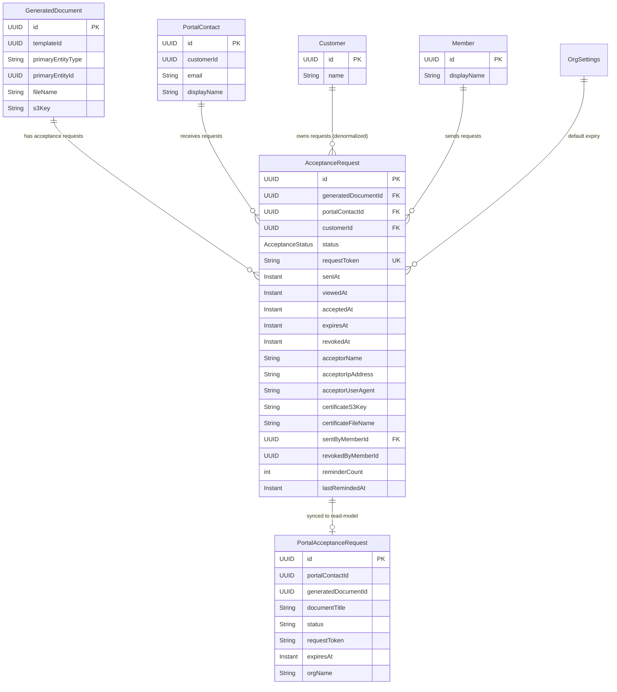
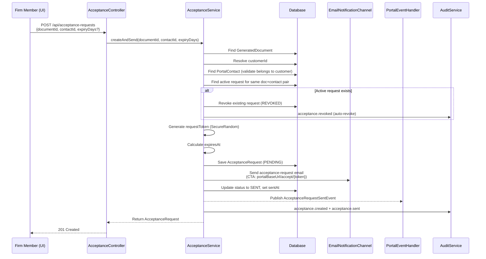
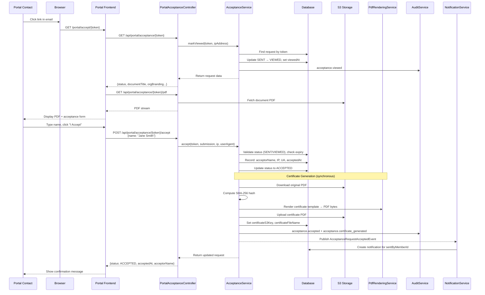
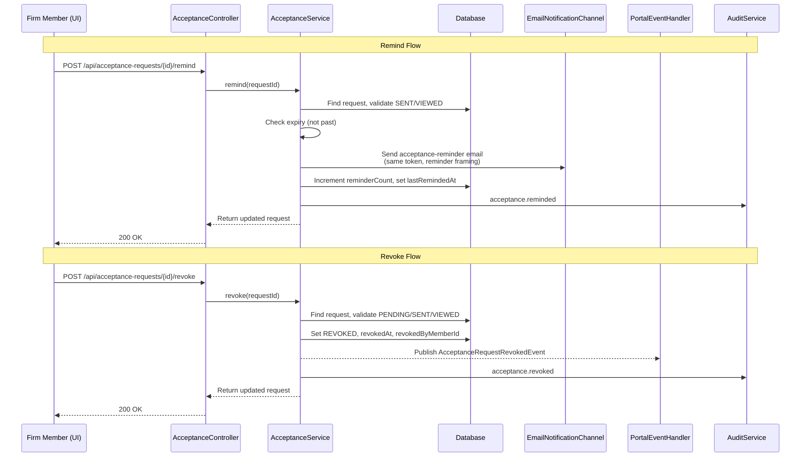

> Merge into architecture/ as standalone Phase 28 doc (phases 5+ use separate files).
> ADRs: 107 (acceptance token strategy), 108 (certificate storage), 109 (portal read-model sync)
> Migration: V45 (tenant), V11 (global/portal read-model)

## 28. Phase 28 — Document Acceptance (Lightweight E-Signing)

Phase 28 adds a **document acceptance workflow** to the DocTeams platform — the ability for firms to send generated documents (engagement letters, proposals, service agreements) to portal contacts for formal acknowledgment, with full audit trail and auto-generated proof-of-acceptance certificates. Until now, generated documents are a dead end: the firm generates a PDF and the workflow stops. Getting a client's acceptance requires downloading the PDF, emailing it manually, and hoping for a reply. There is no tracking, no proof, and no audit trail.

This phase closes that gap. Firms send any generated document to a portal contact via a "Send for Acceptance" action. The client receives an email with a direct link to the acceptance page, views the PDF in-browser, types their full name, and clicks "I Accept." The system records the typed name, timestamp, IP address, and user agent, then auto-generates a Certificate of Acceptance PDF — a tamper-proof document containing the original PDF's SHA-256 hash, all acceptance metadata, and org branding. The firm sees real-time status tracking (Pending, Sent, Viewed, Accepted, Expired, Revoked), can send reminders, and can download the certificate as compliance evidence.

**Dependencies on prior phases**:
- **Phase 12** (Document Templates): `GeneratedDocument` entity, `PdfRenderingService` for certificate generation, S3 storage patterns.
- **Phase 7** (Customer Portal Backend): `PortalContact`, `MagicLinkToken`, portal authentication infrastructure. Portal read-model sync pattern.
- **Phase 6** (Audit & Compliance): `AuditService` and `AuditEventBuilder`. All acceptance state transitions are audited.
- **Phase 6.5** (Notifications): `NotificationService`, `ApplicationEvent` publication pattern. Acceptance triggers in-app notifications.
- **Phase 8** (Rate Cards, Budgets & Profitability): `OrgSettings` entity (extended with branding fields used in certificate rendering).
- **Phase 23** (Email Delivery): `EmailNotificationChannel`, Thymeleaf email template pipeline. Acceptance emails use this infrastructure.
- **Phase 18** (Portal Frontend): Portal Next.js app, layout components, magic-link auth flow. The acceptance page is a new portal route.

### What's New

| Capability | Before Phase 28 | After Phase 28 |
|---|---|---|
| Document acceptance | -- | Send generated documents to portal contacts for formal acceptance via email link |
| Acceptance tracking | -- | Real-time status tracking: Pending, Sent, Viewed, Accepted, Expired, Revoked |
| Certificate of Acceptance | -- | Auto-generated PDF with SHA-256 hash, acceptance metadata, and org branding |
| Acceptance email delivery | -- | Professional acceptance request, reminder, and confirmation emails |
| Portal acceptance page | -- | Dedicated page for viewing PDFs and submitting acceptance with typed name |
| Acceptance audit trail | -- | Every state transition recorded with full metadata (IP, user agent, timestamps) |
| Configurable expiry | -- | Org-level default (30 days) with per-request override |

**Out of scope**: Multi-signer workflows (multiple people accepting one document), counter-signatures (firm signing after client), third-party e-signature integration (DocuSign, HelloSign), canvas-drawn or image-based signatures, automatic/scheduled reminders, bulk send (same document to multiple recipients in one action), non-portal-contact recipients (arbitrary email addresses), customizable acceptance text per org, acceptance conditions or partial acceptance, document negotiation/redlining, SMS delivery, mobile-specific acceptance app, acceptance analytics dashboards, webhook-out for acceptance events.

---

### 28.1 Overview

Phase 28 establishes document acceptance as a first-class workflow in the platform. The design builds on three existing pillars: the generated document pipeline (Phase 12), the portal contact system with magic-link authentication (Phase 7), and the email delivery infrastructure (Phase 23). No new authentication mechanisms are introduced — the acceptance page uses a dedicated acceptance token that authenticates access to a specific acceptance request without requiring a full portal session.

The core abstractions:

1. **AcceptanceRequest** — A tenant-scoped entity tracking the lifecycle of a single acceptance request: which document, which recipient, current status, acceptance metadata (name, IP, user agent), and certificate reference. Each request has a unique cryptographically random token embedded in the acceptance URL.
2. **AcceptanceService** — Orchestrates the acceptance lifecycle: create-and-send, mark-viewed, accept (with certificate generation), revoke, remind, and expiry processing. Thin controllers delegate entirely to this service.
3. **Certificate of Acceptance** — A system-generated, one-page PDF containing the original document's SHA-256 hash, all acceptance metadata, and org branding. Rendered via the existing `PdfRenderingService` (Thymeleaf + OpenHTMLToPDF) and stored as a separate S3 object linked from the `AcceptanceRequest`.
4. **PortalAcceptanceRequest** — A portal read-model entity storing denormalized acceptance data for list views. The acceptance page itself reads live from the main schema via the token-authenticated portal controller — see [ADR-109](../adr/ADR-109-portal-read-model-sync-granularity.md).
5. **Email Templates** — Three Thymeleaf email templates (request, reminder, confirmation) following the established email template pattern.

The acceptance token strategy is the key design decision. Rather than reusing magic-link tokens (which have shorter expiry semantics and require a two-step auth flow), each `AcceptanceRequest` carries its own cryptographically random token that directly authenticates access to the acceptance page. The token is long-lived (matching the acceptance expiry, typically 30 days), can be viewed multiple times, but consumed only once for acceptance. See [ADR-107](../adr/ADR-107-acceptance-token-strategy.md).

---

### 28.2 Domain Model

Phase 28 introduces one new tenant-scoped entity (`AcceptanceRequest`), one portal read-model entity (`PortalAcceptanceRequest`), a new enum (`AcceptanceStatus`), and extends `OrgSettings` with an acceptance configuration field. All new entities follow the established pattern: UUID primary key with `@GeneratedValue(strategy = GenerationType.UUID)`, `Instant` timestamps, no `tenant_id` column (schema-per-tenant isolation), no Lombok.

#### 28.2.1 AcceptanceRequest Entity (New)

An AcceptanceRequest tracks the full lifecycle of a document acceptance request — from creation through send, optional viewing, acceptance (or revocation/expiry), and certificate generation.

| Field | Java Type | DB Column | DB Type | Constraints | Notes |
|-------|-----------|-----------|---------|-------------|-------|
| `id` | `UUID` | `id` | `UUID` | PK, default `gen_random_uuid()` | Auto-generated |
| `generatedDocumentId` | `UUID` | `generated_document_id` | `UUID` | NOT NULL | References `GeneratedDocument`. Loose FK (no DB constraint — the generated document may live in a different lifecycle). |
| `portalContactId` | `UUID` | `portal_contact_id` | `UUID` | NOT NULL | References `PortalContact` — the acceptance recipient. |
| `customerId` | `UUID` | `customer_id` | `UUID` | NOT NULL | Denormalized from the generated document's entity linkage. Enables efficient queries. |
| `status` | `AcceptanceStatus` | `status` | `VARCHAR(20)` | NOT NULL, default `'PENDING'` | Current lifecycle state. |
| `requestToken` | `String` | `request_token` | `VARCHAR(255)` | NOT NULL, UNIQUE | Cryptographically random token embedded in the acceptance URL. |
| `sentAt` | `Instant` | `sent_at` | `TIMESTAMPTZ` | Nullable | When the acceptance email was sent. |
| `viewedAt` | `Instant` | `viewed_at` | `TIMESTAMPTZ` | Nullable | When the recipient first opened the acceptance page. |
| `acceptedAt` | `Instant` | `accepted_at` | `TIMESTAMPTZ` | Nullable | When the recipient clicked accept. |
| `expiresAt` | `Instant` | `expires_at` | `TIMESTAMPTZ` | NOT NULL | When the request expires. |
| `revokedAt` | `Instant` | `revoked_at` | `TIMESTAMPTZ` | Nullable | When the firm revoked the request. |
| `acceptorName` | `String` | `acceptor_name` | `VARCHAR(255)` | Nullable | Full name typed by the recipient at acceptance. |
| `acceptorIpAddress` | `String` | `acceptor_ip_address` | `VARCHAR(45)` | Nullable | IP address captured at acceptance (supports IPv6). |
| `acceptorUserAgent` | `String` | `acceptor_user_agent` | `VARCHAR(500)` | Nullable | User agent string captured at acceptance. |
| `certificateS3Key` | `String` | `certificate_s3_key` | `VARCHAR(1000)` | Nullable | S3 key for the Certificate of Acceptance PDF. |
| `certificateFileName` | `String` | `certificate_file_name` | `VARCHAR(255)` | Nullable | Display filename for the certificate. |
| `sentByMemberId` | `UUID` | `sent_by_member_id` | `UUID` | NOT NULL | The member who initiated the send. |
| `revokedByMemberId` | `UUID` | `revoked_by_member_id` | `UUID` | Nullable | The member who revoked, if applicable. |
| `reminderCount` | `int` | `reminder_count` | `INTEGER` | NOT NULL, default 0 | Number of reminder emails sent. |
| `lastRemindedAt` | `Instant` | `last_reminded_at` | `TIMESTAMPTZ` | Nullable | When the last reminder was sent. |
| `createdAt` | `Instant` | `created_at` | `TIMESTAMPTZ` | NOT NULL | Immutable. |
| `updatedAt` | `Instant` | `updated_at` | `TIMESTAMPTZ` | NOT NULL | Updated on mutation. |

**Design decisions**:
- **Loose references** (UUID columns without DB-level foreign keys) follow the established pattern for cross-entity references in DocTeams. `generatedDocumentId`, `portalContactId`, and `customerId` are validated at the service layer, not via FK constraints. This avoids cascade complexity and allows entities to have independent lifecycles.
- **`customerId` denormalization** — the customer ID could be derived by joining through `GeneratedDocument` → primary entity → `CustomerProject`. Denormalizing it onto `AcceptanceRequest` avoids a multi-hop join for the common query "all pending acceptances for Customer X."
- **`requestToken` is unique globally** (within the tenant schema). Tokens are generated using `java.security.SecureRandom` with URL-safe Base64 encoding (same approach as `MagicLinkService`). Unlike magic-link tokens, acceptance tokens are stored in plaintext — hashing is unnecessary because the token grants read-only access to a specific acceptance page, not full portal session access. The token itself is single-use for acceptance but multi-use for viewing.
- **`sentByMemberId` and `revokedByMemberId`** use UUID type (matching `Member.id`), not String. `revokedByMemberId` is nullable (only set on revocation).
- **`status` as `@Enumerated(EnumType.STRING)`** with explicit `length = 20`. The enum values are short strings that fit comfortably within 20 characters.

**Constraints**:
- `request_token` UNIQUE index — ensures global token uniqueness for direct lookup.
- Partial unique index on `(generated_document_id, portal_contact_id)` WHERE `status IN ('PENDING', 'SENT', 'VIEWED')` — enforces "one active request per document-contact pair." Accepted, expired, and revoked requests do not block new ones.
- Index on `(customer_id, status)` — supports customer-level acceptance list queries.
- Index on `(status, expires_at)` — supports the expiry batch processor.
- Index on `(generated_document_id)` — supports per-document acceptance list queries.

#### 28.2.2 AcceptanceStatus Enum

```java
public enum AcceptanceStatus {
  PENDING,   // Created but email not yet sent (transient — transitions to SENT almost immediately)
  SENT,      // Email sent, awaiting recipient action
  VIEWED,    // Recipient opened the acceptance page
  ACCEPTED,  // Recipient accepted the document
  EXPIRED,   // Request passed its expiresAt deadline
  REVOKED    // Firm revoked the request
}
```

**State transitions**:
- `PENDING` -> `SENT` (email delivery success)
- `SENT` -> `VIEWED` (recipient opens page)
- `SENT` -> `ACCEPTED` (recipient accepts without a tracked "view" event)
- `SENT` -> `EXPIRED` (expiry processor)
- `SENT` -> `REVOKED` (firm revokes)
- `VIEWED` -> `ACCEPTED` (recipient accepts)
- `VIEWED` -> `EXPIRED` (expiry processor)
- `VIEWED` -> `REVOKED` (firm revokes)
- `PENDING` -> `REVOKED` (firm revokes before send completes — edge case)

`ACCEPTED`, `EXPIRED`, and `REVOKED` are terminal states. Once a request reaches a terminal state, it cannot transition further.

#### 28.2.3 PortalAcceptanceRequest (Portal Read-Model)

A denormalized entity in the portal read-model schema (global `V11` migration) for list views in the portal frontend.

| Field | Java Type | DB Column | DB Type | Constraints | Notes |
|-------|-----------|-----------|---------|-------------|-------|
| `id` | `UUID` | `id` | `UUID` | PK | Same ID as the main `AcceptanceRequest` |
| `portalContactId` | `UUID` | `portal_contact_id` | `UUID` | NOT NULL | The recipient |
| `generatedDocumentId` | `UUID` | `generated_document_id` | `UUID` | NOT NULL | The document |
| `documentTitle` | `String` | `document_title` | `VARCHAR(500)` | NOT NULL | Denormalized from GeneratedDocument.fileName |
| `documentFileName` | `String` | `document_file_name` | `VARCHAR(500)` | NOT NULL | Denormalized |
| `status` | `String` | `status` | `VARCHAR(20)` | NOT NULL | Acceptance status |
| `requestToken` | `String` | `request_token` | `VARCHAR(255)` | NOT NULL | For constructing acceptance page links |
| `sentAt` | `Instant` | `sent_at` | `TIMESTAMPTZ` | Nullable | When sent |
| `expiresAt` | `Instant` | `expires_at` | `TIMESTAMPTZ` | NOT NULL | When the request expires |
| `orgName` | `String` | `org_name` | `VARCHAR(255)` | NOT NULL | For display/branding |
| `orgLogo` | `String` | `org_logo` | `VARCHAR(500)` | Nullable | S3 key for org logo |
| `createdAt` | `Instant` | `created_at` | `TIMESTAMPTZ` | NOT NULL | Immutable |

**Design decisions**:
- The portal read-model stores enough for list views (document title, status, expiry), but the acceptance page itself reads live from the main schema via the token-authenticated `PortalAcceptanceController`. See [ADR-109](../adr/ADR-109-portal-read-model-sync-granularity.md) for the rationale: acceptance is a transactional action where stale status could lead to accepting a revoked request.
- `documentTitle` is denormalized from `GeneratedDocument.fileName` (the display name). This avoids a cross-schema join in the portal read-model query.
- The `documentS3Key` is intentionally omitted from the read-model. PDF access goes through the token-authenticated portal controller, which verifies status and expiry before streaming the file.

#### 28.2.4 OrgSettings Extension (Modified)

Add one new field to the existing `OrgSettings` entity:

| Field | Java Type | DB Column | DB Type | Constraints | Notes |
|-------|-----------|-----------|---------|-------------|-------|
| `acceptanceExpiryDays` | `Integer` | `acceptance_expiry_days` | `INTEGER` | Nullable | Default expiry period for acceptance requests. Null = 30 days. Min 1, max 365. |

The field is nullable with a convention-based default: when `AcceptanceService.createAndSend()` calculates `expiresAt` and neither a per-request override nor the org setting is provided, it falls back to 30 days. This avoids requiring a migration to backfill existing rows.

#### 28.2.5 Entity Relationship Diagram



---

### 28.3 Core Flows and Backend Behaviour

#### 28.3.1 Create & Send Flow

The `createAndSend()` method is the entry point for initiating an acceptance request. It validates inputs, handles duplicate detection (auto-revoking any existing active request for the same document-contact pair), creates the request, sends the email, and transitions to `SENT`.

```java
@Transactional
public AcceptanceRequest createAndSend(UUID generatedDocumentId, UUID portalContactId, Integer expiryDays) {
    // 1. Validate GeneratedDocument exists
    // 2. Resolve customerId from the generated document's primaryEntityType/primaryEntityId
    // 3. Validate PortalContact exists and belongs to the same customer
    // 4. Check for existing active request (PENDING/SENT/VIEWED) for this document-contact pair
    //    → If found, auto-revoke it (transition to REVOKED, set revokedAt/revokedByMemberId)
    // 5. Generate cryptographically random requestToken (SecureRandom, URL-safe Base64, 32 bytes)
    // 6. Calculate expiresAt:
    //    → Use expiryDays if provided
    //    → Else use orgSettings.getAcceptanceExpiryDays() if non-null
    //    → Else default to 30 days
    // 7. Create AcceptanceRequest with status=PENDING
    // 8. Send acceptance email via EmailNotificationChannel
    // 9. Transition status to SENT, set sentAt
    // 10. Publish AcceptanceRequestSentEvent (for portal read-model sync)
    // 11. Record audit event: acceptance.created + acceptance.sent
    // 12. Return the created request
}
```

**RBAC**: ADMIN or OWNER only. Checked via `RequestScopes.ORG_ROLE`.

**Token generation**: Uses `java.security.SecureRandom` to generate 32 random bytes, encoded as URL-safe Base64 (43 characters). The token is stored in plaintext on `AcceptanceRequest.requestToken` (not hashed — see ADR-107 rationale). The token is globally unique within the tenant schema via the UNIQUE constraint.

**Customer resolution**: The `customerId` is resolved by looking up the `GeneratedDocument`, then finding the associated customer:
- If `primaryEntityType` is `CUSTOMER`, `customerId = primaryEntityId`
- If `primaryEntityType` is `PROJECT`, look up `CustomerProject` to find the customer
- If `primaryEntityType` is `INVOICE`, look up `Invoice.customerId`

#### 28.3.2 View Flow

The `markViewed()` method is called when the portal contact opens the acceptance page. It is idempotent — viewing an already-viewed or accepted request is a no-op.

```java
@Transactional
public AcceptanceRequest markViewed(String requestToken, String ipAddress) {
    // 1. Look up AcceptanceRequest by requestToken
    //    → Not found: throw ResourceNotFoundException
    // 2. Check expiry: if Instant.now().isAfter(expiresAt)
    //    → Transition to EXPIRED, record audit event, throw AcceptanceExpiredException
    // 3. Check status:
    //    → SENT: transition to VIEWED, set viewedAt, record audit event (details: IP)
    //    → VIEWED or ACCEPTED: no-op (idempotent)
    //    → EXPIRED: throw AcceptanceExpiredException
    //    → REVOKED: throw AcceptanceRevokedException
    //    → PENDING: throw IllegalStateException (should not be possible — email not sent yet)
    // 4. Publish AcceptanceRequestViewedEvent (for potential portal read-model status update)
    // 5. Return the request
}
```

**Auth**: Token-based. The `requestToken` in the URL path authenticates access. No portal session required.

#### 28.3.3 Accept Flow

The `accept()` method records the acceptance, generates the certificate, and notifies the firm.

```java
@Transactional
public AcceptanceRequest accept(String requestToken, AcceptanceSubmission submission,
                                 String ipAddress, String userAgent) {
    // 1. Look up AcceptanceRequest by requestToken
    //    → Not found: throw ResourceNotFoundException
    // 2. Check status: must be SENT or VIEWED
    //    → ACCEPTED: throw AlreadyAcceptedException (idempotent-safe error)
    //    → EXPIRED/REVOKED: throw appropriate exception
    // 3. Check expiry: if past, transition to EXPIRED, throw AcceptanceExpiredException
    // 4. Record acceptance metadata:
    //    → acceptorName = submission.name()
    //    → acceptorIpAddress = ipAddress
    //    → acceptorUserAgent = userAgent
    //    → acceptedAt = Instant.now()
    // 5. Transition status to ACCEPTED
    // 6. Generate certificate (synchronous — see 28.3.4)
    // 7. Send confirmation email to the portal contact
    // 8. Publish AcceptanceRequestAcceptedEvent (for portal read-model sync + notifications)
    // 9. Record audit event: acceptance.accepted
    // 10. Return the updated request
}
```

`AcceptanceSubmission` is a simple record:

```java
public record AcceptanceSubmission(String name) {}
```

**RBAC**: Token-based authentication. The `requestToken` grants access to this specific acceptance request. IP address and user agent are extracted from the HTTP request by the controller and passed to the service.

#### 28.3.4 Certificate Generation

Certificate generation is synchronous within the `accept()` transaction. The certificate is a single-page PDF — fast to render (under 100ms) — so async adds complexity without meaningful benefit.

```java
private void generateCertificate(AcceptanceRequest request) {
    // 1. Fetch the original document PDF bytes from S3
    GeneratedDocument genDoc = generatedDocumentRepository.findById(request.getGeneratedDocumentId())
        .orElseThrow();
    byte[] originalPdf = storageService.download(genDoc.getS3Key());

    // 2. Compute SHA-256 hash of the original PDF
    String documentHash = sha256Hex(originalPdf);

    // 3. Build Thymeleaf context for the certificate template
    Context ctx = new Context();
    ctx.setVariable("documentTitle", genDoc.getFileName());
    ctx.setVariable("orgName", orgName);  // from OrgSettings or Organization
    ctx.setVariable("orgLogo", logoUrl);  // presigned S3 URL or base64
    ctx.setVariable("brandColor", orgSettings.getBrandColor());
    ctx.setVariable("recipientName", portalContact.getDisplayName());
    ctx.setVariable("recipientEmail", portalContact.getEmail());
    ctx.setVariable("acceptorName", request.getAcceptorName());
    ctx.setVariable("acceptedAt", request.getAcceptedAt());
    ctx.setVariable("ipAddress", request.getAcceptorIpAddress());
    ctx.setVariable("userAgent", request.getAcceptorUserAgent());
    ctx.setVariable("documentHash", documentHash);
    ctx.setVariable("requestId", request.getId());

    // 4. Render Thymeleaf template (classpath:templates/certificates/certificate-of-acceptance.html)
    String html = templateEngine.process("certificates/certificate-of-acceptance", ctx);

    // 5. Convert HTML to PDF via PdfRenderingService.htmlToPdf()
    byte[] certPdf = pdfRenderingService.htmlToPdf(html);

    // 6. Upload to S3
    String s3Key = tenantSchema + "/certificates/" + request.getId() + "/certificate.pdf";
    String fileName = "Certificate-of-Acceptance-" + slugify(genDoc.getFileName())
        + "-" + LocalDate.now() + ".pdf";
    storageService.upload(s3Key, certPdf, "application/pdf");

    // 7. Store references on the request
    request.setCertificateS3Key(s3Key);
    request.setCertificateFileName(fileName);

    // 8. Record audit event: acceptance.certificate_generated
}
```

**S3 key pattern**: `{tenantSchema}/certificates/{requestId}/certificate.pdf`. The `certificates/` segment separates acceptance certificates from generated documents (`generated/`) and uploaded documents. The `requestId` subdirectory scopes the certificate to its parent request.

**SHA-256 computation**: Uses `java.security.MessageDigest` to compute the hash of the raw PDF bytes retrieved from S3. The hash is included in the certificate as tamper-evidence — if the original PDF is ever modified, the hash in the certificate will not match.

**Thymeleaf engine**: Uses the Spring-managed `TemplateEngine` with the classpath resolver (not the `StringTemplateResolver` used for user-editable document templates). Certificate templates are system-managed, not user-editable.

#### 28.3.5 Revoke Flow

```java
@Transactional
public AcceptanceRequest revoke(UUID requestId) {
    // 1. Look up AcceptanceRequest by ID
    // 2. Validate status is PENDING, SENT, or VIEWED
    //    → ACCEPTED/EXPIRED/REVOKED: throw IllegalStateException
    // 3. Transition to REVOKED
    // 4. Set revokedAt = Instant.now()
    // 5. Set revokedByMemberId from RequestScopes.MEMBER_ID
    // 6. Publish AcceptanceRequestRevokedEvent (for portal read-model sync)
    // 7. Record audit event: acceptance.revoked
    // 8. Return the updated request
}
```

**RBAC**: ADMIN or OWNER only. If the request has already been accepted, it cannot be revoked — the certificate remains as a permanent record.

#### 28.3.6 Remind Flow

```java
@Transactional
public AcceptanceRequest remind(UUID requestId) {
    // 1. Look up AcceptanceRequest by ID
    // 2. Validate status is SENT or VIEWED
    //    → Other statuses: throw IllegalStateException
    // 3. Check expiry: if past, transition to EXPIRED, throw AcceptanceExpiredException
    // 4. Re-send the acceptance email using the SAME requestToken (not a new token)
    // 5. Increment reminderCount
    // 6. Set lastRemindedAt = Instant.now()
    // 7. Record audit event: acceptance.reminded (details: reminderCount, recipient email)
    // 8. Return the updated request
}
```

**RBAC**: ADMIN or OWNER only. The reminder re-sends the email with the same acceptance link — the token does not change. This is intentional: changing the token would invalidate any bookmarked links the recipient may have saved.

#### 28.3.7 Expiry Processing

```java
@Scheduled(fixedDelay = 3600000) // every hour
@Transactional
public void processExpired() {
    // 1. Find all requests where status IN (PENDING, SENT, VIEWED) AND expiresAt < Instant.now()
    // 2. For each: transition to EXPIRED, record audit event
    // 3. Log count of expired requests
}
```

The `@Scheduled` annotation runs the processor as a background task. The interval (1 hour) is generous — expiry is soft, and a few minutes of delay is acceptable. The processor is idempotent and safe to run multiple times.

Additionally, the `markViewed()` and `accept()` methods check expiry inline — a request that has passed its `expiresAt` is transitioned to `EXPIRED` on access, even if the batch processor hasn't run yet. This ensures the portal contact sees an immediate "expired" message rather than being allowed to proceed.

#### 28.3.8 Portal Read-Model Sync

Domain events drive portal read-model synchronization, following the established pattern in `customerbackend/handler/PortalEventHandler.java`.

| Domain Event | Portal Read-Model Action |
|---|---|
| `AcceptanceRequestSentEvent` | Create `PortalAcceptanceRequest` with document title, status, token, org branding |
| `AcceptanceRequestAcceptedEvent` | Update status to `ACCEPTED` |
| `AcceptanceRequestRevokedEvent` | Update status to `REVOKED` |
| `AcceptanceRequestExpiredEvent` | Update status to `EXPIRED` |

Events are published via `ApplicationEventPublisher` within the same transaction. The `PortalEventHandler` listens with `@TransactionalEventListener(phase = AFTER_COMMIT)` for read-model updates — this ensures the main schema commit succeeds before the read-model is updated. See [ADR-109](../adr/ADR-109-portal-read-model-sync-granularity.md).

New domain event classes in `acceptance/event/`:

```java
public record AcceptanceRequestSentEvent(UUID requestId, UUID generatedDocumentId,
    UUID portalContactId, UUID customerId, String documentTitle, String documentFileName,
    String requestToken, Instant expiresAt, String orgName, String orgLogo) implements DomainEvent {}

public record AcceptanceRequestViewedEvent(UUID requestId, String ipAddress) implements DomainEvent {}
public record AcceptanceRequestAcceptedEvent(UUID requestId) implements DomainEvent {}
public record AcceptanceRequestRevokedEvent(UUID requestId) implements DomainEvent {}
public record AcceptanceRequestExpiredEvent(UUID requestId) implements DomainEvent {}
```

---

### 28.4 API Surface

#### 28.4.1 AcceptanceController (`/api/acceptance-requests`)

Firm-facing endpoints for managing acceptance requests. All endpoints require tenant context (schema-per-tenant).

| Method | Path | Description | Auth | Read/Write |
|--------|------|-------------|------|------------|
| `POST` | `/api/acceptance-requests` | Create and send an acceptance request | ADMIN/OWNER | Write |
| `GET` | `/api/acceptance-requests?documentId={id}` | List requests for a document | MEMBER+ | Read |
| `GET` | `/api/acceptance-requests?customerId={id}` | List requests for a customer | MEMBER+ | Read |
| `GET` | `/api/acceptance-requests/{id}` | Get request detail (includes acceptance metadata) | MEMBER+ | Read |
| `POST` | `/api/acceptance-requests/{id}/remind` | Re-send acceptance email | ADMIN/OWNER | Write |
| `POST` | `/api/acceptance-requests/{id}/revoke` | Revoke a pending request | ADMIN/OWNER | Write |
| `GET` | `/api/acceptance-requests/{id}/certificate` | Download Certificate of Acceptance PDF | MEMBER+ | Read |

**Request/response shapes**:

**POST `/api/acceptance-requests`**
```json
// Request
{
  "generatedDocumentId": "uuid",
  "portalContactId": "uuid",
  "expiryDays": 30  // optional, overrides org default
}

// Response (201 Created)
{
  "id": "uuid",
  "generatedDocumentId": "uuid",
  "portalContactId": "uuid",
  "customerId": "uuid",
  "status": "SENT",
  "sentAt": "2026-02-27T10:00:00Z",
  "expiresAt": "2026-03-29T10:00:00Z",
  "reminderCount": 0,
  "createdAt": "2026-02-27T10:00:00Z"
}
```

**GET `/api/acceptance-requests/{id}`**
```json
// Response
{
  "id": "uuid",
  "generatedDocumentId": "uuid",
  "portalContactId": "uuid",
  "customerId": "uuid",
  "status": "ACCEPTED",
  "sentAt": "2026-02-27T10:00:00Z",
  "viewedAt": "2026-02-27T14:00:00Z",
  "acceptedAt": "2026-02-27T14:05:00Z",
  "expiresAt": "2026-03-29T10:00:00Z",
  "acceptorName": "Jane Smith",
  "acceptorIpAddress": "203.0.113.42",
  "acceptorUserAgent": "Mozilla/5.0 ...",
  "certificateS3Key": "tenant_abc/certificates/uuid/certificate.pdf",
  "certificateFileName": "Certificate-of-Acceptance-engagement-letter-2026-02-27.pdf",
  "sentByMemberId": "uuid",
  "reminderCount": 1,
  "lastRemindedAt": "2026-02-28T10:00:00Z",
  "createdAt": "2026-02-27T10:00:00Z",
  "updatedAt": "2026-02-27T14:05:00Z",
  "portalContact": {
    "id": "uuid",
    "displayName": "Jane Smith",
    "email": "jane@client.com"
  },
  "generatedDocument": {
    "id": "uuid",
    "fileName": "Engagement-Letter-Acme-2026-02-27.pdf"
  }
}
```

**GET `/api/acceptance-requests/{id}/certificate`**
Returns the certificate PDF. Implementation options:
- Stream the PDF directly from S3 (sets `Content-Type: application/pdf`, `Content-Disposition: attachment; filename="..."`)
- Generate a presigned S3 URL and redirect (302)

The streaming approach is preferred for consistency with existing document download endpoints.

#### 28.4.2 PortalAcceptanceController (`/api/portal/acceptance`)

Portal-facing endpoints authenticated via the acceptance request token. These do not require a full portal session — the token in the URL path is the authentication credential.

| Method | Path | Description | Auth | Read/Write |
|--------|------|-------------|------|------------|
| `GET` | `/api/portal/acceptance/{token}` | Get acceptance page data + trigger markViewed | Token | Read (+ side-effect) |
| `GET` | `/api/portal/acceptance/{token}/pdf` | Stream/redirect to the document PDF | Token | Read |
| `POST` | `/api/portal/acceptance/{token}/accept` | Submit acceptance | Token | Write |

**GET `/api/portal/acceptance/{token}`**
```json
// Response
{
  "requestId": "uuid",
  "status": "SENT",
  "documentTitle": "Engagement-Letter-Acme-2026-02-27.pdf",
  "documentFileName": "Engagement-Letter-Acme-2026-02-27.pdf",
  "expiresAt": "2026-03-29T10:00:00Z",
  "orgName": "Smith & Associates",
  "orgLogo": "https://s3.../logo.png",
  "brandColor": "#1a5276",
  "acceptedAt": null,
  "acceptorName": null
}
```

This endpoint reads live from the main tenant schema (not the portal read-model). It also calls `markViewed()` as a side effect — the first time this endpoint is called for a `SENT` request, the status transitions to `VIEWED`.

**POST `/api/portal/acceptance/{token}/accept`**
```json
// Request
{
  "name": "Jane Smith"
}

// Response (200 OK)
{
  "status": "ACCEPTED",
  "acceptedAt": "2026-02-27T14:05:00Z",
  "acceptorName": "Jane Smith"
}
```

The controller extracts `ipAddress` from `HttpServletRequest.getRemoteAddr()` (accounting for `X-Forwarded-For` behind a proxy) and `userAgent` from the `User-Agent` header.

---

### 28.5 Sequence Diagrams

#### 28.5.1 Send for Acceptance



#### 28.5.2 View & Accept



#### 28.5.3 Revoke & Remind



---

### 28.6 Email Templates

All email templates live in `backend/src/main/resources/templates/email/` alongside existing notification emails. They extend the existing `base.html` layout for consistent branding.

#### 28.6.1 acceptance-request.html

**Subject**: `{orgName} -- Document for your acceptance: {documentFileName}`

| Variable | Type | Description |
|----------|------|-------------|
| `orgName` | `String` | Organization name |
| `orgLogo` | `String` | URL to org logo (nullable) |
| `brandColor` | `String` | Org brand color hex (nullable, default #1a5276) |
| `contactName` | `String` | Portal contact display name |
| `documentFileName` | `String` | Generated document file name |
| `acceptanceUrl` | `String` | Full URL: `{portalBaseUrl}/accept/{requestToken}` |
| `expiresAt` | `Instant` | Request expiry timestamp |

**Content structure**:
1. Org branding header (logo + name)
2. Greeting: "Dear {contactName},"
3. Body: "{orgName} has sent you a document for your review and acceptance."
4. Document title callout box
5. CTA button: "Review & Accept" (links to `acceptanceUrl`)
6. Expiry note: "This request expires on {expiresAt formatted}."
7. Footer: "If you did not expect this email, you can safely ignore it."

#### 28.6.2 acceptance-reminder.html

**Subject**: `Reminder: {orgName} -- Document awaiting your acceptance`

| Variable | Type | Description |
|----------|------|-------------|
| `orgName` | `String` | Organization name |
| `orgLogo` | `String` | URL to org logo |
| `brandColor` | `String` | Org brand color hex |
| `contactName` | `String` | Portal contact display name |
| `documentFileName` | `String` | Generated document file name |
| `acceptanceUrl` | `String` | Full URL (same token as original) |
| `sentAt` | `Instant` | Original send date |
| `expiresAt` | `Instant` | Request expiry timestamp |

**Content structure**:
1. Org branding header
2. Greeting: "Dear {contactName},"
3. Body: "This is a reminder that {orgName} sent you a document for acceptance on {sentAt formatted}."
4. Document title callout box
5. CTA button: "Review & Accept"
6. Expiry note with urgency if close to expiry
7. Footer

#### 28.6.3 acceptance-confirmation.html

**Subject**: `Confirmed: You have accepted {documentFileName}`

Sent to the portal contact after they accept.

| Variable | Type | Description |
|----------|------|-------------|
| `orgName` | `String` | Organization name |
| `orgLogo` | `String` | URL to org logo |
| `brandColor` | `String` | Org brand color hex |
| `contactName` | `String` | Portal contact display name |
| `documentFileName` | `String` | Generated document file name |
| `acceptedAt` | `Instant` | Acceptance timestamp |

**Content structure**:
1. Org branding header
2. Greeting: "Dear {contactName},"
3. Confirmation: "You have successfully accepted the following document:"
4. Document title callout box with acceptance timestamp
5. Note: "A record of your acceptance has been saved. You can view the document in your portal at any time."
6. Footer

#### 28.6.4 Firm Notification (In-App)

When a document is accepted, create an in-app notification for the member who sent the request via the existing `NotificationService`:

```java
notificationService.createNotification(
    request.getSentByMemberId(),
    "ACCEPTANCE_COMPLETED",
    contactName + " has accepted " + document.getFileName(),
    "Accepted on " + formattedDate,
    "ACCEPTANCE_REQUEST",
    request.getId(),
    null  // no project reference
);
```

This adds a new notification type `ACCEPTANCE_COMPLETED` to the registered types list.

---

### 28.7 Certificate of Acceptance

#### 28.7.1 Template Structure

The certificate template lives at `backend/src/main/resources/templates/certificates/certificate-of-acceptance.html`. It is a system-managed Thymeleaf template — not user-editable.

**Content layout**:

```
+--------------------------------------------------+
|  [Org Logo]   CERTIFICATE OF ACCEPTANCE           |
|               {orgName}                           |
+--------------------------------------------------+
|                                                    |
|  Document:     {documentTitle}                    |
|  File:         {documentFileName}                 |
|                                                    |
|  Organization: {orgName}                          |
|                                                    |
|  Recipient:    {recipientName}                    |
|                {recipientEmail}                    |
|                                                    |
|  ----- Acceptance Record -----                    |
|                                                    |
|  Statement:    "I, {acceptorName}, accept this    |
|                 document."                        |
|                                                    |
|  Accepted at:  {acceptedAt} (UTC)                 |
|  IP Address:   {acceptorIpAddress}                |
|  User Agent:   {acceptorUserAgent}                |
|                                                    |
|  ----- Document Integrity -----                   |
|                                                    |
|  SHA-256 Hash: {documentHash}                     |
|  Request ID:   {requestId}                        |
|                                                    |
+--------------------------------------------------+
|  This certificate was automatically generated by  |
|  {orgName} via DocTeams. It serves as a record    |
|  of electronic acceptance.                        |
|  Generated: {generatedAt}                         |
+--------------------------------------------------+
```

#### 28.7.2 Template Variables

| Variable | Type | Description |
|----------|------|-------------|
| `orgName` | `String` | Organization name |
| `orgLogo` | `String` | Base64-encoded logo or presigned S3 URL |
| `brandColor` | `String` | Hex color for header/accents |
| `documentTitle` | `String` | Generated document file name |
| `recipientName` | `String` | Portal contact display name |
| `recipientEmail` | `String` | Portal contact email |
| `acceptorName` | `String` | Name typed at acceptance |
| `acceptedAt` | `Instant` | Acceptance timestamp (formatted UTC) |
| `ipAddress` | `String` | Acceptor IP address |
| `userAgent` | `String` | Acceptor user agent |
| `documentHash` | `String` | SHA-256 hex of original PDF |
| `requestId` | `UUID` | Acceptance request ID |
| `generatedAt` | `Instant` | Certificate generation timestamp |

#### 28.7.3 S3 Storage

- **Key pattern**: `{tenantSchema}/certificates/{requestId}/certificate.pdf`
- **Content type**: `application/pdf`
- **Display filename**: `Certificate-of-Acceptance-{slugified-document-name}-{date}.pdf`
  - Example: `Certificate-of-Acceptance-engagement-letter-acme-2026-02-27.pdf`

#### 28.7.4 PdfRenderingService Integration

The certificate uses `PdfRenderingService.htmlToPdf(String html)` — the low-level HTML-to-PDF conversion method. It does not use the higher-level `generatePdf(templateId, entityId, memberId)` method because:
1. The certificate template is a classpath resource, not a DB-stored `DocumentTemplate`
2. The context is manually assembled (not via a `TemplateContextBuilder`)
3. The certificate has no entity-type dispatch

The Thymeleaf rendering uses Spring's standard `TemplateEngine` (classpath resolver) rather than the `StringTemplateResolver` used for user-editable document templates. This is the correct choice because certificate templates are system-managed files on the classpath.

---

### 28.8 Database Migrations

#### 28.8.1 V45 — Tenant Migration: `acceptance_requests` + `org_settings` extension

```sql
-- V45__create_acceptance_requests.sql

CREATE TABLE acceptance_requests (
    id              UUID PRIMARY KEY DEFAULT gen_random_uuid(),
    generated_document_id UUID NOT NULL,
    portal_contact_id     UUID NOT NULL,
    customer_id           UUID NOT NULL,
    status                VARCHAR(20) NOT NULL DEFAULT 'PENDING',
    request_token         VARCHAR(255) NOT NULL,
    sent_at               TIMESTAMPTZ,
    viewed_at             TIMESTAMPTZ,
    accepted_at           TIMESTAMPTZ,
    expires_at            TIMESTAMPTZ NOT NULL,
    revoked_at            TIMESTAMPTZ,
    acceptor_name         VARCHAR(255),
    acceptor_ip_address   VARCHAR(45),
    acceptor_user_agent   VARCHAR(500),
    certificate_s3_key    VARCHAR(1000),
    certificate_file_name VARCHAR(255),
    sent_by_member_id     UUID NOT NULL,
    revoked_by_member_id  UUID,
    reminder_count        INTEGER NOT NULL DEFAULT 0,
    last_reminded_at      TIMESTAMPTZ,
    created_at            TIMESTAMPTZ NOT NULL DEFAULT now(),
    updated_at            TIMESTAMPTZ NOT NULL DEFAULT now()
);

-- Unique token for direct lookup from portal
CREATE UNIQUE INDEX idx_acceptance_requests_token
    ON acceptance_requests (request_token);

-- One active request per document-contact pair
-- (PENDING, SENT, VIEWED are "active" statuses; ACCEPTED, EXPIRED, REVOKED are terminal)
CREATE UNIQUE INDEX idx_acceptance_requests_active_unique
    ON acceptance_requests (generated_document_id, portal_contact_id)
    WHERE status IN ('PENDING', 'SENT', 'VIEWED');

-- Customer-level queries ("all acceptances for customer X")
CREATE INDEX idx_acceptance_requests_customer_status
    ON acceptance_requests (customer_id, status);

-- Per-document queries ("all acceptances for document Y")
CREATE INDEX idx_acceptance_requests_document
    ON acceptance_requests (generated_document_id);

-- Expiry batch processing
CREATE INDEX idx_acceptance_requests_expiry
    ON acceptance_requests (status, expires_at)
    WHERE status IN ('PENDING', 'SENT', 'VIEWED');

-- OrgSettings extension: acceptance expiry default
ALTER TABLE org_settings
    ADD COLUMN acceptance_expiry_days INTEGER;
```

#### 28.8.2 V11 — Global Migration: `portal_acceptance_requests` (Portal Read-Model)

```sql
-- V11__portal_acceptance_requests.sql

CREATE TABLE portal_acceptance_requests (
    id                    UUID PRIMARY KEY,
    portal_contact_id     UUID NOT NULL,
    generated_document_id UUID NOT NULL,
    document_title        VARCHAR(500) NOT NULL,
    document_file_name    VARCHAR(500) NOT NULL,
    status                VARCHAR(20) NOT NULL,
    request_token         VARCHAR(255) NOT NULL,
    sent_at               TIMESTAMPTZ,
    expires_at            TIMESTAMPTZ NOT NULL,
    org_name              VARCHAR(255) NOT NULL,
    org_logo              VARCHAR(500),
    created_at            TIMESTAMPTZ NOT NULL DEFAULT now()
);

-- Portal contact's pending acceptances
CREATE INDEX idx_portal_acceptance_contact_status
    ON portal_acceptance_requests (portal_contact_id, status);

-- Token lookup (for constructing links in portal list views)
CREATE INDEX idx_portal_acceptance_token
    ON portal_acceptance_requests (request_token);
```

---

### 28.9 Implementation Guidance

#### 28.9.1 Backend Changes

| File (relative to `backend/src/main/java/.../`) | Change |
|---|---|
| `acceptance/AcceptanceRequest.java` | New entity (see 28.2.1) |
| `acceptance/AcceptanceStatus.java` | New enum (see 28.2.2) |
| `acceptance/AcceptanceRequestRepository.java` | New JPA repository with custom finders |
| `acceptance/AcceptanceService.java` | New service: createAndSend, markViewed, accept, revoke, remind, processExpired |
| `acceptance/AcceptanceController.java` | New REST controller: `/api/acceptance-requests` (see 28.4.1) |
| `acceptance/PortalAcceptanceController.java` | New portal controller: `/api/portal/acceptance/{token}` (see 28.4.2) |
| `acceptance/AcceptanceSubmission.java` | New record: `{ name: String }` |
| `acceptance/AcceptanceCertificateService.java` | New service: certificate generation (SHA-256, Thymeleaf, PDF, S3 upload) |
| `acceptance/event/AcceptanceRequestSentEvent.java` | New domain event |
| `acceptance/event/AcceptanceRequestAcceptedEvent.java` | New domain event |
| `acceptance/event/AcceptanceRequestRevokedEvent.java` | New domain event |
| `acceptance/event/AcceptanceRequestViewedEvent.java` | New domain event |
| `acceptance/event/AcceptanceRequestExpiredEvent.java` | New domain event |
| `customerbackend/model/PortalAcceptanceView.java` | New portal read-model view record |
| `customerbackend/handler/PortalEventHandler.java` | Add handlers for acceptance events |
| `customerbackend/repository/PortalReadModelRepository.java` | Add portal acceptance CRUD methods |
| `notification/NotificationService.java` | Add `handleAcceptanceAccepted()` handler |
| `notification/NotificationEventHandler.java` | Add `@EventListener` for `AcceptanceRequestAcceptedEvent` |
| `settings/OrgSettings.java` | Add `acceptanceExpiryDays` field + getter/setter |
| `settings/OrgSettingsService.java` | Add update method for acceptance settings |
| `settings/OrgSettingsController.java` | Add endpoint for acceptance settings |

| Resource file | Change |
|---|---|
| `templates/email/acceptance-request.html` | New email template (see 28.6.1) |
| `templates/email/acceptance-reminder.html` | New email template (see 28.6.2) |
| `templates/email/acceptance-confirmation.html` | New email template (see 28.6.3) |
| `templates/certificates/certificate-of-acceptance.html` | New certificate template (see 28.7) |
| `db/migration/tenant/V45__create_acceptance_requests.sql` | New migration (see 28.8.1) |
| `db/migration/global/V11__portal_acceptance_requests.sql` | New migration (see 28.8.2) |

#### 28.9.2 Frontend Changes

| File (relative to `frontend/`) | Change |
|---|---|
| `app/(app)/org/[slug]/settings/page.tsx` | Add "Document Acceptance" section with expiry days config |
| `components/acceptance/SendForAcceptanceDialog.tsx` | New dialog: recipient picker, expiry override, send action |
| `components/acceptance/AcceptanceStatusBadge.tsx` | New component: colored badge for acceptance status |
| `components/acceptance/AcceptanceDetailPanel.tsx` | New component: expandable detail with metadata, remind/revoke actions, certificate download |
| `components/generated-documents/GeneratedDocumentRow.tsx` | Add "Send for Acceptance" action menu item, acceptance status badge |
| `lib/api/acceptance.ts` | New API client functions for acceptance endpoints |
| `app/portal/accept/[token]/page.tsx` | New portal page: PDF viewer, acceptance form, confirmation state |
| `app/portal/(authenticated)/page.tsx` or documents page | Add "Pending Acceptances" section to portal dashboard/documents |

#### 28.9.3 Entity Code Pattern

Follow the `GeneratedDocument` pattern exactly:

```java
package io.b2mash.b2b.b2bstrawman.acceptance;

import jakarta.persistence.Column;
import jakarta.persistence.Entity;
import jakarta.persistence.EnumType;
import jakarta.persistence.Enumerated;
import jakarta.persistence.GeneratedValue;
import jakarta.persistence.GenerationType;
import jakarta.persistence.Id;
import jakarta.persistence.Table;
import java.time.Instant;
import java.util.UUID;

@Entity
@Table(name = "acceptance_requests")
public class AcceptanceRequest {

  @Id
  @GeneratedValue(strategy = GenerationType.UUID)
  private UUID id;

  @Column(name = "generated_document_id", nullable = false)
  private UUID generatedDocumentId;

  @Column(name = "portal_contact_id", nullable = false)
  private UUID portalContactId;

  @Column(name = "customer_id", nullable = false)
  private UUID customerId;

  @Enumerated(EnumType.STRING)
  @Column(name = "status", nullable = false, length = 20)
  private AcceptanceStatus status;

  @Column(name = "request_token", nullable = false, length = 255)
  private String requestToken;

  // ... remaining fields follow the same column-mapping pattern

  protected AcceptanceRequest() {}

  public AcceptanceRequest(UUID generatedDocumentId, UUID portalContactId, UUID customerId,
      String requestToken, Instant expiresAt, UUID sentByMemberId) {
    this.generatedDocumentId = generatedDocumentId;
    this.portalContactId = portalContactId;
    this.customerId = customerId;
    this.status = AcceptanceStatus.PENDING;
    this.requestToken = requestToken;
    this.expiresAt = expiresAt;
    this.sentByMemberId = sentByMemberId;
    this.reminderCount = 0;
    this.createdAt = Instant.now();
    this.updatedAt = Instant.now();
  }

  // Lifecycle methods
  public void markSent() { ... }
  public void markViewed(Instant viewedAt) { ... }
  public void markAccepted(String name, String ip, String ua) { ... }
  public void markRevoked(UUID revokedBy) { ... }
  public void markExpired() { ... }
  public void recordReminder() { ... }
  public void setCertificate(String s3Key, String fileName) { ... }

  public boolean isActive() {
    return status == AcceptanceStatus.PENDING
        || status == AcceptanceStatus.SENT
        || status == AcceptanceStatus.VIEWED;
  }

  public boolean isExpired() {
    return Instant.now().isAfter(expiresAt);
  }

  // Getters (no setters for immutable fields)
}
```

Key patterns:
- No `tenant_id` column (schema-per-tenant isolation, Phase 13 dedicated schema)
- Protected no-arg constructor + full constructor
- Lifecycle methods encapsulate state transitions (not raw setters)
- `@Enumerated(EnumType.STRING)` with explicit `length`
- `Instant` for all timestamps
- No Lombok

#### 28.9.4 Testing Strategy

| Test Layer | Scope | Key Tests |
|---|---|---|
| **Repository integration** | `AcceptanceRequestRepository` | Token lookup, active-unique constraint enforcement, customer/document/status queries, expiry query |
| **Service unit** | `AcceptanceService` | Happy-path create-and-send, auto-revoke on duplicate, accept with certificate, revoke/remind validation, expiry processing, status transition guards |
| **Controller integration** | `AcceptanceController` | RBAC (ADMIN/OWNER for write, MEMBER+ for read), request validation, response shapes |
| **Portal controller integration** | `PortalAcceptanceController` | Token-based auth, markViewed side effect, accept flow, expired/revoked error responses, IP/UA capture |
| **Certificate generation** | `AcceptanceCertificateService` | SHA-256 computation, Thymeleaf rendering, S3 upload, filename generation |
| **Portal read-model sync** | `PortalEventHandler` | Event-driven create/update of `PortalAcceptanceRequest` |
| **Email template rendering** | Thymeleaf templates | All 3 templates render without errors, contain expected variables |
| **Frontend unit** | Dialog/badge/panel components | SendForAcceptanceDialog validation, status badge colors, detail panel actions |
| **Frontend integration** | API calls | Acceptance API client functions, error handling |
| **Portal frontend** | Acceptance page | Token-based page load, PDF display, form submission, confirmation state, expired/revoked states |

---

### 28.10 Permission Model Summary

#### 28.10.1 Firm-Side (AcceptanceController)

| Operation | Endpoint | ADMIN | OWNER | MEMBER | Notes |
|---|---|---|---|---|---|
| Create & send | `POST /api/acceptance-requests` | Yes | Yes | No | Sending for acceptance is an org-level action |
| List by document | `GET ...?documentId=` | Yes | Yes | Yes | Read access for all members |
| List by customer | `GET ...?customerId=` | Yes | Yes | Yes | Read access for all members |
| Get detail | `GET .../{id}` | Yes | Yes | Yes | Includes acceptance metadata if accepted |
| Remind | `POST .../{id}/remind` | Yes | Yes | No | Only admins/owners can nudge clients |
| Revoke | `POST .../{id}/revoke` | Yes | Yes | No | Only admins/owners can revoke |
| Download certificate | `GET .../{id}/certificate` | Yes | Yes | Yes | Read access for compliance review |

#### 28.10.2 Portal-Side (PortalAcceptanceController)

| Operation | Endpoint | Auth Method | Notes |
|---|---|---|---|
| Get acceptance data | `GET /api/portal/acceptance/{token}` | Request token | Token authenticates access to this specific request |
| View PDF | `GET /api/portal/acceptance/{token}/pdf` | Request token | Streams the original document PDF |
| Submit acceptance | `POST /api/portal/acceptance/{token}/accept` | Request token | Single-use for acceptance (idempotent error on re-submit) |

Portal endpoints do not require a full portal session. The `requestToken` in the URL path is the sole authentication credential. This design allows the acceptance page to work from a direct email link without requiring the recipient to log in to the portal first.

---

### 28.11 Capability Slices

#### Slice 28A — Entity Foundation + Migration

**Scope**: AcceptanceRequest entity, AcceptanceStatus enum, repository, V45 tenant migration, V11 global migration, OrgSettings extension.

**Key deliverables**:
- `AcceptanceRequest.java` entity with all fields and lifecycle methods
- `AcceptanceStatus.java` enum
- `AcceptanceRequestRepository.java` with all custom finders
- `V45__create_acceptance_requests.sql` (tenant migration)
- `V11__portal_acceptance_requests.sql` (global migration)
- `OrgSettings.java` extension (acceptanceExpiryDays field)
- `PortalAcceptanceView.java` (portal read-model view record)

**Dependencies**: None (foundation slice).

**Test expectations**: Repository integration tests (token lookup, partial unique index, queries). Entity lifecycle method tests.

---

#### Slice 28B — Service Layer + Controller (Backend CRUD + Workflow)

**Scope**: AcceptanceService, AcceptanceController, domain events, audit events, notification integration, portal read-model sync handler.

**Key deliverables**:
- `AcceptanceService.java` — createAndSend, markViewed, accept, revoke, remind, processExpired, getByToken, getByDocument, getByCustomer
- `AcceptanceController.java` — all firm-facing endpoints (see 28.4.1)
- `AcceptanceSubmission.java` record
- Domain event records (4 events in `acceptance/event/`)
- `PortalEventHandler.java` additions for acceptance events
- `PortalReadModelRepository.java` additions
- `NotificationService.java` + `NotificationEventHandler.java` additions
- OrgSettings controller/service additions for acceptance settings

**Dependencies**: Slice 28A (entity + migration).

**Test expectations**: Service integration tests covering all flows (create-and-send, accept, revoke, remind, expiry). Controller integration tests with RBAC validation. Portal read-model sync tests. ~25-30 tests.

---

#### Slice 28C — Email Templates + Send Flow

**Scope**: Three Thymeleaf email templates and integration with EmailNotificationChannel.

**Key deliverables**:
- `acceptance-request.html` email template
- `acceptance-reminder.html` email template
- `acceptance-confirmation.html` email template
- Integration with `EmailNotificationChannel` for sending acceptance emails
- Email sending logic in `AcceptanceService.createAndSend()` and `remind()`

**Dependencies**: Slice 28B (service layer sends emails).

**Test expectations**: Template rendering tests (all variables resolve, no Thymeleaf errors). Email delivery integration tests. ~6-8 tests.

---

#### Slice 28D — Certificate Generation

**Scope**: Certificate of Acceptance template, SHA-256 computation, PDF rendering, S3 upload.

**Key deliverables**:
- `AcceptanceCertificateService.java` — certificate generation logic
- `certificate-of-acceptance.html` Thymeleaf template in `templates/certificates/`
- `templates/certificates/certificate-default.css` (optional, for certificate-specific styles)
- Integration with `PdfRenderingService.htmlToPdf()` and `StorageService`
- Certificate S3 key/filename storage on AcceptanceRequest

**Dependencies**: Slice 28B (accept flow triggers certificate generation).

**Test expectations**: SHA-256 computation test, template rendering test, S3 upload test, end-to-end accept-with-certificate test. ~8-10 tests.

---

#### Slice 28E — Portal API + Read-Model

**Scope**: PortalAcceptanceController, token-based authentication, portal read-model queries.

**Key deliverables**:
- `PortalAcceptanceController.java` — GET acceptance data, GET PDF stream, POST accept
- Token-based authentication logic (validate token, extract IP/UA from request)
- Portal read-model query methods for list views
- Error responses for expired/revoked/invalid tokens

**Dependencies**: Slice 28B (service layer), Slice 28D (certificate generation for accept flow).

**Test expectations**: Portal controller integration tests (token auth, markViewed side effect, accept flow, error cases). ~10-12 tests.

---

#### Slice 28F — Frontend: Send Dialog + Status Tracking

**Scope**: Firm-side UI for sending, tracking, and managing acceptance requests.

**Key deliverables**:
- `SendForAcceptanceDialog.tsx` — recipient picker, expiry override, send action
- `AcceptanceStatusBadge.tsx` — colored status badges on generated document rows
- `AcceptanceDetailPanel.tsx` — detail view with metadata, remind/revoke actions, certificate download
- `GeneratedDocumentRow` modifications — action menu item, status badge integration
- `lib/api/acceptance.ts` — API client functions
- Settings page addition — acceptance expiry days configuration

**Dependencies**: Slices 28B, 28D, 28E (backend APIs must be available).

**Test expectations**: Component tests for dialog validation, badge rendering, detail panel actions. API client tests. ~12-15 tests.

---

#### Slice 28G — Portal Frontend: Acceptance Page

**Scope**: Portal-side acceptance page for viewing PDFs and submitting acceptance.

**Key deliverables**:
- `app/portal/accept/[token]/page.tsx` — acceptance page
- PDF viewer component (iframe or PDF.js)
- Acceptance form (name input, "I Accept" button)
- Post-acceptance confirmation state
- Expired/revoked error states
- "Pending Acceptances" section on portal dashboard/documents page

**Dependencies**: Slice 28E (portal API endpoints).

**Test expectations**: Page component tests for all states (loading, active, accepted, expired, revoked). Form validation tests. ~8-10 tests.

---

### 28.12 ADR Index

| ADR | Title | File | Summary |
|-----|-------|------|---------|
| ADR-107 | Acceptance Token Strategy | [ADR-107](../adr/ADR-107-acceptance-token-strategy.md) | Separate acceptance-specific token (option b) — independent of magic-link auth, longer expiry (30+ days), direct access without portal session |
| ADR-108 | Certificate Storage | [ADR-108](../adr/ADR-108-certificate-storage-and-integrity.md) | Separate S3 object (option a) — linked via `certificateS3Key` on AcceptanceRequest, maintains original document immutability |
| ADR-109 | Portal Read-Model Sync | [ADR-109](../adr/ADR-109-portal-read-model-sync-granularity.md) | Hybrid approach (option c) — read-model for list views, live query for transactional acceptance page |
