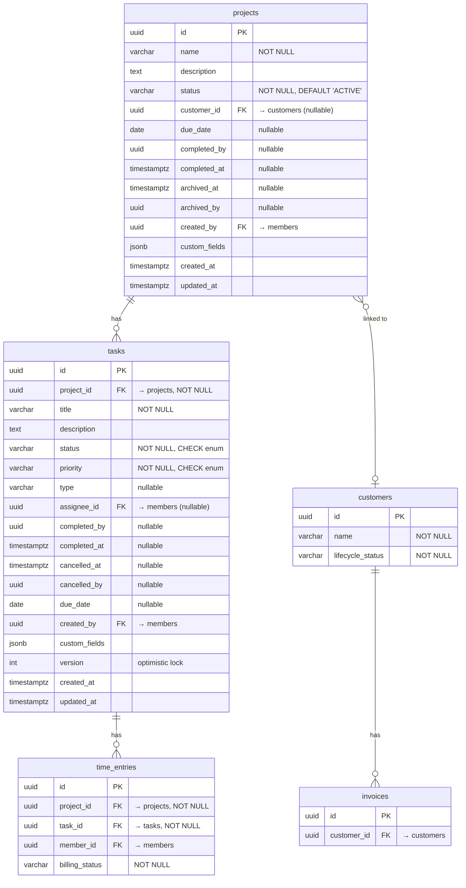
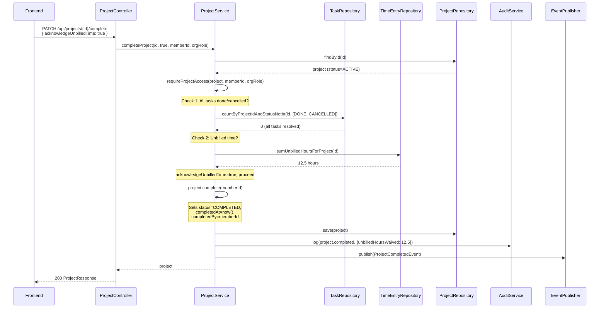
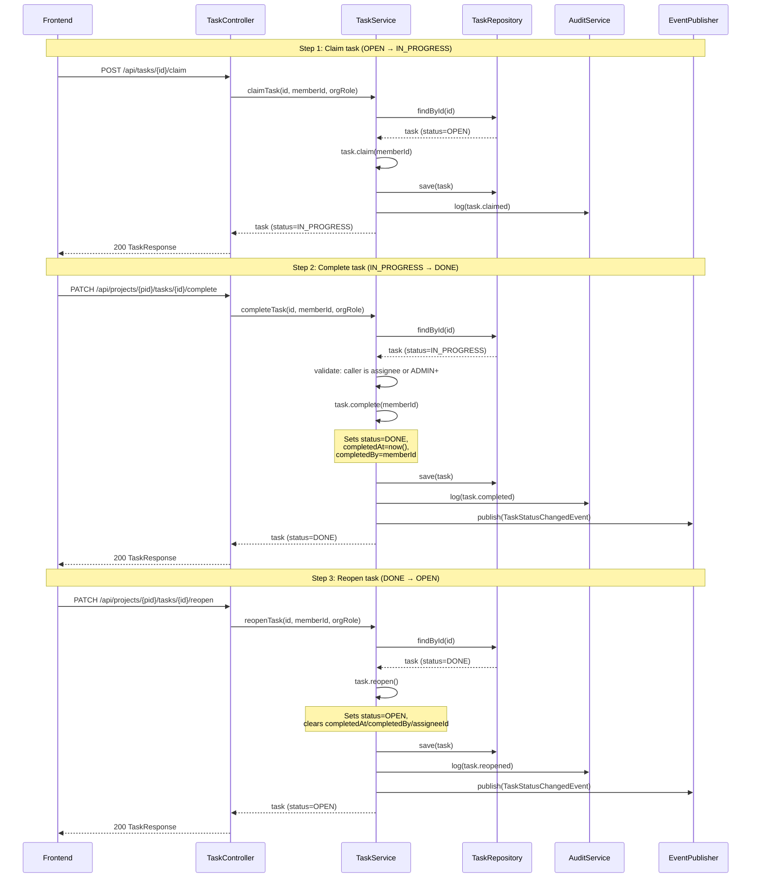
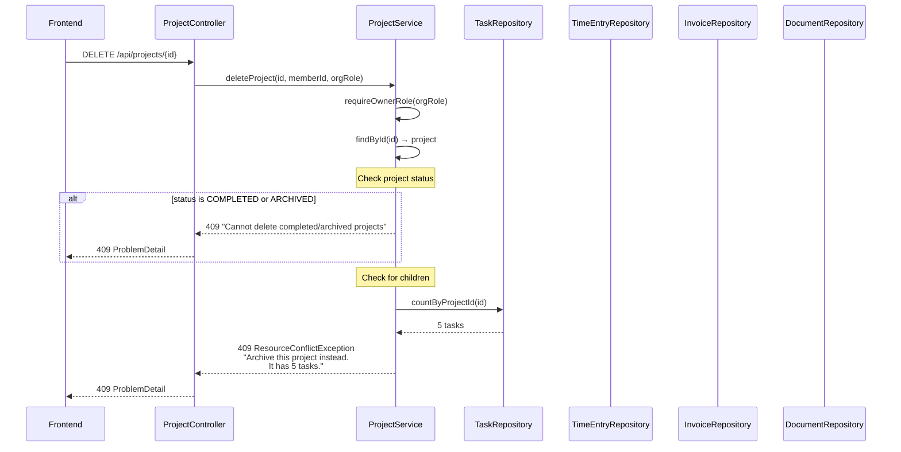

# Phase 29 — Entity Lifecycle & Relationship Integrity

> Standalone architecture document for Phase 29. References entities and patterns from [ARCHITECTURE.md](ARCHITECTURE.md).

---

## 29.1 Overview

Phase 29 adds **lifecycle state machines and relationship integrity rules** to Project and Task — the two core domain entities that currently lack formal lifecycle management. Projects today have no status field at all; tasks store status as a raw string with no terminal states and no transition validation. This phase promotes both to first-class lifecycle-managed entities with validated transitions, completion timestamps, delete protection, and cross-entity guardrails.

This is a **structural hardening phase**, not a feature phase. No new pages are added, no new entities are created, and no new top-level navigation items appear. Instead, the phase retrofits guardrails onto existing entities so that the system rejects impossible states, prevents orphaned data, and provides a trustworthy audit trail for engagement lifecycle events. The work is analogous to what Phase 2 did for Customer lifecycle (the `LifecycleStatus` enum and `CustomerLifecycleGuard`) — but applied to the project and task domain.

The phase also adds two missing structural links: an optional **Project-to-Customer association** (so projects can be attributed to the customer they serve) and a **project due date** (target completion deadline for engagement tracking). Both are nullable and backward compatible — existing projects remain unlinked with no due date.

**What's new in Phase 29** (relative to current state):

| Capability | Current State | After Phase 29 |
|---|---|---|
| Task status | Raw string (`"OPEN"`, `"IN_PROGRESS"`), no terminal states | `TaskStatus` enum with DONE/CANCELLED, validated transitions, completion timestamps |
| Task priority | Raw string (`"LOW"`, `"MEDIUM"`, `"HIGH"`), no enum | `TaskPriority` enum with URGENT added, CHECK constraint |
| Task lifecycle | `claim()` and `release()` only; `update()` allows any status | Full state machine: claim, release, complete, cancel, reopen with permission rules |
| Task delete protection | Hard delete always succeeds | Tasks with time entries cannot be deleted (409) |
| Project status | No status field | `ProjectStatus` enum: ACTIVE, COMPLETED, ARCHIVED |
| Project lifecycle | CRUD only | Status transitions with completion guardrails and archive read-only enforcement |
| Project-Customer link | None | Optional `customerId` soft FK on Project |
| Project due date | None | Optional `dueDate` (LocalDate) with overdue indicators |
| Project delete protection | OWNER can always hard delete | Blocked once project has any children (tasks, time entries, invoices, documents) |
| Customer delete protection | No enforcement | Blocked if customer has linked projects, invoices, or retainers |

**Out of scope**: Task dependencies / subtasks, bulk operations (bulk-complete, bulk-archive), scheduled auto-archival, project templates interaction (templates always create ACTIVE projects), retainer-project linking, saved view engine changes, portal read-model changes.

---

## 29.2 Domain Model

### 29.2.1 TaskStatus Enum (New)

Replaces the raw `String status` field on `Task`. The enum defines four states with a transition table encoded in the enum itself, following the `LifecycleStatus` pattern established by the Customer entity.

```java
public enum TaskStatus {
  OPEN,
  IN_PROGRESS,
  DONE,
  CANCELLED;

  private static final Map<TaskStatus, Set<TaskStatus>> ALLOWED_TRANSITIONS = Map.of(
      OPEN, Set.of(IN_PROGRESS, CANCELLED),
      IN_PROGRESS, Set.of(DONE, OPEN, CANCELLED),
      DONE, Set.of(OPEN),
      CANCELLED, Set.of(OPEN)
  );

  public boolean canTransitionTo(TaskStatus target) {
    return ALLOWED_TRANSITIONS.getOrDefault(this, Set.of()).contains(target);
  }

  public boolean isTerminal() {
    return this == DONE || this == CANCELLED;
  }
}
```

**Transition table**:

| From | To | Trigger | Guard Conditions |
|---|---|---|---|
| OPEN | IN_PROGRESS | `claim` | Claimant is a project member; task is unassigned |
| OPEN | CANCELLED | `cancel` | Caller is ADMIN+ |
| IN_PROGRESS | DONE | `complete` | Caller is the assignee OR ADMIN+ |
| IN_PROGRESS | OPEN | `release` | Caller is the assignee OR ADMIN+ (existing behavior) |
| IN_PROGRESS | CANCELLED | `cancel` | Caller is ADMIN+ |
| DONE | OPEN | `reopen` | Any project member with edit access |
| CANCELLED | OPEN | `reopen` | Any project member with edit access |

DONE and CANCELLED are **terminal states** — no forward transitions exist from them except reopening back to OPEN.

### 29.2.2 TaskPriority Enum (New)

Replaces the raw `String priority` field on `Task`. Adds URGENT as a new option above HIGH.

```java
public enum TaskPriority {
  LOW,
  MEDIUM,
  HIGH,
  URGENT
}
```

Existing data maps cleanly: `"LOW"`, `"MEDIUM"`, and `"HIGH"` are valid enum values. `"URGENT"` is new and will only appear on tasks created or updated after migration. The database CHECK constraint permits all four values.

### 29.2.3 ProjectStatus Enum (New)

A three-state lifecycle for projects. The transition rules are encoded in the enum.

```java
public enum ProjectStatus {
  ACTIVE,
  COMPLETED,
  ARCHIVED;

  private static final Map<ProjectStatus, Set<ProjectStatus>> ALLOWED_TRANSITIONS = Map.of(
      ACTIVE, Set.of(COMPLETED, ARCHIVED),
      COMPLETED, Set.of(ARCHIVED, ACTIVE),
      ARCHIVED, Set.of(ACTIVE)
  );

  public boolean canTransitionTo(ProjectStatus target) {
    return ALLOWED_TRANSITIONS.getOrDefault(this, Set.of()).contains(target);
  }
}
```

**Transition table**:

| From | To | Trigger | Guard Conditions |
|---|---|---|---|
| ACTIVE | COMPLETED | `complete` | All tasks DONE or CANCELLED; unbilled time acknowledged |
| ACTIVE | ARCHIVED | `archive` | None (force-close for abandoned projects) |
| COMPLETED | ARCHIVED | `archive` | None |
| COMPLETED | ACTIVE | `reopen` | Caller is ADMIN+ |
| ARCHIVED | ACTIVE | `reopen` (restore) | Caller is ADMIN+ |

**Design rationale — three states vs. two**: A two-state model (ACTIVE / ARCHIVED) conflates "work is done" with "project is hidden." The three-state model distinguishes between a project that is **financially closed** (COMPLETED — all work done, billing settled or waived) and one that is **removed from active views** (ARCHIVED — read-only, hidden by default). This matters for reporting: completed projects should appear in profitability reports but not in daily task lists; archived projects should be excluded from both unless explicitly requested. See [ADR-111](../adr/ADR-111-project-completion-semantics.md).

### 29.2.4 New Fields on Task

| Field | Java Type | DB Column | DB Type | Constraints | Notes |
|---|---|---|---|---|---|
| `completedAt` | `Instant` | `completed_at` | `TIMESTAMPTZ` | Nullable | Set when transitioning to DONE; cleared on reopen |
| `completedBy` | `UUID` | `completed_by` | `UUID` | Nullable | Member ID who marked DONE; cleared on reopen |
| `cancelledAt` | `Instant` | `cancelled_at` | `TIMESTAMPTZ` | Nullable | Set when transitioning to CANCELLED; cleared on reopen |
| `cancelledBy` | `UUID` | `cancelled_by` | `UUID` | Nullable | Member ID who cancelled; cleared on reopen |

The existing `status` column type remains `VARCHAR(20)` with a new CHECK constraint restricting values to the enum set. The existing `priority` column similarly gains a CHECK constraint. The Java field types change from `String` to the respective enums; Hibernate maps them via `@Enumerated(EnumType.STRING)`.

### 29.2.5 New Fields on Project

| Field | Java Type | DB Column | DB Type | Constraints | Notes |
|---|---|---|---|---|---|
| `status` | `ProjectStatus` | `status` | `VARCHAR(20)` | NOT NULL, DEFAULT `'ACTIVE'` | Lifecycle state |
| `customerId` | `UUID` | `customer_id` | `UUID` | Nullable | Soft FK to Customer; validated at application level |
| `dueDate` | `LocalDate` | `due_date` | `DATE` | Nullable | Target completion/filing deadline |
| `completedAt` | `Instant` | `completed_at` | `TIMESTAMPTZ` | Nullable | Set when transitioning to COMPLETED; cleared on reopen |
| `completedBy` | `UUID` | `completed_by` | `UUID` | Nullable | Member ID who completed; cleared on reopen |
| `archivedAt` | `Instant` | `archived_at` | `TIMESTAMPTZ` | Nullable | Set when transitioning to ARCHIVED; cleared on restore |
| `archivedBy` | `UUID` | `archived_by` | `UUID` | Nullable | Member ID who archived; cleared on restore |

**Backward compatibility**: The DEFAULT `'ACTIVE'` on the `status` column means all existing projects automatically become ACTIVE without a data migration step. No existing behavior changes — ACTIVE projects behave exactly as projects do today.

### 29.2.6 Updated Entity-Relationship Diagram

The diagram below shows Project and Task with their new fields and the Project-Customer relationship. Only entities relevant to Phase 29 changes are shown; other tenant-schema entities (Document, TimeEntry, Invoice, etc.) are unchanged.



---

## 29.3 Core Flows and Backend Behaviour

### 29.3.1 Task Lifecycle State Machine

The task state machine replaces the current unconstrained `update()` method with validated transitions. The existing `claim()` and `release()` methods remain but now participate in the state machine.

**Transition rules**:

| From | To | Method | Timestamp Side Effects | Permission |
|---|---|---|---|---|
| OPEN | IN_PROGRESS | `claim(memberId)` | None | Any project member (existing) |
| OPEN | CANCELLED | `cancel()` | Set `cancelledAt`, `cancelledBy` | ADMIN+ only |
| IN_PROGRESS | DONE | `complete(memberId)` | Set `completedAt`, `completedBy` | Assignee or ADMIN+ |
| IN_PROGRESS | OPEN | `release()` | Clear `assigneeId` | Assignee or ADMIN+ (existing) |
| IN_PROGRESS | CANCELLED | `cancel()` | Set `cancelledAt`, `cancelledBy` | ADMIN+ only |
| DONE | OPEN | `reopen()` | Clear `completedAt`, `completedBy`, `assigneeId` | Any member with edit access |
| CANCELLED | OPEN | `reopen()` | Clear `cancelledAt`, `cancelledBy`, `assigneeId` | Any member with edit access |

**Key behaviors**:

- **Reopen always returns to OPEN**: Reopening clears all completion/cancellation timestamps and unassigns the task. The task is fresh for re-assignment. This avoids ambiguity about whether a reopened task should retain its assignee.
- **Reopen is intentionally less restricted than complete/cancel**: Any member with edit access can reopen a task (not just ADMIN+). Rationale: reopening is a corrective action (e.g., "that task wasn't actually done"), not a lifecycle milestone. Complete and cancel are more consequential (complete feeds into project completion guardrails, cancel can trigger notifications), so they require elevated permissions.
- **`update()` no longer accepts status changes**: The general `update` endpoint continues to accept title, description, priority, type, dueDate, and assigneeId changes — but status is removed from the update payload. Status changes happen only through the dedicated transition endpoints. This prevents accidental status regression via the edit form.
- **`claim()` validates OPEN status**: The existing guard (`!= "OPEN"` → reject) already enforces this. The only change is comparing against the enum value instead of a string.
- **`release()` validates IN_PROGRESS status**: Currently `release()` checks for a non-null assignee. Phase 29 adds an explicit status check for IN_PROGRESS.
- **Tasks with time entries cannot be deleted**: `TaskService.deleteTask()` checks `timeEntryRepository.existsByTaskId(taskId)`. If time entries exist, throw `ResourceConflictException("Cannot delete task", "Cancel this task instead. It has N time entries.")`. Tasks can always be cancelled regardless of time entries.

**Conceptual service signatures**:

```java
// TaskService
@Transactional
public Task completeTask(UUID taskId, UUID memberId, String orgRole);

@Transactional
public Task cancelTask(UUID taskId, UUID memberId, String orgRole);

@Transactional
public Task reopenTask(UUID taskId, UUID memberId, String orgRole);
```

### 29.3.2 Project Lifecycle State Machine

Projects gain a three-state lifecycle with guardrails that enforce clean completion.

**Completion guardrails (ACTIVE to COMPLETED)**:

When completing a project, the backend performs two checks:

1. **All tasks must be DONE or CANCELLED.** The service queries for tasks where `status NOT IN ('DONE', 'CANCELLED')` and `projectId = ?`. If the count is greater than zero, the transition is rejected with 400:
   ```json
   {
     "type": "about:blank",
     "title": "Cannot complete project",
     "status": 400,
     "detail": "Project has 3 incomplete tasks. All tasks must be DONE or CANCELLED before completing."
   }
   ```

2. **Unbilled time check (warn, don't block).** The service queries for time entries where `billingStatus = 'UNBILLED'` and the task belongs to this project (JOIN through `tasks.project_id` — time entries link to tasks, not directly to projects). If unbilled entries exist and the request does not include `acknowledgeUnbilledTime: true`:
   ```json
   {
     "type": "about:blank",
     "title": "Project has unbilled time",
     "status": 409,
     "detail": "Project has 12.5 unbilled hours. Set acknowledgeUnbilledTime to true to proceed.",
     "unbilledHours": 12.5,
     "unbilledEntryCount": 8
   }
   ```
   With the flag set, the transition proceeds and the audit event records `{"unbilledHoursWaived": 12.5}` in its details.

**Archive rules (ARCHIVED = read-only)**:

Archived projects are **frozen**. The `ProjectLifecycleGuard` (new component, pattern from `CustomerLifecycleGuard`) blocks the following operations on archived projects:

| Operation | Blocked? | Rationale |
|---|---|---|
| Create task | Yes | No new work on archived projects |
| Update task | Yes | Existing tasks are frozen |
| Create time entry | Yes | No new time recording |
| Update time entry | Yes | Existing time entries are frozen |
| Create document | Yes | No new documents |
| Create invoice | Yes | No new invoices |
| Update project name/description | Yes | Project metadata is frozen |
| Update budget | Yes | Budget configuration is frozen |
| Invoice lifecycle transitions | **No** | DRAFT to SENT to PAID transitions are allowed — you can still collect payment for work already invoiced |
| Read project/tasks/time/docs | **No** | Read access is unrestricted |
| Create comment | **No** | Comments are allowed for record-keeping |

**Direct archive (ACTIVE to ARCHIVED)**: Allowed without completion guardrails. This is the path for abandoned projects — the firm wants to hide the project without resolving open tasks or billing. **All OPEN and IN_PROGRESS tasks are auto-cancelled** as part of the archive operation (since the project becomes read-only, these tasks would otherwise be permanently stuck in a non-terminal state). Each auto-cancelled task gets `cancelledAt` set and a `task.cancelled` audit event with `{"reason": "project_archived"}` in the details. The archive timestamp is then set, and the read-only rules take effect immediately.

**Reopen and restore**: Both `COMPLETED -> ACTIVE` and `ARCHIVED -> ACTIVE` use the same `reopen` endpoint. Reopening clears `completedAt`, `completedBy`, and `archivedAt` as applicable. The project returns to full read-write status. Only ADMIN+ can reopen/restore.

**Conceptual service signatures**:

```java
// ProjectService (new methods)
@Transactional
public Project completeProject(UUID projectId, boolean acknowledgeUnbilledTime,
                                UUID memberId, String orgRole);

@Transactional
public Project archiveProject(UUID projectId, UUID memberId, String orgRole);

@Transactional
public Project reopenProject(UUID projectId, UUID memberId, String orgRole);
```

### 29.3.3 Project-Customer Link

The `customerId` field on Project is a **soft FK** — a UUID column validated at the application level, not a database foreign key constraint. This is consistent with the existing pattern used by `Invoice.customerId`, `TimeEntry.projectId`, and other cross-entity references in the codebase. The soft FK pattern avoids schema-level coupling between entities and simplifies tenant migration (no FK constraints to manage across schemas).

**Business rules**:

- **Assignment at creation**: `POST /api/projects` accepts an optional `customerId`. If provided, the service validates that the customer exists in the same tenant and is not in OFFBOARDING or OFFBOARDED status (via `CustomerLifecycleGuard.requireActionPermitted(customer, LifecycleAction.CREATE_PROJECT)`).
- **Update on ACTIVE projects**: `PUT /api/projects/{id}` accepts `customerId` (including `null` to unlink). The customer can be changed or removed at any time while the project is ACTIVE.
- **Blocked on non-ACTIVE projects**: If the project is COMPLETED or ARCHIVED, the `customerId` field is immutable. Attempts to change it are rejected by the `ProjectLifecycleGuard`.
- **Offboarding customers**: Existing projects linked to an OFFBOARDING/OFFBOARDED customer remain linked. The link is not cascaded or cleared. However, creating **new** projects for that customer is blocked by `CustomerLifecycleGuard`. The `CREATE_PROJECT` action already exists in `LifecycleAction` and blocks for PROSPECT and OFFBOARDED status. Phase 29 must **also add OFFBOARDING** to the blocked statuses for `CREATE_PROJECT` (modify the guard's switch case to include OFFBOARDING).
- **Customer validation**: `ProjectService` validates that the customer ID resolves to an existing customer via `CustomerRepository.findById()`. If the customer does not exist, a `ResourceNotFoundException` is thrown.

**Query support**:

- `GET /api/projects?customerId={id}` — filter the project list by customer.
- `GET /api/customers/{id}/projects` — convenience endpoint returning all projects linked to a specific customer. Implemented as a simple `projectRepository.findByCustomerId(customerId)` query.

See [ADR-113](../adr/ADR-113-customer-link-optionality.md) for the rationale behind the nullable soft FK design.

### 29.3.4 Delete Protection

Delete protection prevents data loss by blocking hard deletes on entities that have operational data. The guiding principle: **once an entity has children or has participated in business operations, it cannot be deleted — archive or cancel instead.**

**Project delete rules**:

| Project Status | Has Children? | Can Delete? | Response |
|---|---|---|---|
| ACTIVE | No tasks, no time entries, no invoices, no documents | Yes | 200 — hard delete |
| ACTIVE | Has any children | No | 409 — `"Archive this project instead. It has N tasks, M time entries."` |
| COMPLETED | Any | No | 409 — `"Cannot delete completed projects. Reopen first if needed."` |
| ARCHIVED | Any | No | 409 — `"Cannot delete archived projects."` |

Children are checked across four entities: tasks, time entries (joined through tasks), invoices, and documents. If any count is non-zero, deletion is blocked.

**Task delete rules**:

| Condition | Can Delete? | Response |
|---|---|---|
| No time entries for this task | Yes | 200 — hard delete |
| Has time entries | No | 409 — `"Cancel this task instead. It has N time entries."` |

**Customer delete rules**:

| Condition | Can Delete? | Response |
|---|---|---|
| Has linked projects | No | 409 — `"Cannot delete customer. It has N linked projects."` |
| Has invoices | No | 409 — `"Cannot delete customer. It has N invoices."` |
| Has retainers | No | 409 — `"Cannot delete customer. Use the offboarding lifecycle instead."` |
| No children | Yes | 200 — hard delete |

The delete protection checks are implemented in the respective service classes (`ProjectService.deleteProject()`, `TaskService.deleteTask()`, `CustomerService.deleteCustomer()`), not in a separate guard. This keeps the logic co-located with the delete operation and avoids an additional abstraction layer.

See [ADR-112](../adr/ADR-112-delete-vs-archive-philosophy.md) for the rationale behind restricting hard deletes.

### 29.3.5 Archive Read-Only Enforcement

The `ProjectLifecycleGuard` is a new `@Component` that follows the `CustomerLifecycleGuard` pattern. It checks the project's current status against the requested operation and throws `InvalidStateException` if the operation is blocked.

```java
@Component
public class ProjectLifecycleGuard {

  public void requireActionPermitted(Project project, ProjectLifecycleAction action) {
    var status = project.getStatus();

    switch (action) {
      case CREATE_TASK, UPDATE_TASK, CREATE_TIME_ENTRY, UPDATE_TIME_ENTRY,
           CREATE_DOCUMENT, CREATE_INVOICE, UPDATE_PROJECT, UPDATE_BUDGET -> {
        if (status == ProjectStatus.ARCHIVED) {
          throwBlocked(action, status);
        }
      }
      case UPDATE_CUSTOMER_LINK -> {
        if (status != ProjectStatus.ACTIVE) {
          throwBlocked(action, status);
        }
      }
    }
  }

  private void throwBlocked(ProjectLifecycleAction action, ProjectStatus status) {
    throw new InvalidStateException(
        "Operation blocked",
        "Cannot " + action.label() + " on a project in " + status + " status");
  }
}
```

The `ProjectLifecycleAction` enum:

```java
public enum ProjectLifecycleAction {
  CREATE_TASK("create task"),
  UPDATE_TASK("update task"),
  CREATE_TIME_ENTRY("create time entry"),
  UPDATE_TIME_ENTRY("update time entry"),
  CREATE_DOCUMENT("create document"),
  CREATE_INVOICE("create invoice"),
  UPDATE_PROJECT("update project"),
  UPDATE_BUDGET("update budget"),
  UPDATE_CUSTOMER_LINK("update customer link");

  private final String label;

  ProjectLifecycleAction(String label) { this.label = label; }
  public String label() { return label; }
}
```

**Integration points**: Every service that creates or modifies resources scoped to a project must call `projectLifecycleGuard.requireActionPermitted(project, action)` before proceeding. The guard is injected into `TaskService`, `TimeEntryService`, `DocumentService`, `InvoiceService`, `ProjectBudgetService`, and `ProjectService` itself.

---

## 29.4 API Surface

### 29.4.1 Task Lifecycle Endpoints (New)

| Method | Path | Description | Request Body | Success Response |
|---|---|---|---|---|
| `PATCH` | `/api/projects/{projectId}/tasks/{taskId}/complete` | Mark task as DONE | None | 200 + `TaskResponse` |
| `PATCH` | `/api/projects/{projectId}/tasks/{taskId}/cancel` | Mark task as CANCELLED | None | 200 + `TaskResponse` |
| `PATCH` | `/api/projects/{projectId}/tasks/{taskId}/reopen` | Reopen a DONE or CANCELLED task | None | 200 + `TaskResponse` |

All three endpoints follow the same pattern: validate project access, validate transition, apply state change, publish audit event and domain event, return updated task.

**Note on existing claim/release endpoints**: The existing `POST /api/tasks/{id}/claim` and `POST /api/tasks/{id}/release` endpoints remain as `POST` for backward compatibility. New lifecycle endpoints use `PATCH` as the canonical verb for partial state changes. A future cleanup phase may migrate claim/release to `PATCH` as well.

### 29.4.2 Project Lifecycle Endpoints (New)

| Method | Path | Description | Request Body | Success Response |
|---|---|---|---|---|
| `PATCH` | `/api/projects/{id}/complete` | Complete the project | `{ "acknowledgeUnbilledTime": boolean }` (optional) | 200 + `ProjectResponse` |
| `PATCH` | `/api/projects/{id}/archive` | Archive the project | None | 200 + `ProjectResponse` |
| `PATCH` | `/api/projects/{id}/reopen` | Reopen from COMPLETED or ARCHIVED | None | 200 + `ProjectResponse` |

**Complete project — request/response**:

Request:
```json
PATCH /api/projects/{id}/complete
{
  "acknowledgeUnbilledTime": true
}
```

Success response (200):
```json
{
  "id": "...",
  "name": "FY2026 Tax Filing",
  "status": "COMPLETED",
  "customerId": "...",
  "dueDate": "2026-03-15",
  "completedAt": "2026-02-27T10:30:00Z",
  "completedBy": "...",
  ...
}
```

Error response — incomplete tasks (400):
```json
{
  "type": "about:blank",
  "title": "Cannot complete project",
  "status": 400,
  "detail": "Project has 3 incomplete tasks. All tasks must be DONE or CANCELLED before completing."
}
```

Error response — unbilled time not acknowledged (409):
```json
{
  "type": "about:blank",
  "title": "Project has unbilled time",
  "status": 409,
  "detail": "Project has 12.5 unbilled hours (8 entries). Set acknowledgeUnbilledTime to true to proceed."
}
```

**Archive project — request/response**:

Request:
```json
PATCH /api/projects/{id}/archive
```

Success response (200):
```json
{
  "id": "...",
  "name": "Legacy Project",
  "status": "ARCHIVED",
  "archivedAt": "2026-02-27T10:30:00Z",
  ...
}
```

**Reopen project — request/response**:

Request:
```json
PATCH /api/projects/{id}/reopen
```

Success response (200):
```json
{
  "id": "...",
  "name": "FY2026 Tax Filing",
  "status": "ACTIVE",
  "completedAt": null,
  "completedBy": null,
  "archivedAt": null,
  ...
}
```

### 29.4.3 Project-Customer Endpoints

| Method | Path | Description | Change |
|---|---|---|---|
| `POST` | `/api/projects` | Create project | Add optional `customerId` and `dueDate` fields |
| `PUT` | `/api/projects/{id}` | Update project | Add optional `customerId` and `dueDate` fields |
| `GET` | `/api/customers/{id}/projects` | List projects for customer | **New endpoint** |

### 29.4.4 Existing Endpoint Changes

| Endpoint | Change |
|---|---|
| `GET /api/projects` | Add `status` query param (comma-separated, default: `ACTIVE`). Add `includeArchived=true` shorthand. Add `customerId` filter. Add `dueBefore` date filter. |
| `GET /api/projects/{projectId}/tasks` | Add `status` query param (comma-separated, default: `OPEN,IN_PROGRESS`). |
| `PUT /api/projects/{id}` | Status changes removed from update payload. Add `customerId`, `dueDate`. |
| `PUT /api/projects/{projectId}/tasks/{taskId}` | Status changes removed from update payload. Priority accepts `URGENT` as new value. |
| `DELETE /api/projects/{id}` | Now returns 409 if project has children or is not ACTIVE. |
| `DELETE /api/projects/{projectId}/tasks/{taskId}` | Now returns 409 if task has time entries. |

The `ProjectResponse` DTO is extended with: `status`, `customerId`, `customerName` (resolved), `dueDate`, `completedAt`, `completedBy`, `archivedAt`, `archivedBy`, `isOverdue` (computed boolean: `dueDate != null && dueDate < today && status == ACTIVE`).

The `TaskResponse` DTO is extended with: `completedAt`, `completedBy`, `cancelledAt`, `cancelledBy`.

---

## 29.5 Sequence Diagrams

### 29.5.1 Complete Project — Happy Path with Unbilled Time



### 29.5.2 Task Lifecycle — Claim, Complete, Reopen



### 29.5.3 Delete Protection — Attempt to Delete Project with Children



---

## 29.6 Database Migration (V46)

### 29.6.1 Tenant Migration

File: `src/main/resources/db/migration/tenant/V46__entity_lifecycle_integrity.sql`

```sql
-- ============================================================
-- V46: Entity Lifecycle & Relationship Integrity
-- Phase 29 — Adds lifecycle state machines to Task and Project
-- ============================================================

-- Task: completion and cancellation timestamps
ALTER TABLE tasks ADD COLUMN IF NOT EXISTS completed_at TIMESTAMPTZ;
ALTER TABLE tasks ADD COLUMN IF NOT EXISTS completed_by UUID;
ALTER TABLE tasks ADD COLUMN IF NOT EXISTS cancelled_at TIMESTAMPTZ;
ALTER TABLE tasks ADD COLUMN IF NOT EXISTS cancelled_by UUID;

-- Task: constrain status to valid enum values
-- Existing values (OPEN, IN_PROGRESS) are valid; DONE and CANCELLED are new
ALTER TABLE tasks DROP CONSTRAINT IF EXISTS tasks_status_check;
ALTER TABLE tasks ADD CONSTRAINT tasks_status_check
  CHECK (status IN ('OPEN', 'IN_PROGRESS', 'DONE', 'CANCELLED'));

-- Task: constrain priority to valid enum values
-- Existing values (LOW, MEDIUM, HIGH) are valid; URGENT is new
ALTER TABLE tasks DROP CONSTRAINT IF EXISTS tasks_priority_check;
ALTER TABLE tasks ADD CONSTRAINT tasks_priority_check
  CHECK (priority IN ('LOW', 'MEDIUM', 'HIGH', 'URGENT'));

-- Project: lifecycle status
ALTER TABLE projects ADD COLUMN IF NOT EXISTS status VARCHAR(20) NOT NULL DEFAULT 'ACTIVE';
ALTER TABLE projects DROP CONSTRAINT IF EXISTS projects_status_check;
ALTER TABLE projects ADD CONSTRAINT projects_status_check
  CHECK (status IN ('ACTIVE', 'COMPLETED', 'ARCHIVED'));

-- Project: customer link (soft FK, validated at application level)
ALTER TABLE projects ADD COLUMN IF NOT EXISTS customer_id UUID;

-- Project: due date for engagement deadline tracking
ALTER TABLE projects ADD COLUMN IF NOT EXISTS due_date DATE;

-- Project: completion and archive timestamps
ALTER TABLE projects ADD COLUMN IF NOT EXISTS completed_at TIMESTAMPTZ;
ALTER TABLE projects ADD COLUMN IF NOT EXISTS completed_by UUID;
ALTER TABLE projects ADD COLUMN IF NOT EXISTS archived_at TIMESTAMPTZ;
ALTER TABLE projects ADD COLUMN IF NOT EXISTS archived_by UUID;

-- ============================================================
-- Indexes
-- ============================================================

-- Project status filtering (most queries filter by status)
CREATE INDEX IF NOT EXISTS idx_projects_status ON projects (status);

-- Project-Customer link (filter projects by customer, join queries)
CREATE INDEX IF NOT EXISTS idx_projects_customer_id ON projects (customer_id)
  WHERE customer_id IS NOT NULL;

-- Project due date (deadline views, overdue queries)
CREATE INDEX IF NOT EXISTS idx_projects_due_date ON projects (due_date)
  WHERE due_date IS NOT NULL;

-- Task status filtering (list queries filter by status, default excludes DONE/CANCELLED)
-- Note: tasks already have an index on project_id; this composite index supports
-- the common query pattern: "tasks for project X with status in (...)"
CREATE INDEX IF NOT EXISTS idx_tasks_project_status ON tasks (project_id, status);
```

### 29.6.2 Index Rationale

| Index | Columns | Rationale |
|---|---|---|
| `idx_projects_status` | `(status)` | Project list defaults to `WHERE status = 'ACTIVE'`; avoids full scan |
| `idx_projects_customer_id` | `(customer_id) WHERE NOT NULL` | Partial index — only indexes linked projects; supports customer-project joins and filter queries |
| `idx_projects_due_date` | `(due_date) WHERE NOT NULL` | Partial index — supports `dueBefore` filter and overdue queries without indexing NULL rows |
| `idx_tasks_project_status` | `(project_id, status)` | Composite index for the most common task query: "tasks for this project filtered by status." Replaces the need for a separate status-only index. |

### 29.6.3 Backward Compatibility

- **Existing projects**: `status` column defaults to `'ACTIVE'` via `DEFAULT 'ACTIVE'`. No data backfill required.
- **Existing tasks**: `status` values `'OPEN'` and `'IN_PROGRESS'` are valid enum values. The CHECK constraint permits both.
- **Existing priorities**: `'LOW'`, `'MEDIUM'`, `'HIGH'` are valid. `'URGENT'` is additive.
- **No downtime**: All changes are additive (`ADD COLUMN IF NOT EXISTS`, `ADD CONSTRAINT`, `CREATE INDEX IF NOT EXISTS`). No column renames, type changes, or data migrations.
- **No global migration**: All changes are tenant-scoped. No changes to the `public` schema.

---

## 29.7 Implementation Guidance

### 29.7.1 Backend Changes

| File | Change Type | Description |
|---|---|---|
| `task/TaskStatus.java` | **New** | Enum with OPEN, IN_PROGRESS, DONE, CANCELLED and transition table |
| `task/TaskPriority.java` | **New** | Enum with LOW, MEDIUM, HIGH, URGENT |
| `task/Task.java` | Modify | Change `status` and `priority` fields from `String` to enums; add `completedAt`, `completedBy`, `cancelledAt` fields; add `complete()`, `cancel()`, `reopen()` methods |
| `task/TaskService.java` | Modify | Add `completeTask()`, `cancelTask()`, `reopenTask()` methods; add delete protection in `deleteTask()`; remove status from `updateTask()` |
| `task/TaskController.java` | Modify | Add `PATCH .../complete`, `PATCH .../cancel`, `PATCH .../reopen` endpoints; add `status` query param to list endpoint |
| `task/TaskRepository.java` | Modify | Add `countByProjectIdAndStatusNotIn()` |
| `timeentry/TimeEntryRepository.java` | Modify | Add `existsByTaskId()` for task delete protection |
| `project/ProjectStatus.java` | **New** | Enum with ACTIVE, COMPLETED, ARCHIVED and transition table |
| `project/Project.java` | Modify | Add `status`, `customerId`, `dueDate`, `completedAt`, `completedBy`, `archivedAt` fields; add `complete()`, `archive()`, `reopen()` methods |
| `project/ProjectService.java` | Modify | Add `completeProject()`, `archiveProject()`, `reopenProject()` methods; add delete protection in `deleteProject()`; add customer validation; integrate `ProjectLifecycleGuard` |
| `project/ProjectController.java` | Modify | Add `PATCH .../complete`, `PATCH .../archive`, `PATCH .../reopen` endpoints; add query params to list endpoint |
| `project/ProjectRepository.java` | Modify | Add `findByCustomerId()`, query methods with status filtering |
| `project/ProjectLifecycleGuard.java` | **New** | `@Component` guard checking project status against operation type |
| `project/ProjectLifecycleAction.java` | **New** | Enum of operations that can be blocked by project status |
| `customer/CustomerController.java` | Modify | Add `GET /api/customers/{id}/projects` endpoint |
| `customer/CustomerService.java` | Modify | Add delete protection checks (projects, invoices, retainers) |
| `timeentry/TimeEntryService.java` | Modify | Call `ProjectLifecycleGuard` before create/update |
| `document/DocumentService.java` | Modify | Call `ProjectLifecycleGuard` before create |
| `invoice/InvoiceService.java` | Modify | Call `ProjectLifecycleGuard` before create |
| `budget/ProjectBudgetService.java` | Modify | Call `ProjectLifecycleGuard` before update |

### 29.7.2 Frontend Changes

| File | Change Type | Description |
|---|---|---|
| `lib/actions/projects.ts` | Modify | Add `completeProject()`, `archiveProject()`, `reopenProject()` server actions; add `customerId`, `dueDate` to create/update |
| `lib/actions/tasks.ts` | Modify | Add `completeTask()`, `cancelTask()`, `reopenTask()` server actions |
| `components/projects/project-list.tsx` | Modify | Add status filter chips (Active, Completed, Archived, All); add due date column with overdue indicator; add status badge |
| `components/projects/project-detail-header.tsx` | Modify | Add status badge, due date display, contextual action buttons (Complete, Archive, Reopen) |
| `components/projects/complete-project-dialog.tsx` | **New** | Confirmation dialog for completing a project; shows unbilled time warning if applicable |
| `components/projects/project-form.tsx` | Modify | Add customer dropdown (searchable), due date picker |
| `components/projects/archived-banner.tsx` | **New** | Read-only warning banner shown at top of archived project detail |
| `components/tasks/task-list.tsx` | Modify | Add status filter chips; visual distinction for DONE (muted) and CANCELLED (muted + badge) |
| `components/tasks/task-detail-sheet.tsx` | Modify | Add "Mark Done" button (primary for IN_PROGRESS), "Cancel" in overflow menu, "Reopen" for terminal states |
| `components/customers/customer-projects-tab.tsx` | **New** | Projects tab on customer detail showing linked projects |

### 29.7.3 New Files Summary

**Backend** (6 new files):
- `task/TaskStatus.java`
- `task/TaskPriority.java`
- `project/ProjectStatus.java`
- `project/ProjectLifecycleGuard.java`
- `project/ProjectLifecycleAction.java`
- `db/migration/tenant/V46__entity_lifecycle_integrity.sql`

**Frontend** (3 new files):
- `components/projects/complete-project-dialog.tsx`
- `components/projects/archived-banner.tsx`
- `components/customers/customer-projects-tab.tsx`

### 29.7.4 Testing Strategy

| Test Category | Scope | Key Scenarios |
|---|---|---|
| `TaskStatus` unit tests | Unit | All valid transitions succeed; all invalid transitions throw; `isTerminal()` correctness |
| `TaskPriority` unit tests | Unit | `valueOf()` for all values; DB constraint alignment |
| `ProjectStatus` unit tests | Unit | All valid transitions succeed; all invalid transitions throw |
| Task lifecycle integration | MockMvc | Complete happy path; cancel from OPEN and IN_PROGRESS; reopen from DONE and CANCELLED; permission checks (member vs admin); delete protection with time entries |
| Project lifecycle integration | MockMvc | Complete with all tasks done; complete blocked by incomplete tasks; complete with unbilled time (flag true/false); archive from ACTIVE and COMPLETED; reopen from COMPLETED and ARCHIVED; permission checks |
| Project-Customer link integration | MockMvc | Create project with customer; update customer on ACTIVE project; block customer update on ARCHIVED project; filter projects by customer; customer projects endpoint |
| Delete protection integration | MockMvc | Delete empty ACTIVE project (success); delete project with tasks (409); delete project with time entries (409); delete COMPLETED project (409); delete task with time entries (409); delete customer with projects (409) |
| `ProjectLifecycleGuard` integration | MockMvc | Create task on archived project (blocked); create time entry on archived project (blocked); invoice transition on archived project (allowed) |
| Frontend component tests | Vitest + RTL | Status filter chips render and filter; action buttons appear/hide based on status; complete dialog shows unbilled time warning; archived banner renders on archived projects |

---

## 29.8 Permission Model Summary

| Operation | MEMBER | ADMIN | OWNER | Additional Condition |
|---|---|---|---|---|
| View project | Yes (if project member) | Yes (if project member) | Yes | — |
| Complete project | No | Yes | Yes | All tasks DONE/CANCELLED |
| Archive project | No | Yes | Yes | — |
| Reopen/restore project | No | Yes | Yes | — |
| Delete project | No | No | Yes | ACTIVE + no children only |
| Set/change project customer | No | Yes | Yes | ACTIVE projects only |
| Set project due date | No | Yes | Yes | ACTIVE projects only |
| Claim task | Yes (if project member) | Yes | Yes | Task must be OPEN |
| Release task | Assignee only | Yes | Yes | Task must be IN_PROGRESS |
| Complete task | Assignee only | Yes | Yes | Task must be IN_PROGRESS |
| Cancel task | No | Yes | Yes | Task must be OPEN or IN_PROGRESS |
| Reopen task | Yes (if can edit) | Yes | Yes | Task must be DONE or CANCELLED |
| Delete task | Yes (if can edit) | Yes | Yes | No time entries |

**Permission resolution**: Access is determined by `ProjectAccessService.requireViewAccess()` which returns a `ProjectAccessResult` with `canEdit()`. ADMIN and OWNER roles always have edit access. MEMBER role requires explicit project membership and the project role determines edit capability (lead/contributor = edit; viewer = read-only).

---

## 29.9 Audit & Notification Events

### 29.9.1 New Audit Event Types

| Event Type | Entity Type | Trigger | Audit Details (JSONB) |
|---|---|---|---|
| `task.completed` | `task` | Task transitions to DONE | `{"status": {"from": "IN_PROGRESS", "to": "DONE"}}` |
| `task.cancelled` | `task` | Task transitions to CANCELLED | `{"status": {"from": "...", "to": "CANCELLED"}}` |
| `task.reopened` | `task` | Task transitions from DONE/CANCELLED to OPEN | `{"status": {"from": "DONE", "to": "OPEN"}}` |
| `project.completed` | `project` | Project transitions to COMPLETED | `{"status": {"from": "ACTIVE", "to": "COMPLETED"}, "unbilledHoursWaived": 12.5}` (if applicable) |
| `project.archived` | `project` | Project transitions to ARCHIVED | `{"status": {"from": "...", "to": "ARCHIVED"}}` |
| `project.reopened` | `project` | Project transitions back to ACTIVE | `{"status": {"from": "ARCHIVED", "to": "ACTIVE"}}` |
| `project.customer_linked` | `project` | Customer assigned to project | `{"customerId": "...", "customerName": "..."}` |
| `project.customer_unlinked` | `project` | Customer removed from project | `{"previousCustomerId": "...", "previousCustomerName": "..."}` |

All audit events are published via the existing `AuditService` and `AuditEventBuilder` pattern.

### 29.9.2 Notification Triggers

| Trigger | Recipients | Channel | Condition |
|---|---|---|---|
| Task cancelled | Task assignee | In-app | Only if cancelled by someone other than the assignee |
| Project completed | All project members | In-app | Always |
| Project archived | All project members | In-app | Always |
| Project reopened | All project members | In-app | Always |

Notifications are published via the existing `NotificationEventHandler` and `ApplicationEvent` pattern. The events are:

```java
// New domain events
public record TaskCompletedEvent(UUID taskId, UUID projectId, UUID completedBy) {}
public record TaskCancelledEvent(UUID taskId, UUID projectId, UUID cancelledBy, UUID assigneeId) {}
public record TaskReopenedEvent(UUID taskId, UUID projectId, UUID reopenedBy) {}
public record ProjectCompletedEvent(UUID projectId, UUID completedBy) {}
public record ProjectArchivedEvent(UUID projectId, UUID archivedBy) {}
public record ProjectReopenedEvent(UUID projectId, UUID reopenedBy) {}
```

### 29.9.3 Activity Feed Events

The existing `TaskStatusChangedEvent` already feeds the activity tab on project detail. The new domain events (`TaskCompletedEvent`, `TaskCancelledEvent`, `TaskReopenedEvent`, `ProjectCompletedEvent`, `ProjectArchivedEvent`, `ProjectReopenedEvent`) integrate into the same activity feed pipeline. No changes to the activity feed infrastructure are needed — only new event handlers for the new event types.

---

## 29.10 Capability Slices

### Slice 29A — Task Status & Priority Enums + State Machine (Backend Only)

**Scope**: Backend only

**Key deliverables**:
- `TaskStatus` enum with transition table and `canTransitionTo()` method
- `TaskPriority` enum
- Modify `Task` entity: change `status`/`priority` from `String` to enum; add `completedAt`, `completedBy`, `cancelledAt` fields; add `complete()`, `cancel()`, `reopen()` methods
- **V46 migration (complete file)** — includes ALL columns, constraints, and indexes for both task and project changes. Owned by this slice to avoid merge conflicts with 29C.
- Unit tests for enum transitions
- Verify existing claim/release tests still pass with enum refactoring

**Dependencies**: None (first slice)

**Test expectations**: ~15 tests (enum unit tests + existing claim/release regression)

---

### Slice 29B — Task Lifecycle Endpoints + Guards (Backend Only)

**Scope**: Backend only

**Key deliverables**:
- `PATCH .../complete`, `PATCH .../cancel`, `PATCH .../reopen` endpoints on `TaskController`
- `TaskService.completeTask()`, `cancelTask()`, `reopenTask()` methods
- Task delete protection in `TaskService.deleteTask()` (time entry check)
- Remove status from `TaskService.updateTask()` payload
- `status` query param on task list endpoint
- Audit events for `task.completed`, `task.cancelled`, `task.reopened`
- Domain events + notification for task cancellation
- Integration tests for all transitions, permission checks, delete protection

**Dependencies**: Slice 29A

**Test expectations**: ~25 tests

---

### Slice 29C — Project Status + Lifecycle State Machine (Backend Only)

**Scope**: Backend only

**Key deliverables**:
- `ProjectStatus` enum with transition table
- `ProjectLifecycleGuard` + `ProjectLifecycleAction` enum
- Modify `Project` entity: add `status`, `dueDate`, `completedAt`, `completedBy`, `archivedAt` fields; add `complete()`, `archive()`, `reopen()` methods
- V46 migration already authored in 29A (project columns and indexes are included there — no migration changes in this slice)
- `PATCH .../complete`, `PATCH .../archive`, `PATCH .../reopen` endpoints
- `ProjectService.completeProject()` with task check and unbilled time check
- `ProjectService.archiveProject()` with auto-cancel of OPEN/IN_PROGRESS tasks, and `reopenProject()`
- Project delete protection in `ProjectService.deleteProject()`
- `status`, `includeArchived`, `dueBefore` query params on project list
- Audit events for project lifecycle transitions
- Domain events + notifications for project members
- Integration tests for all flows including guardrails

**Dependencies**: Slice 29A (shares V46 migration)

**Test expectations**: ~30 tests

---

### Slice 29D — Project-Customer Link + Delete Protection (Backend Only)

**Scope**: Backend only

**Key deliverables**:
- `customerId` field on `Project` entity (already in V46 migration)
- Customer validation in `ProjectService.createProject()` and `updateProject()`
- `CustomerLifecycleGuard` update: add OFFBOARDING to blocked statuses for existing `CREATE_PROJECT` action
- `ProjectLifecycleGuard` enforcement for `UPDATE_CUSTOMER_LINK` on non-ACTIVE projects
- `GET /api/customers/{id}/projects` endpoint
- `customerId` query param on project list
- Customer delete protection in `CustomerService`
- `ProjectLifecycleGuard` integration into `TaskService`, `TimeEntryService`, `DocumentService`, `InvoiceService`, `ProjectBudgetService`
- Audit events for customer link/unlink
- Integration tests for all rules

**Dependencies**: Slice 29C (requires `ProjectLifecycleGuard`)

**Test expectations**: ~25 tests

---

### Slice 29E — Task Lifecycle Frontend

**Scope**: Frontend only

**Key deliverables**:
- Status filter chips on task list (All, Open, In Progress, Done, Cancelled) with default hiding Done/Cancelled
- Visual distinction for terminal states (DONE: muted/checkmark, CANCELLED: muted + strikethrough)
- "Mark Done" button on task detail sheet (primary action when IN_PROGRESS)
- "Cancel" in task detail overflow menu
- "Reopen" button on task detail sheet (visible for DONE/CANCELLED tasks)
- Server actions for `completeTask()`, `cancelTask()`, `reopenTask()`
- My Work page: default filter preserved (OPEN + IN_PROGRESS)
- Component tests

**Dependencies**: Slice 29B (backend endpoints must exist)

**Test expectations**: ~10 frontend tests

---

### Slice 29F — Project Lifecycle Frontend

**Scope**: Frontend only

**Key deliverables**:
- Status filter on project list (Active, Completed, Archived, All) with Active as default
- Status badge on project list and detail header
- Due date column on project list with overdue indicator (red/amber when past due + ACTIVE)
- Due date picker in project create/edit form
- Contextual action buttons on project detail (Complete, Archive, Reopen based on status)
- `CompleteProjectDialog` with unbilled time warning/confirmation
- `ArchivedBanner` component for archived project detail
- All edit actions disabled/hidden on archived projects
- Server actions for `completeProject()`, `archiveProject()`, `reopenProject()`
- Component tests

**Dependencies**: Slice 29C (backend endpoints must exist)

**Test expectations**: ~12 frontend tests

---

### Slice 29G — Project-Customer Link Frontend + Customer Projects Tab

**Scope**: Frontend only

**Key deliverables**:
- Customer dropdown (searchable, ACTIVE customers only) on project create/edit form
- Customer display on project detail header (clickable link to customer detail)
- `CustomerProjectsTab` component on customer detail page showing linked projects with status
- Component tests

**Dependencies**: Slice 29D (backend endpoints must exist), Slice 29F (project status badges are already built)

**Test expectations**: ~8 frontend tests

---

### Slice Dependency Graph

```
29A ──→ 29B ──→ 29E
  │
  └──→ 29C ──→ 29D ──→ 29G
          │
          └──→ 29F
```

Slices 29B and 29C can run in parallel after 29A. Slices 29E and 29F can run in parallel once their backend dependencies are ready. Slice 29G depends on both 29D and 29F.

---

## 29.11 ADR Index

| ADR | Title | Key Decision |
|---|---|---|
| [ADR-110](../adr/ADR-110-task-status-representation.md) | Task Status Representation | Java enum + VARCHAR with CHECK constraint (not DB enum type) |
| [ADR-111](../adr/ADR-111-project-completion-semantics.md) | Project Completion Semantics | Three-state model (ACTIVE/COMPLETED/ARCHIVED) — completion means "work done + billing settled"; archive means "hidden + read-only" |
| [ADR-112](../adr/ADR-112-delete-vs-archive-philosophy.md) | Delete vs. Archive Philosophy | Hard delete restricted once operational data exists; archive is the soft-delete equivalent |
| [ADR-113](../adr/ADR-113-customer-link-optionality.md) | Customer Link Optionality | Nullable soft FK (UUID, application-validated) — supports internal projects, consistent with existing patterns |
