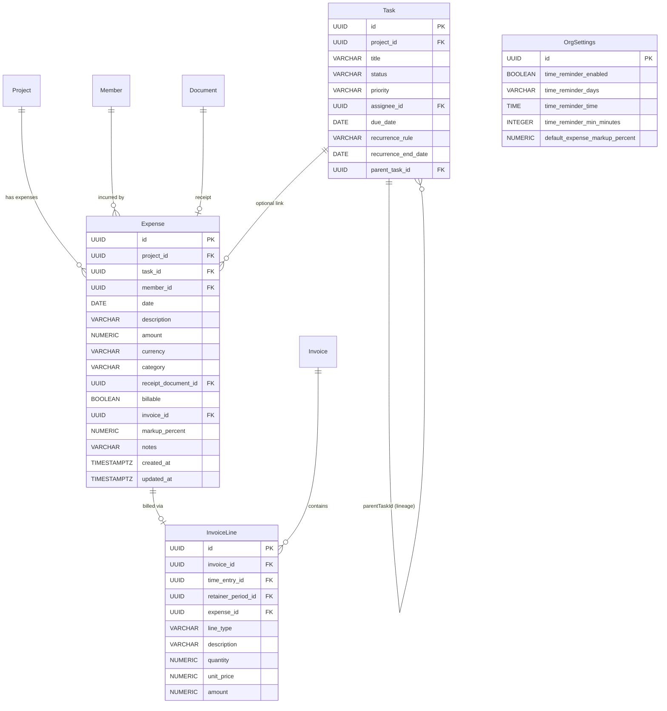
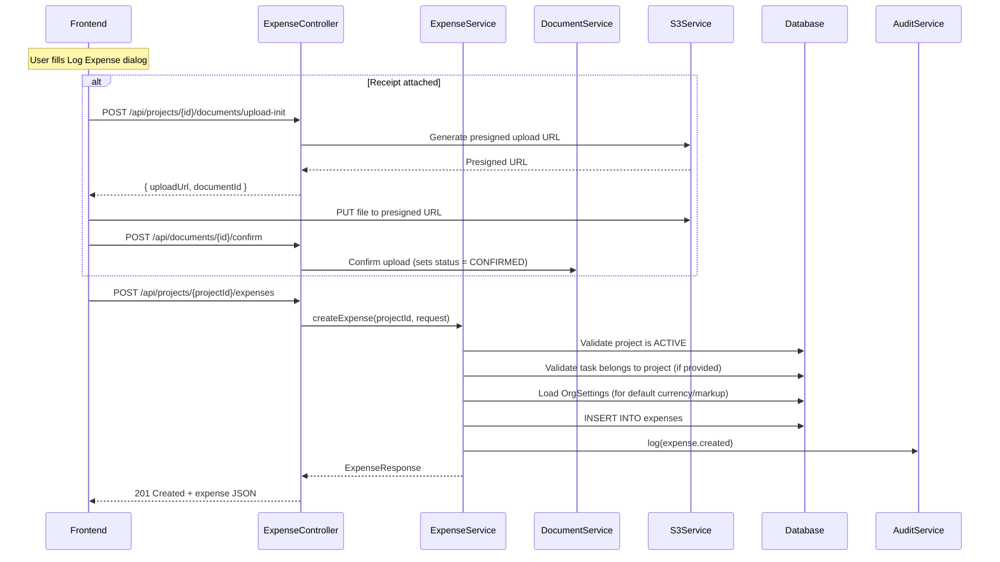
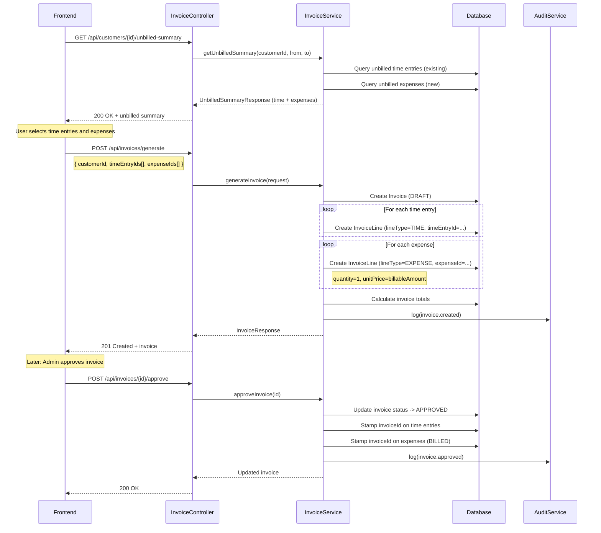
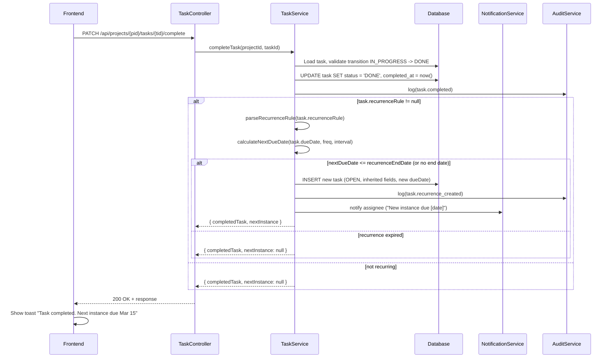

> Phase 30 standalone architecture document.
> ADRs: 114-118 in `adr/`

# Phase 30 --- Expenses, Recurring Tasks & Daily Work Completeness

---

## 30.1 Overview

Phase 30 closes the remaining revenue-capture and daily-work-organisation gaps in the DocTeams platform. Professional services firms bill 15--30% of revenue as disbursements (filing fees, travel, courier, counsel fees), yet the platform currently tracks only time-based fees. Additionally, daily work organisation lacks three quality-of-life capabilities: time-logging reminders, recurring task automation, and a calendar/deadline view.

This phase adds four independent feature tracks:

1. **Expense tracking** --- log disbursements against projects with receipt attachments, per-expense markup, and full billing integration. Expenses flow into invoices and profitability calculations alongside time entries.
2. **Recurring tasks** --- lightweight recurrence rules on tasks for repeatable work items (monthly bank reconciliations, weekly status reports). Completing a recurring task auto-creates the next instance in the same transaction.
3. **Unlogged time reminders** --- notification-based nudge for team members who have not logged sufficient time on working days. Configurable per org, opt-out per member.
4. **Calendar / deadline view** --- read-only frontend visualisation of task due dates and project deadlines across all projects, backed by a single aggregation endpoint.

The four tracks share no data dependencies and can be developed in parallel. Expense billing integration (track 1) depends on the Expense entity CRUD being in place first, and the calendar endpoint is read-only over existing data, so it has no backend prerequisites beyond Phase 29.

**What's new in Phase 30** (relative to current state):

| Capability | Current State | After Phase 30 |
|---|---|---|
| Expense tracking | None --- only time entries are tracked | Full expense CRUD with category, receipt attachment, markup, billing status |
| Expense billing | Invoices capture time-based fees only | Invoices include expense line items with configurable markup |
| Expense profitability | Profitability reports consider time only | Absorbed expenses reduce margin; billed expenses (with markup) increase revenue |
| Recurring tasks | None --- tasks are one-off | Recurrence rules on tasks; auto-creates next instance on completion |
| Time reminders | None | Scheduled in-app notification for members who have not logged minimum hours |
| Calendar view | None --- due dates visible only per-project | Cross-project calendar page with month and list views, overdue highlighting |
| Default expense markup | None | Org-level default markup percent in OrgSettings, overridable per expense |

**Dependencies on prior phases**:
- **Phase 4** (Tasks): Task entity and project scoping
- **Phase 5** (Time Tracking): TimeEntry entity --- Expense mirrors its billing patterns
- **Phase 6** (Audit): AuditService and AuditEventBuilder for all new operations
- **Phase 6.5** (Notifications): NotificationService and NotificationPreference for time reminders and recurring task notifications
- **Phase 8** (Rate Cards / Profitability): Profitability report queries --- extended with expense data
- **Phase 10** (Invoicing): Invoice and InvoiceLine entities --- extended with expense line type
- **Phase 12** (Document Templates): Document/S3 infrastructure reused for receipt attachments
- **Phase 29** (Lifecycle Integrity): Project status guards, task status transitions, due dates

**Out of scope**: Expense approval workflow. Expense budgets (separate from project budgets). Receipt OCR / data extraction. Mileage calculator. Complex recurrence rules ("third Tuesday of the month"). Calendar drag-and-drop scheduling. Email time reminders (in-app only for v1). Custom expense categories (fixed enum for v1). Portal expense visibility. Expense-specific rate cards. Multi-currency expense conversion.

---

## 30.2 Domain Model

### 30.2.1 Expense Entity (New)

A new tenant-scoped entity representing a disbursement incurred against a project. The Expense entity follows the TimeEntry pattern closely: UUID soft FKs (no `@ManyToOne`), computed billing status derived from `billable` + `invoiceId`, and timestamps set in the constructor.

**Critical design decision**: The Expense entity does **not** persist `billing_status` as a column. Instead, it stores a `billable` boolean and an `invoiceId` FK. The billing status is derived at read time, exactly as TimeEntry does:
- `invoiceId != null` --> `BILLED`
- `!billable` --> `NON_BILLABLE` (written off / non-billable)
- `billable && invoiceId == null` --> `UNBILLED`

This aligns with [ADR-066](../adr/ADR-066-computed-status-over-persisted.md) (Computed Status Over Persisted) and ensures consistency with the TimeEntry billing model. See [ADR-114](../adr/ADR-114-expense-billing-status-derivation.md) for the full rationale.

| Field | Java Type | DB Column | DB Type | Constraints | Notes |
|-------|-----------|-----------|---------|-------------|-------|
| `id` | `UUID` | `id` | `UUID` | PK, default `gen_random_uuid()` | Auto-generated |
| `projectId` | `UUID` | `project_id` | `UUID` | NOT NULL | Soft FK to Project. Resolved via native query. |
| `taskId` | `UUID` | `task_id` | `UUID` | Nullable | Optional soft FK to Task. Must belong to the same project if provided. |
| `memberId` | `UUID` | `member_id` | `UUID` | NOT NULL | Who incurred the expense. Soft FK to Member. |
| `date` | `LocalDate` | `date` | `DATE` | NOT NULL | When the expense was incurred |
| `description` | `String` | `description` | `VARCHAR(500)` | NOT NULL | What was purchased / why |
| `amount` | `BigDecimal` | `amount` | `NUMERIC(12,2)` | NOT NULL, > 0 | Cost amount in the specified currency |
| `currency` | `String` | `currency` | `VARCHAR(3)` | NOT NULL | ISO 4217 currency code. Defaults to org currency from OrgSettings. |
| `category` | `String` | `category` | `VARCHAR(30)` | NOT NULL, CHECK | Stored as string, validated against `ExpenseCategory` enum |
| `receiptDocumentId` | `UUID` | `receipt_document_id` | `UUID` | Nullable | Soft FK to Document entity (uploaded receipt via existing S3 flow) |
| `billable` | `boolean` | `billable` | `BOOLEAN` | NOT NULL, default `true` | Whether this expense can be invoiced to the client |
| `invoiceId` | `UUID` | `invoice_id` | `UUID` | Nullable | Soft FK to Invoice. Set when expense is included on an approved invoice. |
| `markupPercent` | `BigDecimal` | `markup_percent` | `NUMERIC(5,2)` | Nullable | Override markup. If null, org default applies. e.g., `20.00` = 20% |
| `notes` | `String` | `notes` | `VARCHAR(1000)` | Nullable | Additional notes / context |
| `createdAt` | `Instant` | `created_at` | `TIMESTAMPTZ` | NOT NULL | Set in constructor, immutable |
| `updatedAt` | `Instant` | `updated_at` | `TIMESTAMPTZ` | NOT NULL | Updated on mutation |

**Computed properties** (not persisted):
- `getBillingStatus()` --- derived from `billable` and `invoiceId` (see derivation rules above)
- `getBillableAmount()` --- per-expense markup only (no org context). Returns `amount * (1 + markupPercent / 100)` if `markupPercent` is set, otherwise returns `amount`.
- `computeBillableAmount(orgDefaultMarkupPercent)` --- effective markup including org default fallback: `amount * (1 + effectiveMarkup / 100)` where `effectiveMarkup = markupPercent ?? orgDefaultMarkupPercent ?? 0`. **This is the method callers should use for billing and invoice calculations.** Computed server-side and included in API responses, but NOT stored as a column. This avoids stale data if org default markup changes. See [ADR-115](../adr/ADR-115-expense-markup-model.md).

**ExpenseCategory enum**:

| Value | Description | Typical Use |
|-------|-------------|-------------|
| `FILING_FEE` | Court fees, CIPC, SARS, deeds office | Legal, accounting |
| `TRAVEL` | Mileage, flights, accommodation | All verticals |
| `COURIER` | Postage, courier services | Legal, all |
| `SOFTWARE` | Licenses, subscriptions billed to client | IT, consulting |
| `SUBCONTRACTOR` | Outsourced work, counsel fees | Legal, consulting |
| `PRINTING` | Copying, binding, printing | Legal, all |
| `COMMUNICATION` | Phone calls, data, fax charges | Legal |
| `OTHER` | Catch-all for uncategorised expenses | All |

The category is stored as a `VARCHAR(30)` string in the database (not a Postgres enum) with a CHECK constraint, following the pattern used by Task status and priority. The Java enum is used for validation and API serialisation.

### 30.2.2 Task Entity Extensions

Three new nullable fields added to the existing `Task` entity for recurring task support. No new entity is required --- recurrence is a property of the task itself, not a separate concept. See [ADR-116](../adr/ADR-116-recurring-task-on-entity.md) for the rationale.

| Field | Java Type | DB Column | DB Type | Constraints | Notes |
|-------|-----------|-----------|---------|-------------|-------|
| `recurrenceRule` | `String` | `recurrence_rule` | `VARCHAR(100)` | Nullable | Simplified RRULE string, e.g., `"FREQ=MONTHLY;INTERVAL=1"` |
| `recurrenceEndDate` | `LocalDate` | `recurrence_end_date` | `DATE` | Nullable | Stop auto-creating new instances after this date |
| `parentTaskId` | `UUID` | `parent_task_id` | `UUID` | Nullable | Soft FK to the original recurring task (lineage chain) |

**Recurrence rule format**:

The `recurrenceRule` string is a simplified subset of iCalendar RRULE (RFC 5545). Only two parameters are supported:

```
FREQ=<frequency>;INTERVAL=<n>
```

| Frequency | Description | Example |
|-----------|-------------|---------|
| `DAILY` | Every N days | `FREQ=DAILY;INTERVAL=1` (every day) |
| `WEEKLY` | Every N weeks (same day of week) | `FREQ=WEEKLY;INTERVAL=2` (every 2 weeks) |
| `MONTHLY` | Every N months (same day of month) | `FREQ=MONTHLY;INTERVAL=1` (monthly) |
| `YEARLY` | Every N years (same date) | `FREQ=YEARLY;INTERVAL=1` (annually) |

`INTERVAL` defaults to 1 if omitted: `FREQ=MONTHLY` is equivalent to `FREQ=MONTHLY;INTERVAL=1`.

**Lineage via parentTaskId**: When a recurring task completes and the system auto-creates the next instance, the new task's `parentTaskId` is set to the **original** recurring task's ID (the root of the chain), not the just-completed task. This creates a flat lineage structure (all instances point to the root) rather than a linked list, making it trivial to query "all instances of this recurring task" with a single `WHERE parent_task_id = :rootId OR id = :rootId`.

### 30.2.3 InvoiceLine Extension

The existing `InvoiceLine` entity gains one new column:

| Field | Java Type | DB Column | DB Type | Constraints | Notes |
|-------|-----------|-----------|---------|-------------|-------|
| `expenseId` | `UUID` | `expense_id` | `UUID` | Nullable | Soft FK to Expense. Populated for expense-sourced lines. |

**Line type derivation**: Currently, the "type" of an invoice line is implicit --- determined by which FK is populated (`timeEntryId` for time, `retainerPeriodId` for retainer, both null for manual lines). Adding `expenseId` extends this pattern: if `expenseId != null`, the line is an expense line.

However, implicit typing via FK inspection is fragile and prevents efficient filtering (e.g., "show me all expense lines" requires checking three columns). Phase 30 therefore introduces an explicit `line_type` discriminator column as well. See [ADR-118](../adr/ADR-118-invoice-line-type-discriminator.md) for the full analysis.

| Field | Java Type | DB Column | DB Type | Constraints | Notes |
|-------|-----------|-----------|---------|-------------|-------|
| `lineType` | `String` | `line_type` | `VARCHAR(20)` | NOT NULL, default `'TIME'` | `TIME`, `RETAINER`, `EXPENSE`, `MANUAL` |

The default of `'TIME'` ensures backward compatibility with existing rows. Existing invoice line creation code is updated to set `lineType` explicitly.

### 30.2.4 OrgSettings Extensions

Five new columns added to the existing `OrgSettings` entity. These follow the established pattern of adding domain-specific configuration fields directly to OrgSettings (currently ~22 columns).

| Field | Java Type | DB Column | DB Type | Default | Notes |
|-------|-----------|-----------|---------|---------|-------|
| `timeReminderEnabled` | `boolean` | `time_reminder_enabled` | `BOOLEAN` | `false` | Master toggle for time reminders |
| `timeReminderDays` | `String` | `time_reminder_days` | `VARCHAR(50)` | `'MON,TUE,WED,THU,FRI'` | Comma-separated working day abbreviations |
| `timeReminderTime` | `LocalTime` | `time_reminder_time` | `TIME` | `'17:00'` | When to check/send reminders (in org timezone) |
| `timeReminderMinMinutes` | `int` | `time_reminder_min_minutes` | `INTEGER` | `240` | Minimum minutes expected per working day (240 = 4 hours) |
| `defaultExpenseMarkupPercent` | `BigDecimal` | `default_expense_markup_percent` | `NUMERIC(5,2)` | `NULL` | Org-wide default markup for expenses. NULL = no markup. |

Note: `timeReminderMinMinutes` is stored as integer minutes (not `BigDecimal` hours) for consistency with `TimeEntry.durationMinutes`. The API/frontend can present this as hours (4.0) while the backend stores 240 minutes.

### 30.2.5 ER Diagram



---

## 30.3 Core Flows

### 30.3.1 Expense CRUD

**Create expense**:
1. Caller provides `projectId`, `date`, `description`, `amount`, `currency`, `category`, and optionally `taskId`, `receiptDocumentId`, `markupPercent`, `billable`, `notes`.
2. Service validates:
   - Project exists and is ACTIVE (reuse `ProjectLifecycleGuard` or equivalent from Phase 29). Expenses cannot be created on COMPLETED or ARCHIVED projects.
   - If `taskId` is provided, verify the task belongs to the specified project (`task.projectId == projectId`).
   - If `receiptDocumentId` is provided, verify the document exists and belongs to the same project scope.
   - `amount` > 0, `category` is a valid `ExpenseCategory` value.
   - `currency` is a valid 3-character ISO 4217 code. If not provided, defaults to `orgSettings.getDefaultCurrency()`.
   - `markupPercent` >= 0 if provided. If not provided, the org default applies at read time.
3. Persist the expense. `billable` defaults to `true` if not provided.
4. Emit `expense.created` audit event.
5. Publish `ExpenseCreatedEvent` domain event (feeds activity feed).

**Update expense**:
1. Only UNBILLED expenses can be updated (i.e., `billable == true && invoiceId == null`).
2. NON_BILLABLE expenses can also be updated (e.g., re-marked as billable).
3. BILLED expenses (invoiceId != null) are immutable --- reject with 409 Conflict.
4. Same validations as create.
5. Emit `expense.updated` audit event.

**Delete expense**:
1. Only UNBILLED and NON_BILLABLE expenses can be deleted. BILLED expenses cannot be deleted (409 Conflict).
2. Hard delete (no soft delete --- consistent with TimeEntry deletion behavior).
3. Emit `expense.deleted` audit event.

**Write-off (mark non-billable)**:
1. Sets `billable = false` on an UNBILLED expense.
2. An expense that is already BILLED or already NON_BILLABLE cannot be written off (409).
3. Emit `expense.written_off` audit event.

**Restore (mark billable)**:
1. Sets `billable = true` on a NON_BILLABLE expense (reversing a write-off).
2. Only valid for expenses with `invoiceId == null` and `billable == false`.

### 30.3.2 Expense Billing Flow

Expenses flow into invoices alongside time entries. The existing unbilled time query and invoice generation pipeline are extended, not replaced.

**Unbilled summary** (extended `GET /api/projects/{projectId}/unbilled-summary`):

The existing response includes unbilled time entries grouped by project. Phase 30 adds an `unbilledExpenses` section:

```sql
-- Unbilled expenses for a customer's projects
SELECT e.id, e.project_id, e.date, e.description, e.amount, e.currency,
       e.category, e.markup_percent, e.notes
FROM expenses e
  JOIN projects p ON e.project_id = p.id
  JOIN customer_projects cp ON cp.project_id = p.id
WHERE cp.customer_id = :customerId
  AND e.billable = true
  AND e.invoice_id IS NULL
ORDER BY e.date, e.created_at
```

**Invoice line creation from expenses**:

When the user selects expenses for inclusion on an invoice:

```java
// For each selected expense:
var line = new InvoiceLine(
    invoiceId,
    expense.getProjectId(),
    expense.getDescription() + " [" + expense.getCategory() + "]",
    BigDecimal.ONE,                // quantity = 1 (lump sum)
    expense.computeBillableAmount(orgSettings.getDefaultExpenseMarkupPercent()),   // unitPrice
    expense.computeBillableAmount(orgSettings.getDefaultExpenseMarkupPercent()),   // amount
    sortOrder
);
line.setExpenseId(expense.getId());
line.setLineType("EXPENSE");
```

**On invoice APPROVE**: All linked expenses have their `invoiceId` set to the invoice ID, transitioning them to BILLED status.

**On invoice VOID**: All linked expenses have their `invoiceId` cleared (set to null), reverting them to UNBILLED status. This mirrors the existing TimeEntry un-billing flow on invoice void.

### 30.3.3 Recurring Task Auto-Creation

Recurring task creation happens **synchronously** in the same transaction as the task status transition. This is the simplest correct approach --- no scheduled job, no async processing, no eventual consistency. The user completes a task and immediately sees the next instance. See [ADR-116](../adr/ADR-116-recurring-task-on-entity.md).

**Flow** (triggered by task status transition to DONE):

1. `TaskService.completeTask(taskId)` performs the normal DONE transition.
2. After successful transition, checks if `task.recurrenceRule != null`.
3. If recurring:
   a. Parse `recurrenceRule` to extract frequency and interval.
   b. Check if `recurrenceEndDate` has passed. If so, stop --- no new instance.
   c. Calculate next due date from the **completed task's due date** (not today):
      - `DAILY`: `dueDate + (interval * days)`
      - `WEEKLY`: `dueDate + (interval * weeks)`
      - `MONTHLY`: `dueDate + (interval * months)` (same day-of-month, clamped)
      - `YEARLY`: `dueDate + (interval * years)` (same date, Feb 29 -> Feb 28)
      - If the completed task has no `dueDate`, use `today` as the base.
   d. If the calculated next due date is after `recurrenceEndDate`, stop.
   e. Create new task with:
      - Same `projectId`, `title`, `description`, `priority`, `assigneeId`, `type`
      - New `dueDate` from calculation
      - Status = `OPEN`
      - `recurrenceRule` = same (inherited)
      - `recurrenceEndDate` = same (inherited)
      - `parentTaskId` = the root task ID (if the completed task has a `parentTaskId`, use that; otherwise, use the completed task's own ID)
      - New `createdBy` = the member who completed the task
   f. Emit `task.recurrence_created` audit event.
   g. Create notification for the assignee: "Your recurring task [name] has a new instance due [date]."
4. Return both the completed task and the new task in the response (so the frontend can show a confirmation toast).

**CANCEL behavior**: When a recurring task is cancelled, no new instance is created. Recurrence stops silently. The user can reopen the task and complete it normally to resume recurrence.

**Editing recurrence**: Changing `recurrenceRule` or `recurrenceEndDate` on a task only affects future instances. The change is persisted on the current task, and the next auto-created instance inherits the updated rule.

### 30.3.4 Unlogged Time Reminder

A lightweight scheduled notification producer. No new entities --- uses the existing `Notification` entity and `NotificationPreference` opt-out mechanism.

**Scheduled job design**:

```java
@Component
public class TimeReminderScheduler {

    // Runs every 15 minutes to catch reminder times across timezones
    @Scheduled(fixedRate = 15, timeUnit = TimeUnit.MINUTES)
    public void checkTimeReminders() {
        // 1. Get all orgs with time_reminder_enabled = true
        // 2. For each org, check if current UTC time maps to their
        //    reminder time in their timezone
        // 3. If yes, process that org's members
    }
}
```

**Per-org processing** (runs within the tenant's schema context):

1. Load `OrgSettings` for the tenant. Check `timeReminderEnabled`.
2. Determine if today is a working day (check `timeReminderDays` against today's day-of-week in org timezone).
3. If not a working day, skip.
4. For each active member in the org:
   a. Check if the member has opted out of `TIME_REMINDER` notifications via `NotificationPreference`.
   b. If opted out, skip.
   c. Query total time logged today:
      ```sql
      SELECT COALESCE(SUM(te.duration_minutes), 0)
      FROM time_entries te
      WHERE te.member_id = :memberId
        AND te.date = :today
      ```
   d. If logged minutes < `timeReminderMinMinutes`:
      Create notification: "You have logged [X] of [Y] hours for today ([day name]). Don't forget to log your time!"
5. No email for v1 --- in-app notification only.

**Timezone handling**: OrgSettings does not currently have a timezone field. Phase 30 adds an `orgTimezone` column (`VARCHAR(50)`, default `'UTC'`, IANA timezone ID e.g., `'Africa/Johannesburg'`). This is used solely for time reminder scheduling in v1 but will be useful for future timezone-aware features (calendar display, report date ranges).

Wait --- adding a timezone field is an extension to OrgSettings beyond what the requirements specify. For v1, a simpler approach: run the job at the configured `timeReminderTime` interpreted as UTC. Orgs can set the time to their local equivalent (e.g., South African firm sets 15:00 UTC for 17:00 SAST). This avoids the timezone column for now but limits flexibility. See [ADR-117](../adr/ADR-117-time-reminder-scheduling.md) for the decision.

### 30.3.5 Calendar Data Aggregation

A single convenience endpoint that aggregates task and project due dates across all projects the caller has access to. This avoids the frontend making N+1 calls per project.

**Endpoint**: `GET /api/calendar?from={date}&to={date}`

**Query logic**:

```sql
-- Tasks with due dates in range, accessible to the caller
SELECT t.id, t.title, t.status, t.priority, t.due_date, t.assignee_id,
       t.project_id, p.name AS project_name
FROM tasks t
  JOIN projects p ON t.project_id = p.id
  JOIN project_members pm ON pm.project_id = p.id
WHERE pm.member_id = :memberId
  AND t.due_date BETWEEN :from AND :to
  AND t.status NOT IN ('CANCELLED')

UNION ALL

-- Projects with due dates in range, accessible to the caller
SELECT p.id, p.name, p.status, NULL AS priority, p.due_date, NULL AS assignee_id,
       p.id AS project_id, p.name AS project_name
FROM projects p
  JOIN project_members pm ON pm.project_id = p.id
WHERE pm.member_id = :memberId
  AND p.due_date BETWEEN :from AND :to
  AND p.status != 'ARCHIVED'
```

For ADMIN/OWNER roles, the `project_members` join is skipped (they can see all projects). See [ADR-117](../adr/ADR-117-time-reminder-scheduling.md) --- this reuses the existing `ProjectAccessService` pattern.

**Response DTO** (lightweight, no full entity loading):

```java
record CalendarItemDto(
    UUID id,
    String name,
    String itemType,       // "TASK" or "PROJECT"
    LocalDate dueDate,
    String status,
    String priority,       // null for projects
    UUID assigneeId,       // null for projects
    UUID projectId,
    String projectName
) {}
```

Items are returned as a flat list sorted by `dueDate`. The frontend groups them by date for calendar rendering. An optional `overdue` query parameter (`?overdue=true`) includes items with due dates before `from` that are still in non-terminal status (OPEN, IN_PROGRESS for tasks; ACTIVE for projects).

---

## 30.4 API Surface

### 30.4.1 Expense Endpoints

| Method | Path | Description | Auth |
|--------|------|-------------|------|
| `POST` | `/api/projects/{projectId}/expenses` | Create expense | MEMBER+ (project member) |
| `GET` | `/api/projects/{projectId}/expenses` | List expenses (filterable) | MEMBER+ (project member) |
| `GET` | `/api/projects/{projectId}/expenses/{id}` | Get expense detail | MEMBER+ (project member) |
| `PUT` | `/api/projects/{projectId}/expenses/{id}` | Update expense | MEMBER+ (creator or ADMIN+) |
| `DELETE` | `/api/projects/{projectId}/expenses/{id}` | Delete expense (UNBILLED only) | MEMBER+ (creator or ADMIN+) |
| `PATCH` | `/api/projects/{projectId}/expenses/{id}/write-off` | Mark as non-billable | ADMIN+ |
| `GET` | `/api/expenses/mine` | My expenses across all projects | Any authenticated member |

**Create expense request**:
```json
{
  "date": "2026-02-15",
  "description": "Court filing fee - Case 12345",
  "amount": 250.00,
  "currency": "ZAR",
  "category": "FILING_FEE",
  "taskId": "uuid-optional",
  "receiptDocumentId": "uuid-optional",
  "markupPercent": 20.00,
  "billable": true,
  "notes": "Filing at Pretoria High Court"
}
```

**Expense response**:
```json
{
  "id": "uuid",
  "projectId": "uuid",
  "taskId": "uuid-or-null",
  "memberId": "uuid",
  "memberName": "Alice Smith",
  "date": "2026-02-15",
  "description": "Court filing fee - Case 12345",
  "amount": 250.00,
  "currency": "ZAR",
  "category": "FILING_FEE",
  "receiptDocumentId": "uuid-or-null",
  "billable": true,
  "billingStatus": "UNBILLED",
  "invoiceId": null,
  "markupPercent": 20.00,
  "billableAmount": 300.00,
  "notes": "Filing at Pretoria High Court",
  "createdAt": "2026-02-15T10:30:00Z",
  "updatedAt": "2026-02-15T10:30:00Z"
}
```

Note: `billingStatus` and `billableAmount` are computed in the response DTO, not stored in the entity.

**List expenses query parameters**: `?status=UNBILLED&category=FILING_FEE&from=2026-01-01&to=2026-02-28&memberId=uuid&page=0&size=20&sort=date,desc`

### 30.4.2 Unbilled Summary Extension

The existing `GET /api/customers/{customerId}/unbilled-summary` response is extended:

```json
{
  "unbilledTimeEntries": [ ... ],
  "unbilledTimeTotal": { "hours": 45.5, "amount": 12500.00, "currency": "ZAR" },
  "unbilledExpenses": [
    {
      "id": "uuid",
      "projectId": "uuid",
      "projectName": "Case 12345",
      "date": "2026-02-15",
      "description": "Court filing fee",
      "amount": 250.00,
      "category": "FILING_FEE",
      "markupPercent": 20.00,
      "billableAmount": 300.00,
      "currency": "ZAR"
    }
  ],
  "unbilledExpenseTotal": { "amount": 300.00, "currency": "ZAR" },
  "grandTotal": { "amount": 12800.00, "currency": "ZAR" }
}
```

### 30.4.3 Task Recurrence Extensions

Existing task endpoints are extended with optional recurrence fields. No new endpoints needed.

**Create/update task** (additional fields):
```json
{
  "title": "Monthly bank reconciliation",
  "recurrenceRule": "FREQ=MONTHLY;INTERVAL=1",
  "recurrenceEndDate": "2026-12-31"
}
```

**Task response** (additional fields):
```json
{
  "id": "uuid",
  "title": "Monthly bank reconciliation",
  "status": "OPEN",
  "recurrenceRule": "FREQ=MONTHLY;INTERVAL=1",
  "recurrenceEndDate": "2026-12-31",
  "parentTaskId": "uuid-or-null",
  "isRecurring": true,
  "nextDueDate": "2026-03-15"
}
```

`isRecurring` is a convenience boolean derived from `recurrenceRule != null`. `nextDueDate` is computed from the recurrence rule and current due date (preview of when the next instance would be due).

**Complete task response** (when recurring):
```json
{
  "completedTask": { ... },
  "nextInstance": {
    "id": "uuid",
    "title": "Monthly bank reconciliation",
    "dueDate": "2026-03-15",
    "status": "OPEN"
  }
}
```

**Filter**: `GET /api/projects/{projectId}/tasks?recurring=true` returns only tasks with a non-null `recurrenceRule`.

### 30.4.4 Calendar Endpoint

| Method | Path | Description | Auth |
|--------|------|-------------|------|
| `GET` | `/api/calendar` | Calendar items in date range | Any authenticated member |

**Query parameters**: `?from=2026-02-01&to=2026-02-28&projectId=uuid&type=TASK&assigneeId=uuid&overdue=true`

**Response**:
```json
{
  "items": [
    {
      "id": "uuid",
      "name": "Complete filing",
      "itemType": "TASK",
      "dueDate": "2026-02-15",
      "status": "IN_PROGRESS",
      "priority": "HIGH",
      "assigneeId": "uuid",
      "projectId": "uuid",
      "projectName": "Case 12345"
    },
    {
      "id": "uuid",
      "name": "Case 12345",
      "itemType": "PROJECT",
      "dueDate": "2026-02-28",
      "status": "ACTIVE",
      "priority": null,
      "assigneeId": null,
      "projectId": "uuid",
      "projectName": "Case 12345"
    }
  ],
  "overdueCount": 3
}
```

### 30.4.5 OrgSettings Extensions

Existing `GET/PUT /api/settings` endpoints are extended with the new fields. No new endpoints.

**Settings response** (additional fields):
```json
{
  "timeReminderEnabled": false,
  "timeReminderDays": "MON,TUE,WED,THU,FRI",
  "timeReminderTime": "17:00",
  "timeReminderMinHours": 4.0,
  "defaultExpenseMarkupPercent": 15.00
}
```

Note: The API presents `timeReminderMinHours` as a decimal for user-friendliness (4.0 hours) while the backend stores `time_reminder_min_minutes` as an integer (240). Conversion happens in the DTO mapping.

---

## 30.5 Sequence Diagrams

### 30.5.1 Expense Creation with Receipt Upload



### 30.5.2 Invoice Generation with Expenses



### 30.5.3 Recurring Task Completion and Auto-Creation



---

## 30.6 Profitability Extension

Expenses directly affect project profitability calculations. The existing profitability report queries (in the `report` package) are extended to include expense data.

### Cost Calculation

Expenses are always a cost to the firm. Their impact on profitability depends on billing status:

| Expense State | Cost Impact | Revenue Impact |
|---|---|---|
| UNBILLED (billable) | +amount (pending cost) | None yet |
| BILLED (on approved invoice) | +amount (cost) | +billableAmount (revenue with markup) |
| NON_BILLABLE (written off) | +amount (absorbed cost) | None (reduces margin) |

### Updated Profitability Formulas

**Project profitability** (extended):

```
totalTimeCost    = SUM(time entries: durationMinutes/60 * costRateSnapshot)
totalExpenseCost = SUM(expenses: amount)  -- all expenses regardless of billing status
totalCost        = totalTimeCost + totalExpenseCost

totalTimeRevenue    = SUM(billed time: durationMinutes/60 * billingRateSnapshot)
totalExpenseRevenue = SUM(billed expenses: billableAmount)  -- only invoiced expenses
totalRevenue        = totalTimeRevenue + totalExpenseRevenue

margin = (totalRevenue - totalCost) / totalRevenue * 100
```

**Expense markup generates profit**: If a filing fee costs ZAR 250 and is billed at ZAR 300 (20% markup), the firm earns ZAR 50 profit on that expense. Markup is a revenue driver.

**Absorbed expenses destroy margin**: If a ZAR 500 travel expense is written off or never billed, it is pure cost with no offsetting revenue.

### Profitability Query Extension

The existing profitability queries (project, customer, org-level) are extended with expense aggregation:

```sql
-- Expense cost and revenue for a project
SELECT
    COALESCE(SUM(e.amount), 0) AS total_expense_cost,
    COALESCE(SUM(
        CASE WHEN e.invoice_id IS NOT NULL
            THEN e.amount * (1 + COALESCE(e.markup_percent, 0) / 100)
            ELSE 0
        END
    ), 0) AS total_expense_revenue,
    COUNT(*) AS expense_count,
    COUNT(*) FILTER (WHERE e.billable = true AND e.invoice_id IS NULL) AS unbilled_count,
    COUNT(*) FILTER (WHERE e.invoice_id IS NOT NULL) AS billed_count,
    COUNT(*) FILTER (WHERE e.billable = false) AS written_off_count
FROM expenses e
WHERE e.project_id = :projectId
```

### Project Financials Tab Extension

The existing Project Financials tab (Phase 8) is extended with an expense breakdown section:

- **Expense totals by category**: Grouped bar/table showing cost per category
- **Billed vs. unbilled breakdown**: How much has been invoiced vs. outstanding
- **Markup revenue**: Total markup earned on billed expenses
- **Net expense position**: Revenue from billed expenses minus total expense cost

---

## 30.7 Database Migration (V47)

Single tenant migration: `backend/src/main/resources/db/migration/tenant/V47__expenses_recurring_calendar.sql`

```sql
-- ============================================================
-- V47: Expenses, Recurring Tasks & Calendar Support
-- ============================================================

-- 1. Expense entity
CREATE TABLE expenses (
    id                   UUID PRIMARY KEY DEFAULT gen_random_uuid(),
    project_id           UUID NOT NULL,
    task_id              UUID,
    member_id            UUID NOT NULL,
    date                 DATE NOT NULL,
    description          VARCHAR(500) NOT NULL,
    amount               NUMERIC(12,2) NOT NULL,
    currency             VARCHAR(3) NOT NULL,
    category             VARCHAR(30) NOT NULL,
    receipt_document_id  UUID,
    billable             BOOLEAN NOT NULL DEFAULT true,
    invoice_id           UUID,
    markup_percent       NUMERIC(5,2),
    notes                VARCHAR(1000),
    created_at           TIMESTAMPTZ NOT NULL DEFAULT now(),
    updated_at           TIMESTAMPTZ NOT NULL DEFAULT now(),

    CONSTRAINT expenses_amount_positive CHECK (amount > 0),
    CONSTRAINT expenses_category_check
        CHECK (category IN ('FILING_FEE', 'TRAVEL', 'COURIER', 'SOFTWARE',
                            'SUBCONTRACTOR', 'PRINTING', 'COMMUNICATION', 'OTHER')),
    CONSTRAINT expenses_markup_non_negative CHECK (markup_percent IS NULL OR markup_percent >= 0)
);

-- Indexes: project_id for project-scoped queries (most common access pattern)
CREATE INDEX idx_expenses_project_id ON expenses(project_id);
-- member_id for "my expenses" cross-project query
CREATE INDEX idx_expenses_member_id ON expenses(member_id);
-- Composite index for unbilled expense queries (billing integration)
CREATE INDEX idx_expenses_billable_invoice ON expenses(billable, invoice_id)
    WHERE billable = true AND invoice_id IS NULL;
-- Date range queries within a project
CREATE INDEX idx_expenses_project_date ON expenses(project_id, date);

-- 2. Task: recurrence fields
ALTER TABLE tasks ADD COLUMN IF NOT EXISTS recurrence_rule VARCHAR(100);
ALTER TABLE tasks ADD COLUMN IF NOT EXISTS recurrence_end_date DATE;
ALTER TABLE tasks ADD COLUMN IF NOT EXISTS parent_task_id UUID;

-- Index for finding all instances of a recurring task
CREATE INDEX IF NOT EXISTS idx_tasks_parent_task_id ON tasks(parent_task_id)
    WHERE parent_task_id IS NOT NULL;

-- 3. InvoiceLine: expense support + line type discriminator
ALTER TABLE invoice_lines ADD COLUMN IF NOT EXISTS expense_id UUID;
ALTER TABLE invoice_lines ADD COLUMN IF NOT EXISTS line_type VARCHAR(20) NOT NULL DEFAULT 'TIME';

-- Backfill line_type for existing retainer lines
UPDATE invoice_lines SET line_type = 'RETAINER'
    WHERE retainer_period_id IS NOT NULL AND line_type = 'TIME';

-- Backfill line_type for manual lines (no FK populated)
UPDATE invoice_lines SET line_type = 'MANUAL'
    WHERE time_entry_id IS NULL
      AND retainer_period_id IS NULL
      AND line_type = 'TIME';

-- Constraint on line_type values
ALTER TABLE invoice_lines ADD CONSTRAINT invoice_lines_line_type_check
    CHECK (line_type IN ('TIME', 'RETAINER', 'EXPENSE', 'MANUAL'));

-- Index for expense-to-invoice-line lookup
CREATE INDEX IF NOT EXISTS idx_invoice_lines_expense_id ON invoice_lines(expense_id)
    WHERE expense_id IS NOT NULL;

-- 4. OrgSettings: time reminder + expense markup defaults
ALTER TABLE org_settings ADD COLUMN IF NOT EXISTS time_reminder_enabled BOOLEAN NOT NULL DEFAULT false;
ALTER TABLE org_settings ADD COLUMN IF NOT EXISTS time_reminder_days VARCHAR(50) DEFAULT 'MON,TUE,WED,THU,FRI';
ALTER TABLE org_settings ADD COLUMN IF NOT EXISTS time_reminder_time TIME DEFAULT '17:00';
ALTER TABLE org_settings ADD COLUMN IF NOT EXISTS time_reminder_min_minutes INTEGER DEFAULT 240;
ALTER TABLE org_settings ADD COLUMN IF NOT EXISTS default_expense_markup_percent NUMERIC(5,2);
```

**Index rationale**:
- `idx_expenses_project_id`: Primary access pattern --- all expense queries are project-scoped.
- `idx_expenses_member_id`: Needed for `GET /api/expenses/mine` cross-project query.
- `idx_expenses_billable_invoice`: Partial index for the unbilled expense query used in invoice generation. Only indexes rows where `billable = true AND invoice_id IS NULL`, keeping it small.
- `idx_expenses_project_date`: Composite for date-range filtered queries within a project.
- `idx_tasks_parent_task_id`: Partial index for recurring task lineage queries. Only indexes rows with a non-null parent.
- `idx_invoice_lines_expense_id`: Partial index for expense-to-line lookup during invoice void (need to find lines by expense).

---

## 30.8 Implementation Guidance

### 30.8.1 Backend Changes

| File / Package | Change |
|----------------|--------|
| `expense/Expense.java` | New entity (follows TimeEntry pattern: UUID soft FKs, computed billing status, timestamps in constructor) |
| `expense/ExpenseCategory.java` | New enum (8 values) |
| `expense/ExpenseRepository.java` | New `JpaRepository<Expense, UUID>` with custom query methods |
| `expense/ExpenseService.java` | New service: CRUD, validation, billing status computation, write-off |
| `expense/ExpenseController.java` | New controller: 7 endpoints (thin delegation to service) |
| `task/Task.java` | Add 3 fields: `recurrenceRule`, `recurrenceEndDate`, `parentTaskId` |
| `task/RecurrenceRule.java` | New value object: parse/format RRULE strings, compute next due date |
| `task/TaskService.java` | Extend `completeTask()` with recurrence auto-creation logic |
| `task/TaskController.java` | Extend complete response to include `nextInstance` |
| `invoice/InvoiceLine.java` | Add 2 fields: `expenseId`, `lineType` |
| `invoice/InvoiceService.java` | Extend unbilled summary with expenses, extend invoice generation, extend approve/void |
| `settings/OrgSettings.java` | Add 5 fields + update methods |
| `settings/OrgSettingsController.java` | Extend settings DTO with new fields |
| `schedule/TimeReminderScheduler.java` | New `@Component` with `@Scheduled` method |
| `calendar/CalendarService.java` | New service: aggregation query, access control |
| `calendar/CalendarController.java` | New controller: single GET endpoint |
| `report/ProfitabilityReportService.java` | Extend profitability queries with expense aggregation |
| `db/migration/tenant/V47__*.sql` | Migration file |

### 30.8.2 Frontend Changes

| File / Route | Change |
|--------------|--------|
| `app/(app)/org/[slug]/projects/[id]/expenses/` | New route: project expenses tab (list + log dialog) |
| `components/expenses/expense-list.tsx` | New component: filterable expense table |
| `components/expenses/log-expense-dialog.tsx` | New component: create/edit expense form |
| `components/expenses/expense-category-badge.tsx` | New component: category display with color coding |
| `app/(app)/org/[slug]/projects/[id]/layout.tsx` | Add "Expenses" tab to project detail navigation |
| `app/(app)/org/[slug]/my-work/page.tsx` | Add "My Expenses" section or tab |
| `app/(app)/org/[slug]/calendar/page.tsx` | New route: calendar page |
| `app/(app)/org/[slug]/calendar/calendar-month-view.tsx` | New component: month grid with due date dots |
| `app/(app)/org/[slug]/calendar/calendar-list-view.tsx` | New component: chronological deadline list |
| `components/tasks/task-form.tsx` | Add recurrence fields (frequency, interval, end date) |
| `components/tasks/task-list.tsx` | Add recurring badge/icon |
| `components/tasks/task-detail-sheet.tsx` | Show recurrence info, parent task link |
| `app/(app)/org/[slug]/settings/page.tsx` | Add "Time Tracking" section (reminder config) + expense markup default |
| `components/invoices/unbilled-summary.tsx` | Add expense section alongside time entries |
| `components/invoices/generate-invoice-dialog.tsx` | Add expense selection checkboxes |
| `components/sidebar-nav.tsx` | Add "Calendar" navigation item |

### 30.8.3 Expense Entity Code Pattern

```java
package io.b2mash.b2b.b2bstrawman.expense;

import jakarta.persistence.Column;
import jakarta.persistence.Entity;
import jakarta.persistence.GeneratedValue;
import jakarta.persistence.GenerationType;
import jakarta.persistence.Id;
import jakarta.persistence.Table;
import java.math.BigDecimal;
import java.math.RoundingMode;
import java.time.Instant;
import java.time.LocalDate;
import java.util.UUID;

@Entity
@Table(name = "expenses")
public class Expense {

    @Id
    @GeneratedValue(strategy = GenerationType.UUID)
    private UUID id;

    @Column(name = "project_id", nullable = false)
    private UUID projectId;

    @Column(name = "task_id")
    private UUID taskId;

    @Column(name = "member_id", nullable = false)
    private UUID memberId;

    @Column(name = "date", nullable = false)
    private LocalDate date;

    @Column(name = "description", nullable = false, length = 500)
    private String description;

    @Column(name = "amount", nullable = false, precision = 12, scale = 2)
    private BigDecimal amount;

    @Column(name = "currency", nullable = false, length = 3)
    private String currency;

    @Column(name = "category", nullable = false, length = 30)
    private String category;

    @Column(name = "receipt_document_id")
    private UUID receiptDocumentId;

    @Column(name = "billable", nullable = false)
    private boolean billable;

    @Column(name = "invoice_id")
    private UUID invoiceId;

    @Column(name = "markup_percent", precision = 5, scale = 2)
    private BigDecimal markupPercent;

    @Column(name = "notes", length = 1000)
    private String notes;

    @Column(name = "created_at", nullable = false, updatable = false)
    private Instant createdAt;

    @Column(name = "updated_at", nullable = false)
    private Instant updatedAt;

    protected Expense() {}

    public Expense(UUID projectId, UUID memberId, LocalDate date, String description,
                   BigDecimal amount, String currency, String category) {
        this.projectId = projectId;
        this.memberId = memberId;
        this.date = date;
        this.description = description;
        this.amount = amount;
        this.currency = currency;
        this.category = category;
        this.billable = true;
        this.createdAt = Instant.now();
        this.updatedAt = Instant.now();
    }

    /** Derived billing status --- not persisted. */
    public String getBillingStatus() {
        if (invoiceId != null) return "BILLED";
        if (!billable) return "NON_BILLABLE";
        return "UNBILLED";
    }

    /**
     * Computed billable amount using per-expense markup ONLY.
     * For the effective billable amount (including org-default markup fallback),
     * use ExpenseService.computeBillableAmount(expense, orgSettings).
     */
    public BigDecimal getBillableAmount() {
        if (!billable) return BigDecimal.ZERO;
        if (markupPercent == null || markupPercent.compareTo(BigDecimal.ZERO) == 0) {
            return amount;
        }
        return amount.multiply(
            BigDecimal.ONE.add(markupPercent.divide(new BigDecimal("100"), 4, RoundingMode.HALF_UP))
        ).setScale(2, RoundingMode.HALF_UP);
    }

    /**
     * Computes billable amount with effective markup (per-expense override or org default).
     * This is the method callers should use for billing/invoice calculations.
     */
    public BigDecimal computeBillableAmount(BigDecimal orgDefaultMarkupPercent) {
        if (!billable) return BigDecimal.ZERO;
        BigDecimal effective = markupPercent != null ? markupPercent : orgDefaultMarkupPercent;
        if (effective == null || effective.compareTo(BigDecimal.ZERO) == 0) {
            return amount;
        }
        return amount.multiply(
            BigDecimal.ONE.add(effective.divide(new BigDecimal("100"), 4, RoundingMode.HALF_UP))
        ).setScale(2, RoundingMode.HALF_UP);
    }

    // Getters and setters...
}
```

### 30.8.4 Repository Code Pattern

```java
package io.b2mash.b2b.b2bstrawman.expense;

import java.time.LocalDate;
import java.util.List;
import java.util.UUID;
import org.springframework.data.domain.Page;
import org.springframework.data.domain.Pageable;
import org.springframework.data.jpa.repository.JpaRepository;
import org.springframework.data.jpa.repository.Query;

public interface ExpenseRepository extends JpaRepository<Expense, UUID> {

    Page<Expense> findByProjectId(UUID projectId, Pageable pageable);

    List<Expense> findByProjectIdAndBillableTrueAndInvoiceIdIsNull(UUID projectId);

    Page<Expense> findByMemberId(UUID memberId, Pageable pageable);

    @Query("""
        SELECT e FROM Expense e
        WHERE e.projectId = :projectId
          AND (:category IS NULL OR e.category = :category)
          AND (:from IS NULL OR e.date >= :from)
          AND (:to IS NULL OR e.date <= :to)
          AND (:memberId IS NULL OR e.memberId = :memberId)
        ORDER BY e.date DESC, e.createdAt DESC
        """)
    Page<Expense> findFiltered(UUID projectId, String category,
                               LocalDate from, LocalDate to,
                               UUID memberId, Pageable pageable);
}
```

### 30.8.5 Testing Strategy

**Backend integration tests** (expected: ~60 new tests):

| Test Class | Coverage |
|------------|----------|
| `ExpenseControllerTest` | CRUD endpoints, validation, authorization, billing status filtering |
| `ExpenseServiceTest` | Business rules, write-off, restore, project lifecycle guard |
| `ExpenseBillingIntegrationTest` | Unbilled summary, invoice generation with expenses, approve/void transitions |
| `RecurringTaskTest` | Auto-creation on completion, recurrence rule parsing, end date check, cancel behavior |
| `RecurrenceRuleTest` | Unit tests for RRULE parsing and next-date calculation |
| `TimeReminderSchedulerTest` | Scheduled job execution, working day checks, opt-out, notification creation |
| `CalendarControllerTest` | Date range queries, access control, filters |
| `ProfitabilityWithExpensesTest` | Extended profitability calculations including expenses |

**Frontend tests** (expected: ~25 new tests):

| Test File | Coverage |
|-----------|----------|
| `expense-list.test.tsx` | Render, filter, sort, empty state |
| `log-expense-dialog.test.tsx` | Form validation, category selection, receipt upload flow |
| `calendar-page.test.tsx` | Month view rendering, list view, overdue section |
| `task-recurrence.test.tsx` | Recurrence form fields, badge display, completion toast |
| `settings-time-reminders.test.tsx` | Toggle, working days, minimum hours |

---

## 30.9 Permission Model

### Expense Permissions

| Operation | Who Can Perform | Rationale |
|-----------|----------------|-----------|
| Create expense | Any project member (MEMBER+) | Same as logging time --- any team member can incur expenses |
| View expenses | Any project member (MEMBER+) | Transparency within the project team |
| Update expense | Creator OR ADMIN+ | Members can edit their own; admins can edit any |
| Delete expense | Creator OR ADMIN+ (UNBILLED only) | Members can delete their own unbilled expenses |
| Write-off expense | ADMIN+ only | Financial decision --- restricted to admins/owners |
| View "my expenses" | Any authenticated member | Cross-project personal view |

Access control is enforced via `ProjectAccessService.requireViewAccess(projectId)` for project-scoped operations, with additional creator-check for update/delete at the service level.

### Recurring Task Permissions

| Operation | Who Can Perform | Rationale |
|-----------|----------------|-----------|
| Set recurrence on task | Any project member who can edit the task | Recurrence is a task property, same edit permissions |
| Remove recurrence | Same as edit | Stopping recurrence is an edit operation |
| Auto-created task inherits | Original task's assignee | New instance keeps the same assignment |

No additional permission gates --- recurrence follows existing task edit permissions.

### Calendar Permissions

| Operation | Who Can Perform | Rationale |
|-----------|----------------|-----------|
| View calendar | Any authenticated member | Sees only items from projects they have access to |
| ADMIN/OWNER | Sees items from all projects | Existing `ProjectAccessService` role-based access |

### OrgSettings Permissions

| Operation | Who Can Perform | Rationale |
|-----------|----------------|-----------|
| View settings | ADMIN+ | Existing permission model |
| Update time reminder config | ADMIN+ | Org-wide configuration |
| Update default expense markup | ADMIN+ | Financial default |

---

## 30.10 Capability Slices

### Slice 30A --- Expense Entity + CRUD (Backend)

**Scope**: New `expense` package with entity, repository, service, and controller. Full CRUD for expenses scoped to projects.

**Key deliverables**:
- `Expense` entity with computed billing status (billable + invoiceId pattern)
- `ExpenseCategory` enum
- `ExpenseRepository` with filtered query methods
- `ExpenseService` with validation (project lifecycle guard, task-project check, amount validation)
- `ExpenseController` with 7 endpoints
- Write-off and restore operations
- Audit events for all mutations
- Contributes to V47 migration (expense table + OrgSettings `default_expense_markup_percent` column). V47 is a single combined migration file — see Section 30.7.

**Dependencies**: None (first slice).

**Test expectations**: ~20 integration tests covering CRUD, validation rules, billing status derivation, write-off/restore, project lifecycle guard.

---

### Slice 30B --- Expense Frontend (Project Expenses Tab)

**Scope**: Frontend expense management UI within the project detail page.

**Key deliverables**:
- New "Expenses" tab in project detail layout
- Expense list component with filtering (category, billing status, date range, member) and sorting
- Log Expense dialog (create form with all fields, receipt upload via existing Document/S3 flow)
- Edit expense dialog (reuses form, disabled for BILLED expenses)
- Delete confirmation (only for UNBILLED/NON_BILLABLE)
- Write-off action (ADMIN+ only)
- Category badge component with color coding
- Receipt thumbnail/link (reuses existing document presigned URL)
- "My Expenses" section on My Work page

**Dependencies**: Slice 30A (backend must exist).

**Test expectations**: ~10 frontend tests for expense list rendering, dialog validation, filter behavior, empty states.

---

### Slice 30C --- Expense Billing Integration

**Scope**: Integrate expenses into the invoice generation pipeline and profitability reports.

**Key deliverables**:
- Extend `InvoiceService.getUnbilledSummary()` with unbilled expenses
- Extend invoice generation to create EXPENSE-type `InvoiceLine` entries
- Add `expenseId` and `lineType` to `InvoiceLine` entity
- Stamp `invoiceId` on expenses when invoice is approved
- Clear `invoiceId` on expenses when invoice is voided
- Extend profitability queries with expense cost/revenue calculations
- Update frontend: unbilled summary dialog shows expenses, invoice generation dialog allows expense selection
- Contributes to V47 migration: `invoice_lines` ALTER (expense_id + line_type columns, backfill). V47 is a single combined file.

**Dependencies**: Slice 30A (expense entity must exist). Can run in parallel with 30B.

**Test expectations**: ~15 integration tests covering unbilled summary extension, invoice generation with expenses, approve/void transitions, profitability calculations with expenses.

---

### Slice 30D --- Recurring Tasks (Backend)

**Scope**: Add recurrence fields to Task entity and auto-creation logic on task completion.

**Key deliverables**:
- Add 3 columns to `Task` entity: `recurrenceRule`, `recurrenceEndDate`, `parentTaskId`
- `RecurrenceRule` value object with RRULE parsing and next-date calculation
- Extend `TaskService.completeTask()` with auto-creation logic (same transaction)
- Extend task create/update DTOs with recurrence fields
- Task filter: `?recurring=true`
- Audit event: `task.recurrence_created`
- Notification to assignee on auto-creation
- Contributes to V47 migration: tasks ALTER (3 new columns + index). V47 is a single combined file.

**Dependencies**: None (independent from expense track).

**Test expectations**: ~15 integration tests covering RRULE parsing, next-date calculation (all frequencies), auto-creation on complete, cancel behavior, end date expiry, lineage tracking.

---

### Slice 30E --- Recurring Tasks Frontend

**Scope**: Frontend UI for configuring and viewing recurring tasks.

**Key deliverables**:
- Recurrence section in task creation dialog (frequency dropdown, interval input, optional end date)
- Recurrence section in task edit (modify or remove recurrence)
- Recurring badge/icon in task list
- Recurrence info in task detail sheet (rule description, parent task link, next due date preview)
- Completion toast: "Next instance created for [date]" when completing a recurring task
- Filter: "Recurring" option in task list filters

**Dependencies**: Slice 30D (backend must exist).

**Test expectations**: ~5 frontend tests for recurrence form, badge display, completion toast.

---

### Slice 30F --- Unlogged Time Reminders (Backend + OrgSettings)

**Scope**: Scheduled job for time reminders and OrgSettings configuration.

**Key deliverables**:
- `TimeReminderScheduler` component with `@Scheduled` method
- Per-org processing: working day check, member time query, notification creation
- `NotificationPreference` support for `TIME_REMINDER` type (opt-out)
- OrgSettings extensions: 4 new time reminder columns
- Extend OrgSettings update method and DTO
- Contributes to V47 migration: `org_settings` ALTER (time reminder columns). V47 is a single combined file.

**Dependencies**: None (independent track).

**Test expectations**: ~8 integration tests covering scheduler execution, working day filtering, minimum hours check, opt-out via preferences, notification creation.

---

### Slice 30G --- Unlogged Time Reminders Frontend

**Scope**: Frontend settings UI for time reminder configuration and notification preference.

**Key deliverables**:
- "Time Tracking" section in OrgSettings page
- Toggle for `timeReminderEnabled`
- Working days checkboxes (MON-SUN)
- Reminder time picker
- Minimum hours input (displayed as hours, stored as minutes)
- "Time reminders" toggle in notification preferences page (individual opt-out)

**Dependencies**: Slice 30F (backend/settings must exist).

**Test expectations**: ~3 frontend tests for settings form rendering and validation.

---

### Slice 30H --- Calendar View (Backend + Frontend)

**Scope**: Calendar aggregation endpoint and frontend calendar page.

**Key deliverables**:
- `calendar` package with `CalendarService` and `CalendarController`
- Single `GET /api/calendar?from=&to=` endpoint with access-controlled aggregation query
- Calendar page accessible from sidebar navigation
- Month view: grid with due date indicators, click-to-expand
- List view: chronological deadline list grouped by week
- Overdue section: items past due date in non-terminal status
- Filters: project, type (task/project), assignee
- Color coding: overdue = red, due this week = amber, future = default
- Sidebar navigation update

**Dependencies**: None (reads existing data from Phase 29). Can run in parallel with all other slices.

**Test expectations**: ~5 backend tests (date range query, access control, filters) + ~7 frontend tests (month view rendering, list view, overdue section, filters).

---

### Slice Dependency Graph

```
30A (Expense CRUD) ─────► 30B (Expense Frontend)
         │
         └────────────────► 30C (Expense Billing)

30D (Recurring Tasks) ───► 30E (Recurring Frontend)

30F (Time Reminders) ────► 30G (Reminders Frontend)

30H (Calendar View)        [independent]
```

**Parallel tracks**: Slices 30A, 30D, 30F, and 30H can all start simultaneously. After 30A completes, 30B and 30C can run in parallel. This yields a critical path of 2 sequential slices (30A then 30C), with everything else running in parallel.

---

## 30.11 ADR Index

| ADR | Title | Summary |
|-----|-------|---------|
| [ADR-114](../adr/ADR-114-expense-billing-status-derivation.md) | Expense Billing Status Derivation | Computed billing status from `billable` + `invoiceId` (same as TimeEntry), not a persisted column. Aligns with ADR-066. |
| [ADR-115](../adr/ADR-115-expense-markup-model.md) | Expense Markup Model | Per-expense override with org-level default fallback. `billableAmount` computed at read time, not stored. Markup is always non-negative. |
| [ADR-116](../adr/ADR-116-recurring-task-on-entity.md) | Recurring Task Implementation | Recurrence fields on Task entity (not a separate entity). Synchronous auto-creation on completion in the same transaction. Flat lineage via `parentTaskId` pointing to root. |
| [ADR-117](../adr/ADR-117-time-reminder-scheduling.md) | Time Reminder Scheduling Strategy | `@Scheduled` job running every 15 minutes, checking org reminder time against UTC. No timezone column for v1 --- orgs set time as UTC equivalent. Calendar endpoint reuses `ProjectAccessService` for access control. |
| [ADR-118](../adr/ADR-118-invoice-line-type-discriminator.md) | Invoice Line Type Discriminator | Explicit `line_type` column (`TIME`, `RETAINER`, `EXPENSE`, `MANUAL`) added alongside implicit FK-based typing. Enables efficient filtering and makes line type queryable without inspecting multiple FK columns. Default `'TIME'` with backfill migration for existing rows. |
