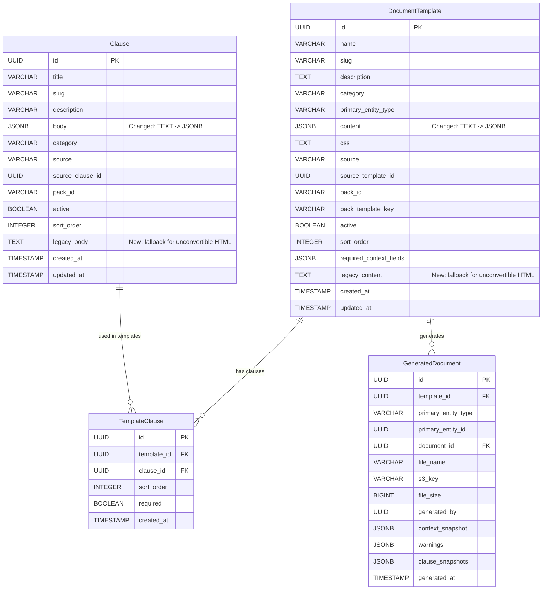
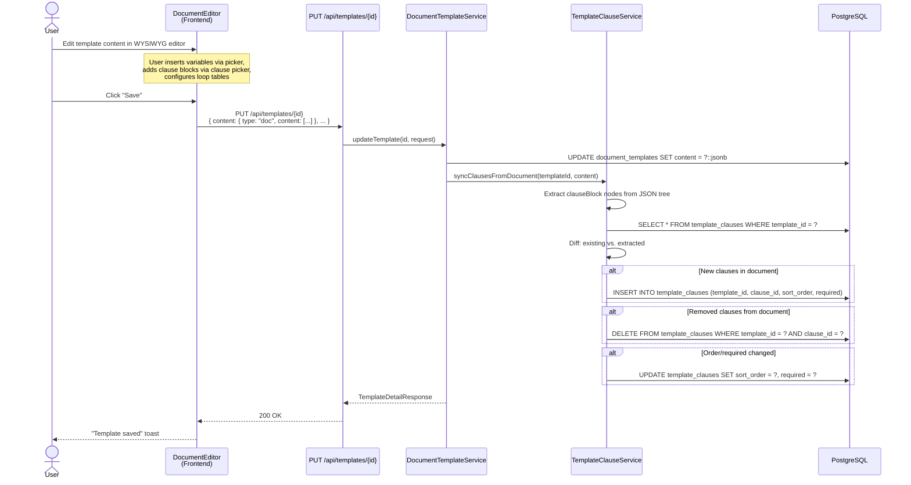
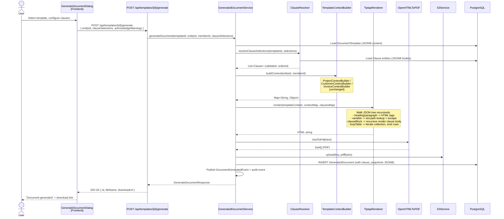
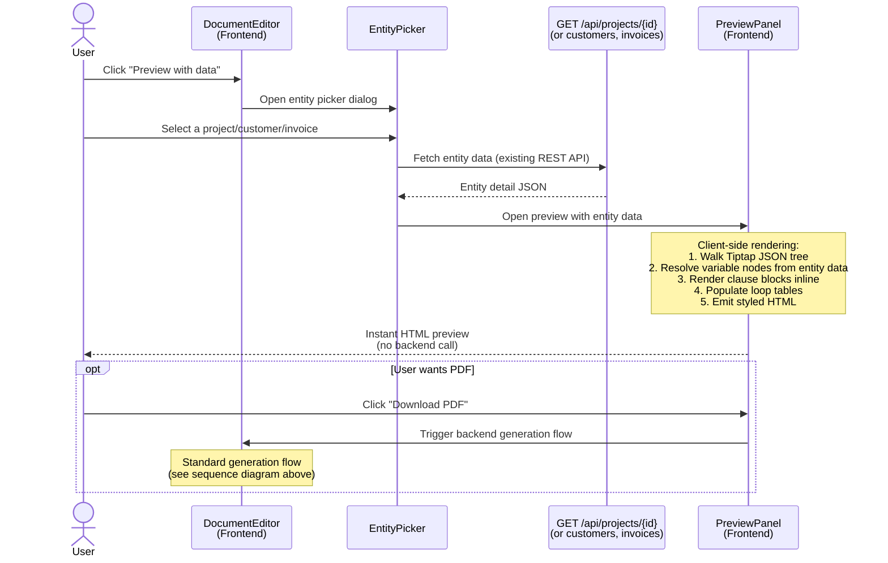
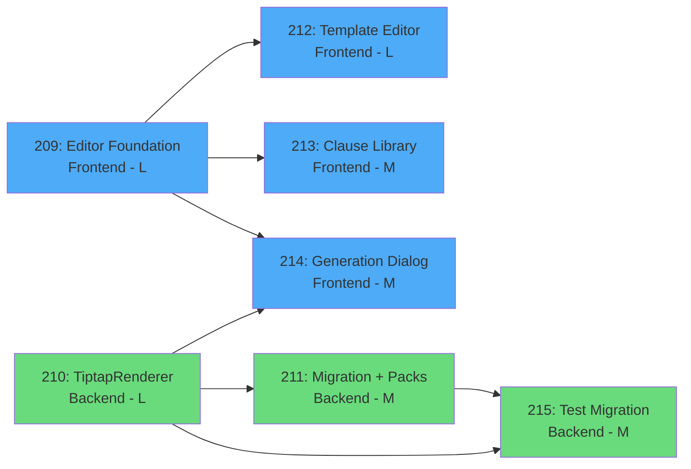

# Phase 31 — Document System Redesign: Rich Editor & Unified UX

## 31.1 Overview

Phase 31 replaces the Thymeleaf-based document authoring system with a Tiptap/ProseMirror rich text editor backed by structured JSON storage. The current system requires users to edit raw HTML with Thymeleaf expressions (`<p th:text="${customer.name}">`) to customize document templates, clause content is invisible without cloning, and preview requires a server round-trip. This phase eliminates all of those problems by introducing a WYSIWYG editor with visual variable chips, inline clause blocks, and client-side preview.

The rendering pipeline changes from Thymeleaf expression evaluation to a custom JSON tree walker (`TiptapRenderer`). Variables become simple dot-path map lookups instead of OGNL expressions, removing the entire SSTI attack surface and the `TemplateSecurityValidator` defense layer. Clauses become first-class block nodes positioned precisely within the document tree, replacing the `${clauses}` placeholder injection model. The PDF engine (OpenHTMLToPDF) and context builders (`ProjectContextBuilder`, `CustomerContextBuilder`, `InvoiceContextBuilder`) remain unchanged -- only the HTML generation step changes.

Storage migrates from `TEXT` columns containing Thymeleaf HTML to `JSONB` columns containing Tiptap JSON. Platform content (3 templates, 12 clauses) is hand-converted to JSON pack files. Org-custom content is best-effort converted via a PL/pgSQL migration with a `legacy_content` fallback column for unconvertible content. There is no dual-support period -- the old rendering path is deleted entirely.

### What Changes

| Aspect | Before (Thymeleaf/HTML) | After (Tiptap/JSON) |
|--------|------------------------|---------------------|
| Template editing | Raw HTML textarea | WYSIWYG rich text editor with toolbar |
| Variable insertion | Type `<span th:text="${customer.name}">` | Click variable chip from categorized picker |
| Clause positioning | `${clauses}` placeholder, auto-appended | Block nodes positioned anywhere in document, draggable |
| Clause visibility | Titles only, must clone to read content | Full content visible everywhere (library, editor, picker, generation dialog) |
| Storage format | `content TEXT` (HTML string) | `content JSONB` (Tiptap JSON) |
| Rendering engine | Thymeleaf `StringTemplateResolver` + OGNL | `TiptapRenderer` JSON tree walker |
| Security model | `TemplateSecurityValidator` blocks SSTI patterns | No expression language = no injection surface |
| Preview | Backend round-trip (Thymeleaf server-side) | Client-side instant (Tiptap JSON rendered in browser) |
| Loop tables | `th:each` directives | `loopTable` block nodes with predefined data sources |

### Scope Boundaries

**In scope**: Rich text editor, custom Tiptap nodes (variable, clauseBlock, loopTable), `TiptapRenderer` backend service, variable metadata endpoint, database migration (V48), template/clause pack conversion to JSON, template editor page rewrite, clause library rewrite with content visibility, clause editor sheet, clause picker dialog, generation dialog clause visibility, client-side preview, integration test migration, Thymeleaf code deletion.

**Out of scope**: Custom fields UX overhaul (separate phase), proposal entity/engagement pipeline (Phase 32), e-signature/acceptance workflow changes, new template categories or packs, collaborative/multi-user editing, template versioning or diff, email template migration (Phase 24 retains Thymeleaf), clause nesting (clauses referencing other clauses), clause approval workflows, general-purpose loops beyond tables, custom CSS syntax editor.

---

## 31.2 Domain Model

### Modified Entities

#### DocumentTemplate

| Column | Type (Before) | Type (After) | Notes |
|--------|--------------|-------------|-------|
| `id` | `UUID` | `UUID` | Unchanged |
| `name` | `VARCHAR(200)` | `VARCHAR(200)` | Unchanged |
| `slug` | `VARCHAR(200)` | `VARCHAR(200)` | Unchanged |
| `description` | `TEXT` | `TEXT` | Unchanged |
| `category` | `VARCHAR(30)` | `VARCHAR(30)` | Unchanged |
| `primary_entity_type` | `VARCHAR(20)` | `VARCHAR(20)` | Unchanged |
| **`content`** | **`TEXT`** (Thymeleaf HTML) | **`JSONB`** (Tiptap JSON) | **Changed** |
| `css` | `TEXT` | `TEXT` | Unchanged |
| `source` | `VARCHAR(20)` | `VARCHAR(20)` | Unchanged |
| `source_template_id` | `UUID` | `UUID` | Unchanged |
| `pack_id` | `VARCHAR(100)` | `VARCHAR(100)` | Unchanged |
| `pack_template_key` | `VARCHAR(100)` | `VARCHAR(100)` | Unchanged |
| `active` | `BOOLEAN` | `BOOLEAN` | Unchanged |
| `sort_order` | `INTEGER` | `INTEGER` | Unchanged |
| `required_context_fields` | `JSONB` | `JSONB` | Unchanged |
| `created_at` | `TIMESTAMP` | `TIMESTAMP` | Unchanged |
| `updated_at` | `TIMESTAMP` | `TIMESTAMP` | Unchanged |
| **`legacy_content`** | -- | **`TEXT`** (nullable) | **New** -- backup for unconvertible HTML |

Entity annotation change:

```java
// Before
@Column(name = "content", nullable = false, columnDefinition = "TEXT")
private String content;

// After — nullable = true because PLATFORM rows are NULL until pack re-seed runs
@JdbcTypeCode(SqlTypes.JSON)
@Column(name = "content", columnDefinition = "jsonb")
private Map<String, Object> content;

@Column(name = "legacy_content", columnDefinition = "TEXT")
private String legacyContent;
```

#### Clause

| Column | Type (Before) | Type (After) | Notes |
|--------|--------------|-------------|-------|
| `id` | `UUID` | `UUID` | Unchanged |
| `title` | `VARCHAR(200)` | `VARCHAR(200)` | Unchanged |
| `slug` | `VARCHAR(200)` | `VARCHAR(200)` | Unchanged |
| `description` | `VARCHAR(500)` | `VARCHAR(500)` | Unchanged |
| **`body`** | **`TEXT`** (Thymeleaf HTML) | **`JSONB`** (Tiptap JSON) | **Changed** |
| `category` | `VARCHAR(100)` | `VARCHAR(100)` | Unchanged |
| `source` | `VARCHAR(20)` | `VARCHAR(20)` | Unchanged |
| `source_clause_id` | `UUID` | `UUID` | Unchanged |
| `pack_id` | `VARCHAR(100)` | `VARCHAR(100)` | Unchanged |
| `active` | `BOOLEAN` | `BOOLEAN` | Unchanged |
| `sort_order` | `INTEGER` | `INTEGER` | Unchanged |
| `created_at` | `TIMESTAMP` | `TIMESTAMP` | Unchanged |
| `updated_at` | `TIMESTAMP` | `TIMESTAMP` | Unchanged |
| **`legacy_body`** | -- | **`TEXT`** (nullable) | **New** -- backup for unconvertible HTML |

Entity annotation change:

```java
// Before
@Column(name = "body", nullable = false, columnDefinition = "TEXT")
private String body;

// After
@JdbcTypeCode(SqlTypes.JSON)
@Column(name = "body", nullable = false, columnDefinition = "jsonb")
private Map<String, Object> body;

@Column(name = "legacy_body", columnDefinition = "TEXT")
private String legacyBody;
```

### Unchanged Entities

**TemplateClause** -- The join table (`template_clauses`) is structurally unchanged. The association semantics change: the Tiptap document JSON becomes the source of truth for which clauses are included and their order. The `TemplateClause` table is synced on save to match the `clauseBlock` nodes in the document (see [ADR-123](../adr/ADR-123-template-clause-association-source-of-truth.md)). Fields: `id`, `template_id`, `clause_id`, `sort_order`, `required`, `created_at`.

**GeneratedDocument** -- Completely unchanged. Fields: `id`, `template_id`, `primary_entity_type`, `primary_entity_id`, `document_id`, `file_name`, `s3_key`, `file_size`, `generated_by`, `context_snapshot`, `warnings`, `clause_snapshots`, `generated_at`. Note: `clause_snapshots` will now contain Tiptap JSON bodies instead of HTML strings, but the column type (`JSONB`) and structure are unchanged.

### New Backend Classes

**`TiptapRenderer`** (`template/TiptapRenderer.java`) -- Stateless service that walks a Tiptap JSON document tree and emits HTML. Replaces Thymeleaf rendering. Injected into `PdfRenderingService`.

**`VariableMetadataRegistry`** (`template/VariableMetadataRegistry.java`) -- Static configuration class defining available variables per entity type. Powers the `GET /api/templates/variables` endpoint and the frontend variable picker. Not introspected dynamically from context builders -- maintained as a manually curated registry.

### ER Diagram



### Tiptap JSON Format (Custom Nodes)

#### Variable Node

```json
{
  "type": "variable",
  "attrs": {
    "key": "customer.name"
  }
}
```

#### Clause Block Node

```json
{
  "type": "clauseBlock",
  "attrs": {
    "clauseId": "550e8400-e29b-41d4-a716-446655440000",
    "slug": "payment-terms",
    "title": "Payment Terms",
    "required": true
  }
}
```

#### Loop Table Node

```json
{
  "type": "loopTable",
  "attrs": {
    "dataSource": "invoice.lines",
    "columns": [
      { "header": "Description", "key": "description" },
      { "header": "Qty", "key": "quantity" },
      { "header": "Rate", "key": "unitPrice" },
      { "header": "Amount", "key": "amount" }
    ]
  }
}
```

#### Full Document Example

```json
{
  "type": "doc",
  "content": [
    {
      "type": "heading",
      "attrs": { "level": 1 },
      "content": [
        { "type": "text", "text": "Engagement Letter for " },
        { "type": "variable", "attrs": { "key": "customer.name" } }
      ]
    },
    {
      "type": "paragraph",
      "content": [
        { "type": "text", "text": "Dear " },
        { "type": "variable", "attrs": { "key": "customer.name" } },
        { "type": "text", "text": "," }
      ]
    },
    {
      "type": "paragraph",
      "content": [
        { "type": "text", "text": "We are pleased to confirm the engagement of " },
        { "type": "variable", "attrs": { "key": "org.name" } },
        { "type": "text", "text": " for the project " },
        {
          "type": "text",
          "marks": [{ "type": "bold" }],
          "text": ""
        },
        { "type": "variable", "attrs": { "key": "project.name" } },
        { "type": "text", "text": "." }
      ]
    },
    {
      "type": "clauseBlock",
      "attrs": {
        "clauseId": "...",
        "slug": "scope-of-work",
        "title": "Scope of Work",
        "required": true
      }
    },
    {
      "type": "clauseBlock",
      "attrs": {
        "clauseId": "...",
        "slug": "payment-terms",
        "title": "Payment Terms",
        "required": true
      }
    },
    {
      "type": "loopTable",
      "attrs": {
        "dataSource": "members",
        "columns": [
          { "header": "Team Member", "key": "name" },
          { "header": "Role", "key": "role" },
          { "header": "Email", "key": "email" }
        ]
      }
    }
  ]
}
```

---

## 31.3 Core Flows and Backend Behaviour

### 3a. Template Rendering (New Pipeline)

The `TiptapRenderer` replaces Thymeleaf as the HTML generation engine. It is a recursive JSON tree walker -- no expression language, no template engine library.

**Algorithm:**

1. Accept Tiptap JSON document (`JsonNode`), context map (`Map<String, Object>`), and resolved clauses (`Map<UUID, Clause>`).
2. Walk the `doc` node's `content` array recursively.
3. For each node, emit HTML based on node type (see mapping table below).
4. For text nodes, apply marks (bold, italic, underline, link) as nested HTML elements.
5. Assemble the rendered body into a complete HTML document with DOCTYPE, head, CSS, and body.

**Node Type to HTML Mapping:**

| Tiptap Node Type | HTML Output | Attributes Used |
|-----------------|------------|----------------|
| `doc` | No wrapper tag, renders children | -- |
| `heading` | `<h1>`, `<h2>`, `<h3>` | `attrs.level` (1-3) |
| `paragraph` | `<p>` | -- |
| `text` | Text content with marks applied | `marks[]` |
| `bulletList` | `<ul>` | -- |
| `orderedList` | `<ol>` | -- |
| `listItem` | `<li>` | -- |
| `table` | `<table>` | -- |
| `tableRow` | `<tr>` | -- |
| `tableCell` | `<td>` | `attrs.colspan`, `attrs.rowspan` |
| `tableHeader` | `<th>` | `attrs.colspan`, `attrs.rowspan` |
| `horizontalRule` | `<hr>` | -- |
| `hardBreak` | `<br>` | -- |
| `variable` | Resolved value (HTML-escaped plain text) | `attrs.key` |
| `clauseBlock` | `<div class="clause-block" data-clause-slug="{slug}">` + recursively rendered clause body | `attrs.clauseId`, `attrs.slug` |
| `loopTable` | `<table>` with `<thead>` from column headers, `<tbody>` with one `<tr>` per collection item | `attrs.dataSource`, `attrs.columns[]` |

**Mark to HTML Mapping:**

| Mark Type | HTML Element |
|-----------|-------------|
| `bold` | `<strong>` |
| `italic` | `<em>` |
| `underline` | `<u>` |
| `link` | `<a href="{attrs.href}">` |

**Variable Resolution:**

Variables use simple dot-path lookup on the context map. No expression evaluation, no OGNL, no SpEL.

```java
public String resolveVariable(String key, Map<String, Object> context) {
    String[] segments = key.split("\\.");
    Object current = context;
    for (String segment : segments) {
        if (current == null || !(current instanceof Map)) {
            return "";  // Null-safe: any missing segment returns empty string
        }
        current = ((Map<String, Object>) current).get(segment);
    }
    return current != null ? HtmlUtils.htmlEscape(String.valueOf(current)) : "";
}
```

**Clause Block Rendering:**

When the tree walker encounters a `clauseBlock` node:
1. Look up the clause by `attrs.clauseId` in the resolved clauses map.
2. If found: render the clause's Tiptap JSON `body` recursively using the same renderer and same context map. Wrap output in `<div class="clause-block" data-clause-slug="{slug}">`.
3. If not found: emit `<!-- clause not found: {slug} -->` HTML comment.

This replaces `ClauseAssembler` and the `${clauses}` placeholder injection.

**Loop Table Rendering:**

When the tree walker encounters a `loopTable` node:
1. Resolve `attrs.dataSource` from the context map (e.g., `"invoice.lines"` -> `context["invoice"]["lines"]`).
2. Expect a `List<Map<String, Object>>`.
3. Emit `<table>` with `<thead>` containing column headers from `attrs.columns[].header`.
4. For each item in the list, emit `<tr>` with `<td>` per column, resolving each `attrs.columns[].key` from the item map. HTML-escape all values.
5. If the data source is null or empty, render the header row only with an empty `<tbody>`.

**Document Assembly:**

```html
<!DOCTYPE html>
<html><head>
  <meta charset="UTF-8">
  <style>{defaultCss}
{templateCss}</style>
</head><body>
  {renderedContent}
</body></html>
```

Default CSS loaded from `classpath:templates/document-default.css` (same file as today). Template-specific CSS from `DocumentTemplate.css` column appended after.

### 3b. Template CRUD (Updated)

**Content format change:**
- `POST /api/templates` and `PUT /api/templates/{id}`: the `content` field is now a JSON object (Tiptap document structure) instead of an HTML string.
- `GET /api/templates/{id}`: returns `content` as a JSON object.
- No deep validation beyond valid JSON and root node `type: "doc"`. The editor enforces document structure.

**TemplateClause sync on save:**

When a template is saved, the `TemplateClause` table is synced to match the `clauseBlock` nodes in the document JSON. This is the key behavioral change -- the document JSON becomes the source of truth for clause associations ([ADR-123](../adr/ADR-123-template-clause-association-source-of-truth.md)).

Algorithm:
1. Extract all `clauseBlock` nodes from the saved document JSON (walk tree, collect nodes by type).
2. Build a list of `(clauseId, sortOrder, required)` tuples from the extracted nodes (sort order = position index in document order).
3. Load existing `TemplateClause` records for this template.
4. Diff:
   - Clauses in JSON but not in table -> **create** `TemplateClause` records.
   - Clauses in table but not in JSON -> **delete** `TemplateClause` records.
   - Clauses in both -> **update** `sortOrder` and `required` if changed.
5. Flush changes.

This ensures the `TemplateClause` table stays queryable (e.g., "find templates using clause X") while the editor content remains the single source of truth.

### 3c. Clause CRUD (Updated)

**Content format change:**
- `POST /api/clauses` and `PUT /api/clauses/{id}`: the `body` field is now a JSON object (Tiptap document fragment) instead of an HTML string.
- `GET /api/clauses/{id}`: returns `body` as a JSON object.

**Shared content semantics unchanged:** Editing a clause updates the clause entity directly. All templates using that clause see the updated content. The `clauseBlock` node in the template stores `clauseId` as a reference -- the clause body is loaded at render time.

### 3d. Document Generation Flow (Updated)

The orchestration in `GeneratedDocumentService` is unchanged. The internal rendering step changes:

1. Load template (now has JSONB `content`) -- unchanged call.
2. Resolve clauses via `ClauseResolver` -- unchanged. Returns `List<Clause>` in correct order with required validation.
3. Build context via appropriate `TemplateContextBuilder` -- unchanged. Produces `Map<String, Object>`.
4. **Changed:** Call `TiptapRenderer.render(template.getContent(), contextMap, resolvedClausesMap)` instead of `PdfRenderingService.renderThymeleaf()`.
5. Call `htmlToPdf(html)` via OpenHTMLToPDF -- unchanged.
6. Upload to S3 -- unchanged.
7. Create `GeneratedDocument` record with context snapshot and clause snapshots -- unchanged. Clause snapshots now contain Tiptap JSON bodies instead of HTML strings.
8. Publish `DocumentGeneratedEvent` -- unchanged.
9. Audit event -- unchanged.

### 3e. Pack Seeding (Updated)

**Template packs:**
- `.html` content files in `classpath:template-packs/common/` replaced with `.json` files (Tiptap JSON format).
- `pack.json` updated: `"contentFile": "engagement-letter.html"` becomes `"contentFile": "engagement-letter.json"`.
- `TemplatePackSeeder` updated: reads JSON file content, stores as JSONB in `content` column (instead of reading HTML string into TEXT column).

**Clause packs:**
- `classpath:clause-packs/standard-clauses/pack.json`: the `body` field in each clause definition changes from an HTML string to a Tiptap JSON object.
- `ClausePackSeeder` updated: stores JSON body in JSONB `body` column.

**Pack format changes:**

Before (clause body in pack.json):
```json
{
  "body": "<p>Payment is due within <strong>30 days</strong> of the invoice date. <span th:text=\"${org.name}\">Firm</span> reserves the right...</p>"
}
```

After:
```json
{
  "body": {
    "type": "doc",
    "content": [
      {
        "type": "paragraph",
        "content": [
          { "type": "text", "text": "Payment is due within " },
          { "type": "text", "marks": [{ "type": "bold" }], "text": "30 days" },
          { "type": "text", "text": " of the invoice date. " },
          { "type": "variable", "attrs": { "key": "org.name" } },
          { "type": "text", "text": " reserves the right..." }
        ]
      }
    ]
  }
}
```

### 3f. Migration Flow

The Flyway migration (V48) handles three categories of content:

**1. Platform content (PLATFORM source templates, SYSTEM source clauses):**
- Set `content_json` / `body_json` to `NULL`. Copy existing HTML to `legacy_content` / `legacy_body` as backup.
- The updated pack seeders will re-seed these with correct Tiptap JSON on next run (provisioning or application startup).
- Zero risk -- we control the exact pack content.

**2. Org-custom content (ORG_CUSTOM, CLONED, CUSTOM sources):**

The migration is a **two-phase process**: SQL migration wraps content, then an application-layer utility converts it.

**Phase A — SQL migration (V48):**
- PL/pgSQL function strips `th:utext="${clauses}"` directives and wraps cleaned HTML in a `legacyHtml` node.
- Detects "complex" HTML (structural elements like `<div>`, Thymeleaf loops/conditionals, inline styles) — these are marked for manual re-authoring.
- "Simple" HTML (paragraphs, headings, basic formatting, `th:text` variables) is marked with `complexity: "simple"` for the application-layer converter.
- Original HTML always preserved in `legacy_content` / `legacy_body` columns.

**Phase B — Application-layer import utility (runs at application startup, once per tenant):**
- `LegacyContentImporter` service (in `template/` package) scans for `legacyHtml` nodes with `complexity: "simple"`.
- Uses **Jsoup** (HTML parser already available as a transitive dependency of OpenHTMLToPDF) to parse the HTML into a DOM tree.
- Walks the DOM and converts to Tiptap JSON nodes:
  - `<p>` → paragraph, `<h1>`-`<h3>` → heading (level), `<strong>` → text with bold mark, `<em>` → text with italic mark, `<u>` → text with underline mark
  - `<a href>` → text with link mark, `<ul>/<ol>` → bulletList/orderedList, `<li>` → listItem
  - `<table>/<tr>/<td>/<th>` → table/tableRow/tableCell/tableHeader, `<hr>` → horizontalRule, `<br>` → hardBreak
  - `<span th:text="${key}">placeholder</span>` → variable node with `key` attribute
- Content that converts successfully: replaces `legacyHtml` node with proper Tiptap JSON nodes, clears the `legacyHtml` wrapper.
- Content that fails to convert: remains as `legacyHtml` node — editor shows "Migration needed" badge.
- Idempotent: tracks conversion status via a flag on the `legacyHtml` node attributes (`converted: true/false`). Only processes unconverted rows.
- Runs asynchronously at startup (does not block application readiness).

**3. Column swap:**
- Drop old `content` TEXT column, rename `content_json` to `content`.
- Drop old `body` TEXT column, rename `body_json` to `body`.
- `legacy_content` and `legacy_body` columns are permanent (backup, not operational).

---

## 31.4 API Surface

### Modified Endpoints

#### Template Endpoints (`/api/templates`)

| Method | Path | Change |
|--------|------|--------|
| `POST /api/templates` | `content` field: `String` (HTML) -> `Object` (Tiptap JSON) |
| `PUT /api/templates/{id}` | `content` field: `String` (HTML) -> `Object` (Tiptap JSON). **On save: syncs TemplateClause table from clauseBlock nodes** |
| `GET /api/templates/{id}` | `content` in response: `String` -> `Object` (Tiptap JSON) |
| `GET /api/templates` | List responses include `content` as JSON object |
| `POST /api/templates/{id}/preview` | Internally uses `TiptapRenderer` instead of Thymeleaf. Response format unchanged (HTML string) |
| `POST /api/templates/{id}/generate` | Internally uses `TiptapRenderer`. Response format unchanged |
| `POST /api/templates/{id}/clone` | Cloned content is JSONB. No format change needed |
| `POST /api/templates/{id}/reset` | Re-seeds from JSON pack file |

#### Clause Endpoints (`/api/clauses`)

| Method | Path | Change |
|--------|------|--------|
| `POST /api/clauses` | `body` field: `String` (HTML) -> `Object` (Tiptap JSON) |
| `PUT /api/clauses/{id}` | `body` field: `String` (HTML) -> `Object` (Tiptap JSON) |
| `GET /api/clauses/{id}` | `body` in response: `String` -> `Object` (Tiptap JSON) |
| `GET /api/clauses` | List responses include `body` as JSON object |
| `POST /api/clauses/{id}/preview` | Uses `TiptapRenderer` for preview rendering |

#### TemplateClause Endpoints (`/api/templates/{templateId}/clauses`)

| Method | Path | Change |
|--------|------|--------|
| `GET /api/templates/{templateId}/clauses` | Unchanged |
| `PUT /api/templates/{templateId}/clauses` | **Behavior note:** Still functional but secondary to document JSON sync. Primarily used by generation dialog for clause selection override. |
| `POST /api/templates/{templateId}/clauses` | Unchanged |
| `DELETE /api/templates/{templateId}/clauses/{clauseId}` | Unchanged |

### New Endpoints

#### Variable Metadata (`GET /api/templates/variables`)

| Aspect | Detail |
|--------|--------|
| Method | `GET` |
| Path | `/api/templates/variables` |
| Query Params | `entityType` (required): `PROJECT`, `CUSTOMER`, or `INVOICE` |
| Auth | Any authenticated member (read-only, no ADMIN requirement) |
| Purpose | Powers the frontend variable picker and loop table data source selector |

### Request/Response Shapes

#### Template Create Request

```json
POST /api/templates
{
  "name": "Custom Engagement Letter",
  "category": "ENGAGEMENT_LETTER",
  "primaryEntityType": "PROJECT",
  "description": "Custom engagement letter for new clients",
  "content": {
    "type": "doc",
    "content": [
      {
        "type": "heading",
        "attrs": { "level": 1 },
        "content": [
          { "type": "text", "text": "Engagement Letter" }
        ]
      },
      {
        "type": "paragraph",
        "content": [
          { "type": "text", "text": "Dear " },
          { "type": "variable", "attrs": { "key": "customer.name" } }
        ]
      }
    ]
  },
  "css": null
}
```

#### Template Detail Response

```json
GET /api/templates/{id}
{
  "id": "...",
  "name": "Standard Engagement Letter",
  "slug": "standard-engagement-letter",
  "category": "ENGAGEMENT_LETTER",
  "primaryEntityType": "PROJECT",
  "description": "...",
  "content": {
    "type": "doc",
    "content": [
      { "type": "heading", "attrs": { "level": 1 }, "content": [...] },
      { "type": "paragraph", "content": [...] },
      { "type": "clauseBlock", "attrs": { "clauseId": "...", "slug": "scope-of-work", "title": "Scope of Work", "required": true } },
      { "type": "clauseBlock", "attrs": { "clauseId": "...", "slug": "payment-terms", "title": "Payment Terms", "required": true } }
    ]
  },
  "css": "...",
  "source": "PLATFORM",
  "active": true,
  "sortOrder": 1,
  "legacyContent": null,
  "createdAt": "...",
  "updatedAt": "..."
}
```

#### Clause Create/Update Request

```json
POST /api/clauses
{
  "title": "Custom Payment Terms",
  "category": "Commercial",
  "description": "Net-60 payment terms for enterprise clients",
  "body": {
    "type": "doc",
    "content": [
      {
        "type": "paragraph",
        "content": [
          { "type": "text", "text": "Payment is due within " },
          { "type": "text", "marks": [{ "type": "bold" }], "text": "60 days" },
          { "type": "text", "text": " of the invoice date issued by " },
          { "type": "variable", "attrs": { "key": "org.name" } },
          { "type": "text", "text": "." }
        ]
      }
    ]
  }
}
```

#### Variable Metadata Response

```json
GET /api/templates/variables?entityType=PROJECT
{
  "groups": [
    {
      "label": "Project",
      "prefix": "project",
      "variables": [
        { "key": "project.name", "label": "Project Name", "type": "text" },
        { "key": "project.description", "label": "Description", "type": "text" },
        { "key": "project.startDate", "label": "Start Date", "type": "date" },
        { "key": "project.dueDate", "label": "Due Date", "type": "date" }
      ]
    },
    {
      "label": "Customer",
      "prefix": "customer",
      "variables": [
        { "key": "customer.name", "label": "Customer Name", "type": "text" },
        { "key": "customer.email", "label": "Email", "type": "text" }
      ]
    },
    {
      "label": "Organization",
      "prefix": "org",
      "variables": [
        { "key": "org.name", "label": "Organization Name", "type": "text" },
        { "key": "org.brandColor", "label": "Brand Color", "type": "text" },
        { "key": "org.documentFooterText", "label": "Footer Text", "type": "text" },
        { "key": "org.logoUrl", "label": "Logo URL", "type": "url" }
      ]
    },
    {
      "label": "Generated",
      "prefix": "",
      "variables": [
        { "key": "generatedAt", "label": "Generation Date", "type": "datetime" },
        { "key": "generatedBy.name", "label": "Generated By", "type": "text" }
      ]
    }
  ],
  "loopSources": [
    { "key": "members", "label": "Project Members", "entityTypes": ["PROJECT"], "fields": ["name", "email", "role"] },
    { "key": "invoice.lines", "label": "Invoice Lines", "entityTypes": ["INVOICE"], "fields": ["description", "quantity", "unitPrice", "amount"] },
    { "key": "invoice.taxBreakdown", "label": "Tax Breakdown", "entityTypes": ["INVOICE"], "fields": ["taxRate", "taxableAmount", "taxAmount"] },
    { "key": "tags", "label": "Tags", "entityTypes": ["PROJECT", "CUSTOMER"], "fields": ["name", "color"] }
  ]
}
```

---

## 31.5 Sequence Diagrams

### Template Editing + Save (with TemplateClause Sync)



### Document Generation (New Pipeline)



### Client-Side Preview Flow



---

## 31.6 Frontend Architecture

### Component Tree

```
frontend/src/components/editor/
  DocumentEditor.tsx          -- Main editor component (Tiptap + toolbar + extensions)
  EditorToolbar.tsx           -- Formatting toolbar (Shadcn UI buttons/dropdowns)
  VariablePicker.tsx          -- Variable selection dialog (categorized list)
  ClausePicker.tsx            -- Clause selection dialog (master-detail layout)
  LoopTableConfig.tsx         -- Loop table configuration popover
  PreviewPanel.tsx            -- Client-side rendered preview
  extensions/
    variable.ts               -- Custom Tiptap extension: variable inline node
    clauseBlock.ts            -- Custom Tiptap extension: clauseBlock block node
    loopTable.ts              -- Custom Tiptap extension: loopTable block node
  node-views/
    VariableNodeView.tsx       -- React node view: styled chip for variable
    ClauseBlockNodeView.tsx    -- React node view: card with title + read-only content + menu
    LoopTableNodeView.tsx      -- React node view: table with placeholder rows + config panel
```

### Custom Tiptap Extensions

**Variable Extension** (`extensions/variable.ts`):
- Node type: `variable`
- Group: `inline`
- Inline: `true`
- Atom: `true` (non-editable)
- Attributes: `key` (string, required)
- Node view: `VariableNodeView.tsx` -- renders as a styled pill/chip (light blue background, rounded corners, monospace text). Shows `key` value (e.g., `customer.name`). Click selects the node; toolbar button or keyboard shortcut opens variable picker to insert/change.

**ClauseBlock Extension** (`extensions/clauseBlock.ts`):
- Node type: `clauseBlock`
- Group: `block`
- Atom: `true` (content is read-only in template context)
- Attributes: `clauseId` (UUID), `slug` (string), `title` (string), `required` (boolean)
- Node view: `ClauseBlockNodeView.tsx` -- renders as a card with:
  - Title bar: clause icon + title + required badge + `[...]` menu
  - Body: clause content rendered as read-only rich text (fetched from API, cached)
  - Left border accent (visually distinct from surrounding content)
  - Draggable handle for reordering
- Menu actions: Move up, Move down, Toggle required, Replace (opens clause picker), Remove, Edit clause (opens editor sheet)

**LoopTable Extension** (`extensions/loopTable.ts`):
- Node type: `loopTable`
- Group: `block`
- Atom: `true` (configured, not free-edited)
- Attributes: `dataSource` (string), `columns` (array of `{ header, key }`)
- Node view: `LoopTableNodeView.tsx` -- renders table with header row using column headers, 1-2 placeholder rows showing `{key}` as faded text, and a "Data source: {dataSource}" label below. Click opens configuration popover.

### Editor Toolbar Configuration

The toolbar follows Shadcn UI patterns (toolbar buttons, dropdown menus, separator groups). Two scope configurations:

**Template scope** (full toolbar):
- Formatting: Bold, Italic, Underline
- Structure: H1, H2, H3
- Lists: Bullet list, Ordered list
- Insert: Table, Horizontal rule
- Custom: `{x} Variable` (opens variable picker), `Clause` (opens clause picker), `Loop Table` (inserts loopTable node)

**Clause scope** (reduced toolbar):
- Same as template scope **minus**: Clause insertion (no clause-within-clause), Loop Table (clauses don't contain iteration)
- Variables are allowed in clauses (they resolve from the same context map)

### Client-Side Rendering for Preview

The frontend renders Tiptap JSON to HTML entirely in the browser for the "Preview with data" feature:
1. User selects an entity (project/customer/invoice) from the entity picker.
2. Frontend fetches entity detail via existing REST API (e.g., `GET /api/projects/{id}`).
3. A client-side renderer (mirror of `TiptapRenderer` logic) walks the Tiptap JSON, resolves variable nodes from the fetched data, renders clause blocks inline, and populates loop tables.
4. Output is styled HTML displayed in a preview panel with document-like styling (white background, margins, print typography).

This provides instant feedback -- no backend round-trip for HTML preview. PDF preview still requires the backend (OpenHTMLToPDF is server-side).

### Component Reuse Strategy

The `DocumentEditor` component is shared between:
- **Template editor page** (`/settings/templates/[id]`) -- full document editing with all custom nodes
- **Clause editor sheet** (opened from clause library or template editor) -- clause body editing with reduced toolbar
- **Phase 32 (Proposals)** -- proposal content authoring (future reuse)

The same component accepts a `scope` prop (`"template" | "clause"`) that controls which toolbar buttons and extensions are active.

### npm Packages

| Package | Purpose |
|---------|---------|
| `@tiptap/react` | React integration for Tiptap editor |
| `@tiptap/starter-kit` | Standard formatting extensions (bold, italic, headings, lists, etc.) |
| `@tiptap/extension-table` | Table support (insert, rows, columns, cell merging) |
| `@tiptap/extension-link` | Link support |
| `@tiptap/extension-underline` | Underline mark |
| `@tiptap/extension-placeholder` | Placeholder text in empty editor |
| `@tiptap/pm` | ProseMirror dependencies (peer) |

Custom extensions for `variable`, `clauseBlock`, and `loopTable` are built in-house (not npm packages).

### Page Rewrites

| Page | Current | After |
|------|---------|-------|
| `/settings/templates/[id]/edit` | HTML textarea + Clauses tab | WYSIWYG `DocumentEditor` with inline clause blocks |
| `/settings/templates/new` | Form with HTML textarea | Form with `DocumentEditor` |
| `/settings/clauses` | Title + description only | Title + description + expandable content preview |
| Clause editor | `clause-form-dialog.tsx` (textarea for body) | Sheet with `DocumentEditor` (clause scope) |
| Generation dialog | Clause checkboxes without content | Clause list with expandable content + reorder |

---

## 31.7 Database Migration (V48)

```sql
-- V48__document_tiptap_migration.sql
-- Phase 31: Migrate document templates and clauses from Thymeleaf HTML (TEXT) to Tiptap JSON (JSONB)

-- ============================================================
-- Step 1: Add new columns
-- ============================================================

-- Template: new JSONB content column + legacy backup
ALTER TABLE document_templates ADD COLUMN content_json JSONB;
ALTER TABLE document_templates ADD COLUMN legacy_content TEXT;

-- Clause: new JSONB body column + legacy backup
ALTER TABLE clauses ADD COLUMN body_json JSONB;
ALTER TABLE clauses ADD COLUMN legacy_body TEXT;

-- ============================================================
-- Step 2: Platform content (PLATFORM source templates)
-- Pack seeders will re-seed these with correct Tiptap JSON.
-- Store existing HTML as legacy backup.
-- ============================================================

UPDATE document_templates
SET legacy_content = content,
    content_json = NULL
WHERE source = 'PLATFORM';

-- ============================================================
-- Step 3: System clauses (SYSTEM source)
-- Pack seeders will re-seed these with correct Tiptap JSON.
-- ============================================================

UPDATE clauses
SET legacy_body = body,
    body_json = NULL
WHERE source = 'SYSTEM';

-- ============================================================
-- Step 4: Org-custom content — best-effort HTML -> Tiptap JSON
-- ============================================================

-- PL/pgSQL conversion function for basic HTML -> Tiptap JSON.
--
-- SCOPE: This converter handles the ~80-90% case — simple HTML with common elements
-- and basic Thymeleaf variable expressions. It works by:
--   1. Stripping clause placeholders (clause blocks are now document tree nodes)
--   2. Converting th:text="${key}" spans into Tiptap variable nodes
--   3. Wrapping the remaining HTML in a legacyHtml node for the editor to display
--
-- Content that is purely simple paragraphs with variables will render cleanly.
-- Content with complex HTML (nested divs, custom CSS classes, th:each loops)
-- is preserved as a legacyHtml node — the editor shows a "migration needed" badge
-- and the user can re-author in the rich text editor.
--
-- The original HTML is ALWAYS preserved in legacy_content / legacy_body columns
-- regardless of conversion success.
CREATE OR REPLACE FUNCTION convert_html_to_tiptap_json(html TEXT)
RETURNS JSONB AS $$
DECLARE
    result JSONB;
    cleaned TEXT;
    has_complex_html BOOLEAN;
BEGIN
    -- Step 1: Strip clause placeholder directives
    cleaned := regexp_replace(html, '<div[^>]*th:utext="\$\{clauses\}"[^>]*>.*?</div>', '', 'gi');
    cleaned := regexp_replace(cleaned, '<[^>]*th:utext="\$\{clauses\}"[^>]*/?>', '', 'gi');

    -- Step 2: Detect complex HTML that we can't convert reliably in SQL.
    -- If any of these patterns exist, wrap the whole thing as legacyHtml.
    has_complex_html := (
        cleaned ~ '<(div|section|article|aside|nav|header|footer|form|iframe|script|style)[^>]*>'  -- structural elements
        OR cleaned ~ 'th:each'             -- Thymeleaf loops
        OR cleaned ~ 'th:if|th:unless'     -- Thymeleaf conditionals
        OR cleaned ~ 'th:switch|th:case'   -- Thymeleaf switch
        OR cleaned ~ 'th:fragment|th:insert|th:replace'  -- Thymeleaf fragments
        OR cleaned ~ 'class="[^"]*"'       -- Custom CSS classes (may affect rendering)
        OR cleaned ~ 'style="[^"]*"'       -- Inline styles
    );

    IF has_complex_html THEN
        -- Wrap as legacyHtml — editor shows "migration needed" badge
        result := jsonb_build_object(
            'type', 'doc',
            'content', jsonb_build_array(
                jsonb_build_object(
                    'type', 'legacyHtml',
                    'attrs', jsonb_build_object('html', cleaned)
                )
            )
        );
    ELSE
        -- Simple content: wrap as legacyHtml but mark as "simple" for the editor
        -- to offer one-click re-import. The actual element-by-element conversion
        -- (p -> paragraph, h1 -> heading, th:text -> variable nodes) happens in
        -- the TiptapRenderer's import utility at application startup, which has
        -- access to a proper HTML parser (Jsoup). The SQL migration preserves
        -- the cleaned HTML for the import utility to process.
        result := jsonb_build_object(
            'type', 'doc',
            'content', jsonb_build_array(
                jsonb_build_object(
                    'type', 'legacyHtml',
                    'attrs', jsonb_build_object(
                        'html', cleaned,
                        'complexity', 'simple'
                    )
                )
            )
        );
    END IF;

    RETURN result;
EXCEPTION WHEN OTHERS THEN
    RETURN NULL;
END;
$$ LANGUAGE plpgsql;

-- Convert org-custom templates
UPDATE document_templates
SET legacy_content = content,
    content_json = convert_html_to_tiptap_json(content)
WHERE source != 'PLATFORM'
  AND content IS NOT NULL;

-- Convert org-custom clauses
UPDATE clauses
SET legacy_body = body,
    body_json = convert_html_to_tiptap_json(body)
WHERE source != 'SYSTEM'
  AND body IS NOT NULL;

-- Handle any rows where conversion returned NULL (shouldn't happen with legacyHtml wrapper)
UPDATE document_templates
SET content_json = jsonb_build_object(
    'type', 'doc',
    'content', jsonb_build_array(
        jsonb_build_object('type', 'paragraph', 'content',
            jsonb_build_array(jsonb_build_object('type', 'text', 'text', 'Migration failed — please re-create this template.')))
    )
)
WHERE content_json IS NULL AND source != 'PLATFORM';

UPDATE clauses
SET body_json = jsonb_build_object(
    'type', 'doc',
    'content', jsonb_build_array(
        jsonb_build_object('type', 'paragraph', 'content',
            jsonb_build_array(jsonb_build_object('type', 'text', 'text', 'Migration failed — please re-create this clause.')))
    )
)
WHERE body_json IS NULL AND source != 'SYSTEM';

-- ============================================================
-- Step 5: Column swap
-- ============================================================

-- Drop old TEXT columns
ALTER TABLE document_templates DROP COLUMN content;
ALTER TABLE clauses DROP COLUMN body;

-- Rename JSON columns to canonical names
ALTER TABLE document_templates RENAME COLUMN content_json TO content;
ALTER TABLE clauses RENAME COLUMN body_json TO body;

-- ============================================================
-- Step 6: Constraints
-- ============================================================

-- content is nullable initially — PLATFORM templates will be re-seeded by pack seeders
-- Once seeders run, all templates will have non-null content

-- ============================================================
-- Step 7: Cleanup
-- ============================================================

DROP FUNCTION IF EXISTS convert_html_to_tiptap_json(TEXT);

-- ============================================================
-- Step 8: Index for JSONB content queries (optional, for future use)
-- ============================================================

-- GIN index enables queries like "find templates containing variable X"
-- CREATE INDEX idx_document_templates_content_gin ON document_templates USING GIN (content);
-- CREATE INDEX idx_clauses_body_gin ON clauses USING GIN (body);
-- Uncomment if JSONB querying becomes a use case. Not needed for Phase 31.
```

**Rollback strategy:**
- `legacy_content` and `legacy_body` columns preserve the original HTML.
- If rollback is needed: add back `content TEXT` / `body TEXT` columns, copy from legacy columns, drop JSONB columns. Revert entity annotations to `String`.
- Platform content restored from legacy columns or re-seeded from git-tracked `.html` pack files.

---

## 31.8 Implementation Guidance

### Backend Changes

| File | Change |
|------|--------|
| `template/DocumentTemplate.java` | Change `content` from `String` + `TEXT` to `Map<String, Object>` + `JSONB`. Add `legacyContent` field. |
| `clause/Clause.java` | Change `body` from `String` + `TEXT` to `Map<String, Object>` + `JSONB`. Add `legacyBody` field. |
| `template/TiptapRenderer.java` | **New.** JSON tree walker service. ~200-300 lines. |
| `template/VariableMetadataRegistry.java` | **New.** Static variable definitions per entity type. ~100 lines. |
| `template/LegacyContentImporter.java` | **New.** Application-startup service that converts `legacyHtml` nodes (complexity: "simple") to proper Tiptap JSON using Jsoup HTML parsing. Runs once per tenant, idempotent. |
| `template/PdfRenderingService.java` | Replace `renderThymeleaf()` chain with `TiptapRenderer.render()`. Delete `renderThymeleaf()`, `injectClauseContext()`, `renderFragment()`, Thymeleaf engine setup. |
| `template/DocumentTemplateController.java` | Update DTOs: `content` field type from `String` to `Object`. Add `GET /api/templates/variables` endpoint. |
| `template/DocumentTemplateService.java` | Add TemplateClause sync logic on template save. |
| `clause/ClauseController.java` | Update DTOs: `body` field type from `String` to `Object`. |
| `clause/TemplateClauseController.java` | Add `@Deprecated` annotations to `POST` and `DELETE` endpoints. Add Javadoc noting that clause associations are now synced from document JSON on template save (see [ADR-123](../adr/ADR-123-template-clause-association-source-of-truth.md)). Endpoints remain functional for backward compatibility. |
| `template/TemplatePackSeeder.java` | Read `.json` content files instead of `.html`. Store as JSONB. |
| `clause/ClausePackSeeder.java` | Parse `body` as JSON object instead of HTML string. Store as JSONB. |
| `template/LenientStandardDialect.java` | **Delete.** |
| `template/LenientOGNLEvaluator.java` | **Delete.** |
| `template/TemplateSecurityValidator.java` | **Delete.** |
| `clause/ClauseAssembler.java` | **Delete.** |
| Resource: `template-packs/common/engagement-letter.html` | **Replace** with `engagement-letter.json` |
| Resource: `template-packs/common/project-summary.html` | **Replace** with `project-summary.json` |
| Resource: `template-packs/common/invoice-cover-letter.html` | **Replace** with `invoice-cover-letter.json` |
| Resource: `template-packs/common/pack.json` | Update `contentFile` references from `.html` to `.json` |
| Resource: `clause-packs/standard-clauses/pack.json` | Change clause `body` fields from HTML strings to Tiptap JSON objects |
| Migration: `db/migration/tenant/V48__document_tiptap_migration.sql` | **New.** See section 31.7. |

### Frontend Changes

| File | Change |
|------|--------|
| `components/editor/DocumentEditor.tsx` | **New.** Tiptap editor with toolbar, extensions, serialization. |
| `components/editor/EditorToolbar.tsx` | **New.** Shadcn-styled formatting toolbar. |
| `components/editor/VariablePicker.tsx` | **New.** Categorized variable selection dialog. |
| `components/editor/ClausePicker.tsx` | **New.** Master-detail clause selection dialog. |
| `components/editor/LoopTableConfig.tsx` | **New.** Loop table configuration popover. |
| `components/editor/PreviewPanel.tsx` | **New.** Client-side rendered document preview. |
| `components/editor/extensions/variable.ts` | **New.** Custom Tiptap extension. |
| `components/editor/extensions/clauseBlock.ts` | **New.** Custom Tiptap extension. |
| `components/editor/extensions/loopTable.ts` | **New.** Custom Tiptap extension. |
| `components/editor/node-views/VariableNodeView.tsx` | **New.** React node view for variable chips. |
| `components/editor/node-views/ClauseBlockNodeView.tsx` | **New.** React node view for clause cards. |
| `components/editor/node-views/LoopTableNodeView.tsx` | **New.** React node view for loop tables. |
| `settings/templates/[id]/edit/page.tsx` | **Rewrite.** Replace HTML textarea with DocumentEditor. Remove tabs. |
| `settings/templates/new/page.tsx` | **Rewrite.** Use DocumentEditor for content. |
| `components/templates/TemplateEditorForm.tsx` | **Rewrite.** Integrate DocumentEditor, remove HTML textarea. |
| `components/templates/TemplateEditor.tsx` | **Rewrite.** Unified editor layout (no tabs). |
| `settings/clauses/page.tsx` | **Rewrite.** Add content expand/collapse for each clause. |
| `components/clauses/clauses-content.tsx` | **Rewrite.** Add inline content rendering, "Used in" indicator. |
| `components/clauses/clause-form-dialog.tsx` | **Rewrite.** Replace textarea with DocumentEditor (clause scope). |
| `components/templates/GenerateDocumentDialog.tsx` | **Update.** Add clause content expand, reorder, clause picker. |
| `components/templates/generation-clause-step.tsx` | **Update.** Show clause content, expand toggle. |
| `components/templates/clause-picker-dialog.tsx` | **Rewrite.** Master-detail layout with content preview. |
| `components/templates/template-clauses-tab.tsx` | **Delete.** Clauses are now inline in editor. |
| `components/templates/TemplateVariableReference.tsx` | **Delete.** Replaced by VariablePicker. |
| `settings/templates/actions.ts` | Update: `content` field type in create/update actions. Add `fetchVariableMetadata()`. |
| `lib/actions/clause-actions.ts` | Update: `body` field type in create/update actions. |

### TiptapRenderer Code Pattern

```java
@Service
public class TiptapRenderer {

    private final String defaultCss;

    public TiptapRenderer(@Value("classpath:templates/document-default.css") Resource cssResource)
            throws IOException {
        this.defaultCss = new String(cssResource.getInputStream().readAllBytes(), StandardCharsets.UTF_8);
    }

    public String render(Map<String, Object> document, Map<String, Object> context,
                         Map<UUID, Clause> clauses, String templateCss) {
        StringBuilder body = new StringBuilder();
        renderNode(document, context, clauses, body);

        return "<!DOCTYPE html>\n<html><head>\n<meta charset=\"UTF-8\">\n<style>"
                + defaultCss + "\n" + (templateCss != null ? templateCss : "")
                + "</style>\n</head><body>\n" + body + "\n</body></html>";
    }

    @SuppressWarnings("unchecked")
    private void renderNode(Map<String, Object> node, Map<String, Object> context,
                            Map<UUID, Clause> clauses, StringBuilder sb) {
        String type = (String) node.get("type");
        Map<String, Object> attrs = (Map<String, Object>) node.getOrDefault("attrs", Map.of());

        switch (type) {
            case "doc" -> renderChildren(node, context, clauses, sb);
            case "heading" -> {
                int level = ((Number) attrs.getOrDefault("level", 1)).intValue();
                sb.append("<h").append(level).append(">");
                renderChildren(node, context, clauses, sb);
                sb.append("</h").append(level).append(">");
            }
            case "paragraph" -> {
                sb.append("<p>");
                renderChildren(node, context, clauses, sb);
                sb.append("</p>");
            }
            case "text" -> renderText(node, sb);
            case "variable" -> {
                String key = (String) attrs.get("key");
                sb.append(resolveVariable(key, context));
            }
            case "clauseBlock" -> {
                UUID clauseId = UUID.fromString((String) attrs.get("clauseId"));
                String slug = (String) attrs.get("slug");
                Clause clause = clauses.get(clauseId);
                if (clause != null) {
                    sb.append("<div class=\"clause-block\" data-clause-slug=\"")
                      .append(HtmlUtils.htmlEscape(slug)).append("\">");
                    renderNode(clause.getBody(), context, clauses, sb);
                    sb.append("</div>");
                } else {
                    sb.append("<!-- clause not found: ").append(slug).append(" -->");
                }
            }
            case "loopTable" -> renderLoopTable(attrs, context, sb);
            case "bulletList" -> wrapTag("ul", node, context, clauses, sb);
            case "orderedList" -> wrapTag("ol", node, context, clauses, sb);
            case "listItem" -> wrapTag("li", node, context, clauses, sb);
            case "table" -> wrapTag("table", node, context, clauses, sb);
            case "tableRow" -> wrapTag("tr", node, context, clauses, sb);
            case "tableCell" -> renderTableCell("td", attrs, node, context, clauses, sb);
            case "tableHeader" -> renderTableCell("th", attrs, node, context, clauses, sb);
            case "horizontalRule" -> sb.append("<hr>");
            case "hardBreak" -> sb.append("<br>");
            case "legacyHtml" -> sb.append((String) attrs.getOrDefault("html", ""));
            default -> renderChildren(node, context, clauses, sb);
        }
    }

    private String resolveVariable(String key, Map<String, Object> context) {
        String[] segments = key.split("\\.");
        Object current = context;
        for (String segment : segments) {
            if (!(current instanceof Map)) return "";
            current = ((Map<?, ?>) current).get(segment);
            if (current == null) return "";
        }
        return HtmlUtils.htmlEscape(String.valueOf(current));
    }

    // ... renderChildren, renderText, renderLoopTable, wrapTag, renderTableCell helpers
}
```

### TemplateClause Sync Algorithm

```java
public void syncClausesFromDocument(UUID templateId, Map<String, Object> documentJson) {
    // 1. Extract clauseBlock nodes from document tree (DFS)
    List<ClauseBlockRef> extracted = new ArrayList<>();
    extractClauseBlocks(documentJson, extracted);

    // 2. Load existing associations
    List<TemplateClause> existing = templateClauseRepository.findByTemplateIdOrderBySortOrder(templateId);
    Map<UUID, TemplateClause> existingByClauseId = existing.stream()
        .collect(Collectors.toMap(TemplateClause::getClauseId, tc -> tc));

    // 3. Determine changes
    Set<UUID> extractedClauseIds = extracted.stream()
        .map(ClauseBlockRef::clauseId).collect(Collectors.toSet());
    Set<UUID> existingClauseIds = existingByClauseId.keySet();

    // Delete removed
    existingClauseIds.stream()
        .filter(id -> !extractedClauseIds.contains(id))
        .forEach(id -> templateClauseRepository.delete(existingByClauseId.get(id)));

    // Create or update
    for (int i = 0; i < extracted.size(); i++) {
        ClauseBlockRef ref = extracted.get(i);
        TemplateClause tc = existingByClauseId.get(ref.clauseId());
        if (tc == null) {
            tc = new TemplateClause(templateId, ref.clauseId(), i, ref.required());
            templateClauseRepository.save(tc);
        } else {
            tc.setSortOrder(i);
            tc.setRequired(ref.required());
        }
    }
}

private record ClauseBlockRef(UUID clauseId, boolean required) {}
```

### Testing Strategy

| Test | Scope | Verifies |
|------|-------|----------|
| `TiptapRendererTest` | Unit | Each node type renders correct HTML. Variable resolution with null-safety. Mark application. |
| `TiptapRendererClauseTest` | Unit | Clause block rendering with recursive context. Missing clause graceful degradation. |
| `TiptapRendererLoopTableTest` | Unit | Loop table with data. Empty data source. Missing data source. |
| `PdfRenderingServiceTest` | Integration | Full pipeline: Tiptap JSON -> HTML -> PDF via OpenHTMLToPDF. |
| `VariableMetadataEndpointTest` | Integration | Endpoint returns correct variables per entity type. |
| `TemplateClauseSyncTest` | Integration | Save template syncs TemplateClause table from clauseBlock nodes. |
| `TemplatePackSeederTest` | Integration | Seeder reads `.json` packs and stores JSONB content. |
| `ClausePackSeederTest` | Integration | Seeder reads JSON clause bodies and stores JSONB. |
| `TemplateCrudJsonTest` | Integration | Create/update/get with Tiptap JSON content. |
| `ClauseCrudJsonTest` | Integration | Create/update/get with Tiptap JSON body. |
| `VisualRegressionTest` | Integration | 3 platform templates: new pipeline produces structurally equivalent HTML to old output. |
| `DocumentEditor.test.tsx` | Component | Editor loads/saves Tiptap JSON. Custom nodes render. Toolbar actions work. |
| `VariablePicker.test.tsx` | Component | Variable list loads from API. Selection inserts node. Filtering works. |
| `ClausePicker.test.tsx` | Component | Master-detail layout. Clause content preview. Add inserts node. |
| `ClauseContentExpand.test.tsx` | Component | Clause library expand/collapse shows rendered body. |

---

## 31.9 Deletion Inventory

### Backend Classes to Delete

| Class | Package | Reason |
|-------|---------|--------|
| `LenientStandardDialect` | `template/` | Thymeleaf dialect no longer needed |
| `LenientOGNLEvaluator` | `template/` | OGNL expression evaluator no longer needed |
| `TemplateSecurityValidator` | `template/` | No expression language = no injection surface to validate |
| `ClauseAssembler` | `clause/` | Clause rendering is now part of TiptapRenderer tree walk |

### Methods to Delete from Surviving Classes

| Class | Method | Reason |
|-------|--------|--------|
| `PdfRenderingService` | `renderThymeleaf()` | Replaced by `TiptapRenderer.render()` |
| `PdfRenderingService` | `renderFragment()` | Clause fragments rendered by tree walk |
| `PdfRenderingService` | `injectClauseContext()` | Clauses are document tree nodes, not context variables |
| `PdfRenderingService` | Thymeleaf `TemplateEngine` setup code | No Thymeleaf engine needed for documents |

### Frontend Components to Rewrite

| Component | Action | Replacement |
|-----------|--------|-------------|
| `TemplateEditor.tsx` | Rewrite | Unified editor with DocumentEditor (no tabs) |
| `TemplateEditorForm.tsx` | Rewrite | Integrate DocumentEditor, remove HTML textarea |
| `clauses-content.tsx` | Rewrite | Add inline content rendering |
| `clause-form-dialog.tsx` | Rewrite | Replace textarea with DocumentEditor |
| `clause-picker-dialog.tsx` | Rewrite | Master-detail with content preview |
| `generation-clause-step.tsx` | Update | Add content expand, reorder |
| `GenerateDocumentDialog.tsx` | Update | Clause content visibility |
| `template-clauses-tab.tsx` | **Delete** | Clauses are inline in editor |
| `TemplateVariableReference.tsx` | **Delete** | Replaced by VariablePicker |

### Resource Files to Replace

| File | Action |
|------|--------|
| `template-packs/common/engagement-letter.html` | Replace with `engagement-letter.json` |
| `template-packs/common/project-summary.html` | Replace with `project-summary.json` |
| `template-packs/common/invoice-cover-letter.html` | Replace with `invoice-cover-letter.json` |
| `template-packs/common/pack.json` | Update `contentFile` references |
| `clause-packs/standard-clauses/pack.json` | Update `body` fields from HTML to JSON |

### Test Files to Update/Delete

| Test File | Action | Reason |
|-----------|--------|--------|
| `ClauseAssemblerTest.java` | **Delete** | Class deleted |
| `TemplateSecurityValidator` tests (if separate) | **Delete** | Class deleted |
| `PdfRenderingServiceTest.java` | Rewrite | Test new pipeline |
| `TemplatePackSeederTest.java` | Update | Test JSON pack reading |
| `ClausePackSeederIntegrationTest.java` | Update | Test JSON body seeding |
| `ClauseRenderingIntegrationTest.java` | Rewrite | Test TiptapRenderer clause rendering |
| `ClauseGenerationIntegrationTest.java` | Update | Test generation with JSON content |
| `DocumentTemplateControllerTest.java` | Update | JSON content in requests/responses |
| `TemplatePreviewControllerTest.java` | Update | Preview uses TiptapRenderer |
| Frontend test files (16 files) | Update | All template/clause tests need JSON format |

### Dependencies to Evaluate for Removal

| Dependency | Status | Notes |
|------------|--------|-------|
| `spring-boot-starter-thymeleaf` | **Keep** | Email templates (Phase 24) use their own Thymeleaf engine. Document rendering no longer uses it, but the dependency stays for email. |
| OGNL (transitive via Thymeleaf) | **Stays** | Pulled in by Thymeleaf starter. |

---

## 31.10 Permission Model Summary

No changes to the permission model. Existing authorization rules apply:

| Action | Required Role | Notes |
|--------|-------------|-------|
| Template CRUD | ADMIN+ | Unchanged |
| Clause CRUD | ADMIN+ | Unchanged |
| Template preview | Any member | Unchanged |
| Document generation | Any member | Unchanged |
| **Variable metadata endpoint** | **Any authenticated member** | **New endpoint, read-only** |
| TemplateClause management | ADMIN+ | Unchanged (sync is internal to template save) |

---

## 31.11 Capability Slices

### Epic 209 — Tiptap Editor Foundation + Custom Nodes

**Scope:** Frontend only
**Depends on:** None

**Key Deliverables:**
- `DocumentEditor` component with Tiptap v2 integration and Shadcn-styled toolbar
- `variable` custom extension + `VariableNodeView` (styled chip, non-editable atom)
- `clauseBlock` custom extension + `ClauseBlockNodeView` (card with title bar, read-only body placeholder, menu)
- `loopTable` custom extension + `LoopTableNodeView` (table with placeholder rows, config popover)
- `VariablePicker` dialog component (categorized list, search, entity type filter) -- uses mock data until Epic 210 provides the API
- `ClausePicker` dialog component (master-detail layout, content preview) -- uses existing clause API
- `LoopTableConfig` popover component (data source dropdown, column list editor)
- Editor toolbar with two scope configurations (template, clause)
- npm packages: `@tiptap/react`, `@tiptap/starter-kit`, `@tiptap/extension-table`, `@tiptap/extension-link`, `@tiptap/extension-underline`, `@tiptap/extension-placeholder`

**Test Expectations:** Component tests for DocumentEditor (load/save JSON, toolbar actions), node view rendering tests, VariablePicker interaction tests, ClausePicker interaction tests.

**Estimated Complexity:** Large (L). Custom Tiptap extensions with React node views are the most technically challenging frontend work.

---

### Epic 210 — Backend TiptapRenderer + Variable Endpoint

**Scope:** Backend only
**Depends on:** None (parallel with Epic 209)

**Key Deliverables:**
- `TiptapRenderer` service: JSON tree walker with all node types (doc, heading, paragraph, text, marks, lists, tables, variable, clauseBlock, loopTable, horizontalRule, hardBreak, legacyHtml)
- Variable resolution: dot-path map lookup, null-safe, HTML-escaped
- Clause block rendering: recursive, same renderer, same context
- Loop table rendering: data source iteration, column mapping
- Document assembly: DOCTYPE + head + CSS + body
- `VariableMetadataRegistry`: static variable definitions per entity type
- `GET /api/templates/variables?entityType=` endpoint
- `PdfRenderingService` updated: replace `renderThymeleaf()` with `TiptapRenderer.render()`
- Update template CRUD DTOs: `content` as JSON object
- Update clause CRUD DTOs: `body` as JSON object

**Test Expectations:** Unit tests for TiptapRenderer (each node type, variable resolution, clause rendering, loop tables, marks). Integration test for full pipeline (JSON -> HTML -> PDF). Endpoint test for variable metadata.

**Estimated Complexity:** Large (L). The renderer is the core of the new pipeline and requires comprehensive test coverage.

---

### Epic 211 — Database Migration + Pack Conversion

**Scope:** Backend only
**Depends on:** Epic 210 (needs TiptapRenderer and JSON format finalized)

**Key Deliverables:**
- `V48__document_tiptap_migration.sql`: add JSONB columns, convert content, swap columns
- Convert 3 template `.html` files to `.json` (Tiptap JSON format): `engagement-letter.json`, `project-summary.json`, `invoice-cover-letter.json`
- Update `template-packs/common/pack.json`: `contentFile` references
- Convert 12 clause bodies in `clause-packs/standard-clauses/pack.json` from HTML to Tiptap JSON
- Update `TemplatePackSeeder`: read `.json` files, store as JSONB
- Update `ClausePackSeeder`: parse JSON bodies, store as JSONB
- Update `DocumentTemplate` entity: `content` field annotation to `@JdbcTypeCode(SqlTypes.JSON)` + `JSONB`, add `legacyContent`
- Update `Clause` entity: `body` field annotation to `@JdbcTypeCode(SqlTypes.JSON)` + `JSONB`, add `legacyBody`

**Test Expectations:** Seeder tests verify JSON pack reading and JSONB storage. Migration verification: create schema, run migration, verify column types and data integrity.

**Estimated Complexity:** Medium (M). Content conversion is manual but finite (3 templates, 12 clauses). Migration SQL is straightforward.

---

### Epic 212 — Template Editor Page Rewrite

**Scope:** Frontend only
**Depends on:** Epic 209 (needs DocumentEditor component)

**Key Deliverables:**
- Rewrite `/settings/templates/[id]/edit` page: unified editor layout (no tabs)
- Top bar: back link, template name (editable), Save button
- Settings section (collapsible): name, category, entity type, description, CSS
- Editor body: `DocumentEditor` component loading/saving Tiptap JSON
- `[+ Add Clause]` convenience button at document bottom
- Clause block interactions: menu (move, toggle required, replace, remove, edit), drag-and-drop reorder
- TemplateClause sync on save: extract clauseBlock nodes, send to backend
- Client-side preview: entity picker -> fetch data -> render Tiptap JSON with resolved variables
- `PreviewPanel` component with document-like styling
- Rewrite `/settings/templates/new` page: use DocumentEditor for content

**Test Expectations:** Page-level component tests for editor loading, saving, clause block interactions, preview flow.

**Estimated Complexity:** Large (L). Page rewrite with complex interactions (drag-and-drop, clause editing sheet, client-side preview).

---

### Epic 213 — Clause Library + Clause Editor Rewrite

**Scope:** Frontend only
**Depends on:** Epic 209 (needs DocumentEditor component)

**Key Deliverables:**
- Rewrite `/settings/clauses` page: add content expand/collapse for each clause (including system clauses)
- "Used in" indicator: count of templates using each clause, clickable to see template names
- Clause editor sheet/dialog: `DocumentEditor` with clause scope (reduced toolbar)
- System clause read-only mode with "Clone to customize" action bar
- Clause preview with entity data (client-side rendering)
- Delete `template-clauses-tab.tsx` (clauses are now inline in template editor)
- Delete `TemplateVariableReference.tsx` (replaced by VariablePicker)

**Test Expectations:** Component tests for clause content expand/collapse, "Used in" indicator, clause editor save/cancel, system clause read-only mode.

**Estimated Complexity:** Medium (M). Mostly UI changes to existing page structure.

---

### Epic 214 — Generation Dialog + Client-Side Preview

**Scope:** Frontend only
**Depends on:** Epic 209 (needs editor components), Epic 210 (needs variable metadata API)

**Key Deliverables:**
- Update `GenerateDocumentDialog`: clause selection step with content expand/collapse
- Clause content rendering in generation dialog (Tiptap JSON -> rich text display)
- Required clause badges, optional clause toggling
- Clause reorder via drag or up/down buttons in generation dialog
- "Add from library" button: opens ClausePicker dialog
- Preview step: client-side HTML preview with clauses composed in
- Connect VariablePicker to live variable metadata API (replace mock data from Epic 209)

**Test Expectations:** Component tests for generation dialog clause visibility, reorder, add from library, preview rendering.

**Estimated Complexity:** Medium (M). Building on existing dialog structure, adding content visibility and preview.

---

### Epic 215 — Integration Test Migration + Cleanup

**Scope:** Backend only
**Depends on:** Epic 210 (needs TiptapRenderer), Epic 211 (needs migration and pack conversion)

**Key Deliverables:**
- `TestDocumentBuilder` utility: fluent API for constructing Tiptap JSON in tests (`doc().heading("Title").paragraph("Body").variable("key").clauseBlock(id, slug).build()`)
- Update all template/clause test helpers to produce Tiptap JSON
- Rewrite `PdfRenderingServiceTest`: verify new pipeline produces correct HTML
- Visual regression tests for 3 platform templates: compare new pipeline output structure to old
- Update acceptance workflow tests (Phase 28) for new pipeline
- Delete `ClauseAssemblerTest.java`
- Delete `TemplateSecurityValidator` test cases
- Delete `LenientStandardDialect` / `LenientOGNLEvaluator` classes
- Delete `TemplateSecurityValidator` class
- Delete `ClauseAssembler` class
- Delete `.html` template pack files
- Verify Thymeleaf dependency still needed (email templates) -- keep `spring-boot-starter-thymeleaf`

**Test Expectations:** All existing tests pass with JSON format. Visual regression tests confirm structural equivalence. No Thymeleaf code remains in document rendering path.

**Estimated Complexity:** Medium (M). Test migration is mechanical but thorough. Deletion requires careful dependency checking.

---

### Slice Dependency Graph



**Critical path:** Epic 209 (frontend foundation) and Epic 210 (backend renderer) run in parallel. After both complete, remaining epics fan out across two tracks:
- **Frontend track:** 212 -> 214, and 213 (independent)
- **Backend track:** 211 -> 215

---

## 31.12 ADR Index

| ADR | Title | Key Decision |
|-----|-------|-------------|
| [ADR-057](../adr/ADR-057-template-storage-database.md) | Template Storage — Database *(Phase 12, predecessor)* | Original decision to store templates in DB. Superseded by ADR-120 for storage format (TEXT → JSONB). |
| [ADR-119](../adr/ADR-119-editor-library-selection.md) | Editor Library Selection | Tiptap (ProseMirror-based). MIT license, custom node extensibility, Shadcn compatibility, ecosystem maturity. Alternatives rejected: BlockNote (AGPL), Plate/Slate (smaller ecosystem), Markdown+Handlebars (formatting limitations). |
| [ADR-120](../adr/ADR-120-document-storage-format.md) | Document Storage Format | Tiptap JSON stored as JSONB, replacing Thymeleaf HTML in TEXT. Lossless editor round-trip, structured queryability, eliminates expression language attack surface. Supersedes ADR-057's storage format decision. |
| [ADR-121](../adr/ADR-121-rendering-pipeline-architecture.md) | Rendering Pipeline Architecture | Custom `TiptapRenderer` JSON tree walker replaces Thymeleaf. Variables as map lookups (not expression evaluation), clauses as tree recursion (not string injection), loop tables as predefined data source iteration. |
| [ADR-122](../adr/ADR-122-content-migration-strategy.md) | Content Migration Strategy | Clean cut with legacy fallback. Platform content hand-converted via new JSON pack files. Org-custom content two-phase converted (SQL wrapping + Jsoup-based import) with `legacy_content` column for unconvertible content. No dual-support period. |
| [ADR-123](../adr/ADR-123-template-clause-association-source-of-truth.md) | Template-Clause Association Source of Truth | Document JSON is primary source of truth (clauseBlock nodes in the document define which clauses are included and their order). `TemplateClause` table synced on save for query efficiency and ClauseResolver compatibility. |
