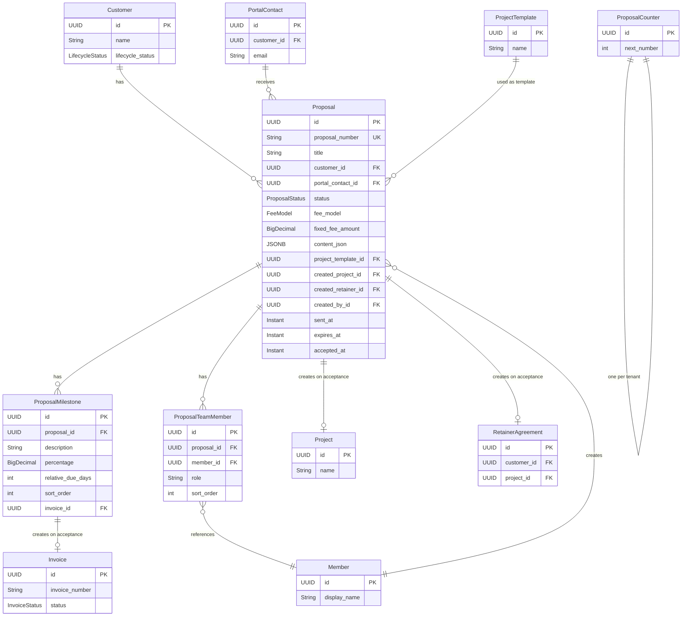
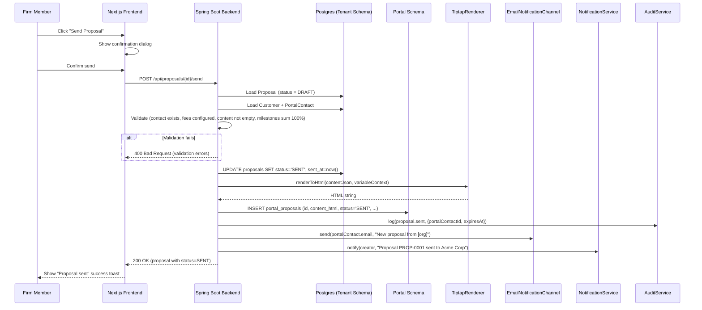
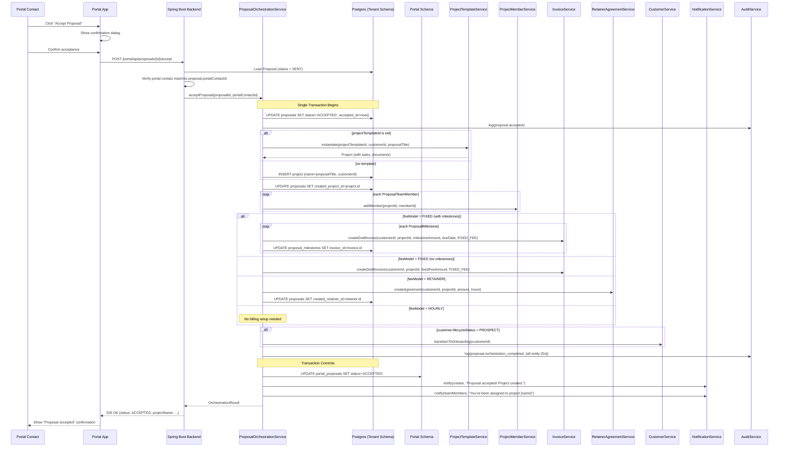

> Merge into architecture/ as standalone Phase 32 doc (phases 5+ use separate files).
> ADRs: 124 (proposal storage model), 125 (acceptance orchestration transaction boundary), 126 (milestone invoice creation strategy), 127 (portal proposal rendering), 128 (proposal numbering strategy), 129 (fee model architecture)
> Migration: V51 (tenant)

# Phase 32 — Proposal → Engagement Pipeline

## 32.1 Overview

Phase 32 introduces the **Proposal → Engagement Pipeline** — the connective tissue that wires DocTeams' existing capabilities (Tiptap documents, project templates, rate cards, retainer agreements, invoicing, customer lifecycle, portal) into a single client-facing flow. Today, converting a prospect into an active engagement is entirely manual: compose a document, email it out-of-band, wait for informal confirmation, then manually create a project, configure billing, assign team members, and trigger onboarding. This phase eliminates that friction by letting firm members compose a formal proposal, send it to a client through the portal, and have acceptance automatically orchestrate the full engagement setup.

The Proposal entity is an **orchestrator**, not a new silo. It references existing entities (Customer, PortalContact, ProjectTemplate, Member) and, on acceptance, creates new instances of existing entities (Project, Invoice, RetainerAgreement, ProjectMember). The proposal body uses the Tiptap JSON format from Phase 31, with the same variable substitution mechanism and client-side preview. The portal rendering uses server-side HTML stored in the portal read-model — proposals are immutable after sending, so there is no freshness concern.

Three fee models are supported, each backed by existing billing infrastructure:
- **Fixed fee** — optional milestone billing schedule; creates DRAFT invoices with `FIXED_FEE` line type on acceptance.
- **Hourly** — references existing rate card hierarchy; no invoices created on acceptance.
- **Retainer** — creates a `RetainerAgreement` on acceptance with specified amount and included hours.

**Dependencies on prior phases**:
- **Phase 31** (Document System Redesign): Tiptap JSON storage format, variable substitution, client-side preview, rich text editor component.
- **Phase 28** (Document Acceptance): `AcceptanceRequest` entity pattern (lifecycle methods, status guards), portal read-model sync pattern.
- **Phase 16** (Project Templates): `ProjectTemplateService.instantiate()` for auto-creating projects on acceptance.
- **Phase 17** (Retainer Agreements): `RetainerAgreementService` for creating retainer agreements on acceptance.
- **Phase 10** (Invoicing): `InvoiceService` for creating milestone invoices, `InvoiceCounter` pattern (reused for `ProposalCounter`), `InvoiceLineType` enum (extended with `FIXED_FEE`).
- **Phase 8** (Rate Cards): Rate card hierarchy for hourly proposals. `OrgSettings` for branding in portal rendering.
- **Phase 7** (Customer Portal Backend): `PortalContact`, portal authentication, portal read-model sync via domain events.
- **Phase 6.5** (Notifications): `NotificationService`, `ApplicationEvent` publication for proposal lifecycle events.
- **Phase 6** (Audit): `AuditService` and `AuditEventBuilder` for all proposal state transitions.
- **Phase 24** (Email Delivery): Email notification channel for proposal sent/expired emails to portal contacts.
- **Phase 14** (Customer Compliance Lifecycle): Customer lifecycle transitions (PROSPECT → ONBOARDING on acceptance).

### What Changes

| Capability | Before Phase 32 | After Phase 32 |
|---|---|---|
| Client proposals | Manual: compose document, email externally, wait for informal response | Formal proposals with Tiptap editor, structured fees, portal delivery |
| Engagement setup | Manual: create project, configure billing, assign team, one step at a time | Single-click acceptance orchestrates project + billing + team + notifications |
| Fee configuration | Billing set up independently per project after informal agreement | Structured fee models (fixed/hourly/retainer) embedded in proposal |
| Milestone billing | Manual invoice creation for each milestone | Define milestones in proposal; DRAFT invoices auto-created on acceptance |
| Proposal tracking | None — no visibility into pipeline | Dedicated proposals page with pipeline stats (conversion rate, avg time-to-accept) |
| Portal proposals | N/A | Clients view proposals, review fees, accept/decline in the portal |
| Prospect conversion | Manual lifecycle management | Acceptance can trigger PROSPECT → ONBOARDING transition |

### Scope Boundaries

**In scope**: Proposal entity with lifecycle (DRAFT → SENT → ACCEPTED/DECLINED/EXPIRED), milestone billing schedule, team member assignment, three fee models (fixed/hourly/retainer), send flow with email notification, portal proposal viewing and accept/decline, acceptance orchestration (project creation, billing setup, team assignment, notifications), proposal pipeline stats, expiry processor, customer-scoped proposal tab, project-to-proposal reference link, portal read-model sync, `InvoiceLineType.FIXED_FEE` extension.

**Out of scope**: View tracking (when client opens/views the proposal), proposal versioning/amendments (withdraw and create new instead), change orders for existing projects, proposal comparison (side-by-side for same customer), AI-generated scope text, countersigning (firm sign-off after client), internal approval workflow (manager approves before send), discount codes or promotional pricing, multi-currency proposals, proposal PDF export (can leverage existing Tiptap → PDF pipeline later), bulk send, proposal analytics beyond pipeline stats.

---

## 32.2 Domain Model

Phase 32 introduces four new tenant-scoped entities (`Proposal`, `ProposalMilestone`, `ProposalTeamMember`, `ProposalCounter`), extends `InvoiceLineType` with a `FIXED_FEE` value, and adds a portal read-model table (`portal_proposals`). All new entities follow the established pattern: UUID primary key with `@GeneratedValue(strategy = GenerationType.UUID)`, `Instant` timestamps, `@PrePersist`/`@PreUpdate` lifecycle callbacks, no Lombok, no multitenancy boilerplate (schema boundary handles isolation per [ADR-064](../adr/ADR-064-dedicated-schema-for-all-tenants.md)).

### 32.2.1 Proposal Entity (New)

The core entity of the phase. A proposal encapsulates scope of work (Tiptap JSON), fee configuration, orchestration references (project template, team members), and lifecycle state. See [ADR-124](../adr/ADR-124-proposal-storage-model.md) for the decision to use a standalone entity rather than wrapping `GeneratedDocument`.

| Field | Java Type | DB Column | DB Type | Constraints | Notes |
|-------|-----------|-----------|---------|-------------|-------|
| `id` | `UUID` | `id` | `UUID` | PK, default `gen_random_uuid()` | Auto-generated |
| `proposalNumber` | `String` | `proposal_number` | `VARCHAR(20)` | NOT NULL, UNIQUE | Sequential per tenant: `PROP-0001`. See [ADR-128](../adr/ADR-128-proposal-numbering-strategy.md). |
| `title` | `String` | `title` | `VARCHAR(200)` | NOT NULL | Human-readable title, e.g. "Annual Audit Engagement 2026" |
| `customerId` | `UUID` | `customer_id` | `UUID` | NOT NULL | References `Customer`. Any lifecycle status allowed (including PROSPECT). |
| `portalContactId` | `UUID` | `portal_contact_id` | `UUID` | Nullable | References `PortalContact`. Required before send; nullable during DRAFT. |
| `status` | `ProposalStatus` | `status` | `VARCHAR(20)` | NOT NULL, default `'DRAFT'` | Lifecycle state. CHECK constraint enforced at DB level. |
| `feeModel` | `FeeModel` | `fee_model` | `VARCHAR(20)` | NOT NULL | `FIXED`, `HOURLY`, or `RETAINER`. See [ADR-129](../adr/ADR-129-fee-model-architecture.md). |
| `fixedFeeAmount` | `BigDecimal` | `fixed_fee_amount` | `NUMERIC(12,2)` | Nullable | Total fee for FIXED model. NULL for other models. |
| `fixedFeeCurrency` | `String` | `fixed_fee_currency` | `VARCHAR(3)` | Nullable | ISO 4217 currency code. Defaults to org currency if not set. |
| `hourlyRateNote` | `String` | `hourly_rate_note` | `VARCHAR(500)` | Nullable | Explanatory text for HOURLY, e.g. "Rates per our standard rate card". |
| `retainerAmount` | `BigDecimal` | `retainer_amount` | `NUMERIC(12,2)` | Nullable | Monthly retainer amount for RETAINER model. |
| `retainerCurrency` | `String` | `retainer_currency` | `VARCHAR(3)` | Nullable | ISO 4217 currency code for retainer. |
| `retainerHoursIncluded` | `BigDecimal` | `retainer_hours_included` | `NUMERIC(6,1)` | Nullable | Hours included per retainer period. |
| `contentJson` | `Map<String, Object>` | `content_json` | `JSONB` | NOT NULL, default `'{}'` | Tiptap JSON document. Same format as `DocumentTemplate.content`. |
| `projectTemplateId` | `UUID` | `project_template_id` | `UUID` | Nullable | References `ProjectTemplate`. Used on acceptance to instantiate project. |
| `sentAt` | `Instant` | `sent_at` | `TIMESTAMPTZ` | Nullable | When the proposal transitioned to SENT. |
| `expiresAt` | `Instant` | `expires_at` | `TIMESTAMPTZ` | Nullable | Optional expiry deadline. Expiry processor transitions SENT → EXPIRED. |
| `acceptedAt` | `Instant` | `accepted_at` | `TIMESTAMPTZ` | Nullable | When the client accepted in the portal. |
| `declinedAt` | `Instant` | `declined_at` | `TIMESTAMPTZ` | Nullable | When the client declined (or firm withdrew). |
| `declineReason` | `String` | `decline_reason` | `VARCHAR(500)` | Nullable | Optional reason from client or "Withdrawn by firm". |
| `createdProjectId` | `UUID` | `created_project_id` | `UUID` | Nullable | References `Project`. Set after acceptance orchestration. |
| `createdRetainerId` | `UUID` | `created_retainer_id` | `UUID` | Nullable | References `RetainerAgreement`. Set after acceptance for RETAINER model. |
| `createdById` | `UUID` | `created_by_id` | `UUID` | NOT NULL | References `Member` who created the proposal. |
| `createdAt` | `Instant` | `created_at` | `TIMESTAMPTZ` | NOT NULL, auto | Set by `@PrePersist`. |
| `updatedAt` | `Instant` | `updated_at` | `TIMESTAMPTZ` | NOT NULL, auto | Set by `@PrePersist` and `@PreUpdate`. |

#### ProposalStatus Enum

```java
public enum ProposalStatus {
  DRAFT,     // Being composed, not yet sent
  SENT,      // Sent to client, awaiting response
  ACCEPTED,  // Client accepted in the portal
  DECLINED,  // Client declined or firm withdrew
  EXPIRED    // Past expiry date without response
}
```

Valid transitions:
- `DRAFT → SENT` (on send)
- `SENT → ACCEPTED` (on client accept)
- `SENT → DECLINED` (on client decline or firm withdraw)
- `SENT → EXPIRED` (by expiry processor)

No transitions out of terminal states (ACCEPTED, DECLINED, EXPIRED).

#### FeeModel Enum

```java
public enum FeeModel {
  FIXED,     // Fixed fee, optional milestone schedule
  HOURLY,    // Rate card-based, no upfront invoices
  RETAINER   // Monthly retainer agreement
}
```

See [ADR-129](../adr/ADR-129-fee-model-architecture.md) for the decision to use a single fee model per proposal.

### 32.2.2 ProposalMilestone Entity (New)

Payment milestones for fixed-fee proposals. Each milestone defines a percentage of the total fee and a relative due date (days after acceptance).

| Field | Java Type | DB Column | DB Type | Constraints | Notes |
|-------|-----------|-----------|---------|-------------|-------|
| `id` | `UUID` | `id` | `UUID` | PK, default `gen_random_uuid()` | Auto-generated |
| `proposalId` | `UUID` | `proposal_id` | `UUID` | NOT NULL, FK → `proposals(id)` ON DELETE CASCADE | Parent proposal. |
| `description` | `String` | `description` | `VARCHAR(200)` | NOT NULL | e.g. "On signing", "Mid-project delivery" |
| `percentage` | `BigDecimal` | `percentage` | `NUMERIC(5,2)` | NOT NULL | Percentage of total fee. All milestones must sum to exactly 100. |
| `relativeDueDays` | `int` | `relative_due_days` | `INTEGER` | NOT NULL, default 0 | Days after acceptance. 0 = on acceptance, 30 = 30 days later. |
| `sortOrder` | `int` | `sort_order` | `INTEGER` | NOT NULL, default 0 | Display ordering. |
| `invoiceId` | `UUID` | `invoice_id` | `UUID` | Nullable | References `Invoice`. Set after acceptance creates the invoice. |
| `createdAt` | `Instant` | `created_at` | `TIMESTAMPTZ` | NOT NULL, auto | Set by `@PrePersist`. |
| `updatedAt` | `Instant` | `updated_at` | `TIMESTAMPTZ` | NOT NULL, auto | Set by `@PrePersist` and `@PreUpdate`. |

**Business rule**: Milestones are only valid for `FeeModel.FIXED`. The `ProposalService` validates that milestone percentages sum to exactly 100 before allowing send. If no milestones are defined for a FIXED proposal, a single invoice for the full amount is created on acceptance (see [ADR-126](../adr/ADR-126-milestone-invoice-creation-strategy.md)).

### 32.2.3 ProposalTeamMember Entity (New)

Team members to assign to the created project on acceptance.

| Field | Java Type | DB Column | DB Type | Constraints | Notes |
|-------|-----------|-----------|---------|-------------|-------|
| `id` | `UUID` | `id` | `UUID` | PK, default `gen_random_uuid()` | Auto-generated |
| `proposalId` | `UUID` | `proposal_id` | `UUID` | NOT NULL, FK → `proposals(id)` ON DELETE CASCADE | Parent proposal. |
| `memberId` | `UUID` | `member_id` | `UUID` | NOT NULL | References `Member`. |
| `role` | `String` | `role` | `VARCHAR(100)` | Nullable | Informational role description, e.g. "Lead auditor". Not mapped to project roles. |
| `sortOrder` | `int` | `sort_order` | `INTEGER` | NOT NULL, default 0 | Display ordering. |

No timestamps on this entity — it is a simple association managed via bulk replacement on the proposal.

### 32.2.4 ProposalCounter Entity (New)

Sequential numbering per tenant, following the `InvoiceCounter` pattern. See [ADR-128](../adr/ADR-128-proposal-numbering-strategy.md).

| Field | Java Type | DB Column | DB Type | Constraints | Notes |
|-------|-----------|-----------|---------|-------------|-------|
| `id` | `UUID` | `id` | `UUID` | PK, default `gen_random_uuid()` | Auto-generated |
| `nextNumber` | `int` | `next_number` | `INTEGER` | NOT NULL, default 1 | Next sequential number. Incremented atomically on proposal creation. |

The counter is initialized with a single row per tenant schema (inserted by the migration). Proposal number format: `PROP-{NNNN}` (zero-padded to 4 digits, grows beyond 4 digits if needed).

### 32.2.5 InvoiceLineType Extension

The existing `InvoiceLineType` enum gains a new value:

```java
public enum InvoiceLineType {
  TIME,
  EXPENSE,
  RETAINER,
  MANUAL,
  FIXED_FEE   // New — for milestone invoices created by proposal acceptance
}
```

The `invoice_lines.line_type` column is `VARCHAR(20)` with no CHECK constraint in the current schema, so no DDL change is needed — the new value is simply used in code.

### 32.2.6 Portal Read-Model Extension (PortalProposal)

A denormalized view of proposal data synced to the `portal` schema when a proposal transitions to SENT. See [ADR-127](../adr/ADR-127-portal-proposal-rendering.md) for the server-side HTML rendering decision.

| Field | DB Column | DB Type | Notes |
|-------|-----------|---------|-------|
| `id` | `id` | `UUID` | PK. Matches `Proposal.id`. |
| `org_id` | `org_id` | `VARCHAR(255)` | Org identifier for portal queries. |
| `customer_id` | `customer_id` | `UUID` | References customer for portal contact scoping. |
| `portal_contact_id` | `portal_contact_id` | `UUID` | The intended recipient. |
| `proposal_number` | `proposal_number` | `VARCHAR(20)` | Display number. |
| `title` | `title` | `VARCHAR(200)` | Proposal title. |
| `status` | `status` | `VARCHAR(20)` | Current lifecycle status. |
| `fee_model` | `fee_model` | `VARCHAR(20)` | FIXED, HOURLY, or RETAINER. |
| `fee_amount` | `fee_amount` | `NUMERIC(12,2)` | Total fee (FIXED), monthly amount (RETAINER), or NULL (HOURLY). |
| `fee_currency` | `fee_currency` | `VARCHAR(3)` | Currency code. |
| `content_html` | `content_html` | `TEXT` | Server-side rendered HTML from Tiptap JSON with variables resolved. |
| `milestones_json` | `milestones_json` | `JSONB` | JSON array of `{description, percentage, relativeDueDays}`. |
| `sent_at` | `sent_at` | `TIMESTAMPTZ` | When the proposal was sent. |
| `expires_at` | `expires_at` | `TIMESTAMPTZ` | Nullable expiry deadline. |
| `org_name` | `org_name` | `VARCHAR(255)` | Org display name for branding. |
| `org_logo_url` | `org_logo_url` | `VARCHAR(500)` | Nullable logo URL from `OrgSettings`. |
| `org_brand_color` | `org_brand_color` | `VARCHAR(7)` | Nullable hex color from `OrgSettings`. |
| `synced_at` | `synced_at` | `TIMESTAMPTZ` | When the row was last synced. |

### 32.2.7 ER Diagram



---

## 32.3 Core Flows

### 32.3.1 Proposal Creation Flow

1. User navigates to `/proposals/new`, selects a customer, enters a title, and chooses a fee model.
2. System allocates the next proposal number from `ProposalCounter` (atomic increment via `UPDATE ... RETURNING`).
3. User optionally loads a document template as a starting point — the template's Tiptap JSON is copied into `contentJson`.
4. User configures fees based on the selected model:
   - **FIXED**: enters total amount and currency. Optionally defines milestones (description, percentage, relative due days). Milestones are managed via bulk replacement.
   - **HOURLY**: enters an optional rate note. Actual rates come from the existing rate card hierarchy.
   - **RETAINER**: enters monthly amount, currency, and included hours per period.
5. User edits the proposal body in the Tiptap editor. Variables are available for insertion: `{{client_name}}`, `{{client_contact_name}}`, `{{proposal_number}}`, `{{proposal_date}}`, `{{fee_total}}`, `{{fee_model}}`, `{{org_name}}`, `{{expiry_date}}`.
6. User optionally selects a project template for auto-creation on acceptance.
7. User optionally adds team members with roles.
8. User sets an optional expiry date.
9. System saves the proposal as DRAFT. All sub-entities (milestones, team members) are persisted in the same transaction.

```java
// ProposalService — conceptual signatures
public Proposal createProposal(CreateProposalRequest request, UUID createdById);
public Proposal updateProposal(UUID proposalId, UpdateProposalRequest request);
public void deleteProposal(UUID proposalId);
public Proposal getProposal(UUID proposalId);
public Page<Proposal> listProposals(ProposalFilterCriteria criteria, Pageable pageable);
public void replaceMilestones(UUID proposalId, List<MilestoneRequest> milestones);
public void replaceTeamMembers(UUID proposalId, List<TeamMemberRequest> members);
```

### 32.3.2 Send Flow

The send flow validates the proposal, transitions it to SENT, notifies the portal contact via email, and syncs the portal read-model.

1. User clicks "Send" on a DRAFT proposal. Frontend presents a confirmation dialog with the portal contact name and email.
2. System validates:
   - Customer exists and has at least one `PortalContact`.
   - `portalContactId` is set (if the customer has multiple contacts, the user selects one; if only one, auto-selected).
   - Fee model is configured (FIXED: amount > 0; RETAINER: amount > 0; HOURLY: valid).
   - `contentJson` is not empty (not the default `{}`).
   - If FIXED with milestones: percentages sum to exactly 100.
3. Status transitions to `SENT`, `sentAt` = `Instant.now()`.
4. Portal read-model sync: Tiptap JSON is rendered to HTML server-side (variables resolved with customer/org data), and a `portal_proposals` row is inserted.
5. Email sent to portal contact via `EmailNotificationChannel`: "You have a new proposal from [org_name]: [title]. View and respond in your portal."
6. In-app notification to proposal creator: "Proposal [number] sent to [client_name]."
7. Audit event: `proposal.sent` with details `{portalContactId, expiresAt}`.

```java
// ProposalService
public Proposal sendProposal(UUID proposalId, UUID portalContactId);
```

### 32.3.3 Acceptance Orchestration Flow

This is the core value of the phase. When a portal contact clicks "Accept" in the portal, the system executes a multi-step orchestration in a **single database transaction** (see [ADR-125](../adr/ADR-125-acceptance-orchestration-transaction-boundary.md)). Notifications are published as Spring `ApplicationEvent`s and processed asynchronously after the transaction commits.

The orchestration is implemented in a dedicated `ProposalOrchestrationService` — separate from `ProposalService` — to keep responsibilities clean and testable.

**Step 1 — Update Proposal**:
- Status → `ACCEPTED`, `acceptedAt` = `Instant.now()`.
- Audit event: `proposal.accepted`.

**Step 2 — Create Project**:
- If `projectTemplateId` is set: call `ProjectTemplateService.instantiate()` to create the project with tasks, document structure, etc.
- If no template: create a bare project via `ProjectService.createProject()` with the proposal title as the project name.
- Link the project to the customer via `CustomerProject`.
- Set `createdProjectId` on the proposal.

**Step 3 — Assign Team**:
- For each `ProposalTeamMember`, call `ProjectMemberService.addMember(projectId, memberId)`.
- The `role` field from the proposal team member is informational — it is not mapped to project-level roles.

**Step 4 — Set Up Billing** (varies by fee model):

| Fee Model | Action | Details |
|-----------|--------|---------|
| FIXED (no milestones) | Create 1 DRAFT invoice | Single line item: description = proposal title, amount = `fixedFeeAmount`, lineType = `FIXED_FEE` |
| FIXED (with milestones) | Create N DRAFT invoices | One per milestone. Amount = `fixedFeeAmount * percentage / 100`. Due date = `acceptedAt + relativeDueDays`. Link `invoice.id` back to `ProposalMilestone.invoiceId`. See [ADR-126](../adr/ADR-126-milestone-invoice-creation-strategy.md). |
| HOURLY | No invoices | Billing happens through normal time tracking → unbilled time → invoice generation flow. |
| RETAINER | Create RetainerAgreement | Amount = `retainerAmount`, currency = `retainerCurrency`, includedHours = `retainerHoursIncluded`, status = ACTIVE, startDate = today. Set `createdRetainerId` on proposal. |

**Step 5 — Trigger Customer Lifecycle**:
- If customer is in `PROSPECT` status: transition to `ONBOARDING` (delegates to `CustomerService.transitionToOnboarding()`).
- If customer is already `ACTIVE`: no lifecycle change needed.
- If the customer has checklist templates configured, instantiate them for the new project.

**Step 6 — Publish Events** (processed after transaction commit):
- Notify proposal creator: "Your proposal [number] for [client_name] has been accepted! Project [project_name] has been created."
- Notify all assigned team members: "You have been assigned to project [project_name] from accepted proposal [number]."
- Audit event: `proposal.orchestration_completed` with details of all created entity IDs.
- Update portal read-model: set `status = 'ACCEPTED'` on `portal_proposals` row.

```java
// ProposalOrchestrationService — conceptual signatures
public OrchestrationResult acceptProposal(UUID proposalId, UUID portalContactId);
```

```java
// OrchestrationResult — value object capturing what was created
public record OrchestrationResult(
    UUID proposalId,
    UUID projectId,
    List<UUID> invoiceIds,       // empty for HOURLY
    UUID retainerAgreementId,    // null unless RETAINER
    List<UUID> teamMemberIds
) {}
```

**Error handling**: If any step fails, the entire transaction rolls back. The proposal remains in `SENT` status. The system logs the error and publishes a failure notification to the proposal creator: "Proposal acceptance for [client_name] encountered an error. Please set up the engagement manually." Common failure points: project template deleted since proposal creation, member deactivated, retainer validation failure.

### 32.3.4 Decline Flow

Two paths lead to DECLINED:
1. **Client-initiated**: Portal contact clicks "Decline" in the portal, optionally enters a reason.
2. **Firm-initiated withdrawal**: Firm member clicks "Withdraw" on a SENT proposal, reason auto-set to "Withdrawn by firm."

Both paths: status → `DECLINED`, `declinedAt` = `Instant.now()`, `declineReason` = provided text (or null). Audit event: `proposal.declined`. Notification to proposal creator (if client-initiated). Portal read-model updated.

```java
// ProposalService
public void declineProposal(UUID proposalId, String reason);

// Portal-facing (ProposalOrchestrationService or PortalProposalService)
public void portalDeclineProposal(UUID proposalId, UUID portalContactId, String reason);
```

### 32.3.5 Expiry Processing

A scheduled job runs on a fixed interval (configurable, default: every hour) to expire overdue proposals.

1. Query: `SELECT * FROM proposals WHERE status = 'SENT' AND expires_at < now()`.
2. For each: status → `EXPIRED`. Audit event: `proposal.expired`.
3. Notify proposal creator: "Your proposal [number] for [client_name] has expired."
4. Email portal contact: "The proposal from [org_name] has expired. Contact them if you'd like to discuss further."
5. Update portal read-model: set `status = 'EXPIRED'`.

```java
// ProposalExpiryProcessor (scheduled)
@Scheduled(fixedRateString = "${proposal.expiry.interval:3600000}")
public void processExpiredProposals();
```

The expiry processor iterates over all tenant schemas (same pattern as existing `RecurringScheduleProcessor` and `AcceptanceExpiryProcessor`).

---

## 32.4 API Surface

### 32.4.1 Firm-Facing REST API

All endpoints require JWT authentication with org context. Role requirements noted per endpoint.

#### Proposal CRUD

| Method | Path | Role | Description |
|--------|------|------|-------------|
| `POST` | `/api/proposals` | ADMIN+ | Create a new DRAFT proposal |
| `GET` | `/api/proposals` | MEMBER+ | List proposals (filterable, paginated) |
| `GET` | `/api/proposals/{id}` | MEMBER+ | Get proposal detail with milestones and team |
| `PUT` | `/api/proposals/{id}` | ADMIN+ | Update proposal (DRAFT only) |
| `DELETE` | `/api/proposals/{id}` | ADMIN+ | Delete proposal (DRAFT only) |

#### Lifecycle Actions

| Method | Path | Role | Description |
|--------|------|------|-------------|
| `POST` | `/api/proposals/{id}/send` | ADMIN+ | Send proposal (DRAFT → SENT) |
| `POST` | `/api/proposals/{id}/withdraw` | ADMIN+ | Withdraw proposal (SENT → DECLINED) |

#### Milestones & Team

| Method | Path | Role | Description |
|--------|------|------|-------------|
| `PUT` | `/api/proposals/{id}/milestones` | ADMIN+ | Replace all milestones (DRAFT only) |
| `PUT` | `/api/proposals/{id}/team` | ADMIN+ | Replace all team members (DRAFT only) |

#### Stats & Customer-Scoped

| Method | Path | Role | Description |
|--------|------|------|-------------|
| `GET` | `/api/proposals/stats` | MEMBER+ | Pipeline stats (counts by status, conversion rate, avg days) |
| `GET` | `/api/customers/{customerId}/proposals` | MEMBER+ | List proposals for a specific customer |

#### Create Proposal — Request/Response

```json
// POST /api/proposals — Request
{
  "title": "Annual Audit Engagement 2026",
  "customerId": "3fa85f64-5717-4562-b3fc-2c963f66afa6",
  "portalContactId": "7fa85f64-5717-4562-b3fc-2c963f66afa6",
  "feeModel": "FIXED",
  "fixedFeeAmount": 25000.00,
  "fixedFeeCurrency": "ZAR",
  "contentJson": { "type": "doc", "content": [...] },
  "projectTemplateId": "8fa85f64-5717-4562-b3fc-2c963f66afa6",
  "expiresAt": "2026-04-01T00:00:00Z"
}

// POST /api/proposals — Response (201 Created)
{
  "id": "9fa85f64-5717-4562-b3fc-2c963f66afa6",
  "proposalNumber": "PROP-0001",
  "title": "Annual Audit Engagement 2026",
  "customerId": "3fa85f64-5717-4562-b3fc-2c963f66afa6",
  "customerName": "Acme Corp",
  "portalContactId": "7fa85f64-5717-4562-b3fc-2c963f66afa6",
  "portalContactName": "Jane Smith",
  "status": "DRAFT",
  "feeModel": "FIXED",
  "fixedFeeAmount": 25000.00,
  "fixedFeeCurrency": "ZAR",
  "contentJson": { "type": "doc", "content": [...] },
  "projectTemplateId": "8fa85f64-5717-4562-b3fc-2c963f66afa6",
  "projectTemplateName": "Standard Audit",
  "expiresAt": "2026-04-01T00:00:00Z",
  "milestones": [],
  "teamMembers": [],
  "createdById": "1fa85f64-5717-4562-b3fc-2c963f66afa6",
  "createdByName": "John Doe",
  "createdAt": "2026-03-01T10:00:00Z",
  "updatedAt": "2026-03-01T10:00:00Z"
}
```

#### Pipeline Stats — Response

```json
// GET /api/proposals/stats — Response
{
  "totalDraft": 5,
  "totalSent": 12,
  "totalAccepted": 8,
  "totalDeclined": 3,
  "totalExpired": 1,
  "conversionRate": 72.7,
  "averageDaysToAccept": 4.2,
  "totalValueSent": 450000.00,
  "totalValueAccepted": 320000.00,
  "currency": "ZAR"
}
```

### 32.4.2 Portal API

All endpoints require portal JWT authentication (magic link exchange).

| Method | Path | Auth | Description |
|--------|------|------|-------------|
| `GET` | `/portal/api/proposals` | Portal JWT | List proposals for authenticated contact's customer |
| `GET` | `/portal/api/proposals/{id}` | Portal JWT | Get proposal detail (rendered HTML, fee summary, milestones) |
| `POST` | `/portal/api/proposals/{id}/accept` | Portal JWT | Accept the proposal |
| `POST` | `/portal/api/proposals/{id}/decline` | Portal JWT | Decline the proposal (with optional reason) |

#### Accept Proposal — Portal Response

```json
// POST /portal/api/proposals/{id}/accept — Response (200 OK)
{
  "proposalId": "9fa85f64-5717-4562-b3fc-2c963f66afa6",
  "status": "ACCEPTED",
  "acceptedAt": "2026-03-05T14:30:00Z",
  "projectName": "Annual Audit Engagement 2026",
  "message": "Thank you for accepting this proposal. Your project has been set up."
}
```

---

## 32.5 Sequence Diagrams

### 32.5.1 Proposal Send Flow



### 32.5.2 Acceptance Orchestration Flow



---

## 32.6 Portal Integration

### 32.6.1 Portal Read-Model Sync Strategy

The portal read-model for proposals follows the same event-driven sync pattern established in Phase 7 and used by Phase 28 (acceptance requests). Domain events trigger read-model updates in the `portal` schema.

**Sync points**:

| Proposal Event | Portal Read-Model Action |
|----------------|--------------------------|
| Proposal SENT | INSERT `portal_proposals` row with rendered HTML, fee summary, milestones JSON, org branding |
| Proposal ACCEPTED | UPDATE `portal_proposals` SET status = 'ACCEPTED' |
| Proposal DECLINED | UPDATE `portal_proposals` SET status = 'DECLINED' |
| Proposal EXPIRED | UPDATE `portal_proposals` SET status = 'EXPIRED' |

The INSERT on SENT is the only heavy operation — it renders the Tiptap JSON to HTML (resolving variables with customer/org data) and captures a snapshot of the org branding. Subsequent status updates are lightweight column updates.

### 32.6.2 Portal Rendering Approach

Proposals are **immutable after SENT** — no content changes, no variable changes. This makes server-side rendering at send time the correct approach (see [ADR-127](../adr/ADR-127-portal-proposal-rendering.md)):

1. On send, `TiptapRenderer.renderToHtml()` is called with the proposal's `contentJson` and a variable context built from the customer, portal contact, org settings, and fee configuration.
2. The resulting HTML string is stored in `portal_proposals.content_html`.
3. The portal app fetches the pre-rendered HTML and injects it into a branded wrapper (org logo, brand color from the same `portal_proposals` row).
4. No Tiptap JavaScript bundle is needed in the portal — just sanitized HTML rendering.

This approach eliminates the need for a Tiptap dependency in the portal app and ensures the client sees exactly what the firm previewed.

### 32.6.3 Portal Page Structure

**Proposals list page** (`/portal/proposals`):
- Shows proposals addressed to the authenticated portal contact's customer.
- Columns: title, number, status, fee model, amount, sent date.
- Status badges: SENT (blue, "Pending"), ACCEPTED (green), DECLINED (red), EXPIRED (amber).
- Only SENT proposals show "View & Respond" CTA.

**Proposal detail page** (`/portal/proposals/{id}`):
- Header: proposal title, number, org branding (logo, brand color), sent date.
- Fee summary card: fee model, total amount (or monthly for retainer), currency.
- If milestones: milestone schedule table (description, percentage, amount, due date).
- Rendered proposal body: `content_html` rendered as sanitized HTML.
- Action buttons (for SENT proposals only):
  - "Accept" — prominent primary CTA. Confirmation dialog with acknowledgment text.
  - "Decline" — secondary action. Opens text input for optional reason.
- Expired proposals: banner "This proposal has expired. Contact [org_name] if you'd like to discuss further." No action buttons.
- Already-actioned proposals: banner "You accepted/declined this proposal on [date]." No action buttons.

### 32.6.4 Branding Integration

The portal proposal pages use org branding from `OrgSettings` (Phase 8):
- `orgLogoUrl` → displayed in the proposal header.
- `orgBrandColor` → applied to the accept button background and header accent.
- `orgFooter` → displayed at the bottom of the proposal.

Branding values are captured at send time (snapshot) and stored in the `portal_proposals` row, so they remain consistent even if the firm later changes their branding.

---

## 32.7 Database Migration

### V51 — Tenant Migration

File: `src/main/resources/db/migration/tenant/V51__create_proposal_tables.sql`

```sql
-- V51__create_proposal_tables.sql
-- Phase 32: Proposal → Engagement Pipeline

-- Proposal counter (one row per tenant, follows InvoiceCounter pattern)
CREATE TABLE proposal_counters (
    id          UUID PRIMARY KEY DEFAULT gen_random_uuid(),
    next_number INTEGER NOT NULL DEFAULT 1
);

-- Seed the counter with a single row
INSERT INTO proposal_counters (id, next_number) VALUES (gen_random_uuid(), 1);

-- Proposal entity
CREATE TABLE proposals (
    id                      UUID PRIMARY KEY DEFAULT gen_random_uuid(),
    proposal_number         VARCHAR(20) NOT NULL,
    title                   VARCHAR(200) NOT NULL,
    customer_id             UUID NOT NULL REFERENCES customers(id),
    portal_contact_id       UUID,
    status                  VARCHAR(20) NOT NULL DEFAULT 'DRAFT',
    fee_model               VARCHAR(20) NOT NULL,

    -- Fee configuration (varies by fee_model)
    fixed_fee_amount        NUMERIC(12,2),
    fixed_fee_currency      VARCHAR(3),
    hourly_rate_note        VARCHAR(500),
    retainer_amount         NUMERIC(12,2),
    retainer_currency       VARCHAR(3),
    retainer_hours_included NUMERIC(6,1),

    -- Document content (Tiptap JSON)
    content_json            JSONB NOT NULL DEFAULT '{}',

    -- Orchestration references
    project_template_id     UUID,

    -- Lifecycle timestamps
    sent_at                 TIMESTAMPTZ,
    expires_at              TIMESTAMPTZ,
    accepted_at             TIMESTAMPTZ,
    declined_at             TIMESTAMPTZ,
    decline_reason          VARCHAR(500),

    -- Result references (set after acceptance orchestration)
    created_project_id      UUID,
    created_retainer_id     UUID,

    -- Metadata
    created_by_id           UUID NOT NULL,
    created_at              TIMESTAMPTZ NOT NULL DEFAULT now(),
    updated_at              TIMESTAMPTZ NOT NULL DEFAULT now(),

    CONSTRAINT proposals_status_check
        CHECK (status IN ('DRAFT', 'SENT', 'ACCEPTED', 'DECLINED', 'EXPIRED')),
    CONSTRAINT proposals_fee_model_check
        CHECK (fee_model IN ('FIXED', 'HOURLY', 'RETAINER')),
    CONSTRAINT proposals_number_unique UNIQUE (proposal_number)
);

-- Primary query patterns: list by customer, filter by status, filter by creator
CREATE INDEX idx_proposals_customer_id ON proposals(customer_id);
CREATE INDEX idx_proposals_status ON proposals(status);
CREATE INDEX idx_proposals_created_by ON proposals(created_by_id);

-- Expiry processor: find SENT proposals past their expiry date
CREATE INDEX idx_proposals_expires_at ON proposals(expires_at)
    WHERE status = 'SENT' AND expires_at IS NOT NULL;

-- Proposal milestones (fixed-fee milestone billing schedule)
CREATE TABLE proposal_milestones (
    id                UUID PRIMARY KEY DEFAULT gen_random_uuid(),
    proposal_id       UUID NOT NULL REFERENCES proposals(id) ON DELETE CASCADE,
    description       VARCHAR(200) NOT NULL,
    percentage        NUMERIC(5,2) NOT NULL,
    relative_due_days INTEGER NOT NULL DEFAULT 0,
    sort_order        INTEGER NOT NULL DEFAULT 0,
    invoice_id        UUID,
    created_at        TIMESTAMPTZ NOT NULL DEFAULT now(),
    updated_at        TIMESTAMPTZ NOT NULL DEFAULT now()
);

-- Load milestones by proposal
CREATE INDEX idx_proposal_milestones_proposal ON proposal_milestones(proposal_id);

-- Proposal team members (assigned to project on acceptance)
CREATE TABLE proposal_team_members (
    id          UUID PRIMARY KEY DEFAULT gen_random_uuid(),
    proposal_id UUID NOT NULL REFERENCES proposals(id) ON DELETE CASCADE,
    member_id   UUID NOT NULL,
    role        VARCHAR(100),
    sort_order  INTEGER NOT NULL DEFAULT 0
);

-- Load team by proposal
CREATE INDEX idx_proposal_team_proposal ON proposal_team_members(proposal_id);
```

### Index Rationale

| Index | Purpose |
|-------|---------|
| `idx_proposals_customer_id` | Customer detail page → Proposals tab. Also used by portal queries scoped to customer. |
| `idx_proposals_status` | Proposals list page filters by status. Pipeline stats aggregation. |
| `idx_proposals_created_by` | "My proposals" filter on the proposals list. |
| `idx_proposals_expires_at` (partial) | Expiry processor queries only SENT proposals with non-null expiry. Partial index minimizes storage. |
| `idx_proposal_milestones_proposal` | Load milestones when fetching proposal detail. |
| `idx_proposal_team_proposal` | Load team members when fetching proposal detail. |

### InvoiceLineType Extension

No DDL change needed. The existing `invoice_lines.line_type` column is `VARCHAR(20)` with no CHECK constraint. The new `FIXED_FEE` value is used in Java code only. If a future migration adds a CHECK constraint to `invoice_lines`, it must include `FIXED_FEE`.

### Portal Read-Model Table

File: `src/main/resources/db/migration/global/V12__portal_proposals.sql`

```sql
-- V12__portal_proposals.sql
-- Phase 32: Portal read-model for proposals

CREATE TABLE IF NOT EXISTS portal.portal_proposals (
    id                  UUID PRIMARY KEY,
    org_id              VARCHAR(255) NOT NULL,
    customer_id         UUID NOT NULL,
    portal_contact_id   UUID NOT NULL,
    proposal_number     VARCHAR(20) NOT NULL,
    title               VARCHAR(200) NOT NULL,
    status              VARCHAR(20) NOT NULL,
    fee_model           VARCHAR(20) NOT NULL,
    fee_amount          NUMERIC(12,2),
    fee_currency        VARCHAR(3),
    content_html        TEXT NOT NULL,
    milestones_json     JSONB DEFAULT '[]',
    sent_at             TIMESTAMPTZ,
    expires_at          TIMESTAMPTZ,
    org_name            VARCHAR(255) NOT NULL,
    org_logo_url        VARCHAR(500),
    org_brand_color     VARCHAR(7),
    synced_at           TIMESTAMPTZ NOT NULL DEFAULT now()
);

-- Portal contact's proposals (list query)
CREATE INDEX IF NOT EXISTS idx_portal_proposals_contact
    ON portal.portal_proposals(portal_contact_id, status);

-- Customer-scoped proposals
CREATE INDEX IF NOT EXISTS idx_portal_proposals_customer
    ON portal.portal_proposals(org_id, customer_id);
```

---

## 32.8 Implementation Guidance

### 32.8.1 Backend Changes

#### New Package: `proposal/`

| File | Type | Purpose |
|------|------|---------|
| `Proposal.java` | Entity | Core proposal entity with lifecycle methods |
| `ProposalStatus.java` | Enum | DRAFT, SENT, ACCEPTED, DECLINED, EXPIRED |
| `FeeModel.java` | Enum | FIXED, HOURLY, RETAINER |
| `ProposalMilestone.java` | Entity | Milestone billing schedule for fixed-fee proposals |
| `ProposalTeamMember.java` | Entity | Team members to assign on acceptance |
| `ProposalCounter.java` | Entity | Sequential numbering counter |
| `ProposalRepository.java` | Repository | JPA repository with custom query methods |
| `ProposalMilestoneRepository.java` | Repository | CRUD for milestones |
| `ProposalTeamMemberRepository.java` | Repository | CRUD for team members |
| `ProposalCounterRepository.java` | Repository | Counter read/update |
| `ProposalService.java` | Service | CRUD, lifecycle transitions, validation |
| `ProposalOrchestrationService.java` | Service | Acceptance orchestration (project, billing, team) |
| `ProposalNumberService.java` | Service | Atomic number allocation from counter |
| `ProposalExpiryProcessor.java` | Scheduled | Expiry processing job |
| `ProposalPortalSyncService.java` | Service | Portal read-model sync (insert, status updates) |
| `ProposalVariableResolver.java` | Service | Build variable context for Tiptap rendering |
| `ProposalController.java` | Controller | Firm-facing REST API |
| `PortalProposalController.java` | Controller | Portal-facing REST API |
| `dto/` | Sub-package | Request/response records |

#### Modified Files

| File | Change |
|------|--------|
| `invoice/InvoiceLineType.java` | Add `FIXED_FEE` enum value |
| `invoice/InvoiceService.java` | Add method for creating DRAFT invoice with `FIXED_FEE` line type from orchestration |
| `customer/CustomerService.java` | Expose `transitionToOnboarding()` for orchestration (may already exist) |

### 32.8.2 Frontend Changes

#### New Pages

| Route | Page | Description |
|-------|------|-------------|
| `/proposals` | `proposals/page.tsx` | Proposals list with pipeline stats header |
| `/proposals/new` | `proposals/new/page.tsx` | Create proposal form (multi-section) |
| `/proposals/{id}` | `proposals/[id]/page.tsx` | Proposal detail (read-only for non-DRAFT) |
| `/proposals/{id}/edit` | `proposals/[id]/edit/page.tsx` | Edit proposal (DRAFT only) |

#### New Components

| Component | Location | Description |
|-----------|----------|-------------|
| `ProposalPipelineStats` | `components/proposals/` | Pipeline stats cards (open, accepted, declined, rate, avg days) |
| `ProposalListTable` | `components/proposals/` | Filterable, sortable proposals table |
| `ProposalForm` | `components/proposals/` | Multi-section create/edit form |
| `FeeConfigSection` | `components/proposals/` | Dynamic fee configuration (FIXED/HOURLY/RETAINER) |
| `MilestoneEditor` | `components/proposals/` | Milestone schedule editor with percentage validation |
| `TeamMemberPicker` | `components/proposals/` | Team member multi-select with role input |
| `ProposalPreview` | `components/proposals/` | Client-side Tiptap preview with variable resolution |
| `ProposalStatusBadge` | `components/proposals/` | Color-coded status badge |
| `SendProposalDialog` | `components/proposals/` | Send confirmation dialog with portal contact selection |

#### Modified Pages

| Page | Change |
|------|--------|
| Customer detail (`/customers/{id}`) | Add "Proposals" tab showing customer's proposals |
| Project detail (`/projects/{id}`) | Add "Created from Proposal PROP-XXXX" link in header if `proposal.createdProjectId` matches |
| Sidebar navigation | Add "Proposals" nav item (between Invoices and Reports) |

#### Portal Pages

| Route | Page | Description |
|-------|------|-------------|
| `/portal/proposals` | `portal/proposals/page.tsx` | Proposal list for portal contact |
| `/portal/proposals/{id}` | `portal/proposals/[id]/page.tsx` | Proposal detail with accept/decline actions |

### 32.8.3 Entity Code Pattern

The `Proposal` entity follows the `AcceptanceRequest` pattern for **entity structure and lifecycle state machine only** (UUID PK, explicit `@Column`, `@PrePersist`/`@PreUpdate` timestamps, status enum with guard methods, `InvalidStateException` for invalid transitions, no Lombok, FKs as UUID fields). Proposal acceptance uses **portal session auth**, not the token-based email link mechanism used by `AcceptanceRequest`:

```java
@Entity
@Table(name = "proposals")
public class Proposal {

  private static final Set<ProposalStatus> EDITABLE_STATUSES = Set.of(ProposalStatus.DRAFT);
  private static final Set<ProposalStatus> TERMINAL_STATUSES =
      Set.of(ProposalStatus.ACCEPTED, ProposalStatus.DECLINED, ProposalStatus.EXPIRED);

  @Id
  @GeneratedValue(strategy = GenerationType.UUID)
  private UUID id;

  @Column(name = "proposal_number", nullable = false, length = 20)
  private String proposalNumber;

  @Column(name = "title", nullable = false, length = 200)
  private String title;

  @Column(name = "customer_id", nullable = false)
  private UUID customerId;

  @Column(name = "portal_contact_id")
  private UUID portalContactId;

  @Enumerated(EnumType.STRING)
  @Column(name = "status", nullable = false, length = 20)
  private ProposalStatus status;

  @Enumerated(EnumType.STRING)
  @Column(name = "fee_model", nullable = false, length = 20)
  private FeeModel feeModel;

  // ... remaining fields follow same @Column pattern ...

  @JdbcTypeCode(SqlTypes.JSON)
  @Column(name = "content_json", columnDefinition = "jsonb", nullable = false)
  private Map<String, Object> contentJson;

  // ... timestamps, result references ...

  /** JPA-required no-arg constructor. */
  protected Proposal() {}

  public Proposal(String proposalNumber, String title, UUID customerId,
                  FeeModel feeModel, UUID createdById) {
    this.proposalNumber = Objects.requireNonNull(proposalNumber);
    this.title = Objects.requireNonNull(title);
    this.customerId = Objects.requireNonNull(customerId);
    this.feeModel = Objects.requireNonNull(feeModel);
    this.createdById = Objects.requireNonNull(createdById);
    this.status = ProposalStatus.DRAFT;
    this.contentJson = Map.of();
  }

  @PrePersist
  void onPrePersist() {
    var now = Instant.now();
    this.createdAt = now;
    this.updatedAt = now;
  }

  @PreUpdate
  void onPreUpdate() {
    this.updatedAt = Instant.now();
  }

  // --- Lifecycle methods ---

  public void markSent(UUID portalContactId) {
    requireStatus(EDITABLE_STATUSES, "send");
    Objects.requireNonNull(portalContactId, "portalContactId must not be null");
    this.portalContactId = portalContactId;
    this.status = ProposalStatus.SENT;
    this.sentAt = Instant.now();
  }

  public void markAccepted() {
    requireStatus(Set.of(ProposalStatus.SENT), "accept");
    this.status = ProposalStatus.ACCEPTED;
    this.acceptedAt = Instant.now();
  }

  public void markDeclined(String reason) {
    requireStatus(Set.of(ProposalStatus.SENT), "decline");
    this.status = ProposalStatus.DECLINED;
    this.declinedAt = Instant.now();
    this.declineReason = reason;
  }

  public void markExpired() {
    requireStatus(Set.of(ProposalStatus.SENT), "mark as expired");
    this.status = ProposalStatus.EXPIRED;
  }

  public boolean isEditable() {
    return EDITABLE_STATUSES.contains(this.status);
  }

  public boolean isTerminal() {
    return TERMINAL_STATUSES.contains(this.status);
  }

  // --- Getters (explicit, no Lombok) ---
  // ... standard getters for all fields ...

  // --- Setters for mutable fields (DRAFT only) ---
  // ... setTitle, setContentJson, setPortalContactId, setFeeConfiguration, etc. ...
  // All mutable setters should call requireEditable() guard.

  public void requireEditable() {
    if (!isEditable()) {
      throw new InvalidStateException(
          "Proposal not editable", "Cannot edit proposal in status " + this.status);
    }
  }

  private void requireStatus(Set<ProposalStatus> allowed, String action) {
    if (!allowed.contains(this.status)) {
      throw new InvalidStateException(
          "Invalid proposal state", "Cannot " + action + " proposal in status " + this.status);
    }
  }
}
```

### 32.8.4 Testing Strategy

| Test Type | Scope | Count Estimate |
|-----------|-------|----------------|
| Entity unit tests | Lifecycle transitions, status guards, validation | ~15 |
| Service unit tests | `ProposalService` CRUD, validation, number allocation | ~20 |
| Orchestration integration tests | `ProposalOrchestrationService` with real DB (Testcontainers) — all 3 fee models, with/without milestones, with/without template, team assignment, customer lifecycle transition | ~15 |
| Controller integration tests | REST API endpoints with MockMvc, JWT auth, role checks | ~20 |
| Portal controller tests | Portal API endpoints with portal JWT auth | ~10 |
| Expiry processor tests | Scheduled job processing with various states | ~5 |
| Frontend component tests | Proposal form, milestone editor, pipeline stats, status badges | ~15 |
| **Total** | | **~100** |

Key test scenarios for acceptance orchestration:
- FIXED with milestones → verify N DRAFT invoices created with correct amounts and due dates.
- FIXED without milestones → verify 1 DRAFT invoice for full amount.
- HOURLY → verify no invoices created, no retainer created.
- RETAINER → verify `RetainerAgreement` created with correct values.
- With project template → verify project created via template instantiation.
- Without project template → verify bare project created.
- Team members → verify all members added to project.
- PROSPECT customer → verify lifecycle transitions to ONBOARDING.
- ACTIVE customer → verify no lifecycle change.
- Orchestration failure → verify transaction rollback, proposal stays SENT.

---

## 32.9 Permission Model

### 32.9.1 Firm-Side Permissions

| Operation | Required Role | Rationale |
|-----------|---------------|-----------|
| Create proposal | ADMIN+ | Same level as invoice creation. Proposals represent financial commitments. |
| View proposal (own) | MEMBER+ | All members can view proposals for transparency. |
| View proposal list | MEMBER+ | Pipeline visibility for all team members. |
| Edit proposal (DRAFT) | ADMIN+ | Only editors can modify proposal content and fees. |
| Delete proposal (DRAFT) | ADMIN+ | Same level as edit. Only DRAFT proposals can be deleted. |
| Send proposal | ADMIN+ | Sending creates a client-facing commitment. Requires the same trust level as invoice approval. |
| Withdraw proposal (SENT) | ADMIN+ | Firm-initiated decline. |
| View pipeline stats | MEMBER+ | Stats are aggregate — no sensitive per-proposal data exposed. |

**No OWNER-only operations**: Unlike project deletion (OWNER only), proposals do not require OWNER level because proposals are not yet active engagements. An ADMIN who can create invoices and manage customers should be able to manage proposals.

### 32.9.2 Portal-Side Permissions

| Operation | Who | Constraint |
|-----------|-----|------------|
| View proposals list | Portal contact | Scoped to their customer's proposals where `portalContactId` matches or customer-wide (TBD — start with contact-specific). |
| View proposal detail | Portal contact | Only proposals addressed to this contact (or their customer). |
| Accept proposal | Portal contact | Only SENT proposals addressed to this contact. One-time action (idempotent — re-accept of ACCEPTED returns success). |
| Decline proposal | Portal contact | Only SENT proposals addressed to this contact. One-time action. |

Portal contacts cannot view proposals in DRAFT status — only SENT, ACCEPTED, DECLINED, and EXPIRED proposals are synced to the portal read-model.

---

## 32.10 Capability Slices

### Slice 230A — Proposal Entity Foundation

**Scope**: Proposal, ProposalMilestone, ProposalTeamMember, ProposalCounter entities. V51 tenant migration. ProposalRepository, ProposalMilestoneRepository, ProposalTeamMemberRepository, ProposalCounterRepository. ProposalNumberService. ProposalStatus and FeeModel enums. Entity unit tests.

**Key deliverables**:
- 4 new JPA entities following AcceptanceRequest pattern
- V51 migration with all tables, indexes, and counter seed
- ProposalNumberService with atomic counter increment
- ~15 entity unit tests (lifecycle transitions, status guards)

**Dependencies**: None (greenfield).

**Test expectations**: Entity lifecycle tests, number service tests, repository integration tests.

---

### Slice 230B — Proposal CRUD & Validation

**Scope**: ProposalService (create, read, update, delete, list, filter, replace milestones, replace team). ProposalController (all CRUD endpoints). DTO records. Validation logic (fee configuration, milestone percentages, content not empty). Customer-scoped proposals endpoint.

**Key deliverables**:
- ProposalService with full CRUD
- ProposalController delegating to service
- Request/response DTOs
- Validation: milestones sum to 100%, fee fields populated per model, DRAFT-only editing
- ~20 service tests, ~15 controller integration tests

**Dependencies**: Slice 230A.

**Test expectations**: CRUD happy paths, validation error cases, DRAFT-only edit enforcement, role-based access (ADMIN+ for write, MEMBER+ for read).

---

### Slice 230C — Send Flow & Portal Sync

**Scope**: Send validation, DRAFT → SENT transition, portal read-model sync (V12 global migration for `portal_proposals`), Tiptap HTML rendering for portal, ProposalPortalSyncService, ProposalVariableResolver, email notification to portal contact, in-app notification to creator, audit event.

**Key deliverables**:
- ProposalService.sendProposal() with full validation
- V12 global migration for `portal_proposals` table
- ProposalPortalSyncService (insert/update portal read-model)
- ProposalVariableResolver (build context for Tiptap rendering)
- TiptapRenderer integration for server-side HTML
- Email template for "new proposal" notification
- ~10 integration tests

**Dependencies**: Slice 230B. Requires Phase 31 TiptapRenderer, Phase 24 EmailNotificationChannel.

**Test expectations**: Send validation (missing contact, empty content, milestone sum != 100%), portal read-model row created, HTML rendered correctly, email sent.

---

### Slice 230D — Acceptance Orchestration

**Scope**: ProposalOrchestrationService with full acceptance flow (project creation, team assignment, billing setup for all 3 fee models, customer lifecycle transition). InvoiceLineType.FIXED_FEE extension. Error handling and transaction rollback.

**Key deliverables**:
- ProposalOrchestrationService.acceptProposal()
- OrchestrationResult value object
- FIXED fee: milestone invoice creation (DRAFT, FIXED_FEE line type, due dates)
- FIXED fee without milestones: single invoice creation
- HOURLY: no billing action (verify nothing created)
- RETAINER: RetainerAgreement creation
- Project creation (with and without template)
- Team member assignment
- Customer lifecycle transition (PROSPECT → ONBOARDING)
- InvoiceLineType.FIXED_FEE added
- Notifications published after commit
- ~15 orchestration integration tests

**Dependencies**: Slice 230B. Requires existing ProjectTemplateService, InvoiceService, RetainerAgreementService, ProjectMemberService, CustomerService.

**Test expectations**: All 3 fee models with correct entity creation, template vs. bare project, team assignment, PROSPECT transition, rollback on failure.

---

### Slice 230E — Portal Proposal Experience

**Scope**: PortalProposalController (list, detail, accept, decline). Portal proposal pages (list, detail with rendered HTML, accept/decline UI). Decline flow (client-initiated and firm-initiated withdraw). ProposalExpiryProcessor (scheduled job). Expiry notifications.

**Key deliverables**:
- PortalProposalController with 4 endpoints
- Portal proposal list page (proposals tab or dedicated page)
- Portal proposal detail page (rendered HTML, fee summary, milestones, action buttons)
- Accept/decline confirmation dialogs
- Firm-side "Withdraw" action on SENT proposals
- ProposalExpiryProcessor scheduled job
- Email templates: proposal expired (to creator), proposal expired (to portal contact)
- ~10 portal controller tests, ~5 expiry tests

**Dependencies**: Slice 230C (portal read-model), Slice 230D (acceptance orchestration).

**Test expectations**: Portal auth scoping, accept triggers orchestration, decline records reason, expiry processor finds and expires proposals, expired proposals non-actionable in portal.

---

### Slice 230F — Firm-Side Frontend & Pipeline Stats

**Scope**: Proposals page with pipeline stats header. Create/edit proposal pages (multi-section form with Tiptap editor, fee configuration, milestone editor, team picker). Proposal detail page with context-dependent actions. Customer detail Proposals tab. Project-to-proposal reference link. Sidebar navigation update. ProposalService.getStats().

**Key deliverables**:
- `/proposals` page with ProposalPipelineStats and ProposalListTable
- `/proposals/new` and `/proposals/{id}/edit` pages with ProposalForm
- `/proposals/{id}` detail page with actions (Send, Edit, Delete, Withdraw, Copy, View Project)
- Customer detail → Proposals tab
- Project detail → "Created from Proposal" link
- Sidebar navigation: "Proposals" item
- FeeConfigSection, MilestoneEditor, TeamMemberPicker, ProposalPreview components
- Pipeline stats endpoint and service method
- ~15 frontend component tests

**Dependencies**: Slice 230B (CRUD API), Slice 230C (send flow).

**Test expectations**: Form validation, milestone percentage sum enforcement, fee model switching, pipeline stats rendering, status badge colors, DRAFT-only edit guards.

---

### Slice Dependency Graph

```
230A (Entity Foundation)
  └── 230B (CRUD & Validation)
        ├── 230C (Send Flow & Portal Sync)
        │     └── 230E (Portal Experience) ←── also depends on 230D
        ├── 230D (Acceptance Orchestration)
        │     └── 230E (Portal Experience)
        └── 230F (Firm-Side Frontend) ←── also depends on 230C
```

Parallel opportunities:
- After 230B completes: 230C and 230D can run in parallel (both depend only on 230B).
- After 230C and 230D complete: 230E can start.
- 230F can start after 230B, but benefits from 230C being complete (send flow integration).

---

## 32.11 ADR Index

| ADR | Title | Status |
|-----|-------|--------|
| [ADR-124](../adr/ADR-124-proposal-storage-model.md) | Proposal Storage Model | Accepted |
| [ADR-125](../adr/ADR-125-acceptance-orchestration-transaction-boundary.md) | Acceptance Orchestration Transaction Boundary | Accepted |
| [ADR-126](../adr/ADR-126-milestone-invoice-creation-strategy.md) | Milestone Invoice Creation Strategy | Accepted |
| [ADR-127](../adr/ADR-127-portal-proposal-rendering.md) | Portal Proposal Rendering | Accepted |
| [ADR-128](../adr/ADR-128-proposal-numbering-strategy.md) | Proposal Numbering Strategy | Accepted |
| [ADR-129](../adr/ADR-129-fee-model-architecture.md) | Fee Model Architecture — Single vs. Mixed | Accepted |

### Referenced Existing ADRs

| ADR | Title | Relevance |
|-----|-------|-----------|
| [ADR-064](../adr/ADR-064-dedicated-schema-for-all-tenants.md) | Dedicated Schema for All Tenants | No multitenancy boilerplate on new entities |
| [ADR-107](../adr/ADR-107-acceptance-token-strategy.md) | Acceptance Token Strategy | Pattern reference for portal auth |
| [ADR-109](../adr/ADR-109-portal-read-model-sync-granularity.md) | Portal Read-Model Sync Granularity | Sync pattern reused for proposals |
| [ADR-119](../adr/ADR-119-editor-library-selection.md) | Editor Library Selection (Tiptap) | Content format for proposals |
| [ADR-120](../adr/ADR-120-document-storage-format.md) | Document Storage Format (JSONB) | Storage format for `contentJson` |
