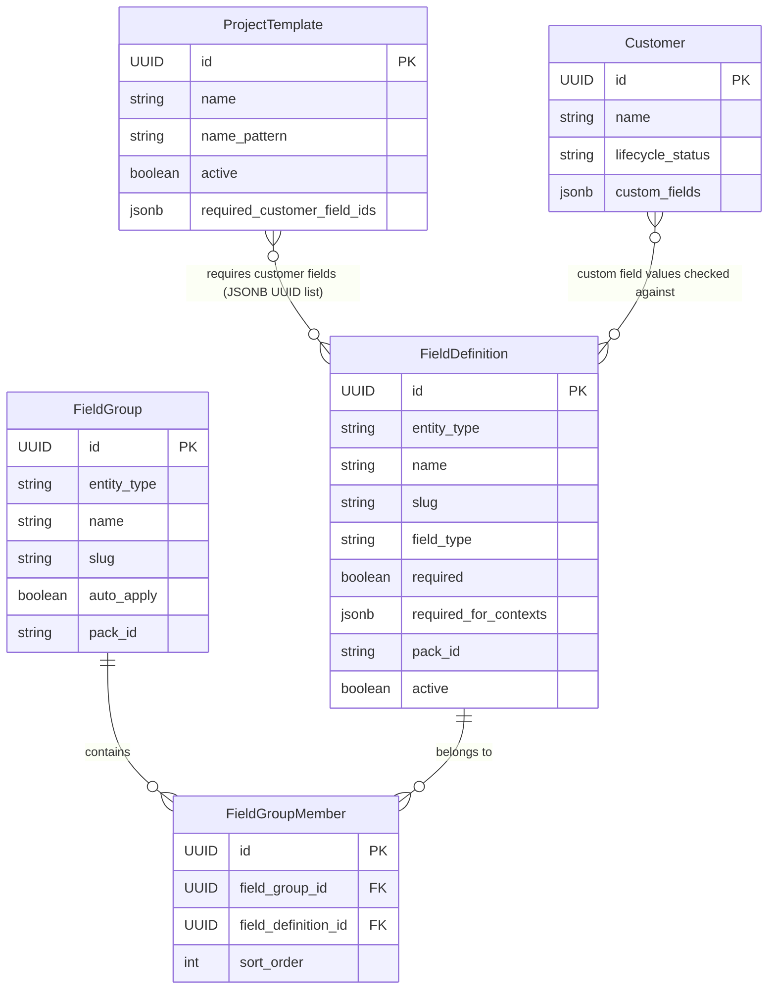
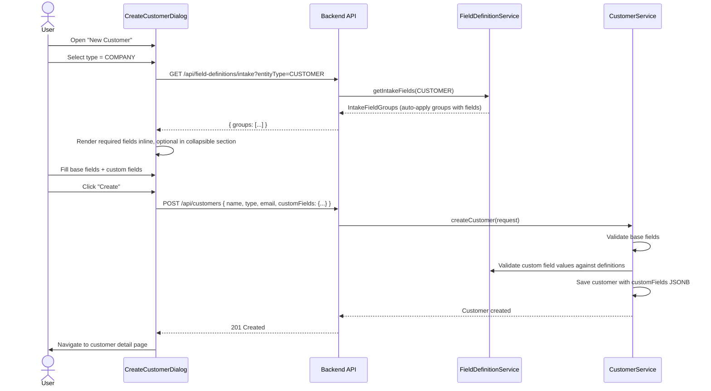
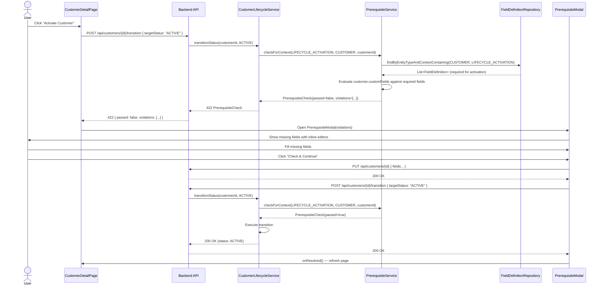
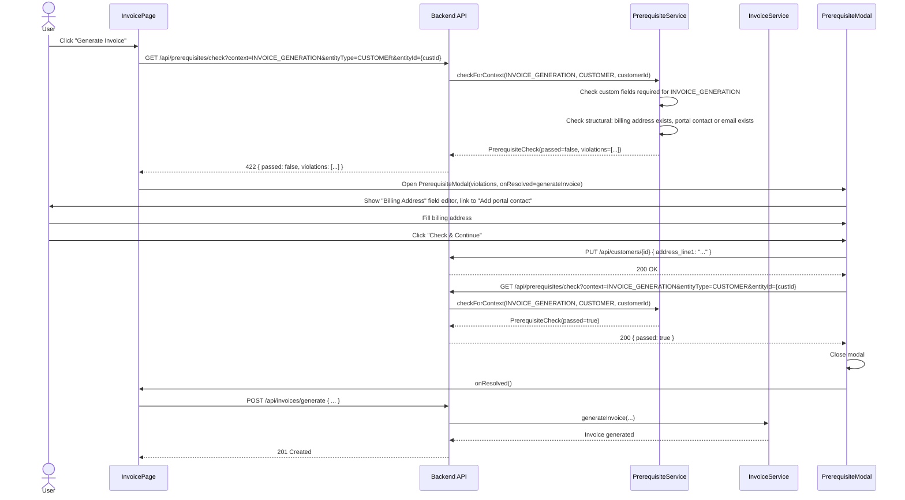
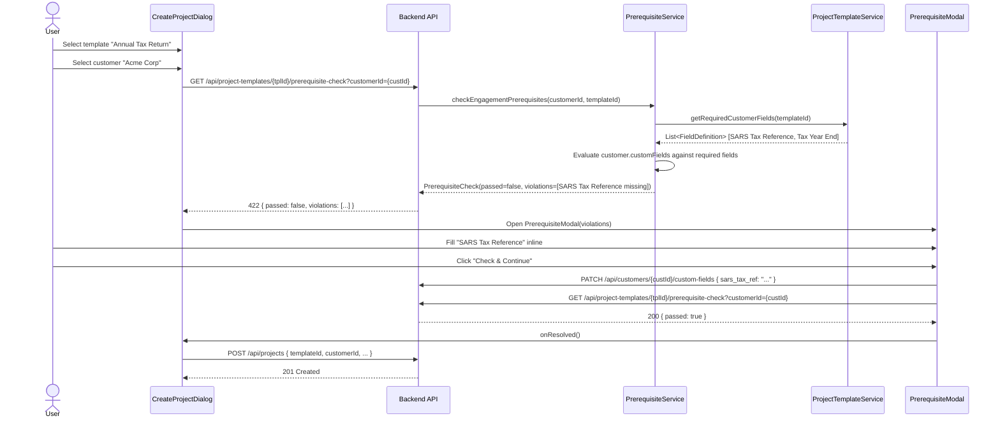

> Merge into architecture/ as standalone Phase 33 doc.
> Phase 33 architecture — Data Completeness & Prerequisite Enforcement
> ADRs: [ADR-130](../adr/ADR-130-prerequisite-enforcement-strategy.md), [ADR-131](../adr/ADR-131-prerequisite-context-granularity.md), [ADR-132](../adr/ADR-132-engagement-prerequisite-storage.md), [ADR-133](../adr/ADR-133-auto-transition-incomplete-fields.md)

# Phase 33 — Data Completeness & Prerequisite Enforcement

---

## 33. Phase 33 — Data Completeness & Prerequisite Enforcement

Phase 33 transforms DocTeams' metadata infrastructure from passive data capture into active data quality enforcement. The platform already has rich field definition capabilities (Phase 11/23), a customer readiness computation layer (Phase 15), lifecycle guards (Phase 4), and project templates (Phase 16) — but none of these systems enforce completeness at the points that matter. Customer creation collects minimal data regardless of customer type. The ONBOARDING → ACTIVE transition ignores whether FICA fields are filled. Invoice generation proceeds without checking for a billing address. Proposal acceptance creates projects without verifying that the customer has the fields the engagement requires.

This phase wires existing infrastructure into enforcement points by introducing a `PrerequisiteContext` enum that marks which fields are required for which actions, a central `PrerequisiteService` that evaluates context-specific completeness, and a shared `PrerequisiteModal` frontend component that enables inline remediation rather than dead-end error pages. The design adds no new domain entities — it extends `FieldDefinition` with a `requiredForContexts` JSONB column and `ProjectTemplate` with a `requiredCustomerFieldIds` JSONB column, then weaves prerequisite checks into the existing lifecycle transition, project creation, invoice generation, proposal sending, and document generation flows.

**Dependencies on prior phases**:
- **Phase 4** (Customers): `Customer` entity, `CustomerLifecycleGuard`, lifecycle states. Prerequisite gates extend the existing lifecycle enforcement.
- **Phase 11/23** (Custom Fields): `FieldDefinition`, `FieldGroup`, `FieldGroupMember`, field packs, `CustomFieldUtils`. The prerequisite system evaluates completeness against field definitions.
- **Phase 15** (Setup Guidance): `CustomerReadinessService`, `SetupProgressCard`. Extended from informational display to enforcement gate.
- **Phase 16** (Project Templates): `ProjectTemplate`, template-based project creation. Extended with engagement-level customer field requirements.
- **Phase 10** (Invoicing): Invoice generation flow. Prerequisite check added before generation.
- **Phase 32** (Proposals): Proposal acceptance → project creation pipeline. Prerequisite check added to acceptance flow.
- **Phase 12** (Document Templates): Document generation flow. Prerequisite check added before PDF rendering.

### What's New

| Capability | Before Phase 33 | After Phase 33 |
|---|---|---|
| Customer intake | Creates customer with base fields only; custom fields added later | Type-aware intake dialog surfaces auto-apply field groups with required fields inline at creation |
| Lifecycle transition validation | Checks legal state transitions only | ONBOARDING → ACTIVE also validates that all `LIFECYCLE_ACTIVATION` fields are filled |
| Engagement prerequisites | Project creation proceeds regardless of customer data completeness | Project templates declare required customer fields; creation checks and surfaces gaps |
| Action-point validation | Invoice/proposal/document actions proceed with incomplete data | Each action checks context-specific prerequisites; 422 response with structured violations |
| Prerequisite configuration | Not possible | Admins configure `requiredForContexts` per field definition; field packs ship with defaults |
| Completeness visibility | Informational readiness cards (Phase 15) | Enforcing readiness gates, completeness indicators on customer list, dashboard widget |
| Inline remediation | Not applicable | Shared `PrerequisiteModal` lets users fill missing fields without navigating away |

**Out of scope**: Workflow automation / trigger-action rules (Phase 37), custom validation rules beyond required/optional (regex, business logic), cross-entity prerequisite graphs (e.g., "project requires budget AND team AND customer fields"), prerequisite check audit logging (422 responses are already auditable via existing audit infrastructure), bulk prerequisite remediation ("fix all customers" batch UI), field validation beyond type checking (existing type validators handle number/date/etc.).

---

### 33.1 Overview

Phase 33 establishes prerequisite enforcement as a platform primitive. The design is deliberately evolutionary — it builds on every major metadata and lifecycle component from prior phases rather than introducing parallel systems. The core idea: a `PrerequisiteContext` enum defines the action types that can require field completeness, each `FieldDefinition` declares which contexts it participates in, and a central `PrerequisiteService` evaluates completeness for any context by querying the relevant field definitions and checking the target entity's custom field values.

The enforcement model is **soft-blocking** ([ADR-130](../adr/ADR-130-prerequisite-enforcement-strategy.md)): when an action fails a prerequisite check, the system presents a modal with the missing fields and inline editors rather than navigating the user away. This preserves the action's intent — fill the gaps, then continue. The backend returns structured 422 responses; the frontend interprets them into the `PrerequisiteModal` component.

The five enforcement points are:

1. **Smart customer intake** — The creation dialog becomes type-aware. Selecting a customer type fetches auto-apply field groups and renders required fields inline, collecting critical data at the door.
2. **Lifecycle transition gate** — ONBOARDING → ACTIVE requires all `LIFECYCLE_ACTIVATION` fields to be filled. The existing `CustomerReadinessService` gains a context parameter and becomes an enforcing gate.
3. **Engagement prerequisites** — Project templates declare required customer fields. Manual project creation checks them; automated creation (proposal acceptance, recurring schedules) logs notifications for gaps.
4. **Action-point gates** — Invoice generation, proposal sending, and document generation each check their respective `PrerequisiteContext` before proceeding.
5. **Prerequisite configuration** — Admins can configure which fields are required for which contexts. Field packs ship with sensible defaults; orgs override per their workflow.

---

### 33.2 Domain Model

Phase 33 introduces **no new domain entities**. It extends two existing entities with new columns and introduces value objects (Java records) for prerequisite evaluation results. This is consistent with the constraint that prerequisite enforcement is a cross-cutting concern wired into existing infrastructure, not a new domain aggregate.

#### 33.2.1 FieldDefinition Extension

The `FieldDefinition` entity (package `fielddefinition/`) gains a new `requiredForContexts` column. This column stores a JSONB array of `PrerequisiteContext` enum values, indicating which actions require this field to be filled.

| Field | Java Type | DB Column | DB Type | Constraints | Notes |
|-------|-----------|-----------|---------|-------------|-------|
| `requiredForContexts` | `List<String>` | `required_for_contexts` | `JSONB` | NOT NULL, default `'[]'` | List of `PrerequisiteContext` values (stored as strings) |

The existing `required` boolean on `FieldDefinition` is **not replaced** — it continues to indicate whether the field is required when saving the entity form (client-side validation). The new `requiredForContexts` column is orthogonal: it controls prerequisite enforcement at action points. A field can be `required: false` (optional when editing the customer) but still have `requiredForContexts: ["INVOICE_GENERATION"]` (must be filled before generating an invoice). This separation is intentional — intake flexibility versus action-point rigor.

#### 33.2.2 ProjectTemplate Extension

The `ProjectTemplate` entity (package `projecttemplate/`) gains a new `requiredCustomerFieldIds` column.

| Field | Java Type | DB Column | DB Type | Constraints | Notes |
|-------|-----------|-----------|---------|-------------|-------|
| `requiredCustomerFieldIds` | `List<UUID>` | `required_customer_field_ids` | `JSONB` | NOT NULL, default `'[]'` | UUIDs referencing `field_definitions.id` |

JSONB array was chosen over a join table because the association is read-heavy, low-cardinality (a template typically requires 2-8 customer fields), and does not need cascading deletes or bidirectional navigation. See [ADR-132](../adr/ADR-132-engagement-prerequisite-storage.md).

#### 33.2.3 PrerequisiteContext Enum (New)

```java
package io.b2mash.b2b.b2bstrawman.prerequisite;

public enum PrerequisiteContext {
    LIFECYCLE_ACTIVATION,
    INVOICE_GENERATION,
    PROPOSAL_SEND,
    DOCUMENT_GENERATION,
    PROJECT_CREATION;
}
```

The enum uses a typed, bounded set rather than free-form strings. This provides compile-time safety, IDE discoverability, and prevents configuration drift. See [ADR-131](../adr/ADR-131-prerequisite-context-granularity.md). The set is extensible — adding a new context requires adding an enum constant and wiring a check at the corresponding action point.

#### 33.2.4 PrerequisiteCheck and PrerequisiteViolation Records (New — Value Objects)

These are Java records, not JPA entities. They represent the result of a prerequisite evaluation and are returned from the `PrerequisiteService`, serialized in 422 response bodies, and deserialized on the frontend.

```java
package io.b2mash.b2b.b2bstrawman.prerequisite;

public record PrerequisiteCheck(
    boolean passed,
    PrerequisiteContext context,
    List<PrerequisiteViolation> violations
) {
    public static PrerequisiteCheck passed(PrerequisiteContext context) {
        return new PrerequisiteCheck(true, context, List.of());
    }
}

public record PrerequisiteViolation(
    String code,           // e.g., "MISSING_FIELD", "MISSING_PORTAL_CONTACT"
    String message,        // Human-readable: "Billing address is required"
    String entityType,     // "CUSTOMER", "PROJECT", "INVOICE"
    UUID entityId,
    String fieldSlug,      // Non-null for custom field violations
    String groupName,      // Non-null for custom field violations
    String resolution      // "Add a billing address to the customer profile"
) {}
```

#### 33.2.5 Entity Relationship Diagram



---

### 33.3 Core Flows & Backend Behaviour

All prerequisite enforcement follows the same pattern: the action's service calls `PrerequisiteService.check(context, ...)`, receives a `PrerequisiteCheck`, and either proceeds (if `passed`) or returns a 422 response with the violations payload. The frontend interprets this 422 into the `PrerequisiteModal` for inline remediation.

**RBAC**: Prerequisite checks themselves are read-only — any authenticated member can trigger a check. The underlying action (lifecycle transition, invoice generation, etc.) retains its existing RBAC rules. Prerequisite configuration (editing `requiredForContexts` on field definitions, editing `requiredCustomerFieldIds` on project templates) requires `admin` or `owner` role.

**Tenant boundary**: All queries are tenant-scoped via the schema-per-tenant model. `FieldDefinitionRepository` queries execute within the tenant's schema; no cross-tenant data is accessible. `RequestScopes.TENANT_ID` is bound by the filter chain before any prerequisite check runs.

#### 33.3.1 Smart Customer Intake Flow

**Trigger**: User opens the Create Customer dialog.

**Flow**:
1. User selects customer type (INDIVIDUAL, COMPANY, TRUST)
2. Frontend calls `GET /api/field-definitions/intake?entityType=CUSTOMER` to fetch auto-apply field groups with their field definitions
3. Dialog renders required fields from those groups inline (Step 2 of the dialog)
4. User fills base fields + custom fields → submits
5. Backend `CustomerController.create()` receives the combined payload including `customFields: Map<String, Object>`
6. `CustomerService.createCustomer()` validates custom field values against field definitions (type checking, required validation for fields marked `required: true` on the `FieldDefinition`)
7. Auto-apply field groups are applied as before; custom field values are pre-populated
8. Customer lands on detail page with accurate completeness score

**Clarification on "required" in intake context**: Fields marked `required: true` on the `FieldDefinition` are form-level required — they must be filled in the intake dialog. This is distinct from `requiredForContexts` (e.g., `LIFECYCLE_ACTIVATION`), which controls enforcement at lifecycle transitions and action points. A field can be `required: false` (optional at intake) but still have `requiredForContexts: ["LIFECYCLE_ACTIVATION"]` (must be filled before the customer can become ACTIVE). The intake dialog only enforces `required: true` fields; all other fields are shown but optional. There is no "defer" mechanism — unfilled optional fields are simply empty and can be completed later on the customer detail page.

**Service method**:

```java
// FieldDefinitionService
public List<IntakeFieldGroup> getIntakeFields(EntityType entityType) {
    // Fetch auto-apply groups for the entity type, with their field definitions
    // Returns groups with fields ordered by sortOrder
}

// CustomerService (extended)
public Customer createCustomer(CreateCustomerRequest request) {
    // Existing: validate base fields, create customer
    // New: if request.customFields() is present, validate against field definitions,
    // store as customer.customFields JSONB
}
```

**Endpoint**: `GET /api/field-definitions/intake?entityType=CUSTOMER`

This endpoint is read-only and available to any authenticated member. It returns auto-apply field groups with their field definitions in display order, structured for form rendering. It does NOT filter by `requiredForContexts` — it returns all fields in auto-apply groups so the dialog can render required and optional fields with appropriate visual treatment.

#### 33.3.2 Lifecycle Transition Gate Flow

**Trigger**: User clicks "Activate Customer" (ONBOARDING → ACTIVE transition) or checklist completion triggers auto-transition.

**Flow**:
1. `CustomerLifecycleService.transitionStatus(customerId, ACTIVE)` is called
2. Service calls `prerequisiteService.checkForContext(PrerequisiteContext.LIFECYCLE_ACTIVATION, "CUSTOMER", customerId)`
3. `PrerequisiteService` queries `fieldDefinitionRepository.findByEntityTypeAndActiveTrueAndRequiredForContextsContaining(EntityType.CUSTOMER, "LIFECYCLE_ACTIVATION")`
4. For each required field definition, checks whether `customer.customFields` contains a non-empty value (reuses `CustomFieldUtils.isFieldValueFilled()`)
5. If violations exist → returns `PrerequisiteCheck(false, LIFECYCLE_ACTIVATION, violations)`
6. Controller returns 422 with the check payload
7. Frontend shows `PrerequisiteModal` with missing fields; user fills them inline
8. User submits field updates → retries transition → succeeds

**Auto-transition behavior**: When checklist completion triggers an automatic ONBOARDING → ACTIVE transition, the prerequisite check still runs. If it fails, the auto-transition is **blocked** and a notification is sent to the customer's assigned team members: "Customer {name} has completed all checklist items but has incomplete required fields for activation." The customer remains in ONBOARDING until fields are filled and the transition is retried. See [ADR-133](../adr/ADR-133-auto-transition-incomplete-fields.md).

**Service method**:

```java
// PrerequisiteService
public PrerequisiteCheck checkForContext(
    PrerequisiteContext context, String entityType, UUID entityId) {
    // 1. Query field definitions required for this context + entity type
    // 2. Load entity's custom fields
    // 3. Evaluate each required field
    // 4. Build structural violations (e.g., missing portal contact for PROPOSAL_SEND)
    // 5. Return PrerequisiteCheck
}
```

#### 33.3.3 Engagement Prerequisite Check Flow

**Trigger**: User creates a project from a template with a linked customer, or proposal acceptance triggers project instantiation.

**Flow (manual project creation)**:
1. User selects a project template and a customer in the project creation dialog
2. Frontend calls `GET /api/project-templates/{templateId}/prerequisite-check?customerId={customerId}`
3. Backend loads `projectTemplate.requiredCustomerFieldIds`, resolves them to `FieldDefinition` records, checks customer's custom fields
4. If violations exist → 422 → `PrerequisiteModal` → user fills → retry → project created

**Flow (proposal acceptance — automated)**:
1. Proposal acceptance orchestration calls `PrerequisiteService.checkEngagementPrerequisites(customerId, templateId)`
2. If violations exist → project is still created (client-facing action must not silently fail) but in standard state
3. A notification is sent to the firm's team: "Customer {name} is missing fields required for {template.name}: {field list}"
4. The notification links to the customer detail page for remediation

**Flow (recurring schedule — automated)**:
1. Schedule-triggered project creation calls the same check
2. If violations exist → project is still created, warning notification sent

The distinction between manual (blocking) and automated (non-blocking + notify) is intentional: manual creation has a human in the loop who can fix the issue immediately; automated creation must not silently drop actions that external processes depend on.

**Service method**:

```java
// PrerequisiteService
public PrerequisiteCheck checkEngagementPrerequisites(UUID customerId, UUID templateId) {
    var template = projectTemplateRepository.findById(templateId).orElseThrow();
    var requiredFieldIds = template.getRequiredCustomerFieldIds();
    if (requiredFieldIds == null || requiredFieldIds.isEmpty()) {
        return PrerequisiteCheck.passed(PrerequisiteContext.PROJECT_CREATION);
    }
    var requiredFields = fieldDefinitionRepository.findAllById(requiredFieldIds);
    var customer = customerRepository.findById(customerId).orElseThrow();
    // Evaluate each required field against customer.customFields
    // Return PrerequisiteCheck
}
```

#### 33.3.4 Action-Point Prerequisite Check Flow

**Trigger**: User clicks "Generate Invoice", "Send Proposal", "Generate Document", or similar action button.

Each action maps to a `PrerequisiteContext`:

| Action | Context | Entity Checked | Typical Required Fields |
|--------|---------|----------------|------------------------|
| Generate invoice | `INVOICE_GENERATION` | Customer (of the project) | Billing address, VAT/tax number |
| Send proposal | `PROPOSAL_SEND` | Customer | Portal contact with email |
| Generate document | `DOCUMENT_GENERATION` | Customer or Project (per template) | Template-specific context fields |
| Send invoice | `INVOICE_GENERATION` | Customer | Billing address, portal contact or email |

**Flow**:
1. User clicks action button (e.g., "Generate Invoice")
2. Frontend calls `GET /api/prerequisites/check?context=INVOICE_GENERATION&entityType=CUSTOMER&entityId={customerId}`
3. Backend evaluates: (a) custom field completeness for the context, (b) structural prerequisites (e.g., portal contact exists, invoice has line items)
4. If violations → 422 → `PrerequisiteModal` → inline fix → "Check & Continue" → re-evaluate → proceed

**Structural prerequisites** (non-custom-field checks) are hardcoded per context in `PrerequisiteService`. Examples:
- `INVOICE_GENERATION`: Customer must have at least one linked project with billable time entries or the invoice must have manually added line items
- `PROPOSAL_SEND`: Customer must have a portal contact with an email address; proposal body must not be empty
- `DOCUMENT_GENERATION`: Delegates to existing `DocumentGenerationReadinessService` for template-specific context field checks

These structural checks produce `PrerequisiteViolation` records with `fieldSlug: null` and a `resolution` string that links to the relevant page (e.g., "Add a portal contact on the customer detail page").

#### 33.3.5 Prerequisite Configuration Flow

**Trigger**: Admin navigates to Settings → Custom Fields → edits a field definition.

**Flow**:
1. Admin opens field definition editor
2. New "Required For" multi-select dropdown shows `PrerequisiteContext` values with human-readable labels:
   - "Customer Activation" (`LIFECYCLE_ACTIVATION`)
   - "Invoice Generation" (`INVOICE_GENERATION`)
   - "Proposal Sending" (`PROPOSAL_SEND`)
   - "Document Generation" (`DOCUMENT_GENERATION`)
   - "Project Creation" (`PROJECT_CREATION`)
3. Admin selects/deselects contexts → saves
4. `PATCH /api/field-definitions/{id}` (existing endpoint, extended) accepts `requiredForContexts: ["LIFECYCLE_ACTIVATION", "INVOICE_GENERATION"]`
5. Backend validates enum values, updates `FieldDefinition.requiredForContexts`

For project template requirements:
1. Admin navigates to Settings → Project Templates → edits a template
2. New "Required Customer Fields" section shows a multi-select of customer field definitions
3. Admin selects fields → saves
4. `PUT /api/project-templates/{id}/required-customer-fields` accepts `fieldDefinitionIds: [uuid, uuid, ...]`
5. Backend validates that all IDs reference active customer field definitions, updates `ProjectTemplate.requiredCustomerFieldIds`

---

### 33.4 API Surface

#### 33.4.1 New Endpoints

| Method | Path | Description | Auth | R/W |
|--------|------|-------------|------|-----|
| `GET` | `/api/field-definitions/intake` | Fetch auto-apply field groups for intake form | `member+` | Read |
| `GET` | `/api/prerequisites/check` | Check prerequisites for a given context and entity | `member+` | Read |
| `GET` | `/api/project-templates/{id}/prerequisite-check` | Check engagement prerequisites for a customer against a template | `member+` | Read |
| `PUT` | `/api/project-templates/{id}/required-customer-fields` | Configure required customer fields for a project template | `admin+` | Write |
| `GET` | `/api/customers/completeness-summary` | Aggregated completeness stats for the customer list | `member+` | Read |

#### 33.4.2 Extended Endpoints

| Method | Path | Change | Auth |
|--------|------|--------|------|
| `POST` | `/api/customers` | Already accepts `customFields` — this phase adds field definition validation during creation | `member+` |
| `PUT` | `/api/customers/{id}` | Already accepts `customFields` — no change needed. `PrerequisiteModal` uses this existing endpoint to save inline field edits | `admin+` |
| `PATCH` | `/api/field-definitions/{id}` | Accepts optional `requiredForContexts: List<String>` in request body | `admin+` |
| `POST` | `/api/customers/{id}/transition` | Returns 422 with `PrerequisiteCheck` if ONBOARDING→ACTIVE fails prerequisites | `admin+` |

#### 33.4.3 Request/Response Shapes

**Intake fields response** (`GET /api/field-definitions/intake?entityType=CUSTOMER`):

```json
{
  "groups": [
    {
      "id": "uuid",
      "name": "FICA Requirements",
      "slug": "fica_requirements",
      "fields": [
        {
          "id": "uuid",
          "name": "ID Number",
          "slug": "fica_id_number",
          "fieldType": "TEXT",
          "required": true,
          "description": "National identity number",
          "options": [],
          "defaultValue": null,
          "requiredForContexts": ["LIFECYCLE_ACTIVATION"]
        }
      ]
    }
  ]
}
```

**Prerequisite check response** (`GET /api/prerequisites/check` always returns 200 — the check endpoint is a query, not an action. The `passed: false` payload signals the frontend to show the `PrerequisiteModal`. The 422 status code is reserved for action endpoints (lifecycle transition, invoice generation, etc.) whose internal prerequisite checks fail):

```json
{
  "passed": false,
  "context": "INVOICE_GENERATION",
  "violations": [
    {
      "code": "MISSING_FIELD",
      "message": "Billing address is required for invoice generation",
      "entityType": "CUSTOMER",
      "entityId": "uuid",
      "fieldSlug": "address_line1",
      "groupName": "Contact & Address",
      "resolution": "Add a billing address to the customer profile"
    },
    {
      "code": "MISSING_PORTAL_CONTACT",
      "message": "Customer must have a portal contact for invoice delivery",
      "entityType": "CUSTOMER",
      "entityId": "uuid",
      "fieldSlug": null,
      "groupName": null,
      "resolution": "Add a portal contact on the customer detail page"
    }
  ]
}
```

**Create customer with custom fields** (`POST /api/customers`):

```json
{
  "name": "Acme Corp",
  "customerType": "COMPANY",
  "email": "admin@acme.com",
  "phone": "+27 11 555 1234",
  "notes": "",
  "customFields": {
    "fica_id_number": "1990/123456/07",
    "address_line1": "42 Main Road",
    "city": "Cape Town",
    "country": "ZA"
  }
}
```

**Template required customer fields** (`PUT /api/project-templates/{id}/required-customer-fields`):

```json
{
  "fieldDefinitionIds": [
    "uuid-of-tax-reference-field",
    "uuid-of-tax-year-end-field"
  ]
}
```

---

### 33.5 Sequence Diagrams

#### 33.5.1 Smart Customer Intake



#### 33.5.2 Lifecycle Transition Gate



#### 33.5.3 Action-Point Gate (Invoice Generation)



#### 33.5.4 Engagement Prerequisite Check (Project Creation from Template)



---

### 33.6 Prerequisite Configuration

#### 33.6.1 Field Definition Configuration

Each `FieldDefinition` has a `requiredForContexts` JSONB array. The contexts determine which action points will check this field for completeness. An empty array means the field is never checked by the prerequisite system (though it may still be `required: true` for form-level validation).

**Configuration UI**: Settings → Custom Fields → Edit field → "Required For" multi-select:

| Display Label | Enum Value | Meaning |
|---|---|---|
| Customer Activation | `LIFECYCLE_ACTIVATION` | Must be filled before ONBOARDING → ACTIVE |
| Invoice Generation | `INVOICE_GENERATION` | Must be filled before generating/sending invoices |
| Proposal Sending | `PROPOSAL_SEND` | Must be filled before sending proposals |
| Document Generation | `DOCUMENT_GENERATION` | Must be filled before generating documents |
| Project Creation | `PROJECT_CREATION` | Must be filled before creating any project for this customer |

#### 33.6.2 Field Pack Defaults

Seeded field packs ship with default `requiredForContexts`. These are applied during `FieldPackSeeder.applyPack()` when a tenant is provisioned. Orgs can override afterwards.

| Pack | Field | Default `requiredForContexts` |
|------|-------|------|
| `common-customer` | `address_line1` | `["INVOICE_GENERATION", "PROPOSAL_SEND"]` |
| `common-customer` | `city` | `["INVOICE_GENERATION"]` |
| `common-customer` | `country` | `["INVOICE_GENERATION"]` |
| `common-customer` | `tax_number` | `["INVOICE_GENERATION"]` |
| FICA pack (if present) | ID Number | `["LIFECYCLE_ACTIVATION"]` |
| FICA pack (if present) | Proof of Address | `["LIFECYCLE_ACTIVATION"]` |

The `FieldPackField` record and pack JSON schema are extended with an optional `requiredForContexts` array. The `FieldPackSeeder` reads this array and sets it on the created `FieldDefinition`.

**Pack JSON extension**:

```json
{
  "slug": "address_line1",
  "name": "Address Line 1",
  "fieldType": "TEXT",
  "required": false,
  "requiredForContexts": ["INVOICE_GENERATION", "PROPOSAL_SEND"],
  "sortOrder": 1
}
```

#### 33.6.3 Override Mechanism

Org admins override defaults by editing the field definition via the custom fields settings page. The `PATCH /api/field-definitions/{id}` endpoint accepts `requiredForContexts` and replaces the array entirely. There is no "reset to pack defaults" action — the admin explicitly sets the desired contexts.

Overrides are per-tenant (stored in the field definition row within the tenant's schema). There is no global override mechanism. Each tenant's field packs are independent copies.

#### 33.6.4 Project Template Configuration

Separate from per-field contexts, project templates can declare required customer fields. This is configured via the project template editor:

1. Admin navigates to Settings → Project Templates → selects a template
2. "Required Customer Fields" section shows a searchable multi-select of active customer `FieldDefinition` records
3. Selected fields are stored as `requiredCustomerFieldIds` JSONB array on the template
4. When a project is created from this template, the system checks the linked customer has values for all listed fields

This mechanism is orthogonal to `requiredForContexts` — it allows per-engagement-type requirements beyond global context requirements. A field might not be required for `PROJECT_CREATION` globally but is required for the "Annual Tax Return" template specifically.

---

### 33.7 Completeness Visibility

#### 33.7.1 Customer List Indicators

The customer list page gains a **completeness indicator** column:

- **Computation**: For each customer, count the total fields that have at least one `requiredForContexts` entry (across all contexts) and count how many are filled. Express as a percentage.
- **Display**: Badge/pill with color coding:
  - Green (100%): All required fields filled across all contexts
  - Amber (50-99%): Partially complete
  - Red (<50%): Needs significant attention
- **Filtering**: "Show incomplete profiles" filter option (completeness < 100%)
- **Sorting**: Sortable by completeness percentage (ascending/descending)

**Backend**: `GET /api/customers/completeness-summary` returns `Map<UUID, CompletenessScore>` for the current page of customers, avoiding N+1 by batch-loading custom fields and field definitions.

```java
public record CompletenessScore(
    int totalRequired,
    int filled,
    int percentage
) {}
```

#### 33.7.2 Customer Detail Page Enhancements

The existing `SetupProgressCard` (from Phase 15) is enhanced:

- **Context-grouped display**: Instead of a single "Required Fields: 3/5", show:
  - "For Activation: 3/5 fields" (LIFECYCLE_ACTIVATION context)
  - "For Invoicing: 1/2 fields" (INVOICE_GENERATION context)
  - "For Proposals: 2/2 fields" (PROPOSAL_SEND context) — green checkmark
- **Expandable groups**: Click a context group to see the specific missing fields
- **Inline navigation**: Click a missing field name to scroll to or open the editor for that field on the detail page
- **Completeness ring**: A circular progress indicator in the customer header area showing overall completeness percentage

The existing `CustomerReadinessService` is extended with a method:

```java
public Map<PrerequisiteContext, RequiredFieldStatus> computeReadinessByContext(
    UUID customerId, EntityType entityType, Map<String, Object> customFields)
```

This returns per-context field status rather than a single aggregated status, enabling the grouped display.

#### 33.7.3 Dashboard Widget

A new "Incomplete Customer Profiles" card on the company dashboard:

- **Visibility**: Only shown to `admin` and `owner` roles
- **Content**: Count of customers with < 100% completeness, grouped by the most common missing field:
  - "5 customers missing billing address"
  - "3 customers missing tax number"
- **Interaction**: Click a group → navigates to the customer list filtered by that missing field
- **Query**: `GET /api/customers/completeness-summary?aggregated=true` returns top-N missing fields with customer counts

#### 33.7.4 Stale Profile Notification (Optional)

A configurable notification for customers stuck in ONBOARDING with incomplete fields:

- **Trigger**: Cron job (daily) checks customers in ONBOARDING status where `createdAt` is more than N days ago and required `LIFECYCLE_ACTIVATION` fields are not filled
- **Default threshold**: 7 days (configurable in org settings)
- **Recipients**: Customer's assigned team members (via existing notification infrastructure)
- **Message**: "Customer {name} has been in onboarding for {N} days with {count} incomplete required fields"

---

### 33.8 Database Migration

**File 1**: `backend/src/main/resources/db/migration/tenant/V53__field_definition_prerequisite_contexts.sql` (Slice 33A)

```sql
-- V53: Extend field_definitions with prerequisite contexts
-- Phase 33: Data Completeness & Prerequisite Enforcement

-- 1. Add requiredForContexts to field_definitions
ALTER TABLE field_definitions
    ADD COLUMN required_for_contexts JSONB NOT NULL DEFAULT '[]';

-- 2. Index for querying field definitions by context
-- GIN index on JSONB array enables efficient @> (contains) queries
CREATE INDEX idx_field_definitions_required_contexts
    ON field_definitions USING GIN (required_for_contexts);

-- 3. Seed default contexts for existing common-customer pack fields.
-- These UPDATE statements set defaults for fields that were seeded by FieldPackSeeder.
-- Only updates fields with pack_id = 'common-customer' that still have empty contexts.

UPDATE field_definitions
SET required_for_contexts = '["INVOICE_GENERATION", "PROPOSAL_SEND"]'::jsonb
WHERE pack_id = 'common-customer'
  AND slug = 'address_line1'
  AND required_for_contexts = '[]'::jsonb;

UPDATE field_definitions
SET required_for_contexts = '["INVOICE_GENERATION"]'::jsonb
WHERE pack_id = 'common-customer'
  AND slug IN ('city', 'country', 'tax_number')
  AND required_for_contexts = '[]'::jsonb;
```

**File 2**: `backend/src/main/resources/db/migration/tenant/V54__project_template_required_customer_fields.sql` (Slice 33D)

```sql
-- V54: Extend project_templates with required customer field IDs
-- Phase 33: Engagement-level prerequisites

-- 1. Add requiredCustomerFieldIds to project_templates
ALTER TABLE project_templates
    ADD COLUMN required_customer_field_ids JSONB NOT NULL DEFAULT '[]';

-- 2. Index for querying project templates with non-empty required fields
CREATE INDEX idx_project_templates_required_fields
    ON project_templates ((required_customer_field_ids != '[]'::jsonb))
    WHERE required_customer_field_ids != '[]'::jsonb;
```

**Notes**:
- No global migration needed — all changes are within the tenant schema
- V53 ships with Slice 33A, V54 ships with Slice 33D — separate Flyway files avoid immutability conflicts
- The GIN index on `required_for_contexts` enables efficient `@>` (JSONB contains) queries: `WHERE required_for_contexts @> '["LIFECYCLE_ACTIVATION"]'`
- Seed UPDATE statements in V53 are idempotent — they only update fields that still have empty contexts
- New tenants provisioned after V53 will have contexts set by the updated `FieldPackSeeder` (which reads `requiredForContexts` from pack JSON), so the seed UPDATEs only affect existing tenants

---

### 33.9 Implementation Guidance

#### 33.9.1 Backend Changes

| File | Change |
|------|--------|
| `prerequisite/PrerequisiteContext.java` | **New** — Enum with 5 context values |
| `prerequisite/PrerequisiteCheck.java` | **New** — Record (value object) for check results |
| `prerequisite/PrerequisiteViolation.java` | **New** — Record (value object) for individual violations |
| `prerequisite/PrerequisiteService.java` | **New** — Central service: `checkForContext()`, `checkEngagementPrerequisites()`, structural checks |
| `prerequisite/PrerequisiteController.java` | **New** — REST endpoints for prerequisite checks |
| `fielddefinition/FieldDefinition.java` | **Extended** — Add `requiredForContexts` field (JSONB, `@JdbcTypeCode(SqlTypes.JSON)`) |
| `fielddefinition/FieldDefinitionRepository.java` | **Extended** — Add query method for context-based lookup |
| `fielddefinition/FieldDefinitionService.java` | **Extended** — Add `getIntakeFields()`, `getRequiredFieldsForContext()` |
| `fielddefinition/FieldDefinitionController.java` | **Extended** — Add `GET /intake` endpoint, extend `PATCH` to accept `requiredForContexts` |
| `fielddefinition/FieldPackField.java` | **Extended** — Add `requiredForContexts` field to pack record |
| `fielddefinition/FieldPackSeeder.java` | **Extended** — Set `requiredForContexts` during pack seeding |
| `projecttemplate/ProjectTemplate.java` | **Extended** — Add `requiredCustomerFieldIds` field (JSONB UUID list) |
| `projecttemplate/ProjectTemplateService.java` | **Extended** — Add `getRequiredCustomerFields()`, `updateRequiredCustomerFields()` |
| `projecttemplate/ProjectTemplateController.java` | **Extended** — Add `PUT /{id}/required-customer-fields`, `GET /{id}/prerequisite-check` |
| `customer/CustomerService.java` | **Extended** — Accept `customFields` in `createCustomer()`, validate against field definitions |
| `customer/CustomerController.java` | **Extended** — Accept `customFields` in create request body |
| `compliance/CustomerLifecycleService.java` | **Extended** — Call `PrerequisiteService` before ONBOARDING → ACTIVE transition |
| `setupstatus/CustomerReadinessService.java` | **Extended** — Add `computeReadinessByContext()` for per-context completeness |
| `invoice/InvoiceService.java` | **Extended** — Call `PrerequisiteService.checkForContext(INVOICE_GENERATION)` before generation |
| `db/migration/tenant/V53__field_definition_prerequisite_contexts.sql` | **New** — `required_for_contexts` column + GIN index + seed data (Slice 33A) |
| `db/migration/tenant/V54__project_template_required_customer_fields.sql` | **New** — `required_customer_field_ids` column + index (Slice 33D) |

#### 33.9.2 Frontend Changes

| File | Change |
|------|--------|
| `components/prerequisite/prerequisite-modal.tsx` | **New** — Shared modal: grouped violations, inline field editors, "Check & Continue" |
| `components/prerequisite/prerequisite-violation-list.tsx` | **New** — Renders violations grouped by entity type |
| `components/prerequisite/inline-field-editor.tsx` | **New** — Renders a single custom field editor based on field type (TEXT, NUMBER, DATE, SELECT, etc.) |
| `components/prerequisite/use-prerequisite-check.ts` | **New** — React hook: calls check endpoint, returns violations, handles re-check |
| `components/prerequisite/types.ts` | **New** — TypeScript interfaces for PrerequisiteCheck, PrerequisiteViolation |
| `components/customers/create-customer-dialog.tsx` | **Extended** — Multi-step: Step 1 (base fields) → Step 2 (intake custom fields) |
| `components/customers/intake-fields-section.tsx` | **New** — Renders auto-apply field groups as form sections |
| `components/setup/setup-progress-card.tsx` | **Extended** — Context-grouped readiness display |
| `components/customers/completeness-badge.tsx` | **New** — Color-coded completeness percentage badge |
| `components/dashboard/incomplete-profiles-widget.tsx` | **New** — Dashboard card for incomplete customer profiles |
| `lib/api/prerequisites.ts` | **New** — API client functions: `checkPrerequisites()`, `fetchIntakeFields()` |
| `lib/api/setup-status.ts` | **Extended** — Add `fetchReadinessByContext()` |
| `app/(app)/customers/page.tsx` | **Extended** — Add completeness column, filter, sort |
| `app/(app)/customers/[id]/page.tsx` | **Extended** — Completeness ring in header, enhanced readiness card |
| `app/(app)/settings/project-templates/[id]/page.tsx` | **Extended** — "Required Customer Fields" section |
| `app/(app)/settings/custom-fields/page.tsx` | **Extended** — "Required For" multi-select on field editor |

#### 33.9.3 Code Patterns

**PrerequisiteService pattern** — The service follows the same structural pattern as `CustomerReadinessService` and `DocumentGenerationReadinessService`: query field definitions, evaluate against entity data, return a structured result. The key difference is the `context` parameter that filters which fields are relevant.

```java
@Service
public class PrerequisiteService {

    private final FieldDefinitionRepository fieldDefinitionRepository;
    private final CustomerRepository customerRepository;
    private final ProjectTemplateRepository projectTemplateRepository;

    // Constructor injection...

    @Transactional(readOnly = true)
    public PrerequisiteCheck checkForContext(
            PrerequisiteContext context, EntityType entityType, UUID entityId) {

        var requiredFields = fieldDefinitionRepository
            .findByEntityTypeAndActiveTrueAndRequiredForContextsContaining(
                entityType, context.name());

        if (requiredFields.isEmpty()) {
            return PrerequisiteCheck.passed(context);
        }

        var customFields = loadCustomFields(entityType, entityId);
        var violations = evaluateFields(requiredFields, customFields, entityType, entityId);

        // Add structural checks based on context
        violations.addAll(checkStructural(context, entityType, entityId));

        return new PrerequisiteCheck(violations.isEmpty(), context, violations);
    }
}
```

**Repository query** — Use a native query for JSONB `@>` (contains) operator, which directly leverages the GIN index from V53:

```java
@Query(value = "SELECT * FROM field_definitions " +
       "WHERE entity_type = :entityType AND active = true " +
       "AND required_for_contexts @> :context::jsonb " +
       "ORDER BY sort_order",
       nativeQuery = true)
List<FieldDefinition> findRequiredForContext(
    @Param("entityType") String entityType,
    @Param("context") String context);
```

**Note**: JPQL does not support PostgreSQL's `@>` operator or `jsonb_contains` function — always use a native query for JSONB array containment checks. The `:context` parameter should be a JSON string like `'["LIFECYCLE_ACTIVATION"]'`.

**Frontend hook pattern**:

```typescript
function usePrerequisiteCheck(
  context: PrerequisiteContext,
  entityType: string,
  entityId: string
) {
  const [check, setCheck] = useState<PrerequisiteCheck | null>(null);
  const [loading, setLoading] = useState(false);

  const runCheck = async () => {
    setLoading(true);
    const result = await checkPrerequisites(context, entityType, entityId);
    setCheck(result);
    setLoading(false);
    return result;
  };

  return { check, loading, runCheck };
}
```

#### 33.9.4 Testing Strategy

**Backend integration tests** (estimated: ~35 new tests):

| Test Class | Coverage |
|---|---|
| `PrerequisiteServiceTest` | Context-based field evaluation, structural checks per context, passed/failed scenarios |
| `PrerequisiteControllerTest` | REST endpoints: 200 for passed, 422 for failed, request validation |
| `CustomerLifecyclePrerequisiteTest` | ONBOARDING → ACTIVE with complete/incomplete fields, auto-transition blocking |
| `EngagementPrerequisiteTest` | Template required fields, customer field evaluation, manual vs. automated behavior |
| `FieldDefinitionContextTest` | CRUD for `requiredForContexts`, pack seeding with contexts |
| `CustomerCreateWithFieldsTest` | Create customer with custom fields, validation errors |
| `CompletenessQueryTest` | Batch completeness computation, summary aggregation |

**Frontend tests** (estimated: ~20 new tests):

| Test File | Coverage |
|---|---|
| `prerequisite-modal.test.tsx` | Renders violations, inline editors, re-check flow, onResolved callback |
| `use-prerequisite-check.test.ts` | Hook behavior: loading, check result, re-check |
| `create-customer-dialog.test.tsx` | Multi-step flow, intake fields rendering, submit with custom fields |
| `completeness-badge.test.tsx` | Color coding, percentage display |
| `intake-fields-section.test.tsx` | Field rendering by type, conditional visibility |

**Test data considerations**:
- `TestCustomerFactory` should be extended with a `withRequiredFields()` helper that pre-fills fields marked as required for a given context
- Existing tests that test lifecycle transitions, invoice generation, etc. may need updates to ensure test customers have prerequisite fields filled (to avoid new 422 responses breaking existing flows)

---

### 33.10 Permission Model

| Operation | Required Role | Notes |
|---|---|---|
| View prerequisite check results | `member+` | Any member can trigger a check (it's a prerequisite to the action they're attempting) |
| Fill custom fields via PrerequisiteModal | `member+` | Same as editing customer custom fields (existing permission) |
| Configure `requiredForContexts` on field definitions | `admin+` | Prerequisite configuration is a system-level setting |
| Configure `requiredCustomerFieldIds` on project templates | `admin+` | Template configuration is admin-level |
| View completeness indicators on customer list | `member+` | Read-only, same as customer list access |
| View dashboard completeness widget | `admin+` | Admin-level aggregate view |
| Trigger lifecycle transitions | `admin+` | Existing permission (unchanged) |
| Create customers with custom fields | `member+` | Existing customer creation permission (unchanged) |

---

### 33.11 Capability Slices

The following slices are designed for independent deployment and can be turned into epics by the `/breakdown` skill. Dependencies between slices are noted; within a slice, all changes ship together.

#### Slice 33A — Prerequisite Infrastructure & Field Definition Extension

**Scope**: `PrerequisiteContext` enum, `PrerequisiteCheck`/`PrerequisiteViolation` records, `PrerequisiteService` (core evaluation logic, no structural checks yet), `FieldDefinition.requiredForContexts` column, V53 migration (`V53__field_definition_prerequisite_contexts.sql`), `FieldPackField` extension, `FieldPackSeeder` extension, `GET /api/prerequisites/check` endpoint (always returns 200 with `PrerequisiteCheck` payload — see 33.4.1), field definition `PATCH` extension for `requiredForContexts`. Frontend: `usePrerequisiteCheck` hook, `PrerequisiteModal` component, `InlineFieldEditor` component (shared across modal and intake). Backend tests for core prerequisite evaluation.

**No dependencies on other slices.**

#### Slice 33B — Lifecycle Transition Gate

**Scope**: Wire `PrerequisiteService.checkForContext(LIFECYCLE_ACTIVATION)` into `CustomerLifecycleService` for ONBOARDING → ACTIVE. Block auto-transition and send notification on failure ([ADR-133](../adr/ADR-133-auto-transition-incomplete-fields.md)). Update `CustomerReadinessService` with `computeReadinessByContext()`. Frontend: integrate `PrerequisiteModal` (from 33A) into customer detail page lifecycle transition button. Backend + frontend tests.

**Depends on**: 33A.

#### Slice 33C — Smart Customer Intake

**Scope**: `GET /api/field-definitions/intake` endpoint, `CustomerService.createCustomer()` extension for `customFields` (note: the existing `POST /api/customers` already accepts `customFields` — this slice adds field definition validation and type-aware intake logic), `CreateCustomerDialog` multi-step flow, `IntakeFieldsSection` component (reuses `InlineFieldEditor` from 33A). Backend + frontend tests.

**Depends on**: 33A (for `InlineFieldEditor` and field definition context awareness). Can run in parallel with 33B.

#### Slice 33D — Engagement & Action-Point Prerequisites

**Scope**: `ProjectTemplate.requiredCustomerFieldIds` column (`V54__project_template_required_customer_fields.sql`), `PUT /api/project-templates/{id}/required-customer-fields`, `GET /api/project-templates/{id}/prerequisite-check`, structural prerequisite checks in `PrerequisiteService` (portal contact, billing address, invoice lines), wire into invoice generation, proposal sending, document generation, project creation. Frontend: `PrerequisiteModal` integration at all action points (using modal/hook from 33A), project template editor "Required Customer Fields" section. Backend + frontend tests.

**Depends on**: 33A.

#### Slice 33E — Prerequisite Configuration UI

**Scope**: "Required For" multi-select on field definition editor (Settings → Custom Fields), human-readable context labels, field pack default display. Frontend + backend validation tests.

**Depends on**: 33A.

#### Slice 33F — Completeness Visibility & Dashboard

**Scope**: `GET /api/customers/completeness-summary`, completeness badge on customer list, completeness column with sort/filter, enhanced `SetupProgressCard` with context-grouped display, completeness ring on customer detail header, "Incomplete Customer Profiles" dashboard widget. Optional: stale profile notification cron. Frontend + backend tests.

**Depends on**: 33A, 33B (for `computeReadinessByContext`).

---

### 33.12 ADR Index

| ADR | Title | Decision |
|-----|-------|----------|
| [ADR-130](../adr/ADR-130-prerequisite-enforcement-strategy.md) | Prerequisite Enforcement Strategy | Soft-blocking with inline remediation modal |
| [ADR-131](../adr/ADR-131-prerequisite-context-granularity.md) | Prerequisite Context Granularity | Typed enum (`PrerequisiteContext`) |
| [ADR-132](../adr/ADR-132-engagement-prerequisite-storage.md) | Engagement Prerequisite Storage | JSONB array on `ProjectTemplate` |
| [ADR-133](../adr/ADR-133-auto-transition-incomplete-fields.md) | Auto-Transition Behavior When Fields Incomplete | Block auto-transition, send notification |
