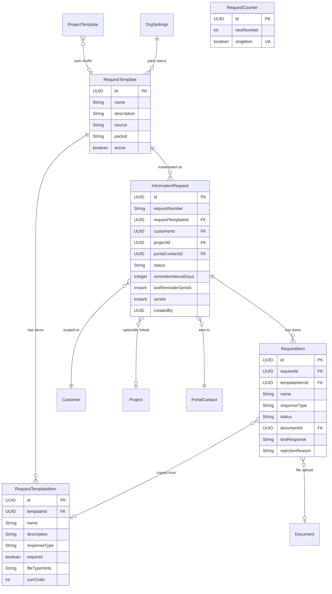
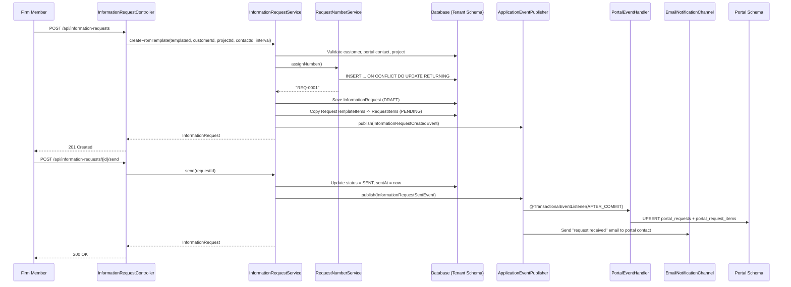
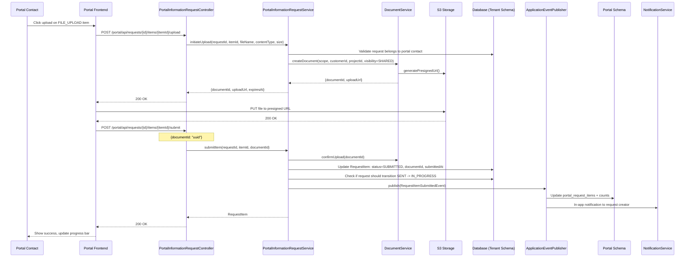
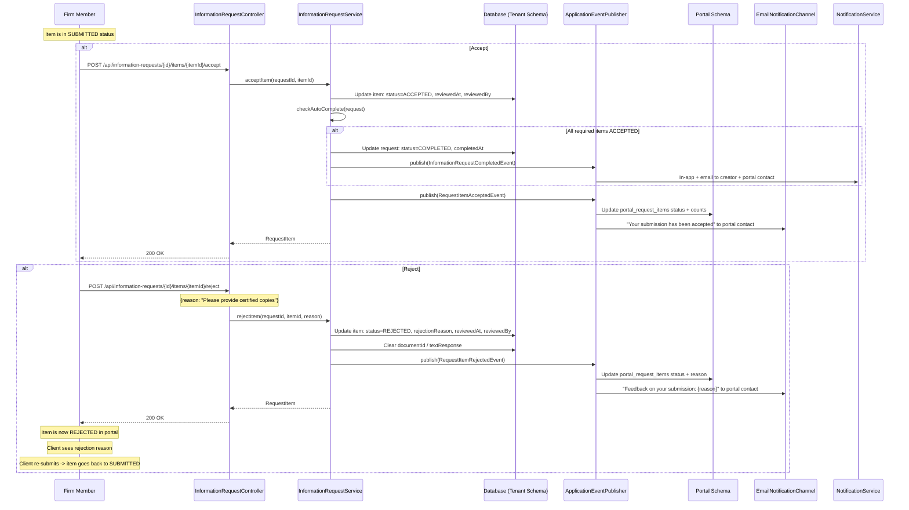
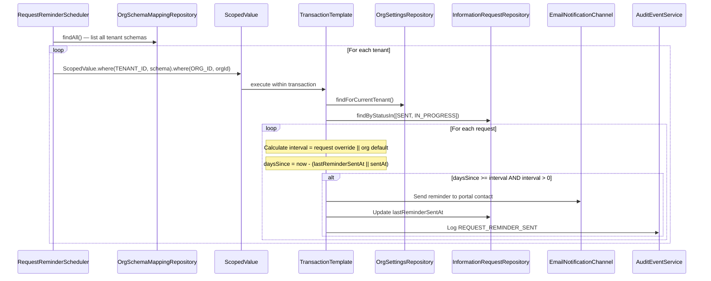

> Standalone architecture document for Phase 34. Numbered as **Section 11** (consistent with ARCHITECTURE.md section numbering for reference).

# 11. Phase 34 — Client Information Requests

## 11.1 Overview

Phase 34 introduces a **Client Information Requests** system that transforms the customer portal from a view-only surface into an interactive document collection platform. Professional services firms spend significant time chasing clients for documents and information via email — documents get lost in inboxes, reminders are manual, and there is no central view of what is outstanding across all clients. This phase solves that problem with a structured request-and-response workflow that sits on top of the existing portal infrastructure.

The system introduces two entity groups: **request templates** (reusable checklists of items to collect, such as "Annual Audit Document Pack") and **information requests** (instances sent to specific portal contacts with a review cycle). Clients respond via the portal by uploading files or providing text responses. Firm members review each submission — accepting or rejecting with a reason. The system auto-detects completion when all required items are accepted. Automated interval-based reminders keep clients engaged without manual follow-up.

Integration with **project templates** enables automatic draft request creation when a project is instantiated (manually, via proposal acceptance, or via recurring schedule). A firm-side dashboard widget surfaces outstanding requests, overdue items, and completion rates. Platform-seeded request packs ship common document collection templates (annual audit, tax return, company registration, monthly bookkeeping) to give firms a head start.

### What's New

| Capability | Before Phase 34 | After Phase 34 |
|---|---|---|
| Document collection from clients | Email-based, untracked | Structured requests with per-item tracking |
| Client portal interaction | View-only (projects, documents, invoices) | Interactive: upload files, submit text, view request progress |
| Reminders for outstanding items | Manual email follow-up | Automated interval-based reminders |
| Cross-client visibility | None | Dashboard widget: outstanding, overdue, completion rates |
| Project template automation | Tasks + documents only | Tasks + documents + information request draft |
| Reusable collection templates | N/A | Request templates with platform-seeded packs |
| Submission review workflow | N/A | Accept/reject cycle with rejection reasons |

---

## 11.2 Domain Model

### New Entities

#### RequestTemplate

Reusable template defining what items to collect. Org-scoped; each org gets its own plus platform-seeded packs.

| Field | Type | Constraints | Notes |
|-------|------|-------------|-------|
| `id` | UUID | PK | Generated via `GenerationType.UUID` |
| `name` | String | NOT NULL, max 200 | e.g., "Annual Audit Document Pack" |
| `description` | String | nullable, max 1000 | Guidance for firm members |
| `source` | String | NOT NULL, max 20 | `PLATFORM` (seeded) or `CUSTOM` (org-created) |
| `packId` | String | nullable, max 100 | Links to the seeder pack that created it |
| `active` | boolean | NOT NULL, default true | Soft-disable without deletion |
| `createdAt` | Instant | NOT NULL, immutable | |
| `updatedAt` | Instant | NOT NULL | Updated on every mutation |

#### RequestTemplateItem

Individual items within a template.

| Field | Type | Constraints | Notes |
|-------|------|-------------|-------|
| `id` | UUID | PK | |
| `templateId` | UUID | NOT NULL, FK by value | References `RequestTemplate` |
| `name` | String | NOT NULL, max 200 | e.g., "Bank Statements (Jan-Dec)" |
| `description` | String | nullable, max 1000 | Guidance for the client |
| `responseType` | String | NOT NULL, max 20 | `FILE_UPLOAD` or `TEXT_RESPONSE` |
| `required` | boolean | NOT NULL, default true | Optional items do not block completion |
| `fileTypeHints` | String | nullable, max 200 | e.g., "PDF, Excel" — informational only |
| `sortOrder` | int | NOT NULL | Display ordering |
| `createdAt` | Instant | NOT NULL, immutable | |
| `updatedAt` | Instant | NOT NULL | Updated on mutation |

#### InformationRequest

An instance of a request sent to a specific client.

| Field | Type | Constraints | Notes |
|-------|------|-------------|-------|
| `id` | UUID | PK | |
| `requestNumber` | String | NOT NULL, unique per tenant | `REQ-0001` format |
| `requestTemplateId` | UUID | nullable, FK by value | null for ad-hoc requests |
| `customerId` | UUID | NOT NULL, FK by value | The customer this request is for |
| `projectId` | UUID | nullable, FK by value | null for customer-scoped requests |
| `portalContactId` | UUID | NOT NULL, FK by value | The recipient portal contact |
| `status` | String | NOT NULL, max 20 | `DRAFT`, `SENT`, `IN_PROGRESS`, `COMPLETED`, `CANCELLED` |
| `reminderIntervalDays` | Integer | nullable | Override org default; null = use org default |
| `lastReminderSentAt` | Instant | nullable | For interval tracking |
| `sentAt` | Instant | nullable | When the request was sent |
| `completedAt` | Instant | nullable | When all required items were accepted |
| `cancelledAt` | Instant | nullable | When the request was cancelled |
| `createdBy` | UUID | NOT NULL | Member who created the request |
| `createdAt` | Instant | NOT NULL, immutable | |
| `updatedAt` | Instant | NOT NULL | |

#### RequestItem

Individual items within a request instance.

| Field | Type | Constraints | Notes |
|-------|------|-------------|-------|
| `id` | UUID | PK | |
| `requestId` | UUID | NOT NULL, FK by value | References `InformationRequest` |
| `templateItemId` | UUID | nullable, FK by value | null for ad-hoc items |
| `name` | String | NOT NULL, max 200 | Copied from template or entered ad-hoc |
| `description` | String | nullable, max 1000 | |
| `responseType` | String | NOT NULL, max 20 | `FILE_UPLOAD` or `TEXT_RESPONSE` |
| `required` | boolean | NOT NULL, default true | |
| `fileTypeHints` | String | nullable, max 200 | |
| `sortOrder` | int | NOT NULL | |
| `status` | String | NOT NULL, max 20 | `PENDING`, `SUBMITTED`, `ACCEPTED`, `REJECTED` |
| `documentId` | UUID | nullable, FK by value | For `FILE_UPLOAD` responses — references `Document` |
| `textResponse` | String | nullable, TEXT | For `TEXT_RESPONSE` responses |
| `rejectionReason` | String | nullable, max 500 | Filled when firm rejects |
| `submittedAt` | Instant | nullable | When client submitted this item |
| `reviewedAt` | Instant | nullable | When firm accepted/rejected |
| `reviewedBy` | UUID | nullable | Member who accepted/rejected |
| `createdAt` | Instant | NOT NULL, immutable | |
| `updatedAt` | Instant | NOT NULL | |

#### RequestCounter

Singleton counter for request numbering (same pattern as `InvoiceCounter`, `ProposalCounter`).

| Field | Type | Constraints | Notes |
|-------|------|-------------|-------|
| `id` | UUID | PK | |
| `nextNumber` | int | NOT NULL | Atomic increment via upsert |
| `singleton` | boolean | NOT NULL, UNIQUE | Always `TRUE`; unique constraint ensures one row |

### Enums

| Enum | Values | Usage |
|------|--------|-------|
| `RequestStatus` | `DRAFT`, `SENT`, `IN_PROGRESS`, `COMPLETED`, `CANCELLED` | `InformationRequest.status` |
| `ItemStatus` | `PENDING`, `SUBMITTED`, `ACCEPTED`, `REJECTED` | `RequestItem.status` |
| `ResponseType` | `FILE_UPLOAD`, `TEXT_RESPONSE` | `RequestTemplateItem.responseType`, `RequestItem.responseType` |
| `TemplateSource` | `PLATFORM`, `CUSTOM` | `RequestTemplate.source` |

### Entity Relationship Diagram



### Extended Entities

**ProjectTemplate** — gains `requestTemplateId` (UUID, nullable) referencing `RequestTemplate`. When a project is created from this template, a DRAFT information request is auto-created.

**OrgSettings** — gains:
- `defaultRequestReminderDays` (Integer, nullable, default 5) — org-wide default reminder interval
- `requestPackStatus` (JSONB, nullable) — tracks which request packs have been seeded

---

## 11.3 Core Flows and Backend Behaviour

### 11.3.1 Request Template CRUD

**Package**: `io.b2mash.b2b.b2bstrawman.informationrequest`

```java
// RequestTemplateService
public RequestTemplate createTemplate(String name, String description);
public RequestTemplate updateTemplate(UUID id, String name, String description);
public void deactivateTemplate(UUID id);
public RequestTemplate duplicateTemplate(UUID sourceId);
public List<RequestTemplate> listTemplates(boolean activeOnly);
public RequestTemplate getTemplate(UUID id);

// Template item management
public RequestTemplateItem addItem(UUID templateId, String name, String description,
    String responseType, boolean required, String fileTypeHints, int sortOrder);
public RequestTemplateItem updateItem(UUID templateId, UUID itemId, ...);
public void removeItem(UUID templateId, UUID itemId);
```

**RBAC**: Any authenticated member with OWNER or ADMIN role can manage templates. MEMBER role has read-only access.

**Tenant boundary**: Templates live in the tenant schema. Schema isolation handles multi-tenancy automatically.

### 11.3.2 Information Request Creation

```java
// InformationRequestService
public InformationRequest createFromTemplate(UUID templateId, UUID customerId,
    UUID projectId, UUID portalContactId, Integer reminderIntervalDays);
public InformationRequest createAdHoc(UUID customerId, UUID projectId,
    UUID portalContactId, Integer reminderIntervalDays);
```

Creation flow:
1. Validate `customerId` exists and is ACTIVE or ONBOARDING
2. Validate `portalContactId` belongs to the customer and is ACTIVE
3. If `projectId` is provided, validate it belongs to the customer
4. Assign request number via `RequestNumberService.assignNumber()`
5. If template-based: copy all `RequestTemplateItem` records into `RequestItem` entities with status PENDING
6. Set status to DRAFT
7. Publish `InformationRequestCreatedEvent`

**RBAC**: Any authenticated member. If project-scoped, member must have project access (project member or OWNER/ADMIN role).

### 11.3.3 Request Lifecycle

```
DRAFT --> SENT --> IN_PROGRESS --> COMPLETED
                              --> CANCELLED (from any state except COMPLETED)
```

```java
// InformationRequestService
public InformationRequest send(UUID requestId);       // DRAFT -> SENT
public InformationRequest cancel(UUID requestId);     // any (except COMPLETED) -> CANCELLED
```

**Send** (`DRAFT -> SENT`):
1. Validate request has at least one item
2. Validate portal contact is ACTIVE
3. Set `status = SENT`, `sentAt = Instant.now()`
4. Publish `InformationRequestSentEvent` — triggers:
   - Email notification to portal contact (with portal link)
   - Portal read-model sync (upsert into `portal_requests` + `portal_request_items`)
   - Audit event: `REQUEST_SENT`
   - In-app notification to firm: "Request REQ-{n} sent to {contact}"

**Auto-transitions**:
- `SENT -> IN_PROGRESS`: On first client submission of any item. Checked in `submitItem()`.
- `IN_PROGRESS -> COMPLETED`: When last required item is accepted. Checked in `acceptItem()`.

**Cancel** (from any state except COMPLETED):
1. Set `status = CANCELLED`, `cancelledAt = Instant.now()`
2. Publish `InformationRequestCancelledEvent`
3. Portal read-model sync (update status)
4. Audit event: `REQUEST_CANCELLED`

### 11.3.4 Item Review Cycle

```
PENDING --> SUBMITTED --> ACCEPTED
                      --> REJECTED --> (client re-submits) --> SUBMITTED
```

```java
// InformationRequestService — firm-side review
public RequestItem acceptItem(UUID requestId, UUID itemId);
public RequestItem rejectItem(UUID requestId, UUID itemId, String reason);
```

**Accept**:
1. Validate item status is SUBMITTED
2. Set `status = ACCEPTED`, `reviewedAt = Instant.now()`, `reviewedBy = current member`
3. Check if all required items are now ACCEPTED — if so, auto-transition request to COMPLETED
4. Publish `RequestItemAcceptedEvent`
5. Audit event: `REQUEST_ITEM_ACCEPTED`
6. Portal read-model sync (update item status + request counts)
7. Email notification to portal contact: "Your submission for {item name} has been accepted"

**Reject**:
1. Validate item status is SUBMITTED
2. Set `status = REJECTED`, `rejectionReason = reason`, `reviewedAt = Instant.now()`, `reviewedBy = current member`
3. Clear `documentId` / `textResponse` (client must re-submit fresh)
4. Publish `RequestItemRejectedEvent`
5. Audit event: `REQUEST_ITEM_REJECTED`
6. Portal read-model sync (update item status + rejection reason)
7. Email notification to portal contact: "Your submission for {item name} was returned with feedback: {reason}"

### 11.3.5 Auto-Completion Detection

Checked after every `acceptItem()` call:

```java
private void checkAutoComplete(InformationRequest request) {
    List<RequestItem> items = requestItemRepository.findByRequestId(request.getId());
    boolean allRequiredAccepted = items.stream()
        .filter(RequestItem::isRequired)
        .allMatch(item -> "ACCEPTED".equals(item.getStatus()));
    if (allRequiredAccepted) {
        request.complete(); // sets status = COMPLETED, completedAt = now
        informationRequestRepository.save(request);
        eventPublisher.publishEvent(new InformationRequestCompletedEvent(...));
    }
}
```

Optional items that are still PENDING do not block completion.

### 11.3.6 Portal Submission Flow

```java
// PortalInformationRequestService — portal-side
public PresignedUploadResponse initiateUpload(UUID requestId, UUID itemId,
    String fileName, String contentType, long size);
public RequestItem submitItem(UUID requestId, UUID itemId, UUID documentId);    // FILE_UPLOAD
public RequestItem submitTextResponse(UUID requestId, UUID itemId, String text); // TEXT_RESPONSE
```

**File upload flow**:
1. Portal contact calls `initiateUpload` — creates a `Document` entity (scope = PROJECT if project-scoped, else CUSTOMER; visibility = SHARED), gets presigned S3 URL
2. Client uploads to S3 directly via presigned URL
3. Client calls `submitItem` with the `documentId`
4. Service confirms the document upload (`document.confirmUpload()`)
5. Sets item `status = SUBMITTED`, `documentId = document.id`, `submittedAt = now`
6. If request was SENT, auto-transition to IN_PROGRESS
7. Publish `RequestItemSubmittedEvent`

**Text response flow**:
1. Portal contact calls `submitTextResponse` with the text content
2. Sets item `status = SUBMITTED`, `textResponse = text`, `submittedAt = now`
3. Same auto-transition and event publishing as file upload

**Re-submission** (after rejection):
- Item stays in REJECTED status after firm rejects (so the client sees the rejection reason).
- Previous `documentId` / `textResponse` was cleared on rejection.
- Client re-submits via the same upload or text flow — item transitions from REJECTED to SUBMITTED.
- The `submitItem` and `submitTextResponse` methods accept items in PENDING **or REJECTED** status.

**Authorization**: Portal JWT must encode `customerId` that matches the request's `customerId`. Portal contact ID in JWT must match request's `portalContactId`.

### 11.3.7 Reminder Scheduling

```java
@Component
public class RequestReminderScheduler {
    private static final long CHECK_INTERVAL_MS = 21_600_000; // 6 hours

    @Scheduled(fixedRate = CHECK_INTERVAL_MS)
    public void checkRequestReminders() {
        var mappings = mappingRepository.findAll();
        for (var mapping : mappings) {
            try {
                ScopedValue.where(RequestScopes.TENANT_ID, mapping.getSchemaName())
                    .where(RequestScopes.ORG_ID, mapping.getClerkOrgId())
                    .call(() -> processTenant());
            } catch (Exception e) {
                log.error("Failed reminders for schema {}", mapping.getSchemaName(), e);
            }
        }
    }

    private int processTenant() {
        return transactionTemplate.execute(tx -> {
            var settings = orgSettingsRepository.findForCurrentTenant().orElse(null);
            if (settings == null) return 0;
            int defaultInterval = settings.getDefaultRequestReminderDays() != null
                ? settings.getDefaultRequestReminderDays() : 5;

            var requests = informationRequestRepository
                .findByStatusIn(List.of("SENT", "IN_PROGRESS"));
            int sent = 0;
            for (var request : requests) {
                int interval = request.getReminderIntervalDays() != null
                    ? request.getReminderIntervalDays() : defaultInterval;
                if (interval <= 0) continue; // reminders disabled
                Instant lastSent = request.getLastReminderSentAt() != null
                    ? request.getLastReminderSentAt() : request.getSentAt();
                if (lastSent == null) continue;
                long daysSince = Duration.between(lastSent, Instant.now()).toDays();
                if (daysSince >= interval) {
                    sendReminder(request);
                    request.setLastReminderSentAt(Instant.now());
                    informationRequestRepository.save(request);
                    sent++;
                }
            }
            return sent;
        });
    }
}
```

See [ADR-135](../adr/ADR-135-reminder-strategy.md) for the interval-based strategy decision.

### 11.3.8 Project Template Auto-Draft Creation

When a project is created from a `ProjectTemplate` that has a non-null `requestTemplateId`:

```java
// ProjectInstantiationService (extension point)
public void onProjectCreated(Project project, ProjectTemplate template) {
    if (template.getRequestTemplateId() != null) {
        // Customer must be linked to the project
        var customerProject = customerProjectRepository.findByProjectId(project.getId());
        if (customerProject.isEmpty()) return;

        var customer = customerRepository.findById(customerProject.get().getCustomerId())
            .orElse(null);
        if (customer == null) return;

        // Find primary portal contact for this customer
        var primaryContact = portalContactRepository
            .findByCustomerIdAndRole(customer.getId(), ContactRole.PRIMARY)
            .stream().findFirst().orElse(null);
        if (primaryContact == null) return;

        informationRequestService.createFromTemplate(
            template.getRequestTemplateId(),
            customer.getId(),
            project.getId(),
            primaryContact.getId(),
            null // use org default interval
        );
        // Notification to project members: "Draft information request created"
    }
}
```

See [ADR-137](../adr/ADR-137-project-template-integration-scope.md) for the draft-on-creation decision.

### 11.3.9 Request Numbering

`RequestNumberService` follows the established atomic upsert pattern from `InvoiceNumberService` and `ProposalNumberService`:

```java
@Service
public class RequestNumberService {

    @PersistenceContext private EntityManager entityManager;

    @Transactional
    public String assignNumber() {
        var result = entityManager.createNativeQuery(
                "INSERT INTO request_counters (id, next_number, singleton)"
                    + " VALUES (gen_random_uuid(), 2, TRUE)"
                    + " ON CONFLICT ON CONSTRAINT request_counters_singleton"
                    + " DO UPDATE SET next_number = request_counters.next_number + 1"
                    + " RETURNING next_number - 1")
            .getSingleResult();
        int number = ((Number) result).intValue();
        return String.format("REQ-%04d", number);
    }
}
```

### 11.3.10 Pack Seeding

`RequestPackSeeder` follows the `CompliancePackSeeder` pattern:

```java
@Service
public class RequestPackSeeder {

    private static final String PACK_LOCATION = "classpath:request-packs/*/pack.json";

    public void seedPacksForTenant(String tenantId, String orgId) {
        ScopedValue.where(RequestScopes.TENANT_ID, tenantId)
            .where(RequestScopes.ORG_ID, orgId)
            .run(() -> transactionTemplate.executeWithoutResult(tx -> doSeedPacks()));
    }

    private void doSeedPacks() {
        List<RequestPackDefinition> packs = loadPacks();
        var settings = orgSettingsRepository.findForCurrentTenant()
            .orElseGet(() -> orgSettingsRepository.save(new OrgSettings("USD")));

        for (RequestPackDefinition pack : packs) {
            if (isPackAlreadyApplied(settings, pack.packId())) continue;

            RequestTemplate template = new RequestTemplate(
                pack.name(), pack.description(), "PLATFORM");
            template.setPackId(pack.packId());
            template = requestTemplateRepository.save(template);

            for (var itemDef : pack.items()) {
                var item = new RequestTemplateItem(
                    template.getId(), itemDef.name(), itemDef.description(),
                    itemDef.responseType(), itemDef.required(),
                    itemDef.fileTypeHints(), itemDef.sortOrder());
                requestTemplateItemRepository.save(item);
            }

            settings.recordRequestPackApplication(pack.packId(), pack.version());
        }
        orgSettingsRepository.save(settings);
    }
}
```

**Platform-seeded packs**:

| Pack Name | Pack ID | Items |
|-----------|---------|-------|
| Annual Audit Document Pack | `annual-audit` | Trial balance, bank statements, fixed asset register, debtors/creditors age analysis, prior year signed AFS |
| Tax Return Supporting Docs | `tax-return` | IRP5 certificates, medical aid tax certificate, retirement annuity certificate, investment income statements, logbook summary |
| Company Registration | `company-registration` | CIPC certificate, shareholder register, director appointments, B-BBEE certificate |
| Monthly Bookkeeping | `monthly-bookkeeping` | Bank statements, petty cash slips, supplier invoices, payroll summaries |

---

## 11.4 API Surface

### Request Template API (Firm-Side)

| Method | Path | Description | Auth | R/W |
|--------|------|-------------|------|-----|
| `GET` | `/api/request-templates` | List templates (query: `active`) | Member | R |
| `POST` | `/api/request-templates` | Create custom template | Admin+ | W |
| `GET` | `/api/request-templates/{id}` | Get template with items | Member | R |
| `PUT` | `/api/request-templates/{id}` | Update template | Admin+ | W |
| `DELETE` | `/api/request-templates/{id}` | Deactivate template (soft delete) | Admin+ | W |
| `POST` | `/api/request-templates/{id}/items` | Add item to template | Admin+ | W |
| `PUT` | `/api/request-templates/{id}/items/{itemId}` | Update item | Admin+ | W |
| `DELETE` | `/api/request-templates/{id}/items/{itemId}` | Remove item | Admin+ | W |
| `POST` | `/api/request-templates/{id}/duplicate` | Clone template | Admin+ | W |

### Information Request API (Firm-Side)

| Method | Path | Description | Auth | R/W |
|--------|------|-------------|------|-----|
| `GET` | `/api/information-requests` | List requests (query: `customerId`, `projectId`, `status`) | Member | R |
| `POST` | `/api/information-requests` | Create request (from template or ad-hoc) | Member | W |
| `GET` | `/api/information-requests/{id}` | Get request with items | Member | R |
| `PUT` | `/api/information-requests/{id}` | Update request (DRAFT only) | Member | W |
| `POST` | `/api/information-requests/{id}/send` | Send to client (DRAFT -> SENT) | Member | W |
| `POST` | `/api/information-requests/{id}/cancel` | Cancel request | Member | W |
| `POST` | `/api/information-requests/{id}/items` | Add ad-hoc item (DRAFT only) | Member | W |
| `POST` | `/api/information-requests/{id}/items/{itemId}/accept` | Accept submission | Member | W |
| `POST` | `/api/information-requests/{id}/items/{itemId}/reject` | Reject with reason | Member | W |
| `POST` | `/api/information-requests/{id}/resend-notification` | Re-send request email to portal contact | Member | W |

### Customer/Project Convenience Endpoints

| Method | Path | Description | Auth | R/W |
|--------|------|-------------|------|-----|
| `GET` | `/api/customers/{customerId}/information-requests` | Requests for this customer | Member | R |
| `GET` | `/api/projects/{projectId}/information-requests` | Requests for this project | Member | R |

### Dashboard Aggregation

| Method | Path | Description | Auth | R/W |
|--------|------|-------------|------|-----|
| `GET` | `/api/information-requests/summary` | Aggregate stats | Member | R |

### Portal API (Client-Side)

| Method | Path | Description | Auth | R/W |
|--------|------|-------------|------|-----|
| `GET` | `/portal/api/requests` | List requests for portal contact | Portal JWT | R |
| `GET` | `/portal/api/requests/{id}` | Request detail with items | Portal JWT | R |
| `POST` | `/portal/api/requests/{id}/items/{itemId}/upload` | Initiate file upload (returns presigned URL) | Portal JWT | W |
| `POST` | `/portal/api/requests/{id}/items/{itemId}/submit` | Submit response (file confirm or text) | Portal JWT | W |

### Key Request/Response Shapes

**Create Information Request:**
```json
POST /api/information-requests
{
  "requestTemplateId": "uuid-or-null",
  "customerId": "uuid",
  "projectId": "uuid-or-null",
  "portalContactId": "uuid",
  "reminderIntervalDays": 5,
  "items": [
    {
      "name": "Bank Statements",
      "description": "Jan-Dec 2025",
      "responseType": "FILE_UPLOAD",
      "required": true,
      "fileTypeHints": "PDF, Excel"
    }
  ]
}
```

**Information Request Response:**
```json
{
  "id": "uuid",
  "requestNumber": "REQ-0001",
  "customerId": "uuid",
  "customerName": "Acme Corp",
  "projectId": "uuid-or-null",
  "projectName": "Annual Audit 2025",
  "portalContactId": "uuid",
  "portalContactName": "John Smith",
  "portalContactEmail": "john@acme.com",
  "status": "IN_PROGRESS",
  "reminderIntervalDays": 5,
  "sentAt": "2026-03-01T10:00:00Z",
  "completedAt": null,
  "totalItems": 8,
  "submittedItems": 3,
  "acceptedItems": 2,
  "rejectedItems": 0,
  "items": [
    {
      "id": "uuid",
      "name": "Bank Statements",
      "description": "Jan-Dec 2025",
      "responseType": "FILE_UPLOAD",
      "required": true,
      "fileTypeHints": "PDF, Excel",
      "sortOrder": 0,
      "status": "ACCEPTED",
      "documentId": "uuid",
      "documentFileName": "bank-statements-2025.pdf",
      "textResponse": null,
      "rejectionReason": null,
      "submittedAt": "2026-03-02T14:30:00Z",
      "reviewedAt": "2026-03-02T15:00:00Z"
    }
  ],
  "createdAt": "2026-03-01T09:00:00Z"
}
```

**Portal Upload Initiation:**
```json
POST /portal/api/requests/{id}/items/{itemId}/upload
{
  "fileName": "bank-statements-2025.pdf",
  "contentType": "application/pdf",
  "size": 1048576
}

Response:
{
  "documentId": "uuid",
  "uploadUrl": "https://s3.amazonaws.com/...",
  "expiresAt": "2026-03-01T11:00:00Z"
}
```

**Portal Submit (text response):**
```json
POST /portal/api/requests/{id}/items/{itemId}/submit
{
  "textResponse": "Our company registration number is 2020/123456/07"
}
```

**Portal Submit (file upload confirmation):**
```json
POST /portal/api/requests/{id}/items/{itemId}/submit
{
  "documentId": "uuid"
}
```

**Dashboard Summary:**
```json
GET /api/information-requests/summary

{
  "total": 42,
  "byStatus": {
    "DRAFT": 3,
    "SENT": 8,
    "IN_PROGRESS": 22,
    "COMPLETED": 7,
    "CANCELLED": 2
  },
  "itemsPendingReview": 15,
  "overdueRequests": 5,
  "completionRateLast30Days": 0.78
}
```

**Overdue calculation**: A request is "overdue" when it has status SENT or IN_PROGRESS and no client activity (no item submission) has occurred in more than 2× the effective reminder interval. The effective interval is `request.reminderIntervalDays` if set, otherwise `orgSettings.defaultRequestReminderDays` (default 5). Requests with `reminderIntervalDays = 0` (reminders disabled) are never considered overdue. The "last activity" timestamp is `MAX(requestItems.submittedAt)` or `request.sentAt` if no submissions exist.

---

## 11.5 Sequence Diagrams

### 11.5.1 Create and Send Information Request



### 11.5.2 Portal Client Submission Flow (File Upload)



### 11.5.3 Item Review Cycle (Accept/Reject)



### 11.5.4 Reminder Scheduling Flow



---

## 11.6 Portal Read-Model Sync

### New Portal Tables

**`portal.portal_requests`**:

| Column | Type | Notes |
|--------|------|-------|
| `id` | UUID | PK — same ID as tenant-schema `information_requests.id` |
| `request_number` | VARCHAR(20) | |
| `customer_id` | UUID | |
| `portal_contact_id` | UUID | |
| `project_id` | UUID | nullable |
| `project_name` | VARCHAR(300) | nullable, denormalized |
| `org_id` | VARCHAR(255) | For portal-side querying by org |
| `status` | VARCHAR(20) | |
| `total_items` | INT | |
| `submitted_items` | INT | |
| `accepted_items` | INT | |
| `rejected_items` | INT | |
| `sent_at` | TIMESTAMPTZ | |
| `completed_at` | TIMESTAMPTZ | nullable |
| `synced_at` | TIMESTAMPTZ | |

**`portal.portal_request_items`**:

| Column | Type | Notes |
|--------|------|-------|
| `id` | UUID | PK — same ID as tenant-schema `request_items.id` |
| `request_id` | UUID | FK to `portal_requests` |
| `name` | VARCHAR(200) | |
| `description` | TEXT | nullable |
| `response_type` | VARCHAR(20) | |
| `required` | BOOLEAN | |
| `file_type_hints` | VARCHAR(200) | nullable |
| `sort_order` | INT | |
| `status` | VARCHAR(20) | |
| `rejection_reason` | VARCHAR(500) | nullable |
| `document_id` | UUID | nullable — references tenant-schema Document |
| `text_response` | TEXT | nullable |
| `synced_at` | TIMESTAMPTZ | |

### Domain Events Triggering Sync

| Event | Sync Action |
|-------|-------------|
| `InformationRequestSentEvent` | Upsert `portal_requests` + all `portal_request_items` |
| `InformationRequestCancelledEvent` | Update `portal_requests.status` |
| `InformationRequestCompletedEvent` | Update `portal_requests.status` + `completed_at` |
| `RequestItemSubmittedEvent` | Update `portal_request_items` + recalculate counts |
| `RequestItemAcceptedEvent` | Update `portal_request_items.status` + recalculate counts |
| `RequestItemRejectedEvent` | Update `portal_request_items` + `rejection_reason` + recalculate counts |

### PortalEventHandler Extensions

New handler methods added to the existing `PortalEventHandler`:

```java
@TransactionalEventListener(phase = TransactionPhase.AFTER_COMMIT)
public void onInformationRequestSent(InformationRequestSentEvent event) {
    handleInTenantScope(event.getTenantId(), event.getOrgId(), () -> {
        var request = informationRequestRepository.findById(event.getRequestId()).orElseThrow();
        var items = requestItemRepository.findByRequestId(request.getId());
        var projectName = request.getProjectId() != null
            ? projectRepository.findById(request.getProjectId()).map(Project::getName).orElse(null)
            : null;
        portalReadModelRepository.upsertPortalRequest(request, projectName, event.getOrgId());
        for (var item : items) {
            portalReadModelRepository.upsertPortalRequestItem(item);
        }
    });
}
```

### Sync SQL (Upsert Patterns)

```sql
-- Upsert portal_requests
INSERT INTO portal.portal_requests
  (id, request_number, customer_id, portal_contact_id, project_id, project_name,
   org_id, status, total_items, submitted_items, accepted_items, rejected_items,
   sent_at, completed_at, synced_at)
VALUES (?, ?, ?, ?, ?, ?, ?, ?, ?, ?, ?, ?, ?, ?, NOW())
ON CONFLICT (id) DO UPDATE SET
  status = EXCLUDED.status,
  total_items = EXCLUDED.total_items,
  submitted_items = EXCLUDED.submitted_items,
  accepted_items = EXCLUDED.accepted_items,
  rejected_items = EXCLUDED.rejected_items,
  completed_at = EXCLUDED.completed_at,
  synced_at = NOW();

-- Upsert portal_request_items
INSERT INTO portal.portal_request_items
  (id, request_id, name, description, response_type, required, file_type_hints,
   sort_order, status, rejection_reason, document_id, text_response, synced_at)
VALUES (?, ?, ?, ?, ?, ?, ?, ?, ?, ?, ?, ?, NOW())
ON CONFLICT (id) DO UPDATE SET
  status = EXCLUDED.status,
  rejection_reason = EXCLUDED.rejection_reason,
  document_id = EXCLUDED.document_id,
  text_response = EXCLUDED.text_response,
  synced_at = NOW();
```

---

## 11.7 Automated Reminders

### RequestReminderScheduler Design

The scheduler follows the `TimeReminderScheduler` pattern (see [ADR-117](../adr/ADR-117-time-reminder-scheduling.md)):

- **`@Component`** with `@Scheduled(fixedRate = 21_600_000)` — runs every 6 hours
- Iterates all tenant schemas via `OrgSchemaMappingRepository.findAll()`
- Binds `ScopedValue.where(RequestScopes.TENANT_ID, ...).where(RequestScopes.ORG_ID, ...)`
- Uses `TransactionTemplate` (not `@Transactional`) for explicit transaction boundaries inside the `ScopedValue` block
- Per-tenant try/catch — one bad tenant does not halt processing

### Per-Tenant Processing

1. Load `OrgSettings` — extract `defaultRequestReminderDays` (default 5 if null)
2. Query `InformationRequest` where status IN (`SENT`, `IN_PROGRESS`)
3. For each request:
   - Resolve interval: `request.reminderIntervalDays ?? orgSettings.defaultRequestReminderDays ?? 5`
   - If interval <= 0, skip (reminders disabled for this request)
   - Calculate `daysSince = now - (lastReminderSentAt ?? sentAt)`
   - If `daysSince >= interval`, send reminder

### Interval Calculation Logic

```java
private boolean isReminderDue(InformationRequest request, int defaultInterval) {
    int interval = request.getReminderIntervalDays() != null
        ? request.getReminderIntervalDays()
        : defaultInterval;
    if (interval <= 0) return false;

    Instant referenceTime = request.getLastReminderSentAt() != null
        ? request.getLastReminderSentAt()
        : request.getSentAt();
    if (referenceTime == null) return false;

    return Duration.between(referenceTime, Instant.now()).toDays() >= interval;
}
```

### Email Template

Thymeleaf template (`request-reminder.html`):

```
Subject: Reminder: X outstanding items for [Request Number]

Hi {contact.displayName},

You have {pendingCount} outstanding items for information request {request.requestNumber}.

Outstanding items:
- {item.name} (status)
- ...

[View in Portal] — links to /portal/requests/{id}

If you have any questions, please contact {orgName}.
```

A plain-text version is generated alongside the HTML version, following the existing Thymeleaf email template pattern.

### OrgSettings Extension

New field on `OrgSettings`:

```java
@Column(name = "default_request_reminder_days")
private Integer defaultRequestReminderDays; // default 5 in migration

public Integer getDefaultRequestReminderDays() { return defaultRequestReminderDays; }
public void setDefaultRequestReminderDays(Integer days) {
    this.defaultRequestReminderDays = days;
    this.updatedAt = Instant.now();
}
```

Configurable in the firm's Settings page under "Organization" settings.

---

## 11.8 Project Template Integration

### ProjectTemplate Extension

New field added to `ProjectTemplate`:

```java
@Column(name = "request_template_id")
private UUID requestTemplateId; // nullable — FK by value to RequestTemplate

public UUID getRequestTemplateId() { return requestTemplateId; }
public void setRequestTemplateId(UUID requestTemplateId) {
    this.requestTemplateId = requestTemplateId;
    this.updatedAt = Instant.now();
}
```

### Auto-Draft Creation Flow

The existing `ProjectInstantiationService` (used by manual creation, proposal acceptance, and recurring schedules) is extended:

1. After project creation and task/document setup, check `template.getRequestTemplateId()`
2. If non-null, resolve the customer linked to the project (via `CustomerProject`)
3. Find the customer's PRIMARY portal contact (fallback: any ACTIVE contact)
4. If no portal contact found, log a warning and skip (customer may not have portal access yet)
5. Call `InformationRequestService.createFromTemplate()` with status DRAFT
6. Create in-app notification for project members: "A draft information request has been created for {customerName}"

### Frontend: Template Editor Changes

The project template editor page (`settings/project-templates/[id]/page.tsx`) gains:

- New field: **"Information Request Template"** — a combobox populated from `GET /api/request-templates?active=true`
- Help text below the field: "When a project is created from this template, a draft information request will be created for the linked customer."
- The field is optional; clearing it removes the association
- Value persisted via `PUT /api/project-templates/{id}` with `requestTemplateId` in the payload

---

## 11.9 Notifications & Audit

### Notification Types

| Event | Recipient | Channel | Template Key |
|-------|-----------|---------|--------------|
| Request sent | Portal contact (client) | Email | `request-sent` |
| Item submitted by client | Request creator (firm member) | In-app + email | `request-item-submitted` |
| Item accepted by firm | Portal contact (client) | Email | `request-item-accepted` |
| Item rejected by firm | Portal contact (client) | Email (includes rejection reason) | `request-item-rejected` |
| Request completed | Request creator + portal contact | In-app + email | `request-completed` |
| Reminder (items outstanding) | Portal contact (client) | Email | `request-reminder` |
| Draft request auto-created | Project members (firm) | In-app | `request-draft-created` |

Notifications to portal contacts use the `EmailNotificationChannel` directly (portal contacts do not have in-app notification preferences). Notifications to firm members use the existing `NotificationService.createIfEnabled()` for preference-aware routing.

### Audit Event Types

| Type | Details (JSONB) |
|------|----------------|
| `REQUEST_CREATED` | `{requestId, requestNumber, customerId, projectId, templateId, source: "TEMPLATE"/"AD_HOC"}` |
| `REQUEST_SENT` | `{requestId, requestNumber, portalContactId, portalContactEmail, itemCount}` |
| `REQUEST_CANCELLED` | `{requestId, requestNumber, cancelledBy}` |
| `REQUEST_COMPLETED` | `{requestId, requestNumber, completedAt, totalItems, acceptedItems}` |
| `REQUEST_ITEM_SUBMITTED` | `{requestId, itemId, itemName, responseType, documentId}` |
| `REQUEST_ITEM_ACCEPTED` | `{requestId, itemId, itemName, reviewedBy}` |
| `REQUEST_ITEM_REJECTED` | `{requestId, itemId, itemName, reviewedBy, rejectionReason}` |
| `REQUEST_REMINDER_SENT` | `{requestId, requestNumber, portalContactEmail, pendingItemCount}` |

All audit events include the standard fields: actor (member ID or "system" for scheduler), timestamp, tenant ID.

### Activity Feed Integration

Request events appear in the project activity tab (for project-scoped requests) via the existing audit event query pattern:

- "Information request REQ-0042 sent to John Smith"
- "Client submitted 3 items for REQ-0042"
- "REQ-0042 completed — all items accepted"
- "Item 'Bank Statements' rejected — waiting for re-submission"

Activity entries are derived from `AuditEvent` records filtered by `entityType = 'InformationRequest'` and `projectId`.

---

## 11.10 Database Migrations

### V54 — Core Request Tables (Tenant Schema)

```sql
-- V54__create_information_request_tables.sql

-- Request templates
CREATE TABLE request_templates (
    id              UUID PRIMARY KEY DEFAULT gen_random_uuid(),
    name            VARCHAR(200)    NOT NULL,
    description     VARCHAR(1000),
    source          VARCHAR(20)     NOT NULL DEFAULT 'CUSTOM',
    pack_id         VARCHAR(100),
    active          BOOLEAN         NOT NULL DEFAULT TRUE,
    created_at      TIMESTAMPTZ     NOT NULL DEFAULT NOW(),
    updated_at      TIMESTAMPTZ     NOT NULL DEFAULT NOW()
);

CREATE INDEX idx_request_templates_active ON request_templates (active);
CREATE INDEX idx_request_templates_pack_id ON request_templates (pack_id);

-- Request template items
CREATE TABLE request_template_items (
    id              UUID PRIMARY KEY DEFAULT gen_random_uuid(),
    template_id     UUID            NOT NULL REFERENCES request_templates(id) ON DELETE CASCADE,
    name            VARCHAR(200)    NOT NULL,
    description     VARCHAR(1000),
    response_type   VARCHAR(20)     NOT NULL,
    required        BOOLEAN         NOT NULL DEFAULT TRUE,
    file_type_hints VARCHAR(200),
    sort_order      INTEGER         NOT NULL DEFAULT 0,
    created_at      TIMESTAMPTZ     NOT NULL DEFAULT NOW()
);

CREATE INDEX idx_request_template_items_template ON request_template_items (template_id);

-- Information requests
CREATE TABLE information_requests (
    id                      UUID PRIMARY KEY DEFAULT gen_random_uuid(),
    request_number          VARCHAR(20)     NOT NULL,
    request_template_id     UUID            REFERENCES request_templates(id),
    customer_id             UUID            NOT NULL,
    project_id              UUID,
    portal_contact_id       UUID            NOT NULL,
    status                  VARCHAR(20)     NOT NULL DEFAULT 'DRAFT',
    reminder_interval_days  INTEGER,
    last_reminder_sent_at   TIMESTAMPTZ,
    sent_at                 TIMESTAMPTZ,
    completed_at            TIMESTAMPTZ,
    cancelled_at            TIMESTAMPTZ,
    created_by              UUID            NOT NULL,
    created_at              TIMESTAMPTZ     NOT NULL DEFAULT NOW(),
    updated_at              TIMESTAMPTZ     NOT NULL DEFAULT NOW(),
    CONSTRAINT uq_information_requests_number UNIQUE (request_number)
);

CREATE INDEX idx_information_requests_customer ON information_requests (customer_id);
CREATE INDEX idx_information_requests_project ON information_requests (project_id);
CREATE INDEX idx_information_requests_portal_contact ON information_requests (portal_contact_id);
CREATE INDEX idx_information_requests_status ON information_requests (status);
-- Composite index for reminder scheduler: find SENT/IN_PROGRESS requests efficiently
CREATE INDEX idx_information_requests_reminder ON information_requests (status, last_reminder_sent_at)
    WHERE status IN ('SENT', 'IN_PROGRESS');

-- Request items
CREATE TABLE request_items (
    id                  UUID PRIMARY KEY DEFAULT gen_random_uuid(),
    request_id          UUID            NOT NULL REFERENCES information_requests(id) ON DELETE CASCADE,
    template_item_id    UUID,
    name                VARCHAR(200)    NOT NULL,
    description         VARCHAR(1000),
    response_type       VARCHAR(20)     NOT NULL,
    required            BOOLEAN         NOT NULL DEFAULT TRUE,
    file_type_hints     VARCHAR(200),
    sort_order          INTEGER         NOT NULL DEFAULT 0,
    status              VARCHAR(20)     NOT NULL DEFAULT 'PENDING',
    document_id         UUID,
    text_response       TEXT,
    rejection_reason    VARCHAR(500),
    submitted_at        TIMESTAMPTZ,
    reviewed_at         TIMESTAMPTZ,
    reviewed_by         UUID,
    created_at          TIMESTAMPTZ     NOT NULL DEFAULT NOW(),
    updated_at          TIMESTAMPTZ     NOT NULL DEFAULT NOW()
);

CREATE INDEX idx_request_items_request ON request_items (request_id);
CREATE INDEX idx_request_items_status ON request_items (status);
-- Composite index for review queue: find SUBMITTED items needing firm review
CREATE INDEX idx_request_items_review ON request_items (request_id, status)
    WHERE status = 'SUBMITTED';

-- Request counter (singleton for numbering)
CREATE TABLE request_counters (
    id              UUID PRIMARY KEY DEFAULT gen_random_uuid(),
    next_number     INTEGER         NOT NULL DEFAULT 1,
    singleton       BOOLEAN         NOT NULL DEFAULT TRUE,
    CONSTRAINT request_counters_singleton UNIQUE (singleton)
);
```

**Index rationale**:
- `idx_request_templates_active` — Template list page filters by active status
- `idx_request_templates_pack_id` — Pack seeder idempotency check
- `idx_request_template_items_template` — FK lookup for template detail
- `idx_information_requests_customer` — Customer detail page: list requests for customer
- `idx_information_requests_project` — Project detail page: list requests for project
- `idx_information_requests_status` — Dashboard aggregation by status
- `idx_information_requests_reminder` — Partial index for reminder scheduler: only scans SENT/IN_PROGRESS rows
- `idx_request_items_request` — Request detail page: list items for request
- `idx_request_items_status` — Dashboard: count items by status
- `idx_request_items_review` — Partial index: efficiently find items needing firm review

### V55 — Extensions to Existing Tables (Tenant Schema)

```sql
-- V55__extend_project_templates_and_org_settings_for_requests.sql

-- Project template: optional request template reference
ALTER TABLE project_templates
    ADD COLUMN request_template_id UUID REFERENCES request_templates(id);

-- OrgSettings: default reminder interval + pack status
ALTER TABLE org_settings
    ADD COLUMN default_request_reminder_days INTEGER DEFAULT 5;

ALTER TABLE org_settings
    ADD COLUMN request_pack_status JSONB;
```

### V13 — Portal Read-Model Tables (Global Schema)

> **Note**: Verify V13 is still available before implementation — Phase 33 may have claimed it. If so, use V14.

```sql
-- V13__portal_requests.sql

CREATE TABLE portal.portal_requests (
    id                  UUID PRIMARY KEY,
    request_number      VARCHAR(20)     NOT NULL,
    customer_id         UUID            NOT NULL,
    portal_contact_id   UUID            NOT NULL,
    project_id          UUID,
    project_name        VARCHAR(300),
    org_id              VARCHAR(255)    NOT NULL,
    status              VARCHAR(20)     NOT NULL,
    total_items         INTEGER         NOT NULL DEFAULT 0,
    submitted_items     INTEGER         NOT NULL DEFAULT 0,
    accepted_items      INTEGER         NOT NULL DEFAULT 0,
    rejected_items      INTEGER         NOT NULL DEFAULT 0,
    sent_at             TIMESTAMPTZ,
    completed_at        TIMESTAMPTZ,
    synced_at           TIMESTAMPTZ     NOT NULL DEFAULT NOW()
);

CREATE INDEX idx_portal_requests_contact ON portal.portal_requests (portal_contact_id);
CREATE INDEX idx_portal_requests_customer ON portal.portal_requests (customer_id, org_id);
CREATE INDEX idx_portal_requests_status ON portal.portal_requests (status);

CREATE TABLE portal.portal_request_items (
    id                  UUID PRIMARY KEY,
    request_id          UUID            NOT NULL REFERENCES portal.portal_requests(id) ON DELETE CASCADE,
    name                VARCHAR(200)    NOT NULL,
    description         TEXT,
    response_type       VARCHAR(20)     NOT NULL,
    required            BOOLEAN         NOT NULL DEFAULT TRUE,
    file_type_hints     VARCHAR(200),
    sort_order          INTEGER         NOT NULL DEFAULT 0,
    status              VARCHAR(20)     NOT NULL DEFAULT 'PENDING',
    rejection_reason    VARCHAR(500),
    document_id         UUID,
    text_response       TEXT,
    synced_at           TIMESTAMPTZ     NOT NULL DEFAULT NOW()
);

CREATE INDEX idx_portal_request_items_request ON portal.portal_request_items (request_id);
```

---

## 11.11 Implementation Guidance

### Backend Changes

| File / Package | Change |
|----------------|--------|
| `informationrequest/RequestTemplate.java` | New entity — `@Entity @Table("request_templates")`, UUID PK, source/packId/active fields |
| `informationrequest/RequestTemplateItem.java` | New entity — template item with responseType, sortOrder |
| `informationrequest/InformationRequest.java` | New entity — request with lifecycle status machine, counter reference |
| `informationrequest/RequestItem.java` | New entity — item with review cycle status, document/text response |
| `informationrequest/RequestCounter.java` | New entity — singleton counter for numbering |
| `informationrequest/RequestNumberService.java` | New service — atomic upsert numbering (follows `InvoiceNumberService`) |
| `informationrequest/RequestTemplateRepository.java` | New JpaRepository |
| `informationrequest/RequestTemplateItemRepository.java` | New JpaRepository |
| `informationrequest/InformationRequestRepository.java` | New JpaRepository with `findByStatusIn`, `findByCustomerId`, `findByProjectId` |
| `informationrequest/RequestItemRepository.java` | New JpaRepository with `findByRequestId` |
| `informationrequest/InformationRequestService.java` | New service — create, send, cancel, accept, reject, auto-complete |
| `informationrequest/InformationRequestController.java` | New REST controller — firm-side CRUD + review endpoints |
| `informationrequest/RequestTemplateController.java` | New REST controller — template CRUD |
| `informationrequest/dto/` | New DTOs — request/response objects for API layer |
| `informationrequest/RequestPackSeeder.java` | New seeder — follows CompliancePackSeeder pattern |
| `informationrequest/RequestReminderScheduler.java` | New scheduler — interval-based reminders |
| `customerbackend/controller/PortalInformationRequestController.java` | New portal controller — list, detail, upload, submit |
| `customerbackend/service/PortalInformationRequestService.java` | New portal service — upload initiation, submission |
| `customerbackend/handler/PortalEventHandler.java` | Extended — new handlers for request/item sync events |
| `customerbackend/repository/PortalReadModelRepository.java` | Extended — upsert methods for portal_requests/portal_request_items |
| `customerbackend/model/PortalRequestView.java` | New record — portal read-side view |
| `customerbackend/model/PortalRequestItemView.java` | New record — portal read-side view |
| `event/` | New events — `InformationRequestSentEvent`, `InformationRequestCompletedEvent`, etc. |
| `settings/OrgSettings.java` | Extended — `defaultRequestReminderDays`, `requestPackStatus` fields |
| `projecttemplate/ProjectTemplate.java` | Extended — `requestTemplateId` field |
| `projecttemplate/ProjectInstantiationService.java` | Extended — auto-draft creation on project instantiation |
| `notification/template/` | New email templates — request-sent, item-accepted, item-rejected, reminder |
| `provisioning/` | Extended — call `RequestPackSeeder.seedPacksForTenant()` during org provisioning |
| `resources/request-packs/` | New resource — JSON pack definitions for 4 platform packs |

### Frontend Changes

| File / Route | Change |
|--------------|--------|
| `settings/request-templates/page.tsx` | New page — list/manage request templates |
| `settings/request-templates/[id]/page.tsx` | New page — template editor (items, response types) |
| `settings/request-templates/new/page.tsx` | New page — create template |
| `customers/[id]/page.tsx` | Extended — new "Requests" tab with request list |
| `projects/[id]/page.tsx` | Extended — new "Requests" tab (if project has customer) |
| `information-requests/[id]/page.tsx` | New page — request detail with review actions |
| `settings/project-templates/[id]/page.tsx` | Extended — "Information Request Template" dropdown |
| `settings/page.tsx` | Extended — new "Request Templates" nav item |
| `dashboard/page.tsx` | Extended — "Information Requests" widget |
| `portal/(authenticated)/requests/page.tsx` | New portal page — request list |
| `portal/(authenticated)/requests/[id]/page.tsx` | New portal page — request detail with upload/submit |
| `portal/(authenticated)/layout.tsx` | Extended — "Requests" nav item |
| `lib/api/information-requests.ts` | New API client — firm-side request/template endpoints |
| `lib/api/portal-requests.ts` | New API client — portal-side request endpoints |
| Components: `RequestProgressBar`, `RequestStatusBadge`, `ItemStatusBadge`, `CreateRequestDialog`, `RejectItemDialog` | New shared components |

### Entity Code Pattern

Following the post-Phase 13 pattern (no `@Filter`/`@FilterDef`, no multitenancy boilerplate):

```java
package io.b2mash.b2b.b2bstrawman.informationrequest;

import jakarta.persistence.Column;
import jakarta.persistence.Entity;
import jakarta.persistence.GeneratedValue;
import jakarta.persistence.GenerationType;
import jakarta.persistence.Id;
import jakarta.persistence.Table;
import java.time.Instant;
import java.util.UUID;

@Entity
@Table(name = "information_requests")
public class InformationRequest {

    @Id
    @GeneratedValue(strategy = GenerationType.UUID)
    private UUID id;

    @Column(name = "request_number", nullable = false, unique = true, length = 20)
    private String requestNumber;

    @Column(name = "request_template_id")
    private UUID requestTemplateId;

    @Column(name = "customer_id", nullable = false)
    private UUID customerId;

    @Column(name = "project_id")
    private UUID projectId;

    @Column(name = "portal_contact_id", nullable = false)
    private UUID portalContactId;

    @Column(name = "status", nullable = false, length = 20)
    private String status;

    @Column(name = "reminder_interval_days")
    private Integer reminderIntervalDays;

    @Column(name = "last_reminder_sent_at")
    private Instant lastReminderSentAt;

    @Column(name = "sent_at")
    private Instant sentAt;

    @Column(name = "completed_at")
    private Instant completedAt;

    @Column(name = "cancelled_at")
    private Instant cancelledAt;

    @Column(name = "created_by", nullable = false)
    private UUID createdBy;

    @Column(name = "created_at", nullable = false, updatable = false)
    private Instant createdAt;

    @Column(name = "updated_at", nullable = false)
    private Instant updatedAt;

    protected InformationRequest() {}

    public InformationRequest(String requestNumber, UUID customerId, UUID projectId,
            UUID portalContactId, UUID requestTemplateId, Integer reminderIntervalDays,
            UUID createdBy) {
        this.requestNumber = requestNumber;
        this.customerId = customerId;
        this.projectId = projectId;
        this.portalContactId = portalContactId;
        this.requestTemplateId = requestTemplateId;
        this.reminderIntervalDays = reminderIntervalDays;
        this.status = "DRAFT";
        this.createdBy = createdBy;
        this.createdAt = Instant.now();
        this.updatedAt = Instant.now();
    }

    public void send() {
        if (!"DRAFT".equals(this.status)) {
            throw new IllegalStateException("Can only send DRAFT requests");
        }
        this.status = "SENT";
        this.sentAt = Instant.now();
        this.updatedAt = Instant.now();
    }

    public void markInProgress() {
        if (!"SENT".equals(this.status)) return; // idempotent
        this.status = "IN_PROGRESS";
        this.updatedAt = Instant.now();
    }

    public void complete() {
        this.status = "COMPLETED";
        this.completedAt = Instant.now();
        this.updatedAt = Instant.now();
    }

    public void cancel() {
        if ("COMPLETED".equals(this.status)) {
            throw new IllegalStateException("Cannot cancel a completed request");
        }
        this.status = "CANCELLED";
        this.cancelledAt = Instant.now();
        this.updatedAt = Instant.now();
    }

    // Getters, setLastReminderSentAt()
}
```

### Repository Pattern

```java
public interface InformationRequestRepository extends JpaRepository<InformationRequest, UUID> {

    List<InformationRequest> findByCustomerId(UUID customerId);
    List<InformationRequest> findByProjectId(UUID projectId);
    List<InformationRequest> findByStatusIn(List<String> statuses);
    long countByStatus(String status);
}
```

### Testing Strategy

| Test Area | Approach | Key Scenarios |
|-----------|----------|---------------|
| Lifecycle transitions | Integration test (MockMvc) | DRAFT -> SENT -> IN_PROGRESS -> COMPLETED, cancel from each state |
| Item review cycle | Integration test (MockMvc) | Submit -> accept, submit -> reject -> resubmit -> accept |
| Auto-completion | Integration test | All required accepted = auto-complete, optional items don't block |
| Numbering | Integration test | Sequential numbering, concurrent safety |
| Portal submission | Integration test | Upload initiation, file submit, text submit, authorization checks |
| Reminder scheduler | Integration test | Interval calculation, per-tenant isolation, skip disabled reminders |
| Project template auto-draft | Integration test | Template with request template -> project creation -> draft request exists |
| Pack seeder | Integration test | Idempotent seeding, pack status tracking |
| Portal read-model sync | Integration test | Event -> portal table upserts, count recalculation |
| Template CRUD | Integration test | Create, update, duplicate, deactivate, add/remove items |
| RBAC | Integration test | Admin can manage templates, member has read-only |

---

## 11.12 Permission Model Summary

### Firm-Side Permissions

| Entity | Operation | Required Role |
|--------|-----------|---------------|
| RequestTemplate | List / View | Member, Admin, Owner |
| RequestTemplate | Create / Update / Deactivate / Duplicate | Admin, Owner |
| InformationRequest | List / View | Member (with project access if project-scoped) |
| InformationRequest | Create | Member (with project access if project-scoped) |
| InformationRequest | Send / Cancel | Member (creator or Admin/Owner) |
| InformationRequest | Edit (DRAFT) | Member (creator or Admin/Owner) |
| RequestItem | Accept / Reject | Member (with project access if project-scoped) |
| Dashboard Summary | View | Member, Admin, Owner |

### Portal Access Rules

| Operation | Rule |
|-----------|------|
| List requests | Portal JWT `portalContactId` must match `request.portalContactId` |
| View request detail | Same as above |
| Upload file | Same as above; item must be PENDING or REJECTED |
| Submit response | Same as above; item must be PENDING or REJECTED |

Portal contacts can only see and interact with requests explicitly assigned to them. A customer with multiple portal contacts will have separate requests per contact.

---

## 11.13 Capability Slices

### Slice 34A — Request Template Entity + CRUD + Pack Seeder (Backend)

**Scope**: Backend only

**Key deliverables**:
- `RequestTemplate` + `RequestTemplateItem` entities
- `RequestTemplateRepository` + `RequestTemplateItemRepository`
- `RequestTemplateController` — full CRUD including duplicate
- `RequestPackSeeder` — seeds 4 platform packs from classpath JSON
- `OrgSettings` extension: `requestPackStatus` field
- Provisioning hook to call `RequestPackSeeder.seedPacksForTenant()`
- V54 migration (request_templates + request_template_items tables only; split from full V54)
- V55 migration (org_settings extension: `request_pack_status` column only)
- Integration tests for template CRUD, pack seeding idempotency

**Dependencies**: None (first slice)

**Tests**: ~15 integration tests

### Slice 34B — InformationRequest + RequestItem Entities + Lifecycle + Numbering (Backend)

**Scope**: Backend only

**Key deliverables**:
- `InformationRequest` + `RequestItem` + `RequestCounter` entities
- `InformationRequestRepository` + `RequestItemRepository`
- `RequestNumberService` (atomic upsert numbering)
- `InformationRequestService` — create (template + ad-hoc), send, cancel, accept, reject, auto-complete
- `InformationRequestController` — all firm-side endpoints
- Customer/project convenience endpoints
- Dashboard summary endpoint
- V54 migration extension (information_requests + request_items + request_counters tables added to same V54)
- Integration tests for full lifecycle, review cycle, auto-completion, numbering

**Dependencies**: 34A (uses RequestTemplate entities)

**Tests**: ~25 integration tests

### Slice 34C — Request Template Management UI (Frontend)

**Scope**: Frontend only

**Key deliverables**:
- Settings nav: "Request Templates" menu item
- `settings/request-templates/page.tsx` — list templates (platform + custom, active filter)
- `settings/request-templates/new/page.tsx` — create template form
- `settings/request-templates/[id]/page.tsx` — template editor (name, description, item list)
- Item editor: name, description, response type dropdown, required toggle, file type hints, drag-to-reorder
- Platform templates shown read-only with "Duplicate" action
- `lib/api/information-requests.ts` — API client for template endpoints
- Frontend tests for template management flows

**Dependencies**: 34A (backend template endpoints must exist)

**Tests**: ~10 frontend tests

### Slice 34D — Information Request Creation + Firm-Side Detail Page (Frontend + Backend Wiring)

**Scope**: Full stack

**Key deliverables**:
- Customer detail page: new "Requests" tab
- Project detail page: new "Requests" tab (if customer-linked)
- `CreateRequestDialog` — template selection, customer/project/contact pickers, interval config
- `information-requests/[id]/page.tsx` — request detail with status badge, progress bar, item list
- Item review actions: Accept button, Reject button with reason modal (`RejectItemDialog`)
- `RequestStatusBadge`, `ItemStatusBadge`, `RequestProgressBar` components
- Cancel and resend actions
- API client extensions for request CRUD + review
- Frontend tests for creation and review flows

**Dependencies**: 34B (backend request endpoints), 34C (shares template API client)

**Tests**: ~12 frontend tests

### Slice 34E — Portal Read-Model Sync + Portal API + Portal Frontend (Full Stack)

**Scope**: Full stack

**Key deliverables**:
- V13 global migration (portal_requests + portal_request_items tables)
- Domain events: `InformationRequestSentEvent`, `InformationRequestCancelledEvent`, `InformationRequestCompletedEvent`, `RequestItemSubmittedEvent`, `RequestItemAcceptedEvent`, `RequestItemRejectedEvent`
- `PortalEventHandler` extensions for all request-related events
- `PortalReadModelRepository` extensions (upsert methods)
- `PortalRequestView` + `PortalRequestItemView` records
- `PortalInformationRequestController` + `PortalInformationRequestService`
- Portal frontend: `requests/page.tsx` (list with progress bars), `requests/[id]/page.tsx` (detail with upload/submit)
- Portal nav: "Requests" item (prominent placement)
- File upload integration via presigned URLs
- Text response submission
- Frontend tests for portal pages

**Dependencies**: 34B (backend request entities + service)

**Tests**: ~15 integration + ~8 frontend tests

### Slice 34F — Item Review Cycle + Notifications + Audit Events (Backend + Frontend)

**Scope**: Full stack

**Key deliverables**:
- Email templates: `request-sent`, `request-item-accepted`, `request-item-rejected`, `request-completed`
- Notification integration for firm members (in-app + email via NotificationService)
- Audit events for all request lifecycle transitions + item review actions
- Activity feed integration (project-scoped requests appear in project activity tab)
- Integration tests for notification delivery, audit event creation, activity feed filtering

**Dependencies**: 34E (portal sync events trigger notifications)

**Tests**: ~12 integration tests

### Slice 34G — Reminder Scheduler + Email Templates (Backend)

**Scope**: Backend only

**Key deliverables**:
- `RequestReminderScheduler` — per-tenant processing, interval-based
- `OrgSettings` extension: `defaultRequestReminderDays` field
- V55 migration extension: `default_request_reminder_days` column
- `request-reminder` email template (Thymeleaf HTML + plain text)
- Settings UI extension: reminder interval configuration
- Audit event: `REQUEST_REMINDER_SENT`
- Integration tests for interval calculation, per-tenant isolation, disabled reminders

**Dependencies**: 34B (request entities), 34F (notifications infrastructure)

**Tests**: ~8 integration tests

### Slice 34H — Project Template Integration + Dashboard Widget (Full Stack)

**Scope**: Full stack

**Key deliverables**:
- `ProjectTemplate` extension: `requestTemplateId` field
- V55 migration extension: `request_template_id` column on `project_templates`
- `ProjectInstantiationService` extension: auto-draft creation flow
- Project template editor UI: "Information Request Template" dropdown
- Dashboard widget: information requests summary (integrates with dashboard page)
- In-app notification: "Draft information request created" for project members
- Integration tests for auto-draft creation (manual, proposal acceptance, recurring schedule)
- Frontend tests for template editor changes

**Dependencies**: 34B (request creation), 34D (request detail page exists), 34F (notifications)

**Tests**: ~8 integration + ~4 frontend tests

### Slice Dependency Graph

```
34A ──> 34B ──> 34D
  │       │       │
  │       ├──> 34E (parallel with 34D)
  │       │
  └──> 34C  34D + 34E ──> 34F ──> 34G
                           │
                           └──> 34H
```

- **34A** is the foundation (templates)
- **34B** builds on 34A (requests reference templates)
- **34C** can run in parallel with 34B (frontend vs. backend)
- **34D** requires 34B + 34C (firm-side UI needs backend endpoints + template API client)
- **34E** requires 34B only (portal sync + portal UI — independent of firm-side UI). Can run in parallel with 34D.
- **34F** requires 34D + 34E (notifications wire into both firm-side and portal flows)
- **34G** requires 34B + 34F (scheduler uses request entities + notification infrastructure)
- **34H** requires 34B + 34D + 34F (project template integration + dashboard widget)

---

## 11.14 ADR Index

| ADR | Title | Decision |
|-----|-------|----------|
| [ADR-134](../adr/ADR-134-dedicated-entity-vs-checklist-extension.md) | Dedicated Entity vs. Checklist Extension | Dedicated `InformationRequest` entities — different audience, lifecycle, and portal requirements |
| [ADR-135](../adr/ADR-135-reminder-strategy.md) | Reminder Strategy | Interval-based reminders (every N days) for simplicity and universal applicability |
| [ADR-136](../adr/ADR-136-portal-upload-flow.md) | Portal Upload Flow | Presigned S3 URLs for direct client upload — consistent with existing upload patterns |
| [ADR-137](../adr/ADR-137-project-template-integration-scope.md) | Project Template Integration Scope | Draft-on-creation to preserve firm control over per-engagement customization |

---

## Out of Scope

- **Bulk request creation** — sending the same request to multiple customers. Future phase (Bulk Operations).
- **Auto-mapping text responses to custom fields** — useful but adds complexity. Future enhancement.
- **Due dates on requests** — keeping interval-based only. Due dates can be added if firms want deadline-driven workflows.
- **Request versioning** — no "v2" of a request. Cancel and create new if requirements change.
- **Multi-contact requests** — one request, one portal contact. Multiple contacts = multiple requests.
- **File type enforcement** — file type hints are informational only. No server-side MIME validation beyond S3.
- **Request approval workflow** (internal) — no "manager approves before sending." Any member with access can send.
- **Batch item review** — accept/reject is per-item, not batch. Keeps review thoughtful.
