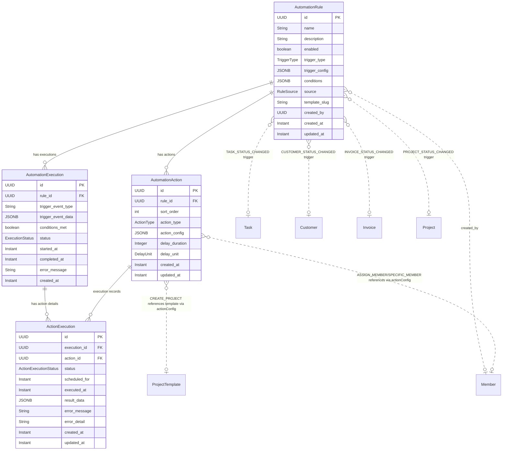
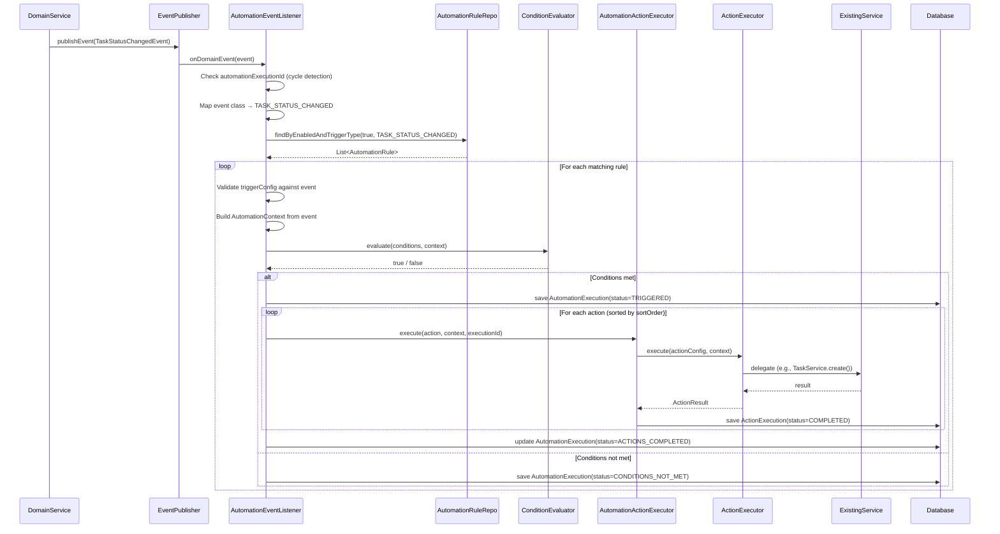
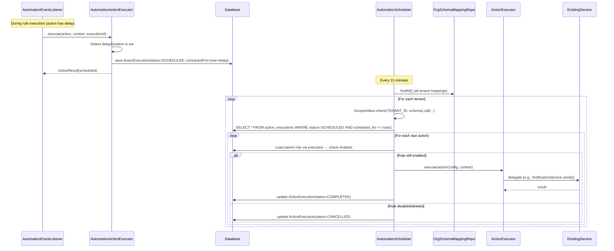
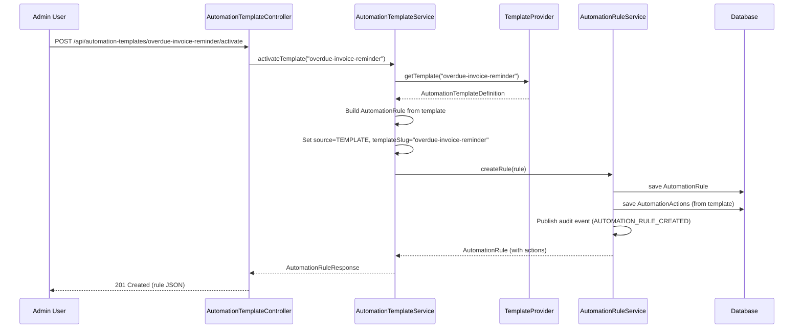

> Standalone architecture document for Phase 37. Phases 5+ use separate files.

# Phase 37 — Workflow Automations v1

---

## 37. Phase 37 — Workflow Automations v1

Phase 37 adds a **rule-based automation engine** to the DocTeams platform — the ability for firm admins to define configurable rules that react to domain events and perform actions automatically. The platform already has a mature sensory system: domain events fire on every significant entity lifecycle transition, notifications route to the right people, and audit events capture everything. What is missing is the motor system — configurable reactions that wire these existing capabilities together without code changes.

The automation engine introduces four new entities (`AutomationRule`, `AutomationAction`, `AutomationExecution`, `ActionExecution`), a single `AutomationEventListener` that bridges existing domain events to rule evaluation, six action executors that delegate to existing services, and a delayed-action scheduler following the proven `TimeReminderScheduler` pattern. Pre-built automation templates are seeded per tenant via JSON pack files, giving firms a starting point they can activate and customize.

This phase is deliberately conservative. Rules are linear (trigger, conditions, actions — no branching), cycle detection is simple (metadata flag), delayed actions use database polling (no message queue), and configuration is stored as JSONB with sealed-class validation (no normalized config tables). These constraints keep the implementation surface small while covering the 80% of automation use cases that professional services firms need: status-change reactions, follow-up reminders, task chaining, and stakeholder notifications.

**Dependencies on prior phases**:
- **Phase 4** (Customers, Tasks): `Customer`, `Task` entities. Task and customer lifecycle events are trigger sources; task creation and status updates are action targets.
- **Phase 5** (Task & Time Lifecycle): `TimeEntry`. Time entry creation events are a trigger source.
- **Phase 6** (Audit & Compliance): `AuditService` and `AuditEventBuilder`. All automation operations are audited.
- **Phase 6.5** (Notifications & Activity): `NotificationService`, `ApplicationEventPublisher` pattern. Notifications are both a trigger source and an action target. Domain event infrastructure is the foundation.
- **Phase 8** (Rate Cards, Budgets & Profitability): `ProjectBudget`, `BudgetThresholdEvent`. Budget threshold events are a trigger source.
- **Phase 10** (Invoicing): `Invoice`, `InvoiceStatusChangedEvent`. Invoice lifecycle events are trigger sources.
- **Phase 16** (Project Templates): `ProjectTemplate`, `ProjectInstantiationService`. Project creation from templates is an action type.
- **Phase 24** (Email Delivery): `EmailNotificationChannel`. Email sending is an action type.
- **Phase 34** (Information Requests): `InformationRequestCompletedEvent`. Request completion is a trigger source.

### What's New

| Capability | Before Phase 37 | After Phase 37 |
|---|---|---|
| Event-driven reactions | Hard-coded in domain services (proposal acceptance, checklist transitions, retainer consumption) | Configurable rules: admins define trigger + conditions + actions via forms |
| Follow-up reminders | Manual or per-feature (time reminders, request reminders) | Any status change can schedule delayed notifications or emails |
| Task chaining | Manual — "when task A is done, create task B" requires human action | Automated: rules create tasks on task completion, with assignment and delay |
| Status cascades | Manual — "when all tasks are done, mark project complete" requires human check | Automated: rules update entity status on trigger events |
| Stakeholder notifications | Type-specific handlers (hard-coded routing) | Configurable: admins choose who gets notified, with what message, on what event |
| Automation templates | -- | 6 pre-built templates seeded per tenant, activatable and customizable |
| Execution audit trail | -- | Full history: every rule evaluation, condition check, and action result logged |
| Delayed actions | Feature-specific schedulers (time reminders, request reminders) | Generic: any action can be delayed by N minutes/hours/days |

**Out of scope**: Visual workflow builder (drag-and-drop canvas with branching, delays, loops), branching logic (if-else paths within a rule), OR conditions (all conditions are AND — use multiple rules for OR), webhook-out as action type, cross-tenant automations, rate limiting / concurrency controls, undo/rollback of executed actions, custom trigger types (beyond the 8 supported), action chaining across rules (rule A triggers rule B — explicitly prevented by cycle detection), execution retention/cleanup (no auto-purge).

---

### 37.1 Overview

Phase 37 establishes workflow automation as a platform primitive. The design is a structured rules engine — trigger, conditions, actions — not a visual workflow builder. This is a deliberate trade-off: the structured approach covers 80% of professional services automation use cases with 20% of the implementation complexity of a visual builder. See [ADR-145](../adr/ADR-145-rule-engine-vs-visual-workflow.md).

The core abstractions:

1. **AutomationRule** — A named rule definition: which event triggers it, what conditions must be true, and what actions to perform. Rules are tenant-scoped, admin-managed, and independently toggleable.
2. **AutomationAction** — An ordered action within a rule. Each action has a type, configuration, and optional delay. Actions execute sequentially within a rule firing.
3. **AutomationEventListener** — A single Spring `@EventListener` that receives all `DomainEvent` instances, queries matching enabled rules, evaluates conditions, and dispatches action execution. This is the bridge between the existing event system and the automation engine.
4. **ConditionEvaluator** — Resolves dot-notation field paths against a trigger context map and applies comparison operators. All conditions must be true (AND logic).
5. **ActionExecutor** — Strategy interface with six implementations, each delegating to an existing service (`TaskService`, `NotificationService`, `EmailNotificationChannel`, etc.). No business logic duplication.
6. **AutomationScheduler** — Polls every 15 minutes for delayed actions whose `scheduledFor` timestamp has arrived. Follows the `TimeReminderScheduler` per-tenant iteration pattern.
7. **AutomationExecution / ActionExecution** — Two-level audit trail: rule-level (did it fire? were conditions met?) and action-level (which action succeeded/failed? what was the result?).

The engine consumes the same domain events that already power notifications and audit. It invokes the same services that already handle task creation, status updates, email delivery, and project instantiation. No new event types, no new business logic — just a configurable dispatch layer on top of existing infrastructure.

---

### 37.2 Domain Model

Phase 37 introduces four new tenant-scoped entities. All follow the established pattern: UUID primary key, `protected` no-arg constructor for JPA, `createdAt`/`updatedAt` as `Instant`, no `tenant_id` column (schema boundary handles isolation), JSONB fields with `@JdbcTypeCode(SqlTypes.JSON)`.

#### 37.2.1 AutomationRule Entity

The core configuration entity. Defines when and how an automation fires.

| Field | Java Type | DB Column | DB Type | Constraints | Notes |
|-------|-----------|-----------|---------|-------------|-------|
| `id` | `UUID` | `id` | `UUID` | PK, default `gen_random_uuid()` | Auto-generated |
| `name` | `String` | `name` | `VARCHAR(200)` | NOT NULL | Human-readable name, e.g., "Task Completion Chain" |
| `description` | `String` | `description` | `VARCHAR(1000)` | Nullable | Describes what this rule does |
| `enabled` | `boolean` | `enabled` | `BOOLEAN` | NOT NULL, default `true` | Toggle without deleting |
| `triggerType` | `TriggerType` | `trigger_type` | `VARCHAR(50)` | NOT NULL | Enum stored as string |
| `triggerConfig` | `Map<String, Object>` | `trigger_config` | `JSONB` | NOT NULL | Trigger-specific configuration |
| `conditions` | `List<Map<String, Object>>` | `conditions` | `JSONB` | Nullable | Array of condition objects |
| `source` | `RuleSource` | `source` | `VARCHAR(20)` | NOT NULL, default `'CUSTOM'` | `TEMPLATE` or `CUSTOM` |
| `templateSlug` | `String` | `template_slug` | `VARCHAR(100)` | Nullable | Which template this was created from |
| `createdBy` | `UUID` | `created_by` | `UUID` | NOT NULL | Member who created the rule |
| `createdAt` | `Instant` | `created_at` | `TIMESTAMPTZ` | NOT NULL | Immutable |
| `updatedAt` | `Instant` | `updated_at` | `TIMESTAMPTZ` | NOT NULL | Updated on mutation |

**Design decisions**:
- `triggerConfig` and `conditions` are JSONB rather than normalized tables. Each trigger type has different config fields, and conditions are a variable-length array of heterogeneous predicates. JSONB keeps the entity model simple while sealed classes provide compile-time type safety at the application layer. See [ADR-148](../adr/ADR-148-jsonb-config-vs-normalized-tables.md).
- `source` and `templateSlug` track provenance. When a firm activates a seeded template, the resulting rule has `source = TEMPLATE` and `templateSlug` set. This enables the UI to show "Activated" badges on templates that have already been activated.
- `createdBy` is a loose UUID reference to `Member`, not a hard FK. Consistent with `AuditEvent.actorId`.

#### 37.2.2 AutomationAction Entity

Ordered list of actions within a rule. One-to-many from `AutomationRule`.

| Field | Java Type | DB Column | DB Type | Constraints | Notes |
|-------|-----------|-----------|---------|-------------|-------|
| `id` | `UUID` | `id` | `UUID` | PK, default `gen_random_uuid()` | Auto-generated |
| `ruleId` | `UUID` | `rule_id` | `UUID` | NOT NULL, FK → automation_rules | Parent rule |
| `sortOrder` | `int` | `sort_order` | `INTEGER` | NOT NULL | Execution sequence (0-based) |
| `actionType` | `ActionType` | `action_type` | `VARCHAR(30)` | NOT NULL | Enum stored as string |
| `actionConfig` | `Map<String, Object>` | `action_config` | `JSONB` | NOT NULL | Action-specific configuration |
| `delayDuration` | `Integer` | `delay_duration` | `INTEGER` | Nullable | Delay amount (null = immediate) |
| `delayUnit` | `DelayUnit` | `delay_unit` | `VARCHAR(10)` | Nullable | `MINUTES`, `HOURS`, `DAYS` |
| `createdAt` | `Instant` | `created_at` | `TIMESTAMPTZ` | NOT NULL | Immutable |
| `updatedAt` | `Instant` | `updated_at` | `TIMESTAMPTZ` | NOT NULL | Updated on mutation |

**Constraints**:
- `delay_duration` and `delay_unit` CHECK: both null or both non-null.
- `(rule_id, sort_order)` unique — no duplicate sort orders within a rule.
- ON DELETE CASCADE from `automation_rules` — deleting a rule removes all its actions.

#### 37.2.3 AutomationExecution Entity

Rule-level execution record. Created every time a rule is evaluated (whether conditions are met or not).

| Field | Java Type | DB Column | DB Type | Constraints | Notes |
|-------|-----------|-----------|---------|-------------|-------|
| `id` | `UUID` | `id` | `UUID` | PK, default `gen_random_uuid()` | Auto-generated |
| `ruleId` | `UUID` | `rule_id` | `UUID` | NOT NULL, FK → automation_rules | Which rule was evaluated |
| `triggerEventType` | `String` | `trigger_event_type` | `VARCHAR(100)` | NOT NULL | Domain event class name |
| `triggerEventData` | `Map<String, Object>` | `trigger_event_data` | `JSONB` | NOT NULL | Snapshot of triggering event payload |
| `conditionsMet` | `boolean` | `conditions_met` | `BOOLEAN` | NOT NULL | Whether conditions evaluated to true |
| `status` | `ExecutionStatus` | `status` | `VARCHAR(30)` | NOT NULL | See enum below |
| `startedAt` | `Instant` | `started_at` | `TIMESTAMPTZ` | NOT NULL | When evaluation began |
| `completedAt` | `Instant` | `completed_at` | `TIMESTAMPTZ` | Nullable | When all actions completed (or failed) |
| `errorMessage` | `String` | `error_message` | `VARCHAR(2000)` | Nullable | Summary of first failure |
| `createdAt` | `Instant` | `created_at` | `TIMESTAMPTZ` | NOT NULL | Immutable |

**Design decisions**:
- `triggerEventData` captures a snapshot of the event that triggered the rule. This provides debugging context without requiring the original event to be reconstructable.
- `conditionsMet = false` records are kept (with `status = CONDITIONS_NOT_MET`) for audit purposes — admins can see that a rule was evaluated but didn't fire, which helps with debugging "why didn't my automation run?"
- See [ADR-149](../adr/ADR-149-execution-logging-granularity.md) for the two-table logging decision.

#### 37.2.4 ActionExecution Entity

Per-action execution detail. Child of `AutomationExecution`.

| Field | Java Type | DB Column | DB Type | Constraints | Notes |
|-------|-----------|-----------|---------|-------------|-------|
| `id` | `UUID` | `id` | `UUID` | PK, default `gen_random_uuid()` | Auto-generated |
| `executionId` | `UUID` | `execution_id` | `UUID` | NOT NULL, FK → automation_executions | Parent execution |
| `actionId` | `UUID` | `action_id` | `UUID` | NOT NULL, FK → automation_actions | Which action was executed |
| `status` | `ActionExecutionStatus` | `status` | `VARCHAR(20)` | NOT NULL | See enum below |
| `scheduledFor` | `Instant` | `scheduled_for` | `TIMESTAMPTZ` | Nullable | For delayed actions |
| `executedAt` | `Instant` | `executed_at` | `TIMESTAMPTZ` | Nullable | When action was actually executed |
| `resultData` | `Map<String, Object>` | `result_data` | `JSONB` | Nullable | e.g., `{"createdTaskId": "..."}` |
| `errorMessage` | `String` | `error_message` | `VARCHAR(2000)` | Nullable | Error summary |
| `errorDetail` | `String` | `error_detail` | `TEXT` | Nullable | Stack trace or detailed error |
| `createdAt` | `Instant` | `created_at` | `TIMESTAMPTZ` | NOT NULL | Immutable |
| `updatedAt` | `Instant` | `updated_at` | `TIMESTAMPTZ` | NOT NULL | Updated on status transitions |

**Design decisions**:
- `resultData` provides traceability — when an action creates a task, the created task ID is stored. Admins can trace from "automation fired" to "this task was created by that automation."
- `errorDetail` stores full stack traces for failed actions. Separate from `errorMessage` (human-readable summary) to keep the list view clean while preserving diagnostic detail.
- `scheduledFor` is only populated for delayed actions. The `AutomationScheduler` queries `WHERE status = 'SCHEDULED' AND scheduled_for <= now()`.
- ON DELETE CASCADE from `automation_executions` — deleting an execution removes its action details.

#### 37.2.5 Enums

```java
public enum TriggerType {
    TASK_STATUS_CHANGED,
    PROJECT_STATUS_CHANGED,
    CUSTOMER_STATUS_CHANGED,
    INVOICE_STATUS_CHANGED,
    TIME_ENTRY_CREATED,
    BUDGET_THRESHOLD_REACHED,
    DOCUMENT_ACCEPTED,
    INFORMATION_REQUEST_COMPLETED
}

public enum ActionType {
    CREATE_TASK,
    SEND_NOTIFICATION,
    SEND_EMAIL,
    UPDATE_STATUS,
    CREATE_PROJECT,
    ASSIGN_MEMBER
}

public enum ExecutionStatus {
    TRIGGERED,
    ACTIONS_COMPLETED,
    ACTIONS_FAILED,
    CONDITIONS_NOT_MET
}

public enum ActionExecutionStatus {
    PENDING,
    SCHEDULED,
    COMPLETED,
    FAILED,
    CANCELLED
}

public enum RuleSource {
    TEMPLATE,
    CUSTOM
}

public enum DelayUnit {
    MINUTES,
    HOURS,
    DAYS
}

public enum ConditionOperator {
    EQUALS,
    NOT_EQUALS,
    IN,
    NOT_IN,
    GREATER_THAN,
    LESS_THAN,
    CONTAINS,
    IS_NULL,
    IS_NOT_NULL
}
```

#### 37.2.6 ER Diagram



Note: Dotted lines represent logical references via JSONB configuration fields or trigger type associations, not hard foreign keys.

---

### 37.3 Core Flows and Backend Behaviour

#### 37.3.1 AutomationEventListener Flow

The `AutomationEventListener` is the central dispatch point. It subscribes to all `DomainEvent` instances via Spring's `@EventListener` and routes them through the automation engine.

```
1. Receive DomainEvent (e.g., TaskStatusChangedEvent)
2. Map event class → TriggerType (lookup table)
   - If no mapping exists: return (event type not supported as trigger)
3. Check cycle detection: does event carry automationExecutionId?
   - If yes: log "Skipping automation evaluation — event originated from execution {id}" and return
4. Query enabled AutomationRules where triggerType matches
   - SELECT * FROM automation_rules WHERE enabled = true AND trigger_type = ?
5. For each matching rule:
   a. Deserialize triggerConfig → validate against event specifics
      - e.g., StatusChangeTriggerConfig: does toStatus match event's new status?
      - If triggerConfig specifies "any" (null fromStatus/toStatus): always matches
   b. If trigger config doesn't match: skip rule (no execution record)
   c. Build AutomationContext from event:
      - Primary entity fields (task.id, task.name, task.status, etc.)
      - Parent entity fields (project.id, project.name, customer.id, customer.name)
      - Actor fields (actor.name, actor.id)
      - Rule fields (rule.name, rule.id)
   d. Evaluate conditions via ConditionEvaluator
   e. Create AutomationExecution record
   f. If conditions NOT met: set status = CONDITIONS_NOT_MET, save, continue
   g. If conditions met: execute actions sequentially via AutomationActionExecutor
   h. Update AutomationExecution status (ACTIONS_COMPLETED or ACTIONS_FAILED)
```

The listener runs within the same transaction as the triggering event. If action execution fails, the failure is caught and logged — it does not roll back the triggering transaction. This follows the self-healing pattern established by `RetainerConsumptionListener` (see [ADR-074](../adr/ADR-074-self-healing-event-handlers.md)).

#### 37.3.2 Condition Evaluation

The `ConditionEvaluator` resolves dot-notation field paths against the trigger context map and applies operators.

```java
// Context structure (built per trigger type):
{
  "task": {"id": "...", "name": "Fix bug", "status": "COMPLETED", "assigneeId": "..."},
  "project": {"id": "...", "name": "Website Redesign", "status": "ACTIVE", "customerId": "..."},
  "customer": {"id": "...", "name": "Acme Corp", "status": "ACTIVE"},
  "actor": {"id": "...", "name": "Alice"},
  "rule": {"id": "...", "name": "Task Completion Chain"}
}

// Condition: {"field": "project.status", "operator": "EQUALS", "value": "ACTIVE"}
// Resolution: context["project"]["status"] → "ACTIVE" → EQUALS "ACTIVE" → true
```

**Context per trigger type**:

| TriggerType | Primary Entity | Parent Entities |
|-------------|---------------|-----------------|
| `TASK_STATUS_CHANGED` | `task.*` (id, name, status, previousStatus, assigneeId, projectId) | `project.*`, `customer.*` |
| `PROJECT_STATUS_CHANGED` | `project.*` (id, name, status, previousStatus, customerId) | `customer.*` |
| `CUSTOMER_STATUS_CHANGED` | `customer.*` (id, name, status, previousStatus) | -- |
| `INVOICE_STATUS_CHANGED` | `invoice.*` (id, invoiceNumber, status, previousStatus, totalAmount, customerId) | `customer.*` |
| `TIME_ENTRY_CREATED` | `timeEntry.*` (id, hours, taskId, projectId) | `task.*`, `project.*`, `customer.*` |
| `BUDGET_THRESHOLD_REACHED` | `budget.*` (projectId, thresholdPercent, consumedPercent) | `project.*`, `customer.*` |
| `DOCUMENT_ACCEPTED` | `document.*` (id, name, projectId) | `project.*`, `customer.*` |
| `INFORMATION_REQUEST_COMPLETED` | `request.*` (id, customerId) | `customer.*` |

**Fail-safe behavior**: Unknown field paths evaluate to `null`. Conditions on unknown fields with operators other than `IS_NULL` evaluate to `false`. This prevents rules from silently passing when a field path is misconfigured.

#### 37.3.3 Action Execution

`AutomationActionExecutor` dispatches to type-specific `ActionExecutor` implementations, registered via Spring's dependency injection:

```java
public interface ActionExecutor {
    ActionType supportedType();
    ActionResult execute(ActionConfig config, AutomationContext context);
}
```

Each implementation delegates to an existing service:

| ActionType | Executor Class | Delegates To | Notes |
|------------|---------------|-------------|-------|
| `CREATE_TASK` | `CreateTaskActionExecutor` | `TaskService.create()` | Resolves assignee from config (TRIGGER_ACTOR, PROJECT_OWNER, SPECIFIC_MEMBER, UNASSIGNED). Passes `automationExecutionId` to service for cycle detection. |
| `SEND_NOTIFICATION` | `SendNotificationActionExecutor` | `NotificationService.send()` | Resolves recipient list from config. Applies variable substitution to title and message. |
| `SEND_EMAIL` | `SendEmailActionExecutor` | `EmailNotificationChannel.send()` | Resolves recipient email. Applies variable substitution to subject and body. CUSTOMER_CONTACT recipient resolves via portal contact. |
| `UPDATE_STATUS` | `UpdateStatusActionExecutor` | Entity-specific service (TaskService, ProjectService, CustomerService, InvoiceService) | Determines target entity from config (TRIGGER_ENTITY or named parent). Validates status transition. |
| `CREATE_PROJECT` | `CreateProjectActionExecutor` | `ProjectInstantiationService.create()` | Creates project from template. Optionally links to trigger's customer. |
| `ASSIGN_MEMBER` | `AssignMemberActionExecutor` | `ProjectMemberService.addMember()` | Adds member to the trigger's project with specified role. |

`ActionResult` is a sealed interface:

```java
sealed interface ActionResult permits ActionSuccess, ActionFailure {
    boolean isSuccess();
}
record ActionSuccess(Map<String, Object> resultData) implements ActionResult { ... }
record ActionFailure(String errorMessage, String errorDetail) implements ActionResult { ... }
```

#### 37.3.4 Delayed Action Flow

Actions with `delayDuration` and `delayUnit` set are not executed immediately. Instead:

1. During rule execution, the `AutomationActionExecutor` creates an `ActionExecution` record with `status = SCHEDULED` and `scheduledFor = now() + delay`.
2. The `AutomationScheduler` (a `@Scheduled` component) polls every 15 minutes:
   - Iterates all tenants via `OrgSchemaMappingRepository.findAll()`
   - Per tenant (bound via `ScopedValue`): queries `ActionExecution` records with `status = SCHEDULED AND scheduled_for <= now()`
   - For each due action: checks if parent rule is still enabled; if disabled/deleted, marks as `CANCELLED`
   - Executes the action via the appropriate `ActionExecutor`
   - Updates status to `COMPLETED` or `FAILED`
3. Error isolation: failures in one tenant do not affect other tenants. Each tenant is processed in a try-catch block.

See [ADR-147](../adr/ADR-147-delayed-action-scheduling.md) for the polling decision.

#### 37.3.5 Cycle Detection

Domain events fired by automation actions carry a metadata field: `automationExecutionId` (nullable `UUID`). The `AutomationEventListener` checks for this field at step 3 and skips processing if present.

Implementation approach:
- Add `automationExecutionId` field to the `DomainEvent` sealed interface (new default method returning `null`).
- Event implementations that can be triggered by automations override the method.
- When an `ActionExecutor` invokes a service that publishes a domain event, it passes the execution ID. The service includes it in the event constructor.
- This prevents direct self-triggering (rule A fires, creates a task, task creation event fires, rule A evaluates again — but the event carries the execution ID, so it's skipped).

See [ADR-146](../adr/ADR-146-automation-cycle-detection.md) for the strategy decision.

Limitation: This prevents ALL automation evaluation for events originating from automation actions. In v1, this is acceptable — action chaining across rules is explicitly out of scope. A future version could allow cross-rule chaining with a depth counter.

#### 37.3.6 Variable Substitution

Notification and email text fields support `{{variable}}` syntax:

```
Available variables (resolved from trigger context):
  {{task.name}}, {{task.status}}, {{task.previousStatus}}
  {{project.name}}, {{project.status}}
  {{customer.name}}, {{customer.status}}
  {{invoice.invoiceNumber}}, {{invoice.totalAmount}}
  {{actor.name}}
  {{rule.name}}
```

`VariableResolver` performs a simple regex-based replacement: find all `{{...}}` patterns, look up the dot-notation path in the context map, replace with the string value. Unresolved variables render as-is (e.g., `{{unknown}}` stays literal in the output). This is safe — no expression evaluation, no template injection risk.

#### 37.3.7 System Actor

Automated actions are performed as the "system" actor, not impersonating a specific member. This means:
- `RequestScopes.MEMBER_ID` is not bound during action execution (scheduler and listener run outside the HTTP request context).
- Audit events record `actor_type: AUTOMATION` with `actor_id` referencing the `AutomationRule.id`.
- Created entities (tasks, projects) have no explicit `createdBy` member — they're system-created.

#### 37.3.8 Error Handling

- **Action failure**: The executor catches exceptions, creates an `ActionExecution` record with `status = FAILED`, `errorMessage`, and `errorDetail` (stack trace). Subsequent actions in the same rule still execute — one failure does not short-circuit the action list.
- **Org admin notification**: When any action fails, a `AUTOMATION_ACTION_FAILED` notification is sent to all org admins/owners via `NotificationService`.
- **Rule stays active**: Failed actions do not auto-disable the rule. Repeated failures are visible in the execution log. Admins must manually investigate and disable if needed.
- **Outer transaction safety**: The `AutomationEventListener` wraps all processing in a try-catch to prevent automation failures from rolling back the triggering domain operation. This follows the self-healing pattern from `RetainerConsumptionListener`.

#### 37.3.9 RBAC

| Operation | Required Role |
|-----------|--------------|
| Create/update/delete automation rules | `org:admin`, `org:owner` |
| Enable/disable rules | `org:admin`, `org:owner` |
| Browse automation templates | `org:admin`, `org:owner` |
| Activate a template | `org:admin`, `org:owner` |
| View execution logs | `org:admin`, `org:owner` |
| Test (dry-run) a rule | `org:admin`, `org:owner` |

Members with `org:member` role cannot access any automation features.

---

### 37.4 API Surface

#### 37.4.1 Automation Rule API

| Method | Path | Description | Auth |
|--------|------|-------------|------|
| `GET` | `/api/automation-rules` | List all rules (filter: `enabled`, `triggerType`) | admin, owner |
| `POST` | `/api/automation-rules` | Create a rule | admin, owner |
| `GET` | `/api/automation-rules/{id}` | Get rule with actions | admin, owner |
| `PUT` | `/api/automation-rules/{id}` | Update rule | admin, owner |
| `DELETE` | `/api/automation-rules/{id}` | Delete rule (cascades to actions, cancels scheduled actions) | admin, owner |
| `POST` | `/api/automation-rules/{id}/toggle` | Enable/disable rule | admin, owner |
| `POST` | `/api/automation-rules/{id}/duplicate` | Clone rule with actions | admin, owner |
| `POST` | `/api/automation-rules/{id}/test` | Dry-run: evaluate conditions against sample event | admin, owner |

#### 37.4.2 Automation Action API (nested under rule)

| Method | Path | Description | Auth |
|--------|------|-------------|------|
| `POST` | `/api/automation-rules/{id}/actions` | Add action to rule | admin, owner |
| `PUT` | `/api/automation-rules/{id}/actions/{actionId}` | Update action | admin, owner |
| `DELETE` | `/api/automation-rules/{id}/actions/{actionId}` | Remove action | admin, owner |
| `PUT` | `/api/automation-rules/{id}/actions/reorder` | Reorder actions (accepts sorted list of action IDs) | admin, owner |

#### 37.4.3 Automation Template API

| Method | Path | Description | Auth |
|--------|------|-------------|------|
| `GET` | `/api/automation-templates` | List available templates (from seed data) | admin, owner |
| `POST` | `/api/automation-templates/{slug}/activate` | Create a rule from template (returns new AutomationRule) | admin, owner |

#### 37.4.4 Execution Log API

| Method | Path | Description | Auth |
|--------|------|-------------|------|
| `GET` | `/api/automation-executions` | List executions (filter: `ruleId`, `status`, `dateRange`) | admin, owner |
| `GET` | `/api/automation-executions/{id}` | Get execution with action details | admin, owner |
| `GET` | `/api/automation-rules/{id}/executions` | Executions for a specific rule | admin, owner |

#### 37.4.5 Key Request/Response Shapes

**Create Rule** (`POST /api/automation-rules`):

```json
{
  "name": "Task Completion Chain",
  "description": "When a task is completed, create the follow-up task",
  "triggerType": "TASK_STATUS_CHANGED",
  "triggerConfig": {
    "fromStatus": null,
    "toStatus": "COMPLETED"
  },
  "conditions": [
    {
      "field": "project.status",
      "operator": "EQUALS",
      "value": "ACTIVE"
    }
  ]
}
```

**Add Action** (`POST /api/automation-rules/{id}/actions`):

```json
{
  "actionType": "CREATE_TASK",
  "actionConfig": {
    "taskName": "Review: {{task.name}}",
    "taskDescription": "Follow-up review for completed task",
    "assignTo": "PROJECT_OWNER",
    "specificMemberId": null,
    "taskStatus": "OPEN"
  },
  "sortOrder": 0,
  "delayDuration": null,
  "delayUnit": null
}
```

**Activate Template** (`POST /api/automation-templates/{slug}/activate`):

Response:
```json
{
  "id": "550e8400-e29b-41d4-a716-446655440000",
  "name": "Overdue Invoice Reminder",
  "description": "Send email to customer when invoice becomes overdue, then notify project owner after 7 days",
  "enabled": true,
  "triggerType": "INVOICE_STATUS_CHANGED",
  "triggerConfig": { "fromStatus": null, "toStatus": "OVERDUE" },
  "conditions": null,
  "source": "TEMPLATE",
  "templateSlug": "overdue-invoice-reminder",
  "actions": [
    {
      "id": "...",
      "sortOrder": 0,
      "actionType": "SEND_EMAIL",
      "actionConfig": {
        "recipientType": "CUSTOMER_CONTACT",
        "subject": "Invoice {{invoice.invoiceNumber}} is overdue",
        "body": "Dear {{customer.name}},\n\nYour invoice {{invoice.invoiceNumber}} is now overdue. Please arrange payment at your earliest convenience."
      },
      "delayDuration": null,
      "delayUnit": null
    },
    {
      "id": "...",
      "sortOrder": 1,
      "actionType": "SEND_NOTIFICATION",
      "actionConfig": {
        "recipientType": "PROJECT_OWNER",
        "title": "Invoice {{invoice.invoiceNumber}} still overdue",
        "message": "Invoice {{invoice.invoiceNumber}} for {{customer.name}} has been overdue for 7 days."
      },
      "delayDuration": 7,
      "delayUnit": "DAYS"
    }
  ]
}
```

**Execution Detail** (`GET /api/automation-executions/{id}`):

```json
{
  "id": "...",
  "ruleId": "...",
  "ruleName": "Overdue Invoice Reminder",
  "triggerEventType": "InvoiceStatusChangedEvent",
  "triggerEventData": {
    "invoiceId": "...",
    "invoiceNumber": "INV-2026-0042",
    "previousStatus": "SENT",
    "newStatus": "OVERDUE"
  },
  "conditionsMet": true,
  "status": "ACTIONS_COMPLETED",
  "startedAt": "2026-03-06T10:30:00Z",
  "completedAt": "2026-03-06T10:30:01Z",
  "actionExecutions": [
    {
      "id": "...",
      "actionType": "SEND_EMAIL",
      "status": "COMPLETED",
      "executedAt": "2026-03-06T10:30:00Z",
      "resultData": { "emailDeliveryLogId": "..." }
    },
    {
      "id": "...",
      "actionType": "SEND_NOTIFICATION",
      "status": "SCHEDULED",
      "scheduledFor": "2026-03-13T10:30:00Z",
      "executedAt": null,
      "resultData": null
    }
  ]
}
```

---

### 37.5 Sequence Diagrams

#### 37.5.1 Domain Event to Action Execution (Immediate)



#### 37.5.2 Delayed Action Flow



#### 37.5.3 Template Activation Flow



---

### 37.6 Notifications & Audit

#### 37.6.1 New Notification Types

| Event | Recipient | Channel | Priority |
|-------|-----------|---------|----------|
| Automation action failed | Org admins/owners | In-app | High |

Only failure notifications are system-generated. Success is silent — the automation's own actions (SEND_NOTIFICATION, SEND_EMAIL) handle the "happy path" communication. This avoids notification fatigue.

#### 37.6.2 Audit Events

| Event Type | Entity Type | Details |
|------------|------------|---------|
| `AUTOMATION_RULE_CREATED` | `AutomationRule` | Rule name, trigger type, action count, source (TEMPLATE/CUSTOM) |
| `AUTOMATION_RULE_UPDATED` | `AutomationRule` | Changed fields summary |
| `AUTOMATION_RULE_DELETED` | `AutomationRule` | Rule name |
| `AUTOMATION_RULE_ENABLED` | `AutomationRule` | Rule name |
| `AUTOMATION_RULE_DISABLED` | `AutomationRule` | Rule name |
| `AUTOMATION_EXECUTED` | `AutomationRule` | Rule name, trigger event summary, conditions met, action count, status |
| `AUTOMATION_ACTION_FAILED` | `AutomationRule` | Rule name, action type, error message |

All audit events follow the existing `AuditEventBuilder` pattern. Automated actions performed by the engine record `actor_type: AUTOMATION` with `actor_id` set to the rule's UUID.

---

### 37.7 Database Migration (V58)

```sql
-- V58__create_automation_tables.sql

-- Automation rules
CREATE TABLE automation_rules (
    id              UUID PRIMARY KEY DEFAULT gen_random_uuid(),
    name            VARCHAR(200)    NOT NULL,
    description     VARCHAR(1000),
    enabled         BOOLEAN         NOT NULL DEFAULT true,
    trigger_type    VARCHAR(50)     NOT NULL,
    trigger_config  JSONB           NOT NULL,
    conditions      JSONB,
    source          VARCHAR(20)     NOT NULL DEFAULT 'CUSTOM',
    template_slug   VARCHAR(100),
    created_by      UUID            NOT NULL,
    created_at      TIMESTAMPTZ     NOT NULL DEFAULT now(),
    updated_at      TIMESTAMPTZ     NOT NULL DEFAULT now()
);

-- Automation actions (ordered list per rule)
CREATE TABLE automation_actions (
    id              UUID PRIMARY KEY DEFAULT gen_random_uuid(),
    rule_id         UUID            NOT NULL REFERENCES automation_rules(id) ON DELETE CASCADE,
    sort_order      INTEGER         NOT NULL,
    action_type     VARCHAR(30)     NOT NULL,
    action_config   JSONB           NOT NULL,
    delay_duration  INTEGER,
    delay_unit      VARCHAR(10),
    created_at      TIMESTAMPTZ     NOT NULL DEFAULT now(),
    updated_at      TIMESTAMPTZ     NOT NULL DEFAULT now(),

    CONSTRAINT uq_action_rule_sort UNIQUE (rule_id, sort_order),
    CONSTRAINT chk_delay_both_or_neither CHECK (
        (delay_duration IS NULL AND delay_unit IS NULL) OR
        (delay_duration IS NOT NULL AND delay_unit IS NOT NULL)
    )
);

-- Automation executions (rule-level audit trail)
CREATE TABLE automation_executions (
    id                  UUID PRIMARY KEY DEFAULT gen_random_uuid(),
    rule_id             UUID            NOT NULL REFERENCES automation_rules(id) ON DELETE CASCADE,
    trigger_event_type  VARCHAR(100)    NOT NULL,
    trigger_event_data  JSONB           NOT NULL,
    conditions_met      BOOLEAN         NOT NULL,
    status              VARCHAR(30)     NOT NULL,
    started_at          TIMESTAMPTZ     NOT NULL,
    completed_at        TIMESTAMPTZ,
    error_message       VARCHAR(2000),
    created_at          TIMESTAMPTZ     NOT NULL DEFAULT now()
);

-- Action executions (per-action audit trail)
CREATE TABLE action_executions (
    id              UUID PRIMARY KEY DEFAULT gen_random_uuid(),
    execution_id    UUID            NOT NULL REFERENCES automation_executions(id) ON DELETE CASCADE,
    action_id       UUID            REFERENCES automation_actions(id) ON DELETE SET NULL,
    status          VARCHAR(20)     NOT NULL,
    scheduled_for   TIMESTAMPTZ,
    executed_at     TIMESTAMPTZ,
    result_data     JSONB,
    error_message   VARCHAR(2000),
    error_detail    TEXT,
    created_at      TIMESTAMPTZ     NOT NULL DEFAULT now(),
    updated_at      TIMESTAMPTZ     NOT NULL DEFAULT now()
);

-- Indexes: rule lookup by enabled + trigger type (the hot query path)
CREATE INDEX idx_automation_rules_enabled_trigger
    ON automation_rules (enabled, trigger_type)
    WHERE enabled = true;

-- Indexes: execution log queries
CREATE INDEX idx_automation_executions_rule_status
    ON automation_executions (rule_id, status);

CREATE INDEX idx_automation_executions_started_at
    ON automation_executions (started_at DESC);

-- Indexes: delayed action scheduler query
CREATE INDEX idx_action_executions_scheduled
    ON action_executions (scheduled_for, status)
    WHERE status = 'SCHEDULED';
```

All tables are tenant-scoped (created within each tenant schema by Flyway). No `tenant_id` columns needed — schema boundary handles isolation. No global migration required.

---

### 37.8 Implementation Guidance

#### 37.8.1 Backend Changes

| File / Package | Change |
|---------------|--------|
| `automation/` (new package) | `AutomationRule`, `AutomationAction`, `AutomationExecution`, `ActionExecution` entities |
| `automation/` | `AutomationRuleRepository`, `AutomationActionRepository`, `AutomationExecutionRepository`, `ActionExecutionRepository` |
| `automation/` | `AutomationRuleService` — rule CRUD, toggle, duplicate |
| `automation/` | `AutomationRuleController` — REST endpoints for rules |
| `automation/` | `AutomationActionController` — REST endpoints for actions (nested under rules) |
| `automation/` | `AutomationEventListener` — `@EventListener` bridge from domain events to rule evaluation |
| `automation/` | `AutomationContext` — context map builder per trigger type |
| `automation/` | `ConditionEvaluator` — dot-notation field resolution + operator application |
| `automation/` | `VariableResolver` — `{{variable}}` substitution in text fields |
| `automation/` | `AutomationActionExecutor` — dispatches to type-specific executors |
| `automation/` | `ActionExecutor` interface + 6 implementations (`CreateTaskActionExecutor`, etc.) |
| `automation/` | `AutomationScheduler` — `@Scheduled` delayed action poller |
| `automation/` | `AutomationTemplateService` — template listing + activation |
| `automation/` | `AutomationTemplateController` — REST endpoints for templates |
| `automation/` | `AutomationExecutionController` — REST endpoints for execution logs |
| `automation/` | `AutomationTemplateSeeder` — pack seeder for template definitions |
| `automation/dto/` | Request/response DTOs for all endpoints |
| `event/DomainEvent.java` | Add `default UUID automationExecutionId() { return null; }` method |
| `provisioning/TenantProvisioningService.java` | Register `AutomationTemplateSeeder` |
| `provisioning/PackReconciliationRunner.java` | Register `AutomationTemplateSeeder` |
| `settings/OrgSettings.java` | Add `automation_pack_status` JSONB field |
| `resources/automation-templates/` | JSON template definition files |
| `resources/db/migration/tenant/V58__create_automation_tables.sql` | Migration file |

#### 37.8.2 Frontend Changes

| File / Route | Change |
|-------------|--------|
| `settings/automations/page.tsx` (new) | Automations settings page — rule list + template gallery |
| `settings/automations/[id]/page.tsx` (new) | Rule detail page — edit, test, execution log |
| `settings/automations/new/page.tsx` (new) | Rule create page |
| `settings/automations/executions/page.tsx` (new) | Global execution log |
| `components/automations/` (new) | `RuleList`, `RuleForm`, `TemplateGallery`, `ConditionBuilder`, `ActionList`, `ActionForm`, `ExecutionLog`, `ExecutionDetail`, `VariableInserter`, `TriggerConfigForm` |
| `components/dashboard/AutomationsWidget.tsx` (new) | Dashboard widget |
| `components/settings/SettingsNav.tsx` | Add "Automations" link |
| `lib/api/automations.ts` (new) | API client functions |

#### 37.8.3 Entity Code Pattern

```java
package io.b2mash.b2b.b2bstrawman.automation;

import jakarta.persistence.*;
import java.time.Instant;
import java.util.Map;
import java.util.UUID;
import org.hibernate.annotations.JdbcTypeCode;
import org.hibernate.type.SqlTypes;

@Entity
@Table(name = "automation_rules")
public class AutomationRule {

    @Id
    @GeneratedValue(strategy = GenerationType.UUID)
    private UUID id;

    @Column(name = "name", nullable = false, length = 200)
    private String name;

    @Column(name = "description", length = 1000)
    private String description;

    @Column(name = "enabled", nullable = false)
    private boolean enabled;

    @Enumerated(EnumType.STRING)
    @Column(name = "trigger_type", nullable = false, length = 50)
    private TriggerType triggerType;

    @JdbcTypeCode(SqlTypes.JSON)
    @Column(name = "trigger_config", columnDefinition = "jsonb", nullable = false)
    private Map<String, Object> triggerConfig;

    @JdbcTypeCode(SqlTypes.JSON)
    @Column(name = "conditions", columnDefinition = "jsonb")
    private Object conditions; // List<Map<String, Object>> at runtime

    @Enumerated(EnumType.STRING)
    @Column(name = "source", nullable = false, length = 20)
    private RuleSource source;

    @Column(name = "template_slug", length = 100)
    private String templateSlug;

    @Column(name = "created_by", nullable = false)
    private UUID createdBy;

    @Column(name = "created_at", nullable = false, updatable = false)
    private Instant createdAt;

    @Column(name = "updated_at", nullable = false)
    private Instant updatedAt;

    protected AutomationRule() {}

    public AutomationRule(String name, String description, TriggerType triggerType,
                          Map<String, Object> triggerConfig, UUID createdBy) {
        this.name = name;
        this.description = description;
        this.enabled = true;
        this.triggerType = triggerType;
        this.triggerConfig = triggerConfig;
        this.source = RuleSource.CUSTOM;
        this.createdBy = createdBy;
        this.createdAt = Instant.now();
        this.updatedAt = Instant.now();
    }

    public void update(String name, String description, Map<String, Object> triggerConfig,
                       Object conditions) {
        this.name = name;
        this.description = description;
        this.triggerConfig = triggerConfig;
        this.conditions = conditions;
        this.updatedAt = Instant.now();
    }

    public void toggle() {
        this.enabled = !this.enabled;
        this.updatedAt = Instant.now();
    }

    // Getters...
}
```

#### 37.8.4 Sealed Class Pattern for Config Validation

While JSONB columns store `Map<String, Object>` at the JPA level, the service layer deserializes into sealed classes for type-safe validation:

```java
// Trigger config hierarchy
public sealed interface TriggerConfig permits
        StatusChangeTriggerConfig,
        BudgetThresholdTriggerConfig,
        EmptyTriggerConfig {
}

public record StatusChangeTriggerConfig(String fromStatus, String toStatus) implements TriggerConfig {}
public record BudgetThresholdTriggerConfig(int thresholdPercent) implements TriggerConfig {}
public record EmptyTriggerConfig() implements TriggerConfig {}

// Action config hierarchy
public sealed interface ActionConfig permits
        CreateTaskActionConfig,
        SendNotificationActionConfig,
        SendEmailActionConfig,
        UpdateStatusActionConfig,
        CreateProjectActionConfig,
        AssignMemberActionConfig {
}

public record CreateTaskActionConfig(
    String taskName,
    String taskDescription,
    AssignTo assignTo,
    UUID specificMemberId,
    String taskStatus
) implements ActionConfig {}

// ... similar records for other action types
```

Deserialization uses Jackson with the `triggerType` / `actionType` enum as discriminator:

```java
public TriggerConfig deserializeTriggerConfig(TriggerType type, Map<String, Object> raw) {
    return switch (type) {
        case TASK_STATUS_CHANGED, PROJECT_STATUS_CHANGED,
             CUSTOMER_STATUS_CHANGED, INVOICE_STATUS_CHANGED ->
            objectMapper.convertValue(raw, StatusChangeTriggerConfig.class);
        case BUDGET_THRESHOLD_REACHED ->
            objectMapper.convertValue(raw, BudgetThresholdTriggerConfig.class);
        case TIME_ENTRY_CREATED, DOCUMENT_ACCEPTED, INFORMATION_REQUEST_COMPLETED ->
            new EmptyTriggerConfig();
    };
}
```

#### 37.8.5 ActionExecutor SPI Pattern

```java
@Component
public class AutomationActionExecutor {

    private final Map<ActionType, ActionExecutor> executors;

    public AutomationActionExecutor(List<ActionExecutor> executorList) {
        this.executors = executorList.stream()
            .collect(Collectors.toMap(ActionExecutor::supportedType, Function.identity()));
    }

    public ActionResult execute(AutomationAction action, AutomationContext context) {
        var executor = executors.get(action.getActionType());
        if (executor == null) {
            return new ActionFailure("No executor for action type: " + action.getActionType(), null);
        }
        var config = deserializeActionConfig(action.getActionType(), action.getActionConfig());
        return executor.execute(config, context);
    }
}
```

#### 37.8.6 Pack Seeder Pattern

The `AutomationTemplateSeeder` follows the same pattern as `RequestPackSeeder`:

```java
@Service
public class AutomationTemplateSeeder {

    private static final String PACK_LOCATION = "classpath:automation-templates/*.json";

    // Same structure as RequestPackSeeder:
    // - seedPacksForTenant(tenantId, orgId)
    // - ScopedValue binding + TransactionTemplate
    // - Idempotency via OrgSettings.automationPackStatus
    // - JSON definition files loaded via ResourcePatternResolver
}
```

Template definition files stored at `src/main/resources/automation-templates/common.json`.

#### 37.8.7 Testing Strategy

| Test Category | Focus | Approximate Count |
|--------------|-------|-------------------|
| Unit tests | ConditionEvaluator, VariableResolver, trigger config matching | 15-20 |
| Integration tests | AutomationEventListener end-to-end (event → rule match → action execution) | 10-15 |
| Integration tests | Each ActionExecutor (6 executors x 2-3 cases) | 12-18 |
| Integration tests | Delayed action scheduling (scheduler picks up due actions) | 3-5 |
| Integration tests | Cycle detection (action fires event → listener skips) | 2-3 |
| Integration tests | Template activation + seeder idempotency | 3-5 |
| Integration tests | Error handling (action failure → notification, execution log) | 3-5 |
| API tests | Rule CRUD, action CRUD, template listing/activation, execution queries | 15-20 |
| Frontend tests | RuleForm, ConditionBuilder, ActionForm, TemplateGallery, ExecutionLog | 15-20 |

Total estimate: 80-110 new tests.

---

### 37.9 Permission Model Summary

| Entity | Operation | org:member | org:admin | org:owner |
|--------|-----------|-----------|-----------|-----------|
| AutomationRule | Create | -- | Yes | Yes |
| AutomationRule | Read | -- | Yes | Yes |
| AutomationRule | Update | -- | Yes | Yes |
| AutomationRule | Delete | -- | Yes | Yes |
| AutomationRule | Toggle | -- | Yes | Yes |
| AutomationRule | Duplicate | -- | Yes | Yes |
| AutomationRule | Test (dry-run) | -- | Yes | Yes |
| AutomationTemplate | Browse | -- | Yes | Yes |
| AutomationTemplate | Activate | -- | Yes | Yes |
| AutomationExecution | Read | -- | Yes | Yes |

Automation features are admin-only. This is consistent with other settings-level configuration (rate cards, checklists, custom fields, templates).

---

### 37.10 Frontend Architecture

#### 37.10.1 Automations Settings Page

Route: `settings/automations/page.tsx`

**Rule List View** (default tab):
- Table using Shadcn `DataTable` with columns: Name, Trigger Type (badge), Enabled (toggle switch), Last Triggered (relative timestamp), Executions (count), Status (last execution status icon)
- "New Automation" button → navigates to `settings/automations/new`
- "Browse Templates" button → opens template gallery sheet
- Row click → navigates to `settings/automations/[id]`
- Empty state: illustration + "Create your first automation or browse templates"

**Template Gallery** (Shadcn `Sheet` side panel):
- Grid of template cards, each showing: name, description, trigger type badge, action count
- "Activate" button per template → calls `POST /api/automation-templates/{slug}/activate`, then navigates to the new rule's edit page
- Already-activated templates show "Activated" badge (matched by `templateSlug` in existing rules)
- Templates grouped by category (monitoring, notifications, workflow)

#### 37.10.2 Rule Create/Edit Page

Route: `settings/automations/new/page.tsx` and `settings/automations/[id]/page.tsx`

Three-section scrollable form (not a stepper wizard — all sections visible, collapsible):

**Section 1 — Trigger**:
- Name input (`Input`), Description textarea (`Textarea`)
- Trigger type select (`Select` with 8 options, each with icon and description)
- Dynamic config fields based on trigger type:
  - Status change triggers: "From Status" and "To Status" selects (options from relevant enum + "Any")
  - Budget threshold: number input with "%" suffix
  - Simple triggers: helper text "This trigger has no additional configuration"

**Section 2 — Conditions (optional, collapsible)**:
- "Add Condition" button → appends a condition row
- Each row: Field `Select` (filtered by trigger type) → Operator `Select` (filtered by field type) → Value `Input` (or `Select` for IN/NOT_IN, or hidden for IS_NULL/IS_NOT_NULL) → Remove `Button`
- Helper text: "All conditions must be true (AND logic). For OR logic, create separate rules."
- Shadcn components: `Select`, `Input`, `Button` with `X` icon

**Section 3 — Actions (ordered list)**:
- Sortable list using drag handles or up/down buttons
- "Add Action" button → action type `Select`
- Per-action card with dynamic config fields:
  - `CREATE_TASK`: task name `Input`, description `Textarea`, assign-to `Select`
  - `SEND_NOTIFICATION`: recipient type `Select`, title `Input`, message `Textarea` (with variable insertion)
  - `SEND_EMAIL`: recipient type `Select`, subject `Input`, body `Textarea` (with variable insertion)
  - `UPDATE_STATUS`: target entity `Select`, new status `Select`
  - `CREATE_PROJECT`: project template `Select` (loaded from `/api/project-templates`)
  - `ASSIGN_MEMBER`: member search `Combobox`, role `Select`
- Delay toggle per action: `Switch` → reveal duration `Input` + unit `Select`
- Remove button per action

**Variable Insertion UX**:
- In text fields (notification title/message, email subject/body): an "Insert Variable" `Button` (or typing `{{` triggers a `Popover`)
- Available variables shown in a dropdown filtered by trigger type
- Selected variable inserted as `{{variable.path}}` text (rendered as styled chip via a custom input component)

**Save/Cancel** buttons at bottom. Save validates all sections, calls API.

#### 37.10.3 Rule Detail Page

Route: `settings/automations/[id]/page.tsx` (read mode with edit toggle)

- Header: Rule name (editable inline), enabled `Switch`, trigger type `Badge`, created by, created date
- "Edit" button → switches to edit mode (same form as create)
- "Test Rule" button → opens `Dialog`: select a sample entity (e.g., pick a task), shows what conditions would evaluate to and what actions would fire (dry-run, no side effects)
- Dropdown menu: "Duplicate", "Delete" (with confirmation `AlertDialog`)
- Tabs below:
  - **Configuration** tab: read-only view of trigger, conditions, actions
  - **Execution Log** tab: `DataTable` of recent executions for this rule
    - Columns: Triggered At, Status (`Badge`), Conditions Met, Actions (count), Duration
    - Row click → execution detail `Sheet`
    - Filters: status, date range

#### 37.10.4 Global Execution Log

Route: `settings/automations/executions/page.tsx`

- `DataTable`: Rule Name, Trigger Type, Triggered At, Status, Actions (count), Duration
- Filters: Rule (select), Status, Date Range
- Row click → execution detail `Sheet`
- Execution detail shows: trigger event data (JSON viewer), condition evaluation results, per-action status/result/error

#### 37.10.5 Dashboard Widget

`AutomationsWidget` component on the company dashboard:
- Card showing: "Automations" heading, active rules count, "X executions today" (succeeded / failed)
- If any failures today: red badge with click-through to execution log filtered by status=FAILED
- Only visible to admin/owner roles

#### 37.10.6 Component Breakdown

| Component | Shadcn Components Used | Description |
|-----------|----------------------|-------------|
| `RuleList` | `DataTable`, `Badge`, `Switch`, `Button` | Rule list table with toggle |
| `RuleForm` | `Form`, `Input`, `Textarea`, `Select`, `Switch`, `Button` | Create/edit form |
| `TemplateGallery` | `Sheet`, `Card`, `Badge`, `Button` | Side panel with template cards |
| `TriggerConfigForm` | `Select`, `Input` | Dynamic trigger config based on type |
| `ConditionBuilder` | `Select`, `Input`, `Button` | Condition row builder |
| `ActionList` | `Card`, `Button` | Sortable action list |
| `ActionForm` | `Select`, `Input`, `Textarea`, `Switch`, `Combobox` | Per-action config form |
| `VariableInserter` | `Popover`, `Button`, `Badge` | Variable selection dropdown |
| `ExecutionLog` | `DataTable`, `Badge`, `DateRangePicker` | Execution table with filters |
| `ExecutionDetail` | `Sheet`, `Accordion`, `Badge` | Detailed execution view |
| `AutomationsWidget` | `Card`, `Badge` | Dashboard summary widget |

---

### 37.11 Capability Slices

#### Slice 37A — Entity Foundation

**Scope**: 4 entities, V58 migration, enums, JSONB handling, repositories.

**Key deliverables**:
- `AutomationRule`, `AutomationAction`, `AutomationExecution`, `ActionExecution` entities
- All 7 enums: `TriggerType`, `ActionType`, `ExecutionStatus`, `ActionExecutionStatus`, `RuleSource`, `DelayUnit`, `ConditionOperator`
- `V58__create_automation_tables.sql` migration with indexes and constraints
- JPA repositories for all 4 entities
- Sealed class hierarchies: `TriggerConfig`, `ActionConfig`, `ActionResult`
- Config deserializer utility (triggerType/actionType → sealed class mapping)

**Dependencies**: None (foundational slice).

**Test expectations**: ~10 tests — entity persistence, JSONB round-trip, enum mapping, config deserialization.

---

#### Slice 37B — Trigger Matching + Condition Evaluation

**Scope**: `AutomationEventListener`, `ConditionEvaluator`, context builders, trigger config matching.

**Key deliverables**:
- `AutomationEventListener` — `@EventListener` for `DomainEvent`, maps event class to `TriggerType`
- `AutomationContext` — builds context map per trigger type (resolves entity + parent data from repositories)
- `ConditionEvaluator` — dot-notation field resolution, 9 operators, AND logic
- Trigger config matching logic (e.g., `StatusChangeTriggerConfig` against event's `fromStatus`/`toStatus`)
- `AutomationExecution` creation for each rule evaluation (including `CONDITIONS_NOT_MET`)

**Dependencies**: Slice 37A (entities, enums, repositories).

**Test expectations**: ~20 tests — trigger matching (each trigger type x match/no-match), condition evaluation (each operator), context building per trigger type, AND logic, unknown field handling.

---

#### Slice 37C — Action Executors

**Scope**: 6 `ActionExecutor` implementations, `AutomationActionExecutor` dispatcher, `VariableResolver`, `ActionExecution` recording.

**Key deliverables**:
- `ActionExecutor` interface
- `CreateTaskActionExecutor` — delegates to `TaskService`
- `SendNotificationActionExecutor` — delegates to `NotificationService`
- `SendEmailActionExecutor` — delegates to `EmailNotificationChannel`
- `UpdateStatusActionExecutor` — delegates to entity-specific services
- `CreateProjectActionExecutor` — delegates to `ProjectInstantiationService`
- `AssignMemberActionExecutor` — delegates to `ProjectMemberService`
- `AutomationActionExecutor` — routes to correct executor by `ActionType`
- `VariableResolver` — `{{variable}}` substitution
- `ActionExecution` recording (COMPLETED/FAILED per action)
- Error handling: failed action logged, subsequent actions still execute

**Dependencies**: Slice 37A (entities), Slice 37B (context).

**Test expectations**: ~20 tests — each executor (happy path + failure), variable substitution (resolved + unresolved), dispatcher routing, error isolation.

---

#### Slice 37D — Delayed Action Scheduler + Cycle Detection

**Scope**: `AutomationScheduler`, delayed action flow, cycle detection via `automationExecutionId`.

**Key deliverables**:
- `AutomationScheduler` — `@Scheduled(fixedRate = 900_000)` with per-tenant `ScopedValue` binding
- Delayed action creation: actions with `delayDuration` create SCHEDULED `ActionExecution` records
- Scheduler picks up due SCHEDULED actions, executes or cancels (if rule disabled)
- `DomainEvent.automationExecutionId()` default method addition
- Cycle detection in `AutomationEventListener` (skip events with `automationExecutionId`)
- `automationExecutionId` propagation through `ActionExecutor` → service → event
- Failure notification: `AUTOMATION_ACTION_FAILED` notification to org admins

**Dependencies**: Slices 37A, 37B, 37C.

**Test expectations**: ~12 tests — scheduler picks up due actions, scheduler cancels when rule disabled, cycle detection blocks re-trigger, delayed action creation, failure notification delivery, per-tenant isolation.

---

#### Slice 37E — Rule CRUD API + Template Seeder

**Scope**: REST API for rules, actions, templates, and execution logs. Template seeder.

**Key deliverables**:
- `AutomationRuleController` — CRUD + toggle + duplicate + test endpoints
- `AutomationActionController` — CRUD + reorder endpoints
- `AutomationTemplateController` — list + activate endpoints
- `AutomationExecutionController` — list + detail endpoints
- `AutomationRuleService` — business logic for rules
- `AutomationTemplateService` — template listing + activation
- `AutomationTemplateSeeder` — loads templates from `classpath:automation-templates/*.json`
- 6 template definition JSON files in `src/main/resources/automation-templates/`
- Registration in `TenantProvisioningService` and `PackReconciliationRunner`
- `OrgSettings.automationPackStatus` JSONB field for idempotency
- Audit events for all rule operations
- Request/response DTOs

**Dependencies**: Slices 37A, 37B, 37C, 37D (full engine must work for test endpoint).

**Test expectations**: ~25 tests — API endpoint tests (CRUD, toggle, duplicate, test, reorder), template listing, template activation (creates mutable copy), seeder idempotency, audit events.

---

#### Slice 37F — Frontend: Rule List + Template Gallery + Create/Edit

**Scope**: Automations settings page, template gallery, rule create/edit form.

**Key deliverables**:
- `settings/automations/page.tsx` — rule list with enabled toggles
- Template gallery `Sheet` component
- `settings/automations/new/page.tsx` — rule create form
- `settings/automations/[id]/page.tsx` — rule detail + edit
- `TriggerConfigForm` — dynamic config based on trigger type
- `ConditionBuilder` — add/remove condition rows with field/operator/value
- `ActionList` + `ActionForm` — ordered action list with per-action config
- `VariableInserter` — variable dropdown for text fields
- Settings nav update (add "Automations" link)
- API client functions (`lib/api/automations.ts`)

**Dependencies**: Slice 37E (API must be available).

**Test expectations**: ~15 frontend tests — rule list rendering, template gallery, form validation, condition builder interactions, action reordering, variable insertion.

---

#### Slice 37G — Frontend: Execution Log + Dashboard Widget

**Scope**: Execution log views (per-rule and global), execution detail, dashboard widget.

**Key deliverables**:
- Execution log tab on rule detail page
- `settings/automations/executions/page.tsx` — global execution log
- `ExecutionDetail` sheet — per-action status, result data, error detail
- Filters: rule, status, date range
- `AutomationsWidget` — dashboard card (active rules, today's executions, failure indicator)
- Dashboard page integration (add widget for admin/owner)

**Dependencies**: Slice 37E (execution API), Slice 37F (navigation structure).

**Test expectations**: ~10 frontend tests — execution log rendering, filters, detail view, dashboard widget states.

---

#### Slice 37H — Integration Tests + Edge Cases

**Scope**: End-to-end integration tests, edge case coverage, documentation.

**Key deliverables**:
- End-to-end test: domain event → rule evaluation → condition check → action execution → execution log record
- Multi-rule test: same event triggers multiple rules
- Condition edge cases: null values, unknown fields, type mismatches
- Action chaining prevention test (cycle detection end-to-end)
- Delayed action end-to-end (create scheduled → scheduler picks up → executes)
- Template activation + customization + execution end-to-end
- Error recovery: action failure doesn't block subsequent actions or outer transaction
- Rule deletion cancels scheduled actions
- Rule toggle prevents execution but preserves configuration

**Dependencies**: All prior slices.

**Test expectations**: ~15 integration tests covering cross-cutting scenarios not covered by individual slice tests.

---

### 37.12 ADR Index

| ADR | Title | Decision |
|-----|-------|----------|
| [ADR-145](../adr/ADR-145-rule-engine-vs-visual-workflow.md) | Rule Engine vs Visual Workflow Builder | Structured rules engine for v1 |
| [ADR-146](../adr/ADR-146-automation-cycle-detection.md) | Automation Cycle Detection Strategy | Metadata flag on domain events |
| [ADR-147](../adr/ADR-147-delayed-action-scheduling.md) | Delayed Action Scheduling | Database polling (15-min interval) |
| [ADR-148](../adr/ADR-148-jsonb-config-vs-normalized-tables.md) | JSONB Config vs Normalized Tables | JSONB with sealed class validation |
| [ADR-149](../adr/ADR-149-execution-logging-granularity.md) | Execution Logging Granularity | Both rule-level + action-level tables |
