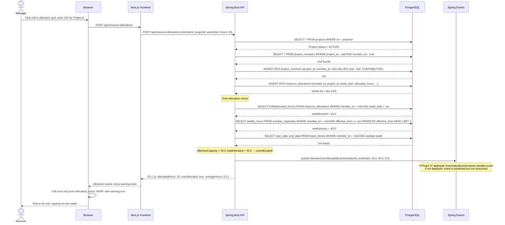
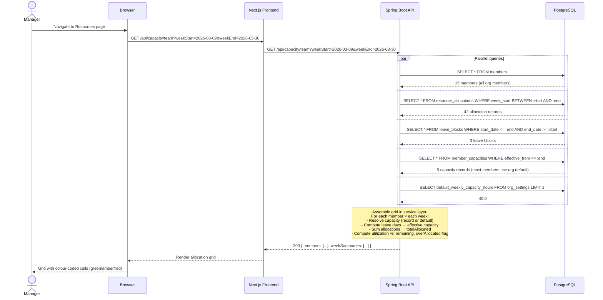
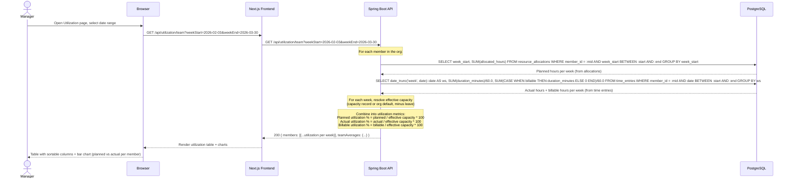

# Phase 38 — Resource Planning & Capacity

> Standalone architecture document for **Phase 38 — Resource Planning & Capacity**.
> Follows the pattern of `architecture/phase5-task-time-lifecycle.md` and later phase docs.

---

## 38.1 Overview

Phase 38 adds **resource planning and capacity management** to the DocTeams platform. Until now, the system tracks what work *was done* (time entries, Phase 5) but has no concept of what work *is planned*. A partner asking "can we take this new client?" has no system answer — they mentally tally who is busy and hope they remember correctly. This is the #1 operational gap for firms with 5+ team members, and the capability that separates basic time trackers (Harvest, Toggl) from practice management platforms (Productive.io, Scoro, Float).

This phase introduces three new entities — `MemberCapacity`, `ResourceAllocation`, and `LeaveBlock` — that together model *how much time a member has* (capacity), *where that time is planned to go* (allocations), and *when a member is unavailable* (leave). A new `CapacityService` centralises all capacity resolution logic, and a `UtilizationService` combines planned allocations with actual time entries to produce utilization metrics. The existing `ProfitabilityReportService` (Phase 8) is extended with projected revenue and cost calculations based on forward-looking allocations.

The signature UI investment is an **allocation grid** — a members-by-weeks matrix where managers can see, at a glance, who is allocated where, who has remaining capacity, and who is over-committed. This grid, combined with utilization dashboards and project staffing views, gives firm managers the tools to make informed staffing decisions.

### What's New

| Capability | Before Phase 38 | After Phase 38 |
|------------|-----------------|----------------|
| Member capacity | Not modelled | Configurable weekly hours per member with effective dates; org-wide default |
| Resource allocation | Not modelled | Planned hours per member per project per week; bulk operations |
| Leave / unavailability | Not modelled | Date-range leave blocks that reduce effective capacity |
| Capacity grid | Not available | Members x weeks grid with allocation bars, colour-coded utilization |
| Utilization metrics | Actual only (from time entries) | Planned utilization (allocations) + actual utilization (time entries) + billable utilization |
| Projected profitability | Not available | Forward-looking revenue/cost projections from allocations x rates |
| Over-allocation detection | Not available | Warning on save + domain event for automation triggers |
| Project staffing view | Project members list only | Allocation timeline, planned-vs-budget, actual-vs-planned per member |
| Dashboard widgets | No capacity data | Team Capacity widget (company), My Schedule widget (personal) |

### New Entities

- **MemberCapacity** — configurable weekly hours per member with effective date ranges
- **ResourceAllocation** — planned hours per member per project per week (the core planning record)
- **LeaveBlock** — date-range unavailability markers that reduce effective capacity

### New Backend Package

- `capacity/` — entities, repositories, services (`CapacityService`, `ResourceAllocationService`, `LeaveBlockService`, `UtilizationService`), controllers, DTOs, domain events

### New Frontend Routes

- `resources/page.tsx` — allocation grid (the signature UI)
- `resources/utilization/page.tsx` — team utilization table and charts

### OrgSettings Extension

- `default_weekly_capacity_hours` (BigDecimal, default 40.0) — org-wide fallback when no `MemberCapacity` record exists for a member

---

## 38.2 Domain Model

### 38.2.1 MemberCapacity (New Entity)

Configurable weekly capacity per member. Supports effective dates for capacity changes (e.g., a member transitions from full-time to 4 days/week). See [ADR-152](../adr/ADR-152-capacity-model-design.md) for design rationale.

| Field | DB Column | Type | Constraints | Notes |
|-------|-----------|------|-------------|-------|
| `id` | `id` | UUID | PK, generated | |
| `memberId` | `member_id` | UUID | NOT NULL, FK → members | The team member |
| `weeklyHours` | `weekly_hours` | BigDecimal(5,2) | NOT NULL, CHECK > 0 | Available hours per week (e.g., 40.0, 32.0, 20.0) |
| `effectiveFrom` | `effective_from` | LocalDate | NOT NULL | When this capacity takes effect (must be a Monday) |
| `effectiveTo` | `effective_to` | LocalDate | Nullable | When this capacity ends (null = current/indefinite) |
| `note` | `note` | VARCHAR(500) | Nullable | Human-readable context (e.g., "Reduced to 4 days/week") |
| `createdBy` | `created_by` | UUID | NOT NULL | Member who set this capacity |
| `createdAt` | `created_at` | Instant | NOT NULL, immutable | |
| `updatedAt` | `updated_at` | Instant | NOT NULL | |

**Design decisions**:
- **Weekly hours, not percentage**: Hours are the stored unit because they are concrete and composable. The UI can derive percentages (e.g., "80% of standard 40h") for display, but the source of truth is always hours. This avoids ambiguity about "80% of what?"
- **Effective dates**: The same pattern used by `BillingRate` ([ADR-039](../adr/ADR-039-rate-hierarchy.md)). A member's capacity can change over time without deleting history. The latest applicable record wins.
- **effectiveFrom must be a Monday**: Consistent with the weekly allocation granularity ([ADR-150](../adr/ADR-150-weekly-vs-daily-allocation-granularity.md)). Capacity aligns with week boundaries.
- **No overlap validation**: If multiple records cover the same week, the one with the latest `effectiveFrom` wins. This is simpler than enforcing non-overlapping ranges and handles corrections gracefully.

### 38.2.2 ResourceAllocation (New Entity)

The core planning entity — planned hours per member per project per week. See [ADR-150](../adr/ADR-150-weekly-vs-daily-allocation-granularity.md) for granularity rationale and [ADR-153](../adr/ADR-153-over-allocation-policy.md) for over-allocation policy.

| Field | DB Column | Type | Constraints | Notes |
|-------|-----------|------|-------------|-------|
| `id` | `id` | UUID | PK, generated | |
| `memberId` | `member_id` | UUID | NOT NULL, FK → members | The allocated member |
| `projectId` | `project_id` | UUID | NOT NULL, FK → projects | The target project |
| `weekStart` | `week_start` | LocalDate | NOT NULL | Monday of the ISO week |
| `allocatedHours` | `allocated_hours` | BigDecimal(5,2) | NOT NULL, CHECK > 0 AND <= 168 | Planned hours for this week |
| `note` | `note` | VARCHAR(500) | Nullable | Context (e.g., "Tax return preparation") |
| `createdBy` | `created_by` | UUID | NOT NULL | Member who created the allocation |
| `createdAt` | `created_at` | Instant | NOT NULL, immutable | |
| `updatedAt` | `updated_at` | Instant | NOT NULL | |

**Constraints**:
- `UNIQUE(member_id, project_id, week_start)` — one allocation per member per project per week. The bulk endpoint uses upsert semantics based on this constraint.
- `allocatedHours > 0` — zero-hour allocations have no meaning; delete the record instead.
- `allocatedHours <= 168` — sanity check (7 days x 24 hours). Not a realistic allocation, but prevents data entry errors.
- `weekStart` must be a Monday — validated in the service layer.
- Project must not be in `ARCHIVED` or `COMPLETED` status — validated in the service layer.

**Design decisions**:
- **No project_member_id FK**: The allocation references `member_id` and `project_id` directly, not `ProjectMember`. This is because allocating a member to a project auto-creates the `ProjectMember` record if missing — the allocation is the source of intent, not the membership.
- **Over-allocation is a warning, not an error** ([ADR-153](../adr/ADR-153-over-allocation-policy.md)): Firms intentionally over-commit knowing some work will slip. The API returns a warning flag; the UI highlights the cell in red.
- **Historical allocations preserved**: Past allocations are never auto-deleted, enabling actual-vs-planned analysis in utilization reports.

### 38.2.3 LeaveBlock (New Entity)

Simple date-range marker for member unavailability. Not an HR system — no leave types, accrual, or approval workflow. Just a visibility marker that reduces effective capacity.

| Field | DB Column | Type | Constraints | Notes |
|-------|-----------|------|-------------|-------|
| `id` | `id` | UUID | PK, generated | |
| `memberId` | `member_id` | UUID | NOT NULL, FK → members | The member on leave |
| `startDate` | `start_date` | LocalDate | NOT NULL | First day of leave |
| `endDate` | `end_date` | LocalDate | NOT NULL, CHECK >= start_date | Last day of leave (inclusive) |
| `note` | `note` | VARCHAR(500) | Nullable | Context (e.g., "Annual leave", "Conference") |
| `createdBy` | `created_by` | UUID | NOT NULL | Member who created the leave block |
| `createdAt` | `created_at` | Instant | NOT NULL, immutable | |
| `updatedAt` | `updated_at` | Instant | NOT NULL | |

**Design decisions**:
- **No overlap validation**: Overlapping leave blocks are merged logically during capacity calculation. If a member has two overlapping leave blocks covering the same Wednesday, it still counts as one leave day. This avoids complex overlap-detection logic and makes CRUD operations simple.
- **Weekdays only in calculations**: Leave days that fall on Saturday or Sunday do not reduce capacity. The formula: `effectiveCapacity = weeklyHours * (5 - leaveDaysInWeek) / 5`, where `leaveDaysInWeek` counts only Mon-Fri days.
- **No leave types or accrual**: This is a planning visibility tool, not HR software. Leave types (annual, sick, parental) and accrual tracking are out of scope.
- **Past leave preserved**: Historical leave blocks support retrospective capacity analysis.

### 38.2.4 OrgSettings Extension

The existing `OrgSettings` entity (one row per tenant) gains a single new column:

| Field | DB Column | Type | Default | Notes |
|-------|-----------|------|---------|-------|
| `defaultWeeklyCapacityHours` | `default_weekly_capacity_hours` | BigDecimal(5,2) | 40.00 | Org-wide default capacity when no MemberCapacity record exists |

This follows the established pattern for extending `OrgSettings` — add a column via tenant migration, add a field + getter/setter to the entity, expose via the existing settings API.

### 38.2.5 Entity-Relationship Diagram

The diagram below shows **all tenant-schema entities** after Phase 38 (65 existing + 3 new = 68 total). New entities are marked with `[NEW]`. Entities are grouped by domain area.

```mermaid
erDiagram
    %% ─── CORE PROJECT DOMAIN ───
    projects {
        uuid id PK
        varchar name
        varchar status
        uuid created_by FK
    }
    members {
        uuid id PK
        varchar external_user_id
        varchar email
        varchar name
        varchar org_role
    }
    project_members {
        uuid id PK
        uuid project_id FK
        uuid member_id FK
        varchar project_role
    }
    tasks {
        uuid id PK
        uuid project_id FK
        uuid assignee_id FK
        varchar title
        varchar status
    }
    task_items {
        uuid id PK
        uuid task_id FK
        varchar title
        boolean completed
    }
    documents {
        uuid id PK
        uuid project_id FK
        varchar title
        varchar scope
    }

    %% ─── CUSTOMER DOMAIN ───
    customers {
        uuid id PK
        varchar name
        varchar status
    }
    customer_projects {
        uuid id PK
        uuid customer_id FK
        uuid project_id FK
    }

    %% ─── TIME & EXPENSE DOMAIN ───
    time_entries {
        uuid id PK
        uuid task_id FK
        uuid member_id FK
        date date
        integer duration_minutes
        boolean billable
    }
    expenses {
        uuid id PK
        uuid project_id FK
        varchar description
        decimal amount
        boolean billable
    }

    %% ─── RESOURCE PLANNING DOMAIN [NEW] ───
    member_capacities {
        uuid id PK
        uuid member_id FK
        decimal weekly_hours
        date effective_from
        date effective_to
    }
    resource_allocations {
        uuid id PK
        uuid member_id FK
        uuid project_id FK
        date week_start
        decimal allocated_hours
    }
    leave_blocks {
        uuid id PK
        uuid member_id FK
        date start_date
        date end_date
    }

    %% ─── BILLING & RATES DOMAIN ───
    billing_rates {
        uuid id PK
        uuid member_id FK
        uuid project_id FK
        uuid customer_id FK
        decimal hourly_rate
    }
    cost_rates {
        uuid id PK
        uuid member_id FK
        decimal hourly_rate
    }
    project_budgets {
        uuid id PK
        uuid project_id FK
        decimal budget_hours
        decimal budget_amount
    }
    org_settings {
        uuid id PK
        varchar default_currency
        decimal default_weekly_capacity_hours
    }

    %% ─── INVOICE DOMAIN ───
    invoices {
        uuid id PK
        uuid project_id FK
        uuid customer_id FK
        varchar invoice_number
        varchar status
    }
    invoice_lines {
        uuid id PK
        uuid invoice_id FK
        varchar description
        decimal amount
    }
    invoice_counters {
        uuid id PK
        integer current_value
    }
    payment_events {
        uuid id PK
        uuid invoice_id FK
        varchar event_type
    }
    tax_rates {
        uuid id PK
        varchar name
        decimal rate
    }

    %% ─── DOCUMENT TEMPLATES & GENERATION ───
    document_templates {
        uuid id PK
        varchar name
        varchar slug
    }
    generated_documents {
        uuid id PK
        uuid template_id FK
        varchar s3_key
    }

    %% ─── COMPLIANCE & CHECKLISTS ───
    checklist_templates {
        uuid id PK
        varchar name
    }
    checklist_template_items {
        uuid id PK
        uuid template_id FK
        varchar label
    }
    checklist_instances {
        uuid id PK
        uuid template_id FK
        uuid entity_id
    }
    checklist_instance_items {
        uuid id PK
        uuid instance_id FK
        boolean completed
    }
    data_subject_requests {
        uuid id PK
        uuid customer_id FK
        varchar request_type
    }
    retention_policies {
        uuid id PK
        varchar entity_type
        integer retention_days
    }

    %% ─── INFORMATION REQUESTS ───
    information_requests {
        uuid id PK
        uuid customer_id FK
        varchar request_number
        varchar status
    }
    request_items {
        uuid id PK
        uuid request_id FK
        varchar label
    }
    request_counters {
        uuid id PK
        integer current_value
    }
    request_templates {
        uuid id PK
        varchar name
    }
    request_template_items {
        uuid id PK
        uuid template_id FK
        varchar label
    }

    %% ─── COMMENTS & NOTIFICATIONS ───
    comments {
        uuid id PK
        uuid entity_id
        varchar entity_type
        uuid author_id FK
    }
    notifications {
        uuid id PK
        uuid member_id FK
        varchar type
        boolean read
    }
    notification_preferences {
        uuid id PK
        uuid member_id FK
        varchar notification_type
    }
    email_delivery_logs {
        uuid id PK
        varchar recipient
        varchar status
    }

    %% ─── AUDIT ───
    audit_events {
        uuid id PK
        varchar event_type
        uuid actor_id
        jsonb details
    }

    %% ─── PORTAL ───
    portal_contacts {
        uuid id PK
        uuid customer_id FK
        varchar email
    }
    magic_link_tokens {
        uuid id PK
        uuid contact_id FK
        varchar token
    }

    %% ─── ACCEPTANCE & PROPOSALS ───
    acceptance_requests {
        uuid id PK
        uuid entity_id
        varchar reference_type
        varchar status
    }
    proposals {
        uuid id PK
        uuid customer_id FK
        uuid project_id FK
        varchar status
    }
    proposal_counters {
        uuid id PK
        integer current_value
    }
    proposal_milestones {
        uuid id PK
        uuid proposal_id FK
        varchar title
    }
    proposal_team_members {
        uuid id PK
        uuid proposal_id FK
        uuid member_id FK
    }

    %% ─── CLAUSES ───
    clauses {
        uuid id PK
        varchar title
        text body
    }
    template_clauses {
        uuid id PK
        uuid template_id FK
        uuid clause_id FK
    }

    %% ─── RETAINERS ───
    retainer_agreements {
        uuid id PK
        uuid customer_id FK
        uuid project_id FK
        varchar status
    }
    retainer_periods {
        uuid id PK
        uuid agreement_id FK
        date period_start
    }

    %% ─── SCHEDULING ───
    recurring_schedules {
        uuid id PK
        varchar entity_type
        uuid entity_id
        varchar cron_expression
    }
    schedule_executions {
        uuid id PK
        uuid schedule_id FK
        timestamp executed_at
    }

    %% ─── CUSTOM FIELDS & TAGS ───
    field_definitions {
        uuid id PK
        varchar name
        varchar field_type
    }
    field_groups {
        uuid id PK
        varchar name
    }
    field_group_members {
        uuid id PK
        uuid group_id FK
        uuid field_id FK
    }
    tags {
        uuid id PK
        varchar name
        varchar color
    }
    entity_tags {
        uuid id PK
        uuid tag_id FK
        uuid entity_id
    }
    saved_views {
        uuid id PK
        varchar name
        jsonb filters
    }

    %% ─── INTEGRATIONS ───
    org_integrations {
        uuid id PK
        varchar provider
        boolean enabled
    }
    org_secrets {
        uuid id PK
        varchar key_name
        text encrypted_value
    }

    %% ─── REPORTING ───
    report_definitions {
        uuid id PK
        varchar name
        varchar report_type
    }

    %% ─── PROJECT TEMPLATES ───
    project_templates {
        uuid id PK
        varchar name
    }
    template_tasks {
        uuid id PK
        uuid template_id FK
        varchar title
    }
    template_task_items {
        uuid id PK
        uuid task_id FK
        varchar title
    }

    %% ─── BILLING / SUBSCRIPTIONS (public schema) ───
    subscriptions {
        uuid id PK
        varchar plan_tier
        varchar status
    }
    org_schema_mappings {
        uuid id PK
        varchar org_id
        varchar schema_name
    }
    organizations {
        uuid id PK
        varchar name
        varchar slug
    }

    %% ─── RELATIONSHIPS ───
    projects ||--o{ project_members : "has"
    members ||--o{ project_members : "assigned to"
    projects ||--o{ tasks : "contains"
    tasks ||--o{ task_items : "contains"
    tasks ||--o{ time_entries : "tracked by"
    members ||--o{ time_entries : "logged by"
    projects ||--o{ documents : "contains"
    projects ||--o{ expenses : "incurs"
    customers ||--o{ customer_projects : "linked to"
    projects ||--o{ customer_projects : "linked to"

    %% Resource Planning relationships [NEW]
    members ||--o{ member_capacities : "capacity config"
    members ||--o{ resource_allocations : "allocated to"
    projects ||--o{ resource_allocations : "staffed with"
    members ||--o{ leave_blocks : "leave"

    %% Billing relationships
    members ||--o{ billing_rates : "billed at"
    members ||--o{ cost_rates : "costs"
    projects ||--o| project_budgets : "budgeted"

    %% Invoice relationships
    invoices ||--o{ invoice_lines : "contains"
    invoices ||--o{ payment_events : "payments"
    projects ||--o{ invoices : "billed via"
    customers ||--o{ invoices : "billed to"

    %% Template relationships
    document_templates ||--o{ generated_documents : "generates"
    checklist_templates ||--o{ checklist_template_items : "contains"
    checklist_instances ||--o{ checklist_instance_items : "contains"

    %% Information request relationships
    information_requests ||--o{ request_items : "contains"
    request_templates ||--o{ request_template_items : "contains"
    customers ||--o{ information_requests : "receives"

    %% Notification relationships
    members ||--o{ notifications : "receives"
    members ||--o{ notification_preferences : "configures"

    %% Portal relationships
    customers ||--o{ portal_contacts : "has"
    portal_contacts ||--o{ magic_link_tokens : "authenticates via"

    %% Proposal relationships
    proposals ||--o{ proposal_milestones : "contains"
    proposals ||--o{ proposal_team_members : "staffed by"
    customers ||--o{ proposals : "receives"

    %% Retainer relationships
    retainer_agreements ||--o{ retainer_periods : "contains"
    customers ||--o{ retainer_agreements : "covered by"

    %% Schedule relationships
    recurring_schedules ||--o{ schedule_executions : "runs"

    %% Template relationships
    project_templates ||--o{ template_tasks : "contains"
    template_tasks ||--o{ template_task_items : "contains"

    %% Clause relationships
    template_clauses }o--|| clauses : "references"

    %% Tag relationships
    tags ||--o{ entity_tags : "applied as"

    %% Custom field relationships
    field_groups ||--o{ field_group_members : "contains"
    field_group_members }o--|| field_definitions : "references"
```



**Unchanged from prior phases**: All 65 existing entities are structurally unchanged. The only modification to an existing entity is the addition of `defaultWeeklyCapacityHours` to `OrgSettings` (a new column, no existing columns modified).

---

## 38.3 Core Flows and Backend Behaviour

### 38.3.1 Capacity Resolution

`CapacityService` is the single source of truth for "how many hours does this member have available this week?" All capacity queries go through this service — the grid, utilization reports, over-allocation checks, and profitability projections all delegate here.

**`getMemberCapacity(memberId, weekStart)` → BigDecimal**

Resolution chain:

1. Query `MemberCapacity` records for the member where `effectiveFrom <= weekStart` and (`effectiveTo IS NULL` or `effectiveTo >= weekStart`).
2. If multiple records match (overlapping effective ranges), take the one with the latest `effectiveFrom` — it represents the most recent configuration.
3. If no record matches, fall back to `OrgSettings.defaultWeeklyCapacityHours`.
4. If `OrgSettings` has no value (null), use the hard default of `40.0`.

```sql
-- Resolution query: find applicable MemberCapacity record
SELECT weekly_hours
FROM member_capacities
WHERE member_id = :memberId
  AND effective_from <= :weekStart
  AND (effective_to IS NULL OR effective_to >= :weekStart)
ORDER BY effective_from DESC
LIMIT 1;
```

**`getMemberEffectiveCapacity(memberId, weekStart)` → BigDecimal**

Effective capacity factors in leave. The algorithm:

1. Resolve base capacity via `getMemberCapacity(memberId, weekStart)`.
2. Query `LeaveBlock` records for the member that overlap the week (Monday to Friday).
3. Count the number of unique weekdays (Mon-Fri) covered by leave within the week.
4. Reduce capacity proportionally: `effectiveCapacity = baseCapacity * (5 - leaveDays) / 5`.

```sql
-- Find leave blocks overlapping a given week (Mon-Fri)
SELECT start_date, end_date
FROM leave_blocks
WHERE member_id = :memberId
  AND start_date <= :weekEnd      -- weekEnd = weekStart + 4 days (Friday)
  AND end_date >= :weekStart;     -- weekStart = Monday
```

The leave day count is computed in Java (not SQL) because it requires weekday-only counting with deduplication across overlapping leave blocks:

```java
// Pseudo-code for leave day counting within a week
Set<LocalDate> leaveDays = new HashSet<>();
for (LeaveBlock block : overlappingBlocks) {
    LocalDate day = max(block.getStartDate(), weekStart);
    LocalDate end = min(block.getEndDate(), weekEnd);
    while (!day.isAfter(end)) {
        if (day.getDayOfWeek().getValue() <= 5) { // Mon=1 ... Fri=5
            leaveDays.add(day);
        }
        day = day.plusDays(1);
    }
}
int leaveDayCount = leaveDays.size(); // max 5
```

**Edge cases**:
- **Member with no MemberCapacity record and no OrgSettings value**: Falls through to hard default of 40.0. This ensures the system always has a capacity value.
- **Full week of leave (5 days)**: Effective capacity is 0. Allocations for that week are technically over-allocations, and the grid shows the cell as fully unavailable.
- **Overlapping MemberCapacity records**: Latest `effectiveFrom` wins. Example: record A (effectiveFrom=Jan 1, weeklyHours=40) and record B (effectiveFrom=Mar 1, weeklyHours=32). For the week of Mar 3, record B wins.
- **MemberCapacity with effectiveTo in the past**: Record is inactive; resolution skips it. Historical records are preserved for audit.

### 38.3.2 Allocation CRUD

**Create Allocation**

`ResourceAllocationService.createAllocation(memberId, projectId, weekStart, allocatedHours, note, createdBy)`

1. **Validate weekStart is a Monday**: `weekStart.getDayOfWeek() == DayOfWeek.MONDAY`. Reject with 400 if not.
2. **Validate project status**: Load project, reject if status is `ARCHIVED` or `COMPLETED`.
3. **Validate allocatedHours**: Must be > 0 and <= 168.
4. **Check uniqueness**: If an allocation already exists for this (member, project, week), reject with 409 Conflict. (Use the bulk endpoint for upsert semantics.)
5. **Auto-add ProjectMember**: If the member is not already a `ProjectMember` on this project, create a `ProjectMember` record with role `CONTRIBUTOR`. This reduces friction — managers allocate first, membership follows automatically.
6. **Persist** the `ResourceAllocation` entity.
7. **Over-allocation check**: Query total allocated hours for this member for this week (across all projects). Compare to `getMemberEffectiveCapacity(memberId, weekStart)`. If total > capacity:
   - Set `overAllocated = true` and compute `overageHours = total - effectiveCapacity`.
   - Publish `MemberOverAllocatedEvent` as a Spring application event.
8. **Return** the saved allocation DTO with `overAllocated` and `overageHours` fields.

**Update Allocation**

Same flow as create, but loads the existing record by ID, validates ownership (same org), updates `allocatedHours` and/or `note`, then re-runs the over-allocation check.

**Delete Allocation**

Soft operation — deletes the `ResourceAllocation` record. No cascading effects (time entries are independent per [ADR-151](../adr/ADR-151-planned-vs-actual-separation.md)). Does not remove the auto-created `ProjectMember` — the member remains on the project.

**Bulk Allocation**

`ResourceAllocationService.bulkUpsertAllocations(List<AllocationRequest>)`

Accepts an array of `{ memberId, projectId, weekStart, allocatedHours, note }`. For each item:
1. Check if an allocation exists for `(memberId, projectId, weekStart)`.
2. If exists: update `allocatedHours` and `note`.
3. If not: create a new allocation (including auto-add ProjectMember).
4. Run over-allocation check per member per week (deduplicated — if multiple items affect the same member+week, check once after all items are processed).
5. Return a list of results, each with `overAllocated` and `overageHours`.

This endpoint powers the grid UI's "copy week" and "drag-to-fill" interactions, where multiple cells change at once.

### 38.3.3 Leave Management

**CRUD operations** for `LeaveBlock` are straightforward:

- **Create**: Validate `endDate >= startDate`, validate member exists. No overlap validation — overlapping leave blocks are allowed and merged during capacity calculation.
- **Update**: Same validation. Can change dates and note.
- **Delete**: Simple removal. Past leave blocks can be deleted (they are informational, not system-critical).
- **List by member**: Returns all leave blocks for a member, ordered by `startDate DESC`.
- **List all (team view)**: Returns all leave blocks within a date range, for the team calendar/grid overlay.

**Leave days are counted as weekdays only (Mon-Fri)**. A leave block from Friday to Monday covers 2 leave days (Friday and Monday), not 4 calendar days. The capacity reduction formula:

```
effectiveCapacity = weeklyCapacity * (5 - leaveDaysInWeek) / 5
```

Example: 40h/week capacity, 2 leave days in the week → 40 * 3/5 = 24h effective capacity.

### 38.3.4 Team Capacity Grid

`CapacityService.getTeamCapacityGrid(weekStart, weekEnd)` assembles the full allocation grid — the primary data structure behind the Resources page.

**Assembly algorithm**:

1. **Query all active members** for the org (from `Member` table, filtered by active status).
2. **Query all allocations** in the date range: `SELECT * FROM resource_allocations WHERE week_start BETWEEN :weekStart AND :weekEnd ORDER BY member_id, week_start`.
3. **Query all leave blocks** overlapping the date range: `SELECT * FROM leave_blocks WHERE start_date <= :rangeEnd AND end_date >= :rangeStart`.
4. **Resolve capacity** for each member for each week in the range (batch query for `MemberCapacity` records, fall back to org default).
5. **Assemble the grid** in the service layer:

```
TeamCapacityGrid:
  members: List<MemberRow>
    MemberRow:
      memberId, memberName, avatarUrl
      weeks: List<WeekCell>
        WeekCell:
          weekStart
          allocations: List<{ projectId, projectName, projectColor, hours }>
          totalAllocated: BigDecimal
          effectiveCapacity: BigDecimal
          remainingCapacity: BigDecimal  (= effectiveCapacity - totalAllocated)
          utilizationPct: BigDecimal     (= totalAllocated / effectiveCapacity * 100)
          overAllocated: boolean         (= totalAllocated > effectiveCapacity)
          leaveDays: int                 (0-5, for visual indicator)
      totalAllocated: BigDecimal         (sum across visible weeks)
      totalCapacity: BigDecimal          (sum across visible weeks)
      avgUtilizationPct: BigDecimal
  weekSummaries: List<WeekSummary>
    WeekSummary:
      weekStart
      teamTotalAllocated: BigDecimal
      teamTotalCapacity: BigDecimal
      teamUtilizationPct: BigDecimal
```

**Performance considerations**:
- Three queries total (members, allocations, leave blocks) — all with indexed lookups on `member_id` and `week_start` / date ranges.
- Capacity resolution is batched: one query fetches all `MemberCapacity` records for all members, then resolution is done in-memory.
- The default view is 4 weeks. At 20 members × 4 weeks, the grid has 80 cells — well within single-response territory.
- For 12-week views with 50+ members, the data is still modest (~600 cells, ~1000 allocation records at peak). No pagination needed for the grid data; the UI handles scrolling.

### 38.3.5 Utilization Calculation

`UtilizationService` combines `ResourceAllocation` (planned) with `TimeEntry` (actual) to produce utilization metrics. These are independent data sources ([ADR-151](../adr/ADR-151-planned-vs-actual-separation.md)) joined only in the reporting layer.

**`getMemberUtilization(memberId, weekStart, weekEnd)` → UtilizationSummary**

For each week in the range:

```
WeekUtilization:
  weekStart: LocalDate
  effectiveCapacity: BigDecimal       (from CapacityService)
  plannedHours: BigDecimal            (SUM of ResourceAllocation.allocatedHours for this member+week)
  actualHours: BigDecimal             (SUM of TimeEntry.durationMinutes / 60 for this member+week)
  billableActualHours: BigDecimal     (SUM where TimeEntry.billable = true)
  plannedUtilizationPct: BigDecimal   (= plannedHours / effectiveCapacity * 100)
  actualUtilizationPct: BigDecimal    (= actualHours / effectiveCapacity * 100)
  billableUtilizationPct: BigDecimal  (= billableActualHours / effectiveCapacity * 100)
```

**Queries**:

```sql
-- Planned hours per week (from allocations)
SELECT week_start, SUM(allocated_hours) AS planned_hours
FROM resource_allocations
WHERE member_id = :memberId AND week_start BETWEEN :start AND :end
GROUP BY week_start;

-- Actual hours per week (from time entries, joined through tasks for project context)
SELECT date_trunc('week', te.date)::date AS week_start,
       SUM(te.duration_minutes) / 60.0 AS actual_hours,
       SUM(CASE WHEN te.billable THEN te.duration_minutes ELSE 0 END) / 60.0 AS billable_hours
FROM time_entries te
WHERE te.member_id = :memberId
  AND te.date BETWEEN :start AND :end
GROUP BY date_trunc('week', te.date);
```

Note: `date_trunc('week', ...)` in PostgreSQL uses ISO weeks (Monday start), matching our allocation week boundaries.

**`getTeamUtilization(weekStart, weekEnd)` → List<MemberUtilizationSummary>**

Aggregates utilization for all members. Each `MemberUtilizationSummary` contains the member identity plus aggregated metrics over the full date range:

- Total planned hours, total actual hours, total billable hours
- Average planned utilization %, average actual utilization %, average billable utilization %
- Over-allocated week count (number of weeks where planned > capacity)

Sortable by any metric. The UI defaults to sorting by actual utilization % descending (busiest first).

### 38.3.6 Projected Profitability Integration

`ProfitabilityReportService` (Phase 8) is extended with an `includeProjections` parameter. When `true`, future weeks include projected revenue and cost based on allocations.

**Projection algorithm** for a future week:

1. Query `ResourceAllocation` records for the project (or all projects, depending on report scope).
2. For each allocation (member + project + week + hours):
   - Resolve billing rate via `RateResolutionService.resolveRate(memberId, projectId, customerId, weekStart)` — uses the existing 3-level rate hierarchy ([ADR-039](../adr/ADR-039-rate-hierarchy.md)).
   - Resolve cost rate via `CostRateService.getEffectiveCostRate(memberId, weekStart)`.
   - `projectedRevenue += allocatedHours * billingRate`
   - `projectedCost += allocatedHours * costRate`
3. `projectedMargin = projectedRevenue - projectedCost`

**Surfaces**:
- **Project financials tab**: "Projected" column alongside "Actual" for revenue, cost, margin. Only shown for future periods.
- **Profitability reports**: Optional "Include Projections" toggle. When active, future periods show projected values (lighter colour or dashed lines in charts) alongside historical actuals.

**Design decisions**:
- Projections are computed on the fly, not stored. They change whenever allocations or rates change — caching would introduce staleness.
- Only future weeks are projected. Past weeks use actual time entry data. The current week can show both (actual so far + allocated remainder).
- If no billing rate exists for a member+project combination, that allocation contributes to cost projections but not revenue projections (conservative estimate).

### 38.3.7 Automation Integration (Phase 37 Dependency)

Phase 37 (Workflow Automations) introduces a rule-based automation engine with triggers, conditions, and actions. Phase 38 defines a new trigger type that integrates with this engine — but does so in a forward-compatible way that works whether Phase 37 is deployed or not.

**Design**:

1. `MemberOverAllocatedEvent` is published as a standard Spring application event via `ApplicationEventPublisher.publishEvent()`.
2. The event carries a self-contained payload:

```java
public record MemberOverAllocatedEvent(
    UUID memberId,
    LocalDate weekStart,
    BigDecimal totalAllocated,
    BigDecimal effectiveCapacity,
    BigDecimal overageHours
) {}
```

3. When Phase 37 is deployed, its `AutomationEventListener` (a `@Component` with `@EventListener`) picks up this event and maps it to the `MEMBER_OVER_ALLOCATED` trigger type.
4. When Phase 37 is **not** deployed, the event is published but no listener consumes it — a no-op with zero overhead.

**Trigger configuration**: The `MEMBER_OVER_ALLOCATED` trigger supports a `thresholdPercent` configuration field (default 100). The automation engine only fires the rule if `totalAllocated / effectiveCapacity * 100 >= thresholdPercent`. This allows firms to set custom thresholds (e.g., "only fire when allocation exceeds 120% of capacity").

This decoupled design follows the established Spring event pattern — the publisher (Phase 38) has no compile-time dependency on the listener (Phase 37).

### 38.3.8 RBAC Summary

| Operation | org:owner | org:admin | org:member (self) | org:member (others) |
|-----------|-----------|-----------|-------------------|---------------------|
| Set member capacity | Yes | Yes | No | No |
| View member capacity | Yes | Yes | Own only | No |
| Create/update/delete allocation | Yes | Yes | No | No |
| View allocations | Yes | Yes | Own allocations | Team aggregates only |
| Create/update/delete leave (any member) | Yes | Yes | No | No |
| Create/update/delete own leave | Yes | Yes | Yes | N/A |
| View leave blocks | Yes | Yes | Own + team calendar | Own + team calendar |
| View capacity grid | Yes | Yes | Own row + team totals | Own row + team totals |
| View utilization reports | Yes | Yes | Own utilization | Own utilization |
| View projected profitability | Yes | Yes | No | No |

---

## 38.4 API Surface

### Member Capacity API

| Method | Path | Description | Auth | Notes |
|--------|------|-------------|------|-------|
| GET | `/api/members/{memberId}/capacity` | List capacity records for a member | admin, owner | Returns all records ordered by effectiveFrom DESC |
| POST | `/api/members/{memberId}/capacity` | Create capacity record | admin, owner | Validates effectiveFrom is Monday |
| PUT | `/api/members/{memberId}/capacity/{id}` | Update capacity record | admin, owner | |
| DELETE | `/api/members/{memberId}/capacity/{id}` | Delete capacity record | admin, owner | |

### Resource Allocation API

| Method | Path | Description | Auth | Notes |
|--------|------|-------------|------|-------|
| GET | `/api/resource-allocations` | List allocations | all members | Filters: memberId, projectId, weekStart, weekEnd |
| POST | `/api/resource-allocations` | Create allocation | admin, owner | Returns overAllocated warning |
| PUT | `/api/resource-allocations/{id}` | Update allocation | admin, owner | Returns overAllocated warning |
| DELETE | `/api/resource-allocations/{id}` | Delete allocation | admin, owner | |
| POST | `/api/resource-allocations/bulk` | Bulk create/update | admin, owner | Upsert semantics on UNIQUE constraint |

### Leave API

| Method | Path | Description | Auth | Notes |
|--------|------|-------------|------|-------|
| GET | `/api/members/{memberId}/leave` | List leave blocks for a member | all members | |
| POST | `/api/members/{memberId}/leave` | Create leave block | admin, owner, or self | |
| PUT | `/api/members/{memberId}/leave/{id}` | Update leave block | admin, owner, or self | |
| DELETE | `/api/members/{memberId}/leave/{id}` | Delete leave block | admin, owner, or self | |
| GET | `/api/leave` | List all leave blocks | all members | Filter: startDate, endDate (for team calendar) |

### Capacity & Utilization API

| Method | Path | Description | Auth | Notes |
|--------|------|-------------|------|-------|
| GET | `/api/capacity/team` | Team capacity grid | all members | Query: weekStart, weekEnd (default 4 weeks) |
| GET | `/api/capacity/members/{memberId}` | Member capacity detail | all members | Query: weekStart, weekEnd |
| GET | `/api/capacity/projects/{projectId}` | Project staffing view | project members | Query: weekStart, weekEnd |
| GET | `/api/utilization/team` | Team utilization | all members | Query: weekStart, weekEnd |
| GET | `/api/utilization/members/{memberId}` | Member utilization detail | all members | Query: weekStart, weekEnd |

### Key Request/Response Shapes

**POST /api/resource-allocations** — Create allocation

Request:
```json
{
  "memberId": "550e8400-e29b-41d4-a716-446655440001",
  "projectId": "550e8400-e29b-41d4-a716-446655440002",
  "weekStart": "2026-03-09",
  "allocatedHours": 20.0,
  "note": "Tax return preparation"
}
```

Response (201 Created):
```json
{
  "id": "550e8400-e29b-41d4-a716-446655440099",
  "memberId": "550e8400-e29b-41d4-a716-446655440001",
  "projectId": "550e8400-e29b-41d4-a716-446655440002",
  "weekStart": "2026-03-09",
  "allocatedHours": 20.0,
  "note": "Tax return preparation",
  "overAllocated": true,
  "overageHours": 5.0,
  "createdAt": "2026-03-06T10:30:00Z"
}
```

**POST /api/resource-allocations/bulk** — Bulk create/update

Request:
```json
{
  "allocations": [
    { "memberId": "...", "projectId": "...", "weekStart": "2026-03-09", "allocatedHours": 20.0 },
    { "memberId": "...", "projectId": "...", "weekStart": "2026-03-16", "allocatedHours": 15.0 },
    { "memberId": "...", "projectId": "...", "weekStart": "2026-03-09", "allocatedHours": 25.0 }
  ]
}
```

Response (200 OK):
```json
{
  "results": [
    { "id": "...", "memberId": "...", "projectId": "...", "weekStart": "2026-03-09", "allocatedHours": 20.0, "overAllocated": true, "overageHours": 5.0, "created": true },
    { "id": "...", "memberId": "...", "projectId": "...", "weekStart": "2026-03-16", "allocatedHours": 15.0, "overAllocated": false, "overageHours": 0, "created": true },
    { "id": "...", "memberId": "...", "projectId": "...", "weekStart": "2026-03-09", "allocatedHours": 25.0, "overAllocated": true, "overageHours": 5.0, "created": false }
  ]
}
```

**GET /api/capacity/team?weekStart=2026-03-09&weekEnd=2026-03-30**

Response:
```json
{
  "members": [
    {
      "memberId": "...",
      "memberName": "Alice Smith",
      "avatarUrl": "https://...",
      "weeks": [
        {
          "weekStart": "2026-03-09",
          "allocations": [
            { "projectId": "...", "projectName": "Smith Audit", "hours": 25.0 },
            { "projectId": "...", "projectName": "Jones Tax", "hours": 10.0 }
          ],
          "totalAllocated": 35.0,
          "effectiveCapacity": 40.0,
          "remainingCapacity": 5.0,
          "utilizationPct": 87.5,
          "overAllocated": false,
          "leaveDays": 0
        },
        {
          "weekStart": "2026-03-16",
          "allocations": [
            { "projectId": "...", "projectName": "Smith Audit", "hours": 30.0 },
            { "projectId": "...", "projectName": "Jones Tax", "hours": 15.0 }
          ],
          "totalAllocated": 45.0,
          "effectiveCapacity": 32.0,
          "remainingCapacity": -13.0,
          "utilizationPct": 140.6,
          "overAllocated": true,
          "leaveDays": 2
        }
      ],
      "totalAllocated": 80.0,
      "totalCapacity": 72.0,
      "avgUtilizationPct": 111.1
    }
  ],
  "weekSummaries": [
    { "weekStart": "2026-03-09", "teamTotalAllocated": 150.0, "teamTotalCapacity": 200.0, "teamUtilizationPct": 75.0 },
    { "weekStart": "2026-03-16", "teamTotalAllocated": 180.0, "teamTotalCapacity": 172.0, "teamUtilizationPct": 104.7 }
  ]
}
```

**GET /api/utilization/team?weekStart=2026-03-02&weekEnd=2026-03-16**

Response:
```json
{
  "members": [
    {
      "memberId": "...",
      "memberName": "Alice Smith",
      "weeklyCapacity": 40.0,
      "totalPlannedHours": 70.0,
      "totalActualHours": 62.5,
      "totalBillableHours": 55.0,
      "avgPlannedUtilizationPct": 87.5,
      "avgActualUtilizationPct": 78.1,
      "avgBillableUtilizationPct": 68.8,
      "overAllocatedWeeks": 0,
      "weeks": [
        {
          "weekStart": "2026-03-02",
          "effectiveCapacity": 40.0,
          "plannedHours": 35.0,
          "actualHours": 38.0,
          "billableActualHours": 32.0,
          "plannedUtilizationPct": 87.5,
          "actualUtilizationPct": 95.0,
          "billableUtilizationPct": 80.0
        }
      ]
    }
  ],
  "teamAverages": {
    "avgPlannedUtilizationPct": 82.0,
    "avgActualUtilizationPct": 76.5,
    "avgBillableUtilizationPct": 65.0
  }
}
```

---

## 38.5 Sequence Diagrams

### 38.5.1 Create Allocation with Over-Allocation Warning



### 38.5.2 Team Capacity Grid Load



### 38.5.3 Member Utilization Calculation



---

## 38.6 Notification, Audit & Automation Details

### Notification Types

| Event | Recipient | Channel | Template Key |
|-------|-----------|---------|--------------|
| Allocation created/changed for a member | The allocated member | In-app | `ALLOCATION_CHANGED` |
| Member over-allocated (> 100% capacity) | Org admins + the member | In-app | `MEMBER_OVER_ALLOCATED` |
| Leave block created for a member (by admin) | The member | In-app | `LEAVE_CREATED` |

Notifications follow the existing `NotificationService` pattern (Phase 6.5): create `Notification` records with type, recipient, and JSONB metadata. The member sees them in the notification bell and on the Notifications page.

**Allocation changed** notification is sent only to the allocated member (not the creator, who is the one making the change). It includes the project name, week, and hours.

**Over-allocation** notification targets both the member and org admins, so the resource manager is aware of the conflict.

**Leave created** notification is sent only when an admin creates leave for another member (not when a member creates their own leave).

### Audit Event Types

| Event Type | Detail Payload |
|------------|---------------|
| `MEMBER_CAPACITY_UPDATED` | `{ memberId, memberName, oldWeeklyHours, newWeeklyHours, effectiveFrom }` |
| `ALLOCATION_CREATED` | `{ memberId, memberName, projectId, projectName, weekStart, allocatedHours }` |
| `ALLOCATION_UPDATED` | `{ memberId, memberName, projectId, projectName, weekStart, oldHours, newHours }` |
| `ALLOCATION_DELETED` | `{ memberId, memberName, projectId, projectName, weekStart, allocatedHours }` |
| `LEAVE_CREATED` | `{ memberId, memberName, startDate, endDate, note }` |
| `LEAVE_UPDATED` | `{ memberId, memberName, oldStartDate, oldEndDate, newStartDate, newEndDate }` |
| `LEAVE_DELETED` | `{ memberId, memberName, startDate, endDate }` |

Audit events follow the existing `AuditEventService` pattern (Phase 6): create `AuditEvent` records with type, actor, and JSONB details. All writes (create, update, delete) are audited; reads are not.

### Automation Trigger Registration

| TriggerType | Domain Event | Config Fields |
|-------------|-------------|---------------|
| `MEMBER_OVER_ALLOCATED` | `MemberOverAllocatedEvent` | `thresholdPercent` (Integer, default 100) — fire when allocation exceeds this % of capacity |

**Forward-compatible design**: The `MemberOverAllocatedEvent` is published via `ApplicationEventPublisher` regardless of whether Phase 37's automation engine is deployed. If deployed, the `AutomationEventListener` maps it to the `MEMBER_OVER_ALLOCATED` trigger type and evaluates configured rules. If not deployed, the event is a no-op.

When Phase 37 is implemented, the trigger type is added to the `TriggerType` enum (or sealed interface) and registered with the event listener mapping. No changes to Phase 38 code are needed — the event publisher is already in place.

---

## 38.7 Database Migration (V58)

Single tenant migration file: `db/migration/tenant/V58__create_resource_planning_tables.sql`

No global migration is needed — all entities are tenant-scoped within the schema-per-tenant boundary.

```sql
-- V58__create_resource_planning_tables.sql
-- Phase 38: Resource Planning & Capacity

-- ─── Member Capacities ───
CREATE TABLE member_capacities (
    id             UUID PRIMARY KEY DEFAULT gen_random_uuid(),
    member_id      UUID         NOT NULL REFERENCES members(id) ON DELETE CASCADE,
    weekly_hours   NUMERIC(5,2) NOT NULL CHECK (weekly_hours > 0),
    effective_from DATE         NOT NULL CHECK (EXTRACT(ISODOW FROM effective_from) = 1),
    effective_to   DATE,
    note           VARCHAR(500),
    created_by     UUID         NOT NULL,
    created_at     TIMESTAMPTZ  NOT NULL DEFAULT now(),
    updated_at     TIMESTAMPTZ  NOT NULL DEFAULT now()
);

-- Capacity resolution: find the latest applicable record for a member + date
CREATE INDEX idx_member_capacities_member_effective
    ON member_capacities (member_id, effective_from DESC);

COMMENT ON TABLE member_capacities IS 'Configurable weekly capacity per member with effective date ranges';


-- ─── Resource Allocations ───
CREATE TABLE resource_allocations (
    id              UUID PRIMARY KEY DEFAULT gen_random_uuid(),
    member_id       UUID         NOT NULL REFERENCES members(id) ON DELETE CASCADE,
    project_id      UUID         NOT NULL REFERENCES projects(id) ON DELETE CASCADE,
    week_start      DATE         NOT NULL CHECK (EXTRACT(ISODOW FROM week_start) = 1),
    allocated_hours NUMERIC(5,2) NOT NULL CHECK (allocated_hours > 0 AND allocated_hours <= 168),
    note            VARCHAR(500),
    created_by      UUID         NOT NULL,
    created_at      TIMESTAMPTZ  NOT NULL DEFAULT now(),
    updated_at      TIMESTAMPTZ  NOT NULL DEFAULT now(),

    CONSTRAINT uq_allocation_member_project_week
        UNIQUE (member_id, project_id, week_start)
);

-- Grid view: all allocations for a member in a date range
CREATE INDEX idx_allocations_member_week
    ON resource_allocations (member_id, week_start);

-- Project staffing view: all allocations for a project in a date range
CREATE INDEX idx_allocations_project_week
    ON resource_allocations (project_id, week_start);

-- Team grid: all allocations in a date range (no member filter)
CREATE INDEX idx_allocations_week
    ON resource_allocations (week_start);

COMMENT ON TABLE resource_allocations IS 'Planned hours per member per project per week (ISO Monday start)';


-- ─── Leave Blocks ───
CREATE TABLE leave_blocks (
    id         UUID PRIMARY KEY DEFAULT gen_random_uuid(),
    member_id  UUID        NOT NULL REFERENCES members(id) ON DELETE CASCADE,
    start_date DATE        NOT NULL,
    end_date   DATE        NOT NULL CHECK (end_date >= start_date),
    note       VARCHAR(500),
    created_by UUID        NOT NULL,
    created_at TIMESTAMPTZ NOT NULL DEFAULT now(),
    updated_at TIMESTAMPTZ NOT NULL DEFAULT now()
);

-- Capacity reduction: find leave blocks overlapping a date range
CREATE INDEX idx_leave_blocks_member_dates
    ON leave_blocks (member_id, start_date, end_date);

COMMENT ON TABLE leave_blocks IS 'Date-range unavailability markers that reduce effective capacity';


-- ─── OrgSettings Extension ───
ALTER TABLE org_settings
    ADD COLUMN default_weekly_capacity_hours NUMERIC(5,2) DEFAULT 40.00;

COMMENT ON COLUMN org_settings.default_weekly_capacity_hours
    IS 'Org-wide default weekly capacity when no MemberCapacity record exists for a member';
```

**Index rationale**:
- `idx_member_capacities_member_effective`: Powers the capacity resolution query — find the latest `effectiveFrom` for a given member. `DESC` order means the first row returned is the correct one.
- `idx_allocations_member_week`: Powers the member timeline view and per-member over-allocation check.
- `idx_allocations_project_week`: Powers the project staffing view.
- `idx_allocations_week`: Powers the team grid view (all members, all projects for a date range).
- `idx_leave_blocks_member_dates`: Powers the leave-overlap query during capacity calculation.

The UNIQUE constraint `uq_allocation_member_project_week` on `(member_id, project_id, week_start)` also serves as an index for the bulk upsert's existence check.

---

## 38.8 Implementation Guidance

### Backend Changes

| File | Package | Description |
|------|---------|-------------|
| `MemberCapacity.java` | `capacity/` | Entity following `BillingRate` pattern (effective dates) |
| `ResourceAllocation.java` | `capacity/` | Entity following `ProjectBudget` pattern (mutable, validated) |
| `LeaveBlock.java` | `capacity/` | Simple entity with date range |
| `MemberCapacityRepository.java` | `capacity/` | JpaRepository + custom JPQL for resolution query |
| `ResourceAllocationRepository.java` | `capacity/` | JpaRepository + aggregation queries |
| `LeaveBlockRepository.java` | `capacity/` | JpaRepository + overlap query |
| `CapacityService.java` | `capacity/` | Capacity resolution, effective capacity, team grid assembly |
| `ResourceAllocationService.java` | `capacity/` | Allocation CRUD, bulk upsert, over-allocation check, auto-add ProjectMember |
| `LeaveBlockService.java` | `capacity/` | Leave CRUD |
| `UtilizationService.java` | `capacity/` | Utilization calculation combining allocations + time entries |
| `MemberOverAllocatedEvent.java` | `capacity/` | Domain event record |
| `MemberCapacityController.java` | `capacity/` | REST controller for capacity config |
| `ResourceAllocationController.java` | `capacity/` | REST controller for allocation CRUD + bulk |
| `LeaveBlockController.java` | `capacity/` | REST controller for leave CRUD |
| `CapacityController.java` | `capacity/` | REST controller for grid + utilization endpoints |
| `capacity/dto/` | `capacity/dto/` | Request/response DTOs |
| `OrgSettings.java` | `settings/` | Add `defaultWeeklyCapacityHours` field + getter/setter |
| `OrgSettingsService.java` | `settings/` | Expose new field in settings API |
| `ProfitabilityReportService.java` | `report/` | Add `includeProjections` parameter + allocation-based projections |
| `V58__create_resource_planning_tables.sql` | `db/migration/tenant/` | Migration file |

### Frontend Changes

| File / Route | Description |
|--------------|-------------|
| `resources/page.tsx` | Allocation grid — members × weeks matrix with colour-coded cells |
| `resources/utilization/page.tsx` | Team utilization table + charts |
| `components/capacity/AllocationGrid.tsx` | Grid component — cells with project bars, click-to-edit popovers |
| `components/capacity/AllocationPopover.tsx` | Cell popover for viewing/editing/adding allocations |
| `components/capacity/WeekRangeSelector.tsx` | Date navigation (4/8/12 week views, prev/next, "This Week") |
| `components/capacity/CapacityCell.tsx` | Individual cell — shows hours, colour band, leave overlay |
| `components/capacity/MemberDetailPanel.tsx` | Slide-over panel for member capacity config + timeline |
| `components/capacity/LeaveDialog.tsx` | Dialog for adding/editing leave blocks |
| `components/dashboard/TeamCapacityWidget.tsx` | Company dashboard — team utilization donut + over-allocated count |
| `components/dashboard/MyScheduleWidget.tsx` | Personal dashboard — my allocations this week + capacity remaining |
| Project detail: new "Staffing" tab | Project staffing view — allocated members, weekly breakdown, planned vs budget |
| Settings: capacity section | Org default weekly capacity hours setting |
| Sidebar navigation | "Resources" top-level nav item (between "My Work" and "Profitability") |

### Entity Code Patterns

#### MemberCapacity

`MemberCapacity` follows the `BillingRate` effective-date pattern — capacity records have `effectiveFrom`/`effectiveTo` date ranges for temporal resolution:

```java
package io.b2mash.b2b.b2bstrawman.capacity;

import jakarta.persistence.Column;
import jakarta.persistence.Entity;
import jakarta.persistence.GeneratedValue;
import jakarta.persistence.GenerationType;
import jakarta.persistence.Id;
import jakarta.persistence.Table;
import java.math.BigDecimal;
import java.time.Instant;
import java.time.LocalDate;
import java.util.UUID;

@Entity
@Table(name = "member_capacities")
public class MemberCapacity {

  @Id
  @GeneratedValue(strategy = GenerationType.UUID)
  private UUID id;

  @Column(name = "member_id", nullable = false)
  private UUID memberId;

  @Column(name = "weekly_hours", nullable = false, precision = 5, scale = 2)
  private BigDecimal weeklyHours;

  @Column(name = "effective_from", nullable = false)
  private LocalDate effectiveFrom;

  @Column(name = "effective_to")
  private LocalDate effectiveTo;

  @Column(name = "note", length = 500)
  private String note;

  @Column(name = "created_by", nullable = false)
  private UUID createdBy;

  @Column(name = "created_at", nullable = false, updatable = false)
  private Instant createdAt;

  @Column(name = "updated_at", nullable = false)
  private Instant updatedAt;

  protected MemberCapacity() {}

  public MemberCapacity(
      UUID memberId, BigDecimal weeklyHours, LocalDate effectiveFrom,
      LocalDate effectiveTo, String note, UUID createdBy) {
    this.memberId = memberId;
    this.weeklyHours = weeklyHours;
    this.effectiveFrom = effectiveFrom;
    this.effectiveTo = effectiveTo;
    this.note = note;
    this.createdBy = createdBy;
    this.createdAt = Instant.now();
    this.updatedAt = Instant.now();
  }

  public void update(BigDecimal weeklyHours, LocalDate effectiveTo, String note) {
    this.weeklyHours = weeklyHours;
    this.effectiveTo = effectiveTo;
    this.note = note;
    this.updatedAt = Instant.now();
  }

  // Getters ...
}
```

#### ResourceAllocation

`ResourceAllocation` follows the `ProjectBudget` pattern — a mutable entity with validation in the constructor and update methods:

```java
package io.b2mash.b2b.b2bstrawman.capacity;

import jakarta.persistence.Column;
import jakarta.persistence.Entity;
import jakarta.persistence.GeneratedValue;
import jakarta.persistence.GenerationType;
import jakarta.persistence.Id;
import jakarta.persistence.Table;
import java.math.BigDecimal;
import java.time.Instant;
import java.time.LocalDate;
import java.util.UUID;

@Entity
@Table(name = "resource_allocations")
public class ResourceAllocation {

  @Id
  @GeneratedValue(strategy = GenerationType.UUID)
  private UUID id;

  @Column(name = "member_id", nullable = false)
  private UUID memberId;

  @Column(name = "project_id", nullable = false)
  private UUID projectId;

  @Column(name = "week_start", nullable = false)
  private LocalDate weekStart;

  @Column(name = "allocated_hours", nullable = false, precision = 5, scale = 2)
  private BigDecimal allocatedHours;

  @Column(name = "note", length = 500)
  private String note;

  @Column(name = "created_by", nullable = false)
  private UUID createdBy;

  @Column(name = "created_at", nullable = false, updatable = false)
  private Instant createdAt;

  @Column(name = "updated_at", nullable = false)
  private Instant updatedAt;

  protected ResourceAllocation() {}

  public ResourceAllocation(
      UUID memberId, UUID projectId, LocalDate weekStart,
      BigDecimal allocatedHours, String note, UUID createdBy) {
    this.memberId = memberId;
    this.projectId = projectId;
    this.weekStart = weekStart;
    this.allocatedHours = allocatedHours;
    this.note = note;
    this.createdBy = createdBy;
    this.createdAt = Instant.now();
    this.updatedAt = Instant.now();
  }

  public void update(BigDecimal allocatedHours, String note) {
    this.allocatedHours = allocatedHours;
    this.note = note;
    this.updatedAt = Instant.now();
  }

  // Getters ...
}
```

### Repository Code Pattern

Key JPQL queries for `ResourceAllocationRepository`:

```java
public interface ResourceAllocationRepository extends JpaRepository<ResourceAllocation, UUID> {

  @Query("SELECT ra FROM ResourceAllocation ra WHERE ra.memberId = :memberId "
       + "AND ra.weekStart BETWEEN :start AND :end ORDER BY ra.weekStart")
  List<ResourceAllocation> findByMemberAndDateRange(
      UUID memberId, LocalDate start, LocalDate end);

  @Query("SELECT ra FROM ResourceAllocation ra WHERE ra.projectId = :projectId "
       + "AND ra.weekStart BETWEEN :start AND :end ORDER BY ra.weekStart")
  List<ResourceAllocation> findByProjectAndDateRange(
      UUID projectId, LocalDate start, LocalDate end);

  @Query("SELECT ra FROM ResourceAllocation ra "
       + "WHERE ra.weekStart BETWEEN :start AND :end ORDER BY ra.memberId, ra.weekStart")
  List<ResourceAllocation> findAllInDateRange(LocalDate start, LocalDate end);

  @Query("SELECT COALESCE(SUM(ra.allocatedHours), 0) FROM ResourceAllocation ra "
       + "WHERE ra.memberId = :memberId AND ra.weekStart = :weekStart")
  BigDecimal sumAllocatedHoursForMemberWeek(UUID memberId, LocalDate weekStart);

  Optional<ResourceAllocation> findByMemberIdAndProjectIdAndWeekStart(
      UUID memberId, UUID projectId, LocalDate weekStart);
}
```

### Testing Strategy

| Test Category | Scope | Key Scenarios |
|---------------|-------|---------------|
| Capacity resolution | Integration | MemberCapacity with effective dates, org default fallback, hard default fallback, overlapping records (latest wins) |
| Effective capacity with leave | Integration | No leave, partial week leave (2 days), full week leave (5 days), overlapping leave blocks, weekend leave (no reduction) |
| Allocation CRUD | Integration | Create, update, delete, uniqueness constraint (409 on duplicate), project status validation, auto-add ProjectMember |
| Over-allocation detection | Integration | Under capacity (no warning), at capacity, over capacity (warning + event), leave reducing capacity triggers over-allocation |
| Bulk allocation | Integration | Create new, update existing, mixed create/update, over-allocation per member+week (deduplicated check) |
| Utilization calculation | Integration | Planned only (future), actual only (past), both (current week), billable vs total, zero capacity edge case |
| Projected profitability | Integration | Future allocation with billing rate, with cost rate, with both, missing rate (conservative) |
| Capacity grid assembly | Integration | Multiple members, multiple weeks, leave indicators, over-allocation highlighting |
| Leave CRUD | Integration | Create, update, delete, endDate >= startDate validation, self-service vs admin |
| RBAC | Integration | Admin can allocate, member cannot, member can manage own leave, member sees own capacity |
| Frontend components | Unit (Vitest) | Grid rendering, cell colour coding, popover interactions, date navigation |

---

## 38.9 Permission Model Summary

| Entity / Operation | org:owner | org:admin | org:member |
|--------------------|-----------|-----------|------------|
| **MemberCapacity** | | | |
| Create / update / delete | Yes | Yes | No |
| View (any member) | Yes | Yes | No (own only) |
| **ResourceAllocation** | | | |
| Create / update / delete | Yes | Yes | No |
| View (any member) | Yes | Yes | Own + team aggregates |
| Bulk upsert | Yes | Yes | No |
| **LeaveBlock** | | | |
| Create / update / delete (any member) | Yes | Yes | No |
| Create / update / delete (own) | Yes | Yes | Yes |
| View (team) | Yes | Yes | Yes (team calendar) |
| **Capacity Grid** | | | |
| View full grid | Yes | Yes | Own row + team column totals |
| **Utilization Reports** | | | |
| View team utilization | Yes | Yes | Own utilization only |
| **Projected Profitability** | | | |
| View projections | Yes | Yes | No |

**Role hierarchy reminder**: `org:owner` inherits all `org:admin` permissions. `org:admin` inherits all `org:member` permissions. There is no separate "resource manager" role — org admins serve this function.

---

## 38.10 Capability Slices

### Slice A: Entity Foundation

**Scope**: Backend only
**Dependencies**: None

**Key deliverables**:
- `MemberCapacity`, `ResourceAllocation`, `LeaveBlock` entities following codebase conventions (UUID PK, `GenerationType.UUID`, protected no-arg constructor, Instant timestamps, no Lombok, no tenant_id)
- `MemberCapacityRepository`, `ResourceAllocationRepository`, `LeaveBlockRepository` with JPQL queries
- `V58__create_resource_planning_tables.sql` tenant migration
- `OrgSettings` entity extension: add `defaultWeeklyCapacityHours` field, getter, setter
- `MemberOverAllocatedEvent` record
- Basic repository tests (save, find, unique constraint)

**Test expectations**: ~15 integration tests covering entity persistence, repository queries, and migration correctness.

---

### Slice B: Capacity & Allocation Services

**Scope**: Backend only
**Dependencies**: Slice A

**Key deliverables**:
- `CapacityService` — capacity resolution chain (MemberCapacity → OrgSettings → 40.0), effective capacity with leave reduction
- `ResourceAllocationService` — allocation CRUD with validation (Monday check, project status, hours range), auto-add ProjectMember, over-allocation check + event publishing, bulk upsert
- `LeaveBlockService` — leave CRUD with date validation
- `MemberCapacityController`, `ResourceAllocationController`, `LeaveBlockController` — REST endpoints with RBAC
- DTOs for all request/response shapes

**Test expectations**: ~30 integration tests covering capacity resolution (effective dates, fallback chain), allocation CRUD with over-allocation detection, bulk upsert, leave management, auto-add ProjectMember, RBAC enforcement.

---

### Slice C: Utilization Service & Profitability Integration

**Scope**: Backend only
**Dependencies**: Slice B

**Key deliverables**:
- `UtilizationService` — combines allocations (planned) with time entries (actual) for utilization metrics per member per week
- `CapacityController` endpoints — team capacity grid, member capacity detail, project staffing
- Utilization endpoints — team utilization, member utilization detail
- `ProfitabilityReportService` extension — `includeProjections` parameter, allocation-based revenue/cost projections via `RateResolutionService`

**Test expectations**: ~20 integration tests covering utilization calculation (planned vs actual), grid assembly, profitability projections with rate resolution, edge cases (zero capacity, no allocations, missing rates).

---

### Slice D: Allocation Grid UI

**Scope**: Frontend only
**Dependencies**: Slice B (backend APIs available)

**Key deliverables**:
- `resources/page.tsx` — Resources page with allocation grid
- `AllocationGrid.tsx` — members × weeks matrix component
- `CapacityCell.tsx` — individual cell with project bars, colour coding (green/amber/red), leave overlay
- `AllocationPopover.tsx` — click cell to view/edit/add allocations per project
- `WeekRangeSelector.tsx` — 4/8/12 week views, prev/next navigation, "This Week" jump
- `MemberDetailPanel.tsx` — slide-over for member capacity config and allocation timeline
- `LeaveDialog.tsx` — add/edit leave block dialog
- Sidebar navigation: "Resources" top-level item
- Grid filters: member search, project filter, "show only over-allocated"

**Test expectations**: ~15 frontend tests (Vitest) covering grid rendering, cell colour logic, popover interactions, date navigation, filter behaviour.

---

### Slice E: Utilization & Dashboard UI

**Scope**: Frontend only
**Dependencies**: Slice C (utilization APIs available), Slice D (resources page exists)

**Key deliverables**:
- `resources/utilization/page.tsx` — team utilization table with sortable columns + bar chart
- `TeamCapacityWidget.tsx` — company dashboard widget (utilization donut, over-allocated count, under-utilized count)
- `MyScheduleWidget.tsx` — personal dashboard widget (my allocations this week, capacity remaining, upcoming leave)
- Project detail: "Staffing" tab — allocated members, weekly breakdown, planned vs budget
- Project financials tab: "Projected" column for revenue/cost/margin (future periods)
- Profitability reports: "Include Projections" toggle

**Test expectations**: ~10 frontend tests covering utilization table rendering, dashboard widget states, project staffing tab.

---

### Slice F: Notifications, Audit Events & Automation Registration

**Scope**: Backend + minimal frontend
**Dependencies**: Slice B

**Key deliverables**:
- Notification types: `ALLOCATION_CHANGED`, `MEMBER_OVER_ALLOCATED`, `LEAVE_CREATED` — using existing `NotificationService` pattern
- Audit events: `MEMBER_CAPACITY_UPDATED`, `ALLOCATION_CREATED/UPDATED/DELETED`, `LEAVE_CREATED/UPDATED/DELETED` — using existing `AuditEventService` pattern
- Automation trigger registration: document `MEMBER_OVER_ALLOCATED` trigger type with `thresholdPercent` config field (actual registration deferred to Phase 37 implementation)
- Frontend: capacity-related notifications render in NotificationBell and Notifications page (using existing notification templates)

**Test expectations**: ~15 integration tests covering notification creation for each event type, audit event recording with correct detail payloads, event publishing for over-allocation.

---

### Slice Dependency Graph

```
Slice A (entities + migration)
  │
  └──▶ Slice B (services + controllers)
         │
         ├──▶ Slice C (utilization + profitability)
         │      │
         │      └──▶ Slice E (utilization UI + dashboards)
         │
         ├──▶ Slice D (allocation grid UI)
         │
         └──▶ Slice F (notifications + audit)
```

Slices C, D, and F can run in parallel after Slice B completes. Slice E depends on both C (for utilization APIs) and D (for the resources page shell).

---

## 38.11 ADR Index

| ADR | Title | File |
|-----|-------|------|
| ADR-150 | Weekly vs. Daily Allocation Granularity | [`adr/ADR-150-weekly-vs-daily-allocation-granularity.md`](../adr/ADR-150-weekly-vs-daily-allocation-granularity.md) |
| ADR-151 | Planned vs. Actual Separation | [`adr/ADR-151-planned-vs-actual-separation.md`](../adr/ADR-151-planned-vs-actual-separation.md) |
| ADR-152 | Capacity Model Design | [`adr/ADR-152-capacity-model-design.md`](../adr/ADR-152-capacity-model-design.md) |
| ADR-153 | Over-Allocation Policy | [`adr/ADR-153-over-allocation-policy.md`](../adr/ADR-153-over-allocation-policy.md) |

### Referenced Existing ADRs

| ADR | Title | Relevance |
|-----|-------|-----------|
| [ADR-039](../adr/ADR-039-rate-hierarchy.md) | Rate Hierarchy | Rate resolution for profitability projections; effective-date pattern reused by MemberCapacity |
| [ADR-040](../adr/ADR-040-snapshotting.md) | Rate Snapshotting | Time entry rate snapshots used in actual utilization calculations |
| [ADR-042](../adr/ADR-042-single-budget.md) | Single Budget | ProjectBudget interaction with allocation-based planned hours |

---

## Out of Scope

The following capabilities are explicitly **not** included in Phase 38:

- **Skill-based matching** — finding members by competency (e.g., "audit experience"). Requires a skills/competency entity on `Member`. Future phase.
- **Sub-weekly granularity** — daily or hourly allocation within a week. Weekly is sufficient for firm-level planning ([ADR-150](../adr/ADR-150-weekly-vs-daily-allocation-granularity.md)).
- **Leave approval workflows** — leave types, accrual balances, manager approval. HR software scope.
- **Scenario planning** — "what if we move Bob from Project A to B?" with side-by-side comparison. V2 feature.
- **Resource requests** — formal "Project X needs 20h of senior capacity" requests. Too process-heavy for v1.
- **Timesheet integration** — auto-creating time entries from allocations or vice versa. Independence preserved ([ADR-151](../adr/ADR-151-planned-vs-actual-separation.md)).
- **External calendar sync** — syncing leave blocks with Google Calendar / Outlook. Needs integration ports.
- **Recurring allocations** — "allocate 20h/week for 8 weeks" as a single action. Approximated via bulk endpoint + copy-week UI.
