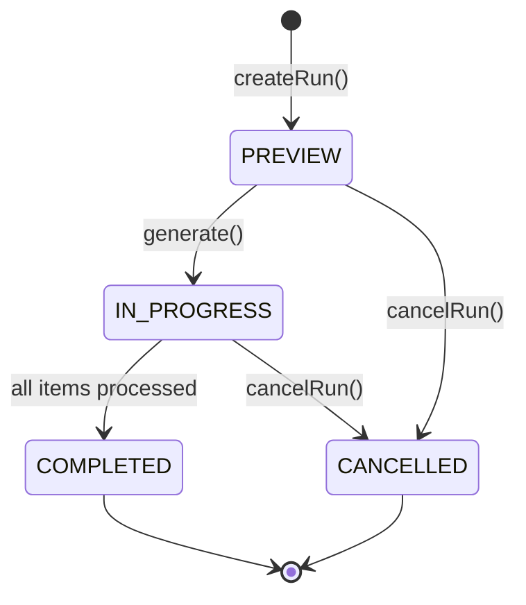
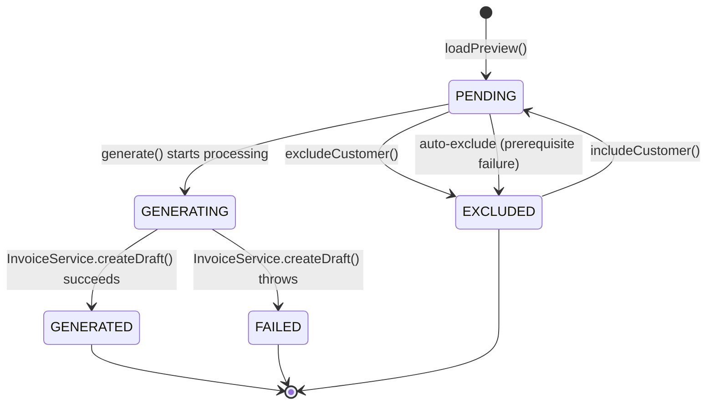
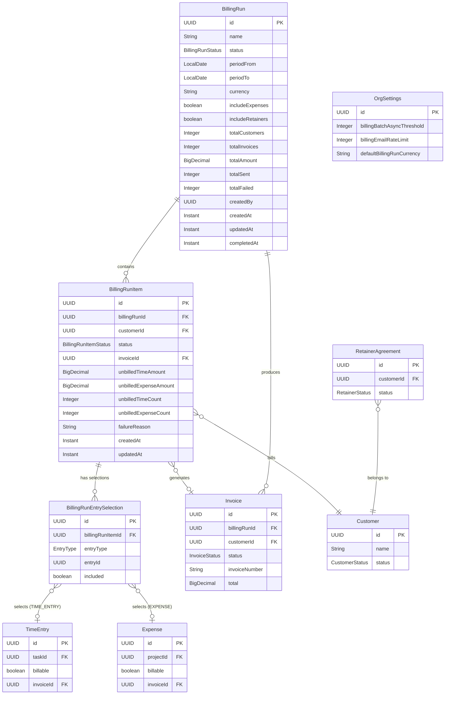
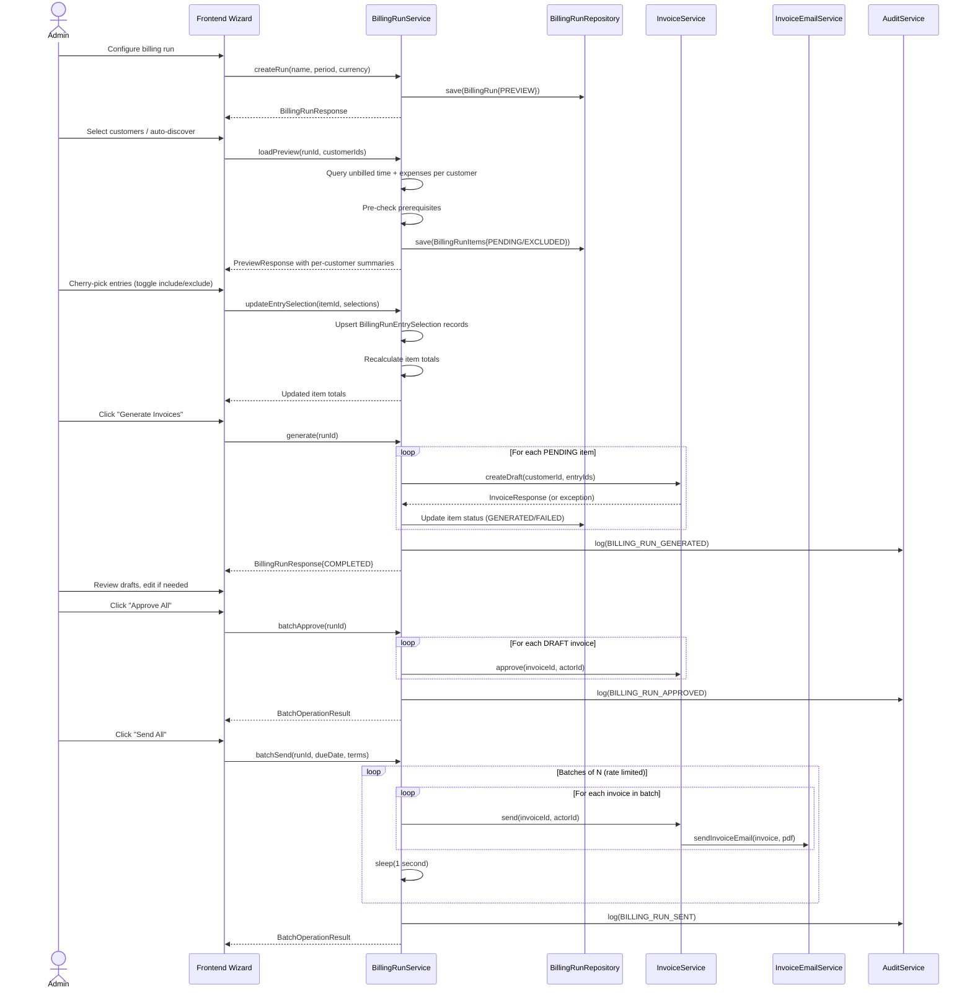
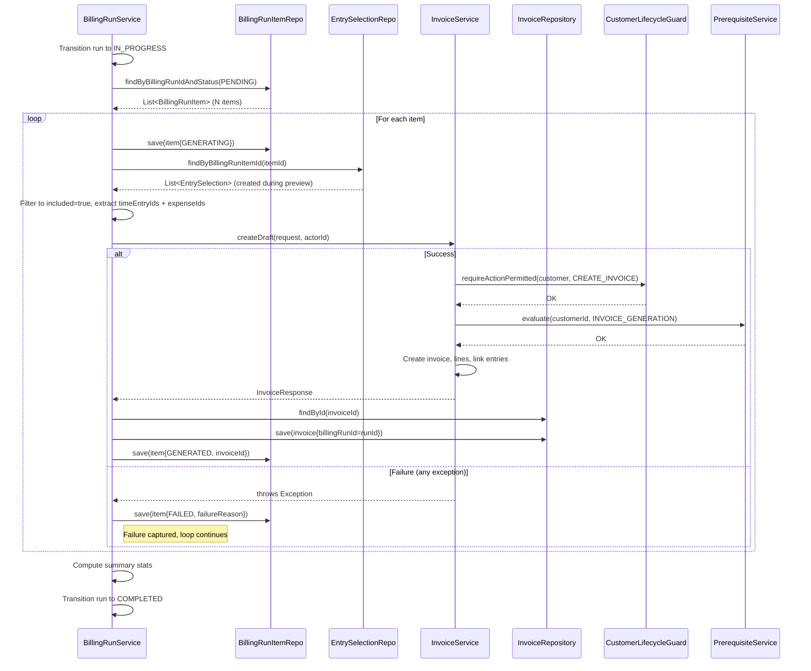
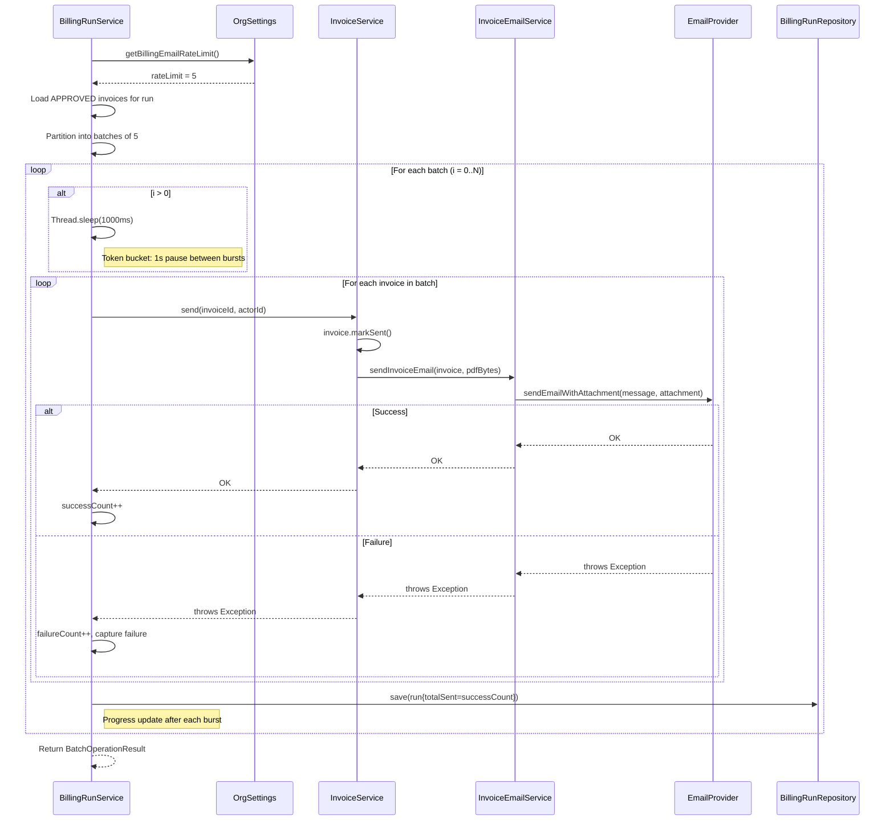

> This is a standalone architecture document for Phase 40. Reference from ARCHITECTURE.md if needed.

# Phase 40 -- Bulk Billing & Batch Operations

---

## 40. Phase 40 -- Bulk Billing & Batch Operations

Phase 40 adds a **bulk billing system** to the DocTeams platform -- the ability to generate, review, approve, and send invoices for multiple customers in a single coordinated workflow called a "billing run." Until now, invoicing is strictly one-customer-at-a-time: open a customer, view unbilled time, select entries, generate a draft, review, approve, send. For a firm with 40 monthly bookkeeping clients, this means repeating the same 6-step workflow 40 times. Month-end billing consumes an entire day instead of an hour. Every competitor in the professional services space (Xero Practice Manager, Harvest, Accelo) offers batch invoice generation. This phase closes the operational gap.

The design introduces a **BillingRun** entity as a coordination layer over existing invoice infrastructure. A billing run does not create a new type of invoice -- it creates standard `Invoice` entities via the existing `InvoiceService.createDraft()` method, capturing batch context (preview, selection, generation results, send progress) in dedicated tracking tables. This means all existing invoice behavior -- tax auto-application, custom fields, payment links, PDF generation, automation triggers, audit events -- works identically for batch-generated invoices. The billing run is a convenience wrapper, not a parallel system.

The phase also adds cross-customer unbilled work discovery (a new endpoint showing which customers have billable work in a period), entry-level cherry-picking (include/exclude individual time entries and expenses per customer), batch retainer period closing, and rate-limited email sending for large batches. The frontend delivers a multi-step wizard that guides administrators through the entire billing cycle: configure run, select customers, cherry-pick entries, generate drafts, review, approve, and send.

**Dependencies on prior phases**:
- **Phase 10** (Invoicing): `Invoice`, `InvoiceLine`, `InvoiceService.createDraft()`, `InvoiceService.getUnbilledTime()`, `InvoiceEmailService`. Core invoice infrastructure reused without duplication.
- **Phase 17** (Retainer Billing): `RetainerAgreement`, `RetainerPeriod`, `RetainerPeriodService.closePeriod()`. Batch retainer close delegates to existing period close logic.
- **Phase 24** (Email Delivery): `EmailNotificationChannel`, SMTP and SendGrid adapters. Batch send uses existing email infrastructure with rate limiting.
- **Phase 26** (Tax Handling): `TaxRate`, `TaxCalculationService`. Tax auto-application during batch generation follows existing single-invoice behavior.
- **Phase 30** (Expense Billing): `Expense` entity with billable flag and markup. Unbilled expenses included in billing run previews.
- **Phase 6** (Audit): `AuditService`, `AuditEventBuilder`. Five new audit event types for billing run lifecycle.
- **Phase 6.5** (Notifications): `ApplicationEvent` publication, `NotificationService`. Three notification types for billing run events.
- **Phase 14** (Customer Lifecycle): `CustomerLifecycleGuard`, `PrerequisiteService`. Pre-checked during preview; failures captured per item, not thrown.
- **Phase 37** (Automation): `INVOICE_STATUS_CHANGED` trigger fires per invoice during batch operations. No new trigger types needed.

### What's New

| Capability | Before Phase 40 | After Phase 40 |
|---|---|---|
| Invoice generation | One customer at a time via `InvoiceService.createDraft()` | Batch generation for all customers with unbilled work in a single billing run |
| Unbilled work discovery | Per-customer view only (`getUnbilledTime(customerId)`) | Cross-customer unbilled summary: one endpoint showing all customers with billable work in a period |
| Entry selection | Select time entry IDs when creating a single invoice | Cherry-pick individual time entries and expenses per customer within a billing run, with explicit selection tracking |
| Invoice approval | One invoice at a time | Batch approve all drafts in a billing run |
| Invoice sending | One email at a time | Batch send all approved invoices with rate-limited email dispatch |
| Retainer period close | One agreement at a time via `RetainerPeriodService.closePeriod()` | Batch close multiple retainer periods, generating invoices linked to the billing run |
| Billing history | No batch context -- invoices are independent | Billing run history with statistics: total generated, total amount, sent count, paid count, month-over-month comparison |
| Email rate limiting | Per-email rate check in `EmailRateLimiter` | Configurable burst rate (emails/second) with token-bucket pattern for batch sending |

**Out of scope**: Credit notes and adjustments (separate domain with its own lifecycle). Write-offs (marking unbilled time as non-billable in bulk -- useful but different from billing). Recurring invoice schedules (handled by retainer agreements + recurring schedules). Multi-currency in a single billing run (a run has one currency; customers with work in a different currency are excluded with a warning). Invoice grouping options ("one invoice per project" vs "one invoice per customer" -- v1 does one invoice per customer combining all projects). Approval workflows with thresholds ("partner must approve invoices over R50,000" -- general invoice enhancement, not batch-specific). PDF pre-generation for the entire batch before sending (v1 generates PDFs on-demand, same as single invoices).

---

### 40.1 Overview

Phase 40 establishes the billing run as a first-class entity in the DocTeams domain model. The core insight is that **batch billing is an orchestration problem, not a data model problem**. The invoices produced by a billing run are identical to manually created invoices. The billing run adds coordination: which customers to bill, which entries to include, what succeeded, what failed, and what was sent.

The architecture has three layers:

1. **BillingRun coordination layer** -- `BillingRun`, `BillingRunItem`, `BillingRunEntrySelection` entities track the batch lifecycle from preview through completion. The `BillingRunService` orchestrates the flow, delegating invoice creation and retainer period closing to existing services.
2. **Reused invoice infrastructure** -- `InvoiceService.createDraft()` handles all validation (customer lifecycle, prerequisites, currency, double-billing prevention) and invoice creation. `InvoiceEmailService` handles email delivery. Tax auto-application, custom fields, and payment link generation work unchanged.
3. **Frontend wizard** -- A multi-step guided flow (configure -> select customers -> cherry-pick entries -> generate -> review -> approve -> send) with server-side state persistence (the `BillingRun` entity in `PREVIEW` status acts as the wizard's backing store, so closing the browser doesn't lose work).

The new `billingrun/` package contains all three entities, their repositories, the `BillingRunService` orchestrator, the `BillingRunController`, and supporting DTOs. The only modification to existing packages is adding a `billingRunId` field to the `Invoice` entity and three batch billing configuration fields to `OrgSettings`.

---

### 40.2 Domain Model

Phase 40 introduces three new tenant-scoped entities (`BillingRun`, `BillingRunItem`, `BillingRunEntrySelection`) and extends two existing entities (`Invoice`, `OrgSettings`). All new entities follow the established pattern: plain `@Entity`, UUID PK with `GenerationType.UUID`, `Instant` timestamps, no `@FilterDef`/`@Filter` (dedicated schema handles tenant isolation).

#### 40.2.1 BillingRun Entity (New)

The batch context entity -- tracks a single billing cycle execution from preview through completion or cancellation. A tenant may have at most one billing run in `IN_PROGRESS` status at any time to prevent race conditions on time entry billing flags.

| Field | Java Type | DB Column | DB Type | Constraints | Notes |
|-------|-----------|-----------|---------|-------------|-------|
| `id` | `UUID` | `id` | `UUID` | PK, default `gen_random_uuid()` | Auto-generated |
| `name` | `String` | `name` | `VARCHAR(300)` | Nullable | Human-readable name, e.g., "March 2026 Monthly Billing". Auto-generated if blank. |
| `status` | `BillingRunStatus` | `status` | `VARCHAR(20)` | NOT NULL | `PREVIEW`, `IN_PROGRESS`, `COMPLETED`, `CANCELLED` |
| `periodFrom` | `LocalDate` | `period_from` | `DATE` | NOT NULL | Billing period start (inclusive) |
| `periodTo` | `LocalDate` | `period_to` | `DATE` | NOT NULL | Billing period end (inclusive) |
| `currency` | `String` | `currency` | `VARCHAR(3)` | NOT NULL | ISO 4217 currency code, e.g., `ZAR` |
| `includeExpenses` | `boolean` | `include_expenses` | `BOOLEAN` | NOT NULL, default `true` | Whether to include unbilled expenses in the run |
| `includeRetainers` | `boolean` | `include_retainers` | `BOOLEAN` | NOT NULL, default `false` | Whether to include retainer period close |
| `totalCustomers` | `Integer` | `total_customers` | `INTEGER` | Nullable | Number of customers included (populated after preview) |
| `totalInvoices` | `Integer` | `total_invoices` | `INTEGER` | Nullable | Number of invoices generated (populated after generation) |
| `totalAmount` | `BigDecimal` | `total_amount` | `NUMERIC(14,2)` | Nullable | Sum of all invoice subtotals (populated after generation) |
| `totalSent` | `Integer` | `total_sent` | `INTEGER` | Nullable | Number of invoices sent (updated during batch send) |
| `totalFailed` | `Integer` | `total_failed` | `INTEGER` | Nullable | Number of customers that failed generation |
| `createdBy` | `UUID` | `created_by` | `UUID` | NOT NULL | Member ID of the run creator |
| `createdAt` | `Instant` | `created_at` | `TIMESTAMPTZ` | NOT NULL | Immutable |
| `updatedAt` | `Instant` | `updated_at` | `TIMESTAMPTZ` | NOT NULL | Updated on mutation |
| `completedAt` | `Instant` | `completed_at` | `TIMESTAMPTZ` | Nullable | When the run reached COMPLETED or CANCELLED |

**BillingRunStatus enum**: `PREVIEW`, `IN_PROGRESS`, `COMPLETED`, `CANCELLED`

**Status transition diagram**:



- **PREVIEW**: Billing run created; customer selection and entry cherry-picking in progress. No invoices generated yet. This is the wizard's backing state -- the user can close the browser and resume later.
- **IN_PROGRESS**: Invoice generation has started. Items are being processed one by one. The run transitions to this status at the start of `generate()` and stays here until all items are processed.
- **COMPLETED**: All items have been processed (some may have failed). Summary statistics are populated. Invoices in the run can still be individually edited, approved, or sent. The run itself is immutable at this point.
- **CANCELLED**: Run aborted by user. If any draft invoices were generated, they are voided. Entry selections and items are preserved for audit purposes but the run cannot be resumed.

**Design decision -- one active run per tenant**: A billing run in `IN_PROGRESS` status blocks creating another run for the same tenant. This prevents race conditions where two concurrent runs could attempt to bill the same time entries. The `PREVIEW` status does not block -- a firm could have a draft billing run in preview while preparing parameters, but only one can be generating invoices at a time. This is enforced by a check in `BillingRunService.generate()`, not by a database constraint, because `PREVIEW` runs should coexist freely.

#### 40.2.2 BillingRunItem Entity (New)

Per-customer tracking within a billing run. Each item represents one customer's participation in the batch -- their unbilled work preview, selection state, generation result, and linked invoice.

| Field | Java Type | DB Column | DB Type | Constraints | Notes |
|-------|-----------|-----------|---------|-------------|-------|
| `id` | `UUID` | `id` | `UUID` | PK, default `gen_random_uuid()` | Auto-generated |
| `billingRunId` | `UUID` | `billing_run_id` | `UUID` | NOT NULL, FK -> billing_runs | Parent billing run |
| `customerId` | `UUID` | `customer_id` | `UUID` | NOT NULL, FK -> customers | The customer being billed |
| `status` | `BillingRunItemStatus` | `status` | `VARCHAR(20)` | NOT NULL | `PENDING`, `GENERATING`, `GENERATED`, `FAILED`, `EXCLUDED` |
| `invoiceId` | `UUID` | `invoice_id` | `UUID` | Nullable, FK -> invoices | Set after successful generation |
| `unbilledTimeAmount` | `BigDecimal` | `unbilled_time_amount` | `NUMERIC(14,2)` | Nullable | Preview: total unbilled time value for this customer in the period |
| `unbilledExpenseAmount` | `BigDecimal` | `unbilled_expense_amount` | `NUMERIC(14,2)` | Nullable | Preview: total unbilled expense value |
| `unbilledTimeCount` | `Integer` | `unbilled_time_count` | `INTEGER` | Nullable | Number of unbilled time entries |
| `unbilledExpenseCount` | `Integer` | `unbilled_expense_count` | `INTEGER` | Nullable | Number of unbilled expenses |
| `failureReason` | `String` | `failure_reason` | `VARCHAR(1000)` | Nullable | If status = FAILED, the reason (e.g., "Customer is not in ACTIVE status") |
| `createdAt` | `Instant` | `created_at` | `TIMESTAMPTZ` | NOT NULL | Immutable |
| `updatedAt` | `Instant` | `updated_at` | `TIMESTAMPTZ` | NOT NULL | Updated on mutation |

**Unique constraint**: `UNIQUE(billing_run_id, customer_id)` -- a customer can appear at most once per billing run.

**BillingRunItemStatus enum**: `PENDING`, `GENERATING`, `GENERATED`, `FAILED`, `EXCLUDED`

**Status transition diagram**:



- **PENDING**: Customer included in the run, waiting for generation. Preview amounts populated.
- **GENERATING**: Currently being processed by `generate()`. Transient status visible only during batch execution.
- **GENERATED**: Invoice successfully created. `invoiceId` is set.
- **FAILED**: Invoice creation failed. `failureReason` captures the error message from `InvoiceService.createDraft()` or prerequisite validation.
- **EXCLUDED**: Customer explicitly excluded by the user or auto-excluded due to prerequisite issues. Can be re-included before generation.

#### 40.2.3 BillingRunEntrySelection Entity (New)

Tracks which time entries and expenses the user selected or deselected during the preview/cherry-pick step. Without explicit selection tracking, the set of unbilled entries could change between preview and generation (e.g., a team member logs new time during the review period). Storing explicit inclusions ensures deterministic generation -- exactly the entries the user reviewed and approved get billed.

| Field | Java Type | DB Column | DB Type | Constraints | Notes |
|-------|-----------|-----------|---------|-------------|-------|
| `id` | `UUID` | `id` | `UUID` | PK, default `gen_random_uuid()` | Auto-generated |
| `billingRunItemId` | `UUID` | `billing_run_item_id` | `UUID` | NOT NULL, FK -> billing_run_items | Parent item (customer in the run) |
| `entryType` | `EntryType` | `entry_type` | `VARCHAR(20)` | NOT NULL | `TIME_ENTRY` or `EXPENSE` |
| `entryId` | `UUID` | `entry_id` | `UUID` | NOT NULL | FK to `time_entries` or `expenses` (polymorphic, not enforced by DB FK) |
| `included` | `boolean` | `included` | `BOOLEAN` | NOT NULL, default `true` | Whether this entry is included in generation |
| `createdAt` | `Instant` | `created_at` | `TIMESTAMPTZ` | NOT NULL, default `now()` | Record creation time |
| `updatedAt` | `Instant` | `updated_at` | `TIMESTAMPTZ` | NOT NULL, default `now()` | Last modification time |

**Unique constraint**: `UNIQUE(billing_run_item_id, entry_type, entry_id)` -- each entry can appear at most once per item.

**Design decision -- explicit selection vs. snapshot**: See [ADR-158](../adr/ADR-158-explicit-entry-selection-vs-snapshot.md). We store explicit selection records rather than snapshotting all unbilled entries at preview time. **During `loadPreview()`, a `BillingRunEntrySelection` record is created for every unbilled time entry and expense discovered, with `included = true` by default.** This means: (a) if a user doesn't cherry-pick, all preview entries have selection records and are included in generation; (b) if a user does cherry-pick, they toggle `included` to `false` on specific entries; (c) entries logged after the preview but before generation do not sneak into the batch because they have no selection record. Generation always resolves from `BillingRunEntrySelection` records -- it never falls back to a live unbilled query. This guarantees deterministic generation: exactly the entries visible at preview time (minus any the user excluded) get billed.

**Design decision -- polymorphic entryId**: The `entryId` column references either `time_entries.id` or `expenses.id` based on `entryType`. We use a discriminator column (`entryType`) rather than separate tables because the selection logic is identical for both types and the table is transient (selections are only meaningful during the PREVIEW phase). A database-level FK constraint is not added because it would require two nullable FK columns instead.

#### 40.2.4 Invoice Entity Extension

The existing `Invoice` entity (in `io.b2mash.b2b.b2bstrawman.invoice`) gains one new field:

| Field | Java Type | DB Column | DB Type | Constraints | Notes |
|-------|-----------|-----------|---------|-------------|-------|
| `billingRunId` | `UUID` | `billing_run_id` | `UUID` | Nullable, FK -> billing_runs | Set when the invoice is created via a billing run. NULL for manually created invoices. |

This field enables:
- Filtering invoices by billing run (e.g., "show all invoices from the March 2026 run")
- "Created via billing run" indicator in the UI
- Batch operations: approve/send all invoices linked to a run
- Cascade void on run cancellation

No changes to existing invoice behavior -- `billingRunId` is informational only. The field is set by `BillingRunService` after `InvoiceService.createDraft()` returns the created invoice.

#### 40.2.5 OrgSettings Entity Extension

The existing `OrgSettings` entity (in `io.b2mash.b2b.b2bstrawman.settings`) gains three new fields:

| Field | Java Type | DB Column | DB Type | Constraints | Notes |
|-------|-----------|-----------|---------|-------------|-------|
| `billingBatchAsyncThreshold` | `Integer` | `billing_batch_async_threshold` | `INTEGER` | NOT NULL, default `50` | Customer count above which batch runs async with polling |
| `billingEmailRateLimit` | `Integer` | `billing_email_rate_limit` | `INTEGER` | NOT NULL, default `5` | Emails per second during batch send |
| `defaultBillingRunCurrency` | `String` | `default_billing_run_currency` | `VARCHAR(3)` | Nullable | Pre-fill currency on new billing runs. Falls back to `defaultCurrency` if null. |

These fields are managed via the existing Settings page and included in the `OrgSettingsResponse` DTO.

#### 40.2.6 ER Diagram



---

### 40.3 Core Flows and Backend Behaviour

All billing run operations require `org:admin` or `org:owner` role. Batch billing is an administrative function -- regular members cannot initiate, modify, or complete billing runs.

#### 40.3.1 Billing Run Lifecycle

The billing run lifecycle follows a linear progression with an escape hatch (cancel) available at every stage:

1. **Create** -- Admin creates a billing run, specifying the billing period, currency, and inclusion flags (expenses, retainers). The run is created in `PREVIEW` status. At this point, no customers are selected and no invoices exist.

2. **Preview** -- Admin triggers preview loading. The system discovers customers with unbilled work in the period (auto-discovery) or processes a provided list of customer IDs. For each customer, unbilled time entries and expenses are queried and summarized. Customers failing prerequisite checks are auto-excluded with a reason. `BillingRunItem` records are created in `PENDING` (or `EXCLUDED`) status.

3. **Cherry-pick** -- Admin reviews per-customer unbilled entries and selectively includes/excludes individual time entries and expenses. `BillingRunEntrySelection` records track these choices. Customer-level exclusion/inclusion is also available. Preview totals recalculate as selections change.

4. **Generate** -- Admin triggers batch generation. The run transitions to `IN_PROGRESS`. For each `PENDING` item, `InvoiceService.createDraft()` is called with the customer ID and selected entry IDs. Successes set the item to `GENERATED` and link the invoice. Failures set the item to `FAILED` with the error message. After all items are processed, the run transitions to `COMPLETED` with summary statistics.

5. **Review** -- Admin reviews generated drafts within the billing run context. Individual invoices can be edited (line items, due dates, notes, payment terms) using existing invoice editing capabilities. Failed items show failure reasons.

6. **Approve** -- Admin triggers batch approval. All `DRAFT` invoices linked to the run are approved via `InvoiceService.approve()`. Results reported per invoice.

7. **Send** -- Admin triggers batch send. All `APPROVED` invoices are sent with rate-limited email dispatch. Default due date and payment terms can be applied to invoices missing them. Progress updates as emails are dispatched.

8. **Complete** -- The run remains in `COMPLETED` status as a historical record. Summary statistics (total generated, total amount, sent count, paid count) are available for month-over-month comparison.

#### 40.3.2 Preview & Customer Discovery

When `loadPreview()` is called with an empty or null `customerIds` list, the system auto-discovers all active customers with unbilled work in the billing period. This is the primary use case -- "bill everyone who has unbilled work this month."

**Auto-discovery SQL query** (cross-customer unbilled summary):

```sql
SELECT
    c.id AS customer_id,
    c.name AS customer_name,
    c.email AS customer_email,
    COUNT(DISTINCT te.id) AS unbilled_time_count,
    COALESCE(SUM(
        CASE WHEN te.id IS NOT NULL
        THEN (te.duration_minutes / 60.0) * te.billing_rate_snapshot
        ELSE 0 END
    ), 0) AS unbilled_time_amount,
    COUNT(DISTINCT e.id) AS unbilled_expense_count,
    COALESCE(SUM(
        CASE WHEN e.id IS NOT NULL
        THEN e.amount * (1 + COALESCE(e.markup_percent, 0) / 100.0)
        ELSE 0 END
    ), 0) AS unbilled_expense_amount
FROM customers c
JOIN customer_projects cp ON cp.customer_id = c.id
JOIN projects p ON cp.project_id = p.id
LEFT JOIN tasks t ON t.project_id = p.id
LEFT JOIN time_entries te ON te.task_id = t.id
    AND te.billable = true
    AND te.invoice_id IS NULL
    AND te.billing_rate_currency = :currency
    AND te.date >= :periodFrom
    AND te.date <= :periodTo
LEFT JOIN expenses e ON e.project_id = p.id
    AND e.billable = true
    AND e.invoice_id IS NULL
    AND e.currency = :currency
    AND e.date >= :periodFrom
    AND e.date <= :periodTo
WHERE c.status = 'ACTIVE'
GROUP BY c.id, c.name, c.email
HAVING COUNT(DISTINCT te.id) > 0 OR COUNT(DISTINCT e.id) > 0
ORDER BY c.name
```

This query:
- Joins customers through `customer_projects` -> `projects` -> `tasks` -> `time_entries` and `projects` -> `expenses`
- Filters to `ACTIVE` customers only (non-ACTIVE customers cannot have invoices created per `CustomerLifecycleGuard`)
- Filters to billable, unbilled entries within the period and matching currency
- Aggregates per customer: count and amount for time entries and expenses separately
- Excludes customers with zero unbilled work via `HAVING`

**Prerequisite pre-check**: After discovering customers, each is checked against `PrerequisiteService.evaluate(customerId, PrerequisiteContext.INVOICE_GENERATION)`. Customers failing prerequisites are auto-excluded in the `BillingRunItem` with `status = EXCLUDED` and `failureReason` describing the issue (e.g., "Missing required field: Tax Registration Number"). The admin sees these in the preview with a warning icon and can resolve the prerequisite issue and re-include the customer.

**Currency filtering**: A billing run has a single currency. The discovery query filters time entries and expenses by `billing_rate_currency = :currency` and `e.currency = :currency` respectively. Customers with unbilled work only in a different currency are excluded from the results entirely. This avoids multi-currency complexity in a single run.

#### 40.3.3 Entry Selection (Cherry-Pick)

The cherry-pick flow allows administrators to include or exclude individual time entries and expenses per customer before generation. This is the novel data-tracking component of the phase -- existing invoice creation accepts `timeEntryIds` and `expenseIds`, but there is no mechanism to persist a user's selection state across sessions.

**How it works**:

1. After preview, the admin expands a customer's section in the wizard to see all unbilled time entries and expenses.
2. Each entry has an include/exclude checkbox. By default, all entries are included.
3. When the admin toggles an entry, the frontend calls `PUT /api/billing-runs/{id}/items/{itemId}/selections` with an array of `{entryType, entryId, included}` records.
4. The backend upserts `BillingRunEntrySelection` records and recalculates the item's preview totals (`unbilledTimeAmount`, `unbilledExpenseAmount`, `unbilledTimeCount`, `unbilledExpenseCount`) based on included entries only.
5. At generation time, `BillingRunService` resolves the entry IDs from `BillingRunEntrySelection` records where `included = true`. Selection records are always present — they are created for all discovered entries during `loadPreview()`.

**Deterministic generation**: Because selection records are created during preview for every discovered entry (all `included = true` by default), generation always resolves from these records — never from a live unbilled query. If a team member logs new time between preview and generation, those entries have no selection record and are not included. This prevents surprise charges. The admin can re-run preview to pick up new entries if desired.

**Recalculation on selection change**:

```java
// Pseudocode for recalculating item preview totals
public void recalculateItemTotals(BillingRunItem item) {
    List<BillingRunEntrySelection> selections =
        entrySelectionRepository.findByBillingRunItemId(item.getId());

    // selections are always created during loadPreview() -- never empty for active items
    List<UUID> includedTimeEntryIds = selections.stream()
        .filter(s -> s.getEntryType() == EntryType.TIME_ENTRY && s.isIncluded())
        .map(BillingRunEntrySelection::getEntryId)
        .toList();

    List<UUID> includedExpenseIds = selections.stream()
        .filter(s -> s.getEntryType() == EntryType.EXPENSE && s.isIncluded())
        .map(BillingRunEntrySelection::getEntryId)
        .toList();

    BigDecimal timeAmount = timeEntryRepository.sumBillableAmountByIds(includedTimeEntryIds);
    BigDecimal expenseAmount = expenseRepository.sumBillableAmountByIds(includedExpenseIds);

    item.setUnbilledTimeAmount(timeAmount);
    item.setUnbilledTimeCount(includedTimeEntryIds.size());
    item.setUnbilledExpenseAmount(expenseAmount);
    item.setUnbilledExpenseCount(includedExpenseIds.size());
    item.setUpdatedAt(Instant.now());
}
```

#### 40.3.4 Batch Invoice Generation

The `generate()` method is the core of the billing run. It transitions the run from `PREVIEW` to `IN_PROGRESS`, processes each `PENDING` item, and transitions to `COMPLETED` when done.

**Flow**:

```java
// No @Transactional -- per-customer transactions via TransactionTemplate
public BillingRunResponse generate(UUID billingRunId, UUID actorMemberId) {
    BillingRun run = loadAndValidate(billingRunId, BillingRunStatus.PREVIEW);

    // Guard: no other run IN_PROGRESS for this tenant
    if (billingRunRepository.existsByStatusIn(List.of(BillingRunStatus.IN_PROGRESS))) {
        throw new IllegalStateException("Another billing run is already in progress");
    }

    run.setStatus(BillingRunStatus.IN_PROGRESS);
    run.setUpdatedAt(Instant.now());
    billingRunRepository.save(run);

    List<BillingRunItem> pendingItems = billingRunItemRepository
        .findByBillingRunIdAndStatus(billingRunId, BillingRunItemStatus.PENDING);

    int successCount = 0;
    int failureCount = 0;
    BigDecimal totalAmount = BigDecimal.ZERO;

    for (BillingRunItem item : pendingItems) {
        item.setStatus(BillingRunItemStatus.GENERATING);
        item.setUpdatedAt(Instant.now());
        billingRunItemRepository.save(item);

        try {
            // 1. Resolve selected entries
            List<UUID> timeEntryIds = resolveSelectedTimeEntryIds(item);
            List<UUID> expenseIds = resolveSelectedExpenseIds(item);

            // 2. Build CreateInvoiceRequest
            CreateInvoiceRequest request = new CreateInvoiceRequest(
                item.getCustomerId(),
                run.getCurrency(),
                null, // dueDate -- set later in review
                null, // notes
                null, // paymentTerms
                timeEntryIds,
                expenseIds
            );

            // 3. Delegate to existing InvoiceService
            InvoiceResponse invoice = invoiceService.createDraft(request, actorMemberId);

            // 4. Link invoice to billing run
            Invoice invoiceEntity = invoiceRepository.findById(invoice.id()).orElseThrow();
            invoiceEntity.setBillingRunId(billingRunId);
            invoiceRepository.save(invoiceEntity);

            // 5. Update item
            item.setStatus(BillingRunItemStatus.GENERATED);
            item.setInvoiceId(invoice.id());
            successCount++;
            totalAmount = totalAmount.add(invoice.total());

        } catch (Exception e) {
            // 6. Capture failure -- do NOT rethrow
            item.setStatus(BillingRunItemStatus.FAILED);
            item.setFailureReason(truncate(e.getMessage(), 1000));
            failureCount++;
        }

        item.setUpdatedAt(Instant.now());
        billingRunItemRepository.save(item);
    }

    // 7. Complete the run
    run.setStatus(BillingRunStatus.COMPLETED);
    run.setTotalInvoices(successCount);
    run.setTotalFailed(failureCount);
    run.setTotalAmount(totalAmount);
    run.setCompletedAt(Instant.now());
    run.setUpdatedAt(Instant.now());
    billingRunRepository.save(run);

    // 8. Publish events
    auditService.log(AuditEventBuilder.billingRunGenerated(run, successCount, failureCount));
    if (failureCount > 0) {
        eventPublisher.publishEvent(new BillingRunFailuresEvent(run, failureCount));
    }
    eventPublisher.publishEvent(new BillingRunCompletedEvent(run));

    return toBillingRunResponse(run);
}
```

**Failure isolation**: Each customer's invoice creation is wrapped in a try-catch. A failure for one customer (e.g., inactive status, missing prerequisite, currency mismatch) does not abort the entire batch. The failure reason is captured in `BillingRunItem.failureReason` and surfaced in the UI. The admin can fix the issue and manually create an invoice for the failed customer.

**Transaction boundary**: The `generate()` method is NOT annotated with `@Transactional`. Instead, each customer's invoice creation runs in its own transaction via `TransactionTemplate` with `REQUIRES_NEW` propagation. This ensures: (a) a failure for one customer does not roll back invoices already generated for other customers; (b) long-running batches do not hold a single database transaction open. The run status transition (PREVIEW -> IN_PROGRESS) is committed in a separate leading transaction. The final stats update and COMPLETED transition happen in a trailing transaction. For the async path (batches > `OrgSettings.billingBatchAsyncThreshold`), the same per-customer `TransactionTemplate` logic runs on a separate thread with progress updates via polling.

**Reuse of InvoiceService.createDraft()**: The billing run does NOT duplicate any invoice creation logic. It constructs a `CreateInvoiceRequest` and calls `InvoiceService.createDraft()`, which handles: customer validation, lifecycle guard checks, prerequisite evaluation, line item creation, time entry linking (double-billing prevention), expense billing, tax auto-application, custom field application, audit event creation, and event publication. This ensures batch-generated invoices are identical to manually created ones.

#### 40.3.5 Retainer Batch Close

When `includeRetainers = true` on the billing run, the system discovers retainer agreements with periods due for close within the billing period.

**Preview**:

```java
public List<RetainerPeriodPreview> loadRetainerPreview(UUID billingRunId) {
    BillingRun run = loadAndValidate(billingRunId);

    // Find all ACTIVE retainer agreements where:
    // - The agreement has an OPEN period
    // - The period's endDate falls within [run.periodFrom, run.periodTo]
    List<RetainerAgreement> agreements = retainerAgreementRepository
        .findActiveWithDuePeriodsInRange(run.getPeriodFrom(), run.getPeriodTo());

    return agreements.stream().map(agreement -> {
        RetainerPeriod openPeriod = retainerPeriodRepository
            .findByAgreementIdAndStatus(agreement.getId(), PeriodStatus.OPEN)
            .orElseThrow();

        return new RetainerPeriodPreview(
            agreement.getId(),
            agreement.getCustomerId(),
            customerRepository.findById(agreement.getCustomerId())
                .map(Customer::getName).orElse("Unknown"),
            openPeriod.getPeriodStart(),
            openPeriod.getPeriodEnd(),
            openPeriod.getConsumedHours(),
            agreement.getPeriodFee()
        );
    }).toList();
}
```

**Generation**:

```java
public List<BillingRunItem> generateRetainerInvoices(
        UUID billingRunId, List<UUID> retainerAgreementIds, UUID actorMemberId) {

    BillingRun run = loadAndValidate(billingRunId);
    List<BillingRunItem> items = new ArrayList<>();

    for (UUID agreementId : retainerAgreementIds) {
        try {
            // Delegate to existing RetainerPeriodService
            RetainerPeriodCloseResult result =
                retainerPeriodService.closePeriod(agreementId, actorMemberId);

            // Link the generated invoice to the billing run
            Invoice invoice = invoiceRepository.findById(result.invoiceId()).orElseThrow();
            invoice.setBillingRunId(billingRunId);
            invoiceRepository.save(invoice);

            // Create a BillingRunItem for tracking
            RetainerAgreement agreement = retainerAgreementRepository
                .findById(agreementId).orElseThrow();
            BillingRunItem item = new BillingRunItem(
                billingRunId, agreement.getCustomerId(),
                BillingRunItemStatus.GENERATED);
            item.setInvoiceId(result.invoiceId());
            items.add(billingRunItemRepository.save(item));

        } catch (Exception e) {
            RetainerAgreement agreement = retainerAgreementRepository
                .findById(agreementId).orElseThrow();
            BillingRunItem item = new BillingRunItem(
                billingRunId, agreement.getCustomerId(),
                BillingRunItemStatus.FAILED);
            item.setFailureReason(truncate(e.getMessage(), 1000));
            items.add(billingRunItemRepository.save(item));
        }
    }

    // Update run totals
    recalculateRunTotals(billingRunId);
    return items;
}
```

**Design decision**: Retainer batch close delegates to `RetainerPeriodService.closePeriod()`, which is a 12-step process including consumption finalization, overage calculation, invoice creation, period closing, and next period opening. The billing run does not modify or abbreviate this process. Each retainer close produces a standard invoice that then participates in batch approve/send like any other invoice in the run.

#### 40.3.6 Batch Approve & Send

**Batch Approve**:

```java
public BatchOperationResult batchApprove(UUID billingRunId, UUID actorMemberId) {
    BillingRun run = loadAndValidate(billingRunId, BillingRunStatus.COMPLETED);

    List<BillingRunItem> generatedItems = billingRunItemRepository
        .findByBillingRunIdAndStatus(billingRunId, BillingRunItemStatus.GENERATED);

    int successCount = 0;
    int failureCount = 0;
    List<BatchFailure> failures = new ArrayList<>();

    for (BillingRunItem item : generatedItems) {
        try {
            Invoice invoice = invoiceRepository.findById(item.getInvoiceId()).orElseThrow();
            if (invoice.getStatus() == InvoiceStatus.DRAFT) {
                invoiceService.approve(invoice.getId(), actorMemberId);
                successCount++;
            }
        } catch (Exception e) {
            failureCount++;
            failures.add(new BatchFailure(item.getInvoiceId(), e.getMessage()));
        }
    }

    return new BatchOperationResult(successCount, failureCount, failures);
}
```

**Batch Send** with rate limiting:

```java
public BatchOperationResult batchSend(UUID billingRunId,
        LocalDate defaultDueDate, String defaultPaymentTerms, UUID actorMemberId) {

    BillingRun run = loadAndValidate(billingRunId, BillingRunStatus.COMPLETED);
    OrgSettings settings = orgSettingsService.getSettings();
    int rateLimit = settings.getBillingEmailRateLimit(); // default 5

    List<BillingRunItem> generatedItems = billingRunItemRepository
        .findByBillingRunIdAndStatus(billingRunId, BillingRunItemStatus.GENERATED);

    // Filter to APPROVED invoices only
    List<Invoice> approvedInvoices = generatedItems.stream()
        .filter(item -> item.getInvoiceId() != null)
        .map(item -> invoiceRepository.findById(item.getInvoiceId()).orElse(null))
        .filter(inv -> inv != null && inv.getStatus() == InvoiceStatus.APPROVED)
        .toList();

    // Apply defaults to invoices missing due date or payment terms
    for (Invoice invoice : approvedInvoices) {
        boolean updated = false;
        if (invoice.getDueDate() == null && defaultDueDate != null) {
            invoice.setDueDate(defaultDueDate);
            updated = true;
        }
        if (invoice.getPaymentTerms() == null && defaultPaymentTerms != null) {
            invoice.setPaymentTerms(defaultPaymentTerms);
            updated = true;
        }
        if (updated) {
            invoice.setUpdatedAt(Instant.now());
            invoiceRepository.save(invoice);
        }
    }

    // Rate-limited sending: process in bursts of rateLimit, sleep 1s between bursts
    int successCount = 0;
    int failureCount = 0;
    List<BatchFailure> failures = new ArrayList<>();

    List<List<Invoice>> batches = partition(approvedInvoices, rateLimit);
    for (int i = 0; i < batches.size(); i++) {
        if (i > 0) {
            Thread.sleep(1000); // Token bucket: 1 second between bursts
        }
        for (Invoice invoice : batches.get(i)) {
            try {
                invoiceService.send(invoice.getId(), actorMemberId);
                successCount++;
            } catch (Exception e) {
                failureCount++;
                failures.add(new BatchFailure(invoice.getId(), e.getMessage()));
            }
        }
        // Update progress
        run.setTotalSent(successCount);
        run.setUpdatedAt(Instant.now());
        billingRunRepository.save(run);
    }

    // Audit
    auditService.log(AuditEventBuilder.billingRunSent(run, successCount, run.getTotalAmount()));
    eventPublisher.publishEvent(new BillingRunSentEvent(run));

    return new BatchOperationResult(successCount, failureCount, failures);
}
```

The `INVOICE_STATUS_CHANGED` automation trigger fires per invoice as each transitions from `DRAFT` -> `APPROVED` and `APPROVED` -> `SENT`. Existing automations (e.g., "notify project lead when invoice is sent") work automatically for batch-generated invoices.

#### 40.3.7 Cancel & Cleanup

```java
public void cancelRun(UUID billingRunId, UUID actorMemberId) {
    BillingRun run = billingRunRepository.findById(billingRunId)
        .orElseThrow(() -> new NotFoundException("Billing run not found"));

    if (run.getStatus() == BillingRunStatus.PREVIEW) {
        // Preview only -- no invoices exist. Delete items and run.
        billingRunEntrySelectionRepository.deleteByBillingRunId(billingRunId);
        billingRunItemRepository.deleteByBillingRunId(billingRunId);
        billingRunRepository.delete(run);
        return;
    }

    if (run.getStatus() == BillingRunStatus.IN_PROGRESS
            || run.getStatus() == BillingRunStatus.COMPLETED) {
        // Void all DRAFT invoices created by this run
        List<Invoice> draftInvoices = invoiceRepository
            .findByBillingRunIdAndStatus(billingRunId, InvoiceStatus.DRAFT);

        int voidedCount = 0;
        for (Invoice invoice : draftInvoices) {
            // Unbill time entries and expenses linked to this invoice
            timeEntryRepository.unbillByInvoiceId(invoice.getId());
            expenseRepository.unbillByInvoiceId(invoice.getId());

            // Note: DRAFT invoices cannot be voided via invoice.voidInvoice()
            // (that method requires APPROVED or SENT). For DRAFT, we delete directly.
            invoiceLineRepository.deleteByInvoiceId(invoice.getId());
            invoiceRepository.delete(invoice);
            voidedCount++;
        }

        // Mark run as cancelled (do not delete -- preserve audit trail)
        run.setStatus(BillingRunStatus.CANCELLED);
        run.setCompletedAt(Instant.now());
        run.setUpdatedAt(Instant.now());
        billingRunRepository.save(run);

        auditService.log(AuditEventBuilder.billingRunCancelled(run, voidedCount));
    }
}
```

**Important**: Only `DRAFT` invoices are deleted/voided on cancellation. Invoices that have already been approved or sent are NOT affected -- they have left the billing run's control and must be managed individually. The cancellation captures a `voidedInvoiceCount` in the audit event for accountability.

**Implementation note -- cancel bypasses InvoiceService**: The cancel path directly unbills time entries/expenses and deletes DRAFT invoices via repositories, bypassing `InvoiceService`. This is intentional: `Invoice.voidInvoice()` only works for APPROVED/SENT status, and DRAFT invoices have no invoice number or downstream effects to reverse. However, if `InvoiceService.createDraft()` is extended in the future with additional side effects (e.g., counter updates, cache invalidation), a `reverseDraft(invoiceId)` method should be extracted on `InvoiceService` to centralize draft reversal logic. For now, the direct approach is correct and simpler.

---

### 40.4 API Surface

All billing run endpoints require `org:admin` or `org:owner` role. The controller is `BillingRunController` in the `billingrun/` package.

#### Billing Run CRUD

| Method | Path | Description | Auth | R/W |
|--------|------|-------------|------|-----|
| `POST` | `/api/billing-runs` | Create a new billing run in PREVIEW status | admin, owner | Write |
| `GET` | `/api/billing-runs` | List billing runs (paginated, filter by status) | admin, owner | Read |
| `GET` | `/api/billing-runs/{id}` | Get billing run with summary stats | admin, owner | Read |
| `DELETE` | `/api/billing-runs/{id}` | Cancel and cleanup a billing run | admin, owner | Write |

#### Billing Run Items & Preview

| Method | Path | Description | Auth | R/W |
|--------|------|-------------|------|-----|
| `POST` | `/api/billing-runs/{id}/preview` | Load preview (auto-discover or specific customer IDs) | admin, owner | Write |
| `GET` | `/api/billing-runs/{id}/items` | List billing run items with preview data | admin, owner | Read |
| `GET` | `/api/billing-runs/{id}/items/{itemId}` | Get single item detail | admin, owner | Read |
| `GET` | `/api/billing-runs/{id}/items/{itemId}/unbilled-time` | Get unbilled time entries for cherry-pick | admin, owner | Read |
| `GET` | `/api/billing-runs/{id}/items/{itemId}/unbilled-expenses` | Get unbilled expenses for cherry-pick | admin, owner | Read |

#### Entry Selection & Cherry-Pick

| Method | Path | Description | Auth | R/W |
|--------|------|-------------|------|-----|
| `PUT` | `/api/billing-runs/{id}/items/{itemId}/selections` | Update entry selections for a customer | admin, owner | Write |
| `PUT` | `/api/billing-runs/{id}/items/{itemId}/exclude` | Exclude customer from run | admin, owner | Write |
| `PUT` | `/api/billing-runs/{id}/items/{itemId}/include` | Re-include customer in run | admin, owner | Write |

#### Batch Operations

| Method | Path | Description | Auth | R/W |
|--------|------|-------------|------|-----|
| `POST` | `/api/billing-runs/{id}/generate` | Generate draft invoices for all PENDING items | admin, owner | Write |
| `POST` | `/api/billing-runs/{id}/approve` | Batch approve all DRAFT invoices in the run | admin, owner | Write |
| `POST` | `/api/billing-runs/{id}/send` | Batch send all APPROVED invoices with rate limiting | admin, owner | Write |

#### Retainer Batch

| Method | Path | Description | Auth | R/W |
|--------|------|-------------|------|-----|
| `GET` | `/api/billing-runs/{id}/retainer-preview` | Preview retainer periods due for close | admin, owner | Read |
| `POST` | `/api/billing-runs/{id}/retainer-generate` | Generate retainer invoices for selected agreements | admin, owner | Write |

#### Unbilled Summary (New Cross-Customer Endpoint)

| Method | Path | Description | Auth | R/W |
|--------|------|-------------|------|-----|
| `GET` | `/api/invoices/unbilled-summary` | Cross-customer unbilled summary for a period | admin, owner | Read |

#### Request/Response JSON Shapes

**Create Billing Run** (`POST /api/billing-runs`):

```json
// Request
{
  "name": "March 2026 Monthly Billing",
  "periodFrom": "2026-03-01",
  "periodTo": "2026-03-31",
  "currency": "ZAR",
  "includeExpenses": true,
  "includeRetainers": false
}

// Response
{
  "id": "a1b2c3d4-...",
  "name": "March 2026 Monthly Billing",
  "status": "PREVIEW",
  "periodFrom": "2026-03-01",
  "periodTo": "2026-03-31",
  "currency": "ZAR",
  "includeExpenses": true,
  "includeRetainers": false,
  "totalCustomers": null,
  "totalInvoices": null,
  "totalAmount": null,
  "totalSent": null,
  "totalFailed": null,
  "createdBy": "member-uuid-...",
  "createdAt": "2026-03-07T10:00:00Z",
  "updatedAt": "2026-03-07T10:00:00Z",
  "completedAt": null,
  "items": []
}
```

**Load Preview** (`POST /api/billing-runs/{id}/preview`):

```json
// Request (auto-discover all customers with unbilled work)
{}

// Request (specific customers)
{
  "customerIds": ["customer-uuid-1", "customer-uuid-2", "customer-uuid-3"]
}

// Response
{
  "billingRunId": "a1b2c3d4-...",
  "totalCustomers": 12,
  "totalUnbilledAmount": 245600.00,
  "items": [
    {
      "id": "item-uuid-1",
      "customerId": "customer-uuid-1",
      "customerName": "Acme Corp",
      "status": "PENDING",
      "unbilledTimeAmount": 15400.00,
      "unbilledExpenseAmount": 2300.00,
      "unbilledTimeCount": 47,
      "unbilledExpenseCount": 5,
      "totalUnbilledAmount": 17700.00,
      "hasPrerequisiteIssues": false,
      "prerequisiteIssueReason": null
    },
    {
      "id": "item-uuid-2",
      "customerId": "customer-uuid-2",
      "customerName": "Beta LLC",
      "status": "EXCLUDED",
      "unbilledTimeAmount": 8200.00,
      "unbilledExpenseAmount": 0.00,
      "unbilledTimeCount": 23,
      "unbilledExpenseCount": 0,
      "totalUnbilledAmount": 8200.00,
      "hasPrerequisiteIssues": true,
      "prerequisiteIssueReason": "Missing required field: Tax Registration Number"
    }
  ]
}
```

**Generate** (`POST /api/billing-runs/{id}/generate`):

```json
// Response
{
  "id": "a1b2c3d4-...",
  "status": "COMPLETED",
  "totalCustomers": 12,
  "totalInvoices": 11,
  "totalAmount": 237400.00,
  "totalFailed": 1,
  "completedAt": "2026-03-07T10:05:30Z",
  "items": [
    {
      "id": "item-uuid-1",
      "customerId": "customer-uuid-1",
      "customerName": "Acme Corp",
      "status": "GENERATED",
      "invoiceId": "invoice-uuid-1",
      "invoiceNumber": "INV-2026-0047",
      "invoiceTotal": 17700.00,
      "failureReason": null
    },
    {
      "id": "item-uuid-3",
      "customerId": "customer-uuid-3",
      "customerName": "Gamma Inc",
      "status": "FAILED",
      "invoiceId": null,
      "invoiceNumber": null,
      "invoiceTotal": null,
      "failureReason": "Customer is not in ACTIVE status"
    }
  ]
}
```

**Batch Approve** (`POST /api/billing-runs/{id}/approve`):

```json
// Response
{
  "successCount": 10,
  "failureCount": 1,
  "failures": [
    {
      "invoiceId": "invoice-uuid-5",
      "reason": "Invoice subtotal is zero"
    }
  ]
}
```

**Batch Send** (`POST /api/billing-runs/{id}/send`):

```json
// Request
{
  "defaultDueDate": "2026-04-30",
  "defaultPaymentTerms": "Net 30"
}

// Response
{
  "successCount": 9,
  "failureCount": 1,
  "failures": [
    {
      "invoiceId": "invoice-uuid-7",
      "reason": "Customer email address is missing"
    }
  ]
}
```

**Unbilled Summary** (`GET /api/invoices/unbilled-summary?periodFrom=2026-03-01&periodTo=2026-03-31&currency=ZAR`):

```json
// Response
{
  "periodFrom": "2026-03-01",
  "periodTo": "2026-03-31",
  "currency": "ZAR",
  "totalCustomers": 15,
  "totalUnbilledAmount": 312500.00,
  "customers": [
    {
      "customerId": "customer-uuid-1",
      "customerName": "Acme Corp",
      "customerEmail": "accounts@acme.co.za",
      "unbilledTimeEntryCount": 47,
      "unbilledTimeAmount": 15400.00,
      "unbilledExpenseCount": 5,
      "unbilledExpenseAmount": 2300.00,
      "totalUnbilledAmount": 17700.00,
      "hasPrerequisiteIssues": false,
      "prerequisiteIssueReason": null
    }
  ]
}
```

---

### 40.5 Sequence Diagrams

#### 40.5.1 Full Billing Run Flow (High Level)



#### 40.5.2 Batch Generation with Failure Isolation



#### 40.5.3 Batch Send with Rate Limiting



---

### 40.6 Email Rate Limiting

Billing runs can send dozens or hundreds of emails in rapid succession. Without rate limiting, this risks SMTP server rejection (most SMTP servers limit to 2-5 messages/second) or API throttling (SendGrid free tier: 100 emails/day; paid tiers have per-second limits).

#### Token Bucket Approach

The implementation uses a simple burst-then-pause pattern rather than a sophisticated rate limiter:

1. Load `OrgSettings.billingEmailRateLimit` (default: 5 emails/second)
2. Partition the list of approved invoices into batches of `rateLimit` size
3. Process each batch sequentially, sending emails for all invoices in the batch
4. Sleep 1 second between batches
5. After each batch, update `BillingRun.totalSent` for progress tracking

This delivers an effective rate of `rateLimit` emails/second with a simple, debuggable implementation.

#### Configuration

| Setting | Default | Notes |
|---------|---------|-------|
| `OrgSettings.billingEmailRateLimit` | 5 | Emails per second. Adjustable via Settings page. |
| SMTP recommended | 2 | SMTP servers are typically more constrained. Admin should lower to 2 for SMTP. |
| SendGrid BYOAK | 5-10 | Depends on SendGrid plan tier. |

#### SMTP vs SendGrid Differences

- **SMTP**: Connection-based. Each email opens/reuses a TCP connection. Rate limiting prevents connection exhaustion and server-side throttling. Default of 2/second is conservative for most SMTP servers.
- **SendGrid**: API-based. HTTP POST per email. SendGrid's own rate limiter may also apply. The platform's rate limiter acts as a client-side safety net.

#### Why Not a Full Message Queue

Billing runs are infrequent events (monthly or weekly for most firms) with batch sizes typically under 100. A full message queue (Redis, SQS, RabbitMQ) adds:
- Infrastructure dependency (queue broker)
- Complexity (dead letter queues, retry logic, consumer management)
- Operational overhead (monitoring, alerting)

For the expected load, `Thread.sleep()` between bursts is sufficient and orders of magnitude simpler. If a future phase introduces high-volume email sending (e.g., marketing campaigns), a queue can be introduced at that point. See [ADR-160](../adr/ADR-160-email-rate-limiting-strategy.md).

---

### 40.7 Database Migrations

#### V63 Tenant Migration

File: `backend/src/main/resources/db/migration/tenant/V63__create_billing_run_tables.sql`

```sql
-- =============================================================================
-- V63: Billing Run Tables (Phase 40 — Bulk Billing & Batch Operations)
-- =============================================================================

-- -----------------------------------------------------------------------------
-- 1. billing_runs — batch billing context
-- -----------------------------------------------------------------------------
CREATE TABLE billing_runs (
    id              UUID PRIMARY KEY DEFAULT gen_random_uuid(),
    name            VARCHAR(300),
    status          VARCHAR(20)   NOT NULL DEFAULT 'PREVIEW',
    period_from     DATE          NOT NULL,
    period_to       DATE          NOT NULL,
    currency        VARCHAR(3)    NOT NULL,
    include_expenses  BOOLEAN     NOT NULL DEFAULT true,
    include_retainers BOOLEAN     NOT NULL DEFAULT false,
    total_customers   INTEGER,
    total_invoices    INTEGER,
    total_amount      NUMERIC(14, 2),
    total_sent        INTEGER,
    total_failed      INTEGER,
    created_by      UUID          NOT NULL,
    created_at      TIMESTAMPTZ   NOT NULL DEFAULT now(),
    updated_at      TIMESTAMPTZ   NOT NULL DEFAULT now(),
    completed_at    TIMESTAMPTZ
);

CREATE INDEX idx_billing_runs_status ON billing_runs (status);
CREATE INDEX idx_billing_runs_created_by ON billing_runs (created_by);
CREATE INDEX idx_billing_runs_period ON billing_runs (period_from, period_to);

-- -----------------------------------------------------------------------------
-- 2. billing_run_items — per-customer tracking within a billing run
-- -----------------------------------------------------------------------------
CREATE TABLE billing_run_items (
    id                      UUID PRIMARY KEY DEFAULT gen_random_uuid(),
    billing_run_id          UUID          NOT NULL REFERENCES billing_runs (id) ON DELETE CASCADE,
    customer_id             UUID          NOT NULL REFERENCES customers (id),
    status                  VARCHAR(20)   NOT NULL DEFAULT 'PENDING',
    invoice_id              UUID          REFERENCES invoices (id),
    unbilled_time_amount    NUMERIC(14, 2),
    unbilled_expense_amount NUMERIC(14, 2),
    unbilled_time_count     INTEGER,
    unbilled_expense_count  INTEGER,
    failure_reason          VARCHAR(1000),
    created_at              TIMESTAMPTZ   NOT NULL DEFAULT now(),
    updated_at              TIMESTAMPTZ   NOT NULL DEFAULT now(),

    CONSTRAINT uq_billing_run_items_run_customer UNIQUE (billing_run_id, customer_id)
);

CREATE INDEX idx_billing_run_items_billing_run_id ON billing_run_items (billing_run_id);
CREATE INDEX idx_billing_run_items_customer_id ON billing_run_items (customer_id);
CREATE INDEX idx_billing_run_items_status ON billing_run_items (status);

-- -----------------------------------------------------------------------------
-- 3. billing_run_entry_selections — cherry-pick tracking
-- -----------------------------------------------------------------------------
CREATE TABLE billing_run_entry_selections (
    id                      UUID PRIMARY KEY DEFAULT gen_random_uuid(),
    billing_run_item_id     UUID          NOT NULL REFERENCES billing_run_items (id) ON DELETE CASCADE,
    entry_type              VARCHAR(20)   NOT NULL,
    entry_id                UUID          NOT NULL,
    included                BOOLEAN       NOT NULL DEFAULT true,
    created_at              TIMESTAMPTZ   NOT NULL DEFAULT now(),
    updated_at              TIMESTAMPTZ   NOT NULL DEFAULT now(),

    CONSTRAINT uq_billing_run_entry_selection UNIQUE (billing_run_item_id, entry_type, entry_id)
);

CREATE INDEX idx_billing_run_entry_selections_item_id ON billing_run_entry_selections (billing_run_item_id);

-- -----------------------------------------------------------------------------
-- 4. Extend invoices — link to billing run
-- -----------------------------------------------------------------------------
ALTER TABLE invoices
    ADD COLUMN billing_run_id UUID REFERENCES billing_runs (id);

CREATE INDEX idx_invoices_billing_run_id ON invoices (billing_run_id);

-- -----------------------------------------------------------------------------
-- 5. Extend org_settings — batch billing configuration
-- -----------------------------------------------------------------------------
ALTER TABLE org_settings
    ADD COLUMN billing_batch_async_threshold   INTEGER     NOT NULL DEFAULT 50,
    ADD COLUMN billing_email_rate_limit        INTEGER     NOT NULL DEFAULT 5,
    ADD COLUMN default_billing_run_currency    VARCHAR(3);
```

#### Index Rationale

| Index | Purpose |
|-------|---------|
| `idx_billing_runs_status` | Filter runs by status (e.g., find IN_PROGRESS run to enforce single-active constraint) |
| `idx_billing_runs_created_by` | Filter runs by creator for "my billing runs" queries |
| `idx_billing_runs_period` | Filter runs by billing period for history/reporting |
| `idx_billing_run_items_billing_run_id` | Load all items for a specific run (primary access pattern) |
| `idx_billing_run_items_customer_id` | Check if a customer is already in an active run |
| `idx_billing_run_items_status` | Filter items by status (e.g., find PENDING items for generation) |
| `idx_billing_run_entry_selections_item_id` | Load all selections for a specific item (cherry-pick UI) |
| `idx_invoices_billing_run_id` | Load all invoices for a billing run (batch approve/send, UI listing) |

---

### 40.8 Implementation Guidance

#### Backend Changes

| File | Change |
|------|--------|
| `billingrun/BillingRun.java` | New entity. UUID PK, `BillingRunStatus` enum, `Instant` timestamps. See Section 40.2.1. |
| `billingrun/BillingRunStatus.java` | New enum: `PREVIEW`, `IN_PROGRESS`, `COMPLETED`, `CANCELLED` |
| `billingrun/BillingRunItem.java` | New entity. FK to BillingRun, Customer, Invoice. See Section 40.2.2. |
| `billingrun/BillingRunItemStatus.java` | New enum: `PENDING`, `GENERATING`, `GENERATED`, `FAILED`, `EXCLUDED` |
| `billingrun/BillingRunEntrySelection.java` | New entity. FK to BillingRunItem. Polymorphic entryId. See Section 40.2.3. |
| `billingrun/EntryType.java` | New enum: `TIME_ENTRY`, `EXPENSE` |
| `billingrun/BillingRunRepository.java` | JpaRepository. Methods: `findByStatus()`, `existsByStatusIn()`, paged list with status filter. |
| `billingrun/BillingRunItemRepository.java` | JpaRepository. Methods: `findByBillingRunId()`, `findByBillingRunIdAndStatus()`, `deleteByBillingRunId()`. |
| `billingrun/BillingRunEntrySelectionRepository.java` | JpaRepository. Methods: `findByBillingRunItemId()`, `deleteByBillingRunItemId()`, `deleteByBillingRunId()` (native query through join). |
| `billingrun/BillingRunService.java` | Orchestrator service. All lifecycle methods per Section 40.3. Delegates to `InvoiceService`, `RetainerPeriodService`. |
| `billingrun/BillingRunController.java` | REST controller with all endpoints per Section 40.4. Role check: `@PreAuthorize("hasAnyAuthority('org:admin', 'org:owner')")`. |
| `billingrun/dto/` | Request/response DTOs: `CreateBillingRunRequest`, `BillingRunResponse`, `BillingRunPreviewResponse`, `BillingRunItemResponse`, `UpdateEntrySelectionsRequest`, `EntrySelectionDto`, `BatchOperationResult`, `BatchFailure`, `RetainerPeriodPreview`, `CustomerUnbilledSummary`. |
| `billingrun/BillingRunEventListener.java` | Listens for `BillingRunCompletedEvent`, `BillingRunSentEvent`, `BillingRunFailuresEvent` to send notifications. |
| `invoice/Invoice.java` | Add `billingRunId` field (UUID, nullable) with getter/setter. |
| `invoice/InvoiceRepository.java` | Add `findByBillingRunIdAndStatus(UUID billingRunId, InvoiceStatus status)`. |
| `invoice/InvoiceController.java` | Add `GET /api/invoices/unbilled-summary` endpoint (delegates to `InvoiceService`). |
| `invoice/InvoiceService.java` | Add `getUnbilledSummary(LocalDate from, LocalDate to, String currency)` method with the cross-customer query from Section 40.3.2. |
| `settings/OrgSettings.java` | Add 3 fields: `billingBatchAsyncThreshold`, `billingEmailRateLimit`, `defaultBillingRunCurrency`. |
| `settings/OrgSettingsService.java` | Add update method for batch billing settings. Include new fields in `OrgSettingsResponse`. |
| `audit/AuditEventBuilder.java` | Add 5 builder methods: `billingRunCreated()`, `billingRunGenerated()`, `billingRunApproved()`, `billingRunSent()`, `billingRunCancelled()`. |

#### Frontend Changes

| File | Change |
|------|--------|
| `app/(app)/org/[slug]/invoices/page.tsx` | Add "Billing Runs" tab alongside existing invoice list |
| `app/(app)/org/[slug]/invoices/billing-runs/page.tsx` | New: Billing runs list page with history table and "New Billing Run" button |
| `app/(app)/org/[slug]/invoices/billing-runs/[id]/page.tsx` | New: Billing run detail page with summary stats, items table, action buttons |
| `app/(app)/org/[slug]/invoices/billing-runs/new/page.tsx` | New: Multi-step billing run wizard (5 steps) |
| `components/billing-runs/billing-run-wizard.tsx` | New: Wizard component with step navigation, server-side state persistence |
| `components/billing-runs/configure-step.tsx` | New: Step 1 — name, period, currency, inclusion flags |
| `components/billing-runs/customer-selection-step.tsx` | New: Step 2 — customer table with unbilled summaries, select/deselect, prerequisite warnings |
| `components/billing-runs/cherry-pick-step.tsx` | New: Step 3 — accordion per customer, entry-level checkboxes, subtotal recalculation |
| `components/billing-runs/review-drafts-step.tsx` | New: Step 4 — generated invoice table, inline editing, batch due date/terms, approve button |
| `components/billing-runs/send-step.tsx` | New: Step 5 — approved invoice table, email preview, send progress indicator |
| `components/billing-runs/billing-run-status-badge.tsx` | New: Color-coded status badge for billing run statuses |
| `components/billing-runs/billing-run-item-status-badge.tsx` | New: Color-coded status badge for item statuses |
| `lib/api/billing-runs.ts` | New: API client functions for all billing run endpoints |
| `app/(app)/org/[slug]/settings/page.tsx` | Add batch billing settings section (async threshold, email rate limit, default currency) |

#### Entity Code Pattern

New entities follow the established pattern visible in the `Invoice` entity (Section 7a of context inventory):

```java
package io.b2mash.b2b.b2bstrawman.billingrun;

import jakarta.persistence.*;
import java.math.BigDecimal;
import java.time.Instant;
import java.time.LocalDate;
import java.util.UUID;

@Entity
@Table(name = "billing_runs")
public class BillingRun {

    @Id
    @GeneratedValue(strategy = GenerationType.UUID)
    private UUID id;

    @Column(name = "name", length = 300)
    private String name;

    @Enumerated(EnumType.STRING)
    @Column(name = "status", nullable = false, length = 20)
    private BillingRunStatus status;

    @Column(name = "period_from", nullable = false)
    private LocalDate periodFrom;

    @Column(name = "period_to", nullable = false)
    private LocalDate periodTo;

    @Column(name = "currency", nullable = false, length = 3)
    private String currency;

    @Column(name = "include_expenses", nullable = false)
    private boolean includeExpenses;

    @Column(name = "include_retainers", nullable = false)
    private boolean includeRetainers;

    @Column(name = "total_customers")
    private Integer totalCustomers;

    @Column(name = "total_invoices")
    private Integer totalInvoices;

    @Column(name = "total_amount", precision = 14, scale = 2)
    private BigDecimal totalAmount;

    @Column(name = "total_sent")
    private Integer totalSent;

    @Column(name = "total_failed")
    private Integer totalFailed;

    @Column(name = "created_by", nullable = false)
    private UUID createdBy;

    @Column(name = "created_at", nullable = false, updatable = false)
    private Instant createdAt;

    @Column(name = "updated_at", nullable = false)
    private Instant updatedAt;

    @Column(name = "completed_at")
    private Instant completedAt;

    protected BillingRun() {}

    public BillingRun(String name, LocalDate periodFrom, LocalDate periodTo,
                      String currency, boolean includeExpenses,
                      boolean includeRetainers, UUID createdBy) {
        this.name = name;
        this.periodFrom = periodFrom;
        this.periodTo = periodTo;
        this.currency = currency;
        this.includeExpenses = includeExpenses;
        this.includeRetainers = includeRetainers;
        this.status = BillingRunStatus.PREVIEW;
        this.createdBy = createdBy;
        this.createdAt = Instant.now();
        this.updatedAt = Instant.now();
    }

    public void startGeneration() {
        if (this.status != BillingRunStatus.PREVIEW) {
            throw new IllegalStateException("Only PREVIEW runs can start generation");
        }
        this.status = BillingRunStatus.IN_PROGRESS;
        this.updatedAt = Instant.now();
    }

    public void complete(int totalInvoices, int totalFailed, BigDecimal totalAmount) {
        this.status = BillingRunStatus.COMPLETED;
        this.totalInvoices = totalInvoices;
        this.totalFailed = totalFailed;
        this.totalAmount = totalAmount;
        this.completedAt = Instant.now();
        this.updatedAt = Instant.now();
    }

    public void cancel() {
        this.status = BillingRunStatus.CANCELLED;
        this.completedAt = Instant.now();
        this.updatedAt = Instant.now();
    }

    // + standard getters/setters
}
```

#### Repository Code Pattern

```java
package io.b2mash.b2b.b2bstrawman.billingrun;

import java.util.List;
import java.util.UUID;
import org.springframework.data.domain.Page;
import org.springframework.data.domain.Pageable;
import org.springframework.data.jpa.repository.JpaRepository;

public interface BillingRunRepository extends JpaRepository<BillingRun, UUID> {

    Page<BillingRun> findByStatusIn(List<BillingRunStatus> statuses, Pageable pageable);

    boolean existsByStatusIn(List<BillingRunStatus> statuses);

    Page<BillingRun> findAllByOrderByCreatedAtDesc(Pageable pageable);
}
```

```java
package io.b2mash.b2b.b2bstrawman.billingrun;

import java.util.List;
import java.util.UUID;
import org.springframework.data.jpa.repository.JpaRepository;
import org.springframework.data.jpa.repository.Modifying;
import org.springframework.data.jpa.repository.Query;
import org.springframework.data.repository.query.Param;

public interface BillingRunItemRepository extends JpaRepository<BillingRunItem, UUID> {

    List<BillingRunItem> findByBillingRunId(UUID billingRunId);

    List<BillingRunItem> findByBillingRunIdAndStatus(
            UUID billingRunId, BillingRunItemStatus status);

    @Modifying
    @Query("DELETE FROM BillingRunItem i WHERE i.billingRunId = :billingRunId")
    void deleteByBillingRunId(@Param("billingRunId") UUID billingRunId);
}
```

#### Testing Strategy

| Test | Scope | Description |
|------|-------|-------------|
| `BillingRunServiceCreateTest` | Integration | Create run, validate PREVIEW status, check no-duplicate-in-progress guard |
| `BillingRunPreviewTest` | Integration | Load preview with auto-discovery, verify customer counts and amounts match unbilled queries |
| `BillingRunPreviewPrerequisiteTest` | Integration | Verify customers failing prerequisites are auto-excluded with correct reason |
| `BillingRunEntrySelectionTest` | Integration | Cherry-pick entries, verify selection persistence, verify total recalculation |
| `BillingRunGenerateTest` | Integration | Generate invoices for multiple customers, verify invoice creation via InvoiceService, verify item statuses |
| `BillingRunGenerateFailureIsolationTest` | Integration | Mix of valid/invalid customers, verify failures don't abort batch, verify failure reasons captured |
| `BillingRunBatchApproveTest` | Integration | Approve all drafts, verify invoice status transitions, verify partial failure handling |
| `BillingRunBatchSendTest` | Integration | Send all approved, verify email dispatch, verify rate limiting (mock sleeps), verify progress updates |
| `BillingRunCancelPreviewTest` | Integration | Cancel a PREVIEW run, verify items and run are deleted |
| `BillingRunCancelCompletedTest` | Integration | Cancel a COMPLETED run, verify draft invoices are voided, time entries unbilled |
| `BillingRunRetainerBatchTest` | Integration | Include retainers, verify period close delegation, verify retainer invoices linked to run |
| `UnbilledSummaryTest` | Integration | Cross-customer unbilled summary endpoint, verify amounts and customer filtering |
| `BillingRunControllerTest` | Integration | All REST endpoints, RBAC (admin/owner allowed, member denied), request validation |
| `BillingRunEntityTest` | Unit | Status transitions, validation, constructor defaults |
| `BillingRunItemEntityTest` | Unit | Status transitions, validation |

**Note**: `BillingRunService` is the orchestrator. It delegates to `InvoiceService.createDraft()` and `RetainerPeriodService.closePeriod()`. Tests should verify delegation (correct arguments passed) and result handling (success/failure mapping), not re-test invoice creation logic.

---

### 40.9 Permission Model Summary

| Operation | Required Role | Notes |
|-----------|---------------|-------|
| Create billing run | `org:admin`, `org:owner` | Administrative function |
| Load preview | `org:admin`, `org:owner` | Queries all customers |
| Update entry selections | `org:admin`, `org:owner` | Cherry-pick entries |
| Exclude/include customer | `org:admin`, `org:owner` | Modify run scope |
| Generate invoices | `org:admin`, `org:owner` | Creates invoices via InvoiceService (which has its own guards) |
| Batch approve | `org:admin`, `org:owner` | Approves via InvoiceService |
| Batch send | `org:admin`, `org:owner` | Sends via InvoiceService |
| Cancel billing run | `org:admin`, `org:owner` | May void invoices |
| View billing runs | `org:admin`, `org:owner` | List and detail views |
| View unbilled summary | `org:admin`, `org:owner` | Cross-customer financial data |

**No project-level access checks**: Billing runs span all projects and customers. The admin/owner role is the gating factor. Individual invoice operations within the batch delegate to `InvoiceService`, which applies its own permission checks (but admin/owner roles pass all invoice guards).

**Regular members** (`org:member`) cannot see or interact with billing runs. They continue to see individual invoices on customer/project pages as before.

---

### 40.10 Capability Slices

Six independently deployable slices, designed for sequential implementation with clear dependency boundaries.

#### Slice 40A -- BillingRun Entity Foundation

**Scope**: Backend only

**Key Deliverables**:
- `BillingRun`, `BillingRunItem`, `BillingRunEntrySelection` entities with enums
- `BillingRunRepository`, `BillingRunItemRepository`, `BillingRunEntrySelectionRepository`
- V63 tenant migration (all 3 tables + Invoice/OrgSettings extensions)
- `BillingRunService`: `createRun()`, `cancelRun()` (PREVIEW cancel only)
- `BillingRunController`: `POST /api/billing-runs`, `GET /api/billing-runs`, `GET /api/billing-runs/{id}`, `DELETE /api/billing-runs/{id}`
- Request/response DTOs: `CreateBillingRunRequest`, `BillingRunResponse`
- RBAC enforcement (admin/owner only)
- `Invoice` entity: add `billingRunId` field
- `OrgSettings` entity: add 3 batch billing fields
- Audit event: `BILLING_RUN_CREATED`

**Dependencies**: None (first slice)

**Test Expectations**: `BillingRunServiceCreateTest`, `BillingRunEntityTest`, `BillingRunItemEntityTest`, `BillingRunControllerTest` (CRUD subset)

---

#### Slice 40B -- Preview & Customer Discovery

**Scope**: Backend only

**Key Deliverables**:
- `BillingRunService.loadPreview()` with auto-discovery and explicit customer ID support
- Cross-customer unbilled summary query (native SQL)
- `GET /api/invoices/unbilled-summary` endpoint on `InvoiceController`
- `InvoiceService.getUnbilledSummary()` method
- Prerequisite pre-check with auto-exclude
- `POST /api/billing-runs/{id}/preview`, `GET /api/billing-runs/{id}/items`, `GET /api/billing-runs/{id}/items/{itemId}`
- DTOs: `BillingRunPreviewResponse`, `BillingRunItemResponse`, `CustomerUnbilledSummary`
- Unbilled time/expense detail endpoints: `GET .../unbilled-time`, `GET .../unbilled-expenses`

**Dependencies**: 40A

**Test Expectations**: `BillingRunPreviewTest`, `BillingRunPreviewPrerequisiteTest`, `UnbilledSummaryTest`

---

#### Slice 40C -- Entry Selection & Cherry-Pick

**Scope**: Backend only

**Key Deliverables**:
- `BillingRunService.updateEntrySelection()` with upsert logic
- `BillingRunService.excludeCustomer()` and `includeCustomer()`
- Preview total recalculation on selection change
- `PUT /api/billing-runs/{id}/items/{itemId}/selections`
- `PUT /api/billing-runs/{id}/items/{itemId}/exclude`
- `PUT /api/billing-runs/{id}/items/{itemId}/include`
- DTOs: `UpdateEntrySelectionsRequest`, `EntrySelectionDto`

**Dependencies**: 40B

**Test Expectations**: `BillingRunEntrySelectionTest`

---

#### Slice 40D -- Batch Generation

**Scope**: Backend only

**Key Deliverables**:
- `BillingRunService.generate()` with failure isolation
- Entry resolution from `BillingRunEntrySelection` records
- Single-active-run guard enforcement
- Invoice `billingRunId` linking after creation
- Summary stats computation (totalInvoices, totalFailed, totalAmount)
- `POST /api/billing-runs/{id}/generate`
- `BillingRunService.cancelRun()` extended for IN_PROGRESS/COMPLETED runs (void drafts, unbill entries)
- Audit event: `BILLING_RUN_GENERATED`

**Dependencies**: 40C

**Test Expectations**: `BillingRunGenerateTest`, `BillingRunGenerateFailureIsolationTest`, `BillingRunCancelPreviewTest`, `BillingRunCancelCompletedTest`

---

#### Slice 40E -- Batch Approve, Send & Rate Limiting

**Scope**: Backend only

**Key Deliverables**:
- `BillingRunService.batchApprove()`
- `BillingRunService.batchSend()` with token-bucket rate limiting
- Default due date and payment terms application
- Progress tracking (totalSent updates during send)
- `POST /api/billing-runs/{id}/approve`
- `POST /api/billing-runs/{id}/send`
- DTOs: `BatchOperationResult`, `BatchFailure`, `BatchSendRequest`
- Audit events: `BILLING_RUN_APPROVED`, `BILLING_RUN_SENT`, `BILLING_RUN_CANCELLED`
- Notifications: run completed, run sent, run has failures
- `BillingRunEventListener` for notification dispatch
- OrgSettings batch billing settings update endpoint

**Dependencies**: 40D

**Test Expectations**: `BillingRunBatchApproveTest`, `BillingRunBatchSendTest`

---

#### Slice 40F -- Retainer Batch Close & Frontend Wizard

**Scope**: Both backend and frontend

**Key Deliverables (Backend)**:
- `BillingRunService.loadRetainerPreview()`
- `BillingRunService.generateRetainerInvoices()`
- `GET /api/billing-runs/{id}/retainer-preview`
- `POST /api/billing-runs/{id}/retainer-generate`
- DTOs: `RetainerPeriodPreview`

**Key Deliverables (Frontend)**:
- Billing Runs tab on invoices page
- Billing runs list page with history table
- Billing run detail page with summary stats and action buttons
- Multi-step wizard (5 steps: configure, select customers, cherry-pick, review drafts, send)
- All wizard step components (configure, customer selection, cherry-pick, review drafts, send)
- Status badges for billing run and item statuses
- API client (`lib/api/billing-runs.ts`)
- Batch billing settings in Settings page
- Progress indicator for batch send

**Dependencies**: 40E

**Test Expectations**: `BillingRunRetainerBatchTest`, frontend component tests for wizard steps, integration test for full wizard flow

---

### 40.11 Notifications & Audit

#### Audit Event Types

| Event Type | Details (JSONB) | When |
|------------|-----------------|------|
| `BILLING_RUN_CREATED` | `{name, periodFrom, periodTo, currency, customerCount}` | Run created in PREVIEW status |
| `BILLING_RUN_GENERATED` | `{billingRunId, invoiceCount, totalAmount, failedCount}` | All items processed, run COMPLETED |
| `BILLING_RUN_APPROVED` | `{billingRunId, approvedCount}` | Batch approve completed |
| `BILLING_RUN_SENT` | `{billingRunId, sentCount, totalAmount}` | Batch send completed |
| `BILLING_RUN_CANCELLED` | `{billingRunId, voidedInvoiceCount}` | Run cancelled, drafts voided |

All audit events use the existing `AuditEventBuilder` pattern with builder methods added to the class. Events are org-level (not project-level) because billing runs span projects.

#### Notification Rules

| Event | Recipient | Channel | Priority |
|-------|-----------|---------|----------|
| Billing run completed (generation done) | Run creator (`BillingRun.createdBy`) | In-app | Normal |
| Billing run sent (all emails dispatched) | Run creator | In-app | Normal |
| Billing run has failures | Run creator | In-app + email | High |

Notifications use the existing `NotificationService` and `ApplicationEvent` pattern. A `BillingRunEventListener` listens for three event types:

- `BillingRunCompletedEvent` -> in-app notification with invoice count and total amount
- `BillingRunSentEvent` -> in-app notification with sent count
- `BillingRunFailuresEvent` -> in-app + email notification with failure count and link to billing run detail

#### Activity Feed Integration

Billing run events appear in the **org-level activity feed** (not project-level, since runs span multiple projects/customers). The activity feed query includes billing run audit events when the viewer has admin/owner role.

Activity feed entries:
- "Alice created billing run 'March 2026 Monthly Billing' (12 customers, R245,600.00)"
- "Alice completed billing run — 11 invoices generated, 1 failed"
- "Alice sent 10 invoices totaling R237,400.00 from billing run 'March 2026 Monthly Billing'"

#### Automation Integration

No new automation trigger types are needed. The existing `INVOICE_STATUS_CHANGED` trigger fires for each invoice in the batch as it transitions through `DRAFT` -> `APPROVED` -> `SENT`. Automations configured for invoice status changes (e.g., "when invoice is sent, notify the project lead") fire automatically for batch-generated invoices.

**Optional enhancement**: Add a `generatedViaBillingRun` condition field to the `INVOICE_STATUS_CHANGED` trigger configuration. This allows firms to create automations that fire only for batch invoices (e.g., "when a batch invoice is sent, add a tag") or only for manual invoices (e.g., "when a manual invoice is created, notify the admin"). This is a minor addition to `TriggerConfigMatcher` -- check `invoice.billingRunId != null` when the condition is set. Implementation is optional for v1.

---

### 40.12 ADR Index

| ADR | Title | File | Summary |
|-----|-------|------|---------|
| [ADR-157](../adr/ADR-157-billing-run-entity-vs-tag.md) | Billing run as entity vs tag | `adr/ADR-157-billing-run-entity-vs-tag.md` | Dedicated `BillingRun` entity provides lifecycle management (preview, cancel with void), selection tracking, and historical reporting. A simple `batchId` tag on invoices would lose preview/selection state and prevent coordinated operations. |
| [ADR-158](../adr/ADR-158-explicit-entry-selection-vs-snapshot.md) | Explicit entry selection vs snapshot | `adr/ADR-158-explicit-entry-selection-vs-snapshot.md` | Store explicit `BillingRunEntrySelection` records rather than snapshotting all unbilled entries at preview time. Explicit selections survive time entry changes between preview and generation -- entries logged after preview don't sneak into the batch. If no cherry-picking occurs, all currently unbilled entries are used (backward-compatible default). |
| [ADR-159](../adr/ADR-159-sync-vs-async-batch-generation.md) | Sync vs async batch generation | `adr/ADR-159-sync-vs-async-batch-generation.md` | Synchronous generation for batches <= 50 customers (configurable threshold). Sync is simpler to implement, debug, and provides immediate feedback. Most firms have < 50 active clients. Async adds polling, status tracking, and failure recovery complexity that's only needed at scale. |
| [ADR-160](../adr/ADR-160-email-rate-limiting-strategy.md) | Email rate limiting strategy | `adr/ADR-160-email-rate-limiting-strategy.md` | Token-bucket approach (sleep between bursts) rather than a full message queue. Billing runs are infrequent (monthly/weekly) with batch sizes typically under 200. `Thread.sleep()` between bursts is orders of magnitude simpler than Redis/SQS queues and sufficient for the expected load. |
