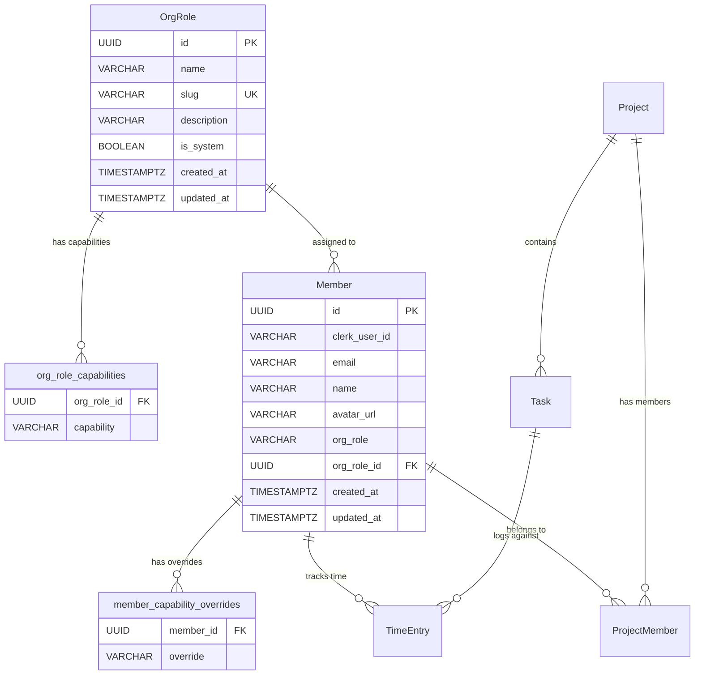
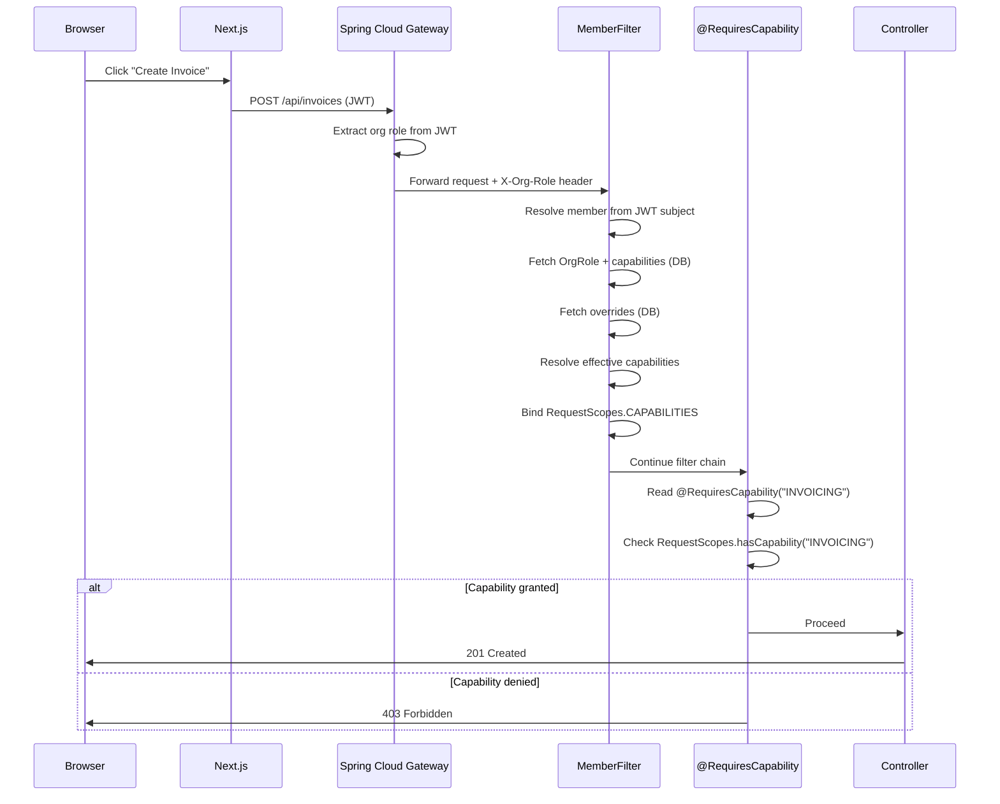
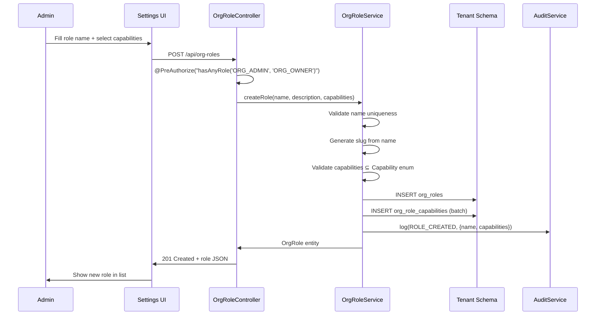
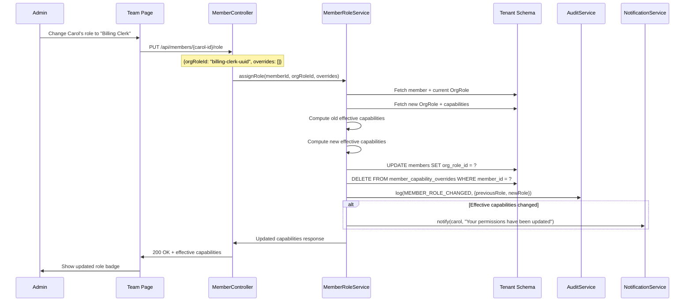

# Phase 41 — Organisation Roles & Capability-Based Permissions

> Phase 41 architecture document. Companion to `architecture/ARCHITECTURE.md`.
> ADRs: [ADR-161](../adr/ADR-161-application-level-capability-authorization.md), [ADR-162](../adr/ADR-162-fixed-capability-set.md), [ADR-163](../adr/ADR-163-override-storage-model.md)

---

## 41.1 — Overview

Phase 41 replaces the coarse three-role authorization model (Owner/Admin/Member) with a **capability-based permission system** that allows firm administrators to define custom roles, assign them to team members, and optionally override individual capabilities per user. The existing Keycloak JWT roles (`org:owner`, `org:admin`, `org:member`) remain unchanged — capabilities are resolved entirely in the application layer from the tenant database, with no IDP or gateway modifications required.

The motivation is straightforward: a 10–50 person professional services firm cannot express "this person manages billing but shouldn't see profitability reports" with only three roles. Every admin-gated endpoint today requires `ORG_ADMIN` or `ORG_OWNER`, which forces firms to either over-permission (make everyone admin) or under-permission (keep people as members and handle access requests manually). Competitors (Productive.io, Scoro, Accelo, Harvest) all offer either granular permission toggles or custom roles. Phase 41 closes this gap.

The phase introduces two new entities (`OrgRole`, plus join tables for capabilities and overrides), extends the `Member` entity with a role foreign key, adds a `RequestScopes.CAPABILITIES` scoped value resolved once per request, replaces all admin-gated `@PreAuthorize` annotations with a new `@RequiresCapability` annotation, and builds the frontend infrastructure to hide navigation items, pages, and action buttons based on the current user's effective capabilities. Owner and Admin system roles bypass all capability checks — existing admin users lose no access.

### What's New

| Capability | Before Phase 41 | After Phase 41 |
|---|---|---|
| Role model | 3 fixed roles (Owner/Admin/Member) from Keycloak JWT | 3 system roles + unlimited custom roles per tenant, resolved from DB |
| Authorization granularity | Binary: admin-or-not per endpoint | 7 domain-area capabilities, composable into named role presets |
| Per-user customization | None — role is all-or-nothing | +/- overrides per member on top of role preset |
| Role management UI | None — roles assigned in Keycloak only | Settings > Roles & Permissions page with create/edit/delete |
| Frontend gating | Sidebar items hardcoded to role string checks | Capability-driven navigation, page protection, and component gating |
| Invite flow | Role dropdown: Member or Admin | Role dropdown: system roles + custom roles with capability preview |

**Out of scope**: Keycloak/gateway changes, project-level roles, custom capability definitions, deny-based permissions, role hierarchy/inheritance, API key roles, plan-tier gating of custom roles.

---

## 41.2 — Domain Model

Phase 41 introduces one new entity (`OrgRole`) with two join tables (`org_role_capabilities`, `member_capability_overrides`), and extends the existing `Member` entity with an `org_role_id` foreign key. A new `Capability` enum defines the fixed set of 7 capability values.

### 41.2.1 Capability Enum

The product defines exactly 7 capabilities. This set is compiled into the application — admins cannot define new capability types. See [ADR-162](../adr/ADR-162-fixed-capability-set.md) for why a fixed curated set was chosen over per-endpoint permissions.

```java
public enum Capability {
  FINANCIAL_VISIBILITY,    // View billable rates, cost rates, profitability reports, budget financials
  INVOICING,               // Create, edit, approve, send invoices. Access billing runs.
  PROJECT_MANAGEMENT,      // Create projects, edit budgets, manage project members, project settings
  TEAM_OVERSIGHT,          // View and approve others' time entries. See assigned team members' work.
  CUSTOMER_MANAGEMENT,     // Customer CRUD, lifecycle management, compliance checklists, information requests
  AUTOMATIONS,             // Create, edit, enable/disable automation rules. View execution logs.
  RESOURCE_PLANNING        // Manage allocations, capacity settings, leave. View utilization reports.
}
```

### 41.2.2 OrgRole Entity

A tenant-scoped entity representing a named role with a set of capabilities.

| Field | Java Type | DB Column | DB Type | Constraints | Notes |
|-------|-----------|-----------|---------|-------------|-------|
| `id` | `UUID` | `id` | `UUID` | PK, default `gen_random_uuid()` | Auto-generated |
| `name` | `String` | `name` | `VARCHAR(100)` | NOT NULL | Display name, e.g., "Project Manager" |
| `slug` | `String` | `slug` | `VARCHAR(100)` | NOT NULL, UNIQUE | URL-safe identifier, auto-generated from name |
| `description` | `String` | `description` | `VARCHAR(500)` | nullable | Optional description |
| `isSystem` | `boolean` | `is_system` | `BOOLEAN` | NOT NULL, default `false` | `true` for OWNER, ADMIN, MEMBER. Immutable rows. |
| `createdAt` | `Instant` | `created_at` | `TIMESTAMPTZ` | NOT NULL | |
| `updatedAt` | `Instant` | `updated_at` | `TIMESTAMPTZ` | NOT NULL | |

### 41.2.3 org_role_capabilities Join Table

Stores the capabilities assigned to each role.

| Column | Type | Constraints | Notes |
|--------|------|-------------|-------|
| `org_role_id` | `UUID` | FK → `org_roles.id` ON DELETE CASCADE, NOT NULL | |
| `capability` | `VARCHAR(50)` | NOT NULL | Enum value as string |

**Composite PK**: `(org_role_id, capability)`.

**Why a join table instead of JSONB?** A join table enables queries like "find all roles with INVOICING capability" without JSON path operators. It also enforces referential integrity at the DB level (the FK to `org_roles`) and supports standard indexing. JSONB would require GIN indexes and application-level validation. For a small cardinality (max 7 capabilities per role), the join table's storage overhead is negligible. See [ADR-163](../adr/ADR-163-override-storage-model.md) for the parallel decision on override storage.

### 41.2.4 member_capability_overrides Join Table

Stores per-user capability additions and removals.

| Column | Type | Constraints | Notes |
|--------|------|-------------|-------|
| `member_id` | `UUID` | FK → `members.id` ON DELETE CASCADE, NOT NULL | |
| `override` | `VARCHAR(60)` | NOT NULL | `+CAPABILITY` or `-CAPABILITY` |

**Composite PK**: `(member_id, override)`.

The `+`/`-` prefix encoding is intentional — it makes the intent explicit in the data and avoids a separate `grant_type` column. At most 14 rows per member (7 additions + 7 removals), though in practice most members will have 0–2 overrides. See [ADR-163](../adr/ADR-163-override-storage-model.md).

### 41.2.5 Member Entity Extension

The existing `Member` entity gains one new field:

| Field | Java Type | DB Column | DB Type | Constraints | Notes |
|-------|-----------|-----------|---------|-------------|-------|
| `orgRoleId` | `UUID` | `org_role_id` | `UUID` | FK → `org_roles.id`, NOT NULL (after backfill) | The member's assigned OrgRole |

The `Member.orgRole` string column (`VARCHAR(50)`) is **retained** for backward compatibility — it continues to hold the Keycloak-sourced role string (`"owner"`, `"admin"`, `"member"`). The new `org_role_id` FK points to the application-managed `OrgRole` entity. These two fields serve different purposes: `orgRole` reflects what Keycloak says, `org_role_id` reflects what the application's permission system uses.

The `capabilityOverrides` are accessed via the `member_capability_overrides` join table, mapped as an `@ElementCollection` or fetched via a dedicated query in the capability resolution path.

### 41.2.6 ER Diagram



### 41.2.7 System Roles

Three system `OrgRole` rows are seeded per tenant schema via the V64 Flyway migration:

| Name | Slug | is_system | Capabilities |
|------|------|-----------|-------------|
| Owner | `owner` | `true` | All 7 |
| Admin | `admin` | `true` | All 7 |
| Member | `member` | `true` | Empty set |

System roles cannot be edited or deleted. The `is_system` flag is enforced in `OrgRoleService` — any attempt to update or delete a system role throws `IllegalOperationException`.

---

## 41.3 — Capability Resolution & Authorization

### 41.3.1 Resolution Algorithm

Capability resolution runs once per request in `MemberFilter`, immediately after member lookup. The resolved set is bound to `RequestScopes.CAPABILITIES` as a `ScopedValue<Set<String>>`.

```
resolveCapabilities(member, orgRole):
  // Owner and Admin bypass — full access
  if orgRole.isSystem AND orgRole.slug IN ("owner", "admin"):
    return Set.of("ALL")

  // Start with role's base capabilities (Set<Capability> from OrgRole entity)
  base = new HashSet<String>(orgRole.capabilities.stream().map(Enum::name).toList())

  // Apply per-user overrides (stored as "+INVOICING" / "-TEAM_OVERSIGHT" strings)
  for override in member.capabilityOverrides:
    capName = override.substring(1)
    Capability.valueOf(capName)  // validates against enum — throws if invalid
    if override starts with "+":
      base.add(capName)
    else if override starts with "-":
      base.remove(capName)

  return Collections.unmodifiableSet(base)
```

**Type note**: `OrgRole.capabilities` is `Set<Capability>` (enum). `member_capability_overrides` stores `+`/`-` prefixed strings. The resolution converts enum values to strings (`Enum::name`) for a uniform `Set<String>` that `RequestScopes.CAPABILITIES` holds. The `Capability.valueOf()` call validates override strings at resolution time — invalid overrides (e.g., from a typo or a removed capability in a future version) throw `IllegalArgumentException`, caught by `MemberFilter` as a warning log (the invalid override is skipped).

**Performance**: The resolution requires at most two queries — one to fetch the `OrgRole` with its capabilities (eagerly loaded), and one to fetch the member's overrides. Both queries hit small tables (roles: ~5–20 rows per tenant, overrides: ~0–2 rows per member). The `MemberFilter` already performs a member lookup per request; the capability resolution adds one additional join query. The resolved set is cached in `RequestScopes.CAPABILITIES` for the duration of the request — no per-endpoint resolution.

### 41.3.2 RequestScopes Extension

```java
public final class RequestScopes {
  // ... existing fields ...
  public static final ScopedValue<Set<String>> CAPABILITIES = ScopedValue.newInstance();

  public static Set<String> getCapabilities() {
    return CAPABILITIES.isBound() ? CAPABILITIES.get() : Collections.emptySet();
  }

  public static boolean hasCapability(String capability) {
    Set<String> caps = getCapabilities();
    return caps.contains(capability) || caps.contains("ALL");
  }
}
```

### 41.3.3 MemberFilter Extension

The `MemberFilter.doFilterInternal` method is extended to resolve and bind capabilities after the existing member lookup:

```java
// After resolving member info...
MemberInfo info = resolveMember(tenantId);
if (info != null) {
  Set<String> capabilities = resolveCapabilities(info.memberId(), info.orgRole());
  var carrier = ScopedValue.where(RequestScopes.MEMBER_ID, info.memberId());
  if (info.orgRole() != null) {
    carrier = carrier.where(RequestScopes.ORG_ROLE, info.orgRole());
  }
  carrier = carrier.where(RequestScopes.CAPABILITIES, capabilities);
  ScopedFilterChain.runScoped(carrier, filterChain, request, response);
  return;
}
```

The `resolveCapabilities` method fetches the member's `OrgRole` (with capabilities eagerly loaded) and overrides in a single optimized query, then applies the resolution algorithm from 41.3.1.

**Important**: The existing `MemberFilter` Caffeine cache stores only the member `UUID` — not capabilities or role data. Capability resolution is a separate DB fetch that runs on every request (outside the cache path). This is intentional: capabilities must reflect the latest role preset changes immediately. The additional query cost is negligible (small tables, indexed lookups). If profiling reveals a hot path, a secondary Caffeine cache for `OrgRole` entities (keyed by `orgRoleId`, evicted on role update) can be added — but this is an optimization, not a requirement for launch.

### 41.3.4 CapabilityAuthorizationService

```java
@Service
public class CapabilityAuthorizationService {

  public boolean hasCapability(String capability) {
    return RequestScopes.hasCapability(capability);
  }

  public void requireCapability(String capability) {
    if (!hasCapability(capability)) {
      throw new AccessDeniedException("Missing capability: " + capability);
    }
  }
}
```

### 41.3.5 @RequiresCapability Annotation

A custom method-security annotation that replaces `@PreAuthorize("hasAnyRole('ORG_ADMIN', 'ORG_OWNER')")`:

```java
@Target(ElementType.METHOD)
@Retention(RetentionPolicy.RUNTIME)
public @interface RequiresCapability {
  String value();  // e.g., "INVOICING"
}
```

**Implementation**: A Spring Security `AuthorizationManager<MethodInvocation>` checks for the annotation and delegates to `RequestScopes.hasCapability()`:

```java
@Component
public class CapabilityAuthorizationManager implements AuthorizationManager<MethodInvocation> {

  @Override
  public AuthorizationDecision check(Supplier<Authentication> authentication,
                                      MethodInvocation invocation) {
    RequiresCapability annotation = invocation.getMethod()
        .getAnnotation(RequiresCapability.class);
    if (annotation == null) return null;  // abstain — let other managers decide

    boolean granted = RequestScopes.hasCapability(annotation.value());
    return new AuthorizationDecision(granted);
  }
}
```

This is registered via `@EnableMethodSecurity` configuration. The `@RequiresCapability` annotation coexists with `@PreAuthorize` — endpoints can use either. The migration from `@PreAuthorize` to `@RequiresCapability` happens in Slice 41C.

**Authentication prerequisite**: `@RequiresCapability` replaces only the _role check_, not the base authentication requirement. The existing `SecurityConfig` must enforce `authenticated()` globally for all `/api/**` endpoints (which it already does). If `RequestScopes.CAPABILITIES` is not bound (unauthenticated request), `hasCapability()` returns `false` and the request gets 403. For correctness, the `CapabilityAuthorizationManager.check()` should verify `authentication.get().isAuthenticated()` before checking capabilities — returning `AuthorizationDecision(false)` for unauthenticated requests ensures a proper 401 response from the `AuthenticationEntryPoint` rather than a misleading 403.

### 41.3.6 Owner/Admin Bypass

When `MemberFilter` resolves capabilities for an Owner or Admin (system roles with slugs `"owner"` or `"admin"`), it binds `Set.of("ALL")` to `RequestScopes.CAPABILITIES`. The `hasCapability` check returns `true` for any capability when `"ALL"` is in the set. This means:

- Owner and Admin users bypass all `@RequiresCapability` checks.
- Existing behavior is preserved — admin users lose no access.
- The bypass is transparent — no special-casing in controller code.

---

## 41.4 — @PreAuthorize Migration Map

The table below maps every controller with admin-gated `@PreAuthorize` annotations to their new `@RequiresCapability` guard. Endpoints currently open to all members (`hasAnyRole('ORG_MEMBER', 'ORG_ADMIN', 'ORG_OWNER')`) are left unchanged.

| Package | Controller | Current Guard | New Guard | Notes |
|---------|-----------|---------------|-----------|-------|
| `billingrate/` | `BillingRateController` | All members (reads + writes) | **No change** | Rate data is read by all members; writes are open to all members in current code |
| `costrate/` | `CostRateController` | `ORG_ADMIN, ORG_OWNER` | `@RequiresCapability("FINANCIAL_VISIBILITY")` | All CRUD operations |
| `budget/` | `ProjectBudgetController` | All members | **No change** | Budget reads open to all; config is all-member in current code |
| `report/` | `ReportController` | All members (reads), `ORG_ADMIN, ORG_OWNER` (profitability) | Reads: **No change**. Profitability endpoint: `@RequiresCapability("FINANCIAL_VISIBILITY")` | Only the admin-gated profitability endpoint changes |
| `invoice/` | `InvoiceController` | `ORG_ADMIN, ORG_OWNER` | `@RequiresCapability("INVOICING")` | All 20 endpoints |
| `billingrun/` | `BillingRunController` | `ORG_ADMIN, ORG_OWNER` | `@RequiresCapability("INVOICING")` | All 12 endpoints |
| `project/` | `ProjectController` | Mixed | Creates/edits (`ORG_ADMIN, ORG_OWNER`): `@RequiresCapability("PROJECT_MANAGEMENT")`. Delete (`ORG_OWNER`): stays `hasRole('ORG_OWNER')`. All-member reads: **No change**. |
| `customer/` | `CustomerController` | Mixed | Admin-gated CRUD: `@RequiresCapability("CUSTOMER_MANAGEMENT")`. All-member reads: **No change**. |
| `customer/` | `ProjectCustomerController` | All members | **No change** | |
| `automation/` | `AutomationRuleController` | `ORG_ADMIN, ORG_OWNER` | `@RequiresCapability("AUTOMATIONS")` | All 8 endpoints |
| `automation/` | `AutomationActionController` | `ORG_ADMIN, ORG_OWNER` | `@RequiresCapability("AUTOMATIONS")` | All 4 endpoints |
| `automation/` | `AutomationExecutionController` | `ORG_ADMIN, ORG_OWNER` | `@RequiresCapability("AUTOMATIONS")` | All 3 endpoints |
| `automation/template/` | `AutomationTemplateController` | `ORG_ADMIN, ORG_OWNER` | `@RequiresCapability("AUTOMATIONS")` | |
| `capacity/` | `MemberCapacityController` | `ORG_ADMIN, ORG_OWNER` | `@RequiresCapability("RESOURCE_PLANNING")` | All 4 endpoints |
| `capacity/` | `ResourceAllocationController` | Mixed | Reads (all members): **No change**. Writes (`ORG_ADMIN, ORG_OWNER`): `@RequiresCapability("RESOURCE_PLANNING")` |
| `capacity/` | `LeaveBlockController` | All members | **No change** | Members manage own leave |
| `capacity/` | `CapacityController` | All members | **No change** | |
| `capacity/` | `UtilizationController` | All members | **No change** | |
| `timeentry/` | `TimeEntryController` | All members | **No change** | Members track own time |
| `timeentry/` | `AdminTimeEntryController` | `ORG_ADMIN, ORG_OWNER` | `@RequiresCapability("TEAM_OVERSIGHT")` | View/approve others' time |
| `timeentry/` | `ProjectTimeSummaryController` | All members | **No change** | |
| `compliance/` | `CompliancePackController` | `ORG_ADMIN, ORG_OWNER` (class-level) | `@RequiresCapability("CUSTOMER_MANAGEMENT")` | |
| `retention/` | `RetentionController` | `ORG_ADMIN, ORG_OWNER` | `@RequiresCapability("CUSTOMER_MANAGEMENT")` | All 6 endpoints |
| `datarequest/` | `DataRequestController` | `ORG_ADMIN, ORG_OWNER` | `@RequiresCapability("CUSTOMER_MANAGEMENT")` | All 8 endpoints |
| `checklist/` | `ChecklistTemplateController` | Mixed | Reads (`isAuthenticated`): **No change**. Writes (`ORG_ADMIN, ORG_OWNER`): `@RequiresCapability("CUSTOMER_MANAGEMENT")` |
| `checklist/` | `ChecklistInstanceController` | Mixed | Reads (`isAuthenticated`): **No change**. Writes (`ORG_ADMIN, ORG_OWNER`): `@RequiresCapability("CUSTOMER_MANAGEMENT")` |
| `informationrequest/` | `InformationRequestController` | Mixed | Admin-gated: `@RequiresCapability("CUSTOMER_MANAGEMENT")`. `isAuthenticated` reads: **No change**. |
| `informationrequest/` | `RequestTemplateController` | Mixed | Admin-gated writes: `@RequiresCapability("CUSTOMER_MANAGEMENT")`. `isAuthenticated` reads: **No change**. |
| `orgsettings/` | `OrgSettingsController` | `ORG_ADMIN, ORG_OWNER` | **No change** — stays `@PreAuthorize` | Org settings remain admin-only (platform administration, not feature-domain) |
| `template/` | `DocumentTemplateController` | Mixed (`isAuthenticated` / `ORG_ADMIN, ORG_OWNER`) | **No change** — stays `@PreAuthorize` | Template management is admin-only |
| `template/` | `GeneratedDocumentController` | Mixed | **No change** | |
| `notification/` | `NotificationController` | All members | **No change** | |
| `notification/` | `NotificationPreferenceController` | All members | **No change** | |
| `settings/` | `OrgSettingsController` | `ORG_ADMIN, ORG_OWNER` | **No change** | |
| `billing/` | `BillingController` | Mixed | Admin-gated: stays `@PreAuthorize`. All-member reads: **No change**. | Subscription billing is admin-only |
| `audit/` | `AuditEventController` | `ORG_ADMIN, ORG_OWNER` | **No change** — stays `@PreAuthorize` | Audit log access remains admin-only |
| `integration/` | `IntegrationController` | `ORG_ADMIN, ORG_OWNER` (class-level) | **No change** — stays `@PreAuthorize` | Integration management is admin-only |
| `integration/email/` | `EmailAdminController` | `ORG_ADMIN, ORG_OWNER` (class-level) | **No change** — stays `@PreAuthorize` | |
| `proposal/` | `ProposalController` | Mixed | Admin-gated writes: `@RequiresCapability("INVOICING")`. Delete (`ORG_OWNER`): stays `hasRole('ORG_OWNER')`. All-member reads: **No change**. |
| `retainer/` | `RetainerAgreementController` | Mixed | Admin-gated: `@RequiresCapability("INVOICING")`. All-member reads: **No change**. |
| `retainer/` | `RetainerPeriodController` | Mixed | Admin-gated: `@RequiresCapability("INVOICING")`. All-member reads: **No change**. |
| `retainer/` | `RetainerSummaryController` | All members | **No change** | |
| `schedule/` | `RecurringScheduleController` | Mixed | Admin-gated: `@RequiresCapability("PROJECT_MANAGEMENT")`. All-member reads: **No change**. |
| `clause/` | `ClauseController` | Mixed | Admin-gated writes: stays `@PreAuthorize` (clause management is admin-only). All-member reads: **No change**. |
| `clause/` | `TemplateClauseController` | Mixed | Admin-gated writes: stays `@PreAuthorize`. All-member reads: **No change**. |
| `fielddefinition/` | `FieldDefinitionController` | Mixed | Admin-gated: stays `@PreAuthorize` (custom field management is admin-only). All-member reads: **No change**. |
| `fielddefinition/` | `FieldGroupController` | `ORG_ADMIN, ORG_OWNER` | **No change** — stays `@PreAuthorize` | Field group management is admin-only |
| `projecttemplate/` | `ProjectTemplateController` | Mixed | Admin-gated writes: `@RequiresCapability("PROJECT_MANAGEMENT")`. All-member reads: **No change**. |
| `tag/` | (if exists) | `ORG_ADMIN, ORG_OWNER` | **No change** — stays `@PreAuthorize` | Tag management is admin-only |
| `expense/` | `ExpenseController` | Mixed | Admin-gated approve/categorize: `@RequiresCapability("FINANCIAL_VISIBILITY")`. All-member CRUD: **No change**. |
| `acceptance/` | `AcceptanceController` | Mixed | Admin-gated: `@RequiresCapability("CUSTOMER_MANAGEMENT")`. All-member reads: **No change**. |
| `document/` | `DocumentController` | Mixed | Admin-gated: stays `@PreAuthorize` (document management is admin-only). All-member reads: **No change**. |
| `tax/` | `TaxRateController` | Mixed | Admin-gated: stays `@PreAuthorize` (tax config is admin-only). All-member reads: **No change**. |
| `accessrequest/` | `PlatformAdminController` | `@platformSecurityService.isPlatformAdmin()` | **No change** — platform admin only |

**Summary**: ~70 `@PreAuthorize` annotations are replaced with `@RequiresCapability`. ~120 `@PreAuthorize` annotations remain unchanged (all-member access or admin-only platform operations).

---

## 41.5 — API Surface

### 41.5.1 OrgRole CRUD

**List all roles**

```
GET /api/org-roles
```

Returns all roles (system + custom) for the current tenant. Any authenticated member.

Response:
```json
[
  {
    "id": "uuid",
    "name": "Owner",
    "slug": "owner",
    "description": null,
    "capabilities": ["FINANCIAL_VISIBILITY", "INVOICING", "PROJECT_MANAGEMENT", "TEAM_OVERSIGHT", "CUSTOMER_MANAGEMENT", "AUTOMATIONS", "RESOURCE_PLANNING"],
    "isSystem": true,
    "memberCount": 1,
    "createdAt": "2026-01-01T00:00:00Z",
    "updatedAt": "2026-01-01T00:00:00Z"
  },
  {
    "id": "uuid",
    "name": "Project Manager",
    "slug": "project-manager",
    "description": "Can manage projects and oversee team time",
    "capabilities": ["PROJECT_MANAGEMENT", "TEAM_OVERSIGHT"],
    "isSystem": false,
    "memberCount": 3,
    "createdAt": "2026-03-08T10:00:00Z",
    "updatedAt": "2026-03-08T10:00:00Z"
  }
]
```

**Get role detail**

```
GET /api/org-roles/{id}
```

Any authenticated member. Returns the same shape as above.

**Create custom role**

```
POST /api/org-roles
```

Admin/Owner only (`@PreAuthorize("hasAnyRole('ORG_ADMIN', 'ORG_OWNER')")`).

Request:
```json
{
  "name": "Project Manager",
  "description": "Can manage projects and oversee team time",
  "capabilities": ["PROJECT_MANAGEMENT", "TEAM_OVERSIGHT"]
}
```

Response: same shape as list item, with `isSystem: false`, `memberCount: 0`.

**Update custom role**

```
PUT /api/org-roles/{id}
```

Admin/Owner only. System roles rejected with 422.

Request: same shape as create. Response: updated role.

**Delete custom role**

```
DELETE /api/org-roles/{id}
```

Admin/Owner only. System roles rejected with 422. Roles with assigned members rejected with 409 ("Reassign N members before deleting this role").

Response: 204 No Content.

### Validation Rules

- `name`: required, 1–100 chars, unique per tenant (case-insensitive).
- `slug`: auto-generated from name using kebab-case. Unique per tenant.
- `capabilities`: must be a subset of the 7 `Capability` enum values. Empty set is valid.
- System roles: cannot be updated or deleted.
- Delete blocked if `memberCount > 0`.

### RBAC Table

| Endpoint | Owner | Admin | Member | Custom Role |
|----------|-------|-------|--------|-------------|
| `GET /api/org-roles` | Yes | Yes | Yes | Yes |
| `GET /api/org-roles/{id}` | Yes | Yes | Yes | Yes |
| `POST /api/org-roles` | Yes | Yes | No | No |
| `PUT /api/org-roles/{id}` | Yes | Yes | No | No |
| `DELETE /api/org-roles/{id}` | Yes | Yes | No | No |

### 41.5.2 Member Role Assignment

**Assign role and overrides**

```
PUT /api/members/{id}/role
```

Admin/Owner only.

Request:
```json
{
  "orgRoleId": "uuid-of-project-manager-role",
  "capabilityOverrides": ["+INVOICING", "-TEAM_OVERSIGHT"]
}
```

`capabilityOverrides` is optional. If omitted, existing overrides are cleared.

Response:
```json
{
  "memberId": "uuid",
  "roleName": "Project Manager",
  "roleCapabilities": ["PROJECT_MANAGEMENT", "TEAM_OVERSIGHT"],
  "overrides": ["+INVOICING", "-TEAM_OVERSIGHT"],
  "effectiveCapabilities": ["PROJECT_MANAGEMENT", "INVOICING"]
}
```

**Get effective capabilities for a member**

```
GET /api/members/{id}/capabilities
```

Admin/Owner or self (members can view their own capabilities).

Response: same shape as above.

### Validation Rules

- Cannot change the Owner's role (the org owner's system role is immutable).
- Cannot assign the Owner system role to another member.
- Admin/Owner system roles can only be assigned by an Owner.
- Override capabilities must be valid `Capability` enum values.
- A `+CAPABILITY` on a capability already in the role is accepted (no-op).
- A `-CAPABILITY` on a capability not in the role is accepted (no-op).

### 41.5.3 Current User Capabilities

```
GET /api/me/capabilities
```

Any authenticated member. Returns the current user's effective capabilities.

Response:
```json
{
  "capabilities": ["PROJECT_MANAGEMENT", "TEAM_OVERSIGHT"],
  "role": "Project Manager",
  "isAdmin": false,
  "isOwner": false
}
```

Called once on frontend app load, cached in React context. For admins/owners, `capabilities` contains all 7 values and the respective flag is `true`.

### 41.5.4 Invite Extension

```
POST /bff/admin/invite
```

Extended request (backward compatible — `orgRoleId` is optional):

```json
{
  "email": "carol@firm.co.za",
  "role": "member",
  "orgRoleId": "uuid-of-custom-role",
  "capabilityOverrides": []
}
```

- If `role` is `"admin"`, `orgRoleId` is ignored — the ADMIN system role is used.
- If `role` is `"member"` and `orgRoleId` is omitted, the MEMBER system role is used.
- If `role` is `"member"` and `orgRoleId` is provided, that custom role is assigned.

---

## 41.6 — Sequence Diagrams

### 41.6.1 Request Authorization Flow



### 41.6.2 Custom Role Creation



### 41.6.3 Member Role Reassignment with Cascade



---

## 41.7 — Frontend Changes

### 41.7.1 CapabilityProvider Context

A React context that loads capabilities once on app initialization and provides them to the component tree.

```typescript
// lib/capabilities.tsx
"use client";

import { createContext, useCallback, useContext, useEffect, useState, ReactNode } from "react";

interface CapabilityContextValue {
  capabilities: Set<string>;
  hasCapability: (cap: string) => boolean;
  refreshCapabilities: () => Promise<void>;
  isAdmin: boolean;
  isOwner: boolean;
  isLoading: boolean;
}

const CapabilityContext = createContext<CapabilityContextValue>({
  capabilities: new Set(),
  hasCapability: () => false,
  refreshCapabilities: async () => {},
  isAdmin: false,
  isOwner: false,
  isLoading: true,
});

export function CapabilityProvider({ children }: { children: ReactNode }) {
  const [state, setState] = useState<Omit<CapabilityContextValue, "hasCapability" | "refreshCapabilities">>({
    capabilities: new Set(),
    isAdmin: false,
    isOwner: false,
    isLoading: true,
  });

  const loadCapabilities = useCallback(async () => {
    const res = await fetch("/api/me/capabilities");
    const data = await res.json();
    setState({
      capabilities: new Set(data.capabilities),
      isAdmin: data.isAdmin,
      isOwner: data.isOwner,
      isLoading: false,
    });
  }, []);

  useEffect(() => { loadCapabilities(); }, [loadCapabilities]);

  const hasCapability = (cap: string) =>
    state.isAdmin || state.isOwner || state.capabilities.has(cap);

  return (
    <CapabilityContext.Provider value={{ ...state, hasCapability, refreshCapabilities: loadCapabilities }}>
      {children}
    </CapabilityContext.Provider>
  );
}

export function useCapabilities() {
  return useContext(CapabilityContext);
}
```

The `CapabilityProvider` wraps the app layout inside the auth provider. It calls `GET /api/me/capabilities` once on mount. The response is cached in state for the duration of the session. No per-navigation API calls.

**Stale capability handling**: When a member receives a `member.role_changed` notification (via the existing notification polling), the notification handler should call `refreshCapabilities()` to reload capabilities from the API. This ensures the frontend reflects role preset edits within the notification polling interval (~30 seconds). Without this, a member whose role was edited would see stale sidebar/page visibility until they refresh the browser.

### 41.7.2 RequiresCapability Wrapper Component

```typescript
// components/requires-capability.tsx
"use client";

import { useCapabilities } from "@/lib/capabilities";
import { ReactNode } from "react";

interface RequiresCapabilityProps {
  cap: string;
  children: ReactNode;
  fallback?: ReactNode;
}

export function RequiresCapability({ cap, children, fallback = null }: RequiresCapabilityProps) {
  const { hasCapability, isLoading } = useCapabilities();
  if (isLoading) return null;
  return hasCapability(cap) ? <>{children}</> : <>{fallback}</>;
}
```

### 41.7.3 Sidebar Navigation Gating

Navigation items are conditionally rendered based on capabilities. Items the user lacks are hidden entirely, not greyed out.

| Nav Item | Required Capability | Currently Visible To | Change |
|----------|-------------------|---------------------|--------|
| Dashboard | — | All members | No change |
| Projects | — | All members | No change |
| My Work | — | All members | No change |
| Customers | `CUSTOMER_MANAGEMENT` | Admin/Owner | Gated by capability |
| Invoices | `INVOICING` | Admin/Owner | Gated by capability |
| Profitability | `FINANCIAL_VISIBILITY` | Admin/Owner | Gated by capability |
| Resources | `RESOURCE_PLANNING` | Admin/Owner | Gated by capability |
| Reports | — | All members | No change |
| Calendar | — | All members | No change |
| Retainers | `INVOICING` | Admin/Owner | Gated by capability |
| Schedules | `PROJECT_MANAGEMENT` | Admin/Owner | Gated by capability |
| Settings | `isAdmin \|\| isOwner` | Admin/Owner | No change (admin-only) |

### 41.7.4 Page-Level Protection

Each gated page checks capabilities **server-side** using a server action that calls `GET /api/me/capabilities`. If the user lacks the required capability, the page calls `redirect()` to the dashboard — not a 403 page. This avoids the flash-of-restricted-content problem that occurs with client-side checks.

Example:
```typescript
// app/(app)/org/[slug]/invoices/page.tsx
import { getMyCapabilities } from "@/lib/actions/capabilities";
import { redirect } from "next/navigation";

export default async function InvoicesPage({ params }: { params: { slug: string } }) {
  const caps = await getMyCapabilities();
  if (!caps.isAdmin && !caps.isOwner && !caps.capabilities.includes("INVOICING")) {
    redirect(`/org/${params.slug}/dashboard`);
  }
  // ... render invoices (server component)
}
```

**Why server-side, not client-side?** Calling `notFound()` from a client component (after `useEffect` resolves) causes a flash where the page renders in loading state before throwing. Server-side `redirect()` in a server component runs before any HTML reaches the browser. The `CapabilityProvider` context is still used for client-side component gating (buttons, nav items) — but page-level protection should be server-side.

### 41.7.5 Component-Level Gating

Action buttons and sections within pages are gated using the `<RequiresCapability>` wrapper:

| Component | Location | Required Capability |
|-----------|----------|-------------------|
| "Create Project" button | Projects page | `PROJECT_MANAGEMENT` |
| "Generate Invoice" dropdown | Customer detail page | `INVOICING` |
| Rate columns in time tables | Time entry lists | `FINANCIAL_VISIBILITY` |
| "Approve" button | Time entry rows (others' time) | `TEAM_OVERSIGHT` |
| "Create Customer" button | Customers page | `CUSTOMER_MANAGEMENT` |
| "New Automation" button | Automations settings | `AUTOMATIONS` |
| Budget edit controls | Project budget tab | `PROJECT_MANAGEMENT` |

---

## 41.8 — Settings UI: Roles & Permissions

### Location

New settings card: "Roles & Permissions" in the Settings hub at `settings/roles/page.tsx`. Admin/Owner only. Route: `/org/[slug]/settings/roles`.

### Layout

```
Roles & Permissions
├── System Roles (read-only section)
│   ├── Owner — All capabilities · Cannot be edited
│   ├── Admin — All capabilities
│   └── Member — Basic access only
│
├── Custom Roles (editable section)
│   ├── Role card: name | capability pills | N members | [Edit] [Delete]
│   ├── Role card: ...
│   └── [+ New Role] button
│
└── Capability Reference (collapsible)
    └── Table: Capability name | Description | Gated features
```

**System roles section** is read-only with a grey background. Each system role shows its capability summary. No edit or delete buttons.

**Custom roles section** shows a card per role with:
- Role name and description
- Capability pills (e.g., `PROJECT_MANAGEMENT`, `TEAM_OVERSIGHT`)
- Member count badge
- Edit and Delete action buttons

### Create/Edit Role Dialog

A Shadcn `Dialog` with:
- **Name** text input (required, max 100 chars)
- **Description** textarea (optional, max 500 chars)
- **Capabilities** checkbox group — all 7 capabilities listed with label and description
- **Member count** (edit only) — "N members using this role"
- **Save** and **Cancel** buttons. **Delete** button (edit only, disabled if members assigned).

### Delete Role Flow

1. Click Delete on a role card or in the edit dialog.
2. If `memberCount > 0`: show a confirmation dialog: "This role has N members. Reassign them to another role before deleting." Include a role dropdown to select the target role. On confirm, the API bulk-reassigns members then deletes the role.
3. If `memberCount === 0`: show a simple confirmation dialog. On confirm, delete the role.

---

## 41.9 — Invite Flow Changes

### Modified Invite API

The existing `POST /bff/admin/invite` endpoint gains optional `orgRoleId` and `capabilityOverrides` fields (see 41.5.4). The gateway creates the Keycloak user with `org:member` (or `org:admin` if selected). On member sync (JIT provisioning via `MemberFilter`), the backend assigns the specified `OrgRole`.

### JIT Provisioning Flow

When a newly invited user first authenticates and `MemberFilter` lazy-creates their `Member` record:

1. Check if there's a pending invite with `orgRoleId` for this email.
2. If yes, set `Member.orgRoleId` to the specified role and store any overrides.
3. If no, fall back to the system role matching the Keycloak JWT role (`org:admin` → ADMIN, `org:member` → MEMBER).

The invite record stores the `orgRoleId` as a transient field. Since the current invite flow goes through Keycloak (which doesn't store this), the backend must persist the `orgRoleId` mapping somewhere between invite and first login.

**Important**: The `Member` row does not exist at invite time — members are JIT-created on first login by `MemberFilter.lazyCreateMember()`. An `invited_role_id` column on the `members` table cannot be used because there is no row to set it on.

Instead, use a lightweight `pending_role_assignments` table:

```sql
CREATE TABLE pending_role_assignments (
    email       VARCHAR(255) PRIMARY KEY,
    org_role_id UUID NOT NULL REFERENCES org_roles(id),
    overrides   TEXT[],  -- optional capability overrides
    created_at  TIMESTAMPTZ NOT NULL DEFAULT now()
);
```

**Flow**:
1. `POST /bff/admin/invite` stores a row in `pending_role_assignments` keyed by email.
2. `MemberFilter.lazyCreateMember()` checks `pending_role_assignments` by email after creating the member row.
3. If found, assigns the specified `OrgRole` and overrides, then deletes the pending row.
4. If not found, falls back to system role matching the JWT (`org:admin` → ADMIN, `org:member` → MEMBER).

This table is included in the V64 migration. Rows are consumed and deleted on first login — stale entries (e.g., expired invites) are cleaned up by a scheduled task or TTL check.

### Invite Form UI Changes

The invite form role dropdown is restructured:

```
Role:
  ─── System ───
  Member — Basic access
  Admin — Full access
  ─── Custom ───
  Project Manager — Projects, Team oversight
  Billing Clerk — Invoicing, Customers
```

When a custom role is selected:
- The Keycloak `role` field is set to `"member"` (custom roles are always `org:member` in Keycloak).
- A read-only capability summary is shown below the dropdown.
- An expandable "Customize for this user" section allows adding/removing overrides via toggles.

When "Admin" is selected:
- The Keycloak `role` field is set to `"admin"`.
- Capability toggles are hidden (admin has everything).

---

## 41.10 — Audit & Notifications

### Audit Events

All audit events follow the existing `AuditEventBuilder` pattern.

| Event Type | Trigger | Detail Schema |
|-----------|---------|---------------|
| `role.created` | Custom role created | `{name: string, slug: string, capabilities: string[]}` |
| `role.updated` | Custom role modified | `{name: string, addedCapabilities: string[], removedCapabilities: string[], affectedMemberCount: number}` |
| `role.deleted` | Custom role deleted | `{name: string, slug: string}` |
| `member.role_changed` | Member's role assignment changed | `{memberId: UUID, memberName: string, previousRole: string, newRole: string, overrides: string[]}` |

### Notifications

When a member's effective capabilities change (via role reassignment, role preset edit, or override change), an in-app notification is sent:

```
"Your permissions have been updated. You now have access to: Project management, Team oversight."
```

or, if capabilities were removed:

```
"Your permissions have been updated. You no longer have access to: Invoicing."
```

No email notification for capability changes — in-app is sufficient for this low-urgency event. Follows the existing `NotificationService.notify()` pattern.

---

## 41.11 — Database Migration (V64)

Single tenant migration: `V64__create_org_roles_capabilities.sql`

```sql
-- 1. Create org_roles table
CREATE TABLE org_roles (
    id          UUID PRIMARY KEY DEFAULT gen_random_uuid(),
    name        VARCHAR(100) NOT NULL,
    slug        VARCHAR(100) NOT NULL,
    description VARCHAR(500),
    is_system   BOOLEAN NOT NULL DEFAULT false,
    created_at  TIMESTAMPTZ NOT NULL DEFAULT now(),
    updated_at  TIMESTAMPTZ NOT NULL DEFAULT now(),
    CONSTRAINT uq_org_roles_slug UNIQUE (slug),
    CONSTRAINT uq_org_roles_name UNIQUE (name)
);

-- 2. Create org_role_capabilities join table
CREATE TABLE org_role_capabilities (
    org_role_id UUID NOT NULL REFERENCES org_roles(id) ON DELETE CASCADE,
    capability  VARCHAR(50) NOT NULL,
    PRIMARY KEY (org_role_id, capability)
);

CREATE INDEX idx_org_role_capabilities_capability ON org_role_capabilities(capability);

-- 3. Create member_capability_overrides join table
CREATE TABLE member_capability_overrides (
    member_id UUID NOT NULL REFERENCES members(id) ON DELETE CASCADE,
    override  VARCHAR(60) NOT NULL,
    PRIMARY KEY (member_id, override)
);

-- 4. Seed system roles
INSERT INTO org_roles (id, name, slug, description, is_system, created_at, updated_at) VALUES
    ('00000000-0000-0000-0000-000000000001', 'Owner', 'owner', NULL, true, now(), now()),
    ('00000000-0000-0000-0000-000000000002', 'Admin', 'admin', NULL, true, now(), now()),
    ('00000000-0000-0000-0000-000000000003', 'Member', 'member', NULL, true, now(), now());

-- 5. Seed capabilities for Owner and Admin (all 7)
INSERT INTO org_role_capabilities (org_role_id, capability) VALUES
    ('00000000-0000-0000-0000-000000000001', 'FINANCIAL_VISIBILITY'),
    ('00000000-0000-0000-0000-000000000001', 'INVOICING'),
    ('00000000-0000-0000-0000-000000000001', 'PROJECT_MANAGEMENT'),
    ('00000000-0000-0000-0000-000000000001', 'TEAM_OVERSIGHT'),
    ('00000000-0000-0000-0000-000000000001', 'CUSTOMER_MANAGEMENT'),
    ('00000000-0000-0000-0000-000000000001', 'AUTOMATIONS'),
    ('00000000-0000-0000-0000-000000000001', 'RESOURCE_PLANNING'),
    ('00000000-0000-0000-0000-000000000002', 'FINANCIAL_VISIBILITY'),
    ('00000000-0000-0000-0000-000000000002', 'INVOICING'),
    ('00000000-0000-0000-0000-000000000002', 'PROJECT_MANAGEMENT'),
    ('00000000-0000-0000-0000-000000000002', 'TEAM_OVERSIGHT'),
    ('00000000-0000-0000-0000-000000000002', 'CUSTOMER_MANAGEMENT'),
    ('00000000-0000-0000-0000-000000000002', 'AUTOMATIONS'),
    ('00000000-0000-0000-0000-000000000002', 'RESOURCE_PLANNING');

-- Member system role has no capabilities (empty set)

-- 6. Add org_role_id to members (nullable initially)
ALTER TABLE members ADD COLUMN org_role_id UUID REFERENCES org_roles(id);

-- 7. Backfill existing members based on current org_role string
-- Note: Member.orgRole stores values from Roles.java constants: "owner", "admin", "member"
-- (without "org:" prefix — ClerkJwtUtils strips the prefix before storage)
UPDATE members SET org_role_id = '00000000-0000-0000-0000-000000000001'
    WHERE org_role = 'owner';
UPDATE members SET org_role_id = '00000000-0000-0000-0000-000000000002'
    WHERE org_role = 'admin';
UPDATE members SET org_role_id = '00000000-0000-0000-0000-000000000003'
    WHERE org_role NOT IN ('owner', 'admin') OR org_role IS NULL;

-- 8. Verify backfill — fail fast if any members were missed
DO $$
BEGIN
  IF EXISTS (SELECT 1 FROM members WHERE org_role_id IS NULL) THEN
    RAISE EXCEPTION 'Backfill incomplete: % members have NULL org_role_id',
        (SELECT COUNT(*) FROM members WHERE org_role_id IS NULL);
  END IF;
END $$;

-- 9. Set NOT NULL after verified backfill
ALTER TABLE members ALTER COLUMN org_role_id SET NOT NULL;

-- 10. Index for member role lookups
CREATE INDEX idx_members_org_role_id ON members(org_role_id);

-- 11. Pending role assignments for invite flow (consumed on first login)
CREATE TABLE pending_role_assignments (
    email       VARCHAR(255) PRIMARY KEY,
    org_role_id UUID NOT NULL REFERENCES org_roles(id),
    overrides   TEXT[],
    created_at  TIMESTAMPTZ NOT NULL DEFAULT now()
);
```

### Index Rationale

| Index | Purpose |
|-------|---------|
| `uq_org_roles_slug` | Enforce unique slugs for URL-safe role identifiers |
| `uq_org_roles_name` | Enforce unique role names per tenant (case-sensitive; application enforces case-insensitive) |
| `idx_org_role_capabilities_capability` | Query "which roles have this capability" |
| `idx_members_org_role_id` | Query "which members have this role" (used for member count and role deletion check) |
| `pending_role_assignments.email` PK | Fast lookup during JIT member creation |

---

## 41.12 — Implementation Guidance

### 41.12.1 Backend Changes

| File / Package | Change Type | Description |
|------|-------------|-------------|
| `orgrole/OrgRole.java` | New entity | OrgRole entity with `@ElementCollection` for capabilities |
| `orgrole/OrgRoleRepository.java` | New repository | Standard `JpaRepository<OrgRole, UUID>` |
| `orgrole/OrgRoleService.java` | New service | CRUD with system role protection, slug generation, validation |
| `orgrole/OrgRoleController.java` | New controller | REST endpoints for OrgRole CRUD |
| `orgrole/Capability.java` | New enum | 7 capability values |
| `orgrole/CapabilityAuthorizationService.java` | New service | `hasCapability()`, `requireCapability()` |
| `orgrole/RequiresCapability.java` | New annotation | Method-level security annotation |
| `orgrole/CapabilityAuthorizationManager.java` | New component | Spring Security `AuthorizationManager` implementation |
| `multitenancy/RequestScopes.java` | Modify | Add `CAPABILITIES` ScopedValue and helper methods |
| `member/MemberFilter.java` | Modify | Resolve and bind capabilities after member lookup |
| `member/Member.java` | Modify | Add `orgRoleId` FK field |
| `member/MemberController.java` | Modify | Add `PUT /{id}/role`, `GET /{id}/capabilities` endpoints |
| `member/MeController.java` | New or modify | Add `GET /api/me/capabilities` endpoint |
| `invoice/InvoiceController.java` | Modify | Replace ~20 `@PreAuthorize` with `@RequiresCapability("INVOICING")` |
| `billingrun/BillingRunController.java` | Modify | Replace ~12 `@PreAuthorize` with `@RequiresCapability("INVOICING")` |
| `costrate/CostRateController.java` | Modify | Replace ~4 `@PreAuthorize` with `@RequiresCapability("FINANCIAL_VISIBILITY")` |
| `automation/**Controller.java` | Modify | Replace `@PreAuthorize` with `@RequiresCapability("AUTOMATIONS")` |
| `capacity/MemberCapacityController.java` | Modify | Replace with `@RequiresCapability("RESOURCE_PLANNING")` |
| `capacity/ResourceAllocationController.java` | Modify | Replace write endpoints with `@RequiresCapability("RESOURCE_PLANNING")` |
| `customer/CustomerController.java` | Modify | Replace admin-gated with `@RequiresCapability("CUSTOMER_MANAGEMENT")` |
| `project/ProjectController.java` | Modify | Replace create/edit with `@RequiresCapability("PROJECT_MANAGEMENT")` |
| `timeentry/AdminTimeEntryController.java` | Modify | Replace with `@RequiresCapability("TEAM_OVERSIGHT")` |
| `compliance/CompliancePackController.java` | Modify | Replace with `@RequiresCapability("CUSTOMER_MANAGEMENT")` |
| `retention/RetentionController.java` | Modify | Replace with `@RequiresCapability("CUSTOMER_MANAGEMENT")` |
| `datarequest/DataRequestController.java` | Modify | Replace with `@RequiresCapability("CUSTOMER_MANAGEMENT")` |
| `config/SecurityConfig.java` | Modify | Register `CapabilityAuthorizationManager` |
| `db/migration/tenant/V64__*` | New migration | Tables, seeds, backfill (see 41.11) |

### 41.12.2 Frontend Changes

| File / Route | Change Type | Description |
|------|-------------|-------------|
| `lib/capabilities.tsx` | New | CapabilityProvider context, `useCapabilities` hook |
| `components/requires-capability.tsx` | New | `<RequiresCapability>` wrapper component |
| `app/(app)/org/[slug]/layout.tsx` | Modify | Wrap children with `<CapabilityProvider>` |
| `components/sidebar.tsx` (or equivalent) | Modify | Gate nav items with `hasCapability()` |
| `app/(app)/org/[slug]/settings/roles/page.tsx` | New | Roles & Permissions settings page |
| `app/(app)/org/[slug]/invoices/page.tsx` | Modify | Page-level capability check |
| `app/(app)/org/[slug]/customers/page.tsx` | Modify | Page-level capability check |
| `app/(app)/org/[slug]/profitability/page.tsx` | Modify | Page-level capability check |
| `app/(app)/org/[slug]/resources/page.tsx` | Modify | Page-level capability check |
| `app/(app)/org/[slug]/settings/automations/page.tsx` | Modify | Page-level capability check |
| `app/(app)/org/[slug]/team/page.tsx` | Modify | Add member detail panel with role dropdown and capability toggles |
| `components/invite-dialog.tsx` (or equivalent) | Modify | Add role dropdown with custom role support |
| Various action buttons across pages | Modify | Wrap with `<RequiresCapability>` |

### 41.12.3 Entity Code Pattern

```java
package io.b2mash.b2b.b2bstrawman.orgrole;

import jakarta.persistence.*;
import java.time.Instant;
import java.util.HashSet;
import java.util.Set;
import java.util.UUID;

@Entity
@Table(name = "org_roles")
public class OrgRole {

  @Id
  @GeneratedValue(strategy = GenerationType.UUID)
  private UUID id;

  @Column(name = "name", nullable = false, length = 100)
  private String name;

  @Column(name = "slug", nullable = false, length = 100)
  private String slug;

  @Column(name = "description", length = 500)
  private String description;

  @ElementCollection(fetch = FetchType.EAGER)
  @CollectionTable(
      name = "org_role_capabilities",
      joinColumns = @JoinColumn(name = "org_role_id"))
  @Column(name = "capability", length = 50)
  @Enumerated(EnumType.STRING)
  private Set<Capability> capabilities = new HashSet<>();

  @Column(name = "is_system", nullable = false)
  private boolean isSystem;

  @Column(name = "created_at", nullable = false, updatable = false)
  private Instant createdAt;

  @Column(name = "updated_at", nullable = false)
  private Instant updatedAt;

  protected OrgRole() {}

  // ... constructor, getters, update methods
}
```

### 41.12.4 Repository Pattern

```java
public interface OrgRoleRepository extends JpaRepository<OrgRole, UUID> {
  Optional<OrgRole> findBySlug(String slug);
  boolean existsByNameIgnoreCase(String name);
  boolean existsBySlugIgnoreCase(String slug);
}
```

The member count query lives in `MemberRepository` (which has access to the `Member` entity):

```java
// In MemberRepository
@Query("SELECT COUNT(m) FROM Member m WHERE m.orgRole = :role")
long countByOrgRole(@Param("role") OrgRole role);
```

**Note**: The `Member` entity extension (Slice 41A) adds an `orgRole` field of type `OrgRole` (a `@ManyToOne` relationship), not a raw `UUID`. The JPQL references the JPA association, not the column name. The existing `Member.orgRole` String field is renamed to `keycloakRole` to avoid naming conflicts (see 41.2.5).

**Note on system roles**: The three system `OrgRole` rows are seeded by Flyway with hardcoded UUIDs. Application code must never instantiate these via the `OrgRole` constructor — they are read-only DB rows. Access them via `OrgRoleRepository.findBySlug("owner")`, not by constructing new entities.

### 41.12.5 Testing Strategy

| Test Name | Scope | Description |
|-----------|-------|-------------|
| `OrgRoleServiceTest` | Unit | CRUD validation, system role protection, slug generation |
| `CapabilityResolutionTest` | Unit | Resolution algorithm: base + overrides, owner/admin bypass |
| `OrgRoleControllerIntegrationTest` | Integration | REST endpoints with mock auth for owner/admin/member |
| `CapabilityAuthorizationTest` | Integration | `@RequiresCapability` enforcement across all gated controllers |
| `MemberRoleAssignmentTest` | Integration | Role assignment, override persistence, validation rules |
| `MigrationV64Test` | Integration | Schema migration, seed data, backfill correctness |
| `InviteWithRoleTest` | Integration | Extended invite flow with orgRoleId |
| `CapabilityProviderTest` | Frontend | Context loading, hasCapability checks |
| `SidebarGatingTest` | Frontend | Nav items hidden when capabilities missing |
| `RolesSettingsPageTest` | Frontend | Create/edit/delete role dialogs |
| `MemberDetailPanelTest` | Frontend | Role dropdown, capability toggles, override indicators |

---

## 41.13 — Permission Model Summary

### Access Control Table

| Entity / Operation | Owner | Admin | Custom Role with Capability | Member (no custom role) |
|---|---|---|---|---|
| View own time entries | Yes | Yes | Yes | Yes |
| Track own time | Yes | Yes | Yes | Yes |
| View assigned tasks | Yes | Yes | Yes | Yes |
| View project (member of) | Yes | Yes | Yes | Yes |
| Create project | Yes | Yes | `PROJECT_MANAGEMENT` | No |
| Edit project | Yes | Yes | `PROJECT_MANAGEMENT` | No |
| Delete project | Yes | No | No | No |
| Create customer | Yes | Yes | `CUSTOMER_MANAGEMENT` | No |
| Edit customer lifecycle | Yes | Yes | `CUSTOMER_MANAGEMENT` | No |
| View billing rates | Yes | Yes | Yes (all-member endpoint) | Yes |
| Edit cost rates | Yes | Yes | `FINANCIAL_VISIBILITY` | No |
| View profitability | Yes | Yes | `FINANCIAL_VISIBILITY` | No |
| Create invoice | Yes | Yes | `INVOICING` | No |
| Manage billing runs | Yes | Yes | `INVOICING` | No |
| Approve others' time | Yes | Yes | `TEAM_OVERSIGHT` | No |
| Create automation rule | Yes | Yes | `AUTOMATIONS` | No |
| Manage allocations | Yes | Yes | `RESOURCE_PLANNING` | No |
| Manage capacity | Yes | Yes | `RESOURCE_PLANNING` | No |
| Org settings | Yes | Yes | No | No |
| Template management | Yes | Yes | No | No |
| Audit log | Yes | Yes | No | No |
| Integration management | Yes | Yes | No | No |
| Custom role CRUD | Yes | Yes | No | No |
| Member role assignment | Yes | Yes | No | No |

### Capability to Endpoint Mapping (Comprehensive)

| Capability | Gated Endpoints |
|-----------|----------------|
| `FINANCIAL_VISIBILITY` | `CostRateController.*`, `ReportController` (profitability endpoint), `ExpenseController` (approve/categorize) |
| `INVOICING` | `InvoiceController.*`, `BillingRunController.*`, `ProposalController` (admin-gated writes), `RetainerAgreementController` (admin-gated writes), `RetainerPeriodController` (admin-gated writes) |
| `PROJECT_MANAGEMENT` | `ProjectController` (create/edit), `ProjectTemplateController` (admin-gated writes), `RecurringScheduleController` (admin-gated writes) |
| `TEAM_OVERSIGHT` | `AdminTimeEntryController.*` |
| `CUSTOMER_MANAGEMENT` | `CustomerController` (admin-gated CRUD), `CompliancePackController.*`, `RetentionController.*`, `DataRequestController.*`, `ChecklistTemplateController` (writes), `ChecklistInstanceController` (writes), `InformationRequestController` (admin-gated), `RequestTemplateController` (writes), `AcceptanceController` (admin-gated) |
| `AUTOMATIONS` | `AutomationRuleController.*`, `AutomationActionController.*`, `AutomationExecutionController.*`, `AutomationTemplateController.*` |
| `RESOURCE_PLANNING` | `MemberCapacityController.*`, `ResourceAllocationController` (writes) |

### System Role Bypass Rules

- **Owner**: All capabilities granted. All `@RequiresCapability` checks pass. Additionally retains `hasRole('ORG_OWNER')` for owner-only operations (e.g., project deletion).
- **Admin**: All capabilities granted. All `@RequiresCapability` checks pass. Retains `hasAnyRole('ORG_ADMIN', 'ORG_OWNER')` for admin-only platform operations (org settings, integrations, audit log).
- **Member (system role)**: No capabilities. Can only access all-member endpoints. This matches current behavior exactly.
- **Custom role**: Capabilities as assigned. Owner/Admin bypass does not apply.

---

## 41.14 — Capability Slices

### Slice 41A — Entity Foundation

**Scope**: Backend only
**Dependencies**: None

**Deliverables**:
- `OrgRole` entity in `orgrole/` package
- `Capability` enum (7 values)
- `OrgRoleRepository` (JpaRepository)
- Flyway migration `V64__create_org_roles_capabilities.sql` (tables, seeds, backfill)
- `Member` entity extension: add `orgRoleId` field
- Unit tests: entity validation, repository queries
- Integration test: migration runs, seed data correct, backfill maps existing members

**Test expectations**: ~8–10 new backend tests. Migration verified against existing member data. System roles queryable. Member.orgRoleId populated for all existing members.

---

### Slice 41B — Capability Resolution

**Scope**: Backend only
**Dependencies**: 41A

**Deliverables**:
- `RequestScopes.CAPABILITIES` ScopedValue + helper methods (`getCapabilities()`, `hasCapability()`)
- `MemberFilter` extension: resolve capabilities after member lookup, bind to `RequestScopes.CAPABILITIES`
- `CapabilityAuthorizationService` (`hasCapability()`, `requireCapability()`)
- `@RequiresCapability` annotation
- `CapabilityAuthorizationManager` (Spring Security `AuthorizationManager`)
- `SecurityConfig` registration of the authorization manager
- Unit tests: resolution algorithm (base + overrides, owner bypass, admin bypass, empty role)
- Integration tests: end-to-end request with capability binding, `@RequiresCapability` enforcement

**Test expectations**: ~10–12 new backend tests. Verify that Owner/Admin get `Set.of("ALL")`, custom roles get resolved capabilities, overrides apply correctly.

---

### Slice 41C — @PreAuthorize Migration

**Scope**: Backend only
**Dependencies**: 41B

**Deliverables**:
- Replace all admin-gated `@PreAuthorize` annotations with `@RequiresCapability` per the migration map in 41.4
- ~70 annotation replacements across ~20 controller files
- Update existing integration tests that assert 403 for members — they should now pass for members with the correct capability
- New integration tests: verify each capability gates the expected endpoints
- No behavioral change for Owner/Admin (bypass ensures all existing tests pass)

**Test expectations**: ~15–20 new/modified backend tests. Every `@RequiresCapability` annotation verified. Existing admin/owner tests still pass unchanged.

---

### Slice 41D — OrgRole CRUD API + Member Role Assignment

**Scope**: Backend only
**Dependencies**: 41A, 41B

**Deliverables**:
- `OrgRoleController`: `GET /api/org-roles`, `GET /api/org-roles/{id}`, `POST /api/org-roles`, `PUT /api/org-roles/{id}`, `DELETE /api/org-roles/{id}`
- `OrgRoleService`: CRUD logic, slug generation, validation, system role protection
- Member role assignment: `PUT /api/members/{id}/role`, `GET /api/members/{id}/capabilities`
- `GET /api/me/capabilities` endpoint
- Audit events: `role.created`, `role.updated`, `role.deleted`, `member.role_changed`
- Notification on capability change
- Integration tests: full CRUD lifecycle, validation edge cases, role assignment, override persistence

**Test expectations**: ~15–18 new backend tests.

---

### Slice 41E — Frontend Capability Gating

**Scope**: Frontend only
**Dependencies**: 41D (needs `/api/me/capabilities` endpoint)

**Deliverables**:
- `lib/capabilities.tsx`: `CapabilityProvider`, `useCapabilities` hook
- `components/requires-capability.tsx`: `<RequiresCapability>` wrapper
- Layout integration: wrap app layout with `<CapabilityProvider>`
- Sidebar navigation gating (hide items based on capabilities)
- Page-level protection for: Invoices, Customers, Profitability, Resources, Automations settings
- Component-level gating for action buttons (Create Project, Generate Invoice, Approve, etc.)

**Test expectations**: ~10–12 new frontend tests. Sidebar items visible/hidden correctly. Page protection redirects. Action buttons gated.

---

### Slice 41F — Settings UI: Roles & Permissions

**Scope**: Frontend only (with backend from 41D)
**Dependencies**: 41D, 41E

**Deliverables**:
- `settings/roles/page.tsx`: Roles & Permissions page
- System roles section (read-only)
- Custom roles section with role cards
- Create Role dialog (name, description, capability checkboxes)
- Edit Role dialog (pre-populated, save/delete)
- Delete Role flow (confirmation, reassignment if members assigned)
- Capability reference collapsible section
- Member detail panel on Team page (role dropdown, capability toggles, override indicators)

**Test expectations**: ~8–10 new frontend tests. Dialog open/close, form validation, role CRUD lifecycle.

---

### Slice 41G — Invite Flow + Final Polish

**Scope**: Both (frontend + backend)
**Dependencies**: 41D, 41E, 41F

**Deliverables**:
- Extended invite API: `orgRoleId` and `capabilityOverrides` fields on `POST /bff/admin/invite`
- `pending_role_assignments` table integration: store pending role on invite, consume on first login
- Invite form UI: restructured role dropdown with system + custom roles, capability preview
- JIT provisioning: `MemberFilter.lazyCreateMember()` checks `pending_role_assignments` and assigns OrgRole
- Notification handler triggers `refreshCapabilities()` on `member.role_changed` notifications
- End-to-end smoke test: invite with custom role → first login → capabilities resolved → sidebar gated
- Final audit event verification
- Documentation updates

**Test expectations**: ~6–8 new tests (mix of backend integration and frontend). Invite → login → capability resolution verified.

---

## 41.15 — ADR Index

| ADR | Title | Decision |
|-----|-------|----------|
| [ADR-161](../adr/ADR-161-application-level-capability-authorization.md) | Application-Level Capability Authorization | Capabilities resolved from tenant DB, not Keycloak |
| [ADR-162](../adr/ADR-162-fixed-capability-set.md) | Fixed Capability Set vs Dynamic Permissions | 7 curated capabilities, not per-endpoint toggles |
| [ADR-163](../adr/ADR-163-override-storage-model.md) | Override Storage Model | +/- prefixed join table, not materialized or JSONB |

### Referenced Existing ADRs

| ADR | Relevance |
|-----|-----------|
| ADR-009 (ScopedValue Migration) | `RequestScopes` pattern that Phase 41 extends with `CAPABILITIES` |
| ADR-085 (Auth Provider Abstraction) | Auth abstraction layer that Phase 41's frontend gating builds on |
