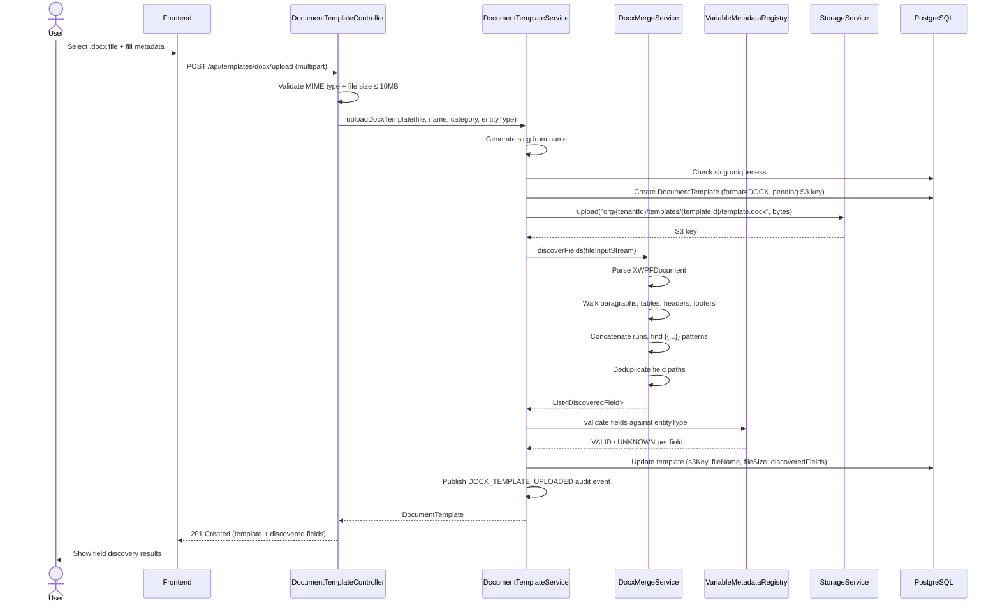
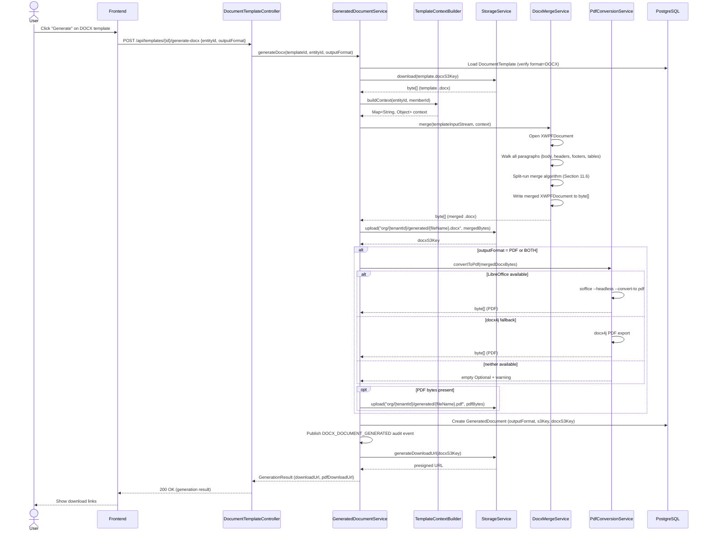
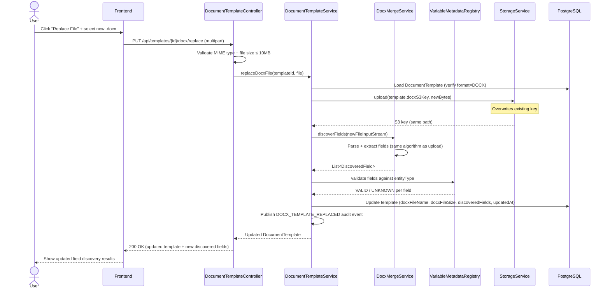

> Merge into ARCHITECTURE.md as **Section 11**. ADR files go in `adr/`.

# Phase 42 — Word Template Pipeline (DOCX Upload, Merge & Generation)

---

## 11. Phase 42 — Word Template Pipeline

Phase 42 adds a **Word document (.docx) template pipeline** to the DocTeams platform — the ability to upload existing `.docx` files containing merge fields, auto-discover those fields, and generate filled documents preserving all Word formatting, styles, headers/footers, images, and page layout. This is a second output adapter alongside the existing Tiptap/HTML/PDF pipeline introduced in Phase 12. Both pipelines share the same `TemplateContextBuilder` → `Map<String, Object>` data layer; the only difference is how the resolved context is merged into the template and what format comes out the other end.

**Why this matters**: Many professional services firms have existing Word templates refined over years — engagement letters, court documents, compliance forms, brand-controlled layouts from their marketing team. Asking these firms to recreate templates in a WYSIWYG editor is a non-starter. They want to upload their `.docx` and have the system fill in the data. This is particularly true for law firms (court-standard document formats), accounting firms (audit report templates), and any firm with Word-based document workflows.

**Dependencies on prior phases**:
- **Phase 12** (Document Templates): `DocumentTemplate`, `GeneratedDocument`, `TemplateContextBuilder`, `VariableMetadataRegistry`, `PdfRenderingService`, `GeneratedDocumentService`, `StorageService`. The entire existing template infrastructure is reused and extended.
- **Phase 11** (Custom Fields): Custom field values included in template context as `customFields.*` variables — works unchanged for DOCX templates.
- **Phase 8** (Rate Cards & Budgets): `OrgSettings` branding fields (logo, brand color, footer) — available in template context but not injected into DOCX formatting (Word template controls its own layout).
- **Phase 6** (Audit): `AuditEventBuilder` — new audit events for DOCX operations.
- **Phase 27** (Clause Library): Clauses are a Tiptap-only concept. DOCX templates do not use clauses.

### What's New

| Capability | Before Phase 42 | After Phase 42 |
|---|---|---|
| Template formats | Tiptap JSONB only | Tiptap JSONB **and** uploaded `.docx` files, distinguished by `format` field |
| Word template upload | — | Multipart upload, file validation, S3 storage |
| Merge field discovery | — | Automatic extraction of `{{variable}}` placeholders from `.docx` XML, with validation against `VariableMetadataRegistry` |
| DOCX document generation | — | Apache POI merge with split-run handling, preserving all Word formatting |
| PDF from Word | — | Optional PDF conversion via LibreOffice headless (primary) or docx4j (fallback) |
| Output format choice | PDF only | PDF, DOCX, or both — depending on template format and user selection |
| Generated document tracking | PDF only | Extended with `output_format` and `docx_s3_key` to track DOCX outputs |

**Out of scope**: In-app Word editing, real-time collaboration, `.doc` legacy binary format, loop/repeat in tables (`{{#each}}`), conditional sections (`{{#if}}`), image merge fields, Word Add-in/sidebar, template versioning (replace overwrites previous version).

---

### 11.1 Overview

Phase 42 introduces the DOCX pipeline as a parallel track to the existing Tiptap pipeline. The two pipelines share a common data layer but diverge at the rendering stage:

```
                    ┌─────────────────────────────────┐
                    │     TemplateContextBuilder       │
                    │  (Project / Customer / Invoice)  │
                    └──────────────┬──────────────────┘
                                   │
                          Map<String, Object>
                                   │
                    ┌──────────────┴──────────────┐
                    │                             │
            ┌───────▼───────┐            ┌────────▼────────┐
            │ TiptapRenderer │            │ DocxMergeService │
            │ → HTML → PDF   │            │ → merged .docx   │
            └───────┬───────┘            └────────┬────────┘
                    │                             │
            ┌───────▼───────┐            ┌────────▼────────┐
            │  S3 + Record   │            │  S3 + Record     │
            │ GeneratedDoc   │            │ GeneratedDoc     │
            └───────────────┘            └─────────────────┘
```

The core abstractions:

1. **`TemplateFormat` enum** — Discriminates between `TIPTAP` (existing JSONB content) and `DOCX` (uploaded `.docx` file in S3). Stored on `DocumentTemplate`. A template's format is immutable after creation. See [ADR-166](../adr/ADR-166-template-format-coexistence.md).

2. **`DocxMergeService`** — A standalone service that handles all `.docx` operations: field discovery (`discoverFields`) and merge (`merge`). It uses Apache POI (XWPF) for XML manipulation and implements the split-run handling algorithm that is the hardest part of this phase. See [ADR-164](../adr/ADR-164-docx-processing-library.md).

3. **`OutputFormat` enum** — Discriminates between `PDF` and `DOCX` on `GeneratedDocument`. When a DOCX template generates output, the user can choose DOCX, PDF, or both.

4. **PDF conversion** — LibreOffice headless is the primary converter (high fidelity). docx4j PDF export is the fallback (lower fidelity, no external dependency). If neither is available, DOCX output is returned and PDF is skipped gracefully. See [ADR-165](../adr/ADR-165-pdf-conversion-strategy.md).

5. **Reuse, not replacement** — No changes to `TemplateContextBuilder`, `VariableMetadataRegistry`, `TiptapRenderer`, or `PdfRenderingService`. The DOCX pipeline consumes the same context map and writes to the same `GeneratedDocument` table. The existing PDF generation endpoint (`POST /api/templates/{id}/generate`) continues to work unchanged for Tiptap templates.

---

### 11.2 Domain Model

Phase 42 extends two existing tenant-scoped entities (`DocumentTemplate`, `GeneratedDocument`) and introduces two new enums (`TemplateFormat`, `OutputFormat`). No new entities are created. All changes follow the established pattern: plain `@Entity` + `JpaRepository`, no multitenancy boilerplate (Phase 13 eliminated it — schema boundary handles isolation automatically).

#### 11.2.1 DocumentTemplate Entity (Extended)

The existing `DocumentTemplate` entity gains fields to support the DOCX format. All new columns are nullable or have defaults, so existing Tiptap templates are unaffected.

| Field | Java Type | DB Column | DB Type | Constraints | Notes |
|-------|-----------|-----------|---------|-------------|-------|
| _existing fields_ | | | | | _See Phase 12 architecture_ |
| `format` | `TemplateFormat` | `format` | `VARCHAR(10)` | NOT NULL, DEFAULT `'TIPTAP'` | `TIPTAP` or `DOCX` — immutable after creation |
| `docxS3Key` | `String` | `docx_s3_key` | `VARCHAR(500)` | Nullable | S3 key for uploaded `.docx` template file |
| `docxFileName` | `String` | `docx_file_name` | `VARCHAR(255)` | Nullable | Original filename for display, e.g., `engagement-letter-v3.docx` |
| `docxFileSize` | `Long` | `docx_file_size` | `BIGINT` | Nullable | File size in bytes |
| `discoveredFields` | `List<Map<String,Object>>` | `discovered_fields` | `JSONB` | Nullable | Array of discovered merge field objects |

**Design decisions**:
- **Single entity with format discriminator** rather than separate `DocxTemplate` entity. Both formats share the same metadata (name, slug, category, entity type, source, sort order), the same list endpoint, and the same CRUD pattern. A separate entity would duplicate all of this and require a union query for the template list. The `format` field is a simple discriminator with clean validation rules per format. See [ADR-166](../adr/ADR-166-template-format-coexistence.md).
- **`format` is immutable** — a TIPTAP template cannot be converted to DOCX or vice versa. Users create a new template if they want to switch formats. This avoids the complexity of migrating content between formats and keeps the entity state machine simple.
- **`content` (JSONB) is nullable for DOCX templates** — DOCX templates store their content in S3, not in the database. The `content` field may optionally hold a summary for search, but is not required.
- **`docx_s3_key` is required for DOCX, null for TIPTAP** — enforced at the service layer, not via database CHECK constraint, because Hibernate does not populate `format` before the insert in all cases.
- **`discovered_fields` stores the full field list as JSONB** — enables the frontend to display fields without re-parsing the `.docx`. Updated on upload and replace. Structure: `[{"path": "customer.name", "status": "VALID", "label": "Customer Name"}, ...]`.

**Validation rules** (enforced in `DocumentTemplateService`):
- If `format = TIPTAP`: `content` is required, `docxS3Key` must be null.
- If `format = DOCX`: `docxS3Key` is required (after upload), `content` may be null.
- `entity_type`, `category`, `slug`, `name` work identically for both formats.

#### 11.2.2 GeneratedDocument Entity (Extended)

The existing `GeneratedDocument` entity gains fields to track DOCX output alongside PDF output.

| Field | Java Type | DB Column | DB Type | Constraints | Notes |
|-------|-----------|-----------|---------|-------------|-------|
| _existing fields_ | | | | | _See Phase 12 architecture_ |
| `outputFormat` | `OutputFormat` | `output_format` | `VARCHAR(10)` | NOT NULL, DEFAULT `'PDF'` | `PDF` or `DOCX` — the primary output format |
| `docxS3Key` | `String` | `docx_s3_key` | `VARCHAR(500)` | Nullable | S3 key for generated `.docx` (when output is DOCX or BOTH) |

**Design decisions**:
- **`output_format` defaults to `PDF`** — existing generated documents (all PDFs from Tiptap pipeline) get the correct default without a data migration.
- **`s3_key` (existing) remains the primary download key** — for backward compatibility, `s3_key` always holds the primary output file (DOCX for DOCX templates, PDF for Tiptap templates). When output is BOTH, `s3_key` holds the DOCX and `docx_s3_key` is redundantly set to the same value, while the PDF is stored at a separate S3 key returned via `pdfDownloadUrl`. The existing `s3_key` column is **not renamed** to `pdf_s3_key` — it remains `s3_key` to preserve backward compatibility with existing download flows.
- **`BOTH` is a request-only value** — the `outputFormat` column stores only `PDF` or `DOCX` (the primary output format). When a user requests `BOTH`, the stored `outputFormat` is `DOCX` (the primary output), and the PDF is an additional artifact. The CHECK constraint correctly allows only `PDF` and `DOCX`.
- **No separate `GeneratedDocxDocument` entity** — the generation tracking concern is identical regardless of output format. One row per generation event, with optional S3 keys for each format.

#### 11.2.3 New Enums

```java
// TemplateFormat.java — in template/ package alongside TemplateCategory, TemplateEntityType, TemplateSource
package io.b2mash.b2b.b2bstrawman.template;

public enum TemplateFormat {
    TIPTAP,  // Existing: JSONB content, rendered via TiptapRenderer → HTML → PDF
    DOCX     // New: uploaded .docx file in S3, rendered via Apache POI merge
}

// OutputFormat.java — in template/ package
package io.b2mash.b2b.b2bstrawman.template;

public enum OutputFormat {
    PDF,   // Existing default for Tiptap pipeline
    DOCX   // New: merged .docx output from DOCX pipeline
}
```

#### 11.2.4 Entity-Relationship Diagram

```mermaid
erDiagram
    document_templates {
        uuid id PK
        varchar name "NOT NULL, max 200"
        varchar slug "NOT NULL, max 200"
        text description
        varchar category "NOT NULL (enum)"
        varchar primary_entity_type "NOT NULL (enum)"
        varchar format "NOT NULL, DEFAULT 'TIPTAP'"
        jsonb content "Tiptap JSONB (nullable for DOCX)"
        text legacy_content
        text css
        varchar source "NOT NULL (enum)"
        uuid source_template_id FK
        varchar pack_id
        varchar pack_template_key
        boolean active "NOT NULL, DEFAULT true"
        integer sort_order "NOT NULL, DEFAULT 0"
        jsonb required_context_fields
        varchar docx_s3_key "S3 key for .docx file"
        varchar docx_file_name "Original filename"
        bigint docx_file_size "File size in bytes"
        jsonb discovered_fields "Discovered merge fields"
        timestamptz created_at "NOT NULL"
        timestamptz updated_at "NOT NULL"
    }

    generated_documents {
        uuid id PK
        uuid template_id FK "NOT NULL"
        varchar primary_entity_type "NOT NULL (enum)"
        uuid primary_entity_id "NOT NULL"
        uuid document_id FK "Nullable"
        varchar file_name "NOT NULL"
        varchar s3_key "NOT NULL"
        bigint file_size "NOT NULL"
        uuid generated_by FK "NOT NULL"
        varchar output_format "NOT NULL, DEFAULT 'PDF'"
        varchar docx_s3_key "S3 key for generated .docx"
        jsonb context_snapshot
        jsonb warnings
        jsonb clause_snapshots
        timestamptz generated_at "NOT NULL"
    }

    projects {
        uuid id PK
        varchar name
    }

    customers {
        uuid id PK
        varchar name
    }

    invoices {
        uuid id PK
        varchar invoice_number
    }

    document_templates ||--o{ generated_documents : "generates"
    projects ||--o{ generated_documents : "entity_id (PROJECT)"
    customers ||--o{ generated_documents : "entity_id (CUSTOMER)"
    invoices ||--o{ generated_documents : "entity_id (INVOICE)"
```



---

### 11.3 Core Flows and Backend Behaviour

#### 11.3.1 DOCX Template Upload Flow

1. User clicks "Upload Word Template" on the template list page.
2. Frontend sends a `multipart/form-data` request with the `.docx` file, name, category, and entity type.
3. Backend validates:
   - File MIME type is `application/vnd.openxmlformats-officedocument.wordprocessingml.document`
   - File size ≤ 10 MB
   - Name is non-blank, category and entity type are valid enums
4. Backend generates a slug from the name (same `DocumentTemplate.generateSlug()` logic).
5. Backend uploads the `.docx` to S3 at key `org/{tenantId}/templates/{templateId}/template.docx`.
6. Backend parses the `.docx` via `DocxMergeService.discoverFields()` — extracts all `{{variable}}` placeholders, handles split runs, deduplicates.
7. Backend validates each discovered field against `VariableMetadataRegistry` for the template's entity type. Each field is marked `VALID` or `UNKNOWN`.
8. Backend creates a `DocumentTemplate` record with `format=DOCX`, the S3 key, filename, file size, and discovered fields as JSONB.
9. Backend publishes `DOCX_TEMPLATE_UPLOADED` audit event.
10. Backend returns the template record including discovered fields and validation summary.

#### 11.3.2 DOCX Document Generation (Merge) Flow

1. User selects a DOCX template + entity (same UI entry point as Tiptap generation).
2. Backend loads the `DocumentTemplate`, verifies `format=DOCX`.
3. Backend downloads the `.docx` template file from S3 via `StorageService.download()`.
4. Backend resolves context via the appropriate `TemplateContextBuilder` (determined by `primaryEntityType`). This is the exact same context map used by the Tiptap pipeline.
5. Backend calls `DocxMergeService.merge(inputStream, contextMap)`:
   a. Opens the `.docx` with `XWPFDocument` (Apache POI).
   b. Walks all paragraphs in the document body, headers, footers, and table cells.
   c. For each paragraph, executes the split-run merge algorithm (Section 11.6).
   d. Resolves each `{{variable.path}}` against the context map using dot-path navigation.
   e. Missing/null values render as empty string.
   f. Writes the merged `XWPFDocument` to a byte array.
6. Backend uploads the merged `.docx` to S3 at `org/{tenantId}/generated/{fileName}`.
7. If PDF output requested and converter available:
   a. Try LibreOffice headless: `soffice --headless --convert-to pdf input.docx`
   b. Fallback: docx4j PDF export
   c. If neither available: skip PDF, log warning, return DOCX only
   d. Upload PDF to S3 if generated
8. Backend creates a `GeneratedDocument` record with appropriate `outputFormat`, S3 keys, and context snapshot.
9. Backend publishes `DOCX_DOCUMENT_GENERATED` audit event.
10. Backend returns download URL(s) via presigned S3 URLs.

#### 11.3.3 Template Replace Flow

1. User clicks "Replace File" on a DOCX template detail page.
2. Frontend sends the new `.docx` file via `PUT /api/templates/{id}/docx/replace`.
3. Backend validates file type and size (same rules as upload).
4. Backend uploads the new file to S3, overwriting the existing key.
5. Backend re-runs field discovery on the new file.
6. Backend updates `discoveredFields`, `docxFileName`, `docxFileSize`, `updatedAt`.
7. Backend publishes `DOCX_TEMPLATE_REPLACED` audit event.
8. Template ID, slug, and all previously generated documents are unchanged.

#### 11.3.4 Variable Resolution

The merge engine resolves variables using the same `Map<String, Object>` context from `TemplateContextBuilder`. Resolution follows dot-path navigation:

- `{{customer.name}}` → `context.get("customer")` cast to `Map` → `.get("name")`
- `{{org.defaultCurrency}}` → `context.get("org")` cast to `Map` → `.get("defaultCurrency")`
- `{{customFields.myField}}` → `context.get("customFields")` cast to `Map` → `.get("myField")`

Rules:
- Missing keys at any level in the path → empty string
- Null values → empty string
- Date/number values → string conversion using the same formatters as the Tiptap pipeline
- The `{{` and `}}` delimiters are consumed — they do not appear in the output
- Unrecognised variables (not in `VariableMetadataRegistry`) still resolve against the context map — they just produce empty strings if no matching key exists

---

### 11.4 API Surface

#### 11.4.1 New Endpoints

**POST `/api/templates/docx/upload`** — Upload a `.docx` template file

Request: `multipart/form-data`
| Part | Type | Required | Notes |
|------|------|----------|-------|
| `file` | binary | Yes | The `.docx` file, max 10 MB |
| `name` | string | Yes | Template name |
| `description` | string | No | Template description |
| `category` | string | Yes | One of `TemplateCategory` values |
| `entityType` | string | Yes | One of `PROJECT`, `CUSTOMER`, `INVOICE` |

Response: `201 Created`
```json
{
  "id": "550e8400-e29b-41d4-a716-446655440000",
  "name": "Engagement Letter",
  "slug": "engagement-letter",
  "format": "DOCX",
  "category": "ENGAGEMENT_LETTER",
  "primaryEntityType": "CUSTOMER",
  "description": "Standard engagement letter for new clients",
  "docxFileName": "engagement-letter-v3.docx",
  "docxFileSize": 245760,
  "discoveredFields": {
    "fields": [
      { "path": "customer.name", "status": "VALID", "label": "Customer Name" },
      { "path": "customer.email", "status": "VALID", "label": "Customer Email" },
      { "path": "org.name", "status": "VALID", "label": "Organisation Name" },
      { "path": "customer.phone", "status": "UNKNOWN", "label": null }
    ],
    "validCount": 3,
    "unknownCount": 1
  },
  "active": true,
  "source": "ORG_CUSTOM",
  "createdAt": "2026-03-08T10:00:00Z",
  "updatedAt": "2026-03-08T10:00:00Z"
}
```

Error responses:
- `400 Bad Request` — invalid file type, file too large, missing required fields
- `409 Conflict` — slug already exists

---

**PUT `/api/templates/{id}/docx/replace`** — Replace the `.docx` file for an existing DOCX template

Request: `multipart/form-data`
| Part | Type | Required | Notes |
|------|------|----------|-------|
| `file` | binary | Yes | The new `.docx` file, max 10 MB |

Response: `200 OK` — same shape as upload response, with updated fields.

Error responses:
- `400 Bad Request` — invalid file type, file too large
- `404 Not Found` — template not found
- `409 Conflict` — template is not DOCX format

---

**GET `/api/templates/{id}/docx/fields`** — Get discovered merge fields with validation status

Response: `200 OK`
```json
{
  "fields": [
    { "path": "customer.name", "status": "VALID", "label": "Customer Name" },
    { "path": "customer.email", "status": "VALID", "label": "Customer Email" },
    { "path": "org.name", "status": "VALID", "label": "Organisation Name" },
    { "path": "customer.phone", "status": "UNKNOWN", "label": null }
  ],
  "validCount": 3,
  "unknownCount": 1
}
```

Error responses:
- `404 Not Found` — template not found
- `409 Conflict` — template is not DOCX format

---

**GET `/api/templates/{id}/docx/download`** — Download the original `.docx` template file

Response: `302 Found` — redirects to a presigned S3 URL for the template file.

Alternative: `200 OK` with `Content-Type: application/vnd.openxmlformats-officedocument.wordprocessingml.document` and the file bytes streamed directly. The presigned URL redirect is preferred to avoid backend memory pressure with large files.

Error responses:
- `404 Not Found` — template not found or no `.docx` file uploaded
- `409 Conflict` — template is not DOCX format

---

**POST `/api/templates/{id}/generate-docx`** — Generate a filled `.docx` from template + entity

Request:
```json
{
  "entityId": "550e8400-e29b-41d4-a716-446655440001",
  "outputFormat": "DOCX"
}
```

| Field | Type | Required | Notes |
|-------|------|----------|-------|
| `entityId` | UUID | Yes | The entity to merge data from |
| `outputFormat` | string | Yes | `DOCX`, `PDF`, or `BOTH` |

Response: `200 OK`
```json
{
  "id": "550e8400-e29b-41d4-a716-446655440002",
  "templateId": "550e8400-e29b-41d4-a716-446655440000",
  "templateName": "Engagement Letter",
  "outputFormat": "DOCX",
  "fileName": "engagement-letter-acme-corp-2026-03-08.docx",
  "downloadUrl": "https://s3.../presigned-docx-url",
  "pdfDownloadUrl": null,
  "fileSize": 251904,
  "generatedAt": "2026-03-08T10:15:00Z"
}
```

When `outputFormat` is `BOTH`:
```json
{
  "id": "...",
  "outputFormat": "DOCX",
  "fileName": "engagement-letter-acme-corp-2026-03-08.docx",
  "downloadUrl": "https://s3.../presigned-docx-url",
  "pdfDownloadUrl": "https://s3.../presigned-pdf-url",
  "pdfFileName": "engagement-letter-acme-corp-2026-03-08.pdf",
  "generatedAt": "2026-03-08T10:15:00Z"
}
```

When `outputFormat` is `PDF` but converter is unavailable:
```json
{
  "id": "...",
  "outputFormat": "DOCX",
  "fileName": "engagement-letter-acme-corp-2026-03-08.docx",
  "downloadUrl": "https://s3.../presigned-docx-url",
  "pdfDownloadUrl": null,
  "warnings": ["PDF conversion unavailable. DOCX output returned instead."],
  "generatedAt": "2026-03-08T10:15:00Z"
}
```

Error responses:
- `400 Bad Request` — missing entityId, invalid outputFormat
- `404 Not Found` — template not found or entity not found
- `409 Conflict` — template is not DOCX format

#### 11.4.2 Modified Endpoints

**GET `/api/templates`** — List all templates

Response shape gains `format` field:
```json
[
  {
    "id": "...",
    "name": "Project Summary Report",
    "slug": "project-summary-report",
    "format": "TIPTAP",
    "category": "PROJECT_SUMMARY",
    "primaryEntityType": "PROJECT",
    "active": true,
    "source": "PLATFORM"
  },
  {
    "id": "...",
    "name": "Engagement Letter",
    "slug": "engagement-letter",
    "format": "DOCX",
    "category": "ENGAGEMENT_LETTER",
    "primaryEntityType": "CUSTOMER",
    "docxFileName": "engagement-letter-v3.docx",
    "docxFileSize": 245760,
    "active": true,
    "source": "ORG_CUSTOM"
  }
]
```

Optional query parameter: `?format=DOCX` or `?format=TIPTAP` to filter by format.

---

**GET `/api/templates/{id}`** — Get template detail

Response shape gains `format`, DOCX fields, and `discoveredFields`:
```json
{
  "id": "...",
  "name": "Engagement Letter",
  "slug": "engagement-letter",
  "format": "DOCX",
  "category": "ENGAGEMENT_LETTER",
  "primaryEntityType": "CUSTOMER",
  "docxFileName": "engagement-letter-v3.docx",
  "docxFileSize": 245760,
  "discoveredFields": {
    "fields": [ ... ],
    "validCount": 3,
    "unknownCount": 1
  },
  "content": null,
  "css": null
}
```

---

**DELETE `/api/templates/{id}`** — Delete template

For DOCX templates, also deletes the `.docx` file from S3 via `StorageService.delete()`. Existing behavior (soft deactivation) is unchanged — the S3 file is deleted only when the template is permanently removed (or on deactivation, depending on retention requirements).

---

#### 11.4.3 Existing Endpoints (Unchanged)

**GET `/api/templates/variables?entityType={type}`** — Variable metadata reference

This endpoint already exists (from Phase 12) and returns available variables per entity type from `VariableMetadataRegistry`. It is **unchanged** by Phase 42 — no new variables are added. The frontend uses this endpoint to power the variable reference panel shown on the DOCX upload dialog and template detail page, enabling template authors to see which `{{variable}}` paths are available for their entity type.

#### 11.4.4 Controller Placement

All new DOCX endpoints are added to the **existing `DocumentTemplateController`** (`template/DocumentTemplateController.java`), not a separate controller. This follows the project convention of one controller per resource. The DOCX-specific endpoints are grouped together within the controller class for readability.

---

### 11.5 Sequence Diagrams

#### 11.5.1 DOCX Template Upload + Field Discovery



#### 11.5.2 DOCX Document Generation (Merge)



#### 11.5.3 DOCX Template Replace Flow



---

### 11.6 DOCX Processing Engine

This section documents the split-run handling algorithm — the single hardest implementation detail of Phase 42. It is the core of `DocxMergeService` and must be tested extensively with real-world Word documents.

#### 11.6.1 The Split Run Problem

Microsoft Word stores text in "runs" (`<w:r>` elements) — inline spans that carry formatting properties. Word frequently splits what appears as continuous text into multiple runs for various reasons:

- The user typed part of the text, changed formatting, then continued typing
- Word's spell-checker or autocorrect applied formatting to a substring
- The document was edited by different Word versions
- Copy-paste operations introduced formatting boundaries
- Track changes or comments touched part of the text

A merge field like `{{customer.name}}` that appears as continuous text to the user may be stored as:

```xml
<w:p>
  <w:r>
    <w:rPr><w:rFonts w:ascii="Calibri"/></w:rPr>
    <w:t>Dear {{</w:t>
  </w:r>
  <w:r>
    <w:rPr><w:rFonts w:ascii="Calibri"/><w:b/></w:rPr>
    <w:t>customer</w:t>
  </w:r>
  <w:r>
    <w:rPr><w:rFonts w:ascii="Calibri"/></w:rPr>
    <w:t>.name}}, welcome to</w:t>
  </w:r>
</w:p>
```

A naive approach that searches each run independently would never find `{{customer.name}}` because no single run contains the complete pattern.

#### 11.6.2 The Algorithm

The merge algorithm operates on one paragraph at a time. It processes all paragraphs in the document body, then repeats for headers, footers, and table cells.

**Step 1: Concatenate runs to build full paragraph text**

```
Run 0: "Dear {{"           (chars 0-7)
Run 1: "customer"           (chars 8-15)
Run 2: ".name}}, welcome to" (chars 16-35)

Full text: "Dear {{customer.name}}, welcome to"
```

Track the character offset ranges for each run:
```
Run 0: [0, 8)    → "Dear {{"
Run 1: [8, 16)   → "customer"
Run 2: [16, 36)  → ".name}}, welcome to"
```

**Step 2: Find all `{{...}}` patterns in the concatenated text**

Use regex `\{\{([^}]+)\}\}` against the full text:
```
Match: "{{customer.name}}" at chars [5, 23)
  Variable path: "customer.name"
```

**Step 3: Map character offsets back to run indices**

For the match at `[5, 23)`:
- Char 5 (`{`) is in Run 0 at position 5
- Char 22 (`}`) is in Run 2 at position 6
- The match spans Runs 0, 1, 2

**Step 4: Resolve the variable**

Look up `customer.name` in the context map via dot-path navigation:
```java
Object value = context.get("customer"); // Map
value = ((Map<?,?>) value).get("name"); // "Acme Corp"
String resolved = "Acme Corp";
```

**Step 5: Replace across runs**

The replacement strategy preserves the XML structure and formatting of the first run:

1. **First run (Run 0)**: Replace the portion from the start of the match to the end of this run's text.
   - Before: `"Dear {{"`
   - The match starts at position 5 in this run. Replace from position 5 onwards with the resolved value.
   - After: `"Dear Acme Corp"`
   - But wait — the text after the match's end might also be in this run (if the match doesn't span to the run's end). In this case the match starts at position 5 and the run ends at position 8 (the `{{` plus nothing more in this run), so we replace `"{{" → "Acme Corp"`.
   - After: `"Dear Acme Corp"`

2. **Middle runs (Run 1)**: These runs are entirely consumed by the merge field. Clear their text content to empty string. Preserve the `<w:r>` and `<w:rPr>` XML structure — deleting runs would corrupt paragraph numbering and formatting inheritance.
   - Before: `"customer"`
   - After: `""`

3. **Last run (Run 2)**: Remove the portion from the start of this run to the end of the match within this run.
   - Before: `".name}}, welcome to"`
   - The match ends at position 7 in this run (`.name}}`). Remove chars 0-7.
   - After: `", welcome to"`

**Result after merge:**
```xml
<w:p>
  <w:r>
    <w:rPr><w:rFonts w:ascii="Calibri"/></w:rPr>
    <w:t>Dear Acme Corp</w:t>
  </w:r>
  <w:r>
    <w:rPr><w:rFonts w:ascii="Calibri"/><w:b/></w:rPr>
    <w:t></w:t>
  </w:r>
  <w:r>
    <w:rPr><w:rFonts w:ascii="Calibri"/></w:rPr>
    <w:t>, welcome to</w:t>
  </w:r>
</w:p>
```

The resolved value "Acme Corp" inherits the formatting of Run 0 (Calibri, not bold). The empty Run 1 is harmless — Word ignores empty runs. Run 2 retains its trailing text with its original formatting.

#### 11.6.3 Multiple Fields in One Paragraph

A paragraph may contain multiple merge fields:

```
"Dear {{customer.name}}, your project {{project.name}} is ready."
```

Fields must be processed **right-to-left** (from the last match to the first) so that character offset replacements don't invalidate the positions of earlier matches. Alternatively, process left-to-right but recalculate offsets after each replacement. The right-to-left approach is simpler.

#### 11.6.4 Edge Cases

| Case | Handling |
|------|----------|
| Single run contains entire `{{field}}` | Simple string replacement within the run. No cross-run logic needed. |
| Field split across 2 runs | Standard algorithm: value in first run, clear second run prefix. |
| Field split across 5+ runs | Same algorithm: value in first run, clear all middle runs, trim last run. |
| `{{` in one run, `}}` in the same run but field name in between runs | Handled — the algorithm operates on the concatenated text, not individual runs. |
| Nested braces `{{a{{b}}}}` | Not supported. The regex `\{\{([^}]+)\}\}` matches the innermost pair. Document as limitation. |
| Empty field `{{}}` | Ignored — no variable path to resolve. |
| Field in header/footer | Headers and footers are processed with the same algorithm via `XWPFDocument.getHeaderList()` and `getFooterList()`. |
| Field in table cell | Table cells contain paragraphs. The algorithm processes `XWPFTableCell.getParagraphs()` for every cell in every table. |
| Field in text box | Text boxes in OOXML are `<w:txbxContent>` inside drawing elements. Apache POI's XWPF does not directly expose text box paragraphs. Document as a known limitation — merge fields inside text boxes are not processed. |
| `xml:space="preserve"` | Apache POI handles this automatically when setting run text. |

#### 11.6.5 Processing Scope

The merge engine processes paragraphs in this order:

1. Document body (`XWPFDocument.getParagraphs()`)
2. Tables in document body (`XWPFDocument.getTables()` → each row → each cell → `cell.getParagraphs()`)
3. Headers (`XWPFDocument.getHeaderList()` → each header → paragraphs and tables)
4. Footers (`XWPFDocument.getFooterList()` → each footer → paragraphs and tables)

Nested tables (tables inside table cells) are handled recursively.

#### 11.6.6 Java Pseudocode

```java
public byte[] merge(InputStream templateStream, Map<String, Object> context) {
    try (XWPFDocument doc = new XWPFDocument(templateStream)) {
        // Process body paragraphs
        for (XWPFParagraph para : doc.getParagraphs()) {
            mergeParagraph(para, context);
        }
        // Process body tables
        for (XWPFTable table : doc.getTables()) {
            mergeTable(table, context);
        }
        // Process headers
        for (XWPFHeader header : doc.getHeaderList()) {
            header.getParagraphs().forEach(p -> mergeParagraph(p, context));
            header.getTables().forEach(t -> mergeTable(t, context));
        }
        // Process footers
        for (XWPFFooter footer : doc.getFooterList()) {
            footer.getParagraphs().forEach(p -> mergeParagraph(p, context));
            footer.getTables().forEach(t -> mergeTable(t, context));
        }
        // Write to byte array
        ByteArrayOutputStream out = new ByteArrayOutputStream();
        doc.write(out);
        return out.toByteArray();
    }
}

private void mergeParagraph(XWPFParagraph para, Map<String, Object> context) {
    List<XWPFRun> runs = para.getRuns();
    if (runs == null || runs.isEmpty()) return;

    // Step 1: Build concatenated text + offset map
    StringBuilder fullText = new StringBuilder();
    int[] runStartOffsets = new int[runs.size()];
    for (int i = 0; i < runs.size(); i++) {
        runStartOffsets[i] = fullText.length();
        String text = runs.get(i).getText(0);
        if (text != null) fullText.append(text);
    }

    // Step 2: Find all {{...}} matches
    Pattern pattern = Pattern.compile("\\{\\{([^}]+)\\}\\}");
    Matcher matcher = pattern.matcher(fullText);
    List<FieldMatch> matches = new ArrayList<>();
    while (matcher.find()) {
        matches.add(new FieldMatch(matcher.start(), matcher.end(), matcher.group(1)));
    }
    if (matches.isEmpty()) return;

    // Step 3: Process right-to-left
    Collections.reverse(matches);
    for (FieldMatch match : matches) {
        String resolved = resolveVariable(match.path(), context);
        replaceAcrossRuns(runs, runStartOffsets, match.start(), match.end(), resolved);
    }
}
```

---

### 11.7 Database Migrations

#### V64 — Extend DocumentTemplate and GeneratedDocument for DOCX support

**File**: `backend/src/main/resources/db/migration/tenant/V64__add_docx_template_support.sql`

```sql
-- DocumentTemplate: add DOCX format support
ALTER TABLE document_templates
    ADD COLUMN format VARCHAR(10) NOT NULL DEFAULT 'TIPTAP';

ALTER TABLE document_templates
    ADD COLUMN docx_s3_key VARCHAR(500);

ALTER TABLE document_templates
    ADD COLUMN docx_file_name VARCHAR(255);

ALTER TABLE document_templates
    ADD COLUMN docx_file_size BIGINT;

ALTER TABLE document_templates
    ADD COLUMN discovered_fields JSONB;

-- GeneratedDocument: add output format + DOCX S3 key
ALTER TABLE generated_documents
    ADD COLUMN output_format VARCHAR(10) NOT NULL DEFAULT 'PDF';

ALTER TABLE generated_documents
    ADD COLUMN docx_s3_key VARCHAR(500);

-- Index for format filtering
CREATE INDEX idx_document_templates_format ON document_templates (format);

-- Constraint: format must be valid enum
ALTER TABLE document_templates
    ADD CONSTRAINT chk_template_format CHECK (format IN ('TIPTAP', 'DOCX'));

-- Constraint: output_format must be valid enum
ALTER TABLE generated_documents
    ADD CONSTRAINT chk_output_format CHECK (output_format IN ('PDF', 'DOCX'));
```

This migration is safe for existing data:
- `format` defaults to `'TIPTAP'` — all existing templates get the correct value.
- `output_format` defaults to `'PDF'` — all existing generated documents get the correct value.
- All new columns are nullable (except those with defaults), so no existing rows break.

---

### 11.8 Implementation Guidance

#### 11.8.1 Apache POI Dependency

Add to `backend/pom.xml`:

```xml
<dependency>
    <groupId>org.apache.poi</groupId>
    <artifactId>poi-ooxml</artifactId>
    <version>5.4.0</version> <!-- Use latest stable 5.x; check https://poi.apache.org/ -->
</dependency>
```

Apache POI XWPF provides `XWPFDocument`, `XWPFParagraph`, `XWPFRun`, `XWPFTable`, `XWPFHeader`, `XWPFFooter` — all the classes needed for `.docx` manipulation. No additional dependencies required for the core merge functionality.

#### 11.8.2 PDF Conversion Setup

**LibreOffice headless** (preferred):
```bash
# macOS
brew install --cask libreoffice

# Docker / Linux
apt-get install libreoffice-core libreoffice-writer
```

Usage:
```bash
soffice --headless --convert-to pdf --outdir /tmp /tmp/input.docx
```

The `PdfConversionService` wraps this in a `ProcessBuilder` with a timeout (30 seconds). The service checks for LibreOffice availability at startup and logs a warning if not found.

**docx4j fallback** (optional dependency):
```xml
<dependency>
    <groupId>org.docx4j</groupId>
    <artifactId>docx4j-export-fo</artifactId>
    <version>11.4.11</version>
    <optional>true</optional>
</dependency>
```

For local development, PDF conversion from DOCX is a nice-to-have. The system degrades gracefully — if neither converter is available, DOCX output is returned and PDF is skipped.

#### 11.8.3 S3 Key Patterns

| Purpose | Key Pattern | Example |
|---------|-------------|---------|
| Template `.docx` file | `org/{tenantId}/templates/{templateId}/template.docx` | `org/tenant_abc/templates/550e.../template.docx` |
| Generated `.docx` | `org/{tenantId}/generated/{fileName}` | `org/tenant_abc/generated/engagement-letter-acme-corp-2026-03-08.docx` |
| Generated PDF (from DOCX) | `org/{tenantId}/generated/{fileName}` | `org/tenant_abc/generated/engagement-letter-acme-corp-2026-03-08.pdf` |

Template files use a dedicated path under `templates/` with the template ID as a directory. This makes cleanup straightforward when a template is deleted — delete the entire `templates/{templateId}/` prefix. Generated documents use the existing `generated/` path, consistent with Tiptap-generated PDFs.

#### 11.8.4 File Upload Configuration

Spring multipart configuration:

```yaml
spring:
  servlet:
    multipart:
      max-file-size: 10MB
      max-request-size: 15MB  # Allow overhead for form fields
```

The controller validates the MIME type explicitly — do not rely solely on file extension:

```java
private static final String DOCX_MIME_TYPE =
    "application/vnd.openxmlformats-officedocument.wordprocessingml.document";

private void validateDocxFile(MultipartFile file) {
    if (file.isEmpty()) {
        throw new InvalidStateException("File required", "No file uploaded");
    }
    if (file.getSize() > 10 * 1024 * 1024) {
        throw new InvalidStateException("File too large", "Maximum file size is 10 MB");
    }
    if (!DOCX_MIME_TYPE.equals(file.getContentType())) {
        throw new InvalidStateException("Invalid file type",
            "Only .docx files are accepted. Received: " + file.getContentType());
    }
}
```

#### 11.8.5 Generated File Naming

Generated documents use a descriptive naming pattern:

```
{template-slug}-{entity-name}-{date}.{ext}
```

Entity name is sanitised: lowercase, spaces to hyphens, special characters removed, truncated to 50 characters. Examples:
- `engagement-letter-acme-corp-2026-03-08.docx`
- `project-summary-website-redesign-2026-03-08.pdf`

#### 11.8.6 Test Resources

Tests must include real `.docx` files as test resources in `backend/src/test/resources/docx/`:

| File | Purpose |
|------|---------|
| `simple-merge.docx` | Basic template with merge fields in a single run |
| `split-runs.docx` | Template where merge fields are split across multiple runs |
| `headers-footers.docx` | Template with merge fields in headers and footers |
| `table-fields.docx` | Template with merge fields inside table cells |
| `mixed-formatting.docx` | Template with bold/italic formatting within merge field text |
| `no-fields.docx` | Template with no merge fields (edge case) |
| `large-template.docx` | ~1MB template with images and complex formatting |

Do not rely solely on programmatically created documents — real Word documents created in Microsoft Word exhibit formatting quirks that programmatic documents do not.

#### 11.8.7 Audit Events

| Event Type | Details Payload |
|------------|----------------|
| `DOCX_TEMPLATE_UPLOADED` | `{templateId, fileName, fileSize, fieldCount, unknownFieldCount}` |
| `DOCX_TEMPLATE_REPLACED` | `{templateId, oldFileName, newFileName, fieldCount, unknownFieldCount}` |
| `DOCX_DOCUMENT_GENERATED` | `{templateId, entityType, entityId, outputFormat, fileName}` |

Follow the existing `AuditEventBuilder` pattern from Phase 6.

#### 11.8.8 Error Handling

| Scenario | Exception | HTTP Status |
|----------|-----------|-------------|
| File not `.docx` MIME type | `InvalidStateException` | 400 |
| File exceeds 10 MB | `InvalidStateException` | 400 |
| Template not found | `ResourceNotFoundException` | 404 |
| Entity not found | `ResourceNotFoundException` | 404 |
| Template is wrong format (e.g., trying to upload `.docx` to TIPTAP template) | `InvalidStateException` | 409 |
| Slug already exists | `DuplicateResourceException` | 409 |
| Corrupt `.docx` file (Apache POI parse failure) | `InvalidStateException` | 400 |
| S3 upload failure | `StorageException` (existing) | 500 |
| PDF conversion failure (non-fatal) | Logged as warning, DOCX returned | 200 with warning |

---

### 11.9 Permission Model Summary

DOCX template endpoints follow the same authorization model as existing template endpoints:

| Endpoint | Required Role | Notes |
|----------|---------------|-------|
| `POST /api/templates/docx/upload` | ADMIN or OWNER | Same as `POST /api/templates` |
| `PUT /api/templates/{id}/docx/replace` | ADMIN or OWNER | Same as `PUT /api/templates/{id}` |
| `GET /api/templates/{id}/docx/fields` | Any authenticated member | Read-only, same as `GET /api/templates/{id}` |
| `GET /api/templates/{id}/docx/download` | Any authenticated member | Read-only |
| `POST /api/templates/{id}/generate-docx` | Any authenticated member | Same as `POST /api/templates/{id}/generate` |
| `GET /api/templates` (modified) | Any authenticated member | Unchanged |
| `GET /api/templates/{id}` (modified) | Any authenticated member | Unchanged |
| `DELETE /api/templates/{id}` (modified) | ADMIN or OWNER | Unchanged |

If Phase 41 capability-based permissions are active, these endpoints use `@RequiresCapability` annotations with the corresponding template management capabilities. The DOCX endpoints map to the same capabilities as their Tiptap equivalents — no new capabilities are introduced.

---

### 11.10 Capability Slices

Phase 42 is designed as 5 independently deployable slices. Slices A through C are backend-only; slices D and E are frontend-only. Dependencies flow linearly: A → B → C (backend), A → D → E (frontend). B and D can be developed in parallel once A is merged.

#### Slice A — Entity Extension & Migration (Backend)

**Scope**: Extend existing entities, add enums, write migration, update list/detail endpoints to include format.

- Add `TemplateFormat` enum (`TIPTAP`, `DOCX`)
- Add `OutputFormat` enum (`PDF`, `DOCX`)
- Extend `DocumentTemplate` entity with `format`, `docxS3Key`, `docxFileName`, `docxFileSize`, `discoveredFields` fields
- Extend `GeneratedDocument` entity with `outputFormat`, `docxS3Key` fields
- Write `V64__add_docx_template_support.sql` tenant migration
- Update `DocumentTemplateService` to be format-aware (validation rules per format)
- Update existing list/detail DTO responses to include `format`, DOCX fields
- Add `?format=` query parameter to list endpoint
- Update delete logic to clean up S3 `.docx` file for DOCX templates
- Tests: entity tests, migration verification, updated list/detail endpoint tests

**Estimated size**: ~300 lines of Java, ~30 lines of SQL, ~200 lines of tests.

#### Slice B — DocxMergeService & Upload Pipeline (Backend)

**Scope**: Core DOCX processing engine plus upload/replace/download endpoints.

- Add Apache POI dependency (`poi-ooxml`) to `pom.xml`
- Implement `DocxMergeService`:
  - `discoverFields(InputStream)` — parse `.docx`, extract `{{...}}` patterns, handle split runs, deduplicate
  - `merge(InputStream, Map<String, Object>)` — full merge with split-run algorithm, body + tables + headers + footers
  - `resolveVariable(String path, Map<String, Object> context)` — dot-path navigation with null-safety
- Implement `DocxFieldValidator` — validates discovered fields against `VariableMetadataRegistry`
- `POST /api/templates/docx/upload` endpoint (multipart, file validation, S3 upload, field discovery)
- `PUT /api/templates/{id}/docx/replace` endpoint (multipart, S3 overwrite, re-discovery)
- `GET /api/templates/{id}/docx/fields` endpoint
- `GET /api/templates/{id}/docx/download` endpoint (presigned URL redirect)
- S3 storage for template files at `org/{tenantId}/templates/{templateId}/template.docx`
- Audit events: `DOCX_TEMPLATE_UPLOADED`, `DOCX_TEMPLATE_REPLACED`
- Test resources: real `.docx` files (split-runs, headers/footers, tables, mixed formatting)
- Tests: DocxMergeService unit tests (split-run handling, field discovery, edge cases), upload/replace/download integration tests

**Estimated size**: ~600 lines of Java, ~400 lines of tests, 6-8 test `.docx` resources.

**This is the hardest slice** — the split-run algorithm is the critical implementation detail. Budget extra time for testing with real-world Word documents.

#### Slice C — DOCX Generation Pipeline (Backend)

**Scope**: End-to-end generation flow from template + entity to merged document in S3.

- `POST /api/templates/{id}/generate-docx` endpoint
- Integration with `TemplateContextBuilder` (reuse existing builders unchanged)
- `DocxMergeService.merge()` invocation with resolved context
- Merged `.docx` S3 upload to `org/{tenantId}/generated/{fileName}`
- `PdfConversionService` (optional):
  - LibreOffice headless integration via `ProcessBuilder`
  - docx4j fallback (optional dependency)
  - Graceful degradation when neither is available
- `GeneratedDocument` creation with `outputFormat`, `docxS3Key`
- Presigned URL generation for download
- Generated file naming: `{slug}-{entity-name}-{date}.{ext}`
- Audit event: `DOCX_DOCUMENT_GENERATED`
- Tests: generation integration tests (DOCX output, context resolution, S3 storage), PDF conversion tests (mocked LibreOffice)

**Estimated size**: ~400 lines of Java, ~300 lines of tests.

#### Slice D — Frontend: Upload & Template Management (Frontend)

**Scope**: DOCX template upload UI, field discovery display, template list/detail enhancements.

- "Upload Word Template" button on template list page
- Upload dialog: drag-drop zone, name/description/category/entity type fields, 10MB validation
- Field discovery results display: valid/unknown badges, counts, warning text
- Template list: format badge (Tiptap blue / Word green), file name + size for DOCX templates
- Format filter dropdown on template list (All / Tiptap / Word)
- Template detail page: DOCX variant showing file info, discovered fields, no Tiptap editor
- "Replace File" flow on template detail page
- "Download Template" button (downloads original `.docx`)
- Variable reference panel (copy-paste field list from `VariableMetadataRegistry`)
- Server actions: `uploadDocxTemplateAction`, `replaceDocxFileAction`, `getDocxFieldsAction`, `downloadDocxTemplateAction`
- TypeScript types: `TemplateFormat`, `OutputFormat`, `DiscoveredField`, `DiscoveredFieldsResult`
- Tests: component tests for upload dialog, field display, format badge

**Estimated size**: ~800 lines of TypeScript/TSX, ~200 lines of tests.

#### Slice E — Frontend: Generation Dialog & Integration (Frontend)

**Scope**: DOCX generation dialog, output format selector, download links, generated documents list updates.

- `GenerateDocumentDropdown` shows DOCX templates with format badge (Word icon)
- DOCX generation dialog (separate from Tiptap dialog — no HTML preview step):
  - Output format selector: Word Document (.docx) / PDF / Both
  - Generate button
  - Success state with download links
- Download links for generated documents (DOCX and/or PDF)
- Generated documents list shows output format badge
- Skip HTML preview step for DOCX templates (user trusts their Word layout)
- PDF unavailability warning when converter not available
- Server actions: `generateDocxAction`
- Tests: component tests for generation dialog, format selector, download links

**Estimated size**: ~500 lines of TypeScript/TSX, ~150 lines of tests.

---

### 11.11 ADR Index

| ADR | Title | Decision Summary |
|-----|-------|-----------------|
| [ADR-164](../adr/ADR-164-docx-processing-library.md) | DOCX processing library selection | Apache POI (XWPF) — mature, Java-native, open source, handles paragraph/table/header/footer manipulation. docx4j rejected as primary (heavier, slower, less straightforward API). Aspose rejected (commercial license). Node-based solutions rejected (requires separate process). |
| [ADR-165](../adr/ADR-165-pdf-conversion-strategy.md) | PDF conversion strategy | LibreOffice headless as primary (highest fidelity, handles complex formatting). docx4j PDF export as fallback (lower fidelity, no external dependency). Graceful degradation when neither available — DOCX output returned, PDF skipped. |
| [ADR-166](../adr/ADR-166-template-format-coexistence.md) | Template format coexistence | Single `DocumentTemplate` entity with `format` discriminator (`TIPTAP`/`DOCX`). Shared metadata, single list endpoint, same CRUD pattern. Separate entities rejected (duplicated metadata, union queries required, more complex API surface). |
