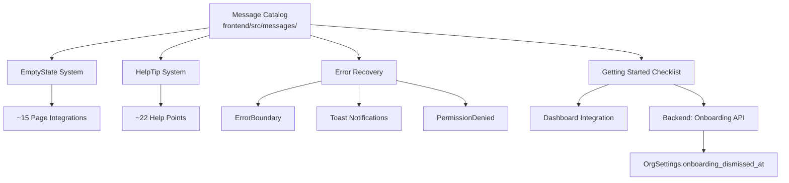
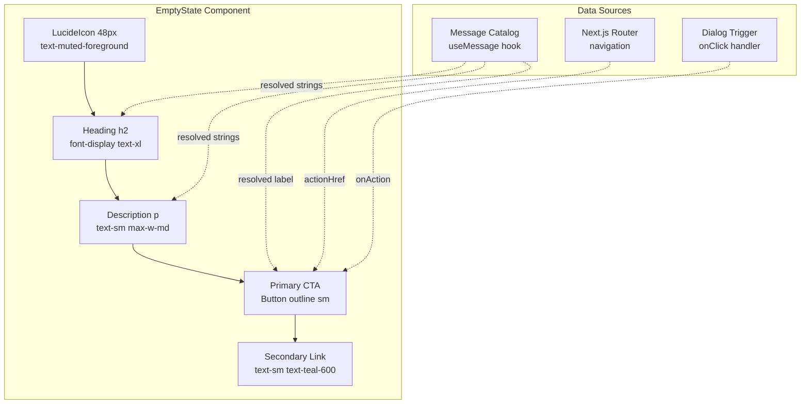
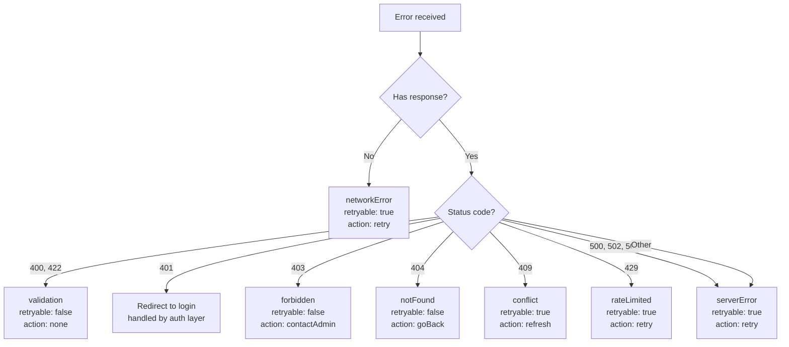
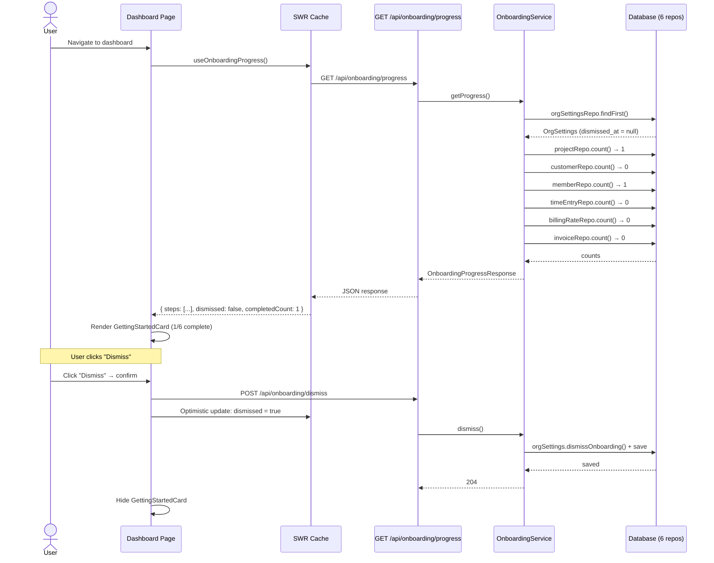
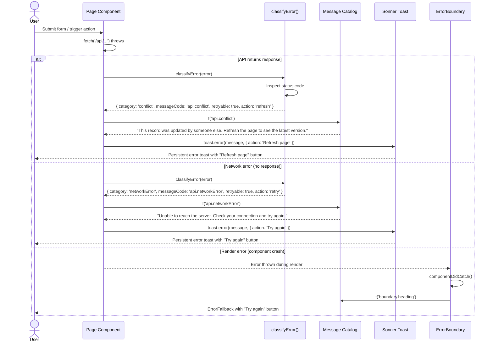

> Standalone architecture doc for Phase 43. Reference from ARCHITECTURE.md Section 11 index if desired.

# Phase 43 — UX Quality Pass: Empty States, Contextual Help & Error Recovery

---

## 11. Phase 43 — UX Quality Pass

Phase 43 is a **frontend-heavy UX quality pass** that addresses the cold-start experience and day-to-day usability gaps across the DocTeams platform. After 42 phases of feature development, the platform has deep capability — projects, customers, invoicing, rate cards, budgets, document templates, custom fields, saved views, dashboards — but a new organisation lands on empty charts, blank lists, and generic error messages. This phase closes the gap between *functional* and *welcoming*.

The work spans three pillars: (1) meaningful empty states that guide users toward their first actions, (2) inline contextual help on complex features, and (3) categorised error recovery with actionable messages. Underpinning all three is a new **i18n-ready message catalog** — a structured JSON system for all user-facing copy introduced by this phase. The catalog is English-only but structured so that adding locale files later (Afrikaans, Zulu) requires only a new directory and an import swap.

The backend surface is minimal: two new endpoints for onboarding progress tracking and a single column added to the existing `OrgSettings` entity. Everything else is frontend architecture.

**Dependencies on prior phases**:
- **Phase 8** (Rate Cards, Budgets): `OrgSettings` entity (extended with `onboarding_dismissed_at`), rate/budget features referenced in help text
- **Phase 10** (Invoicing): Invoice lifecycle referenced in help text and empty states
- **Phase 11** (Custom Fields, Tags, Views): Custom field/tag/view features referenced in help text and empty states
- **Phase 12** (Document Templates): Template features referenced in help text and empty states
- **Phase 20** (Auth Abstraction): Auth context used for permission denial handling

### What's New

| Capability | Before Phase 43 | After Phase 43 |
|---|---|---|
| Empty states | Blank tables or "No items found" text | Contextual, actionable empty states with icons, descriptions, and CTAs on ~15 pages |
| Message catalog | All strings hardcoded inline in JSX | Structured JSON catalog with `useMessage` hook, namespaced by concern |
| Onboarding guidance | None — user lands on empty dashboard | Getting Started checklist with 6 steps, progress tracking, dismissible per-org |
| Contextual help | None | ~22 HelpTip popovers on complex features (rates, budgets, invoicing, templates) |
| Error handling | Ad-hoc try/catch + `toast()` per file | Classified errors with recovery actions, error boundaries, standardised toasts |
| Permission denial | Silent failure or generic 403 | Dedicated PermissionDenied component with explanation and navigation |
| Form validation | Generic "Invalid value" messages | Specific, actionable validation messages from the catalog |

**Out of scope**: Full i18n with locale switching, migrating all existing hardcoded strings (only new copy goes through the catalog), interactive product tours, analytics on help tip usage, backend error response format changes, custom illustrations (Lucide icons only), role-specific onboarding, dark mode adjustments (handled automatically by Shadcn/Tailwind).

---

### 11.1 Overview

Phase 43 introduces five interconnected subsystems, all sharing the message catalog as their string source:



The design philosophy: every component pulls its strings from the catalog via `useMessage()`, ensuring a single source of truth for copy and a clear path to future localisation. Components are reusable primitives (`EmptyState`, `HelpTip`, `ErrorBoundary`, `ErrorFallback`, `PermissionDenied`, `GettingStartedCard`) composed into pages.

---

### 11.2 Message Catalog Architecture

#### File Structure

```
frontend/src/messages/
├── index.ts              — useMessage hook, types, re-exports
├── en/
│   ├── empty-states.json — all empty state copy (~45 entries)
│   ├── help.json         — all contextual help text (~44 entries)
│   ├── errors.json       — all error messages (~15 entries)
│   ├── getting-started.json — checklist items (~20 entries)
│   └── common.json       — shared labels (optional)
```

**Why JSON files, not a library?** The platform does not need pluralisation, ICU message format, or locale negotiation yet. A plain JSON + custom hook approach avoids framework lock-in (`next-intl`, `react-i18next`) while producing a structure that is compatible with any i18n library added later. When locale switching is needed, the hook gains a locale parameter, a new directory (`messages/af/`) is added, and the import path swaps. See [ADR-168](#adr-168-message-catalog-strategy).

#### `useMessage` Hook Design

```typescript
// frontend/src/messages/index.ts

type MessageNamespace = 'empty-states' | 'help' | 'errors' | 'getting-started' | 'common';

interface UseMessageReturn {
  t: (code: string, interpolations?: Record<string, string>) => string;
}

function useMessage(namespace: MessageNamespace, locale?: string): UseMessageReturn;
```

**Behaviour**:
- Loads the namespace JSON file synchronously (static import, not fetched at runtime — these are small JSON files bundled at build time)
- `t('projects.list.heading')` performs a dot-path lookup in the namespace object
- `t('api.planLimit', { feature: 'projects', limit: '5' })` replaces `{{feature}}` and `{{limit}}` tokens via simple string replacement — matches the `{{entity.field}}` template variable syntax used elsewhere in the platform (Phase 12)
- In development mode (`process.env.NODE_ENV === 'development'`), a missing key logs `console.warn('[useMessage] Missing key: empty-states.projects.list.heading')` — catches typos early without breaking the UI
- In production, a missing key returns the raw code string (e.g., `'projects.list.heading'`) as a fallback
- The `locale` parameter defaults to `'en'` and is unused in this phase — it exists to make the signature forward-compatible

**Why not dynamic imports?** The total catalog size for all namespaces is estimated at ~15-20KB uncompressed. Static imports mean zero loading states, zero layout shift, and zero waterfall. When the catalog grows to multiple locales, dynamic imports per locale become worthwhile — the hook signature supports this without breaking consumers.

#### Code Naming Convention

Dot-delimited, hierarchical: `{page-or-domain}.{element}.{property}`

| Namespace | Pattern | Example |
|-----------|---------|---------|
| `empty-states` | `{page}.{view}.{heading\|description\|cta}` | `projects.list.heading` |
| `help` | `{domain}.{topic}.{title\|body}` | `rates.hierarchy.title` |
| `errors` | `api.{category}` or `validation.{rule}` | `api.forbidden`, `validation.required` |
| `getting-started` | `{step-code}.{label\|description}` | `create_project.label` |

---

### 11.3 Empty State System

#### Enhanced EmptyState Component

The existing `EmptyState` component (`frontend/components/empty-state.tsx`) is functional but minimal. Phase 43 enhances it with message catalog integration, onClick CTA support, and an optional secondary link — while preserving backward compatibility with existing usages.

**Current interface** (preserved):
```typescript
interface EmptyStateProps {
  icon: LucideIcon;
  title: string;
  description: string;
  action?: React.ReactNode;
  actionLabel?: string;
  actionHref?: string;
}
```

**Enhanced interface** (additive):
```typescript
interface EmptyStateProps {
  icon: LucideIcon;
  title: string;           // plain text OR message code (namespace:code)
  description: string;     // plain text OR message code (namespace:code)
  action?: React.ReactNode;
  actionLabel?: string;
  actionHref?: string;
  onAction?: () => void;   // NEW: onClick handler for CTA (alternative to actionHref)
  secondaryLink?: {        // NEW: optional secondary navigation link
    label: string;
    href: string;
  };
}
```

**Why enhance instead of replace?** The existing component is used across the codebase. Replacing it would require updating every call site in this phase. Adding optional props is non-breaking — existing usages continue to work. The component itself does NOT call `useMessage` internally (that would force it to be a client component). Instead, pages pass already-resolved strings, keeping `EmptyState` as a Server Component.

**Rendering specification**:
- Icon: 64px (`size-16`), `text-slate-300 dark:text-slate-700` (existing)
- Heading: `font-display text-xl text-slate-900 dark:text-slate-100` (existing, matches Sora display font)
- Description: `text-sm text-slate-600 dark:text-slate-400 max-w-md` (add `max-w-md` for readability)
- CTA button: Shadcn `Button` with `variant="outline"` and `size="sm"` (existing)
- Secondary link: `text-sm text-teal-600 hover:text-teal-700` below the CTA
- Layout: centred flex column, `py-24`, `gap-4` (existing)



#### Dependency-Aware Empty States

Some empty states are simple ("no projects yet — create one"), but others have upstream dependencies. For example, the invoices list empty state should mention that invoices require customers and time entries. The profitability page empty state should direct users to rate card settings.

The message catalog handles this through description text, not component logic. Each description is crafted to explain prerequisites:

- **Simple**: `"Projects organise your work, documents, and time tracking. Create your first project to get started."`
- **Dependency-aware**: `"Generate invoices from tracked time or create them manually. You'll need at least one project with logged time."`
- **Configuration-required**: `"Set up rate cards in Settings to start tracking project profitability."`

No runtime dependency checking is needed — the copy itself guides the user.

#### Page Integration Inventory

| # | Page | Icon | Heading Code | CTA Label Code | CTA Action | Notes |
|---|------|------|-------------|----------------|------------|-------|
| 1 | Projects list | `FolderOpen` | `projects.list.heading` | `projects.list.cta` | Open create project dialog | Tier 1 |
| 2 | Customers list | `Users` | `customers.list.heading` | `customers.list.cta` | Open create customer dialog | Tier 1 |
| 3 | Team page | `UserPlus` | `team.list.heading` | `team.list.cta` | Open invite member dialog | Tier 1 |
| 4 | My Work | `ClipboardList` | `myWork.list.heading` | `myWork.list.cta` | Navigate to projects | No direct create — guide to projects |
| 5 | Documents list | `FileText` | `documents.list.heading` | `documents.list.cta` | Open create document dialog | Project-scoped |
| 6 | Time entries | `Clock` | `timeEntries.list.heading` | `timeEntries.list.cta` | Open log time dialog | Tier 2 |
| 7 | Invoices list | `Receipt` | `invoices.list.heading` | `invoices.list.cta` | Open create invoice dialog | Mentions prerequisites |
| 8 | Templates list | `LayoutTemplate` | `templates.list.heading` | `templates.list.cta` | Open create template dialog | Tier 2 |
| 9 | Profitability page | `TrendingUp` | `profitability.page.heading` | `profitability.page.link` | Navigate to rate card settings | Configuration-required |
| 10 | Budget tab | `PiggyBank` | `budget.tab.heading` | `budget.tab.cta` | Open budget config | Project detail tab |
| 11 | Activity feed | `Activity` | `activity.feed.heading` | — | No CTA, explanatory only | Project detail tab |
| 12 | Notifications page | `Bell` | `notifications.page.heading` | — | No CTA, explanatory only | "You're all caught up" |
| 13 | Comments section | `MessageSquare` | `comments.section.heading` | `comments.section.cta` | Focus comment input | Task/document scoped |
| 14 | Dashboard widgets | `BarChart3` | `dashboard.{widget}.heading` | `dashboard.{widget}.link` | Navigate to relevant page | Per-widget empty states |
| 15 | Rate cards settings | `DollarSign` | `rates.settings.heading` | `rates.settings.cta` | Open add rate dialog | Tier 4 |
| 16 | Custom fields settings | `Settings2` | `customFields.settings.heading` | `customFields.settings.cta` | Open create field dialog | Tier 4 |
| 17 | Saved views | `Filter` | `views.list.heading` | `views.list.cta` | Open create view dialog | Tier 4 |
| 18 | Tags | `Tag` | `tags.list.heading` | `tags.list.cta` | Open create tag dialog | Tier 4 |

---

### 11.4 Getting Started Checklist

The Getting Started checklist guides new organisations through first-time setup. It appears as a card on the dashboard, tracks progress across sessions, and is dismissible per-org.

#### Backend: Onboarding Progress

**Design decision**: Completion is **computed on read**, not tracked via events. The endpoint checks entity counts directly (e.g., `projectRepository.count() > 0`). This is always accurate, requires no event wiring, and the six count queries against small tables add negligible latency (<10ms total). See [ADR-169](#adr-169-onboarding-completion-tracking).

**Controller**: `OnboardingController`

```java
@RestController
@RequestMapping("/api/onboarding")
public class OnboardingController {

    @GetMapping("/progress")
    public OnboardingProgressResponse getProgress();

    @PostMapping("/dismiss")
    @ResponseStatus(HttpStatus.NO_CONTENT)
    public void dismiss();
}
```

**Service**: `OnboardingService`

```java
@Service
public class OnboardingService {

    // Injected repositories: ProjectRepository, CustomerRepository,
    // MemberRepository, TimeEntryRepository, BillingRateRepository,
    // InvoiceRepository, OrgSettingsRepository

    public OnboardingProgress getProgress() {
        // 1. Load OrgSettings for dismissed_at check
        // 2. Run 6 count queries (short-circuit: count > 0)
        // 3. Assemble response with step codes + completion booleans
    }

    public void dismiss() {
        // 1. Load OrgSettings
        // 2. Set onboardingDismissedAt = Instant.now()
        // 3. Save
    }
}
```

**Why a dedicated service instead of adding to OrgSettingsService?** The onboarding logic queries 6 different repositories — mixing this into `OrgSettingsService` would bloat its dependency list. A dedicated service keeps the single-responsibility principle and is easy to delete when onboarding is no longer needed.

#### Checklist Items

| # | Step Code | Label | Completion Trigger | Link |
|---|-----------|-------|--------------------|------|
| 1 | `create_project` | Create your first project | `projectRepository.count() > 0` | `/projects` |
| 2 | `add_customer` | Add a customer | `customerRepository.count() > 0` | `/customers` |
| 3 | `invite_member` | Invite a team member | `memberRepository.count() > 1` | `/team` |
| 4 | `log_time` | Log time on a task | `timeEntryRepository.count() > 0` | `/my-work` |
| 5 | `setup_rates` | Set up your rate card | `billingRateRepository.count() > 0` | `/settings/rates` |
| 6 | `create_invoice` | Generate your first invoice | `invoiceRepository.count() > 0` | `/invoices` |

Steps are ordered by natural setup flow: entities before configuration before derived outputs.

#### Frontend: GettingStartedCard

**Component**: `frontend/components/dashboard/getting-started-card.tsx` (`"use client"`)

**Rendering**:
- Shadcn `Card` positioned above the main dashboard grid
- Title: "Getting started with DocTeams" (from `getting-started:card.title`)
- Progress: "{n} of 6 complete" text + subtle progress bar (`bg-teal-600`)
- Each step: check icon (completed: `text-teal-600`, incomplete: `text-slate-300`) + label + arrow link
- Dismiss: "Dismiss" text button in card header → confirmation Popover ("Are you sure? This can't be undone.")
- Hidden when `dismissed === true` OR all 6 steps complete (auto-hide on full completion)

**Data fetching**:
- SWR hook: `useOnboardingProgress()` calling `GET /api/onboarding/progress`
- `revalidateOnFocus: true` — completing a step in another tab updates the checklist on window focus
- `dedupingInterval: 30000` — avoid redundant fetches within 30 seconds
- Dismissal: `POST /api/onboarding/dismiss` → mutate SWR cache optimistically

**Why SWR, not a server action?** The dashboard is a client component (interactive widgets, polling). The onboarding data fits the SWR pattern: fetch on mount, refetch on focus, cache for 30s. A server action would require a page refresh to reflect changes.

---

### 11.5 Inline Contextual Help

#### HelpTip Component

**File**: `frontend/components/help-tip.tsx` (`"use client"`)

```typescript
interface HelpTipProps {
  code: string; // e.g., "rates.hierarchy" — resolves to help:{code}.title and help:{code}.body
}
```

**Rendering**:
- Trigger: `CircleHelp` icon from Lucide, 16px (`size-4`), `text-slate-400 hover:text-slate-600 dark:text-slate-500 dark:hover:text-slate-300`, `cursor-pointer`
- Popover: Shadcn `Popover` with `PopoverTrigger` + `PopoverContent`
  - Title: `text-sm font-semibold text-slate-900 dark:text-slate-100`
  - Body: `text-sm text-slate-600 dark:text-slate-400`, `max-w-xs` (320px)
  - Padding: `p-4`
- Dismissal: click outside or Escape key (Shadcn Popover default behaviour)
- No "learn more" links in this phase

**Why Popover, not Tooltip?** Tooltips appear on hover and disappear immediately on mouse leave — unsuitable for multi-sentence help text that users need time to read. Popovers are click-activated and persist until explicitly dismissed, matching the mental model of a help panel.

#### Placement Guidelines

- Place `HelpTip` adjacent to section headings or form group labels, not individual fields
- Pattern: `<h3 className="flex items-center gap-2">Section Title <HelpTip code="..." /></h3>`
- Maximum 2-3 visible help tips per page to avoid visual clutter
- Do not add help tips to self-explanatory UI (e.g., a "Name" input)

#### Help Point Inventory

| # | Domain | Code | Title | Placement |
|---|--------|------|-------|-----------|
| 1 | Rates | `rates.hierarchy` | Rate card hierarchy | Rate cards settings page heading |
| 2 | Rates | `rates.costVsBilling` | Cost rates vs. billing rates | Cost rates section heading |
| 3 | Rates | `rates.billableTime` | Billable vs. non-billable | Time entry form, billable toggle |
| 4 | Rates | `rates.currency` | Currency settings | Org settings, currency field |
| 5 | Rates | `rates.snapshots` | Rate snapshots | Rate cards settings, info section |
| 6 | Budgets | `budget.types` | Budget types | Budget config tab heading |
| 7 | Budgets | `budget.alerts` | Alert thresholds | Budget alert threshold field |
| 8 | Budgets | `budget.vsActual` | Budget vs. actual | Budget status display |
| 9 | Invoicing | `invoices.lifecycle` | Invoice lifecycle | Invoices list page heading |
| 10 | Invoicing | `invoices.unbilledTime` | Unbilled time | Create invoice dialog |
| 11 | Invoicing | `invoices.numbering` | Invoice numbering | Invoice settings or detail |
| 12 | Templates | `templates.variables` | Template variables | Template editor heading |
| 13 | Templates | `templates.tiptapVsWord` | Tiptap vs. Word | Template creation, format selector |
| 14 | Templates | `templates.packs` | Template packs | Templates list, pack section |
| 15 | Custom fields | `fields.types` | Field types | Create field dialog |
| 16 | Custom fields | `fields.scoping` | Field scoping | Custom fields settings heading |
| 17 | Dashboard | `dashboard.utilisation` | Utilisation rate | Dashboard utilisation widget |
| 18 | Dashboard | `dashboard.projectHealth` | Project health | Dashboard project health widget |
| 19 | Dashboard | `dashboard.profitability` | Profitability margin | Profitability page heading |
| 20 | Other | `views.saved` | Saved views | Saved views list heading |
| 21 | Other | `tags.overview` | Tags | Tags settings heading |
| 22 | Other | `notifications.preferences` | Notification preferences | Notification settings heading |

---

### 11.6 Error Recovery System

#### Error Classification Utility

**File**: `frontend/src/lib/error-handler.ts`

```typescript
type ErrorCategory =
  | 'validation'
  | 'forbidden'
  | 'notFound'
  | 'conflict'
  | 'serverError'
  | 'networkError'
  | 'rateLimited';

interface ClassifiedError {
  category: ErrorCategory;
  messageCode: string;       // code in errors.json namespace
  retryable: boolean;
  action?: 'retry' | 'refresh' | 'goBack' | 'contactAdmin';
}

function classifyError(error: unknown): ClassifiedError;
```

**Classification rules**:



The utility accepts `unknown` because errors in TypeScript are untyped. It inspects the error for a `response.status` property (fetch Response), an `AxiosError`-like structure, or falls back to `networkError` if no response is present. The backend's RFC 9457 `ProblemDetail` body is parsed for additional context when available, but classification relies primarily on HTTP status codes for reliability.

**Why frontend classification, not backend error codes?** The backend already returns structured `ProblemDetail` responses. Adding a classification enum to every error response would require touching every controller. Frontend classification maps the existing status codes to UX-appropriate messages, keeping the backend unchanged.

#### ErrorBoundary Component

**File**: `frontend/components/error-boundary.tsx` (`"use client"`)

```typescript
interface ErrorBoundaryProps {
  children: React.ReactNode;
  fallback?: React.ReactNode; // optional custom fallback
}
```

A React class component (error boundaries require `componentDidCatch`) that catches render errors in its subtree and displays an `ErrorFallback` component.

**ErrorFallback** renders:
- `AlertTriangle` icon (Lucide), `text-red-500`, `size-12`
- Error heading from catalog (`errors:boundary.heading`)
- Error description from catalog (`errors:boundary.description`)
- Recovery button(s) based on the error:
  - "Try again" button (`onClick` → reset error boundary)
  - "Refresh page" button (`onClick` → `window.location.reload()`)
  - "Go back" button (`onClick` → `router.back()`)
- Layout: centred, same visual language as `EmptyState` (consistency)

**Integration**: Wrap each main page content area inside the org layout. The app shell (sidebar, header) remains outside the boundary so navigation stays functional during page-level errors.

```
<OrgLayout>
  <Sidebar />           ← outside boundary
  <Header />            ← outside boundary
  <ErrorBoundary>
    <PageContent />     ← caught by boundary
  </ErrorBoundary>
</OrgLayout>
```

#### Toast Standardisation

The existing `sonner` toast library is retained (no migration). Standardise toast usage across all mutations:

| Type | Icon | Auto-dismiss | Duration | Retry Button |
|------|------|-------------|----------|-------------|
| Success | Green check | Yes | 4s | No |
| Error | Red alert | **No** (user must close) | — | Yes, if `retryable` |
| Warning | Amber triangle | Yes | 6s | No |
| Info | Blue info circle | Yes | 4s | No |

**Implementation**: A thin wrapper function `showToast(type, messageCode, options?)` that resolves the message from the catalog and calls the appropriate `toast.success()` / `toast.error()` / etc. This standardises icon usage, duration, and retry button presence without replacing the underlying library.

#### Permission Denial Handling

**Component**: `frontend/components/permission-denied.tsx`

When a 403 is received from the API or a frontend capability check (Phase 41) fails:
- Renders a `ShieldOff` icon (Lucide), `size-12`, `text-slate-400`
- Heading: "You don't have access to this feature" (from catalog)
- Description: "Contact your organisation admin to update your role." (from catalog)
- "Go to dashboard" button
- Same centred layout as `EmptyState`

For inline elements (e.g., a "Create Invoice" button the user lacks permission for): disable the button and add a Shadcn `Tooltip` explaining why. Pattern: `<Tooltip><TooltipTrigger asChild><Button disabled>Create Invoice</Button></TooltipTrigger><TooltipContent>You don't have permission for this action</TooltipContent></Tooltip>`.

#### Form Validation Improvements

- Use field-level inline error messages (`text-red-600 text-sm` below the field) sourced from the catalog
- On submit failure with validation errors: scroll to the first error field and focus it
- Add specific validation messages to `errors.json`:
  - `validation.required` — "This field is required."
  - `validation.email` — "Please enter a valid email address."
  - `validation.positiveNumber` — "Must be a positive number."
  - `validation.maxLength` — "Must be {{max}} characters or fewer."
  - `validation.minLength` — "Must be at least {{min}} characters."
  - `validation.url` — "Please enter a valid URL."

---

### 11.7 Database Migration

**Migration**: `V66__add_onboarding_dismissed_at.sql` (tenant migration)

```sql
ALTER TABLE org_settings
  ADD COLUMN onboarding_dismissed_at TIMESTAMPTZ;
```

**OrgSettings entity changes** (`backend/src/main/java/.../settings/OrgSettings.java`):

```java
@Column(name = "onboarding_dismissed_at")
private Instant onboardingDismissedAt;

// Getter + setter

public void dismissOnboarding() {
    this.onboardingDismissedAt = Instant.now();
}

public boolean isOnboardingDismissed() {
    return onboardingDismissedAt != null;
}
```

No global migration needed. No indexes needed — `onboarding_dismissed_at` is only read via the primary key lookup on `OrgSettings`.

---

### 11.8 API Surface

This phase adds only two backend endpoints. The rest of the work is frontend-only.

#### `GET /api/onboarding/progress`

**Auth**: Requires authenticated member (any role)

**Response** (200 OK):
```json
{
  "steps": [
    { "code": "create_project", "completed": true },
    { "code": "add_customer", "completed": false },
    { "code": "invite_member", "completed": false },
    { "code": "log_time", "completed": false },
    { "code": "setup_rates", "completed": false },
    { "code": "create_invoice", "completed": false }
  ],
  "dismissed": false,
  "completedCount": 1,
  "totalCount": 6
}
```

**Response DTOs**:
```java
public record OnboardingProgressResponse(
    List<OnboardingStep> steps,
    boolean dismissed,
    int completedCount,
    int totalCount
) {}

public record OnboardingStep(
    String code,
    boolean completed
) {}
```

#### `POST /api/onboarding/dismiss`

**Auth**: Requires authenticated member with `owner` or `admin` role (only org admins should dismiss the checklist for the whole org)

**Request body**: None

**Response**: 204 No Content

**Side effects**: Sets `org_settings.onboarding_dismissed_at` to current timestamp. Idempotent — calling again on an already-dismissed org is a no-op (returns 204).

---

### 11.9 Sequence Diagrams

#### Getting Started Checklist Flow



#### Error Recovery Flow



---

### 11.10 Implementation Guidance

#### Frontend Changes

| File | Change |
|------|--------|
| `frontend/src/messages/index.ts` | New: `useMessage` hook, types, namespace imports |
| `frontend/src/messages/en/*.json` | New: 5 namespace JSON files |
| `frontend/components/empty-state.tsx` | Enhance: add `onAction`, `secondaryLink` props, `max-w-md` on description |
| `frontend/components/help-tip.tsx` | New: HelpTip component (Popover + CircleHelp icon) |
| `frontend/components/error-boundary.tsx` | New: ErrorBoundary + ErrorFallback components |
| `frontend/components/permission-denied.tsx` | New: PermissionDenied component |
| `frontend/components/dashboard/getting-started-card.tsx` | New: GettingStartedCard component |
| `frontend/src/lib/error-handler.ts` | New: `classifyError()` utility |
| `frontend/hooks/use-onboarding-progress.ts` | New: SWR hook for onboarding progress |
| ~15 page files (`page.tsx`) | Update: integrate EmptyState with message catalog strings |
| ~10 page/component files | Update: add HelpTip placements |
| ~10 mutation handlers | Update: use `classifyError()` + standardised toasts |
| `frontend/app/(app)/org/[slug]/layout.tsx` | Update: wrap page content in ErrorBoundary |

#### Backend Changes

| File | Change |
|------|--------|
| `OnboardingController.java` | New: REST controller with 2 endpoints |
| `OnboardingService.java` | New: service computing progress from entity counts |
| `OnboardingProgressResponse.java` | New: response DTO record |
| `OnboardingStep.java` | New: step DTO record |
| `OrgSettings.java` | Update: add `onboardingDismissedAt` field + `dismissOnboarding()` method |
| `V66__add_onboarding_dismissed_at.sql` | New: tenant migration |

#### Testing Strategy

**Backend**:
- `OnboardingControllerIntegrationTest`: test both endpoints (progress computation, dismiss flow, idempotent dismiss, role-based access for dismiss)
- Test that progress correctly computes from entity counts (create entities, verify step completion flips)
- Test that dismissed state persists and is returned correctly

**Frontend**:
- `useMessage` hook: unit test key resolution, interpolation, missing key fallback, dev-mode warnings
- `EmptyState` component: render test with new props (onAction, secondaryLink)
- `HelpTip` component: render test, popover open/close behaviour
- `ErrorBoundary`: test that errors are caught and ErrorFallback renders
- `classifyError`: unit test all status code mappings
- `GettingStartedCard`: render test with mock SWR data, dismiss flow
- Integration: snapshot or visual tests for empty state pages (optional)

---

### 11.11 Capability Slices

#### Slice A — i18n Message Catalog Foundation

**Scope**: Establish the message catalog infrastructure and `useMessage` hook.

**Key deliverables**:
- `frontend/src/messages/index.ts` — hook implementation with interpolation, missing-key warnings
- `frontend/src/messages/en/empty-states.json` — all ~18 page empty state entries
- `frontend/src/messages/en/help.json` — all ~22 help point entries (title + body)
- `frontend/src/messages/en/errors.json` — all error classification messages + validation messages
- `frontend/src/messages/en/getting-started.json` — 6 checklist item entries
- `frontend/src/messages/en/common.json` — shared labels (if needed)
- TypeScript types for namespace names and hook return type

**Dependencies**: None (foundational slice)

**Test expectations**: Unit tests for `useMessage` hook — key resolution, interpolation, missing key fallback, dev-mode console.warn

#### Slice B — Empty States System & Page Integration

**Scope**: Enhance EmptyState component and integrate across ~15-18 pages.

**Key deliverables**:
- Enhanced `EmptyState` component with `onAction` and `secondaryLink` props
- Page integrations for all Tier 1-4 pages from the inventory
- Each page resolves strings via `useMessage('empty-states')` and passes to `EmptyState`
- Dashboard widget empty states

**Dependencies**: Slice A (message catalog must exist)

**Test expectations**: Render tests for enhanced EmptyState component, spot-check tests for 3-4 page integrations

#### Slice C — Getting Started Checklist

**Scope**: Backend onboarding endpoints + frontend GettingStartedCard.

**Key deliverables**:
- Backend: `OnboardingController`, `OnboardingService`, DTOs
- Backend: `V66__add_onboarding_dismissed_at.sql` migration
- Backend: `OrgSettings` entity update
- Frontend: `GettingStartedCard` component
- Frontend: `useOnboardingProgress` SWR hook
- Frontend: Dashboard integration (card above grid, hidden when dismissed)

**Dependencies**: Slice A (message catalog for card labels)

**Test expectations**:
- Backend: Integration tests for both endpoints (progress computation with various entity combinations, dismiss idempotency, role restriction on dismiss)
- Frontend: Render tests for GettingStartedCard (loading, progress display, dismiss flow)

#### Slice D — Inline Contextual Help

**Scope**: HelpTip component + placement across ~22 points.

**Key deliverables**:
- `HelpTip` component with Popover integration
- Placement of HelpTip on all 22 points from the inventory
- Consistent heading pattern: `<h3>Title <HelpTip code="..." /></h3>`

**Dependencies**: Slice A (message catalog for help text)

**Test expectations**: Render test for HelpTip (open/close, title/body rendering), verify max 2-3 tips per page

#### Slice E — Error Recovery & Feedback

**Scope**: Error classification, ErrorBoundary, toast standardisation, PermissionDenied, form validation.

**Key deliverables**:
- `classifyError()` utility in `lib/error-handler.ts`
- `ErrorBoundary` + `ErrorFallback` components
- `PermissionDenied` component
- `showToast()` wrapper for standardised toast usage
- ErrorBoundary integration in org layout
- Form validation improvements (scroll-to-error, specific messages)
- Update ~10 mutation handlers to use `classifyError` + standardised toasts

**Dependencies**: Slice A (message catalog for error messages)

**Test expectations**:
- Unit tests for `classifyError` (all status code branches, network error, unknown error)
- Render test for ErrorBoundary (error caught → fallback rendered)
- Render test for PermissionDenied

---

### 11.12 ADR Index

#### ADR-168: Message Catalog Strategy {#adr-168-message-catalog-strategy}

**Decision**: Plain JSON files in `frontend/src/messages/en/` with a custom `useMessage` hook, over `next-intl` or `react-i18next`.

**Rationale**: The platform does not yet need pluralisation, ICU message format, or locale negotiation. A plain JSON + custom hook approach avoids framework lock-in while producing a structure compatible with any i18n library added later. The file layout (`messages/{locale}/`) and hook signature (`useMessage(namespace, locale?)`) match the conventions of both `next-intl` and `react-i18next`, making future migration a wrapper swap rather than a restructure. The total catalog size (~15-20KB) is small enough for static imports — no bundle splitting needed.

**Alternatives rejected**:
- **`next-intl`**: Full-featured but opinionated about App Router integration (requires `[locale]` segment or middleware). Overhead is not justified for English-only.
- **`react-i18next`**: Mature but client-heavy (runtime namespace loading, suspense boundaries). Adds ~30KB to bundle for features we do not use.

#### ADR-169: Onboarding Completion Tracking {#adr-169-onboarding-completion-tracking}

**Decision**: Computed-on-read (count entities per request) over event-driven tracking (store completion events in a dedicated table).

**Rationale**: Six `SELECT COUNT(*) > 0` queries against small, indexed tables add <10ms total. The computed approach is always accurate (no stale state from missed events), requires no event wiring (no `@EventListener`, no event bus coupling), and needs no new table. The `onboarding_dismissed_at` timestamp on `OrgSettings` is the only persistent state. If an organisation deletes all its projects after the checklist showed "create project" as complete, the next load correctly shows it as incomplete — event-driven tracking would show it as permanently complete (wrong).

**Alternatives rejected**:
- **Event-driven with JSONB on OrgSettings**: Stores `{ "create_project": "2026-03-10T..." }`. Requires wiring `@EventListener` on 6 different entity creation events. Stale if entities are deleted. More code for less accuracy.
- **Separate `onboarding_progress` table**: One row per org per step. Over-engineered for 6 boolean flags that can be computed from existing data. Adds a migration, entity, repository, and service for no benefit.
