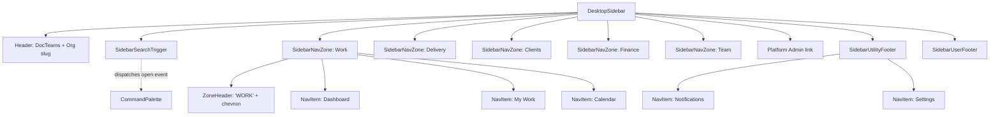
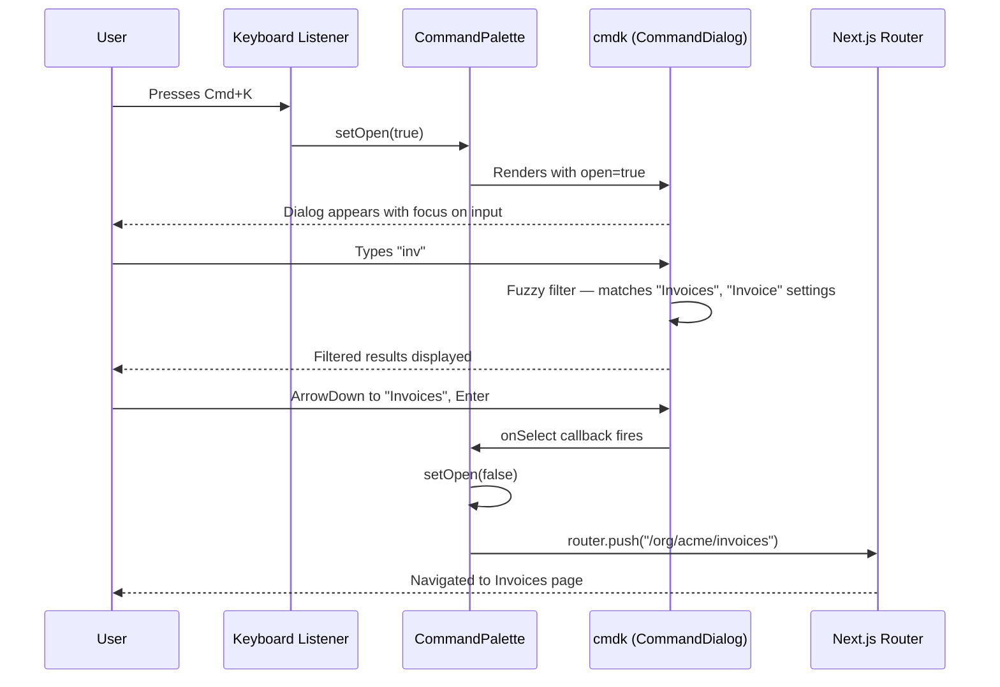
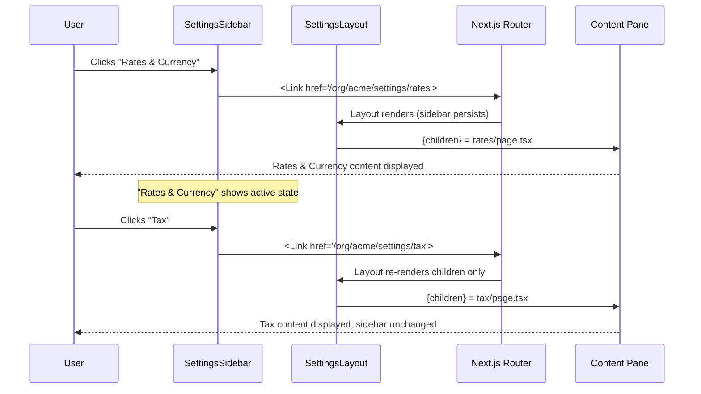

# Phase 44 — Navigation Zones, Command Palette & Settings Modernization

> Standalone architecture document for Phase 44. No ARCHITECTURE.md merge needed.

## 1. Overview

Phase 44 addresses a UX debt that accumulated over 43 phases: the sidebar grew to 15 ungrouped items (exceeding the 5-7 cognitive grouping threshold), settings uses a dated card-grid that loses context on navigation, and there is no quick-jump mechanism for power users. This is a **frontend-only phase** — no backend changes, no database migrations, no new API endpoints.

### Three Pillars

| Pillar | What it does | Why |
|--------|-------------|-----|
| **Sidebar Navigation Zones** | Groups 15 flat nav items into 5 collapsible zones reflecting user mental models (Work, Delivery, Clients, Finance, Team) | Reduces cognitive load, provides progressive disclosure, makes the sidebar scannable |
| **Command Palette (Cmd+K)** | Global keyboard-first quick-jump dialog built on Shadcn `CommandDialog` / cmdk | Power users skip the sidebar entirely; discoverability of pages and settings improves |
| **Settings Layout Modernization** | Replaces the 23-card grid with a persistent sidebar + content pane layout using nested App Router layouts | Users maintain context while switching between settings; matches industry standard (Linear, Notion, Claude Desktop) |

### Current vs. New UX Patterns

| Aspect | Current | New |
|--------|---------|-----|
| Sidebar structure | Flat list, 15 items, no grouping | 5 collapsible zones + utility footer |
| Finding a page | Scan the sidebar linearly | Cmd+K fuzzy search or scan grouped zones |
| Settings navigation | Card grid hub → navigate to page → Back to hub | Persistent sidebar, inline content, URL-preserved |
| Settings context | Lost on each page navigation | Always visible in settings sidebar |
| Mobile settings | Same card grid | Dropdown section switcher at top |
| Keyboard navigation | None beyond browser defaults | Cmd+K opens palette, arrow keys navigate, Enter selects |

### ADR Index

| ADR | Title | Decision |
|-----|-------|----------|
| [ADR-170](../adr/ADR-170-sidebar-zone-structure.md) | Sidebar zone structure | Fixed zones with capability-based visibility |
| [ADR-171](../adr/ADR-171-command-palette-scope.md) | Command palette scope | Page-only search with optional recent-items cache |
| [ADR-172](../adr/ADR-172-settings-layout-pattern.md) | Settings layout pattern | Nested App Router layout with URL preservation |

---

## 2. Component Architecture

### Component Tree

```
OrgLayout (server component)
├── DesktopSidebar (client)                    ← MODIFIED: zone-based rendering
│   ├── SidebarSearchTrigger (client)          ← NEW: Cmd+K pill trigger
│   ├── SidebarNavZone (client)                ← NEW: collapsible zone wrapper
│   │   ├── SidebarNavZoneHeader (client)      ← NEW: zone label + chevron
│   │   └── SidebarNavItem (client)            ← EXTRACTED: single nav link
│   └── SidebarUtilityFooter (client)          ← NEW: Notifications + Settings pinned
├── MobileSidebar (client)                     ← MODIFIED: zone-based rendering
│   ├── SidebarSearchTrigger (client)          ← REUSED
│   └── SidebarNavZone (client)                ← REUSED
├── Header
│   └── MobileSidebar
├── CommandPalette (client)                    ← NEW: global Cmd+K dialog
│   ├── CommandDialog (Shadcn)
│   ├── CommandInput (Shadcn)
│   ├── CommandList (Shadcn)
│   ├── CommandGroup (Shadcn)                  ← Pages, Settings, Recent
│   └── CommandItem (Shadcn)
├── main
│   └── /settings/layout.tsx (server)          ← NEW: settings shell
│       ├── SettingsSidebar (client)            ← NEW: grouped settings nav
│       │   ├── SettingsNavGroup (client)       ← NEW: settings section header
│       │   └── SettingsNavItem (client)        ← NEW: individual setting link
│       ├── SettingsMobileNav (client)          ← NEW: dropdown for mobile
│       └── {children}                         ← Individual settings pages (unchanged)
```

### Component Responsibility Table

| Component | File | Responsibility |
|-----------|------|---------------|
| `SidebarNavZone` | `components/sidebar-nav-zone.tsx` | Renders a collapsible zone with header and items. Manages expand/collapse state. Filters items by capability. Hides zone if no items visible. |
| `SidebarNavZoneHeader` | `components/sidebar-nav-zone.tsx` | Zone label + chevron indicator. Click toggles collapse. |
| `SidebarNavItem` | `components/sidebar-nav-item.tsx` | Single nav link with icon, label, active indicator. Extracted from current inline rendering in `desktop-sidebar.tsx`. |
| `SidebarSearchTrigger` | `components/sidebar-search-trigger.tsx` | Renders Cmd+K pill/icon. On click, dispatches custom event to open command palette. Shows keyboard shortcut hint. |
| `SidebarUtilityFooter` | `components/sidebar-utility-footer.tsx` | Pinned Notifications + Settings items at sidebar bottom, outside collapsible zones. |
| `CommandPalette` | `components/command-palette.tsx` | Global dialog mounted in org layout. Listens for Cmd+K. Indexes nav items + settings. Navigates on select. |
| `SettingsSidebar` | `components/settings/settings-sidebar.tsx` | Grouped settings navigation sidebar. Highlights active section. Handles admin-only and coming-soon items. |
| `SettingsNavGroup` | `components/settings/settings-sidebar.tsx` | Group header within settings sidebar. |
| `SettingsNavItem` | `components/settings/settings-sidebar.tsx` | Individual settings link with active state, coming-soon badge, admin gating. |
| `SettingsMobileNav` | `components/settings/settings-mobile-nav.tsx` | Dropdown select for switching settings sections on mobile. |

### Data Flow

```
nav-items.ts (NAV_GROUPS)
    │
    ├──▶ DesktopSidebar → SidebarNavZone → SidebarNavItem
    ├──▶ MobileSidebar  → SidebarNavZone → SidebarNavItem
    └──▶ CommandPalette (Pages group)

settings-nav.ts (SETTINGS_GROUPS)
    │
    ├──▶ SettingsSidebar → SettingsNavGroup → SettingsNavItem
    ├──▶ SettingsMobileNav (dropdown options)
    └──▶ CommandPalette (Settings group)

useCapabilities() hook
    │
    ├──▶ SidebarNavZone (filters items per zone)
    ├──▶ CommandPalette (filters searchable items)
    └──▶ SettingsSidebar (filters admin-only items)
```

---

## 3. Navigation Zone Model

### Zone Definitions

The flat `NAV_ITEMS` array is replaced by a `NAV_GROUPS` structure. Each zone groups items by user mental model rather than implementation chronology. See [ADR-170](../adr/ADR-170-sidebar-zone-structure.md) for the decision rationale.

| Zone ID | Label | Items | Required Capabilities | Default State |
|---------|-------|-------|----------------------|---------------|
| `work` | Work | Dashboard, My Work, Calendar | None (all universal) | Expanded |
| `delivery` | Delivery | Projects, Documents, Recurring Schedules | `PROJECT_MANAGEMENT` for Schedules | Expanded |
| `clients` | Clients | Customers, Retainers, Compliance | `CUSTOMER_MANAGEMENT`, `INVOICING` | Expanded |
| `finance` | Finance | Invoices, Profitability, Reports | `INVOICING`, `FINANCIAL_VISIBILITY` | Expanded |
| `team` | Team & Resources | Team, Resources | `RESOURCE_PLANNING` for Resources | Expanded |

**Utility items** (pinned to sidebar bottom, not in a collapsible zone):
- Notifications (with `NotificationBell` badge — already exists in header, sidebar version is a simple link)
- Settings

### TypeScript Interfaces

```typescript
// lib/nav-items.ts

export interface NavItem {
  label: string;
  href: (slug: string) => string;
  icon: LucideIcon;
  exact?: boolean;
  requiredCapability?: CapabilityName;
  /** Keywords for command palette fuzzy search beyond the label */
  keywords?: string[];
}

export interface NavGroup {
  id: string;
  label: string;
  items: NavItem[];
  defaultExpanded: boolean;
}

export const NAV_GROUPS: NavGroup[] = [
  {
    id: "work",
    label: "Work",
    items: [
      { label: "Dashboard", href: (slug) => `/org/${slug}/dashboard`, icon: LayoutDashboard, exact: true },
      { label: "My Work",   href: (slug) => `/org/${slug}/my-work`,   icon: ClipboardList,   exact: true },
      { label: "Calendar",  href: (slug) => `/org/${slug}/calendar`,  icon: CalendarDays,    exact: true },
    ],
    defaultExpanded: true,
  },
  {
    id: "delivery",
    label: "Delivery",
    items: [
      { label: "Projects",            href: (slug) => `/org/${slug}/projects`,  icon: FolderOpen },
      { label: "Documents",           href: (slug) => `/org/${slug}/documents`, icon: FileText, exact: true },
      { label: "Recurring Schedules", href: (slug) => `/org/${slug}/schedules`, icon: CalendarClock, requiredCapability: "PROJECT_MANAGEMENT" },
    ],
    defaultExpanded: true,
  },
  {
    id: "clients",
    label: "Clients",
    items: [
      { label: "Customers",  href: (slug) => `/org/${slug}/customers`,  icon: UserRound,   requiredCapability: "CUSTOMER_MANAGEMENT" },
      { label: "Retainers",  href: (slug) => `/org/${slug}/retainers`,  icon: FileText,    requiredCapability: "INVOICING" },
      { label: "Compliance", href: (slug) => `/org/${slug}/compliance`, icon: ShieldCheck, requiredCapability: "CUSTOMER_MANAGEMENT" },
    ],
    defaultExpanded: false, // All items capability-gated — collapsed by default for progressive disclosure
  },
  {
    id: "finance",
    label: "Finance",
    items: [
      { label: "Invoices",      href: (slug) => `/org/${slug}/invoices`,      icon: Receipt,     requiredCapability: "INVOICING" },
      { label: "Profitability", href: (slug) => `/org/${slug}/profitability`, icon: TrendingUp,  exact: true, requiredCapability: "FINANCIAL_VISIBILITY" },
      { label: "Reports",       href: (slug) => `/org/${slug}/reports`,       icon: BarChart3,   exact: true, requiredCapability: "FINANCIAL_VISIBILITY" },
    ],
    defaultExpanded: false, // All items capability-gated — collapsed by default for progressive disclosure
  },
  {
    id: "team",
    label: "Team & Resources",
    items: [
      { label: "Team",      href: (slug) => `/org/${slug}/team`,      icon: Users, exact: true },
      { label: "Resources", href: (slug) => `/org/${slug}/resources`, icon: Users, exact: true, requiredCapability: "RESOURCE_PLANNING" },
    ],
    defaultExpanded: true,
  },
];

/** Flat list of ALL navigable items for breadcrumbs, active detection, and palette indexing. */
export const ALL_NAV_ITEMS: NavItem[] = [
  ...NAV_GROUPS.flatMap((g) => g.items),
  ...UTILITY_ITEMS,
];

/** @deprecated Use ALL_NAV_ITEMS for complete list. This excludes utility items (Settings, Notifications). */
export const NAV_ITEMS: NavItem[] = NAV_GROUPS.flatMap((g) => g.items);

/** Utility items pinned to sidebar bottom — not in any zone. */
export const UTILITY_ITEMS: NavItem[] = [
  { label: "Notifications", href: (slug) => `/org/${slug}/notifications`, icon: Bell,     exact: true },
  { label: "Settings",      href: (slug) => `/org/${slug}/settings`,      icon: Settings },
];
```

### Capability Gating

Zones interact with the existing `useCapabilities()` hook:

1. Each `SidebarNavZone` filters its items: `items.filter(i => !i.requiredCapability || hasCapability(i.requiredCapability))`
2. If the filtered list is empty, the entire zone (header + items) is not rendered
3. The `CommandPalette` applies the same filter when building the search index
4. Admin/owner users see all items (the `hasCapability` hook already short-circuits for admin/owner)

### Mobile Adaptation

The mobile `Sheet` sidebar uses the same `SidebarNavZone` component. The only differences:

- `layoutId` prefix changes from `"sidebar-"` to `"mobile-sidebar-"` to prevent Motion conflicts
- Zone headers use `text-white/40` instead of `text-slate-500` (dark sheet background)
- Tap on a nav item calls `setOpen(false)` to close the sheet (existing behavior preserved)
- Zone collapse/expand works via tap on zone header

### Sidebar Component Hierarchy



---

## 4. Command Palette

### Architecture

The `CommandPalette` is mounted once in the org layout (`layout.tsx`), as a sibling to the sidebar and main content. It uses the existing Shadcn `CommandDialog` component which wraps the `cmdk` library. See [ADR-171](../adr/ADR-171-command-palette-scope.md) for the scope decision.

```typescript
// components/command-palette.tsx
"use client";

interface CommandPaletteProps {
  slug: string;
}

export function CommandPalette({ slug }: CommandPaletteProps) {
  const [open, setOpen] = useState(false);
  const router = useRouter();
  const { hasCapability, isAdmin } = useCapabilities();

  // Global keyboard listener
  useEffect(() => {
    const handler = (e: KeyboardEvent) => {
      if ((e.metaKey || e.ctrlKey) && e.key === "k") {
        e.preventDefault();
        setOpen((prev) => !prev);
      }
    };
    document.addEventListener("keydown", handler);
    return () => document.removeEventListener("keydown", handler);
  }, []);

  // Custom event listener for trigger button
  useEffect(() => {
    const handler = () => setOpen(true);
    document.addEventListener("open-command-palette", handler);
    return () => document.removeEventListener("open-command-palette", handler);
  }, []);

  const navigate = (href: string) => {
    setOpen(false);
    router.push(href);
  };

  // Build search index from NAV_ITEMS + UTILITY_ITEMS + SETTINGS_ITEMS
  const pages = [...NAV_ITEMS, ...UTILITY_ITEMS].filter(
    (item) => !item.requiredCapability || hasCapability(item.requiredCapability)
  );

  const settings = SETTINGS_ITEMS.filter(
    (item) => !item.adminOnly || isAdmin
  ).filter((item) => !item.comingSoon);

  return (
    <CommandDialog open={open} onOpenChange={setOpen} title="Command Palette" description="Search pages and settings">
      <CommandInput placeholder="Search pages, settings..." />
      <CommandList>
        <CommandEmpty>No results found. Try a different search term.</CommandEmpty>
        <CommandGroup heading="Pages">
          {pages.map((item) => (
            <CommandItem key={item.label} onSelect={() => navigate(item.href(slug))}>
              <item.icon className="h-4 w-4" />
              {item.label}
            </CommandItem>
          ))}
        </CommandGroup>
        <CommandGroup heading="Settings">
          {settings.map((item) => (
            <CommandItem key={item.title} onSelect={() => navigate(`/org/${slug}/settings/${item.href}`)}>
              <item.icon className="h-4 w-4" />
              {item.title}
            </CommandItem>
          ))}
        </CommandGroup>
      </CommandList>
      <div className="border-t border-slate-200 px-3 py-2 text-xs text-slate-500 dark:border-slate-800 dark:text-slate-400">
        <kbd className="rounded border border-slate-300 px-1 py-0.5 text-[10px] dark:border-slate-600">Esc</kbd>
        <span className="ml-1.5">to close</span>
      </div>
    </CommandDialog>
  );
}
```

### Search Index Construction

The palette indexes three categories of items:

| Group | Source | Count | Filter |
|-------|--------|-------|--------|
| **Pages** | `NAV_ITEMS` + `UTILITY_ITEMS` from `nav-items.ts` | ~16 | `requiredCapability` via `hasCapability()` |
| **Settings** | `SETTINGS_ITEMS` from `settings-nav.ts` | ~23 | `adminOnly` via `isAdmin`, excludes `comingSoon` |
| **Recent** (optional, v1 stretch) | In-memory cache of last 5 visited projects/customers | 0-5 | None |

The `cmdk` library provides built-in fuzzy matching on the `CommandItem` children text. No custom search implementation is needed. The optional `keywords` field on `NavItem` can be passed to `CommandItem` as the `keywords` prop for additional search terms (e.g., "money" matching "Invoices").

### Keyboard Shortcut Registration

| Shortcut | Context | Action |
|----------|---------|--------|
| `Cmd+K` / `Ctrl+K` | Global (org layout) | Toggle command palette open/closed |
| `Escape` | Palette open | Close palette |
| `ArrowUp` / `ArrowDown` | Palette open | Navigate items (built into cmdk) |
| `Enter` | Palette open, item selected | Navigate to selected item |

The keyboard listener is registered once in the `CommandPalette` component via `useEffect`. It uses `metaKey` (Mac) and `ctrlKey` (Windows/Linux) for cross-platform support.

### Recent Items Strategy

For v1, recent items are **deferred**. The palette ships with Pages + Settings groups only. If implemented as a stretch goal:

- A lightweight React context (`RecentItemsContext`) stores the last 5 visited project/customer pages
- Populated by reading `pathname` changes in the org layout
- In-memory only — resets on page refresh, no localStorage, no backend persistence
- Displayed as a "Recent" group in the palette when non-empty

This keeps the v1 scope tight while leaving a clean extension point. See [ADR-171](../adr/ADR-171-command-palette-scope.md).

### Sequence Diagram: User Opens Palette and Navigates



---

## 5. Settings Layout Modernization

### Current Layout Analysis

The current settings page (`/org/[slug]/settings/page.tsx`) renders a card grid of 23 settings. Each card is a `<Link>` to a sub-page. Navigating to a settings sub-page replaces the entire content area — there is no persistent settings navigation. Returning to the hub requires the browser back button or breadcrumbs.

**Problems with the card grid:**
1. No persistent context — users lose their place when switching settings
2. Extra click to return to the hub between settings sections
3. The grid doesn't scale — 23 cards are already dense, and more settings are coming
4. No logical grouping — cards are listed in a flat order

### New Layout: Sidebar + Content Pane

See [ADR-172](../adr/ADR-172-settings-layout-pattern.md) for the decision rationale.

The settings area uses Next.js App Router nested layouts. A new `layout.tsx` wraps all settings routes, rendering a persistent sidebar alongside the active settings page.

```
/org/[slug]/settings/
├── layout.tsx              ← NEW: settings shell (sidebar + content pane)
├── page.tsx                ← MODIFIED: redirects to first available settings page
├── billing/page.tsx        ← EXISTING: renders inside layout's {children}
├── rates/page.tsx          ← EXISTING
├── ...
```

### Route Structure

No route changes — all existing `/org/[slug]/settings/[section]` URLs continue to work. The only structural change is adding a `layout.tsx` that wraps the settings content area.

```typescript
// app/(app)/org/[slug]/settings/layout.tsx

import { getAuthContext } from "@/lib/auth";
import { SettingsSidebar } from "@/components/settings/settings-sidebar";
import { SettingsMobileNav } from "@/components/settings/settings-mobile-nav";

export default async function SettingsLayout({
  children,
  params,
}: {
  children: React.ReactNode;
  params: Promise<{ slug: string }>;
}) {
  const { slug } = await params;
  const { orgRole } = await getAuthContext();
  const isAdmin = orgRole === "org:admin" || orgRole === "org:owner";

  return (
    <div className="flex flex-col gap-6">
      <h1 className="font-display text-3xl text-slate-950 dark:text-slate-50">Settings</h1>

      {/* Mobile: dropdown section switcher */}
      <div className="md:hidden">
        <SettingsMobileNav slug={slug} isAdmin={isAdmin} />
      </div>

      {/* Desktop: sidebar + content */}
      <div className="flex gap-8">
        <aside className="hidden w-60 shrink-0 md:block">
          <div className="sticky top-20">
            <SettingsSidebar slug={slug} isAdmin={isAdmin} />
          </div>
        </aside>
        <div className="min-w-0 flex-1">
          {children}
        </div>
      </div>
    </div>
  );
}
```

### Settings Groups

The 23 settings are reorganized into 6 logical groups, defined in a new `lib/settings-nav.ts` config file:

```typescript
// lib/settings-nav.ts

import type { LucideIcon } from "lucide-react";

export interface SettingsNavItem {
  title: string;
  description: string;
  href: string | null;     // Relative path segment (e.g., "billing"). null for coming-soon items.
  icon: LucideIcon;
  comingSoon: boolean;
  adminOnly: boolean;
}

export interface SettingsNavGroup {
  id: string;
  label: string;
  items: SettingsNavItem[];
}

export const SETTINGS_GROUPS: SettingsNavGroup[] = [
  {
    id: "general",
    label: "General",
    items: [
      { title: "Organization", href: null,          icon: Building2,    comingSoon: true,  adminOnly: false, description: "Update org name, logo, and details" },
      { title: "Billing",      href: "billing",     icon: CreditCard,   comingSoon: false, adminOnly: false, description: "Manage your subscription and view usage" },
      { title: "Notifications",href: "notifications",icon: Bell,        comingSoon: false, adminOnly: false, description: "Configure notification preferences" },
      { title: "Email",        href: "email",       icon: Mail,         comingSoon: false, adminOnly: true,  description: "View email delivery logs, stats, and rate limits" },
      { title: "Security",     href: null,          icon: Shield,       comingSoon: true,  adminOnly: false, description: "Configure authentication and access policies" },
    ],
  },
  {
    id: "work",
    label: "Work",
    items: [
      { title: "Time Tracking",     href: "time-tracking",     icon: Clock,          comingSoon: false, adminOnly: false, description: "Configure time reminders and default expense markup" },
      { title: "Project Templates", href: "project-templates", icon: LayoutTemplate, comingSoon: false, adminOnly: false, description: "Create and manage reusable project blueprints" },
      { title: "Project Naming",    href: "project-naming",    icon: FileText,       comingSoon: false, adminOnly: false, description: "Configure auto-naming patterns for new projects" },
      { title: "Automations",       href: "automations",       icon: Zap,            comingSoon: false, adminOnly: true,  description: "Create rules to automate tasks, notifications, and workflows" },
    ],
  },
  {
    id: "documents",
    label: "Documents",
    items: [
      { title: "Templates",           href: "templates",  icon: FileText,      comingSoon: false, adminOnly: false, description: "Manage document templates and branding" },
      { title: "Clauses",             href: "clauses",    icon: ScrollText,    comingSoon: false, adminOnly: false, description: "Manage reusable clause library for document generation" },
      { title: "Checklists",          href: "checklists", icon: ClipboardCheck,comingSoon: false, adminOnly: false, description: "Manage checklist templates for customer onboarding" },
      { title: "Document Acceptance", href: "acceptance", icon: FileCheck2,    comingSoon: false, adminOnly: false, description: "Configure default expiry period for document acceptance requests" },
    ],
  },
  {
    id: "finance",
    label: "Finance",
    items: [
      { title: "Rates & Currency", href: "rates",         icon: DollarSign, comingSoon: false, adminOnly: false, description: "Manage billing rates, cost rates, and default currency" },
      { title: "Tax",              href: "tax",           icon: Receipt,    comingSoon: false, adminOnly: false, description: "Configure tax registration, labels, and inclusive pricing" },
      { title: "Batch Billing",    href: "batch-billing", icon: Gauge,      comingSoon: false, adminOnly: true,  description: "Configure async thresholds, email rate limits, and default billing currency" },
      { title: "Capacity",         href: "capacity",      icon: Users,      comingSoon: false, adminOnly: false, description: "Set default weekly capacity hours for team members" },
    ],
  },
  {
    id: "clients",
    label: "Clients",
    items: [
      { title: "Custom Fields",      href: "custom-fields",      icon: ListChecks,    comingSoon: false, adminOnly: false, description: "Define custom fields and groups for projects, tasks, and customers" },
      { title: "Tags",               href: "tags",               icon: Tag,           comingSoon: false, adminOnly: false, description: "Manage org-wide tags for projects, tasks, and customers" },
      { title: "Request Templates",  href: "request-templates",  icon: ClipboardList, comingSoon: false, adminOnly: false, description: "Create and manage reusable information request templates" },
      { title: "Request Settings",   href: "request-settings",   icon: ClipboardList, comingSoon: false, adminOnly: false, description: "Configure default reminder interval for information requests" },
      { title: "Compliance",         href: "compliance",         icon: ShieldAlert,   comingSoon: false, adminOnly: false, description: "Configure retention policies, dormancy thresholds, and data requests" },
    ],
  },
  {
    id: "access",
    label: "Access & Integrations",
    items: [
      { title: "Roles & Permissions", href: "roles",        icon: ShieldCheck, comingSoon: false, adminOnly: true,  description: "Define custom roles and manage team permissions" },
      { title: "Integrations",        href: "integrations", icon: Puzzle,      comingSoon: false, adminOnly: false, description: "Connect third-party tools and services" },
    ],
  },
];

/** Flat list of all settings items for command palette indexing. */
export const SETTINGS_ITEMS: SettingsNavItem[] = SETTINGS_GROUPS.flatMap((g) => g.items);
```

### Settings Hub Page

When navigating to `/org/[slug]/settings` (no subsection), the page redirects to the first available (non-coming-soon) settings page. This is "Billing" for all users.

```typescript
// app/(app)/org/[slug]/settings/page.tsx — modified
import { redirect } from "next/navigation";

export default async function SettingsPage({
  params,
}: {
  params: Promise<{ slug: string }>;
}) {
  const { slug } = await params;
  redirect(`/org/${slug}/settings/billing`);
}
```

Why redirect instead of an overview page: users always land somewhere actionable. An overview page adds a click and provides no information that the sidebar does not already show.

### Mobile Adaptation

On screens below the `md` breakpoint (768px), the settings sidebar is hidden and replaced by a dropdown (`<Select>`) at the top of the settings area. The dropdown shows the current section name and allows switching.

Why a dropdown instead of horizontal tabs: with 23 settings across 6 groups, horizontal tabs would overflow and require scrolling. A dropdown is compact, accessible, and handles any number of items.

```typescript
// components/settings/settings-mobile-nav.tsx
"use client";

export function SettingsMobileNav({ slug, isAdmin }: { slug: string; isAdmin: boolean }) {
  const pathname = usePathname();
  const router = useRouter();

  // Determine current section from pathname
  const currentSection = pathname.split("/settings/")[1]?.split("/")[0] ?? "";

  const visibleGroups = SETTINGS_GROUPS.map((group) => ({
    ...group,
    items: group.items.filter((item) => !item.adminOnly || isAdmin).filter((item) => !item.comingSoon),
  })).filter((group) => group.items.length > 0);

  return (
    <Select value={currentSection} onValueChange={(val) => router.push(`/org/${slug}/settings/${val}`)}>
      <SelectTrigger className="w-full">
        <SelectValue placeholder="Select setting" />
      </SelectTrigger>
      <SelectContent>
        {visibleGroups.map((group) => (
          <SelectGroup key={group.id}>
            <SelectLabel>{group.label}</SelectLabel>
            {group.items.map((item) => (
              <SelectItem key={item.href} value={item.href}>
                {item.title}
              </SelectItem>
            ))}
          </SelectGroup>
        ))}
      </SelectContent>
    </Select>
  );
}
```

### Breadcrumb Update

The `Breadcrumbs` component gains a `"settings"` entry in `SEGMENT_LABELS` (already exists) and all settings sub-pages show `Settings > {Section Name}`. The "Settings" segment links back to `/org/[slug]/settings`.

The existing breadcrumb implementation handles this already — the `settings` segment resolves to "Settings" via `SEGMENT_LABELS`, and sub-segments like `billing`, `rates`, etc. need entries added to the same map.

### Sequence Diagram: Settings Navigation



---

## 6. File Change Inventory

### New Files

| File | Type | Description |
|------|------|-------------|
| `lib/settings-nav.ts` | Config | Settings group definitions, `SETTINGS_GROUPS` and `SETTINGS_ITEMS` exports |
| `components/sidebar-nav-zone.tsx` | Component | Collapsible zone wrapper with header, chevron, and Motion animation |
| `components/sidebar-nav-item.tsx` | Component | Extracted single nav item link with active indicator |
| `components/sidebar-search-trigger.tsx` | Component | Cmd+K pill/icon trigger for command palette |
| `components/sidebar-utility-footer.tsx` | Component | Pinned Notifications + Settings at sidebar bottom |
| `components/command-palette.tsx` | Component | Global Cmd+K dialog with page and settings search |
| `components/settings/settings-sidebar.tsx` | Component | Grouped settings navigation sidebar |
| `components/settings/settings-mobile-nav.tsx` | Component | Dropdown section switcher for mobile settings |
| `app/(app)/org/[slug]/settings/layout.tsx` | Layout | Settings shell with sidebar + content pane |
| `__tests__/sidebar-nav-zone.test.tsx` | Test | Zone rendering, collapse, capability filtering |
| `__tests__/command-palette.test.tsx` | Test | Palette open/close, search, navigation |
| `__tests__/settings-sidebar.test.tsx` | Test | Settings nav rendering, admin gating, active state |
| `__tests__/settings-mobile-nav.test.tsx` | Test | Mobile dropdown rendering, navigation |

### Modified Files

| File | Description |
|------|-------------|
| `lib/nav-items.ts` | Replace `NAV_ITEMS` array with `NAV_GROUPS` structure. Add `UTILITY_ITEMS` and `ALL_NAV_ITEMS` (combines both). Export deprecated flat `NAV_ITEMS` for backward compatibility. Add `NavGroup` interface. **Important**: Any code using `NAV_ITEMS` for breadcrumbs or active detection must migrate to `ALL_NAV_ITEMS` to include Settings and Notifications. |
| `components/desktop-sidebar.tsx` | Replace flat item loop with `SidebarNavZone` components. Add `SidebarSearchTrigger`. Move Notifications/Settings to `SidebarUtilityFooter`. |
| `components/mobile-sidebar.tsx` | Same zone-based refactor as desktop sidebar. Reuse `SidebarNavZone` with mobile styling props. |
| `components/breadcrumbs.tsx` | Add all settings sub-page labels to `SEGMENT_LABELS` map. |
| `app/(app)/org/[slug]/settings/page.tsx` | Replace card grid with redirect to `/settings/billing`. |
| `app/(app)/org/[slug]/layout.tsx` | Mount `CommandPalette` component inside the layout. |

### Unchanged Files

All individual settings page files (`settings/billing/page.tsx`, `settings/rates/page.tsx`, etc.) remain unchanged. They render inside the new `layout.tsx` without modification.

---

## 7. Design Tokens & Visual Specs

### Sidebar Zone Headers

| Property | Value | Rationale |
|----------|-------|-----------|
| Font size | `text-[11px]` | Smaller than nav items to establish visual hierarchy |
| Font weight | `font-medium` (500) | Visible but not competing with item labels |
| Letter spacing | `tracking-widest` | Uppercase micro-labels need spacing for readability |
| Text transform | `uppercase` | Convention for section headers in dark sidebars |
| Color | `text-slate-500` | Muted against `bg-slate-950` — visible but recessive |
| Padding | `px-3 pt-4 pb-1` | Generous top padding creates zone separation; tight bottom keeps items close |
| Chevron | `h-3 w-3 text-slate-600` | Subtle indicator, rotates on expand |

### Collapse/Expand Animation

| Property | Value | Rationale |
|----------|-------|-----------|
| Engine | Motion (`motion/react`) with `AnimatePresence` | Consistent with existing sidebar indicator animation |
| Duration | `150ms` | Snappy — sidebar interactions should feel instant |
| Easing | `ease-out` (`[0, 0, 0.58, 1]`) | Decelerating feel for content appearing |
| Effect | Height `0 → auto` with opacity `0 → 1` | Items slide down and fade in simultaneously |
| Chevron rotation | `rotate(0deg)` collapsed → `rotate(90deg)` expanded | Standard disclosure triangle convention |
| Chevron transition | `150ms ease-out` via CSS `transition-transform` | Matches content animation timing |

```typescript
// Inside SidebarNavZone
<motion.div
  initial={{ height: 0, opacity: 0 }}
  animate={{ height: "auto", opacity: 1 }}
  exit={{ height: 0, opacity: 0 }}
  transition={{ duration: 0.15, ease: [0, 0, 0.58, 1] }}
>
  {/* zone items */}
</motion.div>
```

### Zone Dividers

| Property | Value |
|----------|-------|
| Element | `<div>` with border |
| Class | `mx-3 border-t border-slate-800` |
| Placement | Between each zone, after the search trigger, before utility footer |

### Command Palette Styling

| Property | Value | Rationale |
|----------|-------|-----------|
| Overlay | `bg-slate-950/25 backdrop-blur-sm` | Matches existing dialog overlay convention |
| Dialog width | `max-w-lg` (512px) | Wide enough for labels, narrow enough to feel modal |
| Dialog position | Centered, `top-[20%]` offset | Slightly above center — closer to where eyes are |
| Input height | `h-12` (48px) | Generous touch target, comfortable typing |
| Input placeholder | `"Search pages, settings..."` | Describes what's searchable |
| Group headings | `text-xs font-medium text-slate-500 uppercase tracking-wider` | Matches zone headers convention |
| Item hover | `bg-slate-100 dark:bg-slate-800` | Matches existing `CommandItem` selected state |
| Shortcut hint | `text-[10px] border border-slate-300 rounded px-1 py-0.5` | Keyboard badge for "Esc to close" |
| Border radius | `rounded-xl` | Matches dialog convention |

### Sidebar Search Trigger

| Property | Value |
|----------|-------|
| Container | `mx-3 my-2` |
| Background | `bg-slate-900 hover:bg-slate-800` |
| Border radius | `rounded-md` |
| Padding | `px-3 py-1.5` |
| Icon | `Search` from lucide, `h-3.5 w-3.5 text-slate-500` |
| Text | `"Search..."` in `text-xs text-slate-500` |
| Badge | `text-[10px] text-slate-600 bg-slate-800 rounded px-1` showing `⌘K` |
| Layout | `flex items-center gap-2`, badge pushed right with `ml-auto` |

### Settings Sidebar Styling

| Property | Value | Rationale |
|----------|-------|-----------|
| Width | `w-60` (240px) | Matches main sidebar width for visual consistency |
| Background | `bg-white dark:bg-slate-950` | Card background, not dark like main sidebar |
| Border | `border border-slate-200 dark:border-slate-800 rounded-lg` | Card-like container |
| Group headers | Same as zone headers: `text-[11px] font-medium tracking-widest uppercase text-slate-400` | Visual consistency across sidebar types |
| Active item | `bg-teal-50 text-teal-700 border-l-2 border-teal-500 dark:bg-teal-950/20 dark:text-teal-400` | Teal accent for active state, matching Signal Deck |
| Inactive item | `text-slate-600 hover:bg-slate-50 dark:text-slate-400 dark:hover:bg-slate-900` | Standard hover state |
| Coming soon | `text-slate-400 cursor-not-allowed` + `<Badge variant="neutral">Coming soon</Badge>` | Visually muted, not clickable |
| Item padding | `px-3 py-2 text-sm` | Comfortable click target |
| Group spacing | `pt-4` on non-first groups | Separation between groups |
| Sticky | `sticky top-20` | Stays visible while scrolling long settings content (top-20 accounts for the page header) |

---

## 8. Capability Slices

### Slice A: Sidebar Zones & Nav Restructure

**Scope**: Refactor `nav-items.ts` to `NAV_GROUPS`, create `SidebarNavZone` and `SidebarNavItem` components, update `DesktopSidebar` and `MobileSidebar` to render zones, add `SidebarUtilityFooter`.

**Key deliverables**:
- `NavGroup` interface and `NAV_GROUPS` config in `lib/nav-items.ts`
- `SidebarNavZone` with collapse/expand animation
- `SidebarNavItem` extracted from inline rendering
- `SidebarUtilityFooter` with Notifications + Settings
- Updated `DesktopSidebar` and `MobileSidebar`
- Zone dividers between sections
- Backward-compatible flat `NAV_ITEMS` export

**Dependencies**: None (first slice)

**Test expectations**:
- Zone renders with correct items
- Collapsed zone hides items
- Zone with no visible items (all capability-gated) is hidden entirely
- Mobile sidebar renders same zones
- Active indicator works within zones
- Utility footer renders outside zones

### Slice B: Command Palette

**Scope**: Create `CommandPalette` component, `SidebarSearchTrigger`, mount in org layout. Index pages and settings for search.

**Key deliverables**:
- `CommandPalette` component with Cmd+K listener
- `SidebarSearchTrigger` with keyboard shortcut hint
- Search across pages (from `ALL_NAV_ITEMS`) and settings (from `SETTINGS_ITEMS`)
- Navigation on item selection
- Capability and admin filtering
- Mounted once in `layout.tsx`

**Dependencies**: Slice A (needs `NAV_GROUPS` and `ALL_NAV_ITEMS`), Slice C (needs `SETTINGS_ITEMS` from `settings-nav.ts` for palette indexing — stub as empty array if building before Slice C)

**Test expectations**:
- Palette opens on Cmd+K keypress
- Palette opens on trigger click
- Search filters items by query
- Navigation fires on item selection
- Capability-gated items hidden for non-capable users
- Admin-only settings hidden for non-admin users
- Escape closes palette

### Slice C: Settings Layout & Sidebar

**Scope**: Create settings `layout.tsx`, `SettingsSidebar`, settings group config. Convert hub page to redirect.

**Key deliverables**:
- `lib/settings-nav.ts` with `SETTINGS_GROUPS` and `SETTINGS_ITEMS`
- `app/(app)/org/[slug]/settings/layout.tsx` wrapping all settings routes
- `SettingsSidebar` with grouped navigation, active state, coming-soon badges
- Settings hub page redirect to `/settings/billing`
- Updated breadcrumb labels for settings sub-pages

**Dependencies**: None (can be developed in parallel with Slice A/B, but the settings config is needed by Slice B for palette indexing)

**Test expectations**:
- Settings sidebar renders all groups and items
- Admin-only items hidden for non-admin users
- Coming-soon items rendered as disabled
- Active item highlighted with teal accent
- Hub page redirects to billing
- Existing settings page URLs continue to work
- Breadcrumbs show `Settings > Section Name`

### Slice D: Settings Mobile Navigation

**Scope**: Create `SettingsMobileNav` dropdown for mobile settings, integrate into settings layout.

**Key deliverables**:
- `SettingsMobileNav` using `<Select>` component
- Groups rendered as `<SelectGroup>` with labels
- Current section pre-selected in dropdown
- Navigation on selection change
- Hidden on `md+` screens, visible below

**Dependencies**: Slice C (needs settings layout and group config)

**Test expectations**:
- Dropdown renders with grouped options
- Admin-only items hidden for non-admin users
- Coming-soon items excluded
- Navigation fires on selection
- Current section is pre-selected

### Slice E: Polish & Integration Testing

**Scope**: Cross-cutting polish — ensure all three pillars work together, fix edge cases, finalize animations.

**Key deliverables**:
- Command palette indexes settings from `SETTINGS_ITEMS` (integration with Slice C)
- Verify zone collapse/expand animations are smooth
- Verify settings sidebar sticky behavior with long content
- Verify mobile sidebar zones + mobile settings nav work together
- Ensure no regression in existing navigation
- Final accessibility pass (keyboard navigation, ARIA labels, focus management)

**Dependencies**: Slices A, B, C, D

**Test expectations**:
- End-to-end flow: Cmd+K → search "rates" → navigate → settings sidebar shows active
- Mobile flow: hamburger → zones → navigate → settings dropdown works
- All keyboard shortcuts functional
- No ARIA warnings
- No console errors

---

## 9. Testing Strategy

### Component Test Approach

All tests use Vitest + `@testing-library/react` with `happy-dom`, following the existing testing conventions in `frontend/CLAUDE.md`.

### Key Test Scenarios

#### SidebarNavZone

| Scenario | Assertion |
|----------|-----------|
| Renders zone header with label | Header text matches group label |
| Renders all items when expanded | All item labels visible |
| Hides items when collapsed | Items not in DOM after collapse click |
| Filters items by capability | Item with `requiredCapability` hidden when `hasCapability` returns false |
| Hides entire zone when all items filtered | Zone header not rendered |
| Shows active indicator on current route | Active item has teal indicator |
| Chevron rotates on expand/collapse | `rotate(90deg)` class applied/removed |

#### CommandPalette

| Scenario | Assertion |
|----------|-----------|
| Opens on Cmd+K keydown | Dialog is visible |
| Opens on custom event (trigger click) | Dialog is visible |
| Closes on Escape | Dialog not visible |
| Filters items by search query | Only matching items rendered |
| Navigates on item selection | `router.push` called with correct href |
| Hides capability-gated items | Item not rendered for user without capability |
| Shows empty state for no matches | "No results found" visible |

#### SettingsSidebar

| Scenario | Assertion |
|----------|-----------|
| Renders all non-admin groups for regular user | Admin-only items not rendered |
| Renders all groups for admin user | All items rendered |
| Shows coming-soon badge | Badge visible, item not clickable |
| Highlights active section | Active item has teal styling |
| Renders group headers | All 6 group labels visible for admin |

#### SettingsMobileNav

| Scenario | Assertion |
|----------|-----------|
| Renders dropdown with grouped options | All visible groups as `<optgroup>` |
| Pre-selects current section | Select value matches pathname |
| Navigates on selection | `router.push` called |

### Accessibility Testing

- **Keyboard navigation**: All zones accessible via Tab, items activated via Enter
- **ARIA labels**: `aria-label="Main navigation"` on nav, `aria-expanded` on zone headers
- **Focus trap**: Command palette traps focus when open, returns focus on close
- **Screen reader**: Zone headers announced as group labels, collapse state announced
- **Color contrast**: All text meets WCAG AA against dark sidebar background (`text-slate-500` on `bg-slate-950` = 4.6:1 ratio, passes AA for large text)

---

## 10. ADR Index

| ADR | Title | File |
|-----|-------|------|
| ADR-170 | Sidebar zone structure | [`adr/ADR-170-sidebar-zone-structure.md`](../adr/ADR-170-sidebar-zone-structure.md) |
| ADR-171 | Command palette scope | [`adr/ADR-171-command-palette-scope.md`](../adr/ADR-171-command-palette-scope.md) |
| ADR-172 | Settings layout pattern | [`adr/ADR-172-settings-layout-pattern.md`](../adr/ADR-172-settings-layout-pattern.md) |
