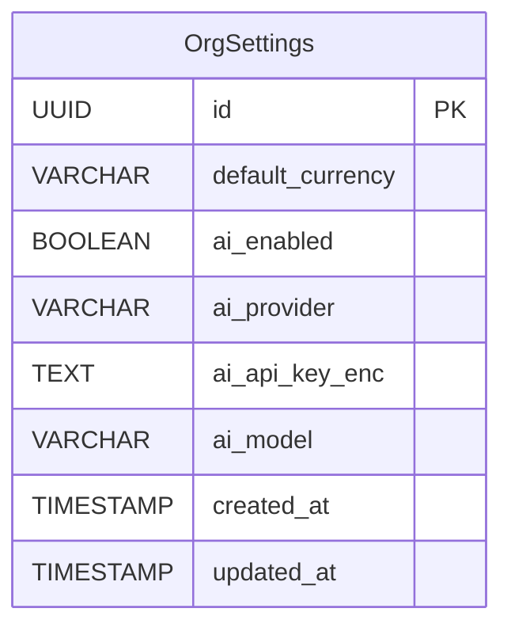
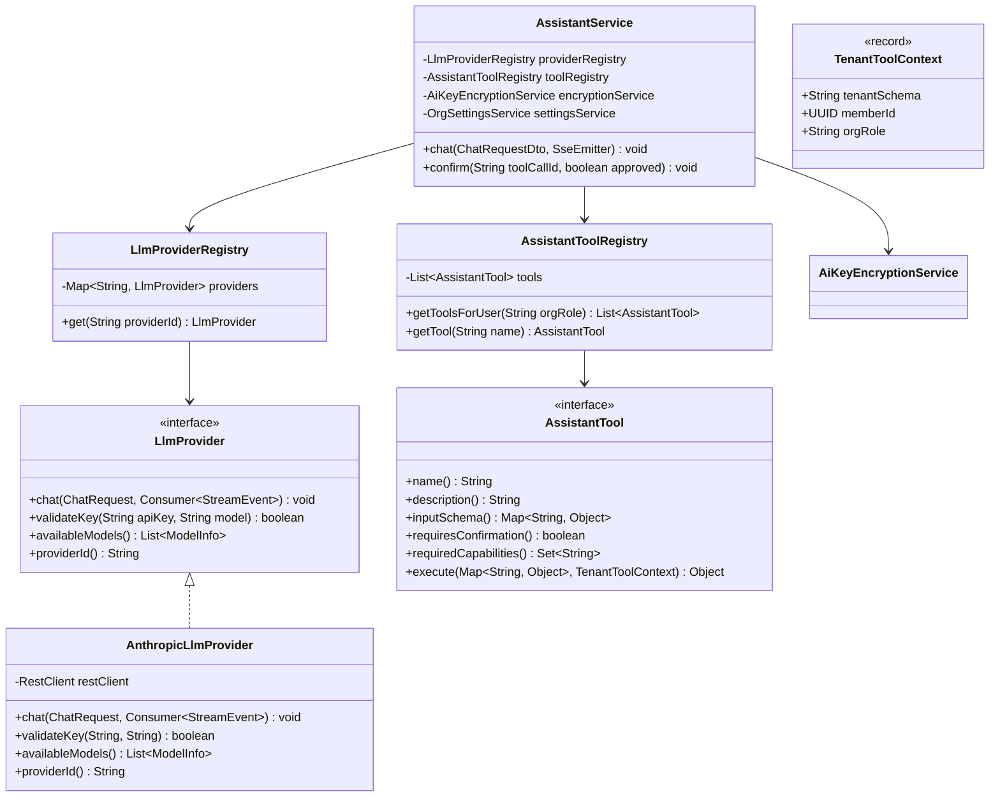
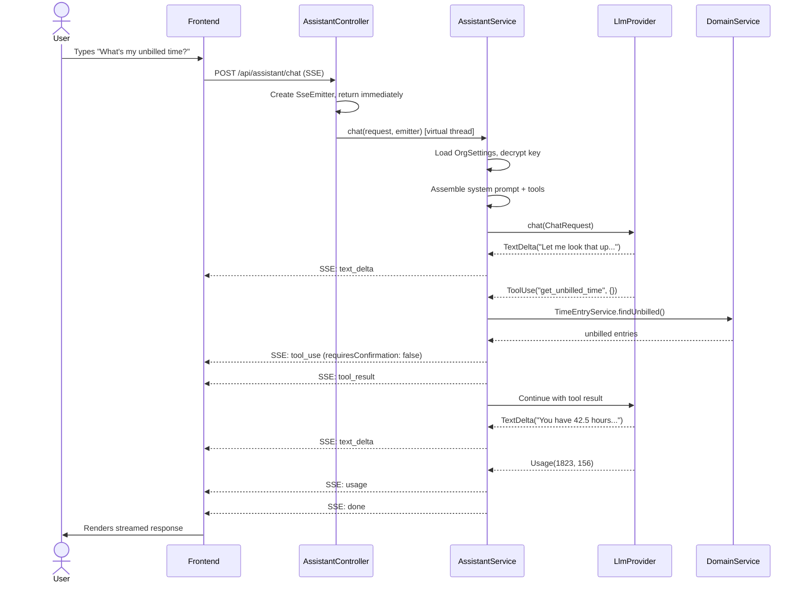
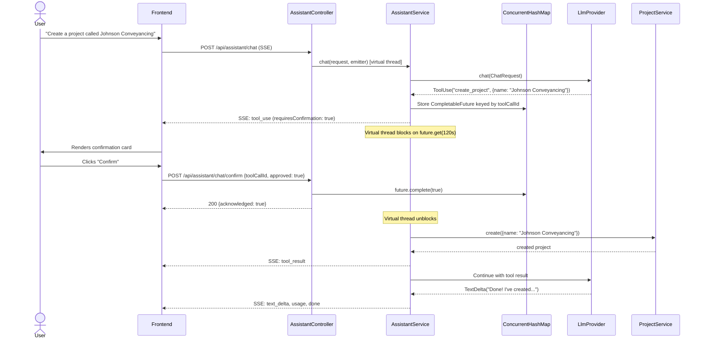
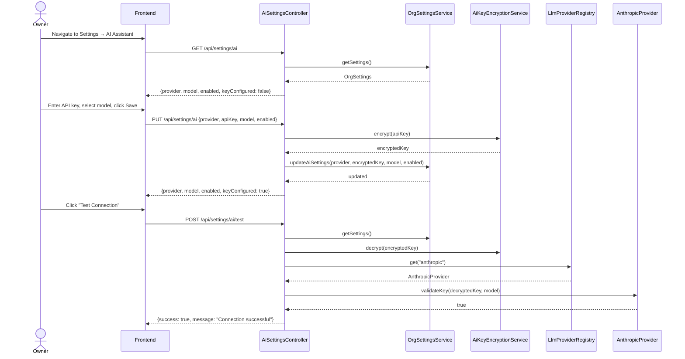

> Merge into ARCHITECTURE.md as **Section 11** or keep as standalone phase doc.

# Section 11. Phase 45 — In-App AI Assistant (BYOAK)

## 11.1 Overview

Phase 45 adds an in-app AI assistant to DocTeams. After 44 phases of feature development, the platform spans 77+ pages across 6 navigation zones with 23 settings areas. The surface area creates a power gap: non-technical users — bookkeepers, legal secretaries, junior associates — will not discover half the functionality through navigation alone. The assistant bridges this gap by providing a natural language interface that can answer "how do I..." questions with context-aware guidance, execute reversible actions on the user's behalf, and query tenant data to surface answers.

The assistant follows a Bring Your Own API Key (BYOAK) model. Each tenant configures their own LLM API key (Anthropic Claude first, with a provider-agnostic interface for future providers). The backend handles all LLM communication — the frontend never sees the API key. Tool executions map to existing internal services via Spring DI, inheriting the request's tenant scope and the user's permissions. Write actions require explicit user confirmation before execution. Chat sessions are ephemeral (frontend state only, no server-side persistence).

The architecture introduces no new database entities. It extends the existing `OrgSettings` entity with three columns (`ai_provider`, `ai_api_key_enc`, `ai_model`) and adds a new `assistant/` backend package with sub-packages for provider adapters, tools, and the core orchestration service. The frontend adds a slide-out chat panel and an AI settings section.

### What's New

| Area | Existing | New in Phase 45 |
|------|----------|-----------------|
| OrgSettings | `ai_enabled` boolean (V36) | `ai_provider`, `ai_api_key_enc`, `ai_model` columns (V68) |
| Backend packages | 58 packages | +1: `assistant/` with `provider/`, `tool/`, sub-packages |
| API surface | ~120 endpoints | +4: AI settings (GET/PUT/test), chat SSE, chat confirm |
| Frontend components | Signal Deck design system | +1 panel: `components/assistant/` (chat drawer, message types, confirmation cards) |
| Settings pages | 23 settings areas | +1: AI Assistant settings |

### Key Constraints

- **BYOAK only** — no platform-managed key, no free tier
- **Session-scoped** — no server-side chat history
- **Reversible actions only** — create/update, never delete/send/email
- **Server-side LLM calls** — API key never reaches the frontend
- **SseEmitter streaming** — no WebFlux dependency; uses Spring MVC's `SseEmitter`
- **User permission inheritance** — the assistant cannot exceed the authenticated user's capabilities

---

## 11.2 Domain Model

### OrgSettings Extension

No new entities are introduced. The existing `OrgSettings` entity (619 lines, 30+ columns) is extended with three columns. The `ai_enabled` column already exists (added in V36).

```
org_settings
├── ... (existing 30+ columns)
├── ai_enabled          BOOLEAN        -- already exists (V36)
├── ai_provider         VARCHAR(32)    -- 'anthropic', 'openai', etc. (nullable)
├── ai_api_key_enc      TEXT           -- AES-256-GCM encrypted API key
└── ai_model            VARCHAR(64)    -- e.g. 'claude-sonnet-4-6'
```

### ER Diagram (OrgSettings Extension)



### New Java Types (Not Entities)

These types live in the `assistant/` package and are not persisted:

| Type | Kind | Package | Purpose |
|------|------|---------|---------|
| `StreamEvent` | sealed interface | `assistant.provider` | All possible events in a response stream |
| `TextDelta` | record | `assistant.provider` | Incremental text chunk |
| `ToolUse` | record | `assistant.provider` | LLM requests a tool call |
| `ToolResult` | record | `assistant.provider` | Result of tool execution |
| `Usage` | record | `assistant.provider` | Token counts |
| `Done` | record | `assistant.provider` | Stream complete |
| `Error` | record | `assistant.provider` | Error event |
| `ChatRequest` | record | `assistant.provider` | Assembled request to LLM |
| `ChatMessage` | record | `assistant` | Single message in conversation |
| `LlmProvider` | interface | `assistant.provider` | Provider abstraction |
| `ModelInfo` | record | `assistant.provider` | Model metadata (id, name, default) |
| `ToolDefinition` | record | `assistant.tool` | JSON Schema tool definition for LLM |
| `AssistantTool` | interface | `assistant.tool` | Tool contract |
| `TenantToolContext` | record | `assistant.tool` | Tenant scope + user info for tool execution |
| `AssistantToolRegistry` | class | `assistant.tool` | Auto-discovers and filters tools |
| `LlmProviderRegistry` | class | `assistant.provider` | Maps provider IDs to implementations |
| `AiKeyEncryptionService` | class | `assistant` | AES-256-GCM encrypt/decrypt |
| `AssistantService` | class | `assistant` | Core orchestration |
| `AssistantController` | class | `assistant` | SSE + confirm endpoints |
| `AiSettingsController` | class | `assistant` | Settings endpoints |
| `ChatRequestDto` | record | `assistant` | Inbound DTO for chat endpoint |
| `ConfirmRequestDto` | record | `assistant` | Inbound DTO for confirm endpoint |

### Class Diagram — Provider Abstraction and Tool Registry



---

## 11.3 Core Flows and Backend Behaviour

### Conversation Flow

```
 1. User sends message → POST /api/assistant/chat (SSE endpoint)
 2. Backend loads org's AI config (provider, key, model) from OrgSettings
 3. Backend decrypts API key via AiKeyEncryptionService
 4. Backend assembles system prompt:
    a. Static system guide (classpath:assistant/system-guide.md, ~3-5K tokens)
    b. Tenant context: org name, user's name and role, current page
    c. Behavioral instructions (hardcoded)
 5. Backend resolves available tools via AssistantToolRegistry.getToolsForUser(orgRole)
 6. Backend converts tools to ToolDefinition list (JSON Schema format for LLM)
 7. Backend calls LlmProvider.chat() with full message history + tools
 8. LLM responds with text and/or tool_use blocks, streamed as StreamEvents
 9. For each tool_use event:
    a. Read tools → execute immediately, feed result back to LLM
    b. Write tools → emit ToolUse SSE event, block on CompletableFuture until confirmation
10. Stream continues until LLM produces a final text response
11. Usage event emitted at end with cumulative token counts
12. Done event closes the stream
```

### Write Action Confirmation Flow (Pause-and-Resume)

The confirmation flow is the most architecturally significant pattern. It works as follows:

1. The LLM returns a `tool_use` content block for a write tool (e.g., `create_project`)
2. The `AssistantService` detects `tool.requiresConfirmation() == true`
3. A `CompletableFuture<Boolean>` is created and stored in a `ConcurrentHashMap<String, CompletableFuture<Boolean>>` keyed by the tool call ID
4. A `ToolUse` SSE event is emitted to the frontend with the tool name, input, and `requiresConfirmation: true`
5. The virtual thread executing the chat flow calls `future.get(120, TimeUnit.SECONDS)` — blocking until confirmation
6. The user sees a confirmation card in the chat panel and clicks Confirm or Cancel
7. The frontend sends `POST /api/assistant/chat/confirm` with `{ toolCallId, approved }`
8. The confirm endpoint completes the `CompletableFuture` with the boolean value
9. The assistant thread unblocks:
   - If approved: execute the tool, emit `ToolResult` with the result, feed it back to the LLM
   - If rejected: emit `ToolResult` with "User cancelled this action", feed it to the LLM
10. The LLM continues generating a response acknowledging the outcome

**Why this works with SseEmitter**: The `SseEmitter` is returned from the controller immediately. A virtual thread (via `@Async` or `Executors.newVirtualThreadPerTaskExecutor()`) runs the chat orchestration loop, writing events to the emitter. When a write tool is encountered, `CompletableFuture.get()` blocks the virtual thread (cheap — no platform thread consumed). The confirm endpoint resolves the future from a different request thread. The SSE connection stays open throughout.

**Timeout handling**: If the user does not confirm within 120 seconds, `future.get()` throws `TimeoutException`. The assistant service sends a tool result of "Confirmation timed out" to the LLM and emits an error event.

### System Prompt Assembly

The system prompt is assembled per-request from three sources:

```
┌─────────────────────────────────────────────────────────────────┐
│ 1. Behavioral Instructions (hardcoded)                         │
│    "You are the DocTeams assistant..."                          │
│    "For write actions, use tools. Don't instruct users."        │
│    "Be concise. Professional services users value their time."  │
│    "If you can't do something, say so."                         │
├─────────────────────────────────────────────────────────────────┤
│ 2. System Guide (classpath resource, ~3-5K tokens)             │
│    Navigation structure, page descriptions, common workflows    │
├─────────────────────────────────────────────────────────────────┤
│ 3. Tenant Context (dynamic, per-request)                       │
│    Organization: {orgName}                                      │
│    User: {userName} (role: {orgRole})                           │
│    Current page: {currentPage}                                  │
│    Plan: {planTier}                                             │
└─────────────────────────────────────────────────────────────────┘
```

The guide is loaded once at startup from `classpath:assistant/system-guide.md` and cached. It describes all pages, features, navigation paths, and common workflows. For v1 it is manually written. A future dev skill (`/refresh-ai-guide`) can automate its generation.

### Tool Filtering by User Capabilities

Each `AssistantTool` declares `requiredCapabilities()` — a set of capability strings (e.g., `"MANAGE_INVOICES"`, `"MANAGE_PROJECTS"`). At conversation start, `AssistantToolRegistry.getToolsForUser(orgRole)` filters the tool list:

- **Owner**: all tools
- **Admin**: all tools except org-level settings tools
- **Member**: read tools + write tools gated by their project assignments and role capabilities

This uses the existing capability system — no new authorization logic is introduced.

### Error Handling

| Scenario | Behaviour |
|----------|-----------|
| No API key configured | Return `422 Unprocessable Entity` with message directing to settings |
| Invalid API key | Return `401 Unauthorized` with "API key rejected by provider" |
| AI not enabled | Return `403 Forbidden` with message that AI is disabled |
| Rate limited by provider | Emit `Error` SSE event with retry guidance |
| Tool execution failure | Return error as tool result to LLM so it can inform user gracefully |
| Provider timeout (30s) | Emit `Error` SSE event with timeout message |
| Confirmation timeout (120s) | Send "Confirmation timed out" as tool result, emit error event |
| Encryption key not configured | Return `500 Internal Server Error` (server misconfiguration) |

---

## 11.4 API Surface

### AI Settings Endpoints

| Method | Path | Description | Auth | Read/Write |
|--------|------|-------------|------|------------|
| GET | `/api/settings/ai` | Get AI configuration (provider, model, enabled, key_configured) | Owner | Read |
| PUT | `/api/settings/ai` | Update AI configuration | Owner | Write |
| POST | `/api/settings/ai/test` | Test connection with configured key | Owner | Read |

### Assistant Endpoints

| Method | Path | Description | Auth | Read/Write |
|--------|------|-------------|------|------------|
| POST | `/api/assistant/chat` | Start SSE chat stream | Any member (when AI enabled) | Read (SSE) |
| POST | `/api/assistant/chat/confirm` | Confirm or reject a pending tool call | Any member | Write |

### Request/Response Shapes

#### `GET /api/settings/ai`

```json
// Response 200
{
  "provider": "anthropic",
  "model": "claude-sonnet-4-6",
  "enabled": true,
  "keyConfigured": true,
  "availableProviders": [
    { "id": "anthropic", "name": "Anthropic (Claude)", "available": true }
  ],
  "availableModels": [
    { "id": "claude-sonnet-4-6", "name": "Claude Sonnet 4", "default": true },
    { "id": "claude-opus-4-6", "name": "Claude Opus 4", "default": false }
  ]
}
```

#### `PUT /api/settings/ai`

```json
// Request
{
  "provider": "anthropic",
  "apiKey": "sk-ant-...",       // optional — omit to keep existing key
  "model": "claude-sonnet-4-6",
  "enabled": true
}

// Response 200
{
  "provider": "anthropic",
  "model": "claude-sonnet-4-6",
  "enabled": true,
  "keyConfigured": true
}
```

#### `POST /api/settings/ai/test`

```json
// Request (empty body — uses configured key)
{}

// Response 200
{ "success": true, "message": "Connection successful" }

// Response 422
{ "success": false, "message": "Invalid API key" }
```

#### `POST /api/assistant/chat`

```json
// Request
{
  "messages": [
    { "role": "user", "content": "What's my unbilled time for Acme?" },
    { "role": "assistant", "content": "Let me look that up..." }
  ],
  "context": {
    "currentPage": "/org/acme-corp/projects"
  }
}
```

Response is an SSE stream with typed events:

```
event: text_delta
data: {"text": "Let me look up "}

event: text_delta
data: {"text": "your unbilled time..."}

event: tool_use
data: {"toolCallId": "tc_123", "toolName": "get_unbilled_time", "input": {"customerName": "Acme"}, "requiresConfirmation": false}

event: tool_result
data: {"toolCallId": "tc_123", "result": {"totalHours": 42.5, "totalAmount": 8500.00, "entries": [...]}}

event: text_delta
data: {"text": "You have 42.5 hours of unbilled time for Acme..."}

event: usage
data: {"inputTokens": 1823, "outputTokens": 156}

event: done
data: {}
```

#### `POST /api/assistant/chat/confirm`

```json
// Request
{
  "toolCallId": "tc_456",
  "approved": true
}

// Response 200
{ "acknowledged": true }

// Response 404 (no pending confirmation with that ID)
{ "error": "No pending confirmation found" }
```

### SSE Event Types

| Event Type | Data Shape | Description |
|------------|------------|-------------|
| `text_delta` | `{ text: string }` | Incremental text token from LLM |
| `tool_use` | `{ toolCallId, toolName, input, requiresConfirmation }` | LLM requests a tool call |
| `tool_result` | `{ toolCallId, result }` | Tool execution result |
| `usage` | `{ inputTokens, outputTokens }` | Cumulative token usage |
| `done` | `{}` | Stream complete |
| `error` | `{ message }` | Error occurred |

---

## 11.5 Sequence Diagrams

### Diagram 1: Basic Conversation Flow (Read Tool)



### Diagram 2: Write Action with Confirmation



### Diagram 3: API Key Configuration and Test



---

## 11.6 Security Considerations

### API Key Encryption

API keys are encrypted at rest using AES-256-GCM ([ADR-177](adr/ADR-177-api-key-encryption.md)):

- Encryption key is stored in application configuration (`app.ai.encryption-key`) — environment variable in production
- Each encrypted value includes a unique IV (initialization vector) prepended to the ciphertext
- Decryption happens only at LLM call time, within the `AssistantService`
- The `AiKeyEncryptionService` is the sole entry point for encrypt/decrypt operations

### Key Handling Rules

| Rule | Enforcement |
|------|-------------|
| Never return key to frontend | `GET /api/settings/ai` returns `keyConfigured: boolean` only |
| Never log the key | No logging statements in encrypt/decrypt paths |
| Never include in audit events | AI settings audit events record `provider` and `model`, never key material |
| Never serialize to JSON | Key field excluded from all DTO mappings |
| Encrypted at rest | Column `ai_api_key_enc` stores AES-256-GCM ciphertext |
| Decrypted per-request | Key is decrypted, used for the LLM call, then garbage collected |

### Permission Inheritance

The assistant acts with the authenticated user's permissions. This is enforced at two levels:

1. **Tool filtering**: `AssistantToolRegistry.getToolsForUser(orgRole)` removes tools the user cannot use. The LLM never sees tools the user is not authorized for.
2. **Service-level authorization**: Tools call internal services that already enforce permission checks. Even if a tool were somehow invoked without filtering, the service layer would reject unauthorized operations.

### Tenant Isolation

The assistant operates within the existing tenant security boundary:

- All assistant endpoints go through the existing `TenantFilter` — the tenant schema is set before the controller is reached
- Tools call internal services that operate on the tenant schema via `RequestScopes.TENANT_ID`
- The `TenantToolContext` passes the tenant schema and member ID from `RequestScopes` — no cross-tenant access is possible

### Prompt Injection

For v1, prompt injection mitigations are minimal and acceptable because:

- Tools call internal services with typed parameters — no raw SQL, no code execution
- The LLM cannot access tools outside the declared set
- Tool inputs are validated by the service layer (same validation as REST endpoints)
- Write actions require user confirmation — the user sees exactly what will happen

Advanced mitigations (input sanitization, output filtering, jailbreak detection) are deferred to a future hardening phase if the assistant handles more sensitive operations.

### Rate Limiting

Rate limiting is deferred to the LLM provider's own limits. The tenant's API key has provider-side rate limits. No platform-side rate limiting for v1. If abuse is observed, a per-tenant request counter can be added without architectural changes.

---

## 11.7 Database Migrations

### V68 — Add AI provider configuration to OrgSettings

```sql
-- V68__add_ai_provider_config.sql

ALTER TABLE org_settings
    ADD COLUMN ai_provider VARCHAR(32),
    ADD COLUMN ai_api_key_enc TEXT,
    ADD COLUMN ai_model VARCHAR(64);

COMMENT ON COLUMN org_settings.ai_provider IS 'LLM provider identifier (e.g., anthropic, openai). NULL = not configured.';
COMMENT ON COLUMN org_settings.ai_api_key_enc IS 'AES-256-GCM encrypted API key. Never returned to frontend.';
COMMENT ON COLUMN org_settings.ai_model IS 'Selected model identifier (e.g., claude-sonnet-4-6).';
```

Notes:
- `ai_enabled` already exists from V36 (`create_integration_tables`) — not added here
- All three columns are nullable — `NULL` means AI is not configured
- No indexes needed — these columns are read by primary key lookup on `OrgSettings`, never queried directly
- No foreign keys — provider and model are validated at the application level

---

## 11.8 Implementation Guidance

### Backend Package Structure

```
io.b2mash.b2b.b2bstrawman.assistant/
├── AssistantService.java              # Core orchestration
├── AssistantController.java           # POST /api/assistant/chat, /chat/confirm
├── AiSettingsController.java          # GET/PUT /api/settings/ai, POST /test
├── AiKeyEncryptionService.java        # AES-256-GCM encrypt/decrypt
├── ChatRequestDto.java                # Inbound DTO: messages + context
├── ConfirmRequestDto.java             # Inbound DTO: toolCallId + approved
├── ChatMessage.java                   # Message record (role, content)
├── provider/
│   ├── LlmProvider.java              # Provider interface
│   ├── LlmProviderRegistry.java      # Provider lookup by ID
│   ├── StreamEvent.java              # Sealed interface + records
│   ├── ChatRequest.java              # Internal request to LLM
│   ├── ModelInfo.java                # Model metadata record
│   └── anthropic/
│       └── AnthropicLlmProvider.java  # Claude adapter
└── tool/
    ├── AssistantTool.java             # Tool interface
    ├── AssistantToolRegistry.java     # Auto-discovery + filtering
    ├── TenantToolContext.java         # Tenant scope for tools
    ├── ToolDefinition.java            # JSON Schema definition for LLM
    ├── read/
    │   ├── ListProjectsTool.java
    │   ├── GetProjectTool.java
    │   ├── ListCustomersTool.java
    │   ├── GetCustomerTool.java
    │   ├── ListTasksTool.java
    │   ├── GetMyTasksTool.java
    │   ├── GetUnbilledTimeTool.java
    │   ├── GetTimeSummaryTool.java
    │   ├── GetProjectBudgetTool.java
    │   ├── GetProfitabilityTool.java
    │   ├── ListInvoicesTool.java
    │   ├── GetInvoiceTool.java
    │   ├── SearchEntitiesTool.java
    │   └── GetNavigationHelpTool.java
    └── write/
        ├── CreateProjectTool.java
        ├── UpdateProjectTool.java
        ├── CreateCustomerTool.java
        ├── UpdateCustomerTool.java
        ├── CreateTaskTool.java
        ├── UpdateTaskTool.java
        ├── LogTimeEntryTool.java
        └── CreateInvoiceDraftTool.java
```

### Backend Changes

| File | Change |
|------|--------|
| `settings/OrgSettings.java` | Add `aiProvider`, `aiApiKeyEnc`, `aiModel` fields with getters/setters |
| `settings/OrgSettingsService.java` | Add `updateAiSettings()` method |
| `config/SecurityConfig.java` | Permit `/api/assistant/**` for authenticated users, `/api/settings/ai/**` for owners |
| `backend/src/main/resources/assistant/system-guide.md` | New file — static system guide |
| `backend/src/main/resources/application.yml` | Add `app.ai.encryption-key` property |
| `db/migration/tenant/V68__add_ai_provider_config.sql` | New migration |

### Frontend Changes

| File | Change |
|------|--------|
| `components/assistant/assistant-panel.tsx` | New — slide-out drawer with chat UI |
| `components/assistant/message-list.tsx` | New — renders messages by type |
| `components/assistant/user-message.tsx` | New — right-aligned user bubble |
| `components/assistant/assistant-message.tsx` | New — left-aligned markdown-rendered text |
| `components/assistant/tool-use-card.tsx` | New — read tool execution card |
| `components/assistant/confirmation-card.tsx` | New — write tool confirmation card |
| `components/assistant/tool-result-card.tsx` | New — completed write action card |
| `components/assistant/error-card.tsx` | New — error display |
| `components/assistant/token-usage-badge.tsx` | New — header token count |
| `components/assistant/assistant-trigger.tsx` | New — floating trigger button |
| `components/assistant/use-assistant-chat.ts` | New — SSE connection hook |
| `app/(app)/org/[slug]/settings/ai/page.tsx` | New — AI settings page |
| `lib/nav-items.ts` | Add AI Assistant to settings sidebar |
| `components/layout/app-layout.tsx` | Add AssistantTrigger + AssistantPanel |

### Code Patterns

#### LlmProvider Interface

```java
package io.b2mash.b2b.b2bstrawman.assistant.provider;

import java.util.List;
import java.util.function.Consumer;

public interface LlmProvider {
    /** Stream chat completion events to the consumer. Blocks until complete. */
    void chat(ChatRequest request, Consumer<StreamEvent> eventConsumer);

    /** Validate an API key by making a minimal API call. */
    boolean validateKey(String apiKey, String model);

    /** Return supported models for this provider. */
    List<ModelInfo> availableModels();

    /** Provider identifier (e.g., "anthropic"). */
    String providerId();
}
```

Note: The `chat` method uses `Consumer<StreamEvent>` rather than returning `Flux`. The consumer writes each event to the `SseEmitter`. This keeps the interface framework-agnostic and compatible with Spring MVC.

#### StreamEvent Sealed Interface

```java
package io.b2mash.b2b.b2bstrawman.assistant.provider;

import java.util.Map;

public sealed interface StreamEvent {
    record TextDelta(String text) implements StreamEvent {}
    record ToolUse(String toolCallId, String toolName,
                   Map<String, Object> input) implements StreamEvent {}
    record ToolResult(String toolCallId, Object result) implements StreamEvent {}
    record Usage(int inputTokens, int outputTokens) implements StreamEvent {}
    record Done() implements StreamEvent {}
    record Error(String message) implements StreamEvent {}
}
```

#### AssistantTool Interface

```java
package io.b2mash.b2b.b2bstrawman.assistant.tool;

import java.util.Map;
import java.util.Set;

public interface AssistantTool {
    String name();
    String description();
    Map<String, Object> inputSchema();
    boolean requiresConfirmation();
    Set<String> requiredCapabilities();
    Object execute(Map<String, Object> input, TenantToolContext context);
}
```

#### Example Tool Implementation

```java
package io.b2mash.b2b.b2bstrawman.assistant.tool.read;

import io.b2mash.b2b.b2bstrawman.assistant.tool.AssistantTool;
import io.b2mash.b2b.b2bstrawman.assistant.tool.TenantToolContext;
import io.b2mash.b2b.b2bstrawman.project.ProjectService;
import java.util.Map;
import java.util.Set;
import org.springframework.stereotype.Component;

@Component
public class ListProjectsTool implements AssistantTool {

    private final ProjectService projectService;

    public ListProjectsTool(ProjectService projectService) {
        this.projectService = projectService;
    }

    @Override
    public String name() { return "list_projects"; }

    @Override
    public String description() {
        return "List all projects, optionally filtered by status.";
    }

    @Override
    public Map<String, Object> inputSchema() {
        return Map.of(
            "type", "object",
            "properties", Map.of(
                "status", Map.of("type", "string",
                    "description", "Filter by status: ACTIVE, COMPLETED, ARCHIVED",
                    "enum", List.of("ACTIVE", "COMPLETED", "ARCHIVED"))
            )
        );
    }

    @Override
    public boolean requiresConfirmation() { return false; }

    @Override
    public Set<String> requiredCapabilities() { return Set.of(); }

    @Override
    public Object execute(Map<String, Object> input, TenantToolContext context) {
        String status = (String) input.get("status");
        // ProjectService already operates on the tenant schema via RequestScopes
        return projectService.findAll(status);
    }
}
```

#### SseEmitter-Based Controller Pattern

```java
package io.b2mash.b2b.b2bstrawman.assistant;

import java.util.concurrent.ExecutorService;
import java.util.concurrent.Executors;
import org.springframework.http.MediaType;
import org.springframework.http.ResponseEntity;
import org.springframework.web.bind.annotation.*;
import org.springframework.web.servlet.mvc.method.annotation.SseEmitter;

@RestController
@RequestMapping("/api/assistant")
public class AssistantController {

    private final AssistantService assistantService;
    private final ExecutorService executor =
        Executors.newVirtualThreadPerTaskExecutor();

    public AssistantController(AssistantService assistantService) {
        this.assistantService = assistantService;
    }

    @PostMapping(value = "/chat", produces = MediaType.TEXT_EVENT_STREAM_VALUE)
    public SseEmitter chat(@RequestBody ChatRequestDto request) {
        SseEmitter emitter = new SseEmitter(300_000L); // 5 min timeout

        // Capture scoped values from the request thread
        String tenantId = RequestScopes.TENANT_ID.get();
        UUID memberId = RequestScopes.MEMBER_ID.get();
        String orgRole = RequestScopes.ORG_ROLE.get();

        executor.execute(() -> {
            // Re-bind scoped values in the virtual thread
            ScopedValue.where(RequestScopes.TENANT_ID, tenantId)
                .where(RequestScopes.MEMBER_ID, memberId)
                .where(RequestScopes.ORG_ROLE, orgRole)
                .run(() -> {
                    try {
                        assistantService.chat(request, emitter);
                        emitter.complete();
                    } catch (Exception e) {
                        emitter.completeWithError(e);
                    }
                });
        });

        return emitter;
    }

    @PostMapping("/chat/confirm")
    public ResponseEntity<Map<String, Boolean>> confirm(
            @RequestBody ConfirmRequestDto request) {
        assistantService.confirm(request.toolCallId(), request.approved());
        return ResponseEntity.ok(Map.of("acknowledged", true));
    }
}
```

**Key detail**: `ScopedValue` bindings do not propagate to child threads. The controller must capture `RequestScopes` values from the request thread and re-bind them in the virtual thread via `ScopedValue.where(...).run(...)`.

#### Frontend SSE Consumption Pattern

```typescript
// components/assistant/use-assistant-chat.ts

type SseEventType = 'text_delta' | 'tool_use' | 'tool_result' | 'usage' | 'done' | 'error';

interface StreamEvent {
  type: SseEventType;
  data: unknown;
}

export function useAssistantChat() {
  const [messages, setMessages] = useState<ChatMessage[]>([]);
  const [isStreaming, setIsStreaming] = useState(false);
  const [tokenUsage, setTokenUsage] = useState({ input: 0, output: 0 });
  const abortRef = useRef<AbortController | null>(null);

  async function sendMessage(content: string, currentPage: string) {
    const userMessage = { role: 'user' as const, content };
    const allMessages = [...messages, userMessage];
    setMessages(allMessages);
    setIsStreaming(true);

    const abort = new AbortController();
    abortRef.current = abort;

    const response = await fetch('/api/assistant/chat', {
      method: 'POST',
      headers: { 'Content-Type': 'application/json' },
      body: JSON.stringify({
        messages: allMessages,
        context: { currentPage },
      }),
      signal: abort.signal,
    });

    const reader = response.body!.getReader();
    const decoder = new TextDecoder();
    let assistantText = '';

    while (true) {
      const { done, value } = await reader.read();
      if (done) break;

      const chunk = decoder.decode(value, { stream: true });
      // Parse SSE events from chunk
      for (const event of parseSseEvents(chunk)) {
        switch (event.type) {
          case 'text_delta':
            assistantText += event.data.text;
            // Update assistant message in state (streaming)
            break;
          case 'tool_use':
            // Add tool use card to messages
            break;
          case 'tool_result':
            // Update tool use card with result
            break;
          case 'usage':
            setTokenUsage(prev => ({
              input: prev.input + event.data.inputTokens,
              output: prev.output + event.data.outputTokens,
            }));
            break;
          case 'done':
            setIsStreaming(false);
            break;
          case 'error':
            // Show error in chat
            break;
        }
      }
    }
  }

  async function confirmToolCall(toolCallId: string, approved: boolean) {
    await fetch('/api/assistant/chat/confirm', {
      method: 'POST',
      headers: { 'Content-Type': 'application/json' },
      body: JSON.stringify({ toolCallId, approved }),
    });
  }

  return { messages, isStreaming, tokenUsage, sendMessage, confirmToolCall };
}
```

### Testing Strategy

| Area | Test Type | Focus |
|------|-----------|-------|
| `AiKeyEncryptionService` | Unit | Encrypt/decrypt round-trip, invalid key handling |
| `LlmProvider` interface | Unit | Mock provider, verify event consumer calls |
| `AnthropicLlmProvider` | Integration | Mock HTTP server (WireMock), verify SSE parsing |
| `AssistantToolRegistry` | Unit | Tool filtering by capabilities/role |
| Individual tools | Integration | Each tool calls its service, returns correct shape |
| `AssistantService` | Integration | End-to-end with mock provider, tool execution, confirmation flow |
| `AssistantController` | Integration | SSE emitter produces events, confirm endpoint resolves futures |
| `AiSettingsController` | Integration | CRUD, key encryption, test connection |
| Frontend: message rendering | Component (Vitest) | Each message type renders correctly |
| Frontend: confirmation card | Component (Vitest) | Confirm/cancel buttons, disabled states |
| Frontend: SSE hook | Component (Vitest) | Mock fetch, verify state updates |
| Frontend: AI settings page | Component (Vitest) | Form validation, API calls |

---

## 11.9 Permission Model Summary

### AI Settings Access

| Action | Owner | Admin | Member |
|--------|-------|-------|--------|
| View AI settings | Yes | Yes | No |
| Configure API key | Yes | No | No |
| Enable/disable AI | Yes | No | No |
| Change model | Yes | No | No |
| Test connection | Yes | No | No |

> Admins can view AI settings (provider, model, enabled status, key configured) but cannot modify them. The `GET /api/settings/ai` response contains no key material — only metadata. This allows admins to verify the assistant is configured without needing to ask the owner.

### Assistant Chat Access

| Action | Owner | Admin | Member |
|--------|-------|-------|--------|
| Open assistant panel | Yes* | Yes* | Yes* |
| Send messages | Yes* | Yes* | Yes* |

*Only when `ai_enabled = true` and an API key is configured.

### Tool Access by Role

| Tool | Owner | Admin | Member |
|------|-------|-------|--------|
| `list_projects` | Yes | Yes | Yes |
| `get_project` | Yes | Yes | Yes |
| `list_customers` | Yes | Yes | Yes |
| `get_customer` | Yes | Yes | Yes |
| `list_tasks` | Yes | Yes | Yes |
| `get_my_tasks` | Yes | Yes | Yes |
| `get_unbilled_time` | Yes | Yes | Yes |
| `get_time_summary` | Yes | Yes | Yes |
| `get_project_budget` | Yes | Yes | No |
| `get_profitability` | Yes | Yes | No |
| `list_invoices` | Yes | Yes | No |
| `get_invoice` | Yes | Yes | No |
| `search_entities` | Yes | Yes | Yes |
| `get_navigation_help` | Yes | Yes | Yes |
| `create_project` | Yes | Yes | No |
| `update_project` | Yes | Yes | No |
| `create_customer` | Yes | Yes | No |
| `update_customer` | Yes | Yes | No |
| `create_task` | Yes | Yes | Yes |
| `update_task` | Yes | Yes | Yes |
| `log_time_entry` | Yes | Yes | Yes |
| `create_invoice_draft` | Yes | Yes | No |

---

## 11.10 Capability Slices

### Slice A: BYOAK Key Management (Backend)

**Scope**: Backend only

**Key Deliverables**:
- V68 migration: `ai_provider`, `ai_api_key_enc`, `ai_model` columns on `org_settings`
- `OrgSettings` entity: add three new fields with getters/setters and update method
- `AiKeyEncryptionService`: AES-256-GCM encrypt/decrypt with `app.ai.encryption-key` config property
- `AiSettingsController`: `GET /api/settings/ai`, `PUT /api/settings/ai`, `POST /api/settings/ai/test`
- `OrgSettingsService`: `updateAiSettings()` and `getAiSettings()` methods
- Security config: restrict settings endpoints to owner role
- Audit event for AI settings changes (provider and model only, never key material)

**Dependencies**: None (first slice)

**Test Expectations**:
- Unit: encryption round-trip, invalid key rejection, null handling
- Integration: settings CRUD via MockMvc, key never in response body, role-based access (owner-only)
- ~8-12 tests

---

### Slice B: Provider Abstraction + Claude Adapter

**Scope**: Backend only

**Key Deliverables**:
- `LlmProvider` interface: `chat()`, `validateKey()`, `availableModels()`, `providerId()`
- `StreamEvent` sealed interface with all 6 record types
- `ChatRequest` record
- `ModelInfo` record
- `LlmProviderRegistry`: auto-discovers `LlmProvider` beans, lookup by ID
- `AnthropicLlmProvider`: Claude adapter using Anthropic Java SDK or RestClient
  - Converts `ToolDefinition` to Anthropic tool format
  - Parses SSE stream from Anthropic API into `StreamEvent`s
  - Handles `tool_use` content blocks
  - Extracts token usage from `message_delta`
- `application.yml`: Anthropic API base URL config

**Dependencies**: None — the provider adapter receives a pre-decrypted `apiKey` in `ChatRequest`. Can be built in parallel with Slice A.

**Test Expectations**:
- Unit: provider registry lookup, stream event creation
- Integration: WireMock-based tests for Anthropic API interaction, SSE parsing, error handling (401, 429, timeout)
- ~10-15 tests

---

### Slice C: Tool Framework + Read Tools

**Scope**: Backend only

**Key Deliverables**:
- `AssistantTool` interface
- `TenantToolContext` record
- `ToolDefinition` record (JSON Schema representation for LLM)
- `AssistantToolRegistry`: auto-discovers `@Component` tools, filters by user capabilities
- 14 read tools (all in `assistant/tool/read/` package):
  - `ListProjectsTool`, `GetProjectTool`, `ListCustomersTool`, `GetCustomerTool`
  - `ListTasksTool`, `GetMyTasksTool`, `GetUnbilledTimeTool`, `GetTimeSummaryTool`
  - `GetProjectBudgetTool`, `GetProfitabilityTool`, `ListInvoicesTool`, `GetInvoiceTool`
  - `SearchEntitiesTool` — fans out to `ProjectService.search()`, `CustomerService.search()`, `TaskService.search()` with a query string, merges and ranks results. No dedicated `SearchService` exists; the tool handles the fan-out internally.
  - `GetNavigationHelpTool` — returns static navigation descriptions from a pre-built `Map<String, String>` loaded at startup from the system guide resource. Keyed by feature/page name (e.g., "invoices", "rate cards", "profitability"). No external service call.
- Each tool: name, description, JSON Schema input, capability requirements, execute method

**Dependencies**: None — `ToolDefinition` is defined in the `tool/` package, not the provider package. Can be built in parallel with Slices A and B.

**Test Expectations**:
- Unit: tool registry filtering by role, tool definition schema validation
- Integration: each tool executes against test data, returns expected shape
- ~20-25 tests

---

### Slice D: Assistant Service + Chat API

**Scope**: Backend only

**Key Deliverables**:
- `AssistantService`: core orchestration loop
  - Load OrgSettings, decrypt key, assemble system prompt
  - Call `LlmProvider.chat()` with consumer that writes to `SseEmitter`
  - Handle tool use events: lookup tool, execute, feed result back to LLM
  - Multi-turn loop: continue until LLM produces final text response
  - Token usage accumulation
- `AssistantController`: `POST /api/assistant/chat` (SSE endpoint)
  - Returns `SseEmitter`, runs chat in virtual thread
  - Captures and re-binds `ScopedValue` in virtual thread
- `ChatRequestDto` and response DTOs
- System guide resource: `backend/src/main/resources/assistant/system-guide.md` (initial version)
- Security config: permit `/api/assistant/**` for authenticated users when AI enabled

**Dependencies**: Slice A (encryption service for key decryption), Slice B (provider), Slice C (tools)

**Test Expectations**:
- Integration: end-to-end with mock provider, verify SSE events emitted in order
- Integration: system prompt includes guide + tenant context
- Integration: tool execution integrated into stream
- Integration: error handling (no key, AI disabled, provider error)
- ~12-18 tests

---

### Slice E: Write Tools + Confirmation Flow

**Scope**: Backend only

**Key Deliverables**:
- `ConcurrentHashMap<String, CompletableFuture<Boolean>>` in `AssistantService` for pending confirmations
- `POST /api/assistant/chat/confirm` endpoint in `AssistantController`
- `ConfirmRequestDto` record
- 8 write tools (all in `assistant/tool/write/` package):
  - `CreateProjectTool`, `UpdateProjectTool`, `CreateCustomerTool`, `UpdateCustomerTool`
  - `CreateTaskTool`, `UpdateTaskTool`, `LogTimeEntryTool`, `CreateInvoiceDraftTool`
- Confirmation flow in `AssistantService`:
  - Detect `requiresConfirmation()`, store future, emit `ToolUse` event
  - Block virtual thread on `future.get(120, SECONDS)`
  - Handle confirm (execute tool), reject (send cancellation to LLM), timeout
- Cleanup: remove expired futures after timeout

**Dependencies**: Slice D (assistant service orchestration)

**Test Expectations**:
- Unit: CompletableFuture lifecycle (confirm, reject, timeout)
- Integration: full confirmation round-trip via MockMvc (chat SSE + confirm endpoint)
- Integration: timeout produces error event
- Integration: each write tool creates/updates entity correctly
- ~15-20 tests

---

### Slice F: Chat UI (Frontend)

**Scope**: Frontend only

**Key Deliverables**:
- `components/assistant/assistant-panel.tsx` — slide-out Shadcn Sheet (420px desktop, full-width mobile)
- `components/assistant/assistant-trigger.tsx` — floating button (bottom-right, visible when AI enabled)
- `components/assistant/message-list.tsx` — scrollable message container, auto-scroll
- `components/assistant/user-message.tsx` — right-aligned user bubble
- `components/assistant/assistant-message.tsx` — left-aligned, markdown-rendered (react-markdown)
- `components/assistant/tool-use-card.tsx` — read tool execution (collapsible)
- `components/assistant/confirmation-card.tsx` — write tool confirmation with Confirm/Cancel buttons
- `components/assistant/tool-result-card.tsx` — completed write action with View link
- `components/assistant/error-card.tsx` — error display
- `components/assistant/token-usage-badge.tsx` — header badge with tooltip (input/output breakdown + estimated cost)
- `components/assistant/use-assistant-chat.ts` — SSE connection hook (fetch + ReadableStream)
- `app/(app)/org/[slug]/settings/ai/page.tsx` — AI settings page (provider selector, key input, model selector, enable toggle, test button)
- Layout integration: add trigger + panel to app layout
- Nav integration: add "AI Assistant" to settings sidebar
- Empty state: no-key-configured prompt (role-aware messaging)
- Mobile: full-screen sheet at `< md` breakpoint

**Dependencies**: Slice D (chat API), Slice E (confirmation API), Slice A (settings API)

**Test Expectations**:
- Component: each message type renders correctly
- Component: confirmation card confirm/cancel buttons
- Component: token usage badge formatting and tooltip
- Component: SSE hook with mocked fetch
- Component: settings page form validation
- Component: empty state (no key, not admin)
- ~15-20 tests

---

## 11.11 ADR Index

| ADR | Title | Decision |
|-----|-------|----------|
| [ADR-173](adr/ADR-173-provider-abstraction-depth.md) | Provider Abstraction Depth | Thin interface (chat + validate + models) |
| [ADR-174](adr/ADR-174-tool-execution-model.md) | Tool Execution Model | Internal service calls via Spring DI |
| [ADR-175](adr/ADR-175-confirmation-flow-architecture.md) | Confirmation Flow Architecture | SSE pause-and-resume with CompletableFuture |
| [ADR-176](adr/ADR-176-system-guide-maintenance.md) | System Guide Maintenance Strategy | Manual markdown for v1 |
| [ADR-177](adr/ADR-177-api-key-encryption.md) | API Key Encryption Approach | Application-level AES-256-GCM |

---

## Out of Scope

- **Document intelligence** — uploading documents, extracting data from PDFs, template composition via AI (Layer 2)
- **Time narrative polish / smart line item grouping** — drudgery-removal features (Layer 3)
- **Server-side chat history** — no `ChatMessage` entity, no conversation persistence
- **Multi-modal input** — no image uploads, no voice input
- **Platform-managed API key** — no free tier, no trial tokens
- **Agent-style automation** — no autonomous background tasks
- **Custom tool definitions** — tenants cannot define their own tools
- **Usage quotas or rate limiting** — deferred to provider-side limits
- **The `/refresh-ai-guide` dev skill** — system guide is manually authored for v1
- **Destructive actions** — no delete, archive, send, email via the assistant
- **OpenAI / Gemini adapters** — interface supports them, but only Anthropic is implemented
