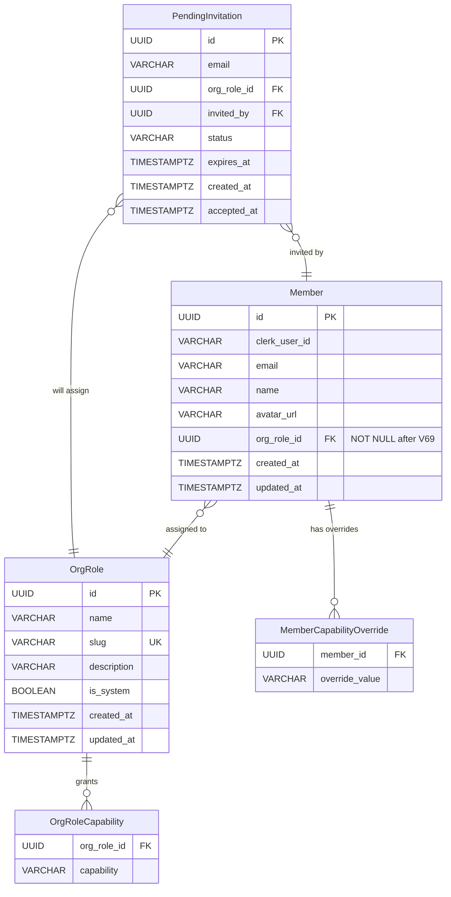
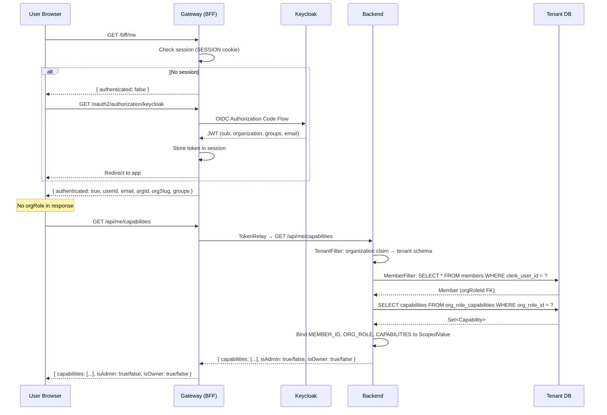
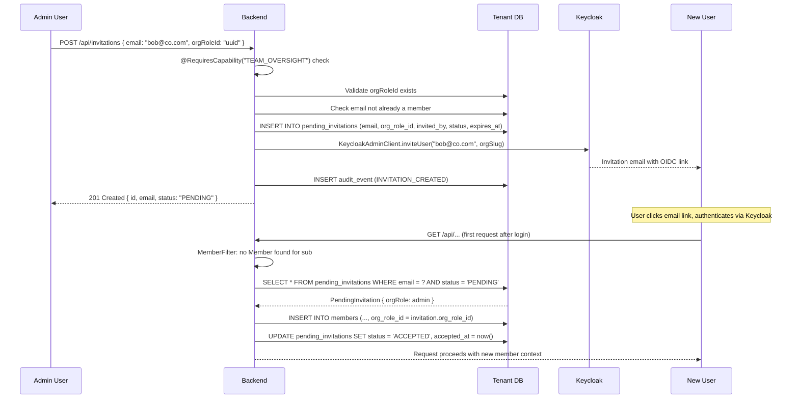
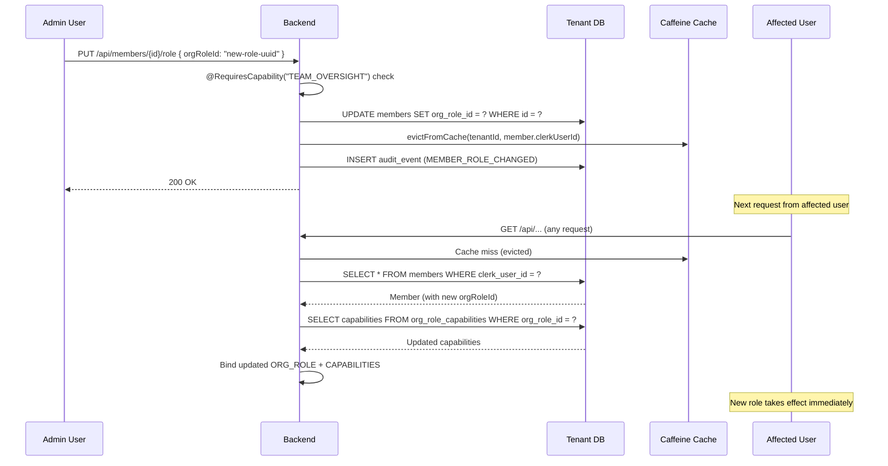
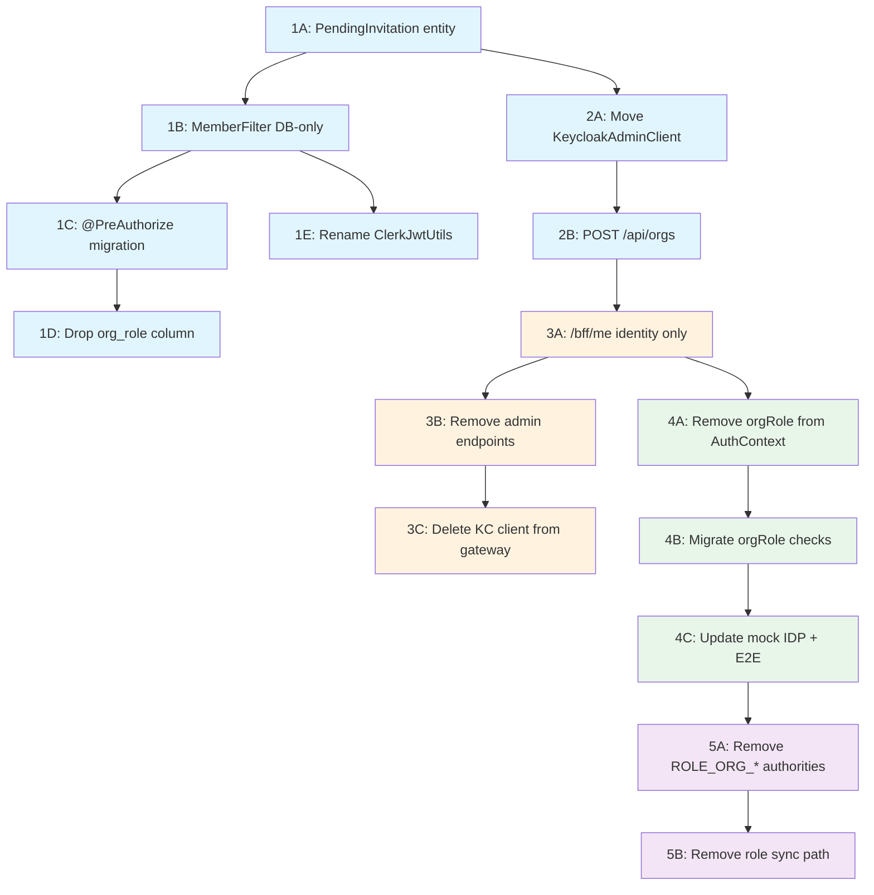

# RBAC Decoupling — Application-Managed Roles

> Standalone architecture document. ADR files go in `adr/`.

---

## RBAC Decoupling — Application-Managed Roles

This phase completes the separation of authentication from authorization. Keycloak remains the identity provider (OIDC login, SSO, token issuance, org membership, invitation emails, platform-admin groups), but the product database becomes the **sole authority** for all authorization decisions — role assignments, capability resolution, and access control.

The codebase already has most of the authorization infrastructure built: `OrgRole` entity, `Capability` enum, `OrgRoleService`, `@RequiresCapability` annotation, and `RequestScopes.CAPABILITIES` scoped value. What remains is eliminating the *parallel* JWT-based authorization path that creates split authority, stale-token problems, and Keycloak Organization Role dependency.

### What Changes

| Aspect | Before | After |
|--------|--------|-------|
| Role source of truth | Split: JWT `org_role` claim + DB `org_role_id` FK | DB only: `member.org_role_id` FK |
| Authorization annotation | `@PreAuthorize("hasRole('ORG_*')")` on ~71 controllers | `@RequiresCapability("...")` everywhere |
| `/bff/me` response | Identity + `orgRole` | Identity only (no role) |
| Frontend authorization | `orgRole` from `getAuthContext()` | `fetchMyCapabilities()` from `/api/me/capabilities` |
| Invitation role assignment | Keycloak org role attribute | `PendingInvitation` DB record |
| Member role change latency | Stale until JWT refresh (~5 min) | Immediate (DB + cache eviction) |
| Gateway responsibilities | Authn + authz (BffSecurity, admin endpoints) | Authn only (OAuth2 login, session, TokenRelay) |
| `ClerkJwtUtils` | Dual-format parser (Clerk v2 + Keycloak) | `JwtUtils` — Keycloak only |
| `members.org_role` VARCHAR | Live column, dual with `org_role_id` | Dropped; `org_role_id NOT NULL` only |

### Scope

**In scope:** DB-authoritative role resolution, `@PreAuthorize` migration, `PendingInvitation` entity, gateway authorization removal, frontend capabilities-only authorization, mock IDP token format cleanup, `ClerkJwtUtils` rename.

**Not in scope:** Custom role CRUD UI (already exists in `/settings/roles`), capability enum expansion, project-level RBAC, portal authentication changes.

---

### 11.1 Overview

The fundamental problem is **split authority**. The codebase has two parallel authorization systems:

1. **JWT-based**: `ClerkJwtAuthenticationConverter` maps JWT `org_role` claim to `ROLE_ORG_*` Spring authorities. Controllers use `@PreAuthorize("hasRole('ORG_OWNER')")`. The gateway's `BffSecurity` checks OIDC claims for admin endpoints.

2. **DB-based**: `OrgRoleService.resolveCapabilities(memberId)` reads the member's `orgRoleId` FK, resolves the `OrgRole` entity's capabilities plus per-member overrides, and binds them to `RequestScopes.CAPABILITIES`. Controllers use `@RequiresCapability("TEAM_OVERSIGHT")`.

System 2 is already more capable (custom roles, per-member overrides, capability granularity), but system 1 is still the primary gate on `@PreAuthorize` annotations across ~71 controller files. This migration makes system 2 the only authorization model.

**Why now:**

- **CVE-2026-1529** — forged invitation JWTs in Keycloak Organization Roles.
- **Stale token problem** — role changes in Keycloak are not reflected until token refresh (up to 5 minutes with default settings).
- **Keycloak org claims immaturity** — multi-org claim format still not fully delivered in KC 26.5.
- **80% complete** — `OrgRole`, `Capability`, `OrgRoleService`, `@RequiresCapability`, and `RequestScopes.CAPABILITIES` already exist. This phase finishes the remaining 20%.

---

### 11.2 Domain Model

#### 11.2.1 PendingInvitation (New Entity)

A `PendingInvitation` records the intent to invite a user to the organization with a specific role, before that user has authenticated and been auto-provisioned as a `Member`. The `MemberFilter` lazy-create path checks for a pending invitation to determine the new member's initial role.

| Field | Type | Constraints | Notes |
|-------|------|-------------|-------|
| `id` | UUID | PK, generated | |
| `email` | VARCHAR(255) | NOT NULL | Email address of the invited user |
| `org_role_id` | UUID FK → org_roles | NOT NULL | Role to assign when the user arrives |
| `invited_by` | UUID FK → members | NOT NULL | Admin who created the invitation |
| `status` | VARCHAR(20) | NOT NULL, DEFAULT 'PENDING' | PENDING, ACCEPTED, EXPIRED, REVOKED |
| `expires_at` | TIMESTAMPTZ | NOT NULL | Invitation expiry (default: 7 days) |
| `created_at` | TIMESTAMPTZ | NOT NULL, DEFAULT now() | |
| `accepted_at` | TIMESTAMPTZ | Nullable | Set when member is created from invitation |

**Partial unique index:** `UNIQUE(email) WHERE (status = 'PENDING')` — only one active invitation per email per tenant schema. Expired or revoked invitations are historical records.

**Design decisions:**
- **DB record over Keycloak attributes**: Decouples role assignment from the IDP entirely. The invitation is auditable, queryable, and works with custom roles that Keycloak knows nothing about. See [ADR-179](../adr/ADR-179-pending-invitation-role-assignment.md).
- **Status enum over soft delete**: Preserves invitation history for audit trail. Admins can see who was invited, when, and whether they accepted.
- **No `tenant_id` column**: Schema-per-tenant isolation handles this — each tenant schema has its own `pending_invitations` table.

```java
@Entity
@Table(name = "pending_invitations")
public class PendingInvitation {

    @Id
    @GeneratedValue(strategy = GenerationType.UUID)
    private UUID id;

    @Column(name = "email", nullable = false, length = 255)
    private String email;

    @ManyToOne(fetch = FetchType.LAZY)
    @JoinColumn(name = "org_role_id", nullable = false)
    private OrgRole orgRole;

    @ManyToOne(fetch = FetchType.LAZY)
    @JoinColumn(name = "invited_by", nullable = false)
    private Member invitedBy;

    @Column(name = "status", nullable = false, length = 20)
    private String status;

    @Column(name = "expires_at", nullable = false)
    private Instant expiresAt;

    @Column(name = "created_at", nullable = false, updatable = false)
    private Instant createdAt;

    @Column(name = "accepted_at")
    private Instant acceptedAt;

    protected PendingInvitation() {}

    // Constructor, getters, domain methods
}
```

#### 11.2.2 Member Entity Changes

The `Member` entity currently has two role fields:

- `orgRole` — VARCHAR(50), stores `"owner"`, `"admin"`, `"member"` as strings
- `orgRoleId` — UUID FK to `org_roles`, nullable

After migration:

- **Drop** `orgRole` VARCHAR column entirely.
- **Make** `orgRoleId` NOT NULL — every member must reference an `OrgRole` entity.
- **Add** convenience method `getRoleSlug()` that delegates to `orgRoleEntity.getSlug()`.

```java
// BEFORE (member/Member.java)
@Column(name = "org_role", nullable = false, length = 50)
private String orgRole;

@Column(name = "org_role_id")
private UUID orgRoleId;

public Member(String clerkUserId, String email, String name, String avatarUrl, String orgRole) { ... }

// AFTER
// orgRole String field removed entirely
// orgRoleId UUID field replaced with @ManyToOne

@ManyToOne(fetch = FetchType.LAZY)
@JoinColumn(name = "org_role_id", nullable = false)
private OrgRole orgRoleEntity;

public Member(String clerkUserId, String email, String name, String avatarUrl, OrgRole orgRoleEntity) { ... }

public String getRoleSlug() {
    return orgRoleEntity.getSlug();
}
```

**Cascade effects of this entity change:**
- `MemberFilter.lazyCreateMember()`: Change `new Member(..., effectiveRole)` → `new Member(..., orgRoleEntity)`. Replace `member.setOrgRoleId(uuid)` with `member.setOrgRoleEntity(orgRole)`.
- `MemberFilter.resolveMember()`: Change `m.getOrgRole()` → `m.getRoleSlug()` for binding to `RequestScopes.ORG_ROLE`.
- `MemberSyncService`: Update any code setting `orgRole` or `orgRoleId` to use `orgRoleEntity`.
- Test factories: Update `TestMemberFactory` and any test helpers that construct `Member` instances.

#### 11.2.3 JwtUtils Rename

`ClerkJwtUtils` → `JwtUtils`. Clerk was removed in Phase 20 ([ADR-085](../adr/ADR-085-auth-provider-abstraction.md)), but the class name and Clerk v2 format parsing remained.

**Remove:**
- `extractClerkClaim()` — Clerk `o.id`, `o.rol`, `o.slg` format
- `extractOrgRole()` — JWT no longer carries role
- `isClerkJwt()` — dead code
- `isKeycloakFlatListFormat()` — removed in Slice 1B (its only caller in `MemberFilter` is removed there)

**Keep:**
- `extractOrgId()` — from `organization` claim (tenant resolution)
- `extractOrgSlug()` — from `organization` claim
- `extractGroups()` — from `groups` claim (platform-admin check)
- `extractEmail()` — add wrapper for `jwt.getClaimAsString("email")` (currently inlined in `MemberFilter`)

#### 11.2.4 Updated ER Diagram



---

### 11.3 Core Flows

#### 11.3.1 Role Resolution Flow

After migration, every authenticated `/api/**` request follows this path:

```
JWT sub (userId)
  → TenantFilter resolves tenant schema from organization claim
  → MemberFilter:
      1. SecurityContextHolder → JwtAuthenticationToken → Jwt
      2. jwt.getSubject() → clerkUserId
      3. memberCache.get(tenantId:clerkUserId, () -> {
           memberRepository.findByClerkUserId(clerkUserId)
             .orElseGet(() -> lazyCreateMember(...))
         })
      4. member.orgRoleId → orgRoleEntity.getSlug() → bind to RequestScopes.ORG_ROLE
      5. orgRoleService.resolveCapabilities(memberId) → bind to RequestScopes.CAPABILITIES
  → Controller: @RequiresCapability checks RequestScopes.CAPABILITIES
```

The critical change is step 4: the role **always** comes from the DB `org_role_id` FK. The `jwtHasExplicitRole` branch is removed entirely. Note: this branch currently only prefers JWT when using Keycloak's rich org map format (with inline roles) or the `org_role` user-attribute mapper workaround — in the standard flat-list Keycloak case, the DB is already used. Removing the branch eliminates the format-dependent codepath and makes DB-first unconditional. See [ADR-178](../adr/ADR-178-db-authoritative-role-resolution.md).

#### 11.3.2 Invitation Flow

```
1. Admin calls POST /api/invitations { email, orgRoleId }
2. InvitationService:
     a. Validate orgRoleId exists, email not already a member
     b. Save PendingInvitation(email, orgRoleId, invitedBy=currentMember, status=PENDING, expiresAt=now+7d)
     c. Call KeycloakAdminClient.inviteUser(email, orgSlug) → Keycloak sends invitation email
     d. Emit AuditEvent(INVITATION_CREATED)
3. User clicks email link → Keycloak handles OIDC flow → user arrives at frontend
4. Frontend loads → /api/** request → MemberFilter:
     a. No existing Member found for userId
     b. Extract email from JWT claims
     c. invitationService.findPendingByEmail(email) → found, not expired
     d. Create Member(clerkUserId, email, orgRole=invitation.orgRole)
     e. invitationService.markAccepted(invitation.id)
5. If no PendingInvitation found → create Member with system "member" role (default)
6. First member in empty tenant → promote to "owner" (founding user logic, unchanged)
```

#### 11.3.3 @PreAuthorize Migration

The `@PreAuthorize` annotations across ~71 controller files follow one of three patterns:

| Current pattern | New pattern | Rationale |
|----------------|-------------|-----------|
| `hasAnyRole('ORG_MEMBER', 'ORG_ADMIN', 'ORG_OWNER')` | Remove annotation | `MemberFilter` already ensures only members reach `/api/**` — the annotation is redundant |
| `hasAnyRole('ORG_ADMIN', 'ORG_OWNER')` | `@RequiresCapability("TEAM_OVERSIGHT")` | Admin actions map to team oversight capability; custom roles can have this too |
| `hasRole('ORG_OWNER')` | `RequestScopes.requireOwner()` | ~5 truly owner-only endpoints (delete org role, transfer ownership) |

`@RequiresCapability` is an existing custom annotation in `orgrole/RequiresCapability.java` backed by an AOP aspect that checks `RequestScopes.CAPABILITIES`.

**New convenience method** in `RequestScopes`:

```java
public static void requireOwner() {
    if (!"owner".equals(getOrgRole())) {
        throw new ForbiddenException("Only the organization owner can perform this action");
    }
}
```

Used for organizational-control operations where capability-based access would be inappropriate (e.g., deleting system roles, transferring ownership).

#### 11.3.4 Cache Eviction

The `MemberFilter` uses a Caffeine cache (`tenantId:clerkUserId` → `MemberInfo`, 1-hour TTL, 50K max). All mutation paths must evict to prevent stale authorization:

| Mutation | Eviction scope | Method |
|----------|---------------|--------|
| `OrgRoleService.assignRole(memberId, orgRoleId, overrides)` | That member | `memberFilter.evictFromCache(tenantId, member.clerkUserId)` |
| `OrgRoleService.updateRole(roleId, capabilities)` | ALL members with that role | `memberRepository.findAllByOrgRoleId(roleId)` → evict each |
| `OrgRoleService.deleteRole(roleId)` | N/A — blocked if members assigned | Existing guard in OrgRoleService |
| `MemberSyncService.syncMember()` | That member | Existing eviction call |

The `updateRole` path requires a new repository method:

```java
// member/MemberRepository.java
List<Member> findAllByOrgRoleId(UUID orgRoleId);
```

This is the only cache eviction path that is not single-member scoped. In practice, role capability changes are rare admin operations, so bulk eviction is acceptable.

#### 11.3.5 Token Flow (Post-Migration)

```
1. User authenticates with Keycloak → JWT issued
2. JWT contains:
     - sub: userId (e.g., "a1b2c3d4-...")
     - organization: [orgSlug] (org membership — flat list)
     - groups: ["platform-admins"] (optional — Keycloak group mapper)
     - email: "alice@example.com"
3. JWT does NOT contain:
     - org_role (removed — no user attribute mapper needed)
     - o.rol (Clerk v2 format — dead since Phase 20)
4. Gateway stores token in session, relays to backend on /api/** calls
5. Backend TenantFilter: organization claim → OrgSchemaMapping → tenant schema → bind TENANT_ID
6. Backend MemberFilter: sub → find Member → orgRoleId FK → OrgRole → capabilities → bind ORG_ROLE + CAPABILITIES
7. Controllers: @RequiresCapability checks RequestScopes.CAPABILITIES
8. Frontend: /bff/me for identity, /api/me/capabilities for authorization decisions
```

---

### 11.4 API Surface

#### New Endpoints

| Method | Path | Guard | Request | Response | Purpose |
|--------|------|-------|---------|----------|---------|
| POST | `/api/invitations` | `@RequiresCapability("TEAM_OVERSIGHT")` | `{ email, orgRoleId }` | `PendingInvitationDto` | Create invitation + trigger Keycloak email |
| GET | `/api/invitations` | `@RequiresCapability("TEAM_OVERSIGHT")` | Query params: `status` | `List<PendingInvitationDto>` | List pending/recent invitations |
| DELETE | `/api/invitations/{id}` | `@RequiresCapability("TEAM_OVERSIGHT")` | — | 204 | Revoke a pending invitation |
| POST | `/api/orgs` | `RequestScopes.isPlatformAdmin()` or self-service flag | `{ name }` | `{ orgId, slug }` | Create Keycloak org + provision tenant |

#### Changed Endpoints

| Method | Path | Change |
|--------|------|--------|
| GET | `/bff/me` | Response no longer includes `orgRole` field |

#### Removed Endpoints

| Method | Path | Replacement |
|--------|------|-------------|
| POST | `/bff/admin/invite` | `POST /api/invitations` |
| POST | `/bff/orgs` | `POST /api/orgs` |

#### Existing Endpoint (Unchanged)

| Method | Path | Purpose |
|--------|------|---------|
| GET | `/api/me/capabilities` | Returns effective capabilities for current member (already exists in `CapabilityController`) |

---

### 11.5 Sequence Diagrams

#### 11.5.1 Authentication + Authorization Flow (Post-Migration)



#### 11.5.2 Invitation → Member Creation Flow



#### 11.5.3 Role Change → Cache Eviction Flow



---

### 11.6 Gateway Changes

The gateway (`gateway/src/main/java/io/b2mash/b2b/gateway/`) currently mixes authentication and authorization responsibilities. This phase strips all authorization, making the gateway a pure authn + proxy layer.

#### What's Removed

| File | What | Why |
|------|------|-----|
| `controller/BffSecurity.java` | `@PreAuthorize` helper for OIDC role checks | Authorization moves to backend |
| `controller/AdminProxyController.java` | `/bff/admin/invite` endpoint | Replaced by `POST /api/invitations` in backend |
| `service/KeycloakAdminClient.java` | Keycloak Admin REST API client | Moves to backend `security/keycloak/` package |
| `BffController.createOrg()` | `POST /bff/orgs` endpoint | Replaced by `POST /api/orgs` in backend |
| `BffUserInfoExtractor.extractOrgRole()` | Role extraction from OIDC claims | Role no longer returned by `/bff/me` |
| `BffUserInfoExtractor.OrgInfo.role` | Role field in org info record | Identity only |

#### What Remains

| Component | Responsibility |
|-----------|---------------|
| `GatewaySecurityConfig` | OAuth2 login/logout, CSRF, session, CORS |
| `BffController./bff/me` | Identity extraction from OIDC session (no role) |
| `BffController./bff/csrf` | CSRF token for SPA form POSTs |
| `SpaCsrfTokenRequestHandler` | CSRF XOR masking |
| TokenRelay filter | Forwards JWT to backend on `/api/**` routes |

#### `/bff/me` Response Shape Change

```java
// BEFORE
public record BffUserInfo(
    boolean authenticated,
    String userId, String email, String name, String picture,
    String orgId, String orgSlug, String orgRole, List<String> groups) {}

// AFTER
public record BffUserInfo(
    boolean authenticated,
    String userId, String email, String name, String picture,
    String orgId, String orgSlug, List<String> groups) {}
```

The `orgRole` field is removed. Frontend authorization decisions use `/api/me/capabilities` instead.

---

### 11.7 Frontend Changes

#### 11.7.1 AuthContext Type Change

```typescript
// frontend/lib/auth/types.ts — BEFORE
export interface AuthContext {
  orgId: string;
  orgSlug: string;
  orgRole: string;    // ← REMOVED
  userId: string;
  groups: string[];
}

// AFTER
export interface AuthContext {
  orgId: string;
  orgSlug: string;
  userId: string;
  groups: string[];
}
```

This is a breaking type change. All consumers of `AuthContext` that reference `orgRole` must be updated.

#### 11.7.2 Provider Changes

**`lib/auth/providers/keycloak-bff.ts`:**
- `getAuthContext()` parses `/bff/me` response without `orgRole` field.
- Delete `requireRole()` function entirely — replaced by capabilities API.

**`lib/auth/providers/mock/server.ts`:**
- Parse mock IDP token without `o.rol` field (Clerk v2 format removed).
- Return identity-only `AuthContext`.

#### 11.7.3 Authorization Pattern Migration

All files that currently destructure `orgRole` from `getAuthContext()` switch to the capabilities API:

```typescript
// BEFORE (~20+ files)
const { orgRole } = await getAuthContext();
const isAdmin = orgRole === "org:admin" || orgRole === "org:owner";

// AFTER
const caps = await fetchMyCapabilities();
const isAdmin = caps.isAdmin;
```

These frontend checks are **defense-in-depth only** — the backend enforces all authorization via `@RequiresCapability`. Frontend checks control UI visibility (show/hide admin buttons, settings sections) but are never the security boundary.

#### 11.7.4 Mock IDP Token Format

**`compose/mock-idp/src/index.ts`:**

```typescript
// BEFORE (Clerk v2 format remnant)
const payload = {
  sub: userId,
  v: 2,
  o: { id: orgId, rol: orgRole, slg: orgSlug }
};

// AFTER (Keycloak format)
const payload = {
  sub: userId,
  organization: [orgSlug],
  groups: userGroups[userId] || [],
  email: userEmails[userId]
};
```

**`e2e/fixtures/auth.ts`:**
- `loginAs()` drops `orgRole` parameter from mock IDP `/token` request.
- Role for E2E users comes from seed data in the DB (member → org_role_id FK).

#### 11.7.5 Files Impacted

| File | Change |
|------|--------|
| `frontend/lib/auth/types.ts` | Remove `orgRole` from `AuthContext` interface |
| `frontend/lib/auth/server.ts` | Update re-exports if needed |
| `frontend/lib/auth/providers/keycloak-bff.ts` | Remove `orgRole` extraction from `/bff/me`, delete `requireRole()` |
| `frontend/lib/auth/providers/mock/server.ts` | Parse Keycloak format token, no `o.rol` |
| `frontend/lib/auth/middleware.ts` | No change (checks cookies, not roles) |
| `frontend/app/.../settings/layout.tsx` | `getAuthContext()` → `fetchMyCapabilities()` for admin check |
| `frontend/app/.../customers/[id]/page.tsx` | Same pattern |
| ~20 server actions (`*/actions.ts`) | `orgRole` check → `caps.isAdmin` |
| `frontend/components/auth/mock-login-form.tsx` | Remove role from token request |
| `frontend/components/settings/settings-sidebar.tsx` | `isAdmin` prop sourced from capabilities |
| `frontend/e2e/fixtures/auth.ts` | Drop `orgRole` param from `loginAs()` |
| `compose/mock-idp/src/index.ts` | Keycloak-only token format |

---

### 11.8 Database Migrations

#### V68: PendingInvitation Table

File: `backend/src/main/resources/db/migration/tenant/V68__pending_invitations.sql`

```sql
CREATE TABLE pending_invitations (
    id              UUID PRIMARY KEY DEFAULT gen_random_uuid(),
    email           VARCHAR(255) NOT NULL,
    org_role_id     UUID NOT NULL REFERENCES org_roles(id),
    invited_by      UUID NOT NULL REFERENCES members(id),
    status          VARCHAR(20) NOT NULL DEFAULT 'PENDING',
    expires_at      TIMESTAMP WITH TIME ZONE NOT NULL,
    created_at      TIMESTAMP WITH TIME ZONE NOT NULL DEFAULT now(),
    accepted_at     TIMESTAMP WITH TIME ZONE
);

-- Only one active (PENDING) invitation per email per tenant schema
CREATE UNIQUE INDEX uq_pending_invitation_email_pending
    ON pending_invitations (email) WHERE (status = 'PENDING');

-- Fast lookup for MemberFilter lazy-create path
CREATE INDEX idx_pending_invitations_email_status
    ON pending_invitations (email, status);
```

#### V69: Backfill org_role_id, Drop org_role VARCHAR

File: `backend/src/main/resources/db/migration/tenant/V69__member_org_role_cleanup.sql`

```sql
-- Step 1: Backfill org_role_id for any members that still have NULL org_role_id.
-- Uses the system role matching the legacy org_role VARCHAR value.
UPDATE members m
SET org_role_id = (
    SELECT id FROM org_roles
    WHERE slug = m.org_role AND is_system = true
    LIMIT 1
)
WHERE m.org_role_id IS NULL;

-- Step 2: Make org_role_id NOT NULL — every member must reference an OrgRole.
ALTER TABLE members ALTER COLUMN org_role_id SET NOT NULL;

-- Step 3: Drop the legacy VARCHAR column — DB is now the single source of truth.
ALTER TABLE members DROP COLUMN org_role;
```

**Ordering:** V68 must run before V69. V68 creates `pending_invitations` (new slices reference it). V69 is destructive (drops a column) and runs only after all code paths are updated to use `org_role_id` exclusively.

---

### 11.9 Implementation Guidance

#### Backend Changes

| File | Change |
|------|--------|
| `member/MemberFilter.java` | Remove `jwtHasExplicitRole` branch (and `isKeycloakFlatListFormat()` call). Role always from DB `orgRoleId`. Remove `ClerkJwtUtils.extractOrgRole()` call. Update `resolveMember()` to call `m.getRoleSlug()`. Update `lazyCreateMember()` constructor: `new Member(..., orgRoleEntity)` instead of `new Member(..., orgRoleString)`. Replace `setOrgRoleId(UUID)` → `setOrgRoleEntity(OrgRole)`. Add `InvitationService` dependency for pending invitation lookup during lazy-create. |
| `member/Member.java` | Drop `orgRole` String field. Replace with `@ManyToOne OrgRole orgRoleEntity`. Add `getRoleSlug()`. Update constructor. |
| `member/MemberRepository.java` | Add `findAllByOrgRoleId(UUID orgRoleId)` for bulk cache eviction. |
| `security/ClerkJwtUtils.java` | Rename to `JwtUtils.java`. Remove Clerk v2 format methods, `extractOrgRole()`. Note: `isKeycloakFlatListFormat()` is removed earlier in Slice 1B (when its only caller in `MemberFilter` is removed). |
| `security/ClerkJwtAuthenticationConverter.java` | Stop mapping `org_role` to `ROLE_ORG_*`. During migration: grant `ROLE_ORG_*` from DB. After cleanup: remove entirely. |
| `security/Roles.java` | Remove `AUTHORITY_ORG_OWNER`, `AUTHORITY_ORG_ADMIN`, `AUTHORITY_ORG_MEMBER` constants (after Epic 5). |
| `multitenancy/RequestScopes.java` | Add `requireOwner()` convenience method. |
| `orgrole/OrgRoleService.java` | Add eviction call in `assignRole()` and `updateRole()` — call `memberFilter.evictFromCache()`. |
| ~71 controller files | `@PreAuthorize("hasRole('ORG_*')")` → `@RequiresCapability(...)` or remove. |
| New: `invitation/PendingInvitation.java` | Entity, repository, service, controller (~8 new files). |
| New: `security/keycloak/KeycloakAdminClient.java` | Moved from gateway, wired to `InvitationService`. |

#### Frontend Changes

| File | Change |
|------|--------|
| `lib/auth/types.ts` | Remove `orgRole` from `AuthContext` |
| `lib/auth/providers/keycloak-bff.ts` | Remove `orgRole` extraction, delete `requireRole()` |
| `lib/auth/providers/mock/server.ts` | Parse Keycloak-only token format |
| ~25 pages/actions files | `orgRole` checks → `fetchMyCapabilities()` |
| `compose/mock-idp/src/index.ts` | Keycloak-only token payload |
| `e2e/fixtures/auth.ts` | Drop `orgRole` from `loginAs()` |

#### Gateway Changes

| File | Change |
|------|--------|
| `controller/BffController.java` | Remove `orgRole` from `BffUserInfo`. Remove `createOrg()`. Remove `KeycloakAdminClient` dependency. |
| `controller/BffUserInfoExtractor.java` | Remove `extractOrgRole()`, remove `role` from `OrgInfo` record. |
| `controller/BffSecurity.java` | Delete entirely. |
| `controller/AdminProxyController.java` | Delete entirely. |
| `service/KeycloakAdminClient.java` | Delete from gateway (moved to backend). |

#### Testing Strategy

| Layer | What to test |
|-------|-------------|
| Backend unit | `MemberFilter` resolves role from DB only. `JwtUtils` handles Keycloak-only format. `RequestScopes.requireOwner()` throws for non-owner. |
| Backend integration | All 830+ existing tests pass after `@PreAuthorize` → `@RequiresCapability` migration. `PendingInvitation` CRUD. Cache eviction on role change. Invitation → member creation flow. |
| Gateway | `/bff/me` response has no `orgRole`. Removed endpoints return 404. |
| Frontend | `AuthContext` without `orgRole` compiles. `fetchMyCapabilities()` used for admin checks. Mock IDP issues Keycloak-format tokens. |
| E2E (Playwright) | Full login → dashboard → admin actions flow with DB-only roles. Smoke tests pass with updated mock IDP tokens. |

---

### 11.10 Permission Model Summary

After migration, there are exactly two authorization mechanisms:

#### `@RequiresCapability("CAPABILITY_NAME")`

The primary authorization gate. Backed by an AOP aspect in `orgrole/` that reads `RequestScopes.CAPABILITIES` and throws `ForbiddenException` if the required capability is missing.

Capabilities are resolved by `OrgRoleService.resolveCapabilities(memberId)`:
1. Load member's `OrgRole` entity via `orgRoleId` FK.
2. Get `OrgRole.capabilities` (enum set from `org_role_capabilities` collection table).
3. Merge with `member.capabilityOverrides` (per-member additions/removals from `member_capability_overrides`).
4. Return effective `Set<String>`.

This supports:
- **System roles**: `owner`, `admin`, `member` with predefined capability sets.
- **Custom roles**: Admin-defined roles with arbitrary capability sets via `/settings/roles`.
- **Per-member overrides**: Fine-grained capability grants/revocations per member.

#### `RequestScopes.requireOwner()`

For the ~5 endpoints where capability-based access is inappropriate — operations that should only be available to the organization owner regardless of capability configuration:

- Delete a system org role
- Transfer organization ownership
- Manage billing/subscription (plan changes)
- Delete organization

These are organizational-control operations, not feature access. Even a custom role with all capabilities should not be able to perform them.

#### `MemberFilter` as Implicit Gate

The `MemberFilter` is applied to all `/api/**` routes by `SecurityConfig`. If a request reaches a controller, the user is guaranteed to be an authenticated member of the tenant. The old `hasAnyRole('ORG_MEMBER', 'ORG_ADMIN', 'ORG_OWNER')` annotation pattern was always redundant with this filter and is removed entirely.

---

### 11.11 Security Considerations

#### Preserved

- **JWT signature validation**: Keycloak JWKS endpoint validates all tokens (unchanged). The backend's `spring.security.oauth2.resourceserver.jwt.jwk-set-uri` configuration is unaffected.
- **Schema-per-tenant isolation**: Roles live in tenant schemas. Zero cross-tenant leakage. A member's role in tenant A has no visibility in tenant B.
- **Defense-in-depth**: Frontend checks are UX guards, backend `@RequiresCapability` is the security boundary. This is unchanged; the migration merely standardizes the backend pattern.
- **Platform-admin group check**: `groups` JWT claim still used for platform-level operations via `RequestScopes.isPlatformAdmin()`. This is unaffected — it was always separate from org roles.
- **Owner protection**: Cannot change owner's role or assign system owner role. Existing logic in `OrgRoleService` (unchanged).

#### Improved

- **No stale JWT roles**: Role changes take effect on next request (DB lookup + cache eviction), not on next token refresh (up to 5 minutes). This closes the window where a demoted admin retains elevated access.
- **No Keycloak org role bugs**: CVE-2026-1529 (forged invitation JWTs) and multi-org claim issues become irrelevant — the JWT no longer carries role information.
- **Single authorization model**: `@RequiresCapability` everywhere eliminates confusion about whether JWT roles or DB capabilities are authoritative for a given endpoint.
- **Auditable invitation flow**: `PendingInvitation` records provide a full audit trail of who was invited, by whom, with what role, and when they accepted.

#### Cache Eviction as Critical Path

The `MemberFilter` cache is the only place where authorization state can become stale after this migration. All mutation paths must evict:

| Mutation | Risk if not evicted | Mitigation |
|----------|-------------------|------------|
| `assignRole()` | Demoted user retains old capabilities | Explicit single-member eviction |
| `updateRole()` | All users of that role see stale capabilities | Bulk eviction via `findAllByOrgRoleId()` |
| `deleteRole()` | N/A | Blocked if members assigned |
| Webhook sync | Stale identity info | Existing eviction (unchanged) |

Safety net: 1-hour TTL ensures eventual consistency even if an eviction is missed.

#### Rollback Strategy Per Epic

Each epic is independently deployable. If issues arise:

- **Epic 1 (backend DB-authoritative)**: Revert backend. `MemberFilter` reverts to JWT preference. No external contract broken.
- **Epic 2 (move KeycloakAdminClient)**: Revert backend. Gateway admin endpoints still work (if Epic 3 has not been deployed). If Epic 3 is also deployed, both must revert together.
- **Epic 3 (gateway strip authorization)**: Revert gateway. Frontend still gets `orgRole` from `/bff/me`. Backend is already DB-authoritative internally.
- **Epic 4 (frontend capabilities-only)**: Revert frontend. It resumes reading `orgRole` from `/bff/me` (which gateway Epic 3 removed — so Epic 3 must also revert).
- **Epic 5 (cleanup)**: Revert cleanup. `ROLE_ORG_*` authorities are re-added as no-ops. No functional impact.

**Key dependency**: Epic 4 requires Epic 3A (gateway removes `orgRole` from `/bff/me`). If Epic 3 is reverted, Epic 4 must also revert.

#### Safety Invariants During Migration

1. **No lockouts**: `ClerkJwtAuthenticationConverter` grants `ROLE_ORG_*` from DB role throughout Epics 1-4. Only removed in Epic 5A after all `@PreAuthorize` annotations are confirmed gone.
2. **Backend tests pass after each slice**: Every `@RequiresCapability` migration is covered by existing integration tests (830+ tests). A missed migration surfaces as a 403.
3. **Frontend is last**: Gateway and frontend changes only happen after backend is fully migrated and tested.
4. **E2E validates end-to-end**: After Epic 4, full Playwright suite on E2E stack confirms the complete flow works with DB-only roles.

---

### 11.12 Capability Slices

#### Epic 1: Backend — DB-Authoritative Roles

| Slice | Scope | Layer | Key Deliverables | Dependencies | Test Expectations |
|-------|-------|-------|-----------------|--------------|-------------------|
| **1A** | PendingInvitation entity + service + controller + migration | Backend | `PendingInvitation.java`, `PendingInvitationRepository.java`, `InvitationService.java`, `InvitationController.java`, V68 migration | None | CRUD tests, partial unique index test, expiry test |
| **1B** | MemberFilter reads role from DB only + invitation lookup | Backend | Update `MemberFilter.resolveMember()`: remove `jwtHasExplicitRole` branch (and `isKeycloakFlatListFormat()` call), role always from DB `orgRoleId`. Update `lazyCreateMember()`: inject `InvitationService`, check `findPendingByEmail(email)` before defaulting to "member" role. Grant `ROLE_ORG_*` from DB role in converter (backward compat). | 1A | `MemberFilterIntegrationTest` passes, invitation-based member creation test, `MemberFilterJitSyncTest` updated |
| **1C** | Migrate `@PreAuthorize` → `@RequiresCapability` | Backend | Update ~71 controller files, add `RequestScopes.requireOwner()` | 1B | All 830+ existing tests pass — role comes from DB, capabilities checked |
| **1D** | Drop `members.org_role` VARCHAR, make `org_role_id` NOT NULL | Backend | V69 migration, update `Member.java` entity, update constructor/factories | 1C | All tests pass with entity change, no `getOrgRole()` calls remain |
| **1E** | Rename `ClerkJwtUtils` → `JwtUtils` | Backend | Rename class, remove Clerk v2 format methods + `extractOrgRole()` + `isClerkJwt()`. Add `extractEmail()`. Update all imports (~8 files). Note: `isKeycloakFlatListFormat()` already removed in 1B. | 1B | Existing JWT tests pass, Clerk format tests removed |

#### Epic 2: Backend — Move KeycloakAdminClient

| Slice | Scope | Layer | Key Deliverables | Dependencies | Test Expectations |
|-------|-------|-------|-----------------|--------------|-------------------|
| **2A** | Copy KeycloakAdminClient to backend | Backend | `security/keycloak/KeycloakAdminClient.java`, config properties, wire to `InvitationService` | 1A | Integration test: invitation creates KC invite |
| **2B** | Add `POST /api/orgs` endpoint | Backend | `OrgController.java`, move org creation logic from gateway | 2A | Org creation test with platform-admin guard |

#### Epic 3: Gateway — Strip Authorization

| Slice | Scope | Layer | Key Deliverables | Dependencies | Test Expectations |
|-------|-------|-------|-----------------|--------------|-------------------|
| **3A** | `/bff/me` returns identity only | Gateway | Remove `orgRole` from `BffUserInfo`, update `BffUserInfoExtractor` | Epic 2 | `/bff/me` response has no `orgRole` field |
| **3B** | Remove admin endpoints | Gateway | Delete `/bff/admin/invite`, `/bff/orgs`, delete `BffSecurity` | 3A | Removed endpoints return 404 |
| **3C** | Delete KeycloakAdminClient from gateway | Gateway | Delete `service/KeycloakAdminClient.java`, clean unused config | 3B | Gateway compiles without KC admin dependency |

#### Epic 4: Frontend — Capabilities-Only Authorization

| Slice | Scope | Layer | Key Deliverables | Dependencies | Test Expectations |
|-------|-------|-------|-----------------|--------------|-------------------|
| **4A** | Remove `orgRole` from AuthContext + providers | Frontend | Update `types.ts`, `keycloak-bff.ts`, `mock/server.ts`, delete `requireRole()` | 3A | TypeScript compiles, auth context tests pass |
| **4B** | Migrate all `orgRole` checks to capabilities | Frontend | Update ~25 pages/actions files | 4A | All frontend tests pass, no `orgRole` references |
| **4C** | Update mock IDP + E2E fixtures | Frontend, E2E | Update `compose/mock-idp/src/index.ts`, `e2e/fixtures/auth.ts` | 4B | E2E smoke tests pass with Keycloak-format tokens |

#### Epic 5: Cleanup

| Slice | Scope | Layer | Key Deliverables | Dependencies | Test Expectations |
|-------|-------|-------|-----------------|--------------|-------------------|
| **5A** | Remove `ROLE_ORG_*` authority grants | Backend | Update `ClerkJwtAuthenticationConverter`, remove `Roles.AUTHORITY_*` constants | Epic 4 | All tests pass without `ROLE_ORG_*` authorities |
| **5B** | Remove MemberSyncService role sync path | Backend | Remove webhook role sync code, clean unused role sync audit events | 5A | No Keycloak role sync — roles are DB-only |

#### Dependency Diagram



**Legend:** Blue = backend, Orange = gateway, Green = frontend, Purple = cleanup

**Parallelism:** Slices 1D and 1E can run in parallel (both depend on 1B, not on each other). Epic 2 can start after 1A (does not need 1B-1E). Within each epic, slices are sequential.

---

### 11.13 ADR Index

| ADR | Title | Status | Scope |
|-----|-------|--------|-------|
| [ADR-009](../architecture/ARCHITECTURE.md) | ScopedValue for Request Context | Accepted | Existing — `RequestScopes` pattern used throughout |
| [ADR-085](../adr/ADR-085-auth-provider-abstraction.md) | Auth Provider Abstraction | Accepted | Existing — `lib/auth/` module decouples from provider |
| [ADR-178](../adr/ADR-178-db-authoritative-role-resolution.md) | DB-Authoritative Role Resolution | Accepted | **New** — JWT carries identity only, DB carries authorization |
| [ADR-179](../adr/ADR-179-pending-invitation-role-assignment.md) | PendingInvitation for Role Assignment | Accepted | **New** — DB record for pre-authentication role assignment |
| [ADR-180](../adr/ADR-180-gateway-authorization-removal.md) | Gateway Authorization Removal | Accepted | **New** — Gateway becomes pure authn + proxy |
