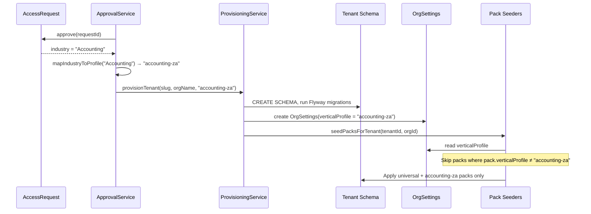

> Standalone architecture document for Phase 47. Not merged into ARCHITECTURE.md (QA/process phase).

# Phase 47 — Vertical QA: Small SA Accounting Firm

---

## 47. Phase 47 — Vertical QA: Small SA Accounting Firm (Accelerated-Clock Shakeout)

Phase 47 is not a feature phase. It is a **vertical profile and quality assurance phase** that picks a concrete target market — a small South African accounting firm — and tests whether the platform can support their real-world operations end to end. Every prior phase built and tested features in isolation. This phase connects them into a coherent workflow and measures the result.

The phase produces three artifacts: (1) a production-quality **accounting vertical profile** — pack data that configures the platform for SA accounting firms, (2) a **90-day accelerated lifecycle script** that simulates a firm's first three months, and (3) a **categorised gap analysis** documenting every friction point, missing capability, broken flow, and wrong assumption discovered during execution.

The approach is two-pass: an agent executes the script against the E2E mock-auth stack using Playwright MCP, producing a raw gap report. The founder then does a guided walkthrough with UX judgement. Both reports are consolidated into a prioritised fix backlog.

**Dependencies on prior phases**: This phase exercises nearly every feature built in Phases 1–46. The vertical profile leverages pack seeders from Phases 11 (field packs), 14 (compliance packs), 12 (template packs), 31 (clause packs), 37 (automation templates), and 38 (request templates). The lifecycle script exercises customers (Phase 4), time tracking (Phase 5), invoicing (Phase 10), profitability (Phase 8), proposals (Phase 34), retainers (Phase 33), portal (Phase 7/16), custom fields (Phase 11), automations (Phase 37), resource planning (Phase 36), and reporting (Phase 32).

### What's New

| Capability | Before Phase 47 | After Phase 47 |
|---|---|---|
| Vertical profiles | Generic pack data only (common-customer, common-project, etc.) | Accounting-specific packs: `accounting-za` field pack, `fica-kyc-za` compliance pack, `accounting-za` template/clause/automation/request packs |
| End-to-end workflow validation | Per-feature integration tests | Full lifecycle shakeout: client onboarding through 90-day billing cycle |
| Gap analysis | Ad hoc, per-phase | Structured, categorised, prioritised — ready to feed into fix phases |
| Vertical fork readiness | Unknown | Assessed with concrete data |
| QA methodology | None formalised | Two-pass (agent + founder) process documented as repeatable for future verticals |

**Out of scope**: Fixing gaps found during this phase (fixes are a separate phase), building terminology switching infrastructure, trust accounting rules, multiple verticals, automated Playwright test suite, production deployment, real payment/email integrations.

---

### 47.1 Overview

The SA accounting vertical was chosen because it has the smallest fork gap from the generic platform (see MEMORY.md — vertical fork strategy analysis). Monthly retainer bookkeeping + hourly advisory maps cleanly to the platform's project/time/invoicing model. FICA compliance maps to the checklist system. Engagement letters map to proposals with clause packs. The vertical is specific enough to expose real gaps but generic enough that fixes improve the platform for all professional services verticals.

The target persona is "Thornton & Associates" — a 3-person Johannesburg accounting practice. Three E2E mock-auth users (Alice/Owner, Bob/Admin, Carol/Member) map to the firm's roles. Four test clients represent different entity types and billing models, covering the range a small SA firm handles.

The deliverables are:
1. Pack JSON files added to the classpath — no entity changes, no migrations, no API changes
2. A 90-day lifecycle script structured as day-based sections with actions, checkpoints, and prerequisite data
3. Two gap reports (agent pass + founder pass) consolidated into a single prioritised analysis
4. A fork readiness assessment based on the gaps found

---

### 47.2 Vertical Profile Architecture

A vertical profile is a **named collection of pack references** that, when applied together, configure the platform for a specific industry. The profile does not introduce new abstractions — it is a manifest that points to existing pack files that the existing seeders already know how to apply.

#### 47.2.1 Profile Manifest Structure

The profile manifest is a JSON file at `classpath:vertical-profiles/accounting-za.json`. It declares which packs belong to this vertical and in what order they should be applied.

```json
{
  "profileId": "accounting-za",
  "name": "South African Accounting Firm",
  "description": "Complete configuration for a small SA accounting practice: FICA compliance, engagement letter templates, accounting-specific custom fields, automation rules, and request templates.",
  "locale": "en-ZA",
  "currency": "ZAR",
  "packs": {
    "field": ["accounting-za-customer", "accounting-za-project"],
    "compliance": ["fica-kyc-za"],
    "template": ["accounting-za"],
    "clause": ["accounting-za-clauses"],
    "automation": ["automation-accounting-za"],
    "request": ["year-end-info-request-za"]
  },
  "rateCardDefaults": {
    "currency": "ZAR",
    "billingRates": [
      { "roleName": "Owner", "hourlyRate": 1500 },
      { "roleName": "Admin", "hourlyRate": 850 },
      { "roleName": "Member", "hourlyRate": 450 }
    ],
    "costRates": [
      { "roleName": "Owner", "hourlyRate": 650 },
      { "roleName": "Admin", "hourlyRate": 350 },
      { "roleName": "Member", "hourlyRate": 180 }
    ]
  },
  "taxDefaults": [
    { "name": "VAT", "rate": 15.00, "default": true }
  ],
  "terminologyOverrides": "en-ZA-accounting"
}
```

#### 47.2.2 Mapping to Existing Pack Seeders

Each pack type in the manifest maps directly to an existing seeder:

| Manifest Key | Seeder | Classpath Pattern | Files Added |
|---|---|---|---|
| `field` | `FieldPackSeeder` | `classpath:field-packs/*.json` | `accounting-za-customer.json`, `accounting-za-project.json` |
| `compliance` | `CompliancePackSeeder` | `classpath:compliance-packs/*/pack.json` | `fica-kyc-za/pack.json` |
| `template` | `TemplatePackSeeder` | `classpath:template-packs/*/pack.json` | `accounting-za/pack.json` + content files |
| `clause` | `ClausePackSeeder` | `classpath:clause-packs/*/pack.json` | `accounting-za-clauses/pack.json` |
| `automation` | `AutomationTemplateSeeder` | `classpath:automation-templates/*.json` | `accounting-za.json` |
| `request` | `RequestPackSeeder` | `classpath:request-packs/*.json` | `year-end-info-request-za.json` |

The seeders discover pack files via classpath scanning. Adding a new JSON file to the correct directory is sufficient — the seeder picks it up automatically on next tenant provisioning or pack reconciliation run. No code changes to seeders are required.

#### 47.2.3 Vertical-Scoped Pack Filtering

The platform needs to support multiple verticals coexisting on the same classpath — accounting packs and law packs living side by side, with each tenant receiving only the packs that match their vertical. This is achieved by threading the `AccessRequest.industry` field through the provisioning chain to `OrgSettings.verticalProfile`, and adding a filter in `AbstractPackSeeder`.

See [ADR-184](../adr/ADR-184-vertical-scoped-pack-filtering.md) for the full decision.

**The chain: industry → verticalProfile → pack filtering**

```
AccessRequest.industry ("Accounting")
    ↓  mapped in AccessRequestApprovalService.approve()
TenantProvisioningService.provisionTenant(slug, orgName, "accounting-za")
    ↓  stored before pack seeding
OrgSettings.verticalProfile = "accounting-za"
    ↓  read by each seeder in doSeedPacks()
AbstractPackSeeder: skip packs where pack.verticalProfile ≠ orgSettings.verticalProfile
```

**Industry-to-profile mapping** (static map in `AccessRequestApprovalService`):

| AccessRequest.industry | OrgSettings.verticalProfile | Packs Applied |
|---|---|---|
| `"Accounting"` | `"accounting-za"` | Universal + `accounting-za` packs |
| `"Legal"` | `"law-za"` | Universal + `law-za` packs |
| Any other / null | `null` | Universal packs only |

**Pack JSON field**: Each pack gains an optional `"verticalProfile"` field:

```json
// accounting-za-customer.json — only for accounting tenants
{ "packId": "accounting-za-customer", "verticalProfile": "accounting-za", ... }

// common-customer.json — no verticalProfile → applied to all tenants
{ "packId": "common-customer", ... }
```

**Filter logic in `AbstractPackSeeder.doSeedPacks()`** (~5 lines):

```java
String tenantProfile = orgSettings.getVerticalProfile(); // nullable
String packProfile = getVerticalProfile(pack);           // nullable
if (packProfile != null && !packProfile.equals(tenantProfile)) {
    log.debug("Skipping pack {} (profile {} ≠ tenant profile {})", packId, packProfile, tenantProfile);
    continue;
}
```

**Provisioning sequence** (updated):



**Testing multiple verticals in the same E2E stack**:

```
E2E Stack (single docker-compose)
├── Org: "Thornton & Associates"  (vertical_profile = "accounting-za")
│   ├── common-customer fields ✓     (universal — no verticalProfile)
│   ├── accounting-za-customer ✓     (profile match)
│   ├── law-za-customer ✗           (skipped — wrong profile)
│   └── fica-kyc-za checklist ✓     (profile match)
│
├── Org: "Smith & Partners"  (vertical_profile = "law-za")
│   ├── common-customer fields ✓     (universal)
│   ├── accounting-za-customer ✗    (skipped)
│   ├── law-za-customer ✓          (profile match)
│   └── fic-law-za checklist ✓     (profile match)
│
└── Org: "Generic Consulting"  (vertical_profile = null)
    ├── common-customer fields ✓     (universal)
    ├── accounting-za-customer ✗    (skipped — has profile, org has none)
    └── law-za-customer ✗          (skipped)
```

#### 47.2.4 Profile Manifest (Documentation Artifact)

The profile manifest at `classpath:vertical-profiles/accounting-za.json` serves as a coordination document — it lists which packs belong to this vertical, what rate card defaults to configure, and what terminology overrides to apply. The manifest is **not consumed by the backend at runtime**. The filtering is driven by the `verticalProfile` field on individual pack JSON files. A future phase may add a `VerticalProfileService` that reads the manifest and orchestrates pack + rate card + tax setup, but this phase uses it as a reference for the QA script.

See [ADR-181](../adr/ADR-181-vertical-profile-structure.md) for the full decision on profile structure.

#### 47.2.4 Terminology Override Approach

The accounting vertical overrides platform terminology (e.g., "Projects" becomes "Engagements", "Customers" becomes "Clients"). The Phase 43 i18n system uses `next-intl` with message files in `frontend/src/messages/`. Vertical terminology overrides are stored in a separate directory and merged at runtime.

Override files live at `frontend/src/messages/en-ZA-accounting/` and contain only the keys that differ from the base `en` locale. The merge strategy is: base messages (`en`) are loaded first, then the vertical override namespace is merged on top. Keys present in the override replace the base; keys absent from the override fall through to the base.

```
frontend/src/messages/
  en/
    common.json          ← base messages
  en-ZA-accounting/
    common.json          ← overrides only (Projects→Engagements, etc.)
```

**Likely gap**: The current i18n system does not support loading a secondary override namespace based on a "vertical" configuration value. The base locale switching (`en`, `en-ZA`) exists, but per-vertical overlays within a locale are not implemented. This will be logged as a gap during the QA pass. The override files are created anyway as the content specification for what a future implementation should produce.

See [ADR-182](../adr/ADR-182-terminology-override-mechanism.md) for the full decision.

---

### 47.3 Pack Content Specifications

This section specifies the exact content of each pack file. The JSON structures match existing pack patterns so that builder agents can create the files directly from these specifications.

#### 47.3.1 Field Pack — `accounting-za-customer`

**File**: `backend/src/main/resources/field-packs/accounting-za-customer.json`

```json
{
  "packId": "accounting-za-customer",
  "version": 1,
  "verticalProfile": "accounting-za",
  "entityType": "CUSTOMER",
  "group": {
    "slug": "accounting_za_client",
    "name": "SA Accounting — Client Details",
    "description": "South African accounting-specific fields for client entities",
    "autoApply": false
  },
  "fields": [
    {
      "slug": "company_registration_number",
      "name": "Company Registration Number",
      "fieldType": "TEXT",
      "description": "CIPC registration number (e.g., 2024/123456/07)",
      "required": false,
      "requiredForContexts": ["PROPOSAL_SEND", "INVOICE_GENERATION"],
      "sortOrder": 1
    },
    {
      "slug": "trading_as",
      "name": "Trading As",
      "fieldType": "TEXT",
      "description": "Trading name if different from registered name",
      "required": false,
      "sortOrder": 2
    },
    {
      "slug": "vat_number",
      "name": "VAT Number",
      "fieldType": "TEXT",
      "description": "SARS VAT registration number (only if VAT-registered, threshold R1M turnover)",
      "required": false,
      "requiredForContexts": ["INVOICE_GENERATION"],
      "sortOrder": 3
    },
    {
      "slug": "sars_tax_reference",
      "name": "SARS Tax Reference",
      "fieldType": "TEXT",
      "description": "Income tax reference number issued by SARS",
      "required": true,
      "sortOrder": 4
    },
    {
      "slug": "sars_efiling_profile",
      "name": "SARS eFiling Profile Number",
      "fieldType": "TEXT",
      "description": "Client's SARS eFiling profile number for electronic filing",
      "required": false,
      "sortOrder": 5
    },
    {
      "slug": "financial_year_end",
      "name": "Financial Year-End",
      "fieldType": "DATE",
      "description": "Financial year-end date (commonly Feb or Jun for SA companies)",
      "required": true,
      "sortOrder": 6
    },
    {
      "slug": "entity_type",
      "name": "Entity Type",
      "fieldType": "DROPDOWN",
      "description": "Legal entity type",
      "required": true,
      "options": [
        { "value": "PTY_LTD", "label": "Pty Ltd" },
        { "value": "SOLE_PROPRIETOR", "label": "Sole Proprietor" },
        { "value": "CC", "label": "Close Corporation (CC)" },
        { "value": "TRUST", "label": "Trust" },
        { "value": "PARTNERSHIP", "label": "Partnership" },
        { "value": "NPC", "label": "Non-Profit Company (NPC)" }
      ],
      "sortOrder": 7
    },
    {
      "slug": "industry_sic_code",
      "name": "Industry (SIC Code)",
      "fieldType": "TEXT",
      "description": "SARS Standard Industrial Classification code for tax returns",
      "required": false,
      "sortOrder": 8
    },
    {
      "slug": "registered_address",
      "name": "Registered Address",
      "fieldType": "TEXT",
      "description": "Physical registered address (CIPC requirement)",
      "required": true,
      "requiredForContexts": ["PROPOSAL_SEND"],
      "sortOrder": 9
    },
    {
      "slug": "postal_address",
      "name": "Postal Address",
      "fieldType": "TEXT",
      "description": "Postal address if different from registered address",
      "required": false,
      "sortOrder": 10
    },
    {
      "slug": "primary_contact_name",
      "name": "Primary Contact Name",
      "fieldType": "TEXT",
      "description": "Main contact person at the client company",
      "required": true,
      "sortOrder": 11
    },
    {
      "slug": "primary_contact_email",
      "name": "Primary Contact Email",
      "fieldType": "TEXT",
      "description": "Email address for primary contact",
      "required": true,
      "sortOrder": 12
    },
    {
      "slug": "primary_contact_phone",
      "name": "Primary Contact Phone",
      "fieldType": "PHONE",
      "description": "Phone number for primary contact",
      "required": false,
      "sortOrder": 13
    },
    {
      "slug": "fica_verified",
      "name": "FICA Verified",
      "fieldType": "DROPDOWN",
      "description": "FICA/KYC verification status for this client",
      "required": true,
      "options": [
        { "value": "NOT_STARTED", "label": "Not Started" },
        { "value": "IN_PROGRESS", "label": "In Progress" },
        { "value": "VERIFIED", "label": "Verified" }
      ],
      "defaultValue": "NOT_STARTED",
      "sortOrder": 14
    },
    {
      "slug": "fica_verification_date",
      "name": "FICA Verification Date",
      "fieldType": "DATE",
      "description": "Date FICA verification was completed",
      "required": false,
      "sortOrder": 15
    },
    {
      "slug": "referred_by",
      "name": "Referred By",
      "fieldType": "TEXT",
      "description": "Source of client referral for tracking",
      "required": false,
      "sortOrder": 16
    }
  ]
}
```

#### 47.3.2 Field Pack — `accounting-za-project`

**File**: `backend/src/main/resources/field-packs/accounting-za-project.json`

```json
{
  "packId": "accounting-za-project",
  "version": 1,
  "verticalProfile": "accounting-za",
  "entityType": "PROJECT",
  "group": {
    "slug": "accounting_za_engagement",
    "name": "SA Accounting — Engagement Details",
    "description": "South African accounting-specific fields for engagement (project) entities",
    "autoApply": false
  },
  "fields": [
    {
      "slug": "engagement_type",
      "name": "Engagement Type",
      "fieldType": "DROPDOWN",
      "description": "Type of accounting engagement",
      "required": true,
      "options": [
        { "value": "MONTHLY_BOOKKEEPING", "label": "Monthly Bookkeeping" },
        { "value": "ANNUAL_TAX_RETURN", "label": "Annual Tax Return" },
        { "value": "ANNUAL_FINANCIAL_STATEMENTS", "label": "Annual Financial Statements" },
        { "value": "ADVISORY", "label": "Advisory" },
        { "value": "TRUST_ADMINISTRATION", "label": "Trust Administration" },
        { "value": "COMPANY_SECRETARIAL", "label": "Company Secretarial" },
        { "value": "VAT_RETURNS", "label": "VAT Returns" },
        { "value": "PAYROLL", "label": "Payroll" },
        { "value": "OTHER", "label": "Other" }
      ],
      "sortOrder": 1
    },
    {
      "slug": "tax_year",
      "name": "Tax Year",
      "fieldType": "TEXT",
      "description": "Relevant tax year (e.g., 2026) for tax return engagements",
      "required": false,
      "sortOrder": 2
    },
    {
      "slug": "sars_submission_deadline",
      "name": "SARS Submission Deadline",
      "fieldType": "DATE",
      "description": "Filing deadline based on engagement type and financial year-end",
      "required": false,
      "sortOrder": 3
    },
    {
      "slug": "assigned_reviewer",
      "name": "Assigned Reviewer",
      "fieldType": "TEXT",
      "description": "Senior person who reviews deliverables before client delivery",
      "required": false,
      "sortOrder": 4
    },
    {
      "slug": "complexity",
      "name": "Complexity",
      "fieldType": "DROPDOWN",
      "description": "Engagement complexity level for planning and billing",
      "required": false,
      "options": [
        { "value": "SIMPLE", "label": "Simple" },
        { "value": "MODERATE", "label": "Moderate" },
        { "value": "COMPLEX", "label": "Complex" }
      ],
      "sortOrder": 5
    }
  ]
}
```

#### 47.3.3 Compliance Pack — `fica-kyc-za`

**File**: `backend/src/main/resources/compliance-packs/fica-kyc-za/pack.json`

This pack extends the existing `sa-fica-company` pack with the full 9-item FICA checklist from the requirements. The existing SA FICA packs (`sa-fica-company`, `sa-fica-individual`) cover 6 items each. This pack provides the comprehensive accounting firm variant.

```json
{
  "packId": "fica-kyc-za",
  "name": "FICA KYC — SA Accounting",
  "description": "Comprehensive FICA/KYC compliance checklist for South African accounting firms. Covers identity verification, company registration, tax clearance, banking confirmation, beneficial ownership, and source of funds — aligned with FICA Amendment Act requirements.",
  "version": "1.0.0",
  "verticalProfile": "accounting-za",
  "jurisdiction": "ZA",
  "customerType": "ALL",
  "checklistTemplate": {
    "name": "FICA KYC — SA Accounting",
    "slug": "fica-kyc-za-accounting",
    "autoInstantiate": false,
    "items": [
      {
        "name": "Certified ID Copy",
        "description": "Certified copy of director/member ID document. For sole proprietors, the proprietor's ID. For companies, all directors with >25% ownership.",
        "sortOrder": 1,
        "required": true,
        "requiresDocument": true,
        "requiredDocumentLabel": "Certified ID document (certified within last 3 months)",
        "dependsOnItemKey": null
      },
      {
        "name": "Proof of Residence",
        "description": "Utility bill or bank statement not older than 3 months, confirming residential address of the director/proprietor.",
        "sortOrder": 2,
        "required": true,
        "requiresDocument": true,
        "requiredDocumentLabel": "Proof of residence (utility bill or bank statement, <3 months)",
        "dependsOnItemKey": null
      },
      {
        "name": "Company Registration (CM29/CoR14.3)",
        "description": "CIPC company registration certificate. Required for Pty Ltd, CC, and NPC entities. Not applicable to sole proprietors.",
        "sortOrder": 3,
        "required": true,
        "requiresDocument": true,
        "requiredDocumentLabel": "CIPC company registration certificate",
        "dependsOnItemKey": null
      },
      {
        "name": "Tax Clearance Certificate",
        "description": "SARS tax clearance certificate or Tax Compliance Status (TCS) pin. Confirms the entity is in good standing with SARS.",
        "sortOrder": 4,
        "required": true,
        "requiresDocument": true,
        "requiredDocumentLabel": "SARS tax clearance certificate or TCS pin",
        "dependsOnItemKey": null
      },
      {
        "name": "Bank Confirmation Letter",
        "description": "Confirmation of banking details issued by the client's bank. Required for payment processing and invoice reconciliation.",
        "sortOrder": 5,
        "required": true,
        "requiresDocument": true,
        "requiredDocumentLabel": "Bank confirmation letter (original or certified copy)",
        "dependsOnItemKey": null
      },
      {
        "name": "Proof of Business Address",
        "description": "Lease agreement or utility bill for business premises. Confirms the entity has a physical place of business.",
        "sortOrder": 6,
        "required": false,
        "requiresDocument": true,
        "requiredDocumentLabel": "Proof of business address (lease or utility bill)",
        "dependsOnItemKey": null
      },
      {
        "name": "Resolution / Mandate",
        "description": "Board resolution or member mandate authorising the engagement with the accounting firm. Recommended for Pty Ltd and CC entities.",
        "sortOrder": 7,
        "required": false,
        "requiresDocument": true,
        "requiredDocumentLabel": "Board resolution or member mandate",
        "dependsOnItemKey": null
      },
      {
        "name": "Beneficial Ownership Declaration",
        "description": "Declaration identifying all ultimate beneficial owners holding >25% interest. Required by FICA Amendment Act for all non-natural person entities.",
        "sortOrder": 8,
        "required": true,
        "requiresDocument": true,
        "requiredDocumentLabel": "Beneficial ownership declaration form",
        "dependsOnItemKey": null
      },
      {
        "name": "Source of Funds Declaration",
        "description": "Client declaration on the source of business funds. Required on a risk-based approach — mandatory for higher-risk clients (trusts, politically exposed persons, high-turnover entities).",
        "sortOrder": 9,
        "required": false,
        "requiresDocument": true,
        "requiredDocumentLabel": "Source of funds declaration",
        "dependsOnItemKey": null
      }
    ]
  },
  "fieldDefinitions": null,
  "retentionOverrides": null
}
```

**Design note**: Field definitions are not cross-seeded from this compliance pack because the `accounting-za-customer` field pack already covers all accounting-specific client fields. This avoids duplication. The `fica_verified` and `fica_verification_date` fields in the field pack serve as the link between field data and compliance status.

#### 47.3.4 Template Pack — `accounting-za`

**File**: `backend/src/main/resources/template-packs/accounting-za/pack.json`

```json
{
  "packId": "accounting-za",
  "version": 1,
  "verticalProfile": "accounting-za",
  "name": "SA Accounting Templates",
  "description": "Document templates for South African accounting firms: engagement letters, monthly reports, and compliance correspondence",
  "templates": [
    {
      "templateKey": "engagement-letter-bookkeeping",
      "name": "Engagement Letter — Monthly Bookkeeping",
      "category": "ENGAGEMENT_LETTER",
      "primaryEntityType": "PROJECT",
      "contentFile": "engagement-letter-bookkeeping.json",
      "cssFile": null,
      "description": "Standard SAICA-format engagement letter for monthly bookkeeping services. Includes scope of work, monthly fee, and standard clauses.",
      "sortOrder": 1
    },
    {
      "templateKey": "engagement-letter-tax-return",
      "name": "Engagement Letter — Annual Tax Return",
      "category": "ENGAGEMENT_LETTER",
      "primaryEntityType": "PROJECT",
      "contentFile": "engagement-letter-tax-return.json",
      "cssFile": null,
      "description": "Engagement letter for annual income tax return preparation. References tax year and SARS submission deadline.",
      "sortOrder": 2
    },
    {
      "templateKey": "engagement-letter-advisory",
      "name": "Engagement Letter — Advisory",
      "category": "ENGAGEMENT_LETTER",
      "primaryEntityType": "PROJECT",
      "contentFile": "engagement-letter-advisory.json",
      "cssFile": null,
      "description": "Engagement letter for hourly advisory services. Specifies hourly rate and estimated hours.",
      "sortOrder": 3
    },
    {
      "templateKey": "monthly-report-cover",
      "name": "Monthly Report Cover",
      "category": "COVER_LETTER",
      "primaryEntityType": "PROJECT",
      "contentFile": "monthly-report-cover.json",
      "cssFile": null,
      "description": "Cover page for monthly bookkeeping deliverables package.",
      "sortOrder": 4
    },
    {
      "templateKey": "invoice-za",
      "name": "SA Tax Invoice",
      "category": "OTHER",
      "primaryEntityType": "INVOICE",
      "contentFile": "invoice-za.json",
      "cssFile": null,
      "description": "South African tax invoice template with VAT number, bank details, and SARS-compliant formatting.",
      "sortOrder": 5
    },
    {
      "templateKey": "statement-of-account",
      "name": "Statement of Account",
      "category": "REPORT",
      "primaryEntityType": "CUSTOMER",
      "contentFile": "statement-of-account.json",
      "cssFile": null,
      "description": "Client statement of account showing all invoices, payments, and outstanding balance.",
      "sortOrder": 6
    },
    {
      "templateKey": "fica-confirmation",
      "name": "FICA Confirmation Letter",
      "category": "OTHER",
      "primaryEntityType": "CUSTOMER",
      "contentFile": "fica-confirmation.json",
      "cssFile": null,
      "description": "Letter confirming FICA/KYC verification has been completed for a client.",
      "sortOrder": 7
    }
  ]
}
```

Each template's `contentFile` is a Tiptap JSON document stored alongside the `pack.json`. The key variables for each template:

| Template | Key Variables |
|---|---|
| `engagement-letter-bookkeeping` | `customer.name`, `customer.customFields.company_registration_number`, `project.customFields.engagement_type`, `org.name`, `org.brandColor`, retainer monthly fee |
| `engagement-letter-tax-return` | `customer.name`, `customer.customFields.sars_tax_reference`, `project.customFields.tax_year`, `project.customFields.sars_submission_deadline` |
| `engagement-letter-advisory` | `customer.name`, hourly rate, estimated hours |
| `monthly-report-cover` | `customer.name`, `project.name`, month/year, `org.name` |
| `invoice-za` | Standard invoice variables + `customer.customFields.vat_number`, `org.bankDetails` |
| `statement-of-account` | `customer.name`, invoice list with amounts, payments, balance |
| `fica-confirmation` | `customer.name`, `customer.customFields.fica_verification_date`, `org.name` |

**Likely gap — `statement-of-account`**: The template system generates documents from a single primary entity (project, customer, or invoice). A statement of account requires aggregating data across multiple invoices for a customer. The `CustomerContextBuilder` may not assemble invoice history. This will likely surface as a gap. **Builder guidance**: Create this template content file as a stub with a placeholder body that uses only the confirmed `customer.*` variables. Include a comment in the architecture notes explaining that the invoice aggregation variables are aspirational. During QA, this template's inability to render a real statement will be logged as a `missing-feature` gap.

#### 47.3.5 Clause Pack — `accounting-za-clauses`

**File**: `backend/src/main/resources/clause-packs/accounting-za-clauses/pack.json`

Seven clauses tailored for SA accounting engagement letters. These supplement the existing `standard-clauses` pack (which has generic professional services clauses) with accounting-specific language.

```json
{
  "packId": "accounting-za-clauses",
  "version": 1,
  "verticalProfile": "accounting-za",
  "name": "SA Accounting Clauses",
  "description": "Clauses for South African accounting firm engagement letters, aligned with SAICA guidance and SA legislation",
  "clauses": [
    {
      "title": "Limitation of Liability (Accounting)",
      "slug": "accounting-za-limitation-of-liability",
      "category": "Legal",
      "description": "Liability cap aligned with SAICA recommended terms for accounting engagements",
      "body": {
        "type": "doc",
        "content": [
          {
            "type": "paragraph",
            "content": [
              { "type": "text", "text": "The liability of " },
              { "type": "variable", "attrs": { "key": "org.name" } },
              { "type": "text", "text": " to " },
              { "type": "variable", "attrs": { "key": "customer.name" } },
              { "type": "text", "text": " in respect of any claim arising out of or in connection with this engagement, whether in contract, delict or otherwise, shall be limited to three (3) times the total fees charged for the specific engagement giving rise to the claim, or R1,000,000 (one million Rand), whichever is the lesser." }
            ]
          },
          {
            "type": "paragraph",
            "content": [
              { "type": "text", "text": "This limitation shall not apply in cases of fraud, wilful misconduct, or gross negligence on the part of " },
              { "type": "variable", "attrs": { "key": "org.name" } },
              { "type": "text", "text": "." }
            ]
          }
        ]
      },
      "sortOrder": 1
    },
    {
      "title": "Fee Escalation",
      "slug": "accounting-za-fee-escalation",
      "category": "Commercial",
      "description": "Annual fee increase clause linked to CPI, standard in SA retainer agreements",
      "body": {
        "type": "doc",
        "content": [
          {
            "type": "paragraph",
            "content": [
              { "type": "variable", "attrs": { "key": "org.name" } },
              { "type": "text", "text": " reserves the right to adjust fees annually, effective from 1 March each year, by an amount not exceeding the official Consumer Price Index (CPI) as published by Statistics South Africa, plus two percentage points (CPI + 2%)." }
            ]
          },
          {
            "type": "paragraph",
            "content": [
              { "type": "text", "text": "Written notice of any fee adjustment shall be provided to " },
              { "type": "variable", "attrs": { "key": "customer.name" } },
              { "type": "text", "text": " at least thirty (30) days prior to the effective date. If the client does not accept the revised fees, either party may terminate this engagement in accordance with the termination provisions herein." }
            ]
          }
        ]
      },
      "sortOrder": 2
    },
    {
      "title": "Termination (Accounting)",
      "slug": "accounting-za-termination",
      "category": "Legal",
      "description": "30-day notice termination with handover provisions specific to accounting engagements",
      "body": {
        "type": "doc",
        "content": [
          {
            "type": "paragraph",
            "content": [
              { "type": "text", "text": "Either party may terminate this engagement by providing thirty (30) days written notice to the other party. Upon termination, " },
              { "type": "variable", "attrs": { "key": "org.name" } },
              { "type": "text", "text": " shall:" }
            ]
          },
          {
            "type": "bulletList",
            "content": [
              { "type": "listItem", "content": [{ "type": "paragraph", "content": [{ "type": "text", "text": "Complete any work in progress to a logical handover point;" }] }] },
              { "type": "listItem", "content": [{ "type": "paragraph", "content": [{ "type": "text", "text": "Deliver all client-owned records and documents within fourteen (14) days;" }] }] },
              { "type": "listItem", "content": [{ "type": "paragraph", "content": [{ "type": "text", "text": "Provide a summary of outstanding SARS obligations and filing deadlines;" }] }] },
              { "type": "listItem", "content": [{ "type": "paragraph", "content": [{ "type": "text", "text": "Co-operate with the incoming accountant for a reasonable handover period." }] }] }
            ]
          },
          {
            "type": "paragraph",
            "content": [
              { "type": "variable", "attrs": { "key": "customer.name" } },
              { "type": "text", "text": " shall remain liable for all fees and disbursements incurred up to the effective date of termination." }
            ]
          }
        ]
      },
      "sortOrder": 3
    },
    {
      "title": "Confidentiality (Accounting)",
      "slug": "accounting-za-confidentiality",
      "category": "Legal",
      "description": "Client data protection commitment with POPIA reference",
      "body": {
        "type": "doc",
        "content": [
          {
            "type": "paragraph",
            "content": [
              { "type": "variable", "attrs": { "key": "org.name" } },
              { "type": "text", "text": " undertakes to treat all information received from or on behalf of " },
              { "type": "variable", "attrs": { "key": "customer.name" } },
              { "type": "text", "text": " as confidential, in accordance with the Protection of Personal Information Act 4 of 2013 (POPIA) and the ethical requirements of the South African Institute of Chartered Accountants (SAICA) and the Independent Regulatory Board for Auditors (IRBA) where applicable." }
            ]
          },
          {
            "type": "paragraph",
            "content": [
              { "type": "text", "text": "Confidential information shall not be disclosed to any third party without the client's prior written consent, except where disclosure is required by law, regulation, or professional obligation (including disclosures to SARS, the Financial Intelligence Centre, or professional regulatory bodies)." }
            ]
          }
        ]
      },
      "sortOrder": 4
    },
    {
      "title": "Document Retention (Accounting)",
      "slug": "accounting-za-document-retention",
      "category": "Compliance",
      "description": "5-year retention aligned with SARS requirements under Tax Administration Act",
      "body": {
        "type": "doc",
        "content": [
          {
            "type": "paragraph",
            "content": [
              { "type": "variable", "attrs": { "key": "org.name" } },
              { "type": "text", "text": " shall retain all engagement records, working papers, and supporting documentation for a minimum period of five (5) years from the date of the relevant assessment or the completion of the engagement, whichever is later, in compliance with the Tax Administration Act 28 of 2011 and the Companies Act 71 of 2008." }
            ]
          },
          {
            "type": "paragraph",
            "content": [
              { "type": "text", "text": "Records required for FICA purposes shall be retained for a minimum of five (5) years from the date the business relationship is terminated, in accordance with the Financial Intelligence Centre Act 38 of 2001." }
            ]
          }
        ]
      },
      "sortOrder": 5
    },
    {
      "title": "Third-Party Reliance",
      "slug": "accounting-za-third-party-reliance",
      "category": "Legal",
      "description": "Limits who may rely on the firm's work product",
      "body": {
        "type": "doc",
        "content": [
          {
            "type": "paragraph",
            "content": [
              { "type": "text", "text": "The services provided under this engagement, and any reports, opinions, or work product arising therefrom, are prepared solely for the use and benefit of " },
              { "type": "variable", "attrs": { "key": "customer.name" } },
              { "type": "text", "text": " and may not be relied upon by any third party without the prior written consent of " },
              { "type": "variable", "attrs": { "key": "org.name" } },
              { "type": "text", "text": "." }
            ]
          },
          {
            "type": "paragraph",
            "content": [
              { "type": "variable", "attrs": { "key": "org.name" } },
              { "type": "text", "text": " accepts no responsibility or liability to any third party who obtains access to or relies upon any work product arising from this engagement." }
            ]
          }
        ]
      },
      "sortOrder": 6
    },
    {
      "title": "Electronic Communication Consent",
      "slug": "accounting-za-electronic-consent",
      "category": "Compliance",
      "description": "Consent to email, portal, and electronic document delivery",
      "body": {
        "type": "doc",
        "content": [
          {
            "type": "paragraph",
            "content": [
              { "type": "variable", "attrs": { "key": "customer.name" } },
              { "type": "text", "text": " consents to " },
              { "type": "variable", "attrs": { "key": "org.name" } },
              { "type": "text", "text": " communicating by electronic means, including email and the client portal, for the delivery of invoices, statements, engagement documents, information requests, and general correspondence." }
            ]
          },
          {
            "type": "paragraph",
            "content": [
              { "type": "text", "text": "The client acknowledges that electronic communications may be subject to interception and that " },
              { "type": "variable", "attrs": { "key": "org.name" } },
              { "type": "text", "text": " shall not be liable for any loss or damage arising from the use of electronic communication, provided reasonable security measures are in place. This consent is given in terms of the Electronic Communications and Transactions Act 25 of 2002." }
            ]
          }
        ]
      },
      "sortOrder": 7
    }
  ],
  "templateAssociations": [
    {
      "templatePackId": "accounting-za",
      "templateKey": "engagement-letter-bookkeeping",
      "clauseSlugs": [
        "accounting-za-limitation-of-liability",
        "accounting-za-fee-escalation",
        "accounting-za-termination",
        "accounting-za-confidentiality",
        "accounting-za-document-retention",
        "accounting-za-third-party-reliance",
        "accounting-za-electronic-consent"
      ],
      "requiredSlugs": [
        "accounting-za-limitation-of-liability",
        "accounting-za-termination",
        "accounting-za-confidentiality",
        "accounting-za-document-retention"
      ]
    },
    {
      "templatePackId": "accounting-za",
      "templateKey": "engagement-letter-tax-return",
      "clauseSlugs": [
        "accounting-za-limitation-of-liability",
        "accounting-za-termination",
        "accounting-za-confidentiality",
        "accounting-za-document-retention",
        "accounting-za-third-party-reliance"
      ],
      "requiredSlugs": [
        "accounting-za-limitation-of-liability",
        "accounting-za-termination",
        "accounting-za-confidentiality"
      ]
    },
    {
      "templatePackId": "accounting-za",
      "templateKey": "engagement-letter-advisory",
      "clauseSlugs": [
        "accounting-za-limitation-of-liability",
        "accounting-za-termination",
        "accounting-za-confidentiality",
        "accounting-za-third-party-reliance"
      ],
      "requiredSlugs": [
        "accounting-za-limitation-of-liability",
        "accounting-za-confidentiality"
      ]
    }
  ]
}
```

#### 47.3.6 Automation Rule Templates — `automation-accounting-za`

**File**: `backend/src/main/resources/automation-templates/accounting-za.json`

```json
{
  "packId": "automation-accounting-za",
  "version": 1,
  "verticalProfile": "accounting-za",
  "templates": [
    {
      "slug": "fica-reminder",
      "name": "FICA Reminder (7 days)",
      "description": "Notifies the assigned member when a new client has not started FICA verification after 7 days",
      "category": "compliance",
      "triggerType": "CUSTOMER_STATUS_CHANGED",
      "triggerConfig": { "toStatus": "PROSPECT" },
      "conditions": [],
      "actions": [
        {
          "actionType": "SEND_NOTIFICATION",
          "actionConfig": {
            "recipientType": "ORG_ADMINS",
            "title": "FICA not started: {{customer.name}}",
            "message": "Client {{customer.name}} was created 7 days ago and FICA verification has not been started. Please initiate the FICA/KYC process."
          },
          "delayDuration": 7,
          "delayUnit": "DAYS",
          "sortOrder": 0
        }
      ]
    },
    {
      "slug": "accounting-za-budget-alert",
      "name": "Engagement Budget Alert (80%)",
      "description": "Notifies the owner when an engagement budget reaches 80% consumption",
      "category": "monitoring",
      "triggerType": "BUDGET_THRESHOLD_REACHED",
      "triggerConfig": { "thresholdPercent": 80 },
      "conditions": [],
      "actions": [
        {
          "actionType": "SEND_NOTIFICATION",
          "actionConfig": {
            "recipientType": "PROJECT_OWNER",
            "title": "Budget alert: {{project.name}} at 80%",
            "message": "The engagement {{project.name}} for {{customer.name}} has consumed 80% of its budget. Review time logged and consider whether scope or budget needs adjustment."
          },
          "delayDuration": null,
          "delayUnit": null,
          "sortOrder": 0
        }
      ]
    },
    {
      "slug": "accounting-za-invoice-overdue",
      "name": "Invoice Overdue (30 days)",
      "description": "Notifies the admin/bookkeeper when an invoice is overdue for 30 days",
      "category": "notifications",
      "triggerType": "INVOICE_STATUS_CHANGED",
      "triggerConfig": { "toStatus": "OVERDUE" },
      "conditions": [],
      "actions": [
        {
          "actionType": "SEND_NOTIFICATION",
          "actionConfig": {
            "recipientType": "ORG_ADMINS",
            "title": "Invoice overdue: {{invoice.invoiceNumber}}",
            "message": "Invoice {{invoice.invoiceNumber}} for {{customer.name}} (R{{invoice.total}}) is now overdue. Please follow up with the client for payment."
          },
          "delayDuration": null,
          "delayUnit": null,
          "sortOrder": 0
        },
        {
          "actionType": "SEND_EMAIL",
          "actionConfig": {
            "recipientType": "CUSTOMER_CONTACT",
            "subject": "Payment reminder: Invoice {{invoice.invoiceNumber}}",
            "body": "Dear {{customer.name}},\n\nThis is a friendly reminder that invoice {{invoice.invoiceNumber}} dated {{invoice.date}} for the amount of R{{invoice.total}} is now overdue.\n\nPlease arrange payment at your earliest convenience. If payment has already been made, please disregard this notice.\n\nKind regards,\n{{org.name}}"
          },
          "delayDuration": null,
          "delayUnit": null,
          "sortOrder": 1
        }
      ]
    }
  ]
}
```

**Automation trigger type validation**:

The current `TriggerType` enum supports: `TASK_STATUS_CHANGED`, `PROJECT_STATUS_CHANGED`, `CUSTOMER_STATUS_CHANGED`, `INVOICE_STATUS_CHANGED`, `TIME_ENTRY_CREATED`, `BUDGET_THRESHOLD_REACHED`, `DOCUMENT_ACCEPTED`, `INFORMATION_REQUEST_COMPLETED`.

Three rules use trigger types that **do not exist** in the enum and **must be excluded from the pack JSON** (Jackson will fail to deserialise unknown enum constants, breaking the entire pack):

| Rule | Invalid Trigger | Gap Category | Notes |
|------|----------------|--------------|-------|
| `engagement-letter-followup` | `PROPOSAL_SENT` | `missing-feature` | Needs a new domain event from the proposal system |
| `tax-deadline-approaching` | `FIELD_DATE_APPROACHING` | `missing-feature` | Needs date-field polling — a fundamentally new trigger type |
| `accounting-za-fica-complete-notification` | `CHECKLIST_COMPLETED` | `missing-feature` | Needs a domain event from the compliance/checklist system |

**These three rules are NOT included in the pack JSON file.** They are documented here as desired automations and will be pre-logged in the gap report as `missing-feature` / `major` findings. The pack JSON ships with only the 3 valid rules: `accounting-za-fica-reminder` (CUSTOMER_STATUS_CHANGED with delay), `accounting-za-budget-alert` (BUDGET_THRESHOLD_REACHED), and `accounting-za-invoice-overdue` (INVOICE_STATUS_CHANGED).

#### 47.3.7 Request Template Pack — `year-end-info-request-za`

**File**: `backend/src/main/resources/request-packs/year-end-info-request-za.json`

```json
{
  "packId": "year-end-info-request-za",
  "version": 1,
  "verticalProfile": "accounting-za",
  "name": "Year-End Information Request (SA)",
  "description": "Information request template for year-end tax and financial statement preparation — requests trial balance, bank statements, loan agreements, and fixed asset register from the client via portal",
  "items": [
    {
      "name": "Trial Balance",
      "description": "Trial balance as at the financial year-end date, exported from the client's accounting system (Sage, Xero, QuickBooks, or manual records)",
      "responseType": "FILE_UPLOAD",
      "required": true,
      "fileTypeHints": "PDF, Excel",
      "sortOrder": 1
    },
    {
      "name": "Bank Statements (Full Year)",
      "description": "Complete bank statements for all business accounts for the full financial year",
      "responseType": "FILE_UPLOAD",
      "required": true,
      "fileTypeHints": "PDF",
      "sortOrder": 2
    },
    {
      "name": "Loan Agreements",
      "description": "All loan agreements (bank loans, shareholder loans, hire purchase) with current balances and repayment schedules",
      "responseType": "FILE_UPLOAD",
      "required": true,
      "fileTypeHints": "PDF",
      "sortOrder": 3
    },
    {
      "name": "Fixed Asset Register",
      "description": "List of all fixed assets owned by the business, with purchase dates, cost, and current book values. Include any additions or disposals during the year.",
      "responseType": "FILE_UPLOAD",
      "required": true,
      "fileTypeHints": "PDF, Excel",
      "sortOrder": 4
    },
    {
      "name": "Debtors Age Analysis",
      "description": "Age analysis of accounts receivable as at year-end",
      "responseType": "FILE_UPLOAD",
      "required": false,
      "fileTypeHints": "PDF, Excel",
      "sortOrder": 5
    },
    {
      "name": "Creditors Age Analysis",
      "description": "Age analysis of accounts payable as at year-end",
      "responseType": "FILE_UPLOAD",
      "required": false,
      "fileTypeHints": "PDF, Excel",
      "sortOrder": 6
    },
    {
      "name": "Insurance Schedule",
      "description": "Schedule of all business insurance policies (short-term, professional indemnity, key-man) with premium amounts",
      "responseType": "FILE_UPLOAD",
      "required": false,
      "fileTypeHints": "PDF",
      "sortOrder": 7
    },
    {
      "name": "Payroll Summary",
      "description": "Annual payroll summary including EMP201 submissions, UIF, SDL, and PAYE reconciliation",
      "responseType": "FILE_UPLOAD",
      "required": true,
      "fileTypeHints": "PDF, Excel",
      "sortOrder": 8
    }
  ]
}
```

---

### 47.4 Rate Card & Tax Defaults

The accounting vertical profile specifies default billing rates, cost rates, and tax rates. These are documented in the profile manifest (`accounting-za.json`, Section 47.2.1) but must be applied manually in the current architecture — there is no automated rate card seeding mechanism.

#### Billing Rates (ZAR)

| Role | Hourly Rate | Rationale |
|---|---|---|
| Owner (Senior Accountant) | R1,500/hr | Advisory, complex tax, review work. Market rate for small SA firms: R1,200–R2,000. |
| Admin/Bookkeeper | R850/hr | General bookkeeping, client liaison, document preparation. Market rate: R650–R1,000. |
| Junior | R450/hr | Data capture, basic reconciliation, filing. Market rate: R350–R550. |

#### Cost Rates (ZAR)

| Role | Hourly Cost | Margin | Notes |
|---|---|---|---|
| Owner | R650/hr | 57% | Owner salary equivalent + overhead allocation |
| Admin/Bookkeeper | R350/hr | 59% | Market salary for experienced bookkeeper in JHB |
| Junior | R180/hr | 60% | Entry-level salary + training overhead |

#### Tax Defaults

| Tax Name | Rate | Default | Notes |
|---|---|---|---|
| VAT | 15% | Yes | SA standard VAT rate. Applied to all invoices unless client is in exempt category. |

**Application method**: Rate cards and tax rates are configured manually via the Settings UI (Settings > Rates, Settings > Tax). The 90-day script includes these setup steps on Day 0. A future enhancement could seed rate card defaults from the vertical profile, but the current `OrgSettings` rate card model is member-specific — it requires knowing which members exist, which is not available at pack application time.

---

### 47.5 90-Day Lifecycle Script Architecture

The lifecycle script is a structured walkthrough that simulates a real firm's first 90 days. It is not a test script — it reads as a narrative of what the firm does and why, with verification checkpoints embedded.

#### 47.5.1 Script Structure

The script is divided into day-based sections. Each section has:

1. **Day number and title** — what is happening in the firm's lifecycle
2. **Actor** — which user performs the actions (maps to Alice/Bob/Carol mock-auth users)
3. **Actions** — numbered steps with specific data (real names, amounts, descriptions)
4. **Checkpoints** — pass/fail verification items with expected outcomes
5. **Prerequisites** — data that must exist before this day's actions (for accelerated-clock simulation)

```
Day 0  — Firm Setup (Alice)
Day 1  — First Client Onboarding: Kgosi Construction (Bob → Alice)
Day 2-3 — Additional Client Onboarding: Naledi, Vukani, Moroka (Bob → Alice)
Day 7  — First Week of Work (Carol → Bob → Alice)
Day 14 — Two Weeks In: FICA completion, automations (Carol → Bob)
Day 30 — First Month-End Billing (Bob → Alice)
Day 45 — Mid-Quarter Operations: bulk billing, expenses, ad-hoc work (Bob → Alice)
Day 60 — Second Billing Cycle + Quarterly Review (Bob → Alice)
Day 75 — Year-End Engagement: tax season prep (Alice → Carol)
Day 90 — Quarter Review + Year-End Wrap (Alice → Bob)
```

#### 47.5.2 State Simulation (Accelerated Clock)

The agent cannot manipulate system time. To simulate "Day 30", the agent must first create the prerequisite data that would exist after 30 days of real usage. The approach:

1. **Time entries**: Before Day 30 actions, the agent bulk-creates time entries for the preceding 4 weeks via UI. Each entry has a realistic description, reasonable hours, and correct task assignment.
2. **Retainer periods**: The agent creates and opens retainer periods for the appropriate months.
3. **Notification state**: Automation rules that fire on delay (e.g., 7-day FICA reminder) cannot be simulated by the agent — they require actual elapsed time. The agent logs this as a gap if it cannot verify the automation fired.
4. **Invoice state**: For Day 60 actions that depend on Day 30 invoices being paid, the agent records payments against Day 30 invoices before proceeding.

The script documents prerequisites for each day section so the agent knows exactly what state to create before executing that day's actions.

#### 47.5.3 Checkpoint Verification

Each checkpoint is a boolean assertion:

```markdown
- [ ] Dashboard shows getting started checklist
- [ ] Rate cards show correct ZAR rates for all 3 members
```

The agent verifies each checkpoint by:
- Navigating to the relevant page and taking a screenshot
- Confirming visible data matches expected values
- Recording pass/fail with evidence (screenshot path)

If a checkpoint fails, the agent logs a gap entry and continues to the next checkpoint. Failed checkpoints do not block subsequent days unless the missing state makes later actions impossible (in which case the agent logs a blocker gap).

---

### 47.6 QA Execution Methodology

See [ADR-183](../adr/ADR-183-qa-methodology-vertical-readiness.md) for the formalised two-pass methodology.

#### 47.6.1 Agent Pass (First Pass)

**Environment**: E2E mock-auth stack (`compose/docker-compose.e2e.yml`), frontend at `http://localhost:3001`, backend at `http://localhost:8081`.

**Tool**: Playwright MCP. The agent navigates the frontend, fills forms, clicks buttons, and captures screenshots. Authentication via `http://localhost:3001/mock-login` with user switching between Alice, Bob, and Carol.

**Execution protocol**:
1. Start the E2E stack: `bash compose/scripts/e2e-up.sh`
2. Follow the script sequentially, day by day
3. At each step, attempt the action via the UI
4. If an action is impossible (missing UI element, broken flow, 500 error), log a gap and skip to the next action
5. At each checkpoint, verify and record pass/fail
6. For prerequisite data creation, prefer UI flows over direct API calls (to exercise more of the UI)
7. Capture screenshots as evidence for both passes and failures

**Output**: `tasks/phase47-gap-report-agent.md`

#### 47.6.2 Founder Pass (Second Pass)

The founder walkthrough is guided, not scripted. It uses the agent's gap report as a roadmap but focuses on subjective UX quality:

1. **First impressions** — sign in, navigate, judge whether it feels like an accounting product
2. **Client onboarding** — onboard one client, assess information architecture
3. **Daily work rhythm** — log time, check My Work, assess efficiency
4. **Billing cycle** — generate and review an invoice for professional quality
5. **Profitability** — review dashboards for usefulness
6. **Portal** — view as a client, assess trust/confidence
7. **Gap review** — review agent gaps, agree/disagree/reprioritise

**Output**: `tasks/phase47-gap-report-founder.md`

#### 47.6.3 Gap Logging Format

```markdown
### GAP-{NNN}: {Short description}

**Day**: {day number}
**Step**: {step description}
**Category**: {content | bug | missing-feature | ux | vertical-specific}
**Severity**: {blocker | major | minor | cosmetic}
**Description**: {What happened vs. what was expected}
**Evidence**: {Screenshot path or API response}
**Suggested fix**: {Brief suggestion if obvious}
```

Founder gaps add:
```markdown
**UX Judgement**: {What feels wrong and why, even if technically functional}
```

---

### 47.7 Gap Analysis Framework

#### 47.7.1 Category Definitions

| Category | Definition | Example |
|---|---|---|
| `content` | Wrong or missing pack data — fields, templates, clauses, rules that need to be added or corrected | Missing "Trading As" field on customer form; clause text references wrong legislation |
| `bug` | Something does not work as designed — broken functionality, wrong calculations, errors | Invoice VAT calculation rounds incorrectly; 500 error on time entry save |
| `missing-feature` | Workflow requires a capability that does not exist in the platform | Cannot set different tax rates per invoice line item; no date-field-based automation triggers |
| `ux` | Works but is confusing, slow, or frustrating — workflow friction | Need 6 clicks to log time on a task; retainer close flow is non-obvious |
| `vertical-specific` | Requires accounting-specific logic beyond configuration | Trust accounting rules for Moroka Family Trust; SARS eFiling integration |

#### 47.7.2 Severity Levels

| Severity | Definition | Fix Priority |
|---|---|---|
| `blocker` | Cannot continue the workflow at all. A real firm could not use this. | Must fix before any accounting firm launch |
| `major` | Workaround exists but the workflow is significantly degraded. Would lose a prospect. | Fix in first patch phase |
| `minor` | Inconvenient but does not block daily work. A firm could live with this. | Fix when convenient |
| `cosmetic` | Visual or copy issue with no functional impact. | Nice to have |

Severity is assessed from the perspective of "could a real 3-person SA accounting firm run their practice on this?" — not from a developer's perspective.

#### 47.7.3 Consolidation Process

After both passes:

1. **Merge**: Combine agent and founder gap reports, de-duplicate entries that describe the same issue
2. **Reconcile severity**: Where agent and founder disagree on severity, the founder's assessment takes precedence (they have domain context)
3. **Group by category**: Organize gaps by category for fix planning
4. **Estimate effort**: Tag each major and blocker gap with fix effort (S = <1 day, M = 1-3 days, L = 3+ days)
5. **Assess fork readiness**: Based on blocker and major gap counts, determine whether the platform is ready for vertical fork or needs foundation work first

**Output**: `tasks/phase47-gap-analysis-consolidated.md`

The consolidated report structure:
1. Executive summary — gap counts by category and severity, overall confidence
2. Blocker gaps — must fix, with effort estimates
3. Major gaps — grouped by category, with effort estimates
4. Minor + cosmetic gaps — listed but not individually estimated
5. Vertical profile quality assessment — is the profile shippable?
6. Recommended fix phases — suggested grouping into 1–3 follow-up phases
7. Fork readiness assessment — "ship it", "fix N blockers first", or "needs foundation work"

---

### 47.8 Implementation Guidance

#### 47.8.1 Backend Changes

All backend changes are **pack data files** added to the classpath. No entity changes, no migrations, no API changes.

| File | Location | Type |
|---|---|---|
| `accounting-za-customer.json` | `backend/src/main/resources/field-packs/` | Field pack |
| `accounting-za-project.json` | `backend/src/main/resources/field-packs/` | Field pack |
| `fica-kyc-za/pack.json` | `backend/src/main/resources/compliance-packs/` | Compliance pack |
| `accounting-za/pack.json` + 7 content files | `backend/src/main/resources/template-packs/` | Template pack |
| `accounting-za-clauses/pack.json` | `backend/src/main/resources/clause-packs/` | Clause pack |
| `accounting-za.json` | `backend/src/main/resources/automation-templates/` | Automation templates |
| `year-end-info-request-za.json` | `backend/src/main/resources/request-packs/` | Request template |
| `accounting-za.json` | `backend/src/main/resources/vertical-profiles/` | Profile manifest (documentation) |

#### 47.8.2 Frontend Changes

| File | Location | Type |
|---|---|---|
| `common.json` | `frontend/src/messages/en-ZA-accounting/` | Terminology overrides |

The terminology override file is created as a content specification. Whether it is loaded at runtime depends on whether the i18n system supports vertical overrides (likely a gap).

#### 47.8.3 Schema Changes (Vertical Profile Support)

One tenant migration is needed to support vertical-scoped pack filtering. See [ADR-184](../adr/ADR-184-vertical-scoped-pack-filtering.md).

**V70 — Add vertical_profile to org_settings** (`db/migration/tenant/V70__add_vertical_profile.sql`):

```sql
ALTER TABLE org_settings ADD COLUMN vertical_profile VARCHAR(50);
```

No index needed — this column is read during pack seeding (once at provisioning, once during reconciliation), not queried in hot paths.

**Backend code changes** (4 touch points):

| File | Change |
|------|--------|
| `OrgSettings.java` | Add `verticalProfile` field (VARCHAR(50), nullable) with getter/setter |
| `TenantProvisioningService.java` | Accept `String verticalProfile` parameter, set on `OrgSettings` before calling seeders |
| `AccessRequestApprovalService.approve()` | Map `accessRequest.getIndustry()` → vertical profile slug via static map, pass to `provisionTenant()` |
| `AbstractPackSeeder.doSeedPacks()` | Read `orgSettings.getVerticalProfile()`, skip packs where `pack.verticalProfile` doesn't match |
| Each pack definition record (7 DTOs) | Add optional `String verticalProfile` field (defaults to `null` for backward compatibility) |

**No new entities, no new API endpoints, no new controllers.** The only new API-visible behavior is that `GET /api/settings` returns the `verticalProfile` field (read-only, set at provisioning time).

**No global migrations needed** (V16 not needed). The `access_requests` table already has the `industry` column.

#### 47.8.4 Testing Strategy

**Pack application tests**: Integration tests that apply each new pack to a test tenant schema and verify the resulting entities (field definitions, checklist templates, document templates, clauses, automation rules, request templates) match expectations.

Pattern: existing pack tests in the codebase verify pack application. New tests follow the same pattern — call the seeder, assert the created entities.

**Template rendering tests**: For document templates, verify that the Tiptap JSON content is valid and that variable references (`customer.name`, `org.name`, etc.) resolve correctly when rendered with test data.

**No E2E tests**: The 90-day lifecycle script is a one-time structured exploration, not an automated test suite. Building a repeatable E2E suite may be recommended in the gap analysis as a future phase.

---

### 47.9 Capability Slices

#### Slice A: Vertical Profile Infrastructure + Field Pack + Compliance Pack

**Scope**: Implement vertical-scoped pack filtering (ADR-184), then create the `accounting-za-customer` and `accounting-za-project` field pack JSON files and the `fica-kyc-za` compliance pack JSON. Add integration tests verifying that packs are filtered by vertical profile.

**Infrastructure changes (prerequisite for all other slices)**:
- `V70__add_vertical_profile.sql` — migration adding `vertical_profile` column to `org_settings`
- `OrgSettings.java` — add `verticalProfile` field with getter/setter
- `TenantProvisioningService.java` — accept and store `verticalProfile` parameter
- `AccessRequestApprovalService.approve()` — map `industry` → vertical profile slug, pass to provisioning
- `AbstractPackSeeder.doSeedPacks()` — filter packs by `verticalProfile`
- Pack definition records (7 DTOs) — add optional `verticalProfile` field

**Pack files created**:
- `backend/src/main/resources/field-packs/accounting-za-customer.json` (with `"verticalProfile": "accounting-za"`)
- `backend/src/main/resources/field-packs/accounting-za-project.json` (with `"verticalProfile": "accounting-za"`)
- `backend/src/main/resources/compliance-packs/fica-kyc-za/pack.json` (with `"verticalProfile": "accounting-za"`)
- Integration tests: (1) vertical profile filtering — org with `accounting-za` profile gets accounting packs, org with `null` profile skips them, (2) pack application — field definitions and checklist items created correctly

**Dependencies**: None (first slice).

**Verification**: Run `./mvnw clean verify -q`. New pack filtering + application tests pass. Existing tests still pass (universal packs have no `verticalProfile` field, so filter logic is a no-op).

---

#### Slice B: Document Template Pack + Clause Pack

**Scope**: Create the `accounting-za` template pack (pack.json + 7 Tiptap content files) and the `accounting-za-clauses` clause pack. Add integration tests for template rendering and clause creation.

**Files created**:
- `backend/src/main/resources/template-packs/accounting-za/pack.json`
- `backend/src/main/resources/template-packs/accounting-za/engagement-letter-bookkeeping.json`
- `backend/src/main/resources/template-packs/accounting-za/engagement-letter-tax-return.json`
- `backend/src/main/resources/template-packs/accounting-za/engagement-letter-advisory.json`
- `backend/src/main/resources/template-packs/accounting-za/monthly-report-cover.json`
- `backend/src/main/resources/template-packs/accounting-za/invoice-za.json`
- `backend/src/main/resources/template-packs/accounting-za/statement-of-account.json`
- `backend/src/main/resources/template-packs/accounting-za/fica-confirmation.json`
- `backend/src/main/resources/clause-packs/accounting-za-clauses/pack.json`
- Integration tests

**Dependencies**: None (independent of Slice A).

**Verification**: Pack application tests pass. Template content JSON is valid Tiptap format. Clause body JSON is valid Tiptap format. Template-clause associations link correctly.

---

#### Slice C: Automation Rule Templates + Request Pack + Profile Manifest

**Scope**: Create the `automation-accounting-za` automation template pack, the `year-end-info-request-za` request template pack, and the profile manifest. Document rate card defaults.

**Files created**:
- `backend/src/main/resources/automation-templates/accounting-za.json`
- `backend/src/main/resources/request-packs/year-end-info-request-za.json`
- `backend/src/main/resources/vertical-profiles/accounting-za.json`
- `frontend/src/messages/en-ZA-accounting/common.json`
- Integration tests for automation template and request pack application

**Dependencies**: None (independent of Slices A and B).

**Verification**: Automation templates are created with correct trigger types and action configs. Request template items are created with correct response types. Profile manifest is valid JSON.

---

#### Slice D: 90-Day Lifecycle Script + Agent Execution

**Scope**: Write the complete 90-day lifecycle script as a structured document. Execute the script against the E2E stack using Playwright MCP. Produce the agent gap report.

**Files created**:
- `tasks/phase47-lifecycle-script.md` — the full 90-day script
- `tasks/phase47-gap-report-agent.md` — agent gap report

**Dependencies**: Slices A, B, C (packs must be applied to the E2E tenant before script execution).

**Verification**: Script is complete (covers all 10 day sections from the requirements). Gap report documents every checkpoint result. Every gap has a category, severity, and description.

---

#### Slice E: Founder Walkthrough Guide + Gap Consolidation

**Scope**: Create the founder walkthrough guide. After the founder completes their pass, consolidate both gap reports into a single prioritised analysis.

**Files created**:
- `tasks/phase47-founder-walkthrough-guide.md` — guided walkthrough
- `tasks/phase47-gap-report-founder.md` — founder gap report (filled during walkthrough)
- `tasks/phase47-gap-analysis-consolidated.md` — consolidated analysis

**Dependencies**: Slice D (agent gap report must exist before founder walkthrough).

**Verification**: Consolidated report has all required sections (executive summary, blockers, majors, minor/cosmetic, profile assessment, fix phases, fork readiness). Every blocker and major gap has an effort estimate.

---

### 47.10 ADR Index

| ADR | Title | Decision Summary |
|---|---|---|
| [ADR-181](../adr/ADR-181-vertical-profile-structure.md) | Vertical Profile Structure | JSON manifest referencing existing pack files; no new runtime abstraction |
| [ADR-182](../adr/ADR-182-terminology-override-mechanism.md) | Terminology Override Mechanism | Directory-based message overrides (`en-ZA-accounting/`) merged on top of base locale |
| [ADR-183](../adr/ADR-183-qa-methodology-vertical-readiness.md) | QA Methodology for Vertical Readiness | Two-pass (agent + founder) approach with structured gap analysis |
| [ADR-184](../adr/ADR-184-vertical-scoped-pack-filtering.md) | Vertical-Scoped Pack Filtering | `verticalProfile` field on pack JSON + filter in `AbstractPackSeeder`; chains from `AccessRequest.industry` through provisioning to `OrgSettings` |
