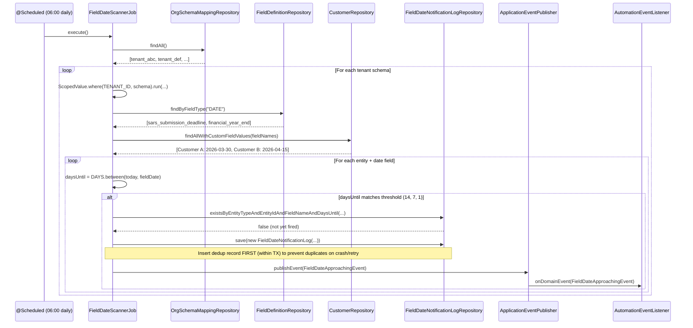
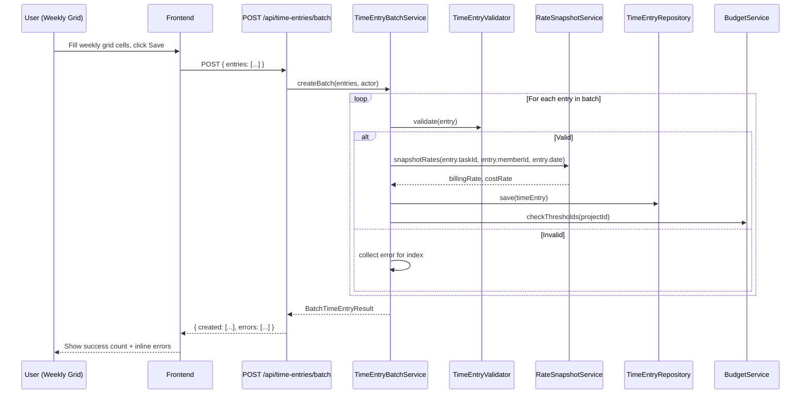
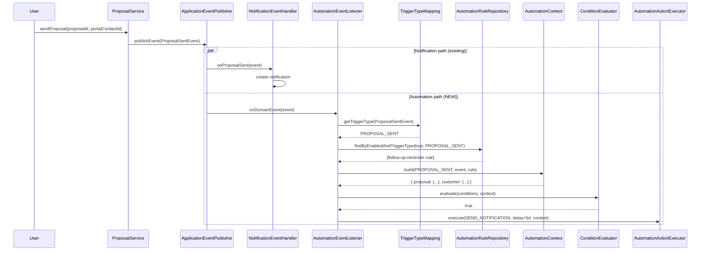
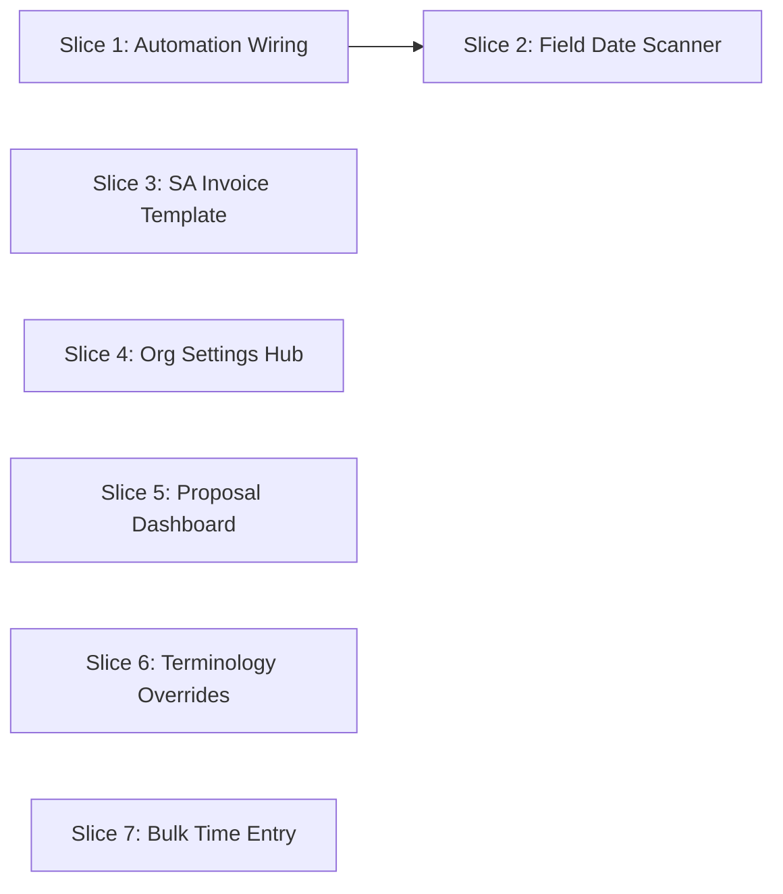

> Phase 48 architecture -- standalone file (not merged into ARCHITECTURE.md).

# Phase 48 -- QA Gap Closure (Automation Wiring, SA Invoice, Org Settings, Bulk UX)

---

## 48.1 Overview

Phase 47 ran a 90-day accelerated QA cycle simulating a 3-person Johannesburg accounting firm ("Thornton & Associates") against the `accounting-za` vertical profile. The cycle surfaced 31 gaps; 10 were fixed during the cycle (PRs #687--#695), 6 disproved, and 4 remain as separate P1 bug fixes. Phase 48 closes the remaining **11 gaps** in a single coordinated phase.

The gaps cluster into three categories:

1. **Automation wiring** (GAP-001, GAP-002, GAP-003) -- Domain events fire but are not mapped into the automation engine. The `AutomationEventListener` (Phase 37) already handles `DomainEvent` dispatch, `TriggerTypeMapping` maps event classes to `TriggerType` values, and `AutomationContext` builds per-trigger context maps. What is missing: two trigger type entries, one event type conversion, one new scheduled trigger, and one deduplication table.

2. **SA vertical polish** (GAP-005, GAP-008A, GAP-013, GAP-016) -- Backend APIs exist for org settings, proposals, and invoice rendering. The frontend pages and the SA-specific invoice template are missing.

3. **Bulk UX** (GAP-015) -- Time entry creation requires 6--8 clicks per entry with no batch operation or weekly copy. A batch endpoint and weekly grid UI eliminate this friction.

### What's New

| Capability | Before Phase 48 | After Phase 48 |
|---|---|---|
| Proposal automation | `ProposalSentEvent` fires but the automation engine ignores it | `PROPOSAL_SENT` trigger mapped; 5-day follow-up template seeded |
| Customer status automation | `CustomerStatusChangedEvent` is a Spring `ApplicationEvent`, invisible to `AutomationEventListener` | Converted to `DomainEvent`; `CUSTOMER_STATUS_CHANGED` trigger wired; FICA reminder template activates |
| Date-field alerts | No scheduled scanning of custom field dates | Daily scanner fires `FIELD_DATE_APPROACHING` events; SARS deadline reminders seeded |
| SA invoice PDF | Generic invoice template only | `invoice-za` Tiptap template with SARS-compliant layout (seller/buyer VAT, tax subtotals) |
| Org settings hub | No central settings page; `/settings` redirects to billing | General settings page: org name, currency, tax registration, logo, branding |
| Proposal dashboard | Proposal CRUD exists but no overview/metrics page | Summary dashboard with status cards, conversion rate, overdue tracking |
| Terminology overrides | All UI labels hardcoded in platform terms | `TerminologyProvider` maps ~15 terms per vertical profile (e.g., "Projects" -> "Engagements") |
| Bulk time entry | Single entry creation only (6--8 clicks each) | Weekly grid with batch save, "Copy Previous Week," and CSV import |

### Out of Scope

- **Full i18n / `next-intl` integration.** This phase adds lightweight terminology switching (~15 terms), not a full internationalization framework.
- **Rate card auto-seeding from profile (GAP-006).** Manual setup works; onboarding friction is a separate concern.
- **SARS integration or eFiling export (GAP-021).** Future vertical-specific enhancement.
- **Engagement letter auto-creation from template (GAP-022).** Rendering pipeline exists; auto-trigger on project creation is a follow-up.
- **Trust accounting.** Vertical-specific and large in scope.
- **RecurringSchedule UX improvements (GAP-017).** Feature exists; surfacing is a polish task.

---

## 48.2 Domain Model Changes

### 48.2.1 New Entity: `FieldDateNotificationLog`

A deduplication table preventing the field date scanner from firing the same alert multiple times for the same date threshold. Tenant-scoped, no `tenant_id` column (schema boundary handles isolation per ADR-064).

| Field | Java Type | DB Column | DB Type | Constraints | Notes |
|-------|-----------|-----------|---------|-------------|-------|
| `id` | `UUID` | `id` | `UUID` | PK, default `gen_random_uuid()` | Auto-generated |
| `entityType` | `String` | `entity_type` | `VARCHAR(20)` | NOT NULL | `"customer"` or `"project"` |
| `entityId` | `UUID` | `entity_id` | `UUID` | NOT NULL | The customer or project UUID |
| `fieldName` | `String` | `field_name` | `VARCHAR(100)` | NOT NULL | Custom field key (e.g., `"sars_submission_deadline"`) |
| `daysUntil` | `int` | `days_until` | `INTEGER` | NOT NULL | Threshold that was matched (e.g., 14, 7, 1) |
| `firedAt` | `Instant` | `fired_at` | `TIMESTAMPTZ` | NOT NULL, DEFAULT now() | When the event was published |

**Composite unique constraint**: `(entity_type, entity_id, field_name, days_until)` prevents duplicate alerts for the same entity/field/threshold combination. A new alert fires only when the date advances to a new threshold bracket.

This entity lives in the `automation/` package alongside `AutomationRule`, `AutomationExecution`, and friends.

### 48.2.2 Modified: `DomainEvent` Sealed Interface

Two new permitted types added to the `permits` clause:

```java
public sealed interface DomainEvent
    permits BudgetThresholdEvent,
        // ... existing 33 permitted types ...
        ProposalSentEvent,           // already listed
        CustomerStatusChangedEvent,  // NEW -- converted from ApplicationEvent
        FieldDateApproachingEvent {  // NEW -- fired by scanner job
```

Current permitted type count: 35. After Phase 48: **37** (adding `CustomerStatusChangedEvent` and `FieldDateApproachingEvent`).

### 48.2.3 Modified: `TriggerType` Enum

Two new values:

```java
public enum TriggerType {
  TASK_STATUS_CHANGED,
  PROJECT_STATUS_CHANGED,
  CUSTOMER_STATUS_CHANGED,
  INVOICE_STATUS_CHANGED,
  TIME_ENTRY_CREATED,
  BUDGET_THRESHOLD_REACHED,
  DOCUMENT_ACCEPTED,
  INFORMATION_REQUEST_COMPLETED,
  PROPOSAL_SENT,              // NEW
  FIELD_DATE_APPROACHING      // NEW
}
```

### 48.2.4 Modified: `CustomerStatusChangedEvent`

**Before** (Spring `ApplicationEvent`):

```java
public class CustomerStatusChangedEvent extends ApplicationEvent {
  private final UUID customerId;
  private final String oldStatus;
  private final String newStatus;
  // constructor takes Object source
}
```

**After** (converted to `DomainEvent` record):

```java
public record CustomerStatusChangedEvent(
    String eventType,
    String entityType,
    UUID entityId,
    UUID projectId,
    UUID actorMemberId,
    String actorName,
    String tenantId,
    String orgId,
    Instant occurredAt,
    Map<String, Object> details
) implements DomainEvent {}
```

The `details` map carries `old_status`, `new_status`, and `customer_name`. The `entityId` field replaces `customerId`. See [ADR-188](../adr/ADR-188-customer-status-changed-event-conversion.md) for the conversion rationale.

**Migration impact**: All existing listeners that consume `CustomerStatusChangedEvent` via `@EventListener` continue to work because Spring's `ApplicationEventPublisher` publishes any object, not only `ApplicationEvent` subclasses. The `AutomationEventListener` now also receives it through the `DomainEvent` listener. Callers that previously passed `new CustomerStatusChangedEvent(source, customerId, old, new)` must be updated to use the record constructor.

### 48.2.5 New: `FieldDateApproachingEvent`

```java
public record FieldDateApproachingEvent(
    String eventType,
    String entityType,
    UUID entityId,
    UUID projectId,
    UUID actorMemberId,
    String actorName,
    String tenantId,
    String orgId,
    Instant occurredAt,
    Map<String, Object> details
) implements DomainEvent {}
```

The `details` map carries: `field_name`, `field_label`, `field_value` (ISO date string), `days_until` (integer), `entity_name` (customer or project name). The `actorMemberId` is null (system-generated event); `actorName` is `"system"`.

### 48.2.6 SA Invoice Template: Tiptap JSON Structure

The `invoice-za` template is stored as JSONB in `document_templates.content_json`. The following shows the Tiptap JSON shape using the custom node types established in Phase 31:

```json
{
  "type": "doc",
  "content": [
    {
      "type": "heading",
      "attrs": { "level": 1 },
      "content": [{ "type": "text", "text": "TAX INVOICE" }]
    },
    {
      "type": "paragraph",
      "content": [
        { "type": "variable", "attrs": { "path": "org.name" } },
        { "type": "text", "text": " | VAT: " },
        { "type": "variable", "attrs": { "path": "org.taxRegistrationNumber" } }
      ]
    },
    {
      "type": "heading",
      "attrs": { "level": 3 },
      "content": [{ "type": "text", "text": "Bill To" }]
    },
    {
      "type": "paragraph",
      "content": [
        { "type": "variable", "attrs": { "path": "customer.name" } },
        { "type": "text", "text": " | VAT: " },
        { "type": "variable", "attrs": { "path": "customerVatNumber" } }
      ]
    },
    {
      "type": "paragraph",
      "content": [
        { "type": "text", "text": "Invoice #: " },
        { "type": "variable", "attrs": { "path": "invoice.invoiceNumber" } },
        { "type": "text", "text": " | Date: " },
        { "type": "variable", "attrs": { "path": "invoice.issueDate" } },
        { "type": "text", "text": " | Due: " },
        { "type": "variable", "attrs": { "path": "invoice.dueDate" } }
      ]
    },
    {
      "type": "loopTable",
      "attrs": {
        "collection": "lines",
        "columns": [
          { "header": "Description", "path": "description" },
          { "header": "Qty", "path": "quantity" },
          { "header": "Unit Price (excl. VAT)", "path": "unitPrice" },
          { "header": "VAT", "path": "taxAmount" },
          { "header": "Total (incl. VAT)", "path": "lineTotal" }
        ]
      }
    },
    {
      "type": "paragraph",
      "content": [
        { "type": "text", "text": "Subtotal (excl. VAT): " },
        { "type": "variable", "attrs": { "path": "invoice.subtotal" } }
      ]
    },
    {
      "type": "paragraph",
      "content": [
        { "type": "text", "text": "VAT (15%): " },
        { "type": "variable", "attrs": { "path": "invoice.taxAmount" } }
      ]
    },
    {
      "type": "paragraph",
      "attrs": { "textAlign": "right" },
      "content": [
        { "type": "text", "marks": [{ "type": "bold" }], "text": "Total (incl. VAT): " },
        { "type": "variable", "attrs": { "path": "invoice.total" } }
      ]
    },
    {
      "type": "heading",
      "attrs": { "level": 3 },
      "content": [{ "type": "text", "text": "Banking Details" }]
    },
    {
      "type": "paragraph",
      "content": [
        { "type": "variable", "attrs": { "path": "org.bankName" } },
        { "type": "text", "text": " | Acc: " },
        { "type": "variable", "attrs": { "path": "org.bankAccountNumber" } },
        { "type": "text", "text": " | Branch: " },
        { "type": "variable", "attrs": { "path": "org.bankBranchCode" } }
      ]
    },
    {
      "type": "paragraph",
      "content": [
        { "type": "variable", "attrs": { "path": "org.documentFooterText" } }
      ]
    }
  ]
}
```

This structure uses the same Tiptap node types (`variable`, `loopTable`) that `TiptapRenderer` already processes (Phase 31). No new node types are needed.

### 48.2.7 Terminology Map Structure

A static TypeScript object mapping vertical profile identifiers to term overrides. Stored in the frontend bundle, not the database.

```typescript
export const TERMINOLOGY: Record<string, Record<string, string>> = {
  'accounting-za': {
    'Project':      'Engagement',
    'Projects':     'Engagements',
    'project':      'engagement',
    'projects':     'engagements',
    'Customer':     'Client',
    'Customers':    'Clients',
    'customer':     'client',
    'customers':    'clients',
    'Proposal':     'Engagement Letter',
    'Proposals':    'Engagement Letters',
    'Rate Card':    'Fee Schedule',
    'Rate Cards':   'Fee Schedules',
  },
};
```

See [ADR-185](../adr/ADR-185-terminology-switching-approach.md) for the rationale of static maps vs. runtime API vs. `next-intl`.

---

## 48.3 Core Flows

### 48.3.1 Automation Trigger Wiring: ProposalSent

This flow completes the wiring of an existing event to the automation engine. No new event types or infrastructure; only mapping and context-building additions.

1. `ProposalService.sendProposal()` publishes `ProposalSentEvent` via `ApplicationEventPublisher`.
2. `AutomationEventListener.onDomainEvent()` receives it (already does, since `ProposalSentEvent` implements `DomainEvent`).
3. `TriggerTypeMapping.getTriggerType()` maps `ProposalSentEvent.class` to `TriggerType.PROPOSAL_SENT` (**new mapping**).
4. `AutomationEventListener` queries `AutomationRuleRepository.findByEnabledAndTriggerType(true, PROPOSAL_SENT)`.
5. For each matching rule, `AutomationContext.build(PROPOSAL_SENT, event, rule)` constructs the context (**new switch branch**).
6. `ConditionEvaluator.evaluate()` checks conditions against context.
7. If conditions are met, `AutomationActionExecutor.execute()` runs configured actions (e.g., `SEND_NOTIFICATION` with 5-day delay).

The `AutomationContext.buildProposalSent()` method populates:

```java
private static void buildProposalSent(
    ProposalSentEvent event, Map<String, Map<String, Object>> context) {
  var proposal = new LinkedHashMap<String, Object>();
  proposal.put("id", uuidToString(event.entityId()));
  proposal.put("sentAt", event.occurredAt().toString());
  context.put("proposal", proposal);

  var customer = new LinkedHashMap<String, Object>();
  customer.put("id", detailValue(event, "customer_id"));
  customer.put("name", detailValue(event, "customer_name"));
  context.put("customer", customer);

  var project = new LinkedHashMap<String, Object>();
  project.put("id", uuidToString(event.projectId()));
  project.put("name", detailValue(event, "project_name"));
  context.put("project", project);
}
```

### 48.3.2 CustomerStatusChanged Conversion

This flow resolves the impedance mismatch between the existing `ApplicationEvent`-based `CustomerStatusChangedEvent` and the `DomainEvent`-based automation engine.

1. `ChecklistInstanceService.checkInstanceCompletion()` detects all items complete.
2. `checkLifecycleAdvance()` transitions the customer status.
3. The service constructs a `CustomerStatusChangedEvent` record (now a `DomainEvent`, not an `ApplicationEvent`) and publishes it via `ApplicationEventPublisher.publishEvent()`.
4. **Existing listener**: `CustomerLifecycleEventHandler.onStatusChanged()` still receives it (Spring publishes any object, not just `ApplicationEvent` subclasses).
5. **New path**: `AutomationEventListener.onDomainEvent()` receives it.
6. `TriggerTypeMapping` maps it to `TriggerType.CUSTOMER_STATUS_CHANGED` (**new mapping**).
7. `AutomationContext.buildCustomerStatusChanged()` populates the context from the event's `details` map (the stub already exists with the correct field extraction; it just needs the event to actually arrive).
8. Automation rules referencing `CUSTOMER_STATUS_CHANGED` (e.g., the `fica-reminder` rule in `accounting-za.json`) now fire.

### 48.3.3 Field Date Scanner

A scheduled job that scans tenant custom field values for approaching dates and publishes events for the automation engine. See [ADR-186](../adr/ADR-186-date-field-scanner-isolation.md) for the sequential scanning decision.

1. `FieldDateScannerJob` runs daily at 06:00 (configurable via `app.automation.field-date-scan-cron`).
2. The job iterates all tenant schemas via `OrgSchemaMappingRepository.findAll()`.
3. For each tenant, it binds `RequestScopes.TENANT_ID` via `ScopedValue.where(...).run(...)` and queries:
   - All customers with date-type custom field values (via `FieldDefinitionRepository` to identify date fields, then `CustomerRepository` to read values from `custom_fields` JSONB).
   - All projects with date-type custom field values (same pattern).
4. For each date value, calculates `daysUntil = ChronoUnit.DAYS.between(LocalDate.now(), fieldDate)`.
5. Checks if `daysUntil` matches any configured threshold in the automation template conditions (e.g., 14, 7, 1 days).
6. Checks `FieldDateNotificationLog` for an existing `(entityType, entityId, fieldName, daysUntil)` record. If found, skips (already fired).
7. If not found, inserts a `FieldDateNotificationLog` record first (within the per-tenant transaction), then publishes `FieldDateApproachingEvent`. Dedup record is written before the event to prevent duplicates on crash/retry — if the process crashes after insert but before publish, the worst case is a missed notification (recoverable by clearing the dedup entry), not a duplicate.
8. The automation engine processes the event through the standard `TriggerTypeMapping` -> `AutomationEventListener` -> `AutomationContext` -> `ConditionEvaluator` -> `AutomationActionExecutor` pipeline.

### 48.3.4 SA Invoice Rendering

The rendering pipeline is unchanged (Phase 31). This flow shows how the SA-specific template integrates.

1. User clicks "Generate PDF" on an invoice in an `accounting-za` org.
2. `DocumentGenerationService.generateInvoicePdf(invoiceId)` is called.
3. Service looks up the org's vertical profile from `OrgSettings.verticalProfile`.
4. If the profile has a registered invoice template slug (e.g., `"invoice-za"`), it uses that. Otherwise, falls back to the generic `"invoice"` template.
5. `InvoiceContextBuilder.buildContext(invoiceId, memberId)` assembles the render context. **New addition**: extracts `customer.customFields.vat_number` as a top-level `customerVatNumber` variable.
6. `TiptapRenderer.render(templateContentJson, context)` walks the Tiptap JSON tree, resolving `variable` nodes and expanding `loopTable` nodes into HTML table rows.
7. `OpenHTMLToPDF` converts the rendered HTML to PDF.
8. PDF bytes are returned to the caller for download or S3 upload.

### 48.3.5 Terminology Resolution

A lightweight frontend-only flow. No backend API calls for term resolution.

1. At app initialization, the frontend fetches `GET /api/settings` which returns `verticalProfile` (already included in `SettingsResponse`).
2. `TerminologyProvider` (React context) stores the vertical profile and builds a lookup function.
3. `t(term)` checks `TERMINOLOGY[verticalProfile][term]`. If found, returns the override. Otherwise, returns the original term.
4. Sidebar nav items, page titles, breadcrumbs, and major button labels call `t()` around their display text.
5. The `TERMINOLOGY` map is a static import -- zero latency, no network round-trip, tree-shaken per build.

### 48.3.6 Bulk Time Entry

See [ADR-187](../adr/ADR-187-bulk-time-entry-ux-pattern.md) for the weekly grid decision.

1. User navigates to the weekly time grid view.
2. Frontend fetches existing time entries for the selected week via `GET /api/tasks/{taskId}/time-entries?startDate=...&endDate=...` (per visible task row).
3. User fills in hours per cell (task x day). Each cell maps to one time entry.
4. On "Save," the frontend collects all new/modified entries and sends `POST /api/time-entries/batch`.
5. Backend `TimeEntryBatchService.createBatch(entries, actor)`:
   a. Validates each entry (task exists, user has access, date valid, duration > 0).
   b. Applies rate snapshots per entry (same logic as single-entry creation).
   c. Checks budget thresholds (fires `BudgetThresholdEvent` if triggered).
   d. Persists valid entries, collects validation errors for invalid ones.
   e. Returns `BatchTimeEntryResult` with created entry IDs and per-entry errors.
6. Frontend displays results: success count, any validation errors inline.

"Copy Previous Week" loads the previous week's entries, maps them to the current week (same task, same hours, shifted dates), and pre-fills the grid. The user adjusts and saves.

---

## 48.4 API Surface

### 48.4.1 New Endpoints

#### `POST /api/time-entries/batch`

Batch-creates time entries. Requires the same capability as single-entry creation (`TIME_TRACKING` or member-level access). Partial success is allowed: valid entries are created, invalid entries return per-entry errors.

**Request:**

```json
{
  "entries": [
    {
      "taskId": "uuid",
      "date": "2026-03-10",
      "durationMinutes": 180,
      "description": "Bank reconciliation",
      "billable": true
    }
  ]
}
```

**Constraints**: Maximum 50 entries per request. Each entry follows the same validation rules as `POST /api/tasks/{taskId}/time-entries`.

**Response** (200 OK):

```json
{
  "created": [
    { "id": "uuid", "taskId": "uuid", "date": "2026-03-10" }
  ],
  "errors": [
    { "index": 3, "taskId": "uuid", "message": "Task not found" }
  ],
  "totalCreated": 9,
  "totalErrors": 1
}
```

#### `GET /api/proposals/summary`

Returns aggregate metrics across all proposals for the current tenant. Requires `INVOICING` capability (same as proposal CRUD -- admin/owner access).

**Response** (200 OK):

```json
{
  "total": 12,
  "byStatus": {
    "DRAFT": 2,
    "SENT": 5,
    "ACCEPTED": 3,
    "DECLINED": 1,
    "EXPIRED": 1
  },
  "avgDaysToAcceptance": 4.2,
  "conversionRate": 0.6,
  "pendingOverdue": [
    {
      "id": "uuid",
      "title": "Annual Audit Engagement",
      "customerName": "Thornton & Associates",
      "projectName": "FY2026 Audit",
      "sentAt": "2026-03-01T10:00:00Z",
      "daysSinceSent": 15
    }
  ]
}
```

`pendingOverdue` lists proposals in SENT status that were sent more than 5 days ago, sorted by `daysSinceSent` descending.

### 48.4.2 Existing Endpoints Used

| Endpoint | Usage in Phase 48 |
|----------|------------------|
| `GET /api/settings` | Frontend reads `verticalProfile` for terminology; org settings hub pre-fills form |
| `PUT /api/settings` | Org settings hub saves changes (org name, currency, tax reg, branding) |
| `GET /api/proposals` | Proposal dashboard table data |
| `POST /api/tasks/{taskId}/time-entries` | Individual entry creation (unchanged; batch endpoint is additive) |

### 48.4.3 No API Needed

Automation wiring (GAP-001, GAP-002, GAP-003) is entirely event-driven with no new HTTP endpoints. The field date scanner job is `@Scheduled`, not API-triggered.

---

## 48.5 Sequence Diagrams

### 48.5.1 Field Date Scanner Job



### 48.5.2 Bulk Time Entry



### 48.5.3 Proposal Automation Trigger



---

## 48.6 Database Migrations

### V73: `field_date_notification_log`

A single tenant migration. No global migrations needed.

```sql
-- V73__create_field_date_notification_log.sql

CREATE TABLE IF NOT EXISTS field_date_notification_log (
    id              UUID DEFAULT gen_random_uuid() PRIMARY KEY,
    entity_type     VARCHAR(20)  NOT NULL,
    entity_id       UUID         NOT NULL,
    field_name      VARCHAR(100) NOT NULL,
    days_until      INTEGER      NOT NULL,
    fired_at        TIMESTAMPTZ  NOT NULL DEFAULT now()
);

-- Deduplication index: prevent duplicate alerts for same entity/field/threshold
CREATE UNIQUE INDEX IF NOT EXISTS uq_field_date_notification_dedup
    ON field_date_notification_log (entity_type, entity_id, field_name, days_until);

-- Lookup index: find all notifications for an entity
CREATE INDEX IF NOT EXISTS idx_field_date_notification_entity
    ON field_date_notification_log (entity_type, entity_id);
```

**Why a separate table instead of reusing `AutomationExecutionLog`**: The execution log tracks rule-level outcomes (condition met/not met, actions succeeded/failed). The dedup log has a different lifecycle -- it tracks "have we already notified about this specific threshold?" regardless of which rule processes it. Coupling them would require the scanner to query the execution log with complex joins across rule IDs, condition configurations, and event details. A dedicated dedup table is simpler and more robust.

**No other new tables**: Automation wiring (GAP-001, GAP-003) modifies enum values and mapping entries, not schema. The SA invoice template is seeded into the existing `document_templates` table. Org settings and proposals use existing tables.

---

## 48.7 Frontend Changes

### 48.7.1 Org Settings Hub Page

**Route**: `/org/[slug]/settings/general/page.tsx`

A form page that reads from and writes to `GET/PUT /api/settings`. Fields:

- Org name (text input)
- Default currency (select: ZAR, USD, EUR, GBP, etc.)
- Tax registration number (text input, label driven by `taxRegistrationLabel` from settings)
- Tax label (text input, e.g., "VAT")
- Tax-inclusive pricing toggle
- Logo upload (file input -> S3 presigned URL -> URL stored in settings)
- Brand color (color picker, reuse existing `ColorPicker` component from templates page)
- Document footer text (textarea)

The existing settings layout (`settings/layout.tsx`) and sidebar nav are updated: "General" appears as the first item, and `/settings` redirects to `/settings/general` instead of `/settings/billing`.

### 48.7.2 Proposal Dashboard Page

**Route**: `/org/[slug]/proposals/page.tsx`

Components:
- **Summary cards**: Total proposals, Pending (SENT), Accepted, Conversion rate (as percentage)
- **Needs Attention list**: Proposals in SENT status with `daysSinceSent > 5`, sorted descending
- **Proposal table**: All proposals with columns for title, customer, status, sent date, days since sent (or days to expiry for SENT proposals), created by
- **Filters**: Status dropdown, date range picker
- **Click-through**: Row click navigates to proposal detail (existing page if one exists, or opens in-context)

**Sidebar nav**: "Proposals" (or `t('Proposals')` for terminology override) added under the work management section, after "Invoices."

### 48.7.3 Weekly Time Grid Component

**Location**: New tab/toggle on the existing time tracking page, or a dedicated "Timesheet" section within My Work.

Structure:
- **Rows**: Tasks the user has logged time against in the last 30 days, plus tasks currently assigned to the user. Rows are de-duplicated by task ID.
- **Columns**: Mon--Sun for the selected week (ISO week numbering).
- **Cells**: Editable hour inputs. Click to enter, Tab to move. Values display as "3:00" or "3h".
- **Row totals**: Sum per task for the week.
- **Column totals**: Sum per day across all tasks.
- **Grand total**: Bottom-right corner.
- **Week navigation**: Left/right arrows, "This Week" button.
- **Save button**: Collects all new/changed entries, sends `POST /api/time-entries/batch`.
- **Copy Previous Week button**: Loads previous week's entries, maps to current week dates, pre-fills the grid.

### 48.7.4 TerminologyProvider

**Location**: `frontend/src/lib/terminology.tsx`

A React context provider wrapping the app layout. Exposes:

```typescript
interface TerminologyContextValue {
  t: (term: string) => string;
  verticalProfile: string | null;
}
```

The provider reads `verticalProfile` from the org settings (already fetched at app init). The `t()` function does a simple map lookup: `TERMINOLOGY[verticalProfile]?.[term] ?? term`.

**Surface area for `t()` calls** (~30--40 locations):
- Sidebar nav labels (Projects, Customers, Proposals, Rate Cards)
- Page title headings
- Breadcrumb segments
- Empty state messages ("No projects yet" -> "No engagements yet")
- Major button labels ("New Project" -> "New Engagement")

**Not** applied to: form labels, tooltips, error messages, validation messages, deeply nested component text. Those are deferred to a future i18n phase.

### 48.7.5 SA Invoice Template Seed

Not a frontend component -- the `invoice-za` Tiptap JSON (section 48.2.6) is seeded via the backend template pack seeder as a `DocumentTemplate` row with `slug = "invoice-za"`, `entity_type = "INVOICE"`, `content_json = <the JSON above>`. The template appears in the template management UI (existing) where it can be previewed and customized.

---

## 48.8 Implementation Guidance

### 48.8.1 Backend Changes

| Package | File(s) | Change | GAP |
|---------|---------|--------|-----|
| `automation/` | `TriggerType.java` | Add `PROPOSAL_SENT`, `FIELD_DATE_APPROACHING` | 001, 002 |
| `automation/` | `TriggerTypeMapping.java` | Add 3 new entries: `ProposalSentEvent -> PROPOSAL_SENT`, `CustomerStatusChangedEvent -> CUSTOMER_STATUS_CHANGED`, `FieldDateApproachingEvent -> FIELD_DATE_APPROACHING` | 001, 002, 003 |
| `automation/` | `AutomationContext.java` | Add `buildProposalSent()`, `buildFieldDateApproaching()` switch branches; fill in `buildCustomerStatusChanged()` stub | 001, 002, 003 |
| `event/` | `DomainEvent.java` | Add `CustomerStatusChangedEvent`, `FieldDateApproachingEvent` to `permits` clause | 002, 003 |
| `event/` | `FieldDateApproachingEvent.java` (new) | Record implementing `DomainEvent` | 002 |
| `compliance/` | `CustomerStatusChangedEvent.java` | Convert from `ApplicationEvent` class to `DomainEvent` record; move to `event/` package | 003 |
| `compliance/` | `ChecklistInstanceService.java` | Update event construction to use new record constructor | 003 |
| `automation/` | `FieldDateScannerJob.java` (new) | `@Scheduled` daily scan of custom field dates per tenant | 002 |
| `automation/` | `FieldDateNotificationLog.java` (new) | Entity for dedup tracking | 002 |
| `automation/` | `FieldDateNotificationLogRepository.java` (new) | JPA repository with `existsByEntityTypeAndEntityIdAndFieldNameAndDaysUntil()` | 002 |
| `template/` | `InvoiceContextBuilder.java` | Extract `customerVatNumber` from `customer.customFields.vat_number` as top-level variable | 016 |
| `seeder/` | Template pack JSON | Add `invoice-za` template to `accounting-za-templates.json` | 016 |
| `seeder/` | Automation pack JSON | Add `proposal-follow-up` and `sars-deadline-reminder` templates to `accounting-za.json` and `common.json` | 001, 002 |
| `proposal/` | `ProposalService.java` | Add `getProposalSummary()` method | 013 |
| `proposal/` | `ProposalController.java` | Add `GET /api/proposals/summary` endpoint | 013 |
| `timeentry/` | `TimeEntryBatchService.java` (new) | Batch creation logic with partial success | 015 |
| `timeentry/` | `TimeEntryController.java` | Add `POST /api/time-entries/batch` endpoint | 015 |

### 48.8.2 Frontend Changes

| Location | Component/File | Change | GAP |
|----------|---------------|--------|-----|
| `lib/terminology.tsx` (new) | `TerminologyProvider`, `useTerminology` | React context for term overrides | 005 |
| `lib/terminology.ts` (new) | `TERMINOLOGY` map | Static terminology maps per vertical | 005 |
| Sidebar, breadcrumbs, page headings | ~30--40 files | Wrap labels with `t()` | 005 |
| `settings/general/page.tsx` (new) | `GeneralSettingsPage` | Org settings form | 008A |
| `settings/layout.tsx` | Settings sidebar | Add "General" as first item | 008A |
| `settings/page.tsx` | Redirect | Change redirect from `/billing` to `/general` | 008A |
| `proposals/page.tsx` (new) | `ProposalDashboardPage` | Summary cards + proposal table | 013 |
| Sidebar nav | `app-sidebar.tsx` (or equivalent) | Add "Proposals" nav item | 013 |
| `my-work/` or `time-tracking/` | `WeeklyTimeGrid.tsx` (new) | Weekly grid component with batch save | 015 |
| `my-work/` or `time-tracking/` | `CopyPreviousWeek.tsx` (new) | Copy previous week button + logic | 015 |

### 48.8.3 Testing Strategy

**Backend integration tests** (all run against Testcontainers PostgreSQL):

- **GAP-001**: Publish `ProposalSentEvent`, verify `AutomationExecution` created with `PROPOSAL_SENT` trigger type.
- **GAP-002**: Create customer with date field 14 days out, run `FieldDateScannerJob.execute()`, verify event published and dedup log created. Run again, verify no duplicate.
- **GAP-003**: Complete all checklist items, verify `CustomerStatusChangedEvent` reaches `AutomationEventListener` and triggers FICA reminder rule.
- **GAP-013**: Create proposals in various states, call `GET /api/proposals/summary`, verify counts and metrics.
- **GAP-015**: Send batch of 10 entries (8 valid, 2 invalid), verify 8 created with rate snapshots, 2 returned as errors.
- **GAP-016**: Render invoice with `invoice-za` template, verify HTML output contains seller VAT, buyer VAT, and separately stated tax amounts.

**Frontend component tests**:

- **GAP-005**: `t('Projects')` returns `'Engagements'` for `accounting-za`; returns `'Projects'` for null profile.
- **GAP-008A**: Settings form renders with existing values, submission calls `PUT /api/settings`.
- **GAP-013**: Dashboard renders summary cards and proposal list from mocked API response.
- **GAP-015**: Weekly grid renders correct day columns; "Copy Previous Week" populates grid.

---

## 48.9 Permission Model

| Feature | Capability | Who Can | Notes |
|---------|-----------|---------|-------|
| Bulk time entry (`POST /api/time-entries/batch`) | `TIME_TRACKING` | All members (own entries); admin/owner can create for others | Same permission model as single entry creation |
| Org settings hub (`PUT /api/settings`) | `TEAM_OVERSIGHT` | Admin, Owner | Existing capability; already enforced on `OrgSettingsController` |
| Proposal dashboard (`GET /api/proposals/summary`) | `INVOICING` | Admin, Owner | Same as `GET /api/proposals`; members without `INVOICING` cannot view proposals |
| Terminology overrides | None (frontend-only) | All members | The `t()` function reads from the settings response already fetched at app init |
| Field date scanner | N/A (system job) | System (cron) | No user-facing API; runs as a scheduled job under system context |
| Automation templates (seeded) | `MANAGE_AUTOMATIONS` | Admin, Owner | Seeded templates appear in the automation settings UI; existing permission model applies |

**Decision on proposal dashboard access**: Limited to `INVOICING` capability holders (admin/owner). Proposals contain pricing and commercial terms that are not appropriate for all team members. This is consistent with the existing proposal CRUD permission model.

---

## 48.10 Capability Slices

Seven independently deployable slices. Slices 1--3 are backend-only. Slices 4--7 are frontend-heavy (or frontend-only). Only Slice 2 depends on Slice 1 (both modify `DomainEvent` permits + `TriggerType`). Slices 3--7 are fully independent and can start immediately in parallel.

### Slice 1: Automation Wiring (GAP-001 + GAP-003)

**Scope**: Wire `ProposalSentEvent` and `CustomerStatusChangedEvent` into the automation engine.

- Add `PROPOSAL_SENT` to `TriggerType` enum
- Add `ProposalSentEvent.class -> PROPOSAL_SENT` to `TriggerTypeMapping.MAPPINGS`
- Add `PROPOSAL_SENT` case to `AutomationContext.build()` switch
- **NOTE**: `ProposalSentEvent` is already in the `DomainEvent` permits clause -- do NOT add it again. Only `CustomerStatusChangedEvent` and `FieldDateApproachingEvent` need to be added to `permits`.
- Convert `CustomerStatusChangedEvent` from `ApplicationEvent` to `DomainEvent` record (move to `event/` package)
- Add `CustomerStatusChangedEvent` to `DomainEvent` permits clause
- Add `CustomerStatusChangedEvent.class -> CUSTOMER_STATUS_CHANGED` to `TriggerTypeMapping.MAPPINGS`
- Fill in `AutomationContext.buildCustomerStatusChanged()` stub
- Update `ChecklistInstanceService` and any other publishers to use new record constructor
- Seed automation templates for both triggers in `accounting-za.json` and `common.json`
- Integration tests: verify both event paths reach the automation engine

**Backend only. No frontend changes. No new database tables.**

**Estimated effort**: Small (mapping changes + event conversion + tests).

### Slice 2: Field Date Scanner (GAP-002)

**Scope**: Scheduled job that scans date-type custom fields and fires automation events.

- V73 migration: `field_date_notification_log` table
- `FieldDateNotificationLog` entity + `FieldDateNotificationLogRepository`
- `FieldDateApproachingEvent` record implementing `DomainEvent`
- Add `FieldDateApproachingEvent` to `DomainEvent` permits clause
- Add `FIELD_DATE_APPROACHING` to `TriggerType` enum
- Add mapping in `TriggerTypeMapping`
- Add `buildFieldDateApproaching()` to `AutomationContext`
- `FieldDateScannerJob` with `@Scheduled` + per-tenant iteration
- Seed `sars-deadline-reminder` automation template
- Integration tests: scanner fires, dedup works, tenant isolation correct

**Backend only. Depends on Slice 1 for `DomainEvent` pattern.**

**Estimated effort**: Medium (new entity, scheduled job, dedup logic, tenant iteration).

### Slice 3: SA Invoice Template (GAP-016)

**Scope**: Create and seed the `invoice-za` Tiptap JSON template; tweak `InvoiceContextBuilder`.

- Add `customerVatNumber` extraction to `InvoiceContextBuilder.buildContext()`
- Add per-line `taxAmount` and `lineTotal` (incl. VAT) to the line items context
- Create `invoice-za` Tiptap JSON in template pack (`accounting-za-templates.json`)
- Wire vertical profile to default invoice template slug lookup
- Seed via `DocumentTemplatePackSeeder` (or existing pack infrastructure)
- Integration test: render invoice with `invoice-za` template, verify VAT fields present

**Backend only. Template appears in existing template management UI.**

**Estimated effort**: Medium (context builder changes + template JSON authoring + rendering tests).

### Slice 4: Org Settings Hub (GAP-008A)

**Scope**: Frontend page for central org settings management.

- Create `settings/general/page.tsx` with form fields (org name, currency, tax reg, etc.)
- Reuse existing `ColorPicker` component for brand color
- Implement logo upload via existing S3 presigned URL flow
- Update `settings/layout.tsx`: add "General" as first sidebar item
- Update `settings/page.tsx`: redirect to `/settings/general`
- Frontend component tests

**Frontend only. Backend API already exists (`GET/PUT /api/settings`).**

**Estimated effort**: Small (form page using existing API).

### Slice 5: Proposal Dashboard (GAP-013)

**Scope**: Backend summary endpoint + frontend dashboard page.

- `ProposalService.getProposalSummary()`: aggregate query for counts, averages, overdue list
- `ProposalController.getSummary()`: `GET /api/proposals/summary`
- Frontend `proposals/page.tsx` with summary cards, needs-attention list, proposal table
- Add "Proposals" to sidebar nav
- Backend integration test + frontend component tests

**Backend + frontend.**

**Estimated effort**: Medium (summary query + new page with cards and table).

### Slice 6: Terminology Overrides (GAP-005)

**Scope**: Frontend terminology switching based on vertical profile.

- Create `lib/terminology.ts` with `TERMINOLOGY` map
- Create `lib/terminology.tsx` with `TerminologyProvider` and `useTerminology` hook
- Wrap app layout with `TerminologyProvider`
- Update ~30--40 files: sidebar nav labels, page headings, breadcrumbs, empty states, button labels
- Frontend component tests for `t()` function

**Frontend only. `verticalProfile` already available in settings API response.**

**Estimated effort**: Medium (many small changes across many files, but each change is trivial).

### Slice 7: Bulk Time Entry (GAP-015)

**Scope**: Backend batch endpoint + frontend weekly grid + copy previous week.

- `TimeEntryBatchService.createBatch()` with partial success
- `TimeEntryController.createBatch()`: `POST /api/time-entries/batch`
- `WeeklyTimeGrid` component: task rows x day columns, editable cells, row/column/grand totals
- `CopyPreviousWeek` logic: fetch previous week, map to current week dates
- CSV import (stretch): file upload, preview table, validation, batch submit
- Backend integration tests + frontend component tests

**Backend + frontend. Largest slice.**

**Estimated effort**: Large (batch endpoint + complex grid UI + copy logic).

### Slice Dependency Graph



Only **Slice 1 → Slice 2** is a hard dependency (both modify `DomainEvent` permits clause and `TriggerType` enum). Slices 3--7 touch entirely different packages (`template/`, `settings/`, `proposal/`, frontend `lib/`, `timeentry/`) and have **no dependency on Slice 1 or each other** -- all can run in parallel from the start.

---

## 48.11 ADR Index

| ADR | Title | Decision |
|-----|-------|----------|
| [ADR-185](../adr/ADR-185-terminology-switching-approach.md) | Terminology Switching Approach | Static map in frontend bundle |
| [ADR-186](../adr/ADR-186-date-field-scanner-isolation.md) | Date-Field Scanner Isolation | Sequential per-tenant scan (daily cron) |
| [ADR-187](../adr/ADR-187-bulk-time-entry-ux-pattern.md) | Bulk Time Entry UX Pattern | Weekly grid (Harvest/Toggl style) |
| [ADR-188](../adr/ADR-188-customer-status-changed-event-conversion.md) | CustomerStatusChangedEvent Conversion | Convert existing ApplicationEvent to DomainEvent |
