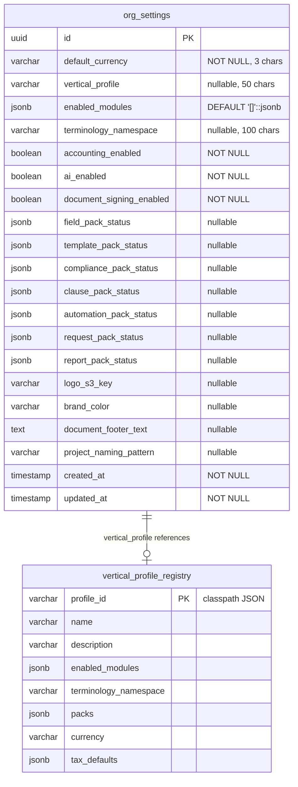
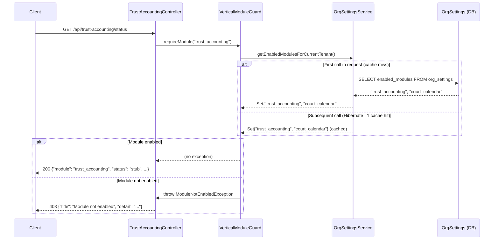
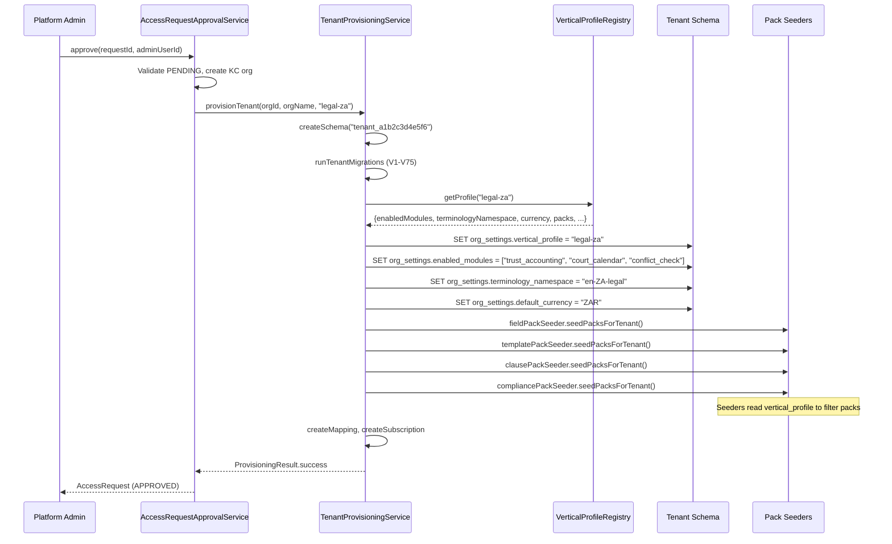

# Phase 49 — Vertical Architecture: Module Guard, Profile System & First Vertical Profiles

> Phase 49 architecture document. Standalone file (not merged into ARCHITECTURE.md).

---

## 1. Overview

Phase 49 introduces a formal vertical architecture to DocTeams. The platform already has the building blocks for vertical support -- feature flags on OrgSettings, pack-based seeding for field definitions and templates, terminology overrides in the i18n system, and an industry-to-profile mapping in the provisioning flow. What it lacks is a cohesive system that binds these pieces together: a way to define what a "vertical" is, gate backend access to vertical-specific modules per tenant, conditionally render UI based on a tenant's profile, and provision new tenants with the correct vertical configuration automatically.

This phase builds that system. It introduces a `VerticalModuleGuard` component (modeled on `CustomerLifecycleGuard`) that checks a tenant's enabled modules before allowing access to vertical-specific endpoints. It creates an `OrgProfileProvider` frontend context (following the `TerminologyProvider` pattern) that makes the tenant's vertical profile and enabled modules available for conditional rendering across all pages. It defines three concrete vertical profiles -- IT Consulting (generic), SA Accounting (config-only), and SA Legal (with module stubs) -- and wires profile application into the tenant provisioning and admin settings flows.

The legal profile is the most architecturally interesting: it declares three modules (`trust_accounting`, `court_calendar`, `conflict_check`) that don't exist yet. This phase creates stub controllers with guard checks and placeholder endpoints for each, establishing the package structure and extension points that future phases will fill in. The actual domain logic for trust accounting, court calendars, and conflict checks is out of scope -- this phase builds the infrastructure that those modules plug into.

**What's new in Phase 49** (relative to the existing platform):

| Capability | Existing | Phase 49 (this phase) |
|------------|----------|-----------------------|
| Vertical profile | `vertical_profile` column on OrgSettings (set at provisioning, read for terminology) | Extended with `enabled_modules` JSONB and `terminology_namespace`; profiles formalized as registry |
| Module gating | Feature flags (`accounting_enabled`, `ai_enabled`) — boolean, per-feature | `VerticalModuleGuard` component — checks `enabled_modules` array, per-request caching |
| Frontend profile awareness | `TerminologyProvider` reads `verticalProfile` for term overrides | `OrgProfileProvider` exposes full profile + `isModuleEnabled()` + `ModuleGate` component |
| Sidebar navigation | Capability-gated items via `requiredCapability` on `NavItem` | Module-gated items via `requiredModule` on `NavItem` for vertical-specific pages |
| Provisioning | Sets `verticalProfile` and currency from classpath JSON | Extended to set `enabled_modules`, `terminology_namespace`, and trigger pack application |
| Profile switching | Not supported | Org owner can switch profile via Settings; additive pack application |
| Legal modules | Not present | Stub controllers for trust accounting, court calendar, conflict check |

---

## 2. Domain Model

### 2.1 OrgSettings Extension

The `OrgSettings` entity (`settings/OrgSettings.java`, 631 lines, 35+ fields) gains two new columns. The existing `vertical_profile` column (added in V70) is unchanged.

| Column | Type | JPA Mapping | Default | Notes |
|--------|------|-------------|---------|-------|
| `vertical_profile` | `VARCHAR(50)` | Already exists | `null` | Profile slug: `"consulting-generic"`, `"accounting-za"`, `"legal-za"`, or `null` (generic) |
| `enabled_modules` | `JSONB` | `@JdbcTypeCode(SqlTypes.JSON)` | `'[]'::jsonb` | **New.** Array of module identifiers the tenant can access. E.g., `["trust_accounting", "court_calendar"]` |
| `terminology_namespace` | `VARCHAR(100)` | `@Column` | `null` | **New.** i18n namespace override. E.g., `"en-ZA-legal"`. Null means use default namespace |

No new entities are created. The vertical profile system is deliberately modeled as an extension of the existing singleton-per-tenant `OrgSettings` entity rather than a separate `VerticalProfile` entity. See [ADR-189](../adr/ADR-189-vertical-profile-storage.md) for the rationale.

### 2.2 Module Identifier Convention

Module IDs are snake_case strings that map to backend packages under `verticals/`:

| Module ID | Backend Package | Vertical | Status in Phase 49 |
|-----------|----------------|----------|-------------------|
| `trust_accounting` | `verticals.legal.trustaccounting` | Legal (SA) | Stub controller |
| `court_calendar` | `verticals.legal.courtcalendar` | Legal (SA) | Stub controller |
| `conflict_check` | `verticals.legal.conflictcheck` | Legal (SA) | Stub controller |

Future modules follow the same convention: `module_name` maps to `verticals.{vertical}.{modulename}`. The convention is enforced by documentation and code review, not by runtime validation -- keeping the system simple.

### 2.3 Profile Registry (Seed Data)

Profiles are defined as seed data in classpath JSON files and a `VerticalProfileRegistry` Java class -- not as a separate database entity. A profile is a named configuration bundle that determines which modules to enable, which packs to apply, what terminology namespace to use, and what default settings to set.

**Why seed data, not a database entity**: The platform has 3-5 vertical profiles. They change with code releases (new modules, new packs), not at runtime. A database entity would add CRUD overhead, migration complexity, and an admin UI for something that changes once per quarter. The classpath JSON files already exist for the accounting profile (`vertical-profiles/accounting-za.json`). See [ADR-189](../adr/ADR-189-vertical-profile-storage.md).

### 2.4 Profile Definitions

#### consulting-generic

| Field | Value |
|-------|-------|
| `profileId` | `consulting-generic` |
| `name` | IT Consulting |
| `description` | General consulting and professional services |
| `enabled_modules` | `[]` (no vertical-specific modules) |
| `terminology_namespace` | `null` (use platform defaults: Projects, Tasks, Customers) |
| `packs` | `{}` (no special packs -- core field definitions suffice) |
| `currency` | `null` (tenant sets their own) |
| `taxDefaults` | `[]` |

#### accounting-za

| Field | Value |
|-------|-------|
| `profileId` | `accounting-za` |
| `name` | Accounting (South Africa) |
| `description` | SA accounting practice with FICA compliance, engagement letters, fee schedules |
| `enabled_modules` | `[]` (no vertical-specific modules yet -- everything is config + packs) |
| `terminology_namespace` | `"en-ZA-accounting"` |
| `packs` | `{ field: ["accounting-za-*"], compliance: ["fica-kyc-za"], template: ["accounting-za"], clause: ["accounting-za-clauses"], automation: ["automation-accounting-za"], request: ["year-end-info-request-za"] }` |
| `currency` | `"ZAR"` |
| `taxDefaults` | `[{ name: "VAT", rate: 15.00, default: true }]` |

This profile already exists as `vertical-profiles/accounting-za.json`. It is extended with `enabled_modules` and `terminology_namespace` fields.

#### legal-za

| Field | Value |
|-------|-------|
| `profileId` | `legal-za` |
| `name` | Legal (South Africa) |
| `description` | SA law firm with trust accounting, court calendar, and conflict check |
| `enabled_modules` | `["trust_accounting", "court_calendar", "conflict_check"]` |
| `terminology_namespace` | `"en-ZA-legal"` |
| `packs` | `{ field: ["legal-za-customer", "legal-za-project"], compliance: ["fica-kyc-za"], template: ["legal-za"] }` |
| `currency` | `"ZAR"` |
| `taxDefaults` | `[{ name: "VAT", rate: 15.00, default: true }]` |

The legal profile declares `enabled_modules` but the actual module code is stub-only in this phase. The guard allows access to the stub endpoints; the endpoints return placeholder responses until the modules are built in future phases.

**Legal terminology mapping** (stored in `frontend/lib/terminology-map.ts`):

| Platform Term | Legal Term |
|---------------|-----------|
| Project / Projects | Matter / Matters |
| Task / Tasks | Work Item / Work Items |
| Customer / Customers | Client / Clients |
| Proposal / Proposals | Engagement Letter / Engagement Letters |
| Time Entry / Time Entries | Fee Note / Fee Notes |
| Rate Card / Rate Cards | Tariff Schedule / Tariff Schedules |
| Document / Documents | Pleading / Pleadings |

### 2.5 Updated Entity-Relationship Diagram

OrgSettings is a singleton-per-tenant entity with no FK relationships to other domain entities (it uses schema isolation). The diagram shows the new fields and their relationship to the profile system:



The `vertical_profile_registry` box is not a database table -- it represents the classpath JSON files and `VerticalProfileRegistry` class. The dashed relationship indicates that `org_settings.vertical_profile` is a logical reference to a profile definition, not a foreign key.

---

## 3. Core Flows and Backend Behaviour

### 3.1 VerticalModuleGuard Component

The `VerticalModuleGuard` is a `@Component` that checks whether the current tenant has a specific module enabled before allowing access. It follows the exact same pattern as `CustomerLifecycleGuard` (`compliance/CustomerLifecycleGuard.java`): a simple injected component with a `require*` method that throws on violation.

**Public API**:

```java
@Component
public class VerticalModuleGuard {

    private final OrgSettingsService orgSettingsService;

    public VerticalModuleGuard(OrgSettingsService orgSettingsService) {
        this.orgSettingsService = orgSettingsService;
    }

    /**
     * Throws ModuleNotEnabledException if the given module is not in the
     * current tenant's enabled_modules list.
     */
    public void requireModule(String moduleId) {
        if (!isModuleEnabled(moduleId)) {
            throw new ModuleNotEnabledException(moduleId);
        }
    }

    /**
     * Returns true if the given module is in the current tenant's
     * enabled_modules list.
     */
    public boolean isModuleEnabled(String moduleId) {
        return getEnabledModules().contains(moduleId);
    }

    /**
     * Returns the set of enabled module IDs for the current tenant.
     * Cached per-request via OrgSettingsService.
     */
    public Set<String> getEnabledModules() {
        return orgSettingsService.getEnabledModulesForCurrentTenant();
    }
}
```

**Design decision -- guard at controller level**: The guard is called explicitly at the top of each controller endpoint in vertical-specific packages, not as a Spring Security filter or AOP interceptor. This matches the `CustomerLifecycleGuard` pattern and keeps the guard visible and debuggable -- you can see exactly which endpoints are gated by reading the controller code. See [ADR-190](../adr/ADR-190-module-guard-granularity.md).

### 3.2 ModuleNotEnabledException

A new exception class in `exception/` that returns HTTP 403:

```java
public class ModuleNotEnabledException extends ErrorResponseException {

    public ModuleNotEnabledException(String moduleId) {
        super(HttpStatus.FORBIDDEN, createProblem(moduleId), null);
    }

    private static ProblemDetail createProblem(String moduleId) {
        String humanName = moduleId.replace("_", " ");
        humanName = Character.toUpperCase(humanName.charAt(0)) + humanName.substring(1);
        var problem = ProblemDetail.forStatus(HttpStatus.FORBIDDEN);
        problem.setTitle("Module not enabled");
        problem.setDetail(
            "This feature requires the " + humanName + " module. "
            + "Contact your administrator to enable it.");
        return problem;
    }
}
```

**Why 403, not 404**: The module exists as a concept -- the tenant just doesn't have it enabled. Returning 404 would mislead API consumers into thinking the endpoint doesn't exist. Returning 403 communicates "this endpoint exists, but your tenant doesn't have access to it," which is the correct semantics. This follows the same reasoning as `ForbiddenException` (`exception/ForbiddenException.java`).

### 3.3 Per-Request Caching of Enabled Modules

Reading `enabled_modules` from OrgSettings on every guard check would be wasteful -- a single page load can trigger multiple API calls, each needing the guard check. The `OrgSettingsService` caches the enabled modules for the current request.

**Implementation strategy**: Add a `getEnabledModulesForCurrentTenant()` method to `OrgSettingsService` that reads OrgSettings once per transaction (Hibernate's first-level cache ensures the entity is loaded at most once per persistence context). Since each HTTP request runs in a single persistence context, repeated calls within the same request return the cached entity.

This avoids introducing a `RequestScope` bean or a new `ScopedValue` -- the existing Hibernate session cache provides natural per-request caching. The method returns `Set<String>` parsed from the JSONB `enabled_modules` column.

### 3.4 Profile Application Flow (Provisioning)

When a new tenant is provisioned via `AccessRequestApprovalService.approve()`, the vertical profile is applied as part of `TenantProvisioningService.provisionTenant()`. The current flow already sets `verticalProfile` and `currency` from the classpath JSON. This phase extends it:

1. Read the profile JSON from `classpath:vertical-profiles/{profileId}.json`
2. Set `OrgSettings.verticalProfile` (already done)
3. Set `OrgSettings.enabledModules` from the profile's `enabled_modules` array (new)
4. Set `OrgSettings.terminologyNamespace` from the profile JSON's `terminologyOverrides` key (new — the JSON key is `terminologyOverrides` to match the existing `accounting-za.json` convention; it maps to the entity's `terminologyNamespace` column)
5. Set `OrgSettings.defaultCurrency` from the profile's `currency` field (already done)
6. Pack seeders run after profile is set (already done) -- they can read the profile to filter which packs to apply

**Idempotency**: Applying the same profile twice produces the same result. The `enabledModules` and `terminologyNamespace` are overwritten (not appended). Pack seeders already track which packs have been applied via `*_pack_status` columns and skip duplicates.

### 3.5 Profile Switching Flow (Admin)

Org owners can change their tenant's vertical profile via Settings. This is an additive operation -- it updates the profile configuration but does not remove existing data or customizations.

**Note on ADR-192 compliance**: Profile switching updates `enabledModules` *indirectly* -- the modules are derived from the profile definition, not user-supplied. This is the permitted path per [ADR-192](../adr/ADR-192-enabled-modules-authority.md). Direct modification of `enabled_modules` independent of a profile change remains platform-admin-only.

**Flow**:

1. Org owner selects a new profile from the dropdown in Settings -> General
2. Frontend sends `PATCH /api/settings/vertical-profile` with `{ "verticalProfile": "legal-za" }`
3. `OrgSettingsService.updateVerticalProfile()`:
   a. Validates the profile ID exists in `VerticalProfileRegistry`
   b. Requires org owner role (not just admin)
   c. Reads the profile definition and sets `verticalProfile`, `enabledModules`, and `terminologyNamespace` on OrgSettings (modules are always profile-derived, never user-supplied)
   d. Triggers pack application (additive -- existing data untouched)
   e. Logs audit event: `org_settings.vertical_profile_changed`
4. Frontend receives updated settings response and re-renders with new profile context

**Warning shown to user**: "Changing your vertical profile will add new field definitions, templates, and enable additional modules. Your existing data will not be affected."

### 3.6 Module Status Resolution

Each module has a `status` field that indicates its implementation state:

| Status | Meaning |
|--------|---------|
| `available` | Fully implemented and ready for use |
| `stub` | Endpoint exists but returns placeholder responses |
| `planned` | Defined in the profile but no backend code exists yet |

In Phase 49, all three legal modules have status `stub`. The status is hardcoded in `VerticalModuleRegistry` (a static registry class, not a database table) and returned by `GET /api/modules`.

### 3.7 RBAC Rules

| Operation | Required Role | Rationale |
|-----------|---------------|-----------|
| Read `verticalProfile`, `enabledModules`, `terminologyNamespace` | Any authenticated member (`TEAM_OVERSIGHT` capability via `@RequiresCapability`) | Settings are read by the frontend layout for all members |
| Change `verticalProfile` (profile switching) | Org owner only | Profile changes affect pack application and module access for all members |
| Directly modify `enabledModules` | Platform admin only | Prevents tenants from self-enabling paid modules; see [ADR-192](../adr/ADR-192-enabled-modules-authority.md) |
| Read module status | Any authenticated member | Module status indicators shown in UI |
| Read profile registry | Any authenticated member (or unauthenticated for provisioning form) | Provisioning dropdown needs the list |

---

## 4. API Surface

### 4.1 Extended GET /api/settings Response

The existing `SettingsResponse` record gains three new fields:

```json
{
  "defaultCurrency": "ZAR",
  "logoUrl": "https://...",
  "brandColor": "#2A4365",
  "documentFooterText": "...",
  "accountingEnabled": true,
  "aiEnabled": false,
  "documentSigningEnabled": false,
  "verticalProfile": "accounting-za",
  "enabledModules": [],
  "terminologyNamespace": "en-ZA-accounting",
  "dormancyThresholdDays": 90,
  "dataRequestDeadlineDays": 14,
  "taxRegistrationNumber": "...",
  "taxRegistrationLabel": "VAT No.",
  "taxLabel": "VAT",
  "taxInclusive": false,
  "acceptanceExpiryDays": 30,
  "defaultRequestReminderDays": 5,
  "timeReminderEnabled": true,
  "timeReminderDays": "MON,TUE,WED,THU,FRI",
  "timeReminderTime": "17:00",
  "timeReminderMinHours": 4.0,
  "defaultExpenseMarkupPercent": null,
  "defaultWeeklyCapacityHours": 40.00,
  "billingBatchAsyncThreshold": 50,
  "billingEmailRateLimit": 5,
  "defaultBillingRunCurrency": null,
  "projectNamingPattern": null
}
```

Capability required: `TEAM_OVERSIGHT` (existing).

### 4.2 PATCH /api/settings/vertical-profile

Updates the tenant's vertical profile and triggers profile application.

**Request**:

```json
{
  "verticalProfile": "legal-za"
}
```

**Response**: Full `SettingsResponse` with updated fields.

**Authorization**: Org owner only. Returns 403 if the caller is admin or member.

**Validation**:
- `verticalProfile` must be a valid profile ID in `VerticalProfileRegistry`, or `null` to revert to generic.

### 4.3 GET /api/modules

Returns the list of all known modules with their status for the current tenant.

**Response**:

```json
[
  {
    "id": "trust_accounting",
    "name": "Trust Accounting",
    "description": "LSSA-compliant trust account management for client funds",
    "enabled": true,
    "status": "stub"
  },
  {
    "id": "court_calendar",
    "name": "Court Calendar",
    "description": "Court date tracking and deadline management",
    "enabled": true,
    "status": "stub"
  },
  {
    "id": "conflict_check",
    "name": "Conflict Check",
    "description": "Matter conflict of interest checks",
    "enabled": false,
    "status": "stub"
  }
]
```

**Authorization**: `TEAM_OVERSIGHT` capability. All members with this capability can see module status.

### 4.4 GET /api/profiles

Returns available vertical profiles for the provisioning dropdown and settings page.

**Response**:

```json
[
  {
    "id": "consulting-generic",
    "name": "IT Consulting",
    "description": "General consulting and professional services",
    "modules": []
  },
  {
    "id": "accounting-za",
    "name": "Accounting (South Africa)",
    "description": "SA accounting practice with FICA compliance, engagement letters, fee schedules",
    "modules": []
  },
  {
    "id": "legal-za",
    "name": "Legal (South Africa)",
    "description": "SA law firm with trust accounting, court calendar, and conflict check",
    "modules": ["trust_accounting", "court_calendar", "conflict_check"]
  }
]
```

**Authorization**: `TEAM_OVERSIGHT` capability (for settings page). The provisioning form on the platform admin side uses this endpoint with platform admin auth.

### 4.5 Stub Module Endpoints

Each stub module provides a single status endpoint gated by `VerticalModuleGuard`:

**GET /api/trust-accounting/status**

```json
{
  "module": "trust_accounting",
  "status": "stub",
  "message": "Trust Accounting is not yet implemented. It will be available in a future release."
}
```

Returns 403 (`ModuleNotEnabledException`) if `trust_accounting` is not in the tenant's `enabled_modules`.

**GET /api/court-calendar/status** — same pattern, module `court_calendar`.

**GET /api/conflict-check/status** — same pattern, module `conflict_check`.

---

## 5. Sequence Diagrams

### 5.1 Module Guard Check Flow

Shows how a request to a vertical-specific endpoint is gated by the module guard:



### 5.2 Tenant Provisioning with Vertical Profile

Shows the extended provisioning flow when a new org is approved with a vertical profile:



### 5.3 Profile Switching by Org Owner

Shows the profile switching flow from the settings page:

```mermaid
sequenceDiagram
    participant Owner as Org Owner (Browser)
    participant Frontend as Settings Page
    participant API as OrgSettingsController
    participant Service as OrgSettingsService
    participant Registry as VerticalProfileRegistry
    participant DB as OrgSettings (DB)
    participant Audit as AuditService
    participant Seeders as Pack Seeders

    Owner->>Frontend: Select "Legal (SA)" from dropdown
    Frontend->>Frontend: Show warning dialog
    Owner->>Frontend: Confirm profile change

    Frontend->>API: PATCH /api/settings/vertical-profile {"verticalProfile": "legal-za"}
    API->>Service: updateVerticalProfile("legal-za", actor)

    Service->>Service: requireOwner(actor.orgRole())
    Service->>Registry: getProfile("legal-za")
    Registry-->>Service: {enabledModules, terminologyNamespace, packs, ...}

    Service->>DB: UPDATE org_settings SET vertical_profile = "legal-za", enabled_modules = [...], terminology_namespace = "en-ZA-legal"

    Service->>Seeders: applyProfilePacks("legal-za") (additive)
    Note over Seeders: Existing data untouched; new packs added

    Service->>Audit: log("org_settings.vertical_profile_changed", {old: "accounting-za", new: "legal-za"})

    Service-->>API: SettingsResponse (updated)
    API-->>Frontend: 200 SettingsResponse
    Frontend->>Frontend: Update OrgProfileProvider context
    Frontend->>Frontend: Re-render sidebar, detail sections
    Frontend-->>Owner: UI reflects legal profile (new nav items, terminology)
```

---

## 6. Frontend Architecture

### 6.1 OrgProfileProvider Context

A new context provider that makes the tenant's vertical profile and enabled modules available throughout the app. Follows the exact same pattern as `TerminologyProvider` (`lib/terminology.tsx`).

**File**: `frontend/lib/org-profile.tsx`

```tsx
"use client";

import { createContext, useContext, useMemo } from "react";

// ---- Context Types ----

interface OrgProfileContextValue {
  verticalProfile: string | null;
  enabledModules: string[];
  terminologyNamespace: string | null;
  isModuleEnabled: (moduleId: string) => boolean;
}

// ---- Context ----

const OrgProfileContext = createContext<OrgProfileContextValue | null>(null);

// ---- Provider ----

interface OrgProfileProviderProps {
  verticalProfile: string | null;
  enabledModules: string[];
  terminologyNamespace: string | null;
  children: React.ReactNode;
}

export function OrgProfileProvider({
  verticalProfile,
  enabledModules,
  terminologyNamespace,
  children,
}: OrgProfileProviderProps) {
  const modulesKey = JSON.stringify(enabledModules);

  const value = useMemo<OrgProfileContextValue>(() => {
    const moduleSet = new Set(enabledModules);
    return {
      verticalProfile,
      enabledModules,
      terminologyNamespace,
      isModuleEnabled: (moduleId: string) => moduleSet.has(moduleId),
    };
    // eslint-disable-next-line react-hooks/exhaustive-deps
  }, [verticalProfile, modulesKey, terminologyNamespace]);

  return (
    <OrgProfileContext.Provider value={value}>
      {children}
    </OrgProfileContext.Provider>
  );
}

// ---- Hook ----

export function useOrgProfile(): OrgProfileContextValue {
  const ctx = useContext(OrgProfileContext);
  if (!ctx) {
    throw new Error(
      "useOrgProfile must be used within an OrgProfileProvider",
    );
  }
  return ctx;
}
```

**Key decisions**:
- `enabledModules` is serialized to a string key for `useMemo` stability (same approach as `CapabilityProvider` with `capKey`).
- The provider receives serializable props from the server component layout -- no functions, no component references.
- `isModuleEnabled()` performs a `Set.has()` check, O(1) per call.

### 6.2 ModuleGate Component

A declarative wrapper component for conditional rendering based on module status. Follows the same pattern as `RequiresCapability` (`lib/capabilities.tsx`).

**File**: `frontend/components/module-gate.tsx`

```tsx
"use client";

import { useOrgProfile } from "@/lib/org-profile";

interface ModuleGateProps {
  module: string;
  fallback?: React.ReactNode;
  children: React.ReactNode;
}

export function ModuleGate({
  module,
  fallback = null,
  children,
}: ModuleGateProps) {
  const { isModuleEnabled } = useOrgProfile();

  if (!isModuleEnabled(module)) {
    return <>{fallback}</>;
  }

  return <>{children}</>;
}
```

### 6.3 Layout Integration

The `OrgProfileProvider` is added to the provider composition in `frontend/app/(app)/org/[slug]/layout.tsx`, nested inside `CapabilityProvider` and wrapping `TerminologyProvider`:

```
CapabilityProvider              (capabilities, role, isAdmin, isOwner)
  └── OrgProfileProvider        (verticalProfile, enabledModules, terminologyNamespace)   ← NEW
        └── TerminologyProvider (verticalProfile)
              └── RecentItemsProvider
                    └── CommandPaletteProvider
                          └── {children}
```

The layout's `getOrgSettings()` call already returns `verticalProfile`. It is extended to also return `enabledModules` and `terminologyNamespace` from the backend `SettingsResponse`.

### 6.4 Conditional Sidebar Navigation

The `NavItem` interface in `frontend/lib/nav-items.ts` gains an optional `requiredModule` field:

```typescript
export interface NavItem {
  label: string;
  href: (slug: string) => string;
  icon: LucideIcon;
  exact?: boolean;
  requiredCapability?: CapabilityName;
  requiredModule?: string;          // ← NEW
  keywords?: string[];
}
```

The `NavZone` component (`frontend/components/nav-zone.tsx`) is extended to filter items by module availability in addition to capability:

```typescript
const { isModuleEnabled } = useOrgProfile();

const visibleItems = zone.items.filter(
  (item) =>
    (!item.requiredCapability || hasCapability(item.requiredCapability)) &&
    (!item.requiredModule || isModuleEnabled(item.requiredModule)),
);
```

**New nav items** added to `NAV_GROUPS`:

| Zone | Item | `requiredModule` | `requiredCapability` | Route |
|------|------|-----------------|---------------------|-------|
| Finance | Trust Accounting | `trust_accounting` | `FINANCIAL_VISIBILITY` | `/org/[slug]/trust-accounting` |
| Work | Court Calendar | `court_calendar` | `PROJECT_MANAGEMENT` | `/org/[slug]/court-calendar` |

The Conflict Check module does not get a top-level nav item -- it is accessed from within the project/matter creation flow as a conditional section.

### 6.5 Conditional Detail Page Sections

Existing pages gain additional sections when modules are enabled, using `<ModuleGate>`:

| Page | Section | Module Required | Content |
|------|---------|----------------|---------|
| Customer detail (`customers/[id]/page.tsx`) | Trust Balance card | `trust_accounting` | Placeholder card: "Trust Accounting module coming soon" |
| New project dialog | Conflict Check button | `conflict_check` | Placeholder: "Run conflict check before creating" with disabled button |

### 6.6 Stub Pages for Legal Modules

Three new route pages:

| Route | File |
|-------|------|
| `/org/[slug]/trust-accounting` | `frontend/app/(app)/org/[slug]/trust-accounting/page.tsx` |
| `/org/[slug]/court-calendar` | `frontend/app/(app)/org/[slug]/court-calendar/page.tsx` |
| `/org/[slug]/conflict-check` | `frontend/app/(app)/org/[slug]/conflict-check/page.tsx` |

Each stub page:
- Is a Server Component that checks module access via the settings API (redirects to 404 if module not enabled)
- Shows a polished placeholder UI using the existing page layout, breadcrumbs, and Card components
- Displays the module name, a brief description of what it will do, and a "Coming Soon" badge
- Uses the correct terminology (e.g., "Matters" instead of "Projects" on the legal pages)

### 6.7 Legal Terminology Overrides

The `TERMINOLOGY` map in `frontend/lib/terminology-map.ts` is extended with a `"legal-za"` entry:

```typescript
export const TERMINOLOGY: Record<string, Record<string, string>> = {
  "accounting-za": {
    // ... existing entries
  },
  "legal-za": {
    Project: "Matter",
    Projects: "Matters",
    project: "matter",
    projects: "matters",
    Task: "Work Item",
    Tasks: "Work Items",
    task: "work item",
    tasks: "work items",
    Customer: "Client",
    Customers: "Clients",
    customer: "client",
    customers: "clients",
    Proposal: "Engagement Letter",
    Proposals: "Engagement Letters",
    proposal: "engagement letter",
    proposals: "engagement letters",
    "Time Entry": "Fee Note",
    "Time Entries": "Fee Notes",
    "Rate Card": "Tariff Schedule",
    "Rate Cards": "Tariff Schedules",
    Document: "Pleading",
    Documents: "Pleadings",
  },
};
```

### 6.8 Settings Page Extension

The General settings page (`settings/general/page.tsx`) is extended with a "Vertical Profile" section:

- Shows the current profile name and description
- Dropdown to select a different profile (populated from `GET /api/profiles`)
- Confirmation dialog with warning about additive pack application
- Submit triggers `PATCH /api/settings/vertical-profile`
- Only visible to org owners

The settings sidebar (`settings-nav-groups.ts`) does not need changes -- vertical profile switching lives on the existing General settings page.

---

## 7. Database Migration

### 7.1 V75 Migration SQL

**File**: `backend/src/main/resources/db/migration/tenant/V75__add_vertical_modules.sql`

```sql
-- =============================================================================
-- V75: Add enabled_modules and terminology_namespace to org_settings
-- Supports vertical architecture: module gating and per-tenant terminology
-- =============================================================================

ALTER TABLE org_settings
    ADD COLUMN IF NOT EXISTS enabled_modules JSONB DEFAULT '[]'::jsonb;

ALTER TABLE org_settings
    ADD COLUMN IF NOT EXISTS terminology_namespace VARCHAR(100);

-- GIN index on enabled_modules for containment queries (@> operator)
-- e.g., SELECT ... WHERE enabled_modules @> '["trust_accounting"]'
CREATE INDEX IF NOT EXISTS idx_org_settings_enabled_modules
    ON org_settings USING GIN (enabled_modules);
```

### 7.2 Backfill Strategy

Existing tenants:
- `enabled_modules` defaults to `'[]'::jsonb` via the column default -- no explicit backfill needed.
- `terminology_namespace` defaults to `null` -- no backfill needed.
- `vertical_profile` is already populated for tenants provisioned with a profile; `null` for generic tenants.

No data migration script is required. The column defaults handle all existing rows correctly.

### 7.3 Index Considerations

The GIN index on `enabled_modules` supports PostgreSQL's JSONB containment operator (`@>`), enabling queries like "find all tenants with trust_accounting enabled." This is primarily useful for platform admin queries (e.g., "how many tenants use trust accounting?"), not for the per-request guard check which reads a single row by the implicit singleton pattern.

The per-request guard check (`SELECT enabled_modules FROM org_settings LIMIT 1` within the tenant schema) does not benefit from the GIN index -- it's a single-row read. The index is a forward-looking investment for analytics and admin dashboards.

### 7.4 Future Module-Specific Tables

Future vertical modules (trust accounting, court calendar) will need their own tables. The migration pattern:

- Module tables are created in **standard tenant migrations** (e.g., `V76__create_trust_ledger.sql`)
- Migrations run for **all tenant schemas** (Flyway doesn't support conditional per-schema execution)
- Empty tables have negligible storage cost
- The `VerticalModuleGuard` prevents access to the data, not the schema

See [ADR-191](../adr/ADR-191-schema-uniformity-module-tables.md) for the rationale behind uniform schemas over conditional migrations.

---

## 8. Implementation Guidance

### 8.1 Backend Changes

| File | Change |
|------|--------|
| `settings/OrgSettings.java` | Add `enabledModules` (JSONB, `List<String>`) and `terminologyNamespace` (VARCHAR) fields with getters, setters, and `updateVerticalProfile()` method |
| `settings/OrgSettingsService.java` | Add `getEnabledModulesForCurrentTenant()`, `updateVerticalProfile()`, extend `toSettingsResponse()` |
| `settings/OrgSettingsController.java` | Add `PATCH /api/settings/vertical-profile` endpoint, extend `SettingsResponse` record with 3 new fields |
| `exception/ModuleNotEnabledException.java` | New exception class (extends `ErrorResponseException`, 403) |
| `verticals/VerticalModuleGuard.java` | New `@Component` with `requireModule()`, `isModuleEnabled()`, `getEnabledModules()` |
| `verticals/VerticalProfileRegistry.java` | New static registry class, reads classpath JSON profiles |
| `verticals/VerticalModuleRegistry.java` | New static registry, defines known modules with name/description/status |
| `verticals/VerticalProfileController.java` | New controller: `GET /api/profiles`, `GET /api/modules` |
| `verticals/legal/trustaccounting/TrustAccountingController.java` | Stub controller with `GET /api/trust-accounting/status` |
| `verticals/legal/courtcalendar/CourtCalendarController.java` | Stub controller with `GET /api/court-calendar/status` |
| `verticals/legal/conflictcheck/ConflictCheckController.java` | Stub controller with `GET /api/conflict-check/status` |
| `provisioning/TenantProvisioningService.java` | Extend `setVerticalProfile()` to set `enabledModules` and `terminologyNamespace` |
| `accessrequest/AccessRequestApprovalService.java` | Fix `INDUSTRY_TO_PROFILE` mapping: `"Legal" -> "legal-za"` (currently `"law-za"`) |
| `vertical-profiles/consulting-generic.json` | New profile JSON |
| `vertical-profiles/legal-za.json` | New profile JSON |
| `vertical-profiles/accounting-za.json` | Extend with `enabledModules` array and `terminologyOverrides` string (JSON key is `terminologyOverrides`, maps to entity's `terminologyNamespace`) |
| `db/migration/tenant/V75__add_vertical_modules.sql` | Migration adding new columns and GIN index |

### 8.2 Frontend Changes

| File | Change |
|------|--------|
| `lib/org-profile.tsx` | New context provider: `OrgProfileProvider`, `useOrgProfile()` hook |
| `components/module-gate.tsx` | New `ModuleGate` component |
| `lib/nav-items.ts` | Add `requiredModule` to `NavItem` interface; add trust accounting and court calendar nav items |
| `components/nav-zone.tsx` | Filter by `requiredModule` in addition to `requiredCapability` |
| `lib/terminology-map.ts` | Add `"legal-za"` terminology entry |
| `lib/types/settings.ts` | Add `enabledModules` and `terminologyNamespace` to `OrgSettings` interface |
| `app/(app)/org/[slug]/layout.tsx` | Add `OrgProfileProvider` to provider composition |
| `app/(app)/org/[slug]/trust-accounting/page.tsx` | New stub page |
| `app/(app)/org/[slug]/court-calendar/page.tsx` | New stub page |
| `app/(app)/org/[slug]/conflict-check/page.tsx` | New stub page |
| `app/(app)/org/[slug]/settings/general/page.tsx` | Add vertical profile section (dropdown, confirm dialog) |
| `app/(app)/org/[slug]/customers/[id]/page.tsx` | Add conditional trust balance card via `ModuleGate` |

### 8.3 Entity Code Pattern

The OrgSettings entity extension follows the existing getter/setter pattern with `updatedAt` mutation tracking:

```java
// In OrgSettings.java — new fields

@JdbcTypeCode(SqlTypes.JSON)
@Column(name = "enabled_modules", columnDefinition = "jsonb")
private List<String> enabledModules = new ArrayList<>();

@Column(name = "terminology_namespace", length = 100)
private String terminologyNamespace;

// --- Getters ---

public List<String> getEnabledModules() {
    return enabledModules != null ? enabledModules : List.of();
}

public String getTerminologyNamespace() {
    return terminologyNamespace;
}

// --- Setters ---

public void setEnabledModules(List<String> enabledModules) {
    this.enabledModules = enabledModules != null ? enabledModules : new ArrayList<>();
    this.updatedAt = Instant.now();
}

public void setTerminologyNamespace(String terminologyNamespace) {
    this.terminologyNamespace = terminologyNamespace;
    this.updatedAt = Instant.now();
}

// --- Domain method ---

/** Updates all vertical profile fields from a profile definition. */
public void updateVerticalProfile(
        String verticalProfile,
        List<String> enabledModules,
        String terminologyNamespace) {
    this.verticalProfile = verticalProfile;
    this.enabledModules = enabledModules != null ? enabledModules : new ArrayList<>();
    this.terminologyNamespace = terminologyNamespace;
    this.updatedAt = Instant.now();
}
```

### 8.4 Guard Code Pattern

The guard is a straightforward `@Component` injected into controllers:

```java
package io.b2mash.b2b.b2bstrawman.verticals;

import io.b2mash.b2b.b2bstrawman.exception.ModuleNotEnabledException;
import io.b2mash.b2b.b2bstrawman.settings.OrgSettingsService;
import java.util.HashSet;
import java.util.Set;
import org.springframework.stereotype.Component;

@Component
public class VerticalModuleGuard {

    private final OrgSettingsService orgSettingsService;

    public VerticalModuleGuard(OrgSettingsService orgSettingsService) {
        this.orgSettingsService = orgSettingsService;
    }

    /**
     * Throws ModuleNotEnabledException if the specified module is not
     * in the current tenant's enabled_modules list.
     */
    public void requireModule(String moduleId) {
        if (!isModuleEnabled(moduleId)) {
            throw new ModuleNotEnabledException(moduleId);
        }
    }

    /**
     * Returns true if the specified module is enabled for the current tenant.
     */
    public boolean isModuleEnabled(String moduleId) {
        return getEnabledModules().contains(moduleId);
    }

    /**
     * Returns the full set of enabled module IDs for the current tenant.
     * Uses Hibernate L1 cache — the OrgSettings entity is loaded at most
     * once per persistence context (i.e., per HTTP request).
     */
    public Set<String> getEnabledModules() {
        return new HashSet<>(orgSettingsService.getEnabledModulesForCurrentTenant());
    }
}
```

### 8.5 Frontend Hook Pattern

The `useOrgProfile()` hook consumed in components:

```tsx
"use client";

import { useOrgProfile } from "@/lib/org-profile";
import { ModuleGate } from "@/components/module-gate";

// --- In a component ---

function CustomerDetailPage({ customer }: { customer: Customer }) {
  const { verticalProfile, isModuleEnabled } = useOrgProfile();

  return (
    <div>
      <CustomerHeader customer={customer} />
      <CustomerDetails customer={customer} />

      {/* Conditional section — only visible for legal tenants */}
      <ModuleGate module="trust_accounting">
        <Card>
          <CardHeader>
            <CardTitle>Trust Balance</CardTitle>
            <Badge variant="neutral">Coming Soon</Badge>
          </CardHeader>
          <CardContent>
            <p className="text-sm text-muted-foreground">
              Trust Accounting module will display client trust balances here.
            </p>
          </CardContent>
        </Card>
      </ModuleGate>
    </div>
  );
}
```

### 8.6 Testing Strategy

| Area | Test Type | What to Verify |
|------|-----------|---------------|
| `VerticalModuleGuard` | Unit test | `requireModule()` throws when module not enabled; succeeds when enabled; reads from correct tenant |
| `ModuleNotEnabledException` | Unit test | Produces 403 with correct title and detail message |
| `TrustAccountingController` | Integration test (MockMvc) | Returns 403 when `trust_accounting` not in `enabled_modules`; returns stub JSON when enabled |
| `CourtCalendarController` | Integration test (MockMvc) | Same pattern as trust accounting |
| `ConflictCheckController` | Integration test (MockMvc) | Same pattern as trust accounting |
| `OrgSettingsService.updateVerticalProfile()` | Integration test | Profile application sets correct `enabledModules`, `terminologyNamespace`, `verticalProfile`; idempotent; triggers audit event |
| `OrgSettingsController` settings response | Integration test (MockMvc) | Response includes `verticalProfile`, `enabledModules`, `terminologyNamespace` |
| `VerticalProfileController` | Integration test (MockMvc) | `GET /api/profiles` returns correct profile list; `GET /api/modules` returns modules with correct enabled/status |
| `TenantProvisioningService` | Integration test | Provisioning with profile sets `enabledModules` and `terminologyNamespace` |
| `OrgProfileProvider` | Frontend unit test (Vitest) | Provides correct profile data to children; `isModuleEnabled()` returns correct boolean |
| `ModuleGate` | Frontend unit test (Vitest) | Renders children when module enabled; renders nothing (or fallback) when disabled |
| Sidebar navigation | Frontend unit test (Vitest) | Shows trust accounting nav item for legal profile; hides for accounting profile |
| Stub pages | Frontend unit test (Vitest) | Renders placeholder content |

---

## 9. Permission Model Summary

### 9.1 Access Control Table

| Operation | Member | Admin | Owner | Platform Admin |
|-----------|--------|-------|-------|----------------|
| Read settings (incl. `verticalProfile`, `enabledModules`, `terminologyNamespace`) | Via `TEAM_OVERSIGHT` | Yes | Yes | Yes |
| Read module list (`GET /api/modules`) | Via `TEAM_OVERSIGHT` | Yes | Yes | Yes |
| Read profile registry (`GET /api/profiles`) | Via `TEAM_OVERSIGHT` | Yes | Yes | Yes |
| Change `verticalProfile` (profile switching) | No | No | **Yes** | Yes |
| Directly modify `enabledModules` (independent of profile) | No | No | No | **Yes** |
| Access module stub endpoints (when module enabled) | Via relevant capability | Yes | Yes | Yes |

### 9.2 Role Hierarchy Impact

The org owner gains one new privilege: profile switching. This is intentionally restricted to the owner (not admin) because profile changes affect pack application, module access, and terminology for the entire organization. An accidental profile switch by an admin could confuse all team members.

Platform admins gain the ability to directly modify `enabledModules` independent of a profile. This supports scenarios where a platform admin needs to enable a specific module for a tenant without switching their entire profile (e.g., enabling `trust_accounting` for an accounting firm that also handles some legal work). See [ADR-192](../adr/ADR-192-enabled-modules-authority.md).

---

## 10. Capability Slices

### Slice 49A — Backend: Module Guard & OrgSettings Extension

**Scope**: Backend only

**Key deliverables**:
- V75 migration (add `enabled_modules` JSONB and `terminology_namespace` VARCHAR to `org_settings`)
- `OrgSettings` entity extension (new fields, getters, setters, `updateVerticalProfile()` method)
- `ModuleNotEnabledException` exception class
- `VerticalModuleGuard` component
- `OrgSettingsService.getEnabledModulesForCurrentTenant()` method
- Extend `OrgSettingsService.toSettingsResponse()` and `SettingsResponse` record with new fields

**Dependencies**: None (first slice)

**Test expectations**: ~10 tests
- `VerticalModuleGuardTest` (unit): require/isModuleEnabled/getEnabledModules
- `ModuleNotEnabledExceptionTest` (unit): correct HTTP status and message
- `OrgSettingsServiceTest` (integration): getEnabledModulesForCurrentTenant returns correct set
- `OrgSettingsControllerTest` (integration): settings response includes new fields

**Estimated complexity**: Small

---

### Slice 49B — Backend: Profile Registry, Controllers & Provisioning

**Scope**: Backend only

**Key deliverables**:
- `VerticalProfileRegistry` class (reads classpath JSON profiles)
- `VerticalModuleRegistry` class (known modules with name/description/status)
- `VerticalProfileController` (`GET /api/profiles`, `GET /api/modules`)
- `OrgSettingsService.updateVerticalProfile()` method (profile switching with audit)
- `OrgSettingsController` — `PATCH /api/settings/vertical-profile` endpoint
- Extend `TenantProvisioningService.setVerticalProfile()` to set `enabledModules` and `terminologyNamespace`
- New classpath JSON files: `consulting-generic.json`, `legal-za.json`
- Extend `accounting-za.json` with `enabledModules` field
- Fix `AccessRequestApprovalService.INDUSTRY_TO_PROFILE`: `"Legal" -> "legal-za"` (currently `"law-za"`)

**Dependencies**: Slice 49A (needs OrgSettings extension and guard)

**Test expectations**: ~12 tests
- `VerticalProfileRegistryTest` (unit): loads profiles from classpath, returns correct data
- `VerticalProfileControllerTest` (integration): GET /api/profiles, GET /api/modules
- `OrgSettingsServiceTest` (integration): updateVerticalProfile sets correct fields, audit event
- `TenantProvisioningServiceTest` (integration): provisioning with profile sets enabledModules
- `AccessRequestApprovalServiceTest` (integration): legal industry maps to legal-za profile

**Estimated complexity**: Medium

---

### Slice 49C — Backend: Legal Module Stubs

**Scope**: Backend only

**Key deliverables**:
- Package structure: `verticals/legal/trustaccounting/`, `verticals/legal/courtcalendar/`, `verticals/legal/conflictcheck/`
- `TrustAccountingController` stub (GET /api/trust-accounting/status)
- `CourtCalendarController` stub (GET /api/court-calendar/status)
- `ConflictCheckController` stub (GET /api/conflict-check/status)
- Each endpoint gated by `VerticalModuleGuard.requireModule()`

**Dependencies**: Slice 49A (needs VerticalModuleGuard)

**Test expectations**: ~6 tests
- Integration tests for each controller: returns 403 when module not enabled, returns stub response when enabled (2 tests per controller)

**Estimated complexity**: Small

---

### Slice 49D — Frontend: OrgProfileProvider & ModuleGate

**Scope**: Frontend only

**Key deliverables**:
- `lib/org-profile.tsx` — `OrgProfileProvider` context and `useOrgProfile()` hook
- `components/module-gate.tsx` — `ModuleGate` component
- Extend `lib/types/settings.ts` — add `enabledModules` and `terminologyNamespace` to `OrgSettings` interface
- Extend `app/(app)/org/[slug]/layout.tsx` — add `OrgProfileProvider` to provider chain
- Extend `lib/terminology-map.ts` — add `"legal-za"` terminology entry

**Dependencies**: Slice 49A (backend must return new fields in settings response)

**Test expectations**: ~6 tests
- `OrgProfileProvider` test: provides correct data, isModuleEnabled works
- `ModuleGate` test: renders/hides children based on module state

**Estimated complexity**: Small

---

### Slice 49E — Frontend: Conditional Navigation & Stub Pages

**Scope**: Frontend only

**Key deliverables**:
- Extend `NavItem` interface with `requiredModule` field
- Extend `NavZone` component to filter by `requiredModule`
- Add trust accounting and court calendar nav items to `NAV_GROUPS`
- Create stub pages: `trust-accounting/page.tsx`, `court-calendar/page.tsx`, `conflict-check/page.tsx`
- Add conditional trust balance card to customer detail page
- Add conditional conflict check section to new project dialog

**Dependencies**: Slice 49D (needs OrgProfileProvider and ModuleGate)

**Test expectations**: ~6 tests
- Sidebar tests: nav items shown/hidden based on module state
- Stub page tests: renders placeholder content with correct layout

**Estimated complexity**: Small-Medium

---

### Slice 49F — Frontend: Settings Profile Switching

**Scope**: Frontend + Backend integration

**Key deliverables**:
- Extend General settings page with vertical profile section
- Profile dropdown populated from `GET /api/profiles`
- Confirmation dialog with warning
- Submit triggers `PATCH /api/settings/vertical-profile`
- Re-fetch settings after profile change to update OrgProfileProvider context

**Dependencies**: Slice 49B (backend profile switching endpoint), Slice 49D (frontend OrgProfileProvider)

**Test expectations**: ~4 tests
- Settings page: renders profile dropdown for owners, hidden for non-owners
- Profile switching: confirmation dialog appears, submit updates profile

**Estimated complexity**: Medium

---

## 11. ADR Index

| ADR | Title | Summary |
|-----|-------|---------|
| [ADR-189](../adr/ADR-189-vertical-profile-storage.md) | Vertical profile storage: seed data vs database entity | Profiles stored as classpath JSON + registry class (not a VerticalProfile entity). 3-5 profiles change with code releases, not at runtime. CRUD overhead unjustified at this scale. |
| [ADR-190](../adr/ADR-190-module-guard-granularity.md) | Module guard granularity: controller vs service vs filter | Guard called at controller level per endpoint (not Spring Security filter or AOP). Matches `CustomerLifecycleGuard` pattern. Visible, debuggable, no framework magic. |
| [ADR-191](../adr/ADR-191-schema-uniformity-module-tables.md) | Schema uniformity: all schemas get all tables vs conditional | All tenant schemas are identical -- module-specific tables exist everywhere. Empty tables cost nothing. Conditional migrations are fragile (Flyway doesn't support per-schema conditions). Guard handles access control, not schema. |
| [ADR-192](../adr/ADR-192-enabled-modules-authority.md) | Enabled modules authority: org owner vs platform admin | Direct `enabled_modules` modification restricted to platform admin. Org owners change modules indirectly by switching profiles. Prevents tenants from self-enabling paid modules. Supports future module-level pricing. |

---

## Out of Scope

- **Building actual domain modules.** Trust accounting, court calendar, and conflict check are stubs only. The actual domain logic (entities, services, business rules) is future phases.
- **Legal pack content.** Phase 47 created accounting packs. Legal packs (field definitions, templates, compliance checklists for LSSA/FICA) are NOT created in this phase -- only the profile definition that references them. When legal packs are built, the `legal-za.json` profile's `packs` section will be populated.
- **Terminology runtime switching.** The `terminology_namespace` value is stored and the `TERMINOLOGY` map is extended, but the runtime mechanism for loading different message catalogs per tenant (if needed beyond the in-memory map) is not built. The current `TerminologyProvider` already uses `verticalProfile` to select the correct map entry, which is sufficient for Phase 49.
- **Multi-vertical tenants.** A tenant has one vertical profile. Mixing profiles (e.g., an accounting firm that also does legal work) is out of scope. The `enabled_modules` array already supports arbitrary module combinations independent of the profile -- platform admins can enable individual modules for any tenant via the direct modification pathway.
- **Module-level pricing/billing.** Charging per enabled module is a billing system concern. The platform admin gating on `enabled_modules` (ADR-192) creates the prerequisite for future pricing tiers, but the billing integration is not built.
- **Admin UI for module management.** Platform admins modify `enabled_modules` via direct API call or database update. A dedicated admin panel for per-tenant module management is future work.
