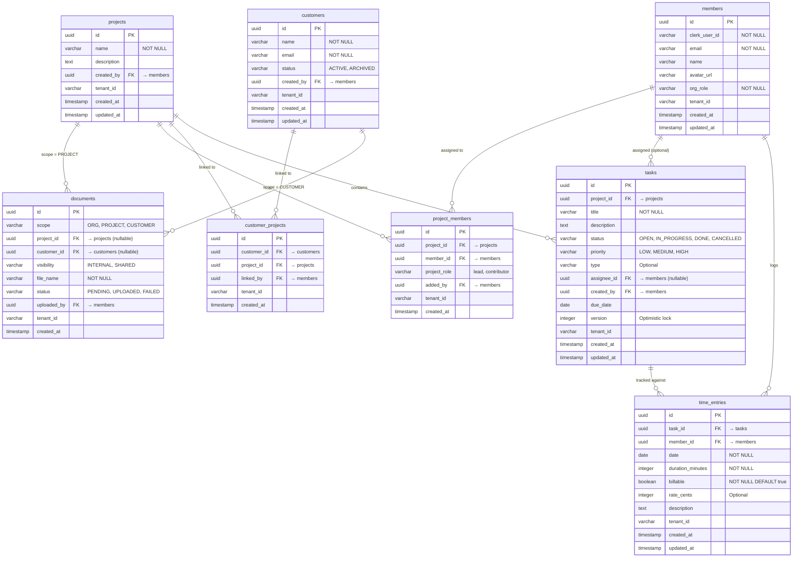

# Phase 5 — Task & Time Lifecycle

> Merge into `ARCHITECTURE.md` as **Section 11**. ADR files go in `adr/`.

---

## 11. Phase 5 — Task & Time Lifecycle

Phase 5 extends the existing task management capability (Phase 4, Section 10) with **time tracking** and **cross-project work views**. It adds a `TimeEntry` entity for billable/non-billable time recording, a "My Work" aggregation layer for staff, and per-project time rollups. All additions are evolutionary — they reuse the existing tenant isolation model, follow the same entity patterns, and require no changes to the core multi-tenant or billing architecture.

**What's new in Phase 5** (relative to Phase 4):

| Capability | Phase 4 (existing) | Phase 5 (this phase) |
|------------|--------------------|-----------------------|
| Tasks | Entity, CRUD, claim/release, filtered listing | Unchanged (reference only) |
| Time tracking | — | TimeEntry entity, CRUD, billable/non-billable flag |
| "My Work" view | — | Cross-project task + time aggregation for current user |
| Project rollups | — | Total billable/non-billable time per project |
| Portal seams | Document visibility (INTERNAL/SHARED) | Task status summary endpoints, event shapes |

---

### 11.1 Domain Model

#### 11.1.1 TimeEntry (New Entity)

A TimeEntry records a block of time spent by a staff member on a specific task. Time entries are the atomic unit of work measurement — all time reporting and billing summaries derive from them.

| Field | Type | Constraints | Notes |
|-------|------|-------------|-------|
| `id` | UUID | PK, generated | |
| `task_id` | UUID FK → tasks | NOT NULL, CASCADE | Time is always recorded against a task |
| `member_id` | UUID FK → members | NOT NULL | Staff member who performed the work |
| `date` | DATE | NOT NULL | Calendar date the work was performed |
| `duration_minutes` | INTEGER | NOT NULL, CHECK > 0 | Duration in minutes (not hours — avoids rounding) |
| `billable` | BOOLEAN | NOT NULL, DEFAULT true | Whether this time is billable to the customer |
| `rate_cents` | INTEGER | Nullable, CHECK >= 0 | Optional hourly rate in cents (for future invoicing) |
| `description` | TEXT | Nullable | What was done during this time block |
| `tenant_id` | VARCHAR(255) | | Shared-schema discriminator |
| `created_at` | TIMESTAMPTZ | NOT NULL, DEFAULT now() | |
| `updated_at` | TIMESTAMPTZ | NOT NULL, DEFAULT now() | |

**Design decisions**:
- **Duration in minutes** (not hours or decimal hours): avoids floating-point rounding. 1h 30m = 90 minutes. Display formatting is a frontend concern.
- **`date` (not `start_time`/`end_time`)**: Staff log time retrospectively ("I spent 2 hours on this today"), not as a live timer. A date + duration model is simpler and matches the UX pattern. A timer-based model can be layered on later without schema changes.
- **`rate_cents` is nullable**: Not every org tracks rates. When null, the time entry contributes to duration summaries but not monetary calculations. Rate enforcement can be a future plan-gated feature.
- **`task_id` NOT NULL**: Time is always attributed to a task. If a staff member needs to log time not tied to a specific task, they create a general task (e.g., "Admin overhead") on the project. This avoids the complexity of orphan time entries with no project context. See [ADR-021](../adr/ADR-021-time-tracking-model.md).
- **No `project_id` column**: The project is derived from `task.project_id`. This avoids data duplication and the risk of inconsistency between `time_entry.project_id` and `task.project_id`. Aggregation queries join through `tasks`.

**Constraints**:
- `CHECK (duration_minutes > 0)` — no zero-duration entries.
- `CHECK (rate_cents >= 0 OR rate_cents IS NULL)` — non-negative rates.
- Index on `(task_id, date)` — fast per-task time lookups.
- Index on `(member_id, date)` — fast "My Work" daily time queries.
- Index on `(tenant_id)` — shared-schema filtering.
- Hibernate `@FilterDef` / `@Filter` for shared-schema isolation.
- RLS policy: `tenant_id = current_setting('app.current_tenant', true)`.

#### 11.1.2 Task Entity (Unchanged)

The Task entity defined in Phase 4 (Section 10.2.3, [ADR-019](../adr/ADR-019-task-claim-workflow.md)) is unchanged. No new columns are added to `tasks`. The relationship is:

- A Task has zero or more TimeEntries.
- A TimeEntry belongs to exactly one Task.

The optional `customer_id` FK on Task is **not added** in this phase. Customer visibility of tasks is achieved indirectly: Customer → `customer_projects` → Project → Tasks. This avoids coupling the task model to customer concerns prematurely. If direct task-customer linking becomes necessary (e.g., customer-specific tasks not tied to a project), it can be added as a nullable FK in a future migration.

#### 11.1.3 Updated Entity-Relationship Diagram

The diagram below shows the complete tenant-schema entity relationships after Phase 5. The `time_entries` table (new) is the only addition.



---

### 11.2 Core Flows and Backend Behaviour

#### 11.2.1 "My Work" View for Staff

**Requirements**: A staff member sees a unified view of their work across all projects in their current organization:

1. **My assigned tasks** — all tasks where `assignee_id = currentMemberId`, across every project in the org.
2. **Unassigned tasks in my projects** — all tasks where `assignee_id IS NULL` and the task's project is one the member belongs to (via `project_members`).
3. **My time today** — time entries logged by the member for the current date.
4. **My time this week/period** — summary of time entries for a configurable date range.

**Query strategy** (see [ADR-023](../adr/ADR-023-my-work-cross-project-query.md)):

```
-- My assigned tasks (across all projects in tenant)
SELECT t.*, p.name AS project_name
FROM tasks t
JOIN projects p ON t.project_id = p.id
WHERE t.assignee_id = :memberId
  AND t.status IN ('OPEN', 'IN_PROGRESS')
ORDER BY t.due_date ASC NULLS LAST, t.priority DESC, t.created_at DESC;

-- Unassigned tasks in my projects
SELECT t.*, p.name AS project_name
FROM tasks t
JOIN projects p ON t.project_id = p.id
WHERE t.assignee_id IS NULL
  AND t.status = 'OPEN'
  AND t.project_id IN (
    SELECT pm.project_id FROM project_members pm WHERE pm.member_id = :memberId
  )
ORDER BY t.priority DESC, t.created_at DESC;

-- My time entries for a date range
SELECT te.*, t.title AS task_title, p.name AS project_name
FROM time_entries te
JOIN tasks t ON te.task_id = t.id
JOIN projects p ON t.project_id = p.id
WHERE te.member_id = :memberId
  AND te.date BETWEEN :fromDate AND :toDate
ORDER BY te.date DESC, te.created_at DESC;
```

**Tenant boundaries**: All queries run within the tenant's schema (via `SET search_path` for Pro, or `WHERE tenant_id = ?` via Hibernate `@Filter` for Starter). No special cross-tenant logic needed — `memberId` is resolved from the JWT and is unique within the tenant.

**RBAC**: The "My Work" endpoint requires only `ROLE_ORG_MEMBER` (any authenticated staff member). The data is self-scoped — staff can only see their own assigned tasks and tasks in projects they belong to. No `ProjectAccessService` check is needed because membership is verified by the `project_members IN` subquery.

**Paging/filtering**:
- Default: return all active tasks (OPEN + IN_PROGRESS) for assigned, OPEN only for unassigned.
- Optional `status` filter.
- Optional `projectId` filter (narrow to a single project).
- Cursor-based pagination on `created_at` if the result set grows large (deferred — initial implementation returns all).
- Time entries accept `fromDate` / `toDate` range (default: today).

**Service layer**:

```java
public class MyWorkService {

    // Returns assigned + unassigned tasks grouped for the current member
    MyWorkResponse getMyWork(UUID memberId, MyWorkFilter filter);

    // Returns time entries for the current member within a date range
    List<TimeEntry> getMyTimeEntries(UUID memberId, LocalDate from, LocalDate to);

    // Returns summary: total minutes (billable + non-billable) for the current member
    TimeSummary getMyTimeSummary(UUID memberId, LocalDate from, LocalDate to);
}
```

#### 11.2.2 Task Lifecycle (Reference)

Task creation, status transitions, and claim/release are unchanged from Phase 4. See Section 10.2.3 and [ADR-019](../adr/ADR-019-task-claim-workflow.md) for the full specification.

**Lifecycle recap**:

```
                  claim (set assignee)
     ┌──────────────────────────────────┐
     │                                  ▼
   OPEN ──────────────────────────► IN_PROGRESS ──────► DONE
     │                                  │
     │                                  │ release (clear assignee)
     │                                  ▼
     │                                OPEN (back to pool)
     │
     └──────────────────────────────► CANCELLED
```

**Phase 5 enhancement**: When a task transitions to DONE, the system does **not** automatically finalize time entries. Staff may continue to add/edit time entries on completed tasks (e.g., finalizing time logs after the work is done). A future "lock time entries" feature could freeze time entries after approval, but that is out of scope.

#### 11.2.3 Time Entry Lifecycle

**Creating a time entry**:
1. Staff navigates to a task (either from the project task list or from "My Work").
2. Staff clicks "Log Time" and enters: duration (hours + minutes), date, description, billable toggle.
3. Frontend calls `POST /api/tasks/{taskId}/time-entries`.
4. Backend validates:
   - Member has view access to the task's project (via `ProjectAccessService`).
   - Duration > 0.
   - Date is not in the future (optional — can be relaxed).
   - Rate is non-negative if provided.
5. TimeEntry is persisted with `member_id` set to the authenticated member.

**Editing a time entry**:
- Only the **creator** of the time entry (`member_id = currentMember`) can edit it.
- Project leads/admins/owners can also edit any time entry in their projects.
- Editable fields: `duration_minutes`, `date`, `billable`, `rate_cents`, `description`.
- `task_id` and `member_id` are immutable after creation.

**Deleting a time entry**:
- Same permission model as editing: creator or project lead/admin/owner.
- Hard delete (not soft) — time entries are operational data, not auditable records. If audit is needed, a `time_entry_audit` table can be added later.

**Billable vs non-billable**:
- `billable = true` (default): included in billable time summaries and future invoicing.
- `billable = false`: internal time (meetings, admin, research) — tracked for capacity planning but excluded from client billing.
- The `billable` flag can be changed after creation (e.g., staff initially logs as billable, lead reclassifies as non-billable after review).

**Validation rules**:
- `duration_minutes > 0` — enforced at DB level (CHECK constraint) and service level.
- `date <= today` — soft validation in service (warning, not rejection) to allow backdating corrections.
- `rate_cents >= 0` — non-negative, enforced at DB level.
- `task_id` must reference an existing task in a project the member can access.

#### 11.2.4 Project Rollups

Project-level time summaries aggregate TimeEntry data across all tasks in a project. These are computed **on the fly** via SQL queries — no materialized summaries or cached columns. See [ADR-022](../adr/ADR-022-time-aggregation-strategy.md).

**Rollup queries**:

```sql
-- Per-project time summary
SELECT
    t.project_id,
    SUM(CASE WHEN te.billable = true THEN te.duration_minutes ELSE 0 END) AS billable_minutes,
    SUM(CASE WHEN te.billable = false THEN te.duration_minutes ELSE 0 END) AS non_billable_minutes,
    SUM(te.duration_minutes) AS total_minutes,
    COUNT(DISTINCT te.member_id) AS contributor_count,
    COUNT(te.id) AS entry_count
FROM time_entries te
JOIN tasks t ON te.task_id = t.id
WHERE t.project_id = :projectId
GROUP BY t.project_id;

-- Per-project, per-member breakdown
SELECT
    te.member_id,
    m.name AS member_name,
    SUM(CASE WHEN te.billable THEN te.duration_minutes ELSE 0 END) AS billable_minutes,
    SUM(CASE WHEN NOT te.billable THEN te.duration_minutes ELSE 0 END) AS non_billable_minutes,
    SUM(te.duration_minutes) AS total_minutes
FROM time_entries te
JOIN tasks t ON te.task_id = t.id
JOIN members m ON te.member_id = m.id
WHERE t.project_id = :projectId
GROUP BY te.member_id, m.name
ORDER BY total_minutes DESC;

-- Per-task time breakdown (for project detail view)
SELECT
    te.task_id,
    t.title AS task_title,
    SUM(CASE WHEN te.billable THEN te.duration_minutes ELSE 0 END) AS billable_minutes,
    SUM(te.duration_minutes) AS total_minutes,
    COUNT(te.id) AS entry_count
FROM time_entries te
JOIN tasks t ON te.task_id = t.id
WHERE t.project_id = :projectId
GROUP BY te.task_id, t.title
ORDER BY total_minutes DESC;
```

**Why on-the-fly** (see [ADR-022](../adr/ADR-022-time-aggregation-strategy.md)):
- Data volume is bounded: a project with 200 tasks and 2,000 time entries is trivial for Postgres to aggregate.
- No write overhead — no triggers, no cache invalidation, no stale-data risk.
- Works identically for Starter (shared schema + `@Filter`) and Pro (dedicated schema).
- If aggregation becomes a bottleneck (unlikely before thousands of projects with tens of thousands of entries each), a materialized view or summary table can be added without API changes.

**Date range support**: All rollup queries accept optional `fromDate` / `toDate` parameters to scope the summary to a billing period, sprint, or arbitrary range.

---

### 11.3 API Surface

#### 11.3.1 "My Work" Endpoints

| Method | Path | Description | Auth | Read/Write |
|--------|------|-------------|------|------------|
| `GET` | `/api/my-work/tasks` | List tasks assigned to me + unassigned in my projects | MEMBER+ | Read-heavy |
| `GET` | `/api/my-work/time-entries` | List my time entries for a date range | MEMBER+ | Read-heavy |
| `GET` | `/api/my-work/time-summary` | My billable/non-billable totals for a date range | MEMBER+ | Read-heavy |

**`GET /api/my-work/tasks`**

Query parameters:
- `filter` — `assigned` (my tasks only), `unassigned` (open tasks in my projects), `all` (both). Default: `all`.
- `status` — Filter by task status (e.g., `OPEN`, `IN_PROGRESS`). Default: active statuses.
- `projectId` — Narrow to a single project (optional).

Response shape:
```json
{
  "assigned": [
    {
      "id": "uuid",
      "projectId": "uuid",
      "projectName": "Project Alpha",
      "title": "Review contract draft",
      "status": "IN_PROGRESS",
      "priority": "HIGH",
      "dueDate": "2026-03-15",
      "totalTimeMinutes": 180
    }
  ],
  "unassigned": [
    {
      "id": "uuid",
      "projectId": "uuid",
      "projectName": "Project Beta",
      "title": "Prepare compliance docs",
      "status": "OPEN",
      "priority": "MEDIUM",
      "dueDate": null,
      "totalTimeMinutes": 0
    }
  ]
}
```

**`GET /api/my-work/time-entries`**

Query parameters:
- `from` — Start date (inclusive). Default: today.
- `to` — End date (inclusive). Default: today.

Response: list of TimeEntry DTOs with hydrated task title and project name.

**`GET /api/my-work/time-summary`**

Query parameters:
- `from` — Start date (inclusive). Required.
- `to` — End date (inclusive). Required.

Response:
```json
{
  "memberId": "uuid",
  "fromDate": "2026-02-01",
  "toDate": "2026-02-28",
  "billableMinutes": 7200,
  "nonBillableMinutes": 1440,
  "totalMinutes": 8640,
  "byProject": [
    {
      "projectId": "uuid",
      "projectName": "Project Alpha",
      "billableMinutes": 4800,
      "nonBillableMinutes": 960,
      "totalMinutes": 5760
    }
  ]
}
```

#### 11.3.2 Time Entry Endpoints

| Method | Path | Description | Auth | Read/Write |
|--------|------|-------------|------|------------|
| `POST` | `/api/tasks/{taskId}/time-entries` | Log time against a task | Project member | Write |
| `GET` | `/api/tasks/{taskId}/time-entries` | List time entries for a task | Project member | Read |
| `PUT` | `/api/time-entries/{id}` | Update a time entry | Creator or project lead+ | Write |
| `DELETE` | `/api/time-entries/{id}` | Delete a time entry | Creator or project lead+ | Write |

**`POST /api/tasks/{taskId}/time-entries`**

Request:
```json
{
  "date": "2026-02-11",
  "durationMinutes": 90,
  "billable": true,
  "rateCents": null,
  "description": "Drafted initial contract terms"
}
```

Response: `201 Created` with the full TimeEntry DTO.

Validation:
- `durationMinutes` > 0, required.
- `date` required, must be a valid date.
- `billable` defaults to `true` if omitted.
- Caller must have view access to the task's project.

**`PUT /api/time-entries/{id}`**

Request (all fields optional — partial update):
```json
{
  "date": "2026-02-10",
  "durationMinutes": 120,
  "billable": false,
  "rateCents": 15000,
  "description": "Updated: included research time"
}
```

Response: `200 OK` with updated TimeEntry DTO.

Permission: `time_entry.member_id == currentMember` OR `ProjectAccessResult.canEdit()` on the task's project.

**`DELETE /api/time-entries/{id}`**

Response: `204 No Content`.

Same permission model as update.

#### 11.3.3 Project Summary Endpoints

| Method | Path | Description | Auth | Read/Write |
|--------|------|-------------|------|------------|
| `GET` | `/api/projects/{id}/time-summary` | Billable/non-billable rollup for the project | Project member | Read |
| `GET` | `/api/projects/{id}/time-summary/by-member` | Per-member time breakdown | Project lead+ | Read |
| `GET` | `/api/projects/{id}/time-summary/by-task` | Per-task time breakdown | Project member | Read |

**`GET /api/projects/{id}/time-summary`**

Query parameters:
- `from` — Start date (optional, for period-scoped summary).
- `to` — End date (optional).

Response:
```json
{
  "projectId": "uuid",
  "projectName": "Project Alpha",
  "fromDate": "2026-01-01",
  "toDate": "2026-02-28",
  "billableMinutes": 12000,
  "nonBillableMinutes": 3600,
  "totalMinutes": 15600,
  "contributorCount": 4,
  "entryCount": 87
}
```

**`GET /api/projects/{id}/time-summary/by-member`**

Response:
```json
{
  "projectId": "uuid",
  "members": [
    {
      "memberId": "uuid",
      "memberName": "Jane Doe",
      "billableMinutes": 4800,
      "nonBillableMinutes": 960,
      "totalMinutes": 5760
    }
  ]
}
```

Access: restricted to project leads, admins, and owners — per-member breakdowns are management data.

**`GET /api/projects/{id}/time-summary/by-task`**

Response:
```json
{
  "projectId": "uuid",
  "tasks": [
    {
      "taskId": "uuid",
      "taskTitle": "Review contract draft",
      "billableMinutes": 360,
      "totalMinutes": 420,
      "entryCount": 5
    }
  ]
}
```

Access: all project members — per-task breakdowns help individual contributors understand where time is going.

---

### 11.4 Sequence Diagrams

#### 11.4.1 Staff Views "My Work"


#### 11.4.2 Staff Claims a Task and Logs Time


---

### 11.5 Minimal Seams for Future Customer Portal

The customer portal (conceptual — see [ADR-020](../adr/ADR-020-customer-portal-approach.md)) will eventually allow customers to see project status. This phase adds **minimal seams** — clearly defined interfaces that future portal endpoints can consume. No portal code is built.

#### 11.5.1 Read-Only Summary Endpoints

These endpoints are designed for **staff use now** but are structured so a future `/portal/*` equivalent can reuse the underlying services with scoped filtering.

| Internal Endpoint (staff) | Future Portal Equivalent | What it exposes |
|--------------------------|-------------------------|-----------------|
| `GET /api/projects/{id}/time-summary` | `GET /portal/projects/{id}/summary` | Aggregate time totals (billable stripped for customer view) |
| `GET /api/projects/{id}/tasks?status=*` | `GET /portal/projects/{id}/tasks` | Task list (filtered: title, status, priority only — no assignee, no internal notes) |

**Data shaping for portal** (not implemented now — documented as a contract):

The portal version of the project summary would expose:
```json
{
  "projectId": "uuid",
  "projectName": "Project Alpha",
  "taskSummary": {
    "total": 12,
    "open": 3,
    "inProgress": 5,
    "done": 4
  },
  "lastActivityAt": "2026-02-11T14:30:00Z"
}
```

**Fields intentionally excluded from portal view**:
- `assignee_id`, `assigneeName` — staff identity is internal.
- `description` on tasks — may contain internal notes.
- `nonBillableMinutes` — non-billable time is an internal metric.
- `rate_cents` — rate information is internal.
- Per-member breakdowns — staff capacity is internal.

#### 11.5.2 Domain Events (Conceptual)

These events are **not implemented** in this phase. They describe the event shapes that a future event system (Spring Application Events or a lightweight message bus) would emit. Documenting them now ensures the service layer is structured to support event emission without refactoring.

| Event | Shape | Trigger |
|-------|-------|---------|
| `TaskStatusChanged` | `{taskId, projectId, previousStatus, newStatus, timestamp}` | Task status transitions (claim, release, manual update, completion) |
| `ProjectProgressUpdated` | `{projectId, openCount, inProgressCount, doneCount, cancelledCount, timestamp}` | Emitted after any `TaskStatusChanged` — materialized count per project |
| `TimeEntryLogged` | `{taskId, projectId, memberId, durationMinutes, billable, date, timestamp}` | New time entry created |

**How these connect to the portal**:
- A future `CustomerNotificationService` could subscribe to `ProjectProgressUpdated` and push status updates to customers (email digest, portal badge).
- The portal's project dashboard could poll the read-only summary endpoint, or (if real-time is needed) consume `TaskStatusChanged` via WebSocket/SSE.

**Implementation path** (future):
1. Add `ApplicationEventPublisher.publishEvent()` calls in `TaskService` on status transitions.
2. Add a `@EventListener` in a `PortalNotificationService` that filters by customer-linked projects.
3. No new infrastructure — Spring's built-in event system is sufficient for same-process event handling.

#### 11.5.3 Customer-to-Task Mapping

The mapping from a Customer to visible tasks traverses existing relationships:

```
Customer
  → customer_projects (junction)
    → Project
      → Tasks (filtered by status, excluding cancelled)
```

No new join table or FK is needed. A future portal query:

```sql
SELECT t.id, t.title, t.status, t.priority, t.due_date
FROM tasks t
JOIN projects p ON t.project_id = p.id
JOIN customer_projects cp ON p.id = cp.project_id
WHERE cp.customer_id = :customerId
  AND t.status != 'CANCELLED'
ORDER BY t.due_date ASC NULLS LAST;
```

This query can be wrapped in a `PortalTaskService` that enforces customer scoping and excludes internal fields. The existing `customer_projects` table is the sole authorization boundary.

---

### 11.6 Database Migrations

One new tenant migration is required. It applies to both `tenant_shared` and each `tenant_<hash>`.

| Migration | Description |
|-----------|-------------|
| `V13__create_time_entries.sql` | Create `time_entries` table with indexes and RLS |

**Index prerequisite**: The "My Work" queries ([ADR-023](../adr/ADR-023-my-work-cross-project-query.md)) require indexes on `tasks(assignee_id)` and `tasks(project_id, status)`. Both already exist in `V11__create_tasks.sql` as `idx_tasks_assignee_id` and `idx_tasks_project_id_status`. No additional task indexes are needed.

**V13 migration SQL**:

```sql
-- V13__create_time_entries.sql

CREATE TABLE time_entries (
    id UUID PRIMARY KEY DEFAULT gen_random_uuid(),
    task_id UUID NOT NULL REFERENCES tasks(id) ON DELETE CASCADE,
    member_id UUID NOT NULL REFERENCES members(id),
    date DATE NOT NULL,
    duration_minutes INTEGER NOT NULL,
    billable BOOLEAN NOT NULL DEFAULT true,
    rate_cents INTEGER,
    description TEXT,
    tenant_id VARCHAR(255),
    created_at TIMESTAMPTZ NOT NULL DEFAULT now(),
    updated_at TIMESTAMPTZ NOT NULL DEFAULT now(),

    CONSTRAINT chk_duration_positive CHECK (duration_minutes > 0),
    CONSTRAINT chk_rate_non_negative CHECK (rate_cents >= 0 OR rate_cents IS NULL)
);

-- Primary query indexes
CREATE INDEX idx_time_entries_task_id ON time_entries (task_id);
CREATE INDEX idx_time_entries_member_id_date ON time_entries (member_id, date);
CREATE INDEX idx_time_entries_task_id_date ON time_entries (task_id, date);
CREATE INDEX idx_time_entries_task_id_billable ON time_entries (task_id, billable);

-- Shared-schema support
CREATE INDEX idx_time_entries_tenant_id ON time_entries (tenant_id);

-- RLS (effective on tenant_shared)
ALTER TABLE time_entries ENABLE ROW LEVEL SECURITY;

CREATE POLICY tenant_isolation_time_entries ON time_entries
    USING (tenant_id = current_setting('app.current_tenant', true) OR tenant_id IS NULL)
    WITH CHECK (tenant_id = current_setting('app.current_tenant', true) OR tenant_id IS NULL);
```

**Backfill**: Not needed — this is a new table with no existing data.

---

### 11.7 Implementation Guidance

This section describes where Phase 5 changes land in the codebase.

#### 11.7.1 Backend Changes

| File / Area | Change |
|-------------|--------|
| `timeentry/TimeEntry.java` (new) | Entity: `@FilterDef`, `@Filter`, `TenantAware`, `@EntityListeners(TenantAwareEntityListener.class)` |
| `timeentry/TimeEntryRepository.java` (new) | JPQL queries: `findOneById`, `findByTaskId`, `findByMemberIdAndDateBetween`, aggregation queries |
| `timeentry/TimeEntryService.java` (new) | CRUD + permission checks via `ProjectAccessService` |
| `timeentry/TimeEntryController.java` (new) | REST endpoints for time entry CRUD |
| `mywork/MyWorkService.java` (new) | Cross-project task + time aggregation |
| `mywork/MyWorkController.java` (new) | `/api/my-work/*` endpoints |
| `project/ProjectTimeSummaryController.java` (new) | `/api/projects/{id}/time-summary` endpoints (or add to existing `ProjectController`) |
| `task/TaskRepository.java` | Add `findByAssigneeId`, `findUnassignedInProjects` queries |

**Entity pattern** (follows existing Task/Customer pattern):

```java
@FilterDef(name = "tenantFilter",
    parameters = @ParamDef(name = "tenantId", type = String.class))
@Filter(name = "tenantFilter", condition = "tenant_id = :tenantId")
@Entity
@Table(name = "time_entries")
@EntityListeners(TenantAwareEntityListener.class)
public class TimeEntry implements TenantAware {

    @Id
    @GeneratedValue(strategy = GenerationType.UUID)
    private UUID id;

    @Column(name = "task_id", nullable = false)
    private UUID taskId;

    @Column(name = "member_id", nullable = false)
    private UUID memberId;

    @Column(nullable = false)
    private LocalDate date;

    @Column(name = "duration_minutes", nullable = false)
    private int durationMinutes;

    @Column(nullable = false)
    private boolean billable = true;

    @Column(name = "rate_cents")
    private Integer rateCents;

    private String description;

    @Column(name = "tenant_id")
    private String tenantId;

    // Instant auto-maps to PostgreSQL TIMESTAMPTZ via Hibernate
    @Column(name = "created_at", nullable = false, updatable = false)
    private Instant createdAt;

    @Column(name = "updated_at", nullable = false)
    private Instant updatedAt;

    // ... constructors, getters
}
```

**Repository pattern** (JPQL for `@Filter` compatibility):

```java
public interface TimeEntryRepository extends JpaRepository<TimeEntry, UUID> {

    @Query("SELECT te FROM TimeEntry te WHERE te.id = :id")
    Optional<TimeEntry> findOneById(@Param("id") UUID id);

    @Query("SELECT te FROM TimeEntry te WHERE te.taskId = :taskId ORDER BY te.date DESC, te.createdAt DESC")
    List<TimeEntry> findByTaskId(@Param("taskId") UUID taskId);

    @Query("SELECT te FROM TimeEntry te WHERE te.memberId = :memberId AND te.date BETWEEN :from AND :to ORDER BY te.date DESC")
    List<TimeEntry> findByMemberIdAndDateBetween(
        @Param("memberId") UUID memberId,
        @Param("from") LocalDate from,
        @Param("to") LocalDate to
    );
}
```

#### 11.7.2 Frontend Changes

| File / Area | Change |
|-------------|--------|
| `app/(app)/org/[slug]/my-work/page.tsx` (new) | "My Work" dashboard page |
| `components/my-work/` (new) | AssignedTaskList, AvailableTaskList, TimeEntrySummary components |
| `components/tasks/LogTimeDialog.tsx` (new) | Time entry creation dialog |
| `components/tasks/TimeEntryList.tsx` (new) | Time entries list on task detail |
| `components/projects/TimeSummaryPanel.tsx` (new) | Project time rollup panel |
| `lib/actions/time-entries.ts` (new) | Server actions: createTimeEntry, updateTimeEntry, deleteTimeEntry |
| `lib/actions/my-work.ts` (new) | Server actions: getMyWork, getMyTimeSummary |
| `lib/types/time-entry.ts` (new) | TypeScript types for TimeEntry, TimeSummary DTOs |
| Sidebar navigation | Add "My Work" link (icon: ClipboardList or similar) |

#### 11.7.3 Testing Strategy

| Test | Scope |
|------|-------|
| `TimeEntryIntegrationTest` | CRUD, validation, permission checks, tenant isolation |
| `TimeEntryAggregationTest` | Project rollup queries (billable/non-billable sums), date range filtering |
| `MyWorkIntegrationTest` | Cross-project task listing, membership-scoped unassigned tasks, time summary |
| `TimeEntrySharedSchemaTest` | Verify row-level isolation in `tenant_shared` for time entries |
| `TimeEntryAccessControlTest` | Creator can edit own, lead can edit any, contributor can't edit others' |

**Test pattern for time entry with scoped value**:

```java
ScopedValue.where(RequestScopes.TENANT_ID, schema)
    .where(RequestScopes.MEMBER_ID, memberId)
    .where(RequestScopes.ORG_ROLE, "member")
    .run(() -> {
        mockMvc.perform(post("/api/tasks/{taskId}/time-entries", taskId)
            .with(memberJwt())
            .contentType(MediaType.APPLICATION_JSON)
            .content("""
                {"date": "2026-02-11", "durationMinutes": 90, "billable": true}
                """))
            .andExpect(status().isCreated());
    });
```

---

### 11.8 Permission Model Summary

#### 11.8.1 Time Entry Access

| Operation | Owner | Admin | Project Lead | Contributor |
|-----------|-------|-------|-------------|-------------|
| Log time on own tasks | Yes | Yes | Yes | Yes |
| Log time on any task in project | Yes | Yes | Yes | Yes |
| View time entries on tasks I can view | Yes | Yes | Yes | Yes |
| Edit own time entries | Yes | Yes | Yes | Yes |
| Edit others' time entries | Yes | Yes | Yes | No |
| Delete own time entries | Yes | Yes | Yes | Yes |
| Delete others' time entries | Yes | Yes | Yes | No |

Note: "own" means `time_entry.member_id == currentMember`. A contributor can log time on any task they can view in a project, but they can only modify their own entries.

#### 11.8.2 Project Summary Access

| Operation | Owner | Admin | Project Lead | Contributor |
|-----------|-------|-------|-------------|-------------|
| View project time totals | Yes | Yes | Yes | Yes |
| View per-member breakdown | Yes | Yes | Yes | No |
| View per-task breakdown | Yes | Yes | Yes | Yes |

Per-member breakdowns are restricted because they reveal individual staff capacity and productivity — management data that contributors should not necessarily see.

#### 11.8.3 "My Work" Access

"My Work" endpoints are self-scoped — a member only sees their own data. No elevated permissions are needed.

| Operation | All Staff (MEMBER+) |
|-----------|---------------------|
| View my assigned tasks | Yes |
| View unassigned tasks in my projects | Yes |
| View my time entries | Yes |
| View my time summary | Yes |

---

### 11.9 Capability Slices (Backlog Input)

The following slices are designed to be turned into Epics. Each is deployable independently once its dependencies are met.

#### Slice A: TimeEntry Backend — Entity, CRUD & Validation

- **Backend**: `TimeEntry` entity, repository, service, controller.
- **Migration**: V13 (`time_entries` table).
- **Endpoints**: `POST /api/tasks/{taskId}/time-entries`, `GET /api/tasks/{taskId}/time-entries`, `PUT /api/time-entries/{id}`, `DELETE /api/time-entries/{id}`.
- **Access control**: Log time = project view access. Edit/delete = creator or project lead+.
- **Validation**: Duration > 0, date valid, task exists and accessible.
- **Tests**: CRUD, validation, permission checks, tenant isolation (shared + dedicated).
- **Dependencies**: Phase 4 Task entity (complete).

#### Slice B: TimeEntry Frontend — Log Time Dialog & Task Time List

- **Frontend**: `LogTimeDialog` on task detail, `TimeEntryList` under each task, edit/delete actions.
- **Server actions**: `createTimeEntry`, `updateTimeEntry`, `deleteTimeEntry`.
- **Types**: `TimeEntry`, `CreateTimeEntryRequest`, `UpdateTimeEntryRequest`.
- **Tests**: Dialog form validation, list rendering, permission-based action visibility.
- **Dependencies**: Slice A.

#### Slice C: Project Time Summary — Backend & Frontend

- **Backend**: Aggregation queries in `TimeEntryRepository`, `ProjectTimeSummaryController`.
- **Endpoints**: `GET /api/projects/{id}/time-summary`, `/by-member`, `/by-task`.
- **Frontend**: `TimeSummaryPanel` on project detail page.
- **Access control**: All members see totals + per-task. Per-member breakdown restricted to lead+.
- **Tests**: Aggregation accuracy, date range filtering, empty project edge case.
- **Dependencies**: Slice A.

#### Slice D: "My Work" — Backend & Frontend

- **Backend**: `MyWorkService`, `MyWorkController`. New cross-project queries in `TaskRepository`.
- **Endpoints**: `GET /api/my-work/tasks`, `/time-entries`, `/time-summary`.
- **Frontend**: `my-work/page.tsx`, `AssignedTaskList`, `AvailableTaskList`, sidebar nav link.
- **Server actions**: `getMyWork`, `getMyTimeEntries`, `getMyTimeSummary`.
- **Tests**: Cross-project membership filtering, empty state, multi-project member.
- **Dependencies**: Slice A (time entries), Phase 4 task/project membership (complete).

---

### 11.10 Phase 5 ADR Index

| ADR | Title | Status |
|-----|-------|--------|
| [ADR-019](../adr/ADR-019-task-claim-workflow.md) | Task Entity and Claim Workflow | Accepted (Phase 4) |
| [ADR-021](../adr/ADR-021-time-tracking-model.md) | Time Tracking Model | Accepted |
| [ADR-022](../adr/ADR-022-time-aggregation-strategy.md) | Time Aggregation Strategy | Accepted |
| [ADR-023](../adr/ADR-023-my-work-cross-project-query.md) | "My Work" Cross-Project Query Pattern | Accepted |
| [ADR-024](../adr/ADR-024-portal-task-time-seams.md) | Portal-Ready Seams for Task & Time Data | Accepted |
