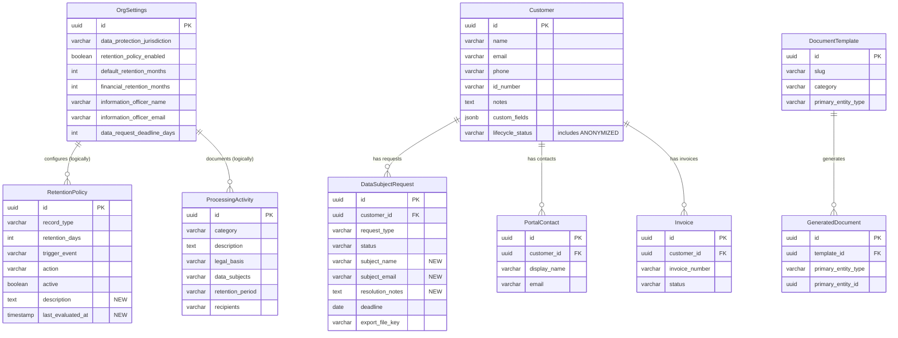
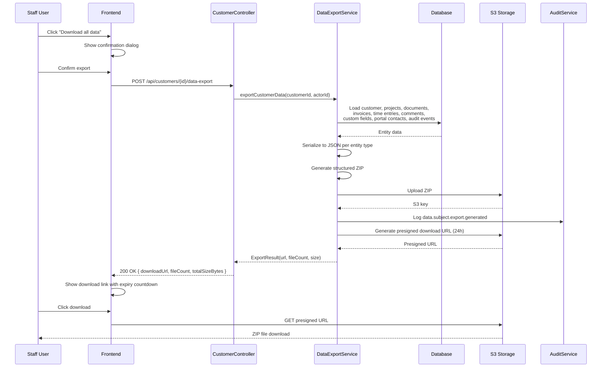
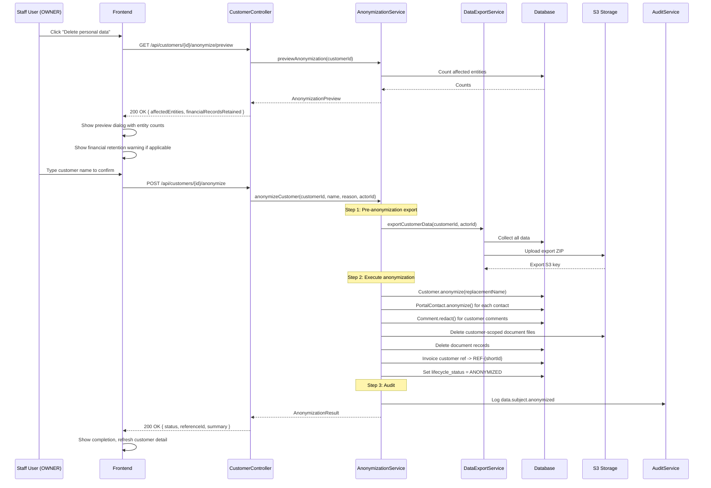
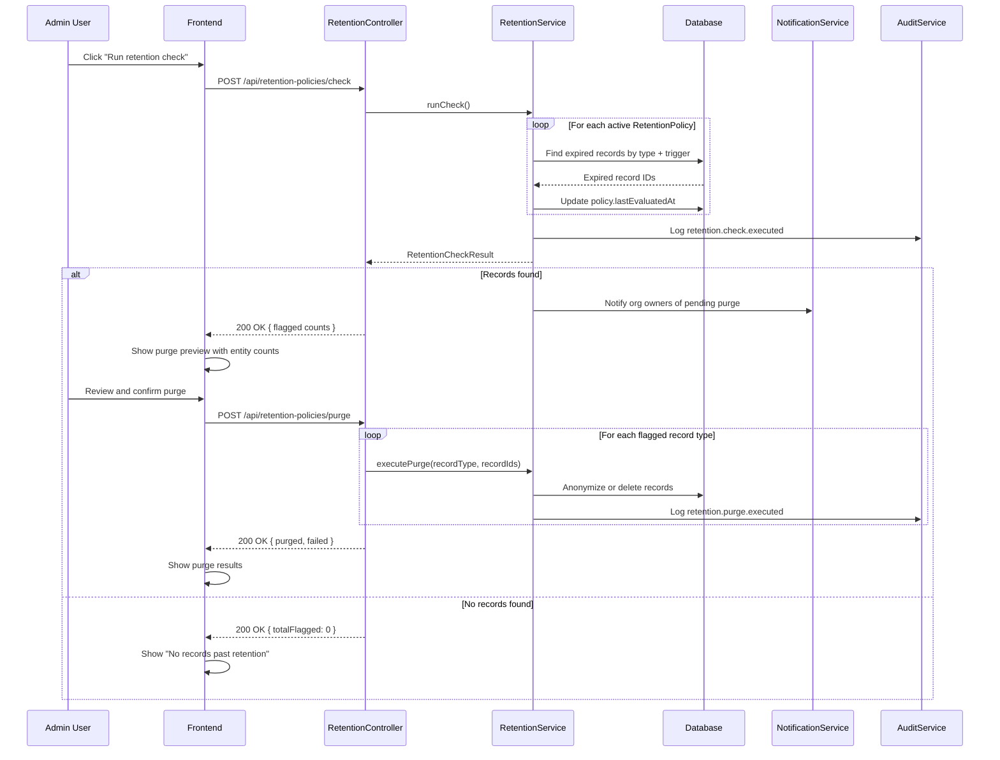

# Phase 50 — Data Protection Compliance

> Standalone architecture document for Phase 50. ADRs: 193--196. Migration: V76.

---

## 1. Overview

Phase 50 adds tenant-facing data protection tools to DocTeams, enabling firms to comply with POPIA (and future jurisdictions) when handling client personal information. The same infrastructure that helps a firm respond to a client's access request is the same infrastructure DocTeams uses for its own compliance obligations.

This phase builds heavily on existing code. The `datarequest/` package already contains `DataSubjectRequest`, `DataExportService`, and `DataAnonymizationService`. The `retention/` package already contains `RetentionPolicy`, `RetentionService`, and evaluation/purge logic. Phase 50 extends these foundations with jurisdiction awareness, richer export coverage, an `ANONYMIZED` lifecycle status, processing activity tracking, and PAIA manual generation via the Phase 12 template engine.

### What's New vs. What's Extended

| Capability | Existing Code (Current) | Phase 50 Changes |
|---|---|---|
| **Data export** | `DataExportService` — collects customer, projects, documents, invoices, billable time entries, portal-visible comments. Outputs JSON + CSV ZIP to S3. | Extend to include ALL time entries (not just billable), custom field values, audit events referencing customer, portal contacts. Structured directory layout in ZIP. Add standalone export endpoint on customer (not just via DSAR). |
| **Anonymization** | `DataAnonymizationService` — anonymizes customer PII, redacts comments, deletes documents, anonymizes portal contacts. Transitions to OFFBOARDED. | Extend to also null `notes` and `customFields` on Customer. Add `ANONYMIZED` lifecycle status. Add pre-anonymization export. Add anonymization preview endpoint. Add standalone anonymization endpoint on customer (not just via DSAR). |
| **DSAR tracking** | `DataSubjectRequest` entity — RECEIVED / IN_PROGRESS / COMPLETED / REJECTED lifecycle. Tracks customerId, requestType, deadline, exportFileKey. | Add `subject_name` and `subject_email` fields for cases where customer is not yet identified. Add `resolution_notes`. Add `VERIFIED` status between RECEIVED and IN_PROGRESS. Extend deadline calculation with jurisdiction awareness. |
| **Retention policies** | `RetentionPolicy` entity — recordType, retentionDays, triggerEvent, action, active toggle. `RetentionService` — check and purge for CUSTOMER, AUDIT_EVENT, DOCUMENT, COMMENT types. | Add `last_evaluated_at` field. Add `description` field (human-readable). Add financial retention minimum enforcement. Extend evaluation to include time entries. Add notification-based warning phase before purge. |
| **OrgSettings** | `dataRequestDeadlineDays` already exists. | Add `dataProtectionJurisdiction`, `retentionPolicyEnabled`, `defaultRetentionMonths`, `financialRetentionMonths`, `informationOfficerName`, `informationOfficerEmail`. |
| **Customer entity** | `anonymize(replacementName)` — replaces name, email, nulls phone, idNumber. `LifecycleStatus` enum: PROSPECT, ONBOARDING, ACTIVE, DORMANT, OFFBOARDING, OFFBOARDED. | Extend `anonymize()` to also null notes, clear customFields. Add `ANONYMIZED` value to `LifecycleStatus` enum. |
| **Processing register** | Does not exist. | New `ProcessingActivity` entity, CRUD, jurisdiction-based seeding. |
| **PAIA manual** | Does not exist. | New `PaiaManualContextBuilder`, compliance template pack with PAIA Section 51 template, generation endpoint. |
| **Data protection settings UI** | `settings/compliance/` page shows retention policies and dormancy settings. | Add "Data Protection" tab with jurisdiction config, information officer, DSAR summary, retention policies, processing register, PAIA manual generation. |

### Relationship to Existing Infrastructure

- **Audit trail** (Phase 6): New audit event types (`DATA_SUBJECT_EXPORT`, `DATA_SUBJECT_ANONYMIZED`, `RETENTION_PURGE_WARNING`, `PROCESSING_ACTIVITY_CREATED`, `PAIA_MANUAL_GENERATED`) follow existing `AuditEventBuilder` pattern.
- **Template engine** (Phase 12): PAIA manual uses `DocumentTemplate` + `PaiaManualContextBuilder` + existing PDF rendering pipeline.
- **Notification system** (Phase 6.5): Retention warning notifications and DSAR deadline reminders use existing `Notification` entity and in-app channel.
- **Module guard** (Phase 49): Data protection features are universal (not vertical-gated). All tenants can use them regardless of vertical profile.
- **Customer & PortalContact** (Phases 4, 7): Primary data subjects — already have `anonymize()` methods that Phase 50 extends.

---

## 2. Domain Model

### 2.1 Extended Entities

#### 2.1.1 Customer (Extended)

File: `customer/Customer.java`

**Current `anonymize()` method:**
```java
public void anonymize(String replacementName) {
    this.name = replacementName;
    this.email = "anon-" + this.id + "@anonymized.invalid";
    this.phone = null;
    this.idNumber = null;
    this.updatedAt = Instant.now();
}
```

**Proposed extension:**
```java
public void anonymize(String replacementName) {
    this.name = replacementName;
    this.email = "anon-" + this.id + "@anonymized.invalid";
    this.phone = null;
    this.idNumber = null;
    this.notes = null;                           // NEW: clear notes (may contain PII)
    this.customFields = new HashMap<>();          // NEW: clear custom fields (may contain PII)
    this.lifecycleStatus = LifecycleStatus.ANONYMIZED;  // NEW: set terminal status
    this.updatedAt = Instant.now();
}
```

**LifecycleStatus enum extension:**

| Value | New? | Allowed transitions TO this status |
|---|---|---|
| `PROSPECT` | Existing | (initial) |
| `ONBOARDING` | Existing | from PROSPECT |
| `ACTIVE` | Existing | from ONBOARDING, DORMANT, OFFBOARDED |
| `DORMANT` | Existing | from ACTIVE |
| `OFFBOARDING` | Existing | from ONBOARDING, ACTIVE, DORMANT |
| `OFFBOARDED` | Existing | from OFFBOARDING |
| `ANONYMIZED` | **NEW** | from ANY status (via anonymization only — bypasses transition validation) |

`ANONYMIZED` is a terminal state with no outgoing transitions. The `anonymize()` method bypasses the normal transition validation — it can be called regardless of current lifecycle status (same pattern as the existing `setLifecycleStatus()` system bypass used by `DataAnonymizationService`). The existing anonymization code already performs a two-step transition (e.g., ACTIVE → OFFBOARDING → OFFBOARDED) before anonymizing; Phase 50 replaces the terminal status with `ANONYMIZED` instead of `OFFBOARDED`. See [ADR-193](../adr/ADR-193-anonymization-vs-deletion.md).

**DB migration:** Update CHECK constraint on `lifecycle_status` to include `'ANONYMIZED'`.

#### 2.1.2 DataSubjectRequest (Extended)

File: `datarequest/DataSubjectRequest.java`

**Current fields — unchanged:**

| Field | Type | Notes |
|---|---|---|
| `id` | UUID PK | |
| `customerId` | UUID, nullable | FK to customers. Currently NOT NULL — Phase 50 makes it nullable to support DSARs where the data subject hasn't been linked to a customer record yet. Requires migration (ALTER COLUMN DROP NOT NULL) and constructor change. |
| `requestType` | VARCHAR(20) | ACCESS, DELETION, CORRECTION, OBJECTION, PORTABILITY |
| `status` | VARCHAR(20) | RECEIVED, IN_PROGRESS, COMPLETED, REJECTED |
| `description` | TEXT | |
| `rejectionReason` | TEXT | |
| `deadline` | DATE | |
| `requestedAt` | TIMESTAMP | |
| `requestedBy` | UUID | Member who logged the request |
| `completedAt` | TIMESTAMP | |
| `completedBy` | UUID | |
| `exportFileKey` | VARCHAR(1000) | S3 key for generated export |
| `notes` | TEXT | |
| `createdAt` / `updatedAt` | TIMESTAMP | |

**New fields:**

| Field | Type | Default | Notes |
|---|---|---|---|
| `subjectName` | VARCHAR(255), nullable | null | Name of the requesting person (may differ from customer name, or customer may not be identified yet) |
| `subjectEmail` | VARCHAR(255), nullable | null | Contact email of the requesting person |
| `resolutionNotes` | TEXT, nullable | null | How the request was resolved — separate from general `notes` |

**Status lifecycle extension:**

Current: `RECEIVED -> IN_PROGRESS -> COMPLETED | REJECTED`

Extended: `RECEIVED -> IN_PROGRESS -> COMPLETED | REJECTED` (unchanged)

The requirements spec proposes adding `VERIFIED` and `PROCESSING` statuses and using `DENIED` instead of `REJECTED`. Phase 50 keeps the existing lifecycle unchanged: `RECEIVED -> IN_PROGRESS -> COMPLETED | REJECTED`. Identity verification is an out-of-band process (phone call, email, ID document) — staff simply note it in the `notes` field and transition to `IN_PROGRESS` when they begin work. Adding statuses would break the existing controller and all consumers. The current two-step lifecycle is sufficient for v1. Terminology mapping for implementers: requirements `PROCESSING` = existing `IN_PROGRESS`, requirements `DENIED` = existing `REJECTED`. See [ADR-195](../adr/ADR-195-dsar-deadline-calculation.md).

**Deadline calculation enhancement:**

Currently, `DataSubjectRequestService` uses `OrgSettings.dataRequestDeadlineDays` with a hardcoded default of 30. Phase 50 makes this jurisdiction-aware:

```java
int deadlineDays = resolveDeadlineDays(orgSettings);

private int resolveDeadlineDays(OrgSettings settings) {
    // If explicit override set, use it (as long as it doesn't exceed jurisdiction max)
    if (settings.getDataRequestDeadlineDays() != null && settings.getDataRequestDeadlineDays() > 0) {
        String jurisdiction = settings.getDataProtectionJurisdiction();
        int jurisdictionMax = JurisdictionDefaults.getMaxDeadlineDays(jurisdiction);
        return Math.min(settings.getDataRequestDeadlineDays(), jurisdictionMax);
    }
    // Otherwise use jurisdiction default
    String jurisdiction = settings.getDataProtectionJurisdiction();
    return JurisdictionDefaults.getDefaultDeadlineDays(jurisdiction);
}
```

#### 2.1.3 RetentionPolicy (Extended)

File: `retention/RetentionPolicy.java`

**Current fields — unchanged:**

| Field | Type | Notes |
|---|---|---|
| `id` | UUID PK | |
| `recordType` | VARCHAR(20) | CUSTOMER, AUDIT_EVENT, DOCUMENT, COMMENT |
| `retentionDays` | INTEGER | |
| `triggerEvent` | VARCHAR(30) | CUSTOMER_OFFBOARDED, RECORD_CREATED |
| `action` | VARCHAR(20) | FLAG, ANONYMIZE, DELETE |
| `active` | BOOLEAN | |
| `createdAt` / `updatedAt` | TIMESTAMP | |

**New fields:**

| Field | Type | Default | Notes |
|---|---|---|---|
| `description` | TEXT, nullable | null | Human-readable description of the policy for the settings UI |
| `lastEvaluatedAt` | TIMESTAMP, nullable | null | When the retention check last evaluated this policy |

**Extended record types:** Add `TIME_ENTRY` and `COMMENT` to the set of supported record types in `RetentionService.runCheck()`.

**Note on units:** The existing `RetentionPolicy.retentionDays` field stores retention in **days** (not months). The requirements spec uses months for readability, but seeded defaults must convert: e.g., 60 months = 1800 days, 36 months = 1080 days, 84 months = 2520 days. `OrgSettings.financialRetentionMonths` and `defaultRetentionMonths` store **months** (user-facing); the financial minimum enforcement in `RetentionPolicyService` converts via `months * 30` for comparison with `retentionDays`.

**Financial retention minimum enforcement:** When updating a retention policy for a financial-linked record type (`CUSTOMER`, `TIME_ENTRY`), validate that `retentionDays` is not less than `OrgSettings.financialRetentionMonths * 30`. This validation lives in `RetentionPolicyService.update()`.

#### 2.1.4 OrgSettings (Extended)

File: `settings/OrgSettings.java`

**New fields:**

| Field | Type | Default | Notes |
|---|---|---|---|
| `dataProtectionJurisdiction` | VARCHAR(10), nullable | null | ISO 3166-1 alpha-2: "ZA", "EU", "BR". Null = not configured. |
| `retentionPolicyEnabled` | BOOLEAN | false | Whether automated retention enforcement is active |
| `defaultRetentionMonths` | INTEGER, nullable | null | Default retention period in months |
| `financialRetentionMonths` | INTEGER, nullable | 60 | Financial record retention (invoices, billable time). Cannot be below jurisdiction minimum. |
| `informationOfficerName` | VARCHAR(255), nullable | null | Designated Information Officer name (POPIA Section 55) |
| `informationOfficerEmail` | VARCHAR(255), nullable | null | Contact email for data protection requests |

**New method:**

```java
public void updateDataProtectionSettings(
        String jurisdiction, boolean retentionEnabled,
        Integer defaultRetentionMonths, Integer financialRetentionMonths,
        String officerName, String officerEmail) {
    this.dataProtectionJurisdiction = jurisdiction;
    this.retentionPolicyEnabled = retentionEnabled;
    this.defaultRetentionMonths = defaultRetentionMonths;
    this.financialRetentionMonths = financialRetentionMonths;
    this.informationOfficerName = officerName;
    this.informationOfficerEmail = officerEmail;
    this.updatedAt = Instant.now();
}
```

### 2.2 New Entities

#### 2.2.1 ProcessingActivity (New)

A record in the processing activity register documenting what personal information the tenant collects, why, and from whom.

| Field | Type | Constraints | Notes |
|---|---|---|---|
| `id` | UUID | PK, generated | |
| `category` | VARCHAR(100) | NOT NULL | e.g. "Client Information", "Financial Records" |
| `description` | TEXT | NOT NULL | What PI is collected and processed |
| `legalBasis` | VARCHAR(50) | NOT NULL | e.g. "contractual_necessity", "legitimate_interest" |
| `dataSubjects` | VARCHAR(255) | NOT NULL | Who the data is about: "Clients", "Employees" |
| `retentionPeriod` | VARCHAR(100) | NOT NULL | Human-readable: "5 years after last engagement" |
| `recipients` | VARCHAR(255), nullable | | Who data is shared with: "SARS (legal obligation)" |
| `createdAt` | TIMESTAMP | NOT NULL, immutable | |
| `updatedAt` | TIMESTAMP | NOT NULL | |

**Design rationale:** This is a documentation entity, not a policy enforcement entity. It has no relationships to other entities — it simply records the tenant's self-assessment of their processing activities. The `legalBasis` field uses string values (not an enum) because different jurisdictions define different legal bases, and tenants may add custom entries.

### 2.3 Entity Relationship Diagram



---

## 3. Core Flows and Backend Behaviour

### 3.1 Data Subject Export (Extending DataExportService)

**Current state:** `DataExportService.generateExport(requestId, actorId)` collects data into a flat JSON + summary CSV ZIP, uploads to S3, and links to the `DataSubjectRequest`.

**Phase 50 changes:**

1. **Add standalone export endpoint** on Customer — `POST /api/customers/{customerId}/data-export` — that does not require a pre-existing DSAR. This creates an ad-hoc export for compliance review or proactive data portability.

2. **Extend `collectData()` to include:**
   - All time entries (not just billable) via customer's projects
   - Custom field values from the customer entity
   - Portal contacts linked to the customer
   - Audit events referencing the customer (`entity_type = 'customer' AND entity_id = customerId`)

3. **Structured ZIP directory layout:**
```
customer-export-{customerId}/
  customer.json
  portal-contacts.json
  projects/
    project-{id}.json   (one per project)
  documents/
    document-{id}.json  (metadata)
    {original-filename}  (file from S3, if available)
  time-entries.json
  invoices.json
  comments.json
  custom-fields.json
  audit-events.json
  export-metadata.json  (export date, tenant schema, jurisdiction, scope)
```

4. **New service method signatures:**

```java
// Standalone export (no DSAR required)
public String exportCustomerData(UUID customerId, UUID actorId)

// Existing method (linked to DSAR) — unchanged signature
public String generateExport(UUID requestId, UUID actorId)
```

Both methods share the same `collectData()` and ZIP generation logic. The standalone method creates its own S3 key pattern: `org/{tenantId}/customer-exports/{customerId}/{timestamp}.zip`.

**Audit event:** `data.subject.export.generated` with details `{ customerId, fileCount, totalSizeBytes }`.

### 3.2 Data Subject Anonymization (Extending DataAnonymizationService)

**Current state:** `DataAnonymizationService.executeAnonymization(requestId, confirmCustomerName, actorId)` anonymizes customer, redacts comments, deletes documents, anonymizes portal contacts, transitions to OFFBOARDED, and completes the DSAR.

**Phase 50 changes:**

1. **Add standalone anonymization endpoint** — `POST /api/customers/{customerId}/anonymize` — that does not require a pre-existing DSAR. For firms that receive deletion requests informally.

2. **Add preview endpoint** — `GET /api/customers/{customerId}/anonymize/preview` — returns impact summary without executing.

3. **Extend anonymization to:**
   - Null `notes` and clear `customFields` on Customer
   - Set `lifecycleStatus` to `ANONYMIZED` (not `OFFBOARDED`)
   - Trigger pre-anonymization export automatically before anonymizing

4. **New service method signatures:**

```java
// Preview what would be anonymized
public AnonymizationPreview previewAnonymization(UUID customerId)

// Standalone anonymization (no DSAR required)
public AnonymizationResult anonymizeCustomer(
    UUID customerId, String confirmCustomerName, String reason, UUID actorId)
```

**`AnonymizationPreview` response:**
```java
public record AnonymizationPreview(
    UUID customerId,
    String customerName,
    int portalContacts,
    int projects,
    int documents,
    int timeEntries,
    int invoices,
    int comments,
    int customFieldValues,
    int invoicesInRetentionPeriod,
    LocalDate financialRetentionExpiresAt
) {}
```

**Pre-anonymization export:** Before executing anonymization, the service calls `exportCustomerData()` to create a permanent record. The export S3 key is stored in a new `preAnonymizationExportKey` field on the audit event details (not on the Customer entity — the export is proof of process, not customer data). See [ADR-196](../adr/ADR-196-pre-anonymization-export-storage.md).

**Financial record preservation:** Invoices and billable time entries are NOT deleted or anonymized. The customer reference on invoices is replaced with `"REF-{shortId}"` but all financial fields (amounts, dates, line items, tax) are preserved. This satisfies SA Income Tax Act Section 29 and VAT Act Section 55. See [ADR-193](../adr/ADR-193-anonymization-vs-deletion.md).

### 3.3 Retention Policy Evaluation (Extending RetentionService)

**Current state:** `RetentionService.runCheck()` evaluates active policies, finds expired records for CUSTOMER, AUDIT_EVENT, DOCUMENT types, and returns a `RetentionCheckResult`. `executePurge()` handles CUSTOMER (anonymize), AUDIT_EVENT (delete), COMMENT (delete), DOCUMENT (delete from S3 + DB).

**Phase 50 changes:**

1. **Add TIME_ENTRY and COMMENT support** to `runCheck()` (currently `runCheck()` only handles CUSTOMER, AUDIT_EVENT, DOCUMENT — COMMENT is only handled in `executePurge()` but never flagged by `runCheck()`). Both TIME_ENTRY and COMMENT need evaluation cases:

```java
case "TIME_ENTRY" -> findExpiredTimeEntries(policy.getTriggerEvent(), cutoff);
```

Where `findExpiredTimeEntries` finds non-billable time entries past the cutoff (billable entries are protected by financial retention).

2. **Add notification-based warning phase:**

Before purge execution, send notifications to org owners:
```
"Retention check: {count} {recordType} records have exceeded their retention period
and are eligible for purge. Review in Settings > Data Protection > Retention Policies."
```

This uses the existing `Notification` entity and in-app channel. No email in v1.

3. **Financial retention minimum enforcement:**

```java
// In RetentionPolicyService.update()
if (isFinancialRecordType(recordType)) {
    OrgSettings settings = orgSettingsRepository.findForCurrentTenant().orElseThrow();
    int minDays = (settings.getFinancialRetentionMonths() != null
        ? settings.getFinancialRetentionMonths() : 60) * 30;
    if (retentionDays < minDays) {
        throw new InvalidStateException(
            "Retention period too short",
            "Financial record types require at least " + minDays
            + " days retention (configured financial retention: "
            + settings.getFinancialRetentionMonths() + " months)");
    }
}
```

4. **Update `lastEvaluatedAt`** on each policy after evaluation:

```java
policy.setLastEvaluatedAt(Instant.now());
policyRepository.save(policy);
```

### 3.4 DSAR Lifecycle (Extending DataSubjectRequest)

**Current state:** `DataSubjectRequestService` handles CRUD and status transitions. `DataRequestController` provides REST endpoints at `/api/data-requests`.

**Phase 50 changes:**

1. **Add subject_name and subject_email fields** — for cases where a data subject contacts the firm but is not yet linked to a customer record. The existing `customerId` field remains the primary link; these fields provide fallback identification.

2. **Add resolution_notes field** — distinct from the general `notes` field, this records how the request was resolved (e.g., "Export generated and sent via email on 2026-03-15").

3. **Deadline calculation uses jurisdiction defaults** — see Section 2.1.2. The `DataSubjectRequestService.createRequest()` method is updated to call `resolveDeadlineDays()`. See [ADR-195](../adr/ADR-195-dsar-deadline-calculation.md).

4. **Deadline warning notifications** — extend the existing `checkDeadlines()` method to send in-app notifications (not just audit events) when requests are 7 days or 2 days from deadline.

### 3.5 PAIA Manual Generation (New)

Leverages the Phase 12 template engine. A PAIA Section 51 manual is a compliance document that every SA private body must produce.

**PaiaManualContextBuilder:**

```java
@Component
public class PaiaManualContextBuilder {

    private final OrgSettingsRepository orgSettingsRepository;
    private final RetentionPolicyRepository retentionPolicyRepository;
    private final ProcessingActivityRepository processingActivityRepository;

    public Map<String, Object> buildContext() {
        OrgSettings settings = orgSettingsRepository.findForCurrentTenant()
            .orElseThrow(() -> new ResourceNotFoundException("OrgSettings", "current tenant"));

        var context = new LinkedHashMap<String, Object>();
        // Org name is in the global-schema Organization entity, not the tenant-schema OrgSettings.
        // Resolve via OrgSchemaMapping → Organization lookup (cross-schema read).
        context.put("orgName", resolveOrgName());
        context.put("informationOfficerName", settings.getInformationOfficerName());
        context.put("informationOfficerEmail", settings.getInformationOfficerEmail());
        context.put("retentionPolicies", retentionPolicyRepository.findByActive(true));
        context.put("processingActivities", processingActivityRepository.findAll());
        context.put("generatedDate", LocalDate.now());
        context.put("jurisdiction", settings.getDataProtectionJurisdiction());
        // Standard boilerplate sections are in the template itself
        return context;
    }
}
```

**Template seeding:** A PAIA Section 51 template is seeded as a `DocumentTemplate` with:
- `category`: `COMPLIANCE` — **NEW enum value**, must be added to `TemplateCategory` (existing values: ENGAGEMENT_LETTER, STATEMENT_OF_WORK, COVER_LETTER, PROJECT_SUMMARY, NDA, PROPOSAL, REPORT, OTHER)
- `primaryEntityType`: `ORGANIZATION` — **NEW enum value**, must be added to `TemplateEntityType` (existing values: PROJECT, CUSTOMER, INVOICE)
- `slug`: `paia-section-51-manual`
- `source`: `PACK_SEEDED`
- `packId`: `compliance-za`

**PaiaManualContextBuilder is a standalone component** — it does NOT implement the existing `TemplateContextBuilder` interface (which requires `buildContext(UUID entityId, UUID memberId)`). The PAIA manual is org-level, not entity-level, so it has a no-arg `buildContext()`. The generation endpoint calls the builder directly rather than through the generic template rendering pipeline.

**Generation endpoint:** `POST /api/settings/paia-manual/generate` triggers context assembly, template rendering, PDF generation, S3 upload, and `GeneratedDocument` creation. The `GeneratedDocument` uses `primaryEntityType = ORGANIZATION` and `primaryEntityId = null` (or the OrgSettings UUID).

### 3.6 Processing Activity Register (New)

**ProcessingActivityService:**

```java
@Service
public class ProcessingActivityService {

    public List<ProcessingActivity> listAll() { ... }
    public ProcessingActivity create(String category, String description,
            String legalBasis, String dataSubjects, String retentionPeriod, String recipients) { ... }
    public ProcessingActivity update(UUID id, ...) { ... }
    public void delete(UUID id) { ... }
    public void seedDefaults(String jurisdiction) { ... }
}
```

**`seedDefaults(jurisdiction)`** is called when `data_protection_jurisdiction` is set on OrgSettings for the first time. For `"ZA"`, it creates the 6 default processing activities defined in the requirements (Section 7.2). This method is idempotent — it checks `processingActivityRepository.count()` and only seeds if empty.

### 3.7 Jurisdiction Configuration (New OrgSettings Extensions)

**JurisdictionDefaults** — a utility class (not an entity) that holds static jurisdiction configuration:

```java
public final class JurisdictionDefaults {

    public static int getDefaultDeadlineDays(String jurisdiction) {
        return switch (jurisdiction) {
            case "ZA" -> 30;   // POPIA
            case "EU" -> 30;   // GDPR
            case "BR" -> 15;   // LGPD
            case null, default -> 30;
        };
    }

    public static int getMaxDeadlineDays(String jurisdiction) {
        return switch (jurisdiction) {
            case "ZA" -> 30;
            case "EU" -> 30;
            case "BR" -> 15;
            case null, default -> 90;
        };
    }

    public static int getMinFinancialRetentionMonths(String jurisdiction) {
        return switch (jurisdiction) {
            case "ZA" -> 60;   // SA Income Tax Act + VAT Act: 5 years
            case "EU" -> 72;   // varies by member state, conservative default
            case "BR" -> 60;
            case null, default -> 60;
        };
    }

    public static List<String> getLegalBases(String jurisdiction) {
        return switch (jurisdiction) {
            case "ZA" -> List.of("consent", "contractual_necessity", "legal_obligation",
                "legitimate_interest", "public_interest", "vital_interest",
                "law_enforcement", "historical_research");
            case "EU" -> List.of("consent", "contract", "legal_obligation",
                "vital_interests", "public_interest", "legitimate_interest");
            case null, default -> List.of("consent", "contractual_necessity",
                "legal_obligation", "legitimate_interest");
        };
    }
}
```

This is a pure function class, not a Spring bean. It holds no state and requires no injection. Jurisdiction packs are code, not database entities — same pattern as vertical profiles in Phase 49. See [ADR-194](../adr/ADR-194-retention-policy-granularity.md).

---

## 4. API Surface

### 4.1 New Endpoints

| Method | Path | Description | Auth | R/W |
|---|---|---|---|---|
| `POST` | `/api/customers/{id}/data-export` | Trigger standalone data export | ADMIN+ | Write |
| `GET` | `/api/customers/{id}/data-export/{exportId}` | Get export status/download URL | ADMIN+ | Read |
| `GET` | `/api/customers/{id}/anonymize/preview` | Preview anonymization impact | OWNER | Read |
| `POST` | `/api/customers/{id}/anonymize` | Execute standalone anonymization | OWNER | Write |
| `GET` | `/api/settings/processing-activities` | List processing activities | ADMIN+ | Read |
| `POST` | `/api/settings/processing-activities` | Create processing activity | ADMIN+ | Write |
| `PUT` | `/api/settings/processing-activities/{id}` | Update processing activity | ADMIN+ | Write |
| `DELETE` | `/api/settings/processing-activities/{id}` | Delete processing activity | ADMIN+ | Write |
| `POST` | `/api/settings/paia-manual/generate` | Generate PAIA manual | ADMIN+ | Write |
| `PUT` | `/api/settings/data-protection` | Update data protection settings | OWNER | Write |
| `GET` | `/api/settings/data-protection` | Get data protection settings | ADMIN+ | Read |
| `POST` | `/api/settings/data-protection/seed-jurisdiction` | Seed jurisdiction defaults | OWNER | Write |

### 4.2 Extended Endpoints

| Method | Path | Change | Auth |
|---|---|---|---|
| `PUT` | `/api/retention-policies/{id}` | Add financial retention minimum validation | ADMIN+ |
| `POST` | `/api/retention-policies/check` | Add notification warnings, update lastEvaluatedAt | ADMIN+ |
| `POST` | `/api/data-requests` | Accept optional subjectName, subjectEmail | ADMIN+ |
| `PUT` | `/api/data-requests/{id}/status` | Accept resolutionNotes in COMPLETE transition | ADMIN+ |

### 4.3 Key Request/Response Shapes

**POST /api/customers/{id}/data-export — Request:**
```json
(empty body)
```

**POST /api/customers/{id}/data-export — Response:**
```json
{
  "exportId": "uuid",
  "status": "COMPLETED",
  "downloadUrl": "https://s3.af-south-1.amazonaws.com/...",
  "expiresAt": "2026-03-20T10:00:00Z",
  "fileCount": 23,
  "totalSizeBytes": 4521000
}
```

**GET /api/customers/{id}/anonymize/preview — Response:**
```json
{
  "customerId": "uuid",
  "customerName": "John Smith",
  "affectedEntities": {
    "portalContacts": 2,
    "projects": 3,
    "documents": 12,
    "timeEntries": 45,
    "invoices": 8,
    "comments": 23,
    "customFieldValues": 6
  },
  "financialRecordsRetained": 8,
  "financialRetentionExpiresAt": "2031-03-19"
}
```

**POST /api/customers/{id}/anonymize — Request:**
```json
{
  "confirmationName": "John Smith",
  "reason": "Data subject request"
}
```

**POST /api/customers/{id}/anonymize — Response:**
```json
{
  "status": "COMPLETED",
  "referenceId": "REF-a1b2c3",
  "preExportKey": "org/tenant_abc/customer-exports/uuid/pre-anonymization.zip",
  "summary": {
    "customerAnonymized": true,
    "documentsDeleted": 12,
    "commentsRedacted": 23,
    "portalContactsAnonymized": 2,
    "invoicesPreserved": 8,
    "customFieldsCleared": 6
  }
}
```

**POST /api/settings/processing-activities — Request:**
```json
{
  "category": "Client Information",
  "description": "Names, contact details, tax numbers for client relationship management",
  "legalBasis": "contractual_necessity",
  "dataSubjects": "Clients",
  "retentionPeriod": "Duration of engagement + 5 years",
  "recipients": "None"
}
```

**PUT /api/settings/data-protection — Request:**
```json
{
  "dataProtectionJurisdiction": "ZA",
  "retentionPolicyEnabled": true,
  "defaultRetentionMonths": 60,
  "financialRetentionMonths": 60,
  "informationOfficerName": "Jane Doe",
  "informationOfficerEmail": "privacy@firm.co.za"
}
```

---

## 5. Sequence Diagrams

### 5.1 Data Export Flow



### 5.2 Anonymization Flow



### 5.3 Retention Evaluation Flow



---

## 6. Security Considerations

### 6.1 Authorization Model

| Operation | Required Role | Rationale |
|---|---|---|
| Export customer data | ADMIN or OWNER | Sensitive but non-destructive. Admins need access for day-to-day compliance work. |
| Preview anonymization | OWNER only | Even the preview reveals PII scope — restrict to owners. |
| Execute anonymization | OWNER only | Irreversible, destructive. Must be owner. |
| Configure data protection settings | OWNER only | Jurisdiction and retention config affects the entire org. |
| Seed jurisdiction defaults | OWNER only | Creates default policies and processing activities. |
| Manage retention policies | ADMIN or OWNER | Policy configuration, not execution. |
| Execute retention purge | OWNER only | Destructive bulk operation. |
| Manage processing register | ADMIN or OWNER | Documentation, non-destructive. |
| Generate PAIA manual | ADMIN or OWNER | Document generation, non-destructive. |
| Manage DSARs | ADMIN or OWNER (existing CUSTOMER_MANAGEMENT capability) | Unchanged from current. |

### 6.2 Audit Trail Integration

Every data protection operation creates an audit event:

| Event Type | Trigger | Details |
|---|---|---|
| `data.subject.export.generated` | Customer data export | customerId, fileCount, totalSizeBytes |
| `data.subject.anonymized` | Customer anonymization | customerId, referenceId, documentsDeleted, commentsRedacted, invoicesPreserved, preExportKey |
| `data.subject.anonymize.previewed` | Anonymization preview | customerId (no PII in details) |
| `retention.check.executed` | Retention evaluation | totalFlagged, policiesEvaluated |
| `retention.purge.executed` | Retention purge | recordType, count, failed |
| `retention.purge.warning` | Warning notification sent | recordType, count, daysUntilPurge |
| `data.protection.settings.updated` | OrgSettings change | jurisdiction, retentionEnabled |
| `data.protection.jurisdiction.seeded` | Jurisdiction defaults applied | jurisdiction, policiesCreated, activitiesCreated |
| `processing.activity.created/updated/deleted` | Register change | activityId, category |
| `paia.manual.generated` | PAIA manual PDF created | generatedDocumentId, jurisdiction |

### 6.3 Anonymization Irreversibility Safeguards

1. **Two-step confirmation** — staff must type the exact customer name to confirm.
2. **Pre-anonymization export** — a full data export is automatically generated and stored in S3 before any data is modified. This export is retained for `financialRetentionMonths` and serves as proof of compliance.
3. **OWNER-only authorization** — admins cannot anonymize.
4. **ANONYMIZED terminal status** — once anonymized, the customer cannot be transitioned to any other status. The record is permanently flagged.
5. **Already-anonymized guard** — attempting to anonymize a customer with `lifecycleStatus = ANONYMIZED` throws `InvalidStateException`.

### 6.4 Financial Record Preservation

SA tax law (Income Tax Act Section 29, VAT Act Section 55) requires 5 years retention of financial records. Phase 50 enforces this:

- Invoices are NEVER deleted during anonymization. Customer references are replaced with `"REF-{shortId}"` but financial data is preserved.
- Billable time entries linked to invoices are preserved (descriptions cleared but amounts, dates, rates retained).
- `RetentionPolicyService` rejects retention periods below `financialRetentionMonths` for financial record types.
- The `financialRetentionMonths` field itself cannot be set below the jurisdiction minimum (enforced in `OrgSettingsService`).

---

## 7. Database Migrations

### 7.1 V76 Tenant Migration

File: `src/main/resources/db/migration/tenant/V76__data_protection_compliance.sql`

```sql
-- V76: Data protection compliance
-- Phase 50 — jurisdiction config, export enhancements, anonymization extensions,
-- retention extensions, processing register

-- ============================================================
-- 1. OrgSettings — data protection columns
-- ============================================================

ALTER TABLE org_settings
    ADD COLUMN IF NOT EXISTS data_protection_jurisdiction VARCHAR(10),
    ADD COLUMN IF NOT EXISTS retention_policy_enabled BOOLEAN NOT NULL DEFAULT false,
    ADD COLUMN IF NOT EXISTS default_retention_months INTEGER,
    ADD COLUMN IF NOT EXISTS financial_retention_months INTEGER DEFAULT 60,
    ADD COLUMN IF NOT EXISTS information_officer_name VARCHAR(255),
    ADD COLUMN IF NOT EXISTS information_officer_email VARCHAR(255);

-- ============================================================
-- 2. Customer — ANONYMIZED lifecycle status
-- ============================================================

-- Drop and recreate the CHECK constraint to include ANONYMIZED
ALTER TABLE customers DROP CONSTRAINT IF EXISTS chk_customers_lifecycle_status;
ALTER TABLE customers ADD CONSTRAINT chk_customers_lifecycle_status
    CHECK (lifecycle_status IN (
        'PROSPECT', 'ONBOARDING', 'ACTIVE', 'DORMANT',
        'OFFBOARDING', 'OFFBOARDED', 'ANONYMIZED'
    ));

-- ============================================================
-- 3. DataSubjectRequest — new columns
-- ============================================================

-- Make customer_id nullable (supports DSARs for unidentified data subjects)
ALTER TABLE data_subject_requests ALTER COLUMN customer_id DROP NOT NULL;

ALTER TABLE data_subject_requests
    ADD COLUMN IF NOT EXISTS subject_name VARCHAR(255),
    ADD COLUMN IF NOT EXISTS subject_email VARCHAR(255),
    ADD COLUMN IF NOT EXISTS resolution_notes TEXT;

-- ============================================================
-- 4. RetentionPolicy — new columns
-- ============================================================

ALTER TABLE retention_policies
    ADD COLUMN IF NOT EXISTS description TEXT,
    ADD COLUMN IF NOT EXISTS last_evaluated_at TIMESTAMP WITH TIME ZONE;

-- ============================================================
-- 5. ProcessingActivity — new table
-- ============================================================

CREATE TABLE IF NOT EXISTS processing_activities (
    id                UUID PRIMARY KEY DEFAULT gen_random_uuid(),
    category          VARCHAR(100) NOT NULL,
    description       TEXT NOT NULL,
    legal_basis       VARCHAR(50) NOT NULL,
    data_subjects     VARCHAR(255) NOT NULL,
    retention_period  VARCHAR(100) NOT NULL,
    recipients        VARCHAR(255),
    created_at        TIMESTAMP WITH TIME ZONE NOT NULL DEFAULT now(),
    updated_at        TIMESTAMP WITH TIME ZONE NOT NULL DEFAULT now()
);

-- Index: list by category for settings UI
CREATE INDEX IF NOT EXISTS idx_processing_activities_category
    ON processing_activities (category);
```

### 7.2 Index Definitions

| Index | Table | Columns | Rationale |
|---|---|---|---|
| `idx_processing_activities_category` | `processing_activities` | `category` | Group/filter by category in settings UI |

Existing indexes on `data_subject_requests` (status, customer_id, deadline) and `retention_policies` (unique on record_type + trigger_event) are sufficient for Phase 50 queries. No new indexes needed on those tables.

### 7.3 Backfill Strategy

No data backfill is needed for existing tenants:
- OrgSettings new columns default to `null` / `false` / `60` — tenants opt in by setting jurisdiction.
- Processing activities are seeded on-demand when jurisdiction is first configured (not at migration time).
- Customer lifecycle_status CHECK constraint expansion is non-destructive — no existing rows have `ANONYMIZED`.
- DataSubjectRequest new columns are nullable — existing rows are unaffected.

---

## 8. Implementation Guidance

### 8.1 Backend Changes

| File | Change Type | Description |
|---|---|---|
| `customer/Customer.java` | Modified | Extend `anonymize()` to null notes, clear customFields, set ANONYMIZED status |
| `customer/LifecycleStatus.java` | Modified | Add `ANONYMIZED` value, update transitions map |
| `settings/OrgSettings.java` | Modified | Add 6 new fields + `updateDataProtectionSettings()` method |
| `datarequest/DataSubjectRequest.java` | Modified | Add subjectName, subjectEmail, resolutionNotes fields |
| `datarequest/DataExportService.java` | Modified | Extend collectData() scope, add standalone export method, structured ZIP layout |
| `datarequest/DataAnonymizationService.java` | Modified | Add standalone anonymize, preview, pre-export, notes/customFields clearing |
| `datarequest/DataRequestController.java` | Modified | Accept new DSAR fields in create/update |
| `datarequest/DataSubjectRequestService.java` | Modified | Jurisdiction-aware deadline calculation, deadline notification |
| `retention/RetentionPolicy.java` | Modified | Add description, lastEvaluatedAt fields |
| `retention/RetentionService.java` | Modified | Add TIME_ENTRY support, notification warnings, lastEvaluatedAt update |
| `retention/RetentionPolicyService.java` | Modified | Add financial retention minimum validation |
| `retention/RetentionController.java` | Modified | No structural changes — service handles new logic |
| `customer/CustomerController.java` | Modified | Add data-export and anonymize endpoints |
| `datarequest/JurisdictionDefaults.java` | **New** | Static jurisdiction configuration utility |
| `datarequest/ProcessingActivity.java` | **New** | Entity |
| `datarequest/ProcessingActivityRepository.java` | **New** | JpaRepository |
| `datarequest/ProcessingActivityService.java` | **New** | CRUD + seedDefaults() |
| `datarequest/ProcessingActivityController.java` | **New** | REST controller for /api/settings/processing-activities |
| `datarequest/DataProtectionController.java` | **New** | REST controller for /api/settings/data-protection |
| `template/PaiaManualContextBuilder.java` | **New** | Context builder for PAIA Section 51 manual |
| `seeder/ComplianceTemplateSeeder.java` | Modified | Add PAIA manual template to compliance-za pack |
| `db/migration/tenant/V76__data_protection_compliance.sql` | **New** | Migration |

### 8.2 Frontend Changes

| File | Change Type | Description |
|---|---|---|
| `app/(app)/org/[slug]/settings/data-protection/page.tsx` | **New** | Data Protection settings tab |
| `app/(app)/org/[slug]/settings/data-protection/actions.ts` | **New** | Server actions for settings |
| `components/data-protection/JurisdictionSelector.tsx` | **New** | Jurisdiction dropdown with seed trigger |
| `components/data-protection/InformationOfficerForm.tsx` | **New** | Officer name/email form |
| `components/data-protection/RetentionPoliciesSection.tsx` | **New** | Retention table with inline editing |
| `components/data-protection/ProcessingRegisterTable.tsx` | **New** | Processing activity CRUD table |
| `components/data-protection/PaiaManualSection.tsx` | **New** | Generate/download PAIA manual |
| `components/data-protection/DataRequestsSummary.tsx` | **New** | Open/overdue DSAR badge summary |
| `components/customers/ExportDataDialog.tsx` | **New** | Export confirmation + progress + download |
| `components/customers/AnonymizeDialog.tsx` | **New** | Two-step anonymization confirmation |
| `components/customers/AnonymizationPreview.tsx` | **New** | Entity counts + financial warning |
| `app/(app)/org/[slug]/customers/[id]/actions.ts` | Modified | Add export and anonymize server actions |
| `app/(app)/org/[slug]/customers/[id]/page.tsx` | Modified | Add Data Protection tab or action dropdown items |
| `app/(app)/org/[slug]/compliance/requests/page.tsx` | Modified | Show subjectName/subjectEmail in table |
| `lib/types.ts` | Modified | Add ProcessingActivity, DataProtectionSettings types |
| `lib/nav-items.ts` | Modified | Add Data Protection to settings navigation |
| `lib/schemas/data-protection.ts` | **New** | Zod schemas for forms |

### 8.3 Testing Strategy

| Area | Test Type | Key Scenarios |
|---|---|---|
| `DataExportService` | Integration | Full export with all entity types; empty customer; large dataset; S3 upload |
| `DataAnonymizationService` | Integration | PII fields anonymized; notes/customFields cleared; ANONYMIZED status set; financial records preserved; pre-export triggered; already-anonymized rejected |
| `AnonymizationPreview` | Integration | Correct entity counts; financial retention date calculation |
| `RetentionService` | Integration | TIME_ENTRY evaluation; financial minimum enforcement; lastEvaluatedAt updated; notification created |
| `ProcessingActivityService` | Integration | CRUD; seedDefaults idempotent; jurisdiction-specific defaults |
| `JurisdictionDefaults` | Unit | All jurisdictions return correct values; null/unknown jurisdiction handled |
| `DataSubjectRequestService` | Integration | Jurisdiction-aware deadline; subjectName/subjectEmail persisted |
| `PaiaManualContextBuilder` | Integration | Context assembled from OrgSettings + policies + activities |
| `CustomerController` | Integration | Auth: OWNER-only for anonymize, ADMIN+ for export |
| `RetentionPolicyService` | Integration | Rejects retention below financial minimum |
| Frontend settings tab | Vitest | Renders all sections; jurisdiction selector seeds defaults |
| Frontend export dialog | Vitest | Confirmation, progress, download link |
| Frontend anonymize dialog | Vitest | Two-step confirm; name typing; financial warning |

---

## 9. Permission Model Summary

| Operation | MEMBER | ADMIN | OWNER |
|---|---|---|---|
| View customer detail | Yes | Yes | Yes |
| Export customer data | No | Yes | Yes |
| Preview anonymization | No | No | Yes |
| Execute anonymization | No | No | Yes |
| View data protection settings | No | Yes | Yes |
| Update data protection settings | No | No | Yes |
| Seed jurisdiction defaults | No | No | Yes |
| Manage retention policies | No | Yes | Yes |
| Execute retention purge | No | No | Yes |
| Manage processing activities | No | Yes | Yes |
| Generate PAIA manual | No | Yes | Yes |
| View/create/manage DSARs | No | Yes (via CUSTOMER_MANAGEMENT) | Yes |

---

## 10. Capability Slices

Six independently deployable slices designed for `/breakdown`:

### Slice 1: Data Protection Foundation

**Scope:** OrgSettings extensions, jurisdiction config, V76 migration, JurisdictionDefaults utility.

- Add 6 new columns to OrgSettings entity + `updateDataProtectionSettings()` method
- Create `JurisdictionDefaults` utility class
- Create `DataProtectionController` for `/api/settings/data-protection` (GET/PUT)
- Create `/api/settings/data-protection/seed-jurisdiction` endpoint (seeds retention policies + processing activities)
- Write V76 migration (all tables/columns)
- Add `ANONYMIZED` to `LifecycleStatus` enum + CHECK constraint update
- Tests: JurisdictionDefaults unit tests, OrgSettings integration tests, migration verification

**Dependencies:** None. This slice lays the foundation.

### Slice 2: DSAR Extensions + Export Enhancements

**Scope:** Extend DataSubjectRequest with new fields, extend DataExportService with broader data collection and standalone endpoint.

- Add subjectName, subjectEmail, resolutionNotes to DataSubjectRequest entity
- Update DataSubjectRequestService with jurisdiction-aware deadline calculation
- Extend DataExportService.collectData() to include all time entries, custom fields, portal contacts, audit events
- Add structured ZIP directory layout
- Add standalone `POST /api/customers/{id}/data-export` endpoint
- Add deadline warning notifications (extend checkDeadlines)
- Tests: Extended export coverage, jurisdiction-aware deadlines, deadline notifications
- Note: Frontend components (ExportDataDialog) are in **Slice 6** — this slice is backend-only

**Dependencies:** Slice 1 (for jurisdiction-aware deadlines).

### Slice 3: Anonymization Service + Customer Extensions

**Scope:** Extend Customer.anonymize(), add standalone anonymization endpoint, preview, pre-anonymization export.

- Extend Customer.anonymize() to null notes, clear customFields, set ANONYMIZED lifecycle status
- Add previewAnonymization() and anonymizeCustomer() to DataAnonymizationService
- Add `GET /api/customers/{id}/anonymize/preview` endpoint
- Add `POST /api/customers/{id}/anonymize` endpoint (OWNER-only)
- Trigger pre-anonymization export before anonymizing
- Update invoice customer references to `REF-{shortId}`
- Tests: All anonymization scenarios (PII cleared, financial preserved, already-anonymized rejected, OWNER-only auth)
- Note: Frontend components (AnonymizeDialog, AnonymizationPreview) are in **Slice 6** — this slice is backend-only

**Dependencies:** Slice 1 (ANONYMIZED status), Slice 2 (standalone export for pre-anonymization).

### Slice 4: Retention Policy Extensions + Evaluation Engine

**Scope:** Extend RetentionPolicy entity, add financial minimum enforcement, TIME_ENTRY support, notification warnings.

- Add description and lastEvaluatedAt fields to RetentionPolicy entity
- Add TIME_ENTRY evaluation in RetentionService.runCheck()
- Add financial retention minimum enforcement in RetentionPolicyService.update()
- Add notification warnings before purge (via NotificationService)
- Update lastEvaluatedAt after each policy evaluation
- Frontend: enhanced retention settings section with financial minimum validation
- Tests: TIME_ENTRY evaluation, financial minimum enforcement, notification creation

**Dependencies:** Slice 1 (financialRetentionMonths on OrgSettings).

### Slice 5: PAIA Manual Template + Processing Register

**Scope:** New ProcessingActivity entity, CRUD, jurisdiction seeding, PAIA manual context builder and template.

- Create ProcessingActivity entity, repository, service, controller
- Implement seedDefaults() for jurisdiction-specific processing activities
- Create PaiaManualContextBuilder
- Add PAIA Section 51 template to compliance-za pack
- Add `/api/settings/paia-manual/generate` endpoint
- Frontend: ProcessingRegisterTable, PaiaManualSection
- Tests: CRUD, seed idempotency, context builder assembly, PAIA generation

**Dependencies:** Slice 1 (jurisdiction config, OrgSettings fields). Template engine (Phase 12) must exist.

### Slice 6: Data Protection Frontend (Settings + Customer Actions)

**Scope:** Consolidated settings page AND customer-level data protection actions.

- Create `settings/data-protection/page.tsx` settings tab
- JurisdictionSelector component (dropdown + seed trigger)
- InformationOfficerForm component
- DataRequestsSummary component (open/overdue badges, link to DSAR page)
- Integrate RetentionPoliciesSection (enhanced from existing compliance settings)
- Integrate ProcessingRegisterTable (from Slice 5)
- Integrate PaiaManualSection (from Slice 5)
- Add Data Protection to settings navigation
- **Customer detail page**: ExportDataDialog (confirmation + progress + download link)
- **Customer detail page**: AnonymizeDialog (two-step confirmation with name typing), AnonymizationPreview (entity counts + financial warning)
- Update customer detail page with Data Protection tab or action dropdown items
- Tests: Page rendering, jurisdiction selection, form validation, export dialog, anonymize dialog

**Dependencies:** Slices 1-5 (all backend endpoints must exist).

### Slice Dependency Graph

```
Slice 1 (Foundation)
  ├── Slice 2 (DSAR + Export)
  │     └── Slice 3 (Anonymization) [depends on Slice 2 for pre-export]
  ├── Slice 4 (Retention)
  └── Slice 5 (PAIA + Register)
        └── Slice 6 (Settings Frontend) [depends on all backend slices]
```

Slices 2, 4, and 5 can be developed in parallel after Slice 1.

---

## 11. ADR Index

| ADR | Title | Key Decision |
|---|---|---|
| [ADR-193](../adr/ADR-193-anonymization-vs-deletion.md) | Anonymization vs. Deletion | Anonymization preferred over hard deletion — financial records require preservation under SA tax law |
| [ADR-194](../adr/ADR-194-retention-policy-granularity.md) | Retention Policy Granularity | Per-entity-type policies balance flexibility with simplicity; per-record is too granular, global is too coarse |
| [ADR-195](../adr/ADR-195-dsar-deadline-calculation.md) | DSAR Deadline Calculation | Jurisdiction-based defaults with tenant override (capped at jurisdiction maximum); never allow longer than statutory limit |
| [ADR-196](../adr/ADR-196-pre-anonymization-export-storage.md) | Pre-Anonymization Export Storage | Export stored for financialRetentionMonths period; serves as proof of compliance and only recovery path |
