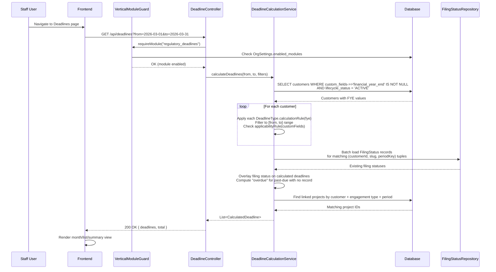
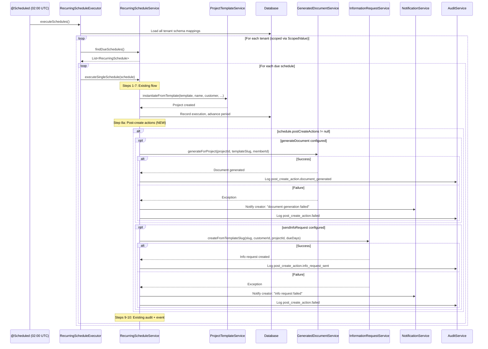
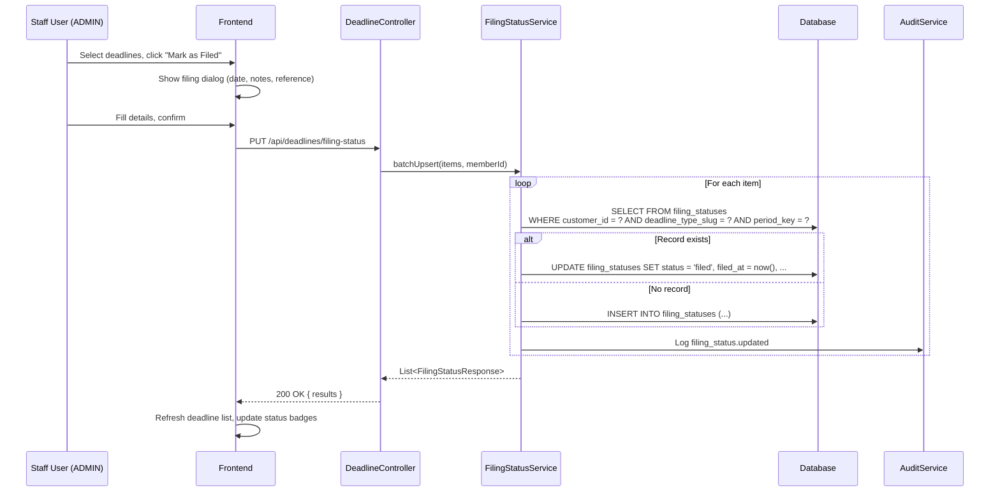

# Phase 51 — Accounting Practice Management Essentials

> Standalone architecture document for Phase 51. ADRs: 197--199. Migration: V80.

---

## 1. Overview

Phase 51 adds three operational capabilities that close the gap between "configured for accounting" and "works like an accounting practice management tool." The accounting-za vertical profile (Phase 47/49) already has excellent seed data — field packs, templates, automations, compliance checklists — but the firm still manages regulatory deadlines in spreadsheets, manually kicks off engagement letters after scheduled project creation, and hand-configures rate cards for every new org.

This phase delivers:

1. **Regulatory Deadline Calendar** — A firm-wide calendar showing all regulatory filing deadlines across all clients, auto-calculated from each client's `financial_year_end` custom field. Status tracking (pending/filed/overdue). Module-gated behind `regulatory_deadlines`.

2. **Post-Schedule Automation (Engagement Kickoff)** — When `RecurringScheduleExecutor` creates a project, optionally trigger a chain of follow-up actions: auto-generate the engagement letter document and/or auto-send a client information request. Configured per-schedule via a new `post_create_actions` JSONB column.

3. **Profile-Based Onboarding Seeding** — When a tenant selects the `accounting-za` vertical profile, seed operational defaults: standard rate card tiers (partner/manager/clerk) and recommended recurring schedule configurations. Same pack seeder infrastructure as field packs and compliance packs.

### What's New vs. What's Extended

| Capability | Existing Code (Current) | Phase 51 Changes |
|---|---|---|
| **Deadline visibility** | `FieldDateScannerJob` fires individual `FIELD_DATE_APPROACHING` notifications. `CalendarController` shows tasks/time entries by date. No firm-wide deadline view. | New `DeadlineCalculationService` computes regulatory deadlines from custom field values. New `FilingStatus` entity tracks filed/not-filed state. New `DeadlineController` for `/api/deadlines`. New frontend Deadlines page. |
| **Schedule execution** | `RecurringScheduleExecutor` creates projects from templates via `executeSingleSchedule()`. No post-creation actions — firm manually generates documents and sends info requests. | Extend `RecurringSchedule` with `post_create_actions` JSONB column. After project creation, execute configured actions: call `GeneratedDocumentService` and/or `InformationRequestService`. Best-effort with failure notification. |
| **Profile seeding** | `AbstractPackSeeder` infrastructure seeds field packs, compliance packs, templates, clauses, automations, request templates. `accounting-za.json` profile includes `rateCardDefaults` but they are not auto-seeded. No schedule pack seeding. | New `RatePackSeeder` seeds org-level `BillingRate` entries. New `SchedulePackSeeder` seeds `RecurringSchedule` entries in disabled/draft state. Both triggered on profile switch and org provisioning. |
| **Module registry** | `VerticalModuleRegistry` has `trust_accounting`, `court_calendar`, `conflict_check`. All stubs. | Add `regulatory_deadlines` module. First non-stub module-gated feature. |

### Key Existing Infrastructure

| Component | File | Used By |
|---|---|---|
| `RecurringSchedule` entity | `schedule/RecurringSchedule.java` | Extended with `post_create_actions` column |
| `RecurringScheduleExecutor` | `schedule/RecurringScheduleExecutor.java` | Unchanged — calls `scheduleService.executeSingleSchedule()` |
| `RecurringScheduleService.executeSingleSchedule()` | `schedule/RecurringScheduleService.java` | Extended to execute post-create actions after project creation |
| `FieldDateNotificationLog` entity | `automation/FieldDateNotificationLog.java` | Pattern reference for `FilingStatus` (simple tracking entity) |
| `CalendarController` | `calendar/CalendarController.java` | Pattern reference for date-range query endpoints |
| `AbstractPackSeeder<D>` | `seeder/AbstractPackSeeder.java` | Base class for new `RatePackSeeder` and `SchedulePackSeeder` |
| `FieldPackSeeder` | `fielddefinition/FieldPackSeeder.java` | Concrete seeder reference for implementation pattern |
| `JurisdictionDefaults` | `datarequest/JurisdictionDefaults.java` | Pattern reference for `DeadlineTypeRegistry` (static utility) |
| `VerticalModuleRegistry` | `verticals/VerticalModuleRegistry.java` | Extended with `regulatory_deadlines` module |
| `VerticalModuleGuard` | `verticals/VerticalModuleGuard.java` | Guards `/api/deadlines` endpoints |
| `GeneratedDocumentService` | `template/GeneratedDocumentService.java` | Called by post-create action for document generation |
| `InformationRequestService` | `informationrequest/InformationRequestService.java` | Called by post-create action for info request creation |
| `Customer.customFields` | `customer/Customer.java` | JSONB map containing `financial_year_end` for deadline calculation |
| `OrgSettings` | `settings/OrgSettings.java` | Tracks applied pack status, enabled modules, vertical profile |

---

## 2. Domain Model

### 2.1 New Entity: FilingStatus

A lightweight entity tracking whether a specific regulatory filing has been completed for a given customer and period. Follows the same simple tracking pattern as `FieldDateNotificationLog` — no lifecycle state machine, no workflow, just a status record with metadata.

| Field | Java Type | DB Column | DB Type | Constraints | Notes |
|---|---|---|---|---|---|
| `id` | `UUID` | `id` | `UUID` | PK, generated | |
| `customerId` | `UUID` | `customer_id` | `UUID` | NOT NULL, FK → customers | The client this filing relates to |
| `deadlineTypeSlug` | `String` | `deadline_type_slug` | `VARCHAR(50)` | NOT NULL | References `DeadlineTypeRegistry` slug |
| `periodKey` | `String` | `period_key` | `VARCHAR(20)` | NOT NULL | e.g. "2026", "2026-01", "2026-Q1" |
| `status` | `String` | `status` | `VARCHAR(20)` | NOT NULL | "filed", "not_applicable" |
| `filedAt` | `Instant` | `filed_at` | `TIMESTAMP WITH TIME ZONE` | nullable | When marked as filed |
| `filedBy` | `UUID` | `filed_by` | `UUID` | nullable | Member who marked it |
| `notes` | `String` | `notes` | `TEXT` | nullable | e.g. "Filed via eFiling, ref 12345" |
| `linkedProjectId` | `UUID` | `linked_project_id` | `UUID` | nullable | Project handling this engagement |
| `createdAt` | `Instant` | `created_at` | `TIMESTAMP WITH TIME ZONE` | NOT NULL, immutable | |
| `updatedAt` | `Instant` | `updated_at` | `TIMESTAMP WITH TIME ZONE` | NOT NULL | |

**Unique constraint:** `(customer_id, deadline_type_slug, period_key)` — one status per client per deadline per period.

**Design rationale:** Filing status records are created lazily — only when a user explicitly marks a deadline as "filed" or "not applicable" ([ADR-199](../adr/ADR-199-filing-status-lazy-creation.md)). When `DeadlineCalculationService` finds a deadline with no matching filing status record, the status defaults to "pending" (no database row needed). This keeps the table small — only a few hundred rows even for firms with hundreds of clients — and avoids synchronization problems when a client's financial year-end changes.

The `status` field contains only user-entered states ("filed", "not_applicable"). The "pending" and "overdue" states are computed by `DeadlineCalculationService` at query time by comparing the due date to the current date. This means the service never needs to update filing status records based on the passage of time.

### 2.2 Extended Entity: RecurringSchedule

A new `post_create_actions` JSONB column is added to the existing `RecurringSchedule` entity:

| Field | Java Type | DB Column | DB Type | Constraints | Notes |
|---|---|---|---|---|---|
| `postCreateActions` | `Map<String, Object>` | `post_create_actions` | `JSONB` | nullable | Actions to execute after project creation |

**Java entity addition:**

```java
@JdbcTypeCode(SqlTypes.JSON)
@Column(name = "post_create_actions", columnDefinition = "jsonb")
private Map<String, Object> postCreateActions;
```

**JSONB schema:**

```json
{
  "generateDocument": {
    "templateSlug": "engagement-letter-tax-return",
    "autoSend": false
  },
  "sendInfoRequest": {
    "requestTemplateSlug": "year-end-info-request-za",
    "dueDays": 14
  }
}
```

Both keys are optional. A schedule can have neither, either, or both. The default (null) means no post-create actions — existing behaviour is unchanged.

**Integration with `executeSingleSchedule()`:** After step 7 (advance schedule) and before step 9 (audit log), the service checks `schedule.getPostCreateActions()` and executes each configured action. Failures are caught individually and logged — they do not roll back the project creation. See Section 3.3 for the full flow.

### 2.3 DeadlineTypeRegistry (Static, Not Entity)

A static utility class following the `JurisdictionDefaults` pattern — no Spring bean, no injection, no state. Deadline types are defined in code, not in the database. This is deliberate: deadline types are regulatory constants that change infrequently (legislative changes), not tenant-configurable data.

```java
public final class DeadlineTypeRegistry {
    private DeadlineTypeRegistry() {}
    // Records and static methods — see below
}
```

**DeadlineType record:**

```java
public record DeadlineType(
    String slug,
    String name,
    String jurisdiction,
    String category,
    BiFunction<LocalDate, String, LocalDate> calculationRule,
    Predicate<Map<String, Object>> applicabilityRule
) {}
```

The `calculationRule` takes a financial year-end date and period key, returns the due date. The `applicabilityRule` takes the customer's `customFields` map and returns whether this deadline type applies.

**ZA Deadline Type Definitions:**

| Slug | Name | Category | Calculation from FYE | Applicability |
|---|---|---|---|---|
| `sars_provisional_1` | Provisional Tax — 1st Payment | tax | Last day of 6th month after FYE month | All companies |
| `sars_provisional_2` | Provisional Tax — 2nd Payment | tax | Last day of FYE month (year-end) | All companies |
| `sars_provisional_3` | Provisional Tax — Top-Up (Voluntary) | tax | Last day of 7th month after FYE month | All companies (voluntary — not flagged overdue) |
| `sars_annual_return` | Income Tax Return (ITR14/IT12) | tax | 12 months after FYE | All entities |
| `sars_vat_return` | VAT Return (bi-monthly) | vat | Every 2 months, 25th of following month | Only if `vat_number` custom field is populated |
| `cipc_annual_return` | CIPC Annual Return | corporate | Anniversary of registration date (uses `cipc_registration_number` presence) | Only if `cipc_registration_number` custom field is populated |
| `sars_paye_monthly` | PAYE/UIF/SDL Monthly Return | payroll | 7th of following month | Always applicable (firm-level, not client-specific) |
| `afs_submission` | Annual Financial Statements | corporate | FYE + 6 months (Companies Act Section 30) | All companies |

**Static lookup methods:**

```java
public static List<DeadlineType> getDeadlineTypes(String jurisdiction)
public static Optional<DeadlineType> getDeadlineType(String slug)
public static List<String> getCategories(String jurisdiction)
```

### 2.4 Entity Relationship Diagram

```mermaid
erDiagram
    Customer {
        uuid id PK
        varchar name
        varchar email
        jsonb custom_fields "includes financial_year_end"
    }

    FilingStatus {
        uuid id PK
        uuid customer_id FK
        varchar deadline_type_slug "references DeadlineTypeRegistry"
        varchar period_key "e.g. 2026, 2026-Q1"
        varchar status "filed, not_applicable"
        timestamp filed_at
        uuid filed_by
        text notes
        uuid linked_project_id
        timestamp created_at
        timestamp updated_at
    }

    RecurringSchedule {
        uuid id PK
        uuid template_id FK
        uuid customer_id FK
        varchar frequency
        varchar status
        jsonb post_create_actions "NEW - nullable"
        date next_execution_date
    }

    ProjectTemplate {
        uuid id PK
        varchar name
        boolean active
    }

    DocumentTemplate {
        uuid id PK
        varchar slug
        varchar name
    }

    RequestTemplate {
        uuid id PK
        varchar slug
        varchar name
    }

    BillingRate {
        uuid id PK
        varchar description
        decimal hourly_rate
        varchar currency
    }

    OrgSettings {
        uuid id PK
        varchar vertical_profile
        jsonb enabled_modules "includes regulatory_deadlines"
        jsonb rate_pack_status "NEW tracking field"
        jsonb schedule_pack_status "NEW tracking field"
    }

    Customer ||--o{ FilingStatus : "has filing records"
    Customer ||--o{ RecurringSchedule : "has schedules"
    RecurringSchedule }o--|| ProjectTemplate : "uses"
    RecurringSchedule ..o| DocumentTemplate : "post_create_actions → generateDocument"
    RecurringSchedule ..o| RequestTemplate : "post_create_actions → sendInfoRequest"

    %% DeadlineTypeRegistry is a static Java class, not an entity.
    %% It defines deadline type slugs referenced by FilingStatus.deadline_type_slug.
```

---

## 3. Core Flows and Backend Behaviour

### 3.1 Deadline Calculation Flow

`DeadlineCalculationService` is the core service that computes regulatory deadlines on-the-fly from client data. It does not store deadlines as entities ([ADR-197](../adr/ADR-197-calculated-vs-stored-deadlines.md)).

**Service signature:**

```java
@Service
public class DeadlineCalculationService {

    public record CalculatedDeadline(
        UUID customerId,
        String customerName,
        String deadlineTypeSlug,
        String deadlineTypeName,
        String category,
        LocalDate dueDate,
        String status,           // "pending", "filed", "overdue", "not_applicable"
        UUID linkedProjectId,    // nullable
        UUID filingStatusId      // nullable — null if no FilingStatus record exists
    ) {}

    public record DeadlineFilters(
        String category,         // nullable
        String status,           // nullable
        UUID customerId          // nullable
    ) {}

    public record DeadlineSummary(
        String month,            // "2026-01"
        String category,
        int total,
        int filed,
        int pending,
        int overdue
    ) {}

    /** Calculate all deadlines for a date range with optional filters. */
    public List<CalculatedDeadline> calculateDeadlines(
        LocalDate from, LocalDate to, DeadlineFilters filters)

    /** Calculate deadlines for a specific customer. */
    public List<CalculatedDeadline> calculateDeadlinesForCustomer(
        UUID customerId, LocalDate from, LocalDate to)

    /** Aggregate deadline counts by month and category. */
    public List<DeadlineSummary> calculateSummary(
        LocalDate from, LocalDate to, DeadlineFilters filters)
}
```

**Calculation algorithm:**

1. **Load customers with FYE:** Query all ACTIVE customers where `custom_fields ->> 'financial_year_end'` is not null. If a `customerId` filter is provided, load only that customer.

2. **For each customer, for each applicable deadline type:**
   - Call `deadlineType.applicabilityRule().test(customer.getCustomFields())` — skip if not applicable.
   - Call `deadlineType.calculationRule().apply(fye, periodKey)` to compute the due date.
   - If the due date falls within the requested `[from, to]` range, include it.

3. **Overlay filing status:** Batch-load all `FilingStatus` records for the relevant (customerId, deadlineTypeSlug, periodKey) combinations. If a record exists with status "filed", the calculated deadline status is "filed". If "not_applicable", status is "not_applicable". If no record exists and due date is past, status is "overdue". Otherwise, status is "pending".

4. **Cross-reference projects:** For each calculated deadline, check if a project exists for this customer with matching engagement type and tax year (using project custom field values). If found, set `linkedProjectId`.

5. **Sort** by due date ascending, then return.

**Custom field access:** The `financial_year_end` value is read directly from `Customer.getCustomFields().get("financial_year_end")` — a `LocalDate` string stored as a DATE-type custom field. Other fields like `vat_number` and `cipc_registration_number` are checked for presence (non-null, non-empty) in applicability rules.

### 3.2 Filing Status Management

**Create (lazy):** Filing status records are created only when a user marks a deadline as "filed" or "not applicable." There is no pre-population step.

```java
@Service
public class FilingStatusService {

    public record CreateFilingStatusRequest(
        UUID customerId,
        String deadlineTypeSlug,
        String periodKey,
        String status,           // "filed" or "not_applicable"
        String notes,            // nullable
        UUID linkedProjectId     // nullable
    ) {}

    public record BatchUpdateRequest(List<CreateFilingStatusRequest> items) {}

    public record FilingStatusResponse(
        UUID id,
        UUID customerId,
        String deadlineTypeSlug,
        String periodKey,
        String status,
        Instant filedAt,
        UUID filedBy,
        String notes,
        UUID linkedProjectId,
        Instant createdAt
    ) {}

    /** Create or update a filing status record. Upserts on the unique constraint. */
    @Transactional
    public FilingStatusResponse upsert(CreateFilingStatusRequest request, UUID memberId)

    /** Batch create/update filing status records. */
    @Transactional
    public List<FilingStatusResponse> batchUpsert(BatchUpdateRequest request, UUID memberId)

    /** List filing status records with optional filters. */
    @Transactional(readOnly = true)
    public List<FilingStatusResponse> list(UUID customerId, String deadlineTypeSlug, String status)
}
```

**Upsert behaviour:** Uses `INSERT ... ON CONFLICT (customer_id, deadline_type_slug, period_key) DO UPDATE SET ...` semantics. In Java, this is implemented by querying for the existing record first (via the unique constraint fields), then creating or updating. This avoids issues with JPA merge semantics.

**Audit integration:** Every filing status change creates an audit event:
- `filing_status.updated` with details: `{ customerId, deadlineTypeSlug, periodKey, status, notes }`

### 3.3 Post-Schedule Action Execution

After `RecurringScheduleService.executeSingleSchedule()` creates a project (step 5) and records the execution (steps 6-7), it checks for post-create actions.

**Extended flow in `executeSingleSchedule()` — new steps inserted between current step 8 (auto-completion) and step 9 (audit log):**

```
// ... existing steps 1-8 ...

// 8a. Execute post-create actions (best-effort)
if (schedule.getPostCreateActions() != null) {
    executePostCreateActions(schedule, project, customer);
}

// 9. Audit log (existing — unchanged)
// 10. Publish event (existing — unchanged)
```

**`executePostCreateActions()` method:**

```java
private void executePostCreateActions(
        RecurringSchedule schedule, Project project, Customer customer) {
    Map<String, Object> actions = schedule.getPostCreateActions();

    // 1. Generate document
    if (actions.containsKey("generateDocument")) {
        try {
            @SuppressWarnings("unchecked")
            var docConfig = (Map<String, Object>) actions.get("generateDocument");
            String templateSlug = (String) docConfig.get("templateSlug");
            generatedDocumentService.generateForProject(project.getId(), templateSlug, schedule.getCreatedBy());
            log.info("Post-create: generated document from template '{}' for project {}",
                templateSlug, project.getId());
        } catch (Exception e) {
            log.error("Post-create document generation failed for schedule {}: {}",
                schedule.getId(), e.getMessage(), e);
            notifyPostCreateFailure(schedule, project, "document generation", e.getMessage());
        }
    }

    // 2. Send information request
    if (actions.containsKey("sendInfoRequest")) {
        try {
            @SuppressWarnings("unchecked")
            var reqConfig = (Map<String, Object>) actions.get("sendInfoRequest");
            String requestTemplateSlug = (String) reqConfig.get("requestTemplateSlug");
            int dueDays = ((Number) reqConfig.get("dueDays")).intValue();
            informationRequestService.createFromTemplateSlug(
                requestTemplateSlug, customer.getId(), project.getId(), dueDays);
            log.info("Post-create: sent info request from template '{}' for customer {}",
                requestTemplateSlug, customer.getId());
        } catch (Exception e) {
            log.error("Post-create info request failed for schedule {}: {}",
                schedule.getId(), e.getMessage(), e);
            notifyPostCreateFailure(schedule, project, "information request", e.getMessage());
        }
    }
}
```

**Execution model ([ADR-198](../adr/ADR-198-post-create-action-execution.md)):** Synchronous within the same `REQUIRES_NEW` transaction that creates the project. This is intentional — the actions are deterministic (same inputs every time), fast (document generation and info request creation are sub-second DB operations), and the service call dependencies already exist. If performance becomes an issue with many schedules executing simultaneously, the actions can be moved to async later.

**Error handling:** Each action is wrapped in its own try-catch. A failure in document generation does not prevent the info request from being sent. On failure:
1. The error is logged at ERROR level.
2. An audit event is created: `post_create_action.failed` with details `{ scheduleId, projectId, actionType, error }`.
3. A notification is sent to the project creator: "Engagement created for {customerName} but automatic {actionType} failed — please {actionType} manually."

**`notifyPostCreateFailure()` helper:**

```java
private void notifyPostCreateFailure(
        RecurringSchedule schedule, Project project, String actionType, String errorMessage) {
    try {
        notificationService.notifyMember(
            schedule.getCreatedBy(),
            "POST_CREATE_ACTION_FAILED",
            "Automatic " + actionType + " failed for project " + project.getName(),
            errorMessage,
            "PROJECT",
            project.getId());
        auditService.log(
            AuditEventBuilder.builder()
                .eventType("post_create_action.failed")
                .entityType("recurring_schedule")
                .entityId(schedule.getId())
                .details(Map.of(
                    "project_id", project.getId().toString(),
                    "action_type", actionType,
                    "error", errorMessage))
                .build());
    } catch (Exception notifEx) {
        log.warn("Failed to send post-create failure notification: {}", notifEx.getMessage());
    }
}
```

### 3.4 Profile-Based Onboarding Seeding

Two new pack seeders extend `AbstractPackSeeder<D>`:

#### 3.4.1 RatePackSeeder

Seeds org-level `BillingRate` entries from a rate pack JSON file.

**Classpath resource:** `classpath:rate-packs/*.json`

**Pack definition record:**

```java
public record RatePackDefinition(
    String packId,
    String verticalProfile,
    int version,
    List<RateEntry> rates
) {
    public record RateEntry(String description, double hourlyRate, String currency) {}
}
```

**Idempotency:** Tracked via a new `rate_pack_status` JSONB field on `OrgSettings` (same pattern as `fieldPackStatus`). The seeder calls `settings.recordRatePackApplication(packId, version)` after successful application.

**Seeder logic in `applyPack()`:**
1. For each rate entry, create an org-level `BillingRate` with the given description, hourly rate, and currency.
2. Org-level rates are the top of the rate hierarchy (Phase 8) — tenants can adjust amounts, add/remove tiers, and override per-project or per-customer.

#### 3.4.2 SchedulePackSeeder

Seeds `RecurringSchedule` entries in a **disabled (PAUSED) state** from a schedule pack JSON file.

**Classpath resource:** `classpath:schedule-packs/*.json`

**Pack definition record:**

```java
public record SchedulePackDefinition(
    String packId,
    String verticalProfile,
    int version,
    List<ScheduleEntry> schedules
) {
    public record ScheduleEntry(
        String name,
        String projectTemplateName,
        String recurrence,
        String description,
        Map<String, Object> postCreateActions  // nullable
    ) {}
}
```

**Seeder logic in `applyPack()`:**
1. For each schedule entry, look up the project template by name. If the template does not exist, log a warning and skip (the schedule remains unresolvable until the template is created).
2. Create a `RecurringSchedule` with status `"PAUSED"`, the resolved template ID, a dummy `customerId` (null — the tenant must assign customers), and the configured `postCreateActions`.
3. The schedule is intentionally created without a customer assignment and in PAUSED state. The tenant must review each schedule in Settings > Recurring Schedules, assign to specific customers, and activate.

**Idempotency:** Tracked via a new `schedule_pack_status` JSONB field on `OrgSettings`.

#### 3.4.3 Seeding Trigger Integration

Both seeders are called during profile switch and org provisioning:

1. **Profile switch:** `VerticalProfileService.switchProfile()` (or equivalent) already calls pack seeders in sequence. Add `ratePackSeeder.seedPacksForTenant(tenantId, orgId)` and `schedulePackSeeder.seedPacksForTenant(tenantId, orgId)` to the chain.

2. **Org provisioning:** The provisioning flow in `provisioning/ProvisioningService.java` calls pack seeders after schema creation. Add both new seeders to the provisioning seeder list.

Both use the standard `AbstractPackSeeder` vertical profile filtering — if the pack's `verticalProfile` is `"accounting-za"` and the tenant's profile is different, the pack is skipped.

---

## 4. API Surface

### 4.1 New Endpoints

| Method | Path | Description | Auth | Type |
|---|---|---|---|---|
| `GET` | `/api/deadlines` | List calculated deadlines for date range | MEMBER+ | Read |
| `GET` | `/api/deadlines/summary` | Aggregate counts by month/category | MEMBER+ | Read |
| `GET` | `/api/customers/{id}/deadlines` | Customer-specific deadlines | MEMBER+ | Read |
| `PUT` | `/api/deadlines/filing-status` | Batch update filing status | ADMIN/OWNER | Write |
| `GET` | `/api/filing-statuses` | List filing status records with filters | MEMBER+ | Read |

### 4.2 Extended Endpoints

| Method | Path | Change | Auth |
|---|---|---|---|
| `POST` | `/api/schedules` | Accept `postCreateActions` field in request body | ADMIN/OWNER |
| `PUT` | `/api/schedules/{id}` | Accept `postCreateActions` in update body | ADMIN/OWNER |
| `GET` | `/api/schedules/{id}` | Return `postCreateActions` in response | MEMBER+ |

### 4.3 Request/Response Shapes

**GET /api/deadlines — Query Parameters:**

| Param | Type | Required | Description |
|---|---|---|---|
| `from` | `LocalDate` (ISO) | Yes | Start of date range |
| `to` | `LocalDate` (ISO) | Yes | End of date range |
| `category` | `String` | No | Filter: "tax", "corporate", "vat", "payroll" |
| `status` | `String` | No | Filter: "pending", "filed", "overdue", "not_applicable" |
| `customerId` | `UUID` | No | Filter by customer |

**GET /api/deadlines — Response:**

```json
{
  "deadlines": [
    {
      "customerId": "uuid",
      "customerName": "Acme Pty Ltd",
      "deadlineTypeSlug": "sars_provisional_1",
      "deadlineTypeName": "Provisional Tax — 1st Payment",
      "category": "tax",
      "dueDate": "2026-08-31",
      "status": "pending",
      "linkedProjectId": null,
      "filingStatusId": null
    }
  ],
  "total": 42
}
```

**GET /api/deadlines/summary — Response:**

```json
{
  "summaries": [
    {
      "month": "2026-03",
      "category": "tax",
      "total": 12,
      "filed": 8,
      "pending": 2,
      "overdue": 2
    }
  ]
}
```

**PUT /api/deadlines/filing-status — Request:**

```json
{
  "items": [
    {
      "customerId": "uuid",
      "deadlineTypeSlug": "sars_provisional_1",
      "periodKey": "2026",
      "status": "filed",
      "notes": "Filed via eFiling, ref 12345",
      "linkedProjectId": "uuid"
    }
  ]
}
```

**PUT /api/deadlines/filing-status — Response:**

```json
{
  "results": [
    {
      "id": "uuid",
      "customerId": "uuid",
      "deadlineTypeSlug": "sars_provisional_1",
      "periodKey": "2026",
      "status": "filed",
      "filedAt": "2026-03-19T10:30:00Z",
      "filedBy": "uuid",
      "notes": "Filed via eFiling, ref 12345",
      "linkedProjectId": "uuid",
      "createdAt": "2026-03-19T10:30:00Z"
    }
  ]
}
```

**POST /api/schedules — Extended Request (existing fields omitted for brevity):**

```json
{
  "templateId": "uuid",
  "customerId": "uuid",
  "frequency": "ANNUALLY",
  "startDate": "2026-03-01",
  "leadTimeDays": 30,
  "postCreateActions": {
    "generateDocument": {
      "templateSlug": "engagement-letter-tax-return",
      "autoSend": false
    },
    "sendInfoRequest": {
      "requestTemplateSlug": "year-end-info-request-za",
      "dueDays": 14
    }
  }
}
```

---

## 5. Sequence Diagrams

### 5.1 Deadline Calendar Page Load



### 5.2 Post-Schedule Action Execution



### 5.3 Filing Status Update



---

## 6. Database Migration (V80)

File: `src/main/resources/db/migration/tenant/V80__regulatory_deadlines.sql`

```sql
-- V80: Regulatory deadlines and post-schedule actions
-- Phase 51 — Filing status tracking, RecurringSchedule extension, pack seeder tracking

-- ============================================================
-- 1. FilingStatus — regulatory filing status tracking
-- ============================================================

CREATE TABLE IF NOT EXISTS filing_statuses (
    id                  UUID PRIMARY KEY DEFAULT gen_random_uuid(),
    customer_id         UUID NOT NULL REFERENCES customers(id),
    deadline_type_slug  VARCHAR(50) NOT NULL,
    period_key          VARCHAR(20) NOT NULL,
    status              VARCHAR(20) NOT NULL,
    filed_at            TIMESTAMP WITH TIME ZONE,
    filed_by            UUID,
    notes               TEXT,
    linked_project_id   UUID,
    created_at          TIMESTAMP WITH TIME ZONE NOT NULL DEFAULT now(),
    updated_at          TIMESTAMP WITH TIME ZONE NOT NULL DEFAULT now(),
    CONSTRAINT uq_filing_status_customer_deadline_period
        UNIQUE (customer_id, deadline_type_slug, period_key),
    CONSTRAINT chk_filing_status_status
        CHECK (status IN ('filed', 'not_applicable'))
);

-- Index: list all filing statuses for a customer (customer detail page)
CREATE INDEX IF NOT EXISTS idx_filing_statuses_customer_id
    ON filing_statuses (customer_id);

-- Index: filter by deadline type across all customers (deadline calendar filters)
CREATE INDEX IF NOT EXISTS idx_filing_statuses_deadline_type_slug
    ON filing_statuses (deadline_type_slug);

-- Index: query by status across all customers (e.g., "show all filed for this period")
CREATE INDEX IF NOT EXISTS idx_filing_statuses_status
    ON filing_statuses (status);

-- ============================================================
-- 2. RecurringSchedule — post-create actions column
-- ============================================================

ALTER TABLE recurring_schedules
    ADD COLUMN IF NOT EXISTS post_create_actions JSONB;

-- ============================================================
-- 3. OrgSettings — pack seeder tracking columns
-- ============================================================

ALTER TABLE org_settings
    ADD COLUMN IF NOT EXISTS rate_pack_status JSONB,
    ADD COLUMN IF NOT EXISTS schedule_pack_status JSONB;
```

### Index Rationale

| Index | Table | Columns | Rationale |
|---|---|---|---|
| `idx_filing_statuses_customer_id` | `filing_statuses` | `customer_id` | Customer detail page loads all filing statuses for one customer |
| `idx_filing_statuses_deadline_type_slug` | `filing_statuses` | `deadline_type_slug` | Deadline calendar filters by deadline type across all customers |
| `idx_filing_statuses_status` | `filing_statuses` | `status` | Filter/aggregate by status (filed, not_applicable) |
| `uq_filing_status_customer_deadline_period` | `filing_statuses` | `(customer_id, deadline_type_slug, period_key)` | Unique constraint prevents duplicate status records; also serves as a covering index for the batch-load query in `DeadlineCalculationService` |

No indexes needed on `recurring_schedules.post_create_actions` — the JSONB column is only read after the schedule is already loaded by ID. No queries filter on post-create action content.

### Backfill Strategy

No data backfill is needed for existing tenants:
- `filing_statuses` is a new table — empty for all tenants. Deadlines are calculated, not stored.
- `recurring_schedules.post_create_actions` defaults to null — existing schedules are unaffected.
- `org_settings.rate_pack_status` and `schedule_pack_status` default to null — existing packs are unaffected.

---

## 7. Implementation Guidance

### 7.1 Backend Changes

| File | Change Type | Description |
|---|---|---|
| `deadline/DeadlineTypeRegistry.java` | **New** | Static utility class with ZA deadline type definitions and calculation rules |
| `deadline/DeadlineCalculationService.java` | **New** | Computes deadlines from customer FYE + deadline types, overlays filing status |
| `deadline/FilingStatus.java` | **New** | Entity — tenant-scoped, no `@Filter`, no `tenant_id` |
| `deadline/FilingStatusRepository.java` | **New** | JpaRepository with custom query for batch lookup |
| `deadline/FilingStatusService.java` | **New** | Upsert, batch upsert, list with filters |
| `deadline/DeadlineController.java` | **New** | REST controller for `/api/deadlines`, delegates to services |
| `schedule/RecurringSchedule.java` | Modified | Add `postCreateActions` JSONB field + getter/setter |
| `schedule/RecurringScheduleService.java` | Modified | Add `executePostCreateActions()` and `notifyPostCreateFailure()` methods, call after project creation in `executeSingleSchedule()` |
| `schedule/dto/CreateScheduleRequest.java` | Modified | Add `postCreateActions` field |
| `schedule/dto/UpdateScheduleRequest.java` | Modified | Add `postCreateActions` field |
| `schedule/dto/ScheduleResponse.java` | Modified | Add `postCreateActions` field |
| `seeder/RatePackSeeder.java` | **New** | Seeds org-level BillingRate entries from rate pack JSON |
| `seeder/RatePackDefinition.java` | **New** | Record for rate pack JSON deserialization |
| `seeder/SchedulePackSeeder.java` | **New** | Seeds RecurringSchedule entries in PAUSED state |
| `seeder/SchedulePackDefinition.java` | **New** | Record for schedule pack JSON deserialization |
| `settings/OrgSettings.java` | Modified | Add `ratePackStatus` and `schedulePackStatus` JSONB fields + `recordRatePackApplication()` and `recordSchedulePackApplication()` methods |
| `verticals/VerticalModuleRegistry.java` | Modified | Add `regulatory_deadlines` module definition with status `"active"` |
| `db/migration/tenant/V80__regulatory_deadlines.sql` | **New** | Migration |
| `rate-packs/accounting-za.json` | **New** | Rate pack classpath resource |
| `schedule-packs/accounting-za.json` | **New** | Schedule pack classpath resource |

### 7.2 Frontend Changes

| File | Change Type | Description |
|---|---|---|
| `app/(app)/org/[slug]/deadlines/page.tsx` | **New** | Deadline calendar page with month/list/summary views |
| `app/(app)/org/[slug]/deadlines/actions.ts` | **New** | Server actions for deadline endpoints |
| `components/deadlines/DeadlineCalendarView.tsx` | **New** | Month view grid with deadline count badges |
| `components/deadlines/DeadlineListView.tsx` | **New** | Table of deadlines with sort/filter |
| `components/deadlines/DeadlineSummaryCards.tsx` | **New** | Category cards with filed/pending/overdue counts |
| `components/deadlines/FilingStatusDialog.tsx` | **New** | Dialog for marking deadlines as filed (date, notes, reference) |
| `components/deadlines/BatchFilingActions.tsx` | **New** | Multi-select batch filing status update |
| `components/deadlines/DeadlineFilters.tsx` | **New** | Category, status, customer filter bar |
| `components/dashboard/DeadlineWidget.tsx` | **New** | Compact "Upcoming deadlines this month" widget |
| `components/schedules/PostCreateActionsSection.tsx` | **New** | Toggle + template selectors for post-create actions in schedule dialog |
| `app/(app)/org/[slug]/schedules/` | Modified | Extend schedule create/edit forms with PostCreateActionsSection |
| `app/(app)/org/[slug]/dashboard/page.tsx` | Modified | Add DeadlineWidget (module-gated) |
| `lib/nav-items.ts` | Modified | Add "Deadlines" to the "clients" group with `requiredModule: "regulatory_deadlines"` |
| `lib/types.ts` | Modified | Add `CalculatedDeadline`, `DeadlineSummary`, `FilingStatus` types |
| `lib/schemas/deadline.ts` | **New** | Zod schemas for filing status form |

### 7.3 New File Inventory

| Location | Count | Files |
|---|---|---|
| Backend — `deadline/` package | 6 | DeadlineTypeRegistry, DeadlineCalculationService, FilingStatus, FilingStatusRepository, FilingStatusService, DeadlineController |
| Backend — `seeder/` package | 4 | RatePackSeeder, RatePackDefinition, SchedulePackSeeder, SchedulePackDefinition |
| Backend — resources | 3 | V80 migration, rate-packs/accounting-za.json, schedule-packs/accounting-za.json |
| Frontend — deadlines page | 8 | page.tsx, actions.ts, 6 components |
| Frontend — shared | 3 | DeadlineWidget, PostCreateActionsSection, schemas/deadline.ts |
| **Total** | **24** | |

### 7.4 Testing Strategy

| Area | Test Type | Key Scenarios |
|---|---|---|
| `DeadlineTypeRegistry` | Unit | All ZA deadline types return correct due dates from known FYE; applicability rules filter correctly; unknown jurisdiction returns empty |
| `DeadlineCalculationService` | Integration | Calculates provisional tax dates from FYE; VAT deadlines only for VAT-registered; CIPC only for Pty Ltd; filing status overlay correct; date range filtering; links to existing projects; PROSPECT customers excluded |
| `FilingStatusService` | Integration | Upsert creates new record; upsert updates existing; unique constraint enforced; batch upsert works; audit events created |
| `DeadlineController` | Integration | Module guard blocks when disabled; MEMBER can view; ADMIN can update filing status; MEMBER cannot update filing status; date range params required |
| `RecurringScheduleService` | Integration | Post-create: document generated after project creation; info request sent after project creation; failure does not block project creation; failure notification sent; no post-create actions: existing behaviour unchanged |
| `RatePackSeeder` | Integration | Seeds org-level billing rates from pack; idempotent: second run skips; vertical profile filter skips non-matching |
| `SchedulePackSeeder` | Integration | Seeds schedules in PAUSED state; idempotent: second run skips; missing template logged as warning; vertical profile filter skips non-matching |
| Frontend — Deadline page | Vitest | Renders month view with deadline counts; list view shows all deadlines; summary cards correct; filter by category/status/customer works |
| Frontend — Filing dialog | Vitest | Mark as filed with date, notes, reference; batch selection and update |
| Frontend — Schedule actions | Vitest | Toggle shows/hides action config; template selector populates |
| Frontend — Dashboard widget | Vitest | Shows upcoming deadlines; hidden when module disabled |

---

## 8. Permission Model

### 8.1 Deadline Endpoints

| Operation | MEMBER | ADMIN | OWNER | Notes |
|---|---|---|---|---|
| View deadline calendar (`GET /api/deadlines`) | Yes | Yes | Yes | Read-only, all roles |
| View deadline summary (`GET /api/deadlines/summary`) | Yes | Yes | Yes | Read-only |
| View customer deadlines (`GET /api/customers/{id}/deadlines`) | Yes | Yes | Yes | Read-only |
| Update filing status (`PUT /api/deadlines/filing-status`) | No | Yes | Yes | State change, ADMIN+ |
| View filing status records (`GET /api/filing-statuses`) | Yes | Yes | Yes | Read-only |

### 8.2 Schedule Extensions

Post-create actions use the same permissions as existing schedule management:

| Operation | MEMBER | ADMIN | OWNER |
|---|---|---|---|
| View schedule with post-create actions | Yes | Yes | Yes |
| Create/update schedule with post-create actions | No | Yes | Yes |

### 8.3 Module Guard

All `/api/deadlines` and `/api/filing-statuses` endpoints are gated behind the `regulatory_deadlines` module via `VerticalModuleGuard.requireModule("regulatory_deadlines")`. The module is enabled by default for the `accounting-za` profile. Other profiles can opt in via Settings > Modules.

The schedule extensions (post-create actions) are NOT module-gated — they are a general-purpose feature that any tenant can use regardless of module configuration.

---

## 9. Capability Slices

Six independently deployable slices designed for `/breakdown`:

### Slice 1: Deadline Foundation (Backend)

**Scope:** `DeadlineTypeRegistry`, `FilingStatus` entity, `FilingStatusService`, V80 migration, module registration.

**Key deliverables:**
- `DeadlineTypeRegistry` static utility with all 8 ZA deadline types and calculation rules
- `FilingStatus` entity, repository, service (upsert, batch upsert, list)
- V80 migration (filing_statuses table, recurring_schedules column, org_settings columns)
- Register `regulatory_deadlines` in `VerticalModuleRegistry` with status `"active"`
- Add `ratePackStatus` and `schedulePackStatus` fields to `OrgSettings`
- Unit tests for `DeadlineTypeRegistry`, integration tests for `FilingStatusService`

**Dependencies:** None.
**Estimated files:** 10 (6 new Java, 1 migration SQL, 2 modified Java, 1 test)

### Slice 2: Deadline Calculation + API (Backend)

**Scope:** `DeadlineCalculationService`, `DeadlineController`, module guard integration.

**Key deliverables:**
- `DeadlineCalculationService` with `calculateDeadlines()`, `calculateDeadlinesForCustomer()`, `calculateSummary()`
- `DeadlineController` with all 5 endpoints (GET deadlines, GET summary, GET customer deadlines, PUT filing status, GET filing statuses)
- Module guard integration via `VerticalModuleGuard.requireModule()`
- Integration tests: calculation correctness, filing status overlay, authorization, module guard

**Dependencies:** Slice 1 (FilingStatus entity, DeadlineTypeRegistry, module registration).
**Estimated files:** 5 (2 new Java, 1 modified controller, 2 test files)

### Slice 3: Post-Schedule Actions (Backend)

**Scope:** Extend `RecurringSchedule` entity and `RecurringScheduleService` with post-create actions.

**Key deliverables:**
- Add `postCreateActions` JSONB field to `RecurringSchedule` entity
- Extend `executeSingleSchedule()` with post-create action execution
- Add `executePostCreateActions()` and `notifyPostCreateFailure()` private methods
- Extend `CreateScheduleRequest`, `UpdateScheduleRequest`, `ScheduleResponse` DTOs
- Integration tests: document generation, info request creation, failure handling, no-action case

**Dependencies:** None (V80 migration from Slice 1 adds the column, but the entity change is independent).
**Estimated files:** 6 (4 modified Java, 2 test files)

### Slice 4: Profile Pack Seeders (Backend)

**Scope:** `RatePackSeeder`, `SchedulePackSeeder`, pack JSON resources, provisioning integration.

**Key deliverables:**
- `RatePackSeeder` extending `AbstractPackSeeder<RatePackDefinition>`
- `SchedulePackSeeder` extending `AbstractPackSeeder<SchedulePackDefinition>`
- `RatePackDefinition` and `SchedulePackDefinition` records
- `rate-packs/accounting-za.json` and `schedule-packs/accounting-za.json` resource files
- OrgSettings methods: `recordRatePackApplication()`, `recordSchedulePackApplication()`, `isRatePackApplied()`, `isSchedulePackApplied()`
- Integration into provisioning and profile switch flows
- Integration tests: seeding, idempotency, vertical profile filtering

**Dependencies:** Slice 1 (OrgSettings pack status fields from V80 migration).
**Estimated files:** 10 (6 new Java, 2 JSON resources, 2 modified Java)

### Slice 5: Deadline Calendar Frontend

**Scope:** Deadlines page, filing status dialog, dashboard widget, nav item.

**Key deliverables:**
- Deadlines page at `app/(app)/org/[slug]/deadlines/page.tsx` with three view modes (month, list, summary)
- Server actions for all deadline endpoints
- `DeadlineCalendarView`, `DeadlineListView`, `DeadlineSummaryCards` components
- `FilingStatusDialog` with date, notes, reference fields
- `BatchFilingActions` for multi-select batch update
- `DeadlineFilters` component (category, status, customer)
- `DeadlineWidget` on dashboard (module-gated)
- Add "Deadlines" nav item to `lib/nav-items.ts` (in "clients" group, with `requiredModule: "regulatory_deadlines"`)
- Zod schemas and TypeScript types
- Vitest tests for all components

**Dependencies:** Slices 1-2 (all deadline backend endpoints must exist).
**Estimated files:** 14 (8 new TSX, 2 new TS, 4 modified TS/TSX)

### Slice 6: Schedule Actions Frontend + Seeding Feedback

**Scope:** Post-create actions UI in schedule forms, seeding success feedback.

**Key deliverables:**
- `PostCreateActionsSection` component (toggles + template selectors + due days input)
- Integrate into schedule create/edit dialogs
- Seeding feedback toast/banner after profile switch: "Seeded: 4 rate card tiers, 2 schedule templates (inactive)"
- Vitest tests for post-create actions UI and seeding feedback

**Dependencies:** Slice 3 (schedule backend changes), Slice 4 (seeding backend).
**Estimated files:** 5 (2 new TSX, 3 modified TSX)

### Slice Dependency Graph

```
Slice 1 (Deadline Foundation)
  ├── Slice 2 (Deadline Calculation + API)
  │     └── Slice 5 (Deadline Calendar Frontend) [depends on Slices 1-2]
  ├── Slice 4 (Pack Seeders)
  │     └── Slice 6 (Schedule Actions Frontend + Seeding) [depends on Slices 3-4]
  └─ (independent)
Slice 3 (Post-Schedule Actions) — independent, can parallel with Slice 2
```

Slices 2, 3, and 4 can be developed in parallel after Slice 1.

---

## 10. ADR Index

| ADR | Title | Key Decision |
|---|---|---|
| [ADR-197](../adr/ADR-197-calculated-vs-stored-deadlines.md) | Calculated vs. Stored Regulatory Deadlines | Calculate on-the-fly from FYE + rules — always reflects current data, no sync issues |
| [ADR-198](../adr/ADR-198-post-create-action-execution.md) | Post-Create Action Execution Model | Synchronous within schedule transaction for v1 — simpler, deterministic, uses existing services |
| [ADR-199](../adr/ADR-199-filing-status-lazy-creation.md) | Filing Status Lazy Creation | Create records only on explicit status change — avoids thousands of pre-populated rows |
