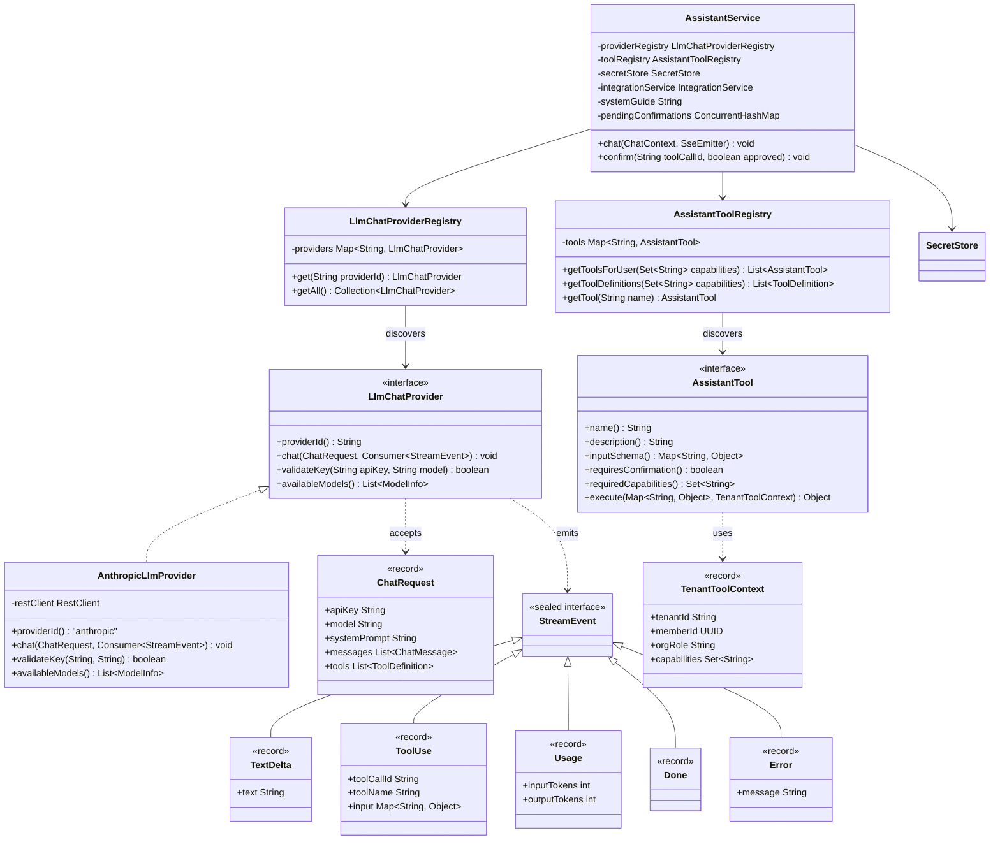
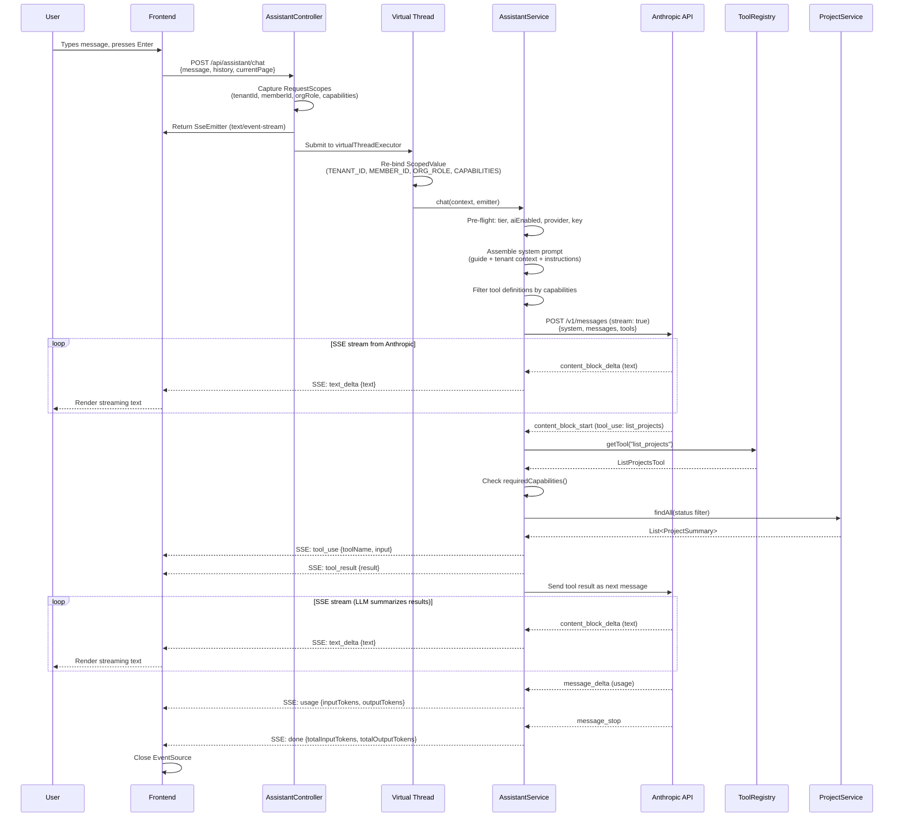
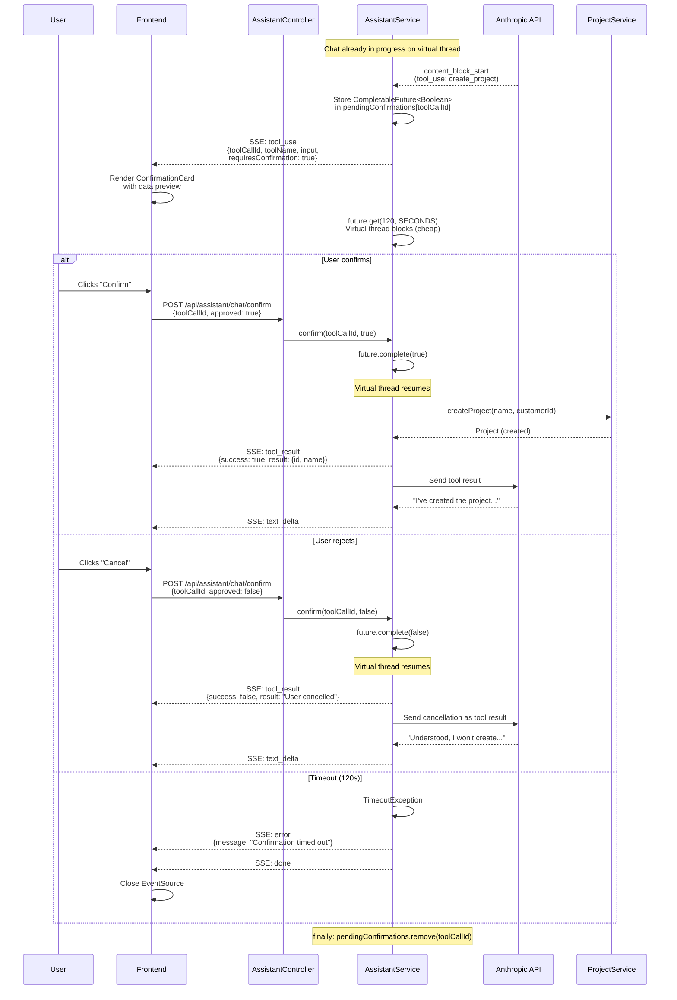

# Phase 52 — In-App AI Assistant (BYOAK)

> Merge into `ARCHITECTURE.md` as **Section 11**. ADR files go in `adr/`.

> **Supersedes**: `architecture/phase45-in-app-ai-assistant.md` (Phase 45 was re-scoped; Phase 52 is the authoritative design). Phase 45's approach stored encrypted keys on `OrgSettings` columns — Phase 52 uses the `SecretStore`/`OrgSecret` infrastructure from Phase 21 instead.

**ADRs**: [ADR-200](../adr/ADR-200-llm-chat-provider-interface.md), [ADR-201](../adr/ADR-201-secret-store-reuse-for-ai-keys.md), [ADR-202](../adr/ADR-202-consumer-callback-streaming.md), [ADR-203](../adr/ADR-203-completable-future-confirmation.md), [ADR-204](../adr/ADR-204-virtual-thread-scoped-value-rebinding.md)

**Migration**: None. No new database tables or columns. Chat sessions are ephemeral (frontend state only). API key storage uses existing `org_secrets` table (V36). Provider config uses existing `org_integrations` table (V36). The `OrgSettings.aiEnabled` flag already exists (V36).

---

## 11. Phase 52 — In-App AI Assistant (BYOAK)

DocTeams has 51 phases of functionality — time tracking, invoicing, proposals, document templates, automations, rate cards, budgets, compliance checklists, and more — spread across 75+ pages in 6 navigation zones with 24+ settings areas. The command palette (Phase 44) helps power users who already know what they want. But for the bookkeeper who doesn't know the platform has profitability reports, or the junior associate who can't find the billing run page, there's no discovery mechanism. The depth of the product is invisible to the people who would benefit most.

Phase 52 adds a conversational AI assistant that acts as a system expert. It knows what DocTeams can do, can query tenant data, and can perform reversible actions on behalf of the user — all with explicit confirmation. The assistant follows a **Bring Your Own API Key (BYOAK)** model where each tenant provides their own Anthropic API key, gated behind the PRO tier. Sessions are ephemeral: frontend state only, no server-side persistence. The architecture introduces no new database entities — it builds entirely on the integration infrastructure from Phase 21 (`SecretStore`, `OrgIntegration`, `IntegrationRegistry`) and the capability-based RBAC from Phase 46.

The backend defines a `LlmChatProvider` interface for streaming chat with tool use, distinct from the existing `AiProvider` (which handles one-shot text operations like summarization). Only the Anthropic Claude adapter is implemented in v1. The frontend adds a slide-out chat panel accessible from any page, with streaming text responses, inline tool execution cards, and a confirmation flow for write actions.

### What's New

| Area | Existing Infrastructure | New in Phase 52 |
|------|------------------------|-----------------|
| AI integration port | `AiProvider` interface for one-shot text (`generateText`, `summarize`, `suggestCategories`). `NoOpAiProvider` default. `OrgSettings.aiEnabled` toggle. | `LlmChatProvider` interface for multi-turn streaming chat with tool use. `AnthropicLlmProvider` adapter. Coexists with `AiProvider` — separate concerns ([ADR-200](../adr/ADR-200-llm-chat-provider-interface.md)). |
| Key storage | `SecretStore` / `OrgSecret` / `EncryptedDatabaseSecretStore` with AES-256-GCM encryption. `OrgIntegration` tracks provider slug + key suffix. | Reuses existing infrastructure unchanged. AI key stored as `OrgSecret` with key `"ai:anthropic:api_key"`. Model selection stored in `OrgIntegration.configJson`. |
| Tool framework | — | `AssistantTool` interface, `AssistantToolRegistry` auto-discovery, 14 read tools + 8 write tools. Tools delegate to existing domain services. |
| Chat orchestration | — | `AssistantService` with system prompt assembly, multi-turn tool execution, write confirmation flow via `CompletableFuture`. |
| SSE streaming | — | `AssistantController` with `SseEmitter`, virtual thread executor, `ScopedValue` re-binding. |
| Frontend chat UI | — | `AssistantPanel` (Sheet), `AssistantTrigger` (floating button), `useAssistantChat` hook, message components, SSE parser. |
| Plan gating | `Tier` enum (STARTER, PRO). `PlanSyncService`. | PRO tier check added to `AssistantService`. STARTER tenants see upgrade prompt. |

### Key Constraints

- **BYOAK only** — no platform-managed key, no cost subsidization
- **Ephemeral sessions** — no server-side chat history; refresh clears conversation
- **Reversible actions only** — create/update, never delete/send/email/archive
- **Confirmation before every write** — SSE stream pauses, user confirms or rejects
- **Server-side LLM calls** — API key never reaches the frontend
- **SseEmitter streaming** — no WebFlux dependency; Spring MVC with virtual threads
- **Cross-vertical** — same tool set regardless of vertical profile; tools return empty results for unused entities
- **PRO tier only** — gated by plan tier on top of `OrgSettings.aiEnabled` toggle

**Out of scope**: server-side chat history, multiple LLM providers beyond Anthropic, platform-managed API key, document drafting in Tiptap editor, delete/destructive tool actions, external-facing actions (emails, portal notifications), advanced tool coverage (expenses, retainers, proposals, recurring schedules, automations, deadlines, resource allocations), page-aware context injection (assistant receives current path but must use tools to look up data), per-tenant rate limiting, streaming audio/voice.

---

### 11.1 Overview

Phase 52 establishes the AI assistant infrastructure without introducing any new database entities. The design is deliberately thin: the assistant is a coordination layer that connects an LLM to existing domain services through a standardized tool interface. Every tool is a Spring `@Component` that delegates to an existing `@Service` — no business logic lives in the tool layer.

The core abstractions:

1. **LlmChatProvider** — Provider-agnostic interface for streaming multi-turn chat with tool use. Separate from `AiProvider` because the concerns are fundamentally different: one-shot text generation vs. conversational streaming with tool invocation ([ADR-200](../adr/ADR-200-llm-chat-provider-interface.md)).
2. **AssistantTool** — Interface for tools the LLM can invoke. Each tool declares its name, JSON schema, confirmation requirement, and capability prerequisites. The registry auto-discovers all `@Component` implementations.
3. **AssistantService** — Orchestration layer that assembles system prompts, routes LLM events, executes tools, and manages the confirmation flow for write operations.
4. **System Guide** — A static markdown file (~3-5K tokens) loaded from classpath at startup, describing DocTeams' navigation, features, and common workflows. Updated by developers as part of each phase.

All monetary operations, permission checks, and tenant isolation are handled by the existing service layer. The assistant cannot bypass any authorization boundary — it inherits the authenticated user's capabilities and tenant scope.

---

### 11.2 Domain Model

#### 11.2.1 Existing Entities Leveraged

No new `@Entity` classes are introduced. Phase 52 builds on three existing entities from the Phase 21 integration infrastructure:

| Entity | Package | Role in Phase 52 |
|--------|---------|-------------------|
| `OrgIntegration` | `integration/` | Stores provider slug (`"anthropic"`), enabled state, model selection in `configJson` (`{"model": "claude-sonnet-4-6"}`), and key suffix (last 6 chars for display). One row per integration domain per tenant — the `AI` domain row already exists with `providerSlug = "noop"`. |
| `OrgSecret` | `integration/secret/` | Stores AES-256-GCM encrypted API key with secret key `"ai:anthropic:api_key"` (following the `"{domain}:{slug}:api_key"` convention). Tenant-scoped by schema isolation. |
| `OrgSettings` | `settings/` | `aiEnabled` boolean flag (added in V36) controls the per-org feature toggle. No new columns needed. |

The `IntegrationRegistry` resolves the configured adapter per tenant, the `IntegrationGuardService` enforces the `aiEnabled` flag, and the `IntegrationService` orchestrates key storage and connection testing. All of this exists and is reused unchanged.

#### 11.2.2 New Classes (Non-Entity)

The `assistant/` package introduces new classes that are not JPA entities — they are service components, interfaces, and records:



#### 11.2.3 The "Thin Tool" Pattern

Every `AssistantTool` implementation follows the same pattern: it is a thin delegation layer of 20-40 lines that calls an existing `@Service` method, formats the result for the LLM, and returns. No business logic, no validation, no authorization beyond the tool registry's capability filter — all of that lives in the service layer.

```
LLM → AssistantTool.execute(input, context) → ExistingService.method(args) → formatted result → LLM
```

This means adding a new tool requires:
1. One `@Component` class implementing `AssistantTool`
2. One constructor injection of an existing service
3. The registry auto-discovers it at startup

No changes to the `AssistantService`, `AssistantController`, or frontend are needed to add a new read tool.

---

### 11.3 Core Flows and Backend Behaviour

#### 11.3.1 Chat Flow

The primary chat flow handles a user message through to streamed LLM response, including inline tool execution for read tools:

1. **Frontend** sends `POST /api/assistant/chat` with message content, conversation history, and current page path.
2. **`AssistantController`** captures `RequestScopes` values (tenant ID, member ID, org role, capabilities) from the request thread.
3. Controller creates an `SseEmitter` (300s timeout) and submits the chat task to a virtual thread executor (`Executors.newVirtualThreadPerTaskExecutor()`).
4. **Virtual thread** re-binds `ScopedValue` via `ScopedValue.where(TENANT_ID, tenantId).where(MEMBER_ID, memberId)...run(...)` — this is critical because `ScopedValue` bindings do not propagate to child threads ([ADR-204](../adr/ADR-204-virtual-thread-scoped-value-rebinding.md)).
5. **`AssistantService.chat()`** performs pre-flight checks:
   - PRO tier verification via `PlanSyncService`
   - AI enabled check via `IntegrationGuardService.requireEnabled(AI)`
   - Provider configured (not `"noop"`)
   - Key exists via `secretStore.exists("ai:anthropic:api_key")`
6. Service retrieves the API key from `SecretStore`, assembles the system prompt (static guide + tenant context + behavioral instructions), and filters tool definitions by user capabilities.
7. Service calls `provider.chat(request, eventConsumer)` — the `chat()` method blocks the virtual thread and pushes `StreamEvent` instances to the consumer.
8. The consumer routes each event:
   - `TextDelta` → emit as `text_delta` SSE event
   - `ToolUse` (read tool) → execute tool immediately, emit `tool_use` + `tool_result`, feed result back to LLM for next turn
   - `ToolUse` (write tool) → enter confirmation flow (see 11.3.3)
   - `Usage` → accumulate token counts
   - `Done` → emit aggregated usage, complete emitter
   - `Error` → emit error event, complete emitter

#### 11.3.2 Read Tool Execution

When the LLM requests a read tool (e.g., `list_projects`), execution is inline — no user interaction required:

1. `AssistantToolRegistry.getTool(toolName)` returns the tool.
2. The tool's `requiredCapabilities()` are checked against the user's bound capabilities. If the user lacks a required capability, the tool result contains an access-denied message (not an exception — the LLM needs to communicate this naturally).
3. `tool.execute(input, tenantToolContext)` delegates to the appropriate service (e.g., `ProjectService.findAll()`).
4. The result is formatted as a JSON-serializable object and sent back to the LLM as a tool result.
5. The LLM processes the tool result and generates a natural-language response incorporating the data.

#### 11.3.3 Write Tool Confirmation Flow

Write tools pause the SSE stream and require explicit user confirmation before execution. This flow uses `CompletableFuture` to block the virtual thread — cheap with Java 25 virtual threads, and appropriate because chat sessions are ephemeral ([ADR-203](../adr/ADR-203-completable-future-confirmation.md)):

1. LLM requests a write tool (e.g., `create_project`).
2. `AssistantService` creates a `CompletableFuture<Boolean>` and stores it in a `ConcurrentHashMap<String, CompletableFuture<Boolean>>` keyed by `toolCallId`.
3. An SSE event is emitted: `tool_use` with `requiresConfirmation: true` and a preview of the data to be created/changed.
4. The virtual thread blocks: `future.get(120, TimeUnit.SECONDS)`.
5. **Frontend** displays a `ConfirmationCard` with the data preview and Confirm/Cancel buttons.
6. User clicks Confirm → `POST /api/assistant/chat/confirm` with `{ toolCallId, approved: true }`.
7. `AssistantService.confirm()` completes the future: `future.complete(true)`.
8. The blocked virtual thread resumes, executes the tool, emits `tool_result`, and feeds the result back to the LLM.
9. If the user clicks Cancel → `future.complete(false)` → tool result is `"User cancelled this action"` → LLM acknowledges.
10. If timeout (120s) → `TimeoutException` → error event emitted, emitter completed.
11. The future is always removed from the map in a `finally` block.

#### 11.3.4 Key Management Flow

API key configuration uses the existing integration settings infrastructure:

1. User navigates to Settings → Integrations → AI Assistant card.
2. User selects provider "Anthropic" → `IntegrationService.upsertIntegration(AI, "anthropic", configJson)`.
3. User enters API key → `IntegrationService.setApiKey(AI, apiKey)` → `SecretStore.store("ai:anthropic:api_key", plaintext)` → `OrgIntegration.setKeySuffix(last6chars)`.
4. User selects model from dropdown → stored in `OrgIntegration.configJson` as `{"model": "claude-sonnet-4-6"}`.
5. User clicks "Test Connection" → `LlmChatProvider.validateKey(apiKey, model)` sends a minimal 1-token completion to the Anthropic API.
6. User toggles enabled → `IntegrationService.toggleIntegration(AI, true)` → `OrgSettings.aiEnabled = true`.

#### 11.3.5 System Prompt Assembly

The system prompt is assembled per-request from three components:

1. **Static system guide** (`classpath:assistant/system-guide.md`, ~3-5K tokens) — loaded once at startup, cached in a `String` field. Describes DocTeams' navigation structure, page descriptions, common workflows, and terminology mappings.
2. **Tenant context** (dynamic) — org name, user name, user role, current page path, plan tier, vertical profile, and a summary of enabled modules. Assembled from `RequestScopes` and `OrgSettings`.
3. **Behavioral instructions** (static) — rules like "You are the DocTeams assistant", "Always use tools to look up data rather than guessing", "For write actions, clearly describe what will be created/changed before invoking the tool", "Never claim to have performed an action that requires confirmation unless the user confirmed it".

#### 11.3.6 ScopedValue Re-binding in Virtual Threads

`ScopedValue` bindings are per-carrier-thread and do not propagate to child threads. When the `AssistantController` submits work to a virtual thread executor, the ScopedValue bindings from the request thread are lost. The controller must explicitly capture all bound values and re-bind them in the virtual thread:

```java
// Capture in request thread
var tenantId = RequestScopes.requireTenantId();
var memberId = RequestScopes.requireMemberId();
var orgRole = RequestScopes.getOrgRole();
var capabilities = RequestScopes.getCapabilities();

// Re-bind in virtual thread
ScopedValue.where(RequestScopes.TENANT_ID, tenantId)
    .where(RequestScopes.MEMBER_ID, memberId)
    .where(RequestScopes.ORG_ROLE, orgRole)
    .where(RequestScopes.CAPABILITIES, capabilities)
    .run(() -> assistantService.chat(context, emitter));
```

This is essential because tool execution delegates to existing services (e.g., `ProjectService.findAll()`) that read `RequestScopes.TENANT_ID` internally, and Hibernate's `TenantIdentifierResolver` reads `RequestScopes.TENANT_ID` for schema routing. Without re-binding, all tool calls would resolve to the `public` schema. See [ADR-204](../adr/ADR-204-virtual-thread-scoped-value-rebinding.md).

#### 11.3.7 Error Handling

All errors are surfaced as SSE events — the controller never throws during streaming:

| Error Condition | Handling |
|----------------|----------|
| AI not enabled (`OrgSettings.aiEnabled = false`) | Emit `error` event: "AI assistant is not enabled for this organization." |
| STARTER tier | Emit `error` event: "AI assistant requires the PRO plan." |
| No API key configured | Emit `error` event: "No API key configured. Ask your admin to set up the AI integration." |
| Invalid API key (401/403 from Anthropic) | Emit `error` event: "Invalid API key. Please check your Anthropic API key in Settings." |
| Rate limit (429 from Anthropic) | Emit `error` event: "Rate limit exceeded. Please wait a moment and try again." |
| Confirmation timeout (120s) | Emit `error` event: "Confirmation timed out. The action was not performed." |
| Network error / Anthropic 5xx | Emit `error` event: "Unable to reach the AI provider. Please try again." |
| Tool execution failure | Emit `tool_result` with error detail → LLM communicates the failure naturally |

---

### 11.4 API Surface

#### 11.4.1 Endpoints

| Method | Path | Description | Auth | Read/Write |
|--------|------|-------------|------|------------|
| `POST` | `/api/assistant/chat` | Start chat session, returns SSE stream | Member | Write (creates SSE stream) |
| `POST` | `/api/assistant/chat/confirm` | Confirm or reject a pending write action | Member | Write |
| `GET` | `/api/settings/integrations/ai/models` | List available models for configured provider | Admin/Owner | Read |
| `POST` | `/api/settings/integrations/ai/test` | Test API key validity with configured provider | Admin/Owner | Read |

Existing endpoints used without modification:
- `GET /api/integrations` — list all integration configurations
- `PUT /api/integrations/AI` — upsert AI integration config
- `POST /api/integrations/AI/set-key` — store API key
- `DELETE /api/integrations/AI/key` — delete API key
- `PATCH /api/integrations/AI/toggle` — enable/disable

#### 11.4.2 POST /api/assistant/chat

**Request Body:**

```json
{
  "message": "How much unbilled time does Acme Corp have?",
  "history": [
    { "role": "user", "content": "Show me my projects" },
    { "role": "assistant", "content": "Here are your active projects..." }
  ],
  "currentPage": "/org/acme/projects"
}
```

**Response**: `Content-Type: text/event-stream`

SSE event stream with the following event types:

| Event Type | Data Shape | Description |
|-----------|------------|-------------|
| `text_delta` | `{ "text": "Here are the..." }` | Incremental text chunk from the LLM |
| `tool_use` | `{ "toolCallId": "tc_01...", "toolName": "get_unbilled_time", "input": { "customerId": "..." }, "requiresConfirmation": false }` | LLM is invoking a tool. `requiresConfirmation: true` for write tools. |
| `tool_result` | `{ "toolCallId": "tc_01...", "toolName": "get_unbilled_time", "result": { ... }, "success": true }` | Tool execution result. Displayed as a card in the conversation. |
| `usage` | `{ "inputTokens": 1234, "outputTokens": 567 }` | Token usage for this turn (emitted at end of each LLM response). |
| `done` | `{ "totalInputTokens": 2468, "totalOutputTokens": 1134 }` | Stream complete. Aggregated token usage for the entire session. |
| `error` | `{ "message": "Rate limit exceeded..." }` | Error occurred. Stream ends after this event. |

#### 11.4.3 POST /api/assistant/chat/confirm

**Request Body:**

```json
{
  "toolCallId": "tc_01abc123",
  "approved": true
}
```

**Response:**

```json
{
  "acknowledged": true
}
```

Returns `404` if the `toolCallId` is not found (expired or already processed). Returns `200` on successful acknowledgment — the actual tool execution result is delivered via the SSE stream.

#### 11.4.4 GET /api/settings/integrations/ai/models

**Response:**

```json
{
  "models": [
    { "id": "claude-sonnet-4-6", "name": "Claude Sonnet 4.6", "recommended": true },
    { "id": "claude-opus-4-6", "name": "Claude Opus 4.6", "recommended": false },
    { "id": "claude-haiku-4-5", "name": "Claude Haiku 4.5", "recommended": false }
  ]
}
```

#### 11.4.5 POST /api/settings/integrations/ai/test

Uses the existing `IntegrationService.testConnection(AI)` flow. The `testConnection` switch in `IntegrationService` must be extended to route the `AI` domain to `LlmChatProvider.validateKey()` instead of `AiProvider.testConnection()`. This requires updating the switch to resolve `LlmChatProvider.class` when the configured slug is `"anthropic"` (or any non-`"noop"` chat-capable provider), falling back to `AiProvider.class` for the `"noop"` slug.

**Response** (existing `ConnectionTestResult` shape):

```json
{
  "success": true,
  "providerName": "anthropic",
  "errorMessage": null
}
```

---

### 11.5 Sequence Diagrams

#### 11.5.1 Full Chat Flow with Read Tool



#### 11.5.2 Write Tool Confirmation Flow



---

### 11.6 LLM Provider Abstraction

#### 11.6.1 LlmChatProvider Interface

The `LlmChatProvider` interface is intentionally separate from the existing `AiProvider` interface. `AiProvider` handles one-shot text operations (`generateText`, `summarize`, `suggestCategories`) — synchronous, single-turn, no streaming, no tools. `LlmChatProvider` handles multi-turn conversational chat with streaming responses and tool use. They serve fundamentally different purposes, require different implementations, and will often use different models (Haiku for summarization, Sonnet for conversation). Merging them would create a God interface with incompatible method signatures. See [ADR-200](../adr/ADR-200-llm-chat-provider-interface.md).

```java
// Package: io.b2mash.b2b.b2bstrawman.assistant.provider

public interface LlmChatProvider {

    /** Provider identifier (e.g., "anthropic"). Used for registry lookup. */
    String providerId();

    /**
     * Streams a multi-turn chat completion. Blocks the calling thread and pushes
     * StreamEvent instances to the consumer as they arrive from the LLM API.
     * The consumer writes each event to an SseEmitter.
     *
     * Uses Consumer<StreamEvent> instead of Flux<StreamEvent> to avoid a WebFlux
     * dependency. See ADR-202.
     */
    void chat(ChatRequest request, Consumer<StreamEvent> eventConsumer);

    /** Validates an API key by sending a minimal 1-token completion. */
    boolean validateKey(String apiKey, String model);

    /** Returns the list of models supported by this provider. */
    List<ModelInfo> availableModels();
}
```

#### 11.6.2 ChatRequest and StreamEvent

`ChatRequest` is a record carrying all inputs for a single LLM invocation:

```java
public record ChatRequest(
    String apiKey,
    String model,
    String systemPrompt,
    List<ChatMessage> messages,
    List<ToolDefinition> tools
) {}

public record ChatMessage(String role, String content, List<ToolResult> toolResults) {}
public record ToolDefinition(String name, String description, Map<String, Object> inputSchema) {}
public record ToolResult(String toolCallId, String content) {}
// Note: toolCallId maps to Anthropic's "tool_use_id" field. AnthropicLlmProvider
// must translate when building the API request body (camelCase → snake_case).
public record ModelInfo(String id, String name, boolean recommended) {}
```

`StreamEvent` is a sealed interface with five permitted implementations:

```java
public sealed interface StreamEvent
    permits StreamEvent.TextDelta, StreamEvent.ToolUse,
            StreamEvent.Usage, StreamEvent.Done, StreamEvent.Error {

    record TextDelta(String text) implements StreamEvent {}
    record ToolUse(String toolCallId, String toolName, Map<String, Object> input) implements StreamEvent {}
    record Usage(int inputTokens, int outputTokens) implements StreamEvent {}
    record Done() implements StreamEvent {}
    record Error(String message) implements StreamEvent {}
}
```

The `Consumer<StreamEvent>` callback pattern was chosen over reactive `Flux<StreamEvent>` to avoid adding a WebFlux dependency to a Spring MVC application. The callback pattern maps directly to `SseEmitter.send()` and keeps the `LlmChatProvider` interface framework-agnostic — a provider implementation could be used in a non-Spring context. See [ADR-202](../adr/ADR-202-consumer-callback-streaming.md).

#### 11.6.3 AnthropicLlmProvider

The Anthropic adapter implements `LlmChatProvider` for the Messages API (`POST /v1/messages` with `stream: true`):

- Uses Spring's `RestClient` with manual SSE parsing — no Anthropic SDK dependency. The SSE format is simple enough that a purpose-built parser is lighter and more maintainable than a third-party SDK.
- **SSE event mapping**: `content_block_delta` → `TextDelta`, `content_block_start` (type = `tool_use`) → `ToolUse`, `message_delta` → `Usage`, `message_stop` → `Done`.
- **Error mapping**: HTTP 401/403 → `Error("Invalid API key")`, HTTP 429 → `Error("Rate limit exceeded")`, HTTP 5xx → `Error("Provider unavailable")`, connection timeout → `Error("Unable to reach provider")`.
- **`validateKey()`**: Sends a minimal request (1 max token, `"Hi"` message) and checks for HTTP 200 vs. 401/403. Does not consume meaningful tokens.
- **`availableModels()`**: Returns a static list — Anthropic has no list-models API. Models: `claude-sonnet-4-6` (recommended), `claude-opus-4-6`, `claude-haiku-4-5`.
- Annotated with `@Component` and `@IntegrationAdapter(domain = IntegrationDomain.AI, slug = "anthropic")`. The `@IntegrationAdapter` annotation is present for consistency with the integration pattern (it registers the bean in `IntegrationRegistry` for discoverability), but the chat path resolves providers via `LlmChatProviderRegistry.get(providerId)`, not via `IntegrationRegistry`. The annotation is used by `IntegrationService.testConnection()` delegation — see Section 11.6.5.

#### 11.6.4 Provider Registry

`LlmChatProviderRegistry` is a `@Component` that auto-discovers all `LlmChatProvider` beans at startup (injected as `List<LlmChatProvider>`), builds a `Map<String, LlmChatProvider>` keyed by `providerId()`, and provides a `get(providerId)` lookup. It fails fast on duplicate provider IDs.

This registry is separate from `IntegrationRegistry` because it serves a different purpose: `IntegrationRegistry` resolves per-tenant adapter configuration, while `LlmChatProviderRegistry` provides provider-level metadata (available models, validation) independent of any tenant. The `AssistantService` uses both: `LlmChatProviderRegistry` for provider capabilities, `IntegrationRegistry` for tenant-specific configuration.

#### 11.6.5 Coexistence with AiProvider

The existing `AiProvider` interface and `NoOpAiProvider` adapter are unchanged. They continue to serve one-shot text operations. Future phases may implement a real `AiProvider` adapter (e.g., for document summarization) that uses the same API key as the chat provider. The key is shared because it is stored per-domain (`IntegrationDomain.AI`) in the `SecretStore`, not per-interface.

The `IntegrationService.testConnection()` switch needs a minor update: when the `AI` domain's configured slug is `"anthropic"` (or any chat-capable provider), it should delegate to `LlmChatProvider.validateKey()` rather than `AiProvider.testConnection()`. For the `"noop"` slug, the existing `NoOpAiProvider.testConnection()` continues to work.

---

### 11.7 Tool Framework

#### 11.7.1 AssistantTool Interface

```java
// Package: io.b2mash.b2b.b2bstrawman.assistant.tool

public interface AssistantTool {

    /** Tool name as exposed to the LLM (e.g., "list_projects"). Snake_case. */
    String name();

    /** Human-readable description for the LLM's tool selection. */
    String description();

    /** JSON Schema describing the tool's input parameters. */
    Map<String, Object> inputSchema();

    /** Whether this tool requires user confirmation before execution (true for writes). */
    boolean requiresConfirmation();

    /** Capabilities required to use this tool. Empty set means accessible to all roles. */
    Set<String> requiredCapabilities();

    /** Execute the tool with the given input and tenant context. Returns a result object. */
    Object execute(Map<String, Object> input, TenantToolContext context);
}
```

#### 11.7.2 AssistantToolRegistry

`AssistantToolRegistry` is a `@Component` that auto-discovers all `AssistantTool` beans at startup. It provides three methods:

- **`getToolsForUser(Set<String> capabilities)`** — returns tools where `requiredCapabilities()` is empty or is a subset of the user's capabilities. Uses the same capability-matching logic as `CapabilityAuthorizationService` to ensure consistency.
- **`getToolDefinitions(Set<String> capabilities)`** — returns `List<ToolDefinition>` formatted for inclusion in the `ChatRequest`. Only includes tools the user can access.
- **`getTool(String name)`** — lookup by name. Throws `IllegalArgumentException` if the tool doesn't exist (this would indicate an LLM hallucination, which the `AssistantService` handles gracefully by sending an error tool result back to the LLM).

#### 11.7.3 Read Tools

All read tools return `requiresConfirmation() = false` and execute inline during streaming.

| Tool Name | Service Dependency | Required Capability | Input Parameters | Output |
|-----------|--------------------|---------------------|------------------|--------|
| `get_navigation_help` | System guide (classpath) | — | `feature: String` | Navigation instructions and page descriptions |
| `list_projects` | `ProjectService` | — | Optional: `status: String` | Project summaries (id, name, status, customer) |
| `get_project` | `ProjectService` | — | `projectId: UUID` or `projectName: String` | Full project details |
| `list_customers` | `CustomerService` | — | Optional: `status: String` | Customer summaries (id, name, status, email) |
| `get_customer` | `CustomerService` | — | `customerId: UUID` or `customerName: String` | Full customer details |
| `list_tasks` | `TaskService` | — | `projectId: UUID`, optional: `status: String`, `assigneeId: UUID` | Task list (id, title, status, assignee, priority) |
| `get_my_tasks` | `MyWorkService` | — | — (uses context `memberId`) | User's tasks across all projects |
| `search_entities` | Multiple services | — | `query: String` | Cross-entity search results (projects, customers, tasks) |
| `get_unbilled_time` | `TimeEntryService` | `FINANCIAL_VISIBILITY` | Optional: `customerId: UUID`, `projectId: UUID` | Unbilled hours and amount |
| `get_time_summary` | `TimeEntryService` | — | Optional: `projectId: UUID`, `startDate: String`, `endDate: String` | Hours breakdown (billable, non-billable, by member) |
| `get_project_budget` | `ProjectBudgetService` | `FINANCIAL_VISIBILITY` | `projectId: UUID` | Budget status (hours/monetary used vs. cap, threshold alerts) |
| `get_profitability` | `ReportService` | `FINANCIAL_VISIBILITY` | Optional: `projectId: UUID`, `customerId: UUID` | Profitability summary (revenue, cost, margin) |
| `list_invoices` | `InvoiceService` | `INVOICING` | Optional: `status: String`, `customerId: UUID` | Invoice summaries (id, number, status, amount, customer) |
| `get_invoice` | `InvoiceService` | `INVOICING` | `invoiceId: UUID` or `invoiceNumber: String` | Full invoice details with line items |

#### 11.7.4 Write Tools

All write tools return `requiresConfirmation() = true`. The SSE stream pauses until the user confirms or rejects.

| Tool Name | Service Dependency | Required Capability | Input Parameters | What It Creates/Updates |
|-----------|--------------------|---------------------|------------------|------------------------|
| `create_project` | `ProjectService` | `PROJECT_MANAGEMENT` | `name: String`, optional: `customerId: UUID`, `templateId: UUID` | New project (ACTIVE status) |
| `update_project` | `ProjectService` | `PROJECT_MANAGEMENT` | `projectId: UUID`, optional: `name: String`, `status: String`, `customerId: UUID` | Updated project fields |
| `create_customer` | `CustomerService` | `CUSTOMER_MANAGEMENT` | `name: String`, optional: `email: String`, `phone: String` | New customer (PROSPECT status) |
| `update_customer` | `CustomerService` | `CUSTOMER_MANAGEMENT` | `customerId: UUID`, optional: `name: String`, `email: String`, `phone: String`, `status: String` | Updated customer fields |
| `create_task` | `TaskService` | — | `projectId: UUID`, `title: String`, optional: `description: String`, `assigneeId: UUID` | New task (OPEN status) |
| `update_task` | `TaskService` | — | `taskId: UUID`, optional: `title: String`, `status: String`, `assigneeId: UUID` | Updated task fields |
| `log_time_entry` | `TimeEntryService` | — | `taskId: UUID`, `hours: Number`, `date: String`, optional: `description: String`, `billable: Boolean` | New time entry |
| `create_invoice_draft` | `InvoiceService` | `INVOICING` | `customerId: UUID`, optional: `includeUnbilledTime: Boolean` | Draft invoice with optional unbilled time entries |

**Confirmation card content**: For `create_*` tools, the card shows "Create {entity type}" with all field values. For `update_*` tools, the card shows "Update {entity type}" with only the changed fields (before → after). The `AssistantService` constructs this preview from the tool input — no entity lookup is needed for creates, but updates may need to fetch current values for the diff display.

#### 11.7.5 TenantToolContext

`TenantToolContext` is a record constructed from `RequestScopes` before tool execution:

```java
public record TenantToolContext(
    String tenantId,
    UUID memberId,
    String orgRole,
    Set<String> capabilities
) {
    public static TenantToolContext fromRequestScopes() {
        return new TenantToolContext(
            RequestScopes.requireTenantId(),
            RequestScopes.requireMemberId(),
            RequestScopes.getOrgRole(),
            RequestScopes.getCapabilities()
        );
    }
}
```

Tools receive this context to make authorization decisions or pass member/tenant context to service methods. Most tools don't need it directly — the service methods read from `RequestScopes` themselves — but it is available for tools that need explicit context (e.g., `get_my_tasks` passes `context.memberId()` to `MyWorkService`).

#### 11.7.6 Adding New Tools

Adding a new tool requires one `@Component` class implementing `AssistantTool`. Example structure for a read tool:

```java
@Component
public class ListProjectsTool implements AssistantTool {

    private final ProjectService projectService;

    public ListProjectsTool(ProjectService projectService) {
        this.projectService = projectService;
    }

    @Override public String name() { return "list_projects"; }

    @Override public String description() {
        return "List projects in the organization, optionally filtered by status.";
    }

    @Override public Map<String, Object> inputSchema() {
        return Map.of(
            "type", "object",
            "properties", Map.of(
                "status", Map.of("type", "string", "description", "Filter by status: ACTIVE, COMPLETED, ARCHIVED")
            )
        );
    }

    @Override public boolean requiresConfirmation() { return false; }

    @Override public Set<String> requiredCapabilities() { return Set.of(); }

    @Override public Object execute(Map<String, Object> input, TenantToolContext context) {
        var status = (String) input.get("status");
        var projects = status != null
            ? projectService.findByStatus(status)
            : projectService.findAll();
        return projects.stream()
            .map(p -> Map.of("id", p.getId(), "name", p.getName(), "status", p.getStatus()))
            .toList();
    }
}
```

Each tool is 20-40 lines. The registry auto-discovers it. No other changes needed for read tools. Write tools are identical except `requiresConfirmation()` returns `true`.

#### 11.7.7 System Guide Structure

The system guide is a single markdown file at `backend/src/main/resources/assistant/system-guide.md`. It is loaded once at application startup via `@Value("classpath:assistant/system-guide.md")` and cached in a `String` field on `AssistantService`.

Structure:

```
# DocTeams System Guide

## Navigation
- **Work zone**: My Work (tasks, timesheet), Calendar, Deadlines
- **Delivery zone**: Projects, Documents, Schedules
- **Clients zone**: Customers, Proposals, Information Requests
- **Finance zone**: Invoices, Billing Runs, Profitability, Retainers, Expenses
- **Team & Resources zone**: Team, Resources, Utilization

## Common Workflows
### Creating a new client engagement
1. Navigate to Clients → Customers
2. Click "New Customer", fill in details
3. ...

## Terminology
- "Matter" (legal) = "Project" (in DocTeams)
- "WIP" = unbilled time entries
- ...
```

The guide is updated by developers as new phases add pages or workflows. It is deliberately static — runtime generation would add latency and complexity for minimal benefit at this scale.

---

### 11.8 Frontend Architecture

#### 11.8.1 AssistantProvider Context

`AssistantProvider` is a client-side React context that wraps the org layout. It manages:

- `isOpen: boolean` — whether the chat panel is open
- `isAiEnabled: boolean` — whether the tenant has AI enabled and is PRO tier
- `toggle()` — open/close the panel

The provider reads AI-enabled status from the org settings (already fetched in the layout via `getOrgSettings()`). The `isAiEnabled` flag combines `orgSettings.aiEnabled && orgSettings.tier === "PRO"`.

Integration point: `AssistantProvider` wraps `children` in `app/(app)/org/[slug]/layout.tsx`, inside the existing `CommandPaletteProvider`:

```tsx
<CommandPaletteProvider slug={slug}>
  <AssistantProvider aiEnabled={aiEnabled}>
    <div className="flex min-h-screen">
      {/* ... existing layout ... */}
    </div>
    <AssistantTrigger />
    <AssistantPanel slug={slug} />
  </AssistantProvider>
</CommandPaletteProvider>
```

#### 11.8.2 AssistantPanel

`AssistantPanel` is a `"use client"` component using the Shadcn `Sheet` component, anchored to the right side:

- **Width**: 420px on desktop (`sm:max-w-[420px]`), full-width on mobile
- **Header**: "DocTeams Assistant" title with Sparkles icon, close button, `TokenUsageBadge`
- **Body**: Scrollable message list with auto-scroll to bottom on new content
- **Footer**: `Textarea` for input (auto-resizes), Send button (teal accent), Enter to send / Shift+Enter for newline, disabled while streaming, "Stop" button (replaces Send) during streaming
- **Z-index**: `z-50` — same level as other overlays

The panel uses the `useAssistantChat` hook for all state management and SSE handling.

#### 11.8.3 AssistantTrigger

`AssistantTrigger` is a fixed-position button in the bottom-right corner:

- Position: `fixed bottom-6 right-6 z-50`
- Icon: `Sparkles` from `lucide-react`
- Visibility: hidden when `isAiEnabled = false` or panel is open
- Appearance: `bg-teal-600 hover:bg-teal-700 text-white rounded-full shadow-lg` — pill button matching the accent color
- Click: calls `toggle()` from `AssistantProvider`

#### 11.8.4 Message Components

| Component | Description |
|-----------|-------------|
| `UserMessage` | Right-aligned bubble with slate-100 background, user text |
| `AssistantMessage` | Left-aligned, rendered via `react-markdown` with Tailwind typography classes. Animated cursor (blinking `|`) while streaming. |
| `ToolUseCard` | Compact card: `"Looking up {toolName}..."` with a loading spinner during execution, then `"Looked up {toolName}"` with expand/collapse for raw result data |
| `ConfirmationCard` | Prominent card with teal left border. Shows data preview (key-value pairs). Two buttons: "Confirm" (`bg-teal-600`) and "Cancel" (`variant="ghost"`). Buttons disabled while pending. |
| `ToolResultCard` | Success: green-tinted card with checkmark and entity link ("View project"). Cancelled: muted card with "Cancelled" label. |
| `ErrorCard` | Red/destructive-tinted card with error message |
| `TokenUsageBadge` | Small badge in panel header: `"~1.2K tokens"`. Tooltip shows breakdown: input/output tokens. Updates after each LLM response. |
| `EmptyState` | Shown when no messages. Admin/Owner: "AI not configured — Set up in Settings" with link to integrations page. Member: "AI assistant is not available. Ask your admin to enable it." |

#### 11.8.5 useAssistantChat Hook

Custom hook encapsulating all SSE connection management and conversation state:

**State:**
- `messages: ChatMessage[]` — full conversation history (user + assistant messages, tool cards)
- `isStreaming: boolean` — whether an SSE connection is active
- `tokenUsage: { input: number, output: number }` — accumulated token usage
- `pendingConfirmations: Map<string, ToolUseData>` — tool calls awaiting user confirmation

**Methods:**
- `sendMessage(content: string, currentPage: string)` — adds user message to state, POSTs to `/api/assistant/chat` with full history, reads SSE stream via `fetch()` + `ReadableStream` + `getReader()`, dispatches events to state reducers
- `confirmToolCall(toolCallId: string, approved: boolean)` — POSTs to `/api/assistant/chat/confirm`, removes from `pendingConfirmations`
- `stopStreaming()` — aborts the active fetch via `AbortController`, sets `isStreaming = false`
- `clearChat()` — resets all state (new session)

**SSE consumption pattern:**

```typescript
const response = await fetch("/api/assistant/chat", { method: "POST", body, signal });
const reader = response.body!.getReader();
const decoder = new TextDecoder();
let buffer = "";

while (true) {
  const { done, value } = await reader.read();
  if (done) break;
  buffer += decoder.decode(value, { stream: true });
  const events = parseSseEvents(buffer);
  buffer = events.remainder;
  for (const event of events.parsed) {
    // dispatch based on event.type: text_delta, tool_use, tool_result, usage, done, error
  }
}
```

#### 11.8.6 SSE Parser Utility

`parseSseEvents(buffer: string)` — splits SSE text by double newline (`\n\n`), extracts `event:` and `data:` fields, JSON-parses data payloads. Returns `{ parsed: SseEvent[], remainder: string }` where `remainder` is any incomplete event at the end of the buffer (carried over to the next chunk).

```typescript
interface SseEvent {
  type: string;    // from "event:" line
  data: unknown;   // JSON-parsed from "data:" line
}

function parseSseEvents(buffer: string): { parsed: SseEvent[]; remainder: string } {
  // Split on double newline, parse each complete event, carry over incomplete tail
}
```

#### 11.8.7 Layout Integration Points

The assistant UI integrates at one point in the frontend:

- **`app/(app)/org/[slug]/layout.tsx`** — add `AssistantProvider`, `AssistantTrigger`, and `AssistantPanel` around the existing layout content. The provider needs `aiEnabled` derived from the already-fetched `settingsResult`.

No sidebar navigation item is added for the assistant — it is always accessible via the floating trigger button. This keeps the assistant contextual (available from any page) rather than a destination.

---

### 11.9 Implementation Guidance

#### 11.9.1 Backend Package Structure

All new backend code lives under `io.b2mash.b2b.b2bstrawman.assistant`:

```
assistant/
├── AssistantController.java          — SSE endpoint + confirm endpoint
├── AssistantService.java             — Chat orchestration, system prompt, confirmation flow
├── ChatContext.java                  — Record: message, history, currentPage, captured scopes
├── provider/
│   ├── LlmChatProvider.java         — Provider interface
│   ├── LlmChatProviderRegistry.java — Auto-discovery registry
│   ├── ChatRequest.java             — Request record
│   ├── StreamEvent.java             — Sealed interface + 5 records
│   ├── ChatMessage.java             — Message record (role, content, toolResults)
│   ├── ToolDefinition.java          — LLM tool definition record
│   ├── ModelInfo.java               — Model metadata record
│   └── anthropic/
│       └── AnthropicLlmProvider.java — Anthropic Messages API adapter
├── tool/
│   ├── AssistantTool.java            — Tool interface
│   ├── AssistantToolRegistry.java    — Auto-discovery registry
│   ├── TenantToolContext.java        — Request scope snapshot record
│   ├── read/
│   │   ├── GetNavigationHelpTool.java
│   │   ├── ListProjectsTool.java
│   │   ├── GetProjectTool.java
│   │   ├── ListCustomersTool.java
│   │   ├── GetCustomerTool.java
│   │   ├── ListTasksTool.java
│   │   ├── GetMyTasksTool.java
│   │   ├── SearchEntitiesTool.java
│   │   ├── GetUnbilledTimeTool.java
│   │   ├── GetTimeSummaryTool.java
│   │   ├── GetProjectBudgetTool.java
│   │   ├── GetProfitabilityTool.java
│   │   ├── ListInvoicesTool.java
│   │   └── GetInvoiceTool.java
│   └── write/
│       ├── CreateProjectTool.java
│       ├── UpdateProjectTool.java
│       ├── CreateCustomerTool.java
│       ├── UpdateCustomerTool.java
│       ├── CreateTaskTool.java
│       ├── UpdateTaskTool.java
│       ├── LogTimeEntryTool.java
│       └── CreateInvoiceDraftTool.java
└── guide/
    └── (empty — system-guide.md lives in src/main/resources/assistant/)
```

#### 11.9.2 Backend Changes to Existing Code

| File | Change |
|------|--------|
| `integration/IntegrationService.java` | Update `testConnection()` switch for `AI` domain: when slug is not `"noop"`, resolve `LlmChatProvider` via `LlmChatProviderRegistry` and call `validateKey()`. |
| `integration/IntegrationController.java` | Add `GET /api/settings/integrations/ai/models` endpoint that delegates to `LlmChatProviderRegistry`. |
| `src/main/resources/assistant/system-guide.md` | New file: static system guide (~3-5K tokens). |

No changes to `OrgSettings`, `OrgIntegration`, `OrgSecret`, `SecretStore`, `IntegrationRegistry`, `IntegrationGuardService`, or any domain service.

#### 11.9.3 Frontend File Structure

New files under `frontend/`:

```
components/assistant/
├── assistant-provider.tsx       — AssistantProvider context ("use client")
├── assistant-panel.tsx          — Sheet-based chat panel ("use client")
├── assistant-trigger.tsx        — Floating button ("use client")
├── user-message.tsx             — User message bubble
├── assistant-message.tsx        — Markdown-rendered assistant message
├── tool-use-card.tsx            — Tool invocation card (read tools)
├── confirmation-card.tsx        — Write action confirmation card
├── tool-result-card.tsx         — Tool execution result card
├── error-card.tsx               — Error display card
├── token-usage-badge.tsx        — Token counter badge
└── empty-state.tsx              — AI not configured state

hooks/
└── use-assistant-chat.ts        — SSE connection + conversation state hook

lib/
└── sse-parser.ts                — SSE text parser utility
```

#### 11.9.4 Frontend Changes to Existing Code

| File | Change |
|------|--------|
| `app/(app)/org/[slug]/layout.tsx` | Wrap content with `AssistantProvider`, add `AssistantTrigger` and `AssistantPanel`. Derive `aiEnabled` from existing `settingsResult`. |
| `components/integrations/IntegrationCard.tsx` | Add model selector dropdown for AI domain. Add PRO badge when domain is AI. Show upgrade prompt for STARTER tier. |
| `app/(app)/org/[slug]/settings/integrations/actions.ts` | Add `fetchAiModels` server action that calls `GET /api/settings/integrations/ai/models`. |
| `lib/api/integrations.ts` | Add `getAiModels()` API client function. |
| `lib/types/settings.ts` | Add `ModelInfo` type: `{ id: string; name: string; recommended: boolean }`. |

#### 11.9.5 Testing Strategy

**Backend Tests:**

| Test Class | Scope | What It Verifies |
|-----------|-------|-----------------|
| `LlmChatProviderRegistryTest` | Unit | Registry discovers providers by `providerId()`, lookup works, unknown ID throws |
| `AnthropicLlmProviderTest` | Unit (WireMock) | SSE parsing: `content_block_delta` → `TextDelta` |
| `AnthropicLlmProviderTest` | Unit (WireMock) | SSE parsing: `content_block_start` (tool_use) → `ToolUse` |
| `AnthropicLlmProviderTest` | Unit (WireMock) | SSE parsing: `message_delta` → `Usage`, `message_stop` → `Done` |
| `AnthropicLlmProviderTest` | Unit (WireMock) | `validateKey()` returns true on 200, false on 401 |
| `AnthropicLlmProviderTest` | Unit (WireMock) | Rate limit (429) emits `Error` event |
| `AssistantToolRegistryTest` | Unit | Discovers tools, filters by capability, returns correct tool definitions |
| `ReadToolsBatchTest` | Integration | Each read tool delegates to correct service and returns formatted results |
| `ReadToolsBatchTest` | Integration | Financial tools require `FINANCIAL_VISIBILITY` capability |
| `ReadToolsBatchTest` | Integration | Invoice tools require `INVOICING` capability |
| `WriteToolsBatchTest` | Integration | Each write tool creates/updates entity after confirmation |
| `AssistantServiceTest` | Integration | System prompt includes guide + tenant context + behavioral instructions |
| `AssistantServiceTest` | Integration | Read tool executed inline (no confirmation flow) |
| `AssistantServiceTest` | Integration | Token usage accumulated across multi-turn conversation |
| `AssistantServiceTest` | Integration | Error emitted when AI not enabled |
| `AssistantServiceTest` | Integration | Error emitted when STARTER tier |
| `AssistantControllerTest` | Integration | `POST /chat` returns `text/event-stream` content type |
| `AssistantControllerTest` | Integration | SSE events contain expected event types |
| `AssistantControllerTest` | Integration | Unauthenticated request returns 401 |
| `ConfirmationFlowTest` | Integration | Approved confirmation executes tool and emits result |
| `ConfirmationFlowTest` | Integration | Rejected confirmation sends cancellation to LLM |
| `ConfirmationFlowTest` | Integration | Timeout emits error event |
| `ConfirmationFlowTest` | Integration | Confirm after timeout returns 404 |

WireMock is used for all `AnthropicLlmProvider` tests — no real Anthropic API calls in CI. The WireMock server stubs `POST /v1/messages` and returns pre-recorded SSE responses.

**Frontend Tests:**

| Test | What It Verifies |
|------|-----------------|
| AssistantPanel: opens on trigger click | Trigger button toggles panel open |
| AssistantPanel: closes on close button | Close button in panel header closes panel |
| AssistantPanel: input disabled while streaming | Send button and textarea disabled during active stream |
| AssistantTrigger: hidden when AI disabled | Trigger not rendered when `isAiEnabled = false` |
| AssistantTrigger: hidden for STARTER tier | Trigger not rendered for STARTER plan |
| AssistantMessage: renders markdown | `react-markdown` renders headings, lists, code blocks |
| ToolUseCard: expand/collapse | Click toggles raw data visibility |
| ConfirmationCard: confirm | Confirm button calls `confirmToolCall(id, true)` |
| ConfirmationCard: cancel | Cancel button calls `confirmToolCall(id, false)` |
| ConfirmationCard: buttons disabled while pending | Buttons show loading state after click |
| TokenUsageBadge: formats tokens | Displays "~1.2K tokens" for 1234 tokens |
| EmptyState: admin sees settings link | Admin role shows "Set up in Settings" link |
| EmptyState: member sees ask-admin | Member role shows "Ask your admin" text |
| useAssistantChat: sendMessage | Adds user message to state, sets `isStreaming = true` |
| useAssistantChat: stopStreaming | Aborts fetch, sets `isStreaming = false` |
| SSE parser: complete events | Parses well-formed SSE events correctly |
| SSE parser: partial chunks | Carries over incomplete events to next chunk |

---

### 11.10 Permission Model Summary

#### 11.10.1 No New Capabilities

Phase 52 introduces no new entries to the `Capability` enum. The assistant inherits the authenticated user's existing capabilities. Tools declare which capabilities they require, and the `AssistantToolRegistry` filters them before sending tool definitions to the LLM. A user with no `FINANCIAL_VISIBILITY` capability will never see `get_unbilled_time`, `get_project_budget`, or `get_profitability` tools — the LLM won't even know they exist.

#### 11.10.2 Tool-Level Capability Requirements

| Tool | Required Capabilities | Access Level |
|------|-----------------------|-------------|
| `get_navigation_help` | — | All roles |
| `list_projects` | — | All roles |
| `get_project` | — | All roles |
| `list_customers` | — | All roles |
| `get_customer` | — | All roles |
| `list_tasks` | — | All roles |
| `get_my_tasks` | — | All roles |
| `search_entities` | — | All roles |
| `get_unbilled_time` | `FINANCIAL_VISIBILITY` | Admin, Owner |
| `get_time_summary` | — | All roles |
| `get_project_budget` | `FINANCIAL_VISIBILITY` | Admin, Owner |
| `get_profitability` | `FINANCIAL_VISIBILITY` | Admin, Owner |
| `list_invoices` | `INVOICING` | Admin, Owner |
| `get_invoice` | `INVOICING` | Admin, Owner |
| `create_project` | `PROJECT_MANAGEMENT` | Admin, Owner |
| `update_project` | `PROJECT_MANAGEMENT` | Admin, Owner |
| `create_customer` | `CUSTOMER_MANAGEMENT` | Admin, Owner |
| `update_customer` | `CUSTOMER_MANAGEMENT` | Admin, Owner |
| `create_task` | — | All roles |
| `update_task` | — | All roles |
| `log_time_entry` | — | All roles |
| `create_invoice_draft` | `INVOICING` | Admin, Owner |

#### 11.10.3 PRO Tier Gating

The AI assistant is gated at two levels:

1. **Feature toggle**: `OrgSettings.aiEnabled` — per-org, controlled by admin via integration settings. Enforced by `IntegrationGuardService.requireEnabled(AI)`.
2. **Plan tier**: `Organization.tier == PRO` — enforced by `AssistantService` before processing any chat request.

Both must be true for the assistant to function. STARTER tenants:
- **Backend**: `AssistantService.chat()` emits an `error` SSE event ("AI assistant requires the PRO plan")
- **Frontend**: `AssistantTrigger` is hidden, `IntegrationCard` for AI shows a "PRO" badge and upgrade prompt

---

### 11.11 Capability Slices

Phase 52 is decomposed into 5 independently deployable slices. Each slice produces a working increment that can be merged, tested, and deployed before the next slice begins.

#### Slice 1: LLM Provider Abstraction

**Scope**: Backend only

**Key Deliverables:**
- `LlmChatProvider` interface with `chat()`, `validateKey()`, `availableModels()`
- `ChatRequest`, `StreamEvent` (sealed interface with 5 records), `ChatMessage`, `ToolDefinition`, `ModelInfo` records
- `LlmChatProviderRegistry` — auto-discovers `LlmChatProvider` beans, provides lookup by `providerId()`
- `AnthropicLlmProvider` — implements `LlmChatProvider` for the Anthropic Messages API with SSE parsing via `RestClient`
- `@IntegrationAdapter(domain = AI, slug = "anthropic")` annotation on the provider
- WireMock test suite for SSE parsing, `validateKey()`, error handling (rate limits, auth failures)
- Unit tests for `LlmChatProviderRegistry`

**Dependencies**: None (standalone infrastructure)

**Test Expectations**: ~10 backend tests (registry + provider SSE parsing + error cases)

---

#### Slice 2: Tool Framework + Read Tools

**Scope**: Backend only

**Key Deliverables:**
- `AssistantTool` interface
- `AssistantToolRegistry` — auto-discovers `AssistantTool` beans, filters by capability, provides tool definitions
- `TenantToolContext` record
- All 14 read tool implementations (one `@Component` per tool, delegating to existing services)
- `system-guide.md` resource file (~3-5K tokens)
- Integration tests for tool registry (discovery, capability filtering)
- Integration tests for each read tool (service delegation, output formatting, capability enforcement)

**Dependencies**: Slice 1 (uses `ToolDefinition` record for registry output format)

**Test Expectations**: ~15 backend tests (registry + 14 tool delegation tests)

---

#### Slice 3: Assistant Service + Chat API

**Scope**: Backend only

**Key Deliverables:**
- `AssistantService` — orchestration: pre-flight checks, system prompt assembly, LLM invocation, event routing, multi-turn tool execution, confirmation flow with `CompletableFuture`
- `AssistantController` — `POST /api/assistant/chat` (returns `SseEmitter`), `POST /api/assistant/chat/confirm`, `ScopedValue` re-binding in virtual threads
- `ChatContext` record
- Update `IntegrationService.testConnection()` for AI domain routing
- Add `GET /api/settings/integrations/ai/models` endpoint
- Integration tests for chat flow (mocked LLM provider), confirmation flow (approve/reject/timeout), error handling (tier check, AI disabled, no key)

**Dependencies**: Slice 1 (provider abstraction), Slice 2 (tool framework + registry)

**Test Expectations**: ~15 backend tests (service orchestration + controller + confirmation flow)

---

#### Slice 4: Frontend Chat UI

**Scope**: Frontend only

**Key Deliverables:**
- `AssistantProvider` context (open/close state, AI-enabled flag)
- `AssistantPanel` — Sheet component with message list, input, streaming controls
- `AssistantTrigger` — floating button (visibility logic, teal accent)
- All message components: `UserMessage`, `AssistantMessage` (react-markdown), `ToolUseCard`, `ConfirmationCard`, `ToolResultCard`, `ErrorCard`, `TokenUsageBadge`, `EmptyState`
- `useAssistantChat` hook — SSE connection, state management, abort control
- `parseSseEvents` utility
- Layout integration in `app/(app)/org/[slug]/layout.tsx`
- Frontend tests for panel interaction, message rendering, confirmation flow, SSE parsing

**Dependencies**: Slice 3 (backend chat API must be available for integration testing; unit tests can mock the API)

**Test Expectations**: ~15 frontend tests (panel, messages, confirmation, hook, parser)

---

#### Slice 5: Settings Enhancement + Write Tools

**Scope**: Backend + Frontend

**Key Deliverables:**
- **Backend**: All 8 write tool implementations (one `@Component` per tool, delegating to existing services)
- **Backend**: Integration tests for write tools (entity creation/update after confirmation)
- **Frontend**: Model selector dropdown on AI `IntegrationCard` (populated from `GET /api/settings/integrations/ai/models`)
- **Frontend**: PRO badge on AI integration card
- **Frontend**: Upgrade prompt for STARTER tier tenants
- **Frontend**: `fetchAiModels` server action + `getAiModels()` API client
- **Frontend**: `ModelInfo` type definition

**Dependencies**: Slice 3 (confirmation flow infrastructure), Slice 4 (ConfirmationCard component)

**Test Expectations**: ~10 backend tests (write tools + confirmation), ~5 frontend tests (model selector, PRO badge, upgrade prompt)

---

### 11.12 ADR Index

| ADR | Title | Summary |
|-----|-------|---------|
| [ADR-200](../adr/ADR-200-llm-chat-provider-interface.md) | Separate LlmChatProvider Interface | Why `LlmChatProvider` is a new interface rather than extending `AiProvider`. One-shot text generation and multi-turn streaming chat with tool use are fundamentally different concerns — merging them creates a God interface with incompatible method signatures. |
| [ADR-201](../adr/ADR-201-secret-store-reuse-for-ai-keys.md) | SecretStore Reuse for AI API Keys | Why the AI API key uses the existing `SecretStore`/`OrgSecret` infrastructure rather than dedicated columns on `OrgSettings`. Single encryption implementation, existing key rotation support, tenant-scoped by schema isolation, follows the BYOAK pattern established in Phase 21. |
| [ADR-202](../adr/ADR-202-consumer-callback-streaming.md) | Consumer Callback for Streaming | Why `Consumer<StreamEvent>` instead of `Flux<StreamEvent>`. Avoids WebFlux dependency, keeps the interface framework-agnostic, maps directly to Spring MVC's `SseEmitter.send()`, works naturally with virtual thread blocking. |
| [ADR-203](../adr/ADR-203-completable-future-confirmation.md) | CompletableFuture for Write Confirmation | Why in-memory `CompletableFuture` is acceptable for the confirmation flow. Chat sessions are ephemeral — if the server restarts, the user simply re-asks. Virtual thread blocking is cheap. No persistence needed. |
| [ADR-204](../adr/ADR-204-virtual-thread-scoped-value-rebinding.md) | ScopedValue Re-binding in Virtual Threads | Why the SSE controller must explicitly capture and re-bind `ScopedValue` in virtual threads. `ScopedValue` bindings are scoped to the `ScopedValue.where(...).run(...)` call frame and are not visible to tasks submitted to separate executors. Without re-binding, tool execution and Hibernate schema resolution would fail. |
