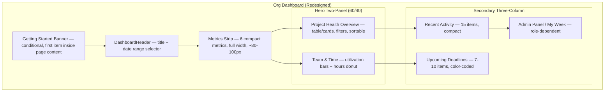
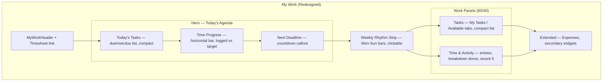

> Standalone architecture document for Phase 53. Pure frontend — no backend changes.

# Phase 53 — Dashboard Polish, Navigation Cleanup & Print-Accurate Previews

---

## 53.1 Overview

Phase 53 is a **pure frontend visual overhaul** targeting the three primary dashboard surfaces (Org Dashboard, My Work, Project Detail Overview tab), the sidebar navigation, org-level documents, and document preview rendering. No new backend endpoints, no new entities, no database migrations. Every data point displayed on these surfaces already exists in the current API — this phase changes presentation, composition, and density to make the product **screenshot-ready for the landing page**.

The aesthetic target is **Scoro's dashboard density and chart richness** — data-dense layouts with gradient-filled area charts, donut charts with center content, compact metric strips, and professional horizontal bar/heatmap treatments — all rendered through the existing Signal Deck palette (dark slate sidebar, cool slate/teal content area, Sora/IBM Plex Sans/JetBrains Mono font stack). The current dashboards are functional but spacious; this phase tightens composition, upgrades chart visuals via the existing Recharts dependency, and introduces three new micro-chart components (Sparkline, RadialGauge, MicroStackedBar) that power richer inline metrics across all surfaces.

Secondary objectives include cleaning up sidebar navigation labels that no longer match the product vocabulary (e.g., "Delivery" becoming "Projects"), relocating the underused Org Documents page into Settings where it belongs, and fixing the document preview containers to render at proper A4 proportions with CSS transform scaling — making previews accurately represent printed/PDF output.

### What's New

| Surface | Before Phase 53 | After Phase 53 |
|---|---|---|
| Org Dashboard | 3-card KPI row, flat widget grid, spacious layout | 6-metric strip with sparklines/gauges, two-panel hero (project health + team/time), three-column secondary area |
| My Work | Widget grid with KPI cards at top, time breakdown pie chart | Today's Agenda hero, Weekly Rhythm Strip, two-column work panels (tasks + time/activity) |
| Project Detail Overview | Text-heavy health header, setup cards always visible | Colored health band + metrics strip, compact checklist bar (auto-hides), two-panel body |
| Chart components | Basic Recharts bars, custom SVG sparkline, pie charts | Themed charts with gradient fills, donut charts, new Sparkline/RadialGauge/MicroStackedBar |
| Sidebar navigation | 5 zones (Work, Delivery, Clients, Finance, Team & Resources) | 5 zones (Work, Projects, Clients, Finance, Team) — Documents removed, Proposals moved |
| Org Documents | Standalone page at `/org/[slug]/documents` + sidebar entry | Section within Settings > Organization (General) page |
| Document preview | Unconstrained iframe, fonts at full browser size | A4-proportioned container with CSS `transform: scale()`, paper shadow, dark surround |

**Constraints**: Pure frontend. No new dependencies. Recharts stays. Signal Deck palette enforced. All existing functionality preserved — better composition, not removal. Desktop-first for screenshot optimization (1440px+), responsive maintained.

---

## 53.2 Design System Reference

### 53.2.1 Signal Deck Palette (reminder)

The entire phase works within the established Signal Deck design system. All colors below are defined in `frontend/app/globals.css`.

**Slate OKLCH scale** (hue ~260):

| Token | Value | Usage |
|-------|-------|-------|
| `slate-50` | `oklch(98.2% 0.003 260)` | Light backgrounds |
| `slate-100` | `oklch(95.8% 0.005 260)` | Subtle fills |
| `slate-200` | `oklch(91% 0.008 260)` | Borders, grid lines (light mode) |
| `slate-300` | `oklch(85.5% 0.012 260)` | Secondary text, chart axis |
| `slate-400` | `oklch(70% 0.018 260)` | Muted data, secondary series |
| `slate-500` | `oklch(55.5% 0.025 260)` | Axis text, secondary labels |
| `slate-600` | `oklch(44.5% 0.020 260)` | Tertiary chart series |
| `slate-700` | `oklch(37% 0.018 260)` | Dark grid lines |
| `slate-800` | `oklch(26% 0.014 260)` | Card backgrounds (dark mode) |
| `slate-900` | `oklch(20.5% 0.011 260)` | Tooltip backgrounds |
| `slate-950` | `oklch(13.5% 0.006 258)` | Sidebar, primary color |

**Teal accent**: `teal-500: oklch(72% 0.15 185)`, `teal-600: oklch(62% 0.16 183)`.

**Semantic tokens**: `--background: oklch(94% 0.008 260)` (concrete gray), `--card: oklch(99.5% 0.002 260)` (near-white), sidebar dark in both modes.

### 53.2.2 Chart Color Palette

The existing `--chart-1` through `--chart-5` CSS custom properties define the five-color chart palette. Phase 53 uses these existing tokens — no new CSS variables needed. For charts needing more than 5 series, derive additional colors by adjusting lightness on the existing hues.

**Light mode chart palette**:

| Token | OKLCH Value | Visual | Primary Use |
|-------|-------------|--------|-------------|
| `--chart-1` | `oklch(0.646 0.222 41.116)` | Warm orange | Primary series, highlights |
| `--chart-2` | `oklch(0.6 0.118 184.704)` | Teal | Secondary series, billable hours |
| `--chart-3` | `oklch(0.398 0.07 227.392)` | Dark blue | Tertiary series, non-billable |
| `--chart-4` | `oklch(0.828 0.189 84.429)` | Yellow | Quaternary, warnings |
| `--chart-5` | `oklch(0.769 0.188 70.08)` | Amber | Quinary, accents |

For gradient fills in area/donut charts, use the chart color at full opacity for the stroke and the same color at 10-20% opacity for the fill.

### 53.2.3 Font Conventions for Dashboards

| Role | Font | CSS Class | Where Used |
|------|------|-----------|------------|
| Display headings | Sora | `font-display` | Dashboard section titles, page headings |
| Body / labels | IBM Plex Sans | `font-sans` (default) | Widget labels, descriptions, table text |
| Metric numbers | JetBrains Mono | `font-mono tabular-nums` | KPI values, progress percentages, hours, currency amounts |

The `tabular-nums` font-variant ensures numbers align vertically in columns and metric strips. The `@utility tabular` in globals.css provides a shorthand. All dashboard statistics — hours, percentages, currency, counts — use `font-mono tabular-nums`.

### 53.2.4 Density Principles (Scoro-Inspired)

The current dashboard is spacious with generous padding. Phase 53 tightens this to achieve Scoro-level data density:

- **Metric strip height**: ~80-100px total, not 200px+ for a KPI card row
- **Widget card padding**: `p-4` not `p-6`. Section headings smaller (`text-sm font-medium`), not `text-lg`
- **Row height in lists**: ~36-40px for data rows (compact), not 48-56px
- **Inter-widget gap**: `gap-4` not `gap-6` or `gap-8`
- **Chart aspect ratios**: Wider, shorter charts (16:9 or wider) that show data trends without dominating vertical space
- **Admin widgets**: Compact stat cards (icon + number + label in one row), not full widget cards

### 53.2.5 Anti-Patterns

- Never use olive/neutral/zinc/gray color scales — use **slate**
- Never use indigo for accents — use **teal**
- Never import `motion` in server components
- Never pass functions/component refs from Server to Client Components
- Never use hex colors for chart fills — use the OKLCH chart tokens for consistency

---

## 53.3 Org Dashboard Redesign

### 53.3.1 Current Layout (Before)

```
Row 1: DashboardHeader (title + date range selector)
Row 2: GettingStartedCard (dismissible onboarding)
Row 3: KpiCardRow (3-5 KPI cards in flex grid)
Row 4: Two-column grid (3:2 ratio)
  Left (3/5):  ProjectHealthWidget
  Right (2/5): Stack of TeamWorkload, TeamCapacity, MySchedule,
               Deadlines, IncompleteProfiles, InfoRequests,
               Automations, RecentActivity
```

The current layout stacks all secondary widgets vertically in the right column, creating a long scroll. Admin-only widgets (IncompleteProfiles, InfoRequests, Automations) clutter the view. KPI cards are large (3-5 at ~100px tall each).

### 53.3.2 Redesigned Layout (After)



### 53.3.3 Getting Started Banner

**Current**: `GettingStartedCard` renders inline between the header and KPI row as a full-width card. Always visible until dismissed.

**Redesigned**: Move to a **banner position above the metrics strip** — the first element inside the dashboard page's content area, before the `DashboardHeader` component (not before the layout's sticky header). Slim horizontal bar with progress indicator and quick-action links. Behavior:

- Dismissible via X button (persists in localStorage via `useOnboardingProgress()` — existing hook)
- Auto-hides when `projectCount > 3` (add check against KPI data, `kpis.activeProjects > 3`)
- Visual: `bg-teal-600/10 border border-teal-600/20` strip, ~48px tall, full width
- `data-testid="getting-started-banner"`

Why banner instead of card: The card pushed the metrics strip below the fold on smaller screens. A slim banner adds context without consuming vertical space.

### 53.3.4 Metrics Strip Specification

Replaces `KpiCardRow` (3-5 large cards) with a **single full-width strip** containing 6 compact metric cells.

| Metric | Source | Visualization | Format |
|--------|--------|---------------|--------|
| Active Projects | `kpis.activeProjects` | Mini Sparkline (trend over last 6 periods) | Count, `font-mono tabular-nums` |
| Hours This Month | `kpis.totalHours` | MicroStackedBar (billable vs. non-billable) | `XXh`, split from `kpis.billableHours` |
| Revenue This Month | `kpis.totalInvoiced` (from existing data) | Trend arrow (vs. previous period) | Currency, formatted |
| Overdue Tasks | `kpis.overdueTasks` | Severity color (amber if <5, red if >=5) | Count |
| Team Utilization | `capacityGrid.weekSummaries[latest].teamUtilizationPct` (from `getTeamCapacityGrid()`, already fetched) | RadialGauge (arc, 0-100%) | Percentage |
| Budget Health | Derived from `projectHealth[]` | Three-dot summary (on-track/at-risk/over) | "X / Y / Z" counts |

**Layout**: CSS Grid, `grid-cols-6` at `lg:`, `grid-cols-3` at `md:`, `grid-cols-2` at `sm:`. Each cell is a compact block: label (top, `text-[11px] uppercase tracking-wider text-slate-500`), value (center, `text-xl font-mono tabular-nums font-bold`), visualization (right-aligned or below value).

**Card styling**: `bg-card rounded-lg border border-slate-200/60 p-3`. Left border accent color per category: teal for projects/hours, slate for tasks, amber for budget.

**Component**: New `MetricsStrip` component in `components/dashboard/metrics-strip.tsx`.
- `data-testid="metrics-strip"`
- Each cell: `data-testid="metric-{name}"` (e.g., `metric-active-projects`)

**Data sources**: Same `fetchDashboardKpis()` server action already called in the dashboard page. Budget health derived from `fetchProjectHealth()` response by counting health statuses. Team utilization derived from `fetchTeamWorkload()`. No new API calls.

### 53.3.5 Hero Two-Panel Layout

**Left panel (60% width) — Project Health Overview**:

Replaces the current `ProjectHealthWidget` with a denser, more interactive table.

- Clean table rows showing active projects:
  - Project name + customer name (stacked or inline)
  - `HealthBadge` (existing component, `size="sm"`)
  - Budget consumption: `CompletionProgressBar` (existing, thin variant)
  - Hours: `"12h / 40h"` (compact text, `font-mono`)
  - Task ratio: `"12/18"` (completed/total)
- Filter tabs above: All | At Risk | Over Budget (existing filter pattern from `ProjectHealthWidget`)
- Sortable columns: health status, budget %, name
- Max 10 rows visible, "View all projects" footer link
- `data-testid="project-health-panel"`

Data source: `fetchProjectHealth()` — same server action already used.

**Right panel (40% width) — Team & Time**:

Replaces the stacked `TeamWorkloadWidget` + `TeamCapacityWidget` combo.

- **Team Utilization chart**: Horizontal bar chart (evolves existing `HorizontalBarChart`) with color gradient from teal (under-utilized) to amber/red (over-utilized). Target line at 80% rendered as a dashed vertical reference line. Each bar shows member name + utilization percentage.
- **Hours by Project donut**: Donut chart (replaces any pie usage) with top 5 projects + "Other" slice. Gradient fills. Center text shows total hours in `font-mono`.
- `data-testid="team-time-panel"`

Data sources: `fetchTeamWorkload()` for utilization bars, `fetchDashboardKpis()` for hours breakdown.

**Grid**: `<div className="grid grid-cols-1 gap-4 lg:grid-cols-5">` — left panel `lg:col-span-3`, right panel `lg:col-span-2`.

### 53.3.6 Secondary Three-Column Area

Below the hero panels. Grid: `grid-cols-1 md:grid-cols-3 gap-4`.

**Column 1 — Recent Activity**:

Evolves `RecentActivityWidget`:
- Compact rows (~36px): avatar initials (existing pattern), action text, relative time
- Last 15 items (up from default)
- Subtle alternating row backgrounds: `even:bg-slate-50/50`
- "View All" link to full activity page
- `data-testid="recent-activity-column"`

Data source: `fetchDashboardActivity()` — existing.

**Column 2 — Upcoming Deadlines**:

Evolves `DeadlineWidget` into a list format:
- Next 7-10 deadlines across all projects
- Each row: date (formatted, `font-mono`), project name, task/milestone
- Color-coded: today = `text-red-600`, this week = `text-amber-600`, later = default
- Module-gated: only renders when `regulatory_deadlines` module is active OR when projects have due dates
- `data-testid="deadlines-column"`

Data source: Existing deadline/schedule API, supplemented by `fetchProjectHealth()` for project-level due dates.

**Column 3 — Quick Stats (Admin) / My Week (Member)**:

Role-dependent content:

For **admin/owner**:
- Compact stat cards (not full widgets): Incomplete profiles count (`fetchAggregatedCompleteness()`), pending info requests (`fetchInformationRequestSummary()`), automation runs today (`fetchAutomationSummary()`)
- Each stat: icon + number + label in a single ~32px row
- "Manage" links to respective pages
- `data-testid="admin-stats-column"`

For **members**:
- "My Week" summary: hours logged today, tasks completed this week, next assigned task
- Derived from existing personal KPI data and task lists
- `data-testid="my-week-column"`

### 53.3.7 Widgets Preserved but Repositioned

All existing widgets remain accessible. Repositioning map:

| Widget | Before | After |
|--------|--------|-------|
| `GettingStartedCard` | Row 2, full width | Banner above header, conditional |
| `KpiCardRow` | Row 3, 3-5 cards | Replaced by `MetricsStrip` (6 metrics) |
| `ProjectHealthWidget` | Left panel (3/5) | Hero left panel (3/5), enhanced table |
| `TeamWorkloadWidget` | Right stack | Hero right panel, utilization bars |
| `TeamCapacityWidget` | Right stack | Merged into hero right panel (radial gauge in metrics strip) |
| `MyScheduleWidget` | Right stack | Removed from Org Dashboard (allocation/leave data is already covered by My Work page). The My Week column for members shows hours/tasks/upcoming from existing KPI data, not allocations. |
| `DeadlineWidget` | Right stack | Secondary column 2, list format |
| `IncompleteProfilesWidget` | Right stack (admin) | Secondary column 3 as compact stat |
| `InformationRequestsWidget` | Right stack (admin) | Secondary column 3 as compact stat |
| `AutomationsWidget` | Right stack (admin) | Secondary column 3 as compact stat |
| `RecentActivityWidget` | Right stack (bottom) | Secondary column 1, condensed feed |

---

## 53.4 My Work Redesign

### 53.4.1 Current Layout (Before)

```
Row 1: MyWorkHeader (title) + Timesheet link
Row 2: PersonalKpis (KPI cards)
Row 3: Two-column — TimeBreakdown (donut) + UpcomingDeadlines
Row 4: Three-column (2:1)
  Left (2/3): MyWorkTasksClient (assigned/unassigned tabs)
  Right (1/3): WeeklyTimeSummary, TodayTimeEntries, MyExpenses
```

### 53.4.2 Redesigned Layout (After)



### 53.4.3 Today's Agenda (Hero Section)

The hero section answers "what should I work on right now?" in a single glance.

**Today's Tasks**: Tasks due today or overdue, sorted by priority then due date. Compact rows (~36px): task name (truncated), project name (badge), time estimate (`font-mono`), "Log Time" quick-action button. Maximum 5 visible, expandable.
- Data source: Existing task list API filtered to `dueDate <= today`
- `data-testid="todays-tasks"`

**Time Logged Today**: Compact horizontal progress bar. Shows `"2h 15m / 8h"` in `font-mono tabular-nums`. Bar fill: teal for logged, slate-200 for remaining. Target derived from capacity settings (existing `weeklyCapacity / 5`).
- Data source: Existing time entry sum for today
- `data-testid="time-progress-today"`

**Next Deadline**: Single most urgent upcoming deadline. Prominent display: task/project name, due date, countdown ("in 3 days"). Color: red if today/overdue, amber if this week.
- Data source: Existing deadline data
- `data-testid="next-deadline"`

Layout: Horizontal strip, three sections side-by-side at `lg:`, stacked at smaller breakpoints. `bg-card rounded-lg border p-4`.

### 53.4.4 Weekly Rhythm Strip

A compact `~48px` tall strip showing the current week (Mon-Sun).

- 7 day columns, each containing a small vertical bar (~32px max height)
- Bar fill: hours logged (teal fill) vs. remaining capacity (slate-200 empty space)
- Current day highlighted with border or background accent
- Weekly total displayed at the right end in `font-mono tabular-nums font-bold`
- Clickable days: clicking a day filters the task/time lists below to that day's entries

Component: `WeeklyRhythmStrip` in `components/dashboard/weekly-rhythm-strip.tsx`.
- `data-testid="weekly-rhythm-strip"`
- Each day: `data-testid="rhythm-day-{index}"` (0=Mon, 6=Sun)

Data source: Existing weekly time summary data (already fetched in My Work page via date range).

Why a strip and not a calendar: The week strip communicates "how am I tracking?" at a glance without the visual weight of a full calendar component. It acts as both a visualization and a filter control.

### 53.4.5 Work Panels (Two-Column)

**Left (~60%) — Tasks**:

Evolves `MyWorkTasksClient`:
- Tabs: My Tasks / Available (unassigned) — existing tab pattern preserved
- Compact list rows (~36px): task name, project (small badge), due date (`font-mono`), priority indicator (colored dot), time estimate
- Saved views selector: existing functionality, repositioned to tab bar area
- Inline quick actions: claim (for Available tab), log time, mark complete — existing actions, just compacted
- `data-testid="tasks-panel"`

Data source: Same API calls as current `MyWorkTasksClient`.

**Right (~40%) — Time & Activity**:

- **Today's Time Entries**: Compact list of today's logged time. Each row: project name, task name, duration (`font-mono`). "Log Time" CTA at bottom.
  - Data source: Existing time entry fetch filtered to today
- **This Week's Breakdown**: Small donut chart — hours by project. Top 4 projects + "Other". Billable vs. non-billable shown as inner/outer ring or tooltip breakdown.
  - Data source: Existing weekly time summary
- **Recent Activity**: Last 5 items of personal activity (actions by the current user). Compact rows matching the dashboard activity format.
  - Data source: Existing activity API filtered to current user
- `data-testid="time-activity-panel"`

### 53.4.6 Expenses and Extended Widgets

`MyExpenses` widget and any secondary widgets move below the main panels in a full-width area. Render as compact card summaries with "View All" links. These widgets are preserved but de-prioritized visually.

`data-testid="extended-widgets"`

---

## 53.5 Project Detail Overview Tab Polish

### 53.5.1 Current Layout (Before)

```
Setup cards: SetupProgressCard, ActionCard (unbilled time), TemplateReadinessCard
Health header: OverviewHealthHeader (project health text + reasons)
Metrics strip: OverviewMetricsStrip (budget, hours, members, margin)
Two-column body (lg:grid-cols-2):
  Left:  Tasks card (overdue + upcoming)
  Right: Team Hours card + Recent Activity card
```

File: `frontend/components/projects/overview-tab.tsx`

### 53.5.2 Redesigned Layout (After)

**Health Header with Colored Band**:

Replace `OverviewHealthHeader` text-only display with a visual health indicator:
- Colored band across the top of the overview: `border-t-4` with color mapped from health status (green=HEALTHY, amber=AT_RISK, red=CRITICAL, slate=UNKNOWN)
- Key metrics strip below the band (~60-80px): Budget spent/total (%), Hours logged/estimated, Tasks completed/total, Revenue invoiced
- Numbers in `font-mono tabular-nums`, compact layout
- `data-testid="project-health-header"`

**Setup Progress (Compact)**:

Replace individual `SetupProgressCard` instances:
- If incomplete: compact checklist bar — `"3/6 setup steps complete"` with `CompletionProgressBar` (existing component) and expandable detail (collapsible section showing individual steps)
- If all steps complete: **hide entirely** (not "6/6 forever")
- Logic: derive from existing setup progress data; condition on `completedSteps < totalSteps`
- `data-testid="setup-progress-bar"` (only rendered when incomplete)

Why hide when complete: A completed setup section adds no value after the first week. It occupies premium above-the-fold space that should show project health.

**Overview Body (Two-Panel)**:

**Left (~60%) — Activity & Tasks**:
- Recent project activity (last 10 items, compact rows matching dashboard format)
- Task status summary: small `MicroStackedBar` showing Open/In Progress/Done counts
- Upcoming task deadlines (next 5, compact list with due dates)
- `data-testid="activity-tasks-panel"`

**Right (~40%) — Financial & Team**:
- Budget consumption: `CompletionProgressBar` with threshold coloring (existing)
- Time breakdown: small donut chart, billable vs. non-billable, by member (top 5 + other)
- Team roster: compact avatar row (initials circles) with hours-this-period tooltip on hover
- Unbilled time callout: if `unbilledAmount > 0`, show amount with "Generate Invoice" CTA button
- `data-testid="financial-team-panel"`

Data source: All data fetched via existing `Promise.allSettled` pattern in the server component. No new API calls.

---

## 53.6 Chart Component Library

### 53.6.1 Shared Chart Theme (`ChartTheme`)

Create a centralized chart theme configuration consumed by all Recharts instances. This eliminates per-chart styling inconsistency.

File: `frontend/lib/chart-theme.ts`

```typescript
// frontend/lib/chart-theme.ts

export const CHART_THEME = {
  // Color palette — references CSS custom properties resolved at runtime
  colors: {
    primary: "var(--chart-1)",   // warm orange
    secondary: "var(--chart-2)", // teal
    tertiary: "var(--chart-3)",  // dark blue
    quaternary: "var(--chart-4)", // yellow
    quinary: "var(--chart-5)",   // amber
  },

  // Slate-based supplementary colors for data-heavy charts
  slate: {
    grid: "var(--color-slate-200)",       // light mode grid lines
    gridDark: "var(--color-slate-700)",   // dark mode grid lines
    axis: "var(--color-slate-500)",       // axis text
    muted: "var(--color-slate-400)",      // secondary series
  },

  // Gradient fill factory — returns [startColor, endColor] for area charts
  gradientOpacity: { top: 0.3, bottom: 0.0 },

  // Tooltip styling
  tooltip: {
    background: "var(--color-slate-900)",
    text: "#ffffff",
    border: "none",
    borderRadius: 8,
    boxShadow: "0 4px 12px rgba(0,0,0,0.15)",
  },

  // Grid line styling
  grid: {
    strokeDasharray: "3 3",
    stroke: "var(--color-slate-200)",
  },

  // Bar chart defaults
  bar: {
    radius: [4, 4, 0, 0] as [number, number, number, number],
    hoverBrightness: 1.1,
  },

  // Donut chart defaults
  donut: {
    innerRadius: "60%",
    outerRadius: "80%",
    cornerRadius: 4,
    paddingAngle: 2,
  },

  // Area chart defaults
  area: {
    type: "monotone" as const,
    dot: false,
    activeDot: { r: 4, strokeWidth: 2 },
  },

  // Font
  fontFamily: "var(--font-mono)",
} as const;
```

**Design decision (ADR-205)**: A centralized theme object rather than per-component styling. The theme is a plain TypeScript object (not a React context) because Recharts consumes primitive values, not reactive state. Components import `CHART_THEME` and spread relevant properties. This ensures visual consistency without runtime overhead.

### 53.6.2 Area Chart Specifications

Used for: sparkline trends in metrics strip, time-over-period charts.

- Curve type: `type="monotone"` for smooth curves
- Gradient fill: `<defs>` with `<linearGradient>` from chart color at `opacity={0.3}` (top) to `opacity={0}` (bottom)
- No dots by default; dots appear on hover (`activeDot={{ r: 4, strokeWidth: 2, fill: 'var(--card)' }}`)
- Stroke width: `2px`
- Responsive: wrapped in `<ResponsiveContainer width="100%" height={...}>`

### 53.6.3 Donut Chart Specifications

Used for: Hours by Project (dashboard), Time Breakdown (My Work), member time split.

- Inner radius: 60%, Outer radius: 80% — creates a wide ring
- Rounded corners on segments: `cornerRadius={4}`
- Padding angle between segments: `paddingAngle={2}`
- Center content: total value in `font-mono tabular-nums font-bold` + label below
- Gradient fills on each slice using per-segment `<linearGradient>`
- Legend: horizontal below chart, compact dot labels

Replaces any existing basic `PieChart` usage.

### 53.6.4 Bar Chart Specifications

Used for: Team utilization (horizontal), task status counts, budget comparison.

- Rounded top corners: `radius={[4, 4, 0, 0]}`
- Hover state: slight brightness increase (handled via Recharts `activeBar` prop)
- Horizontal bars (for utilization): `<BarChart layout="vertical">`
- Reference line for targets: `<ReferenceLine>` at 80% with dashed stroke

The existing `HorizontalBarChart` component (`components/dashboard/horizontal-bar-chart.tsx`) is updated to consume `CHART_THEME` instead of its hardcoded `DEFAULT_COLORS` array.

### 53.6.5 Tooltip Specifications

All Recharts tooltips use a consistent custom component:

- Background: `slate-900` (dark)
- Text: white
- Rounded corners: `8px`
- Shadow: `0 4px 12px rgba(0,0,0,0.15)`
- Padding: `8px 12px`
- Font: `font-sans text-xs`
- Values in `font-mono tabular-nums`

Component: `ChartTooltip` in `components/dashboard/chart-tooltip.tsx`.

### 53.6.6 Grid and Axis Specifications

- Grid lines: `strokeDasharray="3 3"`, `stroke` from `CHART_THEME.slate.grid`
- No axis line (hide via `axisLine={false}`)
- Tick marks only, `tick={{ fill: CHART_THEME.slate.axis, fontSize: 11 }}`
- X-axis labels: rotated 0 degrees (horizontal) when space permits, hidden for sparklines
- All charts in `<ResponsiveContainer>` with appropriate aspect ratios

### 53.6.7 New Micro-Chart Components

Three new components for inline use in metric strips and compact widgets:

**Sparkline** (`components/dashboard/sparkline.tsx`):

Evolves the existing `SparklineChart` (`components/dashboard/sparkline-chart.tsx`). Same custom SVG approach (no Recharts overhead for micro-charts), but with the new theme's gradient fill.

```typescript
interface SparklineProps {
  data: number[];
  width?: number;       // default 80
  height?: number;      // default 24
  color?: string;       // default "var(--chart-2)" (teal)
  showGradient?: boolean; // default true
  className?: string;
}
```

- SVG `<polyline>` for the stroke, `<polygon>` for gradient fill area
- No axes, no labels, no tooltips — just the trend shape
- `data-testid="sparkline"`

**RadialGauge** (`components/dashboard/radial-gauge.tsx`):

New component for percentage/utilization display in the metrics strip.

```typescript
interface RadialGaugeProps {
  value: number;         // 0-100
  size?: number;         // default 48
  strokeWidth?: number;  // default 6
  thresholds?: { low: number; high: number }; // default { low: 60, high: 90 }
  className?: string;
}
```

- SVG arc from 0-270 degrees (not full circle — leaves a gap at the bottom for visual balance)
- Color by threshold: `< low` = `slate-400` (under), `low-high` = `teal-500` (optimal), `> high` = `amber-500` (over)
- Background track: `slate-200` (light mode), `slate-700` (dark)
- Center text: value as percentage in `font-mono tabular-nums text-sm font-bold`
- `data-testid="radial-gauge"`

**MicroStackedBar** (`components/dashboard/micro-stacked-bar.tsx`):

Tiny inline horizontal stacked bar for billable/non-billable splits.

```typescript
interface MicroStackedBarProps {
  segments: Array<{ value: number; color: string; label?: string }>;
  width?: number;     // default 120
  height?: number;    // default 8
  className?: string;
}
```

- Pure CSS implementation: `<div>` with flexbox children, each segment `flex-grow` proportional to value
- Rounded ends: `rounded-full` on outer container
- Tooltip on hover showing segment labels and values
- `data-testid="micro-stacked-bar"`

### 53.6.8 Existing Component Evolution

| Component | File | Changes |
|-----------|------|---------|
| `SparklineChart` | `components/dashboard/sparkline-chart.tsx` | Keep as-is OR redirect imports to new `Sparkline`. Evaluate if any direct consumers remain. |
| `HorizontalBarChart` | `components/dashboard/horizontal-bar-chart.tsx` | Replace `DEFAULT_COLORS` with `CHART_THEME.colors`. Add reference line support. Add theme-consistent tooltips. |
| `MiniProgressRing` | `components/dashboard/mini-progress-ring.tsx` | Keep for usage in compact contexts. `RadialGauge` is a larger, metrics-strip variant with different visual treatment. |
| `CompletionProgressBar` | `components/dashboard/completion-progress-bar.tsx` | No changes — already thin and well-styled. |
| `HealthBadge` | `components/dashboard/health-badge.tsx` | No changes — existing sizes (sm/md/lg) sufficient. |

---

## 53.7 Sidebar Navigation Cleanup

### 53.7.1 Changes to `nav-items.ts`

Four discrete changes to `frontend/lib/nav-items.ts` (a fifth change — updating the Organization settings entry — is covered in Section 53.8 as part of the Org Documents relocation):

**Change 1 — Remove Documents item from Delivery group**:

```typescript
// BEFORE (in delivery group items):
{
  label: "Documents",
  href: (slug) => `/org/${slug}/documents`,
  icon: FileText,
  exact: true,
},

// AFTER: Remove this entire object from the items array
```

**Change 2 — Rename Delivery group to Projects**:

```typescript
// BEFORE:
{
  id: "delivery",
  label: "Delivery",
  defaultExpanded: true,
  items: [/* ... */],
},

// AFTER:
{
  id: "projects",
  label: "Projects",
  defaultExpanded: true,
  items: [/* ... */],
},
```

**Change 3 — Move Proposals from Finance to Clients**:

```typescript
// Remove from Finance group:
{
  label: "Proposals",
  href: (slug) => `/org/${slug}/proposals`,
  icon: FileText,
  requiredCapability: "INVOICING",
},

// Add to Clients group (after Customers, before Retainers):
{
  label: "Proposals",
  href: (slug) => `/org/${slug}/proposals`,
  icon: FileText,
  requiredCapability: "INVOICING",
},
```

**Change 4 — Rename Team & Resources to Team**:

```typescript
// BEFORE:
{
  id: "team",
  label: "Team & Resources",
  defaultExpanded: true,
  items: [/* ... */],
},

// AFTER:
{
  id: "team",
  label: "Team",
  defaultExpanded: true,
  items: [/* ... */],
},
```

### 53.7.2 Resulting Navigation Structure

```
Work (expanded)
  ├─ Dashboard
  ├─ My Work
  ├─ Calendar
  └─ Court Calendar*

Projects (expanded)             ← was "Delivery"
  ├─ Projects
  └─ Recurring Schedules       ← "Documents" removed

Clients (collapsed)
  ├─ Customers
  ├─ Proposals                  ← moved from Finance
  ├─ Retainers
  ├─ Compliance
  └─ Deadlines*

Finance (collapsed)
  ├─ Invoices                   ← Proposals removed
  ├─ Profitability
  ├─ Reports
  └─ Trust Accounting*

Team (expanded)                 ← was "Team & Resources"
  ├─ Team
  └─ Resources

─── footer ───
  Notifications
  Settings
```

Items marked `*` are module-gated.

### 53.7.3 Impact on Sidebar Components

**`desktop-sidebar.tsx`**: No code changes needed. It iterates `NAV_GROUPS` dynamically — the renamed groups and updated items flow through automatically.

**`nav-zone.tsx`**: No code changes needed. It renders `zone.label` for headings and `zone.items` for links. The `layoutId` for the active indicator uses `zone.id`, which changes for the delivery→projects rename. This is harmless — it only affects the Framer Motion animation key, not functionality.

---

## 53.8 Org Documents Relocation

### 53.8.1 Remove Standalone Page

**Delete**: `frontend/app/(app)/org/[slug]/documents/page.tsx`

This page currently:
- Fetches `api.get<Document[]>("/api/documents?scope=ORG")`
- Renders a table (File, Size, Scope, Status, Upload date)
- Uses `OrgDocumentUpload` for file upload

The page functionality moves to Settings > Organization. The route `/org/[slug]/documents` will naturally 404 after deletion. No redirect is needed — this was a low-traffic internal-only page.

### 53.8.2 Settings > Organization — Add Org Documents Section

**Modify**: `frontend/app/(app)/org/[slug]/settings/general/page.tsx`

The general settings page currently renders:
1. `VerticalProfileSection` (industry vertical selector)
2. `GeneralSettingsForm` (currency, logo, brand color, document footer, tax config)

Add a third section below:

3. **Org Documents section** — "Org Documents" heading with a file upload area and document list

The section is admin/owner-only (check already performed at page level). Implementation:

- Reuse the existing `OrgDocumentUpload` component (or extract its upload logic) from the documents page
- Simple list: document name, upload date, file size, download link, delete action
- No categorization, no workflow — a plain file drawer
- Use existing S3 upload patterns (same `api.post("/api/documents")` endpoint)
- `data-testid="org-documents-section"`

**Update Organization settings entry** in `SETTINGS_ITEMS` (nav-items.ts):

```typescript
// BEFORE:
{ title: "Organization", description: "Update org name, logo, and details", href: () => "#", comingSoon: true },

// AFTER:
{ title: "Organization", description: "Update org name, logo, and details", href: (slug) => `/org/${slug}/settings/general` },
```

`comingSoon` removed, `href` now points to the general settings page (which has the org documents section).

### 53.8.3 Files Affected

| File | Action |
|------|--------|
| `frontend/app/(app)/org/[slug]/documents/page.tsx` | Delete |
| `frontend/app/(app)/org/[slug]/settings/general/page.tsx` | Add Org Documents section |
| `frontend/lib/nav-items.ts` | Remove Documents from nav, update Organization settings entry |
| `frontend/components/documents/org-document-upload.tsx` (if exists) | Keep/reuse in settings page |

---

## 53.9 Document Preview Print-Accuracy

### 53.9.1 Problem

The current document preview in `GenerateDocumentDialog` renders HTML in an unconstrained iframe:

```tsx
// Current (GenerateDocumentDialog.tsx)
<div className="overflow-hidden rounded-lg border border-slate-200 dark:border-slate-800">
  <iframe
    sandbox=""
    srcDoc={html}
    className="h-[500px] w-full bg-white"
    title="Document Preview"
  />
</div>
```

This produces an inaccurate preview: the iframe stretches to container width (which varies by dialog size), fonts render at normal browser size, and page proportions don't match A4 paper. The user sees something that looks nothing like the final PDF.

### 53.9.2 A4 Container Specification

A4 paper dimensions: 210mm x 297mm (ratio 1:1.414).

At 96 DPI: 794px x 1123px.

The preview container renders the document at full A4 width (794px) inside a fixed-dimension container, then applies CSS `transform: scale()` to fit the available preview width.

### 53.9.3 CSS Transform Scaling Approach

```typescript
// components/documents/a4-preview-wrapper.tsx

"use client";

import { useRef, useEffect, useState } from "react";
import { cn } from "@/lib/utils";

interface A4PreviewWrapperProps {
  html: string;
  className?: string;
}

const A4_WIDTH = 794;   // px at 96 DPI
const A4_HEIGHT = 1123; // px at 96 DPI

export function A4PreviewWrapper({ html, className }: A4PreviewWrapperProps) {
  const containerRef = useRef<HTMLDivElement>(null);
  const [scale, setScale] = useState(1);

  useEffect(() => {
    const updateScale = () => {
      if (containerRef.current) {
        const containerWidth = containerRef.current.clientWidth;
        setScale(containerWidth / A4_WIDTH);
      }
    };

    updateScale();
    const observer = new ResizeObserver(updateScale);
    if (containerRef.current) observer.observe(containerRef.current);
    return () => observer.disconnect();
  }, []);

  return (
    <div
      ref={containerRef}
      className={cn(
        // Dark surround — PDF viewer feel
        "rounded-lg bg-slate-800 p-6 dark:bg-slate-900",
        className
      )}
      data-testid="a4-preview-wrapper"
    >
      {/* Outer container sized to the scaled dimensions — prevents overlap with content below */}
      <div
        className="relative mx-auto"
        style={{
          width: A4_WIDTH * scale,
          height: A4_HEIGHT * scale,
        }}
      >
        {/* Inner container at full A4 size, scaled down via transform */}
        <div
          style={{
            width: A4_WIDTH,
            height: A4_HEIGHT,
            transform: `scale(${scale})`,
            transformOrigin: "top center",
            position: "absolute",
            top: 0,
            left: "50%",
            marginLeft: -(A4_WIDTH / 2),
          }}
        >
          {/* Paper effect */}
          <div className="h-full w-full bg-white shadow-xl ring-1 ring-slate-200/20">
            <iframe
              sandbox=""
              srcDoc={html}
              className="h-full w-full border-0"
              title="Document Preview"
            />
          </div>
        </div>
      </div>
    </div>
  );
}
```

### 53.9.4 Visual Treatment

| Property | Value | Reason |
|----------|-------|--------|
| Paper background | `bg-white` | Matches print output |
| Paper shadow | `shadow-xl ring-1 ring-slate-200/20` | Creates "floating paper" depth |
| Surround background | `bg-slate-800` (light), `bg-slate-900` (dark) | PDF viewer convention |
| Surround padding | `p-6` | Visual breathing room around the page |
| Corner radius (outer) | `rounded-lg` | Consistent with card styling |

### 53.9.5 Files Affected

| File | Change |
|------|--------|
| `frontend/components/documents/a4-preview-wrapper.tsx` | **New** — A4 preview wrapper component |
| `frontend/components/templates/GenerateDocumentDialog.tsx` | Replace unconstrained iframe with `A4PreviewWrapper` |
| `frontend/app/(app)/org/[slug]/settings/templates/[id]/edit/page.tsx` | Wrap template editor preview with `A4PreviewWrapper` (confirm the exact preview component location — not fully inventoried in the arch-context) |

The `A4PreviewWrapper` is designed as a reusable component. Any future document preview surface (e.g., proposal preview, acceptance preview) can import it.

---

## 53.10 Component Inventory

### 53.10.1 New Components

| Component | File Path | Description |
|-----------|-----------|-------------|
| `MetricsStrip` | `components/dashboard/metrics-strip.tsx` | 6-metric full-width strip for Org Dashboard |
| `Sparkline` | `components/dashboard/sparkline.tsx` | Tiny inline SVG trend chart (80x24px default) |
| `RadialGauge` | `components/dashboard/radial-gauge.tsx` | Arc gauge for utilization/percentage (48px default) |
| `MicroStackedBar` | `components/dashboard/micro-stacked-bar.tsx` | Tiny horizontal stacked bar (120x8px default) |
| `ChartTooltip` | `components/dashboard/chart-tooltip.tsx` | Consistent dark tooltip for all Recharts charts |
| `WeeklyRhythmStrip` | `components/dashboard/weekly-rhythm-strip.tsx` | Mon-Sun day bars with click filtering |
| `TodaysAgenda` | `components/dashboard/todays-agenda.tsx` | Hero section for My Work — tasks, time, deadline |
| `AdminStatsColumn` | `components/dashboard/admin-stats-column.tsx` | Compact admin stat cards for dashboard secondary |
| `MyWeekColumn` | `components/dashboard/my-week-column.tsx` | Member's weekly summary for dashboard secondary |
| `DonutChart` | `components/dashboard/donut-chart.tsx` | Recharts donut with center content, gradient fills |
| `A4PreviewWrapper` | `components/documents/a4-preview-wrapper.tsx` | A4-proportioned scaled preview container |
| `OrgDocumentsSection` | `components/settings/org-documents-section.tsx` | File upload + list for Settings > Organization |

### 53.10.2 Modified Components

| Component | File Path | Changes |
|-----------|-----------|---------|
| `KpiCardRow` | `components/dashboard/kpi-card-row.tsx` | Replaced by `MetricsStrip` (may keep for backward compat or delete) |
| `HorizontalBarChart` | `components/dashboard/horizontal-bar-chart.tsx` | Adopt `CHART_THEME`, add reference line, theme-consistent tooltip |
| `ProjectHealthWidget` | `components/dashboard/project-health-widget.tsx` | Enhanced table layout, denser rows, sort support |
| `TeamWorkloadWidget` | `components/dashboard/team-workload-widget.tsx` | Utilization color gradient, target reference line |
| `RecentActivityWidget` | `components/dashboard/recent-activity-widget.tsx` | Compact rows, alternating backgrounds, 15-item default |
| `DeadlineWidget` | `components/dashboard/deadline-widget.tsx` | List format, color-coded urgency, expanded to 7-10 items |
| `GettingStartedCard` | `components/dashboard/getting-started-card.tsx` | Banner format, auto-hide logic enhanced |
| `GenerateDocumentDialog` | `components/templates/GenerateDocumentDialog.tsx` | Replace iframe with `A4PreviewWrapper` |

### 53.10.3 Configuration / Theme Files

| File | Type | Description |
|------|------|-------------|
| `lib/chart-theme.ts` | New | Centralized chart theme configuration |
| `lib/nav-items.ts` | Modified | Group renames, item removal/move, settings entry update |

### 53.10.4 Pages Modified

| Page | File Path | Changes |
|------|-----------|---------|
| Org Dashboard | `app/(app)/org/[slug]/dashboard/page.tsx` | Full layout restructure |
| My Work | `app/(app)/org/[slug]/my-work/page.tsx` | Full layout restructure |
| Overview Tab | `components/projects/overview-tab.tsx` | Health header, setup progress, two-panel body |
| Settings General | `app/(app)/org/[slug]/settings/general/page.tsx` | Add Org Documents section |

### 53.10.5 Pages Deleted

| Page | File Path | Reason |
|------|-----------|--------|
| Org Documents | `app/(app)/org/[slug]/documents/page.tsx` | Relocated to Settings > Organization |

---

## 53.11 Implementation Guidance

### 53.11.1 Frontend Changes Table

| File | Change Description |
|------|-------------------|
| `lib/chart-theme.ts` | New file: `CHART_THEME` configuration object |
| `lib/nav-items.ts` | Rename delivery→projects, remove Documents, move Proposals to Clients, rename Team & Resources→Team, update Organization settings |
| `components/dashboard/sparkline.tsx` | New: SVG sparkline with gradient fill |
| `components/dashboard/radial-gauge.tsx` | New: SVG arc gauge for percentages |
| `components/dashboard/micro-stacked-bar.tsx` | New: CSS stacked bar for inline splits |
| `components/dashboard/chart-tooltip.tsx` | New: Shared Recharts tooltip component |
| `components/dashboard/donut-chart.tsx` | New: Recharts donut with center content |
| `components/dashboard/metrics-strip.tsx` | New: 6-metric full-width strip |
| `components/dashboard/weekly-rhythm-strip.tsx` | New: Mon-Sun interactive day bars |
| `components/dashboard/todays-agenda.tsx` | New: Hero section for My Work |
| `components/dashboard/admin-stats-column.tsx` | New: Compact admin stats |
| `components/dashboard/my-week-column.tsx` | New: Member weekly summary |
| `components/documents/a4-preview-wrapper.tsx` | New: A4 scaled preview container |
| `components/settings/org-documents-section.tsx` | New: File list/upload for settings |
| `components/dashboard/horizontal-bar-chart.tsx` | Update: theme colors, reference line |
| `components/dashboard/project-health-widget.tsx` | Update: dense table, sorting |
| `components/dashboard/team-workload-widget.tsx` | Update: color gradient, target line |
| `components/dashboard/recent-activity-widget.tsx` | Update: compact rows, alternating bg |
| `components/dashboard/deadline-widget.tsx` | Update: list format, urgency colors |
| `components/dashboard/getting-started-card.tsx` | Update: banner format, auto-hide |
| `components/templates/GenerateDocumentDialog.tsx` | Update: use A4PreviewWrapper |
| `components/projects/overview-tab.tsx` | Update: health band, setup bar, two-panel |
| `app/(app)/org/[slug]/dashboard/page.tsx` | Update: full layout restructure |
| `app/(app)/org/[slug]/my-work/page.tsx` | Update: full layout restructure |
| `app/(app)/org/[slug]/settings/general/page.tsx` | Update: add org documents section |
| `app/(app)/org/[slug]/documents/page.tsx` | Delete |

### 53.11.2 Component Code Patterns

**Sparkline pattern** (custom SVG, no Recharts):

```tsx
// Minimal SVG sparkline — no axes, no labels, just the trend shape
const points = data.map((v, i) => ({
  x: (i / (data.length - 1)) * width,
  y: height - ((v - min) / (max - min)) * height,
}));

return (
  <svg width={width} height={height} className={className}>
    <defs>
      <linearGradient id={gradientId} x1="0" y1="0" x2="0" y2="1">
        <stop offset="0%" stopColor={color} stopOpacity={0.3} />
        <stop offset="100%" stopColor={color} stopOpacity={0} />
      </linearGradient>
    </defs>
    <polygon points={fillPoints} fill={`url(#${gradientId})`} />
    <polyline points={linePoints} fill="none" stroke={color} strokeWidth={1.5} />
  </svg>
);
```

**RadialGauge pattern** (SVG arc):

```tsx
// 270-degree arc with gap at bottom
const radius = (size - strokeWidth) / 2;
const circumference = 2 * Math.PI * radius * 0.75; // 270/360
const offset = circumference - (value / 100) * circumference;

const gaugeColor =
  value < thresholds.low ? "var(--color-slate-400)" :
  value > thresholds.high ? "var(--color-amber-500, oklch(0.769 0.188 70.08))" :
  "var(--color-teal-500)";

return (
  <svg width={size} height={size} className={className}>
    {/* Background track */}
    <circle cx={size/2} cy={size/2} r={radius}
      fill="none" stroke="var(--color-slate-200)"
      strokeWidth={strokeWidth} strokeLinecap="round"
      strokeDasharray={circumference} strokeDashoffset={0}
      transform={`rotate(135 ${size/2} ${size/2})`}
    />
    {/* Value arc */}
    <circle cx={size/2} cy={size/2} r={radius}
      fill="none" stroke={gaugeColor}
      strokeWidth={strokeWidth} strokeLinecap="round"
      strokeDasharray={circumference} strokeDashoffset={offset}
      transform={`rotate(135 ${size/2} ${size/2})`}
    />
    {/* Center value */}
    <text x="50%" y="55%" textAnchor="middle"
      className="font-mono tabular-nums text-sm font-bold fill-foreground">
      {value}%
    </text>
  </svg>
);
```

**A4PreviewWrapper pattern**: See Section 53.9.3 for the full component.

### 53.11.3 Testing Strategy

**Existing tests that need updating**:

Per the requirements Section 8 test impact analysis:

| Test Area | Impact | Action |
|-----------|--------|--------|
| Sidebar navigation tests | Group labels renamed, Documents removed, Proposals moved | Update selectors and assertions |
| Dashboard page tests | KPI card count changes (3-5 → 6 metrics strip), widget ordering changes | Update structural assertions, prefer `data-testid` |
| My Work page tests | Layout restructure, new weekly rhythm strip | Update selectors, add rhythm strip coverage |
| Project Detail overview tests | Setup cards conditional visibility, health header redesign | Update visibility assertions |
| Document preview tests | Container dimensions change, CSS transform applied | Update screenshot baselines |
| Org Documents tests | Page deleted, functionality moved to settings | Delete page tests, add settings section tests |

**New tests to add**:

| Component | Test Type | Coverage |
|-----------|-----------|----------|
| `Sparkline` | Unit (Vitest) | Renders SVG, handles empty data, respects dimensions |
| `RadialGauge` | Unit (Vitest) | Threshold coloring, value display, edge cases (0, 100) |
| `MicroStackedBar` | Unit (Vitest) | Segment proportions, hover tooltip |
| `MetricsStrip` | Unit (Vitest) | Renders 6 metrics, handles null data gracefully |
| `WeeklyRhythmStrip` | Unit (Vitest) | Day rendering, click handling, current day highlight |
| `A4PreviewWrapper` | Unit (Vitest) | Scale calculation, responsive resize |
| `DonutChart` | Unit (Vitest) | Center content, segment rendering |
| `ChartTooltip` | Unit (Vitest) | Styling consistency, value formatting |
| Dashboard E2E | Playwright | MetricsStrip visible, project health panel loads, secondary columns render |
| My Work E2E | Playwright | Agenda section visible, rhythm strip renders, task panel loads |
| Settings Org Docs E2E | Playwright | Upload, list, delete documents in settings |

**Testing approach**: Use `data-testid` selectors throughout (specified per component in earlier sections) to decouple tests from DOM structure. This is critical for a visual redesign phase — structural selectors break on layout changes, `data-testid` selectors survive.

---

## 53.12 Capability Slices

### Slice 393A — Chart Component Library & Theme

**Scope**: Foundation layer. Create the shared chart theme and all new micro-chart components. This slice must land first because all dashboard redesigns depend on these components.

**Key deliverables**:
- `lib/chart-theme.ts` — `CHART_THEME` configuration
- `components/dashboard/sparkline.tsx` — SVG sparkline
- `components/dashboard/radial-gauge.tsx` — SVG arc gauge
- `components/dashboard/micro-stacked-bar.tsx` — CSS stacked bar
- `components/dashboard/chart-tooltip.tsx` — Shared Recharts tooltip
- `components/dashboard/donut-chart.tsx` — Recharts donut with center content
- Update `components/dashboard/horizontal-bar-chart.tsx` to use `CHART_THEME`
- Unit tests for all new components

**Dependencies**: None.

**Files touched**: 7 new files + 1 modified (`horizontal-bar-chart.tsx`).

**Test expectations**: ~12 unit tests covering rendering, edge cases, theming.

---

### Slice 393B — Sidebar Navigation Cleanup & Org Documents Relocation

**Scope**: Small, self-contained changes to navigation structure and the org documents page.

**Key deliverables**:
- Update `lib/nav-items.ts` (5 changes: rename groups, remove Documents, move Proposals, update Organization settings)
- Delete `app/(app)/org/[slug]/documents/page.tsx`
- Add `OrgDocumentsSection` to `app/(app)/org/[slug]/settings/general/page.tsx`
- Create `components/settings/org-documents-section.tsx`
- Update sidebar-related tests

**Dependencies**: None (fully independent).

**Files touched**: 3 modified + 1 new + 1 deleted.

**Test expectations**: Update sidebar assertion tests, add settings org docs test, delete old documents page tests.

---

### Slice 394A — Org Dashboard Redesign

**Scope**: Full layout restructure of the Org Dashboard page.

**Key deliverables**:
- `components/dashboard/metrics-strip.tsx` — 6-metric strip (uses Sparkline, RadialGauge, MicroStackedBar from 393A)
- `components/dashboard/admin-stats-column.tsx` — Compact admin stats
- `components/dashboard/my-week-column.tsx` — Member weekly summary
- Restructure `app/(app)/org/[slug]/dashboard/page.tsx` — new layout
- Update `components/dashboard/getting-started-card.tsx` — banner format
- Update `components/dashboard/project-health-widget.tsx` — denser table
- Update `components/dashboard/team-workload-widget.tsx` — utilization gradient
- Update `components/dashboard/recent-activity-widget.tsx` — compact rows
- Update `components/dashboard/deadline-widget.tsx` — list format

**Dependencies**: Slice 393A (chart components).

**Files touched**: 3 new + 6 modified + 1 page restructured.

**Test expectations**: Update dashboard E2E tests, add MetricsStrip unit tests, update widget component tests.

---

### Slice 394B — My Work Redesign

**Scope**: Full layout restructure of the My Work page.

**Key deliverables**:
- `components/dashboard/todays-agenda.tsx` — Hero section
- `components/dashboard/weekly-rhythm-strip.tsx` — Interactive week strip
- Restructure `app/(app)/org/[slug]/my-work/page.tsx` — new layout
- Compact task panels and time/activity column

**Dependencies**: Slice 393A (chart components — donut chart, sparkline).

**Files touched**: 2 new + 1 page restructured + potential My Work sub-component updates.

**Test expectations**: Update My Work E2E tests, add WeeklyRhythmStrip unit tests, add TodaysAgenda unit tests.

---

### Slice 395A — Project Detail Overview Tab Polish

**Scope**: Visual refresh of the project detail overview tab.

**Key deliverables**:
- Update `components/projects/overview-tab.tsx` — health band, compact setup bar, two-panel body
- Health header colored band (based on project health status)
- Compact checklist bar with auto-hide when complete
- Two-panel body: activity/tasks left, financial/team right
- Uses DonutChart (from 393A) for time breakdown

**Dependencies**: Slice 393A (chart components).

**Files touched**: 1 modified (+ potential sub-component extractions).

**Test expectations**: Update overview tab tests, verify setup progress hides when complete.

---

### Slice 395B — Document Preview Print-Accuracy

**Scope**: Fix document preview to render at A4 proportions. Fully independent of dashboard work.

**Key deliverables**:
- `components/documents/a4-preview-wrapper.tsx` — A4 scaled preview container
- Update `components/templates/GenerateDocumentDialog.tsx` — use A4PreviewWrapper
- Update template editor preview (locate the preview component in the template editor page)

**Dependencies**: None (fully independent, can run in parallel with any slice).

**Files touched**: 1 new + 1-2 modified.

**Test expectations**: Unit test for scale calculation, update document preview screenshot baselines.

---

### Slice 396A — Test Updates & Visual Regression Baselines

**Scope**: Comprehensive test pass after all visual changes are complete.

**Key deliverables**:
- Update all broken E2E tests (sidebar selectors, dashboard structure, widget ordering)
- Update screenshot baselines for visual regression tests
- Verify all `data-testid` attributes are in place
- Run full test suite and fix failures
- Document any test patterns that changed

**Dependencies**: All previous slices (393A, 393B, 394A, 394B, 395A, 395B).

**Files touched**: Test files only — no production code changes.

**Test expectations**: Green full suite. All visual regression baselines refreshed.

---

### Slice Dependency Graph

```
393A (Chart Library)     393B (Sidebar + Docs)     395B (A4 Preview)
     │                        │                          │
     ├──────┐                 │                          │
     │      │                 │                          │
  394A    394B              (independent)            (independent)
  (Org     (My Work)
  Dashboard)
     │      │
  395A      │
  (Project  │
  Overview) │
     │      │                 │                          │
     └──────┴─────────────────┴──────────────────────────┘
                              │
                           396A (Tests)
```

Slices 393B and 395B can run in parallel with everything else. The critical path is 393A → 394A/394B → 395A → 396A.

---

## 53.13 ADR Index

| ADR | Title | File |
|-----|-------|------|
| ADR-205 | Chart Theming Strategy | `adr/ADR-205-chart-theming-strategy.md` |

**ADR-205 summary**: Centralized `CHART_THEME` TypeScript object (not React Context, not CSS-only) consumed by all Recharts instances. Decision: plain object import over Context because Recharts accepts primitive values at render time, not reactive bindings. A Context wrapper would add unnecessary re-render surface for static theme values. CSS custom properties handle the color tokens; the TypeScript object handles structural configuration (radii, padding, stroke patterns) that CSS cannot express.

---

## Out of Scope

- **No new backend endpoints** — all data already available from existing APIs
- **No new entities or migrations** — pure frontend
- **No mobile-first redesign** — responsive maintained, desktop (1440px+) optimized for screenshots
- **No dark mode rework** — sidebar already dark, content area light, unchanged
- **No Recharts replacement** — enhance existing Recharts usage with better styling
- **No profitability page redesign** — benefits from chart upgrades but no layout overhaul
- **No customer detail page polish** — scope is the three main dashboards + sidebar + doc preview
- **No new data fetching patterns** — same server-component and SWR patterns in place
- **No new npm dependencies** — all work uses existing Recharts, Framer Motion, Shadcn, Tailwind
